## 第五章 遵守道德规范 锤炼道德品格

大学时期是道德观形成和发展的重要阶段，在这个时期形成的道德观念对大学生一生影响很大。大学生提高自身的道德素质，需要认真学习道德的基本理论，树立马克思主义道德观，弘扬社会主义道德，自觉传承中华传统美德和中国革命道德，积极吸收借鉴人类优秀道德成果，在崇德向善的实践中不断锤炼道德品格、提升道德境界。

## 第一节 社会主义道德的核心与原则

道德是立身兴国之本，对个人和社会都具有基础性意义。社会主义道德是人类道德发展史上一种崭新类型的道德。弘扬社会主义道德，坚持以为人民服务为核心，以集体主义为原则，提高全社会道德水平，是全面建成社会主义现代化强国的战略任务，是适应社会主要矛盾变化、满足人民对美好生活向往的迫切需要，是促进社会全面进步、人的全面发展的必然要求。

## 一、坚持马克思主义道德观

道德是一种特殊的社会意识形态，它是以善恶为评价方式，主要依靠社会舆论、传统习俗和内心信念来发挥作用的行为规范的总和。作为人类社会发展到一定阶段的必然产物，道德对人和社会发展具有重要的促进作用，并随着社会的发展而不断进步。准确把握道德的起源和本质，正确认识道德的功能与作用，深刻理解社会主义道德是对人类以往道德形态的超

---

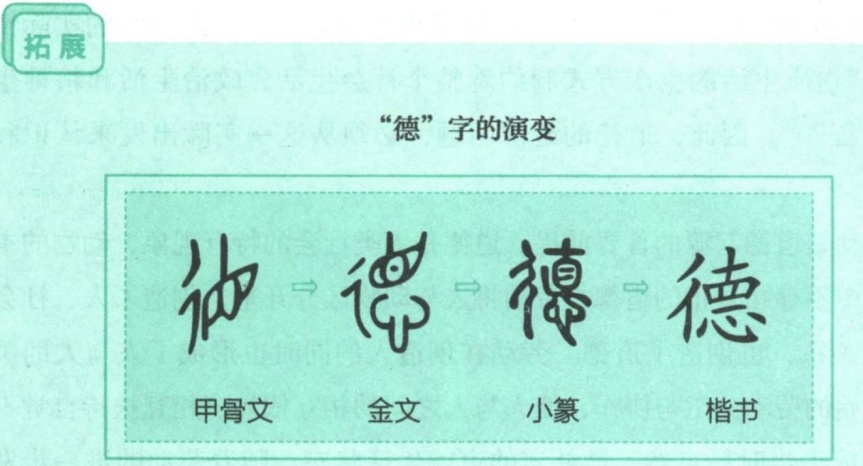

第一节 社会主义道德的核心与原则

139

越，是大学生建立正确道德认知的前提。马克思主义道德观是科学世界观、人生观、价值观在道德领域的反映与体现。

## （一）道德的起源与本质

拓展

## “德”字的演变

# 仙德福德

甲骨文 金文 小篆 楷书

在甲骨文中，“德”字左边是“彳”，表示道路、行动，右边下方是“目”，“目”之上是一条垂直线，表示目光直射之意。行动要正，而且“目不斜视”，这就是“德”的最初含义。随着历史的发展，人们对德的理解不断深化和拓展，金文的“德”字在“目”下又加了“心”字，意思是行正、目正、心正才算“德”。小篆中的“德”字与金文字形相近，只不过把右上方变成了“直”字，意指“直心”为“德”。在古汉语中，“德”还通假于“惠”，《说文解字》解“惠”为“外得于人，内得于己也”。外得于人，指以善行施之于人，使人有所获得；内得于己，指将善念存于己心，使己有所提升。

自古以来，人们就在探讨道德的起源并提出了种种见解或理论。“天意神启论”把道德起源归结于上天的命令或者神的旨意，试图以人之外的某种所谓客观意志来说明道德的起源；“先天人性论”把道德的起源或者归结为与生俱来的善性，或者归结为先天存在的良心、理念或精神；“情感欲望论”认为道德起源于人们的情感欲望，是人们为实现情感欲望而

---

140

第五章 遵守道德规范 锤炼道德品格

形成的行为要求；“动物本能论”则认为道德观念是动物本能的延续，进而把动物基于本能的活动与人类有目的、有意识的活动画上等号。可以说，在马克思主义产生之前，这些关于道德起源的观点，要么是主观唯心主义或客观唯心主义的注解，要么是旧唯物主义形而上学的分析，均无法正确揭示道德的起源。马克思主义道德观认为，人类社会的实际情况是，“物质生活的生产方式制约着整个社会生活、政治生活和精神生活的过程” $^{①}$ 。因此，道德的起源问题，必须从这一实际出发来认识和把握。

劳动是道德起源的首要前提。道德是人类社会的特有现象，动物的本能行为中不存在真正的道德。劳动将人与动物区分开来，创造了人、社会和社会关系，也创造了道德。劳动在创造人的同时也形成了人与人的关系。原始的劳动分工与协作，使人与人之间的相互依赖、相互扶持自觉不自觉地成为当时最自然、最朴实的道德生活状态。随着劳动的进一步发展，劳动分工与协作不断增强，各种劳动关系逐步明确，人与人之间、群体与群体之间的利益关系日渐清晰，包含自由、责任等内容的道德逐步得到确认。因此，劳动创造了人和人类社会，是道德起源的第一个历史前提。

社会关系是道德赖以产生的客观条件。在生产生活的实践活动中，人类必然要发生各种各样的人际交往和社会关系，各种利益关系更为凸显。随着社会分工的不断发展，个人利益、他人利益和社会利益的界限逐步明晰，要求规范、协调或制约利益冲突的意识更为强烈，由此促进了人类道德的不断进步和发展。可以说，道德正是适应社会关系尤其是利益关系调节的需要而产生的。

人的自我意识是道德产生的主观条件。意识是道德产生的思想认识前提。人只有在社会实践中，意识到自我作为社会成员与其他动物的根本区

<small>①《马克思恩格斯文集》第二卷，人民出版社2009年版，第591页。</small>

---

第一节 社会主义道德的核心与原则

141

别，意识到自我在社会中的角色与地位，意识到自我与他人或集体不同的利益关系，并由此产生调节利益矛盾的迫切要求时，道德才得以产生。

人们自觉地或不自觉地，归根到底总是从他们阶级地位所依据的实际关系中——从他们进行生产和交换的经济关系中，获得自己的伦理观念。

——恩格斯

马克思主义在人类思想史上第一次科学而全面地论述了道德的起源问题，强调道德属于上层建筑的范畴，是一种特殊的社会意识形态，为正确认识和理解道德的本质奠定了基础。

道德是反映社会经济关系的特殊意识形态。道德的产生、发展和变化，归根结底源于社会经济关系。其一，道德的性质和基本原则、规范反映了与之相应的社会经济关系的性质和内容。有什么样的社会经济关系，相应地就有什么样的道德。其二，道德随着社会经济关系的变化而变化。一般来说，新旧经济关系更替之后，新的道德必将取代旧的道德而居于主导地位。在人类道德史上，一切道德上的兴衰起伏、进退消长，从根本上说都是源于社会经济关系的变革。其三，道德作为一种社会意识，在阶级社会里总是反映着一定阶级的利益，因而不可避免地具有阶级性。同时，不同阶级之间的道德或多或少有一些共同之处，反映着道德的普遍性。其四，作为社会意识的道德一经产生，便有相对独立性。这种相对独立性既表现为道德的历史继承性，也表现为道德对社会发展具有能动的反作用。

道德是社会利益关系的特殊调节方式。作为一种调整人与人、人与社会、人与自然以及人与自身之间关系的特殊的行为规范，道德与法律规范、政治规范的不同之处在于，它是用善恶标准去评价，依靠社会舆论、传统习俗、内心信念来维持的，因此是一种非强制性的规范。道德是处于

---

142

第五章 遵守道德规范 锤炼道德品格

同一社会或同一生活环境中的人们在长期的共同生活过程中逐渐积累形成的要求、秩序和理想，它通过社会的道德风尚和个人的道德风范来调节利益关系。

## 拓展

## 中国古代的“四维”

礼义廉耻，是古人推崇的基本道德规范，《管子》中把它们比喻为“四维”。“维”的原意是指发挥骨干性作用的大绳索，用在这里是强调礼义廉耻的重要作用。欧阳修后来提出:“礼义廉耻，国之四维；四维不张，国乃灭亡。”

道德是一种实践精神。作为实践精神，道德是一种旨在通过把握世界的善恶现象而规范人们的行为，并通过人们的实践活动体现出来的社会意识。具体来说，道德是一种以指导人的行为为目的、以形成人的正确行为方式为内容的精神，在本质上是知行合一的。道德把握世界的方式不是被动地反映世界，而是从人的需要出发，从特定的价值出发来改造世界；不是简单地再现世界或描述世界，而是对世界进行价值评价。道德立足现实而追求理想，并以理想来改造和提升现实。

## （二）道德的功能与作用

道德源于人的社会生活需要，又服务于人的社会生活需要。道德在人类社会中居于特别重要的地位，具有特殊的功能和作用。

道德的功能，一般是指道德作为社会意识的特殊形式对于社会发展所具有的功效与作用。道德的功能是多元的，同时也是多层次的。在道德的功能系统中，认识功能、规范功能、调节功能是最基本的功能。

道德的认识功能是指道德反映社会关系特别是反映社会经济关系的功效与能力。道德往往运用善恶、荣辱、义务、良心等范畴，反映人类的道

---

第一节 社会主义道德的核心与原则

143

德实践活动和道德关系，从中揭示社会道德发展的趋势，为人们的行为选择提供指南。尤其是在日常生活中，人们正是借助道德认识自己对他人、家庭、社会的道德义务和责任，使人们的道德选择、道德行为建立在明辨善恶的道德认识基础上，从而正确选择自己的道德行为，积极塑造自身的良好道德品质。

道德的规范功能是指在正确善恶观的指引下，规范社会成员在社会公共领域、职业领域、家庭领域的行为，并规范个人品德的养成，引导并促进人们崇德向善。从道德的特征来说，道德和法律一样，都是通过规范人的行为发挥作用。

道德之于个人、之于社会，都具有基础性意义，做人做事第一位的是崇德修身。

——习近平

道德的调节功能是指道德通过评价等方式指导和纠正人们的行为和实践活动、协调社会关系和人际关系的功效与能力。道德评价是道德调节的主要形式，社会舆论、传统习俗和人们的内心信念是道德调节所赖以发挥作用的力量。道德的调节功能主要是通过调节人与人、人与社会、人与自然以及人与自身之间关系而使之逐步完善和谐。在社会生活中，道德调节并不是孤立进行的，而是和其他社会调节手段密切配合、共同发挥调节效用。比如，法律和道德都是重要的社会规范，国家和社会治理需要法律和道德共同发挥作用。一个法治健全的社会应该是一个道德规范健全的社会，离开道德仅仅依靠法律，则无法达到社会秩序井然的状态和长治久安的目标。

道德的作用是指道德的认识、规范、调节、激励、导向、教育等功能的发挥和实现所产生的社会影响及实际效果。“国无德不兴，人无德不立”，就生动表达了道德的作用。道德作为维系社会稳定、促进国家发展的重要

---

144

第五章 遵守道德规范 锤炼道德品格

因素，对巩固特定社会的经济基础和上层建筑具有不可替代的重要作用。同时，道德作为激励人们改造客观世界和主观世界的一种精神力量，也是提高人的精神境界、促进人的自我完善、推动人的全面发展的内在动力。

明辨

## 道德万能？道德无用？

在道德作用问题上，有两种极端的看法，即“道德万能论”和“道德无用论”。“道德万能论”片面夸大道德的作用，认为道德决定一切、高于一切、支配一切，只要道德水平高，一切社会问题都可以迎刃而解。这种观点的根本错误在于，颠倒了社会存在和社会意识、经济基础和上层建筑之间的决定与被决定的关系，否定了物质资料的生产方式在社会发展中的决定作用。事实上，无论是在古代社会，还是在现代社会，道德都不是社会历史发展的最终决定因素。“道德无用论”则根本否认道德的作用，或者通过强调非道德因素的作用来否定道德的积极作用，或者通过强调道德消极因素的作用来否定道德的积极作用。这种观点的根本错误在于，忽视了道德作为上层建筑的重要组成部分对经济基础和生产力发展有一定的反作用。

道德发挥作用的性质与社会发展的不同历史阶段相联系，由道德所反映的经济基础、代表的阶级利益所决定。只有反映先进生产力发展要求和进步阶级利益的道德，才会对社会的发展和人的素质的提高产生积极的推动作用，否则，就不利于甚至阻碍社会的发展和人的素质的提高。总之，道德的力量是广泛的、持久的、深入的，既深刻地影响着人们的意志、行为和品格，也深刻地影响着社会的存在和发展。

## （三）社会主义道德是崭新类型的道德

道德同其他社会意识形态一样，不是亘古不变的。迄今为止，人类社会先后经历了五种基本社会形态，与此相适应，出现了原始社会的道德、

---

第一节 社会主义道德的核心与原则

145

奴隶社会的道德、封建社会的道德、资本主义社会的道德、社会主义社会的道德。在社会主义社会，有一部分先进分子还身体力行共产主义道德。

纵观道德发展的历史，进步与落后、善良与邪恶、顺利与曲折交织其中，使得数千年来的道德现象纷繁复杂、矛盾重重。但是，不管这个进程多么复杂，人类道德的发展是一个曲折上升的历史过程。人类道德发展的历史过程与社会生产方式的发展进程大体一致，这是道德发展的基本规律。虽然在一定时期可能有某种停滞或倒退现象，但道德发展的总趋势是向上的、前进的，是沿着曲折的道路向前发展的，或者叫作螺旋式上升、波浪式前进。社会主义和共产主义道德，是人类道德合乎规律发展的必然产物，是人类道德发展史上的一种崭新类型的道德，是对人类道德传统的批判与继承，并必然随着社会的进步和实践的发展而与时俱进。

拓展

## 念奴娇·追思焦裕禄

习近平

中夜，读《人民呼唤焦裕禄》一文，是时霁月如银，文思萦系……

魂飞万里，盼归来，此水此山此地。百姓谁不爱好官？把泪焦桐成雨。 $^{①}$ 生也沙丘，死也沙丘，父老生死系。 $^{②}$ 暮雪朝霜，毋改英雄意气！

依然月明如昔，思君夜夜，肝胆长如洗。路漫漫其修远矣，两袖清风来去。为官一任，造福一方，遂了平生意。绿我涓滴，会它千顷澄碧。

一九九〇年七月十五日

<small>① 焦裕禄当年为了防风固沙，帮助农民摆脱贫困，提倡种植泡桐。如今，兰考泡桐如海，焦裕禄当年亲手栽下的幼桐已长成合抱大树，人们亲切地叫它“焦桐”。</small>

<small>② 焦裕禄临终前说:“我死后只有一个要求，要求党组织把我运回兰考，埋在沙丘上。活着我没有治好沙丘，死了也要看着你们把沙丘治好！”</small>

---

146

第五章 遵守道德规范 锤炼道德品格

与以往社会的道德形态相比，社会主义道德具有显著的先进性特征。这种先进性主要体现在以下几个方面。首先，社会主义道德是社会主义经济基础的反映。在以生产资料公有制为主体的社会主义社会，广大人民不仅在政治上实现了当家作主，而且在道德上实现了由被动到主动的转变。其次，社会主义道德是对人类优秀道德资源的批判继承和创新发展。以当代中国的社会主义道德体系为例，我们今天倡导的社会主义道德规范，不仅与中华传统美德相承接，与中国共产党人在革命战争年代创立的革命道德相延续，同时也是对人类优秀道德成果的吸收和借鉴。最后，社会主义道德克服了以往阶级社会道德的片面性和局限性，坚持以为人民服务为核心，坚持以集体主义为原则，展现出真实而强大的道义力量。

## 二、坚持以为人民服务为核心

为什么人服务是道德的核心问题，决定并体现着道德建设的根本性质和发展方向，规定并制约着道德领域中的所有道德现象。为人民服务，不仅是坚持历史唯物主义的必然要求，是中国共产党践行的根本宗旨，也是社会主义道德观的集中体现，是全体中国人民共同遵循的道德要求。

## (一) 社会主义道德的本质要求

为人民服务是社会主义经济基础和人际关系的客观要求。在社会主义社会，每个劳动者和建设者都在为社会 为他人同时也是为自己而劳动和工作。各行各业的劳动者和建设者，只是社会分工不同，没有高低贵贱之分。权利和义务不再分属于两个对立的阶级，而是统一于人民自己身上，每个人都是服务对象，又都为他人服务，全体人民通过社会分工和相互服务来实现共同利益。在我国，公有制为主体、多种所有制经济共同发展，按劳分配为主体、多种分配方式并存，社会主义市场经济体制等社会主义

---

第一节 社会主义道德的核心与原则

147

基本经济制度，是为人民服务的根本制度保证；团结互助、平等友爱、共同进步的人际关系，是为人民服务的广泛社会基础。

为人民服务是社会主义市场经济健康发展的要求。在社会主义市场经济条件下，市场主体必须通过向社会和他人提供一定数量和质量的产品，建立满足社会和他人需求的良好信誉。换句话说，社会主义市场经济，不仅不排斥为社会和他人服务，而且需要通过服务甚至是优质服务，才能实现市场主体的利益。为人民服务与社会主义市场经济并不必然对立。社会主义市场经济不仅要求人们在一切经济活动中，正确处理个人与社会、竞争与协作、效率与公平、先富与共富、经济效益与社会效益等关系，形成健康有序的经济和社会生活规范，而且强调在社会主义物质文明和精神文明的引导下，每个市场主体都要有为人民服务的思想，自觉积极地为人民服务、为社会服务，把自身利益同国家和人民的共同利益结合起来。

## （二）先进性与广泛性的统一

为人民服务是先进性要求和广泛性要求的之一。为人民服务，既伟大又平凡，既高尚又普通，它并非高不可攀、遥不可及，而是可以通过不同层次、不同形式表现出来。“每个人的力量是有限的，但只要我们万众一心、众志成城，就没有克服不了的困难；每个人的工作时间是有限的，但全心全意为人民服务是无限的。” $^{①}$ 在今天，毫不利己、专门利人、无私奉献是为人民服务，顾全大局、先公后私、爱岗敬业、办事公道是为人民服务，同志间、师生间、同学间互相关心、互相爱护、互相帮助是为人民服务，热心公益、助人为乐、见义勇为、扶贫帮困、扶残助残是为人民服务，遵纪守法、诚实劳动并获取正当的个人利益同样也是为人民服务。那种认为为人民服务只适于党员干部而不能推广到全体人民的看法是一种误

<small>①《习近平谈治国理政》第一卷，外文出版社2018年版，第5页。</small>

---

148

第五章 遵守道德规范 锤炼道德品格

解。事实上，一个人只要时时处处想到他人、想到社会、想到国家，从而能够推己及人、与人为善，服务他人、奉献社会，使他人能够因自己的所作所为而得到益处，使社会可以因自己的努力而发生积极改变，这就是在践行为人民服务。

## 图说

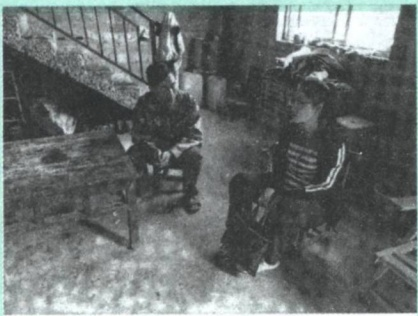

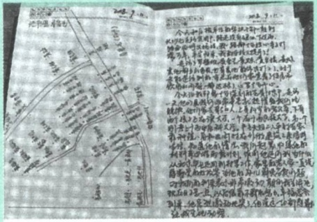

硕士毕业的黄文秀积极响应党组织号召，放弃在大城市的工作机会，回到家乡——革命老区广西百色工作。她埋头苦干，仅用一年多时间就带领88户418名贫困群众脱贫，全村贫困发生率从22.88%降至2.71%。2019年6月，黄文秀深夜冒雨奔向受灾群众，面对危险坚定前行，不幸遭遇突如其来的山洪，献出了年仅30岁的宝贵生命。习近平对黄文秀先进事迹作出指示，强调她在脱贫攻坚第一线倾情投入、奉献自我，用美好青春诠释了共产党人的初心使命，谱写了新时代的青春之歌。黄文秀是全心全意为人民服务的青年代表，值得我们缅怀和学习。2021年，黄文秀被授予“七一勋章”。

为人民服务作为社会主义道德的核心，是社会主义道德区别和优越于其他社会形态道德的显著标志。大学生践行为人民服务，就是要弘扬为人民服务的精神，尊重人、理解人、关心人，为人民、为社会、为国家多做好事、多作贡献。

---

第一节 社会主义道德的核心与原则

149

## 三、坚持以集体主义为原则

道德原则是道德规范体系的总纲，它最直接最集中地反映着一定社会经济关系和利益关系的根本要求，代表着一定阶级的根本利益和长远利益。社会主义道德的原则是集体主义。在我国，国家利益、社会整体利益和个人利益根本上的一致性，使得集体主义应当而且能够在全社会范围内贯彻实施。

## （一）调节社会利益关系的基本原则

长期以来，集体主义已经成为调节国家利益、社会整体利益和个人利益关系的基本原则。

集体主义强调国家利益、社会整体利益和个人利益的辩证统一。在社会中，人既作为个体而存在，又作为集体中的一员而存在，集体和个人是不能分割的。一方面，个人离不开集体，集体把每个劳动者的智慧和力量凝聚在一起，形成巨大的创造力；另一方面，集体是由若干个人组成的，不调动个人的积极性，也就不会有集体的创造力。集体与个人，即“统”与“分”，是相互作用、相互依赖、互为前提的辩证统一关系。只有使二者有机地结合起来，才能使生产力保持旺盛的发展势头，偏废任何一方，都会造成大损失。在社会主义社会中，国家利益、社会整体利益和个人利益也是不能分割的。国家利益、社会整体利益体现着个人根本的、长远的利益，是所有社会成员共同利益的统一。同时，每个人的正当利益，又都是国家利益、社会整体利益不可分割的组成部分。国家和社会的兴衰与个人利益得失息息相关。在现实生活中，国家利益、社会整体利益和个人利益是相辅相成的，要力求做到共同发展、相互增益、相得益彰。

集体主义强调国家利益、社会整体利益高于个人利益。在实际生活中，个人利益和国家利益、社会整体利益难免会发生矛盾。这种矛盾，有的是可以缓和、化解的，有的则会发生或大或小的冲突。集体主义强调，

---

150

第五章 遵守道德规范 锤炼道德品格

在个人利益与国家利益、社会整体利益发生矛盾尤其是发生激烈冲突的时候，必须坚持国家利益、社会整体利益高于个人利益的原则，即个人应当以大局为重，使个人利益服从国家利益、社会整体利益，在必要时作出牺牲。集体主义要求个人为国家、社会作出牺牲并不是随意的，只有在不牺牲个人利益就不能保全国家利益、社会整体利益的情况下，才要求个人作出牺牲。社会主义集体主义之所以强调个人利益要服从国家利益、社会整体利益，归根到底，既是为了维护国家、社会的共同利益，最终也是为了维护个人的根本利益和长远利益。

图说

我国空军某试飞大队的飞行员们把个人理想融入强军实践，始终保持旺盛斗志，在祖国的蓝天下英勇试飞，圆满完成了各项试验试飞任务，填补了我国航空领域多项空白。他们自觉抵制诱惑、坦然面对生死，多次挑战装备和生理极限，永葆旺盛革命意志和顽强战斗精神，随时准备为捍卫国家主权、安全和领土完整奉献一切，顺利完成了党和人民赋予的各项任务，被授予“英雄试飞大队”荣誉称号。这些试飞英雄就是践行集体主义道德原则的代表人物。

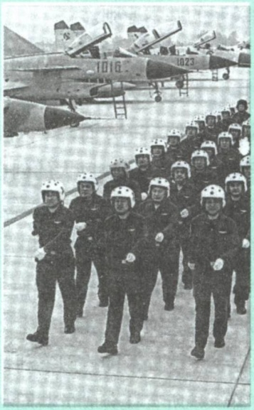

集体主义重视和保障个人的正当利益。集体主义促进和保障个人正当利益的实现，使个人的才能、价值得到充分的发挥。这不但与集体主义不矛盾，而且正是集体主义思想的应有之义。只有在国家、社会中个人才能获得全面发展，才可能有个人自由。那种把集体主义看作对个人的压制、

---

第一节 社会主义道德的核心与原则

151

对个性的束缚的思想，是与集体主义的本意相违背的。事实上，正是集体主义为培养个人的健全人格、鲜明个性和创新精神提供了道义保障。对于集体主义来说，只有个人的价值、尊严得到实现，个人的正当利益得到保证，集体才能有更强大的生命力和凝聚力。集体主义重视个人利益的实现，并不等于任何个人不分场合不分时间的利益需求都应该无条件得到满足。集体主义所重视和保障的是个人的正当利益，对于损人利己、损公肥私的行为，集体主义不但不保护，而且强烈反对和禁止。

## （二）集体主义的层次性

随着社会主义市场经济的发展，我国的经济生活和道德生活正在发生着深刻的变化，在道德领域出现了许多新问题，必须适应实际变化，不断补充、丰富和完善集体主义原则。在社会主义市场经济条件下，集体主义仍然而且应当成为社会主义道德的基本原则。社会主义市场经济之所以需要集体主义，是因为其有助于克服市场自身的弱点和消极方面，有助于形成追求高尚、激励先进的良好社会风气，保证社会主义市场经济的有序健康发展。

根据我国现阶段经济社会生活和人们思想道德的实际，集体主义可分为三个层次的道德要求。一是无私奉献、一心为公。即时时处处为集体利益着想，并甘愿为集体牺牲一切。这是集体主义的最高层次，是优秀共产党员、先进分子应努力达到的道德目标。二是先公后私、先人后己。即自觉把集体利益放在个人利益之上，在维护集体利益的前提下，实现个人的正当利益。这是已经具有较高社会主义道德觉悟的人能够达到的要求，具有广泛的社会基础。三是顾全大局、遵纪守法、热爱祖国、诚实劳动，以正当合法的手段保障个人利益。这是对公民最基本的道德要求。

集体主义离我们并不遥远，体现于具体的学习工作生活之中。人人都可以而且应当践行集体主义原则，沿着道德的阶梯循序渐进地向上攀登。当代大学生应正确认识和处理国家利益、社会整体利益和个人利益的关

---

152

第五章 遵守道德规范 锤炼道德品格

系，自觉坚持个人利益服从集体利益、局部利益服从整体利益、当前利益服从长远利益，反对小团体主义、本位主义和极端个人主义。

## 第二节 吸收借鉴优秀道德成果

弘扬社会主义道德，推进新时代公民道德建设，必须坚持马克思主义道德观，充分吸收借鉴各种优秀道德成果。社会主义道德不是凭空产生的，中华传统美德是中华文化的精髓，蕴含着丰富的思想道德资源；中国革命道德是对中华传统美德的继承和发展，是社会主义道德的红色基因。大学生应当自觉继承并弘扬中华传统美德和中国革命道德，同时以开放的胸怀和视野吸收借鉴人类文明的优秀道德成果，不断深化对社会主义道德的认识。

## 一、传承中华传统美德

传统道德是历史上不同时代人们的行为方式、风俗习惯、价值观念和文化心理的集中体现，是对道德实践经验的提炼总结。中华优秀传统文化中很多思想理念和道德规范，至今仍具有重要价值。“今天，中华民族要继续前进，就必须根据时代条件，继承和弘扬我们的民族精神、我们民族的优秀文化，特别是包含其中的传统美德。” $^{①}$ 中华传统美德是人类文明发展的重要精神财富，是社会主义道德建设的源头活水。

## （一）中华传统美德的基本精神

重视整体利益，强调责任奉献。在中华传统道德的发展演化中，我们

<small>①《习近平谈治国理政》第一卷，外文出版社2018年版，第181页。</small>

---

第二节 吸收借鉴优秀道德成果

153

始终强调整体利益、国家利益和民族利益的重要性。传统道德中的义利之辨、理欲之辨，其核心和本质是公私之辨。“公义胜私欲”是中华传统美德的根本要求。2000多年前的《诗经》已经提出“夙夜在公”的道德要求，认为日夜为公家办事是一种高尚的道德品质。《尚书》也有“以公灭私，民其允怀”的思想，认为朝廷官员应当以公心灭除自己的私欲，这样就可以得到老百姓的信任和依附。西汉贾谊提出“国而忘家，公而忘私”，清代林则徐提出“苟利国家生死以，岂因祸福避趋之”，都体现了强烈的为国家、为民族献身的精神。正是从国家利益和整体利益的原则出发，中国古代思想家强调在“义”和“利”发生矛盾时，应当义以为上、先义后利、见利思义、见义勇为。

拓展

## 中华传统文化中的“义”与“利”

从字源学的角度来讲，“义”（義），上“羊”下“我”，代表执干戈以保卫财产。这说明中国古人在最初造字时，就有意识地将“义”字与人们实际的物质利益需要相联系。在中国古人那里，所谓“义”就是行为的应当或者适宜的标准。义与不义，就是人们的思想和行为是否适宜，是否应当，是否合乎社会道德准则。“利”，在甲骨文中是用刀收割庄稼，本意指用农具进行的生产活动，这种活动为人类早期社会中的生存发展提供了物质条件。到了春秋中期，“利”演变成一个具有经济学意义的概念，主要指人们切身的物质利益和实际功利。中国古代思想家总是把义与利联系起来讨论问题。先秦时期曾经有过著名的“义利之辨”，儒墨道法诸家对此各有建树，都对后世的义利观产生了深远的影响。

推崇仁爱原则，注重以和为贵。推崇仁爱、崇尚和谐是中华民族的优良传统和高尚品德。孔子强调“己欲立而立人，己欲达而达人”，孟子强调“亲亲而仁民，仁民而爱物”，荀子强调“仁者自爱”，墨子则提出“兼

---

154

第五章 遵守道德规范 锤炼道德品格

相爱，交相利”。从仁爱精神出发，古人强调社会和谐，讲求和睦友善，倡导团结互助，追求和平共处。在人际相处上，主张与人为善、推己及人，建立和谐友爱的人际关系；在民族关系上，主张各民族互相交融、和衷共济，建设团结和睦的大家庭；在对外关系上，倡导亲仁善邻、协和万邦，与世界其他民族在平等相待、互相尊重的基础上发展友好合作关系。

## 图说

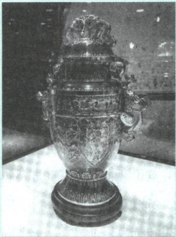

和平、和睦、和谐是中华民族5000多年来一直追求和传承的理念。2015年，为纪念联合国成立70周年，中国政府向联合国赠送了一座“和平尊”。“和平尊”以中国非物质文化遗产景泰蓝工艺制成，以“中国红”为主色调，顶部龙饰象征守望和平，两侧象首、凤鸟寓意天下太平、人民安康。尊体以中国传统吉祥纹饰，辅以丝绸之路等元素，传承和平发展、交流

合作的理念。尊身以展翅高飞的七只和平鸽装饰，代表联合国为世界和平奋斗的70年。习近平指出，“和平尊”以中国古代青铜器中的“尊”为原型，表达中国对联合国的重视和支持，也是中国人民对联合国的美好祝福。“和平尊”展示了中华民族自古以来推崇仁爱、以和为贵的优良道德传统，传递了中国和中国人民历来崇尚的求和平、谋发展、促合作、图共赢的愿望和信念。

注重人伦关系，重视道德义务。中华传统美德一个重要的特点，就是非常重视每个人在人伦关系中的地位及其价值，强调每个人都必须根据规范的要求来尽自己应尽的义务。早在《尚书》中就有“五教”的思想，即

---

第二节 吸收借鉴优秀道德成果

155

“父义”“母慈”“兄友”“弟恭”“子孝”。到了战国时期，孟子提出了影响深远的“五伦”说，即“父子有亲、君臣有义、夫妇有别、长幼有序、朋友有信”。汉代以后，思想家们为了更好地调整不断变化着的人际关系，相继提出了一些新的原则，如董仲舒提出了“仁、义、礼、智、信”，宋代的思想家们又提出了“忠、孝、节、义”四大德目等，不断强化在人伦关系中每个人的责任和义务，强调人伦价值的重要意义。

追求精神境界，向往理想人格。中华传统美德主张在物质生活基本满足的情况下应追求崇高的精神境界，把道德理想的实现看作人生诸种需要中最高层次的需要。孟子说，人之所以异于禽兽的根本就在于人能够“明于庶物，察于人伦”，即能本着“仁义”行事。荀子说，人之所以能够保持群体性特征，归根结底是由于人能够遵守礼仪，否则人就会由于争斗而发生祸乱，进而造成彼此分离而变得弱小。从先秦儒家所强调的孔颜之乐、“大丈夫”人格，到范仲淹所提出的“先天下之忧而忧，后天下之乐而乐”，这种精神已经凝聚成为中华民族一种特有的价值追求。

强调道德修养，注重道德践履。中国古代的思想家大都认为，在修身养性的过程中，最重要的就是要使社会的道德原则和规范转换为自身的思想品德和行为实践，通过切磋践履不断养成良好的道德习惯，形成完善的道德人格。儒家经典《礼记》中明确提出，“修身”是“齐家、治国、平天下”的前提和基础，孔子提倡“修己”“克己”和“慎独”，提倡“见贤思齐焉，见不贤而内自省也”，孟子更主张“善养吾浩然之气”。墨家也非常重视修身，强调“察色修身”和“以身戴行”。

在长期的历史发展中，中华传统美德已经深入到全民族的思维方式、价值观念、行为方式和风俗习惯之中，具有重要的当代价值。比如，关于道法自然、天人合一的思想，关于天下为公、大同世界的思想，关于自强不息、厚德载物的思想，关于经世致用、知行合一、躬行实践的思想，关于仁者爱人、以德立人的思想，关于以诚待人、讲信修睦的思想，关于清廉从政、勤勉奉公的思想，关于俭约自守、力戒奢华的思想等，这些传统

---

156

第五章 遵守道德规范 锤炼道德品格

美德蕴藏的中国智慧，既可以为我们今天的道德建设提供有益启发，为治国理政提供有益启示，也为解决当代人类面临的道德难题提供了重要启迪，更为当代大学生的成长提供了宝贵的精神营养。

## （二）中华传统美德的创造性转化和创新性发展

要加强对中华优秀传统文化的挖掘和阐发，努力实现中华传统美德的创造性转化、创新性发展，把跨越时空、超越国度、富有永恒魅力、具有当代价值的文化精神弘扬起来，把继承优秀传统文化又弘扬时代精神、立足本国又面向世界的当代中国文化创新成果传播出去。只要中华民族一代接着一代追求美好崇高的道德境界，我们的民族就永远充满希望。

——习近平

传统道德是一个矛盾体，具有鲜明的两重性。属于精华的部分，表现出积极、革新、进步的一面；属于糟粕的部分，则表现出消极、保守、落后的一面。中华传统美德作为中国传统道德的精华部分，为今天的道德建设提供了丰富的资源。我们要坚定历史自信、文化自信，不忘本来、辩证取舍，古为今用、推陈出新，传承和弘扬中华传统美德。

加强对中华传统美德的挖掘和阐发。任何道德都是具体历史时代的产物。中华传统美德是经过漫长的社会发展而形成的，不可避免地打上了传统社会的印记，在内容和形式上或多或少地存在着与今天的现实生活不相适应的地方。弘扬中华传统美德，必须通过科学的分析和鉴别，把其中带有阶级和时代局限性的成分剔除出去，把其中具有当代价值的道德精神挖掘出来，总结传统美德中丰富的思想道德资源，对中华传统美德的德目、观点进行新的诠释和激活，结合现代生活赋予其新的时代内涵，努力推动中华传统美德的创造性转化和创新性发展。

---

第二节 吸收借鉴优秀道德成果

157

## 图说

“共和国勋章”获得者黄旭华，为了中国核潜艇事业，隐姓埋名30年，无法向父母尽孝。他曾经说:“俗话说，忠孝难两全。我觉得，对国家的忠就是对父母最大的孝，我相信终

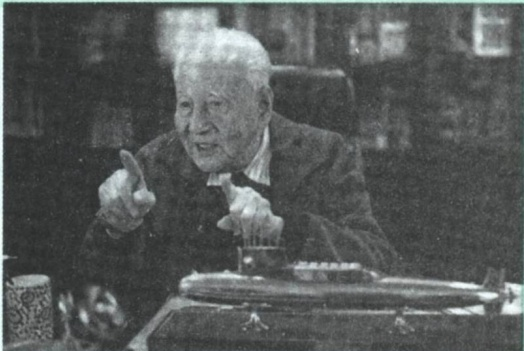

有一天我的家人会谅解我，能够理解我为国家所做的工作。”黄旭华曾获“感动中国”年度人物，颁奖词这样写道:“时代到处是惊涛骇浪，你埋下头，甘心做沉默的砥柱；一穷二白的年代，你挺起胸，成为国家最大的财富。你的人生，正如深海中的潜艇，无声，但有无穷的力量。”黄旭华的忠孝观，是对中华传统美德中的家国情怀和社会主义集体主义精神的生动体现和弘扬。

用中华传统美德滋养社会主义道德建设。要结合时代要求，按照是否有利于推动中国特色社会主义事业，是否有利于建设社会主义道德体系，是否有利于培育和践行社会主义核心价值观的标准，充分彰显其时代价值和永恒魅力，使之与现代文化、现实生活相融相通，成为全体人民精神生活、道德实践的鲜明标识。要立足面向大众、服务人民，发挥中华传统美德人伦日用的化育功能，使传统美德与日常生活水乳交融，让传统美德中蕴含的伦理精神点点滴滴地融入人们的生活，生根发芽，不断丰富人们的精神世界，增强人们的精神力量。

在对待传统道德的问题上，要反对两种错误思潮。一种是“复古论”，认为道德建设的最终目标就是要恢复中国“固有文化”，形成以中国传统文化为主体的道德体系；另一种是“虚无论”，认为中国传统道德从整体

---

158

第五章 遵守道德规范 锤炼道德品格

上来说在今天已经失去了价值和意义，必须从整体上予以全盘否定。这两种观点都是错误的，割断了道德的历史与发展的关系，都不利于社会的发展和道德的进步。我们要树立高度的文化自觉和文化自信，深入挖掘中华优秀传统文化蕴含的思想观念、人文精神、道德规范，结合时代要求继承创新，让中华文化展现出永久魅力和时代风采。

## 二、发扬中国革命道德

中国革命道德是对中华传统美德的延续和发展。传承和发扬中国革命道德，是弘扬中华传统美德的应有之义，是加强社会主义道德建设的客观需要，也是激励大学生锤炼优良道德品质的必然要求。

## （一）中国革命道德的形成与发展

中国革命道德，是指中国共产党人、人民军队、一切先进分子和人民群众在中国革命、建设、改革中所形成的优秀道德，是马克思主义与中国革命、建设、改革的伟大实践相结合的产物，是中华民族极其宝贵的道德财富。中国革命道德萌芽于五四运动前后，发端于中国共产党成立以后蓬勃发展的伟大工人运动和农民运动，经过土地革命战争、抗日战争、解放战争和社会主义革命、建设、改革的长期发展，逐渐形成并不断发扬光大。

中国共产党始终高度重视继承和发扬革命道德传统。改革开放以来，中国共产党反复强调，要保持和发扬革命战争时期的那么一股劲、那么一股气，始终保持革命加拼命的精神，培养和树立优良的道德风尚，为建设高度发展的社会主义精神文明作出积极的贡献，努力创建人类先进的精神文明。革命前辈们在艰苦卓绝的革命斗争中培育起来的革命道德和优良传统，是我们在前进道路上战胜各种困难和风险、不断夺取新胜利的强大精神力量。我们要深刻认识到红色政权来之不易，新中国来之不易，中国特

---

第二节 吸收借鉴优秀道德成果

159

色社会主义来之不易。无论现在和将来，都要从革命的历史中汲取智慧和力量，把理想信念的火种一代代传下去，把红色基因传承好，确保红色江山永不变色。

中国革命道德作为一种精神力量对中国的革命、建设、改革事业发挥着极其重要的作用。在革命战争时期，中国共产党之所以能够在非常困难的情况下战胜千难万险取得革命的胜利，能够保证革命事业的发展和壮大，就是因为有革命的理想和信念，有革命的精神和道德情操。20世纪50年代，我国社会主义建设之所以取得举世瞩目的成绩，一个重要原因就是继承和弘扬了中国革命道德传统，广大党员和人民讲理想、讲纪律、讲为人民服务，爱党、爱国家、爱社会主

习近平在纪念中国人民志愿军抗美援朝出国作战70周年大会上的讲话

义。同样，在20世纪60年代的困难时期，中国共产党之所以能够带领全党和全国人民团结奋斗、渡过难关，也正是由于继承和弘扬了革命道德传统。历史经验表明，革命传统特别是革命道德传统，是克服前进道路上一切困难的重要精神支柱，是战胜千难万险的重要力量源泉。

弘扬中国革命道德，要同弘扬中华传统美德相结合。中华传统美德是中国革命道德的渊源之一，从一定意义上来说，没有中华传统美德的长期发展和丰厚积淀，就不可能有中国革命道德的形成和发展。中国革命道德继承了中国传统道德的精华，摒弃了传统道德的糟粕，是中国优良传统道德的延续和发展，是超越了中华传统美德的时代局限而形成的一种崭新的道德。

## （二）中国革命道德的主要内容

为实现社会主义和共产主义的理想而奋斗。列宁指出:“为巩固和完成共产主义事业而斗争，这就是共产主义道德的基础。” $^{①}$ 坚持社会主义

<small>①《列宁全集》第三十九卷，人民出版社2017年版，第342页。</small>

---

160

第五章 遵守道德规范 锤炼道德品格

和共产主义理想信念是革命道德的灵魂。无数革命先烈，正是为了实现这样一个崇高的理想，毫不犹豫地献出了自己的生命。夏明翰写下“砍头不要紧，只要主义真。杀了夏明翰，还有后来人”的豪言壮语，方志敏发出“敌人只能砍下我们的头颅，决不能动摇我们的信仰”的坚定誓言。这些革命先烈之所以能够排除万难、坚持斗争、无私无畏、不怕牺牲，就是因为他们有坚定的社会主义和共产主义的理想信念。

全心全意为人民服务。中国革命道德从一开始就特别强调要为群众服务、为大众谋幸福、为人民利益献身，并认为这是对一切革命人士和先进分子的要求。毛泽东曾经在纪念革命战士张思德时，明确把“为人民服务”作为对张思德及一切革命者崇高品质的概括，强调一切革命者都要想到大多数人民的利益，彻底地为人民的利益工作。可以说，全心全意为人民服务作为贯穿中国革命道德始终的一根红线，是中国共产党在中国革命实践中的一个伟大创造，对中国的革命、建设、改革事业产生了极其重大的推动作用。

## 图说

## 中国人民解放军总部关于重行颁布三大纪律八项注意的训令（一九四七年十月十日）

一、本军三大纪律八项注意，实行多年，其内容各地各军略有出入。现在统一规定，重行颁布。望即以此为准，深入教育，严格执行。至于其他应当注意事项，各地各军最高首长，可根据具体情况，规定若干项目，以命令施行之。

二、三大纪律如下:

(一)一切行动听指挥；(二)不拿群众一针一线；(三)一切缴获要归公。

三、八项注意如下:

(一)说话和气；(二)买卖公平；(三)借东西要还；(四)损坏东西要赔；(五)不打人骂人；(六)不损坏庄稼；(七)不调戏妇女；(八)不虐待俘虏。

“三大纪律八项注意”，是中国人民解放军的优良传统和行动准则，体现了人民军队的本质和宗旨。1947年10月10日，毛泽东起草了《中国人民解放军总部关于重行颁布三大纪律八项注意的训令》。从此，“三大纪律八项注意”就以命令的形式固定下来，成为全军的统一纪律。它对加强部队的思想和作风建设具有重大的意义。

---

第二节 吸收借鉴优秀道德成果

161

始终把革命利益放在首位。共产党人和革命者从事革命活动的目的就是要为革命利益而奋斗，在个人利益与革命利益发生矛盾时，要“以革命利益为第一生命，以个人利益服从革命利益” $^{①}$ 。正如邓小平所说:“为了国家和集体的利益，为了人民大众的利益，一切有革命觉悟的先进分子必要时都应当牺牲自己的利益。” $^{②}$ 始终把革命利益放在首位，极大地激发了革命者为集体而献身的斗志，使革命队伍形成了前所未有的向心力和凝聚力，也使革命事业不断蓬勃向前发展。中国革命道德在要求一切革命者和先进分子自觉地服从革命利益的同时，也要求革命的集体和领导始终不渝地从各个方面照顾每个革命成员的个人利益，关心他们的事业成就和个人的全面发展。

树立社会新风，建立新型人际关系。任何道德规范都要面向生活实践。树立社会新风，建立新型人际关系，体现了中国革命道德在社会生活层面上的重要意义。人们对中国革命道德的传扬，破除了等级观念和特权思想，破除了鄙视劳动和劳动人民的旧观念，树立了平等意识，保护了妇女、儿童和老人的合法权益，引导建立新型家庭关系和培育良好家风，对于提升人民群众的文明水准和道德风貌，树立社会新风尚，发挥了重要的作用。

修身自律，保持节操。中国革命道德还体现在共产党人对自身道德修养的重视方面。加强个人道德修养是影响革命成败的大事，因而践履中国革命道德的重要环节就是共产党人修身自律、保持节操。具体来说，就是要以中国革命事业为重，严于律己、谦虚谨慎、淡泊名利、清正廉洁、襟怀坦白、光明磊落，始终保持高风亮节，展现出高尚的人格力量。

<small>①《毛泽东选集》第二卷，人民出版社1991年版，第361页。</small>

<small>②《邓小平文选》第二卷，人民出版社1994年版，第337页。</small>

---

162.

第五章 遵守道德规范 锤炼道德品格

## 图说

1943年3月18日是周恩来的45岁农历生日，在重庆红岩村，中共中央南方局的同志们为他准备了茶点祝寿。但周恩来没有出席，只是简单地吃了一碗面条就回到办公室，撰写了《我的修养要则》作为自己的生日箴言。

他从学习工作方法、自律自省、党性修养、生活态度等方面为自己规划了一篇“大文章”并身体力行，堪称修身自律、保持节操的楷模。

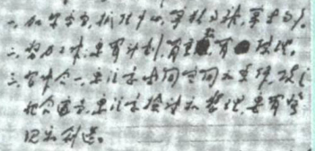

【核对注】手写信原图；未完成可靠文字誊写。

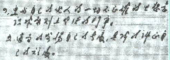

【核对注】手写信原图；未完成可靠文字誊写。

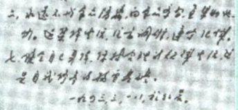

【核对注】手写信原图；未完成可靠文字誊写。

## （三）中国革命道德的当代价值

中国革命道德内容丰富、历久弥新，是中国共产党领导全体人民实现民族独立、人民解放的精神支撑，对于我们走好新时代的长征路，实现中华民族伟大复兴仍然具有极其重要的现实意义。

有利于加强和巩固社会主义和共产主义的理想信念。一个思想空虚、精神萎靡的人，难免要被各种错误思想和观点牵着鼻子引上邪路。如果没有精神、没有理想信念的支持，一个人的一生只能庸庸碌碌、无所作为，甚至会对国家和社会造成危害。当前，我们既要正视人民群众的物质利益，不断提高和改善人民的物质生活，又要进行理想信念的教育，充实人民群众的精神生活。弘扬中国革命道德，有利于树立和培养人民群众的社会主义和共产主义的理想信念，有利于坚持和发展中国特色社会主义道路。

有利于培育和践行社会主义核心价值观。中国革命道德是先进价值观在道德领域的集中体现，蕴含着培育和践行社会主义核心价值观的丰富思

---

第二节 吸收借鉴优秀道德成果

163

想道德资源。不忘本来才能开辟未来，善于继承才能更好创新。在新的历史条件下，继承和弘扬中国革命道德，对于帮助人们深刻理解社会主义核心价值观的科学内涵和历史底蕴，增强价值观认同，为中国特色社会主义事业提供攻坚克难的强大精神支撑，具有重要意义。

有利于引导人们树立正确的道德观。历史告诉我们，一个革命者唯有牢固树立并自觉坚持革命道德观，才能在革命事业的艰难困苦中经受住严峻考验；才能在身处顺境时保持清醒的头脑，身处逆境时仍然坚忍不拔，保持应有的革命节操；才能视国家和民族的利益为最大价值而为之不懈努力、奋斗终身。在今天，发扬光大革命道德，能够引导人们正确对待个人利益和社会整体利益、国家利益的关系，能够帮助人们在深刻把握历史、认识社会、审视人生的基础上，以昂扬姿态投入全面建设社会主义现代化国家的新征程。

有利于培育良好的社会道德风尚。改革开放以来，中国取得了举世瞩目的发展成就，人们的精神面貌也发生了极大的变化。应该看到，我国道德领域呈现积极健康向上的良好态势，但仍然存在着诸如金钱至上、诚信缺失、奢侈浪费、贪污腐败这样一些不容忽视的问题，严重损害了群众利益，腐蚀了人们灵魂，污染了社会风气。解决道德领域出现的突出问题，要充分发挥革命道德的精神力量，培育良好的社会道德风尚，净化社会人际关系，抵制各种腐朽思想，树立浩然正气，凝聚崇德向善的正能量。

大学生发扬革命道德、传承红色基因，就要深入了解中国社会和中国革命的历史，了解中国共产党人带领广大人民群众进行革命斗争的艰苦实践，真正体会中国革命道德的本质内涵、历史意义和当代价值，自觉同各种歪曲历史、诋毁英雄的历史虚无主义思潮作斗争，努力在坚持和发展中国特色社会主义伟大进程中创造无愧于时代、无愧于人民、无愧于先辈的业绩。

## 三、借鉴人类文明优秀道德成果

文明因交流而多彩，文明因互鉴而丰富。人类文化和文明发展进步的

---

164

第五章 遵守道德规范 锤炼道德品格

过程表明，一种文化能够通过与其他文化交流碰撞和冲突融合而保持其生命力，是实现自我更新和自我发展的重要条件。因此，一个国家或民族的道德进步，既要注意在文明交流中坚守自身优秀道德传统，也要在文明互鉴中积极吸收其他有益道德成果。我们要拓展世界眼光，深刻洞察人类发展进步潮流，以海纳百川的宽阔胸襟借鉴吸收人类一切优秀文明成果，推动建设更加美好的世界。

每一种文明都是美的结晶，都彰显着创造之美。一切美好的事物都是相通的。人们对美好事物的向往，是任何力量都无法阻挡的！各种文明本没有冲突，只是要有欣赏所有文明之美的眼睛。我们既要让本国文明充满勃勃生机，又要为他国文明发展创造条件，让世界文明百花园群芳竞艳。

——习近平

从道德形成和发展的过程来看，道德都是某个民族或国家在特定历史条件下，为回应来自自然环境、社会生活和人际关系的各种矛盾而形成发展起来的，反映了具体民族或国家的生存方式和生活态度。每一个民族或国家都有自己优良的道德传统，都对促进道德的发展作出过不同程度的贡献。从古至今，历代思想家都十分重视道德问题，对道德品质、道德评价、道德教育和道德修养等进行了有益的探讨，其中不乏超越时代、国家、民族乃至阶级界限的真知灼见，为人类道德进步提供了丰富资源。

借鉴和吸收人类文明优秀道德成果，必须秉承正确的态度和科学的方法。不同的道德文明体现了各自的生活方式、人生态度、价值信仰和行为方式，但不同民族或国家之间仍然会面临某些共同的问题，形成一些具有共性的道德认识。要坚持马克思主义立场、观点、方法，在道德问题上把握好共性和个性、抽象和具体、一般和个别的关系。要坚持以我为主、为我所用，批判吸收其他国家的道德成果。不同道德文明的产生、发展和演

---

第三节 投身崇德向善的道德实践

165

化，都要依托一定的社会历史条件。在吸取人类文明优秀道德成果的问题上，既要大胆吸收和借鉴人类道德文明的积极成果，又必须掌握好鉴别取舍的标准，善于在鉴别中吸收、吸收中消化，把人类文明优秀道德成果变成自己道德文明体系的组成部分。

当今世界，人类生活在不同文化、种族、肤色、宗教和不同社会制度所组成的世界里，各国人民形成了你中有我、我中有你的命运共同体。人类文明优秀道德成果是由世界各国各民族共同创造的，中华民族的优良道德传统和其他各国的优良道德传统都是其重要组成部分。中华民族的优秀道德成果从与其他文明的交流中获得了丰富营养，也为人类文明进步作出

习近平在亚洲文明对话大会开幕式上的主旨演讲

了重要贡献。不忘本来，吸收外来，面向未来，中华文明才能同世界各国人民创造的丰富多彩的文明一道，不断为人类社会共同进步作出新贡献。

## 第三节 投身崇德向善的道德实践

公民道德建设，对于提高人民思想觉悟、道德水准、文明素养，提高全社会文明程度，具有至关重要的作用。弘扬社会主义道德，必须坚持以为人民服务为核心、以集体主义为原则，推进社会公德、职业道德、家庭美德、个人品德建设。大学生要自觉讲道德、尊道德、守道德，做社会主义道德的践行者、示范者和引领者。

## 拓展

## 加强社会公德、职业道德、家庭美德、个人品德建设

《新时代公民道德建设实施纲要》强调，要把社会公德、职业道德、家庭美德、个人品德建设作为着力点。推动践行以文明礼貌、助人为乐、爱

---

166

第五章 遵守道德规范 锤炼道德品格

护公物、保护环境、遵纪守法为主要内容的社会公德，鼓励人们在社会上做一个好公民；推动践行以爱岗敬业、诚实守信、办事公道、热情服务、奉献社会为主要内容的职业道德，鼓励人们在工作中做一个好建设者；推动践行以尊老爱幼、男女平等、夫妻和睦、勤俭持家、邻里互助为主要内容的家庭美德，鼓励人们在家庭里做一个好成员；推动践行以爱国奉献、明礼遵规、勤劳善良、宽厚正直、自强自律为主要内容的个人品德，鼓励人们在日常生活中养成好品行。

## 一、遵守社会公德

社会公德与公共生活密切相关，公共生活需要道德规范来约束和协调。社会公德作为社会公共生活中应当遵守的行为准则，在维护公共秩序方面具有重要的作用。大学生应当自觉培养公德意识，养成遵守社会公德的良好行为习惯。

## （一）公共生活与公共秩序

公共生活是相对于私人生活而言的。私人生活以家庭内部活动和个人活动为主要领域，私人空间里人们的行为是相对独立的，因而具有一定的封闭性和隐秘性。在公共生活中，一个人的行为必定与他人发生直接或间接的联系，具有鲜明的开放性和透明性，对社会的影响更为直接和广泛。

当今世界，公共生活的领域更为广阔，公共生活的重要性更加凸显。公共生活具有以下四个方面的特征。一是活动范围的广泛性。公共生活的场所和领域不断扩展、空间不断扩大，特别是互联网技术使公共生活进一步扩展到网络空间。二是活动内容的开放性。公共生活是由社会成员共同参与、共同创造的公共空间，它涉及的活动内容是开放的。三是交往对象

---

第三节 投身崇德向善的道德实践

167

的复杂性。随着科学技术的迅猛发展，人们在公共生活中的交往对象不再局限于熟识的人，而是进入公共场所的任何人，这就增加了人际交往信息的不对称性和行为后果的不可预期性。四是活动方式的多样性。当代社会的发展使人们的生活方式发生了新的变化，人们可以根据自身的需要及年龄、兴趣、职业、经济条件等因素，选择和变换参与公共生活的具体方式。

公共生活需要公共秩序。秩序是由社会生活中的规范来制约和保障的，公共秩序是由一定规范维系的人们公共生活的一种有序化状态，如工作秩序、教学秩序、交通秩序、娱乐秩序、网络秩序等。公共生活领域越扩大，对公共秩序的要求就越高。有序的公共生活是社会生产活动的重要基础，是提高社会成员生活质量的基本保障，更是社会文明的重要标志。

只有维护公共秩序、公共安全、公共利益，才能有自己的利益。

——恩格斯

## （二）公共生活中的道德规范

公共生活中的道德规范，即社会公德，是指人们在社会交往和公共生活中应该遵守的行为准则，是维护公共利益、公共秩序、社会和谐稳定的起码的道德要求，涵盖了人与人、人与社会、人与自然之间的关系。

每一个社会成员，都应遵守以文明礼貌、助人为乐、爱护公物、保护环境、遵纪守法为主要内容的社会公德。文明礼貌是调整和规范人际关系的行为准则，与日常生活密切相关，自觉讲文明、懂礼貌、守礼仪，可以塑造真诚待人的良好形象；助人为乐是把帮助他人视为自己应做之事，以力所能及的方式关心和关爱他人，并从中收获实现人生价值的快乐；爱护公物是对社会共同劳动成果的珍惜和爱护，是每个公民应该承担的责任义

---

168

第五章 遵守道德规范 锤炼道德品格

务，既显示出个人的道德修养水平，也是社会文明水平的重要标志；保护环境要求尊重自然、顺应自然、保护自然，像对待生命一样对待生态环境，为建设美丽中国作出自己应有的贡献；遵纪守法是全体公民都必须遵循的基本行为准则，是维护公共生活秩序的重要条件，每个社会成员既要遵守国家颁布的有关法律、法规，也要遵守特定公共场所和单位的有关纪律规定。

拓展

## 垃圾清理挑战

2019年3月，“垃圾清理挑战”成为某网络平台热门话题。这场线上线下结合的挑战活动，号召网友们走到户外清理垃圾，为保护环境尽一份力。这一活动引起热烈反响，反映了人们对于保护环境这一社会公德的关注。每个公民都应当增强节约意识、环保意识和生态意识，用实际行动守护我们共同生活的家园，倡导简约适度、绿色低碳的生活方式，共同建设天蓝、地绿、水净的美丽中国。

## （三）网络生活中的道德要求

人类已进入互联网时代，我国已成为网络大国。网络走进千家万户，融入社会生活的方方面面，这既会影响人们的求知途径、思维方式、价值观念，也会影响人们对国家、社会、人生的看法。从本质上说，网络交往仍然是人与人的现实交往，网络生活也是人的真实生活。网络生活中的道德要求，是人们在网络生活中为了维护正常的网络公共秩序需要共同遵守的基本道德准则，是社会公德在网络空间的运用和扩展。“网络空间天朗气清、生态良好，符合人民利益。” $^{①}$  大学生应当遵守网络生活中的道德

<small>①《习近平谈治国理政》第二卷，外文出版社2017年版，第336页。</small>

---

第三节 投身崇德向善的道德实践

169

要求，成为营造清朗网络空间的正能量。

## 图说

2021年11月，首届中国网络文明大会在北京举行。大会以“汇聚向上向善力量，携手建设网络文明”为主题，旨在坚持以人民为中心的发展思想，大

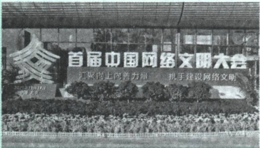

力发展积极健康的网络文化，净化网络生态、滋养网络空间，满足亿万网民对美好生活的向往。习近平致首届中国网络文明大会的贺信中指出，网络文明是新形势下社会文明的重要内容，是建设网络强国的重要领域。近年来，我国积极推进互联网内容建设，弘扬新风正气，深化网络生态治理，网络文明建设取得明显成效。要坚持发展和治理相统一、网上和网下相融合，广泛汇聚向上向善力量。各级党委和政府要担当责任，网络平台、社会组织、广大网民等要发挥积极作用，共同推进文明办网、文明用网、文明上网，以时代新风塑造和净化网络空间，共建网上美好精神家园。

正确使用网络工具。当今世界，科技进步日新月异，互联网、云计算、大数据等现代信息技术深刻改变着人类的思维、生产、生活、学习方式，展示了世界发展的前景。人们通过网络获取信息的方式更加方便、多样，大部分人特别是年轻人越来越主要依靠网络获取信息。大学生要提高信息获取能力，加强信息辨识能力，增进信息应用能力，使网络成为开阔视野、提高能力的重要工具。

加强网络文明自律。网络行为主体的文明自律是网络空间道德建设的基础。要建立和完善网络行为规范，明确网络是非观念，培育符合互联网

---

170

第五章 遵守道德规范 锤炼道德品格

发展规律、体现社会主义精神文明建设要求的网络道德。大学生要文明上网，尊德守法、文明互动、理性表达，远离不良网站，防止沉迷网络，自觉维护良好网络秩序。首先，进行健康网络交往。大学生应通过网络开展健康有益的交往活动，重视个人信息安全，树立自我保护意识，避免给自己的人身和财产安全带来危害。其次，自觉避免沉迷网络。大学生应当合理安排上网时间，约束上网行为，避免因沉迷网络而耽误学业。最后，加强网络道德自律。网络空间同现实社会一样，既要提倡自由，也要保持秩序。如果说享受互联网的自由是网民不可被剥夺的权利，那么加强道德自律就应该成为网民不可推卸的义务。在这种情况下，个体的道德自律成为维护网络道德规范的基本保障。大学生应当在网络生活中培养自律精神，在缺少外在监督的网络空间里，做到自律而“不逾矩”，促进网络生活的健康与和谐。

营造良好网络道德环境。良好的网络环境需要网民的共同努力，纷繁复杂的网络言论如果得不到正确引导，势必会引发各种社会问题。大学生一方面要加强网络道德自律，自觉抵制网络欺诈、造谣、诽谤、谩骂、歧视、色情、低俗等内容，反对网络暴力行为，维护网络道德秩序；另一方面应当带头引导网络舆论，对模糊认识要及时廓清，对怨气怨言要及时化解，对错误看法要及时纠正，促进网络空间日益清朗。

## 二、恪守职业道德

随着现代社会分工的发展和专业化程度的提高，市场竞争日趋激烈，整个社会对从业人员职业观念、职业态度、职业纪律和职业作风的要求越来越高。职业生活中的道德规范，不仅对各行各业的从业者具有引导和约束作用，而且也是促进社会持续、健康、有序发展的必要条件。

---

第三节 投身崇德向善的道德实践

171

## 图说

吴孟超院士被誉为“中国肝胆外科之父”。他曾说:“即使有一天，倒在手术室里，也将是我一生最大的幸福！”从医70多年，吴孟超推动中国的肝病医学从无到有、从有到

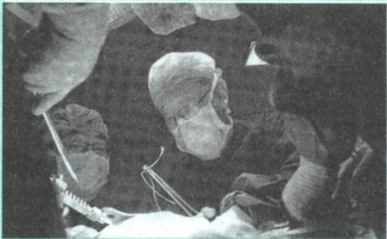

精，使我国肝脏疾病的诊断准确率、手术成功率和术后存活率均达到世界领先水平。吴孟超信守职业道德，游刃肝胆，精准无误，满腔热忱，彰显了对人民群众生命健康负责的医者仁心。

## （一）职业生活与劳动观念

职业是指人们由于社会分工所从事的具有专门业务和特定职责，并以此作为主要生活来源的社会活动。职业生活则是人们参与社会分工，用专业的技能和知识创造物质财富或精神财富，获取合理报酬，丰富社会物质生活或精神生活的生活方式。

人类是劳动创造的，社会是劳动创造的。劳动没有高低贵贱之分，任何一份职业都很光荣。正确的劳动观念是维系人们职业活动和职业生活的思想观念保障。在职业生活中，必须牢固树立“劳动最光荣、劳动最崇高、劳动最伟大、劳动最美丽” $^{①}$ 的观念，通过劳动创造更加美好的生活。只要踏实劳动、勤勉工作，在平凡岗位上也能干出不平凡的业绩。

<small>①《习近平谈治国理政》第一卷，外文出版社2018年版，第46页。</small>

---

172

第五章 遵守道德规范 锤炼道德品格

## 拓展

## 劳模精神、劳动精神、工匠精神

2020年11月24日，习近平在全国劳动模范和先进工作者表彰大会上，对劳模精神、劳动精神、工匠精神作出全面系统的深刻阐述，并指出我们长期实践中所培育的劳模精神、劳动精神、工匠精神是鼓舞全党全国各族人民风雨无阻、勇敢前进的强大精神动力。

劳模精神  
爱岗敬业  
争创一流  
艰苦奋斗  
勇于创新  
淡泊名利  
甘于奉献劳动精神
崇尚劳动  
热爱劳动  
辛勤劳动  
诚实劳动工匠精神
执着专注
精益求精
一丝不苟
追求卓越

幸福源自奋斗，成功在于奉献，平凡孕育伟大。事实上，只要有志气、有闯劲，普通劳动者都可以在宽广舞台上实现自己的人生价值。许多劳动模范平凡而感人的事迹，就充分地说明了这一点。“蓝领专家”孔祥瑞、“金牌工人”窦铁成、“新时代雷锋”徐虎、“知识工人”邓建军、“马班邮路上的信使”王顺友、“白衣圣人”吴登云、“中国航空发动机之父”吴大观等一大批劳动模范和先进工作者，带动人们锐意进取、积极投身改革开放和社会主义现代化建设，为国家和人民建立了杰出功勋。

## （二）职业生活中的道德规范

职业生活中的道德规范即职业道德，是指从事一定职业的人在职业生活中应当遵循的具有职业特征的道德要求和行为准则，涵盖了从业人员与服务对象、职业与职工、职业与职业之间的关系。

---

第三节 投身崇德向善的道德实践

173

## 图说

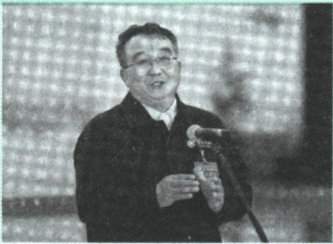

张黎明，国家电网天津滨海供电公司运维检修部配电抢修班班长、滨海黎明共产党员服务队队长，被誉为“点亮万家的蓝领工匠”，2018年被授予“时代楷模”称号，2019年被评选为“最美奋斗者”，2022年

当选党的二十大代表。张黎明工作30多年来始终奋战在电力抢修一线，累计巡线8万多公里，完成故障抢修作业近2万次，被称为电力抢修的“活地图”；带领团队先后实现技术革新400余项，20多项填补电力行业空白；十年如一日开展学雷锋志愿服务，用爱心搭起了党与群众的“连心桥”。

电力抢修“活地图”:张黎明

爱岗敬业、诚实守信、办事公道、热情服务和奉献社会是职业生活中的基本道德规范。爱岗敬业体现的是从业者热爱工作岗位、对工作极端负责、敬重自己所从事职业的道德操守，是从业者对工作勤奋努力、恪尽职守的行为表现；诚实守信要求从业者在职业生活中诚实劳动、合法经营、信守承诺、讲求信誉，体现着从业者的道德操守和人格力量，也是在行业中扎根立足的基础；办事公道要求从业人员做到公平、公正，不损公肥私，不以权谋私，不假公济私，无论对人对己都要出于公心，遵循道德和法律规范来处事待人；热情服务要求每个人无论从事什么工作、能力如何，都应该在本职岗位上通过不同形式为群众服务，形成人人都是服务者、人人又都是服务对象的良好秩序与和谐状态；奉献社会要求从业人员在工作岗位上兢兢业业地为社会和他人作贡献，是社会主义职业道德中最高层次的要求，体现了社会主义职业道德的最高目标指向。爱岗敬业、诚实守信、办事公道、热情服务，都体现了奉献社会的精神。

---

174

第五章 遵守道德规范 锤炼道德品格

## （三）树立正确的择业观和创业观

就业是最大的民生。就业牵涉大学生自身和千家万户的利益，也影响国家和社会的发展。每个大学生都要面临就业的现实。树立正确的择业观和创业观，对于大学生顺利走进职业生活具有重要的现实意义。

树立崇高的职业理想。职业活动不仅是人们谋生的手段，也是人们奉献社会、完善自身的必要条件。青年马克思在谈到职业理想时曾经写道:“如果我们选择了最能为人类而工作的职业，那么，重担就不能把我们压倒，因为这是为大家作出的牺牲；那时我们所享受的就不是可怜的、有限的、自私的乐趣，我们的幸福将属于千百万人，我们的事业将悄然无声地存在下去，但是它会永远发挥作用，而面对我们的骨灰，高尚的人们将洒下热泪。”①马克思这种崇高的职业理想，值得大学生择业和创业时去学习和追求。

服从社会发展的需要。择业和创业固然要考虑个人的兴趣和意愿，同时也要充分考虑社会的需要和现实的可能性，把自己对职业的期望与社会的需要、现实的可能结合起来。目前，许多地方的基层单位特别是中西部地区人才需求十分强烈，能够为大学生提供施展才华的广阔空间。大学生应该积极响应国家号召，适应社会发展需求，面向基层、面向国家建设第一线去选择自己未来的职业，为经济社会发展贡献智慧和力量。

## 拓展

## 大学生村官群体的优秀代表

张广秀 2009 年考取山东烟台的大学生村官后，扎根基层，虚心学习，吃苦耐劳，服务群众，以实际行动赢得了当地干部群众的好评。2010 年 9 月，张广秀被确诊为急性白血病，但她一直保持积极乐观的态度，坚持同疾病作斗争，同时仍然惦记着工作，挂念着群众。2014 年 1 月 15 日，张广秀

<small>①《马克思恩格斯全集》第一卷，人民出版社1995年版，第459—460页。</small>

---

第三节 投身崇德向善的道德实践

175

致信习近平，详细汇报了自己的工作生活情况，表示自己一定努力工作，服务群众，勤奋学习，不断进步，为实现中国梦作出自己的贡献。习近平回信鼓励她，希望所有大学生村官热爱基层、扎根基层，增长见识、增长才干，促农村发展，让农民受益，让青春无悔。

做好充分的择业准备。素质是立身之基，技能是立业之本。大学生有了真才实学，才能在未来适应多种岗位。要有真才实学就要勤于学习，不断提高综合素质，练就过硬本领；既要向书本学习，也要向群众学习、向实践学习。大学生应认识到，任何一名劳动者，无论从事的劳动技术含量如何，只要兢兢业业、精益求精，就一定能够造就闪光的人生。

培养创业的勇气和能力。创业是通过发挥自己的主动性和创造性，开辟新的工作岗位、拓展职业活动范围、创造新业绩的实践过程。大学生不仅要树立正确的择业观，还应当树立正确的创业观，要有积极创业的思想准备，积极关注经济社会发展的趋势，了解国家鼓励大学生自主创业的有关政策，为今后自主创业打下良好的基础。大学生既要敢于创业，又要善于创业，努力提高自主创业的能力，做一个真正的创业者。

## 三、弘扬家庭美德

事业成功，往往与美好的爱情和美满的婚姻家庭密切相关。从恋爱到缔结婚姻和建立家庭，是人生需要经历的阶段。注重家庭、注重家教、注重家风，遵守恋爱、婚姻家庭生活中的道德规范，树立正确的恋爱观和婚姻观，有利于大学生的健康成长、顺利成才。

## (一) 注重家庭、家教、家风

家庭是社会的基本细胞，是人生的第一所学校。不论时代发生多大

---

176

第五章 遵守道德规范 锤炼道德品格

变化，生活格局发生多大变化，都要重视家庭建设，注重家庭、家教、家风。

无论时代如何变化，无论经济社会如何发展，对一个社会来说，家庭的生活依托都不可替代，家庭的社会功能都不可替代，家庭的文明作用都不可替代。无论过去、现在还是将来，绝大多数人都生活在家庭之中。我们要重视家庭文明建设，努力使千千万万个家庭成为国家发展、民族进步、社会和谐的重要基点，成为人们梦想启航的地方。

——习近平

注重家庭。家庭和睦则社会安定，家庭幸福则社会祥和，家庭文明则社会文明。历史和现实告诉我们，家庭的前途命运同国家和民族的前途命运紧密相连。我们要认识到，千家万户都好，国家才能好，民族才能好。国家富强、民族复兴、人民幸福不是抽象的，最终要体现在千千万万个家庭的幸福美满之上，体现在亿万人民生活的不断改善之上。同时，我们还要认识到，国家好，民族好，家庭才能好。只有实现中华民族伟大复兴的中国梦，家庭梦才能梦想成真。

注重家教。家庭是人生的第一个课堂，父母是孩子的第一任老师。家庭教育涉及很多方面，但最重要的是品德教育，是如何做人的教育，也就是古人说的“爱子，教之以义方”“爱之不以道，适所以害之也”。家庭环境对下一代的影响很大，往往可以影响一个人的一生。注重家教，应该把美好的道德观念从小就传递给孩子，引导他们有做人的气节和骨气，帮助他们形成美好心灵，促使他们健康成长。

注重家风。家风是指一个家庭或家族世代相传的风尚、作风，即一个家庭当中的风气。家风是社会风气的重要组成部分。良好的家风，对家庭成员的个人修养产生着重要的作用，也对整个社会道德风尚的形成产生着

---

第三节 投身崇德向善的道德实践

177

重要的影响。家风好，就能家道兴盛、和顺美满；家风差，难免殃及子孙、贻害社会，正所谓“积善之家，必有余庆；积不善之家，必有余殃”。诸葛亮诫子格言、颜氏家训、朱子家训等，都是在倡导一种优良家风。大学生要继承和弘扬优良家风，促进家庭和谐。

## 图说

“怒发冲冠，凭栏处，潇潇雨歇。”抗金名将岳飞留给我们的，除了气吞山河的壮烈、莫须冤死的悲戚，还有一段精忠报国的热血家训。习近平曾多次讲过岳母刺字的故事，强调家风是社会风气的重要组成

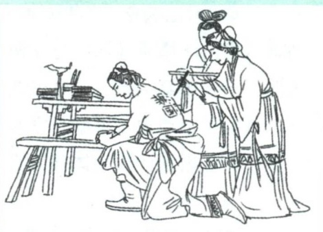

部分，父母应引导孩子成为对国家和人民有用的人。岳母刺字的故事流传千古，激励后人在危急关头挺身而出，保家卫国。

## （二）恋爱、婚姻家庭中的道德规范

爱情是一对男女基于一定的社会基础和共同的生活理想，在各自内心形成的相互倾慕并渴望对方成为自己终身伴侣的一种强烈、纯真、专一的感情。男女双方培养爱情的过程或在爱情基础上进行的相互交往活动，就是人们日常所说的恋爱。恋爱作为一种人际交往，也必然要受到道德的约束。恋爱是建立幸福婚姻家庭的前奏，恪守恋爱中的道德规范关系到未来婚姻家庭生活的幸福。

恋爱中的道德规范主要有尊重人格平等、自觉承担责任和文明相亲相爱。一是尊重人格平等。恋爱的双方在人格上都是独立的，如果把对方当作自己的附庸或依附对方而失去自我，都是对爱情实质的曲解。恋爱双方

---

178

第五章 遵守道德规范 锤炼道德品格

在相互关系上是平等的，都有给予爱、接受爱和拒绝爱的自由。放纵自己的情感，束缚或强迫对方，都不符合恋爱的道德要求。二是自觉承担责任。自愿地为对方承担责任，是爱情本质的体现。爱一个人或接受一个人的爱，就要自觉地为对方承担责任。责任常常体现在生活的点点滴滴之中，责任的担当是需要见诸行动的自觉。三是文明相亲相爱。文明的恋爱往往是恋爱双方既相互爱慕、亲近，又举止得体、相互尊重。恋人出入公共场所，要遵守社会公德，不要对他人生活和公共生活造成不良影响。

婚姻是指由法律所确认的男女两性的结合以及由此而产生的夫妻关系。家庭是指在婚姻关系、血缘关系或收养关系基础上产生的亲属之间所构成的社会生活单位。婚姻是家庭产生的重要前提，家庭又是缔结婚姻的必然结果。婚姻的成功体现为家庭的幸福，家庭的美满又彰显出婚姻的意义。

家庭美德以尊老爱幼、男女平等、夫妻和睦、勤俭持家、邻里互助为主要内容，在维系和谐美满的婚姻家庭关系中具有重要而独特的功能。其一，尊老爱幼。我国自古以来就倡导“幼有所养，老有所终”，形成了尊老爱幼的良好家庭道德传统。子女要孝敬、赡养父母及长辈，父母要抚育、爱护子女，这不仅是每个公民必须遵守的道德准则，也是应尽的社会责任和法律义务。要保护老人、儿童的合法权益，坚决反对虐待、遗弃老人和儿童的行为。其二，男女平等。家庭生活中的男女平等既表现为夫妻权利和义务上的平等、人格地位上的平等，又表现为平等地对待自己的子女。坚持男女平等，特别要尊重和保护妇女的合法权益，反对歧视和迫害妇女的行为。其三，夫妻和睦。夫妻关系是家庭关系的核心。夫妻和睦是在男女平等基础上的互敬互爱、互助互让。其四，勤俭持家。勤俭是家庭兴旺的保证，也是社会富足的保证。勤俭持家既要勤劳致富，也要量入为出。大学生要尊重父母劳动所得，体谅父母的辛苦操劳，在日常生活中注意节俭，尽量减轻父母和家庭的生活负担，这就是对父母和家庭最实际的贡献。其五，邻里互助。邻里互助重要的是相互尊重，尊重对方的人格、

---

第三节 投身崇德向善的道德实践

179

民族习惯、生活方式、兴趣爱好等，做到互谅互让、互帮互助、宽以待人、团结友爱。

## 拓展

## 《中华人民共和国民法典》第1043条

家庭应当树立优良家风，弘扬家庭美德，重视家庭文明建设。

夫妻应当互相忠实，互相尊重，互相关爱；家庭成员应当敬老爱幼，互相帮助，维护平等、和睦、文明的婚姻家庭关系。

大学生作为家庭的重要成员，也要积极弘扬践行家庭美德，感念父母养育之恩，感念长辈关爱之情，孝敬父母、尊重长辈、回报家庭、回馈社会，推动形成爱国爱家、相亲相爱、向上向善、共建共享的社会主义家庭文明新风尚。

## （三）树立正确的恋爱观与婚姻观

爱情的艳丽花朵，只有精心照料才会绽放得更加绚烂多彩。对大学生来说，如果在大学时代与爱情相逢，那就要用心呵护，倍加珍惜。处理好恋爱中的各种关系，是对爱情的祝福，也是对自己的祝福，更是对未来人生幸福的祝福。公众号:旗胜考研一手扫描

大学生在恋爱中要避免以下误区。第一，不能误把友谊当爱情。有些同学在与异性的交往中，不能准确区分友谊与爱情两种性质不同的感情体验，给双方增添许多烦恼。异性之间要理智地把握好友谊与爱情的界限，异性之间完全可以建立和保持健康的友谊。第二，不能错置爱情的地位。有些同学把爱情放在人生最高的地位，奉行爱情至上主义，沉湎于感情缠绵之中，很容易导致对人生目标的误解，对需要将主要精力用于学习上的大学生来说危害尤大。第三，不能片面或功利化地对待恋爱。无论是在自己心中勾画出一个脱离现实的恋爱偶像，还是只追求外在形象，或者

---

180

第五章 遵守道德规范 锤炼道德品格

只看重对方的经济条件，或者仅仅把恋爱看成是摆脱孤独寂寞的方式，都无法产生真挚的感情，也得不到真正的爱情。第四，不能只重过程不顾后果。责任是爱情得以长久的重要保障，是坚贞爱情的试金石。自愿担当的责任，丰富了爱情的内涵，提升了爱情的境界，如果“不在乎天长地久，只在乎曾经拥有”，把爱情当成游戏，既会伤害对方，也会伤及自己。第五，不能因失恋而迷失人生方向。恋爱过程是恋爱双方互相熟悉和情感协调的过程，恋爱成功与失败都是正常现象，大学生应该正确对待失恋，做到失恋不失志，失恋不失德，不影响学业和生活，不丧失对爱的憧憬和追求。

树立正确的恋爱观，大学生还要处理好几种关系。一是恋爱与学习的关系。学习是大学生的主要任务，大学生应把爱情作为奋发学习的动力，同时还应把是否有利于促进学习作为衡量爱情价值的一个重要而特殊的标准。二是恋爱与关心集体的关系。恋爱中的双方不应把自己禁锢在两个人的世界中。如果脱离集体，疏远同学，就会妨碍自身的全面发展与进步。三是恋爱与关爱他人和社会的关系。爱的情感丰富博大，不仅有恋人之爱，还有对父母之爱、对兄弟姐妹之爱、对社会和国家之爱。如果只专注于对恋人的爱而忽视对他人和社会、国家的爱，这样的爱情就会显得自私和庸俗；相反，如果对他人和社会具有爱心则会使爱情变得高尚和稳固。

在校大学生如果符合我国法律规定的结婚条件可以结婚，但对结婚成家需持谨慎、理性的态度。大学时期的根本任务是完成学业、不断提升和完善自我，在尚未走向社会时就草率地结婚成家，会对学业和生活产生许多负面影响。婚姻不仅代表两情相悦，更代表责任和义务，因而一旦结婚成家，就要及时调整和转换角色，承担起相应的责任和义务。由于大学生在校生活期间基本上还是一个消费者，大量的开支难免要从大家庭获得，结婚成家的大学生还要合理筹划，量力而行，勤俭节约，尽量不给父母增加过多的负担，也不能因此影响自己的学业。

---

第三节 投身崇德向善的道德实践

181

## 四、锤炼个人品德

个人品德在社会道德建设中具有基础性作用。在现实生活中，社会公德、职业道德和家庭美德的状况，最终都是以每个社会成员的道德品质为基础的。社会公德、职业道德和家庭美德建设，最终都要落实到个人品德的养成上。

## （一）涵养高尚道德品格

个人品德是通过社会道德教育和个人自觉的道德修养所形成的稳定的心理状态和行为习惯。它是个体对某种道德要求认同和践履的结果，集中体现了道德认知、道德情感、道德意志、道德信念和道德行为的内在统一。无论是社会的和谐有序，还是个人的人格健全，都有赖于个人品德的不断提升。大学生要自觉践行爱国奉献、明礼遵规、勤劳善良、宽厚正直、自强自律等个人品德要求，形成善良的道德意愿、道德情感，培育正确的道德判断和道德责任，提高道德实践能力尤其是自觉实践能力，向往和追求自觉讲道德、尊道德、守道德的生活。

青年要把正确的道德认知、自觉的道德养成、积极的道德实践紧密结合起来，不断修身立德，打牢道德根基，在人生道路上走得更正、走得更远。

——习近平

形成正确的道德认知和道德判断。道德是人类社会生产实践和交往实践的产物。在不同的民族、不同的文化、不同的社会发展阶段，道德的基本要求具有显著的差异，道德因此具有历史性、民族性和时代性的特征。形成正确的道德认知和道德判断，最根本的就是要坚持以唯物史观的基本原理来看待道德。一方面，要认识到道德的发展是一个曲折上升的历史过

---

182

第五章 遵守道德规范 锤炼道德品格

程，既要对历史上各种道德形态的进步性和局限性有客观准确的认知和判断，又要充分认识到社会主义道德作为崭新类型道德所具有的历史优越性和时代进步性；另一方面，要认识到在国际国内形势深刻变化、我国经济社会深刻变革的大背景下，道德领域存在着各种错综复杂的现象和问题，需要我们保持清醒的认识，学会理性地辨析并形成正确的判断。

激发正向的道德认同和道德情感。大学生在道德修养中激发正向的情感认同，总体而言就是要亲近真善美，抵制假恶丑，体验道德的愉悦，追求高尚的快乐。通过对美德的尊崇，真正把外在的社会道德规范内化为心悦诚服的自律准则。具体而言就是要自觉涵育对家庭成员的亲亲之情，对他人、集体的关心关爱，增强社会责任感、国家认同感、民族归属感、时代使命感，在与祖国同呼吸、与民族同步伐、与人民心连心的高尚情怀中，陶冶道德情操。

强化坚定的道德意志和道德信念。道德修养重在践行，但有些大学生存在知而不行的现象，也就是尽管掌握了许多道德知识，却没有落实在自己的实际行动上，导致知行脱节。在道德认知向道德行为转化的过程中，道德意志和道德信念是关键环节。道德意志和道德信念是人们在践履道德原则、规范的过程中表现出的自觉克服一切困难和障碍的毅力，通过道德意志和信念的坚守，道德行为才能体现出稳定性。大学生需要明白“从善如登、从恶如崩”的深刻道理，磨炼道德意志，坚定道德信念，在砥砺中前行，在拼搏中进取，并做到持之以恒、久久为功，从而成就高尚的道德品格。

## （二）道德修养重在践行

“纸上得来终觉浅，绝知此事要躬行。”高尚道德品格的形成重在实践，贵在坚持。大学生投身崇德向善的道德实践，就要自觉加强道德修养，向道德模范学习，培养志愿服务精神，大力弘扬时代新风。

掌握道德修养的正确方法。道德修养作为人类道德实践活动的重要形式之一，是指个体自觉地将一定社会的道德规范、准则及要求内化为内在

---

第三节 投身崇德向善的道德实践

183

的道德品质，以促进人格的自我陶冶、自我培育和自我完善的实践过程。加强道德修养，提升个人品德，应借鉴历史上思想家们所提出的学思并重、省察克治、慎独自律、知行合一、积善成德等各种积极有效的方法，并结合当今社会发展的需要身体力行，不断提高自己的道德素质和精神境界。“不矜细行，终累大德。”加强个人品德修养不可能一蹴而就，更不可能一劳永逸。只有按照有效的品德修养方法去做，并长期坚持下去，才能使自己不断进步、不断完善，从而成为品德高尚的人。

拓展

## 中国古代思想家提出的五种代表性道德修养方法

学思并重，即通过虚心学习，积极思索，辨别善恶，学善戒恶，以涵养良好的德行；省察克治，即通过反省检验以发现自己思想与行为中的不良倾向，并及时对它们进行抑制和克服；慎独自律，强调在“隐”和“微”上下功夫，是对个人内心深处比较隐蔽的意识、情绪进行管理和自律的一种修养方式；知行合一，即把提高道德认识与躬行道德实践统一起来，以促进道德要求内化为个人的道德品质，外化为实际的道德行为；积善成德，即通过积累善行或美德，使之巩固强化，以逐渐凝结成优良的品德。

向道德模范学习。道德模范主要是指思想和行为能够激励人们不断向善且为人们所崇敬、模仿的先进人物。道德模范是群众身边看得见、摸得着的榜样，是可以学、能够学的标杆。榜样的力量是无穷的。道德模范用自己的行动诠释着道德的内涵，展示着道德的力量。大学生学习道德模范，就是要学习他们助人为乐、关爱他人的高尚情怀，在关心他人、帮助他人的过程中创造人生价值；学习他们见义勇为、勇于担当的无畏精神，在危难和紧急关头挺身而出；学习他们以诚待人、守信践诺的崇高品格，老老实实做人、踏踏实实做事；学习他们敬业奉献、勤勉做事的职业操守，干一行爱一行，爱一行钻一行，钻一行精一行；学习他们孝老爱亲、

---

184

第五章 遵守道德规范 锤炼道德品格

血脉相依的至美真情，常怀感恩之心、敬爱之情。优良的品质、高尚的人格并非一蹴而就，而是逐渐积累的结果。在我们这个社会、我们这个时代，先进人物不断涌现，他们的业绩、精神和品质是我们取之不尽、用之不竭的力量源泉。大学生应积极向道德模范学习，见贤思齐、崇尚英雄、崇德向善，争做崇高道德的践行者、文明风尚的维护者、美好生活的创造者。

明辨

## 道德模范太高大，不可学吗？

一些人认为，道德模范固然可敬可爱，但不可学，因为他们太高大。其实，道德模范既包括在一定社会道德实践中涌现出的符合特定道德理想类型的人物，又包括人们日常生活中能够近距离感受到的具有积极道德影响的人物。道德模范的可贵之处在于，他们不仅做了普通人愿意做和能够做的事，并且主动做了许多人应该做却没有做的事，而且把大多数人能够做的事做得更好。道德模范都是从自我做起，从身边事做起，从小事做起，以此实现由现实自我向理想自我的飞跃。

参与志愿服务活动。志愿服务是指志愿贡献个人的时间及精力，在不求任何物质报酬的情况下，为改善社会、促进社会进步而提供的服务。志愿服务是培育和弘扬社会主义核心价值观的重要载体。志愿服务的精神是奉献、友爱、互助、进步。其中，奉献精神是精髓。参与志愿服务活动，一方面，帮助了他人、服务了社会，推动了社会道德水平的提高；另一方面，也把为社会和他人的服务看作自己应尽的义务和光荣的职责，从服务社会和帮助他人中获得成就感和幸福感。当前，志愿服务已经成为大学生参与社会实践、成长成才的重要舞台，成为大学生关爱他人、传播青春正能量的重要途径。大学生志愿服务活动已经遍及农村扶贫开发、城市社区建设、环境保护、大型活动、抢险救灾、社会公益等领域。新时代的

---

第三节 投身崇德向善的道德实践

185

大学生应结合自身的能力、专业、特长，在最需要的地方提供优质高效的服务，为最需要关爱的群体送温暖、献爱心，并在志愿服务中长知识、强本领、增才干。互联网为道德实践提供了新的空间、新的载体。大学生可以随时、随地、随手积极参与形式多样的网络公益活动，加强网络公益宣传，形成线上线下踊跃参与公益事业的生动局面，推动形成关爱他人、奉献社会的良好风尚。

## 图说

在 2022 年北京冬奥会闭幕式上，6 位志愿者代表走到舞台中央接受致谢。国际奥委会主席巴赫在致辞中表示:“我要对所有志愿者说，你们眼中的笑意温暖了我们的心田，你们的友好善意将永

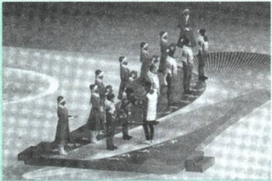

驻我们心中。”志愿者在众多重大国际国内活动中发挥了重要作用，生动诠释了奉献、友爱、互助、进步的志愿服务精神。

## （三）积极引领社会风尚

良好的社会风尚是人们在社会道德实践中逐渐形成的。大学生投身崇德向善的道德实践，要弘扬真善美、贬斥假恶丑，做社会主义道德的示范者和引领者，促成知荣辱、讲正气、作奉献、促和谐的社会风尚。

青年是引风气之先的社会力量。一个民族的文明素养很大程度上体现在青年一代的道德水准和精神风貌上。

——习近平

---

186

第五章 遵守道德规范 锤炼道德品格

知荣辱。荣辱观对个人的思想行为具有鲜明的动力、导向和调节作用。社会风尚同荣辱观紧密相连，两者相互影响、相互作用。一个社会有什么样的荣辱观，也必然有什么样的社会风尚；反过来，一个社会有什么样的社会风尚，生活于其中的人们也就会形成什么样的荣辱观。大学生应知荣辱、辨善恶、明是非、鉴美丑，形成正确的价值判断，助推全社会形成知荣明辱的良好道德风尚。

讲正气。讲正气，就是坚持真理、坚持原则，坚持同一切歪风邪气作斗争。大学生须有一腔浩然正气，才能无所畏惧地前进，才能不屈不挠地为国家、为社会建功立业。要做到讲正气，在日常生活中就要洁身自好、严于律己，自觉远离低级趣味；积极维护社会公共秩序，抵制歪风邪气，敢于伸张正义、见义勇为，坚决同践踏社会道德风尚的一切行为作斗争。

作奉献。奉献精神是社会责任感的集中表现。社会是由一个个的人所构成的集合体，脱离了个体，便没有社会。社会需要人们对其负起责任。有责任，就意味着要奉献。奉献精神传递社会温暖，能够拉近人与人之间的距离，建立和谐的人际关系和稳定的社会秩序，促进社会健康有序地发展。热心公益、爱心资助是奉献精神，在危难关头挺身而出、牺牲小我是奉献精神，以职业与事业为人生目标的爱岗敬业是奉献精神，以服务国家科学技术创新进步或捍卫国家安全为己任是奉献精神。选择奉献也就选择了高尚。“德厚者流光”，大学生要在奉献社会中积极发光发热，使我们的社会更加美好和谐。

促和谐。民主法治、公平正义、诚信友爱、充满活力、安定有序、人与自然和谐相处的社会，是国家富强、民族复兴、人民幸福的重要保证。对于大学生来说，促和谐就是要促进自我身心的和谐、个人与他人的和谐、个人与社会的和谐、人与自然的和谐等。大学生要用和谐的态度对待人生实践，使崇尚和谐、维护和谐内化为自己的思想意识和行为习惯，推动人与人之间、人与社会之间融洽相处，实现人与自然之间友好共生。

社会文明状况是社会风尚的重要体现。各种创建文明城市、文明村

---

文献阅读

187

镇、文明单位、文明家庭、文明校园的活动，就是要在全社会推动形成知荣辱、讲正气、作奉献、促和谐的社会风尚。新时代的大学生作为实现中华民族伟大复兴重任的中坚力量，其道德状态和精神风貌在很大程度上影响着整个社会的道德状态和精神风貌。大学生要以高度的主人翁态度，弘扬劳动精神、奋斗精神、奉献精神、创造精神、勤俭节约精神，积极参与各种文明培育、文明实践、文明创建活动，为家庭谋幸福、为他人送温暖、为社会作贡献，不断引领社会风尚，提升道德境界。

## 思考讨论

1. 道德的力量是无穷的，国无德不兴，人无德不立。结合实际，谈谈道德的作用。

2. 社会主义道德是人类道德发展史上一种崭新类型的道德，谈谈社会主义道德为什么要以为人民服务为核心、以集体主义为原则。

3. 中华传统美德是社会主义道德建设的源头活水，中国革命道德是社会主义道德的红色基因。结合实际，谈谈新时代大学生如何传承中华传统美德和弘扬中国革命道德。

社会公德、职业道德、家庭美德、个人品德是新时代公民道德建设的着力点。结合自身实际，谈谈如何理解社会公德、职业道德、家庭美德、个人品德的基本要求。

## 文献阅读

1. 中共中央党史和文献研究院:《习近平关于社会主义精神文明建设论述摘编》，中央文献出版社 2022 年版。

该书分 10 个专题，共计 512 段论述，摘自习近平 2012 年 11 月 17 日至 2022 年 6 月 8 日期间的报告、讲话、说明、演讲、谈话、贺信、指示、批示等 240 篇重要文献。习近平围绕加强社会主义精神文明建设发表的一系列重要论述，深刻揭示了社会主义精神文明建设的特点规律，丰富和发

---

188

第五章 遵守道德规范 锤炼道德品格

展了党关于社会主义精神文明建设的科学理论，是习近平新时代中国特色社会主义思想的重要组成部分。

2. 《新时代公民道德建设实施纲要》，人民出版社 2019 年版。

《新时代公民道德建设实施纲要》明确了新时代公民道德建设的总体要求、重点任务，强调要深化道德教育引导、推动道德实践养成、抓好网络空间道德建设、发挥制度保障作用及加强组织领导。

