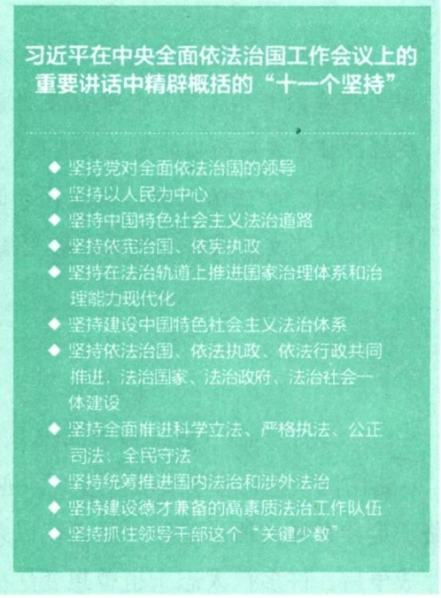
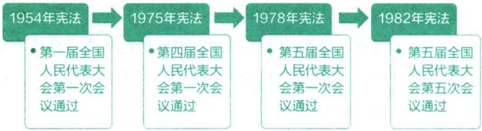

## 第六章 学习法治思想 提升法治素养

法治是人类文明进步的重要标志，是治国理政的基本方式。法治兴则国兴，法治强则国强。在全面依法治国、建设法治中国的进程中，大学生要学习马克思主义法治理论，特别是习近平法治思想，深刻理解社会主义法律的本质特征和运行机制，整体把握中国特色社会主义法治道路、法治体系的精髓，尊重和维护宪法法律权威，不断提升法治素养，努力做尊法学法守法用法的模范。

## 第一节 社会主义法律的特征和运行

我国社会主义法律是党的主张和人民意志的共同体现，是维护人民利益和公民权利的有力武器，是国家机关、社会组织和全体公民的活动规则和行为准绳。我们要在学习法律及其历史发展的基础上，准确把握社会主义法律的本质特征和运行机制，正确认识中国特色社会主义法律的时代价值，不断增强建设社会主义法治国家的责任感和使命感。

## 一、法律的含义及其历史发展

在漫长的文明演进中，法律发挥着特殊的社会规范作用。了解法律的含义及其历史，是学习法治理论、增强法治观念的基础。

## （一）法律的含义

法律是由国家创制和实施的行为规范。国家创制法律规范的方式主要有两种:一是国家机关在法定的职权范围内依照法定程序，制定、修改、废止规范性文件；二是国家机关赋予某些既存社会规范法律效力，或者赋予先前的判例法律效力。法律不但由国家制定和认可，而且由国家强制力保证实施。也就是说，法律具有国家强制性，这既表现为国家对合法行为的肯定和保护，也表现为国家对违法行为的否定和制裁。在保证法律实施的过程中，法律意识、道德观念、价值观念、纪律观念也发挥着重要作用。

法律是什么？最形象的说法就是准绳。用法律的准绳去衡量、规范、引导社会生活，这就是法治。

——习近平

法律由一定的社会物质生活条件所决定。法律作为上层建筑的重要组成部分，不是凭空出现的，而是产生于特定社会物质生活条件基础之上。社会物质生活条件是指与人类生存相关的物质资料生产方式、地理环境和人口因素等。其中，物质资料生产方式既是决定社会面貌、性质和发展的根本因素，也是决定法律本质、内容和发展方向的根本因素。物质资料生产方式包括生产力与生产关系两个方面，对法律产生决定性影响。在阶级社会中，有什么样的生产关系，就有什么性质和内容的法律。同时，生产力的发展水平也制约着法律的发展程度。例如，在生产力水平较低的奴隶社会，不可能有专门保护科技发明创造的知识产权法，也不可能有完备的现代企业法律制度。

法律是统治阶级意志的体现。法律所体现的统治阶级意志具有整体性，不是统治阶级内部个别人的意志，也不是统治者个人意志的简单相加。统治阶级不仅迫使被统治阶级服从和遵守法律，而且要求统治阶级的成员也遵守法律。法律所体现的统治阶级意志，并不是统治阶级意志的全部，仅仅是上升为国家意志的那部分意志。除了法律，统治阶级的意志还体现在国家政策、统治阶级的道德、最高统治者的言论等形式中。

## 拓展

## 法律规范与其他社会规范

调整人们行为的社会规范有多种，除了法律规范，还有道德规范和纪律规范等。与道德规范和纪律规范不同，法律规范的实施是由国家强制力来保障的。虽然道德规范和纪律规范的实施也具有一定程度的强制力，但这些强制力并不以国家强制为后盾。国家强制性是法律规范区别于其他社会规范的一个重要特征。

综上所述，可以将法律定义为:法律是由国家制定或认可并由国家强制力保证实施的，反映由特定社会物质生活条件所决定的统治阶级意志的规范体系。

## （二）法律的历史发展

法律不是从来就有的，也不是永恒存在的。它随着私有制、阶级和国家的产生而产生，也将随着私有制、阶级和国家的消亡而消亡。法律作为上层建筑的重要组成部分，其基本内容和性质总是与所在社会的生产关系相适应。奴隶制法律、封建制法律、资本主义法律都是建立在私有制经济基础之上的剥削阶级类型法律，而社会主义法律则是人类历史上以公有制为基础的新型法律。

奴隶制法律。在奴隶制社会的经济结构中，奴隶主阶级占有生产资料，同时也占有作为生产劳动者的奴隶。因此，奴隶制法律是奴隶主阶级专政的国家意志的表现，是奴隶主阶级对广大奴隶实行统治的工具。奴隶制法律通常采用最极端的经济剥削和政治压迫的方式，其基本特征有:一是具有明显的原始习惯残留痕迹，二是否认奴隶的法律人格，三是存在严格的等级划分，四是刑罚方式极其残酷。

封建制法律。封建社会是以农业为基础的自然经济占主导地位的社会。在封建社会的经济结构中，封建地主阶级占有生产资料，同时不完全占有作为生产劳动者的农奴或农民。封建制法律是封建地主阶级意志的体现，是封建地主阶级统治农民阶级的工具，维护封建地主阶级的共同利益。封建制法律的基本特征有:一是确立农民对封建地主的人身依附关系，二是实行封建等级制度，三是维护专制皇权，四是刑罚严酷。

资本主义法律。资本主义法律是资产阶级共同意志的体现，是资产阶级统治工人阶级和其他劳动人民的工具，其根本任务是维护资产阶级的政治、经济和社会秩序。资本主义法律规定的自由、民主、平等等价值原则是形式上的，归根结底是为了维护资产阶级根本利益，所以属于剥削阶级类型的法律。资本主义法律的基本特征主要体现为四个原则:一是与资本主义私有制相适应的私有财产神圣不可侵犯原则，二是与资本主义市场经济相适应的契约自由原则，三是与资本主义民主政治相适应的法律面前人人平等原则，四是与资产阶级人道主义相适应的人权保障原则。

拓展

## 《关于林木盗窃法的辩论》

19 世纪 40 年代在普鲁士，小农、短工及城市居民由于贫困和破产而不断去采集和砍伐林木，按传统这是他们的“习惯权利”。普鲁士政府便想制定新的法律，采取严厉措施，以惩治这种被林木所有者看作“盗窃”的行为。莱茵省议会在 1841 年 6 月 15 日至 17 日曾就林木盗窃法草案展开了辩论。各阶层代表在辩论中发表的修改意见，均倾向于加重处罚，以给林木所有者更多的好处。1842 年，马克思发表了《关于林木盗窃法的辩论》一文，对历史上和普鲁士国家的法律问题以及现存的半封建的法律关系和法律观点进行了深入的分析和研究，抨击了封建等级的代表所持的观点，第一次公开地站在贫苦群众一边维护他们的物质利益。他指出:“凡是在法为私人

利益制定了法律的地方，它都让私人利益为法制定法律。” $^{①}$ 这深刻揭示和批判了剥削阶级法律对私人利益的维护。

社会主义法律。社会主义法律是新型的法律制度，有着与以往剥削阶级类型法律制度不同的经济基础与阶级本质。社会主义法律以公有制为经济基础，保障全体劳动者共同占有生产资料，通过解放生产力和发展生产力来推动社会物质财富和精神财富的日益丰富，从而实现人的全面发展和全体社会成员的共同富裕。社会主义法律是最广大人民群众意志的集中体现，是实现人民当家作主、实行人民民主专政的重要保证。社会主义法律反映了社会主义生产关系的本质要求，为实现普遍意义的平等、自由奠定了坚实基础，开辟了广阔空间，实现了对历史上各种类型法律制度的超越。

## 二、我国社会主义法律的本质特征

我国社会主义法律，是在中国共产党领导新民主主义革命时期孕育、在中华人民共和国成立后不断形成和发展起来的。改革开放以来，我国法治建设进入了快速发展时期，形成了以宪法为核心的中国特色社会主义法律体系，为中国共产党领导人民当家作主、推进改革开放和建设社会主义现代化国家提供了坚实法治保障。中国特色社会主义进入新时代以来，社会主义法治国家建设深入推进，全面依法治国总体格局基本形成，中国特色社会主义法治体系加快建设，司法体制改革取得重大进展，社会公平正义保障更为坚实，法治中国建设开创新局面。

<small>①《马克思恩格斯全集》第一卷，人民出版社1995年版，第288页。</small>

## 拓展

## 中国特色社会主义法律体系

中国特色社会主义法律体系，是以宪法为核心，以宪法相关法、民法商法、行政法、经济法、环境资源法、社会法、军事法、刑法、诉讼与非诉讼程序法等多个法律部门的法律为主干，由法律、行政法规、地方性法规等多个层次的法律规范构成的有机统一整体。2011年3月，十一届全国人大四次会议庄严宣布，一个立足中国国情和实际、适应改革开放和社会主义现代化建设需要、集中体现党和人民意志的中国特色社会主义法律体系已经形成。党的十八大以来，中国特色社会主义法律体系日趋完善。

我国社会主义法律体现了党的主张和人民意志的统一。我国社会主义法律既具有鲜明的阶级性，又具有广泛的人民性，体现了阶级性与人民性的统一。我国是中国共产党领导下的社会主义国家，人民是国家的主人，制定法律的权力属于人民。中国共产党是中国工人阶级的先锋队，同时是中国人民和中华民族的先锋队，是中国特色社会主义事业的领导核心。社会主义法律维护人民的根本利益，巩固中国共产党的领导地位，体现了党的主张和人民意志的统一。党领导人民制定宪法法律，党领导人民实施宪法法律，党自身必须在宪法法律范围内活动，这就是党的领导力量的体现，也是我国社会主义法律最本质特征的具体表现。

要保证人民在党的领导下，依照法律规定，通过各种途径和形式管理国家事务，管理经济和文化事业，管理社会事务。要把体现人民利益、反映人民愿望、维护人民权益、增进人民福祉落实到依法治国全过程，使法律及其实施充分体现人民意志。

——习近平

我国社会主义法律具有科学性和先进性。在剥削阶级占统治地位的社会中，法律受少数人狭隘利益的局限，容易与客观规律和历史发展趋势相背离。我国社会主义法律反映的不是少数人的特殊利益，而是全体人民的共同利益，尽管其具体内容会随着经济社会的发展而调整变化，但它与历史发展的基本方向和规律是一致的。因此，从本质上说，我国社会主义法律更能尊重和反映社会发展规律，具有科学性和先进性。我国法律坚持马克思主义世界观和方法论，并指导人们在法律实践中尊重和反映客观规律。我国法律适应时代发展要求，改革创新立法体制、立法程序、立法技术，使立法的质量和水平不断提高。

我国社会主义法律是中国特色社会主义建设的重要保障。法的社会作用是从法在社会生活中要实现的目的角度来认识的。我国法律的社会作用体现了社会主义的本质要求，经济发展、政治清明、文化昌盛、社会公正、生态良好，都离不开社会主义法律的引领、规范和保障。经济建设方面，我国法律维护和巩固社会主义基本经济制度，促进社会主义市场经济持续健康发展，保障现代化经济体系建设顺利推进。政治建设方面，我国法律维护和巩固社会主义政治制度，保障全过程人民民主顺利推进，保证人民享有广泛的民主权利和自由，坚持人民民主专政的国体和人民代表大会制度的政体不动摇。文化建设方面，我国法律坚持马克思主义在意识形态领域指导地位的根本制度，倡导社会主义核心价值观，弘扬社会主义道德，促进文化事业和文化产业的繁荣发展，推动社会主义文化强国建设。社会建设方面，我国法律确保改革发展成果更多更公平惠及全体人民，保障和促进社会公平正义，形成有效的社会治理、良好的社会秩序，使人民获得感、幸福感、安全感更加充实、更可持续、更有保障。生态文明建设方面，我国法律遵循尊重自然、顺应自然、保护自然的要求，践行绿水青山就是金山银山的理念，推动绿色发展，推进环境污染防治，促进人与自然和谐共生。

## 三、我国社会主义法律的运行

法律的运行是一个从创制、实施到实现的过程。这个过程主要包括法律制定、法律执行、法律适用、法律遵守等环节。法律制定是国家对权利和义务，即社会利益和负担进行的权威性分配；法律的执行、适用、遵守则把法律规范转化为法律实践，把法定的权利和义务转化为现实的权利和义务。我国社会主义法律的运行具有鲜明的中国特色。

法律制定。法律制定是指有立法权的国家机关，依照法定职权和程序制定规范性法律文件的活动，是法律运行的起始性和关键性环节。根据宪法规定，全国人民代表大会和全国人民代表大会常务委员会行使国家立法权，全国人民代表大会负责修改宪法、制定基本法律，全国人民代表大会常务委员会负责解释宪法、制定其他法律。国务院有权根据宪法和法律制定行政法规。国家监察委员会有权根据宪法和法律制定监察法规。中央军事委员会有权根据宪法和法律制定军事法规。国务院各部门可以根据宪法、法律和行政法规，在本部门的权限范围内，制定部门规章。省、直辖市的人民代表大会和它们的常务委员会，在不同宪法、法律、行政法规相抵触的前提下，可以制定地方性法规，报全国人民代表大会常务委员会备案。设区的市的人民代表大会和它们的常务委员会，在不同宪法、法律、行政法规和本省、自治区的地方性法规相抵触的前提下，可以依照法律规定制定地方性法规，报本省、自治区人民代表大会常务委员会批准后施行。省、自治区、直辖市、设区的市的人民政府可以根据法律、行政法规和本省、自治区、直辖市的地方性法规，制定地方政府规章。自治区、自治州、自治县的人民代表大会有权依照当地民族的政治、经济和文化的特点，制定自治条例和单行条例。特别行政区立法机关有权依据基本法规定并依照法定程序制定法律。我国立法贯彻公正、公平、公开原则，坚持科学立法、民主立法、依法立法，表达人民的共同意志和诉求。立法活动必须遵循法定程序。就全国人民代表大会的立法程序而言，大体包括法律案的提出、法律案的审议、法律案的表决和法律的公布四个环节。

随着我国经济社会持续发展和人民生活水平不断提高，人民群众对民主、法治、公平、正义、安全、环境等方面的要求日益增长，要积极回应人民群众新要求新期待，坚持问题导向、目标导向，树立辩证思维和全局观念，系统研究谋划和解决法治领域人民群众反映强烈的突出问题，不断增强人民群众获得感、幸福感、安全感，用法治保障人民安居乐业。

——习近平

法律执行。广义上，法律执行是指国家机关及其公职人员，在国家和公共事务管理中依照法定职权和程序，贯彻和实施法律的活动；狭义上，法律执行则是指国家行政机关及其公职人员执行法律的活动，也被称为行政执法。行政执法是法律实施和实现的重要环节，必须坚持合法性、合理性、信赖保护、效率等基本原则。我国大部分的法律法规都是由行政机关执行的，行政执法的主体通常是国家行政机关。我国行政执法的主体大体分为两类:一是中央和地方各级政府，包括国务院和地方各级人民政府；二是各级政府中享有执法权的下属行政机构。此外，法律授权的社会组织、行政机关依法委托的社会组织可以在一定范围内执行法律并承担相应的法律责任。

法律适用。法律适用是指国家司法机关及其公职人员依照法定职权和程序适用法律处理案件的专门活动。在我国，司法机关是指国家审判机关和检察机关。人民法院依照法律规定独立行使审判权，人民检察院依照法律规定独立行使检察权，不受行政机关、社会团体和个人的干涉。人民法院和人民检察院依据宪法法律公正司法，保护自然人、法人和其他组织的合法权利，解决法律纠纷，惩治违法犯罪行为，维护法律秩序。司法的基本要求是正确、合法、合理、及时。司法原则主要有:司法公正；公民在法律面前一律平等；以事实为根据，以法律为准绳；司法机关依法独立公正行使司法权等。

法律遵守。法律遵守是指国家机关、社会组织和公民个人依照法律规定行使权力或权利以及履行职责或义务的活动。守法不仅意味着履行法律义务，还意味着一切组织和个人都要依照法律的要求规范自己的行为。守法就是依法享有并行使权利、依法承担并履行义务。守法是法律实施和实现的基本途径。一切组织和个人都必须遵守宪法和法律，任何公民享有宪法和法律规定的权利，同时必须履行宪法和法律规定的义务。

## 第二节 坚持全面依法治国

全面依法治国是坚持和发展中国特色社会主义的本质要求和重要保障，是国家治理的一场深刻变革。全面依法治国，必须坚持以习近平法治思想为指导，坚定不移走中国特色社会主义法治道路，建设中国特色社会主义法治体系，建设社会主义法治国家，为全面建设社会主义现代化国家、实现中华民族伟大复兴的中国梦提供有力法治保障。

全面依法治国是国家治理的一场深刻革命，关系党执政兴国，关系人民幸福安康，关系党和国家长治久安。必须更好发挥法治固根本、稳预期、利长远的保障作用，在法治轨道上全面建设社会主义现代化国家。

——习近平

## 一、全面依法治国的根本遵循

2020年11月，中央全面依法治国工作会议正式提出习近平法治思想，并将其确立为全面依法治国的指导思想和根本遵循。

## (一) 习近平法治思想的形成和意义

20 世纪以来，马克思主义在中国获得广泛传播和深入发展。中国共产党人把马克思主义的基本原理同中国具体实际相结合、同中华优秀传统文化相结合，产生了毛泽东思想、邓小平理论、“三个代表”重要思想、科学发展观、习近平新时代中国特色社会主义思想，其中都蕴含着丰富而深刻的法治理论。

党的十八大以来，习近平高度重视全面依法治国，创造性提出了一系列全面依法治国新理念新思想新战略，形成习近平法治思想，指导和推动了社会主义法治建设发生历史性变革、取得历史性成就，全面依法治国实践取得重大进展。习近平法治思想，立足新时代中国特色社会主义伟大实践，全面系统地创新发展了中国特色社会主义法治理论，实现了马克思主义法治理论中国化时代化的新飞跃。

| 十八届四中全会2014年10月20日至23日 | 专门研究全面依法治国,审议通过《中共中央关于全面推进依法治国若干重大问题的决定》,对全面依法治国进行顶层设计 |
| --- | --- |
| 党的十九大2017年10月18日至24日 | 提出到2035年基本建成法治国家、法治政府、法治社会,确立了新时代法治中国建设的路线图、时间表 |
| 十九届二中全会2018年1月18日至19日 | 审议通过《中共中央关于修改宪法部分内容的建议》,强调由宪法及时确认党和人民创造的伟大成就和宝贵经验 |
| 十九届三中全会2018年2月26日至28日 | 审议通过《中共中央关于深化党和国家机构改革的决定》和《深化党和国家机构改革方案》,决定组建中央全面依法治国委员会 |
| 十九届四中全会2019年10月28日至31日 | 审议通过《中共中央关于坚持和完善中国特色社会主义制度、推进国家治理体系和治理能力现代化若干重大问题的决定》,对提高党依法治国、依法执政能力作出专门部署 |
| 十九届五中全会2020年10月26日至29日 | 审议通过《中共中央关于制定国民经济和社会发展第十四个五年规划和二〇三五年远景目标的建议》,其中对推进法治中国建设进行了部署 |
| 十九届六中全会2021年11月8日至11日 | 审议通过《中共中央关于党的百年奋斗重大成就和历史经验的决议》,其中强调发展全过程人民民主,坚持全面依法治国 |
| 党的二十大2022年10月16日至22日 | 提出坚持全面依法治国,推进法治中国建设,在法治轨道上全面建设社会主义现代化国家,全面推进国家各方面工作法治化 |

习近平法治思想是经过长期发展而形成的内涵丰富、论述深刻、逻辑严密、系统完备的法治理论体系，为建设法治中国指明了前进方向，在中国特色社会主义法治建设进程中具有重大政治意义、理论意义、实践意义。习近平法治思想从历史和现实相贯通、国际和国内相关联、理论和实际相结合上深刻回答了新时代为什么实行全面依法治国、怎样实行全面依法治国等一系列重大问题，是顺应实现中华民族伟大复兴时代要求应运而生的重大理论创新成果，是马克思主义法治理论中国化时代化的最新成果，是习近平新时代中国特色社会主义思想的重要组成部分。

习近平法治思想深刻揭示了社会主义法治的生命力和优越性，推动了中国特色社会主义法治理论创新发展。这一思想擘画了新时代全面依法治国的宏伟蓝图，增强了全党全国各族人民走中国特色社会主义法治道路的信心，增强了新时代全面依法治国的政治定力、前进动力，引领着法治中国建设迈向良法善治新境界。

## （二）习近平法治思想的主要内容

2020年11月，习近平在中央全面依法治国工作会议上的重要讲话中，用“十一个坚持”对全面依法治国进行了系统阐释、部署。这“十一个坚持”涉及的都是全面依法治国方向性、根本性、全局性的重大问题，从全面依法治国的政治方向、战略地位、工作布局、主要任务、重大关系、重要保障等方面提出了一系列新理念新观点新论断，构成了习近平法治思想的主要内容。

关于政治方向，这一思想深刻回答全面依法治国由谁领导、依靠谁、走什么道路等大是大非问题，指明了中国特色社会主义法治的前进方向；关于战略地位，这一思想深刻回答为什么要全面依法治国的问题，深刻揭示全面依法治国是新时代坚持和发展中国特色社会主义的基本方略，是党领导人民治理国家的基本方式；关于工作布局，这一思想深刻回答全面依法治国如何谋篇布局的问题，明确全面依法治国的总目标、总抓手和基本

思路；关于主要任务，这一思想深刻回答全面依法治国如何突破的问题，指明中国特色社会主义法治的战略安排；关于重大关系，这一思想深刻回答如何正确处理政治与法治、改革与法治、德治与法治等重大问题，揭示法治中国建设的认识论和方法论；关于重要保障，这一思想深刻回答全面依法治国需要什么保障的问题，指明全面依法治国的人才支撑和“关键少数”。习近平法治习近平在中央全面依法治国工作会议上的重要讲话中精辟概括的“十一个坚持”

坚持党对全面依法治国的领导

◆ 坚持以人民为中心

坚持中国特色社会主义法治道路

坚持依宪治国、依宪执政

坚持在法治轨道上推进国家治理体系和治理能力现代化

坚持建设中国特色社会主义法治体系

坚持依法治国、依法执政、依法行政共同推进，法治国家、法治政府、法治社会一体建设

坚持全面推进科学立法、严格执法、公正司法、全民守法

坚持统筹推进国内法治和涉外法治

◆ 坚持建设德才兼备的高素质法治工作队伍

坚持抓住领导干部这个“关键少数”

思想，坚持马克思主义的立场、观点、方法，为马克思主义法治理论发展作出了独创性、原创性、集成性贡献，是习近平新时代中国特色社会主义思想的“法治篇”。

## 二、坚持走中国特色社会主义法治道路

推进全面依法治国，必须走对路，如果走错路，那再提什么要求和举措也都没有意义。每一条法治道路底下都有一种政治立场，每一种法治模式当中都有一种政治逻辑。中国特色社会主义法治道路的核心要义，就是要坚持党的领导，坚持中国特色社会主义制度，贯彻中国特色社会主义法治理论，这充分体现了我国社会主义性质，具有鲜明的中国特色、实践特色、时代特色。

中国特色社会主义法治道路本质上是中国特色社会主义道路在法治领域的具体体现。既要立足当前，运用法治思维和法治方式解决经济社会发展面临的深层次问题；又要着眼长远，筑法治之基、行法治之力、积法治之势，促进各方面制度更加成熟更加定型，为党和国家事业发展提供长期性的制度保障。

——习近平

## (一) 为什么要走中国特色社会主义法治道路

走中国特色社会主义法治道路，是历史的必然结论。要不要走法治道路、走什么样的法治道路，是近代以来中国人民面临的历史性课题。鸦片战争后，许多仁人志士也曾想变法图强，但都以失败告终，法治只是镜花水月。中国共产党在领导中国人民进行新民主主义革命的伟大斗争中，不断探索适合中国国情的法治道路，制定了《中华苏维埃共和国宪法大纲》以及大量法律法令，创造了“马锡五审判方式”。中华人民共和国成立后，在社会主义革命和建设时期，党领导人民制定了“五四宪法”和国家机构组织法、选举法、婚姻法等一系列重要法律法规，建立起社会主义法制框架体系，确立了社会主义司法制度。进入改革开放历史新时期，党提出“有法可依、有法必依、执法必严、违法必究”的方针，强调依法治国是党领导人民治理国家的基本方略、依法执政是党治国理政的基本方式，不断推进社会主义法治建设，最终走出了一条中国特色社会主义法治道路。党的十八大以来，以习近平同志为核心的党中央把全面依法治国作为新时代坚持和发展中国特色社会主义“四个全面”战略布局的重要组成部分，始终强调加强党的集中统一领导，坚持党领导立法、保证执法、支持司法、带头守法，在新时代不断坚持和拓展了中国特色社会主义法治道路。

## 拓展

## 马锡五审判方式

1943年7月1日，陕甘宁边区高等法院陇东分庭审理封彦贵（封芝琴之父）与张金才（张柏之父）儿女婚姻纠纷上诉案，庭长马锡五在广泛听取群众对案件的看法和处理意见的基础上，依据刑法与婚姻法的相关规定，作出刑事附带民事判决。此案是“马锡五审判方式”的具体体现，后被改编成评剧《刘巧儿》。“马锡五审判方式”的特点是:走出窑洞，深入农村，调查研究，依靠群众，就地审判，不拘形式，解决问题，实行审判与调解相结合；坚持原则，依法办事；简便手续，便利人民诉讼。“马锡五审判方式”得到中共中央肯定，是党的群众路线在司法领域实践的典型。

走中国特色社会主义法治道路，是由我国社会主义国家性质决定的。我国宪法明确规定:“社会主义制度是中华人民共和国的根本制度。”这一根本制度保证了人民当家作主的主体地位，也保证了人民在全面依法治国中的中心地位，这是我们的最大制度优势。中国特色社会主义法治道路坚持人民主体地位，坚持法律面前人人平等，能够保证人民在党的领导下，依照法律规定，通过各种途径和形式管理国家事务，管理经济和文化事业，管理社会事务，本质上是中国特色社会主义道路在法治领域的具体体现。只有始终坚持以人民为中心，才能真正实现法治保障人民权益的根本目的。公众号:旗胜考研一手扫描

走中国特色社会主义法治道路，是立足我国基本国情的必然选择。走什么样的法治道路，脱离不开一个国家的基本国情。从已经实现现代化的国家发展历程看，英国、美国、法国等西方国家适应资本主义市场经济和现代化发展需要，经过一二百年乃至二三百年内生演化，逐步实行法治化。就我们这个14亿多人口的社会主义大国而言，我们有自己的历史文化传统，有长期积累的经验和优势，要在较短时间内建成法治国家，必须走中国特色社会主义法治道路。中国特色社会主义法治道路的一个鲜明特点，就是坚持依法治国和以德治国相结合。从国情实际出发，不等于关起门来搞法治，我们要坚持以我为主、为我所用，认真鉴别、合理吸收世界上优秀的法治文明成果。

## 拓展

## 《中华人民共和国民法典》

2020年5月28日，十三届全国人大三次会议通过《中华人民共和国民法典》。民法典包括7编及附则，共1260条，各编依次为总则、物权、合同、人格权、婚姻家庭、继承、侵权责任。这是一部体现我国社会主义性质、符合人民利益和愿望、顺应时代发展要求的民法典，是一部体现对生命健康、财产安全、交易便利、生活幸福、人格尊严等各方面权利平等保护的民法典，是一部具有鲜明中国特色、实践特色、时代特色的民法典。民法典是中华人民共和国成立以来第一部以“法典”命名的法律，是新时代我国社会主义法治建设的重大成果。

## （二）坚持中国特色社会主义法治道路必须遵循的原则

中国特色社会主义法治道路，明确了建设社会主义法治国家的性质和方向，是社会主义法治建设成就和经验的集中体现，是建设中国特色社会主义法治体系、建设社会主义法治国家的正确道路。走中国特色社会主义法治道路，必须坚持中国共产党的领导，坚持人民主体地位，坚持法律面前人人平等，坚持依法治国和以德治国相结合，坚持从中国实际出发。

坚持中国共产党的领导。党的领导是中国特色社会主义最本质的特征，是社会主义法治最根本的保证。把党的领导贯彻到依法治国全过程和各方面，是我国社会主义法治建设的一条基本经验。我国是人民民主专政的社会主义国家，党的领导是中国特色社会主义法治之魂，是我们的法治同西方资本主义国家的法治最大的区别。坚持党中央权威和集中统一领导，是坚持党的领导的最高原则，是我国制度优势的根本保证。党中央每年听取全国人大常委会、国务院、全国政协、最高人民法院、最高人民检察院党组工作汇报和中央书记处工作报告，是坚持党中央权威和集中统一领导的一项重大制度性安排。国际国内环境越是复杂，改革开放和社会主义现代化建设任务越是繁重，越要运用法治思维和法治手段巩固执政地位、改善执政方式、提高执政能力，保证党和国家长治久安。全面依法治国是要加强和改善党的领导，健全党领导全面依法治国的制度和工作机制，推进党的领导制度化、法治化，通过法治保障党的路线方针政策有效实施。

明辨

## 为什么说“党大还是法大”是个伪命题？

“党大还是法大”是一个政治陷阱，是一个伪命题。党的领导和依法治国不是对立的，而是统一的。我国法律充分体现了党和人民意志，我们党依法办事，这个关系是相互统一的关系。从逻辑上讲，党的本质是政治组织，而法的本质是行为规则，两者不存在谁比谁大的问题，否则就会落入话语陷阱。如果说党比法大，那就是承认法治、依法治国都是虚假的，法就不存在了；如果说法比党大，那党的领导就难以实施了。因此，在党和法之间不能搞简单的比较。

当然，我们说不存在“党大还是法大”的问题，是把党作为一个执政整体、就党的执政地位和领导地位而言的，具体到每个党政组织、每个领导干部，就必须服从和遵守宪法法律。“权大还是法大”则是一个真命题。纵观人类政治文明史，权力是一把“双刃剑”，在法治的轨道上行使可以造福人民，在法律之外行使必然祸害国家和人民。

坚持人民主体地位。全面依法治国最广泛、最深厚的基础是人民，必须坚持为了人民、依靠人民。推进全面依法治国，根本目的是依法保障人民权益。必须始终牢牢把握坚持党的领导、人民当家作主、依法治国有机统一，不断发展社会主义民主政治并使之法治化、制度化，坚持和完善人民代表大会制度以及中国共产党领导的多党合作和政治协商制度、民族区域自治制度、基层群众自治制度等人民当家作主的制度体系。要积极回应人民群众新要求新期待，系统研究谋划和解决法治领域人民群众反映强烈的突出问题，不断增强人民群众获得感、幸福感、安全感，用法治保障人民安居乐业。

我国社会主义制度保证了人民当家作主的主体地位，也保证了人民在全面推进依法治国中的主体地位。这是我们的制度优势，也是中国特色社会主义法治区别于资本主义法治的根本所在。

——习近平

坚持法律面前人人平等。平等是社会主义法律的基本属性，是社会主义法治的基本要求。坚持法律面前人人平等，对于坚持走中国特色社会主义法治道路具有十分重要的意义。第一，它可以充分显示中国特色社会主义制度的优越性，使人民在依法治国中的主体地位得到尊重和保障，从而有利于增强人民群众的主人翁意识和责任感。第二，它鲜明地反对法外特权、法外开恩，对掌握公权力的人形成制约，从而有利于预防特权思想和各种潜规则的侵蚀。第三，它鲜明地反对法律适用上的各种歧视，有利于贯彻执行“以事实为根据，以法律为准绳”的司法原则。第四，它要求人人都严格依法办事，既充分享有法律规定的各项权利，又切实履行法律规定的各项义务，有利于维护法律权威、健全社会主义法治，确保实现全面依法治国的总目标。

坚持法律面前人人平等，一方面要求违法必究，一切违反宪法法律的行为都必须予以追究。法治意味着不管什么人，不管涉及谁，只要违反法律就要依法追究责任。另一方面要求非歧视，即无差别对待。只要是正当权益诉求，就应当在法律上得到平等对待；只要是合法权益，就应当依法得到平等保护。要着力反歧视，特别要强调对弱势群体合法利益的法律保护。

拓展

## 我国宪法关于平等权的相关规定

我国宪法规定:“中华人民共和国各民族一律平等。”“中华人民共和国公民在法律面前一律平等。”“中华人民共和国年满十八周岁的公民，不分民族、种族、性别、职业、家庭出身、宗教信仰、教育程度、财产状况、居住期限，都有选举权和被选举权；但是依照法律被剥夺政治权利的人除外。”“中华人民共和国妇女在政治的、经济的、文化的、社会的和家庭的生活等各方面享有同男子平等的权利。”“国家保护妇女的权利和利益，实行男女同工同酬，培养和选拔妇女干部。”

坚持依法治国和以德治国相结合。法治和德治，是治国理政不可或缺的两种方式，如车之两轮或鸟之两翼，忽视其中任何一个，都将难以实现国家的长治久安。只有让法治和德治共同发挥作用，才能使法律与道德相辅相成，法治与德治相得益彰，做到法安天下，德润人心。坚持依法治国和以德治国相结合，既要强化道德对法治的支撑作用，重视发挥道德的教化作用，提高全社会文明程度，为全面依法治国创造良好环境；又要把道德要求贯彻到法治建设中，以法治承载道德理念。立法、执法、司法都要体现社会主义道德要求，都要把社会主义核心价值观贯穿其中，使社会主义法治成为良法善治，引导全社会崇德向善。要运用法治手段解决道德领域突出问题，依法加强对群众反映强烈的失德行为的整治。

拓展

## 《中华人民共和国英雄烈士保护法》第22条

禁止歪曲、丑化、亵渎、否定英雄烈士事迹和精神。

英雄烈士的姓名、肖像、名誉、荣誉受法律保护。任何组织和个人不得在公共场所、互联网或者利用广播电视、电影、出版物等，以侮辱、诽谤或者其他方式侵害英雄烈士的姓名、肖像、名誉、荣誉。任何组织和个人不得将英雄烈士的姓名、肖像用于或者变相用于商标、商业广告，损害英雄烈士的名誉、荣誉。

公安、文化、新闻出版、广播电视、电影、网信、市场监督管理、负责英雄烈士保护工作的部门发现前款规定行为的，应当依法及时处理。

坚持从中国实际出发。建设法治中国，必须从我国实际出发，同完善和发展中国特色社会主义制度、推进国家治理体系和治理能力现代化相适应，既不能罔顾国情、超越阶段，也不能因循守旧、墨守成规。坚持从实际出发，就是要突出法治道路的中国特色、实践特色、时代特色。要传承中华优秀传统法律文化，从我国革命、建设、改革的实践中探索适合自己的法治道路，同时借鉴国外法治有益成果，为全面建设社会主义现代化国家、实现中华民族伟大复兴夯实法治基础。要注意研究我国古代法制传统及其成败得失，挖掘和传承中华法律文化精华，汲取营养、择善而用。要学习借鉴世界上优秀的法治文明成果，但必须坚持以我为主、为我所用，认真鉴别、合理吸收，不能搞“全盘西化”，不能搞“全面移植”，不能照搬照抄。

拓展

## 中华法系

中华法系形成于秦朝，到隋唐时期逐步成熟，《唐律疏议》是代表性的法典，清末以后中华法系影响日渐衰微。中华法系是在我国特定历史条件下形成的，彰显了中华民族的伟大创造力和中华法制文明的深厚底蕴。中华法系凝聚了中华民族的精神和智慧，有很多优秀的思想和理念值得我们传承。出礼入刑、隆礼重法的治国策略，民惟邦本、本固邦宁的民本理念，天下无讼、以和为贵的价值追求，德主刑辅、明德慎罚的慎刑思想，援法断罪、罚当其罪的平等观念，保护鳏寡孤独、老幼妇残的恤刑原则，等等，都蕴含着中华优秀传统法律文化的智慧。

“为国也，观俗立法则治，察国事本则宜。”走什么样的法治道路、建设什么样的法治体系，是由一个国家的基本国情决定的。全面依法治国，决不照搬别国模式和做法，决不走西方所谓“宪政”“三权鼎立”“司法独立”的路子。实践证明，我国政治制度和法治体系是适合我国国情和实际的制度，具有显著优越性。要树立自信、保持定力，一切从我国实际出发，坚定不移沿着中国特色社会主义法治道路前进。

## 三、建设法治中国

全面依法治国是一个系统工程，要整体谋划，更加注重系统性、整体性、协同性。全面依法治国的宏伟目标是建设法治中国，要以建设中国特色社会主义法治体系为总抓手，围绕保障和促进社会公平正义，坚持依法治国、依法执政、依法行政共同推进，坚持法治国家、法治政府、法治社会一体建设，坚持全面推进科学立法、严格执法、公正司法、全民守法，全面推进国家各方面工作法治化。

## (一)建设中国特色社会主义法治体系

全面依法治国涉及很多方面，必须有一个总揽全局、牵引各方的总抓手，这个总抓手就是建设中国特色社会主义法治体系。建设中国特色社会主义法治体系，就是要形成完备的法律规范体系、高效的法治实施体系、严密的法治监督体系、有力的法治保障体系，形成完善的党内法规体系。

完备的法律规范体系。完备的法律规范体系，是中国特色社会主义法治体系的前提，是法治国家、法治政府、法治社会的制度基础。法律规范体系，是以宪法为核心，由部门齐全、结构严谨、内部协调、体例科学、调整有效的法律及其配套法规所构成的法律规范系统。完善法律规范体系的基本要求包括:坚持立法先行，发挥立法在改革开放和经济社会发展中的引领和推动作用，加快完善法律、行政法规、地方性法规体系，为全面依法治国提供基本遵循；科学立法、民主立法、依法立法，坚持上下有序、内外协调、科学规范、运行有效的原则，立改废释并举，实现从粗放立法向精细立法转变，提高立法质量和效率。

高效的法治实施体系。建设高效的法治实施体系，是建设中国特色社会主义法治体系的重点。高效的法治实施体系，是指执法、司法、守法等各个环节有效衔接、协调高效运转、持续共同发力，织密法治之网，强化法治之力，实现效果最大化的法治实施系统。完善法治实施体系的重点内容包括:健全宪法实施制度，把树立宪法权威作为全面依法治国的重大事项抓紧抓好；全面建设职能科学、权责法定、执法严明、公开公正、智能高效、廉洁诚信、人民满意的法治政府，依法全面履行政府职能，完善行政组织和行政程序法律制度，健全依法决策机制，深化行政执法体制改革，坚持严格规范公正文明执法；深化司法体制综合配套改革，规范司法行为，提高司法公信力，努力让人民群众在每一个司法案件中感受到公平正义；着力培育公民和社会组织自觉守法的意识和责任感，充分调动全社会自觉守法的积极性、主动性，营造全社会共同守法的良好氛围。

我们的工作重点应该是保证法律实施，做到有法必依、执法必严、违法必究。有了法律不能有效实施，那再多法律也是一纸空文，依法治国就会成为一句空话。

——习近平

严密的法治监督体系。严密的法治监督体系，是指以规范和约束公权力为重点建立的有效的法治化权力监督网络。它以有权必有责、用权受监督、违法必追究，坚决纠正有法不依、执法不严、违法不究行为等为主要任务，是宪法法律有效实施的重要保障，是加强对权力运行制约和监督的迫切要求。完善法治监督体系的重点内容包括:健全宪法实施和监督制度；强化对行政权力的制约和监督；加强对司法活动的监督；发挥党内监督、人大监督、民主监督、行政监督、司法监督、审计监督、社会监督、舆论监督的合力，推进法治监督工作规范化、程序化、制度化，形成对法治运行全过程全方位的监督；深化国家监察体制改革，依法建立党统一领导的反腐败工作机构，构建集中统一、权威高效的国家监察体系，实现对所有行使公权力的公职人员监察全覆盖；加强党对法治监督工作的集中统一领导，把法治监督作为党和国家监督体系的重要内容，保证行政权、监察权、审判权、检察权得到依法正确行使，推进对法治工作的全面监督。

有力的法治保障体系。有力的法治保障体系，是全面依法治国的重要依托，是指在法律制定、实施和监督过程中形成的结构完整、机制健全、资源充分、富有成效的保障系统，包括政治和制度保障、组织和人才保障、法治文化保障等。完善法治保障体系的重点内容包括:切实加强和改进党对全面依法治国的领导，提高依法执政能力和水平，为全面依法治国提供有力的政治和制度保障；加强高素质法治专门队伍和法律服务队伍建设，提高法治工作队伍思想政治素质、业务工作能力、职业道德水准，为全面依法治国提供坚实的组织和人才保障；努力推动形成办事依法、遇事找法、解决问题用法、化解矛盾靠法的良好法治环境，为全面依法治国提供丰厚的法治文化保障。

完善的党内法规体系。建设完善的党内法规体系，是中国特色社会主义法治体系的本质要求和重要内容。完善的党内法规体系，是指内容科学、程序严密、配套完备、运行有效的党内制度及其运行、保障体系。加强党内法规体系建设，就是要形成完善的党内法规制度体系、高效的党内法规制度实施体系、有力的党内法规制度建设保障体系，党依据党内法规管党治党的能力和水平显著提高。完善党内法规体系的重点内容包括:党的组织法规制度、党的领导法规制度、党的自身建设法规制度、党的监督保障法规制度。

拓展

## 党内法规体系的框架构成

党内法规体系，是以党章为根本，以民主集中制为核心，以准则、条例等中央党内法规为主干，以部委党内法规、地方党内法规为重要组成部分，由各领域各层级党内法规组成的有机统一整体。按照“规范主体、规范行为、规范监督”相统筹相协调的原则，党内法规体系以“1+4”为基本框架，即在党章之下分为党的组织法规、党的领导法规、党的自身建设法规、党的监督保障法规四大板块。

（二）坚持依法治国、依法执政、依法行政共同推进，坚持法治国家、法治政府、法治社会一体建设

依法治国、依法执政、依法行政是一个有机整体，关键在于党要坚持依法执政、各级政府要坚持依法行政。法治国家、法治政府、法治社会相辅相成，法治国家是法治建设的目标，法治政府是建设法治国家的重点，法治社会是构筑法治国家的基础。

## 拓展

## 《法治中国建设规划（2020—2025年）》明确的总体目标

建设法治中国，应当实现法律规范科学完备统一，执法司法公正高效权威，权力运行受到有效制约监督，人民合法权益得到充分尊重保障，法治信仰普遍确立，法治国家、法治政府、法治社会全面建成。

到 2025 年，党领导全面依法治国体制机制更加健全，以宪法为核心的中国特色社会主义法律体系更加完备，职责明确、依法行政的政府治理体系日益健全，相互配合、相互制约的司法权运行机制更加科学有效，法治社会建设取得重大进展，党内法规体系更加完善，中国特色社会主义法治体系初步形成。

到 2035 年，法治国家、法治政府、法治社会基本建成，中国特色社会主义法治体系基本形成，人民平等参与、平等发展权利得到充分保障，国家治理体系和治理能力现代化基本实现。

推进全面依法治国，法治政府建设是重点任务和主体工程，对法治国家、法治社会建设具有示范带动作用。现在，我国法治政府建设还有一些难啃的硬骨头，依法行政观念不牢固、行政决策合法性审查走形式等问题还没有根本解决。要用法治给行政权力定规矩、划界限，规范行政决策程序，健全政府守信践诺机制，加快转变政府职能。推进严格规范公正文明执法，让执法既有力度又有温度，让违法者敬法畏法，增强人们对法治的信心。

推进全面依法治国，法治社会建设是基础工程。建设信仰法治、公平正义、保障权利、守法诚信、充满活力、和谐有序的社会主义法治社会，是增强人民群众获得感、幸福感、安全感的重要举措。普法工作要在针对性和实效性上下功夫，特别是要加强青少年法治教育，不断提升全体公民法治意识和法治素养，使法治成为社会共识和基本准则。要推动更多法治力量向引导和疏导端用力，完善预防性法律制度，坚持和发展新时代“枫桥经验”，促进社会和谐稳定。

## 拓展

## 新时代“枫桥经验”

20世纪60年代初，浙江诸暨枫桥镇干部群众创造了“发动和依靠群众，坚持矛盾不上交，就地解决，实现捕人少、治安好”的“枫桥经验”。此后，“枫桥经验”在实践中不断丰富发展，特别是党的十八大以来形成了特色鲜明的新时代“枫桥经验”。其内涵是:坚持和贯彻党的群众路线，在党的领导下，充分发动群众、组织群众、依靠群众解决群众自己的事情，做到“小事不出村、大事不出镇、矛盾不上交”。

## （三）坚持全面推进科学立法、严格执法、公正司法、全民守法

科学立法是全面依法治国的前提，严格执法是全面依法治国的关键，公正司法是全面依法治国的重点，全民守法是全面依法治国的基础。全面依法治国，必须从立法、执法、司法、守法四个方面统筹推进。

科学立法。“立善法于天下，则天下治；立善法于一国，则一国治。”法律是治国之重器，立法是法治的龙头环节。科学立法，要以完善以宪法为核心的中国特色社会主义法律体系、加强宪法实施为目标，坚持以民为本、立法为民理念，使每一项立法都符合宪法精神，反映人民意志，得到人民拥护。要把公正、公平、公开原则贯穿立法全过程，完善立法体制机制，增强法律法规的及时性、系统性、针对性、有效性。加强党对立法工作的领导，完善党对立法工作中重大问题决策的程序，健全有立法权的人大主导立法工作的体制机制。深入推进科学立法、民主立法，完善立法项目征集和论证制度，拓宽社会各方面有序参与立法的途径和方式。聚焦法律制度短板弱项，健全国家治理急需的法律制度、满足人民日益增长的美好生活需要必备的法律制度，统筹推进国内法治和涉外法治。实现立法和改革决策衔接，做到重大改革于法有据、立法主动适应改革和经济社会发展需要，不断提高立法质量和效率，以高质量立法保障高质量发展、推动全面深化改革、维护社会大局稳定。

不是什么法都能治国，不是什么法都能治好国；越是强调法治，越是要提高立法质量。

——习近平

严格执法。“天下之事，不难于立法，而难于法之必行。”法律的生命力在于实施，法律的权威也在于实施。严格执法，要依法全面履行政府职能，坚持法定职责必须为、法无授权不可为，健全依法决策机制，完善执法程序，严格执法责任。把公众参与、专家论证、风险评估、合法性审查、集体讨论决定确定为重大行政决策法定程序，建立行政机关内部重大决策合法性审查机制，建立重大决策终身责任追究制度及责任倒查机制。深化行政执法体制改革，坚持严格规范公正文明执法，依法惩处各类违法行为，加大关系群众切身利益的重点领域执法力度，推行行政执法公示制度、执法全过程记录制度、重大执法决定法制审核制度，建立健全行政裁量权基准制度，全面落实执法责任制。全面推进政务公开，推进决策公开、执行公开、管理公开、服务公开、结果公开。

拓展

## 行政执法“三项制度”

行政执法“三项制度”是指行政执法公示制度、执法全过程记录制度、重大执法决定法制审核制度。聚焦行政执法的源头、过程、结果等关键环节，全面推行“三项制度”，对促进严格规范公正文明执法具有基础性、整

体性、突破性作用，对切实保障人民群众合法权益，维护政府公信力，营造更加公开透明、规范有序、公平高效的法治环境具有重要意义。

公正司法。“理国要道，在于公平正直。”公正是法治的生命线，是司法活动最高的价值追求。公正司法是维护社会公平正义的最后一道防线。要深化司法体制综合配套改革，加强司法制约监督，健全社会公平正义法治保障制度，不断提高司法公信力，让人民群众在每一个司法案件中感受到公平正义。完善司法机关依法独立公正行使审判权和检察权的制度，建立健全司法人员履行法定职责保护机制。要优化司法职权配置，健全公安机关、检察机关、审判机关、司法行政机关各司其职，侦查权、检察权、审判权、执行权相互配合、相互制约的体制机制。要坚持严格司法，推进以审判为中心的诉讼制度改革，确保侦查、审查起诉的案件证据经得起法庭的检验，保证庭审在查明事实、认定证据、保护诉权、公正裁判中发挥决定性作用。要保障人民群众参与司法，完善人民陪审员制度，构建开放、动态、透明、便民的阳光司法机制。加强人权司法保障，强化诉讼权利保障，健全落实罪刑法定、疑罪从无和非法证据排除等法律原则的法律制度，加强对刑讯逼供和非法取证的源头预防，健全冤假错案有效防范和及时纠正机制。加强对司法活动的监督，完善人民监督员制度。规范媒体对案件的报道，防止舆论影响司法公正。对因违法违纪被开除公职的司法人员、吊销执业证书的律师和公证员，终身禁止从事法律职业。

全民守法。“邦国虽有良法，要是人民不能全部遵循，仍然不能实现法治。”法律的权威源自人民的内心拥护和真诚信仰，全民守法是法治社会的基础工程。全民守法，要增强全民法治观念、推进法治社会建设，树立宪法法律至上、法律面前人人平等的法治理念，培育全社会法治信仰。全面落实“谁执法谁普法”普法责任制，增强法治宣传教育针对性和实效性，弘扬社会主义法治精神，传承中华优秀传统法律文化，引导全体人民做社会主义法治的忠实崇尚者、自觉遵守者、坚定捍卫者，使法治成为社会共识和基本原则。深入学习宣传习近平法治思想，深入宣传以宪法为核心的中国特色社会主义法律体系，广泛宣传与经济社会发展和人民群众利益密切相关的法律法规，注重对法治理念、法治思维的培育，充分发挥法治文化的引领、熏陶作用，使人民群众自觉尊崇、信仰和遵守法律，增强全社会厉行法治的积极性和主动性，形成守法光荣、违法可耻的社会氛围，努力使尊法学法守法用法在全社会蔚然成风。

## 第三节 维护宪法权威

坚持依法治国首先要坚持依宪治国，坚持依法执政首先要坚持依宪执政，坚持宪法确定的中国共产党领导地位不动摇，坚持宪法确定的人民民主专政的国体和人民代表大会制度的政体不动摇。维护宪法权威，就是维护党和人民共同意志的权威；捍卫宪法尊严，就是捍卫党和人民共同意志的尊严；保证宪法实施，就是保证人民根本利益的实现。我们要深入了解我国宪法的形成和发展，正确理解宪法的地位和基本原则，充分认识加强宪法实施与监督的重大意义，不断增强宪法意识，忠实履行维护宪法尊严、保证宪法实施的职责。

法治权威能不能树立起来，首先要看宪法有没有权威。必须把宣传和树立宪法权威作为全面推进依法治国的重大事项抓紧抓好，切实在宪法实施和监督上下功夫。

——习近平

## 一、我国宪法的形成和发展

中国共产党领导人民制定的宪法，既不同于西方宪法，也不同于近代以来我国曾经出现的旧宪法，而是在取得新民主主义革命胜利、实现民族独立和人民解放、扫除一切旧势力的基础上制定的全新宪法。《中华人民共和国宪法》为了建设社会主义新中国应运而生，为了坚持和发展中国特色社会主义而与时俱进，在世界宪法制度史上具有开创性意义。

## （一）我国宪法的形成

中国共产党登上中国历史舞台后，在推进中国革命、建设、改革的实践中，高度重视宪法和法制建设。从建立革命根据地开始，党就进行了制定和实施人民宪法的探索和实践。1931年，中华苏维埃第一次全国代表大会通过《中华苏维埃共和国宪法大纲》。1946年，陕甘宁边区第三届参

《中国人民政治协商会议共同纲领》

议会第一次大会通过《陕甘宁边区宪法原则》。同年，中共中央书记处决定成立中央法律问题研究委员会，负责试拟陕甘宁边区宪法草案。我国现行宪法，可以追溯到1949年中国人民政治协商会议第一届全体会议通过的起临时宪法作用的《中国人民政治协商会议共同纲领》和1954年一届全国人大一次会议通过的《中华人民共和国宪法》。

1954年宪法是中华人民共和国第一部宪法，它以《中国人民政治协商会议共同纲领》为基础并加以发展，在总结新民主主义革命历史经验和社会主义改造与社会主义建设经验的基础上，规定了国家在过渡时期的总任务，确定了建设社会主义制度的道路和目标，确立了适合中国国情的国体和政体，同时较完整地规定了公民的基本权利和义务。1954年宪法的制定和实施，为巩固社会主义政权和进行社会主义建设发挥了重要保障和推动作用，也为我国现行宪法的制定和完善奠定了基础。

在这之后，我国宪法建设走了一些弯路，特别是“文化大革命”期间宪法形同虚设。1975年制定的宪法，受到“四人帮”干扰破坏，比1954年宪法大大倒退了。1978年制定的宪法，因受历史条件限制，还来不及对“文化大革命”的惨痛教训进行全面总结、对“左”的错误进行彻底清理，虽然恢复了1954年宪法的部分条文，但仍然以1975年宪法为基础。1979年7月和1980年9月又两次进行宪法部分条文的修改，仍不能满足形势发展的需要。

党的十一届三中全会开启了改革开放和社会主义现代化建设新时期，发展社会主义民主、健全社会主义法制成为党和国家坚定不移的方针。我国现行宪法即1982年宪法就是在这个历史背景下产生的。这部宪法深刻总结了我国社会主义建设正反两方面经验，适应我国改革开放和社会主义现代化建设、加强社会主义民主法制建设的新要求，确立了党的十一届三中全会之后的路线方针政策，把集中力量进行社会主义现代化建设作为国家的根本任务，就社会主义民主法制建设作出一系列规定，为改革开放和社会主义现代化建设提供了有力法制保障。

## （二）我国现行宪法的修改

宪法修改是党和国家政治生活中的一件大事。我国宪法必须体现党和人民事业的历史进步，随着党领导人民建设中国特色社会主义实践的发展而不断完善发展。宪法只有不断适应新形势、吸纳新经验、确认新成果，才能具有持久生命力。1988年、1993年、1999年、2004年、2018年，全国人大分别对我国宪法个别条款和部分内容作出必要的也是十分重要的修正，使我国宪法在保持稳定性和权威性的基础上紧跟时代前进步伐，不断与时俱进。

2018年，十三届全国人大一次会议通过宪法修正案，反映了党的十九大确定的重大理论观点和重大方针政策，以及党和国家事业发展的新成就新经验新要求。确立了科学发展观、习近平新时代中国特色社会主义思想在国家政治和社会生活中的指导地位，将新发展理念、建设富强民主文明和谐美丽的社会主义现代化强国、实现中华民族伟大复兴、中国共产党领导是中国特色社会主义最本质的特征、倡导社会主义核心价值观、确立宪法宣誓制度、完善国家主席任期制度、深化国家监察体制改革等载入宪法。这对于全面贯彻习近平新时代中国特色社会主义思想，深化依法治国、依宪治国，在法治轨道上更好坚持和发展中国特色社会主义，广泛动员和组织全国各族人民夺取新时代中国特色社会主义伟大胜利，具有重大而深远的意义。通过这次修改，我国宪法在中国特色社会主义伟大实践中与时俱进，不断完善，有力推动和保障了党和国家事业发展，有力推动和加强了我国社会主义法治建设。

现行宪法修改体现了中国共产党领导人民进行改革开放和社会主义现代化建设的成功经验，体现了中国特色社会主义道路、理论、制度、文化的发展成果，表明了我国宪法同党和人民进行的艰苦奋斗和创造的辉煌成就紧密相连，同党和人民开辟的前进道路和积累的宝贵经验紧密相连。回顾党领导的宪法建设史，可以得出这样几点结论。一是制定和实施宪法，推进依法治国，建设法治国家，是实现国家富强、民族振兴、社会进步、人民幸福的必然要求。二是我国现行宪法是在深刻总结我国社会主义革命、建设、改革的成功经验基础上制定和不断完善的，是党领导人民长期奋斗的历史逻辑、理论逻辑、实践逻辑的必然结果。三是只有中国共产党才能坚持立党为公、执政为民，充分发扬民主，领导人民制定出体现人民意志的宪法，领导人民实施宪法。四是党高度重视发挥宪法在治国理政中的重要作用，坚定维护宪法尊严和权威，推动宪法完善和发展，这是我国宪法保持生机活力的根本原因所在。

古人讲，“法与时移”，“法与时转则治，治与世宜则有功”，“观时而制法，因事而制礼”。宪法作为上层建筑，一定要适应经济基础的变化而变化。任何国家都不可能制定一部永远适用的宪法。

——习近平

## 二、我国宪法的地位和基本原则

## 图说

1954年10月1日，首都各界欢度国庆，游行队伍抬着《中华人民共和国宪法》模型通过天安门检阅台。2019年10月1日，一辆《中华人民共和国宪法》模型主题彩车被群众代表簇拥着通过天安门检阅台。

宪法在全面依法治国中具有突出地位和重要作用。我国宪法确认了党领导人民长期奋斗取得的辉煌成果，规定了人民民主专政国家政权的性质和根本制度，明确了国家未来建设发展的根本任务和总目标，是党的指导思想、中心工作、基本原则、重大方针、重要政策在国家法制上的最高体现。全面建设社会主义现代化国家、实现中华民族伟大复兴的中国梦，推进国家治理体系和治理能力现代化、提高党长期执政能力，必须更加注重发挥宪法的根本法作用。

## （一）我国宪法的地位

我国宪法实现了党的主张和人民意志的高度统一，具有显著优势、坚实基础、强大生命力。宪法至上地位主要体现在其特有的作用、效力和内容等方面。

## 拓展

## 我国宪法序言的法律地位

宪法序言是我国宪法的重要组成部分，是我国宪法最重要的特征之一，也是我国宪法与其他许多国家宪法的重大区别。宪法序言是我国宪法的灵魂，同现行宪法各章节一样具有最高法律效力。宪法及其法律效力具有整体性和不可分割性，任何将宪法序言与宪法总纲、宪法具体条文割裂开来，进而认为宪法序言没有法律效力的观点，都是错误的。

我国宪法是国家的根本法，是党和人民意志的集中体现。我国现行宪法颁布以来，在坚持中国共产党领导，保障人民当家作主，促进改革开放和社会主义现代化建设，推动社会主义法治国家建设进程，维护国家统一、民族团结、社会稳定等方面发挥了有力的推动作用。实践证明，我国现行宪法是符合国情、符合实际、符合时代发展要求的好宪法，是充分体现人民共同意志、充分保障人民民主权利、充分维护人民根本利益的好宪法，是推动国家发展进步、保证人民创造幸福生活、保障中华民族实现伟大复兴的好宪法，是我们国家和人民经受住各种困难和风险考验、始终沿着中国特色社会主义道路前进的根本法制保障。

一个团体要有一个章程，一个国家也要有一个章程，宪法就是一个总章程，是根本大法。用宪法这样一个根本大法的形式，把人民民主和社会主义原则固定下来，使全国人民有一条清楚的轨道，使全国人民感到有一条清楚的明确的和正确的道路可走，就可以提高全国人民的积极性。

——毛泽东

我国宪法是国家各项制度和法律法规的总依据。宪法在中国特色社会主义法律体系中居于核心地位。宪法确立了社会主义法治的基本原则，明确规定中华人民共和国实行依法治国，建设社会主义法治国家，国家维护社会主义法制的统一和尊严。我国宪法具有最高的法律地位、法律权威、法律效力，具有根本性、全局性、稳定性、长期性。一切法律、行政法规、地方性法规的制定都必须以宪法为依据，遵循宪法的基本原则，不得与宪法相抵触。

我国宪法规定了国家的根本制度。我国宪法确立了中国共产党的领导地位，规定了国家的根本任务、领导核心、指导思想、基本原则、发展道路、奋斗目标。我国宪法确立了工人阶级领导的、以工农联盟为基础的人民民主专政的国体，确立了社会主义制度是中华人民共和国的根本制度，确立了人民代表大会制度的政体，确立了中国共产党领导的多党合作和政治协商制度、民族区域自治制度以及基层群众自治制度，确立了公有制为主体、多种所有制经济共同发展，按劳分配为主体、多种分配方式并存，社会主义市场经济体制等社会主义基本经济制度。

宪法是实现国家认同、凝聚社会共识、促进个人发展的基本准则，是维系一个国家、一个民族凝聚力的根本纽带。中国共产党领导人民制定的宪法，是中国历史上第一部真正的人民宪法，是规范国家权力运行、保障公民权利实现的根本活动准则。我们要以宪法为最高法律规范，充分发挥宪法的引领、规范和保障作用，把国家各项事业和各项工作全面纳入法治轨道，维护社会公平正义，实现国家和社会生活制度化、法治化，把依法治国、依宪治国工作提高到一个新水平。

## （二）我国宪法的基本原则

宪法的基本原则是贯穿宪法规范始终，对宪法的制定、修改、实施、遵守等环节起指导作用的基本准则。我国宪法的基本原则集中反映了规范权力运行、保障公民权利的基本精神，体现了社会主义法治的根本性质。

党的领导原则。中国共产党是中国特色社会主义事业的领导核心。党的领导是人民当家作主的根本保证，是中国特色社会主义最本质的特征，是中国特色社会主义制度最大优势。中国共产党执政就是党领导、支持、保证人民当家作主，最广泛地动员和组织人民群众依法管理国家和社会事务，管理经济和文化事业，维护和实现最广大人民的根本利益。我国宪法对中国共产党领导地位和执政地位的规定，既是对中国共产党领导人民在革命、建设、改革各个历史时期奋斗成果的确认，也是对国家性质和根本制度的确认，集中体现了党的主张和人民意志的高度统一。

我们讲依宪治国、依宪执政，不是要否定和放弃党的领导，而是强调党领导人民制定宪法和法律，党领导人民执行宪法和法律，党自身必须在宪法和法律范围内活动。我国宪法是以根本法的形式反映了党带领人民进行革命、建设、改革取得的成果，反映了在历史和人民选择中形成的党的领导地位。

——习近平

人民当家作主原则。人民当家作主是社会主义民主政治的本质和核心。我国宪法体现了人民当家作主原则，强调国家的一切权力属于人民。这一原则在宪法中的表现是多方面的:宪法通过确认我国人民民主专政的国体，保障了广大人民群众在国家中的主人翁地位；通过确认以公有制为主体、多种所有制经济共同发展的基本经济制度，为人民当家作主奠定了经济基础；通过确认人民代表大会制度的政体，为人民当家作主提供了组织保障；通过确认广大人民依照法律规定，通过各种途径和形式，管理国家事务，管理经济和文化事业，管理社会事务的权利，把人民当家作主贯彻于国家和社会生活各个领域。

尊重和保障人权原则。法治是人权得以实现的保障。我国宪法将“国家尊重和保障人权”规定为一项基本原则，对公民的基本权利和自由作出全面规定，依法保障公民的生存权和发展权。我国宪法规定公民享有人身权、财产权、社会保障权、受教育权等权利和言论、出版、集会、结社、游行、示威等自由。由于国家机关和国家工作人员侵犯公民权利而受到损失的人，有依照法律规定获得赔偿的权利。尊重和保障人权原则入宪以来，我国在完善人权保障法律体系、依法行政保障公民合法权益、有效提升人权司法保障水平等方面取得了新进展，推动了人权事业不断进步。

拓展

## 人权是历史的、发展的

人权是一定历史条件下的产物，也会随着历史条件的发展而发展。各国发展阶段、经济发展水平、文化传统、社会结构不同，所面临的人权发展任务和应采取的人权保障方式也会有所不同。应当尊重人权发展道路的多样性。只有将人权的普遍性原则同各国实际相结合，才能有效地促进人权的实现。世界各国在人权保障上没有最好，只有更好；世界上没有放之四海而皆准的人权发展道路和保障模式，人权事业的发展必须也只能按照本国国情和人民需要加以推进。

社会主义法治原则。我国宪法明确规定:“中华人民共和国实行依法治国，建设社会主义法治国家。”社会主义法治原则要求坚持宪法法律至上、法律面前人人平等，推进国家各项工作法治化，维护社会公平正义，维护社会主义法制的统一和尊严。国家立法权、行政权、监察权、审判权和检察权都必须在法治轨道上有序运行。任何组织和个人都要在宪法和法律范围内活动，一切违法行为都应受到法律的追究。

民主集中制原则。民主集中制是我国国家组织形式和活动方式的基本原则，是我国国家制度的突出特点和优势，也是集中全党全国人民集体智慧，实现科学决策、民主决策的基本原则和主要途径。我国宪法规定:“中华人民共和国的国家机构实行民主集中制的原则。”国家权力统一由全国人民代表大会和地方各级人民代表大会行使，全国人民代表大会和地方各级人民代表大会由民主选举产生，对人民负责，受人民监督。广大人民的共同意志通过民主形式集中起来，并通过法定程序上升为国家意志。国家行政机关、监察机关、审判机关、检察机关都由人民代表大会产生，对它负责，受它监督。中央和地方国家机构职权的划分及其活动，遵循在中央统一领导下，充分发挥地方的主动性、积极性的原则。

## 三、加强宪法实施和监督

宪法的生命在于实施，宪法的权威也在于实施。

——习近平

我国宪法发展的历程说明，只要我们切实尊重和有效实施宪法，党和国家事业就能顺利发展。反之，如果宪法受到漠视、削弱甚至破坏，党和国家事业就会遭受挫折。因此，我们要采取更加有力的措施，加强宪法实施与监督。

## （一）加强宪法实施

全国各族人民、一切国家机关和武装力量、各政党和各社会团体、各企业事业组织，都必须以宪法为根本活动准则，并且负有维护宪法尊严、保证宪法实施的职责。任何组织或者个人都不得有超越宪法法律的特权。一切违反宪法法律的行为，都必须予以追究。加强宪法实施，党首先要坚持依宪执政，国家权力机关要加强和改进立法工作，国家行政机关、监察机关和司法机关要严格执行法律，维护宪法法律尊严。

坚持依宪执政。宪法是中国共产党长期执政的根本法律依据，党首先要带头尊崇和执行宪法。要坚持党领导立法、保证执法、支持司法、带头守法，把依法治国、依法执政、依法行政统一起来，把党总揽全局、协调各方同人大、政府、政协、监察机关、审判机关、检察机关依法依章程履行职能、开展工作统一起来，把党领导人民制定和实施宪法法律同党坚持在宪法法律范围内活动统一起来。

## 拓展

## 宪法宣誓誓词

我宣誓:“忠于中华人民共和国宪法，维护宪法权威，履行法定职责，忠于祖国、忠于人民，恪尽职守、廉洁奉公，接受人民监督，为建设富强民主文明和谐美丽的社会主义现代化强国努力奋斗！”

坚持依法立法。国家权力机关要加强和改进立法工作，继续完善以宪法为核心的中国特色社会主义法律体系，以良法促进发展、保障善治、维护人民民主权利，保证宪法确立的制度、原则和规则得到全面实施。要及时把党的路线方针政策通过法定程序转化为国家法律，加强重点领域、新兴领域、涉外领域立法，通过完备的法律体系推动宪法实施。要保证重大改革于法有据，任何立法均不得同宪法相抵触，维护社会主义法制的统一。

坚持严格执法。国家行政机关要坚持依宪施政、依法行政，严格规范政府行为，深化行政执法体制改革，推进执法规范化建设，严格规范公正文明执法，加大决策合法性审查力度，进一步提高科学决策、民主决策、依法决策水平。监察机关要在党的领导下，以宪法为根本准则，履行好对行使公权力的公职人员监察全覆盖的法定职责。司法机关要深化司法体制综合配套改革，落实司法责任制，加快构建权责一致的司法权运行新机制，坚持和完善中国特色社会主义司法制度，保证依法独立公正行使审判权、检察权，确保司法权公正高效权威，不断提高司法公信力。

## （二）完善宪法监督

宪法的力量不仅因其地位崇高，更源于其有效的监督。宪法实施以来，我国不断探索并逐步建立了具有中国特色的宪法监督制度。在新的历史条件下，推进全面依法治国、加强宪法实施，对宪法监督提出了新的更高要求。

健全人大工作机制。全国人大及其常委会履行宪法赋予的宪法监督职责，要加强对宪法法律实施情况的监督检查，坚决纠正违宪违法行为。要依法行使监督权，加强对“一府一委两院”的行为是否合乎宪法的监督。要健全监督机制和程序，进一步明确全国人大及其常委会进行宪法监督的对象、范围、方式等，将原则性要求具体化、程序化，使宪法监督更规范、更有效。

健全宪法解释机制。全国人大常委会根据宪法规定行使宪法解释权，依照宪法精神对宪法规定的内容、含义和界限作出解释。要完善宪法解释程序机制，明确宪法解释提请的条件、宪法解释请求的提起和受理以及宪法解释案的审议、通过和公布等具体规定，保证宪法解释贯彻落实，积极回应涉及宪法有关问题的关切，努力实现宪法的稳定性和适应性的统一。

## 拓展

## 全国人大常委会全票通过对香港基本法第104条的解释

2016年11月，十二届全国人大常委会第二十四次会议全票通过《全国人民代表大会常务委员会关于〈中华人民共和国香港特别行政区基本法〉第一百零四条的解释》，根据《中华人民共和国宪法》第67条和《中华人民共和国香港特别行政区基本法》第158条的规定，对《中华人民共和国香港特别行政区基本法》第104条“香港特别行政区行政长官、主要官员、行政会议成员、立法会议员、各级法院法官和其他司法人员在就职时必须依法宣誓拥护中华人民共和国香港特别行政区基本法，效忠中华人民共和国香港特别行政区”的规定作出解释。

健全备案审查机制。将所有的法规、规章、司法解释和各类规范性文件依法依规纳入备案审查范围，是宪法监督的重要内容和环节。要建立健全党委、人大、政府、军队间备案审查衔接联动机制，加强备案审查制度和能力建设，实行有件必备、有备必审、有错必纠。要提高备案审查机制的执行力和约束力，增强备案审查的实际效能。

健全合宪性审查机制。我国的合宪性审查，就是由有关权力机关依据宪法和相关法律的规定，对于可能存在违反宪法规定的法律法规、规范性文件以及国家机关履行宪法职责的行为进行审查，并对违反宪法的问题予以纠正。推进合宪性审查工作，要求有关方面拟出台的法规规章、重要政策和重大举措，凡涉及宪法有关规定如何解释、如何适用的，都应当事先经过全国人大常委会合宪性审查，确保同宪法规定、宪法精神相符合。

宪法的根基在于人民发自内心的拥护，宪法的伟力在于人民出自真诚的信仰。古人说:“法非从天下，非从地出，发于人间，合乎人心而已。”宪法是每个公民享有权利、履行义务的基本遵循。我们要充分认识到宪法不仅是全体公民必须遵循的行为规范，而且是保障公民权利的法律武器，更加自觉地尊崇宪法、学习宪法、遵守宪法、维护宪法、运用宪法，大力弘扬宪法精神，不断增强宪法意识，把宪法作为判断大是大非的准绳，同一切破坏宪法权威、践踏宪法尊严的行为作斗争，在宪法的阳光照耀下追求国家富强和人民幸福。

## 第四节 自觉尊法学法守法用法

推进全面依法治国需要全社会共同参与。大学生是未来国家建设的中坚力量，要积极培养法治思维，正确理解依法行使权利和履行义务，不断提升法治素养，自觉尊法学法守法用法，成为社会主义法治的忠实崇尚者、自觉遵守者、坚定捍卫者。

## 一、培养社会主义法治思维

尊法学法守法用法，增强法治意识，提高法治素养，必须养成良好的法治思维和行为方式。大学生要准确把握法治思维的基本含义和内容，提高运用法治思维分析、解决问题的能力。

## （一）法治思维及其内涵

法治思维是指以法治价值和法治精神为导向，运用法律原则、法律规则、法律方法思考和处理问题的思维模式。法治思维将法律作为判断是非和处理事务的准绳，要戈崇尚法治、尊重法律，善于运用法律手段协调关系和解决问题。

法治思维包含以下几层含义。第一，法治思维以法治价值和法治精神为指导，蕴含着公正、平等、民主、人权等法治理念，是一种正当性思维。第二，法治思维以法律原则和法律规则为依据指导人们的社会行为，是一种规范思维。第三，法治思维以法律手段与法律方法为依托分析问题、处理问题、解决纠纷，是一种逻辑思维。第四，法治思维是一种符合规律、尊重事实的科学思维。因此，法治思维是一种融法律的价值属性和工具理性于一体的特殊的高级法律意识。

法治和人治问题是人类政治文明史上的一个基本问题，也是各国在实现现代化过程中必须面对和解决的一个重大问题。综观世界近现代史，凡是顺利实现现代化的国家，没有一个不是较好解决了法治和人治问题的。相反，一些国家虽然也一度实现快速发展，但并没有顺利迈进现代化的门槛，而是陷入这样或那样的“陷阱”，出现经济社会发展停滞甚至倒退的局面。后一种情况很大程度上与法治不彰有关。

——习近平

法治思维是基于对法律的尊崇和对法治的信念判断是非、权衡利弊、解决问题的思维方式，其要义是把对法治的尊崇、对法律的敬畏转化成思维方式和行为方式，坚持宪法法律至上，坚守法治底线，切实做到依法治国、依法执政、依法行政、依法治军、依法办事、依法维权。对公民而言，法治思维就是当自己的理想目标、思想感情、行为方式、权利诉求和利益关系等与法律的价值、规则或要求发生冲突时，能够服从法律，作出符合法律的选择，按照法律的指引实施自己的行为。

## （二）法治思维的基本内容

法治思维的内涵丰富、外延宽广，主要表现为价值取向和规则意识两个方面。价值取向是指如何看待和对待法律，规则意识是指如何用法律看待和对待自身。一般来讲，法治思维主要包括法律至上、权力制约、公平正义、权利保障、程序正当等内容。

法律至上。法律至上是指在国家或社会的所有规范中，法律是地位最高、效力最广、强制力最大的规范。这里的法律，既包括宪法，也包括其他一般法律。法律至上尤其指宪法至上，因为宪法具有最高的法律效力，是其他一切法律的依据。法律至上具体表现为法律的普遍适用、优先适用和不可违反。法律的普遍适用，是指法律在本国主权范围内对所有人具有普遍的约束力。所有国家机关、社会组织和公民个人都必须遵守法律，依法享有和行使法定职权与权利，承担和履行法定职责与义务。法律的优先适用，是指当同一项社会关系同时受到多种社会规范的调整而多种社会规范又相互矛盾时，要优先考虑法律规范的适用。法律的不可违反，是指法律必须遵守，违反法律要受到惩罚。任何人不论权力大小、职位高低，只要有违法犯罪行为，就要受到法律制裁。养成法律至上思维，对于自觉遵守法律、维护法律权威意义重大。

党纪国法不能成为“橡皮泥”、“稻草人”，无论是因为“法盲”导致违纪违法，还是故意违规违法，都要受到追究，否则就会形成“破窗效应”。

——习近平

权力制约。权力制约是指国家机关的权力必须受到法律的规制和约束。在我国，国家权力是人民的，即一切权力为民所有；国家权力是为人民服务的，即一切权力为民所用。因此，只有依法对权力的配置和运行进行有效制约和监督，才能防止权力私用、权力滥用和权力腐败。国家工作人员就职时应当按照法律规定公开进行宪法宣誓。权力制约包括权力由法定、有权必有责、用权受监督、违法受追究四项要求。权力由法定，即法无授权不可为，是指国家机关的职权必须来自法律明确的授予。国家机关必须严格依照法律规定的权限行使职权，不得行使法律未授予的权力。有权必有责，是指国家机关在获得权力的同时必须承担相应的职责

和责任。当发生了属于其职权范围内的事项时，国家机关必须履行相应的管理职责。用权受监督，是指国家权力的运行和行使必须接受各种形式的监督，让人民监督权力，让权力在阳光下运行。违法受追究，是指国家工作人员违法行使权力必须受到法律的追究和制裁。养成权力制约思维，要求自觉运用权力、勇于监督权力，同时自觉监督宪法、法律的实施。

公平正义。公平正义是指社会的政治利益、经济利益和其他利益在全体社会成员之间合理、公平分配和占有。一般来讲，公平正义主要包括权利公平、机会公平、规则公平和救济公平。权利公平包括三重含义:一是权利主体平等，国家对每个权利主体“不偏袒”“非歧视”；二是享有的权利特别是基本权利平等；三是权利保护和权利救济平等。机会公平是指生活在同一社会中的成员拥有相同的发展机会和发展前景，反对任何形式的歧视。机会公平包括:国家和社会要积极为社会成员的发展创造条件，并努力创造平等的起点；社会成员的发展进步权要受到同等尊重，不断拓展社会成员的发展领域；不仅要关注当代人的机会平等，还要考虑后代人的机会平等。规则公平是指对所有人适用同一规则和标准，不得因人而异。规则公平包括:法律规则面前人人平等、法律内容面前人人平等和法律保护面前人人平等；任何人不得享有法律之外的特权；任何人也不会被法律排除在保护之外。救济公平是指为权利受到侵害或处于弱势地位的公民提供平等有效的救济。救济公平包括:司法救济公平，即司法要公正对待每一个当事人，致力于实现司法公正；行政救济公平，即政府对需要救济的社会成员提供的救济服务要一律平等，不得区别对待；社会救济公平，即社会对需要救济的社会成员提供的社会救济服务要一律平等，不得厚此薄彼。养成公平正义思维，要求增强实现公平正义的责任感，为促进全社会的公平正义而奋斗。

权利保障。权利保障主要是指对公民权利的法律保障，具体包括公民权利的宪法保障、立法保障、行政保障和司法保障。宪法保障是权利保障的前提和基础。宪法表明尊重和保障人权的鲜明态度，确立保障权利的有效机制，明确列出宪法保障的公民基本权利，能够推动整个国家和法律体系加强权利保障。立法保障是权利保障的重要条件。宪法有关基本权利的规定一般较为原则，各项具体权利的保障由立法机关通过立法作出明确规定。行政保障是权利保障的关键环节，行政机关在行使行政管理权的过程中必然要涉及处置社会成员的利益问题，很容易发生损害或侵犯公民权利的现象。行政机关是否能够有效地保护公民权利，直接反映出一个国家的权利保障状况。司法保障是公民权利保障的最后防线，既是解决个人之间权利纠纷的有效渠道，也是纠正和遏制行政机关侵犯公民权利的有力机制。

拓展

## 国民受教育权利得到保障

教育投入大幅增长，办学条件显著改善，办学水平不断提高，农村教育得到加强，教育公平迈出重大步伐。城乡免费义务教育全面实现，2020年，我国义务教育普及程度达到世界高收入国家的平均水平，高中阶段教育毛入学率超过中等偏上收入国家平均水平，职业教育快速发展，高等教育由大众化阶段向普及化阶段迈进。

程序正当。做一件事情，往往需要按照一定的程序，只有按照程序做，才能防止主观任性、无序混乱。程序法包括民事诉讼、刑事诉讼、行政诉讼和仲裁等方面的法律。只有严格按照法律程序办事办案，处理结果才可能公正并具有公信力和权威性。程序的正当，表现在程序的合法性、中立性、参与性、公开性、时限性等方面。合法性是指程序运行合乎法律的规定，有关机关或个人不得违反或变相违反；中立性是指程序设计和运行应平等地对待双方当事人，不得偏向任何一方；参与性是指案件或纠纷的利害关系人都有机会进入办案程序，充分表达自己的利益诉求和意见主张，为解决纠纷发挥作用；公开性是指程序运行的过程和结果应当向当事人和社会公开，以接受各方监督，防止办案不公和暗箱操作，让正义以人们看得见的方式实现；时限性是指程序的运行必须有合理的期限，符合时间成本和效率原则的要求，不得无故拖延。如诉讼案件应当在法定的期限内作出裁判，如无法定事由，诉讼期限不得延长。

## 二、依法行使权利与履行义务

什么是法律权利和法律义务，公民应该如何理解法律权利和法律义务的关系，如何依法行使法律权利和履行法律义务，以及滥用法律权利和违反法律义务后要承担什么法律责任等，是我们日常生活中经常遇到的法律问题。大学生应依法行使权利和履行义务，妥善处理学习、生活中遇到的法律问题和各种矛盾。

## （一）法律权利与法律义务

权利和义务问题是人们经常遇到的现实问题，权利和义务关系也是社会关系的法律表现。权利和义务的内容、种类是不同的，其中被法律规定或认可的，称为法律权利和法律义务。享有法律权利的主体称为权利人，承担法律义务的主体称为义务人。我国公民享有广泛的权利，同时承担相应的义务；公民的权利和义务是平等的，任何人不得享有法外特权；公民的权利和义务是统一的，不允许任何人只享受法律权利，不履行法律义务；任何公民都是享有权利和履行义务的统一体，并把自己依法履行义务作为他人依法享受权利的实现条件。

法律权利。法律权利是指由一定的社会物质生活条件所制约的行为自由，是法律所允许的权利人为了满足自己的利益而采取的、由其他人的法律义务所保障的法律手段。权利的产生、发展和实现，都必须以一定的社会经济条件为基础，即“权利决不能超出社会的经济结构以及由经济结构制约的社会的文化发展” $^{①}$ 。强调社会的物质生活条件对权利的制约和决定作用，这是马克思主义权利观与其他权利观的根本区别。

法律权利具有以下四个方面的特征。一是法律权利的内容、种类和实现程度受社会物质生活条件的制约。不能脱离一个国家或地区的经济社会发展阶段和水平而空谈权利及其实现。二是法律权利的内容、分配和实现方式因社会制度和国家法律的不同而存在差异。同样一种权利，在不同的社会制度下和不同的国家法律中表现形式有所不同。如关于财产权，资本主义法律规定私有财产神圣不可侵犯，而社会主义法律首先规定公共财产神圣不可侵犯，同时规定公民合法的私有财产不受侵犯。三是法律权利不仅由法律规定或认可，而且受法律维护或保障，具有不可侵犯性。由国家强制力保障其实现，这是法律权利区别于其他权利的根本所在。四是法律权利必须依法行使，不能不择手段地行使法律权利。国家机关行使权力不得任性，公民个人行使法律权利也不得任性。

法律义务。义务与权利相对应，法律义务与法律权利相对应。法律义务是指由一定的社会物质生活条件所制约的社会责任，是保证法律所规定的义务人按照权利人要求从事一定行为或不从事一定行为以满足权利人利益的法律手段。只有承担法律义务的人履行法律义务，享有法律权利的人才能实现自己的合法权益。法律义务的履行表现为两种形式:一种是作为，是指义务人实施积极的行为，如子女通过经常看望和提供财物等行为履行赡养父母的义务等；另一种是不作为，是指义务人不得实施某种行为，如未经许可不得公开他人的隐私等。法律义务具有法定的强制性，违反法律义务必须承担法律责任。

法律义务具有以下四个特点。第一，法律义务是历史的。法律义务的内容和履行方式随着经济社会的发展和人权保障的进步而不断调整和变化。第二，法律义务源于现实需要。一个国家或地区的制度性质、历史传统、文化背景、宗教信仰和安全形势等因素，会对法律义务的设定产生重要影响。第三，法律义务必须依法设定。法律义务必须由具有法定职权的国家机关依照法律程序设定，其他国家机关不得对公民违法设定法律义务。坚持义务法定，是建设法治国家和保障人权的重要方面。第四，法律义务可能发生变化。公民和社会组织承担的法律义务，在履行的过程中可能会基于法定情形而变更、消灭，或产生新的法律义务。

<small>①《马克思恩格斯文集》第三卷，人民出版社2009年版，第435页。</small>

法律权利与法律义务的关系。法律权利与法律义务就像一枚硬币的两面，不可分割，相互依存。在社会生活中，每个人既是享受法律权利的主体，又是承担法律义务的主体。在法治国家，不存在只享受权利的主体，也不存在只承担义务的主体。法律权利的实现必须以相应法律义务的履行为条件；法律义务的设定和履行也必须以法律权利的行使为根据。离开了法律权利，法律义务就失去了履行的价值和动力；离开了法律义务，法律权利也形同虚设。有些法律权利和法律义务具有复合性的关系，即一个行为可以同时是权利行为和义务行为，如劳动的权利和义务、接受义务教育的权利和义务等。

## 没有无义务的权利，也没有无权利的义务。

——马克思

在法律权利与法律义务相一致的情况下，一个人无论是行使权利还是履行义务，实际上都是对自己有利的。总之，法律上的权利和义务，不能只是写在纸上的条文，要让它们成为现实中的权利和义务。大学生应当正确把握依法行使权利、履行义务的基本要求，既珍惜自己权利又尊重他人权利，既善于行使权利又自觉履行义务。

## （二）我国宪法法律规定的权利

依法行使法律权利，是体现权利正当性和保障权利实现的充分必要条件。在日常生活中，人们行使任何权利、做任何事情都不能超越法律界限。我国宪法法律规定了公民享有的一系列权利，主要包括政治权利、宗教信仰自由、人身权利、财产权利、社会经济权利及文化教育权利等。

政治权利，是公民参与国家政治活动的权利和自由的统称。它的行使主要表现为公民参与国家、社会组织与管理的活动。公民的政治权利构成了实现人民主权原则及各种具体民主制度不可或缺的前提条件，反过来又体现了人民主权原则及各种具体民主制度的必然要求。政治权利主要包括以下几方面内容。一是选举权，即选举权与被选举权，是指人们依法享有的参加创设或组织国家权力机关、代表机关的权利。二是表达权，即公民依法享有的表达自己对国家公共生活的看法、观点、意见的权利。表达权对于一个国家的政治、经济、文化、科技、道德的发展具有基础性作用。三是民主管理权，即公民根据宪法法律规定，管理国家事务、经济和文化事业以及社会事务的权利。四是监督权，即公民依据宪法法律规定监督国家机关及其工作人员活动的权利。

宗教信仰自由，是指公民依据内心的信念，自愿地信仰宗教的自由。具体内容包括信仰宗教的自由、从事宗教活动的自由、举行或参加宗教仪式的自由等。公民既有信仰宗教的自由，也有不信仰宗教的自由；既有信仰这种宗教的自由，也有信仰那种宗教的自由；在同一宗教里，既有信仰这个教派的自由，也有信仰那个教派的自由；既有过去信教而现在不信教的自由，也有过去不信教而现在信教的自由。同时，公民行使宗教信仰自由的权利也必须受宪法法律约束。我国宪法规定:“国家保护正常的宗教活动。任何人不得利用宗教进行破坏社会秩序、损害公民身体健康、妨碍国家教育制度的活动。宗教团体和宗教事务不受外国势力的支配。”

人身权利，是指公民的人身不受非法侵犯的权利。它是公民参加国家政治、经济与社会生活的基础，是公民权利的重要内容。人身权利主要包括以下几方面内容。一是生命健康权，即维持生命存在的权利。生命权是人最基本、最原始的权利，具有神圣性与不可转让性，不可非法剥夺，享有生命权是人享有其他各项权利的前提。健康权是在公民享有生命权的前提下，确保自身肉体健全和精神健全、不受任何伤害的权利。二是人身自由权，即公民的人身自由不受非法搜查、拘禁、逮捕等行为侵犯的权利。人身自由是人们一切行动和生活的前提条件，包括人的身体不受拘束，人的行动自由、人身自由不受非法限制和剥夺等。三是人格尊严权，即与人身有密切联系的名誉、姓名、肖像等不容侵犯的权利。人格尊严是人之为人所应当享有的地位、待遇或尊重的总和，集中表现为人的自尊心和自爱心。人格尊严权的基本内容有姓名权、肖像权、名誉权、荣誉权、隐私权等。四是住宅安全权，也称住宅不受侵犯权，即公民居住、生活、休息的场所不受非法侵入或搜查的权利。这里的“住宅”既包括固定居住的住宅，也包括临时性的住所。五是通信自由权，即公民通过书信、电报、传真、电话及其他通信手段，根据自己的意愿进行通信，不受他人干涉的权利。

拓展

## 隐私权的保护

身处数字化时代，我们的大多数言行都变成了数据。移动支付信息、人脸识别记录、信用卡消费记录、论坛发帖记录、微博和朋友圈内容、交通违章记录、医疗记录、纳税记录甚至经过红绿灯路口的记录，都是足以“定义”个体的数据。一旦这些数据遭遇“人肉搜索”，轻则让当事人不堪其扰，重则可能变成“杀人不见血”的“子弹”与“飞刀”。

根据 2013 年修订的消费者权益保护法、2014 年公布的《最高人民法院关于审理利用信息网络侵害人身权益民事纠纷案件适用法律若干问题的规定》和 2016 年通过的网络安全法等规定，“人肉搜索”已经被定性为一种违法和侵权行为。

《中华人民共和国民法典》第1032条规定:“自然人享有隐私权。任何组织或者个人不得以刺探、侵扰、泄露、公开等方式侵害他人的隐私权。隐私是自然人的私人生活安宁和不愿为他人知晓的私密空间、私密活动、私密信息。”

财产权利，是指公民、法人或其他组织通过劳动或其他合法方式取得财产和占有、使用、收益、处分财产的权利。对个人而言，财产权是公民权利的重要内容，是公民在社会生活中获得自由与实现经济利益的必要途径。财产权主要包括以下几方面内容。一是私有财产权，即公民个人所有的以财产利益为内容，直接体现财产利益的民事权利。我国宪法规定:“公民的合法的私有财产不受侵犯。”公民一切具有财产价值的权利，不管是生活资料还是生产资料，不管是物权、债权还是知识产权，都应当受到保护。公民在其财产权受到侵犯时，有权要求侵权行为人停止侵害、返还财产、排除妨害、恢复原状、赔偿损失，或依法向人民法院提起诉讼。二是继承权，是指继承人依法取得被继承人遗产的资格。在我国，继承人有的是法律明确规定的，有的是被继承人通过订立合法有效的遗嘱指定的。

社会经济权利，是指公民要求国家根据社会经济的发展状况，积极采取措施干预社会经济生活，加强社会建设，提供社会服务，以促进公民的自由和幸福，保障公民过上健康而有尊严的生活的权利。社会经济权利主要包括以下几方面内容。一是劳动权，是指一切有劳动能力的公民有获得劳动的机会和适当的劳动条件和报酬的权利。劳动权是公民赖以生存的基础，是行使其他权利的物质保障，包括平等就业和选择职业的权利、取得劳动报酬的权利、休息休假的权利、获得劳动安全卫生的权利、提请劳动争议处理的权利等。二是休息权，是指劳动者在付出一定的劳动以后所享有的休息和休养的权利，是劳动权存在和发展的基础。休息权和劳动权是密切联系的，休息权是提高劳动效率、保障劳动者的生活和身体健康所必需的。三是社会保障权，是指公民享有的要求国家提供维持有尊严的生活条件的权利，如我国宪法规定的退休人员生活受到国家和社会的保障、国家建立健全同经济发展水平相适应的社会保障制度等。四是物质帮助权，是指公民在法定条件下有从国家和社会获得物质帮助的权利，如国家发展为公民享受这些权利所需要的社会保险、社会救济和医疗卫生事业等。

文化教育权利，是公民按照宪法的规定在文化和教育领域享有的权利，主要包括教育方面的权利和文化活动方面的权利。教育方面的权利主要表现为受教育权。受教育权是公民在教育领域享有的基本权利，是公民接受文化、科学等方面训练的权利。文化活动方面的权利主要表现为公民的文化权利，主要包括科学研究的自由、文学艺术创作的自由、进行其他文化活动的自由三方面内容。文化权利有个人的文化权利和集体的文化权利之分，前者如由任何科学、文学或艺术作品所产生的精神上和物质上的利益受到保护的权利；后者如少数民族群众享有保留和发展其文化特性及其文化的各种形式的权利。

## （三）依法行使法律权利

依法行使法律权利要求公民行使权利时应严格依据法律进行，以法律的相关规定为界限，超出这个界限就可能侵犯到他人的权利或者损害到国家、社会的利益。

权利行使目的的正当性。公民在行使法律权利时，不仅要在形式上符合相关法律的规定，也要符合立法意图和精神，不得违反宪法法律确定的基本原则，保障权利行使的正当性。此外，行使权利不得破坏公序良俗，妨碍法律的社会功能和法律价值的实现。如赋予公民言论自由权的目的在于保障思想自由，不能将该权利作为打击不同意见、钳制思想自由的手段；赋予公民宗教信仰自由的目的在于保障精神自由，不能借此宣传邪教和迷信思想。

## 拓展

## 全国首例侵害英雄烈士名誉、荣誉刑事案

2021年2月19日，被告人仇某某在卫国戍边官兵誓死捍卫国土的英雄事迹被报道后，为博取眼球，获得更多关注，使用其新浪微博账号“辣笔小球”（粉丝数250余万），先后发布2条微博，歪曲卫国戍边官兵祁发宝、陈红军、陈祥榕、肖思远、王焯冉等人的英雄事迹，诋毁、贬损卫国戍边官兵的英雄精神，侵害英雄烈士名誉、荣誉。微博在网络上迅速扩散，造成恶劣社会影响，引发公众强烈愤慨。

2021年5月31日，江苏省南京市建邺区人民法院以侵害英雄烈士名誉、荣誉罪判处被告人仇某某有期徒刑8个月，并责令其公开赔礼道歉，消除影响。宣判后，仇某某未提出上诉。本案是全国首例侵害英雄烈士名誉、荣誉的刑事案件，引发社会广泛关注。亵渎、诋毁英雄烈士，不仅侵害英雄烈士的名誉、荣誉，也伤害公众的民族情感和精神信仰，严重损害社会公共利益。

权利行使的必要限度。任何权利的行使都不是绝对的，都有其相应的限度，必须依照法律规定的限度来行使权利。我国宪法规定:“中华人民共和国公民在行使自由和权利的时候，不得损害国家的、社会的、集体的利益和其他公民的合法的自由和权利。”如果因行使自己权利而损害了国家、集体或他人的利益，超出了国家法律所许可和保障的范围与界限，则不再是行使权利而是侵权，会受到法律追究。

## 拓展

## 关于言论自由的法律规定

言论自由不是绝对的，公民在行使言论自由权时必须遵守我国宪法法律的有关规定:不得以造谣、诽谤或者其他方式煽动颠覆国家政权、推翻社会主义制度；不得捏造事实诬告陷害其他公民；不得用言论侮辱、诽谤、诋毁其他公民的人格尊严；不得泄露国家秘密、商业秘密和个人隐私；不得教唆他人实施违法犯罪行为；不得发表猥亵性、淫秽性的言论；不得编造、故意传播虚假恐怖信息。

权利行使方式的法定性。权利行使的方式分为口头方式、书面方式和行为方式，有时口头方式和书面方式可以兼用。如根据我国民事诉讼法规定，起诉应当向人民法院递交起诉状，但书写起诉状确有困难的，可以口头起诉，由人民法院记入笔录，并告知对方当事人。权利行使的方式还可分为直接行使和间接行使。前者指权利主体直接行使权利；后者则指由其法定代理人或者委托代理人代为行使权利。比如，根据我国选举法规定，选民如果在选举期间外出，经选举委员会同意，可以书面委托其他选民代为投票。每一选民接受的委托不得超过三人，并应当按照委托人的意愿代为投票。

权利行使的正当程序。由于一个人行使权利的过程可能就是另一个人履行义务的过程，所以程序正当原则同样适用于权利行使过程。通常情况下，行使权利的程序是法律规定的。如我国选举法对选举程序作了规定，包括确定选民资格、选民登记、发放选民证、推荐候选人、选举投票、确定当选人等流程；我国专利法对专利的申请、审查和批准程序作了规定，公民应当严格依照法律规定的程序行使相关权利。

## （四）依法履行法律义务

法律权利的行使必须伴随着法律义务的履行，但法律义务更需要由法律加以规定。义务法定，一方面是说义务的设定必须有法律依据，另一方面是说法定的义务应当履行，否则会承担不利的法律后果。

维护国家统一和民族团结的义务。维护国家统一是整个社会共同体存在和发展的基础，也是以宪法为核心的整个法律制度存在的基础。同时，国家统一也是公民实现法律权利与自由的前提。宪法和相关法律规定，禁止对任何民族的歧视和压迫，禁止破坏民族团结和制造民族分裂的行为；一切破坏民族团结和制造民族分裂的行为都将受到法律的追究。《反分裂国家法》明确规定:“维护国家主权和领土完整是包括台湾同胞在内的全中国人民的共同义务。”当代大学生应自觉同破坏国家统一、威胁国家公共安全的行为作坚决斗争。在维护和促进民族团结方面，要尊重少数民族的风俗与文化习惯，参与乃至帮助不发达地区少数民族进行政治经济文化等方面的建设与发展，同一切危害民族团结的言论与行为作斗争，做有利于促进各民族文化交流的事。

遵守宪法和法律的义务。我国宪法规定了公民遵守宪法和法律的义务，还规定了若干具体义务，主要包括以下几方面内容。一是保守国家秘密。国家秘密是指涉及国家的安全与利益，尚未公开或不准公开的政治、经济、军事、公安、司法等秘密事项以及应当保密的文件、资料等。违反我国保守国家秘密法的规定，故意或过失泄露国家秘密，构成犯罪的，按照刑法有关规定追究刑事责任；泄露国家秘密，不够刑事处罚的，可以酌情给予行政处分。二是爱护公共财产。公共财产是指全民所有财产和劳动群众集体所有财产。社会主义的公共财产神圣不可侵犯，禁止任何组织或者个人用任何手段侵占或者破坏国家和集体的财产。三是遵守劳动纪律。劳动者在从事社会生产和工作时，必须遵守和执行劳动规则及其工作程序，维护劳动秩序。四是遵守公共秩序。公共秩序包括社会秩序、生产秩序、教学科研秩序等。每位公民必须维护公共秩序，并同一切违反公共秩序的行为作斗争。五是尊重社会公德。就是要尊重在社会交往和公共生活中应当遵守的道德标准和法律标准。

## 拓展

## 为境外非法提供国家秘密被判刑

近年来，境外间谍情报机关在网络上以求职招聘、学术研究、商务合作、交友婚恋等各种名义为掩护，巧言令色，欺骗、勾连我社会人员甚至在校学生窃取、出卖国家秘密。

2019 年 3 月，在校大学生庄某在某 QQ 群中寻找兼职，一位成员主动申请添加庄某为 QQ 好友。庄某先后 8 次应对方要求拍摄我国军事目标等，每次拍摄 100 至 200 张照片，通过邮箱发送给对方，并先后 10 次对我某海军舰队实施预警观察搜集。在此期间，境外间谍情报机关还对庄某进行了安全培训。2019 年 12 月，舟山市中级人民法院以为境外非法提供国家秘密罪判处庄某有期徒刑 5 年 6 个月，剥夺政治权利 1 年。

维护祖国安全、荣誉和利益的义务。国家安全是指国家的领土完整和主权不受侵犯，国家政权不受威胁。国家安全是国家政权稳定和公民依法行使权利与自由的根本保障。国家荣誉是指国家的声誉和尊严。维护国家荣誉是指维护国家的声誉和尊严不受损害，对有辱祖国荣誉、损害祖国利益的行为给予法律制裁。国家利益通常分为对外和对内两个方面。对外主要是指民族的政治、经济、文化等方面的权利和利益；对内主要是指公共利益。公民在享受宪法法律规定的权利与自由的同时，必须自觉地维护祖国利益，正确处理国家、集体与个人利益之间的关系，不得有危害祖国安全、荣誉和利益的行为，并同损害祖国利益的行为作斗争。如我国国家安全法规定，公民、一切国家机关和武装力量、各政党和各人民团体、企业事业组织和其他社会组织，都有维护国家安全的责任和义务。

依法服兵役的义务。我国实行义务兵与志愿兵相结合、民兵与预备役相结合的兵役制度。我国公民都有义务依法服兵役。根据我国兵役法规定，每年12月31日以前年满18周岁的男性公民，应当被征集服现役。同时，我国兵役法对服兵役的主体作了限制性规定。有严重生理缺陷或者严重残疾不适合服兵役的人，免服兵役；依照法律被剥夺政治权利的人，不得服兵役；应征公民是维持家庭生活唯一劳动力的，可以缓征；应征公民正在被依法侦查、起诉、审判的或者被判处徒刑、拘役、管制正在服刑的，不征集；普通高等学校毕业生的征集年龄可以放宽至24周岁。

## 拓展

## 服兵役是公民应尽的法律义务

根据《中华人民共和国兵役法》第66条，有服兵役义务的公民有下列行为之一的，由县级人民政府责令限期改正；逾期不改的，由县级人民政府强制其履行兵役义务，并可以处以罚款:（一）拒绝、逃避兵役登记和体格检查的；（二）应征公民拒绝、逃避征集的；（三）预备役人员拒绝、逃避参加军事训练、执行军事勤务和征召的。有前款第二项行为，拒不改正的，不得录用为公务员或者参照公务员法管理的工作人员，两年内不得出国（境）或者升学。

依法纳税的义务。在现代社会中，税收是国家财政收入的主要来源，纳税是公民应该履行的一项基本义务。根据我国个人所得税法的规定，在中国境内有住所，或者无住所而在境内居住满一年的个人，从中国境内和境外取得的所得，依法缴纳个人所得税。自觉纳税是爱国行为，偷税等行为是违法的、可耻的。纳税人既要自觉履行纳税的义务，也要有监督税务机关的执法行为、关心国家对税收的使用、维护自己的合法权益的意识。

## 拓展

## 民事责任、行政责任和刑事责任

有义务就意味着责任，公民、法人未能依法履行义务的，根据情节轻重，应当承担相应的法律责任。法律责任主要包括民事责任、行政责任和刑事责任。

民事责任是指由于违反民事法律规定、违约或者基于民事法律规定所应承担的一种法律责任。行政责任是指因违反行政法或基于行政法规定而应承担的责任。对行政违法者的制裁包括行政处罚和行政处分。刑事责任是指行为人因其犯罪行为所必须承担的由国家司法机关代表国家依法确定的否定性法律后果，即行为人实施刑事法律禁止的行为所必须承担的法律后果，承担刑事责任意味着应受刑罚处罚。

## 三、不断提升法治素养

新时代大学生的法治素养，关系全民族法治素养的总体水平，关系法治中国建设的进程。提升法治素养是大学生成长成才的内在需要。大学生要尊重法律权威、学习法律知识、养成守法习惯、提高用法能力，不断提升自己的法治素养。

## （一）尊重法律权威

法律通过调整社会关系，规范人的行为，保障社会成员的利益，实现稳定合理的社会秩序。法律的权威源自人民的内心拥护和真诚信仰。人民权益要靠法律保障，法律权威要靠人民维护。人民是国家的主人，是法治国家的建设者和捍卫者，尊重法律权威是其法定义务和必备素质。就大学生而言，作为一个公民，要在尊重法律权威方面加强砥砺，在学习和生活中积极作为，养成敬畏法律的良好品质，努力成为尊重法律权威、信仰法律的先锋。

尊重法律权威，就要信仰法律，对法律常怀敬畏之心；就要遵守法律，用实际行动捍卫法律尊严，保障法律实施；就要服从法律，拥护法律的规定，接受法律的约束，履行法定的义务，服从依法进行的管理，承担相应的法律责任；就要维护法律，争当法律权威的守望者、公平正义的守护者、具有良知的护法者。

## （二）学习法律知识

学习和掌握基本的法律知识，是提升法治素养的前提。一个对法律知识一无所知的人，不可能具备法治素养。法律知识通常包括法律法规方面的知识和法律原理、原则方面的知识，这两部分法律知识对于培养法治思维、提升法治素养都很重要。只有既了解法律法规在某个问题上的具体规定，又了解法律的原理、原则，才能更好地领会法律精神，提升法治素养。除了从书本上获取法律知识，还可以通过收听收看法治广播电视节目、阅读法律类报纸杂志，尤其是运用新媒体等途径学习法律知识。

拓展

## 《今日说法》

《今日说法》诞生于1999年1月2日，是中央电视台一档法制栏目。该栏目采取以案说法、大众参与、专家评说的节目样式，连续20多年为大众传播法律常识，用事实解说法律，用简单朴实的语言让老百姓懂得法律知识，已经成为家喻户晓的品牌栏目。

参与法治实践是学习法律知识的有效途径。法治实践有助于加深个人对法律知识的认识，脱离了生动的实践，法治素养就成了空中楼阁。只有通过参与各种法律活动，在实践中运用法律知识和方法思考、分析、解决法律问题，才能养成自觉的法治思维习惯，提升法治素养。现在，参与法治实践的方式和途径越来越多。一是参与立法讨论。我国国家或地方的很多立法都要广泛征求意见或者进行听证，可以参与这些立法的讨论，发表自己的有关意见。二是旁听司法审判。凡是人民法院公开审判的案件，都允许公民旁听，大学生可以向人民法院申请旁听法院庭审，了解案件的审判过程。三是参与校园法治文化活动。大学生可以通过参与模拟法庭、法律诊所、法律辩论等方式，增长法律知识，锻炼法治思维，提升法治素养。

## 图说

模拟法庭通过案情分析、角色划分、法律文书准备、预演、正式开庭等环节模拟刑事、民事、行政审判及仲裁的过程，是法律实践教学的重要方式。

## （三）养成守法习惯

守法，就是任何组织或者个人都必须在宪法和法律范围内活动，任何公民、社会组织和国家机关都要以宪法和法律为行为准则，依照宪法和法律行使权利或权力、履行义务或职责。养成守法习惯，不仅要有基本的法律知识，更要有遵守规则的意识，坚持从具体事情做起。

增强规则意识。养成规则意识、坚持守法守规是每一个法治国家公民的基本素养。大学生参与社会活动，实施个人行为，都要以法律为依据，不得违反法律规范。处理问题、作出决定时，要先问问在法律上“是什么”和“为什么”，是否合法可行。在处理守法与违法的关系时，要防微杜渐，防止因小失大。在面临选择的重大关头，要依法冷静权衡，防止因头脑发热或心存侥幸而铸成大错。在学习和生活中，大学生应做到懂规矩、守规则、依规范，坚持依法办事。

守住法律底线。法律红线不可逾越，法律底线不可触碰，一切触犯法律底线的行为都要受到追究。如国家公职人员以权谋私、徇私枉法，是触犯法律底线的具体表现；公民应当依法纳税，而偷税漏税也是触犯法律底线的具体表现。因此，大学生应当坚持从我做起，从身边做起，形成底线思维，严守法律底线，带头遵守法律。

## （四）提高用法能力

学法是为了更好地用法，把对法治的尊崇、对法律的敬畏转化成思维方式和行为方式，做到在法治之下，而不是法治之外，更不是法治之上想问题、作决策、办事情。通过运用法律，提高解决问题的能力，使法律内化于心、外化于行。

维护自身权利。大学生要增强权利意识，用法处理纠纷，依法维权护权。当自身的合法权益受到侵害或者威胁时，既要有遇事找法、解决问题用法、化解矛盾靠法的意识，又要掌握维护权利的途径和手段，如自力救济、协商、和解、调解、仲裁、诉讼等。在具体生活中，面对校园暴力、网贷欺诈、用工纠纷等现象，除了提高防范意识外，还要善于留存法律证据，通过法律途径解决问题，理性维权。公众号:旗胜考研一手扫描

维护社会利益。大学生除了要运用法律维护自身权利外，还要通过法律维护社会公共利益，对违法犯罪行为要敢于揭露、勇于抵制，消除袖手旁观、畏缩不前的恐惧心理，抵制遇事回避的惧法现象。如帮扶弱者、见义勇为，不仅是一种道德要求，也是一种法律规范，为我国的民法典、残疾人保障法、老年人权益保障法、未成年人保护法等法律所保护，对践行法律、弘扬正气起到了重要的推动作用。大学生要遵法守规、遇事找法、善于用法，做新时代的守法人、护法人。

## 思考讨论

1. 联系实际谈谈为什么说我国社会主义法律是党的主张和人民意志的共同体现。

2. 2020年11月，中国共产党历史上首次召开中央全面依法治国工作会议，将习近平法治思想明确为全面依法治国的指导思想。谈谈你对习近平法治思想核心要义的理解。

3. 有人说，宪法规定的大多是一些原则性内容且很抽象，而且司法判决一般也不援引宪法条文，因而宪法是一部与公民生活关系不大、高高在上的“闲法”。谈谈如何看待这一说法。

4. 结合实际谈谈大学生应怎样依法行使权利与履行义务以及如何提升法治素养。

## 文献阅读

1. 习近平:《论坚持全面依法治国》，中央文献出版社2020年版。

党的十八大以来，习近平围绕坚持全面依法治国发表了一系列重要论述，深刻回答了新时代为什么实行全面依法治国、怎样实行全面依法治国等一系列重大问题，形成了习近平法治思想，明确了全面依法治国的指导思想、发展道路、工作布局、重点任务，是全面依法治国的根本遵循和行动指南，必须长期坚持、不断丰富发展。该书收入党的十八大以来习近平关于坚持全面依法治国的文稿共54篇，其中许多文稿是首次公开发表。

2. 中共中央宣传部、中央全面依法治国委员会办公室:《习近平法治思想学习纲要》，人民出版社、学习出版社 2021 年版。

该书全面反映了习近平新时代中国特色社会主义思想在法治领域的原创性贡献，系统阐释了习近平法治思想的基本精神、基本内容、基本要求，是深入学习贯彻习近平法治思想的权威辅助读物。