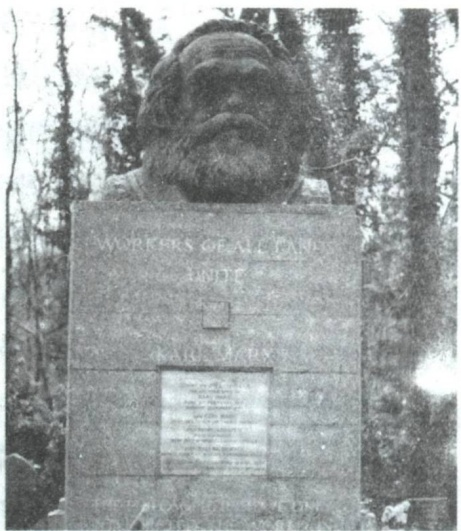
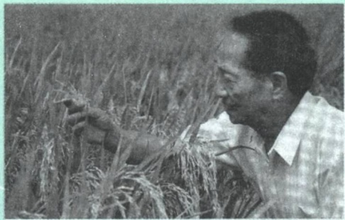
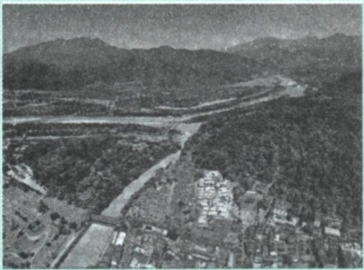
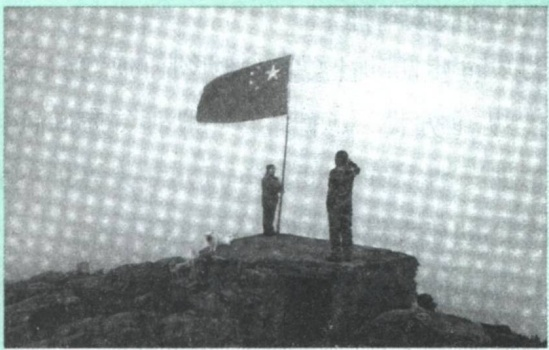
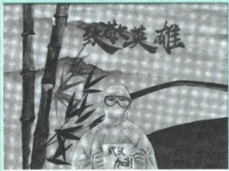

第二节 坚定信仰信念信心

53

不仅致力于科学解释世界，而且致力于积极改变世界。在伦敦海格特公墓的马克思墓碑上，镌刻着马克思的一句名言:“哲学家们只是用不同的方式解释世界，问题在于改变世界。” $^{①}$ 这鲜明地表明了马克思主义重视实践、以改造世界为己任的基本特征。正是在马克思主义的指导下，社会主义由空想变成科学，由科学理论转变为社会实践。社会

主义国家的出现和社会主义制度的建立，深刻改变着人类历史的走向。虽然东欧剧变和苏联解体使世界社会主义运动遭受了严重挫折，但是历史发展的总趋势并没有改变。特别是中国特色社会主义的成功实践，无可辩驳地证明了马克思主义具有鲜活的实践性和创造性，证明了马克思主义在中国的实践伟力。在人类思想史上，还没有一种理论像马克思主义那样对人类文明进步产生如此广泛而巨大的影响。公众号:旗胜考研一手扫描

马克思主义是不断发展的开放的理论，始终站在时代前沿。马克思主义诞生于19世纪中叶，但并没有停留在19世纪。马克思一再告诫人们，马克思主义理论不是教条，而是行动指南，必须随着实践的变化而发展。一部马克思主义发展史就是马克思、恩格斯以及他们的后继者们不断根据时代、实践、认识发展而发展的历史，是不断吸收人类历史上一切优秀思想文化成果丰富自己的历史。因此，马克思主义能够永葆其美妙之青春，不断探索时代发展提出的新课题，回应人类社会面临的新挑战。马克思主义进入中国，既引发了中华文明的深刻变革，也走过了一个逐步中国化的过程。百余年来，中国共产党坚持解放思想和实事求是相统一、培元固本

<small>①《马克思恩格斯文集》第一卷，人民出版社2009年版，第502页。</small>

---

54

第二章 追求远大理想 坚定崇高信念

和守正创新相统一，不断开辟马克思主义新境界，产生了毛泽东思想、邓小平理论、“三个代表”重要思想、科学发展观，产生了习近平新时代中国特色社会主义思想，为党和人民事业发展提供了科学理论指导。一部党的历史，就是一部不断推进马克思主义中国化时代化的历史，就是一部不断推进理论创新、进行理论创造的历史。以史为鉴，开创未来，必须继续推进马克思主义中国化时代化。马克思主义只有同中国具体实际相结合、同中华优秀传统文化相结合，才能焕发出强大的生命力、创造力和感召力。

马克思主义是我们立党立国、兴党兴国的根本指导思想。实践告诉我们，中国共产党为什么能，中国特色社会主义为什么好，归根到底是马克思主义行，是中国化时代化的马克思主义行。

——习近平

马克思主义是党和人民事业不断发展的参天大树之根本，是党和人民不断奋进的万里长河之泉源。“拥有马克思主义科学理论指导是我们党坚定信仰信念、把握历史主动的根本所在。” $^{①}$ 对马克思主义的信仰，对社会主义和共产主义的信念，是共产党人的政治灵魂，是共产党人经受住任何考验的精神支柱。背离或放弃马克思主义，就会失去灵魂、迷失方向。大学生坚定马克思主义信仰，最重要的是学习和掌握马克思主义的立场、观点、方法，准确把握时代发展潮流，以科学的理想信念指引人生前进的道路和方向。

## （二）胸怀共产主义远大理想

马克思主义科学预测了未来社会的理想状态，指明了人类社会的发

<small>① 习近平:《高举中国特色社会主义伟大旗帜 为全面建设社会主义现代化国家而团结奋斗——在中国共产党第二十次全国代表大会上的报告》，人民出版社2022年版，第16页。</small>

---

第二节 坚定信仰信念信心

55

展方向。共产主义社会是物质财富极大丰富、实现按需分配、人的精神境界极大提高、每个人自由而全面发展的社会。共产主义只有在社会主义社会充分发展和高度发达的基础上才能实现。中国共产党从成立之日起，就确立了共产主义的远大理想，始终团结带领中国人民朝着这个伟大理想前行。

革命理想高于天。中国共产党之所以叫共产党，就是因为从成立之日起我们党就把共产主义确立为远大理想。我们党之所以能够经受一次次挫折而又一次次奋起，归根到底是因为我们党有远大理想和崇高追求。

——习近平

共产主义是现实运动和长远目标相统一的过程。共产主义是崇高的社会理想，是关于无产阶级解放的学说，同时也是一种现实运动。共产主义远大理想既是面向未来的，又是指向现实的，不仅反映了人们对未来社会的美好向往，更是一个从现实的人出发，不断满足人的现实利益需求、推进人的全面发展、推动社会发展进步的历史过程与现实运动。有人认为，共产主义理想离现实太遥远，是无法实现的，这实际上割裂了共产主义远大理想与现实的辩证统一关系。事实上，共产主义的思想和实践早已存在于我们的现实生活中，那种认为“共产主义是渺茫的幻想”“共产主义没有经过实践检验”的观点，是完全错误的。

回顾共产主义运动的历史进程，从1848年《共产党宣言》问世到1917年第一个社会主义国家建立，从第二次世界大战后一大批社会主义国家勃然兴起到20世纪80年代末90年代初东欧剧变、苏联解体，再到新时代中国特色社会主义焕发出前所未有的生机和活力，社会主义和共产主义的理想与实践不仅没有戛然而止，没有像西方某些人所预言的那样进入历史博物馆，反而在长期的艰辛探索中展现出更加光明的前景。理想实

---

56

第二章 追求远大理想 坚定崇高信念

现的路途是艰难曲折的，共产主义远大理想的实现更是需要一代又一代人的不懈奋斗和接续努力。必须认识到，我们现在的努力以及将来多少代人的持续努力，都是朝着最终实现共产主义这个大目标前进的。同时，也必须认识到，实现共产主义是一个非常漫长的历史过程，我们必须立足党在现阶段的奋斗目标，脚踏实地推进我们的事业。如果丢失了共产党人的远大目标，就会迷失方向，变成功利主义、实用主义。

共产主义决不是“土豆烧牛肉”那么简单，不可能唾手可得、一蹴而就，但我们不能因为实现共产主义理想是一个漫长的过程，就认为那是虚无缥缈的海市蜃楼，就不去做一个忠诚的共产党员。革命理想高于天。实现共产主义是我们共产党人的最高理想，而这个最高理想是需要一代又一代人接力奋斗的。如果大家都觉得这是看不见摸不着的东西，没有必要为之奋斗和牺牲，那共产主义就真的永远实现不了了。我们现在坚持和发展中国特色社会主义，就是向着最高理想所进行的实实在在努力。

——习近平

## 二、增强对中国特色社会主义的信念

中国特色社会主义，承载着几代中国共产党人的理想和探索，寄托着无数仁人志士的夙愿和期盼，凝聚着亿万人民的奋斗和牺牲，是近代以来中国社会发展的必然选择。在中国共产党领导下，坚持和发展中国特色社会主义，实现中华民族伟大复兴，要求我们必须增强对中国特色社会主义的坚定信念。

中国特色社会主义是科学社会主义，而不是其他什么主义。历史和现实都告诉我们，只有社会主义才能救中国，只有中国特色社会主义才能发

---

第二节 坚定信仰信念信心

57

展中国。中国特色社会主义是改革开放以来党的全部理论和实践的主题，是党和人民历尽千辛万苦、付出巨大代价才取得的根本成就。中国特色社会主义，既坚持了科学社会主义基本原则，又根据时代条件赋予其鲜明的中国特色，以全新的视野深化了对共产党执政规律、社会主义建设规律、人类社会发展规律的认识，使我们国家快速发展起来，使我国人民生活水平快速提高起来。新时代坚持和发展中国特色社会主义，总任务是实现社会主义现代化和中华民族伟大复兴，在全面建成小康社会的基础上，分两步走，到本世纪中叶建成富强民主文明和谐美丽的社会主义现代化强国，以中国式现代化推进中华民族伟大复兴。在当代中国，坚持中国特色社会主义，就是真正坚持科学社会主义。

明辨

## 为什么说中国特色社会主义是科学社会主义而不是其他什么主义？

中国特色社会主义坚持了科学社会主义的基本原则。在领导制度上，中国共产党领导是中国特色社会主义最本质的特征，是中国特色社会主义制度的最大优势；在国体和政体上，实行人民民主专政和人民代表大会制度；在经济制度上，坚持公有制为主体、多种所有制经济共同发展，坚持按劳分配为主体、多种分配方式并存，实行社会主义市场经济体制；在意识形态上，坚持马克思主义指导地位不动摇，培育和践行社会主义核心价值观；在根本立场上，坚持以人民为中心，不断促进人的全面发展，实现全体人民共同富裕。这些都在新的历史条件下体现了科学社会主义基本原则，赓续了科学社会主义基因血脉，丰富发展了科学社会主义并赋予其鲜明中国特色。中国特色社会主义不仅没有背离科学社会主义，而且恰恰是在坚持科学社会主义基本原则同中国具体实际、历史文化传统、时代要求相结合的过程中，得以丰富和发展。中国特色社会主义，是科学社会主义理论逻辑和中国社会发展历史逻辑的辩证统一，是根植于中国大地、反映中国人民意愿、适应中国和时代发展进步要求的社会主义。

---

58

第二章 追求远大理想 坚定崇高信念

中国特色社会主义不是从天上掉下来的，而是中国共产党带领中国人民历经千辛万苦找到的实现中国梦的正确道路。改革开放以来我们取得一切成绩和进步的根本原因，归结起来就是:开辟了中国特色社会主义道路，形成了中国特色社会主义理论体系，确立了中国特色社会主义制度，发展了中国特色社会主义文化。中国特色社会主义道路是实现社会主义现代化、指引中国人民创造自己美好生活的必由之路。中国特色社会主义理论体系是指导党和人民沿着中国特色社会主义道路实现中华民族伟大复兴的正确理论，是立于时代前沿、与时俱进的科学理论。中国特色社会主义制度是当代中国发展进步的根本制度保障，是具有鲜明中国特色、明显制度优势、强大自我完善能力的先进制度。中国特色社会主义文化源自中华民族5000多年文明历史所孕育的中华优秀传统文化，熔铸于党领导人民在革命、建设、改革中创造的革命文化和社会主义先进文化，植根于中国特色社会主义伟大实践，是中国人民胜利前行的强大精神力量。中国特色社会主义，既是我们必须不断推进的伟大事业，又是我们开辟未来的根本保证。走自己的路，是党的全部理论和实践立足点，更是党百年奋斗得出的历史结论。以史为鉴，开创未来，必须坚持和发展中国特色社会主义。

中国共产党领导是中国特色社会主义最本质的特征，是中国特色社会主义制度的最大优势，是党和国家的根本所在、命脉所在，是全国各族人民的利益所系、命运所系。中国共产党是中国工人阶级的先锋队，同时是中国人民和中华民族的先锋队，是中国特色社会主义事业的领导核心。中国共产党自诞生之日起，就把为中国人民谋幸福、为中华民族谋复兴作为自己的初心和使命，并团结带领全国各族人民不懈奋斗，战胜各种艰难险阻，不断取得革命、建设、改革的伟大胜利。中国共产党领导中国人民取得的伟大胜利，使具有5000多年文明历史的中华民族全面迈向现代化，让中华文明在现代化进程中焕发出新的蓬勃生机；使具有500多年历史的社会主义主张在世界上人口最多的国家成功开辟出具有高度现实性和可行性的正确道路，让科学社会主义在21世纪焕发出新的蓬勃生机；使

---

第二节 坚定信仰信念信心

59

具有70多年历史的新中国建设取得举世瞩目的成就，让中国这个世界上最大的发展中国家在短短40多年里摆脱贫困全面建成了小康社会，创造了人类社会发展史上惊天动地的发展奇迹；使新时代中国特色社会主义取得历史性成就、发生历史性变革，让中国式现代化为人类实现现代化提供了新的选择，为解决人类面临的共同问题提供更多更好的中国智慧、中国方案、中国力量，为人类和平与发展崇高事业作出新的更大贡献。当今中国，只有中国共产党，才能领导中国人民坚持和发展中国特色社会主义，才能担当起带领中国人民创造幸福生活、实现中华民族伟大复兴的历史使命。

## 三、增强对实现中华民族伟大复兴的信心

中国共产党一经诞生，就把为中国人民谋幸福、为中华民族谋复兴确立为自己的初心使命。一百年来，中国共产党团结带领中国人民进行的一切奋斗、一切牺牲、一切创造，归结起来就是一个主题:实现中华民族伟大复兴。

——习近平

实现中华民族伟大复兴，是中华民族近代以来最伟大的梦想。这个梦想，就是要实现国家富强、民族振兴、人民幸福，它凝聚了几代中国人的夙愿，体现了中华民族和中国人民的整体利益，是每一个中华儿女的共同期盼。我们的民族是伟大的民族。在5000多年的文明发展历程中，中华民族为人类文明进步作出了不可磨灭的贡献。近代以后，我们的民族历经磨难，中华民族到了最危险的时候，无数仁人志士在探索救国救民的道路上作出了可歌可泣的奉献和牺牲，值得永远敬仰和诏记。在中国共产党领导下，我们终于找到实现民族复兴的正确道路。经过新民主主义革命，中华民族获得了独立，中国人民得到了解放，实现了站起来的愿望。经过社

---

60

第二章 追求远大理想 坚定崇高信念

会主义革命和建设特别是改革开放以来的中国特色社会主义建设，中华民族实现了富起来的愿望，不仅人民群众的生活得到了巨大改善，国家的经济实力、科技实力、国防实力、综合国力也进入世界前列，国际地位实现了前所未有的提升。经过长期艰苦的努力，中华民族迎来了从站起来、富起来到强起来的伟大飞跃，中国特色社会主义迎来了从创立、发展到完善的伟大飞跃，中国人民迎来了从温饱不足到小康富裕的伟大飞跃。

## 拓展

## 社会主义没有辜负中国

在中华民族积贫积弱、任人宰割的时期，各种主义和思潮都进行过尝试，资本主义道路没有走通，改良主义、自由主义、社会达尔文主义、无政府主义、实用主义、民粹主义、工团主义等也都“你方唱罢我登场”，但都没能解决中国的前途和命运问题。是马克思主义引导中国人民走出了漫漫长夜、建立新中国，走上社会主义康庄大道，是中国特色社会主义使中国快速发展起来了。在百余年接续奋斗中，一代又一代中国共产党人不忘初心、牢记使命，团结带领人民为实现中华民族伟大复兴作出卓越贡献，创造了中华民族发展史、人类社会进步史上惊天动地的奇迹。

实现中华民族伟大复兴的中国梦是一项光荣而艰巨的事业。中华民族伟大复兴，绝不是轻轻松松、敲锣打鼓就能实现的，必须付出艰苦的努力。中国共产党一经成立，就义无反顾肩负起实现中华民族伟大复兴的历史使命。百余年来，为了实现这一历史使命，无论是弱小还是强大，无论是顺境还是逆境，中国共产党都初心不改、矢志不渝，团结带领人民历经千难万险，付出巨大牺牲，敢于面对挫折，勇于修正错误，攻克了一个又一个看似不可攻克的难关，创造了一个又一个彪炳史册的人间奇迹。进入新发展阶段，是中华民族伟大复兴历史进程的大跨越。中国人民实现中华民族伟大复兴的愿望和信心无比强烈，中华民族伟大复兴的前进步伐势

---

第三节 在实现中国梦的实践中放飞青春梦想

61

不可挡。

中国的昨天已经写在人类的史册上，中国的今天正在亿万人民手中创造，中国的明天必将更加美好。信仰、信念、信心，任何时候都至关重要。小到一个人、一个集体，大到一个政党、一个民族、一个国家，只要有信仰、信念、信心，就会愈挫愈奋、愈战愈勇，否则就会不战自败、不打自垮。理想信念之火一经点燃就会产生巨大的精神力量。无论过去、现在还是将来，对马克思主义、共产主义的信仰，对中国特色社会主义的信念，对实现中华民族伟大复兴的中国梦的信心，都是指引和支撑中国人民站起来、富起来、强起来的强大精神力量。心中有信仰，脚下有力量。走好新时代的长征路，大学生要不断增强中国特色社会主义道路自信、理论自信、制度自信、文化自信，自觉做共产主义远大理想和中国特色社会主义共同理想的坚定信仰者、忠实实践者，为崇高理想信念而矢志奋斗。

## 第三节 在实现中国梦的实践中放飞青春梦想

理想信念是一个思想认识问题，更是一个实践问题。如果说，现实是此岸，理想是彼岸，那么，唯有实践才是联系二者的桥梁。理想不等于现实，理想的实现往往要通过一条并不平坦的曲折之路，有赖于脚踏实地、持之以恒的奋斗。实践，只有实践，才是通往理想彼岸的桥梁。

## 一、科学把握理想与现实的辩证统一

在追求理想的过程中，人们常常会感受到理想与现实之间的矛盾。对于思想活跃的青年大学生来说，也容易对理想与现实的矛盾产生困惑，这就需要正确认识理想与现实的关系。

辩证看待理想与现实的矛盾。理想与现实是对立统一的。在日常生活

---

62

第二章 追求远大理想 坚定崇高信念

中，人们在处理理想与现实的关系时，往往只看到二者对立的一面，看不到二者统一的一面。一种认识偏向是用理想来否定现实，当发现现实不符合理想预期的时候，就对现实大失所望，甚至对现实采取全盘否定的态度。另一种认识偏向是用现实来否定理想，在追求理想的过程中一遇到困难就产生畏难情绪，觉得理想遥不可及，丧失为理想而奋斗的信心和勇气，直至最终放弃理想。之所以会出现这些认识误区，从思想方法上讲，是由于不能辩证地看待和处理理想与现实的矛盾。理想和现实存在着对立的一面，二者的矛盾与冲突，属于“应然”和“实然”的矛盾。假如理想与现实完全等同，那么理想的存在就没有意义了。理想与现实又是统一的。理想受现实的规定和制约，是在对现实认识的基础上发展起来的。一方面，现实中包含着理想的因素，孕育着理想的发展；另一方面，理想中也包含着现实，既包含着现实中必然发展的因素，又包含着由理想转化为现实的条件，在一定的条件下，理想就可以转化为未来的现实。脱离现实而谈理想，理想就会成为空想。

图说

屠守锷，我国航天事业的开拓者和奠基人之一，“两弹一星”功勋奖章获得者，著名导弹和火箭专家，中国科学院资深院士，国际宇航科学院院士。面对旧中国的满目疮痍，少年屠守锷立下终生志愿:一定要亲手造出我们自己的飞机，赶走侵略者，为死难的同胞报仇！1957年，屠守锷应聂荣臻元帅之邀，跨进国防部第五研究院的大门。从

此，他的命运便与中国航天事业紧紧联系在了一起。屠守锷参与了我国火箭技术发展重大战略问题的决策，领导科研团队解决了若干研制中的关键技术问题，为我国航天事业的发展作出了卓越贡献。

---

第三节 在实现中国梦的实践中放飞青春梦想

63

实现理想的长期性、艰巨性和曲折性。理想的实现是一个过程。一般来说，理想越是远大，它的实现过程就越复杂，需要的时间也就越漫长。纵观人类社会发展史，任何一种理想的实现都不是轻而易举的，必然会遇到各种各样的困难和波折，充满艰险和坎坷。实现理想、创造未来，必须有战胜种种艰难险阻的坚定不移的信心和坚忍不拔的毅力。理想变为现实不是一帆风顺的，往往会遭遇波澜和坎坷。在现实生活中，人们对于理想的美好有着充分的想象，而对于实现理想的艰难则往往估计不足。渴望早日实现理想，希望顺利实现理想，这是人之常情。但是，如果把实现理想设想得过分容易，对前进道路上的困难缺乏思想准备，遭遇到一点困难、曲折或失败就灰心丧气、悲观失望，那就会影响理想的实现。公众号:旗胜考研一手扫描

艰苦奋斗是实现理想的重要条件。“人类的美好理想，都不可能唾手可得，都离不开筚路蓝缕、手胼足胝的艰苦奋斗。”①一个没有艰苦奋斗精神作支撑的民族，是难以自立自强的；一个没有艰苦奋斗精神作支撑的国家，是难以发展进步的；一个没有艰苦奋斗精神作支撑的政党，它的事业是难以兴旺发达的。艰苦奋斗是我们的传家宝。我们的国家，我们的民族，从积贫积弱一步一步走到今天的发展繁荣，靠的就是一代又一代人的顽强拼搏，靠的就是中华民族自强不息的奋斗精神。在实现中华民族伟大复兴的新征程上，必然会有艰巨繁重的任务，必然会有艰难险阻甚至惊涛骇浪，特别需要我们发扬艰苦奋斗精神。对于当代青年来说，理想的实现必须通过实践才能转变为现实。凡有成就者，其渊博的知识、卓越的才能、闪光的智慧、不朽的业绩，都是从艰苦奋斗中得来的。艰苦奋斗是成就人生事业不可或缺的条件。在通向理想的道路上，在实现理想的过程中，没有艰苦奋斗的精神，理想是不会自动转化为现实的。

<small>①《习近平谈治国理政》第一卷，外文出版社2018年版，第52页。</small>

---

64

第二章 追求远大理想 坚定崇高信念

## 明辨

## 当代青年还需要艰苦奋斗吗？

有人认为，“艰苦奋斗是老一辈的事，当代青年不需要艰苦奋斗”。这种观点在理论上是错误的，在实践中是有害的。一方面，物质生活条件的改善，社会观念的变化，只是赋予艰苦奋斗以新的时代内涵和实践要求，但艰苦奋斗的精神是永远不会过时的；另一方面，讲艰苦奋斗，也并不是不讲物质条件，而是为了实现既定的理想，吃苦耐劳，迎难而上，不惜奉献出自己的一切。当代中国既面临着重要发展机遇，也面临着前所未有的困难和挑战。梦在前方，路在脚下。自胜者强，自强者胜。实现我们的发展目标，需要广大青年锲而不舍、驰而不息的奋斗，不断书写奉献青春的时代篇章。

理想信念不是拿来说、拿来唱的，更不是用来装点门面的，只有见诸行动才有说服力。大学生要把敢于吃苦、勇于奋斗的精神落实到日常的学习、生活和工作中。在学习上，刻苦钻研、不畏艰难，孜孜不倦地学习理论和专业知识，不断提高思想道德和专业知识水平；在生活上，艰苦朴素、勤俭节约，抵制和反对铺张奢华的思想和生活作风；在工作上，奋发图强、不怕困难、不避艰险，努力完成各项任务。

## 二、坚持个人理想与社会理想的有机结合

坚持个人奋斗目标与国家、民族的奋斗目标相统一，把个人理想融入社会理想之中，在为实现社会理想而奋斗的过程中实现个人理想，这是大学生成长成才的必由之路。

个人理想是指处于一定历史条件和社会关系中的个体对于自己未来的物质生活、精神生活所产生的向往和追求。社会理想是指社会集体乃至社会全体成员的共同理想，即在全社会占主导地位的共同奋斗目标。个人理想与社

---

第三节 在实现中国梦的实践中放飞青春梦想

65

会理想的关系实质上是个人与社会关系在理想层面的反映。个人与社会有机地联系在一起，二者相互依存、相互制约、共同发展。同样，社会理想与个人理想也不是彼此孤立的，它们之间相互联系、相互影响、相互制约。

个人理想以社会理想为指引。追求个人理想的实践活动都是在社会中进行的，个人理想的确立不能只凭个人的主观愿望，而要顺应社会发展的客观规律和趋势要求；个人理想的实现不仅仅是个人奋斗的事情，而是要担当时代赋予的社会责任和历史使命。从根本上说，个人理想是由社会理想规定的。在整个理想体系中，社会理想是最根本、最重要的，个人理想则从属于社会理想。换句话说，个人理想的确立要以社会理想为导向，个人理想的实现依赖于社会理想的指引。个人理想只有同国家的前途、民族的命运相结合，个人的向往和追求只有同社会的需要和人民的利益相一致，才可能变为现实。

社会理想是个人理想的汇聚和升华。社会是个人的联合体，社会理想与个人理想密不可分。社会理想不是凭空产生的，也不是由外在力量强加的，而是建立在广大社会成员的个人理想基础之上的。强调个人理想要符合社会理想，并不是要排斥和抹杀个人理想，而是要摆正个人理想同社会理想的关系。社会理想归根到底要靠全体社会成员的共同努力来实现，并具体体现在每个社会成员为实现个人理想而进行的活生生的实践中。当社会理想同个人理想有矛盾冲突的时候，有志气、有抱负的人可以作出最大的自我牺牲，使个人的理想服从于全社会的共同理想。

图说

杂交水稻之父袁隆平有两个梦:一个“禾下乘凉梦”，一个“杂交水稻覆盖全球梦”。他曾说，全世界有1.6亿公顷的稻田，如果其中一半种上杂交稻，每公顷增产2吨，每年增产的

---

66

第二章 追求远大理想 坚定崇高信念

粮食可以多养活5亿人口。终其一生，袁隆平都在为实现梦想而奋斗。1964年，他开始研究杂交水稻，成功选育了世界上第一个实用高产杂交水稻品种。杂交水稻成果不但使水稻的单产和总产大幅度提高，而且还种到了沙漠和盐碱地，种到了非洲和全世界。2019年，袁隆平被授予“共和国勋章”。

得其大者可以兼其小。个人只有把人生理想融入国家和民族的事业中，才能最终成就一番事业。大学生对自己未来生活的追求和向往，不能脱离当代中国的社会现实。大学生要在社会理想的指引下，珍惜韶华、奋发有为，勇于追求个人理想，在实现社会理想的过程中努力实现个人理想。

## 三、为实现中国梦注入青春能量

青年的前途离不开国家的前途，没有国家的前途也就没有青年的前途。大学生肩负实现中华民族伟大复兴的中国梦的历史重任，只有把实现理想的道路建立在脚踏实地的奋斗上，才能放飞青春梦想，实现人生理想。

立鸿鹄志，做奋斗者。中国传统文化中有许多励志警句。如墨子说“志不强者智不达”，诸葛亮说“志当存高远”，王守仁说“志不立，天下无可成之事”。这里的“志”具有双重含义:一是对未来目标的向往，二是实现奋斗目标的顽强意志。志向，就是理想信念；立志，就是确立理想信念。“志高则言洁，志大则辞弘，志远则旨永。”有志者，事竟成；有大志者，人生事业才能辉煌。志向高远，就是要放开眼界，不满足于现状，也不屈服于一时一地的困难与挫折，更不要斤斤计较个人利益的多少与得失。大量事实告诉人们，那些在事业上取得伟大成就、对人类作出卓越贡献的人，都是在青年时期就立下了鸿鹄之志，并为之坚持不懈、努力奋斗。周恩来中学时期就立下了“为中华之崛起而读书”的志向，李四光、钱学森、邓稼先等老一代知识分子，青年时期就立志用自己的聪明才智报

---

第三节 在实现中国梦的实践中放飞青春梦想

67

效祖国。青年志存高远，就能激发奋进潜力，青春岁月就不会像无舵之舟漂泊不定。树雄心、立壮志，是关系大学生一生前途命运的重大课题。

心怀“国之大者”，敢于担当。中国民主革命的先行者孙中山曾激励广大青年，要立志做大事，不要立志做大官。其中的道理就是希望青年以国家民族的命运为己任，而不要以个人的荣华富贵为人生的理想。如果一个人不顾自身所处时代的召唤，脱离自己所归属的国家和民族繁荣发展的需要，一切以自我为中心，那么，不仅他的人生价值取向是错误的，而且这种追求因为脱离了国家、民族和时代的需要，往往也是难以实现的。在今天，做大事就是投身于新时代中国特色社会主义伟大事业。无论从事什么具体、平凡的工作，只要是与中国特色社会主义伟大事业相联系、服务于祖国和人民的，就值得我们去做。新时代的大学生应该肩负历史使命，把个人的命运与国家和人民的命运联系在一起，立为国奉献之志，立为民服务之志，让青春在为祖国和人民利益的不懈奋斗中熠熠生辉。

自觉躬身实践，知行合一。漫长征途需要一步一步地走，崇高理想的实现需要一点一滴地奋斗。通往理想的路是遥远的，但起点就在脚下，就在一切平凡的岗位上，就在扎扎实实的学习和工作中。中国古代先哲老子说:“合抱之木，生于毫末；九层之台，起于累土；千里之行，始于足下。”踏踏实实、循序渐进，与雄心壮志、力争上游并不矛盾，不踏踏实实打好基础，就无法攻尖端、攀高峰。大学生要牢记“空谈误国、实干兴邦”，志存高远、脚踏实地、埋头苦干，充分展现自己的抱负和激情，在“真刀真枪”的实干中成就一番事业。

“功崇惟志，业广惟勤。”我国仍处于并将长期处于社会主义初级阶段，实现中国梦，创造全体人民更加美好的生活，任重而道远，需要我们每一个人继续付出辛勤劳动和艰苦努力。

——习近平

---

68

第二章 追求远大理想 坚定崇高信念

祖国的富强、民族的复兴、人民的幸福，需要每一个社会成员尽其才、奋其志。中国梦是中华民族的振兴之梦，也是每一个大学生的成才之梦。中国梦让生活在这个时代的大学生与祖国人民一起共同享有人生出彩的机会，共同享有梦想成真的机会，共同享有同祖国和时代一起成长与进步的机会。青春只有在为祖国和人民的真诚奉献中才能更加绚丽多彩，人生只有融入国家和民族的伟大事业才能闪闪发光。

## 思考讨论

1. 李大钊说，以青春之我，创建青春之家庭，青春之国家，青春之民族。谈谈理想信念对大学生成长成才的重要意义。

2. 2021年4月25日至27日，习近平赴广西壮族自治区考察，第一站就到桂林市全州县的红军长征湘江战役纪念园，强调理想信念之火一经点燃就会产生巨大的精神力量。结合自身实际，谈谈为什么要坚定信仰信念信心。

3. 从个人理想与社会理想辩证关系的角度，谈谈青年一代为什么要树立共同理想和远大理想。

## 文献阅读

1. 中共中央文献研究室:《习近平关于实现中华民族伟大复兴的中国梦论述摘编》，中央文献出版社 2013 年版。

该书共分8个专题，收入146段论述，摘自习近平2012年11月15日至2013年11月2日期间的讲话、演讲、谈话、书信、批示等50多篇重要文献。

2. 习近平:《在纪念马克思诞辰 200 周年大会上的讲话》，人民出版社 2018 年版。

2018 年 5 月 4 日，纪念马克思诞辰 200 周年大会在北京隆重召开，习近平发表重要讲话，缅怀马克思的伟大人格和历史功绩，重温马克思的

---

文献阅读

69

崇高精神和光辉思想，宣誓新时代中国共产党人对马克思主义科学真理的坚定信念。

3. 习近平:《在庆祝中国共产主义青年团成立100周年大会上的讲话》，人民出版社2022年版。

2022 年 5 月 10 日，习近平在庆祝中国共产主义青年团成立 100 周年大会上发表重要讲话，激励广大团员青年在实现中华民族伟大复兴的中国梦的新征程上奋勇前进，用青春的能动力和创造力激荡起民族复兴的澎湃春潮，用青春的智慧和汗水打拼出一个更加美好的中国。

---

## 第三章 继承优良传统 弘扬中国精神

实现中华民族伟大复兴的中国梦，必须弘扬中国精神，这就是以爱国主义为核心的民族精神和以改革创新为核心的时代精神。爱国主义始终是把中华民族坚强团结在一起的精神纽带，改革创新始终是推进改革开放和社会主义现代化建设的精神力量。当代大学生担当着民族复兴的时代使命，要努力做忠诚的爱国者和时代的奋进者，用实际行动展现出中国精神的青春风采。

## 第一节 中国精神是兴国强国之魂

“人无精神则不立，国无精神则不强。精神是一个民族赖以长久生存的灵魂，唯有精神上达到一定的高度，这个民族才能在历史的洪流中屹立不倒、奋勇向前。” $^{①}$ 中华民族能够在5000多年的历史长河中生生不息、薪火相传，很重要的一个原因，就是拥有孕育于中华民族悠久辉煌历史文化之中的伟大中国精神。中国精神作为兴国强国之魂，是实现中华民族伟大复兴不可或缺的精神支撑。

## 一、崇尚精神是中华民族的优秀传统

在漫漫的历史进程中，中华民族不仅创造出光辉灿烂、享誉世界的中华文明，也塑造出独特的精神气质和精神品格，形成了崇尚精神的优秀传

<small>①《习近平谈治国理政》第二卷，外文出版社2017年版，第47—48页。</small>

---

第一节 中国精神是兴国强国之魂

71

统。这一传统贯穿在中华民族筚路蓝缕的奋斗历程中，推动中华民族一路向前，发展壮大。

中国传统文化博大精深，学习和掌握其中的各种思想精华，对树立正确的世界观、人生观、价值观很有益处。古人所说的“先天下之忧而忧，后天下之乐而乐”的政治抱负，“位卑未敢忘忧国”、“苟利国家生死以，岂因祸福避趋之”的报国情怀，“富贵不能淫，贫贱不能移，威武不能屈”的浩然正气，“人生自古谁无死，留取丹心照汗青”、“鞠躬尽瘁，死而后已”的献身精神等，都体现了中华民族的优秀传统文化和民族精神，我们都应该继承和发扬。

——习近平

中华民族崇尚精神的优秀传统，首先表现为对物质生活与精神生活相互关系的独到理解。中华民族的先人们早就向往人们的物质生活充实无忧、道德境界充分升华的大同世界。中华文明历来把人的精神生活纳入人生和社会理想之中。古圣先贤认为，人之所以异于禽兽，在于人有道德，有精神追求。物质生活固然为人所必需，但如果沉溺于物欲而不能自拔，则无异于禽兽。古人认为“不义而富且贵，于我如浮云”，强调“道德当身，故不以物惑”，崇尚“一箪食，一瓢饮，在陋巷，人不堪其忧，回也不改其乐”的精神追求。基于对精神生活重要性的认识，中国古人在义利观上主张见利思义、以义制利、先义后利，在理欲观上主张导欲、节欲，强调用道德理性和精神品格对欲望进行引导和控制，时刻对私欲、贪欲保持警惕。重视并崇尚精神生活，是中国古代思想家们的主流观点。

中华民族崇尚精神的优秀传统，也表现为对理想的不懈追求。理想是激励个体的精神内驱力，是凝聚社会整体的精神力量。矢志不渝地追求和坚守理想，是中国古人崇尚精神的典型体现。如儒家把仁爱和谐视为最高

---

72

第三章 继承优良传统 弘扬中国精神

理想，为实现“仁”的理想即使献出生命也在所不惜，即“志士仁人，无求生以害仁，有杀身以成仁”；墨家把“兼相爱，交相利”作为理想，提倡为兴天下之利、除天下之害而摩顶放踵。正是因为有了这种理想主义情怀，无数志士仁人秉持“为天地立心，为生民立命，为往圣继绝学，为万世开太平”的理想追求，心怀天下，利济苍生，为追求道义、实现理想而上下求索。公众号:旗胜考研一手扫描

中华民族崇尚精神的优秀传统，亦表现为对品格养成的重视。儒家把“君子”“圣人”作为自己的理想人格，道家推崇逍遥于天地之间的“真人”“至人”，近代启蒙思想家梁启超呼吁“新民”的理想人格。这些理想人格虽时代不同、类型有别，但其共同点是关注人的精神品格。中国传统文化十分强调道德修养和道德教化，将“立德”置于“三不朽”（立德、立功、立言）之首。中国古人认为“自天子以至于庶人，壹是皆以修身为本”，教化的目的是“明人伦”，是培养有道德的人。古代思想家们不仅对道德修养和道德教化理论进行了系统论述，而且提出了修身养性的具体方法以及家箴家训、乡规民约等教化方式。所有这些，无不表明中华民族自古以来对人的精神世界的高度关注。

## 二、中国精神的丰富内涵

在几千年的历史进程中，中国人民用勤劳和智慧书写了辉煌的中华历史，也培育铸就了独特的中国精神，为中国繁荣发展和人类文明进步提供了强大的精神动力。伟大创造精神、伟大奋斗精神、伟大团结精神、伟大梦想精神，传承中华民族的宝贵精神基因，汲取时代的丰厚精神滋养，是中国精神内涵的生动展现。

伟大创造精神。在几千年历史长河中，中国人民始终辛勤劳作、发明创造，我国产生了老子、孔子、庄子、孟子、墨子、孙子、韩非子等闻名于世的伟大思想巨匠，发明了造纸术、火药、印刷术、指南针等深刻影响人类

---

第一节 中国精神是兴国强国之魂

73

文明进程的伟大科技成果，创作了诗经、楚辞、汉赋、唐诗、宋词、元曲、明清小说等伟大文艺作品，传承了格萨尔王、玛纳斯、江格尔等震撼人心的伟大史诗，建设了万里长城、都江堰、大运河、故宫、布达拉宫等气势恢弘的伟大工程。今天，中国人民的创造精神正在前所未有地迸发出来，推动我国日新月异向前发展，大踏步走在世界前列。只要14亿多中国人民始终发扬这种伟大创造精神，就一定能够创造出一个又一个人间奇迹！

图说

都江堰设计巧妙，成效卓著，是闻名世界的水利工程。它将岷江水引入成都平原腹地，打开了成都平原与长江的通道，并在战国以后逐渐演变成以灌溉为主的水利工程。建造者们利用河流的地形和水流等自然条

件，以最少的工程设施实现引水、排洪、排沙、灌溉等多方面的工程效益。都江堰在2000多年中持续使用，消除了岷江水患，使成都平原成为水旱从人、沃野千里的“天府之国”。

伟大奋斗精神。在几千年历史长河中，中国人民始终革故鼎新、自强不息，开发和建设了祖国辽阔秀丽的大好河山，开拓了波涛万顷的辽阔海疆，开垦了物产丰富的广袤粮田，治理了桀骜不驯的千百条大江大河，战胜了数不清的自然灾害，建设了星罗棋布的城镇乡村，发展了门类齐全的产业，形成了多姿多彩的生活。中国人民自古就明白，世界上没有坐享其成的好事，要幸福就要奋斗。今天，中国人民拥有的一切，凝聚着中国人的聪明才智，浸透着中国人的辛勤汗水，蕴含着中国人的巨大牺牲。只要14亿多中国人民始终发扬这种伟大奋斗精神，就一定能够达到创造人民更加美好生活的宏伟目标！

---

74

第三章 继承优良传统 弘扬中国精神

红旗渠就是纪念碑，记载了林县人不认命、不服输、敢于战天斗地的英雄气概。要用红旗渠精神教育人民特别是广大青少年，社会主义是拼出来、干出来、拿命换来的，不仅过去如此，新时代也是如此。

——习近平

伟大团结精神。在几千年历史长河中，中国人民始终团结一心、同舟共济，建立了统一的多民族国家，发展了56个民族多元一体、交织交融的融洽民族关系，形成了守望相助的中华民族大家庭。特别是近代以后，在外来侵略寇急祸重的严峻形势下，我国各族人民手挽着手、肩并着肩，英勇奋斗，浴血奋战，打败了一切穷凶极恶的侵略者，捍卫了民族独立和自由，共同书写了中华民族保卫祖国、抵御外侮的壮丽史诗。今天，中国取得的令世人瞩目的发展成就，更是全国各族人民同心同德、同心同向努力的结果。中国人民从亲身经历中深刻认识到，团结就是力量，团结才能前进，一个四分五裂的国家不可能发展进步。只要14亿多中国人民始终发扬这种伟大团结精神，就一定能够形成勇往直前、无坚不摧的强大力量！

伟大梦想精神。在几千年历史长河中，中国人民始终心怀梦想、不懈追求，我们不仅形成了小康生活的理念，而且秉持天下为公的情怀，盘古开天、女娲补天、伏羲画卦、神农尝草、夸父追日、精卫填海、愚公移山等我国古代神话深刻反映了中国人民勇于追求和实现梦想的执着精神。中国人民相信，山再高，往上攀，总能登顶；路再长，走下去，定能到达。近代以来，实现中华民族伟大复兴成为中华民族最伟大的梦想，中国人民百折不挠、坚忍不拔，以同敌人血战到底的气概、在自力更生的基础上光复旧物的决心、自立于世界民族之林的能力，为实现这个伟大梦想进行了180多年的持续奋斗。今天，中国人民比历史上任何时期都更接近、更有信心和能力实现中华民族伟大复兴。只要14亿多中国人民始终发扬这种

---

第一节 中国精神是兴国强国之魂

75

伟大梦想精神，就一定能够实现中华民族伟大复兴！

## 三、中国共产党是中国精神的忠实继承者和坚定弘扬者

历史川流不息，精神代代相传。作为中国精神的忠实继承者和坚定弘扬者，一代又一代中国共产党人继承和弘扬中国精神，在长期奋斗中构建起中国共产党人的精神谱系，锤炼出鲜明的政治品格，极大丰富了中国精神的内涵。

## （一）伟大建党精神是中国共产党的精神之源

在庆祝中国共产党成立100周年大会上，习近平精辟概括伟大建党精神的深刻内涵，指出:“一百年前，中国共产党的先驱们创建了中国共产党，形成了坚持真理、坚守理想，践行初心、担当使命，不怕牺牲、英勇斗争，对党忠诚、不负人民的伟大建党精神，这是中国共产党的精神之源。”①

坚持真理、坚守理想。中国共产党一经成立，就把马克思主义写在自己的旗帜上。马克思主义深刻揭示了自然界、人类社会、人类思维发展的普遍规律，是指引人类探索历史规律和寻求自身解放道路的科学真理。中国共产党人一旦选择了马克思主义，就一以贯之、坚定不移地坚持它、发展它、维护它，从来没有动摇过、改变过、放弃过。百余年来，中国共产党始终坚守共产主义、社会主义的理想信念，既锚定远大目标，又脚踏实地，在逆境中拼搏奋斗，在顺境中继续奋斗，以昂扬奋进的精神状态创造了无数人间奇迹。

践行初心、担当使命。作为马克思主义政党，中国共产党摆脱了以往一切政治力量追求自身特殊利益的局限，一经诞生就把为中国人民谋幸

<small>① 习近平:《在庆祝中国共产党成立100周年大会上的讲话》，人民出版社2021年版，第8页。</small>

---

76

第三章 继承优良传统 弘扬中国精神

福、为中华民族谋复兴确立为自己的初心使命。它像光芒四射的灯塔，指明了中国人民前进的道路和方向。中国共产党的百年历史，就是一部践行初心、担当使命的历史。百余年来，中国共产党在腥风血雨中绝境重生，在惊涛骇浪中坚如磐石，在攻坚克难中创造奇迹，靠的就是始终不渝践行初心、担当使命的精神力量。

不怕牺牲、英勇斗争。“人生天地间，长路有险夷。”世界上没有哪个党像中国共产党这样，遭遇过如此多的艰难险阻，经历过如此多的生死考验，付出过如此多的惨烈牺牲。中国共产党在内忧外患中诞生、在历经磨难中成长、在攻坚克难中壮大，为了人民、国家、民族，为了理想信念，无论敌人如何强大、道路如何艰险、挑战如何严峻，中国共产党总是绝不畏惧、绝不退缩，不怕牺牲、百折不挠。百余年来，在应对各种困难挑战中，中国共产党锤炼了不畏强敌、不惧风险、敢于斗争、勇于胜利的风骨和品质。这是中国共产党最鲜明的特质和特点。“为有牺牲多壮志，敢教日月换新天”，中国共产党人用斗争和牺牲铸就了一座座革命英雄主义丰碑。公众号:旗胜考研一手扫描

对党忠诚、不负人民。全心全意为人民服务，这是中国共产党的根本宗旨。对党忠诚、永不叛党，这是党章对党员的基本要求。来自人民、依靠人民、为了人民，是百余年来中国共产党的发展逻辑和胜利密码。中国共产党始终代表最广大人民根本利益，与人民有福同享、有难同当，有盐同咸、无盐同淡，紧紧依靠人民战胜一个又一个困难、取得一个又一个胜利。中国共产党根基在人民、血脉在人民、力量在人民，“人民”二字深深融入党的血脉，成为中国共产党人薪火相传、永不磨灭的精神基因。百余年来，中国共产党人忠实践行“随时准备为党和人民牺牲一切”的入党誓词，用忠诚和奉献生动诠释了“我将无我、不负人民”的崇高情怀。

## （二）中国共产党人的精神谱系

百余年来，党领导人民浴血奋战、百折不挠，创造了新民主主义革

---

第一节 中国精神是兴国强国之魂

77

命的伟大成就；自力更生、发愤图强，创造了社会主义革命和建设的伟大成就；解放思想、锐意进取，创造了改革开放和社会主义现代化建设的伟大成就；自信自强、守正创新，创造了新时代中国特色社会主义的伟大成就。党和人民百年奋斗，书写了中华民族几千年历史上最恢宏的史诗。

在百余年的非凡奋斗历程中，一代又一代中国共产党人顽强拼搏、不懈奋斗，涌现了一大批视死如归的革命烈士、一大批顽强奋斗的英雄人物、一大批忘我奉献的先进模范，形成了井冈山精神、长征精神、遵义会议精神、延安精神、西柏坡精神、红岩精神、抗美援朝精神、“两弹一星”精神、特区精神、抗洪精神、抗震救灾精神、抗疫精神、脱贫攻坚精神等伟大精神，构筑起了中国共产党人的精神谱系。

伟大事业孕育伟大精神，伟大精神引领伟大事业。脱贫攻坚伟大斗争，锻造形成了“上下同心、尽锐出战、精准务实、开拓创新、攻坚克难、不负人民”的脱贫攻坚精神。脱贫攻坚精神，是中国共产党性质宗旨、中国人民意志品质、中华民族精神的生动写照，是爱国主义、集体主义、社会主义思想的集中体现，是中国精神、中国价值、中国力量的充分彰显，赓续传承了伟大民族精神和时代精神。

——习近平

中国共产党人的精神谱系，由一个个鲜明具体的“坐标”组成，犹如鲜活生动的历史链条，展示了中国共产党人崇高的精神风范。这一精神谱系，是中国共产党领导人民在团结奋斗中共同创造的，集中体现了党的坚定信念、根本宗旨、优良作风，凝聚着中国共产党人艰苦奋斗、牺牲奉献、开拓进取的伟大品格，深深融入党、国家、民族、人民的血脉之中，极大丰富了中国精神的内涵，鼓舞和激励中国人民攻坚克难，不断从胜利走向新的胜利。

---

78

第三章 继承优良传统 弘扬中国精神

## 四、实现中国梦必须弘扬中国精神

中国精神是兴国强国之魂。全面建设社会主义现代化国家、全面推进中华民族伟大复兴，必须大力弘扬中国精神，弘扬以爱国主义为核心的民族精神和以改革创新为核心的时代精神，振奋起全民族的“精气神”。

## (一)凝聚兴国强国的磅礴伟力

凝聚中国力量的精神纽带。全面建设社会主义现代化国家，是一项伟大而艰巨的事业，前途光明，任重道远。我们必须有万众一心、众志成城的强大精神凝聚力。人民群众是历史发展和社会进步的主体力量，团结奋斗是中国人民创造历史伟业的必由之路。坚持和发展中国特色社会主义、实现中华民族的伟大复兴，最根本的力量在人民，最强大的力量在团结凝聚起来的人民。“大鹏之动，非一羽之轻也；骐骥之速，非一足之力也。”没有强大的精神力量，就会重演中国近代以来四分五裂、一盘散沙的悲剧。弘扬中国精神，对于维系中华民族的生存与发展、维护国家统一和民族团结发挥着重要的凝聚作用。

激发创新创造的精神动力。当前，我们正在从事的中国特色社会主义事业是一项前无古人的创造性事业，中国精神作为兴国强国之魂的价值和意义更为凸显。实现梦想、应对挑战、创造未来的动力，只能从发展中来、从改革中来、从创新中来。推进新时代的伟大事业，必须有创新创造、向上向前的强大精神奋发力，勇于变革、勇于创新，永不僵化、永不停滞，使全体人民始终保持昂扬向上的精神状态。

推进复兴伟业的精神支柱。世界上没有一个民族能够亦步亦趋走别人的道路实现自己的发展振兴，也没有一个民族会在心神不定、游移彷徨中成就自己的光荣和梦想。实现中华民族伟大复兴的中国梦，需要我们正确认识当代世界和中国发展大势，正确认识中国特色和国际比较，

---

第一节 中国精神是兴国强国之魂

79

增强民族自尊心和自信心，坚定不移走自己的路，使全体人民拥有坚如磐石的精神和信仰力量，坚定不移把中国特色社会主义事业不断推向前进。

## （二）弘扬以爱国主义为核心的民族精神

民族精神是一个民族在长期共同生活和社会实践中形成的，为本民族大多数成员所认同的价值取向、思维方式、道德规范、精神气质的总和，是一个民族赖以生存和发展的精神支柱。在5000多年的历史发展进程中，中华民族形成了以爱国主义为核心的伟大民族精神。

爱国主义体现了人们对自己祖国的深厚感情，揭示了个人对祖国的依存关系，是人们对自己家园以及民族和文化的归属感、认同感、尊严感与荣誉感的统一，是调节个人与祖国之间关系的道德要求、政治原则和法律规范。爱国主义是中华民族的民族心、民族魂，是中华民族最重要的精神财富，深深植根于中华民族心中，维系着中华大地上各个民族的团结统一，激励着一代又一代中华儿女为祖国发展繁荣而自强不息、不懈奋斗。

爱国主义的基本内涵主要表现在四个方面。一是爱祖国的大好河山。祖国的大好河山，不只是自然风光，还是主权、财富、民族发展和进步的基本载体。维护祖国领土的完整和统一，是每个人的神圣使命和义不容辞的责任。二是爱自己的骨肉同胞。骨肉同胞之爱反映了对民族利益共同体的自觉认同，是检验一个人对祖国忠诚程度的试金石。三是爱祖国的灿烂文化。文化是一个国家、一个民族的灵魂，是一个国家民族得以延续的精神基因，是涵养民族心理、民族个性、民族精神的摇篮，是民族凝聚力的重要基础。爱祖国的灿烂文化，体现为对祖国优秀历史文化传统的认同和尊重、传承和发扬。四是爱自己的国家。国家是个体成长发展的基本屏障和坚实依托，个体与国家之间相互依存、密不可分，这也是最深刻的爱国理由。祖国的大好河山，自己的骨肉同胞，民族的灿烂文化，都是同我们

---

80

第三章 继承优良传统 弘扬中国精神

的国家联系在一起的，我们每个人的发展也都时刻同国家的发展进步紧密关联。

图说

江苏灌云县开山岛位于我国黄海前哨，面积仅有两个足球场大小。1986年，26岁的王继才接受了守岛任务，从此与妻子王仕花以海岛为家，与孤独相伴，在没水没电、植

物都难以存活的孤岛上默默坚守，把青春年华全部献给了祖国的海防事业。2014年，王继才夫妇被评为全国“时代楷模”。2019年，王继才被授予“人民楷模”国家荣誉称号和“最美奋斗者”个人称号。

一部中华民族的发展史，就是一部中华儿女的爱国奋斗史。中国人很早就有以天下兴亡、人民安康为己任的家国情怀，形成了追求进步、维护民族尊严和国家主权的光荣传统，形成了对外来侵略者无比痛恨、对卖国求荣的民族败类无比鄙视、对爱国志士无比崇敬的宝贵民族性格。以爱国主义为核心的民族精神，为中国人民克服艰难险阻、实现中华民族伟大复兴提供了不竭精神力量。

## （三）弘扬以改革创新为核心的时代精神

时代精神是一个国家和民族在新的历史条件下形成和发展的，体现民族特质并顺应时代潮流的思想观念、价值取向、精神风貌和社会风尚的总和。改革开放以来，党带领人民在继承和弘扬伟大民族精神的基础上，立足新的时代条件，形成了以改革创新为核心的时代精神。

---

第一节 中国精神是兴国强国之魂

81

## 拓展

## 时代楷模

改革开放进程中涌现的一系列时代楷模和榜样群体，生动展示了当代中国的时代精神。“雕刻火药的大国工匠”徐立平，在悬崖绝壁上书写精彩传奇的“当代愚公”黄大发，践行“只要生命不结束，服务人民不停止”诺言的杨善洲，练就了“一钩准”“一钩净”“无声响操作”等绝活的许振超，对党忠诚、心系群众、忘我工作、无私奉献的县委书记廖俊波，爱生如子、甘做学生成长引路人的高校思想政治理论课教师曲建武……这些时代楷模，在各自的岗位上心怀大我、至诚报国，书写了当代中国最美的时代华章。

弘扬以改革创新为核心的时代精神，就是要树立突破陈规、大胆探索、敢于创造的思想观念，从不合实际、不合规律的观念和体制的束缚中解放出来，从错误和教条式的思想观念中解放出来。弘扬以改革创新为核心的时代精神，就是要培养不甘落后、奋勇争先、追求进步的责任感和使命感，以“落后就会挨打”的危机感和忧患意识自我警醒，以只争朝夕的奋发精神和竞争意识自我激励。弘扬以改革创新为核心的时代精神，就是要保持坚忍不拔、自强不息、锐意进取的精神状态，有“敢啃硬骨头”“敢涉险滩”的闯劲，有“咬定青山不放松”的韧劲，有“生命不息，奋斗不止”的拼劲。改革开放40多年来，党带领人民取得举世瞩目的巨大成就，靠的就是这种不断改革创新的进取精神。

以爱国主义为核心的民族精神和以改革创新为核心的时代精神紧密关联，都是中华民族赖以生存和发展的精神支撑，都是中国精神的重要组成部分。大学生是民族的希望和祖国的未来，要努力将中国精神转化为青春行动，勇做弘扬和践行中国精神的时代先锋，为国家富强、民族振兴、人民幸福贡献自己的智慧和力量。

---

82

第三章 继承优良传统 弘扬中国精神

## 第二节 做新时代的忠诚爱国者

中国特色社会主义进入新时代，实现中华民族伟大复兴的中国梦是新时代爱国主义的鲜明主题。大力弘扬新时代爱国主义，必须坚持爱国爱党爱社会主义相统一、维护祖国统一和民族团结、尊重和传承中华民族历史文化、坚持立足中国又面向世界。

## 一、坚持爱国爱党爱社会主义相统一

新中国是中国共产党领导的社会主义国家，祖国的命运和党的命运、社会主义的命运密不可分。当代中国，爱国主义的本质就是坚持爱国和爱党、爱社会主义高度统一。

图说

为了全力支援湖北省和武汉市抗击新冠肺炎疫情，2020年1月24日至3月8日，全国共调集346支国家医疗队、4.26万名医务人员、900多名公共卫生人员驰援湖北。从2020年3月17日首批援鄂医疗队撤离，到4月15日

最后一支医疗队返程，荆楚大地上上演了一场史上最长的“花式”送别。“因为有你，武汉不怕。”“幸得有你，山河无恙。”广大援鄂医务人员是最美的天使，是新时代最可爱的人。他们的名字和功绩，国家不会忘记，人民不会忘记，历史不会忘记，将永远铭刻在共和国的丰碑上。

我们爱的“国”是中国共产党领导的社会主义中国。拥护国家的基本制度，遵守国家的宪法法律，维护国家安全和统一，捍卫国家的利