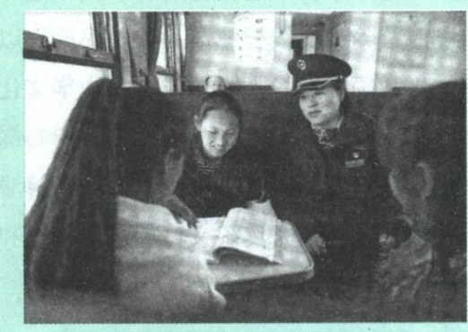
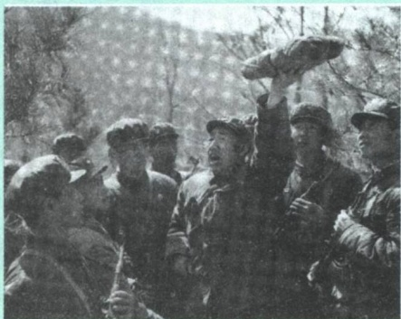
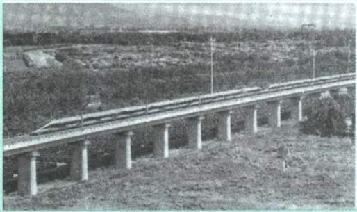
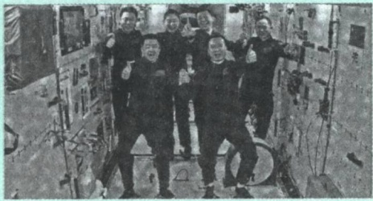
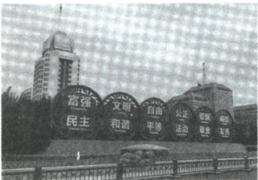
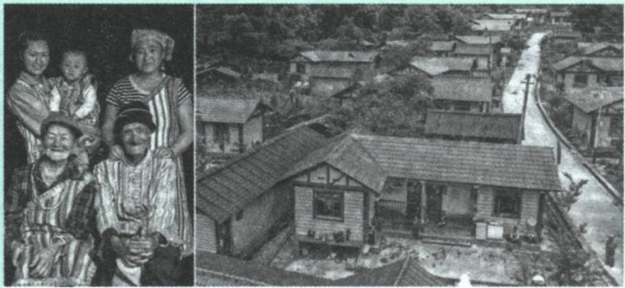

益，为国家繁荣发展贡献自己的力量，是爱国主义的基本要求。我国宪法明确规定:“中华人民共和国是工人阶级领导的、以工农联盟为基础的人民民主专政的社会主义国家。社会主义制度是中华人民共和国的根本制度。中国共产党领导是中国特色社会主义最本质的特征。”社会主义制度的建立，为中国的繁荣发展提供了可靠的保障。社会主义在中国不是一句空洞的口号，而是集中代表着、体现着、实现着国家、民族和人民的根本利益。爱国主义与爱社会主义的统一是中国历史发展的必然结果。中国共产党是中国工人阶级的先锋队，是中国人民和中华民族的先锋队，是中国特色社会主义事业的领导核心。没有中国共产党，就没有新中国，就没有中华民族伟大复兴，这是中国的历史和现实所昭示的真理。中国共产党的历史就是一部为实现民族独立和人民解放，为实现中华民族伟大复兴而奋斗的历史。在现阶段，爱国主义主要表现为在中国共产党领导下，献身于建设新时代中国特色社会主义伟大事业，献身于实现中华民族伟大复兴的中国梦的实践，献身于促进祖国统一大业。

爱国主义是具体的、现实的。在当代中国，弘扬爱国主义就必须深刻认识到，中国共产党领导和中国社会主义制度必须长期坚持，不可动摇；中国共产党领导中国人民开辟的中国特色社会主义必须长期坚持，不可动摇；中国共产党和中国人民扎根中国大地、借鉴人类文明优秀成果、独立自主实现国家发展的大政方针必须长期坚持，不可动摇。我们要增强中国特色社会主义道路自信、理论自信、制度自信、文化自信，坚定不移沿着中国特色社会主义道路守护好、建设好我们伟大的国家。

——习近平

爱国爱党爱社会主义统一于实现中华民族伟大复兴的历史进程。在不同历史条件下所形成的爱国主义具有不同的内涵和特点。爱国主义的丰富性和生命力，正是通过它的历史性和现实性来表现的。在新民主主义革命时期，爱国主义主要表现为在党的领导下，克服万难、前仆后继，推翻帝国主义、封建主义和官僚资本主义的反动统治，把黑暗的旧中国改造成光明的新中国，为实现中华民族站起来而奋斗。在社会主义革命、建设、改革年代，爱国主义主要表现为在党的领导下，建立和巩固社会主义基本制度，坚持社会主义初级阶段基本路线，赋予社会主义制度强大的生命力和活力，为实现中华民族富起来而奋斗。在中国特色社会主义新时代，爱国主义主要表现为在党的领导下全面建成小康社会，开启全面建设社会主义现代化国家新征程，为实现中华民族强起来而奋斗。不同历史时期的爱国主义虽然内涵和表现方式有所不同，但本质上是爱国爱党爱社会主义的高度统一，都统一于实现中华民族伟大复兴的中国梦的鲜活实践之中。

爱国，不能停留在口号上，而是要把自己的理想同祖国的前途、民族的命运紧密联系在一起。新时代大学生不仅要在认识上深刻理解爱国爱党爱社会主义的高度统一，更要以实际行动体现对祖国的热爱、对党的热爱、对社会主义的热爱。扎根人民，奉献国家，以一生的真情投入、一辈子的顽强奋斗来践行爱国主义。

## 二、维护祖国统一和民族团结

国家统一和民族团结是中华民族根本利益所在。弘扬新时代爱国主义，要坚持以维护祖国统一和民族团结为着力点，维护全国各族人民大团结的政治局面，巩固和发展最广泛的爱国统一战线，不断增强对伟大祖国、中华民族、中华文化、中国共产党、中国特色社会主义的认同，坚决维护国家主权、安全、发展利益，旗帜鲜明反对分裂国家的图谋、破坏民族团结的言行，筑牢国家统一、民族团结、社会稳

定的铜墙铁壁。

## （一）维护和推进祖国统一

保持香港、澳门长期繁荣稳定，解决台湾问题、实现祖国完全统一，是实现中华民族伟大复兴的必然要求，是不可阻挡的历史进程，也是全体中华儿女的共同心愿。

推进祖国统一，必须保持香港、澳门长期繁荣稳定。香港、澳门与祖国内地的命运始终紧密相连，实现中华民族伟大复兴的中国梦，需要香港、澳门与祖国内地坚持优势互补、共同发展，需要港澳同胞与内地人民坚持守望相助、携手共进。“一国两制”是中国特色社会主义的伟大创举，是香港、澳门回归后保持长期繁荣稳定的最佳制度安排，必须长期坚持。要始终准确把握“一国”和“两制”的关系。“一国”是根，根深才能叶茂；“一国”是本，本固才能枝荣。要全面准确、坚定不移贯彻“一国两制”“港人治港”“澳人治澳”高度自治的方针，坚持依法治港治澳，维护宪法和基本法确定的特别行政区宪制秩序。坚持和完善“一国两制”制度体系，落实中央全面管治权，落实“爱国者治港”“爱国者治澳”原则，落实特别行政区维护国家安全的法律制度和执行机制。推进粤港澳大湾区建设，支持香港、澳门更好融入国家发展大局，为实现中华民族伟大复兴更好发挥作用。

图说

港珠澳大桥是“一国两制”框架下，粤港澳三地首次合作共建的超大型跨海通道，全长55公里，设计使用寿命120年。大桥于2009年12月开工建设，2018年10月开通营运。港珠澳

大桥建成通车，有利于三地人员交流和经贸往来，有利于促进粤港澳大湾区发展，有利于提升珠三角地区综合竞争力，对于支持香港、澳门融入国家发展大局，全面推进内地、香港、澳门互利合作具有重大意义。

习近平在《告台湾同胞书》发表40周年纪念会上的讲话

解决台湾问题、实现祖国完全统一，是党矢志不渝的历史任务，是全体中华儿女的共同愿望，是实现中华民族伟大复兴的必然要求。要坚持贯彻新时代党解决台湾问题的总体方略，牢牢把握两岸关系主导权和主动权，坚定不移推进祖国统一大业。首先，坚持一个中国原则和“九二共识”，这是两岸关系的政治基础。大陆和台湾同属一个中国，是不可分割的整体，这个事实从未改变，也不可能改变。“和平统一、

一国两制”方针是实现两岸统一的最佳方式，对两岸同胞和中华民族最有利。其次，推进两岸交流合作。在两岸关系大局稳定的基础上，双方应该为深化经济、科技、文化、教育等领域合作采取更多积极举措，提供更多政策支持，创造更加便利的条件，共同推动两岸关系和平发展、推进祖国和平统一进程。最后，促进两岸同胞团结奋斗。两岸同胞血脉相连，是血浓于水的一家人，有着共同的血脉、共同的文化、共同的连结、共同的愿景，这是推动两岸相互理解、携手同心、一起前进的重要力量。双方应秉持“两岸一家亲”的理念，巩固和扩大两岸关系发展成果。凡是有利于增进两岸同胞共同福祉的事情，我们都应尽最大努力做好。要切实保护台湾同胞权益，团结台湾同胞，维护好、建设好中华民族的共同家园。

包括两岸同胞在内的所有中华儿女，要和衷共济、团结向前，坚决粉碎任何“台独”图谋，共创民族复兴美好未来。任何人都不要低估中国人民捍卫国家主权和领土完整的坚强决心、坚定意志、强大能力！

——习近平

“统则强、分必乱。”“台独”分裂势力及其分裂活动是对台海和平的现实威胁，必须反对和遏制任何形式的“台独”分裂主张和活动，不能有任何妥协。“台独”分裂行径损害国家主权、领土完整，破坏台海和平稳定，挑动两岸对抗紧张，损害两岸同胞共同利益，必然走向彻底失败。我们坚决维护国家主权和领土完整，绝不容忍国家分裂的历史悲剧重演。一切分裂祖国的活动都必将遭到全体中国人坚决反对。我们有坚定的意志、充分的信心、足够的能力挫败任何形式的“台独”分裂图谋。我们绝不允许任何人、任何组织、任何政党在任何时候、以任何形式、把任何一块中国领土从中国分裂出去。要贯彻《反分裂国家法》，旗帜鲜明地反对一切损害两岸关系的言行。

拓展

## 《反分裂国家法》

《反分裂国家法》是在2005年3月14日举行的十届全国人大三次会议上通过的一部关于台湾海峡两岸关系的法律。该法律的制定是为了反对和遏制“台独”分裂势力分裂国家，促进祖国和平统一，维护台湾海峡地区和平稳定，维护国家主权和领土完整，维护中华民族的根本利益。该法规定:“‘台独’分裂势力以任何名义、任何方式造成台湾从中国分裂出去的事实，或者发生将会导致台湾从中国分裂出去的重大事变，或者和平统一的可能性完全丧失，国家得采取非和平方式及其他必要措施，捍卫国家主权和领土完整。”该法施行以来，在反对和遏制“台独”分裂行径、维护台海和平稳定、促进两岸关系和平发展等方面，发挥了十分重要的作用。

实现中华民族伟大复兴，是全体中国人共同的梦想。只要包括港澳台同胞在内的全体中华儿女顺应历史大势、共担民族大义，把民族命运牢牢掌握在自己手中，就一定能够共创中华民族伟大复兴的美好未来。大学生要感悟两岸关系和平发展的潮流，担当起实现中华民族伟大复兴的历史重任，为推动两岸关系和平发展、实现祖国统一作出自己的贡献。

## （二）促进民族团结

多民族是我国的一大特色，各民族共同开拓了祖国的锦绣河山、广袤疆域，共同创造了悠久的中国历史、灿烂的中华文化，造就了我国各民族在分布上的交错杂居、文化上的兼收并蓄、经济上的相互依存、情感上的相互亲近，形成了你中有我、我中有你，谁也离不开谁的多元一体格局。形象地说，中华民族和各民族的关系，是一个大家庭和家庭成员的关系；各民族的关系，是一个大家庭里不同成员的关系。

一部中国史，就是一部各民族交融汇聚成多元一体中华民族的历史，就是各民族共同缔造、发展、巩固统一的伟大祖国的历史。各民族之所以团结融合，多元之所以聚为一体，源自各民族文化上的兼收并蓄、经济上的相互依存、情感上的相互亲近，源自中华民族追求团结统一的内生动力。正因为如此，中华文明才具有无与伦比的包容性和吸纳力，才可久可大、根深叶茂。

——习近平

处理好民族问题、促进民族团结，是关系祖国统一和边疆巩固的大事，是关系民族团结和社会稳定的大事，是关系国家长治久安和中华民族繁荣昌盛的大事。新时代大学生要像爱护自己的眼睛一样维护民族团结，像爱护自己的生命一样维护社会稳定，自觉做民族团结进步事业的建设者、维护者、促进者。要深化对党的民族理论和民族政策的认识，认真学习国家关于民族事务的法律法规，深入了解中华民族“多元一体”的发展历史，坚定“汉族离不开少数民族、少数民族离不开汉族、各少数民族之间也相互离不开” $^{①}$ 的思想观念。要牢固树立正确的祖国观、民族观、文化观、历史观，增强对伟大祖国的认同、对中华民族的认同、对中华文化的认同、对中国共产党的认同、对中国特色社会主义道路的认同，构建各民族共有精神家园。要铸牢中华民族共同体意识，加强各民族交往交流交融，促进各个民族像石榴籽那样紧紧抱在一起，共同团结奋斗、共同繁荣发展。在与各民族同胞接触交往的日常生活中，要维护和发展各民族的平等团结互助和谐关系，尊重兄弟民族的传统文化、风俗习惯和宗教信仰，多说有利于民族团结、有利于社会稳定的话，多做有利于民族团结、有利于社会稳定的事，不说伤害民族感情的话，不做不利于民族团结和社会稳定的事。要认清“藏独”和“疆独”等各种分裂主义势力的险恶用心和反动本质，坚持原则、明辨是非，不信谣、不传谣，不受分裂分子挑拨煽动，不参与违法犯罪活动，与破坏民族团结的行为作坚决斗争。在危急关头、关键时刻，要立场坚定、挺身而出，敢于同各种分裂活动作斗争，坚决捍卫民族团结进步、共同繁荣发展的大好局面，筑牢各族人民共同维护祖国统一、维护民族团结、维护社会稳定的钢铁长城。

图说

2019年9月27日，全国民族团结进步表彰大会在北京举行。会议表彰了全国民族团结进步模范集体665个和模范个人812名，成都客运段列车长阿西阿呷就是其中一位。从小在铁路边长大的阿呷，对

<small>①《习近平关于社会主义政治建设论述摘编》，中央文献出版社2017年版，第152页。</small>

“慢火车”充满感情，更对沿线老乡有着亲人般的情怀。她悉心照料怀孕的旅客，让失去丈夫的彝族孕妇湿了眼眶；她用一个个关爱的小举动，让离家出走的孩子敞开心扉；她帮老阿婆背上百斤的土豆上下车；她在列车上搭建临时产房，接生婴儿数十名。阿呷像对待自家孩子一样细心照顾每周末往返于家和学校之间的彝族学生，教他们说普通话，给他们讲外面的世界，鼓励他们读书成才，通过自己的努力让越来越多的彝族同胞走出大山。

## 三、尊重和传承中华民族历史文化

对祖国悠久历史、深厚文化的理解和接受，是培育和发展爱国主义情感的重要条件。作为中华儿女，我们要了解中华民族历史，传承中华文化基因，提升民族自豪感和文化自信心，增强做中国人的志气、骨气、底气。

## (一) 历史文化是民族生生不息的丰厚滋养

在世界文明中，中华文明源远流长、从未中断，至今仍充满蓬勃的生机和旺盛的生命力。中华优秀传统文化是中华民族的精神命脉，其中蕴含着中华民族世世代代形成和积累的思想营养和实践智慧，是中华民族得以延续的文化基因，也是我们在世界文化激荡中站稳脚跟的根基。中华文化独一无二的理念、智慧、气度、神韵，增添了中国人民和中华民族内心深处的自信和自豪。我们必须尊重和传承中华民族历史文化，以时代精神激活中华优秀传统文化的生命力，不断推进中华优秀传统文化创造性转化和创新性发展。

今天的中国是历史的中国的一个发展；我们是马克思主义的历史主义者，我们不应当割断历史。从孔夫子到孙中山，我们应当给以总结，承继这一份珍贵的遗产。

毛泽东

习近平指出，历史总是向前发展的，我们总结和吸取历史教训，目的是以史为鉴、更好前进。历史是一面镜子，从历史中能够更好看清世界、参透生活、认识自己；历史也是一位智者，同历史对话能够更好认识过去、把握当下、面向未来。历史是最好的教科书，我们要在历史中看成败、鉴得失、知兴替。历史是最好的清醒剂，不仅提供经验，还提供教训，可以使我们保持头脑清醒，吃一堑，长一智，使我们不再犯历史上曾经犯过的同类错误。历史是最好的营养剂，要不断地向历史学习，汲取历史智慧，总结历史经验和历史规律，回答和解决在新的历史条件下党和国家发展面临的重大理论和现实问题。

## （二）旗帜鲜明反对历史虚无主义

抛弃传统、丢掉根本，就等于割断了自己的精神命脉。历史和现实都表明，一个抛弃了或者背叛了自己历史文化的民族，不仅不可能发展起来，而且很可能上演一场历史悲剧。“灭人之国，必先去其史。”一些人打着所谓“重评历史”的幌子，否定近现代中国革命历史、中国共产党历史和中华人民共和国历史，抹黑英雄，诋毁革命领袖，企图混淆视听、扰乱人心，从根本上否定马克思主义的指导地位和中国走向社会主义的历史必然性，否定中国共产党的领导。我们不是历史虚无主义者，也不是文化虚无主义者，不能数典忘祖、妄自菲薄。祖国是人民最坚实的依靠，英雄是民族最闪亮的坐标。“天地英雄气，千秋尚凛然。”一个有希望的民族不能没有英雄，一个有前途的国家不能没有先锋。我们要对中华民族的英雄心怀崇敬，自觉传承好中华民族辉煌灿烂的历史文化。

## 图说

2015年，新华社推出系列报道《为英雄正名》，通过寻访英雄的生前战友、朋友、亲属，获取确凿的证人、证言和证据，为近年来屡遭恶意抹黑的邱少云、黄继光、董存瑞、刘胡兰等英雄人物正名，起到了正视听、明是非、服人心的

作用，有效地引导了社会舆论。图中董存瑞的战友郅顺义（中）正在为战士们讲述董存瑞舍身炸碉堡的英雄事迹。

新时代大学生要树立大历史观和正确党史观，准确把握党的历史发展的主题主线、主流本质，深刻领悟中国共产党为什么能、马克思主义为什么行、中国特色社会主义为什么好的历史逻辑、理论逻辑、实践逻辑，真正理解历史、把握历史，增强历史自觉和历史自信。

## 四、坚持立足中国又面向世界

中国的命运与世界的命运紧密相关。经过新中国成立70多年特别是改革开放40多年的发展，中国的综合国力日益增强，国际影响力不断扩大。当今世界越来越成为你中有我、我中有你的命运共同体。弘扬新时代的爱国主义，要求我们正确处理立足中国与面向世界的辩证统一关系，既要尊重各国的历史特点、文化传统，尊重各国人民选择的发展道路，从不同文明中寻求智慧、汲取营养，增强中华文明生机活力，又要积极倡导求同存异、交流互鉴，促进不同国度、不同文明相互借鉴、共同进步，共同推动人类文明发展进步。

## （一）维护国家发展主体性

当今世界，国家仍然是民族存在的最高组织形式，是国际社会活动中的独立主体。世界是丰富多彩的，不能以一个或几个国家的政治制度、价值观念和意识形态来衡量多样性的世界。用一种政治制度、价值观念和意识形态去统一世界，不仅是对别国的侵害，而且也是根本行不通的，只会危害世界的和平与发展。人类历史上没有一个民族、一个国家可以通过依赖外部力量、照搬外国模式、跟在他人后面亦步亦趋实现强大和振兴。中国人民和中华民族从近代以后的深重苦难走向伟大复兴的光明前景，从来就没有教科书，更没有现成答案。党的百年奋斗成功道路是党领导人民独立自主探索开辟出来的，马克思主义的中国篇章是中国共产党人依靠自身力量实践出来的，贯穿其中的一个基本点就是中国的问题必须从中国基本国情出发，由中国人自己来解答。在新形势下，我们一定要保持清醒的认识，坚持独立自主、自力更生，既虚心学习借鉴国外的有益经验，又坚定民族自尊心和自信心，不信邪、不怕压，坚决维护国家的主权和尊严，按照本国国情坚持、发展自己的政治制度和民族文化，把中国发展进步的命运始终牢牢掌握在自己手中。

## 明辨

## 经济全球化背景下还需要爱国主义吗？

当今世界，各国的贸易往来更加频繁，文化交流不断加深，世界正在变成一个“地球村”。虽然经济全球化对爱国主义造成了较大冲击，但是爱国主义在今天仍然有其存在的理由。经济全球化是社会生产力发展的客观要求和科技进步的必然结果。在经济全球化背景下，各个国家之间的利益冲突和竞争强度没有减弱，一定程度上还强化了人们的爱国主义情感。经济全球化不等于政治全球化，更不意味着政治一体化，只要国家存在，爱国主义就有坚实的基础和丰富的意义。

## （二）自觉维护国家安全

国家安全是民族复兴的根基，社会稳定是国家强盛的前提。当前，世界百年未有之大变局加速演进，新一轮科技革命和产业变革深入发展，国际力量对比深刻调整，我国发展面临新的战略机遇。同时，世纪疫情影响深远，逆全球化思潮抬头，单边主义、保护主义明显上升，世界经济复苏乏力，局部冲突和动荡频发，全球性问题加剧，世界进入新的动荡变革期。在国家安全形势越来越复杂的今天，大学生要增强国家安全意识，对境内外敌对势力的渗透、颠覆、破坏活动保持高度警惕，切实履行维护国家安全的义务。

确立总体国家安全观。国家安全是指一个国家不受内部和外部的威胁、破坏而保持稳定有序的状态。当前，我国国家安全内涵和外延比历史上任何时候都要丰富，时空领域比历史上任何时候都要宽广，内外因素比历史上任何时候都要复杂，必须坚持总体国家安全观，坚持国家利益至上，以人民安全为宗旨，以政治安全为根本，以经济安全为基础，以军事科技文化社会安全为保障，以促进国际安全为依托，走出一条中国特色国家安全道路。确立总体国家安全观，必须既重视外部安全，又重视内部安全；既重视国土安全，又重视国民安全；既重视传统安全，又重视非传统安全；既重视发展问题，又重视安全问题。要坚持走和平发展道路，既重视自身安全，又重视共同安全，推动世界朝着互利互惠、共同安全的目标相向而行。

## 拓展

## 统筹好发展和安全两件大事

安全是发展的前提，发展是安全的保障。当前和今后一个时期是我国各类矛盾和风险易发期，各种可以预见和难以预见的风险因素明显增多。我们必须坚持统筹发展和安全，增强机遇意识和风险意识，树立底线思维，把困难估计得更充分一些，把风险思考得更深入一些，注重堵漏洞、强弱项，下好先手棋、打好主动仗，有效防范化解各类风险挑战，确保社会主义现代化事业顺利推进。

增强国防意识，履行维护国家安全的义务。强大的国防是国家生存与发展的安全保障。我国的国防是全民的国防。我国宪法明确规定:“保卫祖国、抵抗侵略是中华人民共和国每一个公民的神圣职责。”大学生既是社会主义现代化建设的有用人才，也是国防建设的后备人才，必须具有很强的国防观念和忧患意识，自觉接受国防和军事方面的教育训练，关心国防、了解国防、热爱国防、投身国防，积极履行国防义务，成为既能建设祖国又能保卫祖国的优秀人才。同时，大学生应自觉遵守国家安全法律，履行维护国家安全的法律义务。

## （三）推动构建人类命运共同体

当前，世界之变、时代之变、历史之变正以前所未有的方式展开。一方面，和平、发展、合作、共赢的历史潮流不可阻挡，人心所向、大势所趋决定了人类前途终归光明；另一方面，恃强凌弱、巧取豪夺、零和博弈等霸权霸道霸凌行径危害深重，和平赤字、发展赤字、安全赤字、治理赤字加重，人类社会面临前所未有的挑战。没有哪个国家能够独自应对人类面临的各种挑战，也没有哪个国家能够退回到自我封闭的孤岛。共同建设一个持久和平、普遍安全、共同繁荣、开放包容、清洁美丽的世界，是全人类的共同利益和共同价值追求。要把弘扬爱国主义精神与扩大对外开放结合起来，尊重各国历史特点、文化传统，尊重各国人民选择的发展道路，善于从不同文明中寻求智慧、汲取营养，促进人类和平与发展的崇高事业，共同推动人类文明发展进步。

构建人类命运共同体是世界各国人民前途所在。只有各国行天下之大道，和睦相处、合作共赢，繁荣才能持久，安全才有保障。构建人类命运共同体的理念，源于中国，属于世界，是中国与世界的交响协奏。

## 拓展

## 涵养积极进取开放包容理性平和的国民心态

爱国主义是世界各国人民共有的情感，实现世界和平与发展是各国人民共同的愿望。涵养积极进取开放包容理性平和的国民心态，要正确把握中国与世界的发展大势，正确认识中国与世界的关系，既不妄自尊大也不妄自菲薄，做到自尊自信、理性平和。对每一个中国人来说，爱国是本分，也是职责，更是心之所系、情之所归。要将爱国之情转化为实际行动，理性表达爱国情感，反对极端行为。

中国人民的梦想同各国人民的梦想息息相通，实现中国梦离不开和平的国际环境和稳定的国际秩序。新时代爱国主义继承并发扬了中华文化协和万邦、热爱和平的优秀传统，对外主张平等互利、和平共处的国际交往原则，积极维护国际和平与文明和谐。面向世界，推动构建人类命运共同体，要有更加宽广的世界胸怀和全球视野，为维护人类共同利益、推动人类文明发展进步提供中国智慧，始终做世界和平的建设者、全球发展的贡献者、国际秩序的维护者。公众号:旗胜考研一手扫描

## 第三节 让改革创新成为青春远航的动力

改革创新是当代中国最突出、最鲜明的特点。大学生富有想象力和创造力，是改革创新的生力军，要在改革创新的实践中奉献祖国、服务人民、实现价值，让改革创新成为青春远航的强大动力。

## 一、改革开放是当代中国的显著特征

以数千年大历史观之，变革和开放总体上是中国的历史常态。几千年前，中华民族的先民们就秉持“周虽旧邦，其命维新”的精神，开启了缔造中华文明的伟大实践。自古以来，中国大地上发生了无数变法变革图强运动，留下了“治世不一道，便国不法古”等豪迈宣言。正是这种变革和开放精神，使中华文明成为人类历史上唯一一个绵延5000多年至今未曾中断的灿烂文明。新时代，中华民族正在以改革开放的姿态继续走向未来。

改革开放是当代中国最鲜明的特色。改革开放是党在新的历史条件下领导人民进行的新的伟大革命，是决定当代中国命运的关键抉择。一个国家、一个民族要振兴，就必须在历史前进的逻辑中前进、在时代发展的潮流中发展。中国特色社会主义之所以具有蓬勃生命力，就在于实行的是改革开放的社会主义。我国过去40多年的快速发展靠的是改革开放，我国未来发展也必须坚定不移依靠改革开放。以党的十一届三中全会为标志，我国开启了改革开放的历史征程。从农村到城市，从试点到推广，从经济体制改革到全面深化改革，40多年众志成城，40多年砥砺奋进，中国人民用双手书写了国家和民族发展的壮丽史诗。实践充分证明，改革开放是当代中国发展进步的活力之源，它只有进行时，没有完成时。改革不停顿、开放不止步，中国一定会有让世界刮目相看的新的更大奇迹！

改革开放是党和人民大踏步赶上时代的重要法宝，是坚持和发展中国特色社会主义的必由之路，是决定当代中国命运的关键一招，也是决定实现“两个一百年”奋斗目标、实现中华民族伟大复兴的关键一招。

——习近平

创新是改革开放的生命。改革开放创造的奇迹不是天上掉下来的，而是来自中国共产党和中国人民的理论创新、实践创新、制度创新、文化创新以及各方面创新。改革开放40多年来，我们坚持理论联系实际，及时回答时代之问、人民之问，廓清困扰和束缚实践发展的思想迷雾，不断开辟马克思主义发展新境界。改革开放已走过千山万水，但仍需跋山涉水。当前，我们所处的，是一个船到中流浪更急、人到半山路更陡的时候，是一个愈进愈难、愈进愈险而又不进则退、非进不可的时候。要用深邃的历史眼光、宽广的国际视野把握事物发展的本质和内在联系，立足亿万人民的创造性实践，借鉴吸收人类一切优秀文明成果，以前所未有的积极性、主动性、创造性推进改革开放和社会主义现代化建设。

## 二、改革创新是新时代的迫切要求

创新决胜未来，改革关乎国运。在当代中国，经济社会发展离不开改革创新。现在，我国已转向高质量发展阶段，全面深化改革，推进国家治理体系和治理能力现代化，必须将改革进行到底，攻克体制机制上的顽瘴痼疾，突破利益固化的藩篱，进一步解放和发展社会生产力，进一步激发和凝聚社会创造力。

创新是推动人类社会发展的重要力量。16世纪以来，人类社会进入前所未有的创新活跃期，几百年里，人类在科学技术方面取得的创新成果超过过去几千年的总和。特别是18世纪以来，世界发生了几次重大科技革命，如近代物理学诞生、蒸汽机和机械、电力和运输、相对论和量子论、电子和信息技术发展等。在此带动下，世界经济发生多次产业革命，如机械化、电气化、自动化、信息化。每一次科技和产业革命都深刻改变了世界发展面貌和力量格局。一些国家抓住了机遇，经济社会发展驶入快车道，经济实力、科技实力、军事实力迅速增强，甚至一跃成为世界强国。发端于英国的第一次产业革命，使英国走上了世界霸主地位；美国抓住了第二次产业革命机遇，赶超英国成为世界第一。第二次产业革命以来，美国就占据世界第一的位置，这是因为美国在科技和产业革命中都是领航者和最大获利者。从某种意义上说，创新决定着世界政治经济力量对比的变化，也决定着各国各民族的前途命运。

纵观人类发展历史，创新始终是一个国家、一个民族发展的重要力量，也始终是推动人类社会进步的重要力量。不创新不行，创新慢了也不行。如果我们不识变、不应变、不求变，就可能陷入战略被动，错失发展机遇，甚至错过整整一个时代。

——习近平

创新能力是当今国际竞争新优势的集中体现。“在激烈的国际竞争中，惟创新者进，惟创新者强，惟创新者胜。” $^{①}$ 今天，国际竞争的新优势越来越集中体现在创新能力上。当今世界，谁牵住了科技创新这个“牛鼻子”，谁走好了科技创新这步先手棋，谁就能占领先机，赢得优势。21世纪以来，全球科技创新进入空前密集活跃的时期，谁在创新上先行一步，谁就能拥有引领发展的主动权。新一轮科技革命和产业变革正在重构全球创新版图、重塑全球经济结构，就像体育比赛换到了一个新场地，如果我们还留在原来的场地，那就跟不上趟了。面对科技创新和产业革命新趋势，世界主要国家都在积极调整应对，努力寻找创新的突破口，抢占发展的先机，纷纷出台新的创新战略，加大投入，加强人才、专利、标准等战略性创新资源的争夺，创新战略竞争在综合国力竞争中的地位日益重要。

<small>①《习近平谈治国理政》第一卷，外文出版社2018年版，第59页。</small>

## 图说

“奋斗者”号是中国研发的万米载人潜水器。2020年10月27日，“奋斗者”号在马里亚纳海沟成功下潜突破1万米。2020年11月10日，“奋斗者”号在马里亚纳海沟再次成功下潜突破1万米，达到10909

米，创造了中国载人深潜的新纪录。目前，我国已拥有“蛟龙”号、“深海勇士”号、“奋斗者”号三台深海载人潜水器，还有“海斗”“潜龙”“海燕”“海翼”和“海龙”号等系列无人潜水器，已经初步建立全海深潜水器谱系，并不断实现了深海装备技术发展的新突破和重大新跨越。

改革创新是赢得未来的必然要求。抓创新就是抓发展，谋创新就是谋未来。目前，虽然我国经济总量位居世界第二，但大而不强、臃肿虚胖体弱问题相当突出，主要体现在创新能力不强，科技发展水平总体不高，科技对经济社会发展的支撑能力不足，科技对经济增长的贡献率远低于发达国家水平，这是我国这个经济大块头的“阿喀琉斯之踵”。在新一轮科技革命和产业变革中，我国能否在未来发展中后来居上、弯道超车，主要就看能否在创新驱动发展上迈出实实在在的步伐。要坚持科技是第一生产力、人才是第一资源、创新是第一动力，深入实施科教兴国战略、人才强国战略、创新驱动发展战略，开辟发展新领域新赛道，不断塑造发展新动能新优势。

## 图说

1978年，邓小平出访日本时，坐在新干线列车上感慨高铁的速度“快”，并称:“我们现在很需要跑！”新时代十年，中国高铁技术领跑世界。复兴号以时速420公里交会和重联运行，世界首次；智能型动车组实现时

速 350 公里自动驾驶，全球首个；时速 400 公里可变轨距高速动车组下线，可实现跨国互联互通……自主创新的中国高铁，成为享誉世界的“国家名片”。

如果把科技创新比作我国发展的新引擎，那么改革就是点燃这个新引擎必不可少的点火器。实施创新驱动发展战略，必须把创新摆在国家发展全局的核心位置，最根本的是要增强自主创新能力，最紧迫的是要破除体制机制障碍，最大限度地解放和激发科技作为第一生产力所蕴含的巨大潜能，打通从科技强到产业强、经济强、国家强的通道，让改革释放创新活力，让一切创新源泉充分涌流。只有全面深化改革，坚持创新在我国现代化建设全局中的核心地位，在全社会积极营造鼓励大胆创新、勇于创新、包容创新的良好氛围，才能把创新驱动的新引擎全速发动起来，为我国经济社会发展提供前所未有的强劲动力。

## 三、做改革创新生力军

青年时期是创新创造的宝贵时期。新时代的大学生置身于实现中华民族伟大复兴的时代洪流之中，应当把握时代脉搏，迎接时代挑战，增强创新创造的能力和本领，勇做改革创新的实践者，将弘扬改革创新精神贯穿于实践中、体现在行动上。

## （一）树立改革创新的自觉意识

改革创新，要求大学生自觉增强改革创新的责任感，树立敢于突破陈规、大胆探索未知、勇于创新创造的思想观念，在实践中有直面困难的勇气，有突破难关的精神，锐意进取，奋力前行。

拓展

## 习近平寄语青年大学生

2017年8月，习近平给第三届中国“互联网+”大学生创新创业大赛中参加“青年红色筑梦之旅”活动的大学生回信。他在信中表示，得知全国150万大学生参加本届大赛，其中上百支大学生创新创业团队参加了走进延安、服务革命老区的“青年红色筑梦之旅”活动，帮助老区人民脱贫致富奔小康，既取得了积极成效，又受到了思想洗礼，感到十分高兴。延安是革命圣地，同学们奔赴延安，追寻革命前辈伟大而艰辛的历史足迹，学习延安精神，坚定理想信念，锤炼意志品质，把激昂的青春梦融入伟大的中国梦，体现了当代中国青年奋发有为的精神风貌。

增强改革创新的责任感。改革创新表现为一种不甘落后、奋勇争先、追求进步的责任感。在时代大潮中，有人选择安于现状、不思进取、随波逐流，有人则意气风发、力争上游、拼搏进取。这两种不同选择的根源，除了信心和勇气外，更在于是否具有为推动社会发展进步贡献力量的责任担当。改革创新充满艰辛、奉献甚至牺牲，没有强烈的责任感，很难克服和战胜改革创新过程中的艰难曲折。大学生要以时不我待、只争朝夕的紧迫感投身改革创新的实践，服务人民，奉献社会，实现人生价值。

树立敢于突破陈规的意识。陈规最易束缚人的思维和手脚，创新创造的过程往往充满艰辛。要创新，就要有强烈的创新意识，凡事要有打破砂锅问到底的劲头，敢于质疑现有定论，勇于开拓新的方向，攻坚克难，追求卓越。敢于大胆突破陈规甚至常规，敢于大胆探索尝试，善于观察发现、思考批判，不唯书、不唯上、只唯实，这是大学生在学习与实践中创新创造的重要前提。

树立大胆探索未知领域的信心。创新就是要走前人没有走过的路。要创新，就要有强烈的创新自信。如果总是跟踪模仿，既谈不上创新，也是没有出路的。未知领域可能是人类认识的盲区，也可能是人类实践的处女地。未知常常令人心生怯意，人们常常因充满未知的风险而停下探索和求新的脚步，但未知领域也往往蕴含着发现的沃土和创新的机遇。“路漫漫其修远兮”，最需要“上下而求索”的勇气。青年应是常为新、敢创造的，理当锐意创新创造，不等待、不观望、不懈怠，勇做改革创新的生力军。

## （二）增强改革创新的能力本领

青年是苦练能力本领、增长才干的黄金时期。当今时代，知识更新不断加快，社会分工日益细化，新技术新模式新业态层出不穷。这既为青年施展才华、竞展风采提供了广阔舞台，也对青年能力素质提出了新的更高要求。

夯实创新基础。推行任何一项改革，作出任何一项创新，都是站在前人积累的专业知识基础之上的。改革创新之所以能够推陈出新，提出前人不曾提出的新思想，推出令世人敬仰叹服的新创造，一个重要的原因就在于改革创新者具有扎实的专业知识基础。缺乏深厚的专业知识积淀，盲目追求改革创新，往往容易流于不切实际的空想，或者是“无知者无畏”的蛮干。无视或轻视专业知识学习，不可能担负改革创新的重任。大学生作为改革创新的生力军，应从扎实系统的专业知识学习起步和入手，不能好高骛远，空谈改革创新。

培养创新思维。创新思维与守旧思维的区别在于:守旧思维往往求同、模仿，创新思维则注重求异、批判而不甘落入窠臼和俗套；守旧思维被动回答问题，创新思维善于发现问题；守旧思维往往机械、线性、封闭，创新思维则灵活而开放，发散而多维；守旧思维提出的观点人们往往因熟悉而易于接受，创新思维则常常因“异想天开”而被怀疑甚至嘲讽。

大学生在专业学习与社会实践中应自觉培养创新思维，勤于思考，善于发现，勇于创新。

## 图说

2020年6月30日，北斗三号最后一颗全球组网卫星成功定点地球同步轨道；2020年12月17日，嫦娥五号从月球上成功带回月壤，上演了“太空投递”的

壮举；2021年5月15日，天问一号着陆巡视器着陆于火星，我国首次火星探测任务着陆火星取得圆满成功；2022年11月30日，神舟十五号乘组顺利入驻中国空间站，与神舟十四号乘组胜利“会师”太空，这是中国载人航天的历史性时刻，首次实现了6名航天员同时在轨飞行的新突破。这些成就的背后，离不开航天报国的“嫦娥”“神舟”“北斗”“天问”“天宫”团队，他们自主创新、不断突破，在我国航天史上书写了一页页绚丽篇章。

投身改革创新实践。实践出真知，实践长才干。当代大学生既置身于世界新一轮科技革命和产业变革同我国转变发展方式的历史性交汇期，又置身于我国全面建设社会主义现代化国家的新征程，应当在全面深化改革的伟大实践中发扬改革创新精神，增强改革创新的意识，锤炼改革创新的意志，提高改革创新的能力，勇做改革创新的实践者和生力军。

青年往往朝气蓬勃、思维活跃，好奇心强、求知欲盛，敢于尝试新生事物，这些都是有利于创新创造的重要条件。纵观世界历史，许多重要创造，都是产生于创造者风华正茂、思维最敏捷的青年时期。可以说，青年身上蕴藏着巨大的创造能量和活力。大学生应当珍惜人生中最具创新创造活力的宝贵时期，有敢为人先、开拓进取的锐气，有逢山开路、遇河架桥的意志，在创新创造中不断积累经验、取得成果、演绎精彩。

## 思考讨论

1. 人无精神则不立，国无精神则不强。结合实际，谈谈为什么中国精神是兴国强国之魂。

2. 百余年来，党坚持性质宗旨，坚持理想信念，坚守初心使命，勇于自我革命，在生死斗争和艰苦奋斗中经受住各种风险考验、付出巨大牺牲，锤炼出鲜明政治品格，形成了以伟大建党精神为源头的精神谱系。结合实际，谈谈你对伟大建党精神的理解，以及新时代青年应如何从中国共产党人精神谱系中汲取奋斗力量。

3. 方志敏的《可爱的中国》一文，字字泣血，唤醒了中国亿万同胞的爱国之情，鼓舞了许许多多的优秀青年走上救国道路。结合自身实际，谈谈如何做新时代的忠诚爱国者。

4. 2021年5月28日，习近平在两院院士大会、中国科协第十次全国代表大会上指出，培养创新型人才是国家、民族长远发展的大计。当今世界的竞争说到底是人才竞争、教育竞争。结合自身实际，谈谈应如何走在改革创新的时代前列。

## 文献阅读

1. 《新时代爱国主义教育实施纲要》，人民出版社 2019 年版。

2019年11月，中共中央、国务院印发《新时代爱国主义教育实施纲要》，共有6个部分、34条，明确了新时代爱国主义教育的总体要求、基本内容，提出了加强青少年新时代爱国主义教育的具体措施。

2. 《中共中央关于党的百年奋斗重大成就和历史经验的决议》，人民出版社 2021 年版。

该决议是在中国共产党成立100周年的重要历史时刻，在中国共产党团结带领人民胜利实现第一个百年奋斗目标、全面建成小康社会，正在向着全面建成社会主义现代化强国的第二个百年奋斗目标迈进的重大历史关头作出的。该决议集中了全党的智慧，全面系统地总结了中国共产党百年奋斗的重大成就和历史经验，特别是着重阐释了党的十八大以来党和国家事业取得的历史性成就、发生的历史性变革，充分彰显了中国共产党高超的政治智慧和责任担当，充分彰显了中国共产党高度的历史自觉和历史自信。

3. 习近平:《在庆祝改革开放40周年大会上的讲话》，人民出版社2018年版。

该讲话回顾了改革开放的光辉历程，总结了改革开放的伟大成就和宝贵经验，动员全党全国各族人民在新时代继续把改革开放推向前进，为实现中华民族伟大复兴的中国梦不懈奋斗。

## 第四章 明确价值要求 践行价值准则

人类社会发展的历史表明，对一个民族、一个国家来说，最持久、最深层的力量是全社会共同认可的核心价值观。社会主义核心价值观是当代中国精神的集中体现，是中国特色社会主义道路、理论、制度、文化的价值表达，凝结着全体人民共同的价值追求。大学生要深刻领会社会主义核心价值观的重要意义和科学内涵，扣好人生的扣子，从日常点滴做起，从细微之处做起，成为社会主义核心价值观的坚定信仰者、积极传播者、模范践行者。

## 第一节 全体人民共同的价值追求

核心价值观，承载着一个民族、一个国家的精神追求，体现着一个社会评判是非曲直的价值标准。社会主义核心价值观集中体现社会主义的本质属性，代表全体人民共同的价值追求。全社会积极弘扬和践行社会主义核心价值观，才能汇聚起建成社会主义现代化强国和实现中华民族伟大复兴的中国梦的磅礴力量。

## 一、价值观与社会主义核心价值观

价值和价值观问题在人类生活实践中是一个历久弥新的问题，人类社会很早就有了对价值的思考和讨论。价值是指在实践基础上形成的主体和客体之间的意义关系，主要反映的是现实的人的需要与事物属性之间的关系。在对价值的认识过程中，人们逐渐形成关于价值的不同观点。

## （一）价值观与核心价值观

价值观就是主体对客体有无价值、价值大小的立场和态度，是对价值及其相关内容的基本观点和看法。通俗地说，价值观是人们对事物的意义和价值的反映与判断，是人们关于应该做什么和不应该做什么的基本观点，是区分好与坏、对与错、善与恶、美与丑等现象的总观念。价值观在人们的观念体系中并不是孤立的，它与世界观、人生观相辅相成、相互作用、相互促进，是辩证统一的关系。价值观对人的具体行为起着规范和导向作用，价值观不同的人，行为取向也会不同，甚至可能截然相反。

价值观反映着特定的时代精神。“随着每一次社会秩序的巨大历史变革，人们的观点和观念也会发生变革。” $^{①}$ 人们的社会存在和社会生活是具体的、现实的，是属于一定时代的，反映社会存在和社会生活的价值观总是表现出鲜明的时代特点。它回应着特殊的时代性问题，表现着一定时代人们的需要和利益诉求，反映着特定的时代精神。有什么性质的社会存在，就会有什么性质和内容的价值观。抽象的、超历史的、一成不变的价值观是不存在的。

价值观体现着鲜明的民族特色。一个民族在长期的共同生活和实践的基础上，逐渐形成具有该民族特色的价值观，并通过历史的积淀和升华，使之成为该民族文化传统的核心和灵魂。价值观的民族性体现着一个民族区别于其他民族的精神气质。

价值观蕴含着特定的阶级立场。不同阶级由于其阶级地位和经济利益不同有着不同的价值观。在阶级社会里，占统治地位的价值观都是统治阶级的价值观，为统治阶级的统治和利益辩护。被统治阶级也有其自身的价值观，当被统治阶级变得足够强大时，其价值观既体现为对统治阶级的反抗，也体现为被统治阶级对未来利益的主张。

核心价值观是一定社会形态、社会性质的集中体现，在一个社会的思想观念体系中处于主导地位，体现着社会制度的阶级属性、社会运行的基本原则和社会发展的基本方向。它不仅作用于经济社会生活的各个方面，而且对每个社会成员有着深刻的影响。任何一个社会都存在多种多样的价值观念和价值取向，要把全社会的意志和力量凝聚起来，必须有一套与经济基础和政治制度相适应并能形成广泛社会共识的核心价值观，否则，一个民族就没有赖以维系的精神纽带，一个国家就没有共同的思想道德基础。如果一个民族、一个国家没有共同的核心价值观，莫衷一是，行无依归，那这个民族、这个国家就无法前进。

<small>①《马克思恩格斯全集》第十卷，人民出版社1998年版，第253页。</small>

核心价值观，其实就是一种德，既是个人的德，也是一种大德，就是国家的德、社会的德。

——习近平

历史和现实都表明，核心价值观是一个国家的重要稳定器，能否构建具有强大感召力的核心价值观，关系社会和谐稳定，关系国家长治久安。世界上各种文化之争，本质上是价值观念之争，也是人心之争、意识形态之争。

## （二）社会主义核心价值观

中华人民共和国成立以来特别是改革开放以来，中国共产党带领全国人民在经济、政治、文化和社会等方面建立了一套比较成熟的基本制度和体制，成功探索出一条中国特色社会主义道路。与这些基本制度和体制相适应，必然要求有一个主导全社会思想道德观念和行为方式的核心价值观。党的十八大提出，要倡导富强、民主、文明、和谐，倡导自由、平等、公正、法治，倡导爱国、敬业、诚信、友善，积极培育和践行社会主义核心价值观。这是中国共产党凝聚全党全社会价值共识作出的重要论断。社会主义核心价值观的提出，鲜明确立了当代中国的核心价值理念，

生动展现了中国共产党和中华民族高度的价值自觉与价值自信。

社会主义核心价值观和社会主义核心价值体系是紧密联系、互为依存、相辅相成的。社会主义核心价值体系主要包括马克思主义指导

思想、中国特色社会主义共同理想、以爱国主义为核心的民族精神和以改革创新为核心的时代精神、社会主义荣辱观。社会主义核心价值观是社会主义核心价值体系的精神内核，它体现了社会主义核心价值体系的根本性质和基本特征，反映了社会主义核心价值体系的丰富内涵和实践要求，是社会主义核心价值体系的高度凝练和集中表达。同时，社会主义核心价值观与社会主义核心价值体系具有内在一致性，都体现了社会主义意识形态的本质要求，体现了社会主义制度在思想和精神层面的质的规定性，是全面建成社会主义现代化强国、实现第二个百年奋斗目标的价值引领。中国式现代化是物质文明和精神文明相协调的现代化。物质贫困不是社会主义，精神贫乏也不是社会主义。我们既要不断厚植现代化的物质基础，不断夯实人民幸福生活的物质条件，同时也要大力发展社会主义先进文化，加强理想信念教育，传承中华文明，促进物的全面丰富和人的全面发展。推进社会主义核心价值观与社会主义核心价值体系建设，就是要弘扬共同理想、凝聚精神力量、引领道德风尚，形成全民族奋发向上、团结和睦的精神纽带，使我们的国家、民族、人民在思想上和精神上强起来，更好地坚持中国道路、弘扬中国精神、凝聚中国力量。

## 二、社会主义核心价值观的基本内容

富强、民主、文明、和谐，自由、平等、公正、法治，爱国、敬业、诚信、友善，是社会主义核心价值观的基本内容。它把涉及国家、社会、公民的价值要求融为一体，体现了社会主义本质要求，继承了中华优秀传统文化，吸收了世界文明有益成果，体现了时代精神，是对我们要建设什么样的国家、建设什么样的社会 培育什么样的公民等重大问题的深刻解答。

## (一)富强、民主、文明、和谐

富强、民主、文明、和谐的价值追求，回答了我们要建设什么样的国家这一重大问题，揭示了当代中国经济社会发展的价值目标，从国家层面标注了社会主义核心价值观的时代刻度。

富强是促进社会进步、人的自由全面发展的物质基础，体现了马克思主义唯物史观生产力标准的根本要求。富强，就是人民的富裕和国家的强盛。富强在于富民，即人民富裕。社会主义生产力的发展，国家财富的创造，其根本目的都在于丰富人民的物质生活和精神生活。富强还在于强国，即国家强盛，体现为国家拥有强大的综合国力。人民富裕和国家强盛在根本上是统一的，这是社会主义的价值追求。中华民族伟大复兴归根到底要落实到满足人民对美好生活的追求上，使人民的获得感、幸福感、安全感更加充实、更可持续、更有保障，朝着共同富裕方向稳步前进。

图说

毛泽东 1955 年曾经说过这样的话:“现在我们实行这么一种制度，这么一种计划，是可以一年一年走向更富更强的，一年一年可以看到更富更强些。而这个富，是共同的富，这个强，是共同的强，大家都有份……”上图为独龙族实现了整族脱贫，迎来了新的历史性发展。

民主指的是社会主义民主，是人民当家作主，不是由别人作主，也不是由少数人作主。作为一种政治实践、价值理念，人民民主是社会主义的生命，没有民主就没有社会主义，就没有社会主义现代化。人民民主反映了人民群众的历史主体地位，是人民群众创造历史的集中体现。中国共产党领导人民实行的民主是全过程人民民主。全过程人民民主，实现了过程民主和成果民主、程序民主和实质民主、直接民主和间接民主、人民民主和国家意志相统一，是全链条、全方位、全覆盖的民主，是最广泛、最真实、最管用的社会主义民主。社会主义核心价值观倡导的民主是最广泛的民主，绝不以牺牲多数人利益为代价来保护少数人的利益，同时又尊重和照顾少数人，充分反映和协调各方面的意愿和利益；社会主义核心价值观倡导的民主是最真实的民主，没有门槛，不受财产、地位、民族、性别、宗教等因素限制，使每个人都享有平等的政治权利；社会主义核心价值观倡导的民主是最管用的民主，既真切全面地反映人民意愿，又致力于尽快形成统一意志、统一行动，以解决实际问题。

有事好商量，众人的事情由众人商量，是人民民主的真谛。协商民主是实现党的领导的重要方式，是我国社会主义民主政治的特有形式和独特优势。

——习近平

文明是社会进步的重要标志，也是社会主义现代化国家的重要特征。

<small>①《毛泽东文集》第六卷，人民出版社1999年版，第495页。</small>