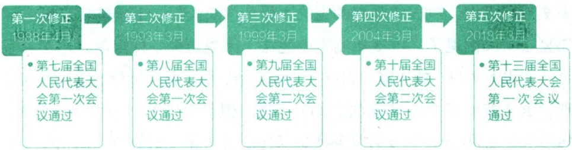

## 拓展

## 马锡五审判方式

1943年7月1日，陕甘宁边区高等法院陇东分庭审理封彦贵（封芝琴之父）与张金才（张柏之父）儿女婚姻纠纷上诉案，庭长马锡五在广泛听取群众对案件的看法和处理意见的基础上，依据刑法与婚姻法的相关规定，作出刑事附带民事判决。此案是“马锡五审判方式”的具体体现，后被改编成评剧《刘巧儿》。“马锡五审判方式”的特点是:走出窑洞，深入农村，调查研究，依靠群众，就地审判，不拘形式，解决问题，实行审判与调解相结合；坚持原则，依法办事；简便手续，便利人民诉讼。“马锡五审判方式”得到中共中央肯定，是党的群众路线在司法领域实践的典型。

走中国特色社会主义法治道路，是由我国社会主义国家性质决定的。我国宪法明确规定:“社会主义制度是中华人民共和国的根本制度。”这一根本制度保证了人民当家作主的主体地位，也保证了人民在全面依法治国中的中心地位，这是我们的最大制度优势。中国特色社会主义法治道路坚持人民主体地位，坚持法律面前人人平等，能够保证人民在党的领导下，依照法律规定，通过各种途径和形式管理国家事务，管理经济和文化事业，管理社会事务，本质上是中国特色社会主义道路在法治领域的具体体现。只有始终坚持以人民为中心，才能真正实现法治保障人民权益的根本目的。公众号:旗胜考研一手扫描

走中国特色社会主义法治道路，是立足我国基本国情的必然选择。走什么样的法治道路，脱离不开一个国家的基本国情。从已经实现现代化的国家发展历程看，英国、美国、法国等西方国家适应资本主义市场经济和现代化发展需要，经过一二百年乃至二三百年内生演化，逐步实行法治化。就我们这个14亿多人口的社会主义大国而言，我们有自己的历史文化传统，有长期积累的经验和优势，要在较短时间内建成法治国家，必须走中国特色社会主义法治道路。中国特色社会主义法治道路的一个鲜明特点，就是坚持依法治国和以德治国相结合。从国情实际出发，不等于关起门来搞法治，我们要坚持以我为主、为我所用，认真鉴别、合理吸收世界上优秀的法治文明成果。

## 拓展

## 《中华人民共和国民法典》

2020年5月28日，十三届全国人大三次会议通过《中华人民共和国民法典》。民法典包括7编及附则，共1260条，各编依次为总则、物权、合同、人格权、婚姻家庭、继承、侵权责任。这是一部体现我国社会主义性质、符合人民利益和愿望、顺应时代发展要求的民法典，是一部体现对生命健康、财产安全、交易便利、生活幸福、人格尊严等各方面权利平等保护的民法典，是一部具有鲜明中国特色、实践特色、时代特色的民法典。民法典是中华人民共和国成立以来第一部以“法典”命名的法律，是新时代我国社会主义法治建设的重大成果。

## （二）坚持中国特色社会主义法治道路必须遵循的原则

中国特色社会主义法治道路，明确了建设社会主义法治国家的性质和方向，是社会主义法治建设成就和经验的集中体现，是建设中国特色社会主义法治体系、建设社会主义法治国家的正确道路。走中国特色社会主义法治道路，必须坚持中国共产党的领导，坚持人民主体地位，坚持法律面前人人平等，坚持依法治国和以德治国相结合，坚持从中国实际出发。

坚持中国共产党的领导。党的领导是中国特色社会主义最本质的特征，是社会主义法治最根本的保证。把党的领导贯彻到依法治国全过程和各方面，是我国社会主义法治建设的一条基本经验。我国是人民民主专政的社会主义国家，党的领导是中国特色社会主义法治之魂，是我们的法治同西方资本主义国家的法治最大的区别。坚持党中央权威和集中统一领导，是坚持党的领导的最高原则，是我国制度优势的根本保证。党中央每年听取全国人大常委会、国务院、全国政协、最高人民法院、最高人民检察院党组工作汇报和中央书记处工作报告，是坚持党中央权威和集中统一领导的一项重大制度性安排。国际国内环境越是复杂，改革开放和社会主义现代化建设任务越是繁重，越要运用法治思维和法治手段巩固执政地位、改善执政方式、提高执政能力，保证党和国家长治久安。全面依法治国是要加强和改善党的领导，健全党领导全面依法治国的制度和工作机制，推进党的领导制度化、法治化，通过法治保障党的路线方针政策有效实施。

明辨

## 为什么说“党大还是法大”是个伪命题？

“党大还是法大”是一个政治陷阱，是一个伪命题。党的领导和依法治国不是对立的，而是统一的。我国法律充分体现了党和人民意志，我们党依法办事，这个关系是相互统一的关系。从逻辑上讲，党的本质是政治组织，而法的本质是行为规则，两者不存在谁比谁大的问题，否则就会落入话语陷阱。如果说党比法大，那就是承认法治、依法治国都是虚假的，法就不存在了；如果说法比党大，那党的领导就难以实施了。因此，在党和法之间不能搞简单的比较。

当然，我们说不存在“党大还是法大”的问题，是把党作为一个执政整体、就党的执政地位和领导地位而言的，具体到每个党政组织、每个领导干部，就必须服从和遵守宪法法律。“权大还是法大”则是一个真命题。纵观人类政治文明史，权力是一把“双刃剑”，在法治的轨道上行使可以造福人民，在法律之外行使必然祸害国家和人民。

坚持人民主体地位。全面依法治国最广泛、最深厚的基础是人民，必须坚持为了人民、依靠人民。推进全面依法治国，根本目的是依法保障人民权益。必须始终牢牢把握坚持党的领导、人民当家作主、依法治国有机统一，不断发展社会主义民主政治并使之法治化、制度化，坚持和完善人民代表大会制度以及中国共产党领导的多党合作和政治协商制度、民族区域自治制度、基层群众自治制度等人民当家作主的制度体系。要积极回应人民群众新要求新期待，系统研究谋划和解决法治领域人民群众反映强烈的突出问题，不断增强人民群众获得感、幸福感、安全感，用法治保障人民安居乐业。

我国社会主义制度保证了人民当家作主的主体地位，也保证了人民在全面推进依法治国中的主体地位。这是我们的制度优势，也是中国特色社会主义法治区别于资本主义法治的根本所在。

——习近平

坚持法律面前人人平等。平等是社会主义法律的基本属性，是社会主义法治的基本要求。坚持法律面前人人平等，对于坚持走中国特色社会主义法治道路具有十分重要的意义。第一，它可以充分显示中国特色社会主义制度的优越性，使人民在依法治国中的主体地位得到尊重和保障，从而有利于增强人民群众的主人翁意识和责任感。第二，它鲜明地反对法外特权、法外开恩，对掌握公权力的人形成制约，从而有利于预防特权思想和各种潜规则的侵蚀。第三，它鲜明地反对法律适用上的各种歧视，有利于贯彻执行“以事实为根据，以法律为准绳”的司法原则。第四，它要求人人都严格依法办事，既充分享有法律规定的各项权利，又切实履行法律规定的各项义务，有利于维护法律权威、健全社会主义法治，确保实现全面依法治国的总目标。

坚持法律面前人人平等，一方面要求违法必究，一切违反宪法法律的行为都必须予以追究。法治意味着不管什么人，不管涉及谁，只要违反法律就要依法追究责任。另一方面要求非歧视，即无差别对待。只要是正当权益诉求，就应当在法律上得到平等对待；只要是合法权益，就应当依法得到平等保护。要着力反歧视，特别要强调对弱势群体合法利益的法律保护。

拓展

## 我国宪法关于平等权的相关规定

我国宪法规定:“中华人民共和国各民族一律平等。”“中华人民共和国公民在法律面前一律平等。”“中华人民共和国年满十八周岁的公民，不分民族、种族、性别、职业、家庭出身、宗教信仰、教育程度、财产状况、居住期限，都有选举权和被选举权；但是依照法律被剥夺政治权利的人除外。”“中华人民共和国妇女在政治的、经济的、文化的、社会的和家庭的生活等各方面享有同男子平等的权利。”“国家保护妇女的权利和利益，实行男女同工同酬，培养和选拔妇女干部。”

坚持依法治国和以德治国相结合。法治和德治，是治国理政不可或缺的两种方式，如车之两轮或鸟之两翼，忽视其中任何一个，都将难以实现国家的长治久安。只有让法治和德治共同发挥作用，才能使法律与道德相辅相成，法治与德治相得益彰，做到法安天下，德润人心。坚持依法治国和以德治国相结合，既要强化道德对法治的支撑作用，重视发挥道德的教化作用，提高全社会文明程度，为全面依法治国创造良好环境；又要把道德要求贯彻到法治建设中，以法治承载道德理念。立法、执法、司法都要体现社会主义道德要求，都要把社会主义核心价值观贯穿其中，使社会主义法治成为良法善治，引导全社会崇德向善。要运用法治手段解决道德领域突出问题，依法加强对群众反映强烈的失德行为的整治。

拓展

## 《中华人民共和国英雄烈士保护法》第22条

禁止歪曲、丑化、亵渎、否定英雄烈士事迹和精神。

英雄烈士的姓名、肖像、名誉、荣誉受法律保护。任何组织和个人不得在公共场所、互联网或者利用广播电视、电影、出版物等，以侮辱、诽谤或者其他方式侵害英雄烈士的姓名、肖像、名誉、荣誉。任何组织和个人不得将英雄烈士的姓名、肖像用于或者变相用于商标、商业广告，损害英雄烈士的名誉、荣誉。

公安、文化、新闻出版、广播电视、电影、网信、市场监督管理、负责英雄烈士保护工作的部门发现前款规定行为的，应当依法及时处理。

坚持从中国实际出发。建设法治中国，必须从我国实际出发，同完善和发展中国特色社会主义制度、推进国家治理体系和治理能力现代化相适应，既不能罔顾国情、超越阶段，也不能因循守旧、墨守成规。坚持从实际出发，就是要突出法治道路的中国特色、实践特色、时代特色。要传承中华优秀传统法律文化，从我国革命、建设、改革的实践中探索适合自己的法治道路，同时借鉴国外法治有益成果，为全面建设社会主义现代化国家、实现中华民族伟大复兴夯实法治基础。要注意研究我国古代法制传统及其成败得失，挖掘和传承中华法律文化精华，汲取营养、择善而用。要学习借鉴世界上优秀的法治文明成果，但必须坚持以我为主、为我所用，认真鉴别、合理吸收，不能搞“全盘西化”，不能搞“全面移植”，不能照搬照抄。

拓展

## 中华法系

中华法系形成于秦朝，到隋唐时期逐步成熟，《唐律疏议》是代表性的法典，清末以后中华法系影响日渐衰微。中华法系是在我国特定历史条件下形成的，彰显了中华民族的伟大创造力和中华法制文明的深厚底蕴。中华法系凝聚了中华民族的精神和智慧，有很多优秀的思想和理念值得我们传承。出礼入刑、隆礼重法的治国策略，民惟邦本、本固邦宁的民本理念，天下无讼、以和为贵的价值追求，德主刑辅、明德慎罚的慎刑思想，援法断罪、罚当其罪的平等观念，保护鳏寡孤独、老幼妇残的恤刑原则，等等，都蕴含着中华优秀传统法律文化的智慧。

“为国也，观俗立法则治，察国事本则宜。”走什么样的法治道路、建设什么样的法治体系，是由一个国家的基本国情决定的。全面依法治国，决不照搬别国模式和做法，决不走西方所谓“宪政”“三权鼎立”“司法独立”的路子。实践证明，我国政治制度和法治体系是适合我国国情和实际的制度，具有显著优越性。要树立自信、保持定力，一切从我国实际出发，坚定不移沿着中国特色社会主义法治道路前进。

## 三、建设法治中国

全面依法治国是一个系统工程，要整体谋划，更加注重系统性、整体性、协同性。全面依法治国的宏伟目标是建设法治中国，要以建设中国特色社会主义法治体系为总抓手，围绕保障和促进社会公平正义，坚持依法治国、依法执政、依法行政共同推进，坚持法治国家、法治政府、法治社会一体建设，坚持全面推进科学立法、严格执法、公正司法、全民守法，全面推进国家各方面工作法治化。

## (一)建设中国特色社会主义法治体系

全面依法治国涉及很多方面，必须有一个总揽全局、牵引各方的总抓手，这个总抓手就是建设中国特色社会主义法治体系。建设中国特色社会主义法治体系，就是要形成完备的法律规范体系、高效的法治实施体系、严密的法治监督体系、有力的法治保障体系，形成完善的党内法规体系。

完备的法律规范体系。完备的法律规范体系，是中国特色社会主义法治体系的前提，是法治国家、法治政府、法治社会的制度基础。法律规范体系，是以宪法为核心，由部门齐全、结构严谨、内部协调、体例科学、调整有效的法律及其配套法规所构成的法律规范系统。完善法律规范体系的基本要求包括:坚持立法先行，发挥立法在改革开放和经济社会发展中的引领和推动作用，加快完善法律、行政法规、地方性法规体系，为全面依法治国提供基本遵循；科学立法、民主立法、依法立法，坚持上下有序、内外协调、科学规范、运行有效的原则，立改废释并举，实现从粗放立法向精细立法转变，提高立法质量和效率。

高效的法治实施体系。建设高效的法治实施体系，是建设中国特色社会主义法治体系的重点。高效的法治实施体系，是指执法、司法、守法等各个环节有效衔接、协调高效运转、持续共同发力，织密法治之网，强化法治之力，实现效果最大化的法治实施系统。完善法治实施体系的重点内容包括:健全宪法实施制度，把树立宪法权威作为全面依法治国的重大事项抓紧抓好；全面建设职能科学、权责法定、执法严明、公开公正、智能高效、廉洁诚信、人民满意的法治政府，依法全面履行政府职能，完善行政组织和行政程序法律制度，健全依法决策机制，深化行政执法体制改革，坚持严格规范公正文明执法；深化司法体制综合配套改革，规范司法行为，提高司法公信力，努力让人民群众在每一个司法案件中感受到公平正义；着力培育公民和社会组织自觉守法的意识和责任感，充分调动全社会自觉守法的积极性、主动性，营造全社会共同守法的良好氛围。

我们的工作重点应该是保证法律实施，做到有法必依、执法必严、违法必究。有了法律不能有效实施，那再多法律也是一纸空文，依法治国就会成为一句空话。

——习近平

严密的法治监督体系。严密的法治监督体系，是指以规范和约束公权力为重点建立的有效的法治化权力监督网络。它以有权必有责、用权受监督、违法必追究，坚决纠正有法不依、执法不严、违法不究行为等为主要任务，是宪法法律有效实施的重要保障，是加强对权力运行制约和监督的迫切要求。完善法治监督体系的重点内容包括:健全宪法实施和监督制度；强化对行政权力的制约和监督；加强对司法活动的监督；发挥党内监督、人大监督、民主监督、行政监督、司法监督、审计监督、社会监督、舆论监督的合力，推进法治监督工作规范化、程序化、制度化，形成对法治运行全过程全方位的监督；深化国家监察体制改革，依法建立党统一领导的反腐败工作机构，构建集中统一、权威高效的国家监察体系，实现对所有行使公权力的公职人员监察全覆盖；加强党对法治监督工作的集中统一领导，把法治监督作为党和国家监督体系的重要内容，保证行政权、监察权、审判权、检察权得到依法正确行使，推进对法治工作的全面监督。

有力的法治保障体系。有力的法治保障体系，是全面依法治国的重要依托，是指在法律制定、实施和监督过程中形成的结构完整、机制健全、资源充分、富有成效的保障系统，包括政治和制度保障、组织和人才保障、法治文化保障等。完善法治保障体系的重点内容包括:切实加强和改进党对全面依法治国的领导，提高依法执政能力和水平，为全面依法治国提供有力的政治和制度保障；加强高素质法治专门队伍和法律服务队伍建设，提高法治工作队伍思想政治素质、业务工作能力、职业道德水准，为全面依法治国提供坚实的组织和人才保障；努力推动形成办事依法、遇事找法、解决问题用法、化解矛盾靠法的良好法治环境，为全面依法治国提供丰厚的法治文化保障。

完善的党内法规体系。建设完善的党内法规体系，是中国特色社会主义法治体系的本质要求和重要内容。完善的党内法规体系，是指内容科学、程序严密、配套完备、运行有效的党内制度及其运行、保障体系。加强党内法规体系建设，就是要形成完善的党内法规制度体系、高效的党内法规制度实施体系、有力的党内法规制度建设保障体系，党依据党内法规管党治党的能力和水平显著提高。完善党内法规体系的重点内容包括:党的组织法规制度、党的领导法规制度、党的自身建设法规制度、党的监督保障法规制度。

拓展

## 党内法规体系的框架构成

党内法规体系，是以党章为根本，以民主集中制为核心，以准则、条例等中央党内法规为主干，以部委党内法规、地方党内法规为重要组成部分，由各领域各层级党内法规组成的有机统一整体。按照“规范主体、规范行为、规范监督”相统筹相协调的原则，党内法规体系以“1+4”为基本框架，即在党章之下分为党的组织法规、党的领导法规、党的自身建设法规、党的监督保障法规四大板块。

（二）坚持依法治国、依法执政、依法行政共同推进，坚持法治国家、法治政府、法治社会一体建设

依法治国、依法执政、依法行政是一个有机整体，关键在于党要坚持依法执政、各级政府要坚持依法行政。法治国家、法治政府、法治社会相辅相成，法治国家是法治建设的目标，法治政府是建设法治国家的重点，法治社会是构筑法治国家的基础。

## 拓展

## 《法治中国建设规划（2020—2025年）》明确的总体目标

建设法治中国，应当实现法律规范科学完备统一，执法司法公正高效权威，权力运行受到有效制约监督，人民合法权益得到充分尊重保障，法治信仰普遍确立，法治国家、法治政府、法治社会全面建成。

到 2025 年，党领导全面依法治国体制机制更加健全，以宪法为核心的中国特色社会主义法律体系更加完备，职责明确、依法行政的政府治理体系日益健全，相互配合、相互制约的司法权运行机制更加科学有效，法治社会建设取得重大进展，党内法规体系更加完善，中国特色社会主义法治体系初步形成。

到 2035 年，法治国家、法治政府、法治社会基本建成，中国特色社会主义法治体系基本形成，人民平等参与、平等发展权利得到充分保障，国家治理体系和治理能力现代化基本实现。

推进全面依法治国，法治政府建设是重点任务和主体工程，对法治国家、法治社会建设具有示范带动作用。现在，我国法治政府建设还有一些难啃的硬骨头，依法行政观念不牢固、行政决策合法性审查走形式等问题还没有根本解决。要用法治给行政权力定规矩、划界限，规范行政决策程序，健全政府守信践诺机制，加快转变政府职能。推进严格规范公正文明执法，让执法既有力度又有温度，让违法者敬法畏法，增强人们对法治的信心。

推进全面依法治国，法治社会建设是基础工程。建设信仰法治、公平正义、保障权利、守法诚信、充满活力、和谐有序的社会主义法治社会，是增强人民群众获得感、幸福感、安全感的重要举措。普法工作要在针对性和实效性上下功夫，特别是要加强青少年法治教育，不断提升全体公民法治意识和法治素养，使法治成为社会共识和基本准则。要推动更多法治力量向引导和疏导端用力，完善预防性法律制度，坚持和发展新时代“枫桥经验”，促进社会和谐稳定。

## 拓展

## 新时代“枫桥经验”

20世纪60年代初，浙江诸暨枫桥镇干部群众创造了“发动和依靠群众，坚持矛盾不上交，就地解决，实现捕人少、治安好”的“枫桥经验”。此后，“枫桥经验”在实践中不断丰富发展，特别是党的十八大以来形成了特色鲜明的新时代“枫桥经验”。其内涵是:坚持和贯彻党的群众路线，在党的领导下，充分发动群众、组织群众、依靠群众解决群众自己的事情，做到“小事不出村、大事不出镇、矛盾不上交”。

## （三）坚持全面推进科学立法、严格执法、公正司法、全民守法

科学立法是全面依法治国的前提，严格执法是全面依法治国的关键，公正司法是全面依法治国的重点，全民守法是全面依法治国的基础。全面依法治国，必须从立法、执法、司法、守法四个方面统筹推进。

科学立法。“立善法于天下，则天下治；立善法于一国，则一国治。”法律是治国之重器，立法是法治的龙头环节。科学立法，要以完善以宪法为核心的中国特色社会主义法律体系、加强宪法实施为目标，坚持以民为本、立法为民理念，使每一项立法都符合宪法精神，反映人民意志，得到人民拥护。要把公正、公平、公开原则贯穿立法全过程，完善立法体制机制，增强法律法规的及时性、系统性、针对性、有效性。加强党对立法工作的领导，完善党对立法工作中重大问题决策的程序，健全有立法权的人大主导立法工作的体制机制。深入推进科学立法、民主立法，完善立法项目征集和论证制度，拓宽社会各方面有序参与立法的途径和方式。聚焦法律制度短板弱项，健全国家治理急需的法律制度、满足人民日益增长的美好生活需要必备的法律制度，统筹推进国内法治和涉外法治。实现立法和改革决策衔接，做到重大改革于法有据、立法主动适应改革和经济社会发展需要，不断提高立法质量和效率，以高质量立法保障高质量发展、推动全面深化改革、维护社会大局稳定。

不是什么法都能治国，不是什么法都能治好国；越是强调法治，越是要提高立法质量。

——习近平

严格执法。“天下之事，不难于立法，而难于法之必行。”法律的生命力在于实施，法律的权威也在于实施。严格执法，要依法全面履行政府职能，坚持法定职责必须为、法无授权不可为，健全依法决策机制，完善执法程序，严格执法责任。把公众参与、专家论证、风险评估、合法性审查、集体讨论决定确定为重大行政决策法定程序，建立行政机关内部重大决策合法性审查机制，建立重大决策终身责任追究制度及责任倒查机制。深化行政执法体制改革，坚持严格规范公正文明执法，依法惩处各类违法行为，加大关系群众切身利益的重点领域执法力度，推行行政执法公示制度、执法全过程记录制度、重大执法决定法制审核制度，建立健全行政裁量权基准制度，全面落实执法责任制。全面推进政务公开，推进决策公开、执行公开、管理公开、服务公开、结果公开。

拓展

## 行政执法“三项制度”

行政执法“三项制度”是指行政执法公示制度、执法全过程记录制度、重大执法决定法制审核制度。聚焦行政执法的源头、过程、结果等关键环节，全面推行“三项制度”，对促进严格规范公正文明执法具有基础性、整

体性、突破性作用，对切实保障人民群众合法权益，维护政府公信力，营造更加公开透明、规范有序、公平高效的法治环境具有重要意义。

公正司法。“理国要道，在于公平正直。”公正是法治的生命线，是司法活动最高的价值追求。公正司法是维护社会公平正义的最后一道防线。要深化司法体制综合配套改革，加强司法制约监督，健全社会公平正义法治保障制度，不断提高司法公信力，让人民群众在每一个司法案件中感受到公平正义。完善司法机关依法独立公正行使审判权和检察权的制度，建立健全司法人员履行法定职责保护机制。要优化司法职权配置，健全公安机关、检察机关、审判机关、司法行政机关各司其职，侦查权、检察权、审判权、执行权相互配合、相互制约的体制机制。要坚持严格司法，推进以审判为中心的诉讼制度改革，确保侦查、审查起诉的案件证据经得起法庭的检验，保证庭审在查明事实、认定证据、保护诉权、公正裁判中发挥决定性作用。要保障人民群众参与司法，完善人民陪审员制度，构建开放、动态、透明、便民的阳光司法机制。加强人权司法保障，强化诉讼权利保障，健全落实罪刑法定、疑罪从无和非法证据排除等法律原则的法律制度，加强对刑讯逼供和非法取证的源头预防，健全冤假错案有效防范和及时纠正机制。加强对司法活动的监督，完善人民监督员制度。规范媒体对案件的报道，防止舆论影响司法公正。对因违法违纪被开除公职的司法人员、吊销执业证书的律师和公证员，终身禁止从事法律职业。

全民守法。“邦国虽有良法，要是人民不能全部遵循，仍然不能实现法治。”法律的权威源自人民的内心拥护和真诚信仰，全民守法是法治社会的基础工程。全民守法，要增强全民法治观念、推进法治社会建设，树立宪法法律至上、法律面前人人平等的法治理念，培育全社会法治信仰。全面落实“谁执法谁普法”普法责任制，增强法治宣传教育针对性和实效性，弘扬社会主义法治精神，传承中华优秀传统法律文化，引导全体人民做社会主义法治的忠实崇尚者、自觉遵守者、坚定捍卫者，使法治成为社会共识和基本原则。深入学习宣传习近平法治思想，深入宣传以宪法为核心的中国特色社会主义法律体系，广泛宣传与经济社会发展和人民群众利益密切相关的法律法规，注重对法治理念、法治思维的培育，充分发挥法治文化的引领、熏陶作用，使人民群众自觉尊崇、信仰和遵守法律，增强全社会厉行法治的积极性和主动性，形成守法光荣、违法可耻的社会氛围，努力使尊法学法守法用法在全社会蔚然成风。

## 第三节 维护宪法权威

坚持依法治国首先要坚持依宪治国，坚持依法执政首先要坚持依宪执政，坚持宪法确定的中国共产党领导地位不动摇，坚持宪法确定的人民民主专政的国体和人民代表大会制度的政体不动摇。维护宪法权威，就是维护党和人民共同意志的权威；捍卫宪法尊严，就是捍卫党和人民共同意志的尊严；保证宪法实施，就是保证人民根本利益的实现。我们要深入了解我国宪法的形成和发展，正确理解宪法的地位和基本原则，充分认识加强宪法实施与监督的重大意义，不断增强宪法意识，忠实履行维护宪法尊严、保证宪法实施的职责。

法治权威能不能树立起来，首先要看宪法有没有权威。必须把宣传和树立宪法权威作为全面推进依法治国的重大事项抓紧抓好，切实在宪法实施和监督上下功夫。

——习近平

## 一、我国宪法的形成和发展

中国共产党领导人民制定的宪法，既不同于西方宪法，也不同于近代以来我国曾经出现的旧宪法，而是在取得新民主主义革命胜利、实现民族独立和人民解放、扫除一切旧势力的基础上制定的全新宪法。《中华人民共和国宪法》为了建设社会主义新中国应运而生，为了坚持和发展中国特色社会主义而与时俱进，在世界宪法制度史上具有开创性意义。

## （一）我国宪法的形成

中国共产党登上中国历史舞台后，在推进中国革命、建设、改革的实践中，高度重视宪法和法制建设。从建立革命根据地开始，党就进行了制定和实施人民宪法的探索和实践。1931年，中华苏维埃第一次全国代表大会通过《中华苏维埃共和国宪法大纲》。1946年，陕甘宁边区第三届参

《中国人民政治协商会议共同纲领》

议会第一次大会通过《陕甘宁边区宪法原则》。同年，中共中央书记处决定成立中央法律问题研究委员会，负责试拟陕甘宁边区宪法草案。我国现行宪法，可以追溯到1949年中国人民政治协商会议第一届全体会议通过的起临时宪法作用的《中国人民政治协商会议共同纲领》和1954年一届全国人大一次会议通过的《中华人民共和国宪法》。

1954年宪法是中华人民共和国第一部宪法，它以《中国人民政治协商会议共同纲领》为基础并加以发展，在总结新民主主义革命历史经验和社会主义改造与社会主义建设经验的基础上，规定了国家在过渡时期的总任务，确定了建设社会主义制度的道路和目标，确立了适合中国国情的国体和政体，同时较完整地规定了公民的基本权利和义务。1954年宪法的制定和实施，为巩固社会主义政权和进行社会主义建设发挥了重要保障和推动作用，也为我国现行宪法的制定和完善奠定了基础。

在这之后，我国宪法建设走了一些弯路，特别是“文化大革命”期间宪法形同虚设。1975年制定的宪法，受到“四人帮”干扰破坏，比1954年宪法大大倒退了。1978年制定的宪法，因受历史条件限制，还来不及对“文化大革命”的惨痛教训进行全面总结、对“左”的错误进行彻底清理，虽然恢复了1954年宪法的部分条文，但仍然以1975年宪法为基础。1979年7月和1980年9月又两次进行宪法部分条文的修改，仍不能满足形势发展的需要。

党的十一届三中全会开启了改革开放和社会主义现代化建设新时期，发展社会主义民主、健全社会主义法制成为党和国家坚定不移的方针。我国现行宪法即1982年宪法就是在这个历史背景下产生的。这部宪法深刻总结了我国社会主义建设正反两方面经验，适应我国改革开放和社会主义现代化建设、加强社会主义民主法制建设的新要求，确立了党的十一届三中全会之后的路线方针政策，把集中力量进行社会主义现代化建设作为国家的根本任务，就社会主义民主法制建设作出一系列规定，为改革开放和社会主义现代化建设提供了有力法制保障。

## （二）我国现行宪法的修改

宪法修改是党和国家政治生活中的一件大事。我国宪法必须体现党和人民事业的历史进步，随着党领导人民建设中国特色社会主义实践的发展而不断完善发展。宪法只有不断适应新形势、吸纳新经验、确认新成果，才能具有持久生命力。1988年、1993年、1999年、2004年、2018年，全国人大分别对我国宪法个别条款和部分内容作出必要的也是十分重要的修正，使我国宪法在保持稳定性和权威性的基础上紧跟时代前进步伐，不断与时俱进。

2018年，十三届全国人大一次会议通过宪法修正案，反映了党的十九大确定的重大理论观点和重大方针政策，以及党和国家事业发展的新成就新经验新要求。确立了科学发展观、习近平新时代中国特色社会主义思想在国家政治和社会生活中的指导地位，将新发展理念、建设富强民主文明和谐美丽的社会主义现代化强国、实现中华民族伟大复兴、中国共产党领导是中国特色社会主义最本质的特征、倡导社会主义核心价值观、确立宪法宣誓制度、完善国家主席任期制度、深化国家监察体制改革等载入宪法。这对于全面贯彻习近平新时代中国特色社会主义思想，深化依法治国、依宪治国，在法治轨道上更好坚持和发展中国特色社会主义，广泛动员和组织全国各族人民夺取新时代中国特色社会主义伟大胜利，具有重大而深远的意义。通过这次修改，我国宪法在中国特色社会主义伟大实践中与时俱进，不断完善，有力推动和保障了党和国家事业发展，有力推动和加强了我国社会主义法治建设。

现行宪法修改体现了中国共产党领导人民进行改革开放和社会主义现代化建设的成功经验，体现了中国特色社会主义道路、理论、制度、文化的发展成果，表明了我国宪法同党和人民进行的艰苦奋斗和创造的辉煌成就紧密相连，同党和人民开辟的前进道路和积累的宝贵经验紧密相连。回顾党领导的宪法建设史，可以得出这样几点结论。一是制定和实施宪法，推进依法治国，建设法治国家，是实现国家富强、民族振兴、社会进步、人民幸福的必然要求。二是我国现行宪法是在深刻总结我国社会主义革命、建设、改革的成功经验基础上制定和不断完善的，是党领导人民长期奋斗的历史逻辑、理论逻辑、实践逻辑的必然结果。三是只有中国共产党才能坚持立党为公、执政为民，充分发扬民主，领导人民制定出体现人民意志的宪法，领导人民实施宪法。四是党高度重视发挥宪法在治国理政中的重要作用，坚定维护宪法尊严和权威，推动宪法完善和发展，这是我国宪法保持生机活力的根本原因所在。

古人讲，“法与时移”，“法与时转则治，治与世宜则有功”，“观时而制法，因事而制礼”。宪法作为上层建筑，一定要适应经济基础的变化而变化。任何国家都不可能制定一部永远适用的宪法。

——习近平

## 二、我国宪法的地位和基本原则

## 图说

1954年10月1日，首都各界欢度国庆，游行队伍抬着《中华人民共和国宪法》模型通过天安门检阅台。2019年10月1日，一辆《中华人民共和国宪法》模型主题彩车被群众代表簇拥着通过天安门检阅台。

宪法在全面依法治国中具有突出地位和重要作用。我国宪法确认了党领导人民长期奋斗取得的辉煌成果，规定了人民民主专政国家政权的性质和根本制度，明确了国家未来建设发展的根本任务和总目标，是党的指导思想、中心工作、基本原则、重大方针、重要政策在国家法制上的最高体现。全面建设社会主义现代化国家、实现中华民族伟大复兴的中国梦，推进国家治理体系和治理能力现代化、提高党长期执政能力，必须更加注重发挥宪法的根本法作用。

## （一）我国宪法的地位

我国宪法实现了党的主张和人民意志的高度统一，具有显著优势、坚实基础、强大生命力。宪法至上地位主要体现在其特有的作用、效力和内容等方面。

## 拓展

## 我国宪法序言的法律地位

宪法序言是我国宪法的重要组成部分，是我国宪法最重要的特征之一，也是我国宪法与其他许多国家宪法的重大区别。宪法序言是我国宪法的灵魂，同现行宪法各章节一样具有最高法律效力。宪法及其法律效力具有整体性和不可分割性，任何将宪法序言与宪法总纲、宪法具体条文割裂开来，进而认为宪法序言没有法律效力的观点，都是错误的。

我国宪法是国家的根本法，是党和人民意志的集中体现。我国现行宪法颁布以来，在坚持中国共产党领导，保障人民当家作主，促进改革开放和社会主义现代化建设，推动社会主义法治国家建设进程，维护国家统一、民族团结、社会稳定等方面发挥了有力的推动作用。实践证明，我国现行宪法是符合国情、符合实际、符合时代发展要求的好宪法，是充分体现人民共同意志、充分保障人民民主权利、充分维护人民根本利益的好宪法，是推动国家发展进步、保证人民创造幸福生活、保障中华民族实现伟大复兴的好宪法，是我们国家和人民经受住各种困难和风险考验、始终沿着中国特色社会主义道路前进的根本法制保障。

一个团体要有一个章程，一个国家也要有一个章程，宪法就是一个总章程，是根本大法。用宪法这样一个根本大法的形式，把人民民主和社会主义原则固定下来，使全国人民有一条清楚的轨道，使全国人民感到有一条清楚的明确的和正确的道路可走，就可以提高全国人民的积极性。

——毛泽东

我国宪法是国家各项制度和法律法规的总依据。宪法在中国特色社会主义法律体系中居于核心地位。宪法确立了社会主义法治的基本原则，明确规定中华人民共和国实行依法治国，建设社会主义法治国家，国家维护社会主义法制的统一和尊严。我国宪法具有最高的法律地位、法律权威、法律效力，具有根本性、全局性、稳定性、长期性。一切法律、行政法规、地方性法规的制定都必须以宪法为依据，遵循宪法的基本原则，不得与宪法相抵触。

我国宪法规定了国家的根本制度。我国宪法确立了中国共产党的领导地位，规定了国家的根本任务、领导核心、指导思想、基本原则、发展道路、奋斗目标。我国宪法确立了工人阶级领导的、以工农联盟为基础的人民民主专政的国体，确立了社会主义制度是中华人民共和国的根本制度，确立了人民代表大会制度的政体，确立了中国共产党领导的多党合作和政治协商制度、民族区域自治制度以及基层群众自治制度，确立了公有制为主体、多种所有制经济共同发展，按劳分配为主体、多种分配方式并存，社会主义市场经济体制等社会主义基本经济制度。

宪法是实现国家认同、凝聚社会共识、促进个人发展的基本准则，是维系一个国家、一个民族凝聚力的根本纽带。中国共产党领导人民制定的宪法，是中国历史上第一部真正的人民宪法，是规范国家权力运行、保障公民权利实现的根本活动准则。我们要以宪法为最高法律规范，充分发挥宪法的引领、规范和保障作用，把国家各项事业和各项工作全面纳入法治轨道，维护社会公平正义，实现国家和社会生活制度化、法治化，把依法治国、依宪治国工作提高到一个新水平。

## （二）我国宪法的基本原则

宪法的基本原则是贯穿宪法规范始终，对宪法的制定、修改、实施、遵守等环节起指导作用的基本准则。我国宪法的基本原则集中反映了规范权力运行、保障公民权利的基本精神，体现了社会主义法治的根本性质。

党的领导原则。中国共产党是中国特色社会主义事业的领导核心。党的领导是人民当家作主的根本保证，是中国特色社会主义最本质的特征，是中国特色社会主义制度最大优势。中国共产党执政就是党领导、支持、保证人民当家作主，最广泛地动员和组织人民群众依法管理国家和社会事务，管理经济和文化事业，维护和实现最广大人民的根本利益。我国宪法对中国共产党领导地位和执政地位的规定，既是对中国共产党领导人民在革命、建设、改革各个历史时期奋斗成果的确认，也是对国家性质和根本制度的确认，集中体现了党的主张和人民意志的高度统一。

我们讲依宪治国、依宪执政，不是要否定和放弃党的领导，而是强调党领导人民制定宪法和法律，党领导人民执行宪法和法律，党自身必须在宪法和法律范围内活动。我国宪法是以根本法的形式反映了党带领人民进行革命、建设、改革取得的成果，反映了在历史和人民选择中形成的党的领导地位。

——习近平

人民当家作主原则。人民当家作主是社会主义民主政治的本质和核心。我国宪法体现了人民当家作主原则，强调国家的一切权力属于人民。这一原则在宪法中的表现是多方面的:宪法通过确认我国人民民主专政的国体，保障了广大人民群众在国家中的主人翁地位；通过确认以公有制为主体、多种所有制经济共同发展的基本经济制度，为人民当家作主奠定了经济基础；通过确认人民代表大会制度的政体，为人民当家作主提供了组织保障；通过确认广大人民依照法律规定，通过各种途径和形式，管理国家事务，管理经济和文化事业，管理社会事务的权利，把人民当家作主贯彻于国家和社会生活各个领域。

尊重和保障人权原则。法治是人权得以实现的保障。我国宪法将“国家尊重和保障人权”规定为一项基本原则，对公民的基本权利和自由作出全面规定，依法保障公民的生存权和发展权。我国宪法规定公民享有人身权、财产权、社会保障权、受教育权等权利和言论、出版、集会、结社、游行、示威等自由。由于国家机关和国家工作人员侵犯公民权利而受到损失的人，有依照法律规定获得赔偿的权利。尊重和保障人权原则入宪以来，我国在完善人权保障法律体系、依法行政保障公民合法权益、有效提升人权司法保障水平等方面取得了新进展，推动了人权事业不断进步。

拓展

## 人权是历史的、发展的

人权是一定历史条件下的产物，也会随着历史条件的发展而发展。各国发展阶段、经济发展水平、文化传统、社会结构不同，所面临的人权发展任务和应采取的人权保障方式也会有所不同。应当尊重人权发展道路的多样性。只有将人权的普遍性原则同各国实际相结合，才能有效地促进人权的实现。世界各国在人权保障上没有最好，只有更好；世界上没有放之四海而皆准的人权发展道路和保障模式，人权事业的发展必须也只能按照本国国情和人民需要加以推进。

社会主义法治原则。我国宪法明确规定:“中华人民共和国实行依法治国，建设社会主义法治国家。”社会主义法治原则要求坚持宪法法律至上、法律面前人人平等，推进国家各项工作法治化，维护社会公平正义，维护社会主义法制的统一和尊严。国家立法权、行政权、监察权、审判权和检察权都必须在法治轨道上有序运行。任何组织和个人都要在宪法和法律范围内活动，一切违法行为都应受到法律的追究。

民主集中制原则。民主集中制是我国国家组织形式和活动方式的基本原则，是我国国家制度的突出特点和优势，也是集中全党全国人民集体智慧，实现科学决策、民主决策的基本原则和主要途径。我国宪法规定:“中华人民共和国的国家机构实行民主集中制的原则。”国家权力统一由全国人民代表大会和地方各级人民代表大会行使，全国人民代表大会和地方各级人民代表大会由民主选举产生，对人民负责，受人民监督。广大人民的共同意志通过民主形式集中起来，并通过法定程序上升为国家意志。国家行政机关、监察机关、审判机关、检察机关都由人民代表大会产生，对它负责，受它监督。中央和地方国家机构职权的划分及其活动，遵循在中央统一领导下，充分发挥地方的主动性、积极性的原则。

## 三、加强宪法实施和监督

宪法的生命在于实施，宪法的权威也在于实施。

——习近平

我国宪法发展的历程说明，只要我们切实尊重和有效实施宪法，党和国家事业就能顺利发展。反之，如果宪法受到漠视、削弱甚至破坏，党和国家事业就会遭受挫折。因此，我们要采取更加有力的措施，加强宪法实施与监督。

## （一）加强宪法实施

全国各族人民、一切国家机关和武装力量、各政党和各社会团体、各企业事业组织，都必须以宪法为根本活动准则，并且负有维护宪法尊严、保证宪法实施的职责。任何组织或者个人都不得有超越宪法法律的特权。一切违反宪法法律的行为，都必须予以追究。加强宪法实施，党首先要坚持依宪执政，国家权力机关要加强和改进立法工作，国家行政机关、监察机关和司法机关要严格执行法律，维护宪法法律尊严。

坚持依宪执政。宪法是中国共产党长期执政的根本法律依据，党首先要带头尊崇和执行宪法。要坚持党领导立法、保证执法、支持司法、带头守法，把依法治国、依法执政、依法行政统一起来，把党总揽全局、协调各方同人大、政府、政协、监察机关、审判机关、检察机关依法依章程履行职能、开展工作统一起来，把党领导人民制定和实施宪法法律同党坚持在宪法法律范围内活动统一起来。

## 拓展

## 宪法宣誓誓词

我宣誓:“忠于中华人民共和国宪法，维护宪法权威，履行法定职责，忠于祖国、忠于人民，恪尽职守、廉洁奉公，接受人民监督，为建设富强民主文明和谐美丽的社会主义现代化强国努力奋斗！”

坚持依法立法。国家权力机关要加强和改进立法工作，继续完善以宪法为核心的中国特色社会主义法律体系，以良法促进发展、保障善治、维护人民民主权利，保证宪法确立的制度、原则和规则得到全面实施。要及时把党的路线方针政策通过法定程序转化为国家法律，加强重点领域、新兴领域、涉外领域立法，通过完备的法律体系推动宪法实施。要保证重大改革于法有据，任何立法均不得同宪法相抵触，维护社会主义法制的统一。

坚持严格执法。国家行政机关要坚持依宪施政、依法行政，严格规范政府行为，深化行政执法体制改革，推进执法规范化建设，严格规范公正文明执法，加大决策合法性审查力度，进一步提高科学决策、民主决策、依法决策水平。监察机关要在党的领导下，以宪法为根本准则，履行好对行使公权力的公职人员监察全覆盖的法定职责。司法机关要深化司法体制综合配套改革，落实司法责任制，加快构建权责一致的司法权运行新机制，坚持和完善中国特色社会主义司法制度，保证依法独立公正行使审判权、检察权，确保司法权公正高效权威，不断提高司法公信力。

## （二）完善宪法监督

宪法的力量不仅因其地位崇高，更源于其有效的监督。宪法实施以来，我国不断探索并逐步建立了具有中国特色的宪法监督制度。在新的历史条件下，推进全面依法治国、加强宪法实施，对宪法监督提出了新的更高要求。

健全人大工作机制。全国人大及其常委会履行宪法赋予的宪法监督职责，要加强对宪法法律实施情况的监督检查，坚决纠正违宪违法行为。要依法行使监督权，加强对“一府一委两院”的行为是否合乎宪法的监督。要健全监督机制和程序，进一步明确全国人大及其常委会进行宪法监督的对象、范围、方式等，将原则性要求具体化、程序化，使宪法监督更规范、更有效。

健全宪法解释机制。全国人大常委会根据宪法规定行使宪法解释权，依照宪法精神对宪法规定的内容、含义和界限作出解释。要完善宪法解释程序机制，明确宪法解释提请的条件、宪法解释请求的提起和受理以及宪法解释案的审议、通过和公布等具体规定，保证宪法解释贯彻落实，积极回应涉及宪法有关问题的关切，努力实现宪法的稳定性和适应性的统一。

## 拓展

## 全国人大常委会全票通过对香港基本法第104条的解释

2016年11月，十二届全国人大常委会第二十四次会议全票通过《全国人民代表大会常务委员会关于〈中华人民共和国香港特别行政区基本法〉第一百零四条的解释》，根据《中华人民共和国宪法》第67条和《中华人民共和国香港特别行政区基本法》第158条的规定，对《中华人民共和国香港特别行政区基本法》第104条“香港特别行政区行政长官、主要官员、行政会议成员、立法会议员、各级法院法官和其他司法人员在就职时必须依法宣誓拥护中华人民共和国香港特别行政区基本法，效忠中华人民共和国香港特别行政区”的规定作出解释。

健全备案审查机制。将所有的法规、规章、司法解释和各类规范性文件依法依规纳入备案审查范围，是宪法监督的重要内容和环节。要建立健全党委、人大、政府、军队间备案审查衔接联动机制，加强备案审查制度和能力建设，实行有件必备、有备必审、有错必纠。要提高备案审查机制的执行力和约束力，增强备案审查的实际效能。

健全合宪性审查机制。我国的合宪性审查，就是由有关权力机关依据宪法和相关法律的规定，对于可能存在违反宪法规定的法律法规、规范性文件以及国家机关履行宪法职责的行为进行审查，并对违反宪法的问题予以纠正。推进合宪性审查工作，要求有关方面拟出台的法规规章、重要政策和重大举措，凡涉及宪法有关规定如何解释、如何适用的，都应当事先经过全国人大常委会合宪性审查，确保同宪法规定、宪法精神相符合。

宪法的根基在于人民发自内心的拥护，宪法的伟力在于人民出自真诚的信仰。古人说:“法非从天下，非从地出，发于人间，合乎人心而已。”宪法是每个公民享有权利、履行义务的基本遵循。我们要充分认识到宪法不仅是全体公民必须遵循的行为规范，而且是保障公民权利的法律武器，更加自觉地尊崇宪法、学习宪法、遵守宪法、维护宪法、运用宪法，大力弘扬宪法精神，不断增强宪法意识，把宪法作为判断大是大非的准绳，同一切破坏宪法权威、践踏宪法尊严的行为作斗争，在宪法的阳光照耀下追求国家富强和人民幸福。

## 第四节 自觉尊法学法守法用法

推进全面依法治国需要全社会共同参与。大学生是未来国家建设的中坚力量，要积极培养法治思维，正确理解依法行使权利和履行义务，不断提升法治素养，自觉尊法学法守法用法，成为社会主义法治的忠实崇尚者、自觉遵守者、坚定捍卫者。

## 一、培养社会主义法治思维

尊法学法守法用法，增强法治意识，提高法治素养，必须养成良好的法治思维和行为方式。大学生要准确把握法治思维的基本含义和内容，提高运用法治思维分析、解决问题的能力。

## （一）法治思维及其内涵

法治思维是指以法治价值和法治精神为导向，运用法律原则、法律规则、法律方法思考和处理问题的思维模式。法治思维将法律作为判断是非和处理事务的准绳，要戈崇尚法治、尊重法律，善于运用法律手段协调关系和解决问题。

法治思维包含以下几层含义。第一，法治思维以法治价值和法治精神为指导，蕴含着公正、平等、民主、人权等法治理念，是一种正当性思维。第二，法治思维以法律原则和法律规则为依据指导人们的社会行为，是一种规范思维。第三，法治思维以法律手段与法律方法为依托分析问题、处理问题、解决纠纷，是一种逻辑思维。第四，法治思维是一种符合规律、尊重事实的科学思维。因此，法治思维是一种融法律的价值属性和工具理性于一体的特殊的高级法律意识。

法治和人治问题是人类政治文明史上的一个基本问题，也是各国在实现现代化过程中必须面对和解决的一个重大问题。综观世界近现代史，凡是顺利实现现代化的国家，没有一个不是较好解决了法治和人治问题的。相反，一些国家虽然也一度实现快速发展，但并没有顺利迈进现代化的门槛，而是陷入这样或那样的“陷阱”，出现经济社会发展停滞甚至倒退的局面。后一种情况很大程度上与法治不彰有关。

——习近平

法治思维是基于对法律的尊崇和对法治的信念判断是非、权衡利弊、解决问题的思维方式，其要义是把对法治的尊崇、对法律的敬畏转化成思维方式和行为方式，坚持宪法法律至上，坚守法治底线，切实做到依法治国、依法执政、依法行政、依法治军、依法办事、依法维权。对公民而言，法治思维就是当自己的理想目标、思想感情、行为方式、权利诉求和利益关系等与法律的价值、规则或要求发生冲突时，能够服从法律，作出符合法律的选择，按照法律的指引实施自己的行为。

## （二）法治思维的基本内容

法治思维的内涵丰富、外延宽广，主要表现为价值取向和规则意识两个方面。价值取向是指如何看待和对待法律，规则意识是指如何用法律看待和对待自身。一般来讲，法治思维主要包括法律至上、权力制约、公平正义、权利保障、程序正当等内容。

法律至上。法律至上是指在国家或社会的所有规范中，法律是地位最高、效力最广、强制力最大的规范。这里的法律，既包括宪法，也包括其他一般法律。法律至上尤其指宪法至上，因为宪法具有最高的法律效力，是其他一切法律的依据。法律至上具体表现为法律的普遍适用、优先适用和不可违反。法律的普遍适用，是指法律在本国主权范围内对所有人具有普遍的约束力。所有国家机关、社会组织和公民个人都必须遵守法律，依法享有和行使法定职权与权利，承担和履行法定职责与义务。法律的优先适用，是指当同一项社会关系同时受到多种社会规范的调整而多种社会规范又相互矛盾时，要优先考虑法律规范的适用。法律的不可违反，是指法律必须遵守，违反法律要受到惩罚。任何人不论权力大小、职位高低，只要有违法犯罪行为，就要受到法律制裁。养成法律至上思维，对于自觉遵守法律、维护法律权威意义重大。

党纪国法不能成为“橡皮泥”、“稻草人”，无论是因为“法盲”导致违纪违法，还是故意违规违法，都要受到追究，否则就会形成“破窗效应”。

——习近平

权力制约。权力制约是指国家机关的权力必须受到法律的规制和约束。在我国，国家权力是人民的，即一切权力为民所有；国家权力是为人民服务的，即一切权力为民所用。因此，只有依法对权力的配置和运行进行有效制约和监督，才能防止权力私用、权力滥用和权力腐败。国家工作人员就职时应当按照法律规定公开进行宪法宣誓。权力制约包括权力由法定、有权必有责、用权受监督、违法受追究四项要求。权力由法定，即法无授权不可为，是指国家机关的职权必须来自法律明确的授予。国家机关必须严格依照法律规定的权限行使职权，不得行使法律未授予的权力。有权必有责，是指国家机关在获得权力的同时必须承担相应的职责