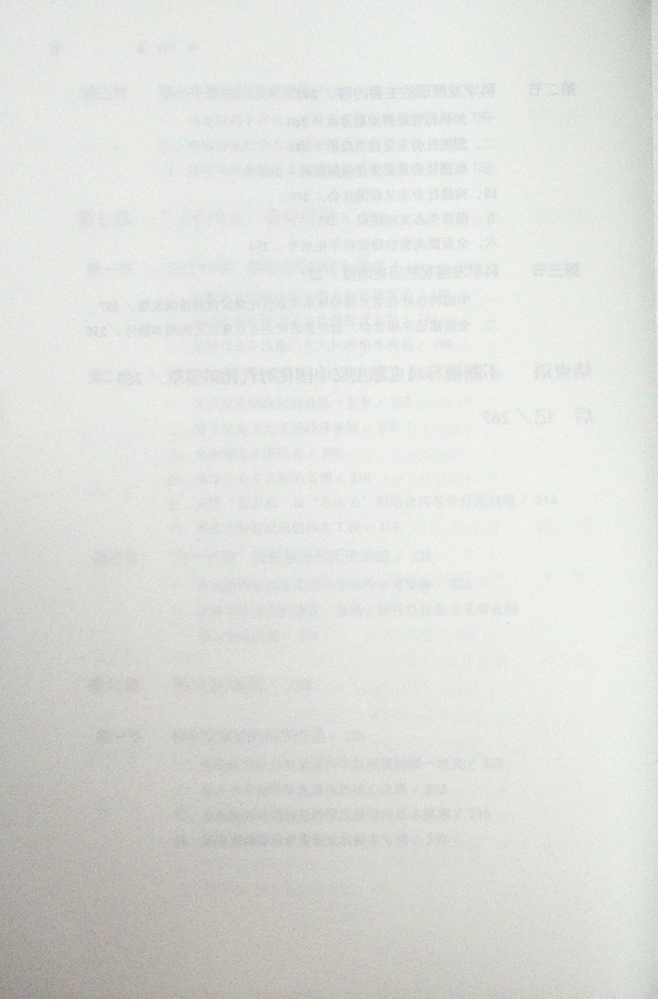

· 马克思主义理论研究和建设工程重点教材 ·

# 毛泽东思想和中国特色 社会主义理论体系概论

## (2023年版)

本书编写组

高等教育出版社

---

---

· 马克思主义理论研究和建设工程重点教材 ·

# 毛泽东思想和中国特色社会主义理论体系概论

(2023年版)

本书编写组

高等教育出版社·北京

---

图书在版编目（CIP）数据

毛泽东思想和中国特色社会主义理论体系概论:2023年版/《毛泽东思想和中国特色社会主义理论体系概论（2023年版)》编写组编.--8版.--北京:高等教育出版社，2023.2ISBN978-7-04-059903-9

I.①毛… II.①毛… III.①毛泽东思想-高等学校-教材②中国特色社会主义理论体系-高等学校-教材IV.①A84 ②D610

# 中国国家版本馆 CIP 数据核字（2023）第 012585 号

# Maozedongsixiang he Zhongguoteseshehuizhuyillluntixi Gallun

策划编辑 高英 代红凯 张红

出版发行 高等教育出版社

社址北京市西城区德外大街4号

责任编辑 高英 代红凯 张红

邮政编码 100120

购书热线 010-58581118

封面设计 王凌波 杨立新

咨询电话 400-810-0598

版式设计 王凌波 张楠网 址 http://www.hep.edu.cn
http://www.hep.com.cn

责任绘图 贺雅馨

网上订购 http://www.hepmall.com.cn  
http://www.hepmall.com  
http://www.hepmall.cn

责任校对 张薇

印刷 唐山市润丰印务有限公司

开本 $787\mathrm{mm}\times 960\mathrm{mm}$ 1/16

责任印制 刘思涵

印 张 17.5

字 数 240千字

版次 2008年9月第1版  
2023年2月第8版

印次2023年2月第1次印刷

定 价 25.00元

本书如有缺页、倒页、脱页等质量问题，

请到所购图书销售部门联系调换。

版权所有 侵权必究

物料号 59903-00

---

# ·马克思主义理论研究和建设工程重点教材·

马克思主义理论研究和建设工程咨询委员会委员、审议专家（以姓氏笔画为序）

王伟光 王晓晖 王梦奎 王维澄 王嘉毅

韦建桦 尹汉宁 左中一 龙新民 宁吉喆

邢贲思 曲青山 曲爱国 刘永治 刘国光

江流 江金权 汝信 孙英 孙谦

孙业礼 苏星 李伟 李捷 李书磊

李君如 李忠杰 李宝善 李培林 李景田

李慎明 吴杰明 吴德刚 何毅亭 冷溶

沈春耀 怀进鹏 张宇 张文显 张树军

张研农 陈晋 陈宝生 邵华泽 欧阳淞

金冲及 金炳华 周济 郑必坚 郑科扬

赵长茂 南振中 信春鹰 侯树栋 逢先知

逄锦聚 姜辉 袁贵仁 袁曙宏 贾高建

夏伟东 顾海良 徐光春 高翔 高永中

龚育之 隆国强 蒋乾麟 韩震 韩文秀

谢伏瞻 甄占民 靳诺 路建平 虞云耀

蔡昉 雒树刚 滕文生 颜晓峰 魏礼群

《毛泽东思想和中国特色社会主义理论体系概论（2023年版）》课题组

首席专家秦宣 肖贵清 郑传芳 孙蚌珠 刘先春韩喜平

主要成员（以姓氏笔画为序）
王衡 白显良 孙贺 杜玉华 宋友文
杨军 陈培永 陈锡喜 陶文昭 凌胜银
程美东

---

---

## 目录

- 导论 马克思主义中国化时代化的历史进程与理论成果/1
- 一、马克思主义中国化时代化的提出/1
- 二、马克思主义中国化时代化的内涵/4
- 三、马克思主义中国化时代化的历史进程/6
- 四、马克思主义中国化时代化理论成果及其关系/10
- 五、学习本课程的要求和方法/12
- 第一章 毛泽东思想及其历史地位/15
- 第一节 毛泽东思想的形成和发展/15
- 一、毛泽东思想形成发展的历史条件/15
- 二、毛泽东思想形成发展的过程/16
- 第二节 毛泽东思想的主要内容和活的灵魂/20
- 一、毛泽东思想的主要内容/20
- 二、毛泽东思想活的灵魂/26
- 第三节 毛泽东思想的历史地位/32
- 一、马克思主义中国化时代化的第一个重大理论成果/32
- 二、中国革命和建设的科学指南/34
- 三、中国共产党和中国人民宝贵的精神财富/35

---

ii

目录

- 第二章 新民主主义革命理论/39
- 第一节 新民主主义革命理论形成的依据/39
- 一、近代中国国情和中国革命的时代特征/39
- 二、新民主主义革命理论的实践基础/42
- 第二节 新民主主义革命的总路线和基本纲领/45
- 一、新民主主义革命的总路线/45
- 二、新民主主义的基本纲领/52
- 第三节 新民主主义革命的道路和基本经验/56
- 一、新民主主义革命的道路/56
- 二、新民主主义革命的三大法宝/59
- 三、新民主主义革命理论的意义/65
- 第三章 社会主义改造理论/67
- 第一节 从新民主主义到社会主义的转变/67
- 一、新民主主义社会是一个过渡性的社会/67
- 二、党在过渡时期的总路线及其依据/69
- 第二节 社会主义改造道路和历史经验/76
- 一、适合中国特点的社会主义改造道路/76
- 二、社会主义改造的历史经验/83
- 第三节 社会主义基本制度在中国的确立/86
- 一、社会主义基本制度的确立及其理论根据/86
- 二、确立社会主义基本制度的重大意义/89
- 第四章 社会主义建设道路初步探索的理论成果/93
- 第一节 初步探索的重要理论成果/93
- 一、调动一切积极因素为社会主义事业服务/93
- 二、正确认识和处理社会主义社会矛盾的思想/97
- 三、走中国工业化道路的思想/101

---

目录 iii

- 四、初步探索的其他理论成果 / 103
- 第二节 初步探索的意义和经验教训 / 110
- 一、初步探索的意义 / 110
- 二、初步探索的经验教训 / 112
- 第五章 中国特色社会主义理论体系的形成发展 / 118
- 第一节 中国特色社会主义理论体系形成发展的社会历史条件 / 118
- 一、中国特色社会主义理论体系形成发展的国际背景 / 118
- 二、中国特色社会主义理论体系形成发展的历史条件 / 123
- 三、中国特色社会主义理论体系形成发展的实践基础 / 128
- 第二节 中国特色社会主义理论体系形成发展过程 / 134
- 一、中国特色社会主义理论体系的形成 / 134
- 二、中国特色社会主义理论体系的跨世纪发展 / 138
- 三、中国特色社会主义理论体系在新世纪新阶段的新发展 / 143
- 四、中国特色社会主义理论体系在新时代的新篇章 / 146
- 第六章 邓小平理论 / 150
- 第一节 邓小平理论首要的基本的理论问题和精髓 / 150
- 一、邓小平理论首要的基本的理论问题 / 150
- 二、邓小平理论的精髓 / 153
- 第二节 邓小平理论的主要内容 / 156
- 一、社会主义初级阶段理论和党的基本路线 / 156
- 二、社会主义根本任务和发展战略理论 / 161
- 三、社会主义改革开放和社会主义市场经济理论 / 167
- 四、“两手抓，两手都要硬” / 171
- 五、“一国两制”与祖国统一 / 175
- 六、中国特色社会主义外交和国际战略 / 179
- 七、党的建设理论 / 183

---

iv

- 目录
- 第三节 邓小平理论的历史地位 / 187
- 一、马克思列宁主义、毛泽东思想的继承和发展 / 187
- 二、中国特色社会主义理论体系的开篇之作 / 187
- 三、改革开放和社会主义现代化建设的科学指南 / 188
- 第七章 “三个代表”重要思想 / 191
- 第一节 “三个代表”重要思想的核心观点 / 191
- 一、始终代表中国先进生产力的发展要求 / 191
- 二、始终代表中国先进文化的前进方向 / 194
- 三、始终代表中国最广大人民的根本利益 / 198
- 第二节 “三个代表”重要思想的主要内容 / 202
- 一、发展是党执政兴国的第一要务 / 202
- 二、建立社会主义市场经济体制 / 206
- 三、全面建设小康社会 / 208
- 四、建设社会主义政治文明 / 210
- 五、实施“引进来”和“走出去”相结合的对外开放战略 / 214
- 六、推进党的建设新的伟大工程 / 216
- 第三节 “三个代表”重要思想的历史地位 / 222
- 一、中国特色社会主义理论体系的丰富发展 / 222
- 二、加强和改进党的建设、推进中国特色社会主义事业的强大理论武器 / 224
- 第八章 科学发展观 / 228
- 第一节 科学发展观的科学内涵 / 228
- 一、推动经济社会发展是科学发展观的第一要义 / 228
- 二、以人为本是科学发展观的核心立场 / 232
- 三、全面协调可持续是科学发展观的基本要求 / 235
- 四、统筹兼顾是科学发展观的根本方法 / 237

---

目录 V

- 第二节 科学发展观的主要内容 / 240
- 一、加快转变经济发展方式 / 240
- 二、发展社会主义民主政治 / 243
- 三、推进社会主义文化强国建设 / 245
- 四、构建社会主义和谐社会 / 249
- 五、推进生态文明建设 / 251
- 六、全面提高党的建设科学化水平 / 254
- 第三节 科学发展观的历史地位 / 257
- 一、中国特色社会主义理论体系在新世纪新阶段的接续发展 / 257
- 二、全面建设小康社会、加快推进社会主义现代化的根本指针 / 259
- 结束语 不断谱写马克思主义中国化时代化新篇章 / 263
- 后记 / 267

---

