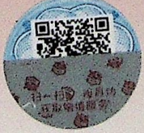

## 后记

本教材在高校思想政治理论课编写领导小组领导下组织编写。在编写过程中，得到了马克思主义理论研究和建设工程咨询委员会的指导，得到了中央有关部门和有关专家学者的帮助和支持。同时，广泛听取了高校思想政治理论课教师和大学生的意见和建议。

本教材2007年出版，书名为《毛泽东思想、邓小平理论和“三个代表”重要思想概论》。由首席专家吴树青主持编写。首席专家陈占安、田克勤、肖贵清、秦宣，主要成员郑传芳、丁俊萍、王炳林、刘先春、刘晓哲、孙蚌珠、陈锡喜、顾钰民、韩振亮参加编写。参加统稿和修改工作的同志还有:张西明、程金中、顿世新、杨金海、葛洪泽、周爱兵、张黎宏、赵宇、肖明娟、徐维凡、王心富、邵文辉、叶庆丰、薛广洲、刘毅强、李道中、武国友、常光民、罗文东、毛立言、辛向阳、裴小革、吴波、赵家祥、张新、吴向东、姜汉斌、颜晓峰、王幸生、王寿林、卫庶、查朱和、王君琦、刘贵芹、陈矛、陈睿、徐春生、宋凌云、何成、胡长栓、阮晓菁等。

本教材2007年出版以来，为了更及时、更充分地反映党的理论创新和实践创新成果，中宣部、教育部组织课题组在广泛调研的基础上，先后于2008年1月、2008年8月、2009年5月、2010年5月、2014年1月、2015年8月、2018年3月、2021年8月组织了8次修订。

2008年1月，由首席专家吴树青主持修订。修订课题组首席专家陈占安、田克勤、肖贵清、秦宣、冷溶、李君如，主要成员丁俊萍、王炳林、刘先春、孙蚌珠、陈锡喜、郑传芳、顾钰民、韩振亮、刘晓哲参加修订。自2008年秋季学期开始，高校思想政治理论课“毛泽东思想、邓小平理论和‘三个代表’重要思想概论”课程名称调整为“毛泽东思想和中国特色社会主义理论体系概论”，教材相应地也更名为《毛泽东思想和中国特色社会主义理论体系概论》，课题组于2008年8月组织修订，由首席专家吴树青主持修订。首席专家陈占安、田克勤、肖贵清、秦宣、冷溶、李君如、郑传芳，主要成员丁俊萍、王炳林、刘先春、孙蚌珠、陈锡喜、顾钰民、韩振亮、刘晓哲参加修订。2009年、2010年，课题组又先后对教材进行了修订。2013年，中宣部、教育部在广泛征求意见的基础上，组织课题组对教材进行了较大幅度的修订。由陈占安主持修订，田克勤、肖贵清、秦宣、郑传芳、丁俊萍、王炳林、孙蚌珠、刘先春、陈锡喜、顾钰民、韩振亮、刘晓哲、阮晓菁、孙君、凌胜银等参加修订。参加审看的专家有:曹长盛、张中云、张新、程美东、赵甲明、周向军、韩振峰、白暴力、黄继锋、丁军、王跃、李楠、林震、熊晓琳、李强、查朱和、范军、田心铭、吴玉才、刘文艺、邓家豪、姜建红、夏建文、王晓光、张红、李剑、郑炳凯、高君等。2015年，由陈占安主持修订，田克勤、田心铭、肖贵清、郑传芳、刘先春、孙蚌珠、陈锡喜、张新、韩喜平、凌胜银、白显良参加修订。参加审看的专家有:闫志民、朱景文、常光民、张新、秦宣、颜晓峰、于沛、姜辉、高正礼、李战奎、哈战荣、龙兵等。2018年，由秦宣主持修订，肖贵清、郑传芳、刘先春、韩喜平、陶文昭、孙蚌珠、丁俊萍、陈锡喜、凌胜银、程美东、杜玉华、刘晓哲、白显良、陈培永、李冉参加修订。参加审看的专家有:顾海良、侯惠勤、韩震、韩振峰、李树忠等。2021年，由秦宣主持修订，肖贵清、郑传芳、孙蚌珠、刘先春、韩喜平、陈锡喜、凌胜银、陶文昭、杨军、程美东、杜玉华、白显良、陈培永、王衡、宋友文、孙贺参加修订。

马克思主义理论研究和建设工程办公室具体组织实施了本教材编写和历次审阅修订工作。其中，2013年，张磊主持了工程办公室组织的统稿修改工作。宋凌云、邵文辉、王昆、田岩、冯静、潘顺照、吴伟珍、张春云、李军、范为、宋义栋、魏学江参加了具体审改工作。2015年，夏伟东、邵文辉主持了工程办公室组织的审改定稿工作。宋凌云、王昆、田岩、冯静、杨荣、陈硕、沈永福、查朱和、蒋旭东、何成、邢国忠、曹守亮、陈培永、严文波、冯潇然参加了具体审改工作。2018年，夏伟东、邵文辉主持工程办公室组织的审改定稿工作，宋凌云、王昆、王勇、田岩、冯静、曹守亮、陈瑞来、刘小丰、薛向军、蒋岩桦、卢江、马文武、张新、王燕燕等参加了具体审改工作。2021年，徐李孙、陈启清主持工程办公室组织的审改定稿工作，王昆、王勇、田岩、冯静、石文磊、吴学锐、刘志刚、张明、贾鹏飞、刘儒鹏、余立等参加了具体审改工作。

2022年10月，为进一步推动习近平新时代中国特色社会主义思想进教材、进课堂、进头脑，贯彻落实党的二十大和十九届六中全会精神，中宣部、教育部组织对教材进行修订。秦宣主持修订，肖贵清、郑传芳、孙蚌珠、刘先春、韩喜平、陈锡喜、凌胜银、陶文昭、杨军、程美东、杜玉华、白显良、陈培永、王衡、宋友文、孙贺参加修订。徐李孙、陈启清主持工程办公室组织的审改定稿工作，王昆、王勇、石文磊、吴学锐、刘水静、黄刚、曾庆桃、史泽源、胡晓宇等参加了具体审改工作。

2023年1月

## 郑重声明

高等教育出版社依法对本书享有专有出版权。任何未经许可的复制、销售行为均违反《中华人民共和国著作权法》，其行为人将承担相应的民事责任和行政责任；构成犯罪的，将被依法追究刑事责任。为了维护市场秩序，保护读者的合法权益，避免读者误用盗版书造成不良后果，我社将配合行政执法部门和司法机关对违法犯罪的单位和个人进行严厉打击。社会各界人士如发现上述侵权行为，希望及时举报，我社将奖励举报有功人员。

反盗版举报电话（010）58581999 58582371

反盗版举报邮箱 dd@hep.com.cn

通信地址 北京市西城区德外大街4号 高等教育出版社法律事务部

邮政编码 100120

## 读者意见反馈

为收集对教材的意见建议，进一步完善教材编写并做好服务工作，读者可将对本教材的意见建议通过如下渠道反馈至我社。

咨询电话 400-810-0598

反馈邮箱 gjdzfwb@pub.hep.cn

通信地址 北京市朝阳区惠新东街4号富盛大厦1座高等教育出版社总编辑办公室

邮政编码 100029

防伪查询说明

用户购书后刮开封底防伪涂层，使用手机微信等软件扫描二维码，会跳转至防伪查询网页，获得所购图书详细信息。

防伪客服电话（010）58582300

本教材2018年版曾获首届全国教材建设奖全国优秀教材特等奖

【核对注】二维码及教材标识原图。