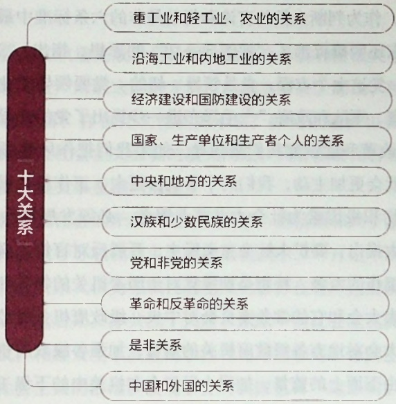

体劳动基础上，规模狭小，经营分散，技术落后，不利于生产力水平的提高。对手工业的社会主义改造，党和政府采取了“积极领导、稳步前进”的方针。在方法步骤上，从供销合作入手，逐步发展到走生产合作的道路。具体来说，手工业的社会主义改造经历了由小到大、由低级到高级的三个步骤。第一步是办手工业供销小组。手工业供销小组是由独立手工业者或家庭手工业者通过由国营商业或供销合作社供给原料和包销产品，推销成品通过加工订货方式组织起来的。手工业供销小组还没有改变原有生产关系，仍然是分散生产的，但师傅、家长、业主加入生产小组，摆脱了工业资本、商业资本和高利贷的剥削和控制，与国营经济、供销合作社和消费合作社建立了联系，获得了供销上的扶持，它虽然没有改变生产资料的私有制，但已经把个体手工业者组织起来，使之开始脱离资本主义工商业的供销轨道，因而具有社会主义萌芽性质。第二步是办手工业供销合作社。手工业供销合作社是在手工业供销小组的基础上发展起来的，由供销合作社通过供应原料，推销产品，或加工订货，把个体手工业者或家庭手工业者组织为生产小组，随着供销业务的逐步扩大，这些小组联合发展为供销生产合作社。统一供销业务，但生产资料归社员个人所有，生产活动仍由各社员分散独立完成，后来逐步有部分生产资料是公有的，合作社对各户的生产也有一定的干预，因而具有半社会主义性质。第三步是建立手工业生产合作社。手工业生产合作社是社会主义性质的集体经济组织，生产资料归社员集体所有，在国家计划指导下，根据市场需要灵活安排，采取集中生产或分散生产，以及流动服务等多种经营方式，独立核算、自负盈亏。社员入社自愿，退社自由，参加集体生产劳动，实行民主管理和按劳分配原则，根据行业的特点和合作社生产经营、技术条件、管理水平等具体情况，采取个人或者小组计件工资、计时工资加奖励和分成工资等形式。在手工业的社会主义改造过程中，党和政府采取说服教育、典型示范和国家帮助的方法，使手工业者自愿参加到手工业合作社中来，从而把手工业者的私有制改变为社会主义的集体所有制。到1956年底，手工业生产合作社占全部手工业合作组织的70.5%，产值占手工业合作组织总产值的87.8%，对手工业的社会主义改造基本完成。

## 2. 资本主义工商业的社会主义改造

在推进农业合作化运动的同时，党和政府有计划、有步骤地开展了对资本主义工商业的社会主义改造，创造性地开辟了一条适合中国情况的对资本主义工商业进行社会主义改造的道路。

第一，用和平赎买的方法改造资本主义工商业。无产阶级掌握国家政权后，“剥夺剥夺者”，使被资本家占有的生产资料变成人民的财产，这是社会主义革命的一个基本原则。中国共产党根据马克思、恩格斯和列宁关于采用和平方式变革所有制的设想，结合中国的具体情况，提出了对资本主义工商业实行和平赎买的方针。所谓赎买，就是国家有偿地将私营企业改变为国营企业，将资本主义私有制改变为社会主义公有制。赎买的具体方式不是由国家支付一笔巨额补偿资金，而是让资本家在一定年限内从企业经营所得中获取一部分利润。

对资本主义工商业实行和平赎买，有利于发挥私营工商业在国计民生方面的积极作用，促进国民经济发展；有利于争取和团结民族资产阶级，有利于团结各民主党派和各界爱国民主人士，巩固和发展统一战线；有利于发挥民族资产阶级中大多数人的知识、才能、技术专长和管理经验，也有利于争取和团结那些原来同资产阶级相联系的知识分子为社会主义建设服务。

我国之所以能够采取赎买的方式对资本主义工商业进行和平改造，原因是多方面的。首先，民族资产阶级具有两面性。在社会主义革命时期，民族资产阶级既有剥削工人取得利润的一面，又有拥护中国共产党的领导、拥护宪法、愿意接受社会主义改造的一面。民族资产阶级和工人阶级之间存在着的剥削和被剥削的对抗性矛盾，“如果处理得当，可以转变为非对抗性的矛盾，可以用和平的方法解决这个矛盾”①。其次，中国共产党与民族资产阶级长期保持着统一战线的关系，这就为将工人阶级和民族资产阶级之间存在着的对抗性矛盾转化为非对抗性矛盾并按照人民内部矛盾来处理提供了前提。最后，我国已经有了以工人阶级为领导、工农联盟为基础的人民民主专政的国家政权，建立了强大的社会主义国营经济并掌握了国家的经济命脉，这就造成了私人资本主义在政治上、经济上对社会主义的依赖。再加上当时国家对粮食和工业原料的统购统销，以及资本主义企业中工人群众对资本家的监督等因素，就使私人资本主义企业只能接受社会主义改造。

第二，采取从低级到高级的国家资本主义的过渡形式。所谓国家资本主义，就是在国家直接控制和支配下的资本主义经济。我国社会主义改造中出现的国家资本主义经济，“是在人民政府管理之下的，用各种形式和国营社会主义经济联系着的，并受工人监督的资本主义经济。这种资本主义经济已经不是普通的资本主义经济，而是一种特殊的资本主义经济，即新式的国家资本主义经济。它主要地不是为了资本家的利润而存在，而是为了供应人民和国家的需要而存在”。“因此，这种新式国家资本主义经济是带着很大的社会主义性质的，是对工人和国家有利的。”②国家资本主义有初级形式和高级形式之分。初级形式的国家资本主义是国家对私营工商业实行委托加工、计划订货、统购包销、经销代销等，高级形式的国家资本主义是公私合营，包括个别企业的公私合营和全行业的公私合营。

<small>①《毛泽东文集》第七卷，人民出版社1999年版，第206页。</small>

<small>②《毛泽东文集》第六卷，人民出版社1999年版，第282页。</small>

## 国家资本主义

国家资本主义是与社会主义直接相联系的、国家直接控制和支配下的资本主义经济。它不是一种独立的经济形态，其性质取决于所在国家的性质。在党的七届二中全会上，毛泽东将“国家和私人合作的国家资本主义经济”作为新中国的几种主要的经济成分之一。在社会主义改造过程中，中国共产党采用国家资本主义的方式开展对资本主义工商业的社会主义改造，即通过在一定的时期内有步骤地、有区别地把一切对国计民生有利的、而又为国家所需要的资本主义企业基本上改造为国家资本主义企业，并有计划地稳步地使低级形式的国家资本主义向高级形式的国家资本主义发展。

对资本主义工商业的社会主义改造经历了三个步骤。第一步，主要实行初级形式的国家资本主义。国家在私营工业中实行委托加工、计划订货、统购包销，这主要是同资本家在企业外部的合作，在私营商业中采取委托经销、代销等形式，既帮助私营企业克服困难，也使其生产和经营开始纳入国家计划的轨道。这些企业的利润，按国家所得税、企业公积金、工人福利费、资方红利这四个方面进行分配，即当时所说的“四马分肥”。资方红利大体占1/4，资本主义的剥削受到限制，工人在企业中的地位也发生了变化，这就使企业具有了社会主义的因素。第二步，主要实行个别企业的公私合营。这是社会主义成分同资本主义成分在企业内部的合作，国家向私营企业投资入股，企业的生产资料由国家和资本家共同所有；国家派干部（即公方代表）进入企业内部，根据国家建设需要，同工人、资本家（私方代表）共同管理和改造企业，公方代表居领导地位。企业利润的分配仍为“四马分肥”；资方红利大体只占1/4，企业的利润大部分归国家和工人所有，资本家的剥削进一步受到限制。企业的经营管理以发展生产、满足人民需要和完成国家计划为目标，因而已经属于半社会主义性质的企业。第三步，是实行全行业的公私合营。从个别企业的公私合营到全行业公私合营，是党和国家对资本主义工商业采取利用、限制、改造政策的必然趋势，也是经济运行中计划不断强化的必然结果。在主要农产品实行统购统销、绝大多数农民加入农业合作社的形势下，资本家在原材料和市场方面只能接受社会主义改造。而国家也只有实行全行业公私合营，才能更好地从全局出发有计划地安排生产，保证国家重点建设的顺利进行。1956年，全行业公私合营进入高潮。年底，全国私营工业户数的 $99\%$ 和私营商业户数的 $82\%$ ，分别纳入了公私合营或合作社的轨道。这标志着国家对资本主义工商业的社会主义改造已基本完成。全行业公私合营后，国家对合营企业进行清产核资、定股定息，委派人员负责企业的生产经营管理，统一调配企业的人、财、物，生产资料为国家所有。全行业公私合营后，企业的生产关系已经发生了根本的变化，基本上成为社会主义国营性质的企业。

第三，把资本主义工商业者改造成为自食其力的社会主义劳动者。在资本主义工商业的社会主义改造中，国家对资方在职人员和资方代理人采取“包下来”的政策，以企业为基地，根据“量才使用，适当照顾”的原则，对他们在政治上适当安排、工作上发挥作用、生活上妥善照顾，通过改造阶级成分的方式达到从整体上消灭资产阶级的目的。对企业的改造和对人的改造相结合，改造资本家个人与消灭他们所属的资产阶级相结合，既避免了激烈的阶级对抗，减少了改造的阻力，又推动了生产力的发展和社会的进步。

## 二、社会主义改造的历史经验

在进行社会主义改造、向社会主义过渡的进程中，中国共产党积累了丰富的历史经验。

第一，坚持社会主义工业化建设与社会主义改造同时并举。毛泽东指出:“我们现在不但正在进行关于社会制度方面的由私有制到公有制的革命，而且正在进行技术方面的由手工业生产到大规模现代化机器生产的革命，而这两种革命是结合在一起的。”①社会主义革命的目的是为了解放生产力。社会主义改造就是变革不适应工业化发展要求的生产关系，是围绕着社会主义工业化建设这个中心任务进行的；引导个体农民、个体手工业者走集体化的道路，改造私人资本主义工商业，目的都是为了适应社会主义工业化建设的要求，更好地发展生产力。因此，在改造过程中，党和政府所采取的实际步骤，总是力求使之与促进工业化进程和经济发展的要求相适应，而不允许对生产力造成破坏。我国的社会主义改造全面推开是从1953年开始的，与此同时，我国的社会主义工业化建设也全面展开。经过全党和全国人民的努力奋斗，到1956年我国社会主义改造基本完成时，“一五”计划的主要指标已提前完成，到1957年，各项指标均超额完成。经过“一五”期间的大规模建设，我国以重工业为重点的社会主义工业化基础已初步建立。实践证明，党坚持社会主义改造与社会主义工业化同时并举的方针，对于在深刻的社会变革中保持社会稳定，促进生产力发展，逐步改善人民生活，推动社会进步，都具有十分重要的意义。

第二，采取积极引导、逐步过渡的方式。我国对农业、手工业和资本主义工商业的改造，都采取了区别对象、积极引导、逐步过渡的方式。在农业社会主义改造方面，创造出互助组、初级社、高级社等过渡形式。这种从实际出发引导农民逐步走向社会主义的渐进的改造方式，可以使农民亲身体会到组织起来力量大，可以增加生产，有利于克服困难，抵抗灾害，防止出现两极分化，从而逐步地提高农民的觉悟，逐步地改变他们的生活方式，并且能够避免出现一些农民破坏生产资料的情况。实践证明，这种逐步过渡的办法符合农民的特点和生产力状况。在手工业改造方面的逐步过渡，不仅保护和促进了手工业生产的发展，而且为手工业逐步进行技术改造创造了条件。在资本主义工商业的改造中，创造出从初级到高级的各种国家资本主义的过渡形式，实现了对资产阶级的和平赎买，创造了不是由国家支付大笔赎金，而是在相当一段时期让资本家继续从企业分得一部分红利和股息的方法，不仅有利于资本家接受改造，而且能继续发挥私营工商业在扩大生产、维持就业、增加税收等方面的积极作用。中国这场巨大而深刻的社会变革，不仅没有对生产力的发展造成破坏，而且促进了生产力的发展。

<small>①《毛泽东文集》第六卷，人民出版社1999年版，第432页。</small>

第三，用和平方法进行改造。无论是资本主义工商业，还是农民和手工业者的个体所有制，都具有私有制的性质。对其进行改造，属于社会主义革命性质。毛泽东说:“我们进行社会主义革命所用的方法是和平的方法。”①“在我国的条件下，用和平的方法，即用说服教育的方法，不但可以改变个体的所有制为社会主义的集体所有制，而且可以改变资本主义所有制为社会主义所有制。”②坚持用和平的办法，不仅保证了我国社会主义改造的顺利进行，而且维护了社会的稳定，极大地促进了社会主义事业的发展。

我国的社会主义改造取得了历史性的胜利，同时，也出现了一些失误和偏差。主要是，“在一九五五年夏季以后，农业合作化以及对手工业和个体商业的改造要求过急，工作过粗，改变过快，形式也过于简单划一，以致在长期间遗留了一些问题。一九五六年资本主义工商业改造基本完成以后，对于一部分原工商业者的使用和处理也不很适当” $^{③}$ 。出现这些问题，有指导思想上急于求成、不够谨慎以及工作方法上过于简单等因素，也有受当时历史条件限制而产生的认识上的一些问题，主要是:在社会主义经济模式的选择和理解上过于单一，追求纯粹的单一的社会主义经济成分，在公有制实现形式的选择和理解上过于简单化，只注意到集体所有制和全民所有制这两种基本形式，而对社会主义改造基本完成以后公有制经济可以和非公有制经济共同发展缺乏认识。党在实际工作过程中曾对这些问题有所觉察，对某些失误和偏差也做过纠正，但毕竟认识不深。更重要的是，当时党对我国社会主义发展阶段问题还没有形成科学的理论，对什么是社会主义还没有完全搞清楚，致使一些遗留问题长期没有得到解决。但是，不能因为出现这些失误和偏差而否定社会主义改造的伟大意义。

<small>①《毛泽东文集》第七卷，人民出版社1999年版，第1页。</small>

<small>②《毛泽东文集》第七卷，人民出版社1999年版，第2页。</small>

<small>③《三中全会以来重要文献选编》下，中央文献出版社2011年版，第135页。</small>

列宁说过:“判断历史的功绩，不是根据历史活动家没有提供现代所要求的东西，而是根据他们比他们的前辈提供了新的东西。” $^{①}$  在我国社会主义改造的历史上，有两个事实是在世界历史上各种革命大变动中罕见的:一是在一个几亿人口的大国中比较顺利地实现了如此复杂、困难和深刻的社会变革，不仅没有造成生产力的破坏，反而促进了工农业和整个国民经济的发展；二是这样的变革没有引起巨大的社会动荡，反而极大地加强了人民的团结，并且是在人民普遍拥护的情况下完成的。这些情况说明，我国社会主义改造的基本完成的确是一个伟大的历史性胜利，是中国共产党紧紧依靠人民所作出的伟大创造。邓小平曾经指出:“我们的社会主义改造是搞得成功的，很了不起。这是毛泽东同志对马克思列宁主义的一个重大贡献。” $^{②}$

## 第三节 社会主义基本制度在中国的确立

## 一、社会主义基本制度的确立及其理论根据

1956年底，我国对农业、手工业和资本主义工商业的社会主义改造基本完成，农业、手工业个体所有制基本上转变成为劳动群众集体所有的公有制。资本主义私有制基本上转变成为国家所有即全民所有的公有制。

<small>①《列宁全集》第二卷，人民出版社2013年版，第154页。</small>

<small>②《邓小平文选》第二卷，人民出版社1994年版，第302页。</small>

我国社会经济结构发生了根本变化，全民所有制和劳动群众集体所有制经济这两种社会主义经济成分已占绝对优势，社会主义公有制已成为我国社会的经济基础，标志着中国历史上长达数千年的阶级剥削制度的结束和社会主义基本制度的确立。

随着社会主义改造的进行，我国的人民民主政治建设也在有步骤地向前推进。1954年9月，第一届全国人民代表大会的召开和《中华人民共和国宪法》的制定及颁布施行，为各族人民参与国家政治生活提供了必要条件和保证，为逐步健全和完善我国社会主义政治制度奠定了坚实的基础，成为我国社会主义民主政治建设的里程碑。《中华人民共和国宪法》是中国人民近代以来为实现中华民族伟大复兴而英勇奋斗的历史经验总结，也是中华人民共和国成立以来新的经验总结。这部宪法明确规定了我国人民民主专政的国体和人民代表大会制度的政体。人民代表大会制度这一根本政治制度、中国共产党领导的多党合作和政治协商制度、民族区域自治制度这些基本政治制度的确立，构成了社会主义的政治制度体系。《中华人民共和国宪法》把中国人民行使当家作主权利的政治制度用根本大法形式确定下来，指明了为建立社会主义社会继续奋斗的正确道路。

伴随着社会经济制度和社会经济结构的根本变化，我国社会的阶级关系也发生了根本的变化。帝国主义侵略势力已经被清除出中国大陆；官僚资产阶级已经在中国内地被消灭；原来的地主和富农正在被改造成为自食其力的劳动者；民族资产阶级被改造成自食其力的社会主义劳动者；工人阶级已经成为国家的领导阶级，工人阶级队伍进一步壮大；亿万农民和其他个体劳动者已经变成社会主义的集体劳动者；知识界已经成为一支为社会主义服务的队伍。广大劳动人民从此摆脱了被剥削被奴役的地位，成为掌握生产资料的国家和社会的主人以及掌握自己命运的主人。

社会主义改造的基本完成和由此带来的社会各方面的变化，表明社会主义制度已经在我国的经济领域、政治领域及社会生活其他领域基本确立，表明我国由一个新民主主义的国家转变为社会主义国家。

对于经济文化比较落后的国家能不能够先于发达国家实行社会主义革命、建立社会主义制度的问题，在国际共产主义运动历史上曾经有过激烈争论。第二国际的机会主义者曾经以还没有实行社会主义的经济前提来否定经济文化比较落后的国家可以走向社会主义。列宁批评这种观点是“庸俗生产力论”，认为世界历史发展的一般规律不仅丝毫不排斥个别发展阶段在发展的形式或顺序上表现出特殊性，反而以此为前提。他指出:“既然建立社会主义需要有一定的文化水平（虽然谁也说不出这个一定的‘文化水平’究竟是什么样的，因为这在各个西欧国家都是不同的），我们为什么不能首先用革命手段取得达到这个一定水平的前提，然后在工农政权和苏维埃制度的基础上赶上别国人民呢？”①列宁还预言，在东方那些人口无比众多、社会情况无比复杂的国家里，今后的革命无疑会比俄国革命带有更多的特殊性。社会主义制度在中国的确立，证明了列宁的远见卓识。对这个问题，毛泽东曾经用英、法、德、美、日等国家的历史发展说明:“生产关系的革命，是生产力的一定发展所引起的。但是，生产力的大发展，总是在生产关系改变以后。”②邓小平结合中国的情况指出，“我们也是反对庸俗的生产力论”，“当时中国有了先进的无产阶级的政党，有了初步的资本主义经济，加上国际条件，所以在一个很不发达的中国能搞社会主义。这和列宁讲的反对庸俗的生产力论一样”。③

实践证明，一方面，中国可以在没有实现工业化的情况下进入社会主义，社会主义基本制度的确立正是为了推进中国的工业化、现代化建设；另一方面，由于经济文化还比较落后，中国的社会主义还只能是初级阶段的社会主义，或者叫社会主义初级阶段。不经过社会生产力的极大发展，是不可能超越这个阶段的。

<small>①《列宁选集》第四卷，人民出版社2012年版，第777页。</small>

<small>②《毛泽东文集》第八卷，人民出版社1999年版，第132页。</small>

<small>③《邓小平年谱 一九七五——一九九七》(上)，中央文献出版社2004年版，第223页。</small>

## 二、确立社会主义基本制度的重大意义

社会主义基本制度的确立是中国历史上最深刻最伟大的社会变革，为当代中国一切发展进步奠定了制度基础，也为中国特色社会主义制度的创新和发展提供了重要前提。

毛泽东同志毕生最突出最伟大的贡献，就是领导我们党和人民找到了新民主主义革命的正确道路，完成了反帝反封建的任务，建立了中华人民共和国，确立了社会主义基本制度，取得了社会主义建设的基础性成就，并为我们探索建设中国特色社会主义的道路积累了经验和提供了条件，为我们党和人民事业胜利发展、为中华民族阔步赶上时代发展潮流创造了根本前提，奠定了坚实的理论和实践基础。

——习近平

社会主义基本制度的确立，为当代中国一切发展进步奠定了制度基础。社会主义制度的建立极大地提高了工人阶级和广大劳动人民的积极性、创造性，极大地促进了我国社会生产力的发展。社会主义基本制度以其与社会化大生产的一致性和能够在经济落后条件下尽可能地集中力量办大事的优势，为发展社会生产力开辟了广阔的道路。1957年工农业总产值达到1241亿元，按可比价格计算，比1952年增长 $67.8\%$ ；其中工业总产值704亿元，增长 $128.6\%$ ，所占比重由1952年的 $43.1\%$ 上升到 $56.7\%$ 。重工业产值在工业总产值中的比重，由1952年的 $35.5\%$ 上升到 $45\%$ ，旧中国重工业过分落后的面貌有所改变。一大批旧中国没有的基础工业部门和大中型工业企业相继建立，工业技术水平和工程设计能力有了较大提高，从而奠定了我国社会主义工业化的初步基础。这对于改变我国经济技术落后的面貌，改善人民生活具有重要意义。1956年，全国居民的消费水平比1952年提高了 $21.3\%$ ，其中，农民提高了 $14.6\%$ ，非农业居民提高了 28.6%。 $^{①}$

我国社会生产力的发展，初步显示了社会主义的优越性。随着社会主义建设的全面展开，生产水平有了很大提高，教育、科学、文化、卫生、体育事业有很大发展，我国主要工农业产品的产量在世界的位次都明显提高。我国工业化、现代化建设取得的辉煌成就，离不开选择了社会主义道路这个根本的前提条件。对此，毛泽东指出:“当人民推翻了帝国主义、封建主义和官僚资本主义的统治之后，中国要向哪里去？向资本主义，还是向社会主义？……事实已经回答了这个问题:只有社会主义能够救中国。社会主义制度促进了我国生产力的突飞猛进的发展，这一点，甚至连国外的敌人也不能不承认了。”②

中国共产党深刻认识到，实现中华民族伟大复兴，必须建立符合我国实际的先进社会制度。党领导人民完成社会主义革命，消灭一切剥削制度，确立社会主义基本制度，推进社会主义建设，实现了中华民族有史以来最为广泛而深刻的社会变革。社会主义基本制度的确立，使广大劳动人民真正成为国家的主人。这是中国几千年来阶级关系的最根本变革，极大地巩固和扩大了工人阶级领导的、以工农联盟为基础的人民民主专政国家政权的阶级基础和经济基础，“为当代中国一切发展进步奠定了根本政治前提和制度基础，实现了中华民族由近代不断衰落到根本扭转命运、持续走向繁荣富强的伟大飞跃”③。

中国社会主义基本制度的确立，使占世界人口1/4的东方大国进入了社会主义社会，这是世界社会主义发展史上又一个历史性的伟大胜利。它进一步改变了世界政治经济格局，增强了社会主义的力量，对维护世界和平产生了积极影响。

<small>① 参见《中国共产党历史》第二卷（1949—1978）上册，中共党史出版社2011年版，第417、363页。</small>

<small>②《毛泽东文集》第七卷，人民出版社1999年版，第214页。</small>

<small>③ 习近平:《决胜全面建成小康社会 夺取新时代中国特色社会主义伟大胜利——在中国共产党第十九次全国代表大会上的报告》，人民出版社2017年版，第14页。</small>

社会主义基本制度的确立，是以毛泽东同志为主要代表的中国共产党人对一个脱胎于半殖民地半封建的东方大国如何进行社会主义革命问题的系统回答和正确解决，是马克思列宁主义关于社会主义革命理论在中国的正确运用和创造性发展的结果。它不仅再次证明了马克思列宁主义的真理性，而且以其独创性的理论原则和经验总结丰富和发展了科学社会主义理论。

## 本章小结

中华人民共和国成立后，我国开始了从新民主主义到社会主义的转变。新民主主义社会是一个过渡性的社会，通过社会主义改造转变到社会主义社会是历史发展的必然。

我们党根据马克思列宁主义基本原理，结合我国具体实际，创造性地开辟了一条适合中国特点的社会主义改造道路，成功地完成了生产资料私有制的社会主义改造，实现了中国历史上最深刻最伟大的社会变革，积累了宝贵的历史经验。

中华人民共和国的成立和社会主义基本制度的确立，是20世纪中国一次划时代的历史巨变，也是世界社会主义发展史上又一个历史性的伟大胜利，为当代中国一切发展进步奠定了根本的政治前提和制度基础，实现了中华民族由近代不断衰落到根本扭转命运、持续走向繁荣富强的伟大飞跃。

## 思考题

1. 新民主主义社会为什么是一个过渡性社会？

2. 怎样理解党在过渡时期的总路线？

3. 如何认识我国社会主义改造的基本经验？

4. 如何理解中国确立社会主义基本制度的重大意义？

## 阅读书目

1. 毛泽东:《在中国共产党第七届中央委员会第二次全体会议上的报告》,《毛泽东选集》第四卷,人民出版社1991年版。

2. 毛泽东:《革命的转变和党在过渡时期的总路线》，《毛泽东文集》第六卷，人民出版社1999年版。

3. 毛泽东:《关于国家资本主义经济》，《毛泽东文集》第六卷，人民出版社1999年版。

4.《中国人民政治协商会议共同纲领》，《建国以来重要文献选编》第一册，中央文献出版社2011年版。

## 第四章 社会主义建设道路初步探索的理论成果

在一穷二白的东方大国建设社会主义，没有先例可循。社会主义制度确立之后，中国共产党人对此进行了艰辛探索，成就甚为显著，经验弥足珍贵，教训十分深刻。如何回望这段激情而峥嵘的岁月？如何认识这一时期的历史任务？如何正确把握艰辛探索的理论成果？如何认识这一时期与改革开放新时期的关系？这是本章要集中讲述的问题。

## 第一节 初步探索的重要理论成果

## 一、调动一切积极因素为社会主义事业服务

社会主义改造基本完成后，我国进入社会主义建设时期。如何建设和巩固社会主义，是党面临的一个崭新课题。我们党初步探索适合中国国情的社会主义建设道路，在理论和实践上作出许多开创性贡献，为改革开放后开辟中国特色社会主义道路提供了理论准备和宝贵经验。

新中国成立初期，我国主要是学习苏联经验，这在当时是必要的，也取得了一定的成效。但是，照抄照搬苏联经验不符合中国国情，特别是在社会主义改造基本完成以后怎样建设社会主义的道路问题上，仍然需要把马克思列宁主义基本原理同中国具体实际进行“第二次结合”，努力找到适合中国特点的社会主义建设道路。

1956年4月，毛泽东在召集中央其他领导同志开会时就提出:“最重要的是要独立思考，把马列主义的基本原理同中国革命和建设的具体实际相结合。民主革命时期，我们吃了大亏之后才成功地实现了这种结合，取得了新民主主义革命的胜利。现在是社会主义革命和建设时期，我们要进行第二次结合，找出在中国怎样建设社会主义的道路。这个问题，我几年前就开始考虑。先在农业合作化问题上考虑怎样把合作社办得又多又快又好，后来又在建设上考虑能否不用或者少用苏联的拐杖，不像第一个五年计划那样搬苏联的一套，自己根据中国的国情，建设得又多又快又好又快省。”①此后，他先后在中央政治局扩大会议和最高国务会议上，作了《论十大关系》的报告，初步总结了我国社会主义建设的经验，明确提出要以苏为鉴，独立自主地探索适合中国情况的社会主义建设道路。他说:“特别值得注意的是，最近苏联方面暴露了他们在建设社会主义过程中的一些缺点和错误，他们走过的弯路，你还想走？过去我们就是鉴于他们的经验教训，少走了一些弯路，现在当然更要引以为戒。”②这就明确了建设社会主义必须根据本国情况走自己的道路这一根本思想。《论十大关系》标志着党探索中国社会主义建设道路的良好开端。

《论十大关系》确定了一个基本方针，就是“努力把党内党外、国内国外的一切积极的因素，直接的、间接的积极因素，全部调动起来” $^{③}$ ，为社会主义建设服务。为了贯彻这一方针，报告从十个方面论述了我国社会主义建设需要重点把握的一系列重大关系，内容涉及生产力和生产关系、经济基础和上层建筑各方面。“十大关系”前五条主要讨论经济问题，着眼于调动经济领域各个方面的积极因素。其中前三条讲重工业和轻工业、农业的关系，沿海工业和内地工业的关系，经济建设和国防建设的关系。这实际上是在论述如何开辟一条和苏联有所不同的中国工业化道路问题。第四、五条讲国家、生产单位和生产者个人的关系，中央和地方的关系，开始涉及经济体制改革。这样就初步提出了中国社会主义经济建设的若干新方针、新思路。“十大关系”的后五条，讲汉族和少数民族的关系、党和非党的关系、革命和反革命的关系、是非关系、中国和外国的关系，论述的是政治生活和思想文化生活领域如何调动各种积极因素的问题。

<small>①《毛泽东年谱 一九四九——一九七六》第二卷，中央文献出版社2013年版，第557页。</small>

<small>②《毛泽东文集》第七卷，人民出版社1999年版，第23页。</small>

<small>③《毛泽东文集》第七卷，人民出版社1999年版，第44页。</small>

毛泽东认为，社会主义建设中的积极因素与消极因素是一对矛盾，这一矛盾呈现出既统一又斗争的关系。充分调动一切积极因素，尽可能地克服消极因素，并且努力化消极因素为积极因素，是社会主义事业前进的现实需要。毛泽东这里讲的积极因素与消极因素，既包括党内的因素，也包括党外的因素；既包括国内的因素，也包括国外的因素；既包括直接的因素，也包括间接的因素。在社会主义事业的发展中，一般来说，积极因素是处于主导的、统治地位的，占有压倒的优势，这是社会主义事业不断前进的可靠保证。社会主义建设的积极因素与消极因素在一定条件下是可以互相转化的。我们的任务是创造条件，大力促使消极因素比较多、比较快地向积极因素转化，并同时尽力防止积极因素向消极因素逆转。

调动一切积极因素为社会主义事业服务，必须坚持中国共产党的领导。毛泽东多次强调:“领导我们事业的核心力量是中国共产党。”①“中国共产党是全中国人民的领导核心。没有这样一个核心，社会主义事业就不能胜利。”②毛泽东将“有利于巩固共产党的领导，而不是摆脱或者削弱这种领导”③，作为判断人们的言论和行动是非的六条标准中最重要的标准之一。毛泽东还明确提出了“党领导一切”的思想，指出:“工、农、商、学、兵、政、党这七个方面，党是领导一切的。党要领导工业、农业、商业、文化教育、军队和政府。”④毛泽东进一步提出了党的建设问题。他指出:“中国的改革和建设靠我们来领导。如果我们把作风整顿好了，我们在工作中间就会更加主动，我们的本事就会更大，工作就会做得更好。”⑤

调动一切积极因素为社会主义事业服务，必须发展社会主义民主政治。党的八大提出，要扩大社会主义民主，开展反对官僚主义的斗争；加强对于国家工作的监督，特别是加强党对于国家机关的领导和监督，加强全国人民代表大会和它的常务委员会对中央一级政府机关的监督和地方各级人民代表大会对地方各级政府机关的监督，加强各级政府机关的由上而下的监督和由下而上的监督，加强人民群众和机关中的下级工作人员对于国家机关的监督；着手系统地制定比较完备的法律，健全社会主义法制。毛泽东还提出，“我们的目标，是想造成一个又有集中又有民主，又有纪律又有自由，又有统一意志、又有个人心情舒畅、生动活泼，那样一种政治局面，以利于社会主义革命和社会主义建设” $^{⑥}$ 。

<small>①《毛泽东文集》第六卷，人民出版社1999年版，第350页。</small>

<small>②《毛泽东文集》第七卷，人民出版社1999年版，第303页。</small>

<small>③《毛泽东文集》第七卷，人民出版社1999年版，第234页。</small>

<small>④《毛泽东文集》第八卷，人民出版社1999年版，第305页。</small>

<small>⑤《毛泽东文集》第七卷，人民出版社1999年版，第275页。</small>

<small>⑥《建国以来重要文献选编》第十册，中央文献出版社2011年版，第429—430页。</small>

总之，调动一切积极因素为社会主义事业服务，是党关于社会主义建设的一条极为重要的方针，对于最大限度地团结全国各族人民，为建设社会主义现代化国家而奋斗具有长远的指导意义。

## 二、正确认识和处理社会主义社会矛盾的思想

我国社会主义改造完成以后，国内的社会矛盾和阶级关系发生重大变化，无产阶级同资产阶级之间的矛盾已经基本解决。那么，社会主义社会是否还存在着矛盾？存在什么性质的矛盾？如何正确认识和解决这些矛盾？这是全面建设社会主义面临的重大问题。只有正确回答和解决这些问题，才能把社会主义事业推向前进。

关于社会主义社会的矛盾问题，马克思、恩格斯和列宁没有专门作过论述。斯大林在领导苏联社会主义建设的实践中，一开始不承认社会主义社会存在矛盾，后来又认为苏联社会主义社会存在着严重的阶级矛盾，在实践中造成了严重后果。苏共二十大后，东欧一些社会主义国家弥漫着动荡不安的气氛，相继发生了波兹南事件和匈牙利事件，帝国主义乘机掀起反苏反共反社会主义的浪潮。波匈事件对我国也有一定影响。由于我国社会主义改造和建设中出现了一些失误，以及少数干部存在着官僚主义作风，严重脱离群众，引起了部分群众的不满。1956年秋冬，在一些农村、工厂、学校还出现了“闹事”的情况。面对这些新问题新矛盾，许多党员和干部思想上缺乏准备，也缺乏处理这些问题和矛盾的经验。这表明，在全党和全国工作重心由革命转向建设的时候，面临着一个如何认识和处理社会主义社会矛盾的问题。

毛泽东等党和国家领导人深刻汲取苏联的经验教训，认真分析和研究中国社会主义建设的新情况新问题，在广泛调研的基础上，形成了关于社会主义社会矛盾的学说。党在八大前后，特别是毛泽东在1957年2月所作的《关于正确处理人民内部矛盾的问题》的报告，系统论述了社会主义社会矛盾的理论。毛泽东指出，矛盾是普遍存在的，社会主义社会同样充满着矛盾，正是这些矛盾推动着社会主义社会不断地向前发展。“矛盾不断出现，又不断解决，就是事物发展的辩证规律。”①他提倡运用对立统一规律深刻分析社会主义社会的矛盾。

关于社会主义社会的基本矛盾。毛泽东指出:“在社会主义社会中，基本的矛盾仍然是生产关系和生产力之间的矛盾，上层建筑和经济基础之间的矛盾。”②但社会主义社会的基本矛盾同以往社会的基本矛盾“具有根本不同的性质和情况”③。以往社会的基本矛盾，生产关系与生产力之间存在着一定程度的对抗和冲突，而社会主义社会的基本矛盾是在生产关系和生产力基本适应、上层建筑和经济基础基本适应条件下的矛盾，是在人民根本利益一致基础上的矛盾。因此，它不是对抗性的矛盾，而是非对抗性的矛盾。社会主义社会基本矛盾运动具有“又相适应又相矛盾”的特点，一方面社会主义生产关系已经建立起来，它是和生产力的发展相适应的；另一方面它还很不完善，这些不完善的方面和生产力的发展又是相矛盾的。除了生产关系和生产力发展之间这种又相适应又相矛盾的情况以外，还有上层建筑和经济基础之间又相适应又相矛盾的情况。其中，相适应的一面是基本方面，相矛盾的一面是非基本方面。由于社会主义社会的矛盾不是对抗性的矛盾，因此“它可以经过社会主义制度本身，不断地得到解决”④。毛泽东分析了社会主义社会的基本矛盾的性质、特点和解决途径，揭示了社会主义社会发展的一般规律。

关于我国社会的主要矛盾和根本任务。党的八大正确分析了社会主义改造完成后我国社会主要矛盾的变化，指出:社会主义制度在我国已经基本上建立起来了。我们国内的主要矛盾已经不再是工人阶级和资产阶级的矛盾，而是人民对于经济文化迅速发展的需要同当前经济文化不能满足人民需要的状况之间的矛盾。据此，党中央提出，全国人民的主要任务是集中力量发展社会生产力，实现国家工业化、逐步满足人民日益增长的物质和文化需要，要把党和国家的工作重点转到技术革命和社会主义建设上来，要求各级党委要抓社会主义建设工作，全党要学科学、学技术、学新本领。

<small>①《毛泽东文集》第七卷，人民出版社1999年版，第216页。</small>

<small>②《毛泽东文集》第七卷，人民出版社1999年版，第214页。</small>

<small>③《毛泽东文集》第七卷，人民出版社1999年版，第214页。</small>

<small>④《毛泽东文集》第七卷，人民出版社1999年版，第213—214页。</small>

关于社会主义社会两类不同性质的矛盾。毛泽东强调:在我们面前有两类社会矛盾，这就是敌我矛盾和人民内部矛盾，这是两类性质完全不同的矛盾。敌我矛盾是人民同反抗社会主义革命、敌视和破坏社会主义建设的社会势力和社会集团的矛盾，这是根本利益对立基础上的矛盾，因而是对抗性的矛盾。人民内部矛盾，包括工人阶级内部的矛盾，农民阶级内部的矛盾，知识分子内部的矛盾，工农两个阶级之间的矛盾，工人、农民同知识分子之间的矛盾，工人阶级和其他劳动人民同民族资产阶级的矛盾，也包括政府和人民群众之间的矛盾，民主同集中的矛盾，领导同被领导之间的矛盾，国家机关某些工作人员的官僚主义作风同群众之间的矛盾，等等。一般说来，人民内部矛盾是在人民根本利益一致基础上的矛盾，因而是非对抗性的矛盾。毛泽东还特别指出，在我国，由于民族资产阶级有两面性，工人阶级同民族资产阶级的矛盾属于人民内部的矛盾。毛泽东提醒人们注意两类不同性质矛盾的转化问题，认为两类不同性质的矛盾的存在是客观的，但不是固定不变的，在一定的条件下，两类不同性质的矛盾可以互相转化。一般情况下，人民内部矛盾不是对抗性的，但如果处理不当，也可能发生对抗。反之，有些本来是对抗性的矛盾，如果处理得当，则可以转化为非对抗性的矛盾。因此，必须严格区分和正确处理两类不同性质的矛盾，特别是要正确处理已经居于主导地位的人民内部矛盾。这对于发展社会主义事业具有极为重要的意义。

关于正确处理两类不同性质社会矛盾的基本方法。毛泽东指出:敌我之间和人民内部这两类矛盾的性质不同，解决的方法也不同。简单地说起来，前者是分清敌我的问题，后者是分清是非的问题。“我们历来就主张，在人民民主专政下面，解决敌我之间的和人民内部的这两类不同性质的矛盾，采用专政和民主这样两种不同的方法。”①所谓专政方法，就是运用人民民主专政的国家机器，对于国家内部那些反抗社会主义改造、破坏社会主义建设的敌对分子和严重犯罪分子依法治罪，剥夺他们的政治权利，强迫他们从事劳动，并在劳动中尽量使他们改造成为新人。所谓民主方法，就是讨论的方法、批评的方法、说服教育的方法。

关于正确处理人民内部矛盾的方针。毛泽东指出，用民主的方法解决人民内部矛盾，这是一个总方针。针对人民内部矛盾在具体实践中的不同情况，毛泽东提出了一系列具体方针、原则:对于政治思想领域的人民内部矛盾，实行“团结一批评—团结”的方针，坚持说服教育、讨论的方法；对于物质利益、分配方面的人民内部矛盾，实行统筹兼顾、适当安排的方针，兼顾国家、集体和个人三方面的利益；对于人民群众和政府机关的矛盾，要坚持民主集中制原则，努力克服政府机关的官僚主义，也要加强对群众的思想教育；对于科学文化领域里的矛盾，实行“百花齐放、百家争鸣”的方针，通过自由讨论和科学实践、艺术实践去解决；对于共产党和民主党派的矛盾，实行在坚持社会主义道路和共产党领导的前提下“长期共存、互相监督”的方针；对于民族之间的矛盾，实行民族平等、团结互助的方针，着重反对大汉族主义，也要反对地方民族主义，等等。所有这些方针，都是用民主方法解决人民内部矛盾这一总方针的具体化，为解决不同形式的人民内部矛盾指明了方向。

关于严格区分两类不同性质矛盾和正确处理人民内部矛盾的目的和意义。毛泽东指出，“我们提出划分敌我和人民内部两类矛盾的界限，提出正确处理人民内部矛盾的问题，以便团结全国各族人民进行一场新的战争——向自然界开战，发展我们的经济，发展我们的文化”，“巩固我们的新制度，建设我们的新国家”。①毛泽东强调，关于正确处理人民内部矛盾的问题是社会主义国家政治生活的主题。这一论断的根本着眼点，在于调动一切积极因素，团结一切可以团结的力量，把全党的注意力转到社会主义建设上来。

<small>①《毛泽东文集》第七卷，人民出版社1999年版，第211—212页。</small>

毛泽东关于社会主义社会矛盾的学说，科学揭示了社会主义社会发展的动力，以独创性的内容丰富了马克思主义的理论宝库，为正确处理社会主义社会各种矛盾、创造良好的社会环境和政治环境提供了基本的理论依据，也为后来的社会主义改革奠定了理论基础，对党和社会主义建设事业具有长远的指导意义。

## 三、走中国工业化道路的思想

实现工业化是中国近代以来历史发展的必然要求，也是民族独立和国家富强的必要条件。中国共产党早在新民主主义革命时期就开始重视国家的工业化，提出保护民族工商业的政策。但在半殖民地半封建社会，我国民族工业受帝国主义和封建主义的双重压迫，难以获得大的发展。中华人民共和国的成立，为我国实现工业化提供了根本的政治前提。

新中国刚刚建立的时候，我国的工业基础非常薄弱，很多工业领域甚至还是空白。对此，党把实现国家工业化确定为新中国整个经济建设的主要任务。为了弥补社会主义工业化建设经验的不足，我国学习和借鉴了苏联工业化建设的经验。也由于受苏联工业化模式的影响，我国一度过多强调重工业和基础设施的建设，影响了农业和轻工业的发展，造成了一定程度的比例失调，这就促使毛泽东和党的其他领导人思考如何走出一条适合中国国情的工业化道路的问题。

毛泽东在《论十大关系》中论述的第一大关系，便是重工业和轻工业、农业的关系。在《关于正确处理人民内部矛盾的问题》中，毛泽东明确提出了中国工业化道路的问题，主要是指重工业和轻工业、农业的发展关系问题，强调要走一条有别于苏联的中国工业化道路。

<small>①《毛泽东文集》第七卷，人民出版社1999年版，第216页。</small>

鉴于中国社会生产力落后、经济基础薄弱的情况，毛泽东指出，以工业为主导，把重工业作为我国经济建设的重点，以逐步建立独立的比较完整的基础工业体系和国防工业体系，这是维护国家独立、统一和安全，实现国家富强所必需的，是毫无疑义、必须肯定的。但同时必须充分注意发展农业和轻工业。他说，我国是一个大农业国，农村人口占全国人口的 $80\%$ 以上，发展工业必须和发展农业同时并举，工业才有原料和市场，才有可能为建立强大的重工业积累较多的资金。更多地发展农业、轻工业，既可以更好地供给人民生活的需要，又可以增加资金积累和扩大市场。这不仅会使重工业发展得多些和快些，而且由于保障了人民生活的需要，会使它发展的基础更加巩固。因此，毛泽东提出了以农业为基础，以工业为主导，以农轻重为序发展国民经济的总方针，以及一整套“两条腿走路”的工业化发展思路，即重工业和轻工业同时并举，中央工业和地方工业同时并举，沿海工业和内地工业同时并举，大型企业和中小型企业同时并举，等等。

走中国工业化道路，必须采取正确的经济建设方针。党的八大提出了既反保守又反冒进、坚持在综合平衡中稳步前进的方针。毛泽东多次阐述了统筹兼顾的方针，强调正确处理国家、集体与个人的关系，生产两大部类的关系，中央与地方的关系，积累与消费的关系，长远利益与当前利益的关系；既要顾全大局，突出重点，也要统筹兼顾，全面安排，综合平衡。同时，要在自力更生的基础上积极争取外援，开展与外国的经济交流，引进外国的先进技术、设备和资金，学习资本主义国家先进的科学技术和管理经验。

走中国工业化道路，必须调整和完善所有制结构。毛泽东、刘少奇、周恩来提出了把资本主义经济作为社会主义经济的补充的思想。朱德提出了要注意发展手工业和农业多种经营的思想。陈云提出了“三个主体，三个补充”的设想，即在工商业经营方面，国家经营和集体经营是工商业的主体，一定数量的个体经营是国家经营和集体经营的补充；在生产计划方面，计划生产是工农业生产的主体，按照市场变化在国家计划许可范围内的自由生产是计划生产的补充；在社会主义的统一市场里，国家市场是它的主体，一定范围内国家领导的自由市场是国家市场的补充。

走中国工业化道路，必须积极探索适合我国情况的经济体制和运行机制。毛泽东提出了发展商品生产、利用价值规律的思想，认为商品生产在社会主义条件下，还是一个不可缺少的、有利的工具，要有计划地大大地发展社会主义的商品生产。刘少奇提出了使社会主义经济既有计划性又有多样性和灵活性的主张，以及按经济办法管理经济的思想。陈云提出了要建立“适合于我国情况和人民需要的社会主义的市场” $^{①}$ 的思想。此外，毛泽东还主张企业要建立合理的规章制度和严格的责任制，要实行民主管理，实行干部参加劳动，工人参加管理，改革不合理的规章制度，工人群众、领导干部和技术人员三结合，即“两参一改三结合”。邓小平提出了关于整顿工业企业，改善和加强企业管理，实行职工代表大会制等思想。

走中国工业化道路的思想，是党探索我国社会主义建设道路的一个重要思想，对于加快我国社会主义建设事业发展具有重要意义。

## 四、初步探索的其他理论成果

以毛泽东同志为主要代表的中国共产党人，在探索社会主义建设道路的过程中，还对社会主义发展阶段、“四个现代化”战略目标，以及科学教育文化工作、国防建设、祖国统一和外交工作等提出了重要思想理论观点。

<small>①《陈云文选》第三卷，人民出版社1995年版，第13页。</small>

关于社会主义发展阶段的思想。在探索中国社会主义建设道路过程中，毛泽东提出:“社会主义这个阶段，又可能分为两个阶段，第一个阶段是不发达的社会主义，第二个阶段是比较发达的社会主义。后一阶段可能比前一阶段需要更长的时间。经过后一阶段，到了物质产品、精神财富都极为丰富和人们的共产主义觉悟极大提高的时候，就可以进入共产主义社会了。” $^{①}$ 他强调，在我们这样的国家，社会主义建设具有艰难性、复杂性和长期性，完成社会主义建设是一个艰巨任务。建设社会主义，必须不断在实践中积累经验，逐步克服盲目性，认识客观规律，才能实现认识上的飞跃；要大兴调查研究之风，总结正反两方面经验教训，找出社会主义建设的客观规律，制定适合中国情况的方针和政策。

把我们的国家建设好要多少年呢？我看大概要一百年吧。要分几步来走:大概有十几年会稍微好一点；有个二三十年就更好一点；有个五十年可以勉强像个样子；有一百年那就了不起，就和现在大不相同了。

毛泽东

关于“四个现代化”战略目标。“四个现代化”战略目标的形成，有一个历史过程。1954年9月，周恩来在一届全国人大一次会议的政府工作报告中代表党中央第一次提出关于“四个现代化”的构想:“如果我们不建设起强大的现代化的工业、现代化的农业、现代化的交通运输业和现代化的国防，我们就不能摆脱落后和贫困，我们的革命就不能达到目的。”②1957年3月，毛泽东提出，要将我国建设成为“一个具有现代工业、现代农业和现代科学文化的社会主义国家”①。1959年，毛泽东在读苏联《政治经济学教科书》时指出:“建设社会主义，原来要求是工业现代化，农业现代化，科学文化现代化，现在要加上国防现代化。”②这样，就形成了“四个现代化”战略目标的完整提法。1964年底，周恩来在三届全国人大一次会议上所作的政府工作报告中正式宣布，“把我国建设成为一个具有现代农业、现代工业、现代国防和现代科学技术的社会主义强国”③。同时，周恩来提出了建设“四个现代化”的战略步骤:从第三个五年计划开始，第一步要建立一个独立的比较完整的工业体系和国民经济体系，第二步要全面实现“四个现代化”，使中国的经济发展走在世界的前列。“四个现代化”的战略目标，是中国共产党领导全国人民对社会主义建设道路进行长期探索所取得的重大成果，极大鼓舞了依靠自力更生、艰苦奋斗克服困难的中国人民，并成为他们前赴后继、接续奋斗的不竭动力。

<small>①《毛泽东文集》第八卷，人民出版社1999年版，第116页。</small>

<small>②《建国以来重要文献选编》第五册，中央文献出版社2011年版，第503页。</small>

我国人民应该有一个远大的规划，要在几十年内，努力改变我国在经济上和科学文化上的落后状况，迅速达到世界上的先进水平。

——毛泽东

关于科学教育文化和知识分子工作。在科技工作方面，我们党提出了“向科学进军”的口号，强调实现“四个现代化”关键在于科学技术现代化，要实行重点发展、迎头赶上的科技发展战略，努力赶超世界先进水平。毛泽东强调，不搞科学技术，生产力就无法提高。在教育事业方面，毛泽东提出:“我们的教育方针，应该使受教育者在德育、智育、体育儿方面都得到发展，成为有社会主义觉悟的有文化的劳动者。” $^{①}$  刘少奇提出实行“两种劳动制度、两种教育制度”，一种是全日制的劳动制度，全日制的教育制度；一种是半日制的劳动制度，半日制的教育制度（即半工半读）。在文化工作方面，党提出了“百花齐放、百家争鸣”这一促进我国社会主义文化繁荣的方针。毛泽东指出:“艺术上不同的形式和风格可以自由发展，科学上不同的学派可以自由争论。” $^{②}$  他认为，利用行政的力量去强行推行或禁止一种风格、一种学派，不利于艺术与科学的发展。在知识分子工作方面，毛泽东提出，知识分子在革命和建设中都具有重要作用，要建设一支宏大的工人阶级知识分子队伍。周恩来提出了知识分子中的绝大部分是工人阶级一部分的观点，强调要加强和改善党对知识分子和科学文化工作的领导，善于团结广大知识分子，使他们得以发挥自己的聪明才智，更好地为社会主义服务。

<small>①《毛泽东文集》第七卷，人民出版社1999年版，第268页。</small>

<small>②《毛泽东文集》第八卷，人民出版社1999年版，第116页。</small>

<small>③《周恩来选集》下，人民出版社1984年版，第439页。</small>

关于国防建设。20世纪60年代前期，国际形势出现新的动荡，美国对越南北方的侵略战争逐步扩大，苏联因大国沙文主义而把与中国的矛盾上升为冲突，我国周边形势日趋紧张，备战问题摆到了党的重要议程上来，我国经济建设的战略重点发生了向备战倾斜的重大转变，“三线建设”开始布局。1964年5、6月间，中央政治局常委扩大会议和中央工作会议专门讨论“三五”计划时，毛泽东从经济建设和国防建设的战略布局考虑，将全国划分为一、二、三线。他指出:只要帝国主义存在，就有战争的危险。我们把三线的钢铁、国防、机械、化工、石油、铁路基地都搞起来，那时打起仗来就不怕了。据此，中央改变“三五”计划的最初设想，作出了开展三线建设、加强备战的重大战略部署，其总目标是:采取多快好省的方法，在纵深地区建立起一个工农业结合的、为国防和农业服务的比较完整的战略后方基地。广袤的三线地区由此在国家计划中占据了举足轻重的地位。1966年3月，毛泽东提出的关于“三五”计划的方针任务，后来被概括为“备战、备荒、为人民”。这个思想成为20世纪六七十年代我国国民经济发展遵循的重要指导方针。

<small>①《毛泽东文集》第七卷，人民出版社1999年版，第226页。</small>

<small>②《毛泽东文集》第七卷，人民出版社1999年版，第229页。</small>

## “三线建设”

“三线建设”，是20世纪60—70年代我国以加强国防为中心的战略大后方建设。中央从经济建设和国防建设的战略布局考虑，将全国划分为一、二、三线。一线指东北及沿海各省市；三线指云、贵、川、陕、甘、宁、青、晋、豫、鄂、湘11个省区，其中西南（云、贵、川）和西北（陕、甘、宁、青）俗称大三线；二线是指一、三线之间的中间地区；一、二线地区各自的腹地又俗称小三线。大三线建设是中国国家战略后方基地的建设，是三线建设的主要部分，建设内容是建立以国防工业和基础工业为主体，包括交通运输、邮电通信的中国国家战略后方基地的建设。

关于祖国统一。中国共产党在新中国诞生之初，就明确提出武力解放台湾的方针。后因朝鲜战争爆发，解放台湾的计划被迫搁置。20世纪50年代中期，围绕台湾问题的国内外形势都发生很大变化。党及时调整对台政策，提出了和平解放台湾的设想。1956年4月，毛泽东提出“和为贵”“爱国一家”“爱国不分先后”等政策主张。毛泽东、周恩来后来在不同场合进一步阐明和平解放台湾的具体方针政策，其要点概括起来有:省亲会友、来去自由，既往不咎、立功受奖，国共合作、爱国一家，和平解放、互不破坏。为了维护国家和民族的根本利益，中国共产党适时提出了“联蒋抵美”，同国民党进行第三次合作的策略。1958年10月，毛泽东表示:台湾如果回归祖国，可以照他们（指蒋介石等）自己的方式生活；台湾的军队也可以保存，我们不压迫他裁兵，不要他简政，让他搞“三民主义”。此后，党对解决台湾问题又提出了许多重要原则。1960年5月，毛泽东主持中共中央政治局常委会议，研究了对台工作问题，认为台湾宁可放在蒋氏父子手里，不可落到美国人手中；对蒋介石我们可以等待，解放台湾的任务不一定要我们这一代完成，可以留交下一代人去办；现在要蒋过来也有困难，逐步地创造些条件，一旦时机成熟就好办了。周恩来之后将我们党提出的一系列和平解决台湾问题的思想、政策和主张归纳为“一纲四目”。在党对台方针政策的推动下，对台工作取得了进展。我们把蒋介石集团控制区域压缩到了台、澎、金、马地区，彻底打破了蒋介石“反攻大陆”的幻想；坚决粉碎了美国“划峡而治”的图谋；尝试了以和平的方式解放台湾；实现了中国与许多国家邦交正常化，确立了国际社会普遍承认一个中国原则的格局，为最终解决台湾问题创造了不可或缺的条件。

## “一纲四目”

“一纲”是:只要台湾归回祖国，其他一切问题悉尊重台湾领导人意见妥善处理。“四目”是:（一）台湾归回祖国后，除外交必须统一于中央外，所有军政大权人事安排等悉由台湾领导人全权处理；（二）所有军政及建设费用，不足之数，悉由中央拨付；（三）台湾之社会改革，可以从缓，必俟条件成熟，并尊重台湾领导人意见协商决定，然后进行；（四）双方互约不派人进行破坏对方团结之事。

关于国际战略和外交工作。新中国成立之初，根据当时的国内外环境，中国宣布站在社会主义阵营一边。1953年，我们提出在和平共处五项原则的基础上发展同所有友好国家的关系。20世纪50年代中期至60年代中期，世界局势动荡，一方面，亚非拉国家兴起了民族独立和民族解放的浪潮，另一方面，美苏两个超级大国主导世界冷战格局，中国面临来自多方的公开的和潜在的侵略威胁、战争挑衅和军事压力。如何坚持独立自主，反对霸权主义，以维护民族尊严和国家利益，是党在国际关系问题