# 第1章 生命的分子基础

> **本章英文对应内容**（Lehninger，插在所列中文小节末尾）
>
> - 第1章 The Foundations of Biochemistry：章首导言（本章开头）、关键术语/习题/简答（本章末尾）
> - 第2章 Water, the Solvent of Life：章首导言（本章开头）、关键术语/习题/简答（本章末尾）
> - §1.1（第1章）→ 七、生命的基本单位——细胞
> - §1.2（第1章）→ 三、生命物质的化学组成
> - §1.3（第1章）→ 一、生命属性与生物化学
> - §1.4（第1章）→ 二、生物化学与分子生物学
> - §1.5（第1章）→ 八、生物分子的起源与进化
> - §2.1（第2章）→ 五、生物系统中的非共价相互作用
> - §2.2（第2章）→ 六、水和生命
> - §2.3（第2章）→ 六、水和生命

全书分三篇共36章。本章是第一篇的头一章，实际上也是全书的头一章，因此它肩负着“开宗明义”的任务。全书所涉及的一些共同问题，在这里作一个简要的、引论式的介绍：生物化学研究些什么？生物化学作为一门学科是怎样产生和发展起来的？生物化学与蓬勃兴起的分子生物学又有什么关系？此外本章还将介绍一些生物化学的背景知识：生物分子及其三维结构，非共价相互作用，水，细胞和生物分子的起源与进化等。

<!-- EN-BEGIN 第1章导言 -->

### 【英文对应 第1章导言】The Foundations of Biochemistry

> 来源：Lehninger Principles of Biochemistry（书籍/02_生物化学原理） 第1章章首（含章节目录与学习要点）。

。

#### [EN] THE FOUNDATIONS OF BIOCHEMISTRY

1.1 Cellular Foundations 2

1.2 Chemical Foundations 10

1.3 Physical Foundations 19

1.4 Genetic Foundations 27

1.5 Evolutionary Foundations 30

About 14 billion years ago, the universe arose as a cataclysmic explosion of hot, energy-rich sub-atomic particles. Within seconds, the simplest elements (hydrogen and helium) were formed. As the universe expanded and cooled, material condensed under the influence of gravity to form stars. Some stars became enormous and then exploded as supernovae, releasing the energy needed to fuse simpler atomic nuclei into the more complex elements. Atoms and molecules formed swirling masses of dust particles, and their accumulation led eventually to the formation of rocks, planetoids, and planets. Thus were produced, over billions of years, Earth itself and the chemical elements found on Earth today. About 4 billion years ago, life arose on Earth — simple microorganisms with the ability to extract energy from chemical compounds and, later, from sunlight, which they used to make a vast array of more complex biomolecules from the simple elements and compounds on the Earth's surface. We and all other living organisms are made of stardust.

Biochemistry asks how the remarkable properties of living organisms arise from thousands of different biomolecules. When these molecules are isolated and examined individually, they conform to all the physical and chemical laws that describe the behavior of inanimate matter—as do all the processes occurring in living organisms. The study of biochemistry shows how the collections of inanimate molecules that constitute living organisms interact to maintain and perpetuate life governed solely by the same physical and chemical laws that govern the nonliving universe.

In each chapter of this book, we organize our discussion around central principles or issues in biochemistry. In this chapter, we consider the features that define a living organism, and we develop these principles:

Although they vary in complexity and can be highly specialized for their environment or function within a multicellular organism, they share remarkable similarities.

P2 Cells use a relatively small set of carbon-based metabolites to create polymeric machines, supramolecular structures, and information repositories. The chemical structure of these components defines their cellular function. The collection of molecules carries out a program, the end result of which is reproduction of the program and self-perpetuation of that collection of molecules—in short, life.

P3 Living organisms exist in a dynamic steady state, never at equilibrium with their surroundings. Following the laws of thermodynamics, living organisms extract energy from their surroundings and employ it to maintain homeostasis and do useful work. Essentially all of the energy obtained by a cell comes from the flow of electrons, driven by sunlight or by metabolic redox reactions.

P4 Cells have the capacity for precise self-replication and self-assembly using chemical information stored in the genome. A single bacterial cell placed in a sterile nutrient medium can give rise to a billion identical “daughter” cells in 24 hours. Each cell is a faithful copy of the original, its construction directed entirely by information contained in the genetic material of the original cell. On a larger scale, the progeny of vertebrate animals share a striking resemblance to their parents, also the result of their inheritance of parental genes.

P5 Living organisms change over time by gradual evolution. The result of eons of evolution is an enormous diversity of life forms, fundamentally related through their shared ancestry, which can be seen at the molecular level in the similarity of gene sequences and protein structures.

Despite these common properties and the fundamental unity of life they reveal, it is difficult to make generalizations about living organisms. Earth has an enormous diversity of organisms living in a wide range of habitats, from hot springs to Arctic tundra, from animal intestines to college dormitories. These habitats are matched by a correspondingly wide range of specific biochemical adaptations, achieved within a common chemical framework. For the sake of clarity, in this book we sometimes risk certain generalizations, which, though not perfect, remain useful; we also frequently point out the exceptions to these generalizations, which can prove illuminating.

Biochemistry describes in molecular terms the structures, mechanisms, and chemical processes shared by all organisms and provides organizing principles that underlie life in all its diverse forms. Although biochemistry provides important insights and practical applications in medicine, agriculture, nutrition, and industry, its ultimate concern is with the wonder of life itself.

In this introductory chapter we give an overview of the cellular, chemical, physical, and genetic backgrounds of biochemistry and the overarching principle of evolution—how life emerged and evolved into the diversity of organisms we see today. As you read through the book, you may find it helpful to refer back to this chapter at intervals to refresh your memory of this background material.

<!-- EN-END 第1章导言 -->

<!-- EN-BEGIN 第2章导言 -->

### 【英文对应 第2章导言】Water, the Solvent of Life

> 来源：Lehninger Principles of Biochemistry（书籍/02_生物化学原理） 第2章章首（含章节目录与学习要点）。

#### [EN] STRUCTURE AND CATALYSIS

#### [EN] PART OUTLINE

2 Water, the Solvent of Life 43

3 Amino Acids, Peptides, and Proteins 70

4 The Three-Dimensional Structure of Proteins 106

5 Protein Function 147

6 Enzymes 177

7 Carbohydrates and Glycobiology 229

8 Nucleotides and Nucleic Acids 263

9 DNA-Based Information Technologies 301

10 Lipids 341

11 Biological Membranes and Transport 367

12 Biochemical Signaling 408

Biochemistry uses the techniques and insights of chemistry to understand the amazing properties and activities of living organisms. This requires at the outset that the student acquire the vocabulary and language of biochemistry, which are provided in Part I.

The chapters of Part I are devoted to the structure and function of the major classes of cellular constituents: water (Chapter 2), amino acids and proteins (Chapters 3 through 6), sugars and polysaccharides (Chapter 7), nucleotides and nucleic acids (Chapter 8), fatty acids and lipids (Chapter 10), and, finally, membranes and membrane signaling proteins (Chapters 11 and 12). We also discuss, in the context of structure and function, the technologies used to study each class of biomolecules. One whole chapter (Chapter 9) is devoted entirely to biotechnologies associated with cloning and genomics.

We begin, in Chapter 2, with water, because its properties affect the structure and function of all other cellular constituents. For each class of organic molecules, we first consider the covalent chemistry of the monomeric units (amino acids, monosaccharides, nucleotides, and fatty acids) and then describe the structure of the macromolecules and supramolecular complexes derived from them. An overarching theme is that the polymeric macromolecules in living systems, though large, are highly ordered chemical entities, with specific sequences of monomeric subunits giving rise to discrete structures and functions. This fundamental theme can be broken down into three interrelated principles: (1) the unique structure of each macromolecule determines its function; (2) noncovalent interactions play a critical role in the structure and thus the function of macromolecules; and (3) the monomeric subunits in polymeric macromolecules occur in specific sequences, representing a form of information on which the ordered living state depends.

The relationship between structure and function is especially evident in proteins, which exhibit an extraordinary diversity of functions. One particular polymeric sequence of amino acids produces a strong, fibrous structure found in hair and wool; another produces a protein that transports oxygen in the blood; a third binds other proteins and catalyzes cleavage of the bonds between their amino acids. Similarly, the special functions of polysaccharides, nucleic acids, and lipids can be understood as resulting directly from their chemical structure, with their characteristic monomeric subunits precisely linked to form functional polymers. Sugars linked together become energy stores, structural fibers, and points of specific molecular recognition; nucleotides strung together in DNA or RNA provide the blueprint for an entire organism; and aggregated lipids form membranes. Chapter 12 unifies the discussion of biomolecule function, describing how specific signaling systems regulate the activities of biomolecules—within a cell, within an organ, and among organs—to keep an organism in homeostasis. Failure to maintain homeostasis results in failed function—that is, disease.

As we move from monomeric units to larger and larger polymers, the chemical focus shifts from covalent bonds to noncovalent interactions. Covalent bonds, at the monomeric and macromolecular level, place constraints on the shapes assumed by large biomolecules. It is the numerous noncovalent interactions, however, that dictate the stable, native conformations of large molecules while permitting the flexibility necessary for their biological function. As we shall see, noncovalent interactions are essential to the catalytic power of enzymes, the critical interaction of complementary base pairs in nucleic acids, and the arrangement and properties of lipids in membranes. The principle that sequences of monomeric subunits are rich in information emerges most fully in the discussion of nucleic acids (Chapter 8). However, proteins and some short polymers of sugars (oligosaccharides) are also information-rich molecules. The amino acid sequence is a form of information that directs the folding of the protein into its unique three-dimensional structure and ultimately determines the function of the protein. Some oligosaccharides also have unique sequences and three-dimensional structures that are recognized by other macromolecules.

Each class of molecules has a similar structural hierarchy: subunits of fixed structure are connected by bonds of limited flexibility to form macromolecules with three-dimensional structures determined by noncovalent interactions. These macromolecules then interact to form the supramolecular structures and organelles that allow a cell to carry out its many metabolic functions. Together, the molecules described in Part I are the stuff of life.

#### [EN] WATER, THE SOLVENT OF LIFE

#### [EN] 2.1 Weak Interactions in Aqueous Systems 43

2.2 Ionization of Water, Weak Acids, and Weak Bases 53

#### [EN] 2.3 Buffering against pH Changes in Biological Systems 59

Water is the most abundant substance in living systems, making up 70% or more of the weight of most organisms. The first living organisms on Earth doubtless arose in an aqueous environment, and the course of evolution has been shaped by the properties of the aqueous medium in which life began.

This chapter begins with descriptions of the physical and chemical properties of water, to which all aspects of cell structure and function are adapted. The attractive forces between water molecules and the slight tendency of water to ionize are of crucial importance to the structure and function of biomolecules. We review the topic of ionization in terms of equilibrium constants, pH, and titration curves, and we consider how aqueous solutions of weak acids or bases and their salts act as buffers against pH changes in biological systems. The water molecule and its ionization products, $H^{+}$ and $OH^{-}$ , profoundly influence the structure, self-assembly, and properties of all cellular components, including proteins, nucleic acids, and lipids. The noncovalent interactions responsible for the strength and specificity of “recognition” among biomolecules are decisively influenced by water’s properties as a solvent, including its ability to form hydrogen bonds with itself and with solutes.

This chapter emphasizes the following principles:

The solvent properties of water shaped the evolution of living things. Most small intermediates of metabolism, as well as nucleic acids and proteins, are soluble in water. Lipid bilayers, the likely forerunners of biological membranes, form spontaneously in water and are stabilized by their interaction with it. Although hydrogen bonds, ionic interactions, and the hydrophobic effect are individually weak, their

combined effects powerfully influence the three-dimensional shape and stability of biological molecules and structures.

P2 The ionization behavior of water and of weak acids and bases dissolved in water can be represented by one or more equilibrium constants. Most biomolecules are ionizable; their structure and function depend on their ionization state, which is characterized by equilibrium constants.

An aqueous solution of a weak acid and its salt makes a buffer that resists changes in pH in response to added acid or base. Biological systems are buffered to maintain a narrow pH range, in which their macromolecules retain their functional structure, which depends on their ionization state. Conditions that produce blood pH outside the range of 7.3 to 7.5 are life-threatening in humans.

P4 Enzymes, which catalyze all of the processes inside a cell, have evolved to function optimally at near-neutral (physiological) pH. However, enzymes that function in intracellular compartments of low or high pH show their greatest activity and stability at those pH values.

<!-- EN-END 第2章导言 -->

## 一、生命属性与生物化学

地球上生物的种类繁多,数量巨大,生命现象错综复杂,要给生命(life)或者生物(living thing)下一个确切的定义是非常困难的。然而跟无生命物体相比较,还是可以概括出若干生命或生物(这两个词的含义有差别,但常被同等使用,这里便是如此)所特有的性质,被称为生命属性或生物属性,如生长、发育、繁殖、化学成分同一性、结构有序性、新陈代谢、遗传、变异、进化、适应和应激性等。这些属性大体上可以归纳为以下3个方面:

## （一）化学成分复杂而同一、结构错综而有序

活生物(living organism)从单细胞的细菌、酵母到多细胞的高等动、植物都是由细胞构建而成的。细胞是生命的基本单位，它们的形体很小，为肉眼所不能见，但内部结构错综复杂。一个最简单的细胞也含有上千种不同的分子，有的参与细胞的结构成分，有的存在于细胞溶胶(cytosol)中。这些分子成分，除水、氧、氮和某些无机离子外，主要是蛋白质、核酸、糖类、脂质以及它们的单体亚基（monomeric subunit）等有机分子。这些有机分子在自然界都是生命活动的产物，因此被称为生物分子(biomolecule)。蛋白质、核酸和多糖是分别由几种称为单体亚基的较小分子共价聚合而成的线型高分子，称为生物大分子(biomacromolecule)。脂质因它的聚集体具有大分子的性质而被看成是“准生物大分子”。在所有的生物体内，这些大分子各自都有相同的结构模式和生物学功能。例如酶(一类蛋白质)作为生物催化剂，脱氧核糖核酸(一种核酸)作为遗传物质，多糖作为结构成分或贮能分子，脂质参与生物膜组成等。由此可见生物界在化学成分上有着高度的复杂性和同一性。

生物分子在生物体内不是随机堆积的,而是组织成严谨有序的结构。就一个细胞来说,胞内含有细胞核和各种细胞器如线粒体、叶绿体等,它们是由超分子复合体(或称超分子结构)如生物膜、染色体和核糖体等组建而成,超分子复合体又是由蛋白质、核酸和脂质等大分子缔合而成。这些说明生物分子组织成细胞是有结构层次(structural hierarchy)的。层次从低到高:单体亚基、大分子、超分子复合体、细胞器直至细胞。对多细胞的生物来说,在细胞这一层次以上,还有组织、器官、系统直至生物个体。由单体亚基聚合成生物大分子是通过共价键连接的。大分子作为结构单元进一步组织成超分子复合体以及再往高层次组织直至形成个体,都是借助非共价相互作用(non-covalent interaction)完成的。生物大分子、超分子复合体甚至细胞器,不论它们怎样复杂,其本身还不是生命,只有组织成像细胞这样的有序系统,各种生物分子各居其位、各司其职,并处于相互作用中,才能呈现出生命现象。当然,这些生物分子中,蛋白质、核酸起着关键性的作用。生物一旦失去这种有序性和相互作用,生命也就完结了。

与生物相比,无生命物体——黏土、砂子、岩石或海水——所含化学成分的复杂性和组织化(organization)程度相对低多了,它们一般是随机混合在一起的。

## （二）利用环境的能量和物质进行自我更新

活细胞是生物进行新陈代谢的基本单位。新陈代谢（metabolism）简称代谢，它是生物体内发生的各种酶促反应的总和或总称。在细胞内进行的新陈代谢常称为中间代谢（intermediary metabolism）或细胞代谢。细胞代谢包括相反相成的两个方面：合成代谢（同化作用）和分解代谢（异化作用）。合成代谢（anabolism）是指由小分子前体合成大分子细胞成分如蛋白质、核酸等的需能反应。分解代谢（catabolism）是指有机营养物分子如糖类、脂质和蛋白质等被降解成中间物进而降解成终产物的产能反应。细胞内几千种酶促反应，按代谢功能（如产能、生物合成等）被组织成许多个不同的连续反应序列，这些序列被称为代谢途径（metabolic pathway）。在每个途径中，上一步反应的产物成为下一步反应的反应物，每一步都有相应的专一性酶催化。这些途径中，有些是分解代谢方面的，如糖酵解途径（在细胞溶胶中）、柠檬酸循环、氧化呼吸链和脂肪酸氧化（后3个途径在线粒体中），它们的主要代谢功能是产生能量，并以便于利用的化学能形式贮存于腺苷三磷酸（ATP）和还原型烟酰胺腺嘌呤二核苷酸磷酸（NADPH）等分子中。另一些途径是合成代谢方面的，如糖原合成（在胞质的糖原颗粒中）、脂肪酸合成（在细胞溶胶中）、蛋白质合成（在粗面内质网上）、核酸合成（细胞核内）以及它们的单体亚基合成，它们的主要代谢贡献是利用分解代谢释放的能量（储存在ATP、NADPH等）进行大分子的生物合成。

分解代谢途径和合成代谢途径相互交织在一起，形成一个酶促反应网络。这种代谢网络在分子、细胞和整体3个水平上受到严格调控，使新陈代谢在时空上严整有序，有条不紊（见第28章）。如果某代谢环节被阻断，有序性遭破坏，生命就会受到威胁，甚至终结。活生物或活细胞要维持生存和繁衍后代，就必须不断地与环境进行物质交换和能量交流。与此相应的有物质代谢和能量代谢，前者着重生物的物质更新，后者强调能量的摄取、转化和利用。生物的能量摄取、转化和利用是生物化学的中心课题之一。活生物主要以两种方式从环境中获取能量：一种是以日光（辐射能）形式被光自养生物（photoautotroph）（绿色植物和光合细菌）的光合细胞捕获并转化为化学能，贮存于ATP、NADPH和有机营养物（燃料分子）中；另一种是以有机营养物形式被异养生物（heterotroph）（动物、真菌和细菌）摄取，通过分解代谢转化为化学能，贮存于ATP等分子中。实际上生物所需的能量都是直接或间接地来自日光能。光合磷酸化和氧化磷酸化中的电子流是能量转化的基础。能量转化中的化学能（一种势能）是最重要的能量形式，前面提到的ATP是通用的化学能载体，称为载能分子（energy-carrying molecule），是代谢网络中偶联吸能反应（合成代谢途径中）和放能反应（分解代谢途径中）的媒介物。通过放能反应和吸能反应的偶联，可以利用前一反应释放的能量驱动后一反应的进行。细胞做功时发生各种形式的能量转化，涉及化学能（ATP）转化为其他化学能（合成各种生物大分子）、机械能（肌纤维收缩、细菌纤毛运动等）、渗透能（肾透析、维持细胞渗透压）和电能（神经传导、电鳗放电）等；此外还有光能转化为化学能（叶绿体中）、光能转化为电能（视网膜中）等。

热力学第二定律告诉我们，在宇宙或孤立系统（isolated system）中任何能量的转化都会导致无序性（混乱度）的增加，无序性常用一个称为熵（entropy）的热力学函数来度量（见第16章）。这样，生物或细胞随着生命活动的进行，能量形式的不断转化，其体内的熵值应该不断升高。然而事实并非如此，甚至相反。这是因为活生物或活细胞是一个开放系统（open system），也即它与环境既有物质的交换，又有能和熵的交流。从环境中摄取的是低熵高能的日光和有机营养物，送回环境的是低能高熵的简单物质（代谢产物）和热。热是分子的随机运动，是无序性（熵）的一种常见形式。从热力学角度看，正在生长的生物或细胞是一个熵值不断减少的独立王国，它生存于熵值不断增加的宇宙（系统+环境）之中。这表明生物界也是遵循那些支配无机界的自然法则的。

然而活生物和无生命物体仍有着质上的区别，前者只有作为一个开放系统跟环境不断地发生能量和物质的交换才能维持和发展自己，而后者如果对环境是开放的，则趋于崩溃和瓦解，例如暴露在空气中的金属会氧化生锈，岩石会被风化。此外活生物利用能量的效率也远高于无生命的机器。例如，老式蒸汽机的能量转化率只有8%，即使现代的汽车引擎最好的能量转化率也超不过25%。然而，活细胞能够将葡萄糖分子中的35%的能量转化为可利用的能量(ATP)。活细胞是化学引擎，它是在恒温恒压下发生作用的，而蒸汽机和内燃机在没有温度差和压力差的条件下无法把燃料中的化学能转化为机械能以驱动机器的运转。

## （三）自我复制和自我装配是生命状态的精华

任何一个个别生物都不能长期生存,它只有通过繁殖(reproduction)才能使生命得以延续。在繁殖过程中,亲代把自己性状的信息传递给子代,子代按所得的遗传信息生长发育,因而子代总是具有跟亲代相同或相似的性状,这就是遗传(heredity)。但是子代和亲代之间,子代的个体之间,终究不是完全一样的,性状之间多少会有差别,这种现象称为变异(variation)。遗传和变异是相伴而行的,通过长期优选劣汰的自然选择,生物从简单到复杂、从低级到高级不断地变化发展,这就是进化(evolution)或称演化。这样就会导致生物多样性的形成,导致生物对环境的适应,以及生物结构与功能的统一。

生物长期演化的历史以遗传信息的方式被记录在核酸分子上。现代生物学已充分证明脱氧核糖核酸（DNA）是遗传信息的主要载体。作为遗传物质，要求信息贮量大，性能稳定，复制忠实、表达准确等。看来，DNA能满足这些要求。DNA是由两股多核苷酸链，通过互补的核苷酸碱基配对结合而成的双链分子，具有双螺旋结构（见第11章）。双螺旋中多核苷酸链上4种碱基的排列顺序是不受限制的，它们可以构成数目巨大的排列方式。假设一个基因（gene，一段DNA序列）的平均大小为1000个碱基对，则有 $4^{1000}$ 种排列方式。可见一个长链DNA分子可以容纳不可估量的遗传信息。DNA是以互补双链形式存在于细胞中的，这无疑增加了遗传信息的稳定性，有利于它的保存。

自复制(self-replication)涉及生物和细胞的遗传与繁殖,但遗传和繁殖的分子基础是DNA复制,即以亲代DNA为模板,通过互补碱基配对和DNA聚合酶催化,合成跟亲代DNA相同的子代DNA分子。DNA复制是采取半保留方式进行的,即双螺旋中的每股单链都被用作模板,结果是分配给子代的DNA复制品,其中一股是亲代原有的。这种复制方式有利于遗传信息的损伤修复和忠实传递(见第30章)。已有很好的证据表明,现存的许多细菌跟10亿年前生活的细菌几乎有着相同的大小、形状和内部结构,含有同样的前体分子和酶。尽管如此,复制过程中还是可能发生核苷酸序列的改变,称为突变(mutation)。基因突变和基因重组(recombination)是生物发生变异和进化的分子基础。

遗传信息的表达(expression)，简单地说就是一个生物的基因型向表型的转化。基因型(genotype)是指一个生物的遗传成分，表型(phenotype)是指一个生物可观察得到的特征或性状。蛋白质既是信息分子更是功能分子，是表型特征的分子基础。遗传信息从DNA到蛋白质，中间经过转录和翻译两个步骤，转录在细胞核内发生，翻译在细胞质中进行。转录(transcription)是指DNA的一股链上的遗传信息传递给RNA的过程。转录方式类似DNA复制，也是以DNA为模板，按碱基配对原则，在RNA聚合酶参与下完成的。合成的RNA是单链分子，单链比双链更具柔性，能折叠成特殊的空间结构，使RNA既像DNA那样具有贮存和传递遗传信息的作用，又像蛋白质那样具有催化和调节的功能。翻译(translation)是指在蛋白质合成期间，转录在RNA分子上的遗传信息规定多肽链的氨基酸序列的过程。参与翻译过程的RNA有信使RNA(messenger RNA,mRNA)、转移RNA(transfer RNA,tRNA)和核糖体RNA(ribosomal RNA,rRNA)。mRNA携带规定蛋白质氨基酸序列的遗传信息，在蛋白质合成中起模板作用。在mRNA(或DNA)上遗传信息以三联体密码(triplet code)的形式存在，三联体是指3个连续的核苷酸序列，它是蛋白质合成中规定一个特定的氨基酸的密码单位，称为密码子(codon)。tRNA在分子的一端携带一个氨基酸，在分子的一个环上含有一个与它所携带的氨基酸相应的反密码子(anti codon)，由它通过碱基配对识别mRNA上的密码子。rRNA与几十种蛋白质一起构成超分子结构的核糖体(ribosome)。核糖体是蛋白质合成的场所，mRNA和tRNA在这里正确定位，在一些辅助因子的参与下，催化肽键的形成。蛋白质生物合成是由上述3种RNA协同完成的，这是细胞新陈代谢中最为复杂的过程（见第32、33章）。

自装配(self-assembly)是作为组分的生物大分子(或称亚基)自发缔合成复合体、超分子复合体、进而缔合成细胞器、更高层次的生物结构直至整个生物个体的过程。装配的原则是:① 分层次逐级装配,这样形成的结构,一是节省装配所需的遗传信息,二是装配过程中可以剔去有缺陷的亚基结构,以减少材料的浪费。② 装配的驱动力是疏水相互作用(熵效应),装配的结果是使自由能(恒温恒压下能做有用功的能量部分)降至最低,因而是一个自发过程;装配的专一性是由相互作用表面的结构互补性(包括氢键、离子键形成的基团配对)来提供的。③装配所需的信息一般完全包含在亚基上,有的分存于亚基和先存结构(pre-exiting structure)中,如生物膜的装配。生物膜是脂质和蛋白质等缔合而成的超分子结构,它的脂双层可借原有的脂质结构提供的信息进行自我装配而生长;但决定生物大分子缔合的遗传信息主要来自核酸分子。蛋白质合成时 mRNA 的一维信息被翻译为多肽链氨基酸序列的一维信息,并立即通过肽链的自发折叠转化为蛋白质天然构象的三维信息。这就是超分子复合体和更复杂生物结构的形态发生(morphogenesis)的分子基础和遗传基础。

生物的自复制能力在无机界是找不出一个真正可以与它类比的例证的。只有饱和溶液中出现的结晶现象可以用来作为比喻，因为结晶过程产生更多的在晶格结构（lattice structure）上跟原初加入的晶种（seed crystal）相同的晶体。然而晶体的生长远不能与细胞或生物的增殖相提并论，虽然它们都能产生自己的“后代”。这是因为最复杂的晶体也比不上最简单的细胞。诚然，晶体内部也是井然有序的，但它是静态的、刚性的结构，不像活细胞那样是动态的、柔性的构造。

从上述看来,生物化学(biochemistry)是研究生命属性的化学本质的科学,简言之就是生命的化学。生物化学研究表明,所有活生物中生物分子的相互作用,无例外地遵守支配无生命世界的那些物理和化学定律,并且还要遵循它们自己的一套规则或原理。生物化学在研究活生物和活细胞的结构、功能、机制和化学过程中,用分子语言概括出来的这套规则或原理,例如“所有的活生物都用同样的几套单体亚基构建生物大分子”“活生物都利用从有机营养物或日光中获取的能量以建造和维持它们复杂而有序的结构”“遗传信息被编码在DNA的4种单体亚基的线性序列中”等,有些学者把它们称为生命的分子逻辑学(molecular logic of life)。顺便指出,形形色色的生命世界之所以具有生物化学上的同一性或统一性(unity)是因为所有的生物有着一个共同的进化起源或祖先。

<!-- EN-BEGIN 1.3 -->

### 【英文对应 1.3】Physical Foundations

> 来源：Lehninger Principles of Biochemistry（书籍/02_生物化学原理） 第1章 The Foundations of Biochemistry，§1.3。对应本章“一、生命属性与生物化学”。

Living cells and organisms must perform work to stay alive and to reproduce themselves. The synthetic reactions that occur within cells, like the synthetic processes

FIGURE 1-23 Stereoisomers have different effects in humans. (a) Aspartame, the artificial sweetener sold under the trade name Nutra-Sweet, is easily distinguishable by taste receptors from its bitter-tasting stereoisomer, although the two differ only in the configuration at one of the two chiral carbon atoms. (b) The antidepressant medication citalopram (trade name Celexa), a selective serotonin reuptake inhibitor, is a racemic mixture of these two stereoisomers, but only (S)-citalopram has the therapeutic effect. A stereochemically pure preparation of (S)-citalopram (escitalopram oxalate) is sold under the trade name Lexapro. As you might predict, the effective dose of Lexapro is one-half the effective dose of Celexa.

in any factory, require the input of energy. Energy input is also needed in the motion of a bacterium or an Olympic sprinter, in the flashing of a firefly or the electrical discharge of an eel. And the storage and expression of information require energy, without which structures that are rich in information inevitably become disordered and meaningless.

In the course of evolution, cells have developed highly efficient mechanisms for coupling the energy obtained from sunlight or chemical fuels to the many energy-requiring processes they must carry out. One goal of biochemistry is to understand, in quantitative and chemical terms, the means by which energy is extracted, stored, and channeled into useful work in living cells. We can consider cellular energy conversions—like all other energy conversions—in the context of the laws of thermodynamics. For a more extensive discussion of cellular thermodynamics, see Chapter 13.

#### [EN] Living Organisms Exist in a Dynamic Steady State, Never at Equilibrium with Their Surroundings

The molecules and ions contained within a living organism differ in kind and in concentration from those in the organism's surroundings. A paramecium in a pond, a shark in the ocean, a bacterium in the soil, an apple tree in an orchard—all are different in composition from their surroundings and, once they have reached maturity, maintain a more or less constant composition in the face of a constantly changing environment.

Although the characteristic composition of an organism changes little through time, the population of molecules within the organism is far from static. Small molecules, macromolecules, and supramolecular complexes are continuously synthesized and broken down in chemical reactions that involve a constant flux of mass and energy through the system. The hemoglobin molecules carrying oxygen from your lungs to your brain at this moment were synthesized within the past month; by next month they will have been degraded and entirely replaced by new hemoglobin molecules. The glucose you ingested with your most recent meal is now circulating in your bloodstream; before the day is over these particular glucose molecules will have been converted into something else—carbon dioxide or fat, perhaps—and will have been replaced with a fresh supply of glucose, so that your blood glucose concentration is more or less constant over the whole day. The amounts of hemoglobin and glucose in the blood remain nearly constant because the rate of synthesis or intake of each just balances the rate of its breakdown, consumption, or conversion into some other product. The constancy of concentration is the result of a dynamic steady state, a steady state that is far from equilibrium. Maintaining this steady state requires the constant investment of energy; when a cell can no longer obtain energy, it dies and begins to decay toward equilibrium with its surroundings. We consider below exactly what is meant by “steady state” and “equilibrium.”

#### [EN] Organisms Transform Energy and Matter from Their Surroundings

For chemical reactions occurring in solution, we can define a system as all the constituent reactants and products, the solvent that contains them, and the immediate atmosphere—in short, everything within a defined region of space. The system and its surroundings together constitute the universe. If the system exchanges neither matter nor energy with its surroundings, it is said to be isolated. If the system exchanges energy but not matter with its surroundings, it is a closed system; if it exchanges both energy and matter with its surroundings, it is an open system.

A living organism is an open system; it exchanges both matter and energy with its surroundings. Organisms obtain energy from their surroundings in two ways: (1) they take up chemical fuels (such as glucose) from the environment and extract energy by oxidizing them (see Box 1-3, Case 2); or (2) they absorb energy from sunlight.

The first law of thermodynamics describes the principle of the conservation of energy: in any physical or chemical change, the total amount of energy in the universe remains constant, although the form of the energy may change. This means that while energy is "used" by a system, it is not "used up"; rather, it is converted from one form into another—from potential energy in chemical bonds, say, into kinetic energy of heat and motion. Cells are consummate transducers of energy, capable of interconverting chemical, electromagnetic, mechanical, and osmotic energy with great efficiency (Fig. 1-24).

  
FIGURE 1-24 Some energy transformations in living organisms. As metabolic energy is spent to do cellular work, the randomness of the system plus surroundings (expressed quantitatively as entropy) increases as the potential energy of complex nutrient molecules decreases. (a) Living organisms extract energy from their surroundings; (b) convert some of it into useful forms of energy to produce work; (c) return some energy to the surroundings as heat; and (d) release end-product molecules that are less well organized than the starting fuel, increasing the entropy of the universe. One effect of all these transformations is (e) increased order (decreased randomness) in the system in the form of complex macromolecules.

P3 Nearly all living organisms derive their energy, directly or indirectly, from the radiant energy of sunlight. In the photoautotrophs, light-driven splitting of water during photosynthesis releases its electrons for the reduction of $CO_{2}$ and the release of $O_{2}$ into the atmosphere:

$$
\begin{array}{c} \text {   light   } \\ 6 \mathrm{CO} _ {2} + 6 \mathrm{H} _ {2} \mathrm{O} \xrightarrow {\quad \quad \quad} \mathrm{C} _ {6} \mathrm{H} _ {1 2} \mathrm{O} _ {6} + 6 \mathrm{O} _ {2} \\ (\text {   light - driven   reduction   of   CO } _ {2}) \end{array}
$$

Nonphotosynthetic organisms (chemotrophs) obtain the energy they need by oxidizing the energy-rich products of photosynthesis stored in plants, then passing the electrons thus acquired to atmospheric $O_{2}$ to form water, $CO_{2}$ , and other end products, which are recycled in the environment:

$$
\begin{array}{l} \mathrm{C} _ {6} \mathrm{H} _ {1 2} \mathrm{O} _ {6} + 6 \mathrm{O} _ {2} \longrightarrow 6 \mathrm{CO} _ {2} + 6 \mathrm{H} _ {2} \mathrm{O} + \text { energy } \\ \text {(energy - yielding oxidation of glucose)} \end{array}
$$

Thus autotrophs and heterotrophs participate in global cycles of $O_{2}$ and $CO_{2}$ , driven ultimately by sunlight, making these two large groups of organisms interdependent. Virtually all energy transductions in cells can be traced to this flow of electrons from one molecule to another, in a “downhill” flow from higher to lower electrochemical potential; as such, this is formally analogous to the flow of electrons in a battery-driven electric circuit. P3 All these reactions involved in electron flow are oxidation-reduction reactions: one reactant is oxidized (loses electrons) as another is reduced (gains electrons).

#### [EN] Creating and Maintaining Order Requires Work and Energy

As we've noted, DNA, RNA, and proteins are informational macromolecules; the precise sequence of their monomeric subunits contains information, just as the letters in this sentence do. In addition to using chemical energy to form the covalent bonds between these subunits, the cell must invest energy to order the subunits in their correct sequence. It is extremely improbable that amino acids in a mixture would spontaneously condense into a single type of protein, with a unique sequence. This would represent increased order in a population of molecules; but according to the second law of thermodynamics, the tendency in nature is toward ever-greater disorder in the universe: randomness in the universe is constantly increasing. To bring about the synthesis of macromolecules from their monomeric units, free energy must be supplied to the system (in this case, the cell). We discuss the quantitative energetics of oxidation-reduction reactions in Chapter 13.

The randomness or disorder of the components of a chemical system is expressed as entropy, S (Box 1-3). Any change in randomness of the system is expressed as entropy change, $\Delta S$ , which by convention has a pos-

itive value when randomness increases. J. Willard Gibbs, the scientist who developed the theory of energy changes during chemical reactions, showed that the free energy, G, of any closed system can be defined in terms of three quantities: enthalpy, H, or heat content, roughly reflecting the number and kinds of bonds; entropy, S; and the absolute temperature, T (in Kelvin). The definition of free energy is G = H - TS. When a chemical reaction occurs at constant temperature, the free-energy change, $\Delta G$ , is determined by the enthalpy change, $\Delta H$ , reflecting the kinds and numbers of chemical bonds and noncovalent interactions broken and formed, and the entropy change, $\Delta S$ , describing the change in the system's randomness:

$$
\Delta G = \Delta H - T \Delta S
$$

where, by definition, $\Delta H$ is negative for a reaction that releases heat, and $\Delta S$ is positive for a reaction that increases the system's randomness.

A process tends to occur spontaneously only if $\Delta G$ is negative (if free energy is released in the process). Yet cell function depends largely on molecules, such as proteins and nucleic acids, for which the free energy of formation is positive: the molecules are less stable and more highly ordered than a mixture of their monomeric components. To carry out these thermodynamically unfavorable, energy-requiring (endergonic) reactions, cells couple them to other reactions that liberate free energy (exergonic reactions), so that the overall process is exergonic: the sum of the free-energy changes is negative. The exergonic reaction most commonly employed in this way involves adenosine triphosphate (ATP; Fig. 1-25) in which two phosphoanhydride bonds are capable of supplying the free energy to make a coupled endergonic reaction possible. In Section 13.3 we discuss in more detail this role of ATP.

J. Willard Gibbs, 1839–1903 [Science Source.]  
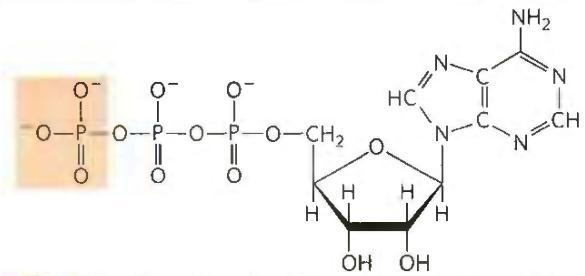

Inorganic phosphate ( $P_{i}$ )

Inorganic pyrophosphate (PP $_{i}$ )

FIGURE 1-25 Adenosine triphosphate (ATP) provides energy. Here, each Ⓟ represents a phosphoryl group. The removal of the terminal phosphoryl group (shaded light red) of ATP, by breakage of a phosphoanhydride bond to generate adenosine diphosphate (ADP) and inorganic phosphate ion (HPO $_{4}^{2-}$ ), is highly exergonic, and this reaction is coupled to many endergonic reactions in the cell (as in the example in Worked Example 1-2). ATP also provides energy for many cellular processes by undergoing cleavage that releases the two terminal phosphates as inorganic pyrophosphate (H $_{2}$ P $_{2}$ O $_{7}^{2-}$ ), often abbreviated PP $_{i}$ .

#### [EN] Entropy: Things Fall Apart

The term "entropy," which literally means "a change within," was first used in 1851 by Rudolf Clausius, one of the formulators of the second law of thermodynamics. It refers to the randomness or disorder of the components of a chemical system. Entropy is a central concept in biochemistry; life requires continual maintenance of order in the face of nature's tendency to increase randomness. A rigorous quantitative definition of entropy involves statistical and probability considerations. However, its nature can be illustrated qualitatively by three simple examples, each demonstrating one aspect of entropy. The key descriptors of entropy are randomness and disorder, manifested in different ways.

#### [EN] Case 1: The Teakettle and the Randomization of Heat

We know that steam generated from boiling water can do useful work. But suppose we turn off the burner under a teakettle full of water at 100 °C (the "system") in the kitchen (the "surroundings") and allow the teakettle to cool. As it cools, no work is done, but heat passes from the teakettle to the surroundings, raising the temperature of the surroundings (the kitchen) by an infinitesimally small amount until complete equilibrium is attained. At this point all parts of the teakettle and the kitchen are at precisely the same temperature. The free energy that was once concentrated in the teakettle of hot water at 100 °C, potentially capable of doing work, has disappeared. Its equivalent in heat energy is still present in the teakettle + kitchen (that is, the "universe") but has become completely randomized throughout. This energy is no longer available to do work because there is no temperature differential

#### [EN] Energy Coupling Links Reactions in Biology

The central issue in bioenergetics (the study of energy transformations in living systems) is the means by which energy from fuel metabolism or light capture is coupled to a cell's energy-requiring reactions. With regard to energy coupling, it is useful to consider a simple mechanical example, as shown in Figure 1-26a. An object at the top of an inclined plane has a certain amount of potential energy as a result of its elevation. It tends to slide down the plane, losing its potential energy of position as it approaches the ground. When an appropriate string-and-pulley device couples the falling object to another, smaller object, the spontaneous downward motion of the larger can lift the smaller, accomplishing a certain amount of work. The amount of energy available to do work is the free-energy change, $\Delta G$ ; this is always somewhat less than the theoretical amount of energy released, because some energy is dissipated as the heat of friction. The greater the elevation of the larger object, the greater the energy released ( $\Delta G$ ) as within the kitchen. Moreover, the increase in entropy of the kitchen (the surroundings) is irreversible. We know from everyday experience that heat never spontaneously passes back from the kitchen into the teakettle to raise the temperature of the water to $100\ °C$ again.

#### [EN] Case 2: The Oxidation of Glucose

Entropy is a state not only of energy but of matter. Aerobic (heterotrophic) organisms extract free energy from glucose obtained from their surroundings by oxidizing the glucose with $O_{2}$ , also obtained from the surroundings. The end products of this oxidative metabolism, $CO_{2}$ and $H_{2}O$ , are returned to the surroundings. In this process the surroundings undergo an increase in entropy, whereas the organism itself remains in a steady state and undergoes no change in its internal order. Although some entropy arises from the dissipation of heat, entropy also arises from another kind of disorder, illustrated by the equation for the oxidation of glucose:

$$
\mathrm{C} _ {6} \mathrm{H} _ {1 2} \mathrm{O} _ {6} + 6 \mathrm{O} _ {2} \longrightarrow 6 \mathrm{CO} _ {2} + 6 \mathrm{H} _ {2} \mathrm{O}
$$

We can represent this schematically as

the object slides downward and the greater the amount of work that can be accomplished. The larger object can lift the smaller one only because, at the outset, the larger object was far from its equilibrium position: it had at some earlier point been elevated above the ground, in a process that itself required the input of energy.

How does this apply in chemical reactions? In closed systems, chemical reactions proceed spontaneously until equilibrium is reached. When a system is at equilibrium, the rate of product formation exactly equals the rate at which product is converted to reactant. Thus there is no net change in the concentration of reactants and products. The energy change as the system moves from its initial state to equilibrium, with no changes in temperature or pressure, is given by the free-energy change, $\Delta G$ . The magnitude of $\Delta G$ depends on the particular chemical reaction and on how far from equilibrium the system is initially. Each compound involved in a chemical reaction contains a certain amount of potential energy, related

The atoms contained in 1 molecule of glucose plus 6 molecules of oxygen, a total of 7 molecules, are more randomly dispersed by the oxidation reaction and are now present in a total of 12 molecules ( $6CO_{2} + 6H_{2}O$ ).

Whenever a chemical reaction results in an increase in the number of molecules—or when a solid substance is converted into liquid or gaseous products, which allow more freedom of molecular movement than solids—molecular disorder, and thus entropy, increases.

#### [EN] Case 3: Information and Entropy

The following short passage from Shakespeare's Julius Caesar, Act IV, Scene 3, is spoken by Brutus, when he realizes that he must face Mark Antony's army. It is an information-rich non-random arrangement of 125 letters of the English alphabet:

There is a tide in the affairs of men,

Which, taken at the flood, leads on to fortune;

Omitted, all the voyage of their life

Is bound in shallows and in miseries.

In addition to what this passage says overtly, it has many hidden meanings. It not only reflects a complex sequence of events in the play, but also echoes the play's ideas on conflict, ambition, and the demands of leadership. Permeated with Shakespeare's understanding of human nature, it is very rich in information.

However, if the 125 letters making up this quotation were allowed to fall into a completely random, chaotic pattern, as

to the kind and number of its bonds. In reactions that occur spontaneously, the products have less free energy than the reactants and thus the reaction releases free energy, which is then available to do work. Such reactions are exergonic; the decline in free energy from reactants to products is expressed as a negative value. Endergonic reactions require an input of energy, and their $\Delta G$ values are positive. This coupling of an exergonic reaction to an endergonic reaction is illustrated in Figure 1-26b. As in mechanical processes, only part of the energy released in exergonic chemical reactions can be used to accomplish work. In living systems, some energy is dissipated as heat or is lost to increasing entropy.

#### [EN] $K_{eq}$ and $\Delta G^{\circ}$ Are Measures of a Reaction's Tendency to Proceed Spontaneously

The tendency of a chemical reaction to go to completion can be expressed as an equilibrium constant. For the shown in the following box, they would have no meaning whatsoever.

In this form, the 125 letters contain little or no information, but they are very rich in entropy. Such considerations have led to the conclusion that information is a form of energy; information has been called "negative entropy." In fact, the branch of mathematics called information theory, which is basic to the programming logic of computers, is closely related to thermodynamic theory. Living organisms are highly ordered, non-random structures, immensely rich in information and thus entropy-poor.

reaction in which a moles of A react with b moles of B to give c moles of C and d moles of D,

$$
a \mathrm{A} + b \mathrm{B} \longrightarrow c \mathrm{C} + d \mathrm{D}
$$

the equilibrium constant, $K_{eq}$ , is given by

$$
K _ {\mathrm{eq}} = \frac {[ \mathrm{C} ] _ {\mathrm{eq}} ^ {c} [ \mathrm{D} ] _ {\mathrm{eq}} ^ {d}}{[ \mathrm{A} ] _ {\mathrm{eq}} ^ {a} [ \mathrm{B} ] _ {\mathrm{eq}} ^ {b}}
$$

where $[A]_{eq}$ is the concentration of A, $[B]_{eq}$ the concentration of B, and so on, when the system has reached equilibrium. $K_{eq}$ is dimensionless (that is, has no units of measurement), but, as we explain on page 54, we will include molar units in our calculations to reinforce the point that molar concentrations (represented by the square brackets) must be used in the calculation of equilibrium constants. A large value of $K_{eq}$ means the reaction tends to proceed until the reactants are almost completely converted into the products.

(a) Mechanical example  

(b) Chemical example  
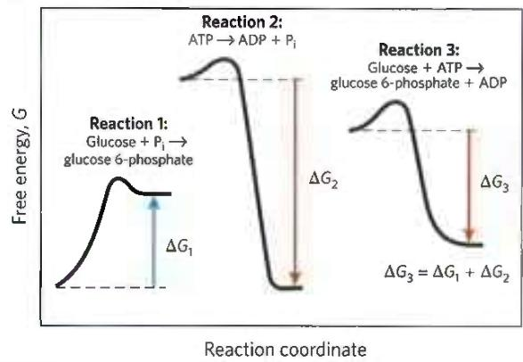  
FIGURE 1-26 Energy coupling in mechanical and chemical processes. (a) The downward motion of an object releases potential energy that can do mechanical work. The potential energy made available by spontaneous downward motion, an exergonic process (red), can be coupled to the endergonic upward movement of another object (blue). (b) In reaction 1, the formation of glucose 6-phosphate from glucose and inorganic phosphate $(\mathsf{P_i})$ yields a product of higher energy than the two reactants. For this endergonic reaction, $\Delta G$ is positive. In reaction 2, the exergonic breakdown of adenosine triphosphate (ATP) has a large, negative free-energy change $(\Delta G_2)$ . The third reaction is the sum of reactions 1 and 2, and the free-energy change, $\Delta G_3$ , is the arithmetic sum of $\Delta G_{1}$ and $\Delta G_{2}$ . Because $\Delta G_{3}$ is negative and relatively large, the overall reaction is exergonic and proceeds spontaneously.

#### [EN] WORKED EXAMPLE 1-1 Are ATP and ADP at Equilibrium in Cells?

ATP breakdown yields adenosine diphosphate (ADP) and inorganic phosphate $(\mathsf{P_i})$ . The equilibrium constant, $K_{\mathrm{eq}}$ , for the reaction is $2\times 10^{5}\mathrm{M}$ :

$$
\mathrm{ATP} \longrightarrow \mathrm{ADP} + \mathrm{HPO} _ {4} ^ {2 -}
$$

If the measured cellular concentrations are $[ATP]=5\ mm$ , $[ADP]=0.5\ mm$ , and $[P_{i}]=5\ mm$ , is this reaction at equilibrium in living cells?

SOLUTION: The definition of the equilibrium constant for this reaction is

$$
K _ {\mathrm{eq}} = [ \mathrm{ADP} ] [ \mathrm{P} _ {\mathrm{i}} ] / [ \mathrm{ATP} ]
$$

From the measured cellular concentrations given above, we can calculate the mass-action ratio, Q:

$$
\begin{array}{r l} Q & = [ \mathrm{ADP} ] [ \mathrm {P_ {i}} ] / [ \mathrm{ATP} ] = (0. 5 \mathrm{mm}) (5 \mathrm{mm}) / 5 \mathrm{mm} \\ & = 0. 5 \mathrm{mm} = 5 \times 1 0 ^ {- 4} \mathrm{m} \end{array}
$$

This value is far from the equilibrium constant for the reaction $(2 \times 10^{5} \text{ M})$ , so the reaction is very far from equilibrium in cells. [ATP] is far higher, and [ADP] is far lower, than is expected at equilibrium. How can a cell hold its [ATP]/[ADP] ratio so far from equilibrium? It does so by continuously extracting energy (from nutrients such as glucose) and using it to make ATP from ADP and $P_{i}$ .

Gibbs showed that $\Delta G$ (the actual free-energy change) for any chemical reaction is a function of the standard free-energy change, $\Delta G^{\circ}$ —a constant that is characteristic of each specific reaction—and a term that expresses the initial concentrations of reactants and products:

$$
\Delta G = \Delta G ^ {\circ} + R T \ln \frac {[ C ] _ {i} ^ {c} [ D ] _ {i} ^ {d}}{[ A ] _ {i} ^ {a} [ B ] _ {i} ^ {b}}\tag{1-1}
$$

where $[A]_{i}$ is the initial concentration of A, and so forth; R is the gas constant; and T is the absolute temperature.

$\Delta G$ is a measure of the distance of a system from its equilibrium position. When a reaction has reached equilibrium, no driving force remains and it can do no work: $\Delta G = 0$ . For this special case, $[A]_{i} = [A]_{eq}$ , and so on, for all reactants and products, and

$$
\frac {[ \mathrm{C} ] _ {\mathrm{i}} ^ {c} [ \mathrm{D} ] _ {\mathrm{i}} ^ {d}}{[ \mathrm{A} ] _ {\mathrm{i}} ^ {a} [ \mathrm{B} ] _ {\mathrm{i}} ^ {b}} = \frac {[ \mathrm{C} ] _ {\mathrm{eq}} ^ {c} [ \mathrm{D} ] _ {\mathrm{eq}} ^ {d}}{[ \mathrm{A} ] _ {\mathrm{eq}} ^ {a} [ \mathrm{B} ] _ {\mathrm{eq}} ^ {d}}
$$

Substituting 0 for $\Delta G$ and $K_{\mathrm{eq}}$ for $[\mathrm{C}]_{\mathrm{i}}^{c}[\mathrm{D}]_{\mathrm{i}}^{d}/[\mathrm{A}]_{\mathrm{i}}^{a}[\mathrm{B}]_{\mathrm{i}}^{b}$ in Equation 1-1, we obtain the relationship

$$
\Delta G ^ {\circ} = - R T \ln K _ {\mathrm{eq}}
$$

from which we see that $\Delta G^{\circ}$ is simply a second way (besides $K_{eq}$ ) of expressing the driving force on a reaction. Because $K_{eq}$ is experimentally measurable, we have a way of determining $\Delta G^{\circ}$ , the thermodynamic constant characteristic of each reaction.

The units of $\Delta G^{\circ}$ and $\Delta G$ are joules per mole (or calories per mole). When $K_{eq} \gg 1$ , $\Delta G^{\circ}$ is large and negative; when $K_{eq} \ll 1$ , $\Delta G^{\circ}$ is large and positive. From a table of experimentally determined values of either $K_{eq}$ or $\Delta G^{\circ}$ , we can see at a glance which reactions tend to go to completion and which do not.

One caution about the interpretation of $\Delta G^{\circ}$ : thermodynamic constants such as this show where the final equilibrium for a reaction lies but tell us nothing about how fast that equilibrium will be achieved. The rates of reactions are governed by the parameters of kinetics, a topic we consider in detail in Chapter 6.

P3 In living organisms, just as in the mechanical example in Figure 1-26a, an exergonic reaction can be coupled to an endergonic reaction to drive otherwise unfavorable reactions. Figure 1-26b, a reaction coordinate diagram, illustrates this principle for the conversion of glucose to glucose 6-phosphate, the first step in the pathway for oxidation of glucose. The most direct way to produce glucose 6-phosphate would be

$$
\text {   Reaction   1:   } \quad \begin{array}{c} \text {   Glucose   +   P } _ {\mathrm{i}} \longrightarrow \text {   glucose   6 - phosphate } \\ \text {(endergonic;} \\ \Delta G _ {1} \text {   is   positive)   } \end{array}
$$

This reaction does not occur spontaneously; $\Delta G_{1}$ is positive. A second, highly exergonic reaction can occur in all cells:

$$
\text {   Reaction   2:   } \quad \mathrm{ATP} \longrightarrow \mathrm{ADP} + \mathrm{P} _ {\mathrm{i}} (\text {   exergonic;   } \Delta G _ {2} \text {   is   negative)   }
$$

These two chemical reactions share a common intermediate, $P_{i}$ , which is consumed in reaction 1 and produced in reaction 2. The two reactions can therefore be coupled in the form of a third reaction, which we can write as the sum of reactions 1 and 2, with the common intermediate, $P_{i}$ , omitted from both sides of the equation:

$$
\text {   Reaction   3:   } \quad \begin{array}{c} \text {   Glucose   +   ATP   } \longrightarrow \text {   glucose   6 - phosphate   } \\ + \text {   ADP   } \end{array}
$$

Because more energy is released in reaction 2 than is consumed in reaction 1, the free-energy change for reaction 3, $\Delta G_{3}$ , is negative, and the synthesis of glucose 6-phosphate can therefore occur by reaction 3.

#### [EN] WORKED EXAMPLE 1-2 Standard Free-Energy Changes Are Additive

Given that the standard free-energy change for the reaction glucose+P $_{i}$ →glucose 6-phosphate is 13.8 kJ/mol, and the standard free-energy change for the reaction ATP→ADP+P $_{i}$ is -30.5 kJ/mol, what is the free-energy change for the reaction glucose+ATP→glucose 6-phosphate+ADP?

SOLUTION: We can write the equation for this reaction as the sum of two other reactions:

$$
\begin{array}{l l} \text {(1) Glucose + P} _ {\mathrm{i}} \longrightarrow \text {glucose 6 - phosphate} & \Delta G _ {1} ^ {\circ} = 1 3. 8 \mathrm{kJ/mol} \\ \text {(2) ATP} \longrightarrow \mathrm{ADP+P} _ {\mathrm{i}} & \Delta G _ {2} ^ {\circ} = - 3 0. 5 \mathrm{kJ/mol} \end{array}
$$

$$
\begin{array}{r l} \text { Sum:   Glucose } + \text { ATP } & \longrightarrow \text { glucose   6 - phosphate } + \text { ADP } \\ & \Delta G _ {\text { Sum }} ^ {\circ} = - 1 6. 7 \mathrm{kJ/mol} \end{array}
$$

The standard free-energy change for two reactions that sum to a third is simply the sum of the two individual reactions. A negative value for $\Delta G^{\circ}(-16.7\ \text{kJ/mol})$ indicates that the reaction will tend to occur spontaneously.

The coupling of exergonic and endergonic reactions through a shared intermediate is central to the energy exchanges in living systems. As we shall see, reactions that break down ATP (such as reaction 2 in Fig. 1-26b) release energy that drives many endergonic processes in cells. ATP breakdown in cells is exergonic because all living cells maintain a concentration of ATP far above its equilibrium concentration. It is this disequilibrium that allows ATP to serve as the major carrier of chemical energy in all cells. P3 As we describe in detail in Chapter 13, it is not the mere breakdown of ATP that provides energy to drive endergonic reactions; rather, it is the transfer of a phosphoryl group from ATP to another small molecule (glucose in the case above) that conserves some of the chemical potential originally in ATP.

#### [EN] WORKED EXAMPLE 1-3 Energetic Cost of ATP Synthesis

If the equilibrium constant, $K_{eq}$ , for the reaction

$$
\mathrm{ATP} \longrightarrow \mathrm{ADP} + \mathrm{P} _ {\mathrm{i}}
$$

is $2.22 \times 10^{5} \mathrm{M}$ , calculate the standard free-energy change, $\Delta G^{\circ}$ , for the synthesis of ATP from ADP and $\mathbf{P}_{\mathrm{i}}$ at $25^{\circ} \mathrm{C}$ .

SOLUTION: First calculate $\Delta G^{\circ}$ for the reaction above:

$$
\begin{array}{r l} \Delta G ^ {\circ} & = - R T \ln K _ {e q} \\ & = - (8. 3 1 5 \mathrm{J/mol} \cdot \mathrm{K}) (2 9 8 \mathrm{K}) (\ln 2. 2 2 \times 1 0 ^ {5}) \\ & = - 3 0. 5 \mathrm{kJ/mol} \end{array}
$$

This is the standard free-energy change for the breakdown of ATP to ADP and $P_{i}$ . The standard free-energy change for the reverse of a reaction has the same absolute value but the opposite sign. The standard free-energy change for the reverse of the above reaction is therefore 30.5 kJ/mol. So, to synthesize 1 mol of ATP under standard conditions (25 °C, 1 M concentrations of ATP, ADP, and $P_{i}$ ), at least 30.5 kJ of energy must be supplied. The actual free-energy change in cells — approximately 50 kJ/mol — is greater than this because the concentrations of ATP, ADP, and $P_{i}$ in cells are not the standard 1 M (see Worked Example 13-2).

#### [EN] Enzymes Promote Sequences of Chemical Reactions

All biological macromolecules are much less thermodynamically stable than their monomeric subunits, yet they are kinetically stable: their uncatalyzed breakdown occurs so slowly (over years rather than seconds) that, on a time scale that matters for the organism, these molecules are stable. Virtually every chemical reaction in a cell occurs at a significant rate only because of the presence of enzymes—biocatalysts that, like all other catalysts, greatly enhance the rate of specific chemical reactions without being consumed in the process.

The path from reactant(s) to product(s) almost invariably involves an energy barrier, called the activation barrier (Fig. 1-27), that must be surmounted for any reaction to proceed. The breaking of existing bonds and formation of new ones generally requires, first, a distortion of the existing bonds to create a transition state of higher free energy than either the reactant or the product (see Section 6.2). The highest point in the reaction coordinate diagram represents the transition state, and the difference in energy between the reactant in its ground state and in its transition state is the activation energy, $\Delta G^{\ddagger}$ . An enzyme catalyzes a reaction by providing a more comfortable fit for the transition state: a surface that complements the transition state in stereochemistry, polarity, and charge. The binding of enzyme to the transition state is exergonic, and the energy released by this binding reduces the activation energy for the reaction and greatly increases the reaction rate.

  
FIGURE 1-27 Energy changes during a chemical reaction. An activation barrier, representing the transition state, must be overcome in the conversion of reactants (A) into products (B), even though the products are more stable than the reactants, as indicated by a large, negative free-energy change ( $\Delta G$ ). The energy required to overcome the activation barrier is the activation energy ( $\Delta G^{\ddagger}$ ). Enzymes catalyze reactions by lowering the activation barrier. They bind the transition-state intermediates tightly, and the binding energy of this interaction effectively reduces the activation energy from $\Delta G_{uncat}^{\ddagger}$ (blue curve) to $\Delta G_{cat}^{\ddagger}$ (red curve). (Note that activation energy is not related to free-energy change, $\Delta G$ .)

A further contribution to catalysis occurs when two or more reactants bind to the enzyme's surface close to each other and with stereospecific orientations that favor their reaction. This increases by orders of magnitude the probability of productive collisions between reactants. As a result of these factors and several others, discussed in Chapter 6, many enzyme-catalyzed reactions proceed at rates $10^{6}$ times faster than the uncatalyzed reactions.

Cellular catalysts are, with some notable exceptions, proteins. (Some RNA molecules have enzymatic activity, as discussed in Chapters 26 and 27.) Again with a few exceptions, each enzyme catalyzes a specific reaction, and each reaction in a cell is catalyzed by a different enzyme. Thousands of different enzymes are therefore required by each cell. The multiplicity of enzymes, their specificity (the ability to discriminate between reactants), and their susceptibility to regulation give cells the capacity to lower activation barriers selectively. This selectivity is crucial for the effective regulation of cellular processes. By allowing specific reactions to proceed at significant rates at particular times, enzymes determine how matter and energy are channeled into cellular activities.

The thousands of enzyme-catalyzed chemical reactions in cells are functionally organized into many sequences of consecutive reactions, called pathways, in which the product of one reaction becomes the reactant in the next. Some pathways degrade organic nutrients into simple end products in order to extract chemical energy and convert it into a form useful to the cell; together, these degradative, free-energy-yielding reactions are designated catabolism. The energy released by catabolic reactions drives the synthesis of ATP. As a result, the cellular concentration of ATP is held far above its equilibrium concentration, so that $\Delta G$ for ATP breakdown is large and negative. Similarly, catabolism results in the production of the reduced electron carriers NADH (nicotinamide adenine dinucleotide) and NADPH (nicotinamide adenine dinucleotide phosphate hydrogen), both of which can donate electrons in processes that generate ATP or drive reductive steps in biosynthetic pathways. They are often referred to collectively as NAD(P)H.

Other pathways start with small precursor molecules and convert them to progressively larger and more complex molecules, including proteins and nucleic acids. Such synthetic pathways, which invariably require the input of energy, are collectively designated anabolism.

  
FIGURE 1-28 The central roles of ATP and NAD(P)H in metabolism. ATP is the shared chemical intermediate linking energy-releasing and energy-consuming cellular processes. Its role in the cell is analogous to that of money in an economy: it is "earned/produced" in exergonic reactions and "spent/consumed" in endergonic ones. NADH is an electron-carrying cofactor that collects electrons from oxidative reactions. The closely related NADPH carries electrons in a wide variety of reduction reactions in biosynthesis. Present in relatively low concentrations, these cofactors essential to anabolic reactions must be constantly regenerated by catabolic reactions.

The overall network of enzyme-catalyzed pathways, both catabolic and anabolic, constitutes cellular metabolism. ATP (as well as other energetically equivalent nucleoside triphosphates) is the connecting link between the catabolic and anabolic components of this network (shown schematically in Fig. 1-28). P2 The pathways of enzyme-catalyzed reactions that act on the main constituents of cells—proteins, fats, sugars, and nucleic acids—are nearly identical in all living organisms. This remarkable unity of life is part of the evidence for a common evolutionary precursor for all living things.

#### [EN] Metabolism Is Regulated to Achieve Balance and Economy

Not only do living cells simultaneously synthesize thousands of different kinds of carbohydrate, fat, protein, and nucleic acid molecules and their simpler subunits, but they do so in the precise proportions required by the cell under any given circumstance. For example, during rapid cell growth the precursors of proteins and nucleic acids must be made in large quantities, whereas in nongrowing cells the requirement for these precursors is much reduced. Key enzymes in each metabolic pathway are regulated so that each type of precursor molecule is produced in a quantity appropriate to the current requirements of the cell.

Consider the pathway in E. coli that leads to the synthesis of the amino acid isoleucine, a constituent of proteins. The pathway has five steps catalyzed by five different enzymes (A through F represent the intermediates in the pathway):

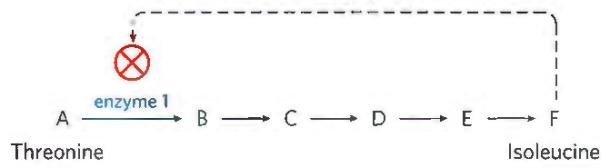

If a cell begins to produce more isoleucine than it needs for protein synthesis, the unused isoleucine accumulates, and the increased concentration inhibits the catalytic activity of the first enzyme in the pathway, immediately slowing the production of isoleucine. Such feedback inhibition keeps the production and utilization of each metabolic intermediate in balance. (Throughout the book, we use $\otimes$ to indicate inhibition of an enzymatic reaction.)

Although the concept of discrete pathways is an important tool for organizing our understanding of metabolism, it is an oversimplification. There are thousands of metabolic intermediates in a cell, many of which are part of more than one pathway. P3 Metabolism would be better represented as a web of interconnected and interdependent pathways. A change in the concentration of any one metabolite would start a ripple effect, influencing the flow of materials through other pathways. The task of understanding these complex interactions among intermediates and pathways in quantitative terms is daunting, but systems biology, discussed in Chapter 9, has begun to offer important insights into the overall regulation of metabolism.

Cells also regulate the synthesis of their own catalysts, the enzymes, in response to increased or diminished need for a metabolic product; this is the substance of Chapter 28. The regulated expression of genes (the translation from information in DNA to active protein in the cell) and the synthesis of enzymes are other layers of metabolic control in the cell. All layers must be taken into account when the overall control of cellular metabolism is described.

#### [EN] SUMMARY 1.3 Physical Foundations

■ Living cells extract and channel energy to maintain themselves in a dynamic steady state distant from equilibrium.

Living cells are open systems, exchanging matter and energy with their surroundings. Energy is obtained from sunlight or chemical fuels when the energy from electron flow is converted into the chemical bonds of ATP.

The tendency for a chemical reaction to proceed toward equilibrium can be expressed as the free-energy change, $\Delta G$ . When $\Delta G$ of a reaction is negative, the reaction is exergonic and tends to go toward completion; when $\Delta G$ is positive, the reaction is endergonic and tends to go in the reverse direction. When two reactions can be summed to yield a third reaction, the $\Delta G$ for this overall reaction is the sum of the $\Delta G$ values for the two separate reactions.

The reactions converting ATP to $P_{i}$ and ADP are highly exergonic (large negative $\Delta G$ ). Many endergonic cellular reactions are driven by coupling them, through a common intermediate, to these highly exergonic reactions.

The standard free-energy change for a reaction, $\Delta G^{\circ}$ , is a physical constant that is related to the equilibrium constant by the equation $\Delta G^{\circ} = -RT\ln K_{\mathrm{eq}}$ .

■ Most cellular reactions proceed at useful rates only because enzymes are present to catalyze them. Enzymes act in part by stabilizing the transition state, reducing the activation energy, $\Delta G^{\ddagger}$ , and increasing the reaction rate by many orders of magnitude. The catalytic activity of enzymes in cells is regulated.

■ Metabolism is the sum of many interconnected reaction sequences that interconvert cellular metabolites. Each sequence is regulated to provide what the cell needs at a given time and to expend energy only when necessary.

<!-- EN-END 1.3 -->

## 二、生物化学与分子生物学

## （一）现代生物化学的发展和分子生物学的兴起

现代生物化学从产生到现在不过200多年，作为一门独立的学科，实际上还是20世纪的事，20世纪50年代初进入迅猛发展的时期。追本溯源，现代自然科学起源于15世纪后半叶，那时西方资本主义刚刚兴起，新兴的资产阶级出于发展生产和反对封建教会的需要提倡自然科学。到了18世纪后半叶，相当于清乾隆年间，欧洲的资本主义国家进入了大规模的技术改造和技术革命的阶段，大工业、大农业蓬勃发展。生产的大发展为自然科学提供了新的事实资料和实验工具，使研究领域迅速扩展。这时期物理学、化学、生物学和地质学等学科相继建立，并出现了许多重大发展。进入19世纪，能量守恒和转化定律的发展，价和结构理论在化学上的应用，细胞学说和达尔文进化论的建立，使物理学、化学和生物学进入了新的发展时期。这些学科取得的成就有力地推动了现代生物化学的形成和发展。

现代生物化学的发展大体上可以分为三个阶段。第一阶段（1770—1900），以研究各种生物体的化学成分为主，研究这些成分的分离、纯化和性质。这段时期取得的主要成就有：从动、植物产物中分离出多种氨基酸、甘油、柠檬酸、乳酸、尿酸、糖原、核酸、胰酶等，并对它们的化学结构进行了分析和测定。这些研究多是叙述性的、静态的即形态学的，因此这部分内容被称为静态生物化学（steady biochemistry）或叙述生物化学。又由于这段时期生物化学更多地依附于有机化学，因此也称有机生物化学。第二阶段（1900—1950），主要任务是研究活生物和活细胞内发生的各种化学变化、酶促反应，即新陈代谢。这段时期取得的主要成就有：分离纯化出多种结晶酶，确定了酶的蛋白质化学本质，发展了酶促化学动力学，搞清楚了糖酵解途径，提出了 Krebs 循环（柠檬酸循环），阐明了氧化磷酸化、光合磷酸化、电子传递链、脂肪酸 $\beta-$ 氧化和尿素循环等途径。这些研究构成了新陈代谢内容，由于新陈代谢是动态的即生理学的过程，因此又称动态生物化学（dynamic biochemistry）。第三阶段（1950 年以后），由于各种现代化的设备与技术，如电镜、超速离心机、层析和电泳技术、X 射线衍射分析技术等的发明和应用，这阶段的生物化学研究主要集中在生物大分子及其超分子复合体的结构和功能，包括大分子的相互作用和超分子的自我装配以及一些重要的生物学过程,如细胞分化、胚胎发育、遗传变异、肌肉收缩、免疫应答、记忆思维、光合作用、生物固氮和癌变的分子基础。这一发展阶段的特点是更加重视对生命本质的了解,取得的成就也更加辉煌。测定了一大批蛋白质和酶分子的一级结构(氨基酸序列);建立了DNA分子的双螺旋结构模型;完成了许多个物种的基因组测序(测定核苷酸序列);人类基因组的测序也取得极大进展,已证实人类的24条染色体含有32亿对碱基和3万\~3.5万个基因;阐明了遗传信息的传递和表达(复制、转录和翻译)的全过程;此外,肽、蛋白质和核酸的人工合成、生物膜、光合作用、代谢和基因表达调控、分子克隆技术、基因治疗等诸方面也都有突破性的成就。

回顾历史,现代生物化学是由有机化学和生理学派生的“溪流”逐渐汇合而成的,它具有鲜明的交叉学科或边缘学科的性质。进入20世纪50年代生物化学有机地融合了微生物学、遗传学和细胞学的有关知识,形成了今日的分子生物学(molecular biology)。分子生物学这一术语是1945年由Astbury首次提出的,他所指的是对生物大分子的化学和物理结构的研究。1953年Watson和Crick提出DNA双螺旋结构模型,被认为是真正开启了分子生物学的大门。因为他们的模型解释了DNA、RNA和蛋白质这三类大分子如何相互协作决定一个生物体的一切生命特性。并因此把分子生物学定义为研究这三类生物大分子及其彼此关系的科学,即关于分子遗传学的科学。广义的分子生物学是指在分子水平上研究生命过程,特别是研究细胞成分的物理化学的性质和变化及其与生命现象的关系的科学。总之在某种意义上说,分子生物学是生物化学发展的一个新阶段。这两个学科的关系从一些有关的学术刊物、学术会议和学术机构的名称冠有“生物化学与分子生物学”的字样可见一斑。古人说得好“青出于蓝而胜于蓝”,分子生物学正方兴未艾,蓬勃发展,几乎渗透到生命科学的各个领域,出现分子遗传学、分子细胞学、分子生理学、分子植物学、分子仿生学(molecular bionics)、分子胚胎学、分子心理学等名称。

## （二）现代生物化学发展中的一些重要学术中心和学者

C. W. Scheele(1742—1786) 瑞典化学家、药剂师。因为家无恒产，14岁即随一位药剂师做学徒，历时8年。在这期间他废寝忘食地学习化学，并经常在业余时间进行化学实验。他一生中从生物材料中分离出许多新的物质（实际上它们都是代谢的中间产物），如前述及的柠檬汁中的柠檬酸（citric acid）、酸牛奶中的乳酸（lactic acid）、酒石中的酒石酸（tartaric acid）、苹果中的苹果酸（malic acid）、五倍子中的没食子酸或称五倍子酸（gallic acid）和膀胱结石中的尿酸（uric acid），当将油脂与碱共热时发现了甘油（glycerol）。Scheele的工作被认为是静态生物化学的开始。

A. Lavoisier(1743—1794) 法国化学家。他与他的同事用量热计测量了生物体消耗氧气时所释放的热量，并得出结论说：细胞呼吸和木炭燃烧没有本质区别，只不过呼吸是一种缓慢地燃烧，两者都是一个氧化过程。他的发现有力地推翻了当时盛行的燃素说（phlogiston theory）并开始把研究工作扩展到能量代谢方面。其实人们可以在Lavoisier的工作中找到动态生物化学的根源。

J. Liebig(1803—1873) 德国化学家,农业化学的奠基人。他和 Berzelius 一起发展了土壤和生物材料的元素定量分析技术。1826 年他在德国 Giessen 大学建立了化学实验室,并首创在大学里进行化学实验教学。1842 年他出版了《有机化学在生理学和病理学中的应用》一书,在书中他对生物学过程的化学基础作了广泛的探讨,并首次提出新陈代谢(stoffwechsel,德文)这一术语。他撰写的几本专著深刻地影响着后来的生物化学工作。

E. F. Hoppe-Seyler(1825—1895) 德国医学家。他因将生理化学(实际上就是生物化学)建成一门独立的学科而著称。1864年他首次结晶出血红蛋白。1877年他首次提出“biochemie”这一德文名词(汉译为生物化学,英文“biochemistry”一词是1903年由Neuberg首次使用的)。Hoppe-Seyler建立了著名的斯特拉斯堡研究所(Strausbourg Institute)(1870年法普战争结束后,法国将斯特拉斯堡割让给德国,1919年又复归法国)。他在这里任生理化学教授,在科学研究和培养学生方面做出突出成绩。Hoppe-Seyler一生中培养了许多优秀的学生。早期的有F. Miescher(1844—1895),他因1868年在Tubengen的Hoppe-Seyler实验室里从脓细胞的核中分离出核素(nuclein,后来被证明是脱氧核糖核蛋白)而被认为是细胞核化学的创始人;后来的有A. Kossel(1853—1927),他因对蛋白质和细胞核化学的研究而获得诺贝尔生理学或医学奖。

L. Pasteur(1822—1895) 法国微生物学家、化学家。他从事微生物发酵过程的化学研究，并发现有些微生物是有氧发酵，有些是无氧发酵。他建立了跟生物化学有密切关系的微生物学（microbiology）。从他和他同时代的学者如法国生理学家 C. Bernard(1813—1878) 等的研究工作中发展出来的最重要的概念是“从生物化学的观点来看，各种不同生物之间是统一的”。

E. Fischer(1852—1919) 德国有机化学家。他的工作带来了结构生物化学(structural biochemistry)发展的高峰，并完全改变了对活生物的重要有机成分——糖、脂和蛋白质——的化学研究方向。Fischer应用有机化学的技术从复杂的生物材料中分离出较简单的物质，对这些物质的结构采取先降解、后合成的策略加以推演和确定。

F. G. Hopkins (1864—1947) 英国生物化学家。他创建了英国剑桥普通生物化学学派和中心。Hopkins 学化学出身，后改学医学。他在剑桥（Cambridge）初期，付出了巨大的艰辛，体现出他创建普通生物化学学派的理想、襟怀和毅力。在 1912 年前后 Hopkins 既无教授职位，又无正式的实验室和像样的仪器，但他改装了地下室，使用陈旧的设备，完成了动物饲养实验，并发现了食物的辅助因子，维生素（vitamin）。因此他和荷兰医师 Eijkman (1858—1930) 共获 1929 年诺贝尔生理学或医学奖。有许多知名学者在 Hopkins 的剑桥生物化学中心工作。他们从事不同方面的研究，这些方面有植物色素的生化遗传、离体叶绿体的能学、酶学、肌肉收缩的生化机制、胚胎发生的生物化学等。此研究中心是名副其实的普通生物化学学派。

Павлов ИП(1849—1936) 俄国生理学家。他把实验外科学发展到高峰，并在消化生理学和神经生理学方面作出了杰出的贡献。他的实验外科学手段深刻地影响消化生理学和消化生物化学的发展，特别是代谢病的病原学的研究，例如用胰切除术可产生实验性糖尿病（diabetes），表明高血糖与胰病变有关。他的这些研究使他享有世界性的荣誉。

J. B. Summer(1887—1955) 美国化学家。他的经典贡献是1926年获得世界上第一个结晶的酶——脲酶(urease)，并证实它是一种蛋白质。酶的催化现象早在1835年已被Berzelius注意到了，但在Summer的工作之前它的化学成分尚不清楚。20世纪初叶有一种流行的看法：酶是一类未被认识的有机化合物。当时有些权威就怀疑和嘲笑他的工作。Summer是一个顽强和坚韧不拔的人，他有令人信服的证据武装自己，不屈服于权威。此后，1930—1936年，Northrop得到胃蛋白酶(pepsin)、胰蛋白酶(trypsin)和胰凝乳蛋白酶(chymotrypsin)的结晶，这些结晶酶被证实也都是蛋白质。从此确立酶的化学本质是蛋白质。后来发现极少数酶是RNA，如核酶(ribozyme)。

美国生物学家 J. D. Watson(1928—)和英国生物物理学家 F. Crick(1916—2004)都在英国剑桥大学工作,1953年因建立 DNA 双螺旋结构模型,为分子生物学的创建奠定了理论基础而著称于世。新西兰出生的英国物理学家 M. Wilkins(1916—2004)完成了对 DNA 的 X 射线衍射研究,这对证实 Watson 和 Crick 所建立的 DNA 分子模型是至关重要的。他们三人共获 1962 年诺贝尔生理学或医学奖。

F. Sanger(1918—) 英国生物化学家。他和他的同事们经 10 年的研究,于 1955 年确定了牛胰岛素的化学结构,并于 1958 年获得诺贝尔化学奖。1980 年因设计出一种测定 DNA 的核苷酸序列的方法,与 Gilbert 和 Berg 共获 1980 年诺贝尔化学奖。

## （三）发展中的我国生物化学

我国是世界上文化发展最早的国家之一，对人类的历史作出过巨大的贡献。远在上古时代就在实践中认识发酵（fermentation），并利用它进行酿酒、作醋、造酱、制饴等。《尚书》记载“若作酒醴，尔惟曲蘖”，意思是说造酒必须用曲，古称曲为酒母，又称酶，与媒通。按现代生物化学观点来看，曲就是促进谷物淀粉糖化和酒化的媒介物（粗酶）。《论语》中有“不得其酱不食”之说；《诗经·大雅》里“绵”这首诗中有“周原膾膾，堇荼如饴”的诗句，意思是周原土地真肥美，野菜苦菜甜如饴。饴就是饴糖即麦芽糖。实际上古人已在利用微生物产生的酶使蛋白质（豆类）、淀粉（谷类）等降解成简单的具有甜味、鲜味的产物，包括氨基酸、单糖、双糖等。公元6世纪，北魏贾思勰著的《齐民要术》中记载的酿造酒、醋、酱、饴的方法已有发展，并专门记载了制造各种曲的方法，当时已认识到利用曲的滤出液也可用以酿造。关于这种想法已相当接近于现代酶的概念。《黄帝内经·素问》中写道“五谷为养，五畜为益，五果为助，五菜为充”，可见古人的养身之道很符合现代营养学的观点。五谷和五畜提供糖、脂和蛋白质，五果和五菜提供维生素、无机盐、膳食纤维和水。7大营养要素俱全，这是一种完全的食谱。公元4世纪晋朝葛洪著的《肘后百一方》中有用海藻酒治瘿病的记载。瘿病就是现在所说的地方性甲状腺肿，它是由于缺碘造成的；现在已知海藻如海带和紫菜等含有丰富的碘。公元7世纪唐朝孙思邈(581—682)著有《千金要方》和《千金翼方》两部医书，在书中记载了牛肝能治雀目。雀目就是夜盲症，它是因为缺乏维生素A引起的，而动物肝正含有丰富的维生素A。书中还谈到现在看来是缺乏维生素 $B_{1}$ 而引起的脚气病，对此孙思邈用含维生素 $B_{1}$ 多的中药（杏仁、防风、吴茱萸、蜀椒等）或谷皮，和粥吃来治疗。

中国近代史上由于众所周知的原因，政治、经济、教育、科学、技术诸方面都落后于欧美各国。20世纪初，一些有识之士出国留学，志在报效祖国。到了20年代他们开始陆续回国。吴宪（1893—1959）是其中的一个，后来他成为国际著名的生物化学家、营养学家，中国生物化学事业的主要奠基人。1919年吴宪在美国哈佛医学院留学期间，与导师Folin建立了血糖（葡萄糖）测定的新方法，被命名为Folin-Wu法，此方法曾多年为许多实验室和医院所采用。他于1920年留学回国，1920—1942年在北京协和医学院任职，亲手创建了协和生物化学系并任该系主任教授。在此期间，吴宪不仅在临床生物化学、蛋白质变性学说、营养学、免疫学等领域作出突出贡献，并且培养了一大批人才，如刘思职、张昌颖、陈同度、郑集、万昕、汪猷、杨恩孚、周启源、刘士豪、刘培南等。他们日后都成了我国著名的生物化学家、营养学家或医学家。1942—1945年北京协和医学院因被日寇侵占而停办。1947年复校。复校后的第一任生物化学系主任由北京大学教授沈同兼任（1947—1948期间）。1950年从美国留学回国的梁植权（1914—2004）到协和生物化学系工作，1958—1984年任该系主任。他研究的主要领域是蛋白质和核酸，在人血清蛋白质多态性和异常血红蛋白的化学结构和分布的研究中取得了很好的成果。协和生物化学系在蛋白质、核酸、基因工程、生物膜和免疫学诸方面都作出了显著的成绩，并培养出一批生物化学与医学分子生物学研究领域的中坚骨干。

1945—1956年期间，从英国剑桥回国的有王应睐、邹承鲁（酶学专家）、曹天钦（蛋白质学专家）和张友端（维生素学专家），从比利时回国的有周光宇（微生物生化学专家），从美国回国的有王德宝（核酸专家）和纽经义（蛋白质结构专家）。他们都在中国科学院上海生物化学研究所工作。1958年前，王应睐（1907—2001）为建立生物化学研究所而奔忙，建成后任该所所长至1984年。王应睐是中国生物化学事业的奠基人之一。他在营养学、维生素、血红蛋白、琥珀酸脱氢酶等方面都取得出色成果。上海生物化学研究所在他主持下，跟国内其他单位通力协作，于1965年成功地人工合成了结晶牛胰岛素，又于1983年采用有机合成和酶促合成相结合的方法，完成了酵母丙氨酸转移核糖核酸（ $\mathrm{tRNA}^{\mathrm{Ala}}$ ）的人工全合成。上海生物化学研究所在蛋白质、酶、核酸、中间代谢、基因工程、多肽激素等方面都取得国际水平的研究成果，并且培养出一批颇有建树的学科带头人。

读者如果希望更详细地了解生物化学发展历史,可参看本书前主编沈同(1911—1992)为第2版撰写的绪论。下面抄录该绪论的最后一段话,谨作为对沈同教授的怀念:

“生物化学虽有近二百年的历史,但是还在发展之中。目前看得到的一些未知领域,例如:地球上生命是怎样起源的?地球以外的天体上有没有生命?遗传物质是怎样进化的?一个受精卵中的遗传物质怎样发生成个体?怎样发生为各种器官和组织的?细胞器的进化途径还有争论,癌的问题、病毒问题、人体自身免疫问题、大脑的记忆、推理的分子生物学、生物行为有什么规律,其分子的基础又是什么?还有环境生态等问题。总之生物化学是在发展之中。

我国青年学者,包括将从留学归来的学者必将在发展中的生物化学领域里有所发现,有所创新,在理论与实践方面做出更突出的贡献。”

<!-- EN-BEGIN 1.4 -->

### 【英文对应 1.4】Genetic Foundations

> 来源：Lehninger Principles of Biochemistry（书籍/02_生物化学原理） 第1章 The Foundations of Biochemistry，§1.4。对应本章“二、生物化学与分子生物学”。

P4 Perhaps the most remarkable property of living cells and organisms is their ability to reproduce themselves for countless generations with nearly perfect fidelity.

  
(a)

  
(b)  
FIGURE 1-29 Two ancient scripts. (a) The Prism of Sennacherib, inscribed in about 700 ace, describes in characters of the Assyrian language some historical events during the reign of King Sennacherib. The Prism contains about 20,000 characters, weighs about 50 kg, and has survived almost intact for about 2,700 years. (b) The single DNA molecule of the bacterium E. coli, leaking out of a disrupted cell, is hundreds of times longer than the cell itself and contains all the encoded information necessary to specify the cell's structure and functions. The bacterial DNA contains about 4.6 million characters (nucleotides), weighs less than $10^{-10}$ g, and has undergone only relatively minor changes during the past several million years. (The yellow spots and dark specks in this colorized electron micrograph are artifacts of the preparation.) [(a) Erich Lessing/Art Resource, New York. (b) Dr. Gopal Murti/Science Source.]

This continuity of inherited traits implies constancy, over millions of years, in the structure of the molecules that contain the genetic information. Very few historical records of civilization, even those etched in copper or carved in stone (Fig. 1-29), have survived for a thousand years. But there is good evidence that the genetic instructions in living organisms have remained nearly unchanged over very much longer periods; many bacteria have nearly the same size, shape, and internal structure as bacteria that lived almost four billion years ago. This continuity of structure and composition is the result of continuity in the structure of the genetic material.

Among the seminal discoveries in biology in the twentieth century were the chemical nature and the three-dimensional structure of the genetic material, deoxyribonucleic acid, DNA. P2 The sequence of the monomeric subunits, the nucleotides (strictly, deoxyribonucleotides, as discussed below), in this linear polymer encodes the instructions for forming all other cellular components and provides a template for the production of identical DNA molecules to be distributed to progeny when a cell divides.

#### [EN] Genetic Continuity Is Vested in Single DNA Molecules

DNA is a long, thin, organic polymer, the rare molecule that is constructed on the atomic scale in one dimension (width) and the human scale in another (length: a molecule of DNA can be many centimeters long). A human sperm or egg, carrying the accumulated hereditary information of billions of years of evolution, transmits this inheritance in the form of DNA molecules, in which the linear sequence of covalently linked nucleotide subunits encodes the genetic message.

Usually when we describe the properties of a chemical species, we describe the average behavior of a very large number of identical molecules. While it is difficult to predict the behavior of any single molecule in a collection of, say, a picomole (about $6 \times 10^{11}$ molecules) of a compound, the average behavior of the molecules is predictable because so many molecules enter into the average. Cellular DNA is a remarkable exception. P4 The DNA that is the entire genetic material of an E. coli cell is a single molecule containing 4.64 million nucleotide pairs. That single molecule must be replicated perfectly in every detail if an E. coli cell is to give rise to identical progeny by cell division; there is no room for averaging in this process! The same is true for all cells. A human sperm brings to the egg that it fertilizes just one molecule of DNA in each of its 23 different chromosomes, to combine with just one DNA molecule in each corresponding chromosome in the egg. The result of this union is highly predictable: an embryo with all of its \~20,000 genes, constructed of 3 billion nucleotide pairs, intact. An amazing chemical feat!

#### [EN] WORKED EXAMPLE 1-4 Fidelity of DNA Replication

Calculate the number of times the DNA of a modern E. coli cell has been copied accurately since its earliest bacterial precursor cell arose about 3.5 billion years ago. Assume for simplicity that over this time period, E. coli has undergone, on average, one cell division every 12 hours (this is an overestimate for modern bacteria, but probably an underestimate for ancient bacteria).

SOLUTION:

$$
\begin{array}{r l} (1 \text { generation } / 1 2 \mathrm{h}) (2 4 \mathrm{h} / \text { day }) (3 6 5 \text { days } / \mathrm{yr}) & (3. 5 \times 1 0 ^ {9} \mathrm{yr}) \\ & = 2. 6 \times 1 0 ^ {1 2} \text { generations } \end{array}
$$

A single page of this book contains about 5,000 characters, so the entire book contains about 5 million characters. The chromosome of E. coli also contains about 5 million characters (nucleotide pairs). Imagine making a handwritten copy of this book and passing on the copy to a classmate, who copies it by hand and passes this second copy to a third classmate, who makes a third copy, and so on. How closely would each successive copy of the book resemble the original? Now, imagine the textbook that would result from hand-copying this one a few trillion times!

#### [EN] The Structure of DNA Allows Its Replication and Repair with Near-Perfect Fidelity

P4 The capacity of living cells to preserve their genetic material and to duplicate it for the next generation results from the structural complementarity between the two strands of the DNA molecule (Fig. 1-30). The basic unit of DNA is a linear polymer of four different monomeric subunits, deoxyribonucleotides, arranged in a precise linear sequence. It is this linear sequence that encodes the genetic information. Two of these polymeric strands are twisted about each other to form the DNA double helix, in which each deoxyribonucleotide in one strand pairs specifically with a complementary deoxyribonucleotide in the opposite strand. P4 Before a cell divides, the two DNA strands separate locally and each serves as a template for the synthesis of a new, complementary strand, generating two identical double-helical molecules, one for each daughter cell. If either strand is damaged at any time, continuity of information is assured by the information present in the other strand, which can act as a template for repair of the damage.

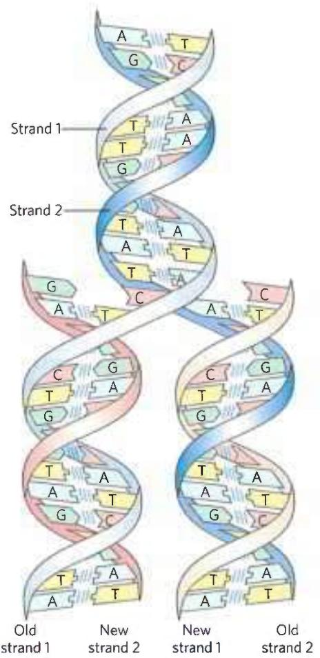  
FIGURE 1-30 Complementarity between the two strands of DNA. DNA is a linear polymer of covalently joined deoxyribonucleotides of four types: deoxyadenylate (A), deoxyguanylate (G), deoxycytidylate (C), and deoxythymidylate (T). Each nucleotide, with its unique three-dimensional structure, can associate very specifically but noncovalently with one other nucleotide in the complementary chain: A always associates with T, and G with C. Thus, in the double-stranded DNA molecule, the entire sequence of nucleotides in one strand is complementary to the sequence in the other. The two strands, held together by hydrogen bonds (represented here by vertical light blue lines) between each pair of complementary nucleotides, twist about each other to form the DNA double helix. In DNA replication, the two strands (blue) separate and two new strands (pink) are synthesized, each with a sequence complementary to one of the original strands. The result is two double-helical molecules, each identical to the original DNA.

#### [EN] The Linear Sequence in DNA Encodes Proteins with Three-Dimensional Structures

P4 The information in DNA is encoded in its linear (one-dimensional) sequence of deoxyribonucleotide subunits, but the expression of this information results in a three-dimensional cell. This change from one to three dimensions occurs in two phases. A linear sequence of deoxyribonucleotides in DNA codes (through an intermediary, RNA) for the production of a protein with a corresponding linear sequence of amino acids (Fig. 1-31). The protein folds into a particular three-dimensional shape, determined by its amino acid sequence and stabilized primarily by noncovalent interactions. Although the final shape of the folded protein is dictated by its amino acid sequence, the folding of many proteins is aided by "molecular chaperones" (see Fig. 4-28). The precise three-dimensional structure, or native conformation, of the protein is crucial to its function.

Once in its native conformation, a protein may associate noncovalently with other macromolecules (other proteins, nucleic acids, or lipids) to form supramolecular complexes such as chromosomes, ribosomes, and membranes. The individual molecules of these complexes have specific, high-affinity binding sites for each other, and within the cell they spontaneously self-assemble into functional complexes.

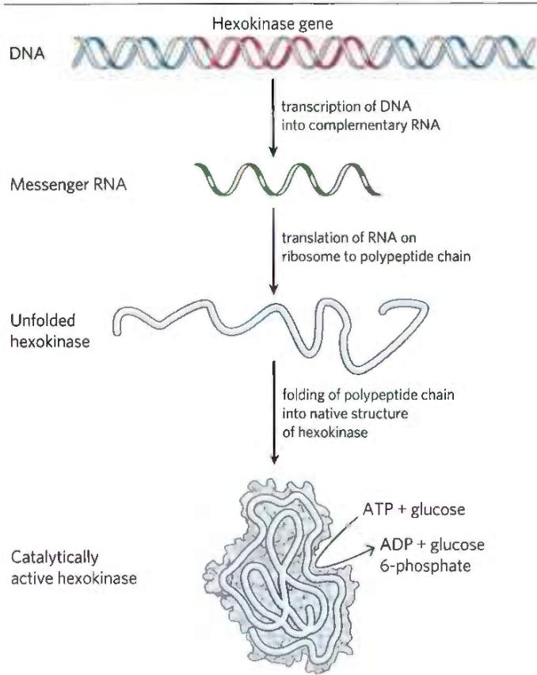  
FIGURE 1-31 DNA to RNA to protein to enzyme (hexokinase). The linear sequence of deoxyribonucleotides in the DNA (the gene) that encodes the protein hexokinase is first transcribed into a ribonucleic acid (RNA) molecule with the complementary ribonucleotide sequence. The RNA sequence (messenger RNA) is then translated into the linear protein chain of hexokinase, which folds into its native three-dimensional shape, most likely aided by molecular chaperones. Once in its native form, hexokinase acquires its catalytic activity: it can catalyze the phosphorylation of glucose, using ATP as the phosphoryl group donor.

Although the amino acid sequences of proteins carry all necessary information for achieving the proteins' native conformation, accurate folding and self-assembly also require the right cellular environment—pH, ionic strength, metal ion concentrations, and so forth. Thus, DNA sequence alone is not enough to form and maintain a fully functioning cell.

#### [EN] SUMMARY 1.4 Genetic Foundations

■ Genetic information is encoded in the linear sequence of four types of deoxyribonucleotides in DNA.

Despite the enormous size of DNA, the sequence of its nucleotides is very precise, and the maintenance of this precise sequence over very long times is the basis for genetic continuity in organisms.

■ The double-helical DNA molecule contains an internal template for its own replication and repair.

The linear sequence of amino acids in a protein, which is encoded in the DNA of the gene for that protein, produces a protein's unique three-dimensional structure—a process that is also dependent on environmental conditions.

■ Individual macromolecules with specific affinity for other macromolecules self-assemble into supramolecular complexes.

<!-- EN-END 1.4 -->

## 三、生命物质的化学组成

## （一）生命元素

18世纪后半叶开始,化学家们对生命物质或称活质(living matter)的化学组成逐渐有所了解,如法国

Lavoirsier 已经知道生物是由碳、氢、氧、氮和磷等元素组成的。至今已知地壳中天然存在的 90 多种化学元素，约有 30 种是生物所必需的，这些元素被称为生命元素（bioelement）（表 1-1）。生命元素的原子序数都是比较低的，即比较轻的元素。高于 Se（原子序数 34）的只有 5 种：Br、Mo、Sn、I 和 Ba。生命物质中的元素组成与生物圈（生物可接近的地壳和大气层）的元素组成既相似又有显著差异。看来化学元素不是随机参入生物体内，是在进化过程中被选中的。某些生命元素取决于环境中原料的可得性（availability）。某些元素决定于其原子或分子对生命过程中特异作用的适合性（fitness）。

表 1-1 生物中发现的元素 (生命元素)

<table><tr><td colspan="2">大量元素</td><td colspan="3">微量元素</td></tr><tr><td>所有生物中 $^1$ </td><td>所有生物中 $^2$ </td><td>所有生物中</td><td colspan="2">某些生物中</td></tr><tr><td>H(1) $^3$ </td><td>Na+(11)</td><td>Mn(25)</td><td>B(5)</td><td>As(33)</td></tr><tr><td>C(6)</td><td>Mg $^{2+}$ (12)</td><td>Fe(26)</td><td>F(9)</td><td>Se(34)</td></tr><tr><td>N(7)</td><td>Cl-(17)</td><td>Co(27)</td><td>Al(13)</td><td>Br(35)</td></tr><tr><td>O(8)</td><td>K+(19)</td><td>Cu(29)</td><td>Si(14)</td><td>Mo(42)</td></tr><tr><td>P(15)</td><td>Ca $^{2+}$ (20)</td><td>Zn(30)</td><td>V(23)</td><td>Sn(50)</td></tr><tr><td>S(16)</td><td></td><td></td><td>Cr(24)</td><td>I(53)</td></tr><tr><td></td><td></td><td></td><td>Ni(28)</td><td>Ba(56)</td></tr></table>

① 构成细胞与组织结构成分的元素；② 以单原子离子形式存在的元素；③ 括号内的数字是原子序数。

以原子总数的百分数表示活生物中4种最丰富的元素是 $\mathrm{H}(49\%)$ 、O(25%)、C(25%)、N(0.27%)，它们构成大多数细胞的质量的 $99\%$ 以上；但地壳中最丰富的是O(47%)、Si(28%)、Al(7.5%)、Fe(4.5%)。因此H、O、C和N被认为是根据适合性被选中的。诚然，H、O、N、C具有一个共同的特点：它们都是很轻的元素。一般说元素愈轻，形成的键愈强。H、O、N、C能借共用电子对分别形成1、2、3和4个稳定的共价键，具有广泛的化学结合方式，可构成各种各样的有机化合物。

碳与氧可形成二氧化碳 $\left(\mathrm{CO}_{2}\right)$ ， $CO_{2}$ 是一种溶于水的稳定气体，很适于生物之间的碳循环。硅的化学性质则与碳的有显著不同，硅虽然也有4个价电子，并且在生物圈中更为丰富，但在生命物质中仅有微量存在。由于Si原子的体积较大，所以Si—Si键比C—C弱，硅的多聚物在有水存在时不稳定。硅与碳明显不同，Si与O结合将生成难溶于水的二氧化硅或二氧化硅的网状多聚物（即石英）。因此在需氧环境中，Si倾向于使自己离开循环。

次丰富的生命元素是 Ca、P、K、Mg、Cl、S、Na。其中 P 和 S 由于具有独特的化学性质，即 P 或 S 形成的键当有水存在时常不稳定，因而形成这些键需要相当大的能量。但由于这些键被水解时这一能量又再被释放出来，所以含 P 和 S 的分子，如腺苷三磷酸（ATP）和乙酰辅酶 A 在生命系统或称活系统（living system）中，适于担当能量载体的角色（见第 16 章）。Ca、K、Mg、Cl、Na 常以单原子离子形式存在于细胞溶胶（cytosol）中，这些离子在生物体内主要起维持渗透平衡、形成在神经传导和主动运输过程中的离子梯度，以及中和生物大分子上的电荷等非特异的作用。由于生命物质与海水有相似的离子组成，并且 $Ca^{2+}$ 、 $K^{+}$ 、 $Mg^{2+}$ 、 $Cl^{-}$ 、 $Na^{+}$ 在生物体内所起的作用是一般性的，因此这些离子被认为是根据可得性而不是适合性被选中的。

其他的生命元素在生物中含量甚微，称为微量元素（trace element），如 Mn、Fe、Co、Cu、Zn 等。微量元素仅出现在某些生物分子中，通常对特异的蛋白质的功能，包括对许多酶的功能是必需的（见第 6 章）。例如 Fe 和 Cu 能以两种氧化态中的任一种形式稳定存在，因此它们很适合在细胞色素酶类的活性部位起作用，在这里 Fe 和 Cu 是作为呼吸作用的电子传递反应中的接纳体和供体（见第 19 章）。

前面讲到的4种最丰富的和7种次丰富的生命元素也称为大量元素（bulk element）。大量元素是细胞和组织的结构成分，膳食中每日需要量以克数计算（ $\mathrm{Mg}$ 除外）。对于微量元素需要量则少得多，人对Fe、Cu和Zn的要求，每日以毫克数计，对其他微量元素的需要量则更少。植物和微生物对元素的需要量与动物大体相似，但获得这些元素的方式不同。

## （二）生物分子是碳的化合物

活生物的化学可以看成是碳化合物的化学，碳占细胞干重的 $50\%$ 以上。碳可与氢原子形成单键，与氧和氮原子形成单键或双键（图1-1）。在生物学中最有意义的是碳原子有彼此共用电子对、形成稳定的C—C单键的能力。每个碳原子能与1、2、3或多至4个其他碳原子形成单键。两个碳原子也能共用2个（或3个）电子对，形成双（或三）键。

  
图1-1 碳原子成键的多能性  
碳能与其他原子特别是与其他碳原子形成共价单键、双键和三键，但三键在生物分子中很少出现

一个碳原子形成的4个单键，从碳核投射到四面体的4个顶角（图1-2），任何两个键之间的键角约为 $109^{\circ}28'$ ，平均键长为 $0.154\mathrm{nm}$ （纳米）。绕每个单键可以自由旋转，除非连接在C—C单键的两个碳原子上的基团很大或者高荷电，这种情况旋转将受到限制。双键的键长较短（ $0.134\mathrm{nm}$ ），并且是刚性的，只允许极有限的绕轴旋转。

  
图1-2 碳成键的几何学  
A. 碳原子 4 个单键的四面体排列, 示出键长和键角的大小; B. C—C 单键能自由旋转, 以乙烷 $\left(\mathrm{CH}_{3}-\mathrm{CH}_{3}\right)$ 分子为例; C. 双键较短, 不能自由旋转。双键连接的每个碳上, 两个单键的夹角为 $120^{\circ}$ 。两个双键连接的碳和标为 A、B、X、Y 的原子都处在一个平面上

生物分子中,共价连接的碳原子可以形成线型链、分支链和环状结构。具有共价连接的碳[骨]架 $^{①}$ (carbon skeleton)或称碳主链(carbon backbone)的分子称为有机化合物(organic compound)。碳架只与氢结合的有机化合物称为烃或碳氢化合物(hydrocarbon)。大多数的生物分子可以看成是烃的衍生物,也就是烃骨架上的氢原子被称为官能团(functional group)的其他原子的基团—OH、—NH、—COO、—CHO和—CO等所取代而相应形成的醇、胺、酸、醛和酮等(图1-3)。因此生物分子也就是有机分子即有机化合物。许多生物分子是多功能的,含有两种或多种不同的官能团,每种官能团都有自己的化学特性和反应。一种化合物的化学“个性”就决定于官能团的化学以及官能团在三维空间的排布。

碳在成键方面的多能性(versatility)是生物在它们起源和进化期间选择碳的化合物作为细胞分子机器

甲基

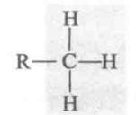

乙基

醚基

$$
\mathrm{R} ^ {1} - \mathrm{O} - \mathrm{R} ^ {2}
$$

胍基

酯基

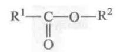

咪唑基

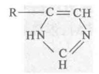

苯基

乙酰基

巯基
(硫氢基)

$$
\mathrm{R} - \mathrm{S} - \mathrm{H}
$$

羰基（醛）

酐基（两个羧酸）

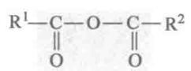

二硫基

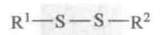

羰基（酮）

氨基
(质子化)

硫酯基

羧基

酰胺基

磷酸 [基]

羟基（醇）R—O—H

亚氨基

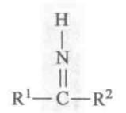

磷酸酐

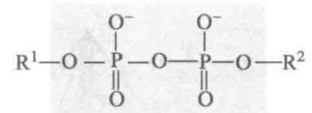

烯醇基

N-取代亚氨基

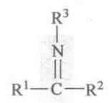

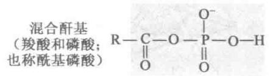  
图1-3 生物分子中一些常见的官能团

图中用 R 代表“任一取代基”。它可以是一个氢原子，一般是一个含碳基团。当一个分子中有两个或多个取代基时，则用 $R^{1}$ 、 $R^{2}$ 等来表示

的主要因素。没有其他的化学元素能够像碳这样形成如此不同的大小、形状和组成的分子。

## （三）生物小分子与代谢物

在所有细胞的水相(细胞溶胶)中都溶有大约1000种不同的有机小分子( $M_{r} 100 \sim 500$ )①,它们是细胞中基本代谢途径的重要代谢物。这些代谢物和途径是在早期细胞中形成,并在进化过程中被保留下来的。这一套通用的小分子包括常见的氨基酸、核苷酸、糖及其磷酸化衍生物,以及单羧酸、二羧酸和三羧酸等。这些分子是极性的或带电荷的,溶于水,并以微摩尔( $\mu$ mol)到毫摩尔(mmol)的浓度存在。这些分子只有被细胞主动捕获时才能进入细胞，因为质膜对它们是不通透的，但有专一的膜转运蛋白（membrane transporter）能催化某些分子在进出细胞或在真核细胞各区室（compartment）之间的运动。还有一些其他的生物小分子，它们专属某些种类的细胞或生物所有。例如，维管植物除了含有一套通用的代谢物之外，还有另一套称为次生代谢物（secondary metabolite）的小分子，对植物的生命起着特殊的作用。这些代谢物包括那些给植物以特有香味的化合物，以及像吗啡（morphine）、奎宁（quinine）、尼古丁（nicotine）和咖啡因（caffeine）这样的一些物质。这些物质除了对植物自身有作用外，因为对人体有生理效应，而具有价值。

在特定的条件下一个给定的细胞中的整个小分子群体（代谢中间物、信号分子、次生代谢物）已被称为该细胞的代谢物组（metabolome），与基因组（genome）和蛋白质组（proteome）这些术语并列（见第36章）。

## （四）生物大分子及其单体亚基

细胞中许多生物分子是大分子（macromolecule），它们是一些相对分子质量 $(M_{r})$ 在5000以上的多聚体。较短的多聚体称为寡聚体（oligomer，希腊文oligos，少的意思）。多聚体是由小的、相对简单的前体（precursor）聚合而成。这些前体分子称为单体亚基或单体，又称构件（building block）或构件分子，如氨基酸、核苷酸和单糖等。蛋白质、核酸和多糖是由 $M_{r}$ 为500或<500的单体亚基组成的生物大分子（biomacromolecule）。大分子的合成是细胞的主要耗能活动。大分子自身可以进一步组装成超分子复合体（supermolecular complex），形成像核糖体（ribosome）这样的功能单位。表1-2示出大肠杆菌（Escherichia coli）细胞中各类生物分子的相对含量（占细胞总重量的百分数）和分子种类的约略数目。水是大肠杆菌细胞中，实际上也是所有其他细胞和生物中，最丰富的化合物。然而细胞中所有的固体物质都是有机分子，主要是蛋白质、核酸、多糖和脂质。无机盐和其他矿物元素只占细胞总干重的很小一部分。

表 1-2 大肠杆菌 (E. coli) 细胞的分子组成

<table><tr><td>分子类别</td><td>相对含量/%</td><td>分子种类</td><td>分子类别</td><td>相对含量/%</td><td>分子种类</td></tr><tr><td>水</td><td>70</td><td>1</td><td>多糖</td><td>3</td><td>10</td></tr><tr><td>蛋白质</td><td>15</td><td>3 000</td><td>脂质</td><td>2</td><td>20</td></tr><tr><td>核酸</td><td></td><td></td><td>单体亚基和中间物</td><td>2</td><td>&gt;500</td></tr><tr><td>DNA</td><td>1</td><td>1~4</td><td>无机离子</td><td>1</td><td>20</td></tr><tr><td>RNA</td><td>6</td><td>&gt;3 000</td><td></td><td></td><td></td></tr></table>

蛋白质(protein)是氨基酸通过酰胺键(肽键)连接而成的多聚体,构成细胞除水以外的最大部分,在生物体内起动态功能(如酶、抗体、受体这类蛋白质)和结构元件(如微管蛋白、胶原蛋白)的作用。蛋白质也许是所有生物分子中最多能的,它有一系列的功能。在一个给定细胞中执行功能的所有蛋白质的总和称为细胞的蛋白质组(proteome)。核酸(nucleic acid),DNA 和 RNA,是核苷酸借磷酸二酯键连接而成的多聚体,其功能主要是贮存和传递遗传信息。多糖(polysaccharide)由单糖如葡萄糖通过糖苷键聚合而成。它们的主要功能是:①作为富能的燃料贮库;②作为细胞壁(在植物和细菌中)的刚性结构成分;③作为[细]胞外的识别元件,与其他细胞上的蛋白质结合。跟细胞表面上的蛋白质或脂质相连接的较短的单糖多聚体(寡糖)起特异的细胞信号作用。脂质(lipid)是水不溶性的烃类的衍生物,为生物膜的结构成分、高能的燃料贮库、色素和胞内信号等。

蛋白质、核酸和多糖是由几十个到几百万个单体亚基组成的高分子量化合物。蛋白质的相对分子质量 $(M_{\mathrm{r}})$ 在5000到100万；核酸可达几十亿；多糖像淀粉也有几百万。单个脂质分子则小得多， $M_{r}$ 为750\~1500，不属于大分子，但是脂质可借非共价缔合形成很大的聚集体（aggregate）。生物膜（biomembrane）由脂质聚集体和蛋白质分子构成的。蛋白质和核酸由于它们的单体亚基序列富含信息，经常被称为信息大分子（informational macromolecule）。如上面提到的某些寡糖也是信息分子。

大肠杆菌细胞中生物分子种类约有7000种(表1-2)，人体内蛋白质的种类估计在100000种左右，但没有一种是和大肠杆菌中的完全一样的。如果地球上存在 $1.5 \times 10^{6}$ 种生物，则据估算各种生物共含有 $10^{10} \sim 10^{12}$ 种不同的蛋白质，约 $10^{10}$ 种不同的核酸。但迄今发现各种蛋白质中只有20种单体氨基酸；DNA和RNA中各有4种核苷酸；多糖的单体单糖为数也不多，并且各种生物中的单体分子都是一样的。单体分子是一专多能的，例如氨基酸既可参与蛋白质组成，又可以转化为某些激素、生物碱、色素和其他物质。这说明生物是遵循最经济（最节省）的原则。

<!-- EN-BEGIN 1.2 -->

### 【英文对应 1.2】Chemical Foundations

> 来源：Lehninger Principles of Biochemistry（书籍/02_生物化学原理） 第1章 The Foundations of Biochemistry，§1.2。对应本章“三、生命物质的化学组成”。

Biochemistry aims to explain biological form and function in chemical terms. During the first half of the twentieth century, parallel biochemical investigations of glucose breakdown in yeast and in animal muscle cells revealed remarkable chemical similarities between these two apparently very different cell types; for example, the breakdown of glucose in yeast and in muscle cells involved the same 10 chemical intermediates and the same 10 enzymes. Subsequent studies of many other biochemical processes in many different organisms have confirmed the generality of this observation, neatly summarized in 1954 by the biochemist Jacques Monod: "What is true of E. coli is true of the elephant." The current understanding that all organisms share a common evolutionary origin is based in part on this observed universality of chemical intermediates and transformations, often termed "biochemical unity."

Fewer than 30 of the more than 90 naturally occurring chemical elements are known to be essential to organisms. Most of the elements in living matter have a relatively low atomic number; only three have an atomic number above that of selenium, 34 (Fig. 1-11). The four most abundant elements in living organisms, in terms of percentage of total number of atoms, are hydrogen, oxygen, nitrogen, and carbon, which together make up more than $99\%$ of the mass of most cells. They are the lightest elements capable of efficiently forming one, two, three, and four bonds, respectively; in general, the lightest elements form the strongest bonds. The trace elements represent a miniscule fraction of the weight of the human body, but all are essential to life, usually because they are essential to the function of specific proteins, including many enzymes. The oxygen-transporting capacity of the hemoglobin molecule, for example, is absolutely dependent on four iron ions that make up only $0.3\%$ of the molecule's mass.

#### [EN] Biomolecules Are Compounds of Carbon with a Variety of Functional Groups

The chemistry of living organisms is organized around carbon, which accounts for more than half of the dry weight of cells. Carbon can form single bonds with hydrogen atoms and can form both single bonds and double bonds with oxygen and nitrogen atoms (Fig. 1-12). Of greatest significance in biology is the ability of carbon atoms to form very stable single bonds with up to four other carbon atoms. Two carbon atoms also can share two (or three) electron pairs, thus forming double (or triple) bonds.

FIGURE 1-11 Elements essential to animal life and health. Bulk elements (shaded light red) are structural components of cells and tissues and are required in the diet in gram quantities daily. For trace elements (shaded yellow), the requirements are much smaller: for humans, a few milligrams per day of Fe, Cu, and Zn, and even less of the others. The elemental requirements for plants and microorganisms are similar to those shown here; the ways in which they acquire these elements vary.  

FIGURE 1-12 Versatility of carbon bonding. Carbon can form covalent single, double, and triple bonds (all bonds in red), particularly with other carbon atoms. Triple bonds are rare in biomolecules.

<table><tr><td> $\dot{C} + H \longrightarrow \dot{C}H$ </td><td> $-C-H$ </td><td> $\dot{C} + \dot{N}: \longrightarrow \dot{C}: \dot{N}$ </td><td> $\dot{C}=N-$ </td></tr><tr><td> $\dot{C} + \dot{O}: \longrightarrow \dot{C}: \ddot{O}$ </td><td> $-C-O-$ </td><td> $\dot{C} + \dot{C} \longrightarrow \dot{C}: \dot{C}$ </td><td> $-\dot{C}-\dot{C}-$ </td></tr><tr><td> $\dot{C} + \dot{O}: \longrightarrow \dot{C}: \dot{O}:$ </td><td> $\dot{C}-O$ </td><td> $\dot{C} + \dot{C} \longrightarrow \dot{C}: \dot{C}$ </td><td> $\dot{C}=C$ </td></tr><tr><td> $\dot{C} + \dot{N}: \longrightarrow \dot{C}: \dot{N}:$ </td><td> $-\dot{C}-N$ </td><td> $\dot{C} + \dot{C} \longrightarrow \dot{C}: \ddot{C}$ </td><td> $-C\equiv C-$ </td></tr></table>

The four single bonds that can be formed by a carbon atom project from the nucleus to the four apices of a tetrahedron (Fig. 1-13), with an angle of about $109.5^{\circ}$ between any two bonds and an average bond length of $0.154\mathrm{nm}$ . There is free rotation around each single bond, unless very large or highly charged groups are attached to both carbon atoms, in which case rotation may be restricted. A double bond is shorter (about $0.134\mathrm{nm}$ ) and rigid, and it allows only limited rotation about its axis.

Covalently linked carbon atoms in biomolecules can form linear chains, branched chains, and cyclic structures. It seems likely that the bonding versatility of carbon, with itself and with other elements, was a major factor in the selection of carbon compounds for the molecular machinery of cells during the origin and evolution of living organisms. No other chemical element can form molecules of such widely different sizes, shapes, and composition.

Most biomolecules can be regarded as derivatives of hydrocarbons, with hydrogen atoms replaced by a variety of functional groups that confer specific chemical properties on the molecule, forming various families of organic compounds. Typical of these are alcohols, which have one or more hydroxyl groups; amines, with amino groups; aldehydes and ketones, with carbonyl groups; and carboxylic acids, with carboxyl groups (Fig. 1-14). Many biomolecules are polyfunctional, containing two or more types of functional groups (Fig. 1-15), each with its own chemical characteristics and reactions. The chemical "personality" of a compound is determined by the chemistry of its functional groups and their disposition in three-dimensional space.

#### [EN] Cells Contain a Universal Set of Small Molecules

Dissolved in the aqueous phase (cytosol) of all cells is a collection of perhaps several thousand different small organic molecules ( $M_{\mathrm{r}} \sim 100$ to $\sim 500$ ), with intracellular concentrations ranging from nanomolar to $>10~\mathrm{mm}$ (see Fig. 13-31). (See Box 1-1 for an explanation of the various ways of referring to molecular weight.) These are the central metabolites in the major pathways occurring in nearly every cell—the metabolites and pathways that have been conserved throughout the course of evolution. This collection of molecules includes the common amino acids, nucleotides, sugars and their phosphorylated derivatives, and mono-, di-, and tricarboxylic acids. The molecules may be polar or charged and most are water-soluble. They are trapped in the cell because the plasma membrane is impermeable to them, although specific membrane transporters can catalyze the movement of some molecules into and out of the cell or between compartments in eukaryotic cells. The universal occurrence of the same set of compounds in living cells reflects the evolutionary conservation of metabolic pathways that developed in the earliest cells.

There are other small biomolecules, specific to certain types of cells or organisms. For example, vascular plants contain, in addition to the universal set, small molecules called secondary metabolites, which play roles specific to plant life. These metabolites include compounds that give plants their characteristic scents and colors, and compounds such as morphine, quinine, nicotine, and caffeine that are valued for their physiological effects on humans but have other purposes in plants.

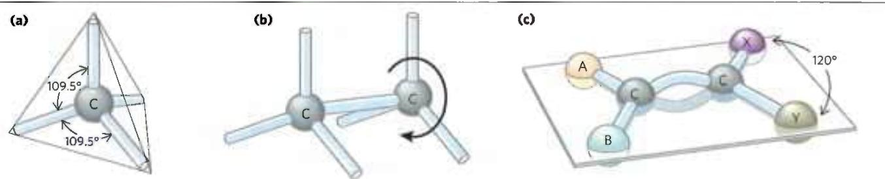  
FIGURE 1-13 Geometry of carbon bonding. (a) Carbon atoms have a characteristic tetrahedral arrangement of their four single bonds. (b) Carbon-carbon single bonds have freedom of rotation, as shown for the  
compound ethane (CH₃—CH₃). (c) Double bonds are shorter and do not allow free rotation. The two doubly bonded carbons and the atoms designated A, B, X, and Y all lie in the same rigid plane.

The entire collection of small molecules in a given cell under a specific set of conditions has been called the metabolome, in parallel with the term "genome." Metabolomics is the systematic characterization of the metabolome under very specific conditions (such as following administration of a drug, or a biological signal such as insulin).

#### [EN] Macromolecules Are the Major Constituents of Cells

Many biological molecules are macromolecules, polymers with molecular weights above \~5,000 that are assembled from relatively simple precursors (Fig. 1-16). Shorter polymers are called oligomers (Greek oligos, "few"). Proteins, nucleic acids, and polysaccharides are macromolecules composed of monomers with molecular weights of 500 or less. Synthesis of macromolecules is a major energy-consuming activity of cells. Macromolecules themselves may be further assembled into supramolecular complexes, forming functional units such as ribosomes. Table 1-1 shows the major classes of biomolecules in an E. coli cell.

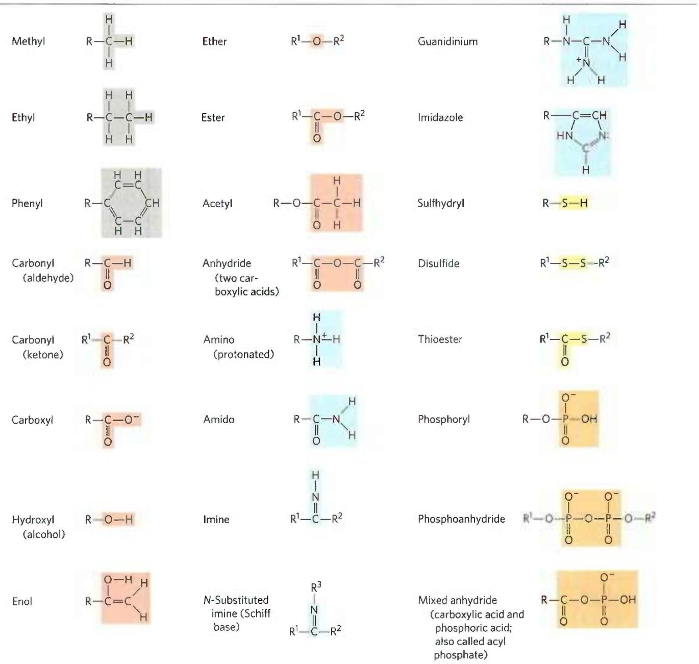

FIGURE 1-14 Some common functional groups of biomolecules. Functional groups are screened with a color typically used to represent the element that characterizes the group: gray for C, red for O, blue for N, yellow for S, and orange for P. In this figure and throughout the book, we use R to represent "any substituent." It may be as simple as a hydrogen atom, but typically it is a carbon-containing group. When two or more substituents are shown in a molecule, we designate them $R^1$ , $R^2$ , and so forth.

  
FIGURE 1-15 Several common functional groups in a single biomolecule. Acetyl-coenzyme A (often abbreviated as acetyl-CoA) is a carrier of acetyl groups in some enzymatic reactions. Its functional groups are screened in the structural formula. In the space-filling model, N is blue,  
C is black, P is orange, O is red, and H is white. The yellow atom at the left is the sulfur of the critical thioester bond between the acetyl moiety and coenzyme A. [Acetyl-CoA structure data from PDB ID 1DM3, Y. Modis and R. K. Wierenga, J. Mol. Biol. 297:1171, 2000.]

Proteins, long polymers of amino acids, constitute the largest mass fraction (besides water) of a cell. Some proteins have catalytic activity and function as enzymes; others serve as structural elements, signal receptors, or transporters that carry specific substances into or out of cells. Proteins are perhaps the most versatile of all biomolecules; a catalog of their many functions would be very long. The sum of all the proteins functioning in a given cell is the cell's proteome, and proteomics is the systematic characterization of this protein complement under a specific set of conditions. The nucleic acids, DNA and RNA, are polymers of nucleotides. They store and transmit genetic information, and some RNA molecules have structural and catalytic roles in supramolecular complexes. The genome is the entire sequence of a cell's DNA (or in the case of RNA viruses, its RNA), and genomics is the characterization of the structure, function, evolution, and mapping of genomes.

The polysaccharides, polymers of simple sugars such as glucose, have three major functions: as energy-rich fuel stores, as rigid structural components of cell walls (in plants and bacteria), and as extracellular recognition elements that bind to proteins on other cells. Shorter polymers of sugars (oligosaccharides) attached to proteins or lipids at the cell surface serve as specific cellular signals. A cell's glycome is its entire complement of carbohydrate-containing molecules. The lipids,

#### [EN] BOX 1-1

#### [EN] Molecular Weight, Molecular Mass, and Their Correct Units

There are two common (and equivalent) ways to describe molecular mass; both are used in this text. The first is molecular weight, or relative molecular mass, denoted $M_{r}$ . The molecular weight of a substance is defined as the ratio of the mass of a molecule of that substance to one-twelfth the mass of an atom of carbon-12 ( $^{12}C$ ). Since $M_{r}$ is a ratio, it is dimensionless — it has no associated units. The second is molecular mass, denoted m. This is simply the mass of one molecule, or the molar mass divided by Avogadro's number. The molecular mass, m, is expressed in daltons (abbreviated Da). One dalton is equivalent to one-twelfth the mass of an atom of carbon-12; a kilodalton (kDa) is 1,000 daltons; a megadalton (MDa) is 1 million daltons.

Consider, for example, a molecule with a mass 1,000 times that of water. We can say of this molecule either $M_r = 18,000$ or $m = 18,000$ daltons. We can also describe it as an "18 kDa molecule." However, the expression $M_r = 18,000$ daltons is incorrect.

Another convenient unit for describing the mass of a single atom or molecule is the atomic mass unit (formerly amu, now commonly denoted u). One atomic mass unit (1 u) is defined as one-twelfth the mass of an atom of carbon-12. Since the experimentally measured mass of an atom of carbon-12 is $1.9926 \times 10^{-23}$ g, $1u = 1.6606 \times 10^{-24}$ g. The atomic mass unit is convenient for describing the mass of a peak observed by mass spectrometry (see Chapter 3, p. 93).

(a) Some of the amino acids of proteins  
  
FIGURE 1-16 The organic compounds from which most cellular materials are constructed: the ABCs of biochemistry. Shown here are (a) 4 of the 20 amino acids from which all proteins are built (the side chains are shaded light red); (b) 3 of the 5 nitrogenous bases, the

<table><tr><td colspan="3">TABLE 1-1 Molecular Components of an E. coli Cell</td></tr><tr><td></td><td>Percentage of total weight of cell</td><td>Approximate number of different molecular species</td></tr><tr><td>Water</td><td>70</td><td>1</td></tr><tr><td>Proteins</td><td>15</td><td>3,000</td></tr><tr><td>Nucleic acids</td><td></td><td></td></tr><tr><td>DNA</td><td>1</td><td>1-4</td></tr><tr><td>RNA</td><td>6</td><td>&gt;3,000</td></tr><tr><td>Polysaccharides</td><td>3</td><td>20</td></tr><tr><td>Lipids</td><td>2</td><td> $50^a$ </td></tr><tr><td>Monomeric subunits and intermediates</td><td>2</td><td>2,600</td></tr><tr><td>Inorganic ions</td><td>1</td><td>20</td></tr><tr><td colspan="3">Source: A. C. Guo et al., Nucleic Acids Res. 41:D625, 2013. $^a$ If all permutations and combinations of fatty acid substituents are considered,this number is much larger.</td></tr></table>

two 5-carbon sugars, and the phosphate ion from which all nucleic acids are built; (c) 4 components of membrane lipids (including phosphate); and (d) D-glucose, the simple sugar from which most carbohydrates are derived.

water-insoluble hydrocarbon derivatives, serve as structural components of membranes, energy-rich fuel stores, pigments, and intracellular signals. The lipid-containing molecules in a cell constitute its lipidome.

Proteins, polynucleotides, and polysaccharides have large numbers of monomeric subunits and thus high molecular weights—in the range of 5,000 to more than 1 million for proteins, up to several billion for DNA, and in the millions for polysaccharides such as starch. Individual lipid molecules are much smaller ( $M_{r}$ 750 to 1,500) and are not classified as macromolecules, but they can associate noncovalently into very large structures. Cellular membranes are built of enormous noncovalent aggregates of lipid and protein molecules.

Given their characteristic information-rich subunit sequences, proteins and nucleic acids are often referred to as informational macromolecules. Some oligosaccharides, as noted above, also serve as informational molecules.

#### [EN] Three-Dimensional Structure Is Described by Configuration and Conformation

The covalent bonds and functional groups of a biomolecule are, of course, central to its function, but so also is the arrangement of the molecule's constituent atoms in three-dimensional space—its stereochemistry. Carbon-containing compounds commonly exist as stereoisomers, molecules with the same chemical bonds and same chemical formula but different configuration, the fixed spatial arrangement of atoms. Interactions between biomolecules are typically stereospecific, requiring specific configurations in the interacting molecules.

Figure 1-17 shows three ways to illustrate the stereochemistry, or configuration, of simple molecules. The perspective diagram specifies stereochemistry unambiguously, but bond angles and center-to-center bond lengths are better represented with ball-and-stick models. In space-filling models, the radius of each "atom" is proportional to its van der Waals radius, and the contours of the model define the space occupied by the molecule (the volume of space from which atoms of other molecules are excluded).

Configuration is conferred by the presence of either (1) double bonds, around which there is little or no freedom of rotation, or (2) chiral centers, around which substituent groups are arranged in a specific orientation. The identifying characteristic of stereoisomers is that they cannot be interconverted without the temporary breaking of one or more covalent bonds. Figure 1-18a shows the configurations of maleic acid and its isomer, fumaric acid.

These compounds are geometric isomers, or cis-trans isomers; they differ in the arrangement of their substituent groups with respect to the nonrotating double bond (Latin cis, "on this side"—groups on the same side of the double bond; trans, "across"—groups on opposite sides).

  
(a)

  
(b)

  
(c)  
FIGURE 1-17 Representations of molecules. Three ways to represent the structure of the amino acid alanine (shown here in the ionic form found at neutral pH). (a) Structural formula in perspective form: a solid wedge ( $\rightarrow$ ) represents a bond in which the atom at the wide end projects out of the plane of the paper, toward the reader; a dashed wedge ( $\rightarrow$ ) represents a bond extending behind the plane of the paper. (b) Ball-and-stick model, showing bond angles and relative bond lengths. (c) Space-filling model, in which each atom is shown with its correct relative van der Waals radius.

  
FIGURE 1-19 Molecular asymmetry: chiral and achiral molecules. (a) When a carbon atom has four different substituent groups (A, B, X, Y), they can be arranged in two ways that represent nonsuperposable mirror images of each other (enantiomers). This asymmetric carbon atom is called a chiral atom or chiral center. (b) When a tetrahedral carbon has only three  
dissimilar groups (that is, the same group occurs twice), only one configuration is possible and the molecule is symmetric, or achiral. In this case, the molecule is superposable on its mirror image: the molecule on the left can be rotated counterclockwise (when looking down the vertical bond from A to C) to create the molecule in the mirror.

Maleic acid (maleate at the neutral pH of cytoplasm) is the cis isomer, and fumaric acid (fumarate) is the trans isomer; each is a well-defined compound that can be separated from the other, and each has its own unique chemical properties. A binding site (on an enzyme, for example) that is complementary to one of these molecules would not be complementary to the other, which explains why the two compounds have distinct biological roles despite their similar chemical makeup. The visual pigment in the vertebrate eye, rhodopsin, contains retinal, a vitamin A-derived lipid (Fig. 1-18b). In the primary event of vision, light converts one isomer of retinal to another, triggering a neuronal signal to the brain (see Fig. 12-19).

In the second type of stereoisomer, four different substituents bonded to a tetrahedral carbon atom may be arranged in two different ways in space—that is, have two configurations—yielding two stereoisomers that have similar or identical chemical properties but differ in certain physical and biological properties. A carbon atom with four different substituents is said to be asymmetric, and asymmetric carbons are called chiral centers (Greek chiros, "hand"; some stereoisomers are related structurally as the right hand is to the left hand). A molecule with only one chiral carbon can have two stereoisomers; when two or more (n) chiral carbons are present, there can be $2^{n}$ stereoisomers. Stereoisomers that are mirror images of each other are called enantiomers (Fig. 1-19). Pairs of stereoisomers that are not mirror images of each other are called diastereomers (Fig. 1-20).

As the biologist, microbiologist, and chemist Louis Pasteur first observed in 1843 (Box 1-2), enantiomers have nearly identical chemical reactivities but differ in a characteristic physical property: optical activity. In separate solutions, two enantiomers rotate the

  
FIGURE 1-20 Enantiomers and diastereomers. There are four different stereoisomers of 2,3-disubstituted butane (n=2 asymmetric carbons, hence $2^{n}=4$ stereoisomers). Each is shown in a box as a perspective formula and a ball-and-stick model, which has been rotated to show all of the groups.  
Two pairs of stereoisomers are mirror images of each other, or enantiomers. All other possible pairs are not mirror images, and so are diastereomers. [Information from F. Carroll, Perspectives on Structure and Mechanism in Organic Chemistry, p. 63, Brooks/Cole Publishing Co., 1998.]

Counterclockwise (S)  

#### [EN] Louis Pasteur and Optical Activity: In Vino, Veritas

Louis Pasteur encountered the phenomenon of optical activity in 1843, during his investigation of the crystalline sediment that accumulated in wine casks (a form of tartaric acid called paratartaric acid — also called racemic acid, from Latin racemus, "bunch of grapes"). He used fine forceps to separate two types of crystals identical in shape but mirror images of each other. Both types proved to have all the chemical properties of tartaric acid, but in solution one type rotated plane-polarized light to the left (levorotatory), whereas the other rotated it to the right (dextro-rotatory). Pasteur later described the experiment and its interpretation:

  
Louis Pasteur 1822–1895
[Granger, NYC — All rights reserved.]

  
(2R,3R)-Tartaric acid (dextrorotatory)

  
(2S,3S)-Tartaric acid (levorotatory)

FIGURE 1 Pasteur separated crystals of two stereoisomers of tartaric acid and showed that solutions of the separated forms rotated plane-polarized light to the same extent but in opposite directions. These dextrorotatory and levorotatory forms were later shown to be the $(R,R)$ and $(S,S)$ isomers represented here.

plane of plane-polarized light in opposite directions, but an equimolar solution of the two enantiomers (a racemic mixture) shows no optical rotation. Compounds without chiral centers do not rotate the plane of plane-polarized light.

KEY CONVENTION Given the importance of stereochemistry in reactions between biomolecules (see below), biochemists must name and represent the structure of each biomolecule so that its stereochemistry is unambiguous. For compounds with more than one chiral center, the most useful system of nomenclature is the RS system. In this system, each group attached to a chiral carbon is assigned a priority. The priorities of some common substituents are

$$
\begin{array}{r l} - \mathrm{OCH} _ {3} > - \mathrm{OH} > - \mathrm{NH} _ {2} > - \mathrm{COOH} > \\ & - \mathrm{CHO} > - \mathrm{CH} _ {2} \mathrm{OH} > - \mathrm{CH} _ {3} > - \mathrm{H} \end{array}
$$

For naming in the RS system, the chiral atom is viewed with the group of lowest priority (4 in the following diagram) pointing away from the viewer. If the priority of the other three groups (1 to 3) decreases in clockwise order, the configuration is (R) (Latin rectus,

In isomeric bodies, the elements and the proportions in which they are combined are the same, only the arrangement of the atoms is different . . . We know, on the one hand, that the molecular arrangements of the two tartaric acids are asymmetric, and, on the other hand, that these arrangements are absolutely identical, excepting that they exhibit asymmetry in opposite directions. Are the atoms of the dextro acid grouped in the form of a right-handed spiral, or are they placed at the apex of an irregular tetrahedron, or are they disposed according to this or that asymmetric arrangement? We do not know.\*

Now we do know. In 1951, x-ray crystallographic studies confirmed that the levorotatory and dextrorotatory forms of tartaric acid are mirror images of each other at the molecular level and established the absolute configuration of each (Fig. 1). The same approach has been used to demonstrate that although the amino acid alanine has two stereoisomeric forms (designated D and L), alanine in proteins exists exclusively in one form (the L isomer; see Chapter 3).

\* From Pasteur's lecture to the Société Chimique de Paris in 1883, quoted in R. DuBos, Louis Pasteur: Free Lance of Science, p. 95. New York: Charles Scribner's Sons, 1976.

"right"); if counterclockwise, the configuration is (S) (Latin sinister, "left"). In this way, each chiral carbon is designated either (R) or (S), and the inclusion of these designations in the name of the compound provides an unambiguous description of the stereochemistry at each chiral center.

Another naming system for stereoisomers, the D and L system, is described in Chapter 3. A molecule with a single chiral center can be named unambiguously by either system, as shown here. The two naming systems are based on different criteria, so no general correlation can be made between, say, the L isomer and the (S) isomer seen in this example.

$$
\begin{array}{c} \mathrm{CHO} \\ \mathrm{HO} - \mathrm{C} - \mathrm{H} \\ \mathrm{CH} _ {2} \mathrm{OH} \\ \text { L   -   G   l   y   c   e   r   a   l   d   e   h   y   d   e } \end{array} \equiv \begin{array}{c} \mathrm{CHO} _ {(2)} \\ \mathrm{H} _ {(4)} - \mathrm{OH} _ {(1)} \\ \mathrm{CH} _ {2} \mathrm{OH} _ {(3)} \end{array} (\text { S }) - \text { G   l   y   c   e   r   a   l   d   e   h   y   d   e }
$$

Distinct from configuration is molecular conformation, the spatial arrangement of substituent groups that, without breaking any bonds, are free to assume different positions in space because of the freedom of rotation about single bonds. In the simple hydrocarbon ethane, for example, there is nearly complete freedom of rotation around the C—C bond. Many different, interconvertible conformations of ethane are possible, depending on the degree of rotation (Fig. 1-21). Two conformations are of special interest: the staggered, which is more stable than all others and thus predominates, and the eclipsed, which is the least stable. We cannot isolate either of these conformational forms, because they are freely interconvertible. However, when one or more of the hydrogen atoms on each carbon is replaced by a functional group that is either very large or electrically charged, freedom of rotation around the C—C bond is hindered. This limits the number of stable conformations of the ethane derivative.

#### [EN] Interactions between Biomolecules Are Stereospecific

P2 When biomolecules interact, the "fit" between them is often stereochemically correct; they are complementary. The three-dimensional structure of biomolecules large and small—the combination of configuration and conformation—is of the utmost importance in their biological interactions: reactant with its enzyme, hormone with its receptor, antigen with its specific antibody, for example (Fig. 1-22). The study of biomolecular stereochemistry, with precise physical methods, is an important part of modern research on cell structure and biochemical function.

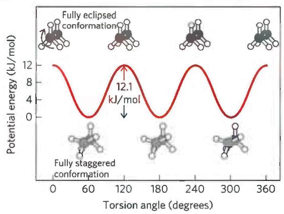  
FIGURE 1-21 Conformations. Many conformations of ethane are possible because of freedom of rotation around the C—C bond. In the ball-and-stick model, when the front carbon atom (as viewed by the reader) with its three attached hydrogens is rotated relative to the rear carbon atom, the potential energy of the molecule rises to a maximum in the fully eclipsed conformation (torsion angle 0°, 120°, and so on), then falls to a minimum in the fully staggered conformation (torsion angle 60°, 180°, and so on). Because the energy differences are small enough to allow rapid interconversion of the two forms (millions of times per second), the eclipsed and staggered forms cannot be separately isolated.

In living organisms, chiral molecules are usually present in only one of their chiral forms. For example, the amino acids in proteins occur only as their L isomers; glucose occurs only as its D isomer. (The conventions for naming stereoisomers of the amino acids are described in Chapter 3; those for sugars, in Chapter 7. The RS system, described on p. 17, is the most useful for some biomolecules.) In contrast, when a compound with an asymmetric carbon atom is chemically synthesized in the laboratory, the reaction usually produces both possible chiral forms: a mixture of the D and L forms, for example. Living cells produce only one chiral form of a biomolecule because the enzymes that synthesize that molecule are also chiral.

Stereospecificity, the ability to distinguish between stereoisomers, is a property of enzymes and other proteins and a characteristic feature of biochemical interactions. If the binding site on a protein is complementary to one isomer of a chiral compound, it will not be complementary to the other isomer, for the same reason that a left-handed glove does not fit a right hand. Two striking examples of the ability of biological systems to distinguish stereoisomers are shown in Figure 1-23.

The common classes of chemical reactions encountered in biochemistry are described in Chapter 13, as an introduction to the reactions of metabolism.

  
FIGURE 1-22 Complementary fit between a macromolecule and a small molecule. A glucose molecule fits into a pocket on the surface of the enzyme hexokinase and is held in this orientation by several noncovalent interactions between the protein and the sugar. This representation of the hexokinase molecule is produced with software that can calculate the shape of the outer surface of a macromolecule, defined either by the van der Waals radii of all the atoms in the molecule or by the "solvent exclusion volume," the volume that a water molecule cannot penetrate. [Data from PDB ID 3B8A, P. Kuser et al., Proteins 72:731, 2008.]

  
L-Aspartyl-L-phenylalanine methyl ester (aspartame) (sweet)

  
(a)  
L-Aspartyl-D-phenylalanine methyl ester (bitter)

  
(S)-Citalopram (therapeutically active)

(b)  
  
(R)-Citalopram (therapeutically inactive)

#### [EN] SUMMARY 1.2 Chemical Foundations

Because of its bonding versatility, carbon can produce a broad array of carbon-carbon skeletons with a variety of functional groups; these groups give biomolecules their biological and chemical personalities.

A nearly universal set of several thousand small molecules is found in living cells; the interconversions of these molecules in the central metabolic pathways have been conserved in evolution.

■ Proteins and nucleic acids are macromolecules—long, linear polymers of simple monomeric subunits; their sequences contain the information that gives each molecule its three-dimensional structure and its biological functions.

■ Molecular configuration can be changed only by breaking and re-forming covalent bonds. For a carbon atom with four different substituents (a chiral carbon), the substituent groups can be arranged in two different ways, generating stereoisomers with distinct properties. Only one stereoisomer is biologically active. Molecular conformation is the position of atoms in space that can be changed by rotation about single bonds, without covalent bonds being broken.

■ Interactions between biological molecules are often stereospecific: there is a close fit between complementary structures in the interacting molecules.

<!-- EN-END 1.2 -->

## 四、生物分子的三维结构:构型与构象

## （一）生物分子的大小

生物分子不仅种类繁多,在分子大小方面跨度也很大(表 1-3)。生物分子的大小对其功能有很大的影响,这是因为生物分子间的相互作用总是立体专一的,而立体专一性是通过结构互补实现的,例如底物与酶、抗体与抗原、激素与受体的专一结合。因此了解生物分子的大小是必要的。

表 1-3 生物分子与细胞组分的大小

<table><tr><td>名称</td><td>长度/nm $^1$ </td><td> $M_r$ </td><td>质量/pg $^2$ </td></tr><tr><td>水</td><td>0.3</td><td>18</td><td></td></tr><tr><td>丙氨酸</td><td>0.5</td><td>89</td><td></td></tr><tr><td>葡萄糖</td><td>0.7</td><td>180</td><td></td></tr><tr><td>磷脂</td><td>3.5</td><td>750</td><td></td></tr><tr><td>核糖核酸酶</td><td>4.0</td><td>12 600</td><td></td></tr><tr><td>免疫球蛋白(IgG)</td><td>14.0</td><td>150 000</td><td></td></tr><tr><td>肌球蛋白</td><td>160</td><td>470 000</td><td></td></tr><tr><td>核糖体(细菌)</td><td>18</td><td>2 520 000</td><td></td></tr><tr><td>噬菌体 φX174</td><td>25</td><td>4 700 000</td><td></td></tr><tr><td>丙酮酸脱氢酶复合体</td><td>60</td><td>7 000 000</td><td></td></tr><tr><td>烟草花叶病毒(TMV)</td><td>300</td><td>40 000 000</td><td> $6.64×10^{-5}$ </td></tr><tr><td>线粒体(肝)</td><td>1 500</td><td></td><td>1.5</td></tr><tr><td>大肠杆菌细胞</td><td>2 000</td><td></td><td>2</td></tr><tr><td>叶绿体(菠菜叶)</td><td>8 000</td><td></td><td>60</td></tr><tr><td>肝细胞</td><td>20 000</td><td></td><td>8 000</td></tr></table>

① 1 nm(纳米) = $10^{-3} \mu m$ (微米) = $10^{-6} mm$ (毫米) = $10^{-9} m$ (米); ② 1 pg(皮克) = $10^{-3} ng$ (纳克) = $10^{-6} \mu g$ (微克) = $10^{-9} mg$ (毫克) = $10^{-12} g$ (克)。

## （二）立体异构与构型

立体异构[现象](stereoisomerism)在生物分子中普遍存在,并且具有重要的生物学意义。因此在这里介绍几个有关的立体化学术语。

## 1. 异构与构型

[同分]异构(isomerism)是指存在两种或多种化学组成（composition）相同即分子式相同的化合物的现象。异构现象主要有结构异构和立体异构两种。结构异构(structural isomerism)是指具有相同分子式的分子因原子的连接次序不同(因而形成的化学键不同)即分子的构造(constitution)不同产生的，结构异构须用结构式来区别。立体异构是指具有相同结构式的分子因原子的空间排列不同引起的。分子中原子的固定空间排列被称为分子的构型(configuration)，用它来描述立体异构体的三维结构关系。立体异构体或构型须要用立体模型(stereomodel)、透视式(perspective formula)或投影式(projection formula)来表示(图1-5)。

立体异构一般分为几何异构（geometric isomerism）和旋光异构或称光学异构（optical isomerism）。几

## 何异构也称顺反异构(cis-trans isomeris

同异构也称顺反异构（cis-trans-isomer）或环限制了取代基团统链轴自由旋转造成的。这样产生的立体异构体称为几何异构体或顺反异构体（拉丁文 cis“在这一侧”，取代基在双键或环面的同一侧；trans“跨越”，取代基在相对的各一侧）（图 1-4A）。顺反异构体不存在不可叠合的镜像对（mirror image pair），因而都不具有旋光性（除非异构体同时符合旋光异构的手性要求），但在化学和物理性质以及生物活性方面有很明显的差别。图 1-4A 示出的马来酸（maleic acid）和延胡索酸（fumaric acid）就是丁烯二羧酸的顺反异构体。旋光异构是由于分子具有手性（chirality）而引起的。这样形成的立体异构体称为旋光异构体或光学异构体（optical isomer）（图 1-4B）。旋光异构体是一组至少存在一对不可叠合的镜像（对映体）的立体异构体，一般都有旋光性（除非异构体出现对称元素而失去手性）。

构型的立体化学特点是只有共价键发生断裂,分子构型才能改变。

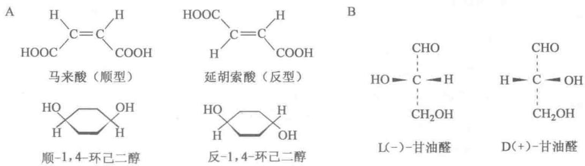  
图1-4 立体异构体的构型  
A. 几何(顺反)异构体(投影式); B. 旋光异构体(透视式)

## 2. 旋光[活]性

当光波通过尼柯尔棱镜(Nicol prism)时,由于棱镜的结构只允许沿某一平面震动的光波通过,其他光波都被阻断,这种光称平面偏振光(plane-polarized light)。但这种光通过旋光物质(optically active substance)的溶液时,则光的偏振面(plane of polarization)会向右(顺时针方向或称正向,符号+)旋转或向左(逆时针方向或称负向,符号-)旋转。使偏振面向右旋转的(dextrorotatory)称右旋光物质,如(+)-甘油醛;向左旋转的(levorotatory)称左旋光物质,如(-)-甘油醛。

旋光物质(手性化合物)引起平面偏振光的偏振面发生旋转的能力(即旋转角度的大小和方向)称为旋光[活]性(optical activity)或旋光度(optical rotation);在一定条件下旋光度 $\alpha_{\lambda}^{t}$ 与待测液的浓度(c)和平面偏振光通过待测液的路径长度(l)的乘积成正比:

$$
\alpha_ {\lambda} ^ {t} = \left[   \alpha   \right] _ {\lambda} ^ {t} c l \quad \text {或} \quad \left[   \alpha   \right] _ {\lambda} ^ {t} = \frac {\alpha_ {\lambda} ^ {t}}{c l}
$$

式中比例常数 $[\alpha]$ 称为比旋或旋光率（specific rotation），即单位浓度和单位长度下的旋光度（单位：度/°），比旋是旋光物质的特征物理常数； $t$ 为测定时的温度， $\lambda$ 为所用光的波长，一般用钠光（ $\lambda = 589 \mathrm{~nm}$ ，D谱线），此时比值可写为 $[\alpha]_{\mathrm{D}}^{t}$ ； $l$ 为样品管长度，以分米（dm，1 dm=10 cm）表示；浓度 $c$ ，用每毫升待测液中所含旋光物质克数（g/mL）表示。 $\alpha_{\lambda}^{t}$ 为旋光仪测得的读数，比旋数值前面加+或-号，以指明旋光方向。某一物质的 $[\alpha]$ 值，甚至旋光方向，与测定时的温度、光的波长、溶剂种类、溶质浓度以及溶液 pH 等有关，因此测定比旋时必须标明这些因素。

## 3. 手性中心

手性中心(chiral center)是指具有4个不同取代基团的四面体碳原子,也称手性碳原子或不对称碳原子(asymmetric carbon)或立体原中心(stereogenic center),常以 $C^{*}$ 表示。含一个 $C^{*}$ 的分子只能有两个旋光异构体,一般含n个 $C^{*}$ 的分子可以有 $2^{n}$ 个旋光异构体。

有机化合物的旋光性与分子内部的结构有关,根据对称性原理,凡是分子中存在对称面(镜面)、对称中心和四重交替对称轴这些对称元素(symmetry element)之一的,都可以和它的镜像叠合,并必定是无手性的(achiral),因而都没有旋光性。凡是分子中没有上述3种对称元素的,都不能与它的镜像叠合,因而都有旋光性。分子的这种不能与自己的镜像叠合的关系，犹如人的左右手关系，因此称这种分子具有手性或称它为手性分子（chiral molecule）。有机分子中出现手性的最常见（虽然不是唯一）的原因是存在手性中心（而缺失对称元素）。手性与旋光性是一对孪生子。

## 4. 对映体和非对映体

对旋光异构来说，构型就是手性碳原子的4个取代基在空间的相对取向。这种取向形成两种而且只有两种可能的四面体形式，即两种构型（立体异构体）。下面以含一个手性碳原子的甘油醛(2,3-二羟丙醛)为例说明构型概念。甘油醛分子中的C2(第2位碳)是一个 $\mathrm{C}^*$ ，因此甘油醛可以有两种构型。它们的立体模型和透视式如图1-5所示。

  
图 1-5 甘油醛的构型(DL 命名系统)  
图中透视式的解释见后面“三维结构的分子模型”部分。习惯上 Fischer 投影式中水平方向的键表示突向页面的前方，垂直方向的键伸向页面的后方。书写投影式时通常规定碳链处于垂直位置，羰基写在碳链的上端。这样的投影式在页面上可以旋转 $180^{\circ}$ 而不改变原来的构型，但不允许旋转 $90^{\circ}$ 或 $270^{\circ}$ ，更不能离开页面加以翻转

从图 1-5 可以看出一个手性碳原子的取代基在空间的两种取向是物体与镜像的关系，并且两者不能叠合。可见甘油醛(I)和(II)是两个不同的旋光异构体，这种互为不能叠合的镜像的立体异构体被称为对映体(enantiomer)。彼此不成镜像的旋光异构体，称为非对映体(diastereomer)，见图 1-6。一对对映体除具有程度相同而方向相反(+或-)的旋光性和不同的生物活性外，其他的物理性质和化学性质完全相同。

  
图 1-6 丁醛糖的旋光异构体

两个对映体的等摩尔溶液称为外消旋混合液(racemic mixture)，无旋光性；这种现象称为[外]消旋作用(racemization)。任何一个旋光异构体都只有一个对映体，它的其他旋光异构体（非对映体），在物理性质、化学性质和生物活性方面都与之不同。

## 5. 相对构型与绝对构型

早期研究旋光物质时,虽然已知用上述的立体模型来表示甘油醛的两个旋光异构体,但不知道哪个模型代表左旋分子,哪个代表右旋分子。于是1891年Emil Fischer提出一个人为规定,右旋甘油醛具有甘油醛(Ⅱ)的构型,并称为D型,这样甘油醛(Ⅱ)就标为D(+)-甘油醛,而甘油醛(I)标为L(-)-甘油醛,并选定甘油醛作为其他旋光化合物构型的参考标准。根据这种人为规定的构型标准物确定的化合物构型称为相对构型。1951年前确定的化合物构型只能认为是相对构型(relative configuration)。由于X射线衍射技术的发展,测定了某些对映体的真实空间结构,并证实原来人为规定的甘油醛构型与真实的构型,即绝对构型(absolute configuration),是一致的。因此过去测得的构型也就成为绝对构型。

## （三）构型的命名系统

生物分子间的相互作用涉及异构体的构型。因此生物分子的命名和它的结构的表示，在立体化学上必须是明确的。在生物化学中习惯使用 DL 命名系统，单糖和氨基酸的绝对构型是根据甘油醛的绝对构型（图 1-5）确定的。跟 L-甘油醛相联系的立体异构体被指定为 L-型，如 L-丙氨酸（第 2 章）；跟 D-甘油醛相联系的被指定为 D-型，如 D-葡萄糖（第 9 章）。应该强调指出，构型（D，L）与旋光方向（+，-）没有必然的联系。

虽然 DL 构型命名系统在反映旋光化合物之间的构型联系方面有它的优点。但是对于含有多于一个手性中心的化合物，使用 RS 命名系统更为方便。1956 年 Cohn R, Ingold C 和 Prelog V 三人提出的 RS 命名系统可以明确无误地规定任何一个手性碳原子的绝对构型，因此被普遍采用。

应用 RS 表示法的第一步是标定跟手性碳原子直接相连的 4 个取代基的优先性 (priority) 顺序。顺序规则 (sequence rule) 的基础是原子序数高的原子比原子序数低的原子优先性大。生物化学中重要基团的优先性顺序（从大到小）是—SH, —OCOR, —OR, —OH, —NHR, —NH₂, —COOR, —COOH, —CONH₂, —CHO, —CHROH, —CH₂OH, —C₆H₅, —CH₃, —T, —D, —H。第二步是旋转手性四面体碳，使那个优先性最小的取代基离开观察者最远，另 3 个取代基面向观察者。最后一步，看一看，面向观察者的 3 个取代基按优先性大小的顺序，是顺时针方向还是逆时针方向，如果是顺时针方向（右手），则为 R 构型（R 源自拉丁文 rectus，右），如果是反时针方向（左手），则为 S 构型（S 源自拉丁文 sinister，左）。现以甘油醛为例说明 RS 表示法（图 1-7）。首先标出手性中心的 4 个取代基的优先性顺序：①—OH，②—CHO，③—CH₂OH，④—H；然后使手性中心与—H 以价键取向位于视轴上，并使手性中心靠近观察者；最后观察处于手性中心和观察者之间的 3 个取代基从①到②到③的方向是顺时针还是逆时针的，本例中（-）-甘油醛是逆时针的（左手），为 S 构型，其对映体（+）-甘油醛是顺时针的为 R 构型。应该指出 RS 和 DL 构型并不一定是相互对应的。

  
图 1-7 甘油醛构型的 RS 命名系统

## (四) 构象

构象(conformation)是指一个分子所采取的特定形态(shape)。这一术语用来描述有机分子的动态立体化学,反映分子中在任一瞬间各原子的实际相对位置,因而有时把构象看作是三维结构(three-dimensional structure)、立体结构和空间结构的同义词。由于分子中单键自由旋转和键角有一定的柔性,一个分子在不同瞬间可以有不同的构象。一种特定的构象也称为构象异构体(conformational isomer)或构象体(conformer)。构象的立体化学特点是不需任何共价键的破裂即可发生构象转变。在简单的烃类如乙烷中绕C—C单键的旋转几乎是完全自由的,因此乙烷可采取多种可互变的构象。其中两种是极端形式:

交叉型和重叠型(图 1-8)，交叉型相对地最为稳定，是占优势的构象，重叠型最不稳定。这两种构象不可能被分离开来，因为它们之间的变化速度太快（每秒钟数百万次）。然而当每个碳的一个或多个 H 原子被其他基团取代时，取代基或是很大，或是荷电，它们绕 C—C 键旋转的自由度将受到约束，因而限制了构象的数目。

生物分子构象的立体化学可采用 X 射线晶体学 (X-ray crystallography) 方法研究, 此方法精度很高, 可测出分子中每一个原子的位置, 但要求待测样品是晶体。在细胞中, 生物分子几乎总不是以晶体形式存在, 而是溶于细胞溶胶或与胞内其他成分缔合 (如酶-底物复合体) 的。生物大分子在细胞条件下只有一种或几种稳定的构象。核磁共振 (NMR) 波谱学方法可提供生物分子在溶液中的三维结构信息。因此 NMR 和 X 射线衍射技术在研究三维结构方面彼此可以很好的互补。

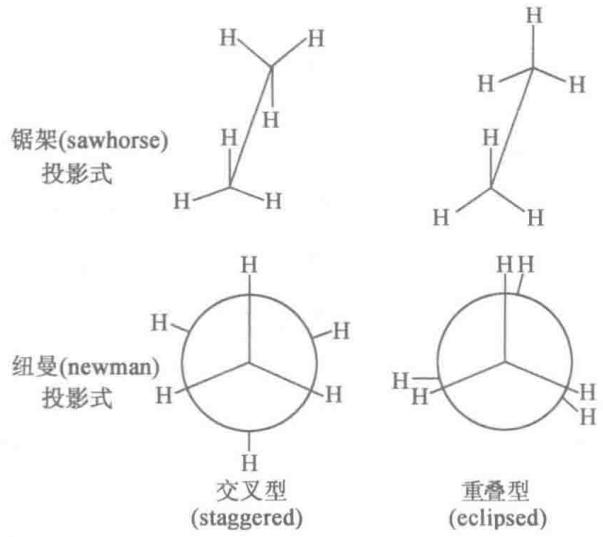  
图1-8 乙烷的构象  
当乙烷的两个碳原子绕键轴相对旋转时，处在完全重叠型（扭角 $0^{\circ}$ 、 $100^{\circ}$ 等）的构象势能最高，完全交叉型（扭角 $60^{\circ}$ 、 $180^{\circ}$ 等）的构象势能最低

## （五）三维结构的分子模型

图 1-9 示出生物分子三维结构的透视式和 3 种分子模型: 骨架式、球棍式和空间填充式。透视式主要用于在纸面上表示四面体碳的空间构型; 透视式中手性中心和实线键处于纸面上, 虚线键或虚楔形键伸向纸面背后, 楔形键突出纸面, 伸向读者; 4 个键相互之间的夹角约为 $109^{\circ}28'$ 。骨架模型 (skeletal model), 形象很简单, 只给出分子的骨架, 原子的位置可设想在键的交叉处及其端点上, 但这种模型正确地反映出键角和原子间的相对距离。球棍模型 (ball-stick model), 很像骨架模型, 也反映出正确的键角和键长, 它们同属晶体学模型。当在纸面上表示球棍模型时, 示出的原子 (球), 根据棍 (键) 的近粗远细的视差告诉我们它是在纸面的前方或后方。空间填充模型 (space-filling model) 最接近真实, 此模型中每个原子的半径与它的范德华半径成比例 (表 1-4), 因此, 它的外缘是其他原子所不能进入的界限。

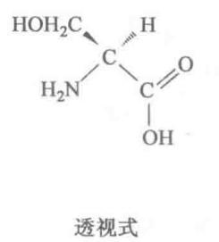  
图1-9 三维结构的分子模型（以L-丝氨酸为例）

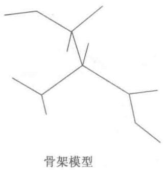

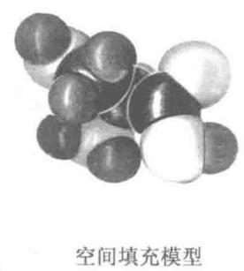

表 1-4 几种生物学上重要原子的范德华半径和共价单键半径 ${}^{1}$

<table><tr><td>原子</td><td>范德华半径/nm</td><td>共价单键半径/nm</td></tr><tr><td>H</td><td>0.120</td><td>0.030</td></tr><tr><td>O</td><td>0.140</td><td>0.066</td></tr><tr><td>N</td><td>0.154</td><td>0.070</td></tr><tr><td>C</td><td>0.185</td><td>0.077</td></tr><tr><td>S</td><td>0.185</td><td>0.104</td></tr><tr><td>P</td><td>0.190</td><td>0.110</td></tr></table>

① 不同书籍中数据略有区别，此表中的数据取自 J. Emsley，元素手册，1994。

## （六）生物分子间的相互作用是立体专一的

在活细胞中手性分子一般只以一种手性形式存在,例如蛋白质中的氨基酸残基都是 L-型的;淀粉等多糖中的葡萄糖残基是 D-型的,因为催化合成这些分子的酶本身也是手性的。但在实验室中化学合成一个含手性碳原子的化合物,一般将产生所有可能的手性形式,例如合成含一个手性碳的化合物常以 D,L 两种手性形式的等摩尔混合物存在,称为[外]消旋物(racemate)。有机合成的药物都是 D,L 型的消旋物,只有其中的一种异构体是有生理效应和治疗效果的。

立体专一性(stereo-specificity)是指区分立体异构体的能力,它是酶和其他蛋白质的一种特性,也是活细胞的分子逻辑学的一个特征。如果蛋白质上的结合部位跟一个手性化合物的L型异构体互补,则不能跟它的D型异构体互补。例如琥珀酸脱氢酶只能催化琥珀酸脱氢生成延胡索酸(反丁烯二酸),不能生成马来酸(顺丁烯二酸)(见图1-4和第18章)。酶还能区别手性原(prochiral)对称性碳原子的两个H原子,其中一个是R-原(pro-R)的 $H_{R}$ ,另一个是S-原(pro-S)的 $H_{S}$ (图1-10A)。所谓手性原对称性碳原子是指与之连接的4个基团中只有两个基团是相同的对称性碳原子;R-原(或S-原)H原子是指如果增加它的顺序优先性,例如用D(氘)替代H时,则与之连接的手性原碳(如还原型烟酰胺C4)变成R-构型(或S-构型)手性碳(参看图1-7和图1-10A)。许多脱氢酶都需要以辅酶I( $NAD^{+}$ )或辅酶II( $NADP^{+}$ )为辅酶。脱氢或加氢时都发生在烟酰胺C4上。一类脱氢酶专门作用于R-原H原子,如醇脱氢酶和苹果酸脱氢酶等,并称为A型脱氢酶;另一类专门作用于S-原H原子,如谷氨酸脱氢酶和α-甘油-3-磷酸脱氢酶,称为B型脱氢酶。又如人工增甜剂天冬苯丙二肽酯也称阿斯巴甜或天冬甜精(aspartame)即L-天冬氨酰-L-苯丙氨酸甲酯和它的苦味的立体异构体L-天冬氨酰-D-苯丙氨酸甲酯,很容易被味觉感受器区别开来,虽然它们两个手性碳中只有一个碳的构型不同(图1-10B)。

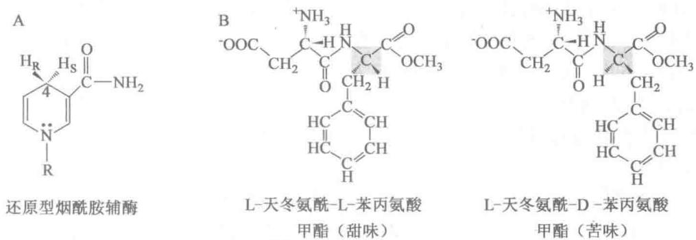  
图1-10 酶的立体专一性和立体异构体对人体的不同生理效应  
A. 还原型烟酰胺辅酶(NADH 和 NADPH)的结构,图中示出手性原对称碳原子(C4);B. 人工增甜剂天冬苯丙二肽酯及其一个立体异构体的结构

## 五、生物系统中的非共价相互作用

按照定义分子是由共价键,即共用电子对连接在一起的一组特定的原子,作用于分子间的力是非共价的。生物分子主要是通过非共价力(non-covalent force)即非共价相互作用,彼此影响,相互作用,行使它们的功能的。非共价相互作用也作用于大分子内的相邻基团之间,是稳定生物大分子三维结构的作用力(见第3章)。一般说,个别的这种相互作用是微弱的,但它们的数量大,总合起来就是一股强大的力量。它们被用于稳定生物化学反应中的过渡态、传递精细的信息以及形成复杂的大分子、超分子复合体、细胞器等生物结构。

生物系统中的非共价力有离子相互作用、氢键、范德华力和疏水相互作用。

## （一）离子相互作用

离子相互作用(ionic interaction)，也称离子键、盐键或盐桥。它是发生在带电荷基团之间的一种静电相互作用(electrostatic interaction)，带异种电荷基团之间为引力、带同种电荷基团之间为斥力。静电相互作用的吸引力 $F$ 与电荷量的乘积 $(q_{1}$ 和 $q_{2})$ 成正比，与电荷质点间距离的平方 $(r^2)$ 成反比，在溶液中此吸引力随周围介质的介电常数 $(\varepsilon)$ 增大而降低：

$$
F = \frac {q _ {1} q _ {2}}{\varepsilon r ^ {2}}
$$

在疏水环境中,例如在蛋白质分子内部,介电常数比在水中低,这时相反电荷之间的吸引力相应增大。离子相互作用对环境非常敏感,因加入非极性溶剂而加强,加入盐类而减弱,因此,盐浓度的改变对生物分子的结构会发生重大影响。

## （二）氢键

氢键(hydrogen bond)本质上也是一种静电相互作用。由电负性较大的原子和氢原子共价结合的基团如 N—H 和 O—H 具有很大的偶极矩，成键电子云的分布偏向电负性较大的原子。因此氢原子核周围的电子云密度小，氢核几近裸露，这一正电荷氢核遇到另一个电负性大的原子则产生静电吸引，称氢键：

$$
\mathrm{x} - \mathrm{H} \dots \mathrm{y}
$$

这里 x、y 是电负性大的原子（N、O、S 等），x—H 基本上是共价键，H…y 是较强的范德华引力即氢键。x 是 H（质子）的供体（donor），y 是 H（质子）的接纳体（acceptor）。氢键具有两个重要特征：方向性和饱和性。方向性（directionality）是指相互吸引的方向沿氢（质子）接纳体 y 的孤电子对轨道轴，接纳体 y 与供体 x 之间的角度接近 $180^{\circ}$ （即氢供体、氢和氢接纳体成一直线），此时键的强度最大，如果两者之间有夹角则强度减弱。饱和性（Saturability）是指一般情况下 x—H 只能和一个 y 原子相结合，因为氢原子非常小，而供体和接纳体原子都相当大，这样将排斥另一接纳体原子再和 H 原子结合。氢键的这种高度方向性，能够使两个氢键结合的基团维持特有的几何排列。氢键的这种性质给与富有分子内氢键的蛋白质和核酸分子以非常精确的三维结构。

氢键形成具有协同性(cooperativity)，即一个氢键的形成能促进其余氢键的形成。氢键的键能比共价键小很多，但比范德华力大(见表1-5)。水对氢键的作用是它可以作为氢键的供体和接纳体与其他氢键竞争，因而减弱了原来的氢键强度(减弱后仅有约 $5\ kJ\cdot mol^{-1}$ )。

## （三）范德华力

广义的范德华力(van der Walls force)(范德华相互作用)包括3种较弱的静电相互作用,即定向效应、诱导效应和分散效应。定向效应(orientation effect)发生在极性分子之间或极性基团之间。它是永久偶极间的静电相互作用,氢键可被认为属于这种范德华力。诱导效应(induction effect)发生在极性物质与非极性物质之间,这是永久偶极与由它诱导而来的诱导偶极之间的静电相互作用。分散效应(dispersion effect)是在多数情况下起主要作用的范德华力;它是非极性的分子(或基团)之间仅有的一种范德华力,即狭义的范德华力,也称为London分散力,通常范德华力就是指这种作用力。这是瞬时偶极间的相互作用,偶极方向是瞬时变化的。瞬时偶极是由于所在分子或基团中绕核电子的电荷密度的随机波动即电子运动的不对称性造成的。瞬时偶极可以诱导附近的原子产生瞬时的,相反的偶极。此诱导偶极反过来又稳定了原来的偶极,因此在它们之间产生了相互作用。狭义范德华力是一种很弱的作用力,而且随非共价键合原子(noncovalently-bonded atom)间距离(R)的6次方倒数即 $1/R^{6}$ 而变化。当非共价键合原子相互挨得太近时,由于电子云重叠,将产生斥力。实际上范德华力包括吸引力和斥力两种相互作用。因此范德华力(吸引力)只有当两个非共价键合原子处于一定距离时才能达到最大,这个距离称为接触距离(contact dis-tance)或范德华距离,它等于两个原子的范德华半径(van der Walls radius)之和。范德华半径是每种原子的特征,是一种原子允许另一种原子可以与它接近到什么程度的量度。空间填充模型中原子就是按与范德华半径成比例的尺寸制作的。某些生物学上重要原子的范德华半径及共价单键半径见表1-4。虽然就其个别来说范德华力是很弱的,但是范德华相互作用数量大,作用力的总和相当可观,范德华力不仅具有加和效应,而且具有位相效应(当分子或基团相同时,其瞬时偶极矩同位相,从而产生最大的相互作用),因此成为维持生物结构的重要因素之一。水能迫使非极性(疏水)基团趋于聚集,因此水对范德华力的影响可看成是起加强的作用。

表 1-5 生物分子中常见的几种共价键和非共价力的键能或强度

<table><tr><td>共价键</td><td>键能 $^1/(kJ·mol^{-1})$ </td><td>共价键</td><td>键能/ $(kJ·mol^{-1})$ </td><td>非共价力</td><td>键能/ $(kJ·mol^{-1})$ </td></tr><tr><td>C—C</td><td>348</td><td>N—H</td><td>389</td><td>氢键</td><td>13~30</td></tr><tr><td>C—H</td><td>414</td><td>O—H</td><td>461</td><td>范德华力</td><td>0.4~4.0</td></tr><tr><td>C—N</td><td>293</td><td>P—O</td><td>419</td><td>疏水相互作用</td><td> $12~20^{2}$ </td></tr><tr><td>C—O</td><td>352</td><td>P=O</td><td>502</td><td>离子键</td><td>12~30</td></tr><tr><td>C=O</td><td>712</td><td>S—S</td><td>214</td><td></td><td></td></tr><tr><td>C—S</td><td>260</td><td>S—H</td><td>339</td><td></td><td></td></tr></table>

① 键能是指断裂该键所需的自由能；② 实际上它并不是键能，此能量大部分并不用于伸展过程中键的断裂。

## （四）疏水相互作用

疏水相互作用(hydrophobic interaction)(熵效应)是指在介质水中的疏水(非极性)分子或分子基团倾向于聚集在一起的现象。疏水相互作用并不是疏水分子(或疏水基团)之间有什么吸引力的缘故,而是因为跟疏水分子或基团接近的水分子是排列相当有序的,像是疏水分子(或基团)被封闭在一个由许多水分子构成的笼样壳(cage-like shell)内。笼样壳虽然不像由非极性溶质和水形成的笼形化合物(clathrate compound)那样排列成晶格般的笼形结构(图1-11),不过两者的效果是一样的。水分子的有序排列都使熵降低,只是程度不同。有序的水分子数目也即熵降低的数值,跟封闭在笼内的疏水溶质的表面积是成正比的。熵降低或者说表面能(surface energy)增高,使得系统力求把这些有序的水分子转变为自由的水分子(熵增加, $\Delta S$ 正值)以缩小界面,降低能量。可见疏水相互作用是熵驱动的自发过程( $\Delta G=\Delta H-T\Delta S$ ,此过程 $\Delta H$ 接近零, $\Delta S$ 正值,故 $\Delta G$ 是负值),热力学告诉我们自发过程要求自由能变化为负值。疏水相互作用在维持生物大分子的三维结构方面占有突出地位。

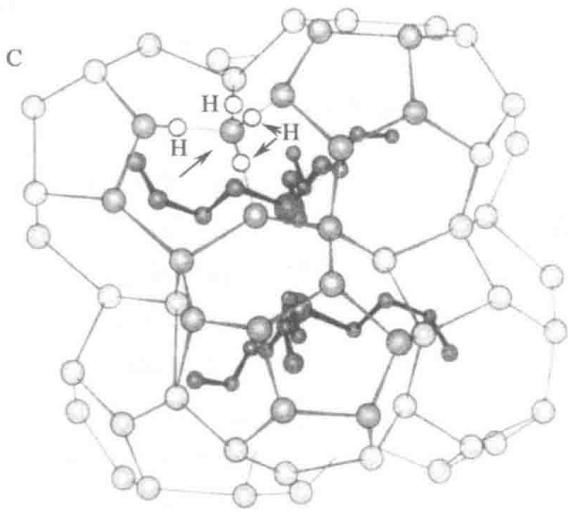

## 图 1-11 笼样壳和笼形结构

A. 水中两亲化合物的疏水基团外周的水分子样壳；B. 水分形成的笼子组成的五边形十二面体笼形结构，中央是直径为 $0.5 \mathrm{~nm}$ 的空腔，此十二面体是笼形化合物中常见的构件；C. $n - \left(\mathrm{C}_{4} \mathrm{H}_{9}\right)_{3} - \mathrm{S}^{+} \mathrm{~F}^{-} \cdot 23 \mathrm{H}_{2} \mathrm{O}$ 的笼形结构的一部分，三丁烷基硫离子（以深色示出），窝藏在氢键连接的水分子网内，在完整的网上每个水分子氧与其他水分子形成四面体氢键（图中箭头所指）

疏水相互作用在生理温度范围内随温度升高而加强（T 的升高与熵增加具有相同的效果），但超过一定温度后（50\~60℃，因侧链而异），又趋减弱。因为超过这个温度，疏水基团周围的水分子有序度降低（ $\Delta S$ 正值减小），因而有利于疏水基团进入水中。非极性溶剂、去污剂是破坏疏水相互作用的试剂，因此是生物大分子的变性剂。尿素和盐酸胍既能破坏氢键，又能破坏疏水相互作用，因此是强变性剂。

## （五）非共价相互作用对大分子的结构和功能是关键的

非共价相互作用跟共价键相比是非常弱的。断裂 $1 \, \text{mol}(6 \times 10^{23}$ 个）C—C 单键需要 348 kJ 的能量，断裂 1 mol C—H 约需要 414 kJ，然而断裂 1 mol 典型的范德华力只需要 4 kJ，其他几种非共价相互作用也远比共价键弱得多（表 1-5）。在 25℃ 的水溶剂中可利用的热能跟这些弱相互作用的强度是同一数量级，溶质-溶剂（水）分子之间的相互作用和溶质-溶质相互作用在能量上几乎同样有利，所以这些弱相互作用是在不断地形成和不断地断裂的。

虽然这几种相互作用个别是很弱的，但总合起来效果是很显著的。例如一个酶与底物非共价结合可以涉及几个氢键、一个或几个离子键、范德华力以及疏水相互作用。每形成一个弱相互作用都使系统自由能有净的降低，这里释放的自由能称为结合能（binding energy, $\Delta G_{b}$ ），它与该相互作用的键能，数值相等符号相反（表1-5）。一个非共价相互作用的稳定性（stability）可用参与该相互作用的两个分子（或基团）的结合反应平衡常数（equilibrium constant, $K_{eq}$ ）来表示。平衡常数与自由能变化（结合能）是指数关系（ $\Delta G = -RT \ln K_{eq}$ ，见第16章），也即稳定性是按指数关系随结合能变化的。因此10个或20个弱相互作用给与分子的稳定性要比从这些小的结合能的简单加和大许多。

大分子如蛋白质、DNA 和 RNA 含有多个弱相互作用的位点，总的结合力可以是很大的。大分子最稳定的结构，也即天然的结构，通常是弱相互作用达到最大值时的结构。一个多肽链或多核苷酸链折叠成它的三维形态就是由这一原理确定的。抗原和特异抗体的结合依赖于许多弱相互作用的总合结果。酶与底物非共价结合时释放的结合能 $\Delta G_{b}$ ，其意义已超出简单地稳定酶-底物复合体的相互作用， $\Delta G_{b}$ 还是酶用来降低反应活化能（activation energy）的自由能的主要来源（见第6章）。换言之，酶和底物之间的弱结合相互作用是酶催化的真正驱动力。激素或神经递质与它的细胞受体蛋白质结合也是靠许多弱相互作用。酶和受体跟它的底物或配体相比，体积大因而表面积广，这样可以给相互作用提供较多的机会。从分子水平看，发生相互作用的生物分子之间的互补性（complementarity）反映了这些分子的表面上极性基团、荷电基团和疏水基团之间的互补性和弱相互作用。有关的例子将在后面各章中遇到。

<!-- EN-BEGIN 2.1 -->

### 【英文对应 2.1】Weak Interactions in Aqueous Systems

> 来源：Lehninger Principles of Biochemistry（书籍/02_生物化学原理） 第2章 Water, the Solvent of Life，§2.1。对应本章“五、生物系统中的非共价相互作用”。

Hydrogen bonds between water molecules provide the cohesive forces that make water a liquid at room temperature and a crystalline solid (ice) with a highly ordered arrangement of molecules at cold temperatures. P1 Polar biomolecules dissolve readily in water because they can replace water-water interactions with energetically favorable water-solute interactions. In contrast, nonpolar biomolecules are poorly soluble in water because they interfere with water-water interactions but are unable to form water-solute interactions. In aqueous solutions, nonpolar molecules tend to cluster together. P1 Hydrogen bonds and ionic, hydrophobic (from the Greek, meaning "water-fearing"), and van der Waals interactions are individually weak, but collectively they have a very significant influence on the three-dimensional structures of proteins, nucleic acids, polysaccharides, and membrane lipids.

#### [EN] Hydrogen Bonding Gives Water Its Unusual Properties

Water has a higher melting point, boiling point, and heat of vaporization than most other common solvents. These unusual properties are a consequence of attractions between adjacent water molecules that give liquid water great internal cohesion. A look at the electron structure of the $H_{2}O$ molecule reveals the cause of these intermolecular attractions.

Each hydrogen atom of a water molecule shares an electron pair with the central oxygen atom. The geometry of the molecule is dictated by the shapes of the outer electron orbitals of the oxygen atom, which are similar to the $sp^{3}$ bonding orbitals of carbon (see Fig. 1-13). These orbitals describe a rough tetrahedron, with a hydrogen atom at each of two corners and nonbonding orbitals at the other two corners (Fig. 2-1a). The H—O—H bond angle is $104.5^{\circ}$ , slightly less than the $109.5^{\circ}$ of a perfect tetrahedron because of crowding by the nonbonding orbitals of the oxygen atom.

The oxygen nucleus attracts electrons more strongly than does the hydrogen nucleus (a proton); that is, oxygen is more electronegative. This means that the shared electrons are more often in the vicinity of the oxygen atom than of the hydrogen. The result of this unequal electron sharing is two electric dipoles in the water molecule, one along each of the H—O bonds; each hydrogen atom bears a partial positive charge ( $\delta+$ ), and the oxygen atom bears a partial negative charge equal in magnitude to the sum of the two partial positives (2δ⁻). As a result, there is an electrostatic attraction between the oxygen atom of one water molecule and the hydrogen of another (Fig. 2-1b), called a hydrogen bond. Throughout this book, we represent hydrogen bonds with three parallel blue lines, as in Figure 2-1b.

  
(a)

  
FIGURE 2-1 Structure of the water molecule. (a) The dipolar nature of the $\mathrm{H}_2\mathrm{O}$ molecule is shown in a ball-and-stick model; the dashed lines represent the nonbonding orbitals. There is a nearly tetrahedral arrangement of the outer-shell electron pairs around the oxygen atom; the two hydrogen atoms have localized partial positive charges $(\delta +)$ , and the oxygen atom has a partial negative charge $(\delta -)$ . (b) Two $\mathrm{H}_2\mathrm{O}$ molecules are joined by a hydrogen bond (designated here, and throughout this book, by three blue lines) between the oxygen atom of the upper molecule and a hydrogen atom of the lower one. Hydrogen bonds are longer and weaker than covalent O—H bonds.

Hydrogen bonds are relatively weak. Those in liquid water have a bond dissociation energy (the energy required to break a bond) of about 23 kJ/mol, compared with 470 kJ/mol for the covalent O—H bond in water or 350 kJ/mol for a covalent C—C bond. The hydrogen bond is about 10% covalent, due to overlaps in the bonding orbitals, and about 90% electrostatic. At room temperature, the thermal energy of an aqueous solution (the kinetic energy of motion of the individual atoms and molecules) is of the same order of magnitude as that required to break hydrogen bonds. When water is heated, the increase in temperature reflects the faster motion of individual water molecules. At any given time, most of the molecules in liquid water are hydrogen-bonded, but the lifetime of each hydrogen bond is just 1 to 20 picoseconds (1 ps = $10^{-12}$ s); when one hydrogen bond breaks, another hydrogen bond forms, with the same partner or a new one, within 0.1 ps. The apt phrase “flickering clusters” has been applied to the short-lived groups of water molecules interlinked by hydrogen bonds in liquid water. The sum of all the hydrogen bonds between $H_{2}O$ molecules confers great internal cohesion on liquid water. Extended networks of hydrogen-bonded water molecules also form bridges between solutes (proteins and nucleic acids, for example) that allow the larger molecules to interact with each other over distances of several nanometers without physically touching.

The nearly tetrahedral arrangement of the orbitals about the oxygen atom (Fig. 2-1a) allows each water molecule to form hydrogen bonds with as many as four neighboring water molecules. In liquid water at room temperature and atmospheric pressure, however, water molecules are disorganized and in continuous motion, so that each molecule forms hydrogen bonds with an average of only 3.4 other molecules. In ice, on the other hand, each water molecule is fixed in space and forms hydrogen bonds with a full complement of four other water molecules to yield a regular lattice structure (Fig. 2-2). Hydrogen bonds account for the relatively high melting point of water, because much thermal energy is required to break a sufficient proportion of hydrogen bonds to destabilize the crystal lattice of ice. When ice melts or water evaporates, heat is taken up by the system:

$$
\mathrm{H} _ {2} \mathrm{O} (\text { solid }) \longrightarrow \mathrm{H} _ {2} \mathrm{O} (\text { liquid }) \quad \Delta H = + 5. 9 \mathrm{kJ/mol}
$$

$$
\mathrm{H} _ {2} \mathrm{O} (\text { liquid }) \longrightarrow \mathrm{H} _ {2} \mathrm{O} (\text { gas }) \quad \Delta H = + 4 4. 0 \mathrm{kJ/mol}
$$

During melting or evaporation, the entropy of the aqueous system increases as the highly ordered arrays of water molecules in ice relax into the less orderly hydrogen-bonded arrays in liquid water or into the wholly disordered gaseous state. At room temperature, both the melting of ice and the evaporation of water occur spontaneously; the tendency of the water molecules to associate through hydrogen bonds is outweighed by the energetic push toward randomness. Recall that the free-energy change ( $\Delta G$ ) must have a negative value for a process to occur spontaneously: $\Delta G = \Delta H - T \Delta S$ , where $\Delta G$ represents the driving force, $\Delta H$ the enthalpy change from making and breaking bonds, and $\Delta S$ the change in randomness. Because $\Delta H$ is positive for melting and evaporation, it is clearly the increase in entropy ( $\Delta S$ ) that makes $\Delta G$ negative and drives these changes.

  
FIGURE 2-2 Hydrogen bonding in ice. In ice, each water molecule forms four hydrogen bonds, the maximum possible for a water molecule, creating a regular crystal lattice. By contrast, in liquid water at room temperature and atmospheric pressure, each water molecule hydrogen-bonds with an average of 3.4 other water molecules. This crystal lattice structure makes ice less dense than liquid water, and thus ice floats on liquid water.

#### [EN] Water Forms Hydrogen Bonds with Polar Solutes

Hydrogen bonds are not unique to water. They readily form between an electronegative atom (the hydrogen acceptor, usually oxygen or nitrogen) and a hydrogen atom covalently bonded to another electronegative atom (the hydrogen donor) in the same or another molecule (Fig. 2-3). Hydrogen atoms covalently bonded to carbon atoms do not participate in hydrogen bonding, because carbon is only slightly more electronegative than hydrogen and thus the C—H bond is only very weakly polar. The distinction explains why butane $(\mathrm{CH}_{3}(\mathrm{CH}_{2})_{2}\mathrm{CH}_{3})$ has a boiling point of only -0.5 °C, whereas butanol $(\mathrm{CH}_{3}(\mathrm{CH}_{2})_{2}\mathrm{CH}_{2}\mathrm{OH})$ has a relatively high boiling point of 117 °C. Butanol has a polar hydroxyl group and thus can form intermolecular hydrogen bonds. Uncharged but polar biomolecules such as sugars dissolve readily in water because of the stabilizing effect of hydrogen bonds between the hydroxyl groups or carbonyl oxygen of the sugar and the polar water molecules. P1 Alcohols, aldehydes, ketones, and compounds containing N—H bonds all form hydrogen bonds with water molecules (Fig. 2-4) and tend to be soluble in water.

  
FIGURE 2-3 Common hydrogen bonds in biological systems. The hydrogen acceptor is usually oxygen or nitrogen; the hydrogen donor is another electronegative atom.

  
FIGURE 2-4 Some biologically important hydrogen bonds.

Hydrogen bonds are strongest when the bonded molecules are oriented to maximize electrostatic interaction, which occurs when the hydrogen atom and the two atoms that share it are in a straight line—that is, when the acceptor atom is in line with the covalent bond between the donor atom and H (Fig. 2-5). This arrangement puts the positive charge of the hydrogen ion directly between the two partial negative charges. Hydrogen bonds are thus highly directional and capable of holding two hydrogen-bonded molecules or groups in a specific geometric arrangement. As we shall see, this property of hydrogen bonds confers very precise three-dimensional structures on protein and nucleic acid molecules, which have many intramolecular hydrogen bonds.

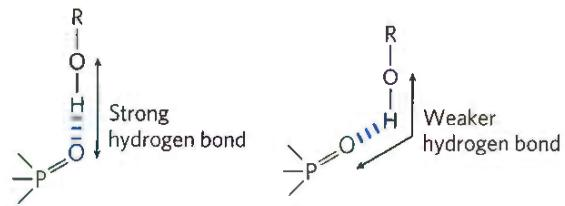  
FIGURE 2-5 Directionality of the hydrogen bond. The attraction between the partial electric charges is greatest when the three atoms involved in the bond (in this case O, H, and O) lie in a straight line. When the hydrogen-bonded moieties are structurally constrained (when they are parts of a single protein molecule, for example), this ideal geometry may not be possible and the resulting hydrogen bond is weaker.

#### [EN] Water Interacts Electrostatically with Charged Solutes

Water is a polar solvent. It readily dissolves most biomolecules, which are generally charged or polar compounds (Table 2-1); compounds that dissolve easily in water are hydrophilic (from the Greek, meaning "water-loving"). In contrast, nonpolar solvents such as chloroform and benzene are poor solvents for polar biomolecules but easily dissolve those that are hydrophobic—nonpolar molecules such as lipids and waxes. Amphipathic compounds contain regions that are polar (or charged) and regions that are nonpolar. Their behavior in aqueous solution is discussed on p. 48.

Water dissolves salts such as NaCl by hydrating and stabilizing the $Na^{+}$ and $Cl^{-}$ ions, weakening the electrostatic interactions between them and thus counteracting their tendency to associate in a crystalline lattice (Fig. 2-6). Water also readily dissolves charged biomolecules, including compounds with functional groups such as ionized carboxylic acids ( $—COO^{-}$ ), protonated amines ( $—NH_{3}^{+}$ ), and phosphate esters or anhydrides. Water replaces the solute-solute hydrogen bonds linking these biomolecules to each other with solute-water hydrogen bonds, thus screening the electrostatic interactions between solute molecules.

Ionic interactions between dissolved ions are much stronger in less polar environments, because there is less screening of charges by the nonpolar solvent. Water is effective in screening the electrostatic interactions between dissolved ions because it has a high dielectric constant, a physical property that reflects the number of dipoles in a solvent. The strength, or force (F), of ionic interactions in a solution depends on the magnitude of the charges (Q), the distance between the charged groups (r), and the dielectric constant (ε, which is dimensionless) of the solvent in which the interactions occur:

$$
F = \frac {Q _ {1} Q _ {2}}{\varepsilon r ^ {2}}
$$

For water at 25 °C, ε is 78.5, and for the very nonpolar solvent benzene, ε is 4.6. The dependence on $r^{2}$ is such that ionic attractions or repulsions operate only over short distances—in the range of 10 to 40 nm (depending on the electrolyte concentration) when the solvent is water. In biomolecules, it is not the dielectric constant for the bulk solvent, but the highly localized dielectric constant, as in a hydrophobic pocket of a protein, that determines the interaction of two polar moieties.

As a salt such as NaCl dissolves, the $Na^{+}$ and $Cl^{-}$ ions leaving the crystal lattice acquire far greater freedom of motion (Fig. 2-6). The resulting increase in entropy (randomness) of the system is largely responsible for the ease of dissolving salts such as NaCl in water. In thermodynamic terms, formation of the solution occurs with a favorable free-energy change: $\Delta G = \Delta H - T \Delta S$ , where $\Delta H$ has a small positive value and $T \Delta S$ a large positive value; thus $\Delta G$ is negative.

$^{a}$ The arrows represent electric dipoles; there is a partial negative charge ( $\delta-$ ) at the head of the arrow, a partial positive charge ( $\delta+$ ; not shown here) at the tail. $^{b}$ Note that polar molecules dissolve far better even at low temperatures than do nonpolar molecules at relatively high temperatures.

  
FIGURE 2-6 Water as solvent. Water dissolves many crystalline salts by hydrating their component ions. The NaCl crystal lattice is disrupted as water molecules cluster about the $\mathrm{Cl^-}$ and $\mathrm{Na^{+}}$ ions. The ionic charges are partially neutralized, and the electrostatic attractions necessary for lattice formation are weakened.

#### [EN] Nonpolar Gases Are Poorly Soluble in Water

The biologically important gases $CO_{2}$ , $O_{2}$ , and $N_{2}$ are nonpolar molecules. In $O_{2}$ and $N_{2}$ , electrons are shared equally by both atoms. In $CO_{2}$ , each C=O bond is polar, but the two dipoles are oppositely directed and cancel each other (Table 2-2). The movement of molecules from the disordered gas phase into aqueous solution constrains their motion and the motion of water molecules and therefore represents a decrease in entropy. The nonpolar nature of these gases and the decrease in entropy when they enter solution combine to make them very poorly soluble in water. Some organisms have water-soluble “carrier proteins” (hemoglobin and myoglobin, for example) that facilitate the transport of $O_{2}$ . Carbon dioxide forms carbonic acid ( $H_{2}CO_{3}$ ) in aqueous solution and is transported as the $HCO_{3}^{-}$ (bicarbonate) ion, either free—bicarbonate is very soluble in water (\~100 g/L at 25 °C)—or bound to hemoglobin. Three other gases, $NH_{3}$ , NO, and $H_{2}S$ , also have biological roles in some organisms; these gases are polar and dissolve readily in water.

#### [EN] Nonpolar Compounds Force Energetically Unfavorable Changes in the Structure of Water

When water is mixed with benzene or hexane, two phases form; neither liquid is soluble in the other. Nonpolar compounds such as benzene and hexane are hydrophobic—they are unable to undergo energetically favorable interactions with water molecules, and they interfere with the hydrogen bonding among water molecules. All molecules or ions in aqueous solution interfere with the hydrogen bonding of some water molecules in their immediate vicinity, but polar or charged solutes (such as NaCl) compensate for lost water-water hydrogen bonds by forming new solute-water interactions. The net change in enthalpy ( $\Delta H$ ) for dissolving these solutes is generally small. Hydrophobic solutes, however, offer no such compensation, and their addition to water may therefore result in a small gain of enthalpy; the breaking of hydrogen bonds between water molecules takes up energy from the system, requiring the input of energy from the surroundings. In addition to requiring this input of energy, dissolving hydrophobic compounds in water produces a measurable decrease in entropy. Water

<table><tr><td colspan="4">TABLE 2-2 Solubilities of Some Gases in Water</td></tr><tr><td>Gas</td><td> $Structure^a$ </td><td>Polarity</td><td>Solubilityin water (g/L) $^b$ </td></tr><tr><td>Nitrogen</td><td>N≡N</td><td>Nonpolar</td><td>0.018 (40 °C)</td></tr><tr><td>Oxygen</td><td>O=O</td><td>Nonpolar</td><td>0.035 (50 °C)</td></tr><tr><td>Carbon dioxide</td><td>δ- δ- O=C=O</td><td>Nonpolar</td><td>0.97 (45 °C)</td></tr><tr><td>Ammonia</td><td></td><td>Polar</td><td>900 (10 °C)</td></tr><tr><td>Hydrogen sulfide</td><td></td><td>Polar</td><td>1,860 (40 °C)</td></tr></table>

#### [EN] Clusters of lipid molecules

  
(a)  
FIGURE 2-7 Amphipathic compounds in aqueous solution form structures that increase entropy. (a) Long-chain fatty acids have very hydrophobic alkyl chains, each of which is surrounded by a layer of highly ordered water molecules. (b) By clustering together in micelles, the fatty acid molecules expose the smallest possible hydrophobic surface area to the water, and fewer water molecules are required in the shell of ordered water. The entropy gained by freeing immobilized water molecules stabilizes the micelle.

molecules in the immediate vicinity of a nonpolar solute are constrained in their possible orientations, as they form a highly ordered cagelike shell around each solute molecule to maximize solvent-solvent hydrogen bonding. These water molecules are not as highly oriented as those in clathrates, crystalline compounds of nonpolar solutes and water, but the effect is the same in both cases: the ordering of water molecules reduces entropy. The number of ordered water molecules, and therefore the magnitude of the entropy decrease, is proportional to the surface area of the hydrophobic solute enclosed within the cage of water molecules. The free-energy change for dissolving a nonpolar solute in water is thus unfavorable: $\Delta G = \Delta H - T \Delta S$ , where $\Delta H$ has a positive value, $\Delta S$ has a negative value, and $\Delta G$ is positive.

When an amphipathic compound (Table 2-1) is mixed with water, the polar, hydrophilic region interacts favorably with the water and tends to dissolve, but the nonpolar, hydrophobic region tends to avoid contact with the water (Fig. 2-7a). The nonpolar regions of the molecules cluster together to present the smallest hydrophobic area to the aqueous solvent, and the polar regions are arranged to maximize their interaction with each other and with the solvent (Fig. 2-7b), a phenomenon called the hydrophobic effect. These stable structures of amphipathic compounds in water, called micelles, may contain hundreds or thousands of molecules. By clustering together, nonpolar regions of the molecules achieve the greatest thermodynamic stability by minimizing the number of ordered water molecules required to surround hydrophobic portions of the solute molecules, increasing the entropy of the system. A special case of this hydrophobic effect is the formation of lipid bilayers in biological membranes (see Fig. 11-1).

  
Dispersion of lipids in $\mathsf{H}_2\mathsf{O}$ Each lipid molecule forces surrounding $\mathsf{H}_2\mathsf{O}$ molecules to become highly ordered.  
Only lipid portions at the edge of the cluster force the ordering of water. Fewer $H_{2}O$ molecules are ordered, and entropy is increased.  
All hydrophobic groups are sequestered from water; ordered shell of $H_{2}O$ molecules is minimized, and entropy is further increased.

Many biomolecules are amphipathic; proteins, pigments, certain vitamins, and the sterols and phospholipids of membranes all have both polar and nonpolar surface regions. Structures composed of these molecules are stabilized by the hydrophobic effect, which favors aggregation of the nonpolar regions. P1 The hydrophobic effect on interactions among lipids, and between lipids and proteins, is the most important determinant of structure in biological membranes. The aggregation of nonpolar amino acids in protein interiors, driven by the hydrophobic effect, also stabilizes the three-dimensional structures of proteins.

  
FIGURE 2-8 Release of ordered water favors formation of an enzyme-substrate complex. While separate, both enzyme and substrate force neighboring water molecules into an ordered shell. Binding of  
substrate to enzyme releases some of the ordered water, and the resulting increase in entropy provides a thermodynamic push toward formation of the enzyme-substrate complex.

Hydrogen bonding between water and polar solutes also causes an ordering of water molecules, but the energetic effect is less significant than with nonpolar solutes. Disruption of ordered water molecules is part of the driving force for binding of a polar substrate (reactant) to the complementary polar surface of an enzyme: entropy increases as the enzyme displaces ordered water from the substrate and as the substrate displaces ordered water from the enzyme surface (Fig. 2-8). This topic is discussed in greater depth in Chapter 6 (p. 185).

#### [EN] van der Waals Interactions Are Weak Interatomic Attractions

When two uncharged atoms are brought very close together, their surrounding electron clouds influence each other. Random variations in the positions of the electrons around one nucleus may create a transient electric dipole, which induces a transient, opposite electric dipole in the nearby atom. The two dipoles weakly attract each other, bringing the two nuclei closer. These weak attractions are called van der Waals interactions (also known as London dispersion forces). As the two nuclei draw closer together, their electron clouds begin to repel each other. At the point where the net attraction is maximal, the nuclei are said to be in van der Waals contact. Each atom has a characteristic van der Waals radius, a measure of how close that atom will allow another to approach (Table 2-3). In the space-filling molecular models shown throughout this book, the atoms are depicted in sizes proportional to their van der Waals radii.

#### [EN] Weak Interactions Are Crucial to Macromolecular Structure and Function

I believe that as the methods of structural chemistry are further applied to physiological problems, it will be found that the significance of the hydrogen bond for physiology is greater than that of any other single structural feature.

—Linus Pauling,

#### [EN] The Nature of the Chemical Bond, 1939

The noncovalent interactions we have described—hydrogen bonds and ionic, hydrophobic, and van der Waals interactions (Table 2-4)—are much weaker than covalent bonds. An input of about 350 kJ of energy is required to break a mole of $(6 \times 10^{23})$ C—C single bonds, and about 410 kJ is needed to break a mole of C—H bonds, but as little as 4 kJ is sufficient to disrupt a mole of typical van der Waals interactions. Interactions driven by the hydrophobic effect are also much weaker than covalent bonds, although they are substantially strengthened by a highly polar solvent (a concentrated salt solution, for example). Ionic interactions and hydrogen bonds are variable in strength, depending on the polarity of the solvent and the alignment of the hydrogen-bonded atoms, but they are always significantly weaker than covalent bonds. In aqueous solvent at 25 °C, the available thermal energy can be of the same order of magnitude as the strength of these weak interactions, and the interaction between solute and solvent (water) molecules is nearly as favorable as solute-solute interactions. Consequently, hydrogen bonds and ionic, hydrophobic, and van der Waals interactions are continually forming and breaking.

TABLE 2-3 van der Waals Radii and Covalent (Single-Bond) Radii of Some Elements

<table><tr><td>Element</td><td>van der Waals radius (nm)</td><td>Covalent radius for single bond (nm)</td></tr><tr><td>H</td><td>0.11</td><td>0.030</td></tr><tr><td>O</td><td>0.15</td><td>0.066</td></tr><tr><td>N</td><td>0.15</td><td>0.070</td></tr><tr><td>C</td><td>0.17</td><td>0.077</td></tr><tr><td>S</td><td>0.18</td><td>0.104</td></tr><tr><td>P</td><td>0.19</td><td>0.110</td></tr><tr><td>I</td><td>0.21</td><td>0.133</td></tr></table>

Sources: For van der Waals radii, R. Chauvin, J. Phys. Chem. 96:9194, 1992. For covalent radii, L. Pauling, Nature of the Chemical Bond, 3rd edn, Cornell University Press, 1960.

Note: van der Waals radii describe the space-filling dimensions of atoms. When two atoms are joined covalently, the atomic radii at the point of bonding are shorter than the van der Waals radii, because the joined atoms are pulled together by the shared electron pair. The distance between nuclei in a van der Waals Interaction or a covalent bond is about equal to the sum of the van der Waals or covalent radii, respectively, for the two atoms. Thus, the length of a carbon-carbon single bond is about 0.077 nm + 0.077 nm = 0.154 nm.

P1 Although these four types of interactions are individually weak relative to covalent bonds, the cumulative effect of many such interactions can be very significant. For example, the noncovalent binding of an enzyme to its substrate may involve several hydrogen bonds and one or more ionic interactions, as well as the hydrophobic effect and van der Waals interactions. The formation of each of these associations contributes to a net decrease in the free energy of the system. We can calculate the stability of a noncovalent interaction, such as the hydrogen bonding of a small molecule to its macromolecular partner, from the binding energy, the reduction in the energy of the system when binding occurs. Stability, as measured by the equilibrium constant (discussed in Section 2.2) of the binding reaction, varies exponentially with binding energy. To dissociate two biomolecules (such as an enzyme and its bound substrate) that are associated noncovalently through multiple weak interactions, all these interactions must be disrupted at the same time. Because the interactions fluctuate randomly, such simultaneous disruptions are very unlikely. Therefore, numerous weak interactions bestow much greater molecular stability than would be expected intuitively from a simple summation of small binding energies.

Macromolecules such as proteins, DNA, and RNA contain so many sites of potential hydrogen bonding or ionic, van der Waals, or hydrophobic clustering that the cumulative effect can be enormous. P1 For macromolecules, the most stable (that is, the native) structure is usually that in which these weak interactions are maximized. The folding of a single polypeptide or polynucleotide chain into its three-dimensional shape is determined by this principle. The binding of an antigen to a specific antibody depends on the cumulative effects of many weak interactions. The energy released when an enzyme binds noncovalently to its substrate is the main source of the enzyme's catalytic power. The binding of a hormone or a neurotransmitter to its cellular receptor protein is the result of multiple weak interactions. One consequence of the large size of enzymes and receptors (relative to their substrates or ligands) is that their extensive surfaces provide many opportunities for weak interactions. At the molecular level, the complementarity between interacting biomolecules reflects the complementarity and weak interactions between polar and charged groups and the proximity of hydrophobic patches on the surfaces of the molecules.

When the structure of a protein such as hemoglobin is determined by x-ray crystallography (see Fig. 4-30), water molecules are often found to be bound so tightly that they are part of the crystal structure (Fig. 2-9); the same is true for water in crystals of RNA or DNA. These bound water molecules, which can also be detected in aqueous solutions by nuclear magnetic resonance (see Fig. 4-31), have properties that are distinctly different from those of the "bulk" water of the solvent. For example, the bound water molecules are not osmotically active (see below). For many proteins, tightly bound water molecules are essential to their function. In a key reaction in photosynthesis, for example, protons flow across a biological membrane as light drives the flow of electrons through a series of electron-carrying proteins (see Fig. 20-17). One of these proteins, cytochrome f, has a chain of five bound water molecules (Fig. 2-10) that may provide a path for protons to move through the membrane by a process known as proton hopping (described later in this chapter).

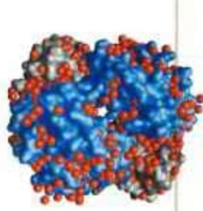  
(a)

  
(b)

FIGURE 2-9 Water binding in hemoglobin. The crystal structure of hemoglobin, shown (a) with bound water molecules (red spheres) and (b) without the water molecules. The water molecules are so firmly bound to the protein that they affect the x-ray diffraction pattern as though they were fixed parts of the protein. The two $\alpha$ subunits of hemoglobin are shown in gray, the two $\beta$ subunits in blue. Each subunit has a bound heme group (red stick structure), visible only in the $\beta$ subunits in this view. The structure and function of hemoglobin are discussed in detail in Chapter 5. [Data from PDB ID 1A3N, J.R.H.Tame and B.Vallone, Acta Crystallogr. D 56805, 2000]  

#### [EN] Concentrated Solutes Produce Osmotic Pressure

Solutes of all kinds alter certain physical properties of the solvent, water: its vapor pressure, its boiling point, its melting point (freezing point), and its osmotic pressure. These are called colligative properties (colligative meaning "tied together"), because the effect of solutes on all four properties has the same basis: the concentration of water is lower in solutions than in pure water. The effect of solute concentration on the colligative properties of water is independent of the chemical properties of the solute; it depends only on the number of solute particles (molecules or ions) in a given amount of water. For example, a compound such as NaCl, which dissociates in solution, has an effect on osmotic pressure that is twice that of an equal number of moles of a nondissociating solute such as glucose.

  
FIGURE 2-10 Water chain in cytochrome f. Water is bound in a proton channel of the membrane protein cytochrome f, which is part of the energy-trapping machinery of photosynthesis in chloroplasts. Five water molecules are hydrogen-bonded to each other and to functional groups of the protein: the peptide backbone atoms of valine, proline, arginine, and alanine residues, and the side chains of three asparagine and two glutamine residues. The protein has a bound heme, its iron ion facilitating electron flow during photosynthesis. Electron flow is coupled to the movement of protons across the membrane, which probably involves "proton hopping" through this chain of bound water molecules. [Information from P. Nicholls, Cell. Mol. Life Sci. 57:987, 2000, Fig. 6a (redrawn from PDB ID 1HCZ, S. E. Martinez et al., Prot. Sci. 5:1081, 1996).]

Water molecules tend to move from a region of higher water concentration to one of lower water concentration, in accordance with the tendency in nature for a system to become disordered. When two different aqueous solutions are separated by a semipermeable membrane (one that allows the passage of water but not solute molecules), water molecules diffusing from the region of higher water concentration to the region of lower water concentration produce osmotic pressure (Fig. 2-11). Osmotic pressure, $\Pi$ , measured as the force necessary to resist water movement, is approximated by the van't Hoff equation

$$
\Pi = i c R T
$$

in which R is the gas constant and T is the absolute temperature. The symbol i is the van't Hoff factor, a measure of the extent to which the solute dissociates into two or more ionic species. The term c is the solute's molar concentration, and ic is the osmolarity of the solution, the product of the van't Hoff factor i and c. In dilute NaCl solutions, the solute completely dissociates into $Na^{+}$ and $Cl^{-}$ , doubling the number of solute particles, and thus i = 2. For all nonionizing solutes, i = 1. For solutions of several (n) solutes, $\Pi$ is the sum of the contributions of each species:

  
FIGURE 2-11 Osmosis and the measurement of osmotic pressure. (a) The initial state. The tube contains an aqueous solution, the beaker contains pure water, and the semipermeable membrane allows the passage of water but not solute. Water flows from the beaker into the tube to equalize its concentration across the membrane. (b) The final state. Water has moved into the solution of the nonpermeant compound, diluting it and raising the column of solution within the tube. At equilibrium, the force of gravity operating on the solution in the tube exactly balances the tendency of water to move into the tube, where its concentration is lower. (c) Osmotic pressure (II) is measured as the force that must be applied to return the solution in the tube to the level of the water in the beaker. This force is proportional to the height, h, of the column in (b).

$$
\Pi = R T (i _ {1} c _ {1} + i _ {2} c _ {2} + i _ {3} c _ {3} + \dots + i _ {n} c _ {n})
$$

Osmosis, water movement across a semipermeable membrane driven by differences in osmotic pressure, is an important factor in the life of most cells. Plasma membranes are more permeable to water than to most other small molecules, ions, and macromolecules because protein channels (aquaporins; see Table 11-3) in the membrane selectively permit the passage of water. Solutions of osmolarity equal to that of a cell's cytosol are said to be isotonic relative to that cell. Surrounded by an isotonic solution, a cell neither gains nor loses water (Fig. 2-12). In a hypertonic solution, one with higher osmolarity than that of the cytosol, the cell shrinks as water moves out.

  
FIGURE 2-12 Effect of extracellular osmolarity on water movement across a plasma membrane. When a cell in osmotic balance with its surrounding medium—that is, a cell in (a) an isotonic medium—is transferred into (b) a hypertonic solution or (c) a hypotonic solution, water moves across the plasma membrane in the direction that tends to equalize osmolarity outside and inside the cell.

In a hypotonic solution, one with a lower osmolarity than the cytosol, the cell swells as water enters. In their natural environments, cells generally contain higher concentrations of biomolecules and ions than their surroundings, so osmotic pressure tends to drive water into cells. If not somehow counterbalanced, this inward movement of water would distend the plasma membrane and eventually cause bursting of the cell (osmotic lysis).

Several mechanisms have evolved to prevent this catastrophe. In bacteria and plants, the plasma membrane is surrounded by a nonexpandable cell wall of sufficient rigidity and strength to resist osmotic pressure and prevent osmotic lysis. Certain freshwater protists that live in a highly hypotonic medium have an organelle (contractile vacuole) that pumps water out of the cell. In multicellular animals, blood plasma and interstitial fluid (the extracellular fluid of tissues) are maintained at an osmolarity close to that of the cytosol. The high concentration of albumin and other proteins in blood plasma contributes to its osmolarity. Cells also actively pump out Na $^{+}$ and other ions into the interstitial fluid to stay in osmotic balance with their surroundings.

Because the effect of solutes on osmolarity depends on the number of dissolved particles, not their mass, macromolecules (proteins, nucleic acids, polysaccharides) have far less effect on the osmolarity of a solution than an equal mass of their monomeric components would have. For example, a gram of a polysaccharide composed of 1,000 glucose units has about the same effect on osmolarity as a milligram of glucose. Storing fuel as polysaccharides (starch or glycogen) rather than as glucose or other simple sugars avoids an enormous increase in osmotic pressure in the storage cell.

Plants use osmotic pressure to achieve mechanical rigidity. The very high solute concentration in the plant cell vacuole draws water into the cell, but the nonexpandable cell wall prevents swelling; instead, the pressure exerted against the cell wall (turgor pressure) increases, stiffening the cell, the tissue, and the plant body. When the lettuce in your salad wilts, it is because loss of water has reduced turgor pressure. Osmosis also has consequences for laboratory protocols. Mitochondria, chloroplasts, and lysosomes, for example, are enclosed by semipermeable membranes. In isolating these organelles from broken cells, biochemists must perform the fractionations in isotonic solutions (see Fig. 1-7) to prevent excessive entry of water into the organelles and the swelling and bursting that would follow. Buffers used in cellular fractionations commonly contain sufficient concentrations of sucrose or some other inert solute to protect the organelles from osmotic lysis.

#### [EN] WORKED EXAMPLE 2-1 Osmotic Strength of an Organelle

Suppose the major solutes in intact lysosomes are KCl ( $\sim$ 0.1 M) and NaCl ( $\sim$ 0.03 M). When isolating lysosomes, what concentration of sucrose is required in the extracting solution at room temperature (25 ${}^{\circ}$ C) to prevent swelling and lysis?

SOLUTION: We want to find a concentration of sucrose that gives an osmotic strength equal to that produced by the KCl and NaCl in the lysosomes. The equation for calculating osmotic strength (the van't Hoff equation) is

$$
\Pi = R T (i _ {1} c _ {1} + i _ {2} c _ {2} + i _ {3} c _ {3} + \dots + i _ {n} c _ {n})
$$

where R is the gas constant 8.315 J/mol • K; T is the absolute temperature (Kelvin); $c_{1}$ , $c_{2}$ , and $c_{3}$ are the molar concentrations of each solute; and $i_{1}$ , $i_{2}$ , and $i_{3}$ are the numbers of particles each solute yields in solution (i = 2 for KCl and NaCl).

The osmotic strength of the lysosomal contents is

$$
\begin{array}{r l} \Pi_ {\text {lysosome}} & = R T (i _ {\mathrm{KCl}} c _ {\mathrm{KCl}} + i _ {\mathrm{NaCl}} c _ {\mathrm{NaCl}}) \\ & = R T [ (2) (0. 1 \mathrm{mol/L}) + (2) (0. 0 3 \mathrm{mol/L}) ] \\ & = R T (0. 2 6 \mathrm{mol/L}) \end{array}
$$

The osmotic strength of a sucrose solution is given by

$$
\Pi_ {\text { sucrose }} = R T (i _ {\text { sucrose }} c _ {\text { sucrose }})
$$

In this case, $i_{sucrose} = 1$ , because sucrose does not ionize. Thus,

$$
\Pi_ {\text { sucrose }} = R T (c _ {\text { sucrose }})
$$

The osmotic strength of the lysosomal contents equals that of the sucrose solution when

$$
\begin{array}{r l} \Pi_ {\text { sucrose }} & = \Pi_ {\text { lysosome }} \\ R T (c _ {\text { sucrose }}) & = R T (0. 2 6 \mathrm{mol/L}) \\ c _ {\text { sucrose }} & = 0. 2 6 \mathrm{mol/L} \end{array}
$$

Sucrose has a formula weight (FW) of 342, so the required sucrose concentration is (0.26 mol/L)(342 g/mol) = 88.92 g/L. Because the solute concentrations are accurate to only one significant figure, $c_{sucrose} = 0.09 \, kg/L$ .

As we'll see later (p. 242), cells of liver and muscle store carbohydrate not as low molecular weight sugars, such as glucose or sucrose, but as the high molecular weight polymer glycogen. This allows the cell to contain a large mass of glycogen with a minimal effect on the osmolarity of the cytosol.

#### [EN] SUMMARY 2.1 Weak Interactions in Aqueous Systems

The very different electronegativities of H and O make water a highly polar molecule, capable of forming hydrogen bonds with itself and with solutes. Hydrogen bonds are fleeting, primarily electrostatic, and weaker than covalent bonds.

■ Alcohols, aldehydes, ketones, and compounds containing N—H bonds all form hydrogen bonds with water and are therefore water soluble.

\- By screening the electrical charges of ions and by increasing the entropy of the system, water dissolves crystals of ionizable solutes.

\- $\mathrm{N}_{2}, \mathrm{O}_{2}$ , and $\mathrm{CO}_{2}$ are nonpolar and poorly soluble in water. $\mathrm{NH}_{3}$ and $\mathrm{H}_{2} \mathrm{~S}$ are ionizable and therefore very water soluble.

Nonpolar (hydrophobic) compounds dissolve poorly in water; they cannot hydrogen-bond with the solvent, and their presence forces an energetically unfavorable ordering of water molecules at their hydrophobic surfaces. To minimize the surface exposed to water, nonpolar and amphipathic compounds such as lipids form aggregates (micelles and bilayer vesicles) in which the hydrophobic moieties are sequestered in the interior, an association driven by the hydrophobic effect, and only the more polar moieties interact with water.

■ van der Waals interactions exist when two nearby nuclei induce dipoles in each other. The nearest approach of two atoms defines the van der Waals radius of each.

■ Weak, noncovalent interactions, in large numbers, decisively influence the folding of macromolecules such as proteins and nucleic acids. The most stable macromolecular conformations are those in which hydrogen bonding is maximized within the molecule and between the molecule and the solvent, and in which hydrophobic moieties cluster in the interior of the molecule away from the aqueous solvent.

\- When two aqueous compartments are separated by a semipermeable membrane (such as the plasma membrane separating a cell from its surroundings), water moves across that membrane to equalize the osmolarity in the two compartments. This tendency for water to move across a semipermeable membrane produces the osmotic pressure.

<!-- EN-END 2.1 -->

## 六、水和生命

## （一）水的结构和性质

水占大多数生物质量的 $70\% \sim 90\%$ ，它组成生物体的一个连续相。生物体内的全部化学反应都是在水中进行的，而且很多反应有水本身的参与，例如各种水解反应；水也是某些反应的产物，例如消除反应。作为生命介质的水具有某些独特的化学和物理性质，特别适合于生命活动，没有水就没有生命。与一般溶剂（甲醇、乙醇和丙酮等）相比，水具有高热容、高熔点、高沸点、高蒸发热、高介电常数、高表面张力和密度比固态水(冰)大等物理特性。这些特性具有重要的生物学意义。

水之所以具有这些特性,是与水分子的独特结构有关。水分子中氧原子的4个轨道是不等性 $SP^{3}$ 杂化的,这与正四面体碳相似但不相同,其中两个未共用电子对(孤电子对)占据在两个 $SP^{3}$ 杂化轨道中,孤电子对所占用的杂化轨道电子云比较密集,对成键电子对所占用的杂化轨道起着排斥和压缩的作用,结果两个O—H键的夹角被压缩成 $104^{\circ}45'$ (图1-12A),而不是正四面体杂化的 $109^{\circ}28'$ 。由于这种不等性杂化使水分子具有极性,两个水分子间可以发生静电吸引,并适于形成氢键。水是形成氢键的H供体又是H接纳体。冰中每个水分子可以与邻近水分子形成4个氢键呈四面体的几何结构(图1-12B)。冰中O—O之间的距离为0.276 nm。液态水中0℃时每个水分子在任一时刻平均形成3.4个氢键,15℃时O—O之间的距离略比冰中的大,为 0.297 nm。液态水和冰之间氢键的数量相差不大,但水中每个氢键的平均寿命只有 $10^{-11}$ s。因此液态水的结构是一种时间和空间上的统计结果,它既是流动的(氢键破裂时)又是固定的(氢键形成时),这是液态水既不同于冰,也不同于水蒸气的结构特点。冰中围绕每个水分子可以形成4个氢键(这是一个水分子能形成的最多氢键数)即四面体式氢键结合。整个冰是有规则的晶格结构,是氢键结合的三维网。结果是水分子相互连接成六元环排列(图1-12C)。这种环在具有特有的6重对称轴的雪花中找到它的宏观复制品。冰的这种晶格结构使它的密度比液态水小,这是冰总是浮在水面上的原因。水蒸气则相反,它的水分子几乎失去全部可能的氢键,处于完全自由运动的状态。破坏冰的晶格需要断裂足够比例的氢键,因此要求较大的能量,这也是冰的熔点为什么比许多有机溶剂的熔点高的原因。融化冰或蒸发水需要从系统中吸收热量:

$$
\begin{array}{r l r}{\mathrm {H_ {2} O(固态)\rightarrow H_ {2} O(液态)}}&{}&{\Delta H = + 5. 9 \mathrm{kJ/mol}}\\{\mathrm {H_ {2} O(液态)\rightarrow H_ {2} O(气态)}}&{}&{\Delta H = + 4 4. 0 \mathrm{kJ/mol}}\end{array}
$$

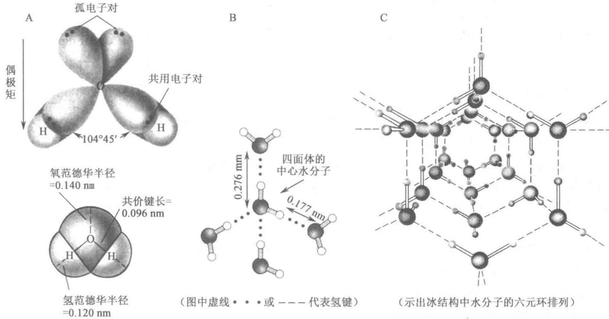  
图 1-12 A. 水分子的结构；B. 冰中水分子四面体氢键结合；C. 冰中水分子三维网

融化或蒸发时，水由高度有序排列的固态分子变成有序度下降的液态分子或完全无序的气态分子。在室温下，冰的融化和水的蒸发是自发发生的过程。水分子倾向于通过氢键缔合在一起，但能量上推动它们无序化的力量超过了这种倾向。前面曾提到过，发生自发过程，自由能变化 $(\Delta G)$ 必须是负值： $\Delta G = \Delta H - T\Delta S$ ，这里 $\Delta G$ 代表驱动力， $\Delta H$ 是焓变，来自于键的形成和断裂， $\Delta S$ 是无序度的改变。因为融化和蒸发的 $\Delta H$ 是正值，显然熵的增加造成 $\Delta G$ 为负值，并驱动这些变化。

水中氢键的形成是协同的,即当两个 $H_{2}O$ 分子之间形成一个氢键时,作为 H 供体的 $H_{2}O$ 分子成为更好的 H 接纳体,而作为 H 接纳体的 $H_{2}O$ 分子变成更好的 H 供体。因此 $H_{2}O$ 分子参与氢键形成是一种相互加强的现象。虽然个别的氢键强度不很大(表 1-5),但水是处于氢键网中的,因此水的内聚力(internal cohesion)很大,正是它使水具有上述的那些物理特性。

## （二）水是生命的介质

生命过程要求溶解各种离子和大、小分子。水具有显著的溶解能力，使它成为胞内和胞外的通用介质。水的溶解能力主要是由于它能形成氢键和具有偶极的本质。凡是能形成氢键的分子如羟基化合物、胺、巯基化合物、酮、醛、酯和羧酸等都能溶于水，并称之为亲水化合物（hydrophilic compound）。离子化合物如 NaCl 虽然不能作为氢的供体或接纳体,但也能很好地溶于水。这是因为水是一种偶极分子,偶极与离子相互作用致使水溶液中的阳离子和阴离子被水化,即被称为水化层(hydration shell)的水分子层所围绕。离子化合物倾向于溶于水,除形成水化层因素外,另一因素是水的介电常数高,因而降低正、负离子之间的吸引力。从能量角度考虑,当盐如 NaCl 溶解时, $Na^{+}$ 和 $Cl^{-}$ 离开盐的晶格,获得较大的自由度。其结果是系统的熵增加,这是使盐易溶于水的主要原因。溶液的形成伴随着有利的自由能变化: $\Delta G=\Delta H-T\Delta S$ ,这里 $\Delta H$ 有一个小的正值,而 $\Delta S$ 是一个大的正值,因此 $\Delta G$ 是负值。

脂肪烃和芳香烃及其衍生物不能形成氢键，因而不能溶于水，称为疏水化合物（hydrophobic compound）。这些化合物在水中将产生疏水相互作用。生物学上一类很重要的分子，它们同时具有亲水的头基和疏水的尾部，称为两亲化合物（amphipathic compound），如蛋白质、固醇、磷脂、糖脂以及脂肪酸盐等。它们在水中的“溶解”状态很特殊，能形成单层（在水表面）、微团和双层微囊，这些结构是形成生物膜的基础（见第10章）。由这些分子组成的结构是由它们的非极性区之间的疏水相互作用来稳定的。脂质之间、脂质和蛋白质之间的相互作用是生物膜中的最重要的决定因素。非极性氨基酸之间的疏水相互作用也参与稳定蛋白质的三维结构。

水和极性溶质之间的氢键形成也能引起水分子的有序化,但它的能量效果要比非极性溶质造成的小。极性底物跟酶的互补的极性表面结合有部分驱动力来自熵增,因为酶置换了底物的有序水和底物置换了酶表面的有序水。

## （三）溶质影响水的依数性

各种溶质都能改变溶剂水的物理性质:降低蒸汽压、升高沸点、降低冰点(熔点)和产生渗透压现象。这些性质被称为水溶液的依数性(colligative property;拉丁文 colligare,“集合一起”),因为溶质对所有这4种性质的影响都是基于同样的原因:溶液中水的浓度比纯水中的低。溶质浓度对水的依数性质的影响跟溶质的化学性质无关,只依赖于给定量的水中各种形式的溶质质点(分子、离子)数目。例如在水中能解离的化合物如 NaCl,它对渗透压的影响等于等摩尔数的非解离溶质如葡萄糖的两倍。

水分子倾向于从高水浓度的区域(即纯水或稀溶液)向低水浓度的区域(浓溶液)移动,这跟一个系统

本质上倾向于无序化是一致的。当纯水（或稀溶液）与溶液（或浓溶液）用半透膜(semipermeable membrane)，一种只允许水通过而不允许溶质通过的膜，如玻璃纸、火棉纸等隔开时，水分子将从纯水（稀溶液）向溶液（或浓溶液）进行单方向的净移动，这种现象称为渗透(osmosis)。由于渗透结果溶液的体积增加，液面升高，直至达到一定的水静压力时，保持平衡。这时的水静压力即是渗透压(osmotic pressure)，也即为抗衡溶剂向溶液进行净移动(渗透)所需施加于溶液的压力(图1-13)。渗透压实际上被认为是溶质质点对于半透膜的撞击力。

理想溶液中溶液的渗透压与溶质浓度的关系可用 van't Hoff 公式表示：

$$
\pi = i c R T
$$

这里 R 是气体常数 $[8.315\mathrm{J}/(\mathrm{mol}\cdot\mathrm{K})]$ ，T 是绝对温度 (K)，ic 项是溶液的摩尔渗透压浓度 (osmolarity)，其中 c 是溶质的摩尔浓度，i 是 van't Hoff 因子，它是溶质解离成两种或多种离子形式的量度。在稀 NaCl 溶液中溶质完全解离成 $Na^{+}$ 和 $Cl^{-}$ ，此时质点（离子）数为溶质 NaCl 分子数的两倍，因此 i=2。对于所有非电离溶质 i=1。对于几种 (n) 溶质的溶液， $\pi$ 是各种质点形式的渗透压的总和：

$$
\pi = R T (i _ {1} c _ {1} + i _ {2} c _ {2} + \dots + i _ {n} c _ {n})
$$

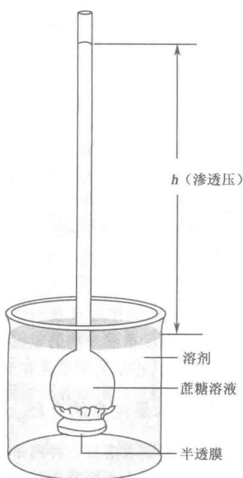  
图1-13 渗透与渗透压测定

由于渗透压差引起的水穿过半透膜的移动,即渗透,是大多数细胞生命中的一个重要因素。质膜对水比对大多数其他小分子、离子和大分子的通透能力大。这种通透性(permeability)主要是由于膜中的蛋白质通道(水孔蛋白,aquaporin)选择性地允许水通过。跟细胞溶胶的摩尔渗透压浓度相等的溶液被称为是该细胞的等渗溶液(isotonic solution)。生活在等渗溶液中的细胞既不会获得也不会丢失水分。在高渗溶液(hypertonic solution)中,即在摩尔渗透压浓度比细胞溶胶高的溶液中,细胞因水外移而萎蔫。在低渗溶液(hypotonic solution)中,即在摩尔渗透压浓度比细胞溶胶低的溶液中,细胞因进水而膨胀。在自然环境中细胞一般比它的实验环境含有较高浓度的生物分子和离子,所以渗透压倾向于驱动水进入细胞。如果没有什么抗衡的措施,水的这种向内移动会使细胞膨胀,最终引起细胞的破裂,称为渗透溶解(osmotic lysis)。

生物在进化过程中已经发展出几种防止这种灾变的机制。细菌和植物的质膜外面包裹着一层有足够刚性和强度的非膨胀细胞壁，能抵抗渗透压和防止渗透溶解。在多细胞动物中血浆和组织液（组织的胞外液）被维持在接近细胞溶胶的摩尔渗透压浓度。血浆中高浓度的清蛋白和其他蛋白质对摩尔渗透压浓度作出很大贡献。细胞也主动泵出 $Na^{+}$ 和其他离子到组织液中以保持与其环境的渗透压平衡。

因为溶质对摩尔渗透压浓度的效果取决于被溶解质点的数目而不是它的质量,因而大分子(蛋白质、核酸、多糖)对一个溶液的摩尔渗透压浓度的效果远小于等质量的单体成分。例如1 g由1 000个葡萄糖单位组成的多糖与1 mg葡萄糖有同样的摩尔渗透压浓度效果。

作为贮存燃料的糖类是多糖(淀粉或糖原)而不是葡萄糖(或其他简单的糖),因为这样不致引起贮存细胞内渗透压的巨大增加。

植物利用渗透压获得刚性。在植物细胞的液泡内有很高的溶质浓度，能吸引水进入细胞，但是非膨胀的细胞壁将产生向内侧收缩的压力（称胞壁压）阻止细胞进一步膨胀，因此施加于细胞壁的渗透压不再增加，维持平衡[此渗透压称为膨压(turgor pressure)]，但已使细胞、组织和植物体变得硬挺。渗透作用对实验操作有着重要影响。在分级分离有膜裹着的细胞器（如线粒体、叶绿体和溶酶体）时，必须在等渗溶液中进行，以防止过量的水分进入细胞器而引起膨胀破裂。用于细胞分级分离的缓冲液，一般含有足够浓度的蔗糖或某些其他惰性溶质以保护细胞器免遭渗透溶解。

## （四）水、弱酸和弱碱的电离

## 1. 平衡常数

像所有的可逆反应一样,水、弱酸和弱碱的电离(解离)也可以用平衡常数 $K_{eq}$ (或K)来描述。平衡常数 $K_{eq}$ 是表明在指定温度下一个化学反应的限度,即平衡位置的特征值。对于一般的可逆反应:

$$
a \mathrm{A} + b \mathrm{B} \rightleftharpoons c \mathrm{C} + d \mathrm{D}
$$

达到平衡时,反应物(A 和 B)和产物(C 和 D)的浓度分别为 $\left[A\right]_{eq}$ 、 $\left[B\right]_{eq}$ 、 $\left[C\right]_{eq}$ 和 $\left[D\right]_{eq}$ 。平衡浓度与平衡常数的关系如下：

$$
K _ {\mathrm{eq}} = \frac {[ \mathrm{C} ] _ {\mathrm{eq}} ^ {c} [ \mathrm{D} ] _ {\mathrm{eq}} ^ {d}}{[ \mathrm{A} ] _ {\mathrm{eq}} ^ {a} [ \mathrm{B} ] _ {\mathrm{eq}} ^ {b}}
$$

上述表达式中如果 $a+b=c+d$ ，则 $K_{eq}$ 无量纲，若 $a+b\neq c+d$ ，则 $K_{eq}$ 含有量纲。根据在特定条件下（如一定浓度、pH 和离子强度等）实验测得的平衡浓度计算出的平衡常数称为实验平衡常数、浓度平衡常数或表观平衡常数 $K_{\mathrm{eq}}(\text{或 }K')$ 。用热力学方法计算得到的平衡常数称为热力学（或真实）平衡常数，或标准平衡常数 $(K^{\ominus})$ 。严格地说在非理想溶液中，应该像计算热力学平衡常数那样用有效浓度即活度（activity）代替平衡关系式中的浓度项。但是生物化学中经常处理的浓度都是比较稀的，因此除需要特别精确的工作外，一般根据达到平衡时测得的浓度算出的平衡常数 $K_{eq}$ 即可，实际上它与真实值 $(K^{\ominus})$ 很接近。标准自由能变化 $\Delta G^{\ominus}$ 与平衡常数 $K_{eq}$ 的关系 $(\Delta G^{\ominus}=-RT\ln K_{eq})$ 详见第 16 章。

## 2. 水的电离(解离)

用精确的电导仪可以测出纯水有微弱导电性,说明水能电离出少量的离子(25℃ 纯水中在任一瞬间每 $10^{9}$ 个 $H_{2}O$ 分子约有 2 个被解离）。水是两性物质，在同一反应中 $H_{2}O$ 既可作为酸，供给质子，又可作为碱，接纳质子，所以水能进行自体电离（auto-ionization）：

$$
\mathrm{H} _ {2} \mathrm{O} + \mathrm{H} _ {2} \mathrm{O} \rightleftharpoons \mathrm{H} - \underset {\mathrm{H}} {\overset {\text {   }} {\mathrm{O}}} \dots \underset {\mathrm{H}} {\overset {\text {   }} {\mathrm{O}}} - \underset {\mathrm{H}} {\overset {\text {   }} {\mathrm{O}}} \rightleftharpoons \underset {\mathrm{H}} {\overset {\text {   }} {\mathrm{O}}} ^ {+} - \mathrm{H} + \mathrm{OH} ^ {-}
$$

虽然在水中 $H^{+}$ 都是以水合氢离子(hydronium ion)形式 $H_{3}O^{+}$ 存在(极少数以 $H^{+}$ 形式出现)，为方便起见上式仍可简写成：

$$
\mathrm{H} _ {2} \mathrm{O} \rightleftharpoons \mathrm{H} ^ {+} + \mathrm{OH} ^ {-}\tag{1-1}
$$

因为这样并不妨碍对该反应过程的了解和对结果的讨论。根据式1-1,水电离的平衡常数：

$$
K _ {\mathrm{eq}} = \frac {[ \mathrm{H} ^ {+} ] [ \mathrm{OH} ^ {-} ]}{[ \mathrm{H} _ {2} \mathrm{O} ]}\tag{1-2}
$$

在 $25^{\circ}$ C 纯水中 $H_{2}O$ 的摩尔浓度 (molarity) 是 55.5 mol/L，并且当 $H^{+}$ 和 $OH^{-}$ 的浓度很低时（约 $1 \times 10^{-7}$ mol/L），此值基本不变。因此可将 55.5 mol/L 代入平衡常数表达式 1-2 得：

$$
K _ {\mathrm{eq}} = \frac {[ \mathrm{H} ^ {+} ] [ \mathrm{OH} ^ {-} ]}{(5 5 . 5 \mathrm{mol/L})}
$$

经重排得：

$$
(5 5. 5 \mathrm{mol/L}) (K _ {\mathrm{eq}}) = [ \mathrm{H} ^ {+} ] [ \mathrm{OH} ^ {-} ] = K _ {\mathrm{w}}\tag{1-3}
$$

这里 $K_{w}$ 代表 55.5 mol/L 和 $K_{eq}$ 的乘积, 它是 25℃ 时水的离子积, 称为水的离子积常数 (ion product constant of water)。

根据电导测定,纯水 $25^{\circ}C$ 的 $K_{eq}$ 值为 $1.8 \times 10^{-16} \, mol/L$ 。将此值代替式 1-3 的 $K_{eq}$ ，得水的离子积：

$$
K _ {\mathrm{w}} = \left[ \mathrm{H} ^ {+} \right] \left[ \mathrm{OH} ^ {-} \right] = (5 5. 5 \mathrm{mol/L}) \times (1. 8 \times 1 0 ^ {- 1 6} \mathrm{mol/L}) = 1. 0 \times 1 0 ^ {- 1 4} (\mathrm{mol/L}) ^ {2}
$$

这样, $25^{\circ} \mathrm{C}$ 的水溶液中 $\left[\mathrm{H}^{+}\right]\left[\mathrm{OH}^{-}\right]$ 的乘积总是等于 $1 \times 10^{-14} (\mathrm{~mol} / \mathrm{L})^{2}$ 。当 $\mathrm{H}^{+}$ 和 $\mathrm{OH}^{-}$ 的浓度完全相等时,例如在纯水中,此溶液被称为中性 $\mathbf{pH}$ (neutral pH)的溶液。此时,可按下式:

$$
K _ {\mathrm{w}} = \left[ \mathrm{H} ^ {+} \right] \left[ \mathrm{OH} ^ {-} \right] = \left[ \mathrm{H} ^ {+} \right] ^ {2} = \left[ \mathrm{OH} ^ {-} \right] ^ {2}
$$

计算出 $\left[H^{+}\right]$ 和 $\left[OH^{-}\right]$ 。解氢离子浓度得：

$$
\left[ \mathrm{H} ^ {+} \right] = \sqrt {K _ {\mathrm{w}}} = \sqrt {1 \times 1 0 ^ {- 1 4} (\mathrm{mol/L}) ^ {2}}
$$

$$
\left[ \mathrm{H} ^ {+} \right] = \left[ \mathrm{OH} ^ {-} \right] = 1 0 ^ {- 7} \mathrm{mol/L}
$$

水的离子积是一个常数， $\left[H^{+}\right]$ 的任何变动将使 $\left[OH^{-}\right]$ 向相反的方向变化。于 $25^{\circ}C$ ，在任何水溶液中如果 $\left[H^{+}\right]$ 为 $10^{-3} \, mol/L$ ， $\left[OH^{-}\right]$ 一定是 $10^{-11} \, mol/L$ 。由于这种 10 的负方的数字书写时不方便，计算也麻烦，所以 Sørensen 建议在稀溶液中氢离子浓度最好用 pH 来表示。

## 3. pH 的意义

水溶液的 pH 被定义为氢离子浓度(更确切,水合氢离子活度)以 10 为底的负对数或氢离子浓度的倒数的对数 $^{①}$ :

$$
\mathrm{pH} = - \lg [ \mathrm{H} ^ {+} ] = \lg \frac {1}{[ \dot {\mathrm{H}} ^ {+} ]}\tag{1-4}
$$

pH 表达的氢离子浓度可以有一个很宽的范围(从 0 到 14)，这个范围已概括了各种生物体液中的氢离子浓度。使用 pH 标度(pH scale)时，应注意它是对数的关系，不是算术关系。两种溶液的 pH 差 1 个单位，它们的氢离子浓度差 10 倍。pH>7，该溶液是碱性的，此时 $\left[OH^{-}\right]>\left[H^{+}\right]$ 。pH<7，溶液是酸性的，此时 $\left[H^{+}\right]>\left[OH^{-}\right]$ 。羟离子浓度也可用 pOH 表示，这里 $pOH=-\lg\left[OH^{-}\right]$ 。根据 $\left[H^{+}\right]\left[OH^{-}\right]=10^{-14}$ 可以推导出：

$$
\mathrm{pH} + \mathrm{pOH} = 1 4
$$

溶液的 pH 可以用指示剂染料如石蕊（Litmus）、酚酞（phenolphthalein）和酚红（phenol red）等进行粗略测定。生物化学（或临床）实验室中需要精确 pH，可用装有玻璃电极的 pH 计（pH meter）测量。pH 测定是生物学中一项十分重要而经常使用的手段，因为溶液的 pH 对大分子的结构和生物活性的影响很大，例如酶的催化活性对 pH 有很强的依赖关系（见第 6 章）。

## 4. 弱酸和弱碱的电离(解离)

强酸(如盐酸、硫酸和硝酸)和强碱(如 NaOH 和 KOH)在稀的水溶液中几乎是完全解离的。对生物化学工作者比较感兴趣的是弱酸和弱碱的行为,弱酸和弱碱在水中溶解时并不完全解离。弱酸和弱碱在生物系统中普遍存在,并在新陈代谢及其调节中起着重要作用。

根据 Brönsted-Lowry 的酸碱质子理论,凡是能供给质子的分子或离子都是酸(acid),也即酸是质子的供体;凡是能接纳质子的分子或离子都是碱(base),也即碱是质子的接纳体。它们的相互关系如下:

$$
\begin{array}{c c c} \mathrm{H} ^ {+} & \\ \mathrm{HA} + \mathrm{B} ^ {-} & \Longleftrightarrow \mathrm{A} ^ {-} + \mathrm{HB} \\ \text {酸} & (\text {碱}) & \text {共轭碱} (\text {共轭酸}) \end{array}
$$

这里原初的酸(HA)和生成的共轭碱( $A^{-}$ )组成一个共轭酸碱对(conjugate acid-base pair);原初的碱( $B^{-}$ )和生成的共轭酸(HB)组成另一个共轭酸碱对。如上式所示,依照 Brönsted 和 Lowry 的理论,酸碱反应(包括酸碱解离、酸碱中和、盐水解等)是两个共轭对之间的质子传递(protolysis)过程。

弱酸(HA)在水中的电离反应：

$$
\mathrm{HA} + \mathrm{H} _ {2} \mathrm{O} \rightleftharpoons \mathrm{A} ^ {-} + \mathrm{H} _ {3} \mathrm{O} ^ {+}\tag{1-5}
$$

可用电离平衡常数 $K_{\mathrm{eq}}$ 来描述：

$$
K _ {\mathrm{eq}} = \frac {[ \mathrm{H} _ {3} \mathrm{O} ^ {+} ] [ \mathrm{A} ^ {-} ]}{[ \mathrm{HA} ] [ \mathrm{H} _ {2} \mathrm{O} ]}
$$

由于作为溶剂的水,其浓度是一个常数,可以把 $\left[H_{2}O\right]$ 和 $K_{eq}$ 合并,重新定义一个平衡常数,称为酸解离常数(acid dissociation constant) $K_{a}$ :

$$
K _ {\mathrm{a}} = K _ {\mathrm{eq}} \left[ \mathrm{H} _ {2} \mathrm{O} \right] = \frac {\left[ \mathrm{H} _ {3} \mathrm{O} ^ {+} \right] \left[ \mathrm{A} ^ {-} \right]}{\left[ \mathrm{HA} \right]}
$$

又因 $[\mathrm{H}_3\mathrm{O}^+] = [\mathrm{H}^+]$ ，所以 $K_{\mathrm{a}}$ 表达式一般写成：

$$
K _ {\mathrm{a}} = \frac {[ \mathrm{H} ^ {+} ] [ \mathrm{A} ^ {-} ]}{[ \mathrm{HA} ]}
$$

它跟假设 HA 直接解离成 $H^{+}$ 和 $A^{-}$ :

$$
\mathrm{HA} \rightleftharpoons \mathrm{H} ^ {+} + \mathrm{A} ^ {-}\tag{1-6}
$$

的结果是一样的。其实反应式1-5和1-6传达的是同一信息，但按式1-6处理比较方便。

跟 pH 类似, $pK_{a}$ 被定义为:

$$
\mathrm{p} K _ {\mathrm{a}} = \lg \frac {1}{K _ {\mathrm{a}}} = - \lg K _ {\mathrm{a}}
$$

$\mathrm{pK}_{\mathrm{a}}$ 可以用实验方法测得（见图1-14）。酸的强度，即酸释放质子的倾向，愈强，它的 $K_{\mathrm{a}}$ 愈大， $\mathrm{pK}_{\mathrm{a}}$ 愈小。碱的强度即碱接纳质子的能力，除可用碱解离常数（或称碱水解常数） $K_{\mathrm{b}}$ 表示外，还可以方便地用它的共轭酸的酸解离常数 $K_{\mathrm{a}}$ （或 $\mathrm{pK}_{\mathrm{a}}$ )来表示，因为 $K_{\mathrm{a}} \times K_{\mathrm{b}} = K_{\mathrm{w}}$ ，或 $\mathrm{pK}_{\mathrm{a}} + \mathrm{pK}_{\mathrm{b}} = \mathrm{pK}_{\mathrm{w}}$ 。碱的强度愈强，它的 $K_{\mathrm{b}}$ 愈大（ $\mathrm{pK}_{\mathrm{b}}$ 愈小），而它的共轭酸的 $K_{\mathrm{a}}$ 则愈小（ $\mathrm{pK}_{\mathrm{a}}$ 愈大）。

## 5. 弱酸的滴定曲线

一个已知体积的酸溶液可用已知浓度的强碱,一般用 NaOH 溶液,进行滴定。将 NaOH 溶液逐滴地加入待测的酸溶液,直至其中的酸完全被中和(被消耗)。滴定终点(等当量点)根据指示剂染料或 pH 计来确定。原溶液中的酸浓度可以从所加的 NaOH 体积和浓度来计算。

溶液的 pH 对所加的 NaOH 量作图, 称为酸的滴定曲线(或解离曲线), 从中可以得到弱酸的 $pK_{a}$ 。现在考虑 0.1 mol/L 醋酸溶液在 25℃ 用 0.1 mol/L NaOH 溶液滴定的问题。此滴定涉及两个可逆过程(下式中 HAc 代表醋酸):

$$
\mathrm{H} _ {2} \mathrm{O} \rightleftharpoons \mathrm{H} ^ {+} + \mathrm{OH} ^ {-}\tag{1-7}
$$

$$
\mathrm{HAc} \rightleftharpoons \mathrm{H} ^ {+} + \mathrm{Ac} ^ {-}\tag{1-8}
$$

平衡时溶液中各种成分的浓度必须同时满足式1-7和1-8的平衡常数。它们的平衡常数分别为：

$$
K _ {\mathrm{w}} = \left[ \mathrm{H} ^ {+} \right] \left[ \mathrm{OH} ^ {-} \right] = 1 \times 1 4 ^ {- 1 4} (\mathrm{mol/L}) ^ {2}\tag{1 - 9}
$$

$$
K _ {\mathrm{a}} = \frac {[ \mathrm{H} ^ {+} ] [ \mathrm{Ac} ^ {-} ]}{[ \mathrm{HAc} ]} = 1. 7 4 \times 1 0 ^ {- 1 4} \mathrm{mol/L}\tag{1-10}
$$

在滴定开始,尚未加入任何 NaOH 时,醋酸已有少许电离,电离的程度可从它的解离常数(式 1-10)算出。

随 NaOH 逐渐加入, 加入的 $OH^{-}$ 和醋酸溶液中的游离 $H^{+}$ 结合而成 $H_{2}O$ , 结合的程度是满足式 1-9 中平衡关系的要求。随着游离 $H^{+}$ 的除去, HAc 进一步解离以满足自身的平衡常数 (式 1-10)。当滴定继续进行时, 最后的结果是随 NaOH 的加入, 越来越多的 HAc 电离, 生成 $Ac^{-}$ 。在滴定的中点 (midpoint), 即准确加入 0.5 当量 NaOH 的地方有一半原来的醋酸发生解离, 结果质子供体的浓度等于质子接纳体的浓度, 即 $[HAc] = [Ac^{-}]$ 。在此中点, 呈现一个很重要的关系式: HAc 和 $Ac^{-}$ 的等浓度溶液的 pH 在数值上精确地等于醋酸的 $pK_{a}$ 4.76 (图 1-14)。

随滴定继续进行,剩余的未解离醋酸被逐渐转化为醋酸根。滴定终点(end point)出现在pH大于7.0处。所有的醋酸都失去质子,给与 $OH^{-}$ ,形成 $H_{2}O$ 和醋酸根。整个滴定过程同时存在两个平衡(式1-7和式1-8),每个平衡始终遵从它的平衡常数。

具有各种不同解离常数的弱酸,如醋酸 $(pK_{a}=4.76)$ 、二氢磷酸 $(pK_{a}=6.86)$ 和铵离子

  
图1-14 醋酸的滴定曲线

25℃时用氢氧化钠溶液滴定0.1 mol/L的醋酸。阴影框表示以 $pK_{a}$ 为中心的有效缓冲区，一般介于弱酸滴定10%\~90%之间。注意，1当量的 $OH^{-}$ 等于加入的0.1 mol/L NaOH量

$NH_{4}^{+}(pK_{a}=9.25)$ ，它们的滴定曲线形状几乎是一样的，只是沿pH轴，位移距离不同，因为这3个酸的强度不同即丢失质子的倾向不同。 $CH_{3}COOH$ 在 pH 4.76 已有一半解离（见图 1-14）； $H_{2}PO_{4}^{-}$ 在 pH 6.86 解离一半（此时， $\left[H_{2}PO_{4}^{-}\right]=\left[HPO_{4}^{2-}\right]$ ）； $NH_{4}^{+}$ 直至 pH 9.25 才解离一半（ $\left[NH_{4}^{+}\right]=\left[NH_{3}\right]$ ）。

弱酸的滴定曲线表明(图 1-14)，弱酸(HA)及其阴离子(A⁻)组成的共轭酸碱对能起缓冲剂的作用。

## 6. 缓冲剂和缓冲作用

活细胞和活生物保持专一而恒定的胞内 pH, 一般在 pH 7 左右, 以维持生物分子处于最适的离子状态。在多细胞生物中胞外液的 pH 也不断受到调节。维持 pH 的恒定性主要是依靠生物缓冲剂来达到的。

缓冲剂或称缓冲液(buffer)是一类能够抵抗外来少量酸( $H^{+}$ )或碱( $OH^{-}$ )引起的pH变化、维持pH基本不变的水溶液系统。一个缓冲系统是由一种弱酸和它的共轭碱组成的。如图1-14所示,醋酸和醋酸根离子的混合液即是一个缓冲系统。图中醋酸滴定曲线有一个相对平坦的范围,在它的中点(pH 4.76)两边各延伸约1个pH。在此范围内,向系统加入给定量的 $H^{+}$ 或 $OH^{-}$ 要比在范围外加入同样量的酸或碱,对pH造成的影响小得多。这一相对平坦的范围是醋酸-醋酸盐共轭对的缓冲区(buffering region)。缓冲区的中点,质子供体(HAc)和质子接纳体( $Ac^{-}$ )的浓度完全相等,这时系统的缓冲能力最大,即加入 $H^{+}$ 或 $OH^{-}$ 引起的pH变化最小。每种共轭酸碱对都有特征的有效缓冲范围,例如 $HAc-Ac^{-}$ 的缓冲区在pH 3.76和pH 5.76之间。

缓冲系统之所以具有缓冲作用,是因为系统中弱酸如醋酸(HAc)解离度很小,共轭碱(如 $Ac^{-}$ )的存在进一步抑制了它的解离;并且缓冲液中,弱酸及其共轭碱(如 HAc 和 $Ac^{-}$ )的浓度都比较大,而 $H^{+}$ 浓度相对较小。在缓冲系统例如 $HAc-Ac^{-}$ 中存在下面的解离平衡:

$$
\mathrm{HAc} \rightleftharpoons \mathrm{H} ^ {+} + \mathrm{Ac} ^ {-}
$$

当向缓冲系统中加入少量强酸， $\mathrm{Ac}^{-}$ 则与 $\mathrm{H}^{+}$ 结合成 $\mathrm{HAc}$ ，使平衡向左移动；当达到新的平衡时，溶液中 $[\mathrm{HAc}]$ 略有增加， $[\mathrm{Ac}^{-}]$ 略有减少， $\mathrm{pH}$ 基本不变， $\mathrm{Ac}^{-}$ 有抵御外来少量强酸的能力，称 $\mathrm{Ac}^{-}$ 为抗酸物质。当向缓冲系统中加入少量强碱时， $\mathrm{HAc}$ 则与 $\mathrm{OH}$ 反应生成 $\mathrm{Ac}^{-}$ 和 $\mathrm{H}_{2} \mathrm{O}$ ，使平衡向右移动；在新的平衡条件下， $[\mathrm{Ac}^{-}]$ 稍有增加， $[\mathrm{HAc}]$ 稍有减少，但 $\mathrm{pH}$ 基本不变， $\mathrm{HAc}$ 具有抵抗外来少量强碱的作用，称 $\mathrm{HAc}$ 为抗碱物质。在 $\mathrm{HAc}-\mathrm{Ac}^{-}$ 系统中因为存在较多的抗酸和抗碱的物质，才能抵御外来的少量强酸或强碱的影响。

前面曾提到各种弱酸的滴定曲线跟图1-14所示的有着几乎相同的形状，这表明滴定曲线反映出一个基本规律或关系。任一弱酸的滴定曲线可用Henderson-Hasselbalch方程式来描述，此方程只是弱酸解离常数表达式另一种有用的陈述方式。共轭酸碱对中弱酸(HA)的解离常数：

$$
K _ {\mathrm{u}} = \frac {[ \mathrm{H} ^ {+} ] [ \mathrm{A} ^ {-} ]}{[ \mathrm{HA} ]}
$$

解出氢离子浓度：

$$
\left[ \mathrm{H} ^ {+} \right] = K _ {\mathrm{a}} \frac {\left[ \mathrm{HA} \right]}{\left[ \mathrm{A} ^ {-} \right]}
$$

两边取负对数并经整理得：

$$
\mathrm{pH} = \mathrm{p} K _ {\mathrm{a}} + \lg \frac {[ \mathrm{A} ^ {-} ]}{[ \mathrm{HA} ]}
$$

这就是 Henderson-Hasselbalch 方程。此式表明缓冲液的 pH 主要决定于共轭酸碱对中弱酸的 $pK_{a}$ ，其次决定于共轭酸和共轭碱的浓度比。当 $[A^{-}]=[HA]$ 时，也即溶液的 pH 等于 HA 的 $pK_{a}$ 时，具有最好的缓冲能力。一般当 $[A^{-}]/[HA]$ 之比在 1/10 到 10/1 的范围内，具有较好的缓冲能力。因此 pH 从 $(pK_{a}+1)$ 到 $(pK_{a}-1)$ 的区间是缓冲液的有效范围。此外利用 Henderson-Hasselbalch 方程可以计算在任一 pH 条件下质子供体 (HA) 和质子接纳体 $(A^{-})$ 的浓度比 $( [A^{-}]/[HA] )$ 以及其他项的数值。

<!-- EN-BEGIN 2.2 -->

### 【英文对应 2.2】Ionization of Water, Weak Acids, and Weak Bases

> 来源：Lehninger Principles of Biochemistry（书籍/02_生物化学原理） 第2章 Water, the Solvent of Life，§2.2。对应本章“六、水和生命”。

Although many of the solvent properties of water can be explained in terms of the uncharged $H_{2}O$ molecule, the small degree of ionization of water to hydrogen ions ( $H^{+}$ ) and hydroxide ions ( $OH^{-}$ ) must also be taken into account. Like all reversible reactions, the ionization of water can be described by an equilibrium constant. When weak acids are dissolved in water, they contribute $H^{+}$ by ionizing; weak bases consume $H^{+}$ by becoming protonated. These processes are also governed by equilibrium constants. The total hydrogen ion concentration from all sources is experimentally measurable and is expressed as the pH of the solution. To predict the state of ionization of solutes in water, we must take into account the relevant equilibrium constants for each ionization reaction. Therefore, we now turn to a brief discussion of the ionization of water and of weak acids and bases dissolved in water.

#### [EN] Pure Water Is Slightly Ionized

Water molecules have a slight tendency to undergo reversible ionization to yield a hydrogen ion (a proton) and a hydroxide ion, giving the equilibrium

$$
\mathrm{H} _ {2} \mathrm{O} \rightleftharpoons \mathrm{H} ^ {+} + \mathrm{OH} ^ {-}\tag{2-1}
$$

Although we commonly show the dissociation product of water as $H^{+}$ , free protons do not exist in solution; hydrogen ions formed in water are immediately hydrated to form hydronium ions ( $H_{3}O^{+}$ ). Hydrogen bonding between water molecules makes the hydration of dissociating protons virtually instantaneous:

$$
\mathrm{H} - \mathrm{O} \stackrel {\mathrm{III}} {\mathrm{H}} - \mathrm{O} \stackrel {\mathrm{I}} {\mathrm{H}} \rightleftharpoons \mathrm{H} - \mathrm{O} ^ {+} - \mathrm{H} + \mathrm{OH} ^ {-}
$$

The ionization of water can be measured by its electrical conductivity; pure water carries electrical current as $H_{3}O^{+}$ migrates toward the cathode and $OH^{-}$ migrates toward the anode. The movement of hydronium and hydroxide ions in the electric field is extremely fast compared with that of other ions such as $Na^{+}$ , $K^{+}$ , and $Cl^{-}$ . This high ionic mobility results from the kind of “proton hopping” shown in Figure 2-13. No individual proton moves very far through the bulk solution, but a series of proton hops between hydrogen-bonded water molecules causes the net movement of a proton over a long distance in a remarkably short time. ( $OH^{-}$ also moves rapidly by proton hopping, but in the opposite direction.) As a result of the high ionic mobility of $\mathbf{H}^{+}$ , acid-base reactions in aqueous solutions are exceptionally fast. As noted earlier, proton hopping very likely also plays a role in biological proton-transfer reactions (Fig. 2-10).

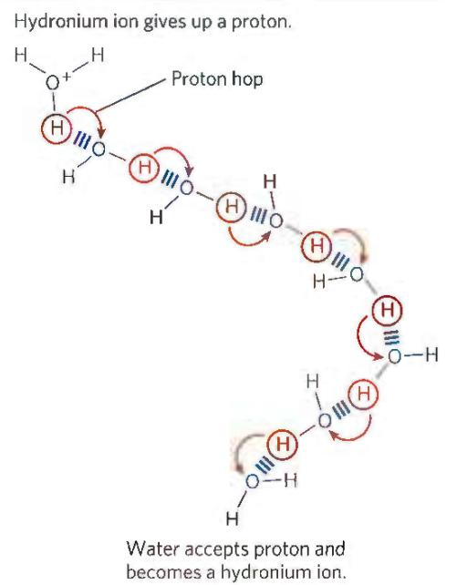  
FIGURE 2-13 Proton hopping. Short "hops" of protons between a series of hydrogen-bonded water molecules result in an extremely rapid net movement of a proton over a long distance. As a hydronium ion (upper left) gives up a proton, a water molecule some distance away (bottom) acquires one, becoming a hydronium ion. Proton hopping is much faster than true diffusion and explains the remarkably high ionic mobility of $\mathsf{H}^+$ ions compared with other monovalent cations such as $\mathrm{Na^{+}}$ and $\mathsf{K}^+$ .

Because reversible ionization is crucial to the role of water in cellular function, we must have a means of expressing the extent of ionization of water in quantitative terms. A brief review of some properties of reversible chemical reactions shows how this can be done.

The position of equilibrium of any chemical reaction is given by its equilibrium constant, $K_{eq}$ (sometimes expressed simply as K). For the generalized reaction

$$
\mathrm{A} + \mathrm{B} \rightleftharpoons \mathrm{C} + \mathrm{D}\tag{2-2}
$$

the equilibrium constant $K_{eq}$ can be defined in terms of the concentrations of reactants (A and B) and products (C and D) at equilibrium:

$$
K _ {\mathrm{eq}} = \frac {[ \mathrm{C} ] _ {\mathrm{eq}} [ \mathrm{D} ] _ {\mathrm{eq}}}{[ \mathrm{A} ] _ {\mathrm{eq}} [ \mathrm{B} ] _ {\mathrm{eq}}}
$$

Strictly speaking, the concentration terms should be the activities, or effective concentrations in nonideal solutions, of each species. Except in very accurate work, however, the equilibrium constant may be approximated by measuring the concentrations at equilibrium. For reasons beyond the scope of this discussion, equilibrium constants are dimensionless. Nonetheless, we have generally retained the concentration units (M) in the equilibrium expressions used in this book to remind you that molarity is the unit of concentration used in calculating $K_{eq}$ .

The equilibrium constant is fixed and characteristic for any given chemical reaction at a specified temperature. It defines the composition of the final equilibrium mixture, regardless of the starting amounts of reactants and products. Conversely, we can calculate the equilibrium constant for a given reaction at a given temperature if the equilibrium concentrations of all its reactants and products are known. As we showed in Chapter 1 (p. 24), the standard free-energy change ( $\Delta G^{\circ}$ ) is directly related to $\ln K_{eq}$ .

#### [EN] The Ionization of Water Is Expressed by an Equilibrium Constant

The degree of ionization of water at equilibrium (Eqn 2-1) is small; at $25^{\circ}$ C only about two of every $10^{9}$ molecules in pure water are ionized at any instant. The equilibrium constant for the reversible ionization of water is

$$
K _ {\mathrm{eq}} = \frac {[ \mathrm{H} ^ {+} ] [ \mathrm{OH} ^ {-} ]}{[ \mathrm{H} _ {2} \mathrm{O} ]}\tag{2-3}
$$

In pure water at 25 °C, the concentration of water is 55.5 M—grams of $H_{2}O$ in 1 L divided by its gram molecular weight: (1,000 g/L)/(18.015 g/mol)—and is essentially constant in relation to the very low concentrations of $H^{+}$ and $OH^{-}$ , namely $1 \times 10^{-7}$ M. Accordingly, we can substitute 55.5 M in the equilibrium constant expression (Eqn 2-3) to yield

$$
K _ {\mathrm{eq}} = \frac {[ \mathrm{H} ^ {+} ] [ \mathrm{OH} ^ {-} ]}{[ 5 5 . 5 \mathrm{M} ]}
$$

On rearranging, this becomes

$$
(5 5. 5 \mathrm{M}) (K _ {\mathrm{eq}}) = [ \mathrm{H} ^ {+} ] [ \mathrm{OH} ^ {-} ] = K _ {\mathrm{w}}\tag{2-4}
$$

where $K_{w}$ designates the product (55.5 M) ( $K_{eq}$ ), the ion product of water at 25 °C.

The value for $K_{eq}$ , determined by electrical-conductivity measurements of pure water, is $1.8 \times 10^{-16}$ M at 25 °C. Substituting this value for $K_{eq}$ in Equation 2-4 gives the value of the ion product of water:

$$
\begin{array}{r l} & K _ {\mathrm{w}} = [ \mathrm{H} ^ {+} ] [ \mathrm{OH} ^ {-} ] = (5 5. 5 \mathrm{M}) (1. 8 \times 1 0 ^ {- 1 6} \mathrm{M}) \\ & \quad = 1. 0 \times 1 0 ^ {- 1 4} \mathrm{M} ^ {2} \end{array}
$$

Thus the product $[H^{+}]$ $[OH^{-}]$ in aqueous solutions at 25 °C always equals $1 \times 10^{-14}$ m $^{2}$ . When there are exactly equal concentrations of $H^{+}$ and $OH^{-}$ , as in pure water, the solution is said to be at neutral pH. At this pH, the concentrations of $H^{+}$ and $OH^{-}$ can be calculated from the ion product of water as follows:

$$
K _ {\mathrm{w}} = [ \mathrm{H} ^ {+} ] [ \mathrm{OH} ^ {-} ] = [ \mathrm{H} ^ {+} ] ^ {2} = [ \mathrm{OH} ^ {-} ] ^ {2}
$$

Solving for $[\mathrm{H}^{+}]$ gives

$$
\begin{array}{l} \left[ \mathrm{H} ^ {+} \right] = \sqrt {K _ {\mathrm{w}}} = \sqrt {1 \times 1 0 ^ {- 1 4} \mathrm{M} ^ {2}} \\ \left[ \mathrm{H} ^ {+} \right] = \left[ \mathrm{OH} ^ {-} \right] = 1 0 ^ {- 7} \mathrm{M} \end{array}
$$

P3 As the ion product of water is constant, whenever $[H^{+}]$ is greater than $1\times10^{-7}$ M, $[OH^{-}]$ must be less than $1\times10^{-7}$ M, and vice versa. When $[H^{+}]$ is very high, as in a solution of hydrochloric acid, $[OH^{-}]$ must be very low. From the ion product of water, we can calculate $[H^{+}]$ if we know $[OH^{-}]$ , and vice versa.

#### [EN] WORKED EXAMPLE 2-2 Calculation of $\left[H^{+}\right]$

What is the concentration of $\mathsf{H}^+$ in a solution of $0.1\mathrm{MNaOH}$ ? Because NaOH is a strong base, it dissociates completely into $\mathsf{Na}^+$ and $\mathsf{OH}^-$ .

SOLUTION: We begin with the equation for the ion product of water:

$$
K _ {w} = \left[ H ^ {+} \right] \left[ O H ^ {-} \right]
$$

With $[OH^{-}]=0.1m$ , solving for $[H^{+}]$ gives

$$
\begin{array}{r l} \left[ \mathrm{H} ^ {+} \right] & = \frac {K _ {\mathrm{w}}}{\left[ \mathrm{OH} ^ {-} \right]} = \frac {1 \times 1 0 ^ {- 1 4} \mathrm{M} ^ {2}}{0 . 1 \mathrm{M}} = \frac {1 0 ^ {- 1 4} \mathrm{M} ^ {2}}{1 0 ^ {- 1} \mathrm{M}} \\ & = 1 0 ^ {- 1 3} \mathrm{M} \end{array}
$$

#### [EN] WORKED EXAMPLE 2-3 Calculation of [OH $^{-}$ ]

What is the concentration of $OH^{-}$ in a solution with an $H^{+}$ concentration of $1.3 \times 10^{-4}$ M?

SOLUTION: We begin with the equation for the ion product of water:

$$
K _ {w} = \left[ H ^ {+} \right] \left[ O H ^ {-} \right]
$$

With $[H^{+}]=1.3\times10^{-4}$ M, solving for $[OH^{-}]$ gives

$$
\left[ \mathrm{OH} ^ {-} \right] = \frac {K _ {\mathrm{w}}}{\left[ \mathrm{H} ^ {+} \right]} = \frac {1 \times 1 0 ^ {- 1 4} \mathrm{M} ^ {2}}{1 . 3 \times 1 0 ^ {- 4} \mathrm{M}} = 7. 7 \times 1 0 ^ {- 1 1} \mathrm{M}
$$

In all calculations, be sure to round your answer to the correct number of significant figures, as here.

#### [EN] The pH Scale Designates the $H^{+}$ and $OH^{-}$ Concentrations

The ion product of water, $K_{w}$ , is the basis for the pH scale (Table 2-5). It is a convenient means of designating the concentration of $H^{+}$ (and thus of $OH^{-}$ ) in any aqueous solution in the range between 1.0 M $H^{+}$ and 1.0 M $OH^{-}$ . The symbol p denotes “negative logarithm of.” The term pH is defined by the expression

$$
\mathrm{pH} = \log {\frac {1}{[ \mathrm{H} ^ {+} ]}} = - \log {[ \mathrm{H} ^ {+} ]}
$$

For a precisely neutral solution at $25^{\circ}$ C, in which the concentration of hydrogen ions is $1.0 \times 10^{-7}$ M, the pH can be calculated as follows:

$$
\mathrm{pH} = \log \frac {1}{1 . 0 \times 1 0 ^ {- 7}} = 7. 0
$$

Note that the concentration of $H^{+}$ must be expressed in molar (M) terms.

The value of 7 for the pH of a precisely neutral solution is not an arbitrarily chosen figure; it is derived from the absolute value of the ion product of water at 25 °C, which by convenient coincidence is a round number. Solutions having a pH greater than 7 are alkaline or basic;

<table><tr><td colspan="4">TABLE 2-5 The pH Scale</td></tr><tr><td>[H+] (M)</td><td>pH</td><td>[OH-] (M)</td><td>pOHa</td></tr><tr><td>100(1)</td><td>0</td><td> $10^{-14}$ </td><td>14</td></tr><tr><td>10-1</td><td>1</td><td> $10^{-13}$ </td><td>13</td></tr><tr><td>10-2</td><td>2</td><td> $10^{-12}$ </td><td>12</td></tr><tr><td>10-3</td><td>3</td><td> $10^{-11}$ </td><td>11</td></tr><tr><td>10-4</td><td>4</td><td> $10^{-10}$ </td><td>10</td></tr><tr><td>10-5</td><td>5</td><td> $10^{-9}$ </td><td>9</td></tr><tr><td>10-6</td><td>6</td><td> $10^{-8}$ </td><td>8</td></tr><tr><td>10-7</td><td>7</td><td> $10^{-7}$ </td><td>7</td></tr><tr><td>10-8</td><td>8</td><td> $10^{-6}$ </td><td>6</td></tr><tr><td>10-9</td><td>9</td><td> $10^{-5}$ </td><td>5</td></tr><tr><td>10-10</td><td>10</td><td> $10^{-4}$ </td><td>4</td></tr><tr><td>10-11</td><td>11</td><td> $10^{-3}$ </td><td>3</td></tr><tr><td>10-12</td><td>12</td><td> $10^{-2}$ </td><td>2</td></tr><tr><td>10-13</td><td>13</td><td> $10^{-1}$ </td><td>1</td></tr><tr><td>10-14</td><td>14</td><td> $10^0(1)$ </td><td>0</td></tr></table>

$^{a}$ The expression pOH is sometimes used to describe the basicity, or $OH^{-}$ concentration, of a solution; pOH is defined by the expression $pOH = -\log [OH^{-}]$ , which is analogous to the expression for pH. Note that in all cases, $pH + pOH = 14$ .

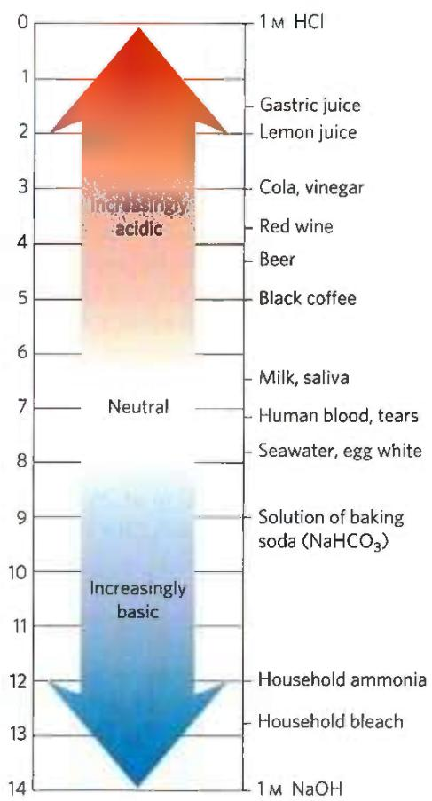  
FIGURE 2-14 The pH of some aqueous fluids.

the concentration of OH $^{-}$ is greater than that of H $^{+}$ . Conversely, solutions having a pH less than 7 are acidic.

Keep in mind that the pH scale is logarithmic, not arithmetic. To say that two solutions differ in pH by 1 pH unit means that one solution has ten times the H $^{+}$ concentration of the other, but it does not tell us the absolute magnitude of the difference. Figure 2-14 gives the pH values of some common aqueous fluids. A cola drink (pH 3.0) or red wine (pH 3.7) has an H $^{+}$ concentration approximately 10,000 times that of blood (pH 7.4).

Accurate determinations of pH in the chemical or clinical laboratory are made with a glass electrode that is selectively sensitive to $H^{+}$ concentration but insensitive to $Na^{+}$ , $K^{+}$ , and other cations. In a pH meter, the signal from the glass electrode placed in a test solution is amplified and compared with the signal generated by a solution of accurately known pH.

Measurement of pH is one of the most important and frequently used procedures in biochemistry. The pH affects the structure and activity of biological macromolecules, so a small change in pH can cause a large change in the structure and function of a protein. Measurements of the pH of blood and urine are commonly used in medical diagnoses. The pH of the blood plasma of people with severe, uncontrolled diabetes, for example, is often below the normal value of 7.4; this condition is called acidosis (described in more detail below). In certain other diseases the pH of the blood is higher than normal, a condition known as alkalosis. Extreme acidosis or alkalosis can be life-threatening (see Box 2-1).

#### [EN] BOX 2-1

#### [EN] MEDICINE

#### [EN] On Being One's Own Rabbit (Don't Try This at Home!)

I wanted to find out what happened to a man when one made him more acid or more alkaline . . . One might, of course, have tried experiments on a rabbit first, and some work had been done along these lines; but it is difficult to be sure how a rabbit feels at any time. Indeed, some rabbits make no serious attempt to cooperate with one.

—J. B. S. Haldane, Possible Worlds, 1928

A century ago, physiologist and geneticist J. B. S. Haldane and his colleague H. W. Davies decided to experiment on themselves, to study how the body controls blood pH. They made themselves alkaline by hyperventilating and ingesting sodium bicarbonate, which left them panting and with violent headaches. They tried to acidify themselves by drinking hydrochloric acid, but calculated that it would take a gallon and a half of dilute HCl to get the desired effect, and a pint was enough to dissolve their teeth and burn their throats. Finally, it occurred to Haldane that if he ate ammonium chloride, it would break down in the body to release hydrochloric acid and ammonia.

The ammonia would be converted to harmless urea in the liver (this process is described in detail in Fig. 18-10). The hydrochloric acid would combine with the sodium bicarbonate present in all tissues, producing sodium chloride and carbon dioxide. In this experiment, the resulting shortness of breath mimicked that in diabetic acidosis or end-stage kidney disease.

Meanwhile, Ernst Freudenberg and Paul György, pediatricians in Heidelberg, were studying tetany—muscle contractions occurring in the hands, arms, feet, and larynx—in infants. They knew that tetany was sometimes seen in patients who had lost large amounts of hydrochloric acid by constant vomiting, and they reasoned that if tissue alkalinity produced tetany, acidity might be expected to cure it. The moment they read Haldane's paper on the effects of ammonium chloride, they tried giving ammonium chloride to babies with tetany, and they were delighted to find that the tetany cleared up in a few hours. This treatment didn't remove the primary cause of the tetany, but it did give the infant and the physician time to deal with that cause.

#### [EN] Weak Acids and Bases Have Characteristic Acid Dissociation Constants

Hydrochloric, sulfuric, and nitric acids, commonly called strong acids, are completely ionized in dilute aqueous solutions; the strong bases NaOH and KOH are also completely ionized. Of more interest to biochemists is the behavior of weak acids and bases—those not completely ionized when dissolved in water. These are ubiquitous in biological systems and play important roles in metabolism and its regulation. The behavior of aqueous solutions of weak acids and bases is best understood if we first define some terms.

Acids (in the Brønsted-Lowry definition) are proton donors, and bases are proton acceptors. When a proton donor such as acetic acid (CH₃COOH) loses a proton, it becomes the corresponding proton acceptor, in this case the acetate anion (CH₃COO⁻). A proton donor and its corresponding proton acceptor make up a conjugate acid-base pair (Fig. 2-15), related by the reversible reaction

$$
\mathrm{CH} _ {3} \mathrm{COOH} \rightleftharpoons \mathrm{CH} _ {3} \mathrm{COO} ^ {-} + \mathrm{H} ^ {+}
$$

Each acid has a characteristic tendency to lose its proton in an aqueous solution. The stronger the acid, the greater its tendency to lose its proton. P2 The tendency of any acid (HA) to lose a proton and form its conjugate base (A $^{-}$ ) is defined by the equilibrium constant ( $K_{eq}$ ) for the reversible reaction

$$
\mathrm{HA} \rightleftharpoons \mathrm{H} ^ {+} + \mathrm{A} ^ {-}
$$

for which

$$
K _ {\mathrm{eq}} = \frac {[ \mathrm{H} ^ {+} ] [ \mathrm{A} ^ {-} ]}{[ \mathrm{HA} ]} = K _ {\mathrm{a}}
$$

Equilibrium constants for ionization reactions are usually called ionization constants or acid dissociation constants, often designated $K_{a}$ . The dissociation constants of some acids are given in Figure 2-15. Stronger acids, such as phosphoric and carbonic acids, have larger ionization constants; weaker acids, such as monohydrogen phosphate ( $HPO_{4}^{2-}$ ), have smaller ionization constants.

Also included in Figure 2-15 are values of $\mathbf{pK}_{\mathbf{a}}$ , which is analogous to pH and is defined by the equation

$$
\mathrm{p} K _ {\mathrm{a}} = \log \frac {1}{K _ {\mathrm{a}}} = - \log K _ {\mathrm{a}}
$$

The stronger the tendency to dissociate a proton, the stronger the acid and the lower its $pK_{a}$ . As we shall now see, the $pK_{a}$ of any weak acid can be determined experimentally.

  
FIGURE 2-15 Conjugate acid-base pairs consist of a proton donor and a proton acceptor. Some compounds, such as acetic acid and ammonium ion, are monoprotic: they can give up only one proton. Others are diprotic (carbonic acid and glycine) or triprotic (phosphoric acid). The dissociation reactions for each pair are shown where they occur along  
a pH gradient. The equilibrium or dissociation constant (K) and its negative logarithm, the $pK_{a}$ , are shown for each reaction. \*For an explanation of apparent discrepancies in $pK_{a}$ values for carbonic acid ( $H_{2}CO_{3}$ ), see p. 63; and for dihydrogen phosphate ( $H_{2}PO_{4}^{-}$ ), see p. 58.

#### [EN] Titration Curves Reveal the $pK_{a}$ of Weak Acids

Titration can be used to determine the amount of an acid in a given solution. A measured volume of the acid is titrated with a solution of a strong base, usually sodium hydroxide (NaOH), of known concentration. The NaOH is added in small increments until the acid is consumed (neutralized), as determined with an indicator dye or a pH meter. The concentration of the acid in the original solution can be calculated from the volume and concentration of NaOH added. The amounts of acid and base in titrations are often expressed in terms of equivalents, where one equivalent is the amount of a substance that will react with, or supply, one mole of hydrogen ions in an acid-base reaction. Recall that for monoprotic acids such as HCl, 1 mol = 1 equivalent; for diprotic acids such as $H_{2}SO_{4}$ , 1 mol = 2 equivalents.

A plot of pH against the amount of NaOH added (a titration curve) reveals the $pK_{a}$ of the weak acid. Consider the titration of a 0.1 M solution of acetic acid with 0.1 M NaOH at 25 °C (Fig. 2-16). Two reversible equilibria are involved in the process (here, for simplicity, acetic acid is denoted HAc):

$$
\mathrm{H} _ {2} \mathrm{O} \rightleftharpoons \mathrm{H} ^ {+} + \mathrm{OH} ^ {-}\tag{2-5}
$$

$$
\mathrm{HAc} \rightleftharpoons \mathrm{H} ^ {+} + \mathrm{Ac} ^ {-}\tag{2-6}
$$

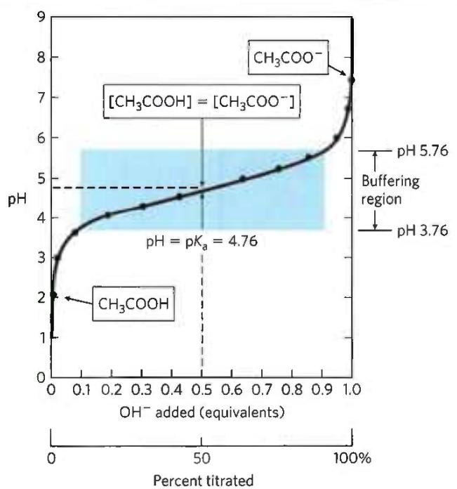  
FIGURE 2-16 The titration curve of acetic acid. After addition of each increment of NaOH to the acetic acid solution, the pH of the mixture is measured. This value is plotted against the amount of NaOH added, expressed as a fraction of the total NaOH required to convert all the acetic acid (CH₃COOH) to its deprotonated form, acetate (CH₃COO⁻). The points so obtained yield the titration curve. Shown in the boxes are the predominant ionic forms at the points designated. At the midpoint of the titration, the concentrations of the proton donor and the proton acceptor are equal, and the pH is numerically equal to the pKₐ. The shaded zone is the useful region of buffering power, generally between 10% and 90% titration of the weak acid.

The equilibria must simultaneously conform to their characteristic equilibrium constants, which are, respectively,

$$
K _ {\mathrm{w}} = [ \mathrm{H} ^ {+} ] [ \mathrm{OH} ^ {-} ] = 1 \times 1 0 ^ {- 1 4} \mathrm{M} ^ {2}\tag{2-7}
$$

$$
K _ {\mathrm{a}} = \frac {[ \mathrm{H} ^ {+} ] [ \mathrm{Ac} ^ {-} ]}{[ \mathrm{HAc} ]} = 1. 7 4 \times 1 0 ^ {- 5} \mathrm{M}\tag{2-8}
$$

At the beginning of the titration, before any NaOH is added, the acetic acid is already slightly ionized, to an extent that can be calculated from its ionization constant (Eqn 2-8).

As NaOH is gradually introduced, the added OH $^{-}$ combines with the free H $^{+}$ in the solution to form H $_{2}$ O, to an extent that satisfies the equilibrium relationship in Equation 2-7. As free H $^{+}$ is removed, HAc dissociates further to satisfy its own equilibrium constant (Eqn 2-8). The net result as the titration proceeds is that more and more HAc ionizes, forming Ac $^{-}$ , as the NaOH is added. At the midpoint of the titration, at which exactly 0.5 equivalent of NaOH has been added per equivalent of the acid, one-half of the original acetic acid has undergone dissociation, so that the concentration of the proton donor, [HAc], now equals that of the proton acceptor, [Ac $^{-}$ ]. P2 At this midpoint a very important relationship holds: the pH of the equimolar solution of acetic acid and acetate is exactly equal to the pK $_{a}$ of acetic acid (pK $_{a}$ = 4.76; Figs 2-15, 2-16). The basis for this relationship, which holds for all weak acids, will soon become clear.

As the titration is continued by adding further increments of NaOH, the remaining nondissociated acetic acid is gradually converted into acetate. The end point of the titration occurs at about pH 7.0: all the acetic acid has lost its protons to $OH^{-}$ , to form $H_{2}O$ and acetate. Throughout the titration the two equilibria (Eqns 2-5, 2-6) coexist, each always conforming to its equilibrium constant.

Figure 2-17 compares the titration curves of three weak acids with very different ionization constants: acetic acid ( $pK_{a} = 4.76$ ); dihydrogen phosphate, $H_{2}PO_{4}^{-}$ ( $pK_{a} = 6.86$ ); and ammonium ion, $NH_{4}^{+}$ ( $pK_{a} = 9.25$ ). Although the titration curves of these acids have the same shape, they are displaced along the pH axis because the three acids have different strengths. Acetic acid, with the highest $K_{a}$ (lowest $pK_{a}$ ) of the three, is the strongest of the three weak acids (loses its proton most readily); it is already half dissociated at pH 4.76. Dihydrogen phosphate loses a proton less readily, being half dissociated at pH 6.86. Ammonium ion is the weakest acid of the three and does not become half dissociated until pH 9.25. The titration curve of these weak acids shows graphically that a weak acid and its anion—a conjugate acid-base pair—can act as a buffer, as we describe in the next section.

Like all equilibrium constants, $K_{a}$ and $pK_{a}$ are defined for specific conditions of concentration (components at 1 M) and temperature (25 °C). Concentrated buffer solutions do not show ideal behavior. For example, the $pK_{a}$ of dihydrogen phosphate is sometimes given as 7.2, sometimes as 6.86. The higher value (the apparent $pK_{a}$ ) is not corrected for the effects of buffer concentration, and is defined at a temperature of $25\ ^{\circ}C$ . The value of 6.86 is corrected for buffer concentration and measured at physiological temperature ( $37\ ^{\circ}C$ ), and is probably a closer approximation to the relevant value of $pK_{a}$ in warm-blooded animals. We therefore use the value $pK_{a}=6.86$ for dihydrogen phosphate throughout this book.

  
FIGURE 2-17 Comparison of the titration curves of three weak acids. Shown here are the titration curves for $\mathrm{CH}_3\mathrm{COOH}$ , $\mathrm{H}_2\mathrm{PO}_4^-$ , and $\mathrm{NH}_4^+$ . The predominant ionic forms at designated points in the titration are given in boxes. The regions of buffering capacity are indicated at the right. Conjugate acid-base pairs are effective buffers between approximately $10\%$ and $90\%$ neutralization of the proton-donor species.

#### [EN] SUMMARY 2.2 Ionization of Water, Weak Acids, and Weak Bases

■ Pure water ionizes slightly, forming equal numbers of hydrogen ions (hydronium ions, $H_{3}O^{+}$ ) and hydroxide ions.

The extent of ionization is described by an equilibrium constant, $K_{eq} = \frac{[H^{+}] [OH^{-}]}{[H_{2}O]}$ , from which the ion product of water, $K_{w}$ , is derived. At 25 °C,

$$
K _ {\mathrm{w}} = [ \mathrm{H} ^ {+} ] [ \mathrm{OH} ^ {-} ] = (5 5. 5 \mathrm{M}) (K _ {\mathrm{eq}}) = 1 0 ^ {- 1 4} \mathrm{M} ^ {2}
$$

■ The pH of an aqueous solution reflects, on a logarithmic scale, the concentration of hydrogen ions:

$$
\mathrm{pH} = \log \frac {1}{[ \mathrm{H} ^ {+} ]} = - \log [ \mathrm{H} ^ {+} ]
$$

■ Weak acids partially ionize to release a hydrogen ion, thus lowering the pH of the aqueous solution. Weak bases accept a hydrogen ion, increasing the pH. The extent of these processes is characteristic of each particular weak acid or base and is expressed as an acid dissociation constant:

$$
K _ {\mathrm{eq}} = \frac {[ \mathrm{H} ^ {+} ] [ \mathrm{A} ^ {-} ]}{[ \mathrm{HA} ]} = K _ {\mathrm{a}}
$$

■ The $pK_{a}$ expresses, on a logarithmic scale, the relative strength of a weak acid or base:

$$
\mathrm{p} K _ {\mathrm{a}} = \log \frac {1}{[ K _ {\mathrm{a}} ]} = - \log K _ {\mathrm{a}}
$$

The stronger the acid, the smaller its $pK_{a}$ ; the stronger the base, the larger the $pK_{a}$ of its conjugate acid. The $pK_{a}$ can be determined experimentally; it is the pH at the midpoint of the titration curve.

<!-- EN-END 2.2 -->

<!-- EN-BEGIN 2.3 -->

### 【英文对应 2.3】Buffering against pH Changes in Biological Systems

> 来源：Lehninger Principles of Biochemistry（书籍/02_生物化学原理） 第2章 Water, the Solvent of Life，§2.3。对应本章“六、水和生命”。

Almost every biological process is pH-dependent; a small change in pH produces a large change in the rate of the process. This is true not only for the many reactions in which the $H^{+}$ ion is a direct participant, but also for those reactions in which there is no apparent role for $H^{+}$ ions.

P4 The enzymes that catalyze cellular reactions, and many of the molecules on which they act, contain ionizable groups with characteristic $pK_{a}$ values. The protonated amino and carboxyl groups of amino acids and the phosphate groups of nucleotides, for example, function as weak acids; their ionic state is determined by the pH of the surrounding medium. (When an ionizable group is sequestered in the middle of a protein, away from the aqueous solvent, its $pK_{a}$ , or apparent $pK_{a}$ , can be significantly different from its $pK_{a}$ in water.) As we noted above, ionic interactions are among the forces that stabilize a protein molecule and allow an enzyme to recognize and bind to its substrate.

Cells and organisms maintain a specific and constant cytosolic pH, usually near pH 7, keeping biomolecules in their optimal ionic state. In multicellular organisms, the pH of extracellular fluids is also tightly regulated. Constancy of pH is achieved primarily by biological buffers: mixtures of weak acids and their conjugate bases.

#### [EN] Buffers Are Mixtures of Weak Acids and Their Conjugate Bases

Buffers are aqueous systems that tend to resist changes in pH when small amounts of acid (H $^{+}$ ) or base (OH $^{-}$ ) are added. A buffer system consists of a weak acid (the proton donor) and its conjugate base (the proton acceptor). As an example, a mixture of equal concentrations of acetic acid and acetate ion, found at the midpoint of the titration curve in Figure 2-16, is a buffer system. Notice that the titration curve of acetic acid has a relatively flat zone extending about 1 pH unit on either side of its midpoint pH of 4.76. In this zone, a given amount of $H^{+}$ or $OH^{-}$ added to the system has much less effect on pH than the same amount added outside the zone. This relatively flat zone is the buffering region of the acetic acid-acetate buffer pair. At the midpoint of the buffering region, where the concentration of the proton donor (acetic acid) exactly equals that of the proton acceptor (acetate), the buffering power of the system is maximal; that is, its pH changes least on addition of $H^{+}$ or $OH^{-}$ . The pH at this point in the titration curve of acetic acid is equal to its apparent $pK_{a}$ . The pH of the acetate buffer system does change slightly when a small amount of $H^{+}$ or $OH^{-}$ is added, but this change is very small compared with the pH change that would result if the same amount of $H^{+}$ or $OH^{-}$ were added to pure water or to a solution of the salt of a strong acid and strong base, such as NaCl, which has no buffering power.

Buffering results from two reversible reaction equilibria occurring in a solution of nearly equal concentrations of a proton donor and its conjugate proton acceptor. Figure 2-18 explains how a buffer system works. Whenever $H^{+}$ or $OH^{-}$ is added to a buffer, the result is a small change in the ratio of the relative concentrations of the weak acid and its anion and thus a small change in pH. The decrease in concentration of one component of the system is balanced exactly by an increase in the other. The sum of the buffer components does not change; only their ratio changes.

  
FIGURE 2-18 The acetic acid–acetate pair as a buffer system. The system is capable of absorbing either $H^{+}$ or $OH^{-}$ through the reversibility of the dissociation of acetic acid. The proton donor, acetic acid (HAc), contains a reserve of bound $H^{+}$ , which can be released to neutralize an addition of $OH^{-}$ to the system, forming $H_{2}O$ . This happens because the product $[H^{+}][OH^{-}]$ transiently exceeds $K_{w}(1\times10^{-14}\mathrm{~m}^{2})$ . The equilibrium quickly adjusts to restore the product to $1\times10^{-14}\mathrm{~m}^{2}$ (at 25 °C), thus transiently reducing the concentration of $H^{+}$ . But now the quotient $[H^{+}][Ac^{-}]/[HAc]$ is less than $K_{a}$ , so HAc dissociates further to restore equilibrium. Similarly, the conjugate base, $Ac^{-}$ , can react with $H^{+}$ ions added to the system; again, the two ionization reactions simultaneously come to equilibrium. Thus, a conjugate acid-base pair, such as acetic acid and acetate ion, tends to resist a change in pH when small amounts of acid or base are added. Buffering action is simply the consequence of two reversible reactions taking place simultaneously and reaching their points of equilibrium as governed by their equilibrium constants, $K_{w}$ and $K_{a}$ .

Each conjugate acid-base pair has a characteristic pH zone in which it is an effective buffer (Fig. 2-17). The $H_{2}PO_{4}^{-}/HPO_{4}^{2-}$ pair has a $pK_{a}$ of 6.86 and thus can serve as an effective buffer system between approximately pH 5.9 and pH 7.9; the $NH_{4}^{+}/NH_{3}$ pair, with a $pK_{a}$ of 9.25, can act as a buffer between approximately pH 8.3 and pH 10.3.

#### [EN] The Henderson-Hasselbalch Equation Relates pH, $pK_{a}$ , and Buffer Concentration

The titration curves of acetic acid, $H_{2}PO_{4}^{2-}$ , and $NH_{4}^{+}$ (Fig. 2-17) have nearly identical shapes, suggesting that these curves reflect a fundamental law or relationship. This is indeed the case. P3 The shape of the titration curve of any weak acid is described by the Henderson-Hasselbalch equation, which is important for understanding buffer action and acid-base balance in the blood and tissues of vertebrates. This equation is simply a useful way of restating the expression for the ionization constant of an acid. For the ionization of a weak acid HA, the Henderson-Hasselbalch equation can be derived as follows:

First solve for $[\mathrm{H}^{+}]$ :

$$
\begin{array}{l} K _ {\mathrm{a}} = \frac {[ \mathrm{H} ^ {+} ] [ \mathrm{A} ^ {-} ]}{[ \mathrm{HA} ]} \\ [ \mathrm{H} ^ {+} ] = K _ {\mathrm{a}} \frac {[ \mathrm{HA} ]}{[ \mathrm{A} ^ {-} ]} \end{array}
$$

Then take the negative logarithm of both sides:

$$
- \log [ \mathrm{H} ^ {+} ] = - \log K _ {\mathrm{a}} - \log \frac {[ \mathrm{HA} ]}{[ \mathrm{A} ^ {-} ]}
$$

Substitute pH for $-\log\left[H^{+}\right]$ and $pK_{a}$ for $-\log K_{a}$ :

$$
\mathrm{pH} = \mathrm{p} K _ {\mathrm{a}} - \log \frac {[ \mathrm{HA} ]}{[ \mathrm{A} ^ {-} ]}
$$

Now invert $-\log[HA]/[A^{-}]$ , which requires changing its sign, to obtain the Henderson-Hasselbalch equation:

$$
\mathrm{pH} = \mathrm{p} K _ {\mathrm{a}} + \log \frac {[ \mathrm{A} ^ {-} ]}{[ \mathrm{HA} ]}\tag{2-9}
$$

This equation fits the titration curve of all weak acids and enables us to deduce some important quantitative relationships. For example, it shows why the $pK_{a}$ of a weak acid is equal to the pH of the solution at the midpoint of its titration. At that point, $[HA] = [A^{-}]$ , and

$$
\mathrm{pH} = \mathrm{p} K _ {\mathrm{a}} + \log 1 = \mathrm{p} K _ {\mathrm{a}} + 0 = \mathrm{p} K _ {\mathrm{a}}
$$

The Henderson-Hasselbalch equation also allows us (1) to calculate $pK_{a}$ , given pH and the molar ratio of proton donor and acceptor; (2) to calculate pH, given $pK_{a}$ and the molar ratio of proton donor and acceptor; and (3) to calculate the molar ratio of proton donor and acceptor, given pH and $pK_{a}$ .

  
FIGURE 2-19 Ionization of histidine. The amino acid histidine, a component of proteins, is a weak acid. The $\mathsf{pK}_{\mathrm{a}}$ of the protonated nitrogen of the side chain is 6.0.

#### [EN] Weak Acids or Bases Buffer Cells and Tissues against pH Changes

P3 The intracellular and extracellular fluids of multicellular organisms have a characteristic and nearly constant pH. The organism's first line of defense against changes in internal pH is provided by buffer systems. The cytoplasm of most cells contains high concentrations of proteins, and these proteins contain many amino acids with functional groups that are weak acids or weak bases. For example, the side chain of histidine (Fig. 2-19) has a $pK_{a}$ of 6.0 and thus can exist in either the protonated form or the unprotonated form near neutral pH. Proteins containing histidine residues therefore buffer effectively near neutral pH.

#### [EN] WORKED EXAMPLE 2-4 Ionization of Histidine

Calculate the fraction of histidine that has its imidazole side chain protonated at pH 7.3. The $pK_{a}$ values for histidine are $pK_{1}=1.8$ , $pK_{2}$ (imidazole)=6.0, and $pK_{3}=9.2$ (see Fig. 3-12b).

SOLUTION: The three ionizable groups in histidine have sufficiently different $pK_{a}$ values (different by at least 2 pH units) that the first acid (—COOH) is almost completely ionized before the second acid (protonated imidazole) begins to dissociate a proton, and the second ionizes almost completely before the third ( $—NH_{3}^{+}$ ) begins to dissociate its proton. (With the Henderson-Hasselbalch equation, we can easily show that a weak acid goes from 1% ionized at 2 pH units below its $pK_{a}$ to 99% ionized at 2 pH units above its $pK_{a}$ ; see also Fig. 3-12b.) At pH 7.3, the carboxyl group of histidine is entirely deprotonated ( $—COO^{-}$ ) and the $\alpha$ -amino group is fully protonated ( $—NH_{3}^{+}$ ). We can therefore assume that at pH 7.3, the only group that is partially dissociated is the imidazole group, which can be protonated (we'll abbreviate as HisH $^{+}$ ) or not (His).

We use the Henderson-Hasselbalch equation:

$$
\mathrm{pH} = \mathrm{pK} _ {\mathrm{a}} + \log \frac {[ \mathrm{A} ^ {-} ]}{[ \mathrm{HA} ]}
$$

Substituting $pK_{2}=6.0$ and pH=7.3:

$$
7. 3 = 6. 0 + \log \frac {[ \mathrm{His} ]}{[ \mathrm{HisH} ^ {+} ]}
$$

$$
1. 3 = + \log \frac {[ \mathrm{His} ]}{[ \mathrm{HisH} ^ {+} ]}
$$

$$
\text {   antilog   } 1. 3 = \frac {[ \mathrm{His} ]}{[ \mathrm{HisH} ^ {+} ]} = 2. 0 \times 1 0 ^ {1}
$$

This gives us the ratio of [His] to $[HisH^{+}]$ (20 to 1 in this case). We want to convert this ratio to the fraction of total histidine that is in the unprotonated form (His) at pH 7.3. That fraction is 20/21 (20 parts His per 1 part HisH $^{+}$ , in a total of 21 parts histidine in either form), or about 95.2%; the remainder (100% minus 95.2%) is protonated—about 5%.

Nucleotides such as ATP, as well as many metabolites of low molecular weight, contain ionizable groups that can contribute buffering power to the cytoplasm. Some highly specialized organelles and extracellular compartments have high concentrations of compounds that contribute buffering capacity: organic acids buffer the vacuoles of plant cells; ammonia buffers urine.

Two especially important biological buffers are the phosphate and bicarbonate systems. The phosphate buffer system, which acts in the cytoplasm of all cells, consists of $H_{2}PO_{4}^{-}$ as proton donor and $HPO_{4}^{2-}$ as proton acceptor:

$$
\mathrm{H} _ {2} \mathrm{PO} _ {4} ^ {-} \rightleftharpoons \mathrm{H} ^ {+} + \mathrm{HPO} _ {4} ^ {2 -}
$$

The phosphate buffer system is maximally effective at a pH close to its $pK_{a}$ of 6.86 (Figs 2-15, 2-17) and thus tends to resist pH changes in the range between about 5.9 and 7.9. It is therefore an effective buffer in biological fluids; in mammals, for example, extracellular fluids and most cytoplasmic compartments have a pH in the range of 6.9 to 7.4.

#### [EN] WORKED EXAMPLE 2-5 Phosphate Buffers

(a) What is the pH of a mixture of 0.042 M $NaH_{2}PO_{4}$ and 0.058 M $Na_{2}HPO_{4}$ ?

SOLUTION: We use the Henderson-Hasselbalch equation, which we'll express here as

$$
\mathrm{pH} = \mathrm{pK} _ {\mathrm{a}} + \log \frac {[ \text { conjugate   base } ]}{[ \text { acid } ]}
$$

In this case, the acid (the species that gives up a proton) is $H_{2}PO_{4}^{-}$ , and the conjugate base (the species that gains a proton) is $HPO_{4}^{2-}$ . Substituting the given concentrations of acid and conjugate base and the $pK_{a}$ (6.86) results in

$$
\mathrm{pH} = 6. 8 6 + \log \frac {[ 0 . 0 5 8 ]}{[ 0 . 0 4 2 ]} = 6. 8 6 + 0. 1 4 = 7. 0
$$

We can roughly check this answer. When more conjugate base than acid is present, the acid is more than 50% titrated and thus the pH is above the $pK_{a}$ (6.86), where the acid is exactly 50% titrated.

(b) If 1.0 mL of 10.0 M NaOH is added to a liter of the buffer prepared in (a), how much will the pH change?

SOLUTION: A liter of the buffer contains 0.042 mol of $\mathrm{NaH}_2\mathrm{PO}_4$ . Adding $1.0~\mathrm{mL}$ of $10.0\mathrm{MNaOH}$ (0.010 mol) would titrate an equivalent amount (0.010 mol) of $NaH_{2}PO_{4}$ to $Na_{2}HPO_{4}$ , resulting in 0.032 mol of $NaH_{2}PO_{4}$ and 0.068 mol of $Na_{2}HPO_{4}$ . The new pH is

$$
\begin{array}{r l} \mathrm{pH} & = \mathrm{pK} _ {\mathrm{a}} + \log \frac {[ \mathrm{HPO} _ {4} ^ {2 -} ]}{[ \mathrm{H} _ {2} \mathrm{PO} _ {4} ^ {-} ]} \\ & = 6. 8 6 + \log \frac {0 . 0 6 8}{0 . 0 3 2} = 6. 8 6 + 0. 3 3 = 7. 2 \end{array}
$$

(c) If 1.0 mL of 10.0 M NaOH is added to a liter of pure water at pH 7.0, what is the final pH? Compare this with the answer in (b).

SOLUTION: The NaOH dissociates completely into $Na^{+}$ and $OH^{-}$ , giving $[OH^{-}] = 0.010 \, mol/L = 1.0 \times 10^{-2} \, M$ . We can define a term pOH analogous with pH to express $[OH^{-}]$ of a solution. The pOH is the negative logarithm of $[OH^{-}]$ , so in our example pOH = 2.0. Given that in all solutions, pH + pOH = 14 (see Table 2-5), the pH of the solution is 12. So, an amount of NaOH that increases the pH of water from 7 to 12 increases the pH of a buffered solution, as in (b), from 7.0 to just 7.2. Such is the power of buffering!

Why is pH + pOH = 14?

$$
K _ {w} = 1 0 ^ {- 1 4} = \left[ H ^ {+} \right] \left[ O H ^ {-} \right]
$$

Taking the negative log of both sides of the equation gives

$$
\begin{array}{r l} - \log (1 0 ^ {- 1 4}) & = - \log [ H ^ {+} ] + - \log [ O H ^ {-} ] \\ 1 4 & = - \log [ H ^ {+} ] + - \log [ O H ^ {-} ] \\ 1 4 & = p H + p O H \end{array}
$$

P3 Blood plasma is buffered in part by the bicarbonate system, consisting of carbonic acid (H₂CO₃) as proton donor and bicarbonate (HCO₃⁻) as proton acceptor (K₁ is the first of several equilibrium constants in the bicarbonate buffering system):

$$
\begin{array}{r l}&\mathrm {H_ {2} CO_ {3}} \rightleftharpoons \mathrm {H^ {+}} + \mathrm {HCO_ {3} ^ {-}}\\&K _ {1} = \frac {[ \mathrm {H^ {+}} ] [ \mathrm {HCO_ {3} ^ {-}} ]}{[ \mathrm {H_ {2} CO_ {3}} ]}\end{array}
$$

This buffer system is more complex than other conjugate acid-base pairs because one of its components, carbonic acid ( $H_{2}CO_{3}$ ), is formed from dissolved (aq) carbon dioxide and water, in a reversible reaction:

$$
\begin{array}{r l}&\mathrm {CO_ {2} (aq)+ H_ {2} O\rightleftharpoons H_ {2} CO_ {3}}\\&K _ {2} = \frac {[ \mathrm {H_ {2} CO_ {3}} ]}{[ \mathrm {CO_ {2} (aq)} ] [ \mathrm {H_ {2} O} ]}\end{array}
$$

Carbon dioxide is a gas under normal conditions, and $CO_{2}$ dissolved in an aqueous solution is in equilibrium with $CO_{2}$ in the gas (g) phase:

$$
\begin{array}{r l}\mathrm{CO} _ {2} (\mathrm{g})&\rightleftharpoons \mathrm{CO} _ {2} (\mathrm{aq})\\K _ {\mathrm{a}}&= \frac {[ \mathrm{CO} _ {2} (\mathrm{aq}) ]}{[ \mathrm{CO} _ {2} (\mathrm{g}) ]}\end{array}
$$

The pH of a bicarbonate buffer system depends on the concentrations of $H_{2}CO_{3}$ and $HCO_{3}^{-}$ , the proton donor and acceptor components. The concentration of $H_{2}CO_{3}$ in turn depends on the concentration of dissolved $CO_{2}$ , which in turn depends on the concentration of $CO_{2}$ in the gas phase, or the partial pressure of $CO_{2}$ , denoted $pCO_{2}$ . Thus, the pH of a bicarbonate buffer exposed to a gas phase is ultimately determined by the concentration of $HCO_{3}^{-}$ in the aqueous phase and by $pCO_{2}$ in the gas phase.

The bicarbonate buffer system is an effective physiological buffer near pH 7.4, because the $\mathrm{H}_2\mathrm{CO}_3$ of blood plasma is in equilibrium with a large reserve capacity of $\mathrm{CO}_{2}(\mathrm{g})$ in the air space of the lungs. As noted above, this buffer system involves three reversible equilibria, in this case between gaseous $\mathrm{CO}_{2}$ in the lungs and bicarbonate $(\mathrm{HCO}_{3}^{-})$ in the blood plasma (Fig. 2-20).

Blood can pick up $H^{+}$ , such as from the lactic acid produced in muscle tissue during vigorous exercise. Alternatively, it can lose $H^{+}$ , such as by protonation of the $NH_{3}$ produced during protein catabolism. When $H^{+}$ is added to blood as it passes through the tissues, reaction 1 in Figure 2-20 proceeds toward a new equilibrium, in which $[H_{2}CO_{3}]$ is increased. This in turn increases $[CO_{2}(aq)]$ in the blood (reaction 2) and thus increases the partial pressure of $CO_{2}(g)$ in the air space of the lungs (reaction 3); the extra $CO_{2}$ is exhaled. Conversely, when $H^{+}$ is lost from the blood, the opposite events occur: more $H_{2}CO_{3}$ dissociates into $H^{+}$ and $HCO_{3}^{-}$ , and thus more $CO_{2}(g)$ from the lungs dissolves in blood plasma. The rate of respiration—that is, the rate of inhaling and exhaling—can quickly adjust these equilibria to keep the blood pH nearly constant. The rate of respiration is controlled by the brain stem, where detection of an increased blood $pCO_{2}$ or decreased blood pH triggers deeper and more frequent breathing.

  
FIGURE 2-20 The bicarbonate buffer system. $\mathrm{CO}_{2}$ in the air space of the lungs is in equilibrium with the bicarbonate buffer in the blood plasma passing through the lung capillaries. Because the concentration of dissolved $\mathrm{CO}_{2}$ can be adjusted rapidly through changes in the rate of breathing, the bicarbonate buffer system of the blood is in near-equilibrium with a large potential reservoir of $\mathrm{CO}_{2}$ .

Hyperventilation, the rapid breathing sometimes elicited by stress or anxiety, tips the normal balance of $O_{2}$ breathed in and $CO_{2}$ breathed out in favor of too much $CO_{2}$ breathed out, raising the blood pH to 7.45 or higher and causing alkalosis. This alkalosis can lead to dizziness, headache, weakness, and fainting. One home remedy for mild alkalosis is to breathe briefly into a paper bag. The air in the bag becomes enriched in $CO_{2}$ , and inhaling this air increases the $CO_{2}$ concentration in the body and blood and decreases blood pH.

At the normal pH of blood plasma (7.4), very little $H_{2}CO_{3}$ is present relative to $HCO_{3}^{-}$ , and the addition of just a small amount of base ( $NH_{3}$ or $OH^{-}$ ) would titrate this $H_{2}CO_{3}$ , exhausting the buffering capacity. The important role of $H_{2}CO_{3}$ ( $pK_{a} = 3.57$ at 37 °C) in buffering blood plasma (pH \~7.4) seems inconsistent with our earlier statement that a buffer is most effective in the range of 1 pH unit above and below its $pK_{a}$ . The explanation for this apparent paradox is the large reservoir of $CO_{2}$ dissolved in blood, which we refer to as $CO_{2}(aq)$ . Its rapid equilibration with $H_{2}CO_{3}$ results in the formation of additional $H_{2}CO_{3}$ :

$$
\mathrm{CO} _ {2} (\mathrm{aq}) + \mathrm{H} _ {2} \mathrm{O} \rightleftharpoons \mathrm{H} _ {2} \mathrm{CO} _ {3}
$$

It is useful in clinical medicine to have a simple expression for blood pH in terms of $CO_{2}(aq)$ , which is commonly monitored along with other blood gases. We can define a constant, $K_{h}$ , which is the equilibrium constant for the hydration of $CO_{2}$ to form $H_{2}CO_{3}$ :

$$
K _ {\mathrm{h}} = \frac {[ \mathrm{H} _ {2} \mathrm{CO} _ {3} ]}{[ \mathrm{CO} _ {2} (\mathrm{aq}) ]}
$$

(The concentration of water is so high (55.5 M) that dissolving $CO_{2}$ doesn't change $[H_{2}O]$ appreciably, so $[H_{2}O]$ is made part of the constant $K_{h}$ .) Then, to take the $CO_{2}(aq)$ reservoir into account, we can express $[H_{2}CO_{3}]$ as $K_{h}[CO_{2}(aq)]$ and substitute this expression for $[H_{2}CO_{3}]$ in the equation for the acid dissociation of $H_{2}CO_{3}$ :

$$
K _ {\mathrm{a}} = \frac {[ \mathrm{H} ^ {+} ] [ \mathrm{HCO} _ {3} ^ {-} ]}{[ \mathrm{H} _ {2} \mathrm{CO} _ {3} ]} = \frac {[ \mathrm{H} ^ {+} ] [ \mathrm{HCO} _ {3} ^ {-} ]}{K _ {\mathrm{h}} [ \mathrm{CO} _ {2} (\mathrm{aq}) ]}
$$

Now, the overall equilibrium for dissociation of $H_{2}CO_{3}$ can be expressed in these terms:

$$
K _ {\mathrm{h}} K _ {\mathrm{a}} = K _ {\mathrm{combined}} = \frac {[ \mathrm{H} ^ {+} ] [ \mathrm{HCO} _ {3} ^ {-} ]}{[ \mathrm{CO} _ {2} (\mathrm{aq}) ]}
$$

We can calculate the value of the new constant, $K_{combined}$ , and the corresponding apparent pK, or $pK_{combined}$ , from the experimentally determined values of $K_{\mathrm{h}}(3.0\times10^{-3}\mathrm{~M})$ and $K_{\mathrm{a}}(2.7\times10^{-4}\mathrm{~M})$ at $37^{\circ}C$ :

$$
\begin{array}{r l} K _ {\mathrm{combined}} & = (3. 0 \times 1 0 ^ {- 3} \mathrm{M}) (2. 7 \times 1 0 ^ {- 4} \mathrm{M}) \\ & = 8. 1 \times 1 0 ^ {- 7} \mathrm{M} ^ {2} \\ \mathrm{p} K _ {\mathrm{combined}} & = 6. 1 \end{array}
$$

In clinical medicine, it is common to refer to $CO_{2}(aq)$ as the conjugate acid and to use the apparent, or combined, $pK_{a}$ of 6.1 to simplify calculation of pH from $[CO_{2}(aq)]$ . The concentration of dissolved $CO_{2}$ is a function of $pCO_{2}$ , which in the lung is about 4.8 kilopascals (kPa), corresponding to $[H_{2}CO_{3}] \approx 1.2$ mm. Plasma $[HCO_{3}^{-}]$ is normally about 24 mm, so $[HCO_{3}^{-}]/[H_{2}CO_{3}]$ is about 20, and the blood pH is $6.1 + \log 20 \approx 7.4$ .

#### [EN] Untreated Diabetes Produces Life-Threatening Acidosis

P4 Many of the enzymes that function in the blood have evolved to have maximal activity between pH 7.35 and 7.45, the normal pH range of human blood plasma. Enzymes typically show maximal catalytic activity at a characteristic pH, called the optimum pH (Fig. 2-21). On either side of this optimum pH, catalytic activity often declines sharply. Thus, a small change in pH can make a large difference in the rate of some crucial enzyme-catalyzed reactions. Biological control of the pH of cells and body fluids is therefore of central importance in all aspects of metabolism and cellular activities, and changes in blood pH have marked physiological consequences, as we know from the alarming experiments described in Box 2-1.

In individuals with untreated diabetes mellitus, the lack of insulin, or insensitivity to insulin, disrupts the uptake of glucose from blood into the tissues and forces the tissues to use stored fatty acids as their primary fuel. For reasons we describe in detail later in the book (see Chapter 23), this dependence on fatty acids results in acidosis, the accumulation of high concentrations of two carboxylic acids, $\beta$ -hydroxybutyric acid and acetoacetic acid (a combined blood plasma level of 90 mg/100 mL, compared with <3 mg/100 mL in control (healthy) individuals; urinary excretion of 5 g/24 h, compared with <125 mg/24 h in controls). Dissociation of these acids lowers the pH of blood plasma to less than 7.35. P3 Severe acidosis (characterized by low blood pH) produces headache, drowsiness, nausea, vomiting, and diarrhea, followed by stupor, coma, and convulsions, presumably because, at the lower pH, some enzyme(s) do not function optimally. When a patient is found to have high blood glucose, low plasma pH, and high levels of $\beta$ -hydroxybutyric acid and acetoacetic acid in blood and urine, diabetes mellitus is the likely diagnosis.

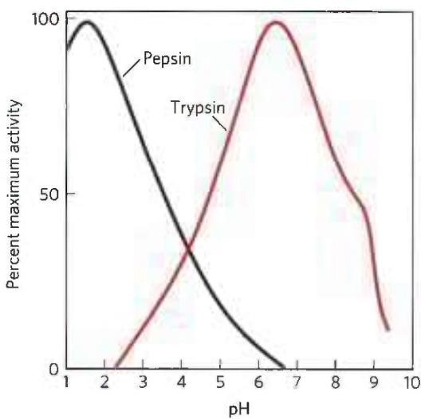  
FIGURE 2-21 The pH optima of two enzymes. Pepsin is a digestive enzyme secreted into gastric juice, which has a pH of \~1.5, allowing pepsin to act optimally. Trypsin, a digestive enzyme that acts in the small intestine, has a pH optimum that matches the neutral pH in the lumen of the small intestine.

Other conditions can also produce acidosis. For example, fasting and starvation force the use of stored fatty acids as fuel, with the same consequences as for diabetes. Very heavy exertion, such as a sprint by runners or cyclists, leads to temporary accumulation of lactic acid in the blood. Kidney failure results in a diminished capacity to regulate bicarbonate levels. Lung diseases (such as emphysema, pneumonia, and asthma) reduce the capacity to dispose of the $CO_{2}$ produced by fuel oxidation in the tissues, with the resulting accumulation of $H_{2}CO_{3}$ .

Acidosis is treated by dealing with the underlying condition—administering insulin to people with diabetes, and steroids or antibiotics to people with lung disease. Severe acidosis can be reversed by administering bicarbonate solution intravenously.

#### [EN] WORKED EXAMPLE 2-6 Treatment of Acidosis with Bicarbonate

Why does intravenous administration of a bicarbonate solution raise the plasma pH?

SOLUTION: The ratio of $\left[\mathrm{HCO}_{3}^{-}\right]$ to $\left[\mathrm{CO}_{2}(\mathrm{aq})\right]$ determines the pH of the bicarbonate buffer, according to the equation

$$
\mathrm{pH} = 6. 1 + \log \frac {[ \mathrm{HCO} _ {3} ^ {-} ]}{\mathrm{H} _ {2} \mathrm{CO} _ {3}}
$$

where $[H_{2}CO_{3}]$ is directly related to $pCO_{2}$ , the partial pressure of $CO_{2}$ . So, if $[HCO_{3}^{-}]$ is increased with no change in $pCO_{2}$ , the blood pH will rise.

#### [EN] SUMMARY 2.3 Buffering against pH Changes in Biological Systems

A mixture of a weak acid (or base) and its salt resists changes in pH caused by the addition of $H^{+}$ or $OH^{-}$ . The mixture thus functions as a buffer.

■ The pH of a solution of a weak acid (or base) and its salt is given by the Henderson-Hasselbalch equation:

$$
\mathrm{pH} = \mathrm{p} K _ {\mathrm{a}} + \log \frac {[ \mathrm{A} ^ {-} ]}{[ \mathrm{HA} ]}
$$

In cells and tissues, phosphate and bicarbonate buffer systems maintain intracellular and extracellular fluids near pH 7.4. Enzymes generally work optimally near this physiological pH.

■ Medical conditions such as untreated diabetes that lower the pH of blood, causing acidosis, or raise it, causing alkalosis, can be life-threatening.

<!-- EN-END 2.3 -->

## 七、生命的基本单位——细胞

## （一）生物三域——细菌、古菌和真核生物

所有生物的细胞,根据它们的构造不同可以分为两大类型:一类称原核细胞(prokaryotic cell;prokaryocyte),另一类称真核细胞(eukaryotic cell;eukaryocyte)。这两类细胞的主要区别在于遗传物质(DNA)是否有核膜裹着,有核膜裹着的为真核细胞,裸露的为原核细胞。此外原核细胞比真核细胞小(参见表1-3),结构也简单得多,除了表面的细胞膜以外,没有成形的核,也没有其他的细胞器;但有一个不定形的拟核(nucleoid)或称核区(nuclear area)。真核细胞除了成形的核(nucleus)以外,还有其他细胞器如线粒体、叶绿体(植物细胞)和高尔基体等。属于原核细胞的单细胞(或群体)生物称为原核生物(prokaryote),包括细菌(bacteria)[或称真细菌(eubacteria)]和古菌(archaea)[原称古细菌(archaebacteria)]两大类。原核生物在教科书中常以大肠杆菌(E.coli)作为代表。属于真核细胞的单细胞或多细胞生物称为真核生物(eukaryote),包括动物、植物和真菌,常以肝细胞、菠菜叶细胞作为代表。

20 世纪 80 年代 R. H. Whittaker 根据 C. R. Woese 等人于 1977 年对原核生物和真核生物的 rRNA 核苷酸序列比较的结果提出了三域学说（图 1-15），认为所有生物都由一个共同的先祖（progenitor）分 3 条进化途径形成 3 个域（domain）。单细胞微生物根据遗传学和生物化学研究可以区分为细菌域和古菌域。细菌栖息于土壤、表层水和其他活生物或死生物的组织中。古菌被认为是属于跟细菌不同的另一域，它们生活在一些极端的环境——盐湖、热泉、高酸性沼泽以及大洋深处。已有的证据表明，古菌和细菌在早期就发生趋异进化。所有的真核生物构成了第三域。真核生物是从产生古菌那个分支进化而来的，因此真核生物与古菌的亲缘关系比与细菌的亲缘关系更接近。

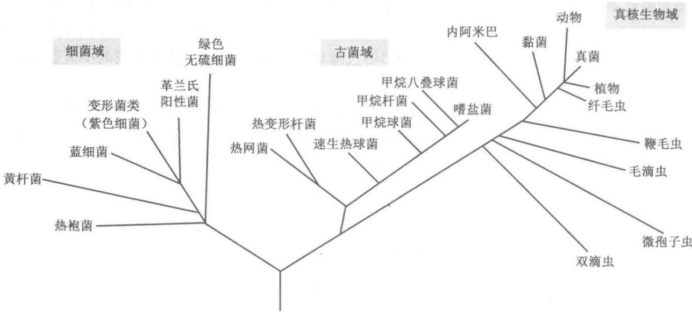  
图 1-15 生物三域系统树  
此系统树是基于各类生物的 rRNA 核苷酸序列的相似性: 序列越相似分支的位置越接近, 分支的距离代表两种序列差异的程度

在细菌域和古菌域里的生物又可根据它们的栖息地不同分为两个大类:需氧菌(aerobe)和厌氧菌(anaerobe)。在有充足氧供应的环境中生活的某些微生物是在把电子从燃料分子传递给氧的过程中获取能量的。适应于在厌氧(实际是缺氧)环境中生活的微生物是把电子传递给硝酸盐(形成 $N_{2}$ )、硫酸盐(形成 $H_{2}S$ )或 $CO_{2}$ (形成 $CH_{4}$ )来得到能量的。从厌氧环境中进化来的许多微生物是专性(obligate)厌氧菌,当暴露在氧中时则死亡。其他是兼性(facultative)厌氧菌,它们在有氧和无氧环境中都能生长。

根据生物如何获得为合成细胞材料所需的能量和碳,对它们进行分类。按能量的来源不同可以分成两大类:① 光养生物(phototroph),捕获并利用日光能;② 化养生物(chemotroph),从氧化化学燃料获取能量。有些化养生物是无机营养型（lithotroph），它们氧化无机燃料，例如氧化 $\mathrm{HS}^{-}\rightarrow \mathrm{S}^{0}$ （元素硫）、 $\mathrm{S}^0\to \mathrm{SO}_4^-$ 、 $\mathrm{NO}_2^- \rightarrow \mathrm{NO}_3^-$ 或 $\mathrm{Fe}^{2 + }\rightarrow \mathrm{Fe}^{3 + }$ 。有些是有机营养型（organotroph），它们氧化环境中可利用的各种有机化合物。光养生物和化养生物各自又可分为：①自养生物（autotroph），从 $\mathrm{CO}_{2}$ 中获得全部所需的碳；②异养生物（heterotroph），从有机营养物中得到所需的碳。

## （二）细胞是所有生物的结构和功能单位

从图 1-16 和图 1-17 可以看出, 各种类型的细胞都有某些共同的结构特点。

  
图 1-16 细菌细胞(以大肠杆菌为代表)的共同结构特点  
大肠杆菌属于革兰氏阴性菌。革兰氏阳性菌是指能保留革兰氏染色（Gram's stain）者，革兰氏阴性菌则不能。革兰氏染色是一种碱性染料，结晶紫和碘的络合物，1882年H.C.Gram首先使用

## 1. 细胞膜 (cell membrane) 和细胞壁 (cell wall)

细胞膜也称质膜（plasma membrane），是细胞表面的被膜；它规定了一个细胞的周边，把细胞的内含物与环境隔开。质膜的厚度为7\~8 nm，是穿插有蛋白质分子的脂双层（见第10章）。质膜最重要的特性之一是选择性透性（selective permeability）或半透性，即有选择地允许物质通过。质膜对无机离子和大多数荷电或极性化合物是一道屏障；但质膜上的转运蛋白质允许某些离子和分子通过。膜上的受体蛋白质向细胞传递信号（如激素），膜酶参与某些代谢反应途径。因为质膜中脂质分子和蛋白质分子不是共价结合的，所以整个膜结构明显具有柔性，允许细胞的形状和大小发生改变。随着细胞的生长，新合成的脂质和蛋白质分子被插入质膜；细胞分裂产生两个细胞，每个细胞都具有自己的质膜。生长和细胞分裂不丢失膜的完整性。

对于动物细胞,在它的质膜外面常有一层由糖蛋白、蛋白聚糖和脂多糖等组成的柔韧而黏性的覆盖物(coat),它起细胞-细胞识别、细胞通讯和免疫保护等作用(见第9章)。对于植物细胞,质膜外面还有细胞壁,其成分是纤维素、果胶和木质素等,这些成分是细胞代谢的产物(见第9章);细胞壁的主要功能是支持和保护,同时防止细胞在低渗介质中因吸水而胀裂,以维持细胞正常状态。对于细菌细胞,质膜外面还有肽聚糖构成的细胞壁;有些细菌在细胞壁外面还有一层外膜(见图9-34)。

## 2. 细胞核 (cell nucleus) 或核区 (nucleoid)

所有的细胞,至少在生命的一段时间,具有核或拟核,在这里储存和复制基因组。拟核存在于细菌和古菌中,它是一个没有膜与它的细胞质隔开的无定形“染色体”,由一个环状分子 DNA 和有关的蛋白质组成。真核生物中核物质被包裹在一个称为核被膜(nuclear envelope)的双层膜中。膜上有核孔允许某些物质进出核内外。核内含有染色质、核仁和核基质。染色质(chromatin)是遗传物质,主要成分是DNA和组蛋白。核仁(nucleolus)是富含蛋白质和RNA分子的圆形颗粒状结构,内含转录rRNA的基因(rDNA)。核基质(nuclear matrix)为透明液体,液体内布满蛋白质构成的纤维状网,染色质和核仁等都在其中。

  
图1-17 真核细胞结构模式图  
动物细胞一般直径为 $5 \sim 30 \mu m$ ，植物细胞直径为 $10 \sim 100 \mu m$ ；用粗体字标出的结构是动物细胞或植物细胞所特有的。真核微生物的结构类似动、植物细胞，有许多还含有特化的细胞器（本图未示出）

## 3. 细胞质 (cell plasm) 和细胞溶胶 (cytosol)

细胞膜包裹着的内部是[细]胞质,它包括称为细胞溶胶的液体部分和各种具有专一功能的悬浮颗粒,如真核细胞中的各种细胞器。细胞溶胶是高度浓缩的溶液;内含各种酶和编码这些酶的RNA分子、合成这些大分子的单体亚基(氨基酸和核苷酸)、几百种称为代谢物的有机小分子(合成代谢和降解代谢的中间物)、对许多酶促反应所必需的化合物——辅酶(coenzyme)、无机离子以及各种包含物(conclusion),如肝细胞中的糖原颗粒和脂肪细胞中的脂肪滴。细胞溶胶是多种代谢活动的场所,它在细胞中的物质运输、能量转换和信息传递方面也起重要作用。

## （三）原核细胞的代表——大肠杆菌

原核细胞有着一些共同的结构特点(图 1-16)，但也显示出不同类群的特化，特别是在细胞被膜的结构和成分方面。

细菌几乎是原核细胞的代名词，大肠杆菌(Escherichia coli, E. coli)更是原核细胞的典型。大肠杆菌是人体消化道中的一种通常是无害的栖居者。它的细胞长约 $2\mu \mathrm{m}$ ，直径小于 $1\mu \mathrm{m}$ ，有一个保护性的外膜和一个包裹着细胞质和拟核的内膜。内、外膜之间有一层薄而坚硬的多聚体——肽聚糖；肽聚糖层称为细胞壁，它给细菌细胞以刚性和形状，增强细胞在低渗介质中抵抗膨胀的能力。外膜是由脂蛋白、脂多糖和磷脂组成的脂双层膜，外膜只对某些物质如青霉素、溶菌酶和去污剂等具有屏障作用，它的脂多糖具有抗原性和内毒素作用（见第9章）；有些细菌在细胞的最外面还有一层由胞内制造并分泌的胶状物（多糖或/和多肽）——荚膜(capsule)或黏液层(slime layer)，荚膜在产生细菌毒力和保护细菌免遭被宿主细胞吞噬方面起着重要作用。内膜是真正的质膜，高度选择性地管控物质的通透；负责把营养物质转化为ATP的酶也定位于此膜上。内、外膜和细胞壁一起构成细胞被膜（cell envelope）。大肠杆菌的这种被膜结构是某些细菌（革兰氏阴性菌）所共有的；蓝细菌（cyanobacteria）也属于这类，但它的内膜系统较发达，并带有光合色素。其他细菌（革兰氏阳性菌）没有外膜，最外面就是较厚的肽聚糖层（细胞壁），紧接着的内层是质膜（见图9-34A）。

值得注意的是古菌细胞的刚性是由另一种多聚糖——假肽聚糖提供的；它们的细胞被膜构造与革兰氏阳性菌似乎相似，也没有外膜，但古菌的膜脂和多糖的结构和成分明显不同于细菌，有它们自己特有的膜脂（见图10-12）。

大肠杆菌的细胞溶胶含有约 15 000 个核糖体（它比真核生物的核糖体小，但功能相同；每个核糖体由一个大亚基和一个小亚基组成，每个亚基含约 65% RNA 和 35% 蛋白质）、约 1 000 种不同的酶（每种酶有 10 到数千个拷贝）、不到 1 000 种 $M_{r}$ 少于 1 000 的有机化合物（代谢物和辅酶）和若干无机离子。大肠杆菌的拟核（核区）含有唯一的一个环状 DNA 分子；跟大多数细菌一样，胞质中还含有一个或多个小的环状 DNA 片段，称质粒（plasmid）。在自然界，某些质粒有抵抗环境中的毒物和抗生素的能力。在实验操作中这些 DNA 片段很容易掌控，是基因工程的有力助手（见第 3 篇）。

大多数细菌(包括大肠杆菌)都是以单个细胞存在的,但有些细菌(例如黏细菌)显示出简单的社会行为,形成多细胞的群体(聚集体)。

## （四）真核细胞含有多种膜质细胞器

典型的真核细胞(图1-17)比细菌大很多,直径5\~100 $\mu$ m,细胞体积比细菌大 $10^{3}\sim10^{6}$ 倍。真核细胞的特点,除有被膜围着的细胞核外,还有若干具有专一功能的膜质细胞器以及细胞骨架。细胞器有:线粒体、内质网、高尔基体、溶酶体和微体。除此以外,植物细胞还含有叶绿体和液泡(图1-17)。在许多细胞的胞质中还存在含淀粉和油脂这样一些营养物的颗粒和小滴。

细胞器可以借助差速离心和等密度离心技术从细胞溶胶中分离出来。这是研究细胞器的结构和功能的必要步骤。关于亚细胞组分的分级分离参见第5章。

## 1. 线粒体 (mitochondrion) 和叶绿体 (chloroplast)

线粒体的外形呈颗粒状或短杆状，横径0.5\~1 $\mu$ m，长2\~3 $\mu$ m，相当于一个细菌大小；数目因细胞种类不同而异。线粒体的结构相当复杂，它是内、外两层膜包裹的囊状细胞器，有发达的膜系统，内膜向基质折叠成若干个所谓嵴（cristae）；它的内、外膜在脂质组成和酶的活性方面都不同；基质中有自己的一套遗传系统，包括DNA和核糖体。线粒体是细胞呼吸和能量转换的中心，含有细胞呼吸所需的各种酶和电子传递体。它的主要功能是将贮存在糖类和脂质中的化学能转换为细胞代谢中可直接利用的载能分子——ATP。关于线粒体结构和功能的细节见第19章。

质体（plastid）是植物细胞的细胞器，其中最重要的一种是叶绿体，它是光合作用的场所，主要功能是将光能转化为化学能。叶绿体的形状、大小和数目随植物和细胞的种类不同而异。叶绿体和线粒体一样也有发达的膜系统，组织成若干扁平的类囊体（thylakoid）。光合作用所需的色素和电子传递系统都位于类囊体膜中（有关细节参见第23章）。

## 2. 内质网(endoplasmic reticulum, ER)和高尔基体(Golgi apparatus)

内质网是细胞质中的一个由许多膜质囊腔和小管彼此相连并相通的膜系统。内质网也与核被膜的外层相连，与核周腔（核被膜内外层之间的空隙）相通；这一相通的内质网容积称为潴泡（cistern）。内质网分为光面内质网（SER）和糙面内质网（RER）；前者的膜上没有核糖体颗粒，这是脂质合成和药物代谢的场所；后者的膜上粘满了颗粒状核糖体——蛋白质合成的机器，所以糙面内质网的功能是合成并转运蛋白质。

高尔基体也称高尔基复合体（Golgi complex），几乎存在于所有的动、植物细胞中。它由一系列的扁平的单层囊和泡组成。高尔基体的功能是作为内质网上合成的蛋白质加工和包装场所，并负责把蛋白质运送到其他细胞器或胞外。内质网产生的转运小泡移动到高尔基体区，与高尔基体融合；小泡中的蛋白质在这里分类加工后,高尔基体又以掐离(pinching-off)的方式形成小泡,出现在它的周边,泡内含有被高尔基体包装了的分泌物质。这些小泡离开高尔基体,移向细胞外周或其他细胞区室,给它们输送分泌产物。转运小泡在内质网、高尔基体和细胞膜之间来回穿梭,运输脂质和蛋白质。

## 3. 溶酶体 (lysosome) 和微体 (microbody)

溶酶体是单层膜的小泡，直径0.25\~0.5 $\mu$ m，数目不等，大小也有很大的变化。泡内含有多种水解酶，如蛋白酶（protease）、核酸酶（nuclease）和磷酸酶（phosphatase）。溶酶体是从高尔基体通过芽殖形成的。溶酶体的主要功能是消化那些以吞噬（phagocytosis）和胞饮（pinocytosis）方式摄入细胞的物质，同时还能降解已失去功能的胞内碎片。溶酶体如果发育不全，缺失一种或多种酶，则可引起机体疾病，甚至致命的疾病。

微体（microbody）也是单层膜的泡状体，直径约 $0.5 \mu m$ ，常见的一种微体是过氧化物酶体（peroxisome），动、植物细胞中均有存在。它含有过氧化氢酶（catalase）、尿酸氧化酶（urate oxidase）、D-氨基酸氧化酶和其他氧化酶类。过氧化物酶体参与某些营养物（如脂肪酸）的氧化，它能把这些细胞器中氧的还原产物 $H_{2}O_{2}$ 分解成 $H_{2}O$ 和 $O_{2}$ ，而起解毒作用。另一种微体称乙醛酸循环体（glyoxysome），存在于植物细胞特别是发芽种子的细胞中，它含有乙醛酸循环的关键酶。

## 4. 液泡(vacuole)

液泡是植物细胞所特有的。在年幼细胞中只是一些分散的小液泡，随年龄增长小液泡逐渐合并成一个大液泡。其大小可达细胞体积的50%以上，并占据了细胞的中央，常把核和细胞质挤压到细胞的边缘。液泡中的液体称为细胞液（cell sap），其中含有溶解的糖、有机酸盐、蛋白质、无机盐、各种色素、 $O_{2}$ 和 $CO_{2}$ 等。液泡的功能是运输和贮存营养物质和细胞废物。

## 5. 细胞骨架 (cytoskeleton)

真核细胞中的细胞溶胶不是简单的均质溶液。细胞样品经荧光染色(fluorescent staining,一种用荧光抗体标记细胞成分的技术)后,在荧光显微镜下可观察到细胞溶胶中存在着一个由几种类型的蛋白质纤丝交织成的三维网,称为细胞骨架。

细胞骨架的蛋白质纤丝共有3种类型：微管、肌动蛋白丝和中间丝。微管（microtubule）是直径约24 nm的中空长管状纤维。细胞分裂时的纺锤体、纤毛和鞭毛都是由微管构成的。构成微管的亚基是微管蛋白二聚体（tubulin dimer）此二聚体由一个 $\alpha-$ 和一个 $\beta-$ 微管蛋白组成（见第3章）。微管或成束或分散存在于细胞中。肌动蛋白丝（actin filament）也称微丝，直径约为7 nm，它的亚基是肌动蛋白，称G-肌动蛋白，缔合的纤丝称F-肌动蛋白。中间丝或中间纤维（intermediate filament）是一类直径为7\~12 nm的纤丝。构成中间丝的最常见的蛋白质是角蛋白（keratin）；此外还有波形蛋白、结蛋白等（见第4章）。微管和肌动蛋白丝主要担当动态的角色；肌动蛋白丝涉及细胞的游动性（motility），而微管起长丝状轨道的作用，沿着它细胞器可借助专一性机制被快速转运。中间丝只起结构性作用，维持细胞形状。

每种类型的蛋白质纤丝都是由简单蛋白质亚基构成的，亚基通过非共价缔合形成粗细均匀的纤丝。这些纤丝没有永久的结构，而是随细胞生理状态的变化，时而解离成亚基，时而重新装配成纤丝。它们在细胞中的位置也不固定，随着有丝分裂（mitosis）、胞质分裂（cytokinesis）、变形运动（amoeboid motion）或细胞形状的改变而发生显著变化。

总之真核细胞的内部是一个具有结构纤维网和若干膜质细胞器的复杂系统。膜质小泡可以从一个细胞器上芽殖出来又与另一个细胞器融合。细胞器可以沿微管纤维从细胞质的一处移动到另一处，移动是受需能的马达蛋白(motor protein)驱使的。各种细胞器组成的内膜系统(endomembrane system)把专一性的代谢过程分隔开来，并提供进行酶促反应的表面。胞吐(exocytosis)和胞吞(endocytosis)是一种涉及膜的裂殖和融合的运输机制，它在细胞质和环境介质之间提供了一条胞内产生的物质的分泌和胞外物质的摄入的通道。

<!-- EN-BEGIN 1.1 -->

### 【英文对应 1.1】Cellular Foundations

> 来源：Lehninger Principles of Biochemistry（书籍/02_生物化学原理） 第1章 The Foundations of Biochemistry，§1.1。对应本章“七、生命的基本单位——细胞”。

The unity and diversity of organisms become apparent even at the cellular level. The smallest organisms consist of single cells and are microscopic. Larger, multicellular organisms contain many different types of cells, which vary in size, shape, and specialized function. P1 Despite these obvious differences, all cells of the simplest and most complex organisms share certain fundamental properties, which can be seen at the biochemical level.

#### [EN] Cells Are the Structural and Functional Units of All Living Organisms

Cells of all kinds share certain structural features (Fig. 1-1). The plasma membrane defines the periphery of the cell, separating its contents from the surroundings. It is composed of lipid and protein molecules that form a thin, tough, pliable, hydrophobic barrier around the cell. The membrane is a barrier to the free passage of inorganic ions and most other charged or polar molecules.

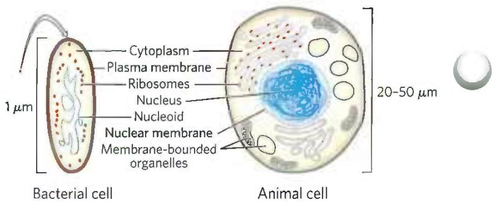  
FIGURE 1-1 The universal features of living cells. All cells have a nucleus or nucleoid containing their DNA, a plasma membrane, and cytoplasm. Eukaryotic cells contain a variety of membrane-bounded organelles (including mitochondria and chloroplasts) and large particles (ribosomes, for example).

Transport proteins in the plasma membrane allow the passage of certain ions and molecules, receptor proteins transmit signals into the cell, and membrane enzymes participate in some reaction pathways. Because the individual lipids and proteins of the plasma membrane are not covalently linked, the entire structure is remarkably flexible, allowing changes in the shape and size of the cell. As a cell grows, newly made lipid and protein molecules are inserted into its plasma membrane; cell division produces two cells, each with its own membrane. This growth and cell division (fission) occurs without loss of membrane integrity.

The internal volume enclosed by the plasma membrane, the cytoplasm (Fig. 1-1), is composed of an aqueous solution, the cytosol, and a variety of suspended particles with specific functions. These particulate components (membranous organelles such as mitochondria and chloroplasts; supramolecular structures such as ribosomes and proteasomes, the sites of protein synthesis and degradation) sediment when cytoplasm is centrifuged at 150,000 g (g is the gravitational force of Earth). What remains as the supernatant fluid is defined as the cytosol, a highly concentrated solution containing enzymes and the RNA (ribonucleic acid) molecules that encode them; the components (amino acids and nucleotides) from which these macromolecules are assembled; hundreds of small organic molecules called metabolites, intermediates in biosynthetic and degradative pathways; coenzymes, compounds essential to many enzyme-catalyzed reactions; and inorganic ions (K $^{+}$ , Na $^{+}$ , Mg $^{2+}$ , and Ca $^{2+}$ , for example).

All cells have, for at least some part of their life, either a nucleoid or a nucleus, in which the genome—the complete set of genes, composed of DNA (deoxyribonucleic acid)—is replicated and stored, with its associated proteins. The nucleoid, in bacteria and archaea, is not separated from the cytoplasm by a membrane; the nucleus, in eukaryotes, is enclosed within a double membrane, the nuclear envelope. Cells with nuclear envelopes make up the large domain Eukarya (Greek eu, "true," and karyon, "nucleus"). Microorganisms without nuclear membranes, formerly grouped together as pro-karyotes (Greek pro, "before"), are now recognized as comprising two very distinct groups: the domains Bacteria and Archaea, described below.

#### [EN] Cellular Dimensions Are Limited by Diffusion

Most cells are microscopic, invisible to the unaided eye. Animal and plant cells are typically 5 to 100 $\mu$ m in diameter, and many unicellular microorganisms are only 1 to 2 $\mu$ m long (see the end of the book for information on units and their abbreviations). What limits the dimensions of a cell? The lower limit is probably set by the minimum number of each type of biomolecule required by the cell. The smallest cells, certain bacteria known as mycoplasmas, are 300 nm in diameter and have a volume of about $10^{-14}$ mL. A single bacterial ribosome is about 20 nm in its longest dimension, so a few ribosomes take up a substantial fraction of the volume in a mycoplasmal cell.

The upper limit of cell size is probably set by the rate of transport of nutrients into the cell and waste products out. As the size of a cell increases, its surface-to-volume ratio decreases. For a spherical cell, the surface area is a function of the square of the radius $(r^{2})$ , whereas its volume is a function of $r^{3}$ . A bacterial cell the size of Eschericia coli is so small, and the ratio of its surface area to its volume is so large, that every part of its cytoplasm is easily reached by nutrients moving across the membrane and into the cell. With increasing cell size, surface-to-volume ratio decreases, until metabolism consumes nutrients faster than transmembrane carriers can supply them. Many types of animal cells have a highly folded or convoluted surface that increases their surface-to-volume ratio and allows higher rates of uptake of materials from their surroundings (Fig. 1-2).

#### [EN] Organisms Belong to Three Distinct Domains of Life

The development of techniques for determining DNA sequences quickly and inexpensively has greatly improved our ability to deduce evolutionary relationships among organisms. Similarities between gene sequences in various organisms provide deep insight into the course of evolution. In one interpretation of sequence similarities, all living organisms fall into one of three large groups (domains) that define three branches of the evolutionary tree of life originating from a common progenitor (Fig. 1-3). Two large groups of single-celled microorganisms can be distinguished on genetic and biochemical grounds: Bacteria and Archaea. Bacteria inhabit soils, surface waters, and the tissues of other living or decaying organisms. Many of the Archaea, recognized as a distinct domain by the microbiologist Carl Woese in the 1980s, inhabit extreme environments — salt lakes, hot springs, highly acidic bogs, and the ocean depths. The available evidence suggests that the Archaea and Bacteria diverged early in evolution. All eukaryotic organisms, which make up the third domain, Eukarya, evolved from the same branch that gave rise to the Archaea; eukaryotes are therefore more closely related to archaea than to bacteria.

  
FIGURE 1-2 Most animal cells have intricately folded surfaces. The human lymphocytes in this artificially colored scanning electron micrograph are about 10–12 $\mu$ m in diameter. Their convoluted surfaces give them a much larger surface area than a sphere of the same diameter. [Steve Gschmeissner/Science Source.]

Within the domains of Archaea and Bacteria are subgroups distinguished by their habitats. In aerobic habitats with a plentiful supply of oxygen, some resident organisms derive energy from the transfer of electrons from fuel molecules to oxygen within the cell. Other environments are anaerobic, devoid of oxygen, and microorganisms adapted to these environments obtain energy by transferring electrons to nitrate (forming $N_{2}$ ), sulfate (forming $H_{2}S$ ), or $CO_{2}$ (forming $CH_{4}$ ). Many organisms that have evolved in anaerobic environments are obligate anaerobes: they die when exposed to oxygen. Others are facultative anaerobes, able to live with or without oxygen.

#### [EN] Organisms Differ Widely in Their Sources of Energy and Biosynthetic Precursors

P3 We can classify organisms according to how they obtain the energy and carbon they need for synthesizing cellular material (as summarized in Fig. 1-4). There are two broad categories based on energy sources: phototrophs (Greek trophē, “nourishment”) trap and use sunlight, and chemotrophs derive their energy from oxidation of a chemical fuel. Some chemotrophs oxidize inorganic fuels — HS $^{-}$ to S $^{0}$ (elemental sulfur), S $^{0}$ to SO $_{4}^{-}$ , NO $_{2}^{-}$ to NO $_{3}^{-}$ , or Fe $^{2+}$ to Fe $^{3+}$ , for example. Phototrophs and chemotrophs may be further divided into those that can synthesize all of their biomolecules directly from CO $_{2}$ (autotrophs) and those that require some preformed organic nutrients made by other organisms (heterotrophs). We can describe an organism’s mode of nutrition by combining these terms. For example, cyanobacteria are photoautotrophs; humans are chemoheterotrophs. Even finer distinctions can be made, and many organisms can obtain energy and carbon from more than one source under different environmental or developmental conditions.

  
FIGURE 1-3 Phylogeny of the three domains of life. Phylogenetic relationships are often illustrated by a "family tree" of this type. The basis for this tree is the similarity in nucleotide sequences of the ribosomal RNAs of each group. [Information from C. R. Woese, Microbiol. Rev. 51:221, 1987, Fig. 4.]

  
FIGURE 1-4 All organisms can be classified according to their source of energy (sunlight or oxidizable chemical compounds) and their source of carbon for the synthesis of cellular material.

  
FIGURE 1-5 Some common structural features of bacterial and archaeal cells. (a) This correct-scale drawing of E. coli serves to illustrate some common features. (b) The cell envelope of gram-positive bacteria is a single membrane with a thick, rigid layer of peptidoglycan on its outside surface. A variety of polysaccharides and other complex polymers are interwoven with the peptidoglycan, and surrounding the whole is a porous "solid layer" composed of glycoproteins. (c) E. coli is gram-negative and has a double membrane. Its outer membrane has a lipopolysaccharide (LPS) on the outer surface and phospholipids on the inner surface. This outer membrane is studded with protein channels (porins) that allow small molecules, but not

#### [EN] Bacterial and Archaeal Cells Share Common Features but Differ in Important Ways

The best-studied bacterium, Escherichia coli, is a usually harmless inhabitant of the human intestinal tract. The E. coli cell (Fig. 1-5a) is an ovoid about 2 $\mu$ m long and a little less than 1 $\mu$ m in diameter, but other bacteria may be spherical or rod-shaped, and some are substantially larger. E. coli has a protective outer membrane and an inner plasma membrane that encloses the cytoplasm and the nucleoid. Between the inner and outer membranes is a thin but strong layer of a high molecular weight polymer (peptidoglycan) that gives the cell its shape and rigidity. The plasma membrane and the layers outside it constitute the cell envelope. The plasma membranes of bacteria consist of a thin bilayer of lipid molecules penetrated by proteins. Archaeal plasma membranes have a similar architecture, but the lipids can be strikingly different from those of bacteria (see Fig. 10-6).

  
proteins, to diffuse through. The inner (plasma) membrane, made of phospholipids and proteins, is impermeable to both large and small molecules. Between the inner and outer membranes, in the periplasm, is a thin layer of peptidoglycan, which gives the cell shape and rigidity, but does not retain Gram's stain. (d) Archaeal membranes vary in structure and composition, but all have a single membrane surrounded by an outer layer that includes either a peptidoglycan-like structure or a porous protein shell (solid layer), or both. [(a) David S. Goodsell. (b, c, d) Information from S.-V. Albers and B. H. Meyer, Nature Rev. Microbiol. 9:414, 2011, Fig. 2]

Bacteria and archaea have group-specific specializations of their cell envelopes (Fig. 1-5b–d). Some bacteria, called gram-positive because they are colored by Gram's stain (introduced by Hans Christian Gram in 1884), have a thick layer of peptidoglycan outside their plasma membrane but lack an outer membrane. Gram-negative bacteria have an outer membrane composed of a lipid bilayer into which are inserted complex lipopolysaccharides and proteins called porins that provide transmembrane channels for the diffusion of low molecular weight compounds and ions across this outer membrane. The structures outside the plasma membrane of archaea differ from organism to organism, but they, too, have a layer of peptidoglycan or protein that confers rigidity on their cell envelopes.

P2 The cytoplasm of E. coli contains about 15,000 ribosomes, various numbers (from 10 to thousands) of copies of each of 1,000 or so different enzymes, perhaps 1,000 organic compounds of molecular weight less than 1,000 (metabolites and cofactors), and a variety of inorganic ions. The nucleoid contains a single, circular molecule of DNA, and the cytoplasm (like that of most bacteria) contains one or more smaller, circular segments of DNA called plasmids. In nature, some plasmids confer resistance to toxins and antibiotics in the environment. In the laboratory, these DNA segments are especially amenable to experimental manipulation and are powerful tools for genetic engineering (see Chapter 9).

Other species of bacteria, as well as archaea, contain a similar collection of biomolecules, but each species has physical and metabolic specializations related to its environmental niche and nutritional sources. Cyanobacteria, for example, have internal membranes specialized to trap energy from light (see Fig. 20-23). Many archaea live in extreme environments and have biochemical adaptations to survive in extremes of temperature, pressure, or salt concentration. Differences in ribosomal structure gave the first hints that Bacteria and Archaea constituted separate domains. Most bacteria (including E. coli) exist as individual cells, but often associate in biofilms or mats, in which large numbers of cells adhere to each other and to some solid substrate beneath or at an aqueous surface. Cells of some bacterial species (the myxobacteria, for example) show simple social behavior, forming many-celled aggregates in response to signals between neighboring cells.

#### [EN] Eukaryotic Cells Have a Variety of Membranous Organelles, Which Can Be Isolated for Study

Typical eukaryotic cells (Fig. 1-6) are much larger than bacteria—commonly 5 to 100 $\mu$ m in diameter, with cell volumes a thousand to a million times larger than those of bacteria. The distinguishing characteristics of eukaryotes are the nucleus and a variety of membrane-enclosed organelles with specific functions.

These organelles include mitochondria, the site of most of the energy-extracting reactions of the cell; the endoplasmic reticulum and Golgi complexes, which play central roles in the synthesis and processing of lipids and membrane proteins; peroxisomes, in which very-long-chain fatty acids are oxidized and reactive oxygen species are detoxified; and lysosomes, filled with digestive enzymes to degrade unneeded cellular debris. In addition to these, plant cells contain vacuoles (which store large quantities of organic acids) and chloroplasts (in which sunlight drives the synthesis of ATP (adenosine triphosphate) in the process of photosynthesis). Also present in the cytoplasm of many cells are granules or droplets containing stored nutrients such as starch and fat.

In a major advance in biochemistry, Albert Claude, Christian de Duve, and George Palade developed methods for separating organelles from the cytosol and from each other—an essential step in investigating their structures and functions. In a typical cell fractionation (Fig. 1-7), cells or tissues in solution are gently disrupted by physical shear. This treatment ruptures the plasma membrane but leaves most of the organelles intact. The homogenate is then centrifuged; organelles such as nuclei, mitochondria, and lysosomes differ in size and therefore sediment at different rates.

These methods were used to establish, for example, that lysosomes contain degradative enzymes, mitochondria contain oxidative enzymes, and chloroplasts contain photosynthetic pigments. The isolation of an organelle enriched in a certain enzyme is often the first step in the purification of that enzyme.

#### [EN] The Cytoplasm Is Organized by the Cytoskeleton and Is Highly Dynamic

Fluorescence microscopy reveals several types of protein filaments crisscrossing the eukaryotic cell, forming an interlocking three-dimensional meshwork, the cytoskeleton. Eukaryotes have three general types of cytoplasmic filaments — actin filaments, microtubules, and intermediate filaments (Fig. 1-8) — differing in width (from about 6 nm to 22 nm), composition, and specific function. All types provide structure and organization to the cytoplasm and shape to the cell. Actin filaments and microtubules also help to produce the motion of organelles or of the whole cell.

Each type of cytoskeletal component consists of simple protein subunits that associate noncovalently to form filaments of uniform thickness. These filaments are not permanent structures; they undergo constant disassembly into their protein subunits and reassembly into filaments. Their locations in cells are not rigidly fixed but may change dramatically with mitosis, cytokinesis, amoeboid motion, or other changes in cell shape. The assembly, disassembly, and location of all types of filaments are regulated by other proteins, which serve to link or bundle the filaments or to move cytoplasmic organelles along

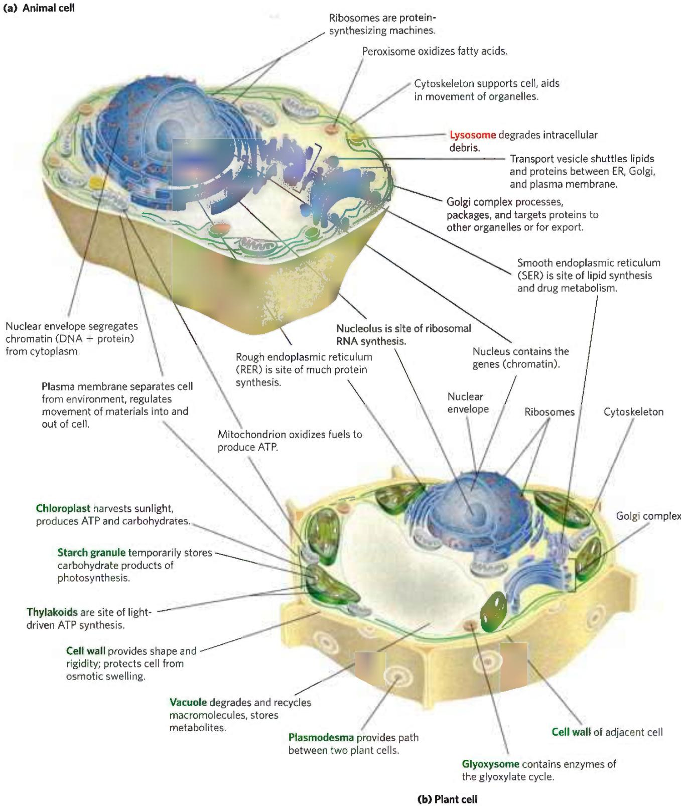

FIGURE 1-6 Eukaryotic cell structure. Schematic illustrations of two major types of eukaryotic cell: (a) a representative animal cell and (b) a representative plant cell. Plant cells are usually 10 to 100 $\mu$ m in diameter — larger than animal cells, which typically range from 5 to 30 $\mu$ m. Structures labeled

the filaments. (Bacteria contain actinlike proteins that serve similar roles in those cells.)

The filaments disassemble and then reassemble elsewhere. Membranous vesicles bud from one organelle and in red are unique to animal cells; those labeled in green are unique to plant cells. Eukaryotic microorganisms (such as protists and fungi) have structures similar to those in plant and animal cells, but many also contain specialized organelles not illustrated here.

fuse with another. Organelles move through the cytoplasm along protein filaments, their motion powered by energy-dependent motor proteins. The endomembrane system (see Fig. 11-4) segregates specific metabolic

(b)

Differential centrifugation

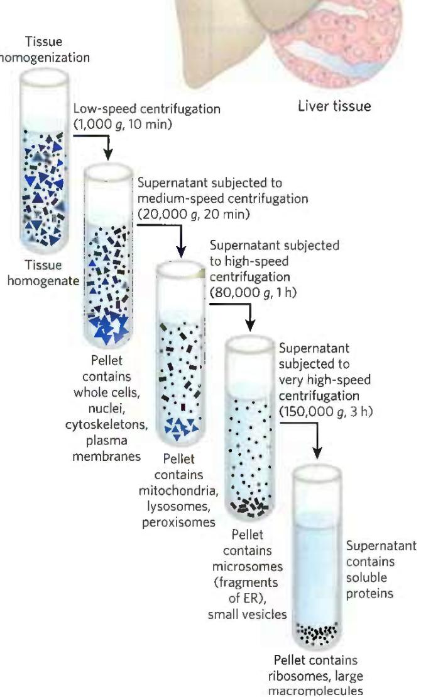  
FIGURE 1-7 Subcellular fractionation of tissue. A tissue such as liver is first mechanically homogenized to break cells and disperse their contents in an aqueous buffer. The sucrose medium has an osmotic pressure similar to that in organelles, thus balancing diffusion of water into and out of the organelles, which would swell and burst in a solution of lower osmolarity (see Fig. 2-12). The large and small particles in the suspension can be separated by centrifugation at different speeds. Larger particles sediment more rapidly than small particles, and soluble material does not sediment. By careful choice of the conditions of centrifugation, subcellular fractions can be separated for biochemical characterization. [Information from B. Alberts et al., Molecular Biology of the Cell, 2nd edn, p. 165, Garland Publishing, 1989.]

processes and provides surfaces on which certain enzyme-catalyzed reactions occur. Exocytosis and endocytosis, mechanisms of transport (out of and into cells, respectively) that involve membrane fusion and fission, provide paths between the cytoplasm and the surrounding medium, allowing the secretion of substances produced in the cell and uptake of extracellular materials.

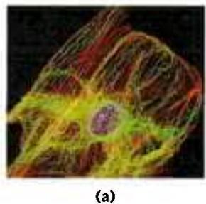

  
FIGURE 1-8 The three types of cytoskeletal filaments: actin filaments, microtubules, and intermediate filaments. Cellular structures can be labeled with an antibody (that recognizes a characteristic protein) covalently attached to a fluorescent compound. The stained structures are visible when the cell is viewed with a fluorescence microscope. (a) In this cultured fibroblast cell, bundles of actin filaments are stained red; microtubules, radiating from the cell center, are stained green; and chromosomes (in the nucleus) are stained blue. (b) A new lung cell undergoing mitosis. Microtubules (green), attached to structures called kinetochores (yellow) on the condensed chromosomes (blue), pull the chromosomes to opposite poles, or centrosomes (magenta), of the cell. Intermediate filaments, made of keratin (red), maintain the structure of the cell. [(a) James J. Faust and David G. Capco. (b) Dr. Alexey Khodjakov, Wadsworth Center, New York State Department of Health.]

This structural organization of the cytoplasm is far from random. The motion and positioning of organelles and cytoskeletal elements are under tight regulation, and at certain stages in its life, a eukaryotic cell undergoes dramatic, finely orchestrated reorganizations, such as the events of mitosis. The interactions between the cytoskeleton and organelles are noncovalent, reversible, and subject to regulation in response to various intracellular and extracellular signals.

#### [EN] Cells Build Supramolecular Structures

Macromolecules and their monomeric subunits differ greatly in size. An alanine molecule is less than 0.5 nm long. P2 A molecule of hemoglobin, the oxygen-carrying protein of erythrocytes (red blood cells), consists of nearly 600 amino acid subunits in four long chains, folded into globular shapes and associated in a structure 5.5 nm in diameter. In turn, proteins are much smaller than ribosomes (about 20 nm in diameter), which are much smaller than organelles such as mitochondria, typically 1 $\mu$ m in diameter. It is a long jump from simple biomolecules to cellular structures that can be seen with the light microscope. Figure 1-9 illustrates the structural hierarchy in cellular organization.

The monomeric subunits of proteins, nucleic acids, and polysaccharides are joined by covalent bonds. In supramolecular complexes, however, macromolecules are held together largely by noncovalent interactions—much weaker, individually, than covalent bonds. Among these noncovalent interactions are hydrogen bonds; ionic interactions (between charged groups); and aggregations of nonpolar groups in aqueous solution, brought about by van der Waals interactions (also called London forces) and by the hydrophobic effect—all of which have energies much smaller than those of covalent bonds. (These noncovalent interactions are described in Chapter 2.) The large numbers of weak interactions between macromolecules in supramolecular complexes stabilize these assemblies, producing their unique structures.

  
FIGURE 1-9 Structural hierarchy in the molecular organization of cells. The organelles and other relatively large components of cells are composed of supramolecular complexes, which in turn are composed of smaller macromolecules and even smaller molecular subunits. For example, the nucleus of this plant cell contains chromatin, a supramolecular complex  
that consists of DNA and basic proteins (histones). DNA is made up of simple monomeric subunits (nucleotides), as are proteins (amino acids). [Information from W. M. Becker and D. W. Deamer, The World of the Cell, 2nd edn, Fig. 2-15, Benjamin/Cummings Publishing Company, 1991.]

#### [EN] In Vitro Studies May Overlook Important Interactions among Molecules

One approach to understanding a biological process is to study purified molecules in vitro (from the Latin, meaning "in glass"—in the test tube), without interference from other molecules present in the intact cell—that is, in vivo (from the Latin, meaning "in the living"). Although this approach has been remarkably revealing, we must keep in mind that the inside of a cell is quite different from the inside of a test tube. The "interfering" components eliminated by purification may be critical to the biological function or regulation of the molecule that is being purified. For example, in vitro studies of pure enzymes are commonly done at very low enzyme concentrations in thoroughly stirred aqueous solutions. In the cell, an enzyme is dissolved or suspended in the gel-like cytosol with thousands of other proteins, some of which bind to that enzyme and influence its activity. Some enzymes are components of multienzyme complexes in which reactants are channeled from one enzyme to another, never entering the bulk solvent. When all of the known macromolecules in a cell are represented in their known dimensions and concentrations (Fig. 1-10), it is clear that the cytosol is very crowded and that diffusion of macromolecules within the cytosol must be slowed by collisions with other large structures. In short, a given molecule may behave quite differently in the cell than it behaves in vitro. A central challenge of biochemistry is to understand the influences of cellular organization and macromolecular associations on the function of individual enzymes and other biomolecules — to understand function in vivo as well as in vitro.

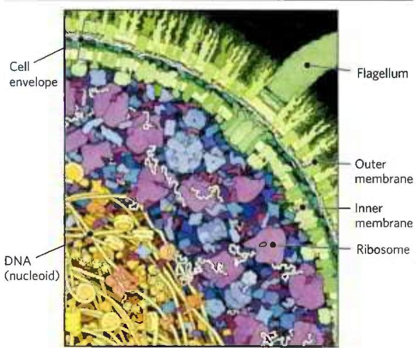  
FIGURE 1-10 The crowded cell. This drawing is an accurate representation of the relative sizes and numbers of macromolecules in one small region of an E. coli cell. [© David S. Goodsell 1999.]

#### [EN] SUMMARY 1.1 Cellular Foundations

All cells share certain fundamental properties: they are bounded by a plasma membrane; have a cytosol containing metabolites, coenzymes, inorganic ions, and enzymes; and have a set of genes contained within a nucleoid (bacteria and archaea) or a nucleus (eukaryotes).

■ The size of cells is limited by the need to deliver oxygen to all parts of the cell.

■ By comparing their DNA sequences, researchers can place organisms in three domains: Bacteria, Archaea, and Eukarya. Archaea and Eukarya are more closely related to each other than either is to Bacteria.

All organisms require a source of energy to perform cellular work. Phototrophs obtain energy from sunlight; chemotrophs obtain energy from chemical fuels.

■ Bacterial and archaeal cells contain cytosol, a nucleoid, and plasmids, all within a cell envelope.

■ Eukaryotes contain a nucleus and a variety of membrane-enclosed organelles with specialized functions, which can be studied in the isolated organelles.

■ Cytoskeletal proteins assemble into long filaments that give cells shape and rigidity and serve as rails along which cellular organelles move throughout the cell. The membrane-bounded compartments constitute an interconnected and dynamic endomembrane system.

■ Supramolecular complexes held together by noncovalent interactions are part of a hierarchy of structures, some visible with the light microscope.

■ Studying isolated cellular components in vitro simplifies the experimental system, but such study may overlook important interactions that occur in the living cell.

<!-- EN-END 1.1 -->

## 八、生物分子的起源与进化

生命起源是宇宙进化的一部分。宇宙的起源虽有多种理论，但都未能充分说明。比较流行的看法是宇宙始于150亿～200亿年前的一次突发性的大爆炸。此后逐渐凝聚成现在这个由几亿颗恒星组成的宇宙。太阳是其中的一颗恒星。一般认为太阳及其行星是同时由大爆炸时产生的气体尘埃凝聚而成的，氢是宇宙中最原初也是最丰富的元素；在形成星球的热核反应中氢生成氦，氦再生成碳、氮、镁、铁等元素。约在45亿年前产生了地球本身和今天在地球上找到的各种化学元素。根据对现在火山口的气体分析，推测原始大气层是还原性的，主要由氢的化合物如 $H_{2}O$ 、 $NH_{3}$ 、 $CH_{4}$ 和 $H_{2}S$ 等组成。很可能在生命起源时的大气仍然有很大的还原作用，而没有氧气存在。氧主要是光合作用的产物，是很晚才出现的。大约35亿年前或更早，一些生命开始在地球上出现。地球上最初的生命是怎样产生的？对此曾提出过多种假说：神创论、宇生论、自然发生说和进化起源说等。因为进化起源说有比较充分的根据和实验证明，所以被多数学者所接受。进化起源说认为：在地球诞生后的头10亿年间，即生命出现之前，地球经历了化学进化（chemical evolution）或称前生物进化（prebiotic evolution）阶段，也即从无机小分子到原始生命形成即细胞起始的阶段。细胞继续进化，从原核细胞到真核细胞，从真核单细胞到真核多细胞，直至形成今天的生物界，这段历史称为生物进化（biological evolution）阶段。

## （一）最初的生物分子是通过化学进化产生的

## 1. 化学进化的理论

20 世纪 20 年代苏联生物化学家 A. I. Oparin (A. И. Опарин) 和英国遗传学家 J. B. S. Haldane 分别提出了地球历史的早期生命起源的理论。他们假设原始大气层富含氨、甲烷、硫化氢和水蒸气等，但基本上没有氧，是一种还原态大气，与今日的氧化态大气很不相同。他们的理论认为：紫外线和宇宙射线等的辐射能、闪电的电能和火山爆发的热能或海洋中热风口的热能都可以引起原始大气中的 $NH_{3}$ 、 $CH_{4}$ 、 $H_{2}S$ 和 $H_{2}O$ 等的反应，生成多种简单的有机分子——生物小分子，如氨基酸、嘌呤、嘧啶、单糖、脂肪酸等。这些生物小分子溶于雨水进入江河湖泊，最后汇聚到海洋。过了若干百万年后，远古海洋变成富含多种简单有机物质的温暖溶液，称为“原始汤”（primordial soup），在这原始汤里这些生物小分子经受了非生物缩合作用（abiotic condensation）形成了原始的多肽、多核苷酸、多糖和脂质等生物大分子。再过若干百万年，这些大分子进一步缔合成超分子复合体或多分子系统，包括原始的膜、酶系和复制模板等。此后若干百万年间，这些超分子复合体聚集在一起装配成有膜裹着的多核苷酸和多肽系统——原始细胞的前体或最原始的细胞。

概括起来,化学进化过程大体分为4个连续的阶段:①从无机小分子合成生物小分子;②从生物小分子(作为单体)缩合成生物大分子;③生物大分子缔合成超分子复合体;④超分子复合体组装成原始细胞。

## 2. 实验室中化学进化的演示

Oparin 等人的生命起源假说很多年来一直停留在推测阶段, 直至 1953 年美国学者 S. Miller 在 Urey 实验室中用一个简单的火花放电装置, 处理那些被认为是原始大气中存在的 $CH_{4}$ 、 $NH_{3}$ 、 $H_{2}$ 和 $H_{2}O$ 等气体混合物, 经过一星期或更长一些时间, 分析封闭的反应瓶中的内容物 (图 1-18)。所得混合物的气相中含有 CO、 $CO_{2}$ 、 $N_{2}$ 以及未反应完的起始物质, 水相中含有多种有机化合物包括一些氨基酸、羟酸、醛和氰化氢 (HCN)。这个实验确定了在相对较温和的条件下和相对较短的时间内非生物合成生物分子的可能性。

此后利用各种形式的能量(热、紫外线、 $\gamma$ 射线、超声波、震荡以及 $\alpha$ 、 $\beta$ 粒子轰击)，已从 $CH_{4}$ 、 $NH_{3}$ 、 $H_{2}O$

  
图 1-18 Miller 的火花放电装置

等原料合成出几百种有机化合物,包括组成蛋白质的20种氨基酸、参与核酸组成的5种碱基、各种羧酸（一、二、三羧酸）、脂肪酸以及各种单糖（三、四、五、六碳糖）；除小分子化合物外，还有多核苷酸、多肽、多糖等大分子的形成。实验发现 HCN 的自缩合产物是单体亚基缩合反应的有效催化剂，地壳中存在的某些离子 $\left(\mathrm{Cu}^{2+},\mathrm{Ni}^{2+}\right.$ 和 $\left.\mathrm{Zn}^{2+}\right.$ 等)也能提高缩合反应的速率。

总之,实验室实验已提供了有力的证据,证明活细胞的许多化学成分包括生物大分子在内都能在前生物条件下生成。核酶(RNA本质的酶,见第6章)的发现暗示了RNA在前生物进化中起着关键的作用,既是催化剂,又是信息贮库(见第32章),它可能是最早的基因和最早的酶。

## 3. 原始生物分子(primordial biomolecule)

至今发现的所有生物中的所有生物大分子都是由相同的一套(约30种)构件分子构成的。这一事实有力地证明现代生物都是由同一个原始细胞系遗传而来的。这30种基本构件分子称为原始生物分子：20种氨基酸、5种碱基、2种单糖（葡萄糖和核糖）、1种醇（甘油）、1种脂肪酸（棕榈酸）、1种胺（胆碱）。几十亿年的自然选择已精选出能充分利用原始生物分子的化学和物理特性来进行能量转换和自我复制的细胞系统。进化过程中原始生物分子发生了特化和分化。现在在各种生物中共存在近300种氨基酸、几十种碱基、几百种单糖及其衍生物和几十种脂肪酸。生物体中的色素、激素、抗生素、维生素、生物碱也都是由这些原始生物分子衍生而来的。因此原始生物分子被认为是生物体内的各种有机化合物的生物学祖先(biological ancestry)。

## （二）RNA或相关前体可能是最早的基因和催化剂

在现代生物学中,核酸编码规定酶结构的遗传信息,酶催化核酸的复制和修复,这两类生物分子是相互依存的。那么核酸和蛋白质究竟孰为先呢?

最好的答案是,它们大约是同时出现,但核酸稍在先。前面谈过,生命最本质的东西是新陈代谢和自我复制,前者离不开起催化作用的酶,后者少不了储存遗传信息的核酸。现代生物学已证明 DNA 是遗传

信息的载体；但也发现少数RNA病毒靠RNA的自我复制传递遗传信息；有些RNA在一定条件下充当催化剂的角色，如核酶。这些发现暗示了RNA分子或一个类似的分子可能就是地球上出现的第一个基因和第一个催化剂。现在越来越多的事实证实了这种推想，并为多数学者所认可。这种认为RNA是第一个基因又是第一个催化剂的假说，被称为“RNA世界”说（RNA world theory）。根据这种假说（图1-19），生物进化的最早阶段之一是一个RNA分子在原始汤中偶然形成，它能够催化另一些具有同样序列的RNA的形成——一个自我复制、自我永存的RNA。这样自我复制的RNA分子的浓度将以指数的方式增加，一个分子形成两个，两个形成四个，等等。自我复制的忠实性大概不够完美，所以过程中会产生RNA的变体，某些变体可能更具有自我复制的能力。在竞争核苷酸中，效率最高的自我复制序列取得胜利，效率差的复制序列从群体中淡出。

作为遗传信息库的 DNA 和起催化作用的蛋白质之间的功能分化, 按“RNA 世界”说, 是较后发生的事。自我复制的 RNA 分子发展出新的变体, 它具有催化氨基酸缩合成肽的额外能力。偶然机会, 这样形成的肽加强了 RNA 的复制能力, 并且 RNA 和辅助肽这一对分子, 在序列方面发生了进一步的修饰, 产生出越

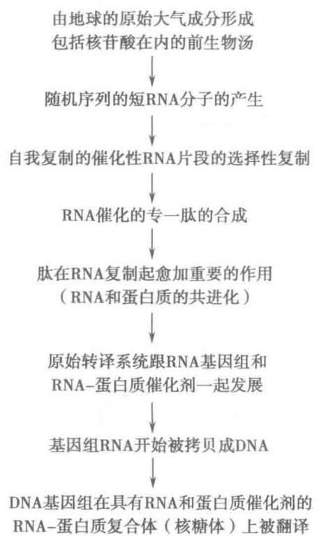  
图 1-19 “RNA 世界”说的分子进化情景

来越有效的自我复制系统。值得注意的是，在现代细胞的蛋白质合成机器（核糖体）中是RNA分子，不是蛋白质分子，催化肽键的形成。这与“RNA世界”的假说是一致的。

原始的蛋白质合成系统进化之后的某一时刻,又有了进一步的发展:与自我复制的 RNA 分子序列互补的 DNA 分子接受了保存“遗传”信息的功能,而 RNA 分子进化到担当蛋白质合成方面的角色(关于

DNA 分子比 RNA 分子更稳定,因而更适于作为遗传信息储库的解释见第 11 章)。蛋白质被证明是多能的催化剂,在整个进化过程中接受了大部分的催化功能。在原始汤中脂质样的化合物在自我复制的分子集群周围形成了相对不透性的膜层。蛋白质和核酸集中在这样的脂膜封闭区内有利于自我复制所需的分子相互作用。

## （三）原始细胞的出现——生物学进化的开始

生命既然是在地球上发生的，在漫长的历史岁月中就会留下它的踪迹，古生物化石就是其中之一。1996年在格陵兰工作的科学家在岩石中找到了38.5亿年前生命的化学证据——碳质形式的“化石分子”。在澳大利亚西部Warawoona和南非Swazi land的沉积岩中都发现35亿年前的丝状体化石，被认为是原始微生物的遗迹。在35亿年前的地层中还发现很多被称为叠层石（stromatolite）的化石，叠层石是原始蓝细菌和光合细菌等原核生物代谢产生的碳质和硅质沉积物。

地球诞生后的头10亿年间，因为大气中几乎没有氧，又因为没有微生物来清扫自然过程形成的有机化合物，所以这些化合物相对地比较稳定。化合物的稳定加上岁月的悠长，这为生命起源和进化创造了条件。认为：在化学进化的较后阶段，地球上的某个地方出现了类似于细胞的实体或细胞前体。这种前体可能是无膜到有膜裹着的RNA-多肽系统，它能够由RNA作为模板（兼催化剂）复制自己的结构，多肽作为催化剂协助复制。细胞前体通过进一步的自然选择，一个能够生长繁殖、具有原始代谢能力并有脂膜裹着的DNA-RNA-蛋白质系统诞生了，这就是地球上的第一个细胞（无疑是原核细胞）。生物学进化阶段就这样开始了。

最早的细胞可能是从无机燃料如硫化亚铁和碳酸亚铁(它们在早期的地球上都很丰富)中获得能量。例如下面反应：

$$
\mathrm{FeS} + \mathrm{H} _ {2} \mathrm{S} \longrightarrow \mathrm{FeS} _ {2} + \mathrm{H} _ {2}
$$

能产生足够的能量来驱动 ATP 或类似化合物的合成。它们所需的有机化合物可能来自于化学进化期间积累了丰富有机分子的海洋。另一可能的来源被认为是地球外的太空，因为 2006 年那次星团太空飞行 (the stardust space mission) 带回来的彗星尾部的尘埃颗粒含有多种有机化合物。

早期的单细胞生物逐渐获得从环境的化合物摄取能量的能力,并利用这个能量合成自己所需的前体分子,因此对外界的依赖性逐渐变小。其中一个很有意义的进化事件是:发展出能捕获日光能的色素(pigment),摄取的光能可用来还原(“固定”) $CO_{2}$ 成为有机化合物。这意味着有些原核细胞它们的能源由化能向光能转化,碳源由异养型(有机物)向自养型( $CO_{2}$ )转化。发生转化的原因可能是“原始汤”中的有机化合物逐渐耗尽,ATP不足,原核细胞第一次遇到了严重威胁。这种压力推动细胞中酶合成能力的进化,出现了光能自养型和化能自养型的原核生物。早期光合过程中原初的电子供体可能是 $H_{2}S$ ,产生元素S或硫酸盐( $SO_{4}^{2-}$ )作为副产品。后来的细胞发展出利用 $H_{2}O$ 作为光合反应中电子供体的酶促能力,氧作为废物被释出。今天的蓝细菌就是这些光合放氧生物的后代。

因为最早的细胞是在无氧的条件下产生的,所以早期细胞是厌氧的。在这种条件下化能异养生物(chemoheterotroph)氧化有机化合物成为 $CO_{2}$ 是通过把电子传递给像 $SO_{4}^{2-}$ 这样的接纳体而不是传递给 $O_{2}$ 的途径实现的,在这种情况产生 $H_{2}S$ 作为产物。由于产氧光合细菌(如蓝细菌)的出现,地球大气逐渐变得富含氧气。氧是一种很强的氧化剂,对厌氧生物是一种致命的毒物,这给厌氧原核生物带来了第二次严重威胁。应答这种进化压力,微生物中的某些谱系产生出需氧细菌。需氧菌是通过从有机分子把电子传递给 $O_{2}$ 来获取能量的。因为电子从有机分子传递给 $O_{2}$ 的过程释放出很大的能量,所以需氧生物和厌氧生物在含氧环境中竞争时前者比后者具有能量方面的优越性。这个优越性使得需氧生物在富 $O_{2}$ 环境中占了优势。

现今的细菌和古菌几乎生活在生物圈的每个生态角落，并且很多生物实际上都能利用各种有机化合物作为碳和能的来源。生活在淡水和海水中的光合微生物是捕获日光能来制造糖类和所有其他的细胞成分的，它们本身又被其他生物用作食物。进化的过程在继续——在快速繁殖的细菌细胞里，进化将按一个允许我们在实验室中亲眼看到这一过程的时间表在进行。要想在实验室产生一个“原初细胞”（protocell），涉及检测一个简单细胞的基因组，以确定生命所必需的最少基因数目。对一个游离生活的细菌来说，最小的已知基因组是生殖分枝杆菌（Mycobacterium genitalium）的基因组，它含有580 000个碱基，编码483个基因。

## （四）真核细胞是从原核细胞进化而来的

根据化石的记录,约在15亿年前,比原核细胞大、结构更复杂的真核细胞在地球上已出现了(图1-

20)。生命从非核细胞(原核)到具核细胞(真核)的进化顺序也得到了今天生物的比较形态学和比较生物化学的证实。真核细胞与原核细胞的最大差别是真核细胞有膜包围着的核和许多细胞器。那么结构简单的原核细胞如何发展到如此复杂的真核细胞的？原因何在？看来，必然有三大变化发生：第一，当细胞获得更多DNA时，就需要有更精巧的机制以便把DNA与专一蛋白质紧密折叠成若干个单独的复合体，并在细胞分裂时把它们平均分配给子细胞；还需要有特化的蛋白质来稳定已折叠的DNA和拉开在细胞分裂时形成的DNA-蛋白质复合体(染色体)。第二，随着细胞变大，发展出一个胞内膜系统，包括包裹DNA的双层膜。此膜把DNA模板上的RNA合成和核糖体上的蛋白质合成分隔开来，分别成为核内过程和胞质内过程。真核细胞的内膜系统被认为是由原核细胞的质膜内折(infolding)进化而来的，包括核被膜和内质网等。第三，不能进行需氧代谢和光合作用的早期真核细胞吞入了需氧细菌或同时吞入了光合细菌，形成了并最终成为永久性内共生联合体(endosymbiotic association)。某些需氧细菌演化成现代真核生物的

  
图 1-20 地球上生命进化的里程碑

线粒体,某些光合蓝细菌变成了质体,例如绿藻的叶绿体;绿藻可能就是现代植物细胞的先祖。

在进化后期的某一阶段,单细胞生物发现它们成串在一起更为有利,这样可以获得比游离生活的单细胞更大的游动性(motility)、效力或繁殖成功率。这种成串生物的进一步进化导致个体细胞之间的永久性联合,并导致群体(colony)内的特化——细胞分化。

细胞特化导致了日益复杂和高度分化的生物进化，在这些生物中某些细胞行使记忆功能，另一些执行消化、光合作用或繁殖的功能等等。许多现代的多细胞生物含有几百种不同类型的细胞，每种类型细胞专门行使一种或几种功能，以支持整个生物。早期进化的基本机制已经通过进化变得更加精巧。例如，作为草履虫（paramecium）纤毛和衣藻（chlamydomonas）鞭毛的搏打运动基础的同一基本结构和机制也被高度分化的脊椎动物精子细胞所使用。

<!-- EN-BEGIN 1.5 -->

### 【英文对应 1.5】Evolutionary Foundations

> 来源：Lehninger Principles of Biochemistry（书籍/02_生物化学原理） 第1章 The Foundations of Biochemistry，§1.5。对应本章“八、生物分子的起源与进化”。

Nothing in biology makes sense except in the light of evolution.

—Theodosius Dobzhansky, in The American Biology Teacher, March 1973

Great progress in biochemistry and molecular biology in recent decades has amply confirmed the validity of Dobzhansky's striking generalization. P5 The remarkable similarity of metabolic pathways and gene sequences across the three domains of life argues strongly that all modern organisms are derived from a common evolutionary progenitor by a series of small changes (mutations), each of which conferred a selective advantage to some organism in some ecological niche.

#### [EN] Changes in the Hereditary Instructions Allow Evolution

Despite the near-perfect fidelity of genetic replication, infrequent unrepaired mistakes in the DNA replication process lead to changes in the nucleotide sequence of DNA, producing a genetic mutation and changing the instructions for a cellular component.

Incorrectly repaired damage to one of the DNA strands has the same effect. Mutations in the DNA handed down to offspring—that is, mutations carried in the reproductive cells—may be harmful or even lethal to the new organism or cell; they may, for example, cause the synthesis of a defective enzyme that is not able to catalyze an essential metabolic reaction. Occasionally, however, a mutation better equips an organism or cell to survive in its environment (Fig. 1-32). The mutant enzyme might have acquired a slightly different specificity, for example, so that it is now able to use some compound that the cell was previously unable to metabolize. If a population of cells were to find itself in an environment where that compound was the only or the most abundant available source of fuel, the mutant cell would have a selective advantage over the other, unmutated (wild-type) cells in the population. The mutant cell and its progeny would survive and prosper in the new environment, whereas wild-type cells would starve and be eliminated. This is what Charles Darwin meant by natural selection—what is sometimes summarized as “survival of the fittest.”

Occasionally, a second copy of a whole gene is introduced into the chromosome as a result of defective replication of the chromosome. The second copy is superfluous, and mutations in this gene will not be deleterious; it becomes a means by which the cell may evolve, by producing a new gene with a new function while retaining the original gene and gene function. Seen in this light, the DNA molecules of modern organisms are historical documents, records of the long journey from the earliest cells to modern organisms. The historical accounts in DNA are not complete, however; in the course of evolution, many mutations must have been erased or written over. But DNA molecules are the best source of biological history we have. P5 The frequency of errors in DNA replication represents a balance between too many errors, which would yield nonviable daughter cells, and too few errors, which would prevent the genetic variation that allows survival of mutant cells in new ecological niches.

Several billion years of natural selection have refined cellular systems to take maximum advantage of the chemical and physical properties of available raw materials. Chance genetic mutations occurring in individuals in a population, combined with natural selection, have resulted in the evolution of the enormous variety of species we see today, each adapted to its particular ecological niche.

#### [EN] Biomolecules First Arose by Chemical Evolution

In our account thus far, we have passed over the first chapter of the story of evolution: the appearance of the first living cell. Apart from their occurrence in living organisms, organic compounds, including the basic biomolecules such as amino acids and carbohydrates, are found in only trace amounts in the Earth's crust, the sea, and the atmosphere. How did the first living organisms acquire their characteristic organic building blocks? According to one hypothesis, these compounds were created by the effects of powerful environmental forces—ultraviolet irradiation, lightning, or volcanic eruptions—on the gases in the prebiotic Earth's atmosphere and on inorganic solutes in superheated thermal vents deep in the ocean.

This hypothesis was tested in a classic experiment on the abiotic (nonbiological) origin of organic biomolecules carried out in 1953 by biochemist Stanley Miller in the laboratory of the physical chemist Harold Urey. Miller subjected gaseous mixtures such as those presumed to exist on the prebiotic Earth, including $NH_{3}$ , $CH_{4}$ , $H_{2}O$ , and $H_{2}$ , to electrical sparks produced across a pair of electrodes (to simulate lightning) for periods of a week or more, then analyzed the contents of the closed reaction vessel (Fig. 1-33). The gas phase of the resulting mixture contained CO and $CO_{2}$ as well as the starting materials. The water phase contained a variety of organic compounds, including some amino acids, hydroxy acids, aldehydes, and hydrogen cyanide (HCN). This experiment established the possibility of abiotic production of biomolecules in relatively short times under relatively mild conditions. When Miller's carefully stored samples were rediscovered in 2010 and examined with much more sensitive and discriminating techniques (high-performance liquid chromatography and mass

FIGURE 1-32 Gene duplication and mutation: one path to generate new enzymatic activities. In this example, the single hexokinase gene in a hypothetical organism might occasionally, by accident, be copied twice during DNA replication, such that the organism has two full copies of the gene, one of which is superfluous. Over many generations, as the DNA with two hexokinase genes is repeatedly duplicated, rare mistakes occur, leading to changes in the nucleotide sequence of the superfluous gene and thus of the protein that it encodes. In a few very rare cases, the altered protein produced from this mutant gene can bind a new substrate—galactose in our hypothetical case. The cell containing the mutant gene has acquired a new capability (metabolism of galactose), which may allow the cell to survive in an ecological niche that provides galactose but not glucose. If no gene duplication precedes mutation, the original function of the gene product is lost.

spectrometry), his original observations were confirmed and greatly broadened. Previously unpublished experiments by Miller that included $H_{2}S$ in the gas mixture (mimicking the “smoking” volcanic plumes at the sea bottom; Fig. 1-34) showed the formation of 23 amino acids and 7 organosulfur compounds, as well as a large number of other simple compounds that might have served as building blocks in prebiotic evolution.

More-refined laboratory experiments have provided good evidence that many of the chemical components of living cells can form under these conditions. Polymers of the nucleic acid RNA (ribonucleic acid) can act as catalysts in biologically significant reactions (see Chapters 26 and 27), and RNA probably played a crucial role in prebiotic evolution, both as catalyst and as information repository.

#### [EN] RNA or Related Precursors May Have Been the First Genes and Catalysts

In modern organisms, nucleic acids encode the genetic information that specifies the structure of enzymes, and enzymes catalyze the replication and repair of nucleic acids. The mutual dependence of these two classes of biomolecules brings up the perplexing question: Which came first, DNA or protein?

The answer may be that they appeared about the same time, and RNA preceded them both.

  
(a)

  
(b)  
FIGURE 1-33 Abiotic production of biomolecules. (a) Spark-discharge apparatus of the type used by Miller and Urey in experiments demonstrating abiotic formation of organic compounds under primitive atmospheric conditions. After subjection of the gaseous contents of the system to electrical sparks, products were collected by condensation. Biomolecules such as amino acids were among the products. (b) Stanley L. Miller (1930–2007) using his spark-discharge apparatus. [(b) Bettmann/Getty Images.]

The discovery that RNA molecules can act as catalysts in their own formation suggests that RNA or a similar molecule may have been the first gene and the first catalyst. According to this scenario (Fig. 1-35), one of the earliest stages of biological evolution was the chance formation of an RNA molecule that could catalyze the formation of other RNA molecules of the same sequence—a self-replicating, self-perpetuating RNA.

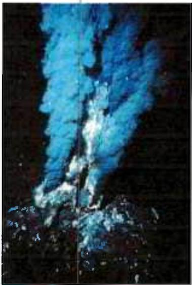  
FIGURE 1-34 Black smokers. Hydrothermal vents in the sea floor emit superheated water rich in dissolved minerals. Black "smoke" is formed when the vented solution meets cold seawater and dissolved sulfides precipitate. Diverse life forms, including a variety of archaea and some remarkably complex multicellular organisms, are found in the immediate vicinity of such vents, which may have been the sites of early biogenesis. [NOAA/Science Source]

The concentration of a self-replicating RNA molecule would increase exponentially, as one molecule formed several, several formed many, and so on. The fidelity of self-replication was presumably less than perfect, so the process would generate variants of the RNA, some of which might be even better able to self-replicate. In the competition for nucleotides, the most efficient of the self-replicating sequences would win, and less efficient replicators would fade from the population.

The division of function between DNA (genetic information storage) and protein (catalysis) was, according to the "RNA world" hypothesis, a later development. New variants of self-replicating RNA molecules developed that had the additional ability to catalyze the condensation of amino acids into peptides. Occasionally, the peptide(s) thus formed would reinforce the self-replicating ability of the RNA, and the pair—RNA molecule and helping peptide—could undergo further modifications in sequence, generating increasingly efficient self-replicating systems. The remarkable discovery that in the protein-synthesizing machinery of modern cells (ribosomes), RNA molecules, not proteins, catalyze the formation of peptide bonds is consistent with the RNA world hypothesis.

Some time after the evolution of this primitive protein-synthesizing system, there was a further development: DNA molecules with sequences complementary to the self-replicating RNA molecules took over the function of conserving the "genetic" information, and RNA molecules evolved to play roles in protein synthesis. (We explain in Chapter 8 why DNA is a more stable molecule than RNA and thus a better repository of inheritable information.) Proteins proved to be versatile catalysts and, over time, took over most of that function. Lipidlike compounds in the primordial mixture formed relatively impermeable layers around self-replicating collections of molecules. The concentration of proteins and nucleic acids within these lipid enclosures favored the molecular interactions required in self-replication.

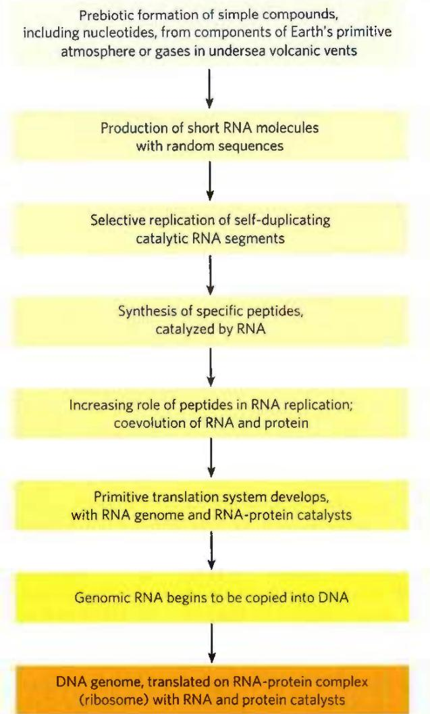  
FIGURE 1-35 A possible "RNA world" scenario.

The RNA world scenario is intellectually satisfying, but it leaves unanswered a vexing question: Where did the nucleotides needed to make the initial RNA molecules come from? An alternative to this scenario supposes that simple metabolic pathways evolved first, perhaps at the hot vents in the ocean floor. A set of linked chemical reactions there might have produced precursors, including nucleotides, before the advent of lipid membranes or RNA. Without more experimental evidence, neither of these hypotheses can be disproved.

#### [EN] Biological Evolution Began More Than Three and a Half Billion Years Ago

Earth was formed about 4.6 billion years ago, and the first evidence of life dates to more than 3.5 billion years ago (see the timeline in Figure 1-36). In 1996, scientists working in Greenland found chemical evidence of life (“fossil molecules”) from as far back as 3.85 billion years ago, forms of carbon embedded in rock that seem to have a distinctly biological origin. Somewhere on Earth during its first billion years the first simple organism arose, capable of replicating its own structure from a template (RNA?) that was the first genetic material. Because the terrestrial atmosphere at the dawn of life was nearly devoid of oxygen, and because there were few microorganisms to scavenge organic compounds formed by natural processes, these compounds were relatively stable. Given this stability and eons of time, the improbable became inevitable: lipid vesicles containing organic compounds and self-replicating RNA gave rise to the first cells, or protocells, and those protocells with the greatest capacity for self-replication became more numerous. The process of biological evolution had begun.

  
FIGURE 1-36 Landmarks in the evolution of life on Earth.

#### [EN] The First Cell Probably Used Inorganic Fuels

The earliest cells arose in a reducing atmosphere (there was no oxygen) and probably obtained energy from inorganic fuels such as ferrous sulfide and ferrous carbonate, both abundant on the early Earth. For example, the reaction

$$
\mathrm{FeS} + \mathrm{H} _ {2} \mathrm{S} \longrightarrow \mathrm{FeS} _ {2} + \mathrm{H} _ {2}
$$

yields enough energy to drive the synthesis of ATP or similar compounds. The organic compounds these early cells required may have arisen by the nonbiological actions of lightning or of heat from volcanoes or thermal vents in the sea on components of the early atmosphere such as CO, $CO_{2}$ , $N_{2}$ , $NH_{3}$ , and $CH_{4}$ . An alternative source of organic compounds has been proposed: extraterrestrial space. Space missions in 2006 (the NASA Stardust space probe) and 2014 (the European Space Agency lander Philae) found particles of comet dust containing the simple amino acid glycine and 20 other organic compounds capable of reacting to form biomolecules.

Early unicellular organisms gradually acquired the ability to derive energy from compounds in their environment and to use that energy to synthesize more of their own precursor molecules, thereby becoming less dependent on outside sources. A very significant evolutionary event was the development of pigments capable of capturing the energy of light from the sun, which could be used to reduce, or "fix," $CO_{2}$ to form more complex, organic compounds. The original electron donor for these photosynthetic processes was probably $H_{2}S$ , yielding elemental sulfur or sulfate ( $SO_{4}^{2-}$ ) as the byproduct. Some hydrothermal vents in the sea bottom (black smokers; Fig. 1-36) emit significant amounts of $H_{2}$ , which is another possible electron donor in the metabolism of the earliest organisms. Later cells developed the enzymatic capacity to use $H_{2}O$ as the electron donor in photosynthetic reactions, producing $O_{2}$ as waste. Cyanobacteria are the modern descendants of these early photosynthetic oxygen-producers.

Because the atmosphere of Earth in the earliest stages of biological evolution was nearly devoid of oxygen, the earliest cells were anaerobic. Under these conditions, chemotrophs could oxidize organic compounds to $CO_{2}$ by passing electrons not to $O_{2}$ but to acceptors such as $SO_{4}^{2-}$ , in this case yielding $H_{2}S$ as the product. With the rise of $O_{2}$ -producing photosynthetic bacteria, the atmosphere became progressively richer in oxygen—a powerful oxidant and a deadly poison to anaerobes. Responding to the evolutionary pressure of what evolutionary theorist and biologist Lynn Margulis and science writer Dorion Sagan called the “oxygen holocaust,” some lineages of microorganisms gave rise to aerobes that obtained energy by passing electrons from fuel molecules to oxygen. Because the transfer of electrons from organic molecules to $O_{2}$ releases a great deal of energy, aerobic organisms had an energetic advantage over their anaerobic counterparts when both competed in an environment containing oxygen. This advantage translated into the predominance of aerobic organisms in $O_{2}$ -rich environments.

Modern bacteria and archaea inhabit almost every ecological niche in the biosphere, and there are organisms capable of using virtually every type of organic compound as a source of carbon and energy. Photosynthetic microbes in both fresh and marine waters trap solar energy and use it to generate carbohydrates and all other cell constituents, which are in turn used as food by other forms of life. The process of evolution continues—and, in rapidly reproducing bacterial cells, on a time scale that allows us to witness it in the laboratory.

#### [EN] Eukaryotic Cells Evolved from Simpler Precursors in Several Stages

Starting about 1.5 billion years ago, the fossil record begins to show evidence of larger and more complex organisms, probably the earliest eukaryotic cells (see Fig. 1-37). Details of the evolutionary path from non-nucleated to nucleated cells cannot be deduced from the fossil record alone, but morphological and biochemical comparisons of modern organisms have suggested a sequence of events consistent with the fossil evidence.

Three major changes must have occurred. First, as cells acquired more DNA, the mechanisms required to fold it compactly into discrete complexes with specific proteins and to divide it equally between daughter cells at cell division became more elaborate. Specialized proteins were required to stabilize folded DNA and to pull the resulting DNA-protein complexes (chromosomes) apart during cell division. This was the evolution of the chromosome. Second, as cells became larger, a system of intracellular membranes developed, including a double membrane surrounding the DNA. This membrane segregated the nuclear process of RNA synthesis on a DNA template from the cytoplasmic process of protein synthesis on ribosomes. This was the evolution of the nucleus, a defining feature of eukaryotes. Third, early eukaryotic cells, which were incapable of photosynthesis or aerobic metabolism, enveloped aerobic bacteria or photosynthetic bacteria to form endosymbiotic associations that eventually became permanent (Fig. 1-37). Some aerobic bacteria evolved into the mitochondria of modern eukaryotes, and some photosynthetic cyanobacteria became the plastids, such as the chloroplasts of green algae, the likely ancestors of modern plant cells.

At some later stage of evolution, unicellular organisms found it advantageous to cluster together, thereby acquiring greater motility, efficiency, or reproductive success than their free-living single-celled competitors. Further evolution of such clustered organisms led to permanent associations among individual cells and eventually to specialization within the colony—to cellular differentiation.

The advantages of cellular specialization led to the evolution of increasingly complex and highly differentiated organisms, in which some cells carried out the sensory functions; others the digestive, photosynthetic, or reproductive functions; and so forth. Many modern multicellular organisms contain hundreds of different cell types, each specialized for a function that supports the entire organism. Fundamental mechanisms that evolved early have been further refined and embellished through evolution. The same basic structures and mechanisms that underlie the beating motion of cilia in Paramecium and of flagella in Chlamydomonas are employed by the highly differentiated vertebrate sperm cell, for example.

  
FIGURE 1-37 Evolution of eukaryotes through endosymbiosis. The earliest eukaryote, an anaerobe, acquired endosymbiotic purple bacteria, which carried with them their capacity for aerobic catabolism and became,  
over time, mitochondria. When photosynthetic cyanobacteria subsequently became endosymbionts of some aerobic eukaryotes, these cells became the photosynthetic precursors of modern green algae and plants.

#### [EN] Molecular Anatomy Reveals Evolutionary Relationships

Now that genomes can be sequenced relatively quickly and inexpensively, biochemists have an enormously rich, ever-increasing treasury of information on the molecular anatomy of cells that they can use to analyze evolutionary relationships and refine evolutionary theory. Thus far, the molecular phylogeny derived from gene sequences is consistent with, but in many cases more precise than, the classical phylogeny based on macroscopic structures.

P5 Although organisms have continuously diverged at the level of gross anatomy, at the molecular level the basic unity of life is readily apparent; molecular structures and mechanisms are remarkably similar from the simplest to the most complex organisms. These similarities are most easily seen at the level of sequences, either the DNA sequences that encode proteins or the protein sequences themselves.

When two genes share readily detectable sequence similarities (nucleotide sequence in DNA or amino acid sequence in the proteins they encode), their sequences are said to be homologous and the proteins they encode are homologs. In the course of evolution, new structures, processes, or regulatory mechanisms are acquired, reflections of the changing genomes of the evolving organisms. The genome of a simple eukaryote such as yeast should have genes related to formation of the nuclear membrane, genes not present in bacteria or archaea. The genome of an insect should contain genes that encode proteins involved in specifying a characteristic segmented body plan, genes not present in yeast. The genomes of all vertebrate animals should share genes that specify the development of a spinal column, and those of mammals should have unique genes necessary for the development of the placenta, a characteristic of mammals—and so on. Comparisons of the whole genomes of species in each phylum are leading to the identification of genes critical to fundamental evolutionary changes in body plan and development.

#### [EN] Functional Genomics Shows the Allocations of Genes to Specific Cellular Processes

When the sequence of a genome is fully determined and each gene is assigned a function, molecular geneticists can group genes according to the processes (DNA synthesis, protein synthesis, generation of ATP, and so forth) in which they function and thus find what fraction of the genome is allocated to each of a cell's activities. The largest category of genes in E. coli, A. thaliana, and H. sapiens consists of those of (as yet) unknown function, which make up more than 40% of the genes in each species. The genes encoding the transporters that move ions and small molecules across plasma membranes make up a significant proportion of the genes in all three species, more in the bacterium and plant than in the mammal (10% of the \~4,400 genes of E. coli, \~8% of the \~27,000 genes of A. thaliana, and \~4% of the \~20,000 genes of H. sapiens). Genes that encode the proteins and RNA required for protein synthesis make up 3% to 4% of the E. coli genome; but in the more complex cells of A. thaliana, more genes are needed for targeting proteins to their final location in the cell than are needed to synthesize those proteins (about 6% and 2% of the genome, respectively). In general, the more complex the organism, the greater the proportion of its genome that encodes genes involved in the regulation of cellular processes and the smaller the proportion dedicated to basic processes, or "housekeeping" functions, such as ATP generation and protein synthesis. The housekeeping genes typically are expressed under all conditions and are not subject to much regulation.

#### [EN] Genomic Comparisons Have Increasing Importance in Medicine

Large-scale studies in which the entire genomic sequence has been determined for hundreds or thousands of people with cancer, type 2 diabetes, schizophrenia, or other diseases or conditions have allowed the identification of many genes in which mutations correlate with a medical condition. Typically, sequence differences are found in a number of different genes, each of which makes a partial contribution to the predisposition to a given condition or disease. Each of those genes codes for a protein that, in principle, might become the target for drugs to treat that condition. We may expect that for some genetic diseases, palliatives will be replaced by cures, and that for disease susceptibilities associated with particular genetic markers, forewarning and perhaps increased preventive measures will prevail. Today's "medical history" may be replaced by a "medical forecast."

#### [EN] SUMMARY 1.5 Evolutionary Foundations

■ Occasional inheritable mutations yield organisms that are better suited for survival and reproduction in an ecological niche, and their progeny come to dominate the population in that niche. This process of mutation and selection is the basis for the Darwinian evolution that led from the first cell to all modern organisms. The large number of genes shared by all living organisms explains organisms' fundamental similarities.

The components for the first cell may have been produced near hydrothermal vents at the bottom of the sea or by the action of lightning and high temperature on simple atmospheric molecules such as $\mathrm{CO}_{2}$ and $\mathrm{NH}_{3}$ .

The earliest cells may have been formed by the enclosure of a self-replicating RNA molecule within a membrane-like lipid layer. The catalytic and genetic roles played by the early RNA genome were, over time, taken over by proteins and DNA, respectively.

■ Hydrothermal vents may have provided the oxidizable fuels (iron compounds) for the first organisms.

Eukaryotic cells acquired the capacity for photosynthesis and oxidative phosphorylation from endosymbiotic bacteria. In multicellular organisms, differentiated cell types specialize in one or more of the functions essential to the organism's survival.

■ Detailed phylogenetic relationships can be determined from gene or protein sequence similarities between organisms.

■ From knowledge of the roles of proteins encoded in the genome, scientists can approximate the proportion of the genome dedicated to a specific process, such as membrane transport or protein synthesis.

\- Knowledge of the complete genomic sequences of organisms from different branches of the phylogenetic tree provides insights into evolution and offers great opportunities in medicine.

<!-- EN-END 1.5 -->

## 提要

生物化学是研究生命属性化学本质的科学,简言之即生命的化学。生命或活生物的属性大体可归纳为:① 化学成分复杂而同一,结构错综而有序;② 新陈代谢;③ 自我复制。

生物化学的发展也离不开生产发展和社会需要。作为交叉学科的生物化学倍受其他学科发展的推进。某种意义上说，分子生物学是生物化学发展的新阶段或新领域。生物化学发展的进程中涌现出许多出色的科学家和学术中心，他们的创新思维和团队精神值得后人学习。

生命物质是由 C、H、O、N 和 P 等化学元素所组成。这些元素是在进化过程中根据可得性和适合性两个原则被选中的。生物分子是碳的化合物；因为碳原子在成键方面的多能性，使得携有各种官能团的碳-碳骨架有多种多样的排列；官能团给与生物分子以生物学和化学的“个性”。活细胞中含有一套（几百种）有机小分子 $M_{r}$ 100\~500，它们是基本代谢途径的重要代谢物。蛋白质、核酸和多糖是生物大分子，是由相对简单的单体亚基 $M_{r}<500$ 聚合而成的线型多聚体 $M_{r}>5\ 000$ ；它们的序列含有决定每个分子的三维结构和生物学功能的信息。

分子构型是指分子中原子的固定空间排列；只有通过共价键的断裂，构型才能改变。对于一个具有4个不同取代基的碳原子（称手性碳或不对称碳），取代基在空间可以有两种不同的排列方式，产生一对光学和生物学性质不同的立体异构体（对映体）；其中只有一个是有生物活性的。分子构象是指分子中原子的实际空间位置；不需要共价键的破裂，通过绕单键旋转即可引起构象改变。生物分子之间的相互作用几乎总是立体专一的，要求相互作用的分子之间在空间上有精确互补的关系。

生物分子主要是通过弱的非共价相互作用,彼此影响,互相吸引,以行使它们的功能。生物结构中的非共价相互作用有离子相互作用、氢键、范德华力和疏水相互作用(熵效应)。个别的这种相互作用是微小的,但许多个别相互作用集中在一起则形成强大的力量。

由于水分子的结构特点,使它成为极性溶质的良好溶剂;它既是发生代谢反应的介质,又是某些生化过程包括水解、缩合和氧化-还原等的反应物或产物。溶质浓度强力影响水的物理性质(依数性)如渗透压。渗透压与维持细胞的正常状态关系很大。

纯水微电离，生成数目相等的 $\mathrm{H}^{+}(\mathrm{H}_{3}\mathrm{O}^{+})$ 和 $\mathrm{OH}^{-}$ 。水的电离程度用平衡常数 $K_{\mathrm{eq}} = ([\mathrm{H}^{+}][\mathrm{OH}^{-}]) / [\mathrm{H}_{2}\mathrm{O}]$ 来表示；从 $K_{\mathrm{eq}}$ 可以导出在 $25^{\circ}\mathrm{C}$ 时水的离子积 $K_{\mathrm{w}} = [\mathrm{H}^{+}][\mathrm{OH}^{-}] = 1\times 10^{-14}(\mathrm{mol / L})^{2}$ ；纯水中 $[\mathrm{H}^{+}] = 10^{-7}\mathrm{mol / L}$ 。 $K_{\mathrm{w}}$ 是一个常数， $[\mathrm{H}^{+}]$ 的任何变动将使 $[\mathrm{OH}^{-}]$ 向相反的方向变化。水溶液的 $\mathsf{pH}$ 反映氢离子浓度： $\mathrm{pH = lg(1 / [H^+] = -lg[H^+]}$ 。

弱酸或弱碱能部分电离；弱酸电离释放 $\mathrm{H}^{+}$ ，降低水溶液的 $\mathrm{pH}$ ；弱碱电离接纳 $\mathrm{H}^{+}$ ，升高 $\mathrm{pH}$ 。其电离程度是每种弱酸或弱碱的特征，常用酸解离常数 $K_{\mathrm{a}} = ([\mathrm{H}^{+}][\mathrm{A}^{-}]) / [\mathrm{HA}] = K_{\mathrm{eq}}$ 来表示。 $K_{\mathrm{a}}$ 的负对数 $\mathrm{p}K_{\mathrm{a}} = \lg (1 / K_{\mathrm{a}}) = -\lg K_{\mathrm{a}}$ 用来表示一个弱酸或弱碱的相对强度。酸愈强， $\mathrm{p}K_{\mathrm{a}}$ 愈低；碱愈强， $\mathrm{p}K_{\mathrm{a}}$ 愈高。 $\mathrm{p}K_{\mathrm{a}}$ 值可通过实验测得。

弱酸(或弱碱)及其盐的混合液能够抵抗因加入少量 $H^{+}$ 或 $OH^{-}$ 引起的 pH 变化。因此这种混合液起着缓冲剂的作用。弱酸(或弱碱)及其盐的溶液 pH 可以由 Henderson-Hasselbalch 方程 $pH = pK_{a} + lg [A^{-}] / [HA]$ 给出。磷酸盐和重碳酸盐缓冲系统维持细胞内、外液体于最适(生理)pH，一般是7左右。

细胞可分为原核细胞和真核细胞两大类。属于原核细胞的有细菌和古菌。细菌、古菌和真核生物构成生物的三域；真核生物与古菌的亲缘关系比它与细菌的亲缘关系更为接近。光氧生物利用日光进行工作；化养生物通过氧化燃料把电子传递给良好的电子接纳体，无机化合物、有机化合物或分子氧，来获得能量。

所有的细胞都有质膜作为边界；胞内的细胞溶胶含有代谢物、辅酶、无机离子和酶等；在拟核（细菌和古菌）或核（真核生物）内含有一套基因。原核细胞有细胞溶胶、一个拟核（核区）和若干质粒。真核细胞除细胞溶胶外有一个细胞核和若干细胞器，一些代谢过程分别被分隔在专一的细胞器中。细胞骨架蛋白质组装成长纤丝，它给细胞以形状和刚性，其中微管并作为轨道移动细胞器于整个细胞中。

地球上的生命很可能是在35亿年前随着一个含RNA分子的膜封闭区室的形成开始的。最初细胞所需的成分可能已在海底的热风口附近或通过闪电、高温和辐射对简单的原始大气分子如 $CO_{2}$ 和 $NH_{3}$ 等的作用下产生了。早期的RNA基因组所起的催化和遗传作用，随时间的推移，分别被蛋白质和DNA所代替。真核细胞从内共生细菌获得光合作用和氧化磷酸化作用的能力。在多细胞生物中，分化类型的细胞专门执行一种或几种对生物的生存所必需的功能。

## 习题

1. 生物化学是研究什么的？它作为一门学科是怎样发展起来的？它与分子生物学有什么关系？

2. (a) 进化过程中生物体的化学元素是怎样被选中的？(b) 硅和碳在周期表中同为ⅣA族元素，都能形成多至4个单键，并且在生物圈中，硅比碳更加丰富，为什么在进化中硅没有像碳那样被选为生命的中心组织元素（作为骨架），而仅以痕量存在于生物体中？

3. 30种原始生物分子（基本构件分子），有立体异构体的，几乎只有一种异构体被生物所选用，例如L-氨基酸，D-单糖等。前生物的合成一定是产生D-和L-型的混合物，并且D-和L-型的丰度应该一样。假定它们的生物学适合性也相同（已有实验证据表明这一假定是可靠），试解释生物只利用一种立体异构体的原因。

4. 多年前两个制药厂生产了一种兴奋剂药物（化学名1-苯-2-氨基-丙烷）：一个厂生产的商品名为苯齐巨林（benzedrine），另一个厂的商品名为德克赛巨林（dexedrine）。这两个药物的许多物理性质和结构式：

$$
\mathrm{CH} _ {2} - \mathrm{CH} (\mathrm{NH} _ {2}) - \mathrm{CH} _ {3}
$$

是一样的。德克赛巨林(仍可买到)的推荐口服剂量是5 mg/日，苯齐巨林(不再有售)的推荐剂量为前者的2倍。显然要达到同样的生理效应，所用的剂量苯丙巨林要比德克赛巨林高。请解释这是为什么。

5. 生物分子间和分子内基团间的非共价相互作用有哪些？它们之间有什么区别？

6. 解释为什么水分子之间形成氢键会造成高热容(热容定义为使1g水的温度升高1℃所需的热量, J/℃)。

7. (a) 配制 0.4 mol/L 的 NaOH 溶液 500 mL 需要多少克固体 NaOH? (b) 将该溶液用质量浓度 (g/L) 和摩尔渗透压浓度表示。

8. 配制 0.5 mol/L 盐酸 2000 mL 需要量取浓盐酸(质量百分比为 37%, 比重 1.20) 多少 mL?

9. 一个弱酸溶液浓度为 $0.02 \mathrm{~mol} / \mathrm{L}$ , 测得 $\mathrm{pH}$ 为 4.6。(a) 该溶液的 $[\mathrm{H}^{+}]$ 是多少? (b) 计算该酸的酸解离常数 $K_{\mathrm{a}}$ 和 $\mathrm{p} K_{\mathrm{a}}$ 值。

10. 下面的共轭酸碱对中: (a) $H_{2}PO_{4}^{-}, H_{3}PO_{4}$ ; (b) $HCO_{3}^{-}, CO_{3}^{2-}$ ; (c) HCOOH, HCOO $^{-}$ ; (d) $H_{2}NCH_{2}COO^{-}, H_{2}NCH_{2}COOH$ , 哪个是共轭酸?

11. 含 0.20 mol/L 醋酸钠和 0.6 mol/L 醋酸 ( $pK_{a}=4.16$ ) 的溶液, 它的 pH 是多少?

12. 计算配置 0.2 mol/L 醋酸盐缓冲液 (pH=5.0) 所需的醋酸和醋酸钠的浓度。

13. 计算醋酸钠和醋酸 $\left(\mathrm{pK}_{\mathrm{a}}=4.76\right)$ 的物质的量比为(a)2:1和(b)1:10的稀溶液的pH。

14. 大肠杆菌是短杆状细菌, 长约 $2 \mu \mathrm{m}$ , 直径 $0.8 \mu \mathrm{m}$ (假设它是一个圆柱体; 圆柱体体积 $V = \pi r^{2} h$ )。(a) 如果大肠杆菌首尾相连恰好能横跨一个直径为 $0.5 \mathrm{~mm}$ 的针头。问需要多少个大肠杆菌细胞? (b) 如果大肠杆菌的平均密度是 $1.1 \times 10^{3} \mathrm{~g} / \mathrm{L}$ 。问一个大肠杆菌的质量是多小? (c) 大肠杆菌的细胞被膜为 $10 \mathrm{~nm}$ 厚。问被膜体积占大肠杆菌总体积的百分数是多少? (d) 大肠杆菌能快速生长和繁殖, 因为它含有约 15000 个合成蛋白质的球形核糖体 (直径 $18 \mathrm{~nm}$ )。问这些核糖体占细胞体积的百分数是多少? (e) 葡萄糖是主要的产能营养物, 在细菌细胞中的浓度约为 $1 \mathrm{mmol} / \mathrm{L}$ 。问在一个大肠杆菌细胞中含有多少个葡萄糖分子?

15. 高速率的细菌代谢要求细菌细胞有高的表面-体积比。(a)为什么表面-体积比会影响代谢的最高速率？(b)计算淋病奈瑟球菌（直径 $0.5\mu \mathrm{m}$ ）的表面-体积比。将它与球状阿米巴（一种大的真核细胞，直径 $150~\mu \mathrm{m}$ ）的表面-体积比相比较。球体表面积 $= 4\pi r^2$ 。

## 主要参考书目

1. 王镜岩, 朱圣庚, 徐长法. 生物化学教程. 北京: 高等教育出版社, 2008.

2. 吴相钰, 陈守良, 葛明德. 陈阅增普通生物学. 4 版. 北京: 高等教育出版社, 2014.

3. 翟中和, 王喜忠, 丁明孝. 细胞生物学. 4 版. 北京: 高等教育出版社, 2011.

4. 沈昭文, 黄爱珠, 汪静英. 前进中的生物化学论文集. 北京: 中国科学技术出版社, 1987.

5. 北京协和医学院生化学系. 回眸 90 年. 北京: 中国协和医科大学出版社, 2010.

6. 米勒, 奥吉尔. 地球上生命的起源. 彭弈欣, 译. 北京: 科学出版社, 1981.

7. 郝守刚, 马学平, 董熙平, 等. 生命的起源与演化(地球历史中的生命). 北京: 高等教育出版社, 2000.

8. Nelson D L, Cox M M. Lehninger Principles of Biochemistry. 5th ed. New York: W. H. Freeman and Company, 2008.
9. Garrett R H, Grisham C M. Biochemistry. 3rd ed. Boston: Thomson Learning, 2004.

(徐长法)

## 网上资源

习题答案

自测题

<!-- EN-BEGIN 第1章章末 -->

## 【英文对应 第1章章末】The Foundations of Biochemistry：关键术语、习题与简答

> 来源：Lehninger Principles of Biochemistry（书籍/02_生物化学原理） 第1章章末，以及书末 Abbreviated Solutions to Problems 第1章。

### [EN] KEY TERMS

All terms are defined in the glossary.

<table><tr><td>biochemistry 2</td><td>endergonic reaction 21</td></tr><tr><td>metabolite 2</td><td>exergonic reaction 21</td></tr><tr><td>nucleus 2</td><td>equilibrium 22</td></tr><tr><td>genome 2</td><td rowspan="2">standard free-energy change,  $\Delta G^{\circ}$  24</td></tr><tr><td>eukaryotes 2</td></tr><tr><td>bacteria 3</td><td rowspan="2">activation energy, $\Delta G^{\ddagger}$  25</td></tr><tr><td>archaea 3</td></tr><tr><td>cytoskeleton 6</td><td>catabolism 26</td></tr><tr><td>stereoisomers 15</td><td>anabolism 26</td></tr><tr><td>configuration 15</td><td>metabolism 27</td></tr><tr><td>chiral center 16</td><td>systems biology 27</td></tr><tr><td>conformation 18</td><td>mutation 30</td></tr><tr><td>entropy, S 21</td><td rowspan="2">housekeeping genes 36</td></tr><tr><td>enthalpy, H 21</td></tr><tr><td>free-energy change, $\Delta G$  21</td><td></td></tr></table>

### [EN] PROBLEMS

For all numerical problems, keep in mind that answers should be expressed with the correct number of significant figures. (In solving end-of-chapter problems, you may wish to refer to the tables on the inside of the back cover.) Brief solutions are provided in Appendix B; expanded solutions are published in the Absolute Ultimate Study Guide to Accompany Principles of Biochemistry.

1. The Size of Cells and Their Components A typical eukaryotic cell has a cellular diameter of 50 $\mu$ m.

(a) If you used an electron microscope to magnify this cell 10,000-fold, how big would the cell appear?

(b) If this cell were a liver cell (hepatocyte) with the same cellular diameter, how many mitochondria could the cell contain? Assume the cell is spherical; that the cell contains no other cellular components; and that each mitochondrion is spherical, with a diameter of 1.5 μm. (The volume of a sphere is $\frac{4}{3}\pi r^3$ .)

(c) Glucose is the major energy-yielding nutrient for most cells. Assuming a cellular concentration of 1 mm glucose (that is, 1 millimole/L), calculate how many molecules of glucose would be present in the spherical eukaryotic cell. (Avogadro's number, the number of molecules in 1 mol of a nonionized substance, is $6.02 \times 10^{23}$ .)

2. Components of E. coli E. coli cells are rod-shaped, about 2 $\mu$ m long, and 0.8 $\mu$ m in diameter. E. coli has a protective envelope 10 nm thick. The volume of a cylinder is $\pi r^{2}h$ , where h is the height of the cylinder.

(a) What percentage of the total volume of the bacterium does the cell envelope occupy?

(b) E. coli is capable of growing and multiplying rapidly because it contains some 15,000 spherical ribosomes (diameter 18 nm), which carry out protein synthesis. What percentage of the cell volume do the ribosomes occupy?

(c) The molecular weight of an E. coli DNA molecule is about $3.1 \times 10^{9}$ g/mol. The average molecular weight of a nucleotide pair is 660 g/mol, and each nucleotide pair contributes 0.34 nm to the length of DNA. Calculate the length of an E. coli DNA molecule. Compare the length of the DNA molecule with the cell dimensions. Now, consider the photomicrograph showing the single DNA molecule of the bacterium E. coli leaking out of a disrupted cell (Fig. 1-31b). How does the DNA molecule fit into the cell?

3. Isolating Ribosomes through Differential Centrifugation Assume you have a crude lysate sample that you obtained from mechanically homogenizing E. coli cells. You centrifuged the supernatant from the sample at a medium speed (20,000 g) for 20 min, collected the supernatant, and then centrifuged the supernatant at high speed (80,000 g) for 1 h. What procedure should you follow to isolate the ribosomes from this sample?

4. The High Rate of Bacterial Metabolism Bacterial cells have a much higher rate of metabolism than animal cells. Under ideal conditions, some bacteria double in size and divide every 20 min, whereas most animal cells under rapid growth conditions require 24 hours. The high rate of bacterial metabolism requires a high ratio of surface area to cell volume.

(a) How does the surface-to-volume ratio affect the maximum rate of metabolism?

(b) Calculate the surface-to-volume ratio for the spherical bacterium Neisseria gonorrhoeae (diameter $0.5 \mu m$ ), responsible for the disease gonorrhea. The surface area of a sphere is $4\pi r^{2}$ .

(c) How many times greater is the surface-to-volume ratio of Neisseria gonorrhoeae compared to that of a globular amoeba, a large eukaryotic cell (diameter 150 $\mu$ m)?

5. Fast Axonal Transport Neurons have long thin processes called axons, structures specialized for conducting signals throughout the organism's nervous system. The axons that originate in a person's spinal cord and terminate in the muscles of the toes can be as long as 2 m. Small membrane-enclosed vesicles carrying materials essential to axonal function move along microtubules of the cytoskeleton, from the cell body to the tips of the axons. If the average velocity of a vesicle is 1 $\mu$ m/s, how long does it take a vesicle to move from a cell body in the spinal cord to the axonal tip in the toes?

6. Comparing Synthetic versus Natural Vitamin C Some purveyors of health foods claim that vitamins obtained from natural sources are more healthful than those obtained by chemical synthesis. For example, some claim that pure L-ascorbic acid (vitamin C) extracted from rose hips is better than pure L-ascorbic acid manufactured in a chemical plant. Are the vitamins from the two sources different? Can the body distinguish a vitamin's source? Explain your answer.

### [EN] 7. Fischer Projections of L- and D-Threonine

(a) Identify the functional groups in the Fischer projection of L-threonine.

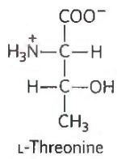

(b) Draw the Fischer projection structure of D-threonine.

(c) How many chiral centers does D-threonine have?

8. Drug Activity and Stereochemistry The quantitative differences in biological activity between the two enantiomers of a compound are sometimes quite large. For example, the D isomer of the drug isoproterenol, used to treat mild asthma, is 50 to 80 times more effective as a bronchodilator than the L isomer. Identify the chiral center in isoproterenol. Why do the two enantiomers have such radically different bioactivity?

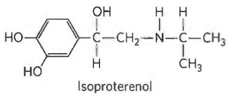

9. Separating Biomolecules In studying a particular biomolecule (a protein, nucleic acid, carbohydrate, or lipid) in the laboratory, the biochemist first needs to separate it from other biomolecules in the sample—that is, to purify it. Specific purification techniques are described later in this book. However, by looking at the monomeric subunits of a biomolecule, you can determine the characteristics of the molecule that will allow you to separate it from other molecules. For example, how would you separate (a) amino acids from fatty acids and (b) nucleotides from glucose?

10. Possibility of Silicon-Based Life Carbon and silicon are in the same group on the periodic table, and both can form up to four single bonds. As such, many science fiction stories have been based on the premise of silicon-based life. Consider what you know about carbon's bonding versatility (refer to a beginning inorganic chemistry resource for silicon's bonding properties, if needed). What property of carbon makes it especially suitable for the chemistry of living organisms? What characteristics of silicon make it less well adapted than carbon as the central organizing element for life?

11. Stereochemistry and Drug Activity of Ibuprofen Ibuprofen is an over-the-counter drug that blocks the formation of a class of prostaglandins that cause inflammation and pain.

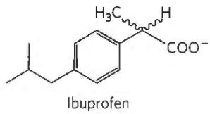

Ibuprofen is available as a racemic mixture of (R)-ibuprofen and (S)-ibuprofen. In living organisms, an isomerase catalyzes the chiral inversion of the (R)-enantiomer to the (S)-enantiomer. The reverse reaction does not occur at an appreciable rate. The accompanying figure represents the two enantiomers relative to the binding sites a, b, and c in the isomerase enzyme that converts the (R)-enantiomer to the (S)-enantiomer. All three sites recognize the corresponding functional groups of the (R)-enantiomer of ibuprofen. However, sites a and c do not recognize the corresponding functional groups of the (S)-enantiomer of ibuprofen.

(a) What substituents represent A, B, and C in the (R)-enantiomer and in the (S)-enantiomer?

The (S)-enantiomer of ibuprofen is 100 times more efficacious for pain relief than is the (R)-enantiomer. Drug companies sometimes make enantiomerically pure versions of drugs that were previously sold as racemic mixes, such as esomeprazole (Nexium) and escitalopram (Lexapro).

(b) Given that (S)-ibuprofen is more effective, why do drug companies not sell enantiomerically pure (S)-ibuprofen?

12. Components of Complex Biomolecules Three important biomolecules are depicted in their ionized forms at physiological pH. Identify the chemical constituents that are part of each molecule.

(a) Guanosine triphosphate (GTP), an energy-rich nucleotide that serves as a precursor to RNA:

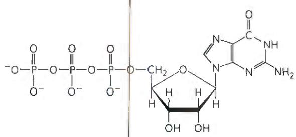

(b) Methionine enkephalin, the brain's own opiate:

(c) Phosphatidylcholine, a component of many membranes:

13. Experimental Determination of the Structure of a Biomolecule Researchers isolated an unknown substance, X, from rabbit muscle. They determined its structure from the following observations and experiments. Qualitative analysis showed that X was composed entirely of C, H, and O. A weighed sample of X was completely oxidized, and the $H_{2}O$ and $CO_{2}$ produced were measured; this quantitative analysis revealed that X contained 40.00% C, 6.71% H, and 53.29% O by weight. The molecular mass of X, determined by mass spectrometry, was 90.00 u (atomic mass units; see Box 1-1). Infrared spectroscopy showed that X contained one double bond. X dissolved readily in water to give an acidic solution that demonstrated optical activity when tested in a polarimeter.

(a) Determine the empirical and molecular formula of X.

(b) Draw the possible structures of X that fit the molecular formula and contain one double bond. Consider only linear or branched structures and disregard cyclic structures. Note that oxygen makes very poor bonds to itself.

(c) What is the structural significance of the observed optical activity? Which structures in (b) are consistent with the observation?

(d) What is the structural significance of the observation that a solution of X was acidic? Which structures in (b) are consistent with the observation?

(e) What is the structure of X? Is more than one structure consistent with all the data?

14. Naming Stereoisomers with One Chiral Carbon Using the RS System Propranolol is a chiral compound. (R)-Propranolol is used as a contraceptive; (S)-propranolol is used to treat hypertension. The structure of one of the propranolol isomers is shown.

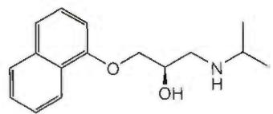

(a) Identify the chiral carbon in propranolol.

(b) Does the structure show the $(R)$ isomer or the $(S)$ isomer?

(c) Draw the other isomer of propranolol.

15. Naming Stereoisomers with Two Chiral Carbons Using the RS System The $(R,R)$ isomer of methylphenidate (Ritalin) is used to treat attention deficit hyperactivity disorder (ADHD). The $(S,S)$ isomer is an antidepressant.

(a) Identify the two chiral carbons in the methylphenidate structure shown here.

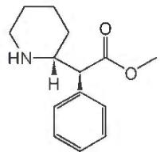

(b) Does the structure show the $(R,R)$ isomer or the $(S,S)$ isomer?

(c) Draw the other isomer of methylphenidate.

16. State of Bacterial Spores A bacterial spore is metabolically inert and may remain so for years. Spores contain no measurable ATP, exclude water, and consume no oxygen. However, when a spore is transferred into an appropriate liquid medium, it germinates, makes ATP, and begins cell division within an hour. Is the spore dead, or is it alive? Explain your answer.

17. Activation Energy of a Combustion Reaction Firewood is chemically unstable compared with its oxidation products, $CO_{2}$ and $H_{2}O$ .

$$
\mathrm{Firewood} + \mathrm{O} _ {2} \rightarrow \mathrm{CO} _ {2} + \mathrm{H} _ {2} \mathrm{O}
$$

(a) What can one say about the standard free-energy change for this reaction?

(b) Why doesn't firewood stacked beside the fireplace undergo spontaneous combustion to its much more stable products?

(c) How can the activation energy be supplied to this reaction?
(d) Suppose you have an enzyme (firewoodase) that catalyzes the rapid conversion of firewood to $CO_{2}$ and $H_{2}O$ at room temperature. How does the enzyme accomplish that in thermodynamic terms?

18. Consequence of Nucleotide Substitutions Suppose deoxycytidine (C) in one strand of DNA is mistakenly replaced with deoxythymidine (T) during cell division. What is the consequence for the cell if the deoxynucleotide change is not repaired?

19. Mutation and Protein Function Suppose that the gene for a protein 500 amino acids in length undergoes a mutation. If the mutation causes the synthesis of a mutant protein in which just one of the 500 amino acids is incorrect, the protein may lose all of its biological function. How can this small change in a protein's sequence inactivate it?

20. Gene Duplication and Evolution Suppose that a rare DNA replication error results in the duplication of a single gene, giving the daughter cell two copies of the same gene.

(a) How does this change favor the acquisition of a new function by the daughter cell?

(b) In the vascular plant Arabidopsis thaliana, 50% to 60% of the genome consists of duplicate content. How might this confer a selective advantage?

21. Cryptobiotic Tardigrades and Life Tardigrades, also called water bears or moss piglets, are small animals that can grow to about 0.5 mm in length. Terrestrial tardigrades (pictured here) typically live in the moist environments of mosses and lichens. Some of these species are capable of surviving extreme conditions. Some tardigrades can enter a reversible state called cryptobiosis, in which metabolism completely stops until conditions become hospitable. In this state, various tardigrade species have withstood dehydration, extreme temperatures from -200 °C to +150°C, pressures from 6,000 atm to a vacuum, anoxic conditions, and the radiation of space. Do tardigrades in cryptobiosis meet the definition of life? Why or why not?

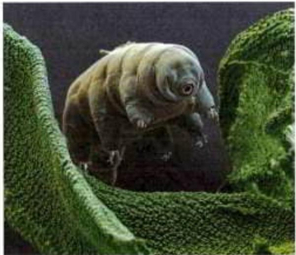  
Eye of Science/Science Source

22. Effects of Ionizing Radiation on Bacteria Treatment of a bacterial culture (E. coli) with ionizing radiation resulted in the survival of only a tiny fraction of the cells. The survivors proved to be more resistant to radiation than the starting cells were. When exposed to even higher levels of radiation, a tiny fraction of these resistant cells survived with even greater resistance to radiation. Repetition of this protocol with progressively higher levels of radiation yielded a strain of E. coli that was far more resistant to radiation than the starting strain. What changes might be occurring with each successive round of radiation and selection?

23. Data Analysis Problem In 1956, E. P. Kennedy and S. B. Weiss published their study of membrane lipid phosphatidylcholine (lecithin) synthesis in rat liver. Their hypothesis was that phosphocholine joined with some cellular component to yield lecithin. In an earlier experiment, incubating $[^{32}P]$ -labeled phosphocholine at physiological temperature (37 °C) with broken cells from rat liver yielded labeled lecithin. This became their assay for the enzymes involved in lecithin synthesis.

The researchers centrifuged the broken cell preparation to separate the membranes from the soluble proteins. They tested three preparations: whole extract, membranes, and soluble proteins. Table 1 summarizes the results.

TABLE 1 Cell Fraction Requirement for Incorporation of $[^{32}P]$ -Phosphocholine into Lecithin

<table><tr><td>Tube number</td><td>Preparation</td><td>[32P]-Phosphocholine incorporated into lecithin</td></tr><tr><td>1</td><td>Whole extract</td><td>6.3 μmol</td></tr><tr><td>2</td><td>Membranes</td><td>18.5 μmol</td></tr><tr><td>3</td><td>Soluble proteins</td><td>2.6 μmol</td></tr></table>

(a) Was the enzyme responsible for this reaction a soluble protein from the cytoplasm or a membrane-bound enzyme? Why?

Having determined the location of the enzyme, the researchers investigated the effect of pH on enzyme activity. They carried out their standard assay in solutions buffered at different pH values between 6 and 9. The graph shows the results. The enzyme activity is the amount, in nanomoles per liter, of $[^{32}P]$ -phosphocholine incorporated into lecithin.

  
(b) What is the optimal pH for this enzyme?

(c) How much more active is the enzyme at pH 8 than at pH 6?

Reactions with phosphorylated intermediates commonly require a divalent metal ion. The researchers tested $Ca^{2+}$ , $Mn^{2+}$ , and $Mg^{2+}$ to determine if a divalent metal ion was important in this reaction. The graph shows the results.

  
(d) What is the metal ion dependence?

The researchers reasoned that the reaction might require energy. To test the hypothesis, they incubated rat liver membranes and $[^{32}P]$ -phosphocholine with different nucleotides. Because the ATP sold in 1956 was not as highly purified as modern commercial preparations, the researchers used two different ATP sources, lot 116 and lot 122. Table 2 gives the results.

TABLE 2 Requirement of Nucleotides for Lecithin Synthesis from Phosphocholine

<table><tr><td>Tube number</td><td>Nucleotide added</td><td> $^{32}$ P incorporated into lecithin</td></tr><tr><td>1</td><td>5 μmol ATP from lot 116</td><td>5.1 μmol</td></tr><tr><td>2</td><td>5 μmol ATP from lot 122</td><td>0.2 μmol</td></tr><tr><td>3</td><td>5 μmol ATP from lot 122 + 0.5 μmol GDP</td><td>0.4 μmol</td></tr><tr><td>4</td><td>5 μmol ATP from lot 122 + 0.5 μmol CTP</td><td>15.0 μmol</td></tr><tr><td>5</td><td>5 μmol ATP from lot 122 + 0.1 μmol CTP</td><td>10.0 μmol</td></tr><tr><td>6</td><td>5 μmol ATP from lot 122 + 0.5 μmol UTP</td><td>0.4 μmol</td></tr><tr><td>7</td><td>0.5 μmol CTP with no ATP</td><td>8.0 μmol</td></tr></table>

(e) What is your interpretation of the results in Table 2?
(f) Write the equation for the reaction the researchers studied. Include all required components, including the cell fraction, metal ion, and nucleotide cofactor.

### [EN] Reference

Kennedy, E. P. and S. B. Weiss. 1956. The function of cytidine coenzymes in the biosynthesis of phospholipids. J. Biol. Chem. 193–214.

### [EN] Abbreviated Solutions — Chapter 1

1. (a) Diameter of magnified cell = 500 mm (b) 36,000 mitochondria (c) $3.9 \times 10^{10}$ glucose molecules

2. (a) 10% (b) 5% (c) 1.6 mm; 800 times longer than the cell; DNA must be tightly coiled

3. Collect the supernatant from the high-speed centrifugation and centrifuge at a very high speed (150,000 g) for 3 hours. The ribosomes will be in the pellet.

4. (a) Metabolic rate is limited by diffusion, which is limited by surface area. (b) $12 \mu m^{-1}$ for the bacterium (c) Surface-to-volume ratio 300 times higher in the bacterium.

5. $2 \times 10^{6} \mathrm{~s}$ (about 23 days)

6. The vitamin molecules from the two sources are identical; the body cannot distinguish the source; only associated impurities might vary with the source.

7. (a) COO $^{-}$ , carboxyl; NH $_{3}$ , amino; OH, hydroxyl; CH $_{3}$ , methyl

(b)

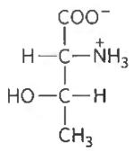

(c) 2

D-Threonine

8.

The two enantiomers have different interactions with a chiral biological "receptor" (a protein).

9. (a) Fatty acids are more nonpolar than amino acids, which makes them separable on the basis of solubility. The larger size and longer shape of fatty acids could allow separation by some types of chromatography. (b) The charge on the phosphate groups of nucleotides could be used to separate them from glucose. The larger size and shape could allow separation by some types of chromatography.

10. Carbon atoms can form linear chains, branched chains, and cyclic structures. It is improbable that silicon could serve as the central organizing element for life, especially in an $O_{2}$ -containing atmosphere such as that of Earth. Long chains of silicon atoms are not readily synthesized; the polymeric macromolecules necessary for more complex functions would not readily form. Oxygen disrupts bonds between silicon atoms, and silicon-oxygen bonds are extremely stable and difficult to break, preventing the breaking and making of bonds that are essential to life processes.

11. (a) $(R)$ -enantiomer: A is $\mathrm{COO}^{-}$ ; B is H; C is $\mathrm{CH}_3$ . $(S)$ -enantiomer: A is $\mathrm{CH}_3$ ; B is H; C is $\mathrm{COO}^{-}$ . (b) It is unnecessary to make enantiomerically pure $(S)$ -ibuprofen available because the isomerase converts the less effective enantiomer to the effective enantiomer, but does not catalyze the reverse reaction.

12. (a) 3 Phosphoric acid groups; $\alpha$ -D-ribose; guanine (b) Tyrosine; 2 glycines; phenylalanine; methionine (c) Choline; phosphoric acid; glycerol; oleic acid; palmitic acid

13. (a) $CH_{2}O; C_{3}H_{6}O_{3}$

(b)

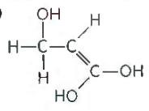

2

3

5

6

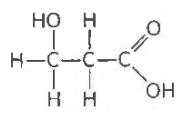

7

8

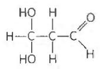

9

10

11

12

(c) X contains a chiral center; eliminates all but 6 and 8. (d) X contains an acidic functional group; eliminates 8; structure 6 is consistent with all data. (e) Structure 6; we cannot distinguish between the two possible enantiomers.

14. (a) The carbon bearing the hydroxyl group is the chiral carbon.
(b) The structure shows the (R) isomer of propranolol. (c) (S)-Propranolol has this structure:

15. (a) The chiral carbons are indicated with asterisks. (b) The structure shows the $(S,S)$ isomer of methylphenidate. (c) $(R,R)$ -methylphenidate has this structure:

16. Spores are alive because they can transition from a state of being metabolically inert under harsh environmental conditions to an actively growing state when conditions improve. During this transition, spores take in water, which is essential to many biochemical reactions. Germination does not seem to depend on ATP.

17. (a) $\Delta G^{\circ}$ is negative and relatively large. (b) There is not enough thermal energy in the wood to overcome the activation energy.
(c) A match supplies thermal energy to overcome the activation energy barrier. (d) The enzyme lowers the activation energy enough for the reaction to occur at room temperature.

18. If this mutation occurs in a coding sequence, it may cause an amino acid substitution during protein synthesis. The consequence to the cell could be anywhere on the spectrum from beneficial, to neutral, to fatal.

19. The resulting protein may fold incorrectly and may not attain its native conformation. Alternatively, the shape of the region that binds with its partner may change, preventing complementary fit. A mutation that malforms an enzyme's active site can destroy the enzyme's catalytic activity.

20. (a) The copy begins with already-formed domains with biological activity, so it does not have to evolve from scratch. The copy can undergo mutation without harm to the cell, since the original gene encodes the original product. Alternatively, the copy could undergo mutations that create a lethal product, even though the original gene remains intact. The daughter cell's newly acquired function may be positive or negative. (b) Each time a duplicate gene undergoes mutation is an opportunity for the cell to acquire a new, positive trait without risking the loss of function provided by the original gene, which may remain unchanged.

21. Yes, when environmental conditions improve, such as temperature moderation and the availability of water, the animal can rehydrate and recover. That is, biochemical mechanisms exist for restoring the normal state.

22. Mutations may have made DNA repair more efficient. Resistant cells may have developed or increased the ability to synthesize a compound that destroys free radicals. Gene duplication may have provided backup for genes damaged by radiation.

23. (a) The enzyme that catalyzes the reaction is a membrane-bound enzyme because the preparation containing only membranes had the largest amount of labeled product. (b) The enzyme generated the largest amount of product at pH 7. (c) Enzyme activity is slightly higher at pH 8 than at pH 6. (d) Magnesium $(\mathrm{Mg}^{2+})$ is effective at activating the system over a range of concentrations. At low concentrations, manganese $(\mathrm{Mn}^{2+})$ is effective at activating the system, but it may inhibit the reaction at higher concentrations. The system shows minimal response to calcium ions $(\mathrm{Ca}^{2+})$ . (e) The reaction requires CTP, but not GTP, UTP, or ATP. However, the addition of ATP may increase the rate of lecithin synthesis. The ATP from lot 116 was likely contaminated with CTP. (f) Phosphocholine + membrane-bound enzyme + $\mathrm{Mg}^{2+}$ + CTP $\rightleftharpoons$ lecithin

<!-- EN-END 第1章章末 -->

<!-- EN-BEGIN 第2章章末 -->

## 【英文对应 第2章章末】Water, the Solvent of Life：关键术语、习题与简答

> 来源：Lehninger Principles of Biochemistry（书籍/02_生物化学原理） 第2章章末，以及书末 Abbreviated Solutions to Problems 第2章。

### [EN] KEY TERMS

Terms in bold are defined in the glossary.

<table><tr><td>hydrogen bond 44bond energy 44hydrophilic 46hydrophobic 46amphipathic 46hydrophobiceffect 48micelle 48van der Waalsinteractions 49osmolarity 52osmosis 52isotonic 52hypertonic 52hypotonic 52equilibrium constant $(K_{eq})$  54</td><td>ion product ofwater ( $K_w$ ) 55pH 55acidosis 56alkalosis 56conjugate acid-basepair 57acid dissociationconstant ( $K_a$ ) 57p $K_a$  57titration curve 58buffer 59buffering region 60Henderson-Hasselbalchequation 60optimum pH 63</td></tr></table>

### [EN] PROBLEMS

1. Effect of Local Environment on Ionic Bond Strength The ATP-binding site of an enzyme is buried in the interior of the enzyme, in a hydrophobic environment. Suppose that the ionic interaction between enzyme and ATP took place at the surface of the enzyme, exposed to water. Would this enzyme-substrate interaction be stronger or would it be weaker? Why?

2. Biological Advantage of Weak Interactions The associations between biomolecules are often stabilized by hydrogen bonds, electrostatic interactions, the hydrophobic effect, and van der Waals interactions. How are weak interactions such as these advantageous to an organism?

3. Solubility of Ethanol in Water Ethane (CH₃CH₃) and ethanol (CH₃CH₂OH) differ in their molecular makeup by only one atom, yet ethanol is much more soluble in water than ethane. Describe the features of ethanol that make it more water soluble than ethane.

<!-- END OFFICIAL API PART part_001 -->

<!-- BEGIN OFFICIAL API PART part_002 -->

4. Calculation of pH from Hydrogen Ion Concentration
What is the pH of a solution that has an H $^{+}$ concentration of
(a) 1.75 × 10 $^{-5}$ mol/L; (b) 6.50 × 10 $^{-10}$ mol/L;
(c) 1.0 × 10 $^{-4}$ mol/L; (d) 1.50 × 10 $^{-5}$ mol/L?

5. Calculation of Hydrogen Ion Concentration from pH What is the $\mathbf{H}^{+}$ concentration of a solution with pH of (a) 3.82; (b) 6.52; (c) 11.11?

6. Acidity of Gastric HCl A technician in a hospital laboratory obtained a 10.0 mL sample of gastric juice from a patient several hours after a meal and titrated the sample with 0.1 M NaOH to neutrality. The neutralization of gastric HCl required 7.2 mL of NaOH. The patient's stomach contained no ingested food or drink at the time of sample harvest. Therefore, assume that no buffers were present. What was the pH of the gastric juice?

### [EN] 7. Calculation of the pH of a Strong Acid or Base

(a) Write out the acid dissociation reaction for hydrochloric acid.

(b) Calculate the pH of a solution of $5 \times 10^{-4}$ M hydrochloric acid at 25 °C.

(c) Write out the acid dissociation reaction for sodium hydroxide.

(d) Calculate the pH of a solution of $7 \times 10^{-5}$ M sodium hydroxide at 25 °C.

8. Calculation of pH from Concentration of Strong Acid Calculate the pH of a solution prepared by diluting 3.0 mL of 2.5 M HCl to a final volume of 100 mL with $H_{2}O$ .

9. Measurement of Acetylcholine Levels by pH Changes You have a 15 mL sample of acetylcholine (a neurotransmitter) with an unknown concentration and a pH of 7.65. You incubate this sample with the enzyme acetylcholinesterase to convert all of the acetylcholine to choline and acetic acid. The acetic acid dissociates to yield acetate and hydrogen ions.

Acetylcholine

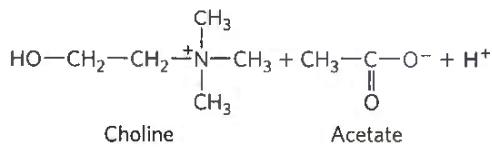

At the end of the incubation period, you measure the pH again and find that it has decreased to 6.87. Assuming there was no buffer in the assay mixture, determine the number of nanomoles of acetylcholine in the original 15 mL sample.

10. Relationship Between $\mathbf{pK}_{\mathrm{a}}$ and pH Which aqueous solution has the lowest pH: 0.1 M hydrofluoric acid ( $\mathrm{pK}_{\mathrm{a}} = 3.20$ ); 0.1 M acetic acid ( $\mathrm{pK}_{\mathrm{a}} = 4.86$ ); 0.1 M formic acid ( $\mathrm{pK}_{\mathrm{a}} = 3.75$ ); or 0.1 M lactic acid ( $\mathrm{pK}_{\mathrm{a}} = 7.86$ )?

11. Properties of Strong and Weak Acids Classify each acid or property as representing a strong acid or a weak acid: (a) hydrochloric acid; (b) acetic acid; (c) strong tendency to dissociate protons; (d) larger $K_{a}$ ; (e) partially dissociates into ions; (f) larger $pK_{a}$ .

12. Simulated Vinegar One way to make vinegar is to prepare a solution of acetic acid, the sole acid component of vinegar, at the proper pH (see Fig. 2-14) and add appropriate flavoring agents. Acetic acid is a liquid at 25 °C, with a relative molecular mass ( $M_r$ ) of 60, density of 1.049 g/mL, and acid dissociation constant ( $K_a$ ) of $1.7 \times 10^{-5}$ M. Calculate the volume of acetic acid needed to produce 1 L of simulated vinegar from distilled water (see Fig. 2-15).

13. Identifying Conjugate Bases Write the conjugate base for each acid: (a) $H_{3}PO_{4}$ ; (b) $H_{2}CO_{3}$ ; (c) $CH_{3}COOH$ ; (d) $CH_{3}NH_{3}^{+}$

14. Calculation of the pH of a Mixture of a Weak Acid and Its Conjugate Base Calculate the pH of a dilute solution that contains a molar ratio of potassium acetate to acetic acid ( $pK_{a} = 4.76$ ) of (a) 2:1; (b) 1:3; (c) 5:1; (d) 1:1; (e) 1:10.

15. Effect of pH on Solubility The strongly polar, hydrogen-bonding properties of water make it an excellent solvent for ionic (charged) species. By contrast, nonionized, nonpolar organic molecules, such as benzene, are relatively insoluble in water. In principle, the aqueous solubility of any organic acid or base can be increased by converting the molecules to charged species. For example, the solubility of benzoic acid in water is low. Adding sodium bicarbonate to a mixture of water and benzoic acid raises the pH and deprotonates the benzoic acid to form benzoate ion, which is quite soluble in water.

Categorize the given compounds based on whether they are more soluble in an aqueous solution of 0.1 M NaOH or 0.1 M HCl. (The dissociable protons are shown in red.)

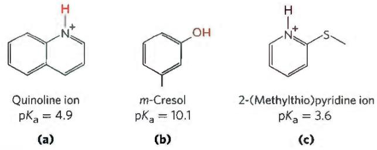

16. Treatment of Poison Ivy Rash Urushiol, the component of poison ivy that is responsible for the characteristic itchy rash, is a mixture of catechols substituted with various long-chain alkyl groups.

Which of these treatments would be most effective at removing catechols from the surface of the skin after exposure to poison ivy? Justify your choice.

(a) Wash the area with cold water.

(b) Wash the area with dilute vinegar or lemon juice.

(c) Wash the area with soap and water.

(d) Wash the area with soap, water, and baking soda (sodium bicarbonate).

17. pH and Drug Absorption Aspirin is a weak acid with a $pK_{a}$ of 3.5 (the ionizable H is shown in red):

Aspirin is absorbed into the blood through the cells lining the stomach and the small intestine. Absorption requires passage through the plasma membrane. The polarity of the molecule determines the absorption rate: charged and highly polar molecules pass slowly, whereas neutral hydrophobic molecules pass rapidly. The pH of the stomach contents is about 1.5, and the pH of the contents of the small intestine is about 6. Based on this information, is more aspirin absorbed into the bloodstream from the stomach or from the small intestine? Clearly justify your choice.

18. Calculation of pH from Molar Concentrations The $pK_{a}$ of $NH_{4}^{+}/NH_{3}$ is 9.25. Calculate the pH of a solution containing 0.12 M $NH_{4}Cl$ and 0.03 M NaOH.

19. Calculation of pH after Titration of Weak Acid A compound has a $pK_{a}$ of 7.4. You add 100 mL of a 1.0 M solution of this compound at pH 8.0 to 30 mL of 1.0 M hydrochloric acid. What is the pH of the resulting solution?

20. Properties of a Buffer The amino acid glycine is often used as the main ingredient of a buffer in biochemical experiments. The amino group of glycine, which has a $pK_{a}$ of 9.6, can exist either in the protonated form ( $-NH_{3}^{+}$ ) or as the free base ( $-NH_{2}$ ), because of the reversible equilibrium

$$
\mathrm{R} - \mathrm{NH} _ {3} ^ {+} \rightleftharpoons \mathrm{R} - \mathrm{NH} _ {2} + \mathrm{H} ^ {+}
$$

(a) In what pH range can glycine be used as an effective buffer due to its amino group?

(b) In a 0.1 M solution of glycine at pH 9.0, what fraction of glycine has its amino group in the $-NH_{3}^{+}$ form?

(c) How much 5 M KOH must be added to 1.0 L of 0.1 M glycine at pH 9.0 to bring its pH to exactly 10.0?

(d) When 99% of the glycine is in its $-NH_{3}^{+}$ form, what is the numerical relation between the pH of the solution and the $pK_{a}$ of the amino group?

21. Calculation of the $pK_{a}$ of an Ionizable Group by Titration Suppose a biochemist has 10 mL of a 1.0 M solution of a compound with two ionizable groups at a pH of 8.00. She adds 10.0 mL of 1.00 M HCl, which changes the pH to 3.20. The $pK_{a}$ value of one of the groups ( $pK_{1}$ ) is 3.8 and it is known that $pK_{2}$ is between 7 and 10. What is the exact value of $pK_{2}$ ?

22. Calculation of the pH of a Solution of a Polyprotic Acid The amino acid histidine has ionizable groups with $pK_{a}$ values of 1.8, 6.0, and 9.2, as shown (His = imidazole group). A biochemist makes up 100 mL of a 0.10 M solution of histidine at a pH of 5.40. She then adds 40 mL of 0.10 M HCl. What is the pH of the resulting solution?

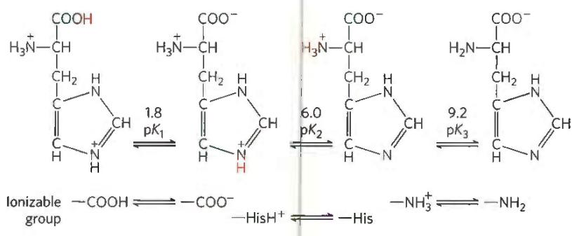

23. Calculation of Original pH from Final pH after Titration A biochemist has 100 mL of a 0.100 M solution of a weak acid with a pK $_{a}$ of 6.3; He adds 6.0 mL of 1.0 M HCl, which changes the pH to 5.7. What was the pH of the original solution?

24. Preparation of a Phosphate Buffer Phosphoric acid ( $H_{3}PO_{4}$ ), a triprotic acid, has three $pK_{a}$ values: 2.14, 6.86, and 12.4. What molar ratio of $HPO_{4}^{2-}$ to $H_{2}PO_{4}^{-}$ in solution would produce a pH of 7.0? Hint: Only one of the $pK_{a}$ values is relevant here.

25. Preparation of Standard Buffer for Calibration of a pH Meter The glass electrode used in commercial pH meters gives an electrical response proportional to the concentration of hydrogen ion. Converting these responses to a pH reading requires calibration of the electrode against standard solutions of known H $^{+}$ concentration. Preparation of the pH 7.00 standard buffer uses dihydrogen phosphate (NaH $_{2}$ PO $_{4}$ · H $_{2}$ O; FW 138) and disodium hydrogen phosphate (Na $_{2}$ HPO $_{4}$ ; FW 142). Phosphoric acid (H $_{3}$ PO $_{4}$ ), a triprotic acid, has three pK $_{a}$ values: 2.14, 6.86, and 12.4. Calculate the weight in grams of sodium dihydrogen phosphate and disodium hydrogen phosphate needed to prepare 1.0 L of a standard buffer with a total phosphate concentration of 0.10 M (see Fig. 2-15).

26. Calculation of Molar Ratios of Conjugate Base to Weak Acid from pH For a weak acid with a $pK_{a}$ of 6.00, calculate the ratio of conjugate base to acid at a pH of 5.00.

27. Preparation of Buffer of Known pH and Strength You have 0.10 M solutions of acetic acid ( $pK_{a} = 4.76$ ) and sodium acetate. If you wanted to prepare 1.0 L of 0.10 M acetate buffer of pH 4.00, how many milliliters of acetic acid and sodium acetate would you mix together?

28. Choice of Weak Acid for a Buffer Determine whether each weak acid would best buffer at pH 3.0, at pH 5.0, or at pH 9.0: (a) formic acid $(\mathrm{p}K_{\mathrm{a}} = 3.8)$ ; (b) acetic acid $(\mathrm{p}K_{\mathrm{a}} = 4.76)$ ; (c) ammonium $(\mathrm{p}K_{\mathrm{a}} = 9.25)$ ; (d) boric acid $(\mathrm{p}K_{\mathrm{a}} = 9.24)$ ; (e) chloroacetic acid $(\mathrm{p}K_{\mathrm{a}} = 2.87)$ ; (f) hydrazoic acid $(\mathrm{p}K_{\mathrm{a}} = 4.6)$ . Briefly justify your answer.

29. Working with Buffers A buffer contains 0.010 mol of lactic acid ( $pK_{a} = 3.86$ ) and 0.050 mol of sodium lactate per liter.
(a) Calculate the pH of the buffer.

(b) Calculate the change in pH after adding 5.0 mL of 0.5 M HCl to 1 L of the buffer.

(c) What pH change would you expect if you added the same quantity of HCl to 1 L of pure water?

30. Use of Molar Concentrations to Calculate pH What is the pH of a solution that contains 0.20 M sodium acetate and 0.60 M acetic acid ( $pK_{a} = 4.76$ )?

31. Preparation of an Acetate Buffer Calculate the concentrations of acetic acid ( $pK_{a} = 4.76$ ) and sodium acetate necessary to prepare a 0.2 M buffer solution at pH 5.0.

32. pH of Insect Defensive Secretion You have been observing an insect that defends itself from enemies by secreting a caustic liquid. Analysis of the liquid shows it to have a total concentration of formate plus formic acid ( $K_{a} = 1.8 \times 10^{-4}$ ) of 1.45 M. Further analysis reveals that the concentration of formate ion is 0.015 M. What is the pH of the secretion?

33. Calculation of $pK_{a}$ An unknown compound, X, is thought to have a carboxyl group with a $pK_{a}$ of 2.0 and another ionizable group with a $pK_{a}$ between 5 and 8. When 75 mL of 0.1 M NaOH is added to 100 mL of a 0.1 M solution of X at pH 2.0, the pH increases to 6.72. Calculate the $pK_{a}$ of the second ionizable group of X.

34. Ionized Forms of Amino Acids at Different pH Levels Glycine is a diprotic acid that can undergo two dissociation reactions, one for the $\alpha$ -amino group ( $-\mathrm{NH}_3^+$ ) and the other for the carboxyl ( $-\mathrm{COOH}$ ) group. Therefore, it has two $\mathsf{pK}_{\mathsf{a}}$ values. The carboxyl group has a $\mathsf{pK}_{1}$ of 2.34 and the $\alpha$ -amino group has a $\mathsf{pK}_{2}$ of 9.60. Glycine can exist in fully deprotonated $(\mathrm{NH}_{2}-\mathrm{CH}_{2}-\mathrm{COO}^{-})$ , fully protonated ( $^+\mathrm{NH}_{3}-\mathrm{CH}_{2}-\mathrm{COOH}$ ), or zwitterionic form ( $^+\mathrm{NH}_{3}-\mathrm{CH}_{2}-\mathrm{COO}^{-}$ ). Determine which form of glycine would be present in the highest concentration in a solution of (a) pH 1.0; (b) pH 6.0; (c) pH 7.0; (d) pH 8.0; (e) pH 11.9. Explain your answers in terms of pH relative to the two $\mathsf{pK}_{\mathsf{a}}$ values.

### [EN] 35. Control of Blood pH by Respiratory Rate

(a) The partial pressure of $CO_{2}$ ( $pCO_{2}$ ) in the lungs can be varied rapidly by the rate and depth of breathing. For example, a common remedy to alleviate hiccups is to increase the concentration of $CO_{2}$ in the lungs. This can be achieved by holding one's breath, by very slow and shallow breathing (hypoventilation), or by breathing in and out of a paper bag. Under such conditions, $pCO_{2}$ in the air space of the lungs rises above normal. How would increasing $pCO_{2}$ in the air space of the lungs affect blood pH?

(b) It is common practice among competitive short-distance runners to breathe rapidly and deeply (hyperventilate) for about half a minute to remove $CO_{2}$ from their lungs just before a race begins. Under these conditions, blood pH may rise to 7.6. Explain how hyperventilation elicits an increase in blood pH.

(c) During a short-distance run, the muscles produce a large amount of lactic acid (CH₃CH(OH)COOH; Kₐ = 1.38 × 10⁻⁴ M) from their glucose stores. Why might hyperventilation before a short-distance run be useful?

36. Calculation of Blood pH from $CO_{2}$ and Bicarbonate Levels Calculate the pH of a blood plasma sample with a total $CO_{2}$ concentration of 26.9 mm and bicarbonate concentration of 25.6 mm. Recall from page 63 that the relevant $pK_{a}$ of carbonic acid is 6.1.

37. Effect of Holding One's Breath on Blood pH The pH of the extracellular fluid is buffered by the bicarbonate/carbonic acid system. Holding your breath can increase the concentration of $\mathrm{CO}_{2}(\mathrm{aq})$ in the blood. What effect might this have on the pH of the extracellular fluid? Explain the effect on pH by writing the relevant equilibrium equation(s) for this buffer system.

### [EN] 38. Boiling Point of Alcohols and Diols

(a) Arrange these compounds in order of expected boiling point.

$$
\begin{array}{c} \mathrm{CH} _ {3} - \mathrm{CH} _ {2} - \mathrm{OH} \\ \mathrm{HO} - \mathrm{CH} _ {2} \mathrm{CH} _ {2} \mathrm{CH} _ {2} - \mathrm{OH} \\ \mathrm{CH} _ {3} - \mathrm{OH} \\ \mathrm{HO} - \mathrm{CH} _ {2} \mathrm{CH} _ {2} - \mathrm{OH} \end{array}
$$

(b) What factors are important in predicting the boiling points of these compounds?

39. Duration of Hydrogen Bonds PCR is a laboratory process in which specific DNA sequences are copied and amplified manyfold. The two DNA strands, which are held together in part by hydrogen bonds between them, are heated in a buffered solution to separate the two strands, then cooled to allow them to reassociate. What do you predict about the average duration of H bonds at the high temperature in comparison to the low temperature?

40. Electronegativity and Hydrogen Bonding The Pauling electronegativity is a measure of the affinity of an atom for the electron in a covalent bond. The larger the electronegativity value, the greater the affinity of the atom for an electron shared with another atom.

<table><tr><td>Atom</td><td>Electronegativity</td></tr><tr><td>H</td><td>2.1</td></tr><tr><td>C</td><td>2.55</td></tr><tr><td>S</td><td>2.58</td></tr><tr><td>N</td><td>3.04</td></tr><tr><td>O</td><td>3.44</td></tr></table>

Note that S is directly beneath O in the periodic table.

(a) Do you expect $H_{2}S$ to form hydrogen bonds with itself? With $H_{2}O$ ?

(b) Water boils at 100 °C. Is the boiling point for $H_{2}S$ higher or lower than for $H_{2}O$ ?

(c) Is $H_{2}S$ a more polar solvent than $H_{2}O$ ?

41. Solubility of Low Molecular Weight Compounds Several low molecular weight compounds found in cells are shown in the ionic form in which they exist in water at pH 7.

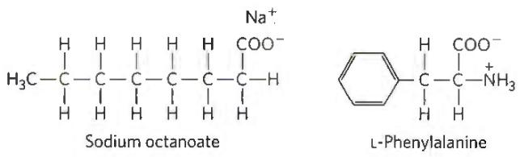

List the five compounds in order from most soluble to least soluble in water.

42. Relative Solubility of Alcohols List the alcohols in order from most soluble to least soluble in water.

$$
\mathrm{CH} _ {3} - (\mathrm{CH} _ {2}) _ {5} - \mathrm{OH} \quad \mathrm{CH} _ {3} - (\mathrm{CH} _ {2}) _ {1 0} - \mathrm{OH}
$$

$$
\mathrm{CH} _ {3} - (\mathrm{CHOH}) - \mathrm{CH} _ {2} - \mathrm{CHOH} - \mathrm{CH} _ {2} - \mathrm{OH}
$$

43. Determining Charge and Solubility of Organic Acids Suppose that, for a typical carboxyl-containing compound, the $pK_{a}$ is approximately 3. Suppose HOOC—(CH₂)₄—COOH, CH₃—(CH₂)₄—COOH, and HOOC—(CH₂)₂—COOH are added to water at pH 7.

(a) What is the net charge of each compound in the solution?
(b) List the compounds in order from most soluble to least soluble.

44. Ecological Effects of pH The defendant in a lawsuit over industrial pollution is accused of releasing effluent of pH 10 into a trout stream. The plaintiff has asked that the defendant reduce the effluent's pH to no higher than 7. The defendant's attorney, aiming to please the court, promises that his client will do even better than that: the defendant will bring the pH of the effluent down to 1!

(a) Will the defense attorney's suggested remedy be acceptable to the plaintiff? Why or why not?

(b) What facts about pH does the defense attorney need to understand?

45. Phosphate-Buffered Saline pH and Osmolarity Phosphate-buffered saline (PBS) is a solution commonly used in studies of animal tissues and cells. Its composition is 137 mm NaCl, 2.7 mm KCl, 10 mm $Na_{2}HPO_{4}$ ( $pK_{a} = 2.14$ ), 1.8 mm $KH_{2}PO_{4}$ ( $pK_{a} = 6.86$ ). Calculate the pH and osmolarity of PBS. Give the osmolarity in units of osmoles per liter (osm/L).

46. Hydrogen Bonding in Watson-Crick Base Pairs In 1953, James Watson and Francis Crick discovered that the purine base adenine forms a base pair with the pyrimidine base thymine (or uracil). Likewise, the purine base guanine forms a base pair with the pyrimidine base cytosine. These base pairs form due to hydrogen bonding between purines and pyrimidines. Show the hydrogen bonds that form (a) when adenine base-pairs with thymine and (b) when guanine base-pairs with cytosine.

### [EN] DATA ANALYSIS PROBLEM

47. "Switchable" Surfactants Hydrophobic molecules do not dissolve well in water. This makes certain processes very difficult: washing oily food residue off dishes, cleaning up spilled oil, keeping the oil and water phases of salad dressings well mixed, and carrying out chemical reactions that involve both hydrophobic and hydrophilic components.

Surfactants are a class of amphipathic compounds that includes soaps, detergents, and emulsifiers. With the use of surfactants, hydrophobic compounds can be suspended in aqueous solution by forming micelles (see Fig. 2-7). A micelle has a hydrophobic core consisting of the hydrophobic compound and the hydrophobic "tails" of the surfactant; the hydrophilic "heads" of the surfactant cover the surface of the micelle. A suspension of micelles is called an emulsion. The more hydrophilic the head group of the surfactant, the more powerful it is—that is, the greater its capacity to emulsify hydrophobic material.

When you use soap to remove grease from dirty dishes, the soap forms an emulsion with the grease that is easily removed by water through interaction with the hydrophilic head of the soap molecules. Likewise, a detergent can be used to emulsify spilled oil for removal by water. And emulsifiers in commercial salad dressings keep the oil suspended evenly throughout the water-based mixture.

There are some situations, such as oil spill cleanups, in which it would be very useful to have a "switchable" surfactant: a molecule that could be reversibly converted between a surfactant and a nonsurfactant.

(a) Imagine that such a "switchable" surfactant existed. How would you use it to clean up and then recover the oil from an oil spill?

Liu and colleagues describe a prototypical switchable surfactant in their 2006 article "Switchable Surfactants." The switching is based on the following reaction:

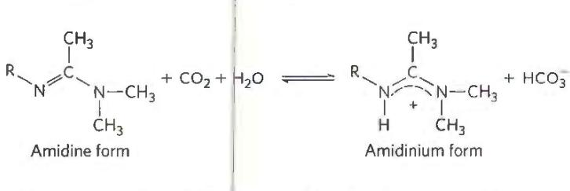

(b) Given that the $pK_{a}$ of a typical amidinium ion is 12.4, in which direction (left or right) would you expect the equilibrium of the above reaction to lie? (See Fig. 2-15 for relevant $pK_{a}$ values.) Justify your answer. Hint: Remember the reaction $H_{2}O + C_{2}O \rightleftharpoons H_{2}CO_{3}$ .

Liu and colleagues produced a switchable surfactant for which $R = C_{16}H_{33}$ . We will call the molecule s-surf.

(c) The amidinium form of s-surf is a powerful surfactant; the amidine form is not. Explain this observation.

Liu and colleagues found that they could switch between the two forms of s-surf by changing the gas that they bubbled through a solution of the surfactant. They demonstrated this switch by measuring the electrical conductivity of the s-surf solution; aqueous solutions of ionic compounds have higher conductivity than solutions of nonionic compounds. They started with a solution of the amidine form of s-surf in water.

$CO_{2}$

Their results are shown below; dotted lines indicate the switch from one gas to another.

$$
\mathrm{CO} _ {2}
$$

(d) In which form is the majority of s-surf at point A? At point B?

(e) Why does the electrical conductivity rise from time 0 to point A?

(f) Why does the electrical conductivity fall from point A to point B?

(g) Explain how you would use s-surf to clean up and recover the oil from an oil spill.

### [EN] Reference

Liu, Y., P.G. Jessop, M. Cunningham, C.A. Eckert, and C.L. Liotta. 2006. Switchable surfactants. Science 313(5789):958–960. https://doi.org/10.1126/science.1128142.

### [EN] Abbreviated Solutions — Chapter 2

1. Weaker; ionic attractive force is proportional to the inverse of the dielectric constant, and a hydrophobic "solvent" such as the environment inside the protein has a lower dielectric constant than a polar solvent such as water.

2. Biomolecular interactions generally need to be reversible; weak interactions allow reversibility.

3. Ethanol is polar; ethane is not. The ethanol —OH group can hydrogen-bond with water.

4. (a) 4.76 (b) 9.19 (c) 4.0 (d) 4.82

5. (a) $1.51 \times 10^{-4} \mathrm{M}$ (b) $3.02 \times 10^{-7} \mathrm{M}$ (c) $7.76 \times 10^{-12} \mathrm{M}$

6.1.1

7. (a) $\mathrm{HCl} \rightleftharpoons \mathrm{H}^{+} + \mathrm{Cl}^{-}$ (b) 3.3 (c) $\mathrm{NaOH} \rightleftharpoons \mathrm{Na}^{+} + \mathrm{OH}^{-}$ (d) 9.8

8.1.1

9. 1.7 nmol of acetylcholine

10. 0.1 M hydrofluoric acid

11. (a) strong (b) weak (c) strong (d) strong (e) weak (f) weak
12. 3.3 mL

13. (a) $\mathrm{H}_2\mathrm{PO}_4^-$ (b) $\mathrm{HCO}_3^-$ (c) $\mathrm{CH}_3\mathrm{COO}^-$ (d) $\mathrm{CH}_3\mathrm{NH}_2$

14. (a) 5.06 (b) 4.28 (c) 5.46 (d) 4.76 (e) 3.76

15. quinoline ion: 0.1 M HCl; m-cresol: 0.1 M NaOH;

2-(methylthio)pyridine ion: 0.1 M HCl

16. (d) Bicarbonate, a weak base, titrates —OH to —O $^{-}$ , making the compound more polar and more water-soluble.

17. Stomach; the neutral form of aspirin present at the lower pH is less polar and passes through the membrane more easily.

18. 8.8

19.7.4

20. (a) pH 8.6 to 10.6 (b) 4/5 (c) 10 mL (d) pH = pK $_{a}$ - 2

21.8.9

22. 2.4

23.6.9

24.1.4

25. $\mathrm{NaH_2PO_4\cdot H_2O}$ , 5.8 g/L; $\mathrm{Na_2HPO_4}$ , 8.2 g/L

26. $[\mathrm{A}^{-}] / [\mathrm{HA}] = 0.10$

27. Mix 150 mL of 0.10 M sodium acetate and 850 mL of 0.10 M acetic acid.

28. (a) pH 3 (b) pH 5 (c) pH 9 (d) pH 9 (e) pH 3 (f) pH 5. The total buffering region spans approximately 1 pH unit on either side of the $pK_{a}$ value.

29. (a) 4.6 (b) 0.1 pH unit (c) 4 pH units

30.4.3

31. 0.13 M acetate and 0.07 M acetic acid

32.1.8

33.7

#### [EN] 34. (a) fully protonated (b) zwitterionic (c) zwitterionic

(d) zwitterionic (e) fully deprotonated. When the pH is lower than both $pK_{a}$ values, both the $\alpha$ -amino group and the $\alpha$ -carboxyl group are protonated. When the pH is greater than both $pK_{a}$ values, neither the $\alpha$ -amino group nor the $\alpha$ -carboxyl group is protonated. When the pH is between the two $pK_{a}$ values, the $\alpha$ -amino group is protonated, whereas the $\alpha$ -carboxyl group is unprotonated.

35. (a) Blood pH is controlled by the carbon dioxide-bicarbonate buffer system, $CO_{2} + H_{2}O \rightleftharpoons H^{+} + HCO_{3}^{-}$ . During hypoventilation, $pCO_{2}$ increases in the air space of the lungs and arterial blood, driving the equilibrium to the right, raising $[H^{+}]$ and lowering blood pH.
(b) During hyperventilation, $[CO_{2}]$ decreases in the lungs and arterial blood, reducing $[H^{+}]$ and increasing pH above the normal 7.4 value.
(c) Lactate is a moderately strong acid, completely dissociating under physiological conditions and thus lowering the pH of blood and muscle tissue. Hyperventilation removes $H^{+}$ , raising the pH of blood and tissues in anticipation of the acid buildup.

36.7.4

37. Dissolving more $CO_{2}$ in the blood increases $[H^{+}]$ in blood and extracellular fluids, lowering pH: $\mathrm{CO}_{2}(\mathrm{aq}) + \mathrm{H}_{2}\mathrm{O} \rightleftharpoons \mathrm{H}_{2}\mathrm{CO}_{3} \rightleftharpoons \mathrm{H}^{+} + \mathrm{HCO}_{3}^{-}$ 38. (a) $CH_{3}-OH < CH_{3}-CH_{2}-OH < HO-CH_{2}CH_{2}-OH < HO-CH_{2}CH_{2}CH_{2}-OH$ (b) number of hydrogen bonds that the compound can form and length of the carbon chain

39. The average bond duration decreases.

40. (a) $\mathrm{H}_2\mathrm{S}$ forms hydrogen bonds with $\mathrm{H}_2\mathrm{O}$ but not with itself. (b) $\mathrm{H}_2\mathrm{S}$ has a lower boiling point than $\mathrm{H}_2\mathrm{O}$ . (c) No, $\mathrm{H}_2\mathrm{S}$ is a less polar solvent than $\mathrm{H}_2\mathrm{O}$ .

41. sodium acetate > sodium propionate > glycine > L-phenylalanine > sodium octanoate

$$
\begin{array}{l} 4 2. \mathrm{CH} _ {3} - (\mathrm{CHOH}) - \mathrm{CH} _ {2} - \mathrm{CHOH} - \mathrm{CH} _ {2} - \mathrm{OH} > \mathrm{CH} _ {3} - (\mathrm{CH} _ {2}) _ {5} - \mathrm{OH} > \\ \mathrm{CH} _ {3} - (\mathrm{CH} _ {2}) _ {1 0} - \mathrm{OH} \end{array}
$$

$$
\begin{array}{l} \text {43. (a) HOOC - (CH_{2})_{4} -COOH, - 2; CH_{3} -(CH_{2})_{4} -COOH, - 1;} \\ \text {HOOC - (CH_{2})_{2} -COOH, - 2} \end{array}
$$

(b) HOOC—(CH₂)₂—COOH > HOOC—(CH₂)₄—COOH >

$$
\mathrm{CH} _ {3} - (\mathrm{CH} _ {2}) _ {4} - \mathrm{COOH}
$$

44. (a) No, because an effluent of pH 1 would harm the trout and other life in the stream. (b) The pH scale runs from very acidic to very alkaline, with the point of neutrality (which is best for living creatures, including trout) midway between 0 and 14. He is proposing to jump out of the frying pan into the fire!

45. pH = 7.6; osmolarity = 0.313 osm/L

46.

(a)  

47. (a) Use the substance in its surfactant form to emulsify the spilled oil, collect the emulsified oil, then switch to the nonsurfactant form. The oil and water will separate, and the oil can be collected for further use. (b) The equilibrium lies strongly to the right. The stronger acid (lower $pK_{a}$ ), $H_{2}CO_{3}$ , donates a proton to the conjugate base of the weaker acid (higher $pK_{a}$ ), amidine. (c) The strength of a surfactant depends on the hydrophilicity of its head groups: the more hydrophilic, the more powerful the surfactant. The amidinium form of s-surf is much more hydrophilic than the amidine form, so it is a more powerful surfactant. (d) Point A: amidinium; the $CO_{2}$ has had plenty of time to react with the amidine to produce the amidinium form. Point B: amidine; Ar has removed $CO_{2}$ from the solution, leaving the amidine form. (e) The conductivity rises as uncharged amidine reacts with $CO_{2}$ to produce the charged amidinium form. (f) The conductivity falls as Ar removes $CO_{2}$ , shifting the equilibrium to the uncharged amidine form. (g) Treat s-surf with $CO_{2}$ to produce the surfactant amidinium form, and use this to emulsify the spill. Treat the emulsion with Ar to remove the $CO_{2}$ and produce the nonsurfactant amidine form. The oil will separate from the water and can be recovered.

<!-- EN-END 第2章章末 -->
