## 第2章 氨基酸、肽和蛋白质

> **本章英文对应内容**（Lehninger，插在所列中文小节末尾）
>
> - 第3章 Amino Acids, Peptides, and Proteins：章首导言（本章开头）、关键术语/习题/简答（本章末尾）
> - §3.1（第3章）→ 三、氨基酸的酸碱性质
> - §3.2（第3章）→ 八、蛋白质的组成、分类、分子大小和结构层次
> - §3.4（第3章）→ 十二、肽和蛋白质的化学合成:固相肽合成

蛋白质的英文名称 protein, 源自希腊文 προτο, 是“原初的”“第一重要的”意思。蛋白质诚然是一类最重要的生物分子, 是生物功能的主要载体。蛋白质和核酸构成细胞原生质 (protoplasm) 的主要成分, 而原生质是生命现象的物质基础。

自然界中存在的、种类以千万计的蛋白质在结构和功能上的多样性归根结底是由它们的20种单体亚基或称构件分子（building-block molecule）的氨基酸的性质所造成的。这些性质包括①聚合能力，②独特的酸碱性质，③侧链的不同结构和化学官能团的多样性，④手性。本章除讲述氨基酸的这些性质外，还要对肽的结构和天然活性肽，蛋白质的化学组成、分类、分子大小和结构层次，蛋白质一级结构及测序的策略和方法，以及肽和蛋白质的化学合成等进行讨论。

<!-- EN-BEGIN 第3章导言 -->

### 【英文对应 第3章导言】Amino Acids, Peptides, and Proteins

> 来源：Lehninger Principles of Biochemistry（书籍/02_生物化学原理） 第3章章首（含章节目录与学习要点）。

#### [EN] AMINO ACIDS, PEPTIDES, AND PROTEINS

3.1 Amino Acids 70

3.2 Peptides and Proteins 80

3.3 Working with Proteins 83

#### [EN] 3.4 The Structure of Proteins: Primary Structure 90

Proteins mediate virtually every process that takes place in a cell, exhibiting an almost endless diversity of functions. To explore the molecular mechanism of a biological process, a biochemist almost inevitably studies one or more proteins. Proteins are the most abundant biological macromolecules, occurring in all cells and all parts of cells. Proteins also occur in great variety; thousands of different kinds may be found in a single cell. Proteins are the molecular instruments through which genetic information is expressed—the important final products of the information pathways discussed in Part III of this book.

Cells produce proteins with strikingly different properties and activities by joining a common set of 20 amino acids in many different combinations and sequences. From these building blocks, different organisms can make such widely diverse products as enzymes, hormones, antibodies, transporters, light-harvesting complexes in plants, the flagella of bacteria, muscle fibers, feathers, spider webs, rhinoceros horn, antibiotics, and myriad other substances that have distinct biological functions (Fig. 3-1). Among these protein products, the enzymes are the most varied and specialized. As the catalysts of almost all cellular reactions, enzymes are one of the keys to understanding the chemistry of life, and thus they provide a focal point for any course in biochemistry.

Protein structure and function are the topics of this and the next three chapters. Here, we begin with a description of the fundamental chemical properties of amino acids, peptides, and proteins. We also consider how a biochemist works with proteins. The material is organized around four principles:

#### [EN] P1 In every living organism, proteins are constructed from a common set of 20 amino acids. Each amino acid has a side chain with

distinctive chemical properties. Amino acids may be regarded as the alphabet in which the language of protein structure is written.

P2 In proteins, amino acids are joined in characteristic linear sequences through a common amide linkage, the peptide bond. The amino acid sequence of a protein constitutes its primary structure, a first level we will introduce within the broader complexities of protein structure.

P3 For study, individual proteins can be separated from the thousands of other proteins present in a cell, based on differences in their chemical and functional properties arising from their distinct amino acid sequences. As proteins are central to biochemistry, the purification of individual proteins for study is a quintessential biochemical endeavor.

P4 Shaped by evolution, amino acid sequences are a key resource for understanding the function of individual proteins and for tracing broader functional and evolutionary relationships.

<!-- EN-END 第3章导言 -->

## 一、氨基酸——蛋白质的单体亚基

## （一）蛋白质的水解

一百多年前就开始了关于蛋白质的化学研究；在早期的研究中，水解作用提供了关于蛋白质组成和结构的极有价值的资料。蛋白质可以被酸、碱或蛋白[水解]酶(protease;proteinase)催化水解。在水解过程中，蛋白质逐渐被降解成相对分子质量越来越小的肽[片]段或称肽碎片(peptide fragment)，直到最后成为游离氨基酸的混合物。

根据蛋白质的水解程度,可分为完全水解和部分水解两种情况。完全水解或称彻底水解,得到的水解产物是各种氨基酸的混合物。部分水解即不完全水解,得到的产物是各种大小不等的肽段和氨基酸。下面简略地介绍酸、碱和酶3种水解方法及其优缺点:

（1）酸水解 一般用 $6\mathrm{mol} / \mathrm{L}$ HCl或 $4\mathrm{mol} / \mathrm{L}$ $\mathrm{H}_2\mathrm{SO}_4$ 进行水解。回流煮沸 $20\mathrm{h}$ （小时）左右可使蛋白质完全水解。酸水解的优点是不引起[外]消旋（racemization），得到的是L-氨基酸。缺点是色氨酸完全被沸酸所破坏，羟基氨基酸(丝氨酸及苏氨酸)有一小部分被分解，同时天冬酰胺和谷氨酰胺的酰胺基被水解下来。

（2）碱水解 通常与 5 mol/L NaOH 共煮 10\~20 h，即可使蛋白质完全水解。水解过程中多数氨基酸遭到不同程度的破坏，并且产生消旋，所得产物是 D- 和 L- 氨基酸的混合物，称消旋物（见本章后面氨基酸的旋光性）。此外，碱水解引起精氨酸脱氨，生成鸟氨酸和尿素。然而在碱性条件下色氨酸是稳定的。

（3）酶水解 不产生消旋作用，也不破坏氨基酸。然而使用一种酶往往水解不彻底，需要几种酶协同作用才能使蛋白质完全水解。此外，酶水解所需时间较长。因此酶法主要用于部分水解。常用的蛋白酶有胰蛋白酶（trypsin）、胰凝乳蛋白酶（chymotrypsin）或称糜蛋白酶以及胃蛋白酶（pepsin）等，它们主要用于蛋白质一级结构分析以获得蛋白质的部分水解产物。

## （二） $\alpha$ -氨基酸的一般结构

从蛋白质水解产物中分离出来的常见氨基酸只有20种（更确切地说为19种氨基酸和1种亚氨基酸即脯氨酸）。除脯氨酸及其衍生物外，这些氨基酸在结构上的共同点是与羧基相邻的 $\alpha-$ 碳原子（ $\mathbf{C}_{\alpha}$ ）上都有一个氨基，因此称为 $\alpha-$ 氨基酸。连接在 $\alpha-$ 碳上的还有一个氢原子和一个各异的侧链，称为R基；各种氨基酸的区别就在于R基的不同。 $\alpha-$ 氨基酸的结构通式见图2-1。

  
图2-1 $\alpha$ -氨基酸的结构通式

α-氨基酸在中性 pH 介质中，α-羧基以—COO⁻形式，α-氨基以—NH₃⁺形式存在。α-氨基酸除甘氨酸（R 基为氢）之外，其 α-碳原子是一个手性碳原子，因此都具有旋光性。α-氨基酸是白色晶体，熔点很高，一般在 200℃ 以上。每种氨基酸都有特殊的结晶形状，利用结晶形状可以鉴别各种氨基酸。α-氨基酸除胱氨酸和酪氨酸外，一般都能溶于水。脯氨酸和羟脯氨酸还能溶于乙醇或乙醚中。

为什么生物选用了 $\alpha-$ 氨基酸作为蛋白质的构件分子？这可能主要是因为 $\alpha-$ 氨基酸之间通过 $\alpha-$ 碳原子上的氨基和羧基形成酰胺键，使肽链骨架上的一些原子靠得更近，更易于彼此间相互作用，使蛋白质的空间结构更紧凑、更稳定。蛋白质中发现的氨基酸都是 L 型的。进化中选用 L 型氨基酸可能是偶然的自然选择结果。因为实验表明，D 型氨基酸构成的多肽也可以有活性，例如人工合成的全 D 型氨基酸构成的人免疫缺损病毒（HIV）外壳上的酸性蛋白酶。D 型 HIV 蛋白酶是天然 L-型 HIV 蛋白酶的构象对映体，也具有酶活性和专一性，只是它所作用的底物必须是 D 型氨基酸构成的肽链。

## 二、氨基酸的分类

在各种生物中发现的氨基酸已有300来种,但是参与蛋白质组成的常见氨基酸或称基本氨基酸只有20种。此外在某些蛋白质中还存在若干种不常见的氨基酸,它们都是在已合成的肽链上由常见的氨基酸经专一酶催化的化学修饰转化而来的。这300来种天然氨基酸中,大多数是不参与蛋白质组成的,这些氨基酸被称为非蛋白质氨基酸。参与蛋白质组成的氨基酸包括20种常见的氨基酸和若干种不常见的氨基酸统称为蛋白质氨基酸。

为表达蛋白质或多肽的氨基酸序列需要,氨基酸的名称常使用三字母的简写符号表示,有时也使用单字母的简写符号表示,后者主要用于表达长的蛋白质多肽链的氨基酸序列。这两套简写符号见于表2-1。

表 2-1 基本氨基酸的名称及其缩写

<table><tr><td>名称</td><td>三字母符号 $^{\text{1}}$ </td><td>单字母符号 $^{\text{2}}$ </td><td>名称</td><td>三字母符号</td><td>单字母符号</td></tr><tr><td>丙氨酸(alanine)</td><td>Ala</td><td>A</td><td>亮氨酸(leucine)</td><td>Leu</td><td>L</td></tr><tr><td>精氨酸(arginine)</td><td>Arg</td><td>R</td><td>赖氨酸(lysine)</td><td>Lys</td><td>K</td></tr><tr><td>天冬酰胺(asparagine)</td><td>Asn</td><td>N</td><td>甲硫氨酸(methionine)</td><td>Met</td><td>M</td></tr><tr><td>天冬氨酸(aspartic acid)</td><td>Asp</td><td>D</td><td>苯丙氨酸(phenylalanine)</td><td>Phe</td><td>M</td></tr><tr><td>半胱氨酸(cysteine)</td><td>Cys</td><td>C</td><td>脯氨酸(proline)</td><td>Pro</td><td>P</td></tr><tr><td>谷氨酰胺(glutamine)</td><td>Gln</td><td>Q</td><td>丝氨酸(serine)</td><td>Ser</td><td>S</td></tr><tr><td>谷氨酸(glutamic acid)</td><td>Glu</td><td>E</td><td>苏氨酸(threonine)</td><td>Thr</td><td>T</td></tr><tr><td>甘氨酸(glycine)</td><td>Gly</td><td>G</td><td>色氨酸(tryptophan)</td><td>Trp</td><td>W</td></tr><tr><td>组氨酸(histidine) $^{\text{3}}$ </td><td>His</td><td>H</td><td>酪氨酸(tyrosine)</td><td>Tyr</td><td>Y</td></tr><tr><td>异亮氨酸(isoleucine)</td><td>Ile</td><td>I</td><td>缬氨酸(valine)</td><td>Val</td><td>V</td></tr></table>

① 三字母符号一般由氨基酸英文名称的头三个字母组成；② 单字母符号，有6种氨基酸（C、H、I、M、S和V）是氨基酸英文名称的唯一的第一个字母；有5种（A、G、L、P和T）虽是名称的第一个字母，但不是唯一的，这种情况它代表在蛋白质中最常见的那个氨基酸，例如Leu（9.1%）比Lys（5.9%）更常见，氨基酸在蛋白质中的出现率见表（2-2），因而L代表亮氨酸；另4种（R、F、Y和W）是受发音启示而取的，aRginine（精氨酸）、Fenylalanine（苯丙氨酸）、tYrosine（酪氨酸）、tWiptophan（色氨酸）；D、N、E和Q这4种是取自名称内的或暗示的一个字母，asparDic（天冬氨酸）、asparagiNe（天冬酰胺）、glutamEke（谷氨酸）、Q-tamine（谷氨酰胺）；最后剩下的是赖氨酸，字母表中也只剩下几个字母，其中选中K是因为它离L最近。③ 从营养学角度看有9种氨基酸（His、Ile、Leu、Lys、Met、phe、Thr、Trp和Val）是动物体内不能合成或合成量不足以满足生理需要而必须随膳食一起供给的，被称为必需氨基酸（essential amino acid）或不可替代氨基酸（indispensable amino acid）。

## （一）常见的蛋白质氨基酸

前面说过,各种氨基酸的区别在于侧链 R 基的不同。因此组成蛋白质的 20 种基本氨基酸可以按 R 基的性质:大小、酸碱性、极性(polarity),特别是它的极性即在生物 pH(约 7.0)下与水相互作用的倾向性进行分类。R 基的极性变化很大,从非极性的、疏水的(不溶于水),到高极性的、亲水的(溶于水)。20 种常见氨基酸的结构见图 2-2。它们的某些物理化学性质见表 2-2。

  
图2-2 20种常见的蛋白质氨基酸  
示出的结构式是在 pH 7.0 时占优势的离子形式。式中非阴影部分，对所有氨基酸都是同样的，阴影区是 R 基。虽然组氨酸 R 基被示出带正电荷，但它 $(pK_{R}6.0)$ 在 pH 7.0 已有相当部分去质子化

表 2-2 氨基酸的某些物理化学性质

<table><tr><td rowspan="2">氨基酸</td><td rowspan="2"> $M_{\mathrm{r}}$ </td><td colspan="3"> $pK_{a}$ </td><td rowspan="2">pI</td><td rowspan="2">亲水性指数 $^1$ </td><td rowspan="2"> $[\alpha]_{D}^{25}$  $(H_2O)$ </td><td rowspan="2">在蛋白质中的出现率/ $\% ^{2}$ </td></tr><tr><td> $pK_1$ (α-羧基)</td><td> $pK_2$ (α-氨基)</td><td> $pK_R$ (R基)</td></tr><tr><td>甘氨酸</td><td>75.05</td><td>2.34</td><td>9.60</td><td></td><td>5.97</td><td>-0.4</td><td></td><td>7.2</td></tr><tr><td>丙氨酸</td><td>89.06</td><td>2.34</td><td>9.69</td><td></td><td>6.02</td><td>1.8</td><td>+1.8</td><td>7.8</td></tr><tr><td>脯氨酸</td><td>115.08</td><td>1.99</td><td>10.96</td><td></td><td>6.48</td><td>1.6</td><td>-86.2</td><td>5.2</td></tr><tr><td>缬氨酸</td><td>117.09</td><td>2.32</td><td>9.62</td><td></td><td>5.97</td><td>4.2</td><td>+5.6</td><td>6.6</td></tr><tr><td>亮氨酸</td><td>131.31</td><td>2.36</td><td>9.60</td><td></td><td>5.98</td><td>3.8</td><td>-11.0</td><td>9.1</td></tr><tr><td>异亮氨酸</td><td>131.31</td><td>2.36</td><td>9.68</td><td></td><td>6.02</td><td>4.5</td><td>+12.4</td><td>5.3</td></tr><tr><td>甲硫氨酸</td><td>149.15</td><td>2.28</td><td>9.21</td><td></td><td>5.75</td><td>1.9</td><td>-10.0</td><td>2.3</td></tr><tr><td>苯丙氨酸</td><td>165.09</td><td>1.83</td><td>9.13</td><td></td><td>5.48</td><td>2.8</td><td>-34.5</td><td>3.9</td></tr><tr><td>酪氨酸</td><td>181.09</td><td>2.20</td><td>9.11</td><td>10.07</td><td>5.66</td><td>-1.3</td><td> $-10.0^4$ </td><td>3.2</td></tr><tr><td>色氨酸</td><td>204.11</td><td>2.38</td><td>9.39</td><td></td><td>5.89</td><td>-0.9</td><td>-33.7</td><td>1.4</td></tr><tr><td>丝氨酸</td><td>105.06</td><td>2.21</td><td>9.15</td><td></td><td>5.68</td><td>-0.8</td><td>-7.5</td><td>6.8</td></tr><tr><td>苏氨酸</td><td>119.18</td><td>2.11</td><td>9.62</td><td></td><td>5.87</td><td>-0.7</td><td>-28.5</td><td>5.9</td></tr><tr><td>半胱氨酸 $^3$ </td><td>121.12</td><td>1.96</td><td>10.28</td><td>8.18</td><td>5.07</td><td>2.5</td><td>-16.5</td><td>1.9</td></tr><tr><td>天冬酰胺</td><td>132.6</td><td>2.02</td><td>8.80</td><td></td><td>5.41</td><td>-3.5</td><td>-5.3</td><td>4.3</td></tr><tr><td>谷氨酰胺</td><td>146.08</td><td>2.17</td><td>9.13</td><td></td><td>5.65</td><td>-3.5</td><td>+6.3</td><td>4.2</td></tr><tr><td>赖氨酸</td><td>146.13</td><td>2.18</td><td>8.95</td><td>10.53</td><td>9.74</td><td>-3.9</td><td>+13.5</td><td>5.9</td></tr><tr><td>组氨酸</td><td>155.09</td><td>1.82</td><td>9.17</td><td>6.00</td><td>7.59</td><td>-3.2</td><td>-38.5</td><td>2.3</td></tr><tr><td>精氨酸</td><td>174.4</td><td>2.17</td><td>9.04</td><td>12.48</td><td>10.76</td><td>-4.5</td><td>+12.5</td><td>5.1</td></tr><tr><td>天冬氨酸</td><td>133.6</td><td>1.88</td><td>9.60</td><td>3.65</td><td>2.77</td><td>-3.5</td><td>+5.0</td><td>5.3</td></tr><tr><td>谷氨酸</td><td>147.08</td><td>2.19</td><td>9.67</td><td>4.25</td><td>3.22</td><td>-3.5</td><td>+12.0</td><td>6.3</td></tr></table>

① 亲水性指数(Kyte-Doolittle法)——氨基酸R基的疏水性(hydrophobicity)和亲水性(hydrophilicity)的综合参数。指数值反映氨基酸侧链从疏水剂到水中的转移自由能( $\Delta G$ )。此转移对带电的或极性的R基氨基酸在能量上是有利的( $\Delta G<0$ ;亲水性指数为负值);对疏水的或非极性的R基氨基酸是不利的( $\Delta G>0$ ;该指数为正值);② 氨基酸在1150种以上蛋白质中的平均出现率;③ 半胱氨酸一般归于极性氨基酸(虽然亲水指数为正值),因为巯基能起弱酸作用,并能与氧或氮形成弱的氢键;④ 因酪氨酸不溶于水,它的比旋值是在5 mol/L HCl中测得的。

顺便说一下,参与蛋白质组成的氨基酸虽有许多共性,但它们的个性还是很强的,特别是脯氨酸、甘氨酸和半胱氨酸。脯氨酸是一个亚氨基酸,它参与形成的肽键容易出现顺式构型;甘氨酸是唯一的一个无侧链(或说侧链是个H原子)的氨基酸,在肽链中它不与其他氨基酸残基的侧链发生作用,不会产生任何位阻现象,在空间结构的形成中有特定的作用;半胱氨酸在它的侧链有一个反应性很高的—SH基,能在两条肽链之间或之内的半胱氨酸残基间形成稳定的二硫键(桥)。这3个氨基酸很难准确地被归入通常分类中的其中一类。此外这种分类在某些地方尚不能解释氨基酸序列与高级结构之间以及氨基酸与密码子(简并态)之间的关系。

下面按 R 基的性质把蛋白质中常见的 20 种氨基酸分成 5 类(组)。

## 1. 非极性脂[肪]族 R 基氨基酸

这一组氨基酸的 R 基是非极性的、疏水的(图 2-2A)。丙氨酸、缬氨酸、亮氨酸和异亮氨酸在蛋白质分子内倾向于成串聚集,借疏水相互作用稳定蛋白质的结构。甘氨酸是唯一的不含手性碳原子的氨基酸,因此不具旋光性,是氨基酸中结构最简单的。虽然它很容易与非极性氨基酸成簇聚在一起,但它的侧链 R 基只不过是一个氢原子,对疏水相互作用没有作出实质性的贡献,介于非极性和极性之间,有时甚至把它归入不带电荷的极性类。甲硫氨酸或称蛋氨酸是两个含硫的氨基酸之一,在它的侧链中有一个非极性的硫醚基, 它是体内代谢中甲基的供体。脯氨酸具有一个特殊的环状结构的脂族侧链。它与一般的 $\alpha-$ 氨基酸不同, 没有自由 $\alpha-$ 氨基, 是一种 $\alpha-$ 亚氨基酸 ( $\alpha-imino\ acid$ ), 后者可以看成是 $\alpha-$ 氨基酸的侧链取代了自身氨基上的一个氢原子而成的杂环结构。脯氨酸残基的二级氨基 (亚氨基) 处于刚性构象, 此构象使含有脯氨酸的多肽区域的结构柔性降低。

## 2. 芳香族 R 基氨基酸

具有芳香族侧链的苯丙氨酸、酪氨酸和色氨酸是非极性的、疏水的，它们都参与疏水相互作用（图2-2B）。酪氨酸的羟基能形成氢键，并且是某些酶的重要功能基。酪氨酸和色氨酸的极性明显比苯丙氨酸大，这是因为酪氨酸的羟基和色氨酸的吲哚环氮的缘故。色氨酸在植物和某些动物体内能转变为烟酸或称尼克酸（nicotinic acid），是维生素PP的一种。血浆或尿中苯丙氨酸浓度的测定被用于苯丙酮尿症（见第25章）的诊断指标。

这 3 个芳香族 R 氨基酸都有吸收紫外光的能力,但苯丙氨酸比色氨酸和酪氨酸要弱得多(见本章氨基酸的旋光性)。这就是大多数蛋白质之所以在 280 nm 波长处具有特征性光吸收的原因,并被研究者用来作为蛋白质含量的测定方法之一(见第 5 章)。

## 3. 极性、不带电荷的 R 基氨基酸

这组氨基酸比非极性氨基酸在水中的溶解度大或亲水性大,因为它们含有能跟水形成氢键的官能团。这组氨基酸包括丝氨酸、苏氨酸、半胱氨酸、天冬酰胺和谷氨酰胺(图2-2C)。丝氨酸和苏氨酸的极性由它们的羟基提供。半胱氨酸的极性来自它的巯基(sulfhydryl group),巯基是一个弱酸,能与氧或氮形成氢键。半胱氨酸很容易氧化成共价连接的二聚氨基酸,称为胱氨酸(cystine)。胱氨酸中的两个半胱氨酸分子或残基通过二硫键或称二硫桥(disulfide-bridge)连接在一起,二硫键连接的残基是强疏水的(非极性的)。天冬酰胺和谷氨酰胺的极性是由于它们的酰胺基(amide group)。这两个酰胺化合物在生理pH(约7.0)范围内其酰胺基不被质子化,因此侧链不带电荷。天冬酰胺和谷氨酰胺分别是蛋白质中存在的另两个氨基酸天冬氨酸和谷氨酸的酰胺。天冬酰胺和谷氨酰胺很容易被酸或碱水解成它们的游离氨基酸。

## 4. 带正电荷的(碱性)R基氨基酸

大多数的亲水 R 基氨基酸都是带正电荷或负电荷的。在 pH 7.0 时其 R 基具有净正电荷的氨基酸是赖氨酸、精氨酸和组氨酸（图 2-2D）。赖氨酸在脂族侧链的 $\varepsilon$ 位置上有第 2 个一级氨基；精氨酸含有一个带正电荷的胍基（guanidinium group）；组氨酸有一个芳香族的弱碱性咪唑基（imidazole group）。在 pH 6.0 时，组氨酸分子 50% 以上质子化，但在 pH 7.0，质子化的分子不到 10%。组氨酸是唯一的一个 R 基的 $pK_{a}$ （ $pK_{R}$ ）值在中性附近的氨基酸。组氨酸由于起着质子供体/接纳体的作用，使许多酶促反应变得容易发生，如丝氨酸蛋白酶类的催化部位中组氨酸所起的作用（见第 8 章）。

## 5. 带负电荷的(酸性)R基氨基酸

属于这一组的是两种酸性氨基酸，天冬氨酸和谷氨酸（图2-2E）。这两种氨基酸都含有两个羧基，并且第二个羧基在 $\mathrm{pH}7.0$ 左右也完全解离，因此分子带有净负电荷。

## （二）不常见的蛋白质氨基酸

除上述20种常见的基本氨基酸外，在某些蛋白质中还存在一些不常见的氨基酸（图2-3）。它们是由已参入多肽链的相应的常见氨基酸残基修饰而来的。其中由脯氨酸衍生来的4-羟脯氨酸(4-hydroxyproline)和由赖氨酸衍生来的5-羟赖氨酸(5-hydroxylysine)存在于结缔组织的一种纤维状蛋白质胶原蛋白（collagen）中，4-羟脯氨酸还在植物细胞壁的蛋白质中被发现。6-N-甲基赖氨酸(6-N-methyllysine)是一种肌肉收缩蛋白质肌球蛋白(myosin)的组成成分。另一种重要的不常见的氨基酸，γ-羧基谷氨酸(γ-carboxyl glutamic acid)存在于凝血酶原(prothrombin)和一些其他需要结合 $Ca^{2+}$ 作为生物学功能部分的蛋白质中。焦谷氨酸(pyroglutamic)在细菌紫膜质(bacteriorhodopsin)中找到，后者是一种光驱动的质子泵蛋白质。从甲状腺球蛋白(thyroglobulin)中分离出甲状腺素(thyroxine)和3,3',5-三碘原氨酸(3,3',5-triiodothyronine)，它们是酪氨酸的衍生物，是一种激素（见第14章）。更复杂的是锁链素(desmosine)，它是赖氨酸的衍生物，中央的吡啶环结构是由4个赖氨酸残基的侧链组成，它存在于一种纤维状蛋白质弹性蛋白(elastin)中。

硒代半胱氨酸(selenocysteine)是一个特殊的例子,这种稀有的氨基酸是在蛋白质生物合成期间掺入,不是合成后修饰的。硒代半胱氨酸中是硒代替了硫。实际上它是由丝氨酸衍生而来的,只存在于少数几种已知的蛋白质中。

蛋白质中某些氨基酸残基(图2-3)可以暂时性地被修饰,以改变蛋白质的功能。磷酰基(phosphoryl)、甲基、乙酰基、腺苷酰基(adenylyl)、ADP-核糖基(ADP-ribosyl)或其他基团的加入能增加或降低蛋白质的活性。磷酸化(phosphorylation)是一种特别常见的调节修饰,作为蛋白质调节策略的可逆性共价修饰将在第8章详加讨论。

  
图2-3 一些不常见的蛋白质氨基酸  
翻译后经修饰反应引进的氨基酸(残基)额外基团加阴影标出。形成锁链素的4个Lys残基碳架也加阴影标出

## （三）非蛋白质氨基酸

除了参与蛋白质组成的20\~30种氨基酸外，还在各种组织和细胞中找到约200多种其他氨基酸。它们具有多种生物学功能，但都不参与蛋白质组成。这些氨基酸大多是L型α-氨基酸的衍生物（图2-4）。但是有一些是β-,γ-或δ-氨基酸，并且有些是D型氨基酸。如细菌细胞壁的肽聚糖中发现有D-谷氨酸和D-丙氨酸（见图9-35）；在一种抗生素短杆菌肽S(gramicidin S)中有D-苯丙氨酸。这些非蛋白质氨基酸中有一些是重要的代谢中间物。例如存在于肌肽和鹅肌肽中的β-丙氨酸是泛酸或称遍多酸（一种维生素）的一个成分（见第13章）；γ-氨基丁酸（γ-aminobutyric acid）由谷氨酸脱羧产生，它是传递神经冲动的一种化学介质，称神经递质（neurotransmitter）（见第14章和第28章）。肌氨酸(sarcosine)是一碳单位代谢的中间物，它和D-缬氨酸也是放线菌素D的结构成分（见第32章）。D-环丝氨酸(cycloserine)是一种链霉菌属(Streptomyces)细菌产生的抗生素，能抑制细菌细胞壁的形成，被用作抗结核菌药物。羊毛硫氨酸(lanthionine)的内消旋体和外消旋体混合物可从羊毛的碱水解物中分离获得，它也是肽类抗生素枯草菌素(subtilin)和乳酸链球菌肽(nisin)的组成成分。此外，甜菜碱(betaine)、高半胱氨酸(homocysteine)、高丝氨酸(homoserine)等也都是重要的代谢中间物。最值得注意的是L-瓜氨酸(L-citrulline)和L-鸟氨酸(L-ornithine)，它们是精氨酸生物合成（第26章）和尿素循环（第25章）的中间物。但是不少这类氨基酸其生物学意义尚不清楚，有待进一步研究。

  
图 2-4 某些非蛋白质氨基酸

## 三、氨基酸的酸碱性质

掌握氨基酸的酸碱性质是极其重要的,是了解蛋白质很多性质的基础,也是氨基酸分析、分离工作的基础。

## （一）氨基酸的解离

R 基不含可解离基团的氨基酸溶于中性 pH 水中, 占优势的分子形式是兼性离子 (zwitterion, 德文, “杂合离子”的意思) 或称偶极离子 (dipolar ion), 极少数以非离子形式存在:

依照酸碱质子理论,兼性离子既起酸(质子供体)的作用,又起碱(质子接纳体)的作用。具有这样双重性质的物质称为两性电解质(ampholyte)。

氨基酸完全质子化时,可以看成是多元酸,侧链不含可解离基团的氨基酸可看作二元酸,酸性氨基酸和碱性氨基酸可视为三元酸。现在以甘氨酸为例,说明氨基酸的解离情况。甘氨酸盐酸盐是完全质子化的形式( $A^{+}$ ),实质上是一个二元酸。它分步解离如下:

第一步解离，

$$
K _ {1} = \frac {[ \mathrm{A} ^ {\circ} ] [ \mathrm{H} ^ {+} ]}{[ \mathrm{A} ^ {+} ]}\tag{2-1}
$$

第二步解离，

$$
K _ {2} = \frac {[ \mathrm{A} ^ {-} ] [ \mathrm{H} ^ {+} ]}{[ \mathrm{A} ^ {n} ]}\tag{2-2}
$$

解离的最终产物 $\left(\mathrm{A}^{-}\right)$ 相当于甘氨酸钠盐。在上列公式中， $K_{1}$ 和 $K_{2}$ 分别代表 $\alpha-$ 碳上的—COOH和—NH $_{3}^{+}$ 的解离常数 $\left(K_{\mathrm{a}}\right)$ ，氨基酸侧链R基的解离常数标为 $K_{R}$ 。一般，多元酸的解离常数按其酸性递降顺序编号为 $K_{1},K_{2},K_{3}$ 等。

氨基酸的解离常数也可用测定滴定曲线的实验方法求得。酸碱滴定涉及逐渐加入或除去质子（第1章）。图2-5示出二元酸形式的甘氨酸滴定曲线（或称解离曲线）。甘氨酸的两个可解离基团，羧基和氨基，用强碱如0.1mol/L氢氧化钠溶液进行滴定，以加入的氢氧化钠量对pH作图，得两个不同阶段的滴定曲线A和B（图2-5a和b），它们相对于甘氨酸的两个不同基团的去质子化(deprotonation)。这两个阶段的每段曲线A和B在形状上都跟一元酸如醋酸的滴定曲线（图1-14）相似，可以采取同样方式对曲线进行分析。在低pH时，占优势的甘氨酸离子种类是完全质子化的形式， $^{+}$ H $_{3}$ N—CH $_{2}$ —COOH。在滴定第一阶段的中点，甘氨酸的一COOH基失去它的质子，此时质子的供体形式（ $^{+}$ H $_{3}$ N—CH $_{2}$ —COOH）和质子接纳体形式（ $^{+}$ H $_{3}$ N—CH $_{2}$ —COO $^{-}$ ）以等摩尔浓度存在。在任一滴定的中点处，会达到一个拐点或转折点（point of inflection），在这里pH等于正被滴定的质子化基团的pK $_{a}$ （见图2-5）。对甘氨酸来说，这个中点的pH是2.34，因此它的一COOH基的pK $_{a}$ （图2-5中标为pK $_{1}$ ）是2.34。当滴定继续时在pH5.97处到达另一重要的拐点。在这里，第一个质子基本上全被除去，第二个质子刚开始除去。在此pH，甘氨酸主要以偶极离子（兼性离子）形式 $^{+}$ H $_{3}$ N—CH $_{2}$ —COO $^{-}$ 存在。滴定曲线上的这一拐点标为pI，称为等电点（图2-5），其意义将在下面讨论。

滴定的第二阶段相当于从甘氨酸的— $\mathrm{NH}_{3}^{+}$ 基除去质子。此阶段中点的 $\mathrm{pH}$ 是9.60，等于— $\mathrm{NH}_{3}^{+}$ 基的 $\mathrm{pK}_{\mathrm{a}}$ （图2-5中标为 $\mathrm{pK}_{2}$ ）。在 $\mathrm{pH}$ 约为12处滴定基本完成，此时占优势的甘氨酸形式是 $\mathrm{H}_{2} \mathrm{~N}-\mathrm{CH}_{2}-\mathrm{COO}^{-}$ 。

从甘氨酸的滴定曲线,可以推得几条重要的信息。第一条信息是,曲线给出甘氨酸两个可解离基团的 $pK_{a}$ 定量数据:—COOH 基 $(pK_{1})$ 为 2.34,—NH $_{3}^{+}$ 基 $(pK_{2})$ 为 9.60。注意,甘氨酸的 $\alpha-$ 羧基的酸性( acidity )比相应的脂肪酸——醋酸 $(pK_{a}=4.76)$ 强约 200 倍(也即更易被解离)。甘氨酸的 $\alpha-$ 羧基的 $pK_{a}$ 被变动的原因是要离去的质子和附近带正电荷的 $\alpha-\mathrm{NH}_{3}^{+}$ 之间的斥力引起的, 而形成的兼性离子上的相反电荷产生的强场效应稳定了羧基阴离子, 因此强力地降低了 $\mathrm{pK}_{\mathrm{a}}(\mathrm{pK}_{1})$ 。同样, 甘氨酸 $\alpha-$ 氨基的碱性 (basicity) 比相应的脂肪胺——乙胺 ( $\mathrm{pK}_{\mathrm{a}}=10.75$ ) 低很多。这种影响部分原因是由于羧基上的电负性氧原子倾向于把氨基中的电子拉向自己一方, 因而增加了氨基给出质子的倾向性。简言之, 任一官能团的 $\mathrm{pK}_{\mathrm{a}}$ 都受它的化学环境影响; 有些酶正是利用它们的活性部位中那些特异氨基酸残基侧链上的质子供体/接纳体基团的 $\mathrm{pK}_{\mathrm{a}}$ 变化并巧妙地加以配合来完成催化的 (见第 8 章)。甘氨酸滴定提供的第二条信息是这种氨基酸有两个具有缓冲能力的区域 (图 2-5): 一个是在曲线 A 段以 $\mathrm{pH}$ 2.34 为中心的相对平坦部分, 伸展到 $\mathrm{pK}_{1}$ 两边各约 1 个 $\mathrm{pH}$ 单位, 表示甘氨酸在 $\mathrm{pK}_{\mathrm{a}}$ 附近时是一个良好的缓冲剂; 另一个缓冲区域是在曲线 B 段以 $\mathrm{pH}$ 9.60 为中心的较平坦部分。在甘氨酸的缓冲区范围内, Handerson-Hasselbalch 公式 (见第 1 章) 可用来计算配制一个给定 $\mathrm{pH}$ 的缓冲液所需的甘氨酸质子供体形式和质子接纳体形式的比例。

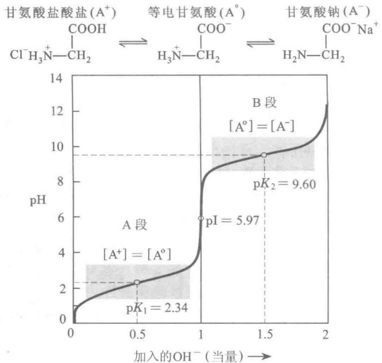  
图2-5 甘氨酸的滴定曲线（解离曲线）  
这里示出的是 $25^{\circ}C$ 时 0.1 mol/L 甘氨酸滴定曲线。在滴定的关键点处占优势的离子形式见图上方，阴影框表示以 $pK_{a}$ 为中心的有效缓冲区。注意，1 当量的 $OH^{-}$ 等于加入的 0.1 mol/L NaOH 量

R 基不含可解离基团的中性氨基酸都具有类似甘氨酸的滴定曲线。这类氨基酸的 $pK_{a}$ ，相当于 $pK_{1}$ 的范围为 1.8\~2.4， $pK_{2}$ 的范围为 8.8\~11.0（表 2-2）。R 基含有可解离基团的氨基酸，相当于三元酸，有 3 个 $pK_{a}$ ，因此滴定曲线比较复杂。甘氨酸滴定曲线（图 2-5）中，两个解离基团的 $pK_{a}$ 值分得较开，两段滴定曲线（A 和 B）不重叠。当解离基团的 $pK_{a}$ 值比较接近时，两段曲线会发生重叠；这种情况在谷氨酸滴定曲线 A 和 B 段（图 2-6A）和赖氨酸滴定曲线 B 和 C 段（图 2-6B）出现。

20 种基本氨基酸,除组氨酸外,在生理 pH(7 左右)溶液中都没有明显的缓冲能力,因为这些氨基酸的 $pK_{a}$ 都不在 pH 7 附近(表 2-2),而缓冲能力只有在接近 $pK_{a}$ 时才显现出来。从表 2-2 可知,组氨酸咪唑基的 $pK_{a}$ 为 6.0,在 pH 7 附近有明显的缓冲作用。红细胞中运载氧气的血红蛋白由于含有较多的组氨酸残基,使得它在 pH 7 左右的血液中具有显著的缓冲能力,这一点对红细胞在血液中起运输氧气和二氧化碳的作用来说是重要的。

## （二）氨基酸的等电点

从甘氨酸的解离公式和滴定曲线(图 2-5)可以看出,氨基酸的带电荷状况与其溶液的 pH 有关,改变 pH 可以使氨基酸带净正电荷或带净负电荷,也可以使它处于带正、负电荷数目相等即净电荷为零的兼性离子状态。如图2-5所示，在pH 5.97即曲线A段和曲线B段之间的拐点处，甘氨酸完全电离，以不带净电荷的形式存在。氨基酸处于净电荷为0时的特征pH称为等电点(isoelectric point)或等电pH，缩写为pI。对侧链不含可解离基团的中性氨基酸如甘氨酸、丙氨酸等，其等电点是它的 $pK_{1}$ 和 $pK_{2}$ 的算术平均值：

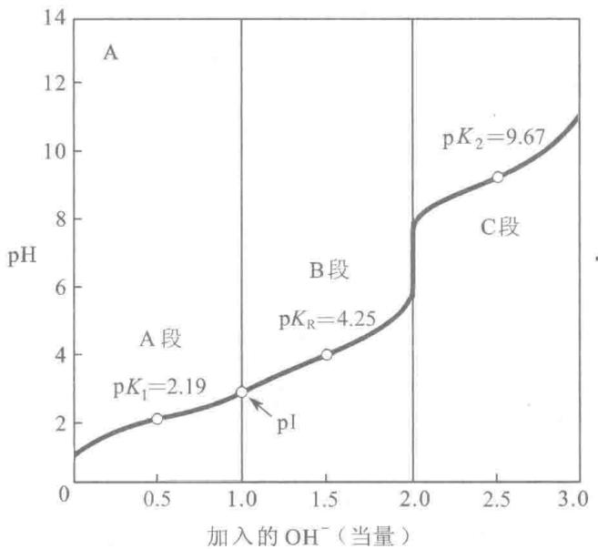

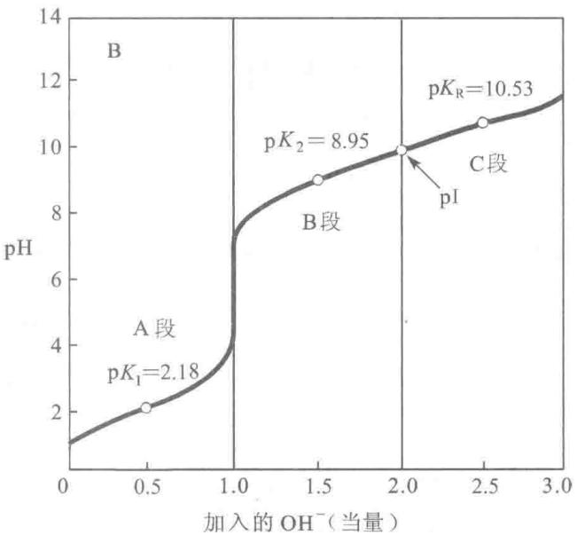  
图2-6 谷氨酸(A)和赖氨酸(B)的滴定曲线

$$
\mathrm{pI} = \frac {1}{2} (\mathrm{pK} _ {1} + \mathrm{pK} _ {2}),
$$

例如，甘氨酸的等电点：

$$
\mathrm{pI} = \frac {1}{2} (2. 3 4 + 9. 6 0) = 5. 9 7
$$

从上面可以看出，pI与该离子浓度基本无关，只决定于等电兼性离子 $(\mathrm{A}^{\circ})$ 两侧的 $\mathrm{pK}_{\mathrm{a}}$ 。

同样,对于 R 基含可解离基团的氨基酸如谷氨酸和赖氨酸来说,只要写出它的解离公式,然后取等电兼性离子两边的 $pK_{a}$ 的平均值,则得其 $pI$ 。谷氨酸解离如下:

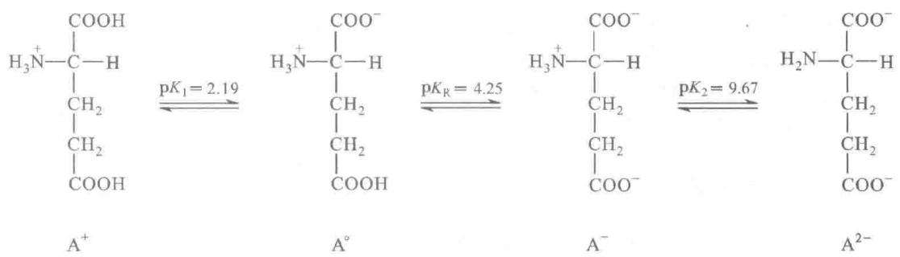

等电 pH 时,谷氨酸主要以兼性离子( $A^{\circ}$ )存在, $A^{+}$ 和 $A^{-}$ 的量很少,而且相等, $A^{2-}$ 的量更可以忽略不计,因此:

$$
\begin{array}{r l} \mathrm {p I _ {Glu}} & = \frac {1}{2} (\mathrm {p K_ {I}} + \mathrm {p K_ {R}}) \\ & = \frac {1}{2} (2. 1 9 + 4. 2 5) = 3. 2 2 \end{array}
$$

赖氨酸的解离情况是：

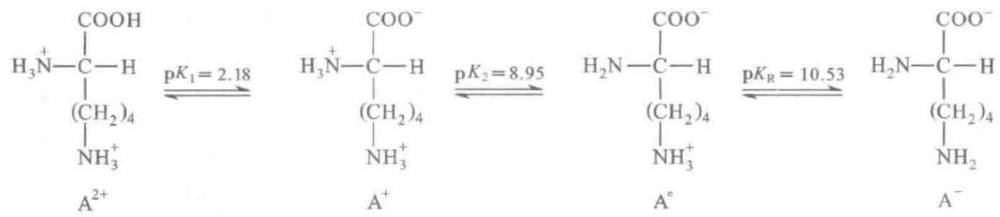

在这里 $\left[A^{2+}\right]$ 极小， $A^{\circ}$ 是等电pH时的主要形式，因此

$$
\begin{array}{r l} \mathrm {p I _ {Lys}} & = \frac {1}{2} (\mathrm {p K _ {2} + p K _ {R}}) \\ & = \frac {1}{2} (8. 9 5 + 1 0. 5 3) = 9. 7 4 \end{array}
$$

在等电点时,氨基酸在电场中既不向正极也不向负极移动,即处于等电兼性离子状态,少数解离成阳离子和阴离子,但解离成阳离子和阴离子的数目和趋势相等。在等电点以上的任一 pH,氨基酸带净负电荷,并因此在电场中将向正极移动。在低于等电点的任一 pH,氨基酸带有净正电荷,在电场中将向负极移动。在一定 pH 范围内,氨基酸溶液的 pH 离等电点愈远,氨基酸所携带的净电荷愈大。

<!-- EN-BEGIN 3.1 -->

### 【英文对应 3.1】Amino Acids

> 来源：Lehninger Principles of Biochemistry（书籍/02_生物化学原理） 第3章 Amino Acids, Peptides, and Proteins，§3.1。对应本章“三、氨基酸的酸碱性质”。

Proteins are polymers of amino acids, with each amino acid residue joined to its neighbor by a specific type of covalent bond. (The term “residue” reflects the loss of the elements of water when one amino acid is joined to another.) Proteins can be broken down (hydrolyzed) to their constituent amino acids by a variety of methods, and the earliest studies of proteins naturally focused on the free amino acids derived from them. Twenty different amino acids are commonly found in proteins. The first to be discovered was asparagine, in 1806. The last of the 20 to be found, threonine, was not identified until 1938. All the amino acids have trivial or common names, in some cases derived from the source from which they were first isolated. Asparagine was first found in asparagus, and glutamate in wheat gluten; tyrosine was first isolated from cheese (its name is derived from the Greek tyros, “cheese”); glycine (Greek glykos, “sweet”) was so named because of its sweet taste.

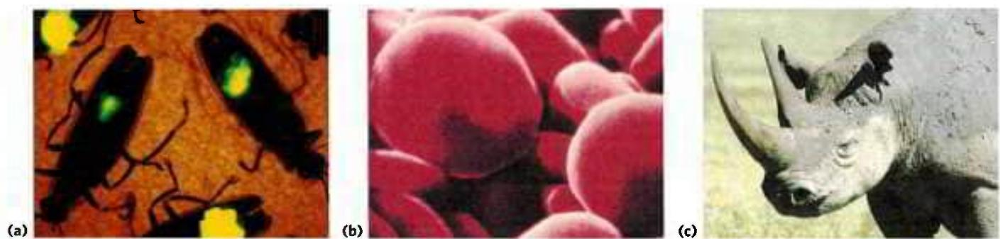  
FIGURE 3-1 Some functions of proteins. (a) The light produced by fireflies is the result of a reaction involving the protein luciferin and ATP, catalyzed by the enzyme luciferase (see Box 13-1). (b) Erythrocytes contain large amounts of the oxygen-transporting protein hemoglobin. (c) The protein keratin, formed by all vertebrates, is the chief structural component of hair, scales, horn, wool, nails, and  
feathers. The black rhinoceros is extinct in the wild because of the belief prevalent in some parts of the world that a powder derived from its horn has aphrodisiac properties. In reality, the chemical properties of powdered rhinoceros horn are no different from those of powdered bovine hooves or human fingernails. [(a) Jeff J. Daly/Alamy. (b) Bill Longcore/Science Source. (c) Mary Cooke/Animals Animals.]

Learning the names, structures, and chemical properties of the 20 common amino acids found in proteins is one of the key memorization trials of every beginning biochemistry student. The necessity rapidly becomes apparent in succeeding chapters. It is impossible to discuss protein structure, protein function, ligand-binding sites, enzyme active sites, and most other biochemical topics without this foundation. The amino acids are part of the biochemistry vocabulary.

#### [EN] Amino Acids Share Common Structural Features

P1 All 20 of the common amino acids are $\alpha$ -amino acids. They have a carboxyl group and an amino group bonded to the same carbon atom (the $\alpha$ carbon) (Fig. 3-2). They differ from each other in their side chains, or R groups, which vary in structure, size, and electric charge, and which influence the solubility of the amino acids in water. In addition to these 20 amino acids, there are many less common ones. Some are residues modified after a protein has been synthesized, others are amino acids present in living organisms but not as constituents of proteins, and two are special cases found in just a few proteins. The common amino acids of proteins have been assigned three-letter abbreviations and one-letter symbols (see Table 3-1), which are used as shorthand to indicate the composition and sequence of amino acids polymerized in proteins.

KEY CONVENTION The three-letter code is easily understood, the abbreviations generally consisting of the first three letters of the amino acid name. The one-letter code was devised by Margaret Oakley Dayhoff, considered by many to be the founder of the field of bioinformatics. The one-letter code reflects an attempt to reduce the size of the data files (in an era of limited computer memory) used to describe amino acid sequences. It was designed to be easily memorized, and understanding its origin can help students do just that. For six amino acids (CHIMSV), the first letter of the amino acid name is unique and thus is used as the symbol.

  
FIGURE 3-2 General structure of an amino acid. This structure is common to all but one of the $\alpha$ -amino acids. (Proline, a cyclic amino acid, is the exception.) The R group, or side chain (purple), attached to the $\alpha$ carbon (gray) is different in each amino acid.

  
Margaret Oakley Dayhoff,
1925–1983 (Photo by Dr. Ruth Dayhoff,
courtesy Vincent Brannigan.)

For five others (AGLPT), the first letter of the name is not unique but is assigned to the amino acid that is most common in proteins (for example, leucine is more common than lysine). For another four, the letter used is phonetically suggestive (RFYW: aRginine, Fenylalanine, tYrosine, tWiptophan). The rest were harder to assign. Four (DNEQ) were assigned letters found within or suggested by their names (asparDic, asparagiNe, glutamEke, Q-tamine). That left lysine. Only a few letters were left, and K was chosen because it was the closest to L.

For all the common amino acids except glycine, the $\alpha$ carbon is bonded to four different groups: a carboxyl group, an amino group, an R group, and a hydrogen atom (Fig. 3-2; in glycine, the R group is another hydrogen atom). The $\alpha$ -carbon atom is thus a chiral center (p. 61). Because of the tetrahedral arrangement of the bonding orbitals around the $\alpha$ -carbon atom, the four different groups can occupy two unique spatial arrangements, and thus amino acids have two possible stereoisomers. Since they are nonsuperposable mirror images of each other (Fig. 3-3), the two forms represent a class of stereoisomers called enantiomers (see Fig. 1-21). All molecules with a chiral center are also optically active—that is, they rotate the plane of plane-polarized light (see Box 1-2).

  
FIGURE 3-3 Stereoisomerism in $\alpha$ -amino acids. (a) The two stereoisomers of alanine, L- and D-alanine, are nonsuperposable mirror images of each other (enantiomers). (b, c) Two different conventions for showing the configurations in space of stereoisomers. In perspective formulas (b), the solid wedge-shaped bonds project out of the plane of the paper, the dashed bonds behind it. In projection formulas (c), the horizontal bonds are assumed to project out of the plane of the paper, the vertical bonds behind. However, projection formulas are often used casually and are not always intended to portray a specific stereochemical configuration. See Figure 3-4 for an explanation of the D, L-system for specifying absolute configuration.

KEY CONVENTION Two conventions are used to identify the carbons in an amino acid — a practice that can be confusing. The additional carbons in an R group are commonly designated $\beta$ , $\gamma$ , $\delta$ , $\varepsilon$ , and so forth, proceeding out from the $\alpha$ carbon. For most other organic molecules, carbon atoms are simply numbered from one end, giving highest priority (C-1) to the carbon with the substituent containing the atom of highest atomic number. Within this latter convention, the carboxyl carbon of an amino acid would be C-1 and the $\alpha$ carbon would be C-2.

In cases such as amino acids with heterocyclic R groups (e.g., histidine), where the Greek lettering system is ambiguous, the numbering system is used. For branched amino acid side chains, equivalent carbons are given numbers after the Greek letters. Leucine thus has $\delta1$ and $\delta2$ carbons (see the structure in Fig. 3-5).

Special nomenclature has been developed to specify the absolute configuration of the four substituents of asymmetric carbon atoms. The absolute configurations of simple sugars and amino acids are specified by the D, L system (Fig. 3-4), based on the absolute configuration of the three-carbon sugar glyceraldehyde, a convention proposed by Emil Fischer in 1891. (Fischer knew what groups surrounded the asymmetric carbon of glyceraldehyde but had to guess at their absolute configuration; he guessed right, as was later confirmed by x-ray diffraction analysis.) For all chiral compounds, stereoisomers having a configuration related to that of L-glyceraldehyde are designated L, and stereoisomers related to D-glyceraldehyde are designated D. The functional groups of L-alanine are matched with those of L-glyceraldehyde by aligning those that can be interconverted by simple, one-step chemical reactions. Thus the carboxyl group of L-alanine occupies the same position about the chiral carbon as does the aldehyde group of L-glyceraldehyde, because an aldehyde is readily converted to a carboxyl group via a one-step oxidation. Historically, the similar l and d designations were used for levorotatory (rotating plane-polarized light to the left) and dextrorotatory (rotating light to the right). However, not all L-amino acids are levorotatory, and the convention shown in Figure 3-4 was needed to avoid potential ambiguities about absolute configuration. By Fischer's convention, L and D refer only to the absolute configuration of the four substituents around the chiral carbon, not to optical properties of the molecule.

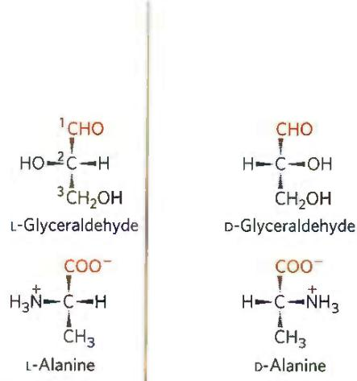  
FIGURE 3-4 Steric relationship of the stereoisomers of alanine to the absolute configuration of L-and D-glyceraldehyde. In these perspective formulas, the carbons are lined up vertically, with the chiral atom in the center. The carbons in these molecules are numbered beginning with the terminal aldehyde or carboxyl carbon (red), 1 to 3 from top to bottom as shown. When presented in this way, the R group of the amino acid (in this case the methyl group of alanine) is always below the $\alpha$ carbon. L-Amino acids are those with the $\alpha$ -amino group on the left, and D-amino acids have the $\alpha$ -amino group on the right.

Another system of specifying configuration around a chiral center is the RS system, which is used in the systematic nomenclature of organic chemistry and describes more precisely the configuration of molecules with more than one chiral center (p. 17).

#### [EN] The Amino Acid Residues in Proteins Are L Stereoisomers

Nearly all biological compounds with a chiral center occur naturally in only one stereoisomeric form, either D or L. The amino acid residues in protein molecules are almost all L stereoisomers, with less than 1% being found in the D-configuration. The rare D-amino acid residues generally have a precise structural purpose, and they are introduced to a protein by enzyme-catalyzed reactions that occur after the proteins are synthesized on a ribosome.

It is remarkable that virtually all amino acid residues in proteins are L stereoisomers. When chiral compounds are formed by ordinary chemical reactions, the result is a racemic mixture of D and L isomers, which are difficult for a chemist to distinguish and separate. But to a living system, D and L isomers are as different as the right hand and the left. The formation of stable, repeating substructures in proteins (Chapter 4) requires that their constituent amino acids be of one stereochemical series. Cells are able to specifically synthesize the L isomers of amino acids because the active sites of enzymes are asymmetric, causing the reactions they catalyze to be stereospecific.

#### [EN] Amino Acids Can Be Classified by R Group

Knowledge of the chemical properties of the common amino acids is central to an understanding of biochemistry. The topic can be simplified by grouping the amino acids into five main classes based on the properties of their R groups (Table 3-1), particularly their polarity, or tendency to interact with water at biological pH (near pH 7.0). The polarity of the R groups varies widely, from nonpolar and hydrophobic (water-insoluble) to highly polar and hydrophilic (water-soluble). A few amino acids—especially glycine, histidine, and cysteine—are somewhat difficult to characterize or do not fit perfectly in any one group. They are assigned to particular groupings based on considered judgments rather than absolutes.

TABLE 3-1 Properties and Conventions Associated with the Common Amino Acids Found in Proteins

<table><tr><td rowspan="2">Amino acid</td><td rowspan="2">Abbreviation/ symbol</td><td rowspan="2"> $M_{r}^{a}$ </td><td colspan="3"> $pK_{a}$  values</td><td rowspan="2">pl</td><td rowspan="2">Hydropathy indexb</td><td rowspan="2" colspan="3">Occurrence in proteins (%)c</td></tr><tr><td> $pK_{1}$ (—COOH)</td><td> $pK_{2}$ (—NH3+)</td><td> $pK_{R}$ (R group)</td></tr><tr><td colspan="11">Nonpolar, aliphatic R groups</td></tr><tr><td>Glycine</td><td>Gly G</td><td>75</td><td>2.34</td><td>9.60</td><td></td><td>5.97</td><td>-0.4</td><td>7.2</td><td>7.3</td><td>7.3</td></tr><tr><td>Alanine</td><td>Ala A</td><td>89</td><td>2.34</td><td>9.69</td><td></td><td>6.01</td><td>1.8</td><td>7.8</td><td>9.4</td><td>7.2</td></tr><tr><td>Proline</td><td>Pro P</td><td>115</td><td>1.99</td><td>10.96</td><td></td><td>6.48</td><td>-1.6d</td><td>5.2</td><td>4.4</td><td>4.2</td></tr><tr><td>Valine</td><td>Val V</td><td>117</td><td>2.32</td><td>9.62</td><td></td><td>5.97</td><td>4.2</td><td>6.6</td><td>7.1</td><td>8.2</td></tr><tr><td>Leucine</td><td>Leu L</td><td>131</td><td>2.36</td><td>9.60</td><td></td><td>5.98</td><td>3.8</td><td>9.1</td><td>10.6</td><td>9.9</td></tr><tr><td>Isoleucine</td><td>Ile I</td><td>131</td><td>2.36</td><td>9.68</td><td></td><td>6.02</td><td>4.5</td><td>5.3</td><td>6.0</td><td>7.6</td></tr><tr><td>Methionine</td><td>Met M</td><td>149</td><td>2.28</td><td>9.21</td><td></td><td>5.74</td><td>1.9</td><td>2.3</td><td>2.2</td><td>2.2</td></tr><tr><td colspan="11">Aromatic R groups</td></tr><tr><td>Phenylalanine</td><td>Phe F</td><td>165</td><td>1.83</td><td>9.13</td><td></td><td>5.48</td><td>2.8</td><td>3.9</td><td>4.0</td><td>4.5</td></tr><tr><td>Tyrosine</td><td>Tyr Y</td><td>181</td><td>2.20</td><td>9.11</td><td>10.07</td><td>5.66</td><td>-1.3</td><td>3.2</td><td>3.0</td><td>3.9</td></tr><tr><td>Tryptophan</td><td>Trp W</td><td>204</td><td>2.38</td><td>9.39</td><td></td><td>5.89</td><td>-0.9</td><td>1.4</td><td>1.3</td><td>1.1</td></tr><tr><td colspan="11">Polar, uncharged R groups</td></tr><tr><td>Serine</td><td>Ser S</td><td>105</td><td>2.21</td><td>9.15</td><td></td><td>5.68</td><td>-0.8</td><td>6.8</td><td>6.1</td><td>5.7</td></tr><tr><td>Threonine</td><td>Thr T</td><td>119</td><td>2.11</td><td>9.62</td><td></td><td>5.87</td><td>-0.7</td><td>5.9</td><td>5.4</td><td>4.5</td></tr><tr><td>Cysteinee</td><td>Cys C</td><td>121</td><td>1.96</td><td>10.28</td><td>8.18</td><td>5.07</td><td>2.5</td><td>1.9</td><td>1.2</td><td>0.8</td></tr><tr><td>Asparagine</td><td>Asn N</td><td>132</td><td>2.02</td><td>8.80</td><td></td><td>5.41</td><td>-3.5</td><td>4.3</td><td>3.7</td><td>3.4</td></tr><tr><td>Glutamine</td><td>Gln Q</td><td>146</td><td>2.17</td><td>9.13</td><td></td><td>5.65</td><td>-3.5</td><td>4.2</td><td>4.5</td><td>2.0</td></tr><tr><td colspan="11">Positively charged R groups</td></tr><tr><td>Lysine</td><td>Lys K</td><td>146</td><td>2.18</td><td>8.95</td><td>10.53</td><td>9.74</td><td>-3.9</td><td>5.9</td><td>4.7</td><td>6.8</td></tr><tr><td>Histidine</td><td>His H</td><td>155</td><td>1.82</td><td>9.17</td><td>6.00</td><td>7.59</td><td>-3.2</td><td>2.3</td><td>2.4</td><td>1.6</td></tr><tr><td>Arginine</td><td>Arg R</td><td>174</td><td>2.17</td><td>9.04</td><td>12.48</td><td>10.76</td><td>-4.5</td><td>5.1</td><td>5.6</td><td>5.9</td></tr><tr><td colspan="11">Negatively charged R groups</td></tr><tr><td>Aspartate</td><td>Asp D</td><td>133</td><td>1.88</td><td>9.60</td><td>3.65</td><td>2.77</td><td>-3.5</td><td>5.3</td><td>5.1</td><td>5.0</td></tr><tr><td>Glutamate</td><td>Glu E</td><td>147</td><td>2.19</td><td>9.67</td><td>4.25</td><td>3.22</td><td>-3.5</td><td>6.3</td><td>6.0</td><td>8.2</td></tr></table>

$^{a}$ M, values reflect the structures as shown in Figure 3-5. The elements of water (M, 18) are deleted when the amino acid is incorporated into a polypeptide.  
$^{b}$ A scale combining hydrophobicity and hydrophilicity of R groups. The values reflect the free energy ( $\Delta G$ ) of transfer of the amino acid side chain from a hydrophobic environment to water. This transfer is favorable ( $\Delta G < 0$ ; negative value in the index) for charged or polar amino acid side chains, and it is unfavorable ( $\Delta G > 0$ ; positive value in the index) for amino acids with nonpolar or more hydrophobic side chains. See Chapter 11. Source: Data from J. Kyte and R. F. Doolittle, J. Mol. Biol. 157:105, 1982.  
The first value in each row is the average occurrence in more than 1,150 proteins. Source: Data from R. F. Doolittle, in Prediction of Protein Structure and the Principles of Protein Conformation (G. D. Fasman, ed.), p. 599, Plenum Press, 1989. The second and third values are, respectively, from the complete proteomes of nine mesophilic bacterial species and seven thermophilic bacterial species. Mesophiles grow at commonly encountered temperatures, whereas thermophiles grow at elevated temperatures up to and beyond the boiling point of water. The decline in glutamine occurrence in thermophiles may reflect a tendency of this amino acid to deaminate at high temperatures. Source: Data from A. C. Singer and D. A. Hickey, Gene 317:39, 2003.  
$^{d}$ As originally composed, the hydropathy index takes into account the frequency with which an amino acid residue appears on the surface of a protein. As proline often appears on the surface in $\beta$ turns, it has a lower score than its chain of methylene groups would suggest.  
$^{e}$ Cysteine is generally classified as polar, despite having a positive hydropathy index. This reflects the ability of the sulfhydryl group to act as a weak acid and to form a weak hydrogen bond with oxygen or nitrogen.

P1 The structures of the 20 common amino acids are shown in Figure 3-5, and some of their properties are listed in Table 3-1. Within each class there are gradations of polarity, size, and shape of the R groups.

Nonpolar, Aliphatic R Groups The R groups in this class of amino acids are nonpolar and hydrophobic. The side chains of alanine, valine, leucine, and isoleucine tend to cluster together within proteins, stabilizing protein structure through the hydrophobic effect. Glycine has the simplest structure. Although it is most easily grouped with the nonpolar amino acids, its very small side chain makes no real contribution to interactions driven by the hydrophobic effect. Methionine, one of the two sulfur-containing amino acids, has a slightly nonpolar thioether group in its side chain. Proline has an aliphatic side chain with a distinctive cyclic structure.

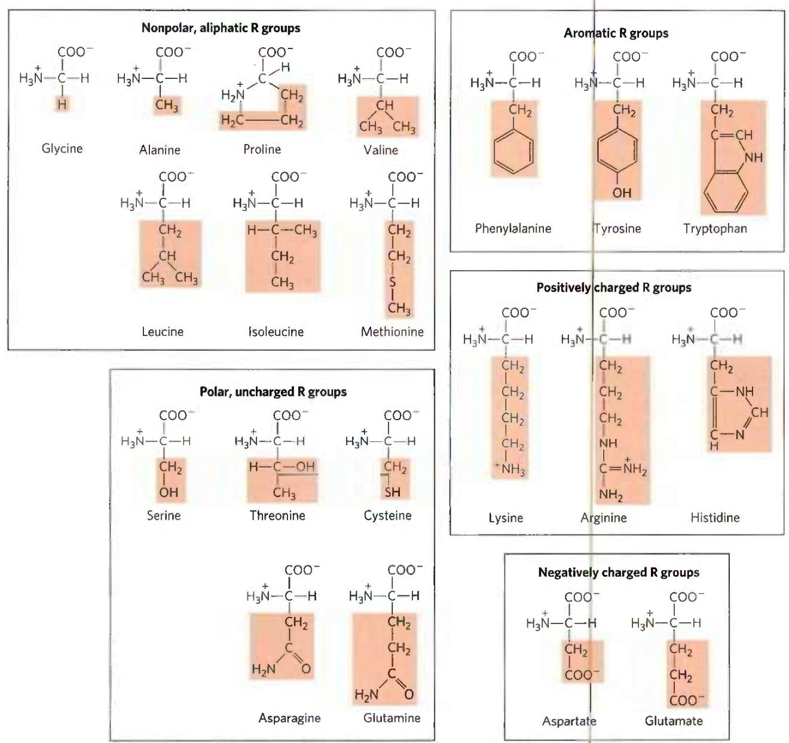  
FIGURE 3-5 The 20 common amino acids of proteins. The structural formulas show the state of ionization that would predominate at pH 7.0. The unshaded portions are those that are common to all the amino acids; the shaded portions are the R groups. Although  
the R group of histidine is shown uncharged, its $pK_{a}$ (see Table 3-1) is such that a small but significant fraction of these groups are positively charged at pH 7.0. The protonated form of histidine is shown above the graph in Figure 3-12b.

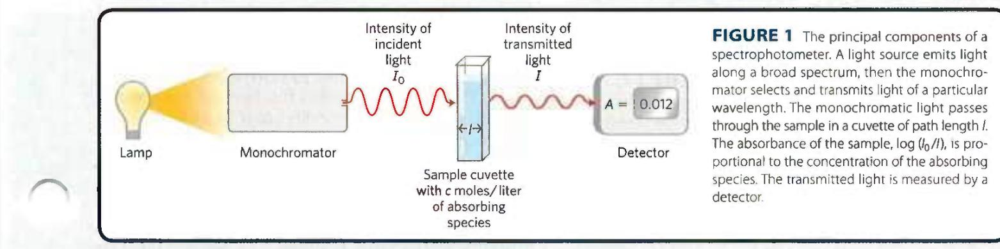

#### [EN] Absorption of Light by Molecules: The Lambert-Beer Law

A wide range of biomolecules absorb light at characteristic wavelengths, just as tryptophan absorbs light at 280 nm (see Fig. 3-6). Measurement of light absorption by a spectrophotometer is used to detect and identify molecules and to measure their concentration in solution. The fraction of the incident light absorbed by a solution at a given wavelength is related to the thickness of the absorbing layer (path length) and the concentration of the absorbing species (Fig. 1). These two relationships are combined into the Lambert-Beer law,

$$
\log \frac {I _ {0}}{I} = \varepsilon c I
$$

where $I_{0}$ is the intensity of the incident light, I is the intensity of the transmitted light, the ratio $I/I_{0}$ (the inverse of the ratio in the equation) is the transmittance, $\varepsilon$ is the molar extinction coefficient (in units of liters per mole-centimeter), c is the

The secondary amino (imino) group of proline residues is held in a rigid conformation that reduces the structural flexibility of polypeptide regions containing proline.

Aromatic R Groups Phenylalanine, tyrosine, and tryptophan, with their aromatic side chains, are relatively nonpolar (hydrophobic). All can contribute to the hydrophobic effect. The hydroxyl group of tyrosine can form hydrogen bonds, and it is an important functional group in some enzymes. Tyrosine and tryptophan are significantly more polar than phenylalanine because of the tyrosine hydroxyl group and the nitrogen of the tryptophan indole ring.

FIGURE 3-6 Absorption of ultraviolet light by aromatic amino acids. Comparison of the light absorption spectra of the aromatic amino acids tryptophan, tyrosine, and phenylalanine at pH 6.0. The amino acids are present in equimolar amounts ( $10^{-3}$ m) under identical conditions. The measured absorbance of tryptophan is more than four times that of tyrosine at a wavelength of 280 nm. Note that the maximum light absorption for both tryptophan and tyrosine occurs near 280 nm. Light absorption by phenylalanine generally contributes little to the spectroscopic properties of proteins.

concentration of the absorbing species (in moles per liter), and / is the path length of the light-absorbing sample (in centimeters). The Lambert-Beer law assumes that the incident light is parallel and monochromatic (of a single wavelength) and that the solvent and solute molecules are randomly oriented. The expression log $(I_0 / I)$ is called the absorbance, designated A.

It is important to note that each successive millimeter of path length of absorbing solution in a 1.0 cm cell absorbs not a constant amount but a constant fraction of the light that is incident upon it. However, with an absorbing layer of fixed path length, the absorbance, A, is directly proportional to the concentration of the absorbing solute.

The molar extinction coefficient varies with the nature of the absorbing compound, the solvent, and the wavelength, and also with pH if the light-absorbing species is in equilibrium with an ionization state that has different absorbance properties.

FIGURE 1 The principal components of a spectrophotometer. A light source emits light along a broad spectrum, then the monochromator selects and transmits light of a particular wavelength. The monochromatic light passes through the sample in a cuvette of path length $l$ . The absorbance of the sample, $\log (l_0 / l)$ , is proportional to the concentration of the absorbing species. The transmitted light is measured by a detector.

Tryptophan and tyrosine, and to a much lesser extent phenylalanine, absorb ultraviolet light (Fig. 3-6; see also Box 3-1). This accounts for the characteristic strong absorbance of light by most proteins at a wavelength of 280 nm, a property exploited by researchers in the characterization of proteins.

Polar, Uncharged R Groups The R groups of these amino acids are more soluble in water, or more hydrophilic, than those of the nonpolar amino acids because they contain functional groups that form hydrogen bonds with water. This class of amino acids includes serine, threonine, cysteine, asparagine, and glutamine. The polarity of serine and threonine is contributed by their hydroxyl groups, and the polarity of asparagine and glutamine is contributed by their amide groups. Cysteine is an outlier here because its polarity, contributed by its sulfhydryl group, is quite modest. Cysteine is a weak acid and can make weak hydrogen bonds with oxygen or nitrogen.

Asparagine and glutamine are the amides of two other amino acids also found in proteins—aspartate and glutamate, respectively—to which asparagine and glutamine are easily hydrolyzed by acid or base. Cysteine is readily oxidized to form a covalently linked dimeric amino acid called cystine, in which two cysteine molecules or residues are joined by a disulfide bond (Fig. 3-7). The disulfide-linked residues are strongly hydrophobic (nonpolar). Disulfide bonds play a special role in the structures of many proteins by forming covalent links between parts of a polypeptide molecule or between two different polypeptide chains.

Positively Charged (Basic) R Groups The most hydrophilic R groups are those that are either positively charged or negatively charged. The amino acids in which the R groups have significant positive charge at pH 7.0 are lysine, which has a second primary amino group at the $\varepsilon$ position on its aliphatic chain; arginine, which has a positively charged guanidinium group; and histidine, which has an aromatic imidazole group. As the only common amino acid having an ionizable side chain with $pK_{\mathrm{a}}$ near neutrality, histidine may be positively charged (protonated form) or uncharged at pH 7.0. His residues facilitate many enzyme-catalyzed reactions by serving as proton donors/acceptors.

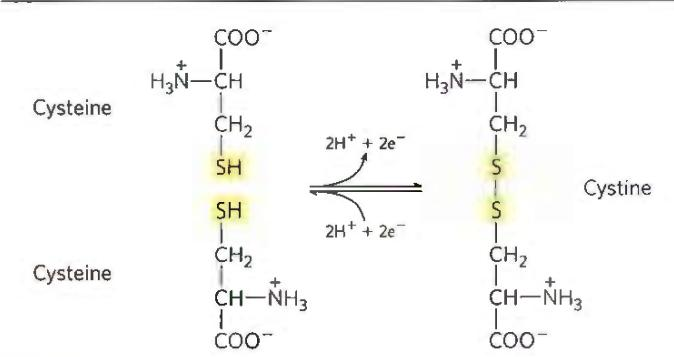  
FIGURE 3-7 Reversible formation of a disulfide bond by the oxidation of two molecules of cysteine. Disulfide bonds between Cys residues stabilize the structures of many proteins.

Negatively Charged (Acidic) R Groups The two amino acids having R groups with a net negative charge at pH 7.0 are aspartate and glutamate, each of which has a second carboxyl group.

#### [EN] Uncommon Amino Acids Also Have Important Functions

In addition to the 20 common amino acids, proteins may contain residues created by modification of common residues already incorporated into a polypeptide—that is, through postsynthetic modification (Fig. 3-8a). Among these uncommon amino acids are 4-hydroxy-proline, a derivative of proline found in the fibrous protein collagen, and $\gamma$ -carboxyglutamate, found in the blood-clotting protein prothrombin and in certain other proteins that bind $\mathrm{Ca^{2+}}$ as part of their biological function. More complex is desmosine, a derivative of four Lys residues, which is found in the fibrous protein elastin.

Selenocysteine and pyrrolysine are special cases. These rare amino acid residues are not created through a postsynthetic modification. Instead, they are introduced during protein synthesis through an unusual adaptation of the genetic code, which we describe in Chapter 27. Selenocysteine contains selenium rather than the sulfur of cysteine. Actually derived from serine, selenocysteine is a constituent of just a few known proteins. Pyrrolysine is found in a few proteins in several methanogenic (methane-producing) archaea and in one known bacterium; it plays a role in methane biosynthesis.

Some amino acid residues in a protein may be modified transiently to alter the protein's function. The addition of phosphoryl, methyl, acetyl, adenylyl, ADP-ribosyl, or other groups to particular amino acid residues can increase or decrease a protein's activity (Fig. 3-8b). Phosphorylation is a particularly common regulatory modification. Covalent modification as a protein regulatory strategy is discussed in more detail in Chapter 6.

Some 300 additional amino acids have been found in cells. They have a variety of functions, but not all are constituents of proteins. Ornithine and citrulline (Fig. 3-8c) deserve special note because they are key intermediates (metabolites) in the biosynthesis of arginine (Chapter 22) and in the urea cycle (Chapter 18).

#### [EN] Amino Acids Can Act as Acids and Bases

The amino and carboxyl groups of amino acids, along with the ionizable R groups of some amino acids, function as weak acids and bases. When an amino acid lacking an ionizable R group is dissolved in water at neutral pH, the $\alpha$ -amino and carboxyl groups create a

  
FIGURE 3-8 Uncommon amino acids. (a) Some uncommon amino acids found in proteins. Most are derived from common amino acids. (Note the use of either numbers or Greek letters in the names of these structures to identify the altered carbon atoms.) Extra functional groups added by modification reactions are shown in red. Desmosine is formed from four Lys residues (the carbon backbones are shaded in light red). Selenocysteine and pyrrolysine are exceptions: these amino acids are added during normal protein synthesis through a highly specialized expansion of the standard genetic code. Both are found in very small numbers of proteins. (b) Reversible amino acid modifications involved in regulation of protein activity. Phosphorylation is the most common type of regulatory modification. (c) Ornithine and citrulline, which are not found in proteins, are intermediates in the biosynthesis of arginine and in the urea cycle.

dipolar ion, or zwitterion (German for "hybrid ion"), which can act as either an acid or a base (Fig. 3-9). Substances having this dual (acid-base) nature are amphoteric and are often called ampholytes (from "amphoteric electrolytes"). A simple monoamino monocarboxylic $\alpha$ -amino acid, such as alanine, is a diprotic acid when fully protonated; it has two groups, the —COOH group and the $—NH_{3}^{+}$ group, that can yield protons:

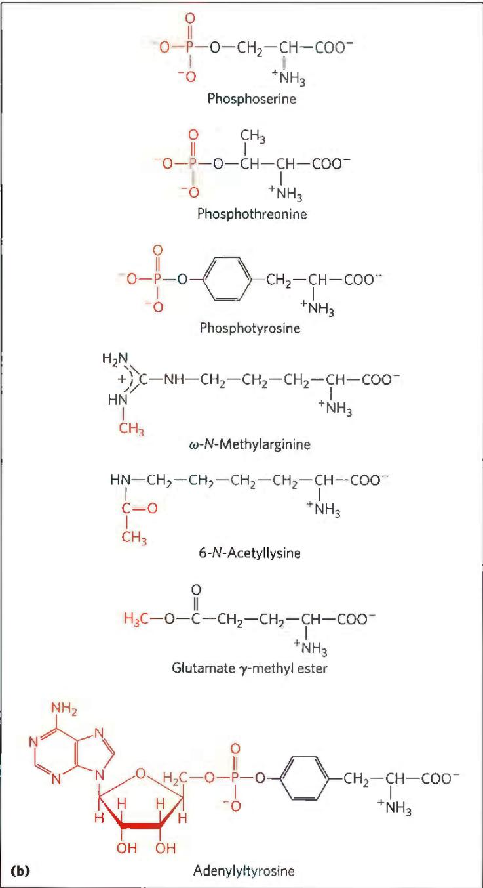

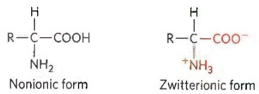

  
FIGURE 3-9 Nonionic and zwitterionic forms of amino acids. The nonionic form does not occur in significant amounts in aqueous solutions. The zwitterion predominates at neutral pH. A zwitterion can act as either an acid (proton donor) or a base (proton acceptor).

Acid-base titration involves the gradual addition or removal of protons (Chapter 2). Figure 3-10 shows the titration curve of the diprotic form of glycine. The two ionizable groups of glycine, the carboxyl group and the amino group, are titrated with a strong base such as NaOH. The plot has two distinct stages, corresponding to deprotonation of two different groups on glycine. Each of the two stages resembles in shape the titration curve of a monoprotic acid, such as acetic acid (see Fig. 2-16), and can be analyzed in the same way. At very low pH, the predominant ionic species of glycine is the fully protonated form, $^{+}$ H $_{3}$ N—CH $_{2}$ —COOH.

In the first stage of the titration, the —COOH group of glycine (with its lower $pK_{a}$ ) loses its proton. At the midpoint of this stage, equimolar concentrations of the proton-donor ( $^{+}H_{3}N—CH_{2}—COOH$ ) and the proton-acceptor ( $^{+}H_{3}N—CH_{2}—COO^{-}$ ) species are present. As in the titration of any weak acid, a point of inflection is reached at this midpoint where the pH is equal to the $pK_{a}$ of the protonated group that is being titrated (see Fig. 2-17). For glycine, the pH at the midpoint is 2.34; thus its —COOH group has a $pK_{a}$ (labeled $pK_{1}$ in Fig. 3-10) of 2.34. (Recall from Chapter 2 that pH and $pK_{a}$ are simply convenient notations for proton concentration and the equilibrium constant for ionization, respectively. The $pK_{a}$ is a measure of the tendency of a group to give up a proton, with that tendency decreasing 10-fold as the $pK_{a}$ increases by one unit.) As the titration of glycine proceeds, another point of inflection is reached at pH 5.97; at this point, removal of the first proton is essentially complete and removal of the second has just begun. At this pH, glycine is present largely as the dipolar ion (zwitterion) $^{+}H_{3}N—CH_{2}—COO^{-}$ . We shall return to the significance of this inflection point in the titration curve (labeled pI in Fig. 3-10) shortly.

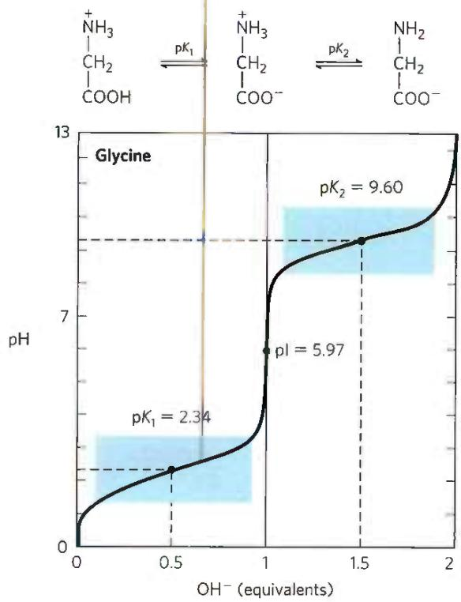  
FIGURE 3-10 Titration of amino acids. The titration curve of 0.1 M glycine at 25 °C. The ionic species predominating at key points in the titration are shown above the graph. The shaded boxes, centered at about $pK_{1}=2.3$ and $pK_{2}=9.60$ , indicate the regions of greatest buffering power. Note that 1 equivalent of $OH^{-}=0.1$ M NaOH added. The pl occurs at the arithmetic mean between the two $pK_{a}$ values, and it corresponds to the inflection point in the titration.

The second stage of the titration corresponds to the removal of a proton from the $-NH_{3}^{+}$ group of glycine. The pH at the midpoint of this stage is 9.60, equal to the $pK_{a}$ (labeled $pK_{2}$ in Fig. 3-10) for the $-NH_{3}^{+}$ group. The titration is essentially complete at a pH of about 12, at which point the predominant form of glycine is $H_{2}N-CH_{2}-COO^{-}$ .

From the titration curve of glycine we can derive several important pieces of information. First, it gives a quantitative measure of the $pK_{a}$ of each of the two ionizing groups: 2.34 for the —COOH group and 9.60 for the $-NH_{3}^{+}$ group. Note that the carboxyl group of glycine is over 100 times more acidic (more easily ionized) than the carboxyl group of acetic acid, which, as we saw in Chapter 2, has a $pK_{a}$ of 4.76—about average for a carboxyl group attached to an otherwise unsubstituted aliphatic hydrocarbon. The perturbed $pK_{a}$ of glycine is caused primarily by the nearby positively charged amino group on the $\alpha$ -carbon atom, an electronegative group that tends to pull electrons toward it (a process called electron withdrawal), as described in Figure 3-11. The opposite charges on the resulting zwitterion are also somewhat stabilizing. Similarly, the $pK_{a}$ of the amino group in glycine is perturbed downward relative to the average $pK_{a}$ of an amino group. This effect is due largely to electron withdrawal by the electronegative oxygen atoms in the carboxyl groups, increasing the tendency of the amino group to give up a proton. Hence, the $\alpha$ -amino group has a $pK_{a}$ that is lower than that of an aliphatic amine such as methylamine (Fig. 3-11). In short, the $pK_{a}$ of any functional group is greatly affected by its chemical environment, a phenomenon sometimes exploited in the active sites of enzymes to promote exquisitely adapted reaction mechanisms that depend on the perturbed $pK_{a}$ values of proton donor/acceptor groups of specific residues.

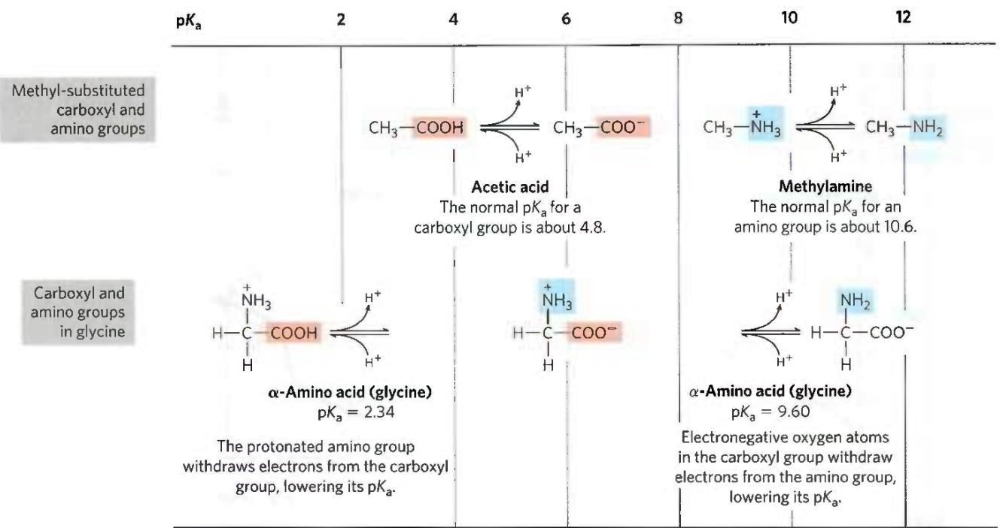  
FIGURE 3-11 Effect of the chemical environment on $\mathsf{pK}_{\mathrm{a}}$ . The $\mathsf{pK}_{\mathrm{a}}$ values for the ionizable groups in glycine are lower than those for simple, methyl-substituted amino and carboxyl groups. These downward  
perturbations of $pK_{a}$ are due to intramolecular interactions. Similar effects can be caused by chemical groups that happen to be positioned nearby — for example, in the active site of an enzyme.

The second piece of information provided by the titration curve of glycine is that this amino acid has two regions of buffering power. One of these is the relatively flat portion of the curve, extending for approximately 1 pH unit on either side of the first $pK_{a}$ of 2.34, indicating that glycine is a good buffer near this pH. The other buffering zone is centered around pH 9.60. (Note that glycine is not a good buffer at the pH of intracellular fluid or blood, about 7.4.) Within the buffering ranges of glycine, the Henderson-Hasselbalch equation (p. 60) can be used to calculate the proportions of proton-donor and proton-acceptor species of glycine required to make a buffer at a given pH.

A final important piece of information derived from the titration curve of an amino acid is the relationship between its net charge and the pH of the solution. At pH 5.97, the point of inflection between the two stages in its titration curve, glycine is present predominantly as its dipolar form, fully ionized but with no net electric charge (Fig. 3-10). The characteristic pH at which the net electric charge is zero is called the isoelectric point or isoelectric pH, designated pI. For glycine, which has no ionizable group in its side chain, the isoelectric point is simply the arithmetic mean of the two $pK_{a}$ values:

$$
\mathrm{pI} = \frac {1}{2} (\mathrm{pK} _ {1} + \mathrm{pK} _ {2}) = \frac {1}{2} (2. 3 4 + 9. 6 0) = 5. 9 7
$$

As is evident in Figure 3-10, glycine has a net negative charge at any pH above its pI and thus will move toward the positive electrode (the anode) when placed in an electric field. At any pH below its pI, glycine has a net positive charge and will move toward the negative electrode (the cathode). The farther the pH of a glycine solution is from its isoelectric point, the greater the net electric charge of the population of glycine molecules. At pH 1.0, for example, glycine exists almost entirely as the form ${}^{+}H_{3}N—CH_{2}—COOH$ with a net positive charge of 1.0. At pH 2.34, where there is an equal mixture of ${}^{+}H_{3}N—CH_{2}—COOH$ and ${}^{+}H_{3}N—CH_{2}—COO^{-}$ , the average or net positive charge is 0.5. The sign and the magnitude of the net charge of any amino acid at any pH can be predicted in the same way.

#### [EN] Amino Acids Differ in Their Acid-Base Properties

The shared properties of many amino acids permit some simplifying generalizations about their acid-base behaviors. First, all amino acids with a single $\alpha$ -amino group, a single $\alpha$ -carboxyl group, and an R group that does not ionize have titration curves resembling that of glycine (Fig. 3-10). These amino acids have very similar, although not identical, $\mathsf{pK}_{\mathbf{a}}$ values: $\mathsf{pK}_{\mathbf{a}}$ of the —COOH group in the range of 1.8 to 2.4, and $\mathsf{pK}_{\mathbf{a}}$ of the — $\mathrm{NH}_3^+$ group in the range of 8.8 to 11.0 (Table 3-1). The differences in these $pK_{a}$ values reflect the chemical environments imposed by their R groups.

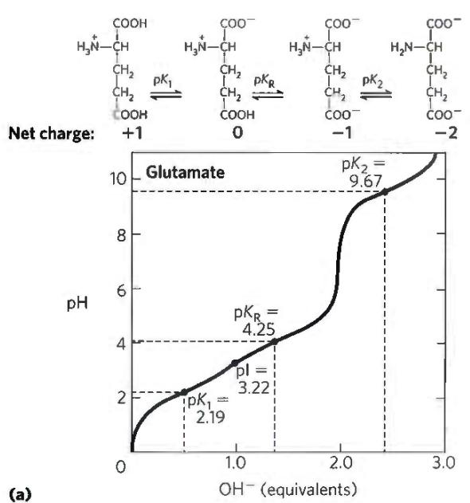  
FIGURE 3-12 Titration curves for (a) glutamate and (b) histidine. The $pK_{a}$ of the R group is designated here as $pK_{R}$ . In both cases, the presence of three ionizable groups renders the titration curve more complex. Note that for glutamate, the pl is approximately the arithmetic mean of the $pK_{a}$ of the two groups that are negatively charged. There is a net

Second, amino acids with an ionizable R group have more complex titration curves, with three stages corresponding to the three possible ionization steps; thus, they have three $pK_{a}$ values. The additional stage for the titration of the ionizable R group merges to some extent with that for the titration of the $\alpha$ -carboxyl group, the titration of the $\alpha$ -amino group, or both. The titration curves for two amino acids of this type, glutamate and histidine, are shown in Figure 3-12. The isoelectric points reflect the nature of the ionizing R groups that are present. For example, glutamate has a pI of 3.22, considerably lower than that of glycine. This is due to the presence of two carboxyl groups, which, at the average of their $pK_{a}$ values (3.22), contribute a net charge of -1 that balances the +1 contributed by the amino group. Similarly, the pI of histidine, with two groups that are positively charged when protonated, is 7.59 (the average of the $pK_{a}$ values of the amino and imidazole groups), much higher than that of glycine.

Finally, in an aqueous environment, only histidine has an R group ( $pK_{a} = 6.0$ ) providing significant buffering power near the neutral pH usually found in the intracellular and extracellular fluids of most animals and bacteria (Table 3-1).

#### [EN] SUMMARY 3.1 Amino Acids

The 20 amino acids commonly found as residues in proteins contain an $\alpha$ -carboxyl group, an $\alpha$ -amino group, and a distinctive R group substituted on the $\alpha$ -carbon atom. The $\alpha$ -carbon atom of all amino acids except glycine is asymmetric, and thus amino acids can exist in at least two stereoisomeric forms.

  
charge of 0 (the pl) when these two groups contribute a net charge of -1 (one protonated, the other not) to exactly balance the +1 charge of the protonated $\alpha$ -amino group. Similarly, the pl for histidine is approximately the arithmetic mean of the $pK_{a}$ of the two groups that are positively charged when protonated.

■ Only the L stereoisomers of amino acids, with a configuration related to the absolute configuration of the reference molecule L-glyceraldehyde, are found in proteins.

■ Amino acids can be classified into five types on the basis of the polarity and charge (at pH 7) of their R groups.

■ Other, less common amino acids also occur, either as constituents of proteins (usually through modification of common amino acid residues after protein synthesis) or as free metabolites.

■ Amino acids vary in their acid-base properties and have characteristic titration curves. Monoamino monocarboxylic amino acids (with nonionizable R groups) are diprotic acids ( $^{+}$ H $_{3}$ NCH(R)COOH) at low pH and exist in several different ionic forms as the pH is increased.

■ Amino acids with ionizable R groups have additional ionic species, depending on the pH of the medium and the $pK_{a}$ of the R group.

<!-- EN-END 3.1 -->

## 四、氨基酸的化学反应

氨基酸的化学反应主要是指它们的 $\alpha$ -羧基、 $\alpha$ -氨基和侧链上的官能团参加的反应。所有氨基酸的 $\alpha$ -羧基或 $\alpha$ -氨基呈现相似的化学反应性（chemical reactivity）。侧链的化学反应性则各不相同，这取决于官能团的本质。下面讨论几个有代表性的氨基酸化学反应。

## (一) $\alpha-$ 羧基参加的反应

氨基酸的 $\alpha-$ 羧基具有该官能团的全部简单反应: 酯化、酰氯化和酰胺化等。

酯化: 在适当的醇和强酸中进行, 例如在无水乙醇中通入干燥 HCl 气体, 然后回流, 产物是氨基酸的乙酯盐酸盐(图 2-7A); 氨基酸酯化后, 其羧基的反应性被屏蔽, 也称为羧基被保护。

酰氯化: $\alpha-$ 羧基也容易与五氯化磷( $PCl_{5}$ )或二氯亚砜( $SOCl_{2}$ )反应生成氨基酰氯(图2-7B)，进行此反应，氨基必须事先被保护，否则形成的氨基酰氯将与另一氨基酸的氨基反应生成二肽。

酰胺化: 在体外, 氨基酸酯在无水乙醇中与氨作用, 形成氨基酰胺(图 2-7C)。动、植物体内在 ATP 和天冬酰胺合成酶存在下, 利用 $NH_{4}^{+}$ 与天冬氨酸作用合成天冬酰胺; 同样, 在专一酶催化下, 谷氨酸与 $NH_{4}^{+}$ 作用可产生谷氨酰胺(见第 26 章)。

## （二） $\alpha$ -氨基参加的反应

氨基酸的游离 $\alpha$ -氨基可被酰氯(acyl chloride)或酸酐(acid anhydride)酰化(图2-7D)。酰氯、酸酐等酰化剂(acylating agent)是肽和蛋白质人工合成中氨基的保护试剂。游离氨基也能与烃化剂(alkylating agent)，如2,4-二硝基氟苯(2,4-dinitrofluorobenzene,DFNB)或苯异硫氰酸酯(phenylisothiocyanate,PITC)等发生反应。DFNB和PITC被用于肽和蛋白质的N端氨基酸残基鉴定和氨基酸序列测定(见本章后面)。游离氨基能与醛反应生成弱碱，称为西佛碱(Schiff's base)(图2-7E)。西佛碱是以氨基酸为底物的某些酶促反应，例如转氨基反应的中间产物。

## （三） $\alpha-$ 羧基和 $\alpha-$ 氨基共同参加的反应

## 1. 成肽反应

一个氨基酸的 $\alpha-$ 氨基与另一个氨基酸的 $\alpha-$ 羧基可以首尾相连缩合成肽；形成的共价键是酰胺键或称肽键。例如甘氨酸在乙二醇中加热缩合，生成 2,4-二酮吡嗪（2,4-diketopiperazine），或称甘氨酸酐(glycine anhydride); 后者在煮沸的浓盐酸中沸腾片刻, 即水解成甘氨酰甘氨酸 (glycylglycine) 也称双甘二肽:

  
图 2-7 氨基酸的 $\alpha$ -羧基和 $\alpha$ -氨基参加的反应

在生物体内蛋白质多肽链中的肽键形成,并不像化学合成那样是一个简单的缩合反应,而是复杂得多的生物化学过程,关于蛋白质肽链的生物合成见本书第33章。

## 2. 与茚三酮反应

茚三酮反应(ninhydrin reaction)可检测和定量氨基酸,在氨基酸分析中占有特殊地位。茚三酮是一种强氧化剂,在弱酸性溶液中与 $\alpha-$ 氨基酸共热,引起 $\alpha-$ 氨基氧化脱氨,反应产物是相应的醛、氨、二氧化碳和还原茚三酮(hydrindantin)。产生的氨、还原茚三酮与另一个茚三酮分子反应生成紫色产物(图2-8)。

后者可用分光光度计在 570 nm 波长处进行定量测定。此外释放的 $CO_{2}$ 用测压法测量，也可计算出参加反应的 $\alpha-$ 氨基酸量。

两个亚氨基酸, 脯氨酸和羟脯氨酸, 与茚三酮反应, 并不释放 $NH_{3}$ , 而直接生成亮黄色产物, 最大光吸收在 440 nm。此产物的结构式如下:

N-溴代琥珀酰亚胺  
  
图2-8 氨基酸与茚三酮的反应

## （四）侧链官能团参加的反应

氨基酸侧链上的官能团有羟基、酚基、巯基、吲哚基、咪唑基、胍基、甲硫基、非 $\alpha$ 氨基和非 $\alpha$ 羧基等。每种官能团都可以和多种试剂起反应。其中有些反应是蛋白质化学修饰的基础。化学修饰（chemical modification）是指在较温和的条件下，以可控制的方式使蛋白质与某种试剂（称化学修饰剂）起特异反应，以引起蛋白质中个别氨基酸残基侧链官能团发生共价化学改变。化学修饰在蛋白质结构与功能的研究中很有用。关于侧链官能团的反应这里仅举几个例子加以说明。

酪氨酸的酚基可以与重氮化合物(例如对氨基苯磺酸的重氮盐)结合成橘黄色的化合物：

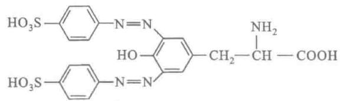

这就是 Pauly 反应,可用于检测酪氨酸。

精氨酸的侧链胍基在硼酸钠缓冲液(pH 8\~9,25\~35℃)中，与1,2-环己二酮(1,2-cyclohexanedione)反应，生成稳定的缩合物：

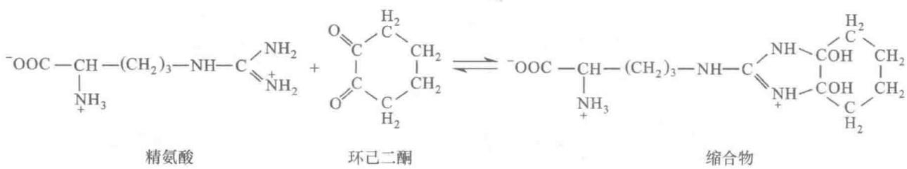

此反应曾用于氨基酸序列分析以及蛋白质结构与功能的研究。

色氨酸的侧链吲哚基在温和条件下可被 N-溴代琥珀酰亚胺(N-bromosuccinimide)氧化。此反应可用于分光光度法测定蛋白质中色氨酸的含量，并能在色氨酸和酪氨酸残基处选择性地化学断裂肽键。N-溴代琥珀酰亚胺和色氨酸氧化产物的结构如下：

  
色氨酸残基侧链的氧化产物（在一定条件下可发生重排）

蛋氨酸侧链上的甲硫基是一个很强的亲核基团，与烃化试剂如甲基碘容易形成硫盐(sulfonium salt):

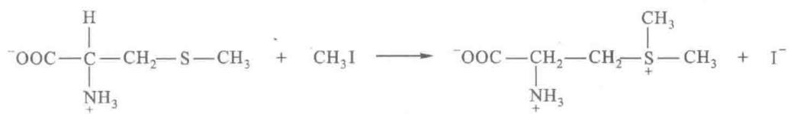

反应可被巯基试剂逆转。在逆转反应中，原有的甲基和新加入的甲基除去的机会是相等的，因此当用 $^{14}$ C 标记的甲基碘处理时，获得的蛋氨酸将有50%是同位素标记的。

半胱氨酸的巯基能打开乙撑亚胺(ethyleneimine)，即氮丙啶(iziridine)的环：

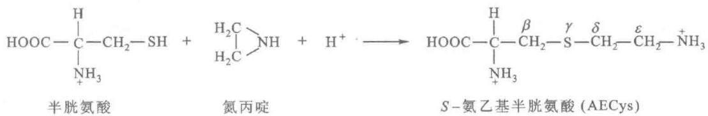

生成的侧链带有正电荷 $\left(\varepsilon-\mathrm{NH}_{3}\right)$ ，它为胰蛋白酶水解提供了一个新位点，这对氨基酸序列测定是很有用的。同时此反应也可用来保护肽链上的一SH基，以防被重新氧化为二硫键。

半胱氨酸可与二硫双-(硝基苯甲酸)(5,5'-dithiobis(2-nitrobenzoic acid),缩写为DTNB)或称Ellman试剂发生硫醇-二硫化物交换反应：

反应中 1 分子的半胱氨酸引起 1 分子的硫硝基苯甲酸的释放。它在 pH 8.0 时，在 412 nm 处有强烈的光吸收，因此可利用分光光度法定量测定—SH 基。

巯基很容易受空气或其他氧化剂氧化,例如半胱氨酸(Cys—SH)在空气中被氧化成胱氨酸(Cys—S—S—Cys):

二硫键在稳定许多蛋白质的结构方面起着特殊的作用,有的是在多肽链的内部,有的是在多肽链之间形成共价连接。

## 五、氨基酸的旋光性和光谱性质

## （一）氨基酸的旋光性和立体化学

前面曾谈到，除甘氨酸外 $\alpha-$ 氨基酸的 $\alpha-$ 碳是一个手性碳原子，因此 $\alpha-$ 氨基酸有 D 和 L 两种构型。氨基酸（指它的 $\alpha-$ 碳）的构型以甘油醛为参考物（见图 1-5 和图 2-9）。从蛋白质的酸（或酶促）水解液中分离获得的氨基酸都是 L 型的。但是 D 型氨基酸也在自然界中被找到,特别是作为某些抗生素和某些微生物的细胞壁成分存在。

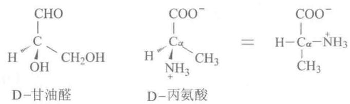

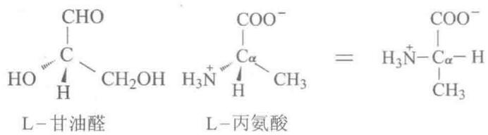  
图 2-9 丙氨酸构型和甘油醛构型之间的立体关系

苏氨酸、异亮氨酸等除了 $\alpha$ -碳原子外，还有第二个手性中心，在实验室中各自可以有4种异构体，分别称为L-、D-、L-别（L-allo）和D-别（D-allo）氨基酸。其中L-异构体和D-异构体、L-别异构体和D-别异构体各为一对对映体。已证明蛋白质中只存在L-异构体。苏氨酸的旋光异构体示于图2-10。

  
图2-10 苏氨酸的旋光异构体

比旋是 $\alpha-$ 氨基酸的物理常数之一, 是鉴别各种氨基酸的一种根据。20 种基本氨基酸的比旋值见表 2-2。氨基酸的旋光符号和大小取决于它的 R 基性质, 并且与测定的溶液 pH 有关, 这是因为在不同的 pH 条件下氨基和羧基的解离状态不同。

## （二）氨基酸的光谱性质

现代生物化学中最重要的进展之一是光谱学方法的应用,此方法能测定被分子和原子吸收或发射的不同频率能量。蛋白质、核酸和其他生物分子的光谱学研究为深入了解这些分子的结构和动态过程提供了许多新的信息。

氨基酸的紫外吸收光谱测定已阐明氨基酸结构和化学方面的许多细节。参与蛋白质组成的20多种氨基酸在电磁波谱的可见光区都没有光吸收，在红外区和远紫外区 $(\lambda < 200\mathrm{nm})$ 都有光吸收。但在近紫外区( $200\sim 400~\mathrm{nm}$ )只有芳香族氨基酸有吸收光的能力，因为它们的R基含有苯环共轭 $\pi$ 键系统。酪氨酸的最大光吸收波长 $(\lambda_{\max})$ 在 $275~\mathrm{nm}$ ，在该波长下的摩尔吸收系数（molar absorption coefficient） $\varepsilon_{275} = 1.4\times 10^{3}\mathrm{mol}^{-1}\cdot$ $\mathrm{L}\cdot \mathrm{cm}^{-1}$ ；苯丙氨酸的 $\lambda_{\max}$ 在 $257~\mathrm{nm},\varepsilon_{257} = 2.0\times 10^{2}\mathrm{mol}^{-1}\cdot \mathrm{L}\cdot \mathrm{cm}^{-1}$ ；色氨酸的 $\lambda_{\max}$ 在 $280~\mathrm{nm},\varepsilon_{280} = 5.6\times 10^{3}$ $\mathrm{mol}^{-1}\cdot \mathrm{L}\cdot \mathrm{cm}^{-1}$ （图2-11）。

蛋白质由于含有这些氨基酸,所以也有紫外吸收能力,一般最大吸收在280 nm处,因此能利用分光光度法很方便地测定样品中蛋白质的含量。但是不同的蛋白质中这些氨基酸的含量不同,所以不同蛋白质的摩尔吸收系数是不完全相同的。

分光光度法定量分析所依据的是 Lambert-Beer 定律：

$$
A = \lg \frac {I _ {o}}{I} = - \lg T = \varepsilon c l
$$

式中，A 为吸光度（absorbance），也称光密度（optical density, OD）； $\varepsilon$ 为摩尔吸收系数，旧称摩尔消光系数；c 为浓度（mol/L）；l 为吸收杯的内径或光程厚度（cm）； $I_{0}$ 为入射光强度；I 为透射光强度；T 为透光率（transmittancy），即 $I/I_{0}$ 。

核磁共振（nuclear magnetic resonance, NMR）是一项涉及在外磁场存在下某些原子核吸收射频（radio frequency）能量的波谱技术。NMR 波谱技术在氨基酸和蛋白质化学表征方面起着重要作用。更先进的高磁场 NMR 还用于肽和小分子蛋白质的三维结构测定。NMR 波谱学的知识参看有关的专门著作，如本章末所列的参考书目 3。

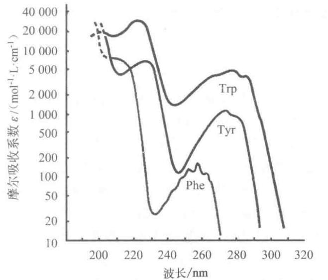  
图 2-11 芳香族氨基酸在 pH 6 时的紫外吸收

## 六、氨基酸混合物的分析和分离

测定蛋白质的氨基酸组成和从蛋白质水解液中制取氨基酸,都需要对氨基酸混合物进行分析和分离。氨基酸的分析和分离曾是一项很难的工作。然而今天生物化学家已有多种方法可用于氨基酸,甚至任何其他一类生物分子的分析、分离和纯化。这些方法都是基于各种氨基酸的物理和化学特性的差别,特别是溶解度(极性)和电离特性的差别。下面介绍几种用于氨基酸混合物分析分离的层析方法。

## （一）分配层析

## 1. 分配层析的基本原理

层析即色层分析也称色谱（chromatography），最先由俄国植物学家M.C.Цвет于1903年提出来的。他所进行的色层分析是一种吸附层析(adsorption chromatography)。1941年英国学者Martin与Synge提出分配层析(partition chromatography)。此后这种方法得到了很大的发展，至今已有很多种形式，但它们的基本原理都是基于氨基酸的溶解度性质。

所有的层析系统都由两个相组成:固定相或静相(stationary phase),和流动相或动相(mobile phase)。混合物在层析系统中的分离决定于该混合物的组分在这两相中的分配情况,即决定于它们的分配系数(partition 或 distribution coefficient)。1891 年 Nernst 提出了分配定律(partion law),当一种溶质在两个给定的互不相溶的溶剂中分配时,在一定温度下达到平衡后,溶质在两相中的浓度比值为一常数,称为分配系数( $K_{\mathrm{d}}$ ):

$$
K _ {\mathrm{d}} = \frac {c _ {\mathrm{M}}}{c _ {\mathrm{s}}}
$$

此处， $c_{M}$ 和 $c_{S}$ 分别代表某一物质在互不相溶的 M 相（流动相）和 S 相（固定相）中的浓度（注意，有些书上分配系数表示为 $K_{d}=c_{S}/c_{M}$ ）。

物质分配不仅可以在互不相溶的两种溶剂即液相-液相系统中进行，也可以在固相-液相间或气相-液相间发生。层析系统中的固定相可以是固相、液相或固-液混合相（半液体）；流动相可以是液相或气相，它充满于固定相的空隙中，并能流过固定相。

这里需要提出有效分配系数 $(K_{\mathrm{eff}})$ 的概念,因为某一物质在层析系统中的行为并不直接决定于它的分配系数 $K_{d}$ ,而是取决于有效分配系数:

$$
K _ {\mathrm{eff}} = \frac {\mathrm{某一物质在M相中的总量}}{\mathrm{某一物质在S相中的总量}}
$$

对液相-液相层析系统来说：

$$
K _ {\mathrm{eff}} = \frac {c _ {\mathrm{M}} \times V _ {\mathrm{M}}}{c _ {\mathrm{S}} \times V _ {\mathrm{S}}} = K _ {\mathrm{d}} \times R _ {\mathrm{v}}
$$

这里， $c_{M}$ 和 $c_{S}$ 的意义同前； $V_{M}$ 和 $V_{S}$ 分别为 M 相和 S 相的体积； $R_{V}$ 为 M 和 S 两相的体积比。由此可见， $K_{eff}$ 是 $R_{V}$ 的函数，溶质的有效分配系数可以调整两相的体积比来加以改变。

利用层析法分离混合物例如氨基酸混合物,其先决条件是各种氨基酸成分的分配系数要有差异,哪怕是很小的差异。一般差异越大,越容易分开。

现在我们举逆流分布（countercurrent distribution）为例说明分配层析的原理。此方法的基本过程如图2-12所示。取一系列试管（称为分布管），向其中第1号管加入互不相溶的两种溶剂，M溶剂为上相，图中作为流动相，S溶剂为下相，作为固定相，并假设上下两相的体积相等 $(V_{\mathrm{M}}=V_{\mathrm{S}})$ 。然后加入物质 $Y(K_{\mathrm{d}}=1)$ 和物质 $Z(K_{\mathrm{d}}=3)$ 的混合物（假设物质总量各为64份），各组分物质将按自身特有的分配系数在上下相中进行分配。平衡后，将上相转移到第2号管内，其中已含有相同体积的新下相（溶剂）。从第1号管转移来的样品将在第2号管的上下相中再分配。与此同时，向第1号管内加入新的上相，这里也将发生样品的再分配。这样完成了第1次转移。如是上相（流动相）将连续地向第3,4,5……号管作第2,3,4……次的转移。一般说来，转移n次后，某一物质在 $(n+1)$ 个管中分布的分数含量是 $(p+q)^{n}=1$ 展开式的相应项的值。这里，p和q分别为某一物质（总量）在固定相和流动相中的分数含量，即 $p+q=1$ ； $q/p=K_{eff}$ ，此例中 $K_{eff}=K_{d}$ 。

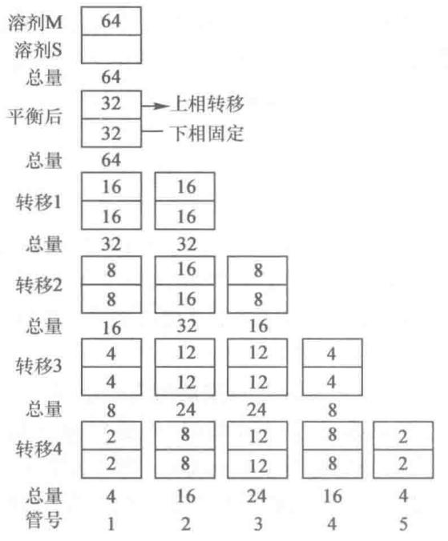  
物质Y $(K_{\mathrm{d}} = 1)$ 的分配情况

  
物质Z（ $K_{d}=3$ ）的分配情况  
图2-12 逆流分布的原理

有机相转移 n 次后，在第 k 号管（包括上下相）中的某一物质的含量可由下式计算：

$$
T _ {n, k} = \frac {n ! \cdot p ^ {n - k + 1} \cdot q ^ {k - 1}}{(n - k + 1) ! \cdot (k - 1) !}
$$

例如,物质 Z, 转移 4 次后在第 4 号管中的含量为:

$$
T _ {4, 4} = \frac {4 ! \cdot \left(\frac {1}{4}\right) \cdot \left(\frac {3}{4}\right) ^ {3}}{3 !} = \frac {4 \times 3 \times 2 \times \frac {1}{4} \times \frac {2 7}{6 4}}{3 \times 2} = \frac {2 7}{6 4}
$$

因为物质 Z 的总量为 64, 所以该管中的含量应是:

$$
\frac {2 7}{6 4} \times 6 4 = 2 7
$$

从图2-13中的分布曲线可以看出，分配系数大的物质如 $Z(K_{\mathrm{d}} = 3)$ 沿一系列分布管的“移动”速度快，分配系数小的物质如 $\mathrm{Y}(K_{\mathrm{d}} = 1)$ “移动”速度慢。从分布曲线还可以看出，每一种物质在一系列分布管中是相当集中的，即分布曲线呈峰形，因此只要使用足够数目的分布管，继续进行分配，就可以使两个峰彼此完全分开。一定量的某一溶质在一定量的溶剂系统中分配时，转移次数（或称理论板数，这是借用蒸馏技术中的术语）越多，即分布管数越多，其分布曲线的峰形越窄而高，这样有利于混合物中各物质的完全分离。上述的这种连续分配操作可以在完全自动化的逆流分布仪（countercurrent distributor）上进行。逆流分布仪一般只用于制备分离，特别是用于蛋白质、肽、核酸和抗生素等的分离纯化。

## 2. 分配层析的主要种类

目前使用较广泛的分配层析形式有柱层析、纸层析和薄层层析等，其中柱层析不仅可用于样品鉴定，还可以用于制备分离。

分配柱层析（partition column chromatography）中使用的填充物或支持剂（图2-14）都是一些具有亲水不溶性的物质，如纤维素、淀粉、硅胶等。支持剂颗粒吸附着一层不会流动的结合水，可以看作固定相，沿固定相流过的、跟它不互溶的溶剂（如苯酚、正丁醇等）是流动相。由填充物构成的柱床可以设想为由无数的连续板层组成（图2-14），每一板层起着微观的“分布管”作用。当用洗脱剂（eluent）洗脱时，即流动相移动时，加在柱上端的氨基酸混合物样品在两相之间将发生连续分配，混合物中具有不同分配系数的各种成分沿柱以不同的速度向下移动。分部收集柱下端的洗出液（eluate）。收集的组分分别用茚三酮显色定量。以氨基酸量对洗出液体积作图，得洗脱曲线（elution curve）或称洗脱图（elution profile）。曲线中的每个峰形相当于某一种氨基酸（参考图2-17）。

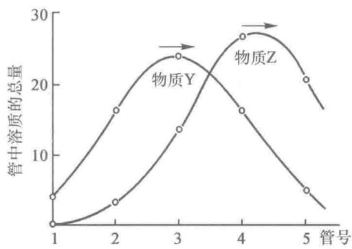  
图2-13 分布曲线图谱

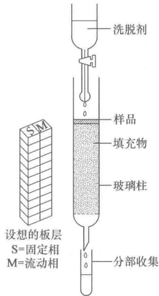  
图2-14 柱层析

[滤]纸层析（filter-paper chromatography）也是分配层析的一种。这里，滤纸纤维素吸附的结合水是固定相，展开用的溶剂是流动相。层析时，将氨基酸混合物点在滤纸的一个边角上，称原点。然后在密闭的容器中用一个溶剂系统（如丁醇-乙酸）沿滤纸的一个方向进行展开，这时混合氨基酸在固定相和流动相中不断分配，使它们分布在滤纸的不同位置上。烘干滤纸后，旋转 $90^{\circ}$ ，再用另一个溶剂系统（如苯酚-甲酚-水）进行第二向展开。由于各种氨基酸在溶剂系统中具有不同的比移值或称移动率（rate of flow，符号 $R_{\mathrm{f}}$ ），因此彼此能分开。当用茚三酮溶液显色时，得到一个双向纸层析谱（two-dimensional paper chromatogram）（图2-15A）。如果混合物中所含的氨基酸种类较少，并且 $R_{\mathrm{f}}$ 彼此相差较大，则在一个溶剂

系统中进行单向层析即可。

在单向纸层析谱(图2-15B)中,一个氨基酸的层析点的中心离原点的距离(x)跟展开溶剂的前沿离原点的距离 $(x+y)$ 之比,即比移值:

$$
R _ {f} = \frac {x}{x + y}
$$

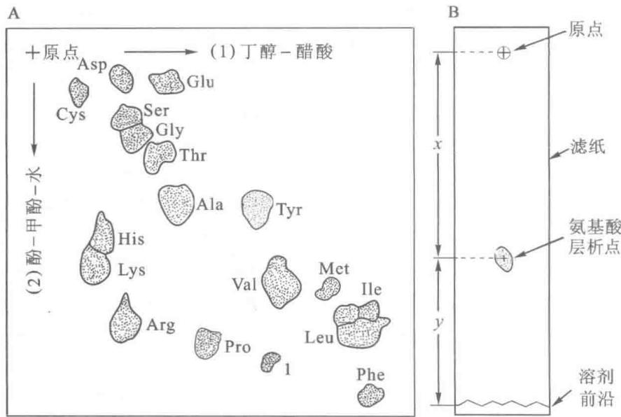  
图 2-15 氨基酸的双向纸层析谱(A)和单向纸层析谱(B)

从前述的分布曲线(图2-13)以及 $(p+q)^{n}=1$ 的展开式可以了解到, $R_{1}$ 相当于逆流分布中一个物质的分布曲线的峰值(管号数)离“原点”(1号管)的“距离”(管数,等于管号数-1)跟流动相(溶剂)的前沿(末号管数)离“原点”的“距离”之比(比移植);后者在数值上等于q(一种物质在流动相中的分数含量):

$$
q = \frac {K _ {\mathrm{d}} V _ {\mathrm{M}}}{K _ {\mathrm{d}} V _ {\mathrm{M}} + V _ {\mathrm{S}}}
$$

因此，

$$
R _ {\mathrm{f}} = \frac {x}{x + y} = \frac {K _ {\mathrm{d}} V _ {\mathrm{M}}}{K _ {\mathrm{d}} V _ {\mathrm{M}} + V _ {\mathrm{S}}}
$$

此式中， $V_{s}$ 是吸附在纸纤维上的结合水体积， $V_{M}$ 是流过纸纤维的展开溶剂体积。只要溶剂系统、温度、湿度和滤纸型号等实验条件确定，则每种氨基酸的 $R_{f}$ 值只决定于 $K_{d}$ ，是一个常数。

薄层层析(thin-layer chromatography)分辨率高,所需样品量微,层析速度快,可使用的支持剂种类多。如纤维素粉、硅胶和氧化铝粉等,因此应用比较广泛。薄层层析的大体步骤如下:把支持剂涂布在玻璃板上使其成为一个均匀的薄层,把要分析的样品滴加在薄层板的一端,然后用合适的溶剂在密闭的容器中进行展开(图2-16),使样品中各个成分分离开来,最后进行鉴定和定量测定。

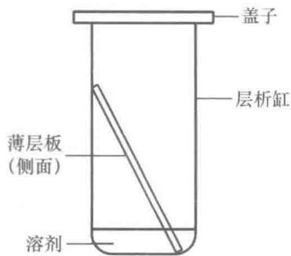  
图2-16 薄层层析装置

## （二）离子交换层析

离子交换层析(ion-exchange chromatography)是一种基于氨基酸电荷行为的层析方法。层析柱中填充的是离子交换树脂(ion-exchange resin)，它是具有酸性或碱性基团的人工合成聚苯乙烯-二乙烯(polystyrenedivinylbenzene)等不溶性高分子化合物。树脂一般都制成球形的颗粒。

阳离子交换树脂含有的酸性基团如 $-SO_{3}H$ （强酸型）或 $-COOH$ （弱酸型）可解离出 $H^{+}$ ，能跟溶液中的其他阳离子，例如跟酸性环境中的氨基酸阳离子，发生交换而结合在树脂上。同样，阴离子交换树脂含有的碱性基团如 $-N(CH_{3})_{3}OH$ （强碱型）或 $-NH_{3}OH$ （弱碱型）可解离出 $OH^{-}$ ，能跟溶液里的其他阴离子，例如跟碱性环境中的氨基酸阴离子，发生交换而结合在树脂上：

$$
\begin{array}{l l} \text {树脂—SO} _ {3} ^ {-} \cdot \mathrm{H} ^ {+} (\text {氢型}) & \\ \text {或} & + \quad \begin{array}{c c} \mathrm{NH} _ {3} & \\ \mid & \\ \mathrm{R—CH—COOH} & \Longleftrightarrow \\ (\mathrm{pH< pI}) & \end{array} \quad \begin{array}{c c} \text {树脂—SO} _ {3} ^ {-} \cdot^ {+} \mathrm{NH} _ {3} & + \quad \begin{array}{c c} \mathrm{H} ^ {+} \\ \text {或} \\ \mathrm{Na} ^ {+} \end{array} \\ \mathrm{R—CH—COOH} & \end{array} \\ \text {树脂—SO} _ {3} ^ {-} \cdot \mathrm{Na} ^ {+} (\text {钠型}) & \\ \text {树脂—NR} _ {3} ^ {+} \cdot \mathrm{OH} ^ {-} (\text {氢氧型}) & \\ \text {或} & + \quad \begin{array}{c c} \mathrm{NH} _ {2} & \\ \mid & \\ \mathrm{R—CH—COO} ^ {-} & \Longleftrightarrow \\ (\mathrm{pH>pI}) & \end{array} \quad \begin{array}{c c} \text {树脂—NR} _ {3} ^ {+} \cdot^ {-} \mathrm{OOC—CH—R} & + \quad \begin{array}{c c} \mathrm{OH} ^ {-} \\ \text {或} \\ \mathrm{Cl} ^ {-} \end{array} \\ \mid & \\ \mathrm{NH} _ {2} & \end{array} \\ \text {树脂—NR} _ {3} ^ {+} \cdot \mathrm{Cl} ^ {-} (\text {氯型}) & \end{array}
$$

分离氨基酸混合物经常使用强酸型阳离子交换树脂。在交换柱中，树脂先用碱处理成钠型，将氨基酸混合液（pH 2\~3）上柱。在 pH 2\~3 时，氨基酸主要以阳离子形式存在，与树脂上的钠离子发生交换而被“挂”在树脂上。氨基酸在树脂上结合的牢固程度即氨基酸与树脂间的亲和力，主要决定于它们之间的静电吸引，其次是氨基酸侧链与树脂基质聚苯乙烯之间的疏水相互作用。在 pH 3 左右，氨基酸与阳离子交换树脂之间的静电吸引的大小次序是碱性氨基酸（A $^{2+}$ ）>中性氨基酸（A $^{+}$ ）>酸性氨基酸（A $^{\circ}$ ）。因此氨基酸的洗出顺序大体上是酸性氨基酸，中性氨基酸，最后是碱性氨基酸。由于氨基酸和树脂之间还存在疏水相互作用，所以氨基酸的全部洗出顺序如图 2-17 所示。为了使氨基酸从树脂柱上洗脱下来，需要降低它们之间的亲和力，有效的方法是逐步提高洗脱剂的 pH 和盐浓度（离子强度），这样各种氨基酸将以不同的速度被洗脱下来。目前已有全部自动化的氨基酸分析仪（amino acid analyzer）供分析分离用。氨基酸分析仪的图解示于图 2-18。

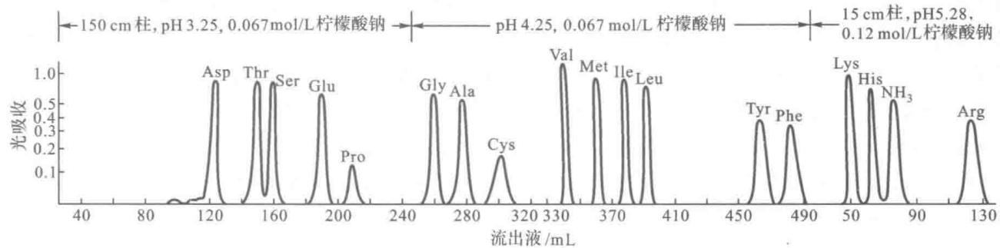  
图 2-17 氨基酸分析仪记录的氨基酸洗脱曲线

  
图 2-18 氨基酸分析仪的图解

## 七、肽

肽和蛋白质是氨基酸的线型多聚体,因此这种多聚体也称肽链或多肽链。生物学上的肽链在长短方面从二三个氨基酸残基到上千个残基不等。

## （一）肽和肽键的结构

两个氨基酸可以通过肽键共价连接成一个二肽(dipeptide)。肽键(peptide bond)是由一个氨基酸(含 $\mathbb{R}^1$ 侧链)的 $\alpha$ -羧基与另一个氨基酸(含 $\mathbb{R}^2$ 侧链)的 $\alpha$ -氨基除去一分子水缩合而成：

在水溶液中成肽反应的平衡有利于肽键的水解，因此在实验室和生物系统中形成肽键都是需要输入能量的（见本章后面的肽化学合成和第33章）。肽键的水解虽是放能反应，但反应活化能很高，水解速度很慢。蛋白质中肽键是相当稳定的，它的半寿期 $(t_{1/2})$ 在大多数细胞内的条件下约为7年。

在蛋白质和多肽分子中连接氨基酸残基的共价键除肽键外,还有一种较常见的是在两个 Cys 残基侧链之间形成的二硫键(disulfide bond),也称二硫桥(disulfide bridge)。它可以使两条单独的肽链共价交联起来,或使一条肽链的某一部分形成环。

含2个、3个、4个、5个等氨基酸残基的肽分别称为二肽、三肽、四肽、五肽等。十肽可写成10-肽，十五肽可写为15-肽等。通常把含几个至十几个氨基酸残基的肽称为寡肽（oligopeptide），含多于20个残基的肽称为多肽（polypeptide）。虽然“蛋白质”和“多肽”这两个术语有时可以交互使用，但称为多肽分子的相对分子质量一般小于10 000（<100个残基），称为蛋白质的则高于此值，可以是几千个残基。肽链中的氨基酸由于肽键的形成已经不是原来完整的分子，因此称为氨基酸残基（amino acid residue），有时简称残基。通常在一条多肽链的主链中，含有游离α-氨基的那一末端氨基酸残基称为氨基端（amino-terminal）残基，在另一末端含有游离α-羧基的氨基酸残基称为羧基端（carboxyl-terminal）残基。肽链有时由于这两个游离的末端基团连接起来而成环状肽（cyclic peptide）。图2-19所示的五肽结构式，被命名为丝氨酰甘氨酰酪氨酰丙氨酰亮氨酸（serylglycylyrosylalanylleucine），简写为Ser-Gly-Tyr-Ala-Leu。按惯例总是把氨基端（N端）的残基放在左边，羧基端（C端）的残基放在右边，除特别指出外。氨基酸序列从氨基端开始由左向右阅读。注意，反过来书写的Leu-Ala-Tyr-Gly-Ser是一个与之不同的五肽。

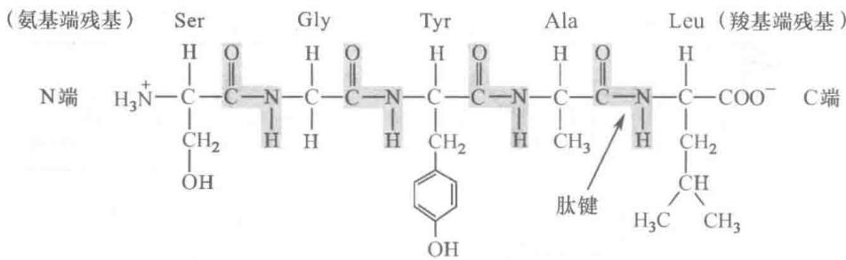  
图2-19 五肽的结构

从上面的五肽结构式可以看出，肽链的骨架是由 $-\mathrm{N}-\mathrm{C}_{\alpha}-\mathrm{C}-$ 序列重复排列而成的，称为主链（backbone），这里N是酰胺氮， $C_{\alpha}$ 是 $\alpha$ 碳，C是羰基碳。各种肽的主链结构都是一样的，但 $C_{\alpha}$ 上的侧链R基可以不同，因而肽链的氨基酸序列可以不同。

肽键是一种被取代了的酰胺键，通常用羰基C和酰胺N之间的单键（C—N键）表示（图2-20和

2-21)。肽链中的酰胺基(—CO—NH—)称为肽基(peptide group)或肽单位(peptide unit)。肽键和一般的酰胺键一样由于酰胺N上的孤电子对发生离域(delocalization)，与羰基C轨道重叠，因此在酰胺N和羰基O之间发生共振相互作用。共振是在两种形式的肽键结构之间发生的。在结构1（图2-20）中C—N键是单键，这时N原子上的孤电子对与羰基C之间没有电子云重叠。羰基C是 $sp^{2}$ 杂化的，它是平面结构；而酰胺N是 $sp^{3}$ 杂化，是四面体结构。在结构2中羰基C和酰胺N之间是一个双键，氮原子带一正电荷，羰基O带一负电荷；羰基C和酰胺N都是 $sp^{2}$ 杂化，两者都是平面的，所有6个原子都处于同一平面内。肽键的实际结构是一个共振杂化体(resonance hybrid)如结构3所示。这是介于结构1和2之间的平均中间态。已知C—N单键的键长是0.148 nm，C=N双键的键长是0.127 nm，据预料共振杂化体中肽键C∵N的键长应介于这两者之间，X射线衍射分析证实，肽键的C∵N键长为0.133 nm。常见的反式构型肽键的键长与键角见图2-21。肽键中单键具有约40%双键性质，C=O双键具有约40%的单键性质。因为C—N键具有双键性质，所以肽键是一个平面，结构3中的6个原子差不多处于同一平面，称为肽平面(peptide plane)。肽键(或肽基)的这一平面性质在肽链折叠成三维结构的过程中是很重要的，由于C—N键具有双键性质，绕键旋转的能障(energy barrier)比较高，约为88 kJ·mol $^{-1}$ （千焦/摩尔）。对于肽键来说，这一能障在室温下足以有效防止旋转，保持酰胺基处于平面。在肽平面内，两个C $_{\alpha}$ 原子可以处于顺式或反式构型。在反式构型中，两个C $_{\alpha}$ 原子及其取代基团互相远离，而在顺式构型中它们彼此接近，引起R基之间的位阻，因此顺式构型比反式构型能态高或者说不稳定。蛋白质中形成的肽键，反式构型与顺式构型之间比例约为1 000：1，两者的能量相差84 kJ·mol $^{-1}$ 。但有脯氨酸的亚胺氮参与的肽键，顺式出现的频率增加，反式和顺式之比约为10：1，两者的能量差约为54 kJ·mol $^{-1}$ ；这是因为脯氨酸的四氢吡咯环引起空间限制，降低了反式构型的优势(图2-22)。

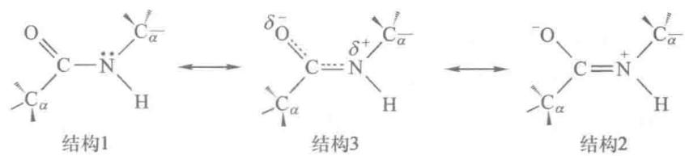  
图2-20 肽基的C、O和N原子间的共振相互作用

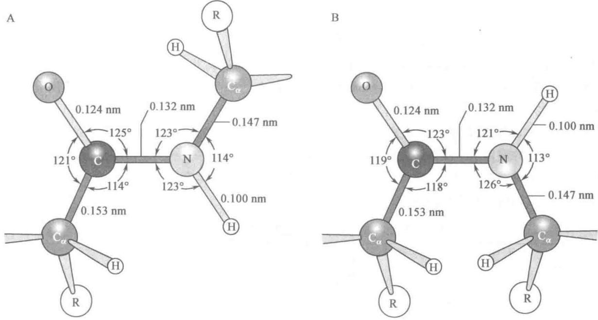  
图2-21 肽键的结构特征  
A. 肽键的反式构型；B. 肽键的顺式构型。这两种肽键中一些原子间的键角不完全相同

  
图 2-22 脯氨酸的顺、反异构

## （二）肽的物理和化学性质

许多小肽已经得到晶体。短肽和氨基酸一样在晶体和水溶液中以偶极离子存在。在 pH 0\~14 范围内，肽键中的酰胺氢不解离，因此短肽的酸碱性质主要决定于肽链中游离的末端 $\alpha-NH_{2}$ 、末端 $\alpha-COOH$ 以及侧链上的可解离官能团。在多肽或蛋白质中，可解离的基团主要是侧链上的官能团（见第 3 章）。

肽链中游离 $\alpha$ -氨基和游离 $\alpha$ -羧基的间隔比在氨基酸中的大，因此它们之间的静电引力较弱。与表2-2所列的游离氨基酸的 $\mathrm{p}K_{\mathrm{a}}$ 相比，肽的末端 $\alpha$ -羧基的 $\mathrm{p}K_{\mathrm{a}}$ 要比氨基酸的大一些，而末端 $\alpha$ -氨基的 $\mathrm{p}K_{\mathrm{a}}$ 要比氨基酸中的小一些。R基的 $\mathrm{p}K_{\mathrm{a}}$ 在两者之间变化不大（表2-3）。

表 2-3 某些肽的 $\mathrm{p}{K}_{\mathrm{a}}$

<table><tr><td>肽</td><td> $\alpha$ -COOH  $pK_{a}$ </td><td> $\alpha-NH_{3}^{+}pK_{a}$ </td><td>R基 $pK_{a}$ </td><td>pI</td></tr><tr><td>Gly-Asp</td><td>2.81</td><td>8.60</td><td>4.45</td><td>3.63</td></tr><tr><td>Gly-Ala</td><td>3.17</td><td>8.23</td><td>—</td><td>5.70</td></tr><tr><td>Gly-Gly-Gly</td><td>3.26</td><td>7.91</td><td>—</td><td>5.58</td></tr><tr><td>Ala-Ala-Ala-Ala</td><td>3.42</td><td>7.94</td><td>—</td><td>5.68</td></tr><tr><td>Ala-Ala-Lys-Ala</td><td>3.58</td><td>8.01</td><td>10.58</td><td>9.30</td></tr></table>

小肽的滴定曲线和氨基酸的滴定曲线很相似。随着电离基团的增加，滴定曲线迅速变得复杂，以致很难用单个侧链基团的解离来分析，因为在同一 $\mathrm{pH}$ 范围内可以有几个侧链解离。但是在给定的 $\mathrm{pH}$ 下，根据Henderson-Hasselbalch方程不难确定出每个侧链占优势的电离态。我们只需应用这样一个规则：当溶液 $\mathrm{pH}$ 大于解离侧链的 $\mathrm{pK}_{\mathrm{a}}$ ，占优势的离子形式是该侧链的共轭碱，当溶液的 $\mathrm{pH}$ 小于解离侧链的 $\mathrm{pK}_{\mathrm{a}}$ ，占优势的离子形式是它的共轭酸，即

$$
\begin{array}{l l} \mathrm {pH > pK_ {a}}, & [ \mathrm{HA} ] <   [ \mathrm{A} ^ {-} ] \\ \mathrm {pH <   pK_ {a}}, & [ \mathrm{HA} ] > [ \mathrm{A} ^ {-} ] \end{array}
$$

例如，甘氨酰谷氨酰赖氨酰丙氨酸(glycylglutamyllysylalanine)的解离状况(表2-4)，可利用表2-5中所列的可解离官能团的 $pK_{a}$ 和Henderson-Hasselbalch方程推断出，当pH小于3.5时，可解离基团全部质子化，溶液中占优势的离子形式携带的净电荷为+2；当pH在3.7\~4.5的范围内，占优势的离子形式所带净电荷为+1，因为这时C端羧基大部分被解离；pH介于4.5和7.8之间时，占优势的离子形式所具的净电荷为零；净电荷为零时的溶液pH就是该肽的等电点，这里 $pI=1/2(4.5+7.8)=6.15$ ；pH在7.8和10.2之间时，占优势的离子形式所带净电荷为-1；当pH大于10.2时，此肽所携带的净电荷为-2(表2-4)。这些酸碱行为被用于某些肽和蛋白质的分离技术(见第5章)。

表 2-4 四肽甘氨酰谷氨酰赖氨酰丙氨酸的酸碱性质分析

<table><tr><td rowspan="2">溶液的pH</td><td colspan="4">官能团解离(带电)状况</td><td rowspan="2">占优势离子的净电荷</td></tr><tr><td> $\alpha$ -COOH</td><td>侧链 COOH</td><td> $\alpha-NH_2$ </td><td> $\varepsilon-NH_2$ </td></tr><tr><td>&lt;3.5</td><td>—COOH</td><td>—COOH</td><td> $-NH_3^+$ </td><td> $-NH_3^+$ </td><td>+2</td></tr><tr><td>3.7~4.5</td><td> $-COO^-$ </td><td>—COOH</td><td> $-NH_3^+$ </td><td> $-NH_3^+$ </td><td>+1</td></tr><tr><td>4.5~7.8</td><td> $-COO^-$ </td><td> $-COO^-$ </td><td> $-NH_3^+$ </td><td> $-NH_3^+$ </td><td>0</td></tr><tr><td>7.8~10.2</td><td> $-COO^-$ </td><td> $-COO^-$ </td><td> $-NH_2$ </td><td> $-NH_3^+$ </td><td>-1</td></tr><tr><td>&gt;10.2</td><td> $-COO^-$ </td><td> $-COO^-$ </td><td> $-NH_2$ </td><td> $-NH_2$ </td><td>-2</td></tr></table>

表 2-5 根据从模型化合物得到的数据推测的多肽链中可解离官能团的 $\mathrm{p}{K}_{\mathrm{a}}$

<table><tr><td>可解离官能团</td><td>推测的 $pK_a$ </td><td>可解离官能团</td><td>推测的 $pK_a$ </td><td>可解离官能团</td><td>推测的 $pK_a$ </td></tr><tr><td>α-COOH</td><td>3.7</td><td> $α-NH_3^+$ </td><td>7.8</td><td> $ε-NH_3^+(Lys)$ </td><td>10.2</td></tr><tr><td>侧链羧基(Glu或Asp)</td><td>4.6</td><td>—SH(Cys)</td><td>8.8</td><td>胍基(Arg)</td><td>&gt;12</td></tr><tr><td>咪唑基(His)</td><td>7.0</td><td>酚羟基(Tyr)</td><td>9.6</td><td></td><td></td></tr></table>

肽的化学反应也和氨基酸一样，游离的 $\alpha-$ 氨基、 $\alpha-$ 羧基和 R 基可以发生与氨基酸中相应的基团类似的反应。 $\mathrm{NH}_{2}$ 末端的氨基酸残基也能与茚三酮发生定量反应，生成呈色物质。这一反应广泛地应用于肽的定性和定量测定。双缩脲反应（biuret reaction）是肽和蛋白质所特有的，而为氨基酸所没有的一个颜色反应。一般含有两个或两个以上的肽键化合物与 $\mathrm{CuSO}_{4}$ 碱性溶液都能发生双缩脲反应而生成紫红色或蓝紫色的复合物，利用这个反应借助分光光度计可以测定蛋白质的含量。

蛋白质部分水解所得的各种肽,只要水解过程中不对称碳原子不发生消旋,就具有旋光性。一般短肽的旋光度约等于组成该肽中各个氨基酸的旋光度的总和。但是较长的肽或蛋白质的旋光度则不等于其组成氨基酸的旋光度的简单加和。

## （三）天然存在的活性肽

自然界中活性肽(active peptide)的形成有两条不同的途径:一条是通过核糖体的途径,相当数量的肽类是由蛋白质作为前体经过翻译后加工形成的,例如许多激素和其他肽;另一条是不通过核糖体的酶促合成途径,这类肽多数是一些细菌和低等真菌产生的肽类抗生素。这两条途径得到的肽类在很多方面有着明显的差别,例如氨基酸的构型,来自核糖体途径的几乎都是L型的,来自另一条途径的常有D型氨基酸。

下面举出几个肽类激素，例如催产素、加压素和舒缓激肽等（图2-23），有关它们的生理功能见第14章。一类称脑啡肽（enkephalin）的小活性肽，例如亮氨酸脑啡肽（Tyr-Gly-Gly-Phe-Leu）和甲硫氨酸脑啡肽（Tyr-Gly-Gly-Phe-Met），近年来很引人注意。它们在中枢神经系统中形成，是体内自身产生的一类鸦片剂（opiate）。有些抗生素（antibiotics）也属于肽类或肽的衍生物，例如放线菌素D（actinomycin D），结构中有D型缬氨酸，它通过与DNA结合的方式抑制转录的发生（见第32章），放线菌素D具有一定的抗癌作用。某些蕈（mushroom）产生的剧毒毒素也是肽类化合物，例如

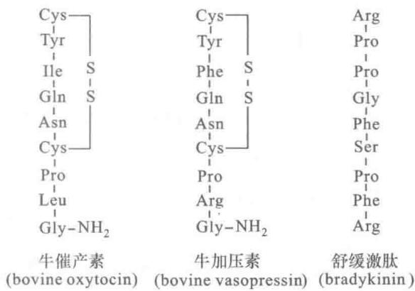  
图2-23 一些肽类激素的结构

α-鹅膏蕈碱（α-amanitin），它是从鹅膏蕈属或称捕蝇蕈属的鬼笔鹅膏（Amanita phalloides）中分离出来的，是一个环状八肽（图2-24）。鹅膏蕈碱能与真核生物的RNA聚合酶Ⅱ牢固结合而抑制酶的活性，因而使RNA的合成不能进行，但不影响原核生物的RNA合成（见第32章）。

动、植物细胞中都含有一种三肽，称还原型谷胱甘肽（reduced glutathione）即 $\gamma-$ 谷氨酰半胱氨酰甘氨酸，因为它含有游离的一SH基，所以常用GSH来表示。它的结构式见图2-25。还原型谷胱甘肽在红细胞中作为巯基缓冲剂存在，维持血红蛋白和红细胞其他蛋白质的半胱氨酸残基处于还原态。肌肉中存在的鹅肌肽（anserine）和肌肽（carnosine）都是二肽，前者是 $\beta-$ 丙氨酰-1-甲基组氨酸，后者是 $\beta-$ 丙氨酰组氨酸。它们在骨骼肌中的含量很高，每千克肌肉达到 $20\sim30\mathrm{mmol}$ 。虽然它们在肌肉中如此丰富，但是它们的功能至今尚不清楚，有人认为可能与肌肉收缩有关。

某些天然肽中含有的 $\gamma-$ 肽键、 $\beta-$ 氨基酸和 D 型氨基酸等，在蛋白质中是不存在的。很可能结构上的这些变化使分化了的肽可以免受蛋白水解酶的作用。蛋白酶一般只水解 L-氨基酸形成的 $\alpha-$ 肽键。

  
图2-24 $\alpha$ -鹅膏蕈碱的化学结构

  
图2-25 谷胱甘肽的结构

## 八、蛋白质的组成、分类、分子大小和结构层次

## （一）蛋白质的化学组成和分类

根据蛋白质的元素分析,蛋白质含有 C、H、O、N 以及少量的 S。有些蛋白质尚含有其他一些元素,主要是 P、Fe、Cu、I、Zn 和 Mo 等。这些元素在蛋白质中的组成百分比约为 C 50%, H 7%, O 23%, N 16%, S 0\~3%, 其他元素微量。蛋白质的平均含氮量为 16%, 这是蛋白质元素组成的一个特点, 是凯氏 (Kjedahl) 定氮法测定蛋白质含量的计算基础:

$$
\mathrm{蛋白质含量} = \mathrm{蛋白氮} \times 6. 2 5
$$

式中 6.25, 即平均含氮量 16% 的倒数, 为 1 克氮所代表的蛋白质质量 (克数)。

许多蛋白质仅由氨基酸组成,例如核糖核酸酶 A、溶菌酶、肌动蛋白等,这些蛋白质称为简单蛋白质(simple protein)。但是很多蛋白质含有除氨基酸外的其他化学成分作为其永久性结构的一部分,这样的蛋白质称为缀合蛋白质(conjugated protein)或称复合蛋白质。其中非蛋白质成分称为辅基(prosthetic group)或配体(ligand),通常辅基在蛋白质的功能方面起重要作用。如果辅基是通过共价键与蛋白质结合的,则必须对蛋白质进行水解才能释放它;通过非共价力与蛋白质结合的,只要经过不太剧烈的变性处理即可把它跟蛋白质部分分离开来。除去了非共价结合的辅基部分,剩下的蛋白质部分称为脱辅基蛋白质(apoprotein);原含有辅基部分的整体蛋白质称为全蛋白质(holoprotein)。

简单蛋白质可以根据其溶解性质进行分类(表2-6);缀合蛋白质可按其辅基成分进行分类(表2-7)。近年来有些学者依据蛋白质的生物学功能把蛋白质分为酶、调节蛋白、转运蛋白、贮存蛋白、收缩和游动蛋白、结构蛋白、支架蛋白、防卫和保护蛋白等（见第4章）。

表 2-6 简单蛋白质的分类

<table><tr><td>类别</td><td>溶解性质</td><td>举例</td></tr><tr><td>清蛋白(albumin)</td><td>溶于水、稀盐、稀酸或稀碱溶液;为饱和硫酸铵所沉淀</td><td>血清清蛋白、乳清蛋白</td></tr><tr><td>球蛋白(globulin)</td><td>为半饱和硫酸铵所沉淀;沉淀溶于稀盐溶液而不溶于水的称优球蛋白(euglobulin);溶于水的称假球蛋白(pseudoglobulin)</td><td>血清球蛋白、肌球蛋白、植物种子球蛋白</td></tr><tr><td>谷蛋白(glutelin)</td><td>不溶于水、醇或中性盐溶液,但易溶于稀酸或稀碱</td><td>米谷蛋白(oryzenin)、麦谷蛋白(glutenin)</td></tr><tr><td>谷醇溶蛋白(prolamine)</td><td>不溶于水和无水乙醇,但溶于70%~80%乙醇</td><td>玉米醇溶蛋白(zein)、麦醇溶蛋白(gliadin)</td></tr><tr><td>组蛋白(histone)</td><td>溶于水或稀酸,但为稀氨水所沉淀</td><td>小牛胸腺组蛋白</td></tr><tr><td>鱼精蛋白(protamine)</td><td>溶于水或稀酸,但不溶于氨水</td><td>鲑精蛋白(salmin)</td></tr><tr><td>硬蛋白(scleroprotein)</td><td>不溶于水、盐水、稀酸或稀碱</td><td>角蛋白、胶原蛋白、弹性蛋白、丝蛋白</td></tr></table>

表 2-7 缀合蛋白质的分类

<table><tr><td>类别</td><td>辅基</td><td>举例</td></tr><tr><td>糖蛋白(glycoprotein)</td><td>糖类</td><td>免疫球蛋白G(γ-球蛋白)</td></tr><tr><td>脂蛋白(lipoprotein)</td><td>脂质</td><td>高密度脂蛋白(α-脂蛋白)、低密度脂蛋白(β-脂蛋白)</td></tr><tr><td>磷蛋白(phosphoprotein)</td><td>磷酸基</td><td>酪蛋白、糖原磷酸化酶a</td></tr><tr><td>血红素蛋白(hemoprotein) $^1$ </td><td>血红素(亚铁原卟啉)</td><td>血红蛋白、细胞色素c、过氧化氢酶、硝酸还原酶</td></tr><tr><td>黄素蛋白(flavoprotein)</td><td>黄素核苷酸(FMN和FAD)</td><td>琥珀酸脱氢酶(含FAD)、NADH脱氢酶(含FMN)、二氨乳清酸脱氢酶(含FAD和FMN)</td></tr><tr><td>金属蛋白(metalloprotein)</td><td>铁、锌、钙、铜、锰、钼等</td><td>铁蛋白(ferritin)含Fe,醇脱氢酶含Zn,钙调蛋白含Ca,质体蓝素(plastocyanin)含Cu,固氮酶含Mo和Fe,丙酮酸羧化酶含Mn</td></tr></table>

① 血红素蛋白是金属蛋白的一个亚类。

蛋白质根据形状和溶解度大体可分为三大类:① 纤维状蛋白质(fibrous protein)具有比较简单、有规则的线性结构,形状呈细棒或纤维状。这类蛋白质在生物体内主要起结构作用。典型的纤维状蛋白质,如胶原蛋白、弹性蛋白、角蛋白和丝蛋白等,不溶于水和稀盐溶液。有些纤维状蛋白质如肌球蛋白(myosin)和血纤蛋白原(fibrinogen)是可溶性的。② 球状蛋白质(globular protein)形状接近球形或椭球形。其多肽链折叠紧密,疏水的氨基酸侧链位于分子内部,亲水的侧链在外部暴露于水溶剂。因此球状蛋白质在水溶液中溶解性好。细胞中的大多数可溶性蛋白质,如胞质酶类,都属于球状蛋白质。③ 膜蛋白[质](membrane protein)与细胞的各种膜系统结合而存在。为能与膜内的非极性相(烃链)相互作用,膜蛋白的疏水氨基酸侧链伸向外部。因此膜蛋白不溶于水但能溶于去污剂溶液。膜蛋白的组成特点是所含的亲水氨基酸残基比胞质蛋白质少。

## （二）蛋白质分子的形状和大小

蛋白质是氨基酸的高聚物，相对分子质量 $(M_{r})$ 变化范围很大，从6000\~1×10 $^{6}$ （表2-8）。一些蛋白质分子的形状和大小见图2-26。蛋白质 $M_{r}$ 的上、下限是人为规定的，这涉及对蛋白质及其分子质量概念的理解。下限一般认为从胰岛素开始，其相对分子质量为5733。有人认为应从核糖核酸酶开始，因此下限相对分子质量就是12600。有些蛋白质仅由一条多肽链构成，如溶菌酶和肌红蛋白，这些蛋白质称为单体蛋白质（monomeric protein）。有些蛋白质是由两条或多条多肽链构成，如血红蛋白（2条α链和2条β链）和己糖激酶（2条α链），这些蛋白质称为寡聚蛋白质（oligomeric protein）或多聚蛋白质（multimeric protein）；

  
图2-26 一些蛋白质分子的形状和大小

表 2-8 几种蛋白质的分子大小和肽链数目

<table><tr><td>蛋白质</td><td> $M_r$ </td><td>残基数目</td><td>肽链数目(组成方式)</td></tr><tr><td>胰岛素 $^1$ (牛)</td><td>5 733</td><td>51</td><td>2( $\alpha$   $\beta$ )</td></tr><tr><td>细胞色素c(人)</td><td>12 400</td><td>104</td><td>1</td></tr><tr><td>核糖核酸酶A(牛胰)</td><td>13 700</td><td>124</td><td>1</td></tr><tr><td>溶菌酶(鸡卵清)</td><td>14 300</td><td>129</td><td>1</td></tr><tr><td>肌红蛋白(人)</td><td>17 800</td><td>153</td><td>1</td></tr><tr><td>胰凝乳蛋白酶 $^2$ (牛)</td><td>25 200</td><td>241</td><td>3( $\alpha$   $\beta$   $\gamma$ )</td></tr><tr><td>血红蛋白 $^3$ (人)</td><td>64 500</td><td>574</td><td>4( $\alpha_2$   $\beta_2$ )</td></tr><tr><td>血清清蛋白(人)</td><td>68 500</td><td>609</td><td>1</td></tr><tr><td>己糖激酶(酵母)</td><td>107 900</td><td>972</td><td>2( $\alpha_2$ )</td></tr><tr><td> $\gamma$ -球蛋白 $^4$ (免疫球蛋白G)(马)</td><td>149 900</td><td>1 320</td><td>4( $\alpha_2$   $\beta_2$ )</td></tr><tr><td>载脂蛋白B(人)</td><td>513 000</td><td>4 563</td><td>1</td></tr><tr><td>核酮糖二磷酸羧化酶 $^5$ (rubisco)(菠菜)</td><td>550 000</td><td>1 794</td><td>16( $\alpha_8$   $\beta_8$ )</td></tr><tr><td>谷氨酰胺合成酶(E. coli)</td><td>619 000</td><td>469</td><td>12( $\alpha_{12}$ )</td></tr><tr><td>肌联蛋白</td><td>2 993 000</td><td>26 926</td><td></td></tr></table>

①胰岛素的两条链A(α)链(21残基)和B(β)链(30残基)是以二硫键共价结合的。②胰凝乳蛋白酶有A(α)链(13残基)、B(β)链(131残基)和C(γ)链(97残基)以二硫键相连。③血红蛋白由2条α链(141残基/链)和2条β链(146残基/链)非共价缔合而成。④γ-球蛋白由2条轻(L)链(214残基/链)和2条重(H)链(446残基/链)经二硫键连接而成。⑤核酮糖二磷酸羧化酶由8个大亚基(α链;475残基/链)和8个小亚基(β链;123残基/链)非共价缔合而成。

其中每条多肽链称为亚基(subunit)，亚基之间通过非共价力缔合。如果把寡聚蛋白质看作一个分子，那么蛋白质的 $M_{r}$ 可达百万，例如谷氨酰胺合成酶(12个亚基)， $M_{r}$ 619000。如果连同辅基也算进去，像烟草花叶病毒(tobacco mosaic virus, TMV)是由2130个亚基和一条RNA链构成的超分子复合体，那么，其“相对分子质量”约为 $4\times10^{7}$ 。这些寡聚蛋白质和超分子复合体虽然不是由共价键连接成的整体分子，在一定条件下可以解离成它们的亚基，但是它们在生物体内是相当稳定的，可以从细胞或组织中以均一的甚至结晶的形式分离出来，并且有一些蛋白质，只有以这种寡聚蛋白质的形式存在，其活性才能得到或充分得到表现。

少数蛋白质含有两条或多条共价交联的多肽链。例如胰岛素的两条链和 $\gamma-$ 球蛋白的四条链都是由二硫键交联在一起的。这种情况，个别的多肽链一般不称亚基，称为链。

对于不含辅基的简单蛋白质，用110除它的 $M_{r}$ 即可约略估计其氨基酸残基的数目。蛋白质中20种基本氨基酸的平均 $M_{r}$ 约为138。但在多数蛋白质中较小的氨基酸占优势，因此平均 $M_{r}$ 接近128。又因每形成一个肽键将除去一分子水 $(M_{\mathrm{r}}=18)$ ，所以氨基酸残基的平均 $M_{r}$ 约为110。表2-8中给出各种蛋白质亚基或链的氨基酸残基数目及其组成方式。

## （三）蛋白质分子结构的组织层次

蛋白质分子不仅质量很大，而且结构十分复杂。为便于描述和理解这种复杂的结构，通常将蛋白质结构分成一级结构、二级结构、三级结构、四级结构这四个组织层次(organization level)或结构水平（structural level）。一级结构（primary structure）通常是指蛋白质肽链的氨基酸残基的序列或氨基酸序列（amino acid sequence）。这一定义对简单蛋白质是适用的，但对缀合蛋白质一级结构还应包括共价连接的辅基部分，如蛋白质中的糖链、脂蛋白中的脂质成分以及它们是以何种共价方式跟肽链中哪个（些）氨基酸残基的侧链相连接的。因此一级结构也常称共价结构（covalent structure）或化学结构。总之一级结构是一个无空间结构概念的一维结构。蛋白质二级结构（secondary structure）是指肽链主链（骨架）中局部肽段借助氢键形成的周期性结构，包括α螺旋、β折叠、转角等。二级结构是多肽链借助氢键在空间三维排列的高级组织层次，是蛋白质中一种高级结构（higher-order structure）即空间结构、立体结构或构象。属于高级结构层次的还有三级结构和四级结构。三级结构（tertiary structure）是指多肽链借非共价力折叠成具有特定走向的完整球状实体；这种球状实体给出最小的表面积和体积之比，因而使蛋白质跟周围环境的相互作用降到最低。四级结构（quaternary structure）是指具有三级结构的亚基（蛋白质）借助非共价力彼此缔合成寡聚蛋白质，或者表述为寡聚蛋白质中各亚基之间的相互关系和结合方式（图2-27）。

  
图2-27 蛋白质结构的组织层次

在二级结构和三级结构之间,还存在一些已被公认的过渡性结构层次:超二级结构和结构域。然而并不是每种蛋白质中都一定存在这些过渡层次。由于它们跟二、三级结构关系密切,因此将在第3章中介绍。

必须强调指出,一个蛋白质分子为获得复杂结构所需的全部信息都含于一级结构即多肽链的氨基酸序列中。一级结构将在本章后面进一步讨论,二、三、四级结构将在第3章中详细介绍。

<!-- EN-BEGIN 3.2 -->

### 【英文对应 3.2】Peptides and Proteins

> 来源：Lehninger Principles of Biochemistry（书籍/02_生物化学原理） 第3章 Amino Acids, Peptides, and Proteins，§3.2。对应本章“八、蛋白质的组成、分类、分子大小和结构层次”。

We now turn to polymers of amino acids, the peptides and proteins. Biologically occurring polypeptides range in size from small, consisting of two or three linked amino acid residues, to very large, consisting of thousands of residues.

#### [EN] Peptides Are Chains of Amino Acids

P2 Two amino acid molecules can be covalently joined through a substituted amide linkage, termed a peptide bond, to yield a dipeptide. Such a linkage is formed by removal of the elements of water (dehydration) — a hydroxyl moiety from the $\alpha$ -carboxyl group of one amino acid and a hydrogen atom the $\alpha$ -amino group of another (Fig. 3-13). The joined amino acids are referred to as residues, the part left over after the elements of water are removed. Peptide bond formation is an example of a condensation reaction, a common class of reactions in living cells. The reverse reaction, bond breakage involving water, is an example of hydrolytic cleavage or hydrolysis. Under standard biochemical conditions, the equilibrium for the reaction shown in Figure 3-13 favors the hydrolysis of the dipeptide into amino acids. To make the condensation reaction thermodynamically more favorable, the carboxyl group must be chemically modified or activated so that the hydroxyl group can be more readily eliminated. A chemical approach to this problem is outlined later in this chapter. The biological approach to peptide bond formation is a major topic of Chapter 27.

Three amino acids can be joined by two peptide bonds to form a tripeptide; similarly, four amino acids can be linked to form a tetrapeptide, five to form a pentapeptide, and so forth. When a few amino acids are joined in this fashion, the structure is called an oligopeptide. When many amino acids are joined, the product is called a polypeptide. Proteins may have thousands of amino acid residues. Although the terms “protein” and “polypeptide” are sometimes used interchangeably, molecules referred to as polypeptides generally have molecular weights below 10,000, and those called proteins have higher molecular weights.

Figure 3-14 shows the structure of a pentapeptide. In a peptide, the amino acid residue at the end with a free $\alpha$ -amino group is the amino-terminal (or N-terminal)

  
FIGURE 3-13 Formation of a peptide bond by condensation. The $\alpha$ -amino group of one amino acid (with the $R^2$ group) acts as a nucleophile to displace the hydroxyl group of another amino acid (with the $R^1$ group), forming a peptide bond (shaded in light red). Amino groups are good nucleophiles, but the hydroxyl group is a poor leaving group and is not readily displaced. At physiological pH, the reaction shown here does not occur to any appreciable extent.

  
FIGURE 3-14 The pentapeptide serylglycyltyrosylalanylleucine, Ser-Gly-Tyr-Ala-Leu, or SGYAL. Peptides are named beginning with the amino-terminal residue, which by convention is placed at the left. The peptide bonds are shaded in light red; the R groups are in red.

residue; the residue at the other end, which has a free carboxyl group, is the carboxyl-terminal (C-terminal) residue.

KEY CONVENTION When an amino acid sequence of a peptide, a polypeptide, or a protein is displayed, the amino-terminal end is placed on the left and the carboxyl-terminal end is placed on the right. The sequence is read from left to right, beginning with the amino-terminal end.

Although hydrolysis of a peptide bond is an exergonic reaction, it occurs only slowly because it has a high activation energy (p. 25). As a result, the peptide bonds in proteins are quite stable, with an average half-life ( $t_{1/2}$ ) of about 7 years under most intracellular conditions.

#### [EN] Peptides Can Be Distinguished by Their Ionization Behavior

P2 Peptides contain only one free $\alpha$ -amino group and one free $\alpha$ -carboxyl group, at opposite ends of the chain (Fig. 3-15). These groups ionize as they do in free amino acids. The $\alpha$ -amino and $\alpha$ -carboxyl groups of all nonterminal amino acids are covalently joined in the peptide bonds. They can no longer ionize and thus do not contribute to the total acid-base behavior of peptides. Ionizable R groups in a peptide (Table 3-1) also contribute to the overall acid-base properties of the molecule (Fig. 3-15).

  
FIGURE 3-15 Alanylglutamylglycyllysine. This tetrapeptide has one free $\alpha$ -amino group, one free $\alpha$ -carboxyl group, and two ionizable R groups. The groups ionized at pH 7.0 are in red.

Like free amino acids, peptides have characteristic titration curves and a characteristic isoelectric pH (pl) at which the net charge is zero and they do not move in an electric field. These properties are exploited in some of the techniques used to separate peptides and proteins, as we describe later in the chapter. When an amino acid becomes a residue in a peptide, its chemical environment is altered, and the $pK_{a}$ value for an ionizable R group can change somewhat. The $pK_{a}$ values for

<table><tr><td>Protein</td><td>Molecular weight</td><td>Number of residues</td><td>Number of polypeptide chains</td></tr><tr><td>Cytochrome c (human)</td><td>12,400</td><td>104</td><td>1</td></tr><tr><td>Myoglobin (equine heart)</td><td>16,700</td><td>153</td><td>1</td></tr><tr><td>Chymotrypsin (bovine pancreas)</td><td>25,200</td><td>241</td><td>3</td></tr><tr><td>Hemoglobin (human)</td><td>64,500</td><td>574</td><td>4</td></tr><tr><td>Hexokinase (yeast)</td><td>107,900</td><td>972</td><td>2</td></tr><tr><td>RNA polymerase (E. coli)</td><td>450,000</td><td>4,158</td><td>5</td></tr><tr><td>Glutamine synthetase (E. coli)</td><td>619,000</td><td>5,628</td><td>12</td></tr><tr><td>Titin (human)</td><td>2,993,000</td><td>26,926</td><td>1</td></tr></table>

<table><tr><td colspan="5">TABLE 3-3 Amino Acid Composition of Two Proteins</td></tr><tr><td></td><td colspan="2">Bovine cytochrome c</td><td colspan="2">Bovine chymotrypsinogen</td></tr><tr><td>Amino acid</td><td>Number of residues per molecule</td><td>Percentage of total $^{a}$ </td><td>Number of residues per molecule</td><td>Percentage of total $^{a}$ </td></tr><tr><td>Ala</td><td>6</td><td>6</td><td>22</td><td>9</td></tr><tr><td>Arg</td><td>2</td><td>2</td><td>4</td><td>1.6</td></tr><tr><td>Asn</td><td>5</td><td>5</td><td>14</td><td>5.7</td></tr><tr><td>Asp</td><td>3</td><td>3</td><td>9</td><td>3.7</td></tr><tr><td>Cys</td><td>2</td><td>2</td><td>10</td><td>4</td></tr><tr><td>Gln</td><td>3</td><td>3</td><td>10</td><td>4</td></tr><tr><td>Glu</td><td>9</td><td>9</td><td>5</td><td>2</td></tr><tr><td>Gly</td><td>14</td><td>13</td><td>23</td><td>9.4</td></tr><tr><td>His</td><td>3</td><td>3</td><td>2</td><td>0.8</td></tr><tr><td>Ile</td><td>6</td><td>6</td><td>10</td><td>4</td></tr><tr><td>Leu</td><td>6</td><td>6</td><td>19</td><td>7.8</td></tr><tr><td>Lys</td><td>18</td><td>17</td><td>14</td><td>5.7</td></tr><tr><td>Met</td><td>2</td><td>2</td><td>2</td><td>0.8</td></tr><tr><td>Phe</td><td>4</td><td>4</td><td>6</td><td>2.4</td></tr><tr><td>Pro</td><td>4</td><td>4</td><td>9</td><td>3.7</td></tr><tr><td>Ser</td><td>1</td><td>1</td><td>28</td><td>11.4</td></tr><tr><td>Thr</td><td>8</td><td>8</td><td>23</td><td>9.4</td></tr><tr><td>Trp</td><td>1</td><td>1</td><td>8</td><td>3.3</td></tr><tr><td>Tyr</td><td>4</td><td>4</td><td>4</td><td>1.6</td></tr><tr><td>Val</td><td>3</td><td>3</td><td>23</td><td>9.4</td></tr><tr><td>Total</td><td>104</td><td>102 $^{a}$ </td><td>245</td><td>99.7 $^{a}$ </td></tr></table>

Note: In some common analyses, such as acid hydrolysis, Asp and Asn are not readily distinguished from each other and are together designated Asx (or B). Similarly, when Glu and Gln cannot be distinguished, they are together designated Glx (or Z). In addition, Trp is destroyed by acid hydrolysis. Additional procedures must be employed to obtain an accurate assessment of complete amino acid content.

$^{a}$ Percentages do not total to 100%, due to rounding.

the average molecular weight of the 20 common amino acids is about 138, the smaller amino acids predominate in most proteins. If we take into account the proportions in which the various amino acids occur in an average protein (Table 3-1; the averages are determined by surveying the amino acid compositions of more than 1,000 different proteins), the average molecular weight of protein amino acids is nearer to 128. Because a molecule of water ( $M_{r}$ 18) is removed to create each peptide bond, the average molecular weight of an amino acid residue in a protein is about 128 - 18 = 110.

#### [EN] Some Proteins Contain Chemical Groups Other Than Amino Acids

Many proteins—for example, the enzymes ribonuclease A and chymotrypsin—contain only amino acid residues and no other chemical constituents. However, some proteins contain permanently associated chemical components in addition to amino acids; these are called conjugated proteins. The non-amino acid part of a conjugated protein is usually called its prosthetic group. Conjugated proteins are classified on the basis of the chemical nature of their prosthetic groups (Table 3-4); for example, lipoproteins contain lipids, glycoproteins contain sugar groups, and metalloproteins contain a specific metal. Some proteins contain more than one prosthetic group. Usually the prosthetic group plays an important role in the protein's biological function.

<table><tr><td colspan="3">TABLE 3-4 Conjugated Proteins</td></tr><tr><td>Class</td><td>Prosthetic group</td><td>Example</td></tr><tr><td>Lipoproteins</td><td>Lipids</td><td> $\beta_{1}$ -Lipoprotein of blood (Fig. 17-2)</td></tr><tr><td>Glycoproteins</td><td>Carbohydrates</td><td>Immunoglobulin G (Fig. 5-20)</td></tr><tr><td>Phosphoproteins</td><td>Phosphate groups</td><td>Glycogen phosphorylase (Fig. 6-39)</td></tr><tr><td>Hemoproteins</td><td>Heme (iron porphyrin)</td><td>Hemoglobin (Figs 5-8 to 5-11)</td></tr><tr><td>Flavoproteins</td><td>Flavin nucleotides</td><td>Succinate dehydrogenase (Fig. 19-9)</td></tr><tr><td rowspan="2">Metalloproteins</td><td>Iron Zinc</td><td>Ferritin (Box 16-1)Alcohol dehydrogenase (Fig. 14-12)</td></tr><tr><td>Calcium Molybdenum Copper</td><td>Calmodulin (Fig. 12-17)Dinitrogenase (Fig. 22-3)Complex IV (Fig. 19-12)</td></tr></table>

#### [EN] SUMMARY 3.2 Peptides and Proteins

■ Amino acids can be joined covalently through peptide bonds to form peptides and proteins. Cells generally contain thousands of different proteins, each with a different biological activity.

■ The ionization behavior of peptides reflects their ionizable side chains as well as the terminal $\alpha$ -amino and $\alpha$ -carboxyl groups.

■ Proteins can be very long polypeptide chains of 100 to several thousand amino acid residues. However, some naturally occurring peptides have only a few amino acid residues. Some proteins are composed of several noncovalently associated polypeptide chains, called subunits.

■ Simple proteins yield only amino acids on hydrolysis; conjugated proteins contain in addition some other component, such as a metal or organic prosthetic group.

<!-- EN-END 3.2 -->

## 九、蛋白质的一级结构

蛋白质的一级结构也称蛋白质的共价结构或化学结构，在多数场合把蛋白质的一级结构看成是氨基酸序列的同义语。1969年国际纯化学和应用化学联合会（International Union of Pure and Applied Chemistry, IUPAC）就曾规定蛋白质的一级结构只指多肽链中的氨基酸序列。

## （一）蛋白质的氨基酸[残基]序列决定蛋白质的功能

小至一个大肠杆菌(E. coli)产生多于3000种不同的蛋白质；大至一个人体约有25000个基因，编码一个数目庞大的蛋白质库。这些蛋白质的每一种都有自己特定的三维结构，每个结构都有特定的功能。经验告诉人们，功能决定于三维的立体结构，立体结构决定于一维的线性氨基酸[残基]序列。这些经验的线索有：第一，具有不同功能的蛋白质总是具有不同的氨基酸序列；第二，在数以千计的人类遗传疾病中都观察到有缺陷的蛋白质产生。这种缺陷的蛋白质可以是氨基酸序列中某个（或某几个）残基发生改变，例如镰状细胞贫血病（见第4章）；也可以是多肽链中相当部分的肽段发生缺失，例如大多数的杜兴氏肌营养不良症（Duchenne muscular dystrophy, DMD），编码肌营养不良蛋白（dystrophin，此蛋白质本身是一种桥联胞内细胞骨架和胞外基质的蛋白质-糖蛋白复合体的正常组分）的基因缺失导致缩短的无活性肌营养不良蛋白质的产生并引起疾病。由此可知，蛋白质的一级结构改变，其功能也可能发生变化；第三，当比较不同物种中功能相同或相似的蛋白质，发现它们经常具有相似的氨基酸序列，这些蛋白质被称为同源蛋白质（homologous protein）。其中一个极端的例子是泛素（ubiquitin），由76个残基组成，参与调节其他蛋白质的降解，从果蝇和人这样完全不同的物种中提取的泛素，它们的氨基酸序列竟是一样的。

那么一种特定蛋白质的氨基酸序列是否绝对固定或不变？否。有一定的可变性或柔性。估计在人的群体中有 $20\% \sim 30\%$ 的蛋白质是多态的（polymorphic），即存在氨基酸序列的变体（variant）。序列方面有许多这样的变体，但对蛋白质的功能影响不大或很小，甚至不产生影响。而且，远缘的物种中行使相似功能的蛋白质，在大小和氨基酸序列方面都有很大的差别。虽然同源蛋白质在一级结构的很多区段氨基酸序列可能有很大的变化，但并不影响它们的生物学功能。这些蛋白质具有共同的关键性区域，这些区域对它们的功能是必需的，这些区域的序列是保守的、基本不变的。关于蛋白质的结构与功能关系将在第4章中进一步讨论。

## （二）蛋白质一级结构的举例

1953年在生物化学史上发生了两件大事：一是Watson和Crick推定了DNA的双螺旋结构，并提出了DNA精确复制的结构基础（见第11章和第30章）；二是Sanger用化学方法测定了胰岛素多肽链的氨基酸[残基]序列(图2-28)。这使许多研究者惊奇不已，因为在此以前他们一直认为测定一个多肽链的氨基酸序列是一个不可及的困难任务。1953年以来已用化学方法漂亮地测定出数以千计的蛋白质的一级结构；并根据Watson-Crick理论确立的DNA核苷酸序列与蛋白质氨基酸序列之间的对应关系，从基因的核苷酸序列推定出多肽链的氨基酸序列，至今已有上百万个不同的蛋白质序列直接从快速增长的基因组数据库中的DNA序列推定出来。

胰岛素(insulin)是胰岛β细胞分泌的一种激素。生物体内在核糖体上初合成时,是一条相对分子质量比胰岛素大一倍多的单链多肽,称前胰岛素原(preproinsulin),是胰岛素原的前身,在它的N端(即胰岛素B链的N端)比胰岛素原多一段肽链(约含20个残基),称为信号肽(signal peptide)。信号肽引导新生多肽链进入内织网腔后,立即被酶切除,剩余的多肽链折叠成含3个二硫键的胰岛素原。后者进入高尔基体,在酶的催化下除去一段连接胰岛素B链C端和A链N端的连接肽简称C肽(约含30个残基),转变为成熟的胰岛素。

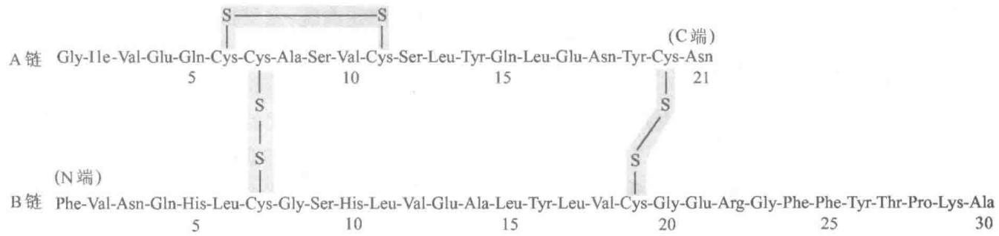  
图 2-28 牛胰岛素的一级结构(共价结构)  
A链在人、猪、狗、兔和抹香鲸的胰岛素中是一样

1953 年 Sanger 等人首次完成了胰岛素的全部化学结构的测定工作。胰岛素分子含两条多肽链，A 链（含 21 个残基）和 B 链（含 30 个残基）。这两条多肽链通过两个链间二硫键连接起来，其中的 A 链还有一个链内二硫键。牛胰岛素的一级（共价）结构见图 2-28。

牛胰核糖核酸酶也称核糖核酸酶 A(ribonuclease A, 简写为 RNase A)。20 世纪 50 年代末美国学者 S. Moore 等人完成了 RNase A 的全序列分析(图 2-29)。它是测出一级结构的第一个酶分子, 由 124 个残基组成的单条多肽链, 含 4 个链内二硫键。核糖核酸酶 A 是具有高度专一性的 RNA 内切酶(见第 12 章)。

血红蛋白(hemoglobin) $\alpha$ 链(含141个残基)和 $\beta$ 链(含146个残基)的氨基酸序列见图2-40测定是蛋白质化学取得的另一重大成就。

除上述几种蛋白质外，肌红蛋白、细胞色素 c、溶菌酶、烟草花叶病毒的外壳蛋白等的一级结构也已测出。现已确定了上百万种蛋白质的氨基酸序列。其中很大的有 $\beta$ -半乳糖苷酶（1021 残基）和大肠杆菌 RNA 聚合酶的 $\beta$ 亚基（1407 残基），它们的序列是根据 cDNA 推定而来的。

  
图2-29 核糖核酸酶A的一级结构  
图中单字母符号代表氨基酸残基；黑短棒代表二硫键

## （三）蛋白质序列数据库

蛋白质化学家收集的一个蛋白质序列数据库（database）可以在《蛋白质序列和结构图册》（Dayhoff M O, ed al. Altas of Protein Sequence and Structure, 1972—1978, Washington, DC: National Biomedical Research Foundation）中找到。然而现在大多数的蛋白质序列信息都是从基因的核苷酸序列翻译成氨基酸序列的。由于测定克隆基因的核苷酸序列比测定蛋白质的氨基酸序列更快、信息更多，因此有不少电子数据库问世，储存的序列资料以惊人的速度不断扩充，并且个人电脑可以很方便地利用它。现在测定了一个新的多肽链氨基酸序列后，研究者所做的第一件事就是通过电脑和相关的软件将所得的结果与数据库中的其他已知的序列进行比较，确定是否是新的或是同源的，从中可得到更多的有用信息。这些数据库中较有名的有美国国家生物医学研究基金会（Nationl Biomedical Research Foundation, NBRF）主持的PIR[Protein Information Resource(蛋白质信息库)，网址：www.nbrfGeorgetown.edu]；美国政府支持的GenBank［Gene Sequence Data Bank(基因序列数据库)，网址：www.nebinlm.nih.Gov］和欧洲的EMBL［European Molecular Biology Laboratory Data Bank(欧洲分子生物学实验室数据库)，网址：www.ebi.ac.uk］。这些年来，上述几个大的序列库不断加强合作，各相关序列库的数据存储格式已逐步走向统一。

## （四）蛋白质化学测序的策略

虽然现在许多蛋白质的序列是直接从 DNA 序列推演而来的。然而,现代的蛋白质化学仍然使用传统的多肽测序方法。这些方法能够揭示许多在基因序列中不清楚的细节,例如蛋白质合成后发生的修饰。蛋白质化学测序与一些新的方法互补,提供多种途径以获得氨基酸序列数据。这些数据对生物化学研究的许多领域都是关键的。

测定蛋白质的一级结构,要求样品必须是均一的,纯度应在97%以上,同时必须知道它的相对分子质量,其误差允许在10%左右。关于蛋白质的分离、纯化和相对分子质量测定的问题将在第5章讨论。

多肽链的化学测序主要根据 Sanger 实验室中发展起来的方法进行。虽然测定每种蛋白质的一级结构都有自己特殊的问题需要解决，但测定的一般策略可以概括为以下几个步骤：

（1）确定蛋白质分子中不同多肽链的数目 根据蛋白质末端残基的分析可以确定蛋白质分子中不同多肽链的数目(种类)，因为不同的多肽链一般含有不同的末端残基。如果蛋白质只含一种多肽链，则可能是单体蛋白质（monomeric protein）或是同多聚蛋白质（homomultimeric protein）；蛋白质摩尔数与末端基摩尔数相等，则是单体蛋白质；末端基摩尔数是蛋白质摩尔数的整倍数，则是同多聚蛋白质。如果蛋白质含有两种或多种多肽链，则是杂多聚蛋白质（heteromultimeric protein）。

（2）拆分蛋白质分子的多肽链 如果是多聚(寡聚)蛋白质,则其多肽亚基必须加以拆分。如果这些多肽链是借助非共价键相互作用缔合的,则可用变性剂如尿素、盐酸胍或高浓度盐进行处理,就能使蛋白质的亚基分开。如果多肽链间是通过共价二硫键交联的,如胰岛素(含两条多肽链)和 $\alpha-$ 胰凝乳蛋白酶(含3条多肽链),则须采用氧化剂或还原剂将二硫键断开。断开后的各多肽链可根据它们的大小或/和电荷的不同进行分离和纯化(见第5章)。

（3）断裂多肽链内的二硫键 多肽链内半胱氨酸残基之间的 S—S 桥必须在进行第 4 步前予以断裂。

（4）分析每一多肽链的氨基酸组成 经分离、纯化的多肽链一部分样品进行完全水解，测定它的氨基酸组成，并计算出每个蛋白质分子(或多肽亚基)中氨基酸组成的分子比或各种残基的数目。氨基酸组成的信息可用于解释其他步骤的结果。

（5）鉴定多肽链的 N 端和 C 端残基 多肽链的另一部分样品进行末端残基的鉴定，用作重建完整多肽链序列时的两个重要参考点。

（6）裂解多肽链成较小的片段 用两种或几种不同的断裂方法（指断裂点不一样）将每条多肽链样品降解成两套或几套重叠的肽段（肽碎片）。每套肽段进行分离和纯化，并对每一纯化了的肽段进行下一步的测序工作。

（7）测定各肽段的氨基酸序列 目前最常用的肽段测序方法是 Edman 降解法，并有自动序列分析仪可供利用。此外尚有质谱法和其他方法。

（8）重建完整多肽链的一级结构 利用两套或两套以上肽段的氨基酸序列彼此间有交错重叠可以拼凑出原来的完整多肽链的氨基酸序列。

(9) 确定二硫键的位置 具体方法见下面。

必须指出:这里的测序虽未包括辅基成分分析,但是它应属于蛋白质化学结构测定的内容。

## 十、蛋白质测序的一些常用方法

## （一）末端残基分析

为了标记和鉴定多肽链的 N 端残基, Sanger 最先开发了二硝基氟苯 (1-fluoro-2,4-dinitrobenzene, FDNB) 试剂。多肽的游离末端氨基与 FDNB 反应生成二硝基苯多肽 (DNP-多肽)。由于 FDNB 与氨基反应生成的键对酸远比肽键稳定，因此 DNP-多肽经酸水解后，N 端残基以黄色的 DNP-氨基酸被释放，其余的都成为游离氨基酸（图 2-30A）。生成的 DNP-氨基酸经有机溶剂提取后，可用纸层析、薄层层析或高效液相色谱（第 5 章）等方法进行鉴定。

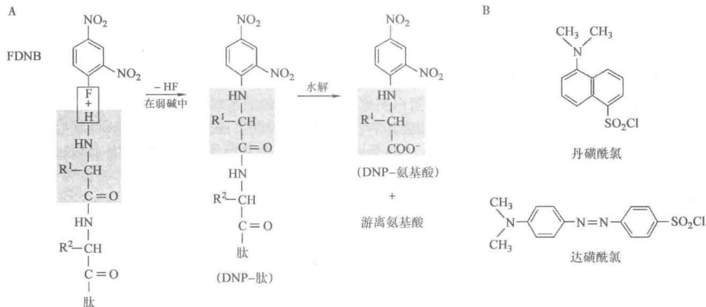  
图 2-30 多肽链 N 端氨基酸残基的鉴定(A)和 N 端氨基的几种标记试剂(B)

用于标记 N 端残基的试剂还有丹磺酰氯（dansyl chloride，即 5-二甲基氨基-1-萘磺酰氯）和达磺酰氯（dansyl chloride，即 2,4-二甲基氨基-偶氮苯-4'-磺酰氯）（图 2-30B）。由于这些化合物具有强烈的荧光基团，生成的衍生物比 DNP 衍生物更易检出。

C 端残基主要采用羧肽酶法测定。羧肽酶（carboxypeptidase）是一类肽链外切酶，称为外肽酶（exopeptidase），它专一地从肽链的 C 端逐个降解，测定逐个释放的氨基酸，可推断出 C 端残基和 C 端的一小段肽的序列。

## （二）二硫键的断裂

由于二硫键干扰多肽链的酶促裂解和化学断裂(测序策略步骤6)以及Edmam法的肽链测序(测序策略步骤7)，多肽结构中的二硫键必须事先断裂。断裂二硫键常采用过甲酸(performic acid)氧化法或二硫苏糖醇(dithiothreitol, DTT)还原法(图2-31)。强氧化剂过甲酸可定量打开胱氨酸残基的二硫键，生成磺基丙氨酸(cysteic acid)残基。还原剂巯基化合物，如二硫苏糖醇，也能断裂二硫键，生成半胱氨酸残基及相应的二硫化物。反应中二硫苏糖醇被氧化成一个含分子内二硫键的稳定六元环（氧化型二硫苏糖醇），使反应平衡向右方移动。由于半胱氨酸(残基)中的巯基极易被氧化成二硫键，因此利用巯基化合物打开二硫键时，需要用卤化烷如碘乙酸或碘乙酰胺等试剂与巯基反应把它保护起来，以防止巯基重新氧化。

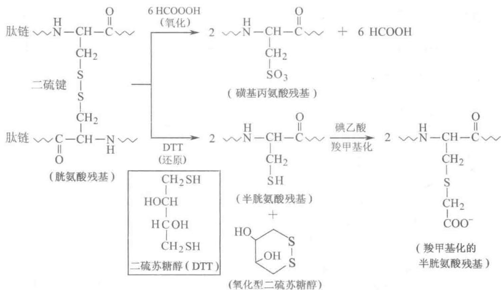  
图2-31 断裂蛋白质中的二硫键

## （三）氨基酸组成的分析

待测样品经完全水解后，用氨基酸自动分析仪进行测定。对一个 $M_{\mathrm{r}}30\times 10^{3}$ 的蛋白质，氨基酸组成分析仅需 $6\mu \mathrm{g}$ 样品，分析时间不到 $1\textrm{h}$ 。用于蛋白质氨基酸组成分析的水解方法主要是酸水解，同时辅以碱水解以测定色氨酸含量。酸水解中氨基酸遭破坏的程度与保温时间有线性关系，因此该氨基酸在蛋白质中的真实含量可通过在不同的保温时间（ $24\mathrm{h},48\mathrm{h}$ 和 $72\mathrm{h}$ )测出样品中该氨基酸的含量并外推至零时间的方法求出。

蛋白质的氨基酸组成一般用每摩尔蛋白质中含某氨基酸残基的摩尔数表示,很多种蛋白质的氨基酸组成已被测定,表2-9列出几种蛋白质的氨基酸组成。

表 2-9 几种蛋白质的氨基酸组成

<table><tr><td rowspan="2">氨基酸</td><td colspan="4">氨基酸残基数/蛋白质分子</td><td rowspan="2">氨基酸</td><td colspan="4">氨基酸残基数/蛋白质分子</td></tr><tr><td> $A^{1}$ </td><td>B</td><td>C</td><td>D</td><td>A</td><td>B</td><td>C</td><td>D</td></tr><tr><td>Ala</td><td>6</td><td>12</td><td>9</td><td>19</td><td>Cys</td><td>2</td><td>8</td><td>5</td><td>1</td></tr><tr><td>Val</td><td>3</td><td>9</td><td>7</td><td>17</td><td>Tyr</td><td>4</td><td>6</td><td>4</td><td>8</td></tr><tr><td>Leu</td><td>6</td><td>2</td><td>8</td><td>20</td><td>Asn</td><td>5</td><td>10</td><td>2</td><td>17</td></tr><tr><td>IIC</td><td>6</td><td>3</td><td>4</td><td>10</td><td>Gln</td><td>3</td><td>7</td><td>4</td><td>9</td></tr><tr><td>Pro</td><td>4</td><td>4</td><td>4</td><td>17</td><td>Asp</td><td>3</td><td>5</td><td>11</td><td>14</td></tr><tr><td>Met</td><td>2</td><td>4</td><td>0</td><td>2</td><td>Glu</td><td>9</td><td>5</td><td>9</td><td>13</td></tr><tr><td>Phe</td><td>4</td><td>3</td><td>2</td><td>11</td><td>Lys</td><td>19</td><td>10</td><td>4</td><td>18</td></tr><tr><td>Trp</td><td>1</td><td>0</td><td>1</td><td>6</td><td>Arg</td><td>2</td><td>4</td><td>1</td><td>7</td></tr><tr><td>Gly</td><td>12</td><td>3</td><td>6</td><td>16</td><td>His</td><td>3</td><td>4</td><td>1</td><td>11</td></tr><tr><td>Ser</td><td>0</td><td>15</td><td>7</td><td>30</td><td></td><td></td><td></td><td></td><td></td></tr><tr><td>Thr</td><td>10</td><td>10</td><td>8</td><td>14</td><td>残基总数</td><td>104</td><td>124</td><td>97</td><td>260</td></tr></table>

① A. 马心细胞色素 c; B. 牛胰核糖核酸酶; C. 菠菜铁氧还蛋白; D. 人碳酸酐酶。

## （四）多肽链的部分裂解

目前用于测序的 Edman 化学降解法通常一次只能连续降解 50\~60 个残基。而天然的蛋白质分子或亚基大多数在 100 个残基以上，因此必须将长的多肽链裂解成较小的肽段（碎片），才能进行测序。为此，经纯化并断开二硫键的多肽链，选用专一性强的蛋白酶或化学试剂进行有控制的裂解。裂解时要求断裂点少，作用专一性强，反应产率高（图 2-32）。

蛋白酶(protesae)是一类肽链内切酶称内肽酶(endopeptidase)，测序中常用的有：①牛的胰蛋白酶（trypsin），这是最常用的酶，专一性强，只断裂赖氨酸残基或精氨酸残基的羧基侧肽键。用它断裂多肽链得到的是相应的以Lys或Arg为C端残基的肽段。产生的肽段数目等于多肽链中Arg和Lys总数加1（多肽链的C端肽段）。②小鼠的下颚腺蛋白酶(submaxillarus protease)，此酶专一地作用于Arg残基的羧基侧肽键。③牛的胰凝乳蛋白酶或称糜蛋白酶(chymotrypsin)，此酶的专一性不如胰蛋白酶。它断裂Phe、Trp或Tyr等疏水氨基酸残基的羧基侧肽键。如果断裂点邻近的基团是碱性的残基，裂解能力增强，是酸性的，裂解能力减弱。④葡萄球菌蛋白酶(staphylococcal protease)，它是从金黄色葡萄球菌菌株V8(Staphylococcus aureus, strain V8)中分离得到的，它专一地断裂Glu残基或Asp残基的羧基侧肽键。⑤Asp-N-蛋白酶(Asp-N-protease)，从一种假单胞杆菌(Pseudomonas fragi)中获得，专一地断裂Glu残基或 Asp 残基的氨基侧肽键。⑥ 胃蛋白酶(pepsin)，它的专一性与胰凝乳蛋白酶类似，但它断裂的是 Phe、Trp、Tyr 或 Val 等疏水氨基酸残基的氨基侧肽键。此外与胰凝乳蛋白酶不同的是酶作用的最适 pH，前者是 pH 2，后者是 pH 8\~9。⑦ 内切蛋白酶 Lys C(endoproteinase Lys C)，从一种溶菌性细菌(Lysobacter enzymogenes)中获得，它专一断裂 Lys 残基的羧基侧肽键。

化学裂解法主要应用溴化氰(cyanogen bromide)，它只断裂甲硫氨酸残基的羧基侧肽键。由于多数蛋白质只含很少的Met残基，因此CNBr裂解产生的肽段数目不多。断裂后生成的原N端肽段的C端残基(Met)变成高丝氨酸内酯。

多肽链用上述方法断裂后,所得的肽段混合物使用凝胶过滤、凝胶电泳和 HPLC 等方法(见第 5 章)进行分离纯化。

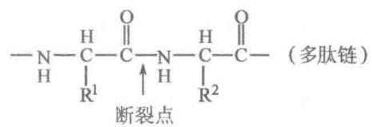

<table><tr><td>胰蛋白酶</td><td> $R^1 = \text{Lys}$  或  $\text{Arg}$ </td></tr><tr><td>小鼠下颚腺蛋白酶</td><td> $R^1 = \text{Arg}$ </td></tr><tr><td>胰凝乳蛋白酶</td><td> $R^1 = \text{Phe}$ 、Trp 或 Tyr</td></tr><tr><td>葡萄球菌蛋白酶</td><td> $R^1 = \text{Asp}$  或 Glu</td></tr><tr><td>Asp-N-蛋白酶</td><td> $R^2 = \text{Glu}$  或 Asp</td></tr><tr><td>胃蛋白酶</td><td> $R^2 = \text{Phe}$ 、Trp、Tyr 或 Leu 等疏水残基</td></tr><tr><td>内切蛋白酶 Lys C</td><td> $R^1 = \text{Lys}$ </td></tr><tr><td>溴化氰</td><td> $R^1 = \text{Met}$ </td></tr></table>

图2-32 几种蛋白酶和溴化氰断裂多肽链的专一性

## （五）肽段氨基酸序列的测定

## 1. Edman 化学降解法

经裂解和分离纯化处理得到的大小适宜、纯度合格的肽段，即可分别对它们的氨基酸序列进行测定。肽段测序有化学的、物理的和生物学的方法，但最先使用并仍在使用是Edman化学降解法。此法最早用于鉴定N端残基。降解试剂苯异硫氰酸酯（PITC）与肽链反应只标记和除去一个N端残基，肽链的其余肽键不被水解。N端残基被除去并鉴定后，剩下的肽链暴露出一个新的N端残基，可与PITC发生第二轮反应（图2-33）。实际上分析时常把肽链的羧基端与不溶性树脂偶联，这样每轮Edman反应后，只要通过过滤即可回收剩余的肽链，以利反应循环进行。理论上讲，进行 $n$ 轮反应就能测出 $n$ 个残基的序列。

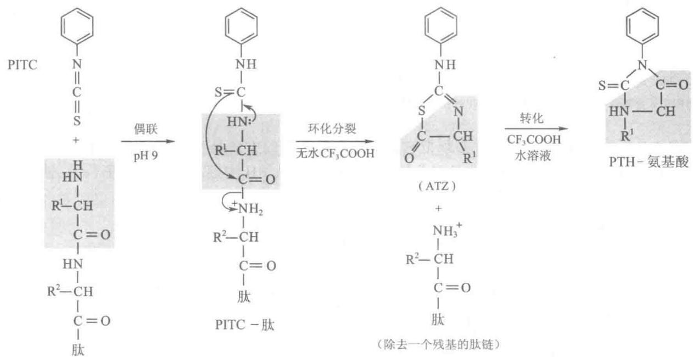  
图2-33 Edman化学降解反应  
反应分三步进行。① 偶联：PITC 与肽连接，生成苯氨基硫甲酰肽（phenyl-thiocarbamyl），简称 PTC-肽；② 环化断裂：PTC-肽，在无水三氟乙酸中，最靠近 PTC 基的肽键断裂，生成的 PTC-氨基酸环化成苯胺基噻唑啉酮（aniline thiazolinine, ATZ）；③ 转化：ATZ 在酸性水溶液中转变为稳定的苯乙内酰硫脲（phenylthiohydantoin）氨基酸，简称 PTH-氨基酸

利用 Edman 降解法一次能连续测出 50～60 个残基的序列，也有报导一次测出 90～100 个残基的序列。Edman 降解法测序操作程序非常麻烦，工作量很大。蛋白质序列仪（protein sequencer）的出现既免除了手工测定的麻烦，又满足了蛋白质微量序列分析的需要。该仪器的灵敏度高，蛋白质样品的最低用量在 5p mol 水平。

## 2. 质谱法

质谱法(mass spectrometry, 简写为 MS)可用来测定高精度的分子质量; 同时通过测定样品分子裂解产生的一些碎片(fragment)质量, 可以获得有价值的结构信息, 如肽谱(peptide map)或称肽质量指纹图谱(peptide mass fingerprint)和肽氨基酸序列。

质谱法的基本原理是待测样品也称分析物（analyte）在质谱仪（图2-34）的离子源（ion source）中通过一定方式发生电离；生成的荷电分子和/或荷电分子碎片在质量分析器（mass analyzer）中，通过磁场或其他方式的作用下，按它们的质荷比（mass-to-charge ratio或 $m / z$ )大小分开，并依次冲击离子检测器（ion detector），在记录仪的图纸横坐标上相应的 $m / z$ 位置以峰或线的形式出现，峰高反映冲击检测器的、具有特定 $m / z$ 的离子的数目，以纵坐标上的强度表示。这就是一个化合物的质谱[图]（mass spectrum或mass-spectrogram）。质谱上最高的峰称为基峰（bass peak），并人为规定它的强度为 $100\%$ 。

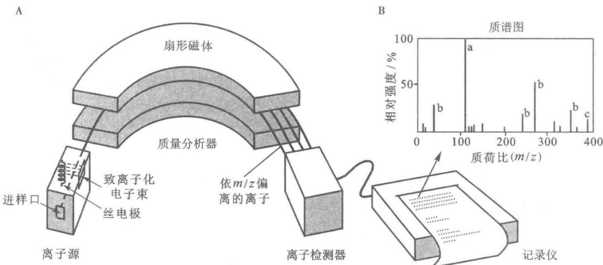  
图 2-34 电子撞击-扇形磁体质谱仪(A)的图解和质谱示意图(B)  
质谱图中 a 为基峰（强度为 100%）；b 为碎片峰；c 为母体峰（m/z 值最大）

质谱法分析需要挥发性样品，并必须把它离子化。最经典的方法是在高真空中用高能电子束（通常70 eV或6 700 kJ/mol）轰击电子源中的气化样品分子（RH），从RH中逐出一个价电子 $(e^{-})$ ，使成一个具有奇数电子的正离子自由基 $(RH^{+}\cdot)$ ，称为分子离子（molecular ion）：

$$
\begin{array}{c c} \mathrm{RH} & \xrightarrow {e ^ {-}} \mathrm{RH} ^ {+} \cdot + e ^ {-} \\ \text {样品分子} & \text {分子离子} \end{array}
$$

它在质谱上的峰称为母峰(parent peak)。母峰不一定是基峰,有时甚至观察不到,如果当被测分子受电子轰击时很快地被裂解成碎片离子的话。

由于蛋白质(以及核酸和多糖)这类生物大分子挥发度很低,受热又容易被分解,因此想获得能用于MS分析的气相离子就要求有革新的方法。1988年开发了两项技术,解决了这个难题。一项是强行使溶液中的蛋白质分子直接从液体进入真空系统(气相);这一技术称为电喷雾离子化(electrospray ionization, ESI)。ESI的基本步骤是待分析的蛋白质溶液在高电位(数千伏)下,通过毛细针管,由于溶液中电荷间的排斥力大于表面张力,样品溶液被喷散成荷电的细小雾状微滴;随着微滴中溶剂的蒸发,微滴表面的电荷密度增加,到达某一临界点时,蛋白质分子将以质子化的多电荷离子形式从液滴表面射出并被导入气相(图2-35B)。另一项是把蛋白质样品置于吸光的基质中,用短脉冲激光引起基质激发,进而使蛋白质离子化并从基质解吸进入气相。这一技术称为基质辅助激光解吸离子化(matrix-assisted laser desorption ionization,MALDI)。这两种方法,由于外加能量没有直接作用于样品分子,因此分子结构一般保持完好,正适于生物大分子的分析。

  
图 2-35 电喷雾离子化串联质谱法(ESI-MS/MS)肽段测序  
A. ESI-MS/MS装置示意图；B. ESI的主要步骤；C. MS/MS测序图解；D. 碰撞池中发生的肽断裂

图 2-34 中示出的质量分析器是磁分析器, 它适用于一般的有机分子质谱分析。用于生物大分子质谱分析的主要是飞行时间(time of flight, TOF)质量分析器和四极滤质器(quadrupole mass-filter)等。关于它们的详细介绍参看本章后面所列的参考书目3。

肽段的质谱法测序采用串联质谱(tandem MS或MS/MS)技术进行。串联质谱的装置主要是由两台质谱仪MS-1和MS-2串联而成(图2-35A)。MS-1起类似色谱的作用，用于蛋白质酶解液样品中肽段离子 $(\mathrm{P}_1,\mathrm{P}_2,\mathrm{P}_3$ 等)的分离，以获得一级质谱；然后依次导入MS-2中以获得所选肽段离子（例如 $\mathbf{P}_3$ ）的碎片质谱(二级质谱)。MS-1的前端装有ESI式离子源，用于样品中混合肽段的离子化(图2-35B)。在MS-1和MS-2之间的通道上串联一个真空的碰撞池(collision cell)，从一级质谱中选出的待测肽段离子，在进入MS-2之前先在这里跟少量惰性气体如氦或氩分子发生高能撞击，断裂成类似电子轰击产生的离子碎片 $(\mathrm{F}_1,\mathrm{F}_2,\mathrm{F}_3$ 等)，以便进入MS-2进行扫描(图2-35C)。

一级质谱中选出的肽段样品(如 $P_{3}$ )，它的每一个分子都沿长向的某一处有一个电荷。样品进入碰撞池后，多数肽段分子平均只有一处被断裂，而且多数断裂都发生在肽键上。这种裂解没有水的加入（这是在几乎真空中进行的），因此产物中可以有分子离子自由基，如羰基自由基（图 2-35D）。原先肽上的电荷保留在由它产生的一个碎片（羧基端碎片或氨基端碎片）上。

MS-2 能扫描所有荷电的碎片（没有荷电的碎片不被检测）并产生一套或多套质谱峰。假定一套峰是由同一类型的键（但在肽的不同部位）断裂产生并来自断裂键的同一侧（羧基端侧或氨基端侧）的荷电碎片所组成的，则在给定的这套峰中每一个相继的峰比前一个峰少一个氨基酸残基。两个相邻峰的碎片 $M_{r}$ 之差就是被裂解掉的那个残基的相对分子质量，由于这个差值是各种氨基酸的特征值，其范围从 57(Gly) 到 186(Trp)。因此可以根据相继峰之间的质量差鉴定出每次裂解丢失的氨基酸残基，从而揭示出肽的序列。唯一问题是亮氨酸和异亮氨酸区分不开（因为它们的相对分子质量相同），需要另作处理。

在二级质谱图上由肽键断裂产生的两套峰最为突出。一套是由氨基端侧碎片离子(b-型)组成；另一套是由羧基端侧碎片离子(y-型)组成。这两套峰可以根据它们质量上的细微差别区分开来，因为在碰撞池中发生的键断裂不产生完整的氨基和羧基，肽碎片上唯一完整的氨基和羧基就在原来的末端处（图2-35D）。从一套峰(如b-型)推断出的序列可以跟从另一套(y-型)获得的序列互相验证，增加所得序列的可靠性。

MS/MS 测序的优点是灵敏度高,所需的样品量少(低于 p mol 的水平);准确度高,测定速度快,目前串联质谱在数分钟内就能测出一个含 20\~30 个残基的肽序列。然而目前串联质谱还限于一些较短的序列(一般不超过 15 个残基)。

如果一种生物的基因组序列为已知,则该生物的一种蛋白质只要测出它一小段序列就能在序列数据库里推定出它的全序列。质谱测序对于以编目如在双向凝胶电泳上分出的数以百计的细胞蛋白质为目标的蛋白质组学研究是很理想的(见第36章)。

## 3. 根据基因的核苷酸序列推定多肽的氨基酸序列

现代生物学表明,细胞内的遗传信息流主要是从 DNA 到 RNA 到蛋白质。核酸分子的线性核苷酸序列决定蛋白质分子的氨基酸序列,也即遵循由三个相邻的核苷酸规定一个氨基酸的三联体密码规则(见第 33 章)。由于基因分离技术和快速 DNA 测序技术的发展,使得根据编码多肽的基因核苷酸序列来推定多肽的氨基酸序列成为可能。现在大多数蛋白质的氨基酸序列都是用这种间接的推定法获得的。虽然 DNA 测序比蛋白质测序更快、更准确,但如果基因尚未被分离,直接测定多肽的氨基酸序列还是必要的。因为直接测定可以提供 DNA 序列所不能提供的信息,例如二硫键的定位。此外如果知道一个多肽的部分序列,就可以大大地简化其相应基因的分离(见第 29 章)。

用于分析蛋白质和核酸两者的一系列方法开创了一门新的科目“全细胞生物化学”（whole cell biochemistry）。现在很多生物，从病毒到细菌到多细胞的真核生物直至人，都有它们的基因组DNA的全序列可供利用（表2-10）。成千上万的基因，包括编码未知功能的蛋白质的基因正被发现。为描述一个生物体基因组编码的全套蛋白质，研究者创设了一个新词“蛋白质组”（proteome）来表示它。正如第36章中所述，基因组学（genomics）和蛋白质组学（proteomics）这两个新的学科将在细胞的中间代谢和核酸代谢方面体现出它们的相互补充，以便在细胞甚至生物体的水平上绘制出新的、日益完善的生物化学图谱。

表 2-10 已完成基因组测序的众多生物中的几种

<table><tr><td>生物</td><td>基因组大小/核苷酸对</td><td>基因组</td><td>生物学意义</td></tr><tr><td>支原体(Mycoplasma genitalium)</td><td> $5.8 \times 10^{5}$ </td><td> $4.8 \times 10^{2}$ </td><td>最小的真正生物</td></tr><tr><td>梅毒密螺旋体(Treponema pallidum)</td><td> $1.1 \times 10^{6}$ </td><td> $1.0 \times 10^{3}$ </td><td>引起梅毒</td></tr><tr><td>幽门螺旋杆菌(Helicobacter pylori)</td><td> $1.7 \times 10^{6}$ </td><td> $1.6 \times 10^{3}$ </td><td>引起胃溃疡</td></tr><tr><td>大肠杆菌(Escherichia coli)</td><td> $4.6 \times 10^{6}$ </td><td> $4.4 \times 10^{3}$ </td><td>某些菌株是人的病原体</td></tr><tr><td>酿酒酵母(Saccharomyces cerevisiae)</td><td> $1.2 \times 10^{7}$ </td><td> $5.9 \times 10^{3}$ </td><td>单细胞真核生物</td></tr><tr><td>稻(Coryza sativa)</td><td> $3.9 \times 10^{8}$ </td><td> $3.2 \times 10^{4}$ </td><td>水稻</td></tr><tr><td>果蝇(Drosophila melanogaster)</td><td> $1.2 \times 10^{8}$ </td><td> $2.0 \times 10^{4}$ </td><td>实验用蝇</td></tr><tr><td>小家鼠(Mus musculus domesticus)</td><td> $2.6 \times 10^{9}$ </td><td> $2.7 \times 10^{4}$ </td><td>实验用小鼠</td></tr><tr><td>黑猩猩(Pan troglodyles)</td><td> $3.1 \times 10^{9}$ </td><td> $4.9 \times 10^{4}$ </td><td>一种类人猿</td></tr><tr><td>智人(Human sapiens)</td><td> $3.1 \times 10^{9}$ </td><td> $2.9 \times 10^{4}$ </td><td>人类</td></tr></table>

## （六）肽段在原多肽链中的次序的确定（氨基酸全序列的重建）

一般来说,如果多肽链只断裂成两段或三段便能测出它们的氨基酸序列,我们就不难推断出它们在原多肽链中的前后次序,只要知道原多肽链的C端和N端的氨基酸残基即可,除非末端残基恰好与切口的氨基酸一样才不能得出结论。然而多数场合,断裂得到的肽段多于此数目,因此除了能确定C端肽段和N端肽段的位置之外,中间那些肽段的次序还是不能肯定。为此,需要用两种或两种以上的不同方法断裂多肽样品,使其成两套或几套肽段。不同的断裂方法是指断裂的专一性不同,即切口是彼此错位的,因此两套肽段正好相互跨过切口而重叠(overlap),这种跨过切口而重叠的肽段称重叠肽(overlapping peptide)。

借助重叠肽可以确定肽段在原多肽链中的正确次序，拼凑出整个多肽链的氨基酸序列（图2-36）。同时，两套肽段可以互相核对各个肽段的氨基酸序列测定中是否有差错。如果两套肽段还不能提供全部必要的重叠肽，则必须使用第三种甚至第四种断裂方法以便得到足够的重叠肽，用于确定多肽链的全序列。

<table><tr><td rowspan="8">所得资料:</td><td>N端残基</td><td>H</td><td></td></tr><tr><td>C端残基</td><td>S</td><td></td></tr><tr><td>第一套肽段</td><td></td><td>第二套肽段</td></tr><tr><td>OUS</td><td></td><td>SEO</td></tr><tr><td>PS</td><td></td><td>WTOU</td></tr><tr><td>EOVE</td><td></td><td>VERL</td></tr><tr><td>RLA</td><td></td><td>APS</td></tr><tr><td>HOWT</td><td></td><td>HO</td></tr><tr><td colspan="4">借助重叠肽确定肽段次序:</td></tr><tr><td>末端残基</td><td>H</td><td></td><td>S</td></tr><tr><td>末端肽段</td><td>HOWT</td><td></td><td>APS或OUS</td></tr><tr><td>第一套肽段</td><td colspan="3">HOWTOUSEOVERLAPS</td></tr><tr><td>第二套肽段</td><td colspan="3">HOWTOUSEOVERLAPS</td></tr><tr><td>推断全序列</td><td colspan="3">HOWTOUSEOVERLAPS</td></tr></table>

图2-36 借助重叠肽确定肽段在原多肽链中的次序示意图  
图中字母代表氨基酸残基(但这里不是氨基酸的单字母符号),底下用黑线连接表示是一个肽段

## （七）二硫键位置的确定

如果蛋白质分子中存在链间或链内二硫键，则在完成多肽链的氨基酸序列分析以后，需要对二硫键的位置加以确定。确定二硫键的位置一般采用适当的试剂，如胃蛋白酶断裂含二硫键的蛋白质样品。所得的肽段混合物可以使用Brown及Hartlay的对角线电泳（diagonal electrophoresis）进行分离（电泳技术见第5章）。对角线电泳是：把水解后的含二硫键的混合肽段点到滤纸的中央，在pH6.5的条件下，进行第一向电泳。然后把滤纸暴露在过甲酸蒸气中，使S—S断裂。此时每个含二硫键的肽段被氧化成一对含磺基丙氨酸的肽。滤纸旋转90°角，在与第一向完全相同的条件下进行第二向电泳。在这里，大多数肽段的迁移率未变，并将位于滤纸的一条对角线上（图2-37），而含磺基丙氨酸的成对肽段比原来含二硫键的肽小而负电荷增加，结果它们都偏离

  
图2-37 对角线电泳图解  
图中 a, b 两个斑点是由一个二硫键断裂产生的肽段

了对角线。肽斑可用茚三酮显色确定。将每对含磺基丙氨酸的肽段(未用茚三酮显色的)分别取下,进行氨基酸序列分析,然后与多肽链的氨基酸序列比较,即可推断出二硫键在肽链间或(和)肽链内的位置。

## 十一、氨基酸序列与生物进化

从蛋白质的线型氨基酸序列可以得到它的三维结构、功能、细胞定位和进化等方面的信息,这些信息多数来自于目标蛋白质跟以前研究过的蛋白质之间的序列同源性(相似性)比较。现在已有成千上万的序列(包括基因和蛋白质)通过计算机互联网从生物数据库中可以找到并利用。本节主要介绍氨基酸序列和生物进化的关系。

## （一）序列的同源性、同源蛋白质和蛋白质家族

当两个基因有着明显的序列相似性（DNA中的核苷酸序列或其编码的蛋白质中氨基酸序列），则说它们具有序列同源性（homology），或说序列是同源的（homologous）；它们编码的蛋白质称为同源蛋白质（homolog, homologous protein）。同源蛋白质往往具有相同或相似的功能和三维结构。同源蛋白质的概念可以进一步细化。如果两个同源蛋白质是来自不同物种的，则称它们为直向（定向进化）同源蛋白质（ortholog, orthologous protein），直向同源蛋白质功能相同，结构相似；推测直向同源基因在不同的物种中编码行使同一功能的蛋白质。如果两个同源蛋白质是存在于同一个物种的，则称它们为共生（平行进化）同源蛋白质（paralog, paralogous protein）；认为编码它们的同源基因是由于基因重复并随后两个拷贝序列发生渐变而产生的；一般共生同源蛋白质不仅它们的序列相似而且立体结构也都相似，虽然在进化岁月中它们的生物功能发生了变化，相似而不相同。

虽然我们尚不清楚氨基酸序列是如何决定三维结构的，也还不能从序列预测功能；然而根据氨基酸序列的同源性可以确定具有某些功能和结构特点的蛋白质家族(family of protein)。一个蛋白质家族的成员就是同源蛋白质，它们有着共同的祖先。根据氨基酸序列的同源性程度，可以把各种蛋白质归属于各自的家族。一个蛋白质家族的成员一般有 $25\%$ 或更多的序列是相同的，其中较长的相似序列被称为域或结构域（详见第3章）；一般蛋白质家族的成员具有若干共同的立体结构和功能特征，但是有些家族，序列的相似程度不高，只是根据对某一功能是关键性的少数几个氨基酸残基的认同被确定的；这几个不变氨基酸残基常分散在一个不太长的肽段中，但它们的位置是确定的，这种具有家族标志性的序列称为模体(motif)或序列模体，也称基序。

## （二）同源蛋白质氨基酸序列的物种差异

氨基酸序列的同源性比较是利用计算机程序完成的。此程序可以直接对两个或多个待比较的蛋白质序列进行排比或对比(alignment)，必要时程序会在序列中引进适当的裂口(gap)使排比获得最佳的同源性，也即引进最少数目的裂口，使在所有被比较的序列中，同一残基对齐的(位置)数目达到最大（见图2-40）。

在进化期间蛋白质氨基酸序列中的氨基酸残基会发生变化，尤其是在外界环境发生剧烈改变的时候。就某一种蛋白质来说，对它的生物功能所必需的氨基酸残基在整个进化过程中几乎保持不变，是保守的，称为不变残基（invariable residue）；而对蛋白质功能不大重要的氨基酸残基在进化期间可能发生改变，即一种残基可被另一种残基替换，这些氨基酸残基被称为可变残基（variable residue），它们能够给人们提供追踪进化的信息。

在进化过程中,不同的蛋白质中氨基酸序列的残基突变频率可以相差很大,例如细胞色素 c, 在过去的 2 千万年中, 氨基酸残基的突变率为每 100 个残基约 60 次; 而血红蛋白在 580 万年中, 残基的突变率为每 100 个残基约 140 次; 像组蛋白 (histone) 和泛蛋白 (ubiquitin), 它们的残基突变率很小, 非常保守。要想追踪进化的过程, 弄清物种间的亲缘关系, 首先需要选定恰当的同源蛋白质家族, 然后利用它们来重建进化的途径。

细胞色素 $c(\text{cytochrome } c)$ 是一种含血红素的电子转运蛋白质，系能量代谢中的重要一员，存在于所有真核生物的线粒体中。大多数细胞色素 $c$ 含104氨基酸残基，相对分子质量约为12500。细胞色素 $c$ 是最先被选作序列同源性比较的材料。40多种物种的细胞色素 $c$ 的序列比较揭示，其多肽链中28个位置上的氨基酸残基对所有已分析过的样品都是相同的。看来这些不变残基对这种蛋白质的生物功能是至关重要的，因此这些位置不允许被其他氨基酸所取代。细胞色素 $c$ 除第70到80位之间的不变残基是成串存在的，其他都是不规则地分散在多肽链的各处。所有的细胞色素 $c$ 在第17位上都含有一个Cys残基，并且所有的细胞色素 $c$ 除一个例外，在第14位上都含有另一个Cys残基。这两个Cys残基是细胞色素 $c$ 连接辅基血红素的，第70到80位上的不变残基串可能是细胞色素 $c$ 与酶结合的部位（图2-38）。可变残基可能是一些“填充”或间隔的区域，氨基酸残基的更换不影响蛋白质的功能。

可变残基提供了另一类信息。细胞色素 c 和其他同源蛋白质的序列资料分析得出了一个重要的结论：来自任何两个物种的同源蛋白质的氨基酸序列之间的残基差异数与这两个物种之间的系统发生差异是成比例的，也即在进化位置上相差愈远，其氨基酸序列之间的残基差异数愈大（表 2-11）。例如人和黑猩猩的细胞色素 c 是相同的（差异残基数为零）；人和其他哺乳动物（绵羊）的细胞色素 c 相差 10 个残基；人的细胞色素 c 和响尾蛇（爬行类）、鲤鱼（鱼类）、蜗牛（软体动物）和天蛾（昆虫）的分别差 14,18,29 和 31 个残基；与酵母或高等植物的相比，差数在 40 个以上。

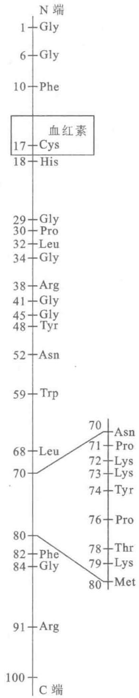  
图2-38 细胞色素 $c$ 中的不变氨基酸残基

40个物种的细胞色素 $c$ 中不变残基数为28个，随着被测的物种数目增多，不变残基数可能会减少

表 2-11 不同生物的细胞色素 c 序列之间氨基酸残基差异数的比较 $^{1}$

<table><tr><td></td><td>黑猩猩</td><td>绵羊</td><td>响尾蛇</td><td>鲤鱼</td><td>花园蜗牛</td><td>烟草天蛾</td><td>啤酒酵母</td><td>花椰素</td><td>欧防风</td></tr><tr><td>人</td><td>0</td><td>10</td><td>14</td><td>18</td><td>29</td><td>31</td><td>44</td><td>44</td><td>43</td></tr><tr><td>黑猩猩</td><td></td><td>10</td><td>14</td><td>18</td><td>29</td><td>31</td><td>44</td><td>44</td><td>43</td></tr><tr><td>绵羊</td><td></td><td></td><td>20</td><td>11</td><td>24</td><td>27</td><td>44</td><td>46</td><td>46</td></tr><tr><td>响尾蛇</td><td></td><td></td><td></td><td>26</td><td>28</td><td>33</td><td>47</td><td>45</td><td>43</td></tr><tr><td>鲤鱼</td><td></td><td></td><td></td><td></td><td>26</td><td>26</td><td>44</td><td>47</td><td>46</td></tr><tr><td>花园蜗牛</td><td></td><td></td><td></td><td></td><td></td><td>28</td><td>48</td><td>51</td><td>50</td></tr><tr><td>烟草天蛾</td><td></td><td></td><td></td><td></td><td></td><td></td><td>44</td><td>44</td><td>51</td></tr><tr><td>啤酒酵母</td><td></td><td></td><td></td><td></td><td></td><td></td><td></td><td>47</td><td>47</td></tr><tr><td>花椰菜</td><td></td><td></td><td></td><td></td><td></td><td></td><td></td><td></td><td>13</td></tr></table>

① 取自 Creighton, T E, Protein Structure and Molecular Properties, W. H. Freemam and San Francisco, Co., 1983.

细胞色素 c 的氨基酸序列资料已被用来核对各个物种之间的分类学关系以及绘制 [进化] 系统树 (phylogenetic tree)，这是一种说明物种之间进化关系的图解（图 2-39）。系统树是用计算机分析多种不同物种的细胞色素 c 序列并找出连接分支的最小突变残基数的方法构建起来的。用计算机方法还可以推论出系统树分支点处的潜在祖先序列。这种系统树与根据经典分类学建立起来的系统树非常一致。过去常认为“进化”这个概念虽可接受，但在实践中难于得到证实。根据系统树不仅可以研究从单细胞生物到多细胞生物的进化过程，而且可以粗略估计现存的各物种的分歧或趋异（divergence）时间。例如人和马的分歧时间是 7000 万\~7500 万年前，哺乳类和鸟是 2.8 亿年前，脊椎动物和酵母是 11 亿年前。

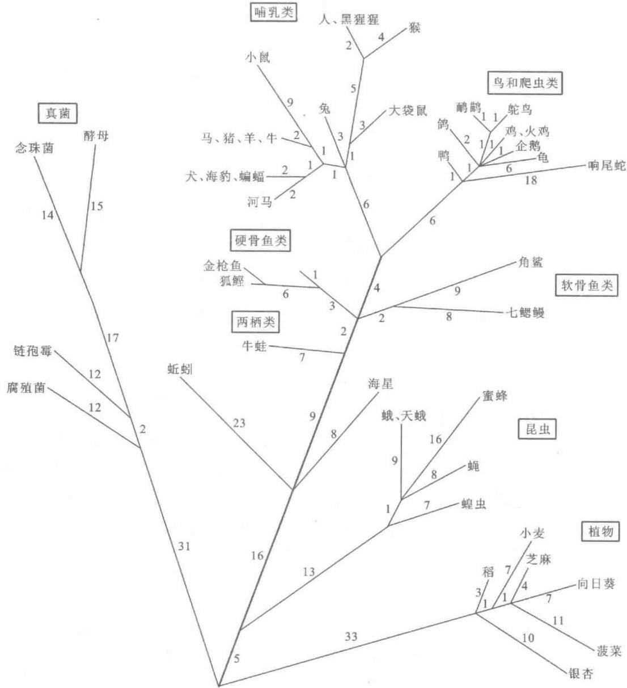  
图2-39 根据细胞色素 $c$ 序列的物种差异建立的系统树  
分支顶端是现存的物种；支点处是潜在（假设）祖先。沿分支线段的数字表示物种（分支顶点）和祖先（分支点）之间的或前、后祖先（分支点）之间的残基差异数

## （三）同源蛋白质具有共同的进化起源

同源蛋白质的氨基酸序列比较揭示,蛋白质家族的成员有着共同的进化祖先(evolutionary ancestry)。前面刚讲过的进化系统树(图2-39)表明,细胞色素c家族成员(直向同源蛋白质)的共同祖先存在于它们所在的物种形成之前。两个物种(两种同源蛋白质)亲缘关系愈近,它们离它们的最近共同祖先的进化时间也愈短;反之亦然。

$$
\begin{array} { r l } &  \text {肌红蛋白 } \quad \text {Gly- - - Leu- Ser- Asp-Gly-Glu-Trp- Glu-Leu- Val- Leu-Asn- Val- Trp-Gly-Lys-Val- Glu-Ala- } \\ &  \alpha \text {-珠蛋白 } \quad \text {Val- - - Leu- Ser- Pro- Ala-Asp-Lys- Thr-Asn- Val- Lys-[Ala]- Ala- Trp-Gly-Lys-Val- Gly-Ala- } \\ &  \beta \text {-珠蛋白 } \quad \text {Val- His- Leu- Thr- Pro- Glu-Glu-Lys- Ser- Ala- Val- Thr-Ala- Leu- Trp-Gly-Lys- Val- Asn- } \\ &  \text {-Asp-Ile-Pro-Gly-His- Gly-Gln-Glu- Val- Leu-Ile- Arg-Leu-Phe-Lys-Gly-His-Pro-Glu-Thr- } \\ &  \text {-His-Ala-Gly-Glu-Tyr-Gly-Ala-Glu-Ala-Leu-Gly- Arg-Met-Phe-Leu-Ser-Phe-Pro-Thr-Thr- } \\ &  \text {-Val-Asp-Glu- Val-Gly-Gly-Glu-Ala-Leu-Gly- Arg-Leu-Leu- Val- Val-Tyr-Pro-Trp-Thr- } \\ &  \text {-Leu-Glu-Lys-Phe- Asp-Lys-Phe-Lys-His-Leu-Lys-Ser-Glu-Asp-Glu-Met-Lys-Ala-Ser-Glu- } \\ &  \text {-Lys-Thr-Tyr-Phe-Pro-His-Phe- Asp-Leu-Ser-His-- -- -- -- -- -- -- -- -- -- -- -- -- -- -- -- -- -- -- -- -- -- -- -- -- -- -- -- -- -- -- -- -- -- -- -- -- -- -- -- -- -- -- -- -- -- -- -- -- -- -- -- -- -- -- -- -- -- -- -- -- -- -- -- -- -- -- -- -- -- -- -- -- -- -- -- -- -- -- -- -- -- -- -- -- -- -- -- -- -- -- -- -- -- -- -- -- -- -- -- -- - } \\ &  \text {-Gln-Arg-Phe-Phe-Glu-Ser-Phe-Gly-Asp-Leu-Ser-Thr-Pro-Asp-Ala- Val-Met[Gly-Asn-Pro- } \\ &  \text {-Asp-Leu-Lys-Lys-His-Gly-Ala-Thr- Val-Leu-Thr-Ala-Leu-Gly-Gly-Ile-Leu-Lys-Lys-Lys- } \\ &  \text {-Gln+Val-Lys-Gly-His-Gly-Lys-Lys-Val-Ala-Asp-Ala-Leu-Thr-An-Ala-Val-Ala-His-Val- } \\ &  \text {-Lys+Val-Lys-Ala-His-Gly-Lys-Lys-Val-Leu-Gly-Ala-Phe-Ser-Asp-Gly-Leu-Ala-His-Leu- } \\ &  \text {-Gly-His-His-Glu-Ala-Glu-Ile-Lys-Pro-Leu-Ala-Gln-Ser-His-Ala-Thr-Lys-His-Lys-Ile-- } \\ &  \text {-Asp-Asp-Met-Pro-Asn-Ala-Leu-Ser-Ala-Leu-Ser-Asp-Leu-His-Ala-His-Lys-Leu-Arg-Val-- } \\ &  \text {-Asp-Asn-Leu-Lys-Gly-Thr-Phe-Ala-Thr-Leu-Ser-Glu-Leu-His-Cys-Asp-Lys-Leu-His-Val-- } \\ &  \text {-Pro-Val-Lys-Tyr-Leu-Glu-Phe-Ile-Ser-Glu-Cys-Ile-Ile-Gln-Val-Leu-Gln-Ser-Lys-His-- } \\ &  \text {-Asp-Pro+Val-Asn-Phe-Lys-Leu-Leu-Ser-His-Cys-Leu-Leu-His-Thr-Leu-Ala-Ala-His-Leu-- } \\ &  \text {-Asp-Pro-Glu-Asn-Phe-Arg-Leu-Leu-Gly-Asn-Val-Leu-Val-Ans-Val-Leu-Ala-His-His-Phe-- } \\ &  \text {-Pro--Gly--Asp-Phe-Gly-Ala-Asp-Ala--Gln-Gly-Ala-Met-Asn--Lys-Ala-Leu-Glu-Leu-Phe-Arg-- } \\ &  \text {-Pro--Ala--Glu-Phe-Thr-Pro-Ala+Val-His-Ala-Ser-Leu-Asp--Lys-Phe-Leu-Ala-Ser+Val--Ser--Ser--Val--Ser--Val--Ser--Val--Ser--Val--Val--Val--Val--Val--Val--Val--Val--Val--Val--Val--Val--Val--Val--Val--Val--Val--Val--Val--Val--Val--Val--Val--Val--Val--Val--Val--Val--Val--Val--Val--Val--Val--Val--Val--Val--Val--Val--Val--Val--Val--Val--Val--Val--Val--Val--Val--Val--Val--Val--Value,}\\ &  \text {-Lys-Asp-Met-Ala-Ser-Asn-Tyr-Lys-Glu-Leu-Gly-Phe-Gln-Gly} \\ &  \text {-Thr-Val-Leu-Thr-Ser-Lys-Tyr-Arg-- } \\ & { \text {-Asn-Ala-Leu-Ala-His-Lys-Tyr-His-- } } \\ &  \text {-Lys-Met-Ala-Ser-Ser-Lys-Tyr-Tyr-Agngl-lucine,} \end{array}
$$

图 2-40 人肌红蛋白链、 $\alpha$ -珠蛋白链和 $\beta$ -珠蛋白链的序列同源性比较实线框内是肌红蛋白序列和 $\alpha$ -珠蛋白序列的共同残基（38个）；虚线框内是 $\alpha$ -珠蛋白序列和 $\beta$ -珠蛋白序列的共同残基（64个）；阴影部分是这3条链的共同残基（27个）

下面介绍肌红蛋白-血红蛋白家族，此家族成员存在于同一个物种（如人类），是共生同源蛋白质，它们除含有辅基血红素外，就是一条多肽链，称为珠蛋白（globin）。家族成员之一的肌红蛋白（myoglobin）是肌细胞中的储氧蛋白质，含153个氨基酸残基。另一些成员是红细胞中的氧转运蛋白质——血红蛋白（hemoglobin）的亚基。成年人的血红蛋白主要是由两个 $\alpha$ 亚基（每亚基141残基）和两个 $\beta$ 亚基（每亚基146残基）组成的四聚体（ $\alpha_{2}\beta_{2}$ ）。在胚胎发育期间还出现 $\gamma ,\delta ,\varepsilon$ 和 $\zeta$ 亚基，它们也是这个家族的成员；此外还会产生变体的亚基，有的变体甚至会引起人的分子病（见第4章）。这里仅举 $\alpha$ 亚基（ $\alpha$ -珠蛋白链）和 $\beta$ 亚基(β-珠蛋白链)跟肌红蛋白链进行排比。比较的结果

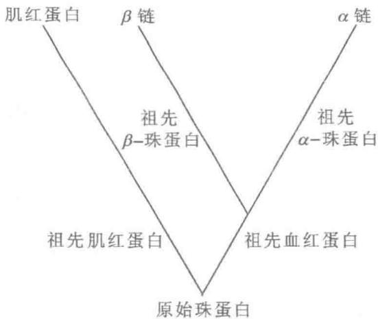  
图2-41 肌红蛋白和血红蛋白的进化树

表明，这3条珠蛋白多肽链具有很高的序列同源性（图2-40）。人肌红蛋白链和人 $\alpha$ -珠蛋白链有38个氨基酸残基序列是相同的，人 $\alpha$ -珠蛋白链和 $\beta$ -珠蛋白链有64个残基序列是相同的。同源性还反映在它们的三维结构上（见第4章）。这种同源关系反映出随机突变导致一级结构方面的残基取代和分歧发生这些事件的进化顺序。一个原始珠蛋白基因的复制产生了一个祖先肌红蛋白基因和一个祖先血红蛋白基因，肌红蛋白基因是最先被歧化出来的。其后祖先血红蛋白基因的复制产生了今天的 $\alpha$ -珠蛋白基因和 $\beta$ -珠蛋白基因的祖先(图2-41)。然而借血红素辅基结合 $\mathrm{O}_2$ 的能力仍被这3种多肽链保留下来。

丝氨酸蛋白酶家族的成员包括胰蛋白酶、胰凝乳蛋白酶和弹性蛋白酶（elastase）等，是一类蛋白水解酶，它们的催化部位都是由Ser、His和Asp这3个残基构成的，并因为其中的丝氨酸残基对活性起关键性的作用，所以被称为丝氨酸蛋白酶（serine protease）。参与血液凝固的凝血酶（thrombin）以及溶解血纤蛋白的纤溶酶（plasmin）也都属于丝氨酸蛋白酶类（见第4章）。这类酶显示足够的序列同源性，可以得出结论：它们是经过祖先丝氨酸蛋白酶基因的复制而来的，虽然现在它们对底物的偏爱已十分不同，也即它们的底物结合部位的肽段序列发生改变，进而形成了各自的、跟底物专一性相应的三维结构。总之，基因的复制是创造多样性的重要进化力。

一些生物功能和来源都不同的蛋白质也可能具有共同的祖先。一个著名的例子是鸡蛋清中的溶菌酶（lysozyme）和人乳中的 $\alpha-$ 乳清蛋白（ $\alpha-lactalbumin$ ），它们分别由 139 个和 123 个氨基酸残基组成。溶菌酶是一种糖苷酶，它的功能是水解细菌细胞壁的多糖成分（见第 9 章）； $\alpha-$ 乳清蛋白是调节乳腺中的乳糖合成的。这两种蛋白质的生物功能，除了都在涉及糖的反应中起作用之外，其他方面很少有相似之处。不过它们的三级结构还是十分相似的；氨基酸序列的同源性也很高，有 48 个位置的残基是相同的。由此可以推论出它们的进化关系——具有共同的进化起源。存在这种进化关系是可能的，不过时间和进程已经抹去了它们有共同祖先的大部分证据了。

## 十二、肽和蛋白质的化学合成:固相肽合成

很多肽化合物是有用的药物。有3种途径可以获得肽：①从动、植物组织中分离纯化（但有些肽在组织中的浓度很低，造成纯化困难）；②基因工程手段（见第35章）；③直接化学合成。现代的强大技术使得直接的化学合成在许多场合成为首选的方法。除商业上的用途外，一些较大的蛋白质特殊肽段的合成已成为研究蛋白质结构和功能的日益重要的手段。

1958 年,北京大学生物学系在国内首次化学合成了具有生物活性的八肽——催产素。接着于 1965 年 9 月,中国科学院生物化学研究所、有机化学研究所和北京大学化学系协作,在世界上首次人工化学合成了结晶牛胰岛素。与此同时美国和德国也合成了胰岛素。这标志着人类在研究生命起源的历程中迈进了一大步。

肽和蛋白质的人工合成是指氨基酸按照一定顺序的控制合成。实现控制合成的一个困难是，接肽反应所需的试剂能同时和其他不应参加接肽的官能团发生作用，因此接肽以前必须先把这些官能团加以封闭或保护，以免与接肽试剂发生作用而生成不需要的肽键或其他键。肽键形成之后，再将保护基除去。因此在肽链合成过程中，每连接一个氨基酸残基，都要经过几个步骤。自然，要想得到一个足够长的多肽就必须每步都要有较高的产率。试计算一下，如果每连接一个残基的产率为96.0%，则合成50-肽的总产率为13%，合成100-肽的总产率为1.8%；如果每连接一个残基的产率为99.8%，则合成50-肽的总产率为90%，合成100-肽的总产率为82%。

作为保护基,必须符合这样的条件,即在接肽时能起保护作用,而在接肽后又很容易除去,并且不致引起肽键的断裂。目前广泛应用的氨基保护基是叔丁氧羰基(tertiary butyloxycarbonyl, BOC)和9-芴甲氧羰基(9-fluorenylmethyloxycarbonyl, Fmoc)(图2-42步骤①),这些基团可用 $CF_{3}COOH$ 在室温下除去。羧基一般以盐或酯的形式加以保护。常用的盐有钾盐、钠盐、三乙胺盐等；酯有甲酯（OMe）、乙酯（OEt）和叔丁酯（OBut）。甲酯和乙酯可用皂化方法除去，但易引起氨基酸消旋；叔丁酯可在温和条件下用酸除去。

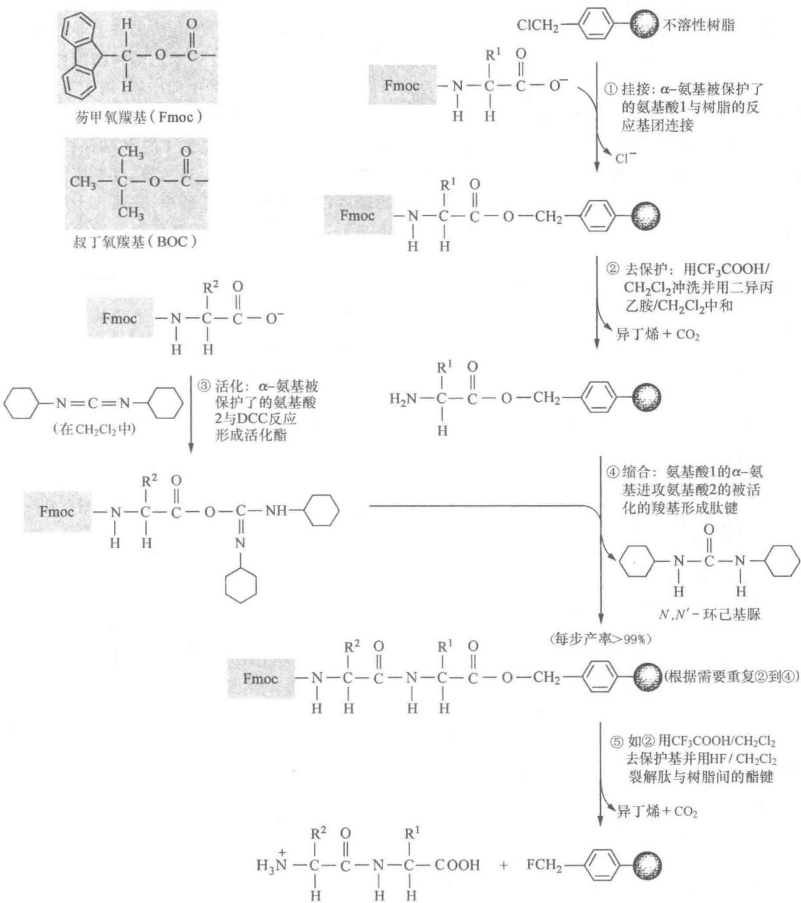  
图 2-42 固相肽的化学合成原理  
反应步骤②到④是形成每个肽键所必需的。芴氧羰基(Fmoc)或叔丁氧羰基(BCO)是保护氨基酸或肽的 $\alpha$ -氨基的，防止发生不需要的反应。化学合成从羰基端向氨基端进行，跟体内蛋白质合成的方向相反（第33章）

肽键的形成不会自发进行,需要输入能量(见第33章)。通常总是在接肽反应前把氨基酸的羧基活化或使用缩合剂进行接肽。缩合剂可以直接与一个羧基被保护了的和一个氨基被保护了的两个氨基酸一起进行反应。最有效的接肽缩合剂是 $N,N^{\prime}-$ 二环己基碳二亚胺（ $N,N^{\prime}$ -dicyclohexylcarbodiimide，缩写为DCC）。在接肽反应中，DCC从两个氨基酸残基中夺取一分子 $\mathrm{H}_2\mathrm{O}$ ，自身转变为不溶的 $N,N^{\prime}-$ 二环己基脲而从反应液中沉淀出来，很容易过滤除去。用缩合剂DCC接肽实际上也是一种活化羧基的方法，缩合反应的中间物可看成是活化酯。在缩合反应中DCC的变化见图2-42步骤④。

近几十年发展起来的固相肽合成（solid-phase peptide synthesis, SPPS）是控制合成技术上的一个重大飞跃。肽合成技术对分子生物学和基因工程研究具有重要的理论和实践意义，并为医药工业合成更有效的肽类药物开辟了广阔的前景。在固相合成中，肽链的逐步延长是在不溶性聚苯乙烯树脂颗粒上进行的（类似用于柱层析的装置），这是为了反应后可通过简单的过滤回收被延长的中间产物，用于下一步合成。为此 $\alpha-$ 氨基被保护了的氨基酸1（待合成肽的C末端氨基酸）先与氯甲基聚苯乙烯-二乙烯苯树脂反应，共价地挂接在树脂上（此共价键在整个合成过程中始终保持稳定）。除去氨基酸1的N端保护基后，氨基被保护了的氨基酸2以DCC为缩合剂，接到氨基酸1残基的氨基上。重复上述步骤，可以使肽链按控制顺序从C端向N端延长。肽链合成到最后一步时，把树脂悬浮在无水三氟乙酸中，并通入干燥的HF，使肽与树脂脱离，同时一些保护基也被切除（图2-42步骤⑤）。整个合成过程现在可以在程序控制的自动化固相肽合成仪(peptide synthesizer)上进行。1962年美国R.B.Merrifield等人报道，利用这种肽合成仪成功地合成了九肽——舒缓激肽（图2-23），总产率达 $85\%$ ，合成一条舒缓激肽共花 $27\mathrm{h}$ ，平均合成每个肽键只需要 $3\mathrm{h}$ 。他们还合成了胰岛素的A和B两条肽链（图2-28），A链(21个残基)用8天时间，B链(30个残基)用11天。1969年他们成功地应用合成仪完成了含有124个氨基酸残基的牛胰核糖核酸酶（图2-29）的人工合成，这是第一个人工合成的酶。为此Merrifield等人荣获诺贝尔化学奖。近年来，适应分子生物学研究及肽合成自动化与普及化的需要，SPPS技术在许多方面都有新的进展。然而，令人印象深刻的肽合成技术与生物过程相比仍是逊色的，含100个残基的蛋白质在细菌细胞内只需约5秒钟就被精确地合成了。

<!-- EN-BEGIN 3.4 -->

### 【英文对应 3.4】The Structure of Proteins: Primary Structure

> 来源：Lehninger Principles of Biochemistry（书籍/02_生物化学原理） 第3章 Amino Acids, Peptides, and Proteins，§3.4。对应本章“十二、肽和蛋白质的化学合成:固相肽合成”。

Purification of a protein is usually only a prelude to a detailed biochemical dissection of its structure and function. What is it that makes one protein an enzyme, another a hormone, another a structural protein, and still another an antibody? How do they differ chemically? The most obvious distinctions are structural, and to protein structure we now turn.

We can describe the structure of large molecules such as proteins at several levels of complexity, arranged in a kind of conceptual hierarchy. Four levels of protein structure are commonly defined (Fig. 3-23). P2 A description of all covalent bonds (mainly peptide bonds and disulfide bonds) linking amino acid residues in a polypeptide chain is its primary structure. The most important element of primary structure is the sequence of amino acid residues. Secondary structure refers to particularly stable arrangements of amino acid residues giving rise to recurring structural patterns. Tertiary structure describes all aspects of the three-dimensional folding of a polypeptide. When a protein has two or more polypeptide subunits, their arrangement in space is referred to as quaternary structure. Our exploration of proteins will eventually include complex protein machines consisting of dozens to thousands of subunits. Primary structure is the focus of the remainder of this chapter; we discuss the higher levels of structure in Chapter 4.

  
FIGURE 3-23 Levels of structure in proteins. The primary structure consists of a sequence of amino acids linked together by peptide bonds, and it includes any disulfide bonds. The resulting polypeptide can be arranged into units of secondary structure, such as an $\alpha$ helix. The helix is a part of the tertiary structure of the folded polypeptide, which is itself one of the subunits that make up the quaternary structure of the multisubunit protein, in this case hemoglobin. [Data from PDB ID 1HGA, R. Liddington et al., J. Mol. Biol. 228:551, 1992.]

Primary structure now becomes our focus. We first consider empirical clues that amino acid sequence and protein function are closely linked, then describe how amino acid sequence is determined; finally, we outline the many uses to which this information can be put.

#### [EN] The Function of a Protein Depends on Its Amino Acid Sequence

The bacterium Escherichia coli produces more than 3,000 different proteins; a human has \~20,000 genes that may produce over a million different proteins (through genetic processes discussed in Part III of this text). In both species, each type of protein has a unique amino acid sequence that confers a particular three-dimensional structure. This structure in turn confers a unique function.

Amino acid sequences are important elements of the broader realm of biological information. They are a major functional expression of information stored in DNA in the form of genes. The sequences are not at all random. Each protein has a distinctive number and sequence of amino acid residues. As we shall see in Chapter 4, P4 the primary structure of a protein determines how it folds up into its unique three-dimensional structure, and this in turn determines the function of the protein.

Some simple observations illustrate the functional importance of primary structure, or the amino acid sequence of a protein. First, as we have already noted, proteins with different functions always have different amino acid sequences. Second, thousands of human genetic diseases have been traced to the production of proteins with less activity or altered activity. The alteration can range from a single change in the amino acid sequence (as in sickle cell disease, described in Chapter 5) to deletion of a larger portion of the polypeptide chain (as in most cases of Duchenne muscular dystrophy: a large deletion in the gene encoding the protein dystrophin leads to production of a shortened, inactive protein). Finally, on comparing functionally similar proteins from different species, we find that these proteins often have similar amino acid sequences. Thus, a close link between protein primary structure and function is evident.

The amino acid sequence for a particular protein is not absolutely fixed, or invariant. Virtually all of the proteins in humans are polymorphic, having amino acid sequence variants in the human population. Many human proteins are polymorphic even within an individual, with amino acid variations occurring due to processes that will be described in Part III of this text. Some of these variations have little or no effect on the function of the protein; others may affect function dramatically. Furthermore, proteins that carry out a broadly similar function in distantly related species can differ greatly in overall size and amino acid sequence.

Although the amino acid sequence in some regions of the primary structure might vary considerably without affecting biological function, most proteins contain crucial regions that are essential to their function and thus have sequences that are conserved. The fraction of the overall sequence that is critical varies from protein to protein, complicating the task of relating sequence to three-dimensional structure, and structure to function. Before we can consider this problem further, however, we must examine how sequence information is obtained.

In 1953, Frederick Sanger worked out the sequence of amino acid residues in the polypeptide chains of the hormone insulin (Fig. 3-24), surprising many researchers who had long thought that determining the amino acid sequence of a polypeptide would be a hopelessly difficult task. The elucidation of DNA structure in that same year by Watson and Crick telegraphed a likely relationship between DNA and protein sequences. Barely a decade after these discoveries, the genetic code relating the nucleotide sequence of DNA to the amino acid sequence of protein molecules was elucidated (Chapter 27).

  
FIGURE 3-24 Amino acid sequence of bovine insulin. The two polypeptide chains are joined by disulfide cross-linkages (yellow). The A chain of insulin is identical in human, pig, dog, rabbit, and sperm whale insulins. The B chains of the cow, pig, dog, goat, and horse are identical.

The amino acid sequences of proteins are now most often derived indirectly from the DNA sequences in genome databases. However, an array of techniques derived from traditional methods of polypeptide sequencing made important contributions to the broader field of protein chemistry. The method used by Sanger to sequence insulin is based on the classical method for direct chemical sequencing of proteins from the amino terminus, the two-step Edman degradation developed by Pehr Edman.

#### [EN] Protein Structure Is Studied Using Methods That Exploit Protein Chemistry

The sequence of a protein can be predicted from the sequence of the gene encoding it, which is usually available in genomic databases. Direct sequencing can also be provided by mass spectrometry. Many methods used in traditional protein sequencing protocols remain valuable for labeling proteins or breaking them into parts for functional and structural analysis.

For example, the amino-terminal $\alpha$ -amino group of a protein can be labeled with 1-fluoro-2,4-dinitrobenzene (FDNB), dansyl chloride, or dabsyl chloride (Fig. 3-25). These reagents also label the $\varepsilon$ -amino group of lysine residues. Disulfide bonds within a polypeptide or between polypeptide subunits can be broken irreversibly (Fig. 3-26).

  
FIGURE 3-25 Modification of the $\alpha$ -amino group at the amino terminus. The reaction is a nucleophilic displacement of the halide ion as shown for (a) FDNB and (b) dansyl chloride. The $\varepsilon$ -amino group of lysine will also be labeled. Dansyl chloride and (c) dabsyl chloride, another labeling reagent, have useful absorbance and/or fluorescent properties at visible wavelengths.

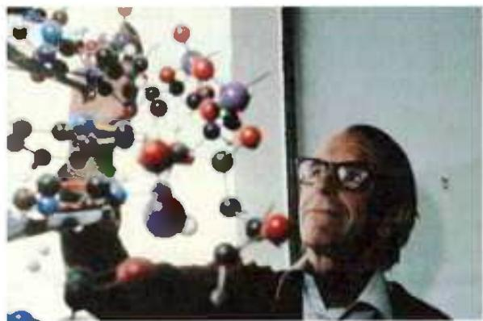  
Frederick Sanger, 1918–2013 (Bettmann/Getty Images.)

TABLE 3-6 The Specificity of Some Common Methods for Fragmenting Polypeptide Chains

<table><tr><td>Reagent (biological source)a</td><td>Cleavage pointsb</td></tr><tr><td>Trypsin (bovine pancreas)</td><td>Lys, Arg (C)</td></tr><tr><td>Chymotrypsin (bovine pancreas)</td><td>Phe, Trp, Tyr (C)</td></tr><tr><td>Staphylococcus aureus V8 protease (bacterium S. aureus)</td><td>Asp, Glu (C)</td></tr><tr><td>Asp-N-protease (bacterium Pseudomonas fragi)</td><td>Asp, Glu (N)</td></tr><tr><td>Pepsin (porcine stomach)</td><td>Leu, Phe, Trp, Tyr (N)</td></tr><tr><td>Endoproteinase Lys C (bacterium Lysobacter enzymogenes)</td><td>Lys (C)</td></tr><tr><td>Cyanogen bromide</td><td>Met (C)</td></tr><tr><td colspan="2">aAll reagents except cyanogen bromide are proteases.bResidues furnishing the primary recognition point for the protease or reagent; peptide bond cleavage occurs on either the carbonyl (C) side or the amino (N) side of the indicated amino acid residues.</td></tr></table>

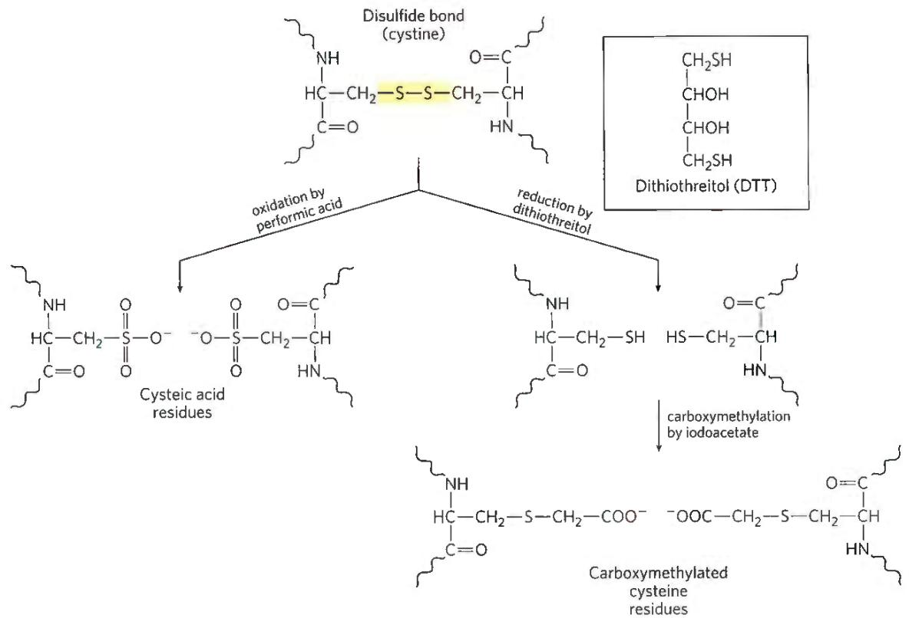  
FIGURE 3-26 Breaking disulfide bonds in proteins. Two common methods are illustrated. Oxidation of a cystine residue with performic acid produces two cysteic acid residues. Reduction by dithiothreitol (or  
$\beta$ -mercaptoethanol) to form Cys residues must be followed by further modification of the reactive —SH groups to prevent re-formation of the disulfide bond. Carboxymethylation by iodoacetate serves this purpose.

Enzymes called proteases catalyze the hydrolytic cleavage of peptide bonds and provide the most common method to break a protein into parts. Some proteases cleave only the peptide bond adjacent to particular amino acid residues (Table 3-6) and thus fragment a polypeptide chain in a predictable and reproducible way. A few chemical reagents also cleave the peptide bond adjacent to specific residues. Among proteases, the digestive enzyme trypsin catalyzes the hydrolysis of only those peptide bonds in which the carbonyl group is contributed by either a Lys or an Arg residue, regardless of the length or amino acid sequence of the chain. A polypeptide with three Lys and/or Arg residues will usually yield four smaller peptides upon cleavage with trypsin. Moreover, all except one of these will have a carboxyl-terminal Lys or Arg.

The capacity to modify proteins in specific ways has many applications in the lab. The methods used to break disulfide bonds can also be used to denature proteins when that is required. The development of reagents to label the amino-terminal amino acid residue led eventually to the development of an array of reagents that could react with specific groups at many locations on a protein. For example, the sulfhydryl group on Cys residues can be modified with iodoacetamides, maleimides, benzyl halides, and bromomethyl ketones (Fig. 3-27). Other amino acid residues can be modified by reagents linked to a dye or other molecule to aid in protein detection or functional studies. The cleavage of proteins into smaller parts with proteases has numerous applications that will be explored in subsequent chapters of this book.

#### [EN] Mass Spectrometry Provides Information on Molecular Mass, Amino Acid Sequence, and Entire Proteomes

Mass spectrometry can provide a highly accurate measure of the molecular mass of a protein, readily distinguishing between single proton differences. However, this technology can do much more. The sequences of multiple short polypeptide segments (20 to 30 amino acid residues each) in a protein sample can be obtained within seconds. Unknown purified proteins can be identified, and their mass can be accurately determined. When coupled to powerful peptide separation protocols, mass spectrometry can document a complete cellular proteome—defined as the entire complement of proteins in a cell, including estimates of their relative abundance—in just an hour.

  
FIGURE 3-27 Reagents used to modify the sulfhydryl groups of Cys residues. (See also Fig. 3-26.)

The mass spectrometer has been an indispensable tool in chemistry for more than a century. Molecules to be analyzed, referred to as analytes, are first ionized in a vacuum. When the newly charged molecules are introduced into an electric and/or magnetic field, their paths through the field are a function of their mass-to-charge ratio, m/z. This measured property of the ionized species can be used to deduce the mass (m) of the analyte with very high precision.

As the m/z measurements are made in the gas phase, the technique was long limited to relatively small molecules. In 1988, two different techniques were introduced to permit transfer of macromolecules to the gas phase while limiting decomposition; these new capabilities revolutionized protein sequencing. In one technique, proteins are placed in a light-absorbing matrix. With a short pulse of laser light, the proteins are ionized and then desorbed from the matrix into the vacuum system. This process, known as matrix-assisted laser desorption/ionization mass spectrometry, or MALDI MS, is used to measure the mass of macromolecules. In a second method, macromolecules in solution are forced directly from the liquid phase to the gas phase. A solution of analytes is passed through a charged needle that is kept at a high electrical potential, dispersing the solution into a fine mist of charged microdroplets. The solvent surrounding the macromolecules rapidly evaporates, leaving multiply charged macromolecular ions in the gas phase. This technique is called electrospray ionization mass spectrometry, or ESI MS. Protons added during passage through the needle give additional charge to the macromolecule. The m/z of the molecule can then be analyzed in the vacuum chamber. One method for analyzing m/z is called time of flight or TOF, in which ion acceleration in an electric field depends on m/z. A newer, more-efficient method is the Orbitrap, in which ions are trapped in orbit between an outer barrel-shaped electrode and an inner spindle electrode. The trajectory of the electrons, related to their mass and charge, is detected and converted to m/z by a Fourier transform.

The process for determining the molecular mass of a protein with ESI MS is illustrated in Figure 3-28. As a protein is injected into the gas phase, it acquires a variable number of protons, and thus positive charges, from the solvent. The variable addition of these charges creates a spectrum of species with different mass-to-charge ratios. Each successive peak corresponds to a species that differs from that of its neighboring peak by a charge of 1 and a mass of 1 (one proton). The mass of the protein can be determined from any two neighboring peaks.

  
FIGURE 3-28 Electrospray ionization mass spectrometry of a protein. (a) A protein solution is dispersed into highly charged droplets by passage through a needle under the influence of a high-voltage electric field. The droplets evaporate, and the ions (with added protons in this case) enter the mass spectrometer for m/z measurement. (b) The spectrum generated is a family of peaks, with each successive peak (from right to left) corresponding to a charged species with both mass and charge increased by 1. The inset shows a computer-generated transformation of this spectrum. [Information from M. Mann and M. Wilm, Trends Biochem. Sci. 20:219, 1995.]

Amino acid sequence information is extracted using a technique called tandem MS, or MS/MS. A solution containing the protein or multiple proteins under investigation is first treated with a protease (often trypsin, due to its high specificity) to hydrolyze it to a mixture of shorter peptides. The mixture is then injected into a mass spectrometer that has two mass filters in tandem (Fig. 3-29a, top). In the first, the peptide mixture is sorted so that only one of the several types of peptides produced by cleavage emerges at the other end. The sample of the selected peptide, each molecule of which has a charge somewhere along its length, then travels through a vacuum chamber between the two mass spectrometers. In this collision cell, the peptide is further fragmented by high-energy impact with a “collision gas” such as helium or argon that is bled into the vacuum chamber. Each individual peptide is broken in only one place, on average. Although the breaks are not hydrolytic, most occur at the peptide bonds.

  
(a)

  
(b)  
FIGURE 3-29 Obtaining protein sequence information with tandem MS. (a) After proteolytic hydrolysis, a protein solution is injected into a mass spectrometer (MS-1). The different peptides are sorted so that only one type is selected for further analysis. The selected peptide is further fragmented in a chamber between the two mass spectrometers, and m/z for each fragment is measured in the second mass spectrometer (MS-2). Many of the ions generated during this second fragmentation result from breakage of the peptide bond, as shown. These are called b-type or y-type ions, depending on whether the charge is retained on the amino- or carboxyl-terminal side, respectively. (b) A typical spectrum with peaks representing the peptide fragments generated from a sample of one small peptide (21 residues). The labeled peaks are y-type ions derived from amino acid residues. The number in parentheses over each peak is the molecular weight of the amino acid ion. The successive peaks differ by the mass of a particular amino acid in the original peptide. The deduced sequence is shown at the top. [Information from T. Keough et al., Proc. Natl. Acad. Sci. USA 96:7131, 1999, Fig. 3.]

The second mass filter then measures the m/z ratios of all the charged fragments. This process generates one or more sets of peaks. A given set of peaks (Fig. 3-29b) consists of all the charged fragments that were generated by breaking the same type of bond (but at different points in the peptide). One set of peaks includes only the fragments in which the charge was retained on the amino-terminal side of the broken bonds; another includes only the fragments in which the charge was retained on the carboxyl-terminal side of the broken bonds. Each successive peak in a given set has one less amino acid than the peak before. The difference in mass from peak to peak identifies the amino acid that was lost in each case, thus revealing the sequence of the peptide. The only ambiguities involve leucine and isoleucine, which have the same mass. Although multiple sets of peaks usually are generated, the two most prominent sets generally consist of charged fragments derived from breakage of the peptide bonds. The amino acid sequence derived from one set can be confirmed by the other, improving the confidence in the sequence information obtained.

The analysis of complex mixtures of proteins—even entire cellular proteomes—is facilitated by liquid chromatography (LC) that is integrated into the instrument (LC-MS/MS). The organism of interest is generally one in which the genomic sequence is known. Cellular proteins are first isolated in an extract, then digested into relatively short peptides by a protease such as trypsin. The very complex mixture of peptides is subjected to chromatography, so that resolved peptides are introduced to the mass spectrometer successively. Transfer from the liquid phase to the gas phase is facilitated by MALDI or ESI. Each peptide is analyzed for amino acid sequence, and that sequence is compared to the known genomic sequence available in databases to identify the protein it came from. Because more peptides are generated from the more common proteins in the mixture, the exercise also provides a measure of protein abundance. MS/MS scans of dozens of different peptides can be generated in less than a second. The entire proteome of a yeast cell can be analyzed in less than an hour.

Mass spectrometry provides a wealth of information for proteomics research, enzymology, and protein chemistry in general. The accurately measured molecular mass of a protein is critical to its identification. Changes in the cellular proteome can be monitored as a function of metabolic state or environmental conditions. Mass changes in the peptides scanned during a proteome analysis can reveal protein modifications of all kinds. Amino acid sequencing can reveal changes in protein sequence that result from the editing of messenger RNA in eukaryotes (Chapter 26). These methods, along with modern DNA sequencing processes (Chapter 8), are all part of a robust toolbox used to probe biological information at many levels.

#### [EN] Small Peptides and Proteins Can Be Chemically Synthesized

Many peptides are potentially useful as pharmacologic agents, and their production is of considerable commercial importance. In addition to its commercial applications, the synthesis of specific peptide portions of larger proteins is an increasingly important tool for the study of protein structure and function. There are three ways to obtain a peptide: (1) purification from tissue, a task often made difficult by the vanishingly low concentrations of some peptides; (2) genetic engineering (Chapter 9); and (3) direct chemical synthesis. Powerful techniques now make direct chemical synthesis an attractive option in many cases.

The complexity of proteins makes the traditional synthetic approaches of organic chemistry impractical for peptides with more than four or five amino acid residues. One problem is the difficulty of purifying the product after each step.

The major breakthrough in this technology was provided by R. Bruce Merrifield in 1962. His innovation was to synthesize a peptide while keeping one end attached to a solid support. The support is an insoluble polymer (resin) contained within a column, similar to that used for chromatographic procedures. The peptide is built up on this support one amino acid at a time, through a standard set of reactions in a repeating cycle (Fig. 3-30). At each successive step in the cycle, protective chemical groups block unwanted reactions.

The technology for chemical peptide synthesis has been automated. An important limitation of the process is the efficiency of each chemical cycle. Incomplete reaction at one stage can lead to formation of an impurity (in the form of a shorter peptide) in the next. The chemistry has been optimized to permit the synthesis of proteins of 100 amino acid residues in a few days in reasonable yield. A very similar approach is used to synthesize nucleic acids (see Fig. 8-33). It is worth noting that this technology, impressive as it is, still pales when compared with biological processes. The same 100-residue protein would be synthesized with exquisite fidelity in about 5 seconds in a bacterial cell.

Methods for the efficient ligation (joining together) of peptides allow the assembly of synthetic peptides into larger polypeptides and proteins. Novel forms of proteins can be created with precisely positioned chemical groups, including those that might not normally be found in a cellular protein. This provides one approach to test theories of enzyme catalysis, to create proteins with altered chemical properties, and to design protein sequences that will fold into particular structures. This last application provides the ultimate test of our ability to relate the primary structure of a peptide to the three-dimensional structure that it takes up in solution.

#### [EN] Amino Acid Sequences Provide Important Biochemical Information

P4 Knowledge of the sequence of amino acids in a protein can offer insights into its three-dimensional structure and its function, cellular location, and evolution. Most of these insights are derived by searching for similarities between a protein of interest and previously studied proteins. Comparison of a newly obtained sequence with sequence data in international repositories often reveals relationships both surprising and enlightening.

We do not understand in detail exactly how the amino acid sequence determines three-dimensional structure, nor can we always predict function from sequence. However, protein families that have some shared structural or functional features can be readily identified on the basis of amino acid sequence similarities. Individual proteins are assigned to families based on the degree of similarity in amino acid sequence. Members of a family are usually identical across 25% or more of their sequences, and proteins in these families generally share at least some structural and functional characteristics. Some families, however, are defined by identities involving only a few amino acid residues that are critical to a certain function. A number of similar substructures, or “domains” (to be defined more fully in Chapter 4), occur in many functionally unrelated proteins. These domains often fold into structural configurations that have an unusual degree of stability or that are specialized for a certain environment. Evolutionary relationships can also be inferred from the structural and functional similarities within protein families.

Certain amino acid sequences serve as signals that determine the cellular location, chemical modification, and half-life of a protein. Special signal sequences, usually at the amino terminus, are used to target certain proteins for export from the cell; other proteins are targeted for distribution to the nucleus, the cell surface, the cytosol, or other cellular locations. Other sequences act as attachment sites for prosthetic groups, such as sugar groups in glycoproteins and lipids in lipoproteins. Some of these signals are well characterized and are easily recognized in the sequence of a newly characterized protein (Chapter 27).

KEY CONVENTION Much of the functional information encapsulated in protein sequences comes in the form of consensus sequences. This term is applied to such sequences in DNA, RNA, or protein. When a series of related nucleic acid sequences or protein sequences are compared, a consensus sequence is the one that reflects the most common base or amino acid at each position. Parts of the sequence that have particularly good agreement often represent evolutionarily conserved functional domains. Mathematical tools available online can generate consensus sequences or identify them in sequence databases. Box 3-2 illustrates common conventions for displaying consensus sequences.

#### [EN] Protein Sequences Help Elucidate the History of Life on Earth

The simple string of letters denoting the amino acid sequence of a protein holds a surprising wealth of information, which is being unlocked by applying the tools of bioinformatics to genomic and protein sequence data.

FIGURE 3-30 Chemical synthesis of a peptide on an insoluble polymer support. Reactions 1 through 4 are necessary for the formation of each peptide bond. The 9-fluorenylmethoxycarbonyl (Fmoc) group (shaded blue) prevents unwanted reactions at the $\alpha$ -amino group of the residue (shaded light red). Chemical synthesis proceeds from the carboxyl terminus to the amino terminus, the reverse of the direction of protein synthesis in vivo.

P4 Each protein's function relies on its three-dimensional structure, which in turn is determined largely by its primary structure. Thus, the biochemical information conveyed by a protein sequence is limited only by our understanding of structural and functional principles.

The constantly evolving tools of bioinformatics make it possible to identify functional segments in new proteins and also help to establish both their sequence and their structural relationships to proteins already in the databases. On a different level of inquiry, protein sequences

#### [EN] Consensus Sequences and Sequence Logos

Consensus sequences can be represented in several ways. To illustrate two types of conventions, we use two examples of consensus sequences (Fig. 1): an ATP-binding structure called a P loop (see Fig. 12-2) and a $\mathrm{Ca^{2+}}$ -binding structure called an EF hand (see Fig. 12-17). The rules described here are adapted from those used by the sequence comparison website PROSITE (http://prosite.expasy.org/sequence\_logo.html), using the standard one-letter codes for the amino acids.

In one type of consensus sequence designation, shown at the top of (a) and (b) in Figure 1, each position is separated from its neighbor by a hyphen. A position where any amino acid is allowed is designated x. Ambiguities are indicated by listing the acceptable amino acids for a given position between

  
FIGURE 1 Representations of two consensus sequences. (a) P loop, an ATP-binding structure; (b) EF hand, a Ca $^{2+}$ -binding structure. [Sequence data for (a) from document ID PDOC00017 and for (b) from document ID PDOC00018, www.expasy.org/prosite, N. Hulo et al., Nucleic Acids Res. 34:D227, 2006. Sequence logos created with WebLogo, http://weblogo.berkeley.edu, G. E. Crooks et al., Genome Res. 14:1188, 2004.]

are beginning to tell us how the proteins evolved and, ultimately, how life evolved on this planet.

The field of molecular evolution is often traced to Emile Zuckerkandl and Linus Pauling, whose work in the mid-1960s advanced the use of nucleotide and protein sequences to explore evolution. The premise is deceptively straightforward. If two organisms are closely related, the sequences of their genes and proteins should be similar. The sequences increasingly diverge as the evolutionary distance between two organisms increases. The promise of this approach began to be realized in the square brackets. For example, in (a), [AG] means Ala or Gly. If all but a few amino acids are allowed at one position, the amino acids that are not allowed are listed between curly brackets. For example, in (b), {W} means any amino acid except Trp. Repetition of an element of the pattern is indicated by following that element with a number or range of numbers between parentheses. In (a), for example, x(4) means x-x-x-x; x(2,4) means x-x, or x-x-x, or x-x-x-x. When a pattern is restricted to either the amino terminus or carboxyl terminus of a sequence, that pattern starts with < or ends with >, respectively (not so for either example here). A period ends the pattern. Applying these rules to the consensus sequence in (a), either A or G can be found at the first position. Any amino acid can occupy the next four positions, followed by an invariant G and an invariant K. The last position is either S or T.

Sequence logos provide a more informative and graphic representation of an amino acid (or nucleic acid) multiple sequence alignment. Each logo consists of a stack of symbols for each position in the sequence. The overall height of the stack (in bits) indicates the degree of sequence conservation at that position, whereas the height of each symbol (letter) in the stack indicates the relative frequency of that amino acid (or nucleotide). For amino acid sequences, the colors denote the characteristics of the amino acid: polar (G, S, T, Y, C, Q, N), green; basic (K, R, H), blue; acidic (D, E), red; and hydrophobic (A, V, L, I, P, W, F, M), black. The classification of amino acids in this scheme is somewhat different from the classification in Table 3-1 and Figure 3-5. The amino acids with aromatic side chains are subsumed into the nonpolar (F, W) and polar (Y) classifications. Glycine, always hard to classify, is assigned to the polar group. Note that when multiple amino acids are acceptable at a particular position, they rarely occur with equal probability. One or a few usually predominate. The logo representation makes the predominance clear, and a conserved sequence in a protein is made obvious. However, the logo obscures some amino acid residues that may be allowed at a position, such as the Cys that occasionally occurs at position 8 of the EF hand in (b).

1970s, when Carl Woese used ribosomal RNA sequences to define the Archaea as a group of living organisms distinct from the Bacteria and Eukarya. The information in genome and protein sequence databases can be used to trace biological history if we can learn to read the genetic hieroglyphics.

Evolution has not taken a simple linear path. P4 For a given protein, the amino acid residues essential for the activity of the protein are conserved over evolutionary time. The residues that are less important to function may vary over time—that is, one amino acid may substitute for another—and these variable residues can provide the information to trace evolution. Some proteins have more variable amino acid residues than others. For these and other reasons, different proteins evolve at different rates.

Another complicating factor in tracing evolutionary history is the rare transfer of a gene or a group of genes from one organism to another, a process called horizontal gene transfer. The transferred genes may be similar to the genes they were derived from in the original organism, whereas most other genes in the two organisms may be only distantly related. An example of horizontal gene transfer is the recent rapid spread of antibiotic-resistance genes in bacterial populations. The proteins derived from these transferred genes would not be good candidates for the study of bacterial evolution, because they share only a very limited evolutionary history with their "host" organisms.

The study of molecular evolution generally focuses on families of closely related proteins. In most cases, the families chosen for analysis have essential functions in cellular metabolism that must have been present in the earliest viable cells, thus greatly reducing the chance that they were introduced relatively recently by horizontal gene transfer. For example, a protein called EF-1α (elongation factor 1α) is involved in the synthesis of proteins in all eukaryotes. A similar protein, EF-Tu, with the same function, is found in bacteria. Similarities in sequence and function indicate that EF-1α and EF-Tu are members of a family of proteins that share a common ancestor. The members of protein families are called homologous proteins, or homologs. The concept of a homolog can be further refined. If two proteins in a family (that is, two homologs) are present in the same species, they are referred to as paralogs. Homologs from different species are called orthologs. The process of tracing evolution involves first identifying suitable families of homologous proteins and then using them to reconstruct evolutionary paths.

Homologs are identified using computer programs that can directly compare specific protein sequences or that can search databases to identify any protein with an amino acid that matches within defined parameters. The electronic search process can be thought of as sliding one sequence past the other until a section with a good match is found. Within this sequence alignment, a positive score is assigned for each position where the two sequences are identical, and a negative score is introduced wherever gaps need to be introduced in one sequence or the other to bring them into register. The overall score provides a measure of the quality of the alignment (Fig. 3-31). The program selects the alignment with the optimal score that maximizes identical amino acid residues while minimizing the introduction of gaps.

Finding identical amino acids is often inadequate in attempts to identify related proteins or, more importantly, to determine how closely related the proteins are on an evolutionary time scale. A more useful analysis also considers the chemical properties of substituted amino acids. Many of the amino acid differences within a protein family may be conservative—that is, an amino acid residue is replaced by a residue that has similar chemical properties. For example, a Glu residue may substitute in one family member for the Asp residue found in another; both amino acids are negatively charged. Logically, such a conservative substitution should receive a higher score in a sequence alignment than a nonconservative substitution does—for example, in replacement of the Asp residue with a hydrophobic Phe residue.

P4 For most efforts to find homologies and explore evolutionary relationships, protein sequences are superior to nucleic acid sequences that do not encode a protein or functional RNA. For a nucleic acid, with its four different types of residues, random alignment of nonhomologous sequences will generally yield matches for at least 25% of the positions. Introduction of a few gaps can often increase the fraction of matched residues to 40% or more, and the probability of chance alignment of unrelated sequences becomes quite high. The 20 different amino acid residues in proteins greatly lower the probability of uninformative chance alignments of this type.

The programs used to generate a sequence alignment are complemented by methods that test the reliability of the alignments. A common computerized test is to shuffle the amino acid sequence of one of the proteins being compared in order to produce a random sequence, then to instruct the program to align the shuffled sequence with the other, unshuffled one. Scores are assigned to the new alignment, and the shuffling and alignment process is repeated many times. The

#### [EN] Escherichia coli TGNRTIAVYDLGGGTFDISIIEIDEVDGEKTFEVLATNGDTHLGGEDFDSRLINYL Bacillus subtilis DEDQTILLYDLGGGTFDVSILELGDG VFEVRSTAGDNRLGGDDFDQVIIDHL

Gap

FIGURE 3-31 Aligning protein sequences with the use of gaps. Shown here is the sequence alignment of a short section of the Hsp70 proteins (a widespread class of protein-folding chaperones) from two well-studied bacterial species, E. coli and Bacillus subtilis.

Introduction of a gap in the B. subtilis sequence allows a better alignment of amino acid residues on either side of the gap. Identical amino acid residues are shaded. [Information from R. S. Gupta, Microbiol. Mol. Biol. Rev. 62:1435, 1998, Fig. 2.]

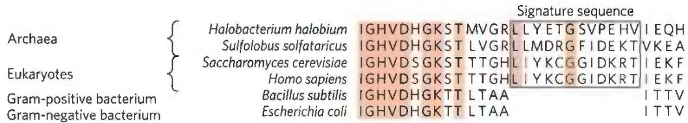  
FIGURE 3-32 A signature sequence in the EF-1α/EF-Tu protein family. The signature sequence (boxed) is a 12-residue insertion near the amino terminus of the sequence. Residues that align in all species are shaded. Both archaea and eukaryotes have the signature, although the sequences of

original alignment, before shuffling, should have a score significantly higher than any of those within the distribution of scores generated by the random alignments; this increases the confidence that the sequence alignment has identified a pair of homologs. Note that the absence of a significant alignment score does not necessarily mean that no evolutionary relationship exists between two proteins. As we shall see in Chapter 4, three-dimensional structural similarities sometimes reveal evolutionary relationships where sequence homology has been wiped away by time.

To use a protein family to explore evolution, researchers identify family members with similar molecular functions in the widest possible range of organisms. The sequence divergence in these protein families allows segregation of organisms into classes based on their evolutionary relationships. Certain segments of a protein sequence may be found in the organisms of one taxonomic group but not in other groups; these segments can be used as signature sequences for the group in which they are found. An example of a signature sequence is an insertion of 12 amino acids near the amino terminus of the EF-1α/EF-Tu proteins in all archaea and eukaryotes but not in bacteria (Fig. 3-32). This particular signature is one of many biochemical clues that can help establish the evolutionary relatedness of eukaryotes and archaea.

P4 By considering the sequences of multiple proteins, researchers can construct elaborate evolutionary trees. Figure 3-33 presents one such tree for 10,462 bacterial species, based on the sequences of 120 proteins ubiquitous in bacteria. In Figure 3-33, the free end points of lines are called “external nodes”; each represents an extant species, and each is so labeled. The points where two lines come together, the “internal nodes,” represent extinct ancestor species. In most representations (including Fig. 3-33), the lengths of the lines connecting the nodes reflect amino acid substitutions in the selected proteins that separate one species from another. The use of 120 different proteins permits calibration and a more accurate determination of the time required for the various species to diverge.

As more sequence information is made available in databases, we move toward one of the core goals of biology—creating a detailed tree of life that describes the evolution and relationship of every organism on Earth. The story is a work in progress. The questions being asked and answered are fundamental to how humans view themselves and the world around them.

the insertions are distinct for the two groups. The variation in the signature sequence reflects the significant evolutionary divergence that has occurred at this site since it first appeared in a common ancestor of both groups. [Information from R. S. Gupta, Microbiol. Mol. Biol. Rev. 62:1435, 1998, Fig. 7.]  
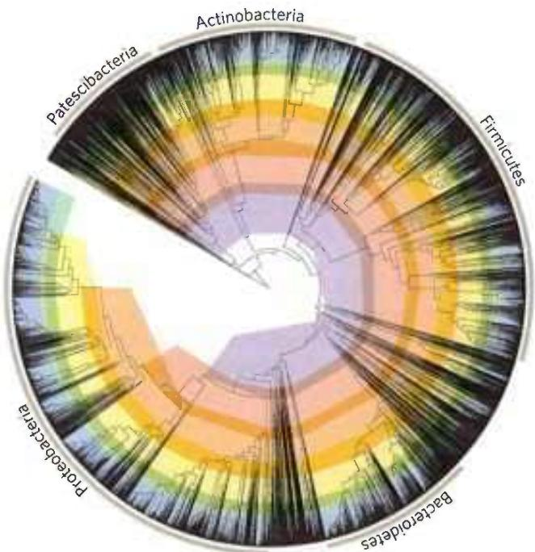  
FIGURE 3-33 Evolutionary tree derived from amino acid sequence comparisons. This tree includes data from 10,462 bacterial species. The leaf nodes (points of intersection with the outer circle) represent extant species. Inner nodes (points where lines emanating from the leaf nodes come together) represent extinct ancestral species. Line lengths correspond to evolutionary time, as measured by sequence divergence in 120 proteins common to all bacteria. The major bacterial phyla are denoted by lines encompassing parts of the outer circle. [Information from D. H. Parks, Nat. Biotechnol. 36:996, 2018, Fig. 1c].

#### [EN] SUMMARY 3.4 The Structure of Proteins: Primary Structure

■ Differences in protein function result from differences in amino acid composition and sequence. The chemical properties of particular amino acid residues are often critical to the function of a protein.

■ Most amino acid sequences are deduced from genomic sequences and by mass spectrometry. Methods derived from classical approaches to protein sequencing remain important in protein chemistry.

■ Short proteins and peptides (up to about 100 residues) can be chemically synthesized. The peptide is built up, one amino acid residue at a time, while tethered to a solid support.

■ Protein sequences are a rich source of information about protein structure and function. Bioinformatics can analyze changes in the amino acid sequences of homologous proteins over time to trace the evolution of life on Earth.

<!-- EN-END 3.4 -->

## 提要

$\alpha-$ 氨基酸是蛋白质的单体亚基。蛋白质水解时可以产生 $\alpha-$ 氨基酸，它是含有一个 $\alpha-$ 羧基、一个 $\alpha-$ 氨基和一个在 $\alpha-$ 碳原子上取代的各异的R基的有机酸。蛋白质中的氨基酸都是L型的，但碱水解得到的氨基酸是D型和L型的消旋混合物。

氨基酸根据 R 基的极性和电荷 (pH 7 时) 的不同, 可以分为 5 类。参与蛋白质组成的常见氨基酸只有 20 种。此外还有若干种氨基酸只在某些蛋白质中存在, 它们是在翻译后由相应的常见氨基酸 (残基) 经化学修饰而来的。除参与蛋白质组成的氨基酸外, 还有很多种氨基酸作为代谢物存在于各种组织和细胞中。

氨基酸在它们的酸碱性质方面不同,各有自己特征的滴定曲线。一氨基一羧基氨基酸(具有不解离的 R 基)在低 pH 时是二元酸( $\mathrm{H}_{3}^{+}\mathrm{NCH(R)COOH}$ ),当 pH 增加时将以几种离子形式存在。具有可解离 R 基的氨基酸还有额外的离子形式,这取决于介质的 pH 和它自身的 $\mathrm{pK}_{\mathrm{a}}$ 。某一氨基酸处于净电荷为零的兼性离子( $\mathrm{H}_{3}^{+}\mathrm{NCH(R)COO}^{-}$ )状态时的介质 pH 称为该氨基酸的等电点,用 pI 表示。

所有的 $\alpha$ -氨基酸都能与茚三酮发生颜色反应。 $\alpha-NH_{2}$ 与 2,4-二硝基氟苯(DNFB)作用产生相应的 DNP-氨基酸(Sanger 反应); $\alpha-NH_{2}$ 与苯异硫氰酸酯(PITC)作用形成相应氨基酸的苯氨基硫甲酰衍生物(Edman 反应)。半胱氨酸的巯基在空气中很容易氧化成二硫键, 形成胱氨酸。

除甘氨酸外所有 $\alpha-$ 氨基酸的 $\alpha-$ 碳原子都是手性的，因此这些氨基酸至少存在两个立体异构体。氨基酸的构型，L 型和 D 型，跟参考分子甘油醛的绝对构型相关联。

参与蛋白质组成的氨基酸中，色氨酸、酪氨酸和苯丙氨酸在紫外区有光吸收，这是紫外吸收法定量蛋

白质的依据。

氨基酸分析分离方法主要是基于氨基酸的酸碱性质和极性大小。常用的方法有分配层析和离子交换层析等。

肽和蛋白质是氨基酸的线型多聚体,因此也称肽链或多肽链。肽或多肽是由氨基酸通过肽键共价连接而成。肽键(—CO—NH—)具有平面性质,称为肽平面,它在肽链折叠成三维结构的过程中是很重要的。许多短肽已获得结晶。短肽分子在晶体或溶液中也以偶极离子形式存在。天然存在的活性肽是通过两条不同的途径产生的:一条是核糖体途径,如动物产生的肽类激素;另一条是非核糖体途经,如细菌合成的肽类抗生素。

蛋白质主要是由碳、氢、氧、氮和少量的硫组成。蛋白质的 $M_{\mathrm{r}}$ 介于6000到100000或更大。根据化学组成蛋白质分为两大类：简单蛋白质和缀合蛋白质；根据分子形状可分为纤维状蛋白质、球状蛋白质和膜蛋白质。为了表述蛋白质结构的不同层次，经常使用一级结构、二级结构、三级结构和四级结构等术语。一级结构指共价主链的氨基酸序列，有时也称为化学结构；二、三、四级结构是三维结构，也称高级结构。

至今已确定了百万个不同蛋白质的氨基酸序列，早期测出的有胰岛素、牛胰核糖核酸酶、血红蛋白等。有关蛋白质序列的信息可以在互联网的序列数据库中找到。

蛋白质测序的策略是①用氧化或还原方法断裂蛋白质分子中的二硫键，并分离出各多肽链；②用末端分析法鉴定多肽链的末端残基；③用断裂专一肽键的酶或化学试剂把多肽链裂解成较小的肽段；④用Edman降解法或质谱法测定各肽段的氨基酸序列；⑤用肽段交错重叠法重建多肽链的全序列；⑥确定二硫键的位置，还原蛋白质分子的完整化学结构。蛋白质序列也可从它的相应基因的核苷酸序列推定出来。

短的蛋白质和肽(100多个残基)能用化学方法合成。利用固相肽合成技术已成功地合成许多肽和蛋白质,这对分子生物学和基因工程的研究具有重要影响。

## 习题

1. 计算赖氨酸的 $\varepsilon-NH_{3}^{+}$ 20% 被解离时的溶液 pH。

2. 计算谷氨酸的 $\gamma$ -COOH 三分之二被解离时的溶液 pH。

3. 利用表 2-2 中的数据, 计算下列物质 0.1 mol/L 溶液的 pH: (a) 亮氨酸盐酸盐; (b) 亮氨酸钠盐; (c) 等电亮氨酸。

4. 根据表 2-2 中氨基酸的 $pK_{a}$ 值，计算下列氨基酸的 pI 值：丙氨酸、半胱氨酸、天冬氨酸和精氨酸。

5. 向 1 L 1 mol/L 处于等电点的甘氨酸溶液加入 0.3 mol HCl, 问所得溶液的 pH 是多少? 如果加入 0.3 mol NaOH 以代替 HCl 时, pH 又是多少?

6. 在等电 pH 时丙氨酸分子的净电荷为零。符合净电荷为零的丙氨酸结构式可以有两种形式：兼性离子 $\left(\mathrm{H}_{3}\mathrm{N}^{+}\mathrm{CH}\left(\mathrm{CH}_{3}\right)\mathrm{COO}^{-}\right)$ 和不荷电的非离子 $\left(\mathrm{H}_{2}\mathrm{NCH}\left(\mathrm{CH}_{3}\right)\mathrm{COOH}\right)$ 。(a) 为什么等电点时丙氨酸兼性离子形式是占优势的？(b) 等电点时丙氨酸非离子形式所占的分数是多少？

7. 计算 0.25 mol/L 的组氨酸溶液在 pH 6.4 时各种离子形式的浓度 (mol/L)。

8. 说明用含一个结晶水的固体组氨酸盐酸盐（相对分子质量 = 209.6；咪唑基 $pK_{a} = 6.0$ ）和 1 mol/L KOH 配制 1 L pH 6.5 的 0.2 mol/L 组氨酸盐缓冲液的方法。

9. L-亮氨酸溶液(3.0 g/50 mL 6 mol/L HCl)在20 cm旋光管中测得的旋光度为+181°。计算L-亮氨酸在6 mol/L HCl中的比旋。

10. 鸟氨酸是精氨酸循环和尿素循环的中间物之一。它具有下列的透视结构式

$$
\begin{array}{c} \mathrm{CH} _ {2} - \mathrm{CH} _ {2} - \mathrm{CH} _ {2} - \mathrm{NH} _ {2} \\ | \\ \mathrm{H} - \mathrm{C} _ {\alpha} - \mathrm{NH} _ {3} \\ | \\ \mathrm{COO} ^ {-} \end{array}
$$

问: 它是 L-鸟氨酸还是 D-鸟氨酸? 解释之。

11. 标出异亮氨酸的 4 个光学异构体的 RS 构型。

12. 甘氨酸在溶剂 A 中的溶解度为在溶剂 B 中的 4 倍, 苯丙氨酸在溶剂 A 中的溶解度仅为在溶剂 B 中的 2 倍。利用

<!-- END OFFICIAL API PART part_001 -->

<!-- BEGIN OFFICIAL API PART part_002 -->

在溶剂 A 和 B 之间的逆流分布方法将甘氨酸和苯丙氨酸分开。在起始溶液中甘氨酸含量为 100 mg，苯丙氨酸为 81 mg。试回答下列问题：(a) 利用由 4 个分布管组成的逆流分布系统时，甘氨酸和苯丙氨酸各在哪一号分布管中含量最高？(b) 在这样的管中每种氨基酸各为多少毫克？

13. 将含有天冬氨酸 $(\mathrm{pI} = 2.98)$ 、甘氨酸 $(\mathrm{pI} = 5.97)$ 、苏氨酸 $(\mathrm{pI} = 6.53)$ 、亮氨酸 $(\mathrm{pI} = 5.98)$ 和赖氨酸 $(\mathrm{pI} = 9.74)$ 的 $\mathrm{pH}3.0$ 柠檬酸缓冲液，加到预先用同样缓冲液平衡过的Dowex-50强阳离子交换树脂柱中，随后用该缓冲液洗脱此柱，并分部收集洗出液，这5种氨基酸将按什么次序被洗脱下来？

14. 三肽 Lys-Lys-Lys 的 pI 必定大于它的任何一个个别基团的 $\mathrm{p}K_{\mathrm{a}}$ 。这种说法是否正确？为什么？

15. 一个四肽，经胰蛋白酶水解得两个片段，一个片段在 $280 \mathrm{~nm}$ 附近有强的光吸收，并且 Pauly 反应和坂口 (Sakaguchi) 反应（含胍基化合物在碱性次氯酸钠溶液中与 $\alpha$ -萘酚反应产生红色）呈阳性。另一片段用溴化氰处理释放出一个与茚三酮反应呈黄色的氨基酸。写出此四肽的氨基酸序列。

16. 今有一个七肽，经分析它的氨基酸组成是：Lys、Pro、Arg、Phe、Ala、Tyr 和 Ser。此肽未经胰凝乳蛋白酶处理时，与 FDNB 反应不产生 $\alpha$ -DNP-氨基酸。经胰凝乳蛋白酶作用后，此肽断裂成两个肽段，其氨基酸组成分别为（Ala、Tyr、Ser）和（Pro、Phe、Lys、Arg）。这两个肽段与 FDNB 反应，可分别产生 DNP-Ser 和 DNP-Lys。此肽与胰蛋白酶反应，同样能生成两个肽段，它们的氨基酸组成分别是（Arg、Pro）和（Phe、Tyr、Lys、Ser、Ala）。试问此七肽的一级结构是怎样的？

17. 一个八肽的氨基酸序列是: Glu-Trp-His-Ser-Ile-Arg-Pro-Gly。(a) 在 pH 3.8 和 11 时, 此肽的净电荷符号和数量为多少? (利用表 2-2 中所列的氨基酸 R 基、末端羧基和末端氨基的 $pK_{a}$ ); (b) 估算此八肽的 $pI$ 。

18. 一个十肽的氨基酸分析表明其水解液中存在下列产物: $NH_{4}^{+}$ 、Asp、Glu、Tyr、Arg、Met、Pro、Lys、Ser 和 Phe，并观察到下列事实:(a)用羧肽酶(此酶不能水解以 Pro 为 C 末端的肽)处理该十肽无效;(b)胰蛋白酶处理产生两个四肽和游离的 Lys;(c)梭菌蛋白酶(专一水解 Arg 羧基侧的肽键)处理产生一个四肽和一个六肽;(d)溴化氰处理产生一个八肽和一个二肽(Asn-Pro);(e)胰凝乳蛋白酶处理产生两个三肽和一个四肽。N 端的胰凝乳蛋白酶水解肽段在中性 pH 时携带 -1 净电荷,在 pH 12 时携带 -3 净电荷;(f)一轮 Edman 降解给出 PTH-丝氨酸。写出该十肽的氨基酸序列。

19. 有一个 A 肽: 经酸解分析得知由 Lys、His、Asp、Glu₂、Ala 以及 Val、Tyr 和两个 NH₃ 分子组成。当 A 肽与 FDNB 试剂反应后, 得 DNP-Asp; 当用羧肽酶处理后得游离缬氨酸。如果我们在实验中将 A 肽用胰蛋白酶降解时, 得到两种肽, 其中一种肽 (Lys、Asp、Glu、Ala 和 Tyr) 在 pH 6.4 时, 净电荷为零; 另一种肽 (His、Glu 和 Val) 可给出 DNP-His, 在 pH 6.4 时, 带正电荷。此外, A 肽用胰凝乳蛋白酶降解时, 也得到两种肽, 其中一种 (Asp、Ala 和 Tyr) 在 pH 6.4 时呈中性, 另一种 (Lys、His、Glu₂ 和 Val) 在 pH 6.4 时, 带正电荷。写出 A 肽的氨基酸序列?

20. 一个多肽可还原为两个肽段，它们的序列如下：链1为Ala-Cys-Phe-Pro-Lys-Arg-Trp-Cys-Arg-Arg-Val-Cys，链2为Cys-Tyr-Cys-Phe-Cys。当用胃蛋白酶消化原多肽（具有完整的二硫键）时可得下列各肽：(a)(Ala、Cys₂和Val)；(b)(Arg、Lys、Phe和Pro)；(c)(Arg₂、Cys₂、Trp和Tyr)；(d)(Cys₂和Phe)。试指出在该天然多肽中二硫键的位置。

21. 蜂毒明肽(apamin)是存在蜜蜂毒液中的一个十八肽,其序列为:CNCKAPETALCARRCQQH。已知蜂毒明肽形成二硫键,不与碘乙酸发生反应。(a)问此肽中存在多少个二硫键?(b)请设计确定这些(个)二硫键位置的策略。

22. 叙述用 Merrifield 固相化学方法合成二肽 Lys-Ala。如果你打算向 Lys-Ala 加入一个亮氨酸残基使成三肽，可能会遇到什么样的麻烦？

## 主要参考书目

1. 王镜岩, 朱圣庚, 徐长法. 生物化学教程. 北京: 高等教育出版社, 2008.

2. 王克夷. 蛋白质导论. 北京: 科学出版社, 2007.

3. 鞠焜先,邱宗荫,丁世家,等. 生物分析化学. 北京:科学出版社,2007.

4. 林克椿. 医学生物物理学. 北京: 北京大学医学出版社, 2004.

5. 金冬雁, 金奇, 侯云德. 核酸和蛋白质的化学合成与序列分析. 北京: 科学出版社, 1996.

6. Segel I H. 生物化学计算. 吴经才, 等译. 北京: 科学出版社, 1984.

7. Nelson D L, Cox M M. Lehninger Principles of Biochemistry. 5th ed. New York: W. H. Freeman and Company, 2008.

8. Garrett R H, Grisham C M. Biochemistry. 3rd ed. Boston: Thomson Learning, 2004.

9. Yates J R. Section III: Protein Structure Analysis by Mass Spectrometry//Karger B L, Hancock W S. Methods in Enzymology. New York: Academic Press, 1996.

10. Creighton T E. Protein Function — A Practical Approach. 2nd ed. Oxford: Oxford University Press, 1997.

11. Merriflied B. Solid Phase Synthesis. Science, 1986, 232: 341-347.

12. Barrett G C. Chemistry and Biochemistry of the Amino Acids. New York: Chapman and Hall, 1985.

(徐长法)

## 网上资源

习题答案

<!-- EN-BEGIN 第3章章末 -->

## 【英文对应 第3章章末】Amino Acids, Peptides, and Proteins：关键术语、习题与简答

> 来源：Lehninger Principles of Biochemistry（书籍/02_生物化学原理） 第3章章末，以及书末 Abbreviated Solutions to Problems 第3章。

### [EN] KEY TERMS

Terms in bold are defined in the glossary.

amino acids 70  
residue 70  
R group 71  
chiral center 71  
enantiomers 71  
absolute configuration 72  
D, L system 72  
polarity 73  
absorbance, A 75  
zwitterion 77  
amphoteric 77  
ampholyte 77  
isoelectric pH (isoelectric point, pI) 79  
peptide 80  
protein 80  
peptide bond 81  
condensation 81  
hydrolysis 81  
oligopeptide 81  
polypeptide 81  
amino-terminal residue 81  
carboxyl-terminal residue 81  
oligomeric protein 82  
protomer 82  
conjugated protein 83  
prosthetic group 83  
crude extract 84  
fraction 84  
fractionation 84  
dialysis 84  
column chromatography 84  
ion-exchange chromatography 84  
cation-exchange resin 86 anion-exchange resin 86  
size-exclusion  
chromatography 86  
affinity chromatography 86  
high-performance liquid  
chromatography  
(HPLC) 86  
electrophoresis 87  
sodium dodecyl sulfate  
(SDS) 88  
isoelectric focusing 88  
specific activity 90  
primary structure 90  
secondary structure 90  
tertiary structure 90  
quaternary structure 90  
proteases 93  
mass spectrometry 93  
proteome 94  
analyte 94  
matrix-assisted laser desorption/ionization mass spectrometry (MALDI MS) 94  
electrospray ionization mass spectrometry (ESI MS) 94  
tandem mass spectrometry (MS/MS) 94  
consensus sequence 96  
bioinformatics 96  
horizontal gene transfer 99  
homologous proteins 99  
homologs 99  
paralogs 99  
orthologs 99  
signature sequence 100

### [EN] PROBLEMS

1. Amino Acid Constituents of Glutathione Glutathione is an important peptide antioxidant found in cells from bacteria to humans.

Identify the three amino acid constituents of glutathione. What is unusual about glutathione's structure?

2. Absolute Configuration of Ornithine Ornithine is an amino acid that is not a building block of proteins. Instead, ornithine is an important intermediate in the urea cycle, the metabolic process that facilitates the excretion of ammonia waste products in animals.

What is the absolute configuration of the ornithine molecule shown here?

3. Relationship between the Titration Curve and the Acid-Base Properties of Glycine A researcher titrated a 100 mL solution of 0.1 M glycine at pH 1.72 with 2 M NaOH solution. She then monitored the pH and plotted the results in the graph shown. The key points in the titration are designated I to V. For each of the following statements, identify the appropriate key point in the titration. Note that statement (k) applies to more than one key point in the titration.

(a) The pH is equal to the $pK_{a}$ of the carboxyl group.

(b) The pH is equal to the $pK_{a}$ of the protonated amino group.

(c) The predominant glycine species is ${}^{+}H_{3}N-CH_{2}-COOH$ .

(d) The predominant glycine species is ${}^{+}H_{3}N-CH_{2}-COO^{-}$ .

(e) Glycine exists as a 50:50 mixture of ${}^{+}H_{3}N-CH_{2}-COOH$ and ${}^{+}H_{3}N-CH_{2}-COO^{-}$ .

(f) The average net charge of glycine is $+\frac{1}{2}$ .

(g) Half of the amino groups are ionized.

(h) The average net charge of glycine is 0.

(i) The average net charge of glycine is -1.

(j) This is the isoelectric point for glycine.

(k) Glycine has its maximum buffering capacity at these regions.

4. Charge States of Alanine at Its pI At a pH equal to the isoelectric point (pI) of alanine, the net charge on alanine is zero. Two structures can be drawn that have a net charge of zero, but the predominant form of alanine at its pI is zwitterionic.

  
(a) Why is alanine predominantly zwitterionic at its pI?

(b) What fraction of alanine is in the completely uncharged form at its pI?

5. Ionization State of Histidine Each ionizable group of an amino acid can exist in one of two states, charged or neutral. The electric charge on the functional group is determined by the relationship between its $pK_{a}$ and the pH of the solution. This relationship is described by the Henderson-Hasselbalch equation.

(a) Histidine has three ionizable functional groups. Write the equilibrium equations for its three ionizations, and assign the proper $pK_{a}$ for each ionization. Draw the structure of histidine in each ionization state. What is the net charge on the histidine molecule in each ionization state?

(b) Draw the structures of the predominant ionization state of histidine at pH 1, 4, 8, and 12. Note that you can approximate the ionization state by treating each ionizable group independently.
(c) What is the net charge of histidine at pH 1, 4, 8, and 12? For each pH, will histidine migrate toward the anode (+) or toward the cathode (−) when placed in an electric field?

6. Separation of Amino Acids by Ion-Exchange Chromatography We can analyze mixtures of amino acids by first separating the mixture into its components through ion-exchange chromatography. Amino acids placed on a cation-exchange resin (see Fig. 3-17a) containing sulfonate $(-\mathrm{SO}_3^-)$ groups flow down the column at different rates because of two factors that influence their movement: (1) ionic attraction between the sulfo-nate residues on the column and positively charged functional groups on the amino acids, and (2) aggregation of nonpolar amino acid side chains with the hydrophobic backbone of the polystyrene resin. Note that the ionic attraction is more significant than hydrophobicity for this column media. For each pair of amino acids listed, determine which will be eluted first from the cation-exchange column by a pH 7.0 buffer.

(a) Glutamate and lysine

(b) Arginine and methionine

(c) Aspartate and valine

(d) Glycine and leucine

(e) Serine and alanine

7. Naming the Stereoisomers of Isoleucine Consider the structure of the amino acid isoleucine.

$$
\begin{array}{c} \mathrm{COO} ^ {-} \\ \mathrm{H} _ {3} \mathrm{N} ^ {+} - \mathrm{C} - \mathrm{H} \\ \mathrm{H} - \mathrm{C} - \mathrm{CH} _ {3} \\ \mathrm{CH} _ {2} \\ \mathrm{CH} _ {3} \end{array}
$$

(a) How many chiral centers does isoleucine have?

(b) How many optical isomers does isoleucine have?

(c) Draw perspective formulas for all the optical isomers of isoleucine.

8. Comparing the $pK_{a}$ Values of Alanine and Polyalanine The titration curve of alanine shows the ionization of two functional groups with $pK_{a}$ values of 2.34 and 9.69, corresponding to the ionization of the carboxyl and the protonated amino groups, respectively. The titration of di-, tri-, and larger oligopeptides of alanine also shows the ionization of only two functional groups, although the experimental $pK_{a}$ values are different. The table summarizes the trend in $pK_{a}$ values.

<table><tr><td>Amino acid or peptide</td><td> $pK_1$ </td><td> $pK_2$ </td></tr><tr><td>Ala</td><td>2.34</td><td>9.69</td></tr><tr><td>Ala-Ala</td><td>3.12</td><td>8.30</td></tr><tr><td>Ala-Ala-Ala</td><td>3.39</td><td>8.03</td></tr><tr><td> $Ala-(Ala)_n-Ala, n \geq 4$ </td><td>3.42</td><td>7.94</td></tr></table>

(a) Draw the structure of Ala-Ala-Ala. Identify the functional groups associated with $\mathsf{p}K_1$ and $\mathsf{p}K_2$ .

(b) Why does the value of $pK_{1}$ increase with each additional Ala residue in the oligopeptide?

(c) Why does the value of $pK_{2}$ decrease with each additional Ala residue in the oligopeptide?

9. Bonds Form by Condensation The peptide bond is an amide, generated by eliminating the elements of water from the two amino acids so joined. From which groups are the three atoms of water eliminated?

10. The Size of Proteins Calculate the approximate molecular weight of a protein composed of 682 amino acid residues in a single polypeptide chain.

11. Relationship between the Number of Amino Acid Residues and Protein Mass Experimental results describing a protein's amino acid composition are useful to estimate the molecular weight of the entire protein. A quantitative amino acid analysis reveals that bovine cytochrome c contains 2% cysteine ( $M_{r}$ 121) by weight.

(a) Calculate the approximate molecular weight in daltons of bovine cytochrome c if the number of cysteine residues is 2.

Bovine chymotrypsinogen has a molecular mass of 25.6 kDa. Amino acid analysis shows that this enzyme is 4.7% Gly ( $M_{r}$ 75.1). (b) Calculate how many glycine residues are present in a molecule of bovine chymotrypsinogen.

12. Subunit Composition of a Protein A protein has a molecular mass of 400 kDa when measured by size-exclusion chromatography. When subjected to gel electrophoresis in the presence of sodium dodecyl sulfate (SDS), the protein gives three bands with molecular masses of 180, 160, and 60 kDa. When electrophoresis is carried out in the presence of SDS and dithiothreitol, three bands again form, this time with molecular masses of 160, 90, and 60 kDa. How many subunits does the protein have, and what is the molecular mass of each?

13. Net Electric Charge of Peptides A peptide has the sequence Glu-His-Trp-Ser-Gly-Leu-Arg-Pro-Gly.

(a) Calculate the net charge of the molecule at pH 3, 8, and 11. (Incorporation into a peptide can alter $pK_{a}$ values somewhat, but for this exercise, use $pK_{a}$ values for side chains and terminal amino and carboxyl groups as given in Table 3-1.)

(b) Estimate the pI for this peptide.

14. Isoelectric Point of Histones Histones are proteins found in eukaryotic cell nuclei, tightly bound to DNA, which has many phosphate groups. The pI of histones is very high, about 10.8. What amino acid residues must be present in relatively large numbers in histones? In what way do these residues contribute to the strong binding of histones to DNA?

15. Solubility of Polypeptides One method for separating polypeptides makes use of their different solubilities. The solubility of large polypeptides in water depends on the relative polarity of their R groups, particularly on the number of ionized groups: the more ionized groups there are, the more soluble the polypeptides are. Which of each pair of polypeptides is more soluble at the indicated pH?

(a) $(\mathrm{Gly})_{20}$ or $(\mathrm{Glu})_{20}$ at pH 7.0

(b) (Lys-Val) $_{3}$ or (Phe-Cys) $_{3}$ at pH 7.0

(c) (Ala-Ser-Gly) $_{5}$ or (Asn-Ser-His) $_{5}$ at pH 6.0

(d) (Ala-Asp-Phe) $_{5}$ or (Asn-Ser-His) $_{5}$ at pH 3.0

16. Purification of an Enzyme A biochemist discovers and purifies a new enzyme, generating the purification table shown.

<table><tr><td>Procedure</td><td>Total protein (mg)</td><td>Activity (units)</td></tr><tr><td>1. Crude extract</td><td>10,000</td><td>68,000</td></tr><tr><td>2. Precipitation (salt)</td><td>5,000</td><td>65,000</td></tr><tr><td>3. Precipitation (pH)</td><td>4,000</td><td>56,000</td></tr><tr><td>4. Ion-exchange chromatography</td><td>70</td><td>49,000</td></tr><tr><td>5. Affinity chromatography</td><td>12</td><td>42,000</td></tr><tr><td>6. Size-exclusion chromatography</td><td>8</td><td>40,000</td></tr></table>

(a) From the information given in the table, calculate the specific activity of the enzyme after each purification procedure.

(b) Which of the purification procedures used for this enzyme is most effective (i.e., gives the greatest relative increase in purity)? (c) Which of the purification procedures is least effective?

(d) Is there any indication based on the results shown in the table that the enzyme after step 6 is now pure? What else could be done to estimate the purity of the enzyme preparation?

17. De-salting a Protein by Dialysis A purified protein is in a Hepes (N-(2-hydroxyethyl)piperazine-N'-(2-ethanesulfonic acid)) buffer at pH 7 with 500 mm NaCl. A dialysis membrane tube holds a 1 mL sample of the protein solution. The sample in the dialysis membrane floats in a beaker containing 1 L of the same Hepes buffer, but with 0 mm NaCl, for dialysis. Small molecules and ions (such as Na+, Cl-, and Hepes) can diffuse across the dialysis membrane, but the protein cannot.

(a) Calculate the concentration of NaCl in the protein sample, once the dialysis has come to equilibrium. Assume that no volume changes occur in the sample during the dialysis.

(b) Calculate the final NaCl concentration in the protein sample after dialysis in 250 mL of the same Hepes buffer, with 0 mm NaCl, twice in succession.

18. Predicting Cation Exchange Elution Order Suppose a column is filled with a cation-exchange resin at pH 7.0. In what order would the given peptides elute from the column if each has the same number of residues?

Peptide A: Ala 30%, Asp 10%, Lys 10%, Ser 15%, Pro 25%, Cys 10%

Peptide B: Ile 25%, Asp 20%, Arg 5%, Tyr 15%, His 5%, Thr 30%

Peptide C: Ala 40%, Glu 5%, Arg 20%, Ser 5%, His 5%, Trp 25%

19. Protein Analysis by Gel Electrophoresis Chymotrypsin is a protease with a molecular mass of 25.6 kDa. The figure shows a stained SDS polyacrylamide gel with a single band in lane 1 and three bands of lower molecular weight in lane 2. Lane 1 contains a preparation of chymotrypsin, and lane 2 contains chymotrypsin pretreated with performic acid. Why does performic acid treatment of chymotrypsin generate three bands in lane 2?

20. Sequence Determination of Leucine Enkephalin
Suppose a researcher isolates a peptide from brain tissue that binds to the same receptor as opiate drugs. This peptide is an opioid leucine enkephalin, a class of endogenous peptides that act within the brain to lower pain sensation. The researcher performs a series of procedures to determine the peptide's sequence. First, she completely hydrolyzes the peptide by boiling it in 18% w/w HCl solution. Analysis of the hydrolysis products indicates the presence of Gly, Leu, Phe, and Tyr, in a 2:1:1:1 molar ratio. Second, she treats the peptide with 1-dimethylaminoaphthalene-5-sulfonyl chloride (dansyl chloride) before subjecting it to complete hydrolysis. Chromatography indicates the presence of the dansylamino acid derivative of tyrosine. No free tyrosine is present.

(a) Given the empirical composition and the results from the dansyl chloride reaction, where is Tyr located in the peptide?

Finally, the researcher incubates the peptide with chymotrypsin for two hours at 10 °C and analyzes the products using chromatography. Complete digestion of the peptide with chymotrypsin followed by chromatography yields free tyrosine and leucine, plus a tripeptide containing Phe and Gly in a 1:2 ratio. (b) Give the final sequence for the peptide based on the results of the acid hydrolysis, dansyl chloride reaction, and the chymotryptic digestion.

21. Analysis of a Protein by Mass Spectrometry Investigators purify a protein produced by yeast grown under standard growth conditions. They incubate the protein with trypsin and sequence the peptides produced using mass spectrometry. One of the detected peptides, called peptide X, has the sequence Ala-Ser-Ala-Gly-Lys-Glu-Leu-Ile-Phe-Gln. The investigators then isolate the same protein, but this time from yeast grown under the stress of ultraviolet irradiation. When the sample is analyzed, a peptide with the mass of peptide X is no longer found. Instead, detection reveals a new peptide with the same sequence, except for an amino acid that replaces Ser and has a molecular mass of 167 Da. The investigators conclude that the protein has been altered in response to stress, and that the serine residue in the analyzed peptide has been modified. An unmodified series residue has a molecular mass of 87 Da. What modification might account for the change in the peptide's mass?

22. Structure of a Peptide Antibiotic from Bacillus brevis Extracts from the bacterium Bacillus brevis contain a peptide with antibiotic properties. This peptide forms complexes with metal ions and seems to disrupt ion transport across the cell membranes of other bacterial species, leading to bacterial death. The structure of the peptide has been determined from a series of observations.

(a) Complete acid hydrolysis of the peptide, followed by amino acid analysis, yielded equimolar amounts of Leu, Orn, Phe, Pro, and Val. Orn is ornithine, an amino acid not present in proteins but present in some peptides. Ornithine has the structure

$$
\mathrm{H} _ {3} \mathrm{N} ^ {+} - \mathrm{CH} _ {2} - \mathrm{CH} _ {2} - \mathrm{CH} _ {2} - \mathrm{C} - \mathrm{COO} ^ {-}
$$

(b) The molecular weight of the peptide is approximately 1,200 Da.

(c) The peptide failed to undergo hydrolysis when treated with the enzyme carboxypeptidase. This enzyme catalyzes the hydrolysis of the carboxyl-terminal residue of a polypeptide unless the residue is Pro or, for some reason, does not contain a free carboxyl group.

(d) Treatment of the intact peptide with 1-fluoro-2,4-dinitrobenzene, followed by complete hydrolysis and chromatography, yielded only free amino acids and the derivative shown here.

(Hint: The 2,4-dinitrophenyl derivative involves the amino group of a side chain rather than the $\alpha$ -amino group.)

(e) Partial hydrolysis of the peptide followed by chromatographic separation and sequence analysis yielded these di- and tripeptides (the amino-terminal amino acid is always the first amino acid):

$$
\begin{array}{c c c c} \text {Leu - Phe} & \text {Phe - Pro} & \text {Orn - Leu} & \text {Val - Orn} \\ \text {Val - Orn - Leu} & \text {Phe - Pro - Val} & \text {Pro - Val - Orn} \end{array}
$$

Given this information, deduce the amino acid sequence of the peptide antibiotic. Show your reasoning. When you have arrived at a structure, demonstrate that it is consistent with each experimental observation.

23. Efficiency in Peptide Synthesis A peptide with the primary structure Lys-Arg-Pro-Leu-Ile-Asp-Gly-Ala must be synthesized by the methods developed by Merrifield. Calculate the percentage of the peptides synthesized that will be full length and have the correct sequence if the addition of each amino acid residue is 96% efficient. Do the calculation a second time but assume a 99% efficiency for each cycle.

24. Sequence Comparisons Proteins called molecular chaperones (described in Chapter 4) assist in the process of protein folding. One class of chaperones, found in organisms from bacteria to mammals, is heat shock protein 90 (Hsp90). All Hsp90 chaperones contain a 10 amino acid "signature sequence" that allows ready identification of these proteins in sequence databases. Two representations of this signature sequence are shown here.

(a) In this sequence, which amino acid residues are invariant (conserved across all species)?

(b) At which position(s) are amino acids limited to those with positively charged side chains? For each position, which amino acid is more commonly found?

(c) At which positions are substitutions restricted to amino acids with negatively charged side chains? For each position, which amino acid predominates?

(d) There is one position that can be any amino acid, although one amino acid appears much more often than any other. What position is this, and which amino acid appears most often?

25. Chromatographic Methods Three polypeptides, the sequences of which are represented using the one-letter code for their amino acids, are present in a mixture:

1. ATKNRASCLVPKHGALMFWRHKQLVSDPILQKRQHIL VCRNAAG

2. GPYFGDEPLDVHDEPEEG

3. PHLLSAWKGMEGVGKSQSFAALIVILA

(a) Of the three, which one would migrate most slowly during the following:

Anion-exchange chromatography?
Cation-exchange chromatography?
Size-exclusion (gel-filtration) chromatography?

(b) Which peptide contains the ATP-binding motif shown in the sequence logo?

### [EN] DATA ANALYSIS PROBLEM

26. Determining the Amino Acid Sequence of Insulin Figure 3-24 shows the amino acid sequence of bovine insulin, determined by Frederick Sanger and his coworkers. Most of this work is described in a series of articles published in the Biochemical Journal from 1945 to 1955.

In 1945, researchers knew that insulin was a small protein consisting of two or four polypeptide chains linked by disulfide bonds. Sanger's team had developed a few simple methods for studying protein sequences.

Treatment with FDNB. FDNB (1-fluoro-2,4-dinitrobenzene) reacted with free amino (but not amide or guanidinium) groups in proteins to produce dinitrophenyl (DNP) derivatives of amino acids (see Fig. 3-25).

Acid Hydrolysis. Boiling a protein with 10% HCl for several hours hydrolyzed all of its peptide and amide bonds. Short treatments produced short polypeptides; the longer the treatment, the more complete the breakdown of the protein into its amino acids.

Oxidation of Cysteines. Treatment of a protein with performic acid cleaved all the disulfide bonds and converted all Cys residues to cysteic acid residues (see Fig. 3-26).

Paper Chromatography. This more primitive version of thin-layer chromatography (see Fig. 10-25) separated compounds based on their chemical properties, allowing identification of single amino acids and, in some cases, dipeptides. Thin-layer chromatography also separates larger peptides.

As reported in his first paper (1945), Sanger reacted insulin with FDNB and hydrolyzed the resulting protein. He found many free amino acids, but only three DNP-amino acids: $\alpha$ -DNP-glycine (DNP group attached to the $\alpha$ -amino group), $\alpha$ -DNP-phenylalanine, and $\varepsilon$ -DNP-lysine (DNP attached to the $\varepsilon$ -amino group). Sanger interpreted these results as showing that insulin had two protein chains: one with Gly at its amino terminus and one with Phe at its amino terminus. One of the two chains also contained a Lys residue, not at the amino terminus. Sanger named the chain beginning with a Gly residue "A" and the chain beginning with Phe "B."

(a) Explain how Sanger's results support his conclusions.

(b) Are the results consistent with the known structure of bovine insulin (see Fig. 3-24)?

In a later paper (1949), Sanger described how he used these techniques to determine the first few amino acids (amino-terminal end) of each insulin chain. To analyze the B chain, for example, he carried out the following steps:

1. Oxidized insulin to separate the A and B chains.

2. Prepared a sample of pure B chain with paper chromatography.

3. Reacted the B chain with FDNB.

4. Gently acid-hydrolyzed the protein so that some small peptides would be produced.

5. Separated the DNP-peptides from the peptides that did not contain DNP groups.

6. Isolated four of the DNP-peptides, which were named B1 through B4.

7. Strongly hydrolyzed each DNP-peptide to give free amino acids.

8. Identified the amino acids in each peptide with paper chromatography.

The results were as follows:

B1: $\alpha$ -DNP-phenylalanine only

B2: α-DNP-phenylalanine; valine

B3: aspartic acid; $\alpha$ -DNP-phenylalanine; valine

B4: aspartic acid; glutamic acid;

α-DNP-phenylalanine; valine

(c) Based on these data, what are the first four (amino-terminal) amino acids of the B chain? Explain your reasoning.

(d) Does this result match the known sequence of bovine insulin (Fig. 3-24)? Explain any discrepancies.

Sanger and colleagues used these and related methods to determine the entire sequence of the A and B chains. Their sequence for the A chain was as follows:

$$
\begin{array}{c} 1 \quad 5 \quad 1 0 \\ \text { Gly - Ile - Val - Glx - Glx - Cys - Cys - Ala - Ser - Val- } \\ \quad 1 5 \quad 2 0 \\ \text { Cys - Ser - Leu - Tyr - Glx - Leu - Glx - Asx - Tyr - Cys - Asx } \end{array}
$$

Because acid hydrolysis had converted all Asn to Asp and all Gln to Glu, these residues had to be designated Asx and Glx, respectively (exact identity in the peptide unknown). Sanger solved this problem by using protease enzymes that cleave peptide bonds, but not the amide bonds in Asn and Gln residues, to prepare short peptides. He then determined the number of amide groups present in each peptide by measuring the $NH_{4}^{+}$ released when the peptide was acid-hydrolyzed. Some of the results for the A chain are shown below. The peptides may not have been completely pure, so the numbers were approximate—but good enough for Sanger's purposes.

<table><tr><td>Peptide name</td><td>Peptide sequence</td><td>Number of amide groups in peptide</td></tr><tr><td>Ac1</td><td>Cys-Asx</td><td>0.7</td></tr><tr><td>Ap15</td><td>Tyr-Glx-Leu</td><td>0.98</td></tr><tr><td>Ap14</td><td>Tyr-Glx-Leu-Glx</td><td>1.06</td></tr><tr><td>Ap3</td><td>Asx-Tyr-Cys-Asx</td><td>2.10</td></tr><tr><td>Ap1</td><td>Glx-Asx-Tyr-Cys-Asx</td><td>1.94</td></tr><tr><td>Ap5pa1</td><td>Gly-Ile-Val-Glx</td><td>0.15</td></tr><tr><td>Ap5</td><td>Gly-Ile-Val-Glx-Glx-Cys-Cys-Ala-Ser-Val-Cys-Ser-Leu</td><td>1.16</td></tr></table>

(e) Based on these data, determine the amino acid sequence of the A chain. Explain how you reached your answer. Compare your answer with Figure 3-24.

### [EN] References

Sanger, F. 1945. The free amino groups of insulin. Biochem. J. 39:507–515.

Sanger, F. 1949. The terminal peptides of insulin. Biochem. J. 45:563–574.

### [EN] Abbreviated Solutions — Chapter 3

1. The constituents are Glu, Cys, and Gly. The Glu links to the Cys via its $\gamma$ -carboxyl group.

2. It is L-ornithine, because the amino group occupies the same relative position as the hydroxyl group in L-glyceraldehyde.

3. (a) II (b) IV (c) I (d) III (e) II (f) II (g) IV (h) III (i) V (j) III (k) II and IV

4. (a) $\mathrm{pI} > \mathrm{pK}_{\mathrm{a}}$ of the $\alpha$ -carboxyl group and $\mathrm{pI} < \mathrm{pK}_{\mathrm{a}}$ of the $\alpha$ -amino group, so both groups are charged (ionized). (b) 1 in $2.19 \times 10^{7}$ . The pI of alanine is 6.01. From Table 3-1 and the Henderson-Hasselbalch equation, 1 in 4,680 carboxyl groups and 1 in 4,680 amino groups are uncharged. The fraction of alanine molecules with both groups uncharged is 1 in $4,680^{2}$ .

5. (a)  

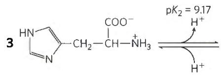

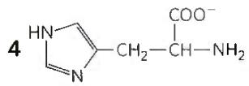

(b), (c)

<table><tr><td>pH</td><td>Structure identified in (a)</td><td>Net charge</td><td>Migrates toward</td></tr><tr><td>1</td><td>1</td><td>+2</td><td>Cathode</td></tr><tr><td>4</td><td>2</td><td>+1</td><td>Cathode</td></tr><tr><td>8</td><td>3</td><td>0</td><td>Does not migrate</td></tr><tr><td>12</td><td>4</td><td>-1</td><td>Anode</td></tr></table>

6. (a) Glutamate (b) Methionine (c) Aspartate (d) Glycine (e) Serine

7. (a) 2 (b) 4

(c)  
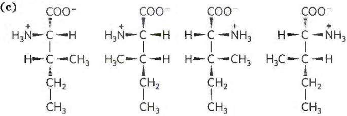

8. (a) Structure at pH 7:

(b) Electrostatic interaction between the carboxylate anion and the protonated amino group of the alanine zwitterion favorably affects ionization of the carboxyl group. This favorable electrostatic interaction decreases as the length of the poly(Ala) increases, resulting in an increase in $pK_{1}$ . (c) Ionization of the protonated amino group destroys the favorable electrostatic interaction noted in (b). With increasing distance between the charged groups, removal of the proton from the amino group in poly(Ala) becomes easier and thus $pK_{2}$ is lower. The intramolecular effects of the amide (peptide bond) linkages keep $pK_{a}$ values lower than they would be for an alkyl-substituted amine.

9. One H comes from the $\alpha$ -amino group of one amino acid, and an OH is removed from the $\alpha$ -carboxyl group of the amino acid to which the first is joined.

10. 75,000

11. (a) 10,300. The elements of water are lost when a peptide bond forms, so the molecular weight of a Cys residue is not the same as the molecular weight of free cysteine. (b) 21

12. The protein has four subunits, with molecular masses of 160, 90, 90, and 60 kDa. The two 90 kDa subunits (possibly identical) are linked by one or more disulfide bonds.

13. (a) at pH 3, +2; at pH 8, 0; at pH 11, -1 (b) pI = 7.8

14. Lys, His, Arg; negatively charged phosphate groups in DNA interact with positively charged side groups in histones.

$$
\begin{array}{l} \textbf {1 5 . (a) (G l u) _ {2 0} (b) (L y s - V a l) _ {3} (c) (A s n - S e r - H i s) _ {5}} \\ \textbf {(d) (A s n - S e r - H i s) _ {5}} \end{array}
$$

16. (a) Specific activity after step 1 is 6.8 units/mg; step 2, 13 units/mg; step 3, 14 units/mg; step 4, 700 units/mg; step 5, 3,500 units/mg; step 6, 5,000 units/mg. (b) Step 4 (c) Step 3 (d) Yes. Specific activity increased only modestly in step 6; SDS polyacrylamide gel electrophoresis.

17. (a) [NaCl] = 0.5 mm (b) [NaCl] = 8 μm

18. B elutes first, A second, C last.

19. The chymotrypsin protein has three distinct polypeptide chains linked by disulfide bonds. They move on the gel as separate species once the disulfide bonds are broken to form the three peptides in lane 2.

20. (a) Amino terminus (b) Tyr-Gly-Gly-Phe-Leu

21. Phosphorylation of serine would alter the mass by 80.

The arrows correspond to the orientation of the peptide bonds, $-CO \rightarrow NH-$ .

23. 75%, 93%. If the efficiency of each amino acid addition is x, then the percentage of full-length peptides with the correct sequence after the addition of seven amino acids will be $x^{7}$ , as there are seven peptide bonds.

24. (a) Y (Tyr) at position 1, F (Phe) at position 7, and R (Arg) at position 9. (b) Positions 4 and 9; K (Lys) is more common at 4, R (Arg) is invariant at 9. (c) Positions 5 and 10; E (Glu) is more common at both positions. (d) Position 2; S (Ser).

25. (a) Anion-exchange chromatography: peptide 2; cation-exchange chromatography: peptide 1; size-exclusion chromatography: peptide 2 (b) peptide 3

26. (a) Any linear polypeptide chain has only two kinds of free amino groups: a single $\alpha$ -amino group at the amino terminus, and an $\varepsilon$ -amino group on each Lys residue. These amino groups react with FDNB to form a DNP-amino acid derivative. Insulin gave two different $\alpha$ -amino-DNP derivatives, suggesting that it has two amino termini and thus two polypeptide chains—one with an amino-terminal Gly and the other with an amino-terminal Phe. Because the DNP-lysine product is $\varepsilon$ -DNP-lysine, the Lys is not at an amino terminus. (b) Yes. The A chain has amino-terminal Gly, the B chain has amino-terminal Phe, and (nonterminal) residue 29 in the B chain is Lys. (c) Phe-Val-Asp-Glu-. Peptide B1 shows that the amino-terminal residue is Phe. Peptide B2 also includes Val, but since no DNP-Val is formed, Val is not at the amino terminus; it must be on the carboxyl side of Phe. Thus the sequence of B2 is DNP-Phe-Val. Similarly, the sequence of B3 must be DNP-Phe-Val-Asp, and the sequence of the A chain must begin Phe-Val-Asp-Glu-. (d) No. The known amino-terminal sequence of the A chain is Phe-Val-Asn-Gln-. The Asn and Gln appear in Sanger's analysis as Asp and Glu because the vigorous hydrolysis in step 7 hydrolyzed the amide bonds in Asn and Gln (as well as the peptide bonds), forming Asp and Glu. Sanger et al. could not distinguish Asp from Asn or Glu from Gln at this stage in their analysis. (e) The sequence exactly matches that in Fig. 3-24. Each peptide in the table gives specific information about which Asx residues are Asn or Asp and which Glx residues are Glu or Gln.

Ac1: residues 20–21. This is the only Cys-Asx sequence in the A chain; there is \~1 amido group in this peptide, so it must be Cys-Asn:

$$
\begin{array}{c c c} N \text {-Gly-Ile-Val-Glx-Glx-Cys-Cys-Ala-Ser-Val-} \\ 1 & 5 & 1 0 \\ \text {Cys - Ser - Leu - Tyr - Glx - Leu - Glx - Asx - Tyr - Cys - Asn - C} \\ & 1 5 & 2 0 \end{array}
$$

Ap15: residues 14–15–16. This is the only Tyr-Glx-Leu sequence in the A chain; there is \~1 amido group, so the peptide must be Tyr-Gln-Leu:

$$
\begin{array}{c c c} N \text {-Gly-Ile-Val-Glx-Glx-Cys-Cys-Ala-Ser-Val-} \\ 1 & 5 & 1 0 \\ \text {Cys - Ser - Leu - Tyr - Gln - Leu - Glx - Asx - Tyr - Cys - Asn - C} \\ & 1 5 & 2 0 \end{array}
$$

Ap14: residues 14-15-16-17. There is \~1 amido group, and we already know that residue 15 is Gln, so residue 17 must be Glu:

$$
\begin{array}{c c c} N \text {-Gly-Ile-Val-Glx-Glx-Cys-Cys-Ala-Ser-Val-} \\ 1 & 5 & 1 0 \\ \text {Cys - Ser - Leu - Tyr - Gln - Leu - Glu - Asx - Tyr - Cys - Asn - C} \\ & 1 5 & 2 0 \end{array}
$$

Ap3: residues 18–19–20–21. There are \~2 amido groups, and we know that residue 21 is Asn, so residue 18 must be Asn:

$$
\begin{array}{c c c} N - \text {Gly-Ile-Val-Glx-Glx-Cys-Cys-Ala-Ser-Val-} \\ 1 & 5 & 1 0 \\ \text {Cys-Ser-Leu-Tyr-Gln-Leu-Glu-Asn-Tyr-Cys-Asn-C} \\ & 1 5 & 2 0 \end{array}
$$

Ap1: residues 17–18–19–20–21, which is consistent with residues 18 and 21 being Asn.

Ap5pa1: residues 1–2–3–4. There are \~0 amido groups, so residue 4 must be Glu:

$$
\begin{array}{c c c} N - \text {Gly - Ile - Val - Glu - Glx - Cys - Cys - Ala - Ser - Val- } \\ 1 & 5 & 1 0 \\ \text {Cys - Ser - Leu - Tyr - Gln - Leu - Glu - Asn - Tyr - Cys - Asn - C} \\ 1 5 & 2 0 \end{array}
$$

Ap5: residues 1 through 13. There is \~1 amido group, and we know that residue 4 is Glu, so residue 5 must be Gln:

$$
\begin{array}{c c c} N \text {-Gly-Ile-Val-Glu-Gln-Cys-Cys-Ala-Ser-Val-} \\ 1 & 5 & 1 0 \\ C y s - S e r - L e u - T y r - G l n - L e u - G l u - A s n - T y r - C y s - A s n - C \\ & 1 5 & 2 0 \end{array}
$$

<!-- EN-END 第3章章末 -->
