## 第3章 蛋白质的三维结构

> **本章英文对应内容**（Lehninger，插在所列中文小节末尾）
>
> - 第4章 The Three-Dimensional Structure of Proteins：章首导言（本章开头）、关键术语/习题/简答（本章末尾）
> - §4.1（第4章）→ 一、蛋白质三维结构概述
> - §4.2（第4章）→ 三、蛋白质的二级结构
> - §4.3（第4章）→ 六、球状蛋白质与三级结构
> - §4.4（第4章）→ 九、蛋白质的变性、折叠和结构预测
> - §4.5（第4章）→ 二、测定蛋白质三维结构的方法

从上一章我们了解到蛋白质是由氨基酸聚合而成的大分子多肽链。一个典型蛋白质的共价主链含有数百个单键。因为绕大多数这样的单键是可以自由旋转的，所以蛋白质原则上能采取无数种构象。然而，每种蛋白质都有它专一的化学或结构的功能，这表明每种蛋白质都有独特的三维结构（见图2-26）。这种结构是怎样被稳定的，什么因素指导它的形成，什么力量使它结合在一起？直至20世纪20年代后期，几种蛋白质获得结晶，包括血红蛋白 $M_{r}$ 64500和脲酶 $M_{r}$ 483000，才开始触及这些问题。已知，一般情况下只有分子单位（结构基元）相同，晶体中的分子才能形成有序排列（具有三维的周期性结构）。因此，发现很多蛋白质可以结晶这一事实证明即使很大的蛋白质也是具有独特结构的独立化学实体。这一结论革新了有关蛋白质及其功能的看法，但所提供的解释尚不全面；因为蛋白质结构是动态的，具有相当程度的可塑性。事实上结构变化对蛋白质的功能常是至关重要的。

本章讨论蛋白质三维结构的二、三、四级层次，三级折叠的亚层次（超二级结构和结构域），纤维状蛋白质和球状蛋白质的结构特点，此外还要介绍稳定蛋白质构象的作用力、多肽主链折叠的空间限制、研究蛋白质构象的方法以及讨论蛋白质的变性、折叠和结构预测。在整个讨论中我们强调以下几点：①一个蛋白质所采取的三维结构决定于它的氨基酸序列；②一个典型蛋白质的功能决定于它的三维结构；③大多数被分离的蛋白质常以一种或少数几种稳定的结构形式存在；④稳定一个由给定蛋白质支撑的特定结构的最重要的力是非共价相互作用；⑤蛋白质的结构初看起来很像是“杂乱无章”的，但在数目巨大的独特蛋白质结构中，我们还是可以识别出某些共同的结构图案，它们可以帮助我们梳理对蛋白质结构的认识；⑥蛋白质结构不是静态的；所有的蛋白质都经受着从微小到剧烈的构象变化。许多蛋白质都有一些部分缺乏确定的结构。对某些蛋白质来说，缺乏可识别的结构正是其功能之所在。

<!-- EN-BEGIN 第4章导言 -->

### 【英文对应 第4章导言】The Three-Dimensional Structure of Proteins

> 来源：Lehninger Principles of Biochemistry（书籍/02_生物化学原理） 第4章章首（含章节目录与学习要点）。

#### [EN] THE THREE-DIMENSIONAL STRUCTURE OF PROTEINS

4.1 Overview of Protein Structure 107

4.2 Protein Secondary Structure 111

4.3 Protein Tertiary and Quaternary Structures 116

4.4 Protein Denaturation and Folding 128

#### [EN] 4.5 Determination of Protein and Biomolecular Structures 136

Proteins are big molecules. The covalent backbone of a typical protein contains hundreds of individual bonds. Because free rotation is possible around many of these bonds, the protein can, in principle, assume a virtually uncountable number of spatial arrangements, or conformations. In reality, however, each protein has a specific chemical or structural function, which suggests that each has a unique three-dimensional structure (Fig. 4-1). How stable is this structure, what factors guide its formation, and what holds it together? By the late 1920s, several proteins had been crystallized, including hemoglobin ( $M_{\mathrm{r}}$ 64,500) and the enzyme urease ( $M_{\mathrm{r}}$ 483,000). Given that, generally, the ordered array of molecules in a crystal can form only if the molecular units are identical, crystallization was evidence that even very large proteins are discrete chemical entities with unique structures. However, we now know that protein structure is always malleable, and in sometimes surprising ways. Changes in structure can be as important to a protein's function as the structure itself.

In this chapter, we examine the structure of proteins. We emphasize five principles:

P1 Protein structures are stabilized by noncovalent interactions and forces. Formation of a thermodynamically favorable structure depends on the influences of the hydrophobic effect, hydrogen bonds, ionic interactions, and van der Waals forces. Natural protein structures are constrained by peptide bonds, whose configurations can be described by the dihedral angles $\phi$ and $\psi$ .

P2 Protein segments can adopt regular secondary structures such as the $\alpha$ helix and the $\beta$ conformation. These structures are defined by particular values of $\phi$ and $\psi$ and their formation is impacted by the amino acid composition of the segment. All of the $\phi$ and $\psi$ values for a given protein structure can be visualized using a Ramachandran plot.

P3 Tertiary structure describes the well-defined, three-dimensional fold adopted by a protein. Protein structures are often built by combinatorial use of common protein folds or motifs. Quaternary structure describes the interactions between components of a multisubunit assembly.

P4 Tertiary structure is determined by amino acid sequence. Even though protein folding is complex, some denatured proteins can spontaneously refold into their active conformation based only on the chemical properties of their constituent amino acids. Cellular proteostasis involves numerous pathways that regulate the folding, unfolding, and degradation of proteins. Many human diseases arise from protein misfolding and defects in proteostasis.

The three-dimensional structures of proteins can be defined. Structural biologists use a variety of instruments and computational methods to solve biomolecular structures. The choice of method may depend on factors such as the size of the protein being studied, its properties, or the desired resolution of the final structure.

  
FIGURE 4-1 Relationship between protein structure and function. (a) The PurE enzyme from Escherichia coli catalyzes a reaction that forms carbon-carbon bonds in de novo purine biosynthesis. PurE is a small (17 kDa) single-domain protein. In this view, the protein surface of PurE has been modeled and colored by hydrophobicity: yellow for hydrophobic surfaces, blue for hydrophilic surfaces, and shades of green for those in between. It is apparent that the protein folds so that many of its polar groups are accessible to solvent. (b, c) The enzymatically active form of PurE is an octamer;  
eight PurE protomers combine to create a square-shaped quaternary structure with eight active sites. The structure in (b) is a surface representation; (c) is a ribbon diagram that traces the peptide backbone. Two protomers are colored by surface hydrophobicity. Others are shown in single colors (two each in gray, tan, and pink). (d) Each active site is formed using segments of three different protomers. A molecule of the reaction product carboxyaminoimidazole ribonucleotide bound at the active site is shown as a stick structure. [Data from PDB ID 2NSL, A. A. Hoskins et al., Biochemistry 46:2842, 2007.]

<!-- EN-END 第4章导言 -->

## 一、蛋白质三维结构概述

一个蛋白质中或一个蛋白质的任一部分中的原子空间排列称为它的三维结构（three-dimensional structure）或构象（conformation）。一个蛋白质或蛋白质片段的可能构象包括在无共价键断裂的情况下它所能采取的任一种结构状态。例如通过绕单键的旋转就能发生构象变化。一个含有数百个单键的蛋白质理论上可能的许多种构象中，在生物学条件下只有一种或几种（更常见）是占优势的。需要多种稳定态的构象一事反映出大多数蛋白质在跟其他分子结合或催化反应时需要发生构象变化。在给定的一套条件下存在的构象一般是热力学上最稳定的构象，也即 Gibbs 自由能（G）最低的构象。任何一种处于有功能的折叠构象的蛋白质称为天然蛋白质（native protein）。对绝大多数蛋白质来说，一个特定的结构或结构的一个特定的小部分对功能是关键的。然而在多数情况下，蛋白质的一些部分缺乏可辨别的结构，蛋白质的这些部分是固有无序的。在少数情况，整个蛋白质是固有无序的，但完全具有功能。

什么原则决定一个典型蛋白质的最稳定构象？通过对上一章的一级结构到本章的二级、三级和四级结构的讨论就会逐步地对蛋白质构象有所了解。

## （一）蛋白质构象主要由弱相互作用稳定

在蛋白质结构的叙述中,稳定性(stability)一词可以定义为维持一个天然构象的趋势或倾向。天然蛋白质只是处于稳定的边缘。在生理条件下一个典型蛋白质的折叠态(folded state)和去(或解)折叠态(unfolded state)的自由能差( $\Delta G$ )范围只有20\~65 kJ/mol。一个给定的多肽链理论上可以采取无数个构象,其结果是一个蛋白质的去折叠态有着很高的构象熵。这个熵以及多肽链中的许多基团跟溶剂(水)的氢键键合相互作用倾向于维持解折叠态构象。抗衡这些影响的和稳定天然构象的化学作用力是共价二硫键和在第1

章中叙述的非共价(弱)相互作用,包括离子相互作用(或称离子对、盐键或盐桥)、氢键、范德华力和疏水相互作用(图3-1)。几种稳定蛋白质构象的力的键能见表3-1。

许多蛋白质没有二硫键。大多数细胞内的环境，由于还原剂（如谷胱甘肽）浓度很高，是高还原性的；因此多数巯基处于还原态。细胞外的环境经常是氧化性的，因而较容易形成二硫化物（disulfide）。在真核生物，二硫键主要存在于分泌的胞外蛋白质（例如胰岛素）中。二硫键在细菌的蛋白质中也是不常见的。然而，

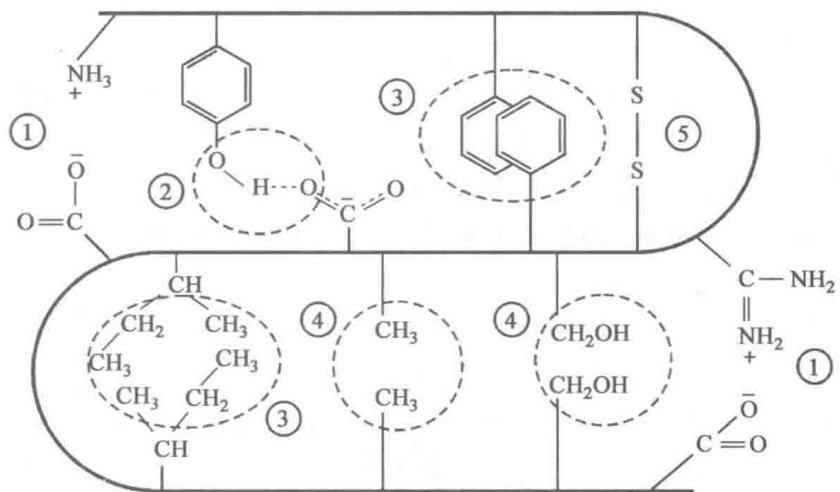  
图3-1 稳定蛋白质三维结构的力  
① 离子对(盐键); ② 氢键; ③ 疏水相互作用; ④ 范德华力; ⑤ 二硫键

嗜热菌以及古菌一般都有许多含二硫键的蛋白质,这些二硫键起稳定蛋白质的作用。推测这是对在高温下生存的一种适应。

表 3-1 蛋白质中存在的几种键的键能

<table><tr><td>键的种类</td><td>键能/ $\left( {\mathrm{{kJ}} \cdot {\mathrm{{mol}}}^{-1}}\right)$ </td><td>键的种类</td><td>键能/ $\left( {\mathrm{{kJ}} \cdot {\mathrm{{mol}}}^{-1}}\right)$ </td></tr><tr><td>氢键</td><td>13~30</td><td>离子对(盐键)</td><td>12~30</td></tr><tr><td>范德华力</td><td>0.4~4.0</td><td>二硫键</td><td>210</td></tr><tr><td>疏水相互作用</td><td> $12 \sim {20}^{\text{1}}$ </td><td></td><td></td></tr></table>

① 此数值表示在 $25^{\circ}$ C 时非极性侧链从蛋白质内部转移到水介质中所需的自由能，数值在一定温度范围内随温度升高而增加。它与其他键的键能不同，此键的能量大部分并不用于伸展过程中键的断裂。

对所有生物的所有蛋白质来说,弱相互作用在多肽链折叠成二、三级结构方面显得特别重要。多个多肽链缔合成四级结构也是依靠这些相互作用。

破坏一个共价单键需要 200\~460 kJ/mol 的能量（见表 1-5），而断裂弱相互作用只需要 0.4\~30 kJ/mol。单个的共价键如连接一个多肽链中隔开的两部分的二硫键显然要比单个的弱相互作用强得多。但弱相互作用的数量巨大，使它们成为稳定蛋白质结构的优势力量。一般来说，具有最低自由能的蛋白质构象（即最稳定的构象）是弱相互作用数目达到最大的构象。

一个蛋白质的稳定性不是简单地等于形成蛋白质内这许多弱相互作用的自由能总和。折叠时蛋白质中每形成一个氢键，就要在同样基团和水之间的一个氢键（同样强度的）被断裂。一个给定的氢键所贡献的净稳定性，或折叠态和去折叠态之间自由能之差可以接近于零。离子相互作用可以是起稳定作用或去稳定作用。因此我们必须从别的方面来理解为什么能量上会有利于一个特定的天然构象。

仔细考查弱相互作用对蛋白质稳定性的贡献,我们发现疏水相互作用通常是占优势的。纯水含有一个氢键键合的水分子网。其他分子不具有水的氢键键合势,其他分子在水溶液中的存在会破坏水的氢键键合。当水围绕一个疏水分子时,氢键的最适排列使得水绕着疏水分子形成一个高度结构化的笼形壳(见图1-11A),或称溶剂化层(solvation layer)。在溶剂化层中水分子的有序度增加,随之水的熵发生不利的减小。然而,当非极性基团聚集在一起时,溶剂化层的范围缩小,因为每个基团不再是把整个表面暴露在溶液中。疏水相互作用的总结果是熵的有利增加。正如第1章中所述,熵的这种增加是水溶液中疏水基团缔合的主要的热力学驱动力,或者说疏水相互作用是熵驱动的自发过程。因此疏水氨基酸侧链倾向于聚集在蛋白质的内部,而远离水(犹如水中油的聚集)。大多数蛋白质的氨基酸序列,其疏水氨基酸侧链(特别是Leu、Ile、Val、Phe和Trp)的含量是相当高的。它们在多肽链中所处的位置有利于肽链折

叠时聚集成蛋白质的疏水核(hydrophobic core)。

在生理条件下,一个蛋白质中的氢键形成主要也是同样熵效应驱动的。极性基团一般能与水形成氢键,因此可溶于水。然而,每单位质量的氢键数目对纯水一般要比对任何其他液体或溶液来得大,并且即使那些最极性的分子,溶解度也是有限制的,因为它们的存在会引起每单位质量的氢键键合的净降低。因此,在某种程度上极性分子周围也形成溶剂化层。虽然一个大分子中两个极性基团之间形成分子内氢键的能量大部分被消除这些极性基团和水之间的那些相互作用所抵消,但是当形成分子内相互作用时结构化水的释放提供了一个折叠的熵驱动力。因此,蛋白质内形成弱相互作用的自由能净变化主要来自周围水溶液中因疏水表面的埋藏造成的熵增加。此熵增加大于抵消因多肽链被约束成折叠构象时构象熵的丢失。

疏水相互作用在稳定构象方面显然是很重要的。结构化蛋白质的内部一般是一个由疏水氨基酸侧链紧密堆积成的核。蛋白质内部的任一极性的或荷电的基团对氢键键合或离子相互作用有合适的配对者或称配偶体(partner)也是很重要的。一个氢键对稳定一个天然的结构似乎贡献不大，但是在一个蛋白质的疏水核中无配对者的氢键键合基团的存在会引起不稳定，以致于含有这样基团的构象常在热力学上支撑不住。由几个这样的基团与周围溶液中的配对者结合造成的有利自由能变化可以比折叠态和去折叠态之间的自由能差还大。此外，一个蛋白质中基团间的氢键以重复二级结构（最适于氢键键合）形式协同地形成（一个氢键形成促进下一个氢键更容易形成）。因为这样，氢键常常起着一个引领蛋白质折叠过程的重要作用。

形成离子对或盐桥的带电相反的基团的相互作用，对蛋白质结构的影响可以是稳定作用也可以是去稳定作用。如在氢键的场合，当蛋白质去折叠时带电氨基酸侧链与水和盐相互作用，因此当估计一个盐桥对一个折叠蛋白质的总稳定性的影响时，必须考虑这些相互作用的丢失。然而，当一个盐桥移动到低介电常数 $(\varepsilon)$ 的环境，例如从极性水溶剂（ $\varepsilon$ 约80）移动到非极性的蛋白质内部（ $\varepsilon$ 约4），它的强度会增加。盐桥，特别是部分或全部被埋的盐桥，对一个蛋白质的结构会提供明显的稳定作用。这一事实有利于解释为什么嗜盐生物的蛋白质中被埋的盐桥较多。离子相互作用也限制结构的柔性，并赋予一个特殊的蛋白质结构以独特性，它是疏水相互作用所不能提供的。

在一个蛋白质的紧密堆积的原子环境中，一个更加典型的弱相互作用有着明显的效应，这就是范德华力（见第1章）。范德华力是偶极-偶极相互作用，包括极性基团（如羰基）中存在的永久偶极（permanent polar）、由原子周围的电子云波动引起的瞬时偶极（transient polar）以及由一个原子跟另一个具有永久或瞬时偶极的原子相互作用诱导的诱导偶极（induced polar）。范德华力主要是指瞬时偶极间的相互作用（分散效应），这是非极性分子（或基团）之间的唯一作用力。随着原子的相互接近，偶极-偶极相互作用提供了一个分子间吸引力，但它仅在有限的分子间距离 $(0.3\sim 0.6\mathrm{nm})$ 内有作用。范德华力是弱的，单个力对整个蛋白质稳定性的贡献不大。然而，在一个堆积紧密的蛋白质中，或在互补表面处一个蛋白质与另一蛋白质或其他分子之间的相互作用中，范德华相互作用的数目会是相当可观的。

## （二）肽键具有刚性和平面的性质

从上一章看到，肽链中相邻氨基酸残基的 $\mathrm{C}_{\alpha}$ 被3个排列成 $\mathrm{C}_{\alpha} - \mathrm{C} - \mathrm{N} - \mathrm{C}_{\alpha}$ 的共价键隔开。肽键（一种被取代的酰胺键）是一个共振杂化体（见图2-20）。共振后果是肽键（C—N）具有部分双键性质，不能绕键轴自由旋转；与肽键关联的6个原子构成肽基（peptide group）或肽单位，具有刚性平面性质，称酰胺平面或肽平面。在一个平面内，羰基的氧原子与酰胺氮的氢原子呈反式构型，各原子间有固定的键角和键长（见图2-21）。如图3-2A所示，多肽的骨架或主链（backbone；main chian）上只有 $\alpha-$ 碳连接的两个键 $(\mathrm{C}_{\alpha}-\mathrm{N}$ 和 $\mathrm{C}_{\alpha}-\mathrm{C})$ 是纯单键，能自由旋转， $\alpha-$ 碳处是两个相邻酰胺平面共用的旋转点。这种刚性平面的肽键限制了一个多肽链的可能构象的范围。

多肽链主链的构象是由3个二面角(dihedral angle)，也称扭角(torsion angle)： $\phi$ 角、 $\psi$ 角和 $\omega$ 角规定的，它们各自反映了绕主链上3个重复键中的一个键的旋转状况。二面角定义为两个平面相交的角。在肽的场合，这些平面由多肽主链中的键矢量来确定。2个连续的键矢量描绘一个平面；3个连续的键矢量描绘两个平面（中央的键矢量是两个平面共有的；图3-2C）。这样的两个平面之间的角就是描述蛋白质构象所要测量的。

肽主链中重要的二面角由连接4个连续的主链原子的3个键矢量来规定（图3-2C）。 $\phi$ 角涉及

C—N—C $_{\alpha}$ —C键，绕中央N—C $_{\alpha}$ 键发生旋转； $\psi$ 角涉及N—C $_{\alpha}$ —C—N键，绕中央C $_{\alpha}$ —C键旋转。按照习惯，当主链完全伸展且所有肽基处于同一平面时， $\phi$ 角和 $\psi$ 角两者被定义为 $\pm180^{\circ}$ （图3-2A和D）。在矢量箭头方向俯视中央键矢量时，如果远处的第4个原子相对于第1个原子是顺时针旋转的，则 $\phi$ 和 $\psi$ 角增加（如图3-2D中 $\psi$ 角）。从 $\pm180^{\circ}$ 位置开始，该二面角由 $-180^{\circ}$ 增加到 $0^{\circ}$ ，在这里第4个原子被第1个原子重叠、遮蔽（eclipse）。旋转可以继续进行，从 $0^{\circ}$ 到 $+180^{\circ}$ （与 $-180^{\circ}$ 同一位置），使结构回到起始点。第3个二面角， $\omega$ 角，涉及C $_{\alpha}$ —C—N—C $_{\alpha}$ 键，绕C—N键（肽键）旋转，但因肽基具有平面性质旋转受到限制，肽键在正常情况（99.6%的时间）处于反式构型，限制 $\omega$ 在 $\pm180^{\circ}$ ，很少处于顺式构型，即 $\omega=0^{\circ}$ 。

  
图3-2 平面肽基与多肽主链的构象  
A. 多肽主链处于完全伸展的状态 $(\phi = \pm 180^{\circ}, \psi = \pm 180^{\circ})$ ；B. 如果 $C_{\alpha}$ 的一对相邻酰胺平面处于完全折叠的状态 $(\phi = 0^{\circ}$ 和 $\psi = 0^{\circ}$ ，图中示出者为未完全折叠的状态，因为有空间位阻；C. 定义二面角 $\psi$ 的原子和平面；D. 当肽链完全伸展即第1个和第4个原子离得最远时， $\phi$ 和 $\psi$ 为 $+180^{\circ}$ （或 $-180^{\circ}$ ）

当 $C_{\alpha}$ 的一对二面角处于 $\phi = \pm180^{\circ}$ 和 $\psi = \pm180^{\circ}$ 时，多肽主链呈现完全伸展的构象（图 3-2A）。然而， $\phi$ 和 $\psi$ 同时等于 $0^{\circ}$ 的构象是不能存在的，因为此时两个相邻肽基上的酰胺 H 和羰基 O 的距离小于被允许距离（两者的范德华半径之和），彼此发生空间重叠（图 3-2B）。虽然理论上 $\phi$ 和 $\psi$ 可以取 $-180^{\circ}$ 到 $+180^{\circ}$ 之间的任一值，但因空间位阻的存在，实际上不是任意的 $\phi$ 和 $\psi$ 值所决定的肽链构象都是立体化学所允许的，例如，刚讲过的 $\phi$ 和 $\psi$ 同时等于 $0^{\circ}$ 的那种构象就不能存在。二面角 $(\phi, \psi)$ 所规定的构象能否存在，主要取决于两个相邻肽基中非共价键合原子之间的接近有无空间阻碍。

## （三）多肽主链的折叠受到空间位阻的限制

印度学者RamachandranGN及其同事对所取的 $\phi$ 和 $\psi$ 值是否为立体化学所允许这一复杂问题作了近似的处理。他们把肽链的原子看成是简单的硬球，根据原子的范德华半径确定了非共价键合原子之间的最小接触距离或称允许距离（表3-2）。根据非共价键合原子之间的最小接触距离，确定哪些 $C_{\alpha}$ 的成对二面角 $(\phi ,\psi)$ 所规定的两个相邻肽基的构象是被允许的，哪些是不允许的，并在 $\phi$ （横坐标）对 $\psi$ （纵坐标）所作的 $\phi -\psi$ 图上标出。此图称为拉氏构象图或拉氏图(Ramachandran plot；图3-3)。图上的每个点对应于一对二面角 $(\phi ,\psi)$ ，代表一个 $C_{\alpha}$ 的两个相邻肽基的构象。如果将一个蛋白质多肽链上的所有 $C_{\alpha}$ 的成对二面角 $\phi$ 和 $\psi$ 都画在图上，那么蛋白质主链的构象将清楚地表示在拉氏图上。拉氏图不仅对蛋白质的构象研究起到了简化作用，而且对判断所得蛋白质结构模型的正、误也有重要意义。运用拉氏图进行研究发现，肽链的折叠具有相当大的局限性，在 $\phi -\psi$ 图上只取有限范围的值。图3-3中阴影部分用白线封闭的区域是允许区。这个区域内的任何成对二面角 $(\phi ,\psi)$ 所规定的构象都是立体化学所允许的。因为在构象中，非共价键合原子间的距离 $\geqslant$ 最小接触距离，两者无斥力，构象能量最低，所以构象是稳定的。例如平行和反平行β折叠片，胶原蛋白三股螺旋和右手α螺旋都位于允许区内。阴影部分的其他区域为不完全允许区（临界限制区）。这个区域内的任何一对二面角 $(\phi ,\psi)$ 所规定的主链构象虽是立体化学可允许的，但不够稳定，因为在此构象中非共价键合原子之间的距离小于允许距离，但仍大于极限距离（比允许距离小 $0.02\mathrm{nm}$ ）。阴影外的区域是不允许区。该区域内的任何二面角 $(\phi ,\psi)$ 所规定的主链构象都是立体化学所不允许的，因为在此构象中非共价键合原子间的距离小于允许距离，斥力很大，构象能量很高，因此这种构象极不稳定，不能存在，例如 $\phi = 180^{\circ},\psi = 0^{\circ}$ 的构象和 $\phi = 0^{\circ},\psi = 180^{\circ}$ 的构象。上面所说的允许区和不完全允许区都是针对非甘氨酸残基来说的，如果是甘氨酸残基，这一范围会扩大很多，因为它的侧链很小，能在很多种构象中存在。总之，由于多肽链的几何学原因，存在着上述原子基团之间的不利的空间相互作用，所以相对于肽链的可能构象来说，肽链实际所取构象的范围是很有限的，对非甘氨酸残基的允许区，只占全平面的 $7.7\%$ ；对最大允许区（允许区加不完全允许区）来说也只占 $20.3\%$ 。

表 3-2 蛋白质中非共价键合原子之间的最小接触距离/nm

<table><tr><td></td><td>C</td><td>N</td><td>O</td><td>H</td></tr><tr><td>C</td><td> $0.320^{1}$ (0.300)</td><td>0.290(0.280)</td><td>0.280(0.270)</td><td>0.240(0.220)</td></tr><tr><td>N</td><td></td><td>0.270(0.260)</td><td>0.270(0.260)</td><td>0.240(0.220)</td></tr><tr><td>O</td><td></td><td></td><td>0.270(0.260)</td><td>0.240(0.220)</td></tr><tr><td>H</td><td></td><td></td><td></td><td>0.200(0.190)</td></tr></table>

① 这是一般可接受的范德华距离，括号内是 Ramachandran 在小分子结构中发现的最小允许距离。

  
图 3-3 拉氏构象图( $\Phi-\Psi$ 图)  
图中，A和B分别为反平行和平行的β折叠片，C为胶原蛋白的三股螺旋，③为 $3_{10}$ -螺旋，C为右手α螺旋，C为左手α螺旋，π为π螺旋（4.4 $_{16}$ -螺旋）

由于 X 射线衍射技术成功地应用于蛋白质结构测定,人们已经掌握了不少种蛋白质的精细结构,因而不仅能从理论上而且可以从实际测得的结构来研究肽链折叠的特点。图 3-3 中的黑点是对 8 种蛋白质近 1000 个非甘氨酸残基实验测得的二面角 $\phi$ 和 $\psi$ 值,可以清楚地看到肽链主链实际所取的构象与理论推测的允许区基本吻合。例如胰凝乳蛋白酶原的 245 个氨基酸残基除 28 个外,全部的成对二面角 $\phi$ 和 $\psi$ 值都落在允许区之内。

<!-- EN-BEGIN 4.1 -->

### 【英文对应 4.1】Overview of Protein Structure

> 来源：Lehninger Principles of Biochemistry（书籍/02_生物化学原理） 第4章 The Three-Dimensional Structure of Proteins，§4.1。对应本章“一、蛋白质三维结构概述”。

The possible conformations of a protein or protein segment include any structural state it can achieve without breaking covalent bonds. A change in conformation could occur, for example, by rotation about single bonds. However, of the many conformations that are theoretically possible in a protein containing hundreds of single bonds, one or a few generally predominate under biological conditions. The need for multiple stable conformations reflects the changes that must take place in most proteins as they bind to other molecules or catalyze reactions. The conformations existing under a given set of conditions are usually the ones that are thermodynamically the most stable—that is, having the lowest free energy (G). Proteins in any of their functional, folded conformations are often called native proteins.

For the vast majority of proteins, a particular structure or small set of structures is critical to function. However, in many cases, parts of proteins lack discernible structure. These protein segments are intrinsically disordered. In some cases, entire proteins are intrinsically disordered, yet are fully functional.

What determines the most stable conformations of a typical protein? We can build an understanding of protein conformation stepwise from the discussion of primary structure in Chapter 3 through a consideration of secondary, tertiary, and quaternary structures. To this approach we must add emphasis on common and classifiable folding patterns, variously called supersecondary structures, folds, or motifs, which provide an important organizational context to this complex endeavor.

#### [EN] A Protein's Conformation Is Stabilized Largely by Weak Interactions

Stability is the tendency of a protein to maintain a native conformation. Native proteins are only marginally stable; the $\Delta G$ separating the folded and unfolded states in typical proteins under physiological conditions is in the range of only 5 to 65 kJ/mol. A given polypeptide chain can theoretically assume countless conformations, and as a result, the unfolded state of a protein is characterized by a high degree of conformational entropy. This entropy, along with the hydrogen-bonding interactions of many groups in the polypeptide chain with the solvent (water), tends to maintain the unfolded state. P1 The chemical interactions that counteract these effects and stabilize the native conformation include disulfide (covalent) bonds and the weak (noncovalent) interactions and forces described in Chapter 2: hydrogen bonds, the hydrophobic effect, and ionic interactions.

Covalent disulfide bonds are strong, but they are also uncommon. The environment within most cells is highly reducing due to high concentrations of reductants such as glutathione, and most sulfhydryls will remain in the reduced state. Outside the cell, the environment is often more oxidizing, and disulfide formation is more likely to occur. In eukaryotes, disulfide bonds are found primarily in secreted, extracellular proteins (for example, the hormone insulin). Disulfide bonds are also uncommon in bacterial proteins. However, thermophilic bacteria, as well as the archaea, typically have many proteins with stabilizing disulfide bonds; this is presumably an adaptation to life at high temperatures.

For all proteins of all organisms, weak interactions are especially important in the folding of polypeptide chains into their secondary and tertiary structures. The association of multiple polypeptides to form quaternary structures also relies on these weak interactions.

About 200 to 460 kJ/mol are required to break a single covalent bond, whereas weak interactions can be disrupted by a mere 0.4 to 30 kJ/mol. Individual covalent bonds, such as disulfide bonds linking separate parts of a single polypeptide chain, are clearly much stronger than individual weak interactions. Yet, because they are so numerous, the weak interactions predominate as a stabilizing force in protein structure. P1 In general, the protein conformation with the lowest free energy (that is, the most stable conformation) is the one with the maximum number of weak interactions.

The stability of a protein is not simply the sum of the free energies of formation of the many weak interactions within it. For every hydrogen bond formed in a protein during folding, a hydrogen bond (of similar strength) between the same group and water was broken. The net stability contributed by a given hydrogen bond, or the difference in free energies of the folded and unfolded states, may be close to zero. Ionic interactions may be either stabilizing or destabilizing. We must therefore look elsewhere to understand why a particular native conformation is favored.

#### [EN] Packing of Hydrophobic Amino Acids Away from Water Favors Protein Folding

P1 On carefully examining the contribution of weak interactions to protein stability, we find that the hydrophobic effect generally predominates. Pure water contains a network of hydrogen-bonded $\mathrm{H}_2\mathrm{O}$ molecules. No other molecule has the hydrogen-bonding potential of water, and the presence of other molecules in an aqueous solution disrupts the hydrogen bonding of water. When water surrounds a hydrophobic molecule, the optimal arrangement of hydrogen bonds results in a highly structured shell, or solvation layer, of water around the molecule (see Fig. 2-7). The increased order of the water molecules in the solvation layer correlates with an unfavorable decrease in the entropy of the water. However, when nonpolar groups cluster together, the extent of the solvation layer decreases, because each group no longer presents its entire surface to the solution. The result is a favorable increase in entropy. As described in Chapter 2, this increase in entropy is the major thermodynamic driving force for the association of hydrophobic groups in aqueous solution. Hydrophobic amino acid side chains therefore tend to cluster in a protein's interior, away from water (think of an oil droplet in water). The amino acid sequences of most proteins thus include a significant content of hydrophobic amino acid side chains (especially Leu, Ile, Val, Phe, and Trp). These are positioned so that they are clustered when the protein is folded, forming a hydrophobic protein core.

Under physiological conditions, the formation of hydrogen bonds in a protein is driven largely by this same entropic effect. Polar groups can generally form hydrogen bonds with water and hence are soluble in water. However, the number of hydrogen bonds per unit mass is generally greater for pure water than for any other liquid or solution, and there are limits to the solubility of even the most polar molecules as their presence causes a net decrease in hydrogen bonding per unit mass. Therefore, a solvation layer forms to some extent even around polar molecules. Although the energy of formation of an intramolecular hydrogen bond between two polar groups in a macromolecule is largely canceled by the elimination of such interactions between these polar groups and water, the release of structured water as intramolecular associations form provides an entropic driving force for folding. Most of the net change in free energy as nonpolar amino acid side chains aggregate within a protein is therefore derived from the increased entropy in the surrounding aqueous solution resulting from the burial of hydrophobic surfaces. This more than counterbalances the large loss of conformational entropy as a polypeptide is constrained into its folded conformation.

#### [EN] Polar Groups Contribute Hydrogen Bonds and Ion Pairs to Protein Folding

The hydrophobic effect is clearly important in stabilizing conformation; the interior of a structured protein is generally a densely packed core of hydrophobic amino acid side chains. It is also important that any polar or charged groups in the protein interior have suitable partners for hydrogen bonding or ionic interactions. One hydrogen bond seems to contribute little to the stability of a native structure, but the presence of hydrogen-bonding groups without partners in the hydrophobic core of a protein can be so destabilizing that conformations containing these groups are often thermodynamically untenable. The favorable free-energy change resulting from the combination of several such groups with partners in the surrounding solution can be greater than the free-energy difference between the folded and unfolded states. In addition, hydrogen bonds between groups in a protein form cooperatively (formation of one makes formation of the next one more likely) in repeating secondary structures that optimize hydrogen bonding, as described below. In this way, hydrogen bonds often have an important role in guiding the protein-folding process.

P1 The interaction of oppositely charged groups that form an ion pair, or salt bridge, can have either a stabilizing or destabilizing effect on protein structure. As in the case of hydrogen bonds, charged amino acid side chains interact with water and salts when the protein is unfolded, and the loss of those interactions must be considered when researchers evaluate the effect of a salt bridge on the overall stability of a folded protein. However, the strength of a salt bridge increases as it moves to an environment of lower dielectric constant, $\varepsilon$ (p. 46): from the polar aqueous solvent ( $\varepsilon$ near 80) to the nonpolar protein interior ( $\varepsilon$ near 4). Salt bridges, especially those that are partly or entirely buried, can thus provide significant stabilization to a protein structure. This trend explains the increased occurrence of buried salt bridges in the proteins of thermophilic organisms. Ionic interactions also limit structural flexibility and confer a uniqueness to a particular protein structure that the clustering of nonpolar groups via the hydrophobic effect cannot provide.

#### [EN] Individual van der Waals Interactions Are Weak but Combine to Promote Folding

In the tightly packed atomic environment of a protein, one more type of weak interaction can have a significant effect: van der Waals interactions (p. 49). Van der Waals interactions are dipole-dipole interactions involving the permanent electric dipoles in groups such as carbonyls, transient dipoles derived from fluctuations of the electron cloud surrounding any atom, and dipoles induced by interaction of one atom with another that has a permanent or transient dipole. As atoms approach each other, these dipole-dipole interactions provide an attractive intermolecular force that operates over only a limited intermolecular distance (0.3 to 0.6 nm). P1 Individually, van der Waals interactions contribute little to overall protein stability. However, in a well-packed protein, or in an interaction between a protein and another protein or other molecule at a complementary surface, the number of such interactions can be substantial.

Most of the structural patterns outlined in this chapter reflect two simple rules: (1) hydrophobic residues are largely buried in the protein interior, away from water, and (2) the number of hydrogen bonds and ionic interactions within the protein is maximized, thus reducing the number of unpaired hydrogen-bonding and ionic groups. Proteins within membranes (which we examine in Chapter 11) and proteins that are intrinsically disordered or have intrinsically disordered segments follow different rules. This reflects their particular function or environment, but weak interactions are still critical structural elements. For example, soluble but intrinsically disordered protein segments are often enriched in amino acid side chains that are charged (especially Arg, Lys, Glu) or small (Gly, Ala), providing little or no opportunity for the formation of a stable hydrophobic core.

#### [EN] The Peptide Bond Is Rigid and Planar

Covalent bonds, too, place important constraints on the conformation of a polypeptide. In the late 1930s, Linus Pauling and Robert Corey embarked on a series of studies that laid the foundation for our current understanding of protein structure. They began with a careful analysis of the peptide bond.

The $\alpha$ carbons of adjacent amino acid residues are separated by three covalent bonds, arranged as $C_{\alpha}$ —C—N— $C_{\alpha}$ . X-ray diffraction studies of crystals of amino acids and of simple dipeptides and tripeptides showed that the peptide C—N bond is somewhat shorter than the C—N bond in a simple amine and that the atoms associated with the peptide bond are coplanar. This indicated a resonance or partial sharing of two pairs of electrons between the carbonyl oxygen and the amide nitrogen (Fig. 4-2a). The oxygen has a partial negative charge and the hydrogen bonded to the nitrogen has a net partial positive charge, setting up a small electric dipole. The six atoms of the peptide group lie in a single plane, with the oxygen atom of the carbonyl group trans to the hydrogen atom of the amide nitrogen. From these findings Pauling and Corey concluded that the peptide C—N bonds, because of their partial double-bond character, cannot rotate freely. Rotation is permitted about the N— $C_{\alpha}$ and the $C_{\alpha}$ —C bonds. P1 The backbone of a polypeptide chain can thus be pictured as a series of rigid planes, with consecutive planes sharing a common point of rotation at $C_{\alpha}$ (Fig. 4-2b). The rigid peptide bonds limit the range of conformations possible for a polypeptide chain.

  
Linus Pauling, 1901–1994
[Nancy R. Schiff/Getty Images.]

  
Robert Corey, 1897–1971
[Courtesy California Institute of Technology Archives.]

(b)  

  
(a)

Peptide conformation is defined by three dihedral angles (also known as torsion angles) called $\phi$ (phi), $\psi$ (psi), and $\omega$ (omega), reflecting rotation about each of the three repeating bonds in the peptide backbone. A dihedral angle is the angle at the intersection of two planes. In the case of peptides, the planes are defined by bond vectors in the peptide backbone. Two successive bond vectors describe a plane. Three successive bond vectors describe two planes (the central bond vector is common to both; Fig. 4-2c), and the angle between these two planes is what we measure to describe peptide conformation.

KEY CONVENTION The important dihedral angles in a peptide are defined by the three bond vectors connecting four consecutive main-chain (peptide backbone) atoms (Fig. 4-2c): $\phi$ involves the C—N—C $_{\alpha}$ —C bonds (with the rotation occurring about the N—C $_{\alpha}$ bond), and $\psi$ involves the N—C $_{\alpha}$ —C—N bonds. Both $\phi$ and $\psi$ are defined as $\pm180^{\circ}$ when the polypeptide is fully extended and all peptide groups are in the same plane (Fig. 4-2d). As one looks down the central bond vector in the direction of the vector arrow

FIGURE 4-2 The planar peptide group. (a) Each peptide bond has some double-bond character due to resonance and cannot rotate. Although the N atom in a peptide bond is often represented with a partial positive charge, careful consideration of bond orbitals and quantum mechanics indicates that the N has a net charge that is neutral or slightly negative. (b) Three bonds separate sequential $\alpha$ carbons in a polypeptide chain. The N— $C_{\alpha}$ and $C_{\alpha}$ —C bonds can rotate, described by dihedral angles designated $\phi$ and $\psi$ , respectively. The peptide C—N bond is not free to rotate. Other single bonds in the backbone may also be rotationally hindered, depending on the size and charge of the R groups. (c) The atoms and planes defining $\psi$ . (d) By convention, $\phi$ and $\psi$ are $180^{\circ}$ (or $-180^{\circ}$ ) when the first and fourth atoms are farthest apart and the peptide is fully extended. As the viewer looks out along the bond undergoing rotation (from either direction), the $\phi$ and $\psi$ angles increase as the fourth atom rotates clockwise relative to the first. In a protein, some of the conformations shown here (e.g., $0^{\circ}$ ) are prohibited by steric overlap of atoms. In (b) through (d), the balls representing atoms are smaller than the van der Waals radii for this scale.

(as depicted in Fig. 4-2c for $\psi$ ), the dihedral angles increase as the distal (fourth) atom is rotated clockwise (Fig. 4-2d). From the $\pm 180^{\circ}$ position, the dihedral angle increases from $-180^{\circ}$ to $0^{\circ}$ , at which point the first and fourth atoms are eclipsed. The rotation can be continued from $0^{\circ}$ to $+180^{\circ}$ (same position as $-180^{\circ}$ ) to bring the structure back to the starting point. The third dihedral angle, $\omega$ , is not often considered. It involves the $C_{\alpha}-C-N-C_{\alpha}$ bonds. The central bond in this case is the peptide bond, where rotation is constrained. The peptide bond is almost always (99.6% of the time) in the trans configuration, constraining $\omega$ to a value of $\pm 180^{\circ}$ . For a rare cis peptide bond, $\omega = 0^{\circ}$ .

In principle, $\phi$ and $\psi$ can have any value between $-180^{\circ}$ and $+180^{\circ}$ , but many values are prohibited by steric interference between atoms in the polypeptide backbone and amino acid side chains. The conformation in which both $\phi$ and $\psi$ are $0^{\circ}$ (Fig. 4-2d) is prohibited for this reason; this conformation is merely a reference point for describing the dihedral angles. Backbone angle preferences in a polypeptide represent yet another constraint on the overall folded structure of a protein.

#### [EN] SUMMARY 4.1 Overview of Protein Structure

A typical protein usually has one or more stable three-dimensional conformations that reflect its function. Some proteins have segments that are intrinsically disordered but are nonetheless essential for function.

■ Whereas nonpeptide covalent bonds, particularly disulfide bonds, can play a role in stabilization of some structures, proteins are stabilized largely by multiple weak, noncovalent interactions and forces.

The hydrophobic effect, derived from the increase in entropy of the surrounding water when nonpolar molecules or groups are clustered together, makes the major contribution to stabilizing the globular form of most soluble proteins.

■ Hydrogen bonds and ionic interactions are optimized in the thermodynamically most stable structures.

■ Van der Waals interactions involve attractive forces between molecular dipoles that occur over short distances. Individually these interactions are weak, but they combine in well-packed protein structures to provide significant effects and stabilization.

The nature of the covalent bonds in the polypeptide backbone places constraints on structure. The peptide bond has a partial double-bond character that keeps the entire six-atom peptide group in a rigid planar configuration. The N—C $_{\alpha}$ and C $_{\alpha}$ —C bonds can rotate to define the dihedral angles $\phi$ and $\psi$ , respectively, although permitted values of $\phi$ and $\psi$ are limited by steric clashes and other constraints.

<!-- EN-END 4.1 -->

## 二、测定蛋白质三维结构的方法

目前尚无一种工具能够直接观察到蛋白质分子中原子和原子基团的排列。至今研究蛋白质三维结构所取得的成就主要是应用X射线衍射方法获得的。此法只能测定晶体结构，并因此称它为X射线晶体学（X-ray crystallography）。然而生物体内的蛋白质结构不是以晶体而是以水溶液中的动态形式存在，因此研究溶液中构象的方法应运而生，其中首推核磁共振（NMR）技术。只要提供高浓度的蛋白质样品，此技术就能用来研究蛋白质分子的动态结构，包括构象变化、蛋白质折叠以及跟其他分子的相互作用等。实践证明，用X射线衍射和NMR方法测得的三维结构非常接近，它们在结构研究方面可以彼此很好地互补。用于溶液中构象研究的还有紫外差光谱、荧光偏振和圆二色性（circular dichroism, CD）等方法。

## （一）X射线衍射可用于晶体结构的测定

X 射线衍射 (X-ray diffraction) 技术与光学显微镜或电子显微镜技术的基本原理是相似的。使用光学显微镜时, 来自点光源的光线 ( $\lambda = 400 \sim 700$ nm) 投射在被检物体上, 光波将由此散射, 物体的每一小部分都起着一个新光源的作用。来自物体的散射光波含有物体构造的全部信息, 因此可以用透镜收集和重组散射波而产生物体的放大图像。X 射线衍射技术与显微镜技术的主要区别是: 第一, 光源不是可见光而是波长很短的 X 射线 ( $\lambda = 0.154$ nm); 其次, 经物体散射后的衍射波, 没有一种透镜能把它收集重组成物体的图像, 而直接得到的是一张衍射图 [案] (diffraction pattern)。衍射图需要用数学方法 (如电子计算机) 代替透镜进行重组, 绘出电子密度图 (electron density map), 从中构建出三维分子图像或分子模型 (图 3-4)。光学显微镜不可能在原子水平上观察到分子结构, 因为它的分辨率最大不过 $0.2\mu \mathrm{m}$ , 约等于可见光最短波长的 $1/2$ 。分子内原子之间的距离在 $0.1\mathrm{nm}$ 的数量级, 因此只有 X 射线 ( $\lambda = 0.01 \sim 10$ nm) 能达到这样高的分辨率 (<0.1 nm)。

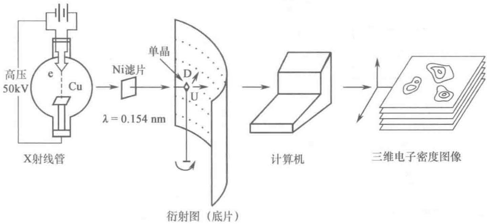  
图 3-4 X 射线衍射晶体结构分析示意图  
Cu: 阳极靶, 产生 X 射线; e: 高速电子; Ni 滤片: 获得单色 X 射线 ( $\lambda = 0.154 \, nm$ ); D: 衍射光束; U: 未衍射光束

X 射线衍射法只能用于测定晶体结构,不能直接用来测定单个分子的结构,因为想获得蛋白质的三维图像,就必须从所有可能的角度对蛋白质进行观测。此外,当 X 射线与蛋白质相互作用时,只有一小部分射线被散射,大部分穿过蛋白质,相当一部分破坏性地与蛋白质相互作用,结果在尚无足够的 X 射线被散射以形成有用的图像之前,蛋白质分子已被破坏。用于衍射分析的球状蛋白质的典型晶体每边约为0.5 mm,含有大约 $10^{12}$ 个蛋白质分子(沿晶体每边排列 $10^{4}$ 个分子)。

用 X 射线衍射法测定晶体结构是根据晶体中原子重复出现的周期性结构。当 X 射线穿过晶体的原子平面层时，只要原子层的距离 d 与入射的 X 射线波长 $\lambda$ 、入射角 $\theta$ 之间的关系能够满足布拉格（Bragg）方程（图 3-5）：

$$
2 d \sin \theta = n \lambda (n = \pm 1, \pm 2, \pm 3, \dots)
$$

则反射波可以互相叠加而产生衍射,形成复杂的衍射图案。不同物质的晶体形成各自独特的衍射图案。X射线结构分析主要是根据衍射线的方向与强度,即衍射图案上斑点的位置与黑度。根据衍射线的方向,可以确定晶胞(晶体的重复单位)的大小和形状,根据衍射的强度可以确定晶胞中的原子排布。

不同的晶体样品要求用不同的分析方法。微晶的纤维状蛋白质采用纤维法，单晶的球状蛋白质使用单晶回转

  
图3-5 布拉格方程的图解

法。X射线晶体结构分析是专业性较强的研究技术，请参看专著，如本章参考书目中的参考书[1]、[2]。

## （二）核磁共振可用于生物大分子动态结构的研究

20 世纪 50 年代发展起来的核磁共振 (nuclear magnetic resonance, NMR) 是一项涉及在外磁场存在下某些原子核吸收射频 (radio frequency, rf) 能量的波谱技术 (图 3-6)。NMR 是核自旋角动量 (原子核的一种量子力学性质) 的一种表现形式。只有某些原子, 包括 $^{1}\text{H} \sim ^{2}\text{H} \sim ^{13}\text{C} \sim ^{14}\text{N} \sim ^{19}\text{F}$ 和 $^{31}\text{P}$ , 有这种核自旋, 其行为就像绕轴自旋 (spin) 的小磁体, 因而能与外加磁场相互作用, 产生 NMR 信号。但 $^{12}\text{C} \sim ^{16}\text{O}$ 和 $^{32}\text{S}$ 的核不具有磁性质, 观察不到 NMR 现象。

  
图 3-6 NMR 波谱仪运作示意图

在无强的外磁场存在下，磁性核的核自旋是随机的（图3-7A）。然而当含有单一类型核的样品溶液置于强磁铁的两极之间时，核自旋磁矩将分裂为两个能级；这些磁偶极将在外加的强磁场中各自采取两种可能的取向之一：平行或反平行，进行排列。平行取向的，能量较低，反平行取向的，能量较高，并因而两种取向的磁核数量也不相等（图3-7B）。

如果排列在外磁场中的这些核，用一个合适频率（射频范围内的共振频率）的电磁能脉冲成直角方向对它们进行照射，则发生射频能（rf能）的吸收，从低能态“自旋反向”（spin-flip）成高能态。当发生这种自旋反向时，称这些核与外加的辐射处于共振中，因而称为核磁共振（NMR）。rf能的吸收被检测、放大并呈现为核磁共振波谱，后者含有有关这些核的个（本）性（identity）和它们的直接化学环境的信息。

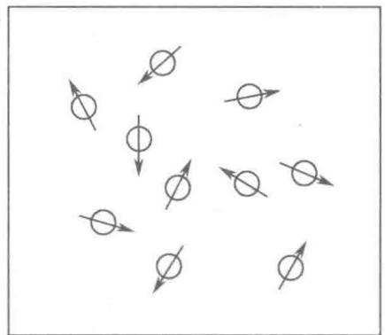

  
图3-7 自旋核在外磁场中的取向  
A. 在无外磁场存在下磁性核随机取向；B. 在强外磁场存在下平行或反平行取向

共振所需的准确射频能,即相邻两个能级之间的能量差( $\Delta E$ ),决定于外磁场强度( $H_{0}$ )和被照射核的本性——原子核的旋磁比 $^{①}$ (magetogyric ratio, $\gamma$ ;旋磁比是原子核的特征常数):

$$
\Delta E = h \nu = \frac {h \gamma}{2 \pi} H _ {0}
$$

式中 h 为 planck 常数, $\nu$ 为共振频率, 从上式可以看出当外加磁场强度 ( $H_{0}$ ) 一定时, 该原子核的共振频率 ( $\nu$ ) 也是一定的。如果使用很强的外磁场, 两个自旋态之间的能量差则大, 为了自旋反向需要较高频率 (较高能量) 的辐射。如果使用较弱的磁场, 实现核自旋态之间的跃迁所需能量则较少。

实验中磁场强度一般用 14 100 高斯 (gauss) 即 1.41 特斯拉 (tesla, T)。在此磁场强度下，为使 $^{1}$ H 核进入共振需要 60 兆赫 [兹] (megahertz, MHz; 1 MHz = 百万周/秒) 的 rf 能 (相当于 2.4 × 10 $^{-5}$ kJ/mol)，要使 $^{13}$ C 核进入共振需要 15 MHz 的 rf 能量。

从上面的介绍,你可能以为一个分子中的所有质子( $^{1}$ H核)吸收同样频率的rf能,所有 $^{13}$ C核吸收另一同样频率的rf能。如果真是这样,我们在一个未知的 $^{1}$ H或 $^{13}$ C波谱上就只能观察到一个单一的吸收带(线),因而也就不能用于结构测定。但事实上并不如此,吸收频率对所有的核都是不一样的。

分子中每一个原子核的周围都有电子云围绕着。绕核的环流电子云产生它们自己的小局部磁场 $(H_{\mathrm{loc}})$ ，这些局部磁场的作用是与外加磁场相抗的，致使原子核实际上所受到的有效磁场 $(H_{\mathrm{eff}})$ 略小于外加的磁场 $(H_{0})$ ：

$$
H _ {\mathrm{eff}} = H _ {0} - H _ {\mathrm{loc}}
$$

这一效应可被说成是绕核的环流电子云屏蔽外加磁场对核的影响。

因为一个分子中每种核(如 $^{1}$ H核)的不同种类,例如 $CH_{3}COOCH_{3}$ 中 $CH_{3}CO—$ 和—O— $CH_{3}$ 基团的 $^{1}H$ 核,各处于稍有不同的电子环境中,所以每个核被屏蔽的程度也略有差别;对每个核来说,实际上受到的有效磁场是不一样的。如果NMR仪器足够灵敏,不同核所受到的有效磁场的细小差别可被观测到,我们能在波谱上看到每一不同种类核的不同NMR信号;同一种类的核,如乙酸甲酯中每一甲基的3个质子有着同样的化学(和磁)环境,被屏蔽的程度也相同,称它们为等效的(equivalent)质子,显示单一吸收峰(图3-8)。这样,一个有机化合物的NMR谱可以给我们提供一个碳氢构架图。经过实践是可以读懂这种构架图并从中得出有关未知分子的结构信息。

由于核的电子(化学)环境差别引起外加磁场 $(H_{0})$ 或共振频率 $(\nu)$ 离开标准值的移动称为化学位移(chemical shift)。在NMR波谱图上横坐标为化学位移，纵坐标为rf能吸收强度。化学位移常用 $\delta$ 单位表示。为确定一个吸收峰的位置，NMR图纸是经校准的，并采用了一个参考点。实验中，加入少量四甲基硅 $[TMS,(CH_{3})_{4}Si]$ 产生一个单一吸收峰，此峰被用作 $^{1}H$ 和 $^{13}C$ 测定的标准参考线，并任意规定它的化学位移为零。一个 $\delta$ 单位等于波谱仪工作频率的百万分之一（ppm，即 $10^{-6}$ ）。例如用一台 60 MHz 的仪器测定样品的 ${}^{1}$ H NMR 谱，1 ppm = 60 Hz。一般说，化学位移：

  
图 3-8 乙酸甲酯的 $^{1}$ H NMR 谱  
乙酸甲酯中每个甲基的3个质子都有相同的化学环境,被屏蔽的程度相同,被称为等效(equivalent)质子,呈现一个单一吸收峰(或称线)

$$
\delta = \frac {\mathrm{观测到的化学位移(偏离TMS的Hz数)}}{\mathrm{波谱仪的工作频率(MHz数)}}
$$

大多数核的 NMR 吸收都发生在很窄的范围内。几乎所有 $^{1}$ H 核的化学位移都落在 0\~10 ppm 之间， $^{13}$ C 核在 1\~250 ppm。

NMR谱上的单一吸收峰经常会分裂成几个峰，此现象称为自旋-自旋分裂（spin-spin splitting）。这是由于一个原子的核自旋跟邻近的不等效的核自旋发生相互作用或偶合引起的，因此也称它为自旋-自旋偶合（spin-spin coupling）。虽然分裂形成的NMR图谱会比较复杂，但它能提供很多信息。例如氯乙烷 $\mathrm{(CH_3CH_2Cl)}$ 的NMR谱上一 $\mathrm{CH}_3$ 的 ${}^{1}\mathrm{H}$ 核在 $1.5\delta$ 处分裂成3个峰，一 $\mathrm{CH}_2\mathrm{Cl}$ 的 ${}^{1}\mathrm{H}$ 核在 $3.6\delta$ 呈现4个峰；这是因为两个碳的各自质子是等效的，但两者之间的质子不等效。谱线的分裂一般服从 $n + 1$ 的规律；当相邻基团上有 $n$ 个质子时，则该基团的质子吸收峰将分裂成 $n + 1$ 个（图3-9）。

  
图 3-9 氯乙烷的 $^{1}$ H NMR 谱

在 NMR 实验中 ${}^{1}$ H 是特别重要的, 因为它具有高灵敏度和高自然丰度。对于大分子来说, ${}^{1}$ H NMR 谱可以是很复杂的。即使一个小的蛋白质也有数百个 $^{1}$ H原子，通常得到的一维NMR谱用于结构分析还是太复杂。但由于二维NMR(2D-NMR)技术的出现和发展使得用于蛋白质三维结构分析变得可能。这些方法可以测定空间上相邻原子间核自旋的距离依赖性偶合。样品中由射频脉冲诱导的瞬时磁化将随时间而衰减，并一直弛豫到原来的低能态即热平衡态能级。弛豫过程给出丰富的有关大分子结构和动力学的信息，因为弛豫过程对分子的几何学和运动都很敏感。这里特别值得提及的是核奥弗豪泽效应（nuclear overhauser effect, NOE），这是一种大小跟核之间距离6次方成反比的自旋偶合。NOE定义为分子中一组或一个自旋核被射频能饱和后通过自旋-自旋偶合的弛豫过程引起空间上相邻近的另一组（个）自旋核的NMR信号发生改变。如果核之间的距离小于0.5 nm（图3-10A），磁化将从一个激发核转移到另一个未激发核。二维核奥弗豪泽增强波谱学（two-dimensional nuclear Overhauser enhancement spectropy, NOESY）波谱能够以图解方式展示出挨近的质子对。NOESY谱的对角线相当于一维NMR（化学位移）谱。对角线以外的峰（称为交叉峰）提供了关键的新信息：交叉峰代表距离不超过0.5 nm的质子对（图3-10B）。TOCSY（total correlation spectroscopy）是用来测定共价连接的原子中核自旋偶合的一项技术。与NOESY互补使用，有助于确定哪个（些）NOE信号是反映共价键连接的原子。NOE信号的某些图谱已与二级结构如α螺旋关联起来。基因工程（见第Ⅲ篇）可用于制备含稀有同位素 $^{13}$ C和 $^{15}$ N的蛋白质。由这些原子产生的新的NMR信号和由于这些置换造成的跟 $^{1}$ H信号的偶合有助于确定每个 $^{1}$ H的NOE信号。照射这些核可以沿第3个轴把NOE峰分开，这就是所谓多维NMR波谱学的方法。根据大量的这种距离限制（邻近关系）可以把一个蛋白质的三维结构重建出来。

  
图 3-10 核奥弗豪泽效应 (NOE) 鉴定挨近的质子对  
A. 标明 5 个特定质子的一个多肽链的图解, 质子 2 和质子 5 挨得很近 (距离约 0.4 nm), 其他质子相距较远; B. 简化的 NOESY 谱。对角线示出 5 个峰, 对应于 A 图中的 5 个质子。对角线上面的峰和下面对称位置的峰表示质子 2 与质子 5 挨近

## （三）研究溶液中蛋白质构象的其他方法

## 1. 紫外差光谱

蛋白质包括核酸在近紫外光区域之所以具有光吸收能力是因为它们的分子中含有芳香族和杂环族的共轭环系统(见图2-11)。这些共轭环称发色团(chromophore)。发色团的吸光性质与其结构相关,而结构又受它的微环境影响。微环境因素包括溶液pH、溶剂及邻近基团的极性性质。当发色团(Trp、Tyr、Phe等)暴露在蛋白质分子表面时,pH和溶剂的影响是主要的,如果埋藏于分子内部,则以邻近基团的影响为主。发色团的微环境决定于蛋白质分子的构象,构象改变,微环境则发生变化,发色团的紫外吸收光谱也将随之变化,包括吸收峰的位置、强度和光谱形状等。变化前后两个光谱之差称[示]差光谱(difference spectrum)。差光谱是两种不同条件下的比较,通常选用变性蛋白质(多肽链解折叠)或天然蛋白质作为参比。从对比实验中可以推断蛋白质在特定条件下溶液中的大致构象:芳香族残基是在分子表面还是在分子的内部,是处于极性环境还是非极性环境。一般说,环境极性增大、引起吸收峰向短波长移动,称为蓝移(blue shift)或称为向紫效应(hypsochromic effect),反之吸收峰向长波长方向移动,称红移(red shift)或向红效应(bathochromic effect)。

A

测定紫外差光谱多是在双光束紫外分光光度计上进行。两个浓度完全相同只是条件(pH、溶剂、离子强度或温度)不同的蛋白质样品分别装在参考杯和试验杯中。实验时可自动记录它们的差光谱。

## 2. 荧光和荧光偏振

在大多数情况下由于吸收辐射能而跃迁到激发电子态的分子都是通过激发能的非辐射转移给予周围分子而回复到基态的；简言之，能量以热形式散失。但也有极少数分子吸收的激发能只转移一小部分，大部分将再辐射（在 $<10^{-8}$ s内），这种现象称荧光（fluorescence）。荧光再辐射的总能量总是小于原吸收的总能量，因此荧光波长比激发光波长要长。酪氨酸的吸收光谱与荧光发射光谱的对比见图3-11。在蛋白质中Trp和Tyr残基是主要的荧光基团（内源荧光），其荧光峰的位置( $\lambda_{max}$ )分别为348 nm和303 nm。这些残基的微环境能明显地改变其荧光强度和荧光峰位置。根据经验性规律，应用荧光光谱技术，可以探索Trp和Tyr的微环境以及蛋白质分子构象的变化。有些蛋白质内源荧光很弱，这样可采用荧光探针技术（外源荧光法）研究蛋白质在溶液中的构象，用作荧光探针的如第2章中

  
图 3-11 酪氨酸的吸收光谱与荧光光谱

讲到的丹磺酰氯等，它们在紫外光照射下能发强荧光，并能与蛋白质共价或非共价结合。

此外用平面偏振光激发以产生荧光可提供一条研究蛋白质结构动态的途径。如果被激发的残基在荧光发射之前明显地发生移动或转动，则偏振荧光在一定程度上被消偏（depolarized）。荧光偏振（fluorescence polarization）与荧光探针结合常用于测定蛋白质的疏水微区，研究酶与底物、辅因子或抑制剂结合过程中蛋白质构象的变化，以及多亚基蛋白质的缔合和解离。荧光光谱的测定在荧光分光光度计（spectrofluorimeter）上进行。

## 3. 圆二色性

虽然紫外差光谱和荧光技术有助于追踪大分子的变化,但是这些测定不易直接用二级结构的变化来解释。下面介绍一种有用的偏振光技术——圆二色性(circular dichroism, CD)光谱学。

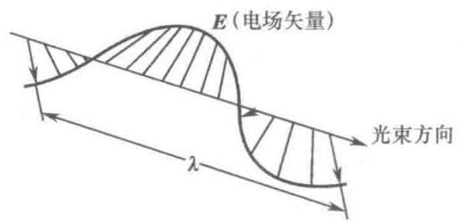  
图 3-12 平面偏振和圆偏振(仅示出右圆偏振)

使光(电磁波)发生偏振的方式有多种。最熟悉的是平面偏振(见第1章)，这里辐射的场矢量(包括互相垂直的电场矢量和磁场矢量)振荡有固定的方向(图3-12A)。不太熟悉的、但又同样重要的是圆偏振(circular polarization)。圆偏振光的场矢量以辐射频率绕光传播方向旋转前进(图3-12B)。当朝光源方向观察圆偏振光时，其电场矢量顺时针方向旋转的称为右手圆偏振光，逆时针方向旋转的称为左手圆偏振光。习惯上分别用这两种光的电场矢量 $E_{R}$ 和 $E_{L}$ 来表示。圆偏振光可看成是由波长和振幅相等但相位差1/4波长(90°)的两个平面偏振光叠加而成。左、右圆偏振光在CD光谱仪上是由同一平面偏振光通过一个以交流电的电光调制器(一种晶体)时交替产生的。

多数生物分子具有不对称性，有的是构型不对称性如L-和D-氨基酸，有的是构象不对称性如蛋白质的左手、右手 $\alpha$ 螺旋（图3-15）和左手、右手多糖螺旋（见图9-32）等。总之，一个分子中任何形式的结构上的不对称性都能用圆二色性光谱学来测定。手性物质与左、右圆偏振光 $(E_{\mathrm{L}}, E_{\mathrm{R}})$ 的相互作用是不相同的，例如左手螺旋与 $E_{\mathrm{L}}$ 有更强的相互作用，因而对 $E_{\mathrm{L}}$ 和 $E_{\mathrm{R}}$ 的吸收也不相同。由于手性物质对 $E_{\mathrm{L}}$ 和 $E_{\mathrm{R}}$ 这两种光的吸收（振幅减小）不同，便使左、右圆偏振光叠合成椭圆偏振光（elliptically polarized light），见图3-13A。这种光学效应称为圆二色性。若用 $\varepsilon_{\mathrm{L}}$ 和 $\varepsilon_{\mathrm{R}}$ 分别表示手性物质对 $E_{\mathrm{L}}$ 和 $E_{\mathrm{R}}$ 光吸收的摩尔吸收系数，则 $\Delta \varepsilon = \varepsilon_{\mathrm{R}} - \varepsilon_{\mathrm{L}}$ 为圆二色性。圆二色性也用摩尔椭圆率(molar ellipticity)[θ]表示，Δε和[θ]的关系为：

$$
[ \theta ] _ {\lambda} = \frac {\theta_ {\lambda}}{c l} \times 1 0 0 = 3 3 0 0 \Delta \varepsilon
$$

式中椭圆率 $\theta = \arctan$ （短轴/长轴） $\approx \tan \theta \approx 33cl\Delta \varepsilon$ （对于小的 $\theta$ 来说）（图3-13）， $c =$ 摩尔浓度、 $l =$ 光程厚度（cm）。 $[\theta]_{\lambda}$ 的单位为 $(^{\circ})\cdot \mathrm{cm}^{2}\cdot \mathrm{dmol}^{-1}$ 。注意， $\Delta \varepsilon$ 可以是正值或负值，所以CD光谱与一般的吸收光谱不同，在这里正和负值都是允许的。

图 3-14 示出 α 螺旋、β 折叠片和无规卷曲（random coil）构象的多肽圆二色性光谱。蛋白质在远紫外区（190\~250 nm）可得到 CD 光谱，其吸光的实体或发色团（chromophore）是肽键，也即反映了主链构象。典型的 α 螺旋在 208 nm 和 222 nm 附近各有一个负槽，在 192 nm 有一个正峰。β 折叠片在 190 nm 附近也出现正峰，并在 215 nm 处有一个负槽。相反，无规卷曲在 199 nm 左右有一个负槽。

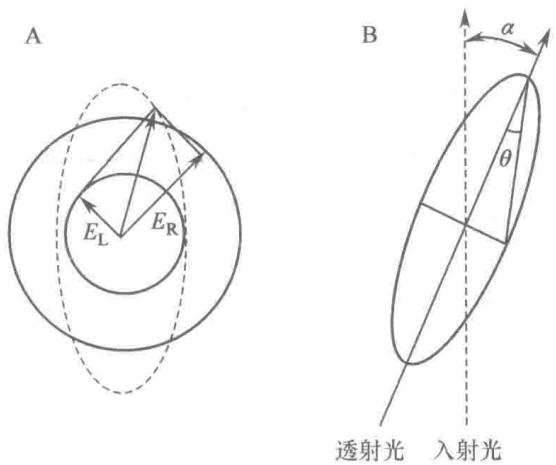

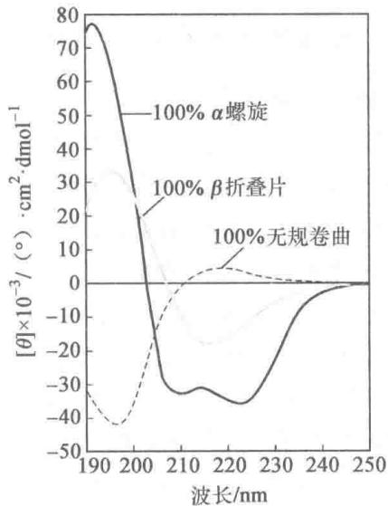  
图 3-13 椭圆偏振和椭圆率

A. 当 $E_{L} \neq E_{R}$ 时，左、右圆偏振光叠合成椭圆偏振光。虚线椭圆是椭圆偏振光 E 矢量的运动轨迹；两个实线圆分别是圆偏振光 $E_{L}$ 和 $E_{R}$ 矢量的运动轨迹；B. $\theta$ 是椭圆率， $\alpha$ 是旋光度（对一般的光学活性物质，圆二色性和旋光现象同时发生）

图 3-14 多聚 L-赖氨酸在不同构象条件下的标准远紫外 CD 光谱

圆二色性还能用于估算蛋白质中 $\alpha$ 螺旋、 $\beta$ 折叠片和无规卷曲的含量。假设蛋白质分子全由这 3 种构象元件组成，它们所含的残基数占蛋白质分子的总残基数的百分数分别为 $f_{\alpha}$ 、 $f_{\beta}$ 和 $f_{R}$ ，则

$$
f _ {\alpha} + f _ {\beta} + f _ {\mathrm{R}} = 1\tag{3-1}
$$

再假设蛋白质分子中的各种构象元件在波长处的椭圆率也可以加和,则

$$
[ \theta ] _ {\lambda} = f _ {\alpha} [ \theta ] _ {\alpha , \lambda} + f _ {\beta} [ \theta ] _ {\beta , \lambda} + f _ {R} [ \theta ] _ {R, \lambda}\tag{3-2}
$$

式中 $[\theta]_{\lambda}$ 为实验样品CD曲线在波长 $\lambda$ 处的摩尔椭圆率； $[\theta]_{\alpha ,\lambda},[\theta ]_{\beta ,\lambda}$ 和 $[\theta ]_{R,\lambda}$ 分别为 $100\%$ $\alpha$ 螺旋、 $100\%$ $\beta$ 折叠片和 $100\%$ 无规卷曲构象在波长 $\lambda$ 处的摩尔椭圆率；这些数据可由人工合成的多聚氨基酸获得（图3-14）。因此利用公式(3-2)，理论上只要选择3个不同波长的 $[\theta ]$ ，即可得到一组三元一次方程，并由此解出未知数 $f_{\alpha},f_{\beta}$ 和 $f_{\mathrm{R}}$ ；现在实际上都是用现成的程序在计算机上完成的。

除上述几种方法之外,还有一些方法用于研究溶液中的蛋白质构象,如重氢交换可以测定蛋白质中 $\alpha$ 螺旋的含量。拉曼光谱学(Raman Spectroscopy)用于研究主链构象,光散射(light scattering)可获得生物大分子的许多重要信息。

<!-- EN-BEGIN 4.5 -->

### 【英文对应 4.5】Determination of Protein and Biomolecular Structures

> 来源：Lehninger Principles of Biochemistry（书籍/02_生物化学原理） 第4章 The Three-Dimensional Structure of Proteins，§4.5。对应本章“二、测定蛋白质三维结构的方法”。

In this chapter we have presented many types of protein structures. How were these structures determined? P5 Structural biology is the study of the three-dimensional structures of biomolecules, including proteins, nucleic acids, lipid membranes, and oligosaccharides. Structural biologists combine biochemical approaches with physical tools and computational methods to obtain these structures. Structural biology is extraordinarily powerful for elucidating the relationships between the structure and function of proteins, the molecular basis for enzymatic catalysis and ligand binding, and evolutionary relationships between proteins. Here we focus primarily on three commonly used methods in structural biology: x-ray crystallography, nuclear magnetic resonance (NMR), and cryo-electron microscopy (cryo-EM). Which method a structural biologist uses depends on the system being studied and what information is to be learned. Often structural biologists combine multiple methods to provide a more complete view of function.

Increasingly, computational methods such as molecular dynamics simulations and in silico protein folding are proving to be essential for structural biologists, and these are discussed in Box 4-5.

#### [EN] X-ray Diffraction Produces Electron Density Maps from Protein Crystals

The spacing of atoms in a crystal lattice can be determined by measuring the locations and intensities of spots produced on a detector by a beam of x-rays of given wavelength, after the beam has been diffracted by the electrons of the atoms. For example, x-ray analysis of sodium chloride crystals shows that $Na^{+}$ and $Cl^{-}$ ions are arranged in a simple cubic lattice. The spacing of the different kinds of atoms in complex organic molecules, even very large ones such as proteins, can also be analyzed by x-ray diffraction methods. However, the technique for analyzing crystals of complex molecules is far more laborious than the technique for analyzing simple salt crystals. When the repeating pattern of the crystal is a molecule as large as, say, a protein, the numerous atoms in the molecule yield thousands of diffraction spots that must be analyzed by computer.

Consider how images are generated in a light microscope. Light from a point source is focused on an object. The object scatters the light waves, and these scattered waves are recombined by a series of lenses to generate an enlarged image of the object. The smallest object whose structure can be determined by such a system—that is, the resolving power of the microscope—is determined by the wavelength of the light, in this case visible light, with wavelengths in the range of 400 to 700 nm. Objects smaller than half the wavelength of the incident light cannot be resolved. To resolve objects as small as proteins we must use x-rays, with wavelengths in the range of 0.7 to 1.5 Å (0.07 to 0.15 nm). However, there are no lenses that can recombine x-rays to form an image; instead, the pattern of diffracted x-rays is collected directly and an image is reconstructed by mathematical techniques.

The amount of information obtained from x-ray crystallography depends on the degree of structural order in the sample. Some important structural parameters were obtained from early studies of the diffraction patterns of the fibrous proteins arranged in regular arrays in hair and wool. However, the orderly bundles formed by fibrous proteins are not crystals—the molecules are aligned side by side, but not all are oriented in the same direction. More-detailed three-dimensional structural information about proteins requires a highly ordered protein crystal. The structures of many proteins are not yet known, simply because they have proved difficult to crystallize. Practitioners have compared making protein crystals to holding together a stack of bowling balls with cellophane tape.

Operationally, there are several steps in x-ray structural analysis (Fig. 4-30). A crystal is placed in an x-ray beam between the x-ray source and a detector, and a regular array of spots, called reflections, is generated. The spots are created by the diffracted x-ray beam, and each atom in a molecule makes a contribution to each spot. An electron-density map of the protein is reconstructed from the overall diffraction pattern of spots by a mathematical technique called a Fourier transform. In effect, the computer acts as a "computational lens." A model for the structure is then built that is consistent with the electron-density map.

  
FIGURE 4-30 Steps in determining the structure of sperm whale myoglobin by x-ray crystallography. (a) X-ray diffraction patterns are generated from a crystal of the protein. (b) Data extracted from the diffraction patterns are used to calculate a three-dimensional electron-density map. The electron density of only part of the structure, the heme, is shown here. (c) Regions of greatest electron density reveal  
the location of atomic nuclei, and this information is used to piece together the final structure. Here, the heme structure is modeled into its electron-density map. (d) The completed structure of sperm whale myoglobin, including the heme. [(a, b, c) Photo and data from George N. Phillips, Jr., University of Wisconsin–Madison, Department of Biochemistry. (d) Data from PDB ID 2MBW, E. A. Brucker et al., J. Biol. Chem. 271:25,419, 1996.]

John Kendrew found that the x-ray diffraction pattern of crystalline myoglobin (isolated from muscles of the sperm whale) is highly complex, with nearly 25,000 reflections. Computer analysis of these reflections took place in stages. The resolution improved at each stage until, in 1959, the positions of virtually all the nonhydrogen atoms in the protein had been determined. The amino acid sequence of the protein, obtained by chemical analysis, was consistent with the molecular model. Over 100,000 protein structures, many of them much more complex than myoglobin, have since been determined to a similar level of resolution by x-ray crystallography.

The physical environment in a crystal, of course, is not identical to that in solution or in a living cell. A crystal imposes a space and time average on the structure deduced from its analysis, and x-ray diffraction studies provide little information about molecular motion within the protein. The conformation of proteins in a crystal can also be affected by nonphysiological factors such as incidental protein-protein contacts within the crystal. However, when structures derived from the analysis of crystals are compared with structural information obtained by other means (such as NMR, as described below), the crystal-derived structure almost always represents a functional conformation of the protein.

#### [EN] Distances between Protein Atoms Can Be Measured by Nuclear Magnetic Resonance

An advantage of nuclear magnetic resonance (NMR) studies is that they are carried out on macromolecules in solution, whereas x-ray crystallography is limited to molecules that can be crystallized. NMR can also illuminate the dynamic side of protein structure, including conformational changes, protein folding, and interactions with other molecules.

NMR is a manifestation of nuclear spin angular momentum, a quantum mechanical property of atomic nuclei. Only certain atoms, including ${}^{1}H$ , ${}^{13}C$ , ${}^{15}N$ , ${}^{19}F$ , and ${}^{31}P$ , have the kind of nuclear spin that gives rise to an NMR signal. Nuclear spin generates a magnetic dipole. When a strong, static magnetic field is applied to a solution containing a single type of macromolecule, the magnetic dipoles are aligned in the field in one of two orientations: parallel (low energy) or antiparallel (high energy). A short ( $\sim10\ \mu s$ ) pulse of electromagnetic energy of suitable frequency (the resonant frequency, which is in the radio frequency range) is applied at right angles to the nuclei aligned in the magnetic field. Some energy is absorbed as nuclei switch to the high-energy state, and the absorption spectrum that results contains information about the identity of the nuclei and their immediate chemical environment. The data from many such experiments on a sample are averaged, increasing the signal-to-noise ratio, and an NMR spectrum such as that in Figure 4-31 is generated.

$^{1}$ H is particularly important in NMR experiments because of its high sensitivity and natural abundance. For macromolecules, $^{1}$ H NMR spectra can become quite complicated. Even a small protein has hundreds of $^{1}$ H atoms, typically resulting in a one-dimensional NMR spectrum too complex for analysis. Structural analysis of proteins became possible with the advent of two-dimensional NMR techniques (Fig. 4-31b, c, d). These methods allow measurement of distance-dependent coupling of nuclear spins in nearby atoms through space (the nuclear Overhauser effect (NOE), in a method dubbed NOESY) or the coupling of nuclear spins in atoms connected by covalent bonds (total correlation spectroscopy, or TOCSY).

#### [EN] Video Games and Designer Proteins

Computational tools are now indispensable to biochemistry. While advances in computers and software have revolutionized how protein structures can be solved by x-ray crystallography, NMR, and cryo-EM, advances in computational chemistry have now allowed a number of studies of protein structure to be carried out entirely in silico using powerful molecular modeling and dynamics software. Key developments in this field were made by Martin Karplus, Michael Levitt, and Arieh Warshel, who received the Nobel Prize in Chemistry in 2013 for their work on the theoretical and computational tools needed to carry out computer simulations of molecules as large as proteins.

Protein folding is a problem particularly well-suited for computational biochemists. Protein-folding landscapes can be complex, and nearly an infinite number of possible peptide conformations are theoretically available for the protein to sample as it folds. However, to understand how folding happens efficiently and by only sampling a small portion of all

  
[Photo by Ian C. Haydon, courtesy Institute for Protein Design, University of Washington]

Translating a two-dimensional NMR spectrum into a complete three-dimensional structure can be a laborious process. The NOE signals provide some information about the distances between individual atoms, but for these distance constraints to be useful, the atoms giving rise to each signal must be identified. Complementary TOCSY experiments can help identify which NOE signals reflect atoms that are linked by covalent bonds. Certain patterns of NOE signals have been associated with secondary structures such as $\alpha$ helices. Genetic engineering possible conformations requires computers that can quickly test tens of thousands of possible folding trajectories in a brief time. Sometimes these calculations are carried out on powerful supercomputers, but in other instances research groups have taken to crowdsourcing these problems to thousands of citizen scientists.

David Baker has pioneered crowdsourcing protein-folding problems to engage millions of computer users directly in biochemistry. The Rosetta@home project distributes complex protein-folding problems to citizen scientists who run the software in the background on their home computers. Each home computer is able to complete a portion of a protein-folding experiment, and these results can be combined with those from other users to predict protein structures.

Foldit is a video game in which users compete to solve protein-folding puzzles (Fig. 1). Users are rewarded for making stabilizing contacts in the structure, like hydrogen bonds or favorable van der Waals interactions. Virtual protein designs (sometimes called theozymes) from the video game can then be tested in the real world. DNA genes coding for the virtual proteins can be created in the laboratory and be used to recombinantly produce the proteins in bacteria, using techniques described in Chapter 9. The purified proteins can then be structurally characterized by x-ray crystallography or NMR to see how closely the real-world structures and computationally designed structures match.

One exciting application of computational biochemistry is the creation of "designer proteins." These are proteins with completely novel folds or functions not yet identified in nature. Designer proteins have potential applications in bioengineering, medicine, materials science, and chemistry. In one recent example, the Baker Lab designed a series of Foldit puzzles (such as "Cover the Ligand," in which users had to redesign a ligand-binding site by rebuilding the protein backbone and changing amino acid side chains) to improve the catalytic efficiency of a previously engineered Diels-Alderase (Fig. 2). The Diels-Alder reaction is a common method for organic chemists to create carbon-carbon bonds; however, it is almost never used by naturally occurring enzymes. Diels-Alderase enzymes would

(Chapter 9) can be used to prepare proteins that contain the rare isotopes ${}^{13}$ C or ${}^{15}$ N. The new NMR signals produced by these atoms, and the coupling with ${}^{1}$ H signals resulting from these substitutions, help in the assignment of individual ${}^{1}$ H NOE signals. The process is also aided by a knowledge of the amino acid sequence of the polypeptide.

To generate a three-dimensional structure, researchers feed the distance constraints into a computer along with known geometric constraints such as chirality, potentially be useful for carrying out environmentally friendly carbon bond forming reactions in water instead of toxic organic solvents. Foldit competitors used the video game to design thousands of virtual enzymes. The players were successful, and once their top virtual enzyme was produced and tested in the real world it was found to be more than 18-fold more active than the original Diels-Alderase. Incredibly, the protein structure created by the Foldit game players was also confirmed by x-ray crystallography. This is definitely a case where we can encourage biochemistry students to spend more time playing video games!

  
FIGURE 1 Foldit uses a video game interface to crowdsource protein-folding problems. Proteins designed in the video game can be recreated in the laboratory and studied using biochemical and structural methods.

van der Waals radii, and bond lengths and angles. The computer generates a family of closely related structures that represent the range of conformations consistent with the NOE distance constraints (Fig. 4-31d). The uncertainty in structures generated by NMR is in part a reflection of the molecular vibrations (known as breathing) within a protein structure in solution, discussed in more detail in Chapter 5. Normal experimental uncertainty can also play a role.

  
FIGURE 2 The Diels-Alder reaction catalyzed by an enzyme designed by Foldit players. Diels-Alder reactions are commonly used by organic chemists to form C—C bonds; however, there are very few examples of enzymes catalyzing this type of chemistry in nature. [Information from C. B. Eiben et al., Nature Biotechnol. 30:190, 2109.]

#### [EN] Thousands of Individual Molecules Are Used to Determine Structures by Cryo-Electron Microscopy

Our understanding of highly complex processes such as gene expression, mitochondrial respiration, or viral infection is aided immensely by knowing the detailed molecular structures of the proteins that participate in these processes. However, it is often difficult to determine the molecular structure of large, dynamic, macromolecular complexes that contain dozens of individual

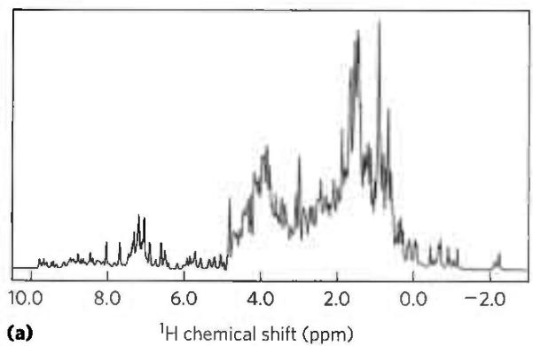

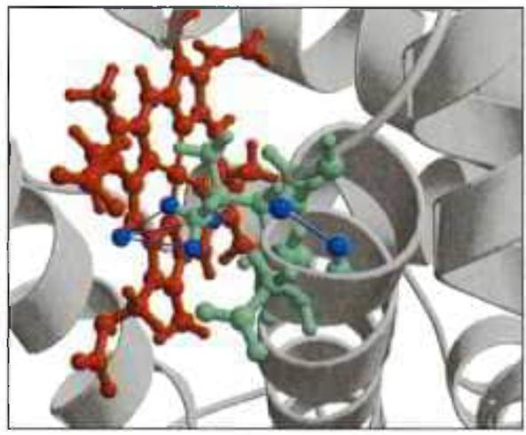

protein subunits. Moreover, integral membrane proteins often resist crystallization once they are removed from their lipid environment, making their structures difficult to solve by x-ray diffraction, and many are too large for NMR. In principle, discrete objects in the diameter range 100 to 300 Å can be visualized by electron microscopy (EM). In practice, the high intensity of the EM beam often damages the specimen before a high-resolution image can be obtained. In cryo-electron microscopy (cryo-EM), a sample containing many individual copies of the structure of interest is quick-frozen in vitreous (or noncrystalline) ice and kept frozen while being observed in two dimensions with the electron microscope, greatly reducing damage to the specimen by the electron beam.

FIGURE 4-31 NMR spectra of a globin from a marine blood worm. (a) One-dimensional ${}^{1}$ H NMR spectrum. (b) Two-dimensional NMR data used to generate a three-dimensional structure of globin. The diagonal in a two-dimensional NMR spectrum is equivalent to a one-dimensional spectrum. The off-diagonal peaks are NOE signals generated by close-range interactions of ${}^{1}$ H atoms that may generate signals quite distant in the one-dimensional spectrum. Two such interactions are identified in (b), and their identities are shown with blue lines in (c). Three lines are drawn for interaction 2 between a methyl group in the protein and a hydrogen on the heme. The methyl group rotates rapidly such that each of its three hydrogens contributes equally to the interaction and the NMR signal. Such information is used to determine the complete three-dimensional structure, as in (d). The multiple lines shown for the protein backbone in (d) represent the family of structures consistent with the distance constraints in the NMR data. [Data from (a, b) B. F. Volkman, National Magnetic Resonance Facility at Madison; (c) PDB ID 1VRF; (d) PDB ID 1VRE, B. F. Volkman et al., Biochemistry 37:10,906, 1998.]  

Particles such as purified, multisubunit enzymes, arranged randomly on the microscope grid, are visualized with the cryo-electron microscope. When cryo-EM is combined with powerful algorithms for transforming the two-dimensional structures of tens of thousands of individual, randomly oriented complexes into a three-dimensional composite, it is sometimes possible to determine molecular structures at a level comparable to that obtained by x-ray crystallography (Fig. 4-32). In favorable cases, the repetitive aspects—choice of objects to be included in the analysis, imaging of each object individually, and calculations to produce a three-dimensional structure from the huge number of two-dimensional images—can be automated. The EMDataResource (www.emdataresource.org) is a unified resource for accessing structure maps deposited into data banks and assigned EMDataBank (EMDB) accession codes.

(a)  
  
FIGURE 4-32 Structure of the chaperone protein GroEL as determined by single-particle cryo-EM. (a) Cryo-EM images of many individual GroEL particles. (b) Side and top views of the three-dimensional structure derived from analysis of the EM images. [(a) Alberto Bartesaghi and Sriram Subramaniam, National Cancer Institute, National Institutes of Health (b) Data from PDB ID 3E76, P.D. Kaiser et al., Acta Crystallogr. 65:967, 2009.]

Many novel structures have now been obtained by cryo-EM without models based on prior x-ray or NMR structures. Since cryo-EM relies on imaging of single molecules of a complex, this technique can also be used to computationally sort the imaged particles and simultaneously determine structures of multiple conformational states. Cryo-EM has now been used to solve the structures of some of the most dynamic and largest molecular complexes in the cell, such as the human telomerase enzyme (Fig. 4-33). Telomerase is an essential enzyme for maintaining chromosome integrity in humans (see Chapter 26) and is the target of significant medical research due to its roles in aging and cancer. Cryo-EM was critical for the laboratories of Eva Nogales and Kathleen Collins in determining the architecture of telomerase due to the heterogeneity of the complex and because only minute quantities could be purified from human cells—far too little for crystallization, but enough to observe single molecules by cryo-EM.

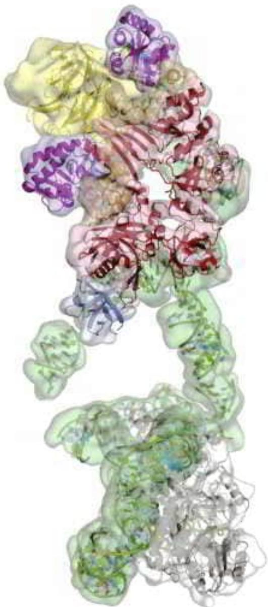  
FIGURE 4-33 Cryo-EM structure of human telomerase. The structures of the RNA (green) and protein (ribbon representations) components of human telomerase are shown embedded in the calculated 10.2 Å EM density map. [Data from EMDB ID EMD-7521, T. Nguyen et al., Nature 557:190, 2018.]

  
Eva Nogales
[Courtesy Eva Nogales.]

  
Kathleen Collins
[Courtesy Kathleen Collins.]

#### [EN] SUMMARY 4.5 Determination of Protein and Biomolecular Structures

In x-ray crystallography, protein molecules are crystallized in well-ordered orientations that diffract x-rays. The patterns and intensities of the diffracted x-rays depend on the structure of the protein and its crystalline properties. Mathematical methods can then reconstruct the protein structure that produces a particular diffraction pattern.

■ NMR is often carried out on molecules in solution and yields information about atomic nuclei and their chemical environment. Protein structures can be computed from NMR data using hundreds of distance and geometric constraints obtained from multi-dimensional NMR experiments.

\- Biomolecules are frozen in vitreous ice for imaging by cryo-EM. The individual molecules are then identified and computationally sorted. The sorted two-dimensional images are then combined using computers to produce a three-dimensional structure.

<!-- EN-END 4.5 -->

## 三、蛋白质的二级结构

在蛋白质折叠过程中,处于分子表面的主链极性基团,C=O 和 N-H,与溶剂水形成氢键,分子内部的主链极性基团相互之间氢键键合;正是在这种能量平衡中,主链的折叠出现了由氢键稳定的有规则的构象,称为二级结构(secondary structure)。二级结构这个术语也可定义为多肽链的任一所选区段中主链原子的局部空间排列,但不涉及它的侧链定位或与其他肽段的关系。二级结构是蛋白质的复杂三维结构的结构基础,因而被称为构象元件(element)或单元(unit)。当肽段中每个二面角, $\Phi$ 和 $\Psi$ ,都处于同一或几乎同一数值时,则会出现规正的二级结构。少数几种类型的二级结构特别稳定,广泛存在于蛋白质中。最突出的是 $\alpha$ 螺旋和 $\beta$ 构象;另一些常见的类型是 $\beta$ 转角,还有 $\Omega$ 环,有人称它们为部分规正的二级结构。没有规正图案的肽段,这种肽段有时被称为不确定的二级结构或无规卷曲。但是这种叫法用来描述这种肽段的结构并不恰当。一个典型的蛋白质中多肽主链的大部分走向不是随机的;而且,这一走向对这个特定蛋白质的结构和功能是不变并高度专一的。下面我们主要讨论几种最常见的二级结构元件。

## （一） $\alpha$ 螺旋是常见的蛋白质二级结构

## 1. $\alpha$ 螺旋的结构

α 螺旋(α helix)是蛋白质中最常见、最典型和含量最丰富的二级结构元件。早在 1950 年 L. Pauling (1901—1994) 和 R. Corey (1897—1971) 等人就根据从小肽晶体结构中测得的多肽标准参数(图 2-21)，预测出能够稳定存在的螺旋结构，并很快由实验得到证实。Pauling 和 Covey 命名它为 α 螺旋(图 3-15)。在原型的 α 螺旋中氨基酸残基的主链原子有一套特有的二面角( $\phi = -57^{\circ}, \psi = -47^{\circ}$ )，规定了 α 螺旋的构象(表 3-3)。但蛋白质中的 α 螺旋段经常与这些二面角稍有偏差，甚至会有变化，在一个相邻的肽段内产生螺旋轴的细小弯曲或结节(kink)。α 螺旋是一个重复性结构，一个螺圈(重复单位)包含 3.6 个氨基酸残基，沿螺旋轴方向上升 0.54 nm，称为移动距离或螺距(pitch)，此数值比 W. Ausbury 在毛发角蛋白的 X 射线分析中观测到的周期性略大一点。每个残基绕轴旋转 $100^{\circ}$ ，沿轴上升 0.15 nm。残基的侧链(R 基)伸向外侧。如果侧链不计在内，螺旋的直径约为 0.5 nm。一个 α 螺旋段中相邻螺圈之间形成氢键，氢键的取向几乎与螺旋轴平行。

表 3-3 蛋白质中常见二级结构理想的 $\phi$ 和 $\psi$ 角

<table><tr><td>结构</td><td> $\phi$ </td><td> $\psi$ </td><td>结构</td><td> $\phi$ </td><td> $\psi$ </td></tr><tr><td> $\alpha$ 螺旋</td><td> $-57^{\circ}$ </td><td> $-47^{\circ}$ </td><td> $\beta$ 转角I型</td><td></td><td></td></tr><tr><td> $\beta$ 构象</td><td></td><td></td><td> $i+1^{*}$ </td><td> $-60^{\circ}$ </td><td> $-30^{\circ}$ </td></tr><tr><td>反平行</td><td> $-139^{\circ}$ </td><td> $+135^{\circ}$ </td><td> $i+2^{*}$ </td><td> $-90^{\circ}$ </td><td> $0^{\circ}$ </td></tr><tr><td>平行</td><td> $-119^{\circ}$ </td><td> $+113^{\circ}$ </td><td> $\beta$ 转角II型</td><td></td><td></td></tr><tr><td>胶原三股螺旋</td><td> $-51^{\circ}$ </td><td> $+153^{\circ}$ </td><td> $i+1$ </td><td> $-60^{\circ}$ </td><td> $+120^{\circ}$ </td></tr><tr><td></td><td></td><td></td><td> $i+2$ </td><td> $+80^{\circ}$ </td><td> $0^{\circ}$ </td></tr></table>

$*\mathrm{i} + 1$ 角和 $\mathrm{i} + 2$ 角分别是 $\beta$ 转角中的第2个和第3个氨基酸残基的角度。

为什么 $\alpha$ 螺旋比许多其他可能的构象更容易形成？部分原因是因为它能最大地利用内部氢键。 $\alpha$ 螺旋结构是通过连接在一个肽键的电负性氮原子上的氢原子和该肽键的N端第4个氨基酸的电负性羰基氧原子之间的氢键得到稳定的（图3-15A，B）。 $\alpha$ 螺旋内的每一肽键（除靠近螺旋每端的肽键外）都参与这样的氢键键合。每一连续的 $\alpha$ 螺旋圈都由3到4个氢键固定住相邻的螺圈，这样给予整个螺旋结构以很大的稳定性。在 $\alpha$ 螺旋段的每端总有3或4个酰胺氨基或酰胺羰基不能参与这种螺旋模式的氢键键合，或者说一个含 $n$ 个残基的 $\alpha$ 螺旋会有 $(n - 4)$ 个氢键，螺旋的头4个酰胺氢和最后4个羰基氧不参与螺旋中的氢键形成。这些基团可以暴露在周围的溶剂中，在这里跟水发生氢键键合，或由该蛋白质的其他部分给它加帽或称帽化（capping），所谓加帽就是给末端裸露的N—H和C=O提供氢键配偶体（partner）。

  
图 3-15 α 螺旋结构模型  
A. 示出螺旋参数和偶极矩；B. 螺旋可看成是以 $\alpha-$ 碳为铰点的肽平面堆叠排列而成，肽平面大体平行于螺旋轴；C. 螺旋的顶面观

从 N 端出发, 氢键是由每个肽基的 C=O 与 C 端的第 4 个肽基的 N—H 之间形成的。由氢键封闭形成的环是 13 元环:

$$
\begin{array}{c} \mathrm{O} - - - - - - - - - - - - - - - - - - - - - - - - - - - - - - - - - - - - - \\ | | \\ \mathrm{C} \left[ \mathrm{NH} - \mathrm{C} _ {\alpha} \mathrm{H} - \mathrm{CO} \right] _ {3} \mathrm{N} - \\ | \\ \mathrm{R} \end{array}
$$

因此 $\alpha$ 螺旋也称 $3.6_{13}$ -螺旋。

如图 3-15A 和 B 所示， $\alpha$ 螺旋中所有氢键都沿螺旋轴指向同一方向。每一肽键具有由 N—H 和 C=O 的极性产生的偶极矩。因为这些基团都是沿螺旋轴排列，所以总的效果是 $\alpha$ 螺旋本身也是一个偶极矩，相当于在 N 端积累了部分正电荷，在 C 端积累了部分负电荷。

$\alpha$ 螺旋是有规则的构象，在折叠成螺旋时具有协同性。一旦形成了一圈 $\alpha$ 螺旋，随后逐个残基的加入变得容易而快速，这是因为第一个螺圈成为形成相继螺圈的模板。

## 2. $\alpha$ 螺旋的手性

Pauling 和 Corey 考虑过 $\alpha$ 螺旋的左、右手变体（图 3-16）的问题。随后肌红蛋白和其他蛋白质的三维结构的阐明证实右手 $\alpha$ 螺旋是常见的形式。左手 $\alpha$ 螺旋在理论上稳定性就比较小，在蛋白质中极少能观察到。 $\alpha$ 螺旋已证明是 $\alpha$ -角蛋白中占优势的结构。更一般地说，蛋白质中约四分之一的氨基酸残基是以 $\alpha$ 螺旋形式存在的，精确的分数比在不同蛋白质之间有很大的变化。这里讲的不论是右手还是左手螺旋都是指由 L-型氨基酸残基构成的，因此右手 $\alpha$ 螺旋和左手 $\alpha$ 螺旋不是对映体。在左手 $\alpha$ 螺旋中 L-型氨基酸残基侧链的第一个碳原子 ( $C_{\beta}$ ) 过分接近主链上的 C=O 氧原子，以致结构不舒适，能量高，构象不稳定。而右手 $\alpha$ 螺旋，空间位阻较小，比较符合立体化学的要求，因而在肽链折叠中容易形成，构象稳定。左手 $\alpha$ 螺旋虽然很稀少，但也偶有出现。例如，在嗜热菌蛋白酶中就有很短一段左手 $\alpha$ 螺旋，由 Asp-Asn-Gly-Gly（第 226～229 位）组成。

进一步的实验证实,由 L-或 D-氨基酸组成的多肽都能形成 $\alpha$ 螺旋。但是必须所有的残基都是同一α 螺旋,最稳定的形式是右手的;D-氨基酸组成的 α 螺旋,最稳定的形式是左手的。

α 螺旋是手性结构, 具有旋光能力。但 α 螺旋的比旋并不等于构成自身的氨基酸比旋的简单加和, 而无规卷曲的比旋与这种加和相等。事实上 α 螺旋的旋光性是 α-碳原子的构型不对称性和 α 螺旋的构象不对称性的总反映。应用旋光色散 (optical rotatory dispersion, ORD) 光谱 (测定作为波长函数的旋光能力), 特别是 CD 光谱可以研究蛋白质的二级结构。

确定螺旋结构手性的简单方法(图 3-16)是右手握拳,伸直大拇指,与螺轴平行,指向前方。如果螺线按右手其他4个手指弯曲的方向(顺时针)旋转,螺旋将沿大拇指所指的方向前进,则该结构为右手螺旋;如果用左手以同样方式操作,螺线逆时针旋转向前,则为左手螺旋。

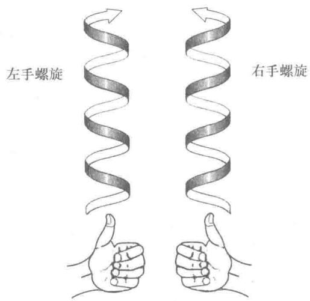  
图 3-16 识别左、右手螺旋的方法

## 3. 其他类型的螺旋

在蛋白质中还发现几种不常见的其他类型螺旋。其中最常见的是 $3_{10}$ -螺旋（图3-17A），每螺圈的残基数 $(n)$ 为3.0，每个肽基的 $\mathrm{C} = 0$ 与其羧基端侧的第3个肽基的 $\mathrm{N}-\mathrm{H}$ 形成氢键，构成10元环，每残基高度 $0.2\mathrm{nm}$ ，螺距 $0.6\mathrm{nm}$ ，螺旋直径约为 $0.4\mathrm{nm}$ 。 $\phi, \psi$ 分别在 $-49^{\circ}$ 和 $-26^{\circ}$ 左右。 $3_{10}$ -螺旋比 $\alpha$ 螺旋紧密。由于 $n$ 为整数(3.0)，相邻螺圈中的 $\alpha-$ 碳在一条直线上。由于 $3_{10}$ -螺旋中的氢键几何结构及非键合相互作用并不处于最佳状态，在蛋白质结构中一般很短，通常作为 $\alpha$ 螺旋末端的最后一圈存在。其他螺旋结构包括 $\pi$ 螺旋（图3-17B）。 $\pi$ 螺旋也称 $4.4_{16}$ -螺旋， $n = 4.4$ ，残基高度 $0.12\mathrm{nm}$ ，螺距 $0.52\mathrm{nm}$ ，螺旋直径约为 $0.6\mathrm{nm}$ 。每个肽基的 $\mathrm{C} = 0$ 与其羧基端侧第5个肽基的 $\mathrm{N}-\mathrm{H}$ 形成氢键，并构成16元环。 $\pi$ 螺旋不稳定，在蛋白质中极少存在。

  
图3-17 多肽链的其他两种类型的螺旋结构

## （二）氨基酸序列影响 $\alpha$ 螺旋的稳定性

一条肽链能否形成 $\alpha$ 螺旋，以及形成的螺旋是否稳定，与它的氨基酸组成和序列有极大的关系。多肽中每个氨基酸残基都有形成 $\alpha$ 螺旋的固有倾向（表3-4），反映R基的性质（包括电荷性质和体积性质）以及它们如何影响邻接的主链原子采取特有的 $\phi$ 角和 $\psi$ 角的能力。关于这方面的知识很大一部分来自对多聚氨基酸的研究。发现R基小，并且不带电荷的多聚丙氨酸（多聚Ala），在pH7的水溶液中能自发地卷曲成 $\alpha$ 螺旋。在大多数实验模型系统中丙氨酸显示出形成 $\alpha$ 螺旋的最大倾向性。

表 3-4 氨基酸残基采取 $\alpha$ 螺旋构象的倾向性

<table><tr><td>氨基酸</td><td> $\Delta\Delta G^{\ominus}$  $/(kJ/mol)^{*}$ </td><td>氨基酸</td><td> $\Delta\Delta G^{\ominus}$  $/(kJ/mol)$ </td><td>氨基酸</td><td> $\Delta\Delta G^{\ominus}$  $/(kJ/mol)^{*}$ </td><td>氨基酸</td><td> $\Delta\Delta G^{\ominus}$  $/(kJ/mol)$ </td></tr><tr><td>Ala</td><td>0</td><td>Gln</td><td>1.3</td><td>Leu</td><td>0.79</td><td>Ser</td><td>2.2</td></tr><tr><td>Arg</td><td>0.3</td><td>Glu</td><td>1.4</td><td>Lys</td><td>0.63</td><td>Thr</td><td>2.4</td></tr><tr><td>Asn</td><td>3</td><td>Gly</td><td>4.6</td><td>Met</td><td>0.88</td><td>Tyr</td><td>2.0</td></tr><tr><td>Asp</td><td>2.5</td><td>His</td><td>2.6</td><td>Phe</td><td>2.0</td><td>Trp</td><td>2.0</td></tr><tr><td>Cys</td><td>3</td><td>Ile</td><td>1.4</td><td>Pro</td><td>&gt;4</td><td>Val</td><td>2.1</td></tr></table>

$\Delta\Delta G^{\ominus}$ 是一个自由能变化之差，相对于丙氨酸的 $\Delta G^{\ominus}$ 之差。

从邻近残基的关系上看,一个氨基酸残基的位置也是很重要的。氨基酸侧链之间的相互作用能够使 $\alpha$ 螺旋结构稳定或去稳定。例如,多聚 Glu 在 pH 7 条件下就不能形成 $\alpha$ 螺旋,而以无规卷曲形式存在。这是因为多聚 Glu 在此 pH 时 R 基具有负电荷,相邻残基彼此发生静电排斥,不能形成链内氢键。

同样原因, 多聚 Lys(或多聚 Arg) 在 pH 7 时 R 基带正电荷, 相邻残基也彼此排斥, 阻止 $\alpha$ 螺旋的形成。事实正是如此, 多聚 Lys(或多聚 Arg) 在 pH $\geqslant$ 12 时或多聚 Glu 在 pH $\leqslant$ 4 时, 则自发地形成 $\alpha$ 螺旋 (图 3-18)。如果 Asn、Ser、Thr 和 Cys 这些残基在链中靠在一起, 它们的体积和形状也能使 $\alpha$ 螺旋不稳定。

一个 $\alpha$ 螺旋的扭转保证了在一个氨基酸的侧链和在它的任一侧 3(有时 4) 个残基远的侧链之间发生关键性相互作用。把这个 $\alpha$ 螺旋想象成一个螺旋轮就更明白(图 3-15C)。荷正电氨基酸经常出现在离荷负电的氨基酸 3 个残基远的地方，在这里允许形成一个离子对。两个芳香族氨基酸残基经常有着类似的间距，因而引起疏水相互作用。

Pro 或 Gly 形成 $\alpha$ 螺旋的倾向性最小, 它们的存在限制了 $\alpha$ 螺旋的形成。脯氨酸中氮原子是刚性环的一部分(见图 2-20), 不能绕 N—C $_{\alpha}$ 键旋转。因此, Pro 残基给 $\alpha$ 螺旋引入了一个去稳定的结节。此外, 肽键中 Pro 残基的氮原子没有取代的氢可参与跟其他残基形成氢键。由于这些原因, Pro(和 Hyp) 极少存在于 $\alpha$ 螺旋中。

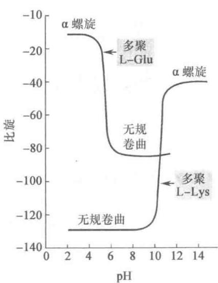  
图 3-18 pH 对多聚 L-Glu 和多聚 L-Lys 在 $\alpha$ 螺旋和无规卷曲之间构象互变的影响

甘氨酸不经常出现在 $\alpha$ 螺旋中的原因是 Gly 比其他氨基酸残基有更大的构象柔性。多聚 Gly 倾向采取很不同于 $\alpha$ 螺旋的卷曲结构 (coiled structure)。

影响 $\alpha$ 螺旋稳定性的最后一个因素是靠近多肽链 $\alpha$ 螺旋段两端的氨基酸残基的个性。每一个肽键中都存在一个小的电偶极子，这些偶极子与 $\alpha$ 螺旋的氢键平行排列，结果形成一个沿螺旋轴的净偶极（整个螺旋偶极），偶极矩随螺旋长度而增加（图3-15A）。螺旋偶极的部分正电荷和负电荷分别留在氨基端和羧基端附近的肽氨基和肽羰基上。因此，荷负电的氨基酸经常存在于螺旋段的氨基端，在这里它们通过与螺旋偶极的正电荷相互作用稳定了 $\alpha$ 螺旋；在氨基端的荷正电氨基酸是去稳定的。在螺旋段的羧基末

端情况恰相反。

总起来说,有5个方面的因素影响 $\alpha$ 螺旋的稳定性:①氨基酸残基形成 $\alpha$ 螺旋的固有倾向性;②R基之间,特别是间隔3(或4)个残基的R基之间的相互作用;③相邻R基的庞大体积;④Pro和Gly残基的存在;⑤螺旋段末端的氨基酸残基和 $\alpha$ 螺旋所特有的电偶极之间的相互作用。因此,多肽链的一个给定肽段形成 $\alpha$ 螺旋的倾向性取决于该肽段内氨基酸残基的本性和序列。

## （三） $\beta$ 构象把多肽链组织成片层结构

1951年Pauling和Covey预言了第二种类型的重复结构， $\beta$ 构象（ $\beta$ conformation）或 $\beta$ 结构。这是一种更为伸展的多肽链构象，它的结构也受到按一套特有二面角排列的主链原子的限定（表3-3）。在 $\beta$ 构象中多肽链骨架伸展成锯齿（zigzag）结构，而不是螺旋结构（图3-19）。处于 $\beta$ 构象的几段多肽链并排地排列，称为 $\beta$ 片（ $\beta$ sheet）或 $\beta$ 折叠片（ $\beta$ pleated sheet）。 $\beta$ 片可以想象为由几个折叠的纸条侧向拼接而成；每

个纸条可看成是一段肽链，在这里肽主链沿纸条形成锯齿状， $\alpha-$ 碳位于折叠线上；位于折叠片上的侧链（R基）都垂直于折叠片平面，并交替地从平面上、下两侧伸出（图3-19）。折叠片可以有两种形式（图3-20）：一种是平行（parallel），另一种是反平行（antiparallel）；在平行 $\beta$ 折叠片中，相邻肽链是同向的（相同的氨基 $\rightarrow$ 羧基取向），在反平行 $\beta$ 折叠片中，相邻肽链是反向的（相反的氨基 $\rightarrow$ 羧基取向）。平行和反平行这两种结构相当相似，虽然平行构象的重复周期（ $0.65\mathrm{nm}$ ）比反平行的（ $0.7\mathrm{nm}$ ）短一些，氢键键合的图案也不同。

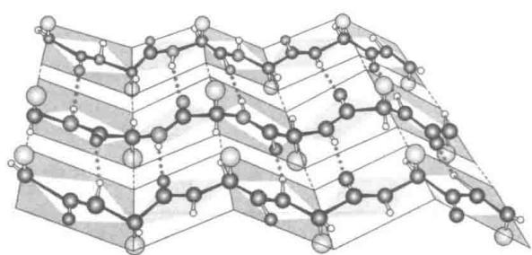  
图 3-19 在折叠的纸片上画出的反平行 $\beta$ 折叠片

  
图 3-20 在反平行(A)和平行(B) $\beta$ 折叠片中氢键的排列(图中未示出侧链)

β 片中每个肽链称为 β 折叠股或 β 股(β-strand)。大多数 β 股和 β 片都有右手扭曲的倾向,以缓解侧链之间的空间应力(steric strain)。由于 α-碳原子的四面体性质,连续的酰胺平面被排列成折叠形式。在此结构中氢键主要是在股间(interstrand)而不是在股内(intrastrand)形成。在反平行 β 片中股间氢键基本上是成线的(回忆氢键的方向性,第 1 章),而平行 β 片中的氢键明显弯折或者说不成线。理想的 β 结构呈现表 3-3 所列的键角;这些数值在实际的蛋白质中会有出入,因而造成结构上的变异,如上面关于 α 螺旋所见到的。

平行 $\beta$ 折叠片比反平行 $\beta$ 折叠片更规则。平行式中 $\alpha$ -碳的 $\phi$ 和 $\psi$ 值比反平行式中的小很多（表3-3）。平行折叠片一般是大结构，少于5个 $\beta$ 股的很少见；然而反平行折叠片可以少到仅由两个 $\beta$ 股组成。平行 $\beta$ 折叠片中疏水侧链分布在折叠片平面的两侧。而反平行 $\beta$ 折叠片中通常所有的疏水侧链都排列在折叠片的一侧。当然这就要求在参与反平行 $\beta$ 折叠片的多肽序列中亲水残基和疏水残基交替排列，因为间隔的侧链是伸向折叠片的同一侧。

在纤维状蛋白质中 $\beta$ 折叠片主要是反平行式的，而球状蛋白质中反平行和平行两种方式几乎同样广泛地存在。在纤维状蛋白质中， $\beta$ 折叠片的氢键主要是在不同肽链之间形成，而球状蛋白质中既可以在不同肽链或不同蛋白质分子之间形成，也可以在同一肽链的不同肽段（ $\beta$ 股）之间形成。

## （四） $\beta$ 转角和 $\Omega$ 环是蛋白质中部分规正的二级结构

## 1. $\beta$ 转角（ $\beta$ -turn）是蛋白质中常见的

球状蛋白质有一个结实而大体球形的折叠结构,因此多肽链骨架必须发生转弯、回折和重新定向。为此,某些氨基酸残基处于转折或回环的地方,在这里允许多肽链逆转方向。在很多蛋白质中观察到这样的转折结构,其中常见的称为β转角或发夹结构(hairpin structure),连接反平行β折叠片中两个相邻肽段的末端。β转角是180°转折的结构,涉及4个氨基酸残基,第1个(i)残基的C=O与第4个(i+3)残基的N—H形成一个氢键,使β转角成为比较稳定的结构(图3-21)。中央两个残基的肽基不参与任一残基间的氢键键合。已知β转角有几种类型,每种类型都是由连接构成特定转角的4个氨基酸残基的一些键(第2残基 $C_{\alpha}$ 和第3残基 $C_{\alpha}$ )的二面角φ和ψ所规定的(表3-3)。Gly和Pro残基经常出现在β转角中,前者是因为它的侧链小(只是一个H)柔性大(容易调整邻近残基的空间阻碍),后者是因为涉及脯氨酸亚胺氮的肽键容易采取顺式构型(图2-22),这是一种特别适于形成转角的形式。总之,Gly和Pro的存在促进肽链自身回折,有助于反平行β折叠片的形成。难怪有人把转角看成是由几个氨基酸残基构成的最小β片。图3-21示出两个最常见的β转角类型(I和II):类型I的特点是中央肽键的C=O和第2、3个 $C_{\alpha}$ 的R基反向,类型IIβ转角的第3个(i+2)残基一定是Gly。β转角经常在蛋白质分子的表面存在,在这里转角中央的两个氨基酸残基能够与水形成氢键。β转角在球状蛋白质中的含量相当丰富,约占全部残基的四分之一。

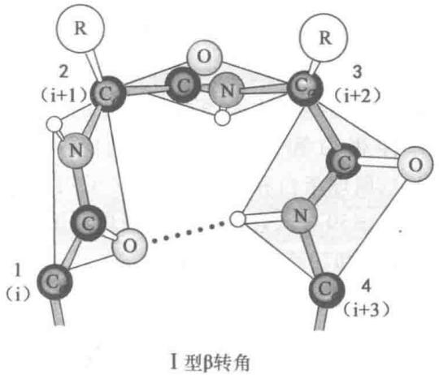

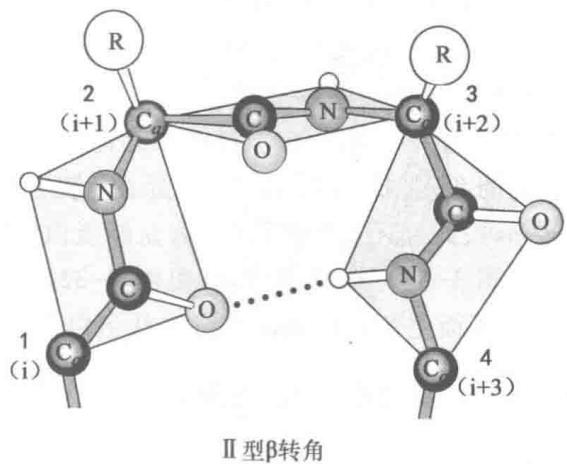  
图 3-21 两种常见 $\beta$ 转角的结构

除了 $\beta$ 转角之外，还有 $\gamma$ 转角等，但不太常见。它们与 $\beta$ 转角的不同只是在转角中氢键的位置有差异。在肽段中由第i个和第 $i + 3$ 个残基之间氢键键合而成的四残基转角即为 $\beta$ 转角；在第i个和第 $i + 2$ 个残基之间形成氢键产生的三残基转角为 $\gamma$ 转角。

## 2. $\Omega$ 环（ $\Omega$ loop）是新近发现的一类二级结构

$\Omega$ 环是近20、30年才发现的，它们虽然不像 $\alpha$ 螺旋和 $\beta$ 折叠片那样规正，但仍有规则可循，属于部分规正的二级结构。从形式上， $\Omega$ 环可看成是 $\beta$ 转角的延伸。此环有两个特征：一是环的长度不超过16个氨基酸残基，一般为 $6\sim 8$ 个残基，尤以8残基的 $\Omega$ 环为最多；二是它改变了蛋白质肽链的走向，使得形成环的首尾两个残基之间的距离 $< 1\mathrm{nm}$ 。

对肽链折叠成正确的蛋白质构象来说,规正的二级结构一旦形成,就作为蛋白质三级结构的结构元件存在,要把这些元件连接并组合成特定的三级结构还有赖于像 $\beta$ 转角和 $\Omega$ 环这样一些部分规正、但可变性较大的二级结构。一般认为,蛋白质中规正的二级结构主要是维持三级结构的轮廓,而直接跟蛋白质生物活性有关、活动性更大的部位绝大多数是由转角和环构成的。

## （五）无规卷曲也有确定的构象

无规卷曲（random coil），泛指那些不能或未能归入上述那些明确的二级结构的蛋白质肽段（图3-38）。前面曾经指出用无规卷曲来描述这些肽段的结构并不恰当，容易引起误解。实际上它们大多数既不是随意卷曲，也不是完全无规，虽然它们的柔性较大，有一定的任意性，例如像在许多蛋白质中Lys侧链在 $\beta-$ 碳以外的碳链那样。但这些无规卷曲也像其他的二级结构一样有明确而稳定的结构，否则许多蛋白质就不可能形成在三维空间上每维都具周期性结构的晶体；不过在X射线衍射分析时，它们的电子云密度基本模糊，因为它们有较大的涨落。这类有序的非重复性结构经常构成酶的活性部位和其他蛋白质专一的功能部位，例如铁氧还蛋白和红氧还蛋白中结合铁硫串（iron-sulfur cluster）的肽环以及许多钙结合蛋白中结合钙离子的E-F手结构的中央环（见图14-23）。有理由应该给与这类结构以更确切的名称，如无规卷曲或其他名词。

<!-- EN-BEGIN 4.2 -->

### 【英文对应 4.2】Protein Secondary Structure

> 来源：Lehninger Principles of Biochemistry（书籍/02_生物化学原理） 第4章 The Three-Dimensional Structure of Proteins，§4.2。对应本章“三、蛋白质的二级结构”。

The term secondary structure refers to any chosen segment of a polypeptide chain and describes the local spatial arrangement of its main-chain atoms, without regard to the positioning of its side chains or its relationship to other segments. A regular secondary structure occurs when each dihedral angle, $\phi$ and $\psi$ , remains the same or nearly the same throughout the segment. P2 A few types of secondary structure are particularly stable and occur widely in proteins. The most prominent are the $\alpha$ helix and $\beta$ conformation; another common type is the $\beta$ turn. Secondary structures without a regular pattern are sometimes referred to as undefined or as random coils. Random coil, however, does not properly describe the structure of these segments. The path of most of the polypeptide backbone in a typical protein is not random; rather, it is highly specific to the structure and function of that particular protein. Our discussion here focuses on the regular structures that are most common.

#### [EN] The $\alpha$ Helix Is a Common Protein Secondary Structure

Pauling and Corey were aware of the importance of hydrogen bonds in orienting polar chemical groups such as the C=O and N—H groups of the peptide bond. They also had the experimental results of William Astbury, who in the 1930s had conducted pioneering x-ray studies of proteins. Astbury demonstrated that the protein that makes up hair and porcupine quills (the fibrous protein α-keratin) has a regular structure that repeats every 5.15 to 5.20 Å. (The angstrom, Å, named after the physicist Anders J. Ångström, is equal to 0.1 nm. Although not an SI unit, it is used universally by structural biologists to describe atomic distances—it is approximately the length of a typical C—H bond.) With this information and their data on the peptide bond, and with the help of precisely constructed models, Pauling and Corey set out to determine the likely conformations of protein molecules.

The first breakthrough came in 1948. Pauling, at that time a visiting lecturer at Oxford University, became ill and retired to his apartment for several days of rest. Bored with the reading available, Pauling grabbed some paper and pencils to work out a plausible stable structure that could be taken up by a polypeptide chain. The model he developed, and later confirmed in work with Corey and coworker Herman Branson, was the simplest arrangement the polypeptide chain can assume that maximizes the use of internal hydrogen bonding. It is a helical structure, and Pauling and Corey called it the $\alpha$ helix (Fig. 4-3). In this structure, the polypeptide backbone is tightly wound around an imaginary axis drawn longitudinally through the middle of the helix, and the R groups of the amino acid residues protrude outward from the helical backbone (Figs 4-3b, c). The repeating unit is a single turn of the helix, which extends about $5.4\AA$ along the long axis, slightly greater than the periodicity that Astbury observed on x-ray analysis of hair keratin. The backbone atoms of the amino acid residues in the prototypical $\alpha$ helix have a characteristic set of dihedral angles that define the conformation of the $\alpha$ helix (Table 4-1), and each helical turn includes 3.6 amino acid residues. The $\alpha$ -helical segments in proteins often deviate slightly from these dihedral angles, and they even vary somewhat within a single, continuous segment so as to produce subtle bends or kinks in the helical axis.

Pauling and Corey considered both right-handed and left-handed variants of the $\alpha$ helix. The subsequent elucidation of the three-dimensional structure of myoglobin and other proteins showed that the right-handed $\alpha$ helix is the common form (Box 4-1). Extended left-handed $\alpha$ helices are theoretically less stable and have not been observed in proteins. The $\alpha$ helix proved to be the predominant structure in $\alpha$ -keratins. More generally, about one-fourth of all amino acid residues in proteins are found in $\alpha$ helices, the exact fraction varying greatly from one protein to another.

Amino terminus

  
(a)  
Carboxyl terminus

(b)  
FIGURE 4-3 Models of the $\alpha$ helix, showing different aspects of its structure. (a) Ball-and-stick model showing the intrachain hydrogen bonds. The repeat unit is a single turn of the helix, 3.6 residues. (b) The $\alpha$ helix viewed from one end, looking down the longitudinal axis. Note the positions of the R groups, represented by purple spheres. This ball-and-stick model, which emphasizes the helical arrangement, gives the false impression that the helix is hollow, because the balls do not represent the van der Waals radii of the individual atoms. (c) As this space-filling model shows, the atoms in the  
TABLE 4-1 Idealized $\phi$ and $\psi$ Angles for Common Secondary Structures in Proteins

<table><tr><td>Structure</td><td> $\phi$ </td><td> $\psi$ </td></tr><tr><td> $\alpha$  Helix</td><td> $-57^{\circ}$ </td><td> $-47^{\circ}$ </td></tr><tr><td> $\beta$  Conformation</td><td></td><td></td></tr><tr><td>Antiparallel</td><td> $-139^{\circ}$ </td><td> $+135^{\circ}$ </td></tr><tr><td>Parallel</td><td> $-119^{\circ}$ </td><td> $+113^{\circ}$ </td></tr><tr><td>Collagen triple helix</td><td> $-51^{\circ}$ </td><td> $+153^{\circ}$ </td></tr><tr><td> $\beta$  Turn type I</td><td></td><td></td></tr><tr><td> $i + 1^{a}$ </td><td> $-60^{\circ}$ </td><td> $-30^{\circ}$ </td></tr><tr><td> $i + 2^{a}$ </td><td> $-90^{\circ}$ </td><td> $0^{\circ}$ </td></tr><tr><td> $\beta$  Turn type II</td><td></td><td></td></tr><tr><td> $i + 1$ </td><td> $-60^{\circ}$ </td><td> $+120^{\circ}$ </td></tr><tr><td> $i + 2$ </td><td> $+80^{\circ}$ </td><td> $0^{\circ}$ </td></tr></table>

Note: In real proteins, dihedral angles often vary somewhat from these idealized values. $^{a}$ The i+1 and i+2 angles are those for the second and third amino acid residues in the $\beta$ turn, respectively.

Why does the $\alpha$ helix form more readily than many other possible conformations? The answer lies, in part, in its optimal use of intrahelical hydrogen bonds. The structure is stabilized by a hydrogen bond between the hydrogen atom attached to the electronegative nitrogen atom of a peptide linkage and the electronegative carbonyl oxygen atom of the fourth amino acid on the amino-terminal side of that peptide bond (Fig. 4-3a). Within the $\alpha$ helix, every peptide bond (except those close to each end of the helix) participates in such hydrogen bonding. Each successive turn of the $\alpha$ helix is held to adjacent turns by three to four hydrogen bonds, conferring significant stability on the overall structure. At the ends of an $\alpha$ -helical segment, there are always three or four amide carbonyl or amino groups that cannot participate in this helical pattern of hydrogen bonding. These may be exposed to the surrounding solvent, where they hydrogen-bond with water, or other parts of the protein may cap the helix to provide the needed hydrogen-bonding partners.

  
(c)

  
(d)  
center of the $\alpha$ helix are in very close contact. (d) Helical wheel projection of an $\alpha$ helix. This representation can be colored to identify surfaces with particular properties. The yellow residues, for example, could be hydrophobic and conform to an interface between the helix shown here and another part of the same or another polypeptide. The red (negative) and blue (positive) residues illustrate the potential for interaction of oppositely charged side chains separated by two residues in the helix. [(b, c) Data from PDB ID 4TNC, K. A. Satyshur et al., J. Biol. Chem. 263:1628, 1988.]

#### [EN] WORKED EXAMPLE 4-1 Secondary Structure and Protein Dimensions

What is the length, in both Å and nm, of a polypeptide with 80 amino acid residues in a single, continuous α helix?

SOLUTION: An idealized $\alpha$ helix has 3.6 residues per turn, and the rise along the helical axis is $5.4\AA$ . Thus, the rise along the axis for each amino acid residue is $1.5\AA$ . The length of the polypeptide is therefore 80 residues $\times 1.5\AA/\text{residue} = 1.2\times 10^{2}\AA$ or $12\mathrm{nm}$ .

#### [EN] Knowing the Right Hand from the Left

There is a simple method for determining whether a helical structure is right-handed or left-handed. Make fists of your two hands with thumbs outstretched and pointing away from you. Looking at your right hand, think of a helix spiraling up your right thumb in the direction in which the other four fingers are curled as shown (clockwise). The resulting helix is right-handed. Your left hand will demonstrate a left-handed helix, which rotates in the counterclockwise direction as it spirals up your thumb.

#### [EN] Amino Acid Sequence Affects Stability of the $\alpha$ Helix

Not all polypeptides can form a stable $\alpha$ helix. Each amino acid residue in a polypeptide has an intrinsic propensity to form an $\alpha$ helix, reflecting the properties of the R group and how they affect the capacity of the adjoining main-chain atoms to take up the characteristic $\phi$ and $\psi$ angles. Alanine shows the greatest tendency to form $\alpha$ helices in most experimental model systems.

The position of an amino acid residue relative to its neighbors is also important. Interactions between amino acid side chains can stabilize or destabilize the $\alpha$ -helical structure. For example, if a polypeptide chain has a long block of Glu residues, this segment of the chain will not form an $\alpha$ helix at pH 7.0. The negatively charged carboxyl groups of adjacent Glu residues repel each other so strongly that they prevent formation of the $\alpha$ helix. For the same reason, if there are many adjacent Lys and/or Arg residues, with positively charged R groups at pH 7.0, they also repel each other and prevent formation of the $\alpha$ helix. The size and shape of Asn, Ser, Thr, and Cys residues can also destabilize an $\alpha$ helix if they are close together in the chain.

The twist of an $\alpha$ helix ensures that critical interactions occur between an amino acid side chain and the side chain three (and sometimes four) residues away on either side of it. This is made clear when the $\alpha$ helix is depicted as a helical wheel (Fig. 4-3d). Positively charged amino acids are often found three residues away from negatively charged amino acids, permitting the formation of an ion pair. Two aromatic amino acid residues are often similarly spaced, resulting in a juxtaposition stabilized by the hydrophobic effect.

A constraint on the formation of the $\alpha$ helix is the presence of Pro or Gly residues, which have the least likelihood of forming $\alpha$ helices. In proline, the nitrogen atom is part of a rigid ring (see Fig. 4-7), and rotation about the N—C $_{\alpha}$ bond is not possible. Thus, a Pro residue introduces a destabilizing kink in an $\alpha$ helix. In addition, the nitrogen atom of a Pro residue in a peptide linkage has no substituent hydrogen to participate in hydrogen bonds with other residues. For these reasons, proline is found only rarely in an $\alpha$ helix. Glycine occurs infrequently in $\alpha$ helices for a different reason: it has more conformational flexibility than the other amino acid residues. Polymers of glycine tend to take up coiled structures quite different from an $\alpha$ helix.

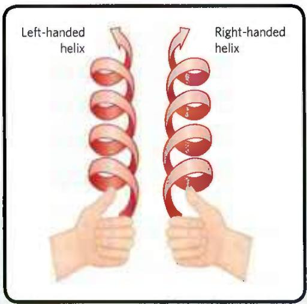

A final factor affecting the stability of an $\alpha$ helix is the identity of the amino acid residues near the ends of the $\alpha$ -helical segment of the polypeptide. A small electric dipole exists in each peptide bond (Fig. 4-2a). These dipoles are aligned through the hydrogen bonds of the helix, resulting in a net dipole along the helical axis that increases with helix length (Fig. 4-4). The partial positive and negative charges of the helix dipole reside on the peptide amino and carbonyl groups near the amino-terminal and carboxyl-terminal ends, respectively. For this reason, negatively charged amino acids are often found near the amino terminus of the helical segment, where they have a stabilizing interaction with the positive charge of the helix dipole; a positively charged amino acid at the amino-terminal end is destabilizing. The opposite is true at the carboxyl-terminal end of the helical segment.

In summary, five types of constraints affect the stability of an $\alpha$ helix: (1) the intrinsic propensity of an amino acid residue to form an $\alpha$ helix; (2) the interactions between R groups, particularly those spaced three (or four) residues apart; (3) the bulkiness of adjacent R groups; (4) the occurrence of Pro and Gly residues; and (5) interactions between amino acid residues at the ends of the helical segment and the electric dipole inherent to the $\alpha$ helix. P2 The tendency of a given segment of a

  
FIGURE 4-4 Helix dipole. The electric dipole of a peptide bond (see Fig. 4-2a) is transmitted along an $\alpha$ -helical segment through the intrachain hydrogen bonds, resulting in an overall helix dipole.

Top view

7 Å  

polypeptide chain to form an $\alpha$ helix therefore depends on the identity and sequence of amino acid residues within the segment.

#### [EN] The $\beta$ Conformation Organizes Polypeptide Chains into Sheets

In 1951, Pauling and Corey predicted a second type of repetitive structure, the $\beta$ conformation. This is a more extended conformation of polypeptide chains, and its structure is again defined by backbone atoms arranged according to a characteristic set of dihedral angles (Table 4-1). P2 In the $\beta$ conformation, the backbone of the polypeptide chain is extended into a zigzag rather than helical structure (Fig. 4-5). A single protein segment in the $\beta$ conformation is often called a $\beta$ strand. The arrangement of several strands side by side, all in the $\beta$ conformation, is called a $\beta$ sheet. The zigzag structure of the individual polypeptide segments gives rise to a pleated appearance of the overall sheet. Hydrogen bonds form between backbone atoms of adjacent segments of polypeptide chain within the sheet. The individual segments that form a $\beta$ sheet are usually nearby on the polypeptide chain but can also be quite distant from each other in the linear sequence of the polypeptide; they may even be in different polypeptide chains. The R groups of adjacent amino acids protrude from the zigzag structure in opposite directions, creating the alternating pattern seen in the side view in Figure 4-5.

(b) Antiparallel $\beta$ sheet  
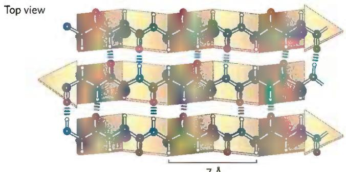  
(c) Parallel $\beta$ sheet

  
FIGURE 4-5 The $\beta$ conformation of polypeptide chains. These (a) side and (b, c) top views reveal the R groups extending out from the $\beta$ sheet and emphasize the pleated shape formed by the planes of the peptide bonds. (An alternative name for this structure is $\beta$ -pleated sheet.) Hydrogen-bond cross-links between adjacent chains are also shown. The amino-terminal to carboxyl-terminal orientations of adjacent chains (arrows) can be the opposite or the same, forming (b) an antiparallel $\beta$ sheet or (c) a parallel $\beta$ sheet.

The adjacent polypeptide chains in a $\beta$ sheet can be either parallel or antiparallel (having the same or opposite amino-to-carboxyl orientations, respectively). The structures are somewhat similar, although the repeat period is shorter for the parallel conformation (6.5 vs. 7.0 Å for antiparallel) and the hydrogen-bonding patterns are different. The interstrand hydrogen bonds are essentially in-line (see Fig. 2-5) in the antiparallel $\beta$ sheet, whereas they are distorted or not in-line for the parallel variant. In natural proteins, antiparallel $\beta$ sheets are found twice as frequently as parallel $\beta$ sheets. The idealized structures exhibit the bond angles given in Table 4-1; these values vary somewhat in real proteins, resulting in structural variation, as seen above for $\alpha$ helices.

#### [EN] β Turns Are Common in Proteins

In globular proteins, which have a compact folded structure, some amino acid residues are in turns or loops where the polypeptide chain reverses direction (Fig. 4-6). P2 These are the connecting elements that link successive runs of $\alpha$ helix or $\beta$ conformation. Particularly common are $\beta$ turns that connect the ends of two adjacent segments of an antiparallel $\beta$ sheet. The structure is a $180^{\circ}$ turn involving four amino acid residues, with the carbonyl oxygen of the first residue forming a hydrogen bond with the amino-group hydrogen of the fourth. The peptide groups of the central two residues do not participate in any interresidue hydrogen bonding. Several types of $\beta$ turns have been described, each defined by the $\phi$ and $\psi$ angles of the bonds that link the four amino acid residues that make up the particular turn (Table 4-1). Gly and Pro residues often occur in $\beta$ turns, the former because it is small and flexible, the latter because peptide bonds involving the imino nitrogen of proline readily assume the cis configuration (Fig. 4-7), a form that is particularly amenable to a tight turn. The two types of $\beta$ turns shown in Figure 4-6 are the most common. Beta turns are often found near the surface of a protein, where the peptide groups of the central two amino acid residues in the turn can hydrogen-bond with water. Considerably less common is the $\gamma$ turn, a three-residue turn with a hydrogen bond between the first and third residues.

#### [EN] Common Secondary Structures Have Characteristic Dihedral Angles

The $\alpha$ helix and the $\beta$ conformation are the major repetitive secondary structures in a wide variety of proteins, although other repetitive structures exist in some specialized proteins (an example is collagen; see Fig. 4-12).

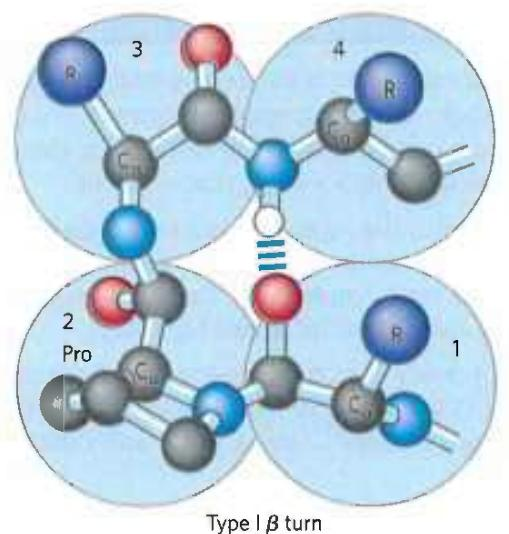

  
FIGURE 4-6 Structures of $\beta$ turns. Type I and type II $\beta$ turns are most common, distinguished by the $\phi$ and $\psi$ angles taken up by the peptide backbone in the turn (see Table 4-1). Type I turns occur more than twice as frequently as type II. Note the hydrogen bond between the peptide groups of the first and fourth residues of the bends. (Individual amino acid residues are framed by large blue circles. Not all H atoms are shown in these depictions.)

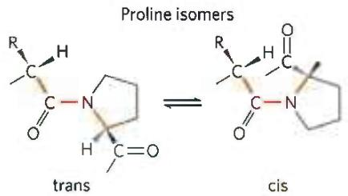  
FIGURE 4-7 Trans and cis isomers of a peptide bond involving the imino nitrogen of proline. Of the peptide bonds between amino acid residues other than Pro, more than 99.95% are in the trans configuration. For peptide bonds involving the imino nitrogen of proline, however, about 6% are in the cis configuration; many of these occur at $\beta$ turns.

Every type of secondary structure can be completely described by the dihedral angles $\phi$ and $\psi$ associated with each residue. P2 Ramachandran plots, introduced by G. N. Ramachandran, are useful tools for visualizing all of the $\phi$ and $\psi$ angles observed in a particular protein structure and are often used to test the quality of three-dimensional protein structures. In a Rama-chandran plot, the dihedral angles that define the $\alpha$ helix and the $\beta$ conformation fall within a relatively restricted range of sterically allowed structures (Fig. 4-8a). Most values of $\phi$ and $\psi$ taken from known protein structures fall into the expected regions, with high concentrations near the $\alpha$ helix and $\beta$ conformation values, as predicted (Fig. 4-8b). The only amino acid residue often found in a conformation outside these regions is glycine. Because its side chain is small, a Gly residue can take part in many conformations that are sterically forbidden for other amino acids.

  
FIGURE 4-8 Ramachandran plots showing a variety of structures. (a) The values of $\phi$ and $\psi$ for various allowed conformations and secondary structures are shown. Peptide conformations deemed possible are those that involve little or no steric interference, based on calculations using known van der Waals radii and dihedral angles modeled as a hard sphere. Other types of Ramachandran plots make different assumptions. The areas shaded dark blue represent conformations that involve no steric overlap and are thus fully allowed. Medium blue indicates conformations permitted if atoms are allowed to approach each other by an additional $0.1\mathrm{nm}$ , a slight clash. The lightest blue indicates conformations that are permissible if a very modest flexibility (a few degrees) is allowed in the $\omega$ dihedral angle that describes the peptide bond itself (generally constrained to $180^{\circ}$ ). The white regions are conformations that are not allowed. Although left-handed $\alpha$ helices extending over several amino acid residues are theoretically possible, they have not been observed in proteins. The asymmetry of the plot results from the L stereochemistry of the amino acid residues. (b) The values of $\phi$ and $\psi$ for all the amino acid residues except Gly in the enzyme pyruvate kinase (isolated from rabbit) are overlaid on the plot of allowed conformations. The small, flexible Gly residues were excluded because they frequently fall outside the expected (blue) ranges. ([a) Information from T.E. Creighton, Proteins, p. 166, © 1984 by W.H. Freeman and Company. (b) Data from Hazel Holden, University of Wisconsin-Madison, Department of Biochemistry.]

#### [EN] Common Secondary Structures Can Be Assessed by Circular Dichroism

Any form of structural asymmetry in a molecule gives rise to differences in absorption of left-handed versus right-handed circularly polarized light. Measurement of this difference is called circular dichroism (CD) spectroscopy. An ordered structure, such as a folded protein, gives rise to an absorption spectrum that can have peaks or regions with both positive and negative values. For proteins, spectra are obtained in the far UV region (190 to 250 nm). In this region, the light-absorbing entity, or chromophore, is the peptide bond; a signal is obtained when the peptide bond is in a folded environment. The difference in molar extinction coefficients (see Box 3-1) for left-handed and right-handed, circularly polarized light ( $\Delta\varepsilon$ ) is plotted as a function of wavelength. The $\alpha$ helix and $\beta$ conformations have characteristic CD spectra (Fig. 4-9). Using CD spectra, biochemists can determine whether proteins are properly folded, estimate the fraction of the protein that is folded in either of the common secondary structures, and monitor transitions between the folded and unfolded states.

  
FIGURE 4-9 Circular dichroism spectroscopy. These spectra show polylysine entirely as $\alpha$ helix, as $\beta$ conformation, or in an unstructured, denatured state. The y axis unit is a simplified version of the units most commonly used in CD experiments. Since the curves are different for $\alpha$ helix, $\beta$ conformation, and unstructured, the CD spectrum for a given protein can provide a rough estimate for the fraction of the protein made up of the two most common secondary structures. The CD spectrum of the native protein can serve as a benchmark for the folded state, useful for monitoring denaturation or conformational changes brought about by changes in solution conditions.

#### [EN] SUMMARY 4.2 Protein Secondary Structure

Secondary structure is the local spatial arrangement of the main-chain atoms in a selected segment of a polypeptide chain; it can be completely defined by the $\phi$ and $\psi$ angles of all the amino acids in that segment.

In the $\alpha$ helix, the repeating unit is a single helical turn of $\sim 5.4\AA$ or 3.6 amino acids. The common form found in proteins is right-handed with the amino acid R groups protruding away from the helical backbone.

The propensity of a protein segment to form an $\alpha$ helix depends on the composition of its amino acids and amino acid positions relative to one another and relative to the helical dipole.

In the $\beta$ conformation, amino acids are extended in a zigzag fashion. When several $\beta$ strands are arranged adjacent to one another, they can form either parallel or anti-parallel $\beta$ sheets.

■ Turns or loops connect segments of $\alpha$ helix or $\beta$ strands. $\beta$ turns, which often contain Gly or Pro residues, tend to connect segments of antiparallel $\beta$ sheets.

The Ramachandran plot is a visual description of the combinations of $\phi$ and $\psi$ dihedral angles that are permitted in a peptide backbone and those that are not permitted due to steric constraints. Dihedral angles that define the $\alpha$ helix and the $\beta$ conformation are found only within certain regions of the plot.

■ Circular dichroism spectroscopy is a method for assessing common secondary structure and monitoring folding in proteins based on absorption of circularly polarized UV light.

<!-- EN-END 4.2 -->

## 四、纤维状蛋白质

在第2章中曾谈到根据形状和溶解度把蛋白质分成纤维状蛋白质、球状蛋白质和膜蛋白质三大类。这种分类实际上跟蛋白质的高级结构有关。纤维状蛋白质（fibrous protein）中多肽链排列成长线或片层，外形上呈现纤维状或细棒状。纤维状蛋白质一般由单一类型的二级结构组成，它们的三级结构比较简单。纤维状蛋白质的共同性质之一是给有它们存在的各种结构以强度和/或柔性，为脊椎和无脊椎动物提供了支撑、定形和外保护的功能。在每一种情况，基本结构单位都是二级结构的简单重复元件。几乎所有的纤维状蛋白质都不溶于水和稀盐溶液，这一性质是由于在蛋白质的内部和表面都有高浓集的疏水氨基酸残基造成的。这些疏水面大部分是在多个类似的多肽链折叠成精致的超分子复合体时被掩盖了。

纤维状蛋白质广泛地分布于脊椎和无脊椎动物的体内，占脊椎动物体内蛋白质总量的一半或一半以上。不溶性的纤维状蛋白质有角蛋白、胶原蛋白、弹性蛋白和丝心蛋白，它们属于硬蛋白类（scleroproteins）；此外还有可溶性的，如血纤蛋白原（图3-28）、肌球蛋白和原肌球蛋白（见图4-31）等；但不包括微管（图3-54）、肌动蛋白丝（见图4-32）和鞭毛（见图4-30）等，它们是球状蛋白质的长向聚集体（aggregate）。下面主要介绍不溶性纤维状蛋白质的二、三级结构和功能。

## （一） $\alpha^{-}$ 角蛋白是 $\alpha$ 螺旋蛋白质

α-角蛋白(α-keratin)是由外胚层细胞发育而来的皮肤及其衍生物:毛、鳞、羽、甲等的结构蛋白质。它们在强度方面已得到很好的进化。在哺乳动物中,α-角蛋白构成发、毛、甲、爪、棘刺(quill)、洞角、蹄等的几乎全部干重。α-角蛋白是称为中间丝(intermediate filament,IF)蛋白质的蛋白质大家族的一部分。其他IF蛋白质存在于动物细胞的细胞骨架中。所有的IF蛋白质都有结构的功能和以α-角蛋白为例证的结构特征。一类称为β-角蛋白的蛋白质,结构上类似于丝心蛋白,它们属于β-片蛋白质(见下面)。

α-角蛋白亚基(单个多肽链)的氨基酸序列是由富含螺旋的中央棒状[结构]域或区(长度为311\~314个残基)和两侧的非螺旋的N端和C端[结构]域(大小和组成不定)构成。α-角蛋白中的螺旋是跟许多其他蛋白质中发现的同一右手α螺旋。典型的α-角蛋白中央棒状区(α螺旋区)的结构见图3-22A。早在20世纪50年代Crick和Pauling各自暗示了角蛋白的α螺旋排列成一种卷曲螺旋(coiled coil)。两股α-角蛋白亚基螺旋,平行取向(它们的氨基端在同一端),互相缠绕形成超扭曲的卷曲螺旋。超扭曲(supertwisting)增加了整个结构的强度,正像几股绳拧成了缆那样(图3-22A)。一个α螺旋的轴扭曲成卷曲螺旋(此时α螺旋轴与超螺旋轴有一定倾斜)解释了Pauling和Corey所预测的α螺旋每圈0.54nm(图3-15)和毛发X射线衍射中观测到的重复距离0.51\~0.52nm之间不一致的原因。超扭曲的螺旋行程是跟 $\alpha$ 螺旋相反的左手螺旋。两个 $\alpha$ 螺旋接触的表面由疏水氨基酸残基构成，它们的 R 基啮合在一起形成规则的联锁图案。这就允许多肽链在左手超螺旋内紧密装配。难怪 $\alpha$ -角蛋白富含疏水氨基酸残基 Ala、Val、Leu、Ile、Met 和 Phe。

$\alpha$ -角蛋白卷曲螺旋中单个的多肽链（亚基）有着相对简单的三级结构，以 $\alpha$ 螺旋的二级结构为主体，但 $\alpha$ 螺旋的轴已扭曲成一个左手超螺旋。两个亚基 $\alpha$ 螺旋的互相缠绕是四级结构的一个例证。这种二链卷曲螺旋是丝状蛋白质和肌球蛋白（见图4-31）中常见的结构元件。 $\alpha$ -角蛋白的四级结构可以是很复杂的。多个卷曲螺旋可被装配成大的超分子复合体，例如 $\alpha$ -角蛋白排列成毛发的中间丝（图3-22）。

纤维状蛋白质的强度由于多股螺旋的“缆绳”中多肽链之间和超分子集装体(assembly)中相邻链之间的共价交联而得到加强。在 $\alpha-$ 角蛋白中稳定四级结构的交联是二硫键(图 3-1)。在最硬和最韧的 $\alpha-$ 角蛋白，如犀牛角的 $\alpha-$ 角蛋白中，18%以上的残基是参与二硫键形成的半胱氨酸。

一根毛发的周围是一层鳞状细胞(scale cell)，中间为皮层细胞(cortical cell)。皮层细胞横截面的直径约为 $20\mu \mathrm{m}$ 。在这些细胞中，中间丝(IF)沿毛发的轴向排列。所以一根毛发具有高度有序的结构（图3-22B）。毛发性能决定于 $\alpha$ 螺旋结构以及这些结构的组织方式。

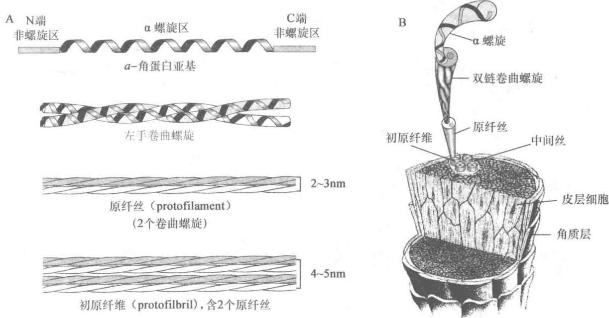  
图3-22 毛发的结构  
A. 毛发 $\alpha$ -角蛋白中央棒状区的结构；B. 毛发横切面的结构

$\alpha$ -角蛋白的伸缩性能很好，一根毛发湿热时可以拉长到原有长度的2倍，这时 $\alpha$ 螺旋被撑开，各螺圈间的氢键被破坏，转变为 $\beta$ 构象。当张力除去后，单靠氢键尚不能使纤维恢复到原来的状态。相邻分子的 $\alpha$ 螺旋是由它们的半胱氨酸残基间的二硫键交联起来的，一般认为每4个螺圈就有一个交联键。这种交联键既可以抵抗张力，又可以作为外力除去后使毛发复原的恢复力。结构的稳定性主要是由这些二硫键保证的。二硫键的数目越大，纤维的刚性越强。根据含硫量大小， $\alpha$ -角蛋白可分成硬角蛋白和软角蛋白两种类型。蹄、爪、角、甲中的 $\alpha$ -角蛋白是高硫的硬角蛋白，质地硬、不能拉伸。皮肤和胼胝中的 $\alpha$ -角蛋白是低硫的软角蛋白，它的伸缩性比硬角蛋白好。

永久性卷发(烫发)是一项生物化学工程(biochemical engineering)。α-角蛋白在湿热条件下可以伸展转变为β构象,但在冷却干燥时又可自发地恢复原状。如前面所指出,这是因为α-角蛋白的侧链R基一般都比较大,不适于处在β构象状态,此外α-角蛋白中的螺旋多肽链间有很多的二硫键交联,这些交联键也是当外力解除后使肽链恢复原状(α螺旋构象)的重要力量。这就是卷发行业的生化基础。首先,把头发卷成一定的形状,然后涂上还原剂(一般是含巯基的化合物)溶液并加热。还原剂可以打开链间的二硫键。湿热破坏氢键并引起头发纤维中多肽链的α螺旋结构伸展。然后除去还原剂,涂上氧化剂以便在相邻多肽链的半胱氨酸残基对(已不是处理前的 Cys 残基对)之间建立新的二硫键。当头发经洗涤并冷却后,多肽链回复到原来的 $\alpha$ 螺旋构象。这时头发将以所希望的样式卷曲,因为新的二硫交联键迫使头发纤维中的 $\alpha$ 螺旋束发生某些卷曲。

## （二）丝心蛋白和 $\beta-$ 角蛋白是 $\beta$ 折叠片蛋白质

丝心蛋白(silk fibroin; fibroin)存在于昆虫,如家蚕(Bombyx mori)的茧和蜘蛛网的丝纤维中。它们代表另一类型的纤维状蛋白质——β片蛋白质。丝心蛋白由反平行β折叠片堆积组成(图3-23A)。整个结构是通过每一β片的各多肽链中所有肽键之间的氢键和片层之间的最适范德华力来稳定的。丝心蛋白多肽链的序列,主要是由小侧链的甘氨酸、丝氨酸和丙氨酸所组成,并且每隔一个残基就是Gly。如前面所指,一个β折叠片的各残基在它的平面上、下交替地伸出。结果是,所有Gly的R基都在β片的一侧,其他残基的R基(主要是Ala和Ser)在另一侧。这样一对对β片能够按Gly R基与Gly R基连锁和Ala/Ser R基与Ala/Ser R基连锁的方式紧凑地交替堆积在一起(图3-23B)。在这些β片中,两个多肽链之间的距离为 0.47 nm，在两个交替堆积层之间的距离分别为 0.35 nm (Gly 侧链) 和 0.57 nm (Ala/Ser 侧链)。由于这种结构方式，使得丝心蛋白所承担的张力并不直接落在多肽主链的共价键上，因而丝纤维具有很高的抗张强度。又由于堆积层之间是由许多弱相互作用稳定的，不像 $\alpha-$ 角蛋白那样由共价二硫键参与维系，因而使丝纤维具有柔软的特性。但丝心蛋白不能拉伸。因为肽链已处于高度伸展的 $\beta$ 构象状态。

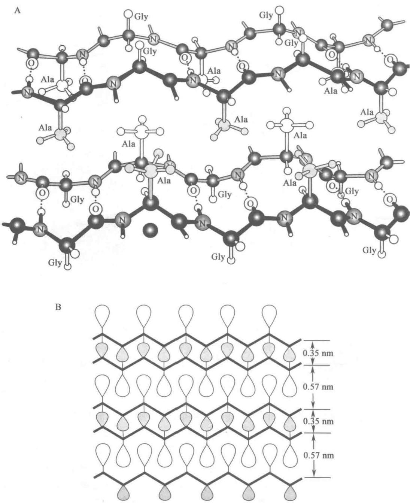  
图3-23 丝心蛋白的三维结构  
A. 堆积的 $\beta$ 折叠片的三维结构；B. 交替堆积层中 Ala-Ser 残基侧链或 Gly 残基侧链（H 原子）的连锁

实际上丝心蛋白除了上述3种基本残基之外，还有一些大侧链的氨基酸残基如Tyr、Val和Pro等，由它们构成的区域是无规则的非晶状区，分子中有序晶状区和无序非晶状区交替出现。无序区的存在，赋予丝心蛋白以一定的伸展度。

天然的 $\beta$ 片蛋白质除了上述的丝心蛋白外，还在大多数的鸟类和爬行动物的皮肤、羽毛、爪、喙（beak）和鳞片中发现，称为 $\beta-$ 角蛋白；这类蛋白质在结构上类似丝心蛋白，但也有许多的改进，以便提供在不同组织中所需的最适物理性能。

## （三）胶原蛋白是一种三股螺旋

胶原[蛋白](collagen)是很多脊椎动物和无脊椎动物体内含量最丰富的蛋白质。它们也属于结构蛋白质，能使腱、骨、软骨、牙、皮和血管等结缔组织具有机械强度。例如腱胶原的抗张强度(tensile strength)为 $20\sim 30\mathrm{kg / mm^2}$ ，相当于12号冷拉钢丝的拉力。骨折、腱损伤和软骨损伤都涉及组织中胶原蛋白基质的撕裂或过度伸张。

## 1. 胶原蛋白的氨基酸组成特点

胶原的氨基酸组成与典型的球状蛋白质有很大的不同(表2-9)。例如皮肤胶原(I型)含有近1/3Gly(33%), Pro含量也很高(13%), 并在胶原中发现3种不常见的氨基酸(见图2-3):4-羟脯氨酸(Hyp)、3-羟脯氨酸和5-羟赖氨酸(Hyl)。这些不常见的氨基酸都是在胶原多肽链合成后由通常的Pro和Lys修饰而成。修饰是在脯氨酰羟化酶(prolylhydroxylase)或赖氨酰羟化酶(lysylhydroxylase)催化下进行的。这两个酶的许多性质相似, 它们都需要分子氧、抗坏血酸(维生素C)和α-酮戊二酸参与, $Fe^{2+}$ 作为酶的辅助因子。因此人缺乏维生素C, 新的胶原就难以合成。胶原是糖蛋白, 糖的加入是在胶原多肽链合成之后, 但折叠成超螺旋之前进行的。

## 2. 胶原蛋白的结构

在体内，胶原以胶原原纤维（collagen fibril）的形式存在。胶原原纤维的基本结构单位是原胶原（protocollagen；tropocollagen）分子。原胶原分子由3股多肽链（也称α肽链或α链）缠绕而成，其相对分子质量为285000，长度约为300 nm，直径约为1.5 nm。

已鉴定出的胶原蛋白有多种类型，分别称为Ⅰ型、Ⅱ型和Ⅲ型等（已标到Ⅻ型）。不同类型的胶原其组织分布不同，例如Ⅰ型胶原在骨、皮肤、腱和角膜中占优势；并且由于它们的氨基酸组成和含糖量不同，各具自己特有的物理性能。Ⅰ型胶原是最常见的，由两个标为α1（Ⅰ）的相同肽链和一个标为α2（Ⅰ）的不同肽链组成，即 $[\alpha1(\mathrm{I})]_{2}\alpha2(\mathrm{I})$ 。Ⅱ型胶原存在于软骨、椎间盘和玻璃体中，Ⅲ型胶原存在于血管、新生皮肤和瘢痕组织中，Ⅱ型和Ⅲ型各自由3条相同的肽链组成，分别为 $[\alpha1(\mathrm{II})]_{3}$ 和 $[\alpha1(\mathrm{III})]_{3}$ 。Ⅳ型胶原参与基底膜组成，分子形式有 $[\alpha1(\mathrm{IV})]_{2}\alpha2(\mathrm{IV})$ 、 $[\alpha1(\mathrm{IV})]_{3}$ 和 $[\alpha2(\mathrm{IV})]_{3}$ 。Ⅴ型胶原发现于细胞表面和外细胞骨架（exocytoskeleton），它是由3条各不相同的肽链组成的，α1（V）α2（V）α3（V）。这里，α1（Ⅰ）、α2（Ⅲ）等表示各种类型（Ⅰ、Ⅱ、Ⅲ等）胶原的不同肽链。

胶原蛋白由于高含量的 Gly、Pro 和 Hyp, 不能形成像 $\alpha$ 螺旋和 $\beta$ 片这样一类传统结构, 代之以由 3 股 $\alpha$ 肽链 (亚基) 缠绕成特有的三股螺旋 (triple helix)。它的二面角 $\phi$ 和 $\psi$ 值分别在 $-60^{\circ}$ 和 $+140^{\circ}$ 附近, 这是一种右手超螺旋缆 (superhelix cable), 其中每股链自身是一种左手螺旋 (图 3-24)。与 $\alpha$ 螺旋相比, 三股螺旋要伸展得多, 每一残基沿三股螺旋轴上升 $0.29 \mathrm{~nm}$ , 而 $\alpha$ 螺旋只是 $0.15 \mathrm{~nm}$ 。右手超螺旋缆的螺距为 $8.6 \mathrm{~nm}$ , 每圈每股包含 30 个残基, 每股左手螺旋的螺距为 $0.95 \mathrm{~nm}$ , 每圈约含 3.3 个残基。

三股螺旋是一种能容纳胶原特有的氨基酸组成和序列的结构。一级结构分析表明，胶原多肽链很长区段是由Gly-x-y氨基酸序列重复而成的。这里x、y是Gly之外的任何氨基酸残基，但x经常是Pro，y经常是 Hyp。由于 Pro 和 Hyp 的侧链是吡咯环，它们的 $\alpha-$ 碳和酰胺氮之间的键不能旋转 ( $\phi$ 角固定在 $-60^{\circ}$ 左右)，因此高含量的这些氨基酸促进左手 $\alpha$ 肽链螺旋的形成。在三股螺旋中 $\alpha$ 肽链每隔两个残基，即第 3 个残基，面向或位于拥挤的中心轴处，唯一能适合此位置的残基是 Gly，其两端的残基位于螺旋缆的外侧（图 3-24E）。三股螺旋是一种错位的 (staggered) 结构，因此来自三股链的 Gly 残基沿三股螺旋的中心轴堆积，一股链上的 Gly 处于跟第二股的 x 残基和第三股的 y 残基相邻。这样允许每个 Gly 残基的 N—H 与相邻链的 x 残基的 C=O 形成氢键。由于 Hyp 残基的羟基也参与链间氢键的形成，三股螺旋得到进一步稳定和增强。

  
图3-24 胶原纤维的结构  
A. 电镜下胶原纤维呈明暗交替的条纹图案；B. 胶原纤维中原胶原分子的排列；C. 原胶原分子是一种右手三股螺旋；D. 三股螺旋中的每股链是左手螺旋；E. 三股螺旋的原子水平模型

Ⅰ型、Ⅱ型和Ⅲ型胶原蛋白在体内形成有组织的胶原原纤维。在电镜下，胶原原纤维呈明暗交替的条

纹或区带的周期(重复距离,d)为60\~70 nm,这取决于胶原的类型和生物来源。典型的区带图案(如I型胶原)d=68 nm,其中0.6 d=40 nm为空穴区,0.4 d=28 nm为重叠区(图3-24A和B)。因为胶原三股螺旋长300 nm,沿原纤维长轴每行中相邻原胶原分子之间存在40 nm(0.6 d)的裂隙或空穴,所以该图案是每5行重复一次(5×68 nm=340 nm)。也即原胶原分子在胶原纤维中都是有规则地互相错位,首尾相随,平行排列而成纤维束。由于空穴区和重叠区的电子密度不同,因而通过错位排列形成间隔一定的电子密度区,而呈现条纹(或区带)。40 nm的空穴区至少在两个方面有重要作用。第一,发现糖(葡萄糖、半乳糖或葡糖基半乳糖)与此空穴区内的5-羟赖氨酸残基通过O-糖肽键共价连接(图3-25)。糖在此区域内可能起组织胶原原纤维装配的作用。第二,空穴区可能在骨骼形成中起作用。骨是由埋藏在胶原原纤维基质中的羟基磷灰石(hydroxyapatite)[磷酸钙聚合物;Ca $_{10}$ (PO $_{4}$ ) $_{6}$ (OH) $_{2}$ ]的微晶组成。当新的骨组织形成时，新羟基磷灰石晶体的形成发生在68 nm的间隔区中。胶原原纤维的空穴区可能是骨矿化的成核（nucleation）部位。

  
图 3-25 乳糖与羟赖氨酸残基的连接
半乳糖和葡萄糖的二糖在半乳糖基转移酶和葡萄糖基转移酶作用下，与胶原蛋白中 Hyl 残基的羟基共价连接

## 3. 胶原蛋白中的共价交联

胶原原纤维可以通过原胶原分子内和分子间的交联得到进一步增强和稳定。分子内交联是在原胶原的N端区(非螺旋区)内赖氨酸残基之间进行的。在含铜的反应中赖氨酰氧化酶(lysyloxidase)在吡哆醛磷酸参与下催化赖氨酸侧链氧化脱氨，生成 $\varepsilon-$ 醛基赖氨酸(allysine)衍生物。两个这样的赖氨酸侧链醛基发生醛醇缩合(aldol condensation)而共价交联，这是一步自发的非酶促反应(图3-26)。此外，可以在赖氨酸残基侧链的 $\varepsilon-$ 氨基和 $\varepsilon-$ 醛基赖氨酸残基侧链的醛基之间发生亲和加成，生成羟赖氨酸正亮氨酸(hydroxylysinonorleucine)衍生物。

  
图 3-26 胶原纤维通过 Lys-Lys 交联得到进一步稳定和增强

原胶原的分子间交联涉及一个特有的吡啶啉(pyridinoline)结构(图3-27A)的形成。这种交联键是在一个原胶原的N端区和一个相邻原胶原的C端区之间形成的。这些共价交联对提高胶原蛋白的机械强度很重要。例如当动物或人咽下一种甜豆(Lathyrus odoratus)时,会发生山黧豆中毒(lathyrism)。其中的毒素是 $\beta$ -氨基丙腈( $N\equiv C—CH_{2}—CH_{2}—NH_{3}^{+}$ ),它抑制Lys侧链转化为 $\varepsilon$ -醛基的反应。因此形成的胶原纤维强度减弱,易引起关节、骨和血管的异常。

随着年龄的增长,在原胶原的三股螺旋内和三股螺旋之间形成的共价交联键越来越多,因此使得结缔组织中的胶原纤维越来越硬且脆,结果改变了肌腱、韧带和软骨的机械性能,使骨头变脆,眼球角膜透明度减小。

胶原蛋白不易被一般的蛋白酶水解，但能被梭菌或动物的胶原酶（collagenase）断裂。断裂的碎片自动变性，可被普通蛋白酶水解。胶原于水中煮沸即转变为明胶或称动物胶（gelatine），它是一种可溶性的多肽混合物。从营养角度看，胶原蛋白并不是理想的，因为它缺少很多人体所必需的氨基酸。

## （四）弹性蛋白是结缔组织中的另一种硬蛋白

弹性蛋白（elastin）是结缔组织中的另一种蛋白质，它最重要的性质就是弹性，并因此而得名。弹性蛋白使肺、血管特别是大动脉管以及韧带等具有伸展性。弹性蛋白也是一种丰富的蛋白质，但不如胶原蛋白和肌球蛋白（见第4章）那样普遍。弹性蛋白不同于胶原蛋白普遍的原因有几点：弹性蛋白只有一个基因,胶原蛋白每种亚基,如 $\alpha1(I)$ 、 $\alpha2(I)$ 等,都有自己的基因;弹性蛋白不含羟赖氨酸,不被糖基化,而胶原蛋白是一种糖蛋白;弹性蛋白不含 Gly-Pro-y 和 Gly-x-Hyp 重复序列,因而不能形成胶原蛋白那样的超螺旋。

弹性蛋白是由可溶性的单体交联而成的,它是弹性蛋白纤维的基本单位,称原弹性蛋白(tropoelastin)。原弹性蛋白约含700个氨基酸残基,相对分子质量72 000,富含Gly、Ala、Val和Pro,但不含Hyl,Hyp含量也很少。原弹性蛋白是由成纤维细胞(fibroblast)和其他结缔组织细胞分泌的。

弹性蛋白纤维中原弹性蛋白分子按两种方式交联在一起。一种跟胶原蛋白中的一样，即通过羟赖氨酸正亮氨酸衍生物交联。另一种是原弹性蛋白中特定的Lys侧链在赖氨酰氧化酶催化下氧化脱氨成醛基（图3-26）后，由3个这样的醛基和一个未被修饰的Lys侧链形成类似吡啶啉的锁链素(desmosine)和异锁链素(isodesmosine)交联体(图3-27B)，它们是弹性蛋白的标志。通过锁链素或异锁链素，2、3或4条原弹性蛋白链交联成橡皮样的肽链网，能作二维或三维可逆伸缩。交联后的成熟弹性蛋白是不溶性的，很稳定。弹性蛋白可能缺乏有规则的二级结构，但含有各种各样的无规卷曲构象，当施加张力时，卷曲可以拉伸，张力除去后卷曲又可以复原。

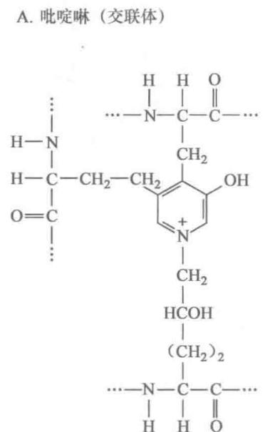

B. 锁链素（交联体）

图 3-27 吡啶啉和锁链素的结构  
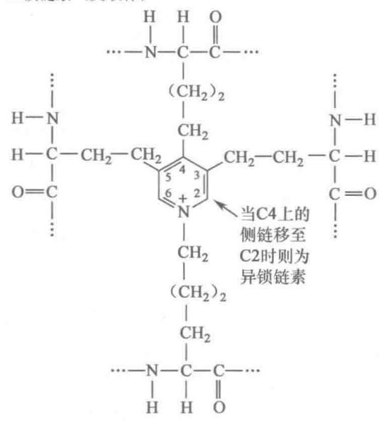

## （五）血纤蛋白原在凝血中起作用

凝血机制是动物长期进化的结果。血液凝固(blood coagulation; blood clotting)过程大部分已研究清楚,至少有13种凝血因子(clotting factor;标为Ⅰ、Ⅱ、Ⅲ……)参与,是一个极其复杂的酶的级联放大反应(见第8章),其中最基本的也是最直接的步骤是激活了的凝血酶原(prothrombin;Ⅱ)即凝血酶(thrombin;Ⅱa,这里右下标字母a表示该因子是活化形式)催化血纤蛋白原(fibrinogen;Ⅰ)转变为血纤蛋白(fibrin;Ⅰa),然后在凝血因子XIIIa(血纤蛋白稳定因子)作用下交联成不溶性的血纤蛋白凝块(血凝块),后者能封堵伤口,阻止继续出血。

血纤蛋白原是一种大分子， $M_{r}$ 约为 340 000。就外形而言，它属于纤维状蛋白质，长为 46 nm，分子中有 3 个球状区（结构域），由两个棒状区将它们分隔开来（图 3-28A）。每一血纤蛋白原分子含 6 个多肽链。序列分析表明，这 6 个链两两相同，分 3 种类型：Aα 链（约含 600 个残基）Bβ 链（461 个残基）和 γ 链（410 个残基）。整个分子由等同的两部分：Aα Bβγ 和 Aα′Bβ′γ′对称地组成。6 个多肽链的 N 端区集中在中央球状区，并由一组二硫键交联起来，游离的 N 端肽段从中央球状区伸出，其中 Aα 和 Bβ 的末端肽段能被凝血酶切除（图 3-28A）。6 个多肽链的 C 端对称地分布在分子两端的球状区。棒状区是由 3 股 α 螺旋缠绕而成。血纤蛋白原分子共含 29 个二硫键，6 个多肽链由这些二硫键交联成一个整体分子。在 Bβ 链的 Asp364 和 γ 链的 Asp52 上连有糖基。氨基酸序列分析表明，Aα、Bβ 和 γ 链之间具有序列同源性。

凝血酶断裂血纤蛋白原中央球状区的4个Arg—Gly的肽键，从两条Aα链各释放出一个A肽（18个残基），从两条Bβ链各释放出一个B肽（20个残基）。这些A肽和B肽称为血纤肽(fibrinopeptide)。除去血纤肽后的血纤蛋白原分子称为血纤蛋白单体(fibrin monomer)，此单体的亚基结构为 $(\alpha \beta \gamma)_2$ 。血纤蛋白单体自发地聚集成有序的纤维状排列，称为血纤蛋白(fibrin)。电子显微镜和低角X射线衍射图案表明，血纤蛋白具有 $23\mathrm{nm}$ 重复的周期结构。因为血纤蛋白原的长度为 $46\mathrm{nm}$ ，所以血纤蛋白单体的聚集是按1/2错位的方式进行的(图3-29)。

不同物种的脊椎动物其血纤肽的氨基酸组成和数目(14\~21个残基左右)有较大的差别,但都带有很大的负净电荷,其中富含Glu和Asp残基,Tyr残基是酪氨酸硫酸酯(侧链酚的羟基酯化),Ser残基是磷酸丝氨酸(图3-7),例如人血纤肽:

$$
\begin{array}{r l} & {\text {A肽(16肽):Ala - Asp - Ser - Gly - Glu - Gly - Asp - Phe - Leu - Ala - Glu - Gly - Gly - Gly - Val - Arg}} \\ & {\text {B肽(14肽):p - Glu - Gly - Val - Asn - Asp - Asn - Glu - Glu - Gly - Phe - Phe - Ser - Ala - Arg}} \\ & {\quad (\text {N端的p - Glu是焦谷氨酸,见图2-3})} \end{array}
$$

血纤肽的静电荷斥力阻止了血纤蛋白原的聚集。一旦血纤肽从血纤蛋白原上被切去，电荷斥力被解除，同时原来被血纤肽掩盖的位点暴露，这些位点是跟两端球状区的位点互补的（图3-28B），因而允许生成的血纤蛋白单体借非共价相互作用聚集成软血纤蛋白凝块（soft clot；图3-29）。这种软凝块是相当脆弱的，例如在 $6\mathrm{mol} / \mathrm{L}$ 尿素溶液中则被解聚而溶解。然而在因子 $\mathrm{XIII}_{\mathrm{a}}$ （转谷酰胺酶）的作用下转变为稳定的脲不溶性血纤蛋白凝块（图3-30）。

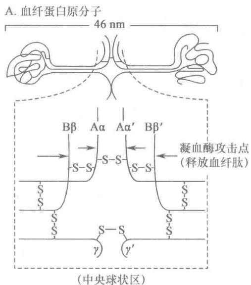

B. 血纤蛋白单体

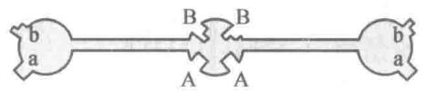  
图 3-28 血纤蛋白原和血纤蛋白单体的结构示意图

图 B 中 a 对 A 和 b 对 B 分别是结构互补的位点

  
图 3-29 血纤蛋白原转变为软血纤蛋白凝块的图解

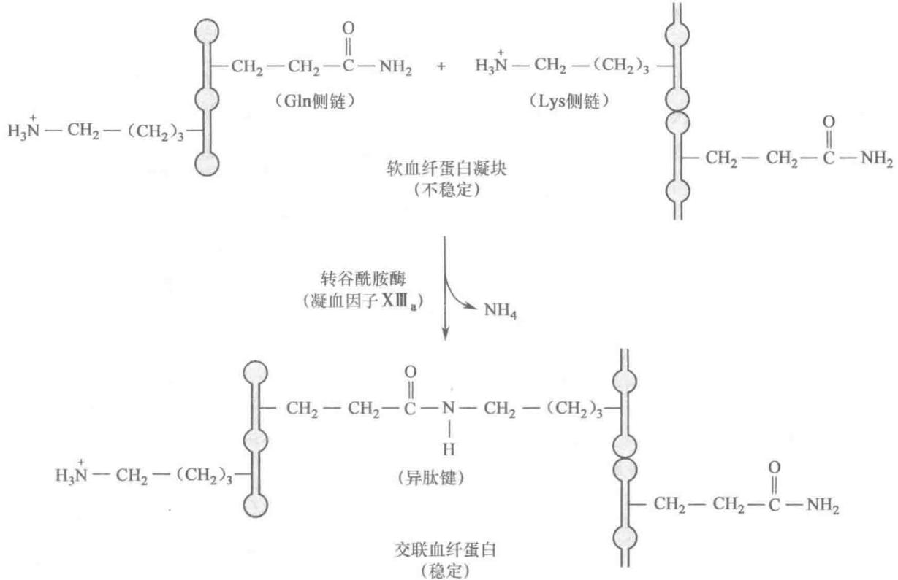  
图 3-30 在转谷酰胺酶催化下软血纤蛋白交联成稳定的血纤蛋白凝块

## 五、蛋白质超二级结构和结构域

在上一章的蛋白质通论部分中曾提到蛋白质结构可以分为4个组织层次(折叠层次)。但如果细分还可以在二级结构和三级结构之间增加两个层次:超二级结构和结构域。

## （一）超二级结构是二级结构的组合体

在蛋白质分子中特别是在球状蛋白质分子中经常可以看到由两个或更多个相邻的二级结构单元（主要是 $\alpha$ 螺旋和 $\beta$ 折叠片）和它们的连接部件（connection）组合在一起，彼此相互作用，形成种类不多的、内能继续降低的、有规则的二级结构组合（combination）或二级结构簇或串（cluster），在多种蛋白质中充当三级结构的元件，称为超二级结构（super-secondary structure），在有些书刊中也称它为模体（motif）/立体结构模体，或折叠模式（fold）/折叠模体（folding motif）等。超二级结构概念是由M.G.Rossman等人于1973年首次提出的。一个超二级结构或模体可以是很小的，如两种二级结构单元相互折叠，它只代表一个蛋白质的一小部分，例如 $\beta \alpha \beta$ 单元（图3-31B）；也可以是较大的模体，如图3-34所示的玉红氧还蛋白（rubredoxin），它是单结构域蛋白。现在已知的超二级结构有几种基本的组合形式，如 $\alpha \alpha, \beta \alpha \beta$ 和 $\beta \beta$ 等。

(1) $\alpha\alpha$ 这是一种 $\alpha$ 螺旋束（捆），它经常是由两股平行或反平行排列的右手螺旋段互相缠绕而成的左手卷曲螺旋图 3-31 蛋白质中的几种超二级结构
A. $\alpha\alpha$ ; B. $\beta\alpha\beta$ 单元; C. Rossman 折叠, 其中 $\alpha$ 螺旋处于 $\beta$ 折叠片上侧; D. $\beta$ 发夹; E. $\beta$ 曲折; F. 希腊钥匙拓扑结构, 只有一种“手性”形式是常见的(图中带箭头的宽带表示 $\beta$ 股)

(coiled coil)或称左手超螺旋(图3-31A)。α螺旋束中还发现有三股和四股螺旋。卷曲螺旋是纤维状蛋白质如α-角蛋白(图3-22)、肌球蛋白(图4-31A)和原肌球蛋白的主要结构元件。α螺旋束也存在于球状蛋白质中，如蚯蚓血红蛋白(hemerythrin)，烟草花叶病毒外壳蛋白(TMV coat protein)等(图3-40)。球状蛋白质中α螺旋束是由同一条链的一级序列上邻近的α螺旋组成，不像纤维状蛋白质中是由几条链的α螺旋区缠绕而成。由于超卷曲，α螺旋主链的φ和ψ角与正常α螺旋略有偏差，每圈螺旋为3.5个残基，而不是通常的3.6个残基。α螺旋沿超螺旋轴有相当的倾斜，重复距离从0.54nm缩短到0.51nm。超螺旋的螺距约为14nm，直径为2nm。两股α螺旋的轴相距1nm，使两股α螺旋的侧链能紧密相互作用以增强螺旋结构。氨基酸序列分析表明，这些多肽链中存在七残基重复序列(heptad repeat)，a-b-c-d-e-f-g，这是卷曲螺旋的结构特征。其中第1和第4个(a和d)是疏水残基，第5和第7个(e和g)是极性残基，第2、3和第6个(b、c和f)一般是荷电残基。因为七残基区段恰占两圈有变形的α螺旋(n=3.5)，所以疏水残基a和d将沿α螺旋一侧排列成非极性边缘(图3-32)。在超螺旋中一股α螺旋链的非极性边缘与另一股链的非极性边缘彼此啮合形成疏水核心，而荷电残基b、c、f组成的极性边缘位于超螺旋外侧，与溶剂水相互作用，以此稳定超螺旋结构。

(2) $\beta \alpha \beta$ 最简单的 $\beta \alpha \beta$ 组合也称 $\beta \alpha \beta$ 单元 ( $\beta \alpha \beta$ -unit), 它是由两段平行 $\beta$ 折叠股和一段作为连接链 (connector) 的 $\alpha$ 螺旋组成, $\beta$ 股之间还有氢键相连; 连接链反平行走向交叉在 $\beta$ 折叠片的一侧, $\beta$ 折叠片的疏水侧链面向 $\alpha$ 螺旋的疏水面, 彼此紧密装配 (图 3-31B)。除 $\alpha$ 螺旋外, 作为连接链的还可以是无规卷曲。最常见的 $\beta \alpha \beta$ 组合是由 3 段平行 $\beta$ 股和两段 $\alpha$ 螺旋构成 (图 3-31C), 相当于两个 $\beta \alpha \beta$ 单元组合在一起, 此结构称为 Rossman 折叠 ( $\beta \alpha \beta \alpha \beta$ )。几乎在所有实例中连接链都是右手交叉 (right-hand cross-over) 的, 只有两个例外, 枯草杆菌蛋白酶和葡糖磷酸异构酶是左手交叉连接的。这是一种拓扑学现象, 是由于 L-氨基酸的伸展多肽链 ( $\beta$ 股) 倾向于采取右手扭曲结构 (right-handed twist structure) 而产生的 (图 3-33)。这一现象可以用一条带子加以直观的演示 (扭曲带子, 然后把带子的两个头搭在一起)。

（3） $\beta \beta$ 实际上就是前面曾讲到的反平行 $\beta$ 折叠片，只不过在球状蛋白质中多是由一条多肽链的若干段 $\beta$ 折叠股反平行组合而成，两个 $\beta$ 股之间通过一个短环(或发夹)连接起来(图3-31，D至F)。最简单的 $\beta \beta$ 折叠模体是 $\beta$ 发夹结构(β-hairpin structure)(图3-31D)，由几个 $\beta$ 发夹可以形成更大、更复杂的折叠片图案，例如 $\beta$ 曲折和希腊钥匙拓扑结构。

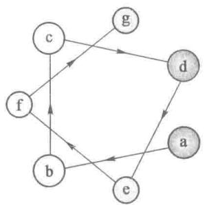

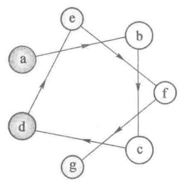  
图 3-32 超螺旋结构中两股 $\alpha$ 螺旋链的非极性边缘之间的疏水相互作用  
图 3-33 多肽链右手扭曲的天然倾向及由此产生的右手连接  
A. 示出右手扭曲是怎样导致右手连接的；B. 示出平行 $\beta$ 股之间的交叉连接

$\beta$ 曲折（ $\beta$ -meander）是一种常见的超二级结构，由氨基酸序列上连续的多个反平行 $\beta$ 折叠股通过紧凑的 $\beta$ 转角连接而成（图3-31E）。 $\beta$ 曲折含有与 $\alpha$ 螺旋相近数目的氢键（约占全部可能形成的主链氢键的2/3）。 $\beta$ 曲折的这种高稳定性无疑说明它的广泛存在。

希腊钥匙拓扑结构(Greek key topology)或称回文结构,也是反平行β折叠片中常出现的一种折叠模体(图3-31F)。这种模体直接用古希腊陶瓷花瓶上的一种常见图案命名,称“希腊钥匙”(Greek key)。这种结构有两种可能的回旋方向,但实际上只存在其中的一种。当折叠片的亲水面朝向观察者时,从N→C端回旋几乎总是逆时针的。

几千种已知结构的蛋白质总共就由一、二百个结构模体（超二级结构）组装而成。因此目前致力于了解 $\alpha$ 螺旋之间、 $\beta$ 折叠片之间以及螺旋和折叠片之间相互作用的基础。在多数情况下，只有非极性残基侧链参与这些相互作用，而亲水侧链多在分子的外表面。

## （二）结构域是三级结构中相对独立的局部折叠区

## 1. 结构域概念

多肽链在二级结构或超二级结构的基础上形成三级结构的局部折叠区,它是相对独立的紧密球状实体,称为结构域(structural domain)或简称域(domain)。最常见的结构域含序列上连续的100\~200个氨基

酸残基,少至含40个残基,多至400个以上残基。结构域被认为是球状蛋白质的独立折叠单位。对于那些较小的球状蛋白质分子或亚基来说,结构域和三级结构是一个意思,也就是说这些蛋白质或亚基是单结构域(single domain)的,如玉红氧还蛋白(rubredoxin;属于全β类)和核糖核酸酶(α+β类)(图3-34),以及肌红蛋白(全α类;见图4-3)等。对于较大的球状蛋白质或亚基,其三级结构往往由两个或多个结构域缔合而成,也即它们是多结构域(multidomain)的,例如免疫球蛋白的轻链含2个结构域,重链4个结构域(见图4-25)。

结构域有时也指功能域(functional domain)。一般说,功能域是蛋白质分子中能独立存在的功能单位。功能域可以是一个结构域,也可以是由两个结构域或两个以上结构域组成,例如酵母己糖激酶(hexokinase)的功能域(含有活性部位)就是由两个结构域构成,并处于它们之间的交界处(图3-37)。

看来结构域这一折叠层次的出现也不是偶然的。高等真核生物的基因蛋白质分析揭示，多结构域蛋白质的结构域经常是由它的基因的相应外显子(exon)编码的（见第32和33章）。从结构的角度上看，一条长的多肽链先分别折叠成几个相对独立的三级结构区域，再缔

A  
  
B  
(带状模型)

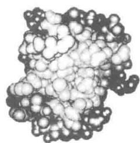  
(空间填充模型)

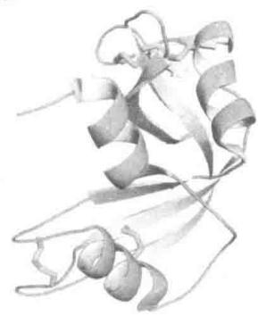  
(带状模型)

  
(空间填充模型)  
图 3-34 玉红氧还蛋白(A)和核糖核酸酶 A(B)的三级结构(单结构域)  
带状模型中箭头的宽带表示 $\beta$ 股, 细带代表无规的连接区或回环

合成完整的三级结构要比整条多肽链直接折叠成完整的三级结构在动力学上是更为合理的途径。从功能的角度上看许多多结构域的酶，其活性中心都位于结构域之间的部分，因为通过结构域容易构建具有特定三维排布的活性中心。由于结构域之间常常只有一段柔性的肽链连接，形成所谓铰链区，使结构域容易发生相对运动，这是结构域的一大特点。然而这种柔性铰链不可能在亚基之间存在，因为它们之间没有共价连接，如果作较大的运动亚基将完全分开。结构域之间的这种柔性(flexibility)将有利于活性中心结合底物和施加应力，有利于别构中心结合调节物和发生别构效应(参见第4章和第8章)。

## 2. 多肽链折叠中的手性效应

氨基酸( $\alpha-$ 碳)的手性对蛋白质结构产生很大的影响。前面曾谈到参与蛋白质组成的氨基酸是L-型的,多肽链折叠形成的螺旋结构大多数是右手的。精细结构能的计算表明,最稳定的 $\beta$ 折叠股构象也具有轻度右手扭曲的倾向。这种倾向给蛋白质折叠带来了两种不同而又有联系的效应。一个效应反映在球状蛋白质中平行 $\beta$ 折叠片的 $\beta$ 股之间的右手交叉连接(图3-33);这一点在超二级结构 $\beta\alpha\beta$ 单元和Ross-man 折叠中已看到(见图 3-31B,C)。另一个效应反映在对平行 β 折叠片的几何形状的影响。球状蛋白质中大的平行 β 折叠片是由多个 Rossman 折叠装配成的。当沿多肽链方向观察时,整个平行 β 折叠片也以右手方式扭曲,或形成一个扭曲的圆筒,称[单绕]平行 β 桶(parallel β-barrel)(图 3-43A),或形成一个大的缓慢的扭曲片,称双绕平行 β 片(见图 3-43B)。

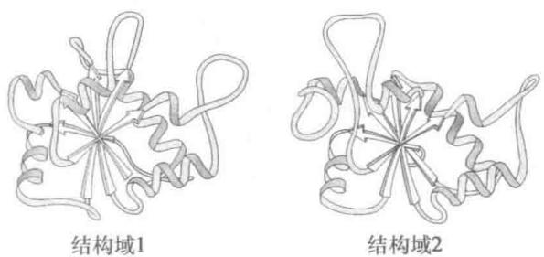

## 3. 结构域类型

近年来常见的结构域(包括立体结构模体)数目越来越多,但基本的类型数目有限。根据其所含的二级结构种类及其排列方式,结构域大体可分为这样四类:全 $\alpha$ 类、全 $\beta$ 类(前2类分别以 $\alpha$ 螺旋和 $\beta$ 片占优势)、 $\alpha/\beta$ 类( $\alpha$ 螺旋和 $\beta$ 片是相间即互相掺和的)和 $\alpha+\beta$ 类( $\alpha$ 螺旋和 $\beta$ 片大部分是分开聚集的),此外还有富含金属或二硫键的结构域(不规则小蛋白结构)等。关于这些结构域的细节将在后面“球状蛋白质三维结构的解剖学”中叙述。

有些蛋白质例如硫氰酸酶(rhodanase)中含有彼此极其相似的结构域(图3-35)。两个相似的结构域

经常是二重对称轴的关系,有些蛋白质中结构域彼此十分不同,例如木瓜蛋白酶(papain)中的两个结构域(图3-36)。一个蛋白质(或亚基)中两个结构域之间的分隔程度也各不相同,有的两个结构域各自独立成球状实体,中间仅由一段长短不一的肽链连接;有的相互间接触面宽而紧密,整个分子(或亚基)的外表面是一个平整的球面,甚至难以确定究竟有几个结构域存在。多数是中间类型的,分子(或亚基)外形偏长,结构域之间有一裂沟(cleft)或密度较小的区域,例如己糖激酶(图3-37)。

图 3-35 硫氰酸酶含有两个相似的结构域(都是 $\alpha/\beta$ 类)1 和 2  
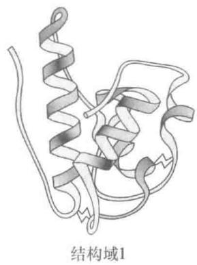

  
图 3-36 木瓜蛋白酶的两个结构域 1(全 $\alpha$ 类) 和 2(全 $\beta$ 类) 是不相同的

  
图 3-37 酵母己糖激酶的三级结构两个结构域(阴影不同)之间有一条裂沟

## 六、球状蛋白质与三级结构

虽然纤维状蛋白质在各种生物体内含量丰富也很重要,但是它们的种类只占自然界中蛋白质的很小一部分,球状蛋白质远比它们多得多。蛋白质结构的复杂性和功能的多样性也主要体现在球状蛋白质。这一节主要介绍球状蛋白质及其亚基的三级结构概念、三级结构特征以及球状蛋白质的分类。

## （一）三级结构的形成

多肽链中局部肽段折叠形成了二级结构,它们之间进一步相互作用成为超二级结构,但肽链中仍有一些单键在不停地旋转,各部分(包括已相对稳定的超二级结构)之间继续相互作用,使整个多肽链的内能进一步降低,分子变得更加稳定。蛋白质结构的这一高级组织层次即为三级结构。因此三级结构(tertiarystructure) 可定义为蛋白质分子的肽链中所有肽键和氨基酸残基(包括侧链 R 基)的空间位置。简而言之，蛋白质的三级结构是指蛋白质中所有原子的空间定位。

稳定三级结构的作用力就是前面介绍过的各种非共价的弱相互作用以及共价二硫键。这里必须强调一下绝大多数蛋白质的二硫键在三级结构形成和稳定蛋白质结构中起着相当重要的作用。另外一些金属在形成和稳定蛋白质的三级结构中也发挥重要作用。

## （二）球状蛋白质三级结构的特征

蛋白质晶体结构数据库(Protein Data Bank, PDB)资源立体结构的蛋白质(已有数千种之多)与日俱增。虽然每种球状蛋白质都有自己独特的三级结构(三维结构)，但是它们仍有某些共同特征：

（1）大多数球状蛋白质以螺旋和折叠片构成分子的核心 一种纤维状蛋白质（肌球蛋白除外）只含一种二级结构元件，如 $\alpha-$ 角蛋白只含 $\alpha$ 螺旋。然而球状蛋白质和某些膜蛋白含有两种或两种以上的二级结构元件，例如溶菌酶（lysozyme）含有几个短的 $\alpha$ 螺旋、一个反平行 $\beta$ 折叠片，几个 $\beta$ 转角和几段无确定二级结构（无规卷曲）的肽段等（图 3-38），虽然不同的球状蛋白质（或膜蛋白）中各种元件的含量是不一样的（表 3-5）。

  
图 3-38 鸡卵清溶菌酶的三级结构( $\alpha+\beta$ 类)

表 3-5 几种单链蛋白质或亚基中 $\alpha$ 螺旋、β折叠和 $\beta$ 转角的近似含量

<table><tr><td rowspan="2">蛋白质(总残基数)</td><td colspan="3">残基/(%)1</td></tr><tr><td>α螺旋</td><td>β折叠</td><td>β转角</td></tr><tr><td>肌红蛋白(153)</td><td>78</td><td>0</td><td>16</td></tr><tr><td>溶菌酶(129)</td><td>40</td><td>12</td><td>19</td></tr><tr><td>核糖核酸酶A(124)</td><td>26</td><td>35</td><td>—</td></tr><tr><td>牛Cu·Zn-SOD亚基(151)</td><td>14</td><td>47</td><td>17</td></tr><tr><td>胰凝乳蛋白酶(247)</td><td>14</td><td>45</td><td>28</td></tr><tr><td>羧肽酶A(307)</td><td>38</td><td>17</td><td>17</td></tr></table>

① 多肽链的其余部分由无规卷曲等组成。

（2）球状蛋白质三维结构具有明显的折叠层次 与纤维状蛋白质相比，球状蛋白质的结构具有更加明显而丰富的折叠层次。多肽链主链在熵驱动下折叠成借氢键维系的 $\alpha$ 螺旋、 $\beta$ 折叠片等二级结构。在一级序列上相邻的二级结构往往在三维折叠中彼此靠近并相互作用形成超二级结构（图3-31）。由超二级结构进一步装配成相对独立的球状实体——结构域或三级结构（对于单结构域蛋白质或亚基而言），如图3-34所示的玉红氧还蛋白和核糖核酸酶A；或再由两个或多个结构域（对于多结构域蛋白质或亚基来说）装配成紧密的球状或椭球状的三级结构，如己糖激酶（图3-37，含2个结构域）。如果这是亚基的三级结构，将由三级结构的亚基缔合成四级结构的多聚体，如血红蛋白（四聚体；见图2-27）。

（3）球状蛋白质分子是紧密的球状或椭球状实体 多肽链折叠过程中各种二级结构彼此紧密装配，它们之间也插入松散的肽段。一个蛋白质的组成氨基酸的范德华体积(van der Waals volume)总和(组成的原子依范德华作用范围所占的总体积)除以蛋白质所占的体积即得装配密度，一般为0.72\~0.77。这意味着即使紧密装配，蛋白质总体积约25%不被蛋白质原子所占据。这个空间几乎全部都以很小的空腔形式存在。偶尔有水分子大小或更大一点的空腔存在，但它们仅构成蛋白质总体积的一小部分，例如在α-胰凝乳蛋白酶晶体结构中发现有16个水分子。值得注意的是邻近活性部位的区域密度比平均值低得很多，这可能意味着在这较松散的区域有较大的空间可塑性，使构象容易发生变化，可允许活性部位的结合基团和催化基团有较大的活动范围。这是酶与底物、别构酶与调节物、其他功能蛋白与效应物相互作用的结构基础（详见第8章）。

（4）球状蛋白质疏水侧链埋藏在分子内部，亲水侧链暴露在分子表面 蛋白质折叠形成三级结构的驱动力是形成可能的最稳定结构。这里有两种力在起作用，一是肽链必须满足自身结构固有的限制，包括折叠中 $\alpha-$ 碳的二面角的限制以及手性效应；二是肽链必须折叠以便埋藏疏水侧链，使之与溶剂水的接触降到最小程度（熵驱动使然）。从拓扑学角度看，所有的球状蛋白质必须有一个可以安排疏水核心的“内部”和一个被亲水基团所伸向的“外部”。隐藏疏水残基避免与水接触是安排二级结构单元（包括非重复性肽段）形成特定三级结构的主要动力。疏水核心几乎全部由 $\alpha$ 螺旋和 $\beta$ 折叠片组成。它们的肽主链虽然是极性的，但由于这两种二级结构形成很好的氢键网，主链极性已被有效地中和，因而能稳定地处于疏水核心区域。球状蛋白质中，多数 $\alpha$ 螺旋都是两亲[性]螺旋（amphipathic helix）。它们的一个面向外暴露于溶剂，另一个面向蛋白质的疏水内部。两亲螺旋向外的一面主要是由极性和带电残基组成，向内一面主要是非极性的疏水残基（图3-32）。平行 $\beta$ 片一般存在于蛋白质疏水核心；反平行 $\beta$ 片疏水一侧朝向分子内部，亲水一侧与溶剂接触。球状蛋白质分子 $80\% \sim 90\%$ 疏水侧链被埋藏，分子表面主要是亲水侧链，因此球状蛋白质是水溶性的。

（5）球状蛋白质分子的表面有一个空穴（也称裂沟、凹槽或口袋）这种空穴常是结合底物、效应物等配体和行使生物功能的活性部位。空穴大小约能容纳1到2个小分子配体或大分子配体的一部分。空穴周围分布着许多疏水侧链，为底物等发生化学反应营造了一个疏水环境（低介电区域）。

和球状蛋白质相比,纤维状蛋白质的三级结构显得简单得多,因为它们很少有转角、环状和无规卷曲这些二级结构,整条多肽链几乎是单一的二级结构,如 $\alpha-$ 角蛋白和丝心蛋白等(见前所述)。膜蛋白有一类属于跨(穿)膜蛋白,这类膜蛋白结构的稳定性主要是由氢键和范德华力维系的,因为它们和可溶性的球状蛋白质不同,没有疏水的核心;其他几类基本上仍属于球状蛋白质(见下一节“膜蛋白的结构”)。

## （三）球状蛋白质三级结构/结构域的解剖学

已知立体结构的蛋白质，肽链折叠的花式尽管多种多样，但是仍有规律可循，二级结构是支撑整个分子的骨骼，根据所含的二级结构种类及其组合方式或立体结构模体，球状蛋白质或结构域可分为几大类别（class）：全 $\alpha$ 蛋白质、全 $\beta$ 蛋白质、 $\alpha / \beta$ 蛋白质和 $\alpha + \beta$ 蛋白质以及小的富含金属或二硫键的蛋白质等。除少数一些混合型结构之外，大多数已知结构的蛋白质都可以归入这几个类别中的一种。

必须指出，在这些类别内三级结构的相似性并不一定反映它们在功能上相似或有关。功能同源性(functional homology)一般决定于在一个更小、更紧密的范围内的结构相似性。例如丙糖磷酸异构酶(triose phosphate isomerase)、醛糖还原酶(aldose reductase)和磷酸三酯酶(phosphotriesterase)结构域类型相同，但功能不一样，而天冬氨酸氨基转移酶(aspartate transferase)和D-氨基酸氨基转移酶三级结构虽不同，但功能相似(图3-39)。

## 1. 全 $\alpha$ 蛋白质(all $\alpha$ protein)

全 $\alpha$ 蛋白质是 $\alpha$ 螺旋占优势的结构（一般标准是 $\alpha$ 螺旋的含量大于 15%， $\beta$ 片小于 10%），有的蛋白质甚至只含 $\alpha$ 螺旋。根据 $\alpha$ 螺旋的排列方式，全 $\alpha$ 类又可分为几个亚类。最简单的也是最大的亚类是反平行的螺旋束（捆）。此结构中 $\alpha$ 螺旋一上一下地反平行排列，因此也称上、下走向（类型）螺旋束（up-and-down helix bundle）。相邻螺旋之间以环相连，形成近似筒形的螺旋束，最常见的是四螺旋束或捆（four-helix bundle），如蚯蚓血红蛋白（myohemerythrin）、TMV 外壳蛋白（TMV coat protein）和人生长激素（groth hormone）（图 3-40D）。这类螺旋束不少呈现轻微左手扭曲（+15°）。螺旋疏水面朝向内部，亲水面朝向溶剂。活性部位残基位于螺旋束的一端，由不同螺旋的残基构成。多数螺旋束是规则均匀的结构。少数情况有螺旋突出束外。TMV 外壳蛋白在螺旋束的一端有小的高度扭曲的反平行 $\beta$ 折叠片， $\beta$ 片的一侧还有两个额外的 $\alpha$ 螺旋（图 3-40C）。

全 $\alpha$ 类的另一亚类是珠蛋白(globin)模式, $\alpha$ 螺旋取向也是反平行的, 而且是按希腊钥匙方式组合。珠蛋白型有去血红素的肌红蛋白和血红蛋白亚基(见图4-3、图4-6和图4-7)等。这类结构有两个特点:

A. 结构域类型相似，功能不同

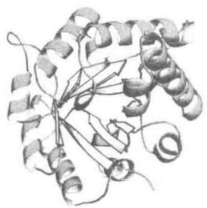  
丙糖磷酸异构酶

  
醛糖还原酶

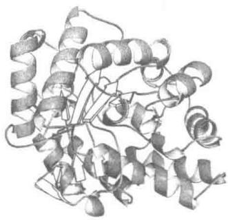  
磷酸三酯酶

B. 功能相似，结构不同

  
天冬氨酸氨基转移酶

  
D-氨基酸氨基转移酶

图 3-39 某些蛋白质(或结构域)结构的相似性不一定反映其功能的相似性  
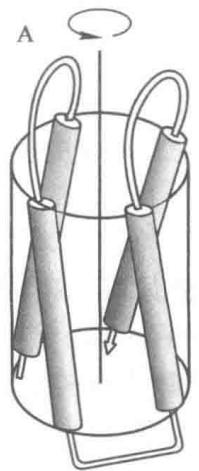

  
图 3-40 全 $\alpha$ 类蛋白质(单结构域)

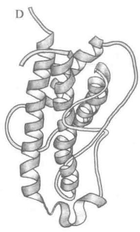  
A. 四螺旋束示意图(反平行); B. 蚯蚓血红蛋白和 C. 烟草花叶病毒外壳蛋白亚基(反平行); D. 人生长激素(平行)

一是它们都含有7段 $\alpha$ 螺旋，一级结构相邻的螺旋段采取接近相互垂直的取向；二是这类分子中不少以一个血红素作为辅基。

一些钙结合蛋白质,如钙调蛋白(含 E-F 手模体;见图 14-23)也属于这一类;此外还有其他类型的。

## 2. 全 $\beta$ 蛋白质(all $\beta$ protein)

跟全 $\alpha$ 蛋白质一样，全 $\beta$ 蛋白质中有相当一部分只含 $\beta$ 折叠股；其他的全 $\beta$ 类同时含有 $\alpha$ 螺旋和 $\beta$ 折叠，但 $\beta$ 折叠片含量远高于 $\alpha$ 螺旋（一般的标准是 $\beta$ 折叠大于 $15\%$ ， $\alpha$ 螺旋小于 $10\%$ ）。因为单股 $\beta$ 折叠中有些肽基的 $C = O$ 与 $N - H$ 没有形成氢键，仍处于不稳定的状态，因此在全 $\beta$ 类中它们多是通过氢键键合形成片层结构—— $\beta$ 折叠片。折叠片中绝大多数 $\beta$ 股的相对走向是反平行的，包括形成希腊钥匙（见图3-31F）和更复杂的拓扑图案。

全 $\beta$ 类中反平行 $\beta$ 折叠片一般把疏水残基安排在折叠片的一侧，亲水残基在另一侧。因此一个反平行 $\beta$ 片的蛋白质至少有两个主链结构层：或是两层都是 $\beta$ 片，或是一层 $\beta$ 片和一层 $\alpha$ 螺旋。后一种情况称为“露面夹心（open-face sandwich）”结构，这是含 3\~15 个 $\beta$ 股的单层反平行片，虽然也是扭曲的，但不闭合成桶。在这种 $\beta$ 片的一侧有一层 $\alpha$ 螺旋和回环，片的另一侧暴露于溶剂。链霉菌枯草杆菌蛋白酶抑制剂（Streptomyces subtilisin inhibitor）和谷胱甘肽还原酶（glutathione reductase）结构域 3 是其中的例子（图 3-41）。

双层 $\beta$ 折叠片的疏水面对合形成疏水区，相背的两面暴露于溶剂。这类结构域一般是由 4\~10 个 $\beta$ 股构成

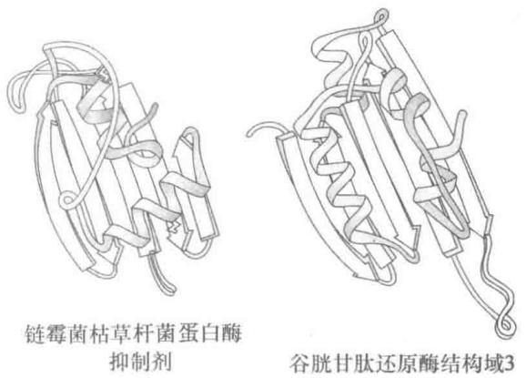  
图 3-41 全 β 蛋白质中单层反平行折叠片(露面夹心)结构的实例

的反平行 $\beta$ 桶（因外形似桶）。从拓扑学角度反平行 $\beta$ 桶又可分为几种类型，如希腊钥匙型、果冻卷型和上下型等。

反平行 $\beta$ 桶与下面 $\alpha / \beta$ 蛋白质中的单绕平行 $\beta$ 桶相比，对称性差，氢键强度较小，但在自然界中出现频率较高。全 $\beta$ 蛋白质的反平行 $\beta$ 桶通常由偶数 $\beta$ 折叠股组成。其中最常见的一类是希腊钥匙型 $\beta$ 桶，如 $\mathrm{Cu} \cdot \mathrm{Zn}$ -超氧化物歧化酶（superoxide dismutase, SOD）和免疫球蛋白结构域（图3-42A）的结构。这种 $\beta$ 桶的三维拓扑图摊开的二维拓扑图案是希腊钥匙（图3-31）。另一类是果冻卷型 $\beta$ 桶（jell roll $\beta$ -barrel），它们含有类似希腊钥匙但更为复杂的拓扑图案，如番茄丛矮病毒亚基（图3-42B）以及其他病毒外壳蛋白等。上述两类反平行 $\beta$ 桶的共同特点是 $\beta$ 股之间至少有1条（多至4条）连接链（松散肽段）是越过相邻 $\beta$ 股而横跨“桶”的（拓扑学原因，见图3-31F）。木瓜蛋白酶结构域2属于发夹型（图3-36）。还有一类是上下型反平行 $\beta$ 桶（up-and-down $\beta$ -barrel），如大豆胰蛋白酶抑制剂、视黄醇结合蛋白（retinol-binding protein）（图3-42C）和玉红氧还蛋白（见图3-34）等。上下型 $\beta$ 桶可看成是由超二级结构 $\beta$ 曲折（图3-31E）闭合而成。相邻的 $\beta$ 股一上一下反平行排列,通过长短不一的肽链连接,类似上下型的螺旋束(图 3-40A)。这类结构的配体结合部位位于桶的疏水内部(图 3-42C)。

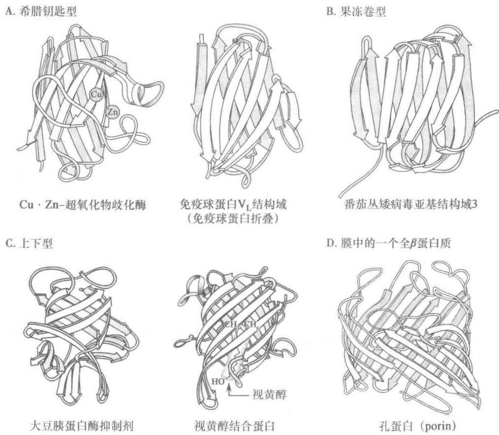  
图 3-42 全 $\beta$ 蛋白质中双层反平行折叠片 ( $\beta$ 桶结构) 的实例

具有桶状结构的蛋白质不仅可以存在于亲水的环境,而且也能存在于疏水的质膜中。例如膜中的[膜]孔蛋白(porin)也有类似的结构(图3-42D)。

## 3. $\alpha/\beta$ 蛋白质 ( $\alpha/\beta$ protein)

α/β蛋白质是一类α螺旋和β折叠股交替出现的结构(一般标准是这两种二级结构元件各自的含量都大于10%)。然而不同的α/β蛋白质中,这两种元件的相对排列以及整个分子的外形有很大的差别。α/β类的绝大多数是能跟核苷酸及其衍生物(如辅酶NAD)结合的蛋白质或结构域,以及以糖类为底物的各种酶。α/β蛋白质结构是以平行或混合型(含平行和少数反平行β折叠股)β片为基础的。前面曾提到平行β折叠片一般存在于蛋白质的疏水核心,很少与水溶剂接触,因为它的任一侧都分布有疏水侧链。

α/β蛋白质可以有若干个类型:一个类型称为单绕平行β桶(singly wound parallel β-barrel),或称丙糖磷酸异构酶折叠模式;另一个类型是双绕平行β片(doubly would parallel β-sheet),也称Rossman折叠模式或核苷酸结合结构域(nucleotide-binding domain);此外还有其他类型。在所有已知蛋白质立体结构的家族中,α/β类的蛋白质家族/超家族可能是最复杂的。

如图 3-43A 中的丙糖磷酸异构酶和丙酮酸激酶(pyruvate kinase)结构域 1(N 端)的结构所示,单绕平行 β 桶是由 8 个平行 β 折叠股和 8 个 α 螺旋相间排列,在第 1 和第 8 两个折叠股之间借氢键键合形成一个闭合式圆筒(cylinder),它是一种具有高度对称性的结构。这种结构是由肽链按 βαβα 单元(Rossman 折叠方式)单向缠绕而成。作为右手交叉连接的 8 个 α 螺旋都在 β 折叠片的一侧,即在圆筒(内桶)的外面,组成一个与此圆筒同轴的平行 α 螺旋圆筒(外桶)。内、外桶都是右手扭曲的。两个桶紧挨在一起,它们之间是一个疏水夹心层(hydrophobic sandwich)。中央空间只能容纳 β 折叠片内侧的疏水侧链,构成这类蛋白质/结构域的疏水核心(hydrophobic core)。参与结合和催化的残基(活性部位)位于连接 β 股和螺旋的回环区域(loop region)。总之二级结构元件构成结构骨架,决定了蛋白质的稳定性;回环区构成活性中心,决定了蛋白质的功能。属于丙糖磷酸异构酶折叠模式的还有醛糖还原酶和磷酸三酯酶(图 3-39A)。

双绕平行 $\beta$ 片结构见图3-43B中乳酸脱氢酶（lactate dehydrogenase）结构域1和磷酸甘油酸激酶(phosphoglycerate kinase)结构域2。这种 $\alpha / \beta$ 类结构的特征是具有超二级结构Rossman折叠（ $\beta \alpha \beta$ ），中间是由4到9个平行的 $\beta$ 股或混合型的 $\beta$ 股构成的开放 $\beta$ 片。 $\beta$ 片的两侧由不同数量的 $\alpha$ 螺旋和环状区段保护。这种结构虽然也由 $\beta \alpha \beta$ 模体装配而成，但模体间的连接方式与平行 $\beta$ 桶不同，有的 $\beta \alpha \beta$ 模体是翻转 $180^{\circ}$ 后再与另一 $\beta \alpha \beta$ 模体连接，这样就形成开放式扭曲片，而 $\alpha$ 螺旋分别处于扭曲片的两侧。这种结构之所以称为双绕平行 $\beta$ 片是因为它可以看成是肽链从 $\beta$ 折叠片的中部开始沿相反的两个方向向外缠绕，也即肽链从折叠片中间开始向一个方向缠绕形成Rossman折叠， $\alpha$ 螺旋覆盖在折叠片的一侧，然后改变方向回到折叠片的中部向相反的方向缠绕再形成Rossman折叠，此时 $\alpha$ 螺旋覆盖在折叠片的另一侧。有时尚有发夹末端连接的反平行 $\beta$ 折叠股混杂在平行 $\beta$ 折叠股之间，形成混合型 $\beta$ 折叠片蛋白质。以核苷酸衍生物烟酰胺腺嘌呤二核苷酸(NAD)、黄素腺嘌呤单核苷酸(FMN)等(见第13章)为辅基的蛋白质如糖酵解中的许多酶都含有核苷酸结合结构域。核苷酸结合部位位于 $\beta$ 折叠片中肽链改变方向处的一个裂隙内(图3-43B)。双绕平行 $\beta$ 片蛋白质是3个主链结构层和两个疏水区，而单绕平行 $\beta$ 桶是4个主链层和3个疏水区。

## 4. $\alpha +\beta$ 蛋白质（ $\alpha +\beta$ protein）

$\alpha + \beta$ 蛋白质是一类 $\beta$ 折叠（ $15\%$ 以上）和 $\alpha$ 螺旋（大于 $10\%$ ）两种二级结构元件分别聚集在不同区域的蛋白质。跟上述的 $\beta$ 类不同的地方是在某些 $\alpha + \beta$ 结构的分子表面只有一侧是 $\beta$ 片，另一侧则由 $\alpha$ 螺旋或 $\alpha$ 螺旋和 $\beta$ 折叠共同组成。属于这一类的有3-磷酸甘油醛脱氢酶（glyceraldehyde-3-phosphate dehydrogenase）结构域2（C端）、胸苷酸合酶（thymidylate synthase）和RuvA蛋白（RuvA protein），见图3-44。由于 $\alpha + \beta$ 蛋白质多数仍是以 $\beta$ 折叠股为主，因此有时也把它归于全 $\beta$ 类，例如上面讲到的“露面夹心”结构（图3-41）。

乳酸脱氢酶结构域1（顶面观） 磷酸甘油酸激酶结构域2  
A.[单绕] 平行β桶（丙糖磷酸异构酶折叠模式）  
  
丙糖磷酸异构酶（侧面观）

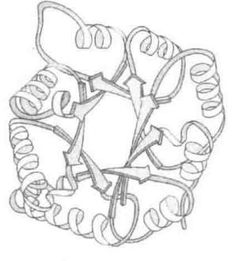  
丙糖磷酸异构酶（顶面观）

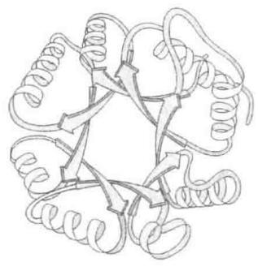  
丙酮酸激酶结构域1

B. 双绕平行β片（核甘酸结合结构域模式）  
  
乳酸脱氢酶结构域1（侧面观）

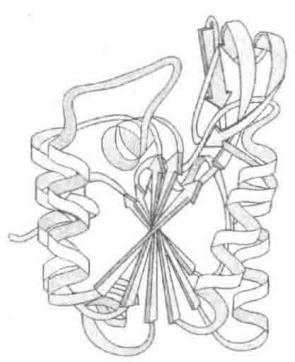

图3-43 $\alpha / \beta$ 蛋白质（结构域）结构的实例  
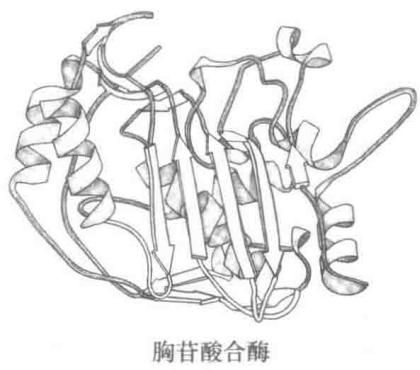

  
3-磷酸甘油醛脱氢酶结构域2

  
RuvA蛋白  
图3-44 $\alpha +\beta$ 蛋白质的几个实例

有些 $\alpha +\beta$ 蛋白质所含的 $\beta$ 股数量不多，形成的 $\beta$ 片还不够覆盖分子的全部 $\alpha$ 螺旋，显然还有部分或大部分 $\alpha$ 螺旋聚集在分子的它处，例如牛胰核糖核酸酶（图3-34B）和溶菌酶（图3-38）等。这类蛋白质中有些结构容易被解剖为两个或几个彼此独立的结构域，例如金黄色葡萄球菌（Staphylococcus aureus）产生的核酸酶，它的N端由4个 $\beta$ 股构成的部分和C端由 $\alpha$ 螺旋形成的部分可以各自成为结构域。

## 5. 富含金属或二硫键(小的不规则)蛋白质

许多小于100残基的小蛋白质或结构域往往不规则，只有很少量的二级结构，但富含金属和/或二硫键。金属形成的配体或二硫键对蛋白质构象起稳定作用。如果二硫键被破坏，富含二硫键的蛋白质则不能维持天然构象。图3-45示出这类蛋白质的几个代表：富含二硫键的蛋白质如胰岛素、磷脂酶 $\mathrm{A}_2$ 和二节荠蛋白（crambin的暂译名——编者）后者是从埃塞俄比亚二节芥（Crame abyssinica）的种子中提取的；富含金属的蛋白质如高氧还势铁蛋白（high-potential iron protein, HiPIP）、铁氧还蛋白（ferredoxin）和细胞色素 $c$ ，前面提到的玉红氧还蛋白（图3-34A）也是富含金属的小蛋白质。这类蛋白质的结构有些跟上述几类有明显的相似性,例如 HiPIP 是一个变形的 $\beta$ 桶结构,磷脂酶 $A_{2}$ 是变形的 $\alpha$ 螺旋簇。然而有一些蛋白质如胰岛素和二节荠蛋白则很难归入上述任何一个结构类别。

  
图 3-45 富含二硫键蛋白质(A)和富含金属蛋白质(B)的实例

有人对一些折叠模式(这里指的是折叠的结果,即热力学的终态)做了解剖学类别的归属及其相对丰度,见表3-6。

表 3-6 折叠模式的解剖学类别归属及其相对丰度

<table><tr><td>蛋白质解剖类别</td><td>相对丰度</td><td>蛋白质解剖类别</td><td>相对丰度</td></tr><tr><td>全α</td><td>20%~30%</td><td>小蛋白质</td><td>5%~15%</td></tr><tr><td>全β</td><td>10%~20%</td><td>多结构域</td><td>&lt;10%</td></tr><tr><td>α/β</td><td>15%~25%</td><td>膜蛋白</td><td>&lt;10%</td></tr><tr><td>α+β</td><td>20%~30%</td><td></td><td></td></tr></table>

<!-- EN-BEGIN 4.3 -->

### 【英文对应 4.3】Protein Tertiary and Quaternary Structures

> 来源：Lehninger Principles of Biochemistry（书籍/02_生物化学原理） 第4章 The Three-Dimensional Structure of Proteins，§4.3。对应本章“六、球状蛋白质与三级结构”。

P3 The overall three-dimensional arrangement of all atoms in a protein is referred to as the protein's tertiary structure. Whereas the term "secondary structure" refers to the spatial arrangement of amino acid residues that are adjacent in a segment of a polypeptide, tertiary structure includes longer-range aspects of amino acid sequence. Amino acids that are far apart in the polypeptide sequence and are in different types of secondary structure may interact within the completely folded structure of a protein. Interacting segments of polypeptide chains are held in their characteristic tertiary positions by several kinds of weak interactions (and sometimes by covalent bonds such as disulfide cross-links) between the segments. Some proteins contain two or more separate polypeptide chains, or subunits, which may be identical or different. The arrangement of these protein subunits in three-dimensional complexes constitutes quaternary structure.

In considering these higher levels of structure, it is useful to designate the major groups into which many proteins can be classified: fibrous proteins, with polypeptide chains arranged in long strands or sheets; globular proteins, with polypeptide chains folded into a spherical or globular shape; membrane proteins, with polypeptide chains embedded in hydrophobic lipid membranes; and intrinsically disordered proteins, with polypeptide chains lacking stable tertiary structures. We focus here on fibrous, globular, and intrinsically disordered proteins; membrane proteins are discussed in Chapter 11. These three groups are structurally distinct. Fibrous proteins usually consist of a single type of secondary structure, and their tertiary structure is relatively simple. Globular proteins often contain several types of secondary structure. Intrinsically disordered proteins can lack secondary structure entirely. The groups also differ functionally: the structures that provide support, shape, and external protection to vertebrates are made of fibrous proteins. Most enzymes are globular proteins, whereas regulatory proteins can be globular, disordered, or contain both globular and disordered segments.

#### [EN] Fibrous Proteins Are Adapted for a Structural Function

α-Keratin, collagen, and silk fibroin nicely illustrate the relationship between protein structure and biological function (Table 4-2). P2 Fibrous proteins share properties that give strength and/or flexibility to the structures in which they occur. In each case, the fundamental structural unit is a simple repeating element of secondary structure. All fibrous proteins are insoluble in water, a property conferred by a high concentration of hydrophobic amino acid residues both in the interior of the protein and on its surface. These hydrophobic surfaces are largely buried, as many similar polypeptide chains are packed together to form elaborate supramolecular complexes. The underlying structural simplicity of fibrous proteins makes them particularly useful for illustrating some of the fundamental principles of protein structure discussed previously.

α-Keratin The α-keratins have evolved for strength. Found only in mammals, these proteins constitute almost the entire dry weight of hair, wool, nails, claws, quills, horns, and hooves and much of the outer layer of skin. The α-keratins are part of a broader family of proteins called intermediate filament (IF) proteins. Other IF proteins are found in the cytoskeletons of animal cells. All IF proteins have a structural function and share the structural features exemplified by the α-keratins.

The $\alpha$ -keratin helix is a right-handed $\alpha$ helix, the same helix found in many other proteins. Francis Crick and Linus Pauling, in the early 1950s, independently suggested that the $\alpha$ helices of keratin were arranged as a coiled coil. Two strands of $\alpha$ -keratin, oriented in parallel (with their amino termini at the same end), are wrapped about each other to form a supertwisted coiled coil. The supertwisting amplifies the strength of the overall structure, just as strands are twisted to make a strong rope (Fig. 4-10). The twisting

<table><tr><td colspan="3">TABLE 4-2 Secondary Structures and Properties of Some Fibrous Proteins</td></tr><tr><td>Structure</td><td>Characteristics</td><td>Examples of occurrence</td></tr><tr><td>α Helix, cross-linked by disulfide bonds</td><td>Tough, insoluble protective structures of varying hardness and flexibility</td><td>α-Keratin of hair, feathers, nails</td></tr><tr><td>β Conformation</td><td>Soft, flexible filaments</td><td>Silk fibroin</td></tr><tr><td>Collagen triple helix</td><td>High tensile strength, without stretch</td><td>Collagen of tendons, bone matrix</td></tr></table>

#### [EN] Why Sailors, Explorers, and College Students Should Eat Their Fresh Fruits and Vegetables

... from this misfortune, together with the unhealthiness of the country, where there never falls a drop of rain, we were stricken with the "camp-sickness," which was such that the flesh of our limbs all shrivelled up, and the skin of our legs became all blotched with black, mouldy patches, like an old jack-boot, and proud flesh came upon the gums of those of us who had the sickness, and none escaped from this sickness save through the jaws of death. The signal was this: when the nose began to bleed, then death was at hand.

—The Memoirs of the Lord of Joinville, ca. 1300\*

This excerpt describes the plight of Louis IX's scurvy-weakened army before it was destroyed by the Egyptians toward the end of the Seventh Crusade (1248–1254). What was the nature of the malady afflicting these thirteenth-century soldiers?

Scurvy is caused by lack of vitamin C, or ascorbic acid (ascorbate). Vitamin C is required for, among other things, the hydroxylation of proline and lysine in collagen; scurvy is a deficiency disease characterized by general degeneration of connective tissue. Manifestations of advanced scurvy include numerous small hemorrhages caused by fragile blood vessels; tooth loss, poor wound healing, and the reopening of old wounds; bone pain and degeneration; and eventually heart failure. Milder cases of vitamin C deficiency are accompanied by fatigue, irritability, and an increased severity of respira-

\*From Ethel Wedgwood, The Memoirs of the Lord of Joinville: A New English Version, E. P. Dutton and Company, 1906.

of the axis of an $\alpha$ helix to form a coiled coil explains the discrepancy between the 5.4 Å per turn predicted for an $\alpha$ helix by Pauling and Corey and the 5.15 to 5.2 Å repeating structure observed in the x-ray diffraction of hair (see end-of-chapter problem 2). The helical path of the supertwists is left-handed, opposite in sense to the $\alpha$ helix. The surfaces where the two $\alpha$ helices touch are made up of hydrophobic amino acid residues, their R groups meshed together in a regular interlocking pattern. This permits a close packing of the polypeptide chains within the left-handed supertwist. Not surprisingly, $\alpha$ -keratin is rich in the hydrophobic residues Ala, Val, Leu, Ile, Met, and Phe.

An individual polypeptide in the $\alpha$ -keratin coiled coil has a relatively simple tertiary structure, dominated by an $\alpha$ -helical secondary structure with its helical axis twisted in a left-handed superhelix. The intertwining of the two $\alpha$ -helical polypeptides is an example of quaternary structure. Coiled coils of this type are common structural elements in filamentous proteins and in the muscle protein myosin (see Fig. 5-26). The quaternary structure of $\alpha$ -keratin can be quite complex. Many coiled coils can be assembled into large supramolecular complexes, such as the arrangement of $\alpha$ -keratin that forms the intermediate filament of hair (Fig. 4-10b).

The strength of fibrous proteins is enhanced by covalent cross-links between polypeptide chains in the tory tract infections. Most animals make large amounts of vitamin C, converting glucose to ascorbate in four enzymatic steps. But in the course of evolution, humans and some other animals—gorillas, guinea pigs, and fruit bats—have lost the last enzyme in this pathway and must obtain ascorbate in their diet. Vitamin C is available in a wide range of fruits and vegetables. Until 1800, however, it was often absent in the dried foods and other food supplies stored for winter or for extended travel.

Scurvy came to wide public notice during the European voyages of discovery from 1500 to 1800. In fact, during the first circumnavigation of the globe (1519–1522) by Ferdinand Magellan, more than 80% of his crew were lost to scurvy. Winter outbreaks of scurvy in Europe were gradually eliminated in the nineteenth century as the cultivation of the potato, introduced from South America, became widespread.

In 1747, James Lind, a Scottish surgeon in the Royal Navy, carried out the first controlled clinical study in recorded history. During an extended voyage on the 50-gun warship HMS Salisbury, Lind selected 12 sailors suffering from scurvy and separated them into groups of two. All 12 received the same diet, except that each group was given a different remedy for scurvy from among those recommended at the time. The sailors given lemons and oranges recovered and returned to duty. Lind's Treatise on the Scurvy was published in 1753, but inaction persisted in the Royal Navy for another 40 years. In 1795, the British admiralty finally mandated

multihelical “ropes” and between adjacent chains in a supramolecular assembly. In $\alpha$ -keratins, the cross-links stabilizing quaternary structure are disulfide bonds. In the hardest and toughest $\alpha$ -keratins, such as those of rhinoceros horn, up to 18% of the residues are cysteines involved in disulfide bonds.

Collagen Like the $\alpha$ -keratins, collagen has evolved to provide strength. It is found in connective tissue such as tendons, cartilage, the organic matrix of bone, and the cornea of the eye. In fact, collagen is the most abundant protein in mammals, usually comprising 25% to 35% of total protein content. The collagen helix is a unique secondary structure, quite distinct from the $\alpha$ helix. It is left-handed and has three amino acid residues per turn (Fig. 4-11 and Table 4-1). Collagen is also a coiled coil, but one with distinct tertiary and quaternary structures: three separate polypeptides, called $\alpha$ chains (not to be confused with $\alpha$ helices), are twisted about each other. The superhelical twisting is right-handed in collagen, opposite in sense to the left-handed helix of the $\alpha$ chains.

There are many types of vertebrate collagen. Typically, they contain about 35% Gly, 11% Ala, and 21% Pro and 4-Hyp (4-hydroxyproline, an uncommon amino acid; see Fig. 3-8a). The food product gelatin is derived from collagen. It has little nutritional value as a a ration of concentrated lime or lemon juice for all British sailors (hence the name "limeys"). Scurvy continued to be a problem in some other parts of the world until 1932, when Hungarian scientist Albert Szent-Györgyi, and W. A. Waugh and C. G. King at the University of Pittsburgh, isolated and synthesized ascorbic acid.

  
FIGURE 1 The $C_{\gamma}$ -endo conformation of proline and the $C_{\gamma}$ -exo conformation of 4-hydroxyproline.

So why is ascorbate so necessary to good health? Of particular interest to us here is its role in the formation of collagen. As noted in the text, collagen is constructed of the repeating tripeptide unit Gly-X-Y, where X and Y are generally Pro or 4-Hyp—the proline derivative L-hydroxyproline, which plays an essential role in the folding of collagen and in maintaining its structure. The proline ring is normally found as a mixture of two puckered conformations, called $C_{\gamma}$ -endo and $C_{\gamma}$ -exo (Fig. 1). The collagen helix structure requires the Pro/4-Hyp residue in the Y positions to be in the $C_{\gamma}$ -exo conformation, and it is this conformation that is enforced by the hydroxyl substitution at C-4 in 4-Hyp. In the absence of vitamin C, cells cannot hydroxylate the Pro at the Y positions. This leads to collagen instability and the connective tissue problems seen in scurvy.

The hydroxylation of specific Pro residues in procollagen, the precursor of collagen, requires the action of the $\alpha$ -ketoglutarate-dependent enzyme prolyl 4-hydroxylase. In the normal prolyl 4-hydroxylase reaction, one molecule of $\alpha$ -ketoglutarate and one of $\mathrm{O}_2$ bind to the enzyme. The $\alpha$ -ketoglutarate is oxidatively decarboxylated to form $\mathrm{CO}_2$ and succinate. The remaining oxygen atom is then used to hydroxylate an appropriate Pro residue in procollagen. No ascorbate is needed in this reaction. However, prolyl 4-hydroxylase also catalyzes an oxidative decarboxylation of $\alpha$ -ketoglutarate that is not coupled to proline hydroxylation. During this reaction, the $\mathrm{Fe}^{2+}$ becomes oxidized, inactivating the enzyme and preventing the proline hydroxylation. Ascorbate is needed to reduce the iron and restore enzyme activity so that proline hydroxylation of procollagen can continue.

Scurvy remains a problem today, not only in remote regions where nutritious food is scarce but, surprisingly, also among young adults with poor eating habits in large cities. A 2009 study of more than 1,100 men and women between the ages of 20 and 29 in Toronto, Canada, found that 1 in 7 young adults had vitamin C deficiency due to unmet dietary needs. Moreover, lower vitamin C levels were associated with higher measures of obesity and blood pressure and fewer servings a day of healthy foods. Just like eighteenth-century sailors, twenty-first-century young adults need to eat their fruits and vegetables!

FIGURE 4-11 Structure of collagen. (a) The $\alpha$ chain of collagen has a repeating secondary structure unique to this protein. The repeating tripeptide sequence Gly-X-Y, where X is often Pro and Y is often 4-Hyp, adopts a left-handed helical structure with three residues per turn. Three of these helices (shown here in white, blue, and purple) wrap around one another with a right-handed twist. (b) The three-stranded collagen superhelix shown from one end, in a ball-and-stick representation. Gly residues are shown in red. Glycine, because of its small size, is required at the tight junction where the three chains are in contact. The balls in this illustration do not represent the van der Waals radii of the individual atoms. The center of the three-stranded superhelix is not hollow, as it appears here, but very tightly packed. [Data from PDB ID 1CGD, J. Bella et al., Structure 3:893, 1995.]

protein, because collagen is extremely low in many amino acids that are essential in the human diet. The unusual amino acid content of collagen is related to structural constraints unique to the collagen helix. The amino acid sequence in collagen is generally a repeating tripeptide unit, Gly-X-Y, where X is often Pro and Y is often 4-Hyp. Only Gly residues can be accommodated at the very tight junctions between the individual $\alpha$ chains (Fig. 4-11b). The Pro and 4-Hyp residues permit the sharp twisting of the collagen helix. The amino acid sequence and the supertwisted quaternary structure of collagen allow a very close packing of its three polypeptides. 4-Hydroxyproline has a special role in the structure of collagen—and in human history (Box 4-2).

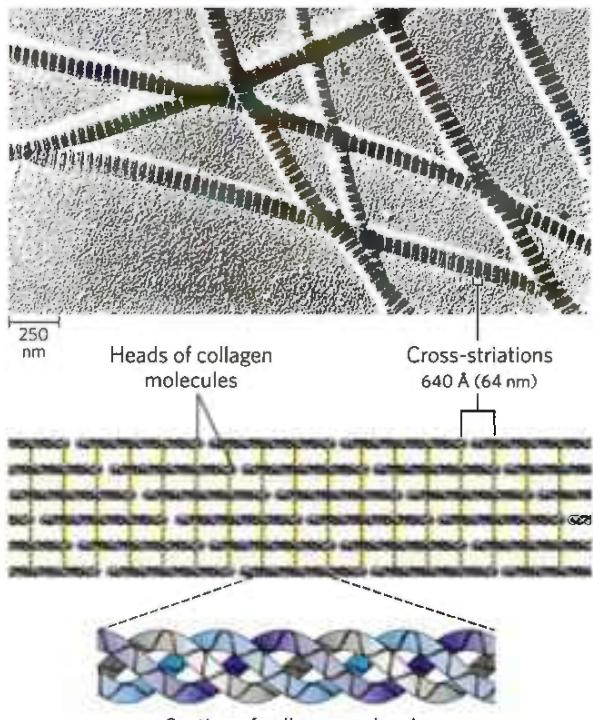  
FIGURE 4-12 Structure of collagen fibrils. Collagen ( $M_{f}$ 300,000) is a rod-shaped molecule, about 3,000 Å long and only 15 Å thick. Its three helically intertwined $\alpha$ chains may have different sequences; each chain has about 1,000 amino acid residues. Collagen fibrils are made up of collagen molecules aligned in a staggered fashion and cross-linked for strength. The specific alignment and degree of cross-linking vary with the tissue and produce characteristic cross-striations in an electron micrograph. In the example shown here, alignment of the head groups of every fourth molecule produces striations 640 Å (64 nm) apart. [J. Gross/Biozentrum, University of Basel/Science Source.]

The tight wrapping of the $\alpha$ chains in the collagen triple helix provides tensile strength greater than that of a steel wire of equal cross section. Collagen fibrils (Fig. 4-12) are supramolecular assemblies consisting of triple-helical collagen molecules (sometimes referred to as tropocollagen molecules) associated in a variety of ways to provide different degrees of tensile strength. The $\alpha$ chains of collagen molecules and the collagen molecules of fibrils are cross-linked by unusual types of covalent bonds involving Lys, HyLys (5-hydroxylysine), or His residues that are present at a few of the X and Y positions. These links create uncommon amino acid residues such as dehydrohydroxylysinonorleucine. The increasingly rigid and brittle character of aging connective tissue results from accumulated covalent cross-links in collagen fibrils.

  
Dehydrohydroxylysinonorleucine

A typical mammal has more than 30 structural variants of collagen, particular to certain tissues and each somewhat different in sequence and function. Some human genetic defects in collagen structure illustrate the close relationship between amino acid sequence and three-dimensional structure in this protein. Osteogenesis imperfecta is characterized by abnormal bone formation in babies; at least eight variants of this condition, with different degrees of severity, occur in the human population. Ehlers-Danlos syndrome is characterized by loose joints, and at least six variants occur in humans. The composer Niccolò Paganini (1782–1840) was famed for his seemingly impossible dexterity in playing the violin. He suffered from a variant of Ehlers-Danlos syndrome that rendered him effectively double-jointed. In both disorders, some variants can be lethal, whereas others cause lifelong problems.

All of the variants of both conditions result from the substitution of an amino acid residue with a larger R group (such as Cys or Ser) for a single Gly residue in an $\alpha$ chain in one or another of the collagen proteins (a different Gly residue in each disorder). These single-residue substitutions have a catastrophic effect on collagen function because they disrupt the Gly-X-Y repeat that gives collagen its unique helical structure. Given its role in the collagen triple helix (Fig. 4-11), Gly cannot be replaced by another amino acid residue without substantial deleterious effects on collagen structure.

Fibroin The protein of silk, fibroin, is produced by insects and spiders. Its polypeptide chains are predominantly in the $\beta$ conformation. Fibroin is rich in Ala and Gly residues, permitting a close packing of $\beta$ sheets and an interlocking arrangement of R groups (Fig. 4-13). The overall structure is stabilized by extensive hydrogen bonding between all peptide linkages in the polypeptides of each $\beta$ sheet and by the optimization of van der Waals interactions between sheets. Silk does not stretch, because the $\beta$ conformation is already highly extended (Fig. 4-5). However, the structure is flexible, because the sheets are held together by numerous weak interactions rather than by covalent bonds such as the disulfide bonds in $\alpha$ -keratins.

#### [EN] Structural Diversity Reflects Functional Diversity in Globular Proteins

In a globular protein, different segments of the polypeptide chain (or multiple polypeptide chains) fold back on each other, generating a more compact shape than is seen in the fibrous proteins (Fig. 4-14). The folding also provides the structural diversity necessary for proteins to carry out a wide array of biological functions. Globular proteins include enzymes, transport proteins, motor proteins, regulatory proteins, immunoglobulins, and proteins with many other functions.

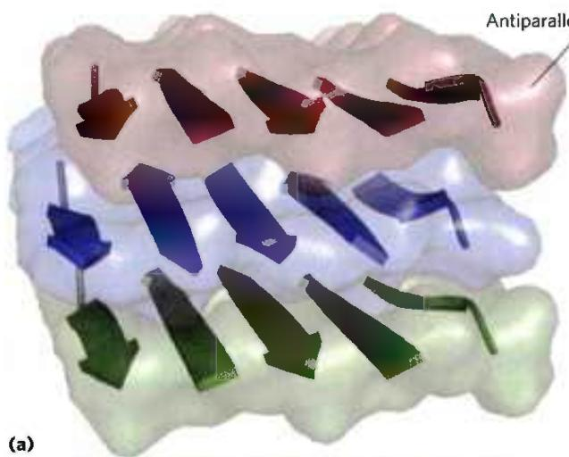

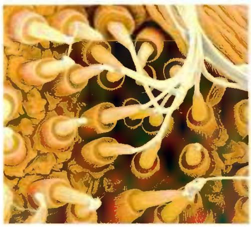

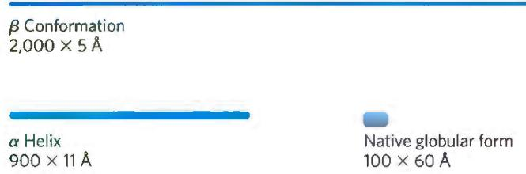  
FIGURE 4-14 Globular protein structures are compact and varied. Human serum albumin ( $M_{f}$ 64, 500) has 585 residues in a single chain. Given here are the approximate dimensions its single polypeptide chain would have if it occurred entirely in extended $\beta$ conformation or as an $\alpha$ helix. Also shown is the size of the protein in its native globular form, as determined by x-ray crystallography; the polypeptide chain must be very compactly folded to fit into these dimensions.

Our discussion of globular proteins begins with the principles gleaned from the first protein structures to be elucidated. This is followed by a detailed description of protein substructure and comparative categorization. Such discussions are possible only because of the vast amount of information available online from publicly accessible databases, particularly the Protein Data Bank, or PDB (Box 4-3).

  
FIGURE 4-13 Structure of silk. The fibers in silk cloth and in a spider web are made up primarily of the protein fibroin. (a) Fibroin consists of layers of antiparallel $\beta$ sheets rich in Ala and Gly residues. The small side chains interdigitate and allow close packing of the sheets, as shown in the ball-and-stick view. The segments shown here would be just a small part of the fibroin strand. (b) Strands of silk emerge from the spinnerets of a spider in this colorized scanning electron micrograph. [(a) Data from PDB ID 1SLK, S. A. Fossey et al., Biopolymers 31:1529, 1991. (b) Tina Weatherby Carvalho/MicroAngela.]

#### [EN] Myoglobin Provided Early Clues about the Complexity of Globular Protein Structure

The first breakthrough in understanding the three-dimensional structure of a globular protein came from x-ray diffraction studies of myoglobin carried out by John Kendrew and his colleagues in the 1950s. Myoglobin is a relatively small ( $M_{r}$ , 16,700), oxygen-binding protein of muscle cells. It functions both to store oxygen and to facilitate oxygen diffusion in rapidly contracting muscle tissue. Myoglobin contains a single polypeptide chain of 153 amino acid residues of known sequence and a single iron protoporphyrin, or heme, group. The same heme group that is found in myoglobin is found in hemoglobin, the oxygen-binding protein of erythrocytes, and is responsible for the deep red-brown color of both myoglobin and hemoglobin. Myoglobin is particularly abundant in the muscles of diving mammals such as whales, seals, and porpoises—so abundant that the muscles of these animals are brown. Storage and distribution of oxygen by muscle myoglobin permits diving mammals to remain submerged for long periods. The activities of myoglobin and other globin molecules are investigated in greater detail in Chapter 5.

#### [EN] The Protein Data Bank

The number of known three-dimensional protein structures is now more than 100,000 and doubles every couple of years. This wealth of information is revolutionizing our understanding of protein structure, the relationship of structure to function, and the evolutionary paths by which proteins arrived at their present state, which can be seen in the family resemblances that come to light as protein databases are sifted and sorted. One of the most important resources available to biochemists is the Protein Data Bank (PDB; www.rcsb.org).

The PDB is an archive of experimentally determined three-dimensional structures of biological macromolecules, containing virtually all of the macromolecular structures (such as proteins, RNAs, and DNAs) elucidated to date. Each structure is assigned an identifying label (a four-character

Figure 4-15 shows several structural representations of myoglobin, illustrating how the polypeptide chain is folded in three dimensions—its tertiary structure. The red group surrounded by protein is heme. The backbone of the myoglobin molecule consists of eight relatively straight segments of $\alpha$ helix interrupted by bends, some of which are $\beta$ turns. The longest $\alpha$ helix has 23 amino acid residues and the shortest has only 7; all helices are right-handed. More than 70% of the residues in myoglobin are in these $\alpha$ -helical regions. X-ray analysis has revealed the precise position of each of the R groups, which fill up nearly all the space within the folded chain that is not occupied by backbone atoms.

Many important conclusions were drawn from the structure of myoglobin. The positioning of amino acid side chains reflects a structure that is largely stabilized identifier called the PDB ID). Such labels are provided in the figure legends for every PDB-derived structure illustrated in this text so that students and instructors can explore the same structures on their own. The data files in the PDB describe the spatial coordinates of each atom for which the position has been determined (many of the cataloged structures are not complete). Additional data files provide information on how the structure was determined and its accuracy. The atomic coordinates can be converted into an image of the macromolecule by using structure visualization software. Students are encouraged to access the PDB and explore structures, using visualization software linked to the database. Macromolecular structure files can also be downloaded and explored on the desktop, using free software such as JSmol.

  
(a)

  
(b)  
FIGURE 4-15 Tertiary structure of sperm whale myoglobin. Orientation of the protein is similar in (a) through (d); the heme group is shown in red. In addition to illustrating the myoglobin structure, this figure provides examples of several different ways to display protein structure. (a) The polypeptide backbone in a ribbon representation of a type introduced by Jane Richardson, which highlights regions of secondary structure. The $\alpha$ -helical regions are evident. (b) Surface contour image; this is useful

by the hydrophobic effect. Most of the hydrophobic R groups are in the interior of the molecule, hidden from exposure to water. All but two of the polar R groups are located on the outer surface of the molecule, and all are hydrated. The myoglobin molecule is so compact that its interior has room for only four molecules of water. This dense hydrophobic core is typical of globular proteins. The fraction of space occupied by atoms in an organic liquid is 0.4 to 0.6. In a globular protein the fraction is about 0.75, comparable to that in a crystal (in a typical crystal the fraction is 0.70 to 0.78, near the theoretical maximum). In this packed environment, weak interactions strengthen and reinforce each other. For example, the nonpolar side chains in the core are so close together that short-range van der Waals interactions make a significant contribution to stabilizing interactions.

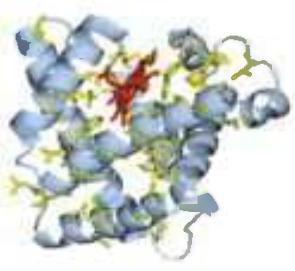  
(c)

  
(d)

for visualizing pockets in the protein where other molecules might bind. (c) Ribbon representation including side chains (yellow) for the hydrophobic residues Leu, Ile, Val, and Phe. (d) Space-filling model with all amino acid side chains. Each atom is represented by a sphere encompassing its van der Waals radius. The hydrophobic residues are again shown in yellow; most are buried in the interior of the protein and thus are not visible. [Data from PDB ID 1MBO, S. E. Phillips, J. Mol. Biol. 142:531, 1980.]  

Deduction of the structure of myoglobin confirmed some expectations and introduced some new elements of secondary structure. As predicted by Pauling and Corey, all the peptide bonds are in the planar trans configuration. The $\alpha$ helices in myoglobin provided the first direct experimental evidence for the existence of this type of secondary structure. Three of the four Pro residues are found at bends. The fourth Pro residue occurs within an $\alpha$ helix, where it creates a kink necessary for tight helix packing.

The flat heme group rests in a crevice, or pocket, in the myoglobin molecule. Within this pocket, the accessibility of the heme group to solvent is highly restricted. This is important for function, because free heme groups in an oxygenated solution are rapidly oxidized from the ferrous $\left(\mathrm{Fe}^{2+}\right)$ form, which is active in the reversible binding of $O_{2}$ , to the ferric $\left(\mathrm{Fe}^{3+}\right)$ form, which does not bind $O_{2}$ . As myoglobin structures from many different species were resolved, investigators were able to observe the structural changes that accompany the binding of oxygen or other molecules and thus, for the first time, to understand the correlation between protein structure and function. Hundreds of proteins have now been subjected to similar analysis.

#### [EN] Globular Proteins Have a Variety of Tertiary Structures

Myoglobin illustrates just one of many ways in which a polypeptide chain can fold. Table 4-3 shows the proportions of $\alpha$ helix and $\beta$ conformation (expressed as percentage of residues in each type) in several small, single-chain, globular proteins. Each of these proteins has a distinct structure, adapted for its particular biological function, but together they share several important properties with myoglobin. P1 Each is folded compactly, and in each case the hydrophobic amino acid side chains are oriented toward the interior (away from water) and the hydrophilic side chains are on the surface. The structures are also stabilized by a multitude of hydrogen bonds and some ionic interactions.

TABLE 4-3 Approximate Proportion of α Helix and β Conformation in Some Single-Chain Proteins

<table><tr><td rowspan="2">Protein (total residues)</td><td colspan="2">Residues (%)a</td></tr><tr><td>α Helix</td><td>β Conformation</td></tr><tr><td>Chymotrypsin (247)</td><td>14</td><td>45</td></tr><tr><td>Ribonuclease (124)</td><td>26</td><td>35</td></tr><tr><td>Carboxypeptidase (307)</td><td>38</td><td>17</td></tr><tr><td>Cytochrome c (104)</td><td>39</td><td>0</td></tr><tr><td>Lysozyme (129)</td><td>40</td><td>12</td></tr><tr><td>Myoglobin (153)</td><td>78</td><td>0</td></tr></table>

Source: Data from C. R. Cantor and P. R. Schimmel, Biophysical Chemistry, Part I: The Conformation of Biological Macromolecules, p. 100, W. H. Freeman and Company, 1980.  
$^{a}$ Portions of the polypeptide chains not accounted for by $\alpha$ helix or $\beta$ conformation consist of bends and irregularly coiled or extended stretches. Segments of $\alpha$ helix and $\beta$ conformation sometimes deviate slightly from their normal dimensions and geometry.

To understand a complete three-dimensional structure, we need to analyze its folding patterns. We begin by defining two important terms that describe protein structural patterns or elements in a polypeptide chain; then we turn to the folding rules. The first term is motif, also called a fold. P3 A motif or fold is a recognizable folding pattern involving two or more elements of secondary structure and the connection(s) between them. A motif can be very simple, such as two elements of secondary structure folded against each other, and may represent only a small part of a protein. An example is a $\beta$ - $\alpha$ - $\beta$ loop (Fig. 4-16a). A motif can also be a very elaborate structure involving scores of protein segments folded together, such as the $\beta$ barrel (Fig. 4-16b). In some cases, a single large motif may comprise the entire protein. The terms "motif" and "fold" are often used interchangeably, although "fold" is applied more commonly to somewhat more complex folding patterns. The segment defined as a motif or a fold may or may not be independently stable. We have already encountered a well-studied motif, the coiled coil of $\alpha$ -keratin, which is also found in some other proteins. The distinctive arrangement of eight $\alpha$ helices in myoglobin is replicated in all globins and is called the globin fold. Note that a motif is not a hierarchical structural element falling between secondary and tertiary structure. It is simply a folding pattern.

The second term for describing structural patterns is domain. A domain, as defined by Jane Richardson in 1981, is a part of a polypeptide chain that is independently stable or could undergo movements as a single entity with respect to the entire protein. Polypeptides with more than a few hundred amino acid residues often fold into two or more domains, sometimes with different functions. In many cases, a domain from a large protein will retain its native three-dimensional structure even when separated (for example, by proteolytic cleavage) from the remainder of the polypeptide chain. In a protein with multiple domains, each domain may appear as a distinct globular lobe (Fig. 4-17); more commonly, extensive contacts between domains make individual domains hard to discern. Different domains often have distinct functions, such as the binding of small molecules or interaction with other proteins. Small proteins usually have only one domain (the domain is the protein).

  
FIGURE 4-16 Motifs. (a) A simple motif, the $\beta$ - $\alpha$ - $\beta$ loop. (b) A more elaborate motif, the $\beta$ barrel. This $\beta$ barrel is a single domain of $\alpha$ -hemolysin (a toxin that kills a cell by creating a hole in its membrane) from the bacterium Staphylococcus aureus. [Data from (a) PDB ID 4TIM, M. E. Noble et al., J. Med. Chem., 34:2709, 1991; (b) PDB ID 7AHL, L. Song et al., Science 274:1859, 1996.]

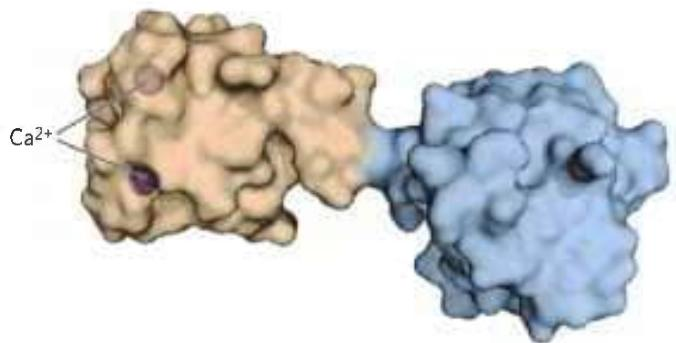  
FIGURE 4-17 Structural domains in the polypeptide troponin C. This calcium-binding protein, associated with muscle, has two separate calcium-binding domains, shown here in brown and blue. [Data from PDB ID 4TNC, K. A. Satyshur et al., J. Biol. Chem. 263:1628, 1988.]

Folding of polypeptides is subject to an array of physical and chemical constraints, and several rules have emerged from studies of common protein-folding patterns.

1. The hydrophobic effect makes a large contribution to the stability of protein structures. Burial of hydrophobic amino acid R groups so as to exclude water requires at least two layers of secondary structure. Simple motifs such as the $\beta-\alpha-\beta$ loop (Fig. 4-16a) create two such layers.

2. Where they occur together in a protein, $\alpha$ helices and $\beta$ sheets generally are found in different structural layers. This is because the backbone of a polypeptide segment in the $\beta$ conformation (Fig. 4-5) cannot readily hydrogen-bond to an $\alpha$ helix that is adjacent to it.

3. Segments adjacent to each other in the amino acid sequence are usually stacked adjacent to each other in the folded structure. Distant segments of a polypeptide may come together in the tertiary structure, but this is not the norm.

4. The $\beta$ conformation is most stable when the individual segments are twisted slightly in a right-handed sense. This influences both the arrangement of $\beta$ sheets derived from the twisted segments and the path of the polypeptide connections between them. Two parallel $\beta$ strands, for example, must be connected by a crossover strand (Fig. 4-18a). In principle, this crossover could have a right-handed or left-handed conformation, but in proteins it is almost always right-handed. Right-handed connections tend to be shorter than left-handed connections and tend to bend through smaller angles, making them easier to form. The twisting of $\beta$ sheets also leads to a characteristic twisting of the structure formed by many such segments together, as seen in the $\beta$ barrel (Fig. 4-16b) and the twisted $\beta$ sheet (Fig. 4-18c), which form the core of many larger structures.

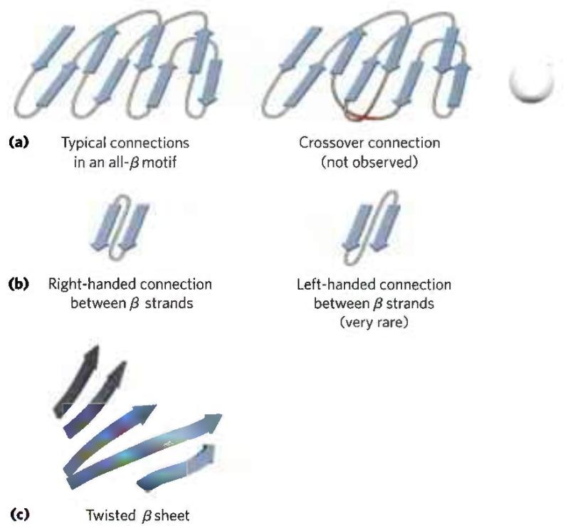  
FIGURE 4-18 Stable folding patterns in proteins. (a) Connections between $\beta$ strands in layered $\beta$ sheets. The strands here are viewed from one end, with no twisting. The connections at a given end (e.g., near the viewer) rarely cross one another. An example of such a rare crossover is illustrated by the red strands in the structure on the right. (b) Because of the right-handed twist in $\beta$ strands, connections between strands are generally right-handed. Left-handed connections must traverse sharper angles and are harder to form. (c) This twisted $\beta$ sheet is from a domain of photolyase (a protein that repairs certain types of DNA damage) from $E.$ coli. Connecting loops have been removed so as to focus on the folding of the $\beta$ sheet. [Data from PDB ID 1DNP, H.W. Park et al., Science 268:1866, 1995.]

Following these rules, complex motifs can be built up from simple ones. For example, a series of $\beta-\alpha-\beta$ loops arranged so that the $\beta$ strands form a barrel creates a particularly stable and common motif, the $\alpha/\beta$ barrel (Fig. 4-19). In this structure, each parallel $\beta$ segment is attached to its neighbor by an $\alpha$ -helical segment. All connections are right-handed. The $\alpha/\beta$ barrel is found in many enzymes, often with a binding site (for a cofactor or a substrate) in the form of a pocket near one end of the barrel. Note that domains with similar folding patterns are said to have the same motif, even though their constituent $\alpha$ helices and $\beta$ sheets may differ in length.

  
FIGURE 4-19 Constructing large motifs from smaller ones. The $\alpha/\beta$ barrel is a commonly occurring motif constructed from repetitions of the $\beta$ - $\alpha$ - $\beta$ loop motif. This $\alpha/\beta$ barrel is a domain of pyruvate kinase (a glycolytic enzyme) from rabbit. [Data from PDB ID 1PKN, T. M. Larsen et al., Biochemistry 33:6301, 1994.]

#### [EN] Some Proteins or Protein Segments Are Intrinsically Disordered

Although many proteins contain well-folded and stable structures, this is not necessary for the biological function of all proteins. Many proteins or protein segments lack ordered structures in solution. The concept that some proteins function in the absence of a definable three-dimensional structure comes from reassessment of data from many different proteins. As many as a third of all human proteins may be unstructured or may have significant unstructured segments. All organisms have some proteins that fall into this category. Intrinsically disordered proteins have properties that are distinct from those of classical, structured proteins. They often lack a hydrophobic core and instead are characterized by high densities of charged amino acid residues such as Lys, Arg, and Glu. Pro residues are also prominent, as they tend to disrupt ordered structures.

Structural disorder and high charge density can facilitate the function of some proteins as spacers, insulators, or linkers in larger structures. Other disordered proteins are scavengers, binding up ions and small molecules in solution and serving as reservoirs or garbage dumps. However, many intrinsically disordered proteins are at the heart of important protein interaction networks. The lack of an ordered structure can facilitate a kind of functional promiscuity, allowing one protein to interact with multiple or even dozens of partners. Structural disorder allows some inhibitor proteins, such as the mammalian cell division protein p27, to interact with multiple targets in different ways. In solution, p27 lacks definable structure. However, it wraps around and inhibits the action of several enzymes called protein kinases (see Chapter 6) that facilitate cell division. The flexible structure of p27 allows it to accommodate itself to its different target proteins. Human tumor cells, which are cells that have lost the capacity to control cell division normally, generally have reduced levels of p27; the lower the levels of p27, the poorer the prognosis for the cancer patient.

Similarly, intrinsically disordered proteins are often present as hubs or scaffolds at the center of protein networks that constitute signaling pathways (see Fig. 12-30). These proteins, or parts of them, may interact with many different binding partners. They often take on an ordered structure when they interact with other proteins, but the structure they assume may vary with different binding partners. The mammalian protein p53 is also critical in the control of cell division. It contains both structured and unstructured segments, and the different segments interact with dozens of other proteins. An unstructured region of p53 at the carboxyl terminus interacts with at least four different binding partners and assumes a different structure in each of the complexes (Fig. 4-20).

#### [EN] Protein Motifs Are the Basis for Protein Structural Classification

More than 150,000 structures are now archived in the Protein Data Bank (PDB; for a deeper explanation, see Box 4-3). An enormous amount of information about protein structural principles, protein function, and protein evolution is contained in these data. Other databases have organized this information and made it more readily accessible. In the Structural Classification of Proteins database, or SCOP2 (http://scop2.mrc-lmb.cam.ac.uk), all of the protein information in the PDB can be searched within four different categories: (1) protein relationships, (2) structural classes, (3) protein types, and (4) evolutionary events. Figure 4-21 presents examples of protein motifs taken from SCOP2 to illustrate the potential of searching within each category. The figure also introduces another way to represent elements of secondary structure and the relationships among segments of secondary structure in a protein—the topology diagram.

The number of folding patterns is not infinite. Among the tens of thousands of distinct protein structures archived in the PDB, only about 1,400 different folds or motifs are classified by the SCOP2 database. Given the many years of progress in structural biology, new motifs are now discovered only rarely. Many examples of recurring domain or motif structures are available, and these reveal that protein tertiary structure is more reliably conserved than amino acid sequence. The comparison of protein structures can thus provide much information about evolution. Proteins with significant similarity in primary structure and/or with similar tertiary structure and function are said to be in the same protein family. The protein structures in the PDB belong to about 4,000 different protein families. A strong evolutionary relationship is usually evident within a protein family. For example, the globin family has many different proteins with both structural and sequence similarities to myoglobin (as seen in the proteins used as examples in Figures 4-30 and 4-31 and in Chapter 5). Two or more families that have little similarity in amino acid sequence but make use of the same major structural motif and have functional similarities are grouped into superfamilies. An evolutionary relationship among families in a superfamily is considered probable, even though time and functional distinctions—that is, different adaptive pressures—may have erased many of the telltale sequence relationships.

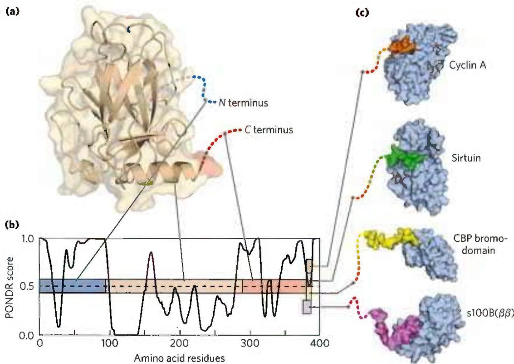  
FIGURE 4-20 Binding of the intrinsically disordered carboxyl terminus of p53 protein to its binding partners. (a) The p53 protein is made up of several different segments. Only the central domain is well ordered. (b) The linear sequence of the p53 protein is depicted as a colored bar. The overlaid graph presents a plot of the PONDR (Predictor of Natural Disordered Regions) score versus the protein sequence. PONDR is one of the best available algorithms for predicting the likelihood that a given amino acid residue is in a region of intrinsic disorder, based on the surrounding amino acid sequence and amino acid composition. A score of 1.0 indicates a probability of $100\%$ that a protein will be disordered. In the actual protein structure, the tan central domain is ordered.  
The amino-terminal (blue) and carboxyl-terminal (red) regions are disordered. (c) The very end of the carboxyl-terminal region has multiple binding partners and folds when it binds to each of them; however, the three-dimensional structure that is assumed when binding occurs is different for each of the interactions shown, and thus this carboxyl-terminal segment (11 to 20 residues) is shown in a different color in each complex. [Information from V. N. Uversky, Intl. J. Biochem. Cell Biol. 43:1090, 2011, Fig. S. (a) Data from PDB ID 1TUP, Y. Cho et al., Science 265:346, 1994. (c) Data from Cyclin A: PDB ID 1H26, E. D. Lowe et al., Biochemistry 41:15,625, 2002; sirtuin: PDB ID 1MA3, J. L. Avalos et al., Mol. Cell 10:523, 2002; CBP bromodomain: PDB ID 1JSP, S. Mujtaba et al., Mol. Cell 13:251, 2004; s100B(ββ): PDB ID 1DT7, R. R. Rustandi et al., Nature Struct. Biol. 7:570, 2000.]

A protein family may be widespread in all three domains of cellular life—the Bacteria, Archaea, and Eukarya—suggesting an ancient origin. Many proteins involved in intermediary metabolism and the metabolism of nucleic acids and proteins fall into this category. Other families may be present in only a small group of organisms, indicating that the structure arose more recently. Tracing the natural history of structural motifs through the use of structural classifications in databases such as SCOP2 provides a powerful complement to sequence analyses in tracing evolutionary relationships. The SCOP2 database is curated manually, with the objective of placing proteins in the correct evolutionary framework based on conserved structural features.

Structural motifs become especially important in defining protein families and superfamilies. Improved protein classification and comparison systems lead inevitably to the elucidation of new functional relationships. Given the central role of proteins in living systems, these structural comparisons can help illuminate every aspect of biochemistry, from the evolution of individual proteins to the evolutionary history of complete metabolic pathways.

#### [EN] Protein Quaternary Structures Range from Simple Dimers to Large Complexes

P3 Many proteins have multiple polypeptide subunits (from two to hundreds). The association of polypeptide chains can serve a variety of functions. Many multisubunit proteins have regulatory roles; the binding of small molecules may affect the interaction between subunits, causing large changes in the protein's activity in response to small changes in the concentration of substrate or regulatory molecules (Chapter 6). In other cases, separate subunits take on separate but related functions, such as catalysis and regulation. Some associations, such as those seen in the fibrous proteins considered earlier in this chapter and the coat proteins of viruses, serve primarily structural roles. Some very large protein assemblies are the site of complex, multistep reactions. For example, each ribosome, the site of protein synthesis, incorporates dozens of protein subunits along with RNA molecules.

(c)  
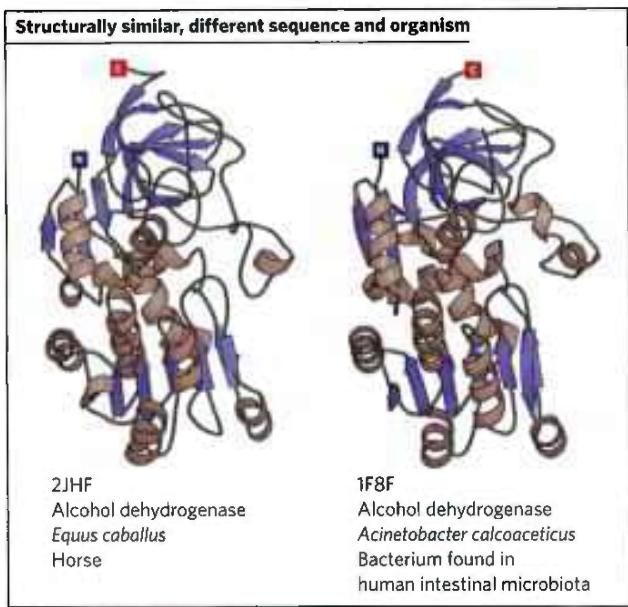  
2JHF
Alcohol dehydrogenase
Equus caballus
Horse  
1F8F
Alcohol dehydrogenase
Acinetobacter calcoaceticus
Bacterium found in
human intestinal microbiota

(a)  
  
1BCF
Ferritin-like
Bacterioferritin (cytochrome $b_{1}$ )
Escherichia coli  
1PEX
Four-bladed $\beta$ propeller
Collagenase-3 (MMP-13)
Human (Homo sapiens)

A multisubunit protein can also be referred to as an oligomer or multimer. If an oligomer has nonidentical subunits, the overall structure of the protein can be asymmetric and quite complicated. However, many oligomers have identical subunits or repeating groups of nonidentical subunits, usually in symmetric arrangements. As noted in Chapter 3, the repeating structural unit in such an oligomeric protein, whether a single subunit or a group of subunits, is called a protomer.

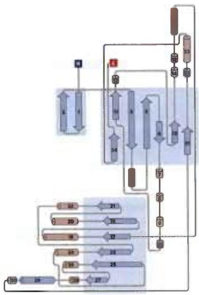  
FIGURE 4-21 Organization of proteins based on motifs. A few of the hundreds of known stable motifs. (a) Structural diagrams of the enzyme alcohol dehydrogenase from two different organisms. Such comparisons illustrate evolutionary relationships that conserve structure as well as function. (b) A topology diagram for the alcohol dehydrogenase from Acinetobacter calcoaceticus. Topology diagrams provide a way to visualize elements of secondary structure and their interconnections in two dimensions; the diagrams can be very useful in comparing structural folds or motifs. (c) The Structural Classification of Proteins (SCOP2) database (http://scop2.mrc-lmb.cam.ac.uk) organizes protein folds into four classes: all $\alpha$ , all $\beta, \alpha/\beta$ , and $\alpha + \beta$ . Examples of all $\alpha$ folds and all $\beta$ folds are shown with their structural classification data (PDB ID, fold name, protein name, and source organism) from the SCOP2 database. The PDB ID is the unique accession code given to each structure archived in the Protein Data Bank (www.rcsb.org). [Data from (a) PDB ID 2JHF, R. Meijers et al., Biochemistry 46:5446, 2007; (a, b) PDB ID 1F8F, J. C. Beauchamp et al. (c) PDB ID 18CF, F. Frolow et al., Nature Struct. Biol. 1:453, 1994; PDB ID 1PEX, F. X. Gomis-Ruth et al., J. Mol. Biol. 264:556, 1996.]

The first oligomeric protein to have its three-dimensional structure determined was hemoglobin ( $M_{r}$ 64,500), which contains four polypeptide chains and four heme prosthetic groups, in which the iron atoms are in the ferrous ( $Fe^{2+}$ ) state (as we shall see in Chapter 5). The protein portion, the globin, consists of two $\alpha$ chains (141 residues each) and two $\beta$ chains (146 residues each). Note that in this case, $\alpha$ and $\beta$ do not refer to secondary structures. In a practice that can be confusing to the beginning student, the Greek letters $\alpha$ and $\beta$ (and $\gamma,\delta$ , and others) are often used to distinguish two different kinds of subunits within a multisubunit protein, regardless of what kinds of secondary structure may predominate in the subunits. Because hemoglobin is four times as large as myoglobin, much more time and effort were required to solve its three-dimensional structure by x-ray analysis, finally achieved by Max Perutz, John Kendrew, and their colleagues in 1959. The subunits of hemoglobin are arranged in symmetric pairs (Fig. 4-22), each pair having one $\alpha$ subunit and one $\beta$ subunit.

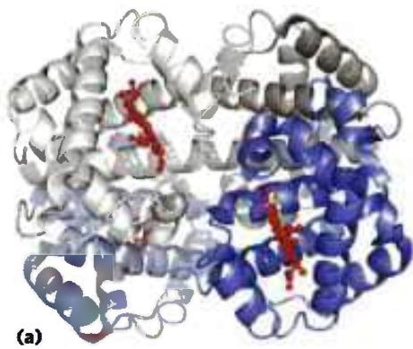  
FIGURE 4-22 Quaternary structure of deoxyhemoglobin. X-ray diffraction analysis of deoxyhemoglobin (hemoglobin without oxygen molecules bound to the heme groups) shows how the four polypeptide subunits are packed together. (a) A ribbon representation reveals the secondary structural elements of the structure and the positioning of all the heme prosthetic groups.

  
Max Perutz, 1914–2002 (left), and John Kendrew, 1917–1997 [Hulton Deutsch/Getty Images.]

Hemoglobin can therefore be described either as a tetramer or as a dimer of $\alpha\beta$ protomers. The role these distinct subunits play in hemoglobin function is discussed extensively in Chapter 5.

#### [EN] SUMMARY 4.3 Protein Tertiary and Quaternary Structures

■ Tertiary structure is the complete three-dimensional structure of a polypeptide chain. Many proteins fall into one of four general classes based on tertiary structure: fibrous, globular, membrane, or disordered.

■ Insoluble fibrous proteins, such as those that make up keratin, collagen, and silk, have simple repeating elements of secondary structure. In some fibrous proteins, the individual polypeptide chains interact to form complex quaternary structures like coiled coils for strength and flexibility.

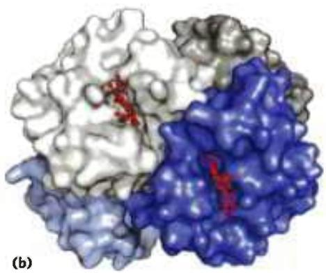  
(b) A surface contour model shows the pockets in which the heme prosthetic groups are bound and helps to visualize subunit packing. The $\alpha$ subunits are shown in shades of gray, the $\beta$ subunits in shades of blue. Note that the heme groups (red) are relatively far apart. [Data from PD8 ID 2HHB, G. Fermi et al., J. Mol. Biol. 175:159, 1984.]

■ Globular proteins have more complicated tertiary structures, often containing several types of secondary structure in the same polypeptide chain, and fulfill many different functional roles in the cell.

The first globular protein structure to be determined, by x-ray diffraction methods, was that of the $\mathrm{O}_2$ -binding protein myoglobin. The myoglobin structure revealed for the first time how protein structure and function are connected.

The complex structures of globular proteins can be analyzed by examination of folding patterns, called motifs or folds. The many thousands of known protein structures are generally assembled from a repertoire of only a few hundred motifs. Domains are regions of a polypeptide chain that can fold stably and independently.

■ Some proteins or protein segments are intrinsically disordered, lacking definable three-dimensional structure. These proteins often have distinctive amino acid compositions that allow a more flexible structure, which is critical for their biological function.

■ Based on structural similarities, proteins can be organized into families and superfamilies, which are informative about protein function and evolution.

■ Quaternary structure results from interactions between the subunits of multisubunit (multimeric) proteins or large supramolecular assemblies. Some multimeric proteins are composed of repeated subunits called protomers.

<!-- EN-END 4.3 -->

## 七、膜蛋白的结构

已知膜的脂双层是所有生物膜的结构基础,而膜蛋白几乎负责膜的全部活性功能(参见第10和14章)。膜蛋白在外形上不同于纤维状蛋白质,也不同于球状蛋白质,三维结构上也有它们自己的特点。根据Singer和Nicolson的建议,大多数膜蛋白可以分为膜周边(外周)蛋白质和膜内在蛋白质两类。膜周边蛋白[质](peripheral protein),实际上是属于可溶性球状蛋白质,它们分布在膜脂双层的表面,主要是通过与膜内在蛋白质的静电相互作用和氢键键合相互作用与膜结合,这类膜蛋白在这里不作进一步讨论。膜内在蛋白[质](integral protein)或称整合[膜]蛋白,是通过疏水相互作用与脂双层强力缔合的膜蛋白,它们中有一部分或大部分埋入脂双层,有的横跨(横穿)脂双层。还有一类膜蛋白是Singer和Nicolson未曾提出的,称为脂锚定蛋白质(lipid-anchored protein),它们在不同细胞和组织的多种功能中起着重要作用。这些蛋白质与膜的缔合是通过各种共价连接的脂锚钩或脂锚(lipid anchor)实现的。

## （一）膜内在蛋白质

膜内在蛋白大体可分为两种类型。第一种类型是通过一段小的疏水肽链锚定在膜上，蛋白质的大部分位于膜的一侧或两侧并伸展于水环境中。第二种类型则外形近似球状，大部分蛋白质埋在膜中，只有很小的表面在膜外暴露于溶剂水中。一般说，脂双层疏水核心的膜内在蛋白是由 $\alpha$ 螺旋或 $\beta$ 折叠片构成的。

## 1. 具有单跨膜肽段的膜蛋白

这是第一种类型的膜内在蛋白。跨膜的疏水肽段经常是一个 $\alpha$ 螺旋棒，亲水序列伸向细胞溶胶或（和）胞外液。这类膜蛋白的最好例子之一是血型糖蛋白。血型糖蛋白A(glycophorin A)分子的大部分定位在红细胞的外表面，暴露于水环境中(图3-46)。此胞外结构域有许多亲水的寡糖基与之相连。这些寡糖基构成红细胞的ABO和Lewis血型抗原特异性(参见表9-4)。血型糖蛋白A的 $M_{\mathrm{r}}$ 为31000，蛋白质约占 $40\%$ ，糖类 $60\%$ 。蛋白质部分是一条含131个氨基酸残基的多肽链；该多肽链含有一个以疏水残基为主的19-肽段，它卷曲成一个 $\alpha$ 螺旋棒，正好等于跨膜的长度。N端侧是长的亲水序列，即胞外结构域，C端侧是较短的亲水序列，处于细胞溶胶中。此外称为主要组织相容性复合体(MHC)也是具有单跨膜螺旋段的膜结合蛋白(见图4-23)。

  
图 3-46 人血型糖蛋白 A 的一级结构和跨膜分布  
多肽链中的残基黑色的(R,K和H)代表带正电荷,浅黑色的(D和E)带负  
电荷，灰色的是亲水残基，白色的是疏水残基

10%\~30%的跨膜蛋白具有单螺旋跨膜段。在动物中，许多这样的蛋白质起胞外信号分子的细胞表面受体作用或作为免疫系统识别和区分宿主生物和外来入侵细胞或病毒的识别位点。代表小鼠中主要移植抗原 $H_{2}$ 的和人体中白细胞相关蛋白的蛋白质也是这类成员。属于这一类的还有人白细胞相关蛋白、B淋巴细胞上的表面免疫球蛋白受体以及许多膜病毒的刺突蛋白（spike protein）。它们的功能主要决定于胞外结构域，并因此胞内亲水序列经常是较短的。

## 2. 具有 7 个跨膜肽段的膜蛋白

这是第二种类型的膜内在蛋白。一条多肽链来回跨膜折叠，形成一个由多个经常是7个α螺旋段反

平行装配的球状膜蛋白。相邻的 $\alpha$ 螺旋段之间由铰链区（回环）连接，如[细菌]紫膜质（bacteriorhodopsin；图3-47），它成簇地存在于盐细菌（H. halobium）膜的小紫片中。细菌紫膜质（也称细菌视紫红质）是一种7次跨膜螺旋段膜蛋白，主体部分埋于膜的脂双层中，只有两小段伸向膜两侧的水环境。N端在胞外侧，C端在胞质侧。细菌视紫红质是由一条247个残基的多肽链和一个视黄醛(retinal，见第13章)分子组成。它具有光驱动的跨膜质子泵的功能（见第23章“盐细菌的光合磷酸化”部分）。质膜上起钾钠泵作用的ATP酶（含8至10个跨膜螺旋段），大肠杆菌的乳糖通道（含 $10\sim 14$ 个跨膜螺旋）等都属于这类膜蛋白。

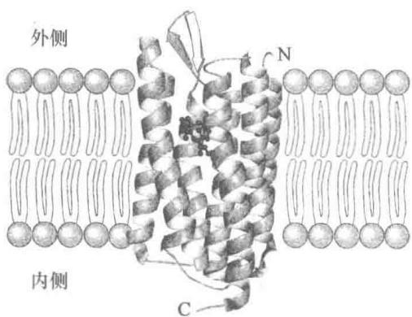  
图 3-47 细菌紫膜质的三维模型

## 3. $\beta$ 桶型膜蛋白——孔蛋白

这也是第二种类型的膜内在蛋白。在革兰氏阴性细菌的

外膜中以及真核细胞的线粒体外膜中发现的[膜]孔蛋白(参见图3-42D)都是以大 $\beta$ 折叠片形式横跨膜的。这类蛋白最好的例子是麦芽糖孔蛋白(maltoporin)也称LamB蛋白或lambda受体，它参与麦芽糖和麦芽糖糊精进入大肠杆菌(E.coli)。孔蛋白的活性形式是一个三聚体。含421个残基的单体是一个精致美观的18股反平行 $\beta$ 桶。相邻 $\beta$ 股之间通过长的回环或 $\beta$ 转角连接。

长回环发现于胞外侧的 $\beta$ 桶边， $\beta$ 转角位于朝向胞内侧的桶边。3个回环折叠进入桶的中央。此 $\beta$ 桶摊开后的二维拓扑图案如图3-48所示，它相当于球状蛋白质中的上下型反平行 $\beta$ 桶（图3-42C）。不同的是，对孔蛋白 $\beta$ 桶来说，其亲水侧链面向桶中央孔道（空腔），疏水侧链分布在桶的外侧，在这里与膜的疏水脂烃链相互作用。膜孔蛋白通道的最小直径为 $0.5\mathrm{nm}$ 。因此麦芽糖糊精（含3个或更多个葡萄糖单位的寡糖）能通过麦芽糖孔蛋白。

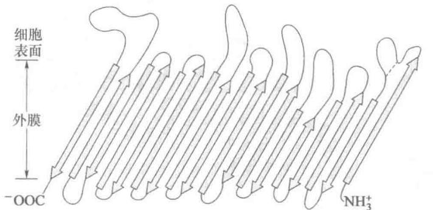  
图 3-48 大肠杆菌麦芽糖膜孔蛋白(属于全 $\beta$ 类)中肽链的排列

## （二）脂锚定膜蛋白质

有的膜内在蛋白质本身并没有进入膜内，它们以共价键与脂质如脂酰链或异戊烯基相结合并通过它们的疏水部分（脂质部分称脂锚钩）插入膜内。因此这部分膜内在蛋白质也可以称之为脂锚定膜蛋白质。蛋白质既可以在胞质一侧锚定，也可以在非胞质一侧锚定。脂锚定膜蛋白质中许多并不是固定的膜内在蛋白质，它们有时存在于细胞溶胶，有时处于跟膜结合之中。因此脂锚定膜蛋白质也称为兼在膜蛋白质（amphotropic protein）。一般说，兼在蛋白质与膜的可逆结合是受到调节的（见第10章）。

脂锚钩有一个重要性质是它的暂时性。它能可逆地与蛋白质连接和脱离。这为改变蛋白质对膜的亲和性提供了一个“转换装置”。可逆性的膜锚定是真核细胞中控制信号传导途径的一个因素（见第14章信号传递部分）。

至今已发现4种类型的脂锚定结构。它们是酰胺-连接豆蔻酰锚钩、硫酯-连接脂肪酰锚钩、硫醚-连接异戊二烯基锚钩和酰胺-连接糖基磷脂酰肌醇锚钩（图3-49）。这些锚钩结构的每一种都被多种膜蛋白所利用，但它们都有自己的连接要求，包括专一酶的参与等。

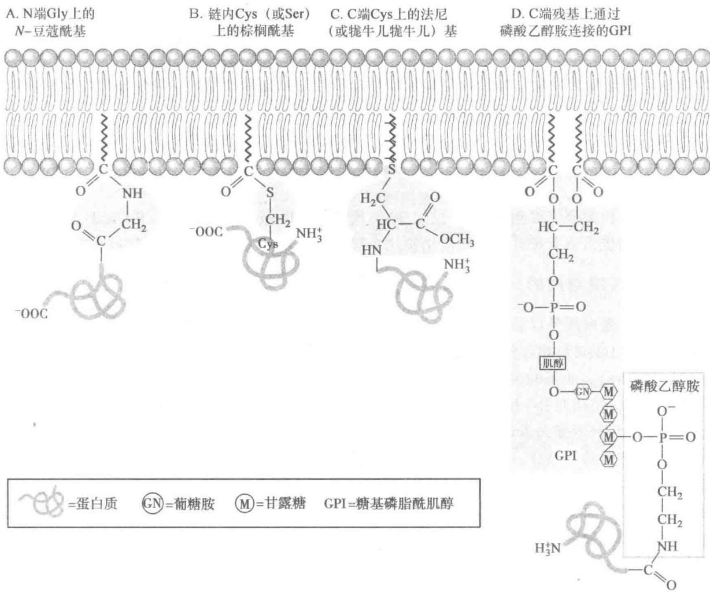  
图 3-49 脂锚定膜蛋白中蛋白质部分与脂质分子的连接

## 1. 酰胺连接的豆蔻酰基锚钩

豆蔻酸可以通过酰胺键与被选蛋白(靶蛋白)的N端甘氨酸残基的 $\alpha-$ 氨基连接(图3-49A)。此反应称为N-豆蔻酰化(N-myristoylation)，它由N-豆蔻酰基转移酶(简称NMT)催化。靶蛋白通过此豆蔻酸的脂酰基插入脂双层。N-豆蔻酰基锚定的蛋白质一般也含有疏水跨膜肽段；它们包括cAMP依赖型蛋白激酶(cAMP-dependent protein kinase)的催化亚基、G蛋白 $\alpha$ 亚基(第14章)，某些反转录病毒(retrovirus)，包括AIDS的病原体HIV-1(人免疫缺陷病毒-1)的gag蛋白，如p24、p9和p7等(图3-55)。

## 2. 硫酯连接的脂肪酰基锚钩

各种细胞蛋白质和病毒蛋白质含有通过酯键与多肽链的 Cys 残基侧链（有时与 Ser 或 Thr 残基侧链）共价连接的脂肪酸（图 3-49B）。这些脂肪酸包括豆蔻酸、棕榈酸、硬脂酸和油酸等。通过脂肪酰硫酯键锚定于膜的蛋白质有 G 蛋白偶联受体（第 14 章），几种病毒的表面糖蛋白和转铁蛋白受体。

## 3. 硫醚连接的异戊二烯基锚钩

作为锚钩的聚异戊二烯基(萜类)有法尼基(farnesyl)和牻牛儿牻牛儿基(geranylgeranyl)(图3-49C)。前者是一个倍半萜( $C_{15}$ )，后者是一个双萜( $C_{20}$ )，由两个牻牛儿基(单萜 $C_{10}$ )组成(见图10-24)。异戊二烯基加入一般发生在靶蛋白 C 端 CAAX 序列的 Cys 残基上, 这里 C 是 Cys, A 是任一脂肪族氨基酸残基, X 是任一氨基酸残基。发生异戊二烯化 (prenylation) 反应时, 一个专一蛋白酶断去 3 个 C 端残基 (AAX), 新末端 Cys 的羧基被甲基化成酯。所有这些修饰对异戊二烯基锚定蛋白的随后活性都是必要的。异戊二烯基锚定蛋白包括酵母交配因子 (yeast mating factor) 和纤层蛋白 (lamin), 后者是内核膜中核纤层 (nuclear lamin) 的结构组分。

## 4. 糖基磷脂酰肌醇锚钩

糖基磷脂酰肌醇(glycosyl phosphatidylinositol, GPI)是通过连接其寡糖基上的磷酸乙醇胺残基修饰靶蛋白C端氨基酸的(图3-49D)。GPI中的寡糖基一般由一个保守的四糖核心(Man-Man-Man-GlcNAc)组成，此核心可以通过修饰甘露糖残基，例如加入各种大小不同的半乳糖寡糖链，额外的磷酸乙醇胺或N-乙酰半乳糖胺等而改变。肌醇部分也可加入脂肪酸而得到修饰。GPI基能把多种表面抗原、黏着分子和细胞表面水解酶锚定在真核生物的质膜上。GPI锚钩在原核生物和植物中尚未发现。

## 八、四级结构和亚基缔合

蛋白质四级结构的研究可溯源于20世纪20年代T.Svedberg利用超速离心机（见图5-5和图5-15）研究大分子质量的蛋白质系统开始。四级结构这个概念最早是由Bernal于1958年提出的。

## （一）有关四级结构的一些概念

自然界中很多蛋白质是以独立折叠的球状多肽链的聚集体形式存在的。这些具有三级结构的多肽链称为亚基，它们通过非共价相互作用彼此缔合在一起。亚基的缔合方式或组织方式称为蛋白质四级结构（quaternary structure）。亚基的组织方式涉及亚基种类和数目以及各亚基在整个分子中的空间排布，包括亚基间的接触位点（结构互补）和作用力（弱相互作用）。根据四级结构的定义，亚基之间无共价键的连接；因此表2-8中所列的胰岛素 $(\alpha \beta)$ 、胰凝乳蛋白酶 $(\alpha \beta \gamma)$ 和 $\gamma-$ 球蛋白 $(\alpha_{2}\beta_{2})$ 中的肽链都不是亚基，是各自蛋白质三级结构的一部分，但是有些学者持不同看法。

四级结构中的亚基有时也称单体（monomer），由两个亚基组成的称为二聚体蛋白质，4个亚基组成的称为四聚体蛋白质。由为数不多的亚基组成的常称寡聚蛋白质（oligomer）；由多个（从2个到几百个）亚基组成的统称为多聚体蛋白质（multimer）或多亚基蛋白质。寡聚蛋白质包括许多很重要的酶和转运蛋白。仅由一个亚基组成并因此无四级结构的蛋白质如核糖核酸酶等称为单体蛋白质。多聚体蛋白质可以是由单一类型的亚基组成，称为同多聚（homomultimeric）蛋白质，如肝乙醇脱氢酶（ $\alpha_{2}$ ）、酵母己糖激酶（ $\alpha_{4}$ ）和谷氨酰胺合成酶（ $\alpha_{12}$ ）等；或由几种不同类型的亚基组成，称为杂多聚（heteromultimeric）蛋白质，如血红蛋白（ $\alpha_{2}\beta_{2}$ ）和天冬氨酸转氨甲酰酶（ $\alpha_{6}\beta_{6}$ ）等。表2-8和表3-7列出几种蛋白质及其亚基的数目和点群对称。对称的寡聚蛋白质分子可视为是由两个或多个自身不对称的同一结构成分组成，这种结构成分被称为原聚体或原体（protomer）；或者把原聚体看成是亚基和四级结构之间的一个过度层次；亚基先缔合成小的聚集体——原体，然后由它进一步缔合成更大的聚集体——寡聚体或多聚体。在同多聚体中原体就是亚基，但是在杂多聚体中原体是由两种或多种不同的亚基组成的。例如血红蛋白分子可看成是由两个原聚体组成的对称二聚体，其中每个原体是由一个α亚基（一条α-珠蛋白链）和一个β亚基（一条β-珠蛋白链）构成的聚集体（αβ）。如果把原体看作单体，也可称血红蛋白为二聚体。如果以亚基为单体，则称血红蛋白为四聚体。

必须指出，蛋白质的四级缔合跟蛋白质进一步组装成一定的系统这两个概念是很难区分的。例如由2130个TMV外壳蛋白（“亚基”， $M_{r}$ 为17500）装配成含有RNA的相对分子质量为 $4\times10^{6}$ 的超分子复合体（病毒粒子）是四级缔合，还是一种组装？不容易区分的还有球状肌动蛋白（单体）装配成丝状肌动蛋白（多聚体）的例子，见图4-32B。

在生物分子缔合的研究中，亚基、单体、原聚体和分子这几个名词，目前尚无明确界定，它们都是一词多义，有时它们等同，有时各异，视具体场合而定。多数人认为分子是一个完整的独立功能单位，例如作为四聚体的血红蛋白才具有完全的转运氧及其他功能，而它的任一亚基（α链或β链）或原聚体（αβ聚集体或称半分子）都不具有这种功能，因此对血红蛋白来说四聚体是它的分子。胰岛素作为单体蛋白质（含二硫键交联的A、B两条链，也有人称α、β亚基；参见图2-28和表2-8注释）可以发生缔合，生成二聚体和六聚体。然而胰岛素的功能单位就是这种单体蛋白质，因此对胰岛素而言单体是分子，它的二聚体和六聚体是分子的聚集体（细胞内胰岛素的贮存形式）。

大多数寡聚蛋白质分子中亚基数目为偶数,其中尤以2和4个的为多;个别的为奇数,例如醛缩酶分子含3个亚基(表3-7)。蛋白质分子亚基的种类一般是一种或两种,少数的多于两种(表3-7和表2-8)。

表 3-7 几种蛋白质的亚基数目和点群对称

<table><tr><td>蛋白质</td><td>亚基数目</td><td>点群对称</td><td>蛋白质</td><td>亚基数目</td><td>点群对称</td></tr><tr><td>乙醇脱氢酶</td><td> $2(\alpha_{2})$ </td><td> $C_{2}$ </td><td>伴刀豆凝集素A</td><td> $4(\alpha_{4})$ </td><td> $D_{2}$ </td></tr><tr><td>苹果酸脱氢酶</td><td>2</td><td></td><td>乳酸脱氢酶</td><td> $4(\alpha_{4})$ </td><td> $D_{2}$ </td></tr><tr><td>铜锌超氧化物歧化酶</td><td> $2(\alpha_{2})$ </td><td> $C_{2}$ </td><td>前清蛋白(prealbumin)</td><td> $4(\alpha_{4})$ </td><td> $D_{2}$ </td></tr><tr><td>葡糖磷酸异构酶</td><td> $2(\alpha_{2})$ </td><td> $C_{2}$ </td><td>丙酮酸激酶</td><td> $4(\alpha_{4})$ </td><td> $D_{2}$ </td></tr><tr><td>谷胱甘肽还原酶</td><td>2</td><td></td><td>天冬氨酸转氨甲酰酶</td><td> $12(\alpha_{6}\beta_{6})$ </td><td> $D_{3}$ </td></tr><tr><td>孔蛋白(porin)</td><td> $3(\alpha_{3})$ </td><td> $C_{3}$ </td><td>肌球蛋白 $^{2}$ </td><td> $6(\alpha_{2}\alpha_{2}'\beta_{2})$ </td><td></td></tr><tr><td>醛缩酶 $^{1}$ (aldolase)</td><td> $3(\alpha_{3})$ </td><td> $C_{3}$ </td><td>TMV外壳蛋白</td><td>2130</td><td>(螺旋对称)</td></tr><tr><td>细菌叶绿素蛋白</td><td> $3(\alpha_{3})$ </td><td> $C_{3}$ </td><td>番茄丛矮病毒外壳</td><td>180</td><td></td></tr><tr><td>虫荧光素酶(luciferase)</td><td>3</td><td></td><td></td><td></td><td></td></tr></table>

① 分离自假单胞杆菌属的一个种(Pseudomonas putida)。② 肌球蛋白分子由2个相同的重链( $\beta_{2}$ )和2对不同的轻链(分别为 $\alpha_{2}$ 和 $\alpha_{2}^{\prime}$ )组成。

## （二）四级缔合的驱动力

稳定四级结构的作用力与稳定三级结构的没有本质区别。在几种蛋白质中对这些作用力已作了计算。对于简单的二亚基缔合，典型的缔合常数（association constant）界于 $10^{-16} \sim 10^{-8} \mathrm{~mol} / \mathrm{L}$ 之间，此值相当于缔合自由能 $50 \sim 100 \mathrm{~kJ} / \mathrm{mol}$ （在 $37^{\circ} \mathrm{C}$ ）。亚基的二聚作用（dimerization）伴随着有利的相互作用包括范德华力、氢键、离子键和疏水相互作用。但是亚基相互作用会丢失相当量的熵。当两个亚基作为一个实体运动时，对一个亚基将丢失3个平移自由度，因为它被迫跟着另一个运动。此外在亚基界面处的许多残基侧链，原先在亚基表面上能自由运动，现在它们的运动受到亚基缔合的束缚。这种不利的缔合自由能，在 $25 \sim 37^{\circ} \mathrm{C}$ 时为 $80 \sim 120 \mathrm{~kJ} / \mathrm{mol}$ 。因此，为达到稳定性亚基的二聚作用必须涉及 $130 \sim 220 \mathrm{~kJ} / \mathrm{mol}$ 有利相互作用。蛋白质界面处的范德华相互作用为数众多，对于一个单体-单体缔合经常达到数百。范德华相互作用可提供总数为 $150 \sim 200 \mathrm{~kJ} / \mathrm{mol}$ 的有利缔合自由能。然而当溶剂从蛋白质表面离开而形成亚基-亚基接触时，丢失的范德华相互作用几乎和形成的一样多。一个亚基只是简单地把水分子换成另一个亚基上的残基侧链。结果是，由于范德华相互作用引起的亚基缔合自由能对二聚体的稳定性实际贡献不大。然而疏水相互作用一般很有利。对许多蛋白质来说，二亚基的缔合过程有效地埋藏原来暴露于溶剂中的表面积高达 $20 \mathrm{~nm}^{2}$ ，形成 $100 \sim 200 \mathrm{~kJ} / \mathrm{mol}$ 的有利疏水相互作用。因此它加上亚基-亚基界面处的任一种极性相互作用就足以说明二亚基缔合时观察到的稳定作用。

对某些蛋白质来说对亚基缔合的稳定性作出贡献的还有一个重要因素是亚基之间二硫桥的形成。例如，多数的抗体都是由两条重链 $(M_{r}53\ 000\sim75\ 000)$ 和两条轻链 $(M_{r}23\ 000)$ 组成的四聚体 $(\alpha_{2}\beta_{2})$ 。两个亚基间的二硫键将两条重链(H)维系在一起，另两个亚基间的二硫键分别把两条轻链(L)与两条重链相连接(见图4-25)。注意，这里把重链和轻链视为亚基。

## （三）四级结构的对称性

多肽链的所有 $\alpha-$ 碳是不对称的，多肽链几乎总是折叠成不对称或低对称的结构，因此球状蛋白质亚基（包括单体蛋白质）都是不对称的分子。然而 X 射线晶体学分析和电子显微镜观察揭示，大多数寡聚蛋白质分子中亚基的排列是对称的。对称性是蛋白质四级结构最重要的性质之一。

任何物体旋转 $360^{\circ}$ 都能使它恢复原状（与原物体叠合）。只有旋转 $360^{\circ}$ 才能复原的物体称为不对称物体。根据这一定义所有蛋白质亚基和单体都是不对称的，而且由两种或两种以上不同的单拷贝亚基构成的寡聚体也是不对称的。对称性是那些含有两个或两个以上的等同部分（亚基或原体）的聚集体性质。

所谓对称即是物体中相同部分有规律的排列。能使对称物体恢复原状的动作称为对称操作（symmetry operation）。例如旋转（rotation）动作，一个正三角形沿垂直于它的中心轴旋转 $120^{\circ}$ 能使它复原。又如反映（reflection）动作，左右手通过镜面反映可以复原。进行对称动作所依据的几何元素（点、线和面）称为对称元素（symmetry element），例如进行旋转动作时的对称轴（线），作镜面反映时的对称面（面），以及做倒反（inversion）动作时的对称中心或称倒反中心（点）等。物体外形上具有的这种对称性称为物体的宏观对称性（注意，晶体的宏观对称性与花朵、圆球和六角螺母等物体的宏观对称性有本质的区别，前者是由晶体内部的点阵结构决定的）。晶体外形和内部结构的对称性既一致又有差异，晶体外形中反映出来的对称元素称为晶体宏观对称元素。

在晶体外形中可能存在的宏观对称元素共有4种：旋转轴（轴线）、镜面（平面）、对称中心（点）和旋转反轴（轴线和轴线中心的一个点）；它们相应的对称动作是旋转、反映、倒反和旋转倒反（旋转和倒反的联合动作）。根据这些对称元素及其相应的对称动作可以确定几乎所有蛋白质寡聚体结构的对称性质。但是在蛋白质晶体中不可能存在镜面和倒反中心，因为它们要求聚集体中存在单体的对映体，而蛋白质单体都是手性分子。因此旋转轴（rotation axis）是对称寡聚蛋白质中几乎唯一可能存在的对称元素。进行旋转动作时，旋转轴不动，物体（如寡聚体）中的每一点都绕轴旋转一定角度。能使物体复原的最小旋转角 $(\theta)$ 称为基转角， $2\pi/\theta=n$ ， $n$ 是物体绕轴旋转一圈与原物体叠合的次数，定义为重或次（fold），它一般是2、3、4…的整数。对应的旋转轴称 $n-$ 重（次）旋转对称轴，简称为 $n-$ 重轴（图3-50）。

在大多数具有四级结构的蛋白质中亚基的排列完全符合晶体学中点群对称(point group symmetry)的原则,排列成具有一定几何形状的对称性结构。在多亚基蛋白质中一个最常见的点群对称是环状对称(cyclic symmetry),它存在于只含一个旋转轴的寡聚蛋白质中。环状点群对称用 $C_{n}$ 表示,n是轴次(重),例如肝乙醇脱氢酶(含2个原体)和血红蛋白(含2个原体)都具有2-重环状对称( $C_{2}$ )(图3-50B),假单胞杆菌醛缩酶(含3个原体)具有3-重环状对称( $C_{3}$ )(图3-50C)。

具有两个或多个对称轴的聚集体属于高级点群对称,包括二面体(dihedral)和立方体(cubic)点群对称。二面体点群对称是寡聚蛋白质中另一个最常见的对称形式。如果寡聚体含有一个 $C_{n}$ 旋转轴,并且在一个垂直该旋转轴的平面内存在着n个与该轴相交的 $C_{2}$ 轴,则称它为具有二面体对称,用 $D_{n}$ 表示,n是 $C_{n}$ 的轴次。例如伴刀豆凝集素A(Con A)和前清(白)蛋白(prealbumin)的四聚体都呈 $D_{2}$ 对称,它们具有3个相互垂直的2-重轴,即一个纵轴和两个横轴。 $D_{2}$ 对称是四聚体蛋白质中最常见的结构(图3-50E和图3-51)。天冬氨酸转氨甲酰酶(aspartate transcarbamylase,ATCase; $\alpha_{6}\beta_{6}$ 或 $c_{6}r_{6}$ )是 $D_{3}$ 对称分子,具有两个3-重环状对称( $C_{3}$ )的半分子,两个半分子背靠背相叠, $D_{3}$ 对称聚集体含一个3-重轴和3个2-重轴(图3-52;另见第8章)。二面体对称的聚集体可看成是两个相同的具有环状对称( $C_{n}$ )的亚聚集体的缔合物。

立方体点群对称包括四面体(tetrahedral, T)，八面体(octahedral, O)和二十面体(icosahedral, I)等对称（图3-50G、H和I）。这些对称在多亚基蛋白质中非常少见，部分原因是装配成真正的四面体和其他的立方体对称群要求大量不对称亚基。例如，一个真正的对称四面体蛋白质结构需要12个相同的单体排列在4个三角中（因而八面体蛋白质是24-聚体，二十面体是60-聚体）。简单的4亚基四面体实际上是二面体对称 $(\mathrm{D}_2)$ ， $\mathrm{D}_2$ 形式在生物系统中更为常见。

立方体点群对称的聚集体呈现同种和异种两种缔合。四面体具有 $4 \times 3-$ 和 $3 \times 2-$ 重对称轴（图3-50G）；八面体（或立方体）含 $3 \times 4-$ 、 $4 \times 3-$ 和 $6 \times 2-$ 重轴（图3-50H）；二十面体（或十二面体）含 $6 \times 5-$ 、 $10 \times$

  
图3-50 四级结构中相同单体亚基的几种可能的对称排列  
A. 假设的不对称单体；为了形象化，采用一只右脚鞋表示；B、C 和 D 环状对称；E 和 F 二面体对称；G. 四面体对称，含 3-重轴和 2-重轴；H 和 H' 八面体对称及其 24-聚体，含 4-、3-和 2-重轴；I 和 I' 二十面体对称及其 60-聚体，含 5-、3-和 2-重轴；在 G、H 和 I 中，仅示出各种对称轴中的一个；J. 螺旋对称，每一单体相对前一个单体旋转 $360^{\circ}/n$ 形成的螺旋

3-和 $15 \times 2$ -重轴（图3-50I）。这些聚集体都具有立方体的4个3-重旋转轴（立方体的对角线）。八面体对称的24-聚体结构（图 $3 - 50\mathrm{H}^{\prime}$ )存在于某些贮铁蛋白质（脱辅基铁蛋白）中。二十面体是表面积-体积之比最有利的一种多面体。二十面体内接于一个球体中，本身接近于球形。许多球形病毒（60-聚体，图 $3 - 50\mathrm{I}^{\prime}$ )具有二十面体对称性，例如芜菁黄花叶病毒（Turnip yellow mosaic virus）。二十面体是一个中空的外壳，可以包裹病毒的遗传物质。

上面谈到的都是以轴线为对称元素,通过绕轴旋转即可复原的聚集体,原体排列成首尾相连的封闭环。某些蛋白质聚集体虽然也是以轴线为对称元素,但它们是通过与之相关的另外两种对称操作:绕轴螺它的2-重对称轴是垂直于纸面上的(中心点处)Z轴(图中未示出)。通过在两个二聚体中的β折叠片(D'A'G'H'HGAD)上伸出的侧链之间的同种相互作用形成 $D_{2}$ 对称四聚体；两个二聚体几乎成直角地装配在一起(图中未示出)

  
图3-51 前清蛋白二聚体

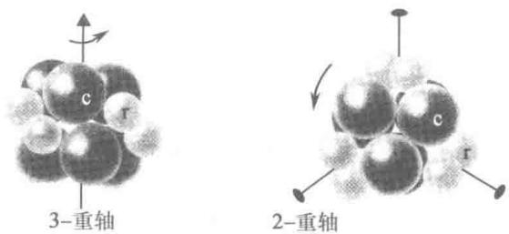  
图 3-52 天冬氨酸转氨甲酰酶 $\left(\mathrm{c}_{6}\mathrm{r}_{6}\right)$ 的 $D_{3}$ 对称示意图  
图中示出一个3-重轴和三个2-重轴。ATCase含6个原体（cr），每个原体由一个大的催化亚基（c）和一个小的调节亚基（r）组成。从解剖角度看，中间的6个大亚基构成2个三聚体 $(\mathrm{c}_3)$ ，6个小亚基组成3个二聚体 $(\mathbf{r}_2)$ ，分别处在大亚基的周边。整个分子可分成两层，它们是两个相向的半分子 $(\mathrm{c}_3\mathbf{r}_3)$

旋旋转或沿轴平移得以复原的。因此聚集体除旋转对称外，尚可表征为螺旋对称（screw）和平移对称

(translational)(图3-50J)。螺旋旋转可以看成是先平移后旋转的联合操作。在螺旋对称的聚集体中，原体排列成首尾相连而末端开口的螺旋链。对于这类聚集体，螺旋对称是以每圈的原体数目（不必是整数）、螺距和手性来表征。烟草花叶病毒(TMV)是第一个被描述的螺旋聚集体，每3圈49个蛋白质亚基，螺距为 $2.3\mathrm{nm}$ ，右手螺旋（图3-53）。F-肌动蛋白也是螺旋对称的聚集体，由两条螺旋链构成，它的亚基是G-肌动蛋白（见图4-32B）。平移对称的聚集体如微管中排列成线形的原纤丝（图3-54）。

## （四）亚基相互作用的方式

蛋白质亚基之间紧密接触的界面存在极性相互作用和疏水相互作用。因此相互作用的表面具有极性基团和疏水基团的互补排列。如前所述亚基缔合的驱动力主要是疏水相互作用，亚基缔合的特异性则由相互作用的表面上的极性基团之间的氢键和离子键提供。

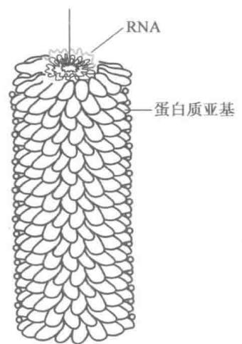  
图3-53 TMV片段的结构模型示出TMV外壳蛋白的螺旋聚集体

亚基缔合可分为相同亚基之间的和不相同亚基之间的缔合。相同亚基之间的缔合又可进一步分为同种的(isologous)和异种的(heterologous)缔合。同种缔合中相互作用的表面是相同的，形成的结构一定是封闭的二聚体，并且具有一个2-重对称轴(图3-50B)。二聚体是四级结构中最常见的，如前清蛋白的二聚体(图3-51)。如果发生进一步的同种缔合使成三聚体或四聚体，则必须利用蛋白质表面上的不同界面。许多蛋白质包括伴刀豆凝集素A和前清蛋白可通过两套同种缔合形成四聚体，这样的结构具有3个互相垂直的2-重对称轴(图3-50E)。

相同亚基的异种缔合中相互作用的表面是不相同的。异种缔合一定是开放末端的结构。许多蛋白质借异种缔合可以几乎无限制聚合，形成线性或螺旋形的大聚集体，有些是病毒颗粒（如TMV）的外壳，有些是细胞和组织中具有重要功能的结构，例如微管蛋白（一种 $\alpha \beta$ 二聚体），它能聚合成管状纤维，称为微管（图3-54）。微管是纤毛（cilia）、鞭毛（flagella）和细胞骨架基质的基础。AIDS病的病原体人免疫缺陷病毒（HIV）是由几百个外壳蛋白亚基组成的球形壳包被的，球形壳是一个很大的四级结构聚集体（图3-55）。当然异种缔合由于几何上的原因也形成具有环状对称的封闭环结构，而且是更为常见的结构，例如天冬氨酸转氨甲酰酶的催化亚基三聚体（ $\mathrm{C}_3$ ）是 $\mathrm{C}_3$ 对称（图3-50C），神经氨酸酶和蚯蚓血红蛋白的四聚体（ $\alpha_4$ ）是 $\mathrm{C}_4$ 对称（图3-50D）。

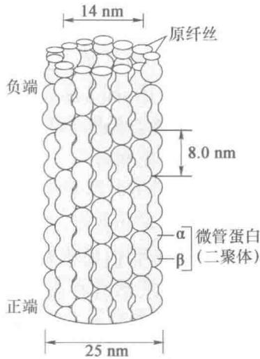  
图 3-54 典型的微管结构
微管由 13 根平行的原纤丝（prot-
ofilament）排列而成，每根原纤丝
由重复的微管蛋白二聚体首-尾
连接组成，每个二聚体含一个 α
和一个 β 微管蛋白分子

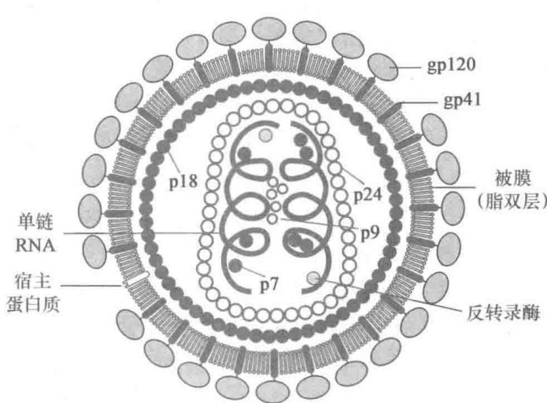  
图 3-55 人免疫缺陷病毒(HIV-1)结构的剖面图解
HIV 病毒体(virion)包括核心、核壳和被膜 3 部分。核心含有由两个拷贝的单链 RNA(9.2 kb/拷贝)组成的基因组以及反转录酶、整合酶、蛋白酶、调节蛋白、拟核蛋白(p9 和 p7)等。核壳包括由蛋白 p24 组成的内层和 p18 组成的外层。被膜含跨膜的糖蛋白 gp41 和与之非共价结合的 gp120，后者是作为寄主淋巴细胞上的 CD4 分子（见图 4-21）的病毒受体

当蛋白质仅由一种亚基组成时，亚基的相互作用和排列成四级结构的方式相对地比较简单。但有时来自不同物种的同一种蛋白质呈现不同的四级缔合方式。蚯蚓血红蛋白是某些海洋无脊椎动物的载氧蛋白，由紧密排列的四螺旋束构成（见图3-40A）；它能形成二聚体、三聚体、四聚体和八聚体，甚至更高的聚集体，因不同生物来源而异。

当聚集体涉及两种或多种不同的单体时，其相互作用的性质可以十分复杂。含两种或多种亚基的寡聚蛋白质在不同的亚基对之间呈现不同的亲和力。强变性剂可以使这些蛋白质解离成单体，温和的变性条件可以以有控制的分步方式解离寡聚结构；血红蛋白是一个很好的例证。强变性剂使血红蛋白解离成 $\alpha$ 和 $\beta$ 亚基。但用温和的变性条件可使血红蛋白几乎完全解离成 $\alpha \beta$ 二聚体（原体），而很少有甚至完全没有单体的亚基存在。在这个意义上说血红蛋白像是一个二“亚基”蛋白质，每个“亚基”（原体）是一个 $\alpha \beta$ 二聚体。

## （五）四级缔合在结构和功能上的优越性

## 1. 增强结构稳定性

亚基缔合的一个优点是蛋白质的表面积与体积之比降低。一个颗粒或球体的半径增大，表面积与体积之比则缩小（因为表面积是半径平方的函数，体积是半径立方的函数）。因为蛋白质内部的相互作用在能量上一般有利于蛋白质的稳定，又因蛋白质表面与溶剂水的相互作用常不利于稳定，所以降低表面积与体积的比值总的结果是增强蛋白质结构的稳定性。亚基缔合还可以屏蔽亚基表面上的疏水残基以避开溶剂水。亚基能识别自身或其他亚基，由于结合亚基突变体的能力较弱，因而可排除在遗传翻译中产生的任何错误。

## 2. 提高遗传经济性和效率

蛋白质单体缔合成寡聚体对一个生物体在遗传上是经济的。编码一个将装配成同多聚蛋白质的单体所需的 DNA 比编码一条相对分子质量相同的大多肽链要少。决定寡聚体装配和亚基-亚基相互作用的所有信息都包含在编码该单体所需的遗传物质中。例如，HIV 蛋白酶是一个相同亚基的二聚体，它的催化功能与相对分子质量大一倍的单体同源细胞酶是相似的。

## 3. 使催化基团汇集在一起

许多酶(见第8章)至少它们的某些催化能力是来自单体亚基的寡聚缔合,因为寡聚体的形成可使来自不同单体亚基的催化基团汇集在一起以形成完整的催化部位。例如细菌谷氨酰胺合成酶的活性部位是由相邻的亚基对形成的,解离的单体则无活性。

寡聚酶还可以在不同的亚基上催化不同的但有关的反应。例如色氨酸合酶（tryptophan synthase）是一个由不同的亚基对组成的四聚体 $(\alpha_{2}\beta_{2})$ 。它的纯化的 $\alpha$ 亚基催化3-磷酸吲哚甘油生成吲哚和3-磷酸甘油醛，而 $\beta$ 亚基催化吲哚和L-丝氨酸加合而成L-色氨酸。吲哚是前一反应的产物和后一反应的底物，它直接由 $\alpha$ 亚基转移到 $\beta$ 亚基，而不能作为一个游离的中间物存在（见第26章）。

## 4. 具有协同性和别构效应

亚基之所以缔合成寡聚蛋白质还有一个重要原因。大多数寡聚蛋白质调节它们的生物活性（如酶的催化活性）都是借助于亚基相互作用。多亚基蛋白质一般具有多个结合部位，结合在蛋白质分子的特定部位上的配体对该分子的其他部位所产生的影响（如改变亲和力或/和催化能力）称为别构效应（allosteric effect）。具有别构效应的蛋白质称为别构蛋白质或变构蛋白质，如别构酶。“别构”一词来自希腊文 allos（“别的”）和 stereos（“实体”；“形状”）。其原义是指蛋白质分子含有不止一个配体结合部位，除活性部位外还有别的配体（如效应物或调节物）的结合部位，称别构部位或调节部位。别构蛋白质分子至少含有两个活性部位，或者还有别构部位。这两种部位可以在同一个亚基上，也可以在不同的亚基上（图3-52），它们的数目可以相同，也可以不同。别构效应中亚基之间的信息传递是通过蛋白质构象的变化实现的，亚基之间的接触点提供了亚基之间的通讯机制。别构效应具有协同性（cooperativity）。别构效应可分为同促效应和异促效应。同促效应（homotropic effect）发生作用的部位是相同的（例如都是催化部位），也即一种配体（如底物）的结合对在其他部位的同种配体的亲和力的影响，这种影响一般是使亲和力加强，也即第一个配体的结合引起第二个、第三个……配体更容易结合。这样的同促效应被称为具有正协同性。正协同效应表现为S形配体结合曲线（图4-12）。如果第一个配体的结合导致第二个、第三个……更难结合，这样的同促效应则称为具有负协同性，它不呈现S型曲线。异促效应（heterotropic effect）发生作用的部位是不同的，也即活性部位的结合行为将受到别构部位与效应物结合的影响。有人只认为异促效应是“别构效应”，因为它才符合“别构”的原义。如果效应物（effector）是降低为使活性部位达到饱和所需的配体浓度（如底物浓度）的，则称它为正效应物或激活剂（activator）；如果是升高为使活性部位达到饱和所需的配体浓度的，则称它为负效应物或抑制剂（inhibitor）。别构效应物是细胞代谢库的成分，其浓度的细微变化可以立即调节代谢的需求（见第8章和第28章）。

应该强调指出，别构蛋白质不管是否存在别构部位（有些别构酶不存在别构部位，只有同促效应），但活性部位之间的同促效应总是有的。同促效应是别构效应的基本，异促效应可看成是对同促效应的进一步调节。

## 九、蛋白质的变性、折叠和结构预测

前面介绍了由多肽链折叠形成三维结构的各种花式。这里将讨论蛋白质折叠的信息、驱动力（热力学）和过程（动力学）以及根据氨基酸序列进行的蛋白质结构预测。为讲述方便起见，在讨论折叠之前先引入蛋白质变性的概念。

## （一）蛋白质的变性

天然蛋白质分子受到某些物理因素如热、紫外线照射、高压和表面张力等或化学因素如有机溶剂、脲、胍、酸、碱等的影响时，生物活性丧失，溶解度降低，不对称性增高以及其他的物理化学常数发生改变，这种过程称为蛋白质变性（denaturation）。蛋白质变性的实质是蛋白质分子中的次级键被破坏，引起天然构象解体。变性不涉及共价键（肽键和二硫键等）的破裂，一级结构仍保持完好。

## 1. 蛋白质变性过程中的现象

（1）生物活性的丧失 蛋白质的生物活性是指蛋白质所具有的酶、激素、毒素（toxin）、抗原与抗体等活性，以及其他特殊性质如血红蛋白的载氧能力，肌球蛋白与肌动蛋白相互作用时的收缩能力等。生物活性的丧失是蛋白质变性的主要特征。有时空间结构只有轻微的局部改变，而且这些变化还没有反映到其他物理化学性质上时，生物活性就已经丧失。

（2）一些侧链基团的暴露 蛋白质在变性时，有些原来在分子内部包藏而不易与化学试剂起反应的侧链基团，由于结构的伸展松散而暴露出来。

（3）一些物理化学性质的改变 蛋白质变性后，疏水基外露，溶解度降低，一般在等电点时不溶解，分子相互凝集，形成沉淀。但在碱性溶液中，或有尿素、盐酸胍等变性剂存在时，则仍保持溶解状态，透析除去这些变性剂后，又可沉淀出来。球状蛋白质变性后，分子形状也发生改变，蛋白质分子伸展，不对称程度增高，反映在黏度增加、扩散系数降低以及旋光和紫外吸收的变化。

（4）生物化学性质的改变 蛋白质变性后，分子结构伸展松散，易被蛋白水解酶分解。变性蛋白质比天然蛋白质更易受蛋白水解酶作用。这就是熟食易于消化的道理。

## 2. 变性剂使蛋白质变性的机制

变性剂(denaturing agent): 尿素和盐酸胍(guanidine HCl), 能与多肽主链竞争氢键, 因此破坏蛋白质的二级结构。尿素或盐酸胍与多肽主链之间相互作用的一种可能方式如下所示:

可能更重要的原因是尿素或盐酸胍增加非极性侧链在水中的溶解度,因而降低了维持蛋白质三级结构的疏水相互作用。

去污剂,如十二烷基硫酸钠(SDS)也是蛋白质的变性剂。其结构式见图10-3。SDS能破坏蛋白质分子内的疏水相互作用使非极性基团暴露于介质水中。去污剂降低非极性侧链从疏水内部到水介质的转移自由能。

## 3. 蛋白质变性和复性的学说

变性是一个协同过程。它是在所加变性剂的很窄浓度范围内或很窄 pH 或温度间隔内突然发生的，例如牛胰核糖核酸酶（图 3-34B 和图 2-29）的变性（图 3-56）。

关于蛋白质变性的学说,我国生物化学家吴宪在20世纪30年代就已提出,天然蛋白质分子因环境的种种关系,从有序而紧密的结构,变为无序而松散的结构,这就是变性。他认为天然蛋白质的紧密结构及晶体结构是由分子中的次级键维系的,所以容易被物理的和化学的因素所破坏。这种观点基本上反映了蛋白质变性的本质。

当变性因素除去后,变性蛋白质又可重新回复到天然构象,这一现象称为蛋白质复性(renaturation)。是否所有的蛋白质变性都是可逆的,这一问题至今仍有疑问。至少实践中未能使所有蛋白质在变性后都重新恢复活力,然而多数人都接受变性是可逆的概念,认为天然构象是处于能量最低的状态,有些蛋白质变性后之所以不能逆转,主要是所需条件复杂,不易满足的缘故。

## （二）氨基酸序列规定蛋白质的三维结构

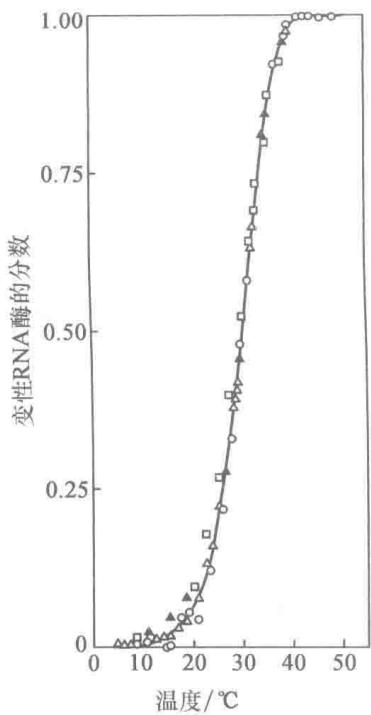  
图 3-56 牛胰核糖核酸酶的变性  
变性 RNA 酶的分数根据溶液特性黏度增加（□）、在 365 nm 旋光度变化（○）和在 287 nm 紫外吸收变化（△）测量。▲代表冷却后第二次变性。注意不同方法测得的结果是一样的。这里实验是在 pH 2.1，离子强度 0.019 mol/L 条件下进行的，如果在生理条件下，RNA 酶更加稳定，变性在 70\~80℃（变性的中点温度称熔点 $T_{m}$ ）时才发生

从本章前部分的讨论中多少知道蛋白质三维结构与其氨基酸序列有关。多肽链的二级结构决定于短程序列(short-range sequence)，三维结构主要决定于长程序列(long-range sequence)。

## 1. 核糖核酸酶的变性与复性实验

蛋白质的氨基酸序列规定它的三维结构这一结论最直接和最有力的证据来自某些蛋白质的可逆变性实验，首先是20世纪60年代C. Anfinsen进行的牛胰核糖核酸酶(RNase A)复性的经典实验。当天然的RNase(图3-57A)在8 mol/L尿素或6 mol/L盐酸胍存在下用 $\beta$ -巯基乙醇处理后，分子内的4个二硫键则被断裂，紧密的球状结构解折叠(unfold,或译伸展)成松散的无规卷曲构象，然而当用透析方法(见第5章)将尿素(或盐酸胍)和巯基乙醇除去后，RNase活性又可恢复，最后达到原来活性的95%\~100%(图3-57)。并发现如果不事先加入尿素或盐酸胍使酶变性，则RNase很难在37℃和pH 7的条件下被 $\beta$ -巯基乙醇还原。

## 2. 二硫键在稳定蛋白质构象中的作用

经多方面的分析表明,复性后的产物与天然的 RNase 并无区别,所有正确配对的二硫键都获得重建。值得注意的是,在复性过程中肽链上的 8 个—SH 基借空气中的氧重新氧化成 4 个二硫键时,它们的配对完全与天然的相同,准确无误。如果在随机重组的情况下,8 个—SH 基形成 4 个正确配对的二硫键的概率是 $1/7 \times 1/5 \times 1/3 = 1/105$ 。因为第一个二硫键的形成有 7 种可能,第二个二硫键有 5 种可能,第三个有 3 种可能,第 4 个只有一种可能。事实上,当还原后的 RNase 在 $8 \mathrm{~mol} / \mathrm{L}$ 尿素中被重新氧化时,只恢复原来天然酶活性的 $1\%$ 左右。这说明 RNase 肽链的一维信息控制肽链自身折叠成特定的天然构象,并由此确定了 Cys 残基两两相互接近的正确位置。由此看来,二硫键对肽链的正确折叠并不是必要的,但它对稳定折叠态结构作出贡献。含二硫键的分子有较小的构象熵变化(因为可转变为解折叠态构象的数目较少)并因此而稳定。既然二硫键能稳定蛋白质结构,那么为什么大多数蛋白质不含二硫桥呢?确实二硫桥相对地较少,它主要存在于分泌到细胞外的蛋白质如核糖核酸酶和胰岛素等。这可能是因为大多数细胞内的环境是相当还原的,它倾向于保持巯基处于还原态。

  
图 3-57 核糖核酸酶 A 的变性与复性示意图

现在可以比较肯定地说,蛋白质的三维结构归根结底是由一级序列决定的。也就是说三维结构是多肽链上的各个单键旋转自由度受到各种限制的总结果。这些限制包括肽键的硬度即肽键的刚性平面性质 $\left(\mathrm{C}_{\alpha}-\mathrm{C}\right.$ 和 $\left.\mathrm{C}_{\alpha}-\mathrm{N}\right.$ 键旋转的可允许角度 $)$ 、肽链中疏水基和亲水基的数目和位置、带正电荷和负电荷的 R 基的数目和位置以及溶剂和其他溶质等。在这些限制因素下通过 R 基团的彼此相互作用以及 R 基团与溶剂和其他溶质相互作用,最后达到平衡,形成了在一定条件下热力学上最稳定的空间结构。这样就实现了复杂生物大分子的自装配(self-assembly)原则。

## （三）蛋白质肽链折叠的热力学

前面曾考虑了稳定蛋白质三维结构的各种非共价键及其键能。然而蛋白质折叠归根结底取决于在某温度(T)下折叠态(F)和解(去)折叠态(U)之间的吉布斯(Gibbs)自由能差( $\Delta G$ ):

$$
\Delta G = G _ {\mathrm{F}} - G _ {\mathrm{U}} = \Delta H - T \Delta S = (H _ {\mathrm{F}} - H _ {\mathrm{U}}) - T (S _ {\mathrm{F}} - S _ {\mathrm{U}})\tag{3-3}
$$

在解折叠态中多肽主链及其侧链是与溶剂水(或称介质水或环境水)相互作用的,因此折叠时自由能变化( $\Delta G$ )的任何测量必须考虑多肽链和溶剂两者对焓变化( $\Delta H$ )和熵变化( $\Delta S$ )的贡献:

$$
\Delta G _ {\mathrm{总}} = \Delta H _ {\mathrm{链}} + \Delta H _ {\mathrm{溶剂}} - T \Delta S _ {\mathrm{链}} - T \Delta S _ {\mathrm{溶剂}}\tag{3-4}
$$

如果对方程(3-4)右边4项的每一项都理解,那么对蛋白质折叠的热力学基础应该是清楚的。折叠态蛋白质与解折叠态相比,它是高度有序的结构,因此 $\Delta S_{链}$ (构象熵变化)是负数,并因而方程中 $-T\Delta S_{链}$ 项是正值。其他各项取决于特定的全体侧链的本质。 $\Delta H_{链}$ 的本质,决定于残基与残基的相互作用和残基与溶剂的相互作用。

折叠态蛋白质中疏水侧链主要是通过弱范德华力(分散效应)彼此相互作用。解折叠态蛋白质中疏水侧链与溶剂相互作用,其作用力比分散效应强,因为极性水分子诱导疏水基团中的偶极,产生明显的静电相互作用(范德华力中的诱导效应)。结果是, $\Delta H_{链}$ 对疏水侧链是正值,它有利于解折叠态。然而 $\Delta H_{溶剂}$ 对疏水侧链是负值,它有利于折叠态。这是因为折叠造成许多水分子彼此相互作用(有利的)代替水分子与疏水侧链相互作用(不利的)。 $\Delta H_{链}$ 大小比 $\Delta H_{溶剂}$ 小,但这两项都不大,一般对折叠不起主要作用。然而 $\Delta S_{溶剂}$ (疏水熵变化)对疏水侧链是大的正值,因此极有利于折叠态。这是在解折叠态时疏水侧链强迫溶剂水有序化的结果。

对极性侧链而言 $\Delta H_{链}$ 是正值，而 $\Delta H_{溶剂}$ 是负值。因为一定程度上溶剂水分子在极性基团周围也是有序的，所以 $\Delta S_{溶剂}$ 是小的正值。对蛋白质的极性侧链来说， $\Delta G_{总}$ 接近于零，对蛋白质折叠不作实质性的贡献（图 3-58）。

  
图 3-58 决定球状蛋白质折叠自由能的各项贡献方式的图解

总之，构象熵变化 $(\Delta S_{\text{链}})$ 是阻碍折叠，而疏水熵变化 $(\Delta S_{\text{溶剂}})$ 和因分子内侧链相互作用引起的总焓变化 $(\Delta H_{\text{链}} + \Delta H_{\text{溶剂}})$ 是有利于折叠的。对于典型的蛋白质来说，对折叠结构的稳定性作出单项最大贡献的是疏水残基引起的 $\Delta S_{\text{溶剂}}$ （图3-58）。在不同蛋白质中总熵变化 $(\Delta S_{\text{链}} + \Delta S_{\text{溶剂}})$ 和总焓变化对折叠结构的稳定性所做的贡献份额是不同的（表3-8）。但总的结果一样，折叠结构在生理条件下是自由能最低的构象，因此多肽链的折叠是自发过程。

表 3-8 几种蛋白质折叠的热力学数据 (25℃)

<table><tr><td>蛋白质</td><td>条件</td><td> $\Delta G/(kJ·mol^{-1})$ </td><td> $\Delta H/(kJ·mol^{-1})$ </td><td> $\Delta S/(J·K^{-1}·mol^{-1})$ </td></tr><tr><td>核糖核酸酶A</td><td>pH 2.5</td><td>-7.3</td><td>-238</td><td>-774</td></tr><tr><td>胰凝乳蛋白酶原</td><td>pH 3.0</td><td>-32</td><td>-163</td><td>-439</td></tr><tr><td>肌红蛋白</td><td>pH 9.0</td><td>-57</td><td>-175</td><td>-397</td></tr><tr><td>β-乳球蛋白</td><td>5 mol/L 尿素</td><td>-1.7</td><td>+88</td><td>+301</td></tr></table>

## （四）蛋白质肽链折叠的动力学

## 1. 多肽链折叠不是通过随机搜索找到自由能最低构象的

Anfinsen 的重折叠实验和折叠热力学分析表明, 至少某些球状蛋白质的天然构象是生理条件下热力学上最稳定的状态。但是一个给定蛋白质是如何达到这样一种稳定状态的, 这是一件很复杂的事。C. Levinthal 在 1968 年曾指出, 对于一个典型的蛋白质, 它不可能有那么多的时间对所有可能的结构都搜索一遍以找出自由能最低的构象。他计算了一个含 100 个氨基酸残基的蛋白质, 如果每个残基可采取 3 个不同的位置, 那么其构象的总数为 $3^{100}$ , 即 $5 \times 10^{47}$ 。如果一种构象转变为另一种构象, 也即每搜索一种可能的构象, 需要 $10^{-13} \mathrm{~s}(0.1 \mathrm{ps})$ 时间, 那么总搜索时间是 $5 \times 10^{34} \mathrm{~s}$ 或 $1.6 \times 10^{27} \mathrm{年!}$ 显然计算的与实际的折叠时间 (一般介于 1 毫秒到几分钟) 相距太远。这一矛盾被称为“Levinthal 疑题”。

Levinthal 疑题迫使人们对折叠途径提出新的考虑，并为此作了不少努力。认识到肽链折叠时并不是肽平面一个个地顺次旋转，而是所有的肽平面同时转动的；折叠过程一定受到某种方式的指导，通过特定的动力学途径，选择一些中间体，而避免对大量不相关构象的搜索。解决此疑题的根本正是“累积选择”（cumulative selection）这一方式。所谓累积选择就是在旋转搜索时把正确折叠的那部分结构保留下来。因此蛋白质折叠的实质就是保留局部正确折叠的中间体。但研究这些中间体困难很多，例如蛋白质的稳定性有限，通常含 100 个残基的蛋白质，其分子折叠态和解折叠态之间的自由能差值仅为 40 kJ/mol 左右，每个残基的平均稳定能只有 0.4 kJ/mol，甚至少于无规的热能（2.5 kJ/mol，在室温下）。这意味着正确的中间体，特别是在折叠早期形成的中间体有可能被丢失。至今蛋白质折叠对理论家和实验家都还是有争论的问题。

## 2. 用于研究多肽链折叠中间体的一些方法

折叠是很快的，许多蛋白质的折叠时间不到1 s。折叠中间体是在很短时间内形成并存在的。例如细胞色素c中44%的α螺旋是在重折叠启动后的4 ms内形成，其余的56%在10 ms\~1 s内完成。因此平衡条件下研究折叠虽然方便，但是折叠过程中的很多信息将被丢失。现在使用快速动力学方法（参见第7章），如停流法(stopped flow)和温度跃迁法(temperature jump)，并结合几种光谱性质如荧光、圆二色性等的监控，已有可能分析折叠过程中的一些中间体。

用于中间体检测、捕获和表征的还有许多其他方法和技术，例如脉冲标记 NMR（pulsed-label NMR），即把脉冲氢-氘(H-D)交换和核磁共振波谱结合起来使用。脉冲 H-D 交换（这里脉冲是短时间接触同位素的意思）用于测定蛋白质中某些质子与周围溶剂中的质子发生交换的速率。蛋白质中可交换的质子主要是主链上的酰胺质子，少数是侧链上的氨基、羧基等的质子。在解折叠区或在折叠和解折叠之间快速变动的区域，H-D 交换很快，但在折叠区如 $\alpha$ 螺旋、 $\beta$ 折叠片或 $\beta$ 转角中由于许多这样的质子参与氢键形成，交换就慢，需要数分钟，甚至几小时。实验时，蛋白质样品先在 $D_{2}O$ -变性剂中解折叠，使酰胺 NH 基转变为酰胺 ND 基（图 3-59）。然后用 $D_{2}O$ （重水）稀释样品降低变性剂浓度以启动重折叠。开始时大多数—ND 基处于易交换的状态，但随后由于形成二级结构和三级结构而受到保护，因此不易被交换。被交换的程度通过用 $H_{2}O$ 稀释在 $D_{2}O$ 中的样品，以 H 交换裸露位置上的 D 进行探测。选用高 pH（例如 pH 9）

  
图 3-59 脉冲氢-氘交换用于监控蛋白质折叠中二级结构的形成

加速交换的进行(可接近的质子需1 ms)。约10 ms后将pH降至4以停止标记(pH 4时,酰胺质子实际上不发生交换)。标记位置的图案用二维NMR谱进行测定。

此外，位点特异诱变（site-specific mutagenesis）、蛋白质设计和蛋白质工程技术也已用于折叠的研究。

## 3. 多肽链的折叠是分阶段快速完成的

一个大的多肽链折叠途径肯定是复杂的。然而在这个领域已经取得迅速发展，产生了强大可靠的算法，经常能根据其氨基酸序列预测一些小蛋白质的结构。肽链折叠动力学的研究发现，折叠是分阶段进行的，整个过程中存在着可能不止一个中间态。局部的二级结构（通常是十几个残基）通过近程相互作用最先被形成。某些氨基酸序列受到像在二级结构讨论中所述的那些限制的制导快速地折叠成α螺旋这样的一些结构（不到1μs）作为中心，称构象核或折叠核。涉及多肽链一级序列中经常互相靠近的荷电基团的相互作用在指导这些早期折叠步骤中起重要作用。然后局部结构，譬如说，两个二级结构元件之间通过远程相互作用组装在一起，形成更稳定的折叠结构。在整个过程中疏水相互作用担当重要的角色，因为非极性氨基酸侧链的聚集给中间体也给最后的折叠结构提供了熵稳定。过程继续直至完整的结构域形成和整个多肽链的折叠。值得注意的是，受近程相互作用（一般在多肽序列中彼此挨近的残基对之间）控制的蛋白质要比具有更复杂折叠途径和有许多不同肽段之间的远程相互作用的蛋白质折叠得快。当合成具有多结构域的较大蛋白质时，靠近N端的结构域（它首先被合成）可以在整个多肽链组装好之前折叠。总之，对不同的蛋白质肽链，折叠的过程和折叠所需的时间都不尽相同，这是可以理解的。

大多数小的蛋白质例如牛胰核糖核酸酶在变性条件下能发生可逆的解折叠,过程是协同和突发的。当蛋白质构象的几个不同指标(特性黏度、旋光度和紫外吸收)在平衡条件下被监控时,它们经常作为温度或变性剂浓度的函数一起发生变化(图3-56);并且不论从低温到高温(变性)还是从高温到低温(复性),转换是一样的。这些观察表明只有两种构象——天然态(N)和解折叠态(U)以可测量存在,并且它们处于快速平衡中:

$$
\mathrm{U} \rightleftharpoons \mathrm{N}
$$

因此在热或变性剂诱导的转换中点，半数分子是完全的解折叠态，另一半分子是完全的折叠态。然而快速动力学研究揭示，RNase 的重折叠表现为慢相（10～100 s）和快相（ms 范围）的双相动力学过程。认为这是由于存在两种不同的解折叠态 $U_{1}$ 和 $U_{2}$ 的结果。其重折叠反应可表示为：

$$
\mathrm{U} _ {1} \stackrel {\text {慢}} {\longleftrightarrow} \mathrm{U} _ {2} \stackrel {\text {快}} {\longleftrightarrow} \mathrm{N}
$$

式中 $U_{1}$ 是完全的解折叠态，它以慢速率转换为另一种解折叠态 $U_{2}$ ，后者以快速率完成折叠。虽然 $U_{1}$ 和 $U_{2}$ 表观上都是解折叠形式，但 $U_{2}$ （中间态）容易形成部分折叠的结构，并以此为核心折叠成天然构象（N）。

其他蛋白质例如 $\alpha$ -乳清蛋白 ( $M_r$ 14000) 在某些变性条件下平衡时呈现 3 种状态, 除 U 和 N 外还有另一种状态。酸能诱导 $\alpha$ -乳清蛋白发生构象转变。远紫外 CD 光谱研究证明, 在 pH 4 时 $\alpha$ -乳清蛋白具有和天然蛋白一样的二级结构, 流体动力学研究表明, pH 4 时 $\alpha$ -乳清蛋白分子的凝缩程度与天然分子相近。相反, 强变性剂产生的无规卷曲则伸展得多。这些平衡研究指出, 蛋白质折叠过程中存在一种所谓熔球态 (molten globule state), 它含有二级结构, 但无完整的三级结构。这里, 球字是突出它的凝缩状态, 熔字是强调它的二级结构单元之间相互作用的变动性质。实际上, 熔球态 M 是许多蛋白质中解折叠态和天然态之间常见的一种中间体:

$$
\mathrm{U} \rightleftharpoons \mathrm{M} \rightleftharpoons \mathrm{N}
$$

形成熔球的驱动力主要是侧链间的疏水相互作用,因此形成熔球的凝缩也称疏水紧缩或塌陷(hydro-phobic collapse)。

熔球形成也受二级结构形成的驱动。许多短肽在水中具有相当大的螺旋形成潜力。形成的许多螺旋含有疏水面，疏水面间的相互作用进一步促进疏水收缩。因此疏水收缩和二级结构形成是熔球形成中交互增强的过程。目前已知球状蛋白质的折叠涉及以下几个步骤：①由完全的解折叠态快速可逆地形成一个或多个局部的二级结构（某些α螺旋和β转角区段），此谓成核过程（nucleation）；②通过这些构象核（局部二级结构）的协同聚集形成初始的结构域；③并由这些初始结构域装配成熔球态；④对结构域的构象进行调整；⑤最后形成具有完整三级结构的蛋白质单体或天然蛋白质。

## 4. 体内蛋白质折叠有异构酶和伴侣蛋白质参加

如前面看到的,在体外蛋白质的重折叠不需要额外的分子参与。然而在体内蛋白质折叠却是另一种情形。在体外许多蛋白质的折叠要比在体内慢得多,效率也低得多。其原因就是体内蛋白质折叠是在催化剂的帮助下进行的。

新生蛋白质中正确配对的二硫键形成受蛋白质二硫键异构酶(protein disulfide isomerase, PDI)的催化。PDI与蛋白质底物的多肽主链结合，并优先与含半胱氨酸残基的肽发生相互作用。PDI广泛的底物特异性使它能够加速多种含二硫键蛋白质的折叠。通过二硫键的改组(shuffling)，PDI能使蛋白质很快地找到热力学上最稳定的配对方式。PDI的催化机制如下：PDI含有两个-Cys-Gly-His-Cys-序列。这些Cys的巯基在生理pH下具有高度的反应性，因为它们的 $pK_{a}(7.3)$ 值比蛋白质中大多数巯基的 $pK_{a}(8.5)$ 值低。蛋白质(底物)的二硫键受酶的RS-基攻击，形成共价的酶-底物中间体。此时被释放的底物巯基能自由攻击另一个底物二硫键，形成不同的配对。PDI在加速折叠中间体的二硫键改组中起特别重要的作用，例如此酶使牛胰蛋白酶抑制剂中间体二硫键改组的速率提高6000倍。

蛋白质中肽键几乎总是反式构型的，但X—Pro肽键（X代表任一残基）是个例外，其中 $6\%$ 或更多一些是顺式构型（图2-22）。脯氨酰异构化是体外许多蛋白质折叠的限速步骤。自发的异构化很慢，因为羰基碳和酰胺氮之间的键(肽键)具有部分双键性质(见第2章肽部分)。肽基脯氨酸异构酶(peptidyl prolyl isomerase)通过扭转肽键致使C、O和N原子不再是共平面的方式加速顺-反异构化。在此过渡态中，因为共振降到最小，C—N键的单键性质增强，因此，异构化的活化能降低。

解折叠的和部分折叠的蛋白质在高浓度时倾向于聚集，变性蛋白质在体外的重折叠常是在稀溶液中进行，以便使分子间的接触和聚集降到最小。然而体内蛋白质折叠却在很浓稠的介质（细胞溶胶和内质网腔）中高效地发生。近来的研究揭示，有一个称为分子伴侣（molecular chaperone）的蛋白质家族参与蛋白质折叠。它们通过抑制新生肽链不恰当的聚集并排除与其他蛋白质不合理的结合，协助多肽链的正确折叠。许多这类蛋白质最初被鉴定为热激蛋白[质]（heat shock protein, Hsp），它们在细胞中通过提高温度或其他逆境（例如自由基损伤）可诱导产生。其中研究得最透彻的是Hsp70蛋白和所谓陪伴蛋白（chaperonin）。Hsp70是一类 $M_{r}$ 70000的热激蛋白，它在进化上是高度保守的，大肠杆菌和人的这种蛋白其氨基酸序列有50%是相同的。Hsp70蛋白由ATP酶结构域和肽结合结构域组成。陪伴蛋白也称Cpn60或Snp60，是一类 $M_{r}$ 60000的热激蛋白。

分子伴侣在折叠过程中与多肽链的相互作用尚未完全了解。已清楚的是ADP-分子伴侣复合体能与部分折叠结构中暴露的疏水区有效地结合。可能伴侣蛋白质能识别靶蛋白上暴露的螺旋或其他二级结构元件。此相互作用使伴侣分子可指导和调节随后的折叠过程(详见第33章)。

## （五）蛋白质结构的预测

Anfinsen 的 RNase 重折叠实验,为从氨基酸序列预测蛋白质的三维结构提供了实验依据。如果我们掌握了蛋白质折叠的规律,那么只要根据它的序列知识就可以描述任何一种蛋白质的三维结构。虽然今天离这一目标还有相当距离,但是预测工作已有很好的开端。特别是蛋白质结构预测是全新蛋白质设计和蛋白质工程的重要内容之一,这更促进预测工作的发展。

## 1. 二级结构的预测——Chou-Fasman 算法

氨基酸残基在二级结构元件中出现频率的研究揭示,某些残基如 Glu、Met、Ala 和 Leu 在 $\alpha$ 螺旋中出现的频率比在其他二级结构中高。相反,Gly 和 Pro 在 $\alpha$ 螺旋中频率很低,但它们在 $\beta$ 转角中很高。另一些残基包括 Val、Ile 和芳香族氨基酸在 $\beta$ 折叠片中频率很高,而 Asp、Glu 和 Pro 在 $\beta$ 折叠片中则很低。这

表明各种残基形成各种二级结构的倾向性是不同的。

二级结构预测始于20世纪60年代，至今已有50多年的历史。在此期间提出了多种预测方法。其中相对简单并具有相当准确性（达 $60\%$ 到 $70\%$ ）的是P.Y.Chou和G.D.Fasman于1974年提出的预测算法。Chou-Fasman算法是一种基于单残基统计的经验预测方法。通过统计获得的单残基构象倾向性因子(propensity)被用于二级结构预测。残基的倾向性因子被定义为：

$$
P _ {\mathrm{i}} = A _ {\mathrm{i}} / T _ {\mathrm{i}}
$$

式中下标 i 代表构象态 ( $i=\alpha$ 、 $\beta$ 、c 和 t，分别为 $\alpha$ 螺旋、 $\beta$ 折叠片、无规卷曲和 $\beta$ 转角); $T_{i}$ 是所有被统计残基处于第 i 种构象态的分数; $A_{i}$ 是第 A 种残基的对应分数。如果 $i=\alpha$ ，则 $P_{\alpha}$ 为形成 $\alpha$ 螺旋的倾向性因子； $P_{i}>1.0$ 表示该残基倾向于形成第 i 种构象态, $P_{i}<1.0$ 则表示倾向于形成其他构象态。

表3-9中的数据是根据对29种已知结构的蛋白质共4741个残基所作的统计分析结果。表中的 $P_{\alpha}$ 和 $P_{\beta}$ 值按其大小顺序排列，可把20种残基分为6个组（H、h、I、i、b和B）。例如 $P_{\alpha}$ 分为 $\mathrm{H}_{\alpha}$ （强螺旋形成者）、 $\mathrm{h}_{\alpha}$ （螺旋形成者）、 $\mathrm{I}_{\alpha}$ （弱螺旋形成者）、 $\mathrm{i}_{\alpha}$ （螺旋形成不敏感者）、 $\mathrm{b}_{\alpha}$ （螺旋中断者）和 $\mathrm{B}_{\alpha}$ （强螺旋中断者）。

Chou 和 Fasman 根据残基的倾向性因子提出二级结构预测的经验规则, 其要点是沿蛋白质序列寻找二级结构成核位点和终止位点。经验规则是:

（1） $\alpha$ 螺旋预测 相邻的6个残基中若有至少4个残基倾向于形成 $\alpha$ 螺旋，则被认为是螺旋核。螺旋核向两端延伸直至4个残基的 $\alpha$ 螺旋倾向性因子的平均值 $(P_{\alpha}) < 1.0$ 为止，并且不允许在螺旋内部出现Pro残基，它也会终止螺旋的延伸。如果延伸片断的 $P_{\alpha} \geqslant 1.03$ 并且 $P_{\alpha} > P_{\beta}$ ，则被预测为 $\alpha$ 螺旋。

（2） $\beta$ 折叠预测 相邻的5个残基中若有3个残基倾向于形成 $\beta$ 折叠，则被认为是折叠核。折叠核向两端延伸直至4个残基的 $P_{\beta} < 1.0$ ，如果延伸后的片段 $P_{\beta} > 1.05$ 且 $P_{\beta} > P_{\alpha}$ ，则被测为 $\beta$ 折叠。

（3） $\beta$ 转角预测 具有 $P_{\mathrm{t}} > 1.0$ ，且大于 $P_{\alpha}$ 和 $P_{\beta}$ ，则被预测为 $\beta$ 转角。虽然预测 $\beta$ 转角的实际规则比这更复杂，但它在多数情况下是可行的。

## 2. 三级结构的预测——折叠的计算机模拟

与二级结构预测相比,三级结构预测成功率则小得多。这可能是因为高级结构折叠关键决定于序列中的间隔距离远的残基之间的特异侧链相互作用。第2章中曾谈到,在进化过程中由一个共同的祖先蛋白形成了一个蛋白质家族,如珠蛋白家族、丝氨酸蛋白酶家族等。同一个家族的蛋白质,即所谓同源蛋白质,具有相似的结构与功能。一般说,氨基酸序列相似的蛋白质,它们的三维结构也相似,三维结构比一级结构更保守。因此利用已知类似物结构预测同源蛋白质结构的工作得到发展并取得很好成绩,例如利用溶菌酶的结构参数预测出 $\beta$ -乳清蛋白的结构。许多蛋白质,如天冬氨酸蛋白酶、免疫球蛋白等结构也是利用这种方法预测获得的。同源蛋白质结构预测大多是在计算机图像工作站上进行的。此方法主要步骤有:结构保守性分析,主链和侧链结构预测以及模型优化。详见本章所列参考书2。

在少数实例中利用更直接的方法对小的球状蛋白质的总三维结构进行了预测。方法基于蛋白质自发折叠寻找能量最低点这一事实。计算机模拟中允许无规卷曲通过绕单键旋转对构象进行很多次小的更改。程序对可能的相互作用进行总能量进程的监控并寻找能量最低点。不过这样的搜索即使应用最大、最快的计算机，所需的计算时间量也是巨大的。

近年来由于预测方法和计算机程序的不断改进，在这方面也取得新的成功，例如G. Rose和R. Srinivasan的预测工作，他们是从蛋白质折叠分成局部的(local)和层次的(hierarchical)这一假设出发的。在这里，“局部的”意思是每个氨基酸残基的折叠行为都受序列中相邻其他残基的影响。“层次(系统)的”意思是被折叠的结构是从最小结构单元发展并逐渐变成越来越复杂的实体。这些假设加上其他一些假设是被称为LINUS的计算机程序的基础。LINUS是结构的局部独立成核单元(Local Independently Nucleated Unit of Structure)的英文缩写。Rose和Srinivasan把LINUS程序用于若干小蛋白质结构的精确预测。图3-60示出LINUS程序用于几个已知结构的蛋白质结构域的计算结果。有关LINUS程序的细节见本章所列参考书10。

表 3-9 氨基酸的 Chou-Fasman 构象倾向性因子及形成 $\alpha$ 螺旋和 $\beta$ 折叠能力的分类

<table><tr><td> $氨基酸^{(2)}$ </td><td> $P_{\alpha}$ </td><td>分类(螺旋)</td><td> $P_{\beta}$ </td><td>分类(折叠)</td><td> $P_t$ </td></tr><tr><td>Glu</td><td>1.51</td><td></td><td>0.37</td><td> $B_{\beta}$ </td><td>0.74</td></tr><tr><td>Met</td><td>1.45</td><td rowspan="4"> $H_{\alpha}$ </td><td>1.05</td><td> $h_{\beta}$ </td><td>0.60</td></tr><tr><td>Ala</td><td>1.42</td><td>0.83</td><td> $i_{\beta}$ </td><td>0.66</td></tr><tr><td>Leu</td><td>1.21</td><td>1.30</td><td> $h_{\beta}$ </td><td>0.59</td></tr><tr><td>Lys</td><td>1.16</td><td>0.74</td><td> $b_{\beta}$ </td><td>1.01</td></tr><tr><td>Phe</td><td>1.13</td><td rowspan="5"> $h_{\alpha}$ </td><td>1.38</td><td></td><td>0.60</td></tr><tr><td>Gln</td><td>1.11</td><td>1.10</td><td> $h_{\beta}$ </td><td>0.98</td></tr><tr><td>Trp</td><td>1.08</td><td>1.37</td><td></td><td>0.96</td></tr><tr><td>Ile</td><td>1.08</td><td>1.60</td><td rowspan="2"> $H_{\beta}$ </td><td>0.47</td></tr><tr><td>Val</td><td>1.06</td><td>1.70</td><td>0.50</td></tr><tr><td>Asp</td><td>1.01</td><td rowspan="2"> $I_{\alpha}$ </td><td>0.54</td><td> $b_{\beta}$ </td><td>1.46</td></tr><tr><td>His</td><td>1.00</td><td>0.87</td><td> $i_{\beta}$ </td><td>0.95</td></tr><tr><td>Arg</td><td>0.98</td><td rowspan="3"> $i_{\alpha}$ </td><td>0.93</td><td> $i_{\beta}$ </td><td>0.95</td></tr><tr><td>Thr</td><td>0.83</td><td>1.19</td><td> $h_{\beta}$ </td><td>0.96</td></tr><tr><td>Ser</td><td>0.77</td><td>0.75</td><td> $b_{\beta}$ </td><td>1.56</td></tr><tr><td>Cys</td><td>0.70</td><td rowspan="3"> $b_{\alpha}$ </td><td>1.19</td><td> $h_{\beta}$ </td><td>1.43</td></tr><tr><td>Tyr</td><td>0.69</td><td>1.47</td><td> $H_{\beta}$ </td><td>1.19</td></tr><tr><td>Asn</td><td>0.67</td><td>0.89</td><td> $i_{\beta}$ </td><td>1.14</td></tr><tr><td>Pro</td><td>0.57</td><td rowspan="2"> $B_{\alpha}$ </td><td>0.55</td><td> $B_{\beta}$ </td><td>1.56</td></tr><tr><td>Gly</td><td>0.57</td><td>0.75</td><td> $b_{\beta}$ </td><td>1.52</td></tr></table>

① 该表源自Chou P Y, Fasman G D. Annual Review of Biochemistry. 1978。 $P_{c}$ 在预测的经验规则中未被用到，故从略；② 表中数据在不同书籍中有出入，这是因为统计范围有差别（15种、29种或更多种蛋白质），但不影响用于结构预测。

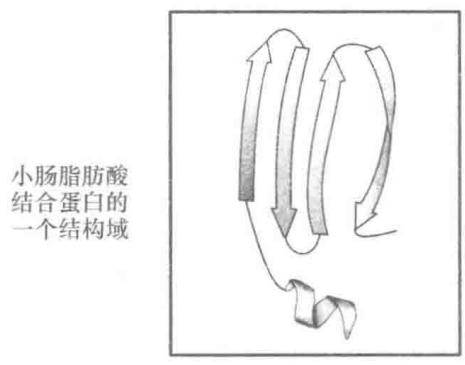

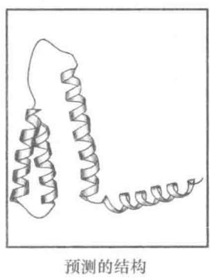  
图 3-60 两种蛋白质结构域的实际结构和应用 LINUS 程序预测的结构比较

<!-- EN-BEGIN 4.4 -->

### 【英文对应 4.4】Protein Denaturation and Folding

> 来源：Lehninger Principles of Biochemistry（书籍/02_生物化学原理） 第4章 The Three-Dimensional Structure of Proteins，§4.4。对应本章“九、蛋白质的变性、折叠和结构预测”。

Proteins lead a surprisingly precarious existence. As we have seen, a native protein conformation is only marginally stable. In addition, most proteins must maintain conformational flexibility in order to function. P4 The continual maintenance of the active set of cellular proteins required under a given set of conditions is called proteostasis. Cellular proteostasis requires the coordinated function of pathways for protein synthesis and folding, the refolding of proteins that are partially unfolded, and the sequestration and degradation of proteins that have been irreversibly unfolded or are no longer needed. In all cells, these networks involve hundreds of enzymes and specialized proteins.

As seen in Figure 4-23, the life of a protein encompasses much more than its synthesis and later degradation. The marginal stability of most proteins can produce a tenuous balance between folded and unfolded states. As proteins are synthesized on ribosomes (Chapter 27), they must fold into their native conformations. Sometimes this occurs spontaneously, but often it requires the assistance of specialized enzymes and complexes called chaperones, which we discuss later in the chapter. Many of these same folding helpers function to refold proteins that become transiently unfolded. Proteins that are not properly folded often have exposed hydrophobic surfaces that render them "sticky," leading to the formation of inactive aggregates. These aggregates may lack their normal function but are not inert; their accumulation in cells lies at the heart of diseases ranging from diabetes to Parkinson disease and Alzheimer disease. Not surprisingly, all cells have elaborate pathways for recycling and/or degrading proteins that are irreversibly misfolded.

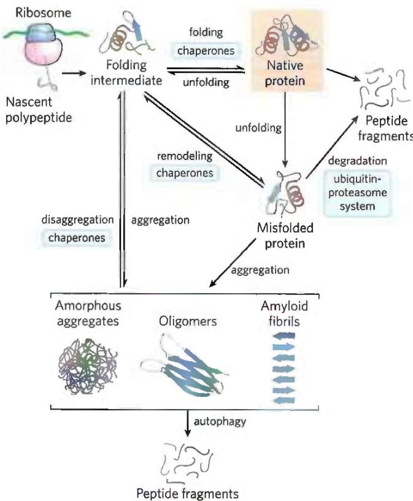  
FIGURE 4-23 Pathways that contribute to proteostasis. Three kinds of processes contribute to proteostasis, in some cases with multiple contributing pathways. First, proteins are synthesized on a ribosome. Second, various pathways contribute to protein folding, many of which involve the activity of complexes called chaperones. Chaperones (including chaperonins) also contribute to the refolding of proteins that are partially and transiently unfolded. Finally, proteins that are irreversibly unfolded are subject to sequestration and degradation by several additional pathways. Partially unfolded proteins and protein-folding intermediates that escape the quality-control activities of the chaperones and degradative pathways may aggregate, forming both disordered aggregates and ordered amyloidlike aggregates that contribute to disease and aging processes. [Information from F. U. Hartl et al., Nature 475:324, 2011, Fig. 6.]

The transitions between the folded and unfolded states, and the network of pathways that control these transitions, now become our focus.

#### [EN] Loss of Protein Structure Results in Loss of Function

Protein structures have evolved to function in particular cellular or extracellular environments. Conditions different from these environments can result in protein structural changes, large and small. A loss of three-dimensional structure sufficient to cause loss of function is called denaturation. The denatured state does not necessarily equate with complete unfolding of the protein and randomization of conformation. Under most conditions, denatured proteins exist in a set of partially folded states.

Most proteins can be denatured by heat, which has complex effects on many weak interactions in a protein (primarily on the hydrogen bonds). If the temperature is increased slowly, a protein's conformation generally remains intact until an abrupt loss of structure (and function) occurs over a narrow temperature range (Fig. 4-24). The abruptness of the change suggests that unfolding is a cooperative process: loss of structure in one part of the protein destabilizes other parts. The effects of heat on proteins can be mitigated by structure. The very heat-stable proteins of thermophilic bacteria and archaea have evolved to function at the temperature of hot springs (\~100 °C). The folded structures of these proteins are often similar to those of proteins in other organisms, but take some of the principles outlined here to extremes. They often feature high densities of charged residues on their surfaces, even tighter hydrophobic packing in their interiors, and folds rendered less flexible by networks of ion pairs. Each of these features makes these proteins less susceptible to unfolding at high temperatures.

Proteins can also be denatured by extremes of pH, by certain miscible organic solvents such as alcohol or acetone, by certain solutes such as urea and guanidine hydrochloride, or by detergents. Each of these denaturing agents represents a relatively mild treatment in the sense that no covalent bonds in the polypeptide chain are broken. Organic solvents, urea, and detergents act primarily by disrupting the hydrophobic aggregation of nonpolar amino acid side chains that produces the stable core of globular proteins; urea also disrupts hydrogen bonds; and extremes of pH alter the net charge on a protein, causing electrostatic repulsion and the disruption of some hydrogen bonding. The denatured structures resulting from these various treatments are not necessarily the same.

  
FIGURE 4-24 Protein denaturation. Results are shown for proteins denatured by two different environmental changes. In each case, the transition from the folded state to the unfolded state is abrupt, suggesting cooperativity in the unfolding process. (a) Thermal denaturation of horse apomyoglobin (myoglobin without the heme prosthetic group) and ribonuclease A (with its disulfide bonds intact; see Fig. 4-26). The midpoint of the temperature range over which denaturation occurs is called the melting temperature, or $T_{\mathrm{m}}$ . Denaturation of apomyoglobin was monitored by

Denaturation often leads to protein precipitation, a consequence of protein aggregate formation as exposed hydrophobic surfaces associate. The aggregates are often highly disordered. One example is the protein precipitate that can be seen after an egg white is boiled. More-ordered aggregates are also observed in some proteins, as we shall see.

#### [EN] Amino Acid Sequence Determines Tertiary Structure

P4 The tertiary structure of a globular protein is determined by its amino acid sequence. The most important proof of this came from experiments showing that denaturation of some proteins is reversible. Certain globular proteins denatured by heat, extremes of pH, or denaturing reagents will regain their native structure and their biological activity if they are returned to conditions in which the native conformation is stable. This process is called renaturation.

A classic example is the denaturation and renaturation of ribonuclease A, demonstrated by Christian Anfinsen in the 1950s. Purified ribonuclease A denatures completely in a concentrated urea solution in the presence of a reducing agent. The reducing agent cleaves the four disulfide bonds to yield eight Cys residues, and the urea disrupts the stabilizing hydrophobic effect, thus freeing the entire polypeptide from its folded conformation. Denaturation of ribonuclease is accompanied by a complete loss of catalytic activity. When the urea and the reducing agent are removed, the denatured ribonuclease spontaneously refolds into its correct tertiary structure, with full restoration of its catalytic activity (Fig. 4-25). The refolding of ribonuclease is so accurate that the four intrachain disulfide bonds are re-formed in the same positions in the renatured molecule as in the native ribonuclease. Later, similar results were obtained using chemically synthesized, catalytically active ribonuclease A. This eliminated the possibility that some minor contaminant in Anfinsen's purified ribonuclease preparation might have contributed to renaturation of the enzyme, and thus it dispelled any remaining doubt that this enzyme folds spontaneously.

  
circular dichroism (see Fig. 4-9), which measures the amount of helical structure in the protein. Denaturation of ribonuclease A was tracked by monitoring changes in the intrinsic fluorescence of the protein, which is affected by changes in the environment of a Trp residue introduced by mutation. (b) Denaturation of disulfide-intact ribonuclease A by guanidine hydrochloride (GdnHCl), monitored by circular dichroism. [Data from (a) R. A. Sendak et al., Biochemistry 35:12,978, 1996; I. Nishii et al., J. Mol. Biol. 250:223, 1995; (b) W. A. Houry et al., Biochemistry 35:10,125, 1996.]

  
FIGURE 4-25 Renaturation of unfolded, denatured ribonuclease. Urea denatures the ribonuclease, and mercaptoethanol (HOCH₂CH₂SH) reduces and thus cleaves the disulfide bonds to yield eight Cys residues. Renaturation involves reestablishing the correct disulfide cross-links.

The Anfinsen experiment provided the first evidence that the amino acid sequence of a polypeptide chain contains all the information required to fold the chain into its native, three-dimensional structure. Subsequent work has shown that only a minority of proteins, many of them small and inherently stable, will fold spontaneously into their native form. Even though all proteins have the potential to fold into their native structure, many require some assistance.

#### [EN] Polypeptides Fold Rapidly by a Stepwise Process

In living cells, proteins are assembled from amino acids at a very high rate. For example, E. coli cells can make a complete, biologically active protein molecule containing 100 amino acid residues in about 5 seconds at 37 °C. However, the synthesis of peptide bonds on the ribosome is not enough; the protein must fold.

How does the polypeptide chain arrive at its native conformation? Let's assume conservatively that each of the amino acid residues could take up 10 different conformations on average, giving $10^{100}$ different conformations for the polypeptide. Let's also assume that the protein folds spontaneously by a random process in which it tries out all possible conformations around every single bond in its backbone until it finds its native, biologically active form. If each conformation were sampled in the shortest possible time ( $\sim 10^{-13}$ second, or the time required for a single molecular vibration), it would take about $10^{77}$ years to sample all possible conformations! Clearly, protein folding is not a completely random, trial-and-error process. There must be shortcuts. This problem was first pointed out by Cyrus Levinthal in 1968 and is sometimes called Levinthal's paradox.

The folding pathway of a large polypeptide chain is unquestionably complicated. However, robust algorithms can often predict the structure of smaller proteins on the basis of their amino acid sequences. The major folding pathways are hierarchical. Local secondary structures form first. Certain amino acid sequences fold readily into $\alpha$ helices or $\beta$ sheets, guided by constraints such as those reviewed in our discussion of secondary structure. Ionic interactions, involving charged groups that are often near one another in the linear sequence of the polypeptide chain, can play an important role in guiding these early folding steps. Assembly of local structures is followed by longer-range interactions between, say, two elements of secondary structure that come together to form stable folded structures. The hydrophobic effect

Amino acid sequence of a 56 residue peptide

  
FIGURE 4-26 A protein-folding pathway as defined for a small protein. A hierarchical pathway is shown, based on computer modeling. Small regions of secondary structure are assembled first and then gradually incorporated into larger structures. The program used for this model has been highly successful in predicting the three-dimensional structure of small proteins from their amino acid sequence. The numbers indicate the amino acid residues in this 56 residue peptide that have acquired their final structure in each of the steps shown. [Information from K. A. Dill et al., Annu. Rev. Biophys. 37:289, 2008, Fig. 5.]

plays a significant role throughout the process, as the aggregation of nonpolar amino acid side chains provides an entropic stabilization to intermediates and, eventually, to the final folded structure. The process continues until complete domains form and the entire polypeptide is folded (Fig. 4-26). Notably, proteins dominated by close-range interactions (between pairs of residues generally located near each other in the polypeptide sequence) tend to fold faster than proteins with more complex folding patterns and with many long-range interactions between different segments. As larger proteins with multiple domains are synthesized, domains near the amino terminus (which are synthesized first) may fold before the entire polypeptide has been assembled.

Thermodynamically, the folding process can be viewed as a kind of free-energy funnel (Fig. 4-27). The unfolded states are characterized by a high degree of conformational entropy and relatively high free energy. As folding proceeds, the narrowing of the funnel reflects the decrease in the conformational space that must be searched as the protein approaches its native state. Small depressions along the sides of the free-energy funnel represent semistable intermediates that can briefly slow the folding process. At the bottom of the funnel, an ensemble of folding intermediates has been reduced to a single native conformation (or one of a small set of native conformations). The funnels can have a variety of shapes, depending on the complexity of the folding pathway, the existence of semistable intermediates, and the potential for particular intermediates to assemble into aggregates of misfolded proteins.

  
(a)  
(b)  
FIGURE 4-27 The thermodynamics of protein folding depicted as free-energy funnels. As proteins fold, the conformational space that can be explored by the structure is constrained. This is modeled as a three-dimensional thermodynamic funnel, with $\Delta G$ represented by the depth of the funnel and the native structure (N) at the bottom (lowest free-energy point). The funnel for a given protein can have a variety of shapes, depending on the number and types of folding intermediates in the folding pathways. Any folding intermediate with significant stability and a finite lifetime would be represented as a local free-energy minimum—a depression on the surface of the funnel. (a) A simple but relatively wide and smooth funnel represents a protein that has multiple folding pathways (that is, the order in which different parts of the protein fold is somewhat random), but it assumes its three-dimensional structure with no folding intermediates that have significant stability. (b) This funnel represents a more typical protein that has multiple possible folding intermediates with significant stability on the multiple pathways leading to the native structure. [Information from K. A. Dill et al., Annu. Rev. Biophys. 37:289, 2008, Fig. 9.]

Thermodynamic stability is not evenly distributed over the structure of a protein—the molecule has regions of relatively high stability and others of low or negligible stability. For example, a protein may have two stable domains joined by a segment that is entirely disordered. Regions of low stability may allow a protein to alter its conformation between two or more states. As we shall see in the next two chapters, variations in the stability of regions within a protein are often essential to protein function. Intrinsically disordered proteins or protein segments do not fold at all.

#### [EN] Some Proteins Undergo Assisted Folding

Not all proteins fold spontaneously as they are synthesized in the cell. Folding for many proteins requires chaperones, proteins that interact with partially folded or improperly folded polypeptides, facilitating correct folding pathways or providing microenvironments in which folding can occur. Several types of molecular chaperones are found in organisms ranging from bacteria to humans. Two major families of chaperones, both well studied, are the Hsp70 family and the chaperonins.

Proteins in the Hsp70 family generally have a molecular weight near 70,000 and are more abundant in cells stressed by elevated temperatures (hence, heat shock proteins of $M_{r}$ 70,000, or Hsp70). Hsp70 proteins bind to regions of unfolded polypeptides that are rich in hydrophobic residues. These chaperones thus “protect” both proteins subject to denaturation by heat and new peptide molecules being synthesized (and not yet folded). Hsp70 proteins also block the folding of certain proteins that must remain unfolded until they have been translocated across a membrane (as described in Chapter 27). Some chaperones also facilitate the quaternary assembly of oligomeric proteins. The Hsp70 proteins bind to and release polypeptides in a cycle that uses energy from ATP hydrolysis and involves several other proteins (including a class called Hsp40). Figure 4-28 illustrates chaperone-assisted folding as elucidated for the eukaryotic Hsp70 and Hsp40 chaperones. The binding of an unfolded polypeptide by an Hsp70 chaperone may break up a protein aggregate or prevent the formation of a new one. When the bound polypeptide is released, it has a chance to resume folding to its native structure. If folding does not occur rapidly enough, the polypeptide may be bound again and the process repeated. Alternatively, the Hsp70-bound polypeptide may be delivered to a chaperonin.

  
FIGURE 4-28 Chaperones in protein folding. The pathway by which chaperones of the Hsp70 class bind and release polypeptides is illustrated for the eukaryotic chaperones Hsp70 and Hsp40. The chaperones do not actively promote the folding of the substrate protein, but instead prevent aggregation of unfolded peptides. The unfolded or partly folded proteins bind first to the open, ATP-bound form of Hsp70. Hsp40 then interacts with this complex and triggers ATP hydrolysis that produces the closed form of the complex, in which the domains colored orange and yellow come together like the two parts of a jaw, trapping parts of the unfolded protein inside. Dissociation of ADP and recycling of the Hsp70 requires interaction with another type of protein called a nucleotide-exchange factor (NEF). For a population of polypeptide molecules, some fraction of the molecules released after the transient binding of partially folded proteins by Hsp70 will take up the native conformation. The remainder are quickly rebound by Hsp70 or diverted to the chaperonin system. [Information from F. U. Hartl et al., Nature 475:324, 2011, Fig. 2. Open Hsp70-ATP: PDB ID 2QXL, Q. Liu and W. A. Hendrickson, Cell 131:106, 2007. Closed Hsp70-ADP: Data from PDB ID 2KHO, E. B. Bertelson et al., Proc. Natl. Acad. Sci. USA 106:8471, 2009, and PDB ID 1DKZ, X. Zhu et al., Science 272:1606, 1996.]

(c) Amyloid fibrils  

Chaperonins are elaborate protein complexes required for the folding of some cellular proteins that do not fold spontaneously. In E. coli, an estimated 10% to 15% of cellular proteins require the resident chaperonin system, called GroEL/GroES, for folding under normal conditions (up to 30% require this assistance when the cells are heat stressed). The analogous chaperonin system in eukaryotes is called Hsp60. The chaperonins first became known when they were found to be necessary for the growth of certain bacterial viruses (hence the designation "Gro"). These chaperone proteins are structured as a series of multisubunit rings, forming two chambers oriented back to back. Inside one of the chambers, a protein is given about 10 seconds to fold. Constraining a protein within the chamber prevents inappropriate protein aggregation and also restricts the conformational space that a polypeptide chain can explore as it folds. The GroEL/GroES folding pathway is discussed in Chapter 27.

Finally, the folding pathways of some proteins require two enzymes that catalyze isomerization reactions. Protein disulfide isomerase (PDI) is a widely distributed enzyme that catalyzes the interchange, or shuffling, of disulfide bonds until the bonds of the native conformation are formed. Among its functions, PDI catalyzes the elimination of folding intermediates with inappropriate disulfide cross-links. Peptide prolyl cis-trans isomerase (PPI) catalyzes the interconversion of the cis and trans isomers of peptide bonds formed by Pro residues (Fig. 4-7), which can be a slow step in the folding of proteins that contain some Pro peptide bonds in the cis configuration.

#### [EN] Defects in Protein Folding Are the Molecular Basis for Many Human Genetic Disorders

Protein misfolding is a substantial problem in all cells. Despite the many processes that assist in protein folding, a quarter or more of all polypeptides synthesized may be destroyed because they do not fold correctly. P4 In some cases, the misfolding causes or contributes to the development of serious disease.

Many conditions, including type 2 diabetes, Alzheimer disease, Huntington disease, and Parkinson disease, are associated with a misfolding mechanism: a soluble protein that is normally secreted from the cell is secreted in a misfolded state and converted into an insoluble extracellular amyloid fiber. The diseases are collectively referred to as amyloidoses. The fibers are highly ordered and unbranched, with a diameter of 7 to

10 nm and a high degree of $\beta$ -sheet structure. The $\beta$ segments are oriented perpendicular to the axis of the fiber. In some amyloid fibers the overall structure includes two layers of $\beta$ sheet, such as that shown for amyloid- $\beta$ peptide in Figure 4-29.

(a)  
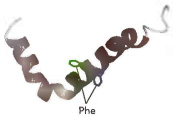

  
(b) Amyloid- $\beta$ peptide  
FIGURE 4-29 Formation of disease-causing amyloid fibrils. (a) Protein molecules whose normal structure includes regions of $\beta$ sheet undergo partial folding. In a small number of the molecules, before folding is complete, the $\beta$ -sheet regions of one polypeptide associate with the same region in another polypeptide, forming the nucleus of an amyloid. Additional protein molecules slowly associate with the amyloid and extend it to form a fibril. (b) The amyloid- $\beta$ peptide begins as two $\alpha$ -helical segments of a larger protein. Proteolytic cleavage of this larger protein leaves the relatively unstable amyloid- $\beta$ peptide, which loses its $\alpha$ -helical structure. It can then assemble slowly into amyloid fibrils (c), which contribute to the characteristic plaques on the exterior of nervous tissue in people with Alzheimer disease. The aromatic side chains shown here play a significant role in stabilizing the amyloid structure. Amyloid is rich in $\beta$ sheet structure, with the $\beta$ strands arranged perpendicular to the axis of the amyloid fibril. Amyloid- $\beta$ peptide takes the form of two layers of extended parallel $\beta$ sheet. [(a) Information from D. J. Selkoe, Nature 426:900, 2003, Fig. I. (b) Data from PDB ID 1IYT, O. Crescenzi et al., Eur. J. Biochem. 269:5642, 2002. (c) Data from PDB ID 2BEG, T. Lührs et al., Proc. Natl. Acad. Sci. USA 102:17,342, 2005.]

#### [EN] Death by Misfolding: The Prion Diseases

A misfolded brain protein seems to be the causative agent of several rare degenerative brain diseases in mammals. Perhaps the best known of these is bovine spongiform encephalopathy (BSE; also known as mad cow disease). Related diseases include kuru and Creutzfeldt-Jakob disease in humans, scrapie in sheep, and chronic wasting disease in deer and elk. These diseases are also referred to as spongiform encephalopathies, because the diseased brain frequently becomes riddled with holes (Fig. 1). Progressive deterioration of the brain leads to a spectrum of neurological symptoms, including weight loss; erratic behavior; problems with posture, balance, and coordination; and loss of cognitive function. The diseases are fatal.

(a)  
(b)  
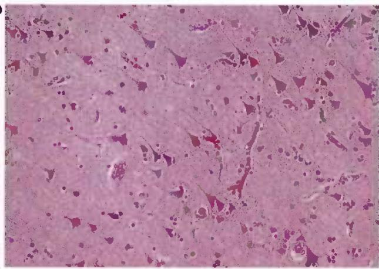  
FIGURE 1 (a) Light micrograph of pyramidal cells in the human cerebral cortex. (b) A comparable section from the autopsy of a patient with Creutzfeldt-Jakob disease shows spongiform (vacuolar) degeneration, the most characteristic neurohistological feature. The yellowish

Many proteins can take on the amyloid fibril structure as an alternative to their normal folded conformations, and most of these proteins have a concentration of aromatic amino acid residues in a core region of $\beta$ sheet or $\alpha$ helix. The proteins are secreted in an incompletely folded conformation. The core (or some part of it) folds into a $\beta$ sheet before the rest of the protein folds correctly, and the $\beta$ sheets of two or more incompletely folded protein molecules associate to begin forming an amyloid fibril. The fibril grows in the extracellular space. Other parts of the protein then fold differently, remaining on the outside of the $\beta$ -sheet core in the growing fibril. The effect of aromatic residues in stabilizing the structure is shown in Figure 4-29c. Because most of the protein molecules fold normally, the onset of symptoms in the amyloidoses is often very slow. If a person inherits a mutation such as substitution with an aromatic residue at a position that favors formation of amyloid fibrils, disease symptoms may begin at an earlier age.

In the 1960s, investigators found that preparations of the disease-causing agents seemed to lack nucleic acids. At this time, Tikvah Alper suggested that the agent was a protein. Initially, the idea seemed heretical. All disease-causing agents known up to that time—viruses, bacteria, fungi, and so on—contained nucleic acids, and their virulence was related to genetic reproduction and propagation. However, four decades of investigations, pursued most notably by Stanley Prusiner, have provided evidence that spongiform encephalopathies are different.

The infectious agent has been traced to a single protein ( $M_{r}$ 28,000), which Prusiner dubbed prion protein (PrP). The name was derived from proteinaceous infectious, but

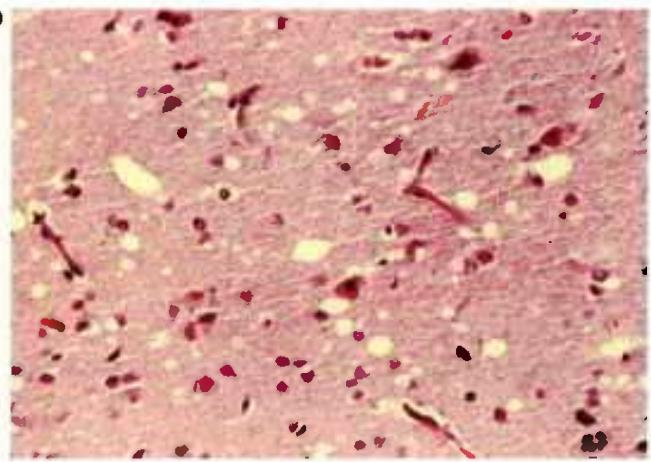  
vacuoles are intracellular and occur mostly in pre- and postsynaptic processes of neurons. The vacuoles in this section vary in diameter from 20 to 100 $\mu$ m. [(a) Science Stock Photography/Science Source (b) Ralph C. Eagle, Jr./Science Source.]

The amyloid deposition diseases that trigger neurodegeneration, particularly in older adults, are a special class of localized amyloidoses. Alzheimer disease is associated with extracellular amyloid deposition by neurons, involving the amyloid- $\beta$ peptide (Fig. 4-29b), derived from a larger transmembrane protein (amyloid- $\beta$ precursor protein) found in most human tissues. When it is part of the larger protein, the peptide is composed of two $\alpha$ -helical segments spanning the membrane. When the external and internal domains are cleaved off by specific proteases, the relatively unstable amyloid- $\beta$ peptide leaves the membrane and loses its $\alpha$ -helical structure. It can then take the form of two layers of extended parallel $\beta$ sheet, which can slowly assemble into amyloid fibrils (Fig. 4-29c). Deposits of these amyloid fibers seem to be the primary cause of Alzheimer disease, but a second type of amyloidlike aggregation, involving a protein called tau, also occurs intracellularly (in neurons) in people with Alzheimer disease. Inherited mutations in

Prusiner thought that "prion" sounded better than "proin." Prion protein is a normal constituent of brain tissue in all mammals. Its role is not known in detail, but it may have a molecular signaling function. Strains of mice lacking the gene for PrP (and thus the protein itself) suffer no obvious ill effects. Illness occurs only when the normal cellular PrP, or $\mathrm{PrP}^{\mathrm{C}}$ , occurs in an altered conformation called $\mathrm{PrP}^{\mathrm{Sc}}$ (Sc denotes scrapie). The structure of $\mathrm{PrP}^{\mathrm{C}}$ has two $\alpha$ helices. The structure of $\mathrm{PrP}^{\mathrm{Sc}}$ is very different, with much of the structure converted to amyloid-like $\beta$ sheets (Fig. 2). The interaction of $\mathrm{PrP}^{\mathrm{Sc}}$ with $\mathrm{PrP}^{\mathrm{C}}$ converts the latter to $\mathrm{PrP}^{\mathrm{Sc}}$ , initiating a domino effect in which more and more of the brain protein converts to the disease-causing form. The mechanism by which the presence of $\mathrm{PrP}^{\mathrm{Sc}}$ leads to spongiform encephalopathy is not understood.

In inherited forms of prion diseases, a mutation in the gene encoding PrP produces a change in one amino acid residue that is believed to make the conversion of $\mathrm{PrP}^{\mathrm{C}}$ to $\mathrm{PrP}^{\mathrm{Sc}}$ more likely. A complete understanding of prion diseases awaits new information on how prion protein affects brain function. Structural information about PrP is beginning to provide insights into the molecular process that allows the prion proteins to interact so as to alter their conformation (Fig. 2). The significance of prions may extend well beyond spongiform encephalopathies. Evidence is building that prionlike proteins may be responsible for additional neurodegenerative diseases such as multiple system atrophy (MSA), a disease that resembles Parkinson disease.

the tau protein do not result in Alzheimer disease, but they cause a frontotemporal dementia and parkinsonism (a condition with symptoms resembling Parkinson disease) that can be equally devastating.

Several other neurodegenerative conditions involve intracellular aggregation of misfolded proteins. In Parkinson disease, the misfolded form of the protein $\alpha$ -synuclein aggregates into spherical filamentous masses called Lewy bodies. Huntington disease involves the protein huntingtin, which has a long polyglutamine repeat. In some individuals, the polyglutamine repeat is longer than normal, and a more subtle type of intracellular aggregation occurs. Notably, when the mutant human proteins involved in Parkinson disease and Huntington disease are expressed in Drosophila melanogaster, the flies display neurodegeneration expressed as eye deterioration, tremors, and early death. All of these symptoms are highly suppressed if expression of the Hsp70 chaperone is also increased.

  
FIGURE 2 Structure of the globular domain of human PrP and models of the misfolded, disease-causing conformation $\mathrm{PrP}^{\mathrm{Sc}}$ , and an aggregate of $\mathrm{PrP}^{\mathrm{Sc}}$ . The $\alpha$ helices are labeled to help illustrate the modeled conformational change as the globular protein progresses to the aggregate. Helix A is incorporated into the $\beta$ -sheet structure of the misfolded conformation. [Data for human PrP from PDB ID 1QLX, R. Zahn et al., Proc. Natl. Acad. Sci. USA 97:145, 2000. Information for models from C. Govaerts et al., Proc. Natl. Acad. Sci. USA 101:8342, 2004.]

Protein misfolding need not lead to amyloid formation to cause serious disease. For example, cystic fibrosis is caused by defects in a membrane-bound protein called cystic fibrosis transmembrane conductance regulator (CFTR), which acts as a channel for chloride ions. The most common cystic fibrosis-causing mutation is the deletion of a Phe residue at position 508 in CFTR, which causes improper protein folding. Most of this protein is then degraded and its normal function is lost (see Box 11-2). Drugs that can correct certain CFTR misfolding events have been developed. Such drugs are called "correctors" or "pharmacological chaperones." Many of the disease-related mutations in collagen (p. 118) also cause defective folding. A particularly remarkable type of protein misfolding is seen in the prion diseases (Box 4-4).

#### [EN] SUMMARY 4.4 Protein Denaturation and Folding

The maintenance of the steady-state collection of active cellular proteins required under a particular set of conditions—called proteostasis—involves an elaborate set of pathways and processes that fold, refold, and degrade polypeptide chains.

The three-dimensional structure and the function of most proteins can be destroyed by denaturation, demonstrating a relationship between structure and function. Heat, extremes of pH, organic solvents, solutes, and detergents can all be used to denature proteins.

■ Some denatured proteins can renature spontaneously to form biologically active protein, showing that tertiary structure is determined by amino acid sequence.

■ Protein folding occurs too fast for it to be a completely random process. Instead, protein folding is generally hierarchical. Initially, regions of secondary structure may form, followed by folding into motifs and domains. Large ensembles of folding intermediates are rapidly brought to a single native conformation.

For many proteins, folding is facilitated by Hsp70 chaperones and by chaperonins. Disulfide-bond formation and the cis-trans isomerization of Pro peptide bonds can also be catalyzed by specific enzymes during folding.

■ Protein misfolding is the molecular basis for many human diseases, including cystic fibrosis and amyloidoses such as Alzheimer disease.

<!-- EN-END 4.4 -->

## 提要

一个典型的蛋白质通常具有一个或多个反映其功能的三维结构或称构象。有些蛋白质的一些区段具有固有的无规则结构。

稳定蛋白质构象的力主要是几种弱的相互作用,其中熵驱动的疏水相互作用对稳定大多数可溶性蛋白质的球状结构作出主要贡献,范德华力也作出贡献,氢键和离子相互作用在热力学上最稳定的结构中达到最适度。在某些蛋白质中,共价二硫键在稳定构象方面起着重要作用。

多肽主链中的共价键限制主链自身的折叠。由于肽键（C—N）具有部分双键性质，使得整个6-原子肽基处于刚性平面构型（酰胺平面）。 $N—C_{\alpha}$ 和 $C_{\alpha}—N$ 键可以旋转，分别规定二面角 $\phi$ 和 $\psi$ 。拉氏构象图表示出一个蛋白质多肽链中哪些 $C_{\alpha}$ 的成对二面角 $\phi$ 和 $\psi$ 值在立体化学上是被允许的，哪些是不被允许的。

X 射线晶体学和核磁共振(NMR)波谱学可在原子水平上测定蛋白质的三维结构；NMR、紫外差、荧光和荧光偏振和圆二色性(CD)等光谱学方法可用于研究溶液中的蛋白质构象。CD 光谱是测定常见二级结构和检测蛋白质折叠的方法。

蛋白质二级结构是指多肽链的一个区段中主链原子的局部空间排列，或者说二级结构是主链折叠时形成的由氢键稳定的规则结构。最常见的二级结构元件有 $\alpha$ 螺旋、 $\beta$ 构象（或 $\beta$ 片）和 $\beta$ 转角等。 $\alpha$ 螺旋是蛋白质中最典型、含量最丰富的二级结构。 $\beta$ 构象中肽链主链处于伸展的扭曲形式，肽链之间或一条肽链的区段（肽段）之间借助氢键彼此可连成片状结构，称为 $\beta$ 片，其中每个肽段称为 $\beta$ 股；肽链走向可以是平行或反平行的。如果多肽链的一个区段中所有氨基酸残基的 $\phi$ 和 $\psi$ 角均为已知，则该区段的二级结构完全可以被确定。

蛋白质三级结构是指一个多肽链(亚基或单体蛋白质)的完整三维结构。根据三维结构(形状和溶解度)许多蛋白质可以归于两大类蛋白质中的一类。一类是纤维状蛋白质,主要起结构作用,它们具有二级结构的简单重复元件。归属于这一类的有α-角蛋白、丝心蛋白、胶原蛋白、弹性蛋白和血纤蛋白原等。另一类是球状蛋白质,它们有更复杂的三级结构,经常在同一个多肽链中含有几种类型的二级结构。这一类蛋白质都是可溶性的功能蛋白,如酶、抗体、转运蛋白和蛋白质激素等。与之相关的膜蛋白是一类与膜的结构和功能紧密相关的蛋白质,它们又分为膜周边蛋白质、膜内在蛋白质以及脂锚定蛋白质(兼在膜蛋白质)。

超二级结构和结构域是二、三级结构之间的两个亚层次。超二级结构是指在一级序列上相邻的二级结构元件在三维折叠中彼此靠近并相互作用形成的组合体。超二级结构（或称模体）有几种基本形式，如 $\alpha \alpha$ （螺旋束）、 $\beta \alpha \beta$ （如 Rossman 折叠）、 $\beta \beta$ （ $\beta$ 曲折和希腊钥匙拓扑结构）。结构域是在二级结构和超二级结构的基础上形成的并相对稳定和独立的三级结构局部折叠区。结构域常常也就是功能域。结构域的基本类型有全 $\alpha$ 类、全 $\beta$ 类、 $\alpha / \beta$ 类和 $\alpha + \beta$ 类。此外还有富含金属或二硫键的结构域等。

球状蛋白质可根据它们的结构域分为全 $\alpha$ 蛋白质、全 $\beta$ 蛋白质、 $\alpha / \beta$ 蛋白质、 $\alpha + \beta$ 蛋白质和富含金属或二硫键蛋白质（不规则小蛋白质结构）等。球状蛋白质有些是单亚基的，称单体蛋白质，有些是多亚基的，称为寡聚或多聚蛋白质。球状蛋白质虽然种类多、结构复杂，各有自己独特的三维结构。但它们仍有共同的结构特征：①一个分子可以含有多种二级结构元件；②具有明显的结构层次；③紧密折叠成球状或椭球状结构；④疏水侧链埋藏在分子内部，亲水基团暴露在分子表面；⑤分子表面往往有一个空穴（活性部位）。

膜蛋白是一类与膜结构和膜活性功能紧密相关的蛋白质，它们又分为膜周边蛋白质、膜内在蛋白质以及脂锚定蛋白质（兼在膜蛋白质）。

由两个或多个具有三级结构的亚基通过非共价相互作用缔合成寡聚蛋白质。亚基的缔合方式或组织形式称为蛋白质的四级结构，它涉及亚基在寡聚体中的空间排列（对称性）以及亚基之间的接触位点（结构互补）和作用力（非共价相互作用的类型）等。大多数寡聚蛋白质中亚基的排列完全符合晶体学的点群对称原则、最常见的是环状对称，此外还有二面体对称、立方体对称和螺旋对称等。

蛋白质的变性和复性实验表明蛋白质的氨基酸序列规定了它的三维结构。蛋白质的生物学功能是蛋白质的天然构象所具有的性质。天然构象是在生理条件下热力学上最稳定的即自由能最低的三维结构。

蛋白质折叠不是通过随机搜索找到自由能最低的构象。折叠动力学研究表明，多肽链的折叠是分阶段、分层次、快速地完成的。最初，形成局部的二级结构（此阶段称为成核过程），接着借这些构象核折叠成初始的模体和结构域，它们进一步装配成大的折叠中间体（相当熔球态），后者快速导致一个天然构象的形成。在细胞中多肽链折叠还有伴侣蛋白（如Hsp70）和陪伴蛋白以及酶的参与。二硫键形成和Pro肽键的顺反异构化都有专一的酶催化。

从蛋白质的一级序列预测三维结构的研究也取得很大进展。例如根据 Chou-Fasman 算法预测二级结构，应用折叠的计算机模拟预测三级结构。

## 习题

1. (a) 计算一个含有 78 个氨基酸的 $\alpha$ 螺旋的轴长。(b) 此多肽的 $\alpha$ 螺旋完全伸展时有多长?

2. 某一蛋白质的多肽链除了一些区段为 $\alpha$ 螺旋构象外，其他区段均为 $\beta$ 折叠片构象。该蛋白质相对分子质量为 240 000，多肽链外形的长度为 $5.06 \times 10^{-5} \, cm$ 。试计算， $\alpha$ 螺旋占该多肽链的百分数（假设 $\beta$ 折叠片构象中每个氨基酸残基的长度为 0.35 nm）。

3. 虽然在真空中氢键键能约为 20 kJ/mol, 但在折叠的蛋白质中对蛋白质的稳定焓贡献却要小得多 (<5 J/mol)。试解释这种差别的原因。

4. 多聚甘氨酸是一个简单的多肽, 能形成一个具有 $\phi = -80^{\circ}, \psi = +120^{\circ}$ 的螺旋, 根据拉氏构象图(图 3-3), 描述该螺旋的(a)手性,(b)每圈的残基数。

5. $\alpha$ 螺旋的稳定性不仅取决于肽键间的氢键形成，而且还取决于肽链的氨基酸侧链性质。试预测在室温下的溶液中，下列多聚氨基酸哪些种将形成 $\alpha$ 螺旋，哪些种形成其他有规则的结构，哪些种不能形成有规则的结构？并说明理由。（a）多聚亮氨酸， $\mathrm{pH} = 7.0$ ；（b）多聚异亮氨酸， $\mathrm{pH} = 7.0$ ；（c）多聚精氨酸， $\mathrm{pH} = 7.0$ ；（d）多聚精氨酸， $\mathrm{pH} = 13.0$ ；（e）多聚谷氨酸， $\mathrm{pH} = 1.5$ ；（f）多聚苏氨酸， $\mathrm{pH} = 7.0$ ；（g）多聚脯氨酸， $\mathrm{pH} = 7.0$ 。

6. 多聚甘氨酸的右手或左手的 $\alpha$ 螺旋中, 哪一个比较稳定? 为什么?

7. 考虑一个小的含 101 残基的蛋白质。该蛋白质将有 200 个可旋转的键。并假设对每个键 $\phi$ 和 $\psi$ 有两个定向。问：(a) 这个蛋白质可能有多少种随机构象 ( $w$ )? (b) 根据 (a) 的答案计算在当使 $1 \mathrm{~mol}$ 该蛋白质折叠成只有一种构象的结构时构象熵的变化 ( $\Delta S_{\text{折叠}}$ )。(c) 如果蛋白质完全折叠成由氢键作为稳定焓的唯一来源的 $\alpha$ 螺旋，并且每 mol 氢键对焓的贡献为 $-5 \mathrm{~kJ/mol}$ 。试计算 $\Delta H_{\text{折叠}}$ 。(d) 根据你的 (b) 和 (c) 的答案，计算 $25^{\circ} \mathrm{C}$ 时蛋白质的 $\Delta G_{\text{折叠}}$ 。该蛋白质的折叠形式在 $25^{\circ} \mathrm{C}$ 时是否稳定？

8. 两个多肽链 A 和 B 有着相似的三级结构。但是在正常情况下 A 是以单体形式存在的，而 B 是以四聚体 $\left(\mathrm{B}_{4}\right)$ 形式存在的。问 A 和 B 的氨基酸组成可能有什么差别。

9. 下面两个肽(a)和(b)，哪一个更可能采取 $\alpha$ 螺旋的二级结构？为什么？

$$
(a) \text { LKAENDEAARAMSEA }
$$

$$
(b) \text { C   R   A   G   G   F   P   W   D   Q   P   G   T   S   N }
$$

10. 下面的序列是一个球状蛋白质的一部分。利用表 3-9 中的数据和 Chou-Fasman 的经验规则预测此区域的二级结构。

$$
1 \quad 5 \quad 1 0 \quad 1 5 \quad 2 0 \quad 2 5 \quad 3 0
$$

$$
\text { RRPVVLMAACLRPVVFITYGDGGTYYHWYH }
$$

11. 从热力学考虑, 完全暴露在水环境中和完全埋藏在蛋白质分子非极性内部的两种多肽片段, 哪一种更容易形成 $\alpha$ 螺旋? 为什么?

12. 一种酶 $M_{\mathrm{r}}$ 为300000，在酸性环境中可解离成两个不同组分，其中一个组分的 $M_{\mathrm{r}}$ 为100000，另一个为50000。大的组分占总蛋白的三分之二，具有催化活性；小的组分无活性。用 $\beta-$ 疏基乙醇（能还原二硫桥）处理时，大的失去催化能力，并且它的沉降速度减小，但沉降图案上只呈现一个峰（参见第5章）。关于该酶的结构可作出什么结论？

13. 今有一种植物的毒素蛋白。直接用 SDS 凝胶电泳分析（见第 5 章）时，它的区带位于肌红蛋白（ $M_r$ 为 16900）和 $\beta-$ 乳球蛋白（ $M_r$ 为 37100）两种蛋白质之间，当这个毒素蛋白用 $\beta-$ 疏基乙醇和碘乙醇处理后，在 SDS 凝胶电泳中仍得到一条区带，但其位置靠近标记蛋白细胞色素 $c(M_r$ 为 13370）。进一步实验表明，该毒素蛋白与 FDNB 反应并用酸水解后，释放出游离的 DNP-Gly 和 DNP-Tyr。关于此蛋白的结构,你能作出什么结论?

14. 一种蛋白质是由相同亚基组成的四聚体。(a)对该分子说出两种可能的对称性。稳定缔合的是哪种类型的相互作用(同种或异种)? (b)假设四聚体,如血红蛋白,是由两个相同的单位(每个单位含 $\alpha$ 和 $\beta$ 两种链)组成的。问它的最高对称性是什么?

15. 证明一个多阶段装配过程比一个单阶段装配过程更容易控制蛋白质的质量。考虑一个复合体多聚体酶的合成，此复合体含6个相同的二聚体，每个二聚体由一个多肽A和一个多肽B组成，多肽A和B的长度分别为300个和700个氨基酸残基。假设从氨基酸合成多肽链，多肽链组成二聚体，再从二聚体聚集成多聚体酶，在这一建造过程中每次操作的错误频率为 $10^{-8}$ ，假设氨基酸序列没有错误的话，多肽的折叠总是正确的，并假设在每一装配阶段剔除有缺陷的亚结构效率为100%。试比较在下列情况下有缺陷复合体的频率：(a)该复合体以一条6000个氨基酸连续的多肽链一步合成，链内含有6个多肽A和6个多肽B。(b)该复合体分3个阶段形成：第一阶段，多肽A和B的合成：第二阶段，AB二聚体的形成；第三阶段，6个AB二聚体装配成复合体。

## 主要参考书目

1. 卢光莹, 华子千. 生物大分子晶体学基础. 北京: 北京大学出版社, 1995.

2. 来鲁华, 等. 蛋白质的结构预测与分子设计. 北京: 北京大学出版社, 1993.

3. 李庆国, 汪和睦, 李安之. 分子生物物理学. 北京: 高等教育出版社, 1992.

4. 王克夷. 蛋白质导论. 北京: 科学出版社, 2007.

5. McMurry J E. Chemistry O. 7th ed. Belmont: Cengage Learning, 2008.

6. Garrett R H, Grisham C M. Biochemistry. 5th ed. Belmont: Cengage Learning, 2013.

7. Wilson K, Walker J M. Principles and Techniques of Practical Biochemistry. 5th ed. New York: Cambridge University Press, 2000

8. Stryer L. Biochemistry. 6th ed. New York: W. H. Freeman and Company, 2007.

9. Nelson D L, Cox M M. Lehninger Principles of Biochemistry. 6th ed. New York: W. H. Freeman and Company, 2013.

10. Srinivansan R, Rose G D. LINUS: A hierarchic procedure to predict the fold of a protein. Proteins. 1995, 22:81-99.

(徐长法)

## 网上资源

习题答案

<!-- EN-BEGIN 第4章章末 -->

## 【英文对应 第4章章末】The Three-Dimensional Structure of Proteins：关键术语、习题与简答

> 来源：Lehninger Principles of Biochemistry（书籍/02_生物化学原理） 第4章章末，以及书末 Abbreviated Solutions to Problems 第4章。

### [EN] KEY TERMS

Terms in bold are defined in the glossary.

conformation 106  
native conformation 107  
hydrophobic effect 108  
solvation layer 108  
secondary structure 111 $\alpha$ helix 111 $\beta$ conformation 114 $\beta$ sheet 114 $\beta$ turn 114  
Ramachandran plot 115  
circular dichroism (CD) spectroscopy 116  
tertiary structure 116  
quaternary structure 116  
fibrous proteins 116  
globular proteins 116  
intrinsically disordered proteins 117 $\alpha$ -keratin 117  
collagen 118

fibroin 120
Protein Data Bank (PDB) 122
motif 123
fold 123
domain 123
topology diagram 125
protein family 125
multimer 127
oligomer 127
protomer 127
proteostasis 129
denaturation 129
renaturation 130
chaperone 132
Hsp70 132
chaperonin 133
proteolylalfide isomerase (PDI)
133

peptide prolyl cis-trans isomerase (PPI) 133
amyloid 133
amyloidoses 133
prion 134

x-ray crystallography 136
nuclear magnetic resonance (NMR) spectroscopy 137
cryo-electron microscopy (cryo-EM) 140

### [EN] PROBLEMS

1. Properties of the Peptide Bond In x-ray studies of crystalline peptides, Linus Pauling and Robert Corey found that the C—N bond in the peptide link is intermediate in length (1.32 Å) between a typical C—N single bond (1.49 Å) and a C=N double bond (1.27 Å). They also found that the peptide bond is planar (all four atoms attached to the C—N group are located in the same plane) and that the two α-carbon atoms attached to the C—N are always trans to each other (on opposite sides of the peptide bond).

(a) What does the length of the C—N bond in the peptide linkage indicate about its strength and its bond order (i.e., whether it is single, double, or triple)?

(b) What do Pauling and Corey's observations tell us about the ease of rotation about the C—N peptide bond?

2. Structural and Functional Relationships in Fibrous Proteins William Astbury discovered that the x-ray diffraction pattern of wool shows a repeating structural unit spaced about 5.2 Å along the length of the wool fiber. When he steamed and stretched the wool, the x-ray pattern showed a new repeating structural unit at a spacing of 7.0 Å. Steaming and stretching the wool and then letting it shrink gave an x-ray pattern consistent with the original spacing of about 5.2 Å. Although these observations provided important clues to the molecular structure of wool, Astbury was unable to interpret them at the time.

(a) Given our current understanding of the structure of wool, interpret Astbury's observations.

(b) When wool sweaters or socks are washed in hot water or heated in a dryer, they shrink. Silk, on the other hand, does not shrink under the same conditions. Explain.

3. Rate of Synthesis of Hair $\alpha$ -Keratin Hair grows at a rate of 15 to 20 cm/yr. All this growth is concentrated at the base of the hair fiber, where $\alpha$ -keratin filaments are synthesized inside living epidermal cells and assembled into rope-like structures (see Fig. 4-10). The fundamental structural element of $\alpha$ -keratin is the $\alpha$ helix, which has 3.6 amino acid residues per turn and a rise of 5.4 Å per turn (see Fig. 4-3a). Assuming that the biosynthesis of $\alpha$ -helical keratin chains is the rate-limiting factor in the growth of hair, calculate the rate at which peptide bonds of $\alpha$ -keratin chains must be synthesized (peptide bonds per second) to account for the observed yearly growth of hair.

4. Effect of pH on the Conformation of $\alpha$ -Helical Secondary Structures Specific rotation is a measure of a solution's capacity to rotate circularly polarized light. The unfolding of the $\alpha$ helix of a polypeptide to a randomly coiled conformation is accompanied by a large decrease in a property called specific rotation. Polyglutamate, a polypeptide made up of only L-Glu residues, is an $\alpha$ helix at pH 3. When researchers raise the pH to 7, there is a large decrease in the specific rotation of the solution. Similarly, polylysine (L-Lys residues) is an $\alpha$ helix at pH 10, but when researchers lower the pH to 7, the specific rotation also decreases, as shown in the graph.

Explain the effect of the pH changes on the conformations of poly(Glu) and poly(Lys). Why does the transition occur over such a narrow range of pH?

5. Disulfide Bonds Determine the Properties of Many Proteins Some natural proteins are rich in disulfide bonds, and their mechanical properties, such as tensile strength, viscosity, and hardness, correlate with the degree of disulfide bonding.

(a) Glutenin, a wheat protein rich in disulfide bonds, imparts the cohesive and elastic character of dough made from wheat flour. Similarly, the hard, tough nature of tortoise shell results from the extensive disulfide bonding in its $\alpha$ -keratin. What is the molecular basis for the correlation between disulfide-bond content and mechanical properties of the protein?

(b) Most globular proteins denature and lose their activity when they are briefly heated to 65°C. However, the denaturation of globular proteins that contain multiple disulfide bonds often requires longer heat exposure at higher temperatures. One such protein is bovine pancreatic trypsin inhibitor (BPTI), which has 58 amino acid residues in a single peptide chain and contains three disulfide bonds. After a solution of denatured BPTI is cooled, the protein regains its activity. What is the molecular basis for this property of BPTI?

6. Dihedral Angles Consider the series of torsion angles, $\phi$ and $\psi$ , that might be taken up by the peptide backbone. Which of these closely correspond to $\phi$ and $\psi$ for an idealized collagen triple helix? Refer to Figure 4-8 as a guide.

7. Amino Acid Sequence and Protein Structure Our growing understanding of how proteins fold allows researchers to make predictions about protein structure based on primary amino acid sequence data. Consider this amino acid sequence.

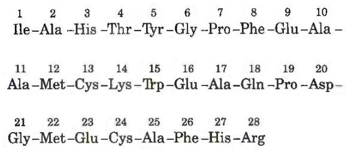

(a) Where might bends or $\beta$ turns occur?

(b) Where might intrachain disulfide cross-linkages form?

(c) Suppose that this sequence is part of a larger globular protein. Indicate the probable location (external surface or interior of the protein) of each amino acid residue: Asp, Ile, Thr, Ala, Gln, Lys. Explain your reasoning. (Hint: See the hydropathy index in Table 3-1.)

8. Amino Acid Contributions to Protein Folding Like ribonuclease A, lysozyme from T4 phage is a model enzyme for understanding the energetics and pathways of protein folding. Unlike ribonuclease A, however, T4 lysozyme does not contain any disulfide bonds. A number of studies have quantified the thermodynamic contributions that individual amino acid residues and their interactions make to T4 lysozyme folding.

(a) An ion pair between an Asp and a His residue in T4 lysozyme contributes 13–21 kJ/mol of favorable folding energy at pH 6.0. However, this ion pair contributes much less to lysozyme folding at either pH 2.0 or pH 10.0. How can you explain this observation?

(b) Suppose that a Met residue buried in the folded, hydrophobic core of T4 lysozyme is replaced by mutation with a Lys residue. How would the mutation affect a plot of the thermal denaturation of T4 lysozyme at pH 3.0? (See Fig. 4-24a for an example of a thermal denaturation plot.)

(c) Suppose that the thermal denaturation experiment on the protein with the Met to Lys mutation took place at pH 10.0. Predict whether the mutation would have a greater or a lesser impact on protein stability at pH 10.0 than at pH 3.0. Explain your prediction.

9. Bacteriorhodopsin in Purple Membrane Proteins Under the proper environmental conditions, the salt-loving archaeon Halobacterium halobium synthesizes a membrane protein ( $M_{r}$ 26,000) known as bacteriorhodopsin, which is purple because it contains retinal (see Fig. 10-20). Molecules of this protein aggregate into “purple patches” in the cell membrane. Bacteriorhodopsin acts as a light-activated proton pump that provides energy for cell functions. X-ray analysis of this protein reveals that it consists of seven parallel $\alpha$ -helical segments, each of which traverses the bacterial cell membrane (thickness 45 Å). Calculate the minimum number of amino acid residues necessary for one segment of $\alpha$ helix to traverse the membrane completely. Estimate the fraction of the bacteriorhodopsin protein that is involved in membrane-spanning helices. (Use an average amino acid residue weight of 110.)

10. Conservation of Protein Structure Margaret Oakley Dayhoff originated the idea of protein superfamilies after noticing that proteins with diverse amino acid sequences can have similar tertiary structures. Why can protein structure be more highly conserved than individual amino acid sequences?

(c)

11. Interpreting Ramachandran Plots Examine the two proteins labeled (a) and (b) below. Which of the two Ramachandran plots, labeled (c) and (d) at right, is more likely to be derived from which protein? Why? [Data from (a) PDB ID 1GWY, J. M. Mancheno et al., Structure 11:1319, 2003; (b) PDB ID 1A6M, J. Vojtechovsky et al., Biophys. J. 77:2153, 1999.]

12. Number of Polypeptide Chains in a Multisubunit Protein A researcher treated a sample (660 mg) of an oligomeric protein of $M_{r}$ 132,000 with an excess of 1-fluoro-2,4-dinitrobenzene (Sanger's reagent) under slightly alkaline conditions until the chemical reaction was complete. He then completely hydrolyzed the peptide bonds of the protein by heating it with concentrated HCl. The hydrolysate was found to contain 5.5 mg of the compound shown.

2,4-Dinitrophenyl derivatives of the $\alpha$ -amino groups of other amino acids could not be found.

(a) Explain how this information can be used to determine the number of polypeptide chains in an oligomeric protein.

(b) Calculate the number of polypeptide chains in this protein.

(c) What other analytic technique could you employ to determine whether the polypeptide chains in this protein are similar or different?

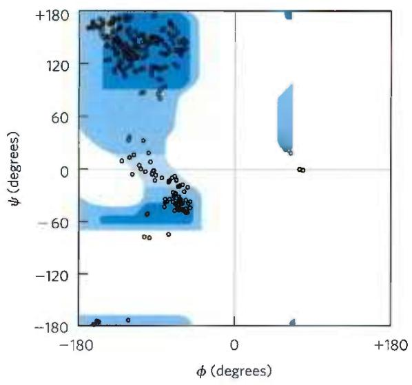

  
(d)

13. Amyloid Fibers in Disease Several small aromatic molecules, such as phenol red (used as a nontoxic drug model), have been shown to inhibit the formation of amyloid in laboratory model systems. A goal of the research on these small aromatic compounds is to find a drug that efficiently inhibits the formation of amyloid in the brain in people with incipient Alzheimer disease.

(a) Suggest why molecules with aromatic substituents would disrupt the formation of amyloid.

(b) Some researchers suggest that a drug used to treat Alzheimer disease may also be effective in treating type 2 (non-insulin-dependent) diabetes mellitus. Why might a single drug be effective in treating these two different conditions?

14. Protein-Folding Therapies The Food and Drug Administration recently approved the drug lumacaftor for the treatment of cystic fibrosis in patients with the F508ΔCFTR mutation. This mutation is a genetically encoded deletion of amino acid F508 from the protein. About $\frac{2}{3}$ of cystic fibrosis patients have this mutation, and lumacaftor is one of the first drugs that functions as a pharmacological chaperone to correct a defect in the protein-folding process. However, lumacaftor is not always effective in treating patients who have other CFTR mutations that result in misfolding. Why is lumacaftor able to correct the misfolding of some mutant CFTR proteins and not others?

15. Structural Biology Methods Which structural biology method (CD, x-ray crystallography, NMR, or cryo-EM) is best suited to each task?

(a) Obtaining an ultra-high resolution (<1.5 Å) structure of a drug bound to its protein target

(b) Obtaining a low-to-medium resolution (5–10 Å) reconstruction of the 11 MDa (11,000,000 Da) bacterial flagellar motor

(c) Identifying the protonation state and $pK_{a}$ of a His side chain in an enzyme active site

(d) Determining whether a protein is intrinsically disordered or contains secondary structure elements

### [EN] BIOCHEMISTRY ONLINE

16. Using the PDB The Protein Data Bank (PDB) contains more than 150,000 different three-dimensional biomolecular structures obtained by x-ray crystallography, NMR, and cryo-EM. Each protein structure deposited into the database is given a PDB ID. Several PDB IDs represent proteins whose structures resemble letters from the Roman alphabet. Find each protein structure in the PDB and view the three-dimensional structure using JSmol, PYMOL, or a similar structure viewer.

PDB IDs: 2QYC, 2BNH, 2Q5R, 1XU9, 3H7X, 1OU5, 2WCD

(a) For each protein, identify its quaternary structure and describe the protomer structure as all $\alpha$ , all $\beta$ , $\alpha/\beta$ , or $\alpha + \beta$ .

(b) What letter does each protein structure most closely resemble?

(c) What word(s) can you spell using these protein structures?

17. Protein Modeling Online A group of patients with Crohn disease (an inflammatory bowel disease) underwent biopsies of their intestinal mucosa in an attempt to identify the causative agent. Researchers identified a protein that was present at higher levels in patients with Crohn disease than in patients with an unrelated inflammatory bowel disease or in unaffected controls. The protein was isolated, and the following partial amino acid sequence was obtained (reads left to right):

EAELCPDRCI HSFQNLGIQC VKKRDLEQAI
SQRIQTNNNP FQVPIEEQRG DYDLNAVRLC
FQVTVRDPSG RPLRLPPVLP HPIFDNRAPN
TAELKICRVN RNSGSCLGGD EIFLLCDKVQ
KEDIEVYFTG PGWEARGSFS QADVHRQVAI
VFRTPPYADP SLQAPVRVSM QLRRPSDREL
SEPMEFQYLP DTDDRHRIEE KRKRTYETFK
SIMKKSPFSG PTDPRPPPRR IAVPSRSSAS
VPKPAPQPYP

(a) You can identify this protein using a protein database such as UniProt (www.uniprot.org). On the home page, click on the link for a "BLAST" search. On the BLAST page, enter about 30 residues from the protein sequence in the appropriate search field and submit it for analysis. What does this analysis tell you about the identity of the protein?

(b) Try using different portions of the amino acid sequence. Do you always get the same result?

(c) A variety of websites provide information about the three-dimensional structure of proteins. Find information about the protein's secondary, tertiary, and quaternary structures using database sites such as the Protein Data Bank (PDB; www.rcsb.org) or Structural Classification of Proteins (SCOP2; http://scop2.mrc-lmb.cam.ac.uk).

(d) In the course of your online searches, what did you learn about the cellular function of the protein?

### [EN] DATA ANALYSIS PROBLEM

18. Mirror-Image Proteins As noted in Chapter 3, "The amino acid residues in protein molecules are almost all L stereoisomers." It is not clear whether this selectivity is necessary for proper protein function or is an accident of evolution. To explore this question, Milton and colleagues (1992) published a study of an enzyme made entirely of D stereoisomers. The enzyme they chose was HIV protease, a proteolytic enzyme made by HIV that converts inactive viral preproteins to their active forms.

Previously, Wlodawer and coworkers (1989) had reported the complete chemical synthesis of HIV protease from L-amino acids (the L-enzyme), using the process shown in Figure 3-30. Normal HIV protease contains two Cys residues, at positions 67 and 95. Because chemical synthesis of proteins containing Cys is technically difficult, Wlodawer and colleagues substituted the synthetic amino acid L-α-amino-n-butyric acid (Aba) for the two Cys residues in the protein. In the authors' words, this was done to "reduce synthetic difficulties associated with Cys deprotection and ease product handling."

(a) The structure of Aba is shown below. Why was this a suitable substitution for a Cys residue? Under what circumstances would it not be suitable?

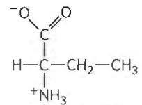  
L-α-Amino-n-butyric acid

Wlodawer and coworkers denatured the newly synthesized protein by dissolving it in 6 M guanidine HCl and then allowed it to fold slowly by dialyzing away the guanidine against a neutral buffer (10% glycerol, 25 mM NaH $_2$ PO $_4$ /Na $_2$ HPO $_4$ , pH 7).

(b) There are many reasons to predict that a protein synthesized, denatured, and folded in this manner would not be active. Give three such reasons.

(c) Interestingly, the resulting L-protease was active. What does this finding tell you about the role of disulfide bonds in the native HIV protease molecule?

In a more recent study, Milton and coworkers synthesized HIV protease from D-amino acids, using the same protocol as the earlier study (Wlodawer et al.). Formally, there are three possibilities for the folding of the D-protease: it would be (1) the same shape as the L-protease, (2) the mirror image of the L-protease, or (3) something else, possibly inactive.

(d) For each possibility, decide whether or not it is a likely outcome, and defend your position.

In fact, the D-protease was active: it cleaved a particular synthetic substrate and was inhibited by specific inhibitors. To examine the structure of the D- and L-enzymes, Milton and coworkers tested both forms for activity with D and L forms of a chiral peptide substrate and for inhibition by D and L forms of a chiral peptide-analog inhibitor. Both forms were also tested for inhibition by the achiral inhibitor Evans blue. The findings are given in the table.

<table><tr><td rowspan="3">HIVprotease</td><td rowspan="2" colspan="2">Substrate hydrolysis</td><td colspan="3">Inhibition</td></tr><tr><td colspan="2">Peptide inhibitor</td><td rowspan="2">Evans blue(achiral)</td></tr><tr><td>D-substrate</td><td>L-substrate</td><td>D-inhibitor</td><td>L-inhibitor</td></tr><tr><td>L-protease</td><td>-</td><td>+</td><td>-</td><td>+</td><td>+</td></tr><tr><td>D-protease</td><td>+</td><td>-</td><td>+</td><td>-</td><td>+</td></tr></table>

(e) Which of the three models proposed is supported by these data? Explain your reasoning.

(f) Why does Evans blue inhibit both forms of the protease?
(g) Would you expect chymotrypsin to digest the D-protease? Explain your reasoning.

(h) Would you expect total synthesis from D-amino acids followed by renaturation to yield active enzyme for any enzyme? Explain your reasoning.

### [EN] References

Milton, R.C., S.C. Milton, and S.B. Kent. 1992. Total chemical synthesis of a D-enzyme: the enantiomers of HIV-1 protease show demonstration of reciprocal chiral substrate specificity. Science 256:1445–1448.

Wlodawer, A., M. Miller, M. Jaskólski, B.K. Sathyanarayana, E. Baldwin, I.T. Weber, L.M. Selk, L. Clawson, J. Schneider, and S.B. Kent. 1989. Conserved folding in retroviral proteases: crystal structure of a synthetic HIV-1 protease. Science 245:616–621.

### [EN] Abbreviated Solutions — Chapter 4

1. (a) Shorter bonds have a higher bond order (are multiple rather than single) and are stronger. The peptide C—N bond is stronger than a single bond and is midway between a single bond and a double bond in character. (b) Rotation about the peptide bond is difficult at physiological temperatures because of its partial double-bond character.

2. (a) The principal structural units in the wool fiber polypeptide ( $\alpha$ -keratin) are successive turns of the $\alpha$ helix, at 5.4 Å intervals; coiled coils produce the 5.2 Å spacing. Steaming and stretching the fiber yields an extended polypeptide chain with the $\beta$ conformation, with a distance between adjacent R groups of about

7.0 Å. As the polypeptide reassumes an $\alpha$ -helical structure, the fiber shortens. (b) Wool shrinks in the presence of moist heat, as polypeptide chains are converted from an extended $\beta$ conformation to the native $\alpha$ -helix conformation. The structure of silk— $\beta$ sheets, with their small, closely packed amino acid side chains—is more stable than that of wool.

#### [EN] 3. \~42 peptide bonds per second

4. At pH > 6, the carboxyl groups of poly(Glu) are deprotonated; repulsion among negatively charged carboxylate groups leads to unfolding. Similarly, at pH 7, the amino groups of poly(Lys) are protonated; repulsion among these positively charged groups also leads to unfolding.

5. (a) Disulfide bonds are covalent bonds, which are much stronger than the noncovalent interactions that stabilize most proteins. They cross-link protein chains, increasing their stiffness, mechanical strength, and hardness. (b) Cystine residues (disulfide bonds) prevent the complete unfolding of the protein.

#### [EN] 6. $\phi = (\mathrm{f})$ and $\psi = (\mathrm{e})$

7. (a) Bends are most likely at residues 7 and 19; Pro residues in the cis configuration accommodate turns well. (b) The Cys residues at positions 13 and 24 can form disulfide bonds. (c) External surface: polar and charged residues (Asp, Gln, Lys); interior: nonpolar and aliphatic residues (Ala, Ile); Thr, though polar, has a hydropathy index near zero and thus can be found either on the external surface or in the interior of the protein.

8. (a) At pH 6.0, the amino acid residues are in the correct protonation state to form an ion pair. At pH 2.0, both Asp and His are predominantly protonated, and at pH 10.0, they are both predominantly deprotonated. (b) Burial of a charged amino acid residue will destabilize the protein and shift the thermal denaturation curve to lower temperatures. (c) Lesser. At pH 10.0, a greater fraction of the Lys side chain will be deprotonated and uncharged, facilitating its burial in a hydrophobic environment.

#### [EN] 9. 30 amino acid residues; 0.87

10. For many proteins, the amino acid sequence dictates the formation of a unique, folded structure. However, the reverse is not true. Many different amino acid sequences can give rise to similar folded structures. For example, the relative orientation of the charged amino acid residues in an ion pair can be switched while still preserving the overall location of the interaction.

11. Protein (a), a $\beta$ barrel, is described by Ramachandran plot (c), which shows most of the allowable conformations in the upper left quadrant where the bond angles characteristic of the $\beta$ conformation are concentrated. Protein (b), a series of $\alpha$ helices, is described by plot (d), where most of the allowable conformations are in the lower left quadrant.

12. (a) The number of moles of DNP-valine formed per mole of protein equals the number of amino termini and thus the number of polypeptide chains. (b) 4 (c) Different chains would probably run as discrete bands on an SDS polyacrylamide gel.

13. (a) Aromatic residues seem to play an important role in stabilizing amyloid fibrils. Thus, molecules with aromatic substituents may inhibit amyloid formation by interfering with the stacking or association of the aromatic side chains. (b) Amyloid forms in the pancreas in association with type 2 diabetes, and forms in the brain in Alzheimer disease. Although the amyloid fibrils in the two diseases involve different proteins, the fundamental structure of the amyloid is similar and is similarly stabilized in both, so they are potential targets for similar drugs designed to disrupt this structure.

14. Although a protein may have only one unique folded structure, many different unfolded structures may exist. The different folding pathways and structures used by the product of other disease alleles of CFTR may not be corrected by lumacaftor.

15. (a) x-ray crystallography (b) cryo-EM (c) NMR (d) NMR or CD
16. (a) 2QYC is B; 2BNH is C; 2Q5R is E or M; 1XU9 is H; 3H7X is I; 1OU5 is E or M; 2WCD is O. (b) dimer, α/β; monomer, α/β; dimer, α/β; tetramer, α/β; trimer, all α; dimer, α/β; 24-mer or double dodecamer (12-mer), all α. (c) BIOCHEM

  
(a)

  
(b)

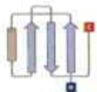  
(c)

17. (a) NFκB transcription factor, also called RelA transforming factor (b) No. You will obtain similar results, but with additional related proteins listed. (c) The protein has two subunits. There are multiple variants of the subunits, with the best characterized being 50, 52, or 65 kDa. These pair with each other to form a variety of homodimers and heterodimers. The structures of a number of different variants can be found in the PDB. (d) The NFκB transcription factor is a dimeric protein that binds specific DNA sequences, enhancing transcription of nearby genes. One such gene is the immunoglobulin κ (kappa) light chain, from which the transcription factor gets its name.

18. (a) Aba is a suitable replacement because Aba and Cys have side chains that are approximately the same size and are similarly hydrophobic. However, Aba cannot form disulfide bonds, so it will not be a suitable replacement if these are required. (b) There are many important differences between the synthesized protein and HIV protease produced by a human cell, any of which could result in an inactive synthetic enzyme. (1) Although Aba and Cys have a similar size and hydrophobicity, Aba may not be similar enough for the protein to fold properly. (2) HIV protease may require disulfide bonds for proper functioning. (3) Many proteins synthesized by ribosomes fold while being produced; the protein in this study folded only after the chain was complete. (4) Proteins synthesized by ribosomes may interact with the ribosomes as they fold; this is not possible for the protein in the study. (5) Cytosol is a more complex solution than the buffer used in the study; some proteins may require specific, unknown proteins for proper folding. (6) Proteins synthesized in cells often require chaperones for proper folding; these are not present in the study buffer. (7) In cells, HIV protease is synthesized as part of a larger chain that is then proteolytically processed; the protein in the study was synthesized as a single molecule. (c) Because the enzyme is functional when Aba is substituted for Cys, disulfide bonds do not play an important role in the structure of HIV protease. (d) Model 1: It would fold like the L-protease. For: The covalent structure is the same (except for chirality), so it should fold like the L-protease. Against: Chirality is not a trivial detail; three-dimensional shape is a key feature of biological molecules. The synthetic enzyme will not fold like the L-protease. Model 2: It would fold to the mirror image of the L-protease. For: Because the individual components are mirror images of those in the biological protein, it will fold in the mirror-image shape. Against: The interactions involved in protein folding are very complex, so the synthetic protein will most likely fold in another form. Model 3: It would fold to something else. For: The interactions involved in protein folding are very complex, so the synthetic protein will most likely fold in another form. Against: Because the individual components are mirror images of those in the biological protein, it will fold in the mirror-image shape. (e) Model 2. The enzyme is active, but with the enantiomeric form of the biological substrate, and it is inhibited by the enantiomeric form of the biological inhibitor. This is consistent with the D-protease being the mirror image of the L-protease. (f) Evans blue is achiral; it binds to both forms of the enzyme. (g) No. Because proteases contain only L-amino acids and recognize only L-peptides, chymotrypsin would not digest the D-protease. (h) Not necessarily. Depending on the individual enzyme, any of the problems listed in (b) could result in an inactive enzyme.

<!-- EN-END 第4章章末 -->
