## 第 4 章 蛋白质的生物学功能

> **本章英文对应内容**（Lehninger，插在所列中文小节末尾）
>
> - 第5章 Protein Function：章首导言（本章开头）、关键术语/习题/简答（本章末尾）
> - §5.1（第5章）→ 四、血红蛋白分子病
> - §5.2（第5章）→ 五、免疫系统和免疫球蛋白
> - §5.3（第5章）→ 六、肌动蛋白、肌球蛋白和分子马达

在前面我们讨论了蛋白质的氨基酸序列和三维结构。了解蛋白质的三维结构是明了蛋白质如何行使其功能的基础。然而二维纸面上显示的结构是静止的。蛋白质是动态的分子，它们的功能几乎总是依赖于跟其他分子的相互作用，这些相互作用都会以生理上重要的方式受到蛋白质构象的些微变化或剧烈改变（肽段可能移动几个纳米）的影响。本章将讨论蛋白质如何跟其他分子相互作用，以及这些相互作用如何与动态蛋白质的结构关联。分子相互作用对蛋白质功能的重要性不言而喻。在第3章我们曾看到，纤维状蛋白质作为细胞和组织结构元件的功能是基于相同多肽链之间稳定而长期的四级相互作用。在这一章我们会看到许多其他蛋白质的功能，它们涉及跟各种各样的分子相互作用。这些作用多数是瞬时的，然而它们可以是复杂生理过程如氧转运、免疫功能和肌肉收缩——本章要介绍的主要内容——的基础。实行这些过程的蛋白质说明蛋白质功能的下述这些主要原理：

（1）很多蛋白质的功能涉及跟其他分子的可逆结合。被一个蛋白质可逆结合的分子称为配体（ligand）。一个配体可以是任一种分子，包括另一种蛋白质。蛋白质-配体相互作用的瞬时性质对生命是至关重要的，因为它允许一个生物体对变化着的内、外环境作出快速、可逆的应答。

（2）蛋白质分子上配体结合的部位或位点（site）称为结合部位（binding site），它们在大小、形状、电荷以及疏水或亲水性质方面都跟配体是互补的。因此蛋白质-配体相互作用是特异或专一的（specific）；蛋白质能区分环境中成千上万种不同的分子，选择性地只与其中一种或很少几种结合。一个给定的蛋白质对几种配体可以有单独的结合部位。这些专一的分子相互作用对维持一个活系统的高度有序性是关键。

（3）蛋白质分子具有柔性。构象变化可以是很细微，反映着整个蛋白质的分子振动和氨基酸残基的细小运动。这种方式的蛋白质柔动有时称为“呼吸”。构象变化也可能很剧烈，蛋白质结构大片段发生移动多至几个纳米。特异的构象变化对蛋白质的功能经常是必需的。

（4）蛋白质和配体的结合常跟蛋白质的构象变化相偶联，构象变化使结合部位与配体更加互补，结合得更加紧密。在蛋白质和配体之间发生的结构适应称为诱导契合(induced fit)。

（5）在多亚基蛋白质中，一个亚基的构象变化经常影响其他亚基的构象。

（6）配体和蛋白质之间的相互作用一般可以通过跟一个或多个另外的配体专一相互作用来调节。这些别的配体可以引起蛋白质的构象变化而影响第一个配体的结合，发生所谓别构效应（allosteric effect）或称变构效应。

酶代表蛋白质功能的特殊情况。酶与其他分子结合并使之发生化学转化——催化反应。被酶作用的分子不叫配体而称为底物（substrate），配体-结合部位称为催化部位（catalytic site）或活性部位（active site）。关于这类蛋白质将在第6至第8章专门介绍。

<!-- EN-BEGIN 第5章导言 -->

### 【英文对应 第5章导言】Protein Function

> 来源：Lehninger Principles of Biochemistry（书籍/02_生物化学原理） 第5章章首（含章节目录与学习要点）。

#### [EN] PROTEIN FUNCTION

5.1 Reversible Binding of a Protein to a Ligand: Oxygen-Binding Proteins 148

5.2 Complementary Interactions between Proteins and Ligands: The Immune System and Immunoglobulins 164

#### [EN] 5.3 Protein Interactions Modulated by Chemical Energy: Actin, Myosin, and Molecular Motors 169

Knowing the three-dimensional structure of a protein is an important part of understanding protein function, and structural biology often offers insights into molecular interactions. However, the protein structures we have examined so far are deceptively static. Proteins function by interacting dynamically with—binding to—other molecules. We divide these interactions into two types. In some interactions, the result is a reaction that alters the chemical configuration or composition of a bound molecule, with the protein acting as a reaction catalyst, or enzyme; we discuss enzymes and their properties in Chapter 6. In other interactions, neither the chemical configuration nor the composition of the bound molecule is changed; such interactions are the subject of this chapter.

It may seem counterintuitive that a protein's interaction with another molecule could be important if it does not alter the associated molecule. Yet, transient interactions of this type are at the heart of many complex physiological processes, such as oxygen transport, transmission of nerve impulses, and immune function. Defining which molecules interact and quantifying such interactions are common and illuminating tasks in every biochemical subdiscipline.

The study of proteins that function through reversible interactions can be organized around six key principles of protein function, some of which will be familiar from Chapter 4:

#### [EN] P1 The functions of many proteins involve the reversible binding of other molecules.

A molecule bound reversibly by a protein is called a ligand. A ligand may be any kind of molecule, including another protein. The transient nature of protein-ligand interactions is critical to life, allowing an organism to respond rapidly and reversibly to changing environmental and metabolic circumstances.

P2 A ligand binds a protein at a binding site that is complementary to the ligand in size, shape, charge, and hydrophobic or hydrophilic character. The interaction is specific: the protein can discriminate among the thousands of different molecules in its environment and selectively bind only one or a few types. A given protein may have separate binding sites for several different ligands. These specific molecular interactions are crucial in maintaining the high degree of order in a living system.

P3 Proteins are flexible. Changes in conformation may be subtle, reflecting molecular vibrations and small movements of amino acid residues throughout the protein. Changes in conformation may also be more dramatic, with major segments of the protein structure moving as much as several nanometers. Specific conformational changes are frequently essential to a protein's function.

P4 The binding of a protein and a ligand is often coupled to a conformational change in the protein that makes the binding site more complementary to the ligand, permitting tighter binding. The structural adaptation that occurs between protein and ligand is called induced fit.

#### [EN] P5 In a multisubunit protein, a conformational change in one subunit often affects the conformation of other subunits.

P6 Interactions between ligands and proteins may be regulated.

The themes in our discussion of noncatalytic functions of proteins in this chapter—binding, specificity, and conformational change—are continued in Chapter 6, with the added element of proteins participating in chemical transformations. This discussion excludes the binding of water, which may interact weakly and nonspecifically with many parts of a protein.

<!-- EN-END 第5章导言 -->

## 一、蛋白质功能的多样性

蛋白质对生物的重要性不仅体现在它们在生物体内无处不在,更重要的是它们几乎无所不能。蛋白质在分子、细胞、器官乃至整体水平上参与许多生物学过程,行使各种各样的功能,几乎每一个生命环节都有蛋白质的参与和贡献。

生物界中蛋白质的种类在 $10^{10} \sim 10^{12}$ 数量级。种类如此众多是因为20种基本氨基酸在多肽链中的序列不同造成的。根据排列理论，由20种氨基酸组成的二十肽序列异构体有： $\mathrm{A}_{20}^{20} = 2 \times 10^{18}$ 种。如果一个相对分子质量为34000的蛋白质含有12种氨基酸，并且假设每种氨基酸在该蛋白质分子中的数目相等，则不难算出其序列异构体数目约为 $10^{300}$ 。这种序列异构现象是蛋白质的生物功能多样性（diversity）和物种专一性或特异性（specificity）的结构基础。

蛋白质的生物学功能归纳起来有如下几个方面：

## 1. 行使催化和转化功能

蛋白质最重要的生物学功能之一是作为生物新陈代谢的催化剂——酶（enzyme）。酶是蛋白质中最大的一类，在国际生化协会酶学委员会公布的《酶命名法》(Enzyme Nemenclature)中已列出3000多种不同的酶。生物体内各种化学反应几乎都是在相应的酶参与下进行的（参见第6-8章）。

酶具有非常高的催化能力（catalytic power）。酶催化的反应速率为非催化反应的反应速率的 $10^{5} \sim 10^{17}$ 倍，也远高于任何人工合成的催化剂所能达到的反应速率。而且酶促反应是在温和温度和接近中性 $\mathrm{pH}$ 的水溶液中进行的，不像许多非催化反应和非酶促反应那样需要在剧烈条件如高温、高压下才能进行。酶的专一性很强。酶的专一性(特异性)是指酶对所作用的底物和所催化的反应具有选择性。这种选择性是通过酶与底物之间的相互作用，或者说通过基于结构互补的分子识别实现的(见第1章)。酶不仅是代谢反应的催化剂，还是代谢反应的调节元件。酶对新陈代谢的调节是最原始，但也是最基本的。酶本身的产生及其活动又受到核酸和其他信息分子的控制或调节。因此，酶催化其他分子变化和转化也可以看成是信息流的一个重要组成部分。

## 2. 作为信号分子和信号转导器

作为信号分子的蛋白质有激素（hormone）、生长因子（growth factor）或细胞因子（cytokine）等，它们的共同特点是作为受体（多数在质膜上）的专一配体。属于激素类的蛋白质有胰岛素、生长激素、促甲状腺素等；归于生长因子或细胞因子的蛋白质有表皮细胞生长因子、成纤维细胞生长因子、[促]红细胞生成素、白细胞介素、干扰素和肿瘤坏死因子等，其中多数参与细胞免疫调节。

信号转导（signal transduction）是指胞外信号（如信号分子和电信号等）被放大并转化为胞内应答的化学过程。最初的信号转导器（signal transductor），也称转导触发器，是质膜上的受体，它们都是蛋白质如G蛋白偶联受体（GPCR）、受体酪氨酸激酶（RTK）等。随后在细胞质中发生的信号转导中担当转导分子的也多是蛋白质，各种类型的激酶（如蛋白激酶、磷酸化酶激酶）是细胞溶胶中信号转导的主体（第14章）。

许多信号分子(如类固醇激素、红细胞生成素等)触发的转导过程,其终点是激活能够启动基因表达的转录因子和/或基因调节蛋白(第34章)。

## 3. 转运专一的分子和物质

载体蛋白质(carrier protein)或转运蛋白质(transport protein)是一类从一处到另一处转运专一分子和物质的蛋白质的总称。它们广泛地存在于各种生物体中，有的是在体液如血浆中运载金属离子，如转铁蛋白(transferrin)；但多数是转运水不溶的非极性分子，如血液中转运各种脂溶性维生素的运载蛋白，运输各类脂质的载脂蛋白（第10章）。通过血流从肺部到各器官组织转运氧气的血红蛋白（见本章后面）是典型的载体蛋白质。

另一类是跨膜（如质膜）的膜转运蛋白质，专门称为转运蛋白（transporter），有时也称透性酶（permease），例如摄取葡萄糖进入细胞的葡糖转运蛋白（图14-7和图14-26）。膜转运蛋白质多以跨膜的通道形式存在，它能将亲水或带电的代谢物、营养物、离子或蛋白质等极性分子顺利地通过疏水的脂双层（膜）。在逆浓度梯度转运物质通过膜时，需要生物体提供能量，即需要消耗ATP，这就是所谓主动运输(active transport)。担当主动运输的载体蛋白质都含有一个由酶或酶系组成的能量传递系统。

此外，细胞内也有载体蛋白质。例如在高尔基体的膜上，有一种专一跟含6-磷酸甘露糖的蛋白质结合的受体（蛋白质），当受体跟含有6-磷酸甘露糖的蛋白质结合后，将这些蛋白质（其中多数是水解酶）运送并释放到溶酶体中。葡糖转运蛋白也在胞内小泡的膜上存在（图14-26）。细胞核的核孔不允许分子质量很大的蛋白质通过。一些定位在核内的蛋白质，除了具有特异的肽段作为核定位信号（nuclear localization signal, NLS；图14-27）外，还需要有特定的、能跟NLS结合的蛋白质（图14-27中未示出），称输入蛋白（importin），才能进入核内。

## 4. 作为结构和支撑成分

生物体,小至单细胞生物乃至非细胞的病毒,都离不开结构和支撑的物质。这些物质除脂质和糖类外还有蛋白质,它们参与建造和维持生物体的结构,给细胞和组织提供强度和保护。这类蛋白质称为结构蛋白质(structural protein)。结构蛋白质一般由单体蛋白质聚合成长纤维(如毛发中)或排列成保护层(如皮肤中)。结构蛋白质多数是不溶性的纤维状蛋白质,如构成毛发、角、蹄、甲的 $\alpha-$ 角蛋白和存在于骨、结缔组织、腱、软骨和皮中的无弹性而高强度的胶原蛋白。胶原蛋白约占脊椎动物中总蛋白质的1/3;在骨中它是矿质沉积的基质。

## 有弹性的结构蛋白质是弹性蛋白,它是韧带(ligament)的重要成分。

此外，肌肉蛋白以及细胞间质中的糖蛋白和蛋白聚糖对动物整体的形态维持也都是不可缺少的。一些形成细胞骨架的蛋白质如肌动蛋白、微管蛋白和血影蛋白等对细胞的形态起结构支撑作用。

植物中的伸展蛋白(extensin)是植物细胞壁的重要成分,也可看成是一种结构蛋白质。伸展蛋白是一种糖蛋白(约含300氨基酸残基),在细胞壁中与微纤维共价连结,这两者好比是“钢筋”,果胶质、半纤维素和木质素等好比是“混凝土”,它们共同构筑成细胞壁。

## 5. 起运动和动力作用

某些蛋白质赋予细胞以运动的能力。作为肌肉收缩和细胞游动基础的收缩和游动蛋白质（contractile and motile protein）具有一个共同特征：它们都是丝状分子或丝状聚集体，如肌细胞中的肌肉蛋白。肌肉蛋白是一个完整的系统，由多种蛋白质构成，主要是肌球蛋白和肌动蛋白，此外还有多种其他蛋白质。肌球蛋白（myosin），由它聚集成肌细胞中的粗丝；G-肌动蛋白（G-actin），由它聚集成F-肌动蛋白（F-actin），也称微丝（mirofilament），是肌细胞中细丝的主体。真核细胞中的微管蛋白（tubulin），由它聚合成长管状的微管（microtubule）。微丝和微管是细胞骨架的基本成分。

另一类涉及运动和动力的蛋白质称为马达蛋白质(motor protein)，如动力蛋白(dynein)、驱动蛋白(kinesin)以及肌球蛋白的头片(马达结构域)，这些蛋白质实际上是一类机械-化学酶，能把ATP贮存的化学能转变为发生收缩和游动的机械能。

## 6. 具有防卫和保护功能

与某些结构蛋白质的被动性防护不同,一类称为防卫和保护蛋白质(defensive and protective protein)在防卫、保护和拓展方面的作用是主动的。这类蛋白质中最突出的是脊椎动物的免疫球蛋白或称抗体。抗体是在外来的所谓抗原物质的影响下由淋巴细胞产生,并能与相应的抗原结合而排除外来物质对生物体的干扰的一类保护蛋白。现在认为不仅动物有免疫系统,植物也有免疫能力——特有的自我保护系统,例如对各种病原体有抵御能力,对逆境(如盐碱、干旱和洪涝)能表现出抗性。总之,生物体对各种刺激的应答以及对环境变化的防范都可归属免疫范畴。

各种生物产生的毒素(toxin)有相当一部分是蛋白质和肽类,如蛇毒[素]中的溶血蛋白质和神经毒蛋白质,此外还有蜥毒素、蜘蛛毒素和蜂毒素等。这些毒素几乎都是混合物,其中存在高度毒性的分子,如蛇毒中含有多种蛋白酶和糖苷酶。又如细菌产生的白喉毒素(diphtheria toxin)和霍乱毒素(cholera toxin)是一类细菌的防卫蛋白质。

绝大多数的凝血因子都是蛋白质,如凝血酶原和血纤蛋白原等,它们也是一类保护蛋白质。在南、北极海洋生活的一些鱼类,它们的血液中存在有抗冻蛋白质,防止在低于摄氏零度水温下血液冷冻。这些蛋白质的相对分子质量虽不小,但它们所能引起的冰点下降远超过物理中的依数性质。某些植物中也含有毒蛋白质如蓖麻蛋白(ricin),能抑制人和动物细胞的蛋白质合成,产生毒蛋白的明显“目的”是为了阻止食草动物吃它们。细菌和某些昆虫对药物能形成抗药性,也是一种自我防卫和保护,这主要是因为它们体内产生能降解药物的诱导酶。

## 7. 作为养分的贮库

生物体内作为养分贮库的蛋白质称为贮存蛋白质（storage protein），因为蛋白质是氨基酸的聚合物，又因氮素通常是生长限制性养分，所以生物必要时就利用蛋白质作为提供氮素的一种方式，例如卵清蛋白为鸟类胚胎发育提供氮源，乳中酪蛋白是哺乳类幼仔的主要氮源。许多高等植物的种子含有高达60%的贮存蛋白质，为种子发芽准备好足够的氮素。蛋白质除了为生物发育提供C、H、O、N和S元素外，像铁蛋白（ferritin）还能贮存Fe，一分子铁蛋白 $(M_{\mathrm{r}}460000)$ 可结合多至4500个铁原子（占其质量的 $35\%$ ），用于含铁的蛋白质如血红蛋白的合成。

## 8. 起支架或衔接作用

新近发现有些蛋白质是在细胞应答激素和生长因子的复杂信号传递途径中起作用的，这类蛋白质称为支架蛋白质（scaffold protein）或衔接蛋白质（adapter protein）。支架蛋白质是一个模块组织（modular organization）；模块（module）是这种蛋白质结构中的各特定部分，有的是结构域，有的是结构域中的次级结构。每个模块能通过蛋白质-蛋白质相互作用识别其他蛋白质中的某些结构元件并与之结合。例如SH2模块能与酪氨酸残基的酚—OH被磷酸化了的蛋白质结合，SH3模块能与富含特有的脯氨酸残基串的蛋白质结合。支架蛋白质一般含有几个不同种类的模块，它们能起一个架子（scaffold）的作用，在架子上可以将一套不同的蛋白质组装成一个多蛋白质复合体。这样的聚集通常要涉及协调和联络许多对激素或其他信号分子的胞内应答（参见第14章“信号传递”部分）。

某些蛋白质具有上述以外的其他功能,例如应乐果甜蛋白(monellin)有着极高的甜度(见表9-2)。昆虫翅膀的铰合部(hinge)存在一种具有特殊弹性的蛋白质,称为节肢弹性蛋白(resilin)。某些海洋生物如贝类,分泌一类胶质蛋白质,能将躯体牢固地黏在岩石或其他硬表面上。

上述归纳的几类蛋白质功能对有些蛋白质是交叉的。例如构成皮肤(skin)或兽皮(hide)的蛋白质既属结构蛋白质,也可归属保护蛋白质。又如细胞因子既在免疫系统中的一些环节起作用,但又是信号分子。此外还必须强调,在生物体中蛋白质行使功能时几乎都是在多种蛋白质协同下完成的。

## 二、氧结合蛋白质——肌红蛋白:贮存氧

随着地球上大气的不断变化,生物也在不停地进化。光合作用产生氧气是大气变化的主要因素。生物进化到以氧为基础的代谢是具有高度适应性的表现,例如糖的有氧代谢要比相应的厌氧代谢产生更多的能量。在进化过程中出现两个重要的氧结合蛋白质(oxygen-binding protein):肌红蛋白和血红蛋白(图2-41)。这样有氧代谢过程不再受 $O_{2}$ 在水中溶解度低的限制。肌红蛋白和血红蛋白是两个研究得最透彻的蛋白质,它们是蛋白质结构与功能关系的范例。肌红蛋白是哺乳动物体内贮存和分送氧的蛋白质。肌红蛋白存在于需要贮存氧的肌肉细胞,例如潜水哺乳动物鲸、海豹和海豚的肌肉中。血红蛋白是在血液中转运氧的蛋白质,存在于红细胞中。这两个蛋白质在亚基结构、氧结合机制以及其他性质等方面,都有相似之处。

## （一）氧与血红素辅基结合

$\mathrm{O}_2$ 难溶于水溶液（ $0.035 \mathrm{~g} / \mathrm{L}$ ，在 $50^{\circ} \mathrm{C}$ ），如果只是简单地溶于血清，则不能有足够量的 $\mathrm{O}_2$ 被运载到组织。 $\mathrm{O}_2$ 通过组织的扩散也不可能超过几个毫米的距离。较大的多细胞动物的进化有赖于能够转运和贮存氧的蛋白质进化。然而蛋白质中没有适合 $\mathrm{O}_2$ 分子可逆结合的氨基酸侧链，只有某些过渡金属如其中的低氧态 $\mathrm{Fe}^{2+}$ 和 $\mathrm{Cu}^+$ 具有强的结合氧倾向。进化过程中肌红蛋白-血红蛋白家族选中了二价铁 $\mathrm{Fe(II)}$ 作为氧结合部位。某些节肢动物的血蓝蛋白（hemocyanin）中结合氧的是一价铜 $(\mathrm{Cu}^+)$ 。多细胞生物正是利用金属（最常见的是铁）的这一性质来转运氧的。但是游离的铁会促进高反应性的氧分子形式，如羟自由基的形成，这些自由基能损坏 DNA 和其他大分子。因此细胞所利用的铁是以螯合和/或使之反应性降低的形式被结合的。在多细胞生物中，特别是在那些载氧的铁需要远距离被转运的生物中，铁经常要掺入被蛋白质结合的辅基——血红素（heme 或 haem）中。（辅基概念见第 2 章“蛋白质的化学组成和分类”部分）

血红素基存在于肌红蛋白、血红蛋白和许多称为血红素蛋白质的其他蛋白质中，由一个复杂的有机环结构——原卟啉IX（protoporphyrin IX）——组成，一个Fe(Ⅱ)的铁原子与之结合。原卟啉IX由4个吡咯环组成，4个吡咯环通过甲叉桥(metheme bridge)连接成四吡咯环系统，称为卟吩(porphin)，与之相连的有四个甲基，两个乙烯基和两个丙酸基(图4-1B)。卟吩是卟啉(porphyrin)的母体或卟啉核(图4-1A)，在它标有 X 位置的氢一个或多个被其他基团取代, 即为卟啉; 原卟啉 IX 只是卟啉类中的一个。卟啉化合物在叶绿素、细胞色素以及其他一些天然色素中还将遇到。这类化合物有很强的着色力, 血红蛋白中的铁卟啉(血红素)使血液呈红色, 叶绿蛋白中的镁卟啉(叶绿素)是植物呈绿色的原因。

原卟啉IX与Fe原子的络合物也称铁原卟啉IX即血红素。卟啉环中心的铁原子通常是八面体配位，应该有6个配位键，其中4个与卟啉环面的N原子相连，另两个沿垂直于卟啉环面的轴分布在环面的上下：5、6两个配位键（图4-1C和图4-2）。铁原子可以是亚铁 $\left(\mathrm{Fe}^{2+}\right)$ 氧化态或高铁 $\left(\mathrm{Fe}^{3+}\right)$ 氧化态，相应的血红素称为[亚铁]血红素(ferroheme；heme)和高铁血红素(ferriheme；hematin)。配位的氮原子（具有给电子性质）有助于防止血红素Fe(Ⅱ)转化为Fe(Ⅲ)。亚铁态Fe(Ⅱ)能可逆地与 $O_{2}$ 结合；高铁态Fe(Ⅲ)则不能与 $O_{2}$ 结合。血红素在许多氧转运蛋白质中存在，也在某些其他蛋白质如细胞色素中被找到，细胞色素参与氧化还原（电子转移）反应（见第19和23章）。

  
图 4-1 叶啉核(A)、原卟啉IX(B)和血红素(C)的结构

游离的血红素分子(未与蛋白质结合的血红素)使 $Fe^{2+}$ 有了两个“开放”的配位键(垂直于卟啉环面)。一个 $O_{2}$ 可以与两个游离的血红素分子(或两个游离 $Fe^{2+}$ ) 同时反应。在血红素蛋白质中, 此反应由于血红素被深埋在蛋白质结构之中而被阻断。因此这两个开放配位键的利用受到限制。其中一个配位键被一个 His 残基的侧链氮原子(N)所占据。另一个是分子氧( $O_{2}$ ) 的结合部位(图 4-2)。当氧结合时, 血红素铁的电子性质发生了变化; 这反映在深紫色的缺氧静脉血到鲜红色的富氧动脉血的颜色变化。某些小分子如一氧化碳(CO)和氧化氮(NO)与血红素铁配位的亲和力比 $O_{2}$ 高。当 CO 分子与血红素结合时, $O_{2}$ 则被排出, 这就是为什么 CO 对需氧生物是剧毒的原因。通过对血红素的包围和掩蔽, 氧结合蛋白质可调节 CO 和其他小分子对血红素铁的接近。

## (二) 肌红蛋白是珠蛋白家族的成员

  
图 4-2 氧合肌红蛋白中血红素铁离子的6个配位体4个是卟啉环中央的4个N原子,第5个是环面下方的His F8,第6个是环面上方的 $O_{2}$

珠蛋白(globin)是一个很大的氧结合蛋白质家族,所有成员具有相似的一级和三级结构。珠蛋白存在于所有各类的真核生物甚至某些细菌中。大

多数行使转运和贮存氧的功能,虽然有一些起传感氧、氧化氮和一氧化碳的作用。最简单的线虫(nematode),秀丽隐杆线虫(Caenorhabditis elegans),有33个编码不同珠蛋白的基因。在人和其他哺乳类中至少有4个种类的珠蛋白。

单体(一个珠蛋白)的肌红蛋白(myoglobin, Mb)主要是促进肌肉组织中氧的扩散。潜水哺乳类如鲸、海豹和海豚的肌肉中肌红蛋白含量特别丰富, 致使它们的肌肉呈棕红色。在这里肌红蛋白也具有贮氧的功能, 使这些动物能长时间地潜在海水下。单体的神经珠蛋白(neuroglobin)在神经元中被大量表达, 协助保护大脑避免低氧(hypoxia)和局部缺血(ischemia)造成的损害。另一个单体的珠蛋白是细胞珠蛋白(cy-

toglobin), 它也在许多组织中找到, 但功能尚不清楚。

肌红蛋白(马心)是由一条多肽链和一个辅基血红素构成, $M_{r}$ 为16900,含153个氨基酸残基。除去血红素的脱辅基肌红蛋白即为珠蛋白,它和血红蛋白的亚基( $\alpha$ -珠蛋白链和 $\beta$ -珠蛋白链)在氨基酸序列上具有明显的同源性(图2-40),它们的构象和功能也极其相似。

肌红蛋白的空间结构测定是由 J.Kendrew 及其同事们于 1963 年完成的。它的 X 射线晶体学分析分 3 个阶段完成：第一阶段，分辨率为 0.6 nm，可以辨认出肌红蛋白分子多肽主链的折叠和走向；第二阶段，分辨率达到 0.2 nm 水平，分子的侧链基团都能辨认出来；第三阶段，分辨率为 0.14 nm，所有氨基酸残基都能识别。观察到的残基序列与化学分析得到的结果完全一致。

对蛋白质功能的任何详细讨论必然涉及蛋白质结构。对于肌红蛋白的情况，首先介绍对珠蛋白所特有的一些结构规定。如图4-3所示，肌红蛋白分子（大小约为 $4.5\ nm\times3.5\ nm\times2.5\ nm$ ）中多肽主链由长短不等的8段直的α螺旋组成，最长的螺旋含23个残基，最短的7个残基，分子中约78%的氨基酸残基都处于α螺旋区内。这8段螺旋分别命名为A、B、C…H。相应的非螺旋区（拐弯处）肽段称为NA（N端段）、AB、BC、…FG、GH、HC（C端段）。单个的氨基酸残基可按它在珠蛋白的氨基酸序列中的位置编号（从N端开始计号），也可按在一个特定的α螺旋段序列中的位置标号。例如与肌红蛋白血红素配位的His $^{93}$ 残基（离肌红蛋白多肽链序列N端的第93位残基：见图2-40）也称为F8，表示该His在F螺旋的第8位置。

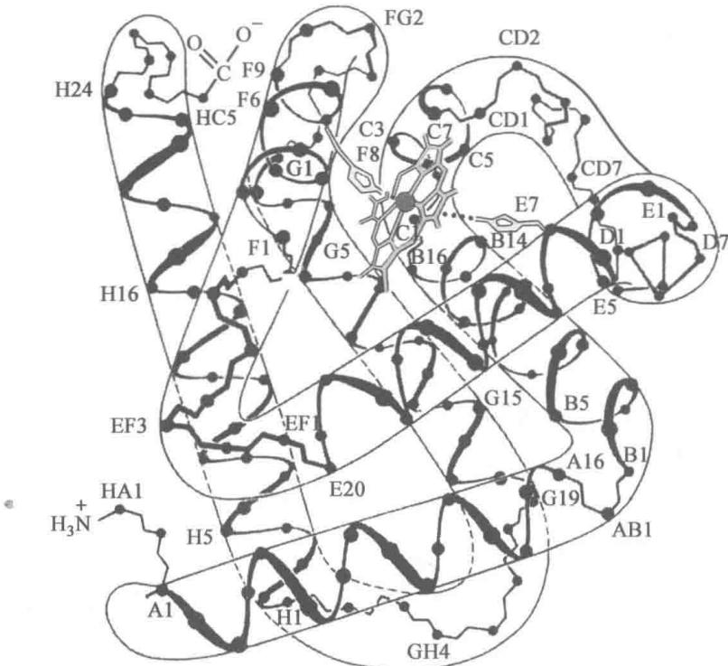  
图 4-3 抹香鲸肌红蛋白的三级结构  
根据 0.2 nm 分辨率的 X 射线晶体学资料建立的模型

8个螺旋段大体上组装成两层，构成肌红蛋白的单结构域。拐弯处 $\alpha$ 螺旋受到破坏，拐弯是由1到8个残基组成的无规卷曲，在C端也有一段5个残基的松散肽链。肌红蛋白的整个分子显得十分致密，呈扁平的棱形。分子内部只有一个小的疏水空穴，血红素非共价地结合于此空穴中。疏水侧链的氨基酸残基几乎全部被埋在分子内部，不与水接触。亲水侧链的氨基酸残基几乎全部分布在分子的外表面，其侧链亲水基团正好与水分子结合，使肌红蛋白成为可溶性蛋白质。介于亲水和疏水之间的一些残基（Pro、Thr、Ser、Cys、Ala、Gly和Tyr)在球状蛋白质分子的内部和外表面都能找到。

## （三）肌红蛋白与 $O_{2}$ 结合是蛋白质与配体相互作用的实例

肌红蛋白的功能不仅是它能结合 $\mathrm{O}_2$ ，而且在需要 $\mathrm{O}_2$ 的时候和地方它能释放氧。生物化学上的功能常常是交替于结合与释放这种类型的蛋白质-配体相互作用。因此定量描述这一相互作用就成为许多生

物化学研究的重点。

## 1. 蛋白质-配体相互作用的定量分析

一般说,蛋白质(P)和配体(L)的可逆结合可用简单的平衡表达式来描述:

$$
\mathrm{P} + \mathrm{L} \rightleftharpoons \mathrm{PL}\tag{4-1}
$$

或应用一个平衡常数 $K_{\mathrm{a}}$ 来表征，这样

$$
K _ {\mathrm{a}} = \frac {[ \mathrm{PL} ]}{[ \mathrm{P} ] [ \mathrm{L} ]} = \frac {k _ {\mathrm{a}}}{k _ {\mathrm{d}}}\tag{4-2}
$$

这里， $k_{a}$ 和 $k_{d}$ 是速率常数。 $K_{a}$ 是结合常数（assosiation constant；不要与第1章的“水、弱酸和弱碱的解离”部分中表示酸解离常数的 $K_{a}$ 混淆），用以描述复合体和未结合的复合体成分之间的平衡。结合常数是配体对蛋白质亲和力的一种量度。 $K_{a}$ 的单位是 L/mol； $K_{a}$ 值愈高，配体对蛋白质相应的亲和力也愈高。

结合平衡常数 $K_{a}$ 也等于形成 PL 复合体的前向（结合）和逆向（解离）反应的速率之比。结合速率用速率常数 $k_{a}$ （单位反应物浓度时的反应速率）来描述，解离速率则用速率常数 $k_{d}$ 来描述。涉及 1 个分子的反应称为单分子反应，如 $PL \rightarrow P + L$ 的解离反应，其反应动力学为一级（first-order），速率常数 $(k_{\mathrm{d}})$ 的单位为时间的倒数 $(\mathrm{s}^{-1})$ 。当反应涉及 2 个分子时，称双分子反应，如结合反应 $P + L \rightarrow PL$ ，反应为二级（second-order），速率常数 $(k_{\mathrm{a}})$ 的单位为 $L \cdot mol^{-1} \cdot s^{-1}$ （见第 7 章）。

方程式 4-2 的第一部分经重排表明, 结合蛋白质对游离蛋白质的浓度之比与游离配体浓度成正比:

$$
K _ {a} [ \mathrm{L} ] = [ \mathrm{PL} ] / [ \mathrm{P} ]\tag{4-3}
$$

当配体的浓度比配体结合部位的浓度大很多时,蛋白质对配体的结合不会明显改变游离(未结合)配体的浓度,也即[L]保持不变。这种情况适用于细胞中与蛋白质结合的大多数配体,这使我们对结合平衡的处理简单化。

现在我们可以从分数角度来考虑结合平衡。蛋白质上被配体占据的配体结合部位数占总结合部位数的分数或称分数饱和度(fractional saturation) $\theta$ :

$$
\theta = \mathrm{被占据的结合部位数/总结合部位数} = \frac {[ \mathrm{PL} ]}{[ \mathrm{PL} ] + [ \mathrm{P} ]}\tag{4-4}
$$

将 $K_{\mathrm{a}}[\mathrm{L}][\mathrm{P}]$ （见式4-3）代入式4-4中的[PL]项并重排，得：

$$
\theta = \frac {K _ {\mathrm{a}} [ \mathrm{L} ] [ \mathrm{P} ]}{K _ {\mathrm{a}} [ \mathrm{L} ] [ \mathrm{P} ] + [ \mathrm{P} ]} = \frac {K _ {\mathrm{a}} [ \mathrm{L} ]}{K _ {\mathrm{a}} [ \mathrm{L} ] + 1} = \frac {[ \mathrm{L} ]}{[ \mathrm{L} ] + \frac {1}{K _ {\mathrm{a}}}}\tag{4-5}
$$

$K_{a}$ 值可以从 $\theta$ 对游离配基的浓度 [L] 作图（图 4-4）来确定。 $x=y/(y+z)$ 形式的任一方程都是描述双曲线的，因此 $\theta$ 是 [L] 的双曲线函数。随着 [L] 的增加被占据的配体结合部位的分数渐近地趋近饱和。可利用的配体结合部位一半被占据（即 $\theta=0.5$ ）时的 [L] 相当于 $1/K_{a}$ 。

然而生物化学上更习惯地使用配体解离的平衡常数 $(K_{\mathrm{d}})$ 以代替 $K_{\mathrm{a}}(K_{\mathrm{d}}=1/K_{\mathrm{a}})$ ， $K_{d}$ 的单位为mol/L。因此上述有关的表达式改变为：

$$
K _ {\mathrm{d}} = \frac {[ \mathrm{P} ] [ \mathrm{L} ]}{[ \mathrm{PL} ]} = \frac {k _ {\mathrm{d}}}{k _ {\mathrm{a}}}\tag{4-6}
$$

$$
[ \mathrm{PL} ] = \frac {[ \mathrm{P} ] [ \mathrm{L} ]}{K _ {\mathrm{d}}}\tag{4-7}
$$

$$
\theta = \frac {[ \mathrm{L} ]}{[ \mathrm{L} ] + K _ {\mathrm{d}}}\tag{4-8}
$$

当[L]等于 $K_{d}$ 时，配体结合部位有一半被占据。当[L]低于 $K_{d}$ 时，结合有配体的蛋白质将逐渐减少。为了有90%可利用的配体结合部位被占据，[L]必须比 $K_{d}$ 值大9倍以上。

实际上，为表示蛋白质对配体的亲和力，使用 $K_{d}$ 远比使用 $K_{a}$ 来得多。注意， $K_{d}$ 值愈小，表示配体对蛋白质的亲和力愈大。 $K_{d}$ 在数值上等于可利用的配体结合部位数的一半被占据时配体的摩尔浓度。在这一点，蛋白质的配体结合达到了半饱和。蛋白质与配体结合得愈牢，一半结合部位被占据所需的配体浓度愈小，因此 $K_{d}$ 值也愈小。一些有代表性的解离常数见表4-1。

表 4-1 某些蛋白质的解离常数

<table><tr><td>蛋白质</td><td>配体</td><td> $K_{\mathrm {d}}^{\text {1}}/\mathrm {mol} \cdot \mathrm {L}^{-1}$ </td></tr><tr><td>抗生物素蛋白(卵清)</td><td>生物素</td><td> $1\times 10^{-15}$ </td></tr><tr><td>胰岛素受体(人)</td><td>胰岛素</td><td> $1\times 10^{-10}$ </td></tr><tr><td>抗HIV免疫球蛋白(人) $^{2}$ </td><td>gp41(HIV-1表面蛋白质)</td><td> $4\times 10^{-10}$ </td></tr><tr><td>镍结合蛋白质(E.coli)</td><td> $Ni^{2+}$ </td><td> $1\times 10^{-7}$ </td></tr><tr><td>钙调蛋白(大鼠) $^{3}$ </td><td> $Ca^{2+}$ </td><td> $3\times 10^{-6}$ </td></tr><tr><td></td><td></td><td> $2\times 10^{-5}$ </td></tr></table>

① 所报告的解离常数仅对测定时的特定溶液条件是有效的，蛋白质-配体相互作用的 $K_{d}$ 值由于溶液的盐浓度、pH 或其他易变因素的变化，可有几个数量级的变动；② 此免疫球蛋白的分离是作为开发抗 HIV 疫苗的一部分工作。免疫球蛋白是高度易变的，这里报告的 $K_{d}$ 并不是所有免疫球蛋白所特有的；③ 钙调蛋白有 4 个结合部位，此处示出的数值反映了在一组测定中观察到的最高和最低的亲和结合部位。

## 2. 肌红蛋白与 $O_{2}$ 的可逆结合——氧结合曲线

在肌肉组织中血红蛋白释放的 $O_{2}$ 通过质膜进入肌细胞中，并在质膜内表面 $O_{2}$ 与肌红蛋白结合成为氧合肌红蛋白（oxymyoglobin）。后者在细胞溶胶中扩散到线粒体。当线粒体中的浓度下降时，氧合肌红蛋白便把贮存的 $O_{2}$ 释放给线粒体，自身转变为去氧肌红蛋白（deoxymyoglobin）并回到质膜处。由于在这里的氧浓度较高，它又重新变成氧合肌红蛋白。

氧与肌红蛋白的结合也遵循上述模式。但是因为氧是气体，所以上面的方程需要做适当的调整，以便在实验室中能更方便地进行测试。

肌红蛋白与 $O_{2}$ 结合的化学计量关系如下：

$$
\mathrm{Mb} + \mathrm{O} _ {2} \rightleftharpoons \mathrm{MbO} _ {2}
$$

式中 Mb 代表去氧肌红蛋白, $MbO_{2}$ 代表氧合肌红蛋白。把溶解的氧浓度代入式 4-8 中的 [L], 得氧结合分数饱和度:

$$
\theta = \frac {[ \mathrm{O} _ {2} ]}{[ \mathrm{O} _ {2} ] + K _ {\mathrm{d}}}\tag{4-9}
$$

对任一种配体， $K_{d}$ 等于可利用的配体结合部位的一半被占据时的氧浓度或 $\left[O_{2}\right]_{0.5}$ 。这样式 4-9 成为

$$
\theta = \frac {[ \mathrm{O} _ {2} ]}{[ \mathrm{O} _ {2} ] + [ \mathrm{O} _ {2} ] _ {0 . 5}}\tag{4-10}
$$

根据 Henry 定律, 溶于液体的任一气体的浓度与液面之上的该气体分压成正比。因此 $\left[O_{2}\right]$ 可用氧分压 $pO_{2}$ 表示, 如果定义在 $\left[O_{2}\right]_{0.5}$ 时的氧分压为 $P_{50}$ , 则方程式 4-10 可改写为:

$$
\theta = \frac {\mathrm{pO} _ {2}}{\mathrm{pO} _ {2} + P _ {5 0}}\tag{4-11}
$$

实验中 $\mathrm{pO}_2$ 值可被调节和测量， $\mathrm{pO}_2$ 以 $\mathrm{kPa}$ 为单位（ $1\mathrm{kPa} = 7.5\mathrm{mmHg}$ 或 torr）； $\theta$ 值可用分光光度法测定，因为肌红蛋白氧合时卟啉环中电子位移引起吸收光谱改变。 $\theta$ 对 $\mathrm{pO}_2$ 作图所得的曲线称为肌红蛋白的氧[结]合曲线或氧解离曲线（图4-4）。肌红蛋白的氧合曲线是一条以坐标轴为两条渐近线 $\theta = 1$ 和$pO_{2}=-K_{d}$ 的等轴（直角）双曲线（rectangular hyperbola）的一部分（图 4-4B）。它也见于酶学中 Michaelis-Menten 方程表达的底物饱和曲线（第 7 章）。

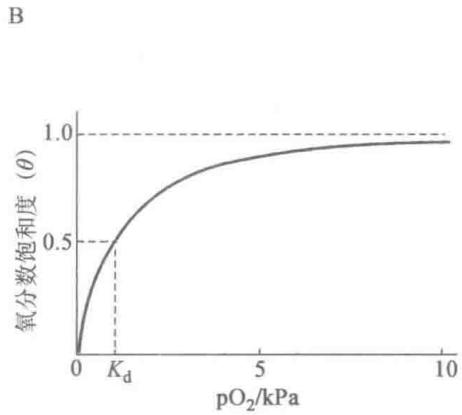  
图 4-4 肌红蛋白的氧结合曲线  
A. 示出双曲线形氧合曲线；B. 根据实验数据制作的氧合曲线，即图 A 中的实线部分

当 $\theta=1$ 时所有肌红蛋白分子的氧结合部位都被 $O_{2}$ 所占据，即肌红蛋白被氧完全饱和。当 $\theta=0.5$ 时， $pO_{2}=K_{d}=P_{50}$ （或 $P_{0.5}$ ）， $P_{50}$ 定义为肌红蛋白被氧半饱和时的氧分压。

肌肉的毛细血管中氧浓度约为 4 kPa，细胞的内表面约为 1.33 kPa。线粒体中为 0\~1.33 kPa。Mb 的半饱和氧分压 ( $P_{50}$ ) 为 0.27 kPa，因此在大多数情况下，肌红蛋白是高度氧合的，它是氧的贮库。如果由于肌肉收缩使线粒体中氧含量剧烈下降，肌红蛋白便可立即供应氧。这种高氧合的肌红蛋白也有利于细胞内的 $O_{2}$ 从质膜的内表面向线粒体转运，因为这种转运是顺浓度梯度的，细胞内表面约为 1.33 kPa（Mb 80% 被饱和）而线粒体内约为 0.13 kPa（Mb 25% 被饱和）或更低。

## （四）蛋白质结构是如何影响配体结合的

配体与蛋白质的结合受到蛋白质结构的很大影响，并且经常伴随着构象变化。例如，当血红素成为肌红蛋白的一个组成部分时，血红素跟它的各种配体（如 $O_{2}$ 、CO 等）结合的专一性将被改变。

前面曾提到肌红蛋白分子中央有一个空穴，血红素非共价地结合于此空穴中（图4-3）。穴内衬有一层疏水残基，为血红素基提供一个疏水环境；血红素卟啉环上的2个丙酸基伸向空穴外侧；在卟啉环面的两侧各有一个His残基，它们在氧结合中起其重要作用。一个是珠蛋白第93位His残基（His 93或His F8），称为近组氨酸（proximal histidine），其咪唑N成为血红素Fe(Ⅱ)的第5配[位]体。当肌红蛋白跟氧结合变成氧合肌红蛋白时，Fe(Ⅱ)的第6配位被 $\mathrm{O}_2$ 分子所占据（图4-2）。在去氧肌红蛋白中，第6个配位是空着的。在高铁肌红蛋白中氧结合部位失活， $\mathrm{H}_2\mathrm{O}$ 分子代替 $\mathrm{O}_2$ 填充了该部位。在去氧肌红蛋白中，第6个配位是空着的。在高铁肌红蛋白中氧结合部位失活， $\mathrm{H}_2\mathrm{O}$ 分子代替 $\mathrm{O}_2$ 填充了该部位，成为Fe(Ⅲ)的第6个配体。另一个是在卟啉环面的氧结合部位一侧，即珠蛋白的His 64（或His E7），称为远组氨酸(distal histidine)，以示区别于近His。远His残基离血红素基尚远，不能直接与Fe(Ⅱ)配位成键，但它能跟血红素Fe的结合配体（如 $\mathrm{O}_2$ ）相互作用，形成氢键（图4-2）。

CO与游离血红素分子结合要比 $\mathrm{O}_2$ 高25000倍（即CO与游离血红素结合的 $K_{\mathrm{d}}$ 或 $\mathrm{P}_{50}$ 比 $\mathrm{O}_2$ 低25000倍）。然而，当血红素结合在蛋白质中，CO与血红素结合只比 $\mathrm{O}_2$ 高200倍。这种差异的部分原因可用位阻来解释。当 $\mathrm{O}_2$ 与肌红蛋白血红素结合时，氧分子轴与Fe—O键轴成一个角度（图4-5A）。相反，当CO与游离血红素结合时，Fe、C和O三个原子成一直线（图4-5C）。在这两种情况，结合都反映出各自配体中杂化轨道的几何学。在肌红蛋白中，虽然血红素Fe(Ⅱ)与远His之间不发生相互作用，但与Fe(Ⅱ)结合的第6配体（如 $\mathrm{O}_2$ )能与之紧密接触。因此作为配体的 $\mathrm{O}_2$ 夹在HisE7咪唑N和Fe(Ⅱ)原子之间。使得 $\mathrm{O}_2$ 轴不能垂直于环平面，而与Fe—O键约有 $60^{\circ}$ 的倾斜。因此氧结合部位是一个位阻区域（图4-5A）。可能正因为如此，也阻止了CO的直线结合（图4-5B），为选择性降低肌红蛋白（和血红蛋白）中血红素跟 CO 的结合提供一种解释。CO 结合的下降有着重要的生理意义，因为 CO 是细胞代谢中形成的一种低浓度的副产品。尚不清楚是否还有其他因素能调节这些蛋白质中血红素跟 CO 的相互作用。虽则如此，CO 仍是一种很强的毒物。空气中 CO 的含量只要达到 0.06%\~0.08% 人就有中毒的危险，达到 0.1% 则能窒息死亡。

  
图 4-5 $O_{2}$ 和 CO 与肌红蛋白血红素 Fe(Ⅱ) 的结合

$O_{2}$ 与肌红蛋白的血红素结合还有赖于蛋白质结构中的分子运动或称分子“呼吸”。血红素分子被深埋在折叠的多肽中，并没有为 $O_{2}$ 从周围溶液运动到配体结合部位提供直接通道。如果蛋白质是刚性的， $O_{2}$ 就不可能以可测的速率进出血红素口袋。然而氨基酸侧链的快速分子柔动(flexing)在蛋白质结构中产生了一些短暂腔室， $O_{2}$ 分子借助通过这些腔室的运动建造它的进出通道。

肌红蛋白快速结构摆动(structural fluctuation)的计算机模拟表明,确有许多这样的路径存在。一个主要的通道是由远侧His(His 64)的侧链旋转提供的,旋转以纳秒( $10^{-9}$ s)时间尺度发生。但更精巧的构象变化应该是蛋白质活性的关键。

在神经珠蛋白、细胞珠蛋白以及植物和无脊椎动物中发现的某些珠蛋白中，远端 His 是直接跟血红素铁配位的。在这些珠蛋白中氧或其他配体在结合过程中必须取代远端 His。

## 三、氧结合蛋白质——血红蛋白:转运氧

## （一）血红蛋白是在血液中转运 $\mathbf{O}_2$ 的

动物中由全血运载的氧几乎都是由红细胞中的血红蛋白(hemoglobin,缩写Hb)结合并转运的。正常人的红细胞是小的双凹圆盘状，直径6\~9μm。它是由称成血细胞(hemocytoblast)的前体干细胞形成的。在成熟过程中，干细胞产生能形成大量血红蛋白的子代细胞（每个细胞约含3亿个Hb分子），然后失去它们的细胞器——核、线粒体和内质网。因此红细胞是不完整的、发育不全的细胞，不能繁殖，在人体内寿命仅约为120天。红细胞的主要功能是运载血红蛋白，后者以很高的浓度（占细胞质量的34%）溶解于红细胞溶胶中。

在从肺部经心脏到达外周组织的动脉血中，血红蛋白约96%为氧所饱和。在回到心脏的静脉血中血红蛋白仅64%被氧饱和。因此每100 mL血通过组织释放出它所携带氧的约1/3，或相当于在大气压和体温下6.5 mL氧气。

肌红蛋白具有双曲线型的氧结合曲线(图4-4)，它对溶解氧浓度的小变化比较不敏感，所以功能上正好作为一个贮氧蛋白质。血红蛋白是多亚基的，有多个 $\mathrm{O}_2$ 结合部位，更适于氧的转运。我们将会看到，一个多聚蛋白质的亚基之间的相互作用能够允许对配体浓度的小变化有高敏感的应答。血红蛋白中亚基之间的相互作用引起构象变化，构象变化改变蛋白质对氧的亲和力。氧结合的这种调节允许 $\mathrm{O}_2-$ 转运蛋白质对组织的需氧变化作出反应。

## （二）血红蛋白的结构

血红蛋白 $(M_{r}64500;Hb)$ ，分子近似球形，直径约为5.5 nm。Hb是一个四聚体蛋白质，由4个多肽亚基组成，每一亚基缔合有一个血红素辅基（见图2-27和图4-7）。

## 1. 血红蛋白亚基的种类和组成方式

人体在不同的发育阶段血红蛋白亚基的种类（为它们编码的基因至少有7种： $\alpha, \beta, ^{\mathrm{A}}\gamma, ^{\mathrm{G}}\gamma, \delta, \varepsilon$ 和 $\zeta$ ）是不同的（表4-2）。成人血红蛋白主要是Hb A（或 $\mathrm{HbA}_{1}$ ），其亚基组成为 $\alpha_{2}\beta_{2}$ 。在红细胞生活周期中，由于和葡萄糖或其他化合物发生化学反应，也会产生Hb A的变异形式，例如 $\mathrm{HbA}_{1\mathrm{a}}, \mathrm{HbA}_{1\mathrm{b}}$ 和 $\mathrm{HbA}_{1\mathrm{c}}$ 。 $\mathrm{HbA}_{1\mathrm{c}}$ 是Hb A的葡糖基化形式，它的形成与血中葡萄糖浓度有关。 $\mathrm{HbA}_{1\mathrm{c}}$ 在总Hb中的比例是红细胞生活周期（约120 d）中平均葡萄糖浓度的量度，因此临床上被用作糖尿病人在两次就诊之间血糖控制的指标。成人血红蛋白中的次要组分是 $\mathrm{HbA}_{2}$ （约占总Hb的 $2\%$ ）。其亚基组成为 $\alpha_{2}\delta_{2}$ 。 $\mathrm{HbA}_{2}$ 和Hb A的 $\alpha$ 链是完全相同的，只是在 $\mathrm{HbA}_{2}$ 中 $\delta$ 链代替了 $\beta$ 链。

表 4-2 人体内有正常功能的血红蛋白

<table><tr><td>发育阶段 $^{\text{1}}$ </td><td>名称</td><td> $\alpha$ 链或 $\alpha$ 样链</td><td> $\beta$ 链或 $\beta$ 样链</td><td>亚基组成</td></tr><tr><td>胚胎</td><td></td><td> $\zeta$ </td><td> $\varepsilon$ </td><td> $\zeta_{2} \varepsilon_{2}$ </td></tr><tr><td>胎儿</td><td>Hb F</td><td> $\alpha$ </td><td> $\gamma$ </td><td> $\alpha_{2} \gamma_{2}$ </td></tr><tr><td>出生到死亡</td><td>Hb A</td><td> $\alpha$ </td><td> $\beta$ </td><td> $\alpha_{2} \beta_{2}$ </td></tr><tr><td>出生到死亡</td><td>Hb A $_{2}$ </td><td> $\alpha$ </td><td> $\delta$ </td><td> $\alpha_{2} \delta_{2}$ </td></tr></table>

① 各阶段间有相当多的重叠。

胎儿血红蛋白简称 Hb F, 亚基组成为 $\alpha_{2} \gamma_{2}$ ( $^{A}$ $\gamma$ 和 $^{G}$ $\gamma$ 均存在于 Hb F 中, 其差别仅在于第 136 位上的 Ala 改变为 Gly)。Hb F 的 $\gamma$ 链和 $\beta$ 链很相似, 也由 146 个氨基酸组成, 但 $\gamma$ 链中的 H21 (第 143 位) 残基是 Ser, 而不是 $\beta$ 链中的 His。这样就减少了 BPG (2,3-二磷酸甘油酸) 分子结合部位的正电荷, 也即减低了对 BPG 的亲和力。Hb F 对 BPG 的亲和力降低使得它对氧的亲和力增高 (见后面)。因此独立循环系统的胎儿能有效地通过胎盘从母体的血循环中吸取氧。

## 2. 血红蛋白亚基在结构上与肌红蛋白相似

成熟血红蛋白 $\mathrm{HbA_1}$ 含有两种类型的珠蛋白，2条 $\alpha$ 链（141个残基/条）和2条 $\beta$ 链（146个残基/条）。虽然在 $\alpha$ 和 $\beta$ 亚基的多肽序列中不到一半的氨基酸残基相同，但两种类型亚基的三维结构是很相似的。而且它们的结构又与肌红蛋白的很相似（图4-6），虽则这3个多肽的氨基酸序列只有27个位置是相同的（见图2-40）。所有这3个多肽都是珠蛋白家族的成员。描述肌红蛋白的螺旋命名惯例也适用于血红蛋白多肽，除了 $\alpha$ 亚基缺失一段短的D螺旋之外。

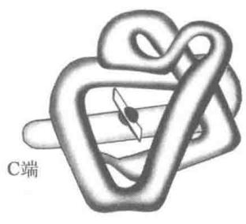  
α链（Hb α亚基）

  
图 4-6 血红蛋白 $\alpha$ 链、 $\beta$ 链和肌红蛋白链的构象相似性  
β链（Hb β亚基）

## 3. 血红蛋白的四级结构

Max Perutz 的 X 射线晶体学研究在原子水平上阐明了血红蛋白的三维结构。4 个亚基占据相当于四面体的 4 个顶角，整个分子形成 $C_{2}$ 点群对称（图 4-7）。所有研究过的脊椎动物的血红蛋白都显示与此基本相同的三维结构。4个血红素基分别位于每个多肽链的E和F螺旋之间的裂隙中，并暴露在分子的表面。4个氧结合部位彼此保持一定距离，两个最近的铁离子 $(\alpha_{1}$ 的和 $\beta_{2}$ 的血红素Fe或 $\alpha_{2}$ 的和 $\beta_{1}$ 的血红素Fe)之间的距离为 $2.5\mathrm{nm}$ 。

血红蛋白四级结构的特点是不相同的亚基之间相互作用强。 $\alpha_{1}\beta_{1}$ （和 $\alpha_{2}\beta_{2}$ ）的界面（接触面）涉及30个以上的残基，其相互作用是相当强的，虽然血红蛋白用尿素处理导致四聚体解离成 $\alpha\beta$ 二聚体，但这些二聚体是保持完整的。 $\alpha_{1}\beta_{2}$ （和 $\alpha_{2}\beta_{1}$ ）的界面涉及19个残基。所有的这些接触面都是由疏水相互作用主导的，但也有许多氢键和少数盐桥（离子对），它们的重要性将在后面讨论。

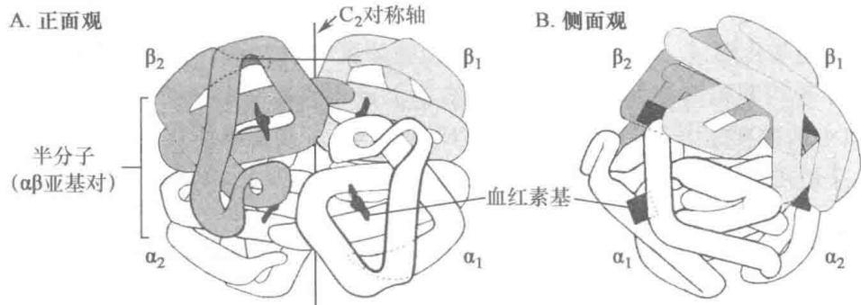  
图 4-7 血红蛋白中亚基的排列

## （三）结合氧时血红蛋白发生构象变化

## 1. 氧结合显著改变 Hb 的四级结构

X射线晶体学分析表明，氧合血红蛋白和去氧血红蛋白在四级结构上有显著不同，特别是 $\alpha \beta$ 亚基的相互作用发生很大变化。 $\alpha$ 亚基和 $\beta$ 亚基之间的接触（相互作用）可分为两种类型：一种是 $\alpha_{1}\beta_{1}$ （和

$\alpha_{2}\beta_{2}$ )接触，或称装配接触（packing contact），另一种是 $\alpha_{1}\beta_{2}$ （和 $\alpha_{2}\beta_{1}$ )接触，或称滑动接触（ sliding contact）。装配接触涉及B、G、H螺旋以及GH拐弯（corner）的30多个残基，接触面积大，对亚基的装配很重要。滑动接触主要涉及螺旋C、G和拐弯FG的19个残基(图4-8)。当血红蛋白因氧合（oxygenation）发生构象变化时，主要是滑动接触发生改变，装配接触保持基本不变（图4-9）。血红蛋白作为构象动态分子，可以看成是由两个相同的二聚体半分子组成： $\alpha_{1}\beta_{1}$ 亚基对和 $\alpha_{2}\beta_{2}$ 亚基对。每个 $\alpha \beta$ 二聚体（半分子）作为一个刚体移动。当血红素基氧合时，血红蛋白分子的这两个二聚体彼此滑动。如果一个 $\alpha \beta$ 二聚体固定不动，另一个 $\alpha \beta$ 二聚体则绕一个设想的通过两个 $\alpha \beta$ 二聚体的偏心轴旋转约 $15^{\circ}$ ，并平移 $0.08\mathrm{nm}$ ，见图4-9。此时在两个 $\alpha \beta$ 二聚体之间的界面处某些原子将移动 $0.6\mathrm{nm}$ 。

  
图 4-8 血红蛋白半分子( $\alpha\beta$ 二聚体)的侧面观  
示出装配接触(深灰色)和滑动接触(白色)

## 2. 血红蛋白的去氧型和氧合型代表两种不同的构象态

X 射线结构分析揭示,血红蛋白存在两种主要构象:T 态(T

state) 和 R 态 (R state)。虽然氧可以与任何一种构象态的血红蛋白结合, 但对 R 态的亲和力明显高于 T 态。并且氧的结合更稳定了 R 态。实验性缺氧时发现, T 态是更加稳定的, 因此 T 态是去氧血红蛋白的优势构象。T 和 R 原意分别表示“紧张”(tense) 和“松弛”(relaxed), 因为 T 态有较大数目的专一氢键和离子对起着稳定作用, 例如 $\alpha$ 和 $\beta$ 链的 C 端倒数第二位的 Tyr HC2 (分别为 Tyr $\alpha$ 140 和 Tyr $\beta$ 145) 残基的酚—OH 与 Val FG5 (Val $\alpha$ 93 和 Val $\beta$ 98) 提供的肽基 C——O 形成链内氢键, 4 个亚基的 C 端也受到盐桥的束缚, 不能自由旋转 (图 4-10)。O $_{2}$ 与一个 T 态血红蛋白亚基的结合将引发构象向 R 态转变。当整个蛋白质发生向 R 态转化时, 各个亚基的结构变化很小, 但两个 $\alpha$ $\beta$ 亚基对 (半分子) 彼此滑动并旋转, $\beta$ 亚基之间的空隙变窄。在氧合过程中稳定T态的那些离子对和氢键都发生断裂，例如由于氧合时F螺旋位移，导致Tyr HC2和Val FG5之间的氢键断裂，进而连接亚基的8个盐桥也断裂，其中6个盐桥处在不同亚基之间（称链间盐桥）。这6个盐桥中4个涉及这些链的C端残基或N端残基：两个是连接α链的N端和C端的链间盐桥，两个是连接β链的C端(His HC3)和两个Lys α40(Lys C5)残基的ε-NH₃⁺之间的盐桥。另两个链间盐桥处于两个α链的Asp α126和Arg α141残基之间。此外，在每个β链的Asp β94和His β146之间还形成一个链内盐桥。总之，由于氧结合，血红蛋白由T态转变为一种新的、4个C端几乎可以完全自由旋转的“松弛”构象——R态。

  
图 4-9 血红蛋白由去氧型转变为氧合型时亚基的移动  
A. 去氧血红蛋白；B. 氧合血红蛋白

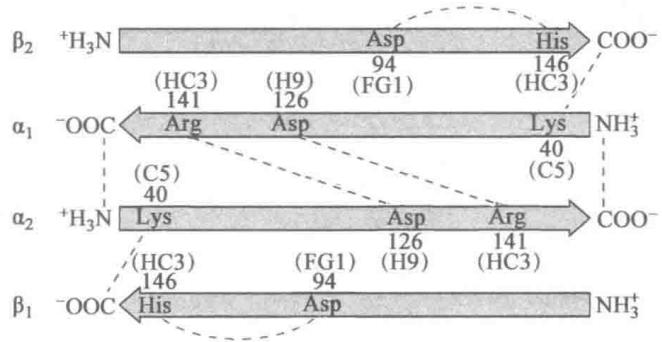  
图 4-10 去氧血红蛋白 T 态构象中各亚基间的盐桥（离子对）

## 3. 血红蛋白 T→R 转变的关键——血红素铁的微小移动

Max Perutz 曾提出, $\mathrm{T} \rightarrow \mathrm{R}$ 的转变是由于血红素周围关键氨基酸侧链的位置变化引起的。氧合时发生的四级结构变化可分为空间效应和电子效应两个方面。在去氧血红蛋白中 His F8 是与血红素 Fe(Ⅱ)离子配位的, 但空间限制迫使 Fe—N 键从垂直于 (氧合时) 血红素平面变成略有倾斜 (约 $8^{\circ}$ ) 。电子效应是由于 $\mathrm{Fe}^{2+}$ 的价电子层电子排布变化引起的。去氧血红蛋白中血红素 $\mathrm{Fe}^{2+}$ 的 6 个 $d$ 电子是以 4 个不成对电子和 1 个电子对的形式存在, 能容纳 5 个配体: 叶啉环系统的 4 个 N 原子和 His F8 的 1 个咪唑 N 原子。此电子排布中, 铁原子是顺磁性的, 处于高自旋态 (high-spin state) 。高自旋态 $\mathrm{Fe}^{2+}$ 的 4 个不成对电子占据 4 个轨道, 因此铁的原子体积增大, 加上 His F8 和卟啉环系统的氮原子之间的空间排斥以及 Fe(Ⅱ) 的电子和卟啉环的 $\pi$ 电子之间的静电排斥, 迫使铁原子向近 His(His F8) 方向略微突出卟啉环面 (约 $0.06 \mathrm{~nm}$ ), 结果血红素基也在同一方向少许凸起 (圆顶状) 。血红蛋白氧合时, $\mathrm{O}_{2}$ 成为 Fe(Ⅱ) 的第 6 个配位体, 6 个 $d$ 电子重排成 3 个电子对, 原来的 4 个不成对电子挤在两个轨道, 铁原子变成反磁性和低自旋态。自旋态的变化使得 Fe(Ⅱ) 离子和 His F8 之间的键缩短, 变成垂直于血红素平面。此外, 叶啉环 N 原子和 Fe(Ⅱ) 之间的相互作用被加强。低自旋态 $\mathrm{Fe}^{2+}$ 的原子体积比去氧时缩小, 加之其他空间和静电因素的变化, 允许铁原子向卟啉环平面的中央孔穴靠拢约 $0.039 \mathrm{~nm}$ , 此时 $\mathrm{Fe}^{2+}$ 离卟啉环面仅 $0.021 \mathrm{~nm}$ , 血红素基也由圆顶状 (凸形) 变成平面形 (图 4-11) 。这很像是 $\mathrm{O}_{2}$ 分子牵引 $\mathrm{Fe}^{2+}$ 挨近卟啉平面。这一微小的移动具有很强的生物学效应。当 Fe 原子移动时,同时拖动 His F8 残基(近 His),并进而引起螺旋 F 和拐弯 EF 和 FG 的位移。这些移动传递到亚基的界面,在这里引发构象重调,导致稳定 T 态的盐桥断裂(图 4-10)以及 β 亚基之间的空隙变窄,并把 BPG 分子(图 4-16)挤出腔外等的变化。

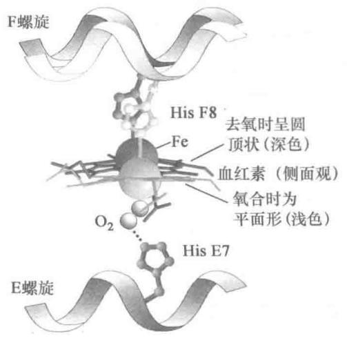  
图 4-11 血红蛋白氧合时铁原子向血红素

  
环面移动并引起血红素附近构象的变化  
图4-12 血红蛋白的S形(协同)氧结合曲线

## （四）血红蛋白与氧结合是协同的

血红蛋白必须在 $pO_{2}$ 约为 13.3 kPa 的肺部有效地结合氧，在 $pO_{2}$ 约为 4 kPa 的组织中释放出氧。肌红蛋白和任何具有双曲线型结合曲线的氧结合蛋白质都不适于行使这一功能。理由如图 4-12 所示：因为这样的蛋白质虽在肺部能以高亲和力结合氧，但在组织中不能有效地释放出氧。如果蛋白质结合氧的亲和力低得足以在组织中释放出大量的氧，则在肺部不能摄取足够的氧。

血红蛋白通过从低亲和态(T态)转变到能结合更多氧分子的高亲和态(R态)解决了这个问题。结果是血红蛋白具有S形的(sigmoid;hybrid S-shaped)氧合曲线(图4-12)。具单一配体结合部位的单亚基蛋白质即使结合引起构象变化但不能产生S形结合曲线——因为每个配体分子的结合都是独立进行的，它不会影响另一个分子的配体结合。相反， $\mathrm{O}_2$ 跟血红蛋白的个别亚基结合能改变相邻亚基对 $\mathrm{O}_2$ 的亲和力。跟去氧血红蛋白相互作用的第一个 $\mathrm{O}_2$ 分子结合得很弱，因为它跟一个T态的亚基结合。然而，它的结合导致了构象变化，这些变化传递到邻近亚基，使得它对其他 $\mathrm{O}_2$ 分子的结合变得容易。实际上，一旦 $\mathrm{O}_2$ 跟第一个亚基结合，第二、三个亚基的 $\mathrm{T} \rightarrow \mathrm{R}$ 转变就更容易发生。最后一个(第四个) $\mathrm{O}_2$ 分子跟已是R态的亚基的血红素结合，因此它的结合亲和力比第一个分子高得多。

一个配体与蛋白质上一个结合部位的结合影响同一蛋白质上其他结合部位的亲和力称为别构效应或别构相互作用。具有别构效应的蛋白质称为别构蛋白质（见第3章）。别构蛋白质具有因配体结合引起的“别的形状”或构象，这种配体被认为是调节物或调制物（regulator; modulator）。由调节物引起的构象变化可以使蛋白质在高活性和低活性形式之间互相转换。别构蛋白质的调节物可能是抑制剂或是激活剂。当正常配体和调节物是同一个分子时，相互作用称为同促的（homotropic）。当调节物是正常配体之外的分子，相互作用是异促的（heterotropic）。某些蛋白质有两个或多个调节物，因而可以有同促和异促两种相互作用。

一种配体跟多亚基蛋白质的协同结合,如 $O_{2}$ 跟血红蛋白的结合,是别构结合的一种形式。一个配体的结合会影响其他剩余的空结合部位, $O_{2}$ 可被认为是一个配体又是一个激活同促调节物。每一个亚基上只有一个 $O_{2}$ 的结合部位,所以导致协同性(cooperativity)的别构效应是由构象变化介导的,而构象变化是通过亚基-亚基相互作用从一个亚基传递到另一个亚基。S形结合曲线是协同结合的判据。它使得对配体浓度应答的灵敏度大大提高,这对许多多亚基蛋白质的功能是很重要的。别构性(allostery)原理很快也被应用于调节酶(第8章)。

协同性的构象变化取决于一个蛋白质不同部分的结构稳定性的变化。一个别构蛋白质的结合部位一般由邻接于相对不稳定的(指构象频繁变化或内在无序性)肽段的稳定肽段所组成。当一个配体结合时，蛋白质结合部位的活动部分(变化部分)被稳定在一个特定构象，后者影响相邻亚基的构象。如果整个结合部位是高度稳定的，那么当配体结合时，这个部位就不会发生构象变化或者变化的信息不会被传播到蛋白质的其他部分。

和肌红蛋白的情况一样，除 $O_{2}$ 之外的配体也能与血红蛋白结合。一个重要的例子就是一氧化碳，它与血红蛋白结合比 $O_{2}$ 高约 200 倍。人暴露在 CO 中是极其危险的。

## （五）协同性配体结合可以定量描述

早在 1910 年血红蛋白的结构尚不清楚的时候, Archibald Hill 就对 Hb 与 $O_{2}$ 的协同结合做过定量分析, 试图解释 Hb 氧合的 S 形曲线(图 4-12)。后人从他的这一工作得到了研究多亚基蛋白质与配体协同结合的一个通用方法。

对一个具有 n 个结合部位的蛋白质, 式 4-1 的平衡方程改写为

$$
\mathrm{P} + n \mathrm{L} \rightleftharpoons \mathrm{PL} _ {n}\tag{4-12}
$$

结合常数的表达式变成

$$
K _ {\mathrm{a}} = \frac {[ \mathrm{PL} _ {n} ]}{[ \mathrm{P} ] [ \mathrm{L} ] ^ {n}} \quad \text {或} \quad K _ {\mathrm{d}} = \frac {[ \mathrm{P} ] [ \mathrm{L} ] ^ {n}}{[ \mathrm{PL} _ {n} ]}\tag{4-13}
$$

$\theta$ 的表达式(见式 4-8)为

$$
\theta = \frac {[ \mathrm{L} ] ^ {n}}{[ \mathrm{L} ] ^ {n} + K _ {\mathrm{d}}}\tag{4-14}
$$

将此式重排,然后两边取对数,得:

$$
\frac {\theta}{1 - \theta} = \frac {[ \mathrm{L} ] ^ {n}}{K _ {\mathrm{d}}}\tag{4-15}
$$

$$
\lg \left(\frac {\theta}{1 - \theta}\right) = n \lg [ \mathrm{L} ] - \lg K _ {\mathrm{d}}\tag{4-16}
$$

这里， $K_{d}=\left[L\right]_{0.5}^{n}$

式4-16为Hill方程。 $\lg [\theta /(1 - \theta) ]$ 对 $\lg [\mathrm{L}]$ 的作图称为Hill图。根据此方程，Hill图应该有一个斜率 $n$ 。然而实验测得的斜率实际上反映的并不是配体结合部位的数目 $n$ ，而是部位之间相互作用的程度。因此Hill图的这一斜率用符号 $n_{\mathrm{H}}$ 表示，并称为Hill系数，它是协同性程度的量度。如果 $n_{\mathrm{H}} = 1$ ，配体的结合为非协同性的，例如在肌红蛋白中所看到的（图4-4B和图4-12），因为它是单亚基蛋白质；即使在多亚基蛋白质中，如果亚基不能传递信息，结合部位各自独立作用，那么也是发生非协同性结合。 $n_{\mathrm{H}} > 1$ 表示配体结合是正协同性，如在血红蛋白中所观察到的情况（图4-12），在这里一个配体分子的结合促进其余配体的结合。当 $n_{\mathrm{H}} = n, n_{\mathrm{H}}$ 达到理论的上限。在这种情况结合将是完全协同的：蛋白质上的所有结合部位将同时跟配体结合，并且在任何条件下将不会有被配体部分饱和的蛋白质分子存在；也即是一种“全或无”结合方式。但实际上这个极限（ $n$ ）达不到， $n_{\mathrm{H}}$ 的测定值总是小于蛋白质中配体结合部位的实际数目。 $n_{\mathrm{H}} < 1$ 表示配体结合为负协同性，也即一个配体分子的结合阻碍其余配体的结合。但是确证了的负协同性例子很少。

为了使 Hill 方程(式 4-16)适用于氧跟血红蛋白的结合,还必须在式中以 $pO_{2}$ 代替[L]以及 $P_{50}$ 代替 $K_{d}$ (注意:对于 Hb, $P_{50}$ 不等于 $K_{d}$ , 因为 Hb 是具有多个 $O_{2}$ 结合部位的别构蛋白质):

$$
\lg \left(\frac {\theta}{1 - \theta}\right) = n \lg \mathrm{pO} _ {2} - n \lg P _ {5 0}\tag{4-17}
$$

肌红蛋白和血红蛋白的 Hill 图见于图 4-13。图中示出，肌红蛋白的 Hill 图是一条直线， $n_{H}=1$ ，这表示 $O_{2}$ 分子彼此独立地与肌红蛋白结合，这一结论是正确的，因为每个 Mb 分子只能结合一个 $O_{2}$ 。当 $\lg\left[\theta/(1-\theta)\right]=0$ 时， $pO_{2}=K_{d}=P_{50}$ 。

Hb 的 Hill 图呈现“S 形”， $n_{H}=2.8$ ，落在 $n_{H}=1$ 和 $n_{H}=4$ 这两种极端之间，表明 Hb 和 $O_{2}$ 的结合是高度协同的，但不是也不可能是完全协同，因为 n 个 $O_{2}$ 要以“全或无”的方式在一瞬间结合到同一 Hb 分子的几率实际上等于零。

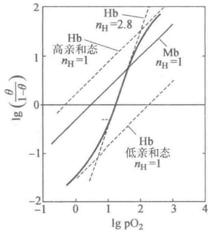

肺泡中的 $pO_{2}$ 约为 13 kPa，肌肉毛细血管中 $pO_{2}$ 约 3 kPa。从图 4-12 可见，对具有 S 形氧结合曲线的 Hb 来说在肺泡中 $\theta$ 是 0.95，肌肉毛细血管中 $\theta$ 是 0.3。释放的氧为两个 $\theta$ 值之差，即 $\Delta\theta = 0.65$ 。因此， $\Delta\theta$ 是血红蛋白输氧效率的指标。协同性将增加 $\Delta\theta$ 值。如果血红蛋白不具有氧合协同性，那么 Hb 的氧结合曲线将与

图 4-13 氧与肌红蛋白和与血红蛋白结合的 Hill 图

Mb 一样, 呈双曲线。从图 4-12 的氧结合曲线可以看到, 如果肌红蛋白从肺泡输氧到肌肉, 虽然 $pO_{2}$ 有相当大的改变, 但 $\theta$ 值变化不大, $\Delta\theta$ 不到 0.1, 表明 Mb 不适合于担当从肺部到组织转运氧的角色。正如任何一种运输工具一样, 不能只考虑装载量大小而不顾及卸载是否快捷。要提高运输效率必须同时解决装与卸问题。Hb 的协同性氧结合正是解决了 Mb 在肌肉组织中卸氧量低的问题。

## （六）协同性结合机制的两个模型

生物化学家现在已经掌握了血红蛋白 T 态和 R 态的许多知识,但是 T 态是如何转变为 R 态的,仍有很多问题有待进一步探讨。关于配体与多结合部位蛋白质的协同性结合,有两个模型对考虑这一问题很有帮助。

第一个模型是 1965 年由 J. Monod、J. Wyman 和 J. P. Changuax 提出的, 被称为 MWC 模型或协同模型 (concerted model), 也称齐变或“全或无”模型 (图 4-14A)。协同模型假设:

（1）一个协同性结合的蛋白质分子各亚基在功能上是相同的；

（2）一个蛋白质分子中所有亚基都以同样的构象态存在，或是T态（低亲和的或无活性的）或是R态（高亲和的或活性的）；

(3) 一种构象转变为另一种构象, 所有亚基是同时发生的 (即“全或无”的转变)。此模型不允许有

B. 序列模型

  
图 4-14 在协同配体结合时别构蛋白质的低亲和态和高亲和态之间互换的两个通用模型序列模型中左、右两端的竖行即是协同模型的形式，对角线行是序列模型的简化形式或是主要部分

两种不同构象态的亚基同处于一个蛋白质分子中的杂合态(RT态)存在；

（4）两种构象态处于平衡中。配体能够跟任一种构象结合，但亲和力不同，T态低，R态高。一个或多个配体分子跟低亲和的构象（无配体存在时更为稳定）结合将推动平衡向R态转移，这决定于T态和R态之间的平衡常数， $K_{eq}$ 。

MWC 模型可以解释正协同性;但不能解释负协同性。

第二个模型, KNF 模型或序列模型 (sequential model), 也称渐变模型 (图 4-14B), 是由 D. E. Koshland、G. Nemethy 和 D. Filmer 于 1966 年提出来的。他们对模型做了以下假设:

（1）配体与多结合部位蛋白质的结合，能通过诱导契合引起单个亚基的构象转变；

（2）一个亚基的构象变化能使相邻亚基的构象发生转变并使第二个配体分子的结合变得更加容易（或更难）；因此亚基构象的转变是逐个的、序列的，即采取渐变而不是齐变的方式，并因而出现T态亚基和R态亚基同在一个分子中存在的杂合态；KNF模型可以发生正协同效应，也可以发生负协同效应，这取决于结合了配体的亚基对相邻亚基的影响。如果是增加该相邻亚基对底物的结合常数（亲和力），则产生正协同性，反之产生负协同性。

这两个模型不是互相排斥的；协同模型可看成是序列模型的“全或无”极端情况。总的说，KNF 模型比 MWC 模型全面，对某些别构蛋白质行为的描述更为合适。但都有其局限性，有待进一步改进。

(七) 血红蛋白还转运 $H^{+}$ 和 $CO_{2}$

血红蛋白除了从肺到组织转运细胞所需的几乎全部氧之外,还从组织到肺、到肾转运细胞呼吸的两个终产物, $H^{+}$ 和 $CO_{2}$ ,并在这里排出体外。在线粒体内有机燃料氧化产生的 $CO_{2}$ 被水合为重碳酸盐:

$$
\mathrm{CO} _ {2} + \mathrm{H} _ {2} \mathrm{O} \xrightarrow {\text {   碳酸酐酶   }} \mathrm{H} ^ {+} + \mathrm{HCO} _ {3} ^ {+}
$$

这个反应是由碳酸酐酶催化的，此酶在体内特别是在红细胞中含量很丰富。 $CO_{2}$ 在水溶液中的溶解度很小，如果不转变为重碳酸盐，在组织和血液中容易形成 $CO_{2}$ 气泡。从上面碳酸酐酶催化的反应中看到， $CO_{2}$ 水合的结果是组织中的 $H^{+}$ 浓度增加（pH 下降）。血红蛋白与氧的结合深受 pH 和 $CO_{2}$ 浓度的影响，因此 $CO_{2}$ 和重碳酸盐的互相转化对调节血中氧的结合和释放是很重要的。

血红蛋白转运组织中形成的总 $\mathrm{H}^{+}$ 的约 $40\%$ 和 $\mathrm{CO}_{2}$ 的 $15\%$ 至 $20\%$ 到肺和肾（剩余的 $\mathrm{H}^{+}$ 由血浆的重碳酸盐缓冲液吸收；剩余的 $\mathrm{CO}_{2}$ 以溶解的 $\mathrm{HCO}_{3}^{+}$ 和 $\mathrm{CO}_{2}$ 被转运）。血红蛋白跟 $\mathrm{H}^{+}$ （或 $\mathrm{CO}_{2}$ )的结合和跟 $\mathrm{O}_{2}$ 的结合是拮抗的关系。在外周组织中 $\mathrm{pH}$ 相对较低、 $\mathrm{CO}_{2}$ 浓度相对较高，血红蛋白对氧的亲和力随 $\mathrm{H}^{+}$ 和 $\mathrm{CO}_{2}$ 的结合而降低。相反，在肺的毛细血管中，随 $\mathrm{CO}_{2}$ 被排出，因此血液 $\mathrm{pH}$ 上升，血红蛋白对氧的亲和力增高， $\mathrm{Hb}$ 能结合更多的 $\mathrm{O}_{2}$ ，以便转运到外周组织。 $\mathrm{pH}$ 和 $\mathrm{CO}_{2}$ 浓度对血红蛋白的氧结合和释放的这一影响

称为 Bohr 效应 (Bohr effect), 因 1904 发现此现象的丹麦生理学家 C. Bohr (他是著名物理学家 Niels Bohr 的父亲) 而得名。Bohr 效应具有重要的生理意义。

血红蛋白和一分子氧的结合平衡可用下列反应表示：

$$
\mathrm{Hb} + \mathrm{O} _ {2} \rightleftharpoons \mathrm{HbO} _ {2}
$$

但这个表示不够完全。为了说明 $H^{+}$ 浓度对此结合平衡的影响, 可以将此反应改写为:

$$
\mathrm{HHb} ^ {+} + \mathrm{O} _ {2} \rightleftharpoons \mathrm{HbO} _ {2} + \mathrm{H} ^ {+}
$$

这里 $\mathrm{HHb^{+}}$ 代表质子化的血红蛋白。此方程告诉我们血红蛋白的 $\mathrm{O}_2$ 饱和曲线受 $\mathrm{H^{+}}$ 浓度的影响（图4-15）。 $\mathrm{O}_2$ 和 $\mathrm{H^{+}}$ 都被血红蛋白结合，但对两者的亲和力是相悖的。当氧浓度高时（如在肺中）血红蛋白结合 $\mathrm{O}_2$ 而释放 $\mathrm{H^{+}}$ 。当氧浓度低时（如在外周组织），结合质子而释放 $\mathrm{O}_2$ 。

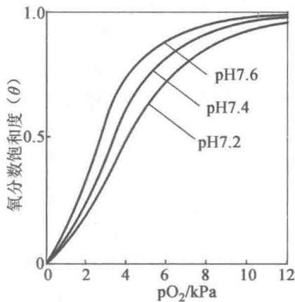  
图 4-15 pH 对血红蛋白氧分数饱和度曲线的影响

肺中血液的 pH 为 7.6, 组织中的 pH 为 7.2, 氧结合实验常在 pH 7.4 下进行

$\mathrm{O}_2$ 和 $\mathrm{H}^+$ 不是在血红蛋白的同一部位结合的。氧是跟血红素的铁原子结合，而 $\mathrm{H}^+$ 可以跟血红蛋白中几个氨基酸残基的任一个结合。对Bohr效应作出主要贡献的是β亚基的His146（HC3）。当质子化时，此残基与α亚基的Asp94(FG1)形成链内盐桥，有助稳定T态去氧血红蛋白(图4-10)。此盐桥也稳定了His HC3的质子化形式，使该残基的咪唑基在T态时具有非常高的 $\mathrm{pK}_{\mathrm{a}}$ 值(8.0)。因为在R态时此盐桥不能形成， $\mathrm{pK}_{\mathrm{a}}$ 降至它的正常值6.0，并且在 $\mathrm{pH}7.6$ （肺中血液的 $\mathrm{pH}$ )下，氧合血红蛋白中此残基大多数是去质子化的。随着 $\mathrm{H}^+$ 的浓度升高，His HC3的质子化促进了 $\mathrm{O}_2$ 的释放，有利于向T态转变。 $\alpha$ 亚基的氨基-末端残基、某些其他His残基或许还有其他基团具有相似的效应。

因此我们看到了,血红蛋白的4个多肽亚基彼此间不仅传递有关 $O_{2}$ 跟它们的血红素基结合的信息,而且也传递有关 $H^{+}$ 跟专一的氨基酸残基结合的信息。血红蛋白也结合 $CO_{2}$ ,但也是与 $O_{2}$ 的结合相拮抗的。二氧化碳是作为一个氨甲酸基(carbamate group)与每一个珠蛋白链氨基端的 $\alpha-$ 氨基结合,形成氨甲酰血红蛋白(carbaminohemoglobin) $^{①}$ :

反应中产生的 $H^{+}$ ，贡献于 Bohr 效应。被结合的氨甲酸也可形成额外的盐桥（图 4-10 中未示出），有助于稳定 T 态，促进氧的释放。

当二氧化碳的浓度高时（如在外周组织中），某些 $CO_{2}$ 跟血红蛋白结合，Hb 对 $O_{2}$ 亲和力下降，引起 $O_{2}$ 的释放。相反，当血红蛋白到达肺部时，高氧浓度促进 $O_{2}$ 的结合和 $CO_{2}$ 的释放。这是一种从一个多肽亚基到另一个多肽亚基传递结合信息的能力，此能力使得血红蛋白分子能为红细胞转运 $O_{2}$ 、 $CO_{2}$ 和 $H^{+}$ 作了如此漂亮的整合。

## (八) 2,3-二磷酸甘油酸降低血红蛋白对 $O_{2}$ 的亲和力

2,3-二磷酸甘油酸(2,3-bisphosphoglycerate,BPG)是血红蛋白(Hb)的一个重要的别构抑制剂。BPG与Hb的相互作用提供了一个异促别构调节的实例。正常的人红细胞约含4.5 mmol/L BPG,和血红蛋白约等摩尔,也即维持Hb:BPG的化学计量。当血红蛋白被提取后,它仍含有相当大量的结合BPG,BPG

很难完全被除去。实际上，在这之前测得的血红蛋白氧结合曲线都是在结合有BPG的情况下获得的。每个血红蛋白四聚体只有一个BPG的结合部位，位于T态β亚基之间的一个洞穴（cavity）中。穴内衬有荷正电的氨基酸残基，包括每个β链的Lysβ82(EF6)、Hisβ2(NA2)、Hisβ143(H21)和N端Valβ1(NA1)，它们与高负电荷的BPG分子发生静电相互作用（图4-16）。BPG和β亚基之间的盐桥有助于稳定T态，因而降低血红蛋白对氧的亲和力，促使氧的释放。当Hb跟氧结合转变为R态时，BPG的结合口袋变小，以至容纳不了BPG分子。无BPG存在时，血红蛋白更容易转变为R态。 $\mathrm{O}_2$ 和BPG跟血红蛋白的结合是互相排斥的，虽然它们各有自己的结合部位，并且相隔甚远。为了更好地表示出这一事实，在BPG存在下血红蛋白的氧合作用可表示为如下方程：

  
图 4-16 BPG 分子结构及其与 Hb 两个 β 亚基的离子结合

$$
\mathrm{HbBPG} + 4 \mathrm{O} _ {2} \rightleftharpoons \mathrm{Hb(O} _ {2}) _ {4} + \mathrm{BPG}
$$

图 4-17 示出, 在不同的 BPG 浓度下血红蛋白的氧结合曲线。完全除去 BPG 的血红蛋白对 $O_{2}$ 的亲和力很高, 这种 Hb 完全能在 4 kPa 的 $pO_{2}$ 下被 $O_{2}$ 所饱和, 其氧结合曲线与肌红蛋白的很相似。在肺部 $pO_{2}$ 大于 13 kPa 时, 各种血红蛋白几乎都能被 $O_{2}$ 饱和, BPG 的存在与氧的结合关系不大。但在外周组织 $pO_{2}<4\ kPa$ 时, 如果没有 BPG 存在, 就会减少 Hb 对组织的氧供应。有 BPG 的存在 (4.5 mmol/L), 血红蛋白对 $O_{2}$ 的亲和力低, 氧结合曲线呈现正常的 S 形, 供给组织的氧量 (卸氧量) 约为血液所能携带的最大氧量的 40% ( $\Delta\theta$ )。

人的某些生理性和病理性缺氧(hypoxia)可以通过红细胞中BPG浓度的改变来调节对组织的供氧量,例如高空适应的代偿性变化。当正常人在短时间内由海平面上升到4500 m的高山时,红细胞中的BPG浓度几小时后就开始上升,两天内可由约5 mmol/L增加到约8 mmol/L。在海拔4500m肺的 $pO_{2}$ 不到7 kPa,对组织的供氧量将减少约1/4,即 $\Delta\theta=30\%$ .

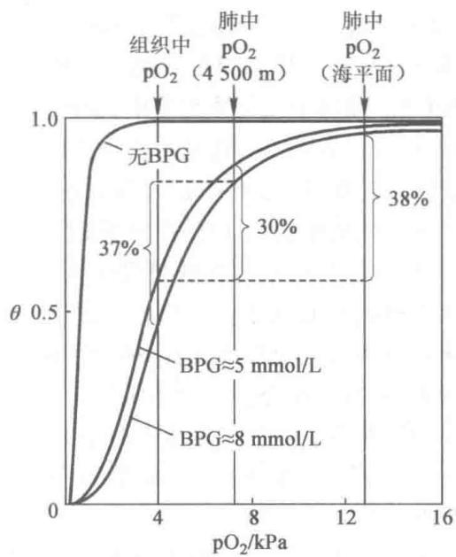  
图 4-17 BPG 对 Hb 氧结合曲线的影响

BPG浓度的升高虽然对肺中 $\mathrm{O}_2$ 的结合影响不大，但对组织中 $\mathrm{O}_2$ 的释放影响不小。结果对组织的供氧量恢复到接近 $\Delta \theta = 40\%$ 。又例如严重阻塞性肺气肿病人，因肺部换气受阻，动脉血 $\mathrm{pO}_2$ 可降至 $6.7\mathrm{kPa}$ ，Hb的氧饱和度也因此降低，此时红细胞内的BPG浓度可代偿性地升高，从正常的 $5\mathrm{mmol / L}$ 增至 $8\mathrm{mmol / L}$ ，使氧结合曲线向右移动，因而有利于组织获得较多的氧。

当用酸性柠檬酸葡萄糖溶液贮存血液时，红细胞的BPG浓度在10天内从 $5\mathrm{mmol / L}$ 下降到 $0.5\mathrm{mmol / L}$ ，血红蛋白对氧的亲和力增加， $\mathrm{P}_{50}$ 从 $3.5\mathrm{kPa}$ 降到 $2.1\mathrm{kPa}$ 。氧结合曲线向左移动。病人输入这种血液，虽然在24小时内有一半红细胞恢复到正常水平，但往往不能满足危急病人对氧的急需。缺少BPG的红细胞不能靠加入BPG来恢复，因为高度荷电的分子不能透过红细胞膜。如果存贮的血液中加入肌苷（inosine），即可防止BPG水平的下降，因为肌苷能通过红细胞膜并在胞内经一系列反应可以转变为BPG。肌苷现已广泛用于血液的保存。

BPG 对血红蛋白氧结合的调节在胎儿发育中具有重要作用。因为胎儿血液流经胎盘时必须从胎盘的另一侧母体的血中获取氧，因此胎儿血红蛋白对 $O_{2}$ 的亲和力必须比母体血红蛋白要大。胎儿合成的是 $\gamma$ 亚基而不是 $\beta$ 亚基，形成 Hb F( $\alpha_{2}\gamma_{2}$ )。此四聚体对 BPG 的亲和力要比正常的成人血红蛋白 ( $\alpha_{2}\beta_{2}$ ) 低很多，相应地对 $O_{2}$ 的亲和力也高很多，原因在前面“血红蛋白的结构”部分已谈及。

S形曲线的氧结合、Bohr效应以及BPG调节物的调节使得血红蛋白的输氧能力达到最高效率。由于能在较窄的氧分压范围内完成输氧功能，使机体内的氧水平不致有很大的起伏。此外血红蛋白使机体内的pH也维持在一个较稳定的水平。血红蛋白的别构效应充分地反映了它的生物学适应性，达到结构与功能的高度统一。血红蛋白的这些特点是使得脊椎动物以优胜类群出现于地球上的重要因素之一。

## 四、血红蛋白分子病

## （一）分子病是遗传的

血红蛋白异常是由基因突变引起并通过遗传在群体中扩散的。基因突变是血红蛋白以及所有其他蛋白质进化的基础。但是有些突变是有害的，会产生遗传病(genetic disease)。这些有害的突变在自然选择中最终将消失。其他许多突变是无害的，常被称为中性突变(neutral mutation)。至今已知存在于人类群体中的血红蛋白遗传变体(variant)约为500种。

除精子和卵子之外，人的所有细胞在正常情况下均为二倍体(diploid)，也即每个染色体都有两个拷贝(一对同源染色体)。因此每个基因至少也有两个拷贝,位于一对同源染色体的相同座位上。每种蛋白质变体都是一个变体基因的产物。变体基因(一个基因由于突变造成的多种可能状态)被称为等位基因(allele)。在每个二倍体细胞中,编码一个多肽链的基因或是以一个等位基因的两个拷贝存在,这是纯合的(homozygous)情况;或是以两个不同的等位基因各一个拷贝存在,这是杂合的(heterozygous)情况。例如β珠蛋白基因,对人群来说,可以有两种类型:正常型(β)和变体型( $\beta^{*}$ )。它们在一对同源染色体中可以有3种可能的组合:(A) $\beta+\beta$ ,正常的纯合;(B) $\beta^{*}+\beta^{*}$ ,变体的纯合;(C) $\beta+\beta^{*}$ ,杂合。只含正常型基因的个体A,只产生正常的β珠蛋白链。只含变体型基因的个体B,只产生变体β珠蛋白链。个体C将产生正常和变体两种β珠蛋白。因此,如果有缺陷的变体基因仅由双亲中的一方遗传来的,也即是杂合子患者,如果该基因又是隐性的,则这种个体就没有或仅有轻微的症状;如果有缺陷的基因来自双亲,也即是纯合子患者,症状就会充分显现出来。

血红蛋白突变如果发生在分子的表面、血红素基的附近、特异的部位以及亚基的接触面这样一些区域的任何一个都可能造成严重的后果，包括溶解度降低（如镰状细胞血红蛋白）、对氧亲和力改变、血红素基丢失和四聚体解离等。

下面介绍两类血红蛋白分子病:一类是由于 $\alpha$ 或 $\beta$ 亚基的氨基酸残基发生了更换,例如镰状细胞贫血;另一类是由于缺少了 $\alpha$ 或 $\beta$ 亚基,例如 $\alpha-$ 和 $\beta-$ 地中海贫血病。

## （二）镰状细胞贫血

## 1. 镰状细胞贫血是血红蛋白突变引起的

镰状细胞贫血(sickle-cell anemia)是最早被认识的一种分子病,是由于基因突变导致血红蛋白分子中个别氨基酸残基被更换所引起。这种病在非洲某些地区的人群中相当流行(高达40%)。镰状细胞贫血最清楚地反映出氨基酸序列在决定球状蛋白质的二、三、四级结构及其生物学功能方面的重要作用。在500种左右的人血红蛋白变体中,除少数几种之外所有其他变体都是很少见的。大多数的变异只是一个氨基酸残基的不同。对血红蛋白结构和功能的影响一般比较小,但有的可以非常大,例如镰状细胞血红蛋白。

镰状细胞贫血发生在遗传双亲的镰状细胞血红蛋白等位基因(纯合子)的个体中。这些个体的红细胞数目仅为正常人(约 $5.4\times10^{6}$ 个/mL血)的一半,而且红细胞的形态也不正常,除了有大量未成熟的红细胞之外,还有许多长而薄的、成新月状或镰刀状的红细胞(图4-18)。当镰状细胞血红蛋白(称血红蛋白S,Hb S)去氧合时,则聚集成为不溶性的纤维状晶体(图4-20)。正常的血红蛋白(称血红蛋白A,Hb A)去氧合时仍是可溶的。血红蛋白S的不溶性纤维状沉淀是红细胞变形的原因,此症纯合子患者约有50%红细胞镰状化。随血液的去氧合作用,镰状细胞的比例明显增加。

A  

B  
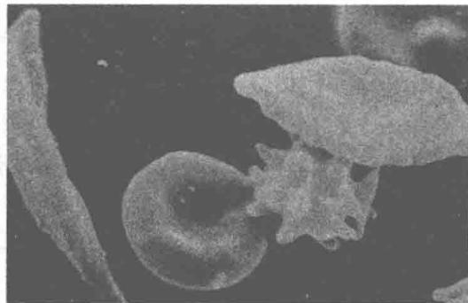  
图 4-18 正常人的红细胞和镰状细胞贫血患者的红细胞的比较  
A. 均一的、杯状的正常红细胞；B. 见于镰状细胞贫血症的各种形状的红细胞：从正常到刺状或镰状（引自 Nelson D L, Cox M M. Lehninger Biochemistry, 6th ed. 2013）

镰状细胞贫血是一种痛苦和致死性的疾病。患者常因体力过度反复出现危象；身体变得虚弱、昏花、呼吸短促、出现心脏杂音和脉搏加快。血液的血红蛋白含量只有正常人（15\~16 g/100 mL）的一半，又因镰状细胞不像正常细胞那样平滑而有弹性，不易通过毛细血管，因而血流变慢甚至堵塞，导致组织缺血、损伤、剧痛，影响器官的正常功能，这是使得此症患者早期（童年）死亡的主要原因。镰状细胞等位基因只来自亲代一方的杂合子患者，仅出现较轻症状，称镰状细胞性状（sickle-cell trait）；他们的红细胞去氧合时，只有约1%变成镰刀状。这些个体只要避免剧烈运动和对血循环的其他胁迫仍可以正常生活。对镰状细胞贫血的深入研究发现，杂合子患者能抵抗一种流行于非洲的致死性疟疾（malaria）。这种疟疾对携带正常血红蛋白基因的纯合子个体致死率也很高、常常来不及繁殖后代就已死去，而杂合子患者的等位基因对疟疾有一定的抗性，尚能活到繁衍下一代，因为杂合子患者加速对被侵红细胞的破坏而中断疟原虫的生活周期。自然选择的结果是出现一个能使血红蛋白纯合状态的有害效果和杂合状态的抗疟疾能力相平衡的等位基因群体。

## 2. 镰状细胞血红蛋白氨基酸序列的细微改变

20 世纪 40 年代后期, L. Pauling 和 H. Itano 曾指出, 血红蛋白 S(Hb S) 和正常成人血红蛋白 A(Hb A) 电泳时都向正极移动, 只是 Hb S 比 Hb A 稍慢。他们的结论是 Hb S 必定比 Hb A 略少几个带负电荷的基团。稍后, V. Ingram 等人将这两种血红蛋白都用胰蛋白酶在同样条件下水解成若干肽段 (28 个), 进行双向滤纸层析-电泳, 然后对比所得的图谱, 称为指纹谱(fingerprint)(图 4-19), 他们发现只有一个肽段位置不同。分析有差异肽段的化学结构, 其氨基酸序列分别是:

$$
\begin{array}{l l} \mathrm{HbA} & \mathrm{H} _ {2} \mathrm{NVal-His-Leu-Thr-Pro-Glu-Glu-LysCOOH} \\ \mathrm{HbS} & \mathrm{H} _ {2} \mathrm{NVal-His-Leu-Thr-Pro-Val-Glu-LysCOOH} \\ (\beta \text {链}) & 1 \quad 2 \quad 3 \quad 4 \quad 5 \quad 6 \quad 7 \quad 8 \end{array}
$$

这是 $\beta$ 链N端的一段肽链。HbS和HbA的 $\alpha$ 链是完全相同的，所不同的只是 $\beta$ 链上从N端开始的第6位氨基酸残基，在HbA分子中是谷氨酸，HbS分子中被缬氨酸所替换。值得注意的是：在Hb四条肽链的574个氨基酸残基中，只有两条 $\beta$ 链的两个谷氨酸残基被两个缬氨酸残基所替换，则引起血红蛋白性质的重大改变和人的严重疾患。

  
图 4-19 Hb A 和 Hb S 的胰蛋白酶消化液的指纹图谱  
图中水平向为电泳，垂直向为层析，两个血红蛋白中有差异肽的位置用加圆圈示出

## 3. 镰状细胞血红蛋白形成纤维状沉淀的原因

Hb A 突变为 Hb S, 从一级结构看, 只是 Glu β6 被换成 Val β6。Glu 侧链在 pH 7.4 时是一个带负电的基团, 而 Val 侧链是一个非极性基团; 因此, 血红蛋白 S 比血红蛋白 A 少了 2 个负电荷 (每个 β 链上少一个)。从三级结构看, 由于 β6 残基位于分子表面, 因此 Val 取代了 Glu β6, 等于在 Hb S 分子表面安上了一个疏水侧链。血红蛋白的氧亲和力和别构性质虽不受这种变化的影响, 但这一变化显著地降低去氧血红蛋白的溶解度, 不过对氧合血红蛋白的溶解度并无影响。正如所料, 伸出 Hb S 分子表面的 β6 Val 侧链创建了一个“黏性的”突起 (疏水接触点), 与下一个 Hb S 分子上的互补口袋借疏水相互作用缔合成纤维状聚集体而沉淀, 这是镰状细胞贫血的特征 (图 4-20)。互补口袋可能由 EF 拐弯附近的 Phe β85 (F1) 和 Leu β88 (F4) 形成, 并暴露于去氧血红蛋白表面, 但不存在于氧合血红蛋白中。电镜观察表明, 沉淀由直径为 21.5 nm 的纤维组成, 每根纤维是一个 14 股 Hb S 链的超螺旋。稳定纤维结构的, 除“黏性”区的疏水相互作用外, 还有许多极性相互作用。

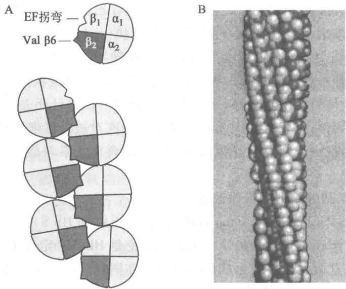  
图4-20 血红蛋白S线性缔合的分子基础  
A. 两股 Hb S 链被连锁在一起; B. 由 14 股 Hb S 链 (7 对连锁链) 聚集成的一根纤维 (根据电镜图的计算机图像模型)

## 4. 镰刀状细胞血红蛋白的治疗性矫正

不久前发现在体外用氰酸钾(KCNO)处理镰状贫血患者的红细胞,可以防止它在去氧状态下镰状化。这种细胞生存时间比处理前要长,输氧能力也有好转。HbS分子的一个氨基用KCNO修饰后就能抑制红细胞镰状化,这一反应跟 $CO_{2}$ 与HbA结合类似, $CO_{2}$ 也能结合到N端的 $NH_{2}$ 上,只是反应可逆,而KCNO的修饰为不可逆。

这里值得注意的是,一个 N 端区缬氨酸的氨基被修饰,就能够“矫正”它的构象,使分子重新获得输氧能力。

目前关于抗镰刀状化的药物研究给出了某些希望。通过适当的生物化学工程手段，有望设计出一种不仅能防止 Hb S 镰刀状化而且对体内其他蛋白质无毒害的、安全的药物。

## （三） $\alpha-$ 和 $\beta-$ 地中海贫血

地中海贫血(thalassemia)可以由几条途径产生:①缺失一个或多个编码血红蛋白链的基因;②所有基因都可能存在,但一个或多个基因发生无义突变(nonsense mutation),结果产生缩短了的蛋白链,或发生移码突变(frameshift mutation),致使合成的链含不正确的氨基酸序列;③所有基因都可能存在,但突变发生在编码区之外,导致转录被阻断或前体mRNA的不正确加工(见第30-32章)。

由于人类基因组含有若干个珠蛋白基因,对应于用在不同发育阶段的蛋白链,因而有多种不同的地中海贫血。这里仅讨论涉及成人血红蛋白 $\alpha$ 和 $\beta$ 链的缺失或功能错误的两种病症。

## 1. $\beta$ -地中海贫血

如果 $\beta$ 珠蛋白基因丢失或不能被表达，此缺损的纯合子个体将产生严重的症状，称为 $\beta-$ 地中海贫血。患者不能制造 $\beta$ 链，必须依赖胎儿 $\gamma$ 链的继续产生以形成有功能的血红蛋白， $\mathrm{HbF}(\alpha_2\gamma_2)$ 。在这样的个体中 $\gamma$ 链的产生可以继续到童年，但多数不到成熟就夭折了。杂合子患者症状较轻，这种人有一个 $\beta$ 基因仍是正常的。在这些所谓 $\beta-$ 地中海贫血性状中 $\beta$ 链的产生受到限制，但不完全被关闭。

## 2. $\alpha$ -地中海贫血

涉及 $\alpha$ 链的地中海贫血有着更加复杂的情况，因为在每个染色体上有两个邻接的拷贝（ $\alpha 1$ 和 $\alpha 2$ ），它们的蛋白质产物只差一个氨基酸残基，并且都是有功能的。因此一个人可以有4、3、2、1或0个 $\alpha$ 基因拷贝。含4个拷贝是正常的，3个或2个拷贝是不对称的，仅含1个拷贝的可能表现出轻微的症状，即 $\alpha =$ 地中海贫血性状。0个拷贝则是致命性的，称为 $\alpha-$ 地中海贫血。 $\alpha$ 珠蛋白链的水平低下时，将形成同四聚体（homotetramer）： $\beta_{4}, \gamma_{4}$ 或 $\delta_{4}$ 。它们能结合 $O_{2}$ ，但血红蛋白无协同性（别构效应），总是处于R态，也不呈现 Bohr 效应。因此向组织卸氧的效率( $\Delta\theta$ )差。所谓胎儿水肿(hydrops fetalis)的情况, $\alpha$ 基因所有4个拷贝均丢失(即0个拷贝),不能合成有功能的 $\alpha$ 珠蛋白链,因此不能形成Hb F和Hb A。胎儿可能制造一种胎儿-胚胎血红蛋白( $\zeta_{2}\gamma_{2}$ )而存活下来,但通常会在出生前或出生后不久便死去。

$\alpha-$ 和 $\beta-$ 地中海贫血性状(杂合子者)一般对疟疾也有防护作用,因此这种突变会在疟疾高发区保存下来。

<!-- EN-BEGIN 5.1 -->

### 【英文对应 5.1】Reversible Binding of a Protein to a Ligand: Oxygen-Binding Proteins

> 来源：Lehninger Principles of Biochemistry（书籍/02_生物化学原理） 第5章 Protein Function，§5.1。对应本章“四、血红蛋白分子病”。

Myoglobin and hemoglobin may be the most-studied and best-understood proteins. They were the first proteins for which three-dimensional structures were determined, and these two molecules illustrate almost every aspect of that critical biochemical process: the reversible binding of a ligand to a protein. This classic model of protein function tells us a great deal about how proteins work.

#### [EN] Oxygen Can Bind to a Heme Prosthetic Group

Oxygen is poorly soluble in aqueous solutions (see Table 2-2) and cannot be carried to tissues in sufficient quantity if it is simply dissolved in blood serum. Also, diffusion of oxygen through tissues is ineffective over distances greater than a few millimeters. The evolution of larger, multicellular animals depended on the evolution of proteins that could transport and store oxygen. However, none of the amino acid side chains in proteins are suited for the reversible binding of oxygen molecules. This role is filled by certain transition metals, among them iron and copper, that have a strong tendency to bind oxygen. Multicellular organisms exploit the properties of metals, most commonly iron, for oxygen transport. However, free iron promotes the formation of highly reactive oxygen species such as hydroxyl radicals that can damage DNA and other macromolecules. Iron used in cells is therefore bound in forms that sequester it and/or make it less reactive. In multicellular organisms, iron is often incorporated into a protein-bound prosthetic group called heme (or haem). (Recall from Chapter 3 that a prosthetic group is a compound permanently associated with a protein that contributes to the protein's function.) Heme is found in many oxygen-transporting proteins, as well as in some proteins, such as the cytochromes, that participate in oxidation-reduction (electron-transfer) reactions (Chapter 19).

  
FIGURE 5-1 Heme. The heme group is present in myoglobin, hemoglobin, and many other proteins, designated heme proteins. Heme consists of a complex organic ring structure, protoporphyrin IX, with a bound iron atom in its ferrous (Fe $^{2+}$ ) state. (a) Porphyrins, of which protoporphyrin IX is just one example, consist of four pyrrole rings linked by methene bridges,

Heme consists of a complex organic ring structure, protoporphyrin, to which is bound a single iron atom in its ferrous (Fe $^{2+}$ ) state (Fig. 5-1). The iron atom has six coordination bonds: four to nitrogen atoms that are part of the flat porphyrin ring system, and two perpendicular to the porphyrin.

P1 Iron in the $Fe^{2+}$ state binds oxygen reversibly; in the $Fe^{3+}$ state it does not bind oxygen. The structure of heme and the globins to which it is bound represents an evolutionary adaptation to prevent $Fe^{2+}$ oxidation. Free heme molecules (heme not bound to protein) leave $Fe^{2+}$ with two “open” coordination bonds. Simultaneous reaction of one $O_{2}$ molecule with two free heme molecules (or two free $Fe^{2+}$ ) can result in irreversible conversion of $Fe^{2+}$ to $Fe^{3+}$ . The coordinated nitrogen atoms (which have an electron-donating character) help prevent conversion of the heme iron to the ferric ( $Fe^{3+}$ ) state. In heme-containing proteins, this reaction is further prevented by sequestering each heme deep within the protein structure. Thus, access to the two open coordination bonds is restricted. In the globins that will shortly become the focus of our narrative, one of these two coordination bonds is occupied by a side-chain nitrogen of a highly conserved His residue referred to as the proximal His. P2 The other is the binding site for molecular oxygen (O₂) (Fig. 5-2). When oxygen binds, the electronic properties of heme iron change; this accounts for the change in color from the dark purple of oxygen-depleted venous blood to the bright red of oxygen-rich arterial blood. Some small molecules, such as carbon monoxide (CO) and nitric oxide (NO), coordinate to heme iron with greater affinity than does O₂. When a molecule of CO is bound to heme, O₂ is excluded, which is why CO is highly toxic to aerobic organisms (a topic explored in Box 5-1). By surrounding and sequestering heme, oxygen-binding proteins regulate the access of small molecules to the heme iron.

  
with substitutions at one or more of the positions denoted X. (b, c) Two representations of heme. The iron atom of heme has six coordination bonds: four in the plane of, and bonded to, the flat porphyrin ring system, and (d) two perpendicular to it. [(c) Data from PDB ID 1CCR, H. Ochi et al., J. Mol. Biol. 166:407, 1983.]

  
FIGURE 5-2 The heme group viewed from the side. This view shows the two coordination bonds to $Fe^{2+}$ that are perpendicular to the porphyrin ring system. One is occupied by a His residue called the proximal His, His $^{93}$ in myoglobin, also designated His F8 (the eighth residue in $\alpha$ helix F; see Fig. 5-3); the other is the binding site for oxygen. The remaining four coordination bonds are in the plane of, and bonded to, the flat porphyrin ring system.

#### [EN] Globins Are a Family of Oxygen-Binding Proteins

The globins are a widespread family of proteins. Globins are commonly found in eukaryotes of all classes, as well as in archaea and bacteria. All evolved from a common ancestral protein. Their tertiary structure is highly conserved, made up of eight $\alpha$ -helical segments connected by bends. This folding pattern, illustrated by myoglobin (Fig. 5-3), constitutes a structural motif known as the globin fold. The primary amino acid sequence of globins is less conserved, well reflecting both the ancient origins of this protein family and the evolutionary relatedness of species from which globin comparisons might be made.

Most globins function in oxygen transport or storage, although some play a role in the sensing of oxygen, nitric oxide, or carbon monoxide. The simple nematode worm Caenorhabditis elegans has genes encoding 33 different globins. In humans and other mammals, there are at least four kinds of globins. The monomeric myoglobin facilitates oxygen diffusion in muscle tissue. Myoglobin is particularly abundant in the muscles of diving marine mammals such as seals and whales, where it also has an oxygen-storage function for prolonged excursions undersea. The tetrameric hemoglobin is responsible for oxygen transport in the bloodstream. The monomeric neuroglobin is expressed largely in neurons and helps to protect the brain from hypoxia (low oxygen) or ischemia (restricted blood supply). Cytoglobin, another monomeric globin, is found at high concentrations in the walls of blood vessels, where it functions to regulate levels of nitric oxide, a localized signal for muscle relaxation (see Box 12-2).

#### [EN] Myoglobin Has a Single Binding Site for Oxygen

Any detailed discussion of protein function inevitably involves protein structure. Myoglobin ( $M_{r}$ 16,700; abbreviated Mb) is a single polypeptide of 153 amino acid residues with one molecule of heme (Fig. 5-3). About 78% of the amino acid residues in the protein are found in the eight $\alpha$ helices typical of the globin fold, named A through H.

An individual amino acid residue is designated either by its position in the amino acid sequence or by its location in the sequence of a particular $\alpha$ -helical segment. For example, the His residue coordinated to the heme in myoglobin—the proximal His—is His $^{93}$ (the ninety-third residue from the amino-terminal end of the myoglobin polypeptide sequence) and is also called His F8 (the eighth residue in $\alpha$ helix F). The bends in the structure are designated AB, CD, EF, FG, and GH, reflecting the $\alpha$ -helical segments they connect.

  
FIGURE 5-3 Myoglobin. The eight $\alpha$ -helical segments (shown here as cylinders) are labeled A through H. Nonhelical residues in the bends that connect them are labeled AB, CD, EF, and so forth, indicating the segments they interconnect. A few bends, including BC and DE, are abrupt and do not contain any residues; these are sometimes not labeled. The heme is bound in a pocket made up largely of the E and F helices, although amino acid residues from other segments of the protein also participate. [Data from PDB ID IMBO, S.E. Phillips, J. Mol. Biol. 142:531, 1980.]

#### [EN] Protein-Ligand Interactions Can Be Described Quantitatively

The function of myoglobin depends on the protein's ability not only to bind oxygen but also to release it when and where it is needed. Function in biochemistry often revolves around a reversible protein-ligand interaction of this type. A quantitative description of this interaction is a central part of many biochemical investigations.

In general, the reversible binding of a protein (P) to a ligand (L) can be described by a simple equilibrium expression:

$$
\mathrm{P} + \mathrm{L} \rightleftharpoons \mathrm{PL}\tag{5-1}
$$

The reaction is characterized by an equilibrium constant, $K_{a}$ , such that

$$
K _ {\mathrm{a}} = \frac {[ \mathrm{PL} ]}{[ \mathrm{P} ] [ \mathrm{L} ]} = \frac {k _ {\mathrm{a}}}{k _ {\mathrm{d}}}\tag{5-2}
$$

where $k_{a}$ and $k_{d}$ are rate constants (more on these below). The term $K_{a}$ is an association constant (not to be confused with the $K_{a}$ that denotes an acid dissociation constant; p. 57) that describes the equilibrium between the complex and the unbound components of the complex. The association constant provides a measure of the affinity of the ligand L for the protein. $K_{a}$ has units of $M^{-1}$ ; a higher value of $K_{a}$ corresponds to a higher affinity of the ligand for the protein.

The equilibrium term $K_{a}$ is also equivalent to the ratio of the rates of the forward (association) and reverse (dissociation) reactions that form the PL complex. The association rate is described by the rate constant $k_{a}$ , and dissociation is described by the rate constant $k_{d}$ . As discussed further in the next chapter, rate constants are proportionality constants, describing the fraction of a pool of reactant that reacts in a given amount of time. When the reaction involves one molecule, such as the dissociation reaction $PL \rightarrow P + L$ , the reaction is first order and the rate constant ( $k_{d}$ ) has units of reciprocal time ( $s^{-1}$ ). When the reaction involves two molecules, such as the association reaction $P + L \rightarrow PL$ , it is called second order, and its rate constant ( $k_{a}$ ) has units of $M^{-1} s^{-1}$ .

#### [EN] KEY CONVENTION Equilibrium constants are denoted with a capital K and rate constants are denoted with a lowercase k.

A rearrangement of the first part of Equation 5-2 shows that the ratio of bound to free protein is directly proportional to the concentration of free ligand:

$$
K _ {\mathrm{a}} [ \mathrm{L} ] = \frac {[ \mathrm{PL} ]}{[ \mathrm{P} ]}\tag{5-3}
$$

When the concentration of the ligand is much greater than the concentration of ligand-binding sites, the binding of the ligand by the protein does not appreciably change the concentration of free (unbound) ligand—that is, [L] remains constant. This condition is broadly applicable to most ligands that bind to proteins in cells, and it simplifies our description of the binding equilibrium.

We can now consider the binding equilibrium from the standpoint of the fraction, Y, of ligand-binding sites on the protein that are occupied by ligand:

$$
Y = \frac {\text { binding   sites   occupied }}{\text { total   binding   sites }} = \frac {[ \mathrm{PL} ]}{[ \mathrm{PL} ] + [ \mathrm{P} ]}\tag{5-4}
$$

Substituting $K_{a}[L][P]$ for [PL] (see Eqn 5-3) and rearranging terms gives

$$
Y = \frac {K _ {\mathrm{a}} [ \mathrm{L} ] [ \mathrm{P} ]}{K _ {\mathrm{a}} [ \mathrm{L} ] [ \mathrm{P} ] + [ \mathrm{P} ]} = \frac {K _ {\mathrm{a}} [ \mathrm{L} ]}{K _ {\mathrm{a}} [ \mathrm{L} ] + 1} = \frac {[ \mathrm{L} ]}{[ \mathrm{L} ] + \frac {1}{K _ {\mathrm{a}}}}\tag{5-5}
$$

The value of $K_{a}$ can be determined from a plot of Y versus the concentration of free ligand, [L] (Fig. 5-4a). Any equation of the form $x = y/(y + z)$ describes a hyperbola, and Y is thus found to be a hyperbolic function of [L]. The fraction of ligand-binding sites occupied approaches saturation asymptotically as [L] increases. The [L] at which half of the available ligand-binding sites are occupied (that is, Y = 0.5) corresponds to $1/K_{a}$ .

It is more common (and intuitively simpler), however, to consider the dissociation constant, $K_{d}$ , which

  
(a)

  
(b)  
FIGURE 5-4 Graphical representations of ligand binding. The fraction of ligand-binding sites occupied, Y, is plotted against the concentration of free ligand. Both curves are rectangular hyperbolas. (a) A hypothetical binding curve for a ligand L. The [L] at which half of the available ligand-binding sites are occupied is equivalent to $1/K_{a}$ , or $K_{d}$ . The curve has a horizontal asymptote at Y = 1 and a vertical asymptote (not shown) at $[L] = -1/K_{a}$ . (b) A curve describing the binding of oxygen to myoglobin. The partial pressure of $O_{2}$ in the air above the solution is expressed in kilopascals (kPa). Oxygen binds tightly to myoglobin, with a $P_{50}$ of only 0.26 kPa.

<table><tr><td>Protein</td><td>Ligand</td><td> $K_{d}(M)^{a}$ </td></tr><tr><td>Avidin (egg white)</td><td>Biotin</td><td> $1 \times 10^{-15}$ </td></tr><tr><td>Insulin receptor (human)</td><td>Insulin</td><td> $1 \times 10^{-10}$ </td></tr><tr><td>Anti-HIV immunoglobulin (human)b</td><td>gp41 (HIV-1 surface protein)</td><td> $4 \times 10^{-10}$ </td></tr><tr><td>Nickel-binding protein (E. coli)</td><td>Ni2+</td><td> $1 \times 10^{-7}$ </td></tr><tr><td>Calmodulin (rat)c</td><td>Ca2+</td><td> $3 \times 10^{-6}$ </td></tr><tr><td></td><td></td><td> $2 \times 10^{-5}$ </td></tr></table>

  
Color bars indicate the range of dissociation constants typical of various classes of interactions in biological systems. A few interactions, such as that between the protein avidin and the enzyme cofactor biotin, fall outside the normal ranges. The avidin-biotin interaction is so tight it may be considered irreversible. Sequence-specific protein-DNA interactions reflect proteins that bind to a particular sequence of nucleotides in DNA, as opposed to general binding to any DNA site.

$^{a}$ A reported dissociation constant is valid only for the particular solution conditions under which it was measured. $K_{d}$ values for a protein-ligand interaction can be altered, sometimes by several orders of magnitude, by changes in the solution's salt concentration, pH, or other variables. $^{b}$ This immunoglobulin was isolated as part of an effort to develop a vaccine against HIV. Immunoglobulins (described later in the chapter) are highly variable, and the $K_{d}$ reported here should not be considered characteristic of all immunoglobulins. $^{c}$ Calmodulin has four binding sites for calcium. The values shown reflect the highest- and lowest-affinity binding sites observed in one set of measurements.

is the reciprocal of $K_{\mathrm{a}}$ ( $K_{d} = 1/K_{a}$ ) and has units of molar concentration (M). $K_{d}$ is the equilibrium constant for the release of ligand. The relevant expressions change to

$$
K _ {\mathrm{d}} = \frac {[ \mathrm{P} ] [ \mathrm{L} ]}{[ \mathrm{PL} ]} = \frac {k _ {\mathrm{d}}}{k _ {\mathrm{a}}}\tag{5-6}
$$

$$
[ \mathrm{PL} ] = \frac {[ \mathrm{P} ] [ \mathrm{L} ]}{K _ {\mathrm{d}}}\tag{5-7}
$$

$$
Y = \frac {[ \mathrm{L} ]}{[ \mathrm{L} ] + K _ {\mathrm{d}}}\tag{5-8}
$$

When [L] equals $K_{d}$ , half of the ligand-binding sites are occupied. As [L] falls below $K_{d}$ , progressively less of the protein has ligand bound to it. For 90% of the available ligand-binding sites to be occupied, [L] must be nine times greater than $K_{d}$ .

P1 In practice, $K_{d}$ is used much more often than $K_{a}$ to express the affinity of a protein for a ligand. Note that a lower value of $K_{d}$ corresponds to a higher affinity of ligand for the protein. The mathematics can be reduced to simple statements: $K_{d}$ is equivalent to the molar concentration of ligand at which half of the available ligand-binding sites are occupied. At this point, the protein is said to have reached half-saturation with respect to ligand binding. The more tightly a protein binds a ligand, the lower the concentration of ligand required for half the binding sites to be occupied, and thus the lower the value of $K_{d}$ . Some representative dissociation constants are given in Table 5-1; the scale shows typical ranges for dissociation constants found in biological systems.

#### [EN] WORKED EXAMPLE 5-1 Receptor-Ligand Dissociation Constants

Two proteins, A and B, bind to the same ligand, L, with the binding curves shown below. What is the dissociation constant, $K_{d}$ , for each protein? Which protein (A or B) has a greater affinity for ligand L?

SOLUTION: We can determine the dissociation constants by inspecting the graph. Because Y represents the fraction of binding sites occupied by ligand, the concentration of ligand at which half the binding sites are occupied — that is, the point where the binding curve crosses the line where Y = 0.5 — is the dissociation constant. For A, $K_{d} = 2\mu M$ ; for B, $K_{d} = 6\mu M$ . Because A is half-saturated at a lower [L], it has a higher affinity for the ligand.

#### [EN] WORKED EXAMPLE 5-2 Protein-Ligand Binding

A protein has a $K_{d}$ of $2.0 \mu \mathrm{M}$ . What is the [L] where $Y = 0.6$ ? SOLUTION: Solving Equation 5-8 for [L], first we obtain

$$
[ \mathrm{L} ] = Y ([ \mathrm{L} ] + K _ {\mathrm{d}})
$$

Distributing Y on the right side gives

$$
[ L ] = Y [ L ] + Y K _ {d}
$$

Subtracting Y[L] from both sides

$$
[ L ] - Y [ L ] = Y K _ {d}
$$

then factoring out [L]

$$
[ L ] (1 - Y) = Y K _ {d}
$$

and dividing both sides by 1-Y gives the final expression

$$
[ L ] = \frac {Y K _ {\mathrm{d}}}{(1 - Y)}
$$

Substituting the values for Y and $K_{d}$ given in the problem gives

$$
\begin{array}{r l} [ \mathrm{L} ] & = 0. 6 (2. 0 \mu \mathrm{M}) / (1 - 0. 6) \\ & = 3. 0 \mu \mathrm{M} \end{array}
$$

The binding of oxygen to myoglobin follows the patterns discussed above. However, because oxygen is a gas, we must make some minor adjustments to the equations so that laboratory experiments can be carried out more conveniently. We first substitute the concentration of dissolved oxygen for [L] in Equation 5-8 to give

$$
Y = \frac {[ \mathrm{O} _ {2} ]}{[ \mathrm{O} _ {2} ] + K _ {\mathrm{d}}}\tag{5-9}
$$

As for any ligand, $K_{d}$ equals the $[O_{2}]$ at which half of the available ligand-binding sites are occupied, or $[O_{2}]_{0.5}$ . Equation 5-9 thus becomes

$$
Y = \frac {[ \mathrm{O} _ {2} ]}{[ \mathrm{O} _ {2} ] + [ \mathrm{O} _ {2} ] _ {0 . 5}}\tag{5-10}
$$

In experiments using oxygen as a ligand, it is the partial pressure of oxygen ( $pO_{2}$ ) in the gas phase above the solution that is varied, because this is easier to measure than the concentration of oxygen dissolved in the solution. The concentration of a volatile substance in solution is always proportional to the local partial pressure of the gas. So, if we define the partial pressure of oxygen at $[O_{2}]_{0.5}$ as $P_{50}$ , substitution in Equation 5-10 gives

$$
Y = \frac {\mathrm{pO} _ {2}}{\mathrm{pO} _ {2} + P _ {5 0}}
$$

(5-11)

A binding curve for myoglobin that relates Y to $pO_{2}$ is shown in Figure 5-4b.

#### [EN] Protein Structure Affects How Ligands Bind

P3 The binding of a ligand to a protein is rarely as simple as the above equations would suggest. The interaction is greatly affected by protein structure and is often accompanied by conformational changes. For example, the specificity with which heme binds its various ligands is altered when the heme is a component of myoglobin. For free heme molecules, carbon monoxide binds more than 20,000 times better than does $\mathrm{O}_2$ (that is, the $K_{\mathrm{d}}$ or $P_{50}$ for CO binding to free heme is more than 20,000 times lower than that for $\mathrm{O}_2$ ), but it binds only about 40 times better than $\mathrm{O}_2$ when the heme is bound in myoglobin. For free heme, the tighter binding by CO reflects differences in the way the orbital structures of CO and $\mathrm{O}_2$ interact with $\mathrm{Fe}^{2+}$ . Those same orbital structures lead to different binding geometries for CO and $\mathrm{O}_2$ when they are bound to heme (Fig. 5-5a, b). The change in relative affinity of CO and $\mathrm{O}_2$ for heme when the heme is bound to a globin is mediated by the globin structure.

When heme is bound to myoglobin, its affinity for $O_{2}$ is selectively increased by the presence of the distal His (His $^{64}$ , or His E7 in myoglobin). The Fe- $O_{2}$ complex is much more polar than the Fe-CO complex. A partial negative charge is distributed across the oxygen atoms in the bound $O_{2}$ due to partial oxidation of the interacting iron atom. A hydrogen bond between the imidazole side chain of His E7 and the bound $O_{2}$ stabilizes this polar complex electrostatically (Fig. 5-5c). The affinity of myoglobin for $O_{2}$ is thus selectively increased by a factor of about 500; there is no such effect for Fe-CO binding in myoglobin. Consequently, the 20,000-fold stronger binding affinity of free heme for CO compared with $O_{2}$ declines to approximately 40-fold for heme embedded in myoglobin. This favorable electrostatic effect on $O_{2}$ binding is even more dramatic in some invertebrate hemoglobins, where two groups in the binding pocket can form strong hydrogen bonds with $O_{2}$ , causing the heme group to bind $O_{2}$ with greater affinity than CO. This selective enhancement of $O_{2}$ affinity in globins is physiologically important: it helps prevent poisoning by the CO that is generated in small amounts from metabolism and that is sometimes generated in larger amounts by our industrial-age environment.

P3 The binding of $O_{2}$ to the heme in myoglobin also depends on molecular motions, or “breathing,” in the protein structure. The heme molecule is deeply buried in the folded polypeptide, with limited direct paths for oxygen to move from the surrounding solution to the ligand-binding site. If the protein were rigid, $O_{2}$ could not readily enter or leave the heme pocket. However, rapid molecular flexing of the amino acid side chains produces transient cavities in the protein structure, and $O_{2}$ makes its way in and out by moving through these cavities. Computer simulations of rapid structural fluctuations in myoglobin suggest that there are many such pathways. The distal His acts as a gate to control access to one major pocket near the heme iron. Rotation of that His residue to open and close the pocket occurs on a nanosecond ( $10^{-9}$ s) time scale.

  
FIGURE 5-5 Steric effects caused by ligand binding to the heme of myoglobin. (a) Oxygen binds to heme with the $\mathrm{O}_2$ axis at an angle, a binding conformation readily accommodated by myoglobin. (b) Carbon monoxide binds to free heme with the CO axis perpendicular to the plane of the porphyrin ring. (c) Another view of the heme of myoglobin, showing the arrangement of key amino acid residues around the heme. The bound $\mathrm{O}_2$ is hydrogen-bonded to the distal His, His E7 (His $^{64}$ ), facilitating the binding of $\mathrm{O}_2$ compared with its binding to free heme. [(c) Data from PDB ID 1MBO, S. E. Phillips, J. Mol. Biol. 142:531, 1980.]

Thus, subtle conformational changes can be critical for protein activity. Structural changes take on more complexity in the multisubunit hemoglobin, which we consider next.

#### [EN] Hemoglobin Transports Oxygen in Blood

Nearly all the oxygen carried by whole blood in animals is bound and transported by hemoglobin in erythrocytes (red blood cells). Normal human erythrocytes are small (6 to 9 $\mu$ m in diameter), biconcave disks. They are formed from precursor stem cells called hemocyto-blasts. In the maturation process, the stem cell produces daughter cells that form large amounts of hemoglobin and then lose their organelles—nucleus, mitochondria, and endoplasmic reticulum. Erythrocytes are thus incomplete, vestigial cells, unable to reproduce and, in humans, destined to survive for only about 120 days. Their main function is to carry hemoglobin, which is dissolved in the cytosol at a very high concentration (\~34% by weight).

In arterial blood passing from the lungs through the heart to the peripheral tissues, hemoglobin is about 96% saturated with oxygen. In the venous blood returning to the heart, hemoglobin is only about 64% saturated. Thus, each 100 mL of blood passing through a tissue releases about one-third of the oxygen it carries, or 6.5 mL of $O_{2}$ gas at atmospheric pressure and body temperature.

Myoglobin, with its hyperbolic binding curve for oxygen (Fig. 5-4b), is relatively insensitive to small changes in the concentration of dissolved oxygen, so it functions well as an oxygen-storage protein. Hemoglobin, with its multiple subunits and O₂-binding sites, is better suited to oxygen transport. As we shall see, interactions between the subunits of a multimeric protein can permit a highly sensitive response to small changes in ligand concentration. P5 Interactions among the subunits in hemoglobin cause conformational changes that alter the affinity of the protein for oxygen. The modulation of oxygen binding allows the O₂-transport protein to respond to changes in oxygen demand by tissues.

#### [EN] Hemoglobin Subunits Are Structurally Similar to Myoglobin

Hemoglobin ( $M_{r}$ 64,500; abbreviated Hb) is roughly spherical, with a diameter of nearly 5.5 nm. It is a tetrameric protein containing four heme prosthetic groups, one associated with each polypeptide chain. Adult hemoglobin contains two types of globin: two $\alpha$ chains (141 residues each) and two $\beta$ chains (146 residues each). The three-dimensional structures of the two types of subunits are very similar to each other and to myoglobin (Fig. 5-6), reflecting their evolution within the larger globin superfamily. However, fewer than half of the amino acid residues are identical in the polypeptide sequences of the $\alpha$ and $\beta$ subunits, and only 27 are identical in the three polypeptides (Fig. 5-7).

  
FIGURE 5-6 Comparison of the structures of myoglobin and the $\beta$ subunit of hemoglobin. [Data from (left) PDB ID 1MBO, S.E. Phillips, J.Mol.Biol. 142:531, 1980; (right) PDB ID 1HGA, R. Liddington et al., J.Mol.Biol. 228:551, 1992.]

  
FIGURE 5-7 Comparison of whale myoglobin with the $\alpha$ and $\beta$ chains of human hemoglobin. (a) Sequence alignment with dashed lines marking helix boundaries. For optimal alignment, short gaps are introduced into both Hb sequences where a few amino acids are present in the other sequences. With the exception of the missing D helix in the Hb $\alpha$ chain (Hbx), this alignment permits the use of the helix lettering convention that emphasizes the common positioning of amino acid residues. Residues conserved in all known globins are shaded black. Residues conserved in the three globins shown here are shaded dark blue. Positions where the amino acid class (hydrophobic, charged, etc.) is conserved are shaded

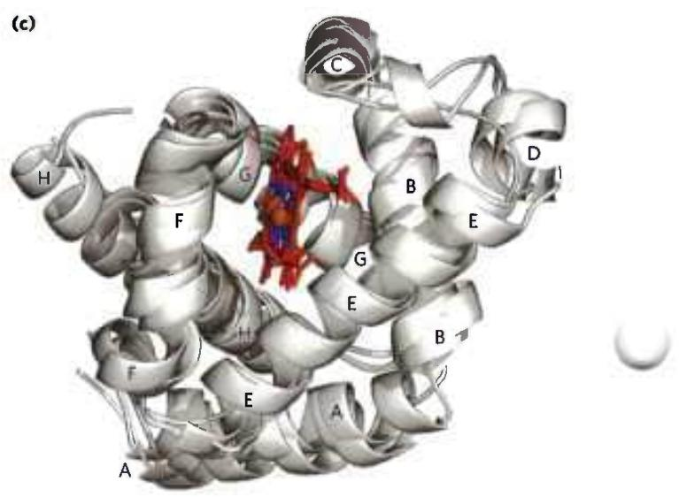  
light blue. The common helix-letter-and-number designation for amino acids does not necessarily correspond to a common position in the linear sequence. For example, the distal His residue is His E7 in all three structures, but corresponds to His $^{64}$ , His $^{58}$ , and His $^{63}$ in the linear sequences of Mb, Hb $\alpha$ , and Hb $\beta$ , respectively. Nonhelical residues at the amino and carboxyl termini are labeled NA and HC, respectively. (b) The location of shaded residues is shown in a ribbon representation of myoglobin structure. (c) Ribbon representations of the three globin structures are overlaid to show structural conservation. [Data from PDB ID 1MBO, S.E. Phillips, J. Mol. Biol. 142:531, 1980; PDB ID 1HGA, R. Liddington et al., J. Mol. Biol. 228:551, 1992.]

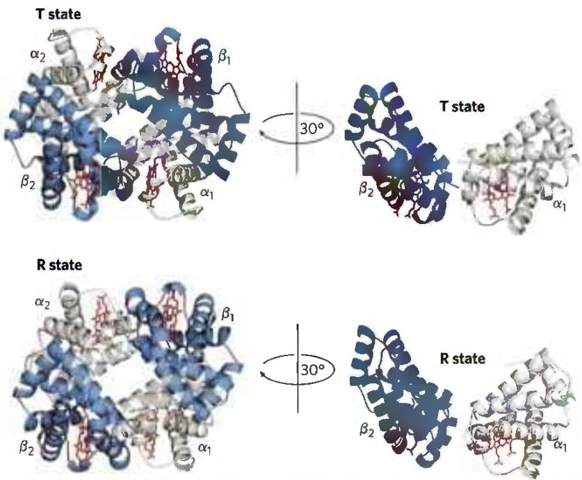

The helix-naming convention described for myoglobin is also applied to the hemoglobin polypeptides, except that the $\alpha$ subunit lacks the short D helix. The heme-binding pocket is made up largely of the E and F helices in each of the subunits.

The quaternary structure of hemoglobin features strong interactions between unlike subunits. The $\alpha_{1}\beta_{1}$ interface (and its $\alpha_{2}\beta_{2}$ counterpart) involves more than 30 residues, and its interaction is sufficiently strong that although mild treatment of hemoglobin with urea tends to disassemble the tetramer into $\alpha\beta$ dimers, these dimers remain intact. The $\alpha_{1}\beta_{2}$ (and $\alpha_{2}\beta_{1}$ ) interface involves 19 residues (Fig. 5-8). The hydrophobic effect plays the major role in stabilizing these interfaces, but there are also many hydrogen bonds and a few ion pairs (or salt bridges), whose importance is discussed below.

#### [EN] Hemoglobin Undergoes a Structural Change on Binding Oxygen

P4 X-ray analysis has revealed two major conformations of hemoglobin: the R state and the T state. Although oxygen binds to hemoglobin in either state, it has a significantly higher affinity for hemoglobin in the R state. Oxygen binding stabilizes the R state. When oxygen is absent experimentally, the T state is more stable and is thus the predominant conformation of deoxyhemoglobin. T and R originally denoted "tense" and "relaxed," respectively, because the T state is stabilized by a greater number of ion pairs, many of which lie at the $\alpha_{1}\beta_{2}$ (and $\alpha_{2}\beta_{1}$ ) interface (Fig. 5-9). The binding of O $_{2}$ to a hemoglobin subunit in the T state triggers a change in conformation to the R state. When the entire protein undergoes this transition, the structures of the individual subunits change little, but the $\alpha\beta$ subunit pairs slide past each other and rotate, narrowing the pocket between the $\beta$ subunits (Fig. 5-10). In this process, some of the ion pairs that stabilize the T state are broken and some new ones are formed.

FIGURE 5-8 Dominant interactions between hemoglobin subunits. In this representation, $\alpha$ subunits are light and $\beta$ subunits are dark. The strongest subunit interactions (highlighted) occur between unlike subunits. When oxygen binds, the $\alpha_{1}\beta_{1}$ contact changes little, but there is a large change at the $\alpha_{1}\beta_{2}$ contact, with several ion pairs broken. [Data from PDB ID 1HGA, R. Liddington et al., J. Mol. Biol. 228:551, 1992.]  
  
FIGURE 5-9 Some ion pairs that stabilize the T state of deoxyhemoglobin. Many of the ion pairs stabilizing the T state lie at the $\alpha_{1}\beta_{2}$ (and $\alpha_{2}\beta_{1}$ ) interface. Close-up view of a portion of a deoxyhemoglobin molecule in the T state. Interactions between the ion pairs His HC3 and Asp FG1 of the $\beta$ subunit (blue) and between Lys C5 of the $\alpha$ subunit (gray) and His HC3 (its $\alpha$ -carboxyl group) of the $\beta$ subunit are shown with dashed lines. (Recall that HC3 is the carboxyl-terminal residue of the $\beta$ subunit.) These examples do not represent the entire network of ion pairs that stabilize the structure. [Data from PDB ID 1HGA, R. Liddington et al., J. Mol. Biol. 228:551, 1992.]

Max Perutz proposed that the T → R transition is triggered by changes in the positions of key amino acid side chains surrounding the heme. In the T state, the porphyrin is slightly puckered, causing the heme iron to protrude somewhat on the proximal His (His F8) side. The binding of O₂ causes the heme to assume a more planar conformation, shifting the position of the proximal His and the attached F helix (Fig. 5-11). These changes lead to adjustments in the ion pairs at the $\alpha_{1}\beta_{2}$ interface.

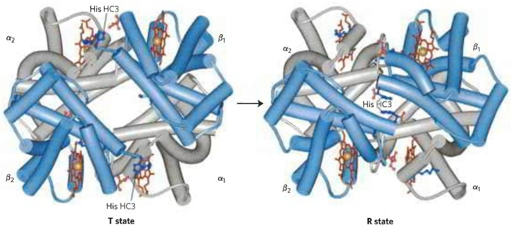  
FIGURE 5-10 The T → R transition. In these depictions of deoxyhemoglobin, as in Figure 5-9, the β subunits are blue and the α subunits are gray. Positively charged side chains and chain termini involved in ion pairs are shown in blue, and their negatively charged partners are shown in red. The Lys C5 of each α subunit and the Asp FG1 of each β subunit are visible but are not labeled (compare Fig. 5-9). Note that the molecule is oriented slightly differently than in Figure 5-9. The transition from the T state to the R state shifts

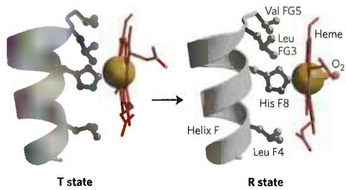  
FIGURE 5-11 Changes in conformation near heme on $\mathrm{O}_2$ binding to deoxyhemoglobin. The shift in the position of helix F when heme binds $\mathrm{O}_2$ is thought to be one of the adjustments that triggers the T → R transition. [T state: Data from PDB ID 1HGA, R. Liddington et al., J. Mol. Biol. 228:551, 1992. R state: Data from PDB ID 1BBB, M. M. Silva et al., J. Biol. Chem. 267:17,248, 1992; R state modified to represent $\mathrm{O}_2$ instead of CO.]

#### [EN] Hemoglobin Binds Oxygen Cooperatively

Hemoglobin must bind oxygen efficiently in the lungs, where the $pO_{2}$ is about 13.3 kPa, and it must release oxygen in the tissues, where the $pO_{2}$ is about 4 kPa. Myoglobin, or any protein that binds oxygen with a hyperbolic binding curve, would be ill-suited to this function, for the reason illustrated in Figure 5-12. A protein that bound $O_{2}$ with high affinity would bind it efficiently in the lungs but would not release much of it in the tissues. If the protein bound oxygen with a sufficiently low affinity to release it in the tissues, it would not pick up much oxygen in the lungs.

the subunit pairs substantially, affecting certain ion pairs. Most noticeably, the His HC3 residues at the carboxyl termini of the $\beta$ subunits, which are involved in ion pairs in the T state, rotate in the R state toward the center of the molecule, where they are no longer in ion pairs. Another dramatic result of the $T\rightarrow R$ transition is a narrowing of the pocket between the $\beta$ subunits. [T state: Data from PDB ID 1HGA, R. Liddington et al., J. Mol. Biol. 228:551, 1992. R state: Data from PDB ID 1BBB, M. M. Silva et al., J. Biol. Chem. 267:17,248, 1992.]  
  
FIGURE 5-12 A sigmoid (cooperative) binding curve. A sigmoid binding curve can be viewed as a hybrid curve reflecting a transition from a low-affinity state to a high-affinity state. Because of its cooperative binding, as manifested by a sigmoid binding curve, hemoglobin is more sensitive to the small differences in $\mathrm{O}_2$ concentration between the tissues and the lungs, allowing it to bind oxygen in the lungs (where $\mathsf{pO}_2$ is high) and release it in the tissues (where $\mathsf{pO}_2$ is low).

Hemoglobin solves the problem by undergoing a transition from a low-affinity state (the T state) to a high-affinity state (the R state) as more $O_{2}$ molecules are bound. As a result, hemoglobin has a hybrid S-shaped, or sigmoid, binding curve for oxygen (Fig. 5-12). A single-subunit protein with a single ligand-binding site cannot produce a sigmoid binding curve—even if binding elicits a conformational change—because each molecule of ligand binds independently and cannot affect ligand binding to another molecule. P5 In contrast, $O_{2}$ binding to individual subunits of hemoglobin can alter the affinity for $O_{2}$ in adjacent subunits. The first molecule of $O_{2}$ that interacts with deoxyhemoglobin binds weakly, because it binds to a subunit in the T state. Its binding, however, leads to conformational changes that are communicated to adjacent subunits, making it easier for additional molecules of $O_{2}$ to bind. In effect, the T → R transition occurs more readily in the second subunit once $O_{2}$ is bound to the first subunit. The last (fourth) $O_{2}$ molecule binds to a heme in a subunit that is already in the R state, and hence it binds with much higher affinity than the first molecule.

P5 An allosteric protein is one in which the binding of a ligand to one site affects the binding properties of another site on the same protein. The term “allosteric” derives from the Greek allos, “other,” and stereos, “solid” or “shape.” P6 Allosteric proteins are those having “other shapes,” or conformations, induced by the binding of ligands referred to as modulators. The conformational changes induced by the modulator(s) interconvert more-active and less-active forms of the protein. The modulators for allosteric proteins may be either inhibitors or activators. When the normal ligand and modulator are identical, the interaction is termed homotropic. When the modulator is a molecule other than the normal ligand, the interaction is heterotropic. Some proteins have two or more modulators and therefore can have both homotropic and heterotropic interactions.

Cooperative binding of a ligand to a multimeric protein, such as we observe with the binding of $O_{2}$ to hemoglobin, is a form of allosteric binding. The binding of one ligand affects the affinities of any remaining unfilled binding sites, and $O_{2}$ can be considered as both a ligand and an activating homotropic modulator. There is only one binding site for $O_{2}$ on each subunit, so the allosteric effects giving rise to cooperativity are mediated by conformational changes transmitted from one subunit to another by subunit-subunit interactions. A sigmoid binding curve is diagnostic of cooperative binding. It permits a much more sensitive response to ligand concentration and is important to the function of many multisubunit proteins. The principle of allostery extends readily to regulatory enzymes, as we shall see in Chapter 6.

As is the case with myoglobin, ligands other than oxygen can bind to hemoglobin. An important example is carbon monoxide, which binds to hemoglobin about 250 times better than does oxygen (the critical hydrogen bond between $O_{2}$ and the distal His is not quite as strong in human hemoglobin as it is in most mammalian myoglobins, so the binding of $O_{2}$ relative to CO is not augmented quite as much). Human exposure to CO can have tragic consequences (Box 5-1).

#### [EN] Cooperative Ligand Binding Can Be Described Quantitatively

Cooperative binding of oxygen by hemoglobin was first analyzed by Archibald Hill in 1910. From this work came a general approach to the study of cooperative ligand binding to multisubunit proteins.

For a protein with n binding sites, the equilibrium of Equation 5-1 becomes

$$
\mathrm{P} + n \mathrm{L} \rightleftharpoons \mathrm{PL} _ {n}\tag{5-12}
$$

and the expression for the association constant becomes

$$
K _ {\mathrm{a}} = \frac {[ \mathrm{PL} _ {n} ]}{[ \mathrm{P} ] [ \mathrm{L} ] ^ {n}}\tag{5-13}
$$

The expression for $Y$ (see Eqn 5-8) is

$$
Y = \frac {[ \mathrm{L} ] ^ {n}}{[ \mathrm{L} ] ^ {n} + K _ {\mathrm{d}}}\tag{5-14}
$$

Rearranging, then taking the log of both sides, yields

$$
\frac {Y}{1 - Y} = \frac {[ \mathrm{L} ] ^ {n}}{K _ {\mathrm{d}}}\tag{5-15}
$$

$$
\log \left(\frac {Y}{1 - Y}\right) = n \log [ L ] - \log K _ {\mathrm{d}}
$$

where $K_{\mathrm{d}} = [\mathrm{L}]_{0.5}^{n}$

(5-16)

Equation 5-16 is the Hill equation, and a plot of $\log [Y / (1 - Y)]$ versus $\log [\mathrm{L}]$ is called a Hill plot. Based on the equation, the Hill plot should have a slope of $n$ . However, the experimentally determined slope actually reflects not the number of binding sites but the degree of interaction between them. The slope of a Hill plot is therefore denoted by $n_{\mathrm{H}}$ , the Hill coefficient, which is a measure of the degree of cooperativity. If $n_{\mathrm{H}}$ equals 1, ligand binding is not cooperative, a situation that can arise even in a multisubunit protein if the subunits do not communicate. An $n_{\mathrm{H}}$ of greater than 1 indicates positive cooperativity in ligand binding. This is the situation observed in hemoglobin, in which the binding of one molecule of ligand facilitates the binding of others. The theoretical upper limit for $n_{\mathrm{H}}$ is reached when $n_{\mathrm{H}} = n$ . In this case the binding would be completely cooperative: all binding sites on the protein would bind ligand simultaneously, and no protein molecules partially saturated with ligand would be present under any conditions. This limit is never reached in practice, and the measured value of $n_{\mathrm{H}}$ is always less than the actual number of ligand-binding sites in the protein.

An $n_{H}$ of less than 1 indicates negative cooperativity, in which the binding of one molecule of ligand impedes

#### [EN] Carbon Monoxide: A Stealthy Killer

Summer, 2017. A Florida man drove his late-model SUV into his garage, took his wireless key fob with him inside the house, and went to bed. He was found, days later, dead from carbon monoxide poisoning. The man had assumed that removing the fob was enough to shut down the automobile. Instead, the car had idled in the garage until it ran out of gas, ultimately filling the attached house with CO. Since 2006, several dozen deaths and scores of injuries have resulted from similar incidents. Measures to address the safety issues posed by keyless ignitions, now standard in most new cars, have lagged. Meanwhile, the deaths are a vivid reminder that life depends on the reversibility of protein-ligand interactions.

Carbon monoxide (CO), a colorless, odorless gas, is one of the most common known causes of death due to poisoning (in countries where such records are kept). CO has an approximately 250-fold greater affinity for hemoglobin than does oxygen. Consequently, relatively low levels of CO can have substantial and tragic effects. When CO combines with hemoglobin, the complex is referred to as carboxyhemoglobin, or COHb.

Some CO is produced by natural processes, but locally high levels generally result only from human activities. Engine and furnace exhausts are important sources, as CO is a byproduct of the incomplete combustion of fossil fuels. In the United States alone, nearly 4,000 people succumb to CO poisoning each year, both accidentally and intentionally. Many of the accidental deaths involve undetected CO buildup in enclosed spaces. This might occur when a household furnace malfunctions, or a gas generator is operated indoors during a power outage or shutoff, venting CO into a home. CO poisoning can also occur in open spaces, as unsuspecting people at work or play inhale the exhaust from generators, outboard motors, tractor engines, recreational vehicles, or lawn mowers.

Carbon monoxide levels in the atmosphere are rarely dangerous, ranging from less than 0.05 part per million (ppm) in remote and uninhabited areas to 3 to 4 ppm in some cities of the Northern Hemisphere. In the United States, the government-mandated (Occupational Safety and Health Administration, OSHA) limit for CO at worksites is 35 ppm for people working an eight-hour shift. The tight binding of CO to

the binding of others. Well-documented cases of negative cooperativity are rare.

To adapt the Hill equation to the binding of oxygen to hemoglobin, we must again substitute $pO_{2}$ for [L] and $P_{50}^{n}$ for $K_{d}$ :

$$
\log \left(\frac {Y}{1 - Y}\right) = n \log \mathrm{pO} _ {2} - n \log P _ {5 0}\tag{5-17}
$$

Hill plots for myoglobin and hemoglobin are given in Figure 5-13.

hemoglobin means that COHb can accumulate over time as people are exposed to a constant low-level source of CO.

In an average, healthy individual, 1% or less of the total hemoglobin is complexed as COHb. Since CO is a product of tobacco smoke, many smokers have COHb levels in the range of 3% to 8% of total hemoglobin, and the levels can rise to 15% for chain-smokers. COHb levels equilibrate at 50% in people who breathe air containing 570 ppm of CO for several hours. Reliable methods have been developed that relate CO content in the atmosphere to COHb levels in the blood (Fig. 1). CO levels in the home of the Florida victim exceeded OSHA-mandated limits by more than 30-fold.

How is a human affected by COHb? At levels of less than 10% of total hemoglobin, symptoms are rarely observed. At 15%, the individual experiences mild headaches. At 20% to 30%, the headache is severe and is generally accompanied by

  
FIGURE 1 Relationship between levels of COHb in blood and concentration of CO in the surrounding air. Four different conditions of exposure are shown, comparing the effects of short exposure versus extended exposure, and exposure at rest versus exposure during light exercise. [Data from R. F. Coburn et al., J. Clin. Invest. 44:1899, 1965.]

#### [EN] Two Models Suggest Mechanisms for Cooperative Binding

In a multisubunit ligand-binding protein like hemoglobin, how does the T → R transition occur? Two models for the cooperative binding of ligands to proteins with multiple binding sites have greatly influenced thinking about this problem, defining the two major possibilities.

The first model was proposed by Jacques Monod, Jeffries Wyman, and Jean-Pierre Changeux in 1965, and is called the MWC model or the concerted model (Fig. 5-14a). The concerted model assumes that the nausea, dizziness, confusion, disorientation, and some visual disturbances; these symptoms are generally reversed if the individual is treated with oxygen. At COHb levels of 30% to 50%, the neurological symptoms become more severe, and at levels near 50%, the individual loses consciousness and can sink into coma. Respiratory failure may follow. With prolonged exposure, some damage becomes permanent. Death normally occurs when COHb levels rise above 60%.

Binding of CO to hemoglobin is affected by many factors, including exercise (Fig. 1) and changes in air pressure related to altitude. Because of their higher base levels of COHb, smokers exposed to a source of CO often develop symptoms faster than nonsmokers. Individuals with heart, lung, or blood diseases that reduce the availability of oxygen to tissues may also experience symptoms at lower levels of CO exposure. Fetuses are at particular risk for CO poisoning. Fetal hemoglobin, with $\gamma$ subunits replacing $\beta$ subunits, has a somewhat higher affinity for CO than adult hemoglobin (see p. 148). Cases of CO exposure have been recorded in which the fetus died but the pregnant woman recovered.

It may seem surprising that the loss of half of one's hemoglobin to COHb can prove fatal — we know that people with any of several anemic conditions manage to function reasonably well with half the usual complement of active hemoglobin. However, the binding of CO to hemoglobin does more than remove protein from the pool available to bind oxygen. It also affects the affinity of the remaining hemoglobin subunits for oxygen. As CO binds to one or two subunits of a hemoglobin tetramer, the affinity for $O_{2}$ is increased substantially in the remaining subunits (Fig. 2). Thus, a hemoglobin tetramer with two bound CO molecules can efficiently bind $O_{2}$ in the lungs — but it releases very little of it in the tissues. Oxygen deprivation in the tissues rapidly becomes severe. To add to the problem, the effects of CO are not limited to interference with hemoglobin function. CO binds to other heme proteins and a variety of metalloproteins. The effects of these interactions are not yet well understood, but they may be responsible for some of the longer-term effects of acute but nonfatal CO poisoning.

When CO poisoning is suspected, rapid removal of the person from the CO source is essential, but this does not

subunits of a cooperatively binding protein are functionally identical, that each subunit can exist in (at least) two conformations, and that all subunits undergo the transition from one conformation to the other simultaneously. In this model, no protein has individual subunits in different conformations. The two conformations are in equilibrium. The ligand can bind to either conformation, but it binds much more tightly to the R state. P5 Successive binding of ligand molecules to the low-affinity T state (which is more stable in the absence of ligand) gradually shifts the equilibrium to favor the R state.

  
FIGURE 2 Several oxygen-binding curves: for normal hemoglobin, for hemoglobin from an anemic individual with only $50\%$ of her hemoglobin functional, and for hemoglobin from an individual with $50\%$ of his hemoglobin subunits complexed with CO. The $\mathsf{pO}_2$ in human lungs and tissues is indicated. [Data from F. J. W. Roughton and R. C. Darling, Am. J. Physiol. 141:17, 1944.]

always result in rapid recovery. When an individual is moved from the CO-polluted site to a normal, outdoor atmosphere, $O_{2}$ begins to replace the CO in hemoglobin — but the COHb level drops only slowly. The half-time is 2 to 6.5 hours, depending on individual and environmental factors. If 100% oxygen is administered with a mask, the rate of exchange can be increased about fourfold; the half-time for $O_{2}$ -CO exchange can be reduced to tens of minutes if 100% oxygen at a pressure of 3 atm (303 kPa) is supplied. Thus, rapid treatment by a properly equipped medical team is critical.

A home carbon monoxide detector is a simple and inexpensive measure to avoid possible tragedy. After completing the research for this box, we immediately purchased several new CO detectors for our homes.

In the second model, the sequential model (Fig. 5-14b), proposed in 1966 by Daniel Koshland and colleagues, ligand binding can induce a change of conformation in an individual subunit. A conformational change in one subunit makes a similar change in an adjacent subunit more likely, and makes the binding of a second ligand molecule more likely as well. There are more potential intermediate states in this model than in the concerted model. The two models are not mutually exclusive; the concerted model may be viewed as the "all-or-none" limiting case of the sequential model.

  
FIGURE 5-13 Hill plots for oxygen binding to myoglobin and hemoglobin. When $n_{H}=1$ , there is no evident cooperativity. The maximum degree of cooperativity observed for hemoglobin corresponds approximately to $n_{H}=3$ . Note that while this indicates a high level of cooperativity, $n_{H}$ is less than n, the number of $O_{2}$ -binding sites in hemoglobin. This is normal for a protein that exhibits allosteric binding behavior.

  
FIGURE 5-14 Two general models for the interconversion of inactive and active forms of a protein during cooperative ligand binding. Although the models may be applied to any protein -- including any enzyme (Chapter 6) — that exhibits cooperative binding, here we show four subunits because the model was originally proposed for hemoglobin. (a) In the concerted, or all-or-none, model (MWC model), all subunits are postulated to be in the same conformation, either all O (low affinity or inactive) or all □ (high affinity or active). Depending on the equilibrium, $K_{\text{eq}}$ , between O and □ forms, the binding of one or more ligand molecules (L) will pull the equilibrium toward the □ form. Subunits with bound L are shaded. (b) In the sequential model, each individual subunit can be in either the O form or the □ form. The equilibrium is altered as additional ligands are bound, progressively favoring the R state.

Unfortunately, the two models have proven very difficult to distinguish experimentally. In Chapter 6 we use these models to investigate allosteric enzymes.

#### [EN] Hemoglobin Also Transports H $^{+}$ and CO $_{2}$

In addition to carrying nearly all the oxygen required by cells from the lungs to the tissues, hemoglobin carries two end products of cellular respiration—H $^{+}$ and CO $_{2}$ —from the tissues to the lungs and the kidneys, where they are excreted. The CO $_{2}$ , produced by oxidation of organic fuels in mitochondria, is hydrated to form bicarbonate:

$$
\mathrm{CO} _ {2} + \mathrm{H} _ {2} \mathrm{O} \rightleftharpoons \mathrm{H} ^ {+} + \mathrm{HCO} _ {3} ^ {-}
$$

This reaction is catalyzed by carbonic anhydrase, an enzyme particularly abundant in erythrocytes. Carbon dioxide is not very soluble in aqueous solution, and bubbles of $CO_{2}$ would form in the tissues and blood if it were not converted to bicarbonate. As you can see from the reaction catalyzed by carbonic anhydrase, the hydration of $CO_{2}$ results in an increase in the $H^{+}$ concentration (a decrease in pH) in the tissues. The binding of oxygen by hemoglobin is profoundly influenced by pH and $CO_{2}$ concentration, so the interconversion of $CO_{2}$ and bicarbonate is of great importance to the regulation of oxygen binding and release in the blood.

Hemoglobin transports about 40% of the total $H^{+}$ and 15% to 20% of the $CO_{2}$ formed in the tissues to the lungs and kidneys. (The remainder of the $H^{+}$ is absorbed by the plasma's bicarbonate buffer; the remainder of the $CO_{2}$ is transported as dissolved $HCO_{3}^{-}$ and $CO_{2}$ .) The structural effects of $H^{+}$ and $CO_{2}$ binding to hemoglobin favor the T state. P6 Thus, the binding of $H^{+}$ and $CO_{2}$ is inversely related to the binding of oxygen. At the relatively low pH and high $CO_{2}$ concentration of peripheral tissues, the affinity of hemoglobin for oxygen decreases as $H^{+}$ and $CO_{2}$ are bound, and $O_{2}$ is released to the tissues. Conversely, in the capillaries of the lung, as $CO_{2}$ is excreted and the blood pH consequently rises, the affinity of hemoglobin for oxygen increases and the protein binds more $O_{2}$ for transport to the peripheral tissues. This effect of pH and $CO_{2}$ concentration on the binding and release of oxygen by hemoglobin is called the Bohr effect, after Christian Bohr, the Danish physiologist (and father of physicist Niels Bohr) who discovered it in 1904.

A complete statement of the binding equilibrium for hemoglobin and one molecule of oxygen can be designated by the reaction

$$
\mathrm{HHb} ^ {+} + \mathrm{O} _ {2} \rightleftharpoons \mathrm{HbO} _ {2} + \mathrm{H} ^ {+}
$$

where HHb $^{+}$ denotes a protonated form of hemoglobin. This equation tells us that the O $_{2}$ -saturation curve of hemoglobin is influenced by the H $^{+}$ concentration (Fig. 5-15). Both O₂ and H⁺ are bound by hemoglobin, but with inverse affinity. When the oxygen concentration is high, as in the lungs, hemoglobin binds O₂ and releases protons. When the oxygen concentration is low, as in the peripheral tissues, H⁺ is bound and O₂ is released.

  
FIGURE 5-15 Effect of pH on oxygen binding to hemoglobin. The pH of blood is 7.6 in the lungs and 7.2 in the tissues. Experimental measurements on hemoglobin binding are often performed at pH 7.4.

Oxygen and $H^{+}$ are not bound at the same sites in hemoglobin. Oxygen binds to the iron atoms of the hemes, whereas $H^{+}$ binds to any of several amino acid residues in the protein. A major contribution to the Bohr effect is made by His $^{146}$ (His HC3) of the $\beta$ subunits. When protonated, this residue forms one of the ion pairs—to Asp $^{94}$ (Asp FG1)—that helps stabilize deoxyhemoglobin in the T state (Fig. 5-9). Protonation of the amino-terminal residues of the $\alpha$ subunits, certain other His residues, and perhaps other groups has a similar effect.

Hemoglobin also binds $CO_{2}$ , again in a manner inversely related to the binding of oxygen. Carbon dioxide binds as a carbamate group to the $\alpha$ -amino group at the amino-terminal end of each globin chain, forming carbaminohemoglobin:

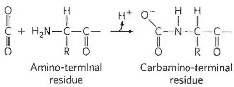

This reaction produces $H^{+}$ , contributing to the Bohr effect. The bound carbamates also form additional salt bridges (not shown in Fig. 5-9) that help to stabilize the T state and promote the release of oxygen.

When the concentration of carbon dioxide is high, as in peripheral tissues, some $CO_{2}$ binds to hemoglobin and the affinity for $O_{2}$ decreases, causing its release. Conversely, when hemoglobin reaches the lungs, the high oxygen concentration promotes binding of $O_{2}$ and release of $CO_{2}$ . It is the capacity to communicate ligand-binding information from one polypeptide subunit to the others that makes the hemoglobin molecule so beautifully adapted to integrating the transport of $O_{2}$ , $CO_{2}$ , and $H^{+}$ by erythrocytes.

#### [EN] Oxygen Binding to Hemoglobin Is Regulated by 2,3-Bisphosphoglycerate

P6 The interaction of 2,3-bisphosphoglycerate (BPG) with hemoglobin molecules further refines the function of hemoglobin, and provides an example of heterotropic allosteric modulation.

  
2,3-Bisphosphoglycerate

BPG binds at a site distant from the oxygen-binding site and regulates the $O_{2}$ -binding affinity of hemoglobin in relation to the $pO_{2}$ in the lungs. BPG is present in relatively high concentrations in erythrocytes. When hemoglobin is isolated, it contains substantial amounts of bound BPG, which can be difficult to remove completely. In fact, the $O_{2}$ -binding curves for hemoglobin that we have examined up to this point were obtained in the presence of bound BPG. 2,3-Bisphosphoglycerate greatly reduces the affinity of hemoglobin for oxygen—there is an inverse relationship between the binding of $O_{2}$ and the binding of BPG. We can therefore describe another binding process for hemoglobin:

$$
\mathrm{HbBPG} + \mathrm{O} _ {2} \rightleftharpoons \mathrm{HbO} _ {2} + \mathrm{BPG}
$$

BPG is important in the physiological adaptation to the lower $pO_{2}$ at high altitudes. For a healthy human at sea level, the binding of $O_{2}$ to hemoglobin is regulated such that the amount of $O_{2}$ delivered to the tissues is nearly 40% of the maximum that could be carried by the blood (Fig. 5-16). Imagine that this person is suddenly transported from sea level to an altitude of 4,500 meters, where the $pO_{2}$ is considerably lower. The delivery of $O_{2}$ to the tissues is now reduced. However, after just a few hours at the higher altitude, the BPG concentration in the blood has begun to rise, leading to a decrease in the affinity of hemoglobin for oxygen. This adjustment in the BPG level has only a small effect on the binding of $O_{2}$ in the lungs, but it has a considerable effect on the release of $O_{2}$ in the tissues. As a result, the delivery of oxygen to the tissues is restored to nearly 40% of the $O_{2}$ that can be transported by the blood. The situation is reversed when the person returns to sea level. The BPG concentration in erythrocytes also increases in people suffering from hypoxia, lowered oxygenation of peripheral tissues due to inadequate functioning of the lungs or circulatory system.

  
FIGURE 5-16 Effect of 2,3-bisphosphoglycerate on oxygen binding to hemoglobin. The BPG concentration in normal human blood is about 5 mm at sea level and about 8 mm at high altitudes. Note that hemoglobin binds to oxygen quite tightly when BPG is entirely absent, and the binding curve seems to be hyperbolic. In reality, the measured Hill coefficient for O₂-binding cooperativity decreases only slightly (from 3 to about 2.5) when BPG is removed from hemoglobin, but the rising part of the sigmoid binding curve is confined to a very small region close to the origin. At sea level, hemoglobin is nearly saturated with O₂ in the lungs, but is just over 60% saturated in the tissues, so the amount of O₂ released in the tissues is about 38% of the maximum that can be carried in the blood. At high altitudes, O₂ delivery declines by about one-fourth, to 30% of maximum. An increase in BPG concentration, however, decreases the affinity of hemoglobin for O₂, so approximately 37% of what can be carried is again delivered to the tissues.

The site of BPG binding to hemoglobin is the cavity between the $\beta$ subunits in the T state (Fig. 5-17). This cavity is lined with positively charged amino acid residues that interact with the negatively charged groups of BPG. Unlike $O_{2}$ , only one molecule of BPG is bound to each hemoglobin tetramer. BPG lowers hemoglobin's affinity for oxygen by stabilizing the T state. In the absence of BPG, hemoglobin is primarily present in the R state, where it binds $O_{2}$ efficiently in the lungs but fails to release it in the tissues.

  
(b)  
FIGURE 5-17 Binding of 2,3-bisphosphoglycerate to deoxyhemoglobin. (a) BPG binding stabilizes the T state of deoxyhemoglobin. The negative charges of BPG interact with several positively charged groups (shown in blue in this surface contour image) that surround the pocket between the $\beta$ subunits on the surface of deoxyhemoglobin in the T state. (b) The binding pocket for BPG disappears on oxygenation, following transition to the R state. (Compare with Fig. 5-10.) [Data from (a) PDB ID 1886, V. Richard et al., J. Mol. Biol. 233:270, 1993; (b) PDB ID 1BBB, M. M. Silva et al., J. Biol. Chem. 267:17,248, 1992.]

P6 Regulation of oxygen binding to hemoglobin by BPG has an important role in fetal development. Because a fetus must extract oxygen from its mother's blood, fetal hemoglobin must have greater affinity than the maternal hemoglobin for $O_{2}$ . The fetus synthesizes $\gamma$ subunits rather than $\beta$ subunits, forming $\alpha_{2}\gamma_{2}$ hemoglobin. This tetramer has a much lower affinity for BPG than normal adult hemoglobin, and a correspondingly higher affinity for $O_{2}$ .

#### [EN] Sickle Cell Anemia Is a Molecular Disease of Hemoglobin

The hereditary human disease sickle cell anemia demonstrates strikingly the importance of amino acid sequence in determining the secondary, tertiary, and quaternary structures of globular proteins, and thus their biological functions. Almost 500 genetic variants of hemoglobin are known to occur in the human population; all but a few are quite rare. Most variations consist of differences in a single amino acid residue. The effects on hemoglobin structure and function are often minor but

(b)

(b)  

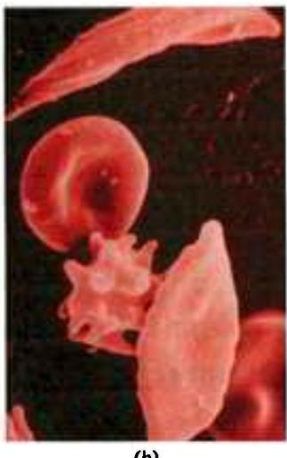  
FIGURE 5-18 A comparison of (a) uniform, cup-shaped, normal erythrocytes and (b) the variably shaped erythrocytes seen in sickle cell anemia, which range from normal to spiny or sickle-shaped. [(a) A. Syred/Science; (b) Jackie Lewin, Royal Free Hospital/Science Source.]

can sometimes be extraordinary. Each hemoglobin variation is the product of an altered gene. Variant genes are called alleles. Because humans generally have two copies of each gene, an individual may have two copies of one allele (thus being homozygous for that gene) or one copy of each of two different alleles (thus heterozygous).

Sickle cell anemia occurs in individuals who inherit the allele for sickle cell hemoglobin from both parents. The erythrocytes of these individuals are fewer and also abnormal. In addition to an unusually large number of immature cells, the blood contains many long, thin, sickle-shaped erythrocytes (Fig. 5-18). When hemoglobin from sickle cells (called hemoglobin S, or HbS) is deoxygenated, it becomes insoluble and forms polymers that aggregate into tubular fibers (Fig. 5-19). Normal hemoglobin (hemoglobin A, or HbA) remains soluble upon deoxygenation. The insoluble fibers of deoxygenated HbS cause the deformed, sickle shape of the erythrocytes, and the proportion of sickled cells increases greatly as blood is deoxygenated.

The altered properties of HbS result from a single amino acid substitution, a Val instead of a Glu residue at position 6 in the two $\beta$ chains. Replacement of the Glu residue by Val creates a “sticky” hydrophobic contact point at position 6 of the $\beta$ chain, which is on the outer surface of the molecule. These sticky spots cause deoxyHbS molecules to associate abnormally with each other, forming the long, fibrous aggregates characteristic of this disorder.

Sickle cell anemia is life-threatening and painful. People with this disease suffer repeated crises brought on by physical exertion. They become weak, dizzy, and short of breath, and they also experience heart murmurs and an increased pulse rate. The hemoglobin content of their blood is only about half the normal value of 15 to 16 g/100 mL, because sickled cells are very fragile and rupture easily; this results in anemia ("lack of blood"). An even more serious consequence is that capillaries become blocked by the long, abnormally shaped cells, causing severe pain and interfering with normal organ function—a major factor in the early death of many people with the disease.

  
FIGURE 5-19 Normal and sickle cell hemoglobin. (a) Subtle differences between the conformations of HbA and HbS result from a single amino acid change in the $\beta$ chains. (b) As a result of this change, deoxyHbS has a hydrophobic patch on its surface, which causes the molecules to aggregate into strands that align into insoluble fibers.

Without medical treatment, people with sickle cell anemia usually die in childhood. Curiously, the frequency of the sickle cell allele in populations is unusually high in certain parts of Africa. Investigation into this matter led to the finding that when heterozygous, the allele confers a small but significant resistance to lethal forms of malaria. The heterozygous individuals experience a milder condition called sickle cell trait; only about 1% of their erythrocytes become sickled on deoxygenation. These individuals may live completely normal lives if they avoid vigorous exercise and other stresses on the circulatory system. Natural selection has resulted in an allele population that balances the deleterious effects of the homozygous condition against the resistance to malaria afforded by the heterozygous condition.

#### [EN] SUMMARY 5.1 Reversible Binding of a Protein to a Ligand: Oxygen-Binding Proteins

■ Protein function often entails interactions with other molecules. A protein binds a molecule, known as a ligand, at its binding site.

■ Myoglobin contains a heme prosthetic group, which binds oxygen. Heme consists of a single atom of $Fe^{2+}$ coordinated within a porphyrin.

■ Globins are a specialized family of transport proteins containing heme; most globins store oxygen.

■ Oxygen binds to myoglobin reversibly.

■ Reversible binding of a ligand to a protein can be described quantitatively by a dissociation constant $K_{d}$ . For a monomeric protein such as myoglobin, the fraction of binding sites occupied by a ligand is a hyperbolic function of ligand concentration.

■ Proteins may undergo conformational changes when a ligand binds, a process called induced fit. In a multisubunit protein, the binding of a ligand to one subunit may affect ligand binding to other subunits. Ligand binding can be regulated.

■ Hemoglobin transports oxygen in blood.

■ Normal adult hemoglobin has four heme-containing subunits, two $\alpha$ and two $\beta$ , similar in structure to each other and to myoglobin.

■ Hemoglobin exists in two interchangeable structural states, T and R. The T state is most stable when oxygen is not bound. Oxygen binding promotes transition to the R state.

\- Oxygen binding to hemoglobin is both allosteric and cooperative. As $\mathrm{O}_2$ binds to one binding site, the hemoglobin undergoes conformational changes that affect the other binding sites—an example of allosteric behavior.

■ Conformational changes between the T and R states, mediated by subunit-subunit interactions, result in cooperative binding; this is described by a sigmoid binding curve and can be analyzed by a Hill plot.

■ Two major models have been proposed to explain the cooperative binding of ligands to multisubunit proteins: the concerted model and the sequential model.

■ Hemoglobin also binds $H^{+}$ and $CO_{2}$ , resulting in the formation of ion pairs that stabilize the T state and lessen the protein's affinity for $O_{2}$ (the Bohr effect).

■ Oxygen binding to hemoglobin is also modulated by 2,3-bisphosphoglycerate, which binds to and stabilizes the T state.

■ Sickle cell anemia is a genetic disease caused by a single amino acid substitution (Glu $^{6}$ to Val $^{6}$ ) in each $\beta$ chain of hemoglobin. The change produces a hydrophobic patch on the surface of the hemoglobin that causes the molecules to aggregate into bundles of fibers. This homozygous condition results in serious medical complications.

<!-- EN-END 5.1 -->

## 五、免疫系统和免疫球蛋白

前面我们已经看到氧结合蛋白质的构象和小配体( $O_{2}$ 或 CO)与血红素基的结合是如何相互影响的。然而大多数蛋白质-配体的相互作用并不涉及辅基。一个配体的结合部位更经常的是像血红蛋白的 BPG 结合部位——蛋白质中的一个裂隙，内壁衬有氨基酸残基，这些残基排列成能进行高度专一的结合相互作用。能有效的辨别配体是结合部位的标准，甚至配体只有很小的结构差别。

免疫(immunity)是人类和脊椎动物最重要的防御机制,它是生物进化过程中逐步发展并完善起来的。免疫系统能在分子水平上识别“自我”和“非我”(外物),然后破坏那些被鉴定为非我的实体。免疫系统以这种方式消灭病毒、细菌和其他病原体,以及对生物体造成威胁的大分子。在生理水平上免疫系统对入侵者的应答是多种蛋白质、分子和细胞类型之间的一套复杂而协调的相互作用。在个体蛋白质水平上,免疫应答(immune response)是一个建立在配体跟蛋白质可逆结合上的极其灵敏而专一的生物化学系统。

## （一）免疫应答涉及一系列特化的细胞和特化的蛋白质

免疫主要是由淋巴细胞包括 B[淋巴] 细胞和 T[淋巴] 细胞和巨噬细胞完成的，它们都属于白细胞类 (leukocytes)。淋巴细胞 (lymphocyte) 是在造血期间由骨髓中未分化的干细胞 (stem cell) 发育而来。形成的白细胞离开骨髓，循环于血液和淋巴系统，贮存于各种淋巴器官中，每种细胞产生一种或多种蛋白质，后者能识别有侵染标示的分子并与之结合。免疫系统的专一性、多样性、记忆和自我/非我的识别等都是由淋巴细胞介导的。淋巴细胞通过为外来物质所专一的膜受体来识别抗原。巨噬细胞 (macrophage) 也是由骨髓干细胞分化而来，在骨髓中发育成幼单核细胞，进入血液中分化成单核细胞 (monocyte)，然后迁移到组织，分化成组织特异的巨噬细胞。它们的功能是吞噬大颗粒和细胞，以及作为抗原呈递细胞 (antigen presenting cell)。

免疫应答由两个互补的系统组成:体液的和细胞的免疫系统。体液免疫系统(humoral immune system)是针对存在于体液中的入侵细菌和胞外病毒,但也能对外来的蛋白质作出应答。细胞免疫系统(cellular immune system)是破坏被病毒侵染的宿主细胞,也破坏某些寄生物和外来的移植组织。

体液免疫应答的核心物质是称为抗体(antibody)或免疫球蛋白(immunoglobulin)的可溶性蛋白质,常缩写为Ig。免疫球蛋白能结合细菌、病毒或那些被鉴定是外来的、需要消灭的大分子。免疫球蛋白构成血液蛋白质的20%,是由B淋巴细胞或B细胞所产生;之所以称为B细胞是因为它们是在骨髓(bone marrow)中完成发育的。B细胞表达结合抗原的特色膜受体,称为B细胞受体(图4-21A)。B细胞受体是一种抗体分子,膜结合的糖蛋白(图4-25)。B细胞遇上对它的膜受体专一的抗原(初次抗原应答),开始迅速分裂,子代分化成记忆细胞(memory cell)和效应细胞(effector cell)也称浆细胞(plasma cell)。初次免疫应答后产生的记忆细胞是长寿命的,它们表达与原亲代细胞具有同样专一性的膜结合抗体,负责更快更强的再次免疫应答。浆细胞不产生膜结合抗体,但产生分泌型的可溶性抗体。浆细胞(富含内质网膜)只能存活几天,在此期间合成并分泌大量的抗体。据估计一个浆细胞每秒钟能分泌约2000个抗体分子。分泌的抗体是体液免疫的主要效应分子。

细胞免疫应答的核心因子是一类 T 淋巴细胞或 T 细胞，之所以称为 T 细胞是因为它们的后期发育是在胸腺（thymus gland）中完成的。在胸腺内成熟期间，T 细胞表达抗原专一的膜结合受体，位于 T 细胞的表面上，称为 T 细胞受体（图 4-21B 和 C）。受体是蛋白质，一般存在于细胞的外表面并伸展到质膜中。T 细胞受体是一种异二聚体，由两条多肽链（αβ 或 γδ）组成，链间由二硫键连接，两条链的 N 端折叠在一起形成 T 细胞受体的抗原结合部位。B 细胞受体识别单独的抗原，而 T 细胞受体只有当抗原跟一个称为主要组织相容性复合体（major histocompatibility complex, MHC）的膜蛋白结合时，才能识别它。一个 T 细胞,当遇上跟细胞上的 MHC 结合的抗原,则被激活、增殖并分化成记忆 T 细胞和各种效应 T 细胞。

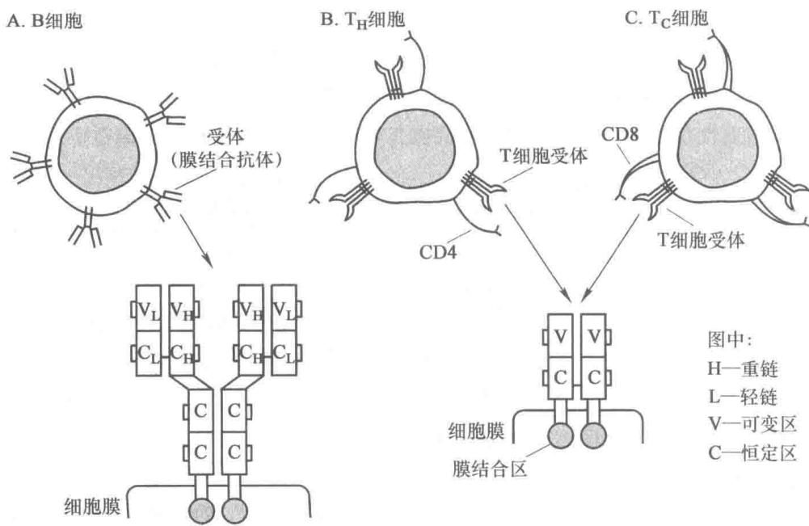  
图 4-21 B 细胞和 T 细胞上的抗原膜受体  
每个细胞上约有 $10^{5}$ 个受体分子，每个细胞上的受体分子对抗原的专一性是相同的。注意，抗体、T  
细胞受体以及Ⅰ类 MHC 和Ⅱ类 MHC（图 4-22）都是免疫球蛋白超家族的成员

T 淋巴细胞又分两个亚群:辅助性 T 细胞或 $T_{H}$ 细胞 (helper T cell) 和 [细] 胞毒性 T 细胞或 $T_{C}$ 细胞 (cytotoxic T cell)。 $T_{H}$ 细胞和 $T_{C}$ 细胞还含有辅受体 (coreceptor)，一种膜糖蛋白， $T_{H}$ 细胞含有 CD4， $T_{C}$ 细胞含有 CD8 [CD 是 cluster of differentiation (分化簇) 的缩写，编号代表一种膜分子]。 $T_{H}$ 细胞在应答 MHC-抗原结合物时被激活成效应细胞，分泌可溶性的信号传递蛋白质，称为细胞因子 (cytokine)，包括多种白细胞介素 (interleukin，缩写为 IL)。这些细胞因子在激活 B 细胞、 $T_{C}$ 细胞和巨噬细胞方面起着重要作用。 $T_{H}$ 细胞只是间接参与被感染细胞和病原体的破坏，促进那些能与特定抗原结合的 $T_{C}$ 细胞和 B 细胞的选择性增殖或称克隆选择。克隆选择 (clonal selection) 是指抗原与特定淋巴细胞结合，刺激它进行有丝分裂 (mitosis) 并发育成与原亲代细胞同样的抗原专一性的细胞克隆；克隆是无性繁殖的意思。克隆选择增加了能应答特定病原体的免疫系统细胞的数目。 $T_{H}$ 细胞在免疫应答中是关键的。引起艾滋病即获得性免疫缺陷综合征 (acquired immunodeficiency syndrome; AIDS) 的病原体 HIV (human immunodeficiency virus; 人免疫缺损病毒) 的感染，清楚地说明了 $T_{H}$ 细胞的重要性。HIV 入侵的第一靶即是 $T_{H}$ 细胞；消灭这些细胞，整个免疫系统就会逐渐地瘫痪。

对被感染细胞或寄生物的识别涉及 $T_{c}$ 细胞表面上的 T 细胞受体，它们能识别并结合胞外的配体，触发细胞内的变化。当 $T_{c}$ 细胞被激活时，则增殖、分化成效应细胞。 $T_{c}$ 细胞与 $T_{H}$ 细胞不同，一般不分泌细胞因子，但它获得胞毒活性。 $T_{c}$ 细胞在监视生物体的细胞和消灭显示不正常抗原的细胞，如受病毒入侵的细胞、肿瘤细胞和外来的移植组织细胞等方面起着重要作用。表 4-3 列出免疫系统的某些白细胞的功能。

表 4-3 与免疫系统有关的几类白细胞

<table><tr><td>细胞类型</td><td>生物学功能</td></tr><tr><td>巨噬细胞</td><td>通过吞噬作用摄入大颗粒</td></tr><tr><td>B淋巴细胞(B细胞)</td><td>产生和分泌抗体</td></tr><tr><td>T淋巴细胞(T细胞):</td><td></td></tr><tr><td>细胞毒性T细胞( $T_{C}$ 细胞,或称杀伤性细胞)</td><td>通过T细胞表面上的受体与被感染的宿主细胞相互作用</td></tr><tr><td>辅助T细胞( $T_{H}$ 细胞)</td><td>与巨噬细胞相互作用并分泌细胞因子(白细胞介素),后者刺激 $T_{C}$ 、 $T_{H}$ 和B细胞的增殖</td></tr></table>

有专门的词汇用于描述抗体包括 T 细胞受体（也是一种抗体）和被它们结合的分子之间的独特相互作用。能引出免疫应答的任何分子或病原体称为抗原（antigen）。抗原可以是一种病毒、细菌细胞壁、蛋白质或其他大分子。一个复杂的抗原可以被几个不同的抗体结合。一个单独抗体或 T 细胞受体只能结合抗原内的一个特定的分子结构，称为它的抗原决定簇（antigenic determinant）或表位（epitope）。抗原决定簇可以是例如蛋白质分子表面上的氨基酸基团或是多糖上的单糖残基。

免疫系统对小分子如细胞代谢的常见中间物和产物不能产生应答。 $M_{r}<5\ 000$ 的分子一般没有抗原性。然而小分子在实验室中被共价连接到大的蛋白质上，即可引起免疫应答。这种本身无抗原性、跟载体蛋白结合后才有了抗原性的小分子物质称为半抗原（hepten），例如吗啡（其硫酸盐 $M_{r}\ 668.5$ )就是一种半抗原。在应答蛋白质连接的半抗原中产生的抗体能与游离形式的同一种小分子结合。这样的抗体有时被用于开发分析试验（见本章后面）或作为亲和层析的专一配体（见图5-11）。

## （二）免疫系统能识别自我和非我

免疫系统必须识别并破坏入侵的病原体，但不能破坏生物体自身的正常蛋白质和细胞。宿主中的蛋白质抗原检测是由MHC(膜蛋白)介导的。MHC与细胞内被消化蛋白质的肽段结合，并将它们展示在细胞的外表面。这些肽正常情况下来自细胞蛋白质的消化，但在病毒侵染期间病毒蛋白质也被消化，并由MHC展示出来。由MHC展示出的外来蛋白质的肽段是被免疫系统识别为非我的抗原。T细胞受体与这些片段的结合导致免疫应答步骤的发生。MHC是内在膜蛋白质，一种异二聚体分子，它们又分为I类MHC和Ⅱ类MHC（图4-22）；这两类膜蛋白质所在的细胞类型和被展示肽的蛋白质来源都是不同的。

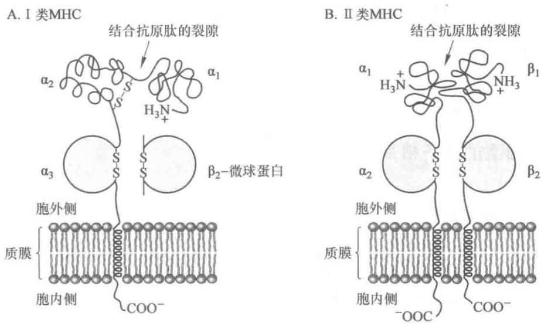  
图 4-22 MHC 分子的图解(示出胞外结构域,跨膜区段和胞质区段)  
A. I 类 MHC: 肽结合部位由 $\alpha$ 链的高可变区 $\alpha_{1}$ 和 $\alpha_{2}$ 两个结构域组成, 恒定的 $\alpha_{3}$ 结构域和 $\beta_{2}$ -微球蛋白(灰色球形)具有称为“免疫球蛋白折叠”的结构(见图 3-42); B. II 类 MHC: 由 $\alpha$ 链和 $\beta$ 链组成, 近 N 端区为可变区 ( $\alpha_{1}$ 和 $\beta_{1}$ ), $\alpha_{2}$ 和 $\beta_{2}$ 结构域(灰色球形)也具有“免疫球蛋白折叠”结构

I 类 MHC 存在于几乎所有的脊椎动物细胞的表面；在人群中有无数个变体，它们是最多形的蛋白质之一。因为一个个体可产生多达 6 个 I 类 MHC 变体，所以两个个体不大可能有一套相同的 I 类 MHC。I 类 MHC 结合并展示由细胞内随机降解的蛋白质碎片和代谢衍生的肽。这些肽和 I 类 MHC 缔合而成的结合物是细胞免疫系统中 $T_{c}$ 细胞上的 T 细胞受体的识别靶。I 类 MHC 分子的三维结构见图 4-23。

每个 T 细胞只含一种 T 细胞受体,但有多个拷贝,它对特定的I类 MHC-肽结合物是专一的。为避免产生大批能结合和破坏自身正常细胞的 $T_{c}$ 细胞,在胸腺中 $T_{c}$ 细胞的成熟期间有一个严格的选择过程(克隆选择),消灭 95%以上正在发育的 $T_{c}$ 细胞,包括那些能与展示生物体自身肽碎片的 I 类 MHC 结合的 $T_{c}$ 细胞。存活下来的成熟 $T_{c}$ 细胞是那些具有不跟生物体自身蛋白质结合的 T 细胞受体的 $T_{c}$ 细胞。结果形成一个专门与连接在宿主细胞 I 类 MHC 上的外来肽结合的细胞群。这就是所谓免疫的自身耐受性(self-tolerance),它使免疫系统做到遇上外物时坚决地把它们消灭,而对自身的细胞则“秋毫无犯”。这些结合相互作用导致寄生物和被感染细胞的破坏。当移植器官时,外来的I类 MHC 也能被 T $_{c}$ 细胞结合,并引起组织排斥。

Ⅱ类 MHC 只存在于少数几种特化细胞的表面。这些特化的细胞包括巨噬细胞和 B 淋巴细胞，它们作为抗原呈递（展示）细胞通过吞噬（phagocytosis）或胞吞（endocytosis）将外来的抗原内化，经消化使成小的肽段。这些肽段与Ⅱ类 MHC 结合，被展示在抗原呈递细胞的外表面上。Ⅱ类 MHC 也是高度多形的，在人群中有很多变体。每个人可以产生多达 12 个变体，因此任何两个个体几乎不可能有一套相同的Ⅱ类 MHC 变体。被Ⅱ类 MHC 结合并展示出的肽不是来自细胞自身的蛋白质，而是被细胞摄入的外部蛋白质。形成的Ⅱ类 MHC-肽结合物是各种 T $_{H}$ 细胞的结合靶。T $_{H}$ 细胞也和 T $_{C}$ 细胞一样，在胸腺中进行严格的选择，消灭那些能与宿主自身的细胞蛋白质结合的 T $_{H}$ 细胞。

尽管在胸腺时的选择过程中消灭了大多数 $T_{c}$ 细胞,但还有不少 $T_{c}$ 细胞存活下来,供免疫应答之需。每图4-23 I类MHC膜蛋白的三维结构

个存活的细胞只有一个类型的 T 细胞受体,能跟一个特定的化学结构结合。但进入血流和组织中的 T 细胞群却携带有几百万种不同结合专一性的 T 细胞受体。在高度变化的 T 细胞群中几乎总是有少数细胞能与出现的任一抗原进行专一结合;而绝大多数细胞不会遇上它们能与之结合的外来抗原,它们一般在几天内死去,并被新一代的 T 细胞所代替。新的细胞继续不断地在全身巡逻,寻找触发免疫应答的抗原。

## （三）细胞表面上的分子相互作用触发免疫应答

一个新的抗原经常是一个侵染或感染(infection)的先兆,即给免疫系统的一个信号:病毒或其他寄生物可能将在生物体内迅速生长、繁殖。此时具有能与特定抗原结合的膜受体的T细胞和B细胞必须迅速而有选择地增殖以消除感染。例如当一个病毒侵入一个细胞时,病毒就利用细胞原有的生化机器和资源复制自己的核酸,合成病毒蛋白质。在细胞内的病毒大分子难以与体液免疫系统中的抗体接近。然而,某些I类MHC能将病毒蛋白质的肽碎片带到被侵染细胞的表面并在那里被展示出,这样它们就能被 $T_{c}$ 淋巴细胞识别。成熟的病毒当从被侵染细胞释放到胞外环境时,容易受到体液免疫系统的攻击,某些病毒被巨噬细胞吞噬,释放出的病毒肽碎片与巨噬细胞或B细胞的II类MHC结合而被展示在它们的表面。这些肽抗原将触发B细胞、 $T_{c}$ 细胞和 $T_{H}$ 细胞多条途径的免疫应答(图4-24)。

被侵染细胞上的I类 MHC-肽结合物被那些具有合适的结合专一性的 T 细胞受体的 $T_{c}$ 细胞所识别并结合。这些 T 细胞受体只对与 I 类 MHC 结合的抗原肽作应答。 $T_{c}$ 细胞还有一种辅受体 CD8，它能提高 T 细胞受体和 I 类 MHC 的结合相互作用。 $T_{c}$ 细胞由于能破坏被病毒侵染的细胞，因而也称它为杀伤性 T 细胞（killer T cell）。 $T_{c}$ 细胞是通过它的 T 细胞受体与被侵染细胞结合的。被侵染细胞的死亡是由多种机制引起的，现在尚未完全了解。一种机制是涉及 $T_{c}$ 细胞释放一种称穿孔素（perforin）的蛋白质，它们与靶细胞的质膜结合，形成分子孔道，破坏靶细胞调节其内环境的能力。 $T_{c}$ 细胞也诱导称为程序性细胞死亡（programmed cell death 或 apoptosis）的过程，过程中与 $T_{c}$ 细胞结合的细胞发生代谢改变，导致细胞死亡（参见第 28 章）。

如果需要消灭有大量病毒侵染的细胞,则必须有选择地增殖具有合适的专一性受体的 $T_{c}$ 细胞。为此,与被侵染细胞结合的 $T_{c}$ 细胞在外表面产生白细胞介素受体(IL-受体)。 $T_{H}$ 细胞分泌的白细胞介素专门刺激那些具有合适的白细胞介素受体的 T 细胞和 B 细胞的增殖(克隆选择)。因为只有当这两种细胞与抗原结合时它们才产生白细胞介素受体,所以只有那些增殖出来的免疫系统细胞才能够与抗原发生应答。

  
图 4-24 抗病毒侵染的免疫应答图解（详细叙述见正文）

结合并被展示在巨噬细胞或B细胞表面上的肽段同样地也被 $\mathrm{T_H}$ 细胞上合适的T细胞受体所结合，并活化 $\mathrm{T_H}$ 细胞。被活化的 $\mathrm{T_H}$ 细胞的一个亚群分泌白细胞介素-2(IL-2, $M_{\mathrm{r}}15500$ )，它刺激具有合适的白细胞介素受体的 $\mathrm{T_C}$ 细胞和 $\mathrm{T_H}$ 细胞自身的增殖。这大大地增加了能识别并对抗原产生应答的免疫系统的细胞数目。另一个亚群分泌白细胞介素-4(IL-4, $M_{\mathrm{r}}20000$ )，它刺激那些能识别抗原的B细胞的增殖。这些细胞的增殖一直继续到抗原消失为止（图4-24）。

增殖的 B 细胞促进消灭胞外的任何抗原(病毒和细菌等)。B 细胞首先分泌大量的可溶性抗体,这些抗体或是通过抗体-抗原的沉淀反应消灭抗原,因为形成的抗体-抗原复合体沉淀能被巨噬细胞和粒细胞吞噬而被彻底消灭,或是在称为补体(complement)的细胞系统(约含20种蛋白质)协助下,消灭那些细胞性质的抗原(如细菌),因为这类抗原单靠抗体的作用往往不能清除,必须有“补体”形成的破膜复合体的参与。破膜复合体能破坏多种病毒的外壳,能使细菌细胞壁穿孔,由于渗透压震扰引起细菌细胞膨胀,破裂而死亡(参见免疫学书籍)。

一旦抗原耗尽,被激活的免疫细胞就通过程序性细胞死亡在几天内死去。然而,少数被刺激了的 B和 T 细胞则成熟为记忆细胞。记忆细胞当第一次遇上抗原时，不直接参与初次免疫反应。它们成为血液中的永久性“居民”，准备应答同一种抗原的再次出现。以后记忆细胞受到抗原挑战时，能进行再次免疫反应。再次免疫反应一般比初次免疫反应快得多，也强得多，因为事先已克隆扩大。通过这种机制，曾接触过病毒或其他病原体的脊椎动物，当再次遇到它们时就能很快地作出应答。这是疫苗（vaccine）提供长期免疫和同一病毒株重复感染产生天然免疫的基础。

## （四）抗体具有两个相同的抗原结合部位

免疫球蛋白或抗体, 是一类可溶性的血清糖蛋白, 是血清中最丰富的蛋白质之一。抗体具有两个显著的特点: 一是高度的特异性(专一性), 二是非常的多样性。特异性是指抗体通常只能与引起它产生的相应抗原发生反应。多样性是指抗体可以和成千上万的不同抗原(天然的和人工的)起反应。

## 1. 免疫球蛋白的结构

免疫球蛋白 G(IgG) 是抗体中的一大类, 是血清中最丰富的蛋白质之一。IgG 由 4 条多肽链组成: 两条大的称为重链或 H 链, 两条小的称为轻链或 L 链。它们通过非共价键和二硫键连接成 $M_{\mathrm{r}}$ 150 000 的复合体。一个 IgG 分子的两条重链在一端彼此相互作用, 然后分岔各自与轻链相互作用, 形成 Y 形结构 (图 4-25)。每个 IgG 分子含有两个抗原结合部位, 它们位于 Y 形结构的两个“分叉 (branch)”的顶端。如果抗原含有多于两个抗原决定簇，那么抗体可以触发抗原-抗体的交联晶格形成而沉淀（图4-26）。IgG分子是二价的，而抗原分子可以是多价的，这里讲的价数是指抗原与抗体的结合部位数目。当抗体和抗原在接近等摩尔浓度（称为等价带）时，将发生最大的交联，产生最大量的免疫沉淀或沉淀素（precipitin）。体外沉淀反应被广泛地用于研究抗原-抗体反应，并已成为实验免疫学的基础。IgG分子的基部和两个分叉的连接处称为铰链区（hinge region），长度约30个氨基酸残基。免疫球蛋白可用蛋白酶断裂。当用木瓜蛋白酶处理时，IgG在铰链处断裂，释放出基部片段（ $M_{\mathrm{r}}50000$ ），称为Fc，它一般容易结晶；和两个分叉（ $M_{\mathrm{r}}$ 45000），称Fab，即抗原结合片段。当用胃蛋白酶断裂时，产生一个称 $\mathrm{F(ab)_2}$ 的片段（ $M_{\mathrm{r}}100000$ ）和若干小肽段（图4-25A）。

  
图4-25 免疫球蛋白G的结构  
A. 分子结构图解; B. 三维结构(空间填充模型)

  
图 4-26 免疫沉淀的交联晶格

免疫球蛋白的基本结构最先是由 G. Edelman 和 R. Porter 确立的。IgG 分子的 L 链和 H 链可根据其序列同源性划分为若干个区或域（domain）。IgG 的 L 链含有 1 个可变区或 V 区（variable domain）和 1 个不变区或 C 区（constant domain）。L 链的可变区（ $V_{L}$ ）内，氨基酸序列在各抗体之间是不同的；不变区（ $C_{L}$ ）内的序列在所有抗体之间几乎一样。H 链含有 1 个可变区和 3 个不变区，分别标为 $V_{H}$ 、 $C_{H}$ 1、 $C_{H}$ 2 和 $C_{H}$ 3（对于 IgM 和 IgE 还有 $C_{H}$ 4）。L 链和 H 链的可变区都在链的 N 端区域，在 $V_{L}$ 和 $V_{H}$ 内还有所谓高变区。可变区的缔合创建了抗原结合部位，负责对抗原的识别和抗原-抗体复合物的形成。可变区内的其余序列相当恒定，这可能是形成免疫球蛋白所特有的结构域要求的。每个区域不论是不变区还是可变区都含有一个特色的结构，称为免疫球蛋白折叠（immunoglobulin-fold），这是全 β 蛋白质（双层反平行结构）中一种非常保守的结构模体，由两个反平行 β 折叠片形成的夹心式结构，如免疫球蛋白 $V_{L}$ 结构域所示（见图 3-42A）。

## 2. 免疫球蛋白的类别

在许多脊椎动物中，IgG 只是 5 类免疫球蛋白之一，除 IgG 外，尚有 IgA、IgM、IgD 和 IgE。它们的相对分子质量范围为 150 000\~950 000（表4-4）。Ig 分子轻链不变区（C $_{L}$ ）的氨基酸序列可分为两种基本类型：

表 4-4 人免疫球蛋白的类别

<table><tr><td>免疫球蛋白类别</td><td>重链 $(M_s)$ </td><td>轻链 $(M_r)$ </td><td>多肽链成分</td><td>近似  $M_r$ </td><td>沉降系数/S</td><td>含糖量/%</td><td>在血中的浓度/ $(mg·100\ mL^{-1})$ </td></tr><tr><td>IgG</td><td>γ(53 000)</td><td>κ或λ(22 500)</td><td> $\gamma_2\kappa_2$  $\gamma_2\lambda_2$ </td><td>150 000(单体)</td><td>7</td><td>2~3</td><td>600~1800</td></tr><tr><td rowspan="2">IgA</td><td rowspan="2">α(64 000)</td><td rowspan="2">κ或λ</td><td> $(\alpha_2\kappa_2)_n$  $(\alpha_2\lambda_2)_n$ </td><td>320 000(二聚体)</td><td>10</td><td>7~12</td><td>90~420</td></tr><tr><td colspan="5">n=1,2或3</td></tr><tr><td rowspan="2">IgM</td><td rowspan="2">μ(70 000)</td><td rowspan="2">κ或λ</td><td> $(\mu_2\kappa_2)_n$  $(\mu_2\lambda_2)_n$ </td><td>950 000(五聚体)</td><td>18~20</td><td>10~12</td><td>50~190</td></tr><tr><td colspan="5">n=1或5</td></tr><tr><td>IgD</td><td>δ(58 000)</td><td>κ或λ</td><td> $\delta_2\kappa_2$  $\delta_2\lambda_2$ </td><td>185 000(单体)</td><td>7</td><td></td><td>0.3~4.0</td></tr><tr><td>IgE</td><td>ε(75 000)</td><td>κ或λ</td><td> $\varepsilon_2\kappa_2$  $\varepsilon_2\lambda_2$ </td><td>190 000(单体)</td><td>8</td><td>10~12</td><td>0.01~0.1</td></tr></table>

$\kappa$ 和 $\lambda$ ，它们存在于所有5类免疫球蛋白中；对一个分子来说只有其中的一种，或是 $\kappa$ 或是 $\lambda$ 。重链不变区

(包括 $C_{H}1$ 、 $C_{H}2$ 和 $C_{H}3$ ) 的序列分为 5 种基本类型: $\gamma$ 、 $\alpha$ 、 $\mu$ 、 $\delta$ 和 $\varepsilon$ 。每类免疫球蛋白只含其中一种类型的重链, 免疫球蛋白 G、A、M、D 和 E 分别含 $\gamma$ 、 $\alpha$ 、 $\mu$ 、 $\delta$ 和 $\varepsilon$ 。IgD 和 IgE 的整个结构与 IgG 相似。IgM 或以单体 (Y 形结构) 的膜结合形式存在, 或以此单体交联成五聚体的分泌形式存在 (图 4-27)。由于五聚体的分子很大, 使它只限于存在血流中。IgM 是抗原入侵时 B 淋巴细胞制造的第一个抗体, 初次 (primary) 免疫应答早期阶段的主要抗体; 它的功能是抑制、凝集和溶解侵入血流的细菌。IgA 主要存在于身体的分泌物, 如唾液、眼泪和乳汁中, 是初乳和乳汁中的主要抗体; 它可以是单体, 二聚体或三聚体。某些 B 细胞在免疫应答中很快产生 IgD (其抗原结合部位与同样细胞所产生的 IgM 是一样的), 它存在于 B 细胞的表面; IgD 的特殊功能尚不清楚。

  
图 4-27 IgM (IgY 形结构单位的五聚体) 的结构

$$
\mathrm{IgM}
$$

上述的 IgG 是由记忆 B 细胞引发的再次 (secondary) 免疫应答中的主要抗体。作为生物体对那些已经遇到过的抗原进行的免疫的一部分, IgG 是血液中最丰富的免疫球蛋白。当 IgG 与一个入侵的细菌或病毒结合时, 它不仅激活某些白细胞如吞噬和破坏入侵者的巨噬细胞, 而且也激活免疫

$$
\mathrm{IgM}
$$

应答的其他部分。巨噬细胞表面上有一类受体能识别并结合IgG的Fc区。当这些Fc受体结合了抗体-病原体复合物时，巨噬细胞则通过吞噬作用吞没了该复合物（图4-24）。IgG也是唯一能通过胎盘进入胎儿体内的抗体。所以新生儿在前几周是依靠母体的IgG抵御细菌和病毒等外物的入侵。此外IgG的一个变体，是一种膜结合抗体，作为B细胞膜上的一种受体（图4-21A）。

IgE 在变态反应(allergic response)中起重要作用。变态反应或称过敏反应是一种免疫反应。引起变态反应的物质称为变[态反]应原或过敏原(allergen);某些外物如花粉、蜂毒、青霉素以及蕈类和牡蛎中的某些成分对于敏感的人都是过敏原。过敏反应涉及 IgE 与血中的嗜碱性粒细胞(basophil),一种吞噬白细胞,和广泛分布于组织中的肥大细胞(mast cell)的相互作用。IgE 通过它们的 Fc 区与嗜碱性粒细胞或肥大细胞上专一的 Fc 受体结合。而 IgE 以这种形式作为变应原(抗原)的一个受体。如果过敏原被结合,则诱导细胞分泌组胺和其他生物活性胺。组胺引起血管扩张和通透性增大。对血管的这些效应是通过促进免疫系统的细胞和蛋白质向炎症部位移动实现的。它们也产生与变态经常关联的局部红肿、灼热、流涕、流泪和打喷嚏等症状。花粉和其他过敏原被识别为外来者,触发在正常情况下是针对病原体的免疫应答。

## （五）抗体与抗原结合是专一而紧密的

一个抗体的结合专一性决定于它的重链和轻链可变区的氨基酸残基。这些结构域中的许多残基是可变的，但程度并不一样。某些残基，特别是衬在抗原结合部位的残基，是高变的——特别可能有差异的。专一性是由抗原和它的专一结合部位（在抗体上）的化学互补性提供的，互补性是指荷电基团、非极性基团和氢键键合基团的形状和定位而言。例如，具有荷负电基团的结合部位可以跟在互补位置上具有正电荷的抗原相结合。在很多例子中，互补性是当抗原和结合部位靠近时通过结构之间相互影响而达到的。然后抗体和/或抗原中的构象变化使得互补基团达到完全相互作用。这是诱导嵌合的一个例子。

典型的抗体-抗原相互作用是很强的，它的 $K_{\mathrm{d}}$ 低于 $10^{-10}\mathrm{mol / L}$ （参见表4-1）。 $K_{\mathrm{d}}$ 反映来自稳定结合的离子键、氢键、疏水相互作用和范德华相互作用的能量。产生 $10^{-10}\mathrm{mol / L}$ 的 $K_{\mathrm{d}}$ 所需的结合能约为 $65~\mathrm{kJ / mol}$ 。

## （六）抗体-抗原相互作用是一些重要生化分析的基础

由于抗体具有超常的结合亲和力和专一性,使得它成为有价值的分析试剂。已被应用的两类抗体制剂:多克隆抗体和单克隆抗体。多克隆抗体(polyclonal antibody)是由多个不同的B淋巴细胞在应答一种抗原,如向一个动物注入一种蛋白质时产生的抗体。B细胞群的每个细胞产生结合该抗原中特异而不同的决定簇的抗体。因此，多克隆抗体制剂含有识别该蛋白质(抗原)不同部分(不同表位)的多种抗体的混合物。单克隆抗体(monoclonal antibody)则不同，它是由生长在细胞培养物中的同一B细胞的群体(一个克隆)合成并分泌的。这种抗体是均一的，所有抗体识别同一的表位。

抗体的专一性也有实际的应用价值。被选用的抗体可以共价连接到载体如琼脂糖凝胶上，用于亲和层析（见图5-11）。当蛋白质混合物被加到层析柱时，抗体专一地与靶蛋白质（相应抗原）结合而被保留在柱上，其他蛋白质则从柱上洗出。然后，靶蛋白质可用盐溶液或某些其他溶液从载体上洗脱下来。这是一种分析和纯化蛋白质的有力工具。

另一个多用途的分析技术是把一个抗体连接到一个放射标记物或某一个使它容易被检测的其他试剂上。当抗体与靶蛋白质结合时，标记物则显示该蛋白在一个溶液中的存在或它在凝胶中甚至在一个活细胞中的位置。此方法虽有多种变型，但原理是一样的，都是以待测抗原（或抗体）和酶标抗体（或抗原）的专一结合为基础，然后通过酶活力的测定来确定抗原（或抗体）的含量。由于这项技术操作简便、灵敏度高并易于重复，现已广泛用于分子生物学和临床诊断的常规检测。此方法的几种变型介绍如下：

ELISA(enzyme-linked immunosorbent assay) 即酶联免疫吸附测定, 它可用于快速筛查和定量样品中的一个抗原 (图 4-28)。ELISA 基本步骤包括: 把待测样品中的蛋白质, 例如含人免疫缺损病毒 (HIV) 的血清 (抗原) 吸附到一个惰性表面, 通常是一块 96 孔的聚苯乙烯塑料板。在惰性表面上再加非特异性蛋白质 (常用酪蛋白或牛血清蛋白) 并一起温育, 以封闭未被样品蛋白质覆盖的表面部位, 防止随后步骤中的蛋白质被吸附到该表面处。然后用含有抗该待测蛋白质的抗体 (例如抗 HIV 外壳蛋白的兔 IgG) 或称第一抗体的溶液处理, 未被结合的第一抗体用缓冲液洗去。表面用含有抗第一抗体的抗体 (例如羊抗兔的抗抗体, 也称羊抗兔 IgG 或第二抗体) 的溶液处理, 未被结合的第二抗体被洗去; 第二抗体是与一个催化生成有色产物的酶共价连接的, 例如辣根过氧化物酶标羊抗兔 IgG (goat anti-rabbit IgG-horseradish peroxidase)。最后加入酶标第二抗体的底物。如果是辣根过氧化物酶标抗体, 可加 $3,3',5,5'-$ 四甲基联苯胺 $(3,3',5,5'-tetramethylbenzidine)$ , 生成的产物为黄色, 在 $450 \mathrm{~nm}$ 波长处有最大光吸收。有色产物的形成与样品中待测的抗原 (或抗体) 含量成正比。

免疫印迹测定(immunoblot assay)也称 Western 印迹(Western blot)，因为它在操作上跟用于核酸分析的 Southern 印迹类似而又不同而得名。实验时先把蛋白质样品进行凝胶电泳分离（见图 5-9），然后将凝胶板与硝酸纤维膜贴在一起，进行电泳转移，把凝胶上的蛋白质条带转印到纤维膜上。如上面 ELISA 中所述，将纤维封闭，然后相继用第一抗体、酶标第二抗体以及底物进行处理。只有含待测蛋白质的条带显示颜色。免疫印迹能检测出样品中的微量成分和近似的相对分子质量(图 4-29)。

  
图 4-28 酶联免疫吸附测定(ELISA)步骤的图解
①用样品包被表面,样品中含待检抗原(如 HIV 外壳蛋白)和其他抗原;②用非特异性蛋白质封闭未被结合的部位;③与抗待检抗原的第一抗体温育;④与酶联的第二抗体温育;⑤加入底物;⑥形成有色产物表明待测抗原的存在

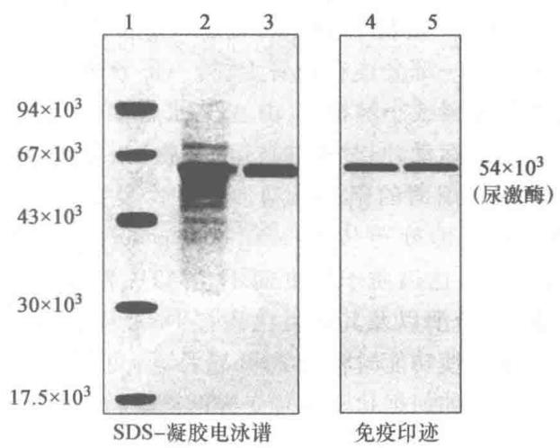  
图 4-29 免疫印迹测定  
SDS凝胶上泳道1是标准蛋白质的分离条带。泳道2和3分别是尿激酶制剂（作为抗原）纯化前和纯化后样品的条带（考马斯亮蓝染色）。泳道4和5的样品分别与2和3相同，只是4和5是在凝胶电泳后被转印到硝酸纤维膜上并用抗尿激酶的单克隆抗体“探测”

如果上述各项技术用纯的抗体进行,那么它们的专一性、灵敏度和再现性都会有很大的提高。由于不同的抗体在化学结构上十分相似,用标准的蛋白质分级分离技术纯化抗体实际上是不可能的,然而用单克隆抗体能达到此目的。生产单克隆抗体的技术是20世纪70年代发展起来的。制备单克隆抗体的基本步骤是:①用感兴趣的抗原(如尿激酶)免疫小鼠脾脏,制成B淋巴细胞悬液;②繁殖小鼠骨髓病细胞(myeloma),白细胞的一种致瘤性增殖;③制得的B细胞与骨髓瘤细胞融合,产生所谓杂交瘤(hybridomas)的细胞系,它在培养物中能不断增殖,但只合成一种抗体;④细胞转移到只有杂交瘤细胞才能生长的介质中进行选择性培养;⑤用ELISA筛查并找出分泌抗感兴趣的蛋白质的单克隆抗体的杂交瘤细胞株;⑥对所得的细胞株进行扩大化培养,从培养物中纯化所需单克隆抗体。上述免疫化学技术的细节参看本章主要参考书目2、9。

<!-- EN-BEGIN 5.2 -->

### 【英文对应 5.2】Complementary Interactions between Proteins and Ligands: The Immune System and Immunoglobulins

> 来源：Lehninger Principles of Biochemistry（书籍/02_生物化学原理） 第5章 Protein Function，§5.2。对应本章“五、免疫系统和免疫球蛋白”。

We have seen how the conformations of oxygen-binding proteins affect and are affected by the binding of small ligands ( $O_{2}$ or CO) to the heme group. However, most protein-ligand interactions do not involve a prosthetic group. P2 Instead, the binding site for a ligand is more often like the hemoglobin binding site for BPG—a cleft in the protein lined with amino acid residues, arranged to make the binding interaction highly specific. Effective discrimination between ligands is the norm at binding sites, even when the ligands have only minor structural differences.

Almost all organisms have an immune system of some type that allows them to respond to challenges presented by environmental pathogens. The emergence of vertebrates about 500 million years ago was accompanied by the evolution of an adaptive immune system based on the generation of large numbers of distinct cell clones, each expressing a protein variant that could recognize and bind to a particular type of chemical structure. The system distinguishes molecular “self” from “nonself” and then destroys what is identified as nonself. In this way, the immune system eliminates viruses, bacteria, and other pathogens and molecules that may pose a threat to the organism. On a physiological level, the immune response is an intricate and coordinated set of interactions among many classes of proteins, molecules, and cell types. At the level of individual proteins, the immune response demonstrates how an acutely sensitive and specific biochemical system is built upon the reversible binding of ligands to proteins.

#### [EN] The Immune Response Includes a Specialized Array of Cells and Proteins

Immunity is brought about by a variety of leukocytes (white blood cells), including macrophages and lymphocytes, all of which develop from undifferentiated stem cells in the bone marrow. Leukocytes can leave the bloodstream and patrol the tissues, each cell producing one or more proteins capable of recognizing and binding to molecules that might signal an infection.

The immune response consists of two complementary systems, the humoral and cellular immune systems. The humoral immune system (Latin humor, "fluid") is directed at bacterial infections and extracellular viruses

<!-- END OFFICIAL API PART part_002 -->

<!-- BEGIN OFFICIAL API PART part_003 -->

(those found in the body fluids), but it can also respond to individual foreign proteins. The cellular immune system destroys host cells infected by viruses and also destroys some parasites and foreign tissues.

At the heart of the humoral immune response are soluble proteins called antibodies or immunoglobulins, often abbreviated Ig. Immunoglobulins bind bacteria, viruses, or large molecules identified as foreign and target them for destruction. Making up 20% of blood protein, the immunoglobulins are produced by B lymphocytes, or B cells, so named because they complete their development in the bone marrow.

The agents at the heart of the cellular immune response are a class of T lymphocytes, or T cells (so called because the latter stages of their development occur in the thymus), known as cytotoxic T cells ( $T_{C}$ cells, also called killer T cells). Recognition of infected cells or parasites involves proteins called T-cell receptors on the surface of $T_{C}$ cells. Receptors are proteins, usually found on the outer surface of cells and extending through the plasma membrane, that recognize and bind extracellular ligands, thus triggering changes inside the cell.

In addition to cytotoxic T cells, there are helper T cells ( $T_{H}$ cells), whose function it is to produce soluble signaling proteins called cytokines, which include the interleukins. $T_{H}$ cells interact with macrophages. The $T_{H}$ cells participate only indirectly in the destruction of infected cells and pathogens, stimulating the selective proliferation of those $T_{C}$ and B cells that can bind to a particular antigen. This process, called clonal selection, increases the number of immune system cells that can respond to a particular pathogen. A host organism needs time, often days, to mount an immune response against a new antigen, but memory cells permit a rapid response to pathogens previously encountered. A vaccine to protect against a particular viral infection often consists of weakened or killed virus or isolated proteins from a viral or bacterial protein coat. When injected into a person, the vaccine generally does not cause an infection and illness, but it effectively “teaches” the immune system what the viral particles look like, stimulating the production of memory cells. On subsequent infection, these cells can bind to the virus and trigger a rapid immune response.

The importance of $T_{H}$ cells is dramatically illustrated by the epidemic produced by HIV (human immunodeficiency virus), the virus that causes AIDS (acquired immune deficiency syndrome). $T_{H}$ cells are the primary targets of HIV infection; elimination of these cells progressively incapacitates the entire immune system.

P1 Each recognition protein of the immune system, either a T-cell receptor or an antibody produced by a B cell, specifically binds some particular chemical structure, distinguishing it from virtually all others. Humans are capable of producing more than $10^{8}$ different antibodies with distinct binding specificities. Given this extraordinary diversity, any chemical structure on the surface of a virus or an invading cell will most likely be recognized and bound by one or more antibodies. Antibody diversity is derived from random reassembly of a set of immunoglobulin gene segments through genetic recombination mechanisms that are discussed in Chapter 25 (see Fig. 25-42).

A specialized lexicon is used to describe the unique interactions between antibodies or T-cell receptors and the molecules they bind. Any molecule or pathogen capable of eliciting an immune response is called an antigen. An antigen may be a virus, a bacterial cell wall, or an individual protein or other macromolecule. A complex antigen may be bound by several different antibodies. An individual antibody or T-cell receptor binds only a particular molecular structure within the antigen, called its antigenic determinant or epitope.

It would be unproductive for the immune system to respond to small molecules that are common intermediates and products of cellular metabolism. Molecules of $M_{r} < 5,000$ are generally not antigenic. However, when small molecules are covalently attached to large proteins in the laboratory, they can be used to elicit an immune response. These small molecules are called haptens. The antibodies produced in response to protein-linked hap-tens will then bind to the same small molecules in their free form. Such antibodies are sometimes used in the development of analytical tests described later in this chapter or as a specific ligand in affinity chromatography (see Fig. 3-17c). We now turn to a more detailed description of antibodies and their binding properties.

#### [EN] Antibodies Have Two Identical Antigen-Binding Sites

Immunoglobulin G (IgG) is the major class of antibody molecule and one of the most abundant proteins in the blood serum. IgG has four polypeptide chains: two large ones, called heavy chains, and two smaller ones, called light chains, linked by noncovalent and disulfide bonds into a complex of $M_{r}$ 150,000. The heavy chains of an IgG molecule interact at one end, then branch to interact separately with the light chains, forming a Y-shaped molecule (Fig. 5-20). At the “hinges” separating the base of an IgG molecule from its branches, the immunoglobulin can be cleaved with proteases. Cleavage with the protease papain liberates the basal fragment, called Fc because it usually crystallizes readily, and the two branches, called Fab, the antigen-binding fragments. Each branch has a single antigen-binding site.

The fundamental structure of immunoglobulins was first established by Gerald Edelman and Rodney Porter in the 1960s. Each chain is made up of identifiable domains. Some are constant in sequence and structure from one IgG to the next; others are variable. The constant domains have a characteristic structure known as the immunoglobulin fold, a well-conserved structural motif in the all- $\beta$ class of proteins (Chapter 4). There are three of these constant domains in each heavy chain and one in each light chain. The heavy and light chains also have one variable domain each, in which most of the variability in amino acid sequence is found. The variable domains associate to create the antigen-binding site (Fig. 5-20), allowing formation of an antigen-antibody complex (Fig. 5-21).

  
FIGURE 5-20 Immunoglobulin G. (a) Pairs of heavy and light chains combine to form a Y-shaped molecule. Two antigen-binding sites are formed by the combination of variable domains from one light $(\mathrm{V_L})$ chain and one heavy $(\mathrm{V_H})$ chain. Cleavage with papain separates the Fab and Fc portions of the protein in the hinge region. The Fc portion also contains bound

In many vertebrates, IgG is but one of five classes of immunoglobulins. Each class has a characteristic type of heavy chain, denoted $\alpha$ , $\delta$ , $\varepsilon$ , $\gamma$ , and $\mu$ for IgA, IgD, IgE, IgG, and IgM, respectively. Two types of light chain, $\kappa$ and $\lambda$ , occur in all classes of immunoglobulins. The overall structures of IgD and IgE are similar to that of IgG. IgM occurs either in a monomeric, membrane-bound form or in a secreted form that is a cross-linked pentamer of this basic structure (Fig. 5-22). IgA, found principally in secretions such as saliva, tears, and milk, can be a monomer, a dimer, or a trimer. IgM is the first antibody to be made by B lymphocytes and the major antibody in the early stages of a primary immune response. Some B cells soon begin to produce IgD (with the same antigen-binding site as the IgM produced by the same cell), but the particular function of IgD is less clear.

The IgG described above is the major antibody in secondary immune responses, which are initiated by a class of B cells called memory B cells. As part of the organism's ongoing immunity to antigens already encountered and dealt with, IgG is the most abundant immunoglobulin in the blood. When IgG binds to an invading bacterium or virus, it activates certain leukocytes such as macrophages to engulf and destroy the invader, and it also activates some other parts of the immune response. Receptors on the macrophage surface recognize and bind the Fc region of IgG. When these Fc receptors bind an antibody-pathogen complex, the macrophage engulfs the complex by phagocytosis (Fig. 5-23).

carbohydrate (shown in (b)). (b) A ribbon model of an IgG molecule. Although the molecule has two identical heavy chains (two shades of blue) and two identical light chains (two shades of red), it crystallized in the asymmetric conformation shown here. Conformational flexibility is important to the function of immunoglobulins. [(b) Data from PDB ID 1IGT, L.J. Harris et al., Biochemistry 36:1581, 1997.]  
  
FIGURE 5-21 Binding of IgG to an antigen. To generate an optimal fit for the antigen, the binding sites of IgG often undergo slight conformational changes. Such induced fit is common to many protein-ligand interactions.

  
FIGURE 5-22 IgM pentamer of immunoglobulin units. The pentamer is cross-linked with disulfide bonds (yellow). The J chain is a polypeptide of $M_r$ 20,000 found in both IgA and IgM.

  
FIGURE 5-23 Phagocytosis of an antibody-bound virus by a macrophage. The Fc regions of antibodies bound to the virus now bind to Fc receptors on the surface of a macrophage, triggering the macrophage to engulf and destroy the virus.

IgE plays an important role in the allergic response, interacting with basophils (phagocytic leukocytes) in the blood and with histamine-secreting cells called mast cells, which are widely distributed in tissues. This immunoglobulin binds, through its Fc region, to special Fc receptors on the basophils or mast cells. In this form, IgE serves as a receptor for antigen. If antigen is bound, the cells are induced to secrete histamine and other biologically active amines that cause the dilation and increased permeability of blood vessels. These effects on the blood vessels are thought to facilitate the movement of immune system cells and proteins to sites of inflammation. They also produce the symptoms normally associated with allergies. Pollen and other allergens are recognized as foreign, triggering an immune response normally reserved for pathogens.

#### [EN] Antibodies Bind Tightly and Specifically to Antigen

P2 The binding specificity of an antibody is determined by the amino acid residues in the variable domains of its heavy and light chains. Some of those residues, particularly those lining the antigen-binding site, are hypervariable—especially likely to differ. Specificity is conferred by chemical complementarity between the antigen and its specific binding site. For example, a binding site with a negatively charged group may bind an antigen with a positive charge in the complementary position. In many instances, complementarity is achieved interactively as the structures of antigen and binding site influence each other as they come closer together. Conformational changes in the antibody and/or the antigen then allow the complementary groups to interact fully. This is an example of induced fit. The complex of a peptide derived from HIV (a model antigen) and an Fab molecule, shown in Figure 5-24, illustrates some of these properties. The changes in structure observed on antigen binding are particularly striking in this example.

A typical antibody-antigen interaction is quite strong, characterized by $K_{d}$ values as low as $10^{-10}$ M (recall that a lower $K_{d}$ corresponds to a stronger binding interaction; see Table 5-1). The $K_{d}$ reflects the energy derived from the hydrophobic effect and the various ionic, hydrogen-bonding, and van der Waals interactions that stabilize the binding. The binding energy required to produce a $K_{d}$ of $10^{-10}$ M is about 65 kJ/mol.

#### [EN] The Antibody-Antigen Interaction Is the Basis for a Variety of Important Analytical Procedures

The extraordinary binding affinity and specificity of antibodies make them valuable analytical reagents. Two types of antibody preparations are in use: polyclonal and monoclonal. Polyclonal antibodies are those produced by many different B lymphocytes responding to one antigen, such as a protein injected into an animal. Cells in the population of B lymphocytes produce antibodies that bind specific, different epitopes within the antigen. Thus, polyclonal preparations contain a mixture of antibodies that recognize different parts of the protein. Monoclonal antibodies, in contrast, are synthesized by a population of identical B cells (a clone) grown in cell culture. These antibodies are homogeneous, all recognizing the same epitope.

The specificity of antibodies has practical uses. In a versatile analytical technique, an antibody is attached to a reagent that makes it easy to detect (Fig. 5-25). When the antibody binds the target protein, the label reveals the presence of the protein in a solution or its location in a gel, or even in a living cell (Fig. 5-25a). In one application of this technique, an immunoblot or Western blot assay (Fig. 5-26b), proteins that have been separated by gel electrophoresis are transferred electrophoretically to a nitrocellulose membrane.

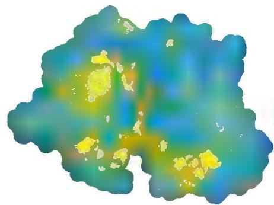  
(a) Conformation with no antigen bound

  
(b) Antigen bound (but not shown)

  
(c) Antigen bound (shown)  
same view, but with the Fab fragment in the "bound" conformation with the antigen omitted to provide an unobstructed view of the altered binding site. Note how the hydrophobic binding cavity has enlarged and several groups have shifted position. (c) The same view as (b) but with the antigen (red) in the binding site. [Data from (a) PDB ID 1GGC, R. L. Stanfield et al., Structure 1:83, 1993; (b, c) PDB ID 1GGI, J. M. Rini et al., Proc. Natl. Acad. Sci. USA 90:6325, 1993.]

FIGURE 5-24 Induced fit in the binding of an antigen to IgG. The Fab fragment of an IgG molecule is shown here with the surface contour colored to represent hydrophobicity. Hydrophobic surfaces are yellow and hydrophilic surfaces are blue, with shades of blue to green to yellow in between. (a) View of the Fab fragment in the absence of antigen (a small peptide derived from HIV), looking down on the antigen binding site. (b) The  
  
FIGURE 5-25 Antibodies as analytical reagents. (a) A schematic representation of the use of the specific reaction of an antibody with its antigen to identify and quantify a specific protein in a complex sample. (b) One common application is the immunoblot. Lanes 1 to 3 are from an SDS gel; samples from successive stages in the purification of a protein kinase were separated  
and stained with Coomassie blue. Lanes 4 to 6 show the same samples, but these were electrophoretically transferred to a nitrocellulose membrane after separation on an SDS gel. The membrane was then "probed" with antibody against the protein kinase. The numbers between the SDS gel and the immunoblot indicate $M_f$ in thousands. [(b) State of Wisconsin Lab of Hygiene, Madison, WI.]

After washing, the membrane is treated successively with primary antibody, secondary antibody linked to enzyme, and substrate. A colored precipitate forms only along the band containing the protein of interest. Immunoblotting allows the detection of a minor component in a sample and provides an approximation of its molecular weight.

We will encounter other aspects of antibodies in later chapters. They are extremely important in medicine and can tell us much about the structure of proteins and the action of genes.

#### [EN] SUMMARY 5.2 Complementary Interactions between Proteins and Ligands: The Immune System and Immunoglobulins

The immune response is mediated by interactions among an array of specialized leukocytes and their associated proteins. T lymphocytes produce T-cell receptors. B lymphocytes produce immunoglobulins.

■ Humans have five classes of immunoglobulins, each with different biological functions. The most abundant class is IgG, a Y-shaped protein with two heavy chains and two light chains. The domains near the upper ends of the Y are hypervariable within the broad population of IgGs and form two antigen-binding sites.

A given immunoglobulin generally binds to only a part, called the epitope, of a large antigen. Binding often involves a conformational change in the IgG, an induced fit to the antigen.

■ The exquisite binding specificity of immunoglobulins is exploited in analytical techniques such as immunoblotting.

<!-- EN-END 5.2 -->

## 六、肌动蛋白、肌球蛋白和分子马达

生物在运动；细胞在运动；细胞内的细胞器和大分子也都在运动。这些运动的大多数是由以蛋白质为基础的一类分子马达(molecular motor)即分子发动机的活动产生的。马达蛋白质(motor protein)中一类是起收缩和游动作用的蛋白质如肌球蛋白和肌动蛋白，它们都以丝状聚集体——如肌肉中的粗丝和细丝——的形式出现；另一类是起动力作用的蛋白质如动力蛋白(dynein)和驱动蛋白(kinesin)以及肌球蛋白的头基（称马达结构域，是一种ATP酶），它们是一类涉及运动的机械-化学酶。所以分子马达(马达蛋白质的大聚集体)能利用核苷三磷酸(一般是ATP)释放的化学能作为动力进行循环式的构象变化，这种变化积累成统一而定向的力——细小的力可以在细胞分裂时拉开染色体，强大的力可以举起数百千克重的杠铃。

马达蛋白质之间的相互作用其特点自然是离子键、氢键、疏水相互作用和范德华相互作用在蛋白质结合部位的互补排列。然而，在马达蛋白质中这些相互作用在时、空的组织方面达到了特别高的水平。

马达蛋白质是肌肉的收缩、细胞器沿微管的迁移、细菌鞭毛(flagella)的旋转以及某些蛋白质沿DNA的移动的基础。动力蛋白和驱动蛋白在细胞中沿微管移动，在细胞分裂期间沿细胞器拉动或重新组织染色体。动力蛋白与微管的相互作用引起真核细胞的鞭毛和纤毛(cilia)的运动。驱动蛋白以及胞质中的动力蛋白参与胞内的细胞器、小泡等“货物”的转运；转运时驱动蛋白或动力蛋白的一部分连在微管上，另一部分则与被转运的细胞器或小泡相连，由ATP水解推动分子马达沿微管运动，同时将被转运“货物”沿微管送到另一端。细菌的鞭毛运动涉及一个复杂的位于鞭毛基部的旋转马达(rotational motor;图4-30)，这种马达以质子梯度而不是ATP为动力。螺旋酶、聚合酶以及其他蛋白质在DNA复制、转

  
图 4-30 质子动力引起的细菌鞭毛的旋转  
由鞭毛基部的轴和轮组成的旋转马达称为“质子涡轮机”。电子传递时射出的质子通过涡轮机返回细胞，引起细菌鞭毛的旋转。此旋转马达跟肌肉运动和真核细胞的鞭毛和纤毛的运动根本不同，它们是由ATP水解作为能源的

录过程中行使功能时将沿 DNA 链移动(见第 30-32 章)。下面以脊椎动物骨骼肌的收缩蛋白质为例,说明蛋白质是如何把化学能转变为运动的。

## （一）肌肉的主要蛋白质是肌球蛋白和肌动蛋白

各种类型肌肉(骨骼肌、平滑肌和心肌)的收缩力量都是由肌球蛋白和肌动蛋白的相互作用产生的。这些蛋白质排列成丝状体,它们进行短暂相互作用和彼此滑移引起收缩。肌动蛋白和肌球蛋白一起构成肌肉的蛋白质质量的80%以上。

肌球蛋白(myosin)是一种长的棒状分子, $M_{r}$ 约为520 000,由6个亚基组成:2个重链(每个 $M_{r}$ 220 000),

4个轻链（每个 $M_{\mathrm{r}}20000$ ）。重链占整个结构的大部分。在重链的羧基端排列成伸展的右手 $\alpha$ 螺旋，两个 $\alpha$ 螺旋彼此缠绕成超螺旋（尾部，长约为 $150~\mathrm{nm}$ ，直径为 $2\mathrm{nm}$ ），称左手卷曲螺旋（left-handed coiled coil），类似 $\alpha$ 角蛋白。在其氨基端每一重链有一个大的球状结构域（头基，长 $17\mathrm{nm}$ ）。4个轻链与2个重链的球状结构域缔合（图4-31A）。当肌球蛋白用胰蛋白酶进行短时间处理，纤维状尾部的大部分被除去，把蛋白质分成轻酶解肌球蛋白（light meromyosin, LMM）和重酶解肌球蛋白（heavy meromyosin, HMM）两部分（图4-31B）。LMM也和完整的肌球蛋白一样能形成肌细胞的粗丝，但无ATP酶活性，不能与肌动蛋白结合。HMM与之相反，能催化ATP水解，并能结合肌动蛋白，但不能形成粗丝。HMM用木瓜蛋白酶断裂，释放出两个称为S1的球状亚片段（subfragment）或直称肌球蛋白头基和一个称为S2的棒状亚片段。S1片段是马达结构域，它使肌肉有可能收缩。S1片段可以被结晶出来，根据Ivan Rayment和Hazel Holden的测定，它的整个结构如图4-31C所示。每个头基由几个结构域组成，分别为N端区 $(M_{\mathrm{r}}25000)$ ，中央区 $(M_{\mathrm{r}}50000)$ 和C端区 $(M_{\mathrm{r}}20000)$ 。中央区的两侧分别有一个肌动蛋白结合部位和一个ATP结合部位，肌肉收缩时ATP在此发生水解。两个不同的轻链（LC1和LC2）与邻接S1C端的C端区（α螺旋）结合。LC1称为必需轻链(essential light chain,ELC)，LC2即为调节轻链(regulatory light chain,RLC）。

  
图4-31 肌球蛋白的分子结构  
A. 电镜照片和分子图解；B. 肌球蛋白的酶解；C. 肌球蛋白头基的结构模型

肌肉细胞中肌球蛋白分子通过它们尾部之间的离子相互作用聚集成称为粗[肌]丝(thick filament)的棒状结构,直径约为16 nm,长度300 nm以上(图4-32A)。这些棒状结构是收缩单位的核心。在一个粗丝内,几百个肌球蛋白分子反向排列,其“尾部”聚在中间,“头基”向着两端,因此粗丝是一个长的双极结

B. F-肌动蛋白（肌动蛋白丝）

C. 细丝（F-肌动蛋白+肌钙蛋白等）

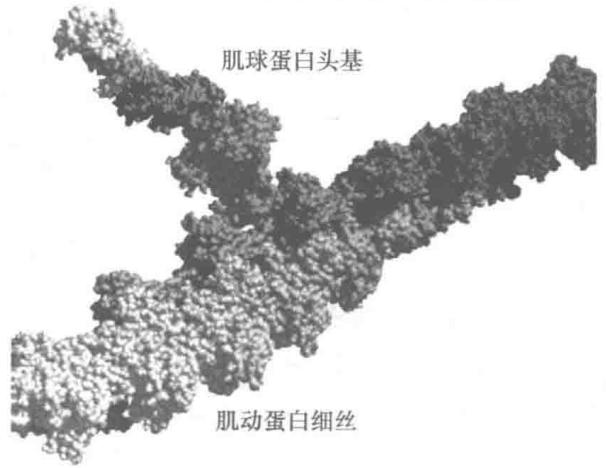  
图 4-32 肌纤维的主要成分——粗丝和细丝

A. 粗丝中邻接的分子错位约 14 nm, 此距离相当于卷曲螺旋中 98 个氨基酸残基; B. F-肌动蛋白中单体分子被装配成紧密的螺旋, 每圈约含两个肌动蛋白单体 (每一单体相对于下一个单体旋转 166°, 沿轴平移 2.75 nm); F-肌动蛋白外观上很像是由两股肌动蛋白分子链拧在一起形成的双螺旋 (重复结构长为 36 nm), 其实这是被误导的结果, 因为这种想象的“单股肌动蛋白链”实际上并不存在; C. 细丝是 F-肌动蛋白和与之结合的调节蛋白; D. 一个肌球蛋白头基结合在肌动蛋白丝的一个肌动蛋白单体上

构(bipolar structure)。在此结构中肌球蛋白的头基有规则地每间隔约14 nm从两端伸出。这种间隔是由于肌球蛋白尾部氨基酸序列的重复结构产生的。粗丝上伸出的头基与相邻的细丝接触,这就是高分辨率电镜下能观察到的粗丝与细丝之间的所谓横桥(cross bridge)。

第二个主要的肌肉蛋白质,肌动蛋白(actin),是几乎所有真核细胞中最丰富的。在低离子强度下,肌动蛋白以单体形式存在,称为G-肌动蛋白或球状肌动蛋白(globular actin), $M_{r}$ 为42000,由两个主要结构域组成。在生理条件(高离子强度)下,单体肌动蛋白聚集成纤维状多聚体,称为F-肌动蛋白或丝状肌动蛋白(filamentous actin)(图4-32B)。肌细胞中的细丝(thin filament)即由F-肌动蛋白跟原肌球蛋白和肌钙蛋白(将在后面讨论)共同组成(图4-32C)。细丝的主体(F-肌动蛋白)是由单体肌动蛋白分子在一端连续加入装配而成。加入时,每个单体结合一个ATP,然后把它水解成ADP,这样在细丝上的每个肌动蛋白分子都与ADP结合。肌动蛋白的此次ATP水解只用于细丝的装配;它不直接提供消耗于肌肉收缩的能量。细丝中每个肌动蛋白单体能紧密而专一地与一个肌球蛋白头基结合(图4-32D)。

## （二）细丝和粗丝被组织成有序的结构

骨骼肌是由多个称为肌束(fasciculus)的肌纤维束平行排列而成。肌束中的每个肌纤维(muscle fiber; myofiber)是一个单一的、很大的和多核的细胞(肌细胞)，直径在20\~100 $\mu$ m之间，长可达5 cm以上，人体的一些肌纤维甚至达到50 cm。肌纤维是由多个称为成肌细胞(myoblast)的前体细胞融合而成。每个肌纤维含有约1 000个肌原纤维(myofibril)，直径2 $\mu$ m。每个肌原纤维又由数目巨大、排列规则的肌丝(myofilament)，即粗、细丝和其他蛋白质，一起组成(图4-33)。这些肌原纤维沐浴在肌纤维的细胞溶胶——肌质(sarcoplasm)中。核一般处在细胞的外周和质膜的内表面。肌纤维中含有许多线粒体，为肌肉收缩提供能源(ATP)。肌细胞有很发达的内质网，称肌质网(sarcoplasmic reticulum)，它分布在各个肌原纤维的周围，形成一个扁平的膜质小泡系统，肌肉收缩时由它提供所需的 $Ca^{2+}$ 。在电子显微镜下观察，肌原纤维呈现一个很有规则的周期性结构，明带和暗带交替分布(图4-34A)。明带(light band)的折射率是各向同性的,因此又称各向同性带(isotropic band),简称I带;暗带(dark band)是各向异性的,所以又称各向异性带(anisotropic band),简称A带。I带和A带是由于粗丝和细丝的排列产生的,粗丝和细丝成直线排列,并有部分重叠。低电子密度的I带(明带)是肌纤维束在横切面处只含细丝的那个区域。I带被一个称为Z盘(Z disk)或Z线的薄片结构分成相等的两半,Z盘垂直于细丝,起固定细丝的锚钩作用。高电子密度的A带(暗带)贯穿粗丝的全长,包括粗丝和细丝的重叠区域。在A带的中央有一个相对较明亮的区域称为H区(H zone),是A带(粗丝)中电子密度稍低的区域,这里只有粗丝而无细丝;从H区的边缘到A带的两端是粗丝和细丝重叠部分。在A带的正中间有一条致密的细线(高电子密度区),称M线(M line)或M盘,M线也把A带(或H区)等分为两半。从粗、细丝的角度看,粗丝贯穿A带的全长;细丝从I带的Z盘走向A带中央,进入A带,终止于H区的边缘。一个肌原纤维可看成是由多个称为肌节(sarcomere)的重复单位构成。一个肌节是指两个相邻Z线之间的肌原纤维段,即一个A带加上前、后各半个I带;在松弛状态长约为2.5μm(图4-34B)。肌节既是肌原纤维的重复结构单位,也是收缩功能单位。

  
图4-33 骨骼肌的组织水平

图 A 下方中间示出粗丝和细丝重叠部分, 它们是平行交替排列的, 每条粗丝被 6 条细丝围绕着  
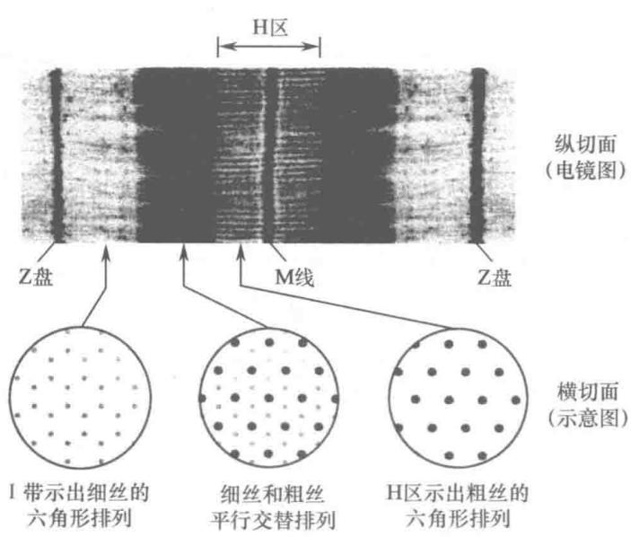

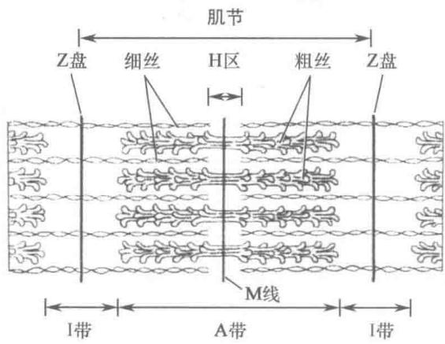  
图4-34 骨骼肌肌原纤维的电镜观察

肌动蛋白丝在一端以规则的方式被固定在Z盘上。这种组装涉及几种稀少的肌肉蛋白质，如 $\alpha$ -辅肌动蛋白（ $\alpha$ -actinin；亚基 $M_{\mathrm{r}}95000$ 的均二聚体）、作为中间丝（intermediate filament）的结蛋白（desmin； $M_{\mathrm{r}}53000$ ，一个重要的细胞骨架蛋白质）和波形蛋白（vimentin； $M_{\mathrm{r}}55000$ ）等。细丝也含有一个大的蛋白质，称为伴肌动蛋白（nebulin； $M_{\mathrm{r}}$ 约800000），它是一个长度足以跨过细丝全长的 $\alpha$ 螺旋。M线以类似的方式组织粗丝。与之有关的有副原肌球蛋白（paratropomyosin，亚基 $M_{\mathrm{r}}$ 34000的二聚体）、C蛋白（C-protein）和M蛋白（M-protein； $M_{\mathrm{r}}$ 165000）等。另一类蛋白质称为肌联蛋白（titin或connectin），它们把粗丝连接到Z盘上，给整个结构提供额外的组织构造。作为细胞骨架蛋白质的伴肌动蛋白和肌联蛋白，占肌丝总蛋白的 $15\%$ ，它们共同组成肌原纤维周围的丝状网。肌联蛋白是至今发现的最大的单链蛋白质，人心肌的肌联蛋白由26926个氨基酸残基组成， $M_{\mathrm{r}}$ 约 $3.0 \times 10^{6}$ 。肌联蛋白是一种弹性蛋白质，它在肌纤维中形成细长而柔软的丝状体。这样的丝体，在松弛状态长约 $1000 \mathrm{~nm}$ ，在张力下能伸长到 $3000 \mathrm{~nm}$ 以上。肌联蛋白分子中央有一个结构模体，由pro-Glu-Val-Lys(PEVK)重复单位组成。此模体可能起弹簧装置的作用，在肌肉伸展之后可拉动肌肉恢复原状。在强度特殊的肌肉如心肌中，PEVK模体长度只有163个残基，而在弹性大的骨骼肌中超过2000个残基。

在结构性功能中,伴肌动蛋白和肌联蛋白被认为是起“分子尺”的作用,分别调节细丝和粗丝的长度。在肌肉中肌联蛋白起自M线周边,沿肌球蛋白丝全长伸展至Z盘(并可能把粗丝固定于Z盘),起着调节肌节自身长度和防止肌肉过度伸展的作用。肌节的特征长度在脊椎动物中从一种肌肉组织到另一种肌肉组织是不同的,这主要由于组织中不同的肌联蛋白变体所引起。

## （三）肌球蛋白粗丝沿肌动蛋白细丝滑动

肌肉收缩的机制可以从肌肉的显微结构(静态)和收缩时肌节的区、带宽度变化(动态)来了解。静态方面已在前面叙述。下面观察动态方面的变化。一个完全的收缩,每个肌节缩短约1.0 $\mu$ m。收缩时I带和H区几乎消失,Z盘向A带靠拢,也即缩短是由I带和H区两者的宽度减小造成的(图4-35),但A带宽度(即粗丝长度)和Z盘到H区边缘的距离(即细丝长度)并不改变。这说明粗丝和细丝长度在收缩期间是恒定的。此即所谓纤丝滑动模型(sliding filament model)。

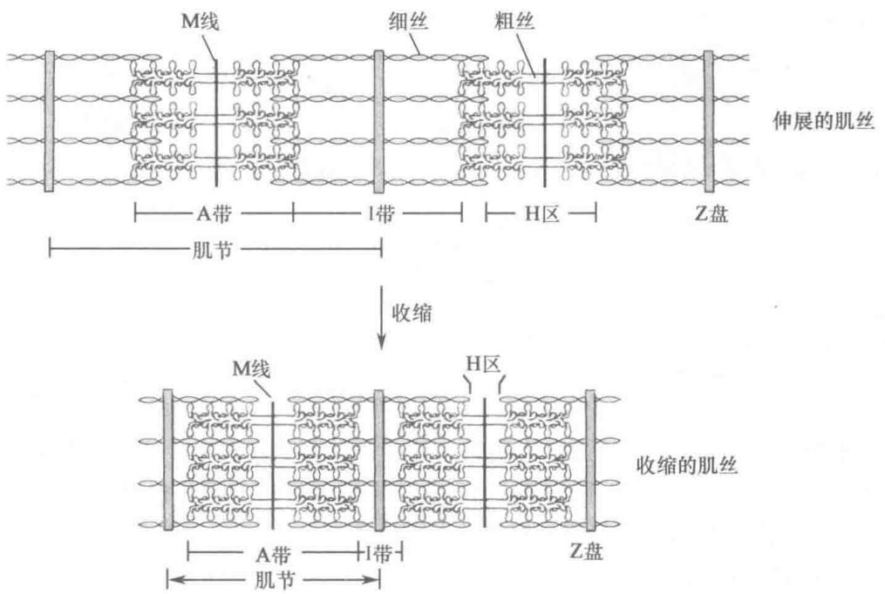  
图 4-35 骨骼肌收缩的肌丝滑动模型  
注意:肌肉收缩时,H区和I带宽度减小,但A带宽度保持不变

肌节的缩短(图4-35)涉及肌球蛋白粗丝两端相向方向的滑动。之所以在特定方向上发生净滑动是因为粗、细丝都有方向性。肌动蛋白细丝总是从Z盘向两侧伸展，因此在两个Z盘之间，两套肌动蛋白丝的方向是相向的。肌球蛋白粗丝也是具有方向性的（双极结构），粗丝的极性在M盘逆转。在M盘处的极性逆转意味着M盘两侧的肌动蛋白丝在收缩时被肌球蛋白头基的滑行拉向M盘而引起肌节的净缩短。动力学研究证明，肌球蛋白的ATP酶活性因有肌动蛋白而显著增加。纯肌球蛋白的ATP酶转换数（见第6章）为0.05/s，但在肌动蛋白存在下，转换数增加到10/s左右。此值更像是完整肌纤维的转换数

如果对反应产物释放的步骤进行仔细比较,肌动蛋白对肌球蛋白 ATP 酶活性的特殊影响就会明白。在缺少肌动蛋白时,向肌球蛋白加入 ATP 将引起 $H^{+}$ 的快速释放, $H^{+}$ 是 ATP 酶反应的产物之一:

$$
\mathrm{ATP} ^ {4 -} + \mathrm{H} _ {2} \mathrm{O} \xrightarrow {\mathrm{ATP} \text {酶}} \mathrm{ADP} ^ {3 -} + \mathrm{Pi} ^ {2 -} + \mathrm{H} ^ {+}
$$

然而从肌球蛋白释放 ADP 和 Pi 则要慢得多。可见肌动蛋白激活肌球蛋白的 ATP 酶活性是通过促进先 Pi、后 ADP 的释放来实现的。随着产物的释放，一个新的 ATP 与肌动球蛋白（actomyosin）结合，引起肌动球蛋白解离成肌动蛋白和肌球蛋白。然后如图 4-36 所示，重复 ATP 循环。此即 ATP 水解模型，此模型的关键点在于肌动蛋白和肌球蛋白的缔合和解离是与 ATP 的水解偶联的。正是这一偶联使 ATP 水解能够驱动肌肉收缩。综合生化和显微形态方面的研究，提出了肌肉收缩的一个可能机制，如图 4-36 所示。

  
图4-36 肌肉收缩的分子机制  
ATP 水解自由能引起肌球蛋白头基的构象变化, 结果肌球蛋白头基沿肌动蛋白丝发生净移动

当 ATP 未与肌球蛋白结合时, 肌球蛋白头基的一面与肌动蛋白丝的一个单体紧密结合(图 4-32D)。当 ATP 与肌球蛋白结合并水解成 ADP 和 Pi 时, 则发生协调的循环式的系列构象变化, 循环中肌球蛋白释放 F-肌动蛋白亚基(单体), 并沿细丝与前面的另一亚基结合。

循环(肌肉收缩机制)包括4个主要步骤(图4-36)。步骤①:ATP与肌球蛋白分子头基S1(图4-31C)结合,S1上的裂隙张开,破坏了肌动蛋白与肌球蛋白的相互作用,致使S1从肌动蛋白丝上离开。步骤②:结合的ATP被水解,引起肌球蛋白构象变化,转变为“高能”态,S1头基竖起(与细丝长轴垂直),改变它对肌动蛋白细丝的取向,移动肌球蛋白头基,与一个比刚释放的亚基更接近Z盘的F-肌动蛋白亚基发生弱结合。步骤③:随着ATP水解产物磷酸盐(Pi)从肌球蛋白中的释放,发生了另一个构象变化,肌球蛋白头基上的裂隙合拢,肌球蛋白和肌动蛋白的相互作用得到加强。随后很快进入步骤④:“做功冲程”(power stroke),在此期间肌球蛋白头基回复到原来的静息状态,肌球蛋白头基对结合的肌动蛋白的取向发生改变,致使肌球蛋白头基的长轴与细丝长轴倾斜约 $45^{\circ}$ ,头基的构象能降低约29 kJ/mol,转变为原初的低能态构象,同时肌球蛋白粗丝被拉向Z盘。过程中释放ADP,完成一个循环。在典型的骨骼肌收缩中,循环以5次/s的速率进行重复。循环中发生的构象变化是能量偶联的秘密之所在,它使ATP的结合

和水解得以驱动肌肉收缩。

因为在一个粗丝上有许多肌球蛋白头基，粗丝沿细丝的滑动就像千足虫的行走，在任一给定的瞬间总有一些头基（1%\~3%）与细丝结合。因此当个别肌球蛋白头基与所连的肌动蛋白亚基脱离时，不致使粗丝往回滑动。因此粗丝主动地沿相邻的细丝向前滑行。这一过程在肌纤维的各肌节之间是协调的，正是它引起肌肉收缩。

做功冲程中的构象变化已用冷冻电镜术(cryoelectron microscopy)并结合计算机图像分析和反馈增强激光光学捕获实验(laser optical trapping experiment)进行研究。并证明在一次循环中一个肌球蛋白分子沿肌动蛋白丝的平均移动为 $5\sim 10~\mathrm{nm}$ ，产生的平均力为 $3\sim 4\mathrm{pN}$ (piconewton, 皮牛顿, $10^{-12}\mathrm{kg}\cdot \mathrm{m}\cdot \mathrm{s}^{-2}$ )。一次收缩循环所需的能量定义为收缩所完成的“功”(w):

$$
w = F \cdot d
$$

式中 F 是力, d 是距离。因此一次循环所需的能量 $w = (3 \text{ pN})(5 \text{ nm}) \sim (4 \text{ pN})(10 \text{ nm}) = 1.5 \times 10^{-20} \text{ J} \sim 4.0 \times 10^{-20} \text{ J}$ 。如果细胞内 ATP 的水解自由能为 -50 kJ/mol（见第 16 章），那么一个 ATP 分子的水解产生可利用的自由能 $\Delta G^{\ominus'} = (-50 \text{ kJ/mol}) / (6.022 \times 10^{23} / \text{mol}) = -8.3 \times 10^{-20} \text{ J}$ 。因此一个 ATP 分子的水解自由能足够驱动实验所观测到的做功所需能量（参看 Finer J T, et al. Nature. 1994, 368: 113-119）。

肌动蛋白和肌球蛋白之间的相互作用必定受到调节，以便使肌肉收缩只有在应答来自神经系统的适当信号时才发生。调节由原肌球蛋白（protomyosin）和肌钙蛋白（troponin）的复合体（图4-32C）介导。原肌球蛋白和肌钙蛋白是结合在细丝的F-肌动蛋白上的。在松弛的肌肉中这两种蛋白质绕肌动蛋白丝排列，以致封闭了肌球蛋白头基在细丝上的附着位点。原肌球蛋白是一种纤维状蛋白质，它由两条不同的α螺旋肽链互相缠绕成超螺旋（双股卷曲螺旋）。这是一个与α-角蛋白中存在的结构模体一样的模体（见图3-22）。它作为亚基 $(M_{r}$ 35 000）首尾连结形成多聚体，绕着肌动蛋白丝结合于细丝的沟内。肌钙蛋白以38.5 nm的间隔有规则地附着在肌动蛋白-原肌球蛋白复合体上。肌钙蛋白复合体由3个不同的亚基组成：I $(M_{r}$ 24 000）、C $(M_{r}$ 18 000）和T $(M_{r}$ 37 000）。肌钙蛋白I或TnI是防止肌球蛋白头基与肌动蛋白结合；肌钙蛋白C或TnC含有 $Ca^{2+}$ 的结合部位；肌钙蛋白T或TnT是使整个肌钙蛋白复合体与原肌球蛋白连接。肌钙蛋白是一种 $Ca^{2+}$ 结合蛋白质。一个神经冲动引起 $Ca^{2+}$ 从肌质网中的释放。释放的 $Ca^{2+}$ 与TnC结合，引起TnC的构象变化，改变了TnI和原肌球蛋白的位置，解除了TnI的抑制，暴露出细丝上的肌球蛋白结合位点，随后引起肌肉收缩。

工作的骨骼肌要求蛋白质中常见的两类分子功能——结合和催化。肌动蛋白-肌球蛋白相互作用是一种像免疫球蛋白跟抗原之间发生的蛋白质-配体相互作用，这种相互作用是可逆的并留下不变化的参与者。当ATP与肌球蛋白结合，则被水解成ADP和Pi。肌球蛋白不仅是一个结合肌动蛋白的蛋白质，而且也是一个ATP酶。

<!-- EN-BEGIN 5.3 -->

### 【英文对应 5.3】Protein Interactions Modulated by Chemical Energy: Actin, Myosin, and Molecular Motors

> 来源：Lehninger Principles of Biochemistry（书籍/02_生物化学原理） 第5章 Protein Function，§5.3。对应本章“六、肌动蛋白、肌球蛋白和分子马达”。

Organisms move. Cells move. Organelles and macromolecules within cells move. Most of these movements arise from the activity of a fascinating class of protein-based molecular motors. Fueled by chemical energy, usually derived from ATP, large aggregates of motor proteins undergo cyclic conformational changes that accumulate into a unified, directional force—the tiny force that pulls apart chromosomes in a dividing cell, and the immense force that levers a pouncing, quarter-ton jungle cat into the air.

The interactions among motor proteins, as you might predict, feature complementary arrangements of ionic, hydrogen-bonding, and hydrophobic groups at protein binding sites. In motor proteins, however, the resulting interactions achieve exceptionally high levels of spatial and temporal organization.

Motor proteins underlie the migration of organelles along microtubules, the motion of eukaryotic and bacterial flagella, and the movement of some proteins along DNA. Here, we focus on the well-studied example of the contractile proteins of vertebrate skeletal muscle as a paradigm for how proteins translate chemical energy into motion.

#### [EN] The Major Proteins of Muscle Are Myosin and Actin

The contractile force of muscle is generated by the interaction of two proteins, myosin and actin. These proteins are arranged in filaments that undergo transient interactions and slide past each other to bring about contraction. Together, actin and myosin make up more than 80% of the protein mass of muscle.

Myosin ( $M_{r}$ 520,000) has six subunits: two heavy chains (each of $M_{r}$ 220,000) and four light chains (each of $M_{r}$ 20,000). The heavy chains account for much of the overall structure. At their carboxyl termini, they are arranged as extended $\alpha$ helices, wrapped around each other in a fibrous, left-handed coiled coil similar to that of $\alpha$ -keratin (Fig. 5-26). At its amino terminus, each heavy chain has a large globular domain containing a site where ATP is hydrolyzed. The light chains are associated with the globular domains.

  
FIGURE 5-26 Myosin. (a) Myosin has two heavy chains: the carboxyl termini forming an extended coiled coil tail and the amino termini having clublike globular head domains. Two myosin light chains are associated with each myosin head. (b) A three-dimensional representation of the myosin head, showing the binding sites for nucleotide (ATP) and actin. [(a) Research from Takeshi Katayama, et al. "Stimulatory effects of arachidonic acid on myosin ATPase activity and contraction of smooth muscle via myosin motor domain," Am. J. Physiol. Heart Circ. Physiol. Vol 298, Issue 2, pp. H505–H514, February 2010, Fig. 6b. (b) Data from PDB ID 2MYS, I. Rayment et al., Science 261:50, 1993.]

In muscle cells, molecules of myosin aggregate to form structures called thick filaments (Fig. 5-27a). These rodlike structures are the core of the contractile unit. Within a thick filament, several hundred myosin molecules are arranged with their fibrous "tails" associated to form a long, bipolar structure. The globular domains project from either end of this structure, in regular stacked arrays.

The second major muscle protein, actin, is abundant in almost all eukaryotic cells. In muscle, molecules of monomeric actin, called G-actin (globular actin; $M_{r}$ 42,000), associate to form a long polymer called F-actin (filamentous actin). The thin filament consists of F-actin (Fig. 5-27b), along with the proteins troponin and tropomyosin (discussed below). The filamentous parts of thin filaments assemble as successive monomeric actin molecules add to one end. Upon addition, each monomer binds ATP, then hydrolyzes it to ADP, so every actin molecule in the filament is complexed to ADP. This ATP hydrolysis by actin functions only in the assembly of the filaments; it does not contribute directly to the energy expended in muscle contraction. Each actin monomer in the thin filament can bind tightly and specifically to one myosin head group (Fig. 5-27c).

(b) F-actin  
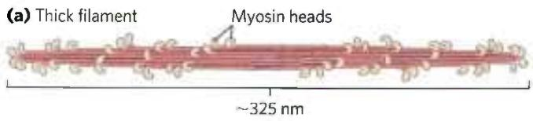

  
FIGURE 5-27 The major components of muscle. (a) Myosin aggregates to form a bipolar structure called a thick filament. (b) F-actin is a filamentous assemblage of G-actin monomers that polymerize two by two, giving the appearance of two filaments spiraling about one another in a right-handed fashion. (c) Space-filling model of an actin filament with one myosin head bound to an actin monomer within the filament. [(b) Research from Dr. Roger W. Craig PhD, University of Massachusetts Medical School. (c) Data from PDB ID 2MYS, I. Rayment et al., Science 261:50, 1993; PDB ID 6BNQ, P. S. Gurel et al., eLife 6, 2017, doi 10.7554/eLife.31125]

#### [EN] Additional Proteins Organize the Thin and Thick Filaments into Ordered Structures

Skeletal muscle consists of parallel bundles of muscle fibers, each fiber a single, very large, multinucleated cell, 20 to 100 $\mu$ m in diameter, formed from many cells fused together; a single fiber often spans the length of the muscle. Each fiber contains about 1,000 myofibrils, 2 $\mu$ m in diameter, each consisting of a vast number of regularly arrayed thick and thin filaments complexed to other proteins (Fig. 5-28). A system of flat membranous vesicles called the sarcoplasmic reticulum surrounds each myofibril. Examined under the electron microscope, muscle fibers reveal alternating regions of high electron density and low electron density, called the A bands and I bands (Fig. 5-28b, c). The A and I bands arise from the arrangement of thick and thin filaments, which are aligned and partially overlapping. The I band is the region of the bundle that in cross section would contain only thin filaments. The darker A band stretches the length of the thick filament and includes the region where parallel thick and thin filaments overlap. Bisecting the I band is a thin structure called the Z disk, perpendicular to the thin filaments and serving as an anchor to which the thin filaments are attached. The A band, too, is bisected by a thin line, the M line or M disk, a region of high electron density in the middle of the thick filaments. The entire contractile unit, consisting of bundles of thick filaments interleaved at either end with bundles of thin filaments, is called the sarcomere. The arrangement of interleaved bundles allows the thick and thin filaments to slide past each other (by a mechanism discussed below), causing a progressive shortening of each sarcomere (Fig. 5-28d).

#### [EN] Myosin Thick Filaments Slide along Actin Thin Filaments

P1 The interaction between actin and myosin, like that between all proteins and ligands, involves weak bonds. When ATP is not bound to myosin, a face on the myosin head group binds tightly to actin (Fig. 5-29). When ATP binds to myosin and is hydrolyzed to ADP and phosphate, a coordinated and cyclic series of conformational changes occurs in which myosin releases the F-actin subunit and binds another subunit farther along the thin filament.

The cycle has four major steps (Fig. 5-29). In step 1, ATP binds to myosin and a cleft in the myosin molecule opens, disrupting the actin-myosin interaction so that the bound actin is released. ATP is then hydrolyzed in step 2, causing a conformational change in the protein to a "high-energy" state that moves the myosin head and changes its orientation in relation to the actin thin filament. Myosin then binds weakly to an F-actin subunit closer to the Z disk than the one just released. As the phosphate product of ATP hydrolysis is released from myosin in step 3, another conformational change occurs in which the myosin cleft closes, strengthening the myosin-actin binding. This is followed quickly by step 4, a "power stroke" during which the conformation of the myosin head returns to the original resting state, its orientation relative to the bound actin changing so as to pull the tail of the myosin toward the Z disk. ADP is then released to complete the cycle. Each cycle generates about 3 to 4 pN (piconewtons) of force and moves the thick filament 5 to 10 nm relative to the thin filament.

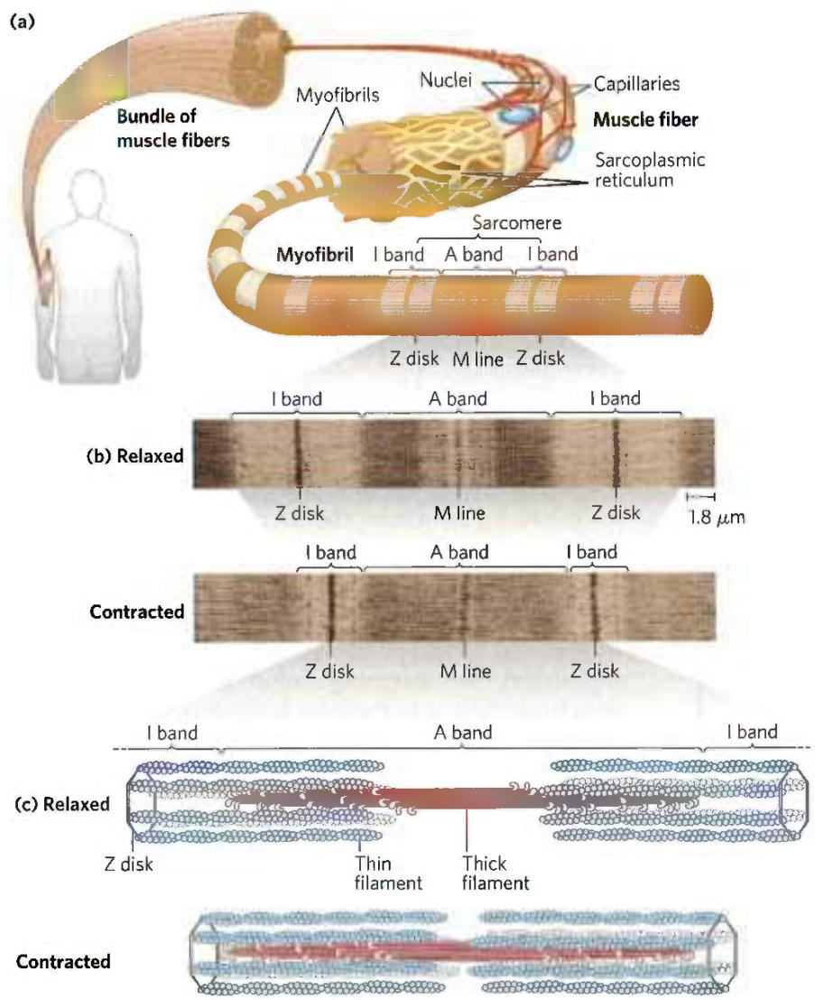  
FIGURE 5-28 Skeletal muscle. (a) Muscle fibers consist of single, elongated, multinucleated cells that arise from the fusion of many precursor cells. The fibers are made up of many myofibrils (only six are shown here for simplicity) surrounded by the membranous sarcoplasmic reticulum. The organization of thick and thin filaments in a myofibril gives it a striated appearance. When muscle contracts, the I bands narrow and the Z disks move closer together, as seen in electron micrographs of (b) relaxed muscle and (c) contracted muscle. (d) Thick filaments are bipolar structures created by the association of many myosin molecules. Muscle contraction occurs by the sliding of the thick and thin filaments past each other so that the Z disks in neighboring I bands draw closer together. The thick and thin filaments are interleaved such that each thick filament is surrounded by six thin filaments. [(b) Medical Images/James E. Dennis.]

Because there are many myosin heads in a thick filament, at any given moment some (probably 1% to 3%) are bound to thin filaments. This prevents thick filaments from slipping backward when an individual myosin head releases the actin subunit to which it was bound. The thick filament thus actively slides forward past the adjacent thin filaments. This process, coordinated among the many sarcomeres in a muscle fiber, brings about muscle contraction.

The interaction between actin and myosin must be regulated so that contraction occurs only in response to appropriate signals from the nervous system. The regulation is mediated by a complex of two proteins, tropomyosin and troponin (Fig. 5-30). Tropomyosin binds to the thin filament, blocking the attachment sites for the myosin head groups. Troponin is a $\mathrm{Ca^{2+}}$ -binding protein. A nerve impulse causes release of $\mathrm{Ca^{2+}}$ ions from the sarcoplasmic reticulum. The released $\mathrm{Ca^{2+}}$ binds to troponin (another protein-ligand interaction) and causes a conformational change in the tropomyosin-troponin complexes, exposing the myosin-binding sites on the thin filaments. Contraction follows.

Working skeletal muscle requires two types of molecular functions that are common in proteins: binding and catalysis. The actin-myosin interaction, a protein-ligand interaction like that of immunoglobulins with antigens, is reversible and leaves the participants unchanged. This interaction illustrates why reversibility is important; a permanent actin-myosin interaction defines the state of rigor mortis, a state we all want to avoid as long as possible. When ATP binds myosin, however, it is hydrolyzed to ADP and $P_{i}$ (inorganic phosphate). Myosin is not only an actin-binding protein, but also an ATPase—an enzyme. The function of enzymes in catalyzing chemical transformations is the topic of the next chapter.

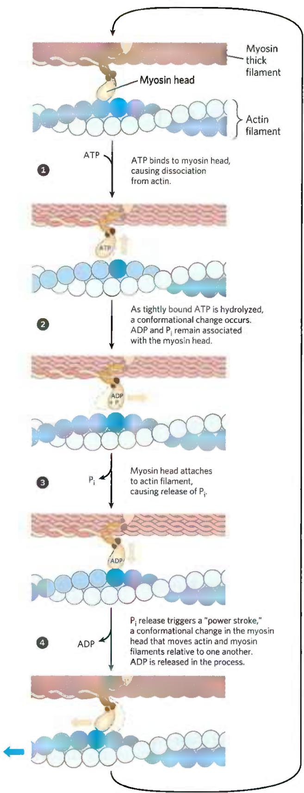  
FIGURE 5-29 Molecular mechanism of muscle contraction. Conformational changes in the myosin head that are coupled to stages in the ATP hydrolytic cycle cause myosin to successively dissociate from one actin subunit, then associate with another farther along the actin filament. In this way, the myosin heads slide along the thin filaments, drawing the thick filament array into the thin filament array (see Fig. 5-28).

  
FIGURE 5-30 Regulation of muscle contraction by tropomyosin and troponin. Tropomyosin and troponin are bound to F-actin in the thin filaments. In the relaxed muscle, these two proteins are arranged around the actin filaments so as to block the binding sites for myosin. Tropomyosin is a two-stranded coiled coil of $\alpha$ helices, the same structural motif as in $\alpha$ -keratin (see Fig. 4-11). It forms head-to-tail polymers twisting around the two actin chains. Troponin is attached to the actin-tropomyosin complex at regular intervals of $38.5\mathrm{nm}$ . Troponin consists of three different subunits: I, C, and T. Troponin I prevents binding of the myosin head to actin; troponin C has a binding site for $\mathrm{Ca^{2+}}$ ; and troponin T links the entire troponin complex to tropomyosin. When the muscle receives a neural signal to initiate contraction, $\mathrm{Ca^{2+}}$ is released from the sarcoplasmic reticulum (see Fig. 5-28a) and binds to troponin C. This causes a conformational change in troponin C, which alters the positions of troponin I and tropomyosin so as to relieve the inhibition by troponin I and allow muscle contraction.

#### [EN] SUMMARY 5.3 Protein Interactions Modulated by Chemical Energy: Actin, Myosin, and Molecular Motors

■ Protein-ligand interactions achieve a special degree of spatial and temporal organization in motor proteins. Muscle contraction results from choreographed interactions between myosin and actin, coupled to the hydrolysis of ATP by myosin.

■ Myosin consists of two heavy chains and four light chains, forming a fibrous coiled coil (tail) domain and a globular (head) domain. Myosin molecules are organized into thick filaments, which slide past thin filaments composed largely of actin. ATP hydrolysis in myosin is coupled to a series of conformational changes in the myosin head, leading to dissociation of myosin from one F-actin subunit and its eventual reassociation with another, farther along the thin filament. The myosin thus slides along the actin filaments.

■ Muscle contraction is stimulated by the release of $Ca^{2+}$ from the sarcoplasmic reticulum. The $Ca^{2+}$ binds to the protein troponin, leading to a conformational change in a troponin-tropomyosin complex that triggers the cycle of actin-myosin interactions.

<!-- EN-END 5.3 -->

## 提要

蛋白质行使功能经常需要与其他分子相互作用。蛋白质在它的结合部位上与称为配体的其他分子结合。当配体结合时蛋白质可能发生构象变化，这是一个称为诱导契合的过程。在多亚基蛋白质中配体与一个亚基的结合可能影响其他亚基与配体的结合。配体的结合是可以被调节的。

蛋白质是信息分子更是功能分子。蛋白质的功能极其多种多样，有行使催化功能的酶、作为信号分子的激素和细胞因子以及起转运、支撑、运动和保卫等功能的蛋白质。

肌红蛋白含有一个结合氧的血红素辅基。血红素是由一个配位在卟啉环内的铁 $\left(\mathrm{Fe}^{2+}\right)$ 原子组成。肌红蛋白（珠蛋白家族成员）是单亚基蛋白质，由8个α螺旋段折叠而成，结构紧凑。一个亚铁血红素基位于疏水的空穴内。血红素铁在卟啉环面一侧直接与一个称近组氨酸（His F8）的侧链咪唑N结合，环面的另一侧是 $O_{2}$ 结合部位（第6配位），在此附近的远组氨酸（His E7）能降低CO在氧结合部位的结合，并抑制血红素铁氧化成高铁态。氧与Mb结合是可逆的。这种可逆结合可用结合常数 $K_{a}$ 或解离常数 $K_{d}$ 来描述。对单体蛋白质如Mb来说，被配体（如 $O_{2}$ ）占据的结合部位的分数是配体浓度的双曲线函数，如Mb的

<!-- END OFFICIAL API PART part_002 -->

<!-- BEGIN OFFICIAL API PART part_003 -->

氧结合曲线所示。肌红蛋白适于贮存氧。

血红蛋白由4个亚基(也是珠蛋白家族成员)组成,每个亚基含一个血红素基。正常的成人血红蛋白(Hb A)具有 $\alpha_{2}\beta_{2}$ 的亚基结构。 $\alpha$ 和 $\beta$ 亚基在结构上彼此之间以及跟肌红蛋白之间是相似的。血红蛋白以两种可以相互转化的构象,T态和R态,存在。无氧结合时,T态最稳定;氧的结合(涉及血红素铁的微小移动)促进向R态转化。

氧与血红蛋白的结合是别构而协同的。当 $O_{2}$ 与一个结合部位结合，血红蛋白则发生构象变化，后者影响其他结合部位的亲和力，这是别构行为的典型例证。亚基-亚基相互作用介导的 T 态和 R 态之间的构象变化，引起血红蛋白与 $O_{2}$ 的协同结合。这种结合可用 S 形氧结合曲线描述，并用 Hill 作图来分析。为了解释配体与多亚基蛋白质的协同结合，已提出两个主要模型：协同模型和序列模型。

血红蛋白的主要功能是结合并转运氧,但它也能结合和转运 $H^{+}$ 和 $CO_{2}$ 。血红蛋白对 $O_{2}$ 的结合和对 $H^{+}$ 和 $CO_{2}$ 的结合是互相排斥的;当血红蛋白与 $H^{+}$ 和 $CO_{2}$ 结合,则形成稳定 T 态的离子对,并降低对氧的亲和力(Bohr 效应)。氧与血红蛋白的结合也受 2,3-二磷酸甘油酸的调节,它与 T 态结合并稳定 T 态。

镰状细胞贫血是一种遗传病。它是由于血红蛋白的每一β链中一个氨基酸被置换(Glu 6→Val 6)造成的。此变化引起血红蛋白表面出现一个疏水的突起，使分子聚集成不溶性的纤维束。此症纯合子患者出现严重的慢性贫血而死亡。地中海贫血是由于缺失一个或多个编码Hb珠蛋白链的基因造成的。

免疫应答是由一系列特化的白细胞及其相关的蛋白质之间的相互作用介导的。T淋巴细胞产生T细胞受体，B淋巴细胞产生免疫球蛋白，即抗体。所有的细胞都能产生MHC蛋白，它们在细胞表面展示宿主（自我）肽或抗原（非自我）肽。在称为克隆选择的过程中，辅助T细胞诱导那些产生免疫球蛋白的B细胞和产生T细胞受体的胞毒T细胞的增殖。免疫球蛋白或T细胞受体能与专一的抗原结合。

人类具有5类免疫球蛋白，每类的生物学功能都是不同的。最丰富的是IgG类，它由4条多肽链：两条重链和两条轻链组成，是Y形的蛋白质分子。靠近Y形结构上端的结构域是高变区，由它们形成两个抗原结合部位。一个给定的免疫球蛋白一般只结合一个大抗原分子的一个部分，称为表位。结合经常涉及IgG的构象变化，与抗原诱导契合。免疫球蛋白精细的结合专一性在分析技术上得到了开发，如ELISA、Western印迹等。

在马达蛋白质中蛋白质-配体相互作用在时、空的组织方面达到几乎完善的程度。肌肉收缩是由于精巧安排的肌球蛋白和肌动蛋白之间的相互作用和与之偶联的肌球蛋白对ATP的水解所引起的。肌球蛋白是由2个重链和4个轻链组成，形成一个纤维状的卷曲螺旋区（尾部）和一个球状区（头基）。肌球蛋白分子被组织成粗丝，粗丝沿细丝滑行。细丝主要由G-肌动蛋白缔合成的F-肌动蛋白组成。肌球蛋白上的ATP水解与一系列肌球蛋白头基的构象变化偶联，导致肌球蛋白头基从一个F-肌动蛋白亚基上的解离，并沿细丝与前面的另一个F-肌动蛋白亚基重新缔合，因此肌球蛋白沿肌动蛋白细丝滑行。肌质网释放的 $\mathrm{Ca^{2+}}$ 刺激肌肉收缩。 $\mathrm{Ca^{2+}}$ 与肌钙蛋白结合导致肌钙蛋白-原肌球蛋白复合体的构象变化，结果引发肌动蛋白-肌球蛋白相互作用的循环。

## 习题

1. 解释下列名词: (a) 配体, (b) 结合部位, (c) 血红蛋白, (d) 配体结合分数饱和度, (e) 氧合曲线, (f) Hill 系数, (g) 协同性, (h) 免疫应答, (i) 抗原和抗体, (j) 单克隆抗体, (k) 免疫印迹, (l) 肌球蛋白和肌动蛋白, (m) 粗丝和细丝, (n) 肌纤维和肌原纤维, (o) 肌节, (p) 收缩循环。

2. 如果一个相对分子质量为 12000 的蛋白质, 含 10 种氨基酸, 并假设每种氨基酸在该蛋白质分子中的数目相等, 问这个蛋白质有多少种可能的排列顺序?

3. 蛋白质 A 和 B 各有一个配体 L 的结合部位, 前者的解离常数 $K_{d}$ 为 $10^{-6}$ mol/L, 后者的 $K_{d}$ 为 $10^{-9}$ mol/L。(a) 哪个蛋白质对配体 L 的亲和力更高? (b) 将这两个蛋白质的 $K_{d}$ 转换为结合常数 $K_{a}$ 。

4. 下列变化对肌红蛋白和血红蛋白的 $O_{2}$ 亲和力有什么影响？(a) 血浆的 pH 从 7.4 降到 7.2；(b) 肺中 $CO_{2}$ 分压从 6 kPa（屏息）降到 2 kPa（正常）；(c) BPG 水平从 4.5 mmol/L（海平面）增至 7.5 mmol/L（高空）。

5. 在 $37^{\circ}C$ , pH 7.4, $CO_{2}$ 分压 40 torr (1 torr = 133.3 Pa) 和 BPG 正常生理水平 (4.5 mmol/L 血) 条件下, 人全血的氧结

合测定给出下列数据：

<table><tr><td> $pO_{2}$ </td><td>饱和度(=100×θ)/%</td><td> $pO_{2}$ </td><td>饱和度(=100×θ)/%</td></tr><tr><td>10.6</td><td>10</td><td>50.4</td><td>85</td></tr><tr><td>19.5</td><td>30</td><td>77.3</td><td>96</td></tr><tr><td>27.4</td><td>50</td><td>92.3</td><td>98</td></tr><tr><td>37.5</td><td>70</td><td></td><td></td></tr></table>

(a) 根据这些数据, 绘制氧结合曲线; 估算在① 100 torr pO₂(肺中) 和② 4kP pO₂(静脉血中) 下, 血的氧百分饱和度。

(b) 肺（100 torr $pO_{2}$ ）中结合的氧有百分之多少输送给组织（30 torr $pO_{2}$ ）？

(c) 如果在毛细血管中 pH 降到 7.0, 利用图 4-15 中的数据重新估算 (b) 部分。

6. 如果已知 $n$ 和 $P_{50}$ [注意 $K = (P_{50})^n$ ], 可利用方程 $\theta / (1 - \theta) = (\mathrm{pO}_2 / \mathrm{P}_{50})^n$ 来计算 $\theta$ 值（血红蛋白氧分数饱和度）。设 $n = 2.8, P_{50} = 3.50 \mathrm{kPa}$ , 计算 $\mathrm{pO}_2 = 13 \mathrm{kPa}$ （肺部）时的 $\theta$ 值。这些条件下输氧效率 $(\theta_{\text{肺}} - \theta_{\text{毛细血管}} = \Delta \theta)$ 是多少？当 $n = 1.0$ 时，重复上面计算。比较 $n = 2.8$ 和 $n = 1.0$ 时的 $\Delta \theta$ 值，并说出协同性氧结合对血红蛋白输氧效率的影响。

7. 如果不采取措施,贮存相当时间的血,BPG 的含量会下降。用这样的血来输血会产生什么后果?

8. Hb A 能抑制 Hb S 形成纤维晶体和脱氧后红细胞的镰状化。为什么 Hb A 具有此效应？

9. 一个单克隆抗体与 G-肌动蛋白结合但不与 F-肌动蛋白结合。这对于抗体识别抗原表位能告诉你什么？

10. 假设一个 Fab-半抗原复合体的解离常数在 $25^{\circ}$ C 和 pH 7 时是 $5 \times 10^{-7}$ mol/L。

(a) 在 $25^{\circ}$ C 和 pH 7 时结合的标准自由能是多少？

(b) 此 Fab 的亲和力(结合常数)是多少?

(c) 从该复合体中释放半抗原的速度常数为 $120 \mathrm{~s}^{-1}$ 。结合的速度常数是多少？

11. 抗原(L)与抗体(P)的结合方式与血红蛋白的氧结合相似。假设抗原是一价,抗体是n价,即抗体分子有n个结合部位,且各结合部位的结合常数 $K_{a}$ 值是相同的,则可证明当游离抗原浓度为[L]时,结合到抗体上的抗原浓度 $[L_{p}]$ 与抗体的总浓度 $[P_{T}]$ 之比值:

$$
\overline {{{N}}} = \frac {[ \mathrm{L} _ {\mathrm{p}} ]}{[ \mathrm{P} _ {\mathrm{T}} ]} = \frac {n K _ {\mathrm{a}} [ \mathrm{L} ]}{1 + K _ {\mathrm{a}} [ \mathrm{L} ]}
$$

$\overline{N}$ 实际上表示被一个抗体分子结合的抗原分子平均数。

## (a) 证明上面的方程可重排为

$$
\frac {\overline {{N}}}{[ \mathrm{L} ]} = K _ {\mathrm{a}} n - K _ {\mathrm{a}} \overline {{N}}
$$

此方程式称为Scatchard方程。方程表明， $\overline{N} /[\mathrm{L}]$ 对 $\overline{N}$ 作图将是一条直线（参见图14-15）。

(b) 根据 Scatchard 方程利用下列数据作图求出抗体-抗原反应的 n 和 $K_{a}$ 值。

<table><tr><td>[L]mol/L</td><td> $\overline{N}$ </td><td>[L]mol/L</td><td> $\overline{N}$ </td></tr><tr><td> $1.43\times 10^{-5}$ </td><td>0.50</td><td> $1.68\times 10^{-4}$ </td><td>1.68</td></tr><tr><td> $2.54\times 10^{-5}$ </td><td>0.77</td><td> $3.70\times 10^{-4}$ </td><td>1.85</td></tr><tr><td> $6.00\times 10^{-5}$ </td><td>1.20</td><td></td><td></td></tr></table>

12. 一个典型的松弛肌节长约为 $3 \mu m$ ，收缩时长约为 $2 \mu m$ 。肌节中细丝长约为 $1 \mu m$ ，粗丝长约为 $1.5 \mu m$ 。

(a) 估算在松弛和收缩时粗丝和细丝的重叠情况。

(b) 一次收缩循环中肌球蛋白沿细丝滑行一“步”移动约 $7.5 \mathrm{~nm}$ 。问一次收缩中每个肌动蛋白丝需要滑行多少个步？

## 主要参考书目

1. 吴相钰, 陈守良, 葛明德. 陈阅增普通生物学. 4 版. 北京: 高等教育出版社, 2013.

2. 张龙翔, 张庭芳, 李令媛. 生化实验方法和技术. 2 版. 北京: 高等教育出版社, 1997.

3. 王克夷. 蛋白质导论. 北京: 科学出版社, 2007.

4. Garrett R H, Grisham C M. Biochemistry. 5th ed. Boston: Brooks/Cole, Cengage Learning, 2013.

5. Kuby L. Immunology. New York: W. H. Freeman and Company, 1992.

6. Stryer L. Biochemistry. 6th ed. New York: W. H. Freeman and Company, 2007.

7. Mathews C K, van Holde K E. Biochemistry. Boston: The Benjamin/Cummings Publishing Company, 1990.

8. Nelson D L, Cox M M. Lehninger Principles of Biochemistry. 6th ed. New York: W. H. Freeman and Company, 2013.

9. Wilson K, Walker J. Principles and Techniques of Practical Biochemistry. 5th ed. New York: Cambridge University Press, 2000.

10. Gerard J, Tortora. Principles of Human Anatomy. 6th ed. New York: Harper Collins Publishers Inc, 1992.

(徐长法)

## 网上资源

习题答案

自测题

<!-- EN-BEGIN 第5章章末 -->

## 【英文对应 第5章章末】Protein Function：关键术语、习题与简答

> 来源：Lehninger Principles of Biochemistry（书籍/02_生物化学原理） 第5章章末，以及书末 Abbreviated Solutions to Problems 第5章。

### [EN] KEY TERMS

Terms in bold are defined in the glossary.

ligand 147
binding site 147
induced fit 147
hemoglobin 148
heme 148
porphyrin 148
globins 149
globin fold 149
equilibrium expression 150
association constant, $K_{a}$ 150
dissociation constant, $K_{d}$ 150

allosteric protein 157  
modulator 157  
homotropic 157  
heterotropic 157  
Hill equation 157  
Hill coefficient 157  
Bohr effect 160

immune response 164  
lymphocytes 164  
antibody 165  
immunoglobulin (Ig) 165  
B lymphocyte (B cell) 165  
T lymphocyte (T cell) 165  
antigen 165  
epitope 165  
hapten 165  
immunoglobulin fold 165  
polyclonal antibodies 167  
monoclonal antibodies 167  
immunoblotting 167  
Western blotting 167  
myosin 169  
actin 169  
myofibril 170  
sarcomere 170

### [EN] PROBLEMS

1. Relationship between Affinity and Dissociation Constant Protein A has a binding site for ligand X with a $K_{d}$ of $3.0 \times 10^{-7}$ M. Protein B has a binding site for ligand X with a $K_{d}$ of $4.0 \times 10^{-8}$ M. Calculate the $K_{a}$ for each protein. Which protein has a higher affinity for ligand X? Explain your reasoning.

2. Modeling Apparent Negative Cooperativity Which of these situations would produce a Hill plot with $n_{H} < 1.0$ ? Explain your reasoning in each case.

(a) The protein has multiple subunits, each with a single ligand-binding site. Ligand binding to one site decreases the binding affinity of other sites for the ligand.

(b) The protein is a single polypeptide with two ligand-binding sites, each having a different affinity for the ligand.

(c) The protein is a single polypeptide with a single ligand-binding site. As purified, the protein preparation is heterogeneous, containing some protein molecules that are partially denatured and thus have a lower binding affinity for the ligand.

(d) The protein has multiple subunits, each with a single ligand-binding site. Ligands bind independently to each site, do not affect the binding affinity of other sites, and bind with identical affinities.

3. Reversible Ligand Binding I The protein calcineurin binds to the protein calmodulin with an association rate of $8.9 \times 10^{3} M^{-1} s^{-1}$ and an overall dissociation constant, $K_{d}$ , of 10 nm. Calculate the dissociation rate, $k_{d}$ , including appropriate units.

4. Reversible Ligand Binding II The E. coli nickel-binding protein binds to its ligand, $Ni^{2+}$ , with a $K_{d}$ of 100 nm. Calculate the $Ni^{2+}$ concentration when the fraction of binding sites occupied by the ligand (Y) is (a) 0.25, (b) 0.6, (c) 0.95.

5. Reversible Ligand Binding III You are a technician in a biochemistry lab running receptor binding experiments. The target membrane-bound receptor has been partially purified from mouse, rat, and human cell lines. Using various concentrations of the same radioactive ligand for each receptor in a saturation binding assay, you generate the binding data shown in the table. The dependent variable, Y, is the fraction of binding sites occupied by the ligand.

<table><tr><td rowspan="2">Ligand concentration (nM)</td><td colspan="3">Y</td></tr><tr><td>Mouse receptor</td><td>Rat receptor</td><td>Human receptor</td></tr><tr><td>0.2</td><td>0.048</td><td>0.29</td><td>0.17</td></tr><tr><td>0.5</td><td>0.11</td><td>0.50</td><td>0.33</td></tr><tr><td>1.0</td><td>0.20</td><td>0.67</td><td>0.50</td></tr><tr><td>4.0</td><td>0.50</td><td>0.89</td><td>0.80</td></tr><tr><td>10</td><td>0.71</td><td>0.95</td><td>0.91</td></tr><tr><td>20</td><td>0.83</td><td>0.97</td><td>0.95</td></tr><tr><td>50</td><td>0.93</td><td>0.99</td><td>0.98</td></tr></table>

(a) Determine the mouse receptor $K_{d}$ in this binding experiment.
(b) Which receptor binds most tightly to this ligand?

6. Reversible Ligand Binding IV Exposure to carbon monoxide can lead to unconsciousness and ultimately death. Suffocation occurs when hemoglobin is half-saturated with CO—that is, when only two of every four oxygen-binding sites are occupied with CO. Explain why death may occur at this point, even though half of the oxygen-binding sites are still available to transport $O_{2}$ . (Hint: See Box 5-1.)

7. Cooperativity in Hemoglobin Under appropriate conditions, hemoglobin dissociates into its four subunits. The isolated $\alpha$ subunit binds oxygen, but the $\mathrm{O}_2$ -saturation curve is hyperbolic rather than sigmoid. In addition, the binding of oxygen to the isolated $\alpha$ subunit is not affected by the presence of $\mathrm{H}^+$ , $\mathrm{CO}_2$ , or BPG. What do these observations indicate about the source of the cooperativity in hemoglobin?

8. Oxygen Binding to Hemoglobin The solid curve in the plot shown is an $O_{2}$ -binding curve for human hemoglobin. For each condition, indicate whether the stated physiological change would shift the curve to the left (dashed curve), produce no change (black curve), or shift the curve to the right (dashed curve).

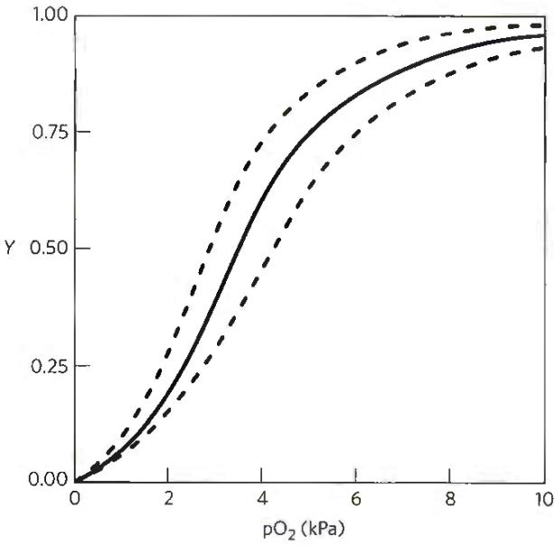

(a) an increase in the concentration of $CO_{2}$

(b) an increase in the proton concentration (decrease in pH)

(c) an increase in the concentration of 2,3-bisphosphoglycerate (BPG)

9. Comparison of Fetal and Maternal Hemoglobins
Studies of oxygen transport in pregnant mammals show that the O₂-saturation curves of fetal and maternal blood are markedly different when measured under the same conditions. Fetal erythrocytes contain a structural variant of hemoglobin, HbF, consisting of two α and two γ subunits (α₂γ₂), whereas maternal erythrocytes contain HbA (α₂β₂).

(a) Which hemoglobin has a higher affinity for oxygen under physiologic conditions?

(b) What is the physiological significance of the different $O_{2}$ affinities?

When all the BPG is carefully removed from samples of HbA and HbF, the measured $O_{2}$ -saturation curves (and consequently the $O_{2}$ affinities) are displaced to the left. However, HbA now has a greater affinity for oxygen than does HbF. When BPG is reintroduced, the $O_{2}$ -saturation curves return to normal, as shown in the graph.

  
(c) What is the effect of BPG on the $O_{2}$ affinity of hemoglobin? How can this information be used to explain the different $O_{2}$ affinities of fetal and maternal hemoglobin?

10. Hemoglobin Variants There are almost 500 naturally occurring variants of hemoglobin. Most are the result of a single amino acid substitution in a globin polypeptide chain. Some variants produce clinical illness, though not all variants have deleterious effects. A brief sample of hemoglobin variants is shown here.

HbS (sickle cell Hb): substitutes a Val for a Glu on the surface
Hb Cowtown: eliminates an ion pair involved in T-state stabilization

Hb Memphis: substitutes one uncharged polar residue for another of similar size on the surface

Hb Bibba: substitutes a Pro for a Leu involved in an $\alpha$ helix

Hb Milwaukee: substitutes a Glu for a Val

Hb Providence: substitutes an Asn for a Lys that normally projects into the central cavity of the tetramer

Hb Philly: substitutes a Phe for a Tyr, disrupting hydrogen bonding at the $\alpha_{1}\beta_{1}$ interface

Select the hemoglobin variants that are described by each statement.

(a) The Hb variant least likely to cause pathological symptoms  
(b) The variant(s) most likely to show pI values different from that of HbA on an isoelectric focusing gel

(c) The variant(s) most likely to show a decrease in BPG binding and an increase in the overall affinity of the hemoglobin for oxygen

11. Oxygen Binding and Hemoglobin Structure A team of biochemists uses genetic engineering to modify the interface region between hemoglobin subunits. The resulting hemoglobin variants exist in solution primarily as $\alpha\beta$ dimers (few, if any, $\alpha_{2}\beta_{2}$ tetramers form). Are these variants likely to bind oxygen more weakly or more tightly? Explain your answer.

12. Reversible (and Tight) Binding to an Antibody An antibody with high affinity for its antigen has a $K_{d}$ in the low nanomolar range. Assume an antibody binds an antigen with a $K_{d}$ of $5 \times 10^{-8}$ M. Calculate the antigen concentration when Y, the fraction of binding sites occupied by the ligand, is (a) 0.4, (b) 0.5, (c) 0.8, (d) 0.9.

13. Using Antibodies to Probe Structure-Function Relationships in Proteins A monoclonal antibody binds to G-actin but not to F-actin. What does this tell you about the epitope recognized by the antibody?

14. The Immune System and Vaccines Some pathogens have developed mechanisms to evade the immune system, making it difficult or impossible to develop effective vaccines against them.

(a) African sleeping sickness is caused by a protozoan called Trypanosoma brucei, carried by the tsetse fly. The trypanosome surface is dominated by one coat protein, the variable surface glycoprotein (VSG). The trypanosome genome encodes over 1,000 different versions of VSG. All of the cells in an initial infection feature the same VSG coat on their surfaces, and this is readily recognized as foreign by the immune system. However, an individual trypanosome in the broader population will switch and randomly begin expressing a different variant of the VSG coat. All the descendants of that cell will have the new and different protein on their surface. As the population with the second VSG coat increases, an individual cell will then switch to a third VSG protein coat, and so on.

(b) The human immunodeficiency virus (HIV) has an error-prone system for replicating its genome, effectively introducing mutations at an unusually high rate. Many of the mutations affect the viral protein coat. Describe how each pathogen can survive the immune response of its host.

15. How We Become a "Stiff" When a vertebrate dies, its muscles stiffen as they are deprived of ATP, a state called rigor mortis. Using your knowledge of the catalytic cycle of myosin in muscle contraction, explain the molecular basis of the rigor state.

16. Sarcomeres from Another Point of View The symmetry of thick and thin filaments in a sarcomere is such that six thin filaments ordinarily surround each thick filament in a hexagonal array. Match each cross section (transverse cut) image of a sarcomere with the correct viewpoint.

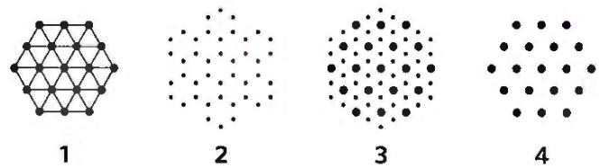

(a) at the M line

(b) through the I band

(c) through the dense region of the A band

(d) through the less dense region of the A band, adjacent to the M line (see Fig. 5-28b, c)

### [EN] BIOCHEMISTRY ONLINE

17. IgG and Lysozyme Crystal Structure To fully appreciate how proteins function in a cell, it is helpful to have a three-dimensional view of how proteins interact with other cellular components. Fortunately, this is possible using online protein databases and three-dimensional molecular viewing utilities such as JSmol, a free and user-friendly molecular viewer that is compatible with most browsers and operating systems.

In this exercise, examine the interactions between the enzyme lysozyme and the Fab portion of the antilysozyme antibody. Use the PDB identifier 1FDL to explore the structure of the IgG1 Fab fragment–lysozyme complex (antibody-antigen complex). To answer the questions, use the information on the Structure Summary page at the Protein Data Bank (www.rcsb.org), and view the structure using JSmol or a similar viewer.

(a) Which chains in the three-dimensional model correspond to the antibody fragment, and which correspond to the antigen, lysozyme?

(b) What type of secondary structure predominates in this Fab fragment?

(c) How many amino acid residues are in the heavy and light chains of the Fab fragment? In lysozyme? Estimate the percentage of the lysozyme that interacts with the antigen-binding site of the antibody fragment.

(d) Identify the specific amino acid residues in lysozyme and in the variable regions of the Fab heavy and light chains that are situated at the antigen-antibody interface. Are the residues contiguous in the primary sequence of the polypeptide chains?

18. Exploring Antibodies in the Protein Data Bank The PDB-101 Molecule of the Month article on "Antibodies" (http://pdb101.rcsb.org/motm/21) summarizes what you have read in this chapter regarding antibody structure and function. To paraphrase the article, a variety of antibodies, on the order of one hundred million different types, are always circulating in our bloodstream, searching for foreign invaders to attack. Once an invader is discovered, the antibody binds the invader with its flexible arms, containing the Fab region. Thin, flexible chains connect these flexible arms to the antibody base, called the Fc region. This base determines which class the antibody belongs to, as some antibodies have four or ten binding sites due to their structural formation.

(a) How many specific antigen-binding sites are there on the first immunoglobulin image (derived from PDB ID 1IGT) in the article?

(b) When a virus enters your lungs, how long does it take for you to produce one or more antibodies that bind to it?

(c) Approximately how many types of different antibodies are present in your blood?

(d) Explore the structure of the immunoglobulin molecule (PDB ID 1IGT) by clicking the link in the article or by using a search engine to find the structure summary for PDB ID 1IGT. Use one of the 3D viewers on the PDB site to view a ribbon structure for this immunoglobulin. Identify the two light chains and two heavy chains (use the viewer controls to distinguish them by color).

### [EN] DATA ANALYSIS PROBLEM

19. Protein Function During the 1980s, the structures of actin and myosin were known only at the resolution shown in Figure 5-26a. Although researchers knew that the globular head portion of myosin bound to actin and hydrolyzed ATP, there was a substantial debate about where in the myosin molecule the contractile force was generated. At the time, two competing models were proposed for the mechanism of force generation in myosin.

In the "hinge" model, the head bound to actin, but the pulling force was generated by contraction of the "hinge region" in the myosin tail. The hinge region is in the heavy meromyosin portion of the myosin molecule; this is roughly the point labeled "Two supercoiled $\alpha$ helices" in Figure 5-26. In the "S1" model (S1 being a name used to describe the head), the pulling force was generated in the S1 "head" itself and the tail was just for structural support.

Many experiments were performed but provided no conclusive evidence. Then, in 1987, James Spudich and his colleagues at Stanford University published a study that, although not conclusive, went a long way toward resolving this controversy.

Recombinant DNA techniques were not sufficiently developed to address this issue in vivo, so Spudich and colleagues used an interesting in vitro motility assay. The alga Nitella has extremely long cells, often several centimeters long and about 1 mm in diameter. These cells have actin fibers that run along their long axes, and the cells can be cut open along their length to expose the actin fibers. Spudich and his group had observed that plastic beads coated with myosin would "walk" along these fibers in the presence of ATP, just as myosin would do in contracting muscle.

For these experiments, the researchers used a more well-defined method for attaching the myosin to the beads. The "beads" were clumps of killed bacterial (Staphylococcus aureus) cells. These cells have a protein on their surface that binds to the Fc region of antibody molecules (Fig. 5-20a). The antibodies, in turn, bind to several (unknown) places along the tail of the myosin molecule. When bead-antibody-myosin complexes were prepared with intact myosin molecules, they would move along Nitella actin fibers in the presence of ATP.

(a) Sketch a diagram showing what a bead-antibody-myosin complex might look like at the molecular level.

(b) Why was ATP required for the beads to move along the actin fibers?

(c) Spudich and coworkers used antibodies that bound to the myosin tail. Why would this experiment have failed if they had used an antibody that bound to the part of S1 that normally bound to actin? Why would this experiment have failed if they had used an antibody that bound to actin?

To help focus on the part of myosin responsible for force production, Spudich and colleagues used trypsin to produce two partial myosin molecules: heavy meromyosin (HMM) and light meromyosin (LMM), by cleavage of a single specific peptide bond in the myosin tail. Additional incubation with trypsin produced an additional cleavage, eliminating more of the tail and the hinge region to generate short heavy meromyosin (SHMM).

(d) Why might trypsin attack this peptide bond first, rather than other peptide bonds in myosin?

Spudich and colleagues prepared bead-antibody-myosin complexes with varying amounts of myosin, HMM, or SHMM and measured their speed of movement along Nitella actin fibers in the presence of ATP. The graph below sketches their results.

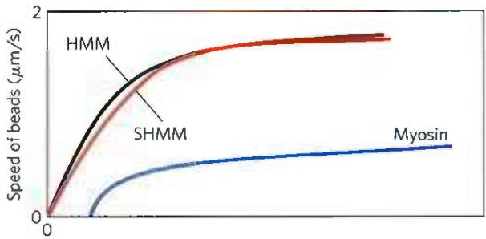  
Density of myosin or myosin fragment bound to beads

(e) Which model ("S1" or "hinge") is consistent with these results? Explain your reasoning.

(f) Provide a plausible explanation for the increased speed of the beads with increasing myosin density.

(g) Provide a plausible explanation for the plateauing of the speed of the beads at high myosin density.

### [EN] Reference

Hynes, T.R., S.M. Block, B.T. White, and J.A. Spudich. 1987. Movement of myosin fragments in vitro: domains involved in force production. Cell 48:953–963.

### [EN] Abbreviated Solutions — Chapter 5

1. Protein B has a higher affinity for ligand X; its lower $K_{d}$ indicates that protein B will be half-saturated at a much lower concentration of X than will protein A. Protein A has $K_{a} = 3.3 \times 10^{6} M^{-1}$ ; protein B has $K_{a} = 2.5 \times 10^{7} M^{-1}$ .

2. (a) $n_{H} < 1.0$ can mean that the protein exhibits negative cooperativity, where the binding of one ligand to the protein decreases its affinity for other ligand molecules. (b), (c) There are some instances where $n_{H} < 1.0$ occurs without true negative cooperativity. For example, $n_{H} < 1.0$ could also occur if a single polypeptide contained multiple binding sites that had a different affinity for the ligand. If a protein preparation contains a heterogeneous mixture of the protein where some molecules are partially denatured, the measured binding affinity would be artificially decreased, resulting in $n_{H} < 1.0$ . (d) If a protein has multiple ligand binding sites that all have the same binding affinity and do not affect one another, no cooperativity, positive or negative, will be observed.

$$
3. k _ {\mathrm{d}} = 8. 9 \times 1 0 ^ {- 5} \mathrm{s} ^ {- 1}
$$

4. (a) 33 nm, (b) 0.15 μm, (c) 1.9 μm

5. (a) $K_{d} = 4.0 \, nm$ (shortcut: the $K_{d}$ is equivalent to the ligand concentration where Y = 0.5). (b) The rat receptor has the highest affinity, as it has the lowest $K_{d}$ .

6. Tight binding of CO to a few binding sites in a hemoglobin tetramer tends to force the entire protein into the R state. $O_{2}$ can still bind to the unoccupied sites, but it will bind tightly and not be released into the tissues.

7. The cooperative behavior of hemoglobin arises from subunit interactions.

8. (a) Shift the curve to the right. (b) Shift the curve to the right. (c) Shift the curve to the right. All of these conditions would decrease the affinity of hemoglobin for $O_{2}$ .

9. (a) The observation that HbA (maternal) is about 60% saturated when the pO₂ is 4 kPa, whereas HbF (fetal) is more than 90% saturated under the same physiological conditions, indicates that HbF has a higher O₂ affinity than HbA. (b) The higher O₂ affinity of HbF ensures that oxygen will flow from maternal blood to fetal blood in the placenta. Fetal blood approaches full saturation where the O₂ affinity of HbA is low. (c) The observation that the O₂-saturation curve of HbA undergoes a larger shift on BPG binding than that of HbF suggests that HbA binds BPG more tightly than does HbF. Differential binding of BPG to the two hemoglobins may determine the difference in their O₂ affinities.

10. (a) Hb Memphis (b) HbS, Hb Milwaukee, Hb Providence, and possibly Hb Cowtown (c) Hb Providence

11. More tightly. An inability to form tetramers would limit the cooperativity of these variants, and the binding curve would become more hyperbolic. Also, the BPG-binding site would be disrupted. Oxygen binding would probably be tighter, because the default state in the absence of bound BPG is the tight-binding R state.

12. (a) $3.3 \times 10^{-8} \mathrm{M}$ (b) $5 \times 10^{-8} \mathrm{M}$ (c) $2 \times 10^{-7} \mathrm{M}$ (d) $4.5 \times 10^{-7} \mathrm{M}$ . Note that a rearrangement of Eqn 5-8 gives $[\mathrm{L}] = YK_{\mathrm{d}} / (1 - Y)$ .

13. The epitope is likely to be a structure that is buried when G-actin polymerizes to form F-actin.

14. (a) The human immune system requires several days to mount a staged response to antigens on the surface of a pathogen. Both trypanosomes and HIV evade the immune system by altering the surface proteins to which immune system components initially bind. Thus, the host organism regularly faces new antigens and requires time to mount an immune response to each one, giving the pathogen time to replicate and spread. HIV also evades the immune system by actively infecting and destroying immune system cells—namely, helper T cells ( $T_{H}$ cells).

15. Binding of ATP to myosin triggers dissociation of myosin from the actin thin filament. In the absence of ATP, actin and myosin bind tightly to each other.

#### [EN] 16. (a) 2 (b) 3 (c) 1 (d) 4

17. (a) Chain L is the light chain and chain H is the heavy chain of the Fab fragment. Chain Y is lysozyme. (b) $\beta$ conformation structures are predominant in the variable and constant regions of the fragment. (c) Fab heavy-chain fragment: 218 amino acid residues; light-chain fragment: 214; lysozyme: 129. Less than 15% of the lysozyme molecule is in contact with the Fab fragment. (d) Residues that seem to be in contact with lysozyme include, in the H chain: Gly $^{31}$ , Tyr $^{32}$ , Arg $^{99}$ , Asp $^{100}$ , and Tyr $^{101}$ ; in the L chain: Tyr $^{32}$ , Tyr $^{49}$ , Tyr $^{50}$ , and Trp $^{92}$ . In lysozyme, residues Asn $^{19}$ , Gly $^{22}$ , Tyr $^{23}$ , Ser $^{24}$ , Lys $^{116}$ , Gly $^{117}$ , Thr $^{118}$ , Asp $^{119}$ , Gln $^{121}$ , and Arg $^{125}$ seem to be situated at the antigen-antibody interface. Not all of these residues are adjacent in the primary structure. Folding of the polypeptide into higher levels of structure brings nonconsecutive residues together to form the antigen-binding site.

18. (a) 2 (b) Instantly. Suitable antibodies are almost always present before any challenge from the virus. (c) >100,000,000

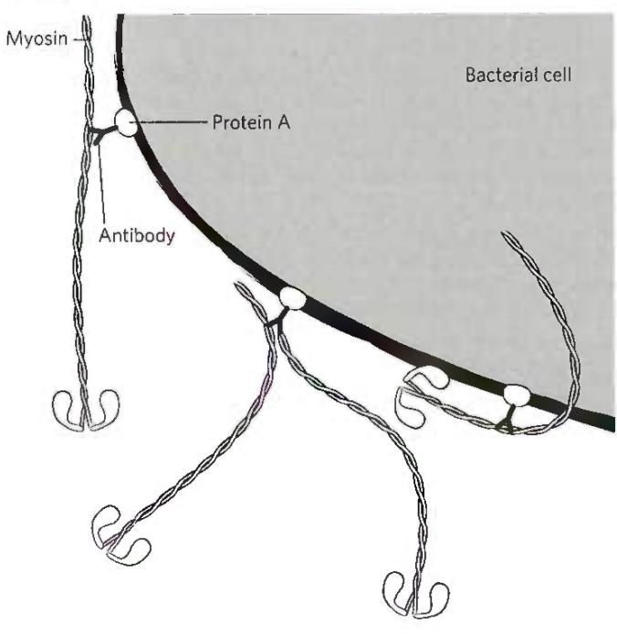

The drawing is not to scale; any given cell would have many more myosin molecules on its surface. (b) ATP is needed to provide the chemical energy to drive the motion (see Chapter 13). (c) An antibody that bound to the myosin tail, the actin-binding site, would block actin binding and prevent movement. An antibody that bound to actin would also prevent actin-myosin interaction and thus movement. (d) There are two possible explanations: (1) Trypsin cleaves only at Lys and Arg residues (see Table 3-6), so would not cleave at many sites in the protein. (2) Not all Arg or Lys residues are equally accessible to trypsin; the most-exposed sites would be cleaved first. (e) The S1 model. The hinge model predicts that bead-antibody-HMM complexes (with the hinge) would move, but bead-antibody-SHMM complexes (no hinge) would not. The S1 model predicts that because both complexes include S1, both would move. The finding that the beads move with SHMM (no hinge) is consistent only with the S1 model. (f) With fewer myosin molecules bound, the beads could temporarily fall off the actin as a myosin let go of it. The beads would then move more slowly, as time is required for a second myosin to bind. At higher myosin density, as one myosin lets go, another quickly binds, leading to faster motion. (g) Above a certain density, what limits the rate of movement is the intrinsic speed with which myosin molecules move the beads. The myosin molecules are moving at a maximum rate; adding more will not increase speed.

<!-- EN-END 第5章章末 -->
