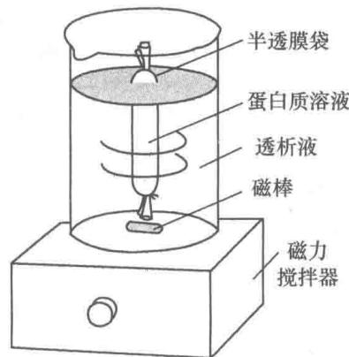
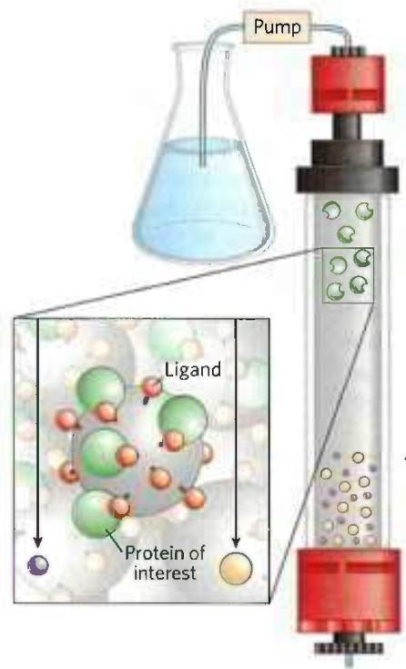
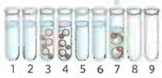
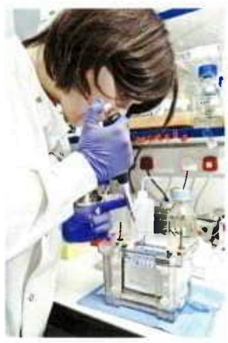
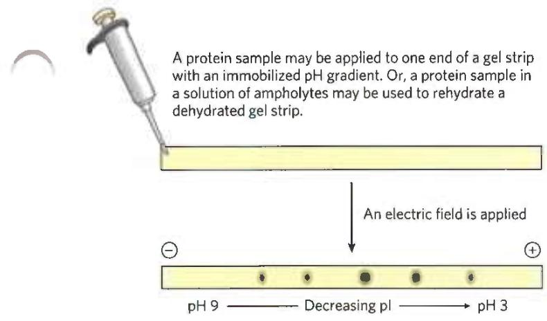
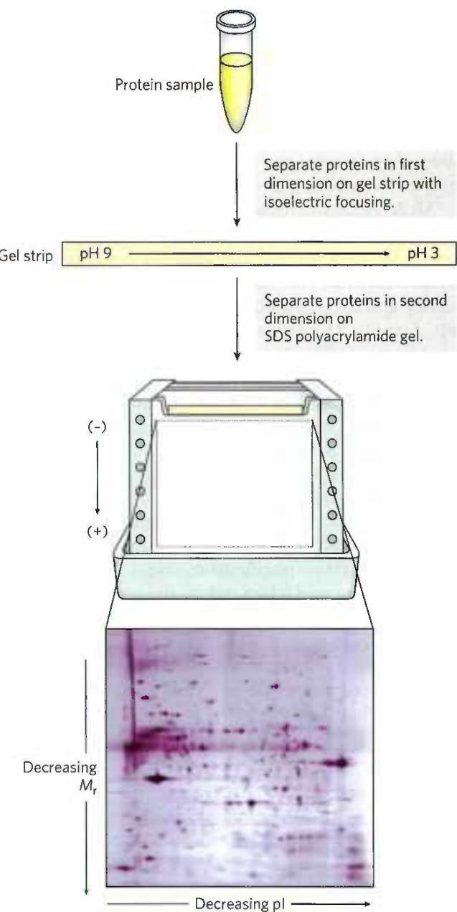
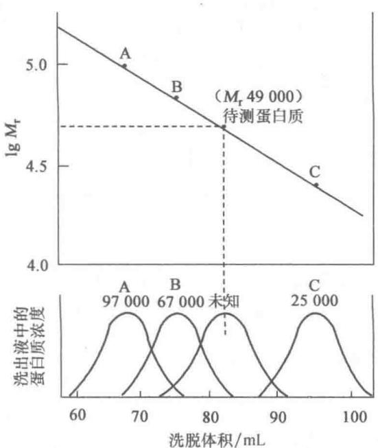
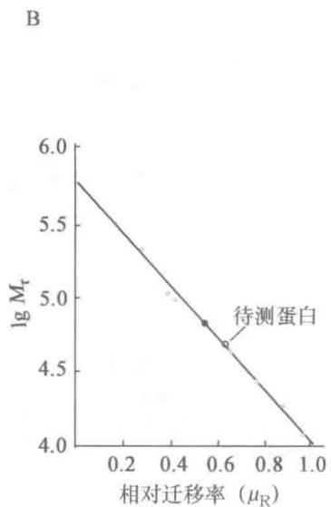
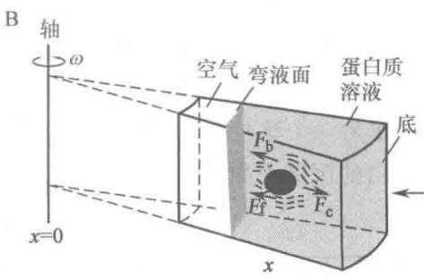

# 第5章 蛋白质的性质、分离纯化和鉴定

> **本章英文对应内容**（Lehninger，插在所列中文小节末尾）
>
> - §3.3（第3章）→ 三、蛋白质分离纯化的方法

蛋白质的来源是动、植物组织或微生物细胞，近年来还有基因工程的表达产物。分离蛋白质的目的是多种多样的。研究某种蛋白质的分子结构、氨基酸组成、化学和物理性质，需要纯的、均一的甚至是结晶的蛋白质样品。研究活性蛋白质的生物学功能，需要样品保持天然构象，避免因变性而丢失活性。在制药工业中，需要把某种具有特殊功能的蛋白质纯化到规定的要求，特别要注意把一些具有干扰或拮抗性质的成分除去。总之，在实际工作中应根据研究工作和生产的具体目的和要求，制订出分离纯化的合理程序。本章将介绍蛋白质分离、纯化的一般程序和方法。分离纯化的各种方法主要是利用蛋白质之间各种性质的差异，包括分子大小、电荷、溶解度和结合性质，也即都来自蛋白质化学（protein chemistry），这是一门几乎与生物化学本身同龄的科目，曾一直在生物化学研究中保持中心地位。因此在讲述蛋白质分离纯化方法的同时，还将适当地介绍蛋白质在水溶液中的行为包括它的酸碱性质、胶体性质和沉淀，蛋白质的相对分子质量 $(M_{r})$ 测定以及蛋白质的含量测定和纯度鉴定等。

## 一、蛋白质在水溶液中的行为

## （一）蛋白质的酸碱性质

蛋白质分子由氨基酸组成，在蛋白质分子中保留着游离的末端 $\alpha-$ 氨基和 $\alpha-$ 羧基以及侧链上的各种官能团。因此蛋白质的化学和物理化学性质有些是与氨基酸相同的，例如，侧链上官能团的化学反应，分子的两性电解质性质等。

蛋白质也是一类两性电解质，能和酸或碱发生作用。在蛋白质分子中，可解离基团主要来自侧链上的官能团（表5-1）。此外还有少数的末端 $\alpha$ -羧基和末端 $\alpha$ -氨基。如果是缀合蛋白质，则还有辅基成分所包含的可解离基团。蛋白质分子可解离基团的 $\mathrm{pK}_{\mathrm{a}}$ 值列于表5-1。它们和游离氨基酸中相应基团的 $\mathrm{pK}_{\mathrm{a}}$ 值不完全相同，这是由于在蛋白质分子中受到邻近电荷的影响造成的。

表 5-1 蛋白质分子中可解离基团的 $\mathrm{p}{K}_{\mathrm{a}}$ 值

<table><tr><td>基团</td><td>酸</td><td> $\rightleftharpoons$ </td><td>碱+ $H^{+}$ </td><td> $pK_{a}(25^{\circ}C)$ </td></tr><tr><td> $\alpha$ -羧基</td><td>—COOH</td><td> $\rightleftharpoons$ </td><td> $—COO^{-} + H^{+}$ </td><td>3.0~3.2</td></tr><tr><td> $\beta$ -羧基(Asp)</td><td>—COOH</td><td> $\rightleftharpoons$ </td><td> $—COO^{-} + H^{+}$ </td><td>3.0~4.7</td></tr><tr><td> $\gamma$ -羧基(Glu)</td><td>—COOH</td><td> $\rightleftharpoons$ </td><td> $—COO^{-} + H^{+}$ </td><td>4.4</td></tr><tr><td> $\varepsilon$ -咪唑基(His)</td><td></td><td> $\rightleftharpoons$ </td><td></td><td>5.6~7.0</td></tr><tr><td> $\alpha$ -氨基</td><td> $—NH_{3}^{+}$ </td><td> $\rightleftharpoons$ </td><td> $—NH_{2} + H^{+}$ </td><td>7.6~8.4</td></tr><tr><td> $\varepsilon$ -氨基(Lys)</td><td> $—NH_{3}^{+}$ </td><td> $\rightleftharpoons$ </td><td> $—NH_{2} + H^{+}$ </td><td>9.4~10.6</td></tr><tr><td>巯基(Cys)</td><td>—SH</td><td> $\rightleftharpoons$ </td><td> $—S^{-} + H^{+}$ </td><td>9.1~10.8</td></tr><tr><td>苯酚基(Tyr)</td><td></td><td> $\rightleftharpoons$ </td><td> $—\text{苯环}—O^{-} + H^{+}$ </td><td>9.8~10.4</td></tr><tr><td>胍基(Arg)</td><td> $—C—NH_{3}^{+}$  $\rightleftharpoons$ NH</td><td> $\rightleftharpoons$ </td><td> $—C—NH_{2}—NH + H^{+}$ </td><td>11.6~12.6</td></tr></table>

天然球状蛋白质的可解离基团大多数可被滴定,某些天然蛋白质中有一些可解离基团由于埋藏在分子内部或参与氢键形成而不能被滴定。例如肌红蛋白中,11个组氨酸残基有5个侧链基团在变性前不能被滴定。但是所有的天然球状蛋白质处于变性状态时,可解离基团全部可被滴定。

可以把蛋白质分子看作是一个多价离子,所带电荷的性质和数量是由蛋白质分子中的可解离基团的种类和数目以及溶液的 pH 所决定的。对某一种蛋白质来说,在某一 pH 时,它所带的正电荷与负电荷恰好相等,也即净电荷为零,这一 pH 称为蛋白质的等电点。表 5-2 列出几种蛋白质的等电点。蛋白质的等电点和它所含的酸性氨基酸和碱性氨基酸的数目比例有关。表 5-3 给出几种蛋白质中碱性氨基酸与酸性氨基酸(酰胺化的酸性氨基酸已减去)的残基数目和它们之间的比例,这个比例和等电点之间有一定的关系。

表 5-2 几种蛋白质的等电点

<table><tr><td>蛋白质</td><td>等电点</td><td>蛋白质</td><td>等电点</td></tr><tr><td>胃蛋白酶</td><td>1.0</td><td>肌球蛋白</td><td>7.0</td></tr><tr><td>卵清蛋白</td><td>4.6</td><td>α-胰凝乳蛋白酶</td><td>8.3</td></tr><tr><td>血清清蛋白</td><td>4.7</td><td>α-胰凝乳蛋白酶原</td><td>9.1</td></tr><tr><td>β-乳球蛋白</td><td>5.2</td><td>核糖核酸酶</td><td>9.5</td></tr><tr><td>胰岛素</td><td>5.3</td><td>细胞色素c</td><td>10.7</td></tr><tr><td>血红蛋白</td><td>6.7</td><td>溶菌酶</td><td>11.0</td></tr></table>

表 5-3 蛋白质的酸性氨基酸和碱性氨基酸含量与等电点的关系

<table><tr><td>蛋白质</td><td>酸性氨基酸(残基数/蛋白质分子)</td><td>碱性氨基酸(残基数/蛋白质分子)</td><td>碱性残基数酸性残基数</td><td>等电点</td></tr><tr><td>胃蛋白酶</td><td>37</td><td>6</td><td>0.2</td><td>1.0</td></tr><tr><td>血清清蛋白</td><td>82</td><td>99</td><td>1.2</td><td>4.7</td></tr><tr><td>血红蛋白</td><td>53</td><td>88</td><td>1.7</td><td>6.7</td></tr><tr><td>核糖核酸酶</td><td>7</td><td>20</td><td>2.9</td><td>9.5</td></tr></table>

蛋白质的滴定曲线形状和等电点,在有中性盐存在下可以发生明显的变化。这是由于蛋白质分子中的某些解离基团可以与中性盐中的阳离子如 $Ca^{2+}$ 、 $Mg^{2+}$ 或阴离子如 $Cl^{-}$ 、 $HPO_{4}^{2-}$ 相结合,因此观察到的蛋白质等电点在一定程度上决定于介质中离子的组成。没有其他盐类干扰时,蛋白质质子供体基团解离出来的质子数与质子受体基团结合的质子数相等时的 pH 称为等离子点(isoionic point),等离子点是蛋白质的一个特征常数。

## （二）蛋白质的胶体性质

蛋白质溶液是一种分散系统（disperse system）。在这种分散系统中，蛋白质是分散相（disperse phase），水是分散介质（disperse medium），是连续相。就其分散程度来说，蛋白质溶液属于胶体[分散]系统（colloidal system），是由蛋白质分子与溶剂（水）所构成的均相系统，但是它的分散相质点是分子本身，在这个意义上说它又是一种真溶液。分散程度以分散相质点的半径来衡量。根据分散程度可以把分散系统分为3类：① 分散相质点的半径<1 nm 的为真溶液，② >100 nm 的为悬浊液，③ 介于1到100 nm之间的为胶体溶液。

分散相的质点在胶体系统中保持稳定,需要具备3个条件:① 分散相的质点大小在1\~100 nm范围内,这样大小的质点在动力学上是稳定的,介质分子对这种质点碰撞的合力不等于零,使它能在介质中作布朗运动(Brown movement);② 分散相的质点带有同种符号的净电荷,互相排斥,不易聚集成大颗粒而产生沉淀;③ 分散相的质点能与溶剂形成溶剂化层,例如与水形成水化层,质点有了水化层,相互间不易靠拢而聚集。

从蛋白质相对分子质量的测定和形状的观测知道,蛋白质的分子大小属于胶体质点的范围。蛋白质溶液是一种亲水胶体(hydrophilic colloid)。蛋白质分子表面的亲水基团,如—NH₂、—COOH、—OH以及—CO—NH—等,在水溶液中能与水分子发生水化作用(hydration),使蛋白质分子表面形成一个水化层,每克蛋白质分子能结合0.3\~0.5g水。一种蛋白质分子在适当的pH条件下都带有同种符号的净电荷。蛋白质溶液由于蛋白质分子具有水化层与电荷两种稳定因素,所以作为胶体系统是相当稳定的,如无外界因素的影响,就不致互相聚集而沉淀。蛋白质溶液也和一般的胶体系统一样具有丁达尔效应(Tyndall effect)、布朗运动以及不能通过半透膜(semipermeable membrane)等性质。

## （三）蛋白质的沉淀

蛋白质在溶液中的稳定性是有条件的、相对的。如果条件发生改变，破坏了蛋白质溶液的稳定性，蛋白质就会从溶液中沉淀出来。蛋白质溶液的稳定性既然与质点大小、电荷和水化作用有关，那么很自然，任何影响这些条件的因素都会影响蛋白质溶液的稳定性。例如在蛋白质溶液中加入脱水剂（dehydrating agent）以除去它的水化层，或者改变溶液的 pH 达到蛋白质的等电点使质点的净电荷为零，蛋白质分子则聚集成大的颗粒而沉淀。

沉淀蛋白质的方法有以下几种：

（1）盐析法 向蛋白质溶液中加入大量的中性盐（如硫酸铵、硫酸钠或氯化钠等），使蛋白质脱去水化层而聚集沉淀。盐析沉淀一般不引起蛋白质变性。当除去盐后，复可溶解。

（2）有机溶剂沉淀法 向蛋白质溶液中加入一定量的极性有机溶剂（如甲醇、乙醇或丙酮等），因引起蛋白质脱去水化层以及降低介电常数而增加异性电荷间的相互作用，致使蛋白质颗粒容易聚集而沉淀。有机溶剂可引起蛋白质变性，但如果在低温下操作，并且尽量缩短处理时间则可使变性速度减慢。

（3）重金属盐沉淀法 当溶液 pH 大于等电点时，蛋白质颗粒带负电荷，这样它就容易与重金属离子（如 $Hg^{2+}$ 、 $Pb^{2+}$ 、 $Cu^{2+}$ 、 $Ag^{+}$ 等）结合成不溶性盐而沉淀。误服重金属盐的病人可口服大量牛乳或豆浆等蛋白质进行解救就是因为它能与重金属离子形成不溶性盐，然后再服用催吐剂把它排出体外。

（4）生物碱试剂和某些酸沉淀法 生物碱试剂是指能引起生物碱(alkaloid)沉淀的一类试剂,如鞣酸也称单宁酸(tannic acid),苦味酸(picric acid)即2,4,6-三硝基酚,钨酸(tungstic acid, $\mathrm{HWO}_{4}$ )和碘化钾等。某些酸指的是三氯醋酸,磺基水杨酸(sulfosalicylic acid)和硝酸等。当溶液pH小于等电点时,蛋白质颗粒带正电荷,容易跟生物碱试剂和某些酸的酸根负离子发生反应生成不溶性盐而沉淀。这类沉淀反应经常被临床检验部门用来除去体液中干扰某些指标测定的蛋白质。

（5）加热变性沉淀法 几乎所有的蛋白质都因加热变性而凝固。少量盐类促进蛋白质加热凝固。当蛋白质处于等电点时，加热凝固最完全和最迅速。加热变性引起蛋白质凝固沉淀的原因可能是由于热变性使蛋白质天然构象解体，疏水基外露，因而破坏了水化层，同时由于蛋白质处于等电点也破坏了带电状态。我国很早就创造了将大豆蛋白质的浓溶液加热并点入少量盐卤（含 $MgCl_{2}$ ）的制豆腐方法，这是成功应用加热变性沉淀蛋白质的一个例子。

## 二、蛋白质分离纯化的一般程序

蛋白质的提取(isolation)、分离(separation)和纯化(purification)是艰巨、繁重、费时而又不可缺少的工作。虽然蛋白质的分离纯化技术有了长足发展，但对蛋白质和纯蛋白质的需要也日益增加，特别是在医药领域。今天基因工程生产蛋白质已发展成产业，因此高效、大规模和低成本地分离蛋白质产品显得十分重要。另外，对众多的分离纯化方法如何进行选择、组合和优化也需要进一步的研究。

蛋白质在组织和细胞中一般都是以复杂的混合物形式存在,每种类型的细胞都含有几千种不同的蛋白质。到目前为止,还没有一个单独的或一套现成的方法能把任何一种蛋白质从复杂的混合蛋白质中分离纯化出来。但是对于任何一种蛋白质都有可能选择一套适当的分离纯化程序以获得高纯度的制品（preparation）。现在已有几百种蛋白质得到结晶,上千种蛋白质获得高纯度的制品。蛋白质纯化的总目标是增加制品的纯度(purity)或比活力,以增加单位蛋白质质量中所要蛋白质的含量或生物活性(以活性单位/毫克蛋白质表示),并希望所得蛋白质的产量达到最高值。

分离纯化某种蛋白质的一般程序可以分为前处理、粗分级分离和细分级分离，有时还加上结晶步骤：

## 1. 前处理 (pretreatment)

分离纯化某一种蛋白质,首先要求把蛋白质从原来的组织或细胞中以溶解的状态释放出来,并保持原来的天然状态,避免丢失生物活性。为此,动物材料应先剔除结缔组织包括脂肪组织;种子材料应先去壳和种皮以免受单宁等物质的污染,油料种子最好先用低沸点的有机溶剂如乙醚等脱脂。然后根据不同的情况,选择适当的方法,将组织和细胞破碎。动物组织可用电动捣碎机或称匀浆器(homogenizer)破碎或用超声处理(ultrasonication)破碎。植物组织由于具有由纤维素等物质组成的细胞壁,一般需要用与石英砂或玻璃粉和适当的缓冲液一起研磨的方法破碎或用纤维素酶(cellulase)处理也能达到目的。细菌细胞的破碎比较麻烦,因为整个细菌细胞壁的骨架实际上是一个借共价键连接而成的囊状肽聚糖(peptidoglycan)分子,非常坚韧。破碎细菌细胞的常用方法有超声震荡,与砂研磨或溶菌酶处理等。组织和细胞破碎以后,选择适当的缓冲液把所要的蛋白质提取出来。细胞碎片等不溶物离心或过滤除去,得到所谓粗提取液(crude extract)。

如果所要的蛋白质主要集中在某一亚细胞成分,如细胞核、染色体、核糖体或细胞溶胶等,则可利用差速离心(differential centrifugation)方法将它们分开(表5-4),收集该细胞器作为下步纯化的材料(制备型离心机图解见图5-5)。这样可以一下子除去很多杂蛋白质,使纯化工作容易得多。如果碰上所要蛋白质是跟细胞膜或膜质细胞器结合的,则必须利用超声波或去污剂使膜结构解聚,然后用适当的介质提取。

表 5-4 在不同离心场下沉降的细胞组分

<table><tr><td>相对离心场 $^1$ /g</td><td>时间/min</td><td>沉降的组分</td></tr><tr><td>1 000</td><td>5</td><td>真核细胞</td></tr><tr><td>4 000</td><td>10</td><td>叶绿体,细胞碎片,细胞核</td></tr><tr><td>15 000</td><td>20</td><td>线粒体,细菌</td></tr><tr><td>30 000</td><td>30</td><td>溶酶体,细菌细胞碎片</td></tr><tr><td>100 000</td><td>3~10(h)</td><td>核糖体</td></tr></table>

① 相对离心场或相对离心力(relative centrifugal field or force, RCF)是指单位质量(1 g)所受到的场或力,以重力加速度 $g(980.7\ \text{cm/s}^{2})$ 的倍数表示。RCF 与每分钟的转数(r/min)以及离心机转轴中心到离心管中间的距离,即平均半径 r (以 cm 表示)的关系为: $\mathrm{RCF}=\frac{4\pi^{2}(r/\min)^{2}r}{3600\times980}=11.19\times10^{-5}(r/\min)^{2}r$ 。

## 2. 粗分级分离 (rough fractionation)

当蛋白质提取液(有时还杂有核酸、多糖之类)获得后,选用一套适当的方法,将所要的蛋白质与其他杂蛋白质分离开来。一般这一步的分级[分离]用盐析、等电点沉淀和有机溶剂分级分离等方法。这些方法的特点是简便、处理量大,既能除去大量杂质,又能浓缩蛋白质溶液。有些蛋白质提取液不适于用沉淀法或盐析法浓缩的,则可采用超过滤或凝胶过滤、冷冻真空干燥或其他方法(如聚乙二醇浓缩法)进行浓缩。

## 3. 细分级分离 (fine fractionation)

也即制品的纯化。制品经粗分级分离后，一般体积较小，杂蛋白质大部分已被除去。纯化主要使用柱层析（column chromatography）方法，包括凝胶过滤层析，离子交换层析，吸附层析以及亲和层析等。柱层析是基于蛋白质电荷、大小、结合亲和力和其他性质的不同获得分离的，是蛋白质分离纯化的最有力方法。必要时还可选择电泳法，如凝胶电泳、等电聚焦作进一步的纯化，但电泳法主要用于分析分离和纯度鉴定。

## 4. 结晶(crystallization)

结晶是蛋白质分离纯化的最后步骤。尽管晶体并不能保证蛋白质一定是均一的，但只有某种蛋白质在溶液中数量上占优势时才能形成晶体。结晶过程本身伴随着一定程度的纯化，重结晶又可进一步剔去少量夹杂的蛋白质。由于晶体中从未发现过变性蛋白质，因此蛋白质晶体不仅是纯度的一个标志，也是断定制品处于天然状态的有力指标。结晶也是进行X射线晶体学分析所要求的，只有获得蛋白质晶体才能对它进行X射线结构分析。蛋白质纯度愈高，溶液愈浓就愈容易结晶。结晶的最佳条件是使溶液略处于过饱和状态，此时较易得到结晶。要得到适度的过饱和溶液，可借控制温度、加盐盐析、加有机溶剂或调节pH等方法来达到。晶体形成与蛋白质沉淀两者的原理是一样的，所不同的是晶体生长的速度要慢得多。

## 三、蛋白质分离纯化的方法

## （一）分离纯化方法的根据

## 1. 根据溶解度不同的分离方法

利用蛋白质溶解度的不同分离蛋白质是实践中最常用的方法。影响蛋白质溶解度的外部因素很多，其中主要有：① pH，② 离子强度，③ 介电常数，④ 温度。但在同一的特定外部条件下，不同蛋白质具有不同的溶解度，这是因为溶解度归根结底取决于蛋白质本身的分子结构，例如所带电荷的性质（正或负）和数量，分子表面上亲水基团与疏水基团的比例等。根据蛋白质分子结构的特点，适当地改变上面所说的外部因数，就可以选择性地控制蛋白质混合物中某种成分的溶解度，作为分离纯化所要蛋白质的一种手段。

利用这种手段的分离方法有等电点沉淀、盐析、有机溶剂分级分离、两相分配（如分配层析，它主要用于小分子纯化，见第2章）和结晶等。

## 2. 根据分子大小不同的分离方法

蛋白质分子最明显的特征之一是颗粒大，并且不同的蛋白质在分子大小方面是不同的（表2-8，图2-26），因此可以利用一些较简便的方法使蛋白质混合物分开，特别是很容易使蛋白质和小分子物质（杂质）分开。

有超过滤、凝胶过滤(分子筛)和超离心法包括密度梯度(区带)离心等。超离心技术由于需要昂贵的超速离心机,加之分离的规模有限,现在很少用于制备分离,但分析分离仍被广泛使用。

## 3. 利用电荷不同的分离方法

根据蛋白质的电荷不同即酸碱性质不同分离蛋白质混合物的方法有电泳（包括纸电泳、聚丙烯酰胺凝胶电泳（PAGE）、毛细管电泳、等电聚焦、双向电泳等）和离子交换层析等技术。注意，十二烷基硫酸钠-聚丙烯酰胺凝胶电泳（SDS-PAGE）不是根据蛋白质本身的电荷差别而是它们的质量和表面疏水性不同将蛋白质分离的。

## 4. 以疏水相互作用为基础的分离方法

属于这一类的方法有疏水相互作用层析、SDS-PAGE 和染料结合层析等。

## 5. 基于对生物配基的亲和力的分离方法

属于这一类的分离方法有各种亲和层析，包括免疫亲和层析、凝集素亲和层析和染料亲和层析等；以配位键为基础的金属螯合层析亦归属于这一类。亲和层析是基于所要蛋白质对含有配基的固定相的专一性结合——亲和力。深究其原因，亲和力的形成也是一组不同原理的弱相互作用的综合，包括荷电基团、氢键和疏水相互作用等。

上面 4、5 两类分离方法的依据没有本质上的区别,都是利用蛋白质的结合性质差异;或者说利用分离基质对蛋白质的吸附能力不同。所以它们都可归于吸附层析(adsorption chromatography)这一大类。

## （二）等电点沉淀和盐析

## 1. 等电点沉淀和 $\mathrm{pH}$ 控制

蛋白质是带有正、负电荷基团的两性电解质，带电基团的数量和性质则因 pH 不同而变化。某种蛋白质处于等电点时,其净电荷为零,由于这种蛋白质分子之间没有净电斥力而趋于聚集沉淀。因此在其他条件相同时,它的溶解度达到最低点。在离开等电点的 pH 时,蛋白质分子因携带同种符号的净电荷而相互排斥,阻止分子聚集成沉淀,因此溶解度较大。图 5-1 说明 β-乳球蛋白的溶解度在其等电点 (pH 5.2\~5.3) 时达到最低值,在等电点两侧的 pH,其溶解度迅速上升;此图还说明氯化钠浓度对 pH 与溶解度的关系无多大影响。不同的蛋白质具有不同的等电点,利用蛋白质在等电点时溶解度最低的原理,可以把蛋白质混合物分开。当 pH 被调至混合蛋白质中某一成分的等电 pH 时,这种蛋白质的大部分或全部将沉淀下来,那些等电点不在此 pH 的蛋白质则仍留在溶液中。这样沉淀出来的蛋白质保持着天然构象,能重新溶解于适当的 pH 和一定浓度的盐溶液中。

## 2. 蛋白质的盐溶和盐析

中性盐对球状蛋白质的溶解度有显著的影响。低浓度时如图5-2所示，中性盐可以增加蛋白质的溶解度，这种现象称为盐溶（salting in）。盐溶作用主要是由于蛋白质分子吸附某种盐类离子后，带电层使蛋白质分子彼此排斥，而蛋白质分子与水分子间的相互作用却加强，因而溶解度增高。

  
图 5-1 pH 和离子强度对 $\beta$ -乳球蛋白溶解度的影响

  
图 5-2 等电点时中性盐( $K_{2}SO_{4}$ )对一氧化碳-血红蛋白溶解度的影响  
(图中曲线上的数值为氯化钠的浓度)

从图 5-2 可以看出, 当溶液的离子强度增加到一定数值时, 蛋白质溶解度开始下降。当离子强度增加到足够高时, 例如饱和或半饱和的程度, 很多蛋白质可以从水溶液中沉淀出来, 这种现象称为盐析 (salting out)。盐析作用主要是由于大量中性盐的加入使水的活度降低, 原来溶液中的大部分甚至全部的自由水转变为盐离子的水化水 (water of hydration)。此时那些被迫与蛋白质分子表面的疏水基团接触并掩盖它们的水分子 (笼形壳, 见第 1 章) 也成盐离子的水化水, 留下暴露出来的疏水基团。随着盐浓度的增加, 蛋白质疏水表面进一步暴露, 由于疏水作用蛋白质聚集而沉淀。因此最先聚集的蛋白质是表面上疏水残基最多的蛋白质。盐析法是蛋白质分离过程中最常用的方法之一。研究得最多的蛋白质之一, 鸡蛋清的卵清蛋白就是用盐析法得到的。鸡蛋清用水稀释后, 加入硫酸铵至半饱和, 其中的球蛋白立即沉淀析出 (表 2-6), 过滤后, 酸化至 pH 4.6\~4.8 (卵清蛋白的等电点), 在 $20^{\circ} \mathrm{C}$ 放置, 即得卵清蛋白晶体。牛胰中的一些蛋白水解酶及其酶原如胰凝乳蛋白酶原、 $\alpha-$ 胰凝乳蛋白酶和胰蛋白酶都是用硫酸铵和硫酸镁盐析的方法分离纯化并获得结晶。由于盐析分离出来的蛋白质保持着它的天然构象, 能再溶解; 并经多种方法鉴定产品是均一的, 可见在一些情况下, 盐析是一种非常有效的分离方法。

用于盐析的中性盐以硫酸铵为最佳,因为它在水中的溶解度很高,而溶解度的温度系数较低。应当指出,同样浓度的二价离子中性盐,如 $\mathrm{MgCl}_{2}$ 、 $(\mathrm{NH}_{4})_{2}\mathrm{SO}_{4}$ 对蛋白质溶解度影响,要比单价中性盐如 NaCl、 $NH_{4}Cl$ 大得多。中性盐影响蛋白质溶解度的能力是它们的离子强度的函数(图 5-2)。离子强度(ionic strength)可以定义为:

$$
I = \frac {1}{2} \sum c _ {i} Z _ {i} ^ {2}
$$

式中， $c_{i}$ 为各种离子的浓度（单位 mol/L）， $Z_{i}$ 为各种离子的净电荷（与符号无关）； $\sum$ 是表示加成的符号。计算溶液的离子浓度，可将各种离子的浓度分别乘以各种离子所带的净电荷的平方，然后将所有乘积相加并除以 2。例如 2 mol/L 硫酸铵溶液的离子强度为：

$$
\frac {(4 \times 1) + (2 \times 4)}{2} = 6
$$

注意,计算离子强度时,仅用离子的净电荷,因为未解离的电解质(如未解离的醋酸)或携带正负电荷数相等的兼性离子(如中性氨基酸)并不增强溶液的离子强度。

## （三）有机溶剂分级分离

与水互溶的有机溶剂(如甲醇、乙醇和丙酮等)能使蛋白质在水中的溶解度显著降低。在室温下,这些有机溶剂不仅能引起蛋白质沉淀,而且伴随着变性。如果预先将有机溶剂冷却到-40℃至-60℃,然后在不断地搅拌下加入有机溶剂以防止局部浓度过高,那么变性问题在很大程度上可以得到解决。蛋白质在有机溶剂中的溶解度也随温度、pH和离子强度而变化。

在一定温度、pH 和离子强度条件下，引起蛋白质沉淀的有机溶剂的浓度不同，因此控制有机溶剂浓度也可以分离蛋白质。例如，在 $-5^{\circ}C$ 的 25% 乙醇中卵清蛋白可以沉淀析出，而与卵清中的其他蛋白质分开。

有机溶剂引起蛋白质沉淀的主要原因之一是改变了介质的介电常数（dielectric constant）。水是高介电常数物质（20℃时，80），有机溶剂是低介电常数物质（20℃时，甲醇33，乙醇24，丙酮21.4），因此有机溶剂的加入使水溶液的介电常数降低。从电学的库仑定律（Coulomb's law）可知，介电常数的降低将增加两个相反电荷之间的吸引力。这样，蛋白质分子表面可解离基团的离子化程度减弱，水化程度降低，因此促进了蛋白质分子的聚集和沉淀。有机溶剂引起蛋白质沉淀的另一重要方式可能与盐析相似，与蛋白质直接争夺水化水，致使蛋白质聚集而沉淀。

水溶性非离子聚合物如聚乙二醇(polyethylene glycol)也能引起蛋白质沉淀。聚乙二醇的主要作用可能是脱去蛋白质的水化层。蛋白质在聚乙二醇中的溶解度几乎与溶液中的盐浓度、pH甚至蛋白质的绝对(水中)溶解度无关。这些观察表明聚乙二醇与蛋白质亲水基团发生相互作用并在空间上阻碍蛋白质与水相接近。蛋白质在聚乙二醇中的溶解度明显地依赖于聚乙二醇的分子质量,这个事实也支持了上述观点。

利用溶解度差异分离蛋白质的方法要十分注意温度的影响。在一定温度范围内，0\~40℃之间，大多数球状蛋白质的溶解度随温度升高而增加。但也有例外，例如人的血红蛋白从0\~25℃，溶解度随温度上升而降低。在40\~50℃以上，大部分蛋白质变得不稳定，开始变性，一般在中性pH介质中即失去溶解力。大多数蛋白质在低温下比较稳定，因此蛋白质的分级分离操作一般都在0℃或更低的温度下进行。

## （四）透析和超滤

透析(dialysis)是利用蛋白质分子不能通过半透膜的性质,使蛋白质和其他小分子物质如无机盐、单糖等分开。常用的半透膜是玻璃纸或称赛璐玢纸(cellophane paper)、火棉纸或称赛璐啶纸(celloidin paper)和其他改型的纤维素材料。透析是把待纯化的蛋白质溶液装在半透膜的透析袋里,放入透析液(蒸馏水或缓冲液)中进行的,透析液可以更换,直至透析袋内无机盐等小分子物质降到最少为止(图5-3)。透析虽然不能用来分离混合蛋白质本身,但它常是分离纯化中不可缺的一个步骤。

超[过]滤（ultrafiltration）是利用压力或离心力，强行使水和其他小分子溶质通过半透膜，而蛋白质被截留在膜上，以达到浓缩和脱盐的目的（图5-4）。如果滤膜选择得当，还能同时进行粗分级。超过滤既可以用于小量样品处理，也可用于大规模生产。现在已有各种商品化的超滤装置可供选用，有加压、抽滤和离心等多种形式。滤膜也有多种规格，它们可截留一定分子质量的蛋白质。使用中最需要注意的问题是滤膜表面容易被吸附的蛋白质堵塞，以致超滤速度减慢，能被截留的物质分子质量也变小。当样品含量低时甚至因吸附而不能被回收。为此采用切向流过滤（tangential flow filtration）的方法可获得较理想的结果。所谓切向流过滤是指液体在泵驱动下沿着与膜表面相切的方向流动，在膜上形成压力，使部分液体透过膜，而另一部分液体切向地流过膜表面，将被膜截留的蛋白质分子冲走（反流回样品槽），避免它们在滤膜表面上堆积，造成膜堵塞。超滤除了可以对蛋白质进行粗略的分离外，更重要的是可以除去水分（和小分子杂质），达到浓缩样品的目的。

  
图5-3 透析装置

## （五）密度梯度超速离心

蛋白质颗粒的沉降速度不仅决定于它的大小,而且也取决于它的密度(见下一节)。如果蛋白质颗粒在具有密度梯度(density gradient)的介质中离心时,质量和密度大的颗粒比质量和密度小的颗粒沉降得快,并且每种蛋白质颗粒沉降到与自身密度相等的介质密度梯度时,则停止不前,最后各种蛋白质在离心管(常用塑料管)中被分离成各自独立的区带(zone),分成区带的蛋白质可以在管底刺一个小孔,逐滴放出,分部收集。每个组分进行小样分析以确定区带位置(参见图10-27A)。常用的密度梯度有蔗糖梯度(图5-5),聚蔗糖梯度和其他合成材料的密度梯度。蔗糖便宜,纯度高,浓溶液(600g/L)密度可达1.28 g/cm³。聚蔗糖的商品名是Ficoll,它是由蔗糖和1-氯-2,3-环氧丙烷合成的高聚物, $M_r$ 约400 000。需要高密度和低渗透压的梯度时,可用Ficoll代替蔗糖。密度梯度在离心管内的分布是管底的密度最大,向上逐渐减小(图5-5)。实验时待分离的蛋白质混合物平铺在梯度的顶端,离心采用水平转头高速进行。使用密度梯度的主要原因是这种设计能起一种稳定作用,可以消除因对流和机械震动引起区带界面的扰乱。

  
图 5-4 利用压力(A)和离心力(B)的超滤装置

  
图5-5 制备型超速离心机和蔗糖密度梯度

## （六）凝胶过滤——大小排阻层析

凝胶过滤(gel filtration)也称大小排阻层析(size exclusion chromatography)、分子筛(molecular-sieve)或凝胶渗透(gel permeation)层析。它是根据多孔介质对不同大小(体积)和不同形状的分子的排阻能力不同来分离蛋白质混合物的。

## 1. 凝胶过滤的介质

凝胶过滤所用的支持介质(也称载体)是凝胶珠(gel bead)或称凝胶颗粒,其内部是多孔的网状结构。凝胶的交联度或孔度(网孔大小)决定了凝胶的分级[分离]范围(fractionation range),即能被该凝胶分离开来的蛋白质混合物的相对分子质量范围。例如 Sephadex G-50 的分级范围是 1 500 到 30 000。有时也用排阻极限(exclusion limit)来表示分级范围的上限,它被定义为不能扩散进入凝胶珠微孔的最小分子的

$M_{r}$ ，例如 Sephadex G-50 的排阻极限是 30 000。凝胶的粒度与洗脱流速和分辨率有关。颗粒通常用筛眼数即目数（mesh size）或珠直径（ $\mu m$ ）表示。

目前经常使用的凝胶有交联葡聚糖，聚丙烯酰胺和琼脂糖等。交联葡聚糖是由线形的 $\alpha - 1,6-$ 葡聚糖（右旋糖酐）与1-氯-2,3-环氧丙烷反应而成的化合物，它的商品名称为Sephadex（见第9章）。聚丙烯酰胺凝胶（商品名称为Bio-gel P）是一种人工合成的凝胶，它是由单体丙烯酰胺(acrylamide)和交联剂甲叉双丙烯酰胺（ $N, N'$ -methylenebisacrylamide）共聚而成。琼脂糖是从琼脂中分离获得的（见第9章），琼脂糖凝胶的商品名是Sepharose或Bio-Gel A，这种凝胶的优点是孔径大，排阻极限高。

## 2. 凝胶过滤的原理和过程

当分子大小(和形状)不同的蛋白质流经凝胶层析柱时,比凝胶孔径大的分子不能进入珠内的网状结构,而被排阻在凝胶珠之外,随着溶剂在凝胶珠之间的孔隙向下移动并最先流出柱外;比网孔小的分子则不同程度地能自由出入凝胶珠的内外。这样不同大小的分子由于所经的路径不同而得到分离,大分子物质先被洗脱出来,小分子物质后被洗脱出来,同样质量的分子,线型分子在前,球状分子在后。凝胶过滤的基本原理可用图5-6表示。

为了便于讨论凝胶过滤层析的原理,介绍几个有关凝胶体积的术语(图5-7):① $V_{t}$ 为凝胶柱床的总体积(total volume),常称柱床体积,它可以用水直接测量或按几何形状计算而得;② $V_{e}$ 为某一待分离物质组分的洗脱体积(elution volume),自加样品开始到该组分的洗脱峰(峰顶)出现时所流出的体积;③ $V_{o}$ 为外水体积(outer volume)或孔隙体积(void volume),即柱床中凝胶珠之间孔隙的水相体积,测出不被凝胶滞留的蓝色葡聚糖-2000(blue dextran-2000, $M_{r}$ 约为2000000)的洗脱体积可以决定 $V_{o}$ ;④ $V_{i}$ 为内水体积(inner volume),即凝胶珠内部的水相体积;它可以由干胶重量(g)乘其吸水值(mL水/g干胶)近似地表示,或直接测出小分子物质[如 $T_{2}O$ (氚化水,tritiated water),tritium oxide]通过凝胶柱的洗脱体积再减去外体积得来;⑤ $V_{m}$ 为凝胶基质体积(matrix volume)。

  
图 5-6 凝胶过滤(大小排阻层析)的原理  
A. 小分子由于扩散作用进入凝胶珠内部而被滞留, 大分子被排阻在凝胶珠的外面, 并在凝胶珠之间迅速通过; B. ① 蛋白质混合物上柱; ② 洗脱开始, 小分子扩散进入凝胶珠内部而被滞留, 而大分子则被排阻在凝胶颗粒之外并向下移动, 大、小分子开始分开; ③ 大、小分子完全分开; ④ 大分子因行程较短, 已被洗脱出层析柱, 小分子尚在行进中

  
图5-7 凝胶柱床中 $V_{\mathrm{t}}, V_{\mathrm{o}}$ 等关系示意图  
阴影部分为所指体积

凝胶床内各种体积之间的关系是：

$$
V _ {\mathrm{f}} = V _ {\mathrm{o}} + V _ {\mathrm{i}} + V _ {\mathrm{m}}
$$

其中 $(V_{i}+V_{m})$ 亦即 $(V_{t}-V_{o})$ 是凝胶珠的总体积。假定凝胶与待分离的物质之间不存在相互作用，那么凝胶过滤可以看成是一种液-液分配层析。凝胶珠内的水相是固定相 $(V_{i})$ ，凝胶珠外的水相是流动相 $(V_{o})$ ，物质就在 $V_{o}$ 和 $V_{i}$ 之间分配（见图2-14）。能进入 $V_{i}$ 的组分的量决定于组分分子的大小（和形状）和凝胶网孔的大小。物质在柱中的移动速度取决于它在两相之间的分配系数 $(K_{d})$ ：

$$
K _ {\mathrm{d}} = \frac {V _ {\mathrm{e}} - V _ {\mathrm{o}}}{V _ {\mathrm{i}}}
$$

$K_{\mathrm{d}}$ 是组分分子大小的函数。对于完全被排阻在凝胶珠之外的大分子来说，它们将在同一洗脱峰出现， $V_{\mathrm{e}} = V_{\mathrm{o}}, K_{\mathrm{d}} = 0$ 。对于完全能自由出入凝胶珠内外的小分子， $V_{\mathrm{e}} = V_{\mathrm{o}} + V_{\mathrm{i}}, K_{\mathrm{d}} = 1$ ；对于在分级分离范围内的中等大小分子，凝胶珠内部的有些网孔它们能扩散进去，有些网孔则不能，因此一般情况下， $K_{\mathrm{d}}$ 总是在0与1之间。因此在分级分离范围之外的物质（ $K_{\mathrm{d}} = 0$ 或 $K_{\mathrm{d}} = 1$ )，虽分子大小有所不同，但也不能被分开。实验中，有时出现 $K_{\mathrm{d}} > 1$ 的现象，这表明凝胶对组分有吸附作用。

由于实际上测定 $V_{i}$ 有困难, 所以上述的公式很少使用。经修正, 用凝胶珠内的总体积代替上式中的内体积 ( $V_{i}$ ) 来表示 $K_{d}$ , 此时 $K_{d}$ 改用 $K_{av}$ , 称可利用分配系数 (available coefficient):

$$
K _ {\mathrm{av}} = \frac {V _ {\mathrm{e}} - V _ {\mathrm{o}}}{V _ {\mathrm{t}} - V _ {\mathrm{o}}}
$$

只要测得 $V_{\mathrm{t}}, V_{\mathrm{o}}$ 和 $V_{\mathrm{e}}$ ，即可计算 $K_{\mathrm{av}}$ 的值。

## (七) 凝胶电泳

电泳是基于荷电颗粒(如蛋白质离子)在外电场中的移动速度不同而达到分离的一项技术。电泳技术可用于氨基酸、肽和核苷酸等生物小分子的分离分析和小量制备。电泳方法通常不用来纯化蛋白质,因为一般有其他更简单的方法可供利用,此外电泳方法经常会影响蛋白质的结构,因而也影响它的功能。然而作为一种分析手段电泳是极其重要的。它可以快速地使研究者知道混合物中不同蛋白质的数目,或者一个所要蛋白质的纯化程度。它也可用来测定蛋白质的某些重要性质,如等电点、近似相对分子质量。

## 1. 电泳原理

在外电场的作用下,荷电颗粒将向着与其电荷符号相反的电极移动,这种现象称为电泳(electrophoresis)或离子泳(ionphoresis)。

带电颗粒在电场中发生泳动时,将受到两种方向相反的力的作用:

$$
\begin{array}{r l} & F (\text { 电场力 }) = q E \left(= q \frac {U}{d}\right) \\ & F _ {f} (\text { 摩擦力 }) = f v \end{array}
$$

这里，q=颗粒所带的净电荷（电量）；

E=电场强度或电势梯度=U/d;

U=两电极间的电势差(V);

d=两电极间的距离(cm);

f=摩擦系数(与颗粒的形状、大小和介质的黏度有关);

$\nu=$ 颗粒移动速度(cm/s)。

当颗粒以恒稳速度移动时，则 $F-F_{f}=0$ ，因此 $qE=f\nu$ ，即，

$$
\frac {\nu}{E} = \frac {q}{f}
$$

在一定的介质中对某一种蛋白质来说，q/f 是一个定值，因而 $\nu/E$ 也是定值，它被称为电泳迁移率或泳动度（electrophoretic mobility）：

$$
\mu = \frac {\nu}{E}
$$

$\mu$ 值可以通过实验测得。蛋白质的 $\mu$ 值为 $0.1 \times 10^{-4} \sim 1.0 \times 10^{-4} \mathrm{~cm}^2 \mathrm{~V}^{-1} \mathrm{~s}^{-1}$ 。蛋白质的电泳迁移率以及 $\mathrm{pH}$ 和离子强度对电泳迁移率的影响都反映一种蛋白质的特性。因此电泳不仅是分离分析蛋白质的重要手段，也是研究蛋白质性质的一种有用的物理方法。

## 2. 电泳类型

最早的电泳装置是由瑞典学者 Arne Tisellius(1902—1971)于 1937 年设计出来的,称为移动界面电泳(moving-boundary electrophoresis)。它是在 U 形管内使蛋白质溶液和缓冲液之间形成清晰的界面,然后加一外电场(图 5-8)。由于界面处存在浓度梯度因而产生折射率梯度,利用适当的光学系统可以观察到界面的移动。在电泳过程中,每个移动界面(峰)相当于某一特定的蛋白质。根据界面移动的速度和电场强度即可算出某一蛋白质的电泳迁移率。移动界面电泳(也称自由界面电泳)在相当长的时间内曾是定量分析混合蛋白质组分的有力工具,例如用于研究人血浆的蛋白质成分,得到很有意义的结果。对比正常的和病人的血浆蛋白质的电泳图谱,有助于临床诊断。

在移动界面电泳的基础上已发展出多种形式的区带电泳（zone electrophoresis），它是由于电泳时混合物在支持介质上被分离成若干区带或条带而得名。又按支持物的物理性状不同分成若干类，如纸电泳、薄膜电泳和凝胶电泳等。区带电泳具有设备简单，操作方便，样品用量少等优点，它是蛋白质和其他生物分子分析分离的常用技术。

目前使用最广泛的区带电泳是凝胶电泳(gel electrophoresis)，它最常用的支持介质有聚丙烯酰胺凝胶和琼脂糖凝胶。

  
图 5-8 移动界面电泳的图解  
选择适当 pH 的缓冲溶液使蛋白质带同种电荷；这里假设蛋白质为负离子等电点

## 3. 电泳过程

凝胶电泳在用缓冲液配制的支持介质上进行。聚丙烯酰胺凝胶电泳(polyacrylamide gel electrophoresis,简称PAGE)适于分离蛋白质和寡核苷酸；琼脂糖凝胶电泳(agarose gel electrophoresis)用于核酸的分离。这两种凝胶电泳的分辨率都很高。凝胶可以制作成平板或圆柱，平板凝胶电泳装置的图解见图5-9A,B。电泳前将待分离的蛋白质样品加到凝胶板的加样井中，凝胶板的两端与电极连接；通电进行电泳。电泳完毕，用显色剂（对蛋白质可用考马斯亮蓝或氨基黑等）浸染后即可显示出蛋白质条带(图5-9C)。

## （八）等电聚焦和双向电泳

## 1. 等电聚焦 (isoelectric focusing, IEF)

也称电聚焦(electric focusing, EF)，是一种高分辨率的蛋白质分离技术，它主要用于蛋白质等电点的测定(图 5-10)。等电聚焦是在具有 pH 梯度的介质中进行的。最初使用的是液体介质如浓蔗糖溶液，现在多用凝胶介质是聚丙烯酰胺、琼脂糖和葡聚糖凝胶等；因此也称凝胶等电聚焦(gel IEF)。由于介质固体化，操作方便，分离量增大，分离时间缩短(只需 1\~3 h)，分别率高达 0.001 pH 单位。

pH 梯度制作一般利用两性电解质(商品名称为 ampholine)，它们是一系列低相对分子质量( $M_{\mathrm{r}}$ 在 300 到 1000 之间)的脂肪族多氨基和多羧基的同系物，具有相近但不相同的 $\mathrm{pK}_{\mathrm{a}}$ 和 $\mathrm{pI}$ 值。这些两性电解质在跨凝胶介质的电场中，自然分布而形成 pH 梯度（范围在 2.5 到 11.0 之间）。加样后，蛋白质混合物在外电场作用下将移动并各自“聚焦”在与其等电点相等的 pH 处；这样，不同等电点的蛋白质各不相同地被分布在整个凝胶上。等电聚焦可以把人的血清分成 40 多个条带。此技术特别适用于同工酶(isoenzyme)的鉴定。

## 2. 双向(二维)电泳(two-dimensional electrophoresis)

有些混合物进行一次电泳不能完全分开。这种情况可在第一次电泳后，将凝胶条切下，旋转 $90^{\circ}$ （成水平向)通过凝胶之间的接触印迹(bloting)把样品转移到新的凝胶板上,更换缓冲液,进行第二次电泳。这种方法称为双向电泳。现在双向电泳多指等电聚焦和随后的SDS凝胶电泳相结合的分离技术。蛋白质第一次分离是在薄胶条上进行等电聚焦,然后把胶条水平向铺设在片状凝胶上用SDS-聚丙烯酰胺凝胶电泳进行第二次分离。得到的双向电泳谱(凝胶板)上水平向分离反映pI的差别,垂直向分离反映分子质量的不同。因此双向电泳可以把分子质量相同而pI不同,或者pI相近而分子质量不同的蛋白质分离开来。

  
图 5-9 水平式(A)和垂直式(B)平板凝胶电泳的图解和染色后显示的蛋白质条带示意图(C)示意图(C)中,泳道①已知分子质量的标准蛋白质,②细胞粗提取液,③经硫酸铵沉淀处理,④阳离子交换层析,⑤凝胶过滤,⑥亲和层析

  
染色后显示出蛋白质按等电点沿pH梯度分布  
图 5-10 等电聚焦

双向电泳作为分析方法比任一种电泳单独使用都

要更灵敏。用双向电泳可以把细胞的一套(几千种)蛋白质分开。单个蛋白质斑点可从凝胶上切下,进行质谱鉴定(第2章)。

## （九）离子交换层析

离子交换层析是利用在给定 pH 下蛋白质的净电荷符号和数量的不同而进行分离的一种层析方法。层析的基本原理和运作参见第 2 章氨基酸混合物的分离。在这里，主要介绍一下广泛用于蛋白质和核酸大分子层析的支持介质纤维素离子交换剂和交联葡聚糖离子交换剂的一些特性。

纤维素离子交换剂(cellulose ion exchanger)采用纤维素作为交换剂的基质。纤维素离子交换剂之所以适用于大分子的分离，是由于它具有松散的亲水性网状结构，有较大的表面积，大分子可以自由通过。因此它对蛋白质的交换容量比离子交换树脂大。同时，纤维素单糖残基上的羟基被可交换基团置换的百分率较低，因而纤维素离子交换剂的电荷密度较小，所以洗脱条件温和，蛋白质回收率较高。此外纤维素离子交换剂的品种较多,可以适用于各种目的的分离。总之,它的出现对酶和其他蛋白质的分离纯化是个重大的改进。常用的纤维素阳离子交换剂有 CM-纤维素(羧甲基-,—O—CH₂COOH;弱酸型)、P-纤维素(磷酸基-,—O—PO₃H₂;中强酸型)和 SE-纤维素(磺乙基-,—O—CH₂—CH₂—SO₃H;强酸型)等;纤维素阴离子交换剂有 AE-纤维素(氨基乙基-,—O—CH₂—CH₂—NH₂;弱碱型)、DEAE-纤维素(二乙基氨基乙基-,—O—CH₂—CH₂—N=(C₂H₅)₂;强碱型)和 TEAE-纤维素(三乙基氨基乙基-,—O—CH₂—CH₂—N=(C₂H₅)₃;强碱型)等。

交联葡聚糖离子交换剂(Sephadex ion exchanger)的类型和可电离基团的种类与纤维素离子交换剂差不多,只是基质纤维素换成交联葡聚糖。Sephadex 离子交换剂每克干重具有相当多的可电离基团,容量比纤维素离子交换剂大3到4倍。这类交换剂的优点是,它们既能根据分子的净电荷数量又能根据分子的大小(有分子筛效应)进行分离。

在离子交换层析中,蛋白质对离子交换剂的结合力取决于彼此间相反电荷基团的静电吸引,而这又和溶液的 pH 及盐浓度有关,因为 pH 决定离子交换剂和蛋白质的电离程度。特别是由于单位重量的纤维素离子交换剂所含的离子基团较少(0.3\~1.0 mmol/g),盐浓度的微小变化就会直接影响它对蛋白质电荷吸附的容量。因此蛋白质混合物的分离可以由改变溶液中的盐离子强度和 pH 来完成,对离子交换剂结合力最小的蛋白质首先从层析柱中洗脱出来。

层析洗脱,可以采用保持洗脱液成分一直不变的方式洗脱,也可以采用改变洗脱剂的盐浓度或(和)pH的方式洗脱。后一种方式又可以分为两种:一种是跳跃式的分段改变,另一种是渐进式的连续改变。采用前一种方式的洗脱称为分段洗脱(stepwise elution),后一种方式的洗脱称为梯度洗脱(gradient elution)。梯度洗脱一般分离效果好,分辨率高,特别是使用交换容量小、对盐浓度敏感的离子交换剂,多采用梯度洗脱。

为使样品组分能从离子交换柱上分别洗脱下来,必须控制好洗脱体积(与柱床体积相比)和洗脱液的盐浓度和 pH。洗脱液体积和盐浓度变化形式(梯度形式)直接影响层析的分辨率。通常采用的梯度形式有线性(形),凸形,凹形和复合形四种,使用最多的是线性梯度(参见本章参考书目2)。

## （十）疏水相互作用层析

球状蛋白质——细胞溶胶中的酶类、抗体、肽激素等都是水溶性的，它们的分子表面以亲水性残基为主。但是不同的蛋白质，分子表面上的亲水基团和疏水基团的比例是各不相同的。疏水[相互作用]层析（hydrophobic interaction chromatography）就是根据蛋白质表面的疏水性差别发展起来的一种纯化技术。如果在层析支持介质（如琼脂糖）上接上疏水基团就可以在一定条件下跟蛋白质分子表面的疏水侧链相互作用而达到分离的目的。疏水吸附剂配基的种类很多，有直链的烷基，如辛基琼脂糖（octa-sephadex）；有芳香的苯环，如苯基琼脂糖（phenyl-sephadex）等。目前广泛使用的反相HPLC（高效液相色谱）柱如C-3、C-8和C-18等，本质上都属于疏水层析类型。烷基化的反相层析柱多用于肽类的分离，苯基层析介质用于蛋白质纯化。

由于疏水层析要求高盐浓度的存在以促进蛋白质分子表面的疏水区暴露；为使吸附达到最大，可将蛋白质样品的 pH 调至等电点附近。蛋白质吸附后，则可利用多种方式进行选择性洗脱，包括使用逐渐降低离子强度或/和增加 pH 的洗脱液（增加蛋白质的亲水性），或使用对固定相的亲和力比对蛋白质更强的置换剂进行置换洗脱。这类置换剂有非离子型去污剂（如 triton X-100）、脂肪醇（如丁醇、乙二醇）、脂肪胺（如丁胺）。

疏水层析在膜蛋白研究中有一个额外的好处,因为膜蛋白常与某些特定的去污剂结合后变得更为稳定,有时它们的活性还依赖于某种去污剂的存在,因此利用疏水层析有助于膜蛋白更换结合的去污剂。

疏水层析的问题之一是某些洗脱条件可引起蛋白质变性。另一个实际问题是它的不可预测性，也即对某些蛋白质分离效果很好，对另一些则不佳，因此预试性研究是不可少的。

利用疏水的蒽醌类染料作为配基的层析常用于含核苷酸衍生物的酶和蛋白质的纯化。近年来又出现其他染料树脂用于类似的目的。这些方法称为染料结合层析（dye-binding chromatography），也是基于疏水相互作用的原理。

## (十一) 亲和层析

生物分子间的相互作用是具有选择性的,如酶分子跟底物或抑制剂、抗体跟抗原以及激素跟受体的专一结合;凝集素跟糖质的结合和核酸分子中碱基的配对也都是专一性的。亲和层析（affinity chromatography)就是利用蛋白质分子(或其他生物分子)对其配体分子具有专一性识别能力或称生物学亲和力建立起来的一种有效的纯化方法。亲和层析有两个优点是其他纯化方法所不能比的:一是它通常只需要经过一步的处理即可将某一含量少的所要蛋白质从复杂的混合物中分离出来,并且纯度和产率还相当高;二是可以在活性物质中除去化学和物理性质几乎完全相同、但已失活了的“杂质”,这一点对提高酶或其他生物活性物质的比活特别有用。

亲和层析最先用于酶的分离并从中得到发展，今天已广泛用于核苷酸、核酸、免疫球蛋白、膜受体蛋白、细胞器甚至完整的细胞的分离。应用亲和层析需要有待分离物质的结构和生物学特异性的知识，以便设计出最佳的分离条件。分离酶时配体可以是底物、可逆抑制剂或别构效应物等。被选择的条件一般是对酶-配基的结合最适的，因为方法的成功有赖于复合体的可逆形成。

亲和层析的基本方法是把待分离的某一蛋白质的专一配体通过适当的化学反应共价连接到像琼脂糖

凝胶一类的载体表面官能团(如—OH)上。一般在配体和多糖载体之间插入一段长度适当的连接臂或称间隔臂(Spacer arm)如 $\varepsilon-$ 氨基己酸,使配体与凝胶之间保持足够的距离,不致因载体表面的位阻而妨碍待分离的分子与配基结合。这类载体在其他性能方面允许蛋白质能自由通过。当蛋白质混合物加到填有亲和载体的层析柱时,待纯化的某一蛋白质则被吸附在含配体的琼脂糖颗粒表面上,而其他的蛋白质(称杂蛋白)则因对该配体无专一的结合部位而不被吸附,它们通过洗涤即可除去(图5-11A),被专一结合的蛋白质可用含有相应的游离配体溶液把它从柱上洗脱下来(称为亲和洗脱)(图5-11B)。

凝集素亲和层析(用于糖蛋白的分离纯化)、免疫亲和层析(如偶联有抗体的亲和柱可用来纯化作为抗原的蛋白质)和金属螯合层析(用于分离含有金属的蛋白质)等都属于亲和层析类。此外还有一些层析如巯基交换层析,其层析原理跟离子交换层析相似。制备含有游离巯基为配基的固定相,它可以和含有游离巯基的待分离蛋白质共价结合,形成二硫键。其他无游离巯基的分子很容易被除去。然后在适当的条件下把新形成的二硫键断开,将原结合在固定相上的蛋白质洗脱并回收回来。

  
图5-11 亲和层析的原理

## (十二) 高效液相层析

高效液相层析(high performance liquid chromatography)简称HPLC，是近二、三十年内发展起来的一项分离技术。它实际上是离子交换、分子排阻、吸附和分配等层析技术的发展新阶段。因此它以这些层析的原理为基础，在技术上作了很大的改进。HPLC采用了高压泵使蛋白质分子在柱上向下移动的速度加快，同时采用能耐高压的高质量层析材料（如载体颗粒的机械性能强、粒度小而均匀、化学性能稳定）和相应的设备。由于降低样品在柱上的经过时间，限制了蛋白质条带的扩散，因而分辨率有了很大提高。总之，HPLC使原来的各种层析变得快速、灵敏、高效。现在的HPLC多配有计算机，可自动完成分离纯化过程（图5-12），它已成为目前最通用、最有力和最多能的层析方式，用于蛋白质及其他生物分子的分析和制备。

反相 HPLC (reversed-phase HPLC) 广泛用于分离非极性化合物如药物及其代谢物、杀虫剂、氨基酸和肽等；现在也普遍用来纯化蛋白质。反相 HPLC 中固定相是非极性的，而流动相是相对极性的，也即固定

相极性小于流动相极性；反之为正相 HPLC。最常用的固定相是化学键合相（bonded phase）形式，反相键合相是由烷基硅烷（alkysilane）与硅胶通过化学反应连接而成。使用的烷基硅烷有丁基 $\left(\mathrm{C}_{4}\right)$ 、辛基 $\left(\mathrm{C}_{8}\right)$ 和十八烷基 $\left(\mathrm{C}_{18}\right)$ 等硅烷。流动相常用的有水或缓冲液、甲醇、乙腈或四氢呋喃及它们的混合物。反相液相层析与多数其他形式的层析不同之处在于固定相基本上是惰性的，固定相与被分离物只可能有疏水作用。反相技术吸引人的地方是流动相组成的小小变化，例如加入盐，改变 pH 或有机溶剂量就能成功地影响分离特性。

  
图5-12 高效液相层析的图解

<!-- EN-BEGIN 3.3 -->

### 【英文对应 3.3】Working with Proteins

> 来源：Lehninger Principles of Biochemistry（书籍/02_生物化学原理） 第3章 Amino Acids, Peptides, and Proteins，§3.3。对应本章“三、蛋白质分离纯化的方法”。

Biochemists' understanding of protein structure and function has been derived from the study of many individual proteins. To study a protein in detail, the researcher must be able to separate it from other proteins in pure form and must have the techniques to determine its properties. The necessary methods come from protein chemistry, a discipline as old as biochemistry itself and one that retains a central position in biochemical research.

#### [EN] Proteins Can Be Separated and Purified

A pure preparation is usually essential before a protein's properties and activities can be determined. Given that cells contain thousands of different kinds of proteins, how can one protein be purified? P3 Methods for separating proteins take advantage of properties that vary from one protein to the next, including size, charge, and binding properties. The advent of genetic engineering approaches has provided new and simpler paths for protein purification. The latter methods, described in Chapter 9, often artificially modify the protein being purified, adding a few or many amino acid residues to one or both ends. In many cases, the modifications alter protein function. Isolation of unaltered native proteins requires removal of the modification or a reliance on methods described here.

The source of a protein is generally tissue or microbial cells. The first step in any protein purification procedure is to break open these cells, releasing their proteins into a solution called a crude extract. If necessary, differential centrifugation can be used to prepare subcellular fractions or to isolate specific organelles (see Fig. 1-7).

Once the extract or organelle preparation is ready, various methods are available for purifying one or more of the proteins it contains. P3 Commonly, the extract is subjected to treatments that separate the proteins into different fractions based on a property such as size or charge; the process is referred to as fractionation. Early fractionation steps in a purification utilize differences in protein solubility, which is a complex function of pH, temperature, salt concentration, and other factors. The solubility of proteins is lowered in the presence of some salts, an effect called "salting out." Ammonium sulfate $\left(\left(\mathrm{NH}_{4}\right)_{2}\mathrm{SO}_{4}\right)$ is particularly effective for selectively precipitating some proteins while leaving others in solution. Low-speed centrifugation is then used to remove the precipitated proteins from those remaining in solution.

A solution containing the protein of interest usually must be further altered before subsequent purification steps are possible. For example, dialysis is a procedure that separates proteins from small solutes by taking advantage of the proteins' larger size. The partially purified extract is placed in a bag or tube made of a semipermeable membrane, which is suspended in a much larger volume of buffered solution of appropriate ionic strength. The membrane allows the exchange of salt and buffer but not proteins. Thus dialysis retains large proteins within the membranous bag or tube while allowing the concentration of other solutes in the protein preparation to change until they come into equilibrium with the solution outside the membrane. Dialysis might be used, for example, to remove anumonium sulfate from the protein preparation.

The most efficient methods for fractionating proteins make use of column chromatography, which takes advantage of differences in protein charge, size, binding affinity, and other properties (Fig. 3-16). A porous solid material with appropriate chemical properties (the stationary phase) is held in a column, and a buffered solution (the mobile phase) migrates through it. The protein, dissolved in the same buffered solution that was used to establish the mobile phase, is layered on the top of the column. The protein then percolates through the solid matrix as an ever-expanding band within the larger mobile phase. Individual proteins migrate faster or more slowly through the column, depending on their properties.

  
FIGURE 3-16 Column chromatography. The standard elements of a chromatographic column include a solid, porous material (matrix) supported inside a column, generally made of plastic or glass. A solution, the mobile phase, flows through the matrix, the stationary phase. The solution that passes out of the column at the bottom (the effluent) is constantly replaced by solution supplied from a reservoir at the top. The protein solution to be separated is layered on top of the column and allowed to percolate into the solid matrix. Additional solution is added on top. The protein solution forms a band within the mobile phase that is initially the depth of the protein solution applied to the column. As proteins migrate through the column (shown here at five different times), they are retarded to different degrees by their different interactions with the matrix material. The overall protein band thus widens as it moves through the column. Individual types of proteins (such as A, B, and C, shown in blue, red, and green) gradually separate from each other, forming bands within the broader protein band. Separation improves (i.e., resolution increases) as the length of the column increases. However, each individual protein band also broadens with time due to diffusional spreading, a process that decreases resolution. In this example, protein A is well separated from B and C, but diffusional spreading prevents complete separation of B and C under these conditions. Protein C is being detected and its presence recorded as it is eluted from the column.

Ion-exchange chromatography exploits differences in the sign and magnitude of the net electric charge of proteins at a given pH (Fig. 3-17a). The column

  
Polymer beads with negatively charged functional groups  
Protein mixture is added to column containing cation exchangers.  
- Large net positive charge
- Net positive charge
- Net negative charge
- Large net negative charge  
Proteins move through the column at rates determined by their net charge at the pH being used. With cation exchangers, proteins with a more negative net charge move faster and elute earlier.

  
Porous polymer beads  
Protein mixture is added to column containing cross-linked polymer.  
Protein molecules separate by size. Small molecules take labyrinthine paths through pores in the beads; larger molecules, excluded from the pores, pass freely around the beads and elute earlier.  
(a) Ion-exchange chromatography

  
(b) Size-exclusion chromatography

  
Solution of ligand is added to column.  
Protein mixture is added to column containing a polymer-bound ligand specific for protein of interest.

FIGURE 3-17 Three chromatographic methods used in protein purification. (a) Ion-exchange chromatography exploits differences in the sign and magnitude of the net electric charges of proteins at a given pH. (b) Size-exclusion chromatography, also called gel filtration, separates proteins according to size. (c) Affinity chromatography separates proteins by their binding specificities. Further details of these methods are given in the text.  
  
Unwanted proteins are washed through column.

  
Protein of interest is eluted by ligand solution.

(c) Affinity chromatography

matrix is a synthetic polymer (resin) containing bound charged groups; those with bound anionic groups are called cation exchangers, and those with bound cationic groups are called anion exchangers. The affinity of each protein for the charged groups on the column is affected by the pH (which determines the ionization state of the molecule) and the concentration of competing free salt ions in the surrounding solution. Separation can be optimized by gradually changing the pH and/or salt concentration of the mobile phase in order to create a pH or salt gradient. In cation-exchange chromatography, proteins with a net positive charge migrate through the matrix more slowly than those with a net negative charge, because the migration of the former is retarded more by interaction with the stationary phase.

As the protein-containing solution exits a column, successive portions (fractions) of this effluent are collected in test tubes. Each fraction can be tested for the presence of the protein of interest as well as other properties, such as ionic strength or total protein concentration. All fractions positive for the protein of interest can be combined as the product of this chromatographic step of the protein purification.

#### [EN] WORKED EXAMPLE 3-1 Ion Exchange of Peptides

A biochemist wants to separate two peptides by ion-exchange chromatography. At the pH of the mobile phase to be used on the column, one peptide (A) has a pl of 5.1, due to the presence of more Glu and Asp residues than Arg, Lys, and His residues, and has a net negative charge at neutral pH. Peptide B has a pl of 7.8, reflecting a plurality of positively charged amino acid residues at neutral pH. At neutral pH, which peptide would elute first from a cation-exchange resin? Which would elute first from an anion-exchange resin?

SOLUTION: A cation-exchange resin has negative charges and binds positively charged molecules, retarding their progress through the column. Peptide B, with its higher pl and net positive charge, will interact more strongly than peptide A with the cation-exchange resin. Thus, peptide A will elute first. On the anion-exchange resin, peptide B will elute first. Peptide A, having a relatively low pl and a net negative charge, will be retarded by its interaction with the positively charged resin.

Figure 3-17 shows two variations of column chromatography in addition to ion exchange. Size-exclusion chromatography, also called gel filtration (Fig. 3-17b), separates proteins according to size. In this method, large proteins emerge from the column sooner than small ones—a somewhat counterintuitive result. The solid phase consists of cross-linked polymer beads with engineered pores or cavities of a particular size. Large proteins cannot enter the cavities and so take a shorter (and more rapid) path through the column, around the beads. Small proteins enter the cavities and are slowed by their more labyrinthine path through the column. Size-exclusion chromatography can also be used to approximate the size of a protein being purified, using methods similar to those described in Figure 3-19.

Affinity chromatography is based on binding affinity (Fig. 3-17c). The beads in the column have a covalently attached chemical group called a ligand—a group or molecule that binds to a macromolecule such as a protein. When a protein mixture is added to the column, any protein with affinity for this ligand binds to the beads, and its migration through the matrix is retarded. For example, if the biological function of a protein involves binding to ATP, then attaching a molecule that resembles ATP to the beads in the column creates an affinity matrix that can help purify the protein. Proteins that do not bind to ATP flow more rapidly through the column. Bound proteins are then eluted by a solution containing either a high concentration of salt or a free ligand—in this case, ATP or an analog of ATP. Salt weakens the binding of the protein to the immobilized ligand, interfering with ionic interactions. Free ligand competes with the ligand attached to the beads, releasing the protein from the matrix; the protein product that elutes from the column is often bound to the ligand used to elute it.

Protein purification protocols often use genetic engineering to fuse additional amino acids or peptides (tags) to the target protein. Affinity chromatography can be used to bind this tag, achieving a large increase in purity in a single step (see Fig. 9-11). In many cases, the tag can be subsequently removed, fully restoring the function of the native protein.

Chromatographic methods are typically enhanced by the use of HPLC, or high-performance liquid chromatography. HPLC makes use of high-pressure pumps that speed the movement of the protein molecules down the column; it also uses higher-quality chromatographic materials that can withstand the crushing force of the pressurized flow. By reducing the transit time on the column, HPLC can limit diffusional spreading of protein bands and thus can greatly improve resolution.

Choosing the approach to purification of a protein that has not previously been isolated is guided both by established precedents and by common sense. P3 In most cases, several different methods must be used sequentially to purify a protein completely, each separating proteins on the basis of different properties. The choice of methods is somewhat empirical, and many strategies may be tried before the most effective one is found. Researchers can often minimize trial and error by basing the new procedure on purification techniques developed for similar proteins. Common sense dictates that inexpensive procedures such as salting out be used first, when the total volume and the number of contaminants are greatest. As each purification step is completed, the sample size generally becomes smaller (Table 3-5), making it feasible to use more sophisticated (and expensive) chromatographic procedures at later stages. A purification table documents the success of each step in a purification protocol. In the hypothetical purification shown in Table 3-5, the ratio of the final specific activity (15,000 units/mg) to the starting specific activity (10 units/mg) gives the purification factor (1,500). The percentage of the total activity at the last step (45,000 units) relative to the total activity in the starting material (100,000 units) gives the yield from the purification procedure (45%).

TABLE 3-5 A Hypothetical Purification Table for an Enzyme

<table><tr><td>Procedure or step</td><td>Fraction volume (mL)</td><td>Total protein (mg)</td><td>Activity (units)</td><td>Specific activity (units/mg)</td></tr><tr><td>1. Crude cellular extract</td><td>1,400</td><td>10,000</td><td>100,000</td><td>10</td></tr><tr><td>2. Precipitation with ammonium sulfate</td><td>280</td><td>3,000</td><td>96,000</td><td>32</td></tr><tr><td>3. Ion-exchange chromatography</td><td>90</td><td>400</td><td>80,000</td><td>200</td></tr><tr><td>4. Size-exclusion chromatography</td><td>80</td><td>100</td><td>60,000</td><td>600</td></tr><tr><td>5. Affinity chromatography</td><td>6</td><td>3</td><td>45,000</td><td>15,000</td></tr></table>

Note: All data represent the status of the sample after the designated procedure has been carried out. "Activity" and "specific activity" are defined on page 90.

#### [EN] Proteins Can Be Separated and Characterized by Electrophoresis

Protein purification is usually complemented by electrophoresis, an analytical process that allows researchers to visualize and characterize proteins as they are purified.

  
Direction of migration  
(a)  
FIGURE 3-18 Electrophoresis. (a) Different samples are loaded in wells or depressions at the top of the SDS polyacrylamide gel. The proteins move into the gel when an electric field is applied. The gel minimizes convection currents caused by small temperature gradients, as well as protein movements other than those induced by the electric field. (b) Proteins can be visualized after electrophoresis by treating the gel with a stain such as Coomassie blue, which binds to the proteins but not to the gel itself. Each band on the gel represents a different protein (or protein subunit); smaller proteins move through the gel more rapidly than larger proteins and therefore are found nearer the bottom of the gel. This gel illustrates purification of the RecA protein of Escherichia coli.

This method does not itself contribute to purification, as electrophoresis often adversely affects the structure and thus the function of proteins. However, it allows a biochemist to rapidly estimate the number of different proteins in a mixture and the degree of purity of a particular protein preparation. Also, electrophoresis can be used to determine such crucial properties of a protein as its isoelectric point and approximate molecular weight.

Electrophoresis of proteins is generally carried out in gels made up of the cross-linked polymer polyacrylamide (Fig. 3-18). The polyacrylamide gel acts as a molecular sieve, slowing the migration of proteins approximately in proportion to their charge-to-mass ratio. Migration may also be affected by protein shape. In electrophoresis, the force moving the macromolecule is the electrical potential, E. The electrophoretic mobility, $\mu$ , of a molecule is the ratio of its velocity, V, to the electrical potential. Electrophoretic mobility is also equal to the net charge, Z, of the molecule divided by the frictional coefficient, f, which reflects in part a protein's shape. Thus,

  
(b)  
The gene for the RecA protein was cloned so that its expression (synthesis of the protein) could be controlled. The first lane shows a set of standard proteins (of known $M_{r}$ ), serving as molecular weight markers. The second and third lanes show, respectively, proteins from E. coli cells before and after synthesis of RecA protein was induced. The fourth lane shows the proteins in a crude cellular extract. Subsequent lanes (left to right) show the proteins that are present after successive purification steps. Although the protein looks pure in lane 6, two more steps are needed to remove minor contaminants not evident on the gel. The purified protein is a single polypeptide chain ( $M_{r} \sim 38{,}000$ ), as seen in the rightmost lane. [(a) Gustoimages/Science Source; (b) Dr. Julia Cox.]

$$
\mu = \frac {V}{E} = \frac {Z}{f}
$$

The migration of a protein in a gel during electrophoresis is therefore a function of its size and its shape.

The electrophoretic method commonly employed for estimation of purity and molecular weight makes use of the detergent sodium dodecyl sulfate (SDS) ("dodecyl" denoting a 12-carbon chain).

$$
\mathrm{Na} ^ {+} \stackrel {-} {\mathrm{O}} - \mathrm{S} - \mathrm{O} - (\mathrm{CH} _ {2}) _ {1 1} \mathrm{CH} _ {3}
$$

A protein will bind about 1.4 times its weight of SDS, nearly one molecule of SDS for each amino acid residue. The sulfate moieties of the bound SDS contribute a large net negative charge, rendering the intrinsic charge of the protein insignificant and conferring on each protein a similar charge-to-mass ratio. In addition, SDS binding partially unfolds proteins, such that most SDS-bound proteins assume a similar rodlike shape. Electrophoresis in the presence of SDS therefore separates proteins almost exclusively on the basis of mass (molecular weight), with smaller polypeptides migrating more rapidly. After electrophoresis, the proteins are visualized by adding a dye such as Coomassie blue, which binds to proteins but not to the gel itself (Fig. 3-18b). Thus, a researcher can monitor the progress of a protein purification procedure as the number of protein bands visible on the gel decreases after each new fractionation step. When compared with the positions to which proteins of known molecular weight migrate in the gel, the position of an unidentified protein can provide a good approximation of its molecular weight (Fig. 3-19). If the protein has two or more different subunits, generally the subunits are separated by the SDS treatment, and a separate band appears for each.

Isoelectric focusing is a procedure used to determine the isoelectric point (pI) of a protein (Fig. 3-20). A pH gradient is established by allowing a mixture of low molecular weight organic acids and bases (ampholytes; p. 77) to distribute themselves in an electric field generated across the gel. When a protein mixture is applied, each protein migrates until it reaches the pH that matches its pI. Proteins with different isoelectric points are thus distributed differently throughout the gel.

  
(a)  
FIGURE 3-19 Estimating the molecular weight of a protein. The electrophoretic mobility of a protein on an SDS polyacrylamide gel is related to its molecular weight, $M_{\mathrm{f}}$ . (a) Standard proteins of known molecular weight are subjected to electrophoresis (lane 1). These marker proteins can be used to estimate the molecular weight of an unknown protein (lane 2). (b) A plot of log $M_{\mathrm{f}}$ of the marker proteins versus relative migration during electrophoresis is linear,  
(b)  
which allows the molecular weight of the unknown protein to be read from the graph. (In similar fashion, a set of standard proteins with reproducible retention times on a size-exclusion column can be used to create a standard curve of retention time versus $\log M_{r}$ . The retention time of an unknown substance on the column can be compared with this standard curve to obtain an approximate $M_{r}$ .)

A protein sample may be applied to one end of a gel strip with an immobilized pH gradient. Or, a protein sample in a solution of ampholytes may be used to rehydrate a dehydrated gel strip.

After staining, proteins are shown to be distributed along the pH gradient according to their pI values.

FIGURE 3-20 Isoelectric focusing. This technique separates proteins according to their isoelectric points. A protein mixture is placed on a gel strip containing an immobilized pH gradient. With an applied electric field, proteins enter the gel and migrate until each reaches a pH that is equivalent to its pl. Remember that when pH = pl, the net charge of a protein is zero.

Combining isoelectric focusing and SDS electrophoresis sequentially in a process called two-dimensional electrophoresis permits the resolution of complex mixtures of proteins (Fig. 3-21). This is a more sensitive analytical method than either electrophoretic method alone. Two-dimensional electrophoresis separates proteins of identical molecular weight that differ in pI, or proteins with similar pI values but different molecular weights.

#### [EN] Unseparated Proteins Are Detected and Quantified Based on Their Functions

P3 To purify a protein, it is essential to have a way of detecting and quantifying that protein in the presence of many other proteins at each stage of the procedure. A common target of purification is one or another of the class of proteins called enzymes (Chapter 6). Each enzyme catalyzes a particular reaction that converts one biomolecule (the substrate) to another (the product). The amount of the protein in a given solution or tissue extract can be measured, or assayed, in terms of the catalytic effect the enzyme produces—that is, the increase in the rate at which its substrate is converted to reaction products when the enzyme is present. For this purpose the researcher must know (1) the overall equation of the reaction catalyzed, (2) an analytical procedure for determining the disappearance of the substrate or the appearance of a reaction product, (3) whether the enzyme requires cofactors such as metal ions or coenzymes, (4) the dependence of the enzyme activity on substrate concentration, (5) the optimum pH, and (6) a temperature zone in which the enzyme is stable and has high activity. Enzymes are usually assayed at their optimum pH and at some convenient temperature within the range 25 to 38 °C. Also, very high substrate concentrations are generally used so that the initial reaction rate, measured experimentally, is proportional to enzyme concentration (Chapter 6).

  
FIGURE 3-21 Two-dimensional electrophoresis. Proteins are first separated by isoelectric focusing in a thin strip gel. The gel is then laid horizontally on a second, slab-shaped gel, and the proteins are separated by SDS polyacrylamide gel electrophoresis. Horizontal separation reflects differences in pl; vertical separation reflects differences in molecular weight. The original protein complement is thus spread in two dimensions. Thousands of cellular proteins can be resolved using this technique. Individual protein spots can be cut out of the gel and identified by mass spectrometry (see Figs 3-28 and 3-29). [Wellcome Collection. CC BY.]

By international agreement, 1.0 unit of enzyme activity for most enzymes is defined as the amount of enzyme causing transformation of 1.0 $\mu$ mol of substrate to product per minute at 25 ${}^{\circ}$ C under optimal conditions of measurement (for many enzymes, this definition is inconvenient, and a unit may be defined differently). The term activity refers to the total units of enzyme in a solution. The specific activity is the number of enzyme units per milligram of total protein (Fig. 3-22). The specific activity is a measure of enzyme purity: it increases during purification of an enzyme and becomes maximal and constant when the enzyme is pure (Table 3-5).

After each purification step, the activity of the preparation (in units of enzyme activity) is assayed, the total amount of protein is determined independently, and the ratio of the two gives the specific activity. Activity and total protein generally decrease with each step. Activity decreases because there is always some loss due to inactivation or nonideal interactions with chromatographic materials or other molecules in the solution. Total protein decreases because the objective is to remove as much unwanted or nonspecific protein as possible. In a successful step, the loss of nonspecific protein is much greater than the loss of activity; therefore, specific activity increases even as total activity falls. The data are assembled in a purification table similar to Table 3-5. A protein is generally considered pure when further purification steps fail to increase specific activity and when only a single protein species can be detected (for example, by electrophoresis in the presence of SDS).

For proteins that are not enzymes, other quantification methods are required. Transport proteins can be assayed by their binding to the molecule they transport, and hormones and toxins by the biological effect they produce; for example, growth hormones will stimulate the growth of certain cultured cells. Some structural proteins represent such a large fraction of a tissue mass that they can be readily extracted and purified without a functional assay. The approaches are as varied as the proteins themselves.

  
FIGURE 3-22 Activity versus specific activity. The difference between these terms can be illustrated by considering two flasks containing marbles. The flasks contain the same number of red marbles, but different numbers of marbles of other colors. If the marbles represent proteins, both flasks contain the same activity of the protein, represented by the red marbles. The second flask, however, has the higher specific activity, because red marbles represent a higher fraction of the total.

#### [EN] SUMMARY 3.3 Working with Proteins

■ Proteins are separated and purified on the basis of differences in their properties. Proteins can be selectively precipitated by changes in pH or temperature, and particularly by the addition of certain salts. A wide range of chromatographic procedures makes use of differences in size, binding affinities, charge, and other properties. These include ion-exchange, size-exclusion, affinity, and high-performance liquid chromatography.

■ Electrophoresis separates proteins on the basis of mass or charge for analytical purposes. SDS gel electrophoresis and isoelectric focusing can be used separately or in combination for higher resolution.

All purification procedures require a method for quantifying or assaying the protein of interest in the presence of other proteins. Purification can be monitored by assaying specific activity.

<!-- EN-END 3.3 -->

## 四、蛋白质相对分子质量的测定

蛋白质分子的质量是很大的,它的相对分子质量 $(M_{r})$ 变化范围在6 000到1 000 000或更大一些。用于和曾用于蛋白质分子质量测定的方法有多种,物理化学方法如渗透压、黏度、沉降平衡、沉降速度、光散射和质谱等,根据化学组成可以推定最低相对分子质量。近些年发展起来而又比较简便的方法有凝胶过滤和SDS-PAGE,但它们需要已知分子质量的标准蛋白质作对照。

## （一）凝胶过滤法测定相对分子质量

这种方法比较简便,不要求复杂的仪器就能相当精确地测出蛋白质的相对分子质量。从凝胶过滤的原理可知,蛋白质分子通过凝胶柱的速度并不直接取决于分子的质量,而是它的斯托克半径。如果某种蛋白质与一个非水化球体具有相同的过柱速度即相同的洗脱体积,则认为这种蛋白质具有与此球体相同的半径,称为斯托克半径(Stoke's radius)。因此利用凝胶过滤法测定蛋白质的相对分子质量时,已知 $M_{r}$ 和斯托克半径的标准蛋白质(standard protein)和待测蛋白质必须具有相似的分子形状(接近球体),否则不能得到比较准确的 $M_{r}$ 。分子形状为线形的或跟凝胶能发生吸附作用的蛋白质,则不能用这种方法测

$$
M _ {r}
$$

1966 年 Andrews 根据他的实验结果提出了一个经验公式：

$$
\lg_ {1 0} M _ {\mathrm{r}} = a - b V _ {\mathrm{e}}
$$

式中， $V_{e}$ 为洗脱体积， $M_{r}$ 为相对分子质量，在特定条件下 a 和 b 为常数。实验中，只要测得几种已知 $M_{r}$ 的标准蛋白质的 $V_{e}$ 值，并以它们的 $\lg_{10}M_{r}$ 对 $V_{e}$ 作图得一标准曲线，再测出待测样品的 $V_{e}$ 值，即可从标准曲线中确定它的相对分子质量（图 5-13）。利用凝胶过滤层析法测定 $M_{r}$ 还有一个优点，即待测样品可以是不纯的，只要它具有专一的生物活性，借助活性找出洗脱峰位置，确定它的洗脱体积即可测出它的 $M_{r}$ 。测定蛋白质的 $M_{r}$ ，一般用交联葡聚糖，根据需要可选用 Sephadex G-75（分级分离的 $M_{r}$ 范围 3000 到 80000）或 G-100（ $M_{r}$ 范围 4000 到 150000）等型号的凝胶。

  
图 5-13 凝胶过滤法测定蛋白质的 $M_{\mathrm{r}}$ 图中 A, B, C 为标准蛋白质

## （二）SDS-PAGE 测定相对分子质量

前面曾谈到，蛋白质分子在介质中电泳时，它的迁移率决定于它所带的净电荷以及分子大小和形状等因素。1967年Shapiro等人发现，如果在聚丙烯酰胺凝胶中加入阴离子去污剂十二烷基硫酸钠（sodium dodecyl sulfate, SDS；见图10-3）或同时加入少量巯基苏糖醇（或巯基乙醇），则蛋白质分子的电泳迁移率主要取决于它的相对分子质量，而与原来所带的电荷和分子形状无关。

SDS 是一种变性剂, 它能破坏蛋白质分子中的氢键和疏水相互作用, 而巯基苏糖醇能打开二硫键, 因此在有 SDS 或同时有巯基苏糖醇存在下, 蛋白质或亚基(此时寡聚蛋白质解离成亚基)的多肽链处于展开状态。SDS 以其烃链与蛋白质分子的侧链通过疏水相互作用结合成复合体。在一定条件下, SDS 与大多数蛋白质的结合比为 $1.4 \mathrm{~g} \mathrm{SDS} / 1$ 克蛋白质, 相当于每两个氨基酸残基结合一个 SDS。SDS 与蛋白质的结合带来了两个后果: 第一, 由于 SDS 是阴离子, 使多肽链覆盖上相同密度的负电荷, 该电荷量远超过蛋白质分子原有的电荷量, 因而掩盖了不同蛋白质间原有的电荷差别; 第二, 改变了蛋白质分子的天然构象, 使大多数蛋白质分子呈同样的棒状形。因此在 SDS 存在下的电泳几乎是完全基于分子质量分离蛋白质的, 多肽愈小迁移得愈快。电泳完毕, 蛋白质可用染料如考马斯亮蓝 (Coomassie blue) 显示 (此染料能跟蛋白质结合, 但不与凝胶本身结合)。

在聚丙烯酰胺凝胶电泳中迁移率虽不受蛋白质分子原有的电荷、分子形状等因素的影响，但蛋白质之间亲水基团和疏水基团的比例有较大的差别，这会影响对SDS的结合量从而影响蛋白质的泳动速度；因此，此法测定分子质量的偏差较大，一般在 $10\%$ 左右。电泳迁移率与多肽链的相对分子质量 $(M_{\mathrm{r}})$ 具有下列关系：

$$
\lg M _ {\mathrm{r}} = a - b \mu_ {\mathrm{R}}
$$

式中，a、b 为常数， $\mu_{R}$ 是相对迁移率 = 样品迁移距离 / 前沿（染料如溴酚蓝）迁移距离。实验测定时，以几种标准蛋白质的 $M_{r}$ 的对数值对其 $\mu_{R}$ 值作图，根据待测样品的 $\mu_{R}$ ，从标准曲线上查出它的 $M_{r}$ （图 5-14）。

在聚丙烯酰胺凝胶电泳中迁移率虽不受蛋白质分子原有的电荷、分子形状因素的影响，但蛋白质之间亲水基团和疏水基团的比例有较大的差别，这会影响对SDS的结合量从而影响蛋白质的泳动速度；因此，此法测定分子质量的偏差较大，图 5-14 SDS-PAGE 法测定蛋白质的 $M_{r}$

A. 凝胶电泳谱: 泳道①为标准蛋白质, 自上而下为肌球蛋白(重链)、 $\beta$ -半乳糖苷酶、磷酸化酶b、血清清蛋白、卵清蛋白、碳酸酐酶、胰蛋白酶抑制剂、 $\alpha$ -乳清蛋白, 泳道②为待测蛋白质; B. 标准曲线

一般在 $10\%$ 左右。电泳迁移率与多肽链的相对分子质量 $(M_{\mathrm{r}})$ 具有下列关系：

$$
\lg M _ {\mathrm{r}} = a - b \mu_ {\mathrm{R}}
$$

式中，a、b 为常数， $\mu_{R}$ 是相对迁移率=样品迁移距离/前沿（染料如溴酚蓝）迁移距离。实验测定时，以几种标准蛋白质的 $M_{r}$ 的对数值对其 $\mu_{R}$ 值作图，根据待测样品的 $\mu_{R}$ ，从标准曲线上查出它的 $M_{r}$ （图 5-14）。

## （三）沉降速度法测定相对分子质量

前面讲的两种测定蛋白质分子质量的方法都需要标准蛋白质作参照。那么标准蛋白质的分子质量又是用什么方法测得的？其实多种测定方法都是直接法。下面介绍的沉降速度法（sedimentation velocity）是经典的常用方法。表5-5中所列的蛋白质 $M_{r}$ 数据多是用此法获得的。

蛋白质分子在溶液中受到强大的离心力作用时,如果蛋白质的密度大于溶液的密度,蛋白质分子就会沉降。沉降的速率与蛋白质分子的大小、形状和密度有关，而且与溶液的密度和黏度有关。测定蛋白质沉降速度，需要使用能够产生强大离心力的超速离心机（ultracentrifuge）。超速离心机每分钟转速达60 000\~80 000转，相当于单位质量(1 g)颗粒在距旋转轴中心10 cm处所受到的离心力为400 000 g\~700 000 g(g为重力加速度=9.807 m/s²)。超速离心机的最大转速为60 000\~80 000 r/min，离心场强度为400 000\~700 000。超速离心(ultracentrifugation)不仅用来测定蛋白质的分子质量也可用于蛋白质等大分子的分离纯化(如前述的密度梯度超离心)和制品分子均一性的鉴定。纯的蛋白质溶液只含有一种质量和形状相同的蛋白质分子，在离心场中，它们以同一沉降速度移动，因此在蛋白质溶液与溶剂之间有一清晰界面，并在沉降图谱上呈现一个峰；否则就会出现几个峰。

测定沉降速度的基本过程如下:把蛋白质样品溶液放到离心机内的特制离心池中,在离心力的作用下,蛋白质分子在池中从轴心向外周径向移动,并产生沉降界面,界面的移动速度代表蛋白质分子的沉降速度。在界面处由于浓度差造成折射率不同,可借助适当的光学系统,如 schlieren 光学系统,观察到这种界面的移动。在 schlieren 光学系统中,利用溶液的折射率梯度( $dn/dx$ )和样品的浓度梯度( $dc/dx$ )成正比这一特性,巧妙地设计光路,使移动的界面以峰形曲线呈现在照相底片上,峰顶代表最大的 $dn/dx$ 或 $dc/dx$ ,即移动界面。离心机的装置允许在离心机转头(centrifugal rotor)旋转时,对界面的移动进行观察和拍照(图 5-15)。

  
图 5-15 分析型超速离心机工作原理图解  
A. 分析型超速离心机，①浓度 c 对距离 x 的作图，②界面的 Schlieren 图谱，即 dn/dx(dc/dx) 对距离 x 的作图；B. 扇形分析池与离心轴的关系

在离心场中蛋白质颗粒发生沉降时,它将受到3种力的作用:

$$
\begin{array}{r l} & F _ {\mathrm{c}} (\text {离心力}) = m _ {\mathrm{p}} \omega^ {2} x \\ & F _ {\mathrm{b}} (\text {浮力}) = V _ {\mathrm{p}} \rho \omega^ {2} x = m _ {\mathrm{p}} \bar {v} \rho \omega^ {2} x \\ & F _ {\mathrm{f}} (\text {摩擦力}) = f \nu = f \frac {\mathrm{d} x}{\mathrm{d} t} \end{array}
$$

这里， $m_{p}$ 是分子颗粒的质量(g); $\omega$ 是转头的角速度(rad/s); x 是旋转中心至界面的径向距离(cm); $\omega^{2}x$ 是离心加速度(也称离心场, 是单位质量的力); $V_{p}$ 是分子颗粒的体积; $\rho(\text{rho})$ 是溶剂的密度( $g/cm^{3}$ ); $\bar{v}$ 是蛋白质的偏微比容或偏微比体积(partial specific volume), 偏微比容的定义是: 当加入1克干物质于无限大体积的溶剂中时溶液体积的增量; $V_{p}\rho$ 或 $m_{p}\bar{v}\rho$ 是被分子颗粒排开的溶剂质量; f 是摩擦系数; $\nu$ 是沉降速率, 即 $dx/dt$ 。离心力减去浮力为分子颗粒所受到的净离心力:

$$
\begin{array}{r l} F _ {\mathrm{c}} - F _ {\mathrm{b}} & = m _ {\mathrm{p}} \omega^ {2} x - m _ {\mathrm{p}} \bar {v} \rho \omega^ {2} x \\ & = m _ {\mathrm{p}} \omega^ {2} x (1 - \bar {v} \rho) \end{array}
$$

式中， $(1-\bar{v}\rho)$ 为浮力因子(buoyancy factor)。当分子颗粒以恒定速度移动时，净离心力与摩擦力(阻力)处于稳态平衡中：

$$
F _ {\mathrm{e}} - F _ {\mathrm{b}} = F _ {\mathrm{f}}
$$

即

$$
m _ {\mathrm{p}} \omega^ {2} x (1 - \bar {v} \rho) = f \frac {\mathrm{d} x}{\mathrm{d} t}
$$

或

$$
\frac {\mathrm{d} x / \mathrm{d} t}{\omega^ {2} x} = \frac {m _ {\mathrm{p}} (1 - \bar {v} \rho)}{f}
$$

可见单位离心场的沉降速度是个定值。称为沉降系数（sedimentation coefficient）或沉降常数，用 s（小写）表示：

$$
s = \frac {\mathrm{d} x / \mathrm{d} t}{\omega^ {2} x}
$$

将上式改写为：

$$
\frac {\mathrm{d} \lg x}{\mathrm{d} t} = \frac {s \omega^ {2}}{2 . 3 0 3}
$$

$\mathrm{d}\lg x / \mathrm{d}t$ 是 $\lg x$ 对 $t$ 作图所得的直线斜率，因此测得在 $t1,t2,t3\dots \dots$ 时间相应的 $x1,x2,x3\dots \dots$ 值，求出斜率，代入上式即得 $s$ 值。式中角速度（rad/s）：

$$
\omega = \mathrm{转速} \times \frac {2 \pi}{6 0}
$$

转速是每分钟转头的旋转次数(r/min)。

蛋白质、核酸、核糖体和病毒等的沉降系数介于 $1 \times 10^{-13} \sim 200 \times 10^{-13}$ s 的范围（表 5-5）。为方便起见，把 $10^{-13}$ s 作为一个单位，称为斯维德贝格单位（Svedberg unit）或称沉降系数单位，用 S（大写）表示。例如人血红蛋白的沉降系数为 4.46 S，即 $4.46 \times 10^{-13}$ s。

表 5-5 几种蛋白质的物理常数

<table><tr><td>蛋白质</td><td> $M_r$ </td><td> $^1 D_{20,w} \times 10^{-7}/cm^2 s^{-1}$ </td><td> $s_{20,w}/S$ </td></tr><tr><td>核糖核酸酶A(牛)</td><td>12600</td><td>11.9</td><td>1.85</td></tr><tr><td>细胞色素c(牛心肌)</td><td>13370</td><td>11.4</td><td>1.71</td></tr><tr><td>肌红蛋白(马心肌)</td><td>16900</td><td>11.3</td><td>2.04</td></tr><tr><td>胰凝乳蛋白酶原(牛胰)</td><td>23240</td><td>9.5</td><td>2.54</td></tr><tr><td>β-乳球蛋白(山羊乳)</td><td>37100</td><td>7.48</td><td>2.85</td></tr><tr><td>血红蛋白(人)</td><td>64500</td><td>6.9</td><td>4.46</td></tr><tr><td>血清清蛋白(人)</td><td>68500</td><td>6.1</td><td>4.6</td></tr><tr><td>过氧化氢酶(马肝)</td><td>247500</td><td>4.1</td><td>11.3</td></tr><tr><td>血纤蛋白原(人)</td><td>339700</td><td>1.98</td><td>7.63</td></tr><tr><td>肌球蛋白(鳕鱼肌)</td><td>524800</td><td>1.10</td><td>6.43</td></tr><tr><td>烟草花叶病毒</td><td>40590000</td><td>0.46</td><td>198</td></tr></table>

① $D_{20,W}$ 和 $s_{20,W}$ 的右下标 20,W 表示它们是校正到标准条件（温度为 $20^{\circ}C$ ，溶剂为水）下的扩散系数 (D) 和沉降系数 (s)。

蛋白质的沉降系数(s)与相对分子质量 $(M_{r})$ 的关系可用斯维德贝格方程表达：

$$
M _ {v} = \frac {R T s}{D (1 - \bar {v} \rho)}
$$

这里，R 为气体常数（8.314 JK $^{-1}$ ·mol $^{-1}$ ）；T 为绝对温度（K）；D 为蛋白质的扩散系数（cm $^{2}$ /s），数值上等于当浓度梯度为 1 个单位时在 1 秒钟内通过 1 平方厘米面积的蛋白质质量； $\bar{v}$ 为偏微比容（cm $^{3}$ /g），蛋白质溶于水的 $\bar{v}$ 值约为 0.74； $\rho$ 为溶剂的密度（g/cm $^{3}$ ）。

在相同的实验条件下测得蛋白质 s 值、D 值和偏微比容以及溶剂（一般用缓冲液）密度，即可计算出蛋白质的相对分子质量。

## （四）质谱法

质谱法(MS)的基本原理见第2章(图2-34和2-35)。虽然MS应用于化学研究已有多年,但它不能应用于像蛋白质和核酸这样的大分子。直至1988年才有技术上的突破(ESI和MALDI),目前生物素质谱可以测定相对分子质量高达400 000的生物大分子;精确度达0.001%\~0.1%,远高于凝胶过滤法和SDS-PAGE法。

用电喷雾离子化质谱（ESIMS）测定蛋白质分子质量的过程示于图5-16A。当蛋白质溶液注射入气相，蛋白质则从溶剂中获得不同数目的质子，因而是带正电的。这样形成了一系列具有不同质量-电荷比的离子形式；每一个连续峰相当于一种离子形式。虽然任一特定峰的电荷数目是未知的，但任何两个相邻峰的离子只相差一个电荷和一个质量（一个质子）。这些离子的 $m / z$ 与其分子质量的关系如下式所示：

$$
m / z = \frac {M + n H}{n}
$$

式中， $M$ 是蛋白质的分子质量， $n$ 是电荷的数目， $H$ 是质子的质量。蛋白质的分子质量可以从任两个相邻峰的 $m / z$ 来确定。若一个 $(m / z)_1$ 的峰，其电荷数为 $n_1$

则

$$
(m / z) _ {1} = \frac {M + n _ {1} H}{n _ {1}}
$$

  
图 5-16 电喷雾质谱法测定蛋白质分子质量  
A. 电喷雾离子化; B. 电喷雾质谱图

同样，其右侧相邻峰 $(m/z)_{2}$ ，电荷数为 $n_{2}$ ，则

$$
(m / z) _ {2} = \frac {M + n _ {2} H}{n _ {2}}
$$

这里 $n_1$ 和 $n_2$ 的关系是

$$
n _ {1} = n _ {2} + 1
$$

现在有 3 个方程式和两个未知数 M 和 $n_{2}$ 。我们可以先解出 $n_{2}$ ，然后解出 M：

$$
\begin{array}{r l} & n _ {2} = \frac {(m / z) _ {2} - H}{(m / z) _ {2} - (m / z) _ {1}} \\ & M = n _ {2} [ (m / z) _ {2} - H ] \end{array}
$$

根据图 5-16B 质谱图中任两个相邻峰的 m/z 值, 即可算得蛋白质的相对分子质量(这里是碳酸酐酶, 29012), 误差为 ±0.01%。如果取几组相邻峰重复计算, 取平均值, 一般可以提供更精确的 $M_{r}$ 。计算机算法可以把 m/z 谱转换成一个单一峰, 同样可以提供很精确的 $M_{r}$ (见图 5-16B 中的插图)。

## 五、蛋白质的含量测定与纯度鉴定

在蛋白质分离纯化的过程中,经常需要测定蛋白质的含量和检查某一蛋白质的纯化程度。这些分析工作包括:测定蛋白质的总量,测定蛋白质混合物中某一特定蛋白质的含量以及鉴定最后制品的纯度等。

## （一）总蛋白质含量的测定

测定蛋白质总量的方法有很多种。凯氏定氮法是经典的标准方法，但现在已不多用；双缩脲法用于需要快速但不需要十分精确的测定，如用于蛋白质纯化的头几个步骤的测定；Lowry法也称Folin-酚试剂法，多年来被选为蛋白质标准测定方法，此法基于能定量地与 $\mathrm{Cu^{+}}$ 反应， $\mathrm{Cu^{+}}$ 是由蛋白质的易氧化成分（如巯基、酚基）还原 $\mathrm{Cu^{2 + }}$ 而产生的；新近开发的一个测定蛋白质的试剂， $4,4^{\prime} -$ 二羧-2, $2^{\prime} -$ 二喹啉（bisinchoninic acid, BCA），在碱性溶液中与 $\mathrm{Cu^{+}}$ 反应形成紫色复合体，BCA与 $\mathrm{Cu^{+}}$ 反应比Folin-酚试剂与 $\mathrm{Cu^{+}}$ 反应更强，基于此反应的方法称为BCA法；紫外吸收法（波长 $280~\mathrm{nm}$ 处测定），精确度虽然不高，但操作简便，样品可以回收，还可以估算核酸含量；Bradford法（考马斯亮蓝结合法）灵敏度高，能检测出 $1\mu \mathrm{g}$ 的蛋白质，重复性也好。胶体金测定法是几种方法中灵敏度最高的，检测量是纳克(ng)水平，胶体金是一种带负电荷的疏水胶体，呈洋红色，遇蛋白质转变为蓝色，颜色改变与蛋白质有定量关系，因此可用于蛋白质的定量。上述这些方法在普通的实验手册中都有详细的叙述。

## （二）特定蛋白质含量的测定

测定蛋白质混合物中某一特定蛋白质的含量通常要用具有专一性的生物学方法。酶和激素类蛋白质可以分别根据酶的活性和激素的活性来测定含量。有些蛋白质虽然没有酶或激素那样特异的生物学活性，但是大多数蛋白质（作为抗原）当它被注射到动物（如兔子）的血流中时，会产生抗体。如果制得某一特定蛋白质的抗体，则借抗体-抗原反应，可用来测定该蛋白质的含量。

对于这些具有生物活性的蛋白质,活力(活性)大小就代表它的含量。例如作为酶的蛋白质,在一个给定溶液或组织提取液中的量就用酶的催化效应——即在酶存在下底物转化为反应产物时速率的增加。为此,研究者必须知道①酶催化的反应的总方程式,②确定底物消失或一个反应产物出现的分析方法,③酶需要什么辅因子如金属离子或辅酶,④底物浓度对酶活力的影响,⑤最适pH,和⑥最适温度(酶处于稳定和高活性的温度范围)。酶活力测定一般在最适pH和较方便温度(25\~38℃)下进行。并且使用高底物浓度,以便实验测定时初始反应速率与酶浓度呈正比(详见第7章)。

根据国际协定,对大多数酶来说,1.0单位的酶活力被定义为在最适测定条件下于25℃每分钟引起1.0 $\mu$ mol 的底物转化为产物的酶量(对某些酶,这一定义并不方便,单位可另作规定)。酶的活力(activity)是指一个溶液中酶的总单位数。酶的比活或比活力(specific activity)是每毫克总蛋白质中酶的单位数(U/mg)。比活是酶纯度的量度,在酶纯化过程中它不断增加,直至达到最大而不变,表明酶已是纯的(表5-6)。

表 5-6 蛋白质纯化过程的实例

<table><tr><td>步骤</td><td>体积/mL</td><td>蛋白质浓度/(mg/mL)</td><td>总蛋白/mg</td><td>活力浓度 $^1$ /(U/mL)</td><td>总活力/U</td><td>比活力/(U/mg)</td><td>纯化倍数 $^2$ </td><td>回收率 $^3$ /%</td></tr><tr><td>匀浆液</td><td>8500</td><td>40</td><td>340000</td><td>1.8</td><td>15300</td><td>0.045</td><td>1</td><td>100</td></tr><tr><td>硫酸铵沉淀(45%~70%)</td><td>530</td><td>194</td><td>103000</td><td>23.3</td><td>12350</td><td>0.12</td><td>2.7</td><td>81</td></tr><tr><td>CM-纤维素</td><td>420</td><td>19.5</td><td>8190</td><td>25</td><td>10500</td><td>1.28</td><td>28.4</td><td>69</td></tr><tr><td>亲和层析</td><td>48</td><td>2.2</td><td>105.6</td><td>198</td><td>9500</td><td>88.4</td><td>1964</td><td>62</td></tr><tr><td>DEAE-Sepharose</td><td>12</td><td>2.3</td><td>27.5</td><td>633</td><td>7600</td><td>275</td><td>6110</td><td>50</td></tr></table>

① 对酶来说, 活力浓度即酶浓度(酶单位数/单位体积)(见第6章); ② 纯化倍数 = 该步的比活力/匀浆液的比活力; ③ 回收率 = 该步的总活力/匀浆液的总活力。

通常在每一步纯化之后，对制剂进行活力测试，总蛋白量需要另行测定，两者之比得比活力。一般纯化的每一步，活力和总蛋白量都会降低。活力降低是因为总有一些难以避免的损失，例如失活或者与层析材料发生不理想的相互作用。总蛋白降低是因为纯化目的就是为了尽可能多地除去不要的或非专一的蛋白质。一个成功的步骤，非专一蛋白质的丢失要比活力丢失多得多；因此总活力下降的同时比活力却升高。把这些数据汇集成表，如表5-6所示。一个蛋白质，当进一步纯化不再增加比活力并且用电泳等方法只检测出一个蛋白条带时，则被认为是纯的。

## （三）蛋白质纯度鉴定

蛋白质纯度鉴定通常采用物理化学的方法，如电泳、沉降、HPLC等。目前采用的电泳分析有IEF、PAGE和SDS-PAGE等。纯的蛋白质在一系列不同的pH条件下进行电泳时，都将以单一的速度移动，它的电泳图谱只呈现一个条带（或峰）。同样的，纯的蛋白质在超速离心场中，应以单一的沉降速度移动。由于沉降系数主要是由分子大小和形状决定的，而与化学组成无关，因此作为鉴定纯度的方法，它要比电泳分析差些。HPLC常用于多肽、蛋白质纯度的鉴定。高纯的蛋白质制品在HPLC的洗脱图谱上呈现出单一的对称峰。此外N-末端分析（第2章）也用于纯度鉴定，因为均一的单链蛋白质制品中，N端残基只可能有一种氨基酸。

必需指出,采用任何单独一种方法鉴定所得的结果,只能作为蛋白质均一性的必要条件而不是充分条件。事实上只有很少几个蛋白质能够全部满足上面的严格要求,往往是在一种鉴定中表现为均一的蛋白质,在另一种鉴定中又表现出不均一性。

## 提要

蛋白质也是一种两性电解质。它的酸碱性质主要决定于肽链上可解离的 R 基团。对某些蛋白质来说，在某一 pH 下它所带的正电荷与负电荷相等，即净电荷为零，此 pH 称为蛋白质的等电点。各种蛋白质都有自己特定的等电点。在等电点以上的 pH，蛋白质分子带净负电荷；在等电点以下的 pH，带净正电荷。蛋白质处于等电点时溶解度最小。在无盐类干扰情况下，一种蛋白质的质子供体基团解离出来的质子数与质子受体基团结合的质子数相等时的 pH 是它的真正等电点，称为等离子点，它是该蛋白质的特征常数。

蛋白质溶液是亲水胶体系统。蛋白质分子颗粒(直径1\~100 nm)是系统的分散相,水是分散介质。蛋白质分子颗粒周围的水化层与电荷是稳定蛋白质胶体系统的主要因素。

使蛋白质沉淀的方法有①盐析法，②有机溶剂沉淀法，③重金属盐沉淀法，④生物碱试剂和某些酸

沉淀法，⑤加热变性沉淀法。

蛋白质分离纯化的一般程序可以分为前处理、粗分级分离和细分级分离，有时还加上结晶步骤。

蛋白质的分离纯化是根据它们的性质不同。改变 pH 或温度，特别是加入某些中性盐可以选择性地沉淀蛋白质，包括低温下使用适当的有机溶剂分级分离；这些方法主要用于蛋白质分离的头几步。透析和超滤是利用蛋白质不能通过半透膜的性质使蛋白质分子和小分子分开，常用于蛋白质的浓缩和脱盐。一系列的层析方法是利用蛋白质的分子大小、电荷、疏水相互作用、生物学结合亲和力和其他性质。这些方法包括分子排阻（凝胶过滤）、离子交换、疏水作用、亲和以及高效液相层析。电泳法分离纯化蛋白质是根据电荷和质量。凝胶电泳（如 PAGE 或 SDS-PAGE）和等电聚焦可以单独使用或结合使用（双向电泳），具有高分辨率。

凝胶过滤是一种简便的测定蛋白质 $M_{\mathrm{r}}$ 的方法。SDS-聚丙烯酰胺凝胶电泳用于测定单体蛋白质或亚基的 $M_{\mathrm{r}}$ 。沉降速度法是直接测定蛋白质分子质量的经典方法。沉降系数 $(s)$ 的定义是单位离心场的沉降速度。 $s$ 也常用来近似地描述生物大分子的大小。新近，质谱用于生物大分子精确分子质量的测定。

最常用的蛋白质检测和定量方法有Folin-酚试剂（Lowry法）、双缩脲试剂和考马斯亮蓝G-250染料(Bdrafold法)等。测定蛋白质混合物中某一特定蛋白质的含量通常要用具有专一性的生物学方法。制品的纯度鉴定通常采用分辨率高的物理化学方法，例如PAGE、等电聚焦、沉降分析和HPLC等。如果制品是纯的，在这些分析的图谱上只呈现一个峰或一个条带。必须指出，任何单独一种鉴定只能认为是蛋白质分子均一性的必要条件而不是充分条件。

## 习题

1. 解释下列名词：(a) 等电点和等离子点，(b) 生物碱试剂，(c) 差速离心，(d) 盐溶和盐析，(e) 透析和超过滤，(f) 电泳和电泳迁移率，(g) 双向电泳，(h) 亲和层析，(i) HPLC，(j) SDS-PAGE，(k) 沉降常数和斯维德贝格单位，(l) 活力和比活。

2. 为什么说蛋白质溶液是一种稳定的亲水胶体？

3. 有机溶剂引起蛋白质沉淀的主要原因是什么？

4. 试述蛋白质分离纯化的一般程序。

5. 凝胶过滤层析中和凝胶电泳中的分子筛效应有什么不同？为什么？

6. 一个纯化的蛋白质溶于 $\mathrm{pH}7,500\mathrm{mmol / LNaCl}$ 的Hepes[N-(2-羟乙基)哌嗪- $N^{\prime} = (2 -$ 乙磺酸)]缓冲液。1mL蛋白质样品置于透析袋中，对1L除不含NaCl外的同一Hepes缓冲液进行透析。小分子、无机离子（如 $\mathrm{Na^{+}}$ 、 $\mathrm{Cl^-}$ 和Hepes）可以通过半透膜，但蛋白质不能。问：

(a) 透析达到平衡后,蛋白质样品中 NaCl 的浓度是多少? 假设透析期间样品的体积没有发生变化。

（b）如果原来的 1 mL 样品进行 2 次透析，第二次对 100 mL 除不含 NaCl 外的同一 Hepes 缓冲液进行透析，样品中 NaCl 的最终浓度是多少？

7. 当用凝胶过滤法测定时，一种蛋白质的相对分子质量为 400 000。当在 SDS 存在下进行凝胶电泳时，该蛋白质给出相对分子质量为 180 000、160 000 和 60 000 的 3 个条带。当有 SDS 和巯基苏糖醇存在下进行凝胶电泳时，也出现 3 个蛋白质条带，但此时相对分子质量为 160 000、90 000 和 60 000。试确定该蛋白质的亚基组成。

8. 电泳时，在下面所指的 pH 条件下，下述蛋白质在电场中向正极还是向负极移动，还是不动？（根据表 5-2 的数据判断）(a) 卵清蛋白，在 pH 5.0；(b) β-乳球蛋白，在 pH 5.0 和 7.0；(c) 胰凝乳蛋白酶原，在 pH 5.0、9.1 和 11.0。

9. (a) 当 Ala、Ser、Phe、Leu、Arg、Asp 和 His 的混合物在 pH 3.9 进行纸电泳时，哪些氨基酸移向正极？哪些氨基酸移向负极？(b) 纸电泳时，带有相同电荷的氨基酸常有少许分开，例如 Gly 可与 Leu 分开；试说明为什么？(c) 设 Ala、Val、Glu、Lys 和 Thr 的混合物 pH 为 6.0，指出纸电泳后氨基酸的分离情况。

10. 指出从凝胶过滤层析柱（分级分离范围 5 000\~400 000）上洗脱下列蛋白质时的顺序：肌红蛋白，过氧化氢酶，细胞色素 c，胰凝乳蛋白酶原和血清清蛋白（它们的 $M_{r}$ 见表 5-5）。

11. 从凝胶过滤层析柱（分级分离范围5000\~400000）洗脱细胞色素c、 $\beta-$ 乳球蛋白、未知蛋白质和血红蛋白时，其洗脱体积分别为118、58、37和24 mL，问未知蛋白质的 $M_{r}$ 是多少？（假定所有蛋白质都是球形的，并且都处在柱的分级分离范围之内）

12. 超速离心机的转速为 58 000 r/min 时，(a) 计算角速度 $\omega$ ，以每秒的弧度 (rad/s) 表示；(b) 计算距旋转中心 6.2 cm 处

的离心加速度 a; (c) 此离心加速度相当于重力加速度“g”的多少倍?

13. 一种蛋白质的偏微比容为 $0.707 \mathrm{~cm}^{3} / \mathrm{g}$ , 扩散系数 $(D_{20, \mathrm{w}})$ 为 $13.1 \times 10^{-7} \mathrm{~cm}^{2} / \mathrm{s}$ , 沉降系数 $(s_{20, \mathrm{w}})$ 为 $2.05 \mathrm{~S}, 20^{\circ} \mathrm{C}$ 时水的密度为 $0.998 \mathrm{~g} / \mathrm{cm}^{3}$ 。根据斯维德贝格公式计算该蛋白质的相对分子质量。

14. 一个单体蛋白质含有682个氨基酸残基。问此蛋白质的约略相对分子质量是多少？

15. 按下表配制一系列不同浓度的牛血清清蛋白(BSA)稀释液,每一种浓度的溶液取0.1 mL进行Bradford法测定。对适当的空白(比色杯)在595 nm波长处测定光吸收 $(A_{595})$ 值。结果如下表所示:

<table><tr><td>BSA 的浓度/ $(mg \cdot mL^{-1})$ </td><td> $A_{595}$ </td><td>BSA 的浓度/ $(mg \cdot mL^{-1})$ </td><td> $A_{595}$ </td></tr><tr><td>1.5</td><td>1.4</td><td>0.6</td><td>0.59</td></tr><tr><td>1.0</td><td>0.97</td><td>0.4</td><td>0.37</td></tr><tr><td>0.8</td><td>0.79</td><td>0.2</td><td>0.17</td></tr></table>

BSA 浓度对 $A_{595}$ 作图得标准曲线。E. coli 的蛋白质提取液样品 (0.1 mL) 测得的 $A_{595}$ 为 0.84。根据标准曲线算出 E. coli 提取液中的蛋白质浓度。

## 主要参考书目

1. 王镜岩, 朱圣庚, 徐长法. 生物化学教程. 北京: 高等教育出版社, 2008.

2. 张龙翔, 张庭芳, 李令媛. 生化实验方法和技术. 2 版. 北京: 高等教育出版社, 1997.

3. 王克夷. 蛋白质导论. 北京: 科学出版社, 2007.

4. 鞠焜先,邱宗荫,丁世家,等. 生物分析化学. 北京: 科学出版社, 2007.

5. Segel I H. 生物化学计算. 吴经才, 等译. 北京: 科学出版社, 1984.

6. 刘思职, 等译. 蛋白质的生物化学. 北京: 科学出版社, 1955.

7. Wilson K, Walker J. Principles and Techniques of Practical Biochemistry. 5th ed. Cambridge: University Press, 2000.

8. Nelson D L, Cox M M. Lehninger Principles of Biochemistry. 6th ed. New York: W. H. Freeman and Company, 2013.

(徐长法)

## 网上资源

习题答案
