## 第7章 酶动力学

> **本章英文对应内容**（Lehninger，插在所列中文小节末尾）
>
> - §6.3（第6章）→ 三、酶的抑制作用

酶促反应动力学(kinetics of enzyme-catalyzed reactions)是研究酶促反应的速率以及影响此速率的各种因素的科学。在研究酶的结构与功能的关系以及酶的作用机制时,需要动力学提供实验证据;为了发挥酶催化反应的高效率,寻找最有利的反应条件;为了解酶在代谢中的作用和某些药物的作用机制等,都需要掌握酶促反应速率的规律。因此,酶促反应动力学的研究既有重要的理论意义又具有一定的实践意义。为了掌握酶促反应动力学,有必要首先了解一些有关化学动力学的基本概念。

## 一、化学动力学基础

化学反应有两个方面的基本问题,一方面是反应进行的方向、可能性和限度;另一方面是反应进行的速率和反应机制。前者属于化学热力学的研究范围,后者属于化学动力学研究范围。在化学动力学的研究中,将确定各反应或反应步骤的速率,了解各种因素(如浓度、温度、pH 和催化剂等)对反应速率的影响,并揭示化学反应的机制。由此可以看出化学动力学和化学热力学的不同之处。例如 $O_{2}$ 和 $H_{2}$ 化合成水的反应热力学上可能的,但是在室温下,这个反应的速率却慢到不可察觉的程度。再如, $NO_{2}$ 聚合成 $N_{2}O_{4}$ 的反应也是热力学上可能的,实际上,其反应速率却是快得无法测量。同是热力学可能的反应,为什么有些反应速率快,有些反应速率慢?这个问题不是化学热力学所能回答的。因为热力学只研究体系的状态改变,并不追究某一化学变化所需的时间和具体过程的机制,而这些问题正是化学动力学所研究的。

各种化学反应的速率可以相差很大,如爆炸反应、溶液中的离子反应等瞬时即可完成;而另外一些反应完成的时间以分、时、日,甚至年来计算;还有更慢的反应,在有限的时间内无从察觉。同一反应由于进行时的条件不同,反应速率也有很大差别。因此,我们常需要改变条件来控制反应速率。另外还有许多化学反应,常有副反应同时伴随进行,我们也需要设法减小其副反应的速率,而使主要的反应速率增大。由此可见,通过化学动力学的研究,在理论上能够阐明化学反应的机制,使我们能了解反应的具体过程和途径。在实际应用上,可以根据反应速率来估计反应进行到某种程度所需的时间;也可以根据影响反应速率的因素进一步对反应进行控制。因此,化学动力学的研究无论在理论上和实践中都是很重要的。

## （一）化学反应速率及其测定

反应速率是以单位时间内反应物或生成物浓度的改变来表示。随着反应的进行，反应物逐渐消耗，分子碰撞的机会也逐渐渐小，因此反应速率也随着减慢（图7-1）。因为每一瞬间的反应速率都不相同，所以用瞬时速率表示反应速率。设瞬时dt内反应物浓度的很小的改变为dc，则：

$$
v = - \frac {\mathrm{d} c}{\mathrm{d} t}
$$

  
图 7-1 反应速率与时间的关系

上式中负号表示反应物浓度的减少。有时反应速率也可用单位时间内生成物浓度的增加来表示，即：

$$
v = + \frac {\mathrm{d} c}{\mathrm{d} t}
$$

上式中正号表示生成物随时间的延长而增多,至于反应速率用哪一种反应物或生成物浓度的改变来表示,则没有关系,可根据取得的实验数据来决定。

反应速率的测定,实际上是测定不同时间的反应物或生成物的浓度,可以通过化学方法或物理方法进行定量测定。

## （二）反应分子数和反应级数

在化学动力学中研究化学反应速率与反应物浓度的关系时,有两种分类方法:即以反应分子数及反应级数来分类。

## 1. 反应分子数

反应分子数是在反应中真正相互作用的分子的数目。仅有1个反应的分子参加的反应称为单分子反应，有2个反应物分子参加的反应称为双分子反应，依此类推。实际上，大多数反应都是以单分子或双分子反应的步骤进行的，3个分子同时反应的可能性很小，3分子以上的反应还没有被发现过。反应分子数显然都是简单整数。

放射性元素的蜕变,有机反应中的分子重排以及同分异构体的相互转变等反应属于单分子反应。

$$
\mathrm{A} \longrightarrow \mathrm{P}
$$

根据质量作用定律,单分子反应的速率方程式(或称动力学方程式)是:

$$
v = - \frac {\mathrm{d} c}{\mathrm{d} t} = k c
$$

式中 c 代表反应物的浓度 $(\mathrm{mol}\cdot\mathrm{L}^{-1})$ ，k 是比例常数，称为反应速率常数，比值大小可作为反应速率大小的衡量。

乙酸的酯化反应, $H_{2}$ 和 $I_{2}$ 的化合反应等都属于双分子反应。

$$
\mathrm{A} + \mathrm{B} \longrightarrow \mathrm{P} + \mathrm{Q}
$$

双分子反应的速率方程式是：

$$
v = - \frac {\mathrm{d} c}{\mathrm{d} t} = k c _ {1} c _ {2}
$$

式中 $c_{1}$ 和 $c_{2}$ 分别代表两种反应物的浓度。

判断一个反应是单分子反应还是双分子反应,必须先了解反应机制,即了解反应过程中各个单元反应是如何进行的。反应机制往往是很复杂的,不容易弄清楚,然而反应速率与浓度的关系即可用实验方法来测量,从而可帮助推论反应机制。

## 2. 反应级数

根据实验结果,整个化学反应的速率服从哪种分子反应速率方程式,则这个反应即为几级反应。如有某反应,其总反应速率与浓度的关系能以单分子反应的速率方程式来表示,那么这个反应为一级反应。如能用双分子反应速率方程式来表示,则为二级反应,余类推。另外,我们把反应速率与反应物浓度无关的反应叫做零级反应。

反应分子数和反应级数这两种分类方法对很简单的反应来说是一致的,但对某些反应来说是不一致的。例如蔗糖的酶促水解作用:

$$
\mathrm{蔗糖} + \mathrm {H_ {2} O} \xrightarrow {\text {蔗糖酶}} \mathrm{葡萄糖} + \mathrm{果糖}
$$

是双分子反应,但却为一级反应。因为蔗糖的稀水溶液中,水的浓度比蔗糖浓度大得多,水浓度的减少与蔗糖比较可以忽略不计,故我们可将水的浓度当作常数。因此,反应速率只决定于蔗糖的浓度。

$$
v = k ^ {\prime} c _ {\mathrm{蔗糖}} \cdot c _ {\mathrm{水}} = k c _ {\mathrm{蔗糖}}
$$

既然反应速率和浓度的关系采用单分子反应动力学方程式表示,所以是一级反应,有时叫做假单分子反应。一般来说,在一双分子反应中,如果有一反应物的存在量极大,则显然此反应可以按照一级动力学方程式进行,如各种水解反应。

复杂反应是由一连串简单反应所组成,所以确定反应级数比较复杂,并且,不一定就是整数。实际上反应级数等于反应速率方程式中各个反应物浓度指数的总和,有时和分子数一致,有时不一致。

由上述可知,反应分子数和反应级数是两个不同的概念。前者表示实际参加反应的分子数,是一个反应机制的问题;后者是由实验测得的表示反应速率与反应物浓度之间的关系问题。

在实际应用上常采用反应级数,因为用反应级数时不必了解反应的机制,而只需由实验确定反应服从哪级反应,便可得到反应速率与反应物浓度的关系。

## （三）各级反应的特征

各级反应的特征实际上已经表现在各级反应的反应速率方程式里。由于研究化学动力学时实际所测得的是反应经过的不同时间 t 和相应于该时间的反应物或生成物浓度 c，因此常以 c 和 t 的变化关系来表示各级反应的特征。这种 c 和 t 的关系，只要将反应速率式积分，就容易看出。

## 1. 一级反应

凡是反应速率只与反应物的浓度的一次方成正比的,这种反应就称为一级反应。这类反应的反应速率与反应物浓度的关系可用下式表示:

$$
- \frac {\mathrm{d} c}{\mathrm{d} t} = k c
$$

将上式移项后,积分得:

$$
\ln c = - k t + B
$$

式中 B 为积分常数, 若反应开始时 $(t=0)$ 的浓度为 $c_{0}$ (初浓度), 代入上式求得 $B=\ln c_{0}$ , 因而:

$$
\ln c = - k t + \ln c _ {0}\tag{7-1}
$$

整理

$$
k = \frac {1}{t} \ln \frac {c _ {0}}{c}
$$

或

$$
c = c _ {0} \mathrm{e} ^ {- k t}
$$

式(7-2)表示了一级反应的反应物浓度(或产物浓度)随时间变化的规律,如图7-2所示。图中c和[P](产物浓度)两曲线交于一点,该点的纵坐标为 $c_{0}/2$ ,横坐标为 $t_{1/2},t_{1/2}$ 叫半衰期,即有一半反应物转为产物所需的时间。

(7-2)

从式(7-1)可以看出,若以 $\ln c_{0}$ 对时间 t 作图应得一条直线,见图 7-3,直线斜率的负值就是反应速率

  
图7-2 一级反应的反应物消耗和  
产物形成与时间的关系曲线

  
图7-3 一级反应 $\ln c$ 与时间关系

常数 $k, k$ 的单位是时间的倒数。当 $t = t_{1/2}$ 时，则 $c = \frac{1}{2} c_0$ 代入式(7-1)得：

或

$$
\begin{array}{r l} & k = (\ln 2) / t _ {1 / 2} \\ & t _ {1 / 2} \approx 0. 6 9 3 / k \end{array}\tag{7-3}
$$

即速率常数与半衰期成反比,半衰期与反应物的初浓度无关。换言之,不管反应物的初浓度是多少,半衰期是一样的,这也是一级反应的一个特征。例如放射性同位素常以它的半衰期表示其衰变的速率。

## 2. 二级反应

凡是反应速率与反应物质浓度二次方(或两种物质浓度的乘积)成正比的,这种反应就称为二级反应。二级反应是最常见的。二级反应的速率与反应物浓度的关系可用下式来表示:

$$
- \frac {\mathrm{d} c}{\mathrm{d} t} = k c _ {1} c _ {2}
$$

或

$$
\frac {\mathrm{d} x}{\mathrm{d} t} = k (a - x) (b - x)\tag{7-4}
$$

式中 a、b 分别代表反应物 A、B 的初浓度，x 为反应 t 时已发生反应的物质浓度。（a-x）与（b-x）分别为反应 t 时后的反应物 A 与 B 的浓度。若 A 与 B 的初浓度相同，则可将上式写为：

$$
\frac {\mathrm{d} x}{\mathrm{d} t} = k (a - x) ^ {2}
$$

移项,积分后整理得:

$$
k = \frac {1}{t} \cdot \frac {x}{a (a - x)}\tag{7-5}
$$

若 A 和 B 的初浓度不同, 将式(7-4)移项积分后的结果为:

$$
k = \frac {1}{t (a - b)} \cdot \ln \frac {b (a - x)}{a (b - x)}\tag{7-6}
$$

从式(7-5)及(7-6)可以看出,若以 $\frac{x}{a-x}$ 或 $\ln\frac{b(a-x)}{a(b-x)}$ 分别对时间t作图,皆为直线(图7-4)。

其斜率等于速率常数 k, k 的单位是 $mol^{-1} \cdot L \cdot s^{-1}$ ，这是二级反应的特征，也是求 k 和决定是不是二级反应的一个方法。

当 $x = \frac{1}{2} a$ 时， $t$ 即为半衰期 $t_{1/2}$ ，代入式(7-5)得：

或

$$
\begin{array}{r l} & k = \frac {1}{a t _ {1 / 2}} \\ & t _ {1 / 2} = \frac {1}{k a} \end{array}
$$

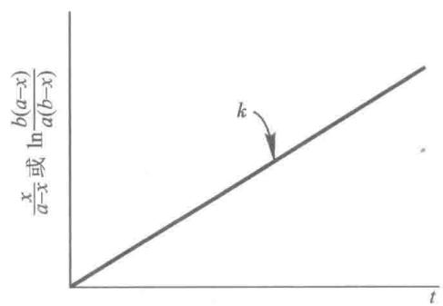  
图7-4 二级反应 $\frac{x}{a - x}$ 或 $\ln \frac{(a - x)}{(b - x)}$ 与时间关系

(7-7)

上式表明二级反应与一级反应不同,二级反应半衰期不仅与二级反应速率常数成反比,而且与反应物初浓度成反比。换句话说,初浓度愈大,反应物减少一半所需要的时间愈短,这也是二级反应的一个特征。

## 3. 零级反应

凡是反应速率与反应物浓度无关而受它种因素影响而改变的反应称为零级反应,即反应速率为一常数。可将零级反应的动力学方程式表示为:

$$
- \frac {\mathrm{d} c}{\mathrm{d} t} = k  , \quad \text {或} \quad \frac {\mathrm{d} x}{\mathrm{d} t} = k
$$

积分后得：

$$
x = k t, k = \frac {x}{t}\tag{7-8}
$$

零级反应中 k 的单位是 $mol \cdot L^{-1} \cdot s^{-1}$ 。若以 x 对 t 作图，得一直线，如图 7-5，其斜率为 k。当 $x = \frac{1}{2} a$ 时，代入式 (7-8)，其反应半衰期与反应速率常数成反比而与反应物初浓度成正比，即：

$$
t _ {1 / 2} = \frac {a}{2 k}\tag{7-9}
$$

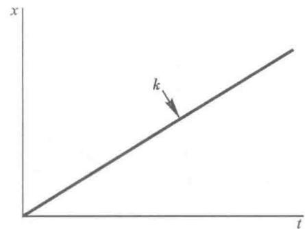  
图7-5 零级反应 $x$ 与时间关系

上式说明，初浓度愈大，半衰期愈长。

## 二、底物浓度对酶促反应速率的影响

## （一）中间复合物学说

1903 年 V. C. R. Henri 用蔗糖酶水解蔗糖做实验, 研究底物浓度与反应速率的关系。当酶浓度不变时, 可以测出一系列不同底物浓度下的反应速率, 以反应速率对底物浓度作图, 可得到图 7-6 正相关曲线。从该曲线可以看出, 当底物浓度较低时, 反应速率与底物浓度的关系呈正比关系, 表现为一级反应。随着底物浓度的增加, 反应速率不再按正比升高, 反应表现为混合级反应。当底物浓度达到相当高时, 底物浓度对反应速率影响变小, 最后反应速率与底物浓度几乎无关, 反应达到最大速率 ( $V_{max}$ ), 表现为零级反应。根据这一实验结果, V. C. R. Henri 提出了酶底物中间复合物学说。该学说认为当酶催化某一化学反应时, 酶首先和底物结合生成中间复合物 (ES), 然后生成产物 (P), 并释放出酶。反应用下式表示:

$$
\mathrm{S+E} \rightleftharpoons \mathrm{ES} \longrightarrow \mathrm{P+E}
$$

根据中间复合物学说可以解释图7-6实验曲线，在酶浓度恒定条件下，当底物浓度很小时，酶未被底物饱和，这时反应速率取决于底物浓度。随着底物浓度变大，根据质量作用定律，ES生成也越多，而反应速率取决于ES的浓度，故反应速率也随之增高。当底物浓度相当高时，溶液中的酶全部被底物饱和，溶液中没有多余的酶，虽增加底物浓度也不会有更多的中间复合物生成，因此酶促反应速率与底物浓度无关，反应达到最大反应速率 $(V_{\mathrm{max}})$ 。当底物浓度对反应速率作图时，就形成一条双曲线。需要指出的是只有酶催化反应才有这种饱和现象，与此相反，非催化反应无此饱和现象（图7-6）。

酶和底物形成中间复合物的学说,已得到许多实验证明:

（1）ES 复合物已被电子显微镜和 X 射线晶体结构分析直接观察到。如在电子显微镜下可观察到 DNA 聚合酶 I 可结合到它合成的 DNA 模板上。用 X 射线晶体结构分析，研究了羧肽酶 A 和它的底物 Gly-L-Tyr 的相互作用及其作用位置。

（2）许多酶和底物的光谱特性在形成 ES 复合物后发生变化。例如色氨酸合成酶为一细菌酶，含有一个磷酸吡哆醛辅基，该酶催化 L-Ser 和吲哚合成 Trp，加 L-Ser 到酶中磷酸吡哆醛的荧光显著增加，随后加吲哚使荧光猝灭到低于单独酶的水平（图 7-7），因此荧光光谱揭示了酶-Ser 和酶-Ser-吲哚复合物的存在。其他光谱学方法，如核磁和顺磁共振，园二色谱也能对 ES 的形成提供信息。

（3）酶的物理性质，如溶解度或热稳定性，经常在形成 ES 复合物后发生变化。

（4）已分离得到某些酶与底物相互作用生成的 ES 复合物，如已得到乙酰化胰凝乳蛋白酶及 D-氨基酸氧化酶和底物复合物的结晶。

（5）超离心沉降过程中，可观察到酶和底物共沉降现象。平衡透析时观察到底物浓度在半透膜内外不同等。

  
图 7-6 底物浓度对酶催化反应和非催化反应初速率的影响

  
图 7-7 磷酸吡哆醛辅基在色氨酸合成酶的活性部位上产生的荧光强度随加入底物 L-Ser 和吲哚而改变的情况

## （二）酶促反应的动力学方程式

## 1. 米氏方程式的建立

1913 年 L. Michaelis 和 M. Menten 根据中间复合物学说提出了单底物酶促反应的快速平衡：

$$
\begin{array}{r l r} {\mathrm{E}} & {+} & {\mathrm{S} \xrightarrow [ k _ {- 1} ]{k _ {1}} \mathrm{ES} \xrightarrow [ k _ {2} ]{k _ {2}} \mathrm{P+E}} \\ {\text {   酶   }} & {} & {\text {   底物   } \qquad \text {   中间复合物   } \qquad \text {   产物   }} \end{array}\tag{7-10}
$$

式中 $k_{1}, k_{-1}$ 分别为 $E + S \rightleftharpoons ES$ 正逆反应两方向的速率常数， $k_{2}$ 为第二步的前向速率常数。

$$
K _ {s} \rightleftharpoons \frac {k _ {- 1}}{k _ {1}} \quad \text { 表示   ES   的解离常数。 }
$$

L. Michaelis 和 M. Menten 在推导模型的动力学速率方程时作了以下几点假设：

（1）式(7-10)中没有考虑 $\mathrm{E} + \mathrm{P}\xrightarrow{n_{-2}}\mathrm{ES}$ 这一逆反应，但是显然 $k_{-2}$ 是一个不等于零的常数。要忽略这一步反应，必须使产物浓度[P]趋于零。这就是说，Michaelis-Menten方程只运用于测定反应的初速率。

（2）底物浓度[S]是以初始浓度 $\left[\mathrm{S}_0\right]$ 计算的，这就要求底物浓度远大于酶浓度。否则，由于ES的存在，[S]就不能用 $\left[\mathrm{S}_0\right]$ 代替。

（3）反应的第二步 $\mathrm{ES}\xrightarrow{k_2}\mathrm{P} + \mathrm{E}$ 是限速步骤，这里 $k_{2}\ll k_{-1}$ ，也即ES分解生成产物的速度不足以破坏E和ES之间的快速平衡。这就是“平衡学说”，又称“快速平衡学说”。

根据上述假设,就可推导出以下动力学方程。

若式(7-10)迅速达到平衡, $k_{-1}[ES]=k_{1}[E][S]$

$$
K _ {\mathrm{s}} = \frac {k _ {- 1}}{k _ {1}} = \frac {[ \mathrm{E} ] [ \mathrm{S} ]}{[ \mathrm{ES} ]}\tag{7-11}
$$

酶总浓度 $\left[\mathrm{E}_0\right]$ 为游离酶浓度 $[\mathrm{E}]$ 和结合酶浓度[ES]之和。由于总酶浓度 $\left[\mathrm{E}_0\right]$ 容易测定，故将 $\left[\mathrm{E}_0\right]$ 代替[E]，则有：

$$
[ \mathrm{E} ] = [ \mathrm{E} _ {0} ] - [ \mathrm{ES} ]\tag{7-12}
$$

由式 $(7-12)$ 代入式 $(7-11)$ 可得：

$$
\frac {(\mathrm {[ E_ {0} ] - [ ES]}) \mathrm{[S]}}{\mathrm{[ES]}} = K _ {\mathrm{s}}\tag{7-13}
$$

$$
K _ {\mathrm{S}} [ \mathrm{ES} ] = [ \mathrm{E} _ {0} ] [ \mathrm{S} ] - [ \mathrm{ES} ] [ \mathrm{S} ]
$$

即：

$$
[ \mathrm{ES} ] = \frac {[ \mathrm{E} _ {0} ] [ \mathrm{S} ]}{K _ {\mathrm{s}} + [ \mathrm{S} ]}\tag{7-14}
$$

前已提及,反应初速率取决于[ES],即 $v_{0}=k_{2}[ES]$

$$
v _ {0} = k _ {2} \frac {[ \mathrm{E} _ {0} ] [ \mathrm{S} ]}{K _ {\mathrm{s}} + [ \mathrm{S} ]}\tag{7-15}
$$

若底物浓度很高时，酶被底物饱和，则初速率达到最大值： $V_{\mathrm{max}} = k_2[\mathrm{E}_0]$ 。以 $V_{\mathrm{max}}$ 代替 $k_{2}[\mathrm{E}_{0}]$ 则式（7-15）变为：

$$
v _ {0} = \frac {V _ {\max} [ S ]}{K _ {s} + [ S ]}\tag{7-16}
$$

这就是著名的 Michaelis-Menten 方程, 简称米氏方程 (Michaelis equation)

## 2. Briggs-Haldane 修正的米氏方程

1925 年 G. E. Briggs 和 J. B. S. Haldane 鉴于酶催化效率很高, 当 ES 形成后, 随即迅速的转变成产物而释放出酶。认为 L. Michaelis 和 M. Menten 所述快速平衡不一定能够成立, 即当 $k_{2}$ 远大于 $k_{-1}$ 时, 就不能用快速平衡模型来推导。他们在保留了上述前 2 点假设下, 用稳态模型:

$$
\mathrm{E} + \mathrm{S} \xrightarrow [ k _ {- 1} ]{k _ {1}} \mathrm{ES} \xrightarrow [ k _ {- 2} ]{k _ {2}} \mathrm{P} + \mathrm{E}\tag{7-17}
$$

代替了平衡态模型。酶促反应分两步进行：

第一步:酶与底物作用,形成酶-底物复合物:

$$
\mathrm{E} + \mathrm{S} \xrightarrow [ k _ {- 1} ]{k _ {1}} \mathrm{ES}\tag{7-18}
$$

第二步:ES 复合物分解形成产物,释放出游离酶:

$$
\mathrm{ES} \underset {k _ {- 2}} {\overset {k _ {2}} {\rightleftharpoons}} \mathrm{P+E}\tag{7-19}
$$

这两步反应都是可逆的。它们的正反应与逆反应的速率常数分别为 $k_{1}, k_{-1}, k_{2}, k_{-2}$ 。

由于酶促反应的速率与 ES 的形成与分解直接相关,所以必须考虑 ES 的形成速率和分解速率。G. E. Briggs 和 J. B. S. Haldane 的发展就在于指出 ES 量不仅与式(7-18)平衡有关,而且还与式(7-19)平衡有关,用稳态代替了平衡态。

所谓稳态是指反应进行一段时间后,系统的复合物 ES 浓度,由零逐渐增加到一定数值,在一定时间内,尽管底物浓度和产物浓度不断地变化,复合物 ES 也在不断地生成和分解,但是当反应系统中 ES 的生成速率和 ES 的分解速率相等时,络合物 ES 浓度保持不变的这种反应状态称为稳态(steady state),即:

$$
\frac {\mathrm{d} [ \mathrm{ES} ]}{\mathrm{d} t} = 0
$$

图 7-8 表示实验所得各种浓度对时间的曲线, 表示了底物浓度降低, 产物形成及 ES 稳态过程。

在稳态下，ES的生成速率 $\mathrm{d}[\mathrm{ES}] / \mathrm{dt}$ 应与 $\mathrm{E + S}\xrightarrow{k_1}$ ES和 $\mathrm{E + P}\xrightarrow{k_{-2}}$ ES有关。但是在反应初速率阶段，产物浓度很低， $\mathrm{E + P}\xrightarrow{k_{-2}}$ ES的速率极小，可以忽略不计。因此ES的生成速率只与 $\mathrm{E + S}\xrightarrow{k_1}$ ES有关，可用下式表示：

$$
\frac {\mathrm{d} [ \mathrm{ES} ]}{\mathrm{d} t} = k _ {1} ([ \mathrm{E} ] - [ \mathrm{ES} ]) \cdot [ \mathrm{S} ]\tag{7-20}
$$

[E]表示酶的总浓度

[ES] 表示酶与底物结合的中间复合物的浓度

[E]-[ES]表示未与底物结合的游离状态的酶浓度

[S]表示底物浓度

  
图 7-8 酶促反应过程中前稳态(阴影部分)和稳态期间各种浓度变化(A)和速率变化(B)

通常底物浓度远比酶浓度大很多，即 $[\mathrm{S}] \gg [\mathrm{E}]$ ，因此被酶结合的S量，亦即[ES]，它与总的底物浓度相比，可以忽略不计。所以 $[\mathrm{S}] - [\mathrm{ES}] \approx [\mathrm{S}]$ 。ES的分解速率- $\mathrm{d}[\mathrm{ES}] / \mathrm{dt}$ 则与 $\mathrm{ES} \xrightarrow{k_{-1}} \mathrm{S} + \mathrm{E}$ 及 $\mathrm{ES} \xrightarrow{k_2} \mathrm{P} + \mathrm{E}$ 有关。因此ES分解速率为两式速率之和。

$$
- \frac {\mathrm{d} [ \mathrm{ES} ]}{\mathrm{d} t} = k _ {- 1} [ \mathrm{ES} ] + k _ {2} [ \mathrm{ES} ]\tag{7-21}
$$

在稳态下，ES的生成速率和ES的分解速率相等，即[ES]保持动态平衡，式(7-20)=(7-21)，即

$$
k _ {1} ([ \mathrm{E} ] - [ \mathrm{ES} ]) \cdot [ \mathrm{S} ] = k _ {- 1} [ \mathrm{ES} ] + k _ {2} [ \mathrm{ES} ]
$$

移项得：

$$
\frac {([ \mathrm{E} ] - [ \mathrm{ES} ]) \cdot [ \mathrm{S} ]}{[ \mathrm{ES} ]} = \frac {k _ {- 1} + k _ {2}}{k _ {1}}\tag{7-22}
$$

用 $K_{m}$ 表示 $k_{1}, k_{-1}, k_{2}$ 这3个常数的关系：

$$
K _ {\mathrm{m}} = \frac {k _ {- 1} + k _ {2}}{k _ {1}}\tag{7-23}
$$

将式 $(7-23)$ 代入式 $(7-22)$ :

$$
\frac {(\mathrm{[E]} - \mathrm{[ES]}) \cdot \mathrm{[S]}}{\mathrm{[ES]}} = K _ {\mathrm{m}}\tag{7-24}
$$

由式(7-24)可得到稳态时[ES]:

$$
[ \mathrm{ES} ] = \frac {[ \mathrm{E} ] [ \mathrm{S} ]}{K _ {\mathrm{m}} + [ \mathrm{S} ]}\tag{7-25}
$$

因为酶反应速率 $(v_{0})$ 与[ES]成正比，即：

$$
v _ {0} = k _ {2} [ \mathrm{ES} ]\tag{7-26}
$$

将式 $(7-25)$ 代入式 $(7-26)$ 得：

$$
v _ {0} = k _ {2} \frac {[ \mathrm{E} ] [ \mathrm{S} ]}{K _ {\mathrm{m}} + [ \mathrm{S} ]}\tag{7-27}
$$

由于反应系统中 $[\mathrm{S}] \gg [\mathrm{E}]$ ，当 $[\mathrm{S}]$ 很高时所有的酶都被底物所饱和形成ES，即 $[\mathrm{E}] = [\mathrm{ES}]$ ，酶促反应达

到最大速率 $V_{\mathrm{max}}$ ，则：

$$
V _ {\max} = k _ {2} [ \mathrm{ES} ] = k _ {2} [ \mathrm{E} ]\tag{7-28}
$$

将式 $(7-28)$ 代入式 $(7-27)$ ，即得：

$$
v _ {0} = \frac {V _ {\max} \cdot [ S ]}{K _ {\mathrm{m}} + [ S ]}\tag{7-29}
$$

这就是根据稳态理论推导出的动力学方程式，为纪念L. Michaelis和M. Meten，习惯上把式(7-16)，式(7-29)都称为米氏方程。 $K_{\mathrm{m}}$ 称为米氏常数，是由一些速率常数组成的一个复合常数。该方程式表明了当已知 $K_{\mathrm{m}}$ 及 $V_{\mathrm{max}}$ 时，酶反应速率与底物浓度之间的定量关系。若以[S]作横坐标， $v_{0}$ 作纵坐标作图，可得到一条双曲线（图7-9），该曲线正好与实验所得的图7-6相符合。

米氏方程所确定的图形是一直角双曲线，由式(7-29)移项，加项及整理，可得：

$$
v _ {0} K _ {\mathrm{m}} + v _ {0} [ \mathrm{S} ] = V _ {\mathrm{max}} [ \mathrm{S} ]\tag{7-30}
$$

$$
v _ {0} K _ {\mathrm{m}} + v _ {0} [ \mathrm{S} ] - V _ {\max} [ \mathrm{S} ] - V _ {\max} K _ {\mathrm{m}} = - V _ {\max} K _ {\mathrm{m}}\tag{7-31}
$$

$$
(v _ {0} - V _ {\max}) ([ \mathrm{S} ] + K _ {\mathrm{m}}) = - V _ {\max} K _ {\mathrm{m}}\tag{7-32}
$$

因 $V_{max}$ 和 $K_{m}$ 均为常数，而 $v_{0}$ 及 [S] 为变数，故式 (7-32) 实际上可写成 $(x-a)(y+b)=K$ ，这就是典型的双曲线方程。此方程所确定的图形是以坐标轴 $(x,y)$ 为渐近线 $(v_{0}=V_{\max}$ 和 $[S]=-K_{m})$ 的直角双曲线。双曲线的两部分对应的中心点为 $(-K_{m}, V_{\max})$ ，也是两条渐近线的正交点（图 7-10）。实验测量的只不过是双曲线的实线部分（见图 7-10 中阴影部分）。

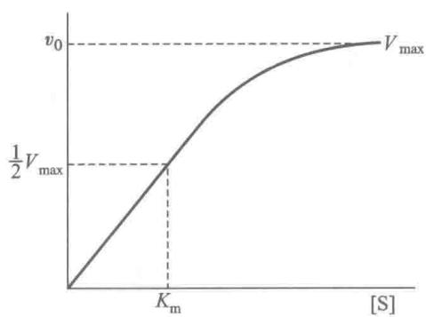  
图 7-9 米式方程曲线

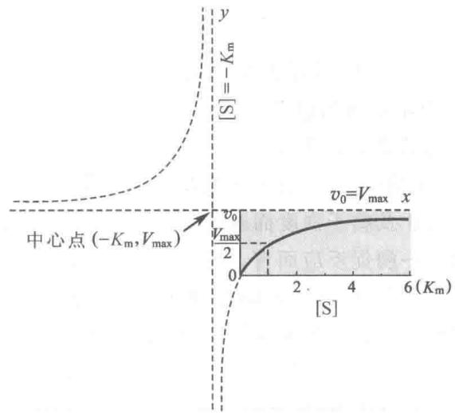  
图 7-10 米氏方程曲线是直角双曲线的一部分（阴影部分）

从式(7-29)可以看出,当反应速率达到最大速率一半时,即 $v_{0}=\frac{V_{\max}}{2}$ ,可以得到:

$$
\frac {V _ {\max}}{2} = \frac {V _ {\max} \cdot [ \mathrm{S} ]}{K _ {\mathrm{m}} + [ \mathrm{S} ]}
$$

$$
\frac {1}{2} = \frac {[ S ]}{K _ {\mathrm{m}} + [ S ]}
$$

则

$$
[ \mathrm{S} ] = K _ {\mathrm{m}}
$$

由此可以看出 $K_{m}$ 值的物理意义, 即 $K_{m}$ 值是当酶反应速率达到最大反应速率一半时的底物浓度, 单位是 $mol \cdot L^{-1}$ , 与底物浓度的单位一样。

根据米氏方程式可以说明以下关系：

(1) 当 $[S] \ll K_{m}$ 时，则 (7-29) 式变为：

$$
v _ {0} = \frac {V _ {\max} \cdot [ S ]}{K _ {\mathrm{m}}}
$$

由于 $V_{max}$ 和 $K_{m}$ 为常数, 两者的比可用一常数 K 表示, 因此

$$
v _ {0} = \frac {V _ {\mathrm{max}}}{K _ {\mathrm{m}}} \cdot [ \mathrm{S} ] = K [ \mathrm{S} ]
$$

即[S]远远小于 $K_{m}$ 时，反应速率与底物浓度成正比， $v_{o}$ 与[S]的关系符合一级动力学（图7-6）。这时由于底物浓度低，酶没有全部被底物所饱和，因此在底物浓度低的条件下是不能正确测得酶活力的。

(2) 当 $[S] \gg K_{m}$ 时, 则式 (7-29) 变为:

$$
v _ {0} = \frac {V _ {\max} [ S ]}{[ S ]}
$$

$$
v _ {0} = V _ {\max}
$$

表示当底物浓度远大于 $K_{m}$ 值时，反应速率已达到最大速率，这时酶全部被底物所饱和， $v_{o}$ 与[S]无关，符合零级动力学，只有在此条件下才能正确测得酶活力（图7-6）。

(3) 当 $[S] = K_{m}$ 时, 由式 (7-29) 得:

$$
v _ {0} = \frac {V _ {\max} \cdot [ S ]}{[ S ] + [ S ]} = \frac {V _ {\max}}{2}
$$

也就是说，当底物浓度等于 $K_{m}$ 值时，反应速率为最大速率的一半。

## 3. 动力学参数的意义

## (1) 米氏常数的意义

① $K_{\mathrm{m}}$ 是酶的一个特性常数： $K_{\mathrm{m}}$ 的大小只与酶的性质有关，而与酶浓度无关。 $K_{\mathrm{m}}$ 值随测定的底物、反应的温度、 $\mathrm{pH}$ 及离子强度而改变。因此， $K_{\mathrm{m}}$ 值作为常数只是对一定的底物、 $\mathrm{pH}$ 、温度和离子强度等条件而言。故对某一酶促反应而言，在一定条件下都有特定的 $K_{\mathrm{m}}$ 值，可用来鉴别酶。例如对于不同来源或相同来源但在不同发育阶段，不同生理状况下催化相同反应的酶是否属于同一种酶。各种酶的 $K_{\mathrm{m}}$ 值相差很大，大多数酶的 $K_{\mathrm{m}}$ 值介于 $10^{-6} \sim 10^{-1} \mathrm{~mol} \cdot \mathrm{L}^{-1}$ 之间。表7-1列举了某些酶的 $K_{\mathrm{m}}$ 值。

表 7-1 一些酶的 ${K}_{\mathrm{m}}$ 值

<table><tr><td>酶</td><td>底物</td><td> $K_{\text{m}} / (\text{mol} \cdot \text{L}^{-1})$ </td></tr><tr><td>过氧化氢酶(catalase)</td><td> $H_2O_2$ </td><td> $2.5 \times 10^{-2}$ </td></tr><tr><td>脲酶(urease)</td><td>尿素</td><td> $2.5 \times 10^{-2}$ </td></tr><tr><td rowspan="2">己糖激酶(hexokinase)</td><td>葡萄糖</td><td> $1.5 \times 10^{-4}$ </td></tr><tr><td>果糖</td><td> $1.5 \times 10^{-3}$ </td></tr><tr><td rowspan="2">蔗糖酶(sucrase)</td><td>蔗糖</td><td> $2.8 \times 10^{-2}$ </td></tr><tr><td>棉子糖</td><td> $3.5 \times 10^{-1}$ </td></tr><tr><td rowspan="4">胰凝乳蛋白酶(chymotrypsin)</td><td>N-苯甲酰酪氨酰胺</td><td> $2.5 \times 10^{-3}$ </td></tr><tr><td>N-甲酰酪氨酰胺</td><td> $1.2 \times 10^{-2}$ </td></tr><tr><td>N-乙酰酪氨酰胺</td><td> $3.2 \times 10^{-2}$ </td></tr><tr><td>甘氨酰酪氨酰胺</td><td> $1.22 \times 10^{-1}$ </td></tr><tr><td>碳酸酐酶(carbonic anhydrase)酶</td><td> $HCO_3^-$ 底物</td><td> $2.6 \times 10^{-2}$  $K_{\mathrm {m}}/( \mathrm {mol} \cdot \mathrm {L}^{-1})$ </td></tr><tr><td rowspan="4">谷氨酸脱氢酶(glutamate dehydrogenase)</td><td>谷氨酸</td><td> $1.2\times 10^{-4}$ </td></tr><tr><td>α-酮戊二酸</td><td> $2.0\times 10^{-3}$ </td></tr><tr><td>NAD+</td><td> $2.5\times 10^{-5}$ </td></tr><tr><td>NADH</td><td> $1.8\times 10^{-5}$ </td></tr><tr><td rowspan="3">肌酸激酶(creatine kinase)</td><td>肌酸</td><td> $6.0\times 10^{-4}$ </td></tr><tr><td>ADP</td><td> $1.9\times 10^{-2}$ </td></tr><tr><td>磷酸肌酸</td><td> $5\times 10^{-3}$ </td></tr><tr><td>乳酸脱氢酶(lactate dehydrogenase)</td><td>丙酮酸</td><td> $1.7\times 10^{-5}$ </td></tr><tr><td>丙酮酸脱氢酶(pyruvate dehydrogenase)</td><td>丙酮酸</td><td> $1.3\times 10^{-3}$ </td></tr><tr><td>6-磷酸葡糖脱氢酶(glucose-6-phosphate dehydrogenase)</td><td>6-磷酸葡糖</td><td> $5.8\times 10^{-5}$ </td></tr><tr><td>6-磷酸己糖异构酶(hexose-6-phosphate isomerase)</td><td>6-磷酸葡糖</td><td> $7.0\times 10^{-4}$ </td></tr><tr><td>β-半乳糖苷糖(β-galactosidase)</td><td>乳糖</td><td> $4.0\times 10^{-3}$ </td></tr><tr><td>溶菌酶(lysozyme)</td><td>六聚-N-乙酰葡糖胺</td><td> $6.0\times 10^{-6}$ </td></tr><tr><td>苏氨酸脱氨酶(threonine deaminase)</td><td>苏氨酸</td><td> $5.0\times 10^{-3}$ </td></tr><tr><td>青霉素酶(penicillinase)</td><td>苄基青霉素</td><td> $5.0\times 10^{-5}$ </td></tr><tr><td rowspan="3">丙酮酸羧化酶(pyruvate carboxylase)</td><td>丙酮酸</td><td> $4.0\times 10^{-4}$ </td></tr><tr><td>HCO3-</td><td> $1.0\times 10^{-3}$ </td></tr><tr><td>ATP</td><td> $6.0\times 10^{-5}$ </td></tr><tr><td rowspan="3">精氨酰-tRNA合成酶(arginyl-tRNA-synthetase)</td><td>精氨酸</td><td> $3.0\times 10^{-6}$ </td></tr><tr><td>tRNAArg</td><td> $4.0\times 10^{-7}$ </td></tr><tr><td>ATP</td><td> $3.0\times 10^{-4}$ </td></tr></table>

② $K_{\mathrm{m}}$ 值可以判断酶的专一性和天然底物：有的酶可作用于几种底物，因此就有几个 $K_{\mathrm{m}}$ 值，其中 $K_{\mathrm{m}}$ 值最小的底物称为该酶的最适底物也就是天然底物。如谷氨酸脱氢酶可作用于谷氨酸、 $\alpha-$ 酮戊二酸、 $\mathrm{NAD}^{+}$ 、NADH，它们的 $K_{\mathrm{m}}$ 值依次为 $1.2\times 10^{-4},2.0\times 10^{-3},2.5\times 10^{-5}$ 和 $1.8\times 10^{-5}\mathrm{mol}\cdot \mathrm{L}^{-1}$ ，显然NADH为谷氨酸脱氢酶的最适底物。 $\frac{1}{K_{\mathrm{m}}}$ 可近似地表示酶对底物亲和力的大小， $\frac{1}{K_{\mathrm{m}}}$ 愈大，表明亲和力愈大，因为 $\frac{1}{K_{\mathrm{m}}}$ 愈大，则 $K_{\mathrm{m}}$ 愈小，达到最大反应速率一半所需要的底物浓度就愈小。显然，最适底物时酶的亲和力最大， $K_{\mathrm{m}}$ 最小。因此， $K_{\mathrm{m}}$ 值随不同底物而异的现象可以帮助判断酶的专一性，并且有助于研究酶的活性部位。

③ 由式(7-25)可知, 当 $k_{2} \ll k_{-1}$ 时, $K_{\mathrm{m}} = k_{-1} / k_{1}$ , 即 $K_{\mathrm{m}} = K_{\mathrm{s}}$ 。换言之当 ES 的分解为反应的限制速率时, $K_{\mathrm{m}}$ 等于 ES 复合物的解离常数 (底物常数), 可以作为酶和底物结合紧密程度的一个度量, 表示酶和底物结合的亲和力大小。当 $k_{2}$ 和 $k_{-1}$ 大小相当时, $K_{\mathrm{m}}$ 是三个速率常数的函数 (式 7-23), 此时 $K_{\mathrm{m}}$ 不再是酶对底物亲和力的确切量度。因此, 在不知道 $K_{\mathrm{m}}$ 确实等于 $K_{\mathrm{s}}$ 之前, 用 $K_{\mathrm{m}}$ 表示酶和底物的亲和力是不确切的。上面提到的 $\frac{1}{K_{\mathrm{m}}}$ 可近似地表示酶与底物亲和力的大小, 严格地说应该用 $1 / K_{\mathrm{s}}$ 表示, 只是当 $k_{2}$ 极小时, 才能用 $1 / K_{\mathrm{m}}$ 来近似地说明酶与底物结合的难易程度。

④ 若已知某个酶的 $K_{m}$ 值, 就可以计算出在某一底物浓度时, 其反应速率相当于 $V_{max}$ 的百分率。例如, 当 $[S]=3K_{m}$ 时, 代入米氏方程式 $v_{0}=\frac{V_{\max}\cdot[S]}{K_{m}+[S]}$ , 得:

$$
v _ {0} = \frac {V _ {\mathrm{max}} \cdot 3 K _ {\mathrm{m}}}{K _ {\mathrm{m}} + 3 K _ {\mathrm{m}}} = 0. 7 5 V _ {\mathrm{max}}
$$

达到最大反应速率的 $75\%$ 时，底物浓度相当于 $3K_{\mathrm{m}}$ 。米氏方程[S]和 $\upsilon_0$ 的关系见表7-2。

表 7-2 米氏方程 [S] 与 ${\nu }_{0}$ 关系

<table><tr><td>[S]</td><td> $v_0$ </td><td>[S]</td><td> $v_0$ </td></tr><tr><td>1 000 $K_m$ </td><td>0.999 $V_{max}$ </td><td> $1K_m$ </td><td>0.50 $V_{max}$ </td></tr><tr><td>100 $K_m$ </td><td>0.99 $V_{max}$ </td><td>0.33 $K_m$ </td><td>0.25 $V_{max}$ </td></tr><tr><td>10 $K_m$ </td><td>0.91 $V_{max}$ </td><td>0.10 $K_m$ </td><td>0.091 $V_{max}$ </td></tr><tr><td>3 $K_m$ </td><td>0.75 $V_{max}$ </td><td>0.01 $K_m$ </td><td>0.01 $V_{max}$ </td></tr></table>

当 $v_{0} = V_{\mathrm{max}}$ 时，反应初速率与底物浓度无关，只与 $[\mathrm{E}_0]$ 成正比，表明酶的活性部位全部被底物占据。当 $K_{\mathrm{m}}$ 已知时，任何底物浓度下被底物饱和的百分数可用下式表示：

$$
f _ {\mathrm{ES}} = \frac {v _ {0}}{V _ {\mathrm{max}}} = \frac {[ \mathrm{S} ]}{K _ {\mathrm{m}} + [ \mathrm{S} ]}
$$

当然这是一种简单的情况，在反应经历复杂的机制时， $f_{ES}$ 并不代表酶活性部位被底物饱和百分数。

⑤ $K_{m}$ 值可以帮助推断某一代谢反应的方向和途径：催化可逆反应的酶，对正逆两向底物的 $K_{m}$ 值往往是不同的，例如谷氨酸脱氢酶，NAD 的 $K_{m}$ 值为 $2.5 \times 10^{-5} \, mol \cdot L^{-1}$ ，而 NADH 为 $1.5 \times 10^{-5} \, mol \cdot L^{-1}$ 。测定这些 $K_{m}$ 的差别以及细胞内正逆两向底物的浓度，可以大致推测该酶催化正逆两向反应的效率，这对于了解酶在细胞内的主要催化方向及生理功能有重要意义。

当一系列不同的酶催化一个代谢过程的连续反应时,如能确定各种酶的 $K_{m}$ 及其相应底物的浓度,便可有助于寻找代谢过程的限速步骤。例如酶 1、2、3 分别催化 A $\xrightarrow{1}$ B $\xrightarrow{2}$ C $\xrightarrow{3}$ D 三步连续反应,若它们对相应底物 A、B、C 的 $K_{m}$ 分别为 $10^{-2}$ 、 $10^{-3}$ 和 $10^{-4}$ mol·L $^{-1}$ ,而细胞内 A、B、C 的浓度均接近 $10^{-4}$ mol·L $^{-1}$ ,则可推知限速反应是 A→B 的一步。

生物体内的代谢作用往往是在多酶体系下进行的，同一种底物往往可以被几种酶作用，催化不同的反应，走不同的途径。如丙酮酸在体内至少可被乳酸脱氢酶、丙酮酸脱氢酶和丙酮酸脱羧酶等3种酶催化，分别形成乳酸、乙酰辅酶A和乙醛。它们的 $K_{m}$ 值分别为 $1.7\times10^{-5}$ 、 $1.3\times10^{-3}$ 和 $1.0\times10^{-3}mol\cdotL^{-1}$ 。当丙酮酸浓度较低时，不能同时被几种酶作用。究竟走哪一条途径则决定于 $K_{m}$ 值最小的酶，只有 $K_{m}$ 值小的酶反应比较占优势。从上述3种酶的 $K_{m}$ 值可以推断在丙酮酸浓度较低时容易走乳酸脱氢酶催化丙酮酸形成乳酸的途径。

（2） $V_{max}$ 和 $k_{cat}$ （催化常数）的意义 在一定酶浓度下，酶对特定底物的 $V_{max}$ 也是一个常数。 $V_{max}$ 与 $K_{m}$ 相似，同一种酶对不同底物的 $V_{max}$ 也不同。pH、温度和离子强度也影响 $V_{max}$ 的数值。

当[S]很大时，根据式(7-28)， $V_{\mathrm{max}} = k_2[\mathrm{E}](k_2 \text{即 } k_{\mathrm{cat}})$ 。说明 $V_{\mathrm{max}}$ 和[E]呈线性关系，而直线的斜率为 $k_2$ ，为一级反应速率常数，它的因次为 $s^{-1}$ 。 $k_{\mathrm{cat}}$ 也称为酶的转换数（turnover number, TN），它是酶的最大催化活力的量度。TN定义为：当酶被底物饱和时每秒钟每个酶分子或每个活性部位（对多亚基酶而言）将底物转换为产物的分子数，转换数也称为分子活力（molecular activity）。一些酶的转换数见表7-3。只要已知反应液中 E 的总浓度, 即可由 $V_{max}$ 计算出。 $k_{cat}$ 值越大, 表示酶的催化效率越高。对于简单酶反应, $k_{cat} = k_{2}$ , 而对于较复杂的反应, $k_{cat}$ 是几个速率常数的函数。

表 7-3 一些酶的最大转换数

<table><tr><td>酶</td><td>转换数( $k_{cat}$ )/ $s^{-1}$ </td></tr><tr><td>过氧化氢酶(catalase)</td><td>40 000 000</td></tr><tr><td>碳酸酐酶(carbonic anhydrase)</td><td>1 000 000( $CO_2$ )</td></tr><tr><td></td><td>400 000( $HCO_3^-$ )</td></tr><tr><td>3-酮类固醇异构酶(3-ketosteroid isomerase)</td><td>280 000</td></tr><tr><td>乙酰胆碱酯酶(acetylcholinesterase)</td><td>25 000</td></tr><tr><td>青霉素酶(penicillinase)</td><td>2 000</td></tr><tr><td>乳酸脱氢酶(lactate dehydrogenase)</td><td>1 000</td></tr><tr><td>胰凝乳蛋白酶(chymotrypsin)</td><td>100</td></tr><tr><td>DNA聚合酶I(DNA polymerase I)</td><td>15</td></tr><tr><td>色氨酸合成酶(tryptophan synthetase)</td><td>2</td></tr><tr><td>溶菌酶(lysozyme)</td><td>0.5</td></tr></table>

(3) $k_{\mathrm{cat}} / K_{\mathrm{m}}$ ——催化效率指数（index of catalytic efficiency）或专一性常数（specificity constant）在生理条件下，大多数酶并不被底物所饱和。在体内 $[\mathrm{S}] / K_{\mathrm{m}}$ 的比值通常介于 $0.01 \sim 1.0$ 之间。根据米氏方程：

$$
v _ {0} = \frac {V _ {\mathrm{max}} [ \mathrm{S} ]}{K _ {\mathrm{m}} + [ \mathrm{S} ]}
$$

按照 $V_{\max} = k_{\text{cat}} \left[ E_{T} \right]$ , $\left[ E_{T} \right]$ 代表酶的总浓度。则：

$$
v _ {0} = \frac {k _ {\mathrm{cat}} [ \mathrm{E} _ {\mathrm{T}} ] [ \mathrm{S} ]}{K _ {\mathrm{m}} + [ \mathrm{S} ]}
$$

当 $[\mathrm{S}] \ll K_{\mathrm{m}}$ 时，自由酶浓度 $[\mathrm{E}] \simeq [\mathrm{E}_{\mathrm{T}}]$

$$
\therefore \quad v _ {0} = \left(\frac {k _ {\mathrm{cat}}}{K _ {\mathrm{m}}}\right) [ \mathrm{E} ] [ \mathrm{S} ]
$$

即 $k_{\mathrm{cat}} / K_{\mathrm{m}}$ 是E和S反应形成产物的表观二级速率常数(apparent second-order rate constant)单位为 $\mathrm{mol}^{-1}\cdot \mathrm{L}\cdot \mathrm{s}^{-1}$ 有时也称为专一性常数。因此，当[S] $\ll K_{\mathrm{m}}$ 时，酶反应速率取决于 $k_{\mathrm{cat}} / K_{\mathrm{m}}$ 的值和[S]。对于 $k_{\mathrm{cat}} / K_{\mathrm{m}}$ 值，有其物理限制，这个比值取决于 $k_{1},k_{-1}$ 和 $k_{2}$ ，这儿 $k_{\mathrm{cat}} = k_2$ ，将 $K_{\mathrm{m}}$ 取代后可以得出：

$$
k _ {\mathrm{cat}} / K _ {\mathrm{m}} = \frac {k _ {2} k _ {1}}{k _ {- 1} + k _ {2}}
$$

当 $k_{2} \gg k_{-1}$ 时，则 $k_{\mathrm{cat}} / K_{\mathrm{m}} = k_{1}$ ，比值 $k_{\mathrm{cat}} / K_{\mathrm{m}}$ 的上限为 $k_{1}$ ，即生成ES复合物的速率常数。换言之，酶的催化效率不能超过E和S形成ES的扩散控制的结合速率。扩散限制了 $k_{1}$ 的数值，在水中扩散的速率常数为 $10^{8} \sim 10^{9} \mathrm{~mol}^{-1} \cdot \mathrm{L} \cdot \mathrm{s}^{-1}$ ，因此 $k_{\mathrm{cat}} / K_{\mathrm{m}}$ 的上限为 $10^{9} \mathrm{~mol}^{-1} \cdot \mathrm{L} \cdot \mathrm{s}^{-1}$ ，酶的催化效率不能超过此极限范围。对酶来说，比值 $k_{\mathrm{cat}} / K_{\mathrm{m}}$ 可作为远低于饱和量的底物浓度下酶的催化效率参数。事实上，如乙酰胆碱酯酶和磷酸丙糖异构酶等许多酶的 $k_{\mathrm{cat}} / K_{\mathrm{m}}$ 比值都达到 $10^{8} \mathrm{~mol}^{-1} \cdot \mathrm{L} \cdot \mathrm{s}^{-1}$ ，说明它们都已达酶催化效率的完美程度。它们的催化反应速率只受它们与溶液中底物迁移速率的限制。如果要使催化速率进一步加快，只有减少扩散时间才有可能。表7-4列出了在这个范畴中一些酶的动力学参数。可见由 $k_{\mathrm{cat}} / K_{\mathrm{m}}$ 值的大小，可以比较不同酶的催化效率，特别是比较同一种酶对不同底物的催化效率（表7-5），因此也称为专一性常数。

表 7-4 $k_{\mathrm{cat}} / K_{\mathrm{m}}$ 比值接近扩散控制极限的一些酶

<table><tr><td>酶</td><td>底物</td><td> $k_{cat}/s^{-1}$ </td><td> $K_m/(mol·L^{-1})$ </td><td> $k_{cat}/K_m/(mol^{-1}·L·s^{-1})$ </td></tr><tr><td>乙酰胆碱酯酶(acetylcholinesterase)</td><td>乙酰胆碱</td><td> $1.4×10^4$ </td><td> $9×10^{-5}$ </td><td> $1.6×10^8$ </td></tr><tr><td rowspan="2">碳酸酐酶(carbonic anhydrase)</td><td> $CO_2$ </td><td> $1×10^6$ </td><td> $1.2×10^{-2}$ </td><td> $8.3×10^7$ </td></tr><tr><td> $HCO_3^-$ </td><td> $4×10^5$ </td><td> $2.6×10^{-2}$ </td><td> $1.5×10^7$ </td></tr><tr><td>过氧化氢酶(catalase)</td><td> $H_2O_2$ </td><td> $4×10^7$ </td><td>1.1</td><td> $3.6×10^7$ </td></tr><tr><td>巴豆酸酶(crotonase)</td><td>巴豆酰-CoA</td><td> $5.7×10^3$ </td><td> $2×10^{-5}$ </td><td> $2.8×10^8$ </td></tr><tr><td rowspan="2">延胡索酸酶(fumarase)</td><td>延胡索酸</td><td> $8×10^2$ </td><td> $5×10^{-6}$ </td><td> $1.6×10^8$ </td></tr><tr><td>苹果酸</td><td> $9×10^2$ </td><td> $2.5×10^{-5}$ </td><td> $3.6×10^7$ </td></tr><tr><td>磷酸丙糖异构酶(triosephosphate isomerase)</td><td>3-磷酸甘油醛</td><td> $4.3×10^3$ </td><td> $1.8×10^{-5}$ </td><td> $2.4×10^8$ </td></tr><tr><td>β-内酰胺酶(β-lactamase)</td><td>苄基青霉素</td><td> $2.0×10^3$ </td><td> $2×10^{-5}$ </td><td> $1×10^8$ </td></tr></table>

表 7-5 胰凝乳蛋白酶选择水解几种 N-乙酰氨基酸甲酯所测 $k_{cat}/K_{m}$

<table><tr><td>在酯中的氨基酸</td><td>氨基酸侧链</td><td> $k_{\text{cat}}/K_m/(mol^{-1} \cdot L \cdot s^{-1})$ </td></tr><tr><td>甘氨酸</td><td>—H</td><td> $1.3 \times 10^{-1}$ </td></tr><tr><td>缬氨酸</td><td></td><td>2.0</td></tr><tr><td>正缬氨酸</td><td>—CH2CH2CH3</td><td> $3.6 \times 10^{2}$ </td></tr><tr><td>正亮氨酸</td><td>—CH2CH2CH2CH3</td><td> $3.0 \times 10^{3}$ </td></tr><tr><td>苯丙氨酸</td><td>—CH2—</td><td> $1.0 \times 10^{5}$ </td></tr></table>

4. 利用作图法测定 $K_{\mathrm{m}}$ 和 $V_{\mathrm{max}}$ 值

米氏常数可根据实验数据通过作图法直接求得。先测定不同底物浓度的反应初速率，以 $v_{0} \sim [S]$ 作图，如从图7-9可以得到 $V_{max}$ ，再从 $\frac{1}{2} V_{max}$ 可求得相应的[S]，即 $K_{m}$ 值。但实际上即使用很大的底物浓度，也只能得到趋近于 $V_{max}$ 的反应速率，而达不到真正的 $V_{max}$ ，因此得不到准确的 $K_{m}$ 与 $V_{max}$ 值。为了方便地测得准确的 $K_{m}$ 与 $V_{max}$ 值，可把米氏方程式的形式加以变换，使它成为直线方程，然后用图解法求出 $K_{m}$ 与 $V_{max}$ 值。

(1) Lineweaver-Burk 双倒数作图法 将米氏方程式两侧取双倒数, 得到下面方程式:

$$
\frac {1}{v _ {0}} = \frac {K _ {\mathrm{m}}}{V _ {\mathrm{max}}} \cdot \frac {1}{[ \mathrm{S} ]} + \frac {1}{V _ {\mathrm{max}}}\tag{7-33}
$$

以 $\frac{1}{v_0} \sim \frac{1}{[S]}$ 作图，得出一直线，如图7-11。横轴截距为 $= -\frac{1}{K_{\mathrm{m}}}$ ，纵轴截距为 $\frac{1}{V_{\mathrm{max}}}$ 。该作图缺点是：实验点过分集中在直线的左下方，而低浓度S的实验点又因倒数后误差较大，往往偏离直线较远，从而影响 $K_{\mathrm{m}}$ 和 $V_{\mathrm{max}}$ 的准确测定。

(2) Eadie-Hofstee 作图法 将米氏方程式改写成:

$$
v _ {0} = V _ {\mathrm{max}} - K _ {\mathrm{m}} \cdot \frac {v _ {0}}{[ \mathrm{S} ]}\tag{7-34}
$$

以 $v_{0} \sim \frac{v_{0}}{[S]}$ 作图，得一直线，其纵轴截距为 $V_{\mathrm{max}}$ ，斜率为 $-K_{\mathrm{m}}$ ，见图7-12。

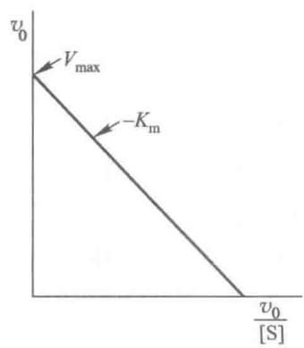  
图7-11 双倒数作图法

  
图 7-12 Eadie-Hofstee 作图法

(3) Hanes-Woolf 作图法 将式(7-33)两边均乘以[S]即得:

$$
\frac {[ \mathrm{S} ]}{v _ {0}} = \frac {[ \mathrm{S} ]}{V _ {\max}} + \frac {K _ {\mathrm{m}}}{V _ {\max}}\tag{7-35}
$$

以 $\frac{[S]}{v_0} \sim [S]$ 作图，得一直线，横轴的截距为 $-K_{\mathrm{m}}$ ，斜率为 $\frac{1}{V_{\mathrm{max}}}$ ，见图7-13。

(4) Eisenthal 和 Cornish-Bowden 直接线性作图法 将米氏方程改写为:

$$
V _ {\mathrm{max}} = v _ {0} + \frac {v _ {0}}{\left[ \mathrm{S} \right]} \cdot K _ {\mathrm{m}}\tag{7-36}
$$

以 $V_{\mathrm{max}}$ 对 $K_{\mathrm{m}}$ 作图可得一直线。把[S]标在横轴的负半轴上，测得的 $v_{0}$ 数值标在纵轴上，相应的[S]和 $v_{0}$ 联成直线，这一簇直线交于一点，这一点的坐标为 $K_{\mathrm{m}}$ 和 $V_{\mathrm{max}}$ ，如图7-14。直线性作图法有其优点，不需要计算，可直接读出 $K_{\mathrm{m}}$ 和 $V_{\mathrm{max}}$ 值；另外它使人们容易识别出那些不正确的观测结果，这些结果将产生不通过靠近共同交叉点的直线。

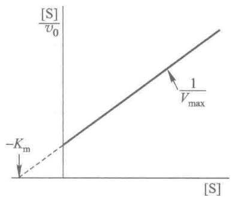  
图 7-13 Hanes-Woolf 作图法

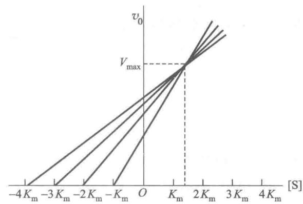  
图7-14 Eisenthal和Cornish-Bowden直线性作图法

## （三）多底物的酶促反应动力学

上面主要讨论了单底物反应的动力学,但在酶促反应中更常见的是两个或两个以上底物参加的反应,称作多底物反应。其中双底物反应最为重要,即底物 A 和 B 经酶催化生成产物 P 和 Q 的反应:

$$
\mathrm{A} + \mathrm{B} \stackrel {\text {酶}} {\rightleftharpoons} \mathrm{P} + \mathrm{Q}
$$

多底物反应动力学方程十分复杂,推导也很繁琐,这里仅就双底物反应机制及动力学方程作一简要介绍。

## 1. 酶促反应按底物分子数的分类

按照参加酶促反应底物分子数的多少可分为单底物、双底物和三底物反应，见表7-6。

表 7-6 酶促反应按底物分子数的分类

<table><tr><td>底物数</td><td>酶分类</td><td>催化反应</td><td>酶种类占总酶百分率</td></tr><tr><td>单底物</td><td>异构酶</td><td> $A \rightleftharpoons B$ </td><td>5%</td></tr><tr><td>单向单底物</td><td>裂合酶</td><td> $A \rightleftharpoons B + C$ </td><td>12%</td></tr><tr><td>假单底物</td><td>水解酶</td><td> $A \cdot B + H_2O \rightleftharpoons A \cdot OH + B \cdot H$ </td><td>26%</td></tr><tr><td rowspan="2">双底物</td><td>氧化还原酶</td><td> $A \cdot H_2 + B \rightleftharpoons A + B \cdot H_2$  $A^{2+} + B^{3+} \rightleftharpoons A^{3+} + B^{2+}$ </td><td>27%</td></tr><tr><td>转移酶</td><td> $A + B \cdot X \rightleftharpoons AX + B$ </td><td>24%</td></tr><tr><td>三底物</td><td>连接酶</td><td> $A + B + ATP \rightleftharpoons AB + ADP + Pi$  $A + B + ATP \rightleftharpoons A \cdot B + AMP + PPi$ </td><td>6%</td></tr></table>

由表可见,前面介绍的动力学只适用于表中1,3两类反应及第2类中的正向反应。

## 2. 多底物反应按动力学机制分类

(1) 序列反应 (sequential reactions) 或单置换反应 (single-displacement reactions)

底物的结合和产物的释放有一定的顺序,产物不能在底物完全结合前释放。A 和 B 底物二者均结合到酶上,然后反应产生 P 和 Q:

$$
\mathrm{E} + \mathrm{A} + \mathrm{B} \longrightarrow \mathrm{AEB} \longrightarrow \mathrm{PEQ} \longrightarrow \mathrm{E} + \mathrm{P} + \mathrm{Q}
$$

这种类型的反应称为序列反应,又可分为两种类型:

① 有序反应(ordered reactions)可写作 Ordered Bi Bi, 前一个 Bi 表示 2 个底物有序反应, 后一个 Bi 表示 2 个产物有序生成。A 定为先导底物(leading substrate), 在结合 B 前首先与酶结合。严格地说, 在缺少 A 时 B 不能结合自由的酶。反应在 A 和 B 之间产生三元复合物(ternary complex), 随后有序的释放反应产物 P 和 Q。在下面的图解中, Q 是 A 的产物, 最后被释放出来。

$$
\mathrm{E} \xrightarrow {\mathrm{A}} \mathrm{AE} \xrightarrow {\mathrm{B}} \mathrm{AEB} \xlongequal {} \mathrm{QEP} \xrightarrow {\mathrm{P}} \mathrm{QE} \xrightarrow {\mathrm{Q}} \mathrm{E}
$$

这一机制的另一种方式描述如下：

从上式可看出，A 和 Q 相互竞争地与自由酶结合，但是底物 A 和 B（或者 Q 和 B）互不竞争。

需要 $NAD^{+}$ 或 $NADP^{+}$ 的脱氢酶就属于这种类型, 这些脱氢酶的一般反应为:

$$
\mathrm{NAD} ^ {+} (\text {或} \mathrm{NADP} ^ {+}) + \mathrm{BH} _ {2} \rightleftharpoons \mathrm{NADH} (\text {或} \mathrm{NADPH}) + \mathrm{H} ^ {+} + \mathrm{B}
$$

先导底物 A 是 $\mathrm{NAD}^{+}$ （或 $\mathrm{NADP}^{+}$ ），而 $\mathrm{NAD}^{+}$ 和 $\mathrm{NADH}$ （产物 Q）竞争酶的同一结合位点，用醇脱氢酶为例来说明：

$$
\begin{array}{c}\mathrm{NAD} ^ {+} + \mathrm{CH} _ {3} \mathrm{CH} _ {2} \mathrm{OH} \rightleftharpoons \mathrm{NADH} + \mathrm{H} ^ {+} + \mathrm{CH} _ {3} \mathrm{CHO}\\\text {乙醇}\end{array}
$$

$$
\begin{array}{c} \mathrm{NAD} ^ {+} \xrightarrow {\mathrm{NAD} ^ {+} : \mathrm{E}} \mathrm{CH} _ {3} \mathrm{CH} _ {2} \mathrm{OH} \\ \mathrm{NADH} \xrightarrow {\mathrm{NADH} : \mathrm{E}} \mathrm{NADH}: \mathrm{E} \xrightarrow {\mathrm{NADH} : \mathrm{E}} \mathrm{CH} _ {3} \mathrm{CHO} \\ \mathrm{CH} _ {3} \mathrm{CHO} \end{array}
$$

能够鉴别该有序机制在缺少 $A(NAD^{+})$ 时, 没有 $B(CH_{3}CH_{2}OH)$ 结合到 E 上, 证明不是下面所述的随机反应。

② 随机反应(random reactions)可写作 Random Bi Bi, 前一个 Bi 表示 2 个底物随机结合, 后一个 Bi 表示 2 个产物随机释放。可用下式表示:

也可用图式说明：

限速步骤是反应 AEB→QEP, 不论 A 或 B 首先同 E 结合, 还是 Q 或 P 首先从 QEP 释放都无关系。肌酸激酶(creatine kinase)使肌酸磷酸化的反应是随机反应机制的典型例子。肌酸(creatine, Cr)和磷酸肌酸(creatine phosphate, CrP)的结构式见第 16 章。

$$
\begin{array}{l}\mathrm{ATP+E} \rightleftharpoons \mathrm{ATP:E}\\\mathrm{E+Cr} \rightleftharpoons \mathrm{E:Cr}\end{array}\quad\begin{array}{l}\mathrm{ATP:E:Cr} \rightleftharpoons \mathrm{ADP:E:CrP}\\\mathrm{E:CrP} \rightleftharpoons \mathrm{E+CrP}\end{array}
$$

反应的总方向将决定于 ATP、ADP、Cr 和 CrP 的浓度和反应的平衡常数。可以认为，该酶有 2 个同底物（或产物）的结合位点：一个是腺苷酸位点，与 ATP 或 ADP 结合；另一个是肌酸位点，与 Cr 或 CrP 结合。在此反应机制中，ATP 和 ADP 在特异的位点上相互竞争，而 Cr 和 CrP 相互竞争 Cr 和 CrP 结合位点。注意：在该反应过程中，没有出现修饰的酶形式（E'），如像 E-P 中间物。该反应的特点是迅速和可逆地形成 ES 二元复合物，随后加上剩余底物，形成的三元复合物决定反应速率。

## (2) 乒乓反应(Ping Pong reactions)或双置换反应(double-displacement reactions)

这类反应的特点是,酶同 A 的反应产物(P)是在酶同第二个底物 B 反应前释放出来,作为这一过程的结果,酶 E 转变为一种修饰酶形式 $E'$ ,然后再同底物 B 反应生成第二个产物 Q,和再生为未修饰的酶形式 E:

从图解可知，A 和 Q 竞争自由酶 E 形式，而 B 和 P 竞争修饰酶形式 $E'$ ，A 和 Q 不同 $E'$ 结合，而 B 和 P 也不与 E 结合。该反应历程中间形成 4 种二元复合物，而无三元复合物形成。乒乓反应按其底物和产物作用方式可写作 Uni Uni Uni Uni Ping Pong（Uni 表示单底物或单产物），但对双底物、双产物系统写 Ping Pong Bi Bi，也不会引起误解，因为只有这一种方式。

氨基转移酶是遵循乒乓反应机制的酶,这类酶催化从氨基酸转移氨基到酮酸,产生一种新的氨基酸和酮酸:

$$
\mathrm{氨基酸} _ {1} + \mathrm{酮酸} _ {2} \longrightarrow \mathrm{酮酸} _ {1} + \mathrm{氨基酸} _ {2}
$$

一个典型的例子是谷草转氨酶(glutamic-oxaloacetic transaminase)的反应：

从上面反应可知,谷氨酸和天冬氨酸相互竞争 E,而草酰乙酸和 $\alpha-$ 酮戊二酸彼此竞争 $E'$ 。在谷草转氨酶中,未修饰酶(E)结合的辅酶是磷酸吡哆醛,在酶促反应中作为氨基受体/供体。而修饰酶形式 $E'$ 的辅酶是磷酸吡哆胺(见第13章)。

## 3. 双底物反应的动力学方程

以 A、B 双底物反应为例, 如将底物 B 固定在几个浓度, 在每一个固定的 B 浓度时, 测定不同 A 浓度对反应速率的影响。反之, 再在每一个固定的 A 浓度时, 测定不同 B 浓度对反应速率的影响。然后分别

作双倒数动力学图,则可区分乒乓机制和序列机制。

（1）乒乓机制的动力学方程和动力学图 根据乒乓机制的反应历程及稳态学说，可推导出动力学方程为：

$$
v _ {0} = \frac {V _ {\mathrm{max}} [ \mathrm{A} ] [ \mathrm{B} ]}{K _ {\mathrm{m}} ^ {\mathrm{A}} [ \mathrm{B} ] + K _ {\mathrm{m}} ^ {\mathrm{B}} [ \mathrm{A} ] + [ \mathrm{A} ] [ \mathrm{B} ]}\tag{7-37}
$$

式中[A]、[B]分别为底物A和B的浓度， $K_{\mathrm{m}}^{\mathrm{A}}, K_{\mathrm{m}}^{\mathrm{B}}$ 分别为底物A和B的米氏常数。在多底物反应中，一个底物的米氏常数往往可随另一底物的浓度变化而发生改变，故 $K_{\mathrm{m}}^{\mathrm{A}}$ 是指在B的浓度达饱和浓度时A的米氏常数。而在B低于饱和浓度时所测得的随[B]而变的A的各个 $K_{\mathrm{m}}$ 称为表观米氏常数。并且在[B]不饱和时， $\frac{1}{[\mathrm{A}]}$ 对 $\frac{1}{v_0}$ 作图求出的 $V_{\max}$ 同样也随[B]而变化。同理对B亦如此。式中 $V_{\max}$ 是指[A]、[B]都达饱和浓度时的最大反应速率。

取式 $(7-37)$ 的双倒数，则

$$
\frac {1}{v _ {0}} = \frac {K _ {\mathrm{m}} ^ {\mathrm{A}}}{V _ {\mathrm{max}} [ \mathrm{A} ]} + \left(1 + \frac {K _ {\mathrm{m}} ^ {\mathrm{B}}}{[ \mathrm{B} ]}\right) \frac {1}{V _ {\mathrm{max}}}\tag{7-38}
$$

当[B]固定或[A]固定时,式(7-38)均为直线方程式。如在几个不同而固定的[B]时, $\frac{1}{[A]}$ 对 $\frac{1}{v_{0}}$ 作图得图7-15A,同样,在几个不同而固定的[A]时, $\frac{1}{[B]}$ 对 $\frac{1}{v_{0}}$ 作图,得图7-15B。分别得到两组平行直线,这是乒乓机制的特点。

  
图 7-15 乒乓机制 Lineweaver-Burk 作图法

$$
\frac {1}{[ \mathrm{A} ]}
$$

$$
\frac {1}{v _ {0}}
$$

$$
\frac {1}{[ \mathrm{B} ]}
$$

由图 7-15 还不能求得各动力学常数, 必须进一步采用第二次作图法。

(2) 序列机制的底物动力学方程和动力学图 序列机制的动力学方程为:

$$
v _ {0} = \frac {V _ {\max} \cdot [ \mathrm{A} ] [ \mathrm{B} ]}{[ \mathrm{A} ] [ \mathrm{B} ] + [ \mathrm{B} ] K _ {\mathrm{m}} ^ {\mathrm{A}} + [ \mathrm{A} ] K _ {\mathrm{m}} ^ {\mathrm{B}} + K _ {\mathrm{s}} ^ {\mathrm{A}} K _ {\mathrm{m}} ^ {\mathrm{B}}}\tag{7-39}
$$

取式(7-39)的双倒数方程为：

$$
\frac {1}{v _ {0}} = \frac {1}{V _ {\max}} \left(K _ {\mathrm{m}} ^ {\mathrm{A}} + \frac {K _ {\mathrm{s}} ^ {\mathrm{A}} K _ {\mathrm{m}} ^ {\mathrm{B}}}{[ \mathrm{B} ]}\right) \frac {1}{[ \mathrm{A} ]} + \frac {1}{V _ {\max}} \left(1 + \frac {K _ {\mathrm{m}} ^ {\mathrm{B}}}{[ \mathrm{B} ]}\right)\tag{7-40}
$$

式中 $[A]$ 、 $[B]$ 、 $K_{\mathrm{m}}^{\mathrm{A}}$ 、 $K_{\mathrm{m}}^{\mathrm{B}}$ 、 $V_{\mathrm{max}}$ 的含义与乒乓机制相同，而 $K_{\mathrm{s}}^{\mathrm{A}}$ 为底物A与酶结合的解离常数。由方程（7-

40) 可知, 当在不同固定的 [B] 将 $\frac{1}{[A]}$ 对 $\frac{1}{v_0}$ 作图, 或在不同固定的 [A], 将 $\frac{1}{[B]}$ 对 $\frac{1}{v_0}$ 作图均可得一组直线 (图 7-16)。但和乒乓机制不同, 这组直线相交于横坐标的负侧, 这是序列机制的特点。直线的交点可以在横坐标上, 也可以在横坐标以上或以下。如交于横坐标上, 说明固定浓度的底物与酶的结合不影响变量底物的 $K_{\mathrm{m}}$ , 即 A 和 B 的浓度的大小彼此互不影响各自的 $K_{\mathrm{m}}$ , 此时表观 $K_{\mathrm{m}} = K_{\mathrm{m}}$ 。如直线的交点在横坐标以下, 说明 A 的表观 $K_{\mathrm{m}}$ 随 B 浓度的增高而增高, 反之, 直线的交点在横坐标以上, 说明 A 的表观 $K_{\mathrm{m}}$ 随 B 浓度的增加而减小。若求得各动力学常数, 还需要第二次作图法。

  
图 7-16 序列机制 Lineweaver-Burk 作图法

上述作图方法,可适用于序列机制中有序机制及快速平衡的随机机制,但不能区分两者,需要进一步用产物抑制动力学的方法及同位素交换法才能把它们区别开来。

## 三、酶的抑制作用

酶是蛋白质,凡可使酶蛋白变性而引起酶活力丧失的作用称为失活作用(inactivation)。由于酶的必需基团化学性质的改变,但酶未变性,而引起酶活力的降低或丧失而称为抑制作用(inhibition)。引起抑制作用的物质称为抑制剂(inhibitor)。变性剂对酶的变性作用无选择性,而一种抑制剂只能使一种酶或一类酶产生抑制作用,因此抑制剂对酶的抑制作用是有选择性的。所以,抑制作用与变性作用是不同的。

研究酶的抑制作用是研究酶的结构与功能、酶的催化机制以及阐明代谢途径的基本手段，也可以为医药设计新药物和为农业生产新农药提供理论依据，因此抑制作用的研究不仅有重要的理论意义，而且在实践上有重要价值。

## （一）抑制程度的表示方法

酶受抑制后活力降低的程度是研究酶抑制作用的一个重要指标,一般用反应速率的变化来表示。若以不加抑制剂时的反应速率为 $v_{0}$ ，加入抑制剂后的反应速率为 $v_{i}$ ，则酶活力的抑制程度可用下述方法表示：

(1) 相对活力分数(残余活力分数)

$$
a = \frac {v _ {\mathrm{i}}}{v _ {0}}
$$

(2) 相对活力百分数(残余活力百分数)

$$
a\% = \frac{v_{i}}{v_{0}}\times 100\%
$$

(3) 抑制分数: 指被抑制而失去活力的分数

$$
i = 1 - a = 1 - \frac {v _ {\mathrm{i}}}{v _ {0}}
$$

(4) 抑制百分数

$$
\begin{aligned} i\% & = (1 - a)\times 100\% \\ & = \left(1 - \frac{v_{i}}{v_{0}}\right)\times 100\% \end{aligned}
$$

通常所谓抑制率是指抑制分数或抑制百分数。

## （二）抑制作用的类型

根据抑制剂与酶的作用方式及抑制作用是否可逆,可把抑制作用分为两大类。

## 1. 不可逆的抑制作用

抑制剂与酶的必需基团以共价键结合而引起酶活力丧失，不能用透析、超滤等物理方法除去抑制剂而使酶复活，称为不可逆抑制（irreversible inhibition）。由于被抑制的酶分子受到不同程度的化学修饰，故不可逆抑制也就是酶的修饰抑制。

## 2. 可逆的抑制作用

抑制剂与酶以非共价键结合而引起酶活力降低或丧失,能用物理方法除去抑制剂而使酶复活,这种抑制作用是可逆的,称为可逆抑制(reversible inhibition)。

根据可逆抑制剂与底物的关系,可逆抑制作用分为4种类型:

（1）竞争性抑制（competitive inhibition）是最常见的一种可逆抑制作用。抑制剂(I)和底物(S)竞争酶的结合部位，从而影响了底物与酶的正常结合(图7-17B)。因为酶的活性部位不能同时既与底物结合又与抑制剂结合，因而在底物和抑制剂之间产生竞争，形成一定的平衡关系。大多数竞争性抑制剂的结构与底物结构类似，因此能与酶的活性部位结合，与酶形成可逆的EI复合物，但EI不能分解成产物P，酶反应速率下降。其抑制程度取决于底物及抑制剂的相对浓度，这种抑制作用可以通过增加底物浓度而解除。这类抑制最典型的例子是丙二酸和戊二酸与琥珀酸脱氢酶结合，但不能催化脱氢。

再如,抑制素(statins)作为竞争性抑制剂的药物,通过竞争性抑制胆固醇生物合成的关键酶而降低高胆固醇的水平。

（2）非竞争性抑制（noncompetitive inhibition）这类抑制作用的特点是底物和抑制剂同时和酶结合，两者没有竞争作用。酶与抑制剂结合后，还可以与底物结合：EI+S→ESI；酶与底物结合后，还可以与抑制剂结合：ES+I→ESI。但是中间的三元复合物不能进一步分解为产物，因此酶活力降低。这类抑制剂与酶活性部位以外的基团相结合（图7-17C），其结构与底物无共同之处，这种抑制作用不能用增加底物浓度来解除抑制，故称非竞争性抑制。例如亮氨酸是精氨酸酶的一种非竞争性抑制剂。某些重金属离子 $Ag^{+}$ 、 $Cu^{2+}$ 、 $Hg^{2+}$ 、 $Pb^{2+}$ 等对酶的抑制作用均属这类抑制剂。

（3）反竞争性抑制（uncompetitive inhibition）酶只有与底物结合后，才能与抑制剂结合（图7-17D），即 $\mathrm{ES + I\rightarrow ESI,ESI\xrightarrow{\times}P}$ 。反竞争性抑制作用常见于多底物反应中，而在单底物反应中比较少见。有人证明，L-Phe,L-同型精氨酸等多种氨基酸对碱性磷酸酶的作用是反竞争性抑制，肼类化合物抑制胃蛋白酶，氰化物抑制芳香硫酸酯酶的作用也属于反竞争性抑制。再如，锄草剂草甘膦（roundup, glyphosate）是芳香氨基酸生物合成途径中一种酶的反竞争性抑制剂。

（4）混合型抑制(mixed inhibition) 在非竞争性抑制作用中,是假设底物和抑制剂同酶的结合互不

曲线 1, 无抑制剂; 曲线 2, 不可逆抑制剂; 曲线 3, 可逆抑制剂

图 7-19 可逆抑制剂与不可逆抑制剂的区别(二)
A. 可逆抑制剂的作用; B. 不可逆抑制剂的作用  
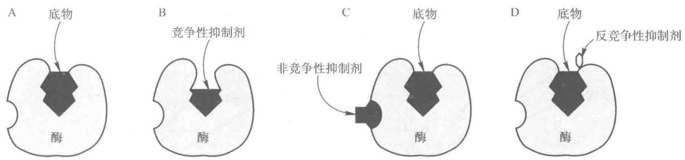  
图7-17 可逆抑制剂之间的区别  
A. 酶-底物复合物；B. 竞争性抑制剂结合在活性部位阻止了与底物的结合；C. 非竞争性抑制剂不妨碍酶与底物的结合；D. 反竞争性抑制剂仅与酶-底物复合物结合

影响,但实际上有很多抑制剂与酶结合后会部分影响酶与底物的结合,其结果介于竞争性抑制和非竞争性抑制之间,称为混合型抑制。例如单底物条件下,邻甲苯甲醛和间甲苯甲醛均为酪氨酸酶的混合型抑制剂。混合型抑制多见于双底物和多底物酶促反应。

## （三）可逆抑制作用和不可逆抑制作用的鉴别

除了用透析、超滤或凝胶过滤等方法能除去抑制剂来区别可逆抑制作用和不可逆抑制作用外，还可采用动力学的方法来鉴别。

在测定酶活力系统中加入一定量的抑制剂，然后测定不同酶浓度的反应初速率，以初速率对酶浓度作图。在测活系统中不加抑制剂时，初速率对酶浓度作图得到一条通过原点的直线（图7-18曲线1）；当测活系统中加入一定量的不可逆抑制剂时，抑制剂使一定量的酶失活，只有加入的酶量大于不可逆抑制剂的量时，才表现出酶活力，不可逆抑制剂的作用相当于把曲线向右平移（图7-18曲线2）；在测活系统中加入一定量的可逆抑制剂后，由于抑制剂的量是恒定的，因此得到一条通过原点，但斜率较低于曲线1的直线（图7-18曲线3）。如果在不同抑制剂浓度下，每一个抑制剂浓度都作一条初速率和酶浓度关系曲线，不可逆抑制剂可以得到一组不通过原点的并行线（图7-19B），而可逆抑制剂得到一组通过原点但斜率不同的直线（图7-19A）。这样可逆抑制作用和不可逆抑制作用从图7-19更清楚地区分开来。

  
图 7-18 可逆抑制剂与不可逆抑制剂的区别(一)

## （四）可逆抑制作用动力学

可逆抑制剂与酶结合后产生的抑制作用,可以根据米氏学说原理加以推导,定量说明抑制剂对酶促反应速率的影响,下面讨论4种可逆抑制类型的动力学。

## 1. 竞争性抑制

在竞争性抑制中,底物或抑制剂与酶的结合都是可逆的,存在着下面平衡式:

$$
\begin{array}{r l} \mathrm{E} & + \mathrm{S} \xrightarrow [ k _ {- 1} ]{k _ {1}} \mathrm{ES} \xrightarrow [ k _ {2} ]{k _ {2}} \mathrm{E} + \mathrm{P} \\ + & \\ \mathrm{I} & \\ k _ {\mathrm{i} 1} \Bigg \downarrow k _ {\mathrm{i} 2} & \\ \mathrm{EI} & \end{array}
$$

$K_{i}$ 为抑制剂常数(inhibitor constant)， $K_{i}=\frac{k_{i2}}{k_{i1}}$ ，为EI的解离常数。ES的解离常数为 $K_{m}$ 。

酶不能同时与 S、I 结合，所以，有 ES 和 EI，而没有 ESI

$$
[ \mathrm{E} ] = [ \mathrm{E} _ {\mathrm{f}} ] + [ \mathrm{ES} ] + [ \mathrm{EI} ]\tag{7-41}
$$

$[E_{f}]$ 为游离酶的浓度， $[E]$ 为酶的总浓度。

根据式 $(7-26)$ ， $(7-28)$

$$
V _ {\max} = k _ {2} [ \mathrm{E} ]
$$

$$
v _ {0} = k _ {2} [ \mathrm{ES} ]
$$

所以

$$
\frac {V _ {\mathrm{max}}}{v _ {0}} = \frac {[ \mathrm{E} ]}{[ \mathrm{ES} ]}\tag{7-42}
$$

将式 $(7-41)$ 代入式 $(7-42)$ :

$$
\frac {V _ {\max}}{v _ {0}} = \frac {[ \mathrm{E} _ {\mathrm{f}} ] + [ \mathrm{ES} ] + [ \mathrm{EI} ]}{[ \mathrm{ES} ]}\tag{7-43}
$$

为了消去[ES]项，根据 $K_{\mathrm{m}}$ 和 $K_{\mathrm{i}}$ 的平衡式求出 $[\mathrm{E_f}]$ 项及[EI]项：

因为 $K_{m}=\frac{[E_{i}][S]}{[ES]}$

所以 $[\mathrm{E_f}] = \frac{K_{\mathrm{m}}}{[\mathrm{S}]} [\mathrm{ES}]$

因为 $K_{i}=\frac{[E_{i}][I]}{[EI]}$

所以 $[\mathrm{EI}] = \frac{[\mathrm{E_f}][\mathrm{I}]}{K_i}$

将 $[\mathrm{E_f}]$ 代入[EI]式中，则[EI] $= \frac{K_{\mathrm{m}}}{[\mathrm{S}]}\cdot [\mathrm{ES}]\cdot \frac{[\mathrm{I}]}{K_{\mathrm{i}}} = \frac{K_{\mathrm{m}}[\mathrm{I}]}{K_{\mathrm{i}}[\mathrm{S}]} [\mathrm{ES}]$ 。

再将 $[\mathrm{E_f}]$ 及[EI]代入式(7-43)得： $\frac{V_{\max}}{v_0} = \frac{\frac{K_{\mathrm{m}}}{[\mathrm{S}]} [\mathrm{ES}] + [\mathrm{ES}] + \frac{K_{\mathrm{m}}[\mathrm{I}]}{K_{\mathrm{i}}[\mathrm{S}]} [\mathrm{ES}]}{[\mathrm{ES}]}$

整理后得：

$$
v _ {0} = \frac {V _ {\mathrm{max}} [ \mathrm{S} ]}{K _ {\mathrm{m}} \left(1 + \frac {[ \mathrm{I} ]}{K _ {\mathrm{i}}}\right) + [ \mathrm{S} ]}\tag{7-44}
$$

将式(7-44)与标准米氏方程式(7-29)比较,这里相当于 $K_{m}$ 的是 $K_{m}\left(1+\frac{[I]}{K_{i}}\right)$ 项,它是在抑制剂存在下实验观察得到的米氏常数,即达到 $V_{max}/2$ 时的[S]值,被称为表观米氏常数 $(K_{m}^{\prime})$ 。

双倒数式：

$$
\frac {1}{v _ {0}} = \frac {K _ {\mathrm{m}}}{V _ {\max}} \left(1 + \frac {[ 1 ]}{K _ {\mathrm{i}}}\right) \cdot \frac {1}{[ \mathrm{S} ]} + \frac {1}{V _ {\max}}\tag{7-45}
$$

将式(7-44)以 $v_{0}$ 对[S]作图得图7-20A，用式(7-45)以双倒数作图得图7-20B。

从图 7-20A 可以看出, 加入竞争性抑制剂后, $V_{max}$ 不变, 这是因为在任一固定的 [I] 下, 只要 [S] 达到饱和，则所有的酶将以ES形式存在。 $K_{m}$ 变大， $K_{m}^{\prime}>K_{m}$ ，而且 $K_{m}^{\prime}$ 随[I]的增加而增大。双倒数作图直线相交于纵轴，这是竞争性抑制作用的特点。抑制分数与[I]成正比，而与[S]成反比。

  
图 7-20 竞争性抑制曲线

## 2. 非竞争性抑制

在非竞争时抑制中存在如下的平衡：

酶与底物结合后，可再与抑制剂结合，酶与抑制剂结合后，也可再与底物结合。

$$
\mathrm{ES} + \mathrm{I} \rightleftharpoons \mathrm{EIS} \quad K _ {\mathrm{i}} = \frac {[ \mathrm{ES} ] \cdot [ \mathrm{I} ]}{[ \mathrm{EIS} ]}
$$

$$
\text {或} \mathrm{EI+S} \rightleftharpoons \mathrm{EIS} K _ {\mathrm{i}} = \frac {[ \mathrm{EI} ] \cdot [ \mathrm{S} ]}{[ \mathrm{EIS} ]}
$$

所以，与酶结合的中间产物有 ES、EI 及 EIS。

$$
[ \mathrm{E} ] = [ \mathrm{E} _ {\mathrm{f}} ] + [ \mathrm{ES} ] + [ \mathrm{EI} ] + [ \mathrm{EIS} ]
$$

按平衡态处理,在非竞争性抑制中:

$$
[ \mathrm{ES} ] = \frac {[ \mathrm{E} ] [ \mathrm{S} ]}{K _ {\mathrm{m}}}, [ \mathrm{EI} ] = \frac {[ \mathrm{E} ] [ \mathrm{I} ]}{K _ {\mathrm{i}}}, [ \mathrm{EIS} ] = \frac {[ \mathrm{ES} ] [ \mathrm{I} ]}{K _ {\mathrm{i}}} = \frac {[ \mathrm{EI} ] [ \mathrm{S} ]}{K _ {\mathrm{i}}}
$$

代入式(7-42)， $\frac{V_{\mathrm{max}}}{v_{0}}=\frac{[E]}{[ES]}$ ，再经过推导后，得到：

$$
v _ {0} = \frac {V _ {\max} [ S ]}{(K _ {\mathrm{m}} + [ S ]) \left(1 + \frac {[ I ]}{K _ {\mathrm{i}}}\right)}\tag{7-46}
$$

将式(7-46)与标准米氏方程来比较, $K_{m}$ 未变,而 $V_{max}^{\prime}<V_{max},V_{max}^{\prime}$ 为 $V_{max}/1+\frac{[1]}{K_{i}}$ 。

双倒数方程为：

$$
\frac {1}{v _ {0}} = \frac {K _ {\mathrm{m}}}{V _ {\mathrm{max}}} \left(1 + \frac {[ \mathrm{I} ]}{K _ {\mathrm{i}}}\right) \frac {1}{[ \mathrm{S} ]} + \frac {1}{V _ {\mathrm{max}}} \left(1 + \frac {[ \mathrm{I} ]}{K _ {\mathrm{i}}}\right)\tag{7-47}
$$

由式(7-46)和式(7-47)作图得图7-21A和B。由图7-21A可以看出，加入非竞争性抑制剂后， $K_{m}$ 值不变，表示不受抑制剂影响。而 $V_{max}$ 变小，即使[S]足够使酶饱和，但总有一定比例的ES将以无活性的EIS存在。 $K_{m}^{\prime}=K_{m},V_{max}^{\prime}$ 随[I]的增加而减小。双倒数作图直线相交于横轴（图7-21B），这是非竞争性抑制作用的特点。抑制分数与[I]成正比，而与[S]无关，即[I]不变时，任何[S]的抑制分数是一个常数。

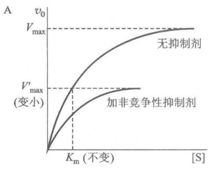

  
图 7-21 非竞争性抑制曲线

## 3. 反竞争性抑制

这类抑制作用的特点是酶先与底物结合,然后才与抑制剂结合,存在以下平衡:

这类抑制与酶结合的中间产物有 ES、ESI、而无 EI。

$$
[ \mathrm{E} ] = [ \mathrm{E} _ {\mathrm{f}} ] + [ \mathrm{ES} ] + [ \mathrm{ESI} ]
$$

按稳态处理可以推导出： $[\mathrm{ES}] = \frac{[\mathrm{E}][\mathrm{S}]}{K_{\mathrm{m}}}, [\mathrm{ESI}] = \frac{[\mathrm{E}][\mathrm{S}]}{K_{\mathrm{m}}} \cdot \frac{[I]}{K_{\mathrm{i}}}$

代入式(7-42)， $\frac{V_{\max}}{v_{0}}=\frac{[E]}{[ES]}$ ，再经推导后得以下方程：

$$
v _ {0} = \frac {V _ {\mathrm{max}} [ \mathrm{S} ]}{K _ {\mathrm{m}} + [ \mathrm{S} ] \left(1 + \frac {[ \mathrm{I} ]}{K _ {\mathrm{i}}}\right)}\tag{7-48}
$$

双倒数式：

$$
\frac {1}{v _ {0}} = \frac {K _ {\mathrm{m}}}{V _ {\mathrm{max}}} \cdot \frac {1}{[ \mathrm{S} ]} + \frac {1}{V _ {\mathrm{max}}} \left(1 + \frac {[ \mathrm{I} ]}{K _ {\mathrm{i}}}\right)\tag{7-49}
$$

由式(7-48)及式(7-49)作图得图7-22A和B。由图7-22A可以看出，加入反竞争性抑制剂后， $K_{m}$ 及 $V_{max}$ 都变小，而且都降低同样倍数（式7-48）。 $K_{m}^{\prime}<K_{m},V_{max}^{\prime}<V_{max}$ ，即表观 $K_{m}$ 及表观 $V_{max}$ 都随[I]的增加而减小。因为斜率 $K_{m}/V_{max}$ 保持不变，因此双倒数作图为一组平行线，这是反竞争性抑制作用的特点。抑

  
图 7-22 反竞争性抑制曲线

制分数既与[I]成正比也与[S]成正比。

## 4. 混合型抑制

混合型抑制包括两种类型:非竞争性和反竞争性混合抑制,非竞争性和竞争性混合抑制。根据平衡态假设,同样推导出混合型抑制动力学方程式,得知 $K_{m}$ 和 $V_{max}$ 的变化。混合型抑制的动力学方程:

$$
v _ {0} = \frac {V _ {\mathrm{max}} [ \mathrm{S} ]}{\left(1 + \frac {[ \mathrm{I} ]}{K _ {\mathrm{i}}}\right) K _ {\mathrm{m}} + \left(1 + \frac {[ \mathrm{I} ]}{K _ {\mathrm{i}} ^ {\prime}}\right) [ \mathrm{S} ]}\tag{7-50}
$$

其双倒数式：

$$
\frac {1}{v _ {0}} = \frac {K _ {\mathrm{m}}}{V _ {\max}} \left(1 + \frac {[ \mathrm{I} ]}{K _ {\mathrm{i}}}\right) \frac {1}{[ \mathrm{S} ]} + \frac {1}{V _ {\max}} \left(1 + \frac {[ \mathrm{I} ]}{K _ {\mathrm{i}} ^ {\prime}}\right)\tag{7-51}
$$

双倒数作图时，一组直线相交于纵轴左侧，如果 $K_{i}^{\prime}>K_{i}$ 则相交于横轴上方第二象限内（图7-23A），这种情形介于非竞争性与竞争性图谱之间，故称为非竞争-竞争性抑制。若 $K_{i}^{\prime}<K_{i}$ 则相交于横轴下方第三象限内（图7-23B），介于非竞争性和反竞争性图谱之间，故此又称为非竞争-反竞争性抑制。

  
图7-23 混合型抑制曲线  
A. 非竞争-竞争性抑制曲线；B. 非竞争-反竞争性抑制曲线

现将无抑制剂和有抑制剂时的米氏方程和 $V_{\mathrm{max}}$ 和 $K_{\mathrm{m}}$ 的变化，归纳于表7-7中。

表 7-7 不同类型可逆抑制剂对米氏方程和常数的影响

<table><tr><td>抑制类型</td><td>方程式</td><td>表观  $V_{\max}$ </td><td>表观  $K_m$ </td></tr><tr><td>无抑制剂</td><td> $v_0 = \frac{V_{\max} [S]}{K_m + [S]}$ </td><td> $V_{\max}$ </td><td> $K_m$ </td></tr><tr><td>竞争性抑制</td><td> $v_0 = \frac{V_{\max} [S]}{K_m \left(1 + \frac{[I]}{K_i}\right) + [S]}$ </td><td> $V_{\max}$ </td><td> $K_m \left(1 + \frac{[I]}{K_i}\right)$ </td></tr><tr><td>非竞争性抑制</td><td> $v_0 = \frac{V_{\max} [S]}{(K_m + [S])(1 + \frac{[I]}{K_i})}$ </td><td> $\frac{V_{\max}}{1 + \frac{[I]}{K_i}}$ </td><td> $K_m$ </td></tr><tr><td>反竞争性抑制</td><td> $v_0 = \frac{V_{\max} [S]}{K_m + \left(1 + \frac{[I]}{K_i}\right) [S]}$ </td><td> $\frac{V_{\max}}{1 + \frac{[I]}{K_i}}$ </td><td> $\frac{K_m}{1 + \frac{[I]}{K_i}}$ </td></tr><tr><td>混合型抑制</td><td> $v_0 = \frac{V_{\max} [S]}{\left(1 + \frac{[I]}{K_i}\right) K_m + \left(1 + \frac{[I]}{K_i'}\right) [S]}$ </td><td> $\frac{V_{\max}}{1 + \frac{[I]}{K_i'}}$ </td><td> $\frac{K_m \left(1 + \frac{[I]}{K_i}\right)}{1 + \frac{[I]}{K_i'}}$ </td></tr></table>

  
图7-24 Dixon作图法求 $K_{1}([S_{2}] > [S_{1}])$  
A. 非竞争性抑制；B. 竞争性抑制；C. 反竞争性抑制

用Dixon作图法，求 $K_{\mathrm{i}}$ ，只要以[I]为横坐标，以 $\frac{1}{v_0}$ 为纵坐标，采用一个以上的[S]，给出不同[S]时的直线，由这些直线的交点即可求得 $K_{\mathrm{i}}$ ，见图7-24。

## （五）一些酶的可逆与不可逆抑制剂

## 1. 不可逆抑制剂

按照不可逆抑制作用的选择性不同,可将不可逆抑制剂分为两类,非专一性不可逆抑制剂及专一性不可逆抑制剂,前者作用于酶的一类或几类基团,这些基团中包含了必需基团,作用后引起酶的失活;后者专一地作用于某一种酶活性部位的必需基团而导致酶的失活,它是研究酶活性部位的重要试剂。

(1) 非专一性不可逆抑制剂 主要有以下几类：

① 有机磷化合物 常见的有二异丙基氟磷酸（DFP）、农药敌敌畏、敌百虫、对硫磷和萨林等，它们的通式和结构式如下：

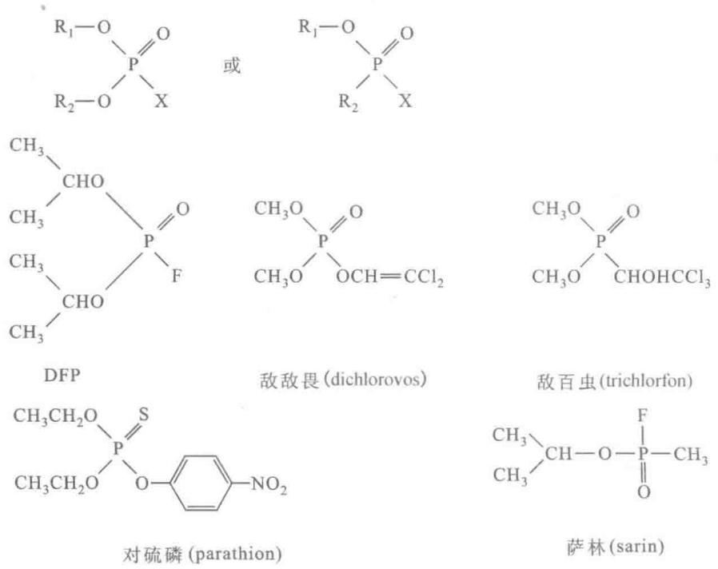

这些有机磷化合物能抑制某些蛋白酶及酯酶活力，与酶分子活性部位的丝氨酸羟基共价结合，从而使酶失活。这类化合物强烈地抑制与神经传导有关的胆碱酯酶活力，使乙酰胆碱不能分解为乙酸和胆碱，引起乙酰胆碱的积累，使一些以乙酰胆碱为传导介质的神经系统处于过度兴奋状态，引起神经中毒症状，因此这类有机磷化合物又称为神经毒剂。有机磷制剂与酶结合后虽不解离，但用解磷定（pyridine aldoxime methyl iodine，吡啶醛肟甲碘化物）或氯磷定（吡啶醛肟甲氯化物）能把酶上的磷酸根除去，使酶复活。在临床上它们作为有机磷中毒后的解毒药物。其作用过程如下：

② 有机汞、有机砷化合物 这类化合物与酶分子中半胱氨酸残基的巯基作用,抑制含巯基的酶,如对氯汞苯甲酸(PCMB),其作用如下:

这类抑制可通过加入过量的巯基化合物如半胱氨酸或还原型谷胱甘肽(GSH)而解除。

有机砷化合物如路易斯毒气(Lewisite, CHCl=CHAsCl₂)与酶的巯基结合而使人畜中毒。砷化物的毒理作用可能是由于破坏了硫辛酸辅酶，从而抑制了丙酮酸氧化酶系统。

英国发明了一种能与 Lewisite 有更大亲和力的解毒剂，称 BAL(British Anti-Lewisite)。可重新使酶恢复活性。

③ 重金属盐 含 $Ag^{+}$ 、 $Cu^{2+}$ 、 $Hg^{2+}$ 、 $Pb^{2+}$ 、 $Fe^{3+}$ 的重金属盐在高浓度时，能使酶蛋白变性失活。在低浓度时对某些酶的活性产生抑制作用，一般可以使用金属螯合剂如 EDTA、半胱氨酸等螯合除去有害的重金属离子，恢复酶的活力。

④ 烷化试剂 这一类试剂往往含一个活泼的卤素原子,如碘乙酸、碘乙酰胺和2,4-二硝基氟苯等,被作用的酶分子侧链基团有巯基、氨基、羧基、咪唑基和硫醚基等。例如与巯基酶的作用:

$$
\mathrm{E} \cdot \mathrm{SH} + \mathrm{ICH} _ {2} \mathrm{CONH} _ {2} \rightarrow \mathrm{E} - \mathrm{S} - \mathrm{CH} _ {2} - \mathrm{CONH} _ {2} + \mathrm{HI}
$$

⑤ 氰化物、硫化物和 CO 这类物质能与酶中金属离子形成较为稳定的络合物，使酶的活性受到抑制。如氰化物作为剧毒物质与含铁卟啉的酶（如细胞色素氧化酶）中的 $Fe^{2+}$ 络合，使酶失活而阻止细胞呼吸。

(2) 专一性不可逆抑制剂 专一性的不可逆制剂可分为 $K_{s}$ 型和 $k_{cat}$ 型两大类。

① $K_{\mathrm{S}}$ 型不可逆抑制剂 这类抑制剂是根据底物的化学结构设计的, 具有底物类似的结构, 可以和相应的酶结合, 同时还带有一个活泼的化学基团, 能与酶分子中的必需基团反应进行化学修饰, 从而抑制酶活性。因抑制是通过对酶的亲和力来对酶进行修饰标记的, 故称为亲和标记试剂 (affinity labeling reagent)。这种抑制剂虽然主要“攻击”酶活性部位的必需基团, 但由于它的活泼基团也可以修饰酶分子其他部位的同一基团, 因此其专一性有一定的限度。这取决于抑制剂与活性部位必需基团在反应前形成非共价络合物的解离常数以及非活性部位同类基团形成非共价络合物的解离常数之比, 即 $K_{\mathrm{S}}$ 的比值, 故这类抑制剂称为 $K_{\mathrm{S}}$ 型不可逆抑制剂。例如: 胰蛋白酶要求催化的底物具有一个带正电荷的侧链, 如 Lys、Arg 侧链。对甲苯磺酰-L-赖氨酰氯甲酮 (TLCK) 和胰蛋白酶的底物对甲苯磺酰-L-赖氨酰甲酯 (TLME) 有相似的结构 (图 7-25), 因此前者可以与胰蛋白酶活性部位必需基团 $\mathrm{His}_{57}$ 共价结合, 引起不可逆地失活。失活作用是以化学计算量进行, 伴随着活性 $100\%$ 丧失。所以 TLCK 是胰蛋白酶的 $K_{\mathrm{S}}$ 型不可逆抑制剂。

  
图7-25 胰蛋白酶底物与其 $K_{\mathrm{s}}$ 型不可逆抑制剂的化学结构比较

再如，3-溴丙酮醇磷酸（3-bromoacetal phosphate）是磷酸丙糖异构酶（triose phosphate isomerase）的亲和标记试剂。它是正常底物磷酸二羟丙酮的类似物，能与酶的活性部位结合，共价修饰酶活性必需的 Glu 残基（图 7-26）而使酶失活。

  
图 7-26 3-溴丙酮醇磷酸对磷酸丙糖异构酶的亲和标记

② $k_{\mathrm{cat}}$ 型不可逆抑制剂 是根据酶催化过程设计的，设计此类抑制剂，要求对酶的作用机制预先有一定的了解。 $k_{\mathrm{cat}}$ 抑制剂不但具有天然底物的类似结构，且本身也是酶的底物，能与酶结合发生类似于底物的变化。但抑制剂还有一个潜伏的反应基团（latent group），当酶对它进行催化反应时，这个潜伏反应基团被暴露或活化，并作用于酶活性部位的必需基团或酶的辅基，使酶不可逆失活。这类抑制剂是专一性极高的不可逆抑制剂。因此 $k_{\mathrm{cat}}$ 型抑制剂称为自杀性底物（suicide substrate）。

若以 E 及 $S_{i}$ 分别代表酶和自杀性底物，I 为 $S_{i}$ 被酶催化生成的抑制物，则反应可表示如下：

$$
\mathrm{E} + \mathrm{S} _ {\mathrm{i}} \xrightarrow {K _ {\mathrm{s}}} \mathrm{ES} _ {\mathrm{i}} \xrightarrow {k _ {\mathrm{cat}}} \mathrm{E} \cdot \mathrm{I} \xrightarrow {k _ {\mathrm{i}}} \mathrm{E} - \mathrm{I}
$$

式中 $K_{\mathrm{S}}$ 为 $\mathrm{ES}_{\mathrm{i}}$ 的解离常数， $k_{\mathrm{cat}}$ 为 $\mathrm{ES}_{\mathrm{i}}$ 转变为 $\mathrm{E} \cdot \mathrm{I}$ 的催化常数，而 $k_{\mathrm{i}}$ 是 $\mathrm{E}$ 与 $\mathrm{I}$ 共价结合的速率常数。抑制作用的效率及专一性不但与 $K_{\mathrm{S}}$ 有关，更重要的是决定于 $k_{\mathrm{cat}}$ ，因为 $\mathrm{S}_{\mathrm{i}}$ 与 $\mathrm{E}$ 结合还不能成为抑制剂，只有生成产物 $\mathrm{I}$ 后才产生抑制作用。 $k_{\mathrm{cat}}$ 愈大，生成产物的速度愈快，抑制作用愈强，故这种取决于 $k_{\mathrm{cat}}$ 的抑制剂称为

$k_{cat}$ 型抑制剂。

自杀性底物所具有的 $k_{\mathrm{cat}}$ 型抑制作用有下列特点：① 自杀底物 $\mathrm{S}_{\mathrm{i}}$ 的浓度愈大，抑制作用也愈大，其抑制动力学呈一级反应；② 在自杀性底物过量时加入酶愈多，产生的抑制愈大；③ $\mathrm{S}_{\mathrm{i}}$ 本身无抑制作用，而生成的I是一种亲和标记抑制物；④ 酶活性中心的必需基团与I的化学计量关系是1:1；⑤ 真正的底物S能竞争性的阻断 $\mathrm{S}_{\mathrm{i}}$ 的抑制作用。以上④、⑤两点也运用于 $\mathrm{K}_{\mathrm{s}}$ 型抑制剂。

例如:单胺氧化酶(monoamine oxidase)对神经递质的合成有重要作用,它以FAD为辅基。N,N-二甲丙炔胺是单胺氧化酶的一种 $k_{cat}$ 型抑制剂,被单胺氧化酶黄素辅基氧化后,经烷基化共价修饰黄素辅基,则酶失活(图7-27)。单胺氧化酶脱氨作用,可引起神经递质如多巴胺和5-羟色胺在脑中水平的降低,帕金森病(Parkinson disease)与低水平的多巴胺有关,而抑郁症(depression)与低水平5-羟色胺相联系。治疗这两种病的药物(-)deprenyl就是单胺氧化酶的自杀性底物。

  
(单胺氧化酶自杀性底物)

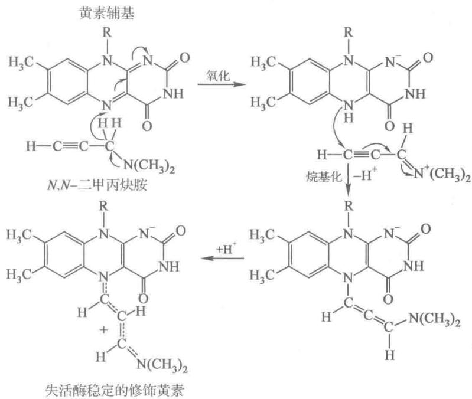  
图7-27 单胺氧化酶被自杀性底物抑制的机制

再如 $\beta-$ 卤代-D-Ala 是细菌中丙氨酸消旋酶（alanine racemase, AR）的不可逆抑制剂，属于磷酸吡哆醛酶类的自杀性底物，作用机制如图 7-28 所示。因丙氨酸消旋酶能使 L-Ala 转变成为 D-Ala，而 D-Ala 是细菌合成胞壁肽聚糖的重要原料，丙氨酸消旋酶受抑制后可阻断肽聚糖的合成，则抑制细菌生长，故 $\beta-$ 卤代-D-Ala 是一种抗菌药物。

青霉素（penicillin）是糖肽转肽酶（glycopeptide transpeptidase）的 $k_{\mathrm{cat}}$ 型不可逆抑制剂。糖肽转肽酶是在细菌细胞壁合成期间催化肽聚糖链的交联。青霉素通过干扰肽聚糖链之间的肽交联桥的形成，使细菌失去抗渗透能力，因此细菌停止生长或死亡。现已证明青霉素内酰胺环上的高反应性肽键受到酶活性部位上Ser残基的一OH基的亲核攻击形成共价键。产生的青霉噻唑酰基-酶复合体是无活性的（图7-29）。青霉素是转肽酶的底物之一，是酰基-D-Ala-D-Ala的结构类似物。青霉素对人体的低毒性正是因为它具有高度专一性的缘故。它选择性地作用于细菌并引起溶菌作用。几乎不损害人和动物的细胞，所以青霉素是一种比较理想的抗生素（antibiotics）。

## 2. 可逆抑制剂

可逆抑制剂中最重要和最常见的是竞争性抑制剂。如像一些竞争性抑制剂与天然代谢物在结构上十分相似,能选择性地抑制病菌或癌细胞在代谢过程中的某些酶,而具有抗菌和抗癌作用。这类抑制剂可称为抗代谢物或代谢类似物。例如 5'-氟尿嘧啶是一种抗癌药物,它的结构与尿嘧啶十分相似,能抑制胸腺嘧啶合成酶的活性,阻碍胸腺嘧啶的合成代谢,使体内核酸不能正常合成,使癌细胞的增殖受阻,起到抗癌作用。磺胺药,以对氨基苯磺酰胺为例,它的结构与对氨基苯甲酸十分相似,是对氨基苯甲酸的竞争性抑制剂。对氨基苯甲酸是叶酸结构的一部分,叶酸和二氢叶酸则是核酸的嘌呤核苷酸合成中的重要辅酶——四氢叶酸的前身,如果缺少四氢叶酸,细菌生长繁殖便会受到影响。

  
图7-28 $\beta$ -卤代-D-丙氨酸抑制丙氨酸消旋酶的机制

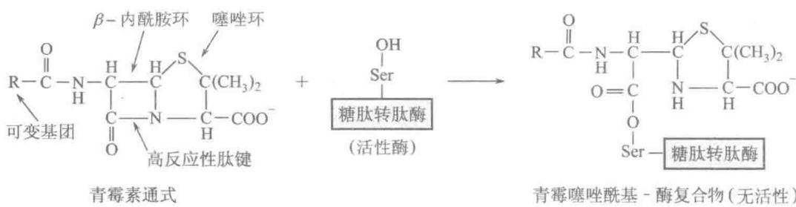  
图 7-29 青霉素是糖肽转肽酶的不可逆抑制剂

人体能直接利用食物中的叶酸,某些细菌则不能直接利用外源的叶酸,只能在二氢叶酸合成酶的作用下,利用对氨基苯甲酸为原料合成二氢叶酸。而磺胺药物可与对氨基苯甲酸相互竞争,抑制二氢叶酸合成酶的活性,影响二氢叶酸的合成,导致细菌的生长繁殖受抑制,从而达到治病的效果。再如,氨甲蝶呤(methotrexate)是二氢叶酸还原酶很强的竞争性抑制剂,氨甲蝶呤结构类似于二氢叶酸还原酶的底物二氢叶酸。它对酶的结合能力是天然底物的1000倍,强力抑制该酶的活性,从而影响了对核苷酸碱基的合成,因此可用于治疗癌症。

利用竞争性抑制的原理用来设计药物,如抗癌药物阿拉伯糖胞苷、氨基叶酸等都是利用这一原理而设计出来的。

过渡态底物类似物可作为竞争性抑制剂,所谓过渡态(transition state)底物是指底物和酶结合成中间复合物后被活化的过渡形式，由于能障小，和酶结合就紧密得多，这是酶具有高度催化效力的原因之一。可以设想，如抑制剂的化学结构能类似过渡态底物，则其对酶的亲和力就会远大于底物，可达到 $10^{2} \sim 10^{6}$ 倍，从而引起酶被强烈抑制。根据酶作用机制研究的进展，目前已报道了各种酶反应的几百种过渡态底物类似物，它们都属于竞争性抑制剂，其抑制效率比其基态底物类似物高得多。

例如嘌呤核苷水合物是小牛肠腺苷脱氨酶(adenosine deaminase)反应过渡态的类似物,是该酶强的抑制剂, $K_{i}=3\times10^{-13}\ mol\cdot L^{-1}$ （图7-30A）。酵母醛缩酶(aldolase)反应的过渡态类似物比对底物的结合能力大4万倍(图7-30B)。

A. 嘌呤核苷水合物是小牛肠腺苷脱氨酶反应过渡态类似物，是该酶有力的抑制剂；  
  
图 7-30 过渡态类似物举例

再如，催化 $\mathrm{ATP} + \mathrm{AMP} \rightarrow 2\mathrm{ADP}$ 的腺苷酸激酶（adenylate kinase），经研究腺苷五磷酸（ $\mathrm{AP}_5\mathrm{A}$ ）是底物过渡态类似物，对该酶有强烈地抑制作用。又如乳酸脱氢酶（lactate dehydrogenase）、草酰乙酸脱羧酶（oxaloacetic decarboxylase）、丙酮酸羧化酶（pyruvate carboxylase）在催化各自底物（分别为乳酸、草酰乙酸、丙酮酸）变成产物的过程中，烯醇式丙酮酸是共有的过渡态，而草酸是烯醇式丙酮酸的类似物，故对3种酶都有强烈的抑制作用。 $K_{i}$ 为 $3.5 \times 10^{-6} \sim 1.1 \times 10^{-5} \mathrm{~mol} \cdot \mathrm{L}^{-1}$ ，和相应的底物有竞争作用。

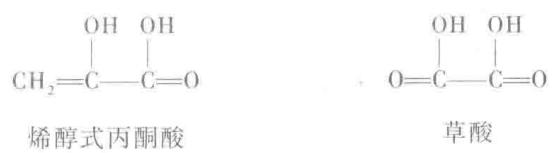

对过渡态底物类似物抑制剂的研究,具有很大的理论和实践意义,不但有利于对酶催化机制的了解,还可据此合成具有高效而特异的新药物。

<!-- EN-BEGIN 6.3 -->

### 【英文对应 6.3】Enzyme Kinetics as an Approach to Understanding Mechanism

> 来源：Lehninger Principles of Biochemistry（书籍/02_生物化学原理） 第6章 Enzymes，§6.3。对应本章“三、酶的抑制作用”。

Biochemists commonly use several approaches to study the mechanism of action of purified enzymes. The three-dimensional structure of the protein provides important information, which is enhanced by traditional protein chemistry and modern methods of site-directed mutagenesis (changing the amino acid sequence of a protein by genetic engineering; see Fig. 9-10). These technologies permit enzymologists to examine the role of individual amino acids in enzyme structure and action. However, the oldest approach to understanding enzyme mechanisms, and one that remains very important, is to determine the rate of a reaction and how it changes in response to changes in experimental parameters, a discipline known as enzyme kinetics. We provide here a basic introduction to the kinetics of enzyme-catalyzed reactions.

#### [EN] Substrate Concentration Affects the Rate of Enzyme-Catalyzed Reactions

At any given instant in an enzyme-catalyzed reaction, the enzyme exists in two forms: the free or uncombined form E and the substrate-combined form ES. When the enzyme is first mixed with a large excess of substrate, there is an initial transient period, the pre-steady state, during which the concentration of ES builds up. For most enzymatic reactions, this period is very brief. The pre-steady state is frequently too short to be observed easily, lasting only the time (often microseconds) required to convert one molecule of substrate to product (one enzymatic turnover). The reaction quickly achieves a steady state in which [ES] (and the concentrations of any other intermediates) remains approximately constant for much of the remainder of the reaction (Fig. 6–10). As most of the reaction reflects the steady state, the traditional analysis of reaction rates is referred to as steady-state kinetics.

  
FIGURE 6-10 The course of an enzyme-catalyzed reaction. In a typical reaction, product will increase as substrate declines. The concentration of free enzyme, E, declines rapidly, as the concentration of the ES complex increases and reaches a steady state. The steady-state concentration of ES remains nearly constant for much of the remainder of the reaction.

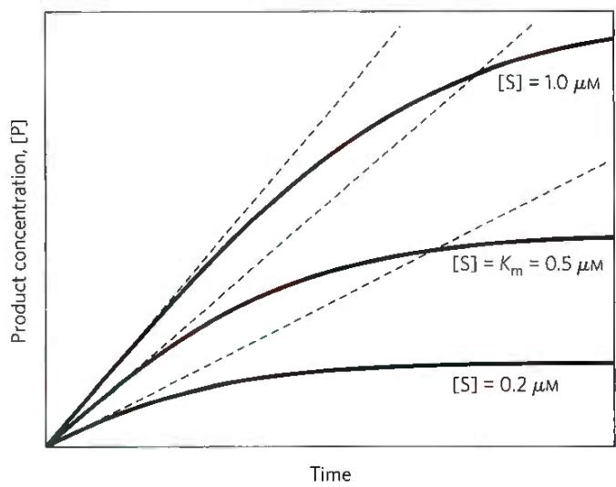  
FIGURE 6-11 Initial velocities of enzyme-catalyzed reactions. A theoretical enzyme that catalyzes the reaction $S \rightleftharpoons P$ is present at a concentration of $S$ sufficient to catalyze the reaction at a maximum velocity, defined as $V_{\mathrm{max}}$ , of $1\mu \mathrm{W / min}$ . The rate observed at a given concentration of $S$ depends on the Michaelis constant, $K_{\mathrm{m}}$ , explained in more detail in the next section. Here, the $K_{\mathrm{m}}$ is $0.5\mu \mathrm{M}$ . Progress curves are shown for substrate concentrations below, at, and above the $K_{\mathrm{m}}$ . The rate of an enzyme-catalyzed reaction declines as substrate is converted to product. A tangent to each curve taken at time $= 0$ (dashed line) defines the initial velocity, $V_{0}$ , of each reaction.

A key factor affecting the rate of a reaction catalyzed by an enzyme is the concentration of substrate, [S]. However, studying the effects of substrate concentration is complicated by the fact that [S] changes during the course of an in vitro reaction as substrate is converted to product. One simplifying approach is to measure the initial rate (or initial velocity), designated $V_{0}$ (Fig. 6-11). In a typical reaction, the enzyme may be present in nanomolar quantities, whereas [S] may be five or six orders of magnitude higher. If only the beginning of the reaction is monitored, over a period in which only a small percentage of the available substrate (<2%–3%) is converted to product, [S] can be regarded as constant, to a reasonable approximation. $V_{0}$ can then be explored as a function of [S], which is adjusted by the investigator. Note that even the initial rate reflects a steady state.

The effect on $V_{0}$ of varying [S] when the enzyme concentration is held constant is shown in Figure 6-12. At relatively low concentrations of substrate, $V_{0}$ increases almost linearly with an increase in [S]. At higher substrate concentrations, $V_{0}$ increases by smaller and smaller amounts in response to increases in [S]. Finally, a point is reached beyond which increases in $V_{0}$ are vanishingly small as [S] increases. This plateau-like $V_{0}$ region is close to the maximum velocity, $V_{max}$ .

The ES complex is the key to understanding this kinetic behavior, just as it was a starting point for our discussion of catalysis. The kinetic pattern in Figure 6-12 led Victor Henri, following a proposal by Adolphe Wurtz a few decades earlier, to propose in 1903 that the combination of an enzyme with its substrate molecule to form an ES complex is a necessary step in enzymatic catalysis.

  
FIGURE 6-12 Effect of substrate concentration on the initial velocity of an enzyme-catalyzed reaction. The maximum velocity, $V_{\mathrm{max}}$ , is extrapolated from the plot, because $V_0$ approaches but never quite reaches $V_{\mathrm{max}}$ . The substrate concentration at which $V_0$ is half-maximal is $K_{\mathrm{m}}$ , the Michaelis constant. The concentration of enzyme in an experiment such as this is generally so low that [S] >> [E] even when [S] is described as low or relatively low. The units shown are typical for enzyme-catalyzed reactions and are given only to help illustrate the meaning of $V_0$ and [S]. (Note that the curve describes part of a rectangular hyperbola, with one asymptote at $V_{\mathrm{max}}$ . If the curve were continued below [S] = 0, it would approach a vertical asymptote at [S] = - $K_{\mathrm{m}}$ )

This idea was expanded into a general theory of enzyme action, particularly by Leonor Michaelis and Maud Menten in 1913. They postulated that the enzyme first combines reversibly with its substrate to form an enzyme-substrate complex in a relatively fast reversible step:

$$
\mathrm{E} + \mathrm{S} \underset {k _ {- 1}} {\overset {k _ {1}} {\rightleftharpoons}} \mathrm{ES}\tag{6-7}
$$

The ES complex then breaks down in a slower second step to yield the free enzyme and the reaction product P:

$$
\mathrm{ES} \underset {k _ {- 2}} {\overset {k _ {2}} {\rightleftharpoons}} \mathrm{E} + \mathrm{P}\tag{6-8}
$$

Because the slower second reaction (Eqn 6-8) must limit the rate of the overall reaction, the overall rate must be proportional to the concentration of the species that reacts in the second step—that is, ES.

  
Leonor Michaelis, 1875–1949
(Rockefeller Archive Center.)

  
Maud Menten, 1879–1960
[Archives & Special Collections, University of Pittsburgh Library System.]

At low [S], most of the enzyme is in the uncombined form E. Here, the rate is proportional to [S] because the equilibrium of Equation 6-7 is pushed toward formation of more ES as [S] increases. The maximum initial rate of the catalyzed reaction ( $V_{max}$ ) is observed when virtually all the enzyme is present as the ES complex and [E] is vanishingly small. Under these conditions, the enzyme is “saturated” with its substrate, so that further increases in [S] have no effect on rate. This condition exists when [S] is sufficiently high that essentially all the free enzyme has been converted to the ES form. After the ES complex breaks down to yield the product P, the enzyme is free to catalyze the reaction of another molecule of substrate (and will do so rapidly under saturating conditions). The saturation effect is a distinguishing characteristic of enzymatic catalysts and is responsible for the plateau observed in Figure 6-12, and the pattern seen in the figure is sometimes referred to as saturation kinetics.

#### [EN] The Relationship between Substrate Concentration and Reaction Rate Can Be Expressed with the Michaelis-Menten Equation

The curve expressing the relationship between [S] and $V_{0}$ (Fig. 6-12) has the same general shape for most enzymes (it approaches a rectangular hyperbola), which can be expressed algebraically by the Michaelis-Menten equation. Michaelis and Menten derived this equation starting from their basic hypothesis that the rate-limiting step in enzymatic reactions is the breakdown of the ES complex to product and free enzyme. The equation is

$$
V _ {0} = \frac {V _ {\mathrm{max}} [ \mathrm{S} ]}{K _ {\mathrm{m}} + [ \mathrm{S} ]}\tag{6-9}
$$

This is the Michaelis-Menten equation, the rate equation for a one-substrate enzyme-catalyzed reaction. It is a statement of the quantitative relationship between the initial velocity $V_{0}$ , the maximum velocity $V_{max}$ , and the initial substrate concentration [S], all related through a constant, $K_{m}$ , called the Michaelis constant. All these terms — [S], $V_{0}$ , $V_{max}$ , and $K_{m}$ — are readily measured experimentally.

Here we develop the basic logic and the algebraic steps in a modern derivation of the Michaelis-Menten equation, which includes the steady-state assumption, a concept introduced by G. E. Briggs and J. B. S. Haldane in 1925. The derivation starts with the two basic steps of the formation and breakdown of ES (Eqns 6-7 and 6-8). Early in the reaction, the concentration of the product, [P], is negligible, and we make the simplifying assumption that the reverse reaction, P → S (described by $k_{-2}$ ), can be ignored. This assumption is not critical but it simplifies our task. The overall reaction then reduces to

$$
\mathrm{E} + \mathrm{S} \underset {k _ {- 1}} {\overset {k _ {1}} {\rightleftharpoons}} \mathrm{ES} \xrightarrow {k _ {2}} \mathrm{E} + \mathrm{P}\tag{6-10}
$$

$V_{0}$ is determined by the breakdown of ES to form product, which is determined by [ES]:

$$
V _ {0} = k _ {2} [ \mathrm{ES} ]\tag{6-11}
$$

Because [ES] in Equation 6-11 is not easily measured experimentally, we must begin by finding an alternative expression for this term. First, we introduce the term $[E_{t}]$ , representing the total enzyme concentration (the sum of free and substrate-bound enzyme). Free or unbound enzyme [E] can then be represented by $[E_{t}]$ –[ES]. Also, because [S] is ordinarily far greater than $[E_{t}]$ , the amount of substrate bound by the enzyme at any given time is negligible compared with the total [S]. With these conditions in mind, the following steps lead us to an expression for $V_{0}$ in terms of easily measurable parameters.

Step 1 The rates of formation and breakdown of ES are determined by the steps governed by the rate constants $k_{1}$ (formation) and $k_{-1} + k_{2}$ (breakdown to reactants and products, respectively), according to the expressions

$$
\mathrm{RateofESformation} = k _ {1} ([ \mathrm {E_ {t}} ] - [ \mathrm{ES} ]) [ \mathrm{S} ]\tag{6-12}
$$

$$
\mathrm{RateofESbreakdown} = k _ {- 1} [ \mathrm{ES} ] + k _ {2} [ \mathrm{ES} ]\tag{6-13}
$$

Step 2 We now make an important assumption: that the initial rate of reaction reflects a steady state in which [ES] is constant—that is, the rate of formation of ES is equal to the rate of its breakdown. This is called the steady-state assumption. The expressions in Equations 6-12 and 6-13 can be equated for the steady state, giving

$$
k _ {1} ([ \mathrm{E} _ {\mathrm{t}} ] - [ \mathrm{ES} ]) [ \mathrm{S} ] = k _ {- 1} [ \mathrm{ES} ] + k _ {2} [ \mathrm{ES} ]\tag{6-14}
$$

Step 3 In a series of algebraic steps, we now solve Equation 6-14 for [ES]. First, the left side is multiplied out and the right side simplified to give

$$
k _ {1} [ \mathrm{E} _ {\mathrm{t}} ] [ \mathrm{S} ] - k _ {1} [ \mathrm{ES} ] [ \mathrm{S} ] = (k _ {- 1} + k _ {2}) [ \mathrm{ES} ]\tag{6-15}
$$

Adding the term $k_{1}[ES][S]$ to both sides of the equation and simplifying gives

$$
k _ {1} [ \mathrm{E} _ {\mathrm{t}} ] [ \mathrm{S} ] = (k _ {1} [ \mathrm{S} ] + k _ {- 1} + k _ {2}) [ \mathrm{ES} ]\tag{6-16}
$$

We then solve this equation for [ES]:

$$
[ \mathrm{ES} ] = \frac {k _ {1} [ \mathrm{E} _ {\mathrm{t}} ] [ \mathrm{S} ]}{k _ {1} [ \mathrm{S} ] + k _ {- 1} + k _ {2}}.\tag{6-17}
$$

This can now be simplified further, combining the rate constants into one expression:

$$
[ \mathrm{ES} ] = \frac {[ \mathrm {E_ {t}} ] [ \mathrm{S} ]}{[ \mathrm{S} ] + (k _ {- 1} + k _ {2}) / k _ {1}}\tag{6-18}
$$

The term $(k_{-1} + k_{2})/k_{1}$ is defined as the Michaelis constant, $K_{m}$ . Substituting this into Equation 6-18 simplifies the expression to

$$
[ \mathrm{ES} ] = \frac {[ \mathrm {E_ {t}} ] [ \mathrm{S} ]}{K _ {\mathrm{m}} + [ \mathrm{S} ]}\tag{6-19}
$$

Step 4 We can now express $V_{0}$ in terms of [ES]. Substituting the right side of Equation 6-19 for [ES] in Equation 6-11 gives

$$
V _ {0} = \frac {k _ {2} [ \mathrm{E} _ {\mathrm{t}} ] [ \mathrm{S} ]}{K _ {\mathrm{m}} + [ \mathrm{S} ]}\tag{6-20}
$$

This equation can be simplified further. Because the maximum velocity occurs when the enzyme is saturated (that is, when $[ES]=[E_{t}]$ ), $V_{max}$ can be defined as $k_{2}[E_{t}]$ . Substituting this in Equation 6-20 gives Equation 6-9:

$$
V _ {0} = \frac {V _ {\mathrm{max}} [ \mathrm{S} ]}{K _ {\mathrm{m}} + [ \mathrm{S} ]}
$$

Note that $K_{m}$ has units of molar concentration. Does the equation fit experimental observations? Yes; we can confirm this by considering the limiting situations where [S] is very low or very high, as shown in Figure 6-13.

An important numerical relationship emerges from the Michaelis-Menten equation in the special case when $V_{0}$ is exactly one-half $V_{max}$ (Fig. 6-13). Then

$$
\frac {V _ {\max}}{2} = \frac {V _ {\max} [ S ]}{K _ {m} + [ S ]}\tag{6-21}
$$

On dividing by $V_{max}$ , we obtain

$$
\frac {1}{2} = \frac {[ \mathrm{S} ]}{K _ {\mathrm{m}} + [ \mathrm{S} ]}\tag{6-22}
$$

Solving for $K_{\mathrm{m}}$ , we get $K_{\mathrm{m}} + [\mathrm{S}] = 2[\mathrm{S}]$ , or

$$
K _ {\mathrm{m}} = [ \mathrm{S} ], \quad \text { when } \quad V _ {0} = 1 / 2 V _ {\max}\tag{6-23}
$$

  
FIGURE 6-13 Dependence of initial velocity on substrate concentration. This graph shows the kinetic parameters that define the limits of the curve at low [S] and high [S]. At low [S], $K_{\mathrm{m}} \gg [\mathrm{S}]$ , and the [S] term in the denominator of the Michaelis-Menten equation (Eqn 6-9) becomes insignificant. The equation simplifies to $V_0 = V_{\max}[\mathrm{S}] / K_{\mathrm{m}}$ , and $V_0$ exhibits a linear dependence on [S], as observed here. At high [S], where [S] $\gg K_{\mathrm{m}}$ , the $K_{\mathrm{m}}$ term in the denominator of the Michaelis-Menten equation becomes insignificant and the equation simplifies to $V_0 = V_{\max}$ ; this is consistent with the plateau observed at high [S]. The Michaelis-Menten equation is therefore consistent with the observed dependence of $V_0$ on [S], and the shape of the curve is defined by the terms $V_{\max} / K_{\mathrm{m}}$ at low [S] and $V_{\max}$ at high [S].

This is a very useful, practical definition of $K_{m}$ : $K_{m}$ is equivalent to the substrate concentration at which $V_{0}$ is one-half $V_{max}$ .

#### [EN] Michaelis-Menten Kinetics Can Be Analyzed Quantitatively

There are several ways to determine $V_{max}$ and $K_{m}$ from a plot relating $V_{0}$ to [S]. A traditional approach is to algebraically transform the Michaelis-Menten equation into equations that convert the hyperbolic curve in the $V_{0}$ versus [S] plot into a linear form from which values of $V_{max}$ and $K_{m}$ may be obtained by extrapolation. The most common of these approaches takes the reciprocal of both sides of the Michaelis-Menten equation (Eqn 6-9):

$$
\begin{array}{l} V _ {0} = \frac {V _ {\max} [ \mathrm{S} ]}{K _ {\mathrm{m}} + [ \mathrm{S} ]} \\ \frac {1}{V _ {0}} = \frac {K _ {\mathrm{m}} + [ \mathrm{S} ]}{V _ {\max} [ \mathrm{S} ]} \end{array}\tag{6-24}
$$

Separating the components of the numerator on the right side of the equation gives

$$
\frac {1}{V _ {0}} = \frac {K _ {\mathrm{m}}}{V _ {\max} [ \mathrm{S} ]} + \frac {[ \mathrm{S} ]}{V _ {\max} [ \mathrm{S} ]}\tag{6-25}
$$

which simplifies to

$$
\frac {1}{V _ {0}} = \frac {K _ {\mathrm{m}}}{V _ {\max} [ \mathrm{S} ]} + \frac {1}{V _ {\max}}\tag{6-26}
$$

This form of the Michaelis-Menten equation is called the Lineweaver-Burk equation. For enzymes obeying the Michaelis-Menten relationship, a plot of $1/V_{0}$ versus 1/[S] (the “double reciprocal” of the $V_{0}$ versus [S] plot we have been using up to this point) yields a straight line (Fig. 6-14). This line has a slope of $K_{m}/V_{max}$ , an intercept of $1/V_{max}$ on the $1/V_{0}$ axis, and an intercept of $-1/K_{m}$ on the 1/[S] axis. The Lineweaver-Burk plot is a useful way to display data and can provide some mechanistic information, as we will see. However, the double-reciprocal transformation tends to give undue weight to data obtained at low substrate concentration, and can distort errors in the extrapolated values of $V_{max}$ and $K_{m}$ .

  
FIGURE 6-14 A double-reciprocal, or Lineweaver-Burk, plot. Plotting $1 / V_{0}$ versus $1 / [S]$ puts the data into a linear form. Intercepts on the $1 / V_{0}$ and $1 / [S]$ axes are $1 / V_{\mathrm{max}}$ and $-1 / K_{\mathrm{m}}$ , respectively.

More commonly, the parameters $V_{max}$ and $K_{m}$ are derived directly from the $V_{0}$ versus [S] plot via nonlinear regression, using one of a multitude of curve-fitting programs available online. These are generally easy to use and offer accuracy superior to Lineweaver-Burk or related approaches.

#### [EN] Kinetic Parameters Are Used to Compare Enzyme Activities

It is important to distinguish between the Michaelis-Menten equation and the specific kinetic mechanism on which the equation was originally based. The Michaelis-Menten equation does not depend on the relatively simple two-step reaction mechanism proposed by Michaelis and Menten (Eqn 6-10). All enzymes that exhibit a hyperbolic dependence of $V_{0}$ on [S] are said to follow Michaelis-Menten kinetics. Many enzymes that follow Michaelis-Menten kinetics have quite different reaction mechanisms, and enzymes that catalyze reactions with six or eight identifiable steps often exhibit the same steady-state kinetic behavior. The practical rule that $K_{\mathrm{m}} = [\mathrm{S}]$ when $V_{0} = \frac{1}{2} V_{\mathrm{max}}$ (Eqn 6-23) holds for all enzymes that follow Michaelis-Menten kinetics. The most important exceptions to Michaelis-Menten kinetics are the regulatory enzymes, discussed in Section 6.5.

The parameters $K_{m}$ and $V_{max}$ can be obtained experimentally for any given enzyme, and their measurement is often a key first step in enzyme characterization. However, the mechanistic insight they offer is limited. Obtaining information about the number, rates, or chemical nature of discrete steps in the reaction usually requires additional complementary approaches. Steady-state kinetics nevertheless is the standard language through which biochemists compare and characterize the catalytic efficiencies of enzymes.

Interpreting $K_{m}$ and $V_{max}$ Both the magnitude and the meaning of $K_{m}$ and $V_{max}$ can vary greatly from enzyme to enzyme.

$K_{m}$ can vary even for different substrates of the same enzyme (Table 6-6). The term is sometimes used (often inappropriately) as an indicator of the affinity of an enzyme for its substrate. The actual meaning of $K_{m}$ depends on specific aspects of the reaction mechanism, such as the number and relative rates of the individual steps. For reactions with two steps,

$$
K _ {\mathrm{m}} = \frac {k _ {2} + k _ {- 1}}{k _ {1}}\tag{6-27}
$$

When $k_{2}$ is rate-limiting, $k_{2} \ll k_{-1}$ , and $K_{m}$ reduces to $k_{-1}/k_{1}$ , which is defined as the dissociation constant, $K_{d}$ , of the ES complex. Where these conditions hold,

TABLE 6-6 $K_{\mathrm{m}}$ for Some Enzymes and Substrates  

<table><tr><td>Enzyme</td><td>Substrate</td><td> $K_m$  (mm)</td></tr><tr><td rowspan="3">Hexokinase (brain)</td><td>ATP</td><td>0.4</td></tr><tr><td>D-Glucose</td><td>0.05</td></tr><tr><td>D-Fructose</td><td>1.5</td></tr><tr><td>Carbonic anhydrase</td><td> $HCO_3^-$ </td><td>26</td></tr><tr><td rowspan="2">Chymotrypsin</td><td>Glycyltyrosinylglycine</td><td>108</td></tr><tr><td>N-Benzoyltyrosinamide</td><td>2.5</td></tr><tr><td>β-Galactosidase</td><td>D-Lactose</td><td>4.0</td></tr><tr><td>Threonine dehydratase</td><td>L-Threonine</td><td>5.0</td></tr></table>

$K_{m}$ does represent a measure of the affinity of the enzyme for its substrate in the ES complex. However, this scenario does not apply for most enzymes. Sometimes $k_{2} >> k_{-1}$ , and then $K_{m} = k_{2}/k_{1}$ . In other cases, $k_{2}$ and $k_{-1}$ are comparable, and $K_{m}$ remains a more complex function of all three rate constants (Eqn 6-27). The Michaelis-Menten equation and the characteristic saturation behavior of the enzyme still apply, but $K_{m}$ cannot be considered a simple measure of substrate affinity. Even more common are cases in which the reaction goes through several steps after formation of ES; $K_{m}$ can then become a very complex function of many rate constants.

The quantity $V_{max}$ depends upon the rate-limiting step of the enzyme-catalyzed reaction. If an enzyme reacts by the two-step Michaelis-Menten mechanism, $V_{max} = k_{2}[E_{t}]$ , where $k_{2}$ is rate-limiting. However, the number of reaction steps and the identity of the rate-limiting step(s) can vary from enzyme to enzyme. For example, consider the common situation where product release, $EP \rightarrow E + P$ , is rate-limiting. Early in the reaction (when [P] is low), the overall reaction can be adequately described by the scheme

$$
\mathrm{E} + \mathrm{S} \underset {k _ {- 1}} {\overset {k _ {1}} {\rightleftharpoons}} \mathrm{ES} \underset {k _ {- 2}} {\overset {k _ {2}} {\rightleftharpoons}} \mathrm{EP} \xrightarrow {k _ {3}} \mathrm{E} + \mathrm{P}\tag{6-28}
$$

In this case, most of the enzyme is in the EP form at saturation, and $V_{\max} = k_{3}[E_{t}]$ .

It is useful to define a more general rate constant, $k_{cat}$ , to describe the limiting rate of any enzyme-catalyzed reaction at saturation. If the reaction has several steps, one of which is clearly rate-limiting, $k_{cat}$ is equivalent to the rate constant for that limiting step. For the simple reaction of Equation 6-10, $k_{cat} = k_{2}$ . For the reaction of Equation 6-28, when product release is clearly rate-limiting, $k_{cat} = k_{3}$ . When several steps are partially rate-limiting, $k_{cat}$ can become a complex function of several of the rate constants that define each individual reaction step. In the Michaelis-Menten equation, $k_{cat} = V_{max} / [E_{t}]$ . Rearranged, $V_{max} = k_{cat}[E_{t}]$ , and Equation 6-9 becomes

$$
V _ {0} = \frac {k _ {\mathrm{cat}} [ \mathrm {E_ {t}} ] [ \mathrm{S} ]}{K _ {\mathrm{m}} + [ \mathrm{S} ]}\tag{6-29}
$$

<table><tr><td colspan="3">TABLE 6-7 Turnover Number,  $k_{cat}$ , of Some Enzymes</td></tr><tr><td>Enzyme</td><td>Substrate</td><td> $k_{cat} (s^{-1})$ </td></tr><tr><td>Catalase</td><td> $H_2O_2$ </td><td>40,000,000</td></tr><tr><td>Carbonic anhydrase</td><td> $HCO_3^-$ </td><td>400,000</td></tr><tr><td>Acetylcholinesterase</td><td>Acetylcholine</td><td>14,000</td></tr><tr><td>β-Lactamase</td><td>Benzylpenicillin</td><td>2,000</td></tr><tr><td>Fumarase</td><td>Fumarate</td><td>800</td></tr><tr><td>RecA protein (an ATPase)</td><td>ATP</td><td>0.5</td></tr></table>

The constant $k_{cat}$ is a first-order rate constant and hence has units of reciprocal time. It is also called the turnover number. It is equivalent to the number of substrate molecules converted to product in a given unit of time on a single enzyme molecule when the enzyme is saturated with substrate. The turnover numbers of several enzymes are given in Table 6-7.

Comparing Catalytic Mechanisms and Efficiencies The kinetic parameters $k_{cat}$ and $K_{m}$ are useful for the study and comparison of different enzymes, whether their reaction mechanisms are simple or complex. Each enzyme has values of $k_{cat}$ and $K_{m}$ that reflect the cellular environment, the concentration of substrate normally encountered in vivo by the enzyme, and the chemistry of the reaction being catalyzed.

The parameters $k_{cat}$ and $K_{m}$ also allow us to evaluate the kinetic efficiency of enzymes, but either parameter alone is insufficient for this task. Two enzymes catalyzing different reactions may have the same $k_{cat}$ (turnover number), yet the rates of the uncatalyzed reactions may be different and thus the rate enhancements brought about by the enzymes may differ greatly. Experimentally, the $K_{m}$ for an enzyme tends to be similar to the cellular concentration of its substrate. An enzyme that acts on a substrate present at a very low concentration in the cell usually has a lower $K_{m}$ than an enzyme that acts on a substrate that is more abundant.

The best way to compare the catalytic efficiencies of different enzymes or the turnover of different substrates by the same enzyme is to compare the ratio $k_{cat}/K_{m}$ for the two reactions. This parameter, sometimes called the specificity constant, is the rate constant for the conversion of E+S to E+P. When [S] << $K_{m}$ , Equation 6-29 reduces to the form

$$
V _ {0} = \frac {k _ {\mathrm{cat}}}{K _ {\mathrm{m}}} [ \mathrm{E} _ {\mathrm{t}} ] [ \mathrm{S} ]\tag{6-30}
$$

$V_{0}$ in this case depends on the concentration of two reactants, $[E_{t}]$ and $[S]$ , so this is a second-order rate equation, and the constant $k_{cat}/K_{m}$ is a second-order rate constant with units of $M^{-1}s^{-1}$ . There is an upper limit to $k_{cat}/K_{m}$ , imposed by the rate at which E and S can diffuse together in an aqueous solution. This diffusion-controlled limit is $10^{8}$ to $10^{9}$ $M^{-1}s^{-1}$ , and many enzymes have a $k_{cat}/K_{m}$ near this range (Table 6-8). Such enzymes are said to have achieved catalytic perfection. Note that different values of $k_{cat}$ and $K_{m}$ can produce the maximum ratio.

#### [EN] WORKED EXAMPLE 6-1 Determination of K

#### [EN] An enzyme is discovered that catalyzes the chemical reaction

#### [EN] SAD ⇌ HAPPY

A team of motivated researchers sets out to study the enzyme, which they call happyase. They find that the $k_{cat}$ for happyase is $600 s^{-1}$ and they carry out several additional experiments.

When $[E_{t}]=20\ nM$ and $[SAD]=40\ \mu M$ , the reaction velocity, $V_{0}$ , is $9.6\ \mu M\ s^{-1}$ . Calculate $K_{m}$ for the substrate SAD.

SOLUTION: We know $k_{cat}$ , $[E_{t}]$ , [S], and $V_{0}$ . We want to solve for $K_{m}$ . We will first derive an expression for $K_{m}$ , beginning with the Michaelis-Menten equation (Eqn 6-9). We will calculate $V_{max}$ by equating it to $k_{cat}[E_{t}]$ . We can then substitute the known values to calculate $K_{m}$ .

$$
V _ {0} = \frac {V _ {\max} [ S ]}{\left(K _ {\mathrm{m}} + [ S ]\right)}
$$

First, multiply both sides by $K_{m} + [S]$ :

$$
\begin{array}{c} V _ {0} (K _ {\mathrm{m}} + [ S ]) = V _ {\max} [ S ] \\ V _ {0} K _ {\mathrm{m}} + V _ {0} [ S ] = V _ {\max} [ S ] \end{array}
$$

TABLE 6-8 Enzymes for Which $k_{\mathrm{at}}/K_{\mathrm{m}}$ Is Close to the Diffusion-Controlled Limit ( $10^{8}$ to $10^{9}$ m $^{-1}$ s $^{-1}$ )

<table><tr><td>Enzyme</td><td>Substrate</td><td> $k_{cat}(s^{-1})$ </td><td> $K_m(M)$ </td><td> $k_{cat}/K_m(M^{-1}s^{-1})$ </td></tr><tr><td>Acetylcholinesterase</td><td>Acetylcholine</td><td> $1.4 \times 10^4$ </td><td> $9 \times 10^{-5}$ </td><td> $1.6 \times 10^8$ </td></tr><tr><td>Carbonic anhydrase</td><td> $CO_2$  $HCO_3^-$ </td><td> $1 \times 10^6$  $4 \times 10^5$ </td><td> $1.2 \times 10^{-2}$  $2.6 \times 10^{-2}$ </td><td> $8.3 \times 10^7$  $1.5 \times 10^7$ </td></tr><tr><td>Catalase</td><td> $H_2O_2$ </td><td> $4 \times 10^7$ </td><td> $1.1 \times 10^0$ </td><td> $4 \times 10^7$ </td></tr><tr><td>Crotonase</td><td>Crotonyl-CoA</td><td> $5.7 \times 10^3$ </td><td> $2 \times 10^{-5}$ </td><td> $2.8 \times 10^8$ </td></tr><tr><td>Fumarase</td><td>FumarateMalate</td><td> $8 \times 10^2$  $9 \times 10^2$ </td><td> $5 \times 10^{-6}$  $2.5 \times 10^{-5}$ </td><td> $1.6 \times 10^8$  $3.6 \times 10^7$ </td></tr><tr><td>β-Lactamase</td><td>Benzylpenicillin</td><td> $2.0 \times 10^3$ </td><td> $2 \times 10^{-5}$ </td><td> $1 \times 10^8$ </td></tr></table>

Subtract $V_{0}[S]$ from both sides to give

$$
V _ {0} K _ {\mathrm{m}} = V _ {\max} [ S ] - V _ {0} [ S ]
$$

Factor out [S] and divide both sides by $V_{0}$ .

$$
K _ {\mathrm{m}} = \frac {(V _ {\max} - V _ {0}) [ S ]}{V _ {0}}
$$

Now, equate $V_{max}$ to $k_{cat}[E_{t}]$ , and substitute the given values to obtain $K_{m}$ .

$$
\begin{array}{r l} & V _ {\max} = k _ {\mathrm{cat}} [ \mathrm {E_ {t}} ] = (6 0 0 \mathrm{s} ^ {- 1}) 0. 0 2 \mu \mathrm{M} = 1 2 \mu \mathrm{M} \mathrm{s} ^ {- 1} \\ & K _ {\mathrm{m}} = (1 2 \mu \mathrm{M} \mathrm{s} ^ {- 1} - 9. 6 \mu \mathrm{M} \mathrm{s} ^ {- 1}) 4 0 \mu \mathrm{M} / 9. 6 \mu \mathrm{M} \mathrm{s} ^ {- 1} \\ & = 9 6 \mu \mathrm{M} ^ {2} \mathrm{s} ^ {- 1} / 9. 6 \mu \mathrm{M} \mathrm{s} ^ {- 1} = 1 0 \mu \mathrm{M} \end{array}
$$

Once you have worked with this equation, you will recognize short-cuts to solve problems like this. For example, rearranging Equation 6-9 by simply dividing both sides by $V_{\text{max}}$ gives

$$
\frac {V _ {0}}{V _ {\max}} = \frac {[ S ]}{K _ {m} + [ S ]}
$$

Thus, the ratio $V_{0}/V_{max}=9.6\ \mu M\ s^{-1}/12\ \mu M\ s^{-1}=[S]/(K_{m}+[S])$ . This sometimes simplifies the process of solving for $K_{m}$ , in this case, giving 0.25[S], or 10 $\mu M$ .

#### [EN] WORKED EXAMPLE 6-2 Determination of [S]

In a separate happyase experiment using $[E_{t}]=10\ mm$ , the reaction velocity, $V_{0}$ , is measured as $3\ \mu M\ s^{-1}$ . What is the [S] used in this experiment?

SOLUTION: Using the same logic as in Worked Example 6-1 — equating $V_{\text{max}}$ to $k_{\text{cat}}[E_t]$ — we see that $V_{\text{max}}$ for this enzyme concentration is $6\mu \text{M} s^{-1}$ . Note that $V_0$ is exactly half of $V_{\text{max}}$ . Recall that $K_m$ is by definition equal to the [S] at which $V_0 = \frac{1}{2} V_{\text{max}}$ . Thus, in this example, the [S] must be the same as $K_m$ , or $10\mu \text{M}$ . If $V_0$ were anything other than $\frac{1}{2} V_{\text{max}}$ , it would be simplest to use the expression $V_0 / V_{\text{max}} = [S] / (K_m + [S])$ to solve for [S].

#### [EN] Many Enzymes Catalyze Reactions with Two or More Substrates

We have seen how [S] affects the rate of a simple enzymatic reaction with only one substrate molecule (S → P). In most enzymatic reactions, however, two (and sometimes more) different substrate molecules bind to the enzyme and participate in the reaction. Nearly two-thirds of all enzymatic reactions have two substrates and two products. These are generally reactions in which a group is transferred from one substrate to the other, or one substrate is oxidized while the other is reduced. For example, in the reaction catalyzed by hexokinase, ATP and glucose are the substrate molecules, and ADP and glucose 6-phosphate are the products:

$$
\mathrm{ATP} + \text { glucose } \longrightarrow \mathrm{ADP} + \text { glucose   6 - phosphate }
$$

A phosphoryl group is transferred from ATP to glucose. The rates of such bisubstrate reactions can also be analyzed by the Michaelis-Menten approach. Hexokinase has a characteristic $K_{m}$ for each of its substrates (Table 6-6).

Enzymatic reactions with two substrates proceed by one of several different types of pathways. In some cases, both substrates are bound to the enzyme concurrently at some point in the course of the reaction, forming a noncovalent ternary complex (Fig. 6-15a); the substrates bind in a random sequence or in a specific order. Ordered binding occurs when binding of the first substrate creates

(b) Enzyme reaction in which no ternary complex is formed

$$
E + S _ {1} \rightleftharpoons E S _ {1} \rightleftharpoons E ^ {\prime} P _ {1} \xrightarrow {P _ {1}} E ^ {\prime} \xrightarrow {S _ {2}} E ^ {\prime} S _ {2} \longrightarrow E + P _ {2}
$$

(c) Cleland nomenclature

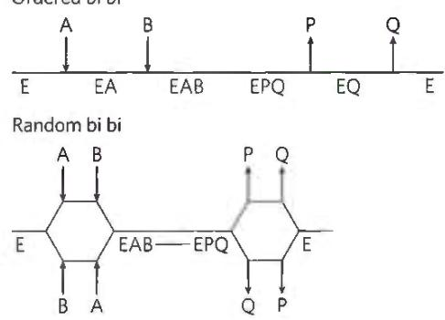

(d) Ping-Pong in Cleland nomenclature a condition, often a conformation change, required for the second substrate to bind. In other cases, the first substrate is converted to product and dissociates before the second substrate binds, so no ternary complex is formed. An example of this is the Ping-Pong, or double-displacement, mechanism (Fig. 6-15b).

  
FIGURE 6-15 Common mechanisms for enzyme-catalyzed bisubstrate reactions. (a) The enzyme and both substrates come together to form a ternary complex. In ordered binding, substrate 1 must bind before substrate 2 can bind productively. In random binding, the substrates can bind in either order. Product dissociation can also be ordered or random. (b) An enzyme-substrate complex forms, a product leaves the complex, the altered enzyme forms a second complex with another substrate molecule, and the second product leaves, regenerating the enzyme. Substrate 1 may transfer a functional group to the enzyme (to form the covalently modified E'), which is subsequently transferred to substrate 2. This is called a Ping-Pong or double-displacement mechanism. (c) Ternary complex formation depicted using Cleland nomenclature. In the ordered bi bi and random bi bi reactions shown here, the release of product follows the same pattern as the binding of substrate — both ordered or both random. (d) The Ping-Pong or double-displacement reaction described with Cleland nomenclature.

A shorthand notation developed by W. W. Cleland can be helpful in describing reactions with multiple substrates and products. In this system, referred to as Cleland nomenclature, substrates are denoted A, B, C, and D, in the order in which they bind to the enzyme, and products are denoted P, Q, S, and T, in the order in which they dissociate. Enzymatic reactions with one, two, three, or four substrates are referred to as uni, bi, ter, and quad, respectively. The enzyme is, as usual, denoted E, but if it is modified in the course of the reaction, successive forms are denoted F, G, and so on. The progress of the reaction is indicated with a horizontal line, with successive chemical species indicated below it. If there is an alternative in the reaction path, the horizontal line is bifurcated. Steps involving binding and dissociating substrates and products are indicated with vertical lines.

Common reactions with two substrates and two products (bi bi) are described with the shorthand forms illustrated in Figure 6-15c for an ordered bi bi reaction and a random bi bi reaction. In the latter example, the release of product is also random, as indicated by the two sets of bifurcations. Rarely, the binding of substrates is ordered and the release of products is random, or vice versa, eliminating the bifurcation at one end or the other of the progress line. In a Ping-Pong reaction, lacking a ternary complex, the pathway has a transient second form of the enzyme, F (Fig. 6-15d). This is the form in which a group has been transferred from the first substrate, A, to create a transient covalent attachment to the enzyme. As noted above, such reactions are often called double-displacement reactions, as a group is transferred first from substrate A to the enzyme and then from the enzyme to substrate B. Substrates A and B do not encounter each other on the enzyme.

Michaelis-Menten steady-state kinetics can provide only limited information about the number of steps and intermediates in an enzymatic reaction, but the approach can be used to distinguish between pathways that have a ternary intermediate and pathways—including Ping-Pong pathways—that do not (Fig. 6-16). As we will see when we consider enzyme inhibition, steady-state kinetics can also distinguish between ordered and random binding of substrates and products in reactions with ternary intermediates.

#### [EN] Enzyme Activity Depends on pH

In general, steady-state kinetics provides information required to characterize an enzyme and assess its catalytic efficiency. Additional information can be gained by examination of how the key experimental parameters $k_{cat}$ and $k_{cat}/K_{m}$ change when reaction conditions change, particularly pH. Enzymes have an optimum pH (or pH range) at which their activity is maximal (Fig. 6-17); at higher or lower pH, activity decreases. This is not surprising. Amino acid side chains in the active site may act as weak acids and bases only if they maintain a certain state of ionization. Elsewhere in the protein, removing a proton from a His residue, for example, might eliminate an ionic interaction that is essential for stabilizing the active conformation of the enzyme. A less common cause of pH sensitivity is titration of a group on the substrate.

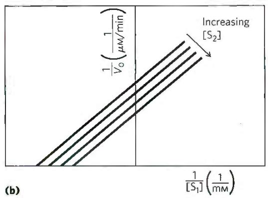  
FIGURE 6-16 Steady-state kinetic analysis of bisubstrate reactions. In these double-reciprocal plots, the concentration of substrate 1 is varied while the concentration of substrate 2 is held constant. This is repeated for several values of $\left[S_{2}\right]$ , generating several separate lines. (a) Intersecting lines indicate that a ternary complex is formed in the reaction; (b) parallel lines indicate a Ping-Pong (double-displacement) pathway.

The pH range over which an enzyme undergoes changes in activity can provide a clue to the type of amino acid residue involved (see Table 3-1). A change in activity near pH 7.0, for example, often reflects titration of a His residue. The effects of pH must be interpreted with some caution, however. In the closely packed environment of a protein, the $pK_{a}$ of amino acid side chains can be significantly altered. For example, a nearby positive charge can lower the $pK_{a}$ of a Lys residue, and a nearby negative charge can increase it. Such effects sometimes result in a $pK_{a}$ that is shifted by several pH units from its value in the free amino acid. In the enzyme acetoacetate decarboxylase, for example, one Lys residue has a $pK_{a}$ of 6.6 (compared with 10.5 in free lysine) due to electrostatic effects of nearby positive charges.

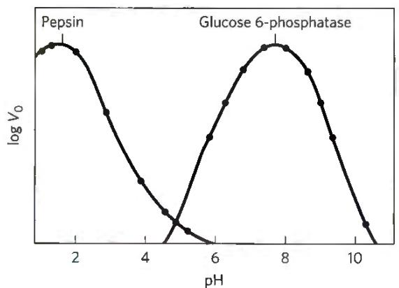  
FIGURE 6-17 The pH-activity profiles of two enzymes. These curves are constructed from measurements of initial velocities when the reaction is carried out in buffers of different pH. Because pH is a logarithmic scale reflecting 10-fold changes in $\left[\mathrm{H}^{+}\right]$ , the changes in $V_{0}$ are also plotted on a logarithmic scale. The pH optimum for the activity of an enzyme is generally close to the pH of the environment in which the enzyme is normally found. Pepsin, a peptidase found in the stomach, has a pH optimum of about 1.6. The pH of gastric juice is between 1 and 2. Glucose 6-phosphatase of hepatocytes (liver cells), with a pH optimum of about 7.8, is responsible for releasing glucose into the blood. The normal pH of the cytosol of hepatocytes is about 7.2.

#### [EN] Pre-Steady State Kinetics Can Provide Evidence for Specific Reaction Steps

The mechanistic insight provided by steady-state kinetics can be augmented, sometimes dramatically, by an examination of the pre-steady state. Consider an enzyme with a reaction mechanism that conforms to the scheme in Equation 6-28, featuring three steps:

$$
\mathrm{E} + \mathrm{S} \xrightarrow [ k _ {- 1} ]{k _ {1}} \mathrm{ES} \xrightarrow [ k _ {- 2} ]{k _ {2}} \mathrm{EP} \xrightarrow [ k _ {3} ]{k _ {3}} \mathrm{E} + \mathrm{P}
$$

Overall catalytic efficiency for this reaction can be assessed with steady-state kinetics, but the rates of the individual steps cannot be determined in this way, and the slow (rate-limiting) step can rarely be identified. For the rate constants of individual steps to be measured, the reaction must be studied during its pre-steady state. The first turnover of an enzyme-catalyzed reaction often occurs in seconds or milliseconds, so researchers use special equipment that allows mixing and sampling on this time scale (Fig. 6-18a). Reactions are stopped and protein-bound products are quantified, after the timed addition and rapid mixing of an acid that denatures the protein and releases all bound molecules. A detailed description of pre-steady state kinetics is beyond the scope of this text, but we can illustrate the power of this approach by a simple example of an enzyme that uses the pathway shown in Equation 6-28. This example also involves an enzyme that catalyzes a relatively slow reaction, so the pre-steady state is more conveniently observed.

  
(a)

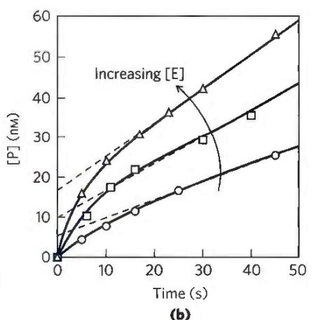  
(b)  
FIGURE 6-18 Pre-steady state kinetics. The transient phase that constitutes the pre-steady state often exists for mere seconds or milliseconds, requiring specialized equipment to monitor it. (a) A simple schematic for a rapid-mixing device, called a stopped-flow device. Enzyme (E) and substrate (S) are mixed with the aid of mechanically operated syringes. The reaction is quenched at a programmed time by adding a denaturing acid through another syringe, and the amount of product formed is measured, in this case with a spectrophotometer. (b) Experimental data for an enzyme reaction show the pre-steady state occurring in the first 5 to 10 seconds. This is a relatively slow reaction and is used as an example because the steady state can be conveniently monitored. The slope of the lines after 15 seconds reflects the steady state. Extrapolating this slope back to zero time (dashed

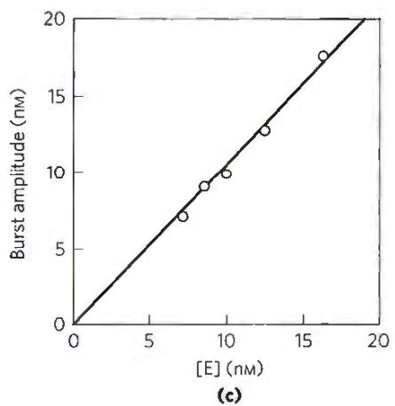

lines) gives the amplitude of the burst phase. The progress of the reaction during the pre-steady state primarily reflects the chemical steps in the reaction (details of which are not shown). The presence of a burst implies that a step following the chemical step that produces P is rate-limiting -- in this case, the product-release step. Notice that the extrapolated intercept at time = 0 increases as [E] increases. (c) A plot of burst amplitude (the intercepts from (b)) versus [E] shows that one molecule of P is formed in each active site during the burst (pre-steady state) phase. This provides evidence that product release is the rate-limiting step, because it is the only step following product formation in this simple enzymatic reaction. The enzyme used in this experiment was RNase P, one of the catalytic RNAs described in Chapter 26. [(b, c) Data from J. Hsieh et al., RNA 15:224, 2009.]  

For many enzymes, dissociation of product is rate-limiting. In this example (Fig. 6-18b, c), the rate of dissociation of the product ( $k_3$ ) is slower than the rate of its formation ( $k_2$ ). Product dissociation therefore dictates the rates observed in the steady state. How do we know that $k_3$ is rate-limiting? A slow $k_3$ gives rise to a burst of product formation in the pre-steady state, because the preceding steps are relatively fast. The burst reflects the rapid conversion of one molecule of substrate to one molecule of product at each enzyme active site. The observed rate of product formation soon slows to the steady-state rate as the bound product is slowly released. Each enzymatic turnover after the first one must proceed through the slow product-release step. However, the rapid generation of product in that first turnover provides much information. The amplitude of the burst—when one molecule of product is generated per molecule of enzyme present (Fig. 6-18c), measured by extrapolating the steady-state progress line back to zero time—is the highest amplitude possible. This provides one piece of evidence that product release is, indeed, rate-limiting. The rate constant for the chemical reaction step, $k_2$ , can be derived from the observed rate of the burst phase.

Of course, enzymes do not always conform to the simple reaction scheme of Equation 6-28. Formally, the observation of a burst indicates that a rate-limiting step (typically, product release, or an enzyme conformational change, or another chemical step) occurs after formation of the product being monitored. Additional experiments and analysis can often define the rates of each step in a multistep enzymatic reaction. Some examples of the application of pre-steady state kinetics are included in the descriptions of specific enzymes in Section 6.4.

#### [EN] Enzymes Are Subject to Reversible or Irreversible Inhibition

(a)

Enzyme inhibitors are molecules that interfere with catalysis, slowing or halting enzymatic reactions. Enzymes catalyze virtually all cellular processes, so it should not be surprising that enzyme inhibitors are among the most important pharmaceutical agents known. For example, aspirin (acetylsalicylate) inhibits the enzyme that catalyzes the first step in the synthesis of prostaglandins, compounds involved in many processes, including some that produce pain. The study of enzyme inhibitors also has provided valuable information about enzyme mechanisms and has helped define some metabolic pathways. There are two broad classes of enzyme inhibitors: reversible and irreversible.

Reversible Inhibition One common type of reversible inhibition is called competitive (Fig. 6-19a). A competitive inhibitor competes with the substrate for the active site of an enzyme. While the inhibitor (I) occupies the active site, the substrate is excluded, and vice versa. Many competitive inhibitors are structurally similar to the substrate and combine with the enzyme to form an unreactive EI complex. Even fleeting combinations of this type will reduce the efficiency of an enzyme. Competitive inhibition can be analyzed quantitatively by steady-state kinetics. In the presence of a competitive inhibitor, the Michaelis-Menten equation (Eqn 6-9) becomes

(b)  
(c)  

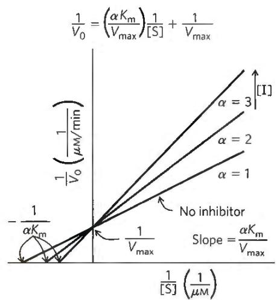  
FIGURE 6-19 Competitive inhibition. (a) Competitive inhibitors bind to the enzyme's active site; $K_{\mathrm{I}}$ is the equilibrium dissociation constant for inhibitor binding to E. (b) Competitive inhibitors affect the observed $K_{\mathrm{m}}$ , but not the $V_{\mathrm{max}}$ . This is readily evident in the plot of $V_{0}$ versus [S]. (c) In a Lineweaver-Burk plot, the lines generated + and - inhibitor intersect on the $y$ axis, which reflects $1 / V_{\mathrm{max}}$ . As the observed $K_{\mathrm{m}}$ increases in the presence of an inhibitor, the intercept on the $x$ axis ( $-1 / K_{\mathrm{m}}$ ) moves to the right.

$$
V _ {0} = \frac {V _ {\mathrm{max}} [ \mathrm{S} ]}{\alpha K _ {\mathrm{m}} + [ \mathrm{S} ]}\tag{6-31}
$$

  
(a)

where

$$
\alpha = 1 + \frac {[ \mathrm{I} ]}{K _ {\mathrm{I}}} \quad \text { and } \quad K _ {\mathrm{I}} = \frac {[ \mathrm{E} ] [ \mathrm{I} ]}{[ \mathrm{EI} ]}
$$

Equation 6-31 describes the important features of competitive inhibition. The experimentally determined variable $\alpha K_{\mathrm{m}}$ , the $K_{\mathrm{m}}$ observed in the presence of the inhibitor, is often called the "apparent" $K_{\mathrm{m}}$ .

Bound inhibitor does not inactivate the enzyme. When the inhibitor dissociates, substrate can bind and react. Because the inhibitor binds reversibly to the enzyme, the competition can be biased to favor the substrate simply by adding more substrate. When [S] far exceeds [I], the probability that an inhibitor molecule will bind to the enzyme is minimized and the reaction exhibits normal $V_{max}$ . However, in the presence of inhibitor, the [S] at which $V_{0} = \frac{1}{2} V_{max}$ , the apparent $K_{m}$ , increases in the presence of inhibitor by the factor $\alpha$ (Fig. 6-19b). This effect on apparent $K_{m}$ , combined with the absence of an effect on $V_{max}$ , is diagnostic of competitive inhibition and is readily revealed in a double-reciprocal plot (Fig. 6-19c). The equilibrium constant for inhibitor binding, $K_{I}$ , can be obtained from the same plot.

(b)  

A medical therapy based on competition at the active site is used to treat patients who have ingested methanol, a solvent found in gas-line antifreeze. The liver enzyme alcohol dehydrogenase converts methanol to formaldehyde, which is damaging to many tissues. Blindness is a common result of methanol ingestion, because the eyes are particularly sensitive to formaldehyde. Ethanol competes effectively with methanol as an alternative substrate for alcohol dehydrogenase. The effect of ethanol is much like that of a competitive inhibitor, with the distinction that ethanol is also a substrate for alcohol dehydrogenase and its concentration will decrease over time as the enzyme converts it to acetaldehyde. The therapy for methanol poisoning is slow intravenous infusion of ethanol, at a rate that maintains a controlled concentration in the blood for several hours. This slows the formation of formaldehyde, lessening the danger while the kidneys filter out the methanol to be excreted harmlessly in the urine.

Two other types of reversible inhibition, uncompetitive and mixed, can be defined in terms of one-substrate enzymes, but in practice are observed only with enzymes having two or more substrates. An uncompetitive inhibitor (Fig. 6-20a) binds at a site distinct from the substrate active site and, unlike a competitive inhibitor, binds only to the ES complex. In the presence of an uncompetitive inhibitor, the Michaelis-Menten equation is altered to

$$
V _ {0} = \frac {V _ {\mathrm{max}} [ \mathrm{S} ]}{K _ {\mathrm{m}} + \alpha^ {\prime} [ \mathrm{S} ]}\tag{6-32}
$$

where

$$
\alpha^ {\prime} = 1 + \frac {[ \mathrm{I} ]}{K _ {\mathrm{I}} ^ {\prime}} \quad \text { and } \quad K _ {\mathrm{I}} ^ {\prime} = \frac {[ \mathrm{ES} ] [ \mathrm{I} ]}{[ \mathrm{ESI} ]}
$$

(c)  
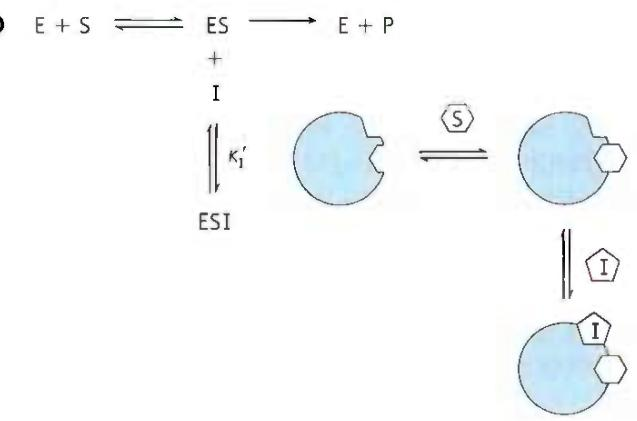

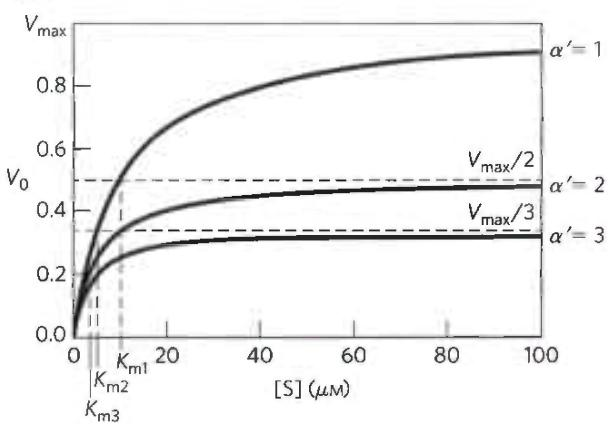

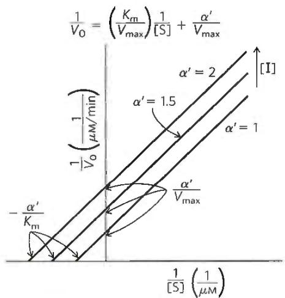  
FIGURE 6-20 Uncompetitive inhibition. (a) Uncompetitive inhibitors bind at a separate site, but bind only to the ES complex; $K_{1}^{\prime}$ is the equilibrium constant for an inhibitor binding to ES. (b) In the presence of an uncompetitive inhibitor, both the $K_{\mathrm{m}}$ and the $V_{\mathrm{max}}$ decline, and by equivalent factors. In the $V_{0}$ versus [S] plot, the decline in $V_{\mathrm{max}}$ is somewhat easier to discern than the decline in $K_{\mathrm{m}}$ . (c) The Lineweaver-Burk plot for an uncompetitive inhibitor is quite diagnostic, as the lines generated in the presence and absence of an inhibitor are parallel. Note that the lines seen in the presence of an inhibitor are always above the line generated in the absence of an inhibitor, reflecting the decline in both $K_{\mathrm{m}}$ and $V_{\mathrm{max}}$ brought about by the inhibitor (i.e., the intercepts move up on the y axis and to the left on the x axis).

As described by Equation 6-32, at high concentrations of substrate, $V_{0}$ approaches $V_{max}/\alpha'$ . Thus, an uncompetitive inhibitor lowers the measured $V_{max}$ . Apparent $K_{m}$ also decreases, because the [S] required to reach one-half $V_{max}$ decreases by the factor $\alpha'$ (Fig. 6-20b, c). This behavior can be explained as follows. Because the enzyme is inactive when the uncompetitive inhibitor is bound, but the inhibitor is not competing with substrate for binding, the inhibitor effectively removes some fraction of the enzyme molecules from the reaction. Given that $V_{max}$ depends on [E], the observed $V_{max}$ decreases. Given that the inhibitor binds only to the ES complex, only ES (not free enzyme) is deleted from the reaction, so the [S] needed to reach $\frac{1}{2}V_{max}$ —that is, $K_{m}$ —declines by the same amount.

A mixed inhibitor (Fig. 6-21a) also binds at a site distinct from the substrate active site, but it binds to either E or ES. The rate equation describing mixed inhibition is

$$
V _ {0} = \frac {V _ {\mathrm{max}} [ \mathrm{S} ]}{\alpha K _ {\mathrm{m}} + \alpha^ {\prime} [ \mathrm{S} ]}\tag{6-33}
$$

where $\alpha$ and $\alpha'$ are defined as above. A mixed inhibitor usually affects both $K_{m}$ and $V_{max}$ (Fig. 6-21b, c). $V_{max}$ is affected because the inhibitor renders some fraction of the available enzyme molecules inactive, lowering the effective [E] on which $V_{max}$ depends. The $K_{m}$ may increase or decrease, depending on which enzyme form, E or ES, the inhibitor binds to most strongly. The special case of $\alpha = \alpha'$ , rarely encountered in experiments, historically has been defined as noncompetitive inhibition. Examine Equation 6-33 to see why a noncompetitive inhibitor would affect the $V_{max}$ but not the $K_{m}$ .

Equation 6-33 is a general expression for the effects of reversible inhibitors, simplifying to the expressions for competitive inhibition and uncompetitive inhibition when $\alpha' = 1.0$ or $\alpha = 1.0$ , respectively. From this expression we can summarize the effects of inhibitors on individual kinetic parameters. For all reversible inhibitors, the apparent $V_{\mathrm{max}} = V_{\mathrm{max}} / \alpha'$ , because the right side of Equation 6-33 always simplifies to $V_{\mathrm{max}} / \alpha'$ at sufficiently high substrate concentrations. For competitive inhibitors, $\alpha' = 1.0$ and can thus be ignored. Taking this expression for apparent $V_{\mathrm{max}}$ , we can also derive a general expression for apparent $K_{\mathrm{m}}$ to show how this parameter changes in the presence of reversible inhibitors. Apparent $K_{\mathrm{m}}$ , as always, equals the [S] at which $V_{0}$ is one-half apparent $V_{\mathrm{max}}$ or, more generally, when $V_{0} = V_{\mathrm{max}} / 2\alpha'$ . This condition is met when $[\mathrm{S}] = \alpha K_{\mathrm{m}} / \alpha'$ . Thus, apparent $K_{\mathrm{m}} = \alpha K_{\mathrm{m}} / \alpha'$ . The terms $\alpha$ and $\alpha'$ reflect the binding of inhibitor to E and ES, respectively. Thus, the term $\alpha K_{\mathrm{m}} / \alpha'$ is a mathematical expression of the relative affinity of inhibitor for the two enzyme forms. This expression is simpler when either $\alpha$ or $\alpha'$ is 1.0 (for uncompetitive or competitive inhibitors), as summarized in Table 6-9.

In practice, uncompetitive inhibition and mixed inhibition are observed only for enzymes with two or more substrates—say, $S_{1}$ and $S_{2}$ —and are very important in the experimental analysis of such enzymes. If an inhibitor binds to the site normally occupied by $S_{1}$ , it may act as a competitive inhibitor in experiments in which $[S_{1}]$ is varied. If an inhibitor binds to the site normally occupied by $S_{2}$ , it may act as a mixed or uncompetitive inhibitor of $S_{1}$ . The actual inhibition patterns observed depend on whether the $S_{1}$ - and $S_{2}$ -binding events are ordered or random, and thus the order in which substrates bind and products leave the active site can be determined. Product inhibition experiments in which one of the reaction products is provided as an inhibitor are often particularly informative. If only one of two reaction products is present, no reverse reaction can take place. However, a product generally binds to some part of the active site and can thus serve as an effective inhibitor. Enzymologists can combine steady-state kinetic studies involving different combinations and amounts of products and inhibitors with pre-steady state analysis to develop a detailed picture of the mechanism of a bisubstrate reaction.

(a)  
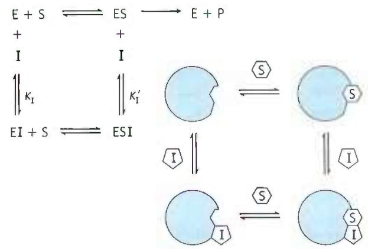

(b)  
(c)  

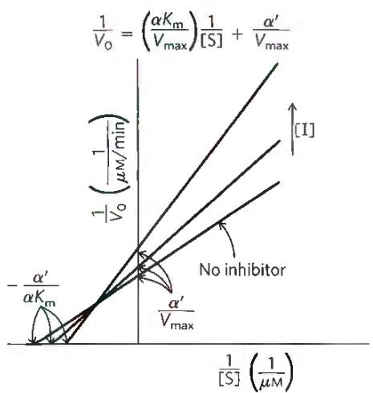  
FIGURE 6-21 Mixed inhibition. (a) Mixed inhibitors bind at a separate site, but they may bind to either E or ES. (b) The kinetic patterns brought about by a mixed inhibitor are complex. The $V_{\mathrm{max}}$ always declines. The $K_{\mathrm{m}}$ may increase or decrease, depending upon the relative values of $\alpha$ and $\alpha'$ . (c) In a Lineweaver-Burk plot, the lines generated + and - inhibitor always intersect, but not on an axis. The intercepts on the y axis always move up, as the $V_{\mathrm{max}}$ declines. The lines may intersect either above or below the x axis. When they intersect above, as shown here, $\alpha > \alpha'$ and the observed $K_{\mathrm{m}}$ is increasing. When the lines intersect below the x axis (not shown), $\alpha < \alpha'$ and the observed $K_{\mathrm{m}}$ is decreasing.

<table><tr><td colspan="3">TABLE 6-9 Effects of Reversible Inhibitors on Apparent  $V_{max}$  and Apparent  $K_m$ </td></tr><tr><td>Inhibitor type</td><td>Apparent  $V_{max}$ </td><td>Apparent  $K_m$ </td></tr><tr><td>None</td><td> $V_{max}$ </td><td> $K_m$ </td></tr><tr><td>Competitive</td><td> $V_{max}$ </td><td> $\alpha K_m$ </td></tr><tr><td>Uncompetitive</td><td> $V_{max}/\alpha'$ </td><td> $K_m/\alpha'$ </td></tr><tr><td>Mixed</td><td> $V_{max}/\alpha'$ </td><td> $\alpha K_m/\alpha'$ </td></tr></table>

#### [EN] WORKED EXAMPLE 6-3 Effect of Inhibitor on K $_{m}$

The researchers working on happyase (see Worked Examples 6-1 and 6-2) discover that the compound STRESS is a potent competitive inhibitor of happyase. Addition of 1 nm STRESS increases the measured $K_{\mathrm{m}}$ for SAD by a factor of 2. What are the values for $\alpha$ and $\alpha'$ under these conditions?

SOLUTION: Recall that the apparent $K_{m}$ , the $K_{m}$ measured in the presence of a competitive inhibitor, is defined as $\alpha K_{m}$ . Because $K_{m}$ for SAD increases by a factor of 2 in the presence of 1 nm STRESS, the value of $\alpha$ must be 2. The value of $\alpha'$ for a competitive inhibitor is 1, by definition.

Irreversible Inhibition The irreversible inhibitors bind covalently with or destroy a functional group on an enzyme that is essential for the enzyme's activity, or they form a highly stable noncovalent association. Formation of a covalent link between an irreversible inhibitor and an enzyme is a particularly effective way to inactivate an enzyme. Irreversible inhibitors are another useful tool for studying reaction mechanisms. Amino acids with key catalytic functions in the active site can sometimes be identified by determining which residue is covalently linked to an inhibitor after the enzyme is inactivated. An example is shown in Figure 6-22.

A special class of irreversible inhibitors is the suicide inactivators. These compounds are relatively unreactive until they bind to the active site of a specific enzyme. A suicide inactivator undergoes the first few chemical steps of the normal enzymatic reaction, but instead of being transformed into the normal product, the inactivator is converted to a very reactive compound that combines irreversibly with the enzyme. These compounds are also called mechanism-based inactivators, because they hijack the normal enzyme reaction mechanism to inactivate the enzyme. Suicide inactivators play a significant role in rational drug design, an approach to obtaining new pharmaceutical agents in which chemists synthesize novel substrates based on knowledge of substrates and reaction mechanisms. A well-designed suicide inactivator is specific for a single enzyme and is unreactive until it is within that enzyme's active site, so drugs based on this approach can offer the important advantage of few side effects (Box 6-1).

  
FIGURE 6-22 Irreversible inhibition. Reaction of chymotrypsin with diisopropylfluorophosphate (DIFP) modifies Ser $^{195}$ and irreversibly inhibits the enzyme. This has led to the conclusion that Ser $^{195}$ is the key active-site Ser residue in chymotrypsin.

An irreversible inhibitor need not bind covalently to the enzyme. Noncovalent binding is enough, if that binding is so tight that the inhibitor dissociates only rarely. How does a chemist develop a tight-binding inhibitor? P4 Recall that enzymes evolve to bind most tightly to the transition states of the reactions that they catalyze. In principle, if one can design a molecule that looks like that reaction transition state, it should bind tightly to the enzyme. Even though transition states cannot be observed directly, chemists can often predict the approximate structure of a transition state based on accumulated knowledge about reaction mechanisms. Although the transition state is by definition transient and thus unstable, in some cases stable molecules can be designed that resemble transition states. These are called transition-state analogs. They bind to an enzyme more tightly than does the substrate in the ES complex, because they fit into the active site better (that is, they form a greater number of weak interactions) than the substrate itself.

#### [EN] Curing African Sleeping Sickness with a Biochemical Trojan Horse

African sleeping sickness, or African trypanosomiasis, is caused by protists (single-celled eukaryotes) called trypanosomes (Fig. 1). This disease (and related trypanosome-caused diseases) is medically and economically significant in many developing nations. Until the late twentieth century, the disease was virtually incurable. Vaccines are ineffective because the parasite has a novel mechanism to evade the host immune system.

The cell coat of trypanosomes is covered with a single protein, which is the antigen to which the human immune system responds. Every so often, however, by a process of genetic recombination (see Table 28-1), a few cells in the population of infecting trypanosomes switch to a new protein coat, not recognized by the immune system. This process of "changing coats" can occur hundreds of times. The result is a chronic cyclic infection: the human host develops a fever, which subsides as the immune system beats back the first infection; trypanosomes with changed coats then become the seed for a second infection, and the fever recurs. This cycle can repeat for weeks, and the weakened person eventually dies.

One approach to treating African sleeping sickness uses pharmaceutical agents designed as mechanism-based enzyme inactivators (suicide inactivators). A vulnerable point in trypanosome metabolism is the pathway of polyamine biosynthesis. The polyamines spermine and spermidine, involved in DNA packaging, are required in large amounts in rapidly dividing cells. The first step in their synthesis is catalyzed by ornithine decarboxylase, an enzyme that requires for its function a coenzyme called pyridoxal phosphate. Pyridoxal phosphate (PLP), derived from vitamin $B_{6}$ , forms a covalent bond with the amino acid substrates of the reactions it is involved in and acts as an electron sink to facilitate a variety of reactions (see Fig. 22-32). In mammalian cells, ornithine decarboxylase undergoes rapid turnover — that is, a rapid, constant round of enzyme degradation and synthesis. In some trypanosomes, however, the enzyme (for reasons not well understood) is stable, not readily replaced by newly synthesized enzyme. An inhibitor of ornithine decarboxylase that binds permanently to the enzyme thus adversely affects the parasite, but has little effect on human cells, which can rapidly replace inactivated enzyme.

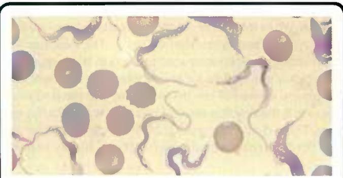  
FIGURE 1 Trypanosoma brucei rhodesiense, one of several trypanosomes known to cause African sleeping sickness. [John Mansfield, University of Wisconsin–Madison, Department of Bacteriology.]

The first few steps of the normal reaction catalyzed by ornithine decarboxylase are shown in Figure 2. Once $CO_{2}$ is released, the electron movement is reversed and putrescine is produced (see Fig. 22-32). Based on this mechanism, several suicide inactivators have been designed, one of which is

  
(Continued on next page)

#### [EN] Curing African Sleeping Sickness with a Biochemical Trojan Horse (Continued)

difluoromethylornithine (DFMO). DFMO is relatively inert in solution. When it binds to ornithine decarboxylase, however, the enzyme is quickly inactivated (Fig. 3). The inhibitor acts by providing an alternative electron sink in the form of two strategically placed fluorine atoms, which are excellent leaving groups. Instead of electrons moving into the ring structure of PLP, the reaction results in displacement of a fluorine atom. The —S of a Cys residue at the enzyme's active site then forms a covalent complex with the highly reactive

PLP-inhibitor adduct, in an essentially irreversible reaction. In this way, the inhibitor makes use of the enzyme's own reaction mechanisms to kill it.

DFMO has proved highly effective in treating African sleeping sickness caused by Trypanosoma brucei gambiense. Approaches such as this show great promise for treating a wide range of diseases. The design of drugs based on enzyme mechanism and structure can complement the more traditional trial-and-error methods of developing pharmaceuticals.

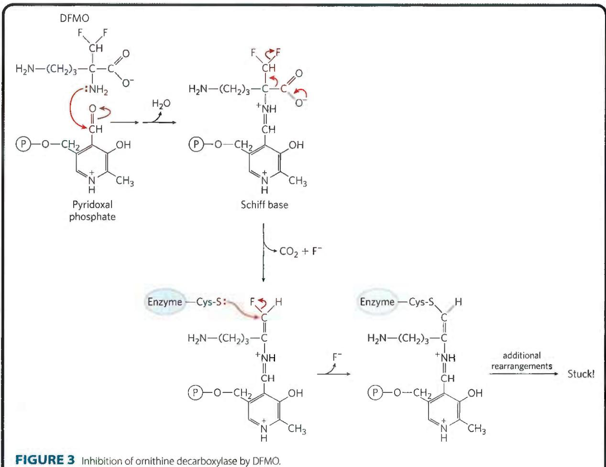

The idea of transition-state analogs was suggested by Linus Pauling in the 1940s, and it has been explored using a variety of enzymes. For example, transition-state analogs designed to inhibit the glycolytic enzyme aldolase bind to that enzyme more than four orders of magnitude more tightly than do its substrates (Fig. 6-23). A transition-state analog cannot perfectly mimic a transition state. Some analogs, however, bind to a target enzyme $10^{2}$ to $10^{8}$ times more tightly than does the normal substrate, providing good evidence that enzyme active sites are indeed complementary to transition states. The concept of transition-state analogs is important to the design of new pharmaceutical agents. As we shall see in Section 6.4, the powerful anti-HIV drugs called protease inhibitors were designed in part as tight-binding transition-state analogs.

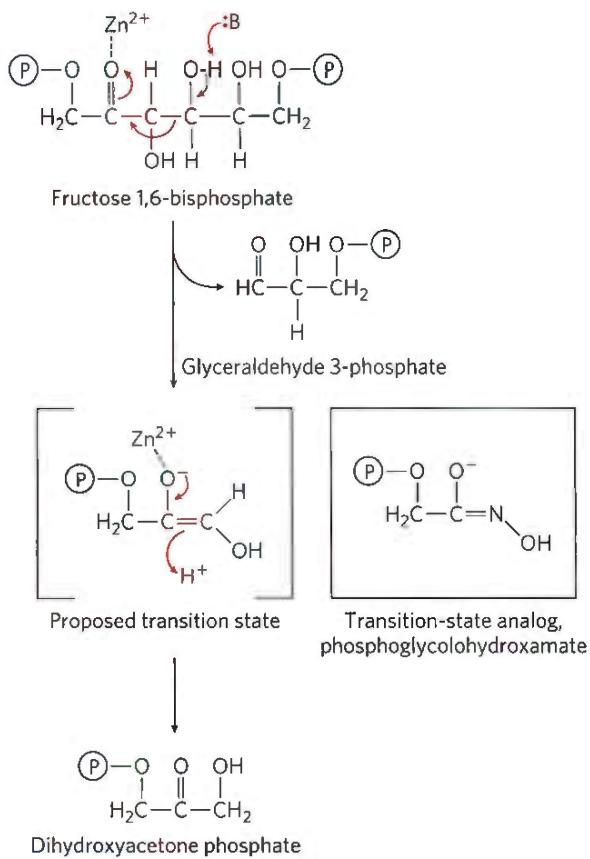  
FIGURE 6-23 A transition-state analog. In glycolysis, a class II aldolase (found in bacteria and fungi) catalyzes the cleavage of fructose 1,6-bisphosphate to form glyceraldehyde 3-phosphate and dihydroxyacetone phosphate. The reaction proceeds via a reverse aldol-like mechanism. The compound phosphoglycolohydroxamate, which resembles the proposed enediolate transition state, binds to the enzyme nearly 10,000 times better than does the dihydroxyacetone phosphate product.

#### [EN] SUMMARY 6.3 Enzyme Kinetics as an Approach to Understanding Mechanism

■ Most enzymes have certain kinetic properties in common. When substrate is added to an enzyme, the reaction rapidly achieves a steady state in which the rate at which the ES complex forms balances the rate at which it breaks down. As [S] increases, the steady-state activity of a fixed concentration of enzyme increases in a hyperbolic fashion to approach a characteristic maximum rate, $V_{max}$ , at which essentially all the enzyme has formed a complex with substrate.

■ The Michaelis-Menten equation

$$
V _ {0} = \frac {V _ {\mathrm{max}} [ \mathrm{S} ]}{K _ {\mathrm{m}} + [ \mathrm{S} ]}
$$

relates initial velocity to [S] and $V_{max}$ through the Michaelis constant, $K_{m}$ . Michaelis-Menten kinetics is also called steady-state kinetics. $K_{m}$ and $V_{max}$ have different meanings for different enzymes. However, the $K_{m}$ is always equal to the substrate concentration that results in a reaction rate equal to one-half $V_{max}$ .

The values of $V_{max}$ and $K_{m}$ can be determined by using transformations of the Michaelis-Menten equation that allow linear plotting of data and extrapolation (for example, Lineweaver-Burk), or (more accurately) by using nonlinear regression.

The limiting rate of an enzyme-catalyzed reaction at saturation is described by the constant $k_{\mathrm{cat}}$ , the turnover number. The ratio $k_{\mathrm{cat}} / K_{\mathrm{m}}$ provides a good measure of catalytic efficiency.

■ Most enzymes catalyze reactions involving multiple substrates, with the majority having two substrates and two products. The Michaelis-Menten equation is applicable to bisubstrate reactions, which occur by ternary complex or Ping-Pong (double-displacement) pathways.

■ Every enzyme has an optimum pH (or pH range) at which it has maximal activity. The pH-rate profile can provide mechanistic clues.

■ Pre-steady state kinetics can provide added insight into enzymatic reaction mechanisms.

■ Reversible inhibition of an enzyme may be competitive, uncompetitive, or mixed. Competitive inhibitors compete with substrate by binding reversibly to the active site, but they are not transformed by the enzyme. Uncompetitive inhibitors bind only to the ES complex, at a site distinct from the active site. Mixed inhibitors bind to either E or ES, again at a site distinct from the active site. In irreversible inhibition, an inhibitor binds permanently to an active site by forming a covalent bond or a very stable noncovalent interaction. Inhibition patterns can elucidate mechanism.

<!-- EN-END 6.3 -->

## 四、温度对酶促反应的影响

大多数化学反应的速率,都和温度有关,酶催化的反应也不例外。如果在不同温度条件下进行某种酶

反应,然后将测得的反应速率相对于温度作图,即可得到图7-31所示的钟罩形曲线。从图上曲线可以看出,在较低的温度范围内,酶反应速率随温度升高而增大,但超过一定温度后,反应速率反而下降,因此只有在某一温度下,反应速率达到最大值,这个温度通常就称为酶反应的最适温度(optimum temperature)。每种酶在一定条件下都有其最适温度。一般讲,动物细胞内的酶最适温度在35\~40℃,植物细胞中的酶最适温度稍高,通常在40\~50℃之间,微生物中的酶最适温度差别较大,如Taq DNA聚合酶的最适温度可高达70℃。

温度对酶促反应速率的影响表现在两个方面,一方面是当温度升高时,与一般化学反应一样,反应速率加快。另一方面由于酶是蛋白质,随着温度升高,使酶蛋白逐渐变性而失活,引起酶反应速率下

  
图 7-31 温度对酶反应速率的影响

降。酶所表现的最适温度是这两种影响的综合结果。在酶反应的最初阶段，酶蛋白的变性尚未表现出来，因此反应速率随温度升高而增加，但高于最适温度时，酶蛋白变性逐渐突出，反应速率随温度升高的效应将逐渐为酶蛋白变性效应所抵消，反应速率迅速下降，因此表现出最适温度。最适温度不是酶的特征物理

常数,常受到其他条件如底物种类、作用时间、pH 和离子强度等因素影响而改变。如最适温度随着酶促作用时间的长短而改变,由于温度使酶蛋白变性是随时间累加的。一般讲反应时间长,酶的最适温度低,反应时间短则最适温度就高(图 7-32),因此只有在规定的反应时间内才可确定酶的最适温度。

温度对酶促反应速率的影响常用 Arrhenius 方程(式 6-2)来表示, $k=A\exp^{(-E_{a}/RT)}$ ,取对数,得到:

$$
\lg k = \frac {E _ {\mathrm{a}}}{2 . 3 R} \cdot \frac {1}{T} + \lg A\tag{7-52}
$$

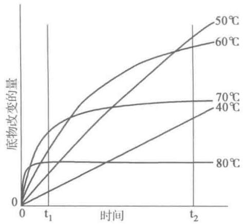

式中，k 为酶促反应速率常数，A 为频率因子，R 为气体常数，T 为绝对温度， $E_{a}$ 为活化能。以 $\lg k$ 对 $\frac{1}{T}$ 作图可得到一条直线，由直线的斜率可得出活化能。

图 7-32 在不同温度下典型的酶反应过程的曲线,表明酶的最适温度决定于时间

如果相应于速率常数 $k_{1}$ 和 $k_{2}$ ，选择积分极限 $T_{1}$ 和 $T_{2}$ ，则，

$$
\lg \frac {k _ {2}}{k _ {1}} = \frac {E _ {\mathrm{a}}}{2 . 3 R} \left(\frac {T _ {2} - T _ {1}}{T _ {2} T _ {1}}\right)\tag{7-53}
$$

反应速率的温度效应常以 $Q_{10}$ 表示， $Q_{10}$ 指反应温度提高 $10^{\circ}C$ ，其反应速率与原来反应速率之比称为反应的温度系数。

$$
Q _ {1 0} = \frac {k _ {2}}{k _ {1}}\tag{7-54}
$$

根据 $Q_{10}$ 的定义, $T_{2}-T_{1}=10^{\circ}C$ , 由式(7-53)可求出酶促反应的活化能。

$$
\mathrm{lg} Q _ {1 0} = \frac {E _ {\mathrm{a}}}{2 . 3 R} \bigg (\frac {1 0}{T _ {1} T _ {2}} \bigg)
$$

$$
E _ {\mathrm{a}} = \frac {2 . 3 R T _ {1} T _ {2} \lg Q _ {1 0}}{1 0}\tag{7-55}
$$

从式(7-55)可看出, $E_{a}$ 与 $Q_{10}$ 成正比,活化能愈高, $Q_{10}$ 愈大,表示温度对反应速率影响大。由于酶作为生物催化剂可显著降低反应的活化能,所以比一般催化反应的温度系数要低,一般为1.4\~2.0。

酶的固体状态比在溶液中对温度的耐受力要高。酶的冰冻干粉置冰箱中可放置几个月甚至更长时间。而酶溶液在冰箱中只能保存几周，甚至几天就会失活。通常酶制剂以固体保存为佳。

## 五、pH 对酶促反应的影响

酶的活力受环境 pH 的影响, 在一定 pH 下, 酶表现最大活力, 高于或低于此 pH, 酶活力降低, 通常把表现出酶最大活力的 pH 称为该酶的最适 pH (optimum pH) (图 7-33)。

各种酶在一定条件下都有其特定的最适 pH，因此最适 pH 是酶的特性之一。但酶的最适 pH 不是一个常数，受许多因素影响，随底物种类和浓度、缓冲液种类和浓度的不同而改变，因此最适 pH 只有在一定条件下才有意义。大多数酶的最适 pH 在 5\~8 之间，动物体的酶多在 pH 6.5\~8.0 之间，植物及微生物中的酶多在 pH 4.5\~6.5。但也有例外，如胃蛋白酶的最适 pH 为 1.5，肝中精氨酸酶最适 pH 为 9.7。表 7-8 列举了几种酶的最适 pH。

  
图 7-33 pH 对酶活力的影响

表 7-8 一些酶的最适 pH

<table><tr><td>酶</td><td>底物</td><td>最适 pH</td></tr><tr><td rowspan="2">胃蛋白酶(pepsin)</td><td>鸡蛋白蛋白</td><td>1.5</td></tr><tr><td>血红蛋白</td><td>2.2</td></tr><tr><td>丙酮酸羧化酶(pyruvate carboxylase)</td><td>丙酮酸</td><td>4.8</td></tr><tr><td>脂肪酶(lipase)</td><td>低级酯</td><td>5.5~5.8</td></tr><tr><td rowspan="2">延胡索酸酶(fumarase)</td><td>延胡索酸</td><td>6.5</td></tr><tr><td>苹果酸</td><td>8.0</td></tr><tr><td>过氧化氢酶(catalase)</td><td> $H_2O_2$ </td><td>7.6</td></tr><tr><td>核糖核酸酶(ribonuclease)</td><td>RNA</td><td>7.8</td></tr><tr><td rowspan="2">胰蛋白酶(trypsin)</td><td>苯甲酰精氨酰胺</td><td>7.7</td></tr><tr><td>苯甲酰精氨酸甲酯</td><td>7.0</td></tr><tr><td>碱性磷酸酶(alkaline phosphatase)</td><td>3-磷酸甘油</td><td>9.5</td></tr><tr><td>精氨酸酶(arginase)</td><td>精氨酸</td><td>9.7</td></tr></table>

pH 影响酶活力的原因可能有以下几个方面：

（1）过酸或过碱可以使酶的空间结构破坏，引起酶构象的改变，酶活性丧失。

（2）当 pH 改变不很剧烈时，酶虽未变性，但活力受到影响。pH 影响了底物的解离状态，或者使底物不能和酶结合，或者结合后不能生成产物；pH 影响酶分子活性部位上有关基团的解离，从而影响与底物的结合或催化，使酶活性降低；也可能影响到中间复合物 ES 的解离状态，不利于催化生成产物。

(3) pH 影响维持酶分子空间结构的有关基团解离, 从而影响了酶活性部位的构象, 进而影响酶的

活性。

各种酶在最适 pH 时所处的某一种解离状态, 最有利于与底物结合并发生催化作用, 活力最高, 如胆碱酯酶解离成两性离子, 精氨酸酶呈负离子时活力最大。

由于酶活力受 pH 的影响很大,因此在酶的提纯及测活时要选择酶的稳定 pH,通常在某一 pH 缓冲液

中进行。一般最适 pH 总是在该酶的稳定 pH 范围内，故酶在最适 pH 附近最为稳定。虽然多数酶的 pH-酶活性曲线为钟罩形，但有的酶并非如此，如胃蛋白酶和胆碱酯酶为钟形的一半，而木瓜蛋白酶的活性在较大的 pH 范围内几乎不受 pH 的影响（图 7-34）。

应当指出酶在体外所测定的最适 pH 与它在生物体细胞内的生理 pH 并不一定相同。因为细胞内存在多种多样的酶，不同的酶对此细胞内的生理 pH 的敏感性不同，也就是说此 pH 对一些酶是最适 pH，而对另一些酶则不是，因而不同的酶表现出不同的活性。这种不同对于控制细胞内复杂的代谢途径可能具有重要的意义。

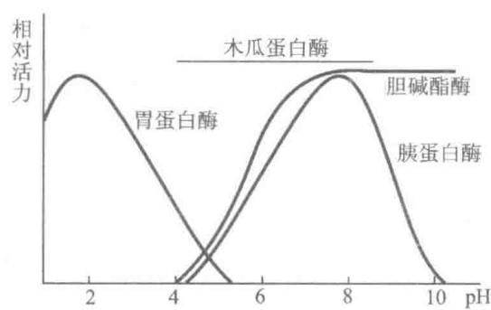  
图 7-34 4 种酶的 pH-酶活性曲线

酶分子含有许多酸性和碱性氨基酸的侧链基团，随着 pH 的变化可处于不同的解离状态，而酶活性伴随着变化，可帮助判断所涉及的氨基酸残基，为酶作用机制的研究提供线索。

## 六、激活剂对酶促反应的影响

凡是能提高酶活性的物质都称为激活剂（activator），其中大部分是无机离子或简单的有机化合物。作为激活剂的金属离子有 $\mathrm{K}^{+}$ 、 $\mathrm{Na}^{+}$ 、 $\mathrm{Ca}^{2+}$ 、 $\mathrm{Mg}^{2+}$ 、 $\mathrm{Zn}^{2+}$ 及 $\mathrm{Fe}^{2+}$ 等离子，无机阴离子如 $\mathrm{Cl}^{-}$ 、 $\mathrm{Br}^{-}$ 、 $\mathrm{I}^{-}$ 、 $\mathrm{CN}^{-}$ 、 $\mathrm{PO}_{4}^{3-}$ 等都可作为激活剂。如 $\mathrm{Mg}^{2+}$ 是多数激酶及合成酶的激活剂， $\mathrm{Cl}^{-}$ 是唾液淀粉酶的激活剂。

激活剂对酶的作用具有一定的选择性,即一种激活剂对某种酶起激活作用,而对另一种酶可能起抑制作用,如 $Mg^{2+}$ 对脱羧酶有激活作用而对肌球蛋白腺三磷酶却有抑制作用; $Ca^{2+}$ 则相反,对前者有抑制作用,但对后者却起激活作用。有时离子之间有拮抗作用,例如 $Na^{+}$ 抑制 $K^{+}$ 激活的酶, $Ca^{2+}$ 能抑制 $Mg^{2+}$ 激活的酶。有时金属离子之间也可相互替代,如 $Mg^{2+}$ 作为激酶的激活剂可被 $Mn^{2+}$ 代替。另外,激活离子对于同一种酶,可因浓度不同而起不同的作用,如对于 $NADP^{+}$ 合成酶,当 $Mg^{2+}$ 浓度为 $(5\sim10)\times10^{-3}\mathrm{mol}\cdot\mathrm{L}^{-1}$ 时起激活作用,但当浓度升高为 $30\times10^{-3}\mathrm{mol}\cdot\mathrm{L}^{-1}$ 时则酶活性下降;若用 $Mn^{2+}$ 代替 $Mg^{2+}$ ,则在 $1\times10^{-3}\mathrm{mol}\cdot\mathrm{L}^{-1}$ 起激活作用,高于此浓度,酶活性下降,不再有激活作用。

有些小分子有机化合物可作为酶的激活剂，例如半胱氨酸，还原型谷胱甘肽等还原剂对某些含巯基的酶有激活作用，使酶中二硫键还原成巯基，从而提高酶活性。木瓜蛋白酶和甘油醛3-磷酸脱氢酶都属于巯基酶，在它们分离纯化过程中，往往需加上述还原剂，以保护巯基不被氧化。再如一些金属螯合剂如EDTA（乙二胺四乙酸）等能除去重金属离子对酶的抑制，也可视为酶的激活剂。

另外酶原可被一些蛋白酶选择性水解肽键而被激活,这些蛋白酶也可看成为激活剂。关于酶原的激活将在第8章讨论。

## 提要

酶促反应动力学是研究酶促反应的速率以及影响此速率各种因素的科学。它是以化学动力学为基础讨论底物浓度、抑制剂、pH、温度及激活剂等因素对酶反应速率的影响。化学动力学中在研究化学反应速率与反应物浓度的关系时，常分为一级反应、二级反应及零级反应。研究证明，酶催化过程的第一步是生成酶-底物中间复合物，Michaelis和Menten根据中间复合物学说的理论推导出酶反应动力学方程式，即米氏方程。并经Briggs和Haldane以稳态理论加以修正。从米氏方程得到几个重要的物理常数，即 $K_{m}$ 、

$V_{max}$ 、 $k_{cat}$ 、 $k_{cat}/K_{m}$ 。 $K_{m}$ 是酶的一个特征常数，以浓度为单位， $K_{m}$ 有多种用途，通过直线作图法可以得到 $K_{m}$ 及 $V_{max}$ 。 $k_{cat}$ 称为催化常数，又叫做转换数（TN值），它的单位为 $s^{-1}$ ， $k_{cat}$ 值越大，表示酶的催化速率越高。 $k_{cat}/K_{m}$ 常用来比较酶催化效率的参数。酶促反应除了单底物反应外，最常见的为双底物反应，按其动力学机制分为序列反应和乒乓反应，用动力学直线作图法可以区分。

酶促反应速率常受抑制剂影响，根据抑制剂与酶的作用方式及抑制作用是否可逆，将抑制作用分为可逆抑制作用及不可逆抑制作用。根据可逆抑制剂与底物的关系分为竞争性抑制、非竞争性抑制、反竞争性抑制及混合型抑制4类，可以分别推导出抑制作用的动力学方程。竞争性抑制可以通过增加底物浓度而解除，其动力学常数 $K_{m}^{\prime}$ 变大， $V_{max}$ 不变；非竞争性抑制 $K_{m}$ 不变， $V_{max}^{\prime}$ 变小；反竞争性抑制 $K_{m}^{\prime}$ 及 $V_{max}^{\prime}$ 均变小。通过动力学作图可以区分这4种类型的可逆抑制作用。可逆抑制剂中最重要的是竞争性抑制剂，过渡态底物类似物为强有力的竞争性抑制剂。不可逆抑制剂中，最有意义的为专一性 $K_{s}$ 型及 $k_{cat}$ 型不可逆抑制剂，前者称为亲和标记试剂，后者称为自杀性底物。研究酶的抑制作用是研究酶的结构与功能、酶的催化机制、阐明代谢途径以及设计新药物的重要手段。

温度、pH 及激活剂都会对酶促反应速率产生重要影响，酶反应有最适温度及最适 pH，要选择合适的激活剂。在研究酶促反应速率及测定酶的活力时，都应选择酶的最适反应条件。

## 习题

1. 解释下列名词：(a) 反应分子数；(b) 反应级数；(c) $K_{m}$ 与 $K_{s}$ ；(d) 催化常数 $(k_{\mathrm{cat}})$ ；(e) 催化效率指数 $(k_{\mathrm{cat}}/K_{\mathrm{m}})$ ；(f) 随机反应和有序反应；(g) 乒乓反应；(h) 抑制作用；(i) 最适 pH；(j) 最适温度。

2. 当一酶促反应进行的速率为 $V_{max}$ 的 80% 时，在 $K_{m}$ 和 [S] 之间有何关系？

3. 过氧化氢酶的 $K_{m}$ 值为 $2.5 \times 10^{-2} \, mol \cdot L^{-1}$ ，当底物过氧化氢浓度为 $100 \, mmol \cdot L^{-1}$ 时，求在此浓度下，过氧化氢酶被底物所饱和的百分数。

4. 由酶反应 S→P 测得如下数据：

<table><tr><td> $[S]/(mol·L^{-1})$ </td><td> $v/(nmol·L^{-1}·min^{-1})$ </td><td> $[S]/(mol·L^{-1})$ </td><td> $v/(nmol·L^{-1}·min^{-1})$ </td></tr><tr><td> $6.25×10^{-6}$ </td><td>15.0</td><td> $1.00×10^{-3}$ </td><td>74.9</td></tr><tr><td> $7.50×10^{-5}$ </td><td>56.25</td><td> $1.00×10^{-2}$ </td><td>75.0</td></tr><tr><td> $1.00×10^{-4}$ </td><td>60.0</td><td></td><td></td></tr></table>

(a) 计算 $K_{m}$ 及 $V_{max}$

(b) 当 $[\mathrm{S}] = 5 \times 10^{-5} \mathrm{~mol} \cdot \mathrm{L}^{-1}$ 时, 酶催化反应的速率是多少?

(c) 若 $[\mathrm{S}] = 5 \times 10^{-5} \mathrm{~mol} \cdot \mathrm{L}^{-1}$ 时, 酶的浓度增加一倍, 此时 $v$ 是多少?

(d) 表中的 v 是根据保温 10 min 产物生成量计算出来的, 证明 v 是真正的初速率。

5. 由酶反应 $\mathrm{S} \rightarrow \mathrm{P}$ , 得到下列数据。用 Eisenthal 和 Cornish-Bowden 直接线性作图法, 求 $K_{\mathrm{m}}$ 和 $V_{\max}$ 。

<table><tr><td> $[S]/(mol·L^{-1})$ </td><td> $v/(nmol·L^{-1}·min^{-1})$ </td><td> $[S]/(mol·L^{-1})$ </td><td> $v/(nmol·L^{-1}·min^{-1})$ </td></tr><tr><td> $8.33×10^{-6}$ </td><td>13.8</td><td> $1.67×10^{-5}$ </td><td>23.6</td></tr><tr><td> $1.00×10^{-5}$ </td><td>16.0</td><td> $2.00×10^{-5}$ </td><td>26.7</td></tr><tr><td> $1.25×10^{-5}$ </td><td>19.0</td><td></td><td></td></tr></table>

6. 某酶的 $K_{m}$ 为 $4.7 \times 10^{-5} \, mol \cdot L^{-1}$ ， $V_{max}$ 为 $22 \, \mu mol \cdot L^{-1} \cdot min^{-1}$ ，底物浓度为 $2 \times 10^{-4} \, mol \cdot L^{-1}$ 试计算 (a) 竞争性抑制剂，(b) 非竞争性抑制剂，(c) 反竞争性抑制剂的浓度均为 $5 \times 10^{-4} \, mol \cdot L^{-1}$ 时的酶催化反应速率？这 3 种情况的 $K_{i}$ 值都是 $3 \times 10^{-4} \, mol \cdot L^{-1}$ 。(d) 上述 3 种情况下，抑制百分数是多少？

7. 在酶促反应: $E+S \xlongequal{k_{1}} ES \xlongequal{k_{2}} E+P$ 中。 $V_{max}=k_{2}[E]$ ，若反应中加入非竞争性抑制剂，这时 $V_{max}$ 值下降， $k_{2}$ 是否也下

降？为什么？

8. 乙酰胆碱酯酶能水解神经递质乙酰胆碱：

$$
\mathrm{乙酰胆碱} + \mathrm {H_ {2} O} \rightleftharpoons \mathrm{乙酸} + \mathrm{胆碱}
$$

乙酰胆碱酯酶对底物乙酰胆碱的 $K_{m}$ 是 $9 \times 10^{-5} \, mol \cdot L^{-1}$ ，反应混合物中含 $5 \, nmol \cdot mL^{-1}$ 乙酰胆碱酯酶和 $150 \, \mu mol \cdot L^{-1}$ 乙酰胆碱， $v_{0}$ 为 $40 \, \mu mol \cdot mL^{-1} \cdot s^{-1}$ 。计算：

(a) 该酶量的 $V_{\mathrm{max}}$

(b) 乙酰胆碱酯酶的 $k_{cat}$

(c) 乙酰胆碱酯酶催化效率指数 $(k_{\mathrm{cat}} / K_{\mathrm{m}})$ ，并判断此酶是否是一个相当有效的酶（见表7-4）？

9. 对一个遵从米氏方程的酶来说, 当底物浓度 $[S] = K_{m}$ , 竞争性抑制剂浓度 $[I] = K_{i}$ 时, 反应的初速率为多少?

10. 用下表列出的数据, 确定此酶促反应:

(a) 无抑制剂和有抑制剂时的 $V_{max}$ 和 $K_{m}$ 值。

(b) 抑制的类型。

(c) EI 复合物的解离常数 $K_{i}$ 。

<table><tr><td rowspan="2">[S]/mol·L-1</td><td colspan="2">v/μmol·L-1·min-1</td></tr><tr><td>无抑制剂</td><td>有抑制剂(2×10-3mol·L-1)</td></tr><tr><td>0.3×10-5</td><td>10.4</td><td>4.1</td></tr><tr><td>0.5×10-5</td><td>14.5</td><td>6.4</td></tr><tr><td>1.0×10-5</td><td>22.5</td><td>11.5</td></tr><tr><td>3.0×10-5</td><td>33.8</td><td>22.6</td></tr><tr><td>9.0×10-5</td><td>40.5</td><td>33.8</td></tr></table>

11. 在题 10 中, 若用另一种抑制剂, 给出下表资料, 请确定:

(a) 有抑制剂时的 $K_{\mathrm{m}}$ 及 $V_{\mathrm{max}}$ 值。

(b) 抑制的类型。

(c) EI 的解离常数 $K_{i}$ 。

<table><tr><td rowspan="2">[S]/mol·L-1</td><td colspan="2">v/μmol·L-1·min-1</td></tr><tr><td>无抑制剂</td><td>有抑制剂(1×10-4mol·L-1)</td></tr><tr><td>0.3×10-5</td><td>10.4</td><td>2.1</td></tr><tr><td>0.5×10-5</td><td>14.5</td><td>2.9</td></tr><tr><td>1.0×10-5</td><td>22.5</td><td>4.5</td></tr><tr><td>3.0×10-5</td><td>33.8</td><td>6.8</td></tr><tr><td>9.0×10-5</td><td>40.5</td><td>8.1</td></tr></table>

12. 今有一酶反应, 它符合 Michaelis-Menten 动力学, 其 $K_{\mathrm{m}}$ 为 $1 \times 10^{-6} \mathrm{~mol} \cdot \mathrm{L}^{-1}$ 。底物浓度为 $0.1 \mathrm{~mol} \cdot \mathrm{L}^{-1}$ 时, 反应初速率为 $0.1 \mu \mathrm{mol} \cdot \mathrm{L}^{-1} \cdot \min^{-1}$ 。试问, 底物浓度分别为 $10^{-2} \mathrm{~mol} \cdot \mathrm{L}^{-1}, 10^{-3} \mathrm{~mol} \cdot \mathrm{L}^{-1}$ 和 $10^{-6} \mathrm{~mol} \cdot \mathrm{L}^{-1}$ 时的反应初速率是多少? 13. 假设 $2 \times 10^{-4} \mathrm{~mol} \cdot \mathrm{L}^{-1}$ 的 [I] 抑制了一个酶催化反应的 $75\%$ , 计算这个非竞争性抑制剂的 $K_{\mathrm{i}}$ ?

14. 如果 $K_{m}$ 为 $2.9 \times 10^{-4} \, mol \cdot L^{-1}$ ， $K_{i}$ 为 $2 \times 10^{-5} \, mol \cdot L^{-1}$ ，在底物浓度为 $1.5 \times 10^{-3} \, mol \cdot L^{-1}$ 时，要得到 75% 的抑制，需要竞争性抑制剂的浓度是多少？

15. 举例说明什么是 $K_{\mathrm{S}}$ 型和 $k_{\mathrm{cat}}$ 型不可逆抑制剂。什么是过渡态底物类似物？它属于何种类型抑制剂？

16. 酶催化-单底物反应,采用了3种不同的酶浓度测定,用双倒数作图(图7-35)。下面3种图形中哪一种是你期望得到的?给以解释。

A  
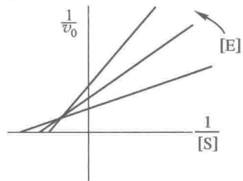

B  
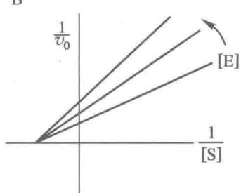  
图7-35 3种不同酶浓度下双倒数作图

## 主要参考书目

1. 王镜岩, 朱圣庚, 徐长法. 生物化学教程. 北京: 高等教育出版社, 2008.

2. 陈惠黎, 李文杰. 分子酶学. 北京: 人民卫生出版社, 1983.

3. Berg J M, Tymoczko J L, Stryer L. Biochemistry. 7th ed. New York: W. H. Freeman and Company, 2012.

4. Garrett R H, Grisham C M. Biochemistry. 5th ed. Boston: Brooks/Cole, Cengage Learning, 2013.

5. Nelson D L, Cox M M. Lehninger Principles of Biochemistry. 4rd ed. New York: W. H. Freeman and Company, 2008.

(张庭芳)

## 网上资源

习题答案

自测题
