## 第9章 糖类和糖生物学

> **本章英文对应内容**（Lehninger，插在所列中文小节末尾）
>
> - 第7章 Carbohydrates and Glycobiology：章首导言（本章开头）、关键术语/习题/简答（本章末尾）
> - §7.1（第7章）→ 四、寡糖
> - §7.2（第7章）→ 五、多糖
> - §7.3（第7章）→ 六、糖缀合物
> - §7.4（第7章）→ 七、糖类作为生物信息分子:糖密码
> - §7.5（第7章）→ 八、聚糖的结构分析

糖类或称碳水化[合]物（carbohydrate）是地球上最丰富的有机化合物。地球生物量（biomass）干重的 $50\%$ 以上是由葡萄糖的多聚体构成的。据估计全球每年有1000亿吨的 $\mathrm{CO}_{2}$ 跟 $\mathrm{H}_2\mathrm{O}$ 通过光合作用被转化为纤维素和其他的植物产物。关于光合作用将在第23章讲述。本章讨论糖类的化学，包括糖的分类、结构、性质和结构分析方法，以及糖类的某些生物学作用。

<!-- EN-BEGIN 第7章导言 -->

### 【英文对应 第7章导言】Carbohydrates and Glycobiology

> 来源：Lehninger Principles of Biochemistry（书籍/02_生物化学原理） 第7章章首（含章节目录与学习要点）。

#### [EN] CARBOHYDRATES AND GLYCOBIOLOGY

7.1 Monosaccharides and Disaccharides 230

7.2 Polysaccharides 241

7.3 Glycoconjugates: Proteoglycans, Glycoproteins, and Glycolipids 247

7.4 Carbohydrates as Informational Molecules: The Sugar Code 254

7.5 Working with Carbohydrates 258

Carbohydrates are the most abundant biomolecules on Earth. Each year, photosynthesis converts more than 100 billion metric tons of $CO_{2}$ and $H_{2}O$ into cellulose and other plant products. The carbohydrates in these plant products are a dietary staple in most parts of the world, and the oxidation of carbohydrates is the central energy-yielding pathway in most nonphotosynthetic cells. Carbohydrate polymers called glycans serve as structural and protective elements in the cell walls of bacteria, fungi, and plants, and in the connective tissues of animals. Other carbohydrate polymers lubricate skeletal joints and participate in cell-cell recognition and adhesion. In addition, some complex carbohydrate polymers covalently attached to proteins or lipids act as signals that determine the intracellular destination or metabolic fate of these hybrid molecules, called glycoconjugates.

Carbohydrates are aldehydes or ketones with at least two hydroxyl groups, or substances that yield such compounds on hydrolysis. Many, but not all, carbohydrates have the empirical formula $(\mathrm{CH}_{2}\mathrm{O})_{n}$ ; some also contain nitrogen, phosphorus, or sulfur. There are three major size classes of carbohydrates: monosaccharides, oligosaccharides, and polysaccharides (the word "saccharide" is derived from the Greek sakcharon, meaning "sugar"). Monosaccharides, or simple sugars, consist of a single polyhydroxy aldehyde or ketone unit. The most abundant monosaccharide in nature is the six-carbon sugar D-glucose, sometimes referred to as dextrose.

Oligosaccharides consist of short chains of monosaccharide units, or residues, joined by characteristic linkages called glycosidic bonds. The most abundant are the disaccharides, with two monosaccharide units. Sucrose (table sugar), for example, consists of the six-carbon sugars D-glucose and D-fructose. All common monosaccharides and disaccharides have names ending with the suffix "-ose." In cells, most oligosaccharides consisting of three or more units do not occur as free entities but are joined to nonsugar molecules (lipids or proteins) in glycoconjugates.

The polysaccharides are sugar polymers containing more than 10 monosaccharide units; some have hundreds or thousands of units. Some polysaccharides, such as cellulose, are linear chains; others, such as glycogen, are branched. Both cellulose and glycogen consist of recurring units of D-glucose, but they differ in the type of glycosidic linkage and consequently have strikingly different properties and biological roles.

This chapter introduces the major classes of carbohydrates and glycoconjugates and provides examples of their many structural and functional roles. Learning the structures and chemical properties of biomolecules is essential, because they are the vocabulary and the grammar of biochemistry. As you read about carbohydrates, note how specific cases illustrate these general principles that underlie all of biochemistry.

P1 Carbohydrates can have multiple chiral carbons; the configuration of groups around each carbon atom determines how the compound interacts with other biomolecules. As we saw for L-amino acids in proteins, with rare exceptions, biological evolution selected one stereochemical series (D-series) for sugars.

P2 Monomeric subunits, monosaccharides, serve as the building blocks of large carbohydrate polymers. The specific sugar, the way the units are linked, and whether the polymer is branched determine its properties and thus its function.

P3 Storage of low molecular weight metabolites in polymeric form avoids the very high osmolarity that would result from storing them as individual monomers. If the glucose in liver glycogen were monomeric, the glucose

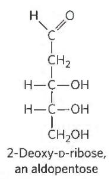

concentration in liver would be so high that cells would swell and lyse from the entry of water by osmosis.

P4 The sequences of complex polysaccharides are determined by the intrinsic properties of the biosynthetic enzymes that add each monomeric unit to the growing polymer. This is in contrast with DNA, RNA, and proteins, which are synthesized on templates that direct their sequence.

P5 Polysaccharides assume three-dimensional structures with the lowest-energy conformations, determined by covalent bonds, hydrogen bonds, charge interactions, and steric factors. Starch folds into a helical structure stabilized by internal hydrogen bonds; cellulose assumes an extended structure in which intermolecular hydrogen bonds are more important.

P6 Molecular complementarity is central to function. The recognition of oligosaccharides by sugar-binding proteins (lectins) results from a perfect fit between lectin and ligand.

P7 An almost infinite variety of discrete structures can be built from a small number of monomeric subunits. Even short polymers, when arranged in different sequences, joined through different linkages, and branched to specific degrees, present unique faces recognized by their molecular partners.

<!-- EN-END 第7章导言 -->

## 一、引言

## （一）糖类的生物学作用

糖类广泛地存在于生物界,特别是植物界。糖类物质占植物干重的85%\~90%,占细菌细胞干重的10%\~30%,占动物体干重的<2%,但动物生命活动所需的能量主要来源于糖类。

糖类是生物细胞中非常重要的一类生物分子。概括起来有以下几个方面的生物学作用：

（1）作为生物的结构成分 植物的根、茎、叶、花和果实都含有大量的纤维素、半纤维素和果胶等，它们构成植物细胞壁的主要成分。肽聚糖是细菌细胞壁的结构多糖。昆虫和甲壳类的外骨骼含有壳多糖。

（2）作为生物体内的主要能源物质 某些糖类(淀粉和蔗糖)是世界上大多数地区的膳食来源。糖类的氧化是大多数非光合生物中的主要产能途径,释放的能量供生命活动的需要。生物体内作为能量贮库的糖类有淀粉和糖原等。

（3）在生物体内转变为其他物质 糖类通过某些代谢中间物，为合成其他生物分子如氨基酸、核苷酸和脂肪酸等提供碳骨架。

（4）作为生物信息分子 细胞质膜中糖蛋白和糖脂的寡糖链起着信息分子的作用，这早在血型物质的研究中就有了一定的认识。随着分离分析技术和分子生物学的发展，近20多年来对这些寡糖链的结构和功能有了更深入的了解。发现细胞识别、免疫保护、代谢调控、受精机制、形态发生、发育、癌变、衰老和器官移植等，都与质膜上的寡糖链有关，并因此出现了一门新的学科，称为糖生物学（glycobiology）。

## （二）糖类的化学本质

大多数糖类只由 C、H、O 三种元素组成，其实验式为 $\left(\mathrm{CH}_{2}\mathrm{O}\right)_{n}$ 或 $\mathrm{C}_{n}\left(\mathrm{H}_{2}\mathrm{O}\right)_{m}$ 。其中 H 和 O 的原子数目之比为 2:1，犹如水分子一样。因此曾被误认为这类物质是碳（carbon）的水合物（hydrate），“碳水化合物”（carbohydrate）也因之而得名。但后来发现有些糖，如鼠李糖 $\left(\mathrm{C}_{6}\mathrm{H}_{12}\mathrm{O}_{5}\right)$ 和脱氧核糖 $\left(\mathrm{C}_{5}\mathrm{H}_{10}\mathrm{O}_{4}\right)$ 等，它们的分子中 H 和 O 的原子数之比并非 2:1；而一些非糖物质，如甲醛 $\left(\mathrm{CH}_{2}\mathrm{O}\right)$ ，乙酸 $\left(\mathrm{C}_{2}\mathrm{H}_{4}\mathrm{O}_{2}\right)$ 和乳酸 $\left(\mathrm{C}_{3}\mathrm{H}_{6}\mathrm{O}_{3}\right)$ 等，它们的分子中 H 和 O 之比却都是 2:1，所以“碳水化合物”这一名称并不恰当，但因沿用已久，至今西文中仍广泛地使用它。汉文中糖类（糖质 $^{①}$ ）和碳水化[合]物两词通用，但使用前者为多。

大家熟悉的葡萄糖和果糖，从化学角度看，分别是一种多羟基的醛和多羟基的酮（见图9-1）。淀粉和纤维素是由多个葡萄糖分子缩合而成的多聚体，也属于糖类。此外像 $N-$ 乙酰葡糖胺，1,6-二磷酸果糖这样一些糖的衍生物也归入糖类。因此从其化学本质给糖类下一个定义:糖类是多羟醛、多羟酮或其衍生物,或水解时能产生这些化合物的多聚体。

## （三）糖类的命名和分类

英文中 carbohydrate 是糖类物质的总称。简单的糖常称为 sugar 或 saccharide（源自希腊文 sakcharon，意为 sugar，糖）。saccharide 一词常被冠以词头，用作糖的类别名称，如 monosaccharide（单糖）、polysaccharide（多糖）等。个别糖质的命名，大多是根据其来源给予一个通属名称，如葡萄糖、果糖、蔗糖、乳糖、棉子糖和菊粉等。糖类根据它们的聚合度可以分为：

（1）单糖（monosaccharide） 单糖是不能被水解成更小分子的糖类，如葡萄糖、果糖、核糖和脱氧核糖等。单糖又可根据分子中的官能团是醛基还是酮基分为醛糖和酮糖，其实验式常写为 $\left(\mathrm{CH}_{2}\mathrm{O}\right)_{n}$ 。自然界中最小的单糖 n=3，最大的一般 n=7。依据分子中所含的碳原子数目（3 到 7）分别称为三碳糖或丙糖，四碳糖或丁糖，五碳糖或戊糖，六碳糖或己糖和七碳糖或庚糖。碳原子数目和羰基的类型结合起来命名，例如己醛糖、庚酮糖等。

（2）寡糖（oligosaccharide）寡糖是由2个到10个单糖单位组成的糖类，包括很多个类别，常见的有二糖、三糖、四糖等。二糖水解时生成2分子单糖，如麦芽糖、蔗糖和乳糖等；三糖水解时产生3分子单糖，如棉子糖。

（3）多糖（polysaccharide）多糖是水解时产生10多个以上单糖分子的糖类，包括同多糖和杂多糖。同多糖水解时只产生一种单糖或单糖衍生物，如淀粉、糖原、纤维素和壳多糖等。杂多糖水解时产生一种以上的单糖或/和单糖衍生物，例如果胶物质、半纤维素、肽聚糖和糖胺聚糖等。

（4）糖缀合物（glycoconjugate）也称糖复合物，它们是糖类物质与蛋白质或脂质等生物分子借共价键形成的缀合物，如糖蛋白、蛋白聚糖、糖脂和脂多糖等。

## 二、单糖的结构和性质

单糖是最简单的糖类,是单一的多羟基醛或多羟基酮。单糖中连接有羟基的碳原子多数是手性中心,因而产生很多天然存在的立体异构体。由于单糖分子同时存在羟基和羰基(醛基或酮基),它们很容易发生分子内加成反应,生成具有四个或更多个骨架碳的环状结构,并产生一个新的手性中心,进一步增加了这类化合物的立体化学复杂性,因此叙述单糖的结构必须明确标示出每个碳原子的构型,以及在纸面上表示立体结构的方法。本节除谈及单糖的两个家系(醛糖和酮糖)、D-和L-旋光异构体、 $\alpha$ 和 $\beta$ 异头物、吡喃糖和呋喃糖及其构象,还要介绍单糖的某些物理和化学的性质。

## （一）单糖的开链结构

## 1. 单糖的两个家系: 醛糖和酮糖

大多数单糖分子的骨架是不分支的碳链，链中所有的碳原子都是由单键连接。在开链结构中，只有一个碳原子以双键与氧结合，形成羰基；其他每个碳原子都有一个羟基。如果羰基在碳链的末端（醛基形

式），单糖则是醛糖（aldose）；如果羰基在任一其他位置（酮基形式），单糖则是酮糖（ketose）（参见图9-1）。最简单的单糖是三碳糖：甘油醛和二羟丙酮。所有的醛糖都可以看成是由甘油醛的羰基碳下端逐个插入C\*延伸而来的，由甘油醛派生来的四碳糖、五碳糖、六碳糖等组成醛糖家系(family of aldoses)（图9-3）；由二羟丙酮衍生来的相应的单糖构成酮糖家系(family of ketoses)（图9-4）。

葡萄糖和果糖经元素组成分析和相对分子质量测定,确定了它们的分子式为 $C_{6}H_{12}O_{6}$ 。经结构分析确定了葡萄糖是 2,3,4,5,6-五羟己醛,一种己醛糖(aldohexose),是醛糖家系的一员;果糖是 1,3,4,5,6-五羟-2-

$$
\begin{array}{c c c} \text {1} & \mathrm{CHO} & \mathrm{CH} _ {2} \mathrm{OH} \\ & \mid & \mid \\ 2 & * \mathrm{CHOH} & \mathrm{C} = \mathrm{O} \\ & \mid & \\ 3 & * \mathrm{CHOH} & * \mathrm{CHOH} \\ & \mid & \mid \\ 4 & * \mathrm{CHOH} & * \mathrm{CHOH} \\ & \mid & \mid \\ 5 & * \mathrm{CHOH} & * \mathrm{CHOH} \\ & \mid & \mid \\ 6 & \mathrm{CH} _ {2} \mathrm{OH} & \mathrm{CH} _ {2} \mathrm{OH} \\ & \text {己醛糖} & \text {己酮糖} \end{array}
$$

图 9-1 己醛糖和己酮糖的非立体开链结构

己酮，一种己酮糖（ketohexose），是酮糖家系的一员。己醛糖和己酮糖的非立体开链结构示于图9-1。己醛糖含4个 $\mathrm{C}^*$ （手性碳原子），己酮糖含3个 $\mathrm{C}^*$ ，它们分别存在8对和4对不同的对映[异构]体（参见图9-3和9-4）。德国有机化学家E.Fischer根据当时有限的实验资料和立体化学知识进行逻辑推论，于1891年发表了有关葡萄糖立体化学的著名论文，并利用类似的推理，论证了己醛糖的16个旋光异构体中的12个异构体的立体化学结构。由于这一巨大成就，1902年他获得诺贝尔化学奖。

## 2. Fischer 投影式(projection)

为了在纸面上表示糖的立体异构体结构,最方便的方法是采用投影式,它是 Fischer 于 1891 年首次提出的,因此也称 Fischer 投影式(图 9-2)。投影式中水平方向的键伸向纸面前方,垂直方向的键伸向纸面后方。书写投影式时,通常规定碳链处于垂直方向,羰基写在链的上端,羟甲基写在链的下端,氢原子和羟基位于链的两侧。投影式在纸面内可以旋转 180° 而不改变原来的构型,但旋转 90° 或 270° 将变成它的对映体,更不能离开纸面翻转。用投影式表示旋光异构体虽方便,但不如透视式清楚。透视式中手性碳原子和实线键处于纸面内,虚楔形键伸向纸面背后,实楔形键突出纸面,伸向读者(参看图 1-5 和图 9-2)。

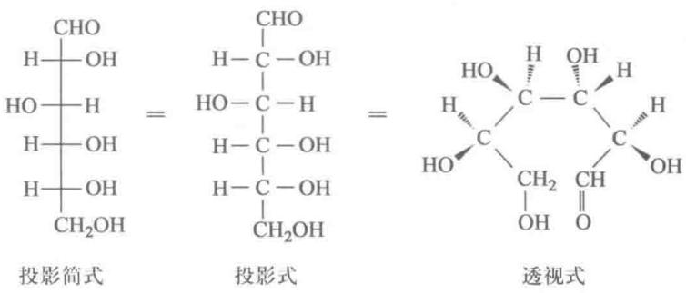  
图9-2 D-葡萄糖的开链立体结构  
投影简式中骨架十字交叉处代表碳原子

## （二）单糖的立体化学

单糖从丙糖到庚糖，除二羟丙酮外，都含有手性碳原子。甘油醛含一个 $\mathrm{C}^*$ ，有两个旋光异构体，组成一对对映体（见图1-5）；丁醛糖含2个 $\mathrm{C}^*$ ，可以有4个旋光异构体，组成两对不同的对映体；依次类推（参见第1章立体异构和构型部分）。由D(+) - 甘油醛衍生而来的称为D-醛糖家系（图9-3）。由L(-)-甘油醛衍生而来的称为L-醛糖家系，L-醛糖家系的成员是相应的D-醛糖家系成员的对映体，例如L-葡萄糖是D-葡萄糖的镜像体。二羟丙酮本身虽没有立体异构体，但它可以衍生出D-酮糖家系（图9-4）和L-酮糖家系。

所谓单糖的构型是指分子中离羰基碳最远的那个手性碳原子的构型。如果一个单糖在投影式中跟此 $C^{*}$ 相连的羟基（图9-3和9-4中加有阴影的OH）与D-甘油醛C2（第2位碳）上的OH具有相同取向，则称它为D型单糖（也即说它是由D甘油醛派生而来的）；反之则称为L-型单糖。这里必须指出，糖的构型（D或L）跟旋光方向（+或-）并无直接关系；旋光方向和程度是由整个分子的立体结构（包括各手性中心的构型）而不是由某个 $C^{*}$ 的构型决定的。

任何一个旋光异构体都只有一个对映体,例如 D-葡萄糖的对映体是 L-葡萄糖,其余的 14 个己醛糖旋光异构体是它的非对映体。从图 9-3 可以看到,D 系己醛糖的旋光异构体中葡萄糖和甘露糖两者之间或葡萄糖和半乳糖两者之间,除了一个手性中心(对葡萄糖和甘露糖是 C\*2,对葡萄糖和半乳糖是 C\*4)的构型不同外,其余的立体结构完全相同。这种仅有一个手性碳原子的构型不同的非对映体,称为差向 [立体] 异构体或表异构体(epimer)。

自然界中单糖大多数以 D 型存在,但有些单糖以 L 型出现,例如 L-阿拉伯糖;还有一些 L 型单糖的衍生物是糖缀合物的常见成分(见本章后面)。

  
图9-3 D-醛糖家系的立体结构及其立体化学关系

## （三）单糖的环状结构

为简便起见,至此我们一直用直链分子表示醛糖和酮糖的结构。实际上,在水溶液中丁醛糖和所有骨架含有5个和5个以上碳原子的单糖都是以环状结构为优势形式存在的。

## 1. 环状半缩醛的形成

单糖存在环状结构的依据之一是许多单糖新配制的溶液会发生旋光度的改变,这种现象称为变旋 (mutarotation)。在不同条件下获得的 D(+) - 葡萄糖,其熔点和比旋值都不同。从低于 30℃ 的 70% 乙醇中结晶的水合物 (含 1H₂O),熔点 146℃,新配的溶液 [α]D²⁰ = +112°,称为 α-D-葡萄糖;在 98℃ 以上蒸发水溶液得到的晶体 (含 1H₂O),熔点 150℃,新配的溶液 [α]D²⁰ = +18.7°,称为 β-D-葡萄糖。变旋是由于分子的立体结构发生某种变化的结果。依据之二是葡萄糖作为多羟基醛,应该显示醛基的特性反应,但实际上不如简单醛类那样显著,例如不与 Schiff 试剂 (品红-亚硫酸)呈紫红色反应;推测单糖的醛基可能被屏蔽。依据之三是从羰基的性质了解到,醇与醛或酮可以发生快速而可逆的亲核加成,形成半缩醛 (hemiacetal) 或半缩酮 (hemiketal) (图 9-5)。

  
图9-4 D-酮糖家系的立体结构及其立体化学关系

如果羟基和羰基处于同一分子内,则可以发生分子内加成,导致环状半缩醛或半缩酮的形成。作为多羟基醛或酮的单糖完全可以形成这种环状结构(cyclic structure)。1893年Fischer正式提出葡萄糖分子具有环状结构的理论。

## 2. 单糖羰基碳的差向异构化: $\alpha$ 异头物和 $\beta$ 异头物

一个确定的单糖由开链变成环状结构时，羰基碳原子成为新的手性中心，导致羰基碳差向异构化（epimerization），产生两个额外的立体异构体： $\alpha$ 和 $\beta$ 。这种羰基碳上形成的差向异构体称为异头物（anomer）。在环状结构中，半缩醛碳原子也称为异头碳或异头中心（anomeric center；

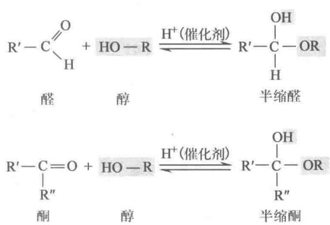  
图9-5 半缩醛和半缩酮的形成

注意，异头碳与其他碳原子不同，它是与两个氧原子相连的）。异头中心的羟基跟在 Fischer 投影式中连在最远的那个手性中心的羟基处于同一侧的异构体称为 $\alpha$ 异头物，处于相反一侧的称为 $\beta$ 异头物。 $\alpha$ 和 $\beta$ 异头物在水溶液中可以通过开链形式互相转变，经一定时间后达到平衡；这就是产生变旋现象的原因。因此，新配制的 $\alpha-D-$ 葡萄糖溶液和 $\beta-D-$ 葡萄糖溶液最终都变成具有相同旋光性质的相同平衡混合液 ( $[\alpha]_{D}^{20}=+52.6^{\circ}$ )。如图 9-6 所示，此混合液约由 1/3 的六元环 $\alpha-D-$ 葡萄糖和 2/3 的六元环 $\beta-D-$ 葡萄糖组成；具有游离醛基的开链葡萄糖不到 0.024%（五元环葡萄糖也很少），这便是为什么葡萄糖的醛基性质表现不明显的原因。

## 3. 单糖的两种环状结构: 吡喃糖和呋喃糖

开链的六碳糖形成环状的半缩醛或半缩酮时,最容易出现五元环和六元环的结构。例如 D-葡萄糖 C5 的羟基与 C1 的醛基加成,生成六元环的吡喃葡[萄]糖(glucopyranose),又如 D-果糖 C5 的羟基与 C2的酮基加成,形成五元环的呋喃果糖(fructofuranose)。之所以称为吡喃糖(pyranose)和呋喃糖(furanose)是因为它们的结构分别与简单的环形醚:吡喃(pyran)和呋喃(furan)相似(图9-7)。一般说,具有5个或更多个碳的醛糖和酮糖都可以形成呋喃糖环或吡喃糖环。至于哪种形式更为稳定,这取决于结构因素。异头碳上和各羟基上的取代基性质和异头碳的构型将决定一种给定的单糖倾向吡喃糖还是呋喃糖结构。对醛糖来说,在水溶液中六元环的吡喃糖环比五元环的呋喃糖环要稳定得多,例如在40℃水中平衡后D-葡吡喃萄糖占99.9%以上(其中α36%,β64%),D-吡喃甘露糖也占绝对优势(α67%,β33%),它们的呋喃糖形式都远小于1%;D-吡喃核糖占76%(α20%,β56%),呋喃核糖占24%(α6%,β18%)。不过只有5个碳和5个碳以上的醛糖才能形成吡喃糖环。

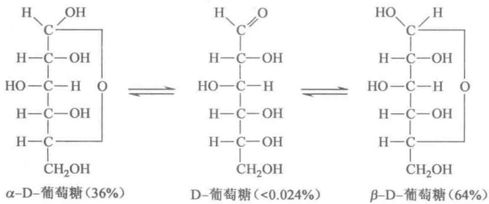  
图9-6 D-葡萄糖的变旋平衡

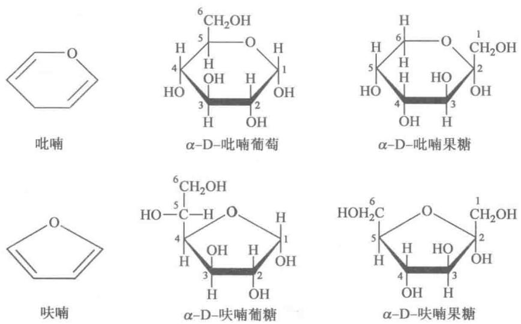  
图 9-7 吡喃型和呋喃型的 D-葡萄糖和 D-果糖 (Haworth 式)

5个碳和更多个碳的酮糖也能以 $\alpha$ 和 $\beta$ 异头物形式存在。在这些化合物中C5（或C6）的羟基跟C2的酮基反应形成含半缩酮键的呋喃糖（或吡喃糖）环。水溶液中游离的D-果糖也以吡喃糖形式占优势 $60\% (\alpha 3\%,\beta 57\%)$ ，呋喃糖形式占 $40\% (\alpha 9\%,\beta 31\%)$ ；但在它的聚合物或衍生物中多以 $\beta -\mathrm{D}$ -呋喃果糖形式存在。

用 Fischer 投影式表示单糖的环状结构,不能准确地反映环中氧桥(oxo bridge)的长度(太长)和成环时绕 C4 和 C5 之间的键发生旋转的事实(此时葡萄糖的 C4 氢和 C5 氢已不在同侧)。于是 1926 年英国化学家 W. Haworth(1883—1950)推荐使用一种透视式来表示单糖的环状结构。这种透视式常称为 Haworth 投影式或简称 Haworth 式。Haworth 式中己醛糖的吡喃环用一个垂直于纸平面的六角形环面表示,环中省略了构成环的碳原子,浓粗的环边表示向着读者,细线的(含氧桥)环边表示离开读者(图 9-7)。举葡萄糖为例,由 Fischer 式改写为 Haworth 式时(图 9-8),Fischer 式中 C\* 的右侧羟基在 Haworth 式中处于含氧环面的下方,左侧羟基处在环面的上方。但在成环(形成氧桥)时,C5 必将绕 C4—C5 键发生旋转(约 109°),结果 C5 上的一CH₂OH 旋至环面上方,C5 上的氢转到环面下方(注意,旋转不会引起构型改变)。当决定糖构型的 C\* 的羟基参与成环时,在标准定位(即环中的碳原子序号按顺时针排列)的 Haworth 式中羟甲基在环平面上方的为 D 型糖, 在环平面下方的为 L 型糖; 不论是 D 型糖还是 L 型糖, 异头碳的羟基与末端羟甲基是反式的 (也即原与决定糖构型的 C\* 上的羟基是同侧的) 则是 $\alpha$ 异头物, 顺式的则为 $\beta$ 异头物。

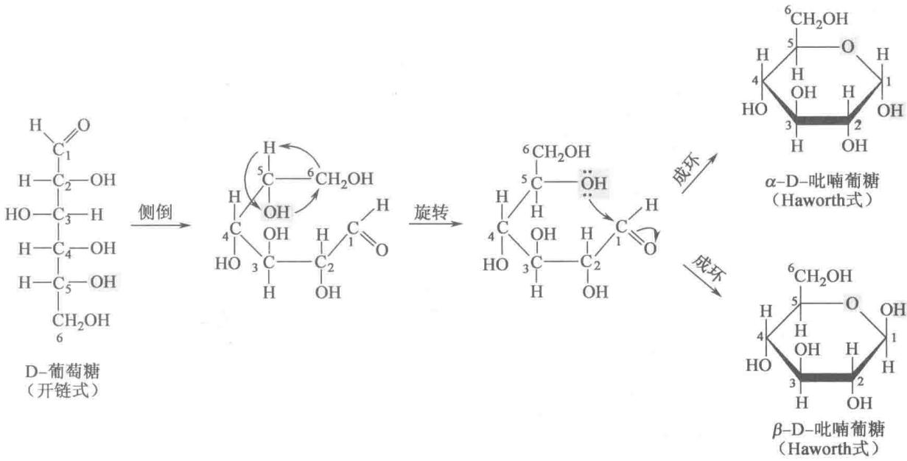  
图9-8 D-葡萄糖由Fischer式改写为Haworth式的步骤

## （四）单糖的构象

Haworth 式所反映的单糖立体结构也并不完全符合事实, 因为如果吡喃糖环是平面结构, 那么它们会有很大的角张力 (angle strain), 结构是不稳定的。实际上单糖总是通过扭折, 采取能量低的构象 (参见第 1 章)。

## 1. 吡喃糖的构象

20 世纪 40 年代环己烷的构象分析取得长足进展, 燃烧热数据表明环己烷环是一种无张力环。这是因为环己烷不是平面结构, 而是扭折成释放了全部角张力的三维结构: 椅式构象 (chair form) 和船式构象 (boat form)。热力学测定表明船式不如椅式稳定。因此椅式是环己烷的优势构象。在室温下, 椅式与船式的分子之比约为 1 000 : 1。

吡喃糖与环己烷在结构上有很多相似之处，它们都是六元环，环内键长和键角也相近，因此环己烷的构象分析很多适用于吡喃糖。吡喃糖的椅式和船式构象见图9-9A，椅式远比船式稳定。D-吡喃葡糖可以有两种椅式构象：I和Ⅱ（图9-9B）。这两种椅式构象可能经过船式进行互相转换，这种互换常被称为环转向（ring-flip）。环转向的净结果是直立位置（平行于穿过环平面的轴，见图9-9A）和平伏位置（大体与环共平面）互换，一种椅式中的直立取代基变成另一种椅式中的平伏取代基，反之亦然。显然借直立键（axial bond）相连的取代基要比借平伏键（equatorial bond）相连的取代基彼此靠得更紧，斥力也更大。因此占优势的构象应是比氢原子大的那些基团尽可能多地处于平伏位置上的构象，β-D-吡喃葡糖的椅式I便是如此。β-D-吡喃葡糖是D-己醛糖中唯一的一个能采取使所有比氢原子大的基团都处于平伏位置的构象。根据计算β-D-葡萄糖椅式I的内能比椅式Ⅱ约低30 kJ/mol。可见在这两种构象之间的环转向平衡中，椅式I占绝对优势①。实验也表明，在纤维素和蔗糖晶体中葡萄糖残基都处于椅式I构象。

葡萄糖处于最稳定的构象(椅式Ⅰ)时,它的C2、C3、C4和C5上的取代基都是平伏位置,但异头碳(C1)上的羟基可以是直立位置( $\alpha$ 异头物中)也可以是平伏位置( $\beta$ 异头物中)。对D-吡喃葡糖来说, $\beta$ 异头物比 $\alpha$ 异头物更稳定,因为 $\beta$ 异头物能更好地被溶剂化。但在 $\beta$ 异头物中存在C1羟基(或其他取代基如—OR等)偶极和环氧偶极之间的不利相互作用(图9-10)。除葡萄糖外对几乎所有的己醛糖来说,偶极效应是主要的,因此它们的 $\alpha$ 异头物比 $\beta$ 异头物更稳定;此现象称为异头效应(anomeric effect)。

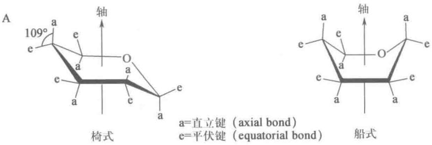

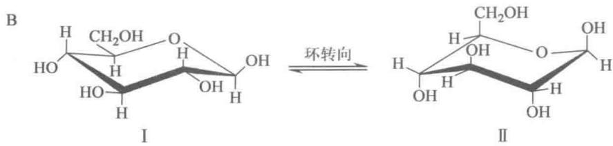  
图 9-9 吡喃糖的椅式和船式构象(A)和 $\beta-D-$ 吡喃葡糖的两种可能的椅式构象(I 和 II)(B)

  
图 9-10 椅式 I 构象中异头物的平行和反平行偶极  
C1上的平伏羟基偶极与环氧偶极接近平行，它们之间产生排斥，是一种不利的相互  
作用。C1上的直立羟基偶极与环氧偶极大体反平行，这是一种比较稳定的构象

## 2. 呋喃糖的构象

回忆一下有机化学中对环戊烷的构象分析。环戊烷如果采取平面环构象，它将是一个接近于无张力环的结构，因为它的C—C—C键角是 $108^{\circ}$ ，与正常键角只差 $1^{\circ}$ 左右。然而燃烧值表明环戊烷具有 $6.5\mathrm{kJ / mol}$ 的张力能。这是为什么？原因在于如果采取平面环结构，虽然无角张力，但是相邻碳上的氢处于重叠型的构象（见图1-8），因而引起相当可观的扭张力。结果是环戊烷也采取突出平面的折叠构象，在增加角张力和降低扭张力之间达成平衡，使之处于最低的能态。环戊烷的4个碳原子大体上处在同一平面，第5个碳原子超出平面，这样相邻碳上的氢原子大多数都取近似交叉型的构象。

呋喃糖也是这样,环上的3个碳原子和1个氧原子接近于共平面,另1个碳原子向上折起,离开平面约0.05 nm。这种构象称为信封式构象(envelope form),因为它类似一个掀起信封盖的开口信封(图9-11)。大多数生物分子的核糖组分中,C2或C3在C5的同一侧突出平面。这两种信封式构象分别称为C2'-内向型(C2'-endo)和C3'-内向型(C3'-endo)。在RNA双螺旋区,A-DNA以及RNA-DNA杂交分子中核糖和脱氧核糖残基都采取C3'-内向型,而在B-DNA中则为C2'-内向型(图9-11)。呋喃糖环在不同的构象态之间可以发生快速互换(环转向)。呋喃糖环比吡喃糖环具有更大的柔性,这可以说明呋喃型核糖被选作RNA和DNA的组分的原因。

在后面将看到,单糖的这些特殊的三维结构在决定某些多糖的生物学性质和功能方面有着重要的作用。

  
图9-11 $\beta$ -D-呋喃核糖的信封式构象

## （五）单糖的物理和化学性质

## 1. 物理性质

（1）旋光性 几乎所有的单糖及其衍生物都有旋光性，许多单糖在水溶液中会发生变旋现象。关于单糖的旋光性和变旋现象已在前面谈到。一些重要单糖的熔点和比旋值见表9-1。

表 9-1 一些重要单糖的熔点和比旋值

<table><tr><td>名称</td><td>熔点/°C</td><td> $[\alpha]_{D}^{20}(H_2O)$ </td><td>名称</td><td>熔点/°C</td><td> $[\alpha]_{D}^{20}(H_2O)$ </td></tr><tr><td>D-甘油醛</td><td></td><td>+9.4°</td><td>β-D-吡喃葡糖</td><td>148~150</td><td>+18.7°→+52.6°</td></tr><tr><td>D-赤藓糖</td><td></td><td>-9.3°</td><td>α-D-吡喃甘露糖</td><td>133</td><td>+29.3°→+14.5°</td></tr><tr><td>D-赤藓酮糖</td><td></td><td>-11°</td><td>β-D-吡喃甘露糖</td><td>132</td><td>-17°→+14.5°</td></tr><tr><td>D-核糖</td><td>88~92</td><td>+19.7°</td><td>α-D-吡喃半乳糖</td><td>167</td><td>+150°→+80.2°</td></tr><tr><td>2-脱氧-D-核糖</td><td>89~90</td><td>-59°</td><td>β-D-吡喃半乳糖</td><td>143~145</td><td>+52.8°→80.2°</td></tr><tr><td>D-核酮糖</td><td></td><td>-16.3°</td><td>D-果糖</td><td>119~122</td><td>-92°</td></tr><tr><td>D-木糖</td><td>156~158</td><td>+18.8°</td><td>L-山梨糖</td><td>171~173</td><td>-43.1°</td></tr><tr><td>D-木酮糖</td><td></td><td>-26°</td><td>L-岩藻糖</td><td>150~153</td><td>-75°</td></tr><tr><td>L-阿拉伯糖</td><td>160~163</td><td>+104.5°</td><td>L-鼠李糖</td><td>94(1H2O)</td><td>+8.2°</td></tr><tr><td>α-D-吡喃葡糖</td><td>146(无水)</td><td>+112.2°→+52.6°</td><td>D-景天庚酮糖</td><td>101(1H2O)</td><td>+2.5°</td></tr><tr><td></td><td>83(1H2O)</td><td></td><td>D-甘露庚酮糖</td><td>151~152</td><td>+29.7°</td></tr></table>

除异头物外均指互变异构体平衡时的比旋值，异头物的比旋列出的是起始值→平衡值。

（2）溶解度 单糖分子有多个羟基，增加了它的水溶性。除甘油醛微溶于水，其他单糖均易溶，特别是在热水中溶解度极大。例如 $\alpha-D-$ 葡萄糖在 $25^{\circ}C$ 水中的溶解度为 82 g/100 mL, $\beta-D-$ 葡萄糖为 178 g/100 mL。单糖微溶于乙醇，不溶于乙醚、丙酮。

（3）甜度 严格说甜度(sweetness)不是物理特性,它属于一种感觉,甜度的比较不可能十分精确。甜度通常用蔗糖作为参考物,以它为100,果糖几乎是它的两倍,其他天然糖均小于它。某些糖、糖醇及其他增甜剂(sweetener)的相对甜度见表9-2。

表 9-2 某些糖、糖醇及其他增甜剂的相对甜度

<table><tr><td>名称</td><td>甜度</td><td>名称</td><td>甜度</td><td>名称</td><td>甜度</td></tr><tr><td>乳糖</td><td>16</td><td>甘露醇</td><td>50</td><td>果糖</td><td>175</td></tr><tr><td>棉子糖</td><td>23</td><td>葡萄糖</td><td>70</td><td>环己胺磺酸钠</td><td>3 000</td></tr><tr><td>半乳糖</td><td>30</td><td>麦芽糖醇</td><td>90</td><td>天冬苯丙二肽</td><td>15 000</td></tr><tr><td>麦芽糖</td><td>35</td><td>蔗糖</td><td>100</td><td>蛇菊苷</td><td>30 000</td></tr><tr><td>山梨糖醇</td><td>40</td><td>木糖醇</td><td>125</td><td>糖精</td><td>50 000</td></tr><tr><td>木糖</td><td>45</td><td>转化糖</td><td>150</td><td>应乐果甜蛋白</td><td>20 000</td></tr></table>

糖醇类在体内比其他糖吸收慢，代谢途径也不同，并且不易被口腔细菌所利用，因此是一类低热量防龋齿的增甜剂。糖精(saccharin)，天冬苯丙二肽(aspartame)，蛇菊苷(stevioside)和应乐果甜蛋白(monel-lin,也译成M甜蛋白)是一类低热量或无热量的非糖增甜剂。其中糖精和天冬苯丙二肽是人工合成的。糖精问世至今已有百余年，相继出现过多种合成增甜剂，由于发现有不少合成的增甜剂对哺乳动物有致癌和/或致畸作用，多数已被禁用。现在只有少数几种还在有争议地被使用，包括邻苯甲酰磺酰亚胺（糖精）和环己胺磺酸钠（cyclamate），后者的甜度为蔗糖的30倍。天冬苯丙二肽，即L-天冬氨酰-L-苯丙氨酸甲酯（结构式见图1-10），是天然物的衍生物，一般认为是安全的，但不适用于遗传性苯丙酮尿（phenylketonuria）患者。蛇菊苷和应乐果甜蛋白是无毒的非糖天然增甜剂；前者是存在于原产南美洲巴拉圭的一种菊科植物（Stevia rebaudiana）茎、叶中的一种二萜烯类糖苷（ $\mathrm{C_{38}H_{60}O_{18}}$ ），后者是存在于原产西非尼日利亚的一种植物（Discoreophyllum cumminisii）果肉中的一种蛋白质（ $M_{r}10600$ ）。非糖增甜剂可作为糖尿病、心血管病、肥胖病和高血压患者的医疗食品添加剂。

## 2. 化学性质

涉及单糖官能团的化学性质有:羰基在弱碱中通过烯二醇中间物使单糖互变异构化,醛基和伯醇基被氧化成羧基,羰基被还原成醇基,羰基与苯肼起加成反应生成糖脎,异头羟基参与成苷反应,一般羟基参与成酯、成醚、脱水、氨基化和脱氧等反应。下面仅列出部分化学性质,予以简述(详见有机化学教本)。

（1）异构化(弱碱的作用) 单糖对稀酸相当稳定；但在碱性溶液中能发生多种反应（包括降解以及分子内的氧化和还原），异构化是其中的一种。单糖的异构化是在室温下碱催化的烯醇化作用的结果。例如D-葡萄糖在氢氧化钡溶液中放置数天，从形成的混合液中可分离出63.5% D-葡萄糖、21% D-果糖、2.5% D-苷露糖、10%不能发酵的酮糖和3%其他物质。在碱性水溶液中单糖发生分子重排，通过中间物烯二醇(enediol)互相转化，称酮-烯醇互变异构(keto-enol tautomerism)，见图9-12。

  
图 9-12 单糖在碱催化下的酮-烯醇互变异构

（2）单糖的氧化 醛糖含游离醛基，具有较好的还原性。碱性溶液中重金属离子 $\left(\mathrm{Cu}^{2+},\mathrm{Ag}^{+},\mathrm{Hg}^{2+}\right.$ 等），如 Fehling 试剂（酒石酸钾钠，NaOH 和 $CuSO_{4}$ ）和 Benedict 试剂（柠檬酸， $Na_{2}CO_{3}$ 和 $CuSO_{4}$ ）中的 $Cu^{2+}$ ，能使醛糖的醛基氧化成羧基，产物称为醛糖酸（aldonic acid），金属离子自身被还原。能使 Fehling 试剂还原的糖称为还原糖（reducing sugar）。所有的醛糖都是还原糖；许多酮糖也是还原糖，例如果糖，因为它在碱性溶液中能异构化为醛糖。Fehling 试剂和 Benedict 试剂常用于检测还原糖。试剂中的酒石酸钾钠或柠檬酸用作螯合剂，与 $Cu^{2+}$ 络合以防止形成 $\mathrm{Cu(OH)}_{2}$ 而引起 $Cu^{2+}$ 沉淀。1 分子醛糖氧化成醛糖酸需要 2 分子氢氧化铜的参与，反应如下：

Benedict 试剂由于较稳定且不易受其他物质如肌酸和尿酸等的干扰, 过去临床上常用它作为尿糖和血糖(葡萄糖)的定性或半定量检测(检测不是葡萄糖所专一的)剂。药房出售的某些家庭用的糖尿病自测试剂盒就是应用 Benedict 试剂制成的。当尿中含有不少于 0.1% 葡萄糖, 测试能给出阳性反应(黄红色)。未经治疗的糖尿病患者尿中的葡萄糖浓度可达到百分之几, 血中的葡萄糖浓度可超过正常人(空腹时约为 5 mmol/L)数倍。人体的血糖浓度长时间偏高(糖尿病)会引起严重的生理后果: 如肾衰竭、心血管疾病、失明和创伤难愈合等。因此准确、快速、便捷地测定血糖浓度是非常重要的。一种从青霉菌(Penicillium notatum)中提取的葡萄糖氧化酶(glucose oxidase)能催化 β-D-葡萄糖氧化成 D-葡糖酸-γ-内酯。葡萄糖氧化酶催化的反应临床上常用于测定总血糖。现在只要一滴血加到含葡糖氧化酶的试纸条上, 然后用简单的光度计测定由葡萄糖氧化产生的 H₂O₂与一种染料反应生成的颜色, 并读出血糖浓度即可。

如果使用较强的氧化剂如热的稀硝酸,醛糖的醛基和伯醇基均被氧化成羧基,形成的二羧酸称为醛糖二酸(aldaric acid)或糖二酸(saccharic acid,旧名)。例如D-和L-葡萄糖分别被氧化成D-和L-葡糖二酸(glucaric acid);D-和L-甘露糖分别被氧化成D-和L-甘露糖二酸(mannaric acid);但D-和L-半乳糖给出同一的半乳糖二酸(galactaric acid),也称黏酸(mucic acid),它是一个无光学活性的内消旋化合物(meso compound),分子内存在一个对称面,见图9-13。单糖氧化成糖二酸并测定其旋光性(是否内消旋)对推定单糖的手性碳原子构型有重要意义。

  
图9-13 半乳糖氧化成半乳糖二酸

某些醛糖在 UDP-葡糖脱氢酶作用下可以只氧化它的伯醇基而保留醛基，生成糖醛酸（uronic acid），例如葡糖醛酸（见本章下一节）。

（3）单糖的还原 单糖的羰基在适当的条件下，例如用硼氢化钠处理醛糖或酮糖，则被还原成多元醇（polyol），称糖醇（alditol）。D-葡萄糖还原生成D-葡[萄]糖醇（D-glucitol），常称为山梨糖醇（sorbitol）①。山梨糖醇也是D-果糖和L-山梨糖（L-sorbose）的还原产物之一。酮糖被还原时产生一对差向异构体的糖醇，例如D-果糖还原成山梨糖醇和D-甘露[糖]醇，L-山梨糖还原成山梨糖醇和L-艾杜糖醇（L-iditol）。反应式如图9-14所示。单糖的许多化学行为很像简单的醇，例如糖的羟基可以转变成酯基和醚基。

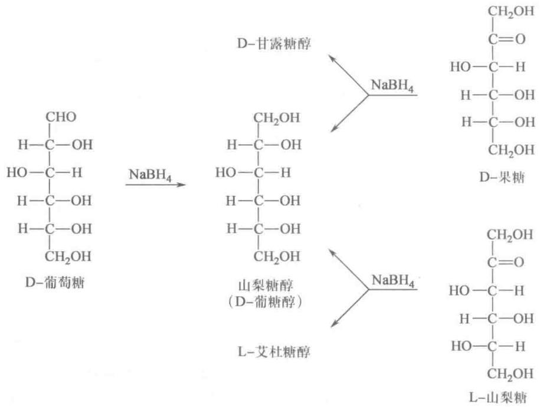  
图9-14 单糖还原成糖醇

（4）甲基化和乙酰化 甲基化在糖的环状结构以及寡糖和多糖的结构分析中起重要作用。糖的甲基化(methylation)是在甲基亚磺酰甲基钠 $\mathrm{(CH_3SOCH_2Na}$ ，简称SMSM)存在下用甲基碘 $(\mathrm{CH}_3\mathrm{I})$ 处理或在碱性条件下用硫酸二甲酯 $\left[\left(\mathrm{CH}_3\mathrm{O}\right)_2\mathrm{SO}_2\right]$ 处理完成的，产物是糖醚衍生物。例如 $\alpha -D-$ 吡喃葡糖在二甲基亚砜(DMSO)中与SMSM作用，先使糖基的自由羟基离子化，生成稳定的阴离子，再与甲基碘(methyl iodide)反应生成五-O-甲基-α-D-吡喃葡糖：

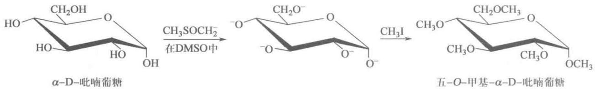

在五甲基葡萄糖中 C1 上的甲氧基(methoxy)与其他的 4 个甲氧基不同,前者是缩醛甲氧基,通过酸水解很容易除去,后者是醚甲氧基,对酸稳定。

在实验室里糖的乙酰化(acetylation)通常是在碱催化下用酰氯或酸酐进行的。所有的羟基，包括异头碳羟基都能被乙酰化(这里糖的羟基引进了乙酰基，也即是一种酯化)。例如， $\beta-D-$ 吡喃葡糖在吡啶溶液中用乙酸酐处理被转变为它的五乙酸酯：

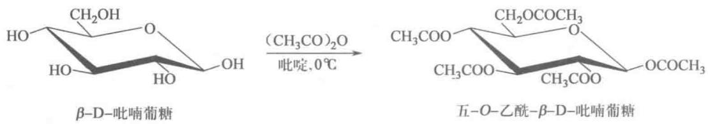

葡萄糖的乙酰化是测定葡萄糖结构的重要步骤之一。

（5）形成糖苷 环状单糖的半缩醛（或半缩酮）羟基与另一化合物发生缩合反应形成的缩醛（或缩酮）称为糖苷或苷（glycoside，也译作糖甙或甙），如强心苷、皂苷、核苷等。糖苷分子中提供半缩醛（或半缩酮）羟基的糖部分称为糖基（glycosyl，glycone），与之缩合的“非糖”部分称为糖苷配基（aglycon）。例如从许多植物中提取的强心苷类，其糖基常是由2,6-二脱氧己糖缩合成的低级寡糖，糖苷配基是类固醇（见下一节“糖苷”部分），这两部分之间的连键称糖苷键（glycosidic bond）。糖苷键可以是通过氧、氮或硫原子起连接作用，也可以是碳碳直接相连，形成的糖苷分别简称为 $O-$ 苷， $N-$ 苷， $S-$ 苷或 $C-$ 苷，自然界中最常见的是 O-苷（如双糖），其次是 N-苷（如核苷，见第 11 章），S-苷和 C-苷少见。糖苷配基也可以是糖，这样缩合成的糖苷，即是寡糖和多糖。由于一个环状单糖有 $\alpha$ 和 $\beta$ 两种异头物，成苷时相应地也有两种形式。例如在无水甲醇中以氯化氢为催化剂制备甲基葡糖苷时（仅糖的异头羟基被甲基化），得到两个异构体， $\alpha$ -甲基-D-吡喃葡糖苷和 $\beta$ -甲基-D-吡喃葡糖苷：

$[\alpha]_{\mathrm{D}} = -34^{\circ}$  
  
甲基- $\alpha$ -D-吡喃葡糖苷

  
甲基- $\beta$ -D-吡喃葡糖苷

糖苷与糖的性质很不相同。糖是半缩醛，容易变成游离醛，从而给出醛的各种反应。糖苷属缩醛，一般不显示醛的性质，例如不能还原 Fehling 试剂，不能成脎，也无变旋现象。糖苷对碱溶液稳定，但易被酸水解成原来的糖和糖苷配基两个部分。

## 三、重要的单糖和单糖衍生物

自然界中存在的单糖及其衍生物有数百多种,其中多数是作为寡糖和多糖(统称聚糖)的单糖单位存在,水解聚糖可以得到相应的单糖或其衍生物,少数以游离状态存在。下面介绍某些生物学上重要的单糖及其衍生物。

## (一) 单糖

## 1. 丙糖(triose)

有 D-甘油醛和二羟丙酮, 其结构式分别见图 9-3 和 9-4。它们的磷酸酯是糖酵解代谢途径中的重要中间物(见第 17 章)。二羟丙酮无光学活性; 甘油醛是具有光学活性的最简单的单糖, 常被用作确定生物分子 D、L 构型的标准物。

## 2. 丁糖(tetrose)

D-赤藓糖和 D-赤藓酮糖是丁糖的代表,其结构式分别见图 9-3 和 9-4;它们常见于藻类、地衣等低等植物中。D-赤藓糖的 4-磷酸酯是代谢中戊糖磷酸途径(见第 20 章)和光合固定 CO₂ 的 Calvin 循环(见第 23 章)中的重要中间物。D-赤藓酮糖是联系 D 酮糖家系立体化学的重要一员。

## 3. 戊糖 (pentose)

自然界中存在的戊醛糖(aldopentose)主要有(图9-15):

  
β-D-呋喃核糖

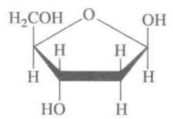  
2-脱氧- $\beta$ -D-呋喃核糖

  
图9-15 几种常见的戊糖结构  
$\beta -\mathrm{D}-$ 吡喃木糖

  
α-L-呋喃阿拉伯糖

  
α-D-呋喃阿拉伯糖

D-核糖和2-脱氧-D-核糖分别是RNA和DNA的组成成分。成苷时它们以 $\beta$ -呋喃糖形式参与。D-核糖的5-磷酸酯也是戊糖磷酸途径和Calvin循环的中间物。

D-木糖多以戊聚糖(pentosan)形式存在于植物和细菌的细胞壁中,是树胶和半纤维素的组分。用酸水解法(8% $H_{2}SO_{4}$ )可以从粉碎的秸秆、木材、玉米芯以及种子和果实的外壳(如棉籽壳、花生壳)中大量制取 D-木糖。经还原可转变为 D-木糖醇。类酵母（如 Torula, Monillia）能在玉米芯、秸秆等的水解液（含木糖）中生长和发育，使水解液变成富含蛋白质和维生素的饲料。

D-核酮糖和 D-木酮糖(结构式见图 9-4)存在于多种植物细胞和动物细胞中,它们的 5-磷酸酯也参与戊糖磷酸途径和 Calvin 循环。

D-阿拉伯糖存在于某些植物和结核杆菌(M. tuberculosis)中,参与植物糖苷和细胞壁的组成。

L-阿拉伯糖也称果胶糖（pectinose），广泛存在于植物和细菌的细胞壁以及树皮创伤处的分泌物（树胶）中。它是果胶物质、半纤维素、树胶和植物糖蛋白的重要成分。可用酸解法从牧豆胶（mesguite gum）或甜菜渣中获取 L-阿拉伯糖。

## 4. 己糖 (hexose)

自然界中常见的己糖有(图 9-16):

  
图9-16 几种常见的己糖结构

D-葡萄糖也称右旋糖(dextrose)，在医学和生理学上常称它为血糖(blood sugar)，它能被人体直接吸收并利用，正常人空腹时血液中葡萄糖浓度约为 $5\mathrm{mmol / L}$ 。D-葡萄糖是人体和动物代谢的重要能源，是大脑的主要燃料。当到达大脑的血糖过低时，会出现严重的结果：嗜睡、昏迷、永久性脑损伤，直至死亡。动物在进化中形成了一套复杂的激素机制，保证血液中有足够的葡萄糖浓度以满足大脑的需要，但不会过高。血糖长时间偏高会引起严重的生理后果——糖尿病，人体缺失或缺少胰岛素是引起糖尿病的直接原因。D-葡萄糖又是淀粉和纤维素等的单体亚基（单糖单位）。D-葡萄糖在工业上用盐酸水解淀粉的方法获取，是食品和制药工业的重要原料。

D-半乳糖是乳糖、蜜二糖和棉子糖等的组成成分之一，也是某些糖苷以及脑苷脂和神经节苷脂（见第10章）的组成成分。它主要以半乳聚糖形式存在于植物细胞壁中。在少数植物的果实如常春藤（Hedera）果实存在游离的D-半乳糖，常在果实的表面析出半乳糖结晶。

L-半乳糖作为构件分子之一存在于琼脂和其他多糖分子中(见本章杂多糖部分)。

D-甘露糖主要以甘露聚糖形式存在于植物细胞壁中。用酸水解坚果外壳可制取 D-甘露糖。

D-果糖也称左旋糖(levulose)，因为果糖的 $\left[\alpha\right]_{D}^{20}$ 为 $-92^{\circ}$ 。D-果糖是自然界中最丰富的酮糖，以游离状态跟葡萄糖和蔗糖一起存在于果汁和蜂蜜中，或与其他单糖结合成寡糖如蔗糖，或自身结合成果聚糖如菊芋块茎中的菊粉(inulin)，它曾是用来制取D-果糖的一种重要原料。现在多用D-木糖异构酶(D-xylose ketol-isomerase)，亦称葡糖异构酶，能将葡萄糖糖浆（淀粉水解液）转化为果糖糖浆，这为食品工业开辟了一条制造果糖的新途径。

L-山梨糖是另一个容易获得的己酮糖。它存在于被细菌发酵过的山梨(mountain ash)果汁中。山梨是属于花楸属(Sorbus aucuparia)的植物。已证明，L-山梨糖是由醋酸杆菌氧化山梨果中的山梨糖醇而来的。L-山梨糖是工业上合成维生素C(抗坏血酸)的重要中间物，因此它在维生素制造业中有着重要意义。工业上先用催化加氢的方法将D-葡萄糖还原为山梨糖醇，然后用一种醋酸氧化菌(Acetobacter$suboxydans$ )在充分供氧条件下氧化山梨糖醇成为L-山梨糖,得率高达90%以上。

## 5. 庚糖(heptose)和辛糖(octose)

天然存在的庚糖和辛糖已发现的不多,对它们的功能了解也较少。这些糖主要有(图 9-17):

  
图9-17 几种庚糖和辛糖的结构

D-景天庚酮糖（D-sedoheptulose）大量存在于景天科（Crassulaceae）植物中。最先是从常见的草本庭园植物景天（Sedum spectubile）中提取出来的。它的7-磷酸酯也是戊糖磷酸途径和Calvin循环中的重要中间物。

L-甘油-D-甘露庚糖(L-glycero-D-mannoheptose)是一种七碳醛糖,存在于沙门氏杆菌(Salmonella)细胞壁外层的脂多糖结构(图9-36)中。

D-甘油-D-甘露辛酮糖(D-glycero-D-mannooctulose)是一种八碳酮糖,存在于鳄梨(Persea americana)的果实中,其功能尚不清楚。如果此辛酮糖的C1羟甲基氧化成羧基,并C3位脱氧,则成为3-脱氧-D-甘油-D-甘露辛酮糖酸(3-deoxy-D-glycero-D-mannooctulosonic acid),曾称2-酮-3-脱氧辛糖酸(2-keto-3-deoxyoctonate,Kdo)。它也是沙门氏杆菌脂多糖的成分(图9-36)。

## （二）单糖磷酸酯

糖磷酸酯(sugar phosphate ester)或称磷酸化糖(phosphorylated sugar)，广泛地存在于各种细胞中，它们是很多代谢途径中的主要参加者之一。例如D-葡[萄]糖-1-磷酸，D-葡糖-6-磷酸，D-果糖-6-磷酸，D-果糖-1,6-二磷酸（fructose-1,6-bisphosphate，FBP，以前称fructose-1,6-diphosphate，FDP），D-甘油醛-1-磷酸和磷酸二羟丙酮是糖酵解途径的中间物（第17章）；D-赤藓糖-4-磷酸，D-核糖-5-磷酸，D-木酮糖-5-磷酸，D-核酮糖-5-磷酸和D-景天庚酮糖-7-磷酸等是戊糖磷酸途径（第20章）和光合作用的Calvin循环（第23章）中的中间物。还有一类是核糖糖苷的磷酸酯，称核苷酸如腺苷一磷酸（AMP），腺苷二磷酸（ADP）和腺苷三磷酸（ATP）等，这类化合物将在“核酸”（第11章）和“生物能学”（第16章）等章节叙述。生物学中最重要的几个单糖磷酸酯的结构式见图9-18。

糖磷酸酯的酸性比正磷酸 $\left(\mathrm{H}_{3}\mathrm{PO}_{4}\right)$ 还强，头两步解离的 $pK_{a}$ 分别为1\~2和6\~7，这些化合物在细胞内(pH7.2)是以1价阴离子和2价阴离子的混合物存在的。单糖磷酸酯以荷电形式存在的生物学作用之一是防止它们扩散到细胞外，因为荷电的分子一般不能穿越生物膜。

## (三) 糖醇

在前面曾谈到单糖的羰基被还原,则生成糖醇(alditol 或 sugar alcohol),如 D-葡糖醇(山梨糖醇)。糖醇是生物体的代谢产物,不少糖醇也是工业产品,并用于制药和食品工业。自然界中广泛存在的糖醇(其结构式见图 9-19)有:

山梨糖醇是植物中最普遍的一种糖醇,从藻类到高等植物都含有山梨糖醇,在蔷薇科(Rosaceae)植物如桃、李、杏、苹果和山梨等的果实中含量特别丰富。山梨糖醇是1872年首次从山梨的浆果中分离出来的。它是最重要的一种糖醇，工业上用葡萄糖催化加氢获得（见本章“单糖的化学性质”）。产品主要用于合成维生素C，我国这项合成工艺在国际上一直处于领先地位。其次用于表面活性剂、食品、化妆品、制药以及其他多种工业。

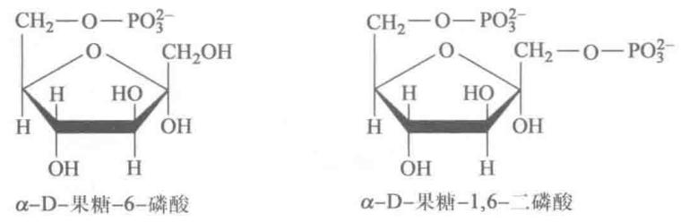

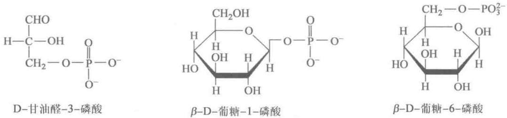

图9-18 几种重要的单糖磷酸酯的结构  
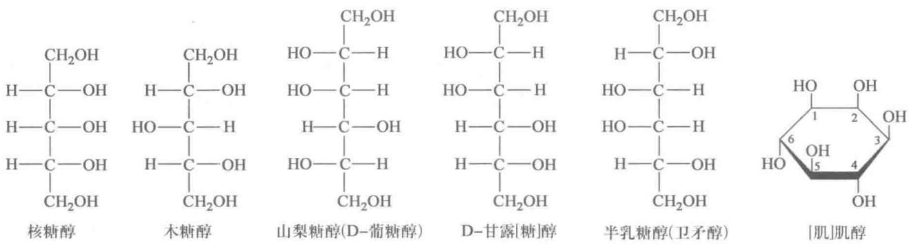  
图9-19 一些重要糖醇的结构

D-甘露[糖]醇(D-mannitol)广泛分布于多种陆地和海洋植物中,橄榄树、糖梣(Fraxinus ornus)等的树皮上常分泌有大量的甘露醇,形成所谓甘露蜜(manna)的干性渗出物,柿饼表面上的白色柿霜就是甘露醇;藻类和真菌中含量也很丰富,如昆布属褐藻(Laminaria digitata)是提取甘露醇的良好原料。D-甘露醇化学上可由D-甘露糖和D-果糖还原获得。D-甘露醇在临床上用来降低颅内压和治疗急性肾功能衰竭。

半乳糖醇(galactitol)又称卫矛醇(dulcitol)，是半乳糖的还原产物，存在于红藻、卫矛属(Euonymus)等多种植物中。

核糖醇(ribitol)是核糖的还原产物。它参与核黄素(维生素 $B_{2}$ )的组成。木糖醇(xylitol)是葡糖-6-磷酸经糖醛酸途径代谢的一个中间物。它可由木糖还原获得,产品用作增甜剂,其甜度与蔗糖相当。

肌醇(inositol)即环己六醇(cyclohexanhexol)，是一种环多醇(cyclitol)。肌醇有9个立体异构体，其中最重要的异构体是肌肌醇(myoinositol)，常称为肌醇，它首次从心肌的提取液中获得。肌肌醇是肌醇异构体中唯一具有生物活性的，是酵母和某些动物（如白鼠）的重要生长因子（归于B族维生素），但人体能合成它，因此是人的非必需维生素。肌肌醇是某些磷脂的成分，例如肌醇-1,4,5-三磷酸 $\left(\mathrm{IP}_{3}\right)$ 是人和动物体内的第二信使(第14章)。在植物中主要以六磷酸酯形式存在，称为植酸(phytic acid)。后者常与钙、镁形成复盐，即植酸钙镁，商品名为菲丁（phytin）。菲丁多从生产玉米淀粉时的浸液或从米糠、棉籽饼等的浸液中以不溶性的钙镁盐获得，供医药和微生物发酵用。

## (四) 糖酸

生物体内重要的糖酸有醛糖酸(aldonic acid)和糖醛酸(uronic acid)，它们都可形成稳定的分子内的酯，称内酯(lactone)。

D-葡糖酸(D-gluconic acid)及其 $\delta$ 和 $\gamma$ 两种内酯的结构式见图9-20。生物体内不存在游离的醛糖酸，但它们的某些衍生物，如6-磷酸葡糖酸及其 $\delta-$ 内酯是戊糖磷酸途径中的中间物（见第20章），葡糖酸能与钙、铁等离子形成可溶性盐，用作药物易被吸收；葡糖酸钙常用于治疗缺钙症和过敏性疾病。

  
图9-20 D-葡糖酸和 $\beta$ -D-葡糖醛酸及其内酯的结构

常见的糖醛酸有 D-葡糖醛酸（D-glucuronic acid）、D-半乳糖醛酸（D-galacturonic acid）和 D-甘露糖醛酸（D-mannuronic acid），它们是很多杂多糖的构件分子。D-葡糖醛酸也是糖醛酸途径中的重要中间物。 $\beta$ -D-葡糖醛酸及其内酯（ $\beta$ -D-glucurono-6,3-lactone）的结构式见图 9-20。

## (五) 脱氧糖

脱氧糖(deoxy sugar)是指分子的一个或多个羟基被氢原子取代的单糖。它们广泛地分布于植物、细

菌和动物中。2-脱氧核糖(DNA的戊糖成分)已在前面述及。这里再介绍几种高等植物中常见的6-脱氧己糖(图9-21)。L-鼠李糖(L-rhamnose)即6-脱氧-L-甘露糖,它是最常见的天然脱氧糖,很多糖苷和杂多糖的组成成分。L-岩藻糖(L-fucose)即6-脱氧-L-半乳糖,它是海藻细胞壁和某些糖缀合物中寡糖成分(如血型物质)的水解产物之一。D(+)-毛(洋)地黄毒素糖(digitoxose)即2,6-二脱氧-D-阿洛糖,是毛(洋)地黄毒苷(digitoxin)和几种其他强心苷的组分。阿比可糖(abequose)即3-脱氧-D-岩藻糖,它存在于革兰氏阴性细菌如沙门氏杆菌的细胞壁脂多糖(抗原物质)中。

此外,已发现的脱氧糖还有 D-岩藻糖,异鼠李糖(quinovose)即 6-脱氧-D-葡萄糖,可立糖(colitose)即 3-脱氧-L-岩藻糖(阿比可糖的对映体)等。

图 9-21 几种常见脱氧己糖的结构

异头碳上的HOH表示该异头物可以是 $\alpha$ 或 $\beta$

## (六) 氨基糖

氨基糖(amino sugar)是分子中一个羟基被氨基取代的单糖,自然界中最常见的是C2上的羟基被取代的2-脱氧氨基糖。氨基糖的氨基有游离的,如人乳中有少量的游离氨基葡糖(葡糖胺);但多数是以乙酰氨基的形式存在。具有代表性的氨基糖及其衍生物是葡糖胺(glucosamine),N-乙酰葡糖胺(N-acetyl glucosamine),半乳糖胺(galactosamine),N-乙酰半乳糖胺(图9-22);其他常见的氨基糖还有甘露糖胺、鼠李糖胺和岩藻糖胺等。氨基糖及其衍生物是许多天然多糖的构件成分。

胞壁酸(muramic acid)和神经氨酸(neuraminic acid)也是氨基糖的衍生物,称为酸性氨基糖。N-乙酰胞壁酸是细菌细胞壁上的肽聚糖的构件之一, 它是由 N-乙酰-D-葡糖胺和 D-乳酸(一个三碳羧酸)通过前者 C3 上的羟基与后者的羟基缩合形成的醚键连接而成的。胞壁酸和 N-乙酰胞壁酸的结构式如图 9-24 所示。神经氨酸是含一个氨基的九碳糖酸, 在生物体内它的碳架是由丙酮酸( $C_{3}$ 单位)和 D-甘露糖胺( $C_{6}$ 单位)合成的。自然界中以酰基化的形式存在, 如 N-乙酰(N-acetyl)和 N-羟乙酰(N-glycolyl)的神经氨酸, 它们统称为唾液酸(sialic acid)。唾液酸是动物细胞膜上的糖蛋白和糖脂的重要成分。图 9-23 示出 N-乙酰神经氨酸的开链型和吡喃型结构, 两种结构形式处于平衡中, 但平衡远向着吡喃型一方。

为方便书写复杂寡糖和多糖的结构起见,将使用缩写符号来代表构件单糖及其衍生物。一些最重要的单糖及其衍生物的缩写列于表9-3。

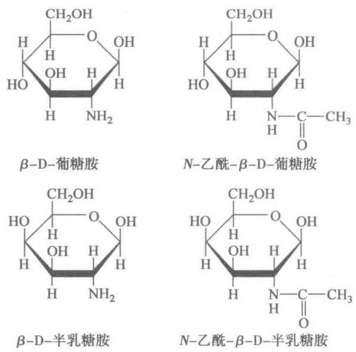  
图9-22 几种氨基糖及其 $N$ -乙酰衍生物的结构

  
图 9-23 胞壁酸和 N-乙酰胞壁酸结构(A)和 N-乙酰神经氨酸(唾液酸)结构(B)

表 9-3 某些单糖残基及其衍生物名称的缩写

<table><tr><td colspan="2">单糖</td><td colspan="2">单糖衍生物</td></tr><tr><td>阿比可糖</td><td>Abe</td><td>葡糖醛酸</td><td>GlcUA</td></tr><tr><td>阿拉伯糖</td><td>Ara</td><td>葡糖胺</td><td>GlcN</td></tr><tr><td>果糖</td><td>Fru</td><td>半乳糖胺</td><td>GalN</td></tr><tr><td>岩藻糖</td><td>Fuc</td><td>N-乙酰葡糖胺</td><td>GlcNAc</td></tr><tr><td>半乳糖</td><td>Gal</td><td>N-乙酰半乳糖胺</td><td>Gal NAc</td></tr><tr><td>葡萄糖</td><td>Glc</td><td>艾杜糖醛酸</td><td>IdoUA</td></tr><tr><td>甘露糖</td><td>Man</td><td>胞壁酸</td><td>Mur</td></tr><tr><td>鼠李糖</td><td>Rha</td><td>N-乙酰胞壁酸</td><td>MurNAc</td></tr><tr><td>核糖</td><td>Rib</td><td>N-乙酰神经氨酸(唾液酸)</td><td>NeuNAc</td></tr><tr><td>木糖</td><td>Xyl</td><td></td><td></td></tr></table>

## (七) 糖苷

这里介绍的糖苷是那些配基为类固醇(甾体)、2-苯基苯并吡喃或含氮碱等的单糖或寡糖衍生物。这类糖苷大多有苦味或特殊香气,不少还是剧毒的物质,但微量时可作药用。

一类是医学上称为强心苷(cardiac glycoside)的物质,它们是治疗充血性心力衰竭和节律障碍的重要药物。强心苷在很多种植物如毛(洋)地黄属(Digitalis)、毒毛旋花属(Strophanthus)等中存在;其糖基常是单糖、双糖或三糖等(单糖单位多是2,6-二脱氧己糖),配基都是类固醇(第10章);强心苷的生理活性主要是由配基决定的。毛地黄毒苷(digitoxin)是强心苷中的一种;其糖基是一个由D-毛地黄毒素糖(见本节“脱氧糖”部分)通过 $\beta-1,4$ 糖苷键连接的三糖残基;配基称毛地黄毒苷配基(digitoxigenin),即3 $\beta$ ,14-二羟-5 $\beta$ ,20[22]-强心[烯羟酸]内酯(3 $\beta$ ,14-dihydroxy-5 $\beta$ ,20[22]-cardenolide);强心内酯(一种甾体)是强心苷类配基的基本结构(图9-24),其特点是甾体中A、B环合并取顺式,B、C环取反式,C、D环取顺式;C3羟基常是 $\beta$ 取向,C14羟基总是 $\beta$ 取向,C17 $\beta$ 取向的位置上有一个丁烯羟酸内酯(butenolide)。乌本苷(ouabain),或称G-毒毛旋花苷(G-strophanthin),也是一种强心苷。它最初从东非洲的苦毒毛旋花或称苦羊角拗(Strophanthus gratus)中提取出来;过去索马里人用这类植物的浸出液作为箭毒,因而发现了它。乌本苷是 $Na^{+}$ , $K^{+}-ATP$ 酶的强抑制剂,此酶催化 $Na^{+}$ 和 $K^{+}$ 离子的跨膜运送,以维持所需电解质的平衡。乌本苷的结构(图9-24):糖基部分是 $\alpha-L-$ 鼠李糖残基,配基部分称乌本苷配基(ouabagenen)。

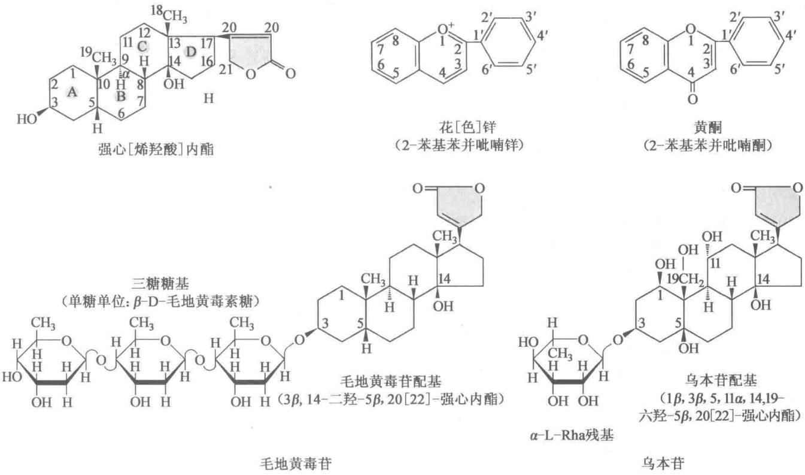  
图9-24 几种糖苷和糖苷配基  
图中灰色的五元环是强心苷类的内酯环(lactone ring)；黄酮类是某些植物糖苷如橘皮苷等的配基

皂苷(saponin)是以多环三萜或类固醇(见第10章)为配基,以寡糖为糖基组成的一类糖苷。由于分子中含有亲脂的配基和亲水的糖基而表现出去污剂的性质,其水溶液振荡时能形成稳定的泡沫。从这个意义上讲,上述的强心苷也可归于皂苷类。皂苷广泛存在于高等植物,其中许多是药用植物,如人参、柴胡、桔梗、甘草等都含有丰富的皂苷物质。

许多花和果实的着色物质也是糖苷类，称花色素苷（anthocyanin），它们的配基称花色素（anthocyanidin）。例如最常见的花青苷（cyanin），配基是花青素（cyanidin）。花色素类的母体化合物是2-苯基苯并吡[喃]锌(2-phenylbenzopyryllium ion)，简称花[色]锌(flavylium ion)（图9-24）。花色素本身难溶于水，在植物中它们主要以糖苷形式存在。开花植物中花色素苷的种类很多，配基花色锌的3-和5-OH可被Glc，

Gal, Rha, Ara 和多种寡糖糖基化而增加溶解度。

糖苷化合物还有很多。含氮碱为配基的核苷类将在核酸部分(第11章)叙述。

## 四、寡糖

寡糖是由2到10多个单糖分子通过糖苷键连接而成的糖类。实际上寡糖与多糖之间并无明确界线；寡糖和多糖有时同称为聚糖(glycan)。有人把寡糖分成初生寡糖和次生寡糖两类。初生寡糖在生物体内以游离形式存在，如蔗糖、乳糖、和棉子糖等，其功能是代谢方面的。次生寡糖多是高级寡糖，结构复杂，其功能主要作为糖缀合物的信息成分。

## （一）寡糖的结构

从考察图 9-25 中的几个二糖结构可以知道,一个寡糖结构需要从几个方面加以描述:① 指出寡糖中单糖残基的名称及其结构特点(D/L,吡喃糖/呋喃糖);② 指出单糖残基之间连键的类型(异头碳的构型 $\alpha/\beta$ ,被连接的碳位置 $1\rightarrow4$ , $1\rightarrow6$ 或其他);③ 指出寡糖中是否含有游离的异头碳;含游离异头碳的残基那一端,如乳糖中的 Glc(右边),称为还原端(reducing end),另一端的 Gal(左边)称为非还原端(nonreducing end)。具有还原端的寡糖,跟单糖一样能还原 Fehling 试剂,能成脎,有变旋现象,因此也是还原糖。不具游离异头碳的蔗糖、海藻糖等属于非还原糖,非还原二糖中的异头碳都参与糖苷键的形成,如蔗糖中 $(\alpha1\leftrightarrow2\beta)$ 和海藻糖中的 $(\alpha1\leftrightarrow1\alpha)$ 。

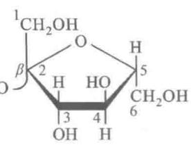

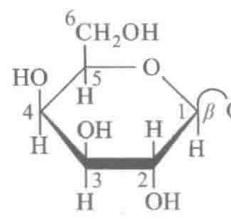

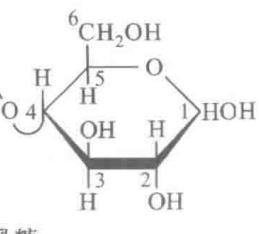

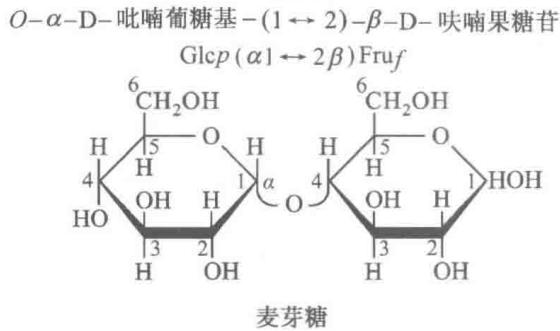  
$O - \alpha - D -$ 吡喃葡糖基 $-(1 \to 4) - D -$ 吡喃葡糖 $\mathrm{Glc}(\alpha 1 \to 4)\mathrm{Glc}$  
$O - \alpha -\mathrm{D}-$ 吡喃葡糖基- $(1\leftrightarrow 1) - \alpha -\mathrm{D}-$ 吡喃葡糖苷Glc $(\alpha 1\leftrightarrow 1\alpha)$ Glc  
图9-25 某些常见二糖的结构

命名寡糖时①先写出非还原端残基的名称,称某单糖基,以表示成苷时它是异头碳的提供者,并在该名称前冠以例如 $O-\alpha-D-$ 的字样,前两个字母表示形成的糖苷键类型:O代表连键是通过氧原子的, $\alpha(\beta)$ 代表连键的异头碳构型;②为区分五元环和六元环结构,在单糖残基名称中插入吡喃或呋喃字样;③被糖苷键连接的两个碳原子的位置常用箭头连接起来的两个序号来表示,例如(1→4),这表示第一个单糖残基(左边)的C1被连接到第二个残基(右边)的C4上。如果有第三个单糖残基,可用同一惯例描述第二个糖苷键,依次类推;④最后一个残基,如果它的异头碳是游离的则称某单糖,如果异头碳也参与成键则称某单糖苷。

按此命名惯例,图9-25中所示的麦芽糖被称为 $O-\alpha-D-$ 吡喃葡糖基 $-(1\rightarrow 4)-\beta-D-$ 吡喃葡糖（ $O-\mathrm{D}-$ glucopy-ranosyl- $(1\rightarrow 4)-\beta-\mathrm{D}-$ glucopyranose）。为简化寡糖结构的描述，常采用表9-3中的单糖及其衍生物的缩写符号，吡喃糖和呋喃糖的符号分别采用斜体小写 $p$ 和 $f$ ，此麦芽糖正规名称的简化形式为 $O - \alpha -\mathrm{D}-$ $\mathrm{Glc}p - (1\rightarrow 4) - \mathrm{D - Glcp}$ 。由于最常见的单糖多是D-对映体，己醛糖占优势的形式是吡喃型以及游离的寡糖都是 $O-$ 苷，因此可省去 $\mathrm{D / L},p / f$ 和 $O$ ，麦芽糖的命名进一步简化为： $\mathrm{Glc}(\alpha 1\to 4)\mathrm{Glc},\mathrm{Glc}\alpha (1\rightarrow 4)\mathrm{Glc}$ 或 $\mathrm{Glc}\alpha 1\rightarrow 4\mathrm{Glc}$ 。

## （二）常见的二糖

二糖(双糖)是最简单的寡糖,由2分子单糖缩合而成。由2个葡萄糖分子构成的二糖称葡二糖,葡二糖有11个异构体(未包括游离异头碳的 $\alpha$ 和 $\beta$ ),它们都已在自然界中找到,如蔗糖、麦芽糖、海藻糖、纤维二糖(cellobiose;即 $\mathrm{Glc}(\beta 1\rightarrow4)\mathrm{Glc}$ )、龙胆二糖(gentiobiose;即 $\mathrm{Glc}(\beta 1\rightarrow6)\mathrm{Glc}$ )等。由2个不同的单糖构成的二糖如乳糖,可能的异构体就更多了。已知的双糖有140多种。现对几种常见的二糖(图9-25)介绍如下。

蔗糖(sucrose)俗称食糖,是最重要的二糖。它形成并广泛存在于光合植物,而不存在于动物中。蔗糖的主要来源是甘蔗,甜菜和糖枫。蔗糖是一种非还原糖。经稀酸或蔗糖酶(sucrase;以前称转化酶(invertase))水解生成1分子D-葡萄糖和1分子D-果糖。蔗糖在分离纯化过程中容易被结晶,呈单斜晶形。蔗糖水解过程中比旋由正值变为负值,旋光度的这一变化称为转化(inversion);所得葡萄糖和果糖的等摩尔混合物称为转化糖(invert sugar), $\left[\alpha\right]_{D}^{20}=-19.8^{\circ}$ 。蔗糖的溶解度很大(179 g/100 mL,0℃;487 g/100 mL,100℃),并且大多数的生物活性都不受高浓度的蔗糖影响,因此蔗糖适于作为植物体中组织之间糖的运输形式。

乳糖(lactose)几乎存在于所有研究过的哺乳类乳汁中,含量约5%。工业上乳糖是从乳清中制取的,乳清是生产奶酪时经凝乳酶(rennin)作用沉淀除去蛋白质后的水溶液。乳糖是一种还原糖。乳糖能被 $\beta$ -半乳糖苷酶( $\beta$ -galactosidase)水解产生1分子D-半乳糖和1分子D-葡萄糖,表明它的糖苷键是 $\beta$ 型的。乳糖的溶解度(17g/100 mL冷水,40 g/100 mL热水)远比蔗糖小。乳糖作为乳汁的成分,是婴儿的糖类营养的主要来源。

麦芽糖(maltose)主要是作为淀粉等的酶解产物存在于生物体内(次生寡糖)，但已证实在植物中有容量不大的从头合成的游离麦芽糖库，因此它也是初生寡糖。麦芽糖是一种还原糖；溶解度为108 g/100 mL,25℃；甜度为蔗糖的1/3。麦芽糖是俗称饴糖的主要成分，我国早在公元前12世纪就能制作，食品工业中麦芽糖用作膨松剂，填充剂和稳定剂。

海藻糖（trehalose）也称 $\alpha,\alpha-$ 海藻糖，广泛地分布于藻类、真菌、地衣和节肢动物中。它是一种非还原糖；在海藻糖酶（trehalase）作用下降解为 D-葡萄糖。 $\alpha,\alpha-$ 海藻糖属于初生寡糖，它是伞形科（Apiaceae）正成熟果实中主要的可溶性糖类；在蕨类中代替蔗糖成为主要的可溶性储存糖，在昆虫中它是用作能源的主要血循环糖。

## （三）其他简单寡糖

棉子糖（raffinose）广泛地分布于高等植物中。棉子糖完全水解产生葡萄糖、果糖和半乳糖。棉子糖是一种非还原糖，因此推定它的所有异头碳都参与糖苷键的形成；当用蜜二糖酶（melibiase，一种 $\alpha-$ 半乳糖苷酶）水解时产生半乳糖和蔗糖，而用蔗糖酶水解时产物是果糖和蜜二糖（melibiose，Gal（ $\alpha1\rightarrow6$ ）Glc）。因而确定棉子糖的结构是 $\mathrm{Gal}(\alpha1\rightarrow6)\mathrm{Glc}(\alpha1\leftrightarrow2\beta)\mathrm{Fru}$ 。棉子糖是所谓“棉子糖家族”的同系物寡糖的基础。棉子糖家族在植物体内是从头合成的，并以游离状态存在，因此属于初生寡糖。

水苏糖(stachyose)是一种四糖, Gal ( $\alpha1\rightarrow6$ ) Gal ( $\alpha1\rightarrow6$ ) Glc ( $\alpha1\leftrightarrow2\beta$ ) Fru, 是棉子糖家族中的一员。它是通过 ( $\alpha1\rightarrow6$ ) 糖苷键向棉子糖的半乳糖残基加上另一个半乳糖基而成的。通过 ( $\alpha1\rightarrow6$ ) 糖苷键向蔗糖的 Glc 残基相继加入 Gal 则得系列棉子糖家族成员: 三糖、四糖直至九糖。其低级同系物如棉子糖和水苏糖几乎存在于植物的各个部分, 高级同系物一般限制在贮存器官。棉子糖系列与蔗糖同为糖类的转运和贮存形式。

人乳中存在从二糖到六糖等几十种寡糖，其中多数是含乳糖基的高级寡糖，如乳糖-N-新四糖(lacto-

N-neo-tetraose)等,这些高级寡糖主要是作为血型抗原(糖蛋白或糖脂)的决定簇。

## (四) 环糊精

环糊精(cyclodextrin)或称环[直链]淀粉(cycloamylose)是芽孢杆菌属(Bacillus)的某些种中的环糊精转葡糖基转移酶(cyclodextrin glucosyltransferase)作用于淀粉生成的。一般由6、7或8个葡萄糖残基通过 $(\alpha 1\rightarrow 4)$ 糖苷键连接而成，分别称为 $\alpha -$ 、 $\beta -$ 和 $\gamma -$ 环糊精或环六、环七和环八淀粉。环糊精无游离异头羟基，属于非还原糖。这些环状寡糖对酸水解较慢，对 $\alpha -$ 和 $\beta -$ 淀粉酶有较大的抗性。

环糊精分子的结构像一个轮胎(图9-26);在水中环糊精分子作为单体垛叠起来形成各种直径的筒状多聚体,由于Glc残基的C3和C6羟基以及环氧都向糖环的外缘,相对地“圆筒”内部是疏水的,外部是亲水的。这些多聚体既能很好地溶于水,又能从溶液中吸入疏水分子或分子的疏水部分到筒腔内,形成水溶性的包含复合体(inclusion complex)。通常被包含的物质对光、热和氧变得稳定;某些物理性质也发生改变,如溶解度和分散度增大。环糊精还能使食品的色、香、味得到保存和改善。因此在医药、食品、化妆品等工业中被广泛地用作稳定剂、抗氧化剂、抗光解剂、乳化剂和增溶剂等。在生化上环糊精被用于层析分离,因为环糊精“圆筒”是被糖自身的手性碳围绕的,所以能够跟那些能进入“圆筒”的手性分子形成立体专一的包含复合体,例如一些有机小分子的立体异构体混合物能在 $\beta$ -环糊精的层析柱上被分离纯化。 $\alpha$ -和 $\beta$ -环糊精能使某些化学反应加速,具有催化功能,例如 $\alpha$ -环糊精能使苯酯水解速度增加300倍, $\beta$ -环糊精使焦磷酸酯水解速度增加200多倍。因此环糊精是研究模拟酶(mimetic enzyme)的好材料。

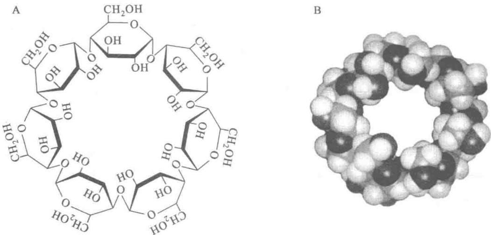  
图 9-26 β-环糊精分子的结构(A)和空间填充模型(B)

<!-- EN-BEGIN 7.1 -->

### 【英文对应 7.1】Monosaccharides and Disaccharides

> 来源：Lehninger Principles of Biochemistry（书籍/02_生物化学原理） 第7章 Carbohydrates and Glycobiology，§7.1。对应本章“四、寡糖”。

The simplest of the carbohydrates, the monosaccharides, are either aldehydes or ketones with two or more hydroxyl groups; the six-carbon monosaccharides glucose and fructose have five hydroxyl groups. Many of the carbon atoms to which the hydroxyl groups are attached are chiral centers, which give rise to the many sugar stereoisomers found in nature. Stereoisomerism in sugars is biologically significant because the enzymes that act on sugars are strictly

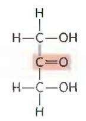

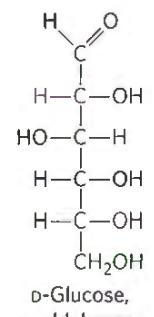

FIGURE 7-1 Representative monosaccharides. (a) Two trioses: an aldose and a ketose. The carbonyl group in each is shaded. (b) Two common hexoses. (c) The pentose components of nucleic acids. D-Ribose is a stereospecific, typically preferring one stereoisomer to another by three or more orders of magnitude, as reflected in $K_{m}$ values or binding constants. It is as difficult to fit the wrong sugar stereoisomer into an enzyme's binding site as it is to put your left glove on your right hand.

We begin by describing the families of monosaccharides with backbones of three to seven carbons—their structure, their stereoisomeric forms, and the means of representing their three-dimensional structures on paper. We then discuss several chemical reactions of the carbonyl groups of monosaccharides. One such reaction, the addition of a hydroxyl group from within the same molecule, generates cyclic forms with four or more backbone carbons (the forms that predominate in aqueous solution). P1 This ring closure creates a new chiral center, adding further stereochemical complexity to this class of compounds. The nomenclature for unambiguously specifying the configuration about each carbon atom in a cyclic form and the means of representing these structures on paper are described in some detail; this information will be useful as we discuss the metabolism of monosaccharides in Part II. We also introduce here some important monosaccharide derivatives that will be examined closely in later chapters.

#### [EN] The Two Families of Monosaccharides Are Aldoses and Ketoses

Monosaccharides are colorless, crystalline solids that are freely soluble in water but insoluble in nonpolar solvents. Most have a sweet taste (Box 7-1). The backbones of common monosaccharides are unbranched carbon chains in which all the carbon atoms are linked by single bonds. In this open-chain form, one of the carbon atoms is double-bonded to an oxygen atom to form a carbonyl group; each of the other carbon atoms has a hydroxyl group. If the carbonyl group is at an end of the carbon chain (that is, in an aldehyde group), the monosaccharide is an aldose; if the carbonyl group is at any other position (in a ketone group), the monosaccharide is a ketose. The simplest monosaccharides are the two three-carbon trioses: glyceraldehyde, an aldotriose, and dihydroxyacetone, a ketotriose (Fig. 7-1a).

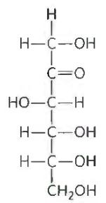

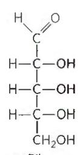

component of ribonucleic acid (RNA), and 2-deoxy-D-ribose is a component of deoxyribonucleic acid (DNA).

#### [EN] What Makes Sugar Sweet?

Sweetness is one of the five basic flavors that humans can taste; the others are sour, bitter, salty, and umami. Sweetness is detected by protein receptors in the plasma membranes of cells in the taste buds on the surface of the tongue. In humans, two closely related genes (TAS1R2 and TAS1R3) encode sweet-taste receptors (Fig. 1). When a molecule with a compatible structure binds a sweet-taste receptor's extracellular domain, it triggers a series of events in the cell (including activation of a GTP-binding protein; see Fig. 12-20) that generates an electrical signal to the brain that is interpreted as "sweet."

During evolution, there has probably been selection for the ability to taste compounds found in foods containing important nutrients, such as the carbohydrates that are major fuels for most organisms. Most sugars, including sucrose, glucose, lactose, and fructose, taste sweet, but other classes of compounds also bind sweet-taste receptors. The amino acids glycine, alanine, and serine are mildly sweet and harmless; nitrobenzene and ethylene glycol have a strong sweet taste

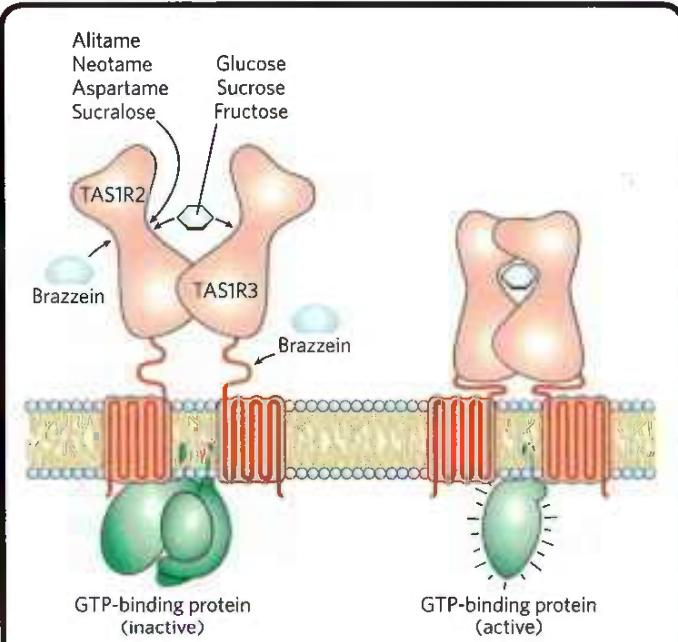  
FIGURE 1 The receptor for sweet-tasting substances, showing its regions of interaction (short arrows) with various sweet-tasting compounds. Each receptor subunit has seven transmembrane helices, a common feature of signaling receptors. Artificial sweeteners bind to only one of the two receptor subunits; natural sugars bind to both. TAS1R2 and TAS1R3 are the proteins encoded by the genes TAS1R2 and TAS1R3. [Information from F. M. Assadi-Porter et al., J. Mol. Biol. 398:584, 2010, Fig. 1.]

Monosaccharides with four, five, six, and seven carbon atoms in their backbones are called, respectively, tetroses, pentoses, hexoses, and heptoses. There are aldoses and ketoses of each of these chain lengths: aldotetroses and ketotetroses, aldopentoses and ketopentoses, and so on. The hexoses, which include the aldohexose D-glucose but are toxic. (See Box 18-2 for a remarkable medical mystery involving ethylene glycol poisoning.) Several natural products are extraordinarily sweet. Stevioside, a sugar derivative isolated from the leaves of the stevia plant (Stevia rebaudiana Bertoni), is several hundred times sweeter than an equivalent amount of sucrose. The small protein brazzein (54 amino acids), isolated from berries of the Oubli vine (Pentadiplandra brazzeana Baillon) in Gabon and Cameroon, is 17,000 times sweeter than sucrose on a molar basis. Presumably, the sweetness of the berries encourages their consumption by animals that then disperse the seeds so that new plants are established.

In societies where obesity is a major health problem, compounds that give foods a sweet taste without adding the calories found in sugars are common food additives. The artificial sweetener aspartame demonstrates the importance of stereochemistry in biology (Fig. 2). One simple model of binding to the sweet-taste receptor involves three sites: $\mathrm{AH^{+}}$ , $\mathbf{B}^{-}$ , and X. Site $\mathrm{AH^{+}}$ has a group (an alcohol or an amine) that binds the partially negative oxygen of the carboxylic acid of (S,S)-aspartame. Site $\mathbf{B}^{-}$ has a partially negative oxygen available to hydrogen-bond with the amine nitrogen of (S,S)-aspartame. Site X is oriented perpendicular to the other two groups and can accommodate the hydrophobic benzene ring of (S,S)-aspartame.

When the steric match is correct, as for $(S,S)$ -aspartame, on the left in Figure 2, the sweet receptor is stimulated and the signal "sweet" is conducted to the brain. When the match is not correct, as for $(R,S)$ -aspartame, the sweet receptor is not stimulated; in fact, $(R,S)$ -aspartame stimulates a separate receptor specifically for bitterness. Stereoisomerism really matters!

  
FIGURE 2 Stereochemical basis for the taste of two isomers of aspartame. [Information from http://chemistry.elmhurst.edu/vchembook/549receptor.html, © Charles E. Ophardt, Elmhurst College.]

and the ketohexose D-fructose (Fig. 7-1b), are the most common monosaccharides in nature—the products of photosynthesis and key intermediates in the central energy-yielding reaction sequence in most organisms. The aldopentoses D-ribose and 2-deoxy-D-ribose (Fig. 7-1c) are components of nucleotides and nucleic acids (Chapter 8).

Perspective formulas  

#### [EN] Monosaccharides Have Asymmetric Centers

P1 All the monosaccharides except dihydroxyacetone contain one or more asymmetric (chiral) carbon atoms and thus occur in optically active isomeric forms (pp. 16–17). The simplest aldose, glyceraldehyde, contains one chiral center (the middle carbon atom) and therefore has two different optical isomers, or enantiomers (Fig. 7-2).

KEY CONVENTION One of the two enantiomers of glyceraldehyde is, by convention, designated the D isomer; the other is the L isomer. As for other biomolecules with chiral centers, the absolute configurations of sugars are known from x-ray crystallography. To represent three-dimensional sugar structures on paper, we often use Fischer projection formulas (Fig. 7-2). In these projections, bonds drawn horizontally indicate bonds that project out of the plane of the paper, toward the reader; bonds drawn vertically project behind the plane of the paper, away from the reader.

In general, a molecule with n chiral centers can have $2^{n}$ stereoisomers. Glyceraldehyde has $2^{1}=2$ ; the aldohexoses, with four chiral centers, have $2^{4}=16$ . The stereoisomers of monosaccharides of each carbon-chain length can be divided into two groups that differ in the configuration about the chiral center most distant from the carbonyl carbon. Those in which the configuration at this reference carbon is the same as that of D-glyceraldehyde are designated D isomers, and those with the same configuration as L-glyceraldehyde are L isomers. In other words, when the hydroxyl group on the reference carbon is on the right (dextro) in a projection formula that has the carbonyl carbon at the top, the sugar is the D isomer; when the hydroxyl group is on the left (levo), it is the L isomer. Of the 16 possible aldohexoses, eight are D forms and eight are L. P1 Most of the hexoses of living organisms are D isomers. Why D isomers? An interesting and unanswered question. Recall that all of the amino acids found in proteins are exclusively one of two possible stereoisomers, L (p. 73). The basis for this initial preference for one isomer during evolution is unknown; however, once one isomer became prevalent, evolving enzymes able to use that isomer efficiently would have a selective advantage.

  
FIGURE 7-2 Three ways to represent the two enantiomers of glyceraldehyde. The enantiomers are mirror images of each other. Ball-and-stick models show the actual configuration of molecules. In Fischer projections, vertical lines point behind the plane of the page, and horizontal lines project above the page. Recall (see Fig. 1-17) that in perspective formulas, the wide end of a solid wedge projects out of the plane of the paper, toward the reader; a dashed wedge extends behind.

Figure 7-3 shows the structures of the D stereoisomers of all the aldoses and ketoses having three to six carbon atoms. The carbons of a sugar are numbered beginning at the end of the chain nearest the carbonyl group. Each of the eight D-aldohexoses, which differ in the stereochemistry at C-2, C-3, or C-4, has its own name: D-glucose, D-galactose, D-mannose, and so forth (Fig. 7-3a). The four- and five-carbon ketoses are designated by inserting "ul" into the name of a corresponding aldose; for example, D-ribulose is the ketopentose corresponding to the aldopentose D-ribose. (The importance of ribulose will become clear when we discuss the fixation of atmospheric $\mathrm{CO}_{2}$ by green plants, in Chapter 20.) The ketohexoses are named otherwise: for example, fructose (from the Latin fructus, "fruit"; fruits are one source of this sugar) and sorbose (from Sorbus, the genus of mountain ash, which has berries rich in the related sugar alcohol sorbitol). Two sugars that differ only in the configuration around one carbon atom are called epimers; D-glucose and D-mannose, which differ only in the stereochemistry at C-2, are epimers, as are D-glucose and D-galactose (which differ at C-4) (Fig. 7-4).

Some sugars occur naturally in their L form; examples are L-arabinose and the L isomers of some sugar derivatives that are common components of glycoconjugates (Section 7.3).

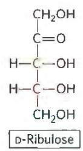

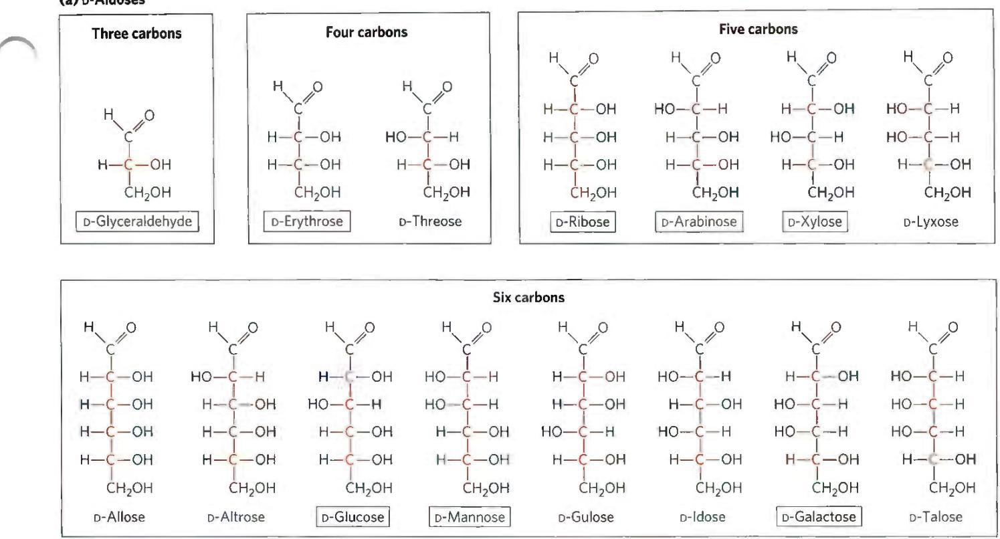

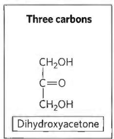

  
FIGURE 7-3 Aldoses and ketoses. The series of (a) D-aldoses and (b) D-ketoses having from three to six carbon atoms, shown as projection formulas. The carbon atoms in red are chiral centers. In all of these D isomers, the chiral carbon most distant from the carbonyl carbon has the same configuration as the chiral carbon in D-glyceraldehyde. Shown are the most common sugars in nature; you will encounter these again in this and later chapters.

#### [EN] The Common Monosaccharides Have Cyclic Structures

For simplicity, we have thus far represented the structures of aldoses and ketoses as straight-chain molecules (Figs 7-3, 7-4). In fact, in aqueous solution, aldotetroses and all monosaccharides with five or more carbon atoms in the backbone occur predominantly as cyclic (ring) structures in which the carbonyl group has formed a covalent bond with the oxygen of a hydroxyl group in the same sugar molecule. The formation of these ring structures is the result of a general reaction between alcohols and aldehydes or ketones to form derivatives called hemiacetals or hemiketals. Two molecules of an alcohol can add to a carbonyl carbon; the product of the first addition is a hemiacetal (for addition to an aldose) or a hemiketal (for addition to a ketose). If the —OH and carbonyl groups are on the same molecule, a five-or six-membered ring results. Addition of the second molecule of alcohol produces the full acetal or ketal (Fig. 7-5), and the linkage formed is a glycosidic bond. When the two molecules that react are monosaccharides, the acetal or ketal formed is a disaccharide.

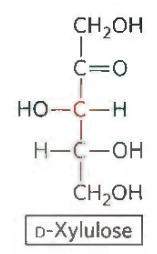

  
FIGURE 7-4 Epimers. D-Glucose and two of its epimers are shown as projection formulas. Each epimer differs from D-glucose in the configuration at one chiral center (shaded light red or blue).

  
FIGURE 7-5 Formation of hemiacetals and hemiketals. An aldehyde or a ketone can react with an alcohol in a 1:1 ratio to yield a hemiacetal or a hemiketal, respectively, creating a new chiral center at the carbonyl carbon. Substitution of a second alcohol molecule produces an acetal or a ketal. When the second alcohol is part of another sugar molecule, the bond produced is a glycosidic bond.

The reaction with the first molecule of alcohol creates an additional chiral center (the carbonyl carbon). Because the alcohol can add in either of two ways, attacking either the "front" or the "back" of the carbonyl carbon, the reaction can produce either of two stereoisomeric configurations, denoted $\alpha$ and $\beta$ . For example, D-glucose exists in solution as an intramolecular hemiacetal in which the free hydroxyl group at C-5 has reacted with the aldehydic C-1, rendering the latter carbon asymmetric and producing two possible stereoisomers, designated $\alpha$ and $\beta$ (Fig. 7-6). Isomeric forms of monosaccharides that differ only in their configuration about the hemiacetal or hemiketal carbon atom are called anomers, and the carbonyl carbon atom is called the anomeric carbon.

Six-membered ring compounds are called pyranoses because they resemble the six-membered ring compound pyran (shown in Fig. 7-7). The systematic names for the two ring forms of D-glucose are therefore $\alpha$ -D-glucopyranose and $\beta$ -D-glucopyranose. Ketohexoses (such as fructose) also occur as cyclic compounds with $\alpha$ and $\beta$ anomeric forms. In these compounds, the hydroxyl group at C-5 (or C-6) reacts with the keto group at C-2 to form a furanose (or pyranose) ring containing a hemiketal linkage (Fig. 7-5). D-Fructose readily forms the furanose ring (Fig. 7-7); the more common anomer of this sugar in combined forms or in derivatives is $\beta$ -D-fructofuranose.

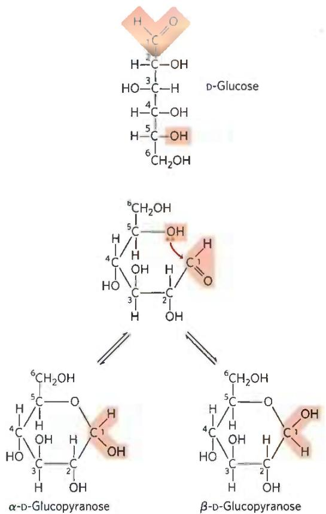  
FIGURE 7-6 Formation of the two cyclic forms of p-glucose. Reaction between the aldehyde group at C-1 and the hydroxyl group at C-5 forms a hemiacetal linkage, producing either of two stereoisomers, the $\alpha$ and $\beta$ anomers, which differ only in the stereochemistry around the hemiacetal carbon. This reaction is reversible. The interconversion of $\alpha$ and $\beta$ anomers is called mutarotation.

  
FIGURE 7-7 Pyranoses and furanoses. The pyranose forms of p-glucose and the furanose forms of p-fructose are shown here as Haworth perspective formulas. The edges of the ring nearest the reader are represented by bold lines. Hydroxyl groups below the plane of the ring in these Haworth perspectives would appear at the right side of a Fischer projection (compare with Fig. 7-6). Pyran and furan are shown for comparison.

Cyclic sugar structures are more accurately represented in Haworth perspective formulas than in the Fischer projections commonly used for linear sugar structures. In Haworth perspectives, the six-membered ring is tilted to make its plane almost perpendicular to that of the paper, with the bonds closest to the reader drawn thicker than those farther away, as in Figure 7-7.

KEY CONVENTION To convert the Fischer projection formula of any linear D-hexose to a Haworth perspective formula showing the molecule's cyclic structure, draw the six-membered ring (five carbons, and one oxygen at the upper right), number the carbons in a clockwise direction beginning with the anomeric carbon, then place the hydroxyl groups. If a hydroxyl group is to the right in the Fischer projection, it is placed pointing down (i.e., below the plane of the ring) in the Haworth perspective; if it is to the left in the Fischer projection, it is placed pointing up (i.e., above the plane) in the Haworth perspective. The terminal —CH₂OH group projects upward for the D enantiomer, downward for the L enantiomer. The hydroxyl on the anomeric carbon can point up or down. When the anomeric hydroxyl of a D-hexose is on the same side of the ring as C-6, the structure is by definition β; when it is on the opposite side from C-6, the structure is α.

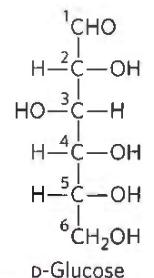

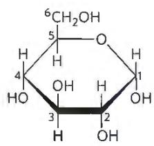

#### [EN] WORKED EXAMPLE 7-1 Conversion of Fischer Projection to Haworth Perspective Formulas

Draw the Haworth perspective formulas for D-mannose and D-galactose.  
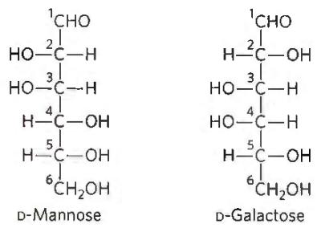

SOLUTION: Pyranoses are six-membered rings, so start with six-membered Haworth structures with the oxygen atom at the top right. Number the carbon atoms clockwise, starting with the aldose carbon. For mannose, place the hydroxyls on C-2, C-3, and C-4 above, above, and below the ring, respectively (because in the Fischer projection they are on the left, left, and right sides of the mannose backbone). For D-galactose, the hydroxyls are oriented below, above, and above the ring for C-2, C-3, and C-4, respectively. The hydroxyl at C-1 can point either up or down; there are two possible configurations, $\alpha$ and $\beta$ , at this carbon.

#### [EN] WORKED EXAMPLE 7-2 Drawing Haworth Perspective Formulas of Sugar Isomers

Draw the Haworth perspective formulas for $\alpha$ -D-mannose and $\beta$ -L-galactose.

SOLUTION: The Haworth perspective formula of D-mannose from Worked Example 7-1 can have the hydroxyl group at C-1 pointing either up or down. According to the Key Convention, for the $\alpha$ form, the C-1 hydroxyl is pointing down when C-6 is up, as it is in D-mannose.

For $\beta$ -L-galactose, use the Fischer representation of D-galactose (see Worked Example 7-1) to draw the correct Fischer representation of L-galactose, which is its mirror image: the hydroxyls at C-2, C-3, C-4, and C-5 are on the left, right, right, and left sides, respectively. Now draw the Haworth perspective, a six-membered ring in which the —OH groups on C-2, C-3, and C-4 are oriented up, down, and down, respectively, because in the Fischer representation they are on the left, right, and right sides. Because it is the $\beta$ form, the —OH on the anomeric carbon points down (same side as C-5).

The $\alpha$ and $\beta$ anomers of D-glucose interconvert in aqueous solution by a process called mutarotation, in which one ring form (say, the $\alpha$ anomer) opens briefly into the linear form, then closes again to produce the $\beta$ anomer (Fig. 7-6). Thus, a solution of $\beta$ -D-glucose and a solution of $\alpha$ -D-glucose eventually form identical equilibrium mixtures having identical optical properties. This mixture consists of about one-third $\alpha$ -D-glucose, two-thirds $\beta$ -D-glucose, and very small amounts of the linear form and the five-membered ring (glucofuranose) form.

Haworth perspective formulas like those in Figure 7-7 are commonly used to show the stereochemistry of ring forms of monosaccharides. However, the six-membered pyranose ring is not planar, as Haworth perspectives suggest, but tends to assume either of two "chair" conformations (Fig. 7-8). Recall from Chapter 1 that P5 two conformations of a molecule are interconvertible without the breakage of covalent bonds, whereas two configurations can be interconverted only by breaking a covalent bond. To interconvert $\alpha$ and $\beta$ configurations, the bond involving the ring oxygen atom has to be broken, but interconversion of the two chair forms (which are conformers) does not require bond breakage and does not change configurations at any of the ring carbons. The specific three-dimensional structures of the monosaccharide units are important in determining the biological properties and functions of some polysaccharides, as we shall see.

FIGURE 7-8 Conformational formulas of pyranoses. (a) Two chair forms of the pyranose ring of $\beta$ -D-glucopyranose. Two conformers such as these are not readily interconvertible; an input of about $46\mathrm{kJ}$ of energy per mole of sugar is required to force the interconversion of chair forms. Another conformation, the "boat" (not shown), is seen only in derivatives with very bulky substituents. (b) The preferred chair conformation of $\alpha$ -D-glucopyranose.

#### [EN] Organisms Contain a Variety of Hexose Derivatives

In addition to simple hexoses such as glucose, galactose, and mannose, there are many sugar derivatives in which a hydroxyl group in the parent compound is replaced with another substituent, or a carbon atom is oxidized to a carboxyl group (Fig. 7-9). In glucosamine, galactosamine, and mannosamine, the hydroxyl at C-2 of the parent compound is replaced with an amino group.

  
FIGURE 7-9 Some hexose derivatives important in biology. In amino sugars, an $-\mathrm{NH}_2$ group replaces one of the $-\mathrm{OH}$ groups in the parent hexose. Substitution of $-\mathrm{H}$ for $-\mathrm{OH}$ produces a deoxy sugar; note that the deoxy sugars shown here occur in nature as the $\iota$ isomers. The  
acidic sugars contain a carboxylate group, which confers a negative charge at neutral pH. D-Glucono-δ-lactone results from formation of an ester linkage between the C-1 carboxylate group and the C-5 (also known as the δ carbon) hydroxyl group of D-gluconate.

The amino group is commonly condensed with acetic acid, as in N-acetylglucosamine. This glucosamine derivative is part of many structural polymers, including those of the bacterial cell wall. Substitution of a hydrogen for the hydroxyl group at C-6 of L-galactose or L-mannose produces L-fucose or L-rhamnose, respectively. L-Fucose is found in the complex oligosaccharide components of glycoproteins and glycolipids; L-rhamnose is found in plant polysaccharides.

Oxidation of the carbonyl (aldehyde) carbon of glucose to the carboxyl level produces gluconic acid, used in medicine as an innocuous counterion when administering positively charged drugs (such as quinine) or ions (such as $Ca^{2+}$ ). Other aldoses yield other aldonic acids. Oxidation of the carbon at the other end of the carbon chain—C-6 of glucose, galactose, or mannose—forms the corresponding uronic acid: glucuronic, galacturonic, or mannuronic acid. Both aldonic acids and uronic acids form stable intramolecular esters called lactones (Fig. 7-9, lower left). The sialic acids are a family of sugars with the same nine-carbon backbone. One of them, N-acetylneuraminic acid (often referred to simply as "sialic acid"), is a derivative of N-acetylmannosamine that occurs in many glycoproteins and glycolipids on animal cell surfaces, providing sites of recognition by other cells or extracellular carbohydrate-binding proteins. The carboxylic acid groups of the acidic sugar derivatives are ionized at pH 7, and the compounds are therefore correctly named as the carboxylates—glucuronate, galacturonate, and so forth.

In the synthesis and metabolism of carbohydrates, the intermediates are very often not the sugars themselves but their phosphorylated derivatives. Condensation of phosphoric acid with one of the hydroxyl groups of a sugar forms a phosphate ester, as in glucose 6-phosphate (Fig. 7-9), the first metabolite in the pathway by which most organisms oxidize glucose for energy. Sugar phosphates are relatively stable at neutral pH and bear a negative charge. One effect of sugar phosphorylation within cells is to trap the sugar inside the cell; most cells do not have plasma membrane transporters for phosphorylated sugars. Phosphorylation also activates sugars for subsequent chemical transformation. Several important phosphorylated derivatives of sugars are components of nucleotides (discussed in the next chapter).

#### [EN] Sugars That Are, or Can Form, Aldehydes Are Reducing Sugars

Free aldehyde groups in sugars undergo a characteristic redox reaction with $Cu^{2+}$ under alkaline conditions. As the sugar is oxidized from aldehyde to carboxylic acid, $Cu^{2+}$ is reduced to $Cu^{+}$ , which forms a brick-red precipitate. This reaction defines reducing sugars, which include, for example, glucose, galactose, mannose, ribose, and glyceraldehyde. The reaction occurs only with a free aldose; but because cyclic aldoses are in equilibrium with their linear forms, which do have free aldehyde groups (Fig. 7-6), all aldose monosaccharides are reducing sugars. Ketoses that can rearrange (tautomerize) to form aldehydes are also reducing sugars; fructose and ribulose are reducing sugars, for example.

The metabolism of glucose in people with diabetes can be monitored by measuring urinary glucose with a simple qualitative assay for reducing sugar, or by measuring quantitatively the nonenzymatic reaction between glucose and the hemoglobin in blood (Box 7-2).

Disaccharides (such as maltose, lactose, and sucrose) consist of two monosaccharides joined covalently by an O-glycosidic bond, which is formed when a hydroxyl group of one sugar molecule, typically in its cyclic form, reacts with the anomeric carbon of the other (Fig. 7-10). This reaction represents the formation of an acetal from a hemiacetal (such as glucopyranose) and an alcohol (a hydroxyl group of the second sugar molecule) (Fig. 7-5), and the resulting compound is called a glycoside. Glycosidic bonds are readily hydrolyzed by acid but resist cleavage by base. Thus disaccharides can be hydrolyzed to yield their free monosaccharide components by boiling with dilute acid.

When the anomeric carbon is involved in a glycosidic bond, the easy interconversion of linear and cyclic forms shown in Figure 7-6 is prevented. Formation of a glycosidic bond therefore renders a sugar nonreducing. In describing disaccharides or polysaccharides, the end of a chain with a free anomeric carbon (one not involved in a glycosidic bond) is called the reducing end.

FIGURE 7-10 Formation of maltose. A disaccharide is formed from two monosaccharides (here, two molecules of D-glucose) when an —OH (alcohol) of one monosaccharide molecule (right) condenses with the intramolecular hemiacetal of the other (left), with elimination of $H_{2}O$ and formation of a glycosidic bond. The reversal of this reaction is hydrolysis — attack by $H_{2}O$ on the glycosidic bond. The maltose molecule, shown here, retains a reducing hemiacetal at the C-1 not involved in the glycosidic bond. Because mutarotation interconverts the $\alpha$ and $\beta$ forms of the hemiacetal, the bonds at this position are sometimes depicted with wavy lines to indicate that the structure may be either $\alpha$ or $\beta$ .

#### [EN] Blood Glucose Measurements in the Diagnosis and Treatment of Diabetes

Glucose is the principal fuel for the brain. When the amount of glucose reaching the brain is too low, the consequences can be dire: lethargy, coma, permanent brain damage, and death. Complex hormonal mechanisms have evolved to ensure that the concentration of glucose in the blood remains high enough (about 5 mm) to satisfy the brain's needs—but not too high, because elevated blood glucose can also have serious physiological consequences.

Individuals with insulin-dependent diabetes mellitus do not produce sufficient insulin, the hormone that normally serves to reduce blood glucose concentration. If the diabetes is untreated, blood glucose levels may rise to several-fold higher than normal. These high glucose levels are believed to be at least one cause of the serious long-term consequences of untreated diabetes — kidney failure, cardiovascular disease, blindness, and impaired wound healing — so one goal of therapy is to provide just enough insulin (by injection) to keep blood glucose levels near normal. To maintain the correct balance of exercise, diet, and insulin, individuals with diabetes must measure their blood glucose concentration several times a day, and adjust the amount of insulin injected appropriately.

The concentrations of glucose in blood can be determined by a simple assay for reducing sugar. A single drop of blood is added to a test strip containing the enzyme glucose oxidase, which catalyzes the reaction:

$$
\mathrm{D} - \text { G   l   u   c   o   s   e } + \mathrm{O} _ {2} \xrightarrow {\text { g   l   u   c   o   s   e   o   x   i   d   a   s   e }} \mathrm{D} - \text { g   l   u   c   o   n   o } - \delta - \text { l   a   c   t   o   n   e } + \mathrm{H} _ {2} \mathrm{O} _ {2}
$$

A second enzyme, a peroxidase, catalyzes reaction of the $H_{2}O_{2}$ with a colorless compound to create a colored product, which is quantified with a simple photometer that reads out the blood glucose concentration.

Because blood glucose levels change with the timing of meals and exercise, single-time measurements do not reflect the average blood glucose over hours and days, so dangerous increases may go undetected. The average glucose concentration can be assessed by looking at its effect on hemoglobin, the oxygen-carrying protein in erythrocytes (p. 153). Transporters in the erythrocyte membrane equilibrate intracellular and plasma glucose concentrations, so hemoglobin is constantly exposed to glucose at whatever concentration is present in the blood. A series of relatively slow nonenzymatic reactions (Fig. 1) occurs between glucose and primary amino groups in hemoglobin (either the amino-terminal Val or the ε-amino groups of Lys residues) (Fig. 2). The rate of this process is proportional to the concentration of glucose, so the reaction can be used to estimate the average blood glucose

The disaccharide maltose (Fig. 7-10) contains two D-glucose residues joined by a glycosidic linkage between C-1 (the anomeric carbon) of one glucose residue and C-4 of the other. Because the disaccharide retains a free anomeric carbon (C-1 of the glucose level over weeks. The amount of glycated hemoglobin (GHB) present at any time reflects the average blood glucose concentration over the circulating lifetime of the erythrocyte (about 120 days), although the concentration in the two weeks before the test is the most important in setting the level of GHB.

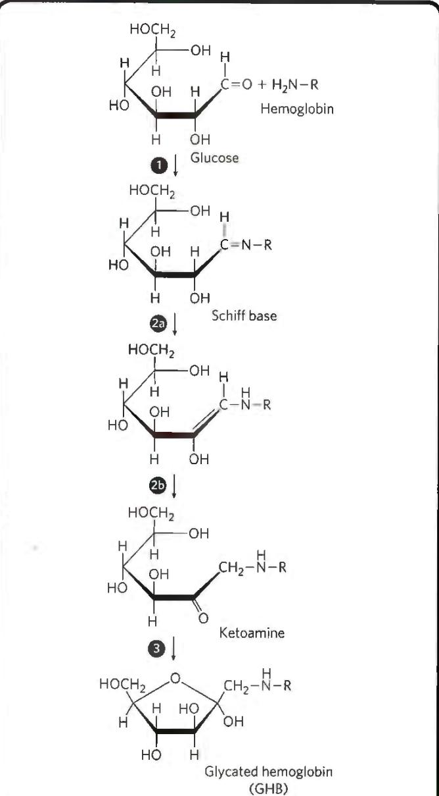  
FIGURE 1 The nonenzymatic reaction of glucose with a primary amino group in hemoglobin begins with ① formation of a Schiff base, which ② undergoes a rearrangement to generate a stable product; ③ this ketoamine can further cyclize to yield GHB.

residue on the right in Fig. 7-10), maltose is a reducing sugar. The configuration of the anomeric carbon atom in the glycosidic linkage is $\alpha$ . The glucose residue with the free anomeric carbon is capable of existing in $\alpha$ - and $\beta$ -pyranose forms.

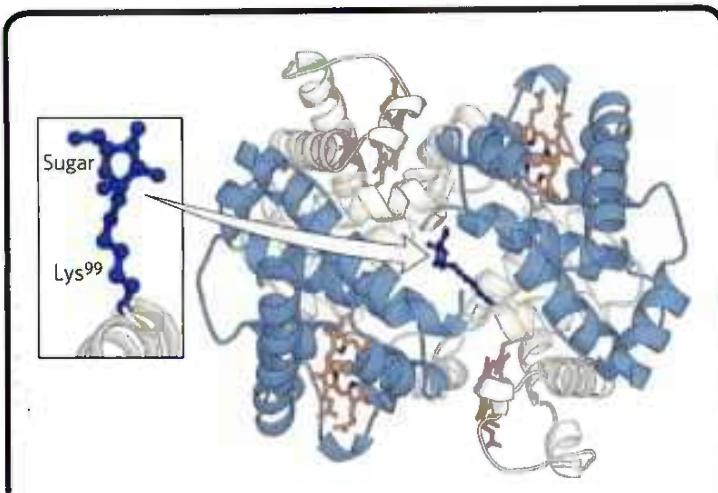  
FIGURE 2 Glycated hemoglobin, showing the hemes (red) and the glycated Lys $^{99}$ residue (blue). [Data from PDB ID 3B75, N. T. Saraswathi et al., 2008.]

The extent of hemoglobin glycation (so named to distinguish it from glycosylation, the enzymatic transfer of glucose to a protein) is measured clinically by extracting hemoglobin from a small sample of blood and separating GHB from unmodified hemoglobin electrophoretically (Fig. 3), taking advantage of the charge difference resulting from modification of the amino group(s). Normal values of the monoglycated hemoglobin referred to as HbA1c are about 5% of total hemoglobin (corresponding to an average blood glucose level of 120 mg/100 mL). In people with untreated diabetes, however, this value may be as high as 13%, indicating an average blood glucose level of about 300 mg/100 mL — dangerously high. One criterion for success in an individual program of insulin therapy (the timing, frequency, and amount of insulin injected) is maintaining HbA1c values at about 7%.

Glycated hemoglobin undergoes a series of rearrangements, oxidations, and dehydrations of the carbohydrate moiety to produce a heterogeneous mixture of advanced glycation end products (AGE), such as $\varepsilon$ -N-carboxymethyllysine and methylglyoxal. AGE are believed to be responsible for at least some of the pathology of diabetes. AGE can leave the erythrocyte and form covalent cross-links between proteins, interfering with normal protein function (Fig. 4). The accumulation of relatively high concentrations of AGE in people with diabetes may, by cross-linking critical proteins, cause the damage to the kidneys, retinas, and cardiovascular system that characterizes the disease. Some AGE also can act

KEY CONVENTION To name reducing disaccharides such as maltose unambiguously, and especially to name more complex oligosaccharides, several rules are followed. By convention, the name describes the compound written with its nonreducing end to the left, and we can "build up" the name in the following order. (1) Give the configuration ( $\alpha$ or $\beta$ ) at the anomeric carbon joining the first monosaccharide unit (on the left) to the second. (2) Name the nonreducing residue; to distinguish five- and six-membered ring structures, insert "furano" or "pyrano" into the name. (3) Indicate in parentheses the two carbon atoms joined by the glycosidic bond, with an arrow connecting the two numbers; for example, (1→4) shows that C-1 of the first-named sugar residue is joined to C-4 of the second. (4) Name the second residue. If there is a third residue, describe the second glycosidic bond by the same conventions. (To shorten the description of complex polysaccharides, three-letter abbreviations or colored symbols for the monosaccharides are often used, as given in Table 7-1.) Following this convention for naming oligosaccharides, maltose is α-D-glucopyranosyl-(1→4)-D-glucopyranose. Because most sugars encountered in this book are the D enantiomers and the pyranose form of hexoses predominates, we generally use a shortened version of the formal name of such compounds, giving the configuration of the anomeric carbon and naming the carbons joined by the glycosidic bond. In this abbreviated nomenclature, maltose is Glc(α1→4)Glc.

<table><tr><td>Analyte ID</td><td>Percent</td><td>Time (min)</td><td>Area</td></tr><tr><td>Injection</td><td>0.0</td><td>0.11</td><td>17,682</td></tr><tr><td>A1a</td><td>0.4</td><td>0.30</td><td>8,051</td></tr><tr><td>A1b</td><td>1.0</td><td>0.45</td><td>19,267</td></tr><tr><td>A1c</td><td>5.9</td><td>1.10</td><td>110,946</td></tr><tr><td>AO</td><td>92.6</td><td>1.56</td><td>1,727,669</td></tr></table>

Total area 1,883,615

  
FIGURE 3 Pattern of hemoglobin (detected by its absorption at 415 nm) after electrophoretic separation of nonglycated (A0) and monoglycated (A1c) forms in a thin glass capillary. Integration of the area under the peaks allows calculation of the amount of GHB (HbA1c) as a percentage of total hemoglobin. Shown here is the profile of an individual with a normal level of HbA1c (5.9%).

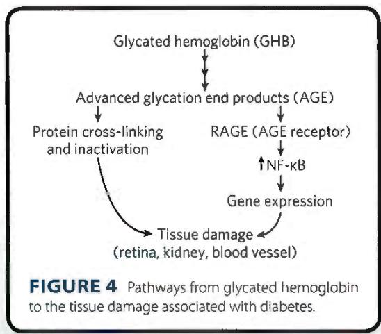  
through membrane receptors for AGE (RAGE), triggering intracellular responses that include activation of a transcription factor (NF- $\kappa$ B) and consequent changes in gene expression. This pathogenic process is a potential target for drug action.

<table><tr><td>Abequose</td><td>Abe</td><td>Glucuronic acid</td><td>GlcA</td></tr><tr><td>Arabinose</td><td>Ara</td><td>Galactosamine</td><td>GalN</td></tr><tr><td>Fructose</td><td>Fru</td><td>Glucosamine</td><td>GlcN</td></tr><tr><td>Fucose</td><td>▲ Fuc</td><td>N-Acetylgalactosamine</td><td>GalNAc</td></tr><tr><td>Galactose</td><td>○ Gal</td><td>N-Acetylglucosamine</td><td>GlcNAc</td></tr><tr><td>Glucose</td><td>● Glc</td><td>Iduronic acid</td><td>IdoA</td></tr><tr><td>Mannose</td><td>● Man</td><td>Muramic acid</td><td>Mur</td></tr><tr><td>Rhamnose</td><td>Rha</td><td>N-Acetylmuramic acid</td><td>Mur2Ac</td></tr><tr><td>Ribose</td><td>Rib</td><td>N-Acetylneuraminicacid (a sialic acid)</td><td>Neu5Ac</td></tr><tr><td>Xylose</td><td>★ Xyl</td><td></td><td></td></tr></table>

Note: In a commonly used convention, hexoses are represented as circles, N-acetylhexosamines as squares, and hexosamines as squares divided diagonally. All sugars with the "gluco" configuration are blue, those with the "galacto" configuration are yellow, and "manno" sugars are green. Other substituents can be added as needed: sulfate (S), phosphate (P), O-acetyl (OAc), or O-methyl (OMe).

The disaccharide lactose (Fig. 7-11), which yields D-galactose and D-glucose on hydrolysis, occurs naturally in milk and gives milk its sweetness. The anomeric carbon of the glucose residue is available for oxidation, and thus lactose is a reducing disaccharide. The reducing end of this disaccharide, which by convention is drawn on the right, is glucose, and the disaccharide is named as a derivative of glucose. Its abbreviated name is Gal ( $\beta1\rightarrow4$ )Glc, with the linkage shown in parentheses; the anomeric carbon of galactose is $\beta$ , and C-1 of Gal is linked to C-4 of Glc.

The enzyme lactase—absent in lactose-intolerant individuals—begins the digestive process in the small intestine by splitting the $(\beta1\rightarrow4)$ bond of lactose into monosaccharides, which can be absorbed from the small intestine. Lactose, like other disaccharides, is not absorbed from the small intestine, and in lactose-intolerant individuals the undigested lactose passes into the large intestine. Here, the increased osmolarity due to dissolved lactose opposes the absorption of water from the intestine into the bloodstream, causing watery, loose stools. In addition, fermentation of the lactose by intestinal bacteria produces large volumes of $CO_{2}$ , which leads to the bloating, cramps, and gas associated with lactose intolerance.

  
FIGURE 7-11 Three common disaccharides. Like maltose in Figure 7-10, these disaccharides are shown as Haworth perspectives. The common name, full systematic name, and abbreviation are given. Formal nomenclature for sucrose names glucose as the parent glycoside, although it is typically depicted as shown, with glucose on the left. The two abbreviated symbols shown for sucrose are equivalent (≡).

Sucrose (table sugar) is a disaccharide of glucose and fructose. It is formed by plants but not by animals. In contrast to maltose and lactose, sucrose contains no free anomeric carbon atom; the anomeric carbons of both monosaccharide units are involved in the glycosidic bond (Fig. 7-11). Sucrose is therefore a nonreducing sugar, and its stability—its resistance to oxidation—makes it a suitable molecule for the storage and transport of energy in plants. In the abbreviated nomenclature, a double-headed arrow connects the symbols specifying the anomeric carbons and their configurations. Thus the abbreviated name of sucrose is either Glc(α1↔2β)Fru or Fru(β2↔1α)Glc. Sucrose is a major intermediate product of photosynthesis; in many plants it is the principal form in which sugar is transported from the leaves to other parts of the plant body.

Trehalose, Glc(α1↔1α)Glc (Fig. 7-11)—a disaccharide of D-glucose that, like sucrose, is a nonreducing sugar—is a major constituent of the circulating fluid (hemolymph) of insects. It serves as an energy-storage compound, and it serves as antifreeze in some invertebrate organisms.

#### [EN] SUMMARY 7.1 Monosaccharides and Disaccharides

■ Sugars (saccharides) contain an aldehyde or ketone group and two or more hydroxyl groups.

■ Monosaccharides generally contain several chiral carbons and therefore exist in a variety of stereochemical forms, which may be represented on paper as Fischer projections. Epimers are sugars that differ in configuration at only one carbon atom.

■ Monosaccharides with at least six carbons commonly form cyclic structures, in which the aldehyde or ketone group is joined to a hydroxyl group of the same molecule. The cyclic structure can be represented as a Haworth perspective formula. The carbon atom originally found in the aldehyde or ketone group (the anomeric carbon) can assume either of two configurations, $\alpha$ and $\beta$ , which are interconvertible by mutarotation. In the linear form of the monosaccharide, which is in equilibrium with the cyclic forms, the anomeric carbon is easily oxidized, making the compound a reducing sugar.

■ Naturally occurring hexoses include some that have $-NH_{2}$ at C-2 (amino sugars), often with the amino group acetylated. Oxidation of the carbonyl carbon of glucose and other aldoses yields aldonic acids (gluconic acid); oxidation at C-6 produces uronic acids (glucuronate). Some sugar intermediates are phosphate esters (for example, glucose 6-phosphate).

A hydroxyl group of one monosaccharide can add to the anomeric carbon of a second monosaccharide to form an acetal called a glycoside. Oligosaccharides are short polymers of several different monosaccharides joined by glycosidic bonds. At one end of the chain, the reducing end, is a monosaccharide residue with its anomeric carbon not involved in a glycosidic bond, and therefore available to be oxidized.

■ Disaccharides and oligosaccharides are named as derivatives of the sugar at the reducing end. Their names provide the order of monosaccharide units, the configuration at each anomeric carbon, and the carbon atoms involved in the glycosidic linkage(s).

<!-- EN-END 7.1 -->

## 五、多糖

自然界中糖类主要以多糖形式存在。多糖是分子质量从中等到高分子的多聚物。多糖未经水解不具还原性，无变旋现象，无甜味，一般不能结晶，大多数不溶于水。多糖也称聚糖；不同的聚糖在重复单糖单位的同一性、链的长度、连接单糖单位的键类型以及链的分支程度等方面彼此不同。

同多糖只含一种单体；杂多糖含两种或多种单体。某些同多糖称为贮存多糖（storage polysaccharide），作为单糖的贮存形式，这些单糖被用作燃料；例如淀粉、糖原和右旋糖酐等。其他同多糖（例如纤维素和壳多糖）称为结构多糖（structural polysaccharide），作为植物细胞细胞壁和动物外骨骼的结构成分。杂多糖为所有的动物、植物和微生物提供细胞外的支撑；例如细菌细胞壁的刚性层是由一种杂多糖肽聚糖（主链由两种单糖单位交替排列而成，见图9-32）组成的。在动物组织中胞外的间隙是被几种类型的杂多糖所占据，它们形成一种基质（mitrix），把单个的细胞聚集在一起，给细胞、组织和器官提供保护、定形和支撑。

与蛋白质不同,多糖一般没有确定的相对分子质量,即使是一种纯的产物在分子大小方面也是不均一的。这种差别是因为蛋白质和多糖的组装机制不同引起的。在第1章曾提及，在第33章将详细地看到，蛋白质合成是在被规定序列和长度的模板（信使RNA）上由酶精确按照模板的指令催化进行的。多糖的合成没有模板，合成程序的实质是酶催化单糖单位的聚合，在合成过程中并没有特定的终止点。

## （一）作为燃料贮存形式的同多糖

最重要的贮存同多糖是植物细胞中的淀粉和动物细胞中的糖原。这两种多糖是以大的聚簇(cluster)和颗粒形式存在于细胞内。淀粉和糖原分子可以被水高度水化，因为它们有许多外露的羟基，可以跟水形成氢键。大多数植物细胞能够合成淀粉；在种子（如谷物）、块茎和块根（如薯类）等器官中贮存淀粉特别丰富。

## 1. 淀粉 (starch)

淀粉是葡萄糖的多聚体。天然淀粉一般含两种成分：当淀粉悬液用微溶于水的醇如正丁醇饱和时，则形成微晶沉淀，称为直链淀粉（amylose）；向母液中加入与水混溶的醇如甲醇，则得无定形物质，称为支链淀粉（amylopectin）。多数淀粉所含的直链淀粉和支链淀粉的比例约为1∶4。直链淀粉和支链淀粉在物理和化学性质方面有明显的差别。纯的直链淀粉仅少量地溶于热水，溶液放置时重新析出淀粉沉淀。支链淀粉易溶于水，形成稳定的胶体，静置时溶液不会出现沉淀。在天然淀粉溶液中支链淀粉是直链淀粉的保护胶体。直链淀粉是由α-葡萄糖残基通过(α1→4)糖苷键(如麦芽糖中)连接成的不分支的长链分子。这些链的相对分子质量从几千到百万以上。支链淀粉的相对分子质量更大，可达二百万；但与直链淀粉不同，它们是高度分支的。支链淀粉链中，连接相继的葡萄糖残基的糖苷键也是(α1→4)，只是在分支点（每24\~30个残基出现一次）还存在(α1→6)连接。淀粉链是有方向性(极性)的，一端是还原端（称1端），另一端是非还原端（称4端）。书写淀粉结构时通常4端在左边，1端在右边。显然，支链淀粉和糖原分子具有多个非还原端（在分子的周边），但只有一个还原端。淀粉分子结构中单糖残基间的连接方式见图9-27。

  
图9-27 淀粉分子中单糖残基的连接方式  
A. 直链淀粉；B. 支链淀粉；C. 支链淀粉或糖原分子的示意图

淀粉分子可以形成螺旋结构(见下面),还可能以双螺旋形式存在,在淀粉粒中双螺旋进一步折叠成更致密的聚簇结构,这与淀粉作为贮存分子的功能是一致的。淀粉在酸或淀粉酶作用下被逐步降解,生成分子大小不一的中间物,统称为糊精(dextrin)。糊精依相对分子质量的递减,与碘作用呈现由蓝色、紫色、红色到无色,例如淀粉糊精(amylodextrin)呈蓝紫色,红糊精(erythrodextrin)呈红褐色,消色糊精(achrodextrin)无色。

## 2. 糖原(glycogen)

糖原又称动物淀粉，是动物细胞内的主要贮存多糖（也存在于细菌细胞中），糖原与支链淀粉一样，也是 $(\alpha 1\rightarrow 4)$ 连接的葡萄糖残基多聚物，并有 $(\alpha 1\rightarrow 6)$ 的分支。所不同的只是糖原的分支程度更高，分支链更短（平均每8\~12个残基发生一次分支），比淀粉更致密。人体内糖原主要贮存于肝，可达该组织湿重的 $7\%$ ；它也存在于骨骼肌中。在肝细胞内糖原以大颗粒（直径 $10\sim 40~\mathrm{nm}$ ）形式存在，大颗粒是较小颗粒的聚簇，小颗粒本身是由高度分支的单个糖原分子所组成。颗粒除糖原分子外，尚含负责合成和分解糖原的酶类。糖原是人和动物餐间以及肌肉剧烈运动时最易动用的葡萄糖贮库，而葡萄糖是体内各器官的重要代谢燃料，更是大脑唯一直接可利用的燃料。支链淀粉和糖原都是分支的，但糖原分支程度更高，贮存颗粒也更结实。因为每一分支链都以非还原的单糖单位结尾，所以有 $n$ 个支链的糖原分子就有 $n + 1$ 个非还原端（图9-27C）。当糖原被用作能源时，每次从非还原端除去一个残基。只作用于非还原端的降解酶（如 $\beta$ -淀粉酶、磷酸化酶）可以在多个支链的非还原端同时工作，加速多聚体转化为单体，有利于即时动用葡萄糖贮库，以供代谢的急需。

葡萄糖为什么不以单糖形式贮存？已经计算过，肝细胞贮存相当于0.4 mol/L葡萄糖的糖原，糖原的实际浓度是很小的，约为0.01 $\mu$ mol/L；因为糖原不溶于水，所以对细胞溶胶的摩尔渗透压浓度的贡献不大。如果细胞溶胶含0.4 mol/L葡萄糖，摩尔渗透压浓度将是可怕的升高，会引起水向细胞内渗透，最终导致细胞胀裂，即所谓渗透溶解（见第1章）。而且，如果胞内葡萄糖浓度是0.4 mol/L，而胞外浓度约5 mmol/L（哺乳动物血中的浓度），那么细胞为逆如此高的浓度梯度去摄取葡萄糖的自由能变化（ $\Delta G$ ）将是大得不可能。

## 3. 右旋糖酐(dextran)

右旋糖酐或称葡聚糖，是一类细菌和酵母的贮存多糖，也用作胞外的黏着物质。它们是 $(\alpha 1\rightarrow 6)$ 连接的葡萄糖多聚体，并都有 $(\alpha 1\rightarrow 3)$ 连接的支链；因菌种或菌株的不同，有的还有 $(\alpha 1\rightarrow 2)$ 或 $(\alpha 1\rightarrow 4)$ 的分支。工业上右旋糖酐可由某些细菌例如明串珠菌（Leuconoto mesenteroides B512菌株）发酵蔗糖产生。天然右旋糖酐含有各种大小的分子，从寡糖到 $M_{\mathrm{r}}$ 高达几亿的多糖。人的口腔中生长的几种细菌能利用蔗糖合成大量的右旋糖酐，它是牙斑（dental plaque）的主要成分，并因此营养学家十分关注饮食中蔗糖的消耗。右旋糖酐经化学交联，例如用表氯醇（epichlorohydrin）即1-氯-2,3-环氧丙烷处理，则被交联成具有立体网状结构的不溶性交联葡聚糖（crosslinked dextran），它的珠状凝胶商品名为Sephadex。通过控制葡聚糖与交联剂（如表氯醇）的比例可以得到不同网孔的交联凝胶，它们被广泛地用于大小排阻层析法的蛋白质分级分离。

## （二）起结构作用的同多糖

## 1. 纤维素 (cellulose)

纤维素是生物圈里最丰富的有机物质，占植物界碳素的 $50\%$ 以上。纤维素是一种纤维状的水不溶性物质，存在于植物细胞的细胞壁中，特别是在植物体的茎、干、秸以及所有的木质部分。纤维素构成木材的大部分，占麻纤维的 $70\% \sim 80\%$ ，棉纤维几乎是纯的纤维素。很像直链淀粉，纤维素分子也是不分支的线型同多糖链，由10000\~15000个葡萄糖单位组成。但两者有着很大的不同：在纤维素中葡萄糖残基是 $\beta$ 型的，而淀粉中是 $\alpha$ 型的。与直链淀粉的 $(\alpha 1 \rightarrow 4)$ 连接相反，纤维素中葡萄糖残基是通过 $(\beta 1 \rightarrow 4)$ 糖苷键连接的。这种差别给纤维素和淀粉的结构和物理性质带来了很大的差异。 $(\beta 1 \rightarrow 4)$ 连接使纤维素链采取完全伸展的构象，相邻而平行的（指极性同向）伸展链在残基环面的水平方向通过链内和链间的氢键网形成片层结构（图9-28）；片层之间，即环面的垂直方向，靠其余氢键和环的疏水内核间的范德华力维系（图中未示出）。由若干个纤维素分子并排聚集形成类晶体的分子束——微纤维（microfibril）；许多微纤维结合形成纤维素纤维，分层交错地铺设在植物细胞表面，形成在电镜下看到的网格状结构——细胞壁（图9-29）。实际上微纤维包埋在果胶、半纤维素、木质素和伸展蛋白等组成的基质中。纤维素与基质黏合在一起增强细胞壁的抗张强度和机械性能，以适应植物抵抗高渗透压和支撑高大植株的需要。这跟在硬树脂中加入玻璃纤维以生产坚固、耐用的玻璃纤维板的道理是一样的。

  
图9-28 纤维素的结构

片层结构中浅灰色圆圈代表碳原子，白色的是氧原子，深灰色的是氢原子；虚线表示氢键结合  
  
图 9-29 纤维素与植物细胞壁的结构

随食物吞咽的糖原和淀粉被唾液和肠道中的 $\alpha$ -淀粉酶（ $\alpha$ -amylase）和其他糖苷酶（glycosidase）所水解，这些酶能断裂葡萄糖残基间的（ $\alpha 1 \rightarrow 4$ ）连键。但大多数的动物不能利用纤维素作为燃料的来源，因为它们缺乏一种水解（ $\beta 1 \rightarrow 4$ ）糖苷键的酶。白蚁容易消化纤维素（因而能消化木头），这是因为白蚁的肠道内栖息了一种共生的微生物（Trichonympha），它能分泌一种水解（ $\beta 1 \rightarrow 4$ ）糖苷键的纤维素酶（cellulase）。腐木上的真菌和细菌也能产生纤维素酶。此外某些反刍动物如牛、羊、骆驼和长颈鹿能利用纤维素作为食物，因为它们的额外胃腔室（瘤胃）中富含能分泌纤维素酶的细菌和原生生物。

不被人体消化酶降解的食物成分称为膳食纤维（dietary fiber），它包括几类有自己的化学和生物学性质的物质：纤维素和半纤维素是不溶性纤维，能促进结肠有规则运动，降低患结肠癌的风险；木质素（liginin）是一种复杂的不溶性酚类聚合物，它能从消化道中吸附有机分子，结合胆固醇并把它从肠道中清除，减少患心脏病的风险；果胶和树胶（gum）是一类水溶性纤维物质，在消化道中形成黏稠的凝胶状悬浮物，降低许多营养物包括糖类的吸收速率和减少血清胆固醇。不溶性纤维普遍存在于谷物中；水溶性纤维是水果、豆类和燕麦等的成分。

## 2. 壳多糖(chitin)

壳多糖也称几丁质或甲壳质，是 $N-$ 乙酰- $\beta -\mathrm{D}-$ 葡糖胺的线型同多糖，相对分子质量可达数百万。壳多糖与纤维素在化学上的唯一差别是每个残基的C2上的羟基被乙酰化的氨基所置换（图9-30）。壳多糖在结构上跟纤维素很类似，也是伸展型的带状物，并以片层结构存在，两者间的一个有意义的差别是片层中的多糖链是平行的，还是反平行的。天然的纤维素可能只有平行排列方式。但是壳多糖能以3种形式存在，有时在同一生物中3种形式都有。α-壳多糖是所有的链都是平行排列的，β-壳多糖是反平行排列的，δ-壳多糖是平行片层与反平行片层交替堆叠。壳多糖广泛地分布于生物界，是自然界中第二个最丰富的多糖，仅次于纤维素；据估计每年生物圈产生一百万吨壳多糖。壳多糖是大多数真菌和一些藻类细胞壁的成分，在这里常代替纤维素或其他葡聚糖。但壳多糖主要是存在于无脊椎动物中，如昆虫、蜘蛛、甲壳类（虾、蟹）、螺蚌等。它是节肢类（Arthropoda）和软体类（Mollusca）外骨骼的主要结构物质。在很多这样的外骨骼中壳多糖是进行矿化的基质，这跟脊椎动物骨骼中胶原蛋白是供矿质沉积的基质很像。有意思的是，在进化过程中脊椎动物在胶原蛋白基质上发展了内骨骼，无脊椎动物却在壳多糖基质上发展了外骨骼。与纤维素一样，壳多糖也不被脊椎动物所消化。壳多糖去乙酰化形成聚葡糖胺或称脱乙酰壳多糖（chitosan）。由于脱乙酰壳多糖的阳离子性质和无毒性，近来被广泛地应用于水和饮料处理、化妆品、制药、医学、农业（种子包衣）以及食品和饲料加工等方面。

  
图9-30 壳多糖的结构  
图中示出壳多糖的一小段，是 $(\beta 1\rightarrow 4)$ 连接的 $N$ -乙酰葡糖胺单位的同聚物

## （三）影响同多糖折叠的因素

同多糖的三维折叠所遵循的原则跟管控多肽链结构的原则是相同的。由共价键支配而多少具有刚性结构的单糖单位形成三维大分子结构也是通过分子内和分子间的弱相互作用（氢键、疏水相互作用、范德

华相互作用；对荷电亚基的多聚体来说，还有静电相互作用）得以稳定的。多糖具有很多的羟基，因为氢键对多糖结构有着特别重要的影响。淀粉、糖原和纤维素是由吡喃糖苷亚基组成的，这些分子可以表示为借一个氧原子桥接（bridging）两个碳原子的糖苷键连接起来的一系列刚性吡喃糖环。原则上，绕连接残基的两个C—O键的每一个，都可以自由旋转（图9-31）；但也像在多肽链中那样（见第3章）绕每个键旋转时会受到取代基的位阻限制。如同用肽键的 $\Phi$ 和 $\Psi$ 角（图4-2）描述多肽三维结构那样，同多糖三维结构也用糖苷键的二面角 $\Phi$ 和 $\Psi$ （图9-31）来描述。扭角 $\Phi$ 和 $\Psi$ 被定义为两个吡喃环之间的空间关系；原则上两个扭角可以从0°到360°的任一数值。实际上有些扭角给出的构象是空间受阻的，另一些扭角给出的构象可以达到最大数目的氢键键合。当用相对能量对每一 $\Phi$ 和 $\Psi$ 值作图时，将得到一张优势构象图（未示出），它与肽的拉氏图（第3章）很类似。吡喃糖环及其取代基的庞大体积和异头碳上的电子效应给 $\Phi$

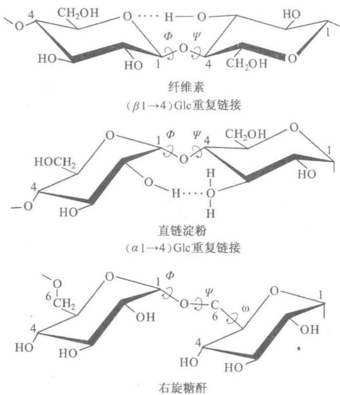  
主链： $(\alpha1\rightarrow6)$ Glc重复连接，含有 $(\alpha1\rightarrow3)$ 分支（未示出）  
图 9-31 纤维素、直链淀粉和右旋糖酐在糖苷键处的构象在右旋糖酐中含有绕 C5 和 C6 间的键自由旋转 ( $\omega$ 扭角)

A. 在最稳定的淀粉构象中由于相邻残基是刚性椅式结构，多糖链是弯曲的，不像纤维素中是伸展的（图9-28B）；B. 一段直链淀粉的示意模型：为清楚起见只示出残基的吡喃糖环；比较图A和B可以看出， $(\alpha 1 \rightarrow 4)$ 连接的残基导致结构采取紧密的卷曲螺旋构象；C. 碘 $(\mathrm{I}_3^- \text{和} \mathrm{I}_5^-)$ 插入淀粉螺旋空腔，生成深蓝色的淀粉-碘络合物和 $\Psi$ 角以很大的限制, 因此某些构象比另一些构象要稳定。图 9-31 中示出的 3 个多糖的构象已用 X 射线晶体学分析法测出, 它们全都落在优势构象图的最低能态区内。

对于 $(\alpha 1\rightarrow 4)$ 连接的淀粉和糖原来说，分子中的每个残基与下一个残基都成一定角度（图9-32A），因此倾向于形成紧密的卷曲螺旋构象；这种构象是借助链间氢键得以稳定的。在无分支的直链淀粉中，螺旋结构是很有规则的，以致足以允许它形成晶体，并因此使它成为用X射线衍射技术测定出三维结构的第一个生物多聚体。直链淀粉的二级结构是一个左手螺旋，沿直链淀粉链，每个残基的平均平面与前一个残基的平均平面形成 $60^{\circ}$ 角，因此螺旋结构每一圈含6个残基，螺距为 $0.8\mathrm{nm}$ ，直径 $1.4\mathrm{nm}$ （图9-32B）。对于直链淀粉，螺旋的中心空道大小正好能容纳碘络离子 $(\mathrm{I}_3^-$ 和 $\mathrm{I}_5^-)$ ，长串的碘络离子与直链淀粉形成深蓝色的络合物（图9-32C）。此相互作用是定性检测直链淀粉的常用方法。产生特征性的深蓝色需要淀粉螺旋含约36个(6圈)或更多个葡萄糖残基。支链淀粉中的支链螺旋只有10到20个残基，因此只能形成短串的碘络离子，它比直链淀粉螺旋中的长串碘络离子吸收更短波长的光，因此支链淀粉遇碘呈紫色到红紫色。糖原结构与支链淀粉很相似，但它的支链螺旋长度更短，只有8个残基，与碘作用呈紫红色至红褐色。

  
图 9-32 直链淀粉的螺旋结构及其与碘形成的络合物

对于纤维素来说最稳定的构象是,每个刚性椅式残基相对于下一个残基旋转180°形成的一条充分伸展的直链。这样,所有的—OH基都能用于跟相邻的链发生氢键键合,使并排的纤维素分子通过链内和链间的氢键网,形成具有高抗张强度的超分子束——微纤维(图9-28和9-29);这已在前面讨论纤维素时谈到过。正是纤维素的这一性质给几千年的人类文明提供了许多有用材料,包括纸张、纸板、纺织原料以及改型纤维素(modified cellulose),如人造丝、赛璐玢(玻璃纸)、胶片和绝缘材料等。

## （四）植物细胞壁的基质杂多糖

前面曾谈到在植物细胞壁中包埋纤维素的若干基质物质是杂多糖。

## 1. 果胶物质( pectic substance )

果胶物质是植物细胞壁和胞间层(middle lamella)的基质多糖。在浆果、果实和茎中都很丰富。果胶物质的主链主要是聚半乳糖醛酸(galacturonan)，它的重复单位是4)GalpUA( $\alpha1\rightarrow4$ )GalpUA( $\alpha1\rightarrow$ ;作为侧链的是中性聚糖，如阿拉伯聚糖(arabiran)和半乳聚糖(galactan)等。果胶物质结构复杂，随植物来源和发育阶段的不同,结构发生相当大的变化。羧基不同程度地被甲酯化的聚半乳糖醛酸称为果胶(pectin),完全去甲酯化的果胶称为果胶酸(pectic acid)。现多用高甲氧基果胶和低甲氧基果胶来表示果胶被甲酯化的程度。果胶的相对分子质量随来源而异,一般为25 000\~50 000(相当于150\~300个残基)。果胶溶液是亲水胶体,在适当的酸度和糖浓度条件下则形成凝胶。果胶在糖果和食品工业中被用作胶凝剂(gel-ling agent)。

## 2. 半纤维素(hemicellulose)

半纤维素被定义为碱溶性的植物细胞壁基质多糖，也即除去果胶物质后的残留物中能被 $15\%$ NaOH提取的多糖。这些多糖分子大小为50到400个残基，大多数具有侧链，属于这类多糖的有木聚糖（xylan），葡甘露聚糖（glucomannan）和木葡聚糖（xyloglucan）等。所谓半纤维素就是这些多糖的总称。半纤维素大量存在于植物的木质化部分，木材中占干重的 $15\% \sim 25\%$ ，农作物的秸秆中占 $25\% \sim 45\%$ 。木聚糖是半纤维素中最丰富的一类，在植物界分布也最广；各种木聚糖的主链结构都是一样的，由 $\beta - D - Xylp(1 \rightarrow 4)$ 重复连接而成，只是在主链的某些单位上还有其他单糖作为侧链存在，其中以 $\alpha - L - Araf(1 \rightarrow 3)$ 连接的最为常见。

## 3. 琼脂(agar)

琼脂俗称洋菜，是从红藻类（Rhodophyta）石花菜属（Gelidium）及其他属的某些海藻中提取出来的一种多糖混合物；它是藻类细胞壁的物质。从琼脂中分离出两个组分：一个称为琼脂糖（agarose），另一个称为琼脂胶（agaropectin）。琼脂糖是琼脂的主要组分，它是由D-吡喃半乳糖和3,6-脱水-L-吡喃半乳糖两个单位交替组成的线型分子。D-半乳糖单位以 $\beta$ 取向与3,6-脱水-L-半乳糖单位的C4相连，后一单位以 $\alpha-$ 取向与D-半乳糖单位的C3相连（图9-33A）。琼脂胶可看成是琼脂糖上的羟基不同程度地被硫酸基、丙酮酸基等所取代，例如 $\beta-\mathrm{D}-$ 半乳糖残基C6被硫酸酯化或C4和C6形成丙酮酸缩酮（pyruvate ketal）（图9-33B）。其实琼脂糖只是被这些基团取代最少的琼脂胶。琼脂这一概念应理解为多种具有相同主链但不同程度地被荷负电基团所取代的杂多糖混合物。

A  
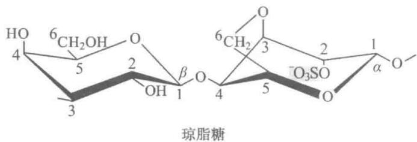  
重复单位：3)-Gal( $\beta$ 1→4)3,6-无水-L-Gal2S( $\alpha$ 1→  
图9-33 琼脂糖的结构及其单糖单位的衍生化

琼脂糖水悬液经加热并冷却时，平行定向的两个分子将互相缠绕形成双螺旋；同时水分子被捕获进入中央空腔。随后这些螺旋彼此缔合，形成凝胶——一种捕获了大量水的三维基质。琼脂不溶于冷水而溶于热水，1%到2%的溶液冷至40\~50℃便可形成凝胶，加之不被微生物所利用，因此是微生物固体培养的良好支持物。由于琼脂凝胶是透明的，生化上用作免疫扩散和免疫电泳的支持介质。琼脂糖凝胶一般不需化学交联即可作为蛋白质凝胶过滤（第5章）和核酸电泳分离的惰性支持物（第12章）。珠状的琼脂糖凝胶商品名为Sepharose。琼脂在食品工业中用作果冻、果糕的胶凝剂以及果汁饮料的稳定剂。

## （五）细菌细胞壁的结构杂多糖

细菌细胞壁主要是由杂多糖构成，但也有脂质、蛋白质和其他物质参与。由于细胞壁的化学组成和结构不同，细菌可分为革兰氏阳性细菌和革兰氏阴性细菌两大类。革兰氏阳性细菌的细胞壁是由多层网格结构的肽聚糖（总厚度10\~20 nm）所组成，并有磷壁酸与之相连（图9-34A）。革兰氏阴性细菌的细胞壁也含肽聚糖，但只是单层或很少几层（2 nm），并且不含磷壁酸；此外在肽聚糖的外面还覆盖着脂双层，称外膜，由磷脂、脂蛋白、膜孔蛋白（porin）和脂多糖等组成；细胞壁向里是内膜（质膜）；肽聚糖正包埋在内、外膜之间的周质胶中（图9-34B）。这一差异使革兰氏染色容易从革兰氏阴性细菌中被脱色剂（如95%乙醇）洗去（参见图1-16的图注）。

  
图9-34 细菌细胞壁构造的示意图

原核细胞中有些是天然没有细胞壁的，例如支原体属（mycoplasma）的成员。古菌也可能缺乏细胞壁或有不一般的细胞壁，不含肽聚糖，代之以一种类似肽聚糖的物质，其中N-乙酰塔罗糖胺糖醛酸（N-acetyltalosaminuronic acid)代替了肽聚糖中的MurNAc，并且缺少D-氨基酸。此物质被称为假肽聚糖。

## 1. 肽聚糖(peptidoglycan)

肽聚糖也称黏肽(mucopeptide)或胞壁质(murein,来自拉丁文 murus,意为墙壁),它的主链是由 N-乙酰葡糖胺(GlcNAc)和 N-乙酰胞壁酸(MurNAc)借( $\beta1\rightarrow4$ )连键交替连接而成。这些多糖链在细胞壁中平行排列,链间通过连接在 MurNAc 残基上的短肽(肽的准确结构决定于细菌的种类)交联起来(图 9-34A)。

肽聚糖主链也可以看成是壳多糖链的单糖残基交替地被乳酸取代，并通过乳酸基连接有侧链四肽；这种多糖链的重复结构有人称它为胞壁肽（muropeptide），其结构式如图9-35所示。胞壁肽是一个连有四肽的二糖单位，四肽的N端通过酰胺键与MurNAc的乳酸基相连。四肽中氨基酸残基是D型和L型交替存在的：N端残基经常是L-Ala，第2残基是D-Glu，有时为D-异谷氨酰胺所代替，第3残基(R)随细菌种属而异，或 L-Lys 或赖氨酸样氨基酸，如 2,6-二氨基庚酸（2,6-diaminopimelic acid），C 端残基是 D-Ala。在大肠杆菌（E. coli）和其他革兰氏阴性细菌中，侧链四肽与侧链四肽直接相连，即一条多糖链上的四肽 D-Ala 的 $\alpha$ -COOH 与相邻多糖链上的四肽第 3 残基的侧链氨基，如 L-Lys 的 $\varepsilon$ -NH $_{2}$ 相连。但在革兰氏阳性细菌中四肽侧链之间通过一个由 1\~5 个氨基酸组成的交联桥连接，例如金黄色葡萄球菌（S. Aureus）中，四肽侧链之间的交联桥是五聚甘氨酸。实际上肽聚糖是一个由共价键连接的、包围着整个细菌细胞的刚性囊状大分子，它防止因渗透进水而引起细胞膨胀和破裂。溶菌酶是通过水解 Glc-NAc 和 MurNAc 残基之间的 ( $\beta$ 1→4) 糖苷键杀死细菌的。溶菌酶分布很广，在卵清、噬菌体和眼泪中都有它。青霉素（penicillin）杀伤细菌是通过干扰肽聚糖中多糖链之间的肽交联桥的形成，使细菌失去抗渗透能力。

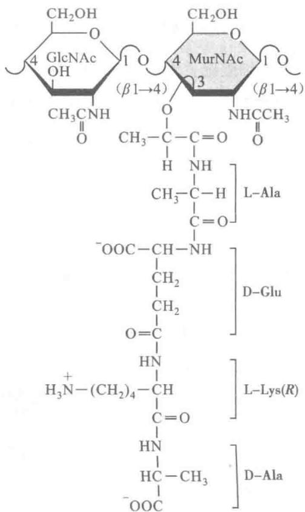

## 2. 磷壁酸 (teichoic acid)

革兰氏阳性细菌的细胞壁，除含肽聚糖外尚有磷壁酸，它虽不是糖类但与之有关。在某些细菌中磷壁酸含量达细胞壁干重的 $50\%$ 。磷壁酸主链是由醇（核糖醇或甘油）和磷酸分子交替连接而成，侧链是单个的D-Ala或/和 $\beta -\mathrm{D}-$ 葡萄糖等分别以酯键或糖苷键与磷壁酸中的醇成分相连。磷壁酸按其在细胞表面上的固定方式可分为脂磷壁酸和壁磷壁酸。脂磷壁酸跨过肽聚糖层，以其末端磷酸共价连接于质膜中糖脂的寡糖基上。壁磷壁酸不深入质膜，其末端以磷酸二酯键与肽聚图 9-35 肽聚糖主链的重复单位(胞壁肽)结构

图中 $R$ 表示有些细菌可能是其他氨基酸

糖的 MurNAc 残基相连。由于磷酸基的负电荷，磷壁酸可结合正离子并调节它们进出细胞的移动。磷壁酸也在细胞生长中起作用，它通过控制一种称为自溶素（autolysin）的酶的活性（此酶负责断开细胞壁结构以插入新的肽聚糖成分），防止细胞壁大范围破裂而引起细胞溶解；磷壁酸还可能参与磷的贮存；最后由于磷壁酸造成了丰富的细胞壁抗原特异性，使得应用血清学方法鉴定细菌成为可能。

## 3. 脂多糖 (lipopolysaccharide)

脂多糖是革兰氏阴性细菌如大肠杆菌(E. coli)和鼠伤寒[沙门氏]杆菌(S. phimurium)外膜的优势表面特征。脂多糖是脊椎动物免疫系统应答细菌侵染时产生的抗体的原型靶子，因此也是细菌菌株血清型(serotype)的重要决定因子（血清型是根据抗原性质区分的菌株）。脂多糖对人和其他动物是有毒的。图9-36A示出鼠伤寒杆菌的脂多糖分子结构图解。不同细菌种类的脂多糖结构有微细差异，但一般由脂质A、核心寡糖和O-特异链三部分组成。

脂质 A(lipid A) 的结构中有一个 $(\beta1 \rightarrow 6)$ 连接的 D-葡糖胺二聚物，在它的两端 C1 和 C4 位各有一个磷酸基，此二聚物（作为重复单位）可通过 C1 和 C4 之间的焦磷酸桥（磷酸二酯键）把多个脂多糖分子连接起来（图中未示出）。D-葡糖胺二聚物上的一个 C6 与核心寡糖的 Kdo（3-脱氧-D-甘油-D-甘露辛酮糖酸，参见图 9-17）残基相连。鼠伤寒杆菌的脂质 A 中含有 6 个脂肪酸：4 个 3-羟脂肪酸直接与二聚物的两个葡糖胺残基连接，其中两个脂肪酸残基的 3-羟基各自进一步被非羟化脂肪酸所酯化，生成特有的 3-酰氧酰基结构（3-acyloxyacyl structure），见图 9-36B。脂质 A 的这一基本结构是许多细菌种群所共有的。脂质 A 的脂肪酸链伸进外膜，并因此使整个脂多糖分子锚定在外膜中。在存活的细菌中最小的脂多糖结构仅由脂质 A 和一个磷酸化的 Kdo 组成，例如流感型嗜血杆菌（H. influenzae）的一个突变株脂多糖。不能合成正常脂质 A 的突变体则不能存活，表明脂质 A 对细胞存活是绝对必需的。某些细菌中脂多糖的脂质 A 部分是决定内毒活性的内毒素（endotoxin），例如在革兰氏阴性菌感染引起的中毒性休克综合征中出现的危险性血压下降就是脂质 A 起的作用。

## A. 脂多糖结构

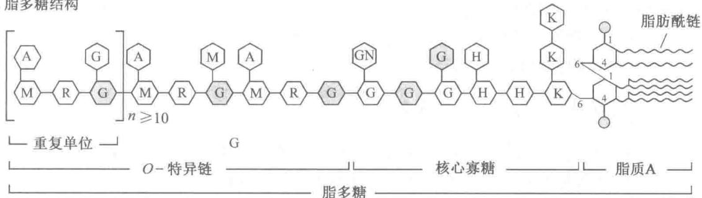

A: AbeOAc, M: Man, R: Rha, G: Glc, G: Gal, GN: GlcNAc, H: Hep, K: Kdo, O: GlcN, ○: 磷酸, ∼: 脂肪酸链

B. 脂质A基本结构

  
图9-36 沙门氏杆菌脂多糖的化学结构示意图解

核心寡糖(core oligosaccharide)是由Kdo,Hep(L-甘油-D-甘露庚糖,见图9-17)和若干己糖组成;一端与脂质A连接,另一端跟O-特异链相连。核心寡糖也是脂多糖的内毒素;它的功能是作为特异噬菌体的受体以及作为抗原,特别是缺乏O-特异链时。

O-特异链(O-specific chain)是由几十个相同的寡糖单位组成的;由于它具有抗原性,所以也称O-抗原。它是脂多糖的最外层,鼠伤寒杆菌和大肠杆菌的细胞表面实际上是由O-特异链所覆盖。O-特异链是借血清学方法鉴别革兰氏阴性细菌种类的根据,已知沙门氏杆菌有1400多种血清型。O-特异链对外膜的完整性并不是必需的,实际上不少细菌种群没有它。含有带O-特异链的脂多糖细菌是S型的,S型是指在琼脂板上生长光滑菌落(smooth colony);野生型的肠道菌和沙门氏菌是典型的S型。它们的许多突变体缺乏O-特异链,这些细菌具有粗糙菌落(rough colony)的形态学,称它们为R型。R型的沙门氏菌归于非病原菌,而S型菌株则常引起疾病。

## 4. 荚膜多糖 (capsular polysaccharide)

荚膜是细菌细胞制造并分泌的最外层物质，主要由多糖组成，例如链球菌属（Streptococcus）的荚膜是多糖；少数细菌如炭疽杆菌（Bacillus anthracis）的荚膜是多肽。荚膜多糖是相对分子质量为 $10^{5} \sim 10^{6}$ 的抗原，由几百个重复寡糖单位组成，重复单位一般含 $1 \sim 6$ 个单糖残基。最简单的荚膜多糖是同多糖，例如脑膜炎奈瑟氏菌（Neisserin meningitidis）A、B和C型的抗原；其中B和C型的抗原分别是借 $(\alpha 2 \rightarrow 8)$ 和 $(\alpha 2 \rightarrow 9)$ 糖苷键连接的唾液酸 $(\alpha - D - NeuNAc)$ 同聚物，即多聚唾液酸（polysialic acid），但两者在免疫学上是不同的。A型的抗原是很多荚膜多糖的代表，它是 $N-$ 乙酰- $\alpha - D-$ 甘露糖胺-1-磷酸的同聚物，单糖单位是借相邻残基的C1和C6之间形成的磷酸二酯键连接的。多数荚膜多糖是杂多糖，例如胸膜肺炎链球菌（Streptococcus pneumoniae）Ⅲ型的荚膜多糖。它的重复单位是4)- $\beta - D - GlcUA - (1 \rightarrow 4) - \beta - D - Glc - (1 \rightarrow M_r$ 高达140000。由于荚膜容易被接近，因而使荚膜能够产生显著的抗体应答，例如胸膜肺炎链球菌的情况,估计单个细菌细胞上表达的荚膜抗原决定簇能与 $4\times10^{6}$ 个抗体分子结合。荚膜抗原与抗体的反应是细菌分型的又一根据。已知肺炎链球菌有80多个血清型。荚膜多糖是病原菌具有毒性的重要原因。荚膜是使病原菌免遭宿主细胞吞噬的保护层。

## （六）脊椎动物胞外基质的结构杂多糖

在多细胞动物组织的胞外空隙中充满着胶状的物质称为胞外基质(extracellular matrix, ECM)，它把细胞结合在一起，并提供多孔性通道以利营养物和氧扩散到每一细胞。包裹在成纤维细胞和其他结缔组织细胞的网状ECM是由杂多糖和纤维状蛋白质如胶原蛋白、弹性蛋白和纤连蛋白(fibronectin)交织起来的网络结构组成的。基[底]膜(basement membrane)是一种特化的ECM，在表皮细胞的下面；它由特化的胶原、层粘连蛋白(laminin)和杂多糖组成。

ECM 中的杂多糖称糖胺聚糖（glycosaminoglycan），它曾称黏多糖、氨基多糖或酸性多糖。糖胺聚糖是动物和细菌所特有的，植物中不存在。糖胺聚糖是一类由重复二糖单位构成的线型杂多糖，其通式为（己糖醛酸→己糖胺） $_{n}$ ，n 随种类而异。通式中己糖醛酸残基为 D-葡糖醛酸（D-GlcUA）或 L-艾杜糖醛酸（L-IdoUA）。有些糖胺聚糖的一些羟基被硫酸化（sulfation） $^{①}$ ，这些硫酸基和糖醛酸残基的羧基使糖胺聚糖具有很高的负电荷密度。由于相邻的负荷电基团间的斥力，糖胺聚糖在溶液中采取高度伸展的棒状构象。糖胺聚糖分子中硫酸化单糖残基的特异图案（硫酸化谱）为许多基于跟它们发生静电结合的配体蛋白质提供了专一性识别。硫酸化的糖胺聚糖与胞外蛋白质连接形成蛋白聚糖（见本章后面）。

根据单糖残基的种类、残基间的连键类型以及硫酸化的程度，糖胺聚糖可分为透明质酸、硫酸软骨素、硫酸皮肤素、硫酸角质素、硫酸乙酰肝素和肝素（图9-37）：

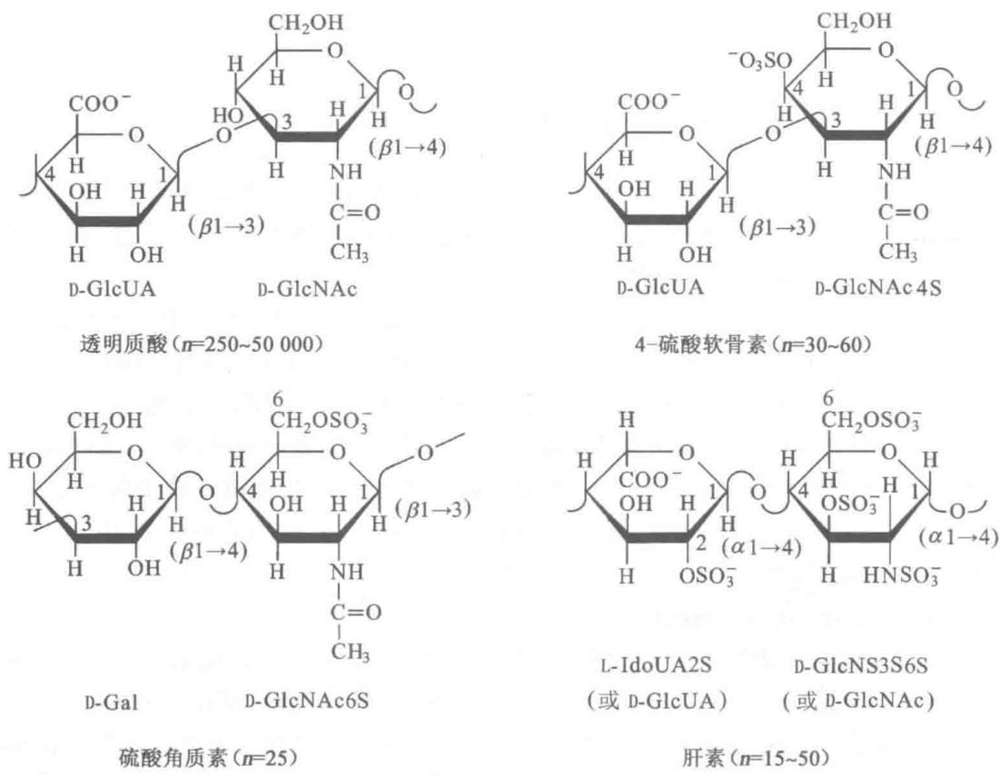  
图9-37 糖胺聚糖的重复二糖单位结构  
图中单糖残基的缩写如 GlcNAc4S 中，“4”表示该残基的 C4 位，“S”表示此位有一个硫酸基

透明质酸(hyaluronic acid, HA)是糖胺聚糖中结构最简单的, 它的二糖单位中 D-葡糖醛酸以 $(\beta1\rightarrow3)$ 糖苷键与 N-乙酰葡糖胺连接, 二糖单位间以 $(\beta1\rightarrow4)$ 连键相连。HA 与其他糖胺聚糖有很大的不同, 它不被硫酸化, 不与蛋白质共价结合, 而是以游离形式或与蛋白质形成非共价复合体形式存在。其相对分子质量可高达数百万, 重复二糖单位的数目(n)为 250\~50 000 个。HA 能结合大量的水, 形成透明的高黏稠溶液。HA 广泛存在于结缔组织中, 在玻璃体、脐带、鸡冠等组织中尤为丰富。HA 在关节滑液和眼球玻璃体液中起润滑、防震和增稠剂的作用。HA 也是软骨和腱的胞外基质成分; 由于它跟基质的其他成分相互作用, 使软骨和腱具有抗张强度和弹性。某些病原菌能分泌透明质酸酶(hyaluronidase), 水解透明质酸的糖苷键, 使组织对细菌入侵更加敏感。很多生物的精子也含有类似的酶, 能破裂包裹卵子的糖胺聚糖外衣, 令精子穿入。

其他的糖胺聚糖在分子质量方面要比透明质酸小得多，链长只有40到120个单糖残基；在胞外基质中它们与特定的蛋白质（蛋白聚糖）共价结合；二糖单位中的一个或两个残基跟透明质酸的不同。硫酸软骨素（chondroitin sulfate, CS）中常在GalNAc残基的C4或C6位上发生硫酸化，生成的聚糖分别称为4-硫酸软骨素和6-硫酸软骨素。CS使软骨、腱、韧带和主动脉具有抗张强度。硫酸皮肤素（dermatan sulfate, DS）跟CS的差别是，在CS中存在的许多D-葡糖醛酸残基被L-艾杜糖醛酸残基所置换；后者是由于前者在C5位差向异构化的结果。DS赋予皮肤以韧性；它也存在于血管壁和心瓣膜中。硫酸角质素（keratan sulfate, KS）中不含糖醛酸，被D-半乳糖残基替换，此外它的硫酸基含量不定。KS存在于角膜、软骨、骨和各种由死细胞形成的角质结构（角、毛发、甲、爪和蹄等）。硫酸乙酰肝素（heparan sulfate, HS）为所有的动物细胞所产生，并含各种排列的硫酸化和非硫酸化单糖残基。HS链中的酸化片段允许它跟大多数蛋白质，包括生长因子、ECM成分以及血浆中存在的各种酶和因子发生相互作用。肝素（heparin, Hp）是硫酸乙酰肝素的一种分级形式，一种硫酸化程度高的HS，后者主要来自肺、肝、皮肤等肥大细胞（mast cell；一类白细胞）。跟硫酸皮肤素类似，它们的一部分D-葡糖醛酸残基也被差向异构化成L-艾杜糖醛酸残基。肝素是一种天然的抗凝剂，临床上用它作为抗凝血酶（antithrombin, AT）的增强剂。AT是一种丝氨酸蛋白酶抑制剂，它能跟属于丝氨酸蛋白酶类的凝血酶（thrombin）及其他活化的凝血因子（如IXa、Xa）结合而使它们失活。肝素作为AT增强剂的机制被认为是它把AT和凝血酶（活化的凝血因子Ⅱ，Ⅱa）结合在一起，使凝血酶更易失活（见本章后面）。肝素的这种介导性结合是一种强静电相互作用，而肝素是所有已知的生物大分子中负电荷密度最高的。纯化的肝素也用于加入被输血液和临床分析用的血样中，以防止血凝。

<!-- EN-BEGIN 7.2 -->

### 【英文对应 7.2】Polysaccharides

> 来源：Lehninger Principles of Biochemistry（书籍/02_生物化学原理） 第7章 Carbohydrates and Glycobiology，§7.2。对应本章“五、多糖”。

Most carbohydrates found in nature occur as polysaccharides, polymers of medium to high molecular weight ( $M_{r} > 20,000$ ). P2 Polysaccharides, also called glycans, differ from each other in the identity of their recurring monosaccharide units, in the length of their chains, in the types of bonds linking the units, and in the degree of branching. Homopolysaccharides contain only a single monomeric sugar species; heteropolysaccharides contain two or more kinds of monomers (Fig. 7-12). Some homopolysaccharides serve as storage forms of monosaccharides that are used as fuels; starch and glycogen are homopolysaccharides of this type. Other homopolysaccharides (cellulose and chitin, for example) serve as structural elements in plant cell walls and animal exoskeletons. Heteropolysaccharides provide extracellular support for organisms of all kingdoms. For example, the rigid layer of the bacterial cell envelope (the peptidoglycan) is composed in part of a heteropolysaccharide built from two alternating monosaccharide units (see Fig. 6-32). In animal tissues, the extracellular space is occupied by several types of heteropolysaccharides, which form a matrix that holds individual cells together and provides protection, shape, and support to cells, tissues, and organs.

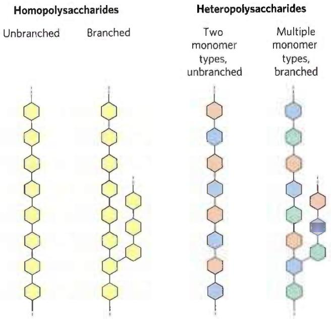  
FIGURE 7-12 Homopolysaccharides and heteropolysaccharides. Polysaccharides may be composed of one, two, or several different monosaccharides, in straight or branched chains of varying length.

P4 Unlike proteins, polysaccharides generally do not have defined lengths or molecular weights. This difference is a consequence of the mechanisms of assembly of the two types of polymer. As we shall see in Chapter 27, proteins are synthesized on a template (messenger RNA) of defined sequence and length, by enzymes that follow the template exactly. For polysaccharide synthesis there is no template; rather, the program for polysaccharide synthesis is intrinsic to the enzymes that catalyze the polymerization of the monomeric units, and there is no specific stopping point in the synthetic process; the products thus vary in length.

#### [EN] Some Homopolysaccharides Are Storage Forms of Fuel

The most important storage polysaccharides are starch in plant cells and glycogen in animal cells. Both polysaccharides occur intracellularly as large clusters or granules. Starch and glycogen molecules are heavily hydrated, because they have many exposed hydroxyl groups available to hydrogen-bond with water. Most plant cells have the ability to form starch, and starch storage is especially abundant in tubers (underground stems), such as potatoes, and in seeds.

Starch contains two types of glucose polymer, amylose and amylopectin (Fig. 7-13). Amylose consists of long, unbranched chains of D-glucose residues connected by $(\alpha 1 \rightarrow 4)$ linkages (as in maltose). Such chains vary in molecular weight from a few thousand to more than a million. Amylopectin is even larger ( $M_{\mathrm{r}}$ up to 200 million) but unlike amylose is highly branched. The glycosidic linkages joining successive glucose residues in amylopectin chains are $(\alpha 1 \rightarrow 4)$ ; the branch points (occurring every 24 to 30 residues) are $(\alpha 1 \rightarrow 6)$ linkages.

Glycogen is the main storage polysaccharide of animal cells. Like amylopectin, glycogen is a polymer of $(\alpha1\rightarrow4)$ -linked glucose subunits, with $(\alpha1\rightarrow6)$ -linked branches, but glycogen is more extensively branched (on average, a branch every 8 to 12 residues) and more compact than starch. Glycogen is especially abundant in the liver, where it may constitute as much as 7% of the wet weight; it is also present in skeletal muscle. In hepatocytes, glycogen is found in large $\alpha$ granules (see Fig. 15-1), which are clusters of smaller $\beta$ granules, each of which is a single, highly branched glycogen molecule with an average molecular weight of several million. The large $\alpha$ glycogen granules also contain, in tightly bound form, the enzymes responsible for the synthesis and degradation of glycogen (see Fig. 15-16).

Because each branch of glycogen ends with a nonreducing sugar unit, a glycogen molecule with n branches has $n+1$ nonreducing ends, but only one reducing end. When glycogen is used as an energy source, glucose units are removed one at a time from the nonreducing ends. Degradative enzymes that act only at nonreducing ends can work simultaneously on the many branches, speeding the conversion of the polymer to monosaccharides.

Why not store glucose in its monomeric form? P3 Hepatocytes in the fed state store glycogen equivalent to a glucose concentration of 0.4 M. The actual concentration of glycogen, which contributes little to the osmolarity of the cytosol, is about 0.01 μM. If the cytosol contained 0.4 M glucose, the osmolarity would be threateningly elevated, leading to osmotic entry of water that might rupture the cell (see Fig. 2-12).

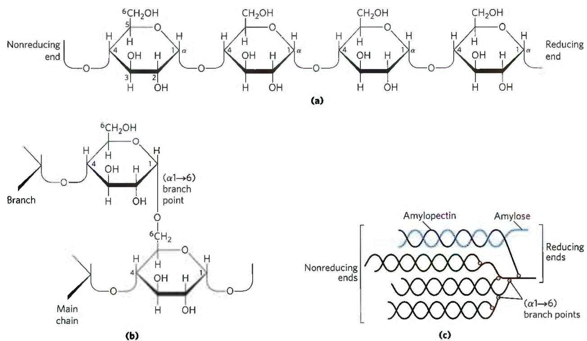  
FIGURE 7-13 Starch and glycogen. (a) A short segment of a linear polymer of D-glucose residues in $(\alpha 1\rightarrow 4)$ linkage, shown here as Haworth perspectives. This is the basic structure of amylose of starch (in plants) and glycogen (in animals). A single chain of amylose can contain several thousand glucose residues. (b) An $(\alpha 1\rightarrow 6)$ branch point of amylopectin or glycogen. (c) A cluster of amylose and amylopectin like that believed to occur in starch  
granules. Strands of amylopectin (black) form double-helical structures with each other or with amylose strands (blue). Amylopectin has frequent $(\alpha 1\rightarrow 6)$ branch points (red). Glucose residues at the nonreducing ends of the outer branches are removed enzymatically during the mobilization of starch for energy production. Glycogen has a similar structure but is more highly branched and more compact.

#### [EN] Some Homopolysaccharides Serve Structural Roles

Cellulose, a tough, fibrous, water-insoluble substance, is found in the cell walls of plants, particularly in stalks, stems, trunks, and all the woody portions of the plant body. Cellulose constitutes much of the mass of wood, and cotton is almost pure cellulose. Like amylose, the cellulose molecule is a linear, unbranched homopolysaccharide, consisting of 10,000 to 15,000 D-glucose units. But there is a very important difference: P5 in cellulose the glucose residues have the $\beta$ configuration (Fig. 7-14), whereas in amylose the glucose is in the $\alpha$ configuration. The glucose residues in cellulose are linked by $(\beta 1 \rightarrow 4)$ glycosidic bonds, in contrast to the $(\alpha 1 \rightarrow 4)$ bonds of amylose. This difference causes individual molecules of cellulose and amylose to fold differently in space, giving them very different macroscopic structures and physical properties.

The tough, fibrous nature of cellulose makes it useful in such commercial products as cardboard and insulation material, and it is a major constituent of cotton and linen fabrics. Cellulose is also the starting material for the commercial production of cellophane, rayon, and lyocell.

Chitin is a linear homopolysaccharide composed of N-acetylglucosamine residues in (β1→4) linkage (Fig. 7-15). The only chemical difference from cellulose is the replacement of the hydroxyl group at C-2 with an acetylated amino group, which makes chitin more hydrophobic and water-resistant than cellulose. Chitin forms extended fibers similar to those of cellulose, and like cellulose cannot be digested by vertebrates. Chitin is the principal component of the hard exoskeletons of nearly a million species of arthropods—insects, lobsters, and crabs, for example—and is probably the second most abundant polysaccharide, next to cellulose, in nature; an estimated 1 billion tons of chitin are produced in the biosphere each year.

  
FIGURE 7-14 Cellulose. Two units of a cellulose chain; the $\beta$ -glucose residues are in $(\beta 1\rightarrow 4)$ linkage. The rigid chair structures can rotate relative to one another.

#### [EN] Steric Factors and Hydrogen Bonding Influence Homopolysaccharide Folding

P5 The folding of polysaccharides in three dimensions follows the same principles as those governing polypeptide structure: subunits with a more-or-less rigid structure dictated by covalent bonds form three-dimensional macromolecular structures that are stabilized by weak interactions within or between molecules, such as hydrogen bonds, interactions due to the hydrophobic effect, van der Waals interactions, and, for polymers with charged subunits, electrostatic interactions. Because polysaccharides have so many hydroxyl groups, hydrogen bonding has an especially important influence on their structure. Glycogen, starch, cellulose, and chitin are composed of pyranoside (six-membered ring) subunits, as are the oligosaccharides of glycoproteins and glycolipids, to be discussed later. Such molecules can be represented as a series of rigid pyranose rings connected by an oxygen atom bridging two carbon atoms (the glycosidic bond). There is, in principle, free rotation about both C—O bonds linking the residues, but as in polypeptides (see Figs 4-2, 4-8), rotation about each bond is limited by steric hindrance by substituents. The three-dimensional structures of these molecules can be described in terms of the dihedral angles, $\phi$ and $\psi$ , about the glycosidic bond (Fig. 7-16). The bulkiness of the pyranose ring and its substituents, along with electronic effects at the anomeric carbon, place constraints on the angles $\phi$ and $\psi$ ; thus, certain conformations are much more stable than others.

  
FIGURE 7-15 Chitin. (a) A short segment of chitin, a homopolymer of N-acetyl-D-glucosamine units in (β1→4) linkage. (b) A spotted June bee-  
tle (Pelidnota punctata), showing its surface armor (exoskeleton) of chitin. [(b) Paul Whitten/Science Source.]

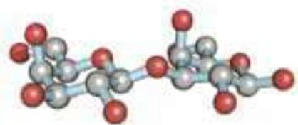  
Low-energy conformation is extended and maximizes H-bonding.

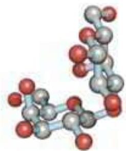  
High-energy conformation is sterically hindered.  
FIGURE 7-16 Different energetic conformations of a disaccharide. The torsion angles $\phi$ (phi) and $\psi$ (psi), which define the spatial relationship between adjacent rings, can in principle have any value from $0^{\circ}$ to $360^{\circ}$ . In fact, some torsion angles give conformations that maximize hydrogen bonding and minimize energy, whereas others give conformations that are sterically hindered, as we can see in two conformers of the disaccharide Gal(β1→3)Gal at opposite energetic extremes.

P5 The most stable three-dimensional structure for the $(\alpha 1\rightarrow 4)$ -linked chains of starch and glycogen is a tightly coiled helix (Fig. 7-17), stabilized by interchain hydrogen bonds. The average plane of each residue along the amylose chain forms a $60^{\circ}$ angle with the average plane of the preceding residue, so the helical structure has six residues per turn. For amylose, the core of the helix is of precisely the right dimensions to accommodate iodine as complex ions $(\mathrm{I}_3^-$ and $\mathrm{I}_5^-)$ . This interaction gives an intensely blue product, making it a common qualitative test for amylose.

P5 For cellulose, the most stable conformation is that in which each chair is turned 180° relative to its neighbors, yielding a straight, extended chain. All —OH groups are available for hydrogen bonding with neighboring chains. With several chains lying side by side, a stabilizing network of interchain and intrachain hydrogen bonds produces straight, stable supramolecular fibers of great tensile strength (Fig. 7-18). This property of cellulose has made it useful to civilizations for millennia. Many manufactured products, including papyrus, paper, cardboard, rayon, insulating tiles, and a variety of other useful materials, are derived from cellulose. The water content of these materials is low because extensive interchain hydrogen bonding between cellulose molecules satisfies their capacity for hydrogen-bond formation.

#### [EN] Peptidoglycan Reinforces the Bacterial Cell Wall

The rigid component of bacterial cell walls (peptidoglycan) is a heteropolymer of alternating $(\beta1\rightarrow4)$ -linked

  
FIGURE 7-17 Helical structure of starch (amylose). (a) Four glucose units of starch (amylose), showing both the free rotation possible around the $\psi$ and $\phi$ angles of the $(\alpha 1\rightarrow 4)$ glycosidic bonds and the hydrogen bonding possible between adjacent rings. In this most stable conformation, with adjacent rigid chairs at $60^{\circ}$ to one another, the polysaccharide chain is curved. (b) A model of a segment of amylopectin (branched amylose). The conformation of $(\alpha 1\rightarrow 4)$ linkages in amylose, amylopectin, and glycogen causes these polymers to assume tightly coiled helical structures. [(b) Data from www.biotopics.co.uk/jsmol/amylopectin.html]

N-acetylglucosamine and N-acetylmuramic acid residues (see Fig. 6-32). The linear polymers lie side by side in the cell wall, cross-linked by short peptides, the exact structure of which depends on the bacterial species. The peptide cross-links weld the polysaccharide chains into a strong sheath (peptidoglycan) that envelops the entire cell and prevents cellular swelling and lysis due to the osmotic entry of water.

The enzyme lysozyme kills bacteria by hydrolyzing the (β1→4) glycosidic bond between N-acetylglucosamine and N-acetylmuramic acid. The enzyme is found in human tears, where it is presumably a defense against bacterial infections of the eye, and in hen's eggs, where it prevents bacterial infection of the developing embryo. Penicillin and related antibiotics kill bacteria by preventing synthesis of the peptidoglycan cross-links, leaving the cell wall too weak to resist osmotic lysis (p. 211).

#### [EN] Glycosaminoglycans Are Heteropolysaccharides of the Extracellular Matrix

The extracellular space in the tissues of multicellular animals is filled with a gel-like material, the extracellular matrix (ECM), which holds the cells together and provides a porous pathway for the diffusion of nutrients and oxygen to individual cells. The ECM is composed of an interlocking meshwork of heteropolysaccharides (also called ground substance) and fibrous proteins such as fibrillar collagens, elastins, and fibronectins. The basement membrane is a specialized ECM that underlies epithelial cells; it consists of specialized collagens, laminins, and heteropolysaccharides.

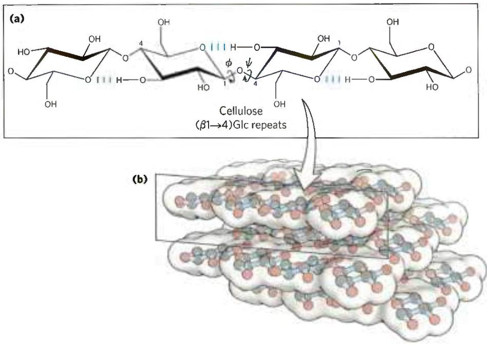  
FIGURE 7-18 The linear structure of cellulose chains. (a) Four glucose units of cellulose. In the most stable conformation of cellulose, the $(\beta 1\rightarrow 4)$ glycosidic linkages put the adjacent rigid chairs at $180^{\circ}$ relative to each other. (b) A model of straight, unbranched cellulose segments, held together in layers stabilized by interchain hydrogen bonds. [(b) Data from Cornell, B. 2016. Sugar Polymers. Available at: http://ib.bioninja.com.au. (Accessed 11 March 2020).]

These heteropolysaccharides, the glycosaminoglycans, are a family of linear polymers composed of repeating disaccharide units (Fig. 7-19). They are unique to animals and bacteria and are not found in plants. One of the two monosaccharides is always either N-acetylglucosamine or N-acetylgalactosamine; the other is in most cases a uronic acid, usually D-glucuronic or L-iduronic acid. Some glycosaminoglycans contain esterified sulfate groups. P2 The combination of sulfate groups and the carboxylate groups of the uronic acid residues gives glycosaminoglycans a very high density of negative charge. To minimize the repulsive forces among neighboring charged groups, these molecules assume an extended conformation in solution, forming a rodlike helix in which the negatively charged carboxylate groups occur on alternate sides of the helix (as shown for heparin in Fig. 7-19). The extended rod form also provides maximum separation between the negatively charged sulfate groups. The specific patterns of sulfated and nonsulfated sugar residues in glycosaminoglycans allow specific recognition by a variety of protein ligands that bind electrostatically to these molecules. The sulfated glycosaminoglycans are attached to extracellular proteins to form proteoglycans (Section 7.3).

The glycosaminoglycan hyaluronan (hyaluronic acid) contains alternating residues of D-glucuronic acid and N-acetylglucosamine (Fig. 7-19). With up to 50,000 repeats of the basic disaccharide unit, hyaluronan has a molecular weight of several million; it forms clear, highly viscous, noncompressible solutions that serve as lubricants in the synovial fluid of joints and give the vitreous humor of the vertebrate eye its jellylike consistency (the Greek hyalos means "glass"; hyaluronan can have a glassy or translucent appearance). Hyaluronan is also a component of the ECM of cartilage and tendons, to which it contributes tensile strength and elasticity as a result of its strong noncovalent interactions with other components of the matrix. Hyaluronidase, an enzyme secreted by some pathogenic bacteria, can hydrolyze the glycosidic linkages of hyaluronan, rendering tissues more susceptible to bacterial invasion. In many animal species, a similar enzyme in sperm hydrolyzes the outer glycosaminoglycan coat around an ovum, allowing sperm penetration.

Other glycosaminoglycans differ from hyaluronan in three respects: they are generally much shorter polymers, they are covalently linked to specific proteins (proteoglycans), and one or both monomeric units differ from those of hyaluronan. Chondroitin sulfate (Greek chondros, "cartilage") contributes to the tensile strength of cartilage, tendons, ligaments, heart valves, and the walls of the aorta. Dermatan sulfate (Greek derma, "skin") contributes to the pliability of skin and is also present in blood vessels and heart valves. In this polymer, many of the glucuronate residues present in chondroitin sulfate are replaced by their C-5 epimer, L-iduronate (IdoA).

  
α-L-Iduronate (IdoA)

  
$\beta$ -D-Glucuronate (GlcA)

Repeating disaccharide

  
Heparin segment  
FIGURE 7-19 Repeating units of some common glycosaminoglycans of extracellular matrix. The molecules are copolymers of alternating uronic acid and amino sugar residues (keratan sulfate is the exception), with sulfate esters in any of several positions, except in hyaluronan. The ionized carboxylate and sulfate groups give these polymers their characteristic high negative charge. Therapeutic heparin contains primarily iduronic acid (IdoA) and a smaller proportion of glucuronic acid (not shown) and is generally highly sulfated and heterogeneous in length. The space-filling model shows a heparin segment as its structure in solution, as determined by NMR spectroscopy. Carbons in iduronic acid sulfate are colored blue; those in glucosamine sulfate are green. Oxygen and sulfur are shown in red and yellow, respectively. Hydrogen atoms are not shown (for clarity). [Data for molecular model from PDB ID 1HPN, B. Mulloy et al., Biochem. J. 293:849, 1993.]

Keratan sulfates (Greek keras, "horn") have no uronic acid, and their sulfate content is variable. They are present in cornea, cartilage, bone, and a variety of horny structures formed from dead cells: horn, hair, hoofs, nails, and claws. Heparan sulfate (Greek hēpar, "liver"; it was originally isolated from dog liver) contains variable, nonrandom arrangements of sulfated and non-sulfated sugars. The exact sequence of sulfated residues gives the molecule the ability to interact specifically with a large number of proteins, including growth factors and ECM components, as well as various enzymes and factors present in plasma. Heparin is a highly sulfated, intracellular form of heparan sulfate produced primarily by mast cells (a type of leukocyte, or immune cell). Its physiological role is not yet clear, but purified heparin is used as a therapeutic agent to inhibit coagulation of blood through its capacity to bind the protease inhibitor antithrombin (see Fig. 7-24).

Table 7-2 summarizes the composition, properties, roles, and occurrence of the polysaccharides described in Section 7.2.

#### [EN] SUMMARY 7.2 Polysaccharides

■ Homopolysaccharides contain only a single monomeric sugar species; heteropolysaccharides contain two or more kinds of monomers.

The homopolysaccharides starch and glycogen are storage fuels in plant, animal, and bacterial cells. They consist of D-glucose units with (α1→4) linkages, and both contain some branches.

The homopolysaccharides cellulose, chitin, and dextran serve structural roles. Cellulose, composed of $(\beta 1\rightarrow 4)$ -linked D-glucose residues, lends strength and rigidity to plant cell walls. Chitin, a polymer of $(\beta 1\rightarrow 4)$ -linked N-acetylglucosamine, strengthens the exoskeletons of arthropods.

Homopolysaccharides assume stable conformations dictated by weak interactions. The chair form of the pyranose ring is essentially rigid, so the conformation of the polymers is determined by rotation about the C—O bonds of the glycosidic linkage. Starch and glycogen form helical structures with intrachain hydrogen bonding; cellulose and chitin form long, straight strands that interact with neighboring strands.

■ Bacterial cell walls are strengthened by peptidoglycan in which the repeating disaccharide is GlcNAc( $\beta$ 1→4) Mur2Ac.

Glycosaminoglycans are extracellular heteropolysaccharides in which one of the two monosaccharide units is a uronic acid (keratan sulfate is an exception) and the other is an $N$ -acetylated amino sugar. The high density of negative charge on these molecules forces them to assume extended conformations. These polymers (hyaluronan, chondroitin sulfate, dermatan sulfate, and keratan sulfate) provide viscosity, adhesiveness, and tensile strength to the extracellular matrix.

<table><tr><td colspan="5">TABLE 7-2 Structures and Roles of Some Polysaccharides</td></tr><tr><td>Polymer</td><td>Typea</td><td>Repeating unitb</td><td>Size (number of monosaccharide units)</td><td>Roles/significance</td></tr><tr><td>Starch</td><td></td><td></td><td></td><td>Energy storage: in plants</td></tr><tr><td>Amylose</td><td>Homo-</td><td>(α1→4)Glc, linear</td><td>50–5,000</td><td></td></tr><tr><td>Amylopectin</td><td>Homo-</td><td>(α1→4)Glc, with (α1→6)Glc branches every 24–30 residues</td><td>Up to  $10^6$ </td><td></td></tr><tr><td>Glycogen</td><td>Homo-</td><td>(α1→4)Glc, with (α1→6)Glc branches every 8–12 residues</td><td>Up to 50,000</td><td>Energy storage: in bacteria and animal cells</td></tr><tr><td>Cellulose</td><td>Homo-</td><td>(β1→4)Glc</td><td>Up to 15,000</td><td>Structural: in plants, gives rigidity and strength to cell walls</td></tr><tr><td>Chitin</td><td>Homo-</td><td>(β1→4)GlcNAc</td><td>Very large</td><td>Structural: in insects, spiders, crustaceans, gives rigidity and strength to exoskeletons</td></tr><tr><td>Dextran</td><td>Homo-</td><td>(α1→6)Glc, with (α1→3) branches</td><td>Wide range</td><td>Structural: in bacteria, extracellular adhesive</td></tr><tr><td>Peptidoglycan</td><td>Hetero-; peptides attached</td><td>4)Mur2Ac(β1→4) GlcNAc(β1</td><td>Very large</td><td>Structural: in bacteria, gives rigidity and strength to cell envelope</td></tr><tr><td>Hyaluronan (a glycosaminoglycan)</td><td>Hetero-; acidic</td><td>4)GlcA(β1→3) GlcNAc(β1</td><td>Up to 100,000</td><td>Structural: in vertebrates, extracellular matrix of skin and connective tissue; viscosity and lubrication in joints</td></tr></table>

$^{a}$ Each polymer is classified as a homopolysaccharide (homo-) or heteropolysaccharide (hetero-).  
$^{b}$ The abbreviated names for the peptidoglycan, agarose, and hyaluronan repeating units indicate that the polymer contains repeats of this disaccharide unit for example, in peptidoglycan, the GlcNAc of one disaccharide unit is $(\beta1\rightarrow4)$ -linked to the first residue of the next disaccharide unit.

<!-- EN-END 7.2 -->

## 六、糖缀合物

除了作为贮存燃料(淀粉、糖原和右旋糖苷)和结构材料(纤维素、壳多糖、和肽聚糖)之外,多糖和寡糖还是信息的载体。其中有些用于细胞和胞外环境之间的通讯,另一些用来标记蛋白质以便转运它们到专一的细胞器并在那里定位,或破坏它们当它们残缺或多余时;还有一些用作胞外信号分子(例如生长因子)或胞外寄生物(细菌、病毒)的识别位点。几乎在每个白细胞上,与质膜成分相连的专一寡糖链形成一个糖层或称糖萼(glycocalyx),几纳米厚,作为一个细胞面向环境而富含信息的表面。这些寡糖在细胞-细胞识别和黏着,发育期间细胞迁移,血凝、免疫应答、创伤愈合和其他的细胞过程中起主要的作用。在大多数情况下,这些信息聚糖都是跟蛋白质或脂质共价连接成糖缀合物(glycoconjugate),它是生物活性分子,包括蛋白聚糖、糖蛋白和糖脂。

## (一) 蛋白聚糖

蛋白聚糖(proteoglycan)是一类细胞表面的或胞外基质的大分子,这类分子是由一个或多个硫酸化的糖胺聚糖链与一个膜蛋白质或分泌性蛋白质共价连接而成;糖胺聚糖链还能通过跟自身的荷负电基团的静电相互作用与胞外蛋白质结合。蛋白聚糖是所有胞外基质的主要成分。蛋白聚糖按质量计算,糖质的比例高于蛋白质,糖含量可达95%或更高;糖部分经常是蛋白聚糖生物活性的主要部位。这里生物活性是指提供跟其他蛋白质进行非共价相互作用的位点或机会。

哺乳类能产生 40 种类型的蛋白聚糖。这些分子起着机体组织（tissue）的组织者（organizer）作用；它们影响各种细胞的活性，例如生长因子的激活和黏着。

## 1. 蛋白聚糖的基本结构

基本的蛋白聚糖是由一个所谓核心蛋白(core protein)和一个或多个与之共价连接的糖胺聚糖组成。多数核心蛋白的糖链连接点是在—Ser—Gly—X—Gly—序列(X可以是任一种氨基酸残基)中的Ser残基,虽然不是每个具有此序列的蛋白质都连有糖胺聚糖。糖胺聚糖通过一个四糖接头(tetrasaccharide linker)连接于核心蛋白的Ser残基(图9-38A)。许多蛋白聚糖被分泌到胞外基质,但有些蛋白聚糖是属于膜内在蛋白质(第10章)。例如,层样胞外基质(基板)含有一个核心蛋白家族( $M_{r}20\ 000\sim40\ 000$ ),它们是膜蛋白,每个成员都有几个共价连接的硫酸乙酰肝素链。这里有两个主要的膜硫酸乙酰肝素蛋白聚糖家族:多配体(共结合)蛋白聚糖(syndecan)和磷脂酰肌醇蛋白聚糖(glypican)。多配体蛋白聚糖有一个穿膜结构域和一个胞外结构域,后者携有3到5个硫酸乙酰肝素链,在某些情况下还有硫酸软骨素链(图9-38B)。磷脂酰肌醇蛋白聚糖是通过一个脂锚跟质膜连接的,脂锚(lipid anchor)是一种膜脂——磷脂酰肌醇(见第10章)的衍生物(图9-38B)。多配体蛋白聚糖和磷脂酰肌醇蛋白聚糖都能分泌到胞外空隙。ECM中有一种蛋白酶能在紧接膜表面处进行切割,并释放多配体蛋白聚糖的胞外结构域(ectodomain),即质膜外的结构域；还有一种磷脂酶能断裂与膜脂的连接（图9-38B），并释放磷酯酰肌醇蛋白聚糖；此外还有许多硫酸软骨素和硫酸皮肤素的蛋白聚糖，有些是跟膜结合的，其他是作为分泌产物存在于ECM中。

  
图 9-38 四糖接头(桥)的蛋白聚糖(A)和膜蛋白聚糖的两个家族(B)
图 B 中 GPI 锚即糖基磷脂酰肌醇锚(见图 3-49)

糖胺聚糖链可以跟各种胞外配体结合，并因此能调节这些配体跟细胞表面上的专一受体的相互作用。硫酸乙酰肝素的详细研究表明一个结构域的结构不是无序的；某些结构域（典型的3到8个二糖单位长）在序列方面以及在跟专一蛋白质结合的能力方面都与邻近的结构域不同。高度硫酸化的结构域（称NS结构域）和主要含未修饰的GlcNAc和GlcUA残基的结构域（称NA结构域）交替排列（图9-38C）。NS结构域中准确的硫酸化谱(sulfation pattern)决定于具体的蛋白聚糖；给定GlcNAc-IdoUA二聚体的可能修饰数目，至少可以有32种不同的二聚体存在。而且，同样的核心蛋白当在不同类型细胞中合成时可以呈现不同的硫酸乙酰肝素结构。

硫酸乙酰肝素的 NS 结构域专门与胞外的蛋白质和信号传递分子(signalling molecule)结合,并改变这些配体的活性。配体蛋白质与 NS 结构域的相互作用大体上有四种类型或机制。① 配体构象激活:配体蛋白质活性的变化可能是构象变化的结果,而构象变化是由于配体跟 NS 结构域结合引起的。例如抗凝血酶(AT)与硫酸乙酰肝素的一个专一五糖 NS 结构域的结合导致 AT 构象改变,使它能够跟凝血因子 Xa 发生相互作用而阻止了血凝过程(图 9-39A)。② 加强蛋白质-蛋白质的相互作用:由于硫酸乙酰肝素的两个相邻 NS 结构域能够同时跟两个不同的配体蛋白质结合,使它们靠得更近,提高了蛋白质-蛋白质的相互作用。前面谈到的肝素被用作抗凝血酶的增强剂的机制就是如此(图 9-39B)。③ 作为胞外配体的共同受体:硫酸乙酰肝素与胞外信号分子(signal molecule)例如生长因子结合,增加了它们的局部浓度,提高了与细胞表面上的生长因子受体的相互作用,这里硫酸乙酰肝素起着共同受体(coreceptor)的作用。例如成纤维细胞生长因子(fibroblast growth factor, FGF),一个促进细胞分裂的胞外蛋白质信号,首先在靶细胞的质膜上跟多配体蛋白聚糖分子的硫酸乙酰肝素成分结合。然后多配体蛋白聚糖把 FGF 给与质膜上的 FGF 受体,只有这时 FGF 才能反复地与其受体相互作用,引发细胞分裂(图 9-39C)。④ 使配体在细胞表面定位或集中:NS 结构域跟细胞外的各种可溶性分子相互作用(静电的或其他方式的),维持细胞表面的局部高浓度。例如荷正电的脂蛋白脂酶(lipoprotein lipase)被硫酸乙酰肝素分子的高密度负电荷所吸引,并通过跟 NS 结构域的静电相互作用和序列专一相互作用稳住它们(图 9-39D)。

C. 作为胞外配体的共同受体  
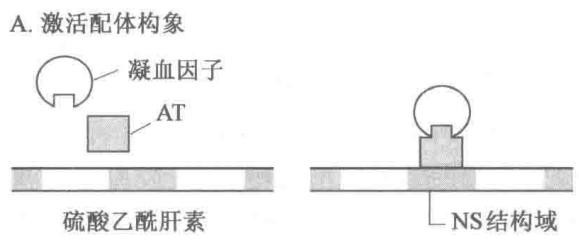

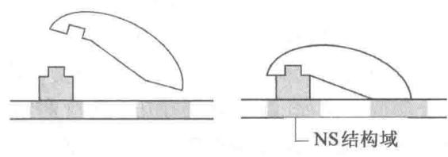

D. 使配体在细胞表面定位或集中

  
图9-39 硫酸乙酰肝素的NS结构域与配体蛋白质相互作用的四种机制

正确合成硫酸乙酰肝素的硫酸化结构域的重要性在缺乏负责IdoUAC2羟基硫酸化的酶的突变型小鼠上得到了证实。这些动物生下来就没有肾脏，而且骨骼肌和双眼严重发育不正常。其他的研究证明，膜蛋白聚糖在肝脂蛋白清除方面的重要性。越来越多的证据表明，在神经系统中轴突发育所采取的途径和总线路都受含硫酸乙酰肝素和硫酸软骨素的蛋白聚糖影响，它们为轴突向外生长提供了方向线束。

## 2. 蛋白聚糖聚集体 (proteoglycan aggregate)

某些蛋白聚糖如软骨的聚集蛋白聚糖（aggrecan）能以一个透明质酸分子为骨干形成一个巨大的典型超分子集装体——蛋白聚糖聚集体（图9-40A）。聚集蛋白聚糖的核心蛋白 $(M_{r}250\ 000)$ 含约100个硫酸软骨素链和约50个硫酸角质素链，糖链通过三糖接头跟核心蛋白的Ser残基相连，并分布在核心蛋白的不同区域；这种“装饰了的”核心蛋白——聚集蛋白聚糖单体 $(M_{r}2\times10^{6})$ 形如一个“试管刷”（图9-40B）。每个蛋白聚糖单体的核心蛋白跟透明质酸分子的十糖序列（5个二糖单位）非共价结合，并由连接蛋白（link protein； $M_{r}40\ 000$ 到48 000）使结合稳定化。形成的聚集蛋白聚糖聚集体（aggrecan aggregate）含百个或更多个蛋白聚糖单体， $M_{r}>2\times10^{8}$ ，是已知的最大生物大分子之一。此聚集体和它的水化结合水所占的体积约等于一个细菌细胞的体积。

  
图 9-40 软骨蛋白聚糖聚集体结构的示意图

聚集蛋白聚糖是结缔组织如软骨的主要成分。这些巨大的胞外蛋白聚糖跟基质中的纤维状蛋白质如胶原蛋白、弹性蛋白和纤连蛋白交织一起，非共价结合成一个交联网，给整个胞外基质，因而也给结缔组织以抗张强度和复原能力(resilience)。这些蛋白质中有些是多黏着的，即一个蛋白质有几个不同的基质分子的结合部位。例如，纤连蛋白有几个独立的结构域，能结合血纤蛋白、硫酸乙酰肝素、胶原蛋白和一个质膜蛋白家族，称整联蛋白(integrin)。细胞和胞外基质蛋白聚糖之间的结合是经整联蛋白和胞外的多黏着蛋白（如纤连蛋白）介导的。细胞分子和胞外分子之间的相互作用不仅把细胞锚定在胞外基质，而且给发育组织中的细胞迁移提供定向路径和横穿质膜的双向传递信息。

## （二）糖蛋白

糖蛋白(glycoprotein)也是糖质与蛋白质的共价缀合物,含一个或几个不同复杂度的寡糖链。糖蛋白的聚糖跟蛋白聚糖的糖胺聚糖相比,分子小,分支、结构多样化。糖蛋白大多是膜蛋白和分泌[性]蛋白,存在于细胞膜的外表面(作为糖萼部分存在)、胞外基质和血液中;在细胞内的一些特殊细胞器如高尔基复合体、溶酶体和分泌颗粒中也有它们。糖蛋白的寡糖部分是很不均一的;它们也像糖胺聚糖,富含信息,形成高专一性的识别位点(recognition site),并被凝集素(糖结合蛋白)高亲和结合。某些细胞溶胶和核的蛋白质也同样能被糖基化。糖蛋白的寡糖链在还原端,通过O-糖苷键(这里也称糖肽键)与蛋白质Ser或Thr残基连接(O-连接型),或通过N-糖苷键与蛋白质Asn残基相连(N-连接型),见图9-41。糖蛋白中的寡糖链根据糖苷键类型分为N-连接型寡糖链和O-连接型寡糖链。这两种糖链可单独或同时存在于同一蛋白质中。研究表明所有的N-连接型寡糖链在还原端处是一个共有结构,称为核心五糖,它以还原端GlcNAc残基与肽链Asn连接(图9-41)。此核心结构是在进入糖蛋白之前,以前体形式合成的(第

  
图 9-41 糖蛋白中寡糖链与蛋白质之间的连键方式  
糖蛋白中寡糖链的还原端残基与多肽链的氨基酸残基以两种方式共价连接，分别形成 $O-$ 糖苷键和 $N-$ 糖苷键。A. $O-$ 糖苷键是由还原端单糖残基（主要是GalNAc）的 $\alpha-$ 异头碳与Ser或Thr残基侧链的羟基氧结合而成，此键对碱不稳定。B. $N-$ 糖肽键是由还原端GlcNAc残基的 $\beta-$ 异头碳与Asn侧链的 $\gamma-$ 酰胺氮连接而成，此键对弱碱稳定

21 章）。O-连接型寡糖链的结构比 N-连接型的简单，但连接形式远比 N-连接型寡糖链的多。已发现的有 GalNAc→Ser/Thr、GlcNAc→Ser/Thr、Man→Ser/Thr 和 Rha→Ser/Thr 等。某些糖蛋白只有一个寡糖链，但多数都多于一个链。糖质可以占糖蛋白质量的 1% 到 70% 或更多，例如胶原蛋白的含糖量一般不到 1%，免疫球蛋白 G 低于 4%，但胃黏蛋白高达 82%。糖蛋白中所含的单糖残基，除 L-岩藻糖、L-阿拉伯糖和 L-阿杜糖醛酸外，一般都是 D 型的。

黏蛋白(mucin)是一类分泌糖蛋白或膜糖蛋白,可以含大量的O-连接型寡糖链。黏蛋白存在于大多数的分泌液中,给黏液以特有的滑溜感。哺乳类的全部蛋白质约一半是糖基化的,哺乳类的全部基因约1%是编码涉及这些寡糖链合成和连接的酶类。

在胞质和核中发现的一类糖蛋白是独特的，其蛋白质中的各糖基化位置都只携带一个 $N-$ 乙酰葡糖胺残基，并以 $O-$ 糖苷键连接在Ser残基的侧链羟基上。这种修饰是可逆的，并且同是这些Ser残基在蛋白质活性的某一阶段常被磷酸化。这两种修饰是互相排斥的，这种糖基化的方式已被证明在调节蛋白质活性方面具有重要性（参见第8章和第14章）。

细胞质膜的外表面是成排的复杂度不一的寡糖链，它们被共价连接于膜糖蛋白或膜糖脂（见第10章）。最先搞清楚的糖蛋白是红细胞膜的血型糖蛋白A(glycophorin A)，含糖量为 $60\%$ ，以16个寡糖链（共60到70个单糖残基)共价连接于多肽链氨基端附近的氨基酸残基。其中15个寡糖链 $O-$ 连接于Ser或Thr残基；一个寡糖链 $N-$ 连接于Asn残基(见图3-46)。

糖组学(glycomics)是系统研究一个给定细胞或组织中的全套糖质包括连接在蛋白质和脂质上的糖质的学科。对糖蛋白来说,确定哪些蛋白质被糖基化,每个寡糖被连接在氨基酸序列的什么地方,每个寡糖分子的功能是什么。这是一个挑战性任务，但是值得去做，因为它能提供了解正常的糖基化谱（glycosylation pattern）以及在发育期间、患遗传病或癌症时糖基化谱发生改变的途径和方式。表征细胞的全套糖质的一些现行方法主要是基于质谱技术（见第2章）。

真核细胞分泌的许多蛋白质是糖蛋白，包括血液中的大多数蛋白质。例如免疫球蛋白（抗体）和某些激素，例如促卵泡激素、[促]黄体生成[激]素、和促甲状腺[激]素都是糖蛋白。许多乳中的蛋白质，包括乳清蛋白和胰分泌的某些蛋白质（如核糖核酸酶），跟溶酶体中的大多数蛋白质一样，都是糖基化的。

寡糖加入蛋白质的生物学优点逐渐被揭开了。糖质的亲水性很强，它能改变跟它缀合的蛋白质的极性和溶解度。跟内质网(ER)中新合成的蛋白质连接的、在高尔基复合体中加工的寡糖链被用作指定标记(destination label)，并在蛋白质质量控制方面发挥作用，引导错误折叠的蛋白质使之降解（见第33章）。当许多荷负电的寡糖链簇聚在蛋白质的一个区域时，由于它们之间的电荷排斥，倾向在那个区域形成伸展的棒状结构。寡糖链的庞大体积和负电荷保护某些蛋白质免遭蛋白水解酶的攻击。糖蛋白的寡糖链对蛋白质结构，除了这些整体的物理影响外，还有更专一的生物学影响（见本章后面）。正常的蛋白质糖基化的重要性是很清楚的，因为发现至少18种不同的人体糖基化遗传失调(disorder)有严重的身体和精神发育的缺陷；其中有些失调是致命的。

## （三）糖脂和脂多糖

糖蛋白不是唯一的携有寡糖链的细胞成分；某些脂质也有共价结合的寡糖。神经节苷脂（ganglioside）是真核细胞的一类膜糖脂，称鞘脂或鞘糖脂；其中的亲水头基，也即形成膜的外表面的鞘糖脂部分，是含有唾液酸（图9-30）和其他单糖残基的复杂寡糖。跟糖蛋白中的一样，膜脂寡糖也能被凝集素（见下一节）专一识别。脑和神经元富含糖脂，它们有助于神经传导和髓鞘质形成。神经节苷脂的某些寡糖部分，例如决定人血型的寡糖部分（见第10章），跟在一些糖蛋白中发现的是相同的，因此它们也对血型作出贡献。跟糖蛋白的寡糖链一样，膜脂的寡糖部分，一般（或许总是）存在于质膜的外表面。

脂多糖已在前面“细菌细胞壁的结构杂多糖”部分叙述。

<!-- EN-BEGIN 7.3 -->

### 【英文对应 7.3】Glycoconjugates: Proteoglycans, Glycoproteins, and Glycolipids

> 来源：Lehninger Principles of Biochemistry（书籍/02_生物化学原理） 第7章 Carbohydrates and Glycobiology，§7.3。对应本章“六、糖缀合物”。

In addition to their important roles as fuel stores (starch, glycogen, dextran) and as structural materials (cellulose, chitin, peptidoglycans), polysaccharides and oligosaccharides are information carriers. Some provide communication between cells and their extracellular surroundings; others label proteins for transport to and localization in specific organelles, or for destruction when the protein is malformed or superfluous; and others serve as recognition sites for extracellular signal molecules (growth factors, for example) or extracellular parasites (bacteria or viruses). On almost every eukaryotic cell, specific oligosaccharide chains attached to components of the plasma membrane form a carbohydrate layer (the glycocalyx), several nanometers thick, that serves as an information-rich surface that the cell shows to its surroundings. These oligosaccharides are central players in cell-cell recognition and adhesion, cell migration during development, blood clotting, the immune response, wound healing, and other cellular processes. In most of these cases, the informational carbohydrate is covalently joined to a protein or a lipid to form a glycoconjugate, which is the biologically active molecule (Fig. 7-20).

  
FIGURE 7-20 Glycoconjugates. The structures of some typical proteoglycans, glycoproteins, and glycosphingolipids described in the text.

Proteoglycans are macromolecules of the cell surface or ECM in which one or more sulfated glycosaminoglycan chains are joined covalently to a membrane protein or a secreted protein. The glycosaminoglycan chain can bind to extracellular proteins through electrostatic interactions between the protein and the negatively charged sugar moieties on the proteoglycan. Proteoglycans are major components of all extracellular matrices.

Glycoproteins have one or several oligosaccharides of varying complexity joined covalently to a protein. They are usually found on the outer face of the plasma membrane (as part of the glycocalyx), in the ECM, and in the blood. Inside cells, they are found in specific organelles such as Golgi complexes (where the oligosaccharide moieties are added to the proteins), secretory granules, and lysosomes. P6 The oligosaccharide portions of glycoproteins are very heterogeneous and, like glycosaminoglycans, are rich in information, forming highly specific sites for recognition and high-affinity binding by carbohydrate-binding proteins called lectins. Some cytosolic and nuclear proteins can be glycosylated as well.

Glycolipids are plasma membrane components in which the hydrophilic head groups are oligosaccharides. Glycosphingolipids are a class of glycolipids with a specific backbone structure that will be considered in more detail in Chapter 10. They have complex oligosaccharide components that act as specific sites for recognition by lectins, as they do in glycoproteins. Neurons are rich in glycosphingolipids, which act in nerve conduction and myelin formation. Glycosphingolipids also play a role in signal transduction in cells.

#### [EN] Proteoglycans Are Glycosaminoglycan-Containing Macromolecules of the Cell Surface and Extracellular Matrix

Mammalian cells can produce dozens of types of proteoglycans. Many are secreted into the ECM, where they act as tissue organizers and influence cellular activities, such as growth factor activation and adhesion. The basic proteoglycan unit consists of a "core protein" with covalently attached glycosaminoglycan(s). The point of attachment is a Ser residue, to which the glycosaminoglycan is joined through a tetrasaccharide linker (Fig. 7-21).

Some proteoglycans are integral membrane proteins (see Fig. 11-9). For example, the basal lamina, a specialized layer of the ECM that separates two organized groups of cells, contains a family of core proteins ( $M_r$ 20,000 to 40,000), each with several covalently attached heparan sulfate chains. There are two major families of membrane heparan sulfate proteoglycans. Syndecans have a single transmembrane domain and an extracellular domain bearing three to five chains of heparan sulfate and, in some cases, chondroitin sulfate (Fig. 7-22a). Glypicans are attached to the membrane by a GPI anchor, a glycosylated derivative of the membrane lipid phosphatidylinositol (see Fig. 11-16). Both syndecans and glypicans can be shed into the extracellular space. A protease in the ECM that cuts proteins close to the membrane surface releases syndecan ectodomains (domains outside the plasma membrane), and a phospholipase that breaks the connection to the GPI anchor releases glypicans. These mechanisms provide a way for a cell to change its surface features quickly. Shedding is highly regulated and is activated in proliferating cells, such as cancer cells. Proteoglycan shedding is involved in cell-cell recognition and adhesion, and in the proliferation and differentiation of cells. Numerous chondroitin sulfate and dermatan sulfate proteoglycans also exist, some as membrane-bound entities, others as secreted products in the ECM.

  
FIGURE 7-21 Proteoglycan structure, showing the tetrasaccharide bridge. A typical tetrasaccharide linker (blue) connects a glycosaminoglycan—in this case, chondroitin sulfate (orange)—to a Ser residue in the core protein. The xylose residue at the reducing end of the linker is joined by its anomeric carbon to the hydroxyl of the Ser residue.

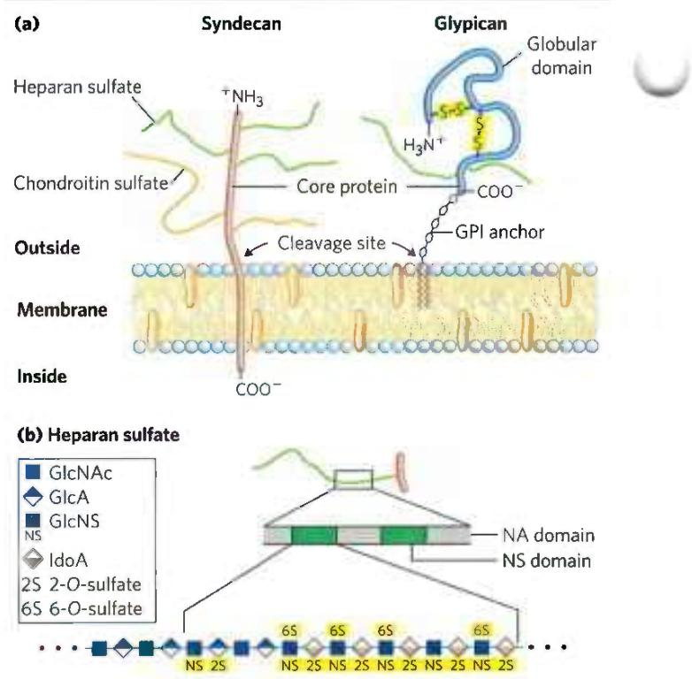  
FIGURE 7-22 Two families of membrane proteoglycans. (a) Syndecans and glypicans can be shed from the membrane by enzymatic cleavage near the outer membrane surface. (b) Along a heparan sulfate chain, regions rich in sulfated sugars, the NS domains (green), alternate with regions with chiefly unmodified residues of GlcNAc and GlcA, the NA domains (gray). One of the NS domains is shown in more detail, revealing a high density of modified residues: GlcNS (N-sulfoglucosamine) and both GlcA and IdoA, with a sulfate ester at C-2. [(a) Information from U. Häcker et al., Nature Rev. Mol. Cell Biol. 6:530, 2005. (b) Information from J. Turnbull et al., Trends Cell Biol. 11:75, 2001.]

The glycosaminoglycan chains in proteoglycans can bind to a variety of extracellular ligands and thereby modulate the ligands' interaction with specific receptors of the cell surface. Detailed studies of heparan sulfate demonstrate a domain structure that is not random; some domains (typically three to eight disaccharide units long) differ from neighboring domains in sequence and in ability to bind to specific proteins. Highly sulfated domains (called NS domains) alternate with domains having unmodified GlcNAc and GlcA residues (N-acetylated, or NA, domains) (Fig. 7-22b). The exact pattern of sulfation in the NS domain depends on the particular proteoglycan; given the number of possible modifications of the GlcNAc–IdoA (iduronic acid) dimer, at least 32 different disaccharide units are possible. Furthermore, the same core protein can display different heparan sulfate structures when synthesized in different cell types.

Heparan sulfate molecules with precisely organized NS domains bind specifically to extracellular proteins and signaling molecules to alter their activities. The change in activity may result from a conformational change in the protein that is induced by the binding (Fig. 7-23a), or it may be due to the ability of adjacent domains of heparan sulfate to bind to two different proteins, bringing them into close proximity and enhancing protein-protein interactions (Fig. 7-23b). A third general mechanism of action is the binding of extracellular signal molecules (growth factors, for example) to heparan sulfate, which increases their local concentrations and enhances their interaction with growth factor receptors on the cell surface; in this case, the heparan sulfate acts as a coreceptor (Fig. 7-23c). For example, fibroblast growth factor (FGF), an extracellular protein signal that stimulates cell division, first binds to heparan sulfate moieties of syndecan molecules in the target cell's plasma membrane. Syndecan presents FGF to the FGF plasma membrane receptor, and only then can FGF interact productively with its receptor to trigger cell division. Finally, in another type of mechanism, the NS domains interact — electrostatically and otherwise — with a variety of soluble molecules outside the cell, maintaining high local concentrations at the cell surface (Fig. 7-23d).

The protease thrombin, essential to blood coagulation (see Fig. 6-44), is inhibited by another blood protein, antithrombin, which prevents premature blood clotting. Antithrombin does not bind to or inhibit thrombin in the absence of heparan sulfate. In the presence of heparan sulfate or heparin, the binding affinity of thrombin for antithrombin increases 2,000-fold, and thrombin is strongly inhibited. When thrombin and antithrombin are crystallized in the presence of a short (16 residue) segment of

(a) Conformational activation

  
A conformational change induced in the protein antithrombin (AT) on binding a specific pentasaccharide NS domain allows its interaction with blood clotting factor Xa, preventing clotting.

(c) Coreceptor for extracellular ligands  
(b) Enhanced protein-protein interaction  
  
Binding of AT and thrombin to two adjacent NS domains brings the two proteins into close proximity, favoring their interaction, which inhibits blood clotting.

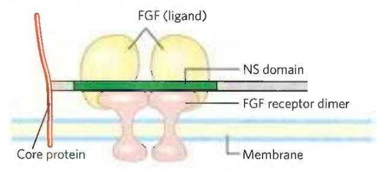  
NS domains interact with both the fibroblast growth factor (FGF) and its receptor, bringing the oligomeric complex together and increasing the effectiveness of a low concentration of FGF.

(d) Cell surface localization/concentration  
  
The high density of negative charges in heparan sulfate attracts positively charged lipoprotein lipase molecules and holds them by electrostatic and sequence-specific interactions with NS domains.

FIGURE 7-23 Four types of protein interactions with NS domains of heparan sulfate. [Information from J. Turnbull et al., Trends Cell Biol. 11:75, 2001.] heparan sulfate, the negatively charged heparan sulfate mimic is seen to bridge positively charged regions of the two proteins, causing an allosteric change that inhibits thrombin's protease activity (Fig. 7-24). The binding sites for heparan sulfate and heparin in both proteins are rich in Arg and Lys residues; the amino acids' positive charges interact electrostatically with the sulfates of the glycosaminoglycans. Antithrombin also inhibits two other blood coagulation proteins (factors IXa and Xa) in a heparan sulfate-dependent process.

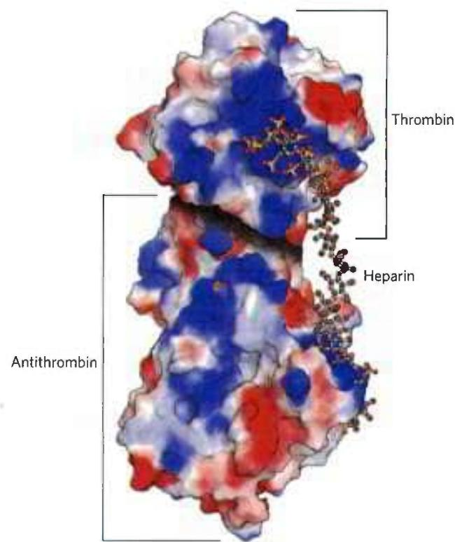  
FIGURE 7-24 Molecular basis for heparan sulfate enhancement of the binding of thrombin to antithrombin. In this crystal structure of thrombin, antithrombin, and a 16 residue heparan sulfate-like polymer, all crystallized together, the binding sites for heparan sulfate in both proteins are rich in Arg and Lys residues. These positively charged regions, shown in blue in this electrostatic representation of the proteins, allow strong electrostatic interaction with multiple negatively charged sulfates and carboxylates of the heparan sulfate. Consequently, the affinity of antithrombin for thrombin is three orders of magnitude greater in the presence of heparan sulfate than in its absence. [Data from PDB ID 1TB6, W. Li et al., Nat. Struct. Mol. Biol. 11:857, 2004.]

The importance of correctly synthesizing sulfated domains in heparan sulfate is demonstrated in mutant ("knockout") mice lacking the enzyme that sulfates the C-2 hydroxyl of iduronate (IdoA). These animals are born without kidneys and with severe developmental abnormalities of the skeleton and eyes. Other studies demonstrate that membrane proteoglycans are important in the liver for clearing lipoproteins from the blood. Finally, there is growing evidence that proteoglycans containing heparan sulfate and chondroitin sulfate provide directional cues for axon outgrowth, influencing the path taken by developing axons in the nervous system.

The functional importance of proteoglycans and the glycosaminoglycans associated with them can also be seen in the effects of mutations that block the synthesis or degradation of these polymers in humans (Box 7-3).

Some proteoglycans can form proteoglycan aggregates, enormous supramolecular assemblies of many core proteins all bound to a single molecule of hyaluronan (also called hyaluronate). Aggrecan core protein ( $M_{\mathrm{r}} \sim 250,000$ ) has multiple chains of chondroitin sulfate and keratan sulfate, joined to Ser residues in the core protein through trisaccharide linkers, to give an aggrecan monomer of $M_{\mathrm{r}} \sim 2 \times 10^{6}$ . When a hundred or more of these "decorated" core proteins bind a single, extended molecule of hyaluronan (Fig. 7-25), the resulting proteoglycan aggregate ( $M_{\mathrm{r}} > 2 \times 10^{8}$ ) and its associated water of hydration occupy a volume about equal to that of a bacterial cell! Aggrecan interacts strongly with collagen in the ECM of cartilage, contributing to the development, tensile strength, and resilience of this connective tissue.

Interwoven with these enormous extracellular proteoglycans are fibrous matrix proteins such as collagen, elastin, and fibronectin, forming a cross-linked meshwork that gives the whole ECM strength and resilience. Some of these proteins are multiadhesive, a single protein having binding sites for several different matrix molecules. Fibronectin, for example, has separate domains that bind fibrin, heparan sulfate, and collagen. Fibronectin and a number of other proteins in the extracellular matrix contain the conserved RGD sequence (Arg–Gly–Asp), through which they bind to a family of proteins called integrins. Integrins mediate signaling between the cell interior and the network of molecules in the ECM. The overall picture of cell-matrix

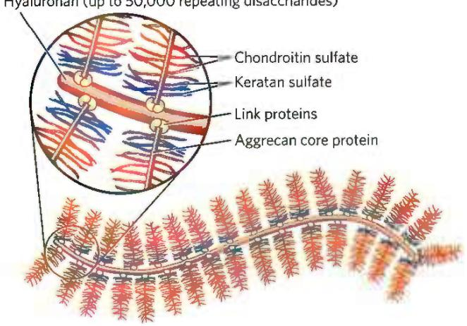  
FIGURE 7-25 Proteoglycan aggregate of the extracellular matrix. Schematic drawing of a proteoglycan with many aggrecan molecules. One very long molecule of hyaluronan is associated noncovalently with about 100 molecules of the core protein aggrecan. Each aggrecan molecule contains many covalently bound chondroitin sulfate and keratan sulfate chains. Link proteins at the junction between each core protein and the hyaluronan backbone mediate the core protein-hyaluronan interaction.

#### [EN] Defects in the Synthesis or Degradation of Sulfated Glycosaminoglycans Can Lead to Serious Human Disease

Glycosaminoglycan synthesis requires enzymes that activate monomeric sugars, transport them across membranes, condense the activated sugars into polysaccharides, and add sulfates. Mutations in any of these enzymes in humans can lead to structural defects in the glycosaminoglycan (or in the proteoglycans formed from them). The result can be any of a wide variety of defects in cell signaling, cell proliferation, tissue morphogenesis, or interactions with growth factors (Fig. 1). For example, failure to extend the disaccharide unit GlcNAc-GlcA leads to a bone abnormality in which multiple, large bone spurs develop (Fig. 2).

When the defect occurs in degradative enzymes, the accumulation of incompletely degraded glycosaminoglycans can produce diseases ranging from moderate, as in Scheie

  
FIGURE 1 A segment of proteoglycan showing the normal structure of the glycosaminoglycans (GAGs) chondroitin sulfate or dermatan sulfate (CS/DS) (top) and heparan sulfate or heparin (HS/Hep) (bottom), attached through the linkage region to a Ser residue in the core protein. When a specific biosynthetic enzyme is absent because of a mutation, the numbered elements cannot be added to the growing oligosaccharide, and the product is truncated. The dysfunctional GAGs result in several types of human disease, depending on the site of truncation: ① progeroid-type Ehlers-Danlos syndrome — with hyperextensible joints, fragile skin, and premature aging; ② short stature or frequent joint dislocations; ③ neuropathy (nerve damage); ④ skeletal defects; ⑤ bipolar disorder or diaphragmatic hernia; ⑥ and bone deformations in the form of large bone spurs.

interactions that emerges (Fig. 7-26) shows an array of interactions between cellular and extracellular molecules. These interactions serve not merely to anchor cells to the ECM, providing the strength and elasticity of skin and joints. P7 They also provide paths that direct the migration of cells in developing tissue and serve to convey information in both directions across the plasma membrane.

#### [EN] Glycoproteins Have Covalently Attached Oligosaccharides

Glycoproteins are carbohydrate-protein conjugates in which the glycans are branched and are much smaller and more structurally diverse than the huge glycosaminoglycans of proteoglycans. The carbohydrate is attached at its anomeric carbon through a glycosidic link to the —OH of a Ser or Thr residue (O-linked), or through an syndrome, with joint stiffening but normal intelligence and life span, to severe, as in Hurler syndrome, with enlarged internal organs, heart disease, dwarfism, intellectual disability, and early death. Glycosaminoglycans were formerly called mucopolysaccharides, and diseases caused by genetic defects in their breakdown are often still called mucopolysaccharidoses.

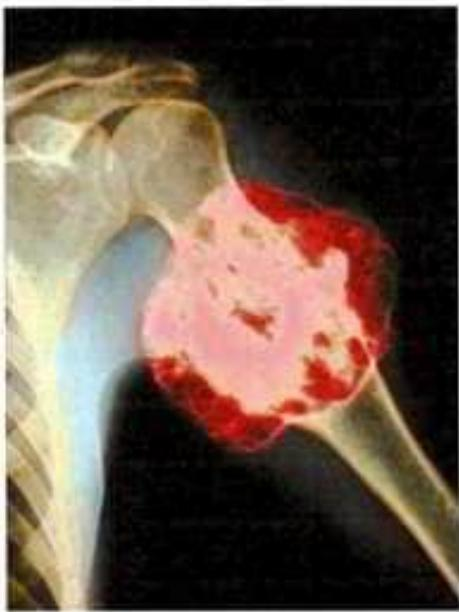  
FIGURE 2 Bone deformation characteristic of multiple hereditary exostoses, a disease resulting from a genetic inability to add the GlcNAc-GlcA disaccharide to the growing heparan sulfate or heparin chain (see 6 in Fig. 1). The extra bone growth is artificially colored red in this x-ray of the humerus (upper arm bone). [CNRI/Science Photo Library/Science Source.]

N-glycosyl link to the amide nitrogen of an Asn residue (N-linked) (Fig. 7-27). N-glycosyl bonds join the anomeric carbon of a sugar to a nitrogen atom in glycoproteins and nucleotides (see Fig. 8-1). Some glycoproteins have a single oligosaccharide chain, but many have more than one; the carbohydrate may constitute from 1% to 70% of the glycoprotein by mass. About half of all proteins of mammals are glycosylated.

As we shall see in Chapter 11, the external surface of the plasma membrane has many membrane glycoproteins with arrays of covalently attached oligosaccharides of varying complexity. Mucins are secreted or membrane glycoproteins that can contain large numbers of O-linked oligosaccharide chains. Mucins are present in most secretions; they are what gives mucus its characteristic slipperiness. Many of the proteins secreted by eukaryotic cells are glycoproteins, including most of the proteins of blood. For example, immunoglobulins (antibodies) and certain hormones, such as follicle-stimulating hormone, luteinizing hormone, and thyroid-stimulating hormone, are glycoproteins. Some of the proteins secreted by the pancreas are glycosylated, as are most of the proteins contained in lysosomes. Many milk proteins, including the major whey protein $\alpha$ -lactalbumin, are glycosylated.

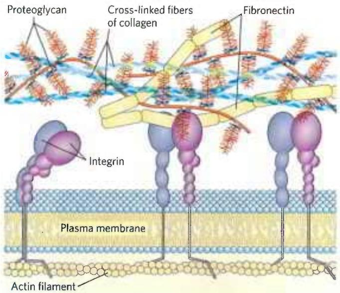  
FIGURE 7-26 Interactions between cells and the extracellular matrix. The association between cells and the proteoglycan of the extracellular matrix is mediated by a membrane protein (integrin) and by an extracellular protein (fibronectin, with its RGD motif) with binding sites for both integrin and the proteoglycan. Note the close association of collagen fibers with the fibronectin and proteoglycan.

Glycomics is the systematic characterization of all carbohydrate components of a given cell or tissue, including those attached to proteins and to lipids. For glycoproteins, this also means determining which proteins are glycosylated and where in the amino acid sequence each oligosaccharide is attached. This is a challenging undertaking, but worthwhile because of the potential insights it offers into normal patterns of glycosylation and the ways in which they are altered during development or in genetic diseases or cancer. Current methods of characterizing the entire carbohydrate complement of cells depend heavily on sophisticated application of nuclear magnetic resonance and mass spectrometry.

The structures of a large number of O- and N-linked oligosaccharides from a variety of glycoproteins are known; Figures 7-20 and 7-27 show a few typical examples. In Chapter 27, we consider the mechanisms by which specific proteins acquire specific oligosaccharide moieties.

What are the biological advantages of adding oligosaccharides to proteins? The very hydrophilic carbohydrate clusters alter the polarity and solubility of the proteins with which they are conjugated. P7 Oligosaccharide chains that are attached to newly synthesized proteins in the endoplasmic reticulum (ER) and elaborated in the Golgi complex serve as destination labels and also act in protein quality control, targeting misfolded proteins for degradation (see Figs. 27-38, 27-39). When numerous negatively charged oligosaccharide chains are clustered in a single region of a protein, the charge repulsion among them favors the formation of an extended, rodlike structure in that region. The bulkiness and negative charge of oligosaccharide chains also protect some proteins from attack by proteolytic enzymes.

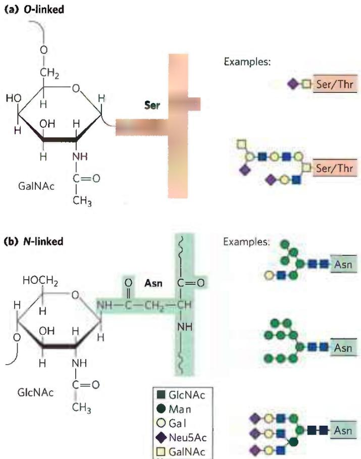  
FIGURE 7-27 Oligosaccharide linkages in glycoproteins. (a) O-linked oligosaccharides have a glycosidic bond to the hydroxyl group of Ser or Thr residues (light red), illustrated here with GalNAc as the sugar at the reducing end of the oligosaccharide. One simple chain and one complex chain are shown. (b) N-linked oligosaccharides have an N-glycosyl bond to the amide nitrogen of an Asn residue (green), illustrated here with GlcNAc as the terminal sugar. Three common types of oligosaccharide chains that are N-linked in glycoproteins are shown. A complete description of oligosaccharide structure requires specification of the position and stereochemistry ( $\alpha$ or $\beta$ ) of each glycosidic linkage.

Beyond these global physical effects on protein structure, there are also more specific biological effects of oligosaccharide chains in glycoproteins (Section 7.4). The importance of normal protein glycosylation is clear from at least 40 different genetic disorders of glycosylation having been found in humans, all causing severely defective physical or mental development; some of these disorders are fatal.

#### [EN] Glycolipids and Lipopolysaccharides Are Membrane Components

Glycoproteins are not the only cellular components that bear complex oligosaccharide chains; some lipids, too, have covalently bound oligosaccharides. Gangliosides are membrane lipids of eukaryotic cells in which the polar head group, the part of the lipid that forms the outer surface of the membrane, is a complex oligosaccharide containing a sialic acid (Fig. 7-9) and other monosaccharide residues. Some of the oligosaccharide moieties of gangliosides, such as those that determine human blood groups (see Fig. 10-13), are identical with those found in certain glycoproteins, which therefore also contribute to blood group type. Like the oligosaccharide moieties of glycoproteins, those of membrane lipids are generally, perhaps always, found on the outer face of the plasma membrane.

Lipopolysaccharides are the dominant surface feature of the outer membrane of gram-negative bacteria such as Escherichia coli and Salmonella typhimurium. These molecules are prime targets of the antibodies produced by the vertebrate immune system in response to bacterial infection and are therefore important determinants of the serotype of bacterial strains. (Serotypes are strains that are distinguished on the basis of antigenic properties.) The lipopolysaccharides of S. typhimurium contain six fatty acids bound to two glucosamine residues, one of which is the point of attachment for a complex oligosaccharide (Fig. 7-28). E. coli has similar but unique lipopolysaccharides. The lipid A portion of the lipopolysaccharides of some bacteria is called endotoxin; its toxicity to humans and other animals is responsible for the dangerously lowered blood pressure that occurs in toxic shock syndrome resulting from gram-negative bacterial infections.

#### [EN] SUMMARY 7.3 Glycoconjugates: Proteoglycans, Glycoproteins, and Glycolipids

■ Proteoglycans are huge molecules in which one or more large glycans, called sulfated glycosaminoglycans (heparan sulfate, chondroitin sulfate, dermatan sulfate, or keratan sulfate), are covalently attached to a core protein. Bound to the outside of the plasma membrane through a peptide or lipid, proteoglycans provide points of adhesion, recognition, and information transfer between cells, or between a cell and the extracellular matrix. In the extracellular matrix, enormous proteoglycan aggregates form, bound to a long hyaluronan molecule.

■ Glycoproteins contain oligosaccharides covalently linked to Asn, Ser, or Thr residues. The oligosaccharides are typically branched and smaller than glycosaminoglycans. Many cell surface or extracellular proteins are glycoproteins, as are most secreted proteins. The covalently attached oligosaccharides influence the folding and stability of the proteins, provide critical information about the targeting of newly synthesized proteins, and allow specific recognition by other proteins.

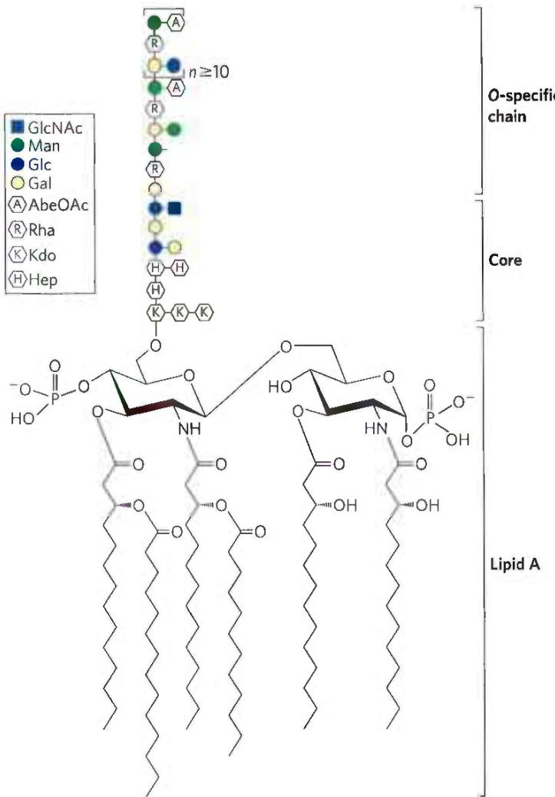  
FIGURE 7-28 Bacterial lipopolysaccharides. Schematic diagram of the lipopolysaccharide of the outer membrane of S. typhimurium. Kdo is 3-deoxy-D-manno-octulosonic acid (previously called ketodeoxyoctonic acid); Hep is L-glycero-D-manno-heptose; AbeOAc is abequose (a 3,6-dideoxyhexose) acetylated on one of its hydroxyls. Different bacterial species have subtly different lipopolysaccharide structures, but they have in common a lipid A region, composed of six fatty acid residues and two phosphorylated glucosamines, a core oligosaccharide, and an "O-specific" chain, which is the principal determinant of the serotype (immunological reactivity) of the bacterium. The outer membranes of the gram-negative bacteria S. typhimurium and E. coli contain so many lipopolysaccharide molecules that the cell surface is almost completely covered with O-specific chains.

■ Glycolipids and glycosphingolipids in plants and animals and lipopolysaccharides in bacteria are components of the cell envelope, with covalently attached oligosaccharide chains exposed on the cell's outer surface.

<!-- EN-END 7.3 -->

## 七、糖类作为生物信息分子:糖密码

研究糖缀合物的结构和功能的糖生物学(glycobiology)是生物化学和细胞生物学中最活跃和最令人兴奋的领域之一。已经越来越清楚，细胞利用专一的寡糖编码有关新生肽链折叠和缔合、蛋白质(包括某些酶和激素以及免疫球蛋白)生物活性、蛋白质胞内定位、细胞-细胞识别和黏着、细胞分化、组织发育以及胞外信号等的重要信息。

分析寡糖和多糖结构的一些改进方法揭示出糖蛋白和糖脂的寡糖是十分复杂和多种多样的。图9-41中所示的寡糖链是在许多糖蛋白中存在的，其中最复杂的含有4种不同、共14个单糖残基，连键有 $(1\rightarrow 2)$ 、 $(1\rightarrow 3)$ 、 $(1\rightarrow 4)$ 、 $(1\rightarrow 6)$ 、 $(2\rightarrow 3)$ 和 $(2\rightarrow 6)$ ，异头碳构型有些是 $\alpha$ ，有些是 $\beta$ 的；分支的结构在蛋白质和核酸中不存在，但在寡糖中却是常见现象。我们不难算出，利用20种不同的单糖来构建寡糖，能形成几十亿不同的六聚体；当用20种常见氨基酸来构建寡肽，得到的不同六肽总数是 $4.6\times 10^{7}(A_{20}^{6} = 20^{6})$ ；用4种不同的核苷酸单体构建寡核苷酸，得到不同的六核苷酸数目是 $4096(4^{6})$ 。如果我们还允许寡糖中有一个或多个单糖残基硫酸化，则可能的寡糖数目还会增加几个数量级。但发现实际上总是低于这种可能的组合数目，因为这受到生物合成的酶和可利用的前体的硬性限制。然而聚糖中含有极其丰富的结构信息，在一个适中大小的分子中所含的信息密度不仅比得上而且远超过核酸。图9-41中表示的每一寡糖代表三维颜面（three-dimensional face），也即糖密码中的一个词，能被与之相互作用的蛋白质所阅读。

下面举几个例子说明糖缀合物聚糖链的多样性和各种生物学功能。寡糖的生物合成(第21章)和寡糖链在糖蛋白上的组装(第33章)放在以后讨论。

## （一）糖链的生物学功能是多种多样的

糖缀合物糖链的生物学作用是通过它的糖链与蛋白质之间的分子识别(结合)完成的。分子识别(molecular recognition)是指生物分子间的选择性相互作用,例如抗体与抗原之间、酶与底物或抑制剂之间和激素与受体之间的专一性结合。实现分子识别,要求①两个分子的结合部位是互补的;②两个结合部位有相应的基团,相互间能产生足够的作用力,使两者非共价地结合在一起。至于细胞-细胞识别(cell-cell recognition)实际上就是两个细胞表面的分子相互识别。分子识别常表现为受体与配体的相互作用。受体一般是指位于细胞膜上、能跟来自胞外的信号分子专一结合并将它带来的信息传递给效应器(如离子通道、酶等)从而引起相应的生物效应的大分子,它们多数是蛋白质。配体是指被受体识别并结合的生物活性分子(信号分子),包括激素、神经递质和细胞黏着分子等内源性配体和药物、毒素、抗原和病原体等外源性配体;配体可能是小分子也可能是大分子。受体和配体有时很难区分,特别是在细胞-细胞识别中。

（1）糖链与血循环中的蛋白质寿命 循环在血液中的某些肽激素具有强力影响它们的循环半寿期的聚糖部分。黄体生成素和促甲状腺素(垂体产生的多肽激素)含有以 GalNAc4S( $\beta1\rightarrow4$ ) GlcNAc 二糖为非还原端的 N-连接型寡糖链,此二糖能被肝细胞上的一个受体(凝集素)所识别。受体-激素相互作用介导黄体生成素和促甲状腺素的吸收和破坏,降低它们在血液中的浓度。因此这些激素的血液水平发生周期性的升高(由于垂体的脉冲式分泌)和降落(因为被肝细胞连续破坏)。

许多血浆糖蛋白的寡糖链末端是 NeuNAc(Sia) 残基, 它保护这些蛋白质免于在肝中被摄取和降解。例如在血液中运载铜的血浆铜蓝蛋白 (ceruloplasmin), 它有几个以 Sia 结尾的寡糖链。从血清糖蛋白中除去唾液酸的机制尚不清楚, 可能是由于入侵生物产生的或机体自身分泌的神经氨酸酶 (neuraminidase) 也称唾液酸酶 (sialidase) 的活动结果。切去末端 NeuNAc 而暴露出半乳糖残基的寡糖链很快被肝细胞质膜上的无唾液酸糖蛋白受体或称半乳糖结合受体 (凝集素分子) 所识别并结合, 血浆铜蓝蛋白-受体复合物通过胞吞被肝细胞内化, 血浆铜蓝蛋白在溶酶体内被降解。

实验证明,从哺乳类的血循环中清除“老”红细胞也采取类似的机制。新合成的红细胞含有几个膜糖蛋白,这些糖蛋白的寡糖链是以 Sia 残基结尾的。当使用回收曾在体外用唾液酸酶处理过的实验动物血样再重新注回血循环中的方法除去唾液酸残基后,经处理过的红细胞在几小时内就从血流中消失。具有完整寡糖链的红细胞(也经回收和重注的步骤,但未用唾液酸酶处理)能继续循环数天。

血循环中的蛋白质在一段时间内(从几小时到若干周),末端 Sia 残基逐个地被断裂。糖蛋白循环越久,Sia 残基除去越多,Gal 残基暴露也越多,最终被肝细胞受体结合。实质上,这里糖链或唾液酸是蛋白质在循环中已待了多久的标示物 (marker),是给那些行将更替的“老”蛋白质发信号的“定时器”。末端唾液酸残基从糖蛋白中除去的速率是由蛋白质结构本身决定的。因此蛋白质被设计成具有寿命的分子,从几小时到若干周,这取决于生理的需要。

（2）糖链与细胞-细胞识别和黏着 细胞黏着是进化中随着多细胞生物出现的必然现象。多细胞生物中细胞具有相互识别而聚集成细胞群的能力，即所谓细胞-细胞黏着（cell-cell adhesion）。细胞群或组织中细胞与细胞之间充满着由糖蛋白（胶原蛋白、纤连蛋白等）、蛋白聚糖、透明质酸等组成的胞外基质。细胞-细胞黏着，细胞-ECM黏着都是通过相关的内在膜蛋白[质]完成的。这些内在膜蛋白称为细胞黏着分子（cell adhesion molecule, CAM），包括整联蛋白(integrin)、L-选择蛋白(L-selectin)和E-选择蛋白等（见后面凝集素部分）。CAM绝大多数都是含N-连接型寡糖链的糖蛋白，例如整联蛋白，它有多个N-糖基化位点。去寡糖链的整联蛋白完全失去与纤连蛋白的黏着能力。

某些微生物病原体对宿主的侵染是由凝集素介导的。细菌凝集素能识别宿主细胞表面上糖蛋白和糖脂的寡糖链。例如，幽门螺旋杆菌(Helicobacter pylori)具有一种表面凝集素，能黏着在胃的内表面上皮细胞的表面寡糖上。在诸多寡糖中能被幽门螺旋杆菌凝集素识别的是寡糖路易斯b(Lewis b, Le $^{b}$ ), Le $^{b}$ 存在于规定O血型的糖蛋白和糖脂中(见表9-4中Le $^{b}$ 与O抗原)。这些观察有助于解释O型血的人比其他血型A或B的患胃溃疡的风险高几倍的原因，因为幽门螺旋杆菌攻击他们的表皮细胞更为有效。化学合成的Le $^{b}$ 寡糖类似物已被证实可用于治疗这种类型的溃疡病。采取口服能阻止细菌的黏着(因此也抑制其侵染），这是由于药物与胃内壁上的糖蛋白竞争跟细菌表面凝集素结合。

（3）寡糖链与淋巴细胞归巢 循环在血液中的淋巴细胞群倾向于回到它原先的淋巴细胞组织如淋巴结等，这一回归现象称为淋巴细胞归巢（lymphocyte homing）。归巢行为也是一种细胞-细胞识别和黏着，由淋巴细胞表面上的归巢受体（L-选择蛋白）和淋巴结微静脉内皮细胞上的一种含寡糖链配体（E-选择蛋白）的相互作用介导的。受体L-选择蛋白含有糖[质]识别域，专一识别配体E-选择蛋白上岩藻糖基化的寡糖链。配体E-选择蛋白是有组织专一性的黏着分子。不同的淋巴细胞群含有识别不同配体的归巢受体（L-选择蛋白），因此它被靶向（或称归巢）到专一的淋巴器官。例如B淋巴细胞主要归巢到黏膜缔合淋巴组织，而T淋巴细胞归巢到淋巴结。研究表明，肿瘤细胞的转移和归巢（转移至靶组织）都与CAM及其介导的黏着行为发生改变有关。

## （二）凝集素是阅读糖密码和介导多种生物学过程的蛋白质

凝集素(lectin)存在于所有生物包括动物、植物和微生物中,它是一类专一而高亲和地与糖[质]非共价结合的蛋白质。凝集素结构中含有糖[质]识别域(carbohydrate recognition domain,CRD)或称糖[质]结合域(CBD),在凝集素的糖结合域中有若干关键性位置的成氢键基团能与专一寡糖链的相应基团键合,并因此能精细地区别很相似的寡糖链结构。

凝集素最先是从植物中发现的，并因此曾称植物凝集素（phytoagglutinin）。例如，伴刀豆凝集素A（concanavalin A），分离自刀豆（Canavalia ensiformis），和植物凝血素（phytohemagglutinin），提取自红肾豆（phaseolus vulgaris），它能凝集红细胞。植物凝集素在种子中很丰富，它可能用作对付昆虫和其他捕食者的拒食剂（deterrent）。实验室中纯化的凝集素常被用来检测和分离（以亲和层析形式）聚糖和含不同聚糖链的糖蛋白。

凝集素介入的生物学过程十分广泛,凡寡糖链涉及的生物学作用都有它的参与,包括细胞-细胞识别和黏着、信号传递和新合成的蛋白质胞内定位等过程。下面我们讨论凝集素在人体和动物细胞中所起作用的几个例子。

细胞表面的凝集素对某些人类疾病的发展很重要——包括人凝集素和侵染者凝集素。与白细胞关系密切的选择蛋白是质膜凝集素的一个家族。此家族中已知有 P、L 和 E 三类，P-选择蛋白存在于血小板和内皮细胞，L-选择蛋白存在于淋巴细胞和其他白细胞，E-选择蛋白发现于内皮细胞。选择蛋白在许多细胞过程（淋巴细胞归巢、免疫应答、炎症反应等）中参与细胞-细胞识别和黏着，有些已在前面述及。这里举一个炎症反应的例子：在炎症过程中免疫细胞（嗜中性颗粒细胞，白细胞的一种）在侵染或炎症部位穿过毛细血管壁从血液移动到组织。在一个侵染部位，毛细血管内皮细胞上的 P-选择蛋白与血循环中白细胞的表面糖蛋白的一个专一性寡糖链相互作用；这一相互作用减慢了白细胞沿毛细血管内皮衬膜滚动的速度。另一个相互作用是在白细胞质膜中的整联蛋白和内皮细胞表面上的一个黏着蛋白质之间发生，这一相互作用停止了白细胞的滚动，并允许白细胞穿过毛细血管壁进入被侵染的组织以发动免疫攻击。

人体选择蛋白在类风湿性关节炎、气喘、银屑病、多发性硬化和被移植器官排异，作用中介导炎症反应，因此开发抑制选择蛋白介导的细胞黏着的药物是很有意义的。许多癌能表达一个在正常情况下只存在于胎细胞的抗原（唾液酸路易斯X，或唾液酸 $\mathrm{Le}^{\mathrm{X}}$ ）。当把这种抗原输入血循环中，肿瘤细胞就容易存活和转移。模拟唾液酸糖蛋白的唾液酸 $\mathrm{Le}^{\mathrm{X}}$ 部分的糖衍生物或者改变这个寡糖的生物合成，可以证明它作为治疗慢性炎症或转移性疾病的选择蛋白专一性药物是有效的。

霍乱毒素分子是霍乱弧菌(Vibrio cholerae)产生的。当毒素进入肠细胞后引起肠壁分泌大量水分(和无机盐)和腹泻。此毒素通过肠上皮细胞表面上的神经节苷脂GM1(一种膜磷脂,见第10章)的寡糖链连接于它的靶细胞。同样,百日咳杆菌(Bordelella pertussis)产生的百日咳毒素,只要跟宿主细胞的一个(或许几个)携有末端唾液酸残基的寡糖链相互作用后就能进入靶细胞。了解这些毒素(凝集素)的寡糖结合位点细节可以开发基因工程生产的毒素类似物,以便用于疫苗。用基因工程方法使之缺失糖结合位点的毒素类似物将是无害的,因为它们不能与细胞结合,因而也不能进入细胞,但能诱出免疫应答,从而保护细胞免于暴露于这种天然病毒中。也可以设想这些药物是这样起作用的:通过模仿细胞表面寡糖,跟细菌凝集素或毒素结合,阻止它们大量结合到细胞表面。

某些最具破坏性的人类寄生虫病,广泛分布在许多发展中国家,这是由显露特殊寡糖链的真核微生物引起的，在某些病例中已知寡糖链对寄生虫有保护作用。这些寄生虫包括：锥虫，非洲昏睡病（African sleeping sickness）和Chagas病（南美洲锥虫病）的病原体；恶性疟原虫（Plasmodium falciparum），疟疾寄生虫；溶组织内阿米巴（Entamoeba histolytica），阿米巴痢疾的病原体。寻找干扰这些特殊寡糖链合成并因而干扰这些寄生虫复制的药物，其前景已鼓舞很多与这些寡糖生物合成途径相关的研究。

某些动物病毒,包括流感病毒(influenza virus),是通过跟宿主细胞表面上的寡糖链相互作用而与它们的宿主细胞连接的。流感病毒的凝集素称为血凝素(hemagglutinin)或HA蛋白,它是病毒进入和侵染所必需的。在病毒进入宿主细胞并被复制后,新合成的病毒颗粒芽出细胞,覆盖在它的一部分质膜上。病毒的唾液酸酶(神经氨酸酶)剪去宿主细胞寡糖链的末端唾液酸残基,从与细胞的相互作用中释放出病毒颗粒,并防止它们彼此凝集。此时下一轮的侵染才可以开始。抗病毒药物Oseltamivir(商品名Tamiflu,达菲)和Zanamivir(商品名Relenza)临床上被用于治疗流感。这些药物是糖(唾液酸)的类似物,是病毒唾液酸酶的竞争性抑制剂(图9-42),通过与宿主细胞寡糖竞争跟酶结合,抑制病毒唾液酸酶。这阻止了病毒从被侵染细胞中释放,也引起病毒颗粒凝集,两者的作用阻断了下一轮的侵染。

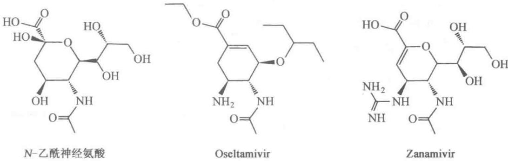  
图 9-42 抗病毒药物 Oseltamivir 和 Zanamivir 是病毒神经氨酸酶的竞争性抑制剂  
图中示出药物结构与唾液酸结构“似是而非，以假乱真”以达到抑制的目的

## （三）凝集素-糖相互作用是高专一性和多价的

寡糖结构中的高密度信息给糖密码提供了几乎是无限数目的独特的“词”，词小但足以让单个蛋白质阅读它。凝集素在它们的糖结合位点有着精巧的分子互补性，允许只与正确的有关糖质发生相互作用。其结果是在这些相互作用中专一性非常的高。一个寡糖和凝集素的一个个别糖结合域（CBD）之间的亲和力有时是不大的（ $K_{d}$ 在微摩尔和毫摩尔之间），但在多数情况下有效亲和力因凝集素的多价性（指一个凝集素分子有多个CBD）而有很大的增加。在成簇的寡糖中（例如在膜表面常有的那样），每个寡糖链都

占据凝集素的一个 CBD, 因而加强了相互作用。当细胞表达多个凝集素受体时, 相互作用的亲和力可以是很大的, 成为高协同的过程, 如细胞的黏着和滚动。

6-磷酸甘露糖受体(凝集素)结构的X射线晶体学研究揭示了,受体与6-磷酸甘露糖相互作用的细节,解释了凝集素-糖相互作用中的结合专一性和一个二价阳离子作用。受体的His105(第105位His)是跟磷酸基的一个氧原子氢键键合的。当标有6-磷酸甘露糖的蛋白质到达溶酶体(它内部的pH比高尔基体的低)时,受体就失去对6-磷酸甘露糖的亲和力,而把它连同它标记的蛋白质一起释放到溶酶体。His105的质子化可能负责结合方面的这一变化。

除了这种很专一的相互作用外,还有较一般的相互作用,它对很多糖质跟凝集素的结合作出贡献。例如许多糖质有极性较大的和极性较小的两个面(图9-43),极性较单糖残基,如半乳糖,具有较极性的一面(这里是椅式的顶面,有环氧和几个羟基),这一面可与凝集素氢键键合,和极性小的一面,此面能与蛋白质的非极性链如Trp残基的吲哚环相互作用

  
图9-43 单糖残基的疏水相互作用

大的一面跟凝集素氢键结合,极性较小的一面跟非极性氨基酸残基发生疏水相互作用。这些相互作用的总和产生高亲和的结合,以及凝集素对其糖质的高专一性。这代表了一类在细胞内和细胞之间发生的许多过程中主要信息传递方式。

## （四）血型决定簇是寡糖

1900 年奥地利医生 Landsteiner 首次发现了血型物质（血型抗原），并提出了 ABO 血型系统（ABO blood group system）。此后在人红细胞表面找到了 100 多种血型 [抗原] 决定簇，其中很多是寡糖，分属于 20 多个独立的血型系统。研究最多的是 ABO 系统和与之关系密切的 Lewis 血型系统，其次是 Rh 血型系统。

从红细胞膜中提取的血型抗原称为凝集原（agglutinogen）。在 ABO 系统中，A 型血的红细胞具有凝集原 A；B 型血具有凝集原 B；AB 型血兼有凝集原 A 和 B；O 型血既不具有凝集原 A，也不具有凝集原 B。凝集原 A 和 B 以糖脂和糖蛋白等形式存在。凝集原的血型决定簇是寡糖（见表 9-4），它在鞘糖脂中通过乳糖基与神经酰胺（符号为 Cer，见第 10 章）C1 位的羟基相连：血型决定簇 → Galβ 1→4 Glcβ 1→1 Cer（式中用粗体标出的部分是乳糖基）；在糖蛋白中存在于 N-连接型或 O-连接型糖链。ABO 血型抗原在多数个体中除分布在红细胞膜和大多数其他细胞膜外，还以不同浓度存在于血浆、唾液和乳汁等体液中。

表 9-4 人 ABH 和 Lewis 抗原决定簇的结构

<table><tr><td>血型物质</td><td>结构</td></tr><tr><td>I型前体</td><td> $\text{Gal}(\beta 1 \rightarrow 3) \text{GlcNAc}(\beta 1 \rightarrow \cdots\cdots \rightarrow (\text{蛋白质或脂质})$ </td></tr><tr><td>II型前体</td><td> $\text{Gal}(\beta 1 \rightarrow 4) \text{GlcNAc}(\beta 1 \rightarrow \cdots\cdots \rightarrow (\text{蛋白质或脂质})$ </td></tr><tr><td>O抗原(H物质)</td><td> $\text{L-Fuc}(\alpha 1 \rightarrow 2) \text{Gal}(\beta 1 \rightarrow 3/4) \text{GlcNAc}(\beta 1 \rightarrow \cdots\cdots$ </td></tr><tr><td>A抗原</td><td> $\text{GalNAc}(\alpha 1 \searrow 3)$  $\text{L-Fuc}(\alpha 1 \nearrow 2)$  $\text{Gal}(\beta 1 \rightarrow 3/4) \text{GlcNAc}(\beta 1 \rightarrow \cdots\cdots$ </td></tr><tr><td>B抗原</td><td> $\text{Gal}(\alpha 1 \searrow 3)$  $\text{L-Fuc}(\alpha 1 \nearrow 2)$  $\text{Gal}\beta 1 \rightarrow 3/4 \text{GlcNAc}(\beta 1 \rightarrow \cdots\cdots$ </td></tr><tr><td>Lea</td><td> $\text{Gal}(\alpha 1 \searrow 3)$  $\text{L-Fuc}(\alpha 1 \nearrow 4)$  $\text{GlcNAc}(\beta 1 \rightarrow \cdots\cdots$ </td></tr><tr><td>Leb</td><td> $\text{L-Fuc}(\alpha 1 \rightarrow 2) \text{Gal}(\beta 1 \searrow 3)$  $\text{L-Fuc}(\alpha 1 \nearrow 4)$  $\text{GlcNAc}(\beta 1 \rightarrow \cdots\cdots$ </td></tr></table>

血清中含有另一些物质,称为同种红细胞凝集素(isohemagglutinin)或凝集素,它是凝集原的抗体,一般为IgM类。A型个体血清中含有凝集素β(或称抗B凝集素,简称抗B),B型者含有凝集素α(抗A凝集素,抗A),O型者兼含凝集素α和β,AB型者既无α也无β。凝集素是在生命早期由肠道微生物表面上的凝集原A样和B样表位(抗原决定簇)诱导产生的。例如A型者对微生物表面的B样表位发生应答产生抗B,但对微生物表面的A样表位不发生应答,因为体内存在自身耐受机制(见第4章)。由于这些凝集素尚未暴露在相应的凝集原下就已存在,因此称它们为天然抗体。凝集素α可与凝集原A发生凝集,凝集素β可与凝集原B发生凝集。输血时血型不合会引起红细胞聚集,因此临床上力求输同型血。ABO血型与凝集原、凝集素的相互关系见表9-5。

表 9-5 ABO 血型(表型)、基因型、凝集原和凝集素

<table><tr><td>血型(表型)</td><td>基因型</td><td>凝集原(在红细胞表面)</td><td>凝集素(在血清中)</td></tr><tr><td>A</td><td> $I^{A}I^{A}(AA)$ 或 $I^{Ai}(AO)$ </td><td>A</td><td>抗B( $\beta$ )</td></tr><tr><td>B</td><td> $I^{Bi}I^{Bi}(BB)$ 或 $I^{Bi}(BO)$ </td><td>B</td><td>抗A( $\alpha$ )</td></tr><tr><td>AB</td><td> $I^{AI^{B}}(AB)$ </td><td>A和B</td><td>无抗A无抗B</td></tr><tr><td>O</td><td>ii(OO)</td><td>无A无B</td><td>抗A和抗B</td></tr></table>

血型是遗传的，血型抗原受基因支配。基因支配的直接产物是专一的糖基转移酶，再由这些转移酶实现血型决定簇的合成。人ABO血型的抗原系统是ABH。支配H抗原（常称H物质）的基因称H基因，它位于第19对染色体。H基因编码 $\alpha 1\rightarrow 2 - L$ -岩藻糖基转移酶（ $\alpha 1\to 2 - L$ -fucosyl transferase；简称 $\alpha 1\rightarrow 2$ FucT）。此酶催化L-岩藻糖以 $(\alpha 1\rightarrow 2)$ 连键于血型前体寡糖的非还原端Gal残基连接，使前体转变为H物质。前体寡糖是连接在蛋白质或脂质的一个以二糖基，Gal $(\beta 1\rightarrow 3 / 4)$ GlcNAc $(\beta 1\rightarrow$ ，为非还原端的糖链上的。此 $N-$ 乙酰乳糖胺二糖基是ABH和Lewis抗原决定簇中共有的结构。根据此二糖基中糖苷键的类型不同，前体物质被分为I型 $(\beta 1\rightarrow 3)$ 和Ⅱ型 $(\beta 1\rightarrow 4)$ 。人ABH抗原可从I型和Ⅱ型衍生而来，而Lewis血型抗原 $\mathrm{Le}^{\mathrm{a}}$ 和 $\mathrm{Le}^{\mathrm{b}}$ 只由I型前体合成。前体物质以及ABH和Lewis抗原决定簇的结构见表9-4。支配ABO血型的基因位于第9对染色体。它们是典型的复等位基因(multiple allele): $I^{\mathrm{A}}$ (A基因)、 $I^{\mathrm{B}}$ (B基因）和 $i$ (O基因)。对于一个个体来说一对同源染色体只能有其中的两个等位基因，例如 $I^{\mathrm{A}}$ 和 $i$ ，或 $I^{\mathrm{A}}$ 和 $I^{\mathrm{B}}$ 。因此人群中三个复等位基因 $(I^{\mathrm{A}},I^{\mathrm{B}}$ 和 $i$ )可以组合成6种基因型 $(I^{\mathrm{A}},I^{\mathrm{A}},I^{\mathrm{A}}i,$ 等)， $I^{\mathrm{A}}$ 或 $I^{\mathrm{B}}$ 对 $i$ 是显性， $I^{\mathrm{A}}$ 和 $I^{\mathrm{B}}$ 是共显性，因而只呈现4种表型(A、B、AB和O)，见表9-5。

A 基因编码 $\alpha1\rightarrow3-N-$ 乙酰半乳糖胺基转移酶 ( $\alpha1\rightarrow3GalNAc T$ ); B 的基因编码 $\alpha1\rightarrow3-$ 半乳糖基转移酶 ( $\alpha1\rightarrow3Gal T$ ); 这两个转移酶均由 353 个氨基酸残基组成, 它们的氨基酸序列只有 4 个残基不同, 反映在其等位基因上是 4 个碱基差异:

<table><tr><td>氨基酸残基序数</td><td>176</td><td>235</td><td>266</td><td>268</td></tr><tr><td> $\alpha 1 \rightarrow 3\text{GaINAcT}$ </td><td>Arg</td><td>Gly</td><td>Leu</td><td>Gly</td></tr><tr><td>(A基因密码子)</td><td>(CGC)</td><td>(GGC)</td><td>(CTG)</td><td>(GGG)</td></tr><tr><td> $\alpha 1 \rightarrow 3\text{GaIT}$ </td><td>Gly</td><td>Ser</td><td>Met</td><td>Ala</td></tr><tr><td>(B基因密码子)</td><td>(GGC)</td><td>(AGC)</td><td>(ATG)</td><td>(GCG)</td></tr></table>

O 基因与 A 基因的差别只是在编码区的 5' 端缺失一个碱基（第 258 位 G），引起翻译时读框移位（reading frame shift），产生无糖基转移酶活性的蛋白质。由于 O 基因不能表达出任何能修饰 H 物质的酶，所以 H 抗原实际上就是血型 O 抗原。但是几乎所有个体都能产生 H 物质（只要 H 的基因是正常的），并且一般都不存在抗 H 抗体，因此 H 物质被认为是非抗原性的。

人第19对染色体还有一个基因是编码合成Lewis血型抗原的 $\alpha 1\rightarrow 3$ -岩藻糖基转移酶-Ⅲ（ $\alpha 1\to 3\mathrm{Fuc}$ T-Ⅲ），此酶兼有 $\alpha 1\to 4\mathrm{Fuc}$ T活性。 $\alpha 1\rightarrow 4\mathrm{Fuc}$ T活性催化向I型前体的或I型H物质的GlcNAc C4位转移 $\alpha -L - Fuc$ 残基，分别形成 $\mathrm{Le}^{\mathrm{a}}$ 或 $\mathrm{Le}^{\mathrm{b}}$ 。 $\mathrm{Le}^{\mathrm{b}}$ 也可以由H基因编码的 $\alpha 1\rightarrow 2$ FucT将 $\alpha -L - Fuc$ 转移至 $\mathrm{Le}^{\mathrm{a}}$ 的GalC2位而形成。 $\mathrm{Le}^{\mathrm{a}}$ 和 $\mathrm{Le}^{\mathrm{b}}$ 是可溶性血型物质，在血浆中能被红细胞吸附，使红细胞获得 $\mathrm{Le}^{\mathrm{a}}$ 或 $\mathrm{Le}^{\mathrm{b}}$ 抗原特异性，这样的红细胞能被抗 $\mathrm{Le}^{\mathrm{a}}$ 或抗 $\mathrm{Le}^{\mathrm{b}}$ 抗体所凝集。

<!-- EN-BEGIN 7.4 -->

### 【英文对应 7.4】Carbohydrates as Informational Molecules: The Sugar Code

> 来源：Lehninger Principles of Biochemistry（书籍/02_生物化学原理） 第7章 Carbohydrates and Glycobiology，§7.4。对应本章“七、糖类作为生物信息分子:糖密码”。

Glycobiology, the study of the structure and function of glycoconjugates, is one of the most active and exciting areas of biochemistry and cell biology. The challenge is to understand how P6 cells use specific oligosaccharides to encode important information about intracellular targeting of proteins, cell-cell interactions, cell differentiation and tissue development, and extracellular signals. Our discussion uses just a few examples to illustrate the diversity of structure and the range of biological activity of the glycoconjugates. In Chapter 20 we discuss the biosynthesis of polysaccharides, and in Chapter 27, the assembly of oligosaccharide chains on glycoproteins.

#### [EN] Oligosaccharide Structures Are Information-Dense

Improved methods for the analysis of oligosaccharide and polysaccharide structure have revealed remarkable complexity and diversity in the oligosaccharides of glycoproteins and glycolipids. Consider the oligosaccharide chains in Figure 7-27, typical of those found in many glycoproteins. The most complex of those shown contains 14 monosaccharide residues of four different kinds, variously linked as (1→2), (1→3), (1→4), (1→6), (2→3), and (2→6), some with the α and some with the β configuration. Branched structures, not found in nucleic acids or proteins, are common in oligosaccharides. With the reasonable assumption that 20 different monosaccharide subunits are available for construction of oligosaccharides, we can calculate that many billions of different hexameric oligosaccharides are possible; this compares with $6.4 \times 10^{7}(20^{6})$ different hexapeptides possible for the 20 common amino acids, and 4,096 ( $4^{6}$ ) different hexanucleotides for the four nucleotide subunits. If we also allow for variations in oligosaccharides resulting from sulfation of one or more residues, the number of possible oligosaccharides increases by two orders of magnitude. In reality, only a subset of possible combinations is found, given the restrictions imposed by the biosynthetic enzymes and the availability of precursors. Nevertheless, the enormously rich structural information in glycans does not merely rival but far surpasses that of nucleic acids in the density of information contained in a molecule of modest size. Each of the oligosaccharides represented in Figures 7-20 and 7-27 presents a unique, three-dimensional face—a word in the sugar code—readable by the proteins that interact with it.

#### [EN] Lectins Are Proteins That Read the Sugar Code and Mediate Many Biological Processes

P6 Lectins bind carbohydrates with high specificity and with moderate to high affinity. These proteins serve in a wide variety of cell-cell recognition, signaling, and adhesion processes and in intracellular targeting of newly synthesized proteins. Plant lectins, abundant in seeds, probably serve as deterrents to insects and other predators. In the laboratory, purified plant lectins are useful reagents for detecting and separating glycans and glycoproteins with different oligosaccharide moieties. Here we discuss just a few examples of the roles of lectins in animal cells.

Some peptide hormones that circulate in the blood have oligosaccharide moieties that strongly influence their circulatory half-life. Luteinizing hormone and thyrotropin (polypeptide hormones produced in the pituitary) have N-linked oligosaccharides that end with the disaccharide GalNAc4S( $\beta$ 1→4)GlcNAc, which is recognized by a lectin (receptor) of hepatocytes. (GalNAc4S is N-acetylgalactosamine sulfated on the —OH group at C-4.) Receptor-hormone interaction mediates the uptake and destruction of luteinizing hormone and thyrotropin, reducing their concentration in the blood. Thus the blood levels of these hormones undergo a periodic rise (due to pulsatile secretion by the pituitary) and fall (due to constant destruction by hepatocytes).

Residues of Neu5Ac (a sialic acid) situated at the ends of the oligosaccharide chains of many plasma glycoproteins (Fig. 7-20) protect these proteins from uptake and degradation in the liver. For example, ceruloplasmin, a copper-containing serum glycoprotein, has several oligosaccharide chains ending in Neu5Ac. The mechanism that removes sialic acid residues from serum glycoproteins is unclear. It may be due to the activity of the enzyme neuraminidase (also called sialidase) produced by invading organisms or to a steady, slow release of the residues by extracellular enzymes. The plasma membrane of hepatocytes has lectin molecules (asialoglycoprotein receptors; "asialo-" indicating "without sialic acid") that specifically bind oligosaccharide chains with galactose residues no longer "protected" by a terminal Neu5Ac residue. Receptor-ceruloplasmin interaction triggers endocytosis and destruction of the ceruloplasmin.

  
N-Acetylneuraminic acid (Neu5Ac) (a sialic acid)

A similar mechanism is apparently responsible for removing "old" erythrocytes from the mammalian bloodstream. Newly synthesized erythrocytes have several membrane glycoproteins with oligosaccharide chains that end in Neu5Ac. In the laboratory, when the sialic acid residues are removed by withdrawing a sample of blood from experimental animals, treating it with neuraminidase in vitro, and reintroducing it into the circulation, the treated erythrocytes disappear from the bloodstream within a few hours; erythrocytes with intact oligosaccharides (withdrawn and reintroduced without neuraminidase treatment) continue to circulate for days.

Selectins are a family of plasma membrane lectins that mediate cell-cell recognition and adhesion in a wide range of cellular processes. One such process is the movement of immune cells (leukocytes) through the capillary wall, from blood to tissues, at sites of infection or inflammation (Fig. 7-29). At an infection site, P-selectin on the surface of capillary endothelial cells interacts with a specific oligosaccharide of the surface glycoproteins of circulating leukocytes. This interaction slows the leukocytes as they roll along the endothelial lining of the capillaries. A second interaction, between integrin molecules in the leukocyte plasma membrane and an adhesion protein on the endothelial cell surface, now stops the leukocyte and allows it to move through the capillary wall into the infected tissues to initiate the immune attack. Two other selectins participate in this "lymphocyte homing": E-selectin on the endothelial cell and L-selectin on the leukocyte bind their cognate oligosaccharides on the leukocyte and endothelial cell, respectively. Several of the selectins essential to lymphocyte homing bind specifically to the tetrasaccharide Neu5Ac-(α2→3)-D-Gal-(β1→4)(α-L-Fuc-[1→4])-D-GlcNAc, called sialyl Lewis x or sialyl Le $^{x}$ .

Human selectins mediate the inflammatory responses in rheumatoid arthritis, asthma, psoriasis, multiple sclerosis, and the rejection of transplanted organs, and thus there is great interest in developing drugs that inhibit selectin-mediated cell adhesion. Many carcinomas express sialyl Lewis x, which, when shed into the circulation, facilitates tumor cell survival and metastasis. Carbohydrate derivatives that mimic the sialyl Lewis x portion of sialoglycoproteins and compete for specific selectin-binding sites, or that alter the biosynthesis of the oligosaccharide, might prove effective as selectin-specific drugs for treating chronic inflammation or metastatic disease.

Several animal viruses, including the influenza virus, attach to their host cells through interactions with oligosaccharides displayed on the host cell surface. The lectin of the influenza virus, known as the HA (hemagglutinin) protein, is essential for viral entry and infection. After the virus has entered a host cell and has been replicated, the newly synthesized viral particles bud out of the cell, wrapped in a portion of its plasma membrane. A viral sialidase (neuraminidase) trims the terminal sialic acid residue from the host cell's oligosaccharides, releasing the viral particles from their interaction with the cell and preventing their aggregation with one another. Another round of infection can now begin. The antiviral drugs oseltamivir (Tamiflu) and zanamivir (Relenza) are used clinically in the treatment of influenza. These drugs are sugar analogs; they inhibit the viral sialidase by competing with the host cell's oligosaccharides for binding (Fig. 7-30). This prevents the release of viruses from the infected cell by sialidase, and also causes viral particles to aggregate, both of which block another cycle of infection.

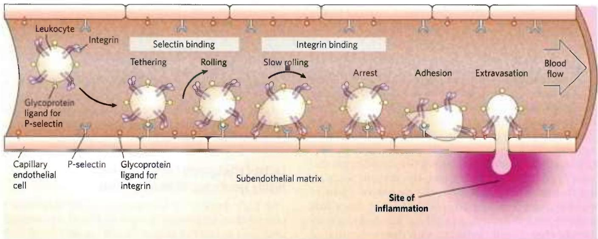  
FIGURE 7-29 Role of lectin-ligand interactions in leukocyte movement to the site of an infection or injury. A leukocyte circulating through a capillary is slowed by transient interactions between P-selectin molecules in the plasma membrane of the capillary endothelial cells and glycoprotein ligands for P-selectin on the leukocyte surface. As the leukocyte interacts with successive P-selectin molecules, it rolls along  
the capillary surface. Near a site of inflammation, stronger interactions between integrin in the leukocyte surface and its ligand in the capillary surface lead to tight adhesion. The leukocyte stops rolling and, under the influence of signals from the site of inflammation (such as sialyl Lewis x), escapes through the capillary wall as it moves toward the region of inflammation.

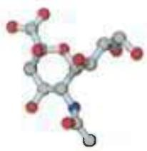  
N-Acetylneuraminic acid

  
(a)  
Oseltamivir

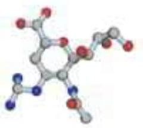  
Zanamivir

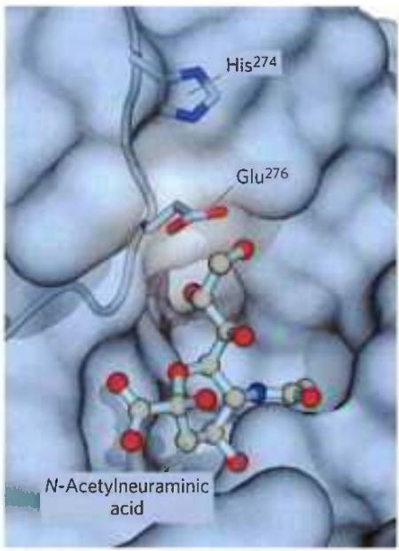

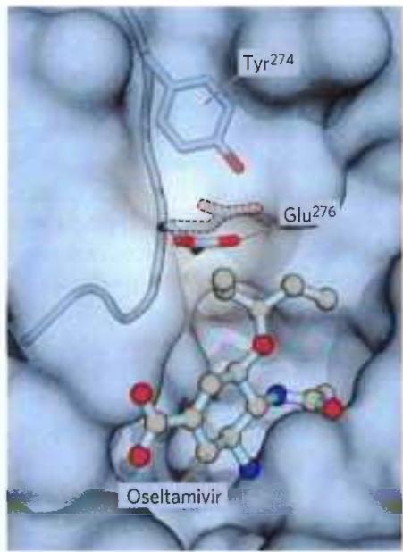  
(b)  
(c)  
FIGURE 7-30 Binding site on influenza neuraminidase for N-acetylneuraminic acid and an antiviral drug. (a) The normal binding ligand for influenza neuraminidase is a sialic acid, N-acetylneuraminic acid. The drugs oseltamivir and zanamivir occupy the same site on the enzyme, competitively inhibiting it and blocking viral release from the host cell. (b) The normal interaction with N-acetylneuraminic acid in the binding site. (c) Oseltamivir can fit into this site by pushing a nearby Glu residue  
(d)  
out of the way. (d) A mutation in the influenza virus's gene for neuraminidase replaces a His near this Glu residue with the larger side chain of a Tyr. Now, oseltamivir is not as effective at pushing the Glu out of its way, and the drug binds much less well to the binding site, making the mutant virus effectively resistant to oseltamivir. [Data from (b) PDB ID 2BAT, J. N. Varghese et al., Proteins 14:327, 1992; (c) PDB ID 2HU4, R. J. Russell et al., Nature 443:45, 2006; (d) PDB ID 3CL0, P. J. Collins et al., Nature 453:1258, 2008.]

Some of the most devastating of the human parasitic diseases, widespread in much of the developing world, are caused by eukaryotic microorganisms that display unusual surface oligosaccharides, which in some cases are known to be protective for the parasites. These organisms include the trypanosomes, responsible for African sleeping sickness (see Box 6-1) and Chagas disease; Plasmodium falciparum, the malaria parasite; and Entamoeba histolytica, the causative agent of amoebic dysentery. The prospect of finding drugs that interfere with the synthesis of these unusual oligosaccharide chains, and therefore with the replication of the parasites, has inspired much recent work on the biosynthetic pathways of these oligosaccharides.

Lectins also act intracellularly, in sorting proteins for transportation to specific cellular compartments (see

Chapter 27). For example, P7 an oligosaccharide containing mannose 6-phosphate, recognized by a lectin, acts as a molecular "ZIP code" that tags newly synthesized proteins in the Golgi complex for transfer to the lysosome (see Fig. 27-41).

#### [EN] Lectin-Carbohydrate Interactions Are Highly Specific and Often Multivalent

The high density of information in the structure of oligosaccharides provides a sugar code with an essentially unlimited number of unique “words” small enough to be read by a single protein. In their carbohydrate-binding sites, lectins have a subtle molecular complementarity that allows interaction only with their correct carbohydrate binding partners. Often a divalent metal ion such as $Ca^{2+}$ or $Mn^{2+}$ is part of the binding site. Lectin-ligand interactions can have extraordinarily high specificity. The affinity between an oligosaccharide and an individual carbohydrate binding domain (CBD) of a lectin is sometimes modest (micromolar to millimolar $K_{d}$ values), but the effective affinity is often greatly increased by lectin multivalency, in which a single lectin molecule has multiple CBDs. In a cluster of oligosaccharides — as is commonly found on a membrane surface, for example — each oligosaccharide can engage one of the lectin's CBDs, strengthening the interaction. When cells express multiple lectin receptors, the avidity of the interaction can be very high, enabling highly cooperative events such as cell attachment and rolling (Fig. 7-29).

  
FIGURE 7-31 Details of a lectin-carbohydrate interaction. (a) Structure of the bovine mannose 6-phosphate receptor complexed with mannose 6-phosphate. The protein is represented as a surface contour image, showing the surface as predominantly negatively charged (red) or positively charged (blue). Mannose 6-phosphate is shown as a space-filling model; a manganese ion is shown as a violet sphere. (b) An enlarged view of the binding site. Mannose

X-ray crystallographic studies of the structure of the lectin that is the receptor for mannose 6-phosphate reveal details that explain the specificity of the binding and the role of a divalent cation in the lectin-sugar interaction (Fig. 7-31). When the protein tagged with mannose 6-phosphate reaches the lysosome (which has a lower internal pH than the Golgi complex), the receptor loses its affinity for mannose 6-phosphate and the tagged protein is released into the lysosomal matrix.

In addition to such highly specific interactions, there are more general interactions that contribute to the binding of many carbohydrates to their lectins. For example, many sugars have a more polar side and a less polar side (Fig. 7-32); the more polar side hydrogen-bonds with the lectin, while the less polar side undergoes interactions with nonpolar amino acid residues through the hydrophobic effect. The sum of all these interactions produces high-affinity binding and high specificity of lectins for their carbohydrate ligands. This represents a kind of information transfer that is clearly central in many processes within and between cells. Figure 7-33 summarizes some of the biological interactions mediated by the sugar code.

6-phosphate is hydrogen-bonded to Arg $^{111}$ and coordinated with the manganese ion (shown smaller than its van der Waals radius, for clarity). Each hydroxyl group of mannose is hydrogen-bonded to the protein. The His $^{115}$ hydrogen-bonded to a phosphate oxygen of mannose 6-phosphate may be the residue that, when protonated at low pH, causes the receptor to release mannose 6-phosphate into the lysosome. [Data from PDB ID 1M6P, D. L. Roberts et al., Cell 93:639, 1998.]  
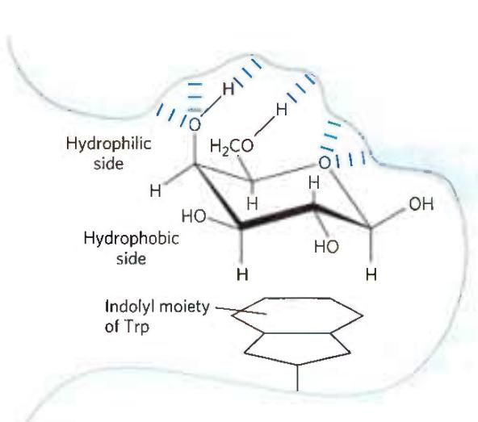  
FIGURE 7-32 Interactions of sugar residues due to the hydrophobic effect. Sugar units such as galactose have a more polar side (the top of the chair as shown here, with the ring oxygen and several hydroxyls), available to hydrogen-bond with the lectin, and a less polar side that can interact with nonpolar side chains in the protein, such as the indole ring of Trp residues, through the hydrophobic effect. [Information from a figure provided by Dr. C.-W. von der Lieth, Heidelberg; H.-J. Gabius, Naturwissenschaften 87:108, 2000, Fig. 6.]

  
FIGURE 7-33 Role of oligosaccharides in recognition events at the cell surface and in the endomembrane system. (a) Oligosaccharides with unique structures (represented as strings of red hexagons) are components of a variety of glycoproteins or glycolipids on the outer surface of plasma membranes. Their oligosaccharide moieties are bound by extracellular lectins with high specificity and affinity. (b) Viruses that infect animal cells, such as the influenza virus, bind to cell surface glycoproteins as the first step in infection. (c) Bacterial toxins, such as the cholera and pertussis toxins, bind to a surface glycolipid before entering a cell. (d) Some bacteria adhere to and then colonize or infect animal cells. (e) Selectins (lectins) in the plasma membrane of certain cells mediate cell-cell interactions, such as those of leukocytes with the endothelial cells of the capillary wall at an infection site. (f) The mannose 6-phosphate receptor/lectin of the trans Golgi complex binds to the oligosaccharide of lysosomal enzymes, targeting them for transfer into the lysosome. [Information from N. Sharon and H. Lis, Sci. Am. 268 (January):82, 1993.]

#### [EN] SUMMARY 7.4 Carbohydrates as Informational Molecules: The Sugar Code

■ Monosaccharides can be assembled into an almost limitless variety of oligosaccharides, which differ in the stereochemistry and position of glycosidic bonds, the type and orientation of substituent groups, and the number and type of branches. Glycans are far more information-dense than nucleic acids or proteins.

The sugar specificity of many plant lectins makes them powerful laboratory reagents in glycobiology. Receptor/lectins in the surface of hepatocytes recognize glycoproteins that have lost their terminal sialic acid residue and mediate the normal uptake (by hepatocytes) and destruction of blood cells and of certain circulating glycoprotein hormones.

Bacterial and viral pathogens and some eukaryotic parasites adhere to their animal cell targets through binding of lectins on the pathogens to oligosaccharides on the target cell surface, or vice versa. Interactions are often polyvalent.

■ Structural studies of lectin-sugar complexes show the detailed complementarity between the two molecules, which accounts for the strength and specificity of lectin interactions with carbohydrates.

<!-- EN-END 7.4 -->

## 八、聚糖的结构分析

寡糖在生物学信号传递和识别方面的重要作用日益明显,这已成为开发用于分析复杂寡糖结构的方法的驱动力。聚糖结构分析中提出的问题与蛋白质序列测定遇到的问题相似,但与蛋白质和核酸不同,聚糖可以分支,连结方式多种多样,这使聚糖分析变得十分复杂。许多寡糖和多糖的高电荷密度和糖胺聚糖中硫酸酯的不稳定性使分析更加困难。因此聚糖结构分析是一项繁重而艰巨的任务。虽然测定每种聚糖结构都有自己的特殊问题,但是糖链分析有必经的共同步骤和通用的方法与技术。

## （一）聚糖结构分析的策略

结构最复杂的聚糖是糖蛋白中的糖成分,因此下面以糖蛋白的寡糖结构分析为例加以说明。分析步骤一般为:

（1）糖蛋白的分离纯化 可以采用分离纯化蛋白质的方法和技术来进行(第5章)，从蛋白质混合物

中获得所要的糖蛋白纯品。

（2）从糖蛋白中释放完整的聚糖 对 N-连接型寡糖，可用专一的纯酶如 N-糖苷酶 F(N-Glycosidase F) 水解或用化学试剂如无水肼 (anhydrous hydrazine; $NH_{2}NH_{2}$ ) 处理，以断裂糖肽 GlcNAc→Asn 中的酰胺键（图 9-41B）。对 O-连接型寡糖可用 O-糖苷酶 (O-glycosidase) 断裂 GalNAc→Ser/Thr 中的糖苷键（图 9-41A）。化学法断裂 O-糖苷键可在 NaOH-NaBH $_{4}$ 溶液中通过 β-消去反应来完成。糖基化位点可根据糖蛋白的肽图加以确定（见第 4 章）。糖脂的寡糖链可用脂酶来释放。

（3）聚糖的纯化 从一个糖蛋白纯品中释放出来的寡糖，经常是寡糖混合物，原因是很多糖蛋白不止含有一个糖链。即使只含一个糖链，也还存在微不均一性（microheterogeneity）。微不均一性是指一种分子的同一糖基化位点存在不同的糖链，这是糖链的生物合成特点造成的。不像蛋白质和核酸，糖链合成不是模板化的，合成可以终止于不同阶段，因而一个糖基化位点可以有大小、组成和结构各不相同的糖链。从上一步得到的寡糖混合物，借用各种不同的方法包括用于氨基酸和蛋白质分离的多种技术（溶剂分级沉淀、离子交换层析、分子排阻层析等），被分离成单一的寡糖组分。共价连接在不溶性支持物上的高纯度凝集素常用于寡糖和多糖的凝集素亲和层析（lectin affinity chromatography）。

（4）聚糖纯度鉴定和分子质量测定 聚糖纯度鉴定和分子质量测定可采用超离心、电泳、高效凝胶渗透层析和质谱等物理方法进行(见第5章)。

（5）聚糖的单糖组成测定 纯化的单一寡糖或多糖，用酸进行完全水解使成为单糖的混合物，或在HCl-无水甲醇中进行甲醇解（methanolysis）使成为单糖甲基糖苷的混合物。然后用HPLC和气液色谱（GLC；见第10章）等方法进行定性和定量分析，以获得单糖组成的数据。采用GLC分析时，待测样品单糖或单糖甲基糖苷（混合物），需要被转变成易挥发、对热稳定的衍生物，如糖三甲基硅醚、糖醇乙酸酯等。

（6）聚糖的测序 可采用化学、酶学和物理（如质谱和核磁共振）等方法进行。测序内容包括确定单糖残基在聚糖中的顺序，残基间连键的位置和异头构型、链的分支情况以及单糖单位上的羟基被非糖取代基（如硫酸基、乙酰基）取代的情况。如果聚糖分子较大，可用专一性酶（表9-6）或酸（控制酸浓度、水解温度和时间）进行部分水解，使成为较小的寡糖片段，片段混合物如前用HPLC等方法分离纯化，以获得全套片段纯品，并对这些片段逐个地进行测序，然后将这些片段序列进行合理拼接，推断出完整聚糖的一级结构。

## （二）用于聚糖分析的一些方法

对简单的线型聚糖如直链淀粉,糖苷键的位置可采用完全甲基化的经典方法测定。在强碱介质中用甲基碘处理完整的多糖,使所有的自由羟基转变为酸稳定的甲基醚（见本章“糖的化学性质”),然后用酸水解甲基化的多糖。在这样产生的单糖衍生物中出现的自由羟基就是原先参与糖苷键的那些羟基。所得的单糖衍生物的混合物,经 GLC 或 GC-MS(气谱-质谱联用)定性和定量分析,从而确定单糖残基的连接位置。

糖苷酶是研究聚糖结构的一种有力工具。糖苷酶除了用于从糖蛋白上断裂完整寡糖链外，还能从端基依次降解，阐明糖链的一级结构，确定单糖单位的异头构型。糖苷酶可分为两类：①内切糖苷酶（endoglycosidase），如上面提到的N-糖苷酶和O-糖苷酶，它们水解糖链内部的糖苷键，释放糖链片段，包括从蛋白质上释放寡糖链；②外切糖苷酶（exoglycosidase），它们只能从糖链的非还原末端逐个切下单糖，并且对糖基成分和糖苷键类型有专一性要求，因此它们降解聚糖，可以提供有关单糖残基组成、排列顺序和糖苷键的立体化学和位置的信息。

糖苷酶用于糖链结构研究时,必须了解该糖苷酶对底物的专一性要求,特别是对糖苷配基一侧的要求。同一种糖苷酶由于来源不同对底物糖苷键的位置也有专一性,例如不同来源的神经氨酸酶对 $(\alpha2\rightarrow3)$ 和 $(\alpha2\rightarrow6)$ 连接的唾液酸水解能力不同。用于寡糖测序的几种糖苷酶见表9-6。

表 9-6 寡糖测序的几种糖苷酶

<table><tr><td>酶名称</td><td>来源</td><td>专一性</td></tr><tr><td>内切糖苷酶</td><td></td><td></td></tr><tr><td>N-糖苷酶</td><td>F产黄菌属(Flavobacterium meningoseptium)</td><td>糖链→GlcNAc-↓→Asn</td></tr><tr><td>O-糖苷酶</td><td>肺炎双球菌(Diplococcus pneumoniae)</td><td>糖链→GalNAc α1-↓→Thr/Ser</td></tr><tr><td>外切糖苷酶</td><td></td><td></td></tr><tr><td>β-半乳糖苷酶</td><td>肺炎双球菌</td><td>Galβ1-↓→4GlcNAc→糖链</td></tr><tr><td>N-乙酰-β-D-葡糖胺酶</td><td>肺炎双球菌</td><td>GlcNAcβ1-↓→糖链</td></tr><tr><td>神经氨酸酶</td><td>肺炎双球菌</td><td>Sia α2-↓→3/6Gal→糖链</td></tr><tr><td></td><td></td><td>Sia α2-↓→6GlcNAc→糖链</td></tr></table>

图9-44示出专一性糖苷酶用于寡糖测序的一个简例。图中所示的寡糖是血清类黏蛋白上的几条寡糖链之一。根据表9-6，如果此寡糖的非还原端残基能被神经氨酸酶断裂，释放出游离唾液酸，则暗示末端唾液酸是以 $(\alpha 2\rightarrow 3 / 6)$ 糖苷键与Gal连接或以 $(\alpha 2\rightarrow 6)$ 与GlcNAc连接。当用肺炎链球菌 $\beta$ -半乳糖苷酶 $(\beta$ -galactosidase）切下第2个残基（Gal）后，则排除Sia与GlcNAc连接的可能，并表明Gal可能以 $(\beta 1\rightarrow 4)$ 键与第3个残基GlcNAc连接，当被 $N$ -乙酰- $\beta$ -D-葡糖胺酶（ $N$ -acetyl- $\beta$ -D-glucosaminidase）释放出GlcNAc（第3个残基）时，说明它是以 $\beta 1\to$ 和剩余的寡糖部分相连的。如是继续并结合其他方法，即可推断出完整的寡糖序列。

近些年来，寡糖结构分析越来越多地使用质谱（MS）和高分辨率的核磁共振谱（NMR）技术。基质辅助激光解吸/离子化质谱（MALDI MS）和串联质谱（MS/MS）可用于极性化合物如寡糖的分析。MALDI MS 可用于测定分子离子（此场合是离子化的完整寡糖链）的质量（图 9-45）。MS/MS 用于测定分子离子及其许多碎片离子的质量，碎片一般是由于分子离子中的内能传递和分配致使一些糖苷键断裂而产生的。这些碎片离子将提供有关糖链连接和顺序的信息。糖链序列的推定主要依据这些碎片的质谱图中相邻两峰的质量差（参见第 2 章）。MS 法寡糖分析多采用衍生化的样品（derivatized sample），因为用它能够给出更多的结构信息。NMR（见第 3 章）单独用于寡糖分析特别是中等大小的寡糖分析，能给出有关序列、连键位置和异头碳构型的信

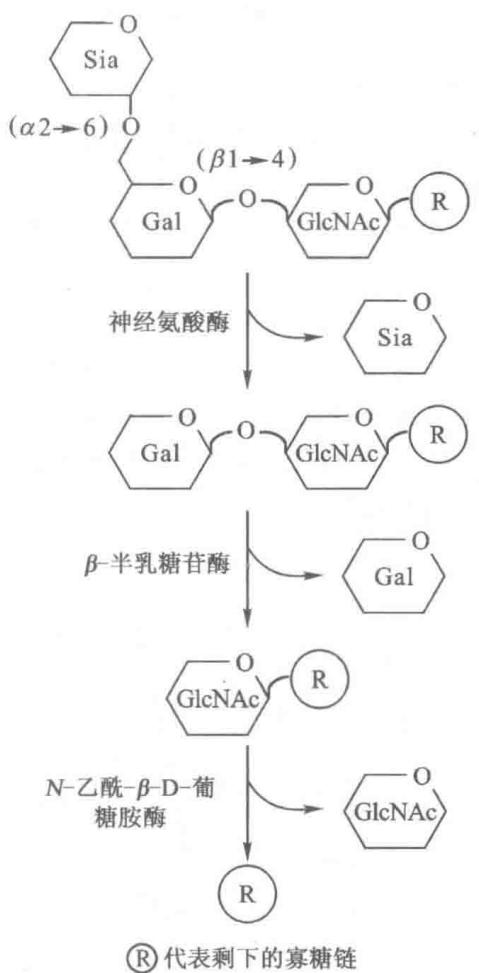  
图 9-44 血清类黏蛋白寡糖链的测序

息,例如肝素分子片段的立体结构就是借 NMR 技术获得的,现已有自动化的商业仪器用于寡糖结构的常规测定。

用质谱法曾测出高达40个残基的聚糖链序列，但一般不能区别残基的异头构型和连接位置。在这方面NMR技术是一种极好的互补， ${}^{1}\mathrm{H}$ NMR和 ${}^{13}\mathrm{C}$ NMR波谱学为解决聚糖链结构中糖苷键的构型问题提供了可靠信息。然而分支点类型多于一种的分支寡糖的测序远比测定蛋白质和核酸的线型序列要复杂得多。

糖研究方面的另一重要工具是化学合成。已证明，化学合成是了解糖胺聚糖和脂多糖的生物学功能的有力方法。涉及这些合成的化学是有难度的。然而糖化学家现在能够合成几乎任何一种糖胺聚糖的片段，并具有正确的立体化学、链长和硫酸化谱；能够合成比图9-41中所示者更加复杂的寡糖。固相寡糖合成是基于跟肽合成（图2-42）同样的原理（和优点），但要求一套对糖化学特有的工具：保护基（封闭基）和活化基，这些基团要保证只跟正确的羟基合成糖苷键。这类合成目前是一个很有意义的领域，因为从天然来源纯化一定量的所要寡糖还是困难的。

  
图9-45 一组糖蛋白中的寡糖的分离和定量  
实验中从肾组织提取的糖蛋白混合物经酶解处理释放出寡糖，寡糖用NALDI质谱进行分析。每一不同的寡糖在它的分子质量处产生一个峰。曲线下面的面积代表该寡糖的量。图中量最大的寡糖（质量为2837.4 u）由13个单糖残基组成，被分开的其他寡糖少的含7个，多的含19个残基

为鉴定对特殊寡糖具有专一性的蛋白质，可利用寡糖微阵[列](oligosaccharide microarray)。其原理与DNA微阵一样（见第12章），但技术问题更具有挑战性。合成的或天然的分离的纯寡糖样品溶液以微滴形式置于载玻片上，并通过惰性的间隔臂连接于载片。然后向载片加注标记有荧光分子的凝集素（聚糖结合蛋白质），使之与寡糖样品充分作用，平衡后所有不被吸附的蛋白质洗去。微阵列用荧光显微镜观察，鉴定出被凝集素识别的，即吸附有蛋白质（能发绿光）的寡糖；荧光的定量可给出凝集素-寡糖结合亲和力的约略量度(图9-46)。

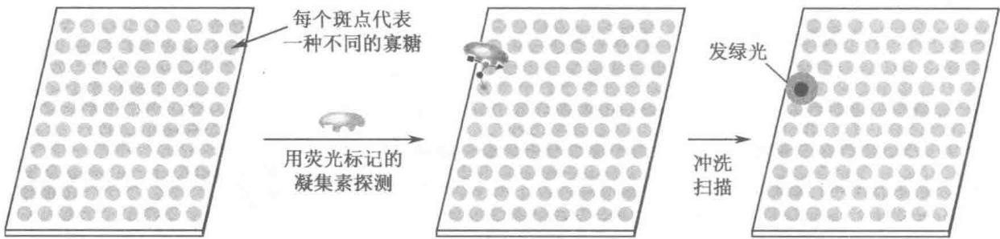  
图 9-46 测定凝集素与聚糖结合的专一性和亲和力的寡糖微阵列

<!-- EN-BEGIN 7.5 -->

### 【英文对应 7.5】Working with Carbohydrates

> 来源：Lehninger Principles of Biochemistry（书籍/02_生物化学原理） 第7章 Carbohydrates and Glycobiology，§7.5。对应本章“八、聚糖的结构分析”。

Oligosaccharide analysis is complicated by the fact that, unlike nucleic acids and proteins, oligosaccharides can be branched and are joined by a variety of linkages. The high charge density of many oligosaccharides and polysaccharides, and the relative lability of the sulfate esters in glycosaminoglycans, present further difficulties.

For simple, linear polymers such as amylose, the positions of the glycosidic bonds are determined by the classical method of exhaustive methylation: treating the intact polysaccharide with methyl iodide in a strongly basic medium to convert all free hydroxyls to acid-stable methyl ethers, then hydrolyzing the methylated polysaccharide in acid. The only free hydroxyls in the monosaccharide derivatives so produced are those that were involved in glycosidic bonds. To determine the sequence of monosaccharide residues, including any branches that are present, exoglycosidases of known specificity are used to remove residues one at a time from the nonreducing end(s). The known specificity of these exoglycosidases often allows deduction of the position and stereochemistry of the linkages.

For analysis of the oligosaccharide moieties of glycoproteins and glycolipids, the oligosaccharides are released by purified enzymes—glycosidases that specifically cleave O- or N-linked oligosaccharides, or lipases that remove lipid head groups. Alternatively, O-linked glycans can be released from glycoproteins by treatment with hydrazine.

The resulting mixtures of carbohydrates are resolved into their individual components by a variety of methods (Fig. 7-34), including the same techniques used in protein and amino acid separation: fractional precipitation by solvents, and ion-exchange and size-exclusion chromatography (see Fig. 3-17). Highly purified lectins, attached covalently to an insoluble support, can be used in affinity chromatography of carbohydrates.

Hydrolysis of oligosaccharides and polysaccharides in strong acid yields a mixture of monosaccharides, which can be identified and quantified by chromatographic techniques to yield the overall composition of the polymer.

Oligosaccharide analysis relies heavily on mass spectrometry (see Figs 3-28 and 3-29) and high-resolution NMR spectroscopy (see Fig. 4-31). NMR analysis alone, especially for oligosaccharides of moderate size, can yield much information about sequence, linkage position, and anomeric carbon configuration. Automated procedures and commercial instruments are used for the routine determination of oligosaccharide structure, but the sequencing of branched oligosaccharides joined by more than one type of bond remains a far more formidable task than determining the linear sequences of proteins and nucleic acids.

Another important tool in working with carbohydrates is chemical synthesis, which has proved to be a powerful approach to understanding the biological functions of glycosaminoglycans and oligosaccharides. The chemistry involved in such syntheses is difficult, but carbohydrate chemists can now synthesize short segments of almost any glycosaminoglycan, with correct stereochemistry, chain length, and sulfation pattern, and oligosaccharides significantly more complex than those shown in Figure 7-27. Solid-phase oligosaccharide synthesis is based on the same principles (and has the same advantages) as peptide synthesis (see Fig. 3-30), but requires a set of tools unique to carbohydrate chemistry: blocking groups and activating groups that allow the synthesis of glycosidic linkages with the correct hydroxyl group. Synthetic approaches of this type currently represent an area of great interest, because it is difficult to purify defined oligosaccharides in adequate quantities from natural sources.

  
FIGURE 7-34 Methods of carbohydrate analysis. A carbohydrate purified in the first stage of the analysis often requires all four analytical routes for its complete characterization.

#### [EN] SUMMARY 7.5 Working with Carbohydrates

■ Establishing the complete structure of oligosaccharides and polysaccharides is a more complex problem than protein and nucleic acid analysis. Traditional chemical and enzymatic approaches, as well as mass spectrometry and high-resolution NMR spectroscopy, applicable to small samples of carbohydrate, yield essential information about sequence, configuration at anomeric and other carbons, and positions of glycosidic bonds. Solid-phase synthetic methods yield defined oligosaccharides that are of great value in exploring lectin-oligosaccharide interactions and may prove clinically useful.

<!-- EN-END 7.5 -->

## 提要

糖类(糖质)是地球上最丰富的有机化合物。糖类在生物体内不仅作为结构成分和主要能源,糖缀合物中的聚糖链作为细胞识别的信号分子参与许多生命过程,并因此出现一门新的学科——糖生物学。

糖类的化学本质是多羟醛、多羟酮及其衍生物。糖类按其聚合度分为单糖、寡糖和多糖。同多糖是指仅含一种单糖或单糖衍生物的多糖，杂多糖是含一种以上单糖或/和单糖衍生物的多糖。糖类与蛋白质或脂质共价结合形成的结合物称为糖缀合物。

由于单糖的羰基在碳链中的位置不同,可分为醛糖和酮糖。由甘油醛派生来的四、五、六碳糖等组成醛糖家系;由二羟丙酮派生来的相应单糖构成酮糖家系。单糖一般含有几个手性碳原子( $C^{*}$ ),并因此存在多个立体异构体，它们在纸面上可用 Fischer 投影式表示。含 C\* 的单糖是手性分子，具有旋光性。含 n 个 C\* 的单糖有 $2^{n}$ 个旋光异构体，组成 $2^{n-1}$ 对不同的对映体。任一旋光异构体只有一个对映体，其他旋光异构体是它的非对映体。两个旋光异构体，仅有一个 C\* 的构型不同的，称它们为差向异构体。单糖的构型是指离羰基碳最远的那个 C\* 的构型，如果与 D-甘油醛构型相同，则称 D 型单糖，反之称 L 型单糖。大多数天然单糖是 D 型糖。

开链的单糖分子内，醇基与醛基或酮基发生可逆亲核加成，形成环状半缩醛或半缩酮，如六元环吡喃葡糖和五元环呋喃果糖；这种环状结构可用Haworth式或构象式来表示，吡喃糖环一般采取椅式构象，呋喃糖环采取信封式构象。成环时由于羰基碳成为新的手性中心（称异头碳），出现两个异头差向异构体，称 $\alpha$ 和 $\beta$ 异头物，它们经过开链形式发生互变并产生变旋现象。

单糖可以发生很多化学反应。醛基或伯醇基或两者被氧化成羧酸，羰基还原成醇；一般的羟基参与成酯、成醚、氨基化和脱氧等反应。异头羟基能通过糖苷键与醇或胺连接，形成糖苷化合物；寡糖和多糖也是一类糖苷。生物学上重要的单糖及其衍生物有 Glc、Gal、Man、Fru、GlcNAc、GalNAc、L-Fuc、NeuNAc（Sia），GlcUA 等，它们是寡糖和多糖的组分，许多单糖衍生物参与糖缀合物的聚糖链组成。此外单糖的磷酸脂，如 6-磷酸葡糖，是重要的代谢中间物。

蔗糖、乳糖和麦芽糖是常见的二糖。蔗糖是由 $\alpha$ -Glc 和 $\beta$ -Fru 在两个异头碳之间通过糖苷键连接而成，它已无潜在的自由醛基，因而失去还原，成脎、变旋等性质，并称它为非还原糖。乳糖的结构是 Gal ( $\beta 1 \rightarrow 4$ ) Glc，麦芽糖是 Gal ( $\alpha 1 \rightarrow 4$ ) Glc，它们的末端葡萄糖残基仍有潜在的自由醛基，属还原糖。寡糖（或多糖）链的一端，其单糖单位的异头碳未参与糖苷键形成，称还原端，另一端称非还原端。二糖或寡糖的普通命名应指出单糖单位的顺序、每个异头碳的构型和参与糖苷键的碳原子的位置。环糊精由环糊精葡糖基转移酶作用于直链淀粉生成，含 6、7 或 8 个葡萄糖残基，通过 ( $\alpha 1 \rightarrow 4$ ) 糖苷键连接成环，属非还原糖，由于它的特殊结构被用作稳定剂、抗氧化剂和增溶剂等。

多糖用作贮存燃料以及细胞壁和胞外基质的结构成分。同多糖淀粉和糖原是植物、动物和细菌细胞的贮能多糖，它们由D-葡萄糖借 $(\alpha 1\rightarrow 4)$ 连键聚合而成。淀粉分直链淀粉和支链淀粉，前者分子中只有 $(\alpha 1\rightarrow 4)$ 连键，后者和糖原除 $(\alpha 1\rightarrow 4)$ 外尚有 $(\alpha 1\rightarrow 6)$ 连键，因此具有分支。同多糖纤维素、壳多糖和右旋糖酐是结构多糖。纤维素由 $(\beta 1\rightarrow 4)$ 连接的D-葡萄糖残基组成，它给植物细胞壁以强度和刚性。壳多糖是 $(\beta 1\rightarrow 4)$ 连接的 $N-$ 乙酰葡糖胺的同聚物，它增加了甲壳类外骨骼的强度。右旋糖酐（也是贮存燃料）在一些细菌的外层形成黏着覆盖物。

同多糖三维折叠。吡喃糖环的椅式基本上是刚性的，所以它的聚合物构象是由绕从环到糖苷键中氧原子的键的旋转所决定的。淀粉和糖原形成具有链内氢键键合的螺旋结构；纤维素和壳多糖形成长的直链，相邻链间相互作用。

植物细胞壁的基质杂多糖有果胶物质、半纤维素和琼脂等。果胶物质是一类主链为聚半乳糖醛酸的化合物，其重复二糖单位是 $\mathrm{GalUA}(\alpha 1\rightarrow 4)\mathrm{GalUA}$ 。半纤维素是木聚糖、葡甘露聚糖和木葡聚糖等的总称。琼脂（或琼脂糖）是从红藻类中提取的一种结构杂多糖，它的重复二糖单位是3）D-Gal(β1→4)3,6-失水-L-Gal(α1→。

细菌细胞壁是由于结构杂多糖——肽聚糖得以加固的。肽聚糖主链的重复二糖单位是 GlcNAc( $\beta1\rightarrow4$ )MurNAc,糖链之间通过肽桥交联成一个大囊状分子。青霉素就是通过干扰新肽聚糖中糖链之间肽交联桥的形成使细菌失去抗渗透能力。

糖胺聚糖是脊椎动物胞外基质的结构杂多糖。它们的重复二糖单位中一个是己糖醛酸残基（硫酸角质素例外），另一个是N-乙酰己糖胺。多数糖胺聚糖都不同程度地被硫酸化。肝素和硫酸乙酰肝素中某些羟基上和某些葡糖胺残基的氨基上的硫酸酯给这些聚糖以高密度的负电荷，使得它们采取伸展型构象。这些聚糖（透明质酸、硫酸软骨素、硫酸皮质素和硫酸角质素）给胞外基质提供黏滞性、胶黏度和抗张强度。

蛋白聚糖是糖缀合物,其中一个或多个硫酸化的糖胺聚糖(硫酸乙酰肝素、硫酸软骨素、硫酸皮肤素和硫酸角质素)被共价连接在一个核心蛋白。蛋白聚糖借一个穿膜的肽或一个共价连接的脂质结合在质膜的外表面,它们为细胞之间或细胞与胞外基质之间提供黏着、识别和信息传递的位点。有的蛋白聚糖以聚集体(透明质酸分子为核心)形式存在。它们是高度亲水的多价阴离子,在维持皮肤、关节、软骨等结缔组织的形态和功能方面起重要作用。

另一类糖缀合物是糖蛋白，多数是内在膜蛋白和分泌蛋白。糖蛋白中的糖链常是分支的，比糖胺聚糖小，它们共价连接于 Asn 或 Ser/Thr。植物和动物中的糖脂和鞘糖脂以及细菌中的脂多糖是细胞被膜的成分，其共价连接的寡糖暴露在细胞外表面。

糖组学是研究一个给定细胞或组织中全套的含糖分子的结构和功能的学科。糖蛋白和糖脂中的寡糖是十分复杂的。单糖可以组装出几乎无限种寡糖，它们在立体化学、糖苷键位置、取代基的类型和定向或分支的数目和类型各不相同。聚糖的信息密度远比核酸或蛋白质的大。糖蛋白中的寡糖链影响蛋白质的折叠和稳定，为新合成的蛋白质定位提供关键信息，并允许其他蛋白质对它进行专一性识别。寡糖链与血循环中的蛋白质寿命有关，寡糖链参与细胞-细胞识别和黏着，如淋巴细胞归巢。

凝集素是具有高专一性糖结合域的蛋白质，它们常存在于细胞的外表面，在这里引发跟其他细胞相互作用。选择蛋白是质膜凝集素的一个家族。它们在炎症过程中介导白细胞对侵染者发动免疫攻击。细菌性和病毒性病原体和某些真核寄生虫是借助病原体的凝集素跟靶细胞表面上的寡糖黏着于靶动物细胞。凝集素-糖复合物的X射线晶体学研究揭示了两个分子之间的互补细节，因而解释了凝集素与糖相互作用的亲和力和专一性。

血型抗原决定簇也是寡糖链。血型抗原以糖脂或糖蛋白形式存在于红细胞膜及其他细胞膜上。在ABO血型系统中，人血型（表型）分为A、B、AB和O四型。血型是遗传的，受基因支配。与ABO系统关系密切的有Lewis血型系统等。

寡糖和多糖的完整结构分析，包括线型序列、分支位置、每个单糖单位的构型和糖苷键位置的测定；这是一个比蛋白质和核酸的分析更复杂的问题。聚糖结构一般采用综合的方法测定：甲基化测定糖苷键位置，专一性酶促水解测定糖苷键的立体化学，已知专一性的内切酶用于测定单糖残基的序列、存在的分支点以及糖苷键的位置和立体化学。质谱和高分辨率的核磁共振谱可用于小样品糖测定，能给出序列、异头碳和其他碳构型以及糖苷键位置。固相寡糖合成在研究凝集素-寡糖相互作用方面有重要意义，并可能还有临床用途。纯寡糖的微阵列用于测定凝集素与寡糖结合的专一性和亲和力。

## 习题

1. 环状己醛糖有多少个可能的旋光异构体？为什么？

2. (a) 含 D-吡喃半乳糖残基和 D-吡喃葡萄糖残基的双糖可能有多少个异构体？(b) 如果不包括二糖的异头物该有多少个异构体？(c) 糖蛋白上含同样残基的二糖链将有多少个异构体？(d) 含 4 种不同的 D-吡喃己醛糖残基的四糖可能有多少个异构体（包括四糖异头物）?

3. (a) 写出 $\beta$ -D-脱氧核糖、 $\alpha$ -D-半乳糖、 $\beta$ -L-山梨糖和 $\beta$ -D-N-乙酰神经氨酸（唾液酸）的 Fischer 投影式，Haworth 式和构象式。(b) 为把 $\alpha$ -D-葡萄糖转变为 $\beta$ -D-葡萄糖，需要在 $\alpha$ -D-葡萄糖中断裂哪个（些）键？要使 D-葡萄糖转变为 D-甘露糖，该断裂哪个（些）键？(c) 要把椅式 D-葡萄糖转变为船式，需要断裂哪个（些）键？

4. 写出下面所示的(a)和(b)两个单糖的正规(系统)名称(D/L, $\alpha/\beta$ , f/p)，指出(c)和(d)两个结构式用RS系统表示的构型(R/S)。

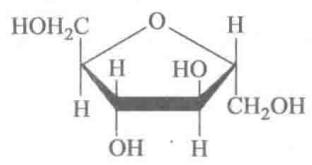  
(a)

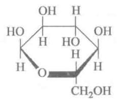  
(b)

  
(c)

  
(d)

5. D-葡萄糖的 $\alpha$ 和 $\beta$ 异头物的比旋 ( $\left[\alpha\right]_{D}^{20}$ ) 分别为 +112.2° 和 +18.7°。当 $\alpha-D-$ 吡喃葡糖晶体样品溶于水时，比旋将由 +112.2° 降至平衡值 +52.7°。计算平衡混合液中 $\alpha$ 和 $\beta$ 异头物的比率。假设开链形式和呋喃形式可忽略。

6. 准确称取糖原 81.0 mg, 将它完全甲基化, 然后用酸水解。再用薄层层析法分离和鉴定甲基化产物。得到的 2,3-二甲基葡萄糖恰好是 62.5 μmol。(a) 糖原分子中的分支点占全部葡萄糖残基的百分数是多少? (b) 甲基化和水解后还有哪些其他产物? 每一种有多少?

7. D-葡萄糖在 $31^{\circ}\mathrm{C}$ 水中平衡时， $\alpha-$ 吡喃葡糖和 $\beta-$ 吡喃葡糖的相对摩尔含量分别为 $37.3\%$ 和 $62.7\%$ 。计算D-葡萄糖 $31^{\circ}\mathrm{C}$ 时由 $\alpha$ 异头物转变为 $\beta$ 异头物的标准自由能变化。气体常数 $R$ 为 $8.315\mathrm{Jmol}^{-1}\mathrm{K}^{-1}$ 。

8. 竹子系热带禾本科植物，在最适条件下竹子生长的速度达 0.3 m/d，假定竹茎几乎完全由纤维素纤维组成，纤维沿生长方向定位。计算每秒钟酶促加入生长着的纤维素链的单糖残基数目。纤维素分子中每一葡萄糖单位约长 0.45 nm。

## 9. 经还原可生成山梨醇(D-葡萄醇)的单糖有哪些?

10. (a) 写出麦芽糖( $\alpha$ 型)、纤维二糖( $\beta$ 型)、蜜二糖和水苏糖的系统命名的简单形式, 并指出其中哪些(个)是还原糖, 哪些(个)是非还原糖; (b) 龙胆二糖(D-Glc( $\beta$ 1→6)D-Glc)在某些植物中存在, 例如作为苦杏仁苷和藏红花素等糖苷的糖基成分。根据它的缩写名称, 用Haworth式画出龙胆二糖的结构。它是还原糖? 是否有变旋现象?

11. 纤维素和糖原虽然在物理性质上有很大的不同,但这两种多糖都是 $(1\rightarrow4)$ 糖苷键连接的D-葡萄糖多聚体,相对分子质量也相当,是什么结构特点造成它们在物理性质上有如此大的差别?解释它们各自性质的生物学优点。

12. 革兰氏阳性细菌和阴性细菌的细胞壁在化学组成上有什么异同？肽聚糖中的糖肽键和糖蛋白中的糖肽键是否有区别？溶菌酶和青霉素杀菌的机制有何不同？

13. 假设一个细胞表面糖蛋白的一个三糖单位在介导细胞与细胞黏着中起关键作用。试设计一个简单试验以检验这一假设。

14. 某些糖蛋白的糖部分可用作细胞识别位点。为行使这一功能，寡糖链必须具有以极其多样形式存在的潜能。由5个不同氨基酸残基组成的寡肽和5个不同单糖单位组成的寡糖，试问何者能产生更大的结构多样性？请解释。

15. 举出两个例子说明糖蛋白寡糖链的生物学作用。

16. 写出人 ABH 血型抗原决定簇的前体结构, 指出 A 抗原、B 抗原和 O 抗原 (H 物质) 之间的结构关系。

17. 具有重复二糖单位, GlcUA( $\beta1\rightarrow3$ ) GlcNA, 而二糖单位间通过 $\beta(1\rightarrow4)$ 连接的天然多糖是什么?

18. 糖胺聚糖如硫酸软骨素, 其生物功能之一与该分子在水中所占的体积远比脱水时大这一性质有关。为什么这些分子在溶液中所占体积会这样大?

19. 举例说明内切糖苷酶和外切糖苷酶在聚糖链结构测定中的作用。

20. 一种三糖经 $\beta$ -半乳糖苷酶完全水解后, 得到 D-半乳糖和 D-葡萄糖, 其比例为 $2:1$ 。将原有的三糖用 $\mathrm{NaBH}_{4}$ 还原, 继而使其完全甲基化和酸水解, 然后再进行一次 $\mathrm{NaBH}_{4}$ 还原, 最后用醋酸酐乙酰化, 得到三种产物: ① $2,3,4,6$ -四甲基-1,5-二乙酰基-半乳糖醇; ② $2,3,4$ -三甲基-1,5,6-三乙酰基-半乳糖醇; ③ $1,2,3,5,6$ -五甲基-4-乙酰基-山梨糖醇。分析并写出此三糖的结构。

## 主要参考书目

1. 王镜岩, 朱圣庚, 徐长法. 生物化学教程. 北京: 高等教育出版社, 2008.

2. 陈惠黎, 王克夷. 糖复合物的结构和功能. 上海: 上海医科大学出版社, 1997.

3. 张惟杰. 糖复合物生化研究技术. 2 版. 杭州: 浙江大学出版社, 1999.

4. Garrett R H, Grisham C M. Biochemistry. 3rd ed. Boston: Saunders College Publishing, 2004.

5. Nelson D L, Cox M M. Lehninger Principles of Biochemistry. 5th ed. New York: W. H. Freeman and Company, 2013.

6. Stryer L. Biochemistry. 4th ed. New York: W. H. Freeman and Company, 1995.

7. McMurry I. Organic Chemistry. 3rd ed. California: Brooks/Cole Publishing Company, 1992.

8. Cadogan I I G, Ley S V, Pattenden G. Dictionary of Organic Chemistry. 6th ed. London: Chapnan & Hall (Electronic Publishing Division), 1996.

9. Meyers R(ed). Molecular Biology and Biotechnology—a comprehensive Desk Reference. VCH Publishers, Inc, 1995.

10. Preiss J (ed). Carbohydrates: Structure and Function, in "The Biochemistry of Plants". New york: Academic Press, 1980.

11. Tortora G I, Funke B R, Case C L. Microbiology. 4th ed. California: The Benjamin/Cummings Publishing Company, 1992.

(徐长法)

网上资源

习题答案

自测题

<!-- EN-BEGIN 第7章章末 -->

## 【英文对应 第7章章末】Carbohydrates and Glycobiology：关键术语、习题与简答

> 来源：Lehninger Principles of Biochemistry（书籍/02_生物化学原理） 第7章章末，以及书末 Abbreviated Solutions to Problems 第7章。

### [EN] KEY TERMS

Terms in bold are defined in the glossary.

carbohydrate 229  
monosaccharide 229  
oligosaccharide 229  
disaccharide 229  
polysaccharide 229  
aldose 230  
ketose 230  
enantiomer 232  
Fischer projection formulas 232  
epimers 232  
hemiacetal 234  
hemiketal 234  
anomers 234  
anomeric carbon 234  
pyranose 234  
furanose 234  
Haworth perspective formulas 235  
mutarotation 235  
reducing sugar 237  
O-glycosidic bonds 237  
reducing end 237

hemoglobin glycation 239
glycan 241
homopolysaccharide 241
heteropolysaccharide 241
starch 242
glycogen 242
cellulose 243
extracellular matrix (ECM) 244
glycosaminoglycan 245
hyaluronan 245
chondroitin sulfate 245
heparan sulfate 246
glyconjugate 247
proteoglycan 247
glycoprotein 248
glycolipid 248
syndecan 248
glypican 248
glycomics 252
ganglioside 253
lectin 254
selectins 255

### [EN] PROBLEMS

1. Sugar Alcohols In the monosaccharide derivatives known as sugar alcohols, the carbonyl oxygen is reduced to a hydroxyl group. For example, D-glyceraldehyde can be reduced to glycerol. Why can the sugar alcohol glycerol no longer be designated D or L?

2. Recognizing Epimers Using Figure 7-3, identify the epimers of (a) D-allose, (b) D-gulose, and (c) D-ribose at C-2, C-3, and C-4.

3. Configuration and Conformation Which bond(s) in $\alpha$ -D-glucose must be broken to change its configuration to $\beta$ -D-glucose? Which bond(s) must be broken to convert D-glucose to D-mannose? Which bond(s) must be broken to convert one "chair" form of D-glucose to the other?

4. Sugar Structures Compare and contrast the structural features of each pair: (a) Cellulose and glycogen (b) D-Glucose and D-fructose (c) Maltose and sucrose

5. Haworth Structures Draw the Haworth perspective formulas for $\alpha$ -D-mannose and $\beta$ -L-galactose.

6. Reducing Sugars Draw the structural formula for $\alpha$ -D-glucosyl- $(1\rightarrow6)$ -D-mannosamine, and circle the part of this structure that makes the compound a reducing sugar.

7. Hemoglobin Glycation The measurement of glycated hemoglobin (the HbA1c level) to monitor the regulation of blood glucose (Box 7-2) is not reliable in individuals with certain conditions or diseases. Can you suggest an explanation for a lower-than-normal HbA1c level in a patient who definitely is not diabetic?

8. Hemiacetal and Glycosidic Linkages Explain the difference between a hemiacetal and a glycoside.

9. A Taste of Honey The sweetness of honey gradually decreases at a high temperature. Also, high-fructose corn syrup (a commercial product in which much of the glucose in corn syrup is converted to fructose) is used for sweetening cold drinks but not hot drinks. What chemical property of fructose could account for both of these observations?

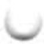

10. Gluconolactone and Glucose Oxidation States The cyclic glucose derivative 6-phosphogluconolactone is an intermediate in the pentose phosphate pathway (discussed in Chapter 14). Compare the oxidation state of C-1 for the cyclic form of both gluconolactone and $\beta$ -D-glucose.

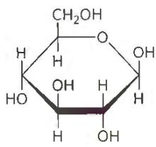  
6-Phosphogluconolactone  
β-D-Glucose

11. Invertase "Inverts" Sucrose As sweet as sucrose is, an equimolar mixture of its constituent monosaccharides, D-glucose and D-fructose, is sweeter. Besides enhancing sweetness, fructose has hygroscopic properties that improve the texture of foods, reducing crystallization and increasing moisture.

In the food industry, hydrolyzed sucrose is called invert sugar, and the yeast enzyme that hydrolyzes it is called invertase. The hydrolysis reaction is generally monitored by measuring the specific rotation of the solution, which is positive (+66.4°) for sucrose but becomes negative (inverts) as more D-glucose (specific rotation = +52.7°) and D-fructose (specific rotation = -92°) form.

From what you know about the chemistry of the glycosidic bond, how would you hydrolyze sucrose to invert sugar nonenzymatically in a home kitchen?

12. Manufacture of Liquid-Filled Chocolates The manufacture of chocolates containing a liquid center is an interesting application of enzyme engineering. The flavored liquid center consists largely of an aqueous solution of sugars rich in fructose to provide sweetness. The technical dilemma is the following: the chocolate coating must be prepared by pouring hot, melted chocolate over a solid (or almost solid) core, yet the final product must have a liquid, fructose-rich center. Suggest a way to solve this problem. (Hint: Sucrose is much less soluble than a mixture of glucose and fructose.)

13. Anomers of Sucrose? Lactose exists in two anomeric forms, but no anomeric forms of sucrose have been reported. Why?

14. Gentiobiose Gentiobiose (D-Glc(β1→6)D-Glc) is a disaccharide found in some plant glycosides. Draw the Haworth structure of gentiobiose based on its abbreviated name. Is it a reducing sugar? Does it undergo mutarotation?

15. Identifying Reducing Sugars Is N-acetyl- $\beta$ -D-glucosamine (Fig. 7-9) a reducing sugar? What about D-gluconate? Is the disaccharide GlcN( $\alpha$ 1→1 $\alpha$ )Glc a reducing sugar?

16. Physical Properties of Cellulose and Glycogen The almost pure cellulose obtained from the seed threads of Gossypium (cotton) is tough, fibrous, and completely insoluble in water. In contrast, glycogen obtained from muscle or liver disperses readily in hot water to make a turbid solution. Despite their markedly different physical properties, both substances are (1→4)-linked D-glucose polymers of comparable molecular weight. What structural features of these two polysaccharides underlie their different physical properties? Suggest possible biological advantages of their respective properties.

17. Dimensions of a Polysaccharide Compare the dimensions of a molecule of cellulose and a molecule of amylose, each of $M_{r}$ 200,000.

18. Growth Rate of Bamboo The stems of bamboo, a tropical grass, can grow at the phenomenal rate of 0.3 m/day under optimal conditions. Given that the stems are composed almost entirely of cellulose fibers oriented in the direction of growth, calculate the number of sugar residues per second that must be added enzymatically to growing cellulose chains to account for the growth rate. Each D-glucose unit contributes \~0.5 nm to the length of a cellulose molecule.

19. Glycoproteins versus Proteoglycans Which characteristics describe glycoproteins and which describe proteoglycans? (a) Exclusively located at the cell surface and in the extracellular matrix

(b) May contain N-linked glycosidic bonds

(c) Found in Golgi complexes, secretory granules, and lysosomes (d) Include the chromosome of family

(d) Include the heparan sulfate family

(e) Sulfated glycosaminoglycan chains can only be covalently linked to a Ser residue

(f) Form highly specific sites for recognition and high-affinity binding by lectins

20. Relative Stability of Two Conformers Explain why the two structures shown in Figure 7-16 are so different in energy (stability). Hint: See Figure 1-21.

21. Volume of Chondroitin Sulfate in Solution One critical function of chondroitin sulfate is to act as a lubricant in skeletal joints by creating a gel-like medium that is resilient to friction and shock. This function seems to be related to a distinctive property of chondroitin sulfate: the volume occupied by the molecule is much greater in solution than in the dehydrated solid. Why is the volume so much larger in solution?

22. Heparin Interactions Heparin, a highly negatively charged glycosaminoglycan, is used clinically as an anticoagulant. It acts by binding several plasma proteins, including antithrombin III, an inhibitor of blood clotting. The 1:1 binding of heparin to antithrombin III seems to cause a conformational change in the protein that greatly increases its ability to inhibit clotting. What amino acid residues of antithrombin III are likely to interact with heparin?

23. Permutations of a Trisaccharide Three different hexoses (A, B, and C) can be combined to form a large number of trisaccharides. What structural features of trisaccharides allow so many permutations and combinations?

24. Effect of Sialic Acid on SDS Polyacrylamide Gel Electrophoresis Suppose you have four forms of a protein, all with identical amino acid sequence but containing zero, one, two, or three oligosaccharide chains, each ending in a single sialic acid residue. Draw the gel pattern you would expect when a mixture of these four glycoproteins is subjected to SDS polyacrylamide gel electrophoresis (see Fig. 3-18) and stained for protein. Identify any bands in your drawing.

25. Information Content of Oligosaccharides The carbohydrate portion of some glycoproteins may serve as a cellular recognition site. To perform this function, the oligosaccharide(s) must have the potential to exist in a large variety of forms. Which can produce a greater variety of structures: oligopeptides composed of five different amino acid residues, or oligosaccharides composed of five different monosaccharide residues? Explain.

26. Castor Bean Toxin The seed of the castor bean (Ricinus communis) contains large amounts of ricin, a poison that is deadly to animals, including humans. One of the two subunits of this toxin is a lectin that binds terminal N-acetylgalactosamine residues on glycoproteins on the surface of eukaryotic cells, allowing the other subunit to enter the cell and kill it by preventing proteins from being made. Suggest a possible antidote to prevent or reverse ricin-mediated entry of the toxin.

27. Determination of the Extent of Branching in Amylopectin A biochemist wants to determine the amount of branching in amylopectin, defined by the number of (α1→6) glycosidic bonds present. First, she treats the sample with methyl iodide, a methylating agent that replaces the hydrogen of every sugar hydroxyl with a methyl group, converting —OH to —OCH₃. She then hydrolyzes all the glycosidic bonds in the treated sample in aqueous acid and measures the amount of 2,3-di-O-methylglucose formed.

  
2,3-Di-O-methylglucose

In this representation of 2,3-di-O-methylglucose, the wavy bonds at C-1 indicate that the structure represents both anomers ( $\alpha$ and $\beta$ ).

(a) Explain the basis of this procedure for determining the number of $(\alpha1\rightarrow6)$ branch points in amylopectin. What happens to the unbranched glucose residues in amylopectin during the methylation and hydrolysis procedure?

(b) A 258 mg sample of amylopectin that was treated by the methylation and hydrolysis procedure described yielded 12.4 mg of 2,3-di-O-methylglucose. Determine what percentage of the glucose residues in the amylopectin contained an (α1→6) branch. (Assume that the average molecular weight of a glucose residue in amylopectin is 162 g/mol and the molecular weight of 2,3-di-O-methylglucose is 208 g/mol.)

### [EN] DATA ANALYSIS PROBLEM

28. Determining the Structure of ABO Blood Group Antigens The human ABO blood group system was discovered in 1901, and in 1924 this trait was shown to be inherited at a single gene locus with three alleles. In 1960, W. T. J. Morgan published a paper summarizing what was known at that time about the structure of the ABO antigen molecules. When the paper was published, the complete structures of the A, B, and O antigens were not yet known; this paper is an example of what scientific knowledge looks like "in the making."

In any attempt to determine the structure of an unknown biological compound, researchers must deal with two fundamental problems: (1) If you don't know what it is, how do you know if it is pure? (2) If you don't know what it is, how do you know that your extraction and purification conditions have not changed its structure? Morgan addressed problem 1 through several methods. One method is described in his paper as observing "constant analytical values after fractional solubility tests" (p. 312). In this case, "analytical values" are measurements of chemical composition, melting point, and so forth.

(a) Based on your understanding of chemical techniques, what could Morgan mean by "fractional solubility tests"?

(b) Why would the analytical values obtained from fractional solubility tests of a pure substance be constant, and those of an impure substance not be constant?

Morgan addressed problem 2 by using an assay to measure the immunological activity of the substance present in different samples.

(c) Why was it important for Morgan's studies, and especially for addressing problem 2, that this activity assay be quantitative (measuring a level of activity) rather than simply qualitative (measuring only the presence or absence of a substance)?

The structure of the blood group antigens is shown in Figure 10-13. In his paper, Morgan listed several properties of the three antigens, A, B, and O, that were known at that time (p. 314):

1. Type B antigen has a higher content of galactose than A or O.

2. Type A antigen contains more total amino sugars than B or O.

3. The glucosamine:galactosamine ratio for the A antigen is roughly 1:2; for B, it is roughly 2:5.

(d) Which of these findings is (are) consistent with the known structures of the blood group antigens?

(e) How do you explain the discrepancies between Morgan's data and the known structures?

In later work, Morgan and his colleagues used a clever technique to obtain structural information about the blood group antigens. Enzymes had been found that would specifically degrade the antigens. However, these were available only as crude enzyme preparations, perhaps containing more than one enzyme of unknown specificity. Degradation of the blood type antigens by these crude enzymes could be inhibited by the addition of particular sugar molecules to the reaction. Only sugars found in the blood type antigens would cause this inhibition. One enzyme preparation, isolated from the protozoan Trichomonas foetus, would degrade all three antigens and was inhibited by the addition of particular sugars. The results of these studies are summarized in the table below, showing the percentage of substrate remaining unchanged when the T. foetus enzyme acted on the blood group antigens in the presence of sugars.

Unchanged substrate (%)

<table><tr><td>Sugar added</td><td>A antigen</td><td>B antigen</td><td>O antigen</td></tr><tr><td>Control—no sugar</td><td>3</td><td>1</td><td>1</td></tr><tr><td>L-Fucose</td><td>3</td><td>1</td><td>100</td></tr><tr><td>D-Fucose</td><td>3</td><td>1</td><td>1</td></tr><tr><td>L-Galactose</td><td>3</td><td>1</td><td>3</td></tr><tr><td>D-Galactose</td><td>6</td><td>100</td><td>1</td></tr><tr><td>N-Acetylglucosamine</td><td>3</td><td>1</td><td>1</td></tr><tr><td>N-Acetylgalactosamine</td><td>100</td><td>6</td><td>1</td></tr></table>

For the O antigen, a comparison of the control and L-fucose results shows that L-fucose inhibits the degradation of the antigen. This is an example of product inhibition, in which an excess of reaction product shifts the equilibrium of the reaction, preventing further breakdown of substrate.

(f) Although the O antigen contains galactose, N-acetylglucosamine, and N-acetylgalactosamine, none of these sugars inhibited the degradation of this antigen. Based on these data, is the enzyme preparation from T. foetus an endoglycosidase or an exoglycosidase? (Endoglycosidases cut bonds between interior residues; exoglycosidases remove one residue at a time from the end of a polymer.) Explain your reasoning.

(g) Fucose is also present in the A and B antigens. Based on the structure of these antigens, why does fucose fail to prevent their degradation by the T. foetus enzyme? What structure would be produced?

(h) Which of the results in (f) and (g) are consistent with the structures shown in Figure 10-13? Explain your reasoning.

### [EN] Reference

Morgan, W.T.J. 1960. The Croonian Lecture: a contribution to human biochemical genetics; the chemical basis of blood-group specificity. Proc. R. Soc. Lond. B Biol. Sci. 151:308–347.

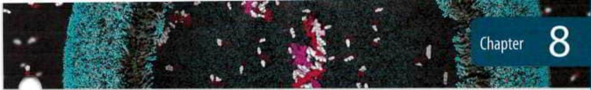

### [EN] Abbreviated Solutions — Chapter 7

1. With reduction of the carbonyl oxygen to a hydroxyl group, the chemistry at C-1 and C-3 is the same; the glycerol molecule is not chiral.

2. Epimers differ by the configuration about only one carbon.

(a) D-altrose (C-2), D-glucose (C-3), D-gulose (C-4)

(b) D-idose (C-2), D-galactose (C-3), D-allose (C-4)

(c) D-arabinose (C-2), D-xylose (C-3)

3. To convert $\alpha$ -D-glucose to $\beta$ -D-glucose, the bond between C-1 and the hydroxyl on C-5 (as in Fig. 7-6) must be broken; to convert D-glucose to D-mannose, either the —H or —OH bond on C-2 must be broken. Conversion between chair conformations does not require bond breakage; this is the critical distinction between configuration and conformation.

4. (a) Both are polymers of D-glucose, but they differ in the glycosidic linkage: $(\beta1\rightarrow4)$ for cellulose, $(\alpha1\rightarrow4)$ for glycogen. (b) Both are hexoses, but glucose is an aldohexose, fructose a ketohexose. (c) Both are disaccharides, but maltose has two $(\alpha1\rightarrow4)$ -linked D-glucose units, and sucrose has $(\alpha1\leftrightarrow2\beta)$ -linked D-glucose and D-fructose.

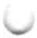  
24.

6.  

7. An individual with a condition that increases the rate of erythrocyte destruction and turnover would be expected to exhibit less hemoglobin glycation (a lower HbA1c value) because of the shorter-than-normal exposure of the hemoglobin to glucose.

8. A hemiacetal forms when an aldose or a ketose condenses with an alcohol; a glycoside forms when a hemiacetal condenses with an alcohol (see Fig. 7-5).

9. Fructose cyclizes to either the pyranose structure or the furanose structure. Increasing the temperature shifts the equilibrium in the direction of the furanose, the less-sweet form.

10. In 6-phosphogluconolactone, C-1 is a carboxylic acid ester; in glucose, C-1 is a hemiacetal.

11. Boiling a solution of sucrose in water hydrolyzes some of the sucrose to invert sugar. Hydrolysis is accelerated and occurs at lower temperatures with the addition of a small amount of acid (lemon juice or cream of tartar, for example).

12. Prepare a slurry of sucrose and water for the core; add a small amount of sucrase (invertase); immediately coat with chocolate.

13. Sucrose has no free anomeric carbon to undergo mutarotation.

14.  
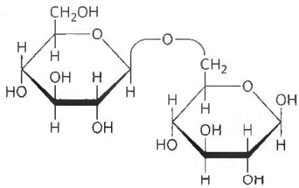

Yes; yes

15. N-Acetyl- $\beta$ -D-glucosamine is a reducing sugar; its C-1 can be oxidized (p. 237). D-Gluconate is not a reducing sugar; its C-1 is already at the oxidation state of a carboxylic acid. GlcN( $\alpha$ 1 $\leftrightarrow$ 1 $\alpha$ )Glc is not a reducing sugar; the anomeric carbons of both monosaccharides are involved in the glycosidic bond.

16. Native cellulose consists of glucose units linked by (β1→4) glycosidic bonds, which force the polymer chain into an extended conformation. Parallel series of these extended chains form intermolecular hydrogen bonds, aggregating into long, tough, insoluble fibers. Glycogen consists of glucose units linked by (α1→4) glycosidic bonds, which cause bends in the chain and prevent formation of long fibers. In addition, glycogen is highly branched and, because many of its hydroxyl groups are exposed to water, is highly hydrated and disperses in water.

Cellulose is a structural material in plants, consistent with its side-by-side aggregation into insoluble fibers. Glycogen is a storage fuel in animals. Highly hydrated glycogen granules with their many nonreducing ends can be rapidly hydrolyzed by glycogen phosphorylase to release glucose 1-phosphate.

17. Cellulose is several times longer; it assumes an extended conformation, whereas amylose has a helical structure.

18. $7 \times 10^{3}$ residues/s

19. Glycoproteins: b, c, f; proteoglycans: a, d, e

20. The ball-and-stick models of the disaccharide in Fig. 7-16 show no steric interactions, but space-filling models, showing atoms with their correct relative sizes, would show several strong steric hindrances in the high-energy conformer that are not present in the extended conformer.

21. The negative charges on chondroitin sulfate repel each other and force the molecule into an extended conformation. The polar molecule attracts many water molecules, increasing the molecular volume. In the dehydrated solid, each negative charge is counterbalanced by a positive ion, and the molecule condenses.

22. Positively charged amino acid residues would bind the highly negatively charged groups on heparin. In fact, Lys residues of antithrombin III interact with heparin.

23. The order of the hexoses (ABC, ACB, etc.), the stereochemistry at each of two anomeric carbons ( $\alpha$ or $\beta$ ), and the carbon atoms involved in each glycosidic linkage ((1→4), (1→6), (3→4), etc.)

25. Oligosaccharides; their subunits can be combined in more ways than the amino acid subunits of oligopeptides. Each hydroxyl group can participate in glycosidic bonds, and the configuration of each glycosidic bond can be either $\alpha$ or $\beta$ . The polymer can be linear or branched.

26. Administer an oligosaccharide with the same structure as that recognized by ricin, or high concentrations of N-acetylgalactosamine itself. Ricin will bind the free oligosaccharide or acetylgalactosamine instead of the cell surface target, preventing the entry of the toxin.

27. (a) Branch-point residues yield 2,3-di-O-methylglucose; unbranched residues yield 2,3,6-tri-O-methylglucose. (b) 3.75%

28. (a) The tests involve trying to dissolve only part of the sample in a variety of solvents, then analyzing both dissolved and undissolved materials to see whether their compositions differ. (b) For a pure substance, all molecules are the same and any dissolved fraction will have the same composition as any undissolved fraction. An impure substance is a mixture of more than one compound. When the sample is treated with a particular solvent, more of one component may dissolve, leaving more of the other component(s) behind. As a result, the dissolved and undissolved fractions will have different compositions. (c) A quantitative assay allows researchers to be sure that none of the activity has been lost through degradation. When the structure of a molecule is being determined, it is important that the sample under analysis consist only of intact (undegraded) molecules. If the sample is contaminated with degraded material, this will give confusing and perhaps uninterpretable structural results. A qualitative assay would detect the presence of activity, even if the sample had become significantly degraded. (d) Results 1 and 2. Result 1 is consistent with the known structure, because type B antigen has three molecules of galactose; types A and O each have only two. Result 2 is also consistent, because type A has two amino sugars (N-acetylgalactosamine and N-acetylglucosamine); types B and O have only one (N-acetylglucosamine). Result 3 is not consistent with the known structure: for type A, the glucosamine:galactosamine ratio is 1:1; for type B, it is 1:0. (e) The samples were probably impure and/or partly degraded. The first two results were correct possibly because the method was only roughly quantitative and thus not as sensitive to inaccuracies in measurement. The third result is more quantitative and thus more likely to differ from predicted values because of impure or degraded samples. (f) An exoglycosidase. If it were an endoglycosidase, one of the products of its action on O antigen would include galactose, N-acetylglucosamine, or N-acetylgalactosamine, and at least one of those sugars would be able to inhibit the degradation. Given that the enzyme is not inhibited by any of these sugars, it must be an exoglycosidase, removing only the terminal sugar from the chain. The terminal sugar of O antigen is fucose, so fucose is the only sugar that could inhibit the degradation of O antigen. (g) The exoglycosidase removes N-acetylgalactosamine from A antigen and galactose from B antigen. Because fucose is not a product of either reaction, it will not prevent removal of these sugars, and the resulting substances will no longer be active as A antigen or as B antigen. However, the products should be active as O antigen, because degradation stops at fucose. (h) All the results are consistent with Fig. 10-13. (1) D-Fucose and L-galactose, which would protect against degradation, are not present in any of the antigens. (2) The terminal sugar of A antigen is N-acetylgalactosamine, and this sugar alone protects this antigen from degradation. (3) The terminal sugar of B antigen is galactose, which is the only sugar capable of protecting this antigen.

<!-- EN-END 第7章章末 -->
