## 第 10 章 脂质和生物膜

> **本章英文对应内容**（Lehninger，插在所列中文小节末尾）
>
> - 第10章 Lipids：章首导言（本章开头）、关键术语/习题/简答（本章末尾）
> - 第11章 Biological Membranes and Transport：章首导言（本章开头）、关键术语/习题/简答（本章末尾）
> - §10.1（第10章）→ 一、贮存脂质——三酰甘油和蜡
> - §10.2（第10章）→ 二、膜结构脂质——磷脂、糖脂和固醇
> - §10.3（第10章）→ 三、活性脂质——作为信号、辅因子和色素
> - §10.4（第10章）→ 六、脂质的提取、分离和分析
> - §11.1（第11章）→ 五、生物膜的组成和结构
> - §11.2（第11章）→ 五、生物膜的组成和结构
> - §11.3（第11章）→ 五、生物膜的组成和结构

脂质(lipid)也称脂类,是一类化学上多种多样的生物有机分子,其共同特征是低溶或不溶于水而高溶于非极性溶剂。对大多数脂质而言,化学本质是脂肪酸和醇形成的酯及其衍生物。脂质的元素组成主要是碳、氢、氧,有些尚含氮、磷、硫。按化学组成,脂质大体可分为三类:①简单脂质(simple lipid),由脂肪酸和甘油或长链醇形成的酯,如三酰甘油和蜡;②复合脂质(compound lipid),除含脂肪酸和醇外,尚有所谓非脂分子成分(磷酸、糖和含氮碱等),如甘油磷脂、鞘[氨醇]磷脂、甘油糖脂和鞘[氨醇]糖脂,其中鞘磷脂和鞘糖脂又合称为鞘脂;③衍生脂质(derived lipid),可视为由前面两类脂质衍生而来并具有脂质一般性质的物质,如脂肪酸、萜、类固醇、类二十烷酸(eicosanoid)及其他。按生物学功能,脂质也可分为三类:①贮存脂质(storage lipid),它们是三酰甘油和蜡,三酰甘油是许多生物的主要贮能形式,蜡是海洋浮游生物的能量储库;②结构脂质(structural lipid),是生物膜的结构成分,包括磷脂、胆固醇和糖脂;③活性脂质(active lipid),它们虽是细胞内的小量成分,但具有重要而专一的生物活性,如酶的辅因子、电子载体、吸光色素、蛋白质的疏水锚、消化道中的乳化剂、激素和胞内信使等。

本章将按它们的生物学作用组织讨论各类有代表性的脂质，包括三酰甘油、蜡、磷脂、鞘脂、萜和类固醇等，重点放在它们的化学结构和物理性质；此外还要讨论血浆脂蛋白、生物膜（结构和功能）以及脂质的提取、分离和分析。脂质的产能氧化及其生物合成将在第24章讨论。

<!-- EN-BEGIN 第10章导言 -->

### 【英文对应 第10章导言】Lipids

> 来源：Lehninger Principles of Biochemistry（书籍/02_生物化学原理） 第10章章首（含章节目录与学习要点）。

10.1 Storage Lipids 341

10.2 Structural Lipids in Membranes 346

#### [EN] 10.3 Lipids as Signals, Cofactors, and Pigments 354

10.4 Working with Lipids 361

Biological lipids are a chemically diverse group of compounds, the common and defining feature of which is their insolubility in water. The biological functions of the lipids are as diverse as their chemistry. Fats and oils are the principal stored forms of energy in many organisms. Phospholipids and sterols are major structural elements of biological membranes. Other lipids, although present in relatively small quantities, play crucial roles as enzyme cofactors, electron carriers, light-absorbing pigments, hydrophobic anchors for proteins, "chaperones" to help membrane proteins fold, emulsifying agents in the digestive tract, hormones, and intracellular messengers. This chapter introduces representative lipids of each type, organized according to their functional roles, with emphasis on their chemical structure and physical properties. Although we follow a functional organization for our discussion, the thousands of different lipids can also be organized into eight general categories of chemical structure (listed in Table 10-2, at the end of this chapter). We discuss the energy-yielding oxidation of lipids in Chapter 17 and their synthesis in Chapter 21. Here, we will focus on four principles of cellular lipid function:

P1 Fatty acids are water-insoluble hydrocarbons used for cellular energy storage. Fatty acids are highly reduced and thus provide a rich source of stored chemical energy for cells. Storage of hydrophobic fats as triacylglycerols is also highly efficient because water is not needed to hydrate the stored fats.

P2 Membrane lipids are composed of hydrophobic tails attached to polar head groups. Cellular membranes are composed of a variety of lipids, including glycerophospholipids and sterols. These lipids are used for structuring membranes as well as for displaying molecules on the membrane surfaces for signaling and molecular recognition.

#### [EN] P3 Lipids have uses in the cell beyond energy storage and construction of membranes.

Many lipids are present in the cell at smaller amounts than those making up membranes or being stored as fat. These lipids can function as cellular messengers, hormones, electron carriers, or pigments.

P4 The chemical properties of lipids are related to their structure and composition. As in studies of other biomolecules, methods such as enzymatic, chromatographic, and mass spectrometry can all be used to identify lipids and determine their atomic structure.

<!-- EN-END 第10章导言 -->

<!-- EN-BEGIN 第11章导言 -->

### 【英文对应 第11章导言】Biological Membranes and Transport

> 来源：Lehninger Principles of Biochemistry（书籍/02_生物化学原理） 第11章章首（含章节目录与学习要点）。

#### [EN] BIOLOGICAL MEMBRANES AND TRANSPORT

11.1 The Composition and Architecture of Membranes 367

11.2 Membrane Dynamics 377

11.3 Solute Transport across Membranes 385

The first cell probably came into being when a membrane formed, enclosing a small volume of aqueous solution and separating it from the rest of the universe. Membranes define the external boundaries of cells and control the molecular traffic across that boundary; in eukaryotic cells, they also divide the internal space into discrete compartments to segregate processes and components. Proteins embedded in and associated with membranes organize complex reaction sequences and are central to both biological energy conservation and cell-to-cell communication.

In this chapter we focus on these principles that underlie the structure and function of biological membranes:

P1 The biological membrane is a lipid bilayer with proteins of various functions (enzymes, transporters) embedded in or associated with the bilayer. The hydrophobic effect stabilizes structures (lipid bilayers and vesicles) in which lipids with some polar and some nonpolar regions can protect their nonpolar regions from interaction with the very polar solvent, water. Membrane proteins are associated with the lipid bilayer more-or-less tightly, and proteins and lipids are both allowed limited lateral motion in the plane of the bilayer.

P2 All of the internal membranes of cells are part of an interconnected, functionally specialized, and dynamic endomembrane system. Proteins and lipids synthesized in the endoplasmic reticulum move through the Golgi apparatus, and they are targeted to the membranes of organelles or to the plasma membrane, where they provide the essential properties of these structures. During this

membrane trafficking, some proteins are covalently altered, and some lipids are segregated into different organelles or are concentrated in one of the bilayer leaflets. Rafts are functionally specialized regions with unique lipid and protein compositions.

Although the lipid bilayer is impermeable to charged or polar solutes, cells of all kinds have many membrane transporters and ion channels that catalyze transmembrane movement of specific solutes. Some transporters merely speed the movement of solutes in the direction that simple diffusion takes them, whereas others use an energy source to move solutes against a concentration gradient.

<!-- EN-END 第11章导言 -->

## 一、贮存脂质——三酰甘油和蜡

三酰甘油(油和脂)被生物普遍地用作体内能量的贮存形式,蜡是海洋浮游生物的能量储库;两者都是含脂肪酸的化合物。脂肪酸是烃的衍生物,它具有与矿物燃料中的烃几乎相同的低氧化态(即高还原态)。脂肪酸在细胞中氧化产生 $CO_{2}$ 和 $H_{2}O$ ,很像矿物油在内燃机中受控的快速燃烧,是一个高放能反应。

下面讨论在活生物中最普遍存在的脂肪酸和两类含脂肪酸的化合物三酰甘油和蜡,讲解它们的结构和物理性质等。

## （一）脂肪酸是烃的衍生物

从动、植物和微生物中分离出来的脂肪酸已有百多种。在生物体内大量的脂肪酸都以结合形式存在于三酰甘油、蜡、磷脂和糖脂等化合物中，但也有少量的脂肪酸以游离状态出现在组织和细胞中。

## 1. 脂肪酸的结构和命名

脂肪酸(fatty acid, FA)是具有4到36碳长 $\left(\mathrm{C}_{4}\sim\mathrm{C}_{36}\right)$ 烃链的羧酸。脂肪酸中烃链多数是线型的，分支或含环的为数很少。在某些脂肪酸中烃链完全不含双键(烯键)，称饱和脂肪酸(saturated FA)；另一些脂肪酸中含一个或多个双键，称不饱和脂肪酸(unsaturated FA)。只含单个双键的脂肪酸称单不饱和脂肪酸(monounsaturated FA)；含2个或2个以上双键的称多不饱和脂肪酸(PUFA)。不同脂肪酸之间的主要区别在于烃链的长度(碳原子数目)、双键数目和位置。每个脂肪酸都有一个通俗名称和系统名称，不分支的脂肪酸还有一个简写符号(表10-1)。简写的标准惯例(图10-1A)是，写出链长(碳数)和双键数目，两者之间用冒号(:)隔开。例如，饱和的[正]十八[碳烷]酸(硬脂酸)缩写为18:0，含一个双键的十六[碳]单烯酸(棕榈油酸)缩写为16:1。任一双键的位置是指跟羧基碳(标为C1)的关系，用 $\Delta(\text{delta})$ 右上标的数字表示，数字是指双键键合的两个碳原子的序号中较低者，例如在C9和C10之间及C12和C13之间各有一个双键的十八[碳]二烯酸(亚油酸)表示为 $18:2\Delta^{9.12}$ 。有时在序号后面用 $c(\text{cis},\text{顺式})$ 和 $t(\text{trans},\text{反式})$ 标明双键的构型。例如，顺，顺，顺(或全顺)-9,12,15-十八三烯酸( $\alpha$ -亚麻酸)简写为 $18:3\Delta^{9c,12c,15c}$ 。

表 10-1 最常见的生物脂肪酸

<table><tr><td>通俗名称 $^{\text{1}}$ </td><td>系统名称 $^{\text{2}}$ </td><td>简写符号 $^{\text{3}}$ </td><td>结构 $^{\text{4}}$ </td><td>熔点/°C</td></tr><tr><td>月桂酸(lauric)</td><td>n-十二酸(n-dodecanoic)</td><td>12:0</td><td> $CH_3(CH_2)_{10}COOH$ </td><td>44.2</td></tr><tr><td>肉豆蔻酸(myristic)</td><td>n-十四酸(n-tetradecanoic)</td><td>14:0</td><td> $CH_3(CH_2)_{12}COOH$ </td><td>53.9</td></tr><tr><td>棕榈酸(软脂酸)(palmitic)</td><td>n-十六酸(n-hexadecanoic)</td><td>16:0</td><td> $CH_3(CH_2)_{14}COOH$ </td><td>63.1</td></tr><tr><td>硬脂酸(stearic)</td><td>n-十八酸(n-octadecanoic)</td><td>18:0</td><td> $CH_3(CH_2)_{16}COOH$ </td><td>69.6</td></tr><tr><td>花生酸(arachidic)</td><td>n-二十酸(n-eicosanoic)</td><td>20:0</td><td> $CH_3(CH_2)_{18}COOH$ </td><td>76.5</td></tr><tr><td>山嵛酸(behenic)</td><td>n-二十二酸(n-docosanoic)</td><td>22:0</td><td> $CH_3(CH_2)_{20}COOH$ </td><td>81.5</td></tr><tr><td>木蜡酸(lignoceric)</td><td>n-二十四酸(n-tetracosanoic)</td><td>24:0</td><td> $CH_3(CH_2)_{22}COOH$ </td><td>86</td></tr><tr><td>棕榈油酸(palmitoleic)</td><td>十六碳-9-烯酸(顺)(cis-9-hexadecenoic)</td><td>16:1 $\Delta^9$ </td><td> $CH_3(CH_2)_5CH=CH(CH_2)_7COOH$ </td><td>-0.5</td></tr><tr><td>油酸(oleic)</td><td>十八碳-9-烯酸(顺)(cis-9-octadecenoic)</td><td>18:1 $\Delta^9$ </td><td> $CH_3(CH_2)_7CH=CH(CH_2)_7COOH$ </td><td>13.4</td></tr><tr><td>亚油酸(linoleic)</td><td>十八碳-9,12-二烯酸(顺,顺)(cis,cis-9,12-octa-decadienoic)</td><td>18:2 $\Delta^{9,12}$ </td><td> $CH_3(CH_2)_4(CH=CHCH_2)_2(CH_2)_6COOH$ </td><td>-5</td></tr><tr><td>α-亚麻酸(α-linolenic)</td><td>十八碳-9,12,15-三烯酸(全顺)(all cis-9,12,15-octadecatrienoic)</td><td>18:3 $\Delta^{9,12,15}$ </td><td> $CH_3CH_2(CH=CHCH_2)_3(CH_2)_6COOH$ </td><td>-11</td></tr><tr><td>花生四烯酸(arachidonic)</td><td>二十碳-5,8,11,14-四烯酸(全顺)(all cis-5,8,11,14-eicosatetraenoic)</td><td>20:4 $\Delta^{5,8,11,14}$ </td><td> $CH_3(CH_2)_4(CH=CHCH_2)_4(CH_2)_2COOH$ </td><td>-49.5</td></tr></table>

① 英文名称中省去“acid”；② 前缀 n 是正[常]（normal）的意思，表示该脂肪酸链是线型和不分支的；注意碳原子的标号从羧基碳（标为 C1）开始；③ 脂肪酸中每个双键都应该指出它的构型，例如亚油酸的简写为 $18:2\Delta^{9c,12c}$ ，但生物脂肪酸中双键几乎总是顺式的，因此在简写中在表示双键位置的数字后面未标构型符号 c（顺）或 t（反）；④ 所有的脂肪酸都以不解离的形式示出，但在 pH 7 时游离脂肪酸的羧基均处于解离状态。

## 2. 生物脂肪酸的结构特点

来自动物的脂肪酸,结构比较简单,碳骨架为线型,双键数目一般为1\~4个,少数多达6个。细菌所含的脂肪酸绝大多数是饱和的,少数为单烯酸,有些含有分支的甲基或三碳环。植物特别是高等植物中不饱和脂肪酸比饱和脂肪酸丰富,有些植物脂肪酸可含叁键(炔键)、羟基、酮基和五碳环。

生物脂肪酸中最常见的骨架长为 $12\sim 24$ 个碳，一般不分支，并且碳原子数目几乎总是偶数的（表10-1）。这是因为在生物体内脂肪酸是以二碳（乙酸盐）单位连续加入的方式从头合成的（见第24章）。奇数碳的脂肪酸在某些海洋生物中有相当量的存在。在大多数单不饱和脂肪酸中双键的位置几乎总在C9和C10之间 $(\Delta^9)$ ；在多不饱和脂肪酸中通常一个双键也位于 $\Delta^9$ ，其余双键位于 $\Delta^{12}$ 和 $\Delta^{15}$ ，但花生四烯酸是一个例外。生物脂肪酸中双键安排的形式几乎总不是共轭的，即不是单、双键交替排列而是由一个亚甲基（methylene）把双键与双键隔开，如一CH=CH-CH₂-CH=CH-(图10-1B)。只有少数PUFA，如乌柏酸(stillingic acid; $10:2\Delta^{2t,4c}$ )和 $\alpha-$ 桐油酸(eleostearic acid; $18:3\Delta^{9c,11t,13t}$ )，单、双键交替排列成共轭双键系统。这两种系统在化学反应性能上有明显差异：非共轭系统中2个双键之间的亚甲基可直接发生化学反应，形成自由基(radical)；共轭双键系统中由于 $\pi$ 电子有相当大的离域作用，脂肪酸很容易发生聚合反应。含桐油酸的桐油(tung oil)被用于油漆工业就是基于这一性质。视黄醇和胡萝卜素都

是生物分子中具有共轭系统的突出例子，它们的双键系统在视网膜的视觉过程中起着重要作用（见第13章）。生物脂肪酸中双键多数为顺式构型；少数是反式构型，如反式异油酸（vaccenic acid; $18:1\Delta^{11t}$ ）、乌柏酸和 $\alpha-$ 桐油酸。有些反式脂肪酸可在乳品牲畜的瘤胃中发酵产生，并从它们的乳品和肉类中获得。此外顺式脂肪酸与某些催化剂一起加热能变为反式，例如油酸在亚硝酸存在下容易转变为反油酸（elaidic acid, $18:1\Delta^{9t}$ ），后者有较高的熔点（ $43\sim45^{\circ}C$ ）。虽然反油酸不是天然存在的，但植物油进行氢化时有相当量的形成。

## 3. 多不饱和脂肪酸(PUFA)与必需脂肪酸

  
图10-1 脂肪酸命名的两种惯例

离碳链甲基端的第3碳和第4碳之间具有一个双键的多不饱和脂肪酸（polyunsaturated fatty

A. 标准惯例规定羧基碳为序号 1(C1)，如用希腊文字母标号羧基碳后为 $\alpha$ (C2)。锯齿形的每一线段代表两个相邻碳之间的一个单键。任一双键的位置用 $\Delta$ 右上标数字（该双键中较低的数字）表示。B. 对 PUFA 采用另一惯例：与标准惯例相反方向标号，规定碳链另一端的甲基碳为序号 1，此碳也标为 $\omega$ (omega；希腊文字母表中最后一个)，双键位置是指与 $\omega$ 碳的关系

acid;PUFA),在人体营养方面有着特殊的重要性。因为PUFA的生理作用跟靠近碳链甲基端的第1个双键位置比靠近羧基端的关系更大,所以有时对这些脂肪酸采用另一种命名规则:末端的甲基碳——即离羧基最远的碳——称为 $\omega$ (omega) 碳,并标号为C1。按此规则C3和C4之间有一个双键的PUFA被称为omega-3(ω-3)脂肪酸,在C6和C7之间有一个双键的称omega-6(ω-6)脂肪酸。

人体及哺乳动物能制造多种脂肪酸，但不能向脂肪酸中引进超过 $\Delta^9$ 的双键，因而不能合成亚油酸（ $18:2\Delta^{9,12}$ ，在标准惯例中）和 $\alpha-$ 亚麻酸（ $18:3\Delta^{9,12,15}$ ）。因为这两种脂肪酸对人体功能是必不可少的，但必须由膳食特别是植物性食物中获取，因此它们被称为必需脂肪酸（essential fatty acid）。

亚油酸和 $\alpha$ -亚麻酸分别属于两个不同的PUFA家族： $\omega-6$ 和 $\omega-3$ 脂肪酸。亚油酸是 $\omega-6$ 家族的原初成员，人和哺乳类体内能把它转变为 $\gamma$ -亚麻酸（ $18:3\Delta^{6,9,12}$ ），并继而延长为花生四烯酸（第24章），后者是维持细胞膜的结构和功能所必需的，也是合成一类调节性脂质类二十烷酸的前体。 $\alpha$ -亚麻酸是 $\omega-3$ 家族的原初成员，由膳食供给 $\alpha$ -亚麻酸时，人体能合成两种其他的 $\omega-3$ 脂肪酸：二十碳五烯酸（EPA；eicosapentaenoic acid； $20:5\Delta^{5,8,11,14,17}$ ；见图 $10-1B$ ）和二十二碳六烯酸（DHA；docosahexaenoic acid； $22:6\Delta^{4,7,10,13,16,19}$ ）。体内许多组织如视网膜、大脑皮层中都含有这些重要的 $\omega-3$ PUFA，它们对细胞的功能非常重要。大脑中约一半DHA是在出生前积累的，一半是在出生后积累的，这表明脂质成分在怀孕和哺乳期间的重要性。人体内 $\omega-6$ 和 $\omega-3$ 家族是不能互相转变的。多数人可以从膳食中获得足够量的 $\omega-6$ 脂肪酸（脂质形式），但可能缺乏最适量的 $\omega-3$ 脂肪酸。膳食中 $\omega-6$ 和 $\omega-3$ 脂肪酸的不平衡与心血管疾病风险增加有关联。许多学者认为 $\omega-6$ 对 $\omega-3$ 的最适比是在 $1:1$ 到 $4:1$ 之间。低心血管风险的“地中海膳食”富含 $\omega-3$ PUFA，它们是从叶菜和鱼油中获得的。鱼油中EPA和DHA特别丰富，有心血管病史者常被建议补充些鱼油。 $\omega-6$ 和 $\omega-3$ PUFA的主要膳食来源见表 $10-2$ 。

表 10-2 $\omega  - 6$ 和 $\omega  - 3$ 多不饱和脂肪酸的来源

<table><tr><td>脂肪酸</td><td>来源</td></tr><tr><td>亚油酸( $\omega-6$ )</td><td>植物油(葵花籽、大豆、棉籽、红花籽、玉米胚、小麦胚、芝麻、花生、油菜籽)</td></tr><tr><td> $\gamma$ -亚麻酸和花生四烯酸( $\omega-6$ )</td><td>肉类,玉米胚油等,(或在体内由亚油酸合成)</td></tr><tr><td> $\alpha$ -亚麻酸( $\omega-3$ )</td><td>油脂(芝麻、胡桃、大豆、小麦胚、油菜籽),种子,坚果(芝麻、大豆、胡桃)</td></tr><tr><td>EPA 和 DHA( $\omega-3$ )</td><td>人乳,海洋动物包括鱼类(鲭、鲑、鲱、沙丁鱼等)、贝类和甲壳类(虾、蟹等),(或在体内由  $\alpha$ -亚麻酸合成)</td></tr></table>

## 4. 脂肪酸的物理和化学性质

脂肪酸和含脂肪酸化合物的物理性质很大程度上取决于脂肪酸烃链的长度和不饱和程度。非极性烃链是造成脂肪酸在水中溶解度低的原因，例如月桂酸(12:0; $M_{r}$ 200)在水中的溶解度为0.063 mg/g，远低于葡萄糖( $M_{r}$ 180)1100 mg/g；20℃时硬脂酸(18:0)在水中的溶解度为0.003 mg/g。一般说，脂[肪]酰链愈长，双键愈少，在水中的溶解度愈低。脂肪酸的羧基是极性的，在中性pH时电离，因此短链脂肪酸（少于 $C_{10}$ )略能溶于水。

脂肪酸和含脂肪酸化合物的熔点也受烃链长度和不饱和程度的影响。在室温(25℃)下，12：0到24：0的饱和脂肪酸为蜡样固体，同样链长的不饱和脂肪酸为油状液体。熔点的这种差异是由于脂肪酸分子装配紧密程度不同引起的。在完全饱和的脂肪酸中绕每个碳-碳键都可以自由旋转，这给烃链以很大的柔性；最稳定的构象是完全伸展的形式（图10-2A），此中相邻原子的位阻最小。这些分子可以紧密地装配在一起，形成近乎晶体排列（图10-2D），所有的原子沿长向与相邻分子的原子处于范德华接触中。在不饱和的脂肪酸中，一个顺式双键使烃链形成一个“结节（kink）”（图10-2B）；一个这样的结节在烃链中产生约30°的刚性弯曲（图10-2C）。具有一个或多个结节的脂肪酸不能像完全饱和的脂肪酸那样紧密地装配在一起，因此分子间的相互作用被削弱（图10-2E）。因为破坏有序性差的排列所需的热能较少，所以它们的熔点比相同链长的饱和脂肪酸明显要低；相同链长的不饱和脂肪酸，双键愈多熔点愈低（表10-1）。

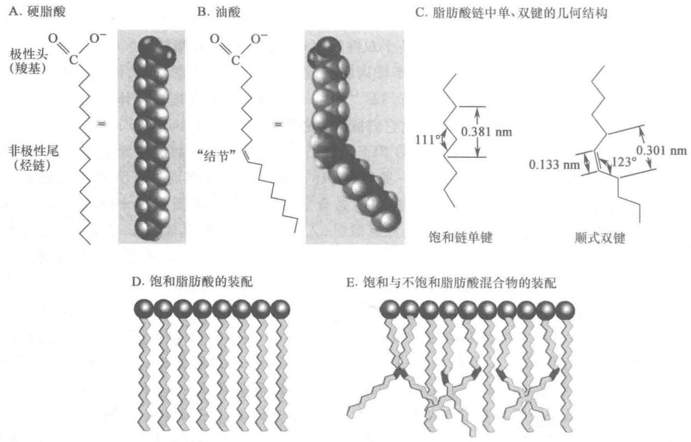  
图 10-2 脂肪酸构象(结构式和空间填充模型)和脂肪酸装配成聚集体

A. 完全饱和的硬脂酸(18:0)处于伸展构象; B. 含顺式双键的油酸(18:1 $\Delta^{9}$ ), 由于双键限制旋转, 在烃链中引入一个刚性弯折, 但所有其他的键旋转自由; C. 脂肪酸链中双键引起的弯折几何结构; D. 伸展型饱和脂肪酸借疏水相互用装配成近似晶体的排列; E. 含顺式双键的不饱和脂肪酸的存在干扰紧密装配, 形成稳定性差的聚集体

在脊椎动物中游离脂肪酸(未酯化而具有自由羧基的脂肪酸)是以与蛋白质载体(血清清蛋白)非共价结合的形式参与血循环的。然而脂肪酸在血浆中主要以羧酸衍生物例如酯或酰胺形式(三酰甘油、磷脂、鞘脂等)存在。由于缺乏荷电的羧酸基这些脂肪酸衍生物一般在水中的溶解度比游离脂肪酸更小。

脂肪酸可以发生氧化和过氧化,不饱和脂肪酸在双键处可以发生加成如卤化和氢化。关于这些反应

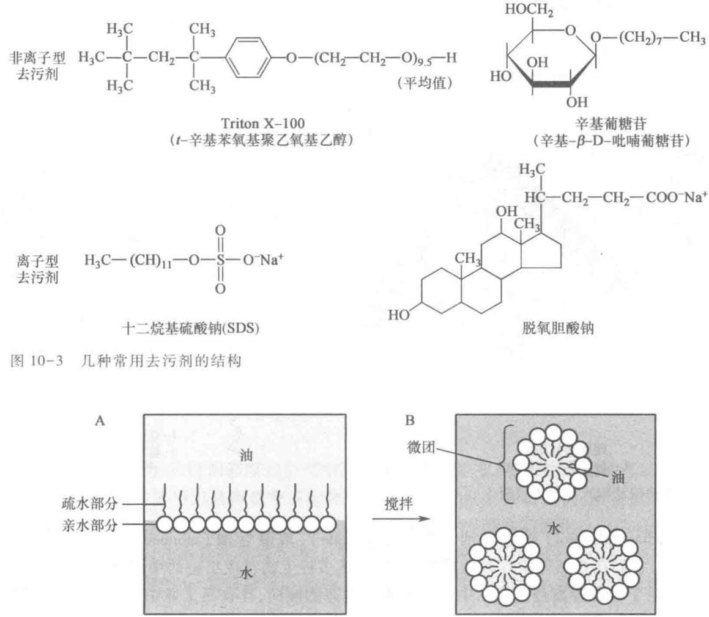  
图 10-4 去污剂通过形成微团乳化油和烃

参见有机化学教本，有的将在“三酰甘油”部分讨论。

## 5. 脂肪酸盐与乳化作用

脂肪酸盐具有亲水基(解离的羧基)和疏水基(长的烃链),是典型的两亲化合物(amphipathic compound),是一种离子型去污剂。属于这类去污剂的还有天然的胆汁酸盐(脱氧胆酸钠),人工合成的十二烷基硫酸钠(SDS)等(图10-3)。去污剂都是两亲分子,在油水混合物中,疏水部分被吸引到油(或烃类),亲水部分被吸引到水,在油水界面处形成单分子层(图10-4A)。由于去污剂是可溶性脂,当浓度增加到大于某一浓度(称临界微团浓度,cmc)时,在水中倾向于形成微团,亲水部分朝外,疏水部分聚集在中心。当搅拌分层的油水混合物时,大堆的油可以分散成细小油滴;如果无去污剂存在,搅拌停止油滴又很快聚集成原来的油层。然而有去污剂存在时,油滴被裹上一层去污剂分子,即油滴处于微团状态(图10-4B)。这样油滴作为亲水物体悬于水中而成稳定的乳胶(emulsion),此过程称为乳化(emulsification)。去污剂也称乳化剂。用于清洁时,形成的乳胶(含油)则被濯去。从能量角度看,去污剂是一种表面活性物质(surfactant)。它能降低油滴的界面张力,也即在不改变界面积(即不改变分散度)的情况下能降低系统的表面能(界面张力与界面积的乘积),使分散系统得以稳定。去污剂除用于清洁外,也用于生化实验。离子型去污剂如SDS在高浓度时能使蛋白质完全变性,多肽链处于伸展状态。SDS凝胶电泳中变性蛋白质的迁移率是其相对分子质量的可靠量度(第5章)。非离子型去污剂如Triton X-100(商品名)和辛基葡糖苷(图10-3)在不同浓度以不同方式起作用。这些物质在高于cmc时,能使生物膜溶解,形成以去污剂为主并掺有膜脂、膜蛋白的混合微团;低于cmc时一般不引起蛋白质变性,不形成微团,但能从膜中溶解膜结合的蛋白质,有利于膜蛋白的分离提取。

## （二）三酰甘油是甘油的脂肪酸酯

动植物油脂的化学本质是酰基甘油(acylglycerol)，其中主要是三酰甘油(triacylglycerol；TG)或称甘油三酯(triglyceride)，此外还有少量二酰甘油和单酰甘油。常温下呈液态的酰基甘油称油(oil)，呈固态的称脂[肪]（fat）。植物性酰基甘油多为油（可可脂例外），动物性酰基甘油多为脂（鱼油例外）。固、液态的酰基甘油统称为油脂，也称中性脂肪(neutral fat)或脂肪。

## 1. 三酰甘油的结构

三酰甘油是一个甘油和三个脂肪酸形成的三酯(triester)，其结构通式如图10-5所示。三酰甘油通式中 $\mathbb{R}_1, \mathbb{R}_2$ 和 $\mathbb{R}_3$ 相当于各个脂肪酸的烃链。当 $\mathrm{R}_1 = \mathrm{R}_2 = \mathrm{R}_3$ 时，该化合物称为简单三酰甘油（Simple TG）。例如 $16:0, 18:0$ 和 $18:1$ 的简单三酰甘油分别称为三棕榈酰（酸）甘油酯(tripalmitoleoylglycerol或tripalmitin）、三硬脂酰（酸）甘油酯(tristearoylglycerol或tristearin)和三油酰（酸）甘油酯(trioleoylglycerol或triolein)(图10-6A)。当 $\mathbb{R}_1, \mathbb{R}_2$ 和 $\mathbb{R}_3$ 中任何两个不相同或3个各不相同时，称为混合三酰甘油(mixed TG)，如1-豆蔻酰-2-硬脂酰-3-棕榈油酰甘油(1-myristoyl-2-stearoyl-3-palmitoleoylglycerol)(图10-6B)。混合三酰甘油中脂肪酸可以有不同的排列方式，为确切地命名这些化合物，必须指明每个脂肪酸的名称和位置。大多数天然油脂都是简单三酰甘油和混合三酰甘油的复杂混合物。

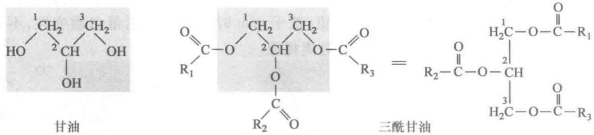  
图10-5 甘油和三酰甘油的结构

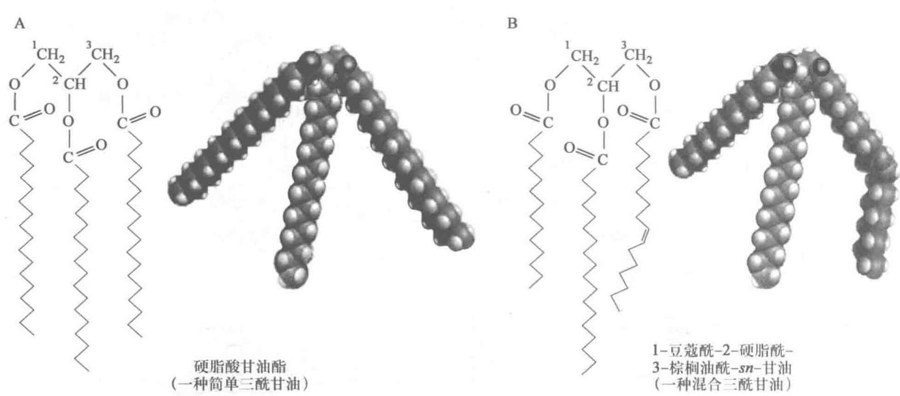  
图 10-6 三酰甘油的结构式和分子模型

二酰甘油（diacylglycerol）或称甘油二酯（diglyceride），单酰甘油（monoacylglycerol）或称甘油单酯（monoglyceride），它们在自然界中存在的量虽不大，却是多种生物合成反应的中间物（第24章）。它们，特别是单酰甘油，由于含有游离羟基在水中具有形成分散态的倾向，在食品工业中常被用作乳化剂。

## 2. 三酰甘油的物理和化学性质

纯的三酰甘油是无色、无臭和无味的稠性液体或蜡状固体。三酰甘油的密度均小于 $1\mathrm{g} / \mathrm{cm}^3$ ，一般为 $0.91\sim 0.94~\mathrm{g / cm^3}$ 。三酰甘油为非极性分子，不溶于水，略溶于低级醇，易溶于乙醚、氯仿、苯和石油醚等非极性有机溶剂，称脂溶剂（fat solvent）。三酰甘油的这些性质解释了油水混合总是分成两相，油相总是在水相之上的原因。三酰甘油能被乳化剂例如胆汁酸盐等所乳化，使油脂能与水“混溶”。由于大多数的天然油脂都是简单和混合三酰甘油的复杂混合物，因此没有明确的熔点，只有一个大概范围。三酰甘油的熔点与其脂肪酸组成有关，一般随组分中不饱和脂肪酸和相对低分子质量脂肪酸的比例增高而降低（表10-3）。植物油，如玉米油和橄榄油，主要是由含不饱和脂肪酸的三酰甘油组成，因此在室温下是液体。只含饱和脂肪酸的三酰甘油例如三硬脂酸甘油酯（牛脂的主要成分）室温下是白色凝脂状固体。

表 10-3 几种食用油脂的主要脂肪酸组成、熔点和碘值

<table><tr><td rowspan="2">油脂</td><td rowspan="2">熔点/°C</td><td rowspan="2">碘值</td><td colspan="5">脂肪酸组成/(g·100 g-1总脂肪酸)</td></tr><tr><td>棕榈酸</td><td>硬脂酸</td><td>油酸</td><td>亚油酸</td><td>其他</td></tr><tr><td>奶油</td><td>28~33</td><td>26~45</td><td>23~26</td><td>10~13</td><td>30~40</td><td>4~5</td><td>7~9 $^{1}$ ,4.6 $^{2}$ </td></tr><tr><td>牛油</td><td>40~50</td><td>31~47</td><td>24~32</td><td>14~32</td><td>35~48</td><td>2~4</td><td>2~3 $^{1}$ ,1~3 $^{2}$ </td></tr><tr><td>羊油</td><td>44~52</td><td>32~50</td><td>25 $^{8}$ </td><td>31</td><td>36</td><td>4.3</td><td>4.6 $^{1}$ </td></tr><tr><td>猪油</td><td>28~46</td><td>46~68</td><td>25~28</td><td>12~18</td><td>43~52</td><td>7~9</td><td>1~3 $^{2}$ ,2~3 $^{6}$ </td></tr><tr><td>大豆油</td><td>-10~16</td><td>122~134</td><td>7~10</td><td>2~5</td><td>22~30</td><td>50~60</td><td>5~9 $^{3}$ ,1~3 $^{7}$ </td></tr><tr><td>花生油</td><td>0~3</td><td>88~98</td><td>6~10</td><td>3~6</td><td>40~64</td><td>18~38</td><td>5~8 $^{7}$ </td></tr><tr><td>菜籽油</td><td>-10</td><td>94~103</td><td>3~10</td><td>3~10</td><td>14~29</td><td>12~24</td><td>1~10 $^{3}$ ,40~54 $^{4}$ </td></tr><tr><td>葵花籽油</td><td>-16~18</td><td>129~136</td><td>10~13</td><td>10~13</td><td>21~39</td><td>51~68</td><td></td></tr><tr><td>玉米油</td><td>-10~-20</td><td>111~128</td><td>8~13</td><td>1~4</td><td>24~50</td><td>34~61</td><td>0.6 $^{3}$ ,2 $^{5}$ </td></tr><tr><td>芝麻油</td><td>-4~-16</td><td>106~117</td><td>8~9</td><td>4~6</td><td>35~49</td><td>38~48</td><td></td></tr></table>

① 肉豆蔻酸；② 棕榈油酸；③ 亚麻酸；④ 芥子酸（22：1Δ $^{13}$ ）；⑤ 花生四烯酸；⑥ C $_{20-22}$ PUFA；⑦ C $_{20-24}$ FA；⑧ 未指出范围者为平均值。

三酰甘油能在酸、碱或脂酶的作用下水解为脂肪酸和甘油。如果在碱溶液中水解，产物之一是脂肪酸盐（如钠和钾盐），俗称皂；油脂的碱水解称为皂化[作用]（saponification）。皂化1 g油脂所需的KOH mg数称为皂化值(价)(saponification value)。皂化值是三酰甘油中脂肪酸平均链长或三酰甘油平均相对分子质量的量度。

油脂分子中的不饱和脂肪酸也能与氢或卤素起加成反应。在催化剂如 Ni 的存在下油脂中的双键与氢发生加成，称为氢化（hydrogenation）。氢化可以将液态的植物油转变成固态的脂，在食品工业中被用于制造人造黄油（margarine）和半固体的烹调脂。不饱和油脂中的烯键与溴或碘发生加成反应而成饱和的卤化脂，此过程称为卤化（halogenation）。卤化反应中吸收卤素的量反映不饱和键的多少。通常用碘值（价）（iodine value）来表示油脂的不饱和程度。碘值指 100 g 油脂卤化时所能吸收碘的克数。

含羟基脂肪酸(如蓖麻油酸)的油脂可与乙酸酐作用,生成乙酰化油脂。油脂的羟基化程度一般用乙酰[化]值(价)(acetylation number)表示。乙酰值指中和从1g乙酰化产物中释放的乙酸所需的KOH mg数。蓖麻油(castor oil)含88%\~94%的蓖麻油酸(ricinoleic acid),即12-羟十八碳-9-烯酸(顺);因此它的乙酰价很高(124\~150),但其他常见的油脂乙酰价在2\~20。

## （三）油脂酸败与脂质过氧化

## 1. 油脂酸败

油脂或富含油脂的食物,长时间暴露在空气中与氧接触会发生变质,产生难闻的气味,这种现象称为酸败(rancidity)。酸败的主要原因是脂质中不饱和脂肪酸的双键发生自动氧化,断裂成碳链较短的并因而容易挥发的醛和酸等;这些化合物容易通过空气扩散到鼻子。所谓自动氧化(auto-oxidation)是指空气中的分子氧在常温常压下对化合物的直接作用,从而导致氧化的发生。为防止自动氧化,可在新鲜油脂和含油脂食物中加入抗氧化剂如α-生育酚等。此外,排除氧气(真空或充氮),降低温度(冷藏),消去其他促进自动氧化的因素(如光、高能辐射)也能防止和延缓酸败发生。

## 2. 脂质过氧化作用

脂质的自动氧化也称脂质的过氧化（peroxidation）。脂质过氧化一般定义为脂质中的多不饱和脂肪酸氧化变质（oxidation deterioration）。多不饱和脂肪酸不仅存在于油脂中，也广泛地参与磷脂和糖脂的组成；

磷脂和糖脂是生物膜的主要成分,因此脂质过氧化将直接干扰和破坏膜的生物功能。脂质过氧化作用是典型的活性氧参与的自由基链[式]反应。下面复习几个有关的重要概念,以便了解脂质过氧化作用。

自由基(radical)是指含有奇数价电子,并因此在一个轨道上具有一个不成对电子(unpaired electron)的原子或原子团。自由基的显著特征是具有顺磁性、反应性强和寿命短;这些特点都与它们存在不成对电子有关。分子成键过程中,电子都倾向于配对,自由基中的不成对电子也是如此。因此大多数自由基都是很活泼的,反应性极强,容易发生反应,生成稳定的分子;这是自由基的一个非常重要的性质。产生自由基的途径很多,但一般是通过辐射、热或单电子氧化还原等方法,使分子或离子发生均裂(homolysis)来获得:

$$
\mathrm{A}: \mathrm{B} \xrightarrow {\text {均裂}} \mathrm{A} \cdot + \mathrm{B} \cdot
$$

式中 A:B 是 A 和 B 两个原子或原子团通过一个共价键（：）形成的分子；A·和 B·是各带一个不成对电子的自由基。通常在自由基结构中具有不成对电子的原子符号上角、上方或近旁，标上一个小圆点以表示自由基。

活性氧（reactive oxygen）是指高反应性的氧或含氧分子如 $\cdot O_{2}^{-}$ 、 $\cdot OH$ 、 $H_{2}O_{2}$ 和 ${}^{1}O_{2}$ （单线态氧）等。氧对一切需氧生物是必不可少的生存条件，但是高浓度氧（特别是氧分压大于 $0.6 \times 10^{2}$ kPa）对生物是有害的，会引起氧中毒。实验已证明，氧中毒是由于氧在机体内大量地被转变为活性氧，后者可以进攻和损害细胞膜（脂质）、蛋白质、酶和 DNA，从而引起组织病变、器官功能失常。

自由基链[式]反应(chain reaction)是自由基反应的最大特点。链反应一般包括引发、增长和终止三个阶段:①引发(initiation)是由产生一个反应性足够强的起始自由基开始的。例如脂质分子LH被抽去一个氢原子则生成起始脂质自由基L·：

$$
\begin{array}{r l} & {\mathrm{LH} \xrightarrow {\text {光子} (h \nu)} \mathrm{L} \cdot + \cdot \mathrm{H}} \\ & {\text {或} \mathrm{LH} + \cdot \mathrm{OH} \longrightarrow \mathrm{L} \cdot + \mathrm{H} _ {2} \mathrm{O}} \end{array}
$$

② 作为链反应引发剂所需的量是很小的,因为反应一经引发,所生成的新自由基(如 L·)就可通过加成、抽氢、断裂等任一种或几种方式使链反应增长(propagation):

$$
\mathrm{L} \cdot + \mathrm{O} _ {2} \longrightarrow \mathrm{LOO} \cdot\tag{10-1}
$$

$$
\mathrm{LOO} \cdot + \mathrm{LH} \longrightarrow \mathrm{LOOH} + \mathrm{L} \cdot\tag{10-2}
$$

上面(10-1)和(10-2)两个步骤可以反复进行,使整个过程成为链式反应;③链反应中两个自由基之间可以发生偶联或歧化反应,生成稳定的非自由基产物,例如:

$$
\mathrm{L} \cdot + \mathrm{L} \cdot \longrightarrow \mathrm{L} - \mathrm{L}
$$

如果这些反应占优势,链反应就会终止(termination)。然而在任何一个给定时刻,反应中的自由基浓度都是很低的,两个自由基互相碰撞的概率极小,因此这样的终止步骤很少发生。但是只要有少量的能够捕捉和清除自由基的抗氧化剂就可以有效地使链反应减慢或终止。

## 3. 脂质过氧化是典型的自由基链式反应

生物膜是生命系统中最容易发生脂质过氧化的场所,因为它具备脂质过氧化的两个必要条件,一是氧气;二是多不饱和脂肪酸(PUFA)。氧气为非极性物质,在膜脂中氧气浓度很高。很多PUFA如花生四烯酸是磷脂的组成成分,它们比其他脂肪酸更容易被氧化。PUFA分子中跟两个双键相连的亚甲基( $-CH_{2}-$ )上的氢比较活泼(图10-1B),这是因为双键减弱了亚甲基碳与氢原子之间的C—H键,使氢容易被抽去。能抽氢并引发脂质过氧化的因子很多,例如羟自由基( $\cdot OH$ )。它从两个双键之间的一 $CH_{2}$ —抽去一个氢原子后,在碳上留下一个不成对电子,形成脂质自由基L·(LH代表脂质或PUFA分子)。L·经分子重排并与 $O_{2}$ 结合,生成脂质过氧自由基LOO·。LOO·能从附近另一个脂质分子LH抽氢生成新的脂质自由基L·。这样反应就形成循环,即进入脂质过氧化的链增长阶段。链增长结果是导致脂质分子LH的不断消耗和脂质过氧化物如LOOH等的大量形成。整个过程如下:

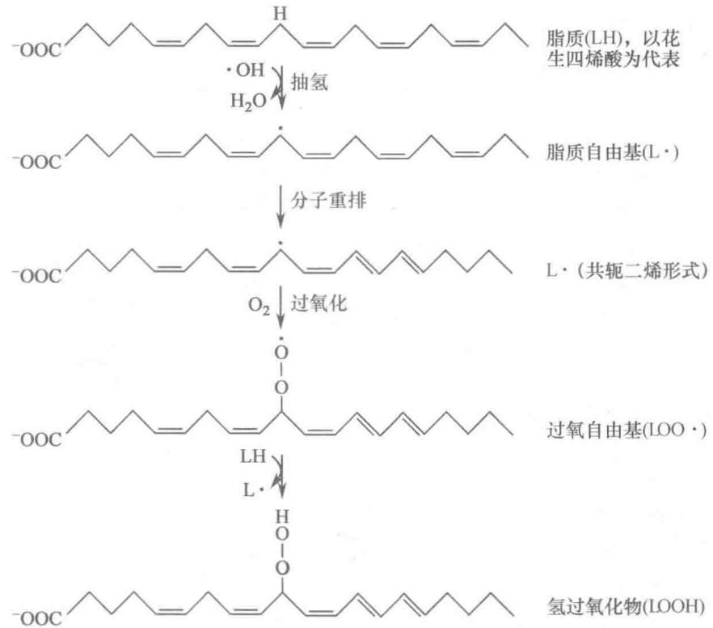

脂质过氧化过程中生成的 LOO·等活性氧自由基也参与链引发和链增长，产生 LOOH。此外，LOO·还可以通过分子内双键加成、环化和断裂，生成各种醛类，主要是丙二醛（malondialdehyde）以及短链的酮、羧酸和烃类。丙二醛的量常被用作脂质过氧化的量度。

## 4. 脂质过氧化对机体的损伤和抗氧化剂的保护作用

脂质过氧化对生物机体损伤的机制很复杂，包括氧化终产物和中间物对生物大分子、膜、细胞和组织的毒害。过氧化反应中生成的中间物自由基如L·和LOO·作为引发剂通过抽氢使蛋白质分子变成自由基，进而引起链式反应：导致蛋白质的聚合。终产物丙二醛跟肽链上的氨基发生作用导致蛋白质分子的交联；跟肽链上的巯基反应使蛋白质或酶失去生物活性，导致代谢异常。

膜的流动性是生物膜结构的主要特征之一。合适的流动性对膜行使功能十分重要。而膜脂的不饱和程度对膜流动性起重要调节作用。脂质过氧化的直接结果是膜的不饱和脂肪酸减少，流动性降低。膜蛋白多是功能蛋白如酶、受体、离子通道和呼吸链等。在正常情况下它们在二维流体膜上能自由侧向移动，处于缔合与解离的动态过程。但过氧化产物引起膜蛋白的共价交联与聚合，使膜蛋白处于永久性缔合状态，必然导致膜功能的异常。此外，脂质过氧化跟动脉粥样硬化的斑块和衰老重要标志之一的老年班或老年色素(age pigment)的形成也有密切关系。

脂质过氧化对机体虽有损伤作用,但体内存有抗氧化的保护系统。正常情况下,过氧化与抗氧化处于平衡中,不致造成对机体的损害。但平衡失调时,脂质过氧化加剧,此时给机体外加适量的抗氧化剂是必要的,以协助机体维持两者平衡,使之处于健康状态。

凡具有还原性而能抑制靶分子自动氧化的即能抑制自由基链反应的物质称为抗氧化剂(antioxidant)。能与自由基反应使之还原成非自由基的抗氧化剂称为自由基清除剂(radical scavenger)。抗氧化剂按其作用性质可分为预防型和阻断型两类。预防型抗氧化剂可以清除引发阶段的自由基，防止链反应的发生，如超氧化物歧化酶（superoxide dismutase；SOD）、过氧化氢酶（catalase）和谷胱甘肽过氧化物酶(glutathione peroxidase)等。阻断型抗氧化剂可以捕捉和清除包括链反应中产生的自由基，中断或延缓链反应的进行，如维生素E、还原型谷胱甘肽和β-胡萝卜素。β-胡萝卜素和维生素E都有淬灭(quench)单线态氧的功能；淬灭是指通过能量转移使一种分子(如单线态氧)从激发态回到基态。

## （四）烹调油的部分氢化产生反式脂肪酸

为了改善烹调用植物油的存放时间和增加它在煎炸时对高温的稳定性,商品植物油常经过部分氢化处理。这一过程使脂肪酸中的许多顺式双键转变为单键，并且增加油的熔点温度，因此在室温下更接近于固体；在食品工业中正是利用这种方法从植物油制作人造黄油（margarine）的。然而植物油的部分氢化带来了一个不好的后果：某些顺式双键转变成反式双键。现有确凿证据表明：反式脂肪酸（常直称为“反式脂肪”）食物的摄入导致心血管病的高发生率；膳食中避免这些脂肪明显降低冠心病的风险。食物的反式脂肪酸升高血液中三酰甘油和LDL（“坏的”）胆固醇，降低HDL（“好的”）胆固醇；这些变化单独就足以增加冠心病的风险。反式脂肪酸还有进一步的不良效应，例如可能会增加机体的炎症反应，后者是心脏病的另一风险因素（关于LDL（低密度脂蛋白）和HDL（高密度脂蛋白）胆固醇的代谢及其对健康的影响见第24章）。许多快餐食品是在部分氢化的植物油中煎炸出来的，因此反式脂肪酸含量很高，例如在美国一份炸鸡块约含5g反式脂肪酸。考虑到这些油脂的不良后果，有些国家如丹麦以及某些城市如纽约严格限制餐馆使用部分氢化的植物油。每天摄入2\~7g量的反式脂肪酸，有害效果就会出现。

## （五）三酰甘油提供储能和保温

在大多数真核细胞中，三酰甘油在含水细胞溶胶中形成微小的油滴分离相，作为代谢燃料的储库。脊椎动物的专门化细胞，称脂肪细胞（adipocyte），贮存大量的三酰甘油，几乎充满了整个细胞。许多植物的种子中也以油的形式贮存三酰甘油，为种子发芽提供能量和合成前体。脂肪细胞和正发芽的种子含有脂酶（lipase），催化贮存脂质的水解，释放脂肪酸，以输送到需要它们作为燃料的地方。利用三酰甘油作为贮存燃料，比多糖例如糖原和淀粉，有两个显著的优点。第一，脂肪酸的碳原子比单糖的碳原子还原性高，1 g油脂在体内完全氧化将产生37 kJ(9 kcal)，而1 g糖或蛋白质只产生17 kJ能量。第二，因为三酰甘油是疏水的，不被水化；因此携带脂肪作为燃料的生物体不必携带与贮存多糖结合的那份额外水化水（2 g/g 多糖）。中等肥胖人在皮下、腹腔和乳腺的脂肪组织中积储的三酰甘油可达15\~20 kg，足以供给几个月所需的能量。然而人体以糖原形式贮存的能量不够一天的需要。葡萄糖和糖原的优点是易溶于水，能快速提供代谢所需的能量。某些动物在皮下贮存的三酰甘油不仅作为能储，而且作为抗低温的绝缘层，例如海豹、海象、企鹅和其他的极生温血动物都填充着大量的三酰甘油。冬眠动物（例如熊）在冬眠前积累大量脂肪也是用作保温和能储。人和动物的皮下和肠系膜脂肪组织还起防震的填充物作用。

## （六）蜡及其用作储能和防水

蜡(wax)是长链 $\left(\mathrm{C}_{14}\sim\mathrm{C}_{36}\right)$ 脂肪酸(RCOOH)和长链 $\left(\mathrm{C}_{16}\sim\mathrm{C}_{30}\right)$ 一元醇 $\left(\mathrm{HOR}^{\prime}\right)$ 形成的酯。简单蜡酯的通式为 $RCOOR^{\prime}$ 。实际上生物蜡是多种蜡酯的混合物，还常含有烃类以及二元酸等，蜡中发现的脂肪酸一般为饱和脂肪酸，醇可以是饱和醇、不饱和醇或固醇。蜡分子含一个很弱的极性头(酯基)和一个非极性尾(一般为两条长烃链)，因此蜡完全不溶于水。蜡的硬度由烃链的长度和饱和度决定。蜡的熔点(60\~100℃)一般比三酰甘油的高。在浮游生物(plankton)——海洋动物食物链底部的浮游微生物——中蜡是代谢燃料的主要贮存形式。蜡的其他功能与它的防水性和高稠度有关，脊椎动物的某些皮肤腺分泌蜡以保护毛发和皮肤，使之柔韧、润滑并防水。鸟类，特别是水禽，从它们的尾羽腺分泌蜡使羽毛能防水。冬青、杜鹃花和许多热带植物的叶覆盖着一层蜡以防寄生物侵袭和水分的过度蒸发。生物蜡被发现在制药、化妆品和其他工业上有许多用途。下面介绍几个重要的生物蜡：

蜂蜡（bee wax）是蜂腹部蜡腺分泌用以建造蜂巢的材料，完全不透水，熔点为60\~82℃；皂化时主要产生 $C_{26}$ 和 $C_{28}$ 烷酸以及 $C_{30}$ 和 $C_{32}$ 醇。白蜡（Chinese wax）也称中国虫蜡，是胭脂虫属（Cocusc）的一种昆虫（C. Cerifera）俗称白蜡虫的分泌物，白蜡的主要成分为 $C_{26}$ 醇和 $C_{26}$ 、 $C_{28}$ 酸所成的酯，熔点为80\~83℃。蜂蜡和白蜡可用作涂料、润滑剂及其他化工原料。

鲸蜡(spermaceti wax)为抹香鲸头部的鲸油冷却时析出的一种白色晶体。抹香鲸(sperm whale)也称巨头鲸，头部占全身总重量的1/3，头部重量的90%由鲸蜡器构成，其中含鲸油约4t，它是三酰甘油和蜡的混合物。鲸蜡主要成分是由棕榈酸和鲸蜡醇(spermol)即十六烷醇形成的酯，熔点为42\~47℃。

羊毛蜡(wool wax)是从羊毛的洗涤废液中回收的,它具有特殊的性质,能形成一种稳定的半固体状乳胶,含水量高达80%。羊毛脂(lanolin)是从羊毛蜡中纯化获得的产品,可用作药品和化妆品软膏的底料。

羊毛蜡中可皂化部分含烷酸60%，羟基酸35%，不可皂化部分为羊毛固醇44%，胆固醇31%，烷醇16%及其他。所谓可皂化部分是指皂化后能溶于水的成分（脂肪酸盐），不可皂化部分为不溶于水而溶于乙醚的成分。

巴西棕榈蜡（carnauba wax）是天然蜡中经济价值最高的一种。由于它的熔点高（86\~90℃）、硬度大和不透水，被用作高级抛光剂，如汽车蜡、船蜡、地板蜡以及鞋油等。巴西棕榈蜡主要是由 $C_{24}$ 和 $C_{28}$ 烷酸及 $C_{32}$ 和 $C_{34}$ 烷醇形成的各种酯的混合物。

<!-- EN-BEGIN 10.1 -->

### 【英文对应 10.1】Storage Lipids

> 来源：Lehninger Principles of Biochemistry（书籍/02_生物化学原理） 第10章 Lipids，§10.1。对应本章“一、贮存脂质——三酰甘油和蜡”。

P1 The fats and oils almost universally used as stored forms of energy in living organisms are derivatives of fatty acids. The fatty acids are hydrocarbon derivatives, at about the same low oxidation state (that is, as highly reduced) as the hydrocarbons in fossil fuels. The cellular oxidation of fatty acids (to $CO_{2}$ and $H_{2}O$ ), like the controlled, rapid burning of fossil fuels in internal combustion engines, is highly exergonic.

We introduce here the structures and nomenclature of the fatty acids most commonly found in living organisms. We describe two types of fatty acid-containing compounds, triacylglycerols and waxes, to illustrate the diversity of structures and physical properties in this family of compounds.

#### [EN] Fatty Acids Are Hydrocarbon Derivatives

Fatty acids are carboxylic acids with hydrocarbon chains ranging from 4 to 36 carbons long ( $C_{4}$ to $C_{36}$ ). In some fatty acids, this chain is unbranched and fully saturated (contains no double bonds); in others, the chain contains one or more double bonds (Table 10-1). A few contain three-carbon rings, hydroxyl groups, or methyl-group branches.

<table><tr><td colspan="7">TABLE 10-1 Some Naturally Occurring Fatty Acids: Structure, Properties, and Nomenclature</td></tr><tr><td rowspan="2">Carbon skeleton</td><td rowspan="2"> $Structure^a$ </td><td rowspan="2">Systematic nameb</td><td rowspan="2">Common name (derivation)</td><td rowspan="2">Melting point (°C)</td><td colspan="2">Solubility at 30 °C (mg/g solvent)</td></tr><tr><td>Water</td><td>Benzene</td></tr><tr><td>12:0</td><td> $CH_3(CH_2)_{10}COOH$ </td><td>n-Dodecanoic acid</td><td>Lauric acid (Latin laurus, &quot;laurel plant&quot;)</td><td>44.2</td><td>0.063</td><td>2,600</td></tr><tr><td>14:0</td><td> $CH_3(CH_2)_{12}COOH$ </td><td>n-Tetradecanoic acid</td><td>Myristic acid (Latin Myristica, nutmeg genus)</td><td>53.9</td><td>0.024</td><td>874</td></tr><tr><td>16:0</td><td> $CH_3(CH_2)_{14}COOH$ </td><td>n-Hexadecanoic acid</td><td>Palmitic acid (Latin palma &quot;palm tree&quot;)</td><td>63.1</td><td>0.0083</td><td>348</td></tr><tr><td>18:0</td><td> $CH_3(CH_2)_{16}COOH$ </td><td>n-Octadecanoic acid</td><td>Stearic acid (Greek stear, &quot;hard fat&quot;)</td><td>69.6</td><td>0.0034</td><td>124</td></tr><tr><td>20:0</td><td> $CH_3(CH_2)_{18}COOH$ </td><td>n-Eicosanoic acid</td><td>Arachidic acid (Latin Arachis, legume genus)</td><td>76.5</td><td></td><td></td></tr><tr><td>24:0</td><td> $CH_3(CH_2)_{22}COOH$ </td><td>n-Tetracosanoic acid</td><td>Lignoceric acid (Latin lignum, &quot;wood&quot; + cera, &quot;wax&quot;)</td><td>86.0</td><td></td><td></td></tr><tr><td>16:1( $\Delta^9$ )</td><td> $CH_3(CH_2)_5CH=CH(CH_2)_7COOH$ </td><td>cis-9-Hexadecenoic acid</td><td>Palmitoleic acid</td><td>1 to -0.5</td><td></td><td></td></tr><tr><td>18:1( $\Delta^9$ )</td><td> $CH_3(CH_2)_7CH=CH(CH_2)_7COOH$ </td><td>cis-9-Octadecenoic acid</td><td>Oleic acid (Latin oleum, &quot;oil&quot;)</td><td>13.4</td><td></td><td></td></tr><tr><td>18:2( $\Delta^{9,12}$ )</td><td> $CH_3(CH_2)_4CH=CHCH_2CH=CH(CH_2)_7COOH$ </td><td>cis-,cis-9,12-Octadecadienoic acid</td><td>Linoleic acid (Greek linon, &quot;flax&quot;)</td><td>1-5</td><td></td><td></td></tr><tr><td>18:3( $\Delta^{9,12,15}$ )</td><td> $CH_3CH_2CH=CHCH_2CH=CHCH_2CH=CH(CH_2)_7COOH$ </td><td>cis-,cis-,cis-9,12,15-Octadecatrienoic acid</td><td>α-Linolenic acid</td><td>-11</td><td></td><td></td></tr><tr><td>20:4( $\Delta^{5,8,11,14}$ )</td><td> $CH_3(CH_2)_4CH=CHCH_2CH=CHCH_2CH=CHCH_2CH=CH(CH_2)_3COOH$ </td><td>cis-,cis-,cis-,cis-5,8,11,14-Icosatetraenoic acid</td><td>Arachidonic acid</td><td>-49.5</td><td></td><td></td></tr></table>

$^{a}$ All acids are shown in their nonionized form. At pH 7, all free fatty acids have an ionized carboxylate. Note that numbering of carbon atoms begins at the carboxyl carbon. $^{b}$ The prefix n- indicates the "normal" unbranched structure. For instance, "dodecanoic" simply indicates 12 carbon atoms, which could be arranged in a variety of branched forms; "n-dodecanic" specifies the linear unbranched form. For unsaturated fatty acids, the configuration of each double bond is indicated; in biological fatty acids the configuration is almost always cls.

KEY CONVENTION A simplified nomenclature for unbranched fatty acids specifies the chain length and number of double bonds, separated by a colon. For example, the 16-carbon saturated palmitic acid is abbreviated 16:0, and the 18-carbon oleic (octadecenoic) acid, with one double bond (shown below), is 18:1. Each line segment of the zigzag in the structure represents a single bond between adjacent carbons. The carboxyl carbon is assigned the number 1 (C-1), and the $\alpha$ carbon next to it is C-2. The positions of any double bonds, designated $\Delta$ (delta), are specified relative to C-1 by a superscript number indicating the lower-numbered carbon in the double bond. By this convention, oleic acid, with a double bond between C-9 and C-10, is designated $18:1(\Delta^9)$ ; a 20-carbon fatty acid with one double bond between C-9 and C-10 and another between C-12 and C-13 is designated $20:2(\Delta^{9,12})$ .

The most commonly occurring fatty acids have even numbers of carbon atoms in an unbranched chain of 12 to 24 carbons (Table 10-1). As we shall see in Chapter 21, the even number of carbons results from the mode of synthesis of these compounds, which involves successive condensations of two-carbon acetyl units.

There is also a common pattern in the location of double bonds; in most monounsaturated fatty acids the double bond is between C-9 and C-10 ( $\Delta^{9}$ ), and the other double bonds of polyunsaturated fatty acids are generally $\Delta^{12}$ and $\Delta^{15}$ . (Arachidonic acid is an exception to this generalization; see Table 10-1.) The double bonds of polyunsaturated fatty acids are almost never conjugated (alternating single and double bonds, as in $-CH=CH-CH=CH-$ ), but are separated by a methylene group: $-CH=CH-CH_{2}-CH=CH-$ . In nearly all naturally occurring unsaturated fatty acids, the double bonds are in the cis configuration. Notable exceptions include the trans fatty acids produced by fermentation in the rumen of dairy animals. Humans can ingest these trans fats from dairy products and meat.

KEY CONVENTION The family of polyunsaturated fatty acids (PUFAs) with a double bond between the third carbon and the fourth carbon from the methyl end of the chain are of special importance in human nutrition. Because the physiological role of PUFAs is related more to the position of the first double bond near the methyl end of the chain than to that near the carboxyl end, an alternative nomenclature is sometimes used for these fatty acids. The carbon of the methyl group — that is, the carbon most distant from the carboxyl group — is called the $\omega$ (omega; the last letter in the Greek alphabet) carbon and is given the number 1 (C-1); the carboxyl carbon in this convention has the highest number. The positions of the double bonds are indicated relative to the $\omega$ carbon. In this convention, PUFAs with a double bond between C-3 and C-4 are called omega-3 ( $\omega$ -3) fatty acids, and those with a double bond between C-6 and C-7 are omega-6 ( $\omega$ -6) fatty acids. Shown below is eicosapentaenoic acid, which can be designated as $20:5(\Delta^{5,8,11,14,17})$ by the standard nomenclature but is also referred to as an omega-3 fatty acid, emphasizing the biologically important double bond in the omega-3 position.

Humans require the omega-3 PUFA $\alpha$ -linolenic acid (ALA; 18:3( $\Delta^{9,12,15}$ ), in the standard convention), but do not have the enzymatic capacity to synthesize it and must therefore obtain ALA from the diet. Humans also use ALA to synthesize two other omega-3 PUFAs important in cellular function: eicosapentaenoic acid (EPA; 20:5( $\Delta^{5,8,11,14,17}$ ), shown in the Key Convention above) and docosahexaenoic acid (DHA; 22:6( $\Delta^{4,7,10,13,16,19}$ )). An imbalance of omega-6 and omega-3 PUFAs in the diet is associated with an increased risk of cardiovascular disease. The optimal dietary ratio of omega-6 to omega-3 PUFAs is between 1:1 and 4:1, but the ratio in the diets of most North Americans is closer to 10:1 to 30:1. The "Mediterranean diet," which has been associated with lowered cardiovascular risk, is richer in omega-3 PUFAs, obtained in leafy vegetables (salads) and fish oils. Fish oils especially rich in EPA and DHA are a common dietary supplement even though their exact role in preventing cardiovascular disease is controversial.

P1 The physical properties of the fatty acids, and of compounds that contain them, are largely determined by the length and degree of unsaturation of the hydrocarbon chain. The nonpolar hydrocarbon chain accounts for the poor solubility of fatty acids in water. Lauric acid (12:0, $M_{r}$ 200), for example, has a solubility in water of 0.063 mg/g—much less than that of glucose ( $M_{r}$ 180), which is 1,100 mg/g. The longer the fatty acyl chain and the fewer the double bonds, the lower the solubility in water. The carboxylic acid group is polar (and ionized at neutral pH) and accounts for the slight solubility of short-chain fatty acids in water.

Melting points are also strongly influenced by the length and degree of unsaturation of the hydrocarbon chain. At room temperature (25 °C), the saturated fatty acids from 12:0 to 24:0 have a waxy consistency, whereas unsaturated fatty acids of these lengths are oily liquids. This difference in melting points is due to different degrees of packing of the fatty acid molecules (Fig. 10-1). In the fully saturated compounds, free rotation around each carbon–carbon bond gives the hydrocarbon chain great flexibility; the most stable conformation is the fully extended form, in which the steric hindrance of neighboring atoms is minimized. These molecules can pack together tightly in nearly crystalline arrays, with atoms along their lengths in van der Waals contact with the atoms of neighboring molecules. In unsaturated fatty acids, a cis double bond forces a kink in the hydrocarbon chain. Fatty acids with one or several such kinks cannot pack together as tightly as fully saturated fatty acids, and their interactions with each other are therefore weaker. Because less thermal energy is needed to disorder these poorly ordered arrays of unsaturated fatty acids, they have markedly lower melting points than saturated fatty acids of the same chain length (Table 10-1).

(c) Saturated fatty acids  
(d) Mixture of saturated and unsaturated fatty acids  
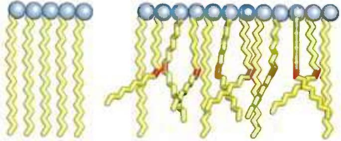  
FIGURE 10-1 The packing of fatty acids into stable aggregates. The extent of packing depends on the degree of saturation. (a) Two representations of the fully saturated acid stearic acid, 18:0 (stearate at pH 7), in its usual extended conformation. (b) The cis double bond (red) in oleic acid, 18:1( $\Delta^{9}$ ) (oleate), restricts rotation and introduces a rigid bend in the hydrocarbon tail. All other bonds in the chain are free to rotate. (c) Fully saturated fatty acids in the extended form pack into nearly crystalline arrays, stabilized by extensive hydrophobic interaction. (d) The presence of one or more fatty acids with cis double bonds (red) interferes with this tight packing and results in less stable aggregates.

In vertebrates, free fatty acids (unesterified fatty acids, with a free carboxylate group) can circulate in the blood bound noncovalently to carrier proteins such as serum albumin. However, fatty acids are present in blood plasma mostly as carboxylic acid derivatives such as esters or amides. Lacking the charged carboxylate group, these fatty acid derivatives are generally even less soluble in water than are the free fatty acids and are transported through the blood primarily as lipoprotein particles (see Chapter 21).

#### [EN] Triacylglycerols Are Fatty Acid Esters of Glycerol

The simplest lipids constructed from fatty acids are the triacylglycerols, also referred to as triglycerides, fats, or neutral fats. Triacylglycerols are composed of three fatty acids, each in ester linkage with a single glycerol (Fig. 10-2). Those containing the same kind of fatty acid in all three positions are called simple triacylglycerols and are named after the fatty acid they contain. Simple triacylglycerols of 16:0, 18:0, and 18:1, for example, are tripalmitin, tristearin, and triolein, respectively. Most naturally occurring triacylglycerols are mixed; they contain two or three different fatty acids. To name these compounds unambiguously, the name and position of each fatty acid must be specified.

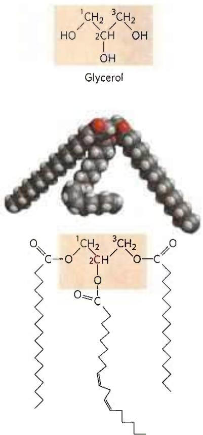  
1-Stearoyl, 2-linoleoyl, 3-palmitoyl glycerol, a mixed triacylglycerol  
FIGURE 10-2 Glycerol and a triacylglycerol. The mixed triacylglycerol shown here has three different fatty acids attached to the glycerol backbone. When glycerol has different fatty acids at C-1 and C-3, C-2 is a chiral center.

Because the polar hydroxyls of glycerol and the polar carboxylates of the fatty acids are bound in ester linkages, triacylglycerols are nonpolar, hydrophobic molecules, essentially insoluble in water. Lipids have lower specific gravities than water, which explains why mixtures of oil and water (oil-and-vinegar salad dressing, for example) have two phases: oil, with the lower specific gravity, floats on the aqueous phase.

#### [EN] Triacylglycerols Provide Stored Energy and Insulation

In most eukaryotic cells, triacylglycerols form a separate phase of microscopic, oily droplets in the aqueous cytosol, serving as depots of metabolic fuel. In vertebrates, specialized cells called adipocytes, or fat cells, store large amounts of triacylglycerols as fat droplets that nearly fill the cell (Fig. 10-3a). Triacylglycerols are also stored as oils in the seeds of many types of plants, providing energy and biosynthetic precursors during seed germination (Fig. 10-3b). Adipocytes and germinating seeds contain lipases, enzymes that catalyze the hydrolysis of stored triacylglycerols, releasing fatty acids for export to sites where they are required as fuel.

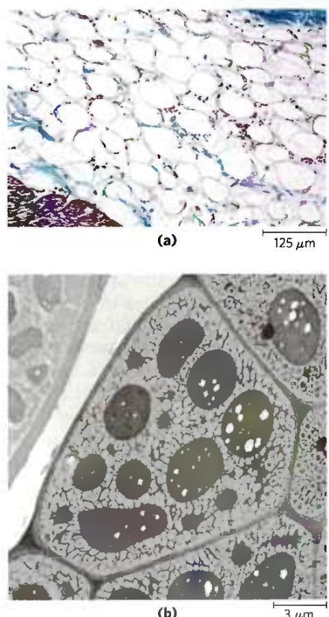  
(b)  
FIGURE 10-3 Fat stores in cells. (a) Cross section of human white adipose tissue. Each cell contains a fat droplet (white) so large that it squeezes the nucleus (stained red) against the plasma membrane. (b) Cross section of a cotyledon cell from a seed of the plant Arabidopsis. The large dark structures are protein bodies, which are surrounded by stored oils in the light-colored oil bodies. [(a) Biophoto Associates/Science Source. (b) Courtesy Howard Goodman, Department of Genetics, Harvard Medical School.]

P1 There are two significant advantages to using triacylglycerols as stored fuels, rather than polysaccharides such as glycogen and starch. First, the carbon atoms of fatty acids are more reduced than those of sugars, so oxidation of triacylglycerols yields more than twice as much energy, gram for gram, as the oxidation of carbohydrates. Second, because triacylglycerols are hydrophobic and therefore unhydrated, the organism that carries stored fuel in the form of fat does not have to carry the extra weight of water of hydration that is associated with stored polysaccharides (2 g per gram of polysaccharide). Humans have fat tissue (composed primarily of adipocytes) under the skin, in the abdominal cavity, and in the mammary glands. Moderately obese people with 15 to 20 kg of triacylglycerols deposited in their adipocytes could meet their energy needs for months by drawing on their fat stores. In contrast, the human body can store less than a day's energy supply in the form of glycogen. Carbohydrates such as glucose do offer certain advantages as quick sources of metabolic energy; one of those advantages is their ready solubility in water.

In some animals, triacylglycerols stored under the skin serve not only as energy stores but also as insulation against low temperatures. Seals, walruses, penguins, and other warm-blooded polar animals are amply padded with triacylglycerols. In hibernating animals (bears, for example), the huge fat reserves accumulated before hibernation serve the dual purposes of insulation and energy storage (see Box 17-1).

#### [EN] Partial Hydrogenation of Cooking Oils Improves Their Stability but Creates Fatty Acids with Harmful Health Effects

Most natural fats, such as those in vegetable oils, dairy products, and animal fat, are complex mixtures of simple and mixed triacylglycerols. These contain a variety of fatty acids differing in chain length and degree of saturation (Fig. 10-4). Vegetable oils such as corn (maize) oil and olive oil are composed largely of triacylglycerols with unsaturated fatty acids and thus are liquids at room temperature. Triacylglycerols containing only saturated fatty acids, such as tristearin, the major component of beef fat, are white, greasy solids at room temperature.

When lipid-rich foods are exposed too long to the oxygen in air, they may spoil and become rancid. The unpleasant taste and smell associated with rancidity result from the oxidative cleavage of double bonds in unsaturated fatty acids, which produces aldehydes and carboxylic acids of shorter chain length and therefore higher volatility; these compounds pass readily through the air to your nose. Throughout the twentieth century, partial hydrogenation of commercial vegetable oils was used to improve shelf life and to increase the stability of cooking oils at the high temperatures used in deep-frying. This process converts many of the cis double bonds in the fatty acids to single bonds and increases the melting temperature of the oils so that they are more nearly solid at room temperature (margarine is produced from vegetable oil in this way). Partial hydrogenation, however, has another, undesirable, effect: some cis double bonds are converted to trans double bonds. There is now strong evidence that dietary intake of trans fatty acids (often referred to simply as "trans fats") leads to a higher incidence of cardiovascular disease, and that avoiding these fats in the diet substantially reduces the risk of coronary heart disease. Dietary trans fatty acids raise the level of triacylglycerols and of LDL ("bad") cholesterol in the blood, and lower the level of HDL ("good") cholesterol, and these changes alone are enough to increase the risk of coronary heart disease. But trans fatty acids may have further adverse effects. They seem, for example, to increase the body's inflammatory response, which is another risk factor for heart disease. (See Chapter 21 for descriptions of LDL and HDL—low-density and high-density lipoprotein—cholesterol and their health effects.) Regulatory agencies around the world now limit or ban the use of trans fatty acids in prepared and packaged foods.

  
FIGURE 10-4 Fatty acid composition of three food fats. Olive oil, butter, and beef fat consist of mixtures of triacylglycerols differing in their fatty acid composition. The melting points of these fats — and hence their physical state at room temperature (25 °C) — are a direct function of their fatty acid composition. Olive oil has a high proportion of long-chain ( $C_{16}$ and $C_{18}$ ) unsaturated fatty acids, which accounts for its liquid state at 25 °C. The higher proportion of long-chain ( $C_{16}$ and $C_{18}$ ) saturated fatty acids in butter increases its melting point, so butter is a soft solid at room temperature. Beef fat, with an even higher proportion of long-chain saturated fatty acids, is a hard solid.

#### [EN] Waxes Serve as Energy Stores and Water Repellents

Biological waxes are esters of long-chain (C $_{14}$ to C $_{36}$ ) saturated and unsaturated fatty acids with long-chain (C $_{16}$ to C $_{30}$ ) alcohols (Fig. 10-5). Their melting points (60 to

  
(a)

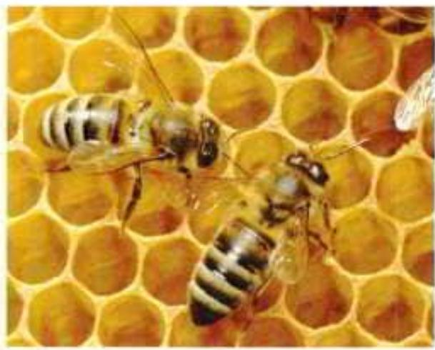  
(b)  
FIGURE 10-5 Biological wax. (a) Triacontanoylpalmitate, the major component of beeswax, is an ester of palmitic acid with the alcohol triacontanol. (b) The beeswax of a honeycomb is firm at 25 °C and completely impervious to water. The term "wax" originates in the Old English weax, meaning "the material of the honeycomb." (b) Irochka\_T/Getty Images]

100 °C) are generally higher than those of triacylglycerols. In plankton, the free-floating microorganisms at the bottom of the food chain for marine animals, waxes are the chief storage form of metabolic fuel.

Waxes also serve a diversity of other functions related to their water-repellent properties and their firm consistency. Certain skin glands of vertebrates secrete waxes to protect hair and skin and keep it pliable, lubricated, and waterproof. Birds, particularly waterfowl, secrete waxes from preen glands to keep their feathers water-repellent. The shiny leaves of holly, rhododendrons, poison ivy, and many tropical plants are coated with a thick layer of waxes, which prevents excessive evaporation of water and protects against parasites.

Biological waxes find a variety of applications in the pharmaceutical, cosmetic, and other industries. Lanolin (from lamb's wool), beeswax (Fig. 10-5), carnauba wax (from a Brazilian palm tree), and wax extracted from the seeds of the jojoba bush are widely used in the manufacture of lotions, ointments, and polishes.

#### [EN] SUMMARY 10.1 Storage Lipids

Lipids are water-insoluble cellular components of diverse structure that can be extracted from tissues by nonpolar solvents. Almost all fatty acids, the hydrocarbon components of many lipids, have an even number of carbon atoms (usually 12 to 24); they are either saturated or unsaturated, with double bonds almost always in the cis configuration.

\- Triacylglycerols contain three fatty acid molecules esterified to the three hydroxyl groups of glycerol. Simple triacylglycerols contain only one type of fatty acid; mixed triacylglycerols contain two or three types.

\- Triacylglycerols are present in many foods and are primarily used for storing energy and providing insulation in animals. Lipases release fatty acids from storage so they can be used as fuel.

■ Since many natural fats can easily turn rancid, partial hydrogenation has been used to extend their shelf life. This process can produce trans fatty acids, which increase risk for coronary heart disease. As a result, their use in prepared and processed foods has become highly regulated.

■ Waxes are esters of long-chain fatty acids and long-chain alcohols with diverse uses in biology and industry.

<!-- EN-END 10.1 -->

## 二、膜结构脂质——磷脂、糖脂和固醇

磷脂(phospholipid)包括甘油磷脂和鞘磷脂两类；它们主要参与细胞膜的组成。甘油磷脂是第一大类膜结构脂质或称膜脂；糖脂主要是鞘糖脂，此外还有甘油糖脂。鞘磷脂和鞘糖脂合称为鞘脂(sphingolipid)，是第二大类膜脂。此外还有固醇也参与膜的组成。

## （一）甘油磷脂是磷脂酸的衍生物

## 1. 甘油磷酸(甘油取代物)的构型

甘油本身不是手性分子(见图10-5)，因为通过它的C2有一个对称面。然而甘油是一个手性原分子(prochiral molecule)，向它的两个— $\mathrm{CH}_2\mathrm{OH}$ 基的任一个加入一个取代基如磷酸，甘油分子中央的碳(C2)则成为手性原子。这样形成的化合物，例如图10-7A中示出的甘油磷酸(glycerol phosphate)按DL系统命名(见第1章)，即根据与甘油醛异构体的立体化学关系命名，在大多数脂质中发现的磷酸甘油异构体可以正确地称为L-甘油-3-磷酸或D-甘油-1-磷酸。另一种规定异构体的方法是sn-系统即立体专一编号系统(stereo-specific numbering system)(图10-7A)。在这一系统中，按定义C1是占据S-原(Pro-S)位置的手性原化合物(如甘油)的基团，也即在Fischer投影式中把甘油中央碳的羟基放在左边，3个碳原子自上而下标为C1、C2和C3。这样，C3羟基被磷酸取代生成的磷酸甘油(此时C2是R构型)称为sn-甘油-3-磷酸(sn-glycerol-3-phosphate)或L-甘油-3-磷酸；其对映体称为sn-甘油-1-磷酸或L-甘油-1-磷酸(这里C2是S构型)。在古菌的脂质(见图10-12)中甘油构型就是sn-甘油-1-磷酸(D-甘油-3-磷酸)。至今在文献中这两种系统都在使用。

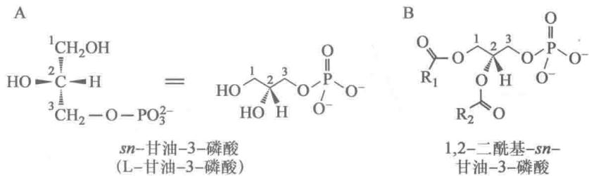  
图10-7 A. $sn$ -甘油-3-磷酸构型；B.1,2-二酰基 $-sn$ -甘油-3-磷酸结构通式

## 2. 甘油磷脂的结构

甘油磷脂(glycerophospholipid;glycerol phosphatide)也称磷酸甘油酯(phosphoglyceride)，它们是由sn-甘油-3-磷酸衍生而来的。在sn-甘油-3-磷酸中甘油的C1和C2以酯键跟两个脂肪酸连接，形成1,2-二酰基-sn-甘油-3-磷酸(图10-7B)，简称磷脂酸(phosphatidic acid)。磷脂酸少量地存在于大多数生物中，它是甘油磷脂的母体化合物，也是甘油磷脂生物合成的前体。磷脂酸的磷酸基进一步被一个高极性或带电荷的醇(XOH)酯化，形成各种甘油磷脂。XOH一般为含氮碱，如胆碱(choline)、乙醇胺(ethanolamine)和丝氨酸等，此外是肌醇和甘油。各种甘油磷脂的名称都由3-sn-磷脂酸派生而来，即前缀“磷脂酰”加极性醇(XO—)名称，例如磷脂酰胆碱，磷脂酰乙醇胺等。在所有的这些磷脂中，XOH通过磷酸二酯键与甘油连接并构成极性头基，两个长的烃链构成非极性尾部(图10-8)。由于甘油磷脂分子中sn-1和sn-2位上酯化的是各种组合的天然脂肪酸，因此任何一种给定的甘油磷脂（例如磷脂酰胆碱）都是不均一的，实

<!-- END OFFICIAL API PART part_004 -->

<!-- BEGIN OFFICIAL API PART part_005 -->

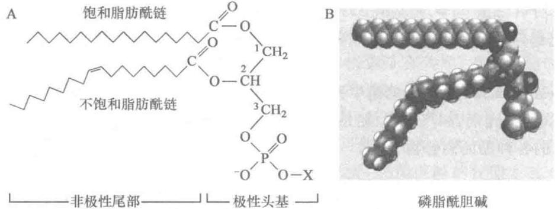  
图 10-8 甘油磷脂结构通式(A)和磷脂酰胆碱分子模型(B)

际上代表多种分子形式(molecular species)，其中每种形式都有独特的一套脂肪酸。分子形式的分布对不同的生物、同一种生物的不同组织、甚至同一细胞或同一组织中的不同磷酸甘油都是专一的。一般说，甘油磷脂C1位上连接的是 $C_{16}$ 或 $C_{18}$ 饱和脂肪酸，C2位上是 $C_{18}$ 或 $C_{20}$ 不饱和脂肪酸。除少数几个例外，脂肪酸和头基方面变化的生物学意义尚不清楚。几种常见的甘油磷脂及其头基醇的名称和X的结构式列于表10-4。

## 3. 甘油磷脂的一般性质

纯的甘油磷脂为白色蜡状固体。暴露于空气中由于多不饱和脂肪酸的过氧化作用，磷脂颜色逐渐变暗。甘油磷脂溶于大多数含少量水的非极性溶剂，但难溶于无水丙酮，用氯仿-甲醇混合液可从细胞和组织中提取磷脂。

在生理 pH 时, 甘油磷脂分子的磷酸基带 1 个负电荷 ( $pK_{a}^{\prime}=1$ 到 2); 乙醇胺或胆碱部分带 1 个正电荷; 丝氨酸部分带 1 个正电荷 ( $pK_{a}^{\prime}=9.2$ ) 和 1 个负电荷 ( $pK_{a}^{\prime}=2.2$ ); 肌肌醇和甘油基不带电荷。几种甘油磷脂分子的净电荷见图 10-10。因此磷脂属于两亲脂质, 是成膜分子, 在水中能形成双分子层的微囊 (图 10-29)。

甘油磷脂用弱碱水解产生脂肪酸盐和3-磷酰醇甘油（glycerol-3-phosphorylalcohol）。用强碱水解则生成脂肪酸盐、醇（XOH）和3-磷酸甘油。磷酸与甘油之间的键对碱稳定，但能被酸水解。

大多数细胞不断地降解和更换它们的膜脂。甘油磷脂中每一个可水解的键在溶酶体中都有一种专一的水解酶（图10-9）。A型磷脂酶（phospholipase）能除去甘油磷脂的两个脂肪酸中的一个，甘油磷脂的酯键和磷酸二酯键能被磷脂酶专一地水解。这些脂酶根据它们所水解的键（图10-9中箭头所指者）分别命名为磷脂酶 $A_{1}$ 、 $A_{2}$ 、C和D。

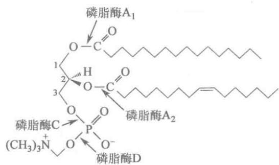

磷脂酶 $A_{1}$ 广泛分布于生物界；磷脂酶 $A_{2}$ 主要存在于蛇毒、蜂毒和哺乳类胰脏（酶原形式）中；磷脂酶 C 来源于细

图10-9 磷脂酶的专一性

菌及其他生物组织；磷脂酶 D 多存在于高等植物中。磷脂酶 $A_{1}$ 和 $A_{2}$ 分别专一地除去甘油磷脂中 sn-1 或 sn-2 碳上的脂肪酸，生成仅含一个脂肪酸的产物，称溶血甘油磷脂（lysophosphoglyceride）或溶血磷脂，如溶血磷脂酰乙醇胺。它们是体内甘油磷脂代谢的中间产物，但在细胞或组织中含量很小，如果浓度高，则将对膜造成毒害。因为溶血甘油磷脂是一种很强的表面活性剂，能使细胞膜如红细胞膜溶解。菱背响尾蛇（Crotalus adamanteus）和印度眼镜蛇（Naja naja）的蛇毒含磷脂酶 $A_{2}$ 。在印度眼镜蛇每年毒死数千人。磷脂酶常作为工具酶与薄层层析技术一起用于磷脂的结构分析。

## 4. 几种常见的甘油磷脂(表 10-4)

磷脂酰胆碱（phosphatidylcholine）也称卵磷脂（lecithin），系统名称为1,2-二酰基-sn-甘油-3-磷酸胆碱（1,2-diacyl-sn-glycero-3-phosphocholine）。磷脂酰胆碱和磷脂酰乙醇胺是细胞膜中最丰富的脂质之一（见表10-8）。胆碱成分是一种季胺离子，碱性极强。胆碱具有重要的生物学功能，是代谢中的一种甲基供体；在某些条件下是膳食中必需的，因此有人把它归为B族维生素。乙酰化的胆碱，称乙酰胆碱（acetylcholine）， $\mathrm{(CH_3)_3N^+CH_2CH_2OCOCH_3}$ ，是一种神经递质，与神经冲动的传导有关。卵磷脂和胆碱被认为有防止脂肪肝形成的作用。卵磷脂在蛋黄和大豆中特别丰富，食品工业中广泛用作乳化剂。医药用卵磷脂主要是作为大豆油精炼过程中的副产品获得。

表 10-4 几种甘油磷脂的极性头基及其静电荷

<table><tr><td>甘油磷脂名称</td><td>HO-X 的名称</td><td>极性头基中-X 的结构</td><td>极性头基净电荷(pH=7)</td></tr><tr><td>磷脂酸</td><td>——</td><td>-H</td><td>-2</td></tr><tr><td>磷脂酰乙醇胺</td><td>乙醇胺</td><td></td><td>0</td></tr><tr><td>磷脂酰胆碱</td><td>胆碱</td><td></td><td>0</td></tr><tr><td>磷脂酰丝氨酸</td><td>丝氨酸</td><td></td><td>-1</td></tr><tr><td>磷脂酰甘油</td><td>甘油</td><td></td><td>-1</td></tr><tr><td>磷脂酰肌醇-4,5-二磷酸( $PIP_2$ )</td><td>[肌]肌醇-4,5-二磷酸</td><td></td><td>-4 $^{\text{1}}$ </td></tr><tr><td>心磷脂</td><td>磷脂酰甘油</td><td></td><td>-2</td></tr></table>

① 注：磷脂酰肌醇-4,5-二磷酸中的磷酸酯，每个约有-1.5个电荷；它们的—OH基中的一个仅部分电离。

磷脂酰乙醇胺（phosphatidylethanolamine）也称脑磷脂（cephalin）；后一名称有时也包括磷脂酰丝氨酸在内。含氮碱部分是乙醇胺，也称胆胺（colamine）。磷脂酰乙醇胺中sn-1位上的脂[肪]酰基也和卵磷脂中一样，主要是棕榈酸和硬脂酸，但sn-2位含有较多的PUFA，如花生四烯酸(20：4)或DHA(22：6)。

磷脂酰丝氨酸(phosphatidylserine)常见于血小板的膜中,也称血小板第三因子。当组织受损血小板被激活时,膜中的磷脂酰丝氨酸由内侧转向外侧,作为表面催化剂与其他凝血因子一起致使凝血酶原活化。

磷脂酰肌醇-4,5-二磷酸（phosphatidylinositol-4,5-bisphosphate; $\mathrm{PIP}_2$ ）广泛存在于真核细胞的质膜中，它是两个胞内信使：肌醇-1,4,5-三磷酸（ $\mathrm{IP}_3$ ）和1,2-二酰基-sn-甘油（DAG）的前体，这些信使参与激素信号的放大（见第14章和第28章）。

磷脂酰甘油（phosphatidylglycerol）在细菌细胞膜中含量丰富。磷脂酰甘油是心磷脂头基的X部分。

双磷脂酰甘油（diphosphatidylglycerol）最先在心肌线粒体膜和细菌细胞膜中找到，因此又称心磷脂（cardiolipin）。它是由两个磷脂酰甘油的磷酸部分通过一个甘油分子共价连接而成（表10-4）。

## （二）某些甘油磷脂含醚键连接的脂肪酰链

某些动物组织和某些单细胞生物富含醚甘油磷脂(ether glycerophospholipid)或称醚脂(ether lipid)。醚脂中甘油骨架上的两个脂[肪]链中的一个是以醚键而不是酯键相连的。醚键连接的脂链可以是饱和的，如烷基醚脂中，也可以在脂链的C1和C2之间含有一个双键，如缩醛磷脂(plasmalogen）（图10-10A）。常见的缩醛磷脂中头基醇X包括胆碱、乙醇胺或丝氨酸。脊椎动物的心肌组织特别富含醚脂，心脏磷脂

的约一半是缩醛磷脂,其中又以缩醛磷脂酰胆碱(phosphatidal choline)含量为多。此外,嗜盐菌、纤毛原生生物和某些无脊椎动物的膜也含有很高比例的缩醛磷脂。醚脂在这些膜中的功能意义尚不清楚;也许它们的抗磷脂酶性质在某些作用中有重要意义,因为此酶能从膜脂中断裂酯键连接的脂肪酸。

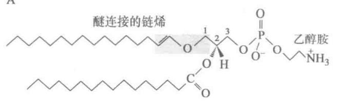

至少有一种醚脂，称血小板活化因子（platelet-activating factor, PAF），是一种强力的分子信号，在组织中它的浓度只要达到 $10^{-12} \mathrm{~mol} / \mathrm{L}$ 就会发生效应。在PAF中甘油的 $sn - 1$ 位是 $O-$ 连接(醚连接)的烷基，十六烷基； $sn - 2$ 位是乙酰

  
图 10-10 缩醛磷脂(A)和血小板活化因子(B)

基(图 10-10B)，这使 PAF 比大多数的甘油磷脂和缩醛磷脂更易溶于水。PAF 是从称为嗜碱性粒细胞 (basophil) 的白细胞中释放的，它促进血小板凝集和血小板释放 5-羟色胺（一种血管收缩剂）。PAF 对肝、平滑肌、心、子宫和肺等组织还有多种影响，并在炎症和过敏反应中起着重要作用。

## （三）叶绿体含半乳糖脂和硫脂

植物细胞中占优势的脂质是第二类膜脂：甘油糖脂（glyceroglycolipid）也称糖基甘油酯（glycoglyceride）它们常与鞘糖脂一起归于糖脂类（glycolipids）。甘油糖脂是由1,2-二酰甘油sn-3位上的羟基与糖基（例如一个或两个半乳糖残基）以糖苷键连接而成。最常见的就是半乳糖脂（galactolipid），如单半乳糖二酰甘油（monogalactosyldiacylglycerol；MGDG）和二半乳糖二酰甘油（DGDG）（图10-11）。甘油糖脂主要存在于植物界和微生物中。植物叶绿体的类囊体膜（内膜）含有大量的半乳糖脂；它们占维管植物的总膜脂的70%\~80%，因此可能是生物圈中最丰富的膜脂。磷酸盐经常是土壤中限制性的植物营养素，也许为保存磷酸盐以用于更关键角色的进化压力，选择制造无磷酸脂质的植物。甘油糖脂也出现于哺乳类，但分布不普遍，主要存在于睾丸和精子的质膜中。植物细胞膜也含有硫脂（sulfolipid），其中一个磺基化的葡萄糖残基以糖苷键与二酰基甘油连接；像甘油磷脂中的磷酸基，此磺酸基也带有一个负电荷（图10-11）。

  
单半乳糖二酰甘油(MGDG)

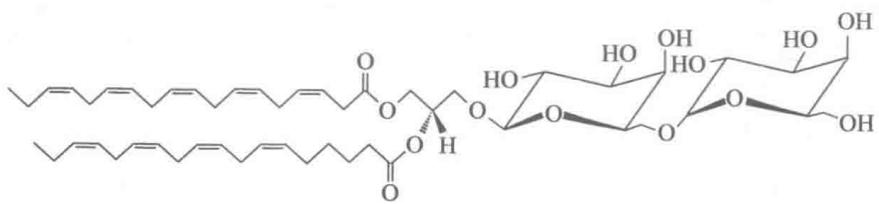  
二半乳糖二酰甘油(DGDG)

  
6-磺基-6-脱氧- $\alpha$ -D-葡糖吡喃二酰甘油(一种硫脂)  
图 10-11 叶绿体类囊体膜的半乳糖脂和硫脂

## （四）古菌具有独特的膜脂

生活在极端条件——高温(沸水)、低 pH、高离子强度等——的生态位(niche)的某些古菌具有含长链(32 碳)分支(8 个甲基)烃的膜脂,烃的每一末端跟甘油连接(图 10-12)。这些连接都是通过醚键完成的;醚键对低 pH 和高温下的水解比细菌和真核细胞中存在的酯键要稳定得多。在完全伸展的状态,这些古菌脂质的长度是磷脂和鞘脂的两倍,能跨过质膜的整个厚度。在伸展分子的每一端是一个由甘油和甘油磷酸基或糖基连接而成的极性头。此类化合物的一般名称,甘油二烷基甘油四醚(glycerol dialkyl glycerol tetraether, GDGT),反映了它们的独特结构。古菌中脂质甘油部分的立体异构体与细菌和真核细胞中的不同,在古菌中甘油中央的碳是 S 构型,细菌和真核细胞中的是 R 构型(图 10-7)。

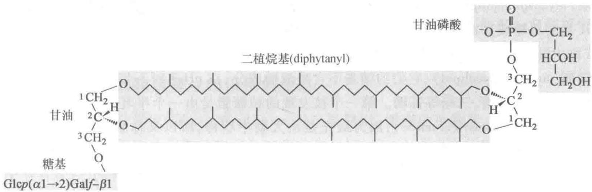  
图10-12 在某些古菌中发现的一种特殊膜脂

## （五）鞘脂是鞘氨醇的衍生物

鞘脂(sphingolipid)也有1个极性头基和2个非极性尾部,但与甘油磷脂和甘油糖脂(如半乳糖脂)不同,它不含甘油成分。鞘脂是由1分子的长链( $C_{18}$ )氨基醇——鞘氨醇(sphingosine;4-sphingenine)或其衍生物,1分子长链脂肪酸和1分子极性头基组成。极性头基在鞘磷脂中通过磷酸二酯键被连接,在鞘糖脂中通过糖苷键被连接。鞘氨醇(图10-13)的C1、C2和C3携有3个官能团(分别是—OH、—NH $_{2}$ 和—OH)结构上很像甘油磷脂中甘油的3个羟基。脂肪酸通过酰胺键与鞘氨醇C2上的—NH $_{2}$ 基连接,形成的化合物称神经酰胺(ceramide,Cer),后者在结构上类似于二酰甘油,是所有鞘脂(鞘磷脂和鞘糖脂)的结构母体(图10-13A)。作为神经酰胺衍生物的鞘脂,根据其极性头基的不同,可分为两类:鞘磷脂和鞘糖脂。

  
系统名称：反式-D-赤藓糖型-2-氨基-4-十八碳烯-1,3-二醇

  
图10-13 鞘氨醇和神经酰胺的结构

鞘磷脂(sphingomyelin)是在神经酰胺的C1位上含磷酸胆碱或磷酸乙醇胺作为它的极性头基，因此跟甘油磷脂一起被归于磷脂类。诚然，鞘磷脂在一般性质、三维结构以及极性头基没有净电荷等方面（图10-14）都和磷脂酰胆碱和磷脂酰乙醇胺相似。鞘磷脂存在于动物细胞的质膜，特别是髓鞘（延展的质膜)中。髓鞘(myelin)是一种膜性鞘,它包围某些神经元并使之绝缘,鞘磷脂因之而得名。

  
图 10-14 A. 鞘磷脂结构通式; B. 胆碱鞘磷脂的空间填充模型

鞘糖脂(glycosphingolipid)主要存在于质膜的外表面;它们具有一个通过糖苷键直接连接于神经酰胺C1位—OH基的单糖或寡糖,但不含磷酸基。根据糖基是否含有唾液酸或硫酸成分,鞘糖脂又可分为中性鞘糖脂(或称中性糖脂)和酸性鞘糖脂(包括硫苷脂和神经节苷脂)。

中性糖脂(neutral glycolipid)，它们的糖基不含唾液酸成分，在pH 7时不带电荷。常见的糖基有半乳糖、葡萄糖等单糖，或二糖、三糖等寡糖。第一个被发现的鞘糖脂是由一个半乳糖与神经酰胺连接而成的半乳糖基神经酰胺(galactosylceramide)；因为最先是从人脑中获得，所以又称脑苷脂(cerebroside)或半乳糖脑苷脂(galactocerebroside)(图10-15A)。现已知脑苷脂除半乳糖脑苷脂，Gal(β1→1)Cer，外，还有葡萄糖脑苷脂(glucocerebroside)，Glc(β1→1)Cer；前者是神经组织中的细胞质膜特有的，后者存在于非神经组织的细胞质膜中。红细胞糖苷脂(globoside)也是中性鞘糖脂，极性头基是寡糖链，单糖单位一般是D-Glc、D-Gal或D-GalNAc，例如乳糖基神经酰胺Gal(β1→4)Glc(β1→1)Cer。ABO血型的细胞表面抗原物质(O抗原、A抗原和B抗原)也是鞘糖脂，是由各自的抗原决定簇O、A和B(表9-4)与乳糖基神经酰胺共价连接而成的五糖基神经酰胺或六糖基神经酰胺(图10-15B)(也发现这些鞘糖脂的寡糖头基相应地与O、A和B血型个体的一些血中蛋白质连接)；由于这些糖脂含有岩藻糖，因此也称它们为岩藻糖脂(fucolipid)。鞘糖脂的疏水尾部伸入膜的脂双层，极性糖基露在细胞表面，它们不仅是与血型抗原而且与

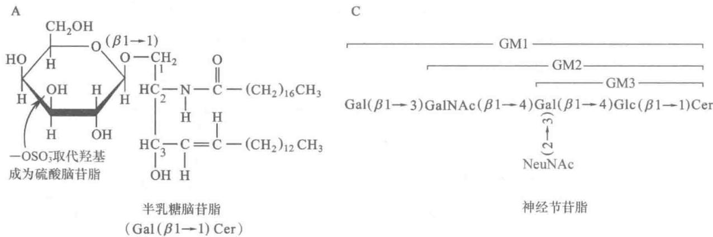

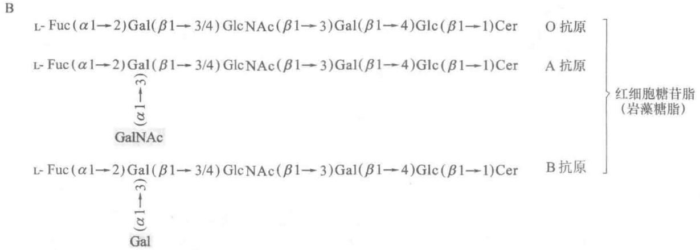  
图10-15 几种鞘糖脂的化学结构

组织和器官的特异性,细胞-细胞识别等有关。

硫苷脂(sulfatide)是鞘糖脂的糖基被硫酸化形成的。最简单的硫苷脂是硫酸脑苷脂(cerebroside sulfate)(图10-15A)。已分离到的硫苷脂有几十种。它们广泛地分布于哺乳动物的各器官中，以脑中含量最为丰富。硫苷脂可能与血液凝固和细胞黏着有关。

鞘脂(sphingolipid)也有极性头基和非极性尾部,但与甘油磷脂不同,它不含甘油成分。

神经节苷脂(ganglioside)也称唾液酸鞘糖脂,是最复杂的一类鞘脂,它们以寡糖链作为极性头基。在寡糖链内部的或末端的半乳糖残基上常以( $\alpha2\rightarrow3$ )糖苷键连接上一个或多个N-乙酰神经氨酸(NeuNAc),它是一种唾液酸,也经常简单地称它为唾液酸(Sia)。唾液酸使神经节苷脂在pH 7时带负电荷,这是它们与红细胞糖苷脂不同的地方。唾液酸鞘糖脂的命名是头一个字母G代表神经节苷脂,第二个字母M、D、T和Q分别表示含1、2、3和4个唾液酸的神经节苷脂,最后的数字1、2、3等表示糖链的序列不同(图10-15C)。神经节苷脂在神经系统特别是神经末梢中含量丰富,种类很多。它们可能在神经冲动传递中起重要作用。

## （六）细胞表面上的鞘脂是生物识别的位点

在一个多世纪前医学化学家 Johann Thudichum 发现鞘脂时,鞘脂的生物学作用还是像“狮身人面像 (Sphinx)”一样的不可思议,因此他把这些化合物命名为 sphingolipid(鞘脂)。在人体的细胞膜中至少已有 60 种不同的鞘脂被鉴定出。其中许多是在神经元的质膜中特别丰富的,某些显然是细胞表面上的识别位点,但至今只有少数几种鞘脂的专一功能被发现。有些鞘脂的糖质部分是定义人的血型的,并因此可以确定输血时一个人能够安全接受的血型(图 10-15B)。

神经节苷脂集中在细胞的外表面，在这里它们提供给胞外分子或相邻细胞的表面以识别点。质膜中神经节苷脂的种类和数量在胚胎发育期间发生剧烈变化。肿瘤形成诱导神经节苷脂新组分的合成，并发现了一种专一的神经节苷脂在很低浓度时就能诱导培养的神经元肿瘤细胞的分化。各种神经节苷脂的生物学作用的研究方兴未艾。

神经节苷脂能被溶酶体的一套酶降解,这些酶催化逐步除去单糖残基,最后生成神经酰胺。这些水解酶的任一种遗传缺失都会导致细胞中神经节苷脂的积累,带来严重的医学后果。

## （七）类固醇具有四个稠合的碳环

类固醇(steroid)中有一大类称为固醇或甾醇(sterol)的化合物, 是一类膜结构脂质, 存在于大多数真核细胞的膜系统中。这类膜脂的特征结构是一个由4个稠环组成的类固醇核, 它在生物体内是由2-碳乙酸开始, 经5-碳异戊二烯单位(isoprene subunit)合成的(第24章)。除了作为膜的结构成分外, 固醇还是某些具有特异生物活性的产物——活性脂质(见下一节)——的前体, 例如类固醇激素是调节基因表达的强力生物学信号。

## 1. 类固醇核的结构

类固醇核的结构以环戊烷多氢菲(perhydrocyclopentanophenanthrene)为基础,如图10-16所示,它是由3个六碳环(A、B、C环)和1个五碳环(D环)稠合而成。在环戊烷多氢菲的A和B环之间和C和D环之间各有一个甲基(C18和C19),称为角甲基;带有角甲基的环戊烷多氢菲称为类固醇核或甾核(steroid nucleus),它是类固醇化合物的母体。甾核的碳原子编号从A环开始,接着是B、C和D环。

类固醇的结构特点:①甾核的 C3 上常为

  
图10-16 环戊烷多氢菲和甾核的结构

羟基或酮基；② C17 上可以是羟基、酮基或其他各种形式的侧链；③ C4 和 C5 之间及 C5 和 C6 之间常是双键；④ A 环在某些化合物如雌酮 (estrone) 中是苯环，这些类固醇无 C19（角甲基）。

如图 10-17 所示甾核中 3 个六碳环可采取无张力的椅式构象(图右边)，但跟简单的环己烷或吡喃糖环不同，固醇的六碳环不能发生椅-椅互换(环转向)(见图 9-9)。甾核的构象基本上是一个刚性的平面。在固醇中 A 环和 B 环的稠合(A-B)可以是顺式，也可以是反式的；但其他环的稠合(B-C,C-D)都是反式的；这些稠环不允许绕 C—C 键旋转。反式类固醇(如胆甾烷醇)中，C10 上的角甲基(C19)伸向分子平面的上方(称 $\beta$ 取向)，在透视式(图左边)中用实楔形键表示；C5 位上的氢原子伸向分子平面的下方(称 $\alpha$ 取向)，用虚楔形键(或虚线键)表示。A-B 顺式类固醇(如粪固醇)中，C10 上的角甲基和 C5 上的氢原子都伸向分子平面的上方( $\beta$ 取向)。这两种类固醇分子都比较长而扁平，两个角甲基直立地伸向分子平面的上方。类固醇分子平面上的取代基可能是直立的，也可能是平伏的。一般说，由于空间上的原因平伏取代比直立取代稳定；例如胆甾烷醇(及胆固醇)C3 上的羟基是平伏取代的(图 10-17,右上方构象式中)。

  
胆甾烷醇(A-B反式二氢胆固醇)

  
粪甾醇(A-B顺式二氢胆固醇)  
图 10-17 固醇的立体化学(左边)和构象式(右边)

## 2. 胆固醇和其他动物固醇

固醇化合物的结构特点是在甾核的 C3 上有一个 $\beta$ 取向的羟基，C17 上有一个含 8 到 10 个碳原子的烃侧链。大多数真核生物都能合成固醇，并存在于它们的膜系统中；但细菌不能合成固醇，只有少数几种细菌能把外源的固醇结合到它们的细胞膜中。

胆固醇(cholesterol)在脑、肝、肾和蛋黄中含量很高,它是动物组织中最常见的一种动物固醇(zoosterol)。此外还有胆甾烷醇(cholestanol)也称二氢胆固醇和粪甾醇(coprostanol)它是二氢胆固醇的异构体(图10-17),以及羊毛固醇(lanosterol)(图10-24)和7-脱氢胆固醇等也是动物固醇。胆固醇的化学结构和分子模型如图10-18所示。胆固醇也是一种两亲分子,但它的极性头基(C3上的羟基)是弱小的,而非极性烃体(甾核和C17上的烷烃侧链)是大而刚性的平面;伸展的胆固醇约为16-碳脂肪酸的长度。胆固醇的两亲性质使它对膜中脂质的物理状态具有调节作用(见本章后面)。胆固醇主要参与动物细胞膜的组成,但它也是血中脂蛋白复合体的成分之一,并与动脉粥样硬化斑块的形成有关。胆固醇还是类固醇激素、维生素D和胆汁酸的前体,例如存在于皮肤中的7-脱氢胆固醇在紫外线作用下转化为维生素 $D_{3}$ (第13章)。

胆固醇除人体自身合成外，尚可从膳食中获取。胆固醇既是生理必需的，但过多时又会引起某些疾病；例如胆结石症的胆石几乎是胆固醇的晶体，又如冠心病患者血清总胆固醇含量很高，超过正常值(3.10\~5.70 mmol/L)上限。因此必须控制膳食中的胆固醇量。

  
图 10-18 胆固醇的化学结构和立体模型

自 1784 年从胆石中提取出胆固醇以来,因致力于围绕胆固醇这种生物小分子的研究,已有十几位学者获得诺贝尔奖,足见胆固醇在生物学和医学上的重要性。

## 3. 植物固醇和真菌固醇

植物很少含胆固醇，但含有其他固醇，称植物固醇（phytosterol）。其中最丰富的是 $\beta-$ 谷固醇（ $\beta-$ sitosterol），存在于小麦、大豆等谷物中。 $\beta-$ 谷固醇的结构几乎跟胆固醇一样，只是在C17上的侧链是 $C_{10}$ 不是 $C_8$ ；因为在侧链C24位连有一个 $\beta$ 取向的乙基（C24是手性碳，属 $R$ 构型），所以也称24-乙基胆固醇。常见的植物固醇还有豆固醇（stigmasterol），菜油固醇（campesterol）等（图10-19）。

  
豆固醇（24β-乙基-5,22-胆甾二烯-3β-醇）

$\beta-$ 谷固醇(24 $\beta-$ 乙基胆固醇)  
  
菜油固醇（24α-甲基-5-胆甾烯-3β-醇）

  
麦角固醇（24β-甲基-5,7,22-胆甾三烯-3β-醇）  
图 10-19 几种植物固醇和真菌固醇

植物固醇很少被人的肠黏膜细胞吸收，并能抑制胆固醇的吸收。开发降低胆固醇用的植物固醇类药物，不仅与这些固醇本身的结构有关，而且取决于投药的剂型。例如谷固醇在人肠道内少量被吸收，但它的饱和类似物，谷甾固醇（sitostanol），则完全不被吸收。此外，植物固醇在抑制胆固醇方面，以可溶性微团形式投药比固体结晶形式投药更为有效。

真菌类如酵母和麦角菌(Claveceps)产生的麦角固醇(ergosterol)也是维生素D原,经加工处理可以转变成维生素 $D_{2}$ （第 13 章）。此外还有酵母产生的酵母固醇（zymosterol），即 8,24-胆甾二烯-3β-醇，及其他固醇。

## 4. 固醇衍生物

从胆固醇衍生来的有类固醇激素(第14章)、维生素 $D_{3}$ (第13章)和胆汁酸;植物中的强心苷配基和某些皂苷的配基(图9-24)也都是固醇衍生物。

胆汁酸(bile acid)是在肝内由胆固醇直接转化而来。人体内每天合成胆固醇1\~1.5g，其中0.4\~0.6g在肝内转变为胆汁酸，它是机体内胆固醇的主要代谢终产物。人胆汁中含3种胆汁酸：胆酸(cholic acid)、鹅[脱氧]胆酸(chenodeoxycholic acid)和脱氧胆酸(deoxycholic acid)。胆酸和鹅胆酸是在肝中合成的，称为初级胆汁酸；脱氧胆酸是胆酸在肠道中经细菌7-脱羟作用衍生而来的，称为次级胆汁酸。由于在肠道内胆汁酸被重吸收并通过肠肝循环(enterohepatic circulation)，初级和次级胆汁酸均在胆汁中出现。这些胆汁酸的结构见图10-20A。已证实，胆汁酸属A-B顺式类固醇（图10-17），C3、C7和C12位上的羟基均为α取向，C10和C13上的两个角甲基为β取向，羧基伸向羟基一侧，因而胆汁酸分子一个面是亲水的，另一个面是疏水的（图10-20B）。胆汁酸是一种去污剂，具有增溶作用；脱氧胆酸和胆酸都是实验室里用来增溶膜蛋白的重要试剂。

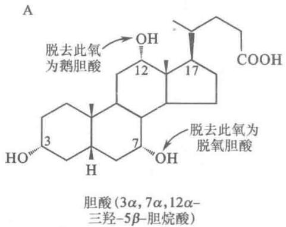  
图10-20 胆汁酸和结合胆汁酸的结构

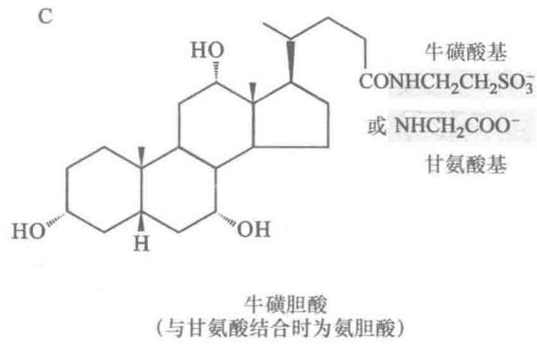

在肝中胆汁酸的羧基通过酰胺键与牛磺酸(taurine)或甘氨酸连接,分别生成胆汁酸的牛磺结合物或甘氨结合物,如牛磺胆酸(taurocholic acid)和甘氨胆酸(glycocholic acid)(图10-20C)。这种结合物是胆汁酸的主要形式。胆汁盐是结合物的钠盐或钾盐,它们是很强的去污剂,能溶于油-水界面处,其疏水面与油脂接近,亲水面与水接触,使油脂乳化,便于水溶性脂酶发挥作用,因而促进肠道中油脂和脂溶性维生素的消化吸收。

<!-- EN-BEGIN 10.2 -->

### 【英文对应 10.2】Structural Lipids in Membranes

> 来源：Lehninger Principles of Biochemistry（书籍/02_生物化学原理） 第10章 Lipids，§10.2。对应本章“二、膜结构脂质——磷脂、糖脂和固醇”。

The central architectural feature of biological membranes is a double layer of lipids, which acts as a barrier to the passage of polar molecules and ions. P2 Membrane lipids are amphipathic: one end of the molecule is hydrophobic, the other hydrophilic. The association of their hydrophobic regions with each other and their hydrophilic interactions with water direct their packing into sheets called membrane bilayers. In this section, we describe four general types of membrane lipids: phospholipids, which have hydrophobic regions composed of two fatty acids joined to glycerol or sphingosine; glycolipids, which contain a simple sugar or a complex oligosaccharide at the polar ends; archaeal tetraether lipids, which have two very long alkyl chains ether-linked to glycerol at both ends; and sterols, compounds characterized by a rigid system of four fused hydrocarbon rings (Fig. 10-6). Within these groups of membrane lipids, enormous diversity results from various combinations of fatty acid "tails" and polar "heads." The arrangement of these lipids in membranes, and their structural and functional roles therein, are considered in the next chapter.

#### [EN] Glycerophospholipids Are Derivatives of Phosphatidic Acid

P2 Glycerophospholipids, also called phosphoglycerides, are membrane lipids in which two fatty acids are attached in ester linkage to the first and second carbons of glycerol, and a highly polar or charged group is attached through a phosphodiester linkage to the third carbon. Glycerol is prochiral; it has no asymmetric carbons, but attachment of phosphate at one end converts it into a chiral compound, which can be correctly named either L-glycerol 3-phosphate, D-glycerol 1-phosphate, or sn-glycerol 3-phosphate (Fig. 10-7). Glycerophospholipids are named as derivatives of the parent compound, phosphatidic acid (Fig. 10-8), according to the polar alcohol in the head group. Phosphatidylcholine and phosphatidylethanolamine have choline and ethanolamine as their polar head groups, for example. Cardiolipin is a two-tailed glycerophospholipid in which two phosphatidic acid moieties share the same glycerol as their head group (Fig. 10-8). Cardiolipin is found in most bacterial membranes; in eukaryotic cells, cardiolipin is located almost exclusively in the inner mitochondrial membrane (where it is synthesized), a location consistent with the endosymbiosis hypothesis for the origin of these organelles (see Fig. 1-37).

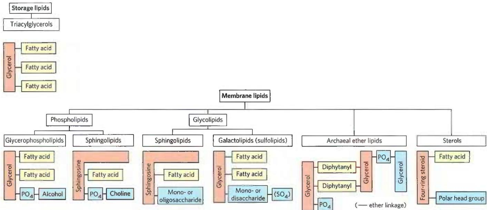  
FIGURE 10-6 Some common types of storage and membrane lipids. The triacylglycerol, phospholipid, glycolipid, and archaeal ether lipid types shown here have either glycerol or sphingosine as the backbone (light red screen), to which are attached one or more long-chain alkyl groups (yellow) and a polar head group (blue). Sterols have a core composed of four fused carbocyclic rings called the steroid nucleus. In triacylglycerols, glycerophospholipids, galactolipids, and sulfolipids, the alkyl groups are fatty acids in ester linkage. Sphingolipids contain a single fatty acid, in amide linkage to

In all glycerophospholipids, the head group is joined to glycerol through a phosphodiester bond, in which the phosphate group bears a negative charge at neutral pH. The polar alcohol may be negatively charged (as in phosphatidylinositol 4,5-bisphosphate), neutral (phosphatidylserine), or positively charged (phosphatidylcholine, phosphatidylethanolamine). As we shall see in Chapter 11, these charges contribute greatly to the surface properties of membranes.

The fatty acids in glycerophospholipids can be any of a wide variety, so a given phospholipid (phosphatidylcholine, for example) may consist of several molecular species, each with its unique complement of fatty acids. The distribution of molecular species is specific to the organism, to the particular tissue within the organism, and to the particular glycerophospholipids in the same cell or tissue. In general, glycerophospholipids contain a $C_{16}$ or $C_{18}$ saturated fatty acid at C-1 and a $C_{18}$ or $C_{20}$ unsaturated fatty acid at C-2. With few exceptions, the biological significance of the variation in fatty acids and head groups is not yet understood.

the sphingosine backbone. The membrane lipids of archaea are variable; that shown here has two very long, branched alkyl chains, each end in ether linkage with a glycerol moiety. Sterols have many different types of alkyl chains that can be attached to the steroid D ring at C-17. In phospholipids, the polar head group is joined through a phosphodiester, whereas glycolipids have a direct glycosidic linkage between the head-group sugar and the backbone glycerol. Many sterols contain a polar head group such as a carbonyl or hydroxyl group attached at C-3 of the steroid A ring.  
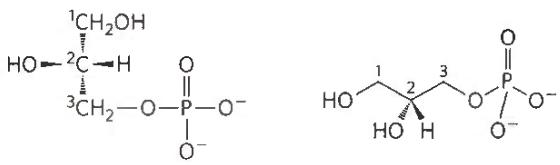  
L-Glycerol 3-phosphate (sn-glycerol 3-phosphate)  
FIGURE 10-7 L-Glycerol 3-phosphate, the backbone of phospholipids. Glycerol itself is not chiral, as it has a plane of symmetry through C-2. However, glycerol is prochiral — it can be converted to a chiral compound by adding a substituent such as phosphate to either of the —CH₂OH groups. One unambiguous nomenclature for glycerol phosphate is the D, L system (described on p. 73), in which the isomers are named according to their stereochemical relationships to glyceraldehyde isomers. By this system, the stereoisomer of glycerol phosphate found in most lipids is correctly named either L-glycerol 3-phosphate or D-glycerol 1-phosphate. Another way to specify stereoisomers is the sn (stereospecific numbering) system, in which C-1 is, by definition, the group of the prochiral compound that occupies the pro-S position. The common form of glycerol phosphate in phospholipids is, by this system, sn-glycerol 3-phosphate (in which C-2 has the R configuration). In archaea, the glycerol in lipids has the other configuration; it is D-glycerol 3-phosphate.

<table><tr><td colspan="4"></td></tr><tr><td>Name of glycerophospholipid</td><td>Head group</td><td>Formula of —X</td><td>Net charge (at pH 7)</td></tr><tr><td>Phosphatidic acid</td><td>—</td><td>—H</td><td>-2*</td></tr><tr><td>Phosphatidylethanolamine</td><td>Ethanolamine</td><td></td><td>0</td></tr><tr><td>Phosphatidylcholine</td><td>Choline</td><td></td><td>0</td></tr><tr><td>Phosphatidylserine</td><td>Serine</td><td></td><td>-1</td></tr><tr><td>Phosphatidylglycerol</td><td>Glycerol</td><td></td><td>-1</td></tr><tr><td>Phosphatidylinositol 4,5-bisphosphate</td><td>myo-Inositol 4,5-bisphosphate</td><td></td><td>-4*</td></tr><tr><td>Cardiolipin</td><td>Phosphatidyl-glycerol</td><td></td><td>-2</td></tr></table>

FIGURE 10-8 Glycerophospholipids. The common glycerophospholipids are diacylglycerols linked to head-group alcohols through a phosphodiester bond. Phosphatidic acid, a phosphomonoester, is the parent compound. Each derivative is named for the head-group alcohol, with the  
prefix "phosphatidyl-." In cardiolipin, two phosphatidic acids share a single glycerol ( $R^{1}$ and $R^{2}$ are fatty acyl groups), resulting in a symmetric molecule. \*Note that phosphate esters each have a charge of about -1.5; one of their —OH groups is only partially ionized at pH 7.

#### [EN] Some Glycerophospholipids Have Ether-Linked Fatty Acids

Some animal tissues and some unicellular organisms are rich in ether lipids, in which one of the two acyl chains is attached to glycerol in ether, rather than ester, linkage. The ether-linked chain may be saturated, as in the alkyl ether lipids, or it may contain a double bond between C-1 and C-2, as in plasmalogens (Fig. 10-9). Vertebrate heart tissue is uniquely enriched in ether lipids; about half of the heart phospholipids are plasmalogens. The membranes of halophilic bacteria, ciliated protists, and certain invertebrates also contain high proportions of ether lipids. The functional significance of ether lipids in these membranes is unknown; perhaps their resistance to the phospholipases that cleave ester-linked fatty acids from membrane lipids is important in some roles.

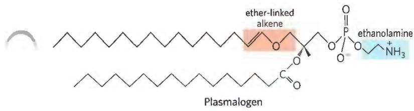

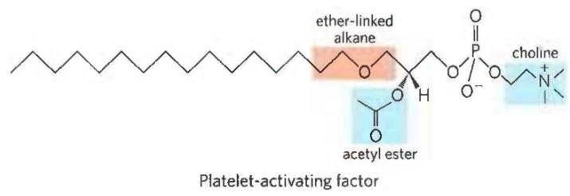  
FIGURE 10-9 Ether lipids. Plasmalogens have an ether-linked alkenyl chain where most glycerophospholipids have an ester-linked fatty acid (compare to Fig. 10-8). Platelet-activating factor has a long ether-linked alkyl chain at C-1 of glycerol, but C-2 is ester-linked to acetic acid, which makes the compound much more water-soluble than most glycerophospholipids and plasmalogens. The head-group alcohol is ethanolamine in plasmalogens and choline in platelet-activating factor.

At least one ether lipid, platelet-activating factor, is a potent molecular signal. It is released from leukocytes called basophils and stimulates platelet aggregation and the release of serotonin (a vasoconstrictor) from platelets. It also exerts a variety of effects on liver, smooth muscle, heart, uterine, and lung tissues and plays an important role in inflammation and the allergic response.

#### [EN] Galactolipids of Plants and Ether-Linked Lipids of Archaea Are Environmental Adaptations

The second group of membrane lipids in Figure 10-6, the glycolipids, includes those that predominate in plant cells: the galactolipids, in which one or two galactose residues are connected by a glycosidic linkage to C-3 of a 1,2-diacylglycerol (Fig. 10-10). Galactolipids are localized in the thylakoid membranes (internal membranes) of chloroplasts; they make up 70% to 80% of the total membrane lipids of a vascular plant, and are therefore probably the most abundant membrane lipids in the biosphere.

Phosphate is often the limiting plant nutrient in soil, and perhaps the evolutionary pressure to conserve phosphate for more critical roles favored plants that made phosphate-free lipids. Plant membranes also contain sulfolipids, in which a sulfonated glucose residue is joined to a diacylglycerol in glycosidic linkage. The sulfonate group bears a negative charge like that of the phosphate group in phospholipids.

Some archaea that live in ecological niches with extreme conditions—for example, high temperatures (boiling water), low pH, or high ionic strength—have membrane lipids containing long-chain (32 carbons) branched hydrocarbons linked at each end to glycerol (Fig.10-6). These linkages are through ether bonds, which are much more stable to hydrolysis at low pH and high temperature than are the ester bonds found in the lipids of bacteria and eukaryotes. In their fully extended form, these archaeal lipids are twice the length of phospholipids and sphingolipids, and can span the full width of the plasma membrane.

  
FIGURE 10-10 Two galactolipids of chloroplast thylakoid membranes. In monogalactosyldiacylglycerols (MGDGs) and digalactosyldiacylglycerols (DGDGs), both acyl groups are polyunsaturated and the head groups are uncharged.

#### [EN] Sphingolipids Are Derivatives of Sphingosine

P2 Sphingolipids, a large class of membrane phospholipids and glycolipids, have a polar head group and two nonpolar tails, but unlike glycerophospholipids and galactolipids they contain no glycerol (Fig. 10-6). Sphingolipids are composed of one molecule of the long-chain amino alcohol sphingosine (also called 4-sphingenine) or one of its derivatives, one molecule of a long-chain fatty acid, and a polar head group that is joined by a glycosidic linkage in some cases and a phosphodiester in others (Fig. 10-11).

Carbons C-1, C-2, and C-3 of the sphingosine molecule are structurally analogous to the three carbons of glycerol in glycerophospholipids. When a fatty acid is attached in amide linkage to the $-NH_{2}$ on C-2, the resulting compound is a ceramide, which is structurally similar to a diacylglycerol. Ceramides are the structural parents of all sphingolipids.

There are three subclasses of sphingolipids, all derivatives of ceramide but differing in their head groups: sphingomyelins, neutral (uncharged) glycolipids, and gangliosides. Sphingomyelins contain phosphocholine or phosphoethanolamine as their polar head group and are therefore classified along with glycerophospholipids as phospholipids (Fig. 10-6). Indeed, sphingomyelins resemble phosphatidylcholines in their general properties and three-dimensional structure, and in having no net charge on their head groups (Fig. 10-12). Sphingomyelins are present in the plasma membranes of animal cells and are especially prominent in myelin, a membranous sheath that surrounds and insulates the axons of some neurons—thus the name “sphingomyelins.”

Glycosphingolipids, which occur largely in the outer face of plasma membranes, have head groups with one or more sugars connected directly to the —OH at C-1 of the ceramide moiety; they do not contain phosphate. Cerebrosides have a single sugar linked to ceramide; those with galactose are characteristically found in the plasma membranes of cells in neural tissue, and those with glucose are found in the plasma membranes of cells in nonneural tissues. Globosides are glycosphingolipids with two or more sugars, usually D-glucose, D-galactose, or N-acetyl-D-galactosamine. Cerebrosides and globosides are sometimes called neutral glycolipids, as they have no charge at pH 7.

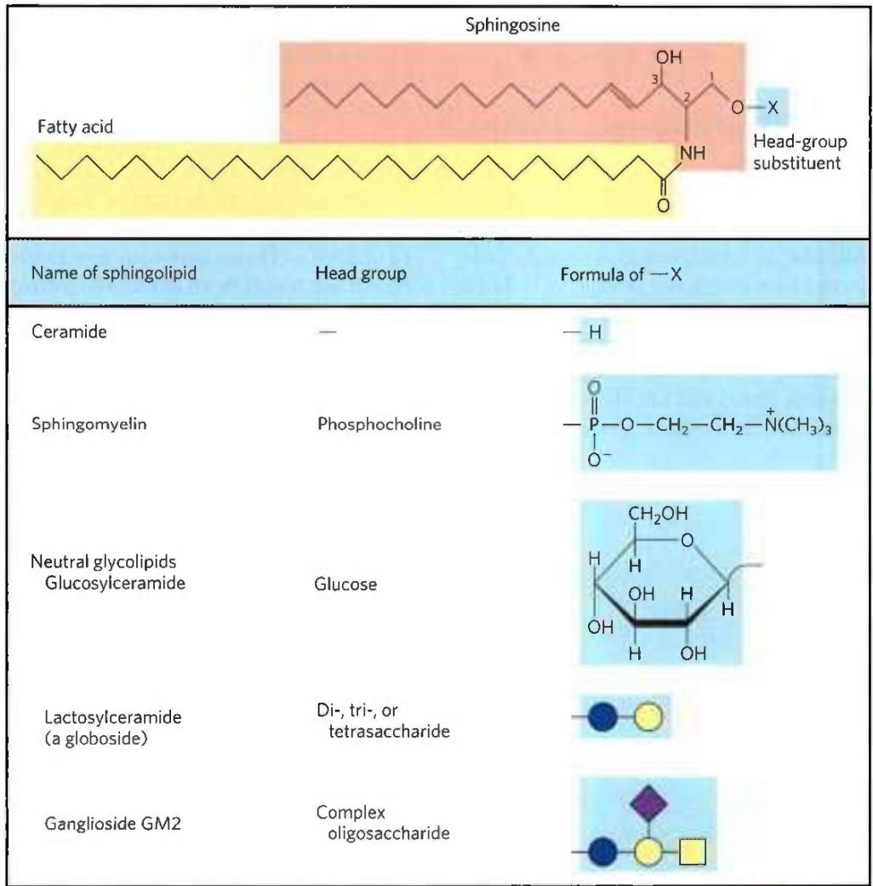  
FIGURE 10-11 Sphingolipids. The first three carbons at the polar end of sphingosine are analogous to the three carbons of glycerol in glycerophospholipids. The amino group at C-2 bears a fatty acid in amide linkage. The fatty acid is usually saturated or monounsaturated, with 16, 18, 22,  
or 24 carbon atoms. Ceramide is the parent compound for this group. Other sphingolipids differ in the polar head group attached at C-1. Gangliosides have very complex oligosaccharide head groups. Standard symbols for sugars are used in this figure, as shown in Table 7-1.

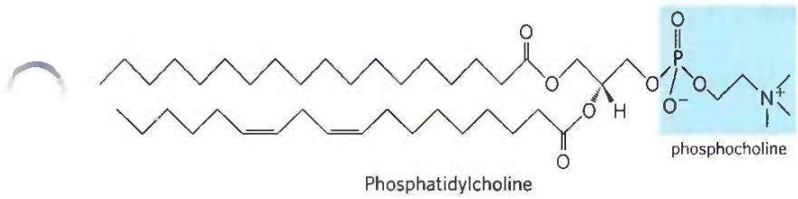

Gangliosides, the most complex sphingolipids, have oligosaccharides as their polar head groups and one or more residues of N-acetylneuraminic acid (Neu5Ac), a sialic acid (often simply called "sialic acid"), at the termini. Deprotonated sialic acid gives gangliosides the negative charge at pH 7 that distinguishes them from globosides. Gangliosides with one sialic acid residue are in the GM (M for mono-) series, those with two sialic acid residues are in the GD (D for di-) series, and so on (GT, three sialic acid residues; GQ, four).

  
α-N-Acetylneuraminic acid (a sialic acid) (Neu5Ac)

#### [EN] Sphingolipids at Cell Surfaces Are Sites of Biological Recognition

When sphingolipids were discovered more than a century ago by the physician-chemist Johann Thudichum, their biological role seemed as enigmatic as the Sphinx, for which he therefore named them. In humans, at least 60 different sphingolipids have been identified in cellular membranes. P2 Many of these are especially prominent in the plasma membranes of neurons, and some are clearly recognition sites on the cell surface, but a specific function for only a few sphingolipids has been discovered thus far. The carbohydrate moieties of certain sphingolipids define the human blood groups and therefore determine the type of blood that individuals can safely receive in blood transfusions (Fig. 10-13).

FIGURE 10-12 The similar molecular structures of two classes of membrane lipid. Phosphatidylcholine (a glycerophospholipid) and sphingomyelin (a sphingolipid) have similar dimensions and physical properties, but presumably play different roles in membranes.  
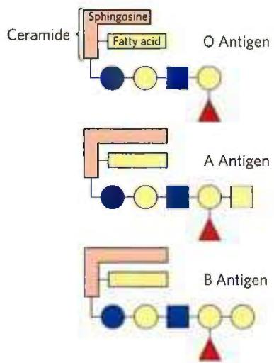  
FIGURE 10-13 Glycosphingolipids as determinants of blood groups. The human blood groups (O, A, B) are determined in part by the oligosaccharide head groups of these glycosphingolipids. The same three oligosaccharides are also found attached to certain blood proteins of individuals of blood types O, A, and B, respectively. Standard symbols for sugars are used here (see Table 7-1).

Gangliosides are concentrated on the outer face of cell surface plasma membranes where they present points of recognition for extracellular molecules or the surfaces of neighboring cells. The kinds and amounts of gangliosides in the plasma membrane change dramatically during embryonic development. Tumor formation induces the synthesis of a new complement of gangliosides, and very low concentrations of a specific ganglioside have been found to induce differentiation of cultured neuronal tumor cells. Guillain-Barré syndrome is a serious autoimmune disorder in which the body makes antibodies against its own gangliosides, including those in neurons. The resulting inflammation damages the peripheral nervous system, leading to temporary (or sometimes permanent) paralysis. In cholera, cholera toxin produced by the intestinal bacterium Vibrio cholerae enters sensitive cells after attaching to specific gangliosides on the intestinal epithelial cell surface. Investigation of the biological roles of diverse gangliosides remains fertile ground for future research.

  
FIGURE 10-14 The specificities of phospholipases. Phospholipases A₁ and A₂ hydrolyze the ester bonds of intact glycerophospholipids at C-1 and C-2 of glycerol, respectively. When one of the fatty acids has been removed by a type A phospholipase, the second fatty acid is removed by a lysophospholipase (not shown). Phospholipases C and D each split one of the phosphodiester bonds in the head group. Some phospholipases act on only one type of glycerophospholipid, such as phosphatidylinositol 4,5-bisphosphate (PIP₂, shown here) or phosphatidylcholine; others are less specific.

#### [EN] Phospholipids and Sphingolipids Are Degraded in Lysosomes

Most cells continually degrade and replace their membrane lipids. For each hydrolyzable bond in a glycerophospholipid, there is a specific hydrolytic enzyme in the lysosome (Fig. 10-14). Phospholipases of the A type remove one of the two fatty acids, producing a lysophospholipid. (These esterases do not attack the ether link of plasmalogens.) Lysophospholipases remove the remaining fatty acid.

Gangliosides are degraded by a set of lysosomal enzymes that catalyze the stepwise removal of sugar units, finally yielding a ceramide. A genetic defect in any of these hydrolytic enzymes leads to the accumulation of gangliosides in the cell, with severe medical consequences (Box 10-1).

#### [EN] Sterols Have Four Fused Carbon Rings

P2 Sterols are structural lipids present in the membranes of most eukaryotic cells. The characteristic structure of this group of membrane lipids is the steroid nucleus, consisting of four fused rings, three with six carbons and one with five (Fig. 10-15). The steroid nucleus is almost planar and is relatively rigid; the fused rings do not allow rotation about C—C bonds. Cholesterol, the major sterol in animal tissues, is amphipathic, with a polar head group (the hydroxyl group at C-3) and a nonpolar hydrocarbon body (the steroid nucleus and the hydrocarbon side chain at C-17) about as long as a 16-carbon fatty acid in its extended form. Similar sterols are found in other eukaryotes: stigmasterol in plants and ergosterol in fungi, for example. Bacteria cannot synthesize sterols; a few bacterial species, however, can incorporate exogenous sterols into their membranes. The sterols of all eukaryotes are synthesized from simple five-carbon isoprene subunits, as are the fat-soluble vitamins, quinones, and dolichols described in Section 10.3.

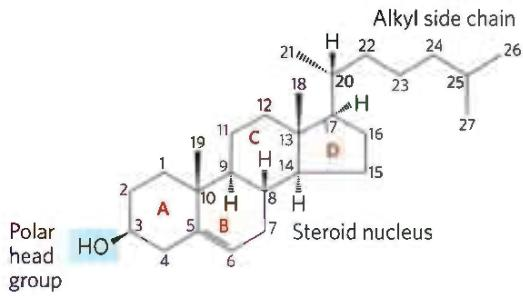  
FIGURE 10-15 Cholesterol. In this chemical structure of cholesterol, the rings are labeled A through D to simplify reference to derivatives of the steroid nucleus. The C-3 hydroxyl group (shaded blue) is the polar head group. For storage and transport of the sterol, this hydroxyl group condenses with a fatty acid to form a sterol ester.

P3 In addition to their roles as membrane constituents, the sterols serve as precursors for a variety of products with specific biological activities. Steroid hormones, for example, are potent biological signals that regulate gene expression. Bile acids are polar derivatives of cholesterol that act as detergents in the intestine, emulsifying dietary fats to make them more readily accessible to digestive lipases.

We return to cholesterol and other sterols in later chapters, to consider the structural role of cholesterol in biological membranes (Chapter 11), signaling by steroid hormones (Chapter 12), and the remarkable biosynthetic pathway to cholesterol and transport of cholesterol by lipoprotein carriers (Chapter 21).

#### [EN] SUMMARY 10.2 Structural Lipids in Membranes

Lipids with polar heads and nonpolar tails are major components of membranes. The most abundant are the glycerophospholipids, which contain fatty acids esterified to two of the hydroxyl groups of glycerol. The third hydroxyl of glycerol is esterified with the polar head group via a phosphodiester bond. Common glycerophospholipids such as phosphatidylethanolamine and phosphatidylcholine differ in the structure of their head group.

#### [EN] Abnormal Accumulations of Membrane Lipids: Some Inherited Human Diseases

The polar lipids of membranes undergo constant metabolic turnover, the rate of their synthesis normally counterbalanced by the rate of breakdown. The breakdown of lipids is promoted by hydrolytic enzymes in lysosomes, with each enzyme capable of hydrolyzing a specific bond. When sphingolipid degradation is impaired by a defect in one of these enzymes (Fig. 1), partial breakdown products accumulate in the tissues, causing serious disease. More than 50 distinct lysosomal storage diseases have been discovered, each the result of a single mutation in one of the genes for a lysosomal protein.

For example, Niemann-Pick disease is caused by a rare genetic defect in the enzyme sphingomyelinase, the enzyme that cleaves phosphocholine from sphingomyelin. Sphingomyelin accumulates in the brain, spleen, and liver. The disease becomes evident in infants and causes intellectual disability and early death. More common is Tay-Sachs disease, in which ganglioside GM2 accumulates in the brain and spleen (Fig. 2) owing to lack of the enzyme hexosaminidase A. The symptoms of Tay-Sachs disease are progressive developmental delay and disability, paralysis, blindness, and death by the age of 3 or 4 years.

Genetic counseling can predict and avert many inheritable diseases. Tests on prospective parents can detect abnormal enzymes; then DNA testing can determine the exact nature of the defect and the risk it poses for offspring. Once a pregnancy occurs, fetal cells obtained by sampling a part of the placenta (chorionic villus sampling) or the fluid surrounding the fetus (amniocentesis) can be tested in the same way.

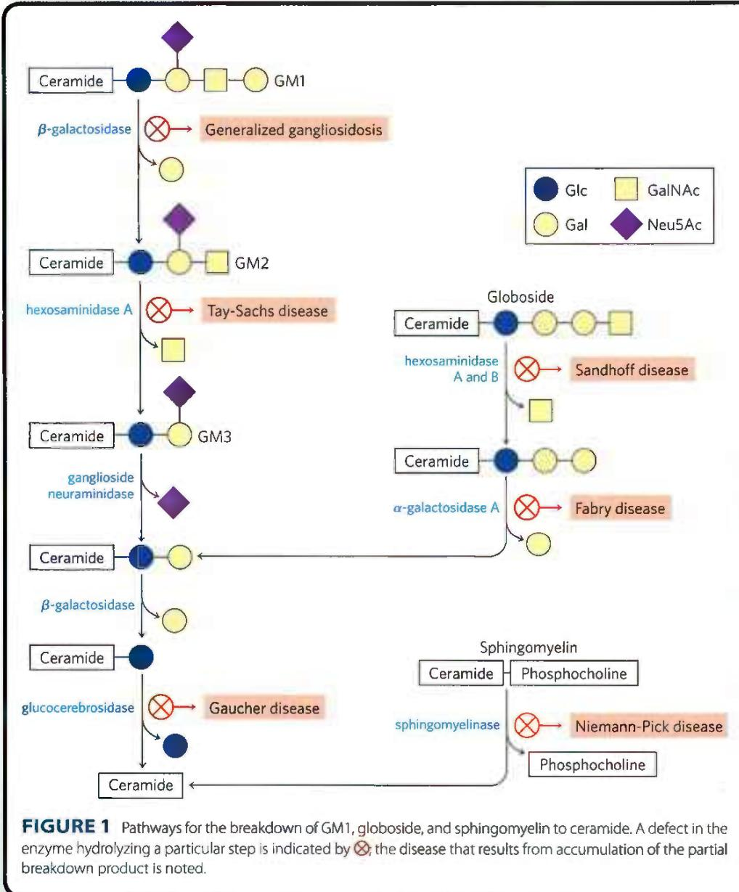

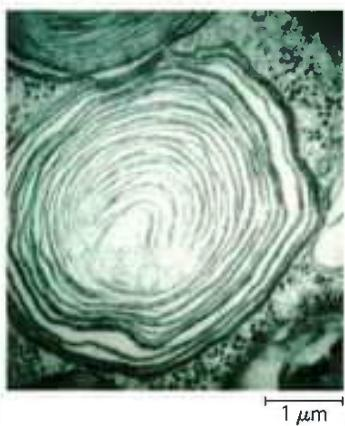  
FIGURE 2 Electron micrograph of a portion of a brain cell from an infant with Tay-Sachs disease, obtained post-mortem, showing abnormal ganglioside deposits in the lysosomes. [Otis Imboden/ National Geographic Image Collection]

Phosphatidylinositol

■ Heart tissue plasmalogens and platelet-activating factor are examples of glycerophospholipids containing ether-linked acyl chains.

Chloroplast membranes are rich in galactolipids, composed of a diacylglycerol with one or two linked galactose residues, and sulfolipids, diacylglycerols with a linked sulfonated sugar residue. Some archaea have unique membrane lipids, with long-chain alkyl groups ether-linked to glycerol at each end. These lipids are stable under the harsh conditions in which these archaea live.

The sphingolipids contain sphingosine instead of glycerol. The three subclasses of sphingolipids are all ceramide derivatives: sphingomyelins, neutral glycolipids, and gangliosides. Sphingomyelins have choline head groups; the other classes have sugar components.

■ Sphingolipids are abundant in the plasma membranes of neurons, and they define human blood groups.

■ Phospholipases degrade glycerophospholipids and catalyze hydrolysis at specific positions within the structure.

■ Sterols have four fused rings and a hydroxyl group. Cholesterol, the major sterol in animals, is both a structural component of membranes and precursor to a wide variety of steroids.

<!-- EN-END 10.2 -->

## 三、活性脂质——作为信号、辅因子和色素

前面我们考虑了两类按功能分类的脂质:贮存脂质和膜结构脂质,它们是细胞的主要成分;膜脂占大多数细胞干重的5%\~10%;贮脂占脂肪细胞质量的80%以上。一般说,这些脂质在细胞中担当比较“被动的”角色。还有另一类脂质——活性脂质,它们的含量虽不多,但在代谢过程中作为代谢物和信使起“主动的”作用。下面介绍几种有代表性的生物活性脂质：类二十烷酸、作为胞内信使的磷脂酰肌醇和鞘氨醇衍生物、类固醇激素、类异戊二烯化合物（如植物挥发性信号分子，脂溶性维生素A、D、E和K，泛醌和质体醌，植物色素和多萜醇）和缩酮化合物等。

活性脂质从化学本质和生物功能上看,可谓是多种多样。但在生物体内它们都是由乙酸(以乙酰-CoA形式)作为最初前体合成的。类萜和类固醇是由中间物5-碳异戊二烯单位缩合而成;缩合中出现的第一个固醇(羊毛固醇)是由30-碳的萜(鲨烯)环化而来,因此羊毛固醇是其他固醇的前体。详细的合成途径见第24章。

## （一）类二十烷酸是局部性的激素

类二十烷酸(eicosanoid; eikosi, 希腊文, “二十”)是由20-碳PUFA(至少含三个双键)衍生而来的, 因为它们都含有20个碳原子, 因此得名。这些化合物包括几类信号分子: 前列腺素、凝血噁烷和白三烯; 人和哺乳动物的很多组织和细胞都能合成它们。合成的前体主要是花生四烯酸(20:4), 少量是 $\gamma$ -高亚麻酸( $\gamma$ -homolinolenic acid; $20:3\Delta^{8,11,14}$ ) 和 EPA(20:5); 当细胞受到某些外来信号作用时 (如组织损伤), 膜磷脂释放出花生四烯酸。前列腺素和凝血噁烷是经环加氧酶(cyclooxygenase)途径或称前列腺素 $\mathbf{H}_2$ 合酶(PGH $_2$ synthase)途径产生; 白三烯是经脂加氧酶(lipoxygenase)途径合成; 关于类二十烷酸的生物合成细节见第24章。类二十烷酸是体内的局部性激素(local hormone), 效应一般局限在合成部位的附近, 在很低浓度(n mol/L 到 p mol/L 数量级)时则能起作用, 半寿期( $t_{1/2}$ )只有几十秒到几分钟, 同一物质在不同的组织中可以产生不同的效应。

前列腺素（prostaglandin, PG）是瑞典学者 S. Bergstrom 和 B. Samuelsson 最先从前列腺的脂质提取物中分离出来，并测定了它的结构。这种物质被注射到动物体内时，能引起平滑肌收缩和血压下降。因为当时以为这种物质是前列腺（prostatic gland）分泌的，1930 年代瑞典生理学家 U. S. von Euler 称它为前列腺素。后来证明这类物质广泛地分布于人和动物组织中。最初被分离的两个前列腺素分别称为前列腺素 E 和前列腺素 F，因为前者优先溶于乙醚（E；ether）而后者溶于磷酸盐缓冲液（F；fosfat，瑞典文，“磷酸盐”）；现在常分别用缩写符号 PGE 和 PGF 来表示。由一个饱和五元环和两条侧链组成的二十烷酸称前列腺烷酸（prostanoic acid），后者可看作是前列腺素类的母体化合物（图 10-21）。天然前列腺素中已发现 8 种不同类型的取代环，分别用 A、B、D、E、F、G、H 和 I 来表示。PGA 和 PGB 在环的 C9 位上有一个酮基和一个双键（前者在 C10 和 C11 之间，后者在 C12 和 C8 之间）；PGD 在 C9 有一个羟基，C11 一个酮基；PGE 与之相反，在 C9 有一个酮基，C11 一个羟基；PGF 在 C9 和 C11 各有一个羟基；PGG 和 PGH 具有相同的戊烷环结构——内过氧化物（endoperoxide），它们的不同仅在侧链 C15 上的取代基，PGG 取代的是一个过氧羟基（—OOH），PGH 是一个羟基；PGI 具有一个双环结构，环戊烷环 C9 上的氧与侧链的 C6 相连形成第二个五元环。每种类型的前列腺素又含多种亚类： $PGE_{1}$ 、 $PGE_{2}$ 、 $PGF_{1}$ 等。亚类名称（如 $PGF_{2\alpha}$ ）中，右下标的数字指环外两条侧链上碳-碳双键的数目，希腊字母 α 表示五碳环中 C9 上—OH 基的空间取向（α 取向）；希腊字母仅出现于 F 类，天然存在的 F 类前列腺素都是 α 构型，即 $F_{\alpha}$ 。几种常见的类二十烷酸见图 10-21。

前列腺素有一系列的生理功能:有的刺激分娩和月经期间子宫肌肉收缩;有的影响进入特定器官的血流、醒-睡周期(wake-sleep cycle)和某些组织对激素如肾上腺素和胰高血糖素的反应性;另一些能升高体温(发烧),促进炎症并产生疼痛。已证实在许多组织中前列腺素是通过专一性细胞受体调节胞内信使合成而起作用的。例如 $PGE_{1}$ 能促进某些细胞中腺苷酸环化酶的活性, $PGF_{2}$ 可提高靶细胞中 $3',5'-环鸟苷酸(cGMP)$ 的水平(见第 14 和 28 章)。虽然前列腺素作用的分子机制知道得还不多,但它们的生理作用已被用于实践。例如 $PGF_{2}$ 被用于足月孕妇的引产,也用于诱导中期流产或死胎分娩。前列腺素还用于畜牧业,诱导一组雌畜同时进入发情期。

凝血噁烷（thromboxane；TX）最先从血小板（也称凝血细胞）中分离获得。它跟前列腺素不同在于有一个氧原子参与成环（含氧六元环；氧杂的饱和烃环俗称噁烷）；对 TXA 来说，另有一个氧原子以环氧丙烷形式存在于六元环中央，突出于环面之下（图 10-21）。其他方面凝血噁烷的结构与前列腺素相似，合成途径和代谢性质两者也相似，因此凝血噁烷可被认为是前列腺素的类似物。 $TXA_{2}$ 从花生四烯酸合成，是血小板产生的主要类前列腺素物质(图 10-21)。 $TXA_{2}$ 的效应是引起动脉收缩、诱发血小板聚集，促进血栓形成，降低通向血栓处的血流。 $TXA_{2}$ 的半寿期只有 30 s；在水中 $TXA_{2}$ 的环氧丙烷被迅速水解，转变为 $TXB_{2}$ ，这是一个无活性的代谢物。

  
图10-21 几种常见的类二十烷酸

白三烯(leukotriene; LT)最早在白细胞中找到, 含 3 个共轭双键, 因而得名。从花生四烯酸形成的白三烯含 4 个双键, 其中 1 个是非共轭双键 (C14 和 C15 之间); 白三烯的缩写为 $\mathrm{LT}_{4}$ , 右下标“4”表示碳-碳双键总数。在白细胞中花生四烯酸经 5-脂加氧酶途径先转变为 5,6-环氧化物 (5,6-epoxide), 称 $\mathrm{LTA}_{4}$ 。后者在水解酶作用下, 加水生成 5,12-二羟衍生物, 称 $\mathrm{LTB}_{4}$ ; 或在还原型谷胱甘肽参与下打开环氧环 (epoxide ring) 形成 $\mathrm{LTC}_{4}$ 。然后酶促除去谷胱甘肽中的谷氨酸残基, 转变为 $\mathrm{LTD}_{4}$ 。再除去甘氨酸残基转变为 $\mathrm{LTE}_{4}$ 。 $\mathrm{LTA}_{4}$ 和 $\mathrm{LTC}_{4}$ 的结构见图 10-21。白三烯是强力的生物信号, 例如 $\mathrm{LTC}_{4}$ 和 $\mathrm{LTD}_{4}$ 能引起平滑肌收缩, 微血管通透性增大 (渗出液增多) 和冠状动脉缩小; 造成肺气管缩小的作用比组胺 (histamine) 强 1000 倍。白三烯的过度产生会引起气喘发作。白三烯的合成是抗气喘药物如强的松 (prednisone; 一个人工合成的胆固醇衍生物) 的一个靶子。过敏性休克期间肺平滑肌的强烈收缩是在对蜂刺、青霉素或其他因素过敏的个体中发生的可能致命的变态反应的一部分。

阿司匹林(aspirin,即乙酰水杨酸)属于非类固醇抗炎药物(NSAIDS),在医学上用于消炎、镇痛、退热已逾百年,但它的作用机制一直不清楚,直至1971年J.Vane发现阿司匹林通过抑制PGH $_{2}$ 合酶而关闭前列腺素的合成。更确切地说,阿司匹林通过乙酰化该酶活性中心的Ser530羟基,不可逆地抑制酶的环加氧酶活性,即抑制前列腺素合成的第一步(PGH $_{2}$ 的形成;见第24章),因此它是一种强抗炎药;属于这类抗炎药还有布洛芬(ibuprofen;异丁苯丙酸)、乙酰氨基苯酚(acetaminophen)等。显然阿司匹林也抑制凝血噁烷 $A_{2}$ 的形成（因为 $TXA_{2}$ 合成的直接前体是 $PGH_{2}$ ），因此它又是一种抗凝剂，被广泛地用于防止过度血凝。每天服用一次小剂量的阿司匹林可以有效地降低血小板聚集。

## （二）磷脂酰肌醇和鞘氨醇衍生物是胞内信使

磷脂酰肌醇及其磷酸化衍生物在几个水平上起调节细胞结构和代谢作用。磷脂酰肌醇4,5-二磷酸(表10-4)在质膜内面(胞质面)作为信使分子的储库;它们在应答跟专一性表面受体相互作用的胞外信号时在胞内被释放。当胞外信号如血管升压素(一种激素,见图2-23)激活膜中的专一性磷脂酶C(图10-9),被活化的磷脂酶C水解磷脂酰肌醇4,5-二磷酸,释放出两个产物,作为胞内信使:一个是肌醇1,4,5-三磷酸( $IP_{3}$ ),水溶性的;另一个是二酰甘油(DAG),仍处于跟膜结合。 $IP_{3}$ 引发 $Ca^{2+}$ 从内质网释放,二酰甘油的结合和细胞溶胶的 $Ca^{2+}$ 浓度升高激活蛋白激酶C。通过对专一性蛋白质的磷酸化,蛋白激酶C引起细胞对胞外信号的应答。关于信号传递(signaling)的机制将在第14章详细介绍。

肌醇磷脂也作为涉及信号传递和胞吞的超分子复合体的成核点(point of nucleation)。某些信号传递蛋白质专一地跟质膜中的磷脂酰肌醇3,4,5-三磷酸的结合，引发在膜的细胞溶胶面上多酶复合体的形成。因此，在应答胞外信号时磷脂酰肌醇3,4,5-三磷酸的形成致使这些蛋白质聚集在该质膜表面的信号传递复合体(见图14-26)。

膜鞘脂也能作为胞内信使的来源。神经酰胺和鞘磷脂(图 10-13 和 10-14)两者是蛋白激酶的强调节剂,神经酰胺或其衍生物参与调节细胞分裂、分化、迁移和程序性细胞死亡(programmed cell death)或称编程性细胞死亡(apoptosis)(见第 28 章)。

## （三）类固醇激素在组织之间运载信息

类固醇是固醇的氧化衍生物；它们有固醇核，但缺少连接在胆固醇D环上的烃链，因此比胆固醇的极性大。类固醇激素通过血流（在蛋白质载体上）从产生的部位移动到靶组织，在那里进入细胞，跟核中高度专一的受体蛋白质结合，引发在基因方面并因此在代谢方面的变化。因为激素对它们的受体有很高的亲和力，很低的激素浓度（nmol或低于nmol）就足以使靶组织产生应答。类固醇激素的主要类别有性激素，包括雄性和雌性激素；肾上腺皮质产生的激素，可的松、皮质醇和醛固酮，它们分别调节葡萄糖代谢和水盐代谢。关于它们的结构和生物功能将在第14章作较详细介绍。有些人工合成的类固醇激素，例如强的松（prednisone）和强的松龙（prednisolone）（图10-22），它们的抗风湿性关节炎和抗过敏的活性都比可的松强。

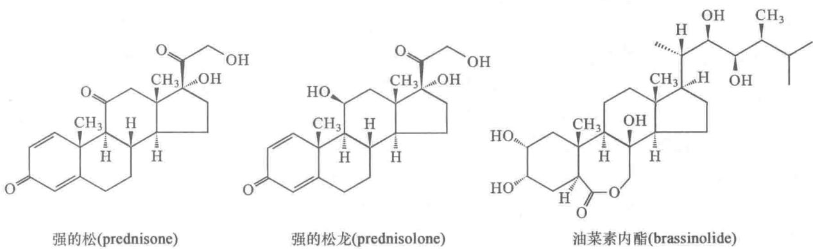  
图10-22 几种人工合成的类固醇激素和类固醇样植物激素油菜素内酯

维管植物含有类固醇样的物质,如油菜素内酯(brassinolide)(图10-22),它是一种强植物生长调节剂,能增加茎伸长的速度,并在生长期间影响细胞壁中微纤维的定向。

## （四）许多类异戊二烯（类萜）是活性脂质

## 1. 萜的结构和分类

萜(terpene)是一类结构上极其多种多样的有机分子；尽管如此，它们是相关的化合物。按L.Ruzicka提出的异戊二烯法则，认为萜分子的碳架是由两个或多个5-碳 $\left(\mathrm{C}_{5}\right)$ 异戊二烯单位头-尾连接形成的；连接方式一般是头-尾相连（图10-23）。形成的萜可以是开链的，也可以是含环分子；可以是单环，也可以是双环或多环。这里必须指出，异戊二烯本身不是萜的生物合成前体，真正的前体是两个异戊二烯的“等当物”：异戊烯基焦磷酸(isopentenyl pyrophosphate）和二甲丙烯基焦磷酸(dimethylallyl pyrophosphate)，这些5-碳分子本身又是由3个2-碳单位（乙酰-CoA）经一系列反应缩合而成（详见第24章）。它们头-尾相接形成的第一个10-碳单位是牻牛儿基焦磷酸；相应的醇是牻牛儿醇（图10-24），具有牻牛儿苗即老鹳草(Geranium）所特有的气味。

  
图10-23 异戊二烯（2-甲基-1,3-丁二烯）的结构和在萜中的连接方式

根据所含异戊二烯单位 $\left(\mathrm{C}_{5}\right)$ 的数目，萜可分为单萜、倍半萜、双萜、三萜和多萜等。由两个 $C_{5}$ 单位构成的萜称单萜，由3个 $C_{5}$ 构成的称倍半萜，由4个 $C_{5}$ 构成的称双萜，其余依此类推。这些萜及其衍生物也称类萜(terpenoid)或类异戊二烯(isoprenoid)。单萜和倍半萜主要在植物中发现，高级萜则在植物和动物中都存在。萜类的一些代表性化合物见图10-24和图10-25。

单萜（monoterpene）碳原子数为 $C_{10}$ ；存在于各种高等植物中，许多是植物精油的成分。开链单萜如香茅醛，存在于香茅油和玫瑰油中；环状单萜如柠檬中的柠檬烯。

倍半萜（sesquiterpene）碳数为 $C_{15}$ ; 倍半萜结构形式多种, 虽知道得不甚多, 但有些是中草药中的研究对象, 如防风根烯和桉叶醇等。

双萜(diterpene) 碳数 $C_{20}$ ; 如叶绿素分子的成分叶绿醇也称植醇(第 23 章)、全反-视黄醇(第 13 章)以及赤霉酸(一种植物激素, 见图 14-14)。

三萜(triterpene) 碳数为 $C_{30}$ ; 属于三萜的如鲨烯和羊毛固醇, 它们是胆固醇和其他类固醇的前体。

四萜（tetraterpene）碳数为 $C_{40}$ ; 除类胡萝卜素外, 其他类型的四萜少见。类胡萝卜素（carotenoid）是有色光合色素, 包括番茄红素、胡萝卜素及其氧化物约 70 种。番茄红素是存在于番茄中的一种色素, 分子中有 11 个共轭双键（图 10-24），胡萝卜素的结构与番茄红素很相似, 只是前者在链的两端或一端含有一个环己烯环。胡萝卜素根据双键数目或位置不同, 有 $\alpha$ 、 $\beta$ 、 $\gamma$ 等 6 种异构体。其中 $\beta$ -胡萝卜素是维生素 A 原（见第 13 章）。存在于玉米和蛋黄中的玉米黄质（zeaxanthin）是 3,3'-二羟基- $\beta$ -胡萝卜素; 节肢动物中的虾青素（astaxanthin）及其氧化产物虾红素（astacin）是 $\beta$ -胡萝卜素的氧化物; 细菌中的紫菌素（rhodomycetin）也是一种类胡萝卜素。泛醌（辅酶 Q）和质体醌的侧链含 5 到 10 个异戊二烯单位。

多萜(polyterpene) 如多萜醇,含9到22个异戊二烯单位;天然橡胶是由几千个异戊二烯单位头-尾连接而成的大分子,异戊二烯可由蒸馏天然橡胶产生。

## 2. 维管植物产生很多种挥发性的信号分子和保护物质

植物产生数以千计的不同的挥发性脂质。它们作为通过空气传播的信号，允许植物彼此间进行通讯，招引传粉者、防御食草动物和吸引能保护植物和抗衡食草动物的生物。例如从膜脂的 $\alpha-$ 亚麻油酸$(18:3\Delta^{9,12,15})$ 衍生来的茉莉酮酸（jasmonate；结构类似前列腺素），在应答遭受虫害时能引发植物进行抵御。茉莉酮酸甲酯给茉莉油以特有的香气，它被广泛地用于香料工业。植物挥发物有些是从脂肪酸衍生而来，更多是由异戊二烯单位缩合而成，如上面提到的牻牛儿醇、香茅醛、柠檬烯和桉叶醇等。

  
图10-24 某些类萜化合物的结构

植物经常散发出异戊二烯，约占光合作用中被固定碳的15%。全球从植被散发的异戊二烯估计达 $3\times10^{11}$ kg/年。散发出的异戊二烯形成气氛，覆盖在植被上，保护叶子免遭因高温（炎夏）引起的不可逆损伤。这可能是因为植物周围空气中的异戊二烯溶入叶细胞膜，并改变脂双层和膜中脂质-蛋白质、蛋白质-蛋白质的相互作用而增加对热的耐受性。

## 3. 维生素(vitamin)A 和 D 是激素的前体

维生素 A 也称视黄醇(retinol)，它以不同的形式行使激素和视色素的功能。一种形式是视黄酸(retinoic acid)，它在上皮组织(包括皮肤)发育过程中通过细胞核中的受体蛋白质调节基因表达。视黄酸是一种外用药维 A 酸(英文商品名为 tretinoin)的活性成分，用于治疗严重的痤疮和具皱皮肤。另一种形式是视黄醛(retinal)，它引发视网膜视杆细胞和视锥细胞对光的应答，产生一个神经信号传给大脑。视黄醛的这一作用详见第 13 章。前面谈到，维生素 D 族有从胆固醇转化来的 D₃ 和麦角固醇转化来的 D₂。维生素 $\mathrm{D}_3$ 也称胆钙化醇（cholecalciferol），它本身无活性，但在肝和肾中被酶转化为有生物活性的 $1\alpha, 25-$ 二羟维生素 $\mathrm{D}_3$ ，简称骨化三醇（calcitriol）。骨化三醇是一种激素，它的主要靶细胞是小肠黏膜、肾小管和骨骼；在小肠黏膜促进钙和磷的吸收，在肾小管促进钙、磷的重吸收；总的生理效应是提高血钙和血磷浓度，以利于新骨生成和钙化。看来《黄帝内经》中说“肾主骨”，这是科学的。与类固醇激素一样，骨化三醇也是通过跟核内专一的受体蛋白相互作用调节基因表达。

## 4. 维生素 E、K 和脂质醌是氧化还原的辅因子

维生素E也称生育酚（tocopherol），它是一个族名，族中的所有成员都含一个取代的芳香环和一个类异戊二烯侧链（见第13章）。生育酚在细胞内多集中在膜的脂双层中，例如线粒体膜中，每2100个磷脂就有一个维生素E分子。维生素E是生物体内最重要的自由基清除剂，主要清除膜中活性氧自由基包括脂质过氧化中产生的LO·和LOO·，以免膜上的不饱和脂肪酸遭到过氧化而损害膜脂，使细胞变得脆弱。维生素K又称凝血维生素；从结构上看，它是2-甲基-1,4-萘醌的衍生物。天然的有维生素 $\mathrm{K}_{1}$ （叶绿醌）和 $\mathrm{K}_{2}$ （甲基萘醌类）；人工合成的有维生素 $\mathrm{K}_{3}$ (2-甲萘醌)。现已知参与血凝过程的许多凝血因子（见第4章和第8章）如因子Ⅱ（凝血酶原）、Ⅶ、Ⅸ和X都含有γ-羧基谷氨酸残基。例如正常的凝血酶原在其N端区含有10个γ-羧基谷氨酸残基。这些残基能与 $\mathrm{Ca}^{2+}$ 螯合，并促进凝血酶原与受伤部位的血小板磷脂膜表面结合以利跟因子 $\mathrm{X}_{\mathrm{a}}$ 和 $\mathrm{V}_{\mathrm{a}}$ 形成复合体，在该复合体作用下凝血酶原转化为凝血酶（Ⅱa）。这些凝血因子的γ-羧基谷氨酸残基是在以维生素K作为辅因子的谷氨酰羧化酶(glutamyl carboxylase)催化下，通过翻译后加工修饰而成的。在这一过程中维生素K的萘醌经历了氧化还原循环。关于维生素E和K的结构、存在和生理功能详见第13章。

泛醌(也称辅酶 Q)和质体醌都是类异戊二烯化合物(图 10-25);它们是氧化还原反应中亲脂的电子载体,分别在线粒体和叶绿体中驱动 ATP 合成。泛醌和质体醌都能接受 1 个或 2 个电子,抑或 1 个或 2 个质子(见第 19 章和第 23 章)。

## 5. 许多植物色素是共轭双烯脂质

共轭双烯是具有共轭双键系统(单键和双键交替的碳链)的脂质,是吸收可见光的色素分子。因为这种结构排列允许电子离域,所以这些分子能被低能电磁辐射(可见光)激发,使它们具有被人和动物看得见的颜色。它们在化学上的细微差别,产生各种颜色明显不同的色素。其中有些是在视觉和光合作用中起着捕光作用的色素,如视黄醛、胡萝卜素等;其他起天然呈色作用,如番茄的红色,胡萝卜的橙黄色,类似的化合物使得鸟羽披上了醒目的红、橙、黄颜色,如金丝鸟的羽毛是亮黄色的,这是因为鸟吃了含类胡萝卜素如玉米黄质和角黄质(canthaxanthin)等(图10-25)植物食料产生的;雄鸟和雌鸟之间的色素形成不同是它们肠道吸收和类胡萝卜素加工的不同结果。这些色素也是类异戊二烯化合物或衍生物。

## 6. 多萜醇在糖生物合成中活化单糖前体

在细菌细胞壁的多糖装配时和真核细胞中单糖单位加入某些蛋白质(糖蛋白)和脂质(糖脂)时,待加入的单糖单位先在化学上把它连接到称为多萜醇(dolichol)的类异戊二烯醇(图10-25)上使之活化。这些化合物跟膜脂有很强的疏水相互作用,能把被连上的单糖锚定在膜上,在这里参与糖-转移反应(详见第21章)。

## （五）聚酮化合物是具有强力生物活性的天然产物

聚酮化合物(polyketide)是一类多种多样的脂质,它们的生物合成途径是 Claisen 缩合,缩合是两个乙酰-CoA 分子之间发生的涉及亲核酰基取代的反应,类似脂肪酸的生物合成,但无两个还原步骤(见第 24 章)。聚酮化合物是次级代谢物(secondary matabolite),对一个生物的代谢来说虽不是关键的化合物,但对产生者在某些生态位中起着辅助性作用。很多聚酮化合物在医学上用作抗生素如红霉素,抗真菌剂如两性霉素 B 以及胆固醇合成抑制剂如洛伐他丁等。

红霉素(erythromycin)是1952年从红链霉菌(Streptomyces erythreus)中获得的一种碱性抗生素。其分子结构中含有一个母核——大环内酯(macrolide)。具有大环内酯的抗生素总称大环内酯类抗生素。提取的红霉素中可分离出 A、B 和 C 三个组分，其中组分 A 的结构式见图 10-26。红霉素是一种广谱抗生素，临床上主要用它治疗耐药性金黄色葡萄球菌所引起的各种严重感染，如肺炎、败血症等。

  
玉米黄质 $\left(C_{40}\right)$ ：作为植物和鸟羽色素的脂质

  
角黄质 $(\mathrm{C}_{40})$ ：作为植物和鸟羽色素的脂质

  
泛醌(辅酶Q): 线粒体的一种电子载体(n=4\~8)

  
质体醌：叶绿体的一种电子载体 $(n = 4\sim 8)$

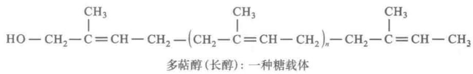  
图10-25 一些其他类萜化合物或衍生物

两性霉素 B(amphotericin B)属于多烯大环内酯类(polyene macrolides)或多烯类的抗真菌抗生素。多烯大环内酯类抗生素的结构特点是在分子中既有经内酯化而闭合的大碳环(38元)，又有一系列的共轭双键(图10-26)。正因为有一系列的共轭双键，所以与大环内酯类抗生素相比它们有不同的生物学性质。两性霉素的结构中含有一个游离氨基(在氨基糖部分)和一个游离羧基(在大环内酯部分)，所以它是一种两性化合物。两性霉素能抑制多种致病真菌的生长。主要用于治疗假丝菌的感染，特别是用于抗阴道假丝菌的感染；口服可减少肠道霉菌和酵母菌的数量；肺部感染可采用雾化吸入。

洛伐他丁（lovastatin）是从土曲霉（Aspergillus terreus）的一个菌株中提取出来的。现在已被广泛推荐作为降低血清胆固醇的药物。每天服用20\~80mg剂量时观察到血清胆固醇水平有明显降低。羟甲戊二酸单酰CoA还原酶（hydroxymethyl glutaryl CoA reductase）简称HMG-CoA还原酶，它是体内胆固醇合成的限速酶；洛伐他丁被口服摄入后则水解为有活性的酸形式，后者是此限速酶的竞争性抑制剂。

<!-- EN-BEGIN 10.3 -->

### 【英文对应 10.3】Lipids as Signals, Cofactors, and Pigments

> 来源：Lehninger Principles of Biochemistry（书籍/02_生物化学原理） 第10章 Lipids，§10.3。对应本章“三、活性脂质——作为信号、辅因子和色素”。

The two functional classes of lipids considered thus far (storage lipids and structural lipids) are major cellular components; membrane lipids make up 5% to 10% of the dry mass of most cells, and storage lipids make up more than 80% of the mass of an adipocyte. With some important exceptions, these lipids play a passive role in the cell; lipid fuels are stored until oxidized by enzymes, and membrane lipids form impermeable barriers around cells and cellular compartments. P3 Another group of lipids, present in much smaller amounts, includes those with active roles in metabolic traffic as metabolites and messengers. Some serve as potent signals—as hormones, carried in the blood from one tissue to another, or as intracellular messengers generated in response to an extracellular signal (hormone or growth factor). Others function as enzyme cofactors in electron-transfer reactions in chloroplasts and mitochondria, or in the transfer of sugar moieties in a variety of glycosylation reactions. A third group consists of lipids with a system of conjugated double bonds: pigment molecules that absorb visible light. Some of these act as light-capturing pigments in vision and photosynthesis; others produce natural colorations, such as the orange of pumpkins and carrots and the yellow of canary feathers. Finally, a very large group of volatile lipids produced in plants consists of signaling molecules that pass through the air, allowing plants to communicate with each other and to invite animal friends and deter foes. In this section, we describe a few representatives of these biologically active lipids. In later chapters, we consider their synthesis and biological roles in more detail.

#### [EN] Phosphatidylinositols and Sphingosine Derivatives Act as Intracellular Signals

P3 Phosphatidylinositol (PI) and its phosphorylated derivatives (Fig. 10-16) act at several levels to regulate cell structure and metabolism. Phosphatidylinositol 4,5-bisphosphate $(\mathrm{PIP}_2$ ; Fig. 10-14) in the cytoplasmic (inner) face of plasma membranes serves as a reservoir of messenger molecules that are released inside the cell in response to extracellular signals interacting with specific surface receptors. Extracellular signals such as the hormone vasopressin activate a specific phospholipase C in the membrane, which hydrolyzes $\mathrm{PIP}_2$ to release two products that act as intracellular messengers: inositol 1,4,5-trisphosphate $(\mathrm{IP}_3)$ , which is water soluble, and diacylglycerol, which remains associated with the plasma membrane. $\mathrm{IP}_3$ triggers release of $\mathrm{Ca^{2+}}$ from the endoplasmic reticulum, and the combination of diacylglycerol and elevated cytosolic $\mathrm{Ca^{2+}}$ activates the enzyme protein kinase C. By phosphorylating specific proteins, this enzyme brings about the cell's response to the extracellular signal. This signaling mechanism is described more fully in Chapter 12 (see Fig. 12-15).

P3 Inositol phospholipids also serve as points of nucleation for supramolecular complexes involved in signaling or in exocytosis. Certain signaling proteins bind specifically to phosphatidylinositol 3,4,5-trisphosphate $(\mathrm{PIP}_3)$ in the plasma membrane, initiating the formation of multienzyme complexes at the membrane's cytosolic surface. Thus, formation of $\mathrm{PIP}_3$ in response to extracellular signals brings the proteins together in signaling complexes at the surface of the plasma membrane (see Figs. 12-11 and 12-23).

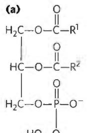

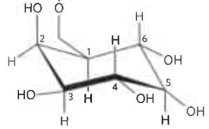

(b)  
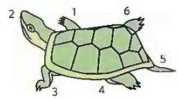

FIGURE 10-16 Phosphatidylinositol and its derivatives. (a) In phosphatidylinositol, the glycerol phospholipid is attached at C-1 of inositol. Phosphorylation of the remaining inositol hydroxyl groups forms signaling molecules such as phosphatidylinositol 4,5-bisphosphate (PIP₂; see Fig. 10-14), inositol 1,4,5-bisphosphate (IP₃), and phosphatidylinositol 3,4,5-trisphosphate (PIP₃). (b) A useful trick for remembering the inositol carbon-numbering scheme is to compare the chair conformation of inositol to a turtle. Begin numbering with C-1 as the right front flipper and move counterclockwise around the structure, with C-2 the head and C-5 the tail.  

Membrane sphingolipids also can serve as sources of intracellular messengers. Both ceramide and sphingomyelin (Fig. 10-11) are potent regulators of protein kinases, and ceramide or its derivatives are involved in the regulation of cell division, differentiation, migration, and programmed cell death (also called apoptosis; see Chapter 12).

#### [EN] Eicosanoids Carry Messages to Nearby Cells

P3 Eicosanoids are paracrine hormones, substances that act only on cells near the point of hormone synthesis instead of being transported in the blood to act on cells in other tissues or organs. These fatty acid derivatives have a variety of dramatic effects on vertebrate tissues. They are involved in reproductive function; in the inflammation, fever, and pain associated with injury or disease; in the formation of blood clots and the regulation of blood pressure; in gastric acid secretion; and in various other processes important in human health or disease.

Eicosanoids are derived from arachidonate (arachidonic acid; 20:4( $\Delta^{5,8,11,14}$ )) and eicosapentaenoic acid (EPA; 20:5( $\Delta^{5,8,11,14,17}$ )), from which they take their general name (Greek eikosi, “twenty”). There are four major classes of eicosanoids: prostaglandins, thromboxanes, leukotrienes, and lipoxins (Fig. 10-17). Eicosanoid names include letter designations for the functional groups on the ring and numbers indicating the number of double bonds in the hydrocarbon chain.

Prostaglandins (PG) contain a five-carbon ring, and their name derives from the prostate gland from which they were first isolated. PGE₂ and other series 2 prostaglandins are synthesized from arachidonate; series 3 prostaglandins are derived from EPA (see Fig. 21-12). Prostaglandins have an array of functions. Some stimulate contraction of the smooth muscle of the uterus during menstruation and labor. Others affect blood flow to specific organs, the wake-sleep cycle, and the responsiveness of certain tissues to hormones such as epinephrine and glucagon. Prostaglandins in a third group elevate body temperature (producing fever) and cause inflammation and pain.

The thromboxanes (TX) have a six-membered ring containing an ether. They are produced by platelets (also called thrombocytes) and act in the formation of blood clots and reduction of blood flow to the site of a clot. Nonsteroidal anti-inflammatory drugs (NSAIDs)—aspirin, ibuprofen, and meclofenamate, for example—inhibit the enzyme cyclooxygenase or COX (also called prostaglandin $H_{2}$ synthase), which catalyzes an early step in the pathway from arachidonate to series 2 prostaglandins and thromboxanes (Fig. 10-17) and from EPA to series 3 prostaglandins and thromboxanes (see Fig. 21-12).

Leukotrienes (LT), first found in leukocytes, contain three conjugated double bonds. They are powerful biological signals. For example, leukotriene $D_{4}$ , derived from leukotriene $A_{4}$ , induces contraction of the smooth muscle lining the airways to the lung. Overproduction of leukotrienes causes asthmatic attacks, and leukotriene synthesis is one target of antiasthmatic drugs such as prednisone. The strong contraction of the smooth muscle of the lungs that occurs during anaphylactic shock is part of the potentially fatal allergic reaction in individuals hypersensitive to bee stings, penicillin, or other agents.

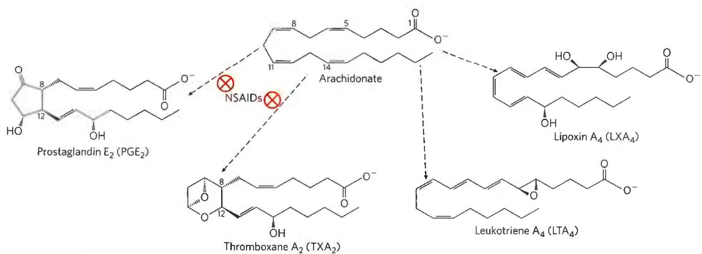  
FIGURE 10-17 Arachidonic acid and some eicosanoid derivatives. Arachidonic acid (arachidonate at pH 7) is the precursor of eicosanoids, including the prostaglandins, thromboxanes, leukotrienes, and lipoxins. In prostaglandin $\mathsf{E}_2$ , C-8 and C-12 of arachidonate are joined to form the characteristic five-membered ring. In thromboxane $\mathsf{A}_2$ , the C-8 and C-12 are joined and an oxygen atom is added to form the six-membered ring.  
Nonsteroidal anti-inflammatory drugs (NSAIDs) such as aspirin and ibuprofen block the formation of prostaglandins and thromboxanes from arachidonate by inhibiting the enzyme cyclooxygenase (prostaglandin $\mathsf{H}_2$ synthase). Leukotriene $\mathsf{A}_4$ has a series of three conjugated double bonds, and no cyclic moiety. Lipoxins are also noncyclic derivatives of arachidonate, with several hydroxyl groups.

Lipoxins (LX), like leukotrienes, are linear eicosanoids. Their distinguishing feature is the presence of several hydroxyl groups along the chain (Fig. 10-17). These compounds are potent anti-inflammatory agents. Because their synthesis is stimulated by low doses (81 mg) of aspirin taken daily, this low dose is commonly prescribed for individuals with cardiovascular disease.

#### [EN] Steroid Hormones Carry Messages between Tissues

Steroids are oxidized derivatives of sterols; they have the sterol nucleus but lack the alkyl chain attached to ring D of cholesterol, and they are more polar than cholesterol. P3 Steroid hormones move through the bloodstream (on protein carriers) from their site of production to target tissues, where they enter cells, bind to highly specific receptor proteins in the nucleus, and trigger changes in gene expression and thus metabolism. Because hormones have very high affinity for their receptors, very low concentrations of hormones (nanomolar or less) are sufficient to produce responses in target tissues. The major groups of steroid hormones are the male and female sex hormones and the hormones produced by the adrenal cortex, cortisol and aldosterone (Fig. 10-18). Prednisone is a steroid drug with strong anti-inflammatory activity, mediated in part by the inhibition of arachidonate release by phospholipase A₂ and consequent inhibition of the synthesis of prostaglandins, thromboxanes, leukotrienes, and lipoxins. Prednisone and similar drugs have a variety of medical applications, including the treatment of asthma and rheumatoid arthritis.

Vascular plants contain the steroidlike brassinolide (Fig. 10-18), a potent growth regulator that increases the rate of stem elongation and affects the orientation of cellulose microfibrils in the cell wall during growth.

#### [EN] Vascular Plants Produce Thousands of Volatile Signals

P3 Plants produce thousands of different lipophilic compounds, volatile substances that are used to attract pollinators, repel herbivores, attract organisms that defend the plant against herbivores, and communicate with other plants. Jasmonate, for example, derived from the fatty acid 18:3( $\Delta^{9,12,15}$ ) in membrane lipids, triggers the plant's defenses in response to insect-inflicted damage. The methyl ester of jasmonate gives the characteristic fragrance of jasmine oil, which is widely used in the perfume industry. Many plant volatiles, including geraniol (the characteristic scent of geraniums), $\beta$ -pinene (pine trees), limonene (limes), and menthol, are derived from fatty acids or from compounds made by the condensation of five-carbon isoprene units.

$$
\begin{array}{c} \mathrm{CH} _ {3} \\ \mathrm{CH} _ {2} = \mathrm{C} - \mathrm{CH} = \mathrm{CH} _ {2} \\ \text { Isoprene } \end{array}
$$

#### [EN] Vitamins A and D Are Hormone Precursors

During early decades of the twentieth century, a major focus of research in physiological chemistry was the identification of vitamins, compounds that are essential to the health of humans and other vertebrates but cannot be synthesized by these animals and must therefore be obtained in the diet. Early nutritional studies identified two general classes of such compounds: those soluble in nonpolar organic solvents (fat-soluble vitamins) and those that could be extracted from foods with aqueous solvents (water-soluble vitamins). P3 Eventually, the fat-soluble group was resolved into the four vitamin groups A, D, E, and K, all of which are isoprenoid compounds synthesized by the condensation of multiple isoprene units. Two of these (D and A) serve as hormone precursors.

  
FIGURE 10-18 Steroids derived from cholesterol.

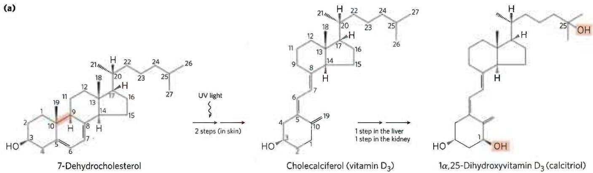  
FIGURE 10-19 Vitamin D₃ production and metabolism. (a) Cholecalciferol (vitamin D₃) is produced in the skin by UV irradiation of 7-dehydrocholesterol, which breaks the bond shaded light red. In the liver, a hydroxyl group is added at C-25; in the kidney, a second hydroxylation at C-1 produces the active hormone, 1α,25-dihydroxyvitamin D₃. This hormone regulates the metabolism of Ca²⁺ in kidney, intestine, and bone. (b) Dietary vitamin D prevents rickets, a disease once common in cold climates where heavy clothing blocks the UV component of sunlight necessary for the production of vitamin D₃ in skin. Rickets results in weak or soft bones in children; it can often be identified by bowed legs and other bone deformities. [Biophoto Associates/Science Source]

Vitamin D $_{3}$ , also called cholecalciferol, is normally formed in the skin from 7-dehydrocholesterol in a photochemical reaction driven by the UV component of sunlight (Fig. 10-19a). Vitamin D $_{3}$ is not itself biologically active, but it is converted by enzymes in the liver and kidney to 1α,25-dihydroxyvitamin D $_{3}$ (calcitriol), a hormone that regulates calcium uptake in the intestine and calcium levels in kidney and bone. Deficiency of vitamin D leads to defective bone formation and the disease rickets (Fig. 10-19b), for which administration of vitamin D produces a dramatic cure. Vitamin D $_{2}$ (ergocalciferol) is a commercial product formed by UV irradiation of the ergosterol of yeast. Vitamin D $_{2}$ is structurally similar to D $_{3}$ , with slight modification to the side chain attached to the sterol D ring. Both have the same biological effects, and D $_{2}$ is commonly added to milk and butter as a dietary supplement. The product of vitamin D metabolism, 1α,25-dihydroxyvitamin D $_{3}$ , regulates gene expression by interacting with specific nuclear receptor proteins. We discuss such regulation of gene expression in more detail in Chapter 28.

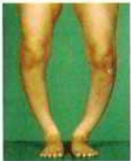

Vitamin A $_{1}$ (all-trans-retinol) and its oxidized metabolites retinoic acid and retinal act in the processes of development, cell growth and differentiation, and vision (Fig. 10-20). Vitamin A $_{1}$ or $\beta$ -carotene in the diet can be converted enzymatically to all-trans-retinoic acid, a retinoid hormone that acts through a family of nuclear receptor proteins (RAR, RXR, PPAR) to regulate gene expression central to embryonic development, stem cell differentiation, and cell proliferation. All-trans-retinoic acid is used to treat certain types of leukemia, and it is the active ingredient in the drug tretinoin (Retin-A), used to treat severe acne and wrinkled skin. In the vertebrate eye, retinal bound to the protein opsin forms the photoreceptor pigment rhodopsin. The photochemical conversion of 11-cis-retinal to all-trans-retinal is the fundamental event in vision (see Fig. 12-19).

Unlike most vitamins, vitamin A can be stored for some time in the body (primarily as its ester with palmitic acid, in the liver). Vitamin A was first isolated from fish liver oils; eggs, whole milk, and butter are also good dietary sources. Another source is $\beta$ -carotene (Fig. 10-20), the pigment that gives carrots, sweet potatoes, and other yellow vegetables their characteristic color. Carotene is one of a very large number (>700) of carotenoids, natural products with a characteristic extensive system of conjugated double bonds, which makes possible their strong absorption of visible light (450–470 nm).

Vitamin A deficiency in a pregnant woman can lead to congenital malformations and growth retardation in the infant. In adults, vitamin A is also essential to vision, immunity, and reproduction. Deficiency of vitamin A leads to a variety of symptoms, including dryness of the skin, eyes, and mucous membranes, and night blindness, an early symptom commonly used in diagnosing vitamin A deficiency. In the developing world, vitamin A deficiency causes an estimated 250,000 or more cases of blindness or death in children each year. One effective strategy for providing vitamin A is the metabolic engi-

  
FIGURE 10-20 Dietary $\beta$ -carotene and vitamin A $_{1}$ as precursors of the retinoids. (a) $\beta$ -Carotene is shown with its isoprene structural units set off by dashed red lines. Symmetric cleavage of $\beta$ -carotene yields two molecules of all-trans-retinal (b), which can be either further oxidized to all-trans-retinoic acid, a retinoid hormone (c), or reduced to all-trans-retinol, vitamin A $_{1}$ (d). In the visual pathway, all-trans-retinol from this reaction, or obtained directly through the diet, can be converted to the aldehyde 11-cis-retinal

  
(e). This product combines with the protein opsin to form rhodopsin (not shown), a visual pigment widespread in nature. In the dark, the retinal of rhodopsin is in the 11-cis form. When a rhodopsin molecule is excited by visible light, the 11-cis-retinal undergoes a series of photochemical reactions that convert it to all-trans-retinal (f), forcing a change in the shape of the entire rhodopsin molecule. This transformation in the rod cell of the vertebrate retina sends an electrical signal to the brain that is the basis of visual transduction.

FIGURE 10-21 Carotene-enriched rice. Worldwide, more than 250 million children and pregnant women suffer from vitamin A deficiency, which causes at least 250,000 cases of irreversible blindness each year in children. Half of these children end up dying within a year of losing their sight. This deficiency is particularly prevalent where rice is a staple food. An international humanitarian effort — the Golden Rice Project — has made great strides in addressing this health crisis. Wild-type rice grains (left) do not produce $\beta$ -carotene, the metabolic precursor of vitamin A. Rice plants have been genetically engineered to produce $\beta$ -carotene in the grain, which takes on the yellow color of the carotene (right). A diet supplemented with Golden Rice provides enough $\beta$ -carotene to prevent vitamin A deficiency and its tragic health consequences. © Golden Rice Humanitarian Board (www.goldenrice.org)]

neering of rice strains to overproduce $\beta$ -carotene. Rice has all the enzymatic machinery to produce $\beta$ -carotene in its leaves, but these enzymes are less active in the grain. Introduction of two genes into the rice has resulted in “golden rice” with grains enriched in $\beta$ -carotene (Fig. 10-21).

#### [EN] Vitamins E and K and the Lipid Quinones Are Oxidation-Reduction Cofactors

Vitamin E is the collective name for a group of closely related lipids called tocopherols, all of which contain a substituted aromatic ring and a long isoprenoid side chain (Fig. 10-22a). Because they are hydrophobic, tocopherols associate with cell membranes, lipid deposits, and lipoproteins in the blood. Tocopherols are biological antioxidants. The aromatic ring reacts with and destroys the most reactive forms of oxygen radicals and other free radicals, protecting unsaturated fatty acids from oxidation and preventing oxidative damage to membrane lipids, which can cause cell fragility. Tocopherols are found in eggs and vegetable oils and are especially abundant in wheat germ. Laboratory animals fed diets depleted of vitamin E develop scaly skin, muscular weakness and wasting, and sterility. Vitamin E deficiency in humans is very rare; the principal symptom is fragile erythrocytes.

The aromatic ring of vitamin K (Fig. 10-22b) undergoes a cycle of oxidation and reduction during the formation of active prothrombin, a blood plasma protein essential in blood clotting. Prothrombin is a proteolytic enzyme that splits peptide bonds in the blood protein fibrinogen to convert it to fibrin, the insoluble fibrous protein that holds blood clots together (see Fig. 6-43). Vitamin K deficiency, which slows blood clotting, is extremely uncommon in humans, aside from a small percentage of infants who suffer from hemorrhagic disease of the newborn, a potentially fatal disorder. In the United

FIGURE 10-22 Some other biologically active isoprenoid compounds or derivatives. Units derived from isoprene are set off by dashed red lines. In most mammalian tissues, ubiquinone (also called coenzyme Q)

has 10 isoprene units. Dolichols of animals have 17 to 21 isoprene units (85 to 105 carbon atoms), bacterial dolichols have 11, and dolichols of plants and fungi have 14 to 24.

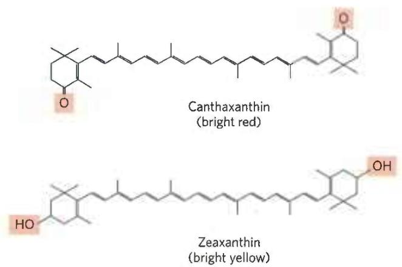  
FIGURE 10-23 Lipids as pigments in plants and bird feathers. Compounds with long conjugated systems absorb light in the visible region of the spectrum. Subtle differences in the chemistry of these compounds produce pigments of strikingly different colors. Birds acquire the pigments

States, newborns are routinely given a 1 mg injection of vitamin K. Vitamin $K_{1}$ (phylloquinone) is found in green plant leaves; a related form, vitamin $K_{2}$ (menaquinone), is formed by bacteria living in the vertebrate intestine.

Warfarin (Fig. 10-22c) is a synthetic compound that inhibits the formation of active prothrombin. It is particularly poisonous to rats, causing death by internal bleeding. Ironically, this potent rodenticide is also an invaluable anticoagulant drug for treating humans at risk for excessive blood clotting, such as surgical patients and those with coronary thrombosis.

Ubiquinone (also called coenzyme Q) and plastoquinone (Fig. 10-22d, e) are isoprenoids that function as lipophilic electron carriers in the oxidation-reduction reactions that drive ATP synthesis in mitochondria and chloroplasts, respectively. Both ubiquinone and plastoquinone can accept either one or two electrons and either one or two protons (see Fig. 19-3).

#### [EN] Dolichols Activate Sugar Precursors for Biosynthesis

During assembly of the complex carbohydrates of bacterial cell walls, and during the addition of polysaccharide units to certain proteins (glycoproteins) and lipids (glycolipids) in eukaryotes, the sugar units to be added are chemically activated by attachment to isoprenoid alcohols called dolichols (Fig. 10-22f). These compounds have strong hydrophobic interactions with membrane lipids, anchoring the attached sugars to the membrane, where they participate in sugar-transfer reactions.

#### [EN] Many Natural Pigments Are Lipidic Conjugated Dienes

Conjugated dienes have carbon chains with alternating single and double bonds. Because this structural arrangement allows the delocalization of electrons, the compounds can be excited by low-energy electromagnetic radiation (visible light), giving them colors visible to humans and other animals. Carotene (Fig. 10-20) is yellow-orange; similar compounds give bird feathers their striking reds, oranges, and yellows (Fig. 10-23). Like sterols, steroids, dolichols, vitamins A, E, D, and K, ubiquinone, and plastoquinone, these pigments are synthesized from five-carbon isoprene derivatives; the biosynthetic pathway is described in detail in Chapter 21.

  
that color their feathers red or yellow by eating plant materials that contain carotenoid pigments, such as canthaxanthin and zeaxanthin. The differences in pigmentation between male and female birds are the result of differences in intestinal uptake and processing of carotenoids. [Gaertner/Alamy Stock Photo]

#### [EN] Polyketides Are Natural Products with Potent Biological Activities

Polyketides are a diverse group of lipids with biosynthetic pathways (Claisen condensations) similar to those for fatty acids. They are secondary metabolites, compounds that are not central to an organism's metabolism but serve some subsidiary function that gives the organism an advantage in some ecological niche. Many polyketides find use in medicine as antibiotics (erythromycin), antifungals (amphotericin B), or inhibitors of cholesterol synthesis (lovastatin) (Fig. 10-24).

#### [EN] SUMMARY 10.3 Lipids as Signals, Cofactors, and Pigments

■ Some types of lipids, although present in relatively small quantities, play critical roles as cofactors or signals.

■ Membrane sphingolipids and derivatives of phosphatidylinositol such as $PIP_{2}$ and $PIP_{3}$ are used as signaling molecules or for nucleating formation of multiprotein complexes.

■ Prostaglandins, thromboxanes, leukotrienes, and lipoxins, all of which are eicosanoids derived from arachidonate, are extremely potent hormones involved in reproduction, inflammation, regulating blood pressure, and other bodily processes. NSAIDs inhibit formation of some prostaglandins and thromboxanes.

■ Steroid hormones, such as the sex hormones, are derived from sterols. They serve as powerful biological signals and move through the bloodstream to alter gene expression in target cells.

■ Plants produce volatile lipids to attract or repel other organisms and for communication. Many of these lipids are used as fragrances in perfumes.

Vitamins D, A, E, and K are fat-soluble compounds made up of isoprene units. All play essential roles in the metabolism or physiology of animals. Vitamin D is precursor to a hormone that regulates calcium metabolism. Vitamin A furnishes the visual pigment of the vertebrate eye and is a regulator of gene expression during epithelial cell growth.

■ Vitamins E and K and quinones can be oxidized or reduced by cells. Vitamin E functions in the protection of membrane lipids from oxidative damage, and vitamin K is essential for blood clotting. Quinones are essential for carrying electrons during the reactions that drive ATP synthesis in mitochondria and chloroplasts.

■ Dolichols activate and anchor sugars to cellular membranes; the sugar groups are then used in the synthesis of complex carbohydrates, glycolipids, and glycoproteins.

■ Lipidic conjugated dienes serve as pigments in flowers and fruits and give bird feathers their striking colors.

■ Polyketides are natural products widely used in medicine.

<!-- EN-END 10.3 -->

## 四、血浆脂蛋白

脂蛋白(lipoprotein)是由脂质和蛋白质以非共价键结合的复合体。脂蛋白中的蛋白质部分称为脱辅基脂蛋白或载脂蛋白(apolipoprotein;apo)。脂蛋白广泛存在于血浆中，因此也称血浆脂蛋白。此外生物

  
图10-26 几种用作药物的聚酮化合物  
膜中跟脂质融合的蛋白质也可看成是脂蛋白，并称为细胞脂蛋白。

## （一）血浆脂蛋白的分类

在血液中游离的脂肪酸只要结合到血浆中的血清清蛋白或其他蛋白质上则可被转运。但磷脂、三酰甘油、胆固醇和胆固醇酯是以更复杂的可溶性脂蛋白颗粒形式被转运的，因为这些脂质基本上都不溶于水。

血浆脂蛋白颗粒中脂质和蛋白质的含量是相对固定的。因为大多数蛋白质的密度为 $1.3 \sim 1.4 \mathrm{~g} / \mathrm{cm}^{3}$ , 脂质聚集体的密度一般为 $0.8 \sim 0.9 \mathrm{~g} / \mathrm{cm}^{3}$ , 所以复合体中蛋白质含量愈高, 复合体的密度愈大。脂蛋白颗粒依密度增加为序可分为乳糜微粒 (chylomicron)、极低密度脂蛋白 (very-low-density lipoprotein; VLDL)、低密度脂蛋白 (low-density lipoprotein, LDL) 和高密度脂蛋白 (high-density lipoprotein, HDL) 等 (表 10-5)。血浆脂蛋白颗粒可利用密度梯度超速离心法 (第 5 章) 把它们分离开来 (图 10-27A); 4 类血浆脂蛋白中有的还存在亚类, 如乳糜微粒残留物 (chylomicron remnant), 它是由乳糜微粒形成的, 其密度范围在 $0.9 \sim 1.006 \mathrm{~g} / \mathrm{cm}^{3}$ , 因此残留物的密度有部分与 VLDL 重叠。此外, HDL 也不是均一的, 这可以从离心图谱 (图 10-27A) 上看出, HDL 峰是一个多相峰, 尚含 $\mathrm{HDL}_{2}$ 和 $\mathrm{HDL}_{3}$ 。血浆脂蛋白也可利用更方便的电泳方法 (第 5 章) 把它们分开。如图 10-27B 所示, 电泳也得到 4 个条带: 一条留在原点, 含乳糜微粒; 另一条称为 $\beta$ -脂蛋白, 它与 $\beta$ -球蛋白一起迁移, 含 LDL; 第三条迁移在 $\beta$ -区的前沿, 称为前 $\beta$ -脂蛋白, 含 VLDL; 第四条称为 $\alpha$ -脂蛋白, 它和 $\alpha$ -球蛋白迁移在一起, 含 HDL。临床实验室的血浆脂蛋白分析一般采用醋酸纤维薄膜电泳进行, 含脂的条带用油红 O (oil red O) 染色显示。

## （二）血浆脂蛋白的结构与功能

血浆脂蛋白都是球状颗粒，由一个疏水脂（包括三酰甘油和胆固醇酯）组成的核心和一个极性脂（磷脂和游离胆固醇）与载脂蛋白参与的外壳层构成（图10-28）。外壳层中极性脂以极性头基面向外部水相，它的非极性尾部向着疏水核心。整个外壳层将内部的疏水脂与外部的溶剂水隔离开来。载脂蛋白富含疏水氨基酸残基，构成两亲的 $\alpha$ 螺旋区，一方面（疏水区）可以与脂质很好结合，另一方面（亲水区）可以与溶剂水相互作用。载脂蛋白的主要作用是:①作为疏水脂质的增溶剂;②作为细胞膜上脂蛋白受体的识别部位(细胞导向信号)。至今已有10多种专一的载脂蛋白(表10-6)被分离和鉴定,它们主要是在肝和肠中合成并分泌的。

表 10-5 主要人血浆脂蛋白的组成和性质

<table><tr><td rowspan="2">脂蛋白的类别</td><td rowspan="2">密度/ $(g \cdot cm^{-3})$ </td><td rowspan="2">颗粒直径/nm</td><td colspan="5">组成/% $^{\text{1}}$ </td></tr><tr><td>蛋白质</td><td>游离胆固醇</td><td>胆固醇酯</td><td>磷脂</td><td>三酰甘油</td></tr><tr><td>乳糜微粒</td><td>&lt;1.006</td><td>50~200</td><td>2</td><td>1</td><td>3</td><td>9</td><td>85</td></tr><tr><td>VLDL</td><td>0.95~1.006</td><td>28~70</td><td>10</td><td>8</td><td>14</td><td>18</td><td>50</td></tr><tr><td>LDL</td><td>1.019~1.063</td><td>20~25</td><td>25</td><td>8</td><td>37</td><td>20</td><td>10</td></tr><tr><td>HDL</td><td>1.063~1.210</td><td>8~11</td><td>55</td><td>2</td><td>15</td><td>24</td><td>4</td></tr></table>

① 质量(干重)分数。

  
图10-27 血浆脂蛋白超离心密度(A)和电泳迁移率(B)之间的对应关系

  
图10-28 血浆脂蛋白的结构图解

乳糜微粒是在肠细胞(enterocyte)即内衬小肠的上皮细胞的内质网(ER)中合成,然后进入血流。由于它的颗粒很大,当在血液中大量存在时,会使血浆或血清呈乳白色。乳糜微粒是最大的脂蛋白,含有很高比例的三酰甘油,占整个乳糜微粒质量的85%到95%,因此它是密度最小的脂蛋白。乳糜微粒的载脂蛋白有apoB-48(乳糜微粒所特有的)、apoA-Ⅳ、apoC-Ⅱ和apoE。乳糜微粒的主要功能是从小肠转运被吸收的膳食三酰甘油、胆固醇及少量其他脂质到血浆和其他组织。乳糜微粒中的三酰甘油被肌肉和脂肪等组织中的毛细血管内壁上的脂蛋白脂酶(lipoprotein lipase)所水解,水解产物脂肪酸被这些组织吸收并用作燃料或脂肪合成的前体。富含胆固醇的乳糜微粒残留物(大部分三酰甘油已被耗去,但仍含胆固醇、apoE 和 apoB-48)被肝所吸收。

表 10-6 人血浆脂蛋白的载脂蛋白

<table><tr><td>载脂蛋白(Apo)</td><td> $M_{r}$ </td><td>血浆中质量浓度/(mg·dL-1)</td><td>脂蛋白中的分布</td><td>功能</td></tr><tr><td>A-I</td><td>28 100</td><td>90~120</td><td>HDL</td><td>活化 LCAT1</td></tr><tr><td>A-II</td><td>17 400(二聚体)</td><td>30~50</td><td>HDL</td><td>抑制 LCAT</td></tr><tr><td>A-IV</td><td>44 500</td><td>15</td><td>乳糜微粒,HDL</td><td>活化 LCAT,转运或清除胆固醇</td></tr><tr><td>B-48</td><td>242 000</td><td>&lt;5</td><td>乳糜微粒</td><td>转运或清除胆固醇</td></tr><tr><td>B-100</td><td>500 000</td><td>80~100</td><td>VLDL, LDL</td><td>与 LDL 受体结合</td></tr><tr><td>C-I</td><td>7 000</td><td>4~7</td><td>VLDL, HDL</td><td></td></tr><tr><td>C-II</td><td>9 000</td><td>3~8</td><td>乳糜微粒,VLDL, HDL</td><td>活化脂蛋白脂酶</td></tr><tr><td>C-III</td><td>9 000</td><td>8~15</td><td>乳糜微粒,VLDL, HDL</td><td>抑制脂蛋白脂酶</td></tr><tr><td>D</td><td>32 500</td><td>8~10</td><td>HDL</td><td></td></tr><tr><td>E</td><td>34 200</td><td>3~6</td><td>乳糜微粒,VLDL, HDL</td><td>引发 VLDL 和乳糜微粒残留物的清除</td></tr></table>

① LCAT 是卵磷脂-胆固醇酰基转移酶的缩写。

极低密度脂蛋白(VLDL)在肝细胞的ER中合成;它的载脂蛋白主要是apoB-100(已知的最大蛋白质之一)、apoC-I、apoC-II、apoC-III和apoE。其功能是从肝转运内源的三酰甘油(肝所需之外的多余部分)和在肝包装的胆固醇到肌肉和脂肪等靶组织。VLDL的三酰甘油也跟乳糜微粒中的一样,被靶组织中毛细血管内壁上的脂酶水解,释放的脂肪酸为脂肪细胞吸收并重新转化为三酰甘油,以胞内脂质小滴形式贮存起来;肌肉细胞与之相反,它主要是氧化脂肪酸以便供能。丢失三酰甘油剩下的VLDL颗粒称为VLDL残留物,也称中间密度脂蛋白(intermediate-density lipoprotein,IDL)。

低密度脂蛋白(LDL)是从VLDL残留物(IDL)中进一步除去三酰甘油产生的。LDL富含胆固醇和胆固醇脂,是血液中总胆固醇的主要载体;它的主要载脂蛋白也是apoB-100。LDL的功能是转运胆固醇到肝外组织如肌肉、肾上腺和脂肪组织;这些靶组织的质膜上有LDL受体,它能识别apoB-100并介导胆固醇和胆固醇酯的吸收。LDL可能与动脉粥样硬化有关,特别是在血管壁受到氧化性损伤时,LDL容易使胆固醇在受伤处沉积。

高密度脂蛋白(HDL)是以称为新生HDL的前体形式在肝和小肠中合成的。分泌出来的新生HDL是圆盘状的；含蛋白质、磷脂和胆固醇，但无胆固醇酯。HDL主要含apoA-I和其他载脂蛋白(表10-6)，此外也含卵磷脂-胆固醇酰基转移酶(lecithin-cholesterol acyl transferase, LCAT), LCAT催化由卵磷脂(磷脂酰胆碱)和胆固醇形成胆固醇酯。在新生HDL颗粒表面上LCAT将血流中遇到的乳糜微粒和VLDL残留物(IDL)的胆固醇和磷脂酰胆碱转变为胆固醇酯，后者开始形成一个核心，使新生的圆盘状HDL转型为成熟的球状HDL颗粒。在转型过程中HDL也收集从死细胞和进行更新的膜等细胞器释放到血浆中的胆固醇和磷脂。然后，成熟的HDL回到肝，在那里卸下胆固醇。HDL中的某些胆固醇酯可由胆固醇酯转移蛋白转移给LDL。可见HDL是除肝外的其他地方的胆固醇清除剂，甚至能除去已形成斑块的胆固醇。临床研究证明，脂蛋白代谢不正常是造成动脉粥样硬化的主要原因。血浆中LDL水平高而HDL水平低的个体容易患心血管疾病。

## 五、生物膜的组成和结构

地球上第一个细胞可能出现于膜的形成,膜把少量的水溶液包围起来与环境分开。膜不仅规定细胞的外边界,而且控制穿过边界(膜)的分子运输。这层膜称为细胞膜或质膜。此外真核细胞中还有内膜系统（system of internal membrane），把内部空间分隔成若干独立的区室（compartment），即所谓细胞器和亚细胞结构。原核细胞的内膜系统不发达，只有少量的内膜结构。细胞的质膜和内膜系统总称为生物膜（biomembrane）。生物膜为组织许多复杂的反应序列、能量转换中心和细胞-细胞通讯中心提供了必要的结构基础。生物膜具有多种功能，生命活动中许多重要过程，如物质运输、能量转换、细胞识别、细胞免疫、神经传导、代谢调控等都与之有关。

生物膜的研究不仅具有重要的理论意义,而且在工、农、医实践方面也有广阔的应用前景。例如医药方面,几乎所有疾病都与膜的变异有密切关系。很多质膜上的受体可能是药物的靶体。人工膜(脂质体)作为药物载体已经进行了大量研究,有的已经进入临床试验阶段。生物膜的研究已深入到生物医学和生物学的很多领域。

## （一）每种膜都有特定的脂质和蛋白质

要了解膜的功能,一种途径是研究膜的组成,例如测定哪些成分是所有的膜共有的,哪些是具有专一功能的膜所特有的。因此讨论膜的结构和功能之前,需要考虑一下膜的分子成分:蛋白质、极性脂质和糖质。蛋白质和脂质构成生物膜的几乎全部质量,糖只作为糖蛋白和糖脂的一部分(占真核细胞质膜质量的2%\~10%)而存在。每种类型的生物膜都含有特定的脂质和蛋白质。脂质和蛋白质的相对比例,因膜的类型不同可以有很大的变动(表10-7);这反映出生物学功能的多样性。例如神经元的髓鞘(一种延展的质膜)是起电的绝缘体作用的,它主要由脂质组成;而细菌质膜以及线粒体和叶绿体膜是很多酶促过程的场所,膜蛋白[质]的含量比膜脂[质]多。一般说,功能复杂的膜,蛋白质的种类和含量较多;功能简单的膜,蛋白质的种类和含量较少。

表 10-7 不同生物中质膜的主要成分

<table><tr><td rowspan="2">类别</td><td colspan="5">组分/100% $^{\text{1}}$ </td></tr><tr><td>蛋白质</td><td>磷脂</td><td>固醇</td><td>固醇类型</td><td>其他脂质</td></tr><tr><td>人神经髓鞘</td><td>30</td><td>30</td><td>19</td><td>胆固醇</td><td>半乳糖脂、缩醛磷脂</td></tr><tr><td>小鼠肝细胞</td><td>45</td><td>27</td><td>25</td><td>胆固醇</td><td>—</td></tr><tr><td>玉米叶细胞</td><td>47</td><td>26</td><td>7</td><td>谷固醇</td><td>半乳糖脂</td></tr><tr><td>酵母</td><td>52</td><td>7</td><td>4</td><td>麦角固醇</td><td>三酰甘油、硬脂酸脂</td></tr><tr><td>草履虫(纤毛原生生物)</td><td>56</td><td>40</td><td>4</td><td>豆固醇</td><td>—</td></tr><tr><td>大肠杆菌(E.coli)</td><td>75</td><td>25</td><td>0</td><td>—</td><td>—</td></tr></table>

① 质量分数。在每一情况数值加起来不等于 $100\%$ ，因为除蛋白质、磷脂和固醇外还有其他成分；例如植物含有很高的糖脂。

膜脂有磷脂、糖脂和固醇等，其中以磷脂为主要成分。磷脂中又以甘油磷脂为主，特别是其中的磷脂酰胆碱和磷脂酰乙醇胺最丰富，也最普遍（表10-8）。动物细胞的质膜几乎都含糖脂，主要是鞘糖脂，如脑苷脂、神经节苷脂等。细菌和植物细胞的质膜大多为甘油糖脂。一般讲，动物细胞的固醇含量比植物细胞的高。而质膜的固醇含量又多于内膜系统的固醇。动物质膜含的是胆固醇；植物质膜含的是植物固醇如谷固醇、豆固醇等；细菌细胞一般不含固醇。

表 10-8 某些生物膜中各种脂质的组成/% $^{1}$

<table><tr><td>脂质名称</td><td>人红细胞</td><td>人髓鞘</td><td>牛心线粒体</td><td>大肠杆菌</td></tr><tr><td>磷脂酸</td><td>1.5</td><td>0.5</td><td>0</td><td>0</td></tr><tr><td>磷脂酰胆碱</td><td>19</td><td>10</td><td>39</td><td>0</td></tr><tr><td>磷脂酰乙醇胺</td><td>18</td><td>20</td><td>27</td><td>65</td></tr><tr><td>磷脂酰丝氨酸</td><td>8</td><td>8</td><td>0.5</td><td>0</td></tr><tr><td>磷脂酰肌醇</td><td>1</td><td>1</td><td>7</td><td>0</td></tr><tr><td>磷脂酰甘油</td><td>0</td><td>0</td><td>0</td><td>18</td></tr><tr><td>心磷脂</td><td>0</td><td>0</td><td>22.5</td><td>12</td></tr><tr><td>鞘磷脂</td><td>17.5</td><td>8.5</td><td>0</td><td>0</td></tr><tr><td>糖脂</td><td>10</td><td>26</td><td>0</td><td>0</td></tr><tr><td>胆固醇</td><td>25</td><td>26</td><td>3</td><td>0</td></tr></table>

不同来源的膜蛋白组分要比它们的膜脂组分变化大，这反映功能上的专门化。此外，某些膜蛋白跟寡糖共价连接。例如在血型糖蛋白中，红细胞质膜的糖蛋白60%的质量由复杂寡糖组成。寡糖连接在专一的氨基酸残基上；Ser、Thr和Asn残基是最常见的连接点（见图9-41）。在质膜外表面形成的这层寡糖-蛋白质复合体称为糖萼(glycocalyx)或细胞外壳(cell coat)。这些天线般的寡糖链影响新生肽的折叠及其稳定性以及胞内定位；并在配体与糖蛋白表面受体的专一性结合中起着重要作用，跟细胞识别和黏着以及细胞免疫等有关（见第9章“糖蛋白”部分）。

## （二）脂双层是膜的基本结构元件

膜脂(甘油磷脂、鞘脂和固醇)虽是两亲分子,但实际上不溶于水。当与水混合时,它们自发地形成微小的脂质聚集体:微团、脂双层和微囊(图10-29);它们都是以脂质分子的尾部借疏水相互作用彼此接触,头基借氢键跟周围的水分子相互作用。脂质聚集体的形成减小了暴露于水的疏水表面积,因而使在脂质-水界面处有序水壳中的水分子数目降至最小(见图1-11A),结果是系统中熵增加。脂质分子之间的疏水相互作用为这些聚集体的形成和维持提供了热力学驱动力。

  
图10-29 磷脂分子在水中自发形成的几种聚集体（切面观）

脂质在水中组装成何种形式的聚集体，取决于脂质本质和当时条件。微团（micelle）是球形结构，它含有几十到几千个两亲分子。这些分子排列成疏水尾部聚集在内部，在那里水被排出；亲水头基在表面，跟水接触。头基的横切面大于尾部（酰基链）横切面的，如游离脂肪酸、溶血磷脂（只有一条酰基链）和去污剂如十二烷基硫酸钠（SDS）倾向于形成微团。头基横切面等于酰基链横切面的，如甘油磷脂和鞘脂，则有利于脂双层（bilayer）的形成；在每一单层中的疏水部分，排开水，彼此相互作用；在脂双层片的每一表面（“叶面”），亲水头基跟水相互作用。但由于其边缘的疏水区仍暴露在水中，结构相对不稳定，自发地回折，形成中空的球形，称微囊（vesicle）。在实验室中从纯脂质形成的微囊或称脂质体（liposome），跟天然膜一样，对极性溶质基本上也是不通透的。微囊的连续表面消去了暴露的疏水区域，使脂双层在水环境中达到最大的稳定性。现已证实脂双层是生物膜的基本结构。

## （三）膜成分在脂双层两侧的分布是不对称的

膜对大多数极性的和荷电的溶质是不通透的，但对非极性化合物允许它们通过。脂双层本身的厚度约为3 nm，如果包括从膜两侧伸出的蛋白质在内（电镜下横切面观呈三层），膜厚度为5\~8 nm。

膜蛋白在脂双层两侧(两个单层)的分布是不对称的(图 10-30)。某些蛋白质只从膜的一侧伸出,另一些则在膜的两侧都有暴露的结构域，并且暴露在两侧的结构域也是不同的；蛋白质在脂双层中定向的不对称性使膜有“正反面”的区别，这反映膜在功能上的不对称性。膜中的蛋白质和脂质形成一个镶嵌图案，但跟用瓷砖和灰膏镶嵌起来的不同；膜是一种流体，镶嵌的图案可以不断地自由变化；因为其组分之间的相互作用大多是非共价的，这使得单个脂质和蛋白质分子能够在膜平面上自由地作侧向运动。但跟膜脂不同，膜蛋白不能从脂双层的一层翻转到另一层，这有利于膜蛋白的不对称分布的维持。

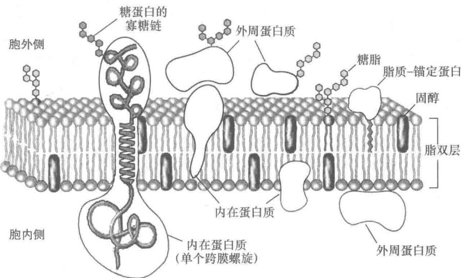  
图 10-30 膜成分分布的不对称性(流动镶嵌模型)

质膜的脂质在脂双层两个单层的分布,虽然也是不对称的,但没有像膜蛋白那样的绝对。例如,在红细胞的质膜中,含胆碱的脂质(磷脂酰胆碱和胆碱鞘磷脂)主要存在于质膜的胞外面(外层),而磷脂酰丝氨酸、磷脂酰乙醇胺和磷脂酰肌醇更多是在胞质面(内层)。脂质在质膜内外层分布的变化是有生物学效果的。例如,血小板只有它质膜中的磷脂酰丝氨酸移到外层,才能在血凝块形成中起作用。对很多其他类型的细胞,磷脂酰丝氨酸暴露在细胞外表面,标示着一个细胞将遭程序性细胞死亡(programmed cell death)的破坏。

糖质在脂双层的分布也是不对称的,无论质膜还是内膜系统中糖脂和糖蛋白的寡糖分布都是不对称的。质膜的糖蛋白总是把携有寡糖的结构域定向在细胞的外表面。

## （四）有三类膜蛋白跟膜结合的方式不同

膜蛋白根据在膜上定位和跟膜脂结合的牢固程度可分为外周膜蛋白质、内在膜蛋白质和兼在蛋白质。

外周膜蛋白质(peripheral membrane protein)分布在脂双层的内、外层表面上，借静电相互作用和氢键跟内在蛋白质的亲水结构域或膜脂的极性头基结合(图10-31)。大多数外周蛋白质通常只要用比较温和的(能干扰静电相互作用和破坏氢键的)方法，如改变 $\mathrm{pH}$ 或离子强度、用螯合剂除去 $\mathrm{Ca}^{2+}$ 或加入尿素或碳酸盐，即可把它们从膜上分离下来。外周膜蛋白质一般占膜蛋白的 $20\% \sim 30\%$ 。

内在膜蛋白质(integral membrane protein)主要是靠跟脂双层的疏水相互作用与膜结合的。蛋白质分子的非极性氨基酸残基常以 $\alpha$ 螺旋形式与脂双层的疏水部分相互作用（细菌膜的内在蛋白质中常见有借多股β桶结合的）。内在蛋白质，有的只是部分埋在脂双层中，有的则横跨整个膜层（图10-30）；有的（如血型糖蛋白）跨越脂双层只是单个螺旋段（图10-30，图3-46），有的（如细菌视紫红质）是来回多个螺旋段（见图3-47）。内在蛋白质与脂双层结合得很牢固，只有用那些能够破坏跟脂双层疏水相互作用的介质，如去污剂、有机溶剂或变性剂，才能将它们提取出来。有些内在膜蛋白质本身并不进入膜内，而是跟一个或几个脂质分子如脂肪酸，类异戊二烯或糖基磷脂酰肌醇(glycosyl phosphatidylinositol;GPI)共价相连，并以它们为疏水锚钩(anchor)锚定在脂双层中（见图10-31和图9-38B），这些膜蛋白可用专一性酶处理，例如以GPI为锚钩的内在蛋白质(GPI-锚定蛋白质)用磷脂酶C水解即可被释放。内在膜蛋白质占膜蛋白的 $70\% \sim 80\%$ 。

  
图 10-31 三类膜蛋白: 外周蛋白质, 内在蛋白质和兼在蛋白质

兼在蛋白质(amphitropic protein)有时存在于细胞溶胶,有时处于跟膜结合之中。它们对膜的亲和力在有些场合是由于这些蛋白质跟一个膜蛋白或膜脂的非共价相互作用或静电相互作用,在另些场合是因为存在一个或多个跟兼在蛋白质共价结合的脂质(图10-31)。一般说,兼在蛋白质跟膜的可逆结合是受调节的;例如磷酸化作用或配体结合可以使该蛋白质发生构象改变,暴露出原先接近不到的膜结合部位。因此兼在蛋白质有时跟膜结合,有时不与膜结合;这取决于调节过程的类型,如可逆的棕榈酰化(palmitoylation),如图10-31。

## （五）生物膜是动态的

所有生物膜的一个显著特点是它们的柔性(flexibility)——不丢失它的完整性而改变形状的能力。这一性质的基础是脂双层中脂质分子之间的非共价相互作用和单个脂质的运动性(mobility)，因为脂质不是相互共价锚定的。可见膜是处于流动状态的，既包括膜脂，也包括膜蛋白的流动。合适的流动性(fluidity)对膜表现它的正常功能十分重要。例如物质转运、能量转换、信息传递、细胞分裂和融合、胞吞和胞吐等都跟膜的流动性有密切关系。

## 1. 脂双层中的脂质能以有序液态或无序液态存在

虽然脂双层的整体结构是稳定的,但膜平面内的单个磷脂分子具有很大的运动自由度,这取决于温度和脂质组成。低于正常生理温度,膜脂运动慢,脂双层变成半固体的有序液态(liquid-ordered state; $L_{o}$ )或称类晶态(paracrystalline state)或凝胶态(gel state),在这种状态单个脂质的所有运动形式都受到很大限制(图10-32A)。在生理温度以上,膜脂运动加快,脂肪酸烃链处于不断的运动中,包括绕长脂酰链C—C键的旋转和单个脂质分子在脂双层内的侧向扩散(图10-33A);此时脂双层是流动的无序液态(liquid-disor-

dered state; $L_{d}$ ), 或称液晶态 (liquid-crystalline state) (图 10-32B)。从 $L_{o}$ 态过渡到 $L_{d}$ 态, 脂双层总的形状和大小保持不变, 但单个脂质分子的运动 (侧向和旋转) 程度有变化。

对哺乳动物在生理温度范围(20\~40℃)，长链脂肪酸(如16:0和18:0)倾向于组装成 $L_{0}$

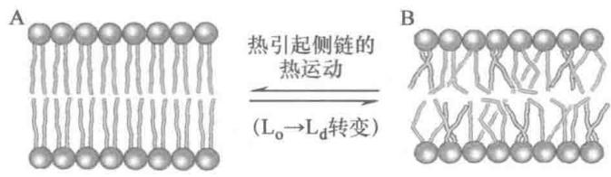  
有序液态 $L_{0}$ （凝胶态）  
无序液态 $L_{d}$ （液晶态）  
图10-32 脂双层的两种极端状态

很快
(1μm/s)

凝胶态,但不饱和脂肪酸中的结节干扰装配,有利于处在 $L_{d}$ 态。短链脂肪酸也有同样的效果。一个膜的固醇含量(随不同生物和细胞器有很大变化;表10-7)是脂质状态的另一重要的决定因素。固醇(例如胆固醇)对脂双层流动性的影响似乎是反常的:固醇跟含不饱和脂酰链的磷脂相互作用,使脂酰链挤得更紧,并限制它们在脂双层中的运动;固醇跟携有长饱和脂酰链的磷脂和鞘脂结合,反而加快膜的流动性,此膜在没有胆固醇时是采取 $L_{o}$ 态的。其实,前者是因为固醇刚性环系统减少了它附近脂酰链绕 C—C 键旋转的运动自由度造成的,后者是因为刚性甾核阻挠了脂酰链的有序装配的结果。

为获得恒定的膜流动性,细胞在各种生长条件下调节它们的膜成分。例如细菌在低温下培养时比在高温下培养时,合成的不饱和脂肪酸更多,而饱和脂肪酸则更少。脂质成分的这种调整结果是在低温或高温下培养的细菌,约有同样程度的膜流动性。推测这是对脂双层中的许多蛋白质——酶、转运蛋白和受体——行使功能所必需的。

## 2. 脂质的跨膜运动需要酶催化

在生理温度下,脂质分子从脂双层的一层(一面)翻到另一层的运动称为跨膜运动(transmembrane movement)或翻转扩散(flip-flop diffusion)(图10-33A)。翻转扩散在大多数膜中即使发生也是很慢的,但在脂双层的同一层中进行的侧向扩散则很快(10-33B)。由于膜脂都是两亲分子,要从脂双层的一层翻转到另一层,它必须穿过脂双层的疏水区;这是一个需能过程,自由能变化是一个大的正值,因此比侧向扩散的速度要慢得多。然而这种高耗能的翻转在原核和真核细胞中都有发生。一个称为翻转酶(flippase)的转位蛋白(translocator)催化翻转扩散。此酶催化氨基磷脂(磷脂酰乙醇胺和磷脂酰丝氨酸)从质膜的胞外层到细胞溶胶层(内层)的转位,并因而造成磷脂的不对称分布:磷脂酰乙醇胺和磷脂酰丝氨酸主要在细胞溶胶层,鞘脂和磷脂酰胆碱在胞外层。翻转酶每转位一分子磷脂消耗约一个ATP分子(图10-33C)。此外还发现两个其他类型的磷脂转位蛋白质,但对它们了解得还不多。一个称转出酶(floppase;暂用译名——编者),催化质膜磷脂从细胞溶胶层转移到胞外层,它跟翻转酶一样,需要ATP。另一个称促翻转酶(scramblase),沿该脂浓度梯度(从高浓度层到低浓度层)跨膜转移任一种膜磷脂。它们的活性不依赖于ATP。爬行酶活性导致脂双层两面的头基组成有控制的随机化(转移趋于平衡)。

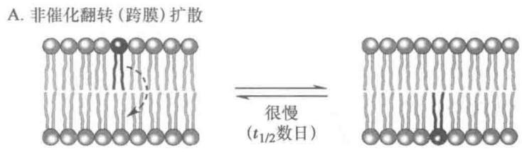

B. 非催化侧向扩散

C. 催化跨膜转位

  
氨基磷脂(PE和PS)从胞外层移动到胞内层  
图10-33 单个磷脂在脂双层中的运动

## 3. 脂质和蛋白质在膜内作侧向扩散

脂质在膜内的侧向扩散(lateral diffusion)或侧向移动是指磷脂分子在脂双层的同一层中与邻近分子进行交换；也即，这些分子在膜内进行布朗运动(图10-33B)。侧向扩散在生物膜和人工膜中都能发生，而且速度很快。例如，红细胞质膜外层中的一个脂质分子进行侧向扩散，在几秒钟内就能绕红细胞一圈。该脂双层平面内的这种快速侧向扩散在几秒钟内可使各个分子的位置趋于随机化(均匀分布)。

很多膜蛋白的行为好像它们被漂浮在脂质的海洋里。和膜脂一样，这些蛋白质能在脂双层的流体平面内自由地侧向扩散，并处于恒定的运动中。测定膜蛋白（或膜脂）的侧向扩散常采用光漂白荧光恢复法

(fluorescence recovery after photobleaching; FRAP) (图 10-34)。这种方法是利用强激光使膜上某一微区(5 μm²)内标有荧光探针的膜蛋白(或膜脂)进行彻底漂白,然后用荧光显微镜可观察到其他部位的膜蛋白(未经光漂白的)因侧向扩散进入该微区,微区内荧光又重新出现,表明膜蛋白发生侧向运动。光漂白后的荧光恢复速率是蛋白质(或脂质)侧向扩散速率的量度。

某些膜蛋白在细胞或细胞器的表面缔合成大的聚集体（“小块”）；例如乙酰胆碱受体在突触的神经元质膜上形成密集的近似晶状的小块，在这里单个蛋白质分子彼此不会发生相对移动。另一些膜蛋白被锚定在细胞内部的结构（如细胞骨架）以阻止它们的自由扩散。例如红细胞质膜上的血型糖蛋白和氯化物-重碳酸盐交换蛋白（chloride-bicarbonate exchanger）都是通过锚蛋白（ankyrin）被拴在丝状的细胞骨架蛋白质——血影蛋白（spectrin）上，因此这些膜蛋白的运动受到很大的限制（图10-35）。

## （六）质膜的内在蛋白质参与表面黏着、信号传递和其他细胞过程

质膜中几个家族的内在蛋白质提供细胞和细胞之间以及细胞和胞外基质蛋白质之间的专一性连接位点。整联蛋白（integrin）是表面黏着蛋白质，它介导细胞跟胞外基质和跟其他细胞包括某些病原体的相互作用。整联蛋白也在跨质膜的两个方向传递整合有关胞内、外环境的信息的信号。所

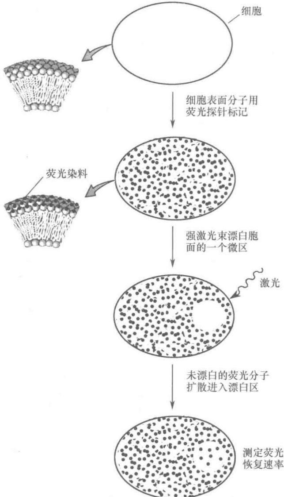  
图 10-34 光漂白荧光法测定膜蛋白或膜脂的侧向扩散速率

有的整联蛋白都是杂二聚体(heterodimer)，由两个不同的亚基 $\alpha$ 和 $\beta$ 组成。每个亚基借一个跨膜螺旋锚定在质膜内。 $\alpha$ 和 $\beta$ 亚基的胞外大结构域缔合成一个专一性结合位点，以结合胞外蛋白质如胶原蛋白和纤连蛋白(fibronectin)，这些胞外蛋白质含有一个共同的整联蛋白结合决定簇：Arg-Gly-Asp。

涉及表面黏着的其他蛋白质是钙黏着蛋白（cadherin），它能跟相邻细胞中的同一种钙黏着蛋白进行同嗜性同种间（homophilic）的相互作用。另一是选择蛋白，它有胞外结构域；在 $\mathrm{Ca}^{2+}$ 存在下，该结构域能跟相邻细胞表面上的专一多糖结合。选择蛋白主要存在于各类血细胞和衬在血管壁上的内皮细胞中。它们是血液凝固的必需部分。

内在膜蛋白质还在许多其他细胞过程中起作用。它们用作转运蛋白和离子通道，用作激素、神经递质和生长因子的受体（第14章）。它们担当氧化磷酸化（第19章）、光合磷酸化（第23章）以及免疫系统中细胞-细胞和细胞-抗原识别的中心角色(第4章)。内在蛋白质也在膜融合(包括胞吞、胞吐和病毒入侵宿主细胞)中起重要作用。

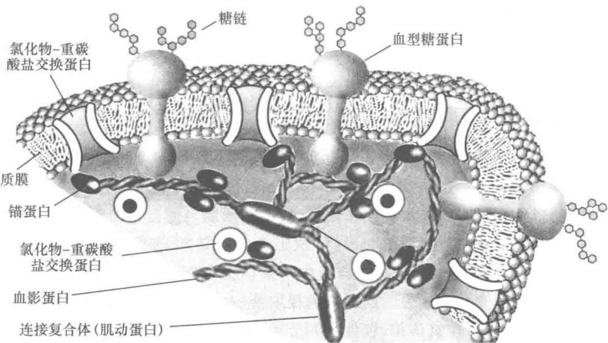  
图10-35 红细胞膜的氯化物-重碳酸盐交换蛋白的运动受膜骨架限制

## （七）生物膜的流动镶嵌模型

从19世纪末到20世纪中叶对生物膜的结构曾提出过多种模型，包括脂双层模型、三夹板模型和单位膜模型等。1972年美国S.T.Singer和G.R.Nicolson吸取了前人提出的模型中合理部分，并总合膜的电镜观察、化学组成及其分布不对称性的研究、膜通透性和膜流动性的物理研究，提出了流动镶嵌模型（fluid mosaic model）。该模型认为：膜是蛋白质和磷脂组成的动态结构；脂双层是一种流体基质，实质上是蛋白质的二维溶剂。脂双层的每层中脂质分子的非极性尾部面向双层片的核心，极性头基面向外侧，跟每侧的水介质相互作用；蛋白质埋在双层片中，借脂质和蛋白质的疏水结构域之间的疏水相互作用维系在一起。在这里膜脂和膜蛋白能作旋转和侧向运动。Singer和Nicolson还指出，这些蛋白质部分地或

全部地嵌入脂双层中，有些甚至横跨整个脂双层（图10-36）。此模型跟以往提出的各种模型主要差别在于：它突出膜的流动性和膜蛋白分布的不对称性。流动镶嵌模型虽还存在很多局限性，例如近年来很多实验结果表明，膜各部分的流动性是不均匀的。由于脂质组成不同、膜蛋白-膜脂的和膜蛋白-膜蛋白的相互作用以及环境因素（如温度、pH等）的影响，在一定温度下有的膜脂处于凝胶态 $(\mathrm{L}_{\mathrm{o}})$ ，有的则呈流动的液晶态 $(\mathrm{L}_{\mathrm{d}})$ 。即使都处于 $\mathrm{L}_{\mathrm{d}}$ 态，膜中各部分的流动性也不全相同。这样，整个

  
图10-36 Singer和Nicolson提出的膜结构流动镶嵌模型

膜可视为具有不同流动性的“微区”相间隔的动态结构。因而 Jain 和 White 提出了一种“板块镶嵌”模型。然而至今尚无一个模型像流动镶嵌模型那样受到广泛的应用。

<!-- EN-BEGIN 11.1 -->

### 【英文对应 11.1】The Composition and Architecture of Membranes

> 来源：Lehninger Principles of Biochemistry（书籍/02_生物化学原理） 第11章 Biological Membranes and Transport，§11.1。对应本章“五、生物膜的组成和结构”。

We begin our discussion of biological membranes by looking at the stable bilayer structures formed spontaneously by phospholipids in water. In biological membranes we see this basic lipid bilayer combined with a wide array of membrane proteins specialized for one of the many roles that membranes play in cells. Each intracellular compartment has membranes with specific protein and lipid content, uniquely disposed across the two leaflets of the bilayer. The intracellular membranes together make up a dynamic endomembrane system that synthesizes and distributes membrane components to create functionally specialized cell compartments. Depending on its function, a protein may form one or several transmembrane segments, or it may adhere to the membrane bilayer through lipids attached to the protein, or it may alternate between membrane-associated and free forms.

#### [EN] The Lipid Bilayer Is Stable in Water

Glycerophospholipids, sphingolipids, and sterols are virtually insoluble in water. Recall that glycerophospholipids contain two long-chain fatty acids (which are hydrophobic) and a head group consisting of glycerol and one of several polar or charged substituents such as phosphocholine or phosphoethanolamine (see Fig. 10-8). Sphingolipids are constructed from a long-chain alkyl amine (sphingosine), a saturated long-chain fatty acid, and a polar head group that may be as simple as phosphocholine or may be a complex oligosaccharide (see Fig. 10-11). Sterols (cholesterol in animal membranes) have a very nonpolar steroid nucleus of four fused rings, and a polar hydroxyl group at one end of the ring system (see Fig. 10-15). Each type of membrane lipid has its particular effect on membrane structure and function. When mixed with water, these lipids spontaneously form microscopic lipid aggregates, clustering together, with their hydrophobic moieties in contact with each other and their hydrophilic groups in contact with the surrounding water. The clustering reduces the amount of hydrophobic surface exposed to water. This minimizes the number of molecules in the shell of ordered water at the lipid-water interface (see Fig. 2-7), resulting in an increase in entropy. This hydrophobic effect provides the thermodynamic driving force for the formation and maintenance of these clusters of lipid molecules. The term hydrophobic interactions is sometimes used to describe the clustering of hydrophobic molecular surfaces in an aqueous environment, but the molecules are not interacting chemically; they are simply finding the lowest-energy environment by reducing the hydrophobic, or nonpolar, surface area exposed to water.

Depending on the precise conditions and the nature of the lipids, several types of lipid aggregate can form when amphipathic lipids are mixed with water (Fig. 11-1). Micelles are spherical structures that contain anywhere from a few dozen to a few thousand amphipathic molecules. These molecules are arranged with their hydrophobic regions aggregated in the interior, where water is excluded, and their hydrophilic head groups at the outer surface, in contact with water. Micelle formation is favored when the cross-sectional area of the head group is greater than that of the acyl side chain(s), as in free fatty acids, lysophospholipids (phospholipids lacking one fatty acid), and many detergents, such as sodium dodecyl sulfate (SDS; p. 88).

A second type of lipid aggregate in water is the bilayer, in which two lipid monolayers (leaflets) form a two-dimensional sheet. Bilayer formation is favored if the cross-sectional areas of the head group and acyl side chain(s) are similar, as in glycerophospholipids and sphingolipids. The hydrophobic portions in each monolayer, excluded from water, make contact with each other. The hydrophilic head groups interact with water at one or the other surface of the bilayer. Because the hydrophobic regions at its edges (Fig. 11-1b) are in contact with water, a bilayer sheet is relatively unstable and spontaneously folds back on itself to form a hollow sphere, called a vesicle or liposome (Fig. 11-1c). The continuous surface of vesicles eliminates exposed hydrophobic regions, allowing bilayers to achieve maximal stability in their aqueous environment. Vesicle formation also creates a separate internal aqueous compartment (the vesicle lumen). It is likely that the antecedents to the first living cells resembled lipid vesicles, their aqueous contents segregated from their surroundings by a lipid bilayer.

Studies of lipid bilayers in vitro (Fig. 11-2) show that the hydrocarbon core of the bilayer, made up of the $-CH_{2}-$ and $-CH_{3}$ of the fatty acyl groups, is about as nonpolar as decane, and about 3 nm (30 Å) thick, roughly the width of two extended fatty acyl chains. Biological membranes, to which we turn next, are 50–80 Å thick, when proteins protruding on either side are included.

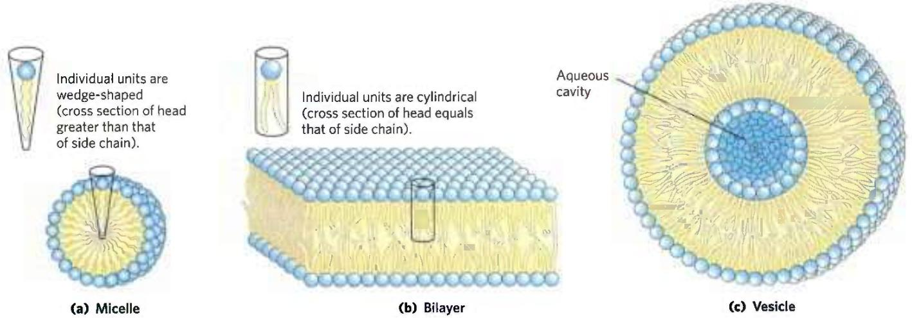  
FIGURE 11-1 Amphipathic lipid aggregates that form in water. (a) In micelles, the hydrophobic chains of the fatty acids are sequestered at the core of the sphere. There is virtually no water in the hydrophobic interior. (b) In an open bilayer, all acyl side chains except  
those at the edges of the sheet are protected from interaction with water. (c) When a two-dimensional bilayer folds on itself, it forms a closed bilayer, a three-dimensional hollow vesicle (liposome) enclosing an aqueous cavity.

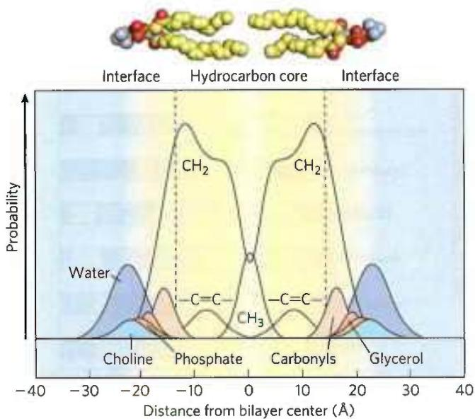  
FIGURE 11-2 Distribution of membrane lipids across an artificial membrane. The membrane, composed of pure phosphatidylcholine in which both fatty acids are oleic acid (18:1Δ⁹), was studied with x-ray and neutron diffraction. The y axis shows the probability that one of the chemical moieties will be found at the position indicated on the x axis. The phosphatidylcholine molecules are shown at the same scale as the x axis. Fatty acyl chains in the hydrocarbon core are fluid and are about as nonpolar as decane. At either side, a polar region about 15 Å from the center of the bilayer contains the fatty acyl carbonyls. The glycerol, choline, and phosphate that make up the polar head group are at 18–20 Å, outside the hydrocarbon core and in contact with water. [Information from A. Rath and C. M. Deber, Annu. Rev. Biophys. 41:135, 2012, Fig. 5a, based on M. C. Wiener and S. H. White, Biophys. J. 61:434, 1992.]

#### [EN] Bilayer Architecture Underlies the Structure and Function of Biological Membranes

In the generalized membrane in Figure 11-3, phospholipids form a bilayer in which proteins are embedded, their hydrophobic domains in contact with the fatty acyl chains of membrane lipids. Some proteins protrude from only one side of the membrane; others have domains exposed on both sides. The orientation of both lipids and proteins in the bilayer is asymmetric, giving the membrane structural and functional "sidedness." P1 The individual lipid and protein units in a membrane form a fluid mosaic with a pattern that, unlike a mosaic of ceramic tile and mortar, is able to change as lipids and proteins move in the plane of the membrane, while maintaining the permeability barrier to polar and charged solutes.

Membranes are not merely passive barriers. They are flexible, self-repairing, and selectively permeable. Their flexibility permits the shape changes that accompany cell growth and movement (such as amoeboid movement). With their ability to break and reseal, two membranes can fuse, as in exocytosis, or a single membrane-enclosed compartment can undergo fission to yield two sealed compartments, as in endocytosis or cell division, without creating gross leaks through cellular surfaces. Their selective permeability allows them to serve as molecular gatekeepers.

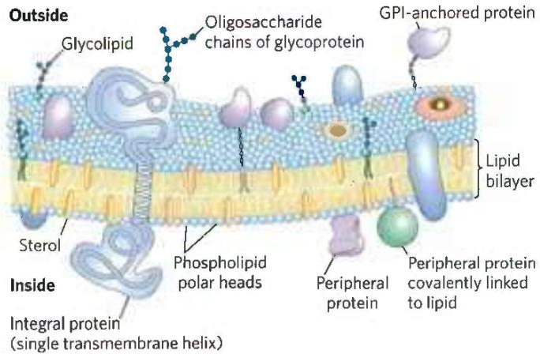  
FIGURE 11-3 Fluid mosaic model for plasma membrane structure. In this simplified and general model, the fatty acyl chains in the interior of the membrane form a fluid, hydrophobic region. Integral proteins float in this sea of lipid, with their nonpolar amino acid side chains protected from interaction with water.

These membrane functions are accomplished primarily by a broad array of proteins and enzymes in and on membranes. At the cell surface, transporters move specific organic solutes and inorganic ions across the membrane; receptors sense extracellular signals and trigger molecular changes in the cell; ion channels mediate electrical signaling between cells; and adhesion molecules hold neighboring cells together. The relative proportions of protein and lipid vary with the type of membrane, reflecting the diversity of biological roles. For example, certain neurons have a myelin sheath—an extended plasma membrane that wraps around the cell many times and acts as a passive electrical insulator. The myelin sheath consists primarily of lipids (good insulators). In contrast, the plasma membranes of bacteria and the membranes of mitochondria and chloroplasts, the sites of many enzyme-catalyzed processes, contain more protein than lipid (in mass per total mass).

Within the cell, membranes organize cellular processes such as the synthesis of lipids and certain proteins and the energy transductions that produce ATP in mitochondria and chloroplasts. Proteins associated with membranes are essentially confined to two-dimensional space, where intermolecular collisions of membrane proteins and lipids are far more probable than in the three-dimensional cytoplasm, so the efficiency of enzyme-catalyzed processes organized within membranes can be vastly increased.

#### [EN] The Endomembrane System Is Dynamic and Functionally Differentiated

P2 In eukaryotic cells, the endoplasmic reticulum (ER), Golgi apparatus, lysosomes, and various small vesicles that carry lipids and proteins throughout the cell are each surrounded and defined by a single membrane.

  
FIGURE 11-4 Trafficking in the endomembrane system of an animal cell. Lipids and proteins move from the site of their synthesis (ER) through the Golgi apparatus to the cell surface (or to organelles such as lysosomes). Mitochondria (and in plants, chloroplasts) are also part of the endomembrane system. Small vesicles bud off the ER, move to and fuse with the cis Golgi apparatus, exit the trans Golgi apparatus as secretory or transport vesicles, and fuse with the plasma membrane or with endosomes, giving rise to lysosomes. Individual lipid molecules can be carried throughout the cell by lipid transfer proteins (LTPs), which act at membrane contact points, shown here in red.

This endomembrane system (Fig. 11-4) also includes three organelles with double membranes: the nucleus, mitochondrion, and (in plants) chloroplast. (Recall the likely origin of mitochondria and chloroplasts by an endosymbiont mechanism shown in Fig. 1-37.) The convoluted and tubular ER is dynamic and extends throughout the cell, touching the other compartments at specific membrane contact points. Although each compartment is closed, they actively exchange proteins and lipids in several ways.

Cells have mechanisms to target specific lipids to particular organelles. Each species, each tissue or cell type, and the organelles of each cell type have a characteristic set of membrane lipids. Plasma membranes, for example, are enriched in cholesterol and sphingolipids, but they contain no detectable cardiolipin (Fig. 11-5); mitochondrial membranes are very low in cholesterol and sphingolipids, but they contain most of the cell's phosphatidylglycerol and cardiolipin, which are synthesized within the mitochondria. Cardiolipin is specifically required for correct assembly of the respiratory complexes of mitochondria. In all but a few cases, the functional significance of these different combinations of lipids is not yet known.

  
FIGURE 11-5 Lipid composition of the plasma and organelle membranes of a rat hepatocyte. The functional specialization of each membrane type is reflected in its unique lipid composition. Cholesterol is prominent in plasma membranes but barely detectable in mitochondrial membranes. Cardiolipin is a major component of the inner mitochondrial membrane but not of the plasma membrane. Phosphatidylserine, phosphatidylinositol, and phosphatidylglycerol are relatively minor components of most membranes but serve critical functions; phosphatidylinositol and its derivatives, for example, are important in signal transductions triggered by hormones. Sphingolipids, phosphatidylcholine, and phosphatidylethanolamine are present in most membranes but in varying proportions. Glycolipids, which are major components of the chloroplast membranes of plants, are virtually absent in animal cells.

Most membrane lipids and proteins are synthesized in the ER, and from there they move to their destination organelles or to the plasma membrane. In this process of membrane trafficking, small membrane vesicles bud from the ER, then move to and fuse with the cis Golgi apparatus. As lipids and proteins move across the Golgi apparatus to its trans side, they undergo covalent modifications required for their cellular function. In many cases, these covalent alterations act as molecular ZIP codes, dictating the eventual location of the mature protein.

P2 Membrane trafficking achieves striking changes in lipid composition and disposition across the bilayer (Fig. 11-6). Phosphatidylcholine is the principal phospholipid in the lumenal leaflet of the Golgi membrane, but in transport vesicles leaving the trans Golgi apparatus, phosphatidylcholine has largely been replaced by sphingolipids and cholesterol, which, following fusion of the transport vesicles with the plasma membrane, make up the majority of the lipids in the outer leaflet of the cell's plasma membrane. Plasma membrane lipids are asymmetrically distributed between the two leaflets of the bilayer. Choline-containing lipids (phosphatidylcholine and sphingomyelin) are typically found in the outer (extracellular, or exoplasmic) leaflet, whereas phosphatidylserine, phosphatidylethanolamine, and the phosphatidylinositols are almost exclusively in the inner (cytoplasmic) leaflet. Here the negatively charged serine and inositol phosphate head groups can interact electrostatically with positively charged regions of peripheral or amphitropic membrane proteins (described below).

Trans Golgi apparatus or plasma membrane
Lumen or extracellular space  

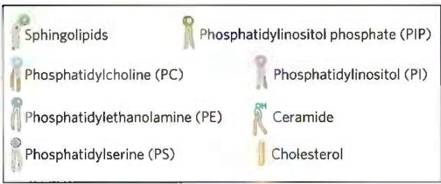

Endoplasmic reticulum
Cytosol  
  
FIGURE 11-6 Change in lipid composition of secretory vesicles with their passage through the Golgi apparatus. Both the lipid composition of the bilayer and the disposition of specific lipids between inner and outer leaflets change remarkably as a result of vesicle trafficking. In the trans Golgi apparatus and plasma membrane, sphingolipids are greatly enriched in the leaflet facing the lumen or extracellular space, and phosphatidylserine, phosphatidylethanolamine, and the inositol phospholipids are almost exclusively in the cytosolic leaflet. The plasma membrane is also enriched with cholesterol. [Information from G. Drin, Annu. Rev. Biochem. 83:51, 2014, Fig. 1.]

A second route for redistributing lipids from their site of synthesis to their destination membrane is via lipid transfer proteins (LTPs; Fig. 11-7), which occur universally in various forms. LTPs are soluble in water, but they have a hydrophobic lipid-binding pocket in which they carry a lipid from one membrane to another through the cytosol. Some LTPs are bispecific: they carry, for example, a molecule of cholesterol to the plasma membrane, and they return with a phosphatidylinositol molecule. One class of lipid transfer protein forms a hydrophobic tunnel between two membranes at their contact points. In some cases, ATP is needed to drive the process, supplied by an ATP-binding cassette (ABC) transporter (described below). The rate of lipid movement from one membrane to another in vivo is significantly greater than the rate of vesicle budding and fusion.

(a) Monomeric  
(b) Oligomeric  
(c) ATP-driven  
  
FIGURE 11-7 Lipid transfer protein (LTP) action. (a) Lipid transfer proteins move lipids and other nonpolar solutes through the very polar cytosol by providing a hydrophobic groove or pocket into which the hydrophobic solute can fit, with its nonpolar regions masked from the surrounding water. (b) Some LTPs form multisubunit structures to generate a hydrophobic groove long enough to connect two separate membranes at contact points (see Fig. 11-5). (c) To move lipid molecules against a concentration gradient (say, from a leaflet poor in phosphatidylserine to one relatively rich in it), the LTP is coupled to an ATP-dependent pump. [Information from L. H. Wong et al., Nat. Rev. Mol. Cell Biol. 20:85, 2019, Fig. 2.]

Finally, once phospholipids reach their destination membrane, they can undergo enzymatic remodeling of their fatty acid constituents, a subject discussed in Chapter 21.

#### [EN] Membrane Proteins Are Receptors, Transporters, and Enzymes

P2 The protein composition of membranes reflects each membrane's functional specialization. One large group of membrane proteins are the receptors for extracellular signals such as hormones and changes in membrane potential. Hundreds of membrane proteins are transporters that carry specific polar or charged compounds—sugars, amino acids, vitamins, a wide variety of metabolic intermediates, minerals (Mg $^{2+}$ , Ca $^{2+}$ , Na $^{+}$ , K $^{+}$ ), and trace metal ions (Mn $^{2+}$ , Ni $^{2+}$ , Co $^{2+}$ )—across the plasma membrane or between organelles. All transporters and many receptors must span the membrane at least once to play their roles. Some membrane-associated enzymes also span the membrane, but many carry out their catalytic functions on one side or the other of their membrane setting, partially penetrating just one leaflet of the bilayer.

The synthesis and delivery to the site of function are more complicated for membrane proteins than for typical cytosolic proteins. Many of the proteins destined for the plasma membrane undergo extensive posttranslational modification as they pass through the ER and the Golgi apparatus. One covalent modification is the glycosylation (attachment of oligosaccharides) of proteins bound for the plasma membrane. In glycophorin, a glycoprotein of the erythrocyte plasma membrane, 60% of the mass consists of complex oligosaccharides covalently attached to specific amino acid residues (Fig. 11-8). For such glycoproteins, Ser, Thr, and Asn residues are the most common points of carbohydrate attachment (see Fig. 7-27), and the carbohydrates are invariably on the outer face of the plasma membrane. Another posttranslational modification of some proteins is the covalent attachment of one or more lipids, which serve as hydrophobic anchors to hold a protein to the membrane or as tags to target the protein to a specific location.

  
FIGURE 11-8 Transbilayer disposition of glycophorin in an erythrocyte. One hydrophilic domain, containing all the sugar residues, is on the outer surface, and another hydrophilic domain protrudes from the inner face of the membrane. Each red hexagon represents a tetrasaccharide (containing two Neu5Ac (sialic acid), Gal, and GalNAc) O-linked to a Ser or Thr residue; the blue hexagon represents an oligosaccharide N-linked to an Asn residue. The oligosaccharides are much larger than the hexagons used to represent them. A segment of 19 hydrophobic residues (residues 75 to 93) forms an α helix that traverses the membrane bilayer (see Fig. 11-13a). The segment from residues 64 to 74 has some hydrophobic residues and probably penetrates the outer face of the lipid bilayer, as shown. The functional unit of glycophorin is a homodimer; for clarity we show only one of the subunits here. [Information from V.T. Marchesi et al., Annu. Rev. Biochem. 45:667, 1976.]

#### [EN] Membrane Proteins Differ in the Nature of Their Association with the Membrane Bilayer

Integral membrane proteins are firmly embedded within the lipid bilayer and are removable only by agents such as detergents or organic solvents that overcome hydrophobic interactions (Fig. 11-9). Peripheral membrane proteins associate with the membrane through electrostatic interactions and hydrogen bonding with hydrophilic domains of integral proteins and with the charged head groups of membrane lipids. In the laboratory, they can be released from their membrane association by relatively mild treatments that interfere with electrostatic interactions or that break hydrogen bonds. Amphitropic proteins associate reversibly with membranes and are therefore found both in the membrane and in the cytosol. Their affinity for membranes results in some cases from the protein's noncovalent interaction with another membrane protein or lipid, and in other cases from the presence of one or more covalently attached lipids (see Fig. 11-16).

The firm attachment of integral proteins to membranes is the result of the hydrophobic interaction between the nonpolar core of the lipid bilayer and nonpolar side chains of the protein. Monotopic integral proteins have small hydrophobic domains that interact with only a single leaflet of the membrane (Fig. 11-10). These domains, which make up as little as a few percent of the protein's total mass, provide enough hydrophobic surface to hold the proteins firmly to the membrane. Bitopic proteins span the bilayer once, extending on either surface. They have a single hydrophobic sequence somewhere in the molecule. Glycophorin (Fig. 11-8) is bitopic. Polytopic proteins cross the membrane several times. They have multiple hydrophobic sequences, each of which, when in the $\alpha$ -helical conformation, is long enough (about 20 residues) to span the lipid bilayer. (Recall from Worked Example 4-1 that each residue in an $\alpha$ helix adds $1.5\AA$ to its length.)

One of the best-studied polytopic proteins, bacteriorhodopsin, has seven very hydrophobic internal sequences and spans the lipid bilayer seven times. Bacteriorhodopsin is a light-driven proton pump densely packed in regular arrays in the purple membrane of the bacterium Halobacterium salinarum. X-ray crystallography and cryo-electron microscopy reveal a structure in which each of the seven $\alpha$ -helical segments crosses the

  
FIGURE 11-9 Integral, peripheral, and amphitropic proteins. Membrane proteins can be operationally distinguished by the conditions required to release them from the membrane. Integral proteins can only be removed from membranes with harsh treatment such

  
FIGURE 11-10 Monotopic proteins penetrate only one leaflet. Three typical monotopic membrane proteins have relatively little of their structure (1% to 16%) associated with lipids in one leaflet of the bilayer. They are colored to show surface hydrophobicity, with yellow hydrophobic, blue hydrophilic, and hues of green in between. Each of these proteins catalyzes a reaction that involves a hydrophobic substrate. (a) CPT-II is a mammalian carnitine palmitoyltransferase II; (b) COX2 is a mammalian prostaglandin H2 synthase-1; (c) PlsC is a bacterial acyltransferase (1-acyl-sn-glycerol-6-phosphate acyltransferase). [Data from (a) PDB ID 2H4T, Y. S. Hsiao et al., Biochem. Biophys. Res. Commun. 346:974, 2006; (b) PDB ID 1CQE, D. Picot et al., Nature 367:243, 1994; (c) PDB ID 5KYM, R. M. Robertson et al., Nat. Struct. Mol. Biol. 24:666, 2017.]

lipid bilayer, and all are connected by nonhelical loops at the inner and outer faces of the membrane (Fig. 11-11). In the amino acid sequence of bacteriorhodopsin, seven segments of about 20 hydrophobic residues can be identified, each forming an $\alpha$ helix that spans the bilayer. The seven helices are clustered together and oriented not quite perpendicular to the bilayer plane, a motif that (as we shall see in Chapter 12) is very common in membrane proteins involved in signal reception. The hydrophobic interaction keeps the nonpolar amino acid residues firmly anchored among the fatty acyl groups of the membrane lipids in the membrane's lipid core.

as detergent. Peripheral proteins are more loosely associated. Amphitropic proteins have a reversible association with membranes that depends on a regulatory process, such as reversible palmitoylation or phosphorylation.  
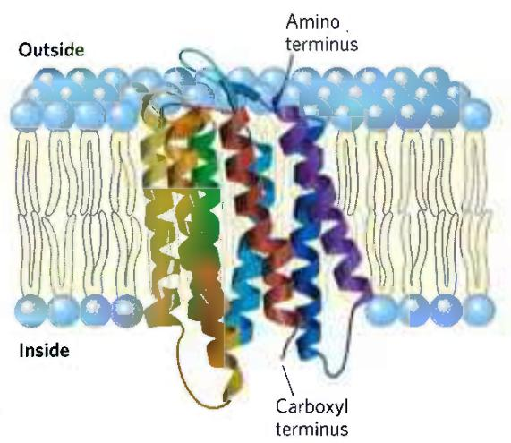  
FIGURE 11-11 Bacteriorhodopsin, a membrane-spanning protein. The single polypeptide chain folds into seven hydrophobic $\alpha$ helices, each of which traverses the lipid bilayer roughly perpendicular to the plane of the membrane. The seven transmembrane helices are clustered, and the space around and between them is filled with the acyl chains of membrane lipids. The light-absorbing pigment retinal (see Fig. 10-20) is buried deep within the membrane in contact with several of the helical segments (not shown). The helices are colored to correspond with the hydropathy plot in Figure 11-13. [Data from PDB ID 2AT9, K. Mitsuoka et al., J. Mol. Biol. 286:861, 1999.]

  
FIGURE 11-12 Lipid annuli associated with an integral protein. The crystal structure of sheep aquaporin, a transmembrane water channel, includes a shell of phospholipids positioned with their head groups (blue) at the expected positions on the inner and outer membrane surfaces and their hydrophobic acyl chains (gold) intimately associated with the surface of the protein exposed to the bilayer. The lipid forms a "grease seal" around the protein, which is depicted by a dark blue surface representation. [Data from PDB ID 2B6O, T. Gonen et al., Nature 438:633, 2005.]

Many membrane proteins co-crystallize with phospholipid molecules, which are presumed to be positioned in the native membranes as they are in the protein crystals. Many of these phospholipid molecules lie on the protein surface, their head groups interacting with polar amino acid residues at the inner and outer membrane-water interfaces and their side chains associated with nonpolar residues. Other phospholipids are found at the interfaces between monomers of multisubunit membrane proteins, where they form a "grease seal" (Fig. 11-12).

#### [EN] The Topology of an Integral Membrane Protein Can Often Be Predicted from Its Sequence

Determination of the location of a membrane protein relative to the bilayer—that is, its topology—is generally much more difficult than determining its amino acid sequence, either directly or by gene sequencing. The amino acid sequences of many thousands of membrane proteins are known, but fewer three-dimensional structures have been established by x-ray crystallography or cryo-electron microscopy. The presence of unbroken sequences of more than 20 hydrophobic residues in a membrane protein is commonly taken as evidence that these sequences traverse the lipid bilayer, acting as hydrophobic anchors or forming transmembrane channels. All known integral proteins have at least one such sequence. Application of this logic to entire genomic sequences leads to the conclusion that in many organisms, 20% to 30% of all proteins are integral proteins.

What can we predict about the secondary structure of the membrane-spanning portions of integral proteins? At 1.5 Å (0.15 nm) per amino acid residue, an α-helical sequence of 20 to 25 residues is just long enough to span the thickness (30 Å) of the lipid bilayer. A polypeptide chain surrounded by lipids, having no water molecules with which to hydrogen-bond, will tend to form $\alpha$ helices or $\beta$ sheets in which intrachain hydrogen bonding is maximized. If the side chains of all amino acids in a helix are nonpolar, the helix is further stabilized in the surrounding lipids by the hydrophobic effect.

Several simple methods of analyzing amino acid sequences yield reasonably accurate predictions of secondary structure for transmembrane proteins. The relative polarity of each amino acid has been determined experimentally by measuring the free-energy change accompanying the movement of that amino acid side chain from a hydrophobic environment into water. This free energy of transfer, which can be expressed as a hydropathy index (see Table 3-1), ranges from highly exergonic for charged or polar residues to highly endergonic for amino acids with aromatic or aliphatic hydrocarbon side chains. The overall hydropathy index (hydrophobicity) of a sequence of amino acids is estimated by summing the free energies of transfer for the residues in the sequence. To scan a polypeptide sequence for potential membrane-spanning segments, an investigator calculates the hydropathy index for successive segments (called windows) of a given size, from 7 to 20 residues. For a window of seven residues, for example, the average indices for residues 1 to 7, 2 to 8, 3 to 9, and so on, are plotted as in Figure 11-13 (plotted for the middle residue in each window—residue 4 for residues 1 to 7, for example). A region with more than 20 residues of high hydropathy index is presumed to be a transmembrane segment. When the sequences of membrane proteins of known three-dimensional structure are scanned using simple online bioinformatics tools, we find a reasonably good correspondence between predicted and known membrane-spanning segments. Hydropathy analysis predicts a single hydrophobic helix for glycophorin (Fig. 11-13a) and seven transmembrane segments for bacteriorhodopsin (Fig. 11-13b)—in agreement with structures known from x-ray crystallography.

Not all integral proteins are composed of transmembrane $\alpha$ helices. Another structural motif common in bacterial and mitochondrial membrane proteins is the $\beta$ barrel (see Fig. 4-16b), in which 20 or more transmembrane segments form $\beta$ sheets that line a cylinder (Fig. 11-14). The same factors that favor $\alpha$ helix formation in the hydrophobic interior of a lipid bilayer also stabilize $\beta$ barrels: when no water molecules are available to hydrogen-bond with the carbonyl oxygen and nitrogen of the peptide bond, maximal intrachain hydrogen bonding gives the most stable conformation. Planar $\beta$ sheets do not maximize these interactions and are generally not found in the membrane interior; $\beta$ barrels allow all possible hydrogen bonds and are common among membrane proteins. Porins, proteins that allow certain polar solutes to cross the outer membrane of gram-negative bacteria such as E. coli, have many-stranded $\beta$ barrels lining the polar transmembrane passage. The outer membranes of mitochondria and chloroplasts also contain a variety of $\beta$ barrels, as do the outer membranes of the modern bacteria descended from those believed to have evolved to mitochondria and chloroplasts.

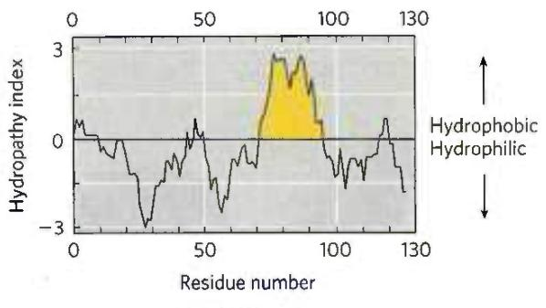  
(a) Glycophorin

  
(b) Bacteriorhodopsin  
FIGURE 11-13 Hydropathy plots. Average hydropathy index (see Table 3-1) is plotted against residue number for two integral membrane proteins. The hydropathy index for each amino acid residue in a sequence of defined length, or "window," is used to calculate the average hydropathy for that window. The horizontal axis shows the residue number in the middle of the window. (a) Glycophorin from human erythrocytes has a single hydrophobic sequence between residues 75 and 93 (yellow); compare this with Figure 11-8. (b) Bacteriorhodopsin, known from independent physical studies to have seven transmembrane helices (see Fig. 11-11), has seven hydrophobic regions. Note, however, that the hydropathy plot is ambiguous in the region of segments 6 and 7. X-ray crystallography has confirmed that this region has two transmembrane segments.

A polypeptide is more extended in the $\beta$ conformation than in an $\alpha$ helix; just seven to nine residues of $\beta$ conformation are needed to span a membrane. Recall that in the $\beta$ conformation, alternating side chains project above and below the sheet (see Fig. 4-5). In $\beta$ strands of membrane proteins, every second residue in the membrane-spanning segment is hydrophobic and interacts with the lipid bilayer; aromatic side chains are commonly found at the lipid-protein interface. The other residues may or may not be hydrophilic.

A further remarkable feature of many transmembrane proteins of known structure is the presence of Tyr and Trp residues at the interface between lipid and water (Fig. 11-15). The side chains of these residues seem to serve as membrane interface anchors, able to interact simultaneously with the central lipid phase and the aqueous phases on either side of the membrane. Another generalization about amino acid location relative to the bilayer is described by the positive-inside rule: the positively charged Lys and Arg residues in the extramembrane loop of membrane proteins occur more commonly on the cytoplasmic face of plasma membranes.

  
FIGURE 11-14 Polytopic integral proteins with $\beta$ -barrel structure. Three proteins of the $E.$ coli outer membrane are shown, viewed in the plane of the membrane. FepA, involved in iron uptake, has 22 membrane-spanning $\beta$ strands. Outer membrane phospholipase A, or OmpLA, is a 12-stranded $\beta$ barrel that exists as a dimer in the membrane. Maltoporin, a maltose transporter, is a trimer; each monomer consists of $16\beta$ strands. [Data from FepA, PDB ID 1FEP, S. K. Buchanan et al., Nat. Struct. Biol. 6:56, 1999; OmpLA, PDB ID 1QD5, H. J. Snijder et al., Nature 401:717, 1999; maltoporin, PDB ID 1MAL, T. Schirmer et al., Science 267:512, 1995.]

#### [EN] Covalently Attached Lipids Anchor or Direct Some Membrane Proteins

Some membrane proteins are covalently linked to one or more lipids, which may be of several types: long-chain fatty acids, isoprenoids, sterols, or glycosylated derivatives of phosphatidylinositol (GPIs; Fig. 11-16). The attached lipid provides a hydrophobic anchor that inserts into the lipid bilayer and holds the protein at the membrane surface. The strength of the hydrophobic interaction between a bilayer and a single hydrocarbon chain linked to a protein is barely enough to anchor the protein securely, but many proteins have more than one attached lipid moiety. Furthermore, other interactions, such as ionic attractions between positively charged Lys residues in the protein and negatively charged lipid head groups, can add to the anchoring effect of a covalently bound lipid. For example, the plasma membrane protein MARCKS (myristoylated alanine-rich C-kinase substrate), which interacts with actin filaments in the process of cell motility, has a covalently attached myristoyl moiety, but it also contains the sequence

#### [EN] KKKKKRFSFKKSKFKLSGFSFKKNKK 151 175

which adds to the protein's affinity for the membrane. Three clusters of positively charged Lys and Arg residues (screened blue) interact with the negatively charged head group of phosphatidylinositol 4,5-bisphosphate $(\mathrm{PIP}_2)$ on the cytoplasmic face of the plasma membrane; five aromatic residues (screened yellow) insert into the lipid bilayer. When the head-group phosphates of $\mathrm{PIP}_2$ are enzymatically removed, MARCKS loses its hold on

  
FIGURE 11-15 Tyr and Trp residues of integral proteins clustering at the water-lipid interface. The detailed structures of these five integral proteins are known from crystallographic studies. The K+ channel is from the bacterium Streptomyces lividans (see Fig. 11-45); maltoporin, OmpLA, OmpX, and phosphoporin E are proteins of the outer membrane of E. coli. Residues of Tyr and Trp are found predominantly where the nonpolar region  
of acyl chains meets the polar head-group region. Charged residues (Lys, Arg, Glu, Asp) are found almost exclusively in the aqueous phases. [Data from K+ channel, PDB ID 1BL8, D. A. Doyle et al., Science 280:69, 1998; maltoporin, PDB ID 1AF6, Y. F. Wang et al., J. Mol. Biol. 272:56, 1997; OmpLA, PDB ID 1QD5, H. J. Snijder et al., Nature 401:717, 1999; OmpX, PDB ID 1QJ9, J. Vogt and G. E. Schulz, Structure 7:1301, 1999; phosphoporin E, PDB ID 1PHO, S. W. Cowan et al., Nature 3S8:727, 1992.]

FIGURE 11-16 Lipid-linked membrane proteins. Covalently attached lipids anchor membrane proteins to the lipid bilayer. A palmitoyl group is shown attached by thioester linkage to a Cys residue; an N-myristoyl group is generally attached to an amino-terminal Gly residue, typically of a protein that also has a hydrophobic transmembrane segment; the farnesyl and geranylgeranyl groups attached to carboxyl-terminal Cys residues are isoprenoids of 15 and 20 carbons, respectively. The carboxyl-terminal Cys residue is invariably methylated. Glycosyl phosphatidylinositol (GPI) anchors are derivatives of phosphatidylinositol in which the inositol bears a short oligosaccharide covalently joined to the carboxyl-terminal residue of a protein through phosphoethanolamine. GPI-anchored proteins are always on the extracellular face of the plasma membrane. Farnesylated and palmitoylated membrane proteins are found on the inner surface of the plasma membrane, and myristoylated proteins have domains both inside and outside the plasma membrane. For some lipid-linked proteins, the lipid attachment process is reversible, so the protein is amphitropic: membrane-bound when lipid-linked, soluble when not.

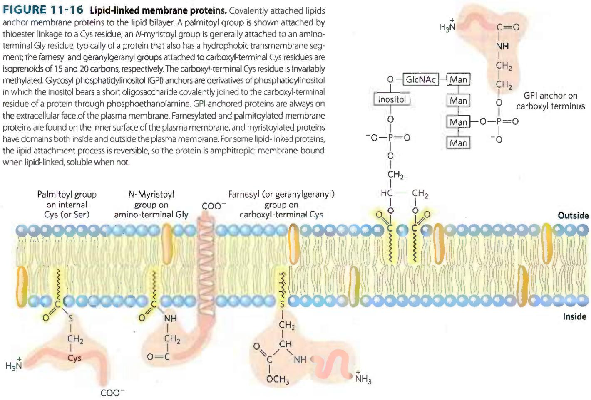

the plasma membrane and dissociates. The reversible nature of the association of MARCKS with the membrane makes it an amphitropic protein.

Beyond merely anchoring a protein to the membrane, the attached lipid may have a more specific role.

In the plasma membrane, GPI-anchored proteins are exclusively on the outer face and are clustered in certain regions, as discussed later in the chapter (p. 380), whereas other types of lipid-linked proteins (with farnesyl or geranylgeranyl groups attached; Fig. 11-16) are exclusively on the inner face. In polarized epithelial cells (such as intestinal epithelial cells), in which apical and basal surfaces have different roles, GPI-anchored proteins are directed specifically to the apical surface. Attachment of a specific lipid to a newly synthesized membrane protein therefore has a targeting function, directing the protein to its correct cellular location.

#### [EN] SUMMARY 11.1 The Composition and Architecture of Membranes

■ Biological phospholipids and sterols spontaneously form a lipid bilayer to protect their hydrophobic hydrocarbon chains from energetically unfavorable interaction with water.

In the fluid mosaic model, a lipid bilayer is the basic structural unit, and proteins associate with or span the bilayer. Biological membranes are flexible, self-repairing, and selectively permeable. They regulate the traffic of small molecules into and out of the cell and among the organelles, and they provide a scaffold on which proteins assemble into catalytic and structural aggregates that function in two-dimensional space.

■ Proteins and lipids are trafficked through the dynamic endomembrane system of a eukaryote from their point of synthesis to their appropriate cellular locations. Small vesicles and soluble transporter proteins ensure that each membrane leaflet has its unique complement of lipids and proteins to achieve its specialized function.

Cells have hundreds of membrane transporters that carry polar solutes and ions in and out of cells and throughout the endomembrane system. The plasma membrane contains protein receptors that sense signals from outside the cell and carry their message into the cell. Many enzymes are associated with membranes, where they interact with each other in essentially two-dimensional space.

■ Integral proteins are embedded within membranes, their nonpolar amino acid side chains stabilized by contact with the lipid bilayer. Peripheral proteins associate with membranes through electrostatic interactions and hydrogen bonding with membrane phospholipids and integral proteins. Amphitropic proteins associate reversibly with the membrane.

■ Many integral membrane proteins span the lipid bilayer several times, with hydrophobic sequences of about 20 amino acid residues forming transmembrane $\alpha$ helices. Multistranded $\beta$ barrels are also common in integral proteins of bacterial and mitochondrial membranes. A hydropathy plot of the amino acid sequence identifies segments that are likely to cross the lipid bilayer as helices or barrels.

■ Covalent attachment of a hydrophobic molecule such as a fatty acid serves to anchor some membrane proteins to the bilayer.

<!-- EN-END 11.1 -->

<!-- EN-BEGIN 11.2 -->

### 【英文对应 11.2】Membrane Dynamics

> 来源：Lehninger Principles of Biochemistry（书籍/02_生物化学原理） 第11章 Biological Membranes and Transport，§11.2。对应本章“五、生物膜的组成和结构”。

One remarkable feature of all biological membranes is their plasticity—their ability to change shape without losing their integrity and becoming leaky. The bases for this property are the noncovalent interactions among lipids in the bilayer and the mobility allowed to individual lipids because they are not covalently anchored to one another. We turn now to the dynamics of membranes: the motions that occur and the transient structures that are allowed by these motions.

#### [EN] Acyl Groups in the Bilayer Interior Are Ordered to Varying Degrees

Although the lipid bilayer structure is stable, its individual phospholipid molecules have much freedom of motion (Fig. 11-17), depending on the temperature and the lipid composition. Below normal physiological temperatures, P1 the lipids in a bilayer form a gel-like liquid-ordered $(\mathbf{L}_{\mathbf{o}})$ state, in which all types of motion of individual lipid molecules are strongly constrained (Fig. 11-17a). Above physiological temperatures, individual hydrocarbon chains of fatty acids are in constant motion produced by rotation about the carbon-carbon bonds of the long acyl side chains and by lateral diffusion of individual lipid molecules in the plane of the bilayer. This is the liquid-disordered ( $L_{d}$ ) state (Fig. 11-17b). In the transition from the $L_{0}$ state to the $L_{d}$ state, the general shape and dimensions of the bilayer are maintained; what changes is the degree of motion (lateral and rotational) allowed to individual lipid molecules.

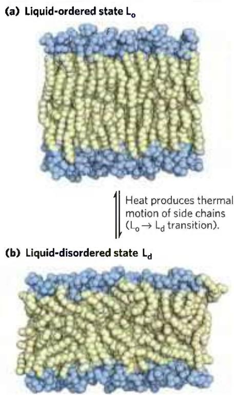  
FIGURE 11-17 Two extreme states of bilayer lipids. (a) In the liquid-ordered $(\mathsf{L}_0)$ state, polar head groups are uniformly arrayed at the surface, and the acyl chains are nearly motionless and packed with regular geometry. (b) In the liquid-disordered $(\mathsf{L}_0)$ state, or fluid state, acyl chains undergo much thermal motion and have no regular organization. The state of membrane lipids in biological membranes is maintained somewhere between these extremes. [Information from H. Heller et al., J. Phys. Chem. 97:8343, 1993]

At temperatures in the physiological range for a mammal (about 20 to 40 °C), long-chain saturated fatty acids (such as 16:0 and 18:0) tend to pack into an $L_{o}$ gel phase, but the kinks in unsaturated fatty acids interfere with packing, favoring the $L_{d}$ state (see Fig. 10-1). Shorter-chain fatty acyl groups are more mobile than longer-chain fatty acyl groups and thus also favor the $L_{d}$ state. The sterol content of a membrane, which varies greatly with organism and organelle, is another important determinant of lipid state. Sterols (such as cholesterol) have paradoxical effects on bilayer fluidity: they interact with phospholipids containing unsaturated fatty acyl chains, compacting them and constraining their motion in bilayers. In contrast, their association with sphingolipids and phospholipids having long, saturated fatty acyl chains tends to make a bilayer fluid that would otherwise, without cholesterol, adopt the $L_{o}$ state. In biological membranes composed of a variety of phospholipids and sphingolipids, cholesterol tends to associate with sphingolipids and to form regions in the $L_{o}$ state surrounded by cholesterol-poor regions in the $L_{d}$ state (see the discussion of membrane rafts below).

#### [EN] Transbilayer Movement of Lipids Requires Catalysis

At physiological temperatures, lateral diffusion in the plane of the bilayer is very rapid, but the movement of a lipid molecule from one leaflet of the bilayer to the other occurs very slowly, if at all, in most membranes (Fig. 11-18). Transbilayer — or “flip-flop” — movement requires that a polar or charged head group leave its aqueous environment and move into the hydrophobic interior of the bilayer, a process with a large, positive free-energy change. There are, however, situations in which such movement is essential. For example, in the ER, membrane glycerophospholipids are synthesized on the cytosolic face, whereas sphingolipids are synthesized or modified on the lumenal surface. To get from their site of synthesis to their eventual point of deposition, these lipids must undergo flip-flop diffusion.

P2 Membrane proteins called flippases, floppases, and scramblases (Fig. 11-18c) facilitate the transbilayer movement (translocation) of individual lipid molecules. Like enzymes, these translocators act by providing a path that is energetically more favorable and therefore much faster than the uncatalyzed movement. The combination of asymmetric biosynthesis of membrane lipids, no uncatalyzed flip-flop diffusion, and the presence of selective, energy-dependent lipid translocators accounts for the transbilayer asymmetry in lipid composition discussed in Section 11.1.

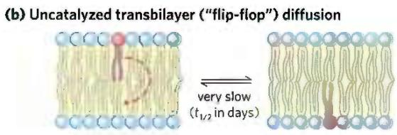

(c) Catalyzed transbilayer translocations  
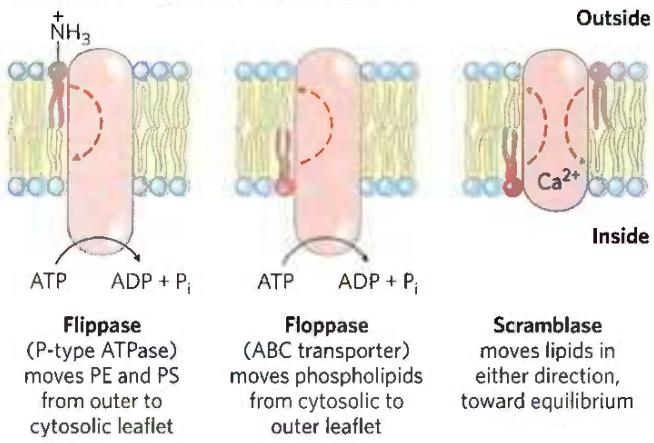  
FIGURE 11-18 Motion of single phospholipids in a bilayer. (a) Lateral diffusion within a leaflet is very rapid, but (b) uncatalyzed movement from one leaflet to the other is very slow. (c) Three types of phospholipid translocators in the plasma membrane. PE is phosphatidylethanolamine; PS is phosphatidylserine.

Flippases catalyze translocation of the aminophospholipids phosphatidylethanolamine and phosphatidylserine from the extracellular to the cytoplasmic leaflet of the plasma membrane, contributing to the asymmetric distribution of phospholipids: phosphatidylethanolamine and phosphatidylserine primarily in the cytoplasmic leaflet, and the sphingolipids and phosphatidylcholine in the outer leaflet. Keeping phosphatidylserine out of the extracellular leaflet is important: its exposure on the outer surface triggers apoptosis (programmed cell death; see Chapter 12) and engulfment by macrophages that carry phosphatidylserine receptors. Flippases also act in the ER, where they move newly synthesized phospholipids from their site of synthesis in the cytosolic leaflet to the lumenal leaflet. Flippases consume about one ATP per molecule of phospholipid translocated, and they are structurally and functionally related to the P-type ATPases (active transporters) described in Section 11.3.

There are three other types of lipid-translocating activities: floppases, scramblases, and phosphatidylinositol transfer proteins. Floppases move plasma membrane phospholipids and sterols from the cytoplasmic leaflet to the extracellular leaflet and, like flippases, are ATP-dependent. Floppases are members of the ABC transporter family, described on page 395; all ABC transporters actively transport hydrophobic substrates outward across the plasma membrane. Each floppase specializes in movement of specific lipids: cholesterol, phosphatidylcholine, sphingomyelin, and phosphatidylserine. Scramblases are proteins that move any membrane phospholipid across the bilayer down its concentration gradient (from the leaflet where it has a higher concentration to the leaflet where it has a lower concentration); their activity is not dependent on ATP, although some require $\mathrm{Ca^{2+}}$ . Scramblase activity leads to controlled randomization of the head-group composition on the two faces of the bilayer. The activity of some scramblases rises sharply with an increase in cytosolic $\mathrm{Ca^{2+}}$ concentration, which may result from cell activation, cell injury, or apoptosis. Finally, a group of proteins that act primarily to move phosphatidylinositol lipids across lipid bilayers, the phosphatidylinositol transfer proteins, are believed to have important roles in lipid signaling and membrane trafficking.

#### [EN] Lipids and Proteins Diffuse Laterally in the Bilayer

P2 Individual lipid molecules can move laterally in the plane of the membrane by changing places with neighboring lipid molecules; that is, they undergo Brownian movement within the bilayer (Fig. 11-18a). This rapid lateral diffusion in the plane of the bilayer tends to randomize the positions of individual molecules in a few seconds.

Lateral diffusion can be shown experimentally by attaching fluorescent probes to the head groups of lipids and using fluorescence microscopy to follow the probes over time (Fig. 11-19). In one technique, a small region (5 $\mu m^{2}$ ) of a cell surface with fluorescence-tagged lipids is bleached by intense laser radiation so that the irradiated patch no longer fluoresces when viewed with less-intense (nonbleaching) light in the fluorescence microscope. However, within milliseconds, the region recovers its fluorescence as unbleached lipid molecules diffuse into the bleached patch and bleached lipid molecules diffuse away from it. The rate of fluorescence recovery after photobleaching, or FRAP, is a measure of the rate of lateral diffusion of the lipids. Using the FRAP technique, researchers have shown that some membrane lipids diffuse laterally at rates of up to 1 $\mu m/s$ . At this rate, a lipid molecule could move from one end of a eukaryotic cell to the other in a few seconds.

Another technique, single particle tracking, has allowed researchers to follow the movement of a single lipid molecule in the plasma membrane on a much shorter time scale. Results from these studies confirm that lipid molecules diffuse laterally with rapidity within small, discrete regions of the cell surface but that movement from one such region to a nearby region ("hop diffusion") is rarer; membrane lipids behave as though corralled by fences that they can occasionally cross by hop diffusion (Fig. 11-20).

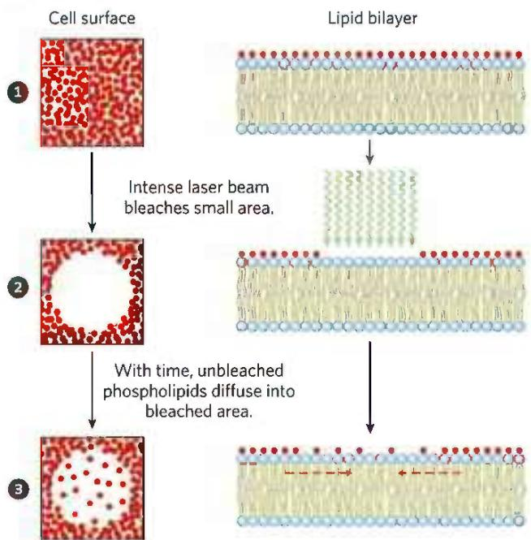  
FIGURE 11-19 Measurement of lateral diffusion rates of lipids by fluorescence recovery after photobleaching (FRAP). Lipids in the outer leaflet of the plasma membrane are labeled by reaction with a membrane-impermeant fluorescent probe (red) so that the surface is uniformly labeled when viewed with a fluorescence microscope. A small area is bleached with a laser, then recovers its fluorescence. With time, unbleached lipid molecules diffuse into the bleached region, and it again becomes fluorescent. The FRAP method can also be used to measure lateral diffusion of membrane proteins labeled with a fluorescent tag.

  
FIGURE 11-20 Hop diffusion of individual lipid molecules. The motion of a single fluorescently labeled lipid molecule in a cell surface is recorded on video by fluorescence microscopy, with a time resolution of $25\mu s$ (equivalent to 40,000 frames/s). The track shown here represents a molecule followed for 56 ms (2,250 frames); the trace begins in the purple area and continues through blue, green, and orange. The pattern of movement indicates rapid diffusion within a confined region (about $250~\mathrm{nm}$ in diameter, shown by a single color), with occasional hops into an adjoining region. This finding suggests that the lipids are corralled by molecular fences that they occasionally jump. [Data from Takahiro Fujiwara, Ken Ritchie, Hideji Murakoshi, Ken Jacobson, and Akihiro Kusumi.]

Like membrane lipids, many membrane proteins are free to diffuse laterally in the plane of the bilayer and are in constant motion, as shown by the FRAP technique with fluorescence-tagged plasma membrane proteins. Some membrane proteins associate to form large aggregates ("patches") on the surface of a cell or an organelle in which individual protein molecules do not move relative to one another; for example, acetylcholine receptors form dense, near-crystalline patches on neuronal plasma membranes at synapses. Other membrane proteins are anchored to internal structures that prevent their free diffusion. In the erythrocyte membrane, both glycophorin and the chloride-bicarbonate exchanger (p. 389) are tethered to spectrin, a filamentous cytoskeletal protein (Fig. 11-21). One possible explanation for the pattern of lateral diffusion of lipid molecules shown in Figure 11-20 is that membrane proteins immobilized by their association with spectrin form the "fences" that define the regions within which relatively unrestricted lipid motion can occur.

#### [EN] Sphingolipids and Cholesterol Cluster Together in Membrane Rafts

P2 We have seen that diffusion of membrane lipids from one bilayer leaflet to the other does not occur unless catalyzed and that the different lipid species of the plasma membrane are asymmetrically distributed in the two leaflets of the bilayer (Fig. 11-6). Even within a single leaflet, the lipid distribution is not uniform. Glycosphingolipids (cerebrosides and gangliosides), which typically contain long-chain saturated fatty acids, form transient clusters in the outer leaflet; these clusters largely exclude glycerophospholipids, which typically contain one unsaturated fatty acyl group and a shorter saturated acyl group. The long, saturated acyl groups of sphingolipids can form more compact, more stable associations with the long ring system of cholesterol than can the shorter, often unsaturated, chains of phospholipids. The cholesterol-sphingolipid microdomains of the plasma membrane make the bilayer slightly thicker and more ordered (less fluid) than neighboring regions, which are rich in phospholipids. These microdomains are more difficult to dissolve with nonionic detergents; they behave like liquid-ordered sphingolipid rafts adrift on an ocean of liquid-disordered phospholipids (Fig. 11-22). Proteins with relatively short hydrophobic helical sections (19 to 20 residues) cannot span the thicker bilayer in rafts, and thus they tend to be excluded. Proteins with longer hydrophobic helices (24 to 25 residues) segregate into the thicker bilayer regions of rafts, where the entire length of the helix is stabilized by the hydrophobic effect.

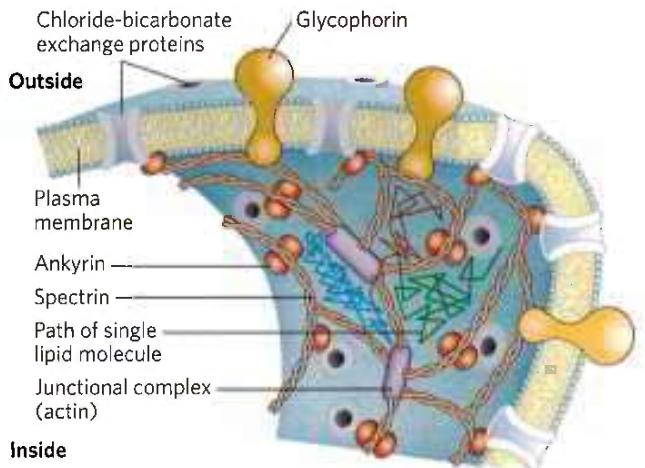  
FIGURE 11-21 Restricted motion of the erythrocyte chloride-bicarbonate exchanger and glycophorin. The proteins span the membrane and are tethered to spectrin, a cytoskeletal protein, by another protein, ankyrin, limiting their lateral mobility. Ankyrin is anchored in the membrane by a covalently bound palmitoyl side chain (see Fig. 11-16). Spectrin, a long, filamentous protein, is cross-linked at junctional complexes containing actin. A network of cross-linked spectrin molecules attached to the cytoplasmic face of the plasma membrane stabilizes the membrane, making it resistant to deformation. This network of anchored membrane proteins may form the "corral" suggested by the experiment shown in Figure 11-20; the lipid tracks shown here are confined to different regions defined by the tethered membrane proteins. Occasionally a lipid molecule (green track) jumps from one corral to another (blue track), then another (red track).

Lipid rafts are remarkably enriched in two classes of integral proteins, with two specific types of covalently attached lipids. The integral proteins of one class have two long-chain saturated fatty acids (two palmitoyl groups, or a palmitoyl and a myristoyl group) covalently attached through Cys residues. Caveolin is one such protein; there are many others. Those of the second class, the GPI-anchored proteins, have a glycosyl phosphatidylinositol on their carboxyl-terminal residue (Fig. 11-16). Presumably, these lipid anchors, like the long, saturated acyl chains of sphingolipids, form more stable associations with the cholesterol and long acyl groups in rafts than they form with the surrounding phospholipids. (It is notable that other lipid-linked proteins, those with covalently attached isoprenyl groups such as farnesyl, are not preferentially associated with the outer leaflet of sphingolipid rafts; see Fig. 11-22.) The "raft" and "sea" domains of the plasma membrane are not rigidly separated; membrane proteins can move into and out of lipid rafts in a fraction of a second. But in the shorter time scale (microseconds) more relevant to many membrane-mediated biochemical processes, many of these proteins reside primarily in a raft.

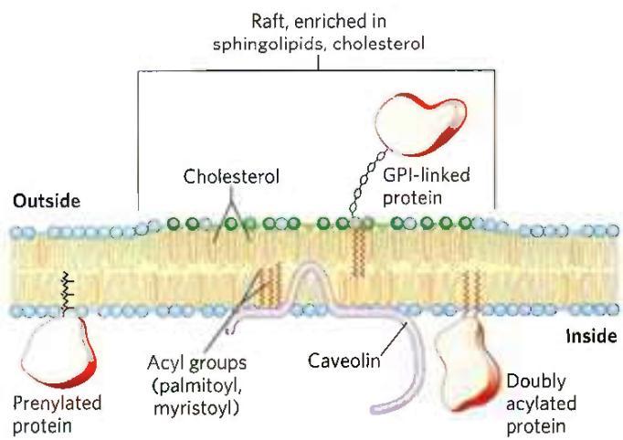  
FIGURE 11-22 Membrane microdomains (rafts). Stable associations of sphingolipids and cholesterol in the outer leaflet produce a microdomain, slightly thicker than other membrane regions, that is enriched with specific types of membrane proteins. GPI-anchored proteins are prominent in the outer leaflet of these rafts, and proteins with one or several covalently attached long-chain acyl groups are common in the inner leaflet. Inwardly curved rafts called caveolae are especially enriched in proteins called caveolins (see Fig. 11-23).

The approximate fraction of the cell surface occupied by rafts can be as high as 50% in some cases; the rafts cover half of the ocean. Indirect measurements in cultured fibroblasts suggest a diameter of roughly 50 nm for an individual raft, which corresponds to a patch containing a few thousand sphingolipids and perhaps 10 to 50 membrane proteins. Because most cells express more than 50 different kinds of plasma membrane proteins, it is likely that a single raft contains only a subset of membrane proteins and that this segregation of membrane proteins is functionally significant. Their presence in a single raft would hugely increase the likelihood of their collision. Certain membrane receptors and signaling proteins, for example, seem to be segregated together in membrane rafts. Experiments show that signaling through these proteins can be disrupted by manipulations that deplete the plasma membrane of cholesterol and destroy lipid rafts.

Plasma membranes of many cells have specialized rafts called caveolae ("little caves"), which can represent about half of the total area of the plasma membrane (Fig. 11-23a). Closely associated with caveolae is caveolin, an integral protein with two globular domains connected by a hairpin-shaped hydrophobic domain that binds the protein to the cytoplasmic leaflet of the plasma membrane (Fig. 11-23b). Three palmitoyl groups attached to the carboxyl-terminal globular domain further anchor the protein to the membrane. Caveolins form dimers and associate with cholesterol-rich regions in the membrane. The presence of caveolin dimers forces the associated lipid bilayer to curve inward, forming caveolae. Caveolae involve both leaflets of the bilayer—the cytoplasmic leaflet, from which the caveolin globular domains project, and the extracellular leaflet, a cholesterol and sphingolipid raft with associated GPI-anchored proteins. Caveolae are implicated in a variety of cellular functions, including membrane trafficking within cells and the transduction of external signals into cellular responses.

Caveolae may also provide a means of expanding the cell surface. The lipid bilayer itself is not elastic, but if existing caveolae lose their associated caveolin as the result of a regulatory signal, the caveolae flatten into the plasma membrane (Fig. 11-23c). The effect is to add surface area, allowing the cell to expand without bursting in response to osmotic or other stress.

  
FIGURE 11-23 Caveolin forces inward curvature of a membrane. (a) Caveolae are small invaginations in the plasma membrane. (b) Cartoon showing the location and role of a caveolin dimer in causing inward membrane curvature. Each caveolin monomer has a central hydrophobic domain and three long-chain acyl groups (red), which hold the molecule to the inside of the plasma membrane. When several caveolin dimers are concentrated in a small region (a raft), they force a curvature in the lipid bilayer, forming a caveola. Cholesterol molecules in the bilayer are shown in orange. (c) Flattening of caveolae allows the plasma membrane to expand in response to various stresses. [Information from R. G. Parton, Nat. Rev. Mol. Cell Biol. 8:185–194, 2007.]

#### [EN] Membrane Curvature and Fusion Are Central to Many Biological Processes

Caveolins are not unique in their ability to induce curvature in membranes. P2 Changes of curvature are central to one of the most remarkable features of biological membranes: their ability to undergo fusion with other membranes without losing their continuity. Within the eukaryotic endomembrane system, the membranous compartments constantly reorganize. Vesicles bud from the ER to carry newly synthesized lipids and proteins to other organelles and to the plasma membrane. Exocytosis, endocytosis, cell division, fusion of egg and sperm cells, and entry of a membrane-enveloped virus into a host cell all involve a membrane reorganization that requires the fusion of two membrane segments without loss of continuity (Fig. 11-24). Most of these processes begin with a local increase in membrane curvature.

Cardiolipin, present primarily in mitochondrial membranes of eukaryotes, but also a major component of the membrane lipids of bacteria, can create or recognize membrane curvature. It is cone-shaped—its head group is small relative to its four fatty acyl chains—so it can act as a wedge in the monolayer, contracting that monolayer relative to the other.

  
FIGURE 11-24 Membrane fusion. The fusion of two membranes is central to a variety of cellular processes involving organelles and the plasma membrane.

Membrane curvature is the result. In E. coli, cardiolipin is highly localized at the two poles of the rod-shaped cell, where its curvature is sharpest. It seems very likely that other membrane lipids will be found to influence local curvature of the bilayer.

A protein that is intrinsically curved may force a bilayer to curve by binding to it (Fig. 11-25); the binding energy provides the driving force for the increase in bilayer curvature. Alternatively, multiple subunits of a scaffold protein may assemble into curved supramolecular complexes and stabilize curves that spontaneously form in the bilayer. For example, a superfamily of proteins containing BAR domains (named for the first three members of the family that were identified: BIN1, amphiphysin, and RVS167) can assemble into a crescent-shaped scaffold that binds to the membrane surface, forcing or favoring membrane curvature. BAR domains consist of coiled coils that form long, thin, curved dimers with a positively charged concave surface that tends to form ionic interactions with the negatively charged head groups of membrane lipids $\mathrm{PIP}_2$ and $\mathrm{PIP}_3$ . The enzymatic formation of these inositol lipids can tag a plasma membrane area for creation of inward curvature by a BAR protein (Fig. 11-25). Some of these BAR proteins also have an amphipathic helix (having one polar face and one hydrophobic face; see Fig. 11-32) that inserts like a wedge into one leaflet of the bilayer, expanding its area relative to the other leaflet and thereby forcing curvature. Such a protein might also serve as a detector of preexisting membrane curvature due to differences in lipid composition of two leaflets of a bilayer.

Septins make up a family of GTP-binding proteins (14 genes in humans) that polymerize at curved regions of the plasma membrane and participate in cellular processes such as cell division, exocytosis, phagocytosis, and apoptosis. All septins have an amphipathic helix that can submerge its hydrophobic side in one leaflet of the bilayer, forcing one leaflet of the bilayer to expand laterally, either causing or sensing local curvature in the membranes. Studies of cells with mutations in this helix show its biological importance in vesicle trafficking and neurotransmitter release.

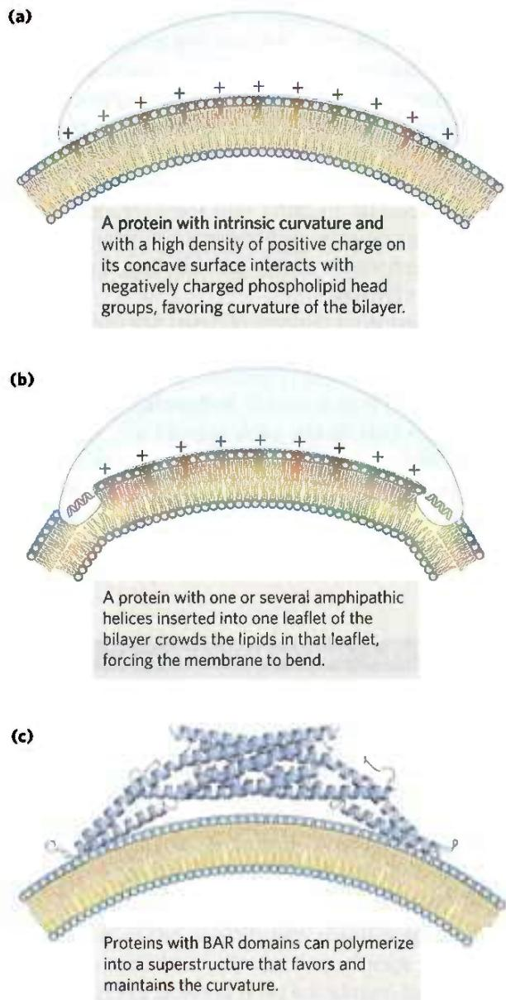  
FIGURE 11-25 Three models for protein-induced curvature of membranes. [Information from (a, b) B. Qualmann et al., EMBO J. 30:3501, 2011, Fig. 1; (c) B. J. Peter et al., Science 303:495, 2004, Fig. 1A.]

Specific fusion of two membranes requires mediation by fusion proteins. Fusion proteins ensure (1) that the two membranes recognize each other; (2) that their surfaces become closely apposed, which requires removal of the water molecules normally associated with the polar head groups of lipids; (3) that their bilayer structures become locally disrupted, resulting in fusion of the outer leaflets of the two membranes (hemifusion); and (4) that their bilayers fuse to form a single continuous bilayer. The fusion occurring in receptor-mediated endocytosis, or regulated secretion, also requires (5) that the process is triggered at the appropriate time or in response to a specific signal. Fusion proteins mediate these events, bringing about specific recognition and a transient local distortion of the bilayer structure that favors membrane fusion. (Note that these fusion proteins are unrelated to the products encoded by two fused genes, also called fusion proteins, discussed in Chapter 9.)

A well-studied example of membrane fusion occurs at synapses, when intracellular (neuronal) vesicles loaded with neurotransmitter fuse with the plasma membrane. Yeast cells provide another experimentally accessible system in which vesicles fuse with the plasma membrane, releasing their secretion products. Both processes involve a family of proteins called SNAREs (snap receptors; Fig. 11-26). SNAREs in the cytoplasmic face of the intracellular vesicle are called v-SNAREs (v for vesicle); those in the target membrane with which the vesicle fuses (the plasma membrane during exocytosis) are t-SNAREs (t for target). The protein NSF (N-ethylmaleimide sensitive factor) regulates the interactions among SNAREs. During fusion, a v-SNARE and a t-SNARE bind to each other and undergo a structural change that produces a bundle of long, thin rods made up of helices from both SNAREs and two helices from the protein SNAP25 (Fig. 11-26). The two SNAREs initially interact at their ends, then zip up into the bundle of helices. This structural change pulls the two membranes into contact and initiates the fusion of their lipid bilayers. An alternative designation of SNARE types is based on structural features of the proteins: R-SNAREs have an Arg residue critical to their function, and Q-SNAREs have a critical Gln residue. Typically, R-SNAREs act as v-SNAREs, and Q-SNAREs act as t-SNAREs.

The complex of SNAREs and SNAP25 is the target of several powerful neurotoxins. Clostridium botulinum toxin is a bacterial protease that cleaves specific bonds in SNARE proteins, preventing neurotransmission and causing paralysis and death. Because of its very high specificity for these proteins, purified botulinum toxin has served as a powerful tool for dissecting the mechanism of neurotransmitter release in vivo and in vitro. Used in small amounts, botulinum toxin (Botox) is used in medicine to treat disorders of eye and neck muscles, as well as cosmetically for the removal of skin wrinkles. Tetanus toxin, produced by the bacterium Clostridium tetani, also is a protease with high specificity for SNARE proteins. It causes painful muscle spasms and rigidity of voluntary muscles—hence the characteristic symptom “lockjaw.”

#### [EN] Integral Proteins of the Plasma Membrane Are Involved in Surface Adhesion, Signaling, and Other Cellular Processes

Several families of integral proteins in the plasma membrane provide specific points of attachment between cells or between a cell and proteins of the extracellular matrix. Integrins are surface adhesion proteins that mediate a cell's interaction with the extracellular matrix and with other cells, including some pathogens.

Cytosol

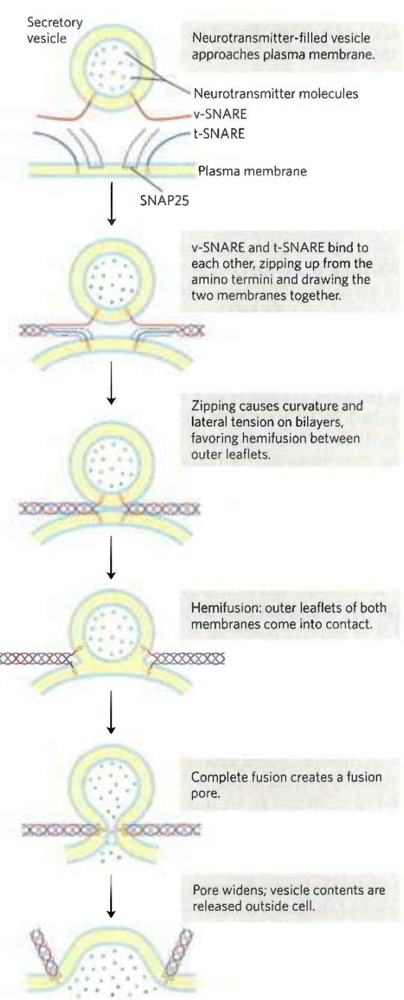  
FIGURE 11-26 Membrane fusion during neurotransmitter release at a synapse. The secretory vesicle membrane contains the v-SNARE synaptobrevin (red). The target (plasma) membrane contains the t-SNAREs syntaxin (blue) and SNAP25 (violet). When a local increase in $\left[\mathrm{Ca}^{2+}\right]$ signals release of neurotransmitter, the v-SNARE, SNAP25, and t-SNARE interact, forming a coiled bundle of four $\alpha$ helices, pulling the two membranes together and disrupting the bilayer locally. This leads first to hemifusion, joining the outer leaflets of the two membranes, then to complete membrane fusion and neurotransmitter release. When fusion is complete, the SNARE complex is disassembled. [Information from Y. A. Chen and R. H. Scheller, Nat. Rev. Mol. Cell Biol. 2:98, 2001.]

Integrins also carry signals in both directions across the plasma membrane, integrating information about the extracellular and intracellular environments. All integrins are heterodimeric proteins composed of two unlike subunits, $\alpha$ and $\beta$ , each anchored to the plasma membrane by a single transmembrane helix. The large extracellular domains of the $\alpha$ and $\beta$ subunits combine to form a specific binding site for extracellular proteins such as collagen and fibronectin, which contain a common determinant of integrin binding, the sequence Arg–Gly–Asp (RGD).

Other plasma membrane proteins involved in surface adhesion are the cadherins, which undergo homophilic ("with the same kind") interactions with identical cadherins in an adjacent cell. Selectins have extracellular domains that, in the presence of $\mathrm{Ca^{2+}}$ , bind specific polysaccharides on the surface of an adjacent cell. Selectins are present primarily in the various types of blood cells and in the endothelial cells that line blood vessels (see Fig. 7-29). They are an essential part of the blood-clotting process.

#### [EN] SUMMARY 11.2 Membrane Dynamics

■ Lipids in a biological membrane can exist in liquid-ordered or liquid-disordered states. Membrane fluidity is affected by temperature, fatty acid composition, and sterol content.

\- Flip-flop diffusion of lipids between the inner and outer leaflets of a membrane occurs only when the diffusion is specifically catalyzed by flippases, floppases, scramblases, or PI transporters.

■ Proteins and lipids can diffuse laterally within the plane of the membrane, but this mobility is limited by interactions of membrane proteins with internal cytoskeletal structures and interactions of lipids with lipid rafts.

One class of lipid rafts is enriched for sphingolipids and cholesterol with a subset of membrane proteins that are GPI-linked or attached to several long-chain fatty acyl moieties. Caveolins are integral proteins that associate with the inner leaflet of the plasma membrane, forcing it to curve inward to form caveolae, which are involved in membrane transport, signaling, and the expansion of plasma membranes.

■ Proteins containing BAR domains cause local membrane curvature and mediate the fusion of two membranes, which accompanies processes such as endocytosis, exocytosis, and viral invasion. Septins are proteins that sense or cause membrane curvature. Membrane fusion depends on SNARE proteins, which draw two membranes close together and favor fusion.

■ Integrins, cadherins, and selectins are transmembrane proteins of the plasma membrane that act both to attach cells to each other and to carry messages between the extracellular matrix and the cytoplasm.

<!-- EN-END 11.2 -->

<!-- EN-BEGIN 11.3 -->

### 【英文对应 11.3】Solute Transport across Membranes

> 来源：Lehninger Principles of Biochemistry（书籍/02_生物化学原理） 第11章 Biological Membranes and Transport，§11.3。对应本章“五、生物膜的组成和结构”。

Every living cell must acquire from its surroundings the raw materials for biosynthesis and for energy production, and must release the byproducts of metabolism to its environment; both processes require that small compounds or inorganic ions cross the plasma membrane. Within the eukaryotic cell, different compartments have different concentrations of ions and of metabolic intermediates and products, and these, too, must move across intracellular membranes in tightly regulated processes.

P3 A few nonpolar compounds can dissolve in the lipid bilayer and cross a membrane unassisted, but for any polar compound or ion, a specific membrane protein carrier is essential. Approximately 2,000 genes in the human genome encode proteins that function in transporting solutes across membranes. In some cases, a membrane protein simply facilitates the diffusion of a solute down its concentration gradient; but transport can also occur against a gradient of concentration, electrical potential, or both, and in these cases, as we shall see, the transport process requires energy. Ions may also diffuse across membranes via ion channels formed by proteins, or they may be carried across by ionophores, small molecules that mask the charge of ions and allow them to diffuse through the lipid bilayer. Figure 11-27 summarizes the various types of transport mechanisms discussed in this section.

#### [EN] Transport May Be Passive or Active

When two aqueous compartments containing unequal concentrations of a soluble compound or ion are separated by a permeable divider (membrane), the solute moves by simple diffusion from the region of higher concentration, through the membrane, to the region of lower concentration, until the two compartments have equal solute concentrations (Fig. 11-28a). When ions of opposite charge are separated by a permeable membrane, there is a transmembrane electrical gradient, a membrane potential, $V_{\mathrm{m}}$ (expressed in millivolts). This membrane potential produces a force opposing ion movements that increase $V_{\mathrm{m}}$ and driving ion movements that reduce $V_{\mathrm{m}}$ (Fig. 11-28b). Thus, the direction in which a charged solute tends to move spontaneously across a membrane depends on both the chemical gradient (the difference in solute concentration) and the electrical gradient ( $V_{m}$ ) across the membrane. Together these two factors are referred to as the electrochemical gradient or electrochemical potential. This behavior of solutes is in accord with the second law of thermodynamics: molecules tend to spontaneously assume the distribution of greatest randomness and lowest energy.

FIGURE 11-28 Movement of solutes across a permeable membrane. (a) Net movement of an electrically neutral solute is toward the side of lower solute concentration until equilibrium is achieved. The solute concentrations on the left and right sides of the membrane, as shown here, are designated $C_1$ and $C_2$ . The rate of transmembrane solute movement (indicated by the arrows) is proportional to the concentration ratio. (b) Net movement of an electrically charged solute is dictated by a combination of the electrical potential ( $V_m$ ) and the ratio of chemical concentrations ( $C_2 / C_1$ ) across the membrane; net ion movement continues until this electrochemical potential reaches zero.  
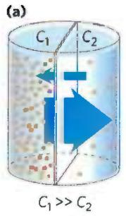  
Before equilibrium Net flux

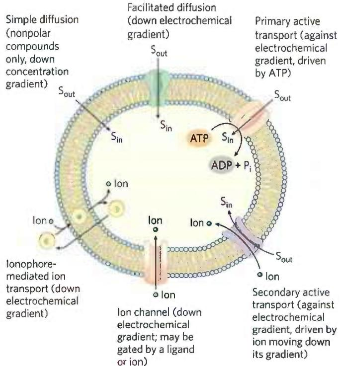  
FIGURE 11-27 Summary of transporter types. Some types (ionophores, ion channels, and passive transporters) simply speed transmembrane movement of solutes (S) down their electrochemical gradients, whereas others (active transporters) can pump solutes against a gradient, using ATP or a gradient of a second solute to provide the energy.

Membrane proteins that act by increasing the rate of solute movement across membranes are called transporters or carriers. P3 Transporters are of two general types: passive and active. Passive transporters simply facilitate movement down a concentration gradient, increasing the transport rate. This process is called passive transport or facilitated diffusion. Active transporters (sometimes called pumps) can move substrates across a membrane against a concentration gradient or an electrical potential, a process called active transport. Primary active transporters use energy provided directly by a chemical reaction; secondary active transporters couple uphill transport of one substrate with downhill transport of another.

  
At equilibrium No net flux

(b)  
  
Before equilibrium

  
At equilibrium

#### [EN] Transporters and Ion Channels Share Some Structural Properties but Have Different Mechanisms

To pass through a lipid bilayer, a polar or charged solute must first give up its interactions with the water molecules in its hydration shell, then diffuse about 3 nm (30 Å) through a substance (lipid) in which it is poorly soluble (Fig. 11-29a). The energy used to strip away the hydration shell and to move the polar compound from water into lipid, then through the lipid bilayer, is regained as the compound leaves the membrane on the other side and is rehydrated. However, the intermediate stage of transmembrane passage is a high-energy state comparable to the transition state in an enzyme-catalyzed chemical reaction. In both cases, an activation barrier must be overcome to reach the intermediate stage (Fig. 11-29; compare with Fig. 6-3). The energy of activation ( $\Delta G^{\ddagger}$ ) for translocation of a polar solute across the bilayer is so large that pure lipid bilayers are virtually impermeable to polar and charged species on time scales relevant to cell growth and division.

  
FIGURE 11-29 Energy changes accompanying passage of a hydrophilic solute through the lipid bilayer of a biological membrane. (a) In simple diffusion, removal of the hydration shell is highly endergonic, and the energy of activation ( $\Delta G^{\ddagger}$ ) for diffusion through the bilayer is very high. (b) A transporter protein reduces the $\Delta G^{\ddagger}$ for transmembrane diffusion of the solute. It does this by forming noncovalent interactions with the dehydrated solute to replace the hydrogen bonding with water and by providing a hydrophilic transmembrane pathway.

P3 Membrane proteins lower the activation energy for transport of polar compounds and ions by providing an alternative path across the membrane for specific solutes. Lowering the activation energy greatly increases the rate of transmembrane movement (recall Eqn 6-6, p. 182). Transporters are not enzymes in the usual sense; their "substrates" are moved from one compartment to another but are not chemically altered. Like enzymes, however, transporters bind their substrates with stereochemical specificity through multiple weak, noncovalent interactions. The negative free-energy change associated with these weak interactions, $\Delta G_{\text{binding}}$ , counterbalances the positive free-energy change that accompanies loss of the water of hydration from the substrate, $\Delta G_{\text{dehydration}}$ , thereby lowering $\Delta G^{\ddagger}$ for transmembrane passage (Fig. 11-29b). Transporter proteins span the lipid bilayer several times, forming a transmembrane pathway lined with hydrophilic amino acid side chains. The pathway provides an alternative route for a specific substrate to move across the lipid bilayer without its having to dissolve in the bilayer, further lowering $\Delta G^{\ddagger}$ for transmembrane diffusion. The result is an orders-of-magnitude increase in the substrate's rate of passage across the membrane.

Ion channels use a different mechanism than transporters to move inorganic ions across membranes. P3 Ion channels speed the passage of ions across membranes by providing an aqueous path across the membrane through which inorganic ions can diffuse at very high rates. Most ion channels have a "gate" (Fig. 11-30a) regulated by a biological signal. When the gate is open, ions move across the membrane, through the channel, in the direction dictated by the ion's charge and the electrochemical gradient. Movement occurs at rates approaching the limit of unhindered diffusion (tens of millions of ions per second per channel—much higher than typical transporter rates). Ion channels typically show some specificity for an ion, but they are not saturable with their ion substrate. Flow through a channel stops either when the gating mechanism is closed (again, by a biological signal) or when there is no longer an electrochemical gradient providing the driving force for the movement. In contrast, transporters, which bind their "substrates" with high stereospecificity, catalyze transport at rates well below the limits of free diffusion, and they are saturable in the same sense as are enzymes: there is some substrate concentration above which further increases will not produce a greater rate of transport. Transporters have a gate on either side of the membrane, and the two gates are never open at the same time (Fig. 11-30b).

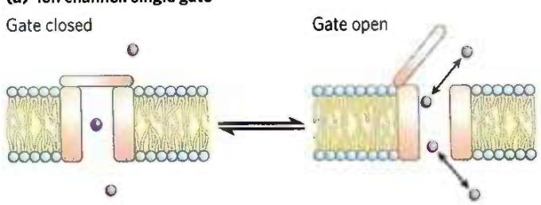

(b) Transporter (pump): alternating gates  
  
FIGURE 11-30 Differences between channels and transporters. (a) Ion channels have a transmembrane pore that is either open or closed, depending on the position of the single gate. When the gate is open, ions move through at a rate limited only by the maximum rate of diffusion. (b) Transporters have two gates, and both are never open at the same time. Movement of a substrate (an ion or a small molecule) through the membrane is therefore limited by the time needed for one gate to open and close (on one side of the membrane) and the second gate to open. Rates of movement through ion channels can be orders of magnitude greater than rates through transporters, but channels simply allow the ion to flow down the electrochemical gradient, whereas active transporters (pumps) can move a substrate against its concentration gradient. [Information from D. C. Gadsby, Nat. Rev. Mol. Cell Biol. 10:344, 2009, Fig. 1.]

Both transporters and ion channels constitute large families of proteins, defined not only by their primary sequences but also by their secondary structures. We next consider some well-studied representatives of the main transporter and channel families. You will also encounter some of these in Chapter 12 when we discuss transmembrane signaling, and some in later chapters in the context of the metabolic pathways in which they participate.

#### [EN] The Glucose Transporter of Erythrocytes Mediates Passive Transport

Energy-yielding metabolism in erythrocytes depends on a constant supply of glucose from the blood plasma, where the glucose concentration is maintained at about 4.5 to 5 mm. Glucose enters the erythrocyte by passive transport via a specific glucose transporter called GLUT1, at a rate about 50,000 times greater than it could cross the membrane unassisted.

P3 The process of glucose transport can be described by analogy with an enzymatic reaction in which the "substrate" is glucose outside the cell (S $_{out}$ ), the "product" is glucose inside the cell (S $_{in}$ ), and the "enzyme" is the transporter, T. When the initial rate of glucose uptake is measured as a function of external glucose concentration (Fig. 11-31), the resulting plot is hyperbolic: at high external glucose concentrations, the rate of uptake approaches $V_{max}$ . Formally, such a transport process can be described by the set of equations

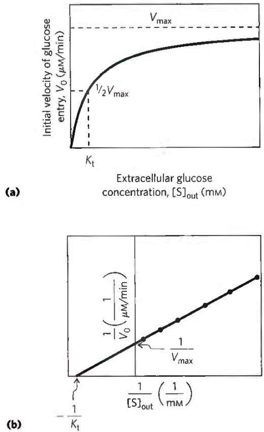  
FIGURE 11-31 Kinetics of glucose transport into erythrocytes. (a) The initial rate of glucose entry into an erythrocyte, $V_0$ , depends on the initial concentration of glucose on the outside, $[S]_{\text{out}}$ . (b) Double-reciprocal plot of the data in (a). The kinetics of passive transport is analogous to the kinetics of an enzyme-catalyzed reaction. (Compare these plots with Figs 6-12 and 6-14.) $K_t$ is analogous to $K_m$ , the Michaelis constant.

$$
\begin{array}{r l} & {\mathbf {S} _ {\mathrm{out}} + \mathbf {T} _ {1} \xrightarrow [ k _ {- 1} ]{k _ {1}} \mathbf {S} _ {\mathrm{out}} \cdot \mathbf {T} _ {1}} \\ & {\quad k _ {- 4} \Big | \Big | k _ {4} \qquad \qquad k _ {- 2} \Big | \Big | k _ {2}} \\ & {\quad \mathbf {S} _ {\mathrm{in}} + \mathbf {T} _ {2} \xrightarrow [ k _ {- 3} ]{k _ {3}} \mathbf {S} _ {\mathrm{in}} \cdot \mathbf {T} _ {2}} \end{array}
$$

in which $k_{1}$ , $k_{-1}$ , and so forth are the forward and reverse rate constants for each step; $T_{1}$ is the transporter conformation in which the glucose-binding site faces outward (in contact with blood plasma), and $T_{2}$ is the conformation in which it faces inward. Given that every step in this sequence is reversible, the transporter is, in principle, equally able to move glucose into or out of the cell. As for enzyme assays, this transporter assay measures the initial rate of uptake, when the product concentration (glucose concentration inside the cell) is zero, while the substrate concentration (glucose on the outside) is varied. In the living cell, GLUT1 accelerates the movement of glucose down its concentration gradient, which normally means into the cell. Glucose that enters a cell is generally metabolized immediately, and the intracellular glucose concentration is thereby kept low relative to its concentration in the blood.

The rate equations for glucose transport can be derived exactly as for enzyme-catalyzed reactions (Chapter 6), yielding an expression analogous to the Michaelis-Menten equation

$$
V _ {0} = \frac {V _ {\mathrm{max}} [ \mathrm{S} ] _ {\mathrm{out}}}{K _ {\mathrm{t}} + [ \mathrm{S} ] _ {\mathrm{out}}}\tag{11-1}
$$

in which $V_{0}$ is the initial velocity of accumulation of glucose inside the cell when its concentration in the surrounding medium is $[S]_{out}$ , and $K_{t}$ ( $K_{transport}$ ) is a constant analogous to the Michaelis constant, a combination of rate constants that is characteristic of each transport system. This equation describes the initial velocity, the rate observed when $[S]_{in}=0$ . As is the case for enzyme-catalyzed reactions, the slope-intercept form of the equation describes a linear plot of $1/V_{0}$ against $1/[S]_{out}$ , from which we can obtain values of $K_{t}$ and $V_{max}$ (Fig. 11-31b). When $[S]_{out}=K_{t}$ , the rate of uptake is $\frac{1}{2}V_{max}$ ; the transport process is half-saturated. The concentration of glucose in blood, as noted above, is 4.5 to 5 mm, which is close enough to the $K_{t}$ to ensure that GLUT1 is half-saturated with substrate and operates near one-half $V_{max}$ .

Because no chemical bonds are made or broken in the conversion of $S_{out}$ to $S_{in}$ , neither “substrate” nor “product” is intrinsically more stable, and the process of entry is therefore fully reversible. As $[S]_{in}$ approaches $[S]_{out}$ , the rates of entry and exit become equal. Such a system is therefore incapable of accumulating glucose within a cell at concentrations above that in the surrounding medium; it simply equilibrates glucose on the two sides of the membrane much faster than would occur in the absence of a specific transporter. GLUT1 is specific for D-glucose, with a $K_{t}$ of about 6 mm. For the close analogs D-mannose and D-galactose, which differ only in the position of one hydroxyl group, the values of $K_{t}$ are 20 mm and 30 mm, respectively, and for L-glucose, $K_{t}$ exceeds 3,000 mm. Thus, GLUT1 shows the three hallmarks of passive transport: high rates of diffusion down a concentration gradient, saturability, and stereospecificity.

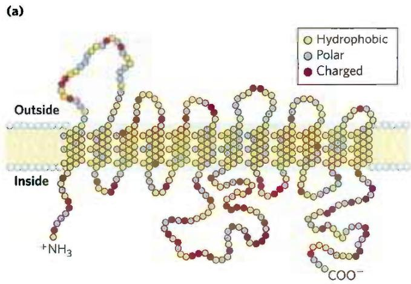  
FIGURE 11-32 Membrane topology of the glucose transporter GLUT1. (a) Transmembrane helices are represented here as oblique (angled) rows of three or four amino acid residues, each row depicting one turn of the $\alpha$ helix. Of the 12 helices, 9 contain three or more polar or charged residues (blue or red), often separated by several hydrophobic residues (yellow). (b) A helical wheel diagram shows the distribution of polar and nonpolar residues on the surface of a helical segment. The helix is diagrammed as though observed along its axis from the amino terminus. Adjacent residues in the linear sequence are

GLUT1 is an integral protein with 12 hydrophobic segments, each forming a membrane-spanning helix (Fig. 11-32a). The helices that line the transmembrane path for glucose are amphipathic; for each helix, the residues along one side are predominantly nonpolar, and those on the other side are mainly polar. This amphipathic structure is evident in a helical wheel diagram (Fig. 11-32b). A cluster of amphipathic helices are arranged so that their polar sides face each other and line a hydrophilic pore through which glucose can pass (Fig. 11-32c), while their hydrophobic sides interact with the surrounding membrane lipids such that the hydrophobic effect stabilizes the entire transporter structure.

Structural studies of mammalian GLUT1 and other GLUT transporters suggest that the protein cycles through a series of conformational changes, interconverting a form (T₁) with its glucose-binding site accessible only from the extracellular side, through a form in which the bound glucose is sequestered and inaccessible from either side, to a form (T₂) with the glucose-binding site open only to the intracellular side (Fig. 11-33).

(b)  
(c)  

connected, and each residue is placed around the wheel in the position it occupies in the helix; recall that 3.6 residues are required to make one complete turn of the $\alpha$ helix. In this example, the polar residues (blue) are on one side of the helix, and the hydrophobic residues (yellow) are on the other. This is, by definition, an amphipathic helix. (c) Side-by-side association of amphipathic helices, each with its polar face oriented toward the central cavity, produces a transmembrane channel lined with polar (and charged) residues, available for interaction with glucose. [Information from (a, c) M. Mueckler, Eur. J. Biochem. 219:713, 1994.]  

Information on localization from M. Mueckler and B. Thorens, Mol. Aspects Med. 34:121, 2013. $K_{1}$ values for glucose from R. Augustin, IUBMB Life 62:315, 2010. $^{a}$ Dash indicates role uncertain. $^{b}K_{m}$ for fructose. $^{c}K_{m}$ for 2-deoxyglucose.

  
FIGURE 11-33 Model of glucose transport into erythrocytes by GLUT1. (a) The transporter exists in two extreme conformations: $T_1$ , with the glucose-binding site exposed on the outer surface of the plasma membrane, and $T_2$ , with the binding site exposed on the inner surface. Glucose transport occurs in four steps. ① Glucose in blood plasma binds to a stereospecific site on $T_1$ ; this lowers the activation energy for ② a conformational change from glucose $_{\text{out}}$ • $T_1$ to glucose $_{\text{in}}$ • $T_2$ , effecting transmembrane passage of the glucose. ③ Glucose is released from $T_2$ into the cytoplasm, and ④ the transporter returns to the $T_1$ conformation, ready to transport another glucose molecule. Between the forms $T_1$ and $T_2$ , there is an intermediate form (not shown here) in which glucose is sequestered within the transporter, with access to neither side. The structures of (b) human GLUT3 in the $T_1$ conformation and (c) human GLUT1 in the $T_2$ conformation, determined by x-ray crystallography, support the model shown in (a). [Data from (b) PDB ID 4ZWC, D. Deng et al., Nature 526:391, 2015; (c) PDB ID 4PYP, D. Deng et al., Nature 510:121, 2014.]

Twelve passive glucose transporters are encoded in the human genome, each with its unique kinetic properties, patterns of tissue distribution, and function (Table 11-1). GLUT1, in addition to supplying glucose to erythrocytes, also transports glucose across the blood-brain barrier, supplying the glucose that is essential for normal brain metabolism. The very rare individuals with defects in GLUT1 have a variety of brain-related symptoms, including seizures, movement and language disorders, and developmental delays. Standard care for such individuals includes a ketogenic diet, which provides the ketones that can serve as an alternative energy source for the brain. In the liver, GLUT2 transports glucose out of hepatocytes when liver glycogen is broken down to replenish blood glucose. GLUT2 has a large $K_{\mathrm{t}}(\geq 17 \mathrm{~mm})$ and can therefore respond to increased levels of intracellular glucose (produced by glycogen breakdown) by increasing outward transport. Skeletal and heart muscle and adipose tissue have yet another glucose transporter, GLUT4 ( $K_{\mathrm{t}} = 5 \mathrm{~mm}$ ), which is distinguished by its response to insulin: its activity increases when insulin signals a high blood glucose concentration, thus increasing the rate of glucose uptake into muscle and adipose tissue. Box 11-1 describes the effect of insulin on this transporter.

#### [EN] The Chloride-Bicarbonate Exchanger Catalyzes Electroneutral Cotransport of Anions across the Plasma Membrane

The erythrocyte contains another passive transport system, an anion exchanger that is essential in $CO_{2}$ transport to the lungs from tissues such as skeletal muscle and liver. Waste $CO_{2}$ released from respiring tissues

<table><tr><td colspan="4">TABLE 11-1 Glucose Transporters in Humans</td></tr><tr><td>Transporter</td><td>Tissue(s) where expressed</td><td> $K_t$ (mm)</td><td>Role/characteristicsa</td></tr><tr><td>GLUT1</td><td>Erythrocytes, blood-brain barrier, placenta, most tissues at a low level</td><td>3</td><td>Basal glucose uptake; defective in De Vivo disease</td></tr><tr><td>GLUT2</td><td>Liver, pancreatic islets, intestine, kidney</td><td>17</td><td>In liver and kidney, removal of excess glucose from blood; in pancreas, regulation of insulin release</td></tr><tr><td>GLUT3</td><td>Brain (neuron), testis (sperm)</td><td>1.4</td><td>Basal glucose uptake; high turnover number</td></tr><tr><td>GLUT4</td><td>Muscle, fat, heart</td><td>5</td><td>Activity increased by insulin</td></tr><tr><td>GLUT5</td><td>Intestine (primarily), testis, kidney</td><td>6b</td><td>Primarily fructose transport</td></tr><tr><td>GLUT6</td><td>Spleen, leukocytes, brain</td><td>&gt;5</td><td>Possibly no transporter function</td></tr><tr><td>GLUT7</td><td>Small intestine, colon, testis, prostate</td><td>0.3</td><td>—</td></tr><tr><td>GLUT8</td><td>Testis, sperm acrosome</td><td>~2</td><td>—</td></tr><tr><td>GLUT9</td><td>Liver, kidney, intestine, lung, placenta</td><td>0.6</td><td>Urate and glucose transporter in liver, kidney</td></tr><tr><td>GLUT10</td><td>Heart, lung, brain, liver, muscle, pancreas, placenta, kidney</td><td>0.3c</td><td>Glucose and galactose transporter</td></tr><tr><td>GLUT11</td><td>Heart, skeletal muscle</td><td>0.16</td><td>Glucose and fructose transporter</td></tr><tr><td>GLUT12</td><td>Skeletal muscle, heart, prostate, placenta</td><td>—</td><td>—</td></tr></table>

#### [EN] Defective Glucose Transport in Diabetes

When ingestion of a carbohydrate-rich meal causes blood glucose to exceed the usual concentration between meals (about 5 mm), excess glucose is taken up by the myocytes of cardiac and skeletal muscle (which store it as glycogen) and by adipocytes (which convert it to triacylglycerols). Glucose uptake into myocytes and adipocytes is mediated by the glucose transporter GLUT4. Between meals, some GLUT4 is present in the plasma membrane, but most (90%) is sequestered in the membranes of small intracellular vesicles (Fig. 1). Insulin is released from the pancreas in response to high blood glucose, and it triggers, within minutes, the movement of these vesicles to the plasma membrane. The vesicles fuse with the membrane, bringing most of the GLUT4 molecules to the cell surface (see Fig. 12-23) and increasing the rate of glucose uptake 15-fold or more. When blood glucose levels return to normal, insulin release slows and most GLUT4 molecules are removed from the plasma membrane by endocytosis and stored in vesicles.

In type 1 (insulin-dependent) diabetes mellitus, the inability to release insulin (and thus to mobilize glucose transporters) results in low rates of glucose uptake into muscle and adipose tissue. One consequence is a prolonged period of high blood glucose after a carbohydrate-rich meal. This condition is the basis for the glucose tolerance test used to diagnose diabetes (Chapter 23).

into the blood plasma enters the erythrocyte, where it is converted to bicarbonate $HCO_{3}^{-}$ by the enzyme carbonic anhydrase. (Recall that $HCO_{3}^{-}$ is the primary buffer of blood pH; see Fig. 2-20.) The $HCO_{3}^{-}$ reenters the blood plasma for transport to the lungs (Fig. 11-34). Because $HCO_{3}^{-}$ is much more soluble in blood plasma than is $CO_{2}$ , this roundabout route increases the capacity of the blood to carry carbon dioxide from the tissues to the lungs. In the lungs, $HCO_{3}^{-}$ reenters the erythrocyte and is converted to $CO_{2}$ , which is eventually released into the lung space and exhaled. To be effective, this shuttle requires very rapid movement of $HCO_{3}^{-}$ across the erythrocyte membrane. As described in Chapter 5 (pp. 160–161), there is a second mechanism for moving $CO_{2}$ from tissue to lung, involving reversible binding of $CO_{2}$ to hemoglobin.)

The chloride-bicarbonate exchanger, also called the anion exchange (AE) protein, increases the rate of $HCO_{3}^{-}$ transport across the erythrocyte membrane more than a millionfold. Like the glucose transporter, it is a dimeric integral protein that spans the membrane 14 times. This protein mediates the simultaneous movement of two anions: for every $HCO_{3}^{-}$ ion that moves in one direction, one Cl $^{-}$ ion moves in the opposite direction, with no net transfer of charge: the exchange is electroneutral. The coupling of Cl $^{-}$ and HCO $_{3}^{-}$ movements is obligatory; in the absence of chloride, bicarbonate transport stops. In this respect, the anion exchanger is typical of those systems, called cotransport systems, that simultaneously carry two solutes across a membrane (Fig. 11-35). When, as in this case, the two substrates move in opposite directions, the process is antiport. In symport, two substrates are moved simultaneously in the same direction. Transporters that carry only one substrate, such as the erythrocyte glucose transporter, are known as uniport systems.

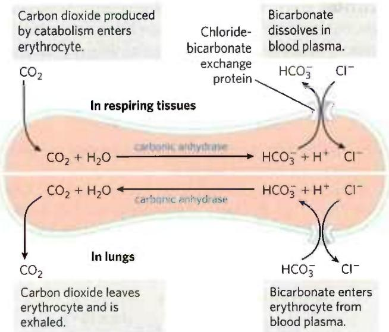  
FIGURE 11-34 Chloride-bicarbonate exchanger of the erythrocyte membrane. This cotransport system allows the entry and exit of $\mathrm{HCO_3^-}$ without changing the membrane potential. Its role is to increase the $\mathrm{CO}_{2}$ -carrying capacity of the blood. The top half of the figure illustrates the events that take place in respiring tissues; the bottom half illustrates the events in the lungs.

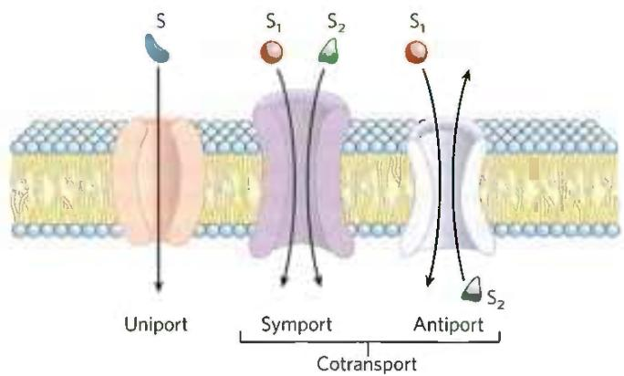  
FIGURE 11-35 Three general classes of transport systems. Transporters differ in the number of solutes (substrates) transported and the direction in which each solute moves. Examples of all three types of transporter are discussed in the text. Note that this classification tells us nothing about whether these are energy-requiring (active transport) or energy-independent (passive transport) processes.

#### [EN] Active Transport Results in Solute Movement against a Concentration or Electrochemical Gradient

P3 In passive transport, the transported species always moves down its electrochemical gradient and is not accumulated above the equilibrium concentration. Active transport, by contrast, results in the accumulation of a solute above the equilibrium point. Active transport is essential when cells function in an environment in which key substrates are present outside the cell only at very low concentrations. For example, the bacterium E. coli can grow in a medium containing only 1 $\mu$ M P $_{i}$ (inorganic phosphate), but the cell must maintain internal P $_{i}$ levels in the millimolar range. Worked Example 11-2 describes another such situation, which requires cells to pump Ca $^{2+}$ outward across the plasma membrane. Active transport is thermodynamically unfavorable (endergonic) and takes place only when coupled, directly or indirectly, to an exergonic process such as the absorption of sunlight, an oxidation reaction, the breakdown of ATP, or the concomitant flow of some other chemical species down its electrochemical gradient. In primary active transport, solute accumulation is coupled directly to an exergonic chemical reaction, such as conversion of ATP to ADP + P $_{i}$ (Fig. 11-36). Secondary active transport occurs when endergonic (uphill) transport of one solute is coupled to the exergonic (downhill) flow of a different solute that was originally pumped uphill by primary active transport.

The amount of energy needed for the transport of a solute against a gradient can be calculated from the initial concentration gradient. The general equation for the free-energy change in the chemical process that converts substrate (S) to product (P) is

$$
\Delta G = \Delta G ^ {\prime \circ} + R T \ln ([ P ] / [ S ])\tag{11-2}
$$

where $\Delta G^{\prime\circ}$ is the standard free-energy change, R is the gas constant (8.315 J/mol·K), and T is the absolute temperature. When the “reaction” is simply transport of a solute from a region where its concentration is $C_{1}$ to a region where its concentration is $C_{2}$ , no bonds are made or broken and $\Delta G^{\circ}$ is zero. The free-energy change for transport, $\Delta G_{t}$ , is then

  
FIGURE 11-36 Two types of active transport. (a) In primary active transport, the energy released by ATP hydrolysis drives solute $(S_{1})$ movement against an electrochemical gradient. (b) In secondary active transport, a gradient of an ion (designated $S_{1}$ ; often $\mathrm{Na^{+}}$ ) has been established by primary active transport. Movement of $S_{1}$ down its electrochemical gradient now provides the energy to drive cotransport of a second solute, $S_{2}$ , against its electrochemical gradient.

$$
\Delta G _ {\mathrm{t}} = R T \ln (C _ {2} / C _ {1})\tag{11-3}
$$

If there is, say, a 10-fold difference in concentration between two compartments, the cost of moving 1 mol of an uncharged solute at 25 °C uphill across a membrane separating the compartments is

$$
\begin{array}{r l} \Delta G _ {\mathrm{t}} & = (8. 3 1 5 \mathrm{J/mol} \bullet \mathrm{K}) (2 9 8 \mathrm{K}) \ln (1 0 / 1) = 5, 7 0 0 \mathrm{J/mol} \\ & = 5. 7 \mathrm{kJ/mol} \end{array}
$$

Equation 11-3 holds for all uncharged solutes.

#### [EN] WORKED EXAMPLE 11-1 Energy Cost of Pumping an Uncharged Solute

Calculate the energy cost (free-energy change) of pumping an uncharged solute against a $10^{4}$ -fold concentration gradient at $25^{\circ}$ C.

SOLUTION: Begin with Equation 11-3. Substitute $1.0 \times 10^{4}$ for $(C_{2} / C_{1})$ , 8.315 J/mol • K for $R$ , and 298 K for $T$ :

$$
\begin{array}{r l} \Delta G _ {t} & = R T \ln (C _ {2} / C _ {1}) \\ & = (8. 3 1 5 \mathrm{J/mol} \cdot \mathrm{K}) (2 9 8 \mathrm{K}) (1. 0 \times 1 0 ^ {4}) \\ & = 2 3 \mathrm{kJ/mol} \end{array}
$$

When the solute is an ion, its movement without an accompanying counterion results in the endergonic separation of positive and negative charges, producing an electrical potential; such a transport process is said to be electrogenic. The energetic cost of moving an ion depends on the electrochemical potential (Fig. 11-25), the sum of the chemical and electrical gradients:

$$
\Delta G _ {t} = R T \ln (C _ {2} / C _ {1}) + Z F \Delta \psi\tag{11-4}
$$

where Z is the charge on the ion, F is the Faraday constant (96,480 J/V·mol), and $\Delta\psi$ is the transmembrane electrical potential (in volts). Eukaryotic cells typically have plasma membrane potentials of about 0.05 V (with the inside negative relative to the outside), so the second term on the right side of Equation 11-4 can make a significant contribution to the total free-energy change for transporting an ion. Most cells maintain more than a 10-fold difference in ion concentrations across their plasma or intracellular membranes, and for many cells and tissues active transport is therefore a major energy-consuming process.

#### [EN] WORKED EXAMPLE 11-2 Energy Cost of Pumping a Charged Solute

Calculate the energy cost (free-energy change) of pumping $Ca^{2+}$ from the cytosol, where its concentration is about $1.0 \times 10^{-7}$ M, to the extracellular fluid, where its concentration is about 1.0 mM. Assume a temperature of 37 °C (body temperature in a mammal) and a standard transmembrane potential of 50 mV (inside negative) for the plasma membrane.

SOLUTION: This is a case in which energy must be expended to counter two forces acting on the ion being transported: the membrane potential and the concentration difference across the membrane. These forces are expressed in the two terms on the right side of Equation 11-4:

$$
\Delta G _ {t} = R T \ln (C _ {2} / C _ {1}) + Z F \Delta \psi
$$

in which the first term describes the chemical gradient and the second describes the electrical potential.

In Equation 11-4, substitute 8.315 J/mol·K for R, 310 K for T, $1.0 \times 10^{-3}$ for $C_{2}$ , $1.0 \times 10^{-7}$ for $C_{1}$ , +2 (the charge on a $Ca^{2+}$ ion) for Z, 96,500 J/V·mol for F, and 0.050 V for $\Delta\psi$ . Note that the transmembrane potential is 50 mV (inside negative), so the change in potential when an ion moves from inside to outside is 50 mV.

$$
\begin{array}{r l} \Delta G _ {\mathrm{t}} & = R T \ln (C _ {2} / C _ {1}) + Z F \Delta \psi \\ & = (8. 3 1 5 \mathrm{J/mol} \cdot \mathrm{K}) (3 1 0 \mathrm{K}) \ln \frac {(1 . 0 \times 1 0 ^ {- 3})}{(1 . 0 \times 1 0 ^ {- 7})} \\ & + 2 (9 6, 5 0 0 \mathrm{J/V} \cdot \mathrm{mol}) (0. 0 5 0 \mathrm{V}) \\ & = 3 3 \mathrm{kJ/mol} \end{array}
$$

The mechanism of active transport is of fundamental importance in biology. As we shall see in Chapters 19 and 20, ATP is formed in mitochondria and chloroplasts by a mechanism that is essentially ATP-driven ion transport operating in reverse. The energy made available by the spontaneous flow of protons across a membrane is calculable from Equation 11-4; remember that $\Delta G$ for flow down an electrochemical gradient has a negative value, and $\Delta G$ for transport of ions against an electrochemical gradient has a positive value.

#### [EN] P-Type ATPases Undergo Phosphorylation during Their Catalytic Cycles

The family of active transporters called P-type ATPases are cation transporters that are reversibly phosphorylated by ATP (thus the name P-type) as part of the transport cycle. Phosphorylation forces a conformational change that is central to movement of the cation across the membrane. The human genome encodes at least 70 P-type ATPases that share similarities in amino acid sequence and topology, especially near the Asp residue that undergoes phosphorylation. All are integral proteins with 8 or 10 predicted membrane-spanning regions in a single polypeptide, and all are sensitive to inhibition by the transition-state analog vanadate, which mimics phosphate when under nucleophilic attack by a water molecule.

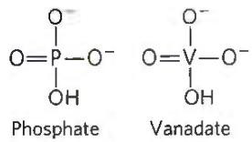

The P-type ATPases are widespread in eukaryotes and bacteria. The $Na^{+}K^{+}$ ATPase of animal cells (an antiporter for $Na^{+}$ and $K^{+}$ ions) and the plasma membrane $H^{+}$ ATPase of plants and fungi set the transmembrane

electrochemical potential in cells by establishing ion gradients across the plasma membrane. These gradients provide the driving force for secondary active transport and are also the basis for electrical signaling in neurons. In animal tissues, the sarcoplasmic/endoplasmic reticulum $Ca^{2+}$ ATPase (SERCA) pump and the plasma membrane $Ca^{2+}$ ATPase pump, which are uniporters for $Ca^{2+}$ ions, together maintain the cytosolic level of $Ca^{2+}$ below 1 $\mu$ M. The SERCA pump moves $Ca^{2+}$ from the cytosol into the lumen of the sarcoplasmic reticulum. Parietal cells in the lining of the mammalian stomach have a P-type ATPase that pumps $H^{+}$ and $K^{+}$ out of the cells and into the stomach, thereby acidifying the stomach contents. Lipid flippases, as we noted earlier, are structurally and functionally related to P-type transporters. Bacteria and eukaryotes use P-type ATPases to pump toxic heavy metal ions such as $Cd^{2+}$ and $Cu^{2+}$ out of cells.

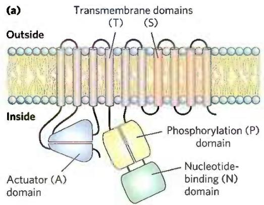

All P-type pumps have similar structures (Fig. 11-37) and similar mechanisms. The mechanism postulated for P-type ATPases takes into account the large conformational changes and the phosphorylation-dephosphorylation of the critical Asp residue in the P (phosphorylation) domain that is known to occur during a catalytic cycle. For the SERCA pump (Fig. 11-38), each catalytic cycle moves two $\mathrm{Ca^{2+}}$ ions across the membrane and converts an ATP to ADP and $\mathbf{P}_{\mathrm{i}}$ . The role of ATP binding and phosphoryl transfer to the enzyme is to bring about the interconversion of two conformations, E1 and E2, of the transporter. In the E1 conformation, the two $\mathrm{Ca^{2+}}$ -binding sites are exposed on the cytosolic side of the ER or sarcoplasmic reticulum and bind $\mathrm{Ca^{2+}}$ with high affinity. ATP binding and Asp phosphorylation drive a conformational change from E1 to E2 that exposes the $\mathrm{Ca^{2+}}$ -binding sites to the lumen and greatly reduces their affinity for $\mathrm{Ca^{2+}}$ , which releases the $\mathrm{Ca^{2+}}$ ions into the lumen. By this mechanism, the

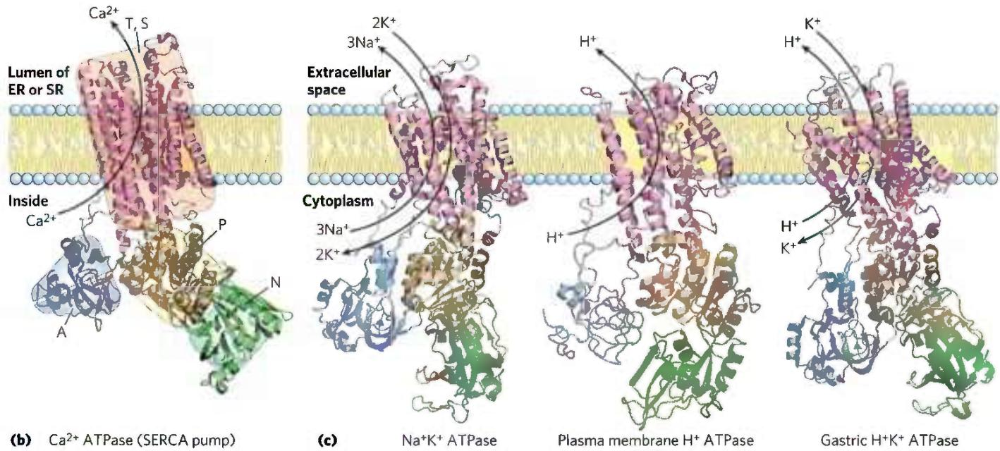  
FIGURE 11-37 The general structure of the P-type ATPases. (a) P-type ATPases have three cytoplasmic domains (A, N, and P) and two transmembrane domains (T and S) consisting of multiple helices. The N (nucleotide-binding) domain binds ATP and $\mathrm{Mg}^{2+}$ and has protein kinase activity that phosphorylates a specific Asp residue in the P (phosphorylation) domain of all P-type ATPases. The A (actuator) domain has protein phosphatase activity and removes the phosphoryl group from the Asp residue with each catalytic cycle of the pump. A transport (T) domain with six transmembrane helices includes the ion-transporting structure, and four more transmembrane helices make up the support (S) domain, which provides physical support to the transport domain and may have other specialized functions in certain P-type ATPases. The binding sites for the ions to be transported are near the middle  
of the membrane, 40 to 50 Å from the phosphorylated Asp residue — thus, Asp phosphorylation-dephosphorylation does not directly affect ion binding. The A domain communicates movements of the N and P domains to the ion-binding sites. (b) A ribbon representation of the Ca $^{2+}$ ATPase (SERCA pump). ATP binds to the N domain, and the Ca $^{2+}$ ions to be transported bind to the T domain. (c) Other P-type ATPases have domain structures, and presumably mechanisms, like those of the SERCA pump; shown here are Na $^{+}$ K $^{+}$ ATPase, the plasma membrane H $^{+}$ ATPase, and the gastric H $^{+}$ K $^{+}$ ATPase. [(a) Information from M. Bublitz et al., Curr. Opin. Struct. Biol. 20:431, 2010, Fig. 1. Data from (b) PDB ID 1SU4, C. Toyoshima et al., Nature 405:647, 2000; (c) Na $^{+}$ K $^{+}$ ATPase, PDB ID 3KDP, J. Preben Morth et al., Nature 450:1043, 2007; H $^{+}$ ATPase, PDB ID 3B8C, B. P. Pedersen et al., Nature 450:1111, 2007; H $^{+}$ K $^{+}$ ATPase, PDB ID 3IXZ, K. Abe et al., EMBO J. 28:1637, 2009, and PDB ID 3B8E, J. Preben Morth et al., Nature 450:1043, 2007.]

energy released by hydrolysis of ATP during one phosphorylation-dephosphorylation cycle drives $Ca^{2+}$ across the membrane against a large electrochemical gradient.

A variation on this basic mechanism is seen in the $Na^{+}K^{+}$ ATPase of the plasma membrane. This cotransporter couples phosphorylation-dephosphorylation of the critical Asp residue to the simultaneous movement of both $Na^{+}$ and $K^{+}$ against their electrochemical gradients. The $Na^{+}K^{+}$ ATPase is responsible for maintaining low $Na^{+}$ and high $K^{+}$ concentrations in the cell relative to the extracellular fluid (Fig. 11-39). For each molecule of ATP converted to ADP and $P_{i}$ , the transporter moves two $K^{+}$ ions inward and three $Na^{+}$ ions outward across the plasma membrane. Cotransport is therefore electrogenic, creating a net separation of charge across the membrane; in animals, this produces the membrane potential of -50 to -70 mV (inside negative relative to outside) that is characteristic of most cells and is essential to the conduction of action potentials in neurons. The central role of the $Na^{+}K^{+}$ ATPase is reflected in the energy invested in this single reaction: about 25% of the total energy consumption of a human at rest.

#### [EN] V-Type and F-Type ATPases Are ATP-Driven Proton Pumps

V-type ATPases, a class of proton-transporting ATPases, are responsible for acidifying intracellular compartments in many organisms (thus, V for vacuolar). Proton pumps of this type maintain the vacuoles of fungi and higher plants at a pH between 3 and 6, well below that of the surrounding cytosol (pH 7.5). V-type ATPases are also responsible for the acidification of lysosomes, endosomes, the Golgi complex, and secretory vesicles in animal cells. All V-type ATPases have a similar complex structure, with an integral (transmembrane) domain ( $V_{o}$ ) that serves as a proton channel and a peripheral domain ( $V_{1}$ ) that contains the ATP-binding site and the ATPase activity (Fig. 11-40a). The structure is similar to that of the well-characterized F-type ATPases.

FIGURE 11-38 Postulated mechanism of the SERCA pump. The transport cycle begins with the protein in the E1 conformation, with the Ca $^{2+}$ -binding sites facing the cytosol. ① Two Ca $^{2+}$ ions bind, then ATP binds to the transporter and ② phosphorylates Asp $^{351}$ , forming E1-P. ③ Phosphorylation favors the second conformation, E2-P, in which the Ca $^{2+}$ -binding sites, now with a reduced affinity for Ca $^{2+}$ , are accessible on the other side of the membrane (the lumen or extracellular space), and the released Ca $^{2+}$ diffuses away. ④ ADP is released, and ⑤ E2-P is dephosphorylated. ⑥ The A domain resets and ⑦ the protein returns to the E1 conformation for another round of transport. [Information from W. Kühlbrandt, Nat. Rev. Mol. Cell Biol. 5:282, 2004.]  
  
FIGURE 11-39 Role of the $\mathrm{Na^{+}K^{+}}$ ATPase in animal cells. This active transport system is primarily responsible for setting and maintaining the intracellular concentrations of $\mathrm{Na^{+}}$ and $\mathrm{K^{+}}$ in animal cells and for generating the membrane potential. It does this by moving three $\mathrm{Na^{+}}$ ions out of the cell for every two $\mathrm{K^{+}}$ ions it moves in. The electrical potential across the plasma membrane is central to electrical signaling in neurons, and the gradient of $\mathrm{Na^{+}}$ is used to drive the uphill cotransport of solutes in many cell types.

(a)  
  
FIGURE 11-40 Two proton pumps with similar structures. (a) The $V_{o}V_{1}H^{+}$ ATPase uses ATP to pump protons into vacuoles and lysosomes, creating their low internal pH. It has an integral (membrane-embedded) domain, $V_{o}$ , that includes multiple identical c subunits, and a peripheral domain that projects into the cytosol and contains the ATP-hydrolyzing sites, on three identical B subunits (purple). (b) The $F_{o}F_{1}$ ATPase/ATP synthase of mitochondria has an integral domain, $F_{o}$ , with multiple copies of the c subunit, and a

F-type ATPase transporters catalyze the uphill transmembrane passage of protons, driven by ATP hydrolysis. The "F-type" designation derives from the identification of these ATPases as energy-coupling factors. The $F_{0}$ integral membrane protein complex (Fig. 11-40b; subscript "o" denotes its inhibition by the drug oligomycin) provides a transmembrane pathway for protons, and the peripheral protein $F_{1}$ (subscript "1" indicating that this was the first of several factors isolated from mitochondria) uses the energy of ATP to drive protons uphill (into a region of higher $H^{+}$ concentration). The $F_{0}F_{1}$ organization of proton-pumping transporters must have developed very early in evolution. Bacteria such as E. coli use an $F_{0}F_{1}$ ATPase complex in their plasma membrane to pump protons outward, and archaea have a closely homologous proton pump, the $A_{0}A_{1}$ ATPase.

P3 Like all enzymes, F-type ATPases catalyze their reactions in both directions. Therefore, a sufficiently large proton gradient can supply the energy to drive the reverse reaction, ATP synthesis (Fig. 11-40b). When functioning in this direction, the F-type ATPases are more appropriately named ATP synthases. ATP synthases are central to ATP production in mitochondria during oxidative phosphorylation and in chloroplasts during photophosphorylation, as well as in bacteria and archaea. The proton gradient needed to drive ATP synthesis is produced by other types of proton pumps powered by substrate oxidation or sunlight. We provide a detailed description of these processes in Chapters 19 and 20.

  
peripheral domain, $F_{1}$ , consisting of three $\alpha$ subunits, three $\beta$ subunits, and a central shaft joined to the integral domain. $F_{0}$ and $V_{0}$ provide transmembrane channels through which protons are pumped as ATP is hydrolyzed on the $\beta$ subunits of $F_{1}$ (B subunits of $V_{i}$ ). An ATP-driven proton transporter also can catalyze ATP synthesis (red arrows) as protons flow down their electrochemical gradient. This is the central reaction in the processes of oxidative phosphorylation and photophosphorylation.

#### [EN] ABC Transporters Use ATP to Drive the Active Transport of a Wide Variety of Substrates

ABC transporters constitute a large family of ATP-driven transporters that pump amino acids, peptides, proteins, metal ions, various lipids, bile salts, and many hydrophobic compounds, including drugs, across a membrane against a concentration gradient. Many ABC transporters are located in the plasma membrane, but some are also found in the ER and in the membranes of mitochondria and lysosomes. All members of this family have two ATP-binding domains ("cassettes") that give the family its name—ATP-binding cassette transporters—and two transmembrane domains, each containing six transmembrane helices. In some cases, all these domains are in a single, long polypeptide; other ABC transporters have two subunits, each contributing a nucleotide-binding domain (NBD) and a domain with six transmembrane helices. The transport mechanism is believed to involve two forms of the transporter, one with its substrate-binding site facing the outside of the cell, the other open to substrate on the inside (Fig. 11-41). Substrates move across the membrane when the two forms interconvert, driven by ATP hydrolysis. The NBDs of all ABC proteins are similar in sequence and presumably in three-dimensional structure. They constitute the conserved molecular motor that can be coupled to a wide variety of transmembrane domains, each capable of pumping one specific substrate across a membrane. When coupled this way, the ATP-driven motor moves solutes against a concentration gradient, with a stoichiometry of about one ATP hydrolyzed per molecule of substrate transported.

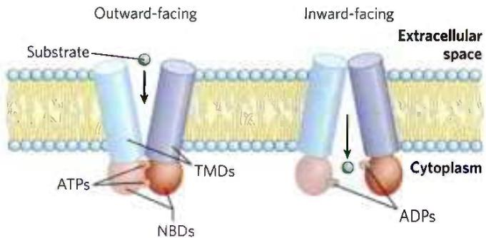  
FIGURE 11-41 ABC transporters. The protein has two homologous halves, each with a six-helix transmembrane domain (TMD; blue), and a cytoplasmic nucleotide-binding domain (NBD; red). In the mechanism proposed for the coupling of ATP hydrolysis to transport, with ATP bound to the NBD sites, substrate binds to the transporter on the cytoplasmic side. Upon substrate binding and ATP hydrolysis to ADP, a conformational change exposes the substrate to the outside surface and lowers the transporter's affinity for its substrate; substrate diffuses away from the transporter into the extracellular space. This mechanism for the coupling of ATP hydrolysis to transport is based on structures of a number of ABC transporters crystallized under different conditions. Compare this process with the model of glucose transport in Figure 11-33.

The human genome contains at least 48 genes that encode ABC transporters; a number of these are presented in Table 11-2. Some of these transporters have very high specificity for a single substrate; others are more promiscuous, able to transport drugs that cells presumably did not encounter during their evolution. Many ABC transporters are involved in maintaining the composition of the lipid bilayer, such as the floppases that move membrane lipids from one leaflet of the bilayer to the other. Many others are needed to move sterols, sterol derivatives, and fatty acids into the bloodstream for transport throughout the body. For example, the cellular machinery for exporting excess cholesterol includes an ABC transporter (see Fig. 21-47). Mutations in the genes that encode some of these proteins contribute to genetic diseases, including liver failure, retinal degeneration, and Tangier disease. The cystic fibrosis transmembrane conductance regulator protein (CFTR) of the plasma membrane is an interesting case of an ABC protein that is an ion channel (for Cl $^{-}$ ), regulated by ATP hydrolysis, but without the pumping function characteristic of an active transporter (Box 11-2).

One human ABC transporter with very broad substrate specificity is the multidrug transporter (MDR1), encoded by the ABCB1 gene. MDR1 in the placental membrane and in the blood-brain barrier ejects toxic compounds that would damage the fetus or the brain. But it is also responsible for the striking resistance of certain tumors to some generally effective antitumor drugs. For example, MDR1 pumps the chemotherapeutic drugs doxorubicin and vinblastine out of cells, thus preventing their accumulation within a tumor and blocking their therapeutic effects. Overexpression of MDR1 is often associated with treatment failure in cancers of the liver, kidney, and colon. A related ABC transporter, BCRP (breast cancer resistance protein, encoded by the ABCG2 gene), is overexpressed in breast cancer cells, also conferring resistance to anticancer drugs. Highly selective inhibitors of these multidrug transporters are expected to enhance the effectiveness of antitumor drugs and are the objects of current drug discovery and design.

ABC transporters are also present in simpler animals and in plants and microorganisms. Yeast has 31 genes that encode ABC transporters, Drosophila has 56, and E. coli has 80, representing 2% of its entire genome. ABC transporters that are used by E. coli and other bacteria to import essentials such as vitamin B $_{12}$ are the presumed evolutionary precursors of the MDRs of animal cells. The presence of ABC transporters that confer antibiotic resistance in pathogenic microbes (Pseudomonas aeruginosa, Staphylococcus aureus, Candida albicans, Neisseria gonorrhoeae, and Plasmodium falciparum) is a serious public health concern and makes these transporters attractive targets for drug design.

<table><tr><td colspan="3">TABLE 11-2 Some ABC Transporters in Humans</td></tr><tr><td>Gene(s)</td><td>Role/characteristics</td><td>Text reference</td></tr><tr><td>ABCA1</td><td>Reverse cholesterol transport; defect causes Tangier disease</td><td>Fig. 21-47</td></tr><tr><td>ABCA4</td><td>Only in visual receptors, recycling of all-trans-retinal</td><td>Fig. 12-19</td></tr><tr><td>ABCB1</td><td>Multidrug resistance P-glycoprotein 1; transport across blood-brain barrier</td><td>—</td></tr><tr><td>ABCB4</td><td>Multidrug resistance; transport of phosphatidylcholine in bile</td><td>—</td></tr><tr><td>ABCB11</td><td>Transports bile salts out of hepatocytes</td><td>Fig. 17-1</td></tr><tr><td>ABCC6</td><td>Sulfonylurea receptor; targeted by the drug glipizide in type 2 diabetes</td><td>Fig. 23-27</td></tr><tr><td>ABCG2</td><td>Breast cancer resistance protein (BCRP); major exporter of anticancer drugs</td><td>p. 396</td></tr><tr><td>ABCC7</td><td>CFTR (Cl− channel); defect causes cystic fibrosis</td><td>Box 11-2</td></tr></table>

#### [EN] A Defective Ion Channel in Cystic Fibrosis

Cystic fibrosis (CF) is a serious hereditary disease. In the United States, the frequency of CF is about 1 in 3,200 live births, and 1% to 4% (depending on ethnicity) are carriers, having one defective copy of the gene and one normal copy. Only individuals with two defective copies show the severe symptoms of the disease: obstruction of the gastrointestinal and respiratory tracts, commonly leading to bacterial infection of the airways.

The defective gene underlying CF was discovered in 1989. It encodes a membrane protein called cystic fibrosis transmembrane conductance regulator, or CFTR. This protein has two segments, each containing six transmembrane helices, two nucleotide-binding domains (NBDs), and a regulatory region that connects them (Fig. 1). CFTR is therefore very similar to other ABC transporter proteins, except that it functions as an ion channel (for Cl $^{-}$ ), not as a pump. The channel conducts Cl $^{-}$ across the plasma membrane when both NBDs have bound ATP, and it closes when the ATP on one of the NBDs is broken down to ADP and P $_{i}$ . The Cl $^{-}$ channel is further regulated by phosphorylation of several Ser residues in the regulatory domain, catalyzed by cAMP-dependent protein kinase. When the regulatory domain is not phosphorylated, the Cl $^{-}$ channel is closed.

The mutation responsible for CF in up to 90% of cases results in deletion of a Phe residue at position 508 (a mutation denoted F508del). The mutant protein folds incorrectly, causing it to be degraded in proteasomes. As a result, Cl $^{-}$ movement is reduced across the plasma membranes of epithelial cells that line the airways, digestive tract, exocrine glands (pancreas, sweat glands), bile ducts, and vas deferens. Less-common mutations, such as G551D (Gly $^{551}$ changed to Asp), lead to production of CFTR that is correctly folded and inserted into the membrane but is defective in Cl $^{-}$ transfer.

Diminished export of $\mathrm{Cl^-}$ in individuals with CF is accompanied by diminished export of water from cells, causing the mucus on cell surfaces to become dehydrated, thick, and excessively sticky. In normal circumstances, cilia on the epithelial cells lining the inner surface of the lungs constantly sweep away bacteria that settle in this mucus, but the thick mucus in individuals with CF hinders this process, providing a haven in the lungs for pathogenic bacteria. Frequent infections by bacteria such as Staphylococcus aureus and Pseudomonas aeruginosa cause progressive damage to the lungs and reduce respiratory efficiency, eventually resulting in death due to inadequate lung function.

Advances in therapy have raised the average life expectancy for people who have CF from just 10 years in 1960 to more than 40 years today. CFTR potentiators such as ivacaftor (VX-770) increase the function of the mutant G551D protein that is properly folded and in place in the plasma membrane. For individuals with the folding defect, F508del, CFTR

#### [EN] A Defective Ion Channel in Cystic Fibrosis (Continued)

correctors improve the processing and delivery of the mutant protein to the cell surface; a combination of potentiator and corrector drugs is more effective than the corrector drug alone for these patients (Fig. 2). In 2019, clinical trials of a combi-

  
FIGURE 2 (a) The CFTR mutation G551D (replacement of Gly $^{551}$ with Asp) results in a protein that is inserted into the membrane correctly but is defective as a Cl $^{-}$ channel. Addition of the potentiator drug VX-770 (ivacaftor) restores partial function to the Cl $^{-}$ channel. (b) The more common mutation F508del (deletion of Phe $^{508}$ ) prevents proper folding of CFTR,

#### [EN] Ion Gradients Provide the Energy for Secondary Active Transport

The ion gradients formed by primary transport of $Na^{+}$ or $H^{+}$ can, in turn, provide the driving force for cotransport of other solutes. Many cell types have transport systems that couple the spontaneous, downhill flow of these ions to the simultaneous uphill pumping of another ion, sugar, or amino acid.

In intestinal epithelial cells, glucose and certain amino acids are accumulated by symport with $Na^{+}$ , down the $Na^{+}$ gradient established by the $Na^{+}K^{+}$ ATPase of the plasma membrane (Fig. 11-42). The apical surface of the intestinal epithelial cell (the surface that faces the intestinal contents) is covered with microvilli—long, thin projections of the plasma membrane that greatly increase the surface area exposed to the intestinal contents. The nation of three drugs (ivacaftor, tezacaftor, and elexacaftor), acting as both potentiators and correctors, showed dramatic improvements in individuals with the most common mutation (F508del).

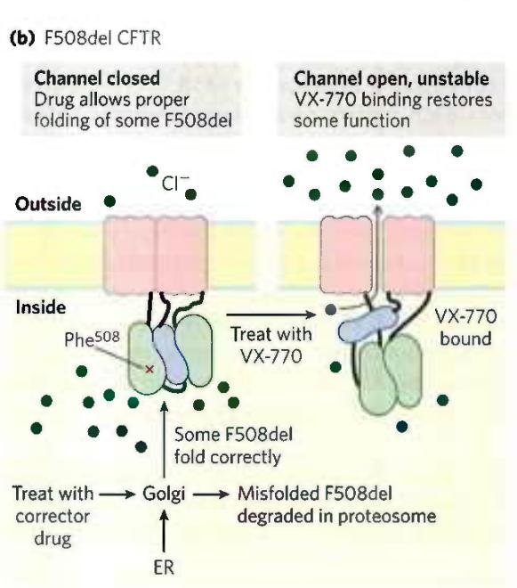  
causing it to be degraded in proteasomes. In the presence of a corrector drug, folding and membrane insertion can take place; addition of the potentiator drug results in partial restoration of $\mathrm{Cl^-}$ channel activity. The channel is unstable and is degraded over time. [Information from J. P. Clancy, Sci. Transl. Med. 6:1, 2014.]

Na $^{+}$ -glucose symporter in the apical plasma membrane takes up glucose from the intestine in a process driven by the downhill flow of Na $^{+}$ :

$$
2 \mathrm{Na} _ {\mathrm{out}} ^ {+} + \mathrm{glucose} _ {\mathrm{out}} \longrightarrow 2 \mathrm{Na} _ {\mathrm{in}} ^ {+} + \mathrm{glucose} _ {\mathrm{in}}
$$

The energy required for this process comes from two sources: the greater concentration of $Na^{+}$ outside than inside the cell (the chemical potential) and the membrane (electrical) potential, which is inside negative and therefore draws $Na^{+}$ inward. P3 The strong thermodynamic tendency for $Na^{+}$ to move into the cell provides the energy needed for the transport of glucose into the cell, against its concentration gradient. An ion gradient created and sustained by energy-dependent ion pumping serves as the potential energy for cotransport of another species against its concentration gradient.

  
FIGURE 11-42 Glucose transport in intestinal epithelial cells. Glucose is cotransported with $\mathrm{Na^{+}}$ across the apical plasma membrane into the epithelial cell. It moves through the cell to the basal surface, where it passes into the blood via GLUT2, a passive glucose uniporter. The $\mathrm{Na^{+}K^{+}}$ ATPase continues to pump $\mathrm{Na^{+}}$ outward to maintain the $\mathrm{Na^{+}}$ gradient that drives glucose uptake.

#### [EN] WORKED EXAMPLE 11-3 Energetics of Pumping by Symport

Calculate the maximum $\frac{[glucose]_{in}}{[glucose]_{out}}$ ratio that can be achieved by

the plasma membrane $Na^{+}$ -glucose symporter of an epithelial cell when $[Na^{+}]_{in}$ is 12 mm, $[Na^{+}]_{out}$ is 145 mm, the membrane potential is -50 mV (inside negative), and the temperature is 37 °C.

SOLUTION: Using Equation 11-4 (p. 392), we can calculate the energy inherent in an electrochemical $\mathrm{Na^{+}}$ gradient — that is, the cost of moving one $\mathrm{Na^{+}}$ ion up this gradient:

$$
\Delta G _ {t} = R T \ln \frac {[ \mathrm{Na} ^ {+} ] _ {\text { out }}}{[ \mathrm{Na} ^ {+} ] _ {\text { in }}} + Z F \Delta \psi
$$

We then substitute standard values for R, T, and F; the given values for $[Na^{+}]$ (expressed as molar concentrations); +1 for Z (because $Na^{+}$ has a positive charge); and 0.050 V for $\Delta\psi$ . Note that the membrane potential is -50 mV (inside negative), so the change in potential when an ion moves from inside to outside is 50 mV.

$$
\begin{array}{r l} \Delta G _ {\mathrm{t}} & = (8. 3 1 5 \mathrm{J/mol} \bullet \mathrm{K}) (3 1 0 \mathrm{K}) \ln \frac {(1 . 4 5 \times 1 0 ^ {- 1})}{(1 . 2 \times 1 0 ^ {- 2})} \\ & + 1 (9 6, 5 0 0 \mathrm{J/V} \bullet \mathrm{mol}) (0. 0 5 0 \mathrm{V}) \\ & = 1 1. 2 \mathrm{kJ/mol} \end{array}
$$

When $Na^{+}$ reenters the cell, it releases the electrochemical potential created by pumping it out; $\Delta G$ for reentry is -11.2 kJ/mol of $Na^{+}$ . This is the potential energy per mole of $Na^{+}$ that is available to pump glucose. Given that two $Na^{+}$ ions pass down their electrochemical gradient and into the cell for each glucose carried in by symport, the energy available to pump 1 mol of glucose is $2 \times 11.2$ kJ/mol = 22.4 kJ/mol. We can now calculate the maximum concentration ratio of glucose that can be achieved by this pump (from Eqn 11-3, p. 392):

$$
\Delta G _ {\mathrm{t}} = R T \ln \frac {[ \text { glucose } ] _ {\text { in }}}{[ \text { glucose } ] _ {\text { out }}}
$$

Rearranging, then substituting the values of $\Delta G_{t}$ , $R$ , and $T$ , gives

$$
\begin{array}{r l} \ln \frac {[ \mathrm{glucose} ] _ {\mathrm{in}}}{[ \mathrm{glucose} ] _ {\mathrm{out}}} & = \frac {\Delta G _ {\mathrm{t}}}{R T} = \frac {2 2 . 4 \mathrm{kJ/mol}}{(8 . 3 1 5 \mathrm{J/mol} \cdot \mathrm{K}) (3 1 0 \mathrm{K})} = 8. 6 9 \\ \frac {[ \mathrm{glucose} ] _ {\mathrm{in}}}{[ \mathrm{glucose} ] _ {\mathrm{out}}} & = e ^ {8. 6 9} = 5. 9 4 \times 1 0 ^ {3} \end{array}
$$

Thus, the cotransporter can pump glucose inward until its concentration inside the epithelial cell is about 6,000 times the concentration outside (in the intestine). (This is the maximum theoretical ratio, assuming a perfectly efficient coupling of $\mathrm{Na^{+}}$ reentry and glucose uptake.)

As glucose molecules are pumped from the intestine into the epithelial cell at the apical surface, glucose is simultaneously moved from the cell into the blood by passive transport through a glucose transporter (GLUT2) in the basal surface (Fig. 11-42). The crucial role of $Na^{+}$ in symport and antiport systems such as this requires the continued outward pumping of $Na^{+}$ to maintain the transmembrane $Na^{+}$ gradient.

In the kidney, a different $Na^{+}$ -glucose symporter (SGLT2) is the target of drugs used to treat type 2 diabetes. Gliflozins are specific inhibitors of this $Na^{+}$ -glucose symporter. They lower blood glucose by inhibiting glucose reabsorption in the kidney, thus preventing the damaging effects of elevated blood glucose. Glucose not reabsorbed in the kidney is cleared in the urine. This class of drugs, taken orally in combination with diet and exercise, lowers blood glucose significantly in individuals with type 2 diabetes.

Because of the essential role of ion gradients in active transport and energy conservation, compounds that collapse ion gradients across cellular membranes are effective poisons, and those that are specific for infectious microorganisms can serve as antibiotics. One such substance is valinomycin, a small cyclic peptide that neutralizes the $K^{+}$ charge by surrounding the ion with six carbonyl oxygens (Fig. 11-43). The hydrophobic peptide then acts as a shuttle, carrying $K^{+}$ across the membrane down its concentration gradient and deflating that gradient. Compounds that shuttle ions across membranes in this way are called ionophores (“ion bearers”). Both valinomycin and monensin (a $Na^{+}$ -carrying ionophore) are antibiotics; they kill microbial cells by disrupting secondary transport processes and energy-conserving reactions. Monensin is widely used as an antifungal and antiparasitic agent.

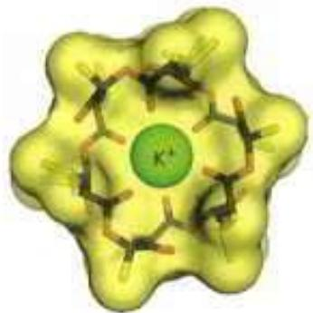  
FIGURE 11-43 Valinomycin, a peptide ionophore that binds K $^{+}$ . The central K $^{+}$ ion is surrounded by inward-facing polar and charged amino acid side chains, and the outside surface is covered with nonpolar side chains that make the whole structure hydrophobic enough to diffuse through the lipid bilayer, carrying K $^{+}$ down its concentration gradient. The resulting dissipation of the transmembrane ion gradient kills microbial cells, making valinomycin a potent antibiotic. [Information from P. Barak and E. A. Nater, http://virtual-museum.soils.wisc.edu, and K. Neupert-Laves and M. Dobler, Helv. Chim. Acta 58:432, 1975.]

#### [EN] Aquaporins Form Hydrophilic Transmembrane Channels for the Passage of Water

P3 A family of integral membrane proteins, the aquaporins (AQPs), provide channels for rapid movement of water molecules across all plasma membranes. Aquaporins are found in all organisms, and multiple aquaporin genes are generally present, encoding similar but not identical proteins. Eleven aquaporins are known in mammals, each with a specific location and role (Table 11-3). The exocrine glands that produce sweat, saliva, and tears secrete water through aquaporins. Erythrocytes, which swell or shrink rapidly in response to abrupt changes in extracellular osmolarity as blood travels through the renal medulla, have a high density of aquaporin in their plasma membrane ( $2 \times 10^{5}$ copies of AQP1 per cell). Seven aquaporins play roles in urine production and water retention in the nephron (the functional unit of the kidney). Each renal AQP has a specific location in the nephron, and each has specific properties and regulatory features. For example, AQP2 in the epithelial cells of the renal collecting duct is regulated by vasopressin (also called antidiuretic hormone): more water is reabsorbed from the duct into the kidney tissues when the vasopressin level is high. Mutant mice with no AQP2 gene have greater urine output (polyuria) and more dilute urine, the result of the proximal tubule becoming less permeable to water. In humans, genetically defective AQPs are known to be responsible for a variety of diseases.

Water molecules flow through an AQP1 channel at a rate of about $10^{9}$ s $^{-1}$ . For comparison, the highest known turnover number for an enzyme is that for catalase, $4 \times 10^{7}$ s $^{-1}$ , and many enzymes have turnover numbers between 1 s $^{-1}$ and $10^{4}$ s $^{-1}$ (see Table 6-7). The low activation energy for passage of water through aquaporin channels ( $\Delta G^{\ddagger} < 15$ kJ/mol) suggests that water moves through the channels in a continuous stream, in the direction dictated by the osmotic gradient. (For a discussion of osmosis, see p. 52.) Aquaporins do not allow passage of protons (hydronium ions, $H_{3}O^{+}$ ), which would collapse membrane electrochemical gradients.

TABLE 11-3 Permeability Characteristics and Predominant Distribution of Known Mammalian Aquaporins

<table><tr><td>Aquaporin</td><td>Permeant (permeability)</td><td>Tissue distribution</td><td>Primary subcellular  $distribution^a$ </td></tr><tr><td>AQP0</td><td>Water (low)</td><td>Lens</td><td>Plasma membrane</td></tr><tr><td>AQP1</td><td>Water (high)</td><td>Erythrocyte, kidney, lung, vascular endothelium, brain, eye</td><td>Plasma membrane</td></tr><tr><td>AQP2</td><td>Water (high)</td><td>Kidney, vas deferens</td><td>Apical plasma membrane, intracellular vesicles</td></tr><tr><td>AQP3</td><td>Water (high), glycerol (high), urea (moderate)</td><td>Kidney, skin, lung, eye, colon</td><td>Basolateral plasma membrane</td></tr><tr><td>AQP4</td><td>Water (high)</td><td>Brain, muscle, kidney, lung, stomach, small intestine</td><td>Basolateral plasma membrane</td></tr><tr><td>AQP5</td><td>Water (high)</td><td>Salivary gland, lacrimal gland, sweat gland, lung, cornea</td><td>Apical plasma membrane</td></tr><tr><td>AQP6</td><td>Water (low), anions ( $NO_{3}^{-} > Cl^{-}$ )</td><td>Kidney</td><td>Intracellular vesicles</td></tr><tr><td>AQP7</td><td>Water (high), glycerol (high), urea (high)</td><td>Adipose tissue, kidney, testis</td><td>Plasma membrane</td></tr><tr><td> $AQP8^b$ </td><td>Water (high)</td><td>Testis, kidney, liver, pancreas, small intestine, colon</td><td>Plasma membrane, intracellular vesicles</td></tr><tr><td>AQP9</td><td>Water (low), glycerol (high), urea (high)</td><td>Liver, leukocyte, brain, testis</td><td>Plasma membrane</td></tr><tr><td>AQP10</td><td>Water (low), glycerol (high), urea (high)</td><td>Small intestine</td><td>Intracellular vesicles</td></tr></table>

#### [EN] Ion-Selective Channels Allow Rapid Movement of Ions across Membranes

Ion-selective channels — first recognized in neurons and now known to be present in the plasma membranes of all cells, as well as in the intracellular membranes of eukaryotes — provide another mechanism for moving inorganic ions across membranes. Ion channels, together with ion pumps such as the $Na^{+}K^{+}$ ATPase, determine a plasma membrane's permeability to specific ions and regulate the cytosolic concentration of ions and the membrane potential. In neurons, very rapid changes in the activity of ion channels cause the changes in membrane potential (action potentials) that carry signals from one end of a neuron to the other. In myocytes, rapid opening of $Ca^{2+}$ channels in the sarcoplasmic reticulum releases the $Ca^{2+}$ that triggers muscle contraction. We discuss the signaling functions of ion channels in Chapter 12. Here we describe the structural basis for ion-channel function, using as our example a well-studied $K^{+}$ channel.

Ion channels are distinct from ion transporters in at least three ways. First, the rate of flux through channels can be orders of magnitude greater than the turnover number for a transporter— $10^{7}$ to $10^{8}$ ions/s for an ion channel, approaching the theoretical maximum for unrestricted diffusion. By contrast, the turnover rate of

FIGURE 11-44 Electrical measurements of ion-channel function. The "activity" of an ion channel is estimated by measuring the flow of ions through it, using the patch-clamp technique. A finely drawn-out pipette (micropipette) is pressed against the cell surface, and negative pressure in the pipette forms a pressure seal between pipette and membrane. As the pipette is pulled away from the cell, it pulls off a tiny patch of membrane (which may contain one or a few ion channels). After placing the pipette and attached patch in an aqueous solution, the researcher can measure channel activity as the electric current that flows between the contents of the pipette and the aqueous solution. In practice, a circuit is set up that "clamps" the transmembrane potential at a given value and measures the current that must flow to maintain this voltage. With highly sensitive detectors, researchers can measure the current flowing through a single ion channel, typically a few picoamperes. The trace shows the current through a single acetylcholine receptor channel as a function of time (in milliseconds), revealing how fast the channel opens and closes, how frequently it opens, and how long it stays open. Downward deflection represents channel opening. Clamping the $V_{\mathrm{m}}$ at different values permits determination of the effect of membrane potential on these parameters of channel function. [Information from V. Witzemann et al., Proc. Natl. Acad. Sci. USA 93:13,286, 1996.] the $Na^{+}K^{+}$ ATPase is about $100\ s^{-1}$ . Second, ion channels are not saturable: rates do not approach a maximum at high substrate concentration. Third, they are gated in response to some type of cellular event. In ligand-gated channels (which are generally oligomeric), binding of an extracellular or intracellular small molecule forces an allosteric transition in the protein, which opens or closes the channel. In voltage-gated ion channels, a change in transmembrane electrical potential ( $V_{m}$ ) causes a charged protein domain to move relative to the membrane, opening or closing the channel. Both types of gating can be very fast. A channel typically opens in a fraction of a millisecond and may remain open for only milliseconds, making these molecular devices effective for very fast signal transmission in the nervous system.

Because a single ion channel typically remains open for only a few milliseconds, monitoring this process is beyond the limit of most biochemical measurements. Ion flows must therefore be measured electrically, either changes in $V_{m}$ (in the millivolt range) or as electric current I (in the microampere or picoampere range), using microelectrodes and appropriate amplifiers. In a clamping, very small currents are measured through a tiny region of the membrane surface containing only one or a few ion-channel molecules (Fig. 11-44). The researcher can measure the size and duration of the current that flows during one opening of an ion channel and can determine how often a channel opens and how that frequency is affected by membrane potential, regulatory ligands, toxins, and other agents. Patch-clamp studies have revealed that as many as $10^{4}$ ions can move through a single ion channel in 1 ms. Such an ion flux represents a huge amplification of the initial signal, which may be just one or two signaling molecules (neurotransmitters, for example).

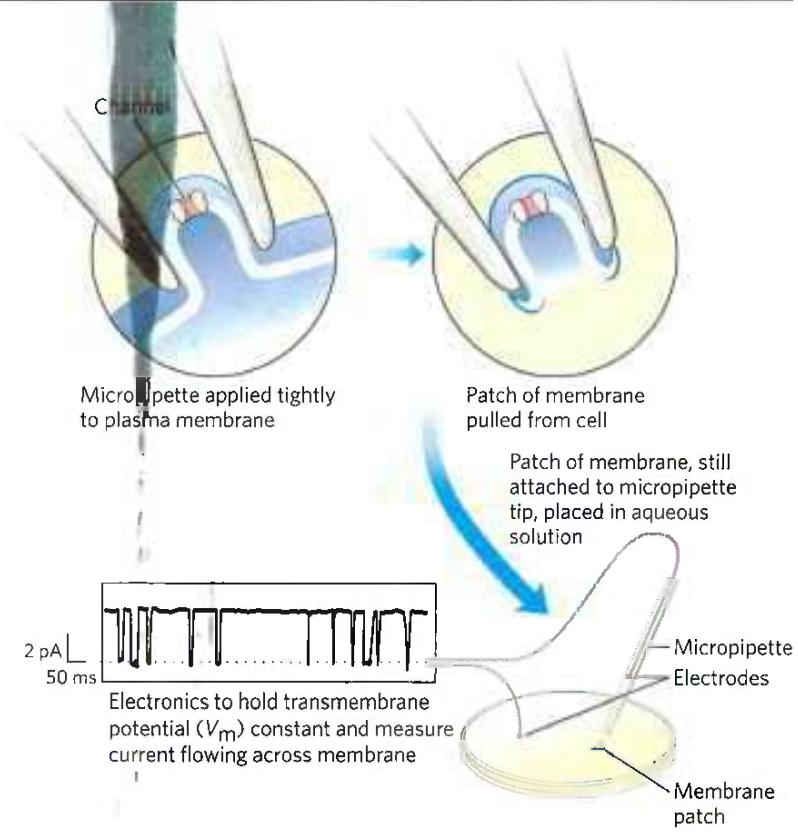

#### [EN] The Structure of a K+ Channel Reveals the Basis for Its Specificity

The structure of a potassium channel from the bacterium Streptomyces lividans provides important insight into the way ion channels work. This bacterial ion channel is related in sequence to all other known $K^{+}$ channels and serves as the prototype for such channels, including the voltage-gated $K^{+}$ channel of neurons. Among the members of this protein family, the similarities in sequence are greatest in the “pore region,” which contains the ion selectivity filter that allows $K^{+}$ (radius 1.33 Å) to pass $10^{4}$ times more readily than $Na^{+}$ (radius 0.95 Å)—at a rate (about $10^{8}$ ions/s) approaching the theoretical limit for unrestricted diffusion.

The $K^{+}$ channel consists of four identical subunits that span the membrane and form a cone within a cone surrounding the ion channel, with the wide end of the double cone facing the extracellular space (Fig. 11-45a). Each subunit has two transmembrane $\alpha$ helices and a third, shorter helix that contributes to the pore region. The outer cone is formed by one of the transmembrane helices of each subunit. The inner cone, formed by the other four transmembrane helices, surrounds the ion channel and cradles the ion selectivity filter. Viewed perpendicular to the plane of the membrane, the central channel is seen to be just wide enough to accommodate an unhydrated metal ion such as potassium (Fig. 11-45b).

  
FIGURE 11-45 The K $^{+}$ channel of Streptomyces lividans. (a) Viewed in the plane of the membrane, the channel consists of eight transmembrane helices (two from each of four identical subunits), forming a cone with its wide end toward the extracellular space. The inner helices of the cone (lighter colored) line the transmembrane channel, and the outer helices interact with the lipid bilayer. Short segments of each subunit converge in the open end of the cone to make a selectivity filter. (b) This view, perpendicular to the plane of the membrane, shows the four subunits arranged around a central channel just wide enough for a single K $^{+}$ ion to pass. (c) Diagram of a K $^{+}$ channel in cross section, showing the structural features critical to function. K $^{+}$ ions go through the channel in pairs, first in sites 1 and 3, then in sites 2 and 4. Carbonyl oxygens (red) of the peptide backbone in the selectivity filter protrude into the channel, interacting with and stabilizing the K $^{+}$ ions that are passing through. [Data from (a, b) PDB ID 1BL8, D. A. Doyle et al., Science 280:69, 1998; (c) G. Yellen, Nature 419:35, 2002, and PDB ID 1J95, M. Zhou et al., Nature 411:657, 2001.]

Both the ion specificity and the high flux through the channel are understandable from what we know of the channel's structure (Fig. 11-45c). At the inner and outer plasma membrane surfaces, the entryways to the channel have several negatively charged amino acid residues, which presumably increase the local concentration of cations such as $\mathbf{K}^+$ and $\mathrm{Na^{+}}$ . The ion path through the membrane begins (on the inner surface) as a wide, water-filled channel in which the ion can retain its hydration sphere. Further stabilization is provided by the short helices in the pore region of each subunit, with the partial negative charges of their electric dipoles pointed at $\mathbf{K}^+$ in the channel. About two-thirds of the way through the membrane, this channel narrows in the region of the selectivity filter, forcing the ion to give up its hydrating water molecules. Carbonyl oxygen atoms in the backbone of the selectivity filter replace the water molecules in the hydration sphere, forming a series of perfect coordination shells through which the $\mathbf{K}^+$ moves. This favorable interaction with the filter is not possible for $\mathrm{Na^{+}}$ , which is too small to make contact with all the potential oxygen ligands. The preferential stabilization of $\mathbf{K}^+$ is the basis for the ion selectivity of the filter, and mutations that change residues in this part of the protein eliminate the channel's ion selectivity. The $\mathbf{K}^+$ -binding sites of the filter are flexible enough to collapse to fit any $\mathrm{Na^{+}}$ that enters the channel, and this conformational change closes the channel.

There are four potential $K^{+}$ -binding sites along the selectivity filter, each composed of an oxygen “cage” that provides ligands for the $K^{+}$ ions (Fig. 11-45c). In the crystal structure, two $K^{+}$ ions are visible within the selectivity filter, about 7.5 Å apart, and two water molecules occupy the unfilled positions. $K^{+}$ ions pass through the filter in single file; their mutual electrostatic repulsion probably just balances the interaction of each ion with the selectivity filter and keeps them moving. Movement of the two $K^{+}$ ions is concerted: first they occupy positions 1 and 3, then they hop to positions 2 and 4. The energetic difference between these two configurations (1, 3 and 2, 4) is very small; energetically, the selectivity pore is not a series of hills and valleys but a flat surface, which is ideal for rapid ion movement through the channel. The structure of the channel seems to have been optimized during evolution to give maximal flow rates and high specificity.

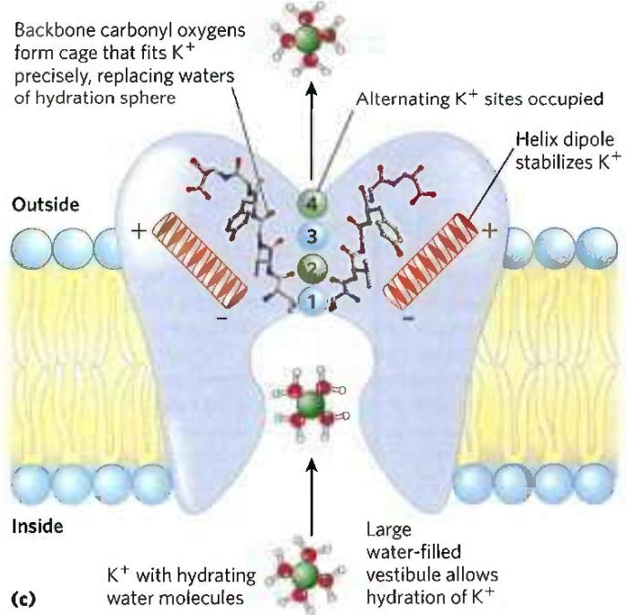

#### [EN] SUMMARY 11.3 Solute Transport across Membranes

■ Some transporters simply facilitate passive diffusion of a solute across the membrane, from a higher concentration to a lower concentration. Others transport solutes against an electrochemical gradient; this requires a source of metabolic energy.

\- Transporters move solutes across a membrane one or a few at a time, providing a binding site on each side of the membrane. The binding sites alternate between being accessible from the outside and from the inside. Ion channels provide a path across the membrane, which is either open or closed. When open, the channel allows the movement of large numbers of solute ion across the membrane at nearly the speed of unhindered diffusion.

A family of glucose transporters in humans includes the passive transporter GLUT1, which is saturated at normal levels of glucose in the blood. GLUT1 facilitates movement of glucose from blood into erythrocytes.

■ The chloride-bicarbonate exchanger of erythrocytes exchanges one $Cl^{-}$ ion for one $HCO_{3}^{-}$ ion across the erythrocyte plasma membrane, mediating the uptake of $CO_{2}$ in the tissues and its release in the lungs.

■ Active transporters use energy to pump solutes against an electrochemical gradient.

■ P-type ATPases, including the $Na^{+}K^{+}$ ATPase of the plasma membrane and the $Ca^{2+}$ transporters of the sarcoplasmic/endoplasmic reticulum, couple phosphorylation and dephosphorylation of the transporter to alternate exposure of solute binding sites on the inside and the outside of the membrane. In animal cells, the $Na^{+}K^{+}$ ATPase maintains the differences in cytosolic and extracellular concentrations of $Na^{+}$ and $K^{+}$ , and the resulting $Na^{+}$ gradient is used as the energy source for a variety of secondary active transport processes.

■ V-type and F-type ATPases are active transporters that couple ATP cleavage to the uphill transport of $H^{+}$ ions. The same mechanism, working in reverse, allows the synthesis of ATP, driven by movement of protons down their electrochemical gradient.

■ ABC transporters carry a variety of substrates (including many drugs) out of cells, using ATP as the energy source. The ATP-using domain is conserved in many ABC transporters, and it is coupled with various transmembrane domains that give substrate specificity.

Some active cotransporters use the energy in an ion gradient generated catabolically to move a solute uphill. The $\mathrm{Na^{+}}$ -glucose cotransporter of the kidney and intestine is such a transporter.

■ Water moves across membranes through aquaporins. Some aquaporins are regulated; some also transport glycerol or urea.

\- Ion channels provide hydrophilic pores through which select ions can diffuse, moving down their electrical or chemical concentration gradients. Ion channels are unsaturable, have very high flux rates, and are highly specific for one ion.

■ Structural studies of $K^{+}$ channels reveal the mechanism that allows great discrimination between $K^{+}$ and other ions like $Na^{+}$ . The polar transmembrane passage precisely fits the $K^{+}$ ion, but allows neither larger ions nor smaller ions to pass.

<!-- EN-END 11.3 -->

## 六、脂质的提取、分离和分析

脂质存在于细胞、细胞器和胞外体液如血浆、胆汁、乳和肠液中。欲研究某一特定部分（例如红细胞、线粒体或脂蛋白）的脂质，首先须将它们所在的组织、细胞或细胞器分离出来。由于脂质不溶于水，它们的提取和随后的分级分离都要求使用有机溶剂和某些特殊技术，这跟用于纯化水溶性分子如蛋白质和糖质是很不相同的。一般说，复杂的脂质混合物分离是根据它们在非极性溶剂中的极性或溶解度差别进行的。含酯键连接或酰胺键连接的脂肪酸的脂质可用酸、碱或高度专一的水解酶处理使成可用于分析的成分。

## （一）脂质用有机溶剂提取

非极性脂质(三酰甘油、蜡和色素等)用乙醚、氯仿或苯等容易从组织中提取出来,因为这些溶剂不致使脂质因疏水相互作用而集聚在一起。膜脂(磷脂、糖脂、类固醇等)要用极性有机溶剂如乙醇或甲醇提取,这种溶剂既能降低脂质分子间的疏水相互作用,又能减弱膜脂与膜蛋白之间的氢键键合和静电相互作用。常用的提取剂(extractant)是氯仿、甲醇和水(体积比1:2:0.8)的混合液。按此体积比配制的混合液是混溶的,形成一个相。组织(如肝)在此混合液中匀浆以提取所含脂质;匀浆后形成的不溶物包括蛋白质、核酸和多糖用离心或过滤方法除去。向所得的提取液(extract)加入过量的水使之分成两个相,上相是甲醇/水,下相是氯仿。脂质留在氯仿相,极性大的分子如蛋白质、多糖进入极性相(甲醇/水)。取出氯仿并蒸发浓缩,取一部分干燥,称重;其余用于下步分离分析。

## （二）吸附层析分离不同极性的脂质

被提取的脂质混合物可采用基于各类脂质极性不同分开的层析手段进行分级分离。例如硅胶吸附柱层析(柱层析装置参见图2-14)可把脂质分成非极性、极性和荷电的多个组分。硅胶(silica)是硅酸 $\mathrm{Si(OH)_4}$ 的一种形式，一种极性的不溶物。当脂质混合物(氯仿提取液)通过柱中的硅胶时，由于极性脂质跟极性硅酸结合得紧密被留在柱上；中性脂质则直接通过柱子，出现在最先流出的氯仿洗涤液中。然后用逐步提高极性的溶剂洗涤，极性脂质按极性增加的顺序被洗脱。不带荷电的极性脂质(如脑苷脂)用丙酮洗脱，极性强的或带荷电的脂质(如甘油磷脂)用甲醇洗脱。分别收集各个组分，在不同的层析系统中再层析，以分离单个脂质组分。例如磷脂组分可进一步分离成磷脂酰胆碱、鞘磷脂、磷脂酰乙醇胺等。如果采用高效液相色谱(HPLC,见第5章)或薄层层析(TLC)进行脂质分离则速度更快，分辨率更高。

硅胶薄层层析(装置见图2-16)利用同一原理。硅胶薄层涂抹在一块能黏附它的玻璃板上。溶于氯仿的少量脂质样品点加在玻璃板一边的附近,然后把玻璃板的这一边浸入加有有机溶剂或溶剂混合液的浅槽中;整套装置封闭在被溶剂蒸气饱和的箱(或缸)内。随溶剂在玻璃板上上升(由于毛细管作用),也带着脂质一起移动。极性小的脂质移动最快,因为它们跟硅酸结合的程度小。分开的脂质可以用一种称罗丹明(rhodamine)的染料喷洒玻璃板,这种染料与脂质结合后,会发出荧光;或用碘蒸气熏蒸玻璃板,碘与脂肪酸中的双键发生可逆反应,结果含不饱和脂肪酸的脂质显示出黄色或棕色。几种其他的喷显剂也用于检测一些特异的脂质。为了后面分析,含被分开的脂质区域可从板上刮下,脂质用有机溶剂提取回收。

## （三）气-液色谱用于分析挥发性脂质混合物

气-液色谱(gas-liquid chromatography; GLC)是分离混合物的挥发性组分的。分离的原则是按它们溶于填充在色谱柱中的惰性材料的相对倾向,或是按它们被惰性气体(如氦、氢或氮)流动所推进的挥发和过柱的相对速度。除某些脂质具有天然挥发性外,大多数脂质沸点很高,6-碳以上的脂肪酸沸点都在200℃以上。因此进行分析前必须先将脂质转变为它们的衍生物(如酯类)以增加挥发性(即降低沸点)。为分析油脂或磷脂样品中的脂肪酸,首先需要在甲醇/HCl或甲醇/NaOH混合物中加热,使脂肪酸成分发生转酯[基]作用(transesterification),从甘油酯转变为脂肪酸甲酯。然后将甲酯混合物加样到气-液色谱柱上,加热柱子,使样品挥发,以利GLC分析。在柱材料中溶解度最大的脂肪酸酯留在柱上的时间最长;溶解度小的脂质被惰性气流带走,最先从柱中出来。洗脱顺序主要决定于柱中固体吸附剂的性质和脂质混合物组分的沸点。利用GLC技术,各种链长和各种不饱和度的脂肪酸混合物可以得到完全分开。气-液色谱仪的基本组件如图10-37所示。

  
图 10-37 气-液色谱仪的基本组件

## （四）专一性水解有助脂质结构测定

某些种类的脂质对在特异条件下的降解特别敏感，例如三酰甘油、甘油磷脂和固醇酯中酯键连接的脂肪酸只要用温和的酸或碱处理则被释放。而鞘脂中酰胺键连接的脂肪酸则需要在较强的水解条件下才能被释放。专一性水解某些脂质的酶也被用于脂质结构的测定。前面谈到过的磷脂酶 $\mathrm{A}_1$ 、 $\mathrm{A}_2$ 、C和D（见图10-9）都能断裂甘油磷脂分子中的一个特定的键，并产生具有特征溶解度和层析行为的产物。例如磷脂酶C作用于磷脂，释放一个水溶性的磷酰醇（例如从磷脂酰胆碱释放出磷酸胆碱）和一个氯仿溶的二酰甘油，这些成分可以分别加以鉴定，以确定完整磷脂的结构。专一性水解跟这些产物的TLC、GLC或HPLC鉴定相结合常可用来测定一个脂质的结构。

## （五）质谱与脂质结构测定和脂质组学

脂质或其挥发性衍生物的质谱分析是确定烃链长度和双键位置的最佳技术。相似的脂质（例如，两个相同链长、在不同位置上不饱和的脂肪酸，或两个含不同数目异戊二烯单位的类异戊二烯）的物理化学性质是非常相像的，从各种色谱洗脱的顺序经常不能把它们区分开来。然而，当从一个色谱柱流出的洗脱物（eluate）加样到质谱仪上进行分析，一个脂质混合物的组分只要根据它们唯一的分级分离谱就能同时得到分离和鉴定。随着质谱法分辨率的不断提高，有可能粗提取液无须进行预分级分离就能在很复杂的混合物中鉴定出单个脂质。这种“鸟枪”（shotgun）法可以避免脂质组分的再分离（亚类的分离），因而速度更快。

为探索细胞和组织中脂质的生物学作用,重要的是要知道什么脂质以什么比例存在,并要知道这些脂质的组成随胚胎发育、疾病或药物治疗发生的变化;这些内容构成了脂质组学(lipidomics)。脂质组学的目的是试图编录所有的脂质及其功能。应用具有高处理量和高分别率的质谱技术可以提供在特定条件下专一类型细胞中存在的全部脂质的定量编目——脂质组(lipidome),以及脂质组随分化、疾病(如癌症)或药物治疗的变化方式。一个动物细胞含有上千种不同的脂质,大概每一种都有专门的功能。越来越多的脂质它们的功能为人们了解,但仍然还有大量未探索的脂质组,为下一代的生物化学家和生物学家提供丰富的新课题,等待解决。

<!-- EN-BEGIN 10.4 -->

### 【英文对应 10.4】Working with Lipids

> 来源：Lehninger Principles of Biochemistry（书籍/02_生物化学原理） 第10章 Lipids，§10.4。对应本章“六、脂质的提取、分离和分析”。

Because lipids are insoluble in water, their extraction and subsequent fractionation require the use of organic solvents and some techniques not commonly used in the purification of water-soluble molecules such as proteins and carbohydrates. P4 In general, complex mixtures of lipids are separated by differences in polarity or solubility in nonpolar solvents. Lipids that contain ester- or amide-linked fatty acids can be hydrolyzed by treatment with acid or alkali or with specific hydrolytic enzymes (phospholipases, glycosidases) to yield their components for analysis. Some methods commonly used in lipid analysis are shown in Figure 10-25 and discussed below.

#### [EN] Lipid Extraction Requires Organic Solvents

Neutral lipids (triacylglycerols, waxes, pigments, and so forth) are readily extracted from tissues with ethyl ether, chloroform, or benzene, solvents that do not permit lipid clustering driven by the hydrophobic effect. Membrane lipids are more effectively extracted by more polar organic solvents, such as ethanol or methanol, which reduce the hydrophobic interactions among lipid molecules while also weakening the hydrogen bonds and electrostatic interactions that bind membrane lipids to membrane proteins. A commonly used extractant is a mixture of chloroform, methanol, and water, initially in volume proportions (1:2:0.8) that are miscible, producing a single phase. After tissue is homogenized in this solvent to extract all lipids, more water is added to the resulting extract, and the mixture separates into two phases: methanol/water (top phase) and chloroform (bottom phase). The lipids remain in the chloroform layer, and the more polar molecules such as proteins and sugars partition into the methanol/water layer (Fig. 10-25a).

#### [EN] Adsorption Chromatography Separates Lipids of Different Polarity

P4 Complex mixtures of tissue lipids can be fractionated by chromatographic procedures based on the different polarities of each class of lipid (Fig. 10-25b).

  
FIGURE 10-25 Common procedures in the extraction, separation, and identification of cellular lipids. (a) Tissue is homogenized in a chloroform/methanol/water mixture, which upon addition of water and removal of unextractable sediment by centrifugation yields two phases. (b) Major classes of extracted lipids in the chloroform phase may first be separated by thin-layer chromatography (TLC), in which lipids are carried up a silica gel-coated plate by a rising solvent front, with less-polar lipids traveling farther than more-polar or charged lipids, or by adsorption chromatography on a column of silica gel, through which solvents of increasing polarity are passed. For example, column chromatography with appropriate solvents can be used to separate closely related lipid species such as phosphatidylserine, phosphatidylglycerol, and phosphatidylinositol. Once separated, each lipid's complement of fatty acids can be determined by mass spectrometry. (c) Alternatively, in the "shotgun" approach, an unfractionated extract of lipids can be directly subjected to high-resolution mass spectrometry of different types and under different conditions to determine the total composition of all the lipids — that is, the lipidome.

In adsorption chromatography, an insoluble, polar material such as silica gel (a form of silicic acid, $\mathrm{Si(OH)_4}$ ) is packed into a glass column, and the lipid mixture (in chloroform solution) is applied to the top of the column. (In high-performance liquid chromatography, or HPLC, the column is of smaller diameter and solvents are forced through the column under high pressure.) The polar lipids bind tightly to the polar silicic acid, but the neutral lipids pass directly through the column and emerge in the first chloroform wash. The polar lipids are then eluted, in order of increasing polarity, by washing the column with solvents of progressively higher polarity. Uncharged but polar lipids (cerebrosides, for example) are eluted with acetone, and very polar or charged lipids (such as glycerophospholipids) are eluted with methanol.

Thin-layer chromatography (TLC) on silicic acid employs the same principle (Fig. 10-25b). A thin layer of silica gel is spread onto a glass plate, to which it adheres. A small sample of lipids dissolved in chloroform is applied near one edge of the plate, which is dipped in a shallow container of an organic solvent or solvent mixture; the entire setup is enclosed in a chamber saturated with the solvent vapor. As the solvent rises on the plate by capillary action, it carries lipids with it. The less polar lipids move farthest, as they have less tendency to bind to the silicic acid. The separated lipids can be detected by spraying the plate with a dye (rhodamine) that fluoresces when associated with lipids, or by exposing the plate to iodine fumes. Iodine reacts reversibly with the double bonds in fatty acids, such that lipids containing unsaturated fatty acids develop a yellow or brown color. Several other spray reagents are also useful in detecting specific lipids. For subsequent analysis, regions containing separated lipids can be scraped from the plate and the lipids recovered by extraction with an organic solvent.

#### [EN] Gas Chromatography Resolves Mixtures of Volatile Lipid Derivatives

P4 Gas chromatography (GC) separates volatile components of a mixture according to their relative tendencies to dissolve in the inert material packed in the chromatography column or to volatilize and move through the column, carried by a current of an inert gas such as helium. Some lipids are naturally volatile, but most must first be derivatized to increase their volatility (that is, lower their boiling point). For an analysis of the fatty acids in a sample of phospholipids, the lipids are first transesterified: heated in a methanol/HCl or methanol/NaOH mixture to convert fatty acids esterified to glycerol into their methyl esters. These fatty acyl methyl esters are then loaded onto the GC column, and the column is heated to volatilize the compounds. Those fatty acyl esters that are most soluble in the column material will partition into (dissolve in) that material; the less-soluble lipids are carried by the stream of inert gas and emerge first from the column. The order of elution depends on the nature of the solid adsorbent in the column and on the boiling point of the components of the lipid mixture. With these techniques, mixtures of fatty acids of various chain lengths and various degrees of unsaturation can be completely resolved.

#### [EN] Specific Hydrolysis Aids in Determination of Lipid Structure

P4 Certain classes of lipids are susceptible to degradation under specific conditions. For example, all ester-linked fatty acids in triacylglycerols, phospholipids, and sterol esters are released by mild acid or alkaline treatment, and somewhat harsher hydrolysis conditions release amide-bound fatty acids from sphingolipids. Enzymes that specifically hydrolyze certain lipids are also useful in the determination of lipid structure. Phospholipases A, C, and D (Fig. 10-14) each split particular bonds in phospholipids and yield products with characteristic solubilities and chromatographic behaviors. Phospholipase C, for example, releases a water-soluble phosphoryl alcohol (such as phosphocholine from phosphatidylcholine) and a chloroform-soluble diacylglycerol, each of which can be characterized separately to determine the structure of the intact phospholipid. The combination of specific hydrolysis with characterization of the products by TLC, GC, or HPLC often allows determination of a lipid structure.

#### [EN] Mass Spectrometry Reveals Complete Lipid Structure

P4 To establish unambiguously the length of a hydrocarbon chain or the position of double bonds, mass spectrometric analysis of lipids or their volatile derivatives is invaluable. The chemical properties of similar lipids (for example, two fatty acids of similar length unsaturated at different positions, or two isoprenoids with different numbers of isoprene units) are very much alike, and their order of elution from the various chromatographic procedures often does not distinguish between them. When the eluate from a chromatography column is sampled by mass spectrometry, however, the components of a lipid mixture can be simultaneously separated and identified by their unique pattern of fragmentation (Fig. 10-26). With the increased resolution of mass spectrometry, it is possible to identify individual lipids in very complex mixtures without first fractionating the lipids in a crude extract. This “shotgun” method (Fig. 10-25c) avoids losses during the preliminary separation of lipid subclasses, and it is faster.

#### [EN] Lipidomics Seeks to Catalog All Lipids and Their Functions

As lipid biochemists have become aware of the thousands of different naturally occurring lipids, they have created a database analogous to the Protein Data Bank. The LIPID MAPS Lipidomics Gateway (www.lipidmaps.org) has its own classification system that places each lipid species in one of eight chemical categories, each designated by two letters (Table 10-2). Within each category, finer distinctions are indicated by numbered classes and subclasses.

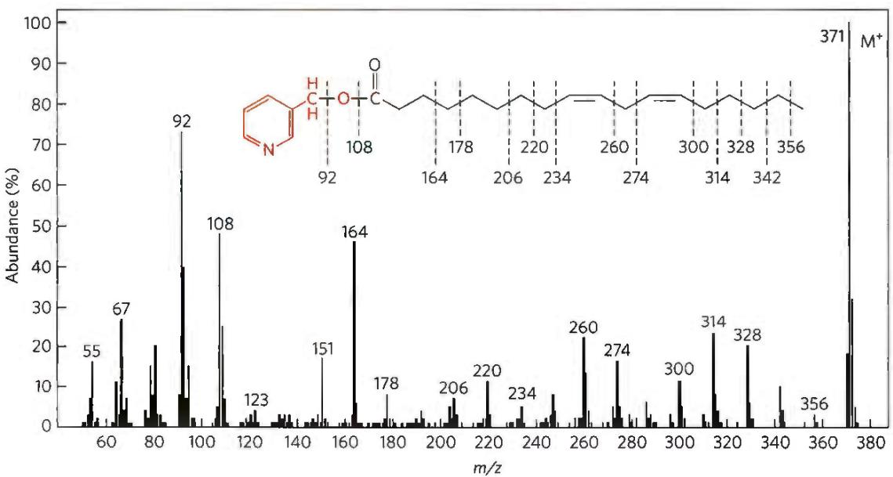  
FIGURE 10-26 Determination of fatty acid structure by mass spectrometry. The fatty acid is first converted to a derivative that minimizes migration of the double bonds when the molecule is fragmented by electron bombardment. The derivative shown here is a picolinyl ester of linoleic acid — $18:2(\Delta^{9,12})$ ( $M_r$ 371) — in which the alcohol is picolinol (red). When bombarded with a stream of electrons, this molecule is volatilized and converted to a parent ion ( $M^+$ ; $M_r$ 371), in which the N atom bears the positive charge, and a series of smaller fragments produced by breakage of C—C bonds in the fatty acid. The mass spectrometer separates these charged fragments according to their mass/charge ratio ( $m/z$ ).  
group, showing that the compound is indeed a picolinyl ester. The molecular ion, $M^{+}$ (m/z = 371), confirms the presence of a $C_{18}$ fatty acid with two double bonds. The uniform series of ions 14 atomic mass units (u) apart represents loss of each successive methyl and methylene group from the methyl end of the acyl chain (beginning at C-18; the right end of the molecule as shown here), until the ion at m/z = 300 is reached. This is followed by a gap of 26 u for the carbons of the terminal double bond, at m/z = 274; a further gap of 14 u for the C-11 methylene group, at m/z = 260; and so forth. By this means, the entire structure is determined, although these data alone do not reveal the configuration (cis or trans) of the double bonds. [Information from W. W. Christie, Lipid Technol. 8:64, 1996.]

The prominent ions at m/z = 92, 108, 151, and 164 contain the pyridine ring of the picolinol and various fragments of the carboxyl

<table><tr><td colspan="3">TABLE 10-2 Eight Major Categories of Biological Lipids</td></tr><tr><td>Category</td><td>Category code</td><td>Examples</td></tr><tr><td>Fatty acids</td><td>FA</td><td>Oleate, stearoyl-CoA, palmitoylcarnitine</td></tr><tr><td>Glycerolipids</td><td>GL</td><td>Di- and triacylglycerols</td></tr><tr><td>Glycerophospholipids</td><td>GP</td><td>Phosphatidylcholine, phosphatidylserine, phosphatidyethanolamine</td></tr><tr><td>Sphingolipids</td><td>SP</td><td>Sphingomyelin, ganglioside GM2</td></tr><tr><td>Sterol lipids</td><td>ST</td><td>Cholesterol, progesterone, bile acids</td></tr><tr><td>Prenol lipids</td><td>PR</td><td>Farnesol, geraniol, retinol, ubiquinone</td></tr><tr><td>Saccharolipids</td><td>SL</td><td>Lipopolysaccharide</td></tr><tr><td>Polyketides</td><td>PK</td><td>Tetracycline, erythromycin, aflatoxin  $B_1$ </td></tr></table>

For example, all glycerophosphocholines are GP01. The subgroup of glycerophosphocholines with two fatty acids in ester linkage is designated GP0101; the subgroup with one fatty acid ether-linked at position 1 and one ester-linked at position 2 is GP0102. The specific fatty acids are designated by numbers that give every lipid its own unique identifier, so that each individual lipid, including lipid types not yet discovered, can be unambiguously described in terms of a 12-character identifier, the LM\_ID. One factor used in this classification system is the nature of the biosynthetic precursor. For example, prenoI lipids (such as dolichols and vitamins E and K) are formed from isoprenyl precursors.

The eight chemical categories in Table 10-2 do not coincide perfectly with the less formal categorization according to biological function that we have used in this chapter. For example, the structural lipids of membranes include both glycerophospholipids and sphingolipids, which are separate categories in Table 10-2. Each method of classification has its advantages.

The application of mass spectrometric techniques with high throughput and high resolution can provide quantitative catalogs of all the lipids present in a specific cell type under particular conditions—the lipidome—and of the ways in which the lipidome changes with differentiation, disease such as cancer, or drug treatment. An animal cell contains more than a thousand different lipid species, each presumably having a specific function. These functions are known for a growing number of lipids, but the still largely unexplored lipidome offers a rich source of new problems for the next generation of biochemists and cell biologists to solve.

#### [EN] SUMMARY 10.4 Working with Lipids

In the determination of lipid composition, lipids can first be extracted from tissues with organic solvents.

\- Lipids in mixtures can be separated on the basis of their polarity and interactions with polar materials such as silica, using adsorption chromatography methods such as HPLC or TLC.

■ GC volatilizes lipids so that they can be carried by a stream of inert gas and resolved based on their ability to partition into a soluble column material.

■ Phospholipases specific for one of the bonds in a phospholipid can be used to generate simpler compounds for subsequent analysis.

■ High-resolution mass spectrometry allows the analysis of crude mixtures of lipids without prefractionation—the "shotgun" approach.

Lipidomics combines powerful analytical techniques to determine the full complement of lipids in a cell or a tissue (the lipidome) and to assemble annotated databases that allow comparisons between lipids of different cell types and under different conditions.

<!-- EN-END 10.4 -->

## 提要

脂质是细胞的水不溶性成分,结构多种多样,能用有机溶剂如乙醚、氯仿等进行提取。脂质按化学组成可分为单纯脂质、复合脂质和衍生脂质;按生物功能可分为贮存脂质、结构脂质和活性脂质。

脂肪酸是多数脂质的烃成分,通常具有偶数碳原子(一般12到24)。脂肪酸可分为饱和与不饱和的,双键几乎总是顺式的。脂肪酸的物理性质主要决定于烃链长度与不饱和程度。必需脂肪酸是指对人体的功能不可缺少,但必须由膳食提供的两种多不饱和脂肪酸:亚油酸和 $\alpha-$ 亚麻酸;前者属 $\omega-6$ 家族,后者属 $\omega-3$ 家族。

三酰甘油是由脂肪酸与甘油形成的三酯。三酰甘油可分为简单三酰甘油和混合三酰甘油；天然油脂是简单和混合三酰甘油的混合物。三酰甘油与碱共热可发生皂化，生成脂肪酸盐（皂）和甘油。三酰甘油跟游离脂肪酸一样，它的不饱和键能发生氢化、卤化和过氧化等作用。三酰甘油是主要的贮存脂质，以脂肪滴形式存在于细胞中。

脂质过氧化是典型的活性氧参与的自由基链式反应。活性氧( $\cdot O_{2}^{-}$ 、 $\cdot OH$ 、 $H_{2}O_{2}$ 和 $^{1}O_{2}$ 等)使生物膜发生脂质过氧化,造成膜的损伤、蛋白质和核酸等大分子的异常。脂质过氧化与多种疾病有关。体内的抗氧化剂如超氧化物歧化酶(SOD)、维生素E和 $\beta-$ 胡萝卜素等是与脂质过氧化抗衡的保护系统。

三酰甘油是食物的重要成分。食品工业中植物油的部分氢化会使某些脂肪酸的顺式双键转化为反式构型。食物中的反式脂肪酸是冠心病的一个重要风险因素。

蜡是指长链脂肪酸和长链一元醇或固醇形成的酯。天然蜡如蜂蜡是多种蜡酯的混合物。蜡是海洋浮游生物中代谢燃料的主要贮存形式。蜡还有其他的生物功能如防水、防侵袭等。

具有极性头和非极性尾的极性脂质是生物膜的主要成分。最丰富的极性脂质是甘油磷脂；最简单的甘油磷脂是3-sn-磷脂酸，它是其他甘油磷脂的母体。磷脂酸进一步被一个极性醇（如胆碱、乙醇胺等）酯化，则形成各种甘油磷脂。常见的甘油磷脂是磷脂酰胆碱和磷脂酰乙醇胺。甘油磷脂的极性头基在pH 7附近荷电。

叶绿体膜富含半乳糖脂和硫脂，它们是甘油糖脂。前者由二酰甘油跟1个或2个相连的半乳糖残基组成，后者由二酰甘油跟一个磺酸化的糖残基组成，并因此是一个荷电的头基。

某些古菌含有独特的膜脂,它有一个很长的链烷基,在链烷基的两端以醚键跟甘油相连,还有一个糖基和/或一个甘油磷酸基跟甘油连接以提供一个极性的或荷电的头基。这类脂质在这些古菌生活的苛刻条件下是稳定的。

鞘脂含有鞘氨醇，一个长链的脂肪族氨基醇，但不含甘油。鞘氨醇的2-位氨基以酰胺键与脂肪酸连接形成神经酰胺，它是鞘脂类的母体。神经酰胺的1-位羟基被磷酰胆碱或磷酰乙醇胺酯化则形成相应的鞘磷脂：胆碱鞘磷脂和乙醇胺鞘磷脂。神经酰胺的1-位羟基以糖苷键跟糖基连接则成鞘糖脂。重要的鞘糖脂有脑苷脂、红细胞糖苷脂和神经节苷脂。细胞表面的鞘糖脂是细胞识别的位点。

固醇含有4个稠合的碳环(环戊烷多氢菲)和一个羟基。固醇存在于大多数真核细胞的膜中,但细菌不含固醇。胆固醇是动物中的主要固醇,是膜的结构成分,也是体内类固醇激素和胆汁酸的前体。

有些种类的脂质存在量虽然较少,但起着辅因子和信号的关键作用。类二十烷酸,包括前列腺素、凝血酶和白三烯;它们由花生四烯酸合成,是一类极强的局部性激素。

磷脂酰肌醇-4,5-二磷酸经水解产生2个胞内信使：二酰甘油（DAG）和肌醇-1,4,5-三磷酸（ $\mathrm{IP}_3$ ）。磷脂酰肌醇-3,4,5-三磷酸是参与生物信号传递的超分子蛋白质复合体的成核点。

类固醇激素如性激素和皮质激素都由固醇衍生而来,它们作为强力的生物信号改变靶细胞中的基因表达,从而影响代谢和生理方面的变化。

许多由异戊二烯单位 $(\mathrm{C}_5)$ 合成的类萜（类异戊二烯）是生物活性脂质。例如维生素A、D、E和K在动物的代谢和生理活动中起重要作用。维生素A和D是相应激素的前体。泛醌和质体醌分别是线粒体和叶绿体的电子载体。脂质共轭双烯，如胡萝卜素、玉米黄质等，作为花朵和水果中的色素，以及给鸟的羽毛以亮丽的颜色。多萜醇（长醇）活化和锚定简单糖到细胞膜上；聚糖基然后用于合成复杂糖质、糖脂和糖蛋白。

聚酮化合物如红霉素、两性霉素 B 等是天然产物，被广泛用于医学。

血浆脂蛋白是血浆中转运脂质的脂蛋白颗粒。这些颗粒都有一个由三酰甘油和胆固醇酯组成的疏水核心和一个由磷脂、胆固醇和载脂蛋白参与的极性外壳。载脂蛋白（apo）是脂蛋白中的蛋白质部分，主要作用是增溶疏水脂质和作为脂蛋白受体的识别部位。脂蛋白颗粒依密度增加为序可分为乳糜微粒、VLDL、LDL和HDL。VLDL从肝运载胆固醇、胆固醇酯和三酰甘油到其他组织，在那里三酰甘油为脂蛋白脂酶所降解，VLDL转变为LDL。富含胆固醇和胆固醇酯的LDL被受体介导的胞吞所摄取，胞吞过程中LDL的载脂蛋白B-100为质膜中的受体所识别。HDL是除肝以外的其他组织的胆固醇清除剂。

细胞的外周膜(质膜)和内膜系统统称生物膜。膜主要由蛋白质(包括酶)、脂质(主要是磷脂)和糖类等组成。脂双层是膜的基本结构元件。膜对极性的和荷电的溶质一般是不通透的,但对非极性化合物则允许它们通过。膜脂和膜蛋白在脂双层中的定向是不对称的,使膜有“正反面”的之分,这也反映膜在功能上的不对称性。质膜的糖蛋白总是把携有寡糖的结构域定向在细胞的外表面。膜蛋白可分为三类:外周膜蛋白质、内在膜蛋白质和兼在蛋白质。膜的流动性是膜结构的主要特征;脂酰链的热运动使脂双层内部成为流体;流动性受温度、脂肪酸组成和固醇含量的影响。膜脂和膜蛋白可以进行侧向扩散,速度很快;膜脂还可以发生翻转扩散,但速度比前者慢得多,除非有翻转酶的参与。整联蛋白是质膜的跨膜蛋白质,起连接细胞-细胞以及在胞外基质和细胞质之间运载信息两个方面的作用。膜的流动镶嵌模型仍是迄今应用最广的。

测定脂质组成时，脂质首先需要用有机溶剂从组织中提取，再用薄层层析、气液色谱或高效液相色谱分离。单个的脂质可根据其层析行为、对专一性酶水解的敏感性或质谱来鉴定。高分别率的质谱无须预分级分离即可进行脂质粗混合物分析。脂质组学的任务是利用先进的分析技术，测定一个细胞或组织中的全套脂质（脂质组）并组建有注释的数据库，比较不同类型和不同条件下的细胞脂质。

## 习题

1. 天然脂肪酸在结构上有哪些共同的特点？

2. (a) 由甘油和三种不同的脂肪酸(如豆蔻酸、棕榈酸和硬脂酸)可形成多少种不同的三酰甘油(包括立体异构体)? (b) 其中从量方面的组成不同考虑, 形成三酰甘油可有多少种?

3. (a) 为什么饱和的 18 碳脂肪酸——硬脂酸的熔点比 18 碳不饱和脂肪酸——油酸的熔点高？(b) 干酪乳杆菌产生的乳杆菌酸（19 碳脂肪酸）的熔点更接近硬脂酸的熔点还是更接近油酸的熔点？为什么？

4. 画出 $\omega - 6$ 脂肪酸 $16:1$ 的结构式。

5. 从植物种子中提取出 $1\mathrm{g}$ 油脂，把它等分为两份，分别用于测定该油脂的皂化值和碘值。测定皂化值的一份样品消耗 $\mathrm{KOH}65\mathrm{mg}$ ，测定碘值的一份样品消耗碘 $(\mathrm{I}_2)510\mathrm{mg}$ 。试计算该油脂的平均相对分子质量和碘值。

6. 某油脂的碘值为 68，皂化值为 210。计算每个油脂分子平均含多少个双键。

7. (a) 解释与脂质过氧化有关的几个术语: 自由基、活性氧、自由基链式反应、自动氧化、抗氧化剂和自由基清除剂; (b) 为什么 PUFA 容易发生脂质过氧化?

8. 为解决甘油磷脂构型上的不明确性, 国际生物化学命名委员会建议采取立体专一编号命名原则。试以磷酸甘油为例说明此命名原则。

9. 写出下列化合物的名称: (a) 在低 pH 时, 携带一个正净电荷的甘油磷脂; (b) 在中性 pH 时, 携带负净电荷的甘油磷脂; (c) 在中性 pH 时, 净电荷为零的甘油磷脂。

10. 给定下列分子成分: 甘油、脂肪酸、磷酸、长链醇和糖。试问 (a) 哪两个成分在蜡和鞘磷脂中都存在? (b) 哪两个成分在脂肪和磷脂酰胆碱中都存在? (c) 哪些 (个) 成分只在神经节苷脂而不在脂肪中存在?

11. 今有两个无标签的样品: 一个鞘磷脂, 一个磷脂酰胆碱。试用化学、层析或酶学方法把它们鉴别开来。

12. 指出下列膜脂的亲水成分和疏水成分: (a) 磷脂酰乙醇胺; (b) 鞘磷脂; (c) 半乳糖脑苷脂; (d) 神经节苷脂; (e) 胆固醇。

13. 从第2章中我们知道茚三酮在弱酸溶液中能专门跟一级胺(伯胺)反应生成紫蓝色产物。试问鼠肝磷脂的薄层层析谱上喷上茚三酮溶液能显色的是哪些(个)磷脂?

14. (a) 造成类固醇化合物种类很多的原因是什么? (b) 人和动物体内胆固醇可转变为哪些具有重要生理意义的类固醇物质?

15. 胆酸是人胆汁中发现的 A-B 顺式类固醇(图 10-20)。请按图 10-17 所示的椅式构象画出胆酸的构象式，并以直立键或平伏键标出 C3, C7 和 C12 位上的 3 个羟基。

16. 一种血浆脂蛋白的密度为 $1.08 \mathrm{~g} / \mathrm{cm}^{3}$ , 载脂蛋白的平均密度为 $1.35 \mathrm{~g} / \mathrm{cm}^{3}$ , 脂质的平均密度为 $0.90 \mathrm{~g} / \mathrm{cm}^{3}$ 。问该脂蛋白中载脂蛋白和脂质的质量分数是多少？

17. 一种低密度脂蛋白(LDL)含 apo B-100( $M_{\mathrm{r}}$ 为500000)和总胆固醇(假设平均 $M_{\mathrm{r}}$ 为590)的质量分数分别为25%和50%。试计算 apo B-100与总胆固醇的摩尔比。

18. 对于饱和脂酰链中单键碳的碳-碳距离约为 0.15 nm。试估计一个完全伸展的棕榈酸分子的长度。如果 2 个棕榈

酸分子端-端相接,它们的总长度与生物膜中的脂双层厚度相比,将如何?

19. 图 10-34 中描述的实验是在 $37^{\circ} \mathrm{C}$ 完成的, 如果实验在 $10^{\circ} \mathrm{C}$ 进行, 你预料对扩散速率会有怎样的影响? 为什么?

20. 人红细胞膜的内层(单层)主要是由磷脂酰乙醇胺和磷脂酰丝氨酸组成,外层主要是由磷脂酰胆碱和鞘磷脂组成。虽然膜的这些磷脂在流体脂双层中可以扩散,但膜的两面(内、外层)始终保持这种不同的分布。这是如何做到的?

## 主要参考书目

1. 王镜岩, 朱圣庚, 徐长法. 生物化学教程. 北京: 高等教育出版社, 2008.

2. 赵保路. 氧自由基和天然抗氧化剂. 北京: 科学出版社, 1999.

3. 鞠焜先, 邱宗荫, 丁世家, 等. 生物分析化学. 北京: 科学出版社, 2007.

4. Nelson D L, Cox M M. Lehninger Principles of Biochemistry. 6th ed. New York: W. H. Freeman and Company, 2013.

5. Garrett R H, Grisham C M. Biochemistry. 3rd ed. Boston: Saunders College Publishing, 2004.

6. Stryer L. Biochemistry. 6th ed. New York: W. H. Freeman and Company, 2006.

7. Meyers R. Molecular Biology and Biotechnology—a Comprehensive Desk Reference. VCH Publishers Inc, 1995.

8. McMurry I. Organic Chemistry. 3rd ed. California: Brooks/Cole Publishing Company, 1992.

(徐长法)

## 网上资源

习题答案

<!-- EN-BEGIN 第10章章末 -->

## 【英文对应 第10章章末】Lipids：关键术语、习题与简答

> 来源：Lehninger Principles of Biochemistry（书籍/02_生物化学原理） 第10章章末，以及书末 Abbreviated Solutions to Problems 第10章。

### [EN] KEY TERMS

Terms in bold are defined in the glossary.

<table><tr><td>fatty acid 341</td><td>sterol 352</td></tr><tr><td rowspan="2">polyunsaturated fatty acid (PUFA) 343</td><td>cholesterol 352</td></tr><tr><td>bile acids 352</td></tr><tr><td>omega-3 ( $\omega$ -3) fatty acids 343</td><td>eicosanoid 355</td></tr><tr><td>triacylglycerol 344</td><td>prostaglandin (PG) 355</td></tr><tr><td>lipases 345</td><td>thromboxane (TX) 355</td></tr><tr><td>phospholipid 346</td><td>leukotriene (LT) 355</td></tr><tr><td>sterols 346</td><td>lipoxin (LX) 356</td></tr><tr><td>glycerophospholipid 346</td><td>vitamin 356</td></tr><tr><td>ether lipid 348</td><td>vitamin  $D_3$  357</td></tr><tr><td>plasmalogen 348</td><td>cholecalciferol 357</td></tr><tr><td>glycolipid 349</td><td rowspan="2">vitamin  $A_1$  (all-trans-retinol) 357</td></tr><tr><td>galactolipid 349</td></tr><tr><td>sphingolipid 350</td><td>carotenoids 357</td></tr><tr><td>ceramide 350</td><td>vitamin E 359</td></tr><tr><td>sphingomyelin 350</td><td>tocopherol 359</td></tr><tr><td>glycosphingolipid 350</td><td>vitamin K 359</td></tr><tr><td>cerebroside 350</td><td>dolichol 360</td></tr><tr><td>globoside 351</td><td>polyketide 360</td></tr><tr><td>ganglioside 351</td><td>lipidome 364</td></tr></table>

### [EN] PROBLEMS

1. Operational Definition of Lipids How is the definition of "lipid" different from the types of definitions used for other biomolecules such as amino acids, nucleic acids, and proteins?

2. Structure of an Omega-3 Fatty Acid The omega-3 fatty acid docosahexaenoic acid (DHA, 22:6( $\Delta^{4,7,10,13,16,19}$ )) is the

<!-- END OFFICIAL API PART part_004 -->

<!-- BEGIN OFFICIAL API PART part_005 -->

most abundant omega-3 fatty acid in the brain and an important component of breast milk. Draw the structure of this fatty acid.

3. Melting Points of Lipids The melting points of a series of 18-carbon fatty acids are stearic acid, 69.6 °C; oleic acid, 13.4 °C; linoleic acid, -5 °C; and linolenic acid, -11 °C.

(a) What structural aspect of these 18-carbon fatty acids can be correlated with the melting point?

(b) Draw all the possible triacylglycerols that can be constructed from glycerol, palmitic acid, and oleic acid. Rank them in order of increasing melting point.

(c) Branched-chain fatty acids are found in some bacterial membrane lipids. Would their presence increase or decrease the fluidity of the membrane (that is, give the lipids a lower or a higher melting point)? Why?

4. Catalytic Hydrogenation of Vegetable Oils Catalytic hydrogenation, used in the food industry, converts double bonds in the fatty acids of the oil triacylglycerols to $-CH_{2}-CH_{2}-$ . How does this affect the physical properties of the oils?

5. Impermeability of Waxes What property of the waxy cuticles that cover plant leaves makes the cuticles impermeable to water?

6. Naming Lipid Stereoisomers Carvone, a member of the terpenoid family of chemicals, forms two enantiomers with quite different properties. One enantiomer, abundant in spearmint, smells sweet and minty. The other enantiomer, abundant in caraway seeds, smells spicy and of rye bread. Name the compounds abundant in spearmint and caraway seeds using the RS system.

7. Chemical Reactivity of Lipids Soaps are salts of fatty acids and can be made by mixing triacylglycerols with a strong base such as NaOH. This saponification reaction produces glycerol and fatty acid salts. In a lab experiment, students saponify the triacylglycerol tristearin in the presence of ${}^{18}$ O-labeled water. What saponification reaction products will contain the ${}^{18}$ O label?

8. Hydrophobic and Hydrophilic Components of Membrane Lipids A common structural feature of membrane lipids is their amphipathic nature. For example, in phosphatidylcholine, the two fatty acid chains are hydrophobic and the phosphocholine head group is hydrophilic. Name the components that serve as the hydrophobic and hydrophilic units for each membrane lipid: (a) phosphatidylethanolamine (b) sphingomyelin (c) galactosylcerebroside (d) ganglioside (e) cholesterol.

9. Deducing Lipid Structure from Composition A biochemist completely digests a glycerophospholipid with a mixture of phospholipases A and D. HPLC and MS analysis reveals the presence of an amino acid of 105.09 Da, a saturated fatty acid of 256.43 Da, and an omega-3 monounsaturated fatty acid of 282.45 Da. Which amino acid does the glycerophospholipid contain? Draw the most likely structure of this glycerophospholipid.

10. Deducing Lipid Structure from Molar Ratio of Components Complete hydrolysis of a glycerophospholipid yields glycerol, two fatty acids (16:1( $\Delta^{9}$ ) and 16:0), phosphoric acid, and serine in the molar ratio 1:1:1:1:1. Name this lipid and draw its structure.

11. Lipids in Blood Group Determination We note in Figure 10-13 that the structure of glycosphingolipids determines the blood groups A, B, and O in humans. It is also true that glycoproteins determine blood groups. How can both statements be true?

12. The Action of Phospholipases The venom of the Eastern diamondback rattler and the Indian cobra contains phospholipase A₂, which catalyzes the hydrolysis of fatty acids at the C-2 position of glycerophospholipids. The phospholipid breakdown product of this reaction is lysolecithin, which is derived from phosphatidylcholine. At high concentrations, this and other lysophospholipids act as detergents, dissolving the membranes of erythrocytes and lysing the cells. Extensive hemolysis may be life-threatening.

(a) All detergents are amphipathic. What are the hydrophilic and hydrophobic portions of lysolecithin?

(b) The pain and inflammation caused by a snake bite can be treated with certain steroids. What is the basis of this treatment?

(c) Though the high levels of phospholipase A $_{2}$ in venom can be deadly, this enzyme is necessary for a variety of normal metabolic processes. What are these processes?

13. Intracellular Messengers from Phosphatidylinositols The hormone vasopressin is an extracellular signal that activates a specific phospholipase C in the membrane. Cleavage of $\mathrm{PIP}_2$ by phospholipase C generates two products. What are they? Compare their properties and their solubilities in water, and predict whether either would diffuse readily through the cytosol.

14. Isoprene Units in Isoprenoids Geraniol, farnesol, and squalene are called isoprenoids because they are synthesized from five-carbon isoprene units. In each compound, circle the five-carbon units representing isoprene units (see Fig. 10-22).

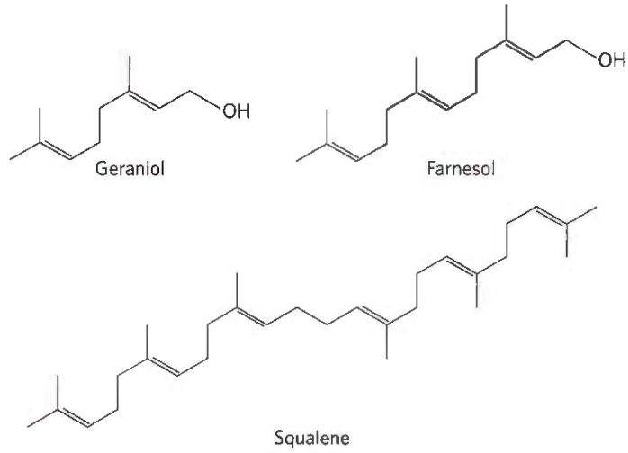

15. Hydrolysis of Lipids Name the products of mild hydrolysis with dilute NaOH of (a) 1-stearoyl-2,3-dipalmitoylglycerol (b) 1-palmitoyl-2-oleoylphosphatidylcholine.

16. Effect of Polarity on Solubility Rank a triacylglycerol, a diacylglycerol, and a monoacylglycerol in order of decreasing solubility in water. Assume that each acylglycerol contains only palmitic acid.

17. Chromatographic Separation of Lipids Suppose that you apply a mixture of lipids to a silica gel column and then wash the column with increasingly polar solvents. The mixture consists of phosphatidylserine, phosphatidylethanolamine, phosphatidylcholine, cholesteryl palmitate (a sterol ester), sphingomyelin, palmitate, n-tetradecanol, triacylglycerol, and cholesterol. In what order will the lipids elute from the column? Explain your reasoning.

18. Identification of Unknown Lipids Johann Thudichum, who practiced medicine in London about 100 years ago, also dabbled in lipid chemistry in his spare time. He isolated a variety of lipids from neural tissue and characterized and named many of them. His carefully sealed and labeled vials of isolated lipids were rediscovered many years later.

(a) How would you confirm, using techniques not available to Thudichum, that the vials labeled "sphingomyelin" and "cerebroside" actually contain these compounds?

(b) How would you distinguish sphingomyelin from phosphatidylcholine by chemical, physical, or enzymatic tests?

### [EN] BIOCHEMISTRY ONLINE

19. Using the LIPID MAPS Database to Find Solubility Information Lipidomics has identified thousands of cellular lipids. LIPID MAPS is an online database containing over 40,000 unique lipid structures, as well as information on the chemical and physical properties of each lipid (www.lipidmaps.org). One important parameter when working with lipids is log P, where P is the octanol:water partition coefficient, an indicator of lipophilicity.

(a) Look up cholesterol, sphingosine, linoleic acid, and stearic acid in LIPID MAPS and use the reported log P values to place them in order of increasing solubility in octanol.

(b) Pharmacologists often study $\log P$ values when developing new drugs. Why would knowing a drug's $\log P$ value be informative?

20. Characteristics of Lipid Transport Proteins Often when lipids are transported between different tissues, they are carried by proteins. In this exercise, you will explore the interactions between a lipid and a protein using the PDB (www.rcsb.org). Use the PDB identifier 2YG2 and study the structure of the complex between HDL-associated apolipoprotein M and sphingosine-1-phosphate. Navigate to 3D View: Structure to answer the following questions.

(a) What protein motif is adopted by apolipoprotein M?

(b) Which amino acid residues do you find lining the sphingosine binding pocket? What do they have in common?
(c) The phosphoryl group of sphingosine-1-phosphate is exposed on the surface of the protein. Why do you suppose it is important that the transport protein binds the hydrocarbon tail of sphingosine-1-phosphate but not necessarily the polar head group?

### [EN] DATA ANALYSIS PROBLEM

21. Determining the Structure of the Abnormal Lipid in Tay-Sachs Disease Box 10-1, Figure 1, shows the pathway of breakdown of gangliosides in healthy (normal) individuals and in individuals with certain genetic diseases.

Some of the data on which the figure is based were presented in a paper by Lars Svennerholm (1962). Note that the sugar Neu5Ac, N-acetylneuraminic acid, represented in the Box 10-1 figure as ◆, is a sialic acid.

Svennerholm reported that "about $90\%$ of the monosialogangliosides isolated from normal human brain" consisted of a compound with ceramide, hexose, $N$ -acetylgalactosamine, and $N$ -acetylneuraminic acid in the molar ratio 1:3:1:1.

(a) Which of the gangliosides (GM1 through GM3 and globoside) in Box 10-1, Figure 1, fits this description? Explain your reasoning.

(b) Svennerholm reported that 90% of the gangliosides from a patient with Tay-Sachs disease had a molar ratio (of the same four components given above) of 1:2:1:1. Is this consistent with the Box 10-1 figure? Explain your reasoning.

To determine the structure in more detail, Svennerholm treated the gangliosides with neuraminidase to remove the N-acetylneuraminic acid. This resulted in an asialoganglioside that was much easier to analyze. He hydrolyzed it with acid, collected the ceramide-containing products, and determined the molar ratio of the sugars in each product. He did this for both the normal gangliosides and the Tay-Sachs gangliosides. His results are shown below.

<table><tr><td>Ganglioside</td><td>Ceramide</td><td>Glucose</td><td>Galactose</td><td>Galactosamine</td></tr><tr><td colspan="5">Normal</td></tr><tr><td>Fragment 1</td><td>1</td><td>1</td><td>0</td><td>0</td></tr><tr><td>Fragment 2</td><td>1</td><td>1</td><td>1</td><td>0</td></tr><tr><td>Fragment 3</td><td>1</td><td>1</td><td>1</td><td>1</td></tr><tr><td>Fragment 4</td><td>1</td><td>1</td><td>2</td><td>1</td></tr><tr><td colspan="5">Tay-Sachs</td></tr><tr><td>Fragment 1</td><td>1</td><td>1</td><td>0</td><td>0</td></tr><tr><td>Fragment 2</td><td>1</td><td>1</td><td>1</td><td>0</td></tr><tr><td>Fragment 3</td><td>1</td><td>1</td><td>1</td><td>1</td></tr></table>

(c) Based on these data, what can you conclude about the structure of the normal ganglioside? Is this consistent with the structure in Box 10-1? Explain your reasoning.

(d) What can you conclude about the structure of the Tay-Sachs ganglioside? Is this consistent with the structure in Box 10-1? Explain your reasoning.

Svennerholm also reported the work of other researchers who "permethylated" the normal asialoganglioside. Permethylation is the same as exhaustive methylation: a methyl group is added to every free hydroxyl group on a sugar. They found the following permethylated sugars: 2,3,6-trimethylglycopyranose; 2,3,4,6-tetramethylgalactopyranose; 2,4,6-trimethylgalactopyranose; and 4,6-dimethyl-2-deoxy-2-aminogalactopyranose.

(e) To which sugar of GM1 does each of the permethylated sugars correspond? Explain your reasoning.

(f) Based on all the data presented so far, what pieces of information about normal ganglioside structure are missing?

### [EN] Reference

Svennerholm, L. 1962. The chemical structure of normal human brain and Tay-Sachs gangliosides. Biochem. Biophys. Res. Comm. 9:436–441.

### [EN] Abbreviated Solutions — Chapter 10

1. The term "lipid" does not specify a particular chemical structure. Compounds are categorized as lipids based on their greater solubility in organic solvents than in water.

20:6( $\Delta^{4,7,10,13,16,19}$ ) Docosahexaenoic acid (DHA)

3. (a) The number of cis double bonds. Each cis double bond causes a bend in the hydrocarbon chain, lowering the melting temperature. (b) Six different triacylglycerols can be constructed, in order of increasing melting points:

$$
\mathrm{OOO} <   \mathrm{OOP} = \mathrm{OPO} <   \mathrm{PPO} = \mathrm{POP} <   \mathrm{PPP}
$$

(c) where O = oleic and P = palmitic acid. The greater the content of saturated fatty acid, the higher the melting point. (d) Branched-chain fatty acids increase the fluidity of membranes because they decrease the extent of membrane lipid packing.

4. It reduces double bonds, which increases the melting point of lipids containing the fatty acids.

5. Long, saturated acyl chains, nearly solid at air temperatures, form a hydrophobic layer in which a polar compound such as $H_{2}O$ cannot dissolve or diffuse.

6. Spearmint is (R)-carvone; caraway is (S)-carvone.

7. The ${}^{18}$ O label appears in the fatty acid salts.

8. Hydrophobic units: (a) 2 fatty acids (b), (c), and (d) 1 fatty acid and the hydrocarbon chain of sphingosine (e) the steroid nucleus and acyl side chain. Hydrophilic units: (a) phosphoethanolamine (b) phosphocholine (c) D-galactose (d) several sugar molecules (e) alcohol group (-OH)

9. Serine

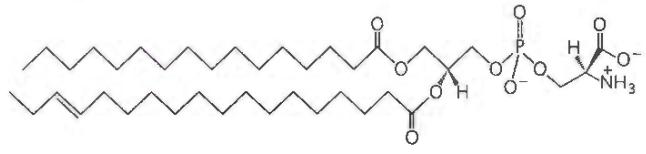

10.  

11. The part of the membrane lipid that determines blood type is the oligosaccharide in the head group of the membrane sphingolipids (see Fig. 10-13). This same oligosaccharide is attached to certain membrane glycoproteins, which also serve as points of recognition by the antibodies that distinguish blood groups.

12. (a) The free —OH group on C-2 and the phosphocholine head group on C-3 are hydrophilic; the fatty acid on C-1 of lysolecithin is hydrophobic. (b) Certain steroids, such as prednisone, inhibit the action of phospholipase A₂, inhibiting the release of arachidonic acid from C-2. Arachidonic acid is converted to a variety of eicosanoids, some of which cause inflammation and pain. (c) Phospholipase A₂ releases arachidonic acid, a precursor of other eicosanoids with vital protective functions in the body; it also breaks down dietary glycerophospholipids.

13. Diacylglycerol is hydrophobic and remains in the membrane. Inositol 1,4,5-trisphosphate is highly polar, very soluble in water, and more readily diffusible in the cytosol. Both are second messengers.

14.  
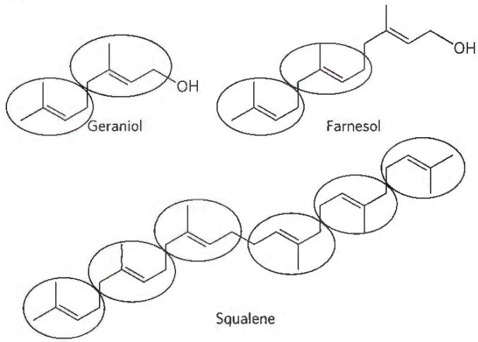

15. (a) Glycerol and the sodium salts of palmitic and stearic acids  
(b) D-Glycerol 3-phosphocholine and the sodium salts of palmitic and oleic acids

16. Solubility in water: monoacylglycerol > diacylglycerol > triacylglycerol

17. First eluted to last eluted: cholesteryl palmitate and triacylglycerol; cholesterol and n-tetradecanol; phosphatidylcholine and phosphatidylethanolamine; sphingomyelin; phosphatidylserine and palmitate. The lipids elute from the silica gel column in order of polarity. The least polar lipid will elute first and the most polar lipid will elute last.

18. (a) Subject acid hydrolysates of each compound to chromatography (GC or silica gel TLC), and compare the result with known standards. Sphingomyelin hydrolysate: sphingosine, fatty acids, phosphocholine, choline, and phosphate; cerebroside hydrolysate: sphingosine, fatty acids, sugars, but no phosphate. (b) Strong alkaline hydrolysis of sphingomyelin yields sphingosine; phosphatidylcholine yields glycerol. Detect hydrolysate components on thin-layer chromatograms by comparing with standards or by their differential reaction with FDNB (only sphingosine reacts to form a colored product). Treatment with phospholipase A $_{1}$ or A $_{2}$ releases free fatty acids from phosphatidylcholine, but not from sphingomyelin.

19. (a) Sphingosine (4.78); linoleic acid (5.88); stearic acid (6.33); cholesterol (7.68) (b) Log P describes the lipophilicity of the drug, crucial for determining how to formulate the drug for transport through aqueous compartments of the body such as the gut and the bloodstream. Log P also determines the likelihood of a drug being absorbed by fats and fatty tissues, which can alter its effectiveness, half-life, and potential toxicity.

20. (a) $\beta$ barrel (b) Phe, Trp, Tyr, Leu. All are hydrophobic or have nonpolar R groups. (c) The polar head group can hydrogen bond with water; the hydrocarbon tail cannot. Hydrophobic portions of the residues of the pocket protect the tail from contact with water as it moves through the bloodstream.

21. (a) GM1 and globoside. Both glucose and galactose are hexoses, so "hexose" in the molar ratio refers to glucose + galactose. The ratios for the four gangliosides are GM1, 1:3:1:1; GM2, 1:2:1:1; GM3, 1:2:0:1; globoside, 1:3:1:0. (b) Yes. The ratio matches GM2, the ganglioside expected to build up in Tay-Sachs disease (see Box 10-1, Fig. 1). (c) This analysis is similar to that used by Sanger to determine the amino acid sequence of insulin. The analysis of each fragment reveals only its composition, not its sequence, but because each fragment is formed by sequential removal of one sugar, we can draw conclusions about sequence. The structure of the normal asialoganglioside is ceramide-glucose-galactose-galactosamine-galactose, consistent with Box 10-1 (excluding Neu5Ac, removed before hydrolysis). (d) The Tay-Sachs asialoganglioside is ceramide-glucose-galactose-galactosamine, consistent with Box 10-1. (e) The structure of the normal asialoganglioside, GM1, is ceramide-glucose [2-OH involved in glycosidic links; 1-OH involved in ring structure; 3-OH (2, 3, 6) free for methylation]-galactose [2-OH in links; 1-OH in ring; 3-OH (2, 4, 6) free for methylation]-galactosamine [2-OH in links; 1-OH in ring; 1-NH₂ instead of -OH; 2-OH (4, 6) free for methylation]-galactose [1-OH in link; 1-OH in ring; 4-OH (2, 3, 4, 6) free for methylation]. (f) Two key pieces of information are missing: What are the linkages between the sugars? Where is Neu5Ac attached?

<!-- EN-END 第10章章末 -->

<!-- EN-BEGIN 第11章章末 -->

## 【英文对应 第11章章末】Biological Membranes and Transport：关键术语、习题与简答

> 来源：Lehninger Principles of Biochemistry（书籍/02_生物化学原理） 第11章章末，以及书末 Abbreviated Solutions to Problems 第11章。

### [EN] KEY TERMS

Terms in bold are defined in the glossary.

<table><tr><td>micelle 368</td><td>v-SNAREs 383</td></tr><tr><td>bilayer 368</td><td>t-SNAREs 383</td></tr><tr><td>vesicle 368</td><td>integrin 383</td></tr><tr><td>fluid mosaic model 369</td><td>selectin 384</td></tr><tr><td>lipid transfer protein 371</td><td>simple diffusion 385</td></tr><tr><td>integral proteins 372</td><td>membrane potential $(V_{m})$  385</td></tr><tr><td>peripheral proteins 372</td><td></td></tr><tr><td>amphitropic proteins 372</td><td>electrochemical gradient 385</td></tr><tr><td>monotopic 372</td><td></td></tr><tr><td>bitopic 372</td><td>electrochemical potential 385</td></tr><tr><td>polytopic 372</td><td></td></tr><tr><td>hydropathy index 374</td><td>transporters 385</td></tr><tr><td>β barrel 374</td><td>passive transport 385</td></tr><tr><td>porin 374</td><td>active transport 386</td></tr><tr><td>positive-inside rule 375</td><td>ion channels 386</td></tr><tr><td>GPI-anchored protein 376</td><td> $K_{t}(K_{transport})$  388</td></tr><tr><td>flippases 378</td><td>amphipathic 388</td></tr><tr><td>floppases 378</td><td>electroneutral 391</td></tr><tr><td>scramblases 379</td><td>cotransport 391</td></tr><tr><td>FRAP 379</td><td>antiport 391</td></tr><tr><td>microdomains 380</td><td>symport 391</td></tr><tr><td>rafts 380</td><td>uniport 391</td></tr><tr><td>caveolae 381</td><td>electrogenic 392</td></tr><tr><td>caveolin 381</td><td>P-type ATPases 392</td></tr><tr><td>BAR domain 382</td><td>SERCA pump 393</td></tr><tr><td>septins 382</td><td>Na+K+ATPase 394</td></tr><tr><td>fusion protein 383</td><td>V-type ATPases 394</td></tr></table>

F-type ATPases 395
ATP synthase 395
ABC transporters 395
multidrug
transporters 396
Na $^{+}$ -glucose symporter 398 ionophore 399
aquaporins (AQPs) 400
ligand-gated channel 401
voltage-gated ion
channel 401
patch-clamping 401

### [EN] PROBLEMS

1. Determining the Cross-Sectional Area of a Lipid Molecule When phospholipids are layered gently onto the surface of water, they orient at the air-water interface with their head groups in the water and their hydrophobic tails in the air. The experimental apparatus shown can be used to progressively reduce the surface area available to a layer of lipids. By measuring the force necessary to push the lipids together, we can determine when the molecules are packed tightly in a continuous monolayer; as that area is approached, the force needed to further reduce the surface area increases sharply, as shown in the graph. How would you use this apparatus to determine the average area occupied by a single lipid molecule in the monolayer?

  
Area (nm $^{2}$ /molecule)

2. Properties of Lipids and Lipid Bilayers Lipid bilayers form when phospholipids are suspended in water. The edges of these sheets close upon each other and undergo self-sealing to form vesicles (liposomes).

(a) What properties of lipids are responsible for this property of bilayers? Explain.

(b) What are the consequences of this property for the structure of biological membranes?

3. Length of a Fatty Acid Molecule The carbon-carbon bond distance for single-bonded carbons, such as those in a saturated fatty acyl chain, is about 1.5 Å. Estimate to one significant figure the length of a single molecule of palmitate in its fully extended form. If two molecules of palmitate were placed end to end, how would their total length compare with the thickness of the lipid bilayer in a biological membrane?

4. Membrane Proteins What are the three main categories of membrane proteins, and how are they distinguished experimentally?

5. Location of a Membrane Protein Treatment of disrupted erythrocyte membranes with a concentrated salt solution released an unknown membrane protein, X. Proteolytic enzymes cleaved X into fragments. In additional experiments, intact erythrocytes were treated with proteolytic enzymes, washed, then disrupted. Extraction of membrane components yielded intact X. What do these observations indicate about the location of X in the plasma membrane? Do the properties of X resemble those of an integral membrane protein or a peripheral membrane protein?

6. Predicting Membrane Protein Topology from Sequence
You have cloned the gene for a human erythrocyte protein, which you suspect is a membrane protein. You deduce the amino acid sequence of the protein from the nucleotide sequence of the gene. From this sequence alone, how would you evaluate the possibility that the protein is an integral protein? Suppose the protein proves to be an integral protein with one transmembrane segment. Suggest biochemical or chemical experiments that might allow you to determine whether the protein is oriented with the amino terminus on the outside of the cell or on the inside of the cell.

7. Surface Density of a Membrane Protein E. coli can be induced to make about 10,000 copies of the lactose transporter ( $M_{r}$ 31,000) per cell. Assume that E. coli is a cylinder 1 $\mu$ m in diameter and 2 $\mu$ m long. The diameter of the lactose transporter is approximately 6 nm. What fraction of the plasma membrane surface is occupied by the lactose transporter molecules? Explain how you arrived at this conclusion.

8. Molecular Species in the Plasma Membrane The plasma membrane of E. coli is about 75% protein and 25% phospholipid by weight. How many molecules of membrane lipid are present for each molecule of membrane protein? Assume an average protein $M_{r}$ of 50,000 and an average phospholipid $M_{r}$ of 750. What more would you need to know to estimate the fraction of the membrane surface that is covered by lipids?

9. Temperature Dependence of Lateral Diffusion The experiment described in Figure 11-19 was performed at 37 °C. If the experiment were carried out at 10 °C, what effect would you expect on the rate of diffusion? Why?

10. Membrane Self-Sealing Cellular membranes are self-sealing—if they are punctured or disrupted mechanically, they quickly and automatically reseal. What properties of membranes are responsible for this important feature?

11. Lipid Melting Temperatures Membrane lipids in tissue samples obtained from different parts of a reindeer's leg have different fatty acid compositions. Membrane lipids from tissue near the hooves contain a larger proportion of unsaturated fatty acids than those from tissue in the upper leg. What is the significance of this observation?

12. Flip-Flop Diffusion What is the physical explanation for the very slow movement of membrane phospholipids from one leaflet of a biological membrane to the other? What factors influence this rate?

13. Bilayer Asymmetry The inner leaflet (monolayer) of the human erythrocyte membrane consists predominantly of phosphatidylethanolamine and phosphatidylserine. The outer leaflet consists predominantly of phosphatidylcholine and sphingomyelin. Although the phospholipid components of the membrane can diffuse in the fluid bilayer, this sidedness is preserved at all times. How?

14. Scramblase and Flippase Explain the difference between the scramblase enzymes and flippase enzymes based on the membranes with which they are associated, the symmetry of these membranes, and their energy requirements.

15. Membrane Permeability At pH 7, tryptophan crosses a lipid bilayer at about one-thousandth the rate of indole, a closely related compound:

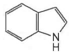

Suggest an explanation for this observation.

16. Glucose Transporters A cell biologist working with cultured cells from intestinal epithelium finds that the cells take up glucose from the growth medium 10 times faster when the glucose concentration is 5 mm than when it is 0.2 mm. She also finds that glucose uptake requires Na $^{+}$ in the growth medium. What can you say about the glucose transporter in these cells?

17. Use of the Helical Wheel Diagram A helical wheel is a two-dimensional representation of a helix, a view along its central axis. Use the helical wheel diagram shown here to determine the distribution of amino acid residues in a helical segment with the sequence -Val-Asp-Arg-Val-Phe-Ser-Asn-Val-Cys-Thr-His-Leu-Lys-Thr-Leu-Gln-Asp-Lys-

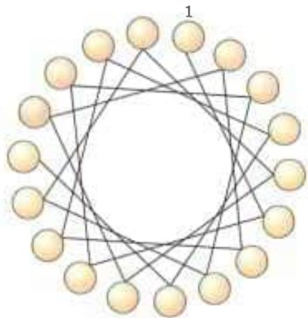

What can you say about the surface properties of this helix? How would you expect the helix to be oriented in the tertiary structure of an integral membrane protein?

18. Synthesis of Gastric Juice: Energetics Parietal cells acidify gastric juice (pH 1.5) by pumping HCl from blood plasma (pH 7.4) into the stomach. How much ATP (in moles) is required to pump a mole of protons ( $H^{+}$ ) against this concentration gradient? The free-energy change for ATP hydrolysis under cellular conditions is about -58 kJ/mol. Ignore the effects of the transmembrane electrical potential.

19. Electrogenic Transporters A single-cell organism, Paramecium, is large enough to allow the insertion of a microelectrode, permitting the measurement of the electrical potential between the inside of the cell and the surrounding medium (the membrane potential). The measured membrane potential is -50 mV (inside negative) in a living cell. What would happen if you added valinomycin to the surrounding medium, which contains $K^{+}$ and $Na^{+}$ ?

20. Energetics of the Na $^{+}$ K $^{+}$ ATPase For a typical vertebrate cell with a membrane potential of -0.070 V (inside negative), what is the free-energy change for transporting 1 mol of Na $^{+}$ from the cell into the blood at 37 °C? Assume the Na $^{+}$ concentration is 12 mm inside the cell and 145 mm in blood plasma.

21. Action of Ouabain on Kidney Tissue Ouabain specifically inhibits the $\mathrm{Na^{+}K^{+}}$ ATPase activity of animal tissues but is not known to inhibit any other enzyme. When ouabain is added to thin slices of living kidney tissue, it inhibits oxygen consumption by $66\%$ . Why? What does this observation tell us about the use of respiratory energy by kidney tissue?

22. Digoxin to Inhibit Na $^{+}$ K $^{+}$ ATPase The Na $^{+}$ Ca $^{2+}$ exchanger expressed in cardiac myocytes is a bidirectional antiporter protein that removes calcium from the cytoplasm by exchanging it with sodium. Cardiac myocytes also express the Na $^{+}$ K $^{+}$ ATPase. Suppose that a Na $^{+}$ K $^{+}$ ATPase inhibitor (digoxin) is added to cardiac myocytes. Using your knowledge of the relative concentrations of ions (intracellular versus extracellular) and the important role of the Na $^{+}$ K $^{+}$ ATPase in maintaining the electrochemical gradient, what change would you expect in the intracellular [Ca $^{2+}$ ]? Why?

23. Energetics of Symport Suppose you determined experimentally that a cellular transport system for glucose, driven by symport of $Na^{+}$ , could accumulate glucose to concentrations 25 times greater than in the external medium, while the external $[Na^{+}]$ was only 10 times greater than the intracellular $[Na^{+}]$ . Would this violate the laws of thermodynamics? If not, how could you explain this observation?

24. Labeling the Lactose Transporter A bacterial lactose transporter, which is highly specific for lactose, contains a Cys residue that is essential to its transport activity. Covalent reaction of N-ethylmaleimide (NEM) with this Cys residue irreversibly inactivates the transporter. A high concentration of lactose in the medium prevents inactivation by NEM, presumably by sterically protecting the Cys residue, which is in or near the lactose-binding site. You know nothing else about the transporter protein. Suggest an experiment that might allow you to determine the $M_{r}$ of this Cys-containing transporter polypeptide.

25. Transport Types You have just discovered a new L-alanine transporter in liver cells (hepatocytes). Poisoning hepatocytes with cyanide (which blocks ATP synthesis) reduces alanine transport by 90%. Tenfold reduction in extracellular $[Na^{+}]$ has no immediate effect on alanine transport. How would you use these observations to decide whether the alanine transporter is passive or active, primary or secondary?

26. Intestinal Uptake of Leucine You are studying the uptake of L-leucine by epithelial cells of the mouse intestine. Measurements of the rates of uptake of L-leucine and several of its analogs, with and without Na $^{+}$ in the assay buffer, yield the results given in the table. What can you conclude about the properties and mechanism of the leucine transporter? Would you expect L-leucine uptake to be inhibited by ouabain (see problem 21)?

<table><tr><td rowspan="2">Substrate</td><td colspan="2">Uptake in presence of  $Na^+$ </td><td colspan="2">Uptake in absence of  $Na^+$ </td></tr><tr><td> $V_{max}$ </td><td> $K_t (mm)$ </td><td> $V_{max}$ </td><td> $K_t (mm)$ </td></tr><tr><td>L-Leucine</td><td>420</td><td>0.24</td><td>23</td><td>0.2</td></tr><tr><td>D-Leucine</td><td>310</td><td>4.7</td><td>5</td><td>4.7</td></tr><tr><td>L-Valine</td><td>225</td><td>0.31</td><td>19</td><td>0.31</td></tr></table>

27. Ion Channel Selectivity Potassium channels consist of four subunits that form a channel just wide enough for $K^{+}$ ions to pass through. Although $Na^{+}$ ions are smaller ( $M_{r}$ 23, radius 0.95 Å) than $K^{+}$ ions ( $M_{r}$ 39, radius 1.33 Å), the potassium channels in the bacterium Streptomyces lividans transport 104 times more $K^{+}$ ions than $Na^{+}$ ions. What prevents $Na^{+}$ ions from passing through potassium channels?

28. Effect of an Ionophore on Active Transport Consider the leucine transporter described in Problem 26. Would $V_{\mathrm{max}}$ and/or $K_{\mathrm{t}}$ change if you added a $\mathrm{Na^{+}}$ ionophore to the assay solution containing $\mathrm{Na^{+}}$ ? Explain.

### [EN] BIOCHEMISTRY ONLINE

29. Predicting Membrane Protein Topology I Online bioinformatics tools make hydropathy analysis easy if you know the amino acid sequence of a protein. At the Protein Data Bank (www.rcsb.org), the Protein Feature View displays additional information about a protein gleaned from other databases, such as UniProt and SCOP2. A simple graphical view of a hydropathy plot created using a window of 15 residues shows hydrophobic regions in red and hydrophilic regions in blue.

(a) Looking only at the displayed hydropathy plots in the Protein Feature View, what predictions would you make about the membrane topology of these proteins: glycophorin A (PDB ID 1AFO), myoglobin (PDB ID 1MBO), and aquaporin (PDB ID 2B6O)?

(b) Now, refine your information using the ProtScale tools at the ExPASy bioinformatics resource portal. Each of the PDB Protein Feature Views was created with a UniProt Knowledgebase ID. For glycophorin A, the UniProtKB ID is P02724; for myoglobin, P02185; and for aquaporin, Q6J8I9. Go to the ExPASy portal (http://web.expasy.org/protscale) and select the Kyte & Doolittle hydropathy analysis option, with a window of 7 amino acids. Enter the UniProtKB ID for aquaporin (Q6J8I9, which you can also get from the PDB's Protein Feature View page), then select the option to analyze the complete chain (residues 1 to 263). Use the default values for the other options and click Submit to get a hydropathy plot. Save a GIF image of this plot. Now repeat the analysis using a window of 15 amino acids. Compare the results for the 7-residue and 15-residue window analyses. Which window size gives you a better signal-to-noise ratio?

(c) Under what circumstances would it be important to use a narrower window?

30. Predicting Membrane Protein Topology II The epinephrine receptor in animal cells is an integral membrane protein ( $M_{r}$ 64,000) that is believed to have seven transmembrane $\alpha$ -helical regions.

(a) Show that a protein of this size is capable of spanning the membrane seven times.

(b) Given the amino acid sequence of this protein, how would you predict which regions of the protein form the membrane-spanning helices?

(c) Go to the Protein Data Bank (www.rcsb.org). Use the PDB identifier 1DEP to retrieve the data page for a portion of the $\beta$ -adrenergic receptor (one type of epinephrine receptor) isolated from turkey. Using JSmol to explore the structure, predict whether this portion of the receptor is located within the membrane or at the membrane surface. Explain your answer. Now use the Protein Feature View to see the hydrophobicity analysis of the sequence. Does this support your answer?

(d) Retrieve the data for a portion of another receptor, the acetylcholine receptor of neurons and myocytes, using the PDB identifier 1A11. As in (c), predict where this portion of the receptor is located and explain your answer.

### [EN] DATA ANALYSIS PROBLEM

31. The Fluid Mosaic Model of Biological Membrane Structure Figure 11-3 shows the currently accepted fluid mosaic model of biological membrane structure. This model was presented in detail in a review article by S. J. Singer in 1971. In the article, Singer presented the three models of membrane structure that had been proposed up to that time:

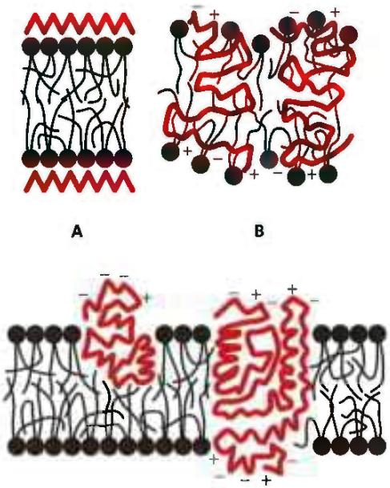  
C

A. The Davson-Danielli-Robertson Model. This was the most widely accepted model in 1971, when Singer's review was published. In this model, the phospholipids are arranged as a bilayer. Proteins are found on both surfaces of the bilayer, attached to it by ionic interactions between the charged head groups of the phospholipids and charged groups of the proteins. Crucially, there is no protein in the interior of the bilayer.

B. The Benson Lipoprotein Subunit Model. Here the proteins are globular and the membrane is a protein-lipid mixture. The hydrophobic tails of the lipids are embedded in the hydrophobic parts of the proteins. The lipid head groups are exposed to the solvent. There is no lipid bilayer.

C. The Lipid-Globular Protein Mosaic Model. This is the model shown in Figure 11-3. The lipids form a bilayer and proteins are embedded in it, some extending through the bilayer and others not. Proteins are anchored in the bilayer by interactions between the hydrophobic tails of the lipids and hydrophobic portions of the protein.

For the data given below, consider how each piece of information aligns with each of the three models of membrane structure. Which model(s) are supported, which are not supported, and what reservations do you have about the data or their interpretation? Explain your reasoning.

(a) When cells were fixed, stained with osmium tetroxide, and examined in the electron microscope, the membranes showed a "railroad track" appearance, with two dark-staining lines separated by a light space.

(b) The thickness of membranes in cells fixed and stained in the same way was found to be 5 to 9 nm. The thickness of a "naked" phospholipid bilayer, without proteins, was 4 to 4.5 nm. The thickness of a single monolayer of proteins was about 1 nm.

(c) Singer wrote in his article: "The average amino acid composition of membrane proteins is not distinguishable from that of soluble proteins. In particular, a substantial fraction of the residues is hydrophobic" (p. 165).

(d) As described in Problems 1 and 2 of this chapter, researchers had extracted membranes from cells, extracted the lipids, and compared the area of the lipid monolayer with the area of the original cell membrane. The interpretation of the results was complicated by the issue illustrated in the graph of Problem 1: the area of the monolayer depended on how hard it was pushed. With very light pressures, the ratio of monolayer area to cell membrane area was about 2.0. At higher pressures—thought to be more like those found in cells—the ratio was substantially lower.

(e) Circular dichroism spectroscopy uses changes in polarization of UV light to make inferences about protein secondary structure (see Fig. 4-9). On average, this technique showed that membrane proteins have a large amount of $\alpha$ helix and little or no $\beta$ sheet. This finding was consistent with most membrane proteins having a globular structure.

(f) Phospholipase C is an enzyme that removes the polar head group (including the phosphate) from phospholipids. In several studies, treatment of intact membranes with phospholipase C removed about 70% of the head groups without disrupting the "railroad track" structure of the membrane.

(g) Singer described in his article a study in which "a glycoprotein of molecular weight about 31,000 in human red blood cell membranes is cleaved by tryptic treatment of the membranes into soluble glycopeptides of about 10,000 molecular weight, while the remaining portions are quite hydrophobic" (p. 199). Trypsin treatment did not cause gross changes in the membranes, which remained intact.

Singer's review also included many more studies in this area. In the end, though, the data available in 1971 did not conclusively prove Model C was correct. As more data have accumulated, this model of membrane structure has been accepted by the scientific community.

### [EN] Reference

Singer, S.J. 1971. The molecular organization of biological membranes. In Structure and Function of Biological Membranes (L.I. Rothfield, ed.), pp. 145–222. New York: Academic Press.

### [EN] Abbreviated Solutions — Chapter 11

1. The area per molecule would be calculated from the known amount (number of molecules) of lipid used and the area occupied by a monolayer when it begins to resist compression (when the required force increases dramatically, as shown in the plot of force versus area).

2. (a) Lipids that form bilayers are amphipathic molecules: they contain a hydrophilic region and a hydrophobic region. To minimize the hydrophobic area exposed to the water surface, these lipids form two-dimensional sheets, with the hydrophilic regions exposed to water and the hydrophobic regions buried in the interior of the sheet. Furthermore, to avoid exposing the hydrophobic edges of the sheet to water, lipid bilayers close on themselves. (b) These sheets form the closed membrane surfaces that envelop cells and compartments within cells (organelles).

3. 2 nm. Two palmitates placed end to end span about 4 nm, approximately the thickness of a typical bilayer.

4. Integral proteins are firmly embedded in the lipid bilayer and can be released only by treating membranes with a detergent or nonpolar solvent. Peripheral membrane proteins are more easily released, by changes in pH, metal ion concentration, or protein-denaturing reagents like urea. Amphitropic membrane proteins are loosely and reversibly associated with membranes and move between membrane and cytosol as part of their function.

5. Salt extraction indicates a peripheral location, and inaccessibility to protease in intact cells indicates an internal location. Protein X is likely to be a peripheral protein on the cytosolic face of the membrane.

6. Construct a hydropathy plot; hydrophobic regions of 20 or more residues suggest transmembrane segments. Determine whether the protein in intact erythrocytes reacts with a membrane-impermeant reagent specific for primary amines; if it does, the transporter's amino terminus is on the outside of the cell.

7. \~4%; estimated by calculating the surface area of the cell and of 10,000 transporter molecules

8. -22. To estimate the fraction of membrane surface covered by phospholipids, you would need to know (or estimate) the average cross-sectional area of a phospholipid molecule in a bilayer (e.g., from an experiment such as that described in Problem 1 in this chapter) and the average cross-sectional area of a $50\mathrm{kDa}$ protein.

9. Rate of diffusion would decrease. Movement of individual lipids in bilayers occurs much faster at $37^{\circ}$ C, when the lipids are in the "fluid" phase, than at $10^{\circ}$ C, when they are in the "solid" phase. This effect is more pronounced than the usual decrease in Brownian motion with decreased temperature.

10. Interactions among membrane lipids are due to the hydrophobic effect, noncovalent and reversible, allowing membranes to spontaneously reseal.

11. The temperature of body tissues at the extremities is lower than that of tissues closer to the center of the body. If lipid is to remain fluid at this lower temperature, it must contain a higher proportion of unsaturated fatty acids; unsaturated fatty acids lower the melting point of lipid mixtures.

12. There is a very high energetic barrier to taking the polar head of a membrane lipid through the hydrocarbon core. Higher temperatures might make it more likely to occur, as would the presence of a catalyst, such as a flippase, a floppase, or a scramblase protein.

13. The energetic cost of moving the highly polar, sometimes charged, head group through the hydrophobic interior of the bilayer is prohibitive.

14. Scramblases catalyze the transport of membrane lipids from one membrane leaflet to the other. The reaction is ATP-independent, driven by a transbilayer lipid gradient. Scramblases cannot create an asymmetric distribution of lipids across the bilayer. Flippases catalyze the ATP-dependent transport of aminophospholipids (phosphatidylserine and phosphatidylethanolamine) from the extracellular or lumenal leaflet of a membrane to the cytosolic leaflet.

15. At pH 7, tryptophan bears both a positive charge and a negative charge, but indole is uncharged. The movement of the less polar indole through the hydrophobic core of the bilayer is energetically more favorable.

16. The transporter has a $K_{t}$ greater than 0.2 mm and it is a cotransporter, a symporter with $Na^{+}$ .

17.  

The amino acids with the greatest hydropathy index (V, L, F, and C) are clustered on one side of the helix. This amphipathic helix is likely to dip into the lipid bilayer along its hydrophobic surface while exposing its other surface to the aqueous phase. Alternatively, a group of helices may cluster with their polar surfaces in contact with one another and their hydrophobic surfaces facing the lipid bilayer.

#### [EN] 18. 0.60 mol

19. Valinomycin is an ionophore that will carry $K^{+}$ across the plasma membrane, deflating the membrane potential that is normally achieved by the unequal pumping of $Na^{+}$ and $K^{+}$ by the $Na^{+}K^{+}$ ATPase.

#### [EN] 20. 13 kJ/mol

21. Most of the $O_{2}$ consumed by a tissue is for oxidative phosphorylation, the source of most of the ATP. Therefore, about two-thirds of the ATP synthesized by the kidney is used for pumping $K^{+}$ and $Na^{+}$ .

22. Under normal conditions, the $Na^{+}Ca^{2+}$ exchanger pumps $Ca^{2+}$ out as it allows $Na^{+}$ to move inward. The excess of $Na^{+}$ on the outside is created by the $Na^{+}K^{+}$ ATPase. When that enzyme is blocked with digoxin, the $Na^{+}$ gradient is depleted, and with it, the driving force for $Ca^{2+}$ exit. So $Ca^{2+}$ would flow down its gradient, entering the cell. This (increased $Ca^{2+}$ concentration) is generally lethal for the cell.

23. No. The symporter may carry more than one equivalent of $Na^{+}$ for each mole of glucose transported.

24. Treat a suspension of cells with unlabeled NEM in the presence of excess lactose, remove the lactose, then add radiolabeled NEM. Use SDS-polyacrylamide gel electrophoresis (SDS-PAGE) to determine the $M_{r}$ of the radiolabeled band (the transporter).

25. ATP-dependence signifies active transport; $[Na^{+}]$ -independence suggests primary transport.

26. The leucine transporter is specific for the L isomer, but the binding site can accommodate either L-leucine or L-valine. Reduction of $V_{max}$ in the absence of $Na^{+}$ indicates that leucine (or valine) is transported by symport with $Na^{+}$ . By depleting the $Na^{+}$ gradient, ouabain would inhibit L-leucine uptake.

27. The $K^{+}$ channel has a “pore” that allows $K^{+}$ to diffuse through the channel, stabilized by its interaction with the carbonyl oxygens of the amino acids that line the pore. $Na^{+}$ is smaller than $K^{+}$ , so it is not sterically hindered from passage through the pore, but $Na^{+}$ is too small to interact with the carbonyl oxygens, so it is not stabilized by that interaction.

28. $V_{max}$ increases; $K_{t}$ is unaffected.

29. (a) Glycophorin A: 1 transmembrane segment; myoglobin: no segments long enough to cross a membrane (not a membrane protein); aquaporin: 6 transmembrane segments (may be a membrane channel or a receptor protein) (b) The 15 residue window provides a better

signal-to-noise ratio. (c) A narrower window reduces the impact of "edge effects" when a transmembrane sequence occurs near either end of the protein.

30. (a) The rise per residue for an $\alpha$ helix (Chapter 4) is about $1.5\AA = 0.15\mathrm{nm}$ . To span a $4\mathrm{nm}$ bilayer, an $\alpha$ helix must contain about 27 residues; thus, for seven spans, about 190 residues are required. A protein of $M_{\mathrm{r}}64,000$ has about 580 residues. (b) A hydropathy plot is used to locate transmembrane regions. (c) Because about half of this portion of the receptor consists of charged residues, it probably represents an intracellular loop that connects two adjacent membrane-spanning regions of the protein. (d) Because this helix is composed mostly of hydrophobic residues, this portion of the receptor is probably one of the membrane-spanning regions of the protein.

31. (a) Model A: supported. The two dark lines are either the protein layers or the phospholipid heads, and the clear space is either the bilayer or the hydrophobic core, respectively. Model B: not supported. This model requires a more-or-less uniformly stained band surrounding the cell. Model C: supported, with one reservation. The two dark lines are the phospholipid heads; the clear zone is the tails. This assumes that the membrane proteins are not visible, because they do not stain with osmium or do not happen to be in the sections viewed.

(b) Model A: supported. A "naked" bilayer (4.5 nm) + two layers of protein (2 nm) sums to 6.5 nm, which is within the observed range of thickness. Model B: neither. This model makes no predictions about membrane thickness. Model C: unclear. The result is hard to reconcile with this model, which predicts a membrane as thick as, or slightly thicker than (due to the projecting ends of embedded proteins), a "naked" bilayer. The model is supported only if the smallest values for membrane thickness are correct or if a substantial amount of protein projects from the bilayer.

(c) Model A: unclear. The result is hard to reconcile with this model. If the proteins are bound to the membrane by ionic interactions, the model predicts that the proteins contain a high proportion of charged amino acids, in contrast to what was observed. Also, because the protein layer must be very thin (see (b)), there would not be much room for a hydrophobic protein core, so hydrophobic residues would be exposed to the solvent. Model B: supported. The proteins have a mixture of hydrophobic residues (interacting with lipids) and charged residues (interacting with water). Model C: supported. The proteins have a mixture of hydrophobic residues (anchoring in the membrane) and charged residues (interacting with water).

(d) Model A: unclear. The result is hard to reconcile with this model, which predicts a ratio of exactly 2.0; this would be hard to achieve under physiologically relevant pressures. Model B: neither. This model makes no predictions about amount of lipid in the membrane. Model C: supported. Some membrane surface area is taken up with proteins, so the ratio would be less than 2.0, as was observed under more physiologically relevant conditions.

(e) Model A: unclear. The model predicts proteins in extended conformations rather than globular conformations, so is supported only if one assumes that proteins layered on the surfaces include helical segments. Model B: supported. The model predicts mostly globular proteins (containing some helical segments). Model C: supported. The model predicts mostly globular proteins.

(f) Model A: unclear. The phosphorylamine head groups are protected by the protein layer, but only if the proteins completely cover the surface will the phospholipids be completely protected from phospholipase. Model B: supported. Most head groups are accessible to phospholipase.

Model C: supported. All head groups are accessible to phospholipase.

(g) Model A: not supported. Proteins are entirely accessible to trypsin digestion, and virtually all will undergo multiple cleavage, with no protected hydrophobic segments. Model B: not supported. Virtually all proteins are in the bilayer and inaccessible to trypsin. Model C: supported. Segments of protein that penetrate or span the bilayer are protected from trypsin; those exposed at the surfaces will be cleaved. The trypsin-resistant portions have a high proportion of hydrophobic residues.

<!-- EN-END 第11章章末 -->
