## 第 13 章 维生素和辅酶

> **本章英文对应内容**（Lehninger，插在所列中文小节末尾）
>
> - §8.4（第8章）→ 三、水溶性维生素

## 一、维生素概论

## （一）维生素的概念

维生素是参与生物生长发育和代谢所必需的一类微量有机物质。这类物质由于体内不能合成或者合成量不足，所以虽然需要量很少，每日仅以 mg 或 $\mu g$ 计算，但必须由食物供给。维生素在生物体内的作用不同于糖类，脂肪和蛋白质，它不是作为碳源、氮源或能源物质，不是用来供能或构成生物体的组成部分，但却是代谢过程中所必需的。已知绝大多数维生素作为酶的辅酶或辅基的组成成分，在物质代谢中起重要作用。

机体缺乏维生素时,物质代谢发生障碍。因为各种维生素的生理功能不同,缺乏不同的维生素产生不同的疾病,这种由于缺乏维生素而引起的疾病称为维生素缺乏症(avitaminosis)。

维生素是由 vitamin 一词翻译而来, 其名称一般是按发现的先后, 在“维生素”(简式用 V 表示)之后加上 A、B、C、D 等拉丁字母来命名。还有初发现的以为是一种, 后来证明是多种维生素混合存在, 便又在拉丁字母右下方注以 1,2,3 等数字加以区别, 例如 $B_{1}$ 、 $B_{2}$ 、 $B_{6}$ 及 $B_{12}$ 等。

生物对维生素的需要量是非常小的，而对各种维生素的需要量差别很大，并且对同一种维生素的需要量不同又因生理状况和劳动状况不同而异。例如正常人每天所需 $V_{A}0.8 \sim 1.6 \, mg, V_{B_{1}}1 \sim 2 \, mg, V_{B_{2}}1 \sim 2 \, mg$ ，泛酸 $3 \sim 5 \, mg, V_{B_{6}}2 \sim 3 \, mg, V_{pp}10 \sim 20 \, mg$ ，生物素 $0.2 \, mg$ ，叶酸 $0.4 \, mg, V_{B_{12}}2 \sim 6 \, \mu g, V_{D}10 \sim 20 \, \mu g, V_{E}8 \sim 10 \, mg, V_{C}60 \sim 100 \, mg$ 。当然对维生素的需要量不是绝对的，在某些特殊情况下需要量也会相应变化。

## （二）维生素的发现

人们对维生素的认识来源于医药实践和科学试验。中国唐代医学家孙思邈曾经指出，用动物肝防治夜盲症，用谷皮汤熬粥防治脚气病。现在我们知道，肝中多含 $V_{A}$ ，所以防治 $V_{A}$ 缺乏症的夜盲病；谷皮中多含 $V_{B}$ ，可以防治 $V_{B_{1}}$ 缺乏症的脚气病。直到1886年荷兰医生C. Eijkman在印度尼西亚的爪哇岛研究当时亚洲普遍流行的脚气病，最初企图找出引起该病的细菌，但未成功。1890年，在他的实验鸡群中爆发了多发性神经炎，表现与脚气病极为相似。1897年，他终于证明该病是由于用白米喂养而引起的，将丢弃的米糠放回到饲料中就可治愈。他认为米壳中有一种“保护因素”可对抗食物中过量的糖。后来G. Grijns证明米糠含有一种营养因素，并首先提出营养缺乏症这个概念。日本海军于1878—1882年爆发脚气病，用大麦代替大部分的精米后，脚气病得到了控制。

维生素是通过实验动物的科学饲养试验而发现。英国的 F. G. Hopkins 于 1906 年发现，大鼠饲以纯化的饲料，包括蛋白质、脂肪、糖类和矿质后，不能存活；如果在纯化饲料中增加极微量的牛奶后，大鼠能正常生长。F. G. Hopkins 得出结论，正常膳食中除蛋白质、脂肪、糖类和矿质外，还有必需的食物辅助因子，即维生素。美国的生物化学家 L. B. Mendal 和 T. B. Osborni, E. V. McCollum 和 M. Davis 于 1913 年发现 $V_{A}$ 和 $V_{B}$ 。其后，其他维生素被陆续发现。

在微生物中也有和动物相似的情况，即它们本身不能合成所需要的维生素，而要外界供给。但也有一些微生物能合成某些维生素，如大肠杆菌能合成维生素K、生物素等，核黄菌能合成 $V_{B_{2}}$ 。一般说植物体内能够合成维生素。高等动物不能合成维生素也不是绝对的，例如人体能合成 $V_{D}$ ；大小白鼠能合成 $V_{C}$ 。

## （三）维生素的分类和辅酶的关系

维生素都是小分子有机化合物。它们在化学结构上无共同性，有脂肪族、芳香族、脂环族、杂环和类固醇类化合物等。通常根据其溶解性质分为脂溶性和水溶性两大类。脂溶性有维生素A、D、E、K等，水溶性有维生素 $B_{1}$ 、 $B_{2}$ 、烟酸和烟酰胺、 $B_{6}$ 、泛酸、生物素、叶酸、 $B_{12}$ 和维生素C等。在生物体内维生素多以辅酶和辅基形式存在，现将各种维生素的辅酶、辅基形式以及在酶促反应中的主要作用列于表13-1。

表 13-1 各种维生素的辅酶(辅基)形式及酶反应中的主要功能

<table><tr><td>类型</td><td>辅酶、辅基或其他活性形式</td><td>主要功能</td></tr><tr><td>水溶性维生素:</td><td></td><td></td></tr><tr><td>维生素 $B_1$ (硫胺素)</td><td>硫胺素焦磷酸(TPP)</td><td>醛基转移和α-酮酸的脱羧作用</td></tr><tr><td rowspan="2">维生素 $B_2$ (核黄素)</td><td>黄素单核苷酸(FMN)</td><td>氧化还原反应</td></tr><tr><td>黄素腺嘌呤二核苷酸(FAD)</td><td>氧化还原反应</td></tr><tr><td rowspan="2">维生素PP(烟酸和烟酰胺)</td><td>烟酰胺腺嘌呤二核苷酸(NAD)</td><td>氢原子(电子)转移</td></tr><tr><td>烟酰胺腺嘌呤二核苷酸磷酸(NADP)</td><td>氢原子(电子)转移</td></tr><tr><td>泛酸(逾多酸)</td><td>辅酶A(CoA)</td><td>酰基转移作用</td></tr><tr><td>维生素 $B_6$ [吡哆醛(醇、胺)]</td><td>磷酸吡哆醛、磷酸吡哆胺</td><td>氨基酸转氨基、脱羧作用</td></tr><tr><td>生物素(维生素H)</td><td>生物胞素</td><td>传递 $CO_2$ </td></tr><tr><td>叶酸</td><td>四氢叶酸</td><td>传递一碳单位</td></tr><tr><td>维生素 $B_{12}$ (钴胺素)</td><td>脱氧腺苷钴胺素(辅酶 $B_{12}$ )、甲基钴胺素</td><td>氢原子1,2交换(重排作用),甲基化</td></tr><tr><td>硫辛酸</td><td>硫辛酰赖氨酸</td><td>酰基转移,氧化还原反应</td></tr><tr><td>维生素C(抗坏血酸)</td><td>—</td><td>羟基化反应辅助因子</td></tr><tr><td>脂溶性维生素:</td><td></td><td></td></tr><tr><td>维生素A(视黄醇)</td><td>11-顺视黄醛</td><td>视循环</td></tr><tr><td>维生素D(钙化醇)</td><td>1,25-二羟胆钙化醇[1,25-(OH) $_2$ D $_3$ ]</td><td>调节钙、磷代谢</td></tr><tr><td>维生素E(生育酚)</td><td></td><td>保护膜脂质、抗氧化剂</td></tr><tr><td>维生素K(凝血维生素)</td><td></td><td>羧化反应的辅助因子,参与氧化还原反应</td></tr></table>

## 二、脂溶性维生素

维生素 A、D、E、K 等不溶于水，而溶于脂肪及脂溶剂（如苯、乙醚及氯仿等）中，故称为脂溶性维生素。在食物中，它们常和脂质共同存在，因此在肠道吸收时也与脂质的吸收密切相关。当脂质吸收不良时，脂溶性维生素的吸收大为减少，甚至会引起缺乏症。吸收后的脂溶性维生素可以在体内，尤其是在肝内储存。

## （一）维生素A

维生素 A 又名视黄醇(retinol)是一个具有脂环的不饱和一元醇,通常以视黄醇酯(retinol ester)的形式存在,醛的形式称为视黄醛(retinal 或 retinaldehyde)。像所有脂溶性维生素,视黄醇是一种类异戊二烯分子,是由异戊二烯构件分子生物合成的。视黄醇从动物饮食中吸收或由植物来源的 $\beta$ -胡萝卜素合成。维生素 A 包括 $A_{1}$ 和 $A_{2}$ 两种。 $A_{1}$ 存在于哺乳动物及咸水鱼的肝中,即一般所说的视黄醇; $A_{2}$ 存在于淡水鱼的肝中。 $A_{1}$ 和 $A_{2}$ 的生理功能相同，但 $A_{2}$ 的生理活性只有 $A_{1}$ 的一半， $A_{2}$ 比 $A_{1}$ 在化学结构上多一个双键，维生素 $A_{1}$ 和 $A_{2}$ 的结构如下：

  
$\lambda_{max}$ 325 nm(乙醇溶液)

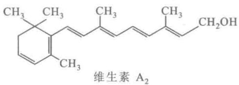  
$\lambda_{max}$ 325 nm(乙醇溶液)

由于维生素 A 的侧键含有 4 个双键, 故可形成 8 种顺、反异构体。在体内视黄醇可被氧化成视黄醛。视黄醛中最重要的为 9-及 11-顺视黄醛:

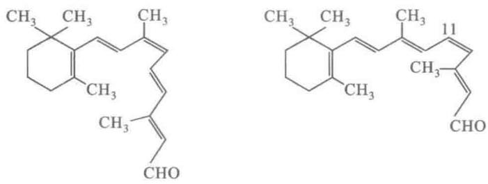  
9-顺视黄醛  
11-顺视黄醛

维生素 A 的化学结构和 $\beta-$ 胡萝卜素 ( $\beta$ -carotene) 的结构相关, $\beta-$ 胡萝卜素分子可被小肠黏膜的 $\beta-$ 胡萝卜素 -15, 15'-双加氧酶 ( $\beta$ -carotene-15, 15'-dioxygenase) 从其碳氢链中间断开生成两分子的视黄醛, 后者经还原转变为视黄醇。因此, $\beta-$ 胡萝卜素是维生素 A 原。实际上胡萝卜素在体内的利用率较低, $\beta-$ 胡萝卜素仅相当于 1/6 维生素 A 活性, 而 $\alpha$ 及 r-胡萝卜素活性为 $\beta$ 型的一半。

  
$\beta$ -胡萝卜素

食物中的维生素 A 在小肠黏膜细胞内与脂肪酸结合成酯后掺入乳糜微粒，通过淋巴液转运，并被肝所摄取。维生素 A 酯在肝的储脂细胞内贮藏，应机体需要向血中释放。血浆中的维生素 A 是非酯化型的，与特异的转运蛋白——视黄醇结合蛋白（retinol-binding protein, RBP）结合而被转运，RBP-视黄醇复合物的 $K_{d}$ 值是很小的，大约 $5 \times 10^{-12} \, mol \cdot L^{-1}$ 。

维生素A是构成视觉细胞内感光物质的成分。眼球视网膜上有两类感觉细胞，即视锥细胞，对强光及颜色敏感；另一种为视杆细胞，对弱光敏感，对颜色不敏感，与暗视觉有关。这是因为视杆细胞内含有感光物质视紫红质（rhodopsin）。视紫红质在光中分解，在暗中再合成。视紫红质是由11-顺视黄醛和视蛋白内赖氨酸的 $\varepsilon-$ 氨基通过形成schiff碱缩合而成的一种结合蛋白质，而视黄醛是维生素A的氧化产物。眼睛对弱光的感光性取决于视紫红质的合成。当维生素A缺乏时，11-顺视黄醛得不到足够的补充，视紫红质合成受阻，使视网膜不能很好地感受弱光，在暗处不能辨别物体，暗适应能力降低，严重时可出现夜盲症。有关视紫红质的合成及视杆细胞的视循环分别如图13-1和图13-2所示。

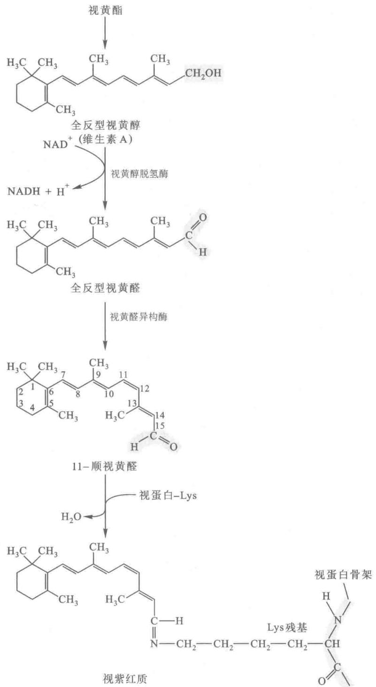  
图 13-1 光敏感蛋白——视紫红质的合成步骤

维生素 A 除了视觉功能之外, 在刺激组织生长及分化中也起重要作用, 这一方面还缺少了解。例如视黄酸能刺激实验动物生长, 但在视觉过程中不能代替视黄醛。维生素 A 也能刺激许多组织中的 RNA 合成。视黄醇衍生物的功能, 在特异的糖蛋白的合成中作为糖的携带者。被维生素 A 影响的其他分化过程是免疫反应, 当维生素 A 缺乏时机体的免疫功能会降低。细胞的黏附也受维生素 A 的影响, 当某些类型的细胞在无维生素 A 的介质中培养生长时, 加入维生素 A, 则恢复生长的接触性抑制, 并提高细胞之间的黏附。

维生素 A 主要来自动物性食品,以肝、乳制品及蛋黄中含量最多。维生素 A 原主要来自植物性食品,以胡萝卜、绿叶蔬

  
图13-2 视杆细胞的视循环

<!-- END OFFICIAL API PART part_005 -->

<!-- BEGIN OFFICIAL API PART part_006 -->

菜及玉米等含量较多。正常成人每日维生素A生理需要量为2600\~3300国际单位（IU），过多摄入维生素A，长期每日超过500000国际单位可以引起中毒症状，严重危害健康。

## （二）维生素D

维生素D为类固醇衍生物，具有抗佝偻病作用，故称为抗佝偻病维生素。维生素D家族最重要的成员是麦角钙化醇(ergocalciferol,即维生素 $\mathrm{D}_2$ )及胆钙化醇(cholecalciferol,即维生素 $\mathrm{D}_3$ )。胆钙化醇是由动物的皮肤通过紫外光（例如太阳）作用，以其前体分子——7-脱氢胆固醇而产生的（图13-3）。吸收光能经过激发单线态引起光异构作用，使9,10碳键破坏而形成前维生素 $\mathrm{D}_3$ (previtamin $\mathrm{D}_3$ )。紧接着自发地异构作用产生维生素 $\mathrm{D}_3$ ——胆钙化醇。麦角钙化醇仅侧键结构与胆钙化醇不同，它是通过太阳作用于植物固醇——麦角固醇(ergosterol)而产生的。因为人类能通过太阳作用于皮肤产生维生素 $\mathrm{D}_3$ ，因此“维生素D”严格地说不是一种维生素。

根据在身体中的作用机制,胆钙化醇应当称为一种激素前体激素原(prohormone)。饮食形式的维生素D通过小肠中胆盐的帮助被吸收。不论是在小肠中吸收或是在皮肤光合合成,胆钙化醇通过特异的维生素D结合蛋白(DBP)也称为转钙化蛋白(transcalciferin)转运到肝中。在肝中,胆钙化醇被一种混合功能氧化酶(mixed-functional oxidase)在C25位羟化生成25-羟维生素 $\mathrm{D}_3$ （即25-羟胆钙化醇）。尽管这是维生素D在身体内的主要循环形式，而25-羟维生素 $\mathrm{D}_3$ 比最终活性形式的生物活性低很多。为了生成最终活性形式，25-羟维生素 $\mathrm{D}_3$ 转运到肾中，C1被一种线粒体混合功能氧化酶羟化形成1,25-二羟维生素 $\mathbf{D}_3$ （即1,25-二羟胆钙化醇）（图13-3），即维生素D的活性形式，1,25-二羟胆钙化醇然后转运到靶组织，如同一种激素调节钙和磷的代谢。

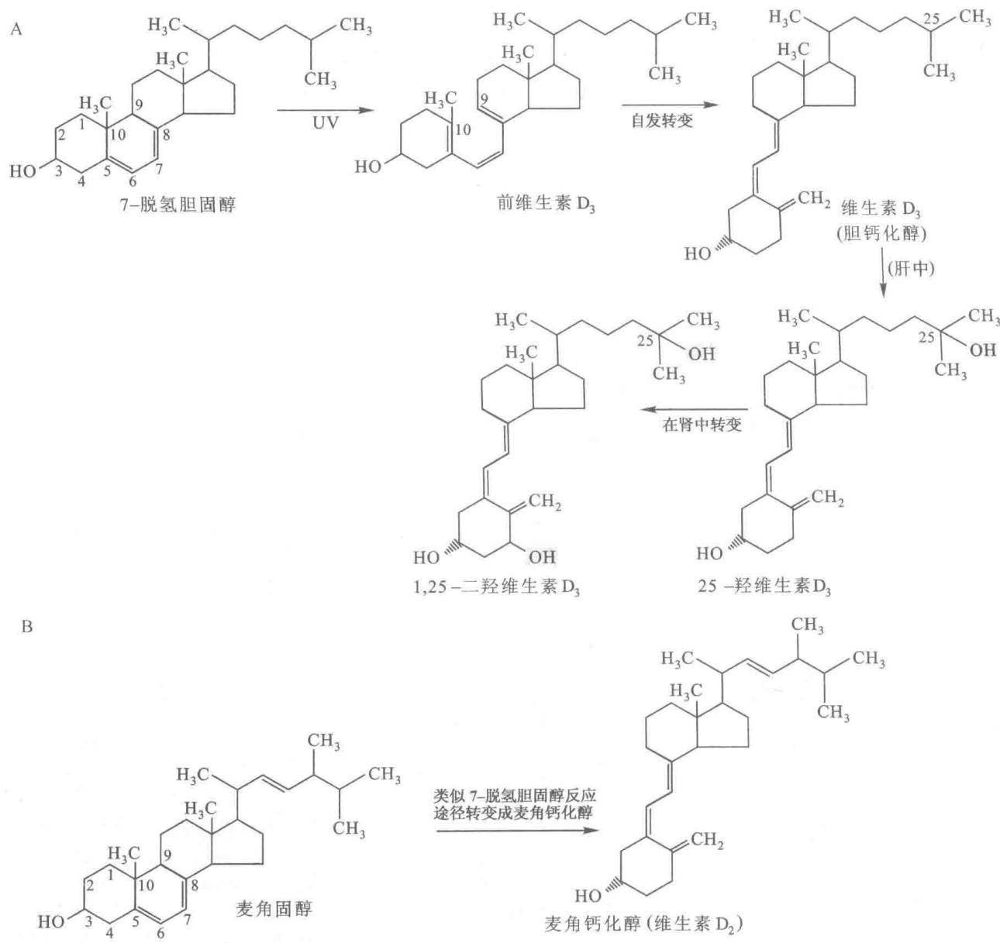  
图13-3 维生素D的合成  
A. 维生素 $D_{3}$ 通过阳光作用于 7-脱氢胆固醇在皮肤中产生。在肝和肾中混合功能氧化酶的连续作用产生维生素 D 的活性形式 1,25-二羟维生素 $D_{3}$ 。B. 麦角钙化醇以类似的方式由麦角固醇产生

1,25-二羟维生素 $\mathrm{D}_3$ 同两种肽激素降钙素（calcitonin）和甲状旁腺激素（parathyroid hormone，PTH），行使调节钙和磷的体内平衡。钙对许多生命过程包括肌肉收缩、神经冲动的传递、血液凝固和膜结构是重要的，而磷对DNA、RNA、脂质和许多代谢过程起重要作用。蛋白质磷酸化对于许多生物过程是一种重要的调节信号。磷和钙对骨骼的形成起到关键作用。正常血清磷和钙的任何紊乱，像佝偻病时，骨的结构发生变更。1,25-二羟维生素 $\mathrm{D}_3$ 的主要靶细胞是小肠黏膜、骨骼和肾小管，主要生理功能是促进小肠黏膜细胞对钙和磷的吸收。1,25-二羟维生素 $\mathrm{D}_3$ 能诱导钙结合蛋白（CaBP）的合成和促进Ca-ATP酶的活性，这都有利于 $\mathrm{Ca}^{2+}$ 的吸收。它也能促进磷的吸收；促进钙盐的更新及新骨的生成；促进肾小管细胞对钙磷的重吸收，减少从尿中排出。因此，1,25-二羟维生素 $\mathrm{D}_3$ 总的生理效应是提高血钙、血磷浓度，有利于新骨的生成与钙化。

维生素 D 主要含于肝、奶及蛋黄中，而以鱼肝油中含量最丰。维生素 D 可防治佝偻病，软骨病和手足抽搐症等，但在使用维生素 D 时应同时补钙。

## （三）维生素E

维生素 E 与动物生育有关, 故称生育酚(tocopherol), 主要存在于植物油中, 尤以麦胚油、大豆油、玉米油和葵花籽油中含量为最丰富。豆类及蔬菜中含量也较多。

天然的生育酚共有8种，在化学结构上，均系苯骈二氢吡喃的衍生物。根据其化学结构分为生育酚及生育三烯酚两类，每类又可根据甲基的数目和位置不同，分为 $\alpha$ 、 $\beta$ 、 $\gamma$ 和 $\delta$ 几种。

$$
\begin{array}{l l l} & \mathrm {R_ {1}} & \mathrm {R_ {2}} \\ \alpha - \text {生育酚} (\alpha - \text {生育三烯酚}) & - \mathrm {CH_ {3}} & - \mathrm {CH_ {3}} \\ \beta - \text {生育酚} (\beta - \text {生育三烯酚}) & - \mathrm {CH_ {3}} & - \mathrm{H} \\ \gamma - \text {生育酚} (\gamma - \text {生育三烯酚}) & - \mathrm{H} & - \mathrm {CH_ {3}} \\ \delta - \text {生育酚} (\delta - \text {生育三烯酚}) & - \mathrm{H} & - \mathrm{H} \end{array}
$$

维生素 E 中以 $\alpha-$ 生育酚生理活性最高, 若以它为基准, 则 $\beta-$ 及 $\gamma-$ 生育酚和 $\alpha-$ 生育三烯酚的生理活性分别为百分之 40、8 及 20, 其余活性甚微。但就抗氧化作用论, $\delta-$ 生育酚作用最强, $\alpha-$ 生育酚作用最弱。

维生素E极易氧化而保护其他物质不被氧化，是动物和人体中最有效的抗氧化剂和自由基清除剂。它能对抗生物膜磷脂中不饱和脂肪酸的过氧化反应，因而避免脂质中过氧化物产生，保护生物膜的结构和功能。机体代谢不断产生自由基，如羟基自由基 $(\mathrm{OH}\cdot)$ ，超氧阴离子自由基 $(\mathrm{O}_2^-$ ），过氧化物自由基（ $\mathrm{ROO}\cdot$ ）等。维生素E能捕捉自由基使其苯骈吡喃环上酚基失去一个氢原子而形成生育酚自由基。生育酚自由基又可进一步与另一自由基反应生成非自由基产物——生育醌。反应中生成的生育酚自由基也可与维生素C反应获得复原，这是维生素E和C的协同作用。

维生素 E 还可与硒(Se)协同通过谷胱甘肽过氧化酶发挥抗氧化作用。

维生素 E 与动物生殖功能有关,动物缺乏维生素 E 时,其生殖器官受损而不育。雄鼠缺乏时,睾丸萎缩,不产生精子;雌鼠缺乏时,胚胎及胎盘萎缩而被吸收,引起流产。临床上常用维生素 E 治疗先兆流产和习惯性流产。

维生素 E 能提高血红素合成过程中的关键酶 $\delta-$ 氨基 $\gamma-$ 酮戊酸 ( $\delta-$ amino $\gamma-$ levulinic acid, ALA) 合成酶和 ALA 脱水酶的活性, 从而促进血红素合成。研究证明, 当人体血浆维生素 E 水平低时, 红细胞增加氧化性溶血, 若供给维生素 E 可以延长红细胞的寿命。这是由于维生素 E 具有抗氧化剂的功能, 保护了红细胞膜不饱和脂肪酸免于氧化破坏, 因而防止了红细胞破裂而造成溶血。

维生素 E 一般不易缺乏, 正常血浆维生素 E 浓度为 0.9\~1.6 mg/100 ml, 若低于 0.5 mg/100 ml 则可出现缺乏症。主要表现为红细胞数量减少, 寿命缩短, 体外实验见到红细胞脆性增加, 常表现为贫血或血小板增多症。

## (四) 维生素 K

维生素 K 具有促进凝血的功能, 故又称凝血维生素。天然的维生素 K 有两种: 维生素 $K_{1}$ 和 $K_{2}$ 。 $K_{1}$ 在绿叶植物及动物肝中含量较丰富。 $K_{2}$ 是人体肠道细菌的代谢产物。它们都是 2-甲基-1,4-萘醌的衍生物。目前临床上最常用的为维生素 $K_{3}$ , 2-甲基萘醌的含氮类似物即 4-亚氨基-2-甲基萘醌的凝血活性比 $K_{1}$ 高 3\~4 倍, 称为 $K_{4}$ 。维生素 $K_{1}$ 、 $K_{2}$ 、 $K_{3}$ 、和 $K_{4}$ 的结构如下:

维生素 $\mathbf{K}_1$

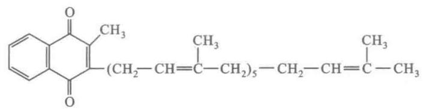

维生素 $\mathbf{K}_2$

维生素 K 的主要生理功能是促进肝合成凝血酶原(prothrombin, 凝血因子Ⅱ)。调节另外 3 种凝血因子Ⅶ、Ⅸ及 X 的合成。缺乏维生素 K 时，血中这几种凝血因子均减少，因而凝血时间延长，常发生肌肉及

肠胃道出血。

在第8章中已提到血液凝固的关键步骤是凝血酶原转变成凝血酶，而这一步需要 $\mathrm{Ca}^{2+}$ 参加。凝血酶原要结合 $\mathrm{Ca}^{2+}$ ，则要求它的肽链上具有 $\gamma-$ 羧基谷氨酸的结构。凝血酶原分子的N端含有10个谷氨酸残基，经羧化而与 $\mathrm{Ca}^{2+}$ 螯合，并与膜中的磷脂结合后，为蛋白酶水解而转变为凝血酶。凝血酶原上一些特定谷氨酸残基的羧基化，是由依赖于维生素K的谷氨酰羧化酶(glutamyl carboxylase)催化下完成的(图13-4)。当维生素K缺乏时，就不能形成正常含 $\gamma-$ 羧基谷氨酸的凝血酶原，影响了与 $\mathrm{Ca}^{2+}$ 的结合，酶原不能转变为凝血酶，因而影响了血液凝固。此外在一些组织中发现有依赖维生素K的羧化酶系统，参与合成其他含 $\gamma-$ 羧基谷氨酸的蛋白质。因此维生素K是凝血酶原和其他蛋白质中谷氨酸残基羧化作用的辅因子。

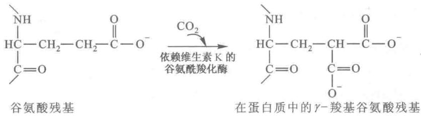  
图 13-4 谷氨酰羧化酶反应依赖维生素 K

依赖维生素K的羧化反应是在肝细胞内质网进行，需要分子氧、 $\mathrm{CO}_{2}$ 及氢醌型维生素K参加，并认为羧化反应与维生素K的环氧化物生成相偶联。肝微粒体中有维生素K循环（图13-5），首先单加氧酶（monooxygenase）催化氢醌型维生素K转化为2,3-环氧化物，同时谷氨酸残基被谷氨酰羧化酶羧化为γ-羧基谷氨酸(Gla)；再由还原酶催化，以二硫苏糖醇为还原剂将维生素K的2,3-环氧化物转变成醌型；然后再被NADPH还原为活性的氢醌型维生素K，完成这一循环反应。双羟香豆素(dicumarol)和杀鼠灵(warfarin)能抑制环氧化物还原酶，从而抑制这一循环的进行，故双羟香豆素和杀鼠灵为抗凝血剂。

  
图13-5 维生素K循环

一般情况下人体不会缺乏维生素K，因为维生素K在自然界绿色植物、肝、鱼等食物中含量丰富，另一方面人和哺乳动物肠道中的大肠杆菌可以合成维生素K并被肠道吸收。

## 三、水溶性维生素

水溶性维生素包括维生素 B 族、硫辛酸和维生素 C。属于维生素 B 族的主要有维生素 $B_{1}$ 、 $B_{2}$ 、PP、 $B_{6}$ 、泛酸、生物素、叶酸及 $B_{12}$ 等。

维生素 B 族在生物体内通过构成辅酶而发挥对物质代谢的影响。这类辅酶在肝内含量最丰富。与脂溶性维生素不同，进入体内的多余水溶性维生素及其代谢产物均自尿中排出，体内不能多储存。当在机体中饱和后，食入的维生素越多，尿中的排出量也越大。

## （一）维生素 $\mathbf{B}_1$ 和硫胺素焦磷酸

维生素 $B_{1}$ 为抗神经炎维生素（又名抗脚气病维生素），化学结构是由含硫的噻唑环和含氨基的嘧啶环组成，故称硫胺素（thiamine）。在生物体内常以硫胺素焦磷酸（thiamine pyrophosphate，TPP）的辅酶形式存在，如图 13-6。硫胺素在氧化剂存在时易被氧化产生脱氢硫胺素（硫色素），后者在紫外照射下呈现蓝色荧光，利用这一特性可进行定性定量分析。

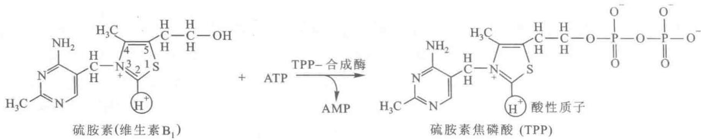  
图 13-6 硫胺素焦磷酸(TPP)是维生素 $B_{1}$ 的活性形式, 是通过 TPP-合成酶的作用形成的

硫胺素焦磷酸(TPP)是糖代谢过程中 $\alpha$ -酮酸氧化脱羧酶及转酮酶的辅酶,涉及糖代谢中羰基碳(醛和酮)合成与裂解反应。特别是 $\alpha$ -酮酸的脱羧和 $\alpha$ -羟酮的形成与裂解都依赖于硫胺素焦磷酸。图13-7列出了这些反应:A. 丙酮酸通过酵母丙酮酸脱羧酶产生 $\mathrm{CO}_{2}$ 和乙醛;B. 在乙酰乳酸合成酶的反应中两分子丙酮酸缩合;C. 戊糖磷酸途径的一个反应称为转酮酶(transketolase)反应;D. 被厌氧微生物利用的反应,磷酸酮酶(phosphoketolase)反应。后面两个反应显然属于 $\alpha$ -酮转移。所有这些反应都依赖于产生裂解的羰基碳上负电荷的积累(图13-8)。硫胺素焦磷酸通过稳定该负电荷促进这些反应。

这些反应的关键是硫胺素焦磷酸噻唑基的四级氮，如像酵母丙酮酸脱羧酶机制所示（13-9），在TPP-催化的反应中，阳离子亚胺氮起着两种不同的和重要的作用：①为除去 $\mathrm{C}_2$ 质子所形成的碳负离子提供了静电稳定作用，所形成的碳负离子通过与羰基碳的加成同底物如 $\alpha-$ 酮酸（例如丙酮酸）和 $\alpha-$ 酮醇反应。②一旦发生TPP攻击底物，所产生中间物的稳定性，可通过氮原子双键共振相互作用达到。

共振稳定的中间物能被质子化生成羟乙基-TPP。然后，再分解成产物乙醛和TPP（图13-9）。这是一种非氧化脱羧作用。

由于维生素 $B_{1}$ 和糖代谢关系密切,因此多食糖类食物,维生素 $B_{1}$ 的需要量也相应增多。当维生素 $B_{1}$ 缺乏时,糖代谢受阻,丙酮酸积累,使病人的血、尿和脑组织中丙酮酸含量增多,出现多发性神经炎、皮肤麻木、心力衰竭、四肢无力、肌肉萎缩及下肢浮肿等症状,临床上称为脚气病。

根据研究,维生素 $B_{1}$ 可抑制胆碱酯酶的活性,当维生素 $B_{1}$ 缺乏时,该酶活性升高,乙酰胆碱水解加速,使神经传导受到影响,造成胃肠蠕动缓慢,消化液分泌减少,食欲不振,消化不良等消化道症状。

维生素 $B_{1}$ 主要存在于种子外皮及胚芽中、米糠、麦麸、黄豆、酵母、瘦肉等食物中含量最丰富。

维生素 $B_{1}$ 在酸性溶液中较稳定，中性和碱性中易破坏。维生素 $B_{1}$ 耐热，在 pH 3.5 以下虽加热到 $120^{\circ}C$ 亦不被破坏。维生素 $B_{1}$ 极易溶于水，故米不易多淘洗以免损失维生素 $B_{1}$ 。

  
图 13-7 硫胺素焦磷酸参加(A) $\alpha$ -酮酸脱羧反应和(B\~D) $\alpha$ -羟酮的形成和裂解转酮酶和磷酸酮酶反应是 $\alpha$ -酮转移的例子

  
图13-8 $\alpha$ -酮酸的脱羧作用导致在过  
硫胺素焦磷酸的功能是稳定负电荷

## （二）维生素 PP 和烟酰胺辅酶

维生素 PP 包括烟酸(nicotinic acid)和烟酰胺(nicotinamide)，又称抗糙皮病维生素(antipellagra vitamin)，二者均属于吡啶衍生物。

  
图 13-9 酵母丙酮酸脱羧酶反应机制

在体内烟酰胺与核糖、磷酸、腺嘌呤组成脱氢酶的辅酶，主要是烟酰胺腺嘌呤二核苷酸（nicotinamide adenine dinucleotide, $NAD^{+}$ , 辅酶 I）和烟酰胺腺嘌呤二核苷酸磷酸（nicotinamide adenine dinucleotide phosphate, $NADP^{+}$ , 辅酶 II），其还原形式为 NADH 和 NADPH（图 13-10）。烟酰胺辅酶是电子载体，在各种酶促氧化-还原反应中起着重要作用。 $NAD^{+}$ 在氧化途径（分解代谢）中是电子受体，而 NADPH 在还原途径（生物合成）是电子供体。这些反应涉及转移氢负离子（hydride ion; hydride anion）给 $NAD^{+}$ ，或者从 NADH 转移出。促进这种转移的酶是熟知的脱氢酶类。氢负离子（ $H^{-}$ 或 $H^{-}$ ）含两个电子，因此 $NAD^{+}$ 和 $NADP^{+}$ 起两个电子载体的作用。吡啶环的 C4 位置是 $NAD^{+}$ 和 $NADP^{+}$ 的反应中心，能接受或给出氢负离子，如图 13-11 所示。分子中的腺嘌呤部分不直接参与氧化还原过程。

依赖于 $NAD^{+}$ 和 $NADP^{+}$ 的脱氢酶至少催化 6 种不同类型的反应: 简单的氢负离子转移、氨基酸脱氨生成 $\alpha-$ 酮酸、 $\beta-$ 羟酸氧化随后 $\beta-$ 酮酸中间物脱羧、醛的氧化、双键的还原和碳-氮键的氧化（像二氢叶酸还原酶）。这 6 种反应类型总结于图 13-12，并列出每一类型酶促反应的例子。

$\mathrm{NAD^{+}}$ 是呼吸链中传递氢过程中的一环，在多数情况下代谢物上脱下的氢先交给 $\mathrm{NAD^{+}}$ ，使之成为NADH和 $\mathbf{H}^+$ ，然后再把氢交给黄素蛋白中的黄素腺嘌呤二核苷酸(FAD)或黄素单核苷酸(FMN)，再通过呼吸链的传递，最后交给氧。但也存在另一种情况，即代谢物上的氢先交给 $\mathrm{NAD^{+}}$ 或 $\mathrm{NADP^{+}}$ ，生成还原型的NADH或NADPH，后者再将氢去还原另一个代谢物。因此通过 $\mathrm{NAD^{+}}$ 或 $\mathrm{NADP^{+}}$ 的作用，可以使某些反应起偶联的作用。此外， $\mathrm{NAD^{+}}$ 也是DNA连接酶的辅酶，对DNA的复制有重要作用，为形成 $3^{\prime},5^{\prime}$ -磷酸二酯键提供所需要的能量。

烟酰胺核苷酸的氧化型和还原型的吸收光谱的 $\lambda_{max}$ 都在 260 nm, 摩尔吸收系数也很接近, 但在 340 nm 波长处的光吸收不同, 还原型在此有一吸收峰, 而氧化型则无。利用它可以追踪酶促反应进行中烟酰胺辅酶被氧化还原的程度。

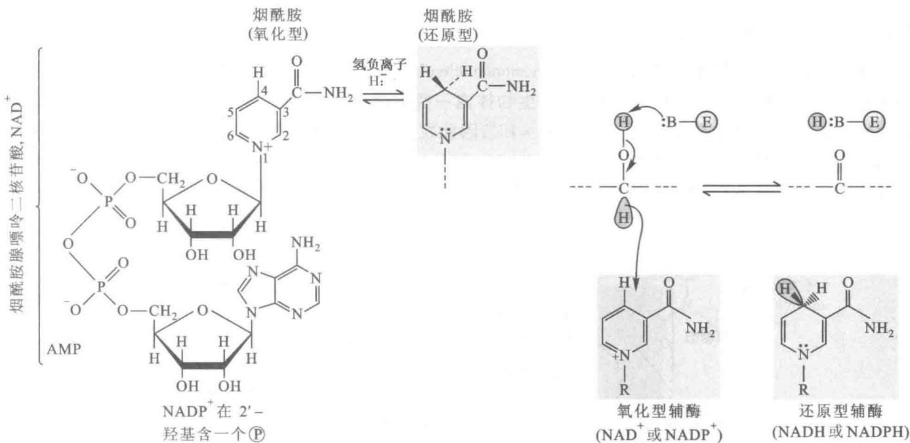  
图13-10 烟酰胺辅酶的结构和氧化-还原状态  
氢负离子(H: $^{-}$ 一个质子同两个电子)转移给NAD $^{+}$ 产生NADH  
图 13-11 NAD $^{+}$ 和 NADP $^{+}$ 参加两个电子的转移反应  
醇通过氢负离子转移给 $\mathrm{NAD(P)^{+}}$ 被氧化成酮或者醛

  
图13-12 6类依赖 $\mathrm{NAD(P)^+}$ 的酶反应

维生素 PP 广泛存在于自然界,以酵母、花生、谷类、豆类、肉类和动物肝中含量丰富,在体内色氨酸能转变为维生素 PP。另外,抗结核药异烟肼的结构与维生素 PP 相似,因此二者有拮抗作用,长期服用可引起维生素 PP 缺乏。

## （三）维生素 $\mathbf{B}_2$ 和黄素辅酶

维生素 $B_{2}$ 又名核黄素（riboflavin），是核醇与 7,8-二甲基异咯嗪的缩合物。由于在异咯嗪的 1 位和 5位 N 原子上具有两个活泼的双键, 易起氧化还原反应, 故维生素 $B_{2}$ 有氧化型和还原型两种形式, 在生物体内氧化还原过程中起传递氢的作用。

在体内核黄素是以黄素单核苷酸(flavin mononucleotide, FMN)和黄素腺嘌呤二核苷酸(flavin adenine dinucleotide, FAD)形式存在(图13-13)，是生物体内一些氧化还原酶(黄素蛋白)的辅基，与蛋白部分结合很牢。典型的解离常数在 $10^{-11}\sim10^{-8}$ mol·L $^{-1}$ ，因此发现在大多数细胞中游离的黄素辅酶浓度水平很低。甚至在有机体许多依赖于烟酰胺辅酶(NADH和NADPH)的氧化还原循环中，黄素辅酶也起到重要的作用。黄素是比 $NAD^{+}$ 和 $NADP^{+}$ 更强的氧化剂，能被1个电子和2个电子途径还原，并且很容易被分子氧重氧化。黄素蛋白可以催化许多种类的氧化-还原反应，如表13-2所示。

  
图 13-13 核黄素和黄素辅酶(FMN 和 FAD)的化学结构

表 13-2 黄素蛋白催化的反应

<table><tr><td>黄素蛋白类型</td><td>催化的反应</td></tr><tr><td>脱氢酶(dehydrogenase)</td><td></td></tr><tr><td>酰基-CoA 脱氢酶(acyl-CoA dehydrogenase)</td><td> $RCH_2CH_2CO-SCoA+[FAD] \rightleftharpoons RCH=CHCO-SCoA+[FADH_2]$ </td></tr><tr><td>谷胱甘肽还原酶(glutathione reductase)</td><td> $GSSG+NADPH+H^+ \rightleftharpoons 2GSH+NADP^+$ </td></tr><tr><td>双加氧酶(dioxygenase)</td><td></td></tr><tr><td>2-硝基丙基双加氧酶(2-nitropropane dioxygenase)</td><td> $2(CH_3)_2CHNO_2+O_2 \rightleftharpoons 2(CH_3)_2C=O+2NO_2^-$ </td></tr><tr><td>黄素氧还蛋白(flavodoxin)</td><td></td></tr><tr><td>梭状芽孢杆菌黄素氧还蛋白(Clostridium flavodoxin)</td><td>1-电子传递</td></tr><tr><td>金属黄素酶(metalloflavoenzyme)</td><td></td></tr><tr><td>二氢乳清酸脱氢酶(Clostridium oroticum dihydroorotate dehydrogenase)</td><td></td></tr><tr><td>单加氧酶(monooxygenase)</td><td></td></tr><tr><td>乳酸氧化酶(lactate oxidase)</td><td> $H_3C-CHOH-COO^-+O_2 \rightleftharpoons H_3C-COO^-+CO_2+H_2O$ </td></tr><tr><td>氧化酶(oxidase)</td><td></td></tr><tr><td>葡糖氧化酶(glucose oxidase)</td><td>D-葡萄糖+ $O_2 \rightleftharpoons D-$ 葡糖酸内酯+ $H_2O_2$ </td></tr></table>

黄素具有特有的亮黄色,如图 13-14 所示,异咯嗪的氧化型吸收 450 nm 附近波长的光。当它被还原或“漂白”(bleached)时,则变成无色。同样的,利用黄素作为辅因子的黄素蛋白(flavoprotein)或称黄素酶(flavoenzyme)，当处于氧化型时也呈黄、红或蓝绿色。但当它们的黄素辅基被还原时，酶的颜色也随之消失。

  
图13-14 FAD和FMN的氧化还原态

黄素辅酶能以3种不同的氧化还原状态的任一种形式存在。完全氧化型的黄素通过一电子转移转变为半醌(semiquinone)，如图13-14所示。在生理pH时，半醌是一种中性自由基，呈蓝色 $\left(\lambda_{\max}=570\ nm\right)$ 。半醌的 $pK_{a}$ 大约8.4。当pH升高而失去一个质子时，则变成自由基负离子，呈红色 $\left(\lambda_{\max}=490\ nm\right)$ 。由于跨越异咯嗪 $\pi-$ 电子系统的不成对电子的大离域，半醌自由基是很稳定的。经第二次一电子转移半醌变成完全还原的二氢黄素。黄素辅酶以这3种不同的氧化还原状态（完全氧化型、半醌型、完全还原型）存在，它们能够参与许多一电子转移和二电子转移反应。这也是黄素蛋白能够催化生物系统中许多不同的反应，并与许多不同的电子供体和受体一起工作的重要原因。这里包括二电子受体/供体，如 $NAD^{+}$ 和 $NADP^{+}$ ；一电子或二电子受体/供体，如醌；各种一电子受体/供体如细胞色素蛋白。呼吸电子传递链的许多组分是一电子受体/供体。黄素半醌型的稳定性使黄素蛋白在呼吸过程中能起有效的电子载体作用。

由于 FMN、FAD 广泛参与体内各种氧化还原反应，因此维生素 $B_{2}$ 能促进糖、脂肪和蛋白质的代谢，对维持皮肤，黏膜和视觉的正常机能均有一定的作用。当维生素 $B_{2}$ 缺乏时，引起口角炎、舌炎、唇炎、阴囊皮炎、眼睑炎、角膜血管增生等症状。临床上用于治疗因缺乏维生素 $B_{2}$ 所引起的各种黏膜及皮肤的炎症等。

维生素 $B_{2}$ 广泛存在于动、植物中。在酵母、肝、肾、蛋黄、奶及大豆中含量丰富。所有植物和很多微生物都能合成核黄素。

## （四）泛酸和辅酶A

泛酸广泛存在于生物界,故又名遍多酸(pantothenic acid),是由 $\beta-$ 丙氨酸通过肽键与 $\alpha,\gamma-$ 二羟基- $\beta$ , $\beta-$ 二甲基丁酸缩合而成的一种有机酸。泛酸是辅酶A(coenzyme A)和磷酸泛酰巯基乙胺的组成成分,辅酶A是泛酸的主要活性形式,常简写为CoA,是由3',5'-ADP以磷酸酐键连接4-磷酸泛酰巯基乙胺而成，而磷酸泛酰巯基乙胺由巯基乙胺连接 $\beta-$ 丙氨酸，再与支链二羟酸形成酰胺键（图13-15）。如像烟酰胺辅酶和黄素辅酶一样，CoA的腺苷酸部分起识别部位的作用，增强结合CoA酶的亲和力和专一性。泛酸的另一种活性形式酰基载体蛋白（acylcarrier protein ACP），辅基4-磷酸泛酰巯基乙胺以共价键与蛋白质侧链的丝氨酸羟基相连。

辅酶 A 主要起传递酰基的作用, 是各种酰化反应中的辅酶。由于携带酰基的部位在-SH 基上, 故通常以 CoASH 表示。当携带乙酰时形成 $CH_{3}CO-SCoA$ , 称为乙酰辅酶 A。当交出乙酰基后又恢复为 CoASH。辅酶 A 在糖代谢、脂质分解代谢、氨基酸代谢及体内一些重要物质如乙酰胆碱、胆固醇、卟啉和肝糖原等的合成中均起重要作用。酰基载体蛋白与脂肪酸的生物合成关系密切。

辅酶 A 的两个主要功能是:通过亲核攻击转移活化的酰基;吸取一个质子活化酰基的 $\alpha-$ 氢。这两种功能是通过 CoA 上活性的巯基来调节的,而巯基与酰基形成硫酯键。由 CoA 转移活化的酰基能够通过比较乙酰-CoA 硫酯键的水解与一种简单氧酯的水解来说明:

$$
\mathrm{乙酸乙酯} + \mathrm {H_ {2} O} \longrightarrow \mathrm{乙酸} + \mathrm{乙醇} + \mathrm {H^ {+}} \quad \Delta G ^ {\ominus \prime} = - 2 0. 0 \mathrm{kJ} \cdot \mathrm{mol} ^ {- 1}
$$

$$
\mathrm{乙酰} - \mathrm{CoA} + \mathrm {H_ {2} O} \longrightarrow \mathrm{乙酸} + \mathrm{CoA} + \mathrm {H^ {+}} \quad \Delta G ^ {\ominus \prime} = - 3 1. 5 \mathrm{kJ} \cdot \mathrm{mol} ^ {- 1}
$$

硫酯的水解比氧酯的水解更易,可能是因为碳-硫键比相应的碳-氧键更小的双键性质(图 13-16)。这意味着通过亲核由乙酰-CoA 转移乙酰基比从氧酯转移乙酰基更自发,因此可以说乙酰-CoA 具有高的基团转移能力(图 13-17)。

为了吸取硫酯活化的 $\alpha-$ 氢, 也可从图 13-16 共振形式得到了解。共振形式②难使硫酯的羰基相对自由的脱离(同氧酯相比较)。其结果, 通过吸取质子形成的 $\alpha-$ 碳负离子本身更容易通过共振而稳定(图 13-18), 因此烯醇负离子(enolate anion)对缩合反应是有效的亲核体。

图13-15 辅酶A的结构

酰基同 $\beta$ -巯基乙胺部分的—SH基形成硫酯键

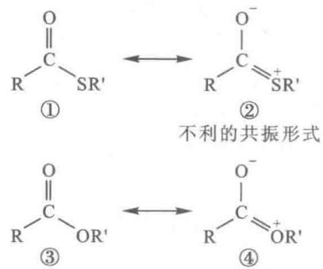  
图13-16 硫酯和氧酯的共振结构  
碳-硫键比相应的碳-氧键具有更小的双键性质

  
图13-17 从酰基-CoA转移酰基给亲核体比从氧酯转移酰基更易

辅酶 A 的主要功能是活化酰基,使羧酸中 C—O 键(氧酯键)连接的酰基转变为酰基-CoA 中 C—S 键

(硫酯键)连接的酰基,或者说使氧酯变成硫酯,如 $CH_{3}C-OH\longrightarrow CH_{3}C-SCoA$ 。硫酯具有两种性质:羰基碳原子的亲电[子]性和 $\alpha-$ 碳原子的亲核性。酰基-CoA 的这两种性质在 $\beta-$ 酮硫解酶 ( $\beta-ketothiolase$ ) 反应中两分子乙酰-CoA 缩合成乙酰乙酰-CoA (acetoacetyl-CoA) 时看得很清楚 (图 13-19)。从一分子乙酰-CoA 吸取 $\alpha$ 质子产生容易亲核攻击第二个乙酰 CoA 羰基碳的活性烯醇负离子，发生加成形成四面体中间物。CoA 硫酯负离子 $(\mathrm{CoA}-\mathrm{S}^{-})$ 从四面体中间物脱离产生乙酰乙酰-CoA。

  
图 13-18 硫酯的 $\alpha$ -氢是酸性的，并且由于产生的碳负离子共振稳定容易被吸取。在此途径中形成的烯醇负离子对于缩合反应是更好的亲核体

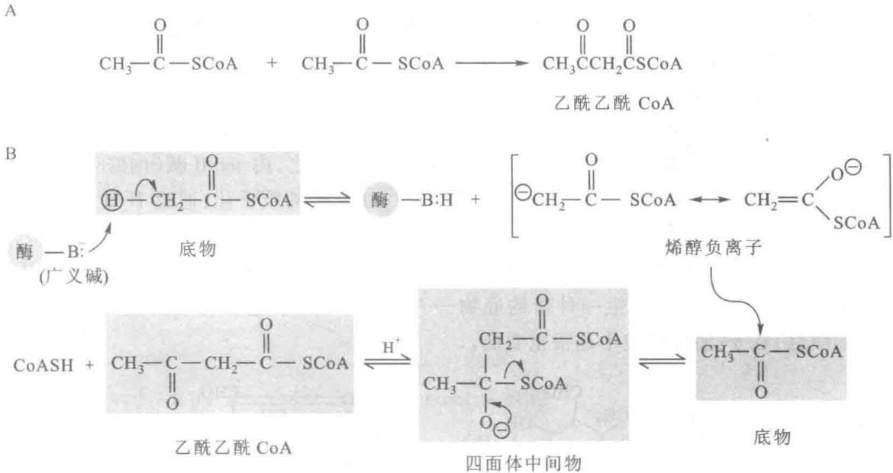  
图13-19 $\beta$ -酮硫解酶催化的反应中辅酶A的作用机制  
A. $\beta$ -酮硫解酶的反应证明了酰基-CoA 的两种特殊性质: 通过亲核攻击转移活化的酰基和 $\alpha$ -氢的酸性本质。B. 从一分子乙酰-CoA 除去 $\alpha$ -氢产生亲核的碳负离子, 而后再攻击第二个分子乙酰-CoA 的羰基碳

泛酸在酵母、肝、肾、蛋、小麦、米糠、花生和豌豆中含量丰富，在蜂王浆中含量最多。辅酶 A 被广泛用作各种疾病的重要辅助药物。

## （五）维生素 $B_{6}$ 和磷酸吡哆醛、磷酸吡哆胺

维生素 $B_{6}$ 包括 3 种物质, 即吡哆醇 (pyridoxine)、吡哆醛 (pyridoxal) 和吡哆胺 (pyridoxamine), 皆属于吡啶衍生物。维生素 $B_{6}$ 在体内以磷酸酯形式存在, 磷酸吡哆醛 (pyridoxal-5-phosphate, PLP) 和磷酸吡哆胺 (pyridoxamine-5-phosphate) 是其活性形式, 是氨基酸代谢中多种酶的辅酶。下面为维生素 $B_{6}$ 及其辅酶形式:

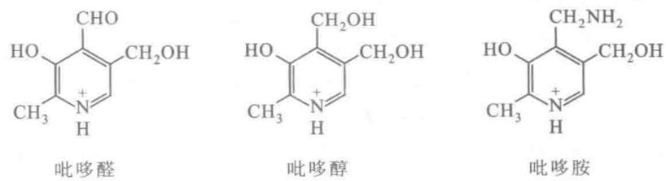

PLP 在生理条件下存在两种互变异构形式(图 13-20)。PLP 参加催化涉及氨基酸的各种反应,包括转氨基作用、 $\alpha-$ 和 $\beta-$ 脱羧作用、 $\beta-$ 和 $\gamma-$ 消除作用、消旋作用和醛醇反应(图 13-21)。这些反应包括断裂氨基酸 $\alpha-$ 碳的任一键以及侧链上几种键的断裂。PLP 多方面的作用是由于能够①同氨基酸的 $\alpha-$ 氨基形成稳定的 Schiff 碱(醛亚胺)加合物和②起一种有效电子穴作用,以稳定反应的中间物。由 PLP 形成的 Schiff 碱和作为电子穴的作用在图 13-22 中得到说明。在几乎所有依赖 PLP 的酶中,无底物时,PLP 同活性部位的赖氨酸残基 $\varepsilon-NH_{2}$ 基形成 Schiff 碱,当底物接近 Schiff 碱时,立即发生转醛亚胺反应(transaldimination reaction)。取代 Lys 残基而与 PLP 形成新的 Schiff 碱。换言之,内 schiff 碱(内醛亚胺)变成外 schiff 碱(外醛亚胺)(图 13-22①\~②)。对 PLP 的一个关键,是 schiff 碱的质子化,通过 H 键合环氧而被稳定,增加了 C $_{\alpha}$ 质子的酸性(图 13-22③所示)。失去 C $_{\alpha}$ 质子所形成的碳负离子,通过电子离域进入起电子穴作用的带有正电荷环氮的吡啶环而被稳定(图 13-22④)。别的重要中间物是通过 PLP 醛碳质子化形成的,像图所示(图 13-22⑤\~⑦),产生一种新的底物——PLP schiff 碱,它在转氨反应中起重要作用,并增加 C $_{\beta}$ 上质子的酸性,在 $\gamma-$ 消除反应中是很重要的。

  
图13-20 5-磷酸吡哆醛（PLP）的互变异构形式

PLP-催化反应的种种机制中,正如图 13-22 所显示的每一个反应都有一个或多个中间物。例如,转氨作用是通过 $C_{\alpha}$ 失去质子被促进的,随后经醛亚胺-酮亚胺同分异构,酮亚胺 Schiff 碱水解产生 $\alpha$ -酮酸和磷酸吡哆胺。再同第二个底物另外的 $\alpha$ -酮酸形成 Schiff 碱,随后通过可逆的过程给出产物氨基酸。

多数普通氨基酸要经历 $\alpha-$ 脱羧反应,例如,在脑中重要的神经递质 $\gamma-$ 氨基丁酸、多巴胺和组胺都是通过谷氨酸、3,4-二羟苯丙氨酸(DOPA)和组氨酸分别 $\alpha-$ 脱羧形成的。 $\alpha-$ 脱羧是由电子离域作用进入吡啶环而促进的。在 $\alpha-$ 脱羧中,原来氨基酸的 $C_{\alpha}$ 氢被保留,与此相反,在转氨作用中,这个质子被失去。

维生素 $B_{6}$ 在动植物中分布很广，谷类外皮含量尤为丰富。因为食物中富含维生素 $B_{6}$ ，同时肠道细菌可以合成维生素 $B_{6}$ 供人体需要，所以人类很少发生维生素 $B_{6}$ 缺乏病。

## （六）维生素 $B_{12}$ 及其辅酶

维生素 $\mathbf{B}_{12}$ （氰钴胺素）是最后发现的一个维生素，是一种抗恶性贫血因子（anti-pernicious anemia factor）。1948年首次从肝中分离提纯出来，它是一种深红色的含钴晶体，化学名称是[氰]钴胺素（cyanocobalamin或cobalamin），其中氰化基来自分离过程，体内并无与一CN结合的钴胺素存在。

维生素 $B_{12}$ 在体内转变为两种辅酶。主要的辅酶形式是 $5^{\prime}-$ 脱氧腺苷钴胺素（ $5^{\prime}-$ deoxyadenosylcobalamin），也称辅酶 $B_{12}$ 。另一个辅酶形式是甲基钴胺素（methylcobalamin）。1961 年英国学者 D. C. Hodgkin 及其同事们用 X 射线晶体结构分析法测出了 $5^{\prime}-$ 脱氧腺苷钴胺素的晶体结构，并因此获得 1964 年诺贝尔化学奖。如图 13-23 所示，辅酶 $B_{12}$ 的结构主体是一个咕啉环（corrin ring），环中央有一个 Co 原子。咕啉环类似血红素的卟啉环，也含 4 个吡咯基，除两个吡咯基是直接相连外，其他吡咯基的连键也是甲川基桥或称次甲基桥（methine bridge）。

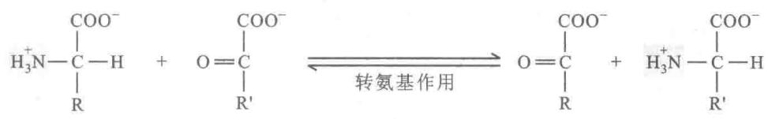

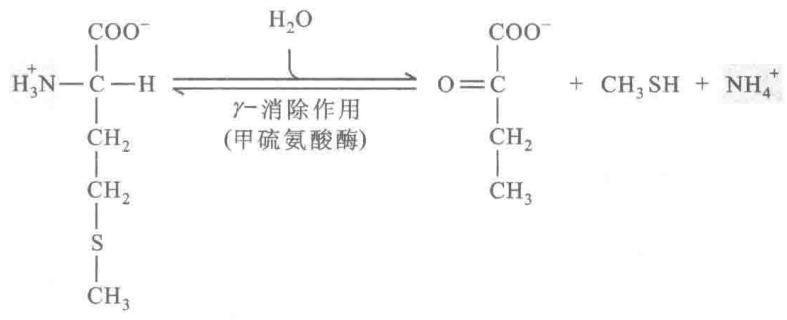

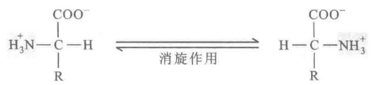

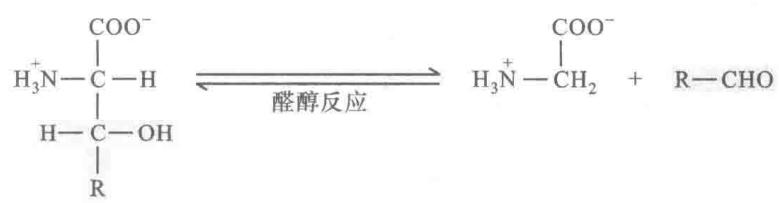  
图 13-21 磷酸吡哆醛催化的 7 种反应

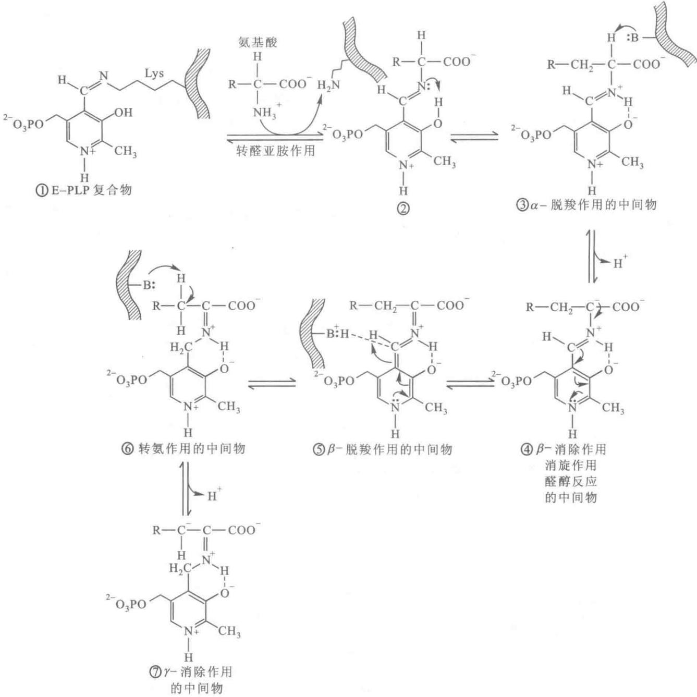  
图 13-22 磷酸吡哆醛(PLP)催化的多种反应机制  
PLP同氨基酸生成稳定的schiff碱加合物，作为有效电子穴稳定各种反应中间物

钴与4个吡咯氮配位。钴的一个轴向配体(环面下方)是5,6-二甲基苯并咪唑基的氮；另一个轴向配体(环面上方)可以是一CN、—CH₃、—OH或是5'-脱氧腺苷基，这取决于辅酶的形式。5'-脱氧腺苷钴胺素的Hodgkin结构最大的特点是Co—C键的键长为0.205 nm。此键主要是共价键性质，该结构应是烷基钴(alkyl cobalt)。这样的烷基钴在Hodgkin测出它的晶体结构之前曾被认为是极不稳定的。Co—C—C的键角为130°(图13-23)，Co—C键的键能为110 kJ·mol⁻¹，而典型的C—C共价键的键能为348 kJ·mol⁻¹，这些都表明它具有部分离子键的性质。

维生素 $B_{12}$ 辅酶参与 3 种类型的反应(图 13-24): ① 分子内重排; ② 核糖核苷酸还原成脱氧核苷酸(在某些细菌中); ③ 甲基转移。

头两种反应是由 $5^{\prime}-$ 脱氧腺苷钴胺素调节的，而甲基转移是通过甲基钴胺素来实现的。核苷酸还原酶的机制将在第 27 章中讨论，以四氢叶酸作为辅酶的甲基转移将在本节后面叙述。

无活性的维生素 $B_{12}$ 转变成活性形式的 $5^{\prime}-$ 脱氧腺苷钴胺素要通过 3 个步骤（图 13-25），2 种黄素蛋白还原酶将氰钴胺素中的 $Co^{3+}$ 顺序转换成 $Co^{2+}$ ，而后变成 $Co^{+}$ 状态。 $Co^{+}$ 是一种极强的亲核体，它攻击如图

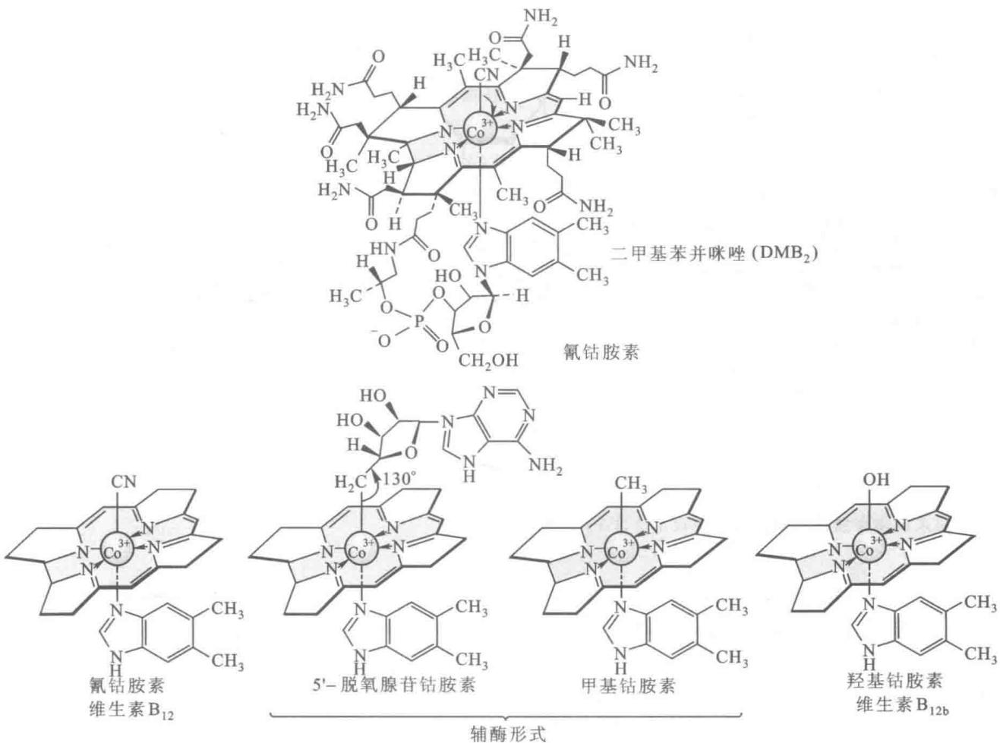  
图 13-23 氰钴胺素的结构(上面)和几种维生素 $B_{12}$ 辅酶的简化结构 5'-脱氧腺苷钴胺素的 Co—C 键是明显的共价键但有某些离子键特性

C N-甲基-四氢叶酸

  
图 13-24 维生素 $B_{12}$ 作为辅酶在分子内重排、核苷酸还原和甲基转移中的作用

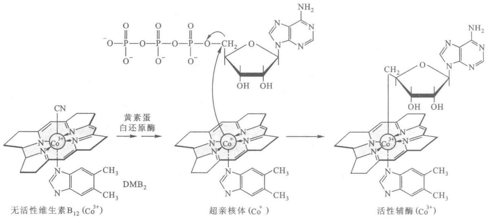  
图 13-25 从无活性的维生素 B $_{12}$ 转变成活性 5′-脱氧腺苷钴胺素是通过黄素蛋白还原酶的作用起始的，产生的 Co $^{+}$ 作为一种超亲核体在独特的腺苷转移中攻击 ATP 的 5′-碳

所示的 ATP 的 5′-碳, 释放出三磷酸负离子形成 5′-脱氧腺苷钴胺素。由于 $Co^{+}$ 的 2 个电子还给了 Co—C 键, 所以在活性辅酶中 Co 又恢复到 $Co^{3+}$ 的氧化态。这是在生物系统中两个已知的腺苷基转移反应中的一个（即亲核攻击 ATP 的核糖 5'-碳），另一个是 S-腺苷甲硫氨酸的形成（见第 26 章）。

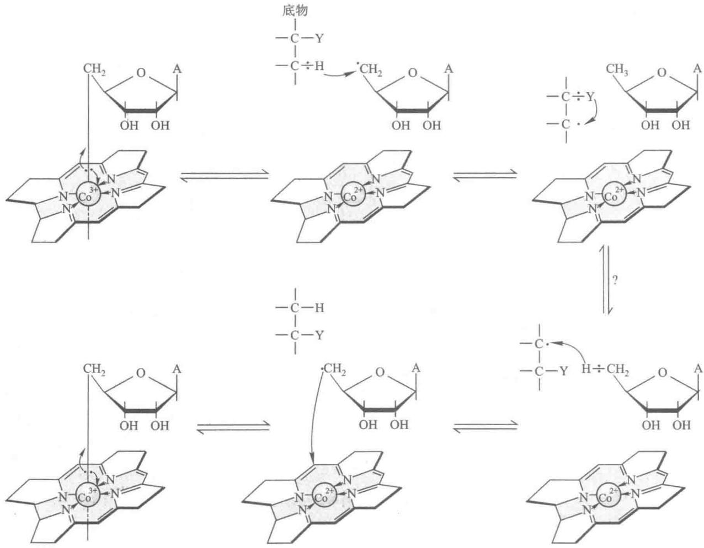  
图13-26 $\mathrm{B}_{12}$ 辅酶催化的分子内重排

被维生素 $B_{12}$ 催化的分子内重排包括氢和邻近碳上另外取代基的交换，重排的机制包括如图 13-26 所示的 Co—C 键的裂解，钴还原成 $Co^{2+}$ 状态，产生一个 $CH_{2}\cdot$ 基，从底物吸取氢原子，形成 $5^{\prime}-$ 脱氧腺苷，并脱离底物上的基团（未成对电子）。该中间物重排，Y·从一个碳原子移动到另一个碳原子，随后氢原子从 $5^{\prime}-$ 脱氧腺苷的甲基转移，而 $5^{\prime}-$ 脱氧腺苷钴胺素再生。

维生素 $B_{12}$ 参与 DNA 的合成, 对红细胞的成熟很重要, 当缺少维生素 $B_{12}$ 时, 巨红细胞中 DNA 合成受到障碍, 影响了细胞分裂不能分化成红细胞, 易引起恶性贫血。维生素 $B_{12}$ 广泛来源于动物性食品, 特别是肉类和肝中含量丰富。人和动物的肠道细菌都能合成, 故一般情况下不会缺少维生素 $B_{12}$ 。

## （七）生物素和辅酶生物胞素

生物素(biotin)又称维生素H。最初是作为酵母生长所必需的物质对它进行研究的。1936年Kögl等首次从卵黄中分离出生物素，并于19世纪40年代初测定了它的化学结构。生物素是由噻吩环和尿素分子结合而成的双环化合物，噻吩环上有一个戊酸基侧链(图13-27)。

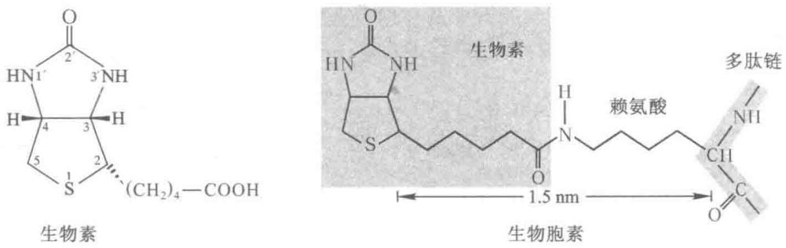  
图13-27 生物素和生物胞素的化学结构

生物素在许多酶促羧化反应中起着活动性的羧基载体(carboxyl group carrier)作用。生物素作为羧化酶(如丙酮酸羧化酶、乙酰-CoA羧化酶等)的辅基,都是通过酶蛋白上Lys残基的 $\varepsilon-\mathrm{NH}_{2}$ 被共价结合到酶上的,形成的生物素-赖氨酸官能团称为生物胞素(biocytin)残基,生物胞素是生物素的辅酶形式(图13-27)。生物胞素残基中生物素环系统被一条长的柔性链连接在酶蛋白上。此链从生物素环到Lys的 $\alpha$ -碳共10个原子,长约 $1.5\mathrm{nm}$ 。有了这条长链生物素辅基可以在这些酶上的两个相距较远的部位之间运载羧基。因为羧化酶多是多聚体,例如E.coli乙酰-CoA羧化酶由3个相对独立的部分组成:① 生物素羧基载体蛋白(biotin carboxyl carrier protein, BCCP),是一个相对分子质量为 $22\times 10^{3}$ 的单体,生物素共价结合在此蛋白上;② 生物素羧化酶(biotin carboxylase),是相对分子质量为 $100\times 10^{3}$ 亚基的二聚体,催化载体蛋白上生物素的羧化;③ 转羧基酶(transcarboxylase)是相对分子质量为 $90\times 10^{3}$ 亚基的二聚体,催化 $\mathrm{CO}_{2}$ 单位从羧基生物素转移到底物乙酰-CoA上。大多数依赖生物素的羧化反应都是以重碳酸盐作为羧化剂并把羧基转移到底物(乙酰-CoA)的负碳离子上(表13-3)。虽然生物体液中富含 $\mathrm{HCO}_{3}^{-}$ ,但它的碳是弱亲电剂,必须对它进行活化才能攻击底物的负碳离子。重碳酸盐的活化是由ATP驱动并转变成活性形式的N-羧基生物素(图13-28),而后羧基化底物。

生物素来源广泛，如在肝、肾、蛋黄、酵母、蔬菜和谷类中都含有生物素。肠道细菌也能合成供人体需要，故一般很少出现缺乏症。但大量食用生鸡蛋清可引起生物素缺乏。因为在新鲜鸡蛋白含有抗生物素蛋白（avidin），它能与生物素结合成无活性又不易消化吸收的物质，鸡蛋加热后这种蛋白质即被破坏。另外，长期服用抗生素治疗可抑制肠道正常菌丛，也可造成生物素缺乏。

表 13-3 依赖于生物素的羧基化作用  
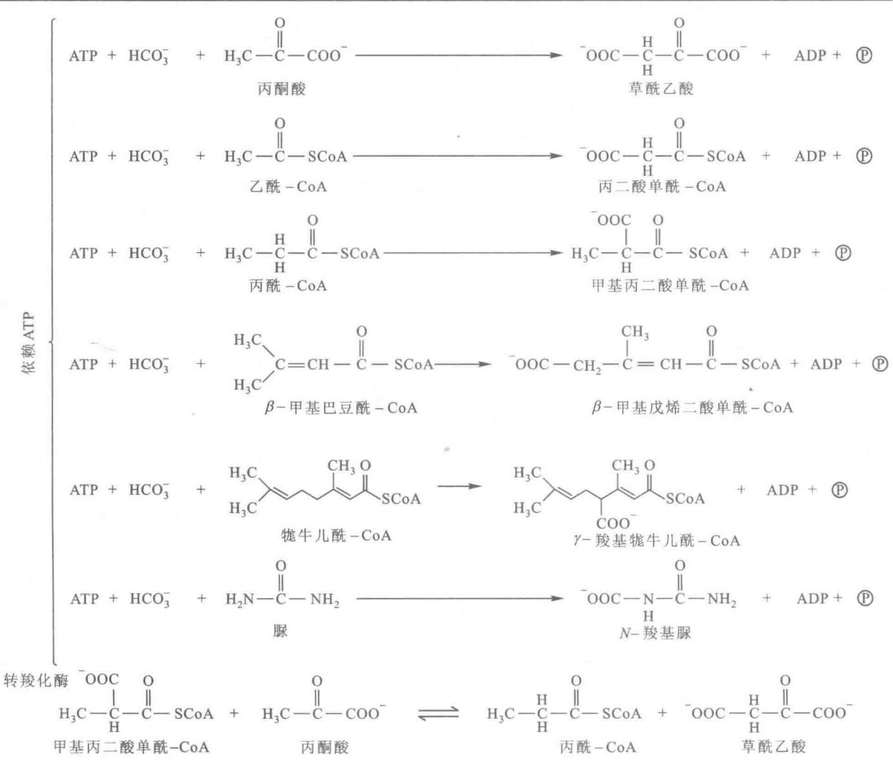

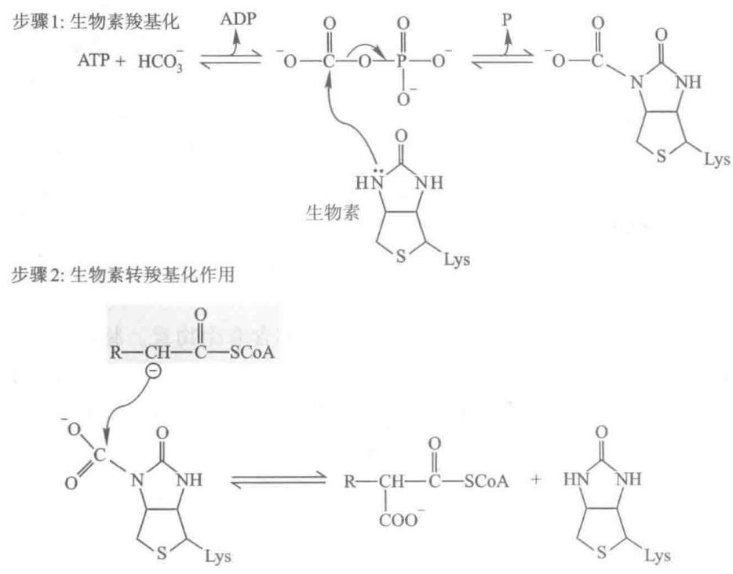  
图13-28 生物素羧基化及转羧基的机制

## (八) 叶酸和四氢叶酸

叶酸(folic acid)最初是由肝中分离出的,后来发现绿叶中含量十分丰富,因此命名为叶酸。它是由2-氨基-4-羟基-6-甲基蝶啶、对氨基苯甲酸和L-谷氨酸三部分组成,又称蝶酰谷氨酸。

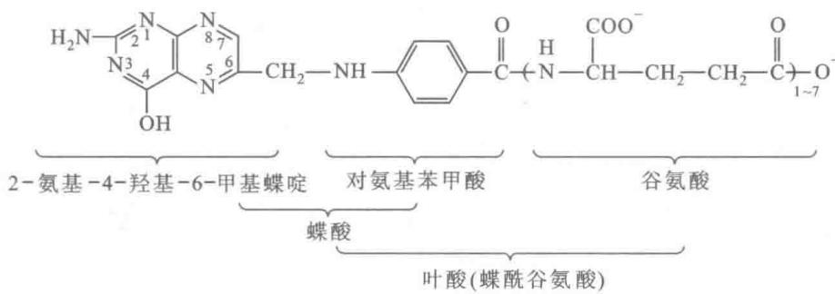

叶酸除了 $CO_{2}$ 之外，是各种氧化水平一碳单位的重要受体和供体。四氢叶酸（tetrahydrofolate, THF）是叶酸的辅酶形式，称为辅酶 F(CoF)，是通过二氢叶酸还原酶连续的还原叶酸而成（图 13-29）。四氢叶酸一般含有 1\~7 个（甚至更多个）以 γ-羧酰胺连接的谷氨酸残基。3 种不同氧化态的一碳单位可以连接到四氢叶酸的 $N^{5}$ 或 $N^{10}$ 氮上。如像表 13-4 所示，被 THF 携带的一碳单位以甲醇、甲醛和甲酸的三种氧化水平存在（碳原子氧化态分别为 -2,0 和 +2）。

  
图 13-29 二氢叶酸还原酶还原叶酸的反应

表 13-4 由四氢叶酸携带的一碳单位中碳的氧化态

<table><tr><td>氧化数目</td><td>氧化水平</td><td>一碳形式</td><td>四氢叶酸形式</td></tr><tr><td>-2</td><td>甲醇(最还原的)</td><td> $-CH_3$ </td><td> $N^5$ -甲基-THF</td></tr><tr><td>0</td><td>甲醛</td><td> $-CH_2-$ </td><td> $N^5,N^{10}$ -亚甲基-THF</td></tr><tr><td>+2</td><td>甲酸(最氧化的)</td><td> $-CH=O$ </td><td> $N^5$ -甲酰基-THF</td></tr><tr><td></td><td></td><td> $-CH=O$ </td><td> $N^{10}$ -甲酰基-THF</td></tr><tr><td></td><td></td><td> $-CH=NH$ </td><td> $N^5$ -亚胺甲基-THF</td></tr><tr><td></td><td></td><td> $-CH=$ </td><td> $N^5,N^{10}$ -次甲基-THF</td></tr></table>

图13-30详尽介绍了一碳单位导入THF和各种氧化态互变的整个酶促反应过程。 $N^5$ -甲基四氢叶酸能直接氧化成 $N^5,N^{10}$ -亚甲基四氢叶酸，它再进一步氧化成 $N^5,N^{10}$ -次甲基四氢叶酸。由 $N^5,N^{10}$ -次甲基四氢叶酸形成 $N^5$ -亚胺甲基， $N^5$ -甲酰基和 $N^{10}$ -甲酰基四氢叶酸（都在同一氧化水平上），或者通过从四氢叶酸本身由一碳加成反应形成。一碳单位并入四氢叶酸的主要途径是通过丝氨酸羟甲基转移酶（serine hydroxymethyltransferase）反应，转换丝氨酸成甘氨酸和生成 $N^5,N^{10}$ -亚甲基四氢叶酸。甘氨酸、组氨酸和甲酸也是一碳单位的来源，如图13-30所示。上述的各种THF的中间载体形式，从一种代谢物转移到另一种代谢物。许多重要的生物分子如甲硫氨酸的生物合成，丝氨酸和甘氨酸的互相转换（见第26章）以及嘌呤、胸腺嘧啶的合成，都需要这些带有一碳基的THF作为一碳物的供体参与作用。

正如前面所提到的，二氢叶酸还原酶能使叶酸、二氢叶酸和四氢叶酸相互转换，几种抗癌药物，包括氨甲蝶呤、羟甲蝶呤和氨基蝶呤都是THF的类似物（图13-31）。这些分子显然是二氢叶酸还原酶的有效抑制剂。因为生长的细胞需要一碳THF化合物合成嘌呤和胸腺嘧啶，而氨甲蝶呤及其类似物是肿瘤生长的有效阻断剂。这些药物对正常细胞也有毒性，氨甲蝶呤也仅能用于短期治疗。

  
图13-30 一碳单位导入THF的反应

以3种不同的氧化态 $(-2,0$ 和 $+2)$ 携带一碳单位连接成6种不同的THF中间体  
  
图 13-31 二氢叶酸还原酶的抑制剂是肿瘤生长的有效阻断剂

由于叶酸与核酸前体核苷酸的合成有关，当叶酸缺乏时，DNA合成受到抑制，骨髓巨红细胞中DNA合成减少，细胞分裂速度降低，细胞体积较大，细胞核内染色质疏松，称作巨红细胞，这种红细胞大部分在骨髓内成熟前就被破坏造成贫血，称巨红细胞性贫血（macrocytic anemia），也叫恶性贫血。因此叶酸在临床上可用于治疗巨红细胞性贫血。

叶酸广泛存在于肝、酵母及蔬菜中，人类肠道细菌也能合成叶酸，故一般不易发生缺乏症。

## (九) 硫辛酸

硫辛酸(lipoic acid)以闭环二硫化合物形式和开链还原形式两种结构的混合物存在(图13-32)，这两种形式通过氧化-还原相互转换。像生物素一样，硫辛酸在自然界很少以游离状态存在，而是同酶蛋白分子中赖氨酸残基的 $\varepsilon -\mathrm{NH}_2$ 以酰胺键共价结合，形成的硫辛酰胺(lipoamcide)残基是硫辛酸的辅酶形式。

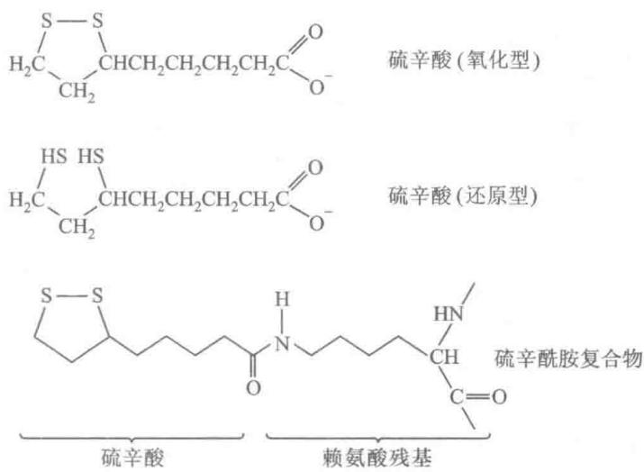  
图 13-32 氧化型和还原型硫辛酸以及硫辛酰胺复合物的结构

硫辛酸或硫辛酰胺是一种酰基载体。它存在于涉及糖代谢的两种多酶复合物中：丙酮酸脱氢酶（pyruvate dehydrogenase）复合物和α-酮戊二酸脱氢酶（α-ketoglutarate dehydrogenase）复合物，硫辛酸在α-酮酸氧化和脱羧中起偶联酰基转移和电子转移的作用。

E. coli 丙酮酸脱氢酶是由 60 个亚基构成的多酶复合物, 包括: ① 丙酮酸脱氢酶 (pyruvate dehydrogenase) ( $E_{1}$ ), 含 24 个亚基 ( $M_{r}$ $192 \times 10^{3}$ 的 12 个二聚体存在), 以硫胺素焦磷酸为辅酶; ② 二氢硫辛酰转乙酰酶 (dihydrolipoyl transacetylase) ( $E_{2}$ ), 含 24 个亚基 ( $M_{r}$ $70 \times 10^{3}$ ), 每个亚基含与其赖氨酸残基共价连接的硫辛酰胺作为辅基; ③ 二氢硫辛酰脱氢酶 (dihydrolipoyl dehydrogenase) ( $E_{3}$ ), 含 12 个亚基 (以 $M_{r}$ $112 \times 10^{3}$ 的 6 个二聚体存在), 以 FAD 为辅基。由转乙酰酶亚基形成一个立体核心, 环绕排列着脱氢酶亚基。该多酶复合物通过丙酮酸氧化脱羧生成乙酰-CoA:

$$
\mathrm{丙酮酸} + \mathrm{CoA} + \mathrm{NAD} ^ {+} \longrightarrow \mathrm{乙酰} - \mathrm{CoA} + \mathrm{CO} _ {2} + \mathrm{NADH} + \mathrm{H} ^ {+}
$$

其反应机制涉及4个不同的步骤(图13-33)。第一步由 $E_{1}$ 催化丙酮酸脱羧形成羟乙基-硫胺素焦磷酸(HETPP)。该中间物转移它的二碳单位到转乙酰酶亚基的硫辛酰胺基上。第二步，羟乙基被氧化形成乙酰二氢硫辛酰胺中间物，并释放出TPP，该步涉及HETPP共振稳定的碳负离子亲核攻击硫辛酸二硫化物，随后氧化攻击的碳原子生成乙酰-硫辛酸。第三步 $E_{3}$ 从硫辛酰胺转移乙酰基给CoA形成乙酰-CoA，脱离还原的二氢硫辛酰胺。第四步，巯基型硫辛酰胺被二氢硫辛酰脱氢酶重新氧化成二硫基型（氧化型），同时将2个电子转换给酶的辅基FAD，最后 $NAD^{+}$ 还原成NADH。整个反应是很强的放能反应， $\Delta G^{\ominus}$ 大约为 $-33.5\ kJ\cdot mol^{-1}$ 。在此复合物中硫辛酰胺基的作用是从 $E_{1}$ 亚基上TPP携带乙酰基给CoA。像是生物素的情况，硫辛酰胺基团伸出的侧链提供了可动性和柔性，以便在多酶复合物各酶之间携带乙酰基。

  
图 13-33 丙酮酸脱氢酶的反应机制  
丙酮酸脱羧产生羟乙基-TPP(步骤1)，在步骤2中转移二碳单位给硫辛酸，随后在步骤3中形成乙酰-CoA，在步骤4反应中硫辛酸重新被氧化

在 E. coli 中另一种 $\alpha-$ 酮戊二酸脱氢酶多酶复合物进行 $\alpha-$ 酮戊二酸氧化脱羧反应：

$$
\alpha \text {-酮戊二酸} + \mathrm{CoA} + \mathrm {NA D ^ {+}} \longrightarrow \text {琥珀酰-CoA} + \mathrm {CO_ {2}} + \mathrm{NADH} + \mathrm {H^ {+}}
$$

反应机制类似于上面所述的丙酮酸脱氢酶。 $\alpha-$ 酮戊二酸脱氢酶由三种不同亚基组成，包括：① $\alpha-$ 酮戊二酸脱氢酶（ $\alpha-$ ketoglutarate dehydrogenase），② 二氢硫辛酰转琥珀酰酶（dihydrolipoyl transsuccinylase）；③ 二氢硫辛酰脱氢酶（dihydrolipoyl dehydrogenase）。头两种是这个复合物独有的，但发现二氢硫辛酰脱氢酶与丙酮酸脱氢酶复合物的完全相同。

硫辛酸在自然界广泛分布，肝和酵母中含量尤为丰富。在食物中硫辛酸常和维生素 $B_{1}$ 同时存在。

## (十) 维生素 C

维生素 C 具有防治坏血病的功能, 故又称为抗坏血酸 (ascorbic acid)。维生素 C 是一种含有 6 个碳原子的酸性多羟基化合物, 分子中 C2 及 C3 位上两个相邻的烯醇式羟基易解离而释放 H $^{+}$ , 所以维生素 C 虽无自由羧基, 但仍具有有机酸的性质。维生素 C 的结构如下:

抗坏血酸于 1928 年首先由 A. Szent-Györgyi 分离得到的, E. L. Hirst 和 W. N. Haworth 在 1933 年测定了它的结构, 同时, R. G. Awlt 等人报道了它的合成, 1937 年由于他们对维生素 C 的研究获得诺贝尔化学奖。

维生素 C 广泛分布于动物界和植物界，仅几种脊椎动物——人类和其他灵长类、豚鼠、一些鸟类和某些鱼类不能合成，所有这些有机体的肝中缺少 L-古洛糖酸- $\gamma$ -内酯氧化酶（L-gulono- $\gamma$ -lactone oxidase），因此不能合成抗坏血酸，必须从食物中获得抗坏血酸。如图 13-34 所示，抗坏血酸正常情况由葡萄糖醛酸经 L-古洛糖酸和 L-古洛糖酸内酯合成。

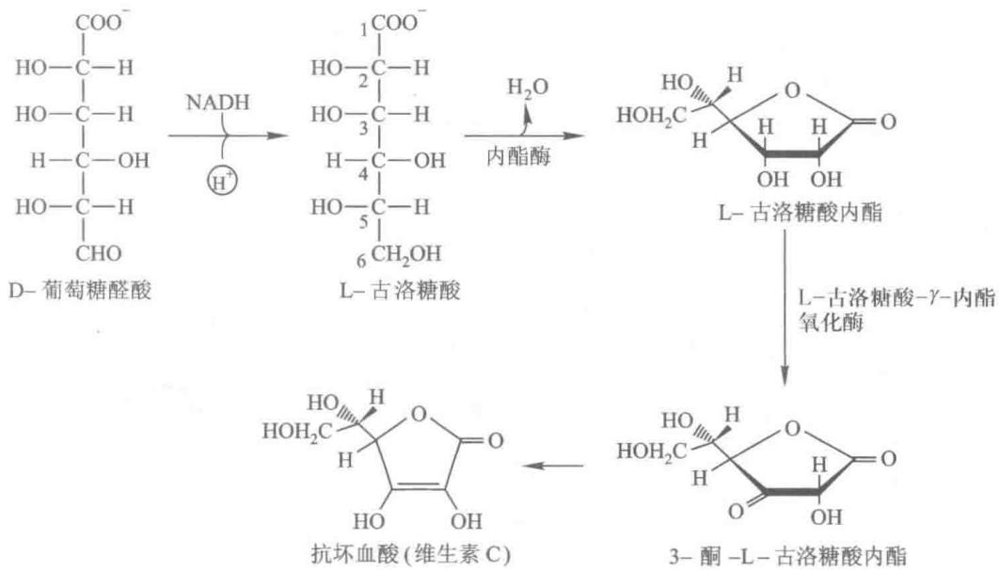  
图13-34 由葡萄醛酸合成抗坏血酸  
肝能产生 L-古洛糖酸- $\gamma$ -内酯氧化酶的动物能合成抗坏血酸，而人类缺少这种酶

抗坏血酸是一种强的还原剂，抗坏血酸的生物化学和生理功能是由于它的还原性质起电子载体的作用。由于同氧或者金属离子相互反应失去一个电子成为半脱氢-L-抗坏血酸（semidehydro-L-ascorbate），一种活性自由基，在动物和植物体内能被多种酶还原回L-抗坏血酸（图13-35）。抗坏血酸特有的反应是氧化成脱氢-L-抗坏血酸。抗坏血酸和脱氢抗坏血酸形式是一种有效的氧化还原系统。氧化型的抗坏血酸，仍具有维生素C的活力。但氧化型的抗坏血酸易水解，内酯环破坏而生成二酮基古洛糖酸，则失去维生素C的活性，如果继续氧化则生成草酸和L-苏阿糖酸。

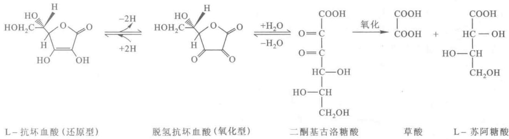

由于维生素 C 的 C4 及 C5 是两个不对称碳原子, 因此有光学异构体, 其中包括 D 型和 L 型。D 型维生素 C 一般不具抗坏血酸的生理功能, 自然界存在的是具有生理活性的 L-型抗坏血酸。

维生素 C 的生理功能是多方面的,主要有:

## 1. 维生素 C 参与体内的氧化还原反应

由于维生素 C 既可以氧化型, 又可以还原型存在于体内, 所以它既可以作为氢供体又可作为氢受体, 在体内极其重要的氧化还原反应中发挥作用。

（1）保持巯基酶的活性和谷胱甘肽的还原状态，起解毒作用。已知许多含巯基的酶当存在自由巯基(一SH)时才发挥催化作用，而维生素C能使

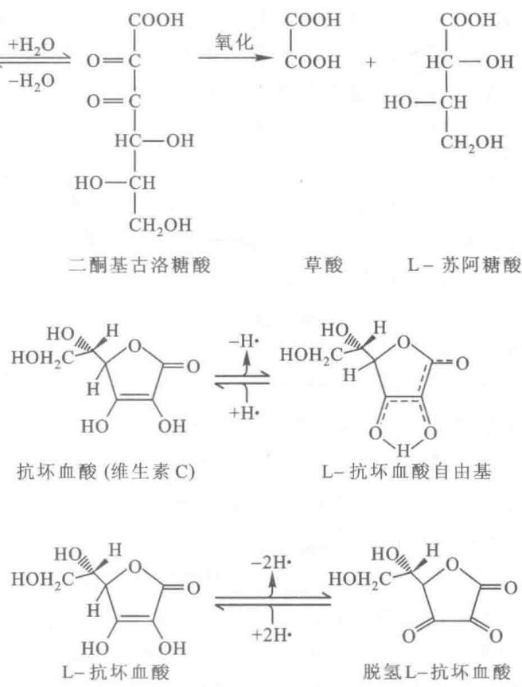  
图 13-35 维生素 C 的生理效应是作为一种还原剂的作用, 抗坏血酸的 2 个电子氧化产生脱氢抗坏血酸

酶分子中的 SH 维持在还原状态,从而使巯基酶保持活性。维生素 C 还与谷胱甘肽的氧化还原有密切联系,它们在体内往往共同发挥抗氧化及解毒等作用。如膜脂的不饱和脂肪酸易被氧化成脂质过氧化物从而使细胞膜受损。还原型谷胱甘肽(GSH)可使脂质过氧化物还原,从而消除其对细胞的破坏作用。而维生素 C 在谷胱甘肽还原酶的催化下可使氧化型谷胱甘肽(GSSG)还原,使 GSH 不断得到补充(图 13-36)。

  
图 13-36 维生素 C 与谷胱甘肽的氧化还原反应

铅、汞等重金属离子 $\left(\mathrm{M}^{2+}\right)$ 能与体内巯基酶类的—SH结合，使其失活，以致代谢发生障碍而中毒。维生素C可使GSSG还原为GSH，后者与重金属离子结合排出体外，故维生素C能保护含巯基酶的—SH，具有解毒作用（图13-37）。

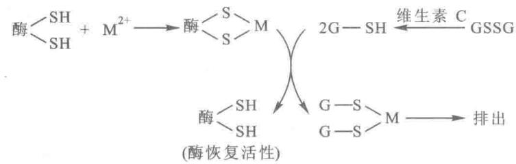  
图13-37 维生素C对重金属离子的解毒作用

（2）维生素 C 与红细胞内的氧化还原过程有密切联系。红细胞中的维生素 C 可直接还原高铁血红蛋白(HbM)成为血红蛋白(Hb)，恢复其运输氧的能力。

（3）维生素 C 能促进肠道内铁的吸收，因为它能使难以吸收的三价铁 $\left(\mathrm{Fe}^{3+}\right)$ 还原成易于吸收的二价铁 $\left(\mathrm{Fe}^{2+}\right)$ ；还能使血浆运铁蛋白中的 $Fe^{3+}$ 还原成肝铁蛋白的 $Fe^{2+}$ 。

（4）维生素 C 能保护维生素 A、E 及 B 免遭氧化。还能促进叶酸转变为有生理活性的四氢叶酸。

## 2. 维生素 C 参与体内多种羟化反应

代谢物的羟基化是生物氧化的一种方式,而维生素 C 在羟基化反应中起着必不可少的辅助因子的作用:

（1）促进胶原蛋白的合成 当胶原蛋白合成时，多肽链中的脯氨酸及赖氨酸等残基分别在胶原脯氨酸羟化酶及胶原赖氨酸羟化酶催化下羟化成为羟脯氨酸及羟赖氨酸残基。维生素C是羟化酶维持活性所必需的辅因子之一。羟脯氨酸在维持胶原蛋白三级结构上十分重要。羟赖氨酸的生理功能虽然还不很清楚，但已知胶原是一种糖蛋白，而这种糖蛋白链是连接在蛋白质的羟赖氨酸残基上。维生素C与胶原合成中的羟化步骤有关，因而在缺乏时对胶原合成有一定的影响。胶原是结缔组织、骨及毛细血管等的重要组成成分，而结缔组织是伤口愈合的第一步。这说明维生素C缺乏将导致毛细血管破裂，牙齿易松动、骨骼脆弱而易折断及创伤时伤口不易愈合。

（2）维生素 C 与胆固醇代谢的关系 正常情况下体内胆固醇约有 80% 转变为胆酸后排出。胆固醇转变为胆酸先将环状部分羟基化，而后侧链分解。缺乏维生素 C 可能影响胆固醇的羟基化，使其不能变成胆酸而排出体外。

（3）维生素C参与芳香族氨基酸的代谢 维生素C在脑和中枢神经系统组织中起着几种重要的作用。在脑中L-酪氨酸的代谢涉及两种不同的依赖维生素C的混合功能氧化酶。p-羟苯丙酮酸双加氧酶(p-hydroxyphenylpyruvate dioxygenase)能将酪氨酸转变为尿黑酸，中间物p-羟苯丙酮酸的氧化和脱羧需要维生素C。维生素C缺乏的个体则p-羟苯丙酮酸分泌达异常高的水平。酪氨酸转变成儿茶酚胺也是依赖维生素C的过程。一系列的羟化和脱羧反应连续不断地形成多巴胺、去甲肾上腺素和肾上腺素。多巴胺和去甲肾上腺素的转变是由依赖于维生素C的多巴胺- $\beta$ -羟化酶(dopamine- $\beta$ -hydroxylase)催化的。

## 3. 维生素 C 的其他功能

（1）维生素 C 有防止贫血的作用，也可防止若干转运金属离子毒性的影响。离子从脾脏的转移（但不是肝）是一种依赖维生素 C 的过程。

（2）维生素 C 可改善变态反应 维生素 C 另外一个重要作用是涉及组胺代谢和变态反应。在铜离子存在下，维生素 C 防止组胺的积累，有助于组胺的降解和清除。也有证据表明，维生素 C 可调节前列腺素的合成，以便调节组胺敏感性和影响舒张。

（3）维生素 C 刺激免疫系统 因为维生素 C 影响刺激免疫系统,可防止和治疗感染。对免疫系统重要的单核白细胞,显示出血细胞中含高浓度的维生素 C 可抑制白血细胞的氧化破坏,增加白细胞的流动性。免疫球蛋白的血清水平在维生素 C 存在下增加。通过维生素 C 可以刺激免疫系统,因此 Pauling L 曾提出维生素 C 可以有效地防止感冒,但随后的研究尚无定论。

固体的维生素 C 较稳定,但长期暴露于空气和潮湿中会产生有害物质。维生素 C 易溶于水,在水溶液中极易被空气氧化。加热易破坏,在中性和碱性溶液中尤甚。遇光、微量金属离子如 $Cu^{2+}$ 、 $Fe^{2+}$ 都可使维生素 C 遭到破坏。

以上介绍了脂溶性维生素和水溶性维生素及其辅酶的结构以及与代谢的关系,现将维生素的主要生理功能、来源及缺乏症总结于表 13-5。

表 13-5 一些重要维生素的生理功能、来源及缺乏症

<table><tr><td>名称</td><td>主要生理功能</td><td>来源</td><td>缺乏症</td></tr><tr><td>维生素A(抗干眼病维生素,视黄醇)</td><td>1.构成视紫红质2.维持上皮组织结构健全与完整3.参与糖蛋白合成4.促进生长发育,增强机体免疫力</td><td>肝、蛋黄、鱼肝油、奶汁、绿叶蔬菜、胡萝卜、玉米等</td><td>夜盲症干眼病皮肤干燥</td></tr><tr><td>维生素D(抗佝偻病维生素,钙化醇)</td><td>1.调节钙磷代谢,促进钙磷吸收2.促进成骨作用</td><td>鱼肝油、肝、蛋黄、日光照射皮肤可制造 $D_3$ </td><td>儿童:佝偻病成人:软骨病</td></tr><tr><td>维生素E(抗不育维生素,生育酚)</td><td>1.抗氧化作用,保护生物膜2.与动物生殖功能有关3.促进血红素合成</td><td>植物油、莴苣、豆类及蔬菜</td><td>人类未发现缺乏症,临床用于习惯性流产</td></tr><tr><td>维生素K(凝血维生素)</td><td>与肝合成凝血因子II、VII、IX和X有关</td><td>肝、鱼、肉、苜蓿、菠菜等,肠道菌可以合成</td><td>偶见于新生儿及胆管阻塞患者,表现为凝血时间延长或血块回缩不良</td></tr><tr><td>维生素 $B_1$ (硫胺素,抗脚气病维生素)</td><td>1. $\alpha$ -酮酸氧化脱羧酶及转酮酶的辅酶2.抑制胆碱酯酶活性</td><td>酵母、豆、瘦肉、谷类外皮及胚芽</td><td>脚气病、多发性神经炎</td></tr><tr><td>维生素PP(烟酸,烟酰胺,抗糙皮病维生素)</td><td>构成脱氢酶辅酶成分,参与生物氧化体系</td><td>肉、酵母、谷类及花生等,人体可自色氨酸合成一部分</td><td>糙皮病</td></tr><tr><td>维生素 $B_2$ (核黄素)</td><td>构成黄酶的辅基成分,参与生物氧化体系</td><td>酵母、蛋黄、绿叶蔬菜等</td><td>口角炎、舌炎、唇炎、阴囊皮炎等</td></tr><tr><td>泛酸(遍多酸)</td><td>构成CoA的成分,参与体内酰基转移作用</td><td>动植物细胞中均含有</td><td>人类未发现缺乏症</td></tr><tr><td>维生素 $B_6$ (吡哆醇、吡哆醛、吡哆胺)</td><td>1.参与氨基酸的转氨作用,脱羧作用2.氨基酸消旋作用3. $\beta$ -和 $\gamma$ -消除作用</td><td>米糠、大豆、蛋黄、肉、鱼、酵母等,肠道菌可合成</td><td>人类未发现缺乏症</td></tr><tr><td rowspan="4">维生素 $B_{12}$ (钴胺素)</td><td>参与分子内重排</td><td rowspan="4">肝、肉、鱼等,肠道菌可合成</td><td rowspan="4">巨红细胞性贫血</td></tr><tr><td>甲基转移</td></tr><tr><td>促进DNA合成</td></tr><tr><td>促进血细胞成熟</td></tr><tr><td>生物素(维生素H)</td><td>构成羧化酶的辅酶参与 $CO_2$ 的固定</td><td>肝、肾、酵母、蔬菜、谷类等,肠道菌可合成</td><td>人类未发现缺乏症</td></tr><tr><td>叶酸</td><td>以 $FH_4$ 辅酶的形式参与一碳基团的转移与蛋白质,核酸合成,与红细胞、白细胞成熟有关</td><td>肝、酵母、绿叶蔬菜等,肠道菌可合成</td><td>巨红细胞性贫血</td></tr><tr><td>硫辛酸</td><td>转酰基作用</td><td>肝、酵母等</td><td>人类未发现缺乏症</td></tr><tr><td rowspan="5">维生素C(抗坏血酸)</td><td>参与体内羟化反应</td><td rowspan="5">新鲜水果、蔬菜、特别是柑橘、番茄、鲜枣含量较高</td><td rowspan="5">坏血病</td></tr><tr><td>参与氧化还原反应</td></tr><tr><td>促进铁吸收</td></tr><tr><td>解毒作用</td></tr><tr><td>改善变态反应,提高免疫力</td></tr></table>

<!-- EN-BEGIN 8.4 -->

### 【英文对应 8.4】Other Functions of Nucleotides

> 来源：Lehninger Principles of Biochemistry（书籍/02_生物化学原理） 第8章 Nucleotides and Nucleic Acids，§8.4。对应本章“三、水溶性维生素”。

In addition to their roles as the subunits of nucleic acids, nucleotides have cellular functions as energy carriers, components of enzyme cofactors, and chemical messengers.

#### [EN] Nucleotides Carry Chemical Energy in Cells

The phosphate group covalently linked at the 5' hydroxyl of a ribonucleotide may have one or two additional phosphates attached. The resulting molecules are referred to as nucleoside mono-, di-, and triphosphates (Fig. 8-39). Starting from the ribose, the three phosphates are generally labeled $\alpha$ , $\beta$ , and $\gamma$ . P5 Hydrolysis of nucleoside triphosphates provides the chemical energy to drive many cellular reactions. Adenosine 5'-triphosphate, ATP, is by far the most widely used nucleoside triphosphate for this purpose, but UTP, GTP, and CTP are also used in some reactions. Nucleoside triphosphates also serve as the activated precursors of DNA and RNA synthesis, as described in Chapters 25 and 26 (see also Fig. 8-34).

The energy released by hydrolysis of ATP and the other nucleoside triphosphates is accounted for by the structure of the triphosphate group. The bond between the ribose and the $\alpha$ phosphate is an ester linkage. The $\alpha$ , $\beta$ and $\beta$ , $\gamma$ linkages are phosphoanhydrides (Fig. 8-40). Hydrolysis of the ester linkage yields about 14 kJ/mol under standard conditions, whereas hydrolysis of each anhydride bond yields about 30 kJ/mol. ATP hydrolysis often plays an important thermodynamic role in biosynthesis. P5 When coupled to a reaction with a positive free-energy change, ATP hydrolysis shifts the equilibrium of the overall process to favor product formation (recall the relationship between the equilibrium constant and free-energy change described by Eqn 6-3 on p. 182).

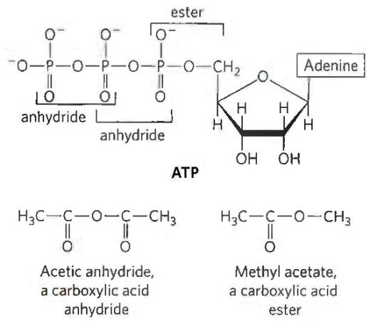  
FIGURE 8-40 The phosphate ester and phosphoanhydride bonds of ATP. Hydrolysis of an anhydride bond yields more energy than hydrolysis of the ester. A carboxylic acid anhydride and a carboxylic acid ester are shown for comparison.

#### [EN] Adenine Nucleotides Are Components of Many Enzyme Cofactors

FIGURE 8-39 Nucleoside phosphates. General structure of the nucleoside 5'-mono-, di-, and triphosphates (NMPs, NDPs, and NTPs) and  
Enzyme cofactors serving a wide range of chemical functions include adenosine as part of their structure (Fig. 8-41). They are unrelated structurally except for the presence of adenosine. In none of these cofactors does the adenosine portion participate directly in the primary function, but removal of adenosine generally results in a drastic reduction of cofactor activities. For example, removal of the adenine nucleotide (3'-phosphoadenosine diphosphate) from acetoacetyl-CoA, the coenzyme A derivative of acetoacetate, reduces its reactivity as a substrate for β-ketoacyl-CoA transferase (an enzyme of lipid metabolism) by a factor of $10^{6}$ . Although this requirement for adenosine has not been investigated in detail, it must involve the binding energy between enzyme and substrate (or cofactor) that is used both in catalysis and in stabilizing  
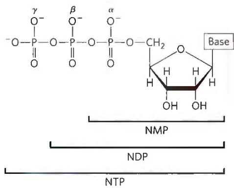

<table><tr><td colspan="4">Abbreviations of ribonucleoside 5&#x27;-phosphates</td></tr><tr><td>Base</td><td>Mono-</td><td>Di-</td><td>Tri-</td></tr><tr><td>Adenine</td><td>AMP</td><td>ADP</td><td>ATP</td></tr><tr><td>Guanine</td><td>GMP</td><td>GDP</td><td>GTP</td></tr><tr><td>Cytosine</td><td>CMP</td><td>CDP</td><td>CTP</td></tr><tr><td>Uracil</td><td>UMP</td><td>UDP</td><td>UTP</td></tr></table>

<table><tr><td colspan="4">Abbreviations of deoxyribonucleoside 5&#x27;-phosphates</td></tr><tr><td>Base</td><td>Mono-</td><td>Di-</td><td>Tri-</td></tr><tr><td>Adenine</td><td>dAMP</td><td>dADP</td><td>dATP</td></tr><tr><td>Guanine</td><td>dGMP</td><td>dGDP</td><td>dGTP</td></tr><tr><td>Cytosine</td><td>dCMP</td><td>dCDP</td><td>dCTP</td></tr><tr><td>Thymine</td><td>dTMP</td><td>dTDP</td><td>dTTP</td></tr></table>

their standard abbreviations. In the deoxyribonucleoside phosphates (dNMPs, dNDPs, and dNTPs), the pentose is 2'-deoxy-D-ribose.

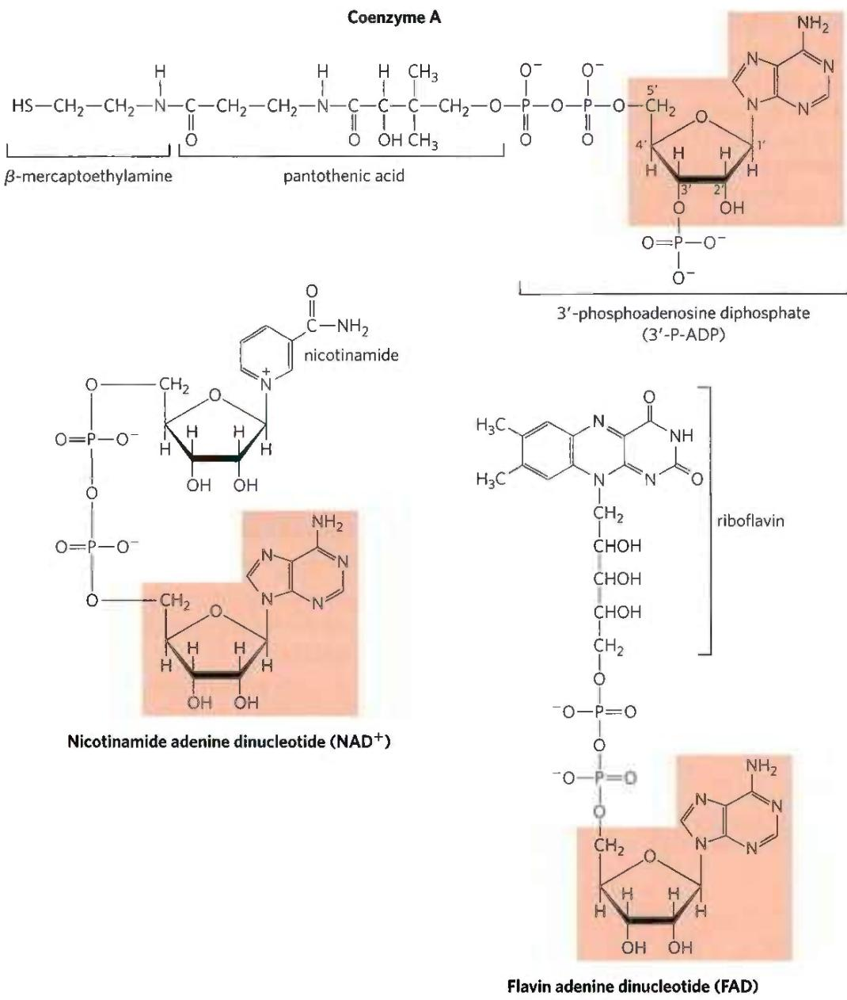  
FIGURE 8-41 Some coenzymes containing adenosine. The adenosine portion is shaded in light red. Coenzyme A (CoA) functions in acyl group transfer reactions; the acyl group (such as the acetyl or acetoacetyl group) is attached to the CoA through a thioester linkage to the $\beta$ -mercaptoethylamine moiety. NAD+  
functions in hydride transfers, and FAD, the active form of vitamin $B_{2}$ (riboflavin), functions in electron transfers. Another coenzyme incorporating adenosine is 5'-deoxyadenosylcobalamin, the active form of vitamin $B_{12}$ (see Box 17-2), which participates in intramolecular group transfers between adjacent carbons.

the initial enzyme-substrate complex (Chapter 6). In the case of $\beta$ -ketoacyl-CoA transferase, the nucleotide moiety of coenzyme A seems to be a binding "handle" that helps to pull the substrate (acetoacetyl-CoA) into the active site. Similar roles may be found for the nucleoside portion of other nucleotide cofactors.

Why is adenosine, rather than some other large molecule, used in these structures? The answer here may involve a form of evolutionary economy. Adenosine is certainly not unique in the amount of potential binding energy it can contribute. The importance of adenosine probably lies not so much in some special chemical characteristic as in the evolutionary advantage of using one compound for multiple roles. Once ATP became the universal source of chemical energy, systems developed to synthesize ATP in greater abundance than the other nucleotides; because it is abundant, it becomes the logical choice for incorporation into a wide variety of structures. The economy extends to protein structure. A single protein domain that binds adenosine can be used in different enzymes. Such a domain, called a nucleotide-binding fold, is found in many enzymes that bind ATP and nucleotide cofactors.

#### [EN] Some Nucleotides Are Regulatory Molecules

Cells respond to their environment by taking cues from hormones or other external chemical signals. The interaction of these extracellular chemical signals ("first messengers") with receptors on the cell surface often leads to the production of second messengers inside the cell, which in turn leads to adaptive changes in the cell interior (Chapter 12). Often, the second messenger is a nucleotide (Fig. 8-42). One of the most common is adenosine $3',5'$ -cyclic monophosphate (cyclic AMP, or cAMP), formed from ATP in a reaction catalyzed by adenylyl cyclase, an enzyme associated with the inner face of the plasma membrane. Cyclic AMP serves regulatory functions in virtually every cell outside the plant kingdom. Guanosine $3',5'$ -cyclic monophosphate (cGMP) also has regulatory functions in many cells.

Another regulatory nucleotide, ppGpp (Fig. 8-42), is produced in bacteria in response to a slowdown in protein synthesis during amino acid starvation. This nucleotide inhibits the synthesis of the rRNA and tRNA molecules (see Fig. 28-22) needed for protein synthesis, preventing the unnecessary production of nucleic acids.

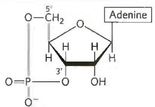  
Adenosine 3',5'-cyclic monophosphate (cyclic AMP; cAMP)

  
Guanosine 3',5'-cyclic monophosphate (cyclic GMP; cGMP)

  
Guanosine 5'-diphosphate,3'-diphosphate (guanosine tetraphosphate; ppGpp)  
FIGURE 8-42 Three regulatory nucleotides.

#### [EN] Adenine Nucleotides Also Serve as Signals

ATP and ADP also serve as signaling molecules in many unicellular and multicellular organisms, including humans. In mammals, certain neurons release ATP at synapses. The ATP binds $P_{2X}$ receptors on the postsynaptic cell, triggering changes in membrane potential or the release of an intracellular second messenger that initiates diverse physiological processes, including taste, inflammation, and smooth muscle contraction. One important class of ATP receptors that mediate the sensation of pain is an obvious target for drug development. Extracellular ADP is a signaling molecule that acts through $P_{2Y}$ receptors in sensitive cell types. By preventing ADP from binding the $P_{2Y}$ receptors of platelets, the drug clopidogrel (Plavix) inhibits undesirable blood clotting in patients with cardiac disease. Signaling pathways are discussed in more detail in Chapter 12.

#### [EN] SUMMARY 8.4 Other Functions of Nucleotides

■ ATP is the central carrier of chemical energy in cells.

■ The presence of an adenosine moiety in a variety of enzyme cofactors may be related to binding-energy requirements.

\- Cyclic AMP, formed from ATP in a reaction catalyzed by adenylyl cyclase, is a common second messenger produced in response to hormones and other chemical signals.

■ ATP and ADP serve as neurotransmitters in a variety of signaling pathways.

<!-- EN-END 8.4 -->

## 四、作为辅酶(辅基)的金属离子

## (一) 概论

动物和人为了生长和发育在饮食中除了维生素外,还需要一些无机形式的化学元素。这些元素可分为两类:大量元素和微量元素。大量元素包括钙、镁、钠、钾、磷、硫和氯,每天需要相对大的量(接近克),它们常具有一种以上的功能。例如,钙是骨矿物质或者羟基磷灰石( $\left[ Ca_{3}(PO_{4}) \right]_{3}Ca(OH)_{2}$ )的结构成分,而游离钙在细胞液中作为重要的调节剂,它的浓度低于 $10^{-6}$ mol·L $^{-1}$ 。磷以磷酸盐形式存在,是细胞内能量传递 ATP 系统的活性成分。

更关心的是关于酶作用必需的微量元素(表 13-6, 表 13-7), 类似于维生素的需要量, 每天仅需要毫克或微克量。已知 15 种微量元素在动物营养中是必需的, 大多数必需微量元素是作为酶的辅因子或辅基起作用。

表 13-6 微量元素及其生物化学功能

<table><tr><td>元素</td><td>生物化学功能的例子</td></tr><tr><td>铁</td><td>血红素酶(过氧化氢酶,细胞色素氧化酶)的辅基</td></tr><tr><td>碘</td><td>甲状腺激素结构中需要</td></tr><tr><td>铜</td><td>细胞色素氧化酶的辅基</td></tr><tr><td>锰</td><td>精氨酸酶和其他酶的辅因子</td></tr><tr><td>锌</td><td>脱氢酶类,DNA聚合酶,碳酸酐酶的辅因子</td></tr><tr><td>钴</td><td>维生素 $B_{12}$ 的组分</td></tr><tr><td>钼</td><td>黄嘌呤氧化酶的辅因子</td></tr><tr><td>硒</td><td>谷胱甘肽过氧化物酶和其他酶类的辅因子</td></tr><tr><td>钒</td><td>硝酸还原酶的辅因子</td></tr><tr><td>镍</td><td>脲酶的辅因子</td></tr></table>

表 13-7 生物化学功能还不清楚的微量元素

<table><tr><td>元素</td><td>明显的作用</td><td>元素</td><td>明显的作用</td></tr><tr><td>铬</td><td>血糖的适当利用</td><td>硅</td><td>结缔组织和骨的形成</td></tr><tr><td>锡</td><td>骨的形成</td><td>砷</td><td>不清楚</td></tr><tr><td>氟</td><td>骨的形成</td><td></td><td></td></tr></table>

金属离子参与多种生物化学过程。估计有三分之一的酶在催化过程的一个或几个阶段中需要金属离子。金属离子通过配位键，将底物直接结合到活性部位，或者间接地使酶的结构保持在适合于结合的特殊构象下来控制催化作用。金属离子可作为亲电剂或亲核剂的结构组分参加氧化和水解等反应。许多代谢物，特别是核苷酸类物质都是以金属复合物的形式存在，例如， $\mathrm{Mg}^{2+} \cdot \mathrm{ATP}$ ，而且酶反应的真正底物是这些复合物，而不是核苷酸本身。因此，金属离子能够通过改变尚未复合底物的化学性质来发挥它们自己的催化效力。研究表明，某些酶-金属复合物通过对酶蛋白部分的合成、降解或两者速度的专一性控制能够调节酶活性的水平，说明金属离子对酶的表达和调控是很重要的。

## （二）金属酶类与金属激活酶类

虽然许多酶需要金属离子作为辅因子,但仍可以依据金属结合的强度把这些酶再分成金属酶类(metalloenzymes)和金属激活酶类(metal-activated enzymes)。金属酶一般含有化学计量的金属辅因子,它们结合的相当牢固,而且加入游离金属离子后活性并不会增加。金属激活酶中其金属离子处于与酶表面结合基团的平衡中,这种金属离子在酶的纯化过程中常常失去,必须再加入金属离子才能恢复催化活性,然而,金属激活酶类在酶的位点、受结合的金属和底物之间通常是1:1:1的简单化学计量关系。这种活化的三元复合物有以下各种构型:①底物桥复合物(substrate-bridge complex),其中底物-金属复合物与酶相结合;②金属桥复合物(metal bridge complex),其中金属处在同时与底物和酶两者结合的位置;③金属桥复合物可能再通过一个非金属键使底物与酶联结;④表现为金属仅仅与酶接触。除底物桥复合物外,其余的复合物可看作是金属酶。底物桥复合物限定金属只与底物接触,当然就不可能是金属酶了。

$$
\mathrm{E-S-M} \quad \mathrm{E-M-S} \quad \text {或} \quad \begin{array}{c c} {{\mathrm{M}}} \\ {{\mathrm{E}}} \\ {{\mathrm{S}}} \end{array} \quad \mathrm{M-E-S}
$$

$$
① \quad ② \quad ③ \quad ④
$$

## （三）含铁酶类

铁是关系到生物功能最熟悉的微量元素。铁是氧载体蛋白血红蛋白和肌红蛋白以及电子载体线粒体蛋白细胞色素 c 血红素基团的成分。几种重要的酶也都含有血红素辅基。一个最好的例子是细胞色素氧化酶，由营养分子来的电子催化还原分子氧成水。细胞色素氧化酶中的铁原子，经历高铁 $\left(\mathrm{Fe}^{3+}\right)$ 和低铁 $\left(\mathrm{Fe}^{2+}\right)$ 型式化合价的改变，行使从细胞色素 c 转移电子给氧的功能。细胞色素 P450 参加酶促羟化反应也能转移电子给氧。

其他血红素酶包括催化过氧化氢分解的过氧化氢酶和通过过氧化作用催化各种有机物质氧化的过氧化物酶。过氧化氢酶中铁原子本身在催化循环中就是一个积极参加者。简单的铁盐，如 $FeSO_{4}$ 在促进过氧化氢分解成水和 $O_{2}$ 时已经具有某种催化活性。可能是卟啉基和过氧化氢酶的蛋白质部分极大地增强了铁所固有的催化活性。

铁-硫酶是另一类重要的含铁酶类，这类酶在动物、植物和细菌细胞中也起电子转移反应的功能。在铁-硫酶中没有血红素辅基，但独特地含有等量的铁和硫原子，以特别不稳定的形式被酸分解。一个例子是叶绿体的铁氧还蛋白（ferredoxin），它行使从光激发的叶绿素携带电子到各种电子受体的功能。其他铁-硫酶在线粒体电子传递反应中起作用。某些黄素蛋白除了黄素核苷酸之外还含铁。

## （四）含铜酶类

许多含铜酶属于羟化酶和氧化酶类(表13-8)，这意味着它们是与分子氧一起参与催化过程的。铜在细胞色素氧化酶的催化活性中起重要作用，该酶在其辅基中含有铁和铜。细胞色素氧化酶的铜原子在参与携带电子传递给氧的过程中，经历 $\mathrm{Cu}^{2+}-\mathrm{Cu}^+$ 化合价转换的循环。铜也存在于赖氨酰氧化酶（lysyloxidase）的活性基中，该酶可使胶原蛋白和弹性蛋白中多肽链之间进行交联。动物缺乏铜就发育成缺少交联的不完全的胶原蛋白分子，其结果主动脉壁中的胶原蛋白和弹性蛋白变得脆弱以致动脉趋向破裂。为了在身体中适当的利用铁，铜也是需要的。

表 13-8 含铜金属酶

<table><tr><td>酶</td><td>来源</td><td>相对分子质量/ $\times 10^{3}$ </td><td>每分子的铜原子数</td></tr><tr><td>抗坏血酸氧化酶(ascorbic acid oxidase)</td><td>南瓜</td><td>140</td><td>8</td></tr><tr><td>铜蓝蛋白( ceruloplasmin )</td><td>血浆</td><td>134</td><td>6~7</td></tr><tr><td>细胞色素 c 氧化酶( cytochrome c oxidase )</td><td>线粒体</td><td>340</td><td>1</td></tr><tr><td>二胺氧化酶( diamine oxidase )</td><td>肾</td><td>185</td><td>2</td></tr><tr><td>多巴胺-β-羟化酶( dopamine-β-hydroxylase )</td><td>肾上腺</td><td>290</td><td>2</td></tr><tr><td>D-半乳糖氧化酶( D-galactose oxidase )</td><td>真菌</td><td>60</td><td>1</td></tr><tr><td>漆酶( laccase )</td><td>漆树</td><td>120</td><td>6</td></tr><tr><td>赖氨酰氧化酶( lysyl oxidase )</td><td>鸡主动脉和软骨</td><td>60</td><td>1</td></tr><tr><td>超氧化物歧化酶( superoxide dismutase )</td><td>肝</td><td>34</td><td>2</td></tr><tr><td>尿酸酶( uricase )</td><td>肝</td><td>12</td><td>1</td></tr></table>

## （五）含锌酶类

锌是300多种不同酶的必需成分，是目前唯一的在六大酶类中都发现存在的金属酶类。作为辅因子，锌是最通用的金属。由于锌完全以 $\mathrm{Zn}^{2+}$ 离子存在，因此和铜、铁或锰不同，没有氧化还原能力。锌最通常的配位数是4，该金属最容易形成四面体的构型。锌常存在于酶的活性部位，在酶和底物间起桥梁作用。

表 13-9 列出了一部分对其性质已相当了解的含锌金属酶。碳酸酐酶是首先发现的含锌酶，有一个锌结合于酶的单肽链上。酵母菌和肝的醇脱氢酶，每个分子结合4个锌。大肠杆菌碱性磷酸酯酶的稳定性和催化活性依赖于锌，酶的2个亚基来源于同一基因，但是在翻译后形成不均一性。其他细菌、真菌和较高等动物的碱性磷酸酯酶也是含锌金属酶，高等植物中尚未发现这种酶，它在红细胞和肌肉细胞内也不存在。大肠杆菌天冬氨酸转氨甲酰酶，每分子结合6个锌。大肠杆菌DNA聚合酶和依赖于DNA的RNA聚合酶两者都是含锌酶，它们是涉及参与遗传信息的复制和转录的重要酶。已证明由鸟类成髓细胞白血病病毒诱导的反向转录酶需要锌。至今鉴定过的所有细菌中性蛋白酶都表明至少有一个锌原子和紧密结合有钙离子的酶相缔合，嗜热菌蛋白酶是这类酶的一个例子。最后，近来的研究指出鼠肝延长因子I (EF-I)需要锌，高度纯化的因子含有1个锌。其中锌最有兴趣的作用是舌和鼻通道的味觉和嗅觉受体所持有的功能。

表 13-9 含锌金属酶

<table><tr><td>酶</td><td>来源</td><td>相对分子质量/ $\times 10^{3}$ </td><td>每分子的锌原子数</td></tr><tr><td>醇脱氢酶(alcohol dehydrogenase)</td><td>酵母</td><td>150</td><td>4</td></tr><tr><td>醇脱氢酶(alcohol dehydrogenase)</td><td>马肝</td><td>84</td><td>4</td></tr><tr><td>碱性磷酸酯酶(alkaline phosphatase)</td><td>大肠杆菌</td><td>80</td><td>4</td></tr><tr><td>碳酸酐酶(carbonic anhydrase)</td><td>红细胞</td><td>30</td><td>1</td></tr><tr><td>羧肽酶A(carboxypeptidase A)</td><td>胰</td><td>34.6</td><td>1</td></tr><tr><td>羧肽酶B(carboxypeptidase B)</td><td>胰</td><td>34.3</td><td>1</td></tr><tr><td>谷氨酸脱氢酶(glutamate dehydrogenase)</td><td>牛肝</td><td>1000</td><td>2~6</td></tr><tr><td>亮氨酸氨肽酶(leucine aminopeptidase)</td><td>猪肾</td><td>300</td><td>4~6</td></tr><tr><td>中性蛋白酶(neutral protease)</td><td>枯草杆菌</td><td>44.7</td><td>1~2</td></tr><tr><td>嗜热菌蛋白酶(thermolysin)</td><td>嗜热芽孢杆菌</td><td>37.5</td><td>4</td></tr></table>

## （六）其他金属酶类

精氨酸酶（arginase）是尿素循环中的一个酶（第25章），与锰形成紧密的复合物，金属在精氨酸酶中起着稳定和催化两种作用。鸡肝丙酮酸羧化酶（pyruvate carboxylase）含有4个亚基，4个锰离子和4个生物素。锰也作为某些磷酸转移酶（phosphate transferring enzyme）的辅因子。微量的钴对生物合成维生素 $B_{12}$ 是需要的。人们发现钼和钒在某种黄素脱氢酶的活性部位起作用。例如，黄嘌呤氧化酶（xanthine oxidase）有一个FAD辅基，也含有钼和铁作为它的必需成分。钒在硝酸还原酶（nitrate reductase）中参与氧化还原反应。谷胱甘肽过氧化物酶（glutathione peroxidase）含硒，它替代活性部位中一个半胱氨酸的硫。最近发现脲酶（urease）结合有2个镍原子，不过这种镍的实际功能还没有确定。酶的结构中没有发现铬，然而已证明这个金属是一种称为葡萄糖耐糖因子复合物的关键成分，这个复合物促使肝外组织吸收糖，其生物学功能与胰岛素的作用十分相似。锡对骨骼系统的发育可能在钙化过程中是需要的。也有报道某些植物需要两种另外的元素硼和铝。

## 提要

维生素是维持生物体正常生长发育和代谢所必需的一类微量有机物质,不能由机体合成,或合成量不足,必须靠食物供给。由于维生素缺乏而引起的疾病称为维生素缺乏症。维生素都是小分子有机化合物,在结构上无共同性。通常根据其溶解性质分为脂溶性维生素和水溶性维生素两大类。脂溶性维生素有维生素A、D、E、K等,水溶性维生素有维生素 $B_{1}$ 、 $B_{2}$ 、 $B_{6}$ 、 $B_{12}$ 、烟酸、烟酰胺、泛酸、生物素、叶酸、硫辛酸和维生素C等。现已知绝大多数维生素作为酶的辅酶或辅基的组成成分,在物质代谢中起重要作用。

维生素A的活性形式是11-顺视黄醛，参与视紫红质的合成，与暗视觉有关。此外维生素A还参与糖蛋白的合成，在刺激组织生长分化中也起重要作用。维生素D为类固醇衍生物，1,25-二羟维生素 $\mathrm{D}_3$ 是其活性形式，用以调节钙磷代谢，促进新骨的生成与钙化。维生素E是体内最重要的抗氧化剂，可保护生物膜的结构和功能，维生素E还可促进血红素的合成。维生素K与肝合成凝血因子II、VII、IX和X有关，作为谷氨酰羧化酶的辅助因子是参与凝血因子前体转变为活性凝血因子所必需的。除维生素C外，水溶性维生素主要为B族维生素，以辅酶和辅基的形式存在，参与物质代谢。硫胺素的辅酶形式为硫胺素焦磷酸（TPP），是 $\alpha-$ 酮酸脱羧酶、转酮酶及磷酸酮酶的辅酶，在 $\alpha-$ 裂解反应、 $\alpha-$ 缩合反应及 $\alpha-$ 酮转移反应中起重要作用。核黄素和烟酰胺是氧化还原酶类的重要辅酶，核黄素以FMN和FAD的形式作为黄素蛋白酶的辅基；而烟酰胺以 $\mathrm{NAD}^+$ 和 $\mathrm{NADP}^+$ 形式作为许多脱氢酶的辅酶，至少催化6种不同类型的反应。泛酸是构成CoA和ACP的成分，CoA起传递酰基的作用，是各种酰化反应的辅酶，而ACP与脂肪酸的合成关系密切。磷酸吡哆醛是氨基酸代谢中多种酶的辅酶，参加催化涉及氨基酸的转氨作用， $\alpha-$ 和 $\beta-$ 脱羧作用， $\beta-$ 和 $\gamma-$ 消除作用，消旋作用和醛醇裂解反应。生物素是几种羧化酶的辅酶，包括乙酰-CoA羧化酶和丙酮酸羧化酶，参与 $\mathrm{CO}_{2}$ 的固定作用。维生素 $\mathrm{B}_{12}$ 存在 $5^{\prime}-$ 脱氧腺苷钴胺素和甲基钴胺素两种活性形式，它们参与分子内重排、核苷酸还原成脱氧核苷酸及甲基转移反应。叶酸的辅酶是四氢叶酸（THF），进行一碳单位的传递，参与甲硫氨酸和核苷酸等物质的合成。硫辛酸是一种酰基载体，作为丙酮酸脱氢酶和 $\alpha-$ 酮戊二酸脱氢酶的辅酶参与糖代谢。抗坏血酸是一种水溶性抗氧化剂，参与体内羟化反应、氧化还原反应，有解毒和提高免疫力的作用。

(d)

某些金属离子作为微量元素构成一些酶的必需成分参与酶的催化反应，有的金属离子作为酶的辅基构成金属酶类，有的作为酶的激活剂成为金属激活酶类。发现最多的是铁金属酶类、铜金属酶类和锌金属酶类。

## 习题

1. 列举水溶性维生素与辅酶的关系及其主要生物学功能。

2. 列举脂溶性维生素及其主要生物学功能。

3. (a)为什么维生素A能防治夜盲症？(b)说明维生素K与血凝的关系。

4. 说明 CoA 结构与功能的关系。

5. 四氢叶酸(THF)都以何种形式传递一碳单位的?

6. 简要说明丙酮酸脱氢酶反应中所涉及的每种辅酶的催化功能。

7. 天冬氨酸- $\beta$ -脱羧酶可转换 L-天冬氨酸变成 L-丙氨酸，为该反应选择一种合适的辅酶，并写出一个适当的机制。

8. 蛋清可防止蛋黄的腐败，将鸡蛋贮存在冰箱中4\~6周不腐败。而分离出的蛋黄（没有蛋清）甚至在冷冻下也迅速腐败。

(a) 腐败是什么引起的？

(b) 你如何解释观察到的蛋清存在下防止蛋黄腐败？

9. 肾骨营养不良(renal osteodystrophy)也叫肾软骨病,是和骨的广泛脱矿物质作用相联系的一种疾病,常发生在肾损伤的病人中。什么维生素涉及骨的矿质化?为什么肾损伤引起脱矿物质作用?

10. 谷氨酸变位酶催化下面反应：

$$
\mathrm {^ {-} OOC - CH_ {2} -CH_ {2} -CH - COO^ {-}} \longrightarrow \mathrm {^ {-} OOC - C - CH - COO^ {-}} \mathrm {\underset {NH_ {3} ^ {+}} {|}} \mathrm {\underset {H} {|}} \mathrm {\underset {NH_ {3} ^ {+}} {|}}
$$

选择一种合适的辅酶并写出这个反应的机制。

11. 对下面每一个酶促反应, 写出参与反应的辅酶。

$$
\mathrm{(a)}\begin{array}{c}\mathrm{CH} _ {3} - \mathrm{CH} - \mathrm{CH} _ {2} - \mathrm{CH} - \mathrm{CH} _ {2} - \mathrm{COOH} \rightleftharpoons \mathrm{CH} _ {2} - \mathrm{CH} _ {2} - \mathrm{CH} _ {2} - \mathrm{CH} - \mathrm{CH} _ {2} - \mathrm{COOH}\\|\\\mathrm{NH} _ {2}\end{array}
$$

$$
\mathrm{HO} - \mathrm{CH} _ {2} - \underset {\mathrm{NH} _ {2}} {\mathrm{CH}} - \mathrm{COOH} \longrightarrow \mathrm{CH} _ {3} - \underset {\|} {\mathrm{C}} - \mathrm{COOH} + \mathrm{NH} _ {3}
$$

$$
\mathrm{(c)} \mathrm {H_ {2} N - (CH_ {2}) _ {4} -CH - COOH+ O_ {2} \longrightarrow H_ {2} N(C H_ {2}) _ {4} -C - NH_ {2} +CO_ {2} + H_ {2} O}
$$

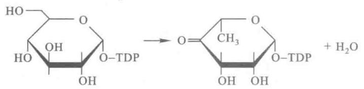

$$
\mathrm{CH} _ {3} - \mathrm{CH} _ {2} - \stackrel {\mathrm{O}} {\mathrm{C}} - \mathrm{SCoA} + \mathrm{HCO} _ {3} ^ {-} + \mathrm{ATP} \longrightarrow \mathrm{HOOC} - \stackrel {\mathrm{O}} {\mathrm{CH}} - \stackrel {\mathrm{O}} {\mathrm{C}} - \mathrm{SCoA} + \mathrm{ADP} + \mathrm{Pi}
$$

$$
\begin{array}{c} \mathrm{(f)} \mathrm {CH_ {2} -CH - CH - CH - C - CH_ {2}} + \mathrm {CH_ {2} -CH - CHO} \\ \mathrm{|} \quad \mathrm{|} \quad \mathrm{|} \\ \mathrm{O} Ⓟ \quad \mathrm{OH} \quad \mathrm{OH} \end{array}
$$

$$
\begin{array}{c} \mathrm{CH} _ {2} - \mathrm{CH} - \mathrm{CH} - \mathrm{CHO} + \mathrm{CH} _ {2} - \mathrm{CH} - \mathrm{CH} - \mathrm{C} - \mathrm{CH} _ {2} \\ | \quad | \quad | \\ \mathrm{O} ^ {\textcircled {P}} \quad \mathrm{OH} \quad \mathrm{OH} \end{array}
$$

## 主要参考书目

1. 王镜岩, 朱圣庚, 徐长法. 生物化学教程. 北京: 高等教育出版社, 2008.

2. Garrett R H, Grisham C M. Biochemistry. 3rd ed. New York: Saurders College Publishing, 2004.

3. Garrett R H, Grisham C M. Biochemistry. 5th ed. Boston: Brooks/Core, Cengage Learning, 2013.

4. Nelson D L, Cox M M. Lehninger Principles of Biochemistry. 5th ed. New York: W. H. Freeman and Company, 2008.

5. Berg J M, Tymoczko J L, Stryer L. Biochemistry. 7th ed. New York: W. H. Freeman and Company, 2012.

6. Zubay G. Biochemistry. London, Sydney: Addison-wesley Publishing Company, 1983.

(张庭芳)

## 网上资源

习题答案
