## 第 17 章 六碳糖的分解和糖酵解作用

> **本章英文对应内容**（Lehninger，插在所列中文小节末尾）
>
> - 第14章 Glycolysis, Gluconeogenesis, and the Pentose Phosphate Pathway：章首导言（本章开头）、关键术语/习题/简答（本章末尾）
> - §14.1（第14章）→ 五、酵解第二阶段——放能阶段的反应机制
> - §14.2（第14章）→ 九、其他六碳糖进入糖酵解途径
> - §14.3（第14章）→ 七、丙酮酸的去路
> - §14.5（第14章）→ 八、糖酵解作用的调节

葡萄糖在动物、植物即许多微生物的代谢中占据着核心地位。葡萄糖含有丰富的能量，以高分子质量聚合物如淀粉或糖原的形式存在，从而使细胞能够在维持相对较低的细胞渗透压下储存大量的己糖单元。当能量需要突然增加时，葡萄糖从这些细胞内贮存的聚合物中释放。在有氧条件下，它被彻底氧化成 $CO_{2}$ 和水，释

放出大量自由能形成大量的 ATP。在无氧条件下，葡萄糖分解为丙酮酸，产生 2 分子 ATP，这一过程称为糖酵解作用。

葡萄糖不仅是非常高效的燃料分子,也是多功能的起始物,可以提供大量的生物合成反应中间代谢物。细菌如大肠杆菌(Escherichia coli)可以从葡萄糖获得生长所需的氨基酸、核苷酸、辅酶、脂肪酸或其他代谢中间物的碳骨架。在高等植物和动物中,葡萄糖的主要代谢途径为:作为糖或蔗糖被贮存;通过糖酵解途径被氧化为三碳化合物(丙酮酸),产生ATP和代谢中间物;通过戊糖磷酸途径被氧化为五碳糖,生成5-磷酸核糖和NADPH。

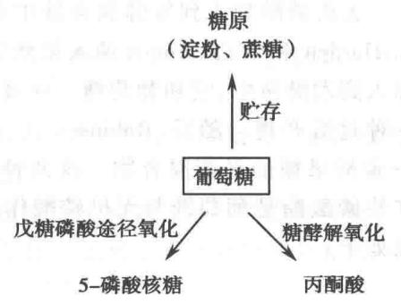

糖酵解(glycolysis)一词来源于希腊语glykos的词根,是“甜”的意思。lysis是“分解”或“解开”的意思。糖酵解过程被认为是生物最古老、最原始获取能量的一种方式。在自然发展过程中出现的大多数较高等生物,虽然进化为利用有氧条件进行生物氧化获取大量的自由能,但仍保留了这种原始的方式。这一系列过程,不但成为生物体共同经历的葡萄糖的分解代谢前期途径,而且有些生物体还利用这一途径在供氧不足的条件下,给机体提供能量,或供应急需要。这一途径也是人们最早阐明的酶促反应系统,也是研究得非常透彻的一个过程。因为这一过程的反应原则以及调节机制,在所有细胞代谢途径中具有普遍意义,所以有必要对此过程作较详细的介绍。此外,其他糖类是怎样进入酵解途径的,也将进行适当的讨论。

<!-- EN-BEGIN 第14章导言 -->

### 【英文对应 第14章导言】Glycolysis, Gluconeogenesis, and the Pentose Phosphate Pathway

> 来源：Lehninger Principles of Biochemistry（书籍/02_生物化学原理） 第14章章首（含章节目录与学习要点）。

#### [EN] GLYCOLYSIS, GLUCONEOGENESIS, AND THE PENTOSE PHOSPHATE PATHWAY

14.1 Glycolysis 511

14.2 Feeder Pathways for Glycolysis 521

14.3 Fates of Pyruvate 525

14.4 Gluconeogenesis 533

14.5 Coordinated Regulation of Glycolysis and Gluconeogenesis 539

14.6 Pentose Phosphate Pathway of Glucose Oxidation 546

We begin with the major pathways of glucose metabolism: glycolysis and fermentation, gluconeogenesis, and the pentose phosphate pathway. Glucose occupies a central position in the metabolism of plants, animals, and many microorganisms. It is relatively rich in potential energy, and thus a good fuel; the complete oxidation of glucose to carbon dioxide and water proceeds with a standard free-energy change of -2,840 kJ/mol. By storing glucose as a high molecular weight polymer such as starch or glycogen, a cell can stockpile large quantities of hexose units while maintaining a relatively low cytosolic osmolarity. When energy demands increase, glucose can be released from these intracellular storage polymers and used to produce ATP either aerobically or anaerobically.

Glucose is not only an excellent fuel, but also a remarkably versatile precursor, capable of supplying a huge array of metabolic intermediates for biosynthetic reactions. A bacterium such as Escherichia coli can obtain from glucose the carbon skeletons for every amino acid, nucleotide, coenzyme, fatty acid, or other metabolic intermediate it needs for growth. A comprehensive study of the metabolic fates of glucose would encompass hundreds or thousands of transformations. In animals and vascular plants, glucose has four major fates: it may be (1) used in the synthesis of complex polysaccharides destined for the extracellular space; (2) stored in cells (as a polysaccharide or as sucrose); (3) oxidized to a three-carbon compound (pyruvate) via glycolysis to provide ATP and metabolic intermediates; or (4) oxidized via the pentose phosphate (phosphogluconate) pathway to yield ribose 5-phosphate for nucleic acid synthesis and NADPH for reductive biosynthetic processes (Fig. 14-1).

Organisms that do not have access to glucose from other sources must make it. Photosynthetic organisms make glucose by first reducing atmospheric $CO_{2}$ to trioses, then converting the trioses to glucose. Nonphotosynthetic cells make glucose from simpler three- and four-carbon precursors by the process of gluconeogenesis, effectively reversing glycolysis in a pathway that uses many of the glycolytic enzymes.

These principles are central to understanding glucose metabolism, but many apply to all metabolic pathways:

P1 Metabolites like glucose are often activated with a high-energy group before their catabolism. Glycolysis is a nearly universal 10-step metabolic pathway for producing ATP by the oxidation of glucose. In this process, two molecules of ATP are invested to activate glucose, but the products of the pathway include four ATP, as well as NADH (a form of reducing power) and the triose pyruvate, which can be metabolized further in other pathways.

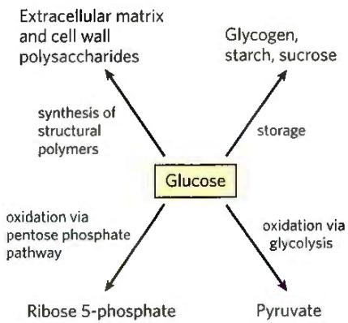  
FIGURE 14-1 Major pathways of glucose utilization. Although not the only possible fates for glucose, these four pathways are the most significant in most cells.

P2 Glucose and other hexoses and hexose phosphates obtained from stored polysaccharides or dietary carbohydrates feed into the glycolytic pathway. By using a common pathway for a number of starting materials, the cell economizes on the number of enzymes that must be synthesized and simplifies the regulation of the common pathway.

P3 Pyruvate formed under anaerobic conditions is reduced to lactate with electrons from NADH, recycling NADH to $\mathrm{NAD^{+}}$ and allowing continued glycolysis in the processes of lactate or alcohol fermentation. Manipulation of the fermentable material and the microorganisms present allows the synthesis of a variety of industrial products and foods.

P4 Gluconeogenesis is the synthesis of glucose from simpler precursors like pyruvate and lactate. Although it uses seven of the ten enzymes that also act in glycolysis, gluconeogenesis must bypass three of the most exergonic steps in glycolysis with energetically favorable reactions unique to gluconeogenesis.

P5 Glycolysis and gluconeogenesis are reciprocally regulated so that both processes don't occur simultaneously in a futile cycle. Most regulatory mechanisms act on reactions that are unique to each pathway.

The pentose phosphate pathway is an alternative pathway for glucose oxidation. It yields pentoses for nucleotide synthesis and reduced cofactors for biosynthesis of fatty acids, sterols, and many other compounds.

<!-- EN-END 第14章导言 -->

## 一、糖酵解作用的研究历史

发酵(fermentation)是指葡萄糖或其他有机营养物通过无氧呼吸降解获得能量,贮存 ATP。从历史的纪元开始,人们就已经会用酵母菌将葡萄糖发酵成乙醇和 $CO_{2}$ 。在生活实践中,人们发展了酿酒、制作工业酒精以及面包制造业等。这些都是利用酵母菌的发酵过程。虽然人们很早就开始利用“发酵”,但是对发酵的研究却只是在 19 世纪后半叶才开始的。

对发酵现象的解释,1854—1864的10年间,Louis Paster的观点占有统治地位。他认为发酵现象是由微生物引起的,发酵过程以及各种生物过程都离不开一种生命物质所固有的“活力”(vital force)的作用。他称发酵为“不要空气的生命”。

1897 年, Hans Buchner 和 Edward Buchner 兄弟, 开始制作不含有细胞的酵母浸出液拟供药用。他们用细沙和酵母一起研磨, 加上硅藻土 (kieselguhr), 用水力压榨机榨出汁液来。取得了汁液后, 需要考虑如何防腐的问题。因为他们打算将榨液用于动物实验, 选择了不妨碍动物实验的防腐剂, 日常惯用的蔗糖。这就是重大发现的开端。酵母菌的榨液居然引起了蔗糖发酵。这是第一次发现没有活酵母存在的发酵现象。从此开始了研究没有活细胞参加的酒精发酵的新纪元。在研究中发现, 葡萄糖几乎是全量地按照下面方程式分解为乙醇和 $CO_{2}$ :

$$
\mathrm{C} _ {6} \mathrm{H} _ {1 2} \mathrm{O} _ {6} = 2 \mathrm{CH} _ {3} \mathrm{CH} _ {2} \mathrm{OH} + 2 \mathrm{CO} _ {2}
$$

$$
\text { 葡   萄   糖 } \quad \text { 乙   醇 }
$$

此外，在发酵液中还发现有微量的甘油。

上述实验中还发现,新鲜酵母的发酵液远不如活酵母菌的发酵能力。用气体测量法测定生成 $CO_{2}$ 的量来测定发酵的速度。实验表明,活酵母的发酵能力比等当量的榨液大 10\~20 倍。如果将酵母榨液搁置起来放一些时候,其发酵能力随时间的延长很快地下降。如果将榨液在 30℃ 条件下干燥,仍能保持发酵能力。氯仿对发酵没有影响。但是若将发酵液加热至 50℃ 以上,便会失效。这些都表明发酵力与酶有关。

对于酵母榨液的作用原理,最早做出贡献的是 Arthur Harden 和 William Young 在 1905 年的工作。他们将新鲜的酵母榨液加到 pH 5\~6 的葡萄糖溶液中。如果再加入一些磷酸,发酵就又恢复起来。但这种恢复也只是暂时的。加进去的无机磷酸消失了。游离磷酸的存在量越低,其发酵速度减退得也越快。每次再加入一些磷酸就可以再看到有一阵新的发酵现象出现。

无机磷酸加入到发酵混合液中就很快消失的现象使人们想到可能形成了有机磷酸酯。1905年，A. Harden 和 W. J. Young 两人果然分离得到了 1,6-二磷酸果糖。如果将人工合成的 1,6-二磷酸果糖加入到发酵液中，它和葡萄糖一样被酵解。这一现象表明了 1,6-二磷酸果糖很可能是发酵过程中的一种过渡产物。随后，Robinson 又分析得到另外一种糖的磷酸酯。经分析证明，它是 6-磷酸葡糖和 6-磷酸果糖的平衡混合物。这两种 6-磷酸己糖加入到酵母液中，都可以被酵解。以上的事实表明，这些磷酸酯是葡萄糖与无机磷酸作用的结果，当时已经测出由葡萄糖磷酸化形成磷酸糖酯的次序可能如下：

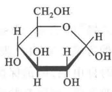  
葡萄糖
(glucose,G)

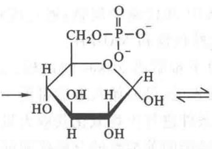  
6-磷酸葡糖
(glucose-6-phosphate)

  
6-磷酸果糖
(fructose-6-phosphate)

  
1,6-二磷酸果糖
(fructose -1,6-bisphosphate)

这些磷酸糖酯是怎样形成的？又是怎样转变成乙醇和 $CO_{2}$ 的？阐明这些问题又经历了几十年的光景，通过不同国别科学家的共同努力才得以解决。在阐明发酵机制的过程中，越来越多的证据表明，酵母菌的榨液使葡萄糖发酵的过程和肌肉浸出液利用葡萄糖发生的酵解作用，是几乎完全相似的过程。除去产物有些差异外，其余过程都是一致的。这就更有利于互相参照阐明其全过程的机制。

Harden 和 Young 还发现,酵母榨液经透析后就失去了发酵能力。向透析剩下的液体中加入少量透析液或煮沸过的使酶失活的榨液,发酵能力就得到恢复。这表明,酵母菌榨液包括两类重要物质,一类是不耐热的、不能透析的酶,命名为发酵酶(zymase),另一类是耐热的、可以透析的物质,命名为发酵辅酶(co-zymase)。发酵作用依靠这两种物质组合而成。发酵酶是催化葡萄糖发酵的。发酵辅酶是酶发挥作用所必需的,后来又进一步证明了发酵辅酶实际是烟酰胺腺嘌呤二核苷酸(NAD,或称辅酶I)和腺嘌呤核苷酸的混合物、此外还有 ADP、ATP 以及金属离子。

当认清以上这些物质的存在后,将它们分别加入到透析残余物中,对深入探讨发酵机制起到重要的作用。此外，在实验过程中还发现了许多化学物质具有阻滞发酵进行的作用。这些物质可以导致某些发酵中间产物的积累。这对阐明发酵机制也起到重要的作用。例如，实验证明氟化物（fluoride）抑制发酵液的发酵过程，造成3-磷酸甘油酸和2-磷酸甘油酸的积累。碘乙酸（iodoacetate）造成1,6-二磷酸果糖的积累。这些物质得到明确以后，大大促进了对这些物质产生机制的研究。

以上这些基本的研究,以及随后发现的,肌肉提取液能使葡萄糖发生酵解作用而产生乳酸的研究,都促使20世纪30年代德国生物化学家对酵解的更加深入地研究。贡献最显著的是Gustav Embden。他提出1,6-二磷酸果糖裂解的形式以及随后的步骤。还有Otto Meyerhof,他对Embden提出的假设作了合理修改,而且研究了酵解作用的能力学。由于他们的重要贡献,从葡萄糖开始至产生丙酮酸的过程常常被称为Embden-Meyerhof途径。他们将肌肉中由葡萄糖形成乳酸的过程称之为酵解过程。

此外，在酵解的研究中做出重要贡献的科学家还应举出德国的 Otto Warburg, Garl Neuberg, 美国的 Carl Cori 和 Gerty Cori 以及波兰的 J. Parnas 等人。

可以说,糖酵解的各个步骤在20世纪60年代就已经很清楚了。但对糖酵解的深入研究,例如对有关酶的结构与功能的研究,还在不断深入地进行着。

从以上的研究中可以看出,发酵(fermentation)是最早研究的,由酵母菌将葡萄糖转化为酒精的过程。而酵解这一名词最初是来自动物肌肉利用葡萄糖最后转化为乳酸的过程。

但是,经过广泛的研究表明:它们的基本途径都是一致的,只存在极小的差异。除在产物上可能有所差别(例如乙醇和乳酸)外,在不同种属和不同类型细胞之间还可能存在同工酶以及不同的调节方式。当前人们将葡萄糖降解产生丙酮酸这一段过程称为糖酵解过程或酵解过程。

## 二、糖酵解过程概述

从历史的叙述中,已经可以明了,糖酵解是葡萄糖转变为丙酮酸的一系列反应。酵解过程的生物学意义在于,它是在不需要氧供应的条件下,产生 ATP 的一种供能方式。

在详细探讨酵解的全过程之前,不妨先从葡萄糖骨架的变化得到一些粗略的概念。

对于酵解过程,由葡萄糖经历丙酮酸最后生成乳酸,其碳原子的变化可作如下的概括:

$$
\begin{array}{r l r}{\mathrm{C-C-C-C-C-C}}&{\rightarrow}&{\mathrm {C - C - C + C - C - C \rightarrow CH_ {3} CH(OH)COO^ {-} + CH_ {3} CH(OH)COO^ {-}}}\\{1 2 3 4 5 6}&&{1 2 3 4 5 6}\\{\text {葡萄糖(六碳糖)}}&&{\text {三碳糖} \quad \text {三碳糖} \quad \text {乳酸} \quad \text {乳酸}}\end{array}
$$

对于发酵作用产生的酒精(又简称酒精发酵),其碳原子的变化情况如下:

C—C—C—C—C—C → C—C—C + C—C—C → $CH_{3}$ — $CH_{2}OH$ + $CO_{2}$ + $CH_{3}$ — $CH_{2}OH$ + $CO_{2}$ 1 2 3 4 5 6
葡萄糖(六碳糖)
三碳糖
三碳糖
乙醇
乙醇

有了碳骨架变化的概念之后,再来看看酵解和酒精发酵作用,包括其形成 ATP 的反应式。酵解作用的反应式:

$$
\begin{array}{l l}\mathrm{C} _ {6} \mathrm{H} _ {1 2} \mathrm{O} _ {6} + 2 \mathrm{Pi} + 2 \mathrm{ADP} \rightarrow 2 \mathrm{CH} _ {3} \mathrm{CH(OH)COO} ^ {-} + 2 \mathrm{ATP} + 2 \mathrm{H} _ {2} \mathrm{O} + 2 \mathrm{H} ^ {+}\\\text {葡萄糖}&\text {无机磷酸} \quad \text {乳酸}\end{array}
$$

酒精发酵作用的反应式：

$$
\mathrm{C} _ {6} \mathrm{H} _ {1 2} \mathrm{O} _ {6} + 2 \mathrm{Pi} + 2 \mathrm{ADP} \rightarrow 2 \mathrm{CH} _ {3} \mathrm{CH} _ {2} \mathrm{OH} + 2 \mathrm{ATP} + 2 \mathrm{H} _ {2} \mathrm{O} + 2 \mathrm{CO} _ {2}
$$

从能量观点出发,可以把酵解过程划分为两个方面。一方面从葡萄糖转变为乳酸是物质的分解过程,其中伴随有自由能的释放。即放能过程。另一方面 ADP 和无机磷酸形成 ATP,则是吸收能量的过程:

$$
\text { 葡   萄   糖 } \rightarrow 2 \text { 乳   酸 } \quad \Delta G _ {1} ^ {\ominus^ {\prime}} = - 1 9 6. 7 \mathrm{kJ/mol} (- 4 7. 0 \mathrm{kcal/mol}) (\text { 放   能   过   程 })
$$

$$
2 \mathrm{ADP} + 2 \mathrm{Pi} \rightarrow 2 \mathrm{ATP} + \mathrm{H} _ {2} \mathrm{O} \quad \Delta G _ {2} ^ {\ominus^ {\prime}} = 2 \times 7. 3 0 = + 6 1. 1 \mathrm{kJ/mol(+14.6kcal/mol)} (\text {吸能反应})
$$

总括上述能量反应。由葡萄糖形成乳酸过程的总能量变化为：

$$
\Delta G _ {\mathrm{总}} ^ {\ominus \prime} = \Delta G _ {1} ^ {\ominus \prime} + \Delta G _ {2} ^ {\ominus \prime} = - 4 7. 0 + 1 4. 6 = - 1 3 5. 5 6 \mathrm{kJ/mol(-32.4kcal/mol)}
$$

因此，从酵解的总能量变化来考虑，可知这是一个放能过程。其中由形成ATP捕获的能量所占释放全部能量的百分比为 $14.6 / 47.4 \times 100\% = 31\%$ 。但在细胞内，真正的反应物和产物浓度并不是标准状况下的 $1.0 \mathrm{~mol} / \mathrm{L}$ ，而是低许多倍。这样计算起来，酵解的实际效益远不只 $31\%$ 。由于酵解所释放的净能量为 $-135.56 \mathrm{~kJ} / \mathrm{mol}(-32.4 \mathrm{kcal} / \mathrm{mol})$ ，因此酵解过程实际是一个不可逆的（irreversible）反应过程。但在全部过程中，大多数反应步骤的标准自由能变化差异并不大。因此，这类反应的逆反应也可用于葡萄糖在细胞内的再合成。

应该引起注意的是:糖酵解过程由葡萄糖到所有的中间产物都是以磷酸化合物的形式来实现的。中间产物磷酸化至少有三种意义:①带有负电荷的磷酸基团使中间产物具有极性,从而使这些产物不易透过脂膜而失散;②磷酸基团在各反应步骤中,对酶来说,起到信号基团的作用,有利于与酶结合而被催化;③磷酸基团经酵解作用后,最终形成ATP的末端磷酸基团,因此具有保存能量的作用。

糖酵解过程从葡萄糖到形成丙酮酸共包括10步反应，可划分为两个主要阶段。前5步为准备阶段，葡萄糖通过磷酸化、异构化裂解为三碳糖。每裂解一个己糖分子，共消耗2分子ATP。使己糖分子的1,6位磷酸化。磷酸化的己糖裂解和异构化，最后形成一个共同中间物即3-磷酸甘油醛。

后 5 步为产生 ATP 的贮能阶段。磷酸三碳糖转变成丙酮酸。每分子三碳糖产生 2 分子 ATP。整个过程需要 10 种酶。这些酶都存在于胞质溶胶中，大部分过程都有 $Mg^{2+}$ 离子作为辅助因子。

## 三、糖酵解和酒精发酵的全过程图解

前面已经提到,酵解和酒精发酵基本路线完全相同,只是在形成丙酮酸以后才有差异。丙酮酸转化为乳酸时称为酵解;丙酮酸转化为乙醛、乙醇时,称为发酵。图17-1列出酵解和发酵化学过程的总貌。关于每步化学反应的机制,将在下一节中详细讨论。

## 四、糖酵解第一阶段的反应机制

前面已经提到糖酵解的第一阶段是酵解的准备阶段,包括5步反应,以下逐步进行讨论。

  
图17-1 糖酵解和发酵的全过程

注：图中P代表磷酰基（磷酸基团），Pi代表无机磷酸，括号内数字代表催化相应反应的酶如下：①己糖激酶（hexokinase）或葡糖激酶（glucokinase）；②磷酸己糖异构酶（phosphohexose isomerase）；③磷酸果糖激酶-1（phosphofructokinase 1, PFK1）；④醛缩酶（aldolase）；⑤磷酸丙糖异构酶（triose phosphate isomerase）；⑥磷酸甘油醛脱氢酶（glyceraldehyde phosphate dehydrogenase）；⑦磷酸甘油酸激酶（phosphoglycerate kinase）；⑧磷酸甘油酸变位酶（phosphoglycerate mutase）；⑨烯醇化酶（enolase）；⑩丙酮酸激酶（pyruvate kinase）；⑪非酶促反应；⑫乳酸脱氢酶（lactate dehydrogenase）；⑬丙酮酸脱羧酶（pyruvate decarboxylase）；⑭乙醇脱氢酶（alcohol dehydrogenase）

## （一）葡萄糖的磷酸化

葡萄糖发生酵解作用的第一步是 D-葡萄糖分子在第 6 位的磷酸化,形成 6-磷酸葡糖(glucose-6-phosphate),可简写为 G6P。这是一个磷酸基团转移的反应,即 ATP 的 $\gamma$ -磷酸基团在己糖激酶(hexokinase)的催化下,转移到葡萄糖分子上。这个反应必须有 $Mg^{2+}$ 的存在。反应式如下:

葡萄糖与 ATP 的反应机制如下：

上图表明,葡萄糖第6位碳原子上的羟基[可用C(6)-OH或C6-OH表示]氧原子上有一孤电子对,它向 $Mg^{2+}-ATP$ 的γ-磷原子进攻,γ-磷原子所以具有亲电子性质,主要是由于2价 $Mg^{2+}$ 的作用。 $Mg^{2+}$ 如图所示,吸引了ATP磷酸基团上2个O(氧)的负电荷,使γ-磷原子更易接受孤电子对的亲核进攻,其结果促使γ-磷原子与β-磷原子之间氧桥所共有的电子对向氧原子一方转移,于是ATP的γ-磷酸基团与氧桥断键并与葡萄糖分子结合成6-磷酸葡糖。

磷酸基团从 ATP 分子转移到葡萄糖分子上的反应其标准自由能变化是 $\Delta G^{\ominus'}$ (ATP 酸酐键的水解) = -7.3 kcal/mol (-30.54 kJ/mol)。6-磷酸葡糖的磷酸酯水解时标准自由能变化是 $\Delta G^{\ominus'} = -13.81$ kJ/mol (-3.3 kcal/mol)。由于能量的损失，使葡萄糖形成 6-磷酸葡糖的反应基本上是不可逆的。这一反应保证了进入细胞的葡萄糖可立即被转化为磷酸化形式。不但为葡萄糖随后的裂解活化了葡萄糖分子，还保证了葡萄糖分子一旦进入细胞就有效地被捕获，不会再透出胞外。

催化葡萄糖形成6-磷酸葡糖反应的酶称为己糖激酶，因为它所催化的底物不只限于D-葡萄糖，对其他六碳糖如D-甘露糖（D-mannose）、D-果糖（D-fructose）、氨基葡萄糖（aminoglucose）都有催化作用，字头“hexo”即表示不专一的“六碳糖”。激酶是能够在ATP和任何一种底物之间起催化作用，转移磷酸基团的一类酶。六碳糖激酶存在于所有细胞内。

参与上述反应的 ATP, 必须与 $Mg^{2+}$ 形成 $Mg^{2+}-ATP$ 复合物 ( $Mg^{2+}-ATP$ complex)。未形成复合物的 ATP 分子, 对己糖激酶反而有强的竞争性抑制作用。 $Mg^{2+}$ 屏蔽了 ATP 磷酸基团的负电荷, 使 $\gamma-$ 磷原子更容易接受来自于葡萄糖 C6 位 -OH 上孤电子对的亲核进攻。由图 17-2 可看出, 在未与葡萄糖结合之前, U 形的己糖激酶分子分成大小不等的两个亚基, 处于非活性状态。当与葡萄糖和 $Mg^{2+}-ATP$ 结合后, 诱导

酶分子构象发生变化,符合诱导契合的理论,即两个亚基相互靠近,恰好使 ATP 分子和葡萄糖 C6 位-OH 靠拢,同时阻断溶剂中水分子进入活性位点水解 ATP。

己糖激酶是一种调节酶。它催化的反应产物6-磷酸葡糖和ADP能使该酶受到变构抑制。但葡糖激酶却不受6-磷酸葡糖的抑制。它对葡萄糖的米氏常数 $K_{m}(5\sim10\ \text{mmol/L})$ 比己糖激酶的 $K_{m}$ 值(0.1 mmol/L)大得多。因此当葡糖浓度相当高时，葡糖激酶才起作用。当血液中和肝细胞内游离葡萄糖的浓度增高时，它催化葡萄糖形成6-磷酸葡糖，该物质是葡萄糖合成糖原的中间物，由肝合成糖原。

随着电泳技术的发展,从动物组织中分离得到4种电泳行为不同的己糖激酶,分别称为Ⅰ、Ⅱ、Ⅲ、Ⅳ型。它们在机体的分布情况不同,催化的性质也不完全相同。Ⅰ型主要存在于脑和肾中,Ⅱ型存在于骨骼和心肌中,Ⅲ型存在于肝和肺中,Ⅳ型只存在于肝中。Ⅰ、Ⅱ、Ⅲ型酶大都存在于基本不能合成糖原的组织中。无机磷酸有解除6-磷酸葡糖和ADP对Ⅰ、Ⅱ、Ⅲ型酶抑制的作用。Ⅰ型酶对无机磷酸最为敏感。这和脑细胞需要保持一定的酵解速度以维持能量的需要有关，只要有少量的无机磷酸存在，就能解除6-磷酸葡糖的抑制作用，使酵解中间物维持在一定水平。Ⅱ型酶由于对无机磷酸远不及Ⅰ型敏感，当肌肉处于静息状态时，并不要求高的酵解速度，而是受6-磷酸葡糖的抑制，使酵解速度保持低的水平。此外，Ⅰ型酶还可由柠檬酸激活。Ⅳ型酶（葡糖激酶）在动力学性质和调节性质方面与其他形式的己糖激酶不同，对葡萄糖有更高的特异性，它的合成受胰岛素(insulin)的诱导，使肝中的酶Ⅳ维持在较高的水平。当肝细胞损伤或患糖尿病时，此酶的合成速度降低，不仅糖的合成受阻碍，糖的降解也受影响。肝细胞内也有专一性不强的己糖激酶，存在于肝细胞线粒体和细胞溶胶两部分。结合于线粒体上的酶，活性较高。肝细胞内己糖激酶的分布受到某些条件的调节，例如6-磷酸葡糖和无机磷酸等。酶的区域性分布，是机体对酶活性调控的一种方式。

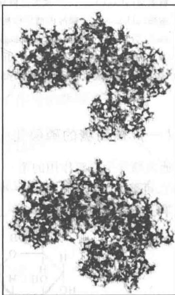  
图17-2 己糖激酶与底物结合产生“诱导契合”构象变化

## （二）6-磷酸葡糖异构化形成6-磷酸果糖

由 6-磷酸葡糖异构化形成 6-磷酸果糖的反应式如下：

这一反应的标准自由能变化是极其微小的， $\Delta G^{\ominus'} = 1.67 \mathrm{~kJ} / \mathrm{mol}(0.4 \mathrm{kcal} / \mathrm{mol})$ 。因此，这一反应是可逆的。在正常情况下，6-磷酸葡糖和6-磷酸果糖保持或接近平衡状态。在这一反应中葡萄糖C1位上的羰基（成环后的半缩醛基），不像C6位上的羟基那样容易磷酸化，所以下一步反应是使葡萄糖分子发生异构化。这就是葡萄糖的羰基从C1位转移到C2位，使葡萄糖分子由醛式转变成酮式的果糖，其C1位上即形成了自由羟基。6-磷酸葡糖和6-磷酸果糖的存在形式都是以环式为主，而异构化反应需以开链形式进行。

异构化形成的 6-磷酸果糖随后又形成环状结构。

催化这一反应的酶称为磷酸葡糖异构酶(phosphoglucose isomerase)。当前对该酶的催化机制已作出如下的解释：

从实验获得的信息表明,该酶活性部位的催化残基可能为赖氨酸(Lys)和组氨酸(His)。催化反应的实质包括一般的酶促酸-碱催化机制。如图17-3所示。

图 17-3 的第 1 步反应为: 酸性催化开环。图中的 $-B^{+}-H$ 是一例, 可代表酶分子上的 Lys 残基即 $\varepsilon-$ 氨基 $(\varepsilon-NH_{3}^{+})$ 吸引 O-C1 中间的电子对, 于是引起断键, 开环。

第2步反应为:酶分子上的碱,例如 His 的咪唑环,取掉 C2 上的质子(这个质子由于它处在羰基的 $\alpha$ 位,所以具有酸性)形成了 cis-烯二醇,(HO—C=C—OH)的中间体。

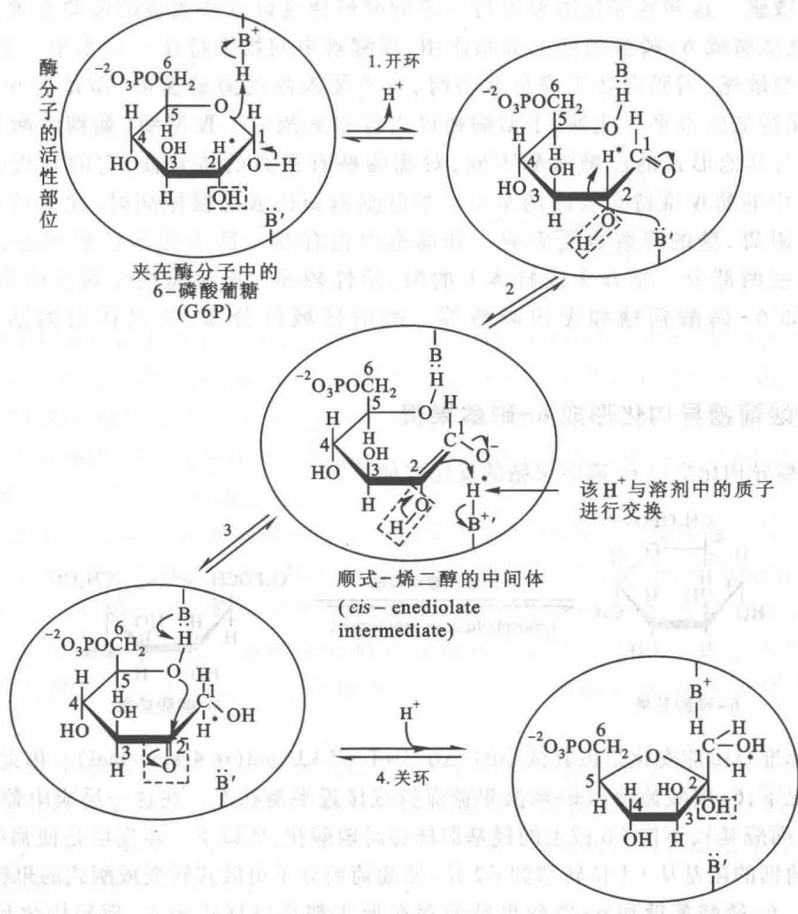  
图17-3 磷酸葡糖异构酶催化的反应机制  
外环表示酶分子的活性部位,其中有两个起催化作用的氢基酸残基: $B^{+}H$ 代表Lys, $\ddot{B}'$ 代表His

第 3 步反应为: C1 上质子的取代, 是一个全盘的质子转移。被碱性基所吸引的质子是很不稳定的。它迅速地与溶剂的质子进行交换。其结果可以看成: C2 上的质子进行了分子内的质子转移, 移到了 C1 位。这个机制曾使用 ${}^{3}$ H 进行实验得到证明。

第 4 步反应为: 关环, 形成最终产物。

磷酸葡糖异构酶有绝对的底物专一性和立体专一性(stereospecificity)。6-磷酸葡糖酸(6-phosphogluconate,6PG)、4-磷酸赤藓糖(erythrose-4-phosphate,E4P)、7-磷酸景天庚酮糖(sedoheptulose-7-phosphate,S7P)等对磷酸葡糖异构酶都是竞争性抑制剂。上述的三种糖类磷酸化合物都是五碳糖磷酸途径(pentosephosphate pathway)的代谢中间物。

## （三）6-磷酸果糖形成1,6-二磷酸果糖

这一步是糖降解或酒精发酵过程中的第二个磷酸化反应。也是糖酵解过程使用第二个 ATP 分子的反应。6-磷酸果糖被 ATP 进一步磷酸化形成 1,6-二磷酸果糖。该化合物的英文名称为 fructose -1,6-bisphosphate，它的旧名称为 fructose -1,6-diphosphate。把“diphosphate”，变为“bisphosphate”的原因：“bisphosphate”表示两个磷酸基团是互相分离的，而“diphosphate”表示两个磷酸基团是相连的。例如腺苷二磷酸的英文名称为“adenosin diphosphate”。腺苷二磷酸中的两个磷酸基团是以酸酐键（anhydride bond）相连的。由 6-磷酸果糖形成 1,6-二磷酸果糖的反应式如下：

在这一反应中，ATP 酸酐键的水解和 1,6-二磷酸果糖在其碳 1 位上形成磷酯键的两个反应 $\Delta G^{\ominus\prime} = -14.23 \, \text{kJ/mol} (-3.4 \, \text{kcal/mol})$ ，因此该反应是不可逆反应。

催化此反应的酶称为磷酸果糖激酶（phosphofructokinase, PFK）。该酶需要 $Mg^{2+}$ 参加反应，其他 2 价金属离子虽然也有一定作用，但以 $Mg^{2+}$ 的作用最为显著。

该酶的催化机制和己糖激酶催化的反应机制基本一致。可用图 17-4 表示：

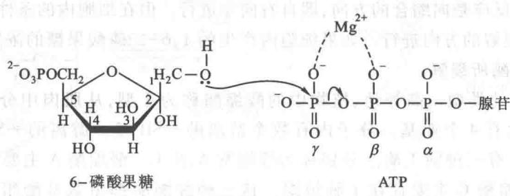  
图17-4 6-磷酸果糖与ATP的结合机制

上图表明,6-磷酸果糖第1个碳原子上的羟基 $\left[\mathrm{C}(1)-\mathrm{OH}\right]$ 氧原子的孤电子对向 $Mg^{2+}-ATP$ 的 $\gamma-$ 磷原子进行亲核进攻,导致 $\gamma-$ 磷原子与 $\beta-$ 磷原子之间氧桥的共用电子对向氧原子转移,从而断键,于是6-磷酸果糖与 $\gamma-$ 磷酸基团结合而形成1,6-二磷酸果糖。

磷酸果糖激酶是一种变构酶(allosteric enzyme)。它的催化效率很低,糖酵解的速率严格地依赖该酶的活力水平。它是哺乳动物糖酵解途径最重要的调控关键酶,该酶由4个亚基组成,是一个四聚体(tetramer)。由肝提取的酶相对分子质量为340 000。该酶的活性受到许多因素的控制。例如,肝中的磷酸果糖激酶受高浓度ATP的抑制。ATP可降低该酶对6-磷酸果糖的亲和力。ATP对该酶的变构效应是由于ATP结合到酶的一个特殊的调控部位上,调节部位不同于催化部位。但是ATP对该酶的这种变构抑制效应可被AMP解除。因此ATP/AMP的比例关系对此酶也有明显的调节作用。特别是 $H^{+}$ 浓度对该酶活性的影响。当pH下降时, $H^{+}$ 对该酶有抑制作用。在生物体内这种抑制作用具有重要的生物学意义。因为通过它可以阻止整个酵解途径的继续进行,从而防止乳酸的继续形成;这又可防止血液pH的下降,有利于避免酸中毒(acidosis)。

从兔分离得到的磷酸果糖激酶,发现有三种同工酶,分别称为磷酸果糖激酶 A、B、C。同工酶 A 存在于心肌和骨骼中,同工酶 B 存在于肝和红细胞中,同工酶 C 存在于脑中。这三种同工酶对影响酶活力的不同因素反应各异。例如,A 型对磷酸肌酸(phosphocreatine)、柠檬酸和无机磷酸的抑制作用最敏感,B 型对 2,3-二磷酸甘油酸(2,3-bisphosphoglycerate,BPG)的抑制作用最敏感,C 型对腺嘌呤核苷酸的作用最敏感。

通过上述的三个步骤,从葡糖磷酸化开始到形成1,6-二磷酸果糖,可以说为下一步的分子裂解完成了条件准备。

## （四）1,6-二磷酸果糖转变为3-磷酸甘油醛和磷酸二羟丙酮

这是一个由六碳糖——1,6-二磷酸果糖裂解为两个三碳糖的反应过程。1,6-二磷酸果糖在醛缩酶（aldolase）的作用下发生裂解反应生成一分子磷酸二羟丙酮（dihydroxyacetone phosphate）和一分子3-磷酸甘油醛（glyceraldehyde-3-phosphate）：

上述反应的机制请参看第19章。前面已经提到，醛缩酶的名称来自于该酶所催化的逆反应。由1,6-二磷酸果糖裂解为磷酸二羟丙酮和3-磷酸甘油醛的 $\Delta G^{\ominus'} = 23.97\mathrm{kJ / mol(+5.73kcal / mol)}$ 。可以理解，在标准状况下，这一反应是向缩合的方向，即自右向左进行。但在细胞内的条件下，该反应却是很容易地自左向右进行，即向裂解的方向进行。如果细胞内产生的1,6-二磷酸果糖的浓度为 $0.1\mathrm{mmol / L}$ ，根据计算有 $53.9\%$ 即被醛缩酶所裂解。

醛缩酶有两种不同的类型。高等动、植物中的醛缩酶称为Ⅰ型，从肌肉中分离出来的醛缩酶相对分子质量为160 000，含有4个亚基。分子内有数个游离的一SH基。游离的一SH基是酶催化活性所必需的。醛缩酶Ⅰ型又有三种同工酶。分别称为醛缩酶A、B、C。醛缩酶A主要存在于肌肉中，醛缩酶B主要存在于肝脏，醛缩酶C主要存在于脑组织。这三种醛缩酶都由氨基酸组分不同的四个多肽链构成。

第Ⅱ种类型的醛缩酶主要存在于细菌、酵母、真菌以及藻类中。它和第Ⅰ种类型的区别在于，含有2价金属离子。通常是 $Zn^{2+}$ 、 $Ca^{2+}$ 或 $Fe^{2+}$ ，也需要 $K^{+}$ 。它的相对分子质量约为65000，只相当于动、植物中醛缩酶的一半左右。它的催化机制也和Ⅰ型不同。下面重点讨论醛缩酶Ⅰ型的催化步骤。

该酶的催化步骤可分为5步,如图17-5所示。

图 17-5 表明,醛缩酶类型 I (class I) 的第 1 步反应是酶和底物的结合。第 2 步反应是 1,6-二磷酸果糖的羰基与酶活性部位赖氨酸的 ε-氨基发生反应,形成一个亚胺阳离子,即质子化的西佛碱。第 3 步反应 C3 和 C4 发生醇醛断裂形成酶的烯胺 (enamine) 中间体并释放出 3-磷酸甘油醛 (GAP)。亚胺离子比前体羰基的氧原子更容易拉电子,因此 C3 和 C4 间的共价键电子对也被吸引,促使醇醛断裂的催化反应发生。第 4 步是西佛氏碱的烯胺发生互变异构,形成了亚胺阳离子。第 5 步是亚胺水解放出磷酸二羟丙酮后,又形成了游离的酶。

酶分子活性部位的半胱氨酸和组氨酸残基在酶的催化反应中,相当酸和碱的作用。它们有增强质子转移的作用。

## （五）磷酸二羟丙酮转变为3-磷酸甘油醛

1,6-二磷酸果糖裂解后形成的两分子三碳糖磷酸中，只有3-磷酸甘油醛能继续进入糖酵解途径，磷酸二羟丙酮必须转变为3-磷酸甘油醛才能进入糖酵解途径。磷酸丙糖异构酶(triose phosphate isomerase)正是担负这一转变的酶(图17-6)。在该酶催化下，磷酸二羟丙酮和3-磷酸甘油醛可以互变，它们之间正是醛酮化合物的互变异构关系，正像6-磷酸葡糖和6-磷酸果糖的互变所以可能实现，是因为它们通过一个共同中间体即顺式-单烯二羟负离子中间体(cis-enediolate intermediate)(参看第19章代谢中的有机反应机制)

在探讨葡萄糖分子的碳原子和2分子3-磷酸甘油醛碳原子之间的关系中发现,葡萄糖分子的第3、4位碳原子形成了2分子3-磷酸甘油醛的醛基碳原子,葡萄糖分子的第1、6位碳原子形成了3-磷酸甘油醛分子上的第3位碳原子。

磷酸二羟丙酮和3-磷酸甘油醛的互变异构关系如图17-7所示。

  
图 17-5 醛缩酶类的反应机制  
图中圆圈代表酶的活性部位，圈内赖氨酸（Lys）、组氨酸（His）和半胱氨酸（Cys）三个残基直接参与酶的催化反应

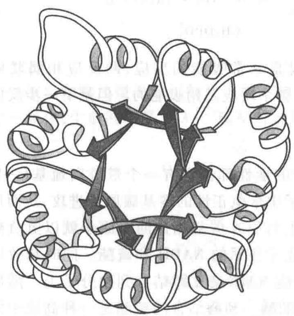  
图17-6 磷酸丙糖异构酶的结构图  
8 股 $\beta$ 折叠链构成中间的中心核, 8 股 $\alpha$ 螺旋链与 $\beta$ 折叠链相对应环绕在外 $\beta$ 折叠链周围, 两种不同型式的链条以无规肽链相连

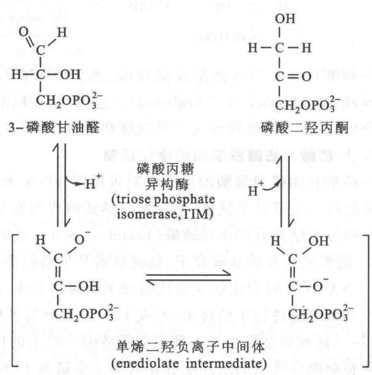  
图17-7 磷酸二羟丙酮和3-磷酸甘油醛的互变异构关系

实验证明,磷酸丙糖异构酶的活性部位是以谷氨酸(Glu)残基的游离羧基与底物相结合。

磷酸丙糖异构酶的催化反应是极其迅速的，只要酶与底物分子一旦相互碰撞，反应就即刻完成。因此，任何加速磷酸丙糖异构酶催化效率的措施都不能再提高它的反应速度。又由于磷酸二羟丙酮和3-磷酸甘油醛互变异构极其迅速，因此这两种物质总是维持在反应的平衡状态。磷酸二羟丙酮3-磷酸到甘油醛的 $\Delta G^{\ominus} = 7.7\mathrm{kJ / mol(+1.83kcal / mol)}$ ；在平衡点时， $K = [3 -$ 磷酸甘油醛]/[磷酸二羟丙酮] $= 4.73\times$ $10^{-2}$ 。由此可见，磷酸二羟丙酮的浓度在平衡点远远超过3-磷酸甘油醛的浓度。但3-磷酸甘油醛不断在糖酵解途径中被消耗，所以磷酸二羟丙酮也就不断地转变为3-磷酸甘油醛。

磷酸丙糖异构酶的相对分子质量为 56 000, 它是由 8 股平行的 β 折叠链环抱构成一个中心核。在 β 折叠链周围环绕着与每条折叠相对应的 α 螺旋链, 折叠链与 α 螺旋链之间以无规则的卷曲肽链相连接。如图 17-6 所示。

## 五、酵解第二阶段——放能阶段的反应机制

从前述的5步反应完成了糖酵解的准备阶段。酵解的准备阶段包括两个磷酸化步骤由六碳糖裂解为两分子三碳糖，最后都转变为3-磷酸甘油醛。在准备阶段中，并没有从中获得任何能量，与此相反，却消耗了两个ATP分子。以下的5步反应包括氧化还原反应、磷酸化反应。这些反应正是从3-磷酸甘油醛提取能量形成ATP分子的过程。

## (一) 3-磷酸甘油醛氧化成 1,3-二磷酸甘油酸

这是糖酵解过程中的第6步反应,也是一步重要的反应。因为在3-磷酸甘油醛的醛基氧化为羧基时,将氧化过程产生的能量贮存到ATP的分子中。

3-磷酸甘油醛的氧化和磷酸化是在3-磷酸甘油醛脱氢酶(glyceraldehyde-3-phosphate dehydrogenase, GAPDH)的催化下将3-磷酸甘油醛氧化为1,3-二磷酸甘油酸(1,3-bisphosphoglycerate,1,3-BPG),NAD $^{+}$ 和无机磷酸(Pi)参与该反应。在此反应中,醛基脱氢并不形成自由的羧基,而是和磷酸形成羧酸酐,这种酐称为酰基磷酸(acylphosphate),是具有高能磷酸基团转移势能的化合物。

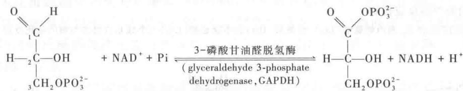

3-磷酸甘油醛的氧化是放能反应,然而,磷酸酐键的形成是非常吸能的反应,两反应相偶联后的 $\Delta G^{\ominus'}=+6.28\ kJ/mol(+1.5\ kcal/mol)$ 。这表明,在标准状况下,整个反应是稍吸能的。但是下一步反应又是一个放能反应,这就使该反应可以顺利地进行。

## 1. 3-磷酸甘油醛脱氢酶的催化机制

3-磷酸甘油醛脱氢酶的反应机制可用图17-8表示。该酶的活性部位含有一个带游离巯基（一SH）的半胱氨酸。巯基是亲核体，它以解离形式向作为底物的醛分子中带电正性的羰基碳原子进攻，从而形成一个与酶分子结合着的半缩硫醛（hemithioacetal），这时醛分子上与原来羰基相连的氢原子就以氢负离子（ $\mathrm{:H^{-}}$ ）的形式离开羰基碳原子，也就是离开半缩硫醛，于是形成了还原的NADH和硫酯。同时释放出一个 $\mathrm{H^{+}}$ 。NADH一旦形成就立即从酶分子上解离下来，而氧化型的 $\mathrm{NAD^{+}}$ 又立即结合到酶分子上。随后磷酸分子又向硫酯进行亲核攻击，形成1,3-二磷酸甘油酸和游离的酶。和酶结合的硫酯是一种高能中间产物；1,3-二磷酸甘油酸也是一种高能磷酸酯。以上的反应机制可用图17-8所示。

从兔肌肉分离出的结晶酶其相对分子质量为 14 000, 含有 4 个相同的亚基。每个亚基由 330 个氨基酸残基组成。重金属离子和烷化剂如碘乙酸能抑制酶的活性。这成为推测酶的活性部位是否有巯基的有力证据。

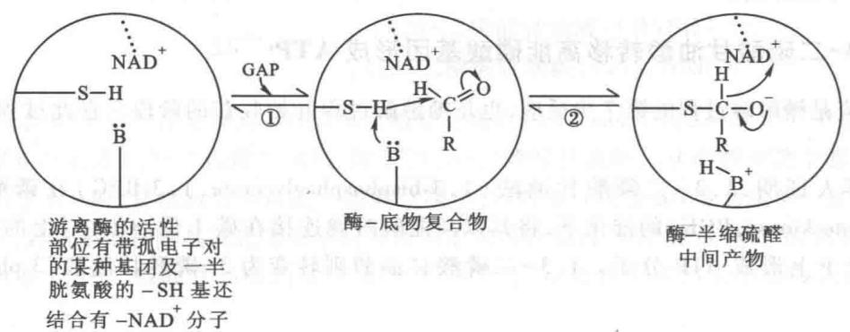

  
图17-8 3-磷酸甘油醛脱氢酶的反应机制

①—S—H 的 H 为酸性（即荷正电），酶分子上的 B 的孤电子对向 H 进攻。②—S—H 形成—S：向醛分子的羰基 C 进攻形成半缩硫醛中间产物。③ 醛分子与原羰基相连的 H 原子以： $H^{-}$ 形式脱离，而与氧化型的 $NAD^{+}$ 结合形成 NADH 及硫酯。④ 被还原的 NADH 立即脱离酶分子，同时酶又结合上另一氧化型 $NAD^{+}$ 。⑤ 磷酸分子向硫酯进行亲核攻击，使硫酯键断键形成游离的 1,3-二磷酸甘油酸，同时酶又恢复原状

## 2. 砷酸盐 (arsenate) 破坏 1,3-二磷酸甘油酸的形成

砷酸盐 $\left(\mathrm{AsO}_{4}^{3-}\right)$ 在结构和反应方面都和无机磷酸极为相似,因此,能代替磷酸进攻硫酯中间产物的高能键,产生1-砷酸-3-磷酸甘油酸(1-arseno-3-phosphoglycerate)。其结构式如下:

  
1-砷酸-3-磷酸甘油酸
(1-arseno-3-phosphoglcerate)

砷酸化合物是很不稳定的化合物。它迅速地进行水解。其结果是:砷酸盐代替磷酸与3-磷酸甘油醛结合并氧化,生成的不是1,3-二磷酸甘油酸,而是3-磷酸甘油酸反应式如下:

在砷酸盐存在下,虽然酵解过程照样进行,但是却没有形成高能磷酸键。由3-磷酸甘油醛氧化释放的能量,未能与磷酸化作用相偶联而被贮存。因此砷酸盐起着解偶联的作用,即解除了氧化和磷酸化的偶联作用。

从以上事实得到的启发是,在生物分子的进化中,为什么选择了具有较大动力学稳定性的磷酸基团作

为递能基团，而不是砷酸。

## （二）1,3-二磷酸甘油酸转移高能磷酸基团形成 ATP

这一步反应是糖酵解过程的第7步反应,也是糖酵解过程开始收获的阶段。在此过程中产生了第一个ATP。

Warburg 等人证明, 1,3-二磷酸甘油酸 (1,3-bisphosphoglycerate, 1,3-BPG) 在磷酸甘油酸激酶 (phosphoglycerate kinase, PGK) 的催化下, 将其以高能酸酐键连接在碳 1 位 [C(1)] 上的高能磷酸基团转移到 ADP 分子上形成 ATP 分子。1,3-二磷酸甘油酸则转变为 3-磷酸甘油酸 (3-phosphoglycerate, 3-PG):

该反应的 $\Delta G^{\ominus'} = -18.83 \, \text{kJ/mol} (-4.50 \, \text{kcal/mol})$ ，是一个高效地放能反应，因此起到推动前一步反应顺利进行的作用。

磷酸甘油酸激酶分子的外观和己糖激酶极其相似。都由两叶构成，很像钳子，中间有很深的裂缝。活性部位在裂缝的底部。 $Mg^{2+}-ADP$ 结合位点在酶的一个结构域中。1,3-二磷酸甘油酸的结合部位在另一个结构域中，二者相距大约1 nm。当酶与底物结合后，酶的两个结构域合拢，使底物得以在无水的环境中发生反应。这种情况和己糖激酶的作用机制也非常相似。但它们的蛋白质组成却是完全不同的。磷酸甘油酸激酶(PGK)的催化机制可用图17-9表示。

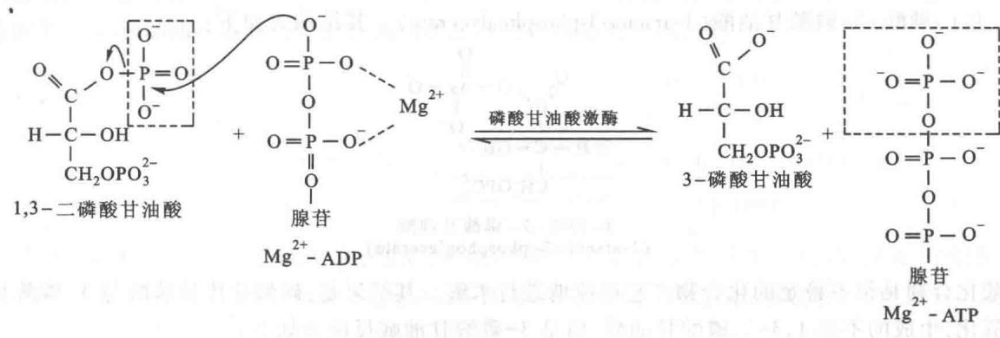  
图 17-9 磷酸甘油酸激酶(PGK)的催化机制  
在 ADP 和 ATP 分子中的 $Mg^{2+}$ 的位置是假设的, 实际上的 $Mg^{2+}$ 位置仍是未知的

由图 17-9 可见, ADP β 磷酸基团的氧原子向 1,3-二磷酸甘油酸 C1 位的磷(P)原子进行亲核攻击, 从而生成 ATP 和 3-磷酸甘油酸。

第 6 步和第 7 步反应构成能量偶联的过程,1,3-二磷酸甘油酸是两步反应共同的中间产物:它在第 6 步反应中形成,在第 7 步反应(放能反应)中磷酸基团转移到 ADP。两步反应的总和是:

$$
1, 3 - \text {   二磷酸甘油酸   } + \mathrm{ADP} + \mathrm{Pi} + \mathrm{NAD} ^ {+} \longrightarrow 3 - \text {   磷酸甘油酸   } + \mathrm{ATP} + \mathrm{NADH} + \mathrm{H} ^ {+}
$$

总反应的 $\Delta G^{\ominus'} = -12.5 \, kJ/mol$ ，是一个放能反应。细胞内实际自由能变化 $\Delta G$ 是由标准自由能变化 $\Delta G^{\ominus'}$ 和质量作用比（Q）决定的。对于第6步反应：

$$
\begin{array}{r l} \Delta G & = \Delta G ^ {\ominus \prime} + R T \mathrm{In} Q \\ & = \Delta G ^ {\ominus \prime} + R T \mathrm{In} \frac {[ 1 , 3 - \text {二磷酸甘油酸} ] [ \mathrm{NADH} ]}{[ 1 , 3 - \text {二磷酸甘油酸} ] [ \mathrm{Pi} ] [ \mathrm{NAD} ^ {+} ]} \end{array}
$$

请注意 $\left[\mathrm{H}^{+}\right]$ 不包含在Q中。在生物研究中， $\left[\mathrm{H}^{+}\right]$ 假定为常数 $(10^{-7}\mathrm{mol / L})$ ， $\Delta G^{\prime}$ 的定义中也包括此常数。步骤7消耗步骤6产生的1,3-二磷酸甘油酸，降低[1,3-二磷酸甘油酸]，从而减少整个能量偶联过程的Q值。当Q值小于1.0时，自然对数为负值。如果Q很小，对数值可以是 $\Delta G$ 变为负值。这一偶联反应在细胞内是可逆的，其结果是在醛基氧化为羧基时释放的能量可以通过ADP形成ATP的偶联反应而贮存。磷酸基团从底物如1,3-二磷酸甘油酸转移到ADP形成ATP，这被称为底物水平磷酸化（substrate-level phosphorylation）。

## （三）3-磷酸甘油酸转变为2-磷酸甘油酸

这一反应是糖酵解过程的第8步反应,该反应是由磷酸甘油酸变位酶(phosphoglycerate mutase)催化, $\Delta G^{\ominus'}=4.6\ kJ/mol$ 的。通常将催化分子内化学基团移位的酶称为变位酶(mutase)。由3-磷酸甘油酸转变为2-磷酸甘油酸是为酵解过程的下一步骤准备条件。

磷酸甘油酸变位酶的活性部位结合有一个磷酸基团。当3-磷酸甘油酸作为酶的底物结合到酶的活性部位后，原来结合在酶活性部位的那个磷酸基团便立即转移到底物分子上，形成一个与酶结合的二磷酸的中间产物，2,3-二磷酸甘油酸（2,3-bisphosphoglycerate,2,3-BPG），这个中间产物又立即使酶分子的活性部位再磷酸化，同时产生游离的2-磷酸甘油酸。

对上述反应机制的解释曾有以下的实验根据。

（1）磷酸甘油酸变位酶的催化机制需有2,3-二磷酸甘油酸作为引物，或者说是必需因素。

（2）将极少量用 $^{32}$ P标记的2,3-二磷酸甘油酸与酶一起保温发现，具有放射性的磷酸基团标记到酶的组氨酸残基上。

（3）用 X 射线观察酶的结构发现，在酶的活性部位 His8（第 8 位的组氨酸残基）上有放射性磷标记的磷酸基团。

上面的实验还有力地证明了与磷酸基团结合的残基是酶活性部位中第8位的组氨酸。

这里应该提及的是,上述的2,3-二磷酸甘油酸(2,3-BPG)不只在磷酸甘油酸变位酶的催化过程中起着重要的作用,在红细胞对氧的转运中还起着调节剂的作用。它使脱氧血红蛋白稳定化,从而降低血红蛋白对氧的亲和力。没有它,血红蛋白在通过组织的毛细血管时就很难脱下氧。2,3-二磷酸甘油酸在红细胞中的浓度极高,大约与血红蛋白具有相同的浓度,在其他的细胞中则只存在微量。

2,3-二磷酸甘油酸的合成和降解是糖酵解途径中的一个短支路(short detour)。全部反应可用下式表示：

上述的两步反应几乎都是不可逆的。此外，2,3-二磷酸甘油酸是二磷酸甘油酸变位酶（bisphosphoglycerate mutase）强有力的竞争性抑制剂。2,3-二磷酸甘油酸的浓度不只决定于二磷酸甘油酸变位酶的活力，还决定于2,3-二磷酸甘油酸磷酸酶(2,3-bisphosphoglycerate phosphatase)的活力。一般将催化磷酸酯水解的酶总称为磷酸酶(phosphatase)。

催化 1,3-二磷酸甘油酸转变为 2,3-二磷酸甘油酸的二磷酸甘油酸变位酶的作用机制已了解得很清楚。该变位酶先同时结合 1,3-二磷酸甘油酸和 3-磷酸甘油酸，然后磷酸基团从 1,3-二磷酸甘油酸的 C1 上移位到 3-磷酸甘油酸的 C2 上。从化学计算上看不到 3-磷酸甘油酸的出现，但它却是磷酸基团转移的重要参加者，磷酸基团的转移情况可用图 17-10 表示。

  
1,3-二磷酸甘油酸 3-磷酸甘油酸 3-磷酸甘油酸 2,3-二磷酸甘油酸  
图 17-10 二磷酸甘油酸变位酶催化的磷酸基团转移反应

P、P、P代表不同碳原子上的磷酸基因，从不同的图形可看到磷酸基团转移的来龙去脉

## （四）2-磷酸甘油酸脱水生成磷酸烯醇式丙酮酸

这是酵解过程的第9步反应。这一反应是烯醇化酶(enolase)催化的。

烯醇化酶在与底物结合前先与2价阳离子如 $Mg^{2+}$ 或 $Mn^{2+}$ 结合形成一个复合物，才有活性。烯醇化酶的催化作用可用图17-11表示。

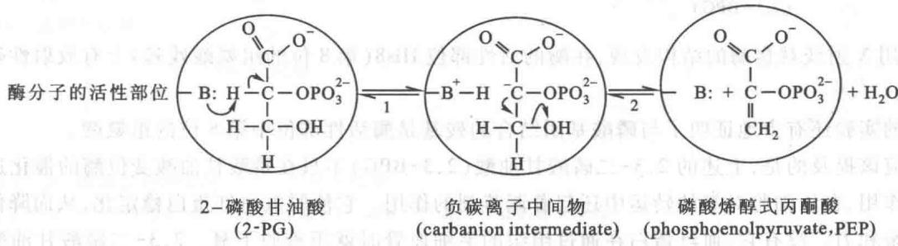  
图17-11 烯醇化酶可能的反应机制

反应1:酶分子碱性残基用B:表示它的孤对电子吸引2-磷酸甘油酸C2上的H原子,使C2成为负碳离子,从而形成负碳离子中间物。反应2:2-磷酸甘油酸C(3)上的-OH基团离开负碳离子中间物,从而形成磷酸烯醇式丙酮酸和一分子水

烯醇化酶分子活性部位碱性残基上的孤电子对吸引2-磷酸甘油酸第2碳原子上的氢原子。形成负碳离子中间产物，于是2-磷酸甘油酸第3碳原子上的-OH基团即离开负碳离子中间产物，形成磷酸烯醇式丙酮酸。在上述的两步反应中，2-磷酸甘油酸第2位碳原子被孤电子对吸引的质子能极迅速地与溶剂中的质子相互交换。而且2-磷酸甘油酸负碳离子中间产物第3碳原子上—OH基团的消除是比较缓慢的。因此—OH 的消除速度是 2-磷酸甘油酸脱水形成磷酸烯醇式丙酮酸的限速步骤。用 $^{18}$ O 标记—OH 基团曾证明，放射性氧(O)从中间产物消除的速度和放射性 O 与溶剂互相交换的速度是相同的。

尽管该反应的标准自由能( $\triangle G^{\ominus'}=-7.6\ kJ/mol$ )变化相对较小,但是反应物和产物水解释放磷酰基团产生的标准自由能变化差别很大:2-磷酸甘油酸(低能磷酸酯)水解的标准自由能 $\triangle G^{\ominus'}$ 为-17.6 kJ/mol,磷酸烯醇式丙酮酸(高能磷酸酯)水解的标准自由能 $\triangle G^{\ominus'}=-61.9\ kJ/mol$ 。2-磷酸甘油酸失去一分子水使得分子内能量重新排布,从而导致磷酸酯水解的标准自由能增加。

烯醇化酶的相对分子质量为 85 000。氟化物是该酶强烈的抑制剂。其原因是，氟与镁和无机磷酸形成一个复合物，取代天然情况下酶分子上镁离子的位置，从而使酶失活。

## (五) 磷酸烯醇式丙酮酸转变为丙酮酸并产生一个 ATP 分子

这是糖酵解过程的第 10 步反应。是由葡萄糖形成丙酮酸的最后一步反应。催化此反应的酶称为丙酮酸激酶(pyruvate kinase)。反应式如下：

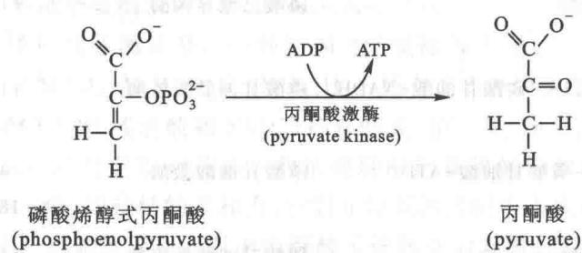

烯醇磷酸酯具有高的基团转移势能。磷酸基团由磷酸烯醇式丙酮酸转移到ADP上同时形成丙酮酸， $\Delta G^{\ominus \prime} = -31.38\mathrm{kJ / mol}$ ，是一个不可逆、高放能的反应。这是因为磷酸烯醇式丙酮酸水解的 $\Delta G^{\ominus \prime} = -61.9\mathrm{kJ}/$ mol，大约一半的能量以ATP（ $\Delta G^{\ominus \prime} = -30.5\mathrm{kJ / mol}$ ）形式贮存起来，剩余的能量用于推动ATP合成。

丙酮酸激酶的催化活性需要2价阳离子参与，如 $\mathrm{Mg}^{2+}$ 和 $\mathrm{Mn}^{2+}$ 。它是糖酵解途径中的一个重要变构调节酶(regulatory enzyme)。ATP、长链脂肪酸、乙酰-CoA、丙氨酸都对该酶有抑制作用；而1,6-二磷酸果糖和磷酸烯醇式丙酮酸对该酶都有激活作用。丙酮酸激酶的相对分子质量为250000，由四个相对分子质量为55000的亚基构成四聚体。该酶至少有三种不同类型的同工酶。在肝中占优势的称为L型。肌肉和脑中占优势的称为M型，其他组织中的称为A型。这些同工酶结构相似，但调控机制不同。

<!-- EN-BEGIN 14.1 -->

### 【英文对应 14.1】Glycolysis

> 来源：Lehninger Principles of Biochemistry（书籍/02_生物化学原理） 第14章 Glycolysis, Gluconeogenesis, and the Pentose Phosphate Pathway，§14.1。对应本章“五、酵解第二阶段——放能阶段的反应机制”。

P1 In glycolysis (from the Greek glykys, "sweet" or "sugar," and lysis, "splitting"), a molecule of glucose is degraded in a series of enzyme-catalyzed reactions to yield two molecules of the three-carbon compound pyruvate. During the sequential reactions of glycolysis, some of the free energy released from glucose is conserved in the form of ATP and NADH. Glycolysis was the first metabolic pathway to be elucidated and is probably the best understood. From Eduard Buchner's discovery in 1897 of fermentation in cell-free extracts of yeast until the elucidation of the whole pathway in yeast and in muscle in the 1930s, the reactions of glycolysis were a major focus of biochemical research. These discoveries showed that the reactions of life could be explained chemically, without reliance on a mystical life force. This philosophical shift led physiologist Jacques Loeb to observe in 1906, "The history of this problem is instructive, as it warns us against considering problems as beyond our reach because they have not yet found their solution."1

The development of methods of enzyme purification, the discovery and recognition of the importance of coenzymes such as NAD, and the discovery of the pivotal metabolic role of ATP and other phosphorylated compounds all came out of studies of glycolysis. The glycolytic enzymes of many species have long since been purified and thoroughly studied.

Glycolysis is an almost universal central pathway of glucose catabolism, the pathway with the largest flux of carbon in most cells. The glycolytic breakdown of glucose is the sole source of metabolic energy in some mammalian tissues and cell types (erythrocytes, renal medulla, brain, and sperm, for example). Some plant tissues that are modified to store starch (such as potato tubers) and some aquatic plants (watercress, for example) derive most of their energy from glycolysis; many anaerobic microorganisms are entirely dependent on glycolysis.

In the course of evolution, the chemistry of the reactions of glycolysis has been completely conserved. Genome sequencing and structural studies have shown that the glycolytic enzymes of vertebrates are closely similar in amino acid sequence and three-dimensional structure to their homologs in yeast and spinach. Although some archaea and parasitic microorganisms lack one or more of the enzymes of glycolysis, they retain the core of the pathway. The glycolytic pathway, of central importance in itself, is governed by thermodynamic principles and regulatory mechanisms that are common to all pathways of cell metabolism. It serves as a model of principles we will revisit throughout Part II of this book.

#### [EN] An Overview: Glycolysis Has Two Phases

Before examining each step of the pathway in some detail, we take a look at glycolysis as a whole. As all sugar derivatives in glycolysis are the D isomers, we will usually omit the D designation except when emphasizing stereochemistry. The breakdown of the six-carbon glucose into two molecules of the three-carbon pyruvate occurs in 10 steps, the first 5 of which constitute the preparatory phase (Fig. 14-2a). In these reactions, glucose is first phosphorylated at the hydroxyl group on C-6 (step ①). The glucose 6-phosphate thus formed is converted to fructose 6-phosphate (step ②), which is again phosphorylated, this time at C-1, to yield fructose 1,6-bisphosphate (step ③). For both phosphorylations, ATP is the phosphoryl group donor.

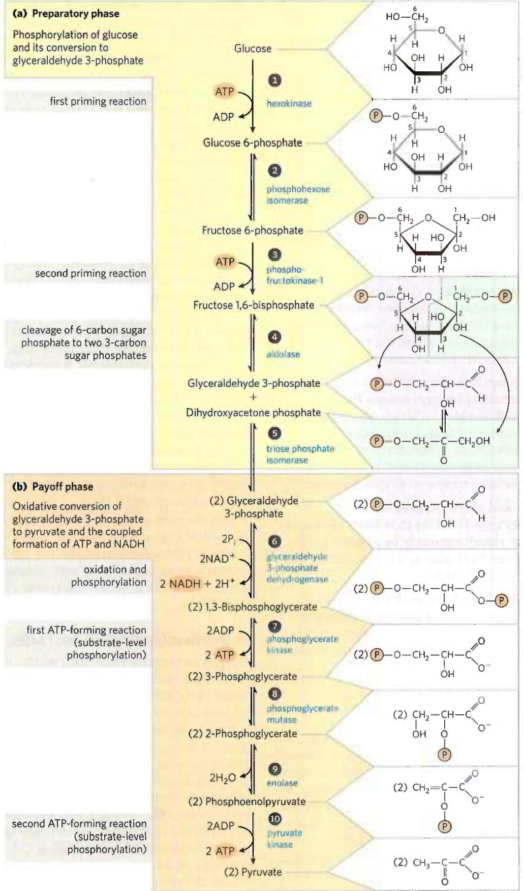  
FIGURE 14-2 The two phases of glycolysis. For each molecule of glucose that passes through the preparatory phase (a), two molecules of glyceraldehyde 3-phosphate are formed; both pass through the payoff phase (b). Pyruvate is the end product of the second phase of glycolysis. For each glucose molecule, two ATP are consumed in the preparatory phase and  
four ATP are produced in the payoff phase, giving a net yield of two ATP and two NADH per molecule of glucose converted to pyruvate. The numbered reaction steps correspond to the numbered headings in the text discussion. Keep in mind that each phosphoryl group, represented here as (P), has two negative charges $(-\mathrm{PO}_3^{2-})$ .

Fructose 1,6-bisphosphate is split to yield two different three-carbon molecules, dihydroxyacetone phosphate and glyceraldehyde 3-phosphate (step 4); this is the "lysis" step that gives the pathway its name. The dihydroxyacetone phosphate is isomerized to form a second molecule of glyceraldehyde 3-phosphate (step 5), ending the first phase of glycolysis. Note that two molecules of ATP are invested before the cleavage of glucose into two three-carbon pieces; there will be a good return on this investment. To summarize: in the preparatory phase of glycolysis the energy of ATP is invested, raising the free-energy content of the intermediates, and the carbon chains of all the metabolized hexoses are converted to a common product, glyceraldehyde 3-phosphate.

The energy gain comes in the payoff phase of glycolysis (Fig. 14-2b). Each molecule of glyceraldehyde 3-phosphate is oxidized and phosphorylated by inorganic phosphate (not by ATP) to form 1,3-bisphosphoglycerate (step 6). Energy is then released as the two molecules of 1,3-bisphosphoglycerate are converted to two molecules of pyruvate (steps 7 through 10). Much of this energy is conserved by the coupled phosphorylation of four molecules of ADP to ATP. The net yield is two molecules of ATP per molecule of glucose used, because two molecules of ATP were invested in the preparatory phase. Energy is also conserved in the payoff phase in the formation of two molecules of the electron carrier NADH per molecule of glucose.

P1 In the sequential reactions of glycolysis, three types of chemical transformations are particularly noteworthy: (1) degradation of the carbon skeleton of glucose to yield pyruvate; (2) phosphorylation of ADP to ATP by compounds with high phosphoryl group transfer potential, formed during glycolysis; and (3) transfer of a hydride ion to $\mathrm{NAD^{+}}$ , forming NADH. The overall chemical logic of the pathway is described in Figure 14-3.

ATP and NADH Formation Coupled to Glycolysis During glycolysis some of the energy of the glucose molecule is conserved in ATP, while much remains in the product, pyruvate. The overall equation for glycolysis is

Glucose + 2NAD $^{+}$ + 2ADP + 2P $_{i}$ $\longrightarrow$

2 pyruvate + 2NADH + 2H $^{+}$ + 2ATP + 2H $_{2}$ O

(14-1)

For each molecule of glucose degraded to pyruvate, two molecules of ATP are generated from ADP and $P_{i}$ , and two molecules of NADH are produced by the reduction

FIGURE 14-3 The chemical logic of the glycolytic pathway. In this simplified version of the pathway, each molecule is shown in a linear form, with carbon and hydrogen atoms not depicted, in order to highlight chemical transformations. Remember that glucose and fructose are present mostly in their cyclized forms in solution, although they are transiently present in linear form at the active sites of some of the enzymes in this pathway.

The preparatory phase, steps 1 to 5, converts the six-carbon glucose into two three-carbon units, each of them phosphorylated. Oxidation of the three-carbon units is initiated in the payoff phase, steps 6 to 10. To produce pyruvate, the chemical steps must occur in the order shown.

kJ/mol

of $\mathrm{NAD^{+}}$ . The reduction of $\mathrm{NAD^{+}}$ (see Fig. 13-24) proceeds by the enzymatic transfer of a hydride ion ( $:\mathrm{H}^{-}$ ) from the aldehyde group of glyceraldehyde 3-phosphate to the nicotinamide ring of $\mathrm{NAD^{+}}$ , yielding the reduced coenzyme NADH. The other hydrogen atom of the substrate molecule is released to the solution as $\mathrm{H^{+}}$ .

We can now resolve the equation of glycolysis into two processes—the conversion of glucose to pyruvate, which is exergonic:

$$
\begin{array}{r l} \text { Glucose } + 2 \mathrm{NAD} ^ {+} & \longrightarrow 2 \text { pyruvate } + 2 \mathrm{NADH} + 2 \mathrm{H} ^ {+} \\ & \Delta G _ {1} ^ {\prime \circ} = - 1 4 6 \mathrm{kJ/mol} \end{array} \tag {14-2}
$$

and the formation of ATP from ADP and $P_{i}$ , which is endergonic:

$$
\begin{array}{r l} 2 \mathrm{ADP} + 2 \mathrm {P_ {i}} & \longrightarrow 2 \mathrm{ATP} + 2 \mathrm {H_ {2} O} \\ \Delta G _ {2} ^ {\prime \circ} & = 2 (3 0. 5 \mathrm{kJ/mol}) = 6 1. 0 \end{array}\tag{14-3}
$$

The sum of Equations 14-2 and 14-3 gives the overall standard free-energy change of glycolysis, $\Delta G_{\mathrm{Sum}}^{\prime o}$ :

$$
\begin{array}{r l} \Delta G _ {\mathrm{Sum}} ^ {\prime \circ} = \Delta G _ {1} ^ {\prime \circ} + \Delta G _ {2} ^ {\prime \circ} & = - 1 4 6 \mathrm{kJ/mol} + 6 1. 0 \mathrm{kJ/mol} \\ & = - 8 5 \mathrm{kJ/mol} \end{array}
$$

Under standard conditions, and under the (nonstandard) conditions that prevail in a cell, glycolysis is an essentially irreversible process, driven to completion by a large net decrease in free energy.

Energy Remaining in Pyruvate Glycolysis releases only a small fraction of the total available energy of the glucose molecule. The two molecules of pyruvate formed by glycolysis still contain most of the chemical potential energy of glucose, energy that can be extracted by oxidative reactions in the citric acid cycle (Chapter 16) and oxidative phosphorylation (Chapter 19)—aerobic processes. Under anaerobic conditions, pyruvate can be reduced to lactate or ethanol (Section 14.3). The oxidation of pyruvate is an important catabolic process, but pyruvate has anabolic fates as well. It can, for example, provide the carbon skeleton for the synthesis of the amino acid alanine or for the synthesis of fatty acids. We return to these anabolic reactions of pyruvate in later chapters.

Importance of Phosphorylated Intermediates P1 Each of the nine glycolytic intermediates between glucose and pyruvate is phosphorylated (Fig. 14-2). The phosphoryl groups have three functions.

1. Because the plasma membrane lacks transporters for phosphorylated sugars, the phosphorylated glycolytic intermediates cannot leave the cell. After the initial phosphorylation, no further energy is necessary to retain phosphorylated intermediates in the cell, despite the large difference in their intracellular and extracellular concentrations.

2. Phosphoryl groups are essential components in the enzymatic conservation of metabolic energy. Energy made available with the transfer of phosphoryl groups from compounds with phosphoanhydride bonds (such as those in ATP) is partially conserved in the formation of phosphate esters such as glucose 6-phosphate. Compounds with higher group transfer potential than ATP, which are formed in glycolysis (1,3-bisphosphoglycerate and phosphoenolpyruvate), donate phosphoryl groups to ADP to form ATP.

3. Binding energy resulting from the binding of phosphate groups to the active sites of enzymes lowers the activation energy and increases the specificity of the enzymatic reactions (Chapter 6). The phosphate groups of ADP, ATP, and the glycolytic intermediates form complexes with $Mg^{2+}$ , and the substrate binding sites of many glycolytic enzymes are specific for these $Mg^{2+}$ complexes. Most glycolytic enzymes require $Mg^{2+}$ for activity.

#### [EN] The Preparatory Phase of Glycolysis Requires ATP

In the preparatory phase of glycolysis, two molecules of ATP are invested and the hexose chain is cleaved into two triose phosphates. The realization that phosphorylated hexoses were intermediates in glycolysis came slowly and serendipitously. In 1906, Arthur Harden and William Young tested their hypothesis that inhibitors of proteolytic enzymes would stabilize the glucose-fermenting enzymes in yeast extract. They added blood serum (known to contain inhibitors of proteolytic enzymes) to yeast extracts and observed the predicted stimulation of glucose metabolism. However, in a control experiment intended to show that boiling the serum destroyed the stimulatory activity, they discovered that boiled serum was just as effective at stimulating glycolysis! Careful examination and testing of the contents of the boiled serum revealed that inorganic phosphate was responsible for the stimulation. Harden and Young soon discovered that glucose added to their yeast extract was converted to a hexose bisphosphate (the "Harden-Young ester," eventually identified as fructose 1,6-bisphosphate). This was the beginning of a long series of investigations on the role of organic esters and anhydrides of phosphate in biochemistry, which has led to our current understanding of the central role of phosphoryl group transfer in biology.

① Phosphorylation of Glucose In the first step of glycolysis (Fig. 14-2), glucose is activated for subsequent reactions by its phosphorylation at C-6 to yield glucose 6-phosphate, with ATP as the phosphoryl donor:

This reaction, which is irreversible under intracellular conditions, is catalyzed by hexokinase. Recall that kinases are enzymes that catalyze the transfer of the terminal phosphoryl group from ATP to an acceptor nucleophile (see Fig. 13-8c). Kinases are a subclass of transferases (see Table 6-3). The acceptor in the case of hexokinase is a hexose, normally glucose, although hexokinase also catalyzes the phosphorylation of other common hexoses, such as fructose and mannose, in some tissues.

Hexokinase, like many other kinases, requires $Mg^{2+}$ for its activity, because the true substrate of the enzyme is not $ATP^{4-}$ but the $MgATP^{2-}$ complex (see Fig. 13-12). $Mg^{2+}$ shields the negative charges of the phosphoryl groups in ATP, making the terminal phosphorus atom an easier target for nucleophilic attack by an —OH of glucose. Hexokinase undergoes a profound change in shape, an induced fit, when it binds glucose; two domains of the protein move about 8 Å closer to each other when ATP binds (see Fig. 6-30). This movement brings bound ATP closer to a molecule of glucose also bound to the enzyme and blocks the access of water (from the solvent), which might otherwise enter the active site and attack (hydrolyze) the phosphoanhydride bonds of ATP. Like the other nine enzymes of glycolysis, hexokinase is a soluble, cytosolic protein.

Hexokinase is present in nearly all organisms. The human genome encodes four different hexokinases (I to IV), all of which catalyze the same reaction, but differ in kinetics, regulation, and location. Two or more enzymes that catalyze the same reaction but are encoded by different genes are called isozymes (see Box 14-3). One of the isozymes present in hepatocytes, hexokinase IV (also called glucokinase), differs from other forms of hexokinase in kinetic and regulatory properties, with important physiological consequences that are described in Section 14.5.

② Conversion of Glucose 6-Phosphate to Fructose 6-Phosphate The enzyme phosphohexose isomerase (phosphoglucose isomerase) catalyzes the reversible isomerization of glucose 6-phosphate, an aldose, to fructose 6-phosphate, a ketose:

The mechanism for this reaction involves an enediol intermediate (Fig. 14-4). The reaction proceeds readily in

MECHANISM FIGURE 14-4 The phosphohexose isomerase reaction. The ring opening and closing reactions (steps ① and ④) are catalyzed by an active-site His residue, by mechanisms omitted here for simplicity. The proton (light red) initially at C-2 is made more easily abstractable by electron withdrawal by the adjacent carbonyl and nearby hydroxyl groups. After its transfer from C-2 to the active-site Glu residue (a weak acid), the proton is freely exchanged with the surrounding solution; that is, the proton abstracted from C-2 in step ② is not necessarily the same one that is added to C-1 in step ③.

either direction, as might be expected from the relatively small change in standard free energy.

3 Phosphorylation of Fructose 6-Phosphate to Fructose 1,6-Bisphosphate In the second of the two priming reactions of glycolysis, phosphofructokinase-1 (PFK-1) catalyzes the transfer of a phosphoryl group from ATP to fructose 6-phosphate to yield fructose 1,6-bisphosphate:

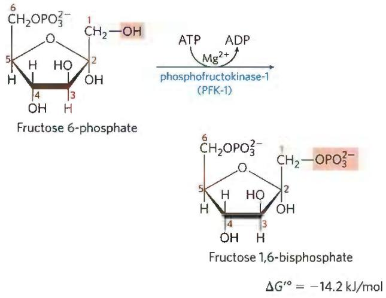

KEY CONVENTION Compounds that contain two phosphate or phosphoryl groups attached at different positions in the molecule are named bisphosphates (or bisphospho compounds); for example, fructose 1,6-bisphosphate and 1,3-bisphosphoglycerate. Compounds with two phosphates linked together as a pyrophosphoryl group are named diphosphates; for example, adenosine diphosphate (ADP). Similar rules apply for the naming of trisphosphates (such as inositol 1,4,5-trisphosphate; see p. 425) and triphosphates (such as adenosine triphosphate, ATP).

The enzyme that forms fructose 1,6-bisphosphate is called PFK-1 to distinguish it from a second enzyme (PFK-2) that catalyzes the formation of fructose 2,6-bisphosphate from fructose 6-phosphate in a separate pathway (the roles of PFK-2 and fructose 2,6-bisphosphate are discussed in Section 14.5). The PFK-1 reaction is essentially irreversible under cellular conditions, and it is the first “committed” step in the glycolytic pathway; glucose 6-phosphate and fructose 6-phosphate have other possible fates, but fructose 1,6-bisphosphate is targeted for glycolysis.

Phosphofructokinase-1 is subject to complex allosteric regulation; its activity is increased whenever the cell's ATP supply is depleted or when the ATP breakdown products, ADP and AMP (particularly the latter), accumulate. The enzyme is inhibited whenever the cell has ample ATP and is well supplied by other fuels such as fatty acids. In some organisms, fructose 2,6-bisphosphate (not to be confused with the PFK-1 reaction product, fructose 1,6-bisphosphate) is a potent allosteric activator of PFK-1. Ribulose 5-phosphate, an intermediate in the pentose phosphate pathway discussed in Section 14.6, also activates phosphofructokinase indirectly. The multiple layers of regulation of this step in glycolysis are discussed in greater detail in Section 14.5.

Some bacteria and protists and perhaps all plants have a different phosphofructokinase (PP-PFK-1) that uses pyrophosphate (PP $_{i}$ ), not ATP, as the phosphoryl group donor in the synthesis of fructose 1,6-bisphosphate:

$$
\begin{array}{r l} \text { Fructose   6 - phosphate } + \mathrm{PP} _ {\mathrm{i}} & \xrightarrow {\mathrm{Mg} ^ {2 +}} \\ & \text { fructose   1,6 - bisphosphate } + \mathrm{P} _ {\mathrm{i}} \\ & \Delta \mathrm{G} ^ {\prime \circ} = - 2. 9 \mathrm{kJ/mol} \end{array}
$$

We will discuss this enzyme in Chapter 20.

4 Cleavage of Fructose 1,6-Bisphosphate The enzyme fructose 1,6-bisphosphate aldolase, often called simply aldolase, catalyzes a reverse aldol condensation (Fig. 14-5; see Fig. 13-4). Fructose 1,6-bisphosphate is cleaved to yield two different triose phosphates, namely, glyceraldehyde 3-phosphate (an aldose) and dihydroxyacetone phosphate (a ketose):

There are two classes of aldolases. Class I aldolases, found in animals and plants, use the mechanism shown in Figure 14-5. Class II enzymes, in fungi and bacteria, do not form the Schiff base intermediate. Instead, a zinc ion at the active site is coordinated with the carbonyl oxygen at C-2; the $\mathrm{Zn}^{2+}$ polarizes the carbonyl group and stabilizes the enolate intermediate created in the C-C bond cleavage step (see Fig. 6-23).

Although the aldolase reaction has a strongly positive standard free-energy change in the direction of fructose 1,6-bisphosphate cleavage, at the lower concentrations of reactants present in cells the actual free-energy change is small and the aldolase reaction is readily reversible. We shall see later that aldolase acts in the reverse direction during the process of gluconeogenesis.

5 Interconversion of the Triose Phosphates Only one of the two triose phosphates formed by aldolase, glyceraldehyde 3-phosphate, can be directly degraded in the subsequent steps of glycolysis. The other product, dihydroxyacetone phosphate, is immediately and reversibly converted to glyceraldehyde 3-phosphate by the fifth enzyme of the glycolytic sequence, triose phosphate isomerase:

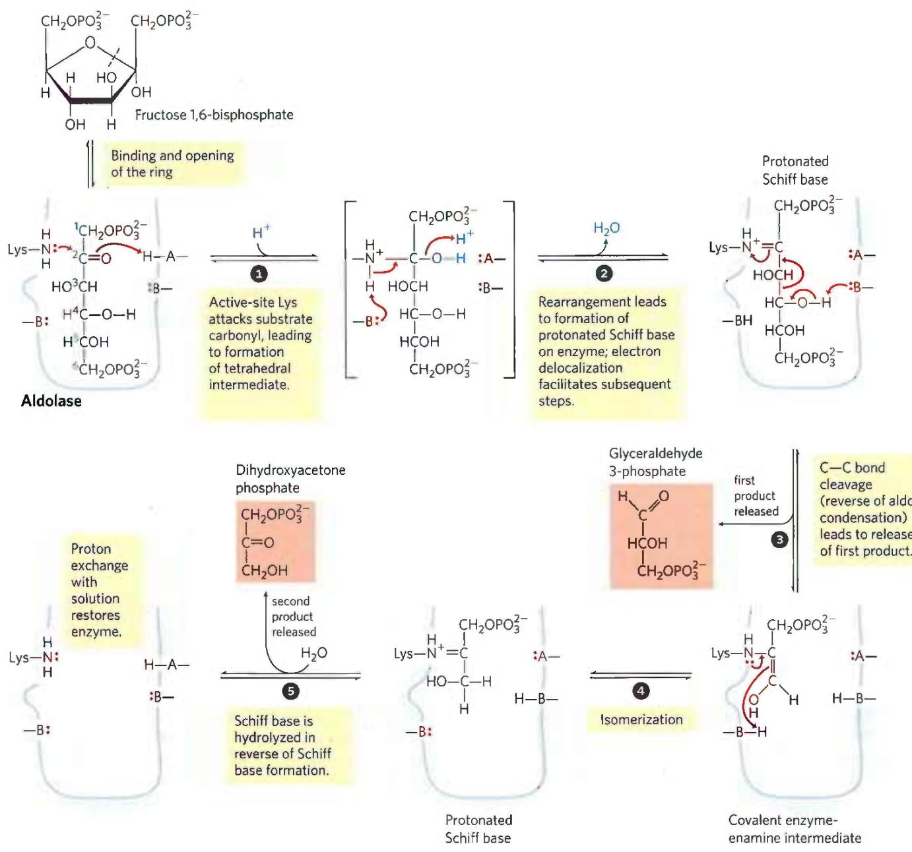  
MECHANISM FIGURE 14-5 The class I aldolase reaction. Note that cleavage between C-3 and C-4 depends on the presence of the carbonyl group at C-2, which is converted to an imine on the enzyme. A and B represent amino acid residues that serve as general acid (A) or base (B).

The reaction mechanism is similar to the reaction promoted by phosphohexose isomerase in step 2 of glycolysis (Fig. 14-4). After the triose phosphate isomerase reaction, the carbon atoms derived from C-1, C-2, and C-3 of the starting glucose are chemically indistinguishable from C-6, C-5, and C-4, respectively (Fig. 14-6); both "halves" of glucose have yielded glyceraldehyde 3-phosphate.

This reaction completes the preparatory phase of glycolysis. The hexose molecule has been phosphorylated at C-1 and C-6 and then cleaved to form two molecules of glyceraldehyde 3-phosphate.

(a)  
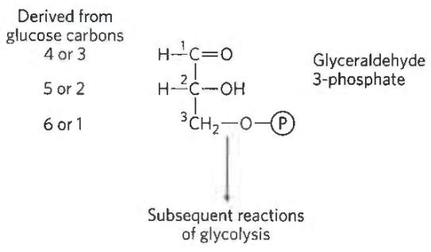  
(b)  
FIGURE 14-6 Fate of the glucose carbons in the formation of glyceraldehyde 3-phosphate. (a) The origin of the carbons in the two three-carbon products of the aldolase and triose phosphate isomerase reactions. The end product of the two reactions is glyceraldehyde 3-phosphate (two molecules). (b) Each carbon of glyceraldehyde 3-phosphate is derived from either of two specific carbons of glucose. Note that the numbering of the carbon atoms of glyceraldehyde 3-phosphate differs from that of the glucose from which it is derived. In glyceraldehyde 3-phosphate, the most complex functional group (the carbonyl) is specified as C-1. This numbering change is important for interpreting experiments with glucose in which a single carbon is labeled with a radioisotope. (See Problems 5 and 22 at the end of this chapter.)

#### [EN] The Payoff Phase of Glycolysis Yields ATP and NADH

The payoff phase of glycolysis (Fig. 14-2b) includes the energy-conserving phosphorylation steps in which some of the chemical energy of the glucose molecule is conserved in the form of ATP and NADH. Remember that one molecule of glucose yields two molecules of glyceraldehyde 3-phosphate, and both halves of the glucose molecule follow the same pathway in the second phase of glycolysis. The conversion of two molecules of glyceraldehyde 3-phosphate to two molecules of pyruvate is accompanied by the formation of four molecules of ATP from ADP. However, the net yield of ATP per molecule of glucose degraded is only two, because two ATP were invested in the preparatory phase of glycolysis to phosphorylate the two ends of the hexose molecule.

⑥ Oxidation of Glyceraldehyde 3-Phosphate to 1,3-Bisphosphoglycerate P1 The first step in the payoff phase is the oxidation of glyceraldehyde 3-phosphate to 1,3-bisphosphoglycerate, catalyzed by glyceraldehyde 3-phosphate dehydrogenase:

This is the first of the two energy-conserving reactions of glycolysis that eventually lead to the formation of ATP. The aldehyde group of glyceraldehyde 3-phosphate is oxidized, not to a free carboxyl group but to a carboxylic acid anhydride with phosphoric acid. This type of anhydride, called an acyl phosphate, has a very high standard free energy of hydrolysis ( $\Delta G^{\circ} = -49.3$ kJ/mol; see Table 13-6). Much of the free energy of oxidation of the aldehyde group of glyceraldehyde 3-phosphate is conserved by formation of the acyl phosphate group at C-1 of 1,3-bisphosphoglycerate.

Glyceraldehyde 3-phosphate is covalently bound to the dehydrogenase during the reaction (Fig. 14-7). The aldehyde group of glyceraldehyde 3-phosphate reacts with the —SH group of an essential Cys residue in the active site, in a reaction analogous to the formation of a hemiacetal (see Fig. 7-5), in this case producing a thiohemiacetal. Reaction of the essential Cys residue with a heavy metal such as Hg $^{2+}$ irreversibly inhibits the enzyme.

The amount of $NAD^{+}$ in a cell ( $\leq10^{-5}$ M) is far smaller than the amount of glucose metabolized in a few minutes. Glycolysis would soon come to a halt if the NADH formed in this step of glycolysis were not continuously reoxidized and recycled. We return to a discussion of this recycling of $NAD^{+}$ later in the chapter.

⑦ Phosphoryl Transfer from 1,3-Bisphosphoglycerate to ADP The enzyme phosphoglycerate kinase transfers the high-energy phosphoryl group from the carboxyl group of 1,3-bisphosphoglycerate to ADP, forming ATP and 3-phosphoglycerate:

  
MECHANISM FIGURE 14-7 The glyceraldehyde 3-phosphate dehydrogenase reaction.

Notice that phosphoglycerate kinase is named for the reverse reaction, in which it transfers a phosphoryl group from ATP to 3-phosphoglycerate. Like all enzymes, it catalyzes the reaction in both directions. This enzyme acts in the direction suggested by its name during gluconeogenesis (see Fig. 14-16) and during photosynthetic CO₂ assimilation (see Fig. 20-26). In glycolysis, the reaction it catalyzes proceeds as shown above, in the direction of ATP synthesis.

Steps 6 and 7 of glycolysis together constitute an energy-coupling process in which 1,3-bisphosphoglycerate is the common intermediate; it is formed in the first reaction (which would be endergonic in isolation), and its acyl phosphate group is transferred to ADP in the second reaction (which is strongly exergonic). The sum of these two reactions is

$$
\begin{array}{r l}\text {Glyceraldehyde 3 - phosphate + ADP + P_{i} + NAD^{+}}&\rightleftharpoons\\3 - \text {phosphoglycerate + ATP + NADH + H^{+}}\\\Delta G ^ {\prime \circ} = - 1 2. 2 \mathrm{kJ/mol}\end{array}
$$

Thus the overall reaction is exergonic.

Recall from Chapter 13 that the actual free-energy change, $\Delta G$ , is determined by the standard free-energy change, $\Delta G^{\prime\circ}$ , and the mass-action ratio, Q, which is the ratio [products]/[reactants] (see Eqn 13-4). For step 6,

$$
\begin{array}{r l} \Delta G & = \Delta G ^ {\prime \circ} + R T \ln Q \\ & = \Delta G ^ {\prime \circ} + R T \ln \frac {[ 1 , 3 - \text { bisphosphoglycerate } ] [ \mathrm{NADH} ]}{[ \text { glyceraldehyde   3 - phosphate } ] [ \mathrm{P} _ {1} ] [ \mathrm{NAD} ^ {+} ]} \end{array}
$$

Notice that $[H^{+}]$ is not included in Q. In biochemical calculations, $[H^{+}]$ is assumed to be a constant $(10^{-7} \text{ M})$ , and this constant is included in the definition of $\Delta G^{\prime\circ}$ (p. 468).

When the mass-action ratio is less than 1.0, its natural logarithm has a negative sign. In the cytosol, where these reactions are taking place, the ratio [NADH]/[NAD $^{+}$ ] is a small fraction, contributing to a low Q. Step ⑦, by consuming the product of step ⑥ (1,3-bisphosphoglycerate), keeps [1,3-bisphosphoglycerate] relatively low in the steady state and thereby keeps Q for the overall energy-coupling process small. When Q is small, the contribution of ln Q can make ΔG strongly negative. This is simply another way of showing how the two reactions, steps ⑥ and ⑦, are coupled through a common intermediate.

The outcome of these coupled reactions, both reversible under cellular conditions, is that the energy released on oxidation of an aldehyde to a carboxylate group is conserved by the coupled formation of ATP from ADP and $P_{i}$ . The formation of ATP by phosphoryl group transfer from a substrate such as 1,3-bisphosphoglycerate is referred to as a substrate-level phosphorylation, to distinguish this mechanism from respiration-linked phosphorylation. Substrate-level phosphorylations involve soluble enzymes and chemical intermediates (1,3-bisphosphoglycerate in this case). Respiration-linked phosphorylations, on the other hand, involve membrane-bound enzymes and transmembrane gradients of protons (Chapter 19).

8 Conversion of 3-Phosphoglycerate to 2-Phosphoglycerate The enzyme phosphoglycerate mutase catalyzes a reversible shift of the phosphoryl group between C-2 and C-3 of glycerate; $\mathrm{Mg}^{2+}$ is essential for this reaction:

The reaction occurs in two steps (Fig. 14-8). A phosphoryl group initially attached to a His residue of the mutase is transferred to the hydroxyl group at C-2 of 3-phosphoglycerate, forming 2,3-bisphosphoglycerate (2,3-BPG). The phosphoryl group at C-3 of 2,3-BPG is then transferred to the same His residue, producing 2-phosphoglycerate and regenerating the phosphorylated enzyme. Phosphoglycerate mutase is initially phosphorylated by phosphoryl transfer from 2,3-BPG, which is required in small quantities to initiate the catalytic cycle and is continuously regenerated by that cycle.

Phosphoglycerate mutase  
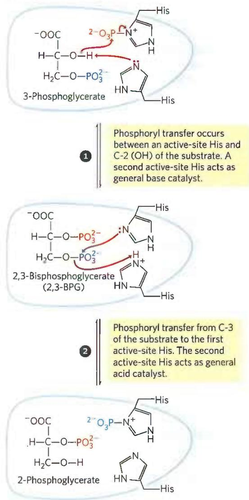

MECHANISM FIGURE 14-8 The phosphoglycerate mutase reaction.

9 Dehydration of 2-Phosphoglycerate to Phosphoenolpyruvate P1 In the second glycolytic reaction that generates a compound with high phosphoryl group transfer potential (the first was step 6), enolase promotes reversible removal of a molecule of water from 2-phosphoglycerate to yield phosphoenolpyruvate (PEP):

The mechanism of the enolase reaction involves an enolic intermediate stabilized by $Mg^{2+}$ (see Fig. 6-31). The reaction converts a compound with a relatively low phosphoryl group transfer potential ( $\Delta G^{\prime\circ}$ for hydrolysis of 2-phosphoglycerate is -17.6 kJ/mol) to one with high phosphoryl group transfer potential ( $\Delta G^{\prime\circ}$ for PEP hydrolysis is -61.9 kJ/mol) (see Fig. 13-13).

10 Transfer of the Phosphoryl Group from Phosphoenolpyruvate to ADP The last step in glycolysis is the transfer of the phosphoryl group from phosphoenolpyruvate to ADP, catalyzed by pyruvate kinase, which requires $K^{+}$ and either $Mg^{2+}$ or $Mn^{2+}$ :

In this substrate-level phosphorylation, the product pyruvate first appears in its enol form, then tautomerizes nonenzymatically to its keto form, which predominates at pH 7:

The overall reaction has a large, negative standard free-energy change, due in large part to the spontaneous conversion of the enol form of pyruvate to the keto form (see Fig. 13-13). About half of the energy released by PEP hydrolysis ( $\Delta G^{\circ}= -61.9$ kJ/mol) is conserved in the formation of the phosphoanhydride bond of ATP ( $\Delta G^{\circ}= -30.5$ kJ/mol), and the rest (-31.4 kJ/mol) constitutes a large driving force pushing the reaction toward ATP synthesis. We discuss the regulation of pyruvate kinase in Section 14.5.

#### [EN] The Overall Balance Sheet Shows a Net Gain of Two ATP and Two NADH Per Glucose

P1 We can now construct a balance sheet for glycolysis to account for (1) the fate of the carbon skeleton of glucose, (2) the input of $P_{i}$ and ADP and output of ATP, and (3) the pathway of electrons in the oxidation-reduction reactions. The left side of the following equation shows all the inputs of ATP, $NAD^{+}$ , ADP, and $P_{i}$ (consult Fig. 14-2), and the right side shows all the outputs (keep in mind that each molecule of glucose yields two molecules of pyruvate):

$$
\mathrm{Glucose} + 2 \mathrm{ATP} + 2 \mathrm{NAD} ^ {+} + 4 \mathrm{ADP} + 2 \mathrm{P} _ {\mathrm{i}} \longrightarrow
$$

$$
2 \mathrm{pyruvate} + 2 \mathrm{ADP} + 2 \mathrm{NADH} + 2 \mathrm{H} ^ {+} + 4 \mathrm{ATP} + 2 \mathrm{H} _ {2} \mathrm{O}
$$

Canceling out common terms on both sides of the equation gives the overall equation for glycolysis:

$$
\begin{array}{r l} & \mathrm {Glucose + 2NA D ^ {+} + 2ADP + 2P_ {i} \longrightarrow} \\ & \quad 2 \mathrm{pyruvate+2NADH+2H} ^ {+} + 2 \mathrm{ATP+2H} _ {2} \mathrm{O} \end{array}
$$

In the overall glycolytic process, one molecule of glucose is converted to two molecules of pyruvate (the pathway of carbon). Two molecules of ADP and two of $P_{i}$ are converted to two molecules of ATP (the pathway of phosphoryl groups). Four electrons, as two hydride ions, are transferred from two molecules of glyceraldehyde 3-phosphate to two of $NAD^{+}$ (the pathway of electrons).

#### [EN] SUMMARY 14.1 Glycolysis

Glycolysis is a near-universal pathway by which a glucose molecule is oxidized, in two phases, to two molecules of pyruvate, with energy conserved as ATP and NADH. Ten cytosolic enzymes act sequentially in glycolysis. The overall reaction converts glucose to two molecules of pyruvate, and energy is conserved in the synthesis of two molecules of ATP and two molecules of NADH.

In the preparatory phase of glycolysis, two molecules of ATP are invested to activate glucose to fructose 1,6-bisphosphate. The bond between C-3 and C-4 is then broken to yield two molecules of triose phosphate.

In the payoff phase, each of the two molecules of glyceraldehyde 3-phosphate derived from glucose undergoes oxidation at C-1; some of the energy of this oxidation reaction is conserved in the form of one NADH and two ATP per triose phosphate oxidized.

■ Subtracting the two ATP spent in the preparatory phase, the net equation for the overall process is

Glucose + 2NAD $^{+}$ + 2ADP + 2P $_{i}$ →

$$
2 \mathrm{pyruvate} + 2 \mathrm{NADH} + 2 \mathrm{H} ^ {+} + 2 \mathrm{ATP} + 2 \mathrm{H} _ {2} \mathrm{O}
$$

<!-- EN-END 14.1 -->

## 六、由葡萄糖转变为两分子丙酮酸能量转变的估算

由葡萄糖分解为两分子丙酮酸包括能量的产生可用下面的总反应式表示：

$$
\mathrm{葡萄糖} + 2 \mathrm{Pi} + 2 \mathrm{ADP} + 2 \mathrm{NAD} ^ {+} \rightarrow 2 \mathrm{丙酮酸} + 2 \mathrm{ATP} + 2 \mathrm{NADH} + 2 \mathrm{H} ^ {+} + 2 \mathrm{H} _ {2} \mathrm{O}
$$

从反应式中可一目了然,从一分子葡萄糖的降解到形成2分子丙酮酸的过程,净产生2分子ATP。在酵解过程中,ATP的消耗和产生可用表17-1作一概括;其每步反应的标准自由能和自由能的变化如表17-2所示。

表 17-1 酵解过程中 ATP 的消耗和产生

<table><tr><td>消耗或产生 ATP 的反应</td><td>每分子 ATP 葡萄糖 ATP 变化的分子数</td></tr><tr><td>葡萄糖→6-磷酸葡糖</td><td>-1</td></tr><tr><td>6-磷酸果糖→1,6-二磷酸果糖</td><td>-1</td></tr><tr><td>2×1,3-二磷酸甘油酸→2×3-磷酸甘油酸</td><td>+2</td></tr><tr><td>2×磷酸烯醇式丙酮酸→2×丙酮酸</td><td>+2</td></tr><tr><td>总计</td><td>+2</td></tr></table>

注：负号（-）代表消耗，正号代表产生。

表 17-2 糖酵解过程中各步反应的能量变化

<table><tr><td>反应内容</td><td>酶</td><td> $\Delta {G}^{\ominus }$  kcal(kJ)/mol</td><td> $\Delta G$  kcal(kJ)/mol</td></tr><tr><td>1.葡萄糖+ATP→6-磷酸葡糖+ADP+H+</td><td>己糖激酶</td><td>-0.4(-16.74)</td><td>-8.0(-33.47)</td></tr><tr><td>2.6-磷酸葡糖→6-磷酸果糖</td><td>磷酸己糖异构酶</td><td>+0.4(+1.67)</td><td>-0.6(-2.51)</td></tr><tr><td>3.6-磷酸果糖+ATP→1,6-二磷酸果糖+ADP+H+</td><td>磷酸果糖激酶-1</td><td>-3.4(-14.23)</td><td>-5.3(-22.18)</td></tr><tr><td>4.1,6-二磷酸果糖→磷酸二羟丙酮+3-磷酸甘油醛</td><td>醛缩酶</td><td>+5.7(+23.85)</td><td>-0.3(-1.25)</td></tr><tr><td>5.磷酸二羟丙酮→3-磷酸甘油醛</td><td>磷酸己糖异构酶</td><td>+1.8(+7.53)</td><td>+0.6(+2.51)</td></tr><tr><td>6.3-磷酸甘油醛+Pi+NAD+→1,3-二磷酸甘油酸+NADH +H+</td><td>磷酸甘油醛脱氢酶</td><td>+1.5(+6.28)</td><td>-0.4(-1.67)</td></tr><tr><td>7.1,3-二磷酸甘油酸+ADP→3-磷酸甘油酸+ATP</td><td>磷酸甘油酸激酶</td><td>-4.5(-18.83)</td><td>+0.3(+1.26)</td></tr><tr><td>8.3-磷酸甘油酸→2-磷酸甘油酸</td><td>磷酸甘油酸变位酶</td><td>+1.1(+4.60)</td><td>+0.2(+0.84)</td></tr><tr><td>9.2-磷酸甘油酸→磷酸烯醇式丙酮酸+H2O</td><td>烯醇化酶</td><td>+0.4(+1.67)</td><td>-0.8(-3.35)</td></tr><tr><td>10.磷酸烯醇式丙酮酸+ADP+H+→丙酮酸+ATP</td><td>丙酮酸激酶</td><td>-7.5(-31.38)</td><td>-4.0(-16.74)</td></tr></table>

注：上表中 $\Delta G^{\ominus}$ 和 $\Delta G$ 用 kcal/mol 和 kJ/mol 单位表示。实际的自由能变化 $\Delta G$ 是在正常生理条件下测得的反应物浓度和标准自由能 $\Delta G^{\ominus}$ 的数据计算所得

上表所示糖酵解各步反应的实际自由能变化,有三项其 $\Delta G$ 为正值。其中包括:磷酸丙糖变位酶催化的磷酸二羟丙酮转变为 3-磷酸甘油醛,磷酸甘油酸激酶催化的由 1,3-二磷酸甘油酸和 ADP 形成 3-磷酸甘油酸和 ATP,由磷酸甘油酸变位酶催化的 3-磷酸甘油酸转变为 2-磷酸甘油酸的反应。根据热力学原理,糖酵解过程只有在全部反应的值都为负值时才能进行。这些小的正值表明,细胞内进行着的酵解中间产物的浓度难于准确测得。

## 七、丙酮酸的去路

从葡萄糖到形成丙酮酸的酵解过程,在生物界都是极其相似的。丙酮酸以后的途径却随着机体所处的条件和发生在什么样的生物体中各不相同。在有氧条件下丙酮酸的转变这里不作讨论,请参看下面的章节,本章只讨论在无氧条件下丙酮酸的去路。

## (一) 生成乳酸

动物包括人,在激烈运动时或由于呼吸、循环系统障碍而发生供氧不足时,缺氧的细胞必须用糖酵解产生的 ATP 分子暂时满足对能量的需要。为了使 3-磷酸甘油醛继续氧化,必须提供氧化型的 $NAD^{+}$ 。丙酮酸作为 NADH 的受氢体,使细胞在无氧条件下重新生成 $NAD^{+}$ ,于是丙酮酸的羰基被还原,生成乳酸 (lactic acid 或 lactate)。反应式如下所示:

在无氧条件下,每分子葡萄糖代谢形成乳酸的总方程式如下:

$$
\begin{array}{c c} \mathrm{C} _ {6} \mathrm{H} _ {1 2} \mathrm{O} _ {6} + 2 \mathrm{ADP} + 2 \mathrm{Pi} & \longrightarrow 2 \mathrm{C} _ {3} \mathrm{H} _ {6} \mathrm{O} _ {3} + 2 \mathrm{ATP} + 2 \mathrm{H} _ {2} \mathrm{O} \\ \text {葡萄糖} & \text {乳酸} \end{array}
$$

由于糖酵解产生等摩尔的 NADH 和丙酮酸, 每分子葡萄糖所产生的 NADH 分子, 都可通过利用丙酮酸分子而重新被氧化。

催化上述反应的酶称为乳酸脱氢酶(lactate dehydrogenase, LDH)。

哺乳动物有两种不同的乳酸脱氢酶亚基。一种是 M 型（或称为 A 型），一种是 H 型（或称为 B 型）。这 2 种亚基类型构成 5 种同工酶： $M_{4}$ 、 $M_{3}H$ 、 $M_{2}H_{2}$ 、 $MH_{3}$ 、 $H_{4}$ 。所有这 5 种同工酶催化相同的反应。但每种同工酶都有对底物（丙酮酸和 NADH 或乳酸和 $NAD^{+}$ ）特有的 $K_{m}$ 值。 $M_{4}$ 和 $M_{3}H$ 型对丙酮酸有较小的 $K_{m}$ 值，也就是较高的亲和力。它们在骨骼肌和其他一些依赖糖酵解获得能量的组织中占优势。相反， $MH_{3}$ 和 $H_{4}$ 型对丙酮酸有较大的 $K_{m}$ 值，即较低的亲和力，它们在需氧的组织中占优势。例如，心肌中是 $H_{4}$ 型， $H_{4}$ 型对丙酮酸的亲和力最小。这确保了在心肌中丙酮酸不能转变为乳酸，而有利于丙酮酸脱氢酶（pyruvate dehydrogenase）的催化，使其朝有氧代谢方向进行

乳酸脱氢酶催化 NADH 被丙酮酸氧化为 $NAD^{+}$ 的过程，与其他由酶催化的 NADH 的氧化或 $NAD^{+}$ 的还原反应都具有绝对的立体专一性（stereospecificity）。在 NADHC(4) 上的 Pro-R(A-面) 的氢，立体特异地转移到丙酮酸 C(2) 位的 re 面，使丙酮酸形成 L-乳酸（也称为 S-乳酸）。这是带一对电子的质子（氢阴离子）的转移。这一氢阴离子是从烟酰胺环的对面（opposite face），直接转移到丙酮酸上的。这种情况和甘油醛磷酸脱氢酶在 3-磷酸甘油醛（GAP）转变为 1,3-二磷酸甘油酸的反应中，由 $NAD^{+}$ 还原为 $NADH + H^{+}$ 的反应方式是一致的，丙酮酸还原的机制，可用图 17-12 表示。

机体血液内乳酸脱氢酶同工酶的比例是比较恒定的。临床上利用测定血液中乳酸脱氢酶同工酶的比例关系作为诊断心肌、肝等疾患的重要指标之一。

  
图 17-12 乳酸脱氢酶的催化反应机制  
图中表明负氢离子从 NADH 直接向丙酮酸羰基转移的情况

生长在厌氧或相对厌氧条件下的许多细菌以乳酸为最终产物。这种以乳酸为终产物的厌氧发酵称为乳酸发酵。乳酸发酵在经济上是非常重要的。人们利用细菌对牛乳中乳糖的发酵生产奶酪、酸奶和其他食品。

## （二）生成乙醇

酵母在无氧条件下,将丙酮酸转变为乙醇和 $CO_{2}$ 。这一过程实际包括两个反应步骤。第一步是丙酮酸脱羧形成乙醛和 $CO_{2}$ , 第二步乙醛由 $NADH+H^{+}$ 还原生成乙醇同时产生氧化型 $NAD^{+}$ 。

## 1. 丙酮酸脱羧形成乙醛

催化这一步反应的酶是丙酮酸脱羧酶(pyruvate decarboxylase)。该酶在动物细胞中不存在。它以硫胺素焦磷酸(TPP)为辅酶。TPP以非共价键和酶紧密结合。

丙酮酸脱羧酶的催化机制可用图 17-13 表示。

  
图 17-13 丙酮酸脱羧酶的催化机制

图中表明① TPP 以内镝化合物形式对丙酮酸的羰基进行亲核攻击；② 羰基以 $CO_{2}$ 形式脱去形成共振稳定性的负碳离子；③ 负碳离子质子化；④ 脱去 TPP 的内镝化合物 (ylid) 和乙醛。注：内镝化合物是碳和其他元素间既有共价键又有离子键性质的化合物

丙酮酸脱羧酶需要 TPP 是因为丙酮酸为 $\alpha-$ 酮酸。它直接脱羧必然在羰基碳原子上产生电负性，羰基碳就形成一个负碳“陷阱”。这是极不稳定的状态，因此是根本不可能的。只有丙酮酸和 TPP 结合，经过图17-13所示的①、②、③、④比较稳定的中间过程才可以实现。经过这些过程乃避开了羰基碳形成带负电荷的“陷阱”。

TPP 的活性末端是一个噻唑环(thiazolium ring)。它第 2 碳原子上的氢,由于相邻的 4 价氮原子上正电荷的影响而具有相对酸性。氮原子上的正电荷使质子解离后形成的碳负离子得以稳定。这一两性负碳离子(是一个内镝离子,见图 17-13 之注)是 TPP 的活性形式。

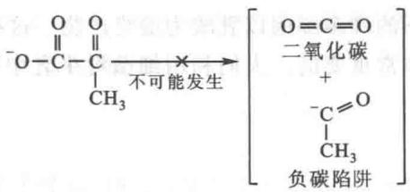

丙酮酸脱羧酶催化的脱羧过程可归纳为4个反应步骤:第一步,TPP的内鎓离子对丙酮酸的羰基碳进行亲核攻击;第二步,释放出 $CO_{2}$ 并生成一个共振稳定的负碳离子加合物,在这个加合物上TPP的噻唑环起着电子陷阱的作用;第三步,负碳离子质子化;第四步,乙醛被释放出又形成游离的活性酶(图17-13)。

## 2. 乙醛还原成乙醇同时产生氧化型 $\mathrm{NAD}^{+}$

催化这一反应的酶是乙醇脱氢酶(alcohol dehydrogenase, ADH)。酵母乙醇脱氢酶(YADH)是含有4个亚基的四聚体。每个亚基结合一个NADH和一个 $Zn^{2+}$ 。 $Zn^{2+}$ 的作用是使乙醛的羰基极化，这可使处于反应中的中间态产生的负碳电荷比较稳定，从而对NADH Pro-R的氢原子的转移有促进作用。这一氢原子转移到乙醛的re-面上，从而产生一个氢原子在Pro-R位的乙醇分子。如图17-14所示：

乙醇发酵有很大的经济意义，在发面、制作面包和馒头，以及酿酒工业中起着关键性的作用。在酿醋工业上，微生物也是先在不需氧条件下形成乙醛而后在有氧条件下氧化为醋。

  
图 17-14 乙醇脱氢酶催化反应机制  
图中表明 NADH Pro-R 的负氢离子定向地转移到乙醛的 re 面

<!-- EN-BEGIN 14.3 -->

### 【英文对应 14.3】Fates of Pyruvate

> 来源：Lehninger Principles of Biochemistry（书籍/02_生物化学原理） 第14章 Glycolysis, Gluconeogenesis, and the Pentose Phosphate Pathway，§14.3。对应本章“七、丙酮酸的去路”。

With the exception of some interesting variations in the bacterial realm, the pyruvate formed by glycolysis is further metabolized via one of three catabolic routes (Fig. 14-11). P3 Under aerobic conditions, glycolysis is only the first stage in the complete degradation of glucose. The pyruvate formed in the final step of glycolysis is oxidized to acetate (acetyl-CoA), which enters the citric acid cycle and is oxidized completely to $\mathrm{CO}_{2}$ and $\mathrm{H}_{2}\mathrm{O}$ (Chapter 16). The electrons from these oxidations are carried by NADH and $\mathrm{FADH}_{2}$ , which are ultimately reoxidized to $\mathrm{NAD}^{+}$ and FAD by passage of electrons to $\mathrm{O}_{2}$ through a chain of carriers in mitochondrial respiration, to form $\mathrm{H}_{2}\mathrm{O}$ . The energy from the electron-transfer reactions drives the synthesis of ATP (Chapter 19).

The earliest cells lived in an atmosphere almost devoid of oxygen and evolved deriving energy from fuel molecules under anaerobic conditions. Under anaerobic or low-oxygen conditions (hypoxia), NADH cannot be reoxidized to $NAD^{+}$ by passing its electrons to $O_{2}$ . But for glycolysis to continue, $NAD^{+}$ must be regenerated. Under these conditions, glucose is degraded by fermentation (defined below), which leads to one of two different fates for the pyruvate formed by glycolysis. In lactic acid fermentation, pyruvate accepts electrons from NADH and is reduced to lactate while regenerating the $NAD^{+}$ necessary for glycolysis. In ethanol (alcohol) fermentation, pyruvate is further catabolized to ethanol (Fig. 14-11).

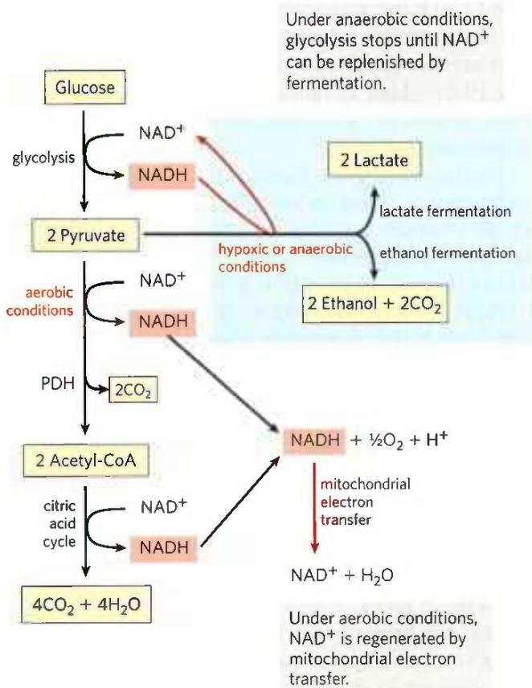  
FIGURE 14-11 Three possible catabolic fates of the pyruvate formed in glycolysis and the recycling of NADH. Red arrows follow the regeneration of $\mathrm{NAD^{+}}$ from NADH. Under aerobic conditions, pyruvate is activated to acetyl-CoA and is completely oxidized to $\mathrm{CO}_{2}$ and water through the citric acid cycle and mitochondrial oxidative phosphorylation. NADH produced in this pathway is oxidized to $\mathrm{NAD^{+}}$ through mitochondrial electron transfer. Under anaerobic conditions, pyruvate reduction to lactate or to ethanol is required to produce the $\mathrm{NAD^{+}}$ needed for glycolysis to continue. Pyruvate also serves as a precursor in many anabolic reactions, not shown here.

#### [EN] The Pasteur and Warburg Effects Are Due to Dependence on Glycolysis Alone for ATP Production

During his studies on the fermentation of glucose by yeast, Louis Pasteur discovered that both the rate and the total amount of glucose consumption under anaerobic conditions were many times greater than under aerobic conditions. Later studies of muscle showed the same large difference in the rates of glycolysis under anaerobic and aerobic conditions. The biochemical basis of this "Pasteur effect" is now clear. The ATP yield from glycolysis alone (2 ATP per molecule of glucose) is much smaller than that from the complete oxidation of glucose to $CO_{2}$ under aerobic conditions (30 or 32 ATP per glucose; see Table 19-5). About 15 times as much glucose must therefore be consumed anaerobically as aerobically to yield the same amount of ATP.

The flux of glucose through the glycolytic pathway is regulated to maintain nearly constant ATP levels (as well as adequate supplies of glycolytic intermediates that serve biosynthetic roles). The required adjustment in the rate of glycolysis is achieved by a complex interplay among ATP consumption, NAD $^{+}$ regeneration from NADH formed in glycolysis, and allosteric regulation of several glycolytic enzymes—including hexokinase, PFK-1, and pyruvate kinase—and by second-to-second fluctuations in the concentration of key metabolites that reflect the cellular balance between ATP production and consumption. On a slightly longer time scale, glycolysis is regulated by the hormones glucagon, epinephrine, and insulin, and by changes in the expression of the genes for several glycolytic enzymes. An especially interesting case is glycolysis in tumors. The German biochemist Otto Warburg first observed in 1928 that tumors of nearly all types carry out glycolysis at a much higher rate than normal tissue, even when oxygen is available. This “Warburg effect” is the basis for several methods of detecting and treating cancer (Box 14-1).

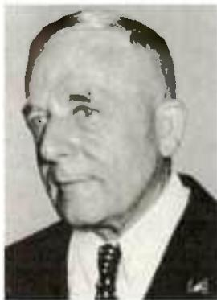  
Otto Warburg, 1883–1970
[Science Photo Library/Science Source.]

Warburg is generally considered the preeminent biochemist of the first half of the twentieth century. He made seminal contributions to many other areas of biochemistry, including respiration, photosynthesis, and the enzymology of intermediary metabolism. Beginning in 1930, Warburg and his associates purified and crystallized seven of the

enzymes of glycolysis. They developed an experimental tool that revolutionized biochemical studies of oxidative metabolism: the Warburg manometer, which directly measured the oxygen consumption of tissues by monitoring changes in gas volume, and thus allowed quantitative measurement of any enzyme with oxidase activity.

#### [EN] Pyruvate Is the Terminal Electron Acceptor in Lactic Acid Fermentation

P3 When animal tissues cannot be supplied with sufficient oxygen to support aerobic oxidation of the pyruvate and NADH produced in glycolysis, $NAD^{+}$ is regenerated from NADH by the reduction of pyruvate to lactate. Some tissues and cell types (such as erythrocytes, which have no mitochondria and thus cannot oxidize pyruvate to $CO_{2}$ ) produce lactate from glucose even under aerobic conditions. The reduction of pyruvate in this pathway is catalyzed by lactate dehydrogenase, which forms the L isomer of lactate at pH 7:

The overall equilibrium of the reaction strongly favors lactate formation, as shown by the large negative standard free-energy change.

In glycolysis, dehydrogenation of the two molecules of glyceraldehyde 3-phosphate derived from each molecule of glucose converts two molecules of $NAD^{+}$ to two of NADH. Because the reduction of two molecules of pyruvate to two of lactate regenerates two molecules of $NAD^{+}$ , there is no net change in $NAD^{+}$ or NADH:

The lactate formed by active skeletal muscles (or by erythrocytes or retinal cells) can be recycled; it is carried in the blood to the liver, where it is converted to glucose during the recovery from strenuous muscular activity. When lactate is produced in large quantities during vigorous muscle contraction (during a sprint, for example), the acidification that results from ionization of lactic acid in muscle and blood limits the period of vigorous activity. The best-conditioned athletes can sprint at top speed for no more than a minute (Box 14-2).

Although conversion of glucose to lactate includes two oxidation-reduction steps, there is no net change in the oxidation state of carbon; in glucose ( $C_{6}H_{12}O_{6}$ ) and lactic acid ( $C_{3}H_{6}O_{3}$ ), the H:C ratio is the same. Nevertheless, some of the energy of the glucose molecule has been extracted by its conversion to lactate—enough to give a net yield of two molecules of ATP for every glucose molecule consumed. Fermentation is the general term for such processes, which extract energy (as ATP) but do not consume oxygen or change the concentrations of $NAD^{+}$ or NADH.

#### [EN] High Rate of Glycolysis in Tumors Suggests Targets for Chemotherapy and Facilitates Diagnosis

In many types of tumors found in humans and other animals, glucose uptake and glycolysis proceed about 10 times faster than in normal, noncancerous tissues. Most tumor cells grow under hypoxic conditions (i.e., with limited oxygen supply) because, at least initially, they lack the capillary network to supply sufficient oxygen. Cancer cells located more than 100 to 200 $\mu$ m from the nearest capillaries must depend on glycolysis alone (without further oxidation of pyruvate) for much of their ATP production. The energy yield (2 ATP per glucose) is far lower than can be obtained by the complete oxidation of pyruvate to CO $_{2}$ in mitochondria (about 30 ATP per glucose; Chapter 19). So, to make the same amount of ATP, tumor cells must take up much more glucose than do normal cells, converting it to pyruvate and then to lactate as they recycle NADH. It is likely that two early steps in the transformation of a normal cell into a tumor cell are (1) the change to dependence on glycolysis alone for ATP production and (2) the development of tolerance to a low pH in the extracellular fluid (caused by release of lactic acid). In general, the more aggressive the tumor, the greater its rate of glycolysis.

This increase in glycolysis is achieved, at least in part, by increased synthesis of the glycolytic enzymes and of the plasma membrane transporters GLUT1 and GLUT3 (see Table 11-1) that carry glucose into cells. (GLUT1 and GLUT3 are not dependent on insulin.) The hypoxia-inducible transcription factor (HIF-1) is a protein that acts at the level of mRNA synthesis to stimulate the production of at least eight glycolytic enzymes and the glucose transporters when oxygen supply is limited (Fig. 1). With the resulting high rate of glycolysis, the tumor cell can survive anaerobic conditions until the supply of blood vessels has caught up with tumor growth. Another protein induced by HIF-1 is the peptide hormone VEGF (vascular endothelial growth factor), which stimulates the outgrowth of blood vessels (angiogenesis) toward the tumor.

There is also evidence that the tumor suppressor protein p53, which is mutated in most types of cancer (see Section 12.9), controls the synthesis and assembly of mitochondrial

FIGURE 1 The anaerobic metabolism of glucose in tumor cells yields far less ATP (2 per glucose) than the complete oxidation to $\mathrm{CO}_{2}$ that takes place in healthy cells under aerobic conditions (\~30 ATP per glucose), so a tumor cell must consume much more glucose to produce the same amount of ATP. Glucose transporters and most of the glycolytic enzymes are overproduced in tumors. Compounds that inhibit hexokinase, glucose 6-phosphate dehydrogenase, or transketolase block ATP production by glycolysis, thus depriving the cancer cell of energy and killing it.

proteins essential to the passage of electrons to $O_{2}$ . Cells with mutant p53 are defective in mitochondrial electron transfer and are forced to rely more heavily on glycolysis for ATP production (Fig. 1).

This heavier reliance of tumors than of normal tissue on glycolysis suggests a possibility for anticancer therapy: inhibitors of glycolysis might target and kill tumors by depleting their supply of ATP. Three inhibitors of hexokinase have shown promise as chemotherapeutic agents: 2-deoxyglucose, lonidamine, and 3-bromopyruvate. By preventing the formation of glucose 6-phosphate, these compounds not only deprive tumor cells of glycolytically produced ATP but also prevent the formation of pentose phosphates via the pentose phosphate

  
(Continued on next page)

High Rate of Glycolysis in Tumors Suggests Targets for Chemotherapy and Facilitates Diagnosis (Continued)

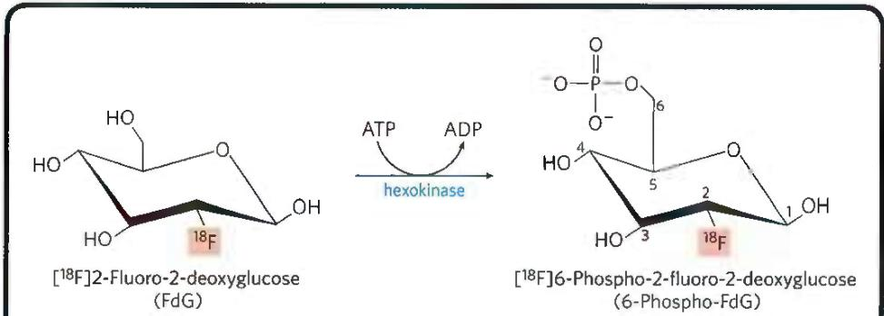  
FIGURE 2 Phosphorylation of $^{18}$ F-labeled 2-fluoro-2-deoxyglucose by hexokinase traps the FdG in cells (as 6-phospho-FdG), where its presence can be detected by positron emission from $^{18}$ F.

pathway, which also begins with glucose 6-phosphate. Without pentose phosphates, a cell cannot synthesize the nucleotides essential to DNA and RNA synthesis and thus cannot grow or divide. Another anticancer drug already approved for clinical use is imatinib (Gleevec), described in Box 12-4. It inhibits a specific tyrosine kinase, preventing the increased synthesis of hexokinase normally triggered by that kinase. The thiamine analog oxythiamine, which blocks the action of a transketolase-like enzyme that converts xylulose 5-phosphate to glyceraldehyde 3-phosphate (Fig. 1), is in preclinical trials as an antitumor drug.

The high glycolytic rate in tumor cells also has diagnostic usefulness. The relative rates at which tissues take up glucose can be used in some cases to pinpoint the location of tumors. In positron emission tomography (PET), individuals are injected with a harmless, isotopically labeled glucose analog that is taken up but not metabolized by tissues. The labeled compound is 2-fluoro-2-deoxyglucose (FdG), in which the hydroxyl group at the C-2 of glucose is replaced with $^{18}$ F (Fig. 2). This compound is taken up via GLUT transporters and is a good substrate for hexokinase, but it cannot be converted to the enediol intermediate in the phosphohexose isomerase reaction (see Fig. 14-4) and therefore accumulates as 6-phospho-FdG. The extent of its accumulation depends on its rate of uptake and phosphorylation, which, as noted above, is typically 10 or more times higher in tumors than in normal tissue. Decay of $^{18}$ F yields positrons (two per $^{18}$ F atom) that can be detected by a series of sensitive detectors positioned around the body, which allows accurate localization of accumulated 6-phospho-FdG (Fig. 3).

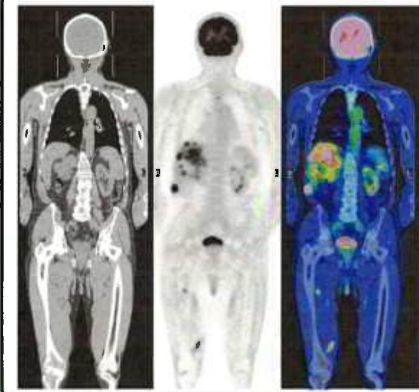

FIGURE 3 Detection of cancerous tissue by positron emission tomography (PET). The adult male patient had undergone surgical removal of a primary skin cancer (malignant melanoma). The image on the left, obtained by whole-body computed tomography (CT scan), shows the location of the soft tissues and bones. The central panel is a PET scan after the patient had ingested $^{18}$ F-labeled 2-fluoro-2-deoxyglucose (FdG). Dark spots indicate regions of high glucose utilization. As expected, the brain and bladder are heavily labeled — the brain because it uses most of the glucose consumed in the body, and the bladder because the $^{18}$ F-labeled 6-phospho-FdG is excreted in the urine. When the intensity of the label in the PET scan is translated into false color (the intensity increases from green to yellow to red) and the image is superimposed on the CT scan, the fused image (right) reveals cancer in the bones of the upper spine, in the liver, and in some regions of muscle, all the result of cancer spreading from the primary malignant melanoma. [Diomedia/ISM/Centre Jean Perrin.]

#### [EN] Glucose Catabolism at Limiting Concentrations of Oxygen

Most vertebrates are essentially aerobic organisms; they convert glucose to pyruvate by glycolysis, then use molecular oxygen to oxidize the pyruvate completely to $CO_{2}$ and $H_{2}O$ . Anaerobic catabolism of glucose to lactate occurs during short bursts of extreme muscular activity — for example, in a sprint — during which oxygen cannot be carried to the muscles fast enough to oxidize pyruvate. Instead, the muscles use their stored glucose (glycogen) as fuel to generate ATP by fermentation, with lactate as the end product. In a sprint, lactate in the blood builds up to high concentrations. It is slowly converted back to glucose by gluconeogenesis in the liver in the subsequent rest or recovery period, during which oxygen is consumed at a gradually diminishing rate until the breathing rate returns to normal. The excess oxygen consumed in the recovery period represents a repayment of the oxygen debt. This is the amount of oxygen required to supply ATP for gluconeogenesis during recovery respiration, in order to regenerate the glycogen “borrowed” from liver and muscle to carry out intense muscular activity in the sprint. The cycle of reactions that includes glucose conversion to lactate in muscle and lactate conversion to glucose in liver is called the Cori cycle, for Carl and Gerty Cori, whose studies in the 1930s and 1940s clarified the pathway and its role (see Box 15-1).

The circulatory systems of most small vertebrates can carry oxygen to their muscles fast enough to avoid having to use muscle glycogen anaerobically. For example, migrating birds often fly great distances at high speeds without rest and without incurring an oxygen debt. Many running animals of moderate size also maintain an essentially aerobic metabolism in their skeletal muscle. However, the circulatory systems of larger animals, including humans, cannot completely sustain aerobic metabolism in skeletal muscles over long periods of intense muscular activity. These animals generally are slow-moving under normal circumstances and engage in intense muscular activity only in the gravest emergencies, because such bursts of activity require long recovery periods to repay the oxygen debt.

Alligators and crocodiles, for example, are normally sluggish animals. Yet, when provoked, they are capable of lightning-fast charges and dangerous lashings of their powerful tails. Such intense bursts of activity are short and must be followed by long periods of recovery. The fast emergency movements require lactic acid fermentation to generate ATP in skeletal muscles. The stores of muscle glycogen are rapidly expended in intense muscular activity, and lactate reaches very high concentrations in myocytes and extracellular fluid. Whereas a trained athlete can recover from a 100 m sprint in 30 min or less, an alligator may require many hours of rest and extra oxygen consumption to clear the excess lactate from its blood and regenerate muscle glycogen after a burst of activity.

Other large animals, such as the elephant and the rhinoceros, have similar metabolic characteristics, as do diving mammals such as whales and seals. Dinosaurs and other huge, now-extinct animals probably had to depend on lactic acid fermentation to supply energy for muscular activity, followed by very long recovery periods during which they were vulnerable to attack by smaller predators that were better able to use oxygen and thus better adapted to continuous, sustained muscular activity.

Deep-sea explorations have revealed many species of marine life at great ocean depths, where the oxygen concentration is near zero. For example, the primitive coelacanth, a large fish recovered from depths of 4,000 m or more off the coast of South Africa, has an essentially anaerobic metabolism in virtually all its tissues. It converts carbohydrates to lactate and other products, most of which must be excreted. Some marine vertebrates ferment glucose to ethanol and $CO_{2}$ in order to generate ATP.

  
Francena McCorory, Olympic sprinter [Ezra Shaw/Getty Images.]

#### [EN] Ethanol Is the Reduced Product in Ethanol Fermentation

P3 Yeast and other microorganisms ferment glucose to ethanol and $CO_{2}$ , rather than to lactate. Glucose is metabolized to pyruvate by glycolysis, and the pyruvate is converted to ethanol and $CO_{2}$ in a two-step process:

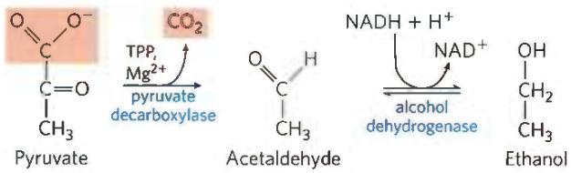

In the first step, pyruvate is decarboxylated to form acetaldehyde in an irreversible reaction catalyzed by pyruvate decarboxylase. This reaction is a simple decarboxylation and does not involve the net oxidation of pyruvate. Pyruvate decarboxylase requires $Mg^{2+}$ and has a tightly bound coenzyme, thiamine pyrophosphate, which is discussed below. In the second step, acetaldehyde is reduced to ethanol through the action of alcohol dehydrogenase, with the reducing power furnished by NADH derived from the dehydrogenation of glyceraldehyde 3-phosphate. This reaction is a well-studied case of hydride transfer from NADH (Fig. 14-12). Ethanol and $CO_{2}$ are thus the end products of ethanol fermentation, and the overall equation is

Glucose + 2ADP + 2P $_{i}$ →

$$
2 \mathrm{ethanol} + 2 \mathrm{CO} _ {2} + 2 \mathrm{ATP} + 2 \mathrm{H} _ {2} \mathrm{O}
$$

As in lactic acid fermentation, there is no net change in the ratio of hydrogen to carbon atoms when glucose (H:C ratio = 12/6 = 2) is fermented to two ethanol and two CO₂ (combined H:C ratio = 12/6 = 2). In all fermentations, the H:C ratio of the reactants and products remains the same.

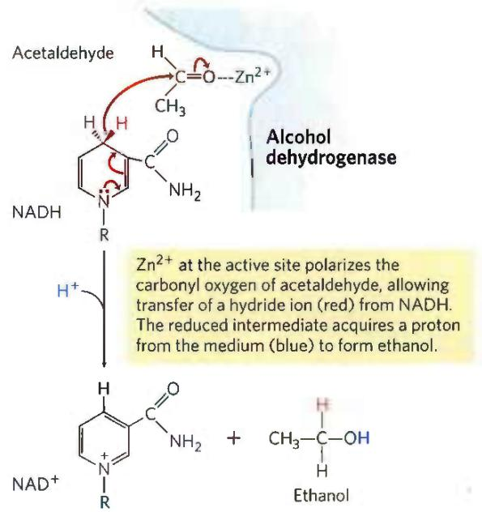  
MECHANISM FIGURE 14-12 The alcohol dehydrogenase reaction.

Pyruvate decarboxylase is present in brewer's and baker's yeast (different strains of the species Saccharomyces cerevisiae) and in all other organisms that ferment glucose to ethanol, including some plants. The $CO_{2}$ produced by pyruvate decarboxylation in brewer's yeast is responsible for the characteristic carbonation of champagne. The ancient art of brewing beer involves several enzymatic processes in addition to the reactions of ethanol fermentation. In baking, $CO_{2}$ released by pyruvate decarboxylase when yeast is mixed with a fermentable sugar causes dough to rise. The enzyme is absent in vertebrate tissues and in other organisms that carry out lactic acid fermentation.

Alcohol dehydrogenase is present in many organisms that metabolize ethanol, including humans. In the liver it catalyzes the oxidation of ethanol, either ingested or produced by intestinal microorganisms, with the concomitant reduction of $NAD^{+}$ to NADH. In this case, the reaction proceeds in the direction opposite to that involved in the production of ethanol by fermentation.

The pyruvate decarboxylase reaction provides our first encounter with thiamine pyrophosphate (TPP) (Fig. 14-13), a coenzyme derived from vitamin B $_{1}$ . TPP plays an important role in the cleavage of bonds adjacent to a carbonyl group, such as the decarboxylation of $\alpha$ -keto acids, and in chemical rearrangements in which an activated acetaldehyde group is transferred from one carbon atom to another (Table 14-1). The functional part of TPP, the thiazolium ring, has a relatively acidic proton at C-2. Loss of this proton produces a carbanion that is the active species in TPP-dependent reactions. The carbanion readily adds to carbonyl groups, and the thiazolium ring is thereby positioned to act as an “electron sink” that greatly facilitates reactions such as the decarboxylation catalyzed by pyruvate decarboxylase.

#### [EN] Fermentations Produce Some Common Foods and Industrial Chemicals

Our progenitors learned millennia ago to use fermentation in the production and preservation of foods and beverages. P3 Certain microorganisms present in raw food products ferment the carbohydrates and yield metabolic products that give the foods their characteristic forms, textures, and tastes. In modern times, industrial fermentation produces organic chemicals and fuels.

Fermented Foods Yogurt, already known in biblical times, is produced when the bacterium Lactobacillus bulgaricus ferments the carbohydrate in milk, producing lactic acid; the resulting drop in pH causes the milk proteins to precipitate, producing the thick texture and sour taste of unsweetened yogurt. Another bacterium, Propionibacterium freudenreichii, ferments milk to produce propionic acid and $CO_{2}$ ; the propionic acid precipitates milk proteins, and bubbles of $CO_{2}$ cause the holes characteristic of Swiss cheese. Many other food products are the result of fermentations: pickles, sauerkraut, sausage, soy sauce, kimchi, kefir, dahi, and kombucha. The drop in pH associated with fermentation also helps to preserve foods, because most of the microorganisms that cause food spoilage cannot grow at low pH. In agriculture, plant byproducts such as corn stalks are preserved for use

  
Thiamine pyrophosphate (TPP)

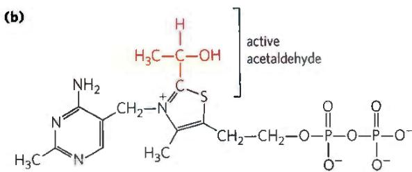  
Hydroxyethyl thiamine pyrophosphate

MECHANISM FIGURE 14-13 Thiamine pyrophosphate (TPP) and its role in pyruvate decarboxylation. (a) TPP is the coenzyme form of vitamin B₁ (thiamine). The reactive carbon atom in the thiazolium ring of TPP is shown in red. In the reaction catalyzed by pyruvate decarboxylase, two of the three carbons of pyruvate are carried transiently on TPP in the form of a hydroxyethyl, or "active acetaldehyde," group (b), which is subsequently released as acetaldehyde. (c) The thiazolium ring of TPP stabilizes carbanion intermediates by providing an electrophilic (electron-deficient) structure into which the carbanion electrons can be delocalized by resonance. Structures with this property, often called "electron sinks," play a role in many biochemical reactions—here, facilitating carbon-carbon bond cleavage. Dietary insufficiency of thiamine causes the serious disease beriberi and the Wernicke-Korsakoff syndrome.

as animal feed by packing them into a large container (a silo) with limited access to air; microbial fermentation produces acids that lower the pH. The silage that results from this fermentation process can be kept as animal feed for long periods without spoilage.

Fermented Beverages P3 Beer brewing was a science learned early in human history, and later refined for larger-scale production (Fig. 14-14). Brewers prepare beer by ethanol fermentation of the carbohydrates in cereal grains (seeds) such as barley, carried out by yeast glycolytic enzymes. The carbohydrates, largely polysaccharides, must first be degraded to disaccharides and monosaccharides. In the malting process, the barley seeds are allowed to germinate until they form the hydrolytic enzymes required to break down their polysaccharides, at which point germination is stopped by controlled heating. The product is malt, which contains enzymes that catalyze the hydrolysis of the $\beta$ linkages of cellulose and other cell wall polysaccharides of the barley husks, and enzymes such as $\alpha$ -amylase and maltase. The malt is mixed with water, mashed, and boiled with hops to add flavor. Yeast cells added to this mixture grow and reproduce rapidly, using energy obtained from available sugars. No ethanol forms during this stage, because the yeast, amply supplied with oxygen, oxidizes the pyruvate formed by glycolysis to $CO_{2}$ and $H_{2}O$ via the citric acid cycle.

<table><tr><td colspan="4">TABLE 14-1 Some TPP-Dependent Reactions</td></tr><tr><td>Enzyme</td><td>Pathway(s)</td><td>Bond cleaved</td><td>Bond formed</td></tr><tr><td>Pyruvate decarboxylase</td><td>Ethanol fermentation</td><td></td><td></td></tr><tr><td>Pyruvate dehydrogenaseα-Ketoglutarate dehydrogenase</td><td>Synthesis of acetyl-CoACitric acid cycle</td><td></td><td></td></tr><tr><td>Transketolase</td><td>Carbon-assimilation reactionsPentose phosphate pathway</td><td></td><td></td></tr></table>

FIGURE 14-14 Beer brewing. Large breweries and microbreweries produce beers with a wide variety of flavors, the result of differences in materials and fermentation conditions. [vgajic/Getty Images.]

When all the dissolved oxygen in the vat has been consumed, the yeast cells switch to anaerobic metabolism and ferment the sugars into ethanol and $CO_{2}$ . The fermentation process is controlled in part by the concentration of the ethanol formed, by the pH, and by the amount of remaining sugar. After fermentation has been stopped, the cells are removed and the "raw" beer is ready for final processing.

Chemical Production by Fermentation In 1910, Chaim Weizmann (later to become the first president of Israel) discovered that the bacterium Clostridium acetobutyricum ferments starch to butanol and acetone. P3 This discovery opened the field of industrial fermentations, in which some readily available material rich in carbohydrate is supplied to a pure culture of a specific microorganism, which ferments it into a product of greater commercial value. Microbial fermentations produce formic, acetic, propionic, butyric, and succinic acids, and ethanol, glycerol, methanol, isopropanol, butanol, and butanediol. Industrial fermentations are also used to produce certain antibiotics, including penicillin, streptomycin, and chloramphenicol. These fermentations are generally carried out in huge closed vats in which temperature and access to air are controlled to favor the multiplication of the desired microorganism and to exclude contaminating organisms. The beauty of industrial fermentations is that complicated, multistep chemical transformations are carried out in high yields and with few side products by chemical factories that reproduce themselves—microbial cells.

Fuel Production by Fermentation Much of the technology developed for large-scale production of alcoholic beverages can be applied to the production of ethanol as a renewable fuel. The principal advantage of ethanol as a fuel is that it can be produced from relatively inexpensive and renewable resources rich in sucrose, starch, or cellulose—starch from corn or wheat; sucrose from beets or cane; and cellulose from straw, forest industry waste, or municipal solid waste. Typically, the raw material (feedstock) is converted chemically to monosaccharides, then fed to a hardy strain of yeast in an industrial-scale fermenter. The fermentation can yield not only ethanol for fuel but also side products such as proteins that can be used as animal feed.

#### [EN] SUMMARY 14.3 Fates of Pyruvate

The NADH formed in glycolysis must be recycled to regenerate $\mathrm{NAD^{+}}$ , which is required as an electron acceptor in the first step of the payoff phase. Under aerobic conditions, electrons pass from NADH to $\mathrm{O}_2$ in mitochondrial respiration. The Warburg effect is the observation that tumor cells have high rates of glycolysis, with fermentation of glucose to lactate, even in the presence of oxygen. It is the basis of PET scanning used to diagnose tumors.

■ Under anaerobic or hypoxic conditions, many organisms regenerate $NAD^{+}$ by transferring electrons from NADH to pyruvate, forming lactate. Other organisms, such as yeast, regenerate $NAD^{+}$ by reducing pyruvate to ethanol and $CO_{2}$ .

A variety of microorganisms can ferment sugar in fresh foods, resulting in changes in pH, taste, and texture, and preserving food from spoilage. Fermentations are used in industry to produce many commercially valuable organic compounds from inexpensive starting materials.

<!-- EN-END 14.3 -->

## 八、糖酵解作用的调节

巴斯德在研究酵母的葡糖发酵中发现，在无氧条件下葡萄糖消耗的速率和总量比在有氧条件下高出很多。后来对肌肉的研究也表明，糖酵解速率在无氧和有氧条件下显示很大差异。这种“巴斯德效应（Pasteur effect）”的生化基础仍不清楚。在无氧条件下，糖酵解产生的ATP（1分子葡萄糖产生2分子ATP），比在有氧条件下葡萄糖彻底氧化为 $\mathrm{CO}_{2}$ 产生的ATP（1分子葡萄糖产生30或32分子ATP）要少得多。消耗相等量的葡萄糖，有氧条件下产生的ATP是无氧条件下的大约15倍。

细胞通过调节葡萄糖在糖酵解途径的流动而获得稳定的 ATP 水平(糖酵解中间物可用于后续生物合成)。对于糖酵解的短期调控(short-term regulation)，糖酵解速率的调节是通过 ATP 的消耗、NADH 的再生及变构调节酶（己糖激酶、磷酸果糖激酶-1 和丙酮酸激酶）之间的复杂相互作用而实现的。糖酵解速率的调节也依赖于可以反应细胞内 ATP 产出和消耗平衡的关键代谢物浓度的瞬时变化。对于糖酵解的长期调控(long-term regulation)，糖酵解速率受胰高血糖素、肾上腺素和胰岛素的调控。

## （一）磷酸果糖激酶是关键酶

在代谢途径中,催化基本上不可逆反应的酶所处的部位是控制代谢反应的有力部位。在糖酵解途径中由己糖激酶、磷酸果糖激酶和丙酮酸激酶催化的反应实际都是不可逆反应,因此,这三种酶都具有调节糖酵解途径的作用。它们的活性受到变构效应物(allosteric effectors)

可逆地结合以及酶共价修饰的调节。当然这些酶的量还根据代谢情况的需要受到转录的控制。酶的可逆的变构调控，磷酸化作用的调节以及转录的控制根据不同情况可在百万分之一秒、几秒或几小时内发生变化。

6-磷酸葡糖可以进入糖酵解途径或者进入其他代谢途径，包括糖原合成和磷酸戊糖途径。细胞通过磷酸果糖激酶PFK-1催化的不可逆反应将葡萄糖送入糖酵解途径。除了它的底物结合位点，该酶有多个别构激活因子或者抑制因子结合的调节位点。ATP不仅是PFK-1的底物，也是糖酵解途径的终产物。当细胞内ATP合成速度大于消耗速度，ATP通过结合到PFK-1别构调节位点并降低该酶与6-磷酸果糖的亲和力，从而抑制PFK-1的活性，从图17-15可看出，高的 ATP 浓度使酶与底物 6-磷酸果糖的结合曲线从双曲线形变为 S 形。当 ATP 的消耗超过合成时，导致 ADP 和 AMP 的浓度增加，它们通过别构调节减弱由 ATP 造成的抑制。当 6-磷酸果糖、ADP、AMP 积累时，这些效应则联合起来产生更高的酶活性。

  
图 17-15 ATP 对磷酸果糖激酶的变构调节作用表明高浓度 ATP 降低酶和底物的亲和力,从而降低反应速度

因糖酵解作用不只是在缺氧条件下提供能量,也为生物合成提供碳骨架,因此,碳骨架需要的情况也必然影响酵解作用的速度。柠檬酸对磷酸果糖激酶的抑制作用正具有这种意义。细胞内的柠檬酸含量高,意味着有丰富的生物合成前体存在,葡萄糖无需为提供合成前体而降解,柠檬酸是通过加强 ATP 的抑制效应来抑制磷酸果糖激酶的活性,从而使糖酵解过程减慢。

因磷酸果糖激酶是糖酵解作用的限速酶,因此,对此酶的调节是调节酵解作用的关键步骤。

## （二）2,6-二磷酸果糖对酵解的调节作用

2,6-二磷酸果糖（fructose-2,6-bisphosphate，F-2,6-BP）是1980年由Henri-GeryHers和EmileVanSchaftinggen新发现的酵解过程的调节物。它的结构如下：

  
2,6-二磷酸果糖  
(fructose-2,6-bisphosphate F-2,6-BP)

它是磷酸果糖激酶强有力的激动剂。在肝中，2,6-二磷酸果糖提高果糖激酶与6-磷酸果糖的亲和力并降低ATP的抑制效应。2,6-二磷酸果糖对磷酸果糖激酶的激活作用可用图17-16表示。

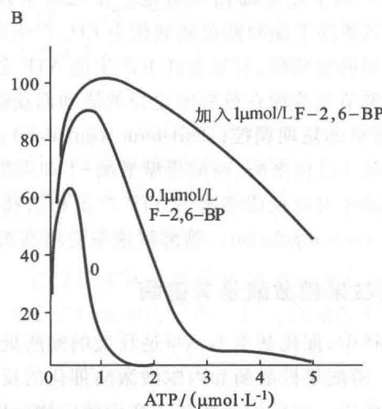  
图 17-16 2,6-二磷酸果糖对磷酸果糖激酶的激活作用  
A. 加入 2,6-二磷酸果糖 1 $\mu$ mol/L 后，底物浓度对酶的活性影响由图中的 S 形变为双曲线形  
B. ATP浓度对酶的抑制效应当加入不同浓度的2,6-二磷酸果糖后受到不同的解除

实质上 2,6-二磷酸果糖是一个变构激活剂（allosteric activator）。它控制磷酸果糖激酶的构象转换，维持构象之间的平衡关系。

2,6-二磷酸果糖的形成是由磷酸果糖激酶-2(phosphofructokinase-2, PFK2)催化6-磷酸果糖，使其在C2位磷酸化而形成的。磷酸果糖激酶-2和磷酸果糖激酶(PFK)是两种不同的酶。它们的催化机制不同。2,6-二磷酸果糖的水解也是由一种特殊的磷酸酶，称为二磷酸果糖磷酸酶-2(fructose bisphosphatase 2, FBPase 2)催化的。水解的产物是6-磷酸果糖。有趣的是，这两种酶，即磷酸果糖激酶-2和二磷酸果糖磷酸酶-2，处于同一条单一的多肽链上，这条多肽链的相对分子质量为55000，也可以说这是一个具有双重功能的酶。

6-磷酸果糖有加速2,6-二磷酸果糖合成的作用，还有抑制该化合物被水解的作用。因此，高的6-磷酸果糖浓度可导致高浓度2,6-二磷酸果糖的形成。2,6-二磷酸果糖又进一步激活磷酸果糖激酶。这种过程称为前馈刺激作用（feedforward stimulation）。

磷酸果糖激酶-2和二磷酸果糖磷酸酶-2的活性由酶分子上一个丝氨酸残基往复地磷酸化所控制(图17-17)。

如图 17-17 所示, 当葡萄糖缺乏时, 血液中的胰高血糖素(glucagon)启动环 AMP(cyclic AMP)的级联效应, 激活 cAMP 依赖的蛋白激酶, 从而引起该双重功能酶的磷酸化。酶的共价修饰使二磷酸果糖磷酸酶-2激活, 同时使磷酸果糖激酶-2受到抑制。结果使 2,6-二磷酸果糖减

  
图 17-17 磷酸果糖激酶-2/二磷酸果糖磷酸酶-2的活性受磷酸化和去磷酸化调节

少，抑制糖酵解。当葡萄糖过剩时，胰岛素激活蛋白磷酸酶的活性，使磷酸基团从酶分子上脱落，激活磷酸果糖激酶-2,2,6-二磷酸果糖的含量于是上升，结果使糖酵解过程加速。这一调控称为协同控制作用（coordinated control）。因激酶和磷酸酶的结构域同处在一条肽链上，使上述协同作用得到加强。

## （三）己糖激酶和丙酮酸激酶对糖酵解的调节作用

己糖激酶催化葡萄糖进入糖酵解途径，是另一个调节酶。为什么磷酸果糖激酶是限速酶而不是己糖激酶？因为6-磷酸葡糖并不是唯一的糖酵解的中间物，6-磷酸葡糖还可以转变为糖原，还可以经五碳糖磷酸途径(pentose phosphate pathway)进行氧化。己糖激酶有四种同工酶（I\~IV），由四个不同的基因编码。肌细胞内的己糖激酶Ⅱ对葡萄糖有高度的亲和性，它在大约0.1 mmol/L时处于半饱和状态。因为葡萄糖从血液（葡萄糖浓度为4\~5 mmol/L）进入肌细胞，葡萄糖的浓度足够饱和己糖激酶Ⅱ。肌肉己糖激酶被它的催化产物6-磷酸葡糖别构抑制。一旦细胞内6-磷酸葡糖的浓度超过正常水平，己糖激酶便暂时可逆地受到抑制，使得6-磷酸葡糖产生和消耗的速度达到平衡。

肝和肌肉中存在不同的己糖激酶同工酶,反映了这些器官在糖代谢中的不同作用:肌肉消耗葡萄糖产生能量,而肝产生并重新分配葡萄糖到其他组织。肝中的己糖激酶Ⅳ也称葡糖激酶(glucokinase),它在三个重要方面不同于肌肉己糖激酶。

首先,葡糖激酶被半饱和的葡萄糖浓度大约为 10 mmol/L,高于血液中的葡萄糖浓度。由于肝细胞中有效的葡萄糖转运蛋白(GLUT2)保持肝细胞与血液中的葡萄糖浓度相近,葡糖激酶的这种性质使其受到血液葡萄糖的直接调控。当血糖浓度升高时,血液中过量的葡萄糖会被运送到肝,由葡糖激酶催化转化为 6-磷酸葡糖。由于葡糖激酶对于 10 mmol/L 葡萄糖处于不饱和状态,它的活性随葡萄糖浓度上升而增加。

其次，葡糖激酶还受到另外一个核蛋白即葡糖激酶调节蛋白（glucokinase regulatory protein）可逆的抑制调节。在高浓度6-磷酸果糖存在的条件下，该核蛋白与葡糖激酶结合并定位于细胞核内，使葡糖激酶与其他定位于胞质内的糖酵解酶隔离开来，糖酵解受到抑制。当食入糖类，血液葡萄糖浓度升高，葡萄糖被GLUT2运送至肝细胞内，由于葡萄糖与6-磷酸果糖竞争结合葡糖激酶调节蛋白，高浓度的葡萄糖使葡糖激酶与调节蛋白发生解离，葡糖激酶从细胞核内转运至胞质，糖酵解被激活。

最后,葡糖激酶并不受反应产物6-磷酸葡糖的抑制,而受6-磷酸果糖的抑制,而6-磷酸果糖是通过果糖磷酸异构酶的作用与6-磷酸葡糖达到平衡。因此,当6-磷酸葡糖的积累引起己糖激酶Ⅰ-Ⅲ被完全抑制时,葡糖激酶仍能够继续发挥作用。

## （四）丙酮酸激酶对糖酵解的调节作用

在脊椎动物中至少发现3种丙酮酸激酶同工酶，它们在组织分布和对调节因子的反应上是下同的。

高浓度的 ATP、乙酰辅酶 A 和长链脂肪酸均能够抑制丙酮酸激酶的活性。丙酮酸激酶催化磷酸烯醇式丙酮酸生成 ATP 和丙酮酸。后者是一个共同的代谢中间物，它可进一步被氧化，或用作结构元件。丙酮酸激酶控制着丙酮酸的外流量。1,6-二磷酸果糖对丙酮酸激酶的激活作用，使糖酵解过程的反应中间物能够顺利地往下一步进行。当能量贮存足够时，ATP 对丙酮酸激酶的变构抑制效应使酵解过程减慢。如果

血液中的葡萄糖水平下降,激起肝中丙酮酸激酶的磷酸化,

使该酶变为不活跃的形式,从而降低了酵解作用的进行,使血糖浓度得以维持正常水平。

如图 17-18 所示, 丙氨酸对丙酮酸激酶的变构抑制效应, 也使酵解过程减慢。丙氨酸是由丙酮酸接受一个氨基形成的, 丙氨酸浓度增加意味着丙酮酸作为丙氨酸的前体过量, 因此丙氨酸对丙酮酸减慢的抑制效应也是维持代谢动态平衡的一种有效措施。肝丙酮酸激酶同工酶是通过磷酸化和去磷酸化转变其活性。其活跃形式是去磷酸化形式, 而磷酸化形式是不活跃形式。当血液中葡萄糖浓度降

  
1,6-二磷酸果糖 ATP 丙氨酸  
图17-18 丙酮酸激酶催化活性控制关系图

低时，胰高血糖素释放，cAMP依赖的蛋白激酶磷酸化肝中的丙酮酸激酶使其失活，从而减慢葡萄糖在肝中作为燃料的使用，节省的葡萄糖被输送至大脑及其他器官。肌肉丙酮酸激酶同工酶不受磷酸化调控。

## （五）5-磷酸木酮糖对糖代谢调节作用

在哺乳动物的肝中,由单磷酸己糖途径产生的5-磷酸木酮糖能够调节糖酵解途径。随着葡萄糖进入肝并转化为6-磷酸葡糖,进入糖酵解和单磷酸己糖途径,导致5-磷酸木酮糖浓度上升。5-磷酸木酮糖激活蛋白磷酸酶PP2A,使双功能酶PFK-2/FBPase-2酶在磷酸化。去磷酸化激活PFK-2,抑制FBPase-2,使2,6-二磷酸果糖浓度增加,激活糖酵解。

## （六）癌组织中糖代谢紊乱

在非癌组织中葡萄糖的摄取和糖酵解的速度比在大多数癌组织中快大约10倍。因为肿瘤细胞最初缺乏广泛的毛细血管网络提供氧气，处于有限的氧气供应状态，所以比正常细胞摄取更多的葡萄糖，转换为丙酮酸并在重新生成NADH时进一步转化成乳酸。糖酵解高速率的原因之一可能是肿瘤细胞中线粒体数目减少，导致线粒体氧化磷酸产生的ATP不足，所需要的ATP从糖酵解途径中获得。另外，一些肿瘤细胞过度表达几种糖酵解酶，包括线粒体己糖激酶的同工酶，它对6-磷酸葡糖的反馈抑制不敏感，这种酶可能垄断线粒体中的ATP，利用它将葡萄糖转化为6-磷酸葡糖，使细胞继续进行后续的糖酵解反应。低氧诱导的转录因子(HIF-1)作用于mRNA合成水平，促进至少八种糖酵解酶的合成，为肿瘤细胞在无氧条件下提供了生存能力。

早在1928年，德国生化学家Otto Warburg第一个发现肿瘤组织中的葡萄糖代谢速率显著高于其他组织。Warburg纯化和结晶了糖酵解途径中的七个酶。在这些研究中，他建立的生物化学实验方法彻底“变革”了氧化代谢的生化研究，如Warburg压力计通过监测气体体积的变化直接检测氧气的消耗量，用于定量测定氧化酶的活性。Otto Warburg是20世纪上半叶最卓越的生物化学家之一，对生物化学的其他研究领域（呼吸作用，光合作用和中间代谢的酶学）也做出了开创性的贡献，并于1931年荣获诺贝尔生理和医学奖。

<!-- EN-BEGIN 14.5 -->

### 【英文对应 14.5】Coordinated Regulation of Glycolysis and Gluconeogenesis

> 来源：Lehninger Principles of Biochemistry（书籍/02_生物化学原理） 第14章 Glycolysis, Gluconeogenesis, and the Pentose Phosphate Pathway，§14.5。对应本章“八、糖酵解作用的调节”。

P5 Glycolysis (the conversion of glucose to pyruvate) and gluconeogenesis (the conversion of pyruvate to glucose) generally do not both occur at the same time in the same tissues. In mammals, gluconeogenesis occurs primarily in the liver, where its role is to provide glucose for export to other tissues when glycogen stores are exhausted and when no dietary glucose is available. Glycolysis occurs in most tissues, including, brain, kidney, muscle and liver. Glycolysis provides ATP to support all of the energy-requiring activities of cells: active transport of ions; synthesis of macromolecules and of their precursors; synthesis of lipids and storage compounds like glycogen; and muscle contraction.

At each of the three points where glycolytic reactions are bypassed by alternative, gluconeogenic reactions (Fig. 14-16), simultaneous operation of both pathways would consume ATP without accomplishing any chemical or biological work. For example, PFK-1 and FBPase-1 catalyze opposing reactions:

ATP + fructose 6-phosphate $\xrightarrow{PFK-1}$

$$
\mathrm{ADP} + \text { fructose   1,6 - bisphosphate }
$$

Fructose 1,6-bisphosphate + $H_{2}O$ $\xrightarrow{FBPase-1}$

$$
\text { fructose   6 - phosphate } + \mathrm{P} _ {\mathrm{i}}
$$

The sum of these two reactions is

$$
\mathrm{ATP} + \mathrm{H} _ {2} \mathrm{O} \longrightarrow \mathrm{ADP} + \mathrm{P} _ {\mathrm{i}} + \mathrm{heat}
$$

that is, hydrolysis of ATP without any useful metabolic work being done. Clearly, if these two reactions were allowed to proceed simultaneously at a high rate in the same cell, a large amount of chemical energy would be dissipated as heat.

We look now in some detail at the mechanisms that regulate glycolysis and gluconeogenesis at the three points where these pathways diverge.

#### [EN] Hexokinase Isozymes Are Affected Differently by Their Product, Glucose 6-Phosphate

Hexokinase, which catalyzes the entry of glucose into the glycolytic pathway, is a regulatory enzyme. As noted in Section 14.1, humans have four isozymes of hexokinase (designated I to IV), encoded by four different genes (Box 14-3). P5 The different hexokinase isozymes of liver and muscle reflect the different roles of these organs in carbohydrate metabolism: muscle consumes glucose, using it for energy production; liver maintains blood glucose homeostasis by consuming or producing glucose, depending on the prevailing blood glucose concentration.

The predominant hexokinase isozyme of myocytes (hexokinase II) has a high affinity for glucose—it is half-saturated at about 0.1 mm. Because glucose entering myocytes from the blood (where the glucose concentration is 4 to 5 mm) produces an intracellular glucose concentration high enough to saturate hexokinase II, the muscle enzyme normally acts at or near its $V_{max}$ . Muscle hexokinase I and hexokinase II are allosterically inhibited by their product, glucose 6-phosphate, so whenever the cellular concentration of glucose 6-phosphate rises above its normal level, these isozymes are temporarily and reversibly inhibited, bringing the rate of glucose 6-phosphate formation into balance with the rate of its utilization and reestablishing the steady state.

The predominant hexokinase isozyme of liver is hexokinase IV (also called glucokinase), which differs in three important respects from hexokinases I, II, and III of muscle. First, the glucose concentration at which hexokinase IV is half-saturated (about 10 mm) is higher than the usual concentration of glucose in the blood. Because an efficient glucose transporter in hepatocytes (GLUT2) rapidly equilibrates the glucose concentrations in cytosol and blood, the high $K_{m}$ of hexokinase IV allows its direct regulation by the blood glucose concentration (Fig. 14-20). When blood glucose is high, as it is after a meal rich in carbohydrates, excess glucose is transported into hepatocytes, where hexokinase IV converts it to glucose 6-phosphate. Because hexokinase IV is not saturated at 10 mm glucose, its activity continues to increase as the glucose concentration rises to 10 mm or more. Under conditions of low blood glucose, the glucose concentration in a hepatocyte is low relative to the $K_{m}$ of hexokinase IV, and the glucose generated by gluconeogenesis leaves the cell before being trapped by phosphorylation.

  
FIGURE 14-20 Comparison of the kinetic properties of hexokinase IV (glucokinase) and hexokinase I. Note the much lower $K_{\mathrm{m}}$ for hexokinase I. When blood glucose rises above 5 mm, hexokinase IV activity increases, but hexokinase I is already operating near $V_{\mathrm{max}}$ and cannot respond to an increase in glucose concentration. Hexokinases I, II, and III have similar kinetic properties.

#### [EN] Isozymes: Different Proteins That Catalyze the Same Reaction

The four forms of hexokinase found in mammalian tissues are but one example of a common biological situation: the same reaction catalyzed by two or more different molecular forms of an enzyme. These multiple forms, called isozymes or isoenzymes, may occur in the same species, in the same tissue, even in the same cell. The different forms (isoforms) of the enzyme generally differ in kinetic or regulatory properties, in the cofactor they use (NADH or NADPH for dehydrogenase isozymes, for example), or in their subcellular distribution (soluble or membrane-bound). Isozymes may have similar, but not identical, amino acid sequences, and in many cases they clearly share a common evolutionary origin.

One of the first enzymes found to have isozymes was lactate dehydrogenase (LDH; p. 526), which in vertebrate tissues exists as at least five different isozymes separable by electrophoresis. All LDH isozymes contain four polypeptide chains (each of $M_r$ 33,500), each type containing a different ratio of two kinds of polypeptides. The M (for muscle) chain and the H (for heart) chain are encoded by two different genes.

In skeletal muscle the predominant isozyme contains four M chains, and in heart the predominant isozyme contains four H chains. Other tissues have some combination of the five possible types of LDH isozymes:

<table><tr><td>Type</td><td>Composition</td><td>Location</td></tr><tr><td> $LDH_1$ </td><td>HHHH</td><td>Heart and erythrocyte</td></tr><tr><td> $LDH_2$ </td><td>HHHM</td><td>Heart and erythrocyte</td></tr><tr><td> $LDH_3$ </td><td>HHMM</td><td>Brain and kidney</td></tr><tr><td> $LDH_4$ </td><td>HMMM</td><td>Skeletal muscle and liver</td></tr><tr><td> $LDH_5$ </td><td>MMMM</td><td>Skeletal muscle and liver</td></tr></table>

Differences in the isozyme content of tissues can be used to assess the timing and extent of heart damage due to myocardial infarction (heart attack). Damage to heart tissue results in the release of heart LDH into the blood. Shortly

Second, hexokinase IV is not inhibited by glucose 6-phosphate, and it can therefore continue to operate when the accumulation of glucose 6-phosphate completely inhibits hexokinases I, II, and III. Third, hexokinase IV is subject to inhibition by the reversible binding of a regulatory protein specific to liver (Fig. 14-21). The binding is much tighter in the presence of the allosteric effector fructose 6-phosphate. Glucose competes with fructose 6-phosphate for binding and causes dissociation of the regulatory protein from the hexokinase, relieving the inhibition. Immediately after a carbohydrate-rich meal, when blood glucose is high, glucose enters the hepatocyte via GLUT2 and activates hexokinase IV by this mechanism. During a fast, when blood glucose drops below $5\mathrm{mm}$ , fructose 6-phosphate triggers the inhibition of hexokinase IV by the regulatory protein, so the after a heart attack, the blood level of total LDH increases, and there is more $LDH_{2}$ than $LDH_{1}$ . After 12 hours the amounts of $LDH_{1}$ and $LDH_{2}$ are very similar, and after 24 hours there is more $LDH_{1}$ than $LDH_{2}$ . This switch in the $[LDH_{1}]/[LDH_{2}]$ ratio, combined with increased concentrations in the blood of another heart enzyme, creatine kinase, is very strong evidence of a recent myocardial infarction.

The different LDH isozymes have significantly different values of $V_{max}$ and $K_{m}$ , particularly for pyruvate. The properties of $LDH_{4}$ favor rapid reduction of very low concentrations of pyruvate to lactate in skeletal muscle, whereas those of isozyme $LDH_{1}$ favor rapid oxidation of lactate to pyruvate in the heart.

In general, the distribution of different isozymes of a given enzyme reflects at least four factors:

1. Different metabolic patterns in different organs. For glycogen phosphorylase, the isozymes in skeletal muscle and liver have different regulatory properties, reflecting the different roles of glycogen breakdown in these two tissues.

2. Different locations and metabolic roles for isozymes in the same cell. The isocitrate dehydrogenase isozymes of the cytosol and the mitochondrion are an example (Chapter 16).

3. Different stages of development in embryonic or fetal tissues and in adult tissues. For example, the fetal liver has a characteristic isozyme distribution of LDH, which changes as the organ develops into its adult form. Some enzymes of glucose catabolism in malignant (cancer) cells occur as their fetal, not adult, isozymes.

4. Different responses of isozymes to allosteric modulators. This difference is useful in fine-tuning metabolic rates. Hexokinase IV (glucokinase) of liver and the hexokinase isozymes of other tissues differ in their sensitivity to inhibition by glucose 6-phosphate.

liver does not compete with other organs for the scarce glucose. The mechanism of inhibition by the regulatory protein is interesting: the protein anchors hexokinase IV inside the nucleus, where it is segregated from the other enzymes of glycolysis in the cytosol. When the glucose concentration in the cytosol rises, it equilibrates with glucose in the nucleus by transport through the nuclear pores. Glucose causes dissociation of the regulatory protein, and hexokinase IV enters the cytosol and begins to phosphorylate glucose.

Hexokinase IV is also regulated at the level of protein synthesis. Circumstances that call for greater energy production (low [ATP], high [AMP], vigorous muscle contraction) or for greater glucose consumption (high blood [glucose], for example) cause increased transcription of the hexokinase IV gene. Glucose 6-phosphatase,

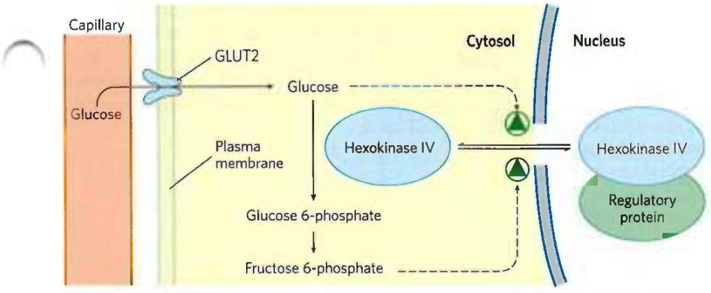

FIGURE 14-21 Regulation of hexokinase IV (glucokinase) by sequestration in the nucleus. The protein inhibitor of hexokinase IV is a nuclear binding protein that draws hexokinase IV into the nucleus when the fructose 6-phosphate concentration in liver is high and releases it to the cytosol when the glucose concentration is high.

the gluconeogenic enzyme that bypasses the hexokinase step of glycolysis, is transcriptionally regulated by factors that call for increased production of glucose (low blood glucose, glucagon signaling). The transcriptional regulation of these two enzymes (along with other enzymes of glycolysis and gluconeogenesis) is described below.

#### [EN] Phosphofructokinase-1 and Fructose 1,6-Bisphosphatase Are Reciprocally Regulated

Glucose 6-phosphate can flow either into glycolysis or through any of several other pathways, including glycogen synthesis and the pentose phosphate pathway. The metabolically irreversible reaction catalyzed by PFK-1 is the step that commits glucose to glycolysis. In addition to its substrate-binding sites, this complex enzyme has several regulatory sites at which allosteric activators or inhibitors bind.

ATP is not only a substrate for PFK-1 but also an end product of the glycolytic pathway. When high cellular [ATP] signals that ATP is being produced faster than it is being consumed, ATP inhibits PFK-1 by binding to an allosteric site and lowering the affinity of the enzyme for its substrate fructose 6-phosphate (Fig. 14-22). ADP and AMP, which increase in concentration as consumption of ATP outpaces production, act allosterically to relieve this inhibition by ATP. These effects combine to produce higher enzyme activity when ADP or AMP accumulates and lower activity when ATP accumulates.

FIGURE 14-22 Phosphofructokinase-1 (PFK-1) and its regulation. (a) Surface contour image of E. coli PFK-1, showing portions of its four identical subunits. Each subunit has its own catalytic site, where the products ADP and fructose 1,6-bisphosphate (red and yellow stick structures, respectively) are almost in contact, and its own binding sites for the allosteric regulator ATP, buried in the protein in the positions indicated. (b) Allosteric regulation of muscle PFK-1 by ATP, shown by a substrate-activity curve. At low [ATP], the $K_{0.5}$ for fructose 6-phosphate is relatively low, enabling the enzyme to function at a high rate at relatively low [fructose 6-phosphate]. (Recall from Chapter 6 that $K_{0.5}$ is the $K_{m}$ term for regulatory enzymes; when $K_{0.5}$ is larger, the binding is weaker.) When [ATP] is high, $K_{0.5}$ for fructose 6-phosphate is greatly increased, as indicated by the sigmoid relationship between substrate concentration and enzyme activity. (c) Summary of the regulators affecting PFK-1 activity. [(a) Data from PDB ID 1PFK, Y. Shirakihara and P. R. Evans, J. Mol. Biol. 204:973, 1988.]

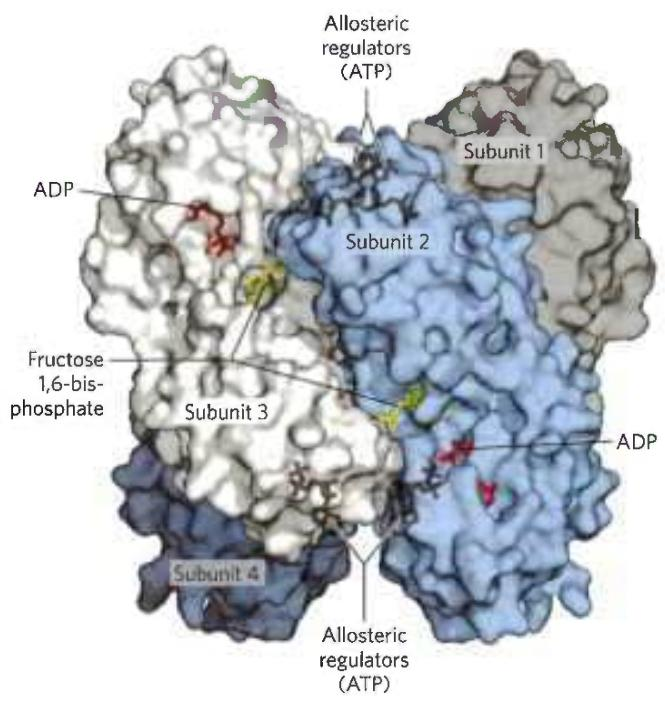  
(a)

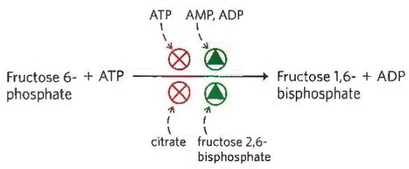  
(c)

Citrate (the ionized form of citric acid), a key intermediate in the aerobic oxidation of pyruvate, fatty acids, and amino acids, is also an allosteric regulator of PFK-1. High citrate concentration increases the inhibitory effect of ATP, further reducing the flow of glucose through glycolysis. In this case, as in several others encountered later, citrate serves as an intracellular signal that the cell is meeting its current needs for energy-yielding metabolism by the oxidation of fats and proteins.

The corresponding step in gluconeogenesis is the conversion of fructose 1,6-bisphosphate to fructose 6-phosphate (Fig. 14-23). The enzyme that catalyzes this reaction, FBPase-1, is strongly inhibited (allosterically) by AMP; when the cell's supply of ATP is low (corresponding to high [AMP]), the ATP-requiring synthesis of glucose slows.

Thus, these opposing steps in the glycolytic and gluconeogenic pathways—those catalyzed by PFK-1 and FBPase-1—are regulated in a coordinated and reciprocal manner. In general, when sufficient concentrations of acetyl-CoA or citrate (the product of acetyl-CoA condensation with oxaloacetate) are present, or when a high proportion of the cell's adenylate is in the form of ATP, gluconeogenesis is favored. When the concentration of AMP increases, it promotes glycolysis by stimulating PFK-1 (and, as we shall see in Section 15.3, promotes glycogen degradation by activating glycogen phosphorylase).

#### [EN] Fructose 2,6-Bisphosphate Is a Potent Allosteric Regulator of PFK-1 and FBPase-1

The special role of the liver in maintaining a constant blood glucose level requires additional regulatory mechanisms to coordinate glucose production and consumption. When the blood glucose level decreases, the hormone glucagon signals the liver to produce and release more glucose and to stop consuming it for its own needs. One source of glucose is glycogen stored in the liver; another source is gluconeogenesis, using pyruvate, lactate, glycerol, or certain amino acids as starting material. When blood glucose is high, insulin signals the liver to use glucose as a fuel and as a precursor for the synthesis and storage of glycogen and triacylglycerol.

  
FIGURE 14-23 Regulation of phosphofructokinase-1 (PFK-1) and fructose 1,6-bisphosphatase (FBPase-1).

P5 The rapid hormonal regulation of glycolysis and gluconeogenesis is mediated by fructose 2,6-bisphosphate, an allosteric effector for the enzymes PFK-1 and FBPase-1:

  
Fructose 2,6-bisphosphate

When fructose 2,6-bisphosphate binds to its allosteric site on PFK-1, it increases the enzyme's affinity for its substrate fructose 6-phosphate (Fig. 14-24a) and reduces its affinity for the allosteric inhibitors ATP and citrate. At the physiological concentrations of its substrates, ATP and fructose 6-phosphate, and of its other positive and negative effectors (ATP, AMP, citrate), PFK-1 is virtually inactive in the absence of fructose 2,6-bisphosphate. Fructose 2,6-bisphosphate has the opposite effect on FBPase-1: it reduces its affinity for its substrate (Fig. 14-24b), thereby slowing gluconeogenesis.

The cellular concentration of the allosteric regulator fructose 2,6-bisphosphate is set by the relative rates of its formation and breakdown (Fig. 14-25a). It is formed by phosphorylation of fructose 6-phosphate, catalyzed by phosphofructokinase-2 (PFK-2), and broken down by fructose 2,6-bisphosphatase (FBPase-2). (Note that these enzymes are distinct from PFK-1 and FBPase-1, which catalyze the formation and breakdown, respectively, of fructose 1,6-bisphosphate.) PFK-2 and FBPase-2 are two separate enzymatic activities of a single, bifunctional protein. The balance of these two activities in the liver, which determines the cellular level of fructose 2,6-bisphosphate, is set by glucagon and insulin (Fig. 14-25b).

As we saw in Chapter 12, glucagon stimulates the adenylyl cyclase of liver to synthesize 3',5'-cyclic AMP (cAMP) from ATP. Cyclic AMP then activates cAMP-dependent protein kinase, which transfers a phosphoryl group from ATP to the bifunctional protein PFK-2/FBPase-2. Phosphorylation of this protein enhances its FBPase-2 activity and inhibits its PFK-2 activity. Glucagon thereby lowers the cellular level of fructose 2,6-bisphosphate, inhibiting glycolysis and stimulating gluconeogenesis. The resulting production of more glucose enables the liver to replenish blood glucose in response to glucagon. Insulin has the opposite effect, stimulating the activity of a phosphoprotein phosphatase that catalyzes removal of the phosphoryl group from the bifunctional protein PFK-2/FBPase-2, activating its PFK-2 activity, increasing the level of fructose 2,6-bisphosphate, stimulating glycolysis, and inhibiting gluconeogenesis.

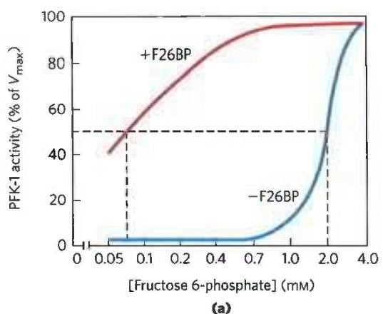

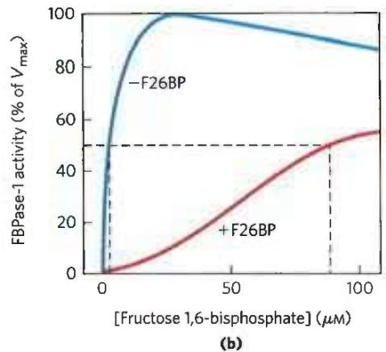

  
FIGURE 14-24 Role of fructose 2,6-bisphosphate in regulation of glycolysis and gluconeogenesis. Fructose 2,6-bisphosphate (F26BP) has opposite effects on the enzymatic activities of phosphofructokinase-1 (PFK-1, a glycolytic enzyme) and fructose 1,6-bisphosphatase (FBPase-1, a gluconeogenic enzyme). (a) PFK-1 activity in the absence of F26BP (blue curve) is half-maximal when the concentration of fructose 6-phosphate is $2\mathrm{mm}$ (that is, $K_{0.5} = 2\mathrm{mm}$ ). When $0.13\mu \mathrm{M}$ F26BP is present (red curve), the $K_{0.5}$ for fructose  
6-phosphate is only 0.08 mm. Thus F26BP activates PFK-1 by increasing its apparent affinity for fructose 6-phosphate (see Fig. 14-23b). (b) FBPase-1 activity is inhibited by as little as 1 $\mu$ M F26BP and is strongly inhibited by 25 $\mu$ M. In the absence of this inhibitor (blue curve), the $K_{0.5}$ for fructose 1,6-bisphosphate is 5 $\mu$ M, but in the presence of 25 $\mu$ M F26BP (red curve), the $K_{0.5}$ is >70 $\mu$ M. Fructose 2,6-bisphosphate also makes FBPase-1 more sensitive to inhibition by another allosteric regulator, AMP. (c) Summary of regulation by F26BP.

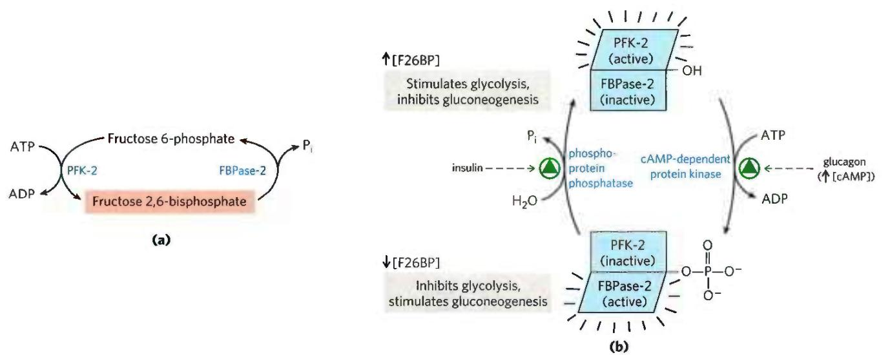  
FIGURE 14-25 Regulation of fructose 2,6-bisphosphate level. (a) The cellular concentration of the regulator fructose 2,6-bisphosphate (F26BP) is determined by the rates of its synthesis by phosphofructokinase-2  
(PFK-2) and its breakdown by fructose 2,6-bisphosphatase (FBPase-2). (b) Both enzyme activities are part of the same polypeptide chain, and they are reciprocally regulated by insulin and glucagon.

#### [EN] Xylulose 5-Phosphate Is a Key Regulator of Carbohydrate and Fat Metabolism

Another regulatory mechanism also acts by controlling the level of fructose 2,6-bisphosphate. In the mammalian liver, xylulose 5-phosphate, a product of the pentose phosphate pathway, mediates the increase in glycolysis that follows ingestion of a high-carbohydrate meal. The xylulose 5-phosphate concentration rises as glucose entering the liver is converted to glucose 6-phosphate and enters both the glycolytic and pentose phosphate pathways. Xylulose 5-phosphate activates phosphoprotein phosphatase 2A, which dephosphorylates the bifunctional PFK-2/FBPase-2 enzyme (Fig. 14-25). Dephosphorylation activates PFK-2 and inhibits FBPase-2, and the resulting rise in fructose 2,6-bisphosphate concentration stimulates glycolysis and inhibits gluconeogenesis. The increased glycolysis boosts the production of acetyl-CoA, while the increased flow of hexose through the pentose phosphate pathway generates NADPH. Acetyl-CoA and NADPH are the starting materials for fatty acid synthesis, which increases dramatically in response to intake of a high-carbohydrate meal. Xylulose 5-phosphate also increases the synthesis of all the enzymes required for fatty acid synthesis, as we shall see (Fig. 14-28).

#### [EN] The Glycolytic Enzyme Pyruvate Kinase Is Allosterically Inhibited by ATP

At least three isozymes of pyruvate kinase are found in vertebrates, differing in their tissue distribution and their response to modulators. High concentrations of ATP, acetyl-CoA, and long-chain fatty acids (signs of abundant energy supply) allosterically inhibit all isozymes of pyruvate kinase (Fig. 14-26). The liver isozyme (L form), but not the muscle isozyme (M form), is subject to further regulation by phosphorylation. When low blood glucose causes glucagon release, cAMP-dependent protein kinase phosphorylates the L isozyme of pyruvate kinase, inactivating it. This slows the use of glucose as a fuel in liver, sparing it for export to the brain and other organs. In muscle, the effect of increased [cAMP] is quite different. In response to epinephrine, cAMP activates glycogen breakdown and glycolysis and provides the fuel needed for the fight-or-flight response.

#### [EN] Conversion of Pyruvate to Phosphoenolpyruvate Is Stimulated When Fatty Acids Are Available

P5 In the pathway leading from pyruvate to glucose, the first control point determines the fate of pyruvate in the mitochondrion: its conversion either to acetyl-CoA (by the pyruvate dehydrogenase complex) to fuel the citric acid cycle (Chapter 16) or to oxaloacetate (by pyruvate carboxylase) to start the process of gluconeogenesis (Fig. 14-27). When fatty acids are readily available as fuels, their breakdown in liver mitochondria yields acetyl-CoA, a signal that further oxidation of glucose for fuel is not necessary. Acetyl-CoA is a positive allosteric modulator of pyruvate carboxylase and a negative modulator of pyruvate dehydrogenase, through stimulation of a protein kinase that inactivates the dehydrogenase. When the cell's energy needs are being met, oxidative phosphorylation slows, [NADH] rises relative to $\left[\mathrm{NAD}^{+}\right]$ and inhibits the citric acid cycle, and acetyl-CoA accumulates. The increased concentration of acetyl-CoA inhibits the pyruvate dehydrogenase complex, slowing the formation of acetyl-CoA from pyruvate, and stimulates gluconeogenesis by activating pyruvate carboxylase, allowing conversion of excess pyruvate to oxaloacetate (and, eventually, glucose).

Oxaloacetate formed in this way is converted to phosphoenolpyruvate (PEP) in the reaction catalyzed by PEP carboxykinase (Fig. 14-16). In mammals, the regulation of this key enzyme occurs primarily at the level of its synthesis and breakdown, in response to dietary

  
FIGURE 14-26 Regulation of pyruvate kinase. The enzyme is allosterically inhibited by ATP, acetyl-CoA, and long-chain fatty acids (all signs of an abundant energy supply), and the accumulation of fructose 1,6-bisphosphate triggers its activation. Accumulation of alanine, which can be synthesized from pyruvate in one step, allosterically inhibits pyruvate kinase, slowing the production of pyruvate by glycolysis. The liver isozyme (L form) is also regulated

hormonally. Glucagon activates cAMP-dependent protein kinase (PKA; see Fig. 15-12), which phosphorylates the pyruvate kinase L isozyme, inactivating it. When the glucagon level drops, a protein phosphatase (PP) dephosphorylates pyruvate kinase, activating it. This mechanism prevents the liver from consuming glucose by glycolysis when blood glucose is low; instead, the liver exports glucose. The muscle isozyme (M form) is not affected by this phosphorylation mechanism.  

  
FIGURE 14-27 Two alternative fates for pyruvate. Pyruvate can be converted to glucose and glycogen via gluconeogenesis or oxidized to acetyl-CoA for energy production. The first enzyme in each path is regulated allosterically; acetyl-CoA, produced either by fatty acid oxidation or by the pyruvate dehydrogenase complex, stimulates pyruvate carboxylase and inhibits pyruvate dehydrogenase.

and hormonal signals. Fasting or high glucagon levels act through cAMP to increase the rate of transcription and to stabilize the mRNA. Insulin, or high blood [glucose], has the opposite effects. We discuss this transcriptional regulation in more detail below. Generally triggered by a signal from outside the cell, these changes take place on a time scale of minutes to days.

#### [EN] Transcriptional Regulation Changes the Number of Enzyme Molecules

Most of the regulatory actions discussed thus far are mediated by fast, reversible mechanisms to change the activity of existing enzyme molecules: allosteric effects, covalent alteration (phosphorylation) of the enzyme, or binding of a regulatory protein. Another set of regulatory processes involves changes in the number of molecules of an enzyme in the cell, through changes in the balance of enzyme synthesis and breakdown. Our discussion now turns briefly to regulation of transcription through signal-activated transcription factors. Transcriptional control is discussed in more detail in Chapter 28.

In Chapter 12 we encountered nuclear receptors and transcription factors in the context of insulin signaling. Insulin acts through its receptor in the plasma membrane to turn on at least two distinct signaling pathways, each involving activation of a protein kinase (MAP kinase and protein kinase B). The kinases phosphorylate transcription factors, which then act in the nucleus to stimulate the synthesis of enzymes needed for cell growth and division. More than 150 genes are transcriptionally regulated by insulin, many of which encode proteins we have described here (Table 14-5).

P5 One transcription factor important to carbohydrate metabolism is ChREBP (carbohydrate response element binding protein; Fig. 14-28), which is expressed primarily in liver, adipose tissue, and kidney. It coordinates the synthesis of enzymes needed for carbohydrate and fat synthesis. ChREBP in its phosphorylated form is inactive and is located in the cytosol. When the phosphoprotein phosphatase PP2A removes a phosphoryl group from ChREBP, the transcription factor can enter the nucleus. Here, nuclear PP2A removes

<table><tr><td colspan="2">TABLE 14-5 Some of the Many Genes Regulated by Insulin</td></tr><tr><td>Change in gene expression</td><td>Role in glucose metabolism</td></tr><tr><td>Increased expression</td><td></td></tr><tr><td>Hexokinase II</td><td></td></tr><tr><td>Hexokinase IV</td><td rowspan="4">Essential for glycolysis, which consumes glucose for energy</td></tr><tr><td>Phosphofructokinase-1 (PFK-1)</td></tr><tr><td>PFK-2/FBPase-2</td></tr><tr><td>Pyruvate kinase</td></tr><tr><td>Glucose 6-phosphate dehydrogenase</td><td rowspan="3">Produce NADPH, which is essential for conversion of glucose to lipids</td></tr><tr><td>6-Phosphogluconate dehydrogenase</td></tr><tr><td>Malic enzyme</td></tr><tr><td>ATP-citrate lyase</td><td rowspan="2">Produce acetyl-CoA, which is essential for conversion of glucose to lipids</td></tr><tr><td>Pyruvate dehydrogenase</td></tr><tr><td>Acetyl-CoA carboxylase</td><td></td></tr><tr><td>Fatty acid synthase complex</td><td rowspan="3">Essential for conversion of glucose to lipids</td></tr><tr><td>Stearoyl-CoA dehydrogenase</td></tr><tr><td>Acyl-CoA-glycerol transferases</td></tr><tr><td>Decreased expression</td><td></td></tr><tr><td>PEP carboxykinase</td><td rowspan="2">Essential for glucose production by gluconeogenesis</td></tr><tr><td>Glucose 6-phosphatase (catalytic subunit)</td></tr></table>

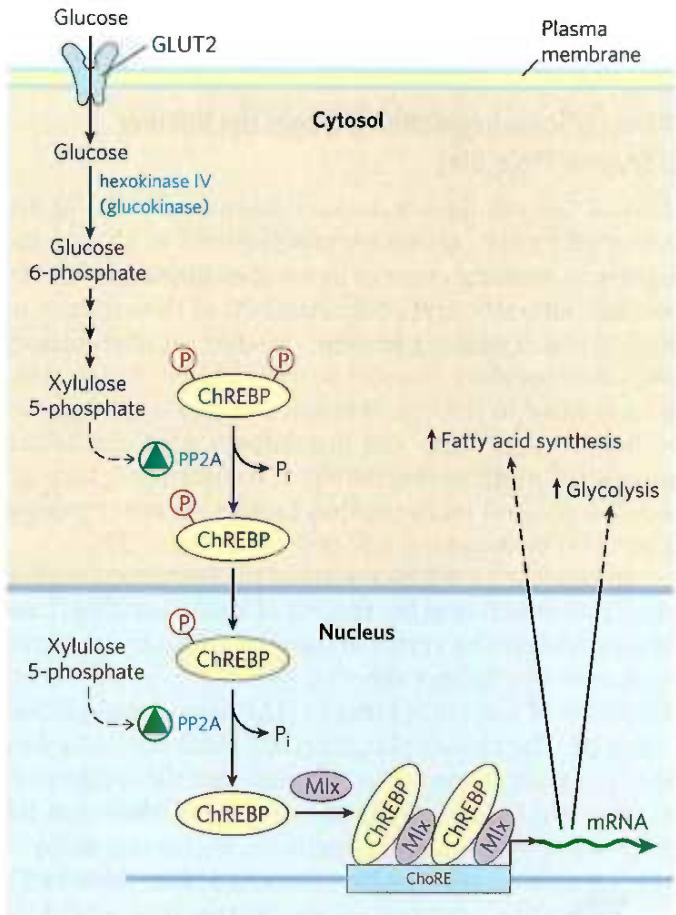  
FIGURE 14-28 Mechanism of gene regulation by the transcription factor ChREBP. When ChREBP in the cytosol of a hepatocyte is phosphorylated on a Ser residue and a Thr residue, it cannot enter the nucleus. Dephosphorylation of Ⓟ—Ser by protein phosphatase PP2A allows ChREBP to enter the nucleus, where a second dephosphorylation, of Ⓟ—Thr, activates ChREBP so that it can associate with its partner protein, Mlx. ChREBP-Mlx now binds to the carbohydrate response element (ChoRE) in the promoter and stimulates transcription. PP2A is allosterically activated by xylulose 5-phosphate, an intermediate in the pentose phosphate pathway.

another phosphoryl group, and ChREBP now joins with a partner protein, Mlx, and turns on the synthesis of several enzymes: pyruvate kinase; fatty acid synthase; and acetyl-CoA carboxylase, the first enzyme in the path to fatty acid synthesis.

Controlling the activity of PP2A—and thus, ultimately, the synthesis of this group of metabolic enzymes—is xylulose 5-phosphate, an intermediate of the pentose phosphate pathway (see Fig. 14-31). When blood glucose concentration is high, glucose enters the liver and is phosphorylated by hexokinase IV. The glucose 6-phosphate thus formed can enter either the glycolytic pathway or the pentose phosphate pathway. If the latter, two initial oxidations produce xylulose 5-phosphate, which serves as a signal that the glucose-utilizing pathways are well-supplied with substrate. It accomplishes this by allosterically activating PP2A, which then dephosphorylates ChREBP, allowing the transcription factor to turn on the expression of genes for enzymes of glycolysis and fat synthesis (Fig. 14-28).

#### [EN] SUMMARY 14.5 Coordinated Regulation of Glycolysis and Gluconeogenesis

■ Glycolysis and gluconeogenesis are reciprocally regulated to prevent wasteful operation of both pathways at the same time.

■ Hexokinase IV (glucokinase) has kinetic properties related to its special role in the liver: releasing glucose to the blood when blood [glucose] is low; taking up and metabolizing glucose when blood [glucose] is high. Hexokinases I, II, and III are all inhibited by their product, glucose 6-phosphate.

■ PFK-1 is allosterically inhibited by high [ATP]; low [AMP] inhibits FBPase-1. High [ATP] therefore slows glycolysis and speeds gluconeogenesis.

■ Reciprocal allosteric control of glycolysis and gluconeogenesis is mainly achieved by the opposing effects of fructose 2,6-bisphosphate on PFK-1 and FBPase-1. Fructose 2,6-bisphosphate formation is stimulated, indirectly, by insulin, and inhibited by epinephrine.

Xylulose 5-phosphate, an intermediate of the pentose phosphate pathway, activates phosphoprotein phosphatase PP2A. Activated PP2A tips the balance toward glucose uptake, glycogen synthesis, and lipid synthesis in the liver.

Pyruvate kinase is allosterically inhibited by ATP, and the liver isozyme also is inhibited by cAMP-dependent phosphorylation. When [ATP] is high, glycolysis is slowed.

■ When fatty acids are readily available as fuels, their breakdown in liver mitochondria yields acetyl-CoA, a signal that further oxidation of glucose for fuel is not necessary. Acetyl-CoA activates pyruvate carboxylase, thus favoring gluconeogenesis.

■ Transcription factors such as ChREBP act in the nucleus to regulate the expression of specific genes coding for enzymes of the glycolytic and gluconeogenic pathways.

<!-- EN-END 14.5 -->

## 九、其他六碳糖进入糖酵解途径

淀粉和糖原经消化后都转变为葡萄糖进入糖酵解途径。由蔗糖水解产生的果糖，由乳糖水解产生的半乳糖，由糖蛋白等多糖经消化产生的甘露糖都是通过转变成糖酵解途径的中间产物而进入酵解途径。

## (一) 果糖

在肌肉中,果糖由己糖激酶催化磷酸化形成6-磷酸果糖。

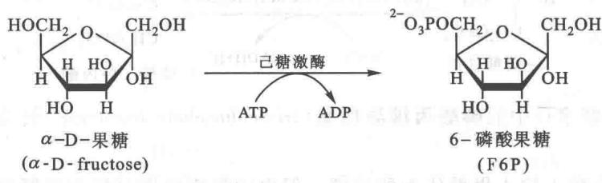

在肝中,因只含有葡糖激酶,此酶只催化葡萄糖的磷酸化,所以果糖在肝中进入糖酵解途径不能像在肌肉中那么简单,需经过6种酶的催化,其转变过程如下。

（1）果糖由果糖激酶（fructokinase）催化，在 C1 位磷酸化，消耗 1 个 ATP 分子，形成 1-磷酸果糖（fructose-1-phosphate）。

## (2) 1-磷酸果糖进行醇、醛裂解形成磷酸二羟丙酮和甘油醛

前面已经提到,醛缩酶有不同类型。肌肉中为 A 型,只对 1,6-二磷酸果糖起作用;肝中为 B 型,也可利用 1-磷酸果糖作为底物。因此 B 型醛缩酶有时也称为 1-磷酸果糖醛缩酶。它催化如下的反应:

  
开链式1-磷酸果糖
(open chain fructose-1-phosphate)

（3）甘油醛在甘油醛激酶(glyceraldehyde kinase)催化下，消耗1分子ATP，形成3-磷酸甘油醛。反应如下：

(4) 甘油醛还可在醇脱氢酶(alcohol dehydrogenase)催化下,由 NADH 还原形成甘油,反应如下:

（5）甘油在甘油激酶(glycerol kinase)的催化下，消耗1分子ATP，转变为3-磷酸甘油(glycerol-3-phosphate):

（6）3-磷酸甘油在甘油磷酸脱氢酶(glycerol phosphate dehydrogenase)催化下，由 $NAD^{+}$ 氧化，形成磷酸二羟丙酮，反应如下：

磷酸二羟丙酮经酵解途径中的磷酸丙糖异构酶(triosephosphate isomerase)转变为3-磷酸甘油醛，从而进入糖酵解途径。

临床上,过去认为给病人输入果糖优于葡萄糖。但血中果糖浓度过高超出肝中醛缩酶 B 的正常功能范围,引起 1-磷酸果糖积累,造成肝中无机磷酸的大量消耗以致耗竭,进而使 ATP 浓度下降,于是糖酵解过程加速产生大量乳酸。血中乳酸浓度过高,甚至达到危及生命的地步。

有一种遗传病,称为果糖不耐症(fructose intolerance),是由于肝中缺乏B型醛缩酶。食人的果糖不能被正常代谢,也造成1-磷酸果糖积累引起一系列和临床输入果糖同样的症状。这种病人对任何甜味都失去感觉。

## （二）半乳糖

## 1. 半乳糖(galactose)转变为能进入糖酵解途径的中间产物,包括5个步骤

（1）半乳糖由半乳糖激酶(galactokinase)催化其第一个碳原子C1磷酸化,形成1-磷酸半乳糖(galactose-1-phosphate),也需要消耗1分子ATP。

（2）1-磷酸半乳糖形成 UDP-半乳糖（尿苷二磷酸-半乳糖，uridine diphosphate-galactose）。催化此反应的酶称为尿苷酰转移酶（uridylyl transferase）。它催化尿苷酰基团从 UDP-葡萄糖分子在焦磷酸键处断裂转移到 1-磷酸半乳糖的磷酸基团上。反应如下：

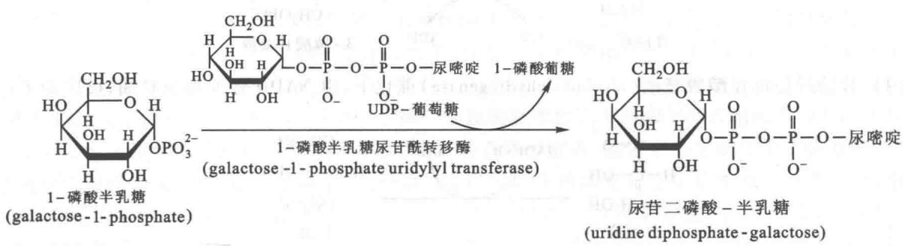

（3）UDP-半乳糖转化为 UDP-葡萄糖。催化此反应的酶称为 UDP-半乳糖 4-差向异构酶（UDP-galactose-4-epimerase）。此酶以 NAD $^{+}$ 为辅酶。在转变中需经过氧化还原过程。反应如下。

（4）UDP-葡萄糖转变为1-磷酸葡糖。催化此反应的酶为 UDP-葡糖焦磷酸化酶（UDP-glucose pyrophosphorylase）。反应式如下：

（5）1-磷酸葡糖由磷酸葡糖变位酶（phosphoglucomutase）转变为糖酵解过程的中间产物6-磷酸葡糖。反应式如下：

## 2. 半乳糖血症

半乳糖血症(galactosemia)是一种遗传病。这种患者体内不能将半乳糖转化为葡萄糖。原因是缺乏1-磷酸半乳糖尿苷酰转移酶，不能使1-磷酸半乳糖转变为UDP-半乳糖。结果使血中半乳糖积累，进一步造成眼睛晶状体半乳糖含量升高。并还原为半乳糖醇(galactitol)，它的结构如下：

晶状体内的半乳糖醇最后造成晶状体混浊引起白内障。

半乳糖血症严重的引起生长停滞，智力迟钝，还往往引起肝损伤而致死亡。

治疗措施主要是食用不含半乳糖的饮食。体内合成糖蛋白和糖脂所需的半乳糖，可能在体内由葡萄糖经差向异构酶催化转变成为半乳糖供给合成的需要。因此机体可不摄入半乳糖。

## （三）甘露糖

甘露糖进入糖酵解途径是经过两步反应转变为6-磷酸果糖。反应如下：

(1) 甘露糖由己糖激酶催化转变为 6-磷酸甘露糖。

（2）6-磷酸甘露糖由磷酸甘露糖异构酶(phosphomannose isomerase)催化转变为6-磷酸果糖(F6P)，其催化机制和磷酸葡糖异构酶相似。

<!-- EN-BEGIN 14.2 -->

### 【英文对应 14.2】Feeder Pathways for Glycolysis

> 来源：Lehninger Principles of Biochemistry（书籍/02_生物化学原理） 第14章 Glycolysis, Gluconeogenesis, and the Pentose Phosphate Pathway，§14.2。对应本章“九、其他六碳糖进入糖酵解途径”。

Many carbohydrates besides glucose meet their catabolic fate in glycolysis, after being transformed into one of the glycolytic intermediates. The most significant are the storage polysaccharides glycogen and starch, either within cells (endogenous) or obtained in the diet; the disaccharides maltose, lactose, and sucrose; and the monosaccharides fructose, mannose, and galactose (Fig. 14-9).

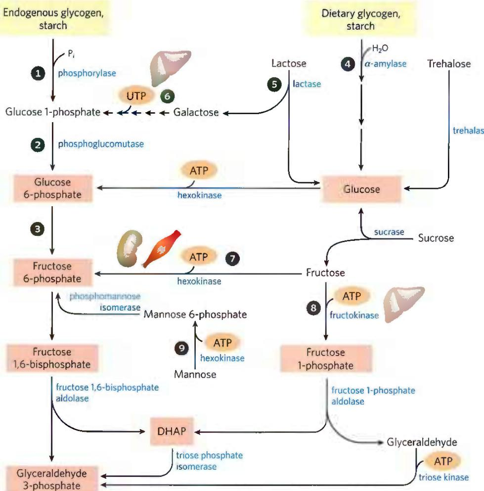  
FIGURE 14-9 Entry of dietary glycogen, starch, disaccharides, and hexoses into the preparatory stage of glycolysis. The numbered steps are described in the text.

#### [EN] Endogenous Glycogen and Starch Are Degraded by Phosphorolysis

P2 Glycogen stored in animal tissues (primarily liver and skeletal muscle) and in microorganisms is mobilized for use within the same cell by a phosphorolytic reaction (1 in Fig. 14-9) catalyzed by glycogen phosphorylase. The product of this reaction is not free glucose, but glucose 1-phosphate. We discuss glycogen metabolism in more detail in Chapter 15. In plant tissues, starch is mobilized by a similar phosphorolytic reaction catalyzed by starch phosphorylase.

Glucose 1-phosphate produced by glycogen phosphorylase is converted to glucose 6-phosphate by phosphoglucomutase 2, which catalyzes the reversible reaction

#### [EN] Glucose 1-phosphate $\rightleftharpoons$ glucose 6-phosphate

Phosphoglucomutase employs essentially the same mechanism as phosphoglycerate mutase (Fig. 14-8): both entail a bisphosphate intermediate, and the enzyme is transiently phosphorylated in each catalytic cycle. The general name mutase is given to enzymes that catalyze the transfer of a functional group from one position to another in the same molecule. Mutases are a subclass of isomerases, enzymes that interconvert stereoisomers or structural or positional isomers (see Table 6-3). The glucose 6-phosphate formed in the phosphoglucomutase reaction can continue through glycolysis ③ or enter another pathway such as the pentose phosphate pathway, described in Section 14.6.

#### [EN] WORKED EXAMPLE 14-1 Energy Savings for Glycogen Breakdown by Phosphorolysis

Calculate the energy savings (in ATP molecules per glucose monomer) achieved by breaking down glycogen by phosphorolysis rather than hydrolysis to begin the process of glycolysis.

SOLUTION: Phosphorolysis produces a phosphorylated glucose (glucose 1-phosphate), which is then converted to glucose 6-phosphate — without expenditure of the cellular energy (1 ATP) needed for formation of glucose 6-phosphate from free glucose. Thus only 1 ATP is consumed per glucose monomer in the preparatory phase, compared with 2 ATP when glycolysis starts with free glucose. The cell therefore gains 3 ATP per glucose monomer (4 ATP produced in the payoff phase minus 1 ATP used in the preparatory phase), rather than 2 — a savings of 1 ATP per glucose monomer.

#### [EN] Dietary Polysaccharides and Disaccharides Undergo Hydrolysis to Monosaccharides

For most humans, starch is the major source of carbohydrates in the diet (4), Fig. 14-9). Dietary starch has essentially the same structure as glycogen, and its digestion proceeds by the same pathway. Digestion begins in the mouth, where salivary $\alpha$ -amylase hydrolyzes the internal ( $\alpha$ 1→4) glycosidic linkages of starch and glycogen, producing di- and trisaccharides. These are produced by hydrolysis reactions, in which water, not $P_{i}$ , is the attacking species. In the stomach, salivary $\alpha$ -amylase is inactivated by the low pH, but a second form of $\alpha$ -amylase, secreted by the pancreas into the small intestine, continues the digestion process.

Pancreatic $\alpha$ -amylase release into the small intestine yields mainly maltose and maltotriose (the di- and trisaccharides of glucose) and oligosaccharides called limit dextrins, fragments of amylopectin containing ( $\alpha1\rightarrow6$ ) branch points, which are removed by limit dextrinases. Disaccharides are hydrolyzed by a family of membrane-bound hydrolases in the intestinal brush border:

$$
\mathrm{Dextrin} + n \mathrm{H} _ {2} \mathrm{O} \xrightarrow [ \text {dextrinase} ]{} n \text {glucose}
$$

$$
\mathrm{Maltose} + \mathrm{H} _ {2} \mathrm{O} \xrightarrow [ \text {maltase} ]{} 2 \mathrm{glucose}
$$

$$
\mathrm{Lactose} + \mathrm{H} _ {2} \mathrm{O} \xrightarrow [ \text {lactose} ]{} \mathrm{galactose} + \mathrm{glucose}
$$

$$
\mathrm{Sucrose} + \mathrm{H} _ {2} \mathrm{O} \xrightarrow [ \text {   sucrase   } ]{} \text {   fructose   } + \text {   glucose   }
$$

$$
\mathrm{Trehalose} + \mathrm{H} _ {2} \mathrm{O} \xrightarrow [ \text {trehalase} ]{} 2 \mathrm{glucose}
$$

Only monosaccharides are taken up from the intestine. They are actively transported into the intestinal epithelial cells (see Fig. 11-42), then passed into the blood to be carried to various tissues, where they are catabolized via glycolysis.

As we noted in Chapter 7, most animals cannot digest cellulose for lack of the enzyme cellulase, which attacks the (β1→4) glycosidic bonds of cellulose. In ruminant animals, the extended stomach includes a chamber in which symbiotic microorganisms that produce cellulase break down cellulose into glucose molecules. These microorganisms use the resulting glucose in an anaerobic fermentation that produces large quantities of propionate. This propionate, after conversion to succinate (see Fig. 17-12), serves as the starting material for gluconeogenesis, which produces much of the lactose in milk.

Lactose Digestion and Lactose Intolerance The defining feature of mammals is, of course, mammary glands, which produce the disaccharide lactose for the nourishment of infants. The enzyme lactase converts lactose to glucose and galactose (5, Fig. 14-9), both of which are taken up from the small intestine and metabolized in the tissues by glycolysis. As infants are weaned, their lactase levels diminish, and lactase is absent in most adults—except in certain populations. About one in three adults in northern Europe and in some parts of Africa shows the lactase persistence phenotype. They continue to produce lactase and thus are able to digest milk into adulthood. The other two-thirds experience lactose intolerance due to the disappearance after childhood of most or all of the lactase activity of the intestinal epithelial cells. Without intestinal lactase, lactose cannot be completely digested and absorbed in the small intestine, and it passes into the large intestine, where bacteria convert it to toxic products that cause abdominal cramps and diarrhea. The problem is further complicated because undigested lactose and its metabolites increase the osmolarity of the intestinal contents, favoring retention of water in the intestine, and causing diarrhea. In most parts of the world where lactose intolerance is prevalent, milk is not used as a food by adults, although milk products predigested with lactase are commercially available. In certain human disorders, several or all of the intestinal disaccharidases are missing. In these cases, the digestive disturbances triggered by dietary disaccharides can sometimes be minimized by a controlled diet lacking the undigestible carbohydrates.

One way to determine whether lactase is present and active in the intestine is to compare the rise in blood glucose after the ingestion of a quantity of either glucose or lactose. When glucose is ingested, the blood glucose level increases rapidly and transiently. When lactose is ingested, lactase, if present in the intestine, will hydrolyze the lactose into glucose and galactose and the blood glucose level will rise. If lactase is absent or less active, ingesting lactose will lead to little or no transient increase in blood glucose.

Galactose Metabolism and Disease Galactose (6, Fig. 14-9), a product of the hydrolysis of lactose and therefore an important component in the diet of infants, passes in the blood from the intestine to the liver, where it is first phosphorylated at C-1, at the expense of ATP, by the enzyme galactokinase:

$$
\mathrm{Galactose} + \mathrm{ATP} \xrightarrow {\mathrm{Mg} ^ {2 +}} \text {galactose 1 - phosphate} + \mathrm{ADP}
$$

The galactose 1-phosphate is then transferred to a uridine nucleotide by a transferase. The resulting UDP-galactose is epimerized at C-4, forming UDP-glucose by a set of reactions in which UDP functions as an activator of hexose groups (Fig. 14-10) and a "tag" that these hexoses are in a separate pool from those destined for another process such as glycolysis. The epimerization, catalyzed by UDP-glucose 4-epimerase, involves first the oxidation of the C-4 —OH group to a ketone, then reduction of the ketone to an —OH, with inversion of the configuration at C-4. NAD is the cofactor for both the oxidation and the reduction. The glucose 1-phosphate made this way is converted to glucose 6-phosphate by phosphoglucomutase.

A defect in any of the enzymes in this pathway has serious medical consequences. In galactokinase-deficiency galactosemia, caused by a defect in the

  
FIGURE 14-10 Conversion of galactose to glucose 1-phosphate. The conversion proceeds through a sugar-nucleotide derivative, UDP-galactose, which is formed when galactose 1-phosphate displaces glucose 1-phosphate from UDP-glucose. UDP-galactose is then converted by UDP-glucose 4-epimerase to UDP-glucose, in a reaction that involves oxidation of C-4 (light red) by $\mathrm{NAD^{+}}$ , then reduction of C-4 by NADH; the result is inversion of the configuration at C-4. The UDP-glucose is recycled through another round of the same reaction. The net effect of this cycle is the conversion of galactose 1-phosphate to glucose 1-phosphate; there is no net production or consumption of UDP-galactose or UDP-glucose. Defects in the enzymes that catalyze each of these steps result in the various galactosemias shown.

GALK gene, high galactose concentrations are found in blood and urine. Affected individuals develop cataracts in infancy, caused by deposition of the galactose metabolite galactitol in the lens.

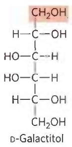

The other symptoms in this disorder are relatively mild, and strict limitation of galactose in the diet greatly diminishes their severity. Transferase-deficiency galactosemia, caused by a defect in the GALT gene, is more serious; it is characterized by poor growth in childhood, speech abnormality, mental deficiency, and liver damage that may be fatal, even when galactose is withheld from the diet. Epimerase-deficiency galactosemia, caused by a defect in the GALE gene, leads to similar symptoms, but they are less severe when dietary galactose is carefully controlled.

Fructose and Mannose P2 In most organisms, hexoses other than glucose can undergo glycolysis after conversion to a phosphorylated derivative. Fructose, present in free form in many fruits and formed by hydrolysis of sucrose in the small intestine of vertebrates, is phosphorylated by hexokinase:

$$
\mathrm{Fructose} + \mathrm{ATP} \xrightarrow {\mathrm{Mg} ^ {2 +}} \mathrm{fructose6-phosphate} + \mathrm{ADP}
$$

This is a major pathway of fructose entry into glycolysis in the muscles and kidney (7, Fig. 14-9). In the liver, fructose enters by a different pathway. The liver enzyme fructokinase catalyzes the phosphorylation of fructose at C-1 rather than C-6 (8, Fig. 14-9):

Fructose + ATP $\xrightarrow{Mg^{2+}}$ fructose 1-phosphate + ADP

The fructose 1-phosphate is then cleaved to glyceraldehyde and dihydroxyacetone phosphate by fructose 1-phosphate aldolase:

Dihydroxyacetone phosphate is converted to glyceraldehyde 3-phosphate by the glycolytic enzyme triose phosphate isomerase. Glyceraldehyde is phosphorylated by ATP and triose kinase to glyceraldehyde 3-phosphate:

$$
\mathrm{Glyceraldehyde} + \mathrm{ATP} \xrightarrow {\mathrm{Mg} ^ {2 +}}
$$

glyceraldehyde 3-phosphate + ADP

Thus, both products of fructose 1-phosphate hydrolysis enter the glycolytic pathway as glyceraldehyde 3-phosphate.

Mannose, released in the digestion of various polysaccharides and glycoproteins of foods, is phosphorylated at C-6 by hexokinase (9, Fig. 14-9):

$$
\mathrm{Mannose} + \mathrm{ATP} \xrightarrow {\mathrm{Mg} ^ {2 +}} \mathrm{mannose6-phosphate} + \mathrm{ADP}
$$

Phosphohexose isomerase converts mannose 6-phosphate to fructose 6-phosphate, which enters glycolysis.

#### [EN] SUMMARY 14.2 Feeder Pathways for Glycolysis

■ Endogenous glycogen and starch, polymeric storage forms of glucose, undergo sequential phosphorolysis of glucose residues, forming glucose 1-phosphate. Phosphoglucomutase converts the glucose 1-phosphate to glucose 6-phosphate, which can enter glycolysis at a point in the preparatory phase that requires the investment of only one more ATP.

\- Ingested polysaccharides and disaccharides are converted to monosaccharides by hydrolytic enzymes in saliva and in the small intestine. The monosaccharides pass through intestinal cells to the bloodstream, which transports them to the liver or other tissues.

Lactase is present in infants but often absent in adults, producing lactose intolerance. D-Hexoses, including galactose, fructose, and mannose, can be phosphorylated and funneled into glycolysis. Galactose is converted to glucose 1-phosphate through UDP-galactose and UDP-glucose intermediates. A genetic defect in enzymes of this pathway results in one of several galactosemias of varying severity.

<!-- EN-END 14.2 -->

## 提要

糖酵解过程是生物最古老、最原始获得能量的一种方式。大多数较高等生物虽然进化为利用有氧条件进行生物氧化获取大量的自由能，但仍保留了这种原始的方式。这一过程是生物体共同经历的途径，而且有些生物还利用这一途径在供氧不足时给机体提供能量。

糖酵解作用的定义是:葡萄糖在无氧条件下转变为丙酮酸所经历的一系列反应,在此过程中净生成两个 ATP 分子。

这一过程是最早阐明的酶促反应过程,也是研究得非常透彻的过程。糖酵解作用机制的研究是最富于启发性的科学工作。

酵解过程产生的丙酮酸在无氧条件下由 NADH 还原为乳酸。在高等动物肌肉中糖酵解的最终产物为乳酸，这一过程又称为单纯乳酸发酵（homolactic fermentation）。人们将微生物经过无氧条件产生乳酸的过程称为乳酸发酵，将丙酮酸脱羧形成乙醇的过程称为乙醇发酵。单纯乳酸发酵和乙醇发酵除了在最后步骤不同外，所经历的步骤完全相同。

糖酵解过程共有10步反应,可划分为两个阶段,全部在细胞溶胶(胞液)中进行。第一阶段是支付能量的准备阶段,即预先支出阶段,包括5步反应。葡萄糖与2分子ATP反应,通过磷酸化、异构化、第二次磷酸化,形成1,6-二磷酸果糖。每次磷酸化都需要由ATP提供能量。第二阶段是收入阶段,也包括5步反应。1,6-二磷酸果糖由醛缩酶裂解为磷酸二羟丙酮和3-磷酸甘油醛。这两种化合物在丙糖异构酶作用下,很容易互变。在3-磷酸甘油醛脱氢酶作用下,3-磷酸甘油醛被氧化和磷酸化即与 $NAD^{+}$ 和Pi形成1,3-二磷酸甘油酸,形成的高能酰基磷酸,具有高的转移势能,在磷酸甘油酸激酶的作用下,生成一分子ATP同时产生一分子3-磷酸甘油酸。随后又在磷酸甘油酸变位酶的催化下,异构化为2-磷酸甘油酸。后者由烯醇化酶脱氢发生磷酸基团变位和脱水,形成磷酸烯醇式丙酮酸。它是第2个高能磷酸基团转移势能的酵解中间物。磷酸烯醇式丙酮酸在丙酮酸激酶的作用下,将高能磷酸基团转移给ADP形成另外1分子ATP和丙酮酸。

催化酵解 10 步反应的酶作用机制都已通过化学、动力学测定并结合 X 射线结构分析基本得到阐明。酵解酶的催化过程表现出严格的立体专一性,其中两种激酶由底物引起酶分子的构象变化,防止了底物上高能磷酸基团向水分子的转移而且直接转移到 ADP 分子上。

糖酵解作用能在无氧条件下继续进行,必须有使 NADH 再被氧化为 $NAD^{+}$ 的途径。乳酸或乙醇(先脱羧形成乙醛,再由 $NADH + H^{+}$ 还原成乙醇)的形成解决了 NAD 再生的问题。丙酮酸脱羧形成乙醛由丙酮酸脱羧酶催化。此酶需焦磷酸硫胺素作为辅助因素。催化乙醛还原为乙醇的酶是乙醇脱氢酶。催化丙酮酸形成乳酸的酶是乳酸脱氢酶。

糖酵解过程有三个反应步骤是基本上不可逆的。催化这三步反应的酶是己糖激酶、磷酸果糖激酶和丙酮酸激酶。其中磷酸果糖激酶催化的反应是糖酵解的限速反应。该酶受高浓度 ATP 和柠檬酸的抑制，被 AMP 和 2,6-二磷酸果糖激活。己糖激酶受 6-磷酸葡糖抑制，如果磷酸果糖激酶受到抑制，则 6-磷酸葡糖积累。丙酮酸激酶受 ATP 和丙氨酸引起的变构抑制，受 1,6-二磷酸果糖激活。当机体能荷或糖酵解的中间物积累时，丙酮酸激酶达到活跃顶峰。丙酮酸激酶的活性受磷酸化的调节。血液中葡萄糖水平降低时，激起肝中丙酮酸激酶的磷酸化从而使其活性降低，于是肝中葡萄糖的利用下降，因此，丙酮酸激酶对维持血糖浓度的相对稳定起着调节作用。

己糖激酶和磷酸丙糖异构酶对底物引起的诱导式的配合,使催化反应避开了不需要的副反应,这大大提高了酶的催化效率。

磷酸丙糖异构酶的催化效率是最完善的典型,一旦酶分子与底物接触,在碰撞的瞬间反应已经完成,因此,这种酶促反应是由底物分子的扩散速度调节的。

3-磷酸甘油醛脱氢酶在催化3-磷酸甘油醛氧化和磷酸化为1,3-二磷酸甘油酸的过程中，形成一个半缩硫醛中间物，这一硫酯中保存了3-磷酸甘油醛氧化释放出的部分能量，是一个高能中间物，它接受无机磷酸的攻击而形成具有高能磷酸基团的1,3-二磷酸甘油酸。砷酸是磷酸的类似物（analog），它使氧化和磷酸化解偶联。

双糖及多糖经消化后形成的单糖主要是葡萄糖，其他的单糖产物还有果糖、半乳糖、甘露糖等。这些单糖都转变为糖酵解的中间物之一而进入糖酵解的共同途径。

## 习题

1. 为什么应用蔗糖保存食品而不用葡萄糖？

2. 用 $^{14}$ C 标记葡萄糖的第一个碳原子,用作糖酵解底物,写出标记碳原子在酵解各个步骤中的位置。

3. 写出从葡萄糖转变为丙酮酸的化学平衡式。

4. 已知 ATP 和 6-磷酸葡糖在 pH 7 和 25℃时水解的标准自由能变化 $\Delta G^{\ominus}$ 分别为 -7.3 和 -3.183 kcal/mol，计算己糖激酶催化的葡萄糖和 ATP 反应的 $\Delta G^{\ominus}$ 和 Keq。

5. 由丙酮酸转变为乳酸的标准自由能变化 $\Delta G^{\ominus'} = -25.10\mathrm{kJ / mol}$ , 计算出由葡萄糖转变为乳酸的标准自由能变化。

6. 当葡萄糖的浓度为 5 mmol/L，乳酸的浓度为 0.05 mmol/L，ATP 和 ADP 的浓度都为 2 mmol/L，无机磷酸(Pi)的浓度为 1 mmol/L 时，计算该由葡萄糖转变为乳酸的自由能( $\Delta G^{\ominus'}$ )变化。

7. 参考表 22-2, 计算在标准状况下当 $[ATP]/[ADP]=10$ 时, 磷酸烯醇式丙酮酸和丙酮酸的平衡比。

8. 若以 $^{14}$ C 标记葡萄糖的 C3 作为酵母的底物, 经发酵产生 CO $_{2}$ 和乙醇, 试问 $^{14}$ C 将在何处发现?

9. 总结一下在糖酵解过程中磷酸基团参与了哪些反应,它所参与的反应有何意义?

10. 为什么砷酸是糖酵解作用的毒物？氟化物和碘乙酸对糖酵解过程有什么作用？

11. 总结一下参与糖酵解作用的酶有些什么特点及关键酶受到怎样的调控？

12. 糖酵解过程有哪些金属离子参加反应,它们起什么作用?

13. 概括除葡萄糖以外的其他单糖是如何进入分解代谢的？

## 主要参考书目

1. 李建武. 生物化学. 北京: 北京大学出版社, 1990.

2. Stryer L. Biochemistry. 4th ed. New York: W. H. Freeman and Company, 1995.

3. Lehnniger A R. Biochemistry. 2nd ed. New York: Worth Publishers. Inc., 1975.

4. Lebioda L, Stec B. Crystal structure of enolase indicates that enolase and pyruvate kinase from a common ancestor. Nature, 1988.

5. Nelson D L, Cox M M. Lehnninger 生物化学原理. 3 版. 周海梦, 等译. 北京: 高等教育出版社, 2005.

6. Nelson D L, Cox M M. Lehninger Principles of Biochemistry. 6th ed. New York: W. H. Freeman and Company, 2012.

7. Gatenby R, A Gilles R J. Why do cancers have high aerobic glycolysis? Nat. Rev. Cancer, 2004.

(王镜岩 秦咏梅)

## 网上资源

习题答案

自测题

## [1] 美登堂生

<!-- EN-BEGIN 第14章章末 -->

## 【英文对应 第14章章末】Glycolysis, Gluconeogenesis, and the Pentose Phosphate Pathway：关键术语、习题与简答

> 来源：Lehninger Principles of Biochemistry（书籍/02_生物化学原理） 第14章章末，以及书末 Abbreviated Solutions to Problems 第14章。

### [EN] KEY TERMS

Terms in bold are defined in the glossary.

glycolysis 511

hexokinase 515

isozymes 515

phosphofructokinase-1 (PFK-1) 516

fructose 1,6-bisphosphate
aldolase 516

ethanol (alcohol)

aldolase 516

triose phosphate
isomerase 517

glyceraldehyde 3-phosphate dehydrogenase 518

acyl phosphate 518 phosphoglycerate kinase 518

fermentation 525
lactate dehydrogenase 526
pyruvate decarboxylase 530
alcohol dehydrogenase 530

substrate-level phosphorylation 520

respiration-linked phosphorylation 520 gluconeogenesis 533

enolase 520 thiamine pyrophosphate
(TPP) 530

phosphoenolpyruvate (PEP) 520

biotin 534

phosphoglycerate
mutase 520

pyruvate kinase 521 fructose 1,6-bisphosphatase (FBPase-1) 537

glycogen phosphorylase 522 fructose 2,6-bisphosphatase (FBPase-2) 542

glucogenic 538

glyceroneogenesis 538
glucagon 542
fructose 2,6-bisphosphate 542
phosphofructokinase-2
(PFK-2) 542

mutases 522 carbohydrate response element binding protein (ChREBP) 545

pentose phosphate pathway 546

isomerases 522

lactose intolerance 523 phosphogluconate pathway 546

hexose monophosphate pathway 546

galactosemia 523

hypoxia 525

fermentation 525
lactic acid fermentation 525 glucose 6-phosphate dehydrogenase (G6PD) 547

6-phosphogluconate dehydrogenase 548

### [EN] PROBLEMS

1. Is the Hexokinase Reaction at Equilibrium in Cells? For the reaction catalyzed by the enzyme hexokinase

Glucose + ATP ⇌ glucose 6-phosphate + ADP

the equilibrium constant, $K_{eq}$ , is $7.8 \times 10^{2}$ . In living E. coli cells, $[ATP] = 5 \, mm$ , $[ADP] = 0.5 \, mm$ , $\{glucose\} = 2 \, mm$ , and $[glucose\ 6-phosphate] = 1 \, mm$ . Is the reaction at equilibrium in E. coli?

2. Equation for the Preparatory Phase of Glycolysis
Write balanced biochemical equations for all the reactions in the catabolism of glucose to two molecules of glyceraldehyde 3-phosphate (the preparatory phase of glycolysis), including the standard free-energy change for each reaction. Then write the overall or net equation for the preparatory phase of glycolysis, with the net standard free-energy change.

3. Payoff Phase of Glycolysis: Fate of Pyruvate in Active Skeletal Muscle In working skeletal muscle under anaerobic conditions, glyceraldehyde 3-phosphate is converted to pyruvate (the payoff phase of glycolysis), and the pyruvate is reduced to lactate. Write balanced biochemical equations for all the reactions in this process, with the standard free-energy change for each reaction. Then write the overall or net equation for the payoff phase of glycolysis with fermentation to lactate, including the net standard free-energy change.

4. Energetics of the Aldolase Reaction Aldolase catalyzes the glycolytic reaction

Fructose 1,6-bisphosphate →

glyceraldehyde 3-phosphate + dihydroxyacetone phosphate

The standard free-energy change for this reaction in the direction written is +23.8 kJ/mol. The concentrations of the three intermediates in the hepatocyte of a mammal are fructose 1,6-bisphosphate, $1.4 \times 10^{-5}$ M; glyceraldehyde 3-phosphate, $3 \times 10^{-6}$ M; and dihydroxyacetone phosphate, $1.6 \times 10^{-5}$ M. At body temperature (37 °C), what is the actual free-energy change for the reaction?

5. Equivalence of Triose Phosphates A researcher adds ${}^{14}$ C-labeled glyceraldehyde 3-phosphate to a yeast extract. After a short time, she isolates fructose 1,6-bisphosphate labeled with ${}^{14}$ C at C-3 and C-4. What was the location of the ${}^{14}$ C label in the starting glyceraldehyde 3-phosphate? Where did the second ${}^{14}$ C label in fructose 1,6-bisphosphate come from? Explain.

6. Glycolysis Shortcut Suppose you discovered a mutant yeast whose glycolytic pathway was shorter because of the presence of a new enzyme catalyzing the reaction

NAD $^{+}$ NADH + H $^{+}$

Glyceraldehyde 3-phosphate + H₂O

3-phosphoglycerate

Would shortening the glycolytic pathway in this way benefit the cell? Explain.

7. Role of Lactate Dehydrogenase During strenuous activity, the demand for ATP in muscle tissue vastly increases. In rabbit leg muscle or turkey flight muscle, ATP production is almost exclusively a product of lactic acid fermentation. Phosphoglycerate kinase and pyruvate kinase catalyze the two reactions that form ATP in the payoff phase of glycolysis. Suppose skeletal muscle were devoid of lactate dehydrogenase. Could it carry out strenuous physical activity; that is, could it generate ATP at a high rate by glycolysis? Explain.

8. Efficiency of ATP Production in Muscle The transformation of glucose to lactate in myocytes releases only about 7% of the free energy released when glucose is completely oxidized to $CO_{2}$ and $H_{2}O$ . Does this mean that glycolysis with lactate fermentation under anaerobic conditions in muscle is a wasteful use of glucose? Explain.

9. Free-Energy Change for Triose Phosphate Oxidation The oxidation of glyceraldehyde 3-phosphate to 1,3-bisphosphoglycerate, catalyzed by glyceraldehyde 3-phosphate dehydrogenase, proceeds with an unfavorable equilibrium constant ( $K_{eq}^{\prime}=0.08$ ; $\Delta G^{\circ}=6.3$ kJ/mol), yet the flow through this point in the glycolytic pathway proceeds smoothly. How does the cell overcome the unfavorable equilibrium?

10. Arsenate Poisoning Arsenate is structurally and chemically similar to inorganic phosphate ( $P_{i}$ ), and many enzymes that require phosphate will also use arsenate. Organic compounds of arsenate are less stable than analogous phosphate compounds, however. For example, acyl arsenates decompose rapidly by hydrolysis, as shown.

$$
\mathrm{R} - \stackrel {\mathrm{O}} {\mathrm{C}} - \mathrm{O} - \stackrel {\mathrm{O}} {\mathrm{As}} - \mathrm{O} ^ {-} + \mathrm{H} _ {2} \mathrm{O} \longrightarrow
$$

$$
\mathrm{R} - \mathrm{C} - \mathrm{O} ^ {-} + \mathrm{HO} - \underset {\mathrm{O} ^ {-}} {\overset {\mathrm{O}} {\mathrm{As}}} - \mathrm{O} ^ {-} + \mathrm{H} ^ {+}
$$

On the other hand, acyl phosphates, such as 1,3-bisphosphoglycerate, are more stable and undergo further enzyme-catalyzed transformation in cells.

(a) Predict the effect on the net reaction catalyzed by glyceraldehyde 3-phosphate dehydrogenase if phosphate were replaced by arsenate.

(b) What would be the consequence to an organism if arsenate were substituted for phosphate? Arsenate is very toxic to most organisms. Explain why.

11. Requirement for Phosphate in Ethanol Fermentation In 1906 Harden and Young, in a series of classic studies on the fermentation of glucose to ethanol and $\mathrm{CO}_{2}$ by extracts of brewer's yeast, made the following observations: (1) Inorganic phosphate was essential to fermentation; when the supply of phosphate was exhausted, fermentation ceased before all the glucose was used. (2) During fermentation under these conditions (with no phosphate), ethanol, $\mathrm{CO}_{2}$ , and a hexose bisphosphate accumulated. (3) When arsenate was substituted for phosphate, no hexose bisphosphate accumulated, but the fermentation proceeded until all the glucose was converted to ethanol and $\mathrm{CO}_{2}$ .

(a) Why did fermentation cease when the supply of phosphate was exhausted?

(b) Why did ethanol and $CO_{2}$ accumulate? Was the conversion of pyruvate to ethanol and $CO_{2}$ essential? Why? Identify the hexose bisphosphate that accumulated. Why did it accumulate? (c) Why did the substitution of arsenate for phosphate prevent the accumulation of the hexose bisphosphate yet allow fermentation to ethanol and $CO_{2}$ to go to completion? (See Problem 10.)

12. Role of the Vitamin Niacin Adults engaged in strenuous physical activity require an intake of about 160 g of carbohydrate daily but only about 20 mg of niacin for optimal nutrition.

Given the role of niacin in glycolysis, how do you explain the observation?

13. Synthesis of Glycerol Phosphate The glycerol 3-phosphate required for the synthesis of glycerophospholipids can be synthesized from a glycolytic intermediate. Propose a reaction sequence for this conversion.

14. Severity of Clinical Symptoms Due to Enzyme Deficiency The clinical symptoms of two forms of galactosemia—galactokinase-deficiency galactosemia and transferase-deficiency galactosemia—show radically different severity. Although both types produce gastric discomfort after milk ingestion, deficiency of the transferase also leads to liver, kidney, spleen, and brain dysfunction and eventual death. What products accumulate in the blood and tissues with each type of enzyme deficiency? Estimate the relative toxicities of these products from the above information.

15. Ethanol Affects Blood Glucose Levels The consumption of alcohol (ethanol), especially after periods of strenuous activity or after not eating for several hours, results in a deficiency of glucose in the blood, a condition known as hypoglycemia. The first step in the metabolism of ethanol by the liver is oxidation to acetaldehyde, catalyzed by liver alcohol dehydrogenase:

$$
\mathrm{CH} _ {3} \mathrm{CH} _ {2} \mathrm{OH} + \mathrm{NAD} ^ {+} \longrightarrow \mathrm{CH} _ {3} \mathrm{CHO} + \mathrm{NADH} + \mathrm{H} ^ {+}
$$

Explain how this reaction inhibits the transformation of lactate to pyruvate. Why does this lead to hypoglycemia?

16. Blood Lactate Levels during Vigorous Exercise The graph shows the concentrations of lactate in blood plasma before, during, and after a 400 m sprint.

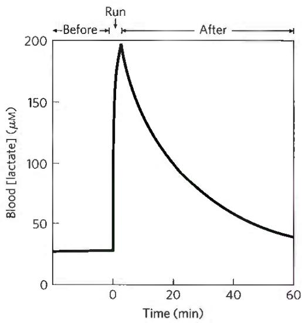

(a) What causes the rapid rise in lactate concentration?

(b) What causes the decline in lactate concentration after completion of the sprint? Why does the decline occur more slowly than the increase?

(c) Why is the concentration of lactate not zero during the resting state?

17. Relationship between Fructose 1,6-Bisphosphatase and Blood Lactate Levels A congenital defect in the liver enzyme fructose 1,6-bisphosphatase results in abnormally high levels of lactate in the blood plasma. Explain.

18. Effect of $O_{2}$ Supply on Glycolytic Rates The regulated steps of glycolysis in intact cells can be identified by studying the catabolism of glucose in whole tissues or organs. For example, the glucose consumption by heart muscle can be measured by artificially circulating blood through an isolated intact heart and measuring the concentration of glucose before and after the blood passes through the heart. If the circulating blood is deoxygenated, heart muscle consumes glucose at a steady rate. When oxygen is added to the blood, the rate of glucose consumption drops dramatically, then is maintained at the new, lower rate. Explain.

19. Regulation of PFK-1 The graph shows the effect of ATP on the allosteric enzyme PFK-1. For a given concentration of fructose 6-phosphate, the PFK-1 activity increases with increasing concentrations of ATP, but there is a point beyond which increasing the concentration of ATP inhibits the enzyme.

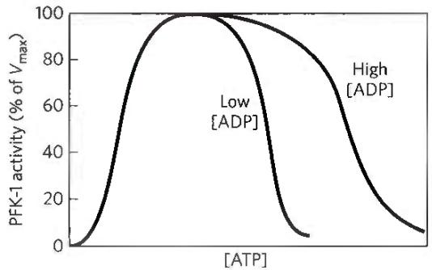

(a) Explain how ATP can be both a substrate and an inhibitor of PFK-1. How is the enzyme regulated by ATP?

(b) How do ATP levels regulate glycolysis?

(c) The inhibition of PFK-1 by ATP diminishes when the ADP concentration is high, as shown in the graph. What explains this observation?

20. Cellular Glucose Concentration Homeostatic mechanisms maintain the concentration of glucose in human blood at about 5 mm. The concentration of free glucose inside a myocyte is much lower. Why is the concentration so low in the cell? What happens to glucose after entry into the cell? Physicians administer glucose intravenously as a food source in certain clinical situations. Given that the transformation of glucose to glucose 6-phosphate consumes ATP, why not administer intravenous glucose 6-phosphate instead?

21. Ethanol Production in Yeast When grown anaerobically on glucose, yeast (S. cerevisiae) converts pyruvate to acetaldehyde, then reduces acetaldehyde to ethanol using electrons from NADH. Write the equation for the second reaction, and calculate its equilibrium constant at 25 °C, given the standard reduction potentials in Table 13-7.

22. Pathway of Atoms in Fermentation An investigator carries out a "pulse-chase" experiment using $^{14}\mathrm{C}$ -labeled carbon sources on a yeast extract maintained under strictly anaerobic conditions to produce ethanol. The experiment consists of incubating a small amount of $^{14}\mathrm{C}$ -labeled substrate (the pulse) with the yeast extract just long enough for each intermediate in the fermentation pathway to become labeled. The addition of excess unlabeled glucose then "chases" the label through the pathway. The chase effectively prevents any further entry of labeled glucose into the pathway.

(a) If the investigator uses $[1-^{14}C]$ glucose (glucose labeled at C-1 with ${}^{14}C$ ) as a substrate, what is the location of ${}^{14}C$ in the product ethanol? Explain.

(b) Where would ${}^{14}C$ have to be located in the starting glucose to ensure that all the ${}^{14}C$ activity is liberated as ${}^{14}CO_{2}$ during fermentation to ethanol? Explain.

23. Heat from Fermentations Large-scale industrial fermenters generally require constant, vigorous cooling. Why?

24. Fermentation to Produce Soy Sauce Soy sauce preparation involves fermenting a salted mixture of soybeans and wheat with several microorganisms, including yeast, over a period of 8 to 12 months. The resulting sauce (after solids are removed) is rich in lactate and ethanol. How are these two compounds produced? To prevent the soy sauce from having a strong vinegary taste (vinegar is dilute acetic acid), oxygen must be kept out of the fermentation tank. Why?

25. Glucogenic Substrates A common procedure for determining the effectiveness of compounds as precursors of glucose in mammals is to starve the animal until the liver glycogen stores are depleted and then administer the compound in question. A substrate that leads to a net increase in liver glycogen is termed glucogenic, because it must first be converted to glucose 6-phosphate. Show by means of known enzymatic reactions which of these substances are glucogenic:

$$
\begin{array}{l l} \text {(a) Succinate} & ^ {-} \mathrm{OOC} - \mathrm{CH} _ {2} - \mathrm{CH} _ {2} - \mathrm{COO} ^ {-} \\ \text {(b) Glycerol} & \begin{array}{c c c c} \mathrm{OH} & \mathrm{OH} & \mathrm{OH} \\ | & | & | \\ \mathrm{CH} _ {2} - \mathrm{CH} - \mathrm{CH} _ {2} \end{array} \end{array}
$$

$$
\begin{array}{l l} \text {(c) Acetyl - CoA} & \underset {\parallel} {O} \\ & \mathrm{CH} _ {3} - \mathrm{C} - \mathrm{S} - \mathrm{CoA} \\ \text {(d) Pyruvate} & \underset {\parallel} {O} \\ & \mathrm{CH} _ {3} - \mathrm{C} - \mathrm{COO} ^ {-} \\ \text {(e) Butyrate} & \mathrm{CH} _ {3} - \mathrm{CH} _ {2} - \mathrm{CH} _ {2} - \mathrm{COO} ^ {-} \end{array}
$$

26. Pathway of Atoms in Gluconeogenesis An investigator briefly incubates a liver extract capable of carrying out all the normal metabolic reactions of the liver in separate experiments with two different ${}^{14}$ C-labeled precursors: $[{}^{14}$ C]bicarbonate and $[{}^{14}$ C]pyruvate.

$$
\begin{array}{l} \text {(a) [ ^ {14}C]Bicarbonate HO-^ {14}C=O^ {-}} \\ \text {(b) [ 1 - ^ {14}C]Pyruvate CH_3-C=O-^ {14}COO^-} \end{array}
$$

Trace the pathway of each precursor through gluconeogenesis. Indicate the location of ${}^{14}$ C in all intermediates and in the product, glucose.

27. Energy Cost of a Cycle of Glycolysis and Gluconeogenesis What is the cost (in ATP equivalents) of transforming glucose to pyruvate via glycolysis and back again to glucose via gluconeogenesis?

28. Relationship between Gluconeogenesis and Glycolysis Why is it important that gluconeogenesis is not the exact reversal of glycolysis?

29. Energetics of the Pyruvate Kinase Reaction Explain in bioenergetic terms how the conversion of pyruvate to phosphoenolpyruvate in gluconeogenesis overcomes the large, negative, standard free-energy change of the pyruvate kinase reaction in glycolysis.

30. Muscle Wasting in Starvation One consequence of starvation is a reduction in muscle mass. What happens to the muscle proteins?

31. Effect of Phloridzin on Carbohydrate Metabolism Phloridzin, a toxic glycoside from the bark of the pear tree, blocks the normal reabsorption of glucose from the kidney tubule, thus causing blood glucose to be almost completely excreted in the urine. In an experiment, rats fed phloridzin and sodium succinate excreted about 0.5 mol of glucose (made by gluconeogenesis) for every 1 mol of sodium succinate ingested. How do rats transform the succinate to glucose? Explain the stoichiometry.

32. Excess $O_{2}$ Uptake during Gluconeogenesis The conversion of lactate to glucose in the liver requires the input of 6 mol of ATP for every mol of glucose produced. Investigators can monitor the extent of this process in a rat liver preparation by administering $[^{14}C]$ lactate and measuring the amount of $[^{14}C]$ glucose produced. Because the stoichiometry of $O_{2}$ consumption and ATP production is known (about 5 ATP per $O_{2}$ ), investigators can predict the extra $O_{2}$ consumption above the normal rate after administering a given amount of lactate. However, when they actually measure extra $O_{2}$ used in the synthesis of glucose from lactate, it is always higher than what the stoichiometric relationships predict. Suggest a possible explanation for this observation.

33. Role of the Pentose Phosphate Pathway If the oxidation of glucose 6-phosphate via the pentose phosphate pathway were being used primarily to generate NADPH for biosynthesis, the other product, ribose 5-phosphate, would accumulate. What problems might this cause?

### [EN] DATA ANALYSIS PROBLEM

34. Engineering a Fermentation System Fermentation of plant matter to produce ethanol for fuel is one potential method for reducing the use of fossil fuels and thus the $CO_{2}$ emissions that lead to global warming. Many microorganisms can break down cellulose, then ferment the glucose to ethanol. However, many potential cellulose sources, including agricultural residues and switchgrass, also contain substantial amounts of arabinose, which is not as easily fermented.

Escherichia coli is capable of fermenting arabinose to ethanol, but it is not naturally tolerant of high ethanol levels, thus limiting its utility for commercial ethanol production. Another bacterium, Zymomonas mobilis, is naturally tolerant of high levels of ethanol but cannot ferment arabinose. Deanda, Zhang, Eddy, and Picataggio (1996) described their efforts to combine the most useful features of these two organisms by introducing the E. coli genes for the arabinose-metabolizing enzymes into Z. mobilis

(a) Why is this a simpler strategy than the reverse: engineering E. coli to be more ethanol-tolerant?

Deanda and colleagues inserted five E. coli genes into the Z. mobilis genome: araA, coding for L-arabinose isomerase, which interconverts L-arabinose and L-ribulose; araB, L-ribulokinase, which uses ATP to phosphorylate L-ribulose at C-5; araD, L-ribulose 5-phosphate epimerase, which interconverts L-ribulose 5-phosphate and L-xylulose 5-phosphate; talB, transaldolase; and tktA, transketolase.

(b) For each of the three ara enzymes, briefly describe the chemical transformation it catalyzes and, where possible, name an enzyme discussed in this chapter that carries out an analogous reaction.

The five E. coli genes inserted in Z. mobilis allowed the entry of arabinose into the nonoxidative phase of the pentose phosphate pathway (Fig. 14-31), where it was converted to glucose 6-phosphate and fermented to ethanol.

(c) The three ara enzymes eventually converted arabinose into which sugar?

(d) The product from part (c) feeds into the pathway shown in Figure 14-31a. Combining the five E. coli enzymes listed above with the enzymes of this pathway, describe the overall pathway for the fermentation of six molecules of arabinose to ethanol.

(e) What is the stoichiometry of the fermentation of six molecules of arabinose to ethanol and $CO_{2}$ ? How many ATP molecules would you expect this reaction to generate?

(f) Z. mobilis uses a pathway for ethanol fermentation that is slightly different from the one described in this chapter. As a result, the expected ATP yield is only 1 ATP per molecule of arabinose. Although this is less beneficial for the bacterium, it is better for ethanol production. Why?

Another sugar commonly found in plant matter is xylose.

(g) What additional enzymes would you need to introduce into the modified Z. mobilis strain described above to enable it to use xylose as well as arabinose to produce ethanol? You don't need to name the enzymes (they may not even exist in the real world); just give the reactions they would need to catalyze.

### [EN] Reference

Deanda, K., M. Zhang, C. Eddy, and S. Picataggio. 1996. Development of an arabinose-fermenting Zymomonas mobilis strain by metabolic pathway engineering. Appl. Environ. Microbiol. 62:4465–4470.

### [EN] Abbreviated Solutions — Chapter 14

1. At equilibrium,

$K_{\mathrm{eq}} = 7.8 \times 10^{2} = [\mathrm{ADP}][\mathrm{glucose} 6\text{-phosphate}] / [\mathrm{ATP}][\mathrm{glucose}]$

In living cells, [ADP][glucose 6-phosphate]/[ATP][glucose] = (0.5 mm)(1 mm)/(5 mm)(2 mm) = 0.05. The reaction is therefore far from equilibrium: the cellular concentrations of the products (glucose 6-phosphate and ADP) are much lower than expected at equilibrium, and those of the reactants are much higher. The reaction therefore tends strongly to go to the right.

2. Net equation: Glucose + 2ATP → 2 glyceraldehyde 3-phosphate + 2ADP; $\Delta G^{\prime\circ} = 2.1$ kJ/mol

3. Net equation: 2 Glyceraldehyde 3-phosphate + 4ADP + 2P $_{i}$ → 2 lactate + 4ATP + 2H $_{2}$ O; ΔG''° = -114 kJ/mol

4. -8.6 kJ/mol

5. C-1. This experiment demonstrates the reversibility of the aldolase reaction. The C-1 of glyceraldehyde 3-phosphate is equivalent to C-4 of fructose 1,6-bisphosphate (see Fig. 14-6). The starting glyceraldehyde 3-phosphate must have been labeled at C-1. The C-3 of dihydroxyacetone phosphate becomes labeled through the triose phosphate isomerase reaction, thus giving rise to fructose 1,6-bisphosphate labeled at C-3.

6. No. There would be no anaerobic production of ATP; aerobic ATP production would be diminished only slightly.

7. No. Lactate dehydrogenase is required to recycle $NAD^{+}$ from the NADH formed during the oxidation of glyceraldehyde 3-phosphate.

8. The transformation of glucose to lactate occurs when myocytes are low in oxygen, and it provides a means of generating ATP under $O_{2}$ -deficient conditions. Because lactate can be oxidized to pyruvate, glucose is not wasted; pyruvate is oxidized by aerobic reactions when $O_{2}$ becomes plentiful. This metabolic flexibility gives the organism a greater capacity to adapt to its environment.

9. The cell rapidly removes the 1,3-bisphosphoglycerate in a favorable subsequent step, catalyzed by phosphoglycerate kinase.

10. (a) 3-Phosphoglycerate would be the product. (b) In the presence of arsenate, there is no net ATP synthesis under anaerobic conditions.

11. (a) Ethanol fermentation requires 2 mol of $P_{i}$ per mole of glucose.
(b) Ethanol is the reduced product formed during reoxidation of NADH to $NAD^{+}$ , and $CO_{2}$ is the byproduct of the conversion of pyruvate to ethanol. Yes. Pyruvate must be converted to ethanol to produce a continuous supply of $NAD^{+}$ for the oxidation of glyceraldehyde 3-phosphate. Fructose 1,6-bisphosphate accumulates; it is formed as an intermediate in glycolysis. (c) Arsenate replaces $P_{i}$ in the glyceraldehyde 3-phosphate dehydrogenase reaction to yield an acyl arsenate, which spontaneously hydrolyzes. This prevents formation of ATP, but 3-phosphoglycerate continues through the pathway.

12. Dietary niacin is used to synthesize $NAD^{+}$ . Oxidations carried out by $NAD^{+}$ are part of cyclic processes, with $NAD^{+}$ as electron carrier (reducing agent); one molecule of $NAD^{+}$ can oxidize many thousands of molecules of glucose, and thus the dietary requirement for the precursor vitamin (niacin) is relatively small.

13. Dihydroxyacetone phosphate + NADH + H $^{+}$ → glycerol 3-phosphate + NAD $^{+}$ (catalyzed by a dehydrogenase)

14. Galactokinase deficiency: galactose (less toxic); transferase deficiency: galactose 1-phosphate (more toxic)

15. Consumption of alcohol forces competition for $NAD^{+}$ between ethanol metabolism and gluconeogenesis. The problem is compounded by strenuous exercise and lack of food, because at these times the level of blood glucose is already low.

16. (a) The rapid increase in glycolysis; the rise in pyruvate and NADH results in a rise in lactate. (b) Lactate is transformed to glucose via pyruvate. This is a slower process because formation of pyruvate is limited by $NAD^{+}$ availability, the lactate dehydrogenase equilibrium is in favor of lactate, and conversion of pyruvate to glucose is energy-requiring. (c) The equilibrium for the lactate dehydrogenase reaction is in favor of lactate formation.

17. Lactate is transformed to glucose in the liver by gluconeogenesis (see Fig. 14-16). A defect in FBPase-1 would prevent entry of lactate into the gluconeogenic pathway in hepatocytes, causing lactate to accumulate in the blood.

18. In the absence of $O_{2}$ , the ATP needs are met by anaerobic glucose metabolism (fermentation to lactate). Because aerobic oxidation of glucose produces far more ATP than does fermentation, less glucose is needed to produce the same amount of ATP.

19. (a) There are two binding sites for ATP: a catalytic site and a regulatory site. Binding of ATP to a regulatory site inhibits PFK-1, by reducing $V_{max}$ or increasing $K_{m}$ for ATP at the catalytic site.
(b) Glycolytic flux is reduced when ATP is plentiful. (c) The graph indicates that increased [ADP] suppresses the inhibition by ATP. Because the adenine nucleotide pool is fairly constant, consumption of ATP leads to an increase in [ADP]. The data show that the activity of PFK-1 may be regulated by the [ATP]/[ADP] ratio.

20. The phosphate group of glucose 6-phosphate is completely ionized at pH 7, giving the molecule an overall negative charge. Because membranes are generally impermeable to electrically charged molecules, glucose 6-phosphate cannot pass from the bloodstream into cells and hence cannot enter the glycolytic pathway and generate ATP. (This is why glucose, once phosphorylated, cannot escape from the cell.)

21. $\mathrm{CH}_3\mathrm{CHO} + \mathrm{NADH} + \mathrm{H}^+ \rightleftharpoons \mathrm{CH}_3\mathrm{CH}_2\mathrm{OH} + \mathrm{NAD}^+ K_{\mathrm{eq}}' = 1.45 \times 10^{4}$ 22. (a) $^{14}\mathrm{CH}_3\mathrm{CH}_2\mathrm{OH}$ (b) [3-14C]glucose or [4-14C]glucose

When aldolase splits glucose into two trioses phosphates, C-3 and C-4 of glucose become C-1 of the glyceraldehyde 3-phosphate that proceeds through glycolysis.

23. Fermentation releases energy, some conserved in the form of ATP but much of it dissipated as heat. Unless the fermenter contents are cooled, the temperature would become high enough to kill the microorganisms.

24. Soybeans and wheat contain starch, a polymer of glucose. The microorganisms break down starch to glucose, glucose to pyruvate via glycolysis, and — because the process is carried out in the absence of $O_{2}$ (i.e., it is a fermentation)—pyruvate to lactate and ethanol. If $O_{2}$ were present, pyruvate would be oxidized to acetyl-CoA, then to $CO_{2}$ and $H_{2}O$ . Some of the acetyl-CoA, however, would also be hydrolyzed to acetic acid (vinegar) in the presence of oxygen.

25. (a), (b), and (d) are glucogenic; (c) and (e) are not.

26. (a) In the pyruvate carboxylase reaction, ${}^{14}CO_{2}$ is added to pyruvate, but PEP carboxykinase removes the same $CO_{2}$ in the next step. Thus, ${}^{14}C$ is not (initially) incorporated into glucose.

(b)

27. 4 ATP equivalents per glucose molecule

28. Gluconeogenesis would be highly endergonic, and it would be impossible to separately regulate gluconeogenesis and glycolysis.

29. The cell "spends" 1 ATP and 1 GTP in converting pyruvate to PEP.
30. The proteins are degraded to amino acids and used for gluconeogenesis.

31. Succinate transforms to oxaloacetate, which passes into the cytosol and is converted to PEP by PEP carboxykinase. Two moles of PEP are then required to produce a mole of glucose by the route outlined in Fig. 14-16.

32. If the catabolic and anabolic pathways of glucose metabolism are operating simultaneously, unproductive cycling of ADP and ATP occurs, with extra $O_{2}$ consumption.

33. At the very least, accumulation of ribose 5-phosphate would tend to force this reaction in the reverse direction by mass action (see Eqn 13-4). It might also affect other metabolic reactions that involve ribose 5-phosphate as a substrate or product—such as the pathways of nucleotide synthesis.

34. (a) Ethanol tolerance is likely to involve many more genes, and thus the engineering would be a much more involved project.
(b) L-Arabinose isomerase (the araA enzyme) converts an aldose to a ketose by moving the carbonyl of a nonphosphorylated sugar from C-1 to C-2. No analogous enzyme is discussed in this chapter; all the enzymes described here act on phosphorylated sugars. An enzyme that carries out a similar transformation with phosphorylated sugars is phosphohexose isomerase. L-Ribulokinase (araB) phosphorylates a sugar at C-5 by transferring the γ phosphate from ATP. Many such reactions are described in this chapter, including the hexokinase reaction. L-Ribulose 5-phosphate epimerase (araD) switches the —H and —OH groups on a chiral carbon of a sugar. No analogous reaction is described in the chapter, but it is described in Chapter 20 (see Fig. 20-31).
(c) The three ara enzymes would convert arabinose to xylulose 5-phosphate by the following pathway: Arabinose
→L-arabinose isomerase →L-ribulose →L-ribulokinase →5-phosphate
→epimerase →xylulose 5-phosphate.
(d) The arabinose is converted to xylulose 5-phosphate as in (c), which enters the pathway in Fig. 14-31a; the glucose 6-phosphate product is then fermented to ethanol and CO₂.
(e) 6 molecules of arabinose + 6 molecules of ATP are converted to 6 molecules of xylulose 5-phosphate, which feed into the pathway in Fig. 14-31a to yield 5 molecules of glucose 6-phosphate, each of which is fermented to yield 3 ATP (they enter as glucose 6-phosphate, not glucose)—15 ATP in all. Overall, you would expect a yield of 15 ATP - 6 ATP = 9 ATP from the 6 arabinose molecules.
The other products are 10 molecules of ethanol and 10 molecules of CO₂.
(f) Given the lower ATP yield, for an amount of growth (i.e., of available ATP) equivalent to growth without the added genes, the engineered Z. mobilis must ferment more arabinose, and thus it produces more ethanol.
(g) One way to allow the use of xylose would be to add the genes for two enzymes: an analog of the araD enzyme that converts xylose to ribose by switching the —H and —OH on C-3, and an analog of the araB enzyme that phosphorylates ribose at C-5.
The resulting ribose 5-phosphate would feed into the existing pathway.

<!-- EN-END 第14章章末 -->
