## 第 18 章 柠檬酸循环

> **本章英文对应内容**（Lehninger，插在所列中文小节末尾）
>
> - 第16章 The Citric Acid Cycle：章首导言（本章开头）、关键术语/习题/简答（本章末尾）
> - §16.1（第16章）→ 一、丙酮酸转化成乙酰辅酶 A 的过程
> - §16.2（第16章）→ 二、柠檬酸循环
> - §16.3（第16章）→ 五、柠檬酸循环在代谢中的双重角色
> - §16.4（第16章）→ 四、柠檬酸循环的调控

在有氧条件下,由糖酵解过程所产生的丙酮酸将会被继续氧化,经历柠檬酸循环(citric acid cycle)和氧化磷酸化(oxidative phosphorylation)两个阶段后形成 $CO_{2}$ 和 $H_{2}O$ ,所释放出来的能量用于合成更多的ATP 分子。这里我们先讨论柠檬酸循环。

为纪念德裔英国科学家 Hans Krebs(1900—1981) 在揭示柠檬酸循环方面所做出的卓越贡献, 柠檬酸循环也被称为 Krebs 循环。在 1937 年提出柠檬酸循环之前, 他还于 1932 年提出过动物体内负责将氨转化为尿素的尿素循环 (也被称为鸟氨酸循环)。柠檬酸循环途径的揭示是生命科学领域的一项重大成就, Krebs 因此与发现乙酰辅酶 A 的 Fritz Lipmann 分享了 1953 年的诺贝尔生理学或医学奖。这项发现的独特之处在于它是在像同位素示踪法这样的研究代谢的有效方法建立之前而获得的。

柠檬酸循环发生于原核细胞的细胞质中或真核细胞的线粒体基质中。线粒体具有双层膜，所以细胞质中生成的丙酮酸将先通过外膜上非特异性的孔道蛋白通道进入内外膜间隙，然后由内膜上专一的丙酮酸移位酶转运进入线粒体基质。丙酮酸的转运伴有 $\mathrm{H}^{+}$ 的同向转运。丙酮酸继而在线粒体基质中通过柠檬酸循环进行脱羧和脱氢：碳原子形成 $\mathrm{CO}_{2}$ ，氢原子则随着电子载体 $\mathrm{NAD}^{+}$ 或 FAD 进入电子传递链并最终被 $\mathrm{O}_{2}$ 接收而形成 $\mathrm{H}_{2} \mathrm{O}$ 。电子传递过程所释放出的自由能量进而使 ADP 磷酸化形成能量货币 ATP（详见第 19 章）。

柠檬酸循环也是脂肪酸和氨基酸等各种燃料分子完全氧化分解必须经历的途径。同时，柠檬酸循环所形成的一些中间代谢物分子也是合成许多其他重要生物分子的前体（见本书讨论合成代谢的有关章节）。因此，柠檬酸循环为一种两用代谢途径（amphibolic pathway），即在生物分子的分解和合成过程中都发挥重要作用，是代谢反应的一个核心通路。

丙酮酸在进入柠檬酸循环之前,需先转化为乙酰辅酶 A(acetyl-CoA)。乙酰辅酶 A 同时也是脂肪酸和部分氨基酸降解的产物。下面先讨论丙酮酸转化为乙酰辅酶 A 的过程。

<!-- EN-BEGIN 第16章导言 -->

### 【英文对应 第16章导言】The Citric Acid Cycle

> 来源：Lehninger Principles of Biochemistry（书籍/02_生物化学原理） 第16章章首（含章节目录与学习要点）。

#### [EN] THE CITRIC ACID CYCLE

16.1 Production of Acetyl-CoA (Activated Acetate) 575

16.2 Reactions of the Citric Acid Cycle 578

16.3 The Hub of Intermediary Metabolism 590

16.4 Regulation of the Citric Acid Cycle 593

As we saw in Chapter 14, some cells obtain energy (ATP) by fermentation, breaking down glucose in the absence of oxygen. For most eukaryotic cells and many bacteria, which live under aerobic conditions and oxidize their organic fuels to carbon dioxide and water, glycolysis is but the first stage in the complete oxidation of glucose. Rather than being reduced to lactate, ethanol, or some other fermentation product, the pyruvate produced by glycolysis is further oxidized to $H_{2}O$ and $CO_{2}$ through the process of cellular respiration.

Cellular respiration occurs in three major stages (Fig. 16-1), the first two of which we discuss in this chapter. In the first, organic fuel molecules—glucose, fatty acids, and some amino acids—are oxidized to yield two-carbon fragments in the form of the acetyl group of acetyl-coenzyme A (acetyl-CoA). In the second stage, the acetyl groups are oxidized to $CO_{2}$ in the citric acid cycle, also called the tricarboxylic acid (TCA) cycle or the Krebs cycle (after its discoverer, Hans Krebs). Much of the energy of these oxidations is conserved in the reduced electron carriers NADH and $FADH_{2}$ . In the third stage of respiration, these reduced coenzymes are themselves oxidized, giving up protons ( $H^{+}$ ) and

  
Hans Krebs, 1900–1981
(Keystone Pictures USA/Alamy.)

electrons. The electrons are transferred to $O_{2}$ via a series of electron-carrying molecules known as the respiratory chain, resulting in the formation of water. In the course of electron transfer, much of the energy available from redox reactions is conserved in the form of ATP, by a process called oxidative phosphorylation. We discuss this third stage in Chapter 19.

We use these principles as our guide to this chapter:

P1 Pyruvate is the metabolite that links two central catabolic pathways, glycolysis and the citric acid cycle. It is therefore a logical point for regulation that determines the rate of catabolic activity and the partitioning of pyruvate among its possible uses.

P2 The reactions of the citric acid cycle follow a chemical logic. In its catabolic role the citric acid cycle oxidizes acetyl-CoA to $CO_{2}$ and $H_{2}O$ . Energy from the oxidations in the cycle drives the synthesis of ATP. The chemical strategies for activating groups for oxidation and for conserving energy in the form of reducing power and high-energy compounds are used in many other biochemical pathways.

P3 The citric acid cycle is a hub of metabolism, with catabolic pathways leading in and anabolic pathways leading out. Acetate groups (acetyl-CoA) from the catabolism of various fuels are used in the synthesis of such metabolites as amino acids, fatty acids, and sterols. The breakdown products of many amino acids and nucleotides are intermediates of the cycle, and they can be fed in or siphoned off as needed by the cell.

P4 The central role of the citric acid cycle in metabolism requires that it be regulated in coordination with many other pathways. Regulation occurs by both allosteric and covalent mechanisms that overlap and interact to achieve homeostasis. Some mutations that affect the reactions of the citric acid cycle lead to tumor formation.

P5 Enzymes have evolved to form complexes to efficiently achieve a series of chemical transformations without releasing the intermediates into the bulk solvent. This strategy, seen in the pyruvate dehydrogenase complex and the metabolons of the citric acid cycle, is ubiquitous in other pathways of metabolism, in respiration, and in the many “—somes” that assemble and disassemble informational macromolecules.

  
FIGURE 16-1 Catabolism of proteins, fats, and carbohydrates in the three stages of cellular respiration. Stage 1: oxidation of fatty acids, glucose, and some amino acids yields acetyl-CoA. Stage 2: oxidation of acetyl groups in the citric acid cycle includes four steps in which electrons are abstracted. Stage 3: electrons carried by NADH and FADH₂ are funneled into a chain of mitochondrial (or, in bacteria, plasma membrane-bound) electron carriers—the respiratory chain—ultimately reducing O₂ to H₂O. This electron flow drives the production of ATP.

<!-- EN-END 第16章导言 -->

## 一、丙酮酸转化成乙酰辅酶 A 的过程

丙酮酸转化为乙酰辅酶 A(乙酰-CoA) 涉及四步反应、三种酶、五种辅基，形成一个相对分子质量非常高的丙酮酸脱氢酶复合体（pyruvate dehydrogenase complex）。其中的每一种酶皆有多个亚基参与组装。丙酮酸转化为乙酰-CoA 的总反应式如下：

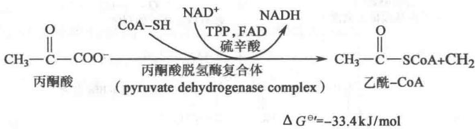

组成丙酮酸脱氢酶复合体的三种酶为：丙酮酸脱氢酶 $\left(\mathrm{E}_{1}\right)$ ，二氢硫辛酰转乙酰酶（dihydrolipoyl transacetylase, $E_{2}$ ）和二氢硫辛酰脱氢酶（dihydrolipoyl dehydrogenase, $E_{3}$ ）。从革兰氏阴性细菌中分离到的丙酮酸脱氢酶复合体的相对分子质量约为4600000，大到可在电子显微镜下直接观察到，其直径约为45nm，它的核心由24个 $E_{2}$ 亚基构成一个立方体，再有24个 $E_{1}$ 亚基和12个 $E_{3}$ 亚基围绕着 $E_{2}$ 核心分布。来自真核细胞的这种酶结构更为复杂：它是一个十二面体，其核心为60个 $E_{2}$ 亚基，外围为60个 $E_{1}$ 亚基和12个 $E_{3}$ 亚基，另外还含有约12个非催化性的 $E_{3}$ 结合亚基（过去被称为X组分），它似乎帮助 $E_{3}$ 亚基结合到 $E_{2}$ 核心,但其具体位置还并不清楚。此外,真核生物的丙酮酸脱氢酶复合体还结合着其特异的丙酮酸脱氢酶激酶和丙酮酸脱氢酶磷酸酶,通过促进磷酸化和去磷酸化 $E_{1}$ 亚基而分别抑制和激活丙酮酸脱氢酶复合体的生物学活性。

丙酮酸脱氢酶复合体催化由丙酮酸形成乙酰-CoA 的全过程, 依次需要以下五种辅助因子参与, 即焦磷酸硫胺素 (thiamine pyrophosphate, TPP)、硫辛酸、辅酶 A、FAD 和 NAD $^{+}$ 。

丙酮酸脱氢酶复合体催化反应的全过程如图 18-1 表示。

  
图 18-1 丙酮酸脱氢酶复合体所催化的化学反应

## 1. 由 $\mathbf{E}_1$ 和 $\mathbf{E}_2$ 催化的丙酮酸脱羧转变成乙酰基的反应

丙酮酸脱氢酶复合体催化丙酮酸转变为乙酰辅酶 A 的第一步反应是由 $E_{1}$ 亚基催化的脱羧反应。 $E_{1}$ 亚基以 TPP 为辅基，反应分两步进行：

$E_{1}$ 上的辅基 TPP 进攻丙酮酸 TPP 的噻唑环上位于氮和硫两原子之间的碳原子具有很强的酸性，解离成碳负离子后进攻丙酮酸的羰基碳，形成丙酮酸与 TPP 的加成化合物：

  
丙酮酸TPP加成化合物

丙酮酸-TPP 加成物紧接着发生脱羧反应,形成羟乙基硫胺素焦磷酸(羟乙基-TPP)。该反应之所以能进行是因为 TPP 环上带正电荷的氮原子起到了电子“陷阱”的作用,使脱羧后形成的羟乙基上产生较稳定的碳负离子:

羟乙基氧化形成乙酰基 $E_{1}$ 催化形成的羟乙基-TPP中间物接着被转移到二氢硫辛酰转乙酰酶( $E_{2}$ )。硫辛酸辅基与 $E_{2}$ 酶分子中一个Lys残基的侧链氨基共价连接形成硫辛酰胺。硫辛酰胺辅基的活性基团是一个含有二硫键的环，它能被可逆地还原成二氢硫辛酰胺。羟乙基上的碳负离子进攻硫辛酰胺的二硫键后，TPP所携带的羟乙基即被氧化为乙酰基，同时硫辛酰胺辅基上的二硫键也被还原成巯基，具体如下图所示。

至此， $E_{1}$ 亚基恢复原状，可开始新一轮的催化过程。

2. 由 $\mathbf{E}_2$ 催化的乙酰基转移到辅酶A形成乙酰辅酶A的反应

结合在 $E_{2}$ 亚基上的乙酰基，将由该酶催化转移到辅酶 A 分子上形成乙酰辅酶 A，同时 $E_{2}$ 亚基上的硫辛酰胺辅基则转变为二氢硫辛酰胺：

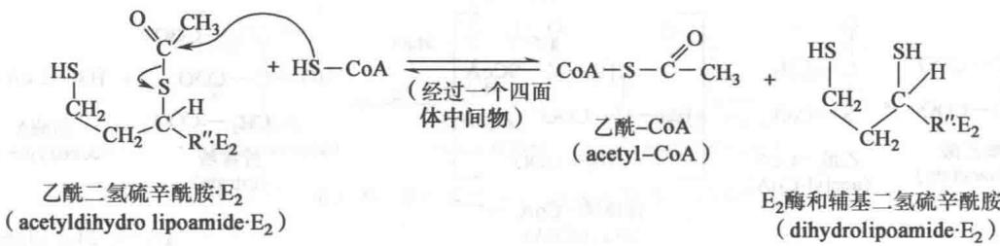

乙酰辅酶 A 通过其硫酯键保留了高水平的自由能。

## 3. $E_{3}$ 催化 $E_{2}$ 中的二氢硫辛酰胺辅基的再氧化

$E_{3}$ (二氢硫辛酰脱氢酶)的辅基 FAD 及蛋白质分子中的二硫键起着氧化剂的作用, 催化 $E_{2}$ 中的二氢硫辛酰胺的再氧化, 这一催化过程图解如下:

这一步标志着 $E_{2}$ 酶蛋白分子本身的复原。

## 4. 还原型 $E_{3}$ 亚基的再氧化

还原型 $E_{3}$ 需再氧化形成二硫键，是先由其辅基 FAD 按受附近被还原的巯基—SH 上的氢原子形成 $FADH_{2}$ ，接着氢原子又被转移给 $NAD^{+}$ ，于是 $E_{3}$ 也完全恢复成其氧化型。图解反应如下：

在丙酮酸脱氢酶复合体里,共价连接在 $E_{2}$ 亚基上的硫辛酸辅基使得反应过程中的不同中间体无法离开 $E_{1}$ 、 $E_{2}$ 和 $E_{3}$ 三种酶,而是在其活性中心间依次传递,起到了一种底物通道(substrate channeling)的作用。

有机砷化物,特别是亚砷酸盐,能与像存在于丙酮酸脱氢酶复合体中的两个相邻巯基发生共价结合而使酶失去催化能力。因此砷化物的毒性既体现于抑制3-磷酸甘油醛脱氢酶也体现于抑制丙酮酸脱氢酶复合体中的 $E_{2}$ 亚基。

<!-- EN-BEGIN 16.1 -->

### 【英文对应 16.1】Production of Acetyl-CoA (Activated Acetate)

> 来源：Lehninger Principles of Biochemistry（书籍/02_生物化学原理） 第16章 The Citric Acid Cycle，§16.1。对应本章“一、丙酮酸转化成乙酰辅酶 A 的过程”。

Coenzyme A, or CoA (Fig. 16-2), has a reactive thiol (-SH) group that is critical to its role as an acyl carrier in many metabolic processes, including the citric acid cycle. Acyl groups are covalently linked to the thiol group, forming thioesters. Because of their relatively high standard free energies of hydrolysis (see Figs. 13-16, 13-17), thioesters have a high acyl group transfer potential—that is, donation of their acyl groups to a variety of acceptor molecules is a favorable reaction. The acyl group attached to coenzyme A may thus be thought of as "activated" for group transfer.

In aerobic organisms, glucose and other sugars, fatty acids, and most amino acids are ultimately oxidized to $CO_{2}$ and $H_{2}O$ via the citric acid cycle and the respiratory chain. Before entering the citric acid cycle, the carbon skeletons of monosaccharides and fatty acids are degraded to the acetyl group of acetyl-CoA, the form in which the cycle accepts much of its fuel input. Many amino acid carbons also enter the cycle as acetate, although several amino acids are degraded to other cycle intermediates such as succinate and malate, which then enter the cycle.

#### [EN] Pyruvate Is Oxidized to Acetyl-CoA and $\mathrm{CO}_{2}$

P1 Pyruvate generated in the cytosol by glycolysis represents a node in the metabolism of carbohydrates, proteins, and fats. Under anaerobic conditions, pyruvate may simply be reduced to lactate in the cytosol, regenerating NAD+ for continued ATP production by glycolysis. Pyruvate may serve as a precursor for the synthesis of amino acids (Chapter 22). In eukaryotes, pyruvate may diffuse into mitochondria, first through large openings in the outer mitochondrial membrane and then into the matrix via an H+-coupled pyruvate-specific symporter in the inner mitochondrial membrane, the mitochondrial pyruvate carrier (MPC). Pyruvate that enters mitochondria may be oxidized by the citric acid cycle to generate energy or, after conversion to acetyl-CoA, may be used as the starting material for synthesis of fatty acids and sterols.

Pyruvate in the mitochondrial matrix is oxidized to acetyl-CoA and $CO_{2}$ by the pyruvate dehydrogenase (PDH) complex, a highly ordered cluster of enzymes and cofactors. P5 In the PDH complex, a series of chemical intermediates remain bound to the enzyme subunits as a substrate (pyruvate) is transformed into the final product (acetyl-CoA). Five cofactors, four of which are derived from vitamins, participate in the reaction mechanism. P4 The regulation of this enzyme complex illustrates how a combination of covalent modification and allosteric mechanism results in precisely regulated flux through a metabolic step.

The overall reaction catalyzed by the pyruvate dehydrogenase complex is an oxidative decarboxylation, an irreversible oxidation process in which the carboxyl group is removed from pyruvate as a molecule of $CO_{2}$ and the two remaining carbons become the acetyl group of acetyl-CoA (Fig. 16-3). The NADH formed in this reaction gives up a hydride ion ( $:H^{-}$ ) to the respiratory chain (Fig. 16-1), which carries the two electrons to oxygen or, in anaerobic microorganisms, to an alternative electron acceptor such as nitrate or sulfate. The transfer of electrons from NADH to oxygen ultimately generates 2.5 molecules of ATP per pair of electrons. The irreversibility of the PDH complex reaction has been demonstrated by isotopic labeling experiments: the complex cannot reattach radioactively labeled $CO_{2}$ to acetyl-CoA to yield carboxyl-labeled pyruvate.

  
FIGURE 16-2 Coenzyme A (CoA-SH). A hydroxyl group of pantothenic acid is joined to a modified ADP moiety by a phosphate ester bond, and its carboxyl group is attached to $\beta$ -mercaptoethylamine in amide linkage. The

  
FIGURE 16-3 Overall reaction catalyzed by the pyruvate dehydrogenase complex. The five coenzymes participating in this reaction, and the three enzymes that make up the enzyme complex, are discussed in the text.

#### [EN] The PDH Complex Employs Three Enzymes and Five Coenzymes to Oxidize Pyruvate

The combined dehydrogenation and decarboxylation of pyruvate to the acetyl group of acetyl-CoA (Fig. 16-3) requires the sequential action of three different enzymes and five different coenzymes or prosthetic groups—thiamine pyrophosphate (TPP), lipoate, coenzyme A (CoA, sometimes denoted CoA-SH, to emphasize the role of the —SH group), flavin adenine dinucleotide (FAD), and nicotinamide adenine dinucleotide (NAD). We encountered TPP as the coenzyme of pyruvate decarboxylase (see Fig. 14-13). Lipoate (Fig. 16-4), has two thiol groups that can undergo reversible oxidation to a disulfide bond (—S—S—), similar to that between two Cys residues in a protein. Because of its capacity to undergo oxidation-reduction reactions, lipoate can serve both as an electron (hydrogen) carrier and as an acyl carrier, as we shall see. CoA serves as the carrier of the activated acyl group. We described the roles of FAD and NAD as electron carriers in Chapter 13.

hydroxyl group at the 3' position of the ADP moiety has a phosphoryl group not present in free ADP. The —SH group of the mercaptoethylamine moiety forms a thioester with acetate in acetyl-coenzyme A (acetyl-CoA) (lower left).  
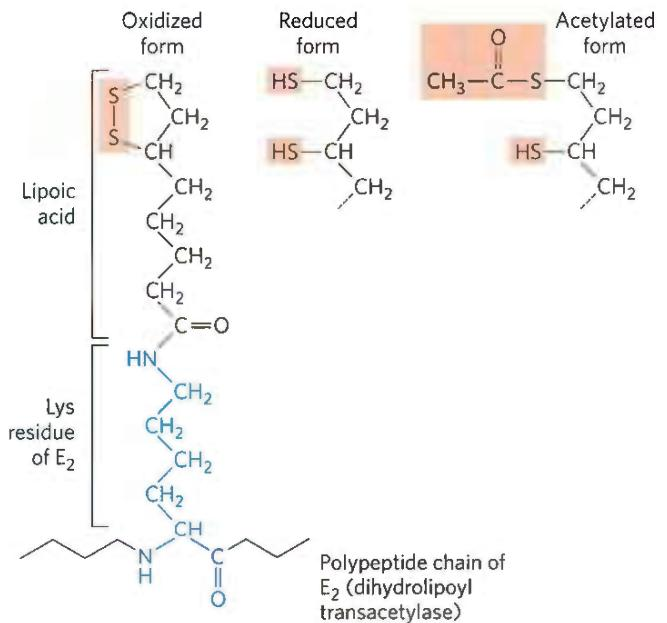  
FIGURE 16-4 Lipoic acid (lipoate) in amide linkage with a Lys residue. The lipoyllysyl moiety is the prosthetic group of dihydrolipoyl transacetylase ( $E_{2}$ of the PDH complex). The lipoyl group occurs in oxidized (disulfide) and reduced (dithiol) forms and acts as a carrier of both hydrogen and an acetyl (or other acyl) group.

The PDH complex contains multiple copies of three enzymes—pyruvate dehydrogenase ( $E_{1}$ ), dihydrolipoyl transacetylase ( $E_{2}$ ), and dihydrolipoyl dehydrogenase ( $E_{3}$ )—that catalyze the oxidation of pyruvate. The number of copies of each enzyme and therefore the size of the complex varies among species. A central core is formed of many copies (24 to 60) of $E_{2}$ surrounded by multiple and variable numbers of copies of $E_{1}$ and $E_{3}$ (Fig. 16-5). Two regulatory proteins are also part of the complex: a protein kinase and a phosphoprotein phosphatase, discussed below.

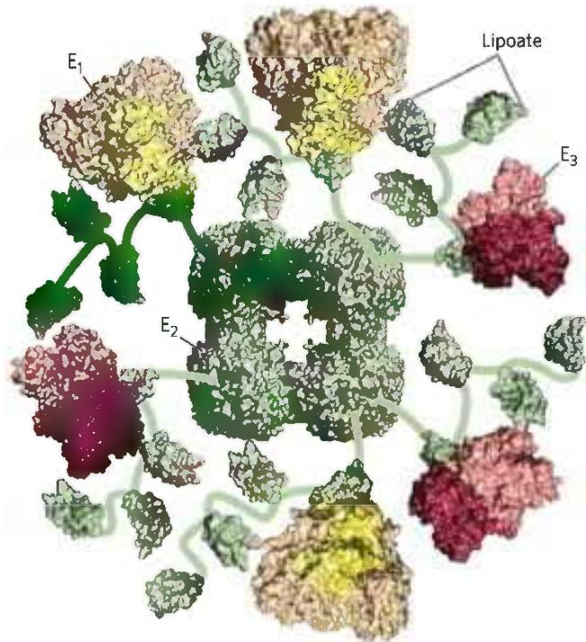  
FIGURE 16-5 Structure of the pyruvate dehydrogenase complex. The complex is so big and so flexible that solving its structure required a combination of methods, including x-ray crystallography and NMR spectroscopy; once the individual pieces were solved, cryo-EM of the whole structure was used to assemble the pieces from several organisms to get this view. The core ( $E_{2}$ ) is from the gram-negative bacterium Azotobacter vinelandii. $E_{1}$ and $E_{3}$ are from the thermophilic gram-positive bacterium Geobacillus stearothermophilus. $E_{1}$ , pyruvate dehydrogenase (yellow); $E_{2}$ , dihydrolipoyl transacetylase (green); and $E_{3}$ , dihydrolipoyl dehydrogenase (red). The central core of the Azotobacter PDH complex consists of 24 copies of $E_{2}$ , but to simplify the structure, only six are shown here. Multiple copies of $E_{1}$ and $E_{3}$ surround the central core, and flexible arms (shown schematically) reach out from $E_{2}$ to $E_{1}$ and $E_{3}$ , carrying the lipoyl moiety (pink) from the active site of one enzyme to that of the next. The amino acid sequences and three-dimensional structures of individual domains show that both catalytic mechanism and structure have been conserved in evolution. [Information from D. Goodsell, doi:10.2210/rcsb\_pdb/mom\_2012\_9. Data from PDB ID 1LAC F. Dardel et al., J. Mol. Biol. 229:1037, 1993; PDB ID 1EAA A. Mattevi et al., Biochemistry 32:3887, 1993; PDB ID 1W85 R. A. Frank et al., Science 306:872, 2004; PDB ID 1EBD S. S. Mande et al., Structure 4:277, 1996.]

The active site of $E_{1}$ has noncovalently bound TPP. $E_{2}$ has the prosthetic group lipoate, attached through an amide bond to the $\varepsilon$ -amino group of a Lys residue (Fig. 16-4). $E_{2}$ has three functionally distinct domains: one or more (depending on the species) amino-terminal lipoyl domains, containing the lipoyl-Lys residue(s); the central $E_{1}$ - and $E_{3}$ -binding domain; and the inner-core acyltransferase domain, which contains the acyltransferase active site. The domains of $E_{2}$ are separated by linkers, sequences of 20 to 30 amino acid residues, rich in Ala and Pro and interspersed with charged residues; these linkers tend to assume their extended forms, holding the three domains apart. The attachment of lipoate to the end of a Lys side chain in $E_{2}$ produces a long, flexible arm that can move from the active site of $E_{1}$ to the active sites of $E_{2}$ and $E_{3}$ , a distance of perhaps 5 nm or more, while holding the intermediate captive throughout the reaction sequence. $E_{3}$ has tightly bound FAD.

P5 This basic $E_{1}-E_{2}-E_{3}$ structure of the PDH complex is seen in two other enzyme complexes that catalyze similar reactions: $\alpha$ -ketoglutarate dehydrogenase, which oxidizes $\alpha$ -ketoglutarate in the citric acid cycle (described below), and the branched-chain $\alpha$ -keto acid dehydrogenase, which oxidizes $\alpha$ -keto acids derived from the breakdown of the branched-chain amino acids valine, isoleucine, and leucine (see Fig. 18-28). Within a given species, $E_{3}$ is identical in all three complexes. The remarkable similarity in protein structure, cofactor requirements, and reaction mechanisms of these three complexes doubtless reflects a common evolutionary origin; they are paralogs.

#### [EN] The PDH Complex Channels Its Intermediates through Five Reactions

Figure 16-6 shows schematically how P5 the pyruvate dehydrogenase complex carries out the five consecutive reactions in the decarboxylation and dehydrogenation of pyruvate without allowing the intermediates to leave the surface of the complex. Step 1 is essentially identical to the reaction catalyzed by pyruvate decarboxylase (see Fig. 14-13c); C-1 of pyruvate is released as CO₂, and C-2, which in pyruvate has the oxidation state of an aldehyde, is attached to TPP as a hydroxyethyl group. This first step is the slowest and therefore limits the rate of the overall reaction. In step 2 the hydroxyethyl group is oxidized to the level of a carboxylic acid (acetate). The two electrons removed in this reaction reduce the —S—S— of a lipoyl group on E₂ to two thiol (—SH) groups. The acetyl moiety produced in this oxidation-reduction reaction is first esterified to one of the lipoyl —SH groups, then transesterified to CoA to form acetyl-CoA (step 3). Thus the energy of oxidation drives the formation of a high-energy thioester of acetate. The remaining reactions catalyzed by the PDH complex (by E₃, in steps 4 and 5) are electron transfers necessary to regenerate the oxidized (disulfide) form of the lipoyl group of E₂, to prepare the enzyme complex for another round of oxidation. The electrons removed from the hydroxyethyl group derived from pyruvate pass through FAD to NAD⁺, forming NADH, which can enter the respiratory chain.

P5 The five-reaction sequence shown in Figure 16-6 is an example of substrate channeling. The swinging lipoyllysyl arms of $\mathbf{E}_2$ accept from $\mathbf{E}_1$ the two electrons and the acetyl group that it derived from pyruvate, and pass them to $\mathbf{E}_3$ . The intermediates of the multistep sequence never leave the complex, and the local concentration of the substrate of $\mathbf{E}_2$ is kept very high. This substrate channeling also prevents theft of the activated acetyl group by other enzymes that use this group as substrate. We will encounter other enzymes that use a similar tethering mechanism to channel substrate between active sites, with lipoate, biotin, or a CoA-like moiety serving as cofactor.

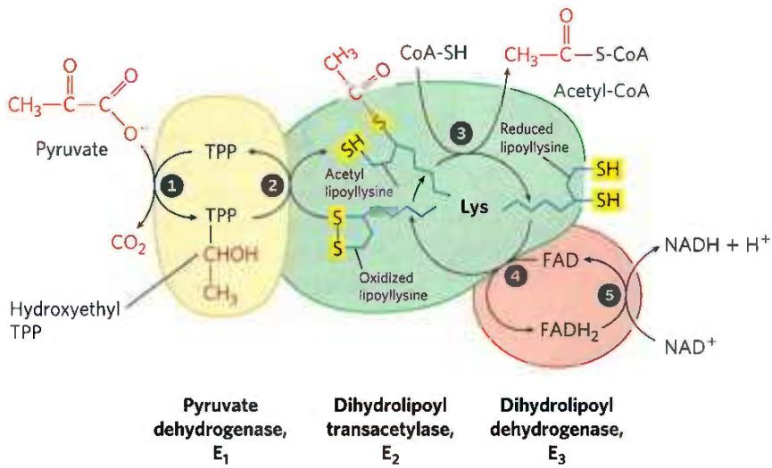  
FIGURE 16-6 Oxidative decarboxylation of pyruvate to acetyl-CoA by the PDH complex. The fate of pyruvate is traced in red. In step ① pyruvate reacts with the bound thiamine pyrophosphate (TPP) of pyruvate dehydrogenase $(\mathsf{E}_1)$ and is decarboxylated to the hydroxyethyl derivative. Pyruvate dehydrogenase also carries out step ②, the transfer of two electrons and the acetyl group from TPP to the oxidized form of the lipoyllysyl group of the core enzyme, dihydrolipoyl transacetylase $(\mathsf{E}_2)$ , to form the acetyl thioester of the reduced lipoyl group. Step ③ is a  
transesterification in which the —SH group of CoA replaces the —SH group of $E_{2}$ to yield acetyl-CoA and the fully reduced (dithiol) form of the lipoyl group. In step ④ dihydrolipoyl dehydrogenase ( $E_{3}$ ) promotes transfer of two hydrogen atoms from the reduced lipoyl groups of $E_{2}$ to the FAD prosthetic group of $E_{3}$ , restoring the oxidized form of the lipoyllysyl group of $E_{2}$ . In step ⑤ the reduced FADH $_{2}$ of $E_{3}$ transfers a hydride ion to NAD $^{+}$ , forming NADH. The enzyme complex is now ready for another catalytic cycle. (Subunit colors correspond to those in Fig. 16-5.)

Four different vitamins required in human nutrition are vital components of the pyruvate dehydrogenase complex: thiamine (TPP), pantothenate (CoA), riboflavin (FAD), and niacin (NAD). As one might predict, mutations in the genes for the subunits of the PDH complex, or a dietary vitamin deficiency, can have severe consequences. Thiamine-deficient animals are unable to oxidize pyruvate normally. This is of particular importance to the brain, which usually obtains all its energy from the aerobic oxidation of glucose in a pathway that necessarily includes the oxidation of pyruvate. Beriberi, a disease that results from thiamine deficiency, is characterized by loss of neural function. This disease occurs primarily in populations that rely on a diet consisting mainly of white (polished) rice, which lacks the hulls that contain most of the thiamine found in rice. People who habitually consume large amounts of alcohol can also develop thiamine deficiency, because much of their dietary intake consists of the vitamin-free “empty calories” of distilled spirits. An elevated level of pyruvate in the blood is often an indicator of defects in pyruvate oxidation due to one of these causes.

#### [EN] SUMMARY 16.1 Production of Acetyl-CoA (Activated Acetate)

■ Pyruvate, the end product of glycolysis, enters the mitochondrial matrix, where the pyruvate dehydrogenase (PDH) complex oxidizes it to $CO_{2}$ , acetyl-CoA—the starting material for the citric acid cycle—and NADH.

The supramolecular PDH complex includes multiple copies of three enzymes. Pyruvate dehydrogenase, $E_{1}$ (with bound TPP), decarboxylates pyruvate, producing hydroxyethyl-TPP, which is then oxidized to an acetyl group. The electrons from this oxidation reduce the disulfide of lipoate bound to $E_{2}$ , the dihydrolipoyl transacetylase, and the acetyl group is transferred to one of the —SH groups of the reduced lipoate through a thioester bond. $E_{2}$ catalyzes the transfer of the acetyl group to coenzyme A, forming acetyl-CoA. Dihydrolipoyl dehydrogenase, $E_{3}$ , catalyzes the regeneration of the disulfide (oxidized) form of lipoate, passing electrons first to FAD, then to $NAD^{+}$ .

In the PDH complex we see examples of two strategies that we will see repeated in other metabolic enzyme systems. Its organization is very similar to that of the enzyme complexes that catalyze the oxidation of $\alpha$ -ketoglutarate and the branched-chain $\alpha$ -keto acids. And the long lipoyllysyl arm of $E_2$ is used to channel the substrate from the active site of $E_1$ to $E_2$ to $E_3$ , tethering the intermediates to the enzyme complex and increasing the efficiency of the overall reaction.

<!-- EN-END 16.1 -->

## 二、柠檬酸循环

柠檬酸循环的全貌如图18-2所示。它起始于四碳化合物草酰乙酸与乙酰辅酶A中的2个碳原子之间缩合成含有6个碳的柠檬酸的反应。柠檬酸经过异构化后形成异柠檬酸，然后氧化脱氢形成草酰琥珀酸中间体（仍为6个碳），后者通过脱羧脱去一个碳形成五碳化合物 $\alpha-$ 酮戊二酸。五碳化合物再氧化脱羧形成四碳化合物，后者经过3次转化，最后再形成起始的四碳化合物草酰乙酸，完成一次循环。该循环过程中形成一个高能化合物（GTP），并使FAD和 $\mathrm{NAD}^+$ 分别还原成 $\mathrm{FADH}_2$ 和 $\mathrm{NADH}$ 。

柠檬酸循环可概括为如下8步反应。

## 1. 草酰乙酸与乙酰辅酶 A 缩合形成柠檬酸

催化草酰乙酸与乙酰辅酶 A 缩合的酶为柠檬酸合酶（citrate synthase）。柠檬酸合酶的催化过程严格按以下顺序进行：先与草酰乙酸结合，诱发构象变化后才能与乙酰辅酶 A 结合。具体反应式如下：

结合在酶分子上的柠檬酰辅酶 A 很快就水解形成柠檬酸和辅酶 A。

  
图 18-2 柠檬酸循环全貌  
图中数字代表如下酶：①柠檬酸合酶，②和③乌头酸酶，④异柠檬酸脱氢酶，⑤α-酮戊二酸脱氢酶复合体，⑥琥珀酰辅  
酶 A 合成酶，⑦琥珀酸脱氢酶，⑧延胡索酸酶，⑨苹果酸脱氢酶

由氟乙酸形成的氟乙酰辅酶 A 可由柠檬酸合酶催化与草酰乙酸缩合生成氟代柠檬酸(fluorocitrate)，取代柠檬酸结合到乌头酸酶上，从而抑制酶的活性。这一特性可用于制造杀虫剂或灭鼠药。有毒植物的叶子大都含有氟乙酸，可作天然杀虫剂。丙酮基辅酶 A（acetonyl-CoA）是乙酰辅酶 A 的类似物，可与柠檬酸合酶结合而抑制其活性，用此法曾测出了乙酰辅酶 A 与酶的结合部位（即活性中心）。上述化合物结构如图 18-3 所示。

  
图 18-3 氟乙酸、氟柠檬酸和丙酮基辅酶 A 的结构

## 2. 柠檬酸异构化形成异柠檬酸

柠檬酸是一种叔醇化合物,它的羟基所处位置不利于柠檬酸的进一步氧化。但异柠檬酸是可以被氧化的仲醇。催化此转变过程的酶为乌头酸酶(aconitase;更准确地说应该是乌头酸水合酶),也曾被称为顺乌头酸酶(cis-aconitase)。具体反应如下所示:

反应的中间产物顺式乌头酸不与酶分离,其中的 $H_{2}O$ 可往复地以两种不同的方式与双键结合,分别形成柠檬酸和异柠檬酸。在 pH 7.4 和 25℃ 的环境中,当反应达到平衡时,只有 10% 的异柠檬酸形成。在细胞内,异柠檬酸不断被消耗,因此推动此反应不断地由左向右进行。乌头酸酶含有一个「4Fe-4S」铁硫簇(iron-sulfur cluster),又称铁硫中心,在结合底物、催化脱水和再水合的过程中都起重要作用。乌头酸酶催化的无论是脱水还是水合反应,都具有严格的立体化学专一性。含有铁硫簇的蛋白质被统称为铁硫蛋白或非血红素铁蛋白。

## 3. 异柠檬酸氧化形成 $\alpha-$ 酮戊二酸

异柠檬酸的氧化脱羧反应由异柠檬酸脱氢酶(isocitrate dehydrogenase)催化,反应如下所示:

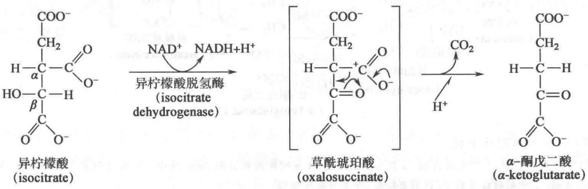

异柠檬酸脱氢酶在真核细胞中存在两种同工酶形式,一种以 $NAD^{+}$ 为辅酶,只存在于线粒体中;一种以 $NADP^{+}$ 为辅酶,既存在于线粒体中也存在于细胞溶胶中。

经异柠檬酸脱氢酶的催化,一种 $\beta-$ 羟酸(异柠檬酸)被氧化为一种 $\beta-$ 酮酸( $\alpha-$ 酮戊二酸),这有利于下一步与羰基相邻的 C—C 键断裂而引发的脱羧反应。这种 C—C 键断裂方式常见于生物化学反应中。这里脱下的羧基碳来源于草酰乙酸,而非乙酰辅酶 A。

由异柠檬酸脱氢酶催化的反应是柠檬酸循环中发生的第一次氧化脱羧反应,产生第一个 $CO_{2}$ 和 NADH。该酶需要 $Mn^{2+}$ 作为辅因子参与。

## 4. $\alpha$ -酮戊二酸氧化脱羧形成琥珀酰辅酶 A

这是柠檬酸循环中发生的第二次氧化脱羧反应,产生第二个 $CO_{2}$ 和第二个 NADH,并形成带有高能硫酯键的琥珀酰辅酶 A。反应由 $\alpha-$ 酮戊二酸脱氢酶复合体 ( $\alpha-$ ketoglutarate dehydrogenase complex) 催化,如下所示:

该酶复合体与丙酮酸脱氢酶复合体极其相似，也由三种酶组成：α-酮戊二酸脱氢酶 $\left(\mathrm{E}_{1}\right)$ 、二氢硫辛酰转琥珀酰酶 $\left(\mathrm{E}_{2}\right)$ 和二氢硫辛酰脱氢酶 $\left(\mathrm{E}_{3}\right)$ 。该复合体所催化反应的机制也与丙酮酸脱氢酶复合体的类似，也需TPP、硫辛酸、辅酶A、FAD、NAD $^{+}$ 等5种辅因子。两种酶复合体的 $E_{1}$ 的氨基酸序列相似但不相同，因此对底物的专一性不同。它们的 $E_{2}$ 结构也很相似，而 $E_{3}$ 则完全相同。这表明它们很可能具有相同的进化起源。

## 5. 琥珀酰辅酶 A 转化为琥珀酸并伴随底物水平磷酸化反应的发生

琥珀酰辅酶 A 将进一步转化成琥珀酸，由琥珀酰辅酶 A 合成酶（succinyl-CoA synthetase）、或称琥珀酸硫激酶（succinate thiokinase）催化。后面的命名方式反映反方向的催化反应。反应式如下：

琥珀酰辅酶 A 水解的标准自由能为 -36 kJ/mol。由它释放的自由能中有一部分被用于合成 GTP 或 ATP 的磷酸酐键，因此净余的自由能只有大约 -3 kJ/mol。

这是柠檬酸循环中直接产生高能磷酸酐键的唯一步骤。与糖酵解时生成 ATP 的过程类似，也属于底物水平的磷酸化反应。

通过上述柠檬酸循环的5步反应,一个乙酰基进入循环,氧化产生了2分子 $CO_{2}$ ,同时使2分子 $NAD^{+}$ 还原为NADH,还产生了一分子的GTP或ATP。为了使乙酰基在细胞内有效地进行氧化分解,所有的生物体都进化产生了一种循环氧化乙酰基的反应过程。为此,后面的第六、七、八步反应将琥珀酸重新转变为能够接受乙酰基的草酰乙酸而完成一轮的循环。

这里应提起注意的是关于合酶(synthase)和合成酶(synthetase)在概念上的区别。合酶(如柠檬酸合酶)催化的缩合反应无需ATP提供能量,而合成酶(如琥珀酰辅酶A合成酶)在催化缩合反应时则需由ATP或GTP等提供能量。

## 6. 琥珀酸脱氢形成延胡索酸

琥珀酸脱氢形成延胡索酸(fumarate)的反应由琥珀酸脱氢酶(succinate dehydrogenase)催化,如下所示:

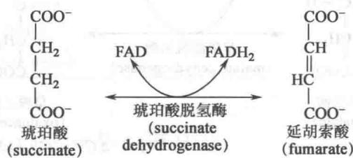  
$\Delta G^{\ominus \prime} = +6\mathrm{kJ / mol}$

<!-- END OFFICIAL API PART part_001 -->

<!-- BEGIN OFFICIAL API PART part_002 -->

在真核细胞中该酶与线粒体内膜紧密地结合在一起，在原核细胞中则是与细胞质膜结合。它是柠檬酸循环中唯一与膜结合的不溶性酶，属于电子传递呼吸链的一个组分，被称为复合物Ⅱ。其中的一分子辅基FAD以共价键与琥珀酸脱氢酶相连，该酶另外还含有三个铁硫中心。从位于琥珀酸分子中间的两个碳原子上各脱掉一个氢原子形成反式的丁烯二酸，即延胡索酸。

丙二酸(malonate)是该酶的一种有效抑制剂,其结构与该酶的底物琥珀酸非常相似,但它与该酶结合后却不能被催化脱氢。

## 7. 延胡索酸水合形成 L-苹果酸

由延胡索酸水合形成苹果酸的可逆反应由延胡索酸酶(fumarase)催化,该酶的全称应为延胡索酸水合酶(fumarate hydratase)。反应如下所示:

$\Delta G^{\ominus \prime} = +29.7\mathrm{kJ / mol}$  
  
$\Delta G^{\ominus} = -3.68 \mathrm{~kJ/mol}$

该酶催化时,具有严格的立体专一性。通过利用重氢标记的水 $D_{2}O$ 进行的观察表明,该酶催化-OD(即-OH)被严格地加到延胡索酸双键的一侧,而另一个D原子则被加到相反的一侧,因此形成的苹果酸只有L-苹果酸(也就是S-苹果酸),没有D-苹果酸。具体过程如下所示:

该酶催化的可逆反应同样具有严格的立体专一性，D-苹果酸不能代替L-苹果酸作为底物。

D-、L-苹果酸的结构式如下：

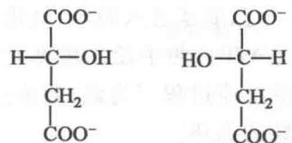  
D-苹果酸 L-苹果酸
(D-malate)

## 8. 苹果酸氧化形成草酰乙酸

这是柠檬酸循环的最后一步反应,由苹果酸脱氢酶(malate dehydrogenase)催化,其辅酶是 $NAD^{+}$ 。反应式如下:

L-苹果酸的羟基被氧化成羰基。该反应的标准自由能变化为+29.7 kJ/mol，在热力学上是个不利反应,但由于草酰乙酸与乙酰辅酶 A 的缩合反应是高度放能的( $\Delta G^{\ominus}$ 为 -31.5 kJ/mol),同时草酰乙酸也不断被消耗,这使苹果酸氧化为草酰乙酸的反应得以进行。这使一个在热力学上不利的反应被与其相偶联的热力学上的有利反应所推动。由于柠檬酰辅酶 A 的硫酯键水解时的高度放能,使草酰乙酸在低的生理浓度下(小于 $10^{-6}$ mol/L)也可被转变为柠檬酸。

在生物化学反应中所涉及的多种脱氢酶,如苹果酸脱氢酶、乳酸脱氢酶、醇脱氢酶、3-磷酸甘油醛脱氢酶等都以 $NAD^{+}$ 作为电子受体,都具有高度的立体专一性。各种脱氢酶虽然结构各异,但它们与 $NAD^{+}$ 结合部分的结构域的结构以及结合方式却极为相似。

<!-- EN-BEGIN 16.2 -->

### 【英文对应 16.2】Reactions of the Citric Acid Cycle

> 来源：Lehninger Principles of Biochemistry（书籍/02_生物化学原理） 第16章 The Citric Acid Cycle，§16.2。对应本章“二、柠檬酸循环”。

We are now ready to trace the process by which acetyl-CoA undergoes oxidation. This chemical transformation is carried out by the citric acid cycle, the

  
FIGURE 16-7 Reactions of the citric acid cycle. The carbon atoms shaded in pink are those derived from the acetate of acetyl-CoA in the first turn of the cycle; these are not the carbons released as $\mathrm{CO}_{2}$ in the first turn. Note that in succinate and fumarate, the two-carbon group derived from acetate can no longer be specifically denoted; because succinate and fumarate are symmetric molecules, C-1 and C-2  
are indistinguishable from C-4 and C-3. The red arrows show where energy is conserved by electron transfer to FAD or NAD $^{+}$ , forming FADH $_{2}$ or NADH + H $^{+}$ . Steps 1, 3, and 4 are essentially irreversible in the cell; all other steps are reversible. The nucleoside triphosphate product of step 5 may be either ATP or GTP, depending on which succinyl-CoA synthetase isozyme is the catalyst.

first cyclic pathway we have encountered (Fig. 16-7). To begin a turn of the cycle, acetyl-CoA donates its acetyl group to the four-carbon compound oxaloacetate to form the six-carbon citrate. Citrate is then transformed into isocitrate, also a six-carbon molecule, which is dehydrogenated with loss of $CO_{2}$ to yield the five-carbon compound $\alpha$ -ketoglutarate (also called 2-oxoglutarate). $\alpha$ -Ketoglutarate undergoes loss of a second molecule of $CO_{2}$ and ultimately yields the four-carbon compound succinate. Succinate is enzymatically converted in three steps into the four-carbon oxaloacetate — which is then ready to react with another molecule of acetyl-CoA. In each turn of the cycle, one acetyl group (two carbons) enters as acetyl-CoA and two molecules of $CO_{2}$ leave; one molecule of oxaloacetate is used to form citrate and one molecule of oxaloacetate is regenerated. No net removal of oxaloacetate occurs; P2 one molecule of oxaloacetate can theoretically bring about oxidation of an infinite number of acetyl groups, effectively acting catalytically; the steady-state concentration of oxaloacetate is very low (micromolar). Four of the eight steps in this process are oxidations, in which the energy of oxidation is very efficiently conserved in the form of the reduced coenzymes NADH and $FADH_{2}$ . These two carriers donate their electrons to the respiratory chain where electron flow drives ATP synthesis.

Although the citric acid cycle is central to energy-yielding metabolism, its role is not limited to energy conservation. Four- and five-carbon intermediates of the cycle serve as precursors for a wide variety of products. To replace intermediates removed for this purpose, cells employ anaplerotic (replenishing) reactions, which are described below.

Eugene Kennedy and Albert Lehninger showed in 1948 that, in eukaryotes, the entire set of reactions of the citric acid cycle takes place in mitochondria. Isolated mitochondria were found to contain not only all the enzymes and coenzymes required for the citric acid cycle, but also all the enzymes and proteins necessary for the last stage of respiration—electron transfer and ATP synthesis by oxidative phosphorylation. As we shall see in later chapters, mitochondria also contain the enzymes for the oxidation of fatty acids and some amino acids to acetyl-CoA, and the oxidative degradation of other amino acids to $\alpha$ -ketoglutarate, succinyl-CoA, or oxaloacetate. Thus, in nonphotosynthetic eukaryotes, the mitochondrion is the site of most energy-yielding oxidative reactions and of the coupled synthesis of ATP. In photosynthetic eukaryotes, mitochondria are the major site of ATP production in the dark, but in daylight, chloroplasts produce most of the organism's ATP. In most bacteria, the enzymes of the citric acid cycle are in the cytosol, and the plasma membrane plays a role analogous to that of the inner mitochondrial membrane in ATP synthesis (Chapter 19).

#### [EN] The Sequence of Reactions in the Citric Acid Cycle Makes Chemical Sense

Acetyl-CoA produced in the breakdown of carbohydrates, fats, and proteins must be completely oxidized to $CO_{2}$ if the maximum potential energy is to be extracted from these fuels. P2 However, it is not biochemically feasible to directly oxidize acetate (or acetyl-CoA) to $CO_{2}$ . Decarboxylation of this two-carbon acid would yield $CO_{2}$ and methane ( $CH_{4}$ ). Methane is chemically rather stable, and except for certain methanotrophic bacteria that grow in methane-rich niches, organisms do not have the cofactors and enzymes needed to oxidize methane. Methylene groups ( $—CH_{2}—$ ), however, are readily metabolized by enzyme systems present in most organisms. In typical oxidation sequences, two adjacent methylene groups ( $—CH_{2}—CH_{2}—$ ) are involved, at least one of which is adjacent to a carbonyl group. As we noted in Chapter 13 (p. 473), carbonyl groups are particularly important in the chemical transformations of metabolic pathways. The carbon of the carbonyl group has a partial positive charge due to the electron-withdrawing property of the carbonyl oxygen and is therefore an electrophilic center. A carbonyl group can facilitate the formation of a carbanion on an adjoining carbon by delocalizing the carbanion's negative charge. We see an example of the oxidation of a methylene group in the citric acid cycle, as succinate is oxidized (steps 6 to 8 in Fig. 16-7) to form a carbonyl (in oxaloacetate) that is more chemically reactive than either a methylene group or methane.

In short, if acetyl-CoA is to be oxidized efficiently, the methyl group of the acetyl-CoA must be attached to something. The first step of the citric acid cycle—the condensation of acetyl-CoA with oxaloacetate—neatly solves the problem of the unreactive methyl group. The carbonyl of oxaloacetate acts as an electrophilic center, which is attacked by the methyl carbon of acetyl-CoA in an aldol condensation (p. 473) to form citrate (step 1 in Fig. 16-7). The methyl group of acetate has been converted into a methylene in citric acid. This tricarboxylic acid then readily undergoes a series of oxidations that eliminate two carbons as CO₂. P2 Note that all steps featuring the breakage or formation of carbon–carbon bonds (steps 1, 3, and 4) rely on properly positioned carbonyl groups. As in all metabolic pathways, there is a chemical logic to the sequence of steps in the citric acid cycle: each step either involves an energy-conserving oxidation or is a necessary prelude to the oxidation, placing functional groups in position to facilitate oxidation or oxidative decarboxylation. As you learn the steps of the cycle, keep in mind the chemical rationale for each; it will make the process easier to understand and remember.

#### [EN] The Citric Acid Cycle Has Eight Steps

In examining the eight successive reaction steps of the citric acid cycle, we place special emphasis on the chemical transformations taking place as citrate formed from acetyl-CoA and oxaloacetate is oxidized to yield $CO_{2}$ and the energy of this oxidation is conserved in the reduced coenzymes NADH and $FADH_{2}$ .

① Formation of Citrate The first reaction of the cycle is the condensation of acetyl-CoA with oxaloacetate to form citrate, catalyzed by citrate synthase.

In this reaction, the methyl carbon of the acetyl group is joined to the carbonyl group (C-2) of oxaloacetate. Citroyl-CoA is a transient intermediate formed on the active site of the enzyme (see Fig. 16-9). It undergoes hydrolysis to free CoA and citrate, which are released from the active site. The hydrolysis of this high-energy thioester intermediate makes the forward reaction highly exergonic. The large, negative standard free-energy change of the forward citrate synthase reaction is essential to the operation of the cycle because the concentration of oxaloacetate is normally very low (micromolar). The CoA liberated in this reaction is recycled to participate in the oxidative decarboxylation of another molecule of pyruvate by the PDH complex.

Citrate synthase from mitochondria is a homodimer (Fig. 16-8). Each subunit is a single polypeptide with two domains, one large and rigid, the other smaller and more flexible, with the active site between them. Oxaloacetate, the first substrate to bind to the enzyme, induces a large conformational change in the flexible domain, creating a binding site for the second substrate, acetyl-CoA. When citroyl-CoA has formed in the enzyme active site, another conformational change brings about thioester hydrolysis, releasing CoA-SH. This induced fit of the enzyme first to its substrate and then to its reaction intermediate decreases the likelihood of premature and unproductive cleavage of the thioester bond of acetyl-CoA. Kinetic studies of the enzyme are consistent with this ordered bisubstrate mechanism (see Fig. 6-15). The reaction catalyzed by citrate synthase is essentially an aldol condensation (p. 473), involving a thioester (acetyl-CoA) and a ketone (oxaloacetate) (Fig. 16-9).

2 Formation of Isocitrate via cis-Aconitate The enzyme aconitase (more formally, aconitate hydratase) catalyzes the reversible transformation of citrate to isocitrate, through the intermediary formation of the tricarboxylic acid cis-aconitate, which normally does not dissociate from the active site. Aconitase can promote the reversible addition of $H_{2}O$ to the double bond of enzyme-bound cis-aconitate in two different ways, one leading to citrate and the other to isocitrate:

  
FIGURE 16-8 Structure of citrate synthase. The flexible domain of each subunit undergoes a large conformational change on binding oxaloacetate, creating a binding site for acetyl-CoA. (a) Open form of the enzyme alone; (b) closed form with bound oxaloacetate and a stable analog of acetyl-CoA (carboxymethyl-CoA). In these representations one subunit is colored tan and one green. [Data from (a) PDB ID 5CSC, D.-I. Liao et al., Biochemistry 30:6031, 1991; (b) PDB ID 5CTS, M. Karpusas et al., Biochemistry 29:2213, 1990.]

Although the equilibrium mixture at pH 7.4 and 25 °C contains less than 10% isocitrate, in the cell the reaction is pulled to the right because isocitrate is immediately consumed in the next step of the cycle, lowering its steady-state concentration. Aconitase contains an

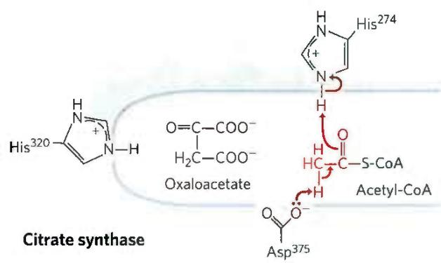

The thioester linkage in acetyl-CoA activates the methyl hydrogens. Asp $^{375}$ abstracts a proton from the methyl group, forming an enclate intermediate. The intermediate is stabilized by hydrogen bonding to and/or protonation by His $^{274}$ (full protonation is shown).

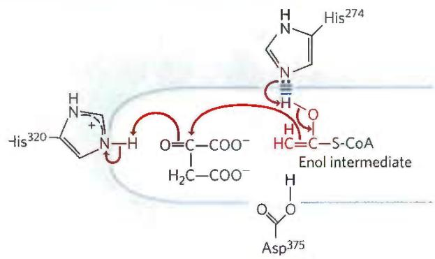

The enol(ate) rearranges to attack the caronyl carbon of oxaloacetate, with His $^{274}$ positioned to abstract the proton it had previously donated. His $^{320}$ acts as a general acid. The resulting condensation generates citryl-CoA.

iron-sulfur center (Fig. 16-10), which acts both in the binding of the substrate at the active site and in the catalytic addition or removal of $H_{2}O$ . In iron-depleted cells, aconitase loses its iron-sulfur center and acquires a new role in the regulation of iron homeostasis. Aconitase is one of many enzymes known to “moonlight” in a second role (Box 16-1).

3 Oxidation of Isocitrate to $\alpha$ -Ketoglutarate and $\mathrm{CO}_{2}$ In the next step, isocitrate dehydrogenase catalyzes oxidative decarboxylation of isocitrate to form $\alpha$ -ketoglutarate (Fig. 16-11). $\mathrm{Mn}^{2+}$ in the active site interacts with the carbonyl group of the intermediate oxalosuccinate, which is formed transiently but does not leave the binding site until decarboxylation converts it to $\alpha$ -ketoglutarate. $\mathrm{Mn}^{2+}$ also stabilizes the enol formed transiently by decarboxylation.

There are two different forms of isocitrate dehydrogenase in all cells, one requiring $NAD^{+}$ as electron acceptor and the other requiring $NADP^{+}$ . The overall reactions are otherwise identical. In eukaryotic cells, the NAD-dependent enzyme occurs in the mitochondrial matrix and serves in the citric acid cycle. The main function of the NADP-dependent enzyme, found in both the mitochondrial matrix and the cytosol, is the generation of NADPH, which is essential for reductive anabolic pathways such as fatty acid and sterol synthesis.

4 Oxidation of $\alpha$ -Ketoglutarate to Succinyl-CoA and $\mathrm{CO}_{2}$ The next step is another oxidative decarboxylation, in which $\alpha$ -ketoglutarate is converted to succinyl-CoA and $\mathrm{CO}_{2}$ by the action of the $\alpha$ -ketoglutarate dehydrogenase complex; $\mathrm{NAD}^{+}$ serves as electron acceptor and CoA as the carrier of the succinyl group. The energy of

MECHANISM FIGURE 16-9 Citrate synthase. In the citrate synthase reaction in mammals, oxaloacetate binds first, in a strictly ordered reaction sequence. This binding triggers a conformation change that opens up the binding site for acetyl-CoA. Oxaloacetate is specifically oriented in the active site of citrate synthase by interaction of its two carboxylates with two positively charged Arg residues (not shown here). [Information from S. J. Remington, Curr. Opin. Struct. Biol. 2:730, 1992.]

oxidation of $\alpha$ -ketoglutarate is conserved in the formation of the thioester bond of succinyl-CoA:

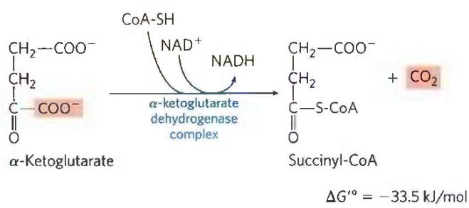

P2 This reaction is virtually identical to the pyruvate dehydrogenase reaction discussed above and to the reaction sequence responsible for the breakdown of branched-chain amino acids (Fig. 16-12). The $\alpha$ -ketoglutarate dehydrogenase complex closely resembles the PDH complex and the complex that degrades branched-chain $\alpha$ -keto acids

  
FIGURE 16-10 Iron-sulfur center in aconitase. The iron-sulfur center is in red, the citrate molecule in blue. Three Cys residues of the enzyme bind three iron atoms; the fourth iron is bound to one of the carboxyl groups of citrate and also interacts noncovalently with a hydroxyl group of citrate (dashed bond). A basic residue ( $\pm$ B) in the enzyme helps to position the citrate in the active site. The iron-sulfur center acts in both substrate binding and catalysis. The general properties of iron-sulfur proteins are discussed in Chapter 19.

  
MECHANISM FIGURE 16-11 Isocitrate dehydrogenase. In this reaction, the substrate, isocitrate, loses one carbon by oxidative decarboxylation.

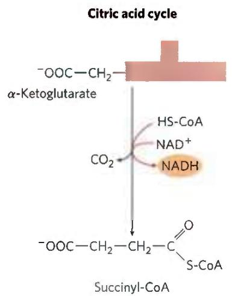

FIGURE 16-12 A conserved mechanism for oxidative decarboxylation. The pathways shown employ the same five cofactors (thiamine pyrophosphate, coenzyme A, lipoate, FAD, and $\mathrm{NAD^{+}}$ ), closely similar multienzyme complexes, and the same enzymatic mechanism to carry out oxidative decarboxylations of pyruvate (by the pyruvate dehydrogenase complex), $\alpha$ -ketoglutarate (in the citric acid cycle), and the carbon skeletons of the three branched-chain amino acids, isoleucine (shown here), leucine, and valine.

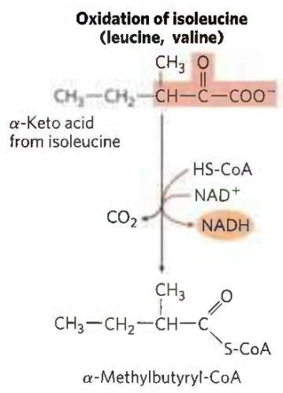

#### [EN] Moonlighting Enzymes: Proteins with More Than One Job

Before protein and DNA sequencing became routine, two groups of investigators studying two unrelated questions sometimes discovered that "their" proteins had similar properties. Further comparison sometimes showed that they were studying the same protein by following different functions. We now know that many proteins moonlight in a second role, a phenomenon sometimes called gene sharing. Today, researchers using annotated protein and DNA sequence databases can more easily find proteins of the same sequence that have been identified as having different functions, and a protein sequence annotated as having a given function doesn't necessarily have only that function. When a protein with a known function is made inactive by a mutation, and the resulting mutant organisms show a phenotype with no obvious relation to that function, protein moonlighting can sometimes explain the puzzling result.

One citric acid cycle enzyme is a known moonlighter. Eukaryotic cells have two isozymes of aconitase. The mitochondrial isozyme converts citrate to isocitrate in the citric acid cycle. The cytosolic isozyme has two distinct functions. It catalyzes the conversion of citrate to isocitrate, providing the substrate for a cytosolic isocitrate dehydrogenase that generates NADPH as reducing power for fatty acid synthesis and other anabolic processes in the cytosol. But it also has a role in cellular iron homeostasis.

All cells must obtain iron for the proteins that require it as a cofactor. In humans, severe iron deficiency results in anemia, an insufficient supply of erythrocytes and a reduced oxygen-carrying capacity that can be life-threatening. Too much iron is also harmful: it accumulates in and damages the liver in hemochromatosis and other diseases. Iron obtained in the diet is carried in the blood by the protein transferrin and enters cells via endocytosis mediated by the transferrin receptor. Once inside cells, iron is used in the synthesis of hemes, cytochromes, Fe-S proteins, and other Fe-dependent proteins; excess iron is stored bound to the protein ferritin. The levels of transferrin, transferrin receptor, and ferritin are therefore crucial to cellular iron homeostasis. The synthesis of these three proteins is regulated in response to iron availability — and aconitase, in its moonlighting job, plays a key regulatory role.

FIGURE 1 Effect of IRP1 and IRP2 on the mRNAs for ferritin and the transferrin receptor. [Information from R. S. Eisenstein, Annu. Rev. Nutr. 20:627, 2000, Fig. 1.]  
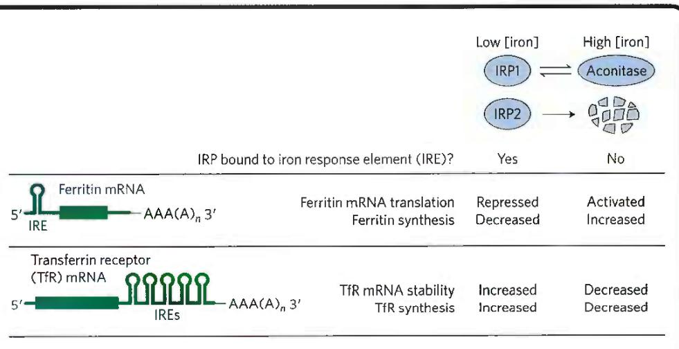

in both structure and function. All three have homologous $E_{1}$ and $E_{2}$ components, identical $E_{3}$ components, enzyme-bound TPP and lipoate, coenzyme A, FAD, and NAD. These related enzymes can employ the same $E_{3}$ subunit because the substrate for $E_{3}$ —a reduced lipoate—is the same for both complexes. They are certainly derived from a common evolutionary ancestor by gene duplication and subsequent divergent evolution, as described in Figure 1-32.

5 Conversion of Succinyl-CoA to Succinate Succinyl-CoA, like acetyl-CoA, has a thioester bond with a strongly negative standard free energy of hydrolysis ( $\Delta G^{\prime\circ} \approx -36$ kJ/mol). In the next step of the citric acid cycle, energy released in the breakage of this bond is used to drive the synthesis of a phosphoanhydride bond in either GTP or ATP, with a net $\Delta G^{\circ}$ of only -2.9 kJ/mol. Succinate is formed in the process:

The enzyme that catalyzes this reversible reaction is called succinyl-CoA synthetase or succinic thiokinase;

Aconitase has an essential Fe-S cluster at its active site (see Fig. 16-10). When a cell is depleted of iron, this Fe-S cluster is disassembled and the enzyme loses its aconitase activity. But the apoenzyme (apoaconitase, lacking its Fe-S cluster) so formed has now acquired its second activity: regulating iron metabolism. Cytosolic apoaconitase is identical to iron regulatory protein 1 (IRP1) and closely related to IRP2. Both IRP1 and IRP2 bind to regions in the mRNAs encoding ferritin and the transferrin receptor, with effects on iron mobilization and iron uptake. These mRNA sequences are part of hairpin structures (see Fig. 8-23) called iron response elements (IREs), located at the 5' and 3' ends of the mRNAs (Fig. 1). When bound to the 5'-untranslated IRE sequence in the ferritin mRNA, IRPs block ferritin synthesis; when bound to the 3'-untranslated IRE sequence in the transferrin receptor mRNA, they stabilize the mRNA, preventing its degradation and thus allowing the synthesis of more copies of the receptor protein per mRNA molecule. So, in iron-deficient cells, iron uptake becomes more efficient and iron storage (bound to ferritin) is reduced. When cellular iron concentrations return to normal levels, IRP1 regains its Fe-S cluster, converting to aconitase, and IRP2 undergoes proteolytic degradation, ending the low-iron response.

The enzymatically active aconitase and the moonlighting, regulatory apoaconitase have different structures. As the active aconitase, the protein has two lobes that close around the Fe-S cluster; as IRP1, the two lobes open, exposing the mRNA-binding site (Fig. 2).

It makes evolutionary sense that the enzymes of central metabolism have had a long time to evolve additional functions. The glycolytic enzyme pyruvate kinase acts in the nucleus to regulate the transcription of genes that respond to thyroid hormone. Glyceraldehyde 3-phosphate dehydrogenase moonlights both as uracil DNA glycosylase, effecting the repair of damaged DNA, and as a regulator of histone H2B transcription. Several glycolytic enzymes, including phosphoglycerate kinase, triose phosphate isomerase, and lactate dehydrogenase, moonlight as crystallins in the lens of the vertebrate eye.

both names indicate the participation of a nucleoside triphosphate in the reaction.

This energy-conserving reaction involves an intermediate step in which the enzyme molecule itself becomes phosphorylated at a His residue in the active site (Fig. 16-13a). This phosphoryl group, which has a high group transfer potential, is transferred to ADP (or GDP) to form ATP (or GTP). Animal cells have two isozymes of succinyl-CoA synthetase, one specific for ADP and the other for GDP. The enzyme has two subunits, $\alpha$ ( $M_{\mathrm{r}}$ 32,000), which has the P-His residue ( $\mathrm{His}^{246}$ ) and the binding site for CoA, and $\beta$ ( $M_{\mathrm{r}}$ 42,000), which confers specificity for either ADP or GDP. The active site is at the interface between subunits. The crystal structure of succinyl-CoA synthetase reveals two "power helices" (one from each subunit), oriented so that their electric dipoles situate partial positive charges close to the negatively charged $\textcircled{P}$ -His (Fig. 16-13b), stabilizing the phosphoenzyme intermediate. (Recall the similar role of helix dipoles in stabilizing $\mathbf{K}^{+}$ ions in the $\mathbf{K}^{+}$ channel; see Fig. 11-45.)

(a)  
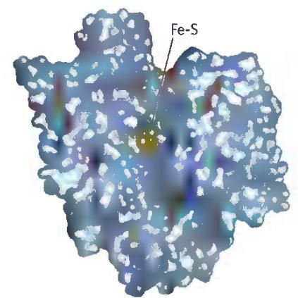

  
FIGURE 2 Two forms of cytosolic aconitase/IRP1 with two distinct functions. (a) In aconitase, the two major lobes are closed and the Fe-S cluster is buried; the protein has been made transparent here to show the Fe-S cluster. (b) In IRP1, the lobes open, exposing a binding site for the mRNA hairpin. [Data from (a) PDB ID 2B3Y, J. Dupuy et al., Structure 14:129, 2006; (b) PDB ID 2IPY, W. E. Walden et al., Science 314:1903, 2006.]

The formation of ATP (or GTP) at the expense of the energy released by the oxidative decarboxylation of $\alpha$ -ketoglutarate is a substrate-level phosphorylation, like the synthesis of ATP in the glycolytic reactions catalyzed by phosphoglycerate kinase and pyruvate kinase (see Fig. 14-2). The GTP formed by succinyl-CoA synthetase can donate its terminal phosphoryl group to ADP to form

ATP, in a reversible reaction catalyzed by nucleoside diphosphate kinase (p. 487):

$$
\mathrm{G} - \mathrm{TP} + \mathrm{ADP} \rightleftharpoons \mathrm{GDP} + \mathrm{ATP} \quad \Delta G ^ {\prime \circ} = 0 \mathrm{kJ/mol}
$$

Thus the net result of the activity of either isozyme of succinyl-CoA synthetase is the conservation of energy as ATP. There is no change in free energy for the nucleoside diphosphate kinase reaction; ATP and GTP are energetically equivalent.

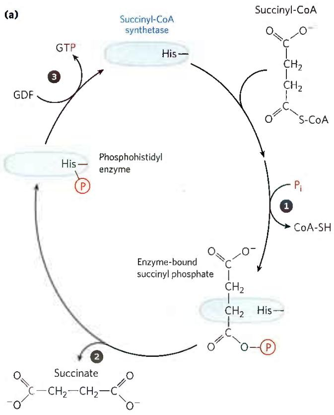

(b)  
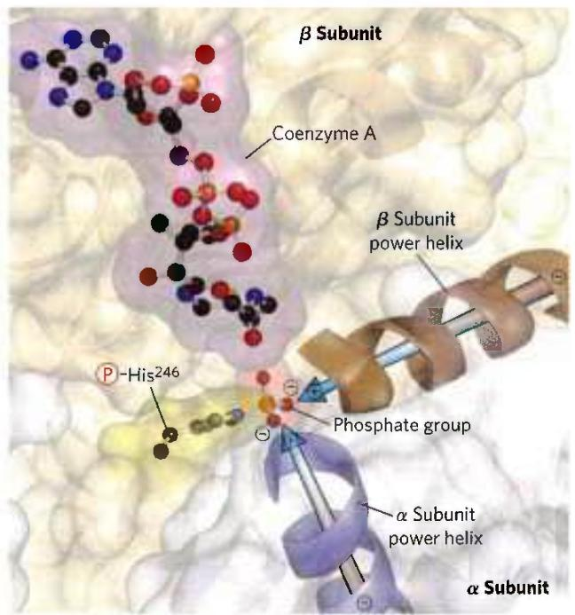

6 Oxidation of Succinate to Fumarate The succinate formed from succinyl-CoA is oxidized to fumarate by the flavoprotein succinate dehydrogenase:

  
$\Delta G^{\prime \circ} = 0\mathrm{kJ / mol}$

In eukaryotes, succinate dehydrogenase is an integral protein of the mitochondrial inner membrane; in bacteria, of the plasma membrane. The enzyme contains three different iron-sulfur clusters and one molecule of covalently bound FAD (see Fig. 19-9). Electrons pass from succinate through the FAD and iron-sulfur centers before entering the chain of electron carriers in the mitochondrial inner membrane (the plasma membrane in bacteria). Electron flow from succinate through these carriers to the final electron acceptor, $O_{2}$ , is coupled to the synthesis of about 1.5 ATP molecules per pair of electrons (respiration-linked phosphorylation). Malonate, an analog of succinate not normally present in cells, is a strong competitive inhibitor of succinate dehydrogenase, and its addition to mitochondria in the laboratory blocks the activity of the citric acid cycle.

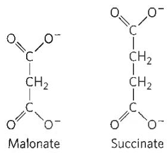

FIGURE 16-13 The succinyl-CoA synthetase reaction. (a) In step ① a phosphoryl group replaces the CoA of succinyl-CoA bound to the enzyme, forming a high-energy acyl phosphate. In step ② the succinyl phosphate donates its phosphoryl group to a His residue of the enzyme, forming a high-energy phosphohistidyl enzyme. In step ③ the phosphoryl group is transferred from the His residue to the terminal phosphate of GDP (or ADP), forming GTP (or ATP). (b) Active site of succinyl-CoA synthetase of Escherichia coli. The active site includes part of both the $\alpha$ (blue) and the $\beta$ (brown) subunits. The power helices (blue, brown) place the partial positive charges of the helix dipole near the phosphate group of $\text{P}$ -His $^{246}$ in the $\alpha$ chain, stabilizing the phosphohistidyl enzyme. The bacterial and mammalian enzymes have similar amino acid sequences and three-dimensional structures. [Data from PDB ID 1SCU, W. T. Wolodko et al., J. Biol. Chem. 269:10,883, 1994.]

7 Hydration of Fumarate to Malate The reversible hydration of fumarate to L-malate is catalyzed by fumarase (formally, fumarate hydratase). The transition state in this reaction is a carbanion:

This enzyme is highly stereospecific; it catalyzes hydration of the trans double bond of fumarate but not the cis double bond of maleate. In the reverse direction (from L-malate to fumarate), fumarase is equally stereospecific: D-malate is not a substrate.

8 Oxidation of Malate to Oxaloacetate In the last reaction of the citric acid cycle, L-malate dehydrogenase catalyzes the oxidation of L-malate to oxaloacetate, coupled to the reduction of $\mathrm{NAD^{+}}$ to NADH:

The equilibrium of this reaction lies far to the left under standard thermodynamic conditions, but in intact cells oxaloacetate is continually removed by the highly exergonic citrate synthase reaction (step 2 of Fig. 16-7).

This keeps the concentration of oxaloacetate in the cell extremely low ( $<10^{-6}$ M), pulling the malate dehydrogenase reaction toward the formation of oxaloacetate.

Although the individual reactions of the citric acid cycle were initially worked out in vitro, using minced muscle tissue, the pathway and its regulation have also been studied extensively in vivo. By using precursors isotopically labeled with ${}^{14}$ C, researchers have traced the fate of individual carbon atoms through the citric acid cycle. Some of the earliest experiments with ${}^{14}$ C produced an unexpected result, however, which aroused considerable controversy about the pathway and mechanism of the citric acid cycle. In fact, these experiments at first seemed to show that citrate was not the first tricarboxylic acid to be formed. Box 16-2 gives some details of this episode in the history of citric acid cycle research. Today biochemists use ${}^{13}$ C-labeled precursors and whole-tissue NMR spectroscopy to monitor metabolic flux through the cycle in living tissue. Because the NMR signal is unique to the compound containing the ${}^{13}$ C, precursor carbons can be traced into each cycle intermediate and into compounds derived from the intermediates. This technique makes it possible to study regulation of the citric acid cycle and its interconnections with other metabolic pathways.

#### [EN] The Energy of Oxidations in the Cycle Is Efficiently Conserved

We have now covered one complete turn of the citric acid cycle (Fig. 16-14). A two-carbon acetyl group entered the cycle by combining with oxaloacetate. Two carbon atoms

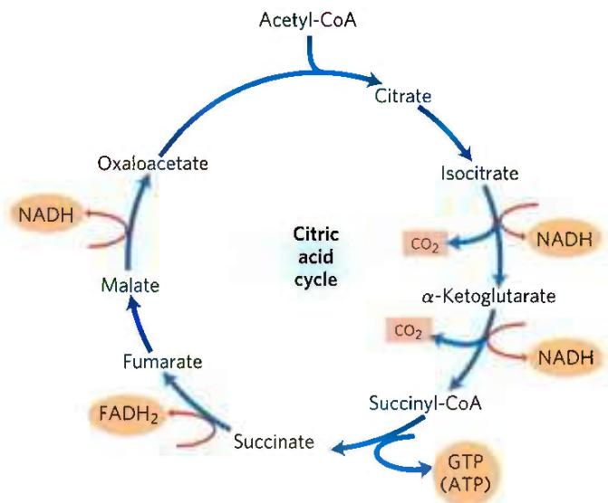  
FIGURE 16-14 Products of one turn of the citric acid cycle. At each turn of the cycle, three NADH, one FADH₂, one GTP (or ATP), and two CO₂ are released in oxidative decarboxylation reactions. Here and in several of the following figures, all cycle reactions are shown as proceeding in one direction only, but keep in mind that most of the reactions are reversible.

#### [EN] Citrate: A Symmetric Molecule That Reacts Asymmetrically

When compounds enriched in the heavy-carbon isotope ${}^{13}$ C and the radioactive carbon isotopes ${}^{11}$ C and ${}^{14}$ C became available in the mid-1940s, they were soon put to use in tracing the pathway of carbon atoms through the citric acid cycle. One such experiment initiated the controversy over the role of citrate. Acetate labeled in the carboxyl group (designated $[1-{}^{14}C]$ acetate) was incubated aerobically with an animal tissue preparation. Acetate is enzymatically converted to acetyl-CoA in animal tissues, and the pathway of the labeled carboxyl carbon of the acetyl group in the cycle reactions could thus be traced. $\alpha$ -Ketoglutarate was isolated from the tissue after incubation, then degraded by known chemical reactions to establish the position(s) of the isotopic carbon.

Condensation of unlabeled oxaloacetate with carboxyl-labeled acetate would be expected to produce citrate labeled in one of the two primary carboxyl groups. Citrate is a symmetric molecule, its two terminal carboxyl groups being chemically indistinguishable. Therefore, half the labeled citrate molecules were expected to yield $\alpha$ -ketoglutarate labeled in the $\alpha$ -carboxyl group and the other half to yield $\alpha$ -ketoglutarate labeled in the $\gamma$ -carboxyl group; that is, the $\alpha$ -ketoglutarate isolated was expected to be a mixture of the two types of labeled molecules (Fig. 1, pathways 1 and 2). Contrary to this expectation, the labeled $\alpha$ -ketoglutarate isolated from the tissue suspension contained $^{14}\mathrm{C}$ only in the $\gamma$ -carboxyl group (Fig. 1, pathway 1). The investigators concluded that citrate (or any other symmetric molecule) could not be an intermediate in the pathway from acetate to $\alpha$ -ketoglutarate. Rather, an asymmetric tricarboxylic acid, presumably cis-aconitate or isocitrate, must be the first product formed from condensation of acetate and oxaloacetate.

In 1948, however, Alexander Ogston pointed out that although citrate has no chiral center (see Fig. 1-19), it has the potential to react asymmetrically if an enzyme with which it interacts has an active site that is asymmetric. He suggested that the active site of aconitase may have three points to which the citrate must be bound and that the citrate must undergo a specific three-point attachment to these binding points. As seen in Figure 2, the binding of citrate to three such points could happen in only one way, and this would account for the formation of only one type of labeled $\alpha$ -ketoglutarate. Organic molecules such as citrate that have no chiral center but are potentially capable of reacting asymmetrically with an asymmetric active site are now called prochiral molecules.

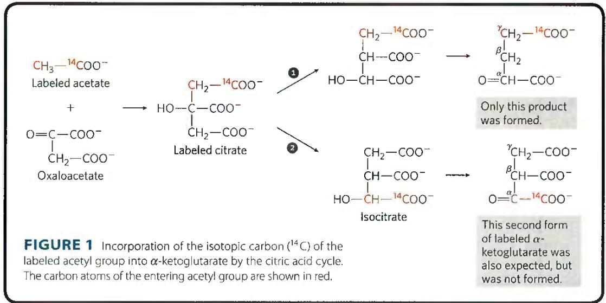

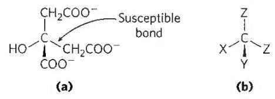

FIGURE 2 The prochiral nature of citrate. (a) Structure of citrate; (b) schematic representation of citrate: X = —OH; Y = —COO⁻; Z = —CH₂COO⁻. (c) Correct complementary fit of citrate to the binding site of aconitase.  

There is only one way in which the three specified groups of citrate can fit on the three points of the binding site. Thus only one of the two $-CH_{2}COO^{-}$ groups is bound by aconitase.

TABLE 16-1 Stoichiometry of Coenzyme Reduction and ATP Formation in the Aerobic Oxidation of Glucose via Glycolysis, the Pyruvate Dehydrogenase Complex Reaction, the Citric Acid Cycle, and Oxidative Phosphorylation

<table><tr><td>Reaction</td><td>Number of ATP or reduced coenzyme directly formed</td><td>Number of ATP ultimately formed $^{a}$ </td></tr><tr><td>Glucose  $\longrightarrow$  glucose 6-phosphate</td><td>-1 ATP</td><td>-1</td></tr><tr><td>Fructose 6-phosphate  $\longrightarrow$  fructose 1,6-bisphosphate</td><td>-1 ATP</td><td>-1</td></tr><tr><td>2 Glyceraldehyde 3-phosphate  $\longrightarrow$  2 1,3-bisphosphoglycerate</td><td>2 NADH</td><td>3 or 5 $^{b}$ </td></tr><tr><td>2 1,3-Bisphosphoglycerate  $\longrightarrow$  2 3-phosphoglycerate</td><td>2 ATP</td><td>2</td></tr><tr><td>2 Phosphoenolpyruvate  $\longrightarrow$  2 pyruvate</td><td>2 ATP</td><td>2</td></tr><tr><td>2 Pyruvate  $\longrightarrow$  2 acetyl-CoA</td><td>2 NADH</td><td>5</td></tr><tr><td>2 Isocitrate  $\longrightarrow$  2  $\alpha$ -ketoglutarate</td><td>2 NADH</td><td>5</td></tr><tr><td>2  $\alpha$ -Ketoglutarate  $\longrightarrow$  2 succinyl-CoA</td><td>2 NADH</td><td>5</td></tr><tr><td>2 Succinyl-CoA  $\longrightarrow$  2 succinate</td><td>2 ATP (or 2 GTP)</td><td>2</td></tr><tr><td>2 Succinate  $\longrightarrow$  2 fumarate</td><td>2 FADH $_{2}$ </td><td>3</td></tr><tr><td>2 Malate  $\longrightarrow$  2 oxaloacetate</td><td>2 NADH</td><td>5</td></tr><tr><td>Total</td><td></td><td>30–32</td></tr></table>

$^{a}$ This is calculated as 2.5 ATP per NADH and 1.5 ATP per FADH $_{2}$ . A negative value indicates consumption.  
$^{b}$ This number is either 3 or 5, depending on the mechanism used to shuttle NADH equivalents from the cytosol to the mitochondrial matrix; see Figures 19-31 and 19-32.

emerged from the cycle as $CO_{2}$ from the oxidation of isocitrate and $\alpha$ -ketoglutarate. P2 The energy released by these oxidations was conserved in the reduction of three $NAD^{+}$ and one FAD and the production of one ATP or GTP. At the end of the cycle a molecule of oxaloacetate was regenerated. Note that the two carbon atoms appearing as $CO_{2}$ are not the same two carbons that entered in the form of the acetyl group; additional turns around the cycle are required to release these carbons as $CO_{2}$ (Fig. 16-7).

P2 Although the citric acid cycle directly generates only one ATP per turn (in the conversion of succinyl-CoA to succinate), the four oxidation steps in the cycle provide a large flow of electrons into the respiratory chain via NADH and FADH₂ and thus lead to formation of almost 10 times more ATP during oxidative phosphorylation.

We saw in Chapter 14 that the production of two molecules of pyruvate from one molecule of glucose in glycolysis yields 2 ATP and 2 NADH. In oxidative phosphorylation (Chapter 19), passage of two electrons from NADH to $\mathrm{O}_2$ drives the formation of about 2.5 ATP, and passage of two electrons from $\mathrm{FADH}_2$ to $\mathrm{O}_2$ yields about 1.5 ATP. This stoichiometry allows us to calculate the overall yield of ATP from the complete oxidation of glucose. When both pyruvate molecules are oxidized to $6\mathrm{CO}_{2}$ via the pyruvate dehydrogenase complex and the citric acid cycle, and the electrons are transferred to $\mathrm{O}_2$ via oxidative phosphorylation, as many as 32 ATP are obtained per glucose (Table 16-1). In round numbers, this represents the conservation of $32\times 30.5\mathrm{kJ / mol} = 976\mathrm{kJ / mol}$ , or $34\%$ of the theoretical maximum of about $2,840~\mathrm{kJ / mol}$ available from the complete oxidation of glucose. These calculations employ the standard free-energy changes; when corrected for the actual free energy required to form ATP within cells (see Worked Example 13-2, p. 480), the calculated efficiency of the process is closer to 65%. When cells under anaerobic conditions depend on glycolysis for ATP, one glucose yields just 2 ATP. Aerobic metabolism is far more effective in capturing the energy in glucose as a fuel.

#### [EN] SUMMARY 16.2 Reactions of the Citric Acid Cycle

The citric acid cycle (Krebs cycle, TCA cycle) is a nearly universal central catabolic pathway in which compounds derived from the breakdown of carbohydrates, fats, and proteins are oxidized to $\mathrm{CO}_{2}$ , with most of the energy of oxidation temporarily held in the electron carriers $\mathrm{FADH}_{2}$ and NADH. During aerobic metabolism, these electrons are transferred to $\mathrm{O}_{2}$ and the energy of electron flow is conserved as ATP.

■ Acetyl-CoA enters the citric acid cycle as citrate synthase catalyzes its condensation with oxaloacetate to form citrate. In seven sequential reactions, including two decarboxylations, the citric acid cycle converts citrate to oxaloacetate and releases two $CO_{2}$ . The pathway is cyclic in that the intermediates of the cycle are not used up; for each oxaloacetate consumed in the path, one is produced.

For each acetyl-CoA oxidized by the citric acid cycle, the energy gain consists of three molecules of NADH, one FADH $_2$ , and one nucleoside triphosphate (either ATP or GTP).

<!-- EN-END 16.2 -->

## 三、柠檬酸循环的化学总结算

柠檬酸循环涉及的所有化学反应可总结如表 18-1。

表 18-1 柠檬酸循环的全部反应总结表

<table><tr><td>反应步骤</td><td>化学方程式</td><td>参加催化的酶</td><td>辅助因子</td><td> $\Delta G^{\ominus'}$ (kJ/mol)</td><td> $\Delta G'$ (kJ/mol)</td><td>反应类型</td></tr><tr><td>1</td><td>乙酰-CoA+草酰乙酸+ $H_2O$ →柠檬酸+ $CoA-SH+H^+$ </td><td>柠檬酸合酶(citrate synthase)</td><td>—</td><td>-31.4</td><td>负值(不可逆) $\Delta G$ </td><td>缩合反应(condensation)</td></tr><tr><td>2</td><td>柠檬酸⇌顺乌头酸</td><td>乌头酸酶(aconitase)</td><td>Fe-S</td><td>+8.4</td><td>~0</td><td>脱水反应(dehydration)</td></tr><tr><td>3</td><td>顺乌头酸+ $H_2O$ ⇌异柠檬酸</td><td>乌头酸酶</td><td>Fe-S</td><td>-2.1</td><td></td><td>水合反应(hydration)</td></tr><tr><td>4</td><td>异柠檬酸+ $NAD^+ \rightleftharpoons \alpha$ -酮戊二酸+ $CO_2+NADH+H^+$ </td><td>异柠檬酸脱氢酶(isocitrate dehydrogenase)</td><td>—</td><td>-8.4</td><td>负值</td><td>氧化脱羧反应(oxidative decarboxylation)</td></tr><tr><td>5</td><td> $\alpha$ -酮戊二酸+ $NAD^+ + CoA-SH \rightarrow$ 琥珀酰- $CoA+CO_2+NADH$ </td><td> $\alpha$ -酮戊二酸脱氢酶复合体( $\alpha$ -ketoglutarate dehydrogenase complex)</td><td>硫辛酸(lipoic acid),FAD,TPP</td><td>-30.1</td><td>负值(不可逆)</td><td>氧化脱羧反应(oxidative decarboxylation)</td></tr><tr><td>6</td><td>琥珀酰- $CoA+Pi+GDP \rightleftharpoons$ 琥珀酸+ $GTP+CoA-SH$ </td><td>琥珀酰- $CoA$ 合成酶(succinyl- $CoA$  synthetase)或称琥珀酰- $CoA$ 硫激酶(succinyl- $CoA$  thiokinase)</td><td>—</td><td>-3.4</td><td>~0</td><td>底物水平氧化磷酸化(substrate level phosphorylation)</td></tr><tr><td>7</td><td>琥珀酸+FAD(结合在酶上)⇌延胡索酸+ $FADH_2$ (结合在酶上)</td><td>琥珀酸脱氢酶(succinate dehydrogenase)</td><td>FAD,Fe-S</td><td>+6.0</td><td>~0</td><td>氧化反应(oxidation)</td></tr><tr><td>8</td><td>延胡索酸+ $H_2O \rightleftharpoons L$ -苹果酸</td><td>延胡索酸酶(fumarase)</td><td>—</td><td>-3.7</td><td>~0</td><td>水合反应(hydration)</td></tr><tr><td>9</td><td> $L$ -苹果酸+ $NAD^+ \rightleftharpoons$ 草酰乙酸+ $NADH+H^+$ </td><td>苹果酸脱氢酶(malate dehydrogenase)</td><td>—</td><td>+29.7</td><td>~0</td><td>氧化反应(oxidation)</td></tr></table>

总的化学反应式可总结如下：  
乙酰辅酶 A + 3NAD $^{+}$ + FAD + GDP + Pi + 2H $_{2}$ O →

$$
2 \mathrm{CO} _ {2} + 3 \mathrm{NADH} + \mathrm{FADH} _ {2} + \mathrm{GTP} + 3 \mathrm{H} ^ {+} + \mathrm{CoA-SH}
$$

反应式表明,柠檬酸循环的每一次循环都纳入一个乙酰辅酶 A 分子,即两个碳原子,进入循环;同时也有两个碳原子以 $CO_{2}$ 的形式离开循环。但在每次循环中,离开循环的两个碳原子并非新近进入循环的那两个碳原子。每次循环共发生 4 次氧化反应,使 3 个 $NAD^{+}$ 还原成 NADH,1 个 FAD 还原成 $FADH_{2}$ 。每次循环也要消耗 2 个 $H_{2}O$ 分子,产生 1 个 GTP 或 ATP 高能键。虽然无氧分子直接参加反应,但柠檬酸循环只在有氧条件下进行,因为柠檬酸循环所产生的 3 个 NADH 和 1 个 $FADH_{2}$ 分子中的电子只有通过呼吸链传递给氧分子后才可被重新氧化成 $NAD^{+}$ 和 FAD,这样柠檬酸循环中的氧化反应才可重复发生。

一个葡萄糖分子经过糖酵解、柠檬酸循环和氧化磷酸化彻底氧化所释放的全部能量大约可产生32个ATP分子(如图18-4所示)。在糖酵解阶段产生2分子的NADH；底物水平磷酸化产生了4分子的ATP，同时在激活六碳糖时也消耗掉了2分子的ATP，所以净产生2个ATP分子。糖酵解生成的2分子丙酮酸在氧化脱羧时将产生2个NADH。生成的2分子乙酰辅酶A经过柠檬酸循环后产生6个NADH和2个 $\mathrm{FADH}_2$ ，同时通过底物水平磷酸化还产生2个GTP或ATP分子。

  
图 18-4 一分子葡萄糖经过糖酵解、柠檬酸循环和氧化磷酸化所释  
放的能量可产生 ATP 分子的总结算图

根据最新研究结果每分子 NADH 的电子经呼吸链传递并最终与氧结合生成 $H_{2}O$ 后，所释放的能量可以产生大约 2.5 个 ATP 分子（过去认为是产生 3 个 ATP 分子）。而一个 $FADH_{2}$ 经过类似的电子传递后所释放的能量可产生大约 1.5 个 ATP 分子（过去认为是产生 2 个 ATP 分子）。另外，细胞溶胶中所产生的 NADH 的电子可以通过两种不同的穿梭途径进入呼吸链，释放的能量可以产生 2.5 或 1.5 个 ATP 分子。以此计算，一个葡萄糖分子完全氧化产生 30\~32 个 ATP 分子（根据旧的算法是 36\~38 个）。

## 四、柠檬酸循环的调控

柠檬酸循环为细胞生命活动提供能量的过程,受到严格调控。总体而言,底物的可获得性、积累产物的抑制作用(包括上游酶受到的下游产物的变构反馈抑制)决定着循环的运行速率。柠檬酸循环的调节可用图18-5加以概括。

首先是催化丙酮酸转变为乙酰辅酶 A 的丙酮酸脱氢酶复合体的调节, 它决定了进入循环的底物乙酰辅酶 A 的可获得性。该酶复合体的活性可以被 NADH、乙酰辅酶 A、ATP 和脂肪酸变构抑制, 以及被 $NAD^{+}$ 、AMP、辅酶 A 等变构激活。

在高等生物体内,该酶复合体的活性还可以通过 $E_{1}$ 亚基的磷酸化(被抑制)和去磷酸化(被激活)而发生共价修饰调节。高浓度的ATP可使与丙酮酸脱氢酶复合体结合的丙酮酸脱氢酶激酶活化,促使 $E_{1}$ 亚基的磷酸化,导致该酶复合体的活性受到抑制。胰岛素有激活丙酮酸脱氢酶磷酸酶的作用,使酶复合体从被抑制状态转变为被激活的状态。

此外, $Ca^{2+}$ 可以通过抑制丙酮酸脱氢酶激酶和激活丙酮酸脱氢酶磷酸酶而增强丙酮酸脱氢酶复合体的活性。

对柠檬酸循环本身而言,对其运行速率起关键调节作用的酶可能主要是柠檬酸合酶、异柠檬酸脱氢酶和 $\alpha-$ 酮戊二酸脱氢酶这三种。它们所催化的反应在生理条件下都远离平衡,即这些化学反应的 $\Delta G$ 都是负值,为放能步骤。因此,这三种酶各自所催化的步骤在一定条件下都可能成为限速步骤。

一方面,这些酶的活性受到底物的可获得性调节:高浓度底物使酶充分发挥活性。比如当 $NAD^{+}$ 的浓度低时,根据质量作用定律,异柠檬酸脱氢酶和 $\alpha-$ 酮戊二酸脱氢酶催化的反应都不能以最高速度进行。这会导致草酰乙酸的浓度过低,从而使柠檬酸循环第一步反应速率减慢。

  
图18-5 柠檬酸循环的调控  
$Ca^{2+}$ 和 ADP 等可以激活（“·”表示）多种催化柠檬酸循环中间反应步骤的酶；NADH 和 ATP 等则可抑制（用虚线和 “x” 表示）多种酶

另一方面,这些酶的活性受到产物积累的调节:当产物浓度高时活性被抑制。比如当琥珀酰辅酶 A 积累时, $\alpha-$ 酮戊二酸脱氢酶的活性就会被抑制,同时也抑制柠檬酸合酶的活性。类似地,柠檬酸的积累也会抑制柠檬酸合酶的活性。ATP 作为最终产物也能抑制柠檬酸合酶及异柠檬酸脱氢酶的活性。ATP 对柠檬酸合酶的抑制可被其别构激活剂 ADP 解除。

肌肉收缩的神经化学信号会导致细胞中 $Ca^{2+}$ 浓度的提高, 这也意味着对 ATP 需求的增加。研究发现, $Ca^{2+}$ 可以通过激活丙酮酸脱氢酶复合体、异柠檬酸脱氢酶以及 $\alpha-$ 酮戊二酸脱氢酶复合体而促进 ATP 的产生。

总之，在柠檬酸循环中的所有中间物的浓度都会依机体对能量的需要情况而调整，以保证这个循环的运转恰好能提供最适量的 ATP。

<!-- EN-BEGIN 16.4 -->

### 【英文对应 16.4】Regulation of the Citric Acid Cycle

> 来源：Lehninger Principles of Biochemistry（书籍/02_生物化学原理） 第16章 The Citric Acid Cycle，§16.4。对应本章“四、柠檬酸循环的调控”。

P4 The central role of the citric acid cycle in metabolism requires stringent regulation to balance the supply of key intermediates with the demands of energy production and biosynthetic processes. Regulation occurs at several levels, including the oxidation of pyruvate to acetyl-CoA (catalyzed by the PDH complex) and the entry of acetyl-CoA into the cycle (the citrate synthase reaction). The transport of pyruvate into mitochondria by the mitochondrial pyruvate carrier (MPC) determines to some degree the fate of pyruvate produced by glycolysis. Most cells also produce acetyl-CoA from the oxidation of fatty acids (Chapter 17) and certain amino acids (Chapter 18), and the availability of intermediates from those other pathways is important in the regulation of pyruvate oxidation and of the citric acid cycle. There are therefore multiple points at which the metabolism of pyruvate and the citric acid cycle may be regulated.

#### [EN] Production of Acetyl-CoA by the PDH Complex Is Regulated by Allosteric and Covalent Mechanisms

The PDH complex of mammals is strongly inhibited allosterically by ATP and by acetyl-CoA and

NADH, the products of the reaction catalyzed by the complex (Fig. 16-18). Long-chain fatty acids, which can be broken down to acetyl-CoA, are also inhibitory. AMP, CoA, and $\mathrm{NAD^{+}}$ , all of which accumulate when too little acetate flows into the citric acid cycle, allosterically activate the PDH complex. P1 Thus, PDH complex activity is turned off when ample fuel is available in the form of fatty acids and acetyl-CoA and when the cell's [ATP]/[ADP] and [NADH]/[NAD+] ratios are high; it is turned on again when energy demands are high and the cell requires greater flux of acetyl-CoA into the citric acid cycle.

In mammals, these allosteric regulatory mechanisms are complemented by a second level of regulation:

  
FIGURE 16-18 Regulation of metabolite flow from the PDH complex through the citric acid cycle in mammals. The PDH complex is allosterically inhibited when [ATP]/[ADP], [NADH]/[NAD+], and [acetyl-CoA]/[CoA] ratios are high, all of which indicate an energy-sufficient metabolic state. When these ratios decrease, allosteric activation of pyruvate oxidation results. The rate of flow through the citric acid cycle can be limited by the availability of the citrate synthase substrates, oxaloacetate and acetyl-CoA, or of NAD+, which is depleted by its conversion to NADH, slowing the three NAD+-dependent oxidation steps. Feedback inhibition by succinyl-CoA, citrate, and ATP also slows the cycle by inhibiting early steps. In muscle tissue, Ca $^{2+}$ stimulates contraction and, as shown here, stimulates energy-yielding metabolism to replace the ATP consumed by contraction.

phosphorylation/dephosphorylation. The PDH complex is inhibited by reversible phosphorylation of Ser residues on $E_{1}$ by PDH kinase, which is an intrinsic part of the PDH complex. PDH kinase is allosterically activated by the products of the PDH complex (ATP, NADH, and acetyl-CoA), and it is inhibited by the substrates for the PDH complex (ADP, $NAD^{+}$ , and pyruvate) (Fig. 16-19). The complex also contains PDH phosphatase, which reverses the inhibition by PDH kinase. P1 Together, the kinase and phosphatase exert strong control over the entry of acetyl-CoA from pyruvate into the citric acid cycle. Higher concentrations of ATP, NADH, or acetyl-CoA lead to inactivation of the PDH complex by phosphorylation of PDH. When the concentrations of ADP, $NAD^{+}$ , or pyruvate rise, kinase activity decreases and pyruvate dehydrogenase phosphatase removes the phosphoryl group, reactivating the PDH complex and thereby stimulating the citric acid cycle.

The simple compound dichloroacetate (DCA), a structural analog of acetate, inhibits PDH kinase in the laboratory and so relieves the inhibition of the PDH complex. This stimulates pyruvate oxidation via the citric acid cycle (Fig. 16-19) and thus may have a use in directing metabolism in tumor cells away from aerobic glycolysis (see Box 14-1). The increase in mitochondrial oxidation also stimulates apoptosis (Chapter 19), thereby suppressing tumor growth. Phase III clinical trials of DCA began in 2019.

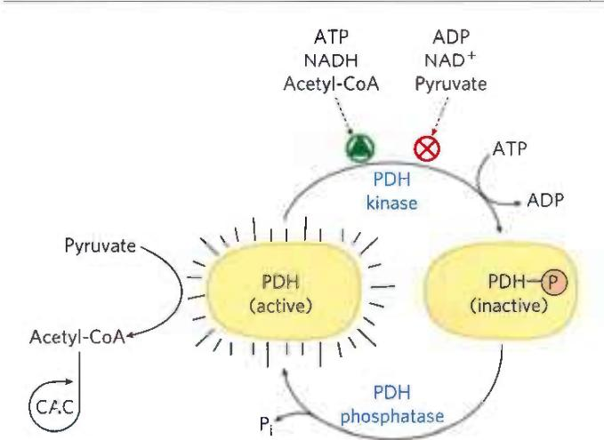  
FIGURE 16-19 Pyruvate dehydrogenase is inactivated by phosphorylation catalyzed by pyruvate dehydrogenase kinase. The kinase is regulated by metabolites that signal the energetic state of the cell. Metabolites that accumulate in an energy-sufficient state activate PDH kinase, which phosphorylates and inactivates PDH. Pyruvate is then diverted away from the energy-yielding citric acid cycle (CAC). Metabolites indicating energy need or pyruvate accumulation have the opposite effect, keeping PDH active and sending acetyl-CoA into the CAC.

#### [EN] The Citric Acid Cycle Is Also Regulated at Three Exergonic Steps

Each of the three strongly exergonic steps in the cycle—those catalyzed by citrate synthase, isocitrate dehydrogenase, and $\alpha$ -ketoglutarate dehydrogenase (Fig. 16-18)—can become the rate-limiting step under some circumstances. The availability of the substrates for citrate synthase (acetyl-CoA and oxaloacetate) varies with the metabolic state of the cell and sometimes limits the rate of citrate formation. NADH, a product of isocitrate and $\alpha$ -ketoglutarate oxidation, accumulates under some conditions, and at high $[NADH]/[NAD^{+}]$ both dehydrogenase reactions are severely inhibited by mass action. Similarly, the malate dehydrogenase reaction is essentially at equilibrium in the cell (that is, it is substrate-limited), and when $[NADH]/[NAD^{+}]$ is high the concentration of oxaloacetate is low, slowing the first step in the cycle. Product accumulation inhibits all three limiting steps of the cycle: succinyl-CoA inhibits $\alpha$ -ketoglutarate dehydrogenase (and also citrate synthase); citrate blocks citrate synthase; and the end product, ATP, inhibits both citrate synthase and isocitrate dehydrogenase. The inhibition of citrate synthase by ATP is relieved by ADP, an allosteric activator of this enzyme. In vertebrate muscle, $Ca^{2+}$ , the signal for contraction and for a concomitant increase in demand for ATP, activates both isocitrate dehydrogenase and $\alpha$ -ketoglutarate dehydrogenase, as well as the PDH complex. P4 In short, the concentrations of substrates and intermediates in the citric acid cycle set the flux through this pathway at a rate that provides optimal concentrations of ATP and NADH.

Under normal conditions, the rates of glycolysis and of the citric acid cycle are integrated so that only as much glucose is metabolized to pyruvate as is needed to supply the citric acid cycle with fuel (acetyl-CoA). Both pathways are inhibited by high levels of ATP and NADH, but also by the concentration of citrate, the product of the first step of the citric acid cycle, and an important allosteric inhibitor of phosphofructokinase-1 of the glycolytic pathway (see Fig. 14-23).

#### [EN] Citric Acid Cycle Activity Changes in Tumors

The mitochondrial pyruvate carrier (MPC) is down-regulated in tumor cells, leading to pyruvate accumulation in the cytosol. Several other mitochondrial enzymes are also inactivated in tumor cells, including the PDH complex and succinate dehydrogenase. As a result, tumor cells accumulate lactate (from the pyruvate produced by glycolysis) and succinate. Both of these intermediates are oncometabolites; they stimulate tumor growth, acting through specific G protein-coupled receptors (GPCRs; see Chapter 12) in the plasma membrane. The membrane receptor for lactate is upregulated in most cancers. L-Lactate acting through its membrane receptor, lowers [cAMP] and raises $\left[\mathrm{Ca}^{2+}\right]$ , with downstream effects currently under investigation.

P4 Mutations in citric acid cycle enzymes are very rare in humans and other mammals, but those that do occur are devastating. Genetic defects in succinate dehydrogenase lead to tumors of the adrenal gland (pheochromocytomas), and mutations in the fumarase gene lead to tumors of smooth muscle (leiomyomas) and kidney. Their activities thus define both enzymes as tumor suppressors (p. 451).

Another remarkable connection between citric acid cycle intermediates and cancer is the finding that in many glial cell tumors (gliomas), the NADPH-dependent isocitrate dehydrogenase has an unusual genetic defect. The mutant enzyme loses its normal activity (converting isocitrate to $\alpha$ -ketoglutarate) but gains a new activity: it converts $\alpha$ -ketoglutarate to 2-hydroxyglutarate (Fig. 16-20), which accumulates in the tumor cells. $\alpha$ -Ketoglutarate and $\mathrm{Fe}^{3+}$ are essential cofactors for a family of histone demethylases that alter gene expression. They do so by removing methyl groups from Arg and Lys residues in the histones that organize nuclear DNA. By competing with $\alpha$ -ketoglutarate for binding to the histone demethylases, 2-hydroxyglutarate inhibits their activity. Inhibition of the histone demethylases interferes with normal gene regulation, leading to unrestricted glial cell growth. The family of more than 60 dioxygenases that use $\alpha$ -ketoglutarate and $\mathrm{Fe}^{3+}$ as cofactors are also competitively inhibited by 2-hydroxyglutarate. Inhibition of one or more of these enzymes could interfere with normal regulation of cell division and thus produce a tumor.

  
FIGURE 16-20 A mutant isocitrate dehydrogenase acquires a new activity. Wild-type isocitrate dehydrogenase catalyzes the conversion of isocitrate to $\alpha$ -ketoglutarate, but mutations that alter the binding site for isocitrate cause loss of the normal enzymatic activity and gain of a new activity: conversion of $\alpha$ -ketoglutarate to 2-hydroxyglutarate. Accumulation of this product inhibits histone demethylase, altering gene regulation and leading to glial cell tumors in the brain.

#### [EN] Certain Intermediates Are Channeled through Metabolons

We saw an example of substrate channeling in the five-reaction sequence of the PDH complex. Many other reactions occur in similar multienzyme complexes that ensure efficient passage of the product of one enzyme reaction to the next enzyme in the pathway. Such integrated multienzyme complexes, metabolons, are held together by noncovalent interactions and are not easily extracted intact from the cell. In the classic approach of enzymology—purification of individual proteins from extracts of broken cells—once cells are broken open, their contents, including enzymes, are diluted 100- or 1,000-fold (Fig. 16-21), which favors dissociation of noncovalent complexes such as metabolons.

The enzymes of the citric acid cycle are usually described as soluble components of the mitochondrial matrix (except for succinate dehydrogenase, which is membrane-bound), but there is evidence that at least three sequential enzymes of the citric acid cycle (malate dehydrogenase, citrate synthase, and aconitase) constitute a metabolon (Fig. 16-22). We will see more examples of substrate channeling in some amino acid biosynthesis pathways in Chapter 22. As cryo-EM increases our understanding of larger complexes and “—somes” (apoptosomes, respirasomes, and replisomes, for example), it seems likely that many more enzymes once thought to function as individual soluble proteins will be found to act in multienzyme complexes that facilitate the channeling of substrates.

  
In intact cell

  
In cell extract  
FIGURE 16-21 Effect of protein concentration on complex stability. Dilution of a solution containing a noncovalently bound protein complex — such as a metabolon consisting of three enzymes (illustrated here in red, blue, and green) — favors dissociation of the complex into its constituents.

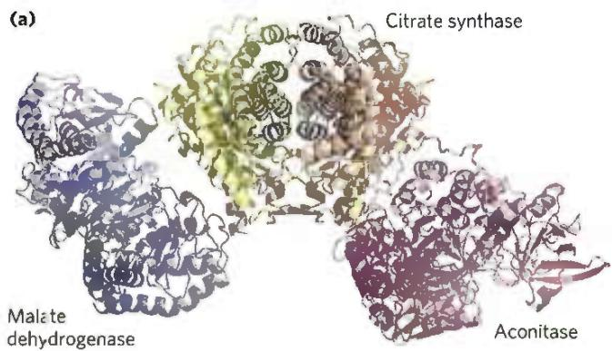

(b)  
  
FIGURE 16-22 A three-enzyme metabolon of the citric acid cycle (a) Purified porcine enzymes malate dehydrogenase (MDH), citrate synthase (CS), and aconitase form a metabolon when combined in vitro. (b) Electrostatic modeling shows that a broad path of positive potential along the surface of a MDH-CS complex connects the active sites of MDH and CS. This path provides a channel for the passage of the negatively charged oxaloacetate (OAA) from the active site of MDH, where it is formed from L-malate, to the active site of CS, where it condenses with acetyl-CoA to form citrate. Engineered mutations that replaced a positively charged Arg residue along this path with a negatively charged Asp residue greatly reduced the rate of substrate channeling through the complex, providing evidence that the functional unit is a metabolon. [Information from B. Bulutoglu et al., ACS Chem. Biol. 1 :2847, 2016. Data from PDB ID 1MLD, W. B. Gleason et al., Biochemistry 33:2078, 1994; PDB ID 1CTS, S. Remington et al., J. Mol. Biol. 158:111, 1982; PDB ID 7ACN, H. Lauble et al., Biochemistry 31:2735, 1992.]

#### [EN] SUMMARY 16.4 Regulation of the Citric Acid Cycle

The production of acetyl-CoA for the citric acid cycle by the PDH complex is inhibited allosterically by metabolites that signal a sufficiency of metabolic energy (ATP, acetyl-CoA, NADH, and fatty acids) and is stimulated by metabolites that indicate a reduced energy supply (AMP, CoA-SH, $\mathrm{NAD^{+}}$ ).

The PDH complex is regulated by allosteric mechanisms and covalent modification (phosphorylation). The overall rate of the citric acid cycle is controlled by the rate of conversion of pyruvate to acetyl-CoA and by the flux through citrate synthase, isocitrate dehydrogenase, and $\alpha$ -ketoglutarate dehydrogenase. These fluxes are affected by the concentrations of substrates and products: the end products ATP and NADH are inhibitory, and the substrates $\mathrm{NAD^{+}}$ and ADP are stimulatory.

Long-chain fatty acids, which can break down to acetyl-CoA, are also inhibitory.

■ Some mutations that affect the PDH complex or citric acid cycle enzymes are oncogenic: they occur very commonly in certain types of cancer.

■ Complexes of consecutive enzymes in a pathway (metabolons) allow substrate channeling and more efficient passage of substrates through the reaction sequences.

<!-- EN-END 16.4 -->

## 五、柠檬酸循环在代谢中的双重角色

柠檬酸循环是存在于所有需氧生物机体中的一条核心分解代谢途径，为燃料分子通过氧化提供大量自由能做准备。同时，柠檬酸循环的中间产物也是合成许多生物分子的前体。因此柠檬酸循环具有双重作用。利用柠檬酸循环中间产物可以合成的生物分子包括：葡萄糖、脂质（包括脂肪酸和胆固醇）、氨基酸、卟啉类化合物等，如图18-6所示。

为保持柠檬酸循环的正常运转,被合成代谢所消耗的中间产物须及时通过所谓的添补反应(anaplerotic reaction)予以补充。最重要的添补反应是由丙酮酸羧化酶(pyruvate carboxylase)催化的丙酮酸通过羧化形成草酰乙酸的反应:

$$
\text { 丙酮酸 } + \mathrm{CO} _ {2} \xrightarrow [ \text { (pyruvate   carboxylase) } ]{\text { ATP }} \text { 丙酮酸羧化酶 } \xrightarrow [ ]{\mathrm{H} _ {2} \mathrm{O}} \text { 草酰乙酸 }
$$

  
图18-6 柠檬酸循环既参与分解代谢也参与合成代谢

乙酰辅酶 A 是丙酮酸羧化酶的激活剂。柠檬酸循环的任何一种中间产物的缺乏都会引起乙酰辅酶 A 浓度的升高，从而激活丙酮酸羧化酶，导致草酰乙酸的生成，进而提高整个柠檬酸循环的运行速率。

此外,部分其他燃料分子的氧化降解也会产生柠檬酸循环的中间产物。例如,奇数脂肪酸的氧化,异亮氨酸、甲硫氨酸、缬氨酸和苏氨酸的分解,都可产生琥珀酰辅酶A;谷氨酸和天冬氨酸通过脱氨基(或转氨基)反应可分别产生 $\alpha-$ 酮戊二酸和草酰乙酸。这些过程在补充柠檬酸循环中间代谢物中也起一定作用。

<!-- EN-BEGIN 16.3 -->

### 【英文对应 16.3】The Hub of Intermediary Metabolism

> 来源：Lehninger Principles of Biochemistry（书籍/02_生物化学原理） 第16章 The Citric Acid Cycle，§16.3。对应本章“五、柠檬酸循环在代谢中的双重角色”。

The eight-step cyclic process for oxidation of simple two-carbon acetyl groups to $CO_{2}$ may seem unnecessarily complex and not in keeping with the biological principle of maximum economy. Remember, though, that the role of the citric acid cycle is not confined to the oxidation of acetate from carbohydrates, fatty acids, or amino acids. P3 The cycle also accepts 3-, 4-, and 5-carbon skeletons, especially from the breakdown of amino acids, at other points in the pathway. For example, when deaminated, the amino acids aspartate and glutamate become the cycle intermediates oxaloacetate and $\alpha$ -ketoglutarate, respectively.

#### [EN] The Citric Acid Cycle Serves in Both Catabolic and Anabolic Processes

In aerobic organisms, the citric acid cycle is an amphibolic pathway, one that serves in both catabolic and anabolic processes. In the cycle's anabolic role, oxaloacetate and $\alpha$ -ketoglutarate can be withdrawn from the cycle to serve as precursors of aspartate and glutamate by simple transamination (Chapter 22). Through aspartate and glutamate, the carbons of oxaloacetate and $\alpha$ -ketoglutarate are then used to build other amino acids, as well as purine and pyrimidine nucleotides. Succinyl-CoA is a central intermediate in the synthesis of the porphyrin ring of heme groups, which serve as oxygen carriers (in hemoglobin and myoglobin) and electron carriers (in cytochromes) (see Figs. 22-25, 22-26). Finally, oxaloacetate can be converted to glucose via gluconeogenesis (see Fig. 14-16).

P3 One biosynthetic process is not possible for animals: the conversion of acetate or acetyl-CoA to glucose. Given that the carbon atoms of acetate molecules entering the citric acid cycle appear eight steps later in oxaloacetate, it might seem that the cycle could generate oxaloacetate from acetate, then the oxaloacetate could be used to synthesize glucose by gluconeogenesis. However, there is no net conversion of acetate to oxaloacetate; for every two carbons that enter the cycle as acetate (acetyl-CoA), two leave as CO₂. In bacteria, plants, fungi, and protists, another reaction sequence, the glyoxylate cycle, serves as a mechanism for converting acetate to carbohydrate. The glyoxylate cycle, which shares some reactions with the citric acid cycle, converts two molecules of acetate to one of oxaloacetate in a variant of the citric acid cycle in which the two decarboxylation steps are bypassed (see Fig. 20-45). Thus, plants and many simpler organisms can synthesize glucose from fatty acids, but humans and other animals cannot.

#### [EN] Anaplerotic Reactions Replenish Citric Acid Cycle Intermediates

Under most circumstances, there is a dynamic steady state between reactions that siphon intermediates away from the citric acid cycle and those that supply additional carbon skeletons. P3 When the withdrawal of cycle intermediates for use in biosynthesis lowers the concentrations of citric acid cycle intermediates enough to slow the cycle, the intermediates are replenished by anaplerotic reactions (Greek, "to refill") (Fig. 16-15). Table 16-2 shows the most common anaplerotic reactions, all of which, in various tissues and organisms, convert either pyruvate or phosphoenolpyruvate to oxaloacetate or malate. The most important anaplerotic reaction in mammalian liver, kidney, and brown adipose tissue is the reversible carboxylation of pyruvate by $\mathrm{HCO_3^-}$ to form oxaloacetate, catalyzed by pyruvate carboxylase. The enzymatic addition of a carboxyl group to pyruvate requires energy, which is supplied by ATP.

Pyruvate carboxylase is a regulatory enzyme and is virtually inactive in the absence of acetyl-CoA, its positive allosteric modulator. Whenever acetyl-CoA, the fuel for the citric acid cycle, is present in excess, it stimulates the pyruvate carboxylase reaction to produce more oxaloacetate, enabling the cycle to use more acetyl-CoA in the citrate synthase reaction.

#### [EN] Biotin in Pyruvate Carboxylase Carries One-Carbon (CO₂) Groups

The pyruvate carboxylase reaction requires the vitamin biotin (Fig. 16-16), which is the prosthetic group of the enzyme. Biotin, which plays a key role in many carboxylation reactions, is a specialized carrier of one-carbon groups in their most oxidized form: $\mathrm{CO}_{2}$ . (The transfer of one-carbon groups in more reduced forms is mediated by other cofactors, notably tetrahydrofolate and S-adenosylmethionine, as described in Chapter 18.) Carboxyl groups are activated in a reaction that consumes ATP and joins $\mathrm{CO}_{2}$ to enzyme-bound biotin. This "activated" $\mathrm{CO}_{2}$ is then passed to an acceptor (pyruvate in this case) in a carboxylation reaction.

Pyruvate carboxylase has four identical subunits, each containing a molecule of biotin covalently attached through an amide linkage to the $\varepsilon$ -amino group of a specific Lys residue in the enzyme active site. Carboxylation of pyruvate proceeds in two steps (Fig. 16-16): first, a carboxyl group derived from $\mathrm{HCO}_3^-$ is attached to biotin, then the carboxyl group is transferred to pyruvate to form oxaloacetate. P5 These two steps occur at separate active sites; the long flexible arm of biotin transfers activated carboxyl groups from the first active site (on one monomer of the tetramer) to the

  
FIGURE 16-15 Role of the citric acid cycle in anabolism. Intermediates of the citric acid cycle are drawn off as precursors in many biosynthetic pathways. Shown in red are four anaplerotic reactions that replenish depleted cycle intermediates (see Table 16-2).

<table><tr><td colspan="2">TABLE 16-2 Anaplerotic Reactions</td></tr><tr><td>Reaction</td><td>Tissue(s)/organism(s)</td></tr><tr><td>Pyruvate + HCO3− + ATP  $\xrightarrow{\text{pyruvate carboxylase}}$  oxaloacetate + ADP + P1</td><td>Liver, kidney</td></tr><tr><td>Phosphoenolpyruvate + CO2 + GDP  $\xrightarrow{\text{PEP carboxykinase}}$  oxaloacetate + GTP</td><td>Heart, skeletal muscle</td></tr><tr><td>Phosphoenolpyruvate + HCO3−  $\xrightarrow{\text{PEP carboxylase}}$  oxaloacetate + P1</td><td>Higher plants, yeast, bacteria</td></tr><tr><td>Pyruvate + HCO3− + NAD(P)H  $\xrightarrow{\text{malic enzyme}}$  malate + NAD(P)+</td><td>Widely distributed in eukaryotes and bacteria</td></tr></table>

second (on the adjacent monomer), functioning much like the long lipoyllysyl arm of $E_{2}$ in the PDH complex (Fig. 16-6) and the long arm of the CoA-like moiety in the acyl carrier protein involved in fatty acid synthesis (see Fig. 21-5); these are compared in Figure 16-17. Lipoate, biotin, and pantothenate all enter cells on the same transporter; all become covalently attached to proteins by similar reactions; and all provide a flexible tether that allows bound reaction intermediates to move from one active site to another in an enzyme complex, without dissociating from it. That is, all participate in substrate channeling.

#### [EN] SUMMARY 16.3 The Hub of Intermediary Metabolism

The citric acid cycle is amphibolic, serving in both catabolism and anabolism. Besides acetyl-CoA, any compound that gives rise to a four- or five-carbon intermediate of the

Carboxybiotinyl-enzyme  

MECHANISM FIGURE 16-16 The role of biotin in the reaction catalyzed by pyruvate carboxylase. Biotin is attached to the enzyme through an amide bond with the $\varepsilon$ -amino group of a Lys residue, forming biotinyl-enzyme. Biotin-mediated carboxylation reactions occur in two phases, generally catalyzed in separate active sites on the enzyme, as exemplified by the pyruvate carboxylase reaction. In the first phase (steps ① to ③), bicarbonate is converted to the more activated $\mathrm{CO}_{2}$ , and then used to carboxylate biotin. The biotin acts as a carrier to transport the $\mathrm{CO}_{2}$ from one active site to another on an adjacent monomer of the tetrameric enzyme (step ④). In the second phase (steps ⑤ to ⑦), catalyzed in this second active site, the $\mathrm{CO}_{2}$ reacts with pyruvate to form oxaloacetate.

citric acid cycle—for example, the breakdown products of many amino acids—can be oxidized by the cycle. Cycle intermediates can be drawn off and used as the starting material for a variety of biosynthetic products.

■ When intermediates are shunted from the citric acid cycle to other pathways, they are replenished by several anaplerotic reactions, which produce four-carbon intermediates by carboxylation of three-carbon compounds; pyruvate carboxylase is a major anaplerotic enzyme.

■ Enzymes that catalyze carboxylations commonly employ biotin to activate $CO_{2}$ and to carry it to acceptors such as pyruvate or phosphoenolpyruvate.

  
FIGURE 16-17 Biological tethers. The cofactors lipoate, biotin, and the combination of $\beta$ -mercaptoethylamine and pantothenate form long, flexible arms (green) on the enzymes to which they are covalently bound, acting as tethers that move intermediates from one active site to the next. The group shaded light red is, in each case, the point of attachment of the activated intermediate to the tether.

<!-- EN-END 16.3 -->

## 六、乙醛酸途径

植物、部分无脊椎动物以及部分微生物可将两分子的乙酰辅酶 A 通过乙醛酸途径 (glyoxylate pathway) 转变为草酰乙酸。

在植物细胞中,乙醛酸途径(又称乙醛酸循环)是在线粒体和植物所特有的细胞器乙醛酸循环体(glyoxysome)中进行的,它是一种特化的过氧化物酶体(peroxisome)。具体过程如图18-7所示。

乙醛酸途径的大多数酶与柠檬酸循环中的酶是相同的。在这条途径中，线粒体中的草酰乙酸在天冬氨酸转氨酶的作用下转变为天冬氨酸，然后被运输到乙醛酸循环体中，在乙醛酸循环体中天冬氨酸重新被转变为草酰乙酸。如图18-7所示，乙醛酸途径的前两步与柠檬酸循环是重叠的：草酰乙酸与乙酰辅酶A缩合形成柠檬酸（图中的第②步），后者经异构化形成异柠檬酸（图中的第③步）。与柠檬酸循环不同的是，乙醛酸循环体中特有的异柠檬酸裂解酶(isocitrate lyase)将异柠檬酸裂解为琥珀酸和乙醛酸（图中的第④步）。所产生的琥珀酸即可被转移到线粒体中，然后通过柠檬酸循环途径的酶催化又转变为草酰乙酸（图中的第⑦步）。

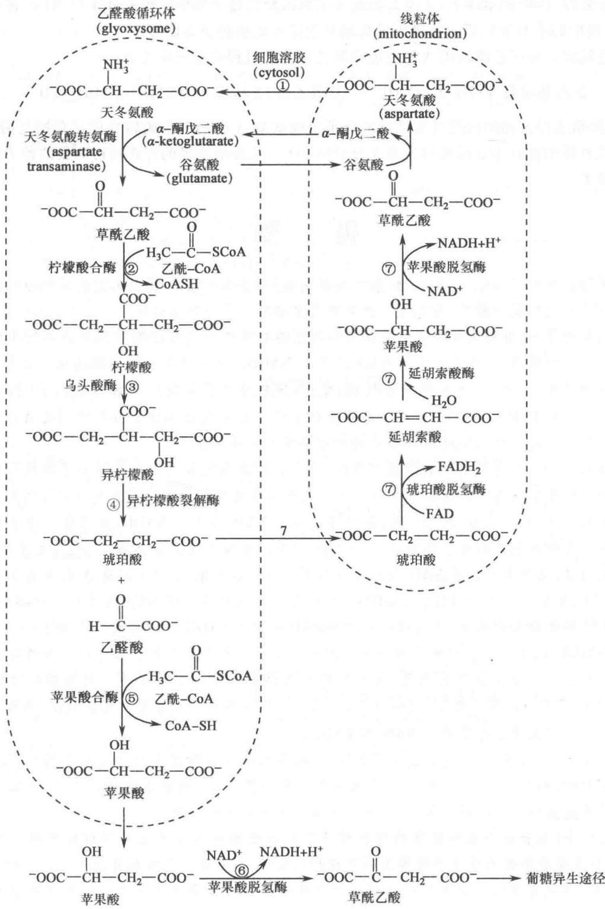  
图 18-7 在植物线粒体和乙醛酸循环体中进行的乙醛酸途径

反应步骤如下:①线粒体中的草酰乙酸转变为天冬氨酸后被转移到乙醛酸循环体,然后再重新转变为草酰乙酸。②草酰乙酸与乙酰辅酶A缩合形成柠檬酸。③柠檬酸转变为异柠檬酸。④异柠檬酸裂解酶将异柠檬酸裂解为琥珀酸和乙醛酸。⑤由苹果酸合酶催化将乙醛酸与乙酰辅酶A缩合形成苹果酸。⑥苹果酸进入细胞溶胶由苹果酸脱氢酶催化转变为草酰乙酸。后者可通过糖异生途径转变为糖类。⑦乙醛酸循环体中的琥珀酸被转移到线粒体后通过柠檬酸循环途径被再转变为草酰乙酸(此图参考Voet D, Voet J G, Pratt CW, 1999)

乙醛酸则通过只存在于乙醛酸循环体中的苹果酸合酶(malate synthase)的催化与另一分子乙酰辅酶A缩合形成苹果酸(图中的第⑤步)。苹果酸进入细胞溶胶后被苹果酸脱氢酶催化由 $\mathrm{NAD^{+}}$ 将苹果酸氧化为草酰乙酸(图中的第⑥步)，后者可进入葡萄糖异生途径而被转变为葡萄糖。

乙醛酸途径将 2 分子乙酰辅酶 A 转变成草酰乙酸的全过程的总反应式如下：

2 乙酰辅酶 A+2NAD $^{+}$ +FAD $\longrightarrow$ 草酰乙酸 + 2 辅酶 A+2NADH+FADH $_{2}$ +2H $^{+}$

因此,乙醛酸途径代谢的最终结果是将两分子乙酰辅酶 A 中的四个碳转变成了草酰乙酸(通过苹果酸),而不是像柠檬酸循环中那样被转变为 4 分子的 $CO_{2}$ 。乙醛酸途径的存在使得萌发的种子能将贮存的脂肪转变为糖类。

## 提要

柠檬酸循环是所有燃料分子(包括糖、脂质和氨基酸)完全氧化成二氧化碳的共同代谢途径。也同时为大量的生物合成反应提供前体,所以是一种具有双重功能的核心代谢途径。

在有氧的条件下，糖酵解过程生成的最终产物丙酮酸在原核细胞的细胞溶胶内或真核生物的线粒体基质内转化为乙酰辅酶A，同时将一分子 $\mathrm{NAD^{+}}$ 还原为NADH。催化该反应的丙酮酸脱氢酶复合体由三种酶（ $\mathbf{E}_1$ ：丙酮酸脱氢酶； $\mathbf{E}_2$ ：二氢硫辛酰转乙酰酶； $\mathbf{E}_3$ ：二氢硫辛酰脱氢酶）、五种辅助因子（焦磷酸硫胺素TPP、硫辛酸、辅酶A、FAD和 $\mathrm{NAD^{+}}$ )组成。脂肪酸分子通过 $\beta$ 氧化过程转化为乙酰辅酶A。很多氨基酸脱氨后的碳骨架可以转化为乙酰辅酶A或其他柠檬酸循环的中间体。

当乙酰辅酶 A 的二碳单位进入柠檬酸循环时，先在柠檬酸酶的催化下与四碳分子草酰乙酸缩合成六碳分子柠檬酸。柠檬酸在乌头酸酶的催化下发生异构化转变成异柠檬酸。后者在异柠檬酸脱氢酶的催化下发生氧化脱羧反应，转变为 $\alpha-$ 酮戊二酸，同时将一分子 $NAD^{+}$ 还原为 NADH，并产生一分子 $CO_{2}$ 。 $\alpha-$ 酮戊二酸在一种与丙酮酸脱氢酶复合体高度同源的 $\alpha-$ 酮戊二酸脱氢酶复合体催化下，再发生氧化脱羧，转化为琥珀酰辅酶 A，同时将一分子 $NAD^{+}$ 还原为 NADH。琥珀酰辅酶 A 脱去辅酶 A 转变为琥珀酸时发生底物水平磷酸化，形成一分子的 ATP（或 GTP）。琥珀酸在与线粒体内膜（或原核生物的质膜）结合的琥珀酸脱氢酶催化下转变为延胡索酸，同时将一分子的 FAD 还原为 $FADH_{2}$ 。在经过一步加水一步脱氢反应并形成一分子 NADH 后，重新生成草酰乙酸分子。由此完成了一个产生了两个 $CO_{2}$ 分子的循环过程。

尽管柠檬酸循环并不直接消耗氧气,但只有在氧气存在时才可有效运转。因为循环过程中生成的NADH和 $FADH_{2}$ 需要通过电子传递链(即呼吸链)将电子传递给氧气后才可被重新氧化,从而为柠檬酸循环的进一步运转提供必须的电子受体 $NAD^{+}$ 和FAD。

丙酮酸脱氢酶、柠檬酸酶、异柠檬酸脱氢酶和 $\alpha-$ 酮戊二酸脱氢酶等皆可通过可逆结合环境中的小分子（如 NADH、ADP、ATP、乙酰辅酶 A、琥珀酰辅酶 A 以及钙离子等）而发生变构调节，使其酶活性升高或降低。因此柠檬酸循环是可以被调控的，其进行快慢取决于细胞的需求。

在部分生物中(包括微生物和发芽的植物种子中),柠檬酸循环中形成的异柠檬酸并不发生氧化脱羧,而是在异柠檬酸裂解酶的催化下裂解为琥珀酸和乙醛酸,后者在苹果酸酶催化下可以继续与一分子的乙酰辅酶A缩合形成苹果酸。苹果酸最终可以通过糖异生途径转变为葡萄糖。这就使得植物种子中储存的脂肪可以转变为葡萄糖,为发育早期的植物提供重要的生物合成前体。这种由乙酰辅酶A生成苹果酸的途径被称为乙醛酸途径,它是与柠檬酸循环相关联的一种合成代谢途径。

## 习题

1. 画出柠檬酸循环概貌图，包括起催化作用的酶和辅助因子。

2. 总结柠檬酸循环在机体代谢中的作用和地位。

3. 用 $^{14}$ C 标记丙酮酸的甲基碳原子( $^{14}$ CH $_{3}$ —CO—COO $^{-}$ ), 当其进入柠檬酸循环运转一周后, 标记碳原子的命运如何?

4. 写出由乙酰-CoA 形成草酰乙酸的反应平衡式。

5. 在标准状况下, 苹果酸由 $NAD^{+}$ 氧化成草酰乙酸的 $\Delta G^{\ominus'} = +29.29 \, kJ/mol$ 。在生理条件下, 这一反应却极易由苹果酸向草酰乙酸的方向进行。假定 $[NAD^{+}] / [NADH] = 8, pH = 7$ , 计算由苹果酸形成草酰乙酸时两种化合物的最低浓度比值应是多少?

6. 当 1 分子葡萄糖完全转变为 $CO_{2}$ 时, 假设: 全部 NADH 和 $FADH_{2}$ 都氧化产生 ATP, 丙酮酸都转变为乙酰-辅酶 A, 而且细胞溶胶中的 NADH 都通过苹果酸-天冬氨酸穿梭进入呼吸链。计算通过氧化磷酸化途径和底物水平磷酸化途径各产生的 ATP 的百分比?

7. 阐明丙二酸对柠檬酸循环所产生的效应。

8. 柠檬酸循环为什么必须在有氧条件下才能进行？

9. 如果柠檬酸循环中的某种酶缺乏,新生儿会出现严重的神经疾患。如果从病人的尿中发现有大量的 $\alpha-$ 酮戊二酸、琥珀酸和延胡索酸,循环中的哪种酶出现了缺失?

10. 乙酰-CoA一方面能抑制二氢硫辛酰乙酰基转移酶的作用,另一方面又有激活丙酮酸脱氢酶激酶的作用,请描述这两种不同的调节作用在调控丙酮酸脱氢酶复合体活性时如何才能协调一致?

11. 为满足机体肌肉收缩对 ATP 的需要, 细胞内质网中贮存的 $Ca^{2+}$ 被释放到细胞溶胶中, 请问柠檬酸循环的运行速率对 $Ca^{2+}$ 的增加会如何应答?

12. 在柠檬酸循环的双重作用中,列举出一些相关的酶及其所催化的反应,并描述它们的关键作用。

## 主要参考书目

1. Garrett R H, Grisham C M. Biochemistry. 2nd ed. 北京: 高等教育出版社, 2002.

2. Horton H R, Moran L A, Ochs R S, et al. Principles of Biochemistry. 3rd ed. New York: Prentice Hall, 2002.

3. Nelson D L, Cox M L. Lehninger Principles of Biochemistry. 6th ed. New York: W. H. Freeman and Company, 2013.

4. Voet D, Voet J G, Pratt C W. Fundamentals of Biochemistry. New York: John Wiley & Sons, 1999.

5. Voet D, Voet J G. Biochemistry. 3rd ed. New York: John Wiley & Sons, 2004.

6. Stryer L. Biochemistry. 5th ed. New York: W. H. Freeman & Company, 2006.

7. Kay J, Weitzman P D J (eds). Krebs' Citric Acid Cycle: Half a Century and Still Turning// Biochemical society symposium 54. London: The Biochemical Society, 1987.

8. Mattevi A, de Kok A, Perham R N. The pyruvate dehydrogenase multienzyme complex. Curr Opin Struct Biol, 1992, 2: 877-887.

9. Baldwin J E, Krebs H. The evolution of metabolic cycles. Nature, 1981, 291:381-382.

10. Remington S J. Structure and mechanism of citrate synthase. Curr Top Cell Regul, 1992, 33:209-228.

11. Hansford R G. Control of mitochondrial substrate oxidation. Curr Top Bioenerget, 1980, 10:217-278.

12. Beevers H. The role of the glyoxylate cycle //Stumf P K, Conn E E, et al. The Biochemistry of Plants: A Comprehensive Treatise. New York: Academic Press, 1980, 117-130.

(王镜岩 昌增益)

## 网上资源

习题答案

自测题

<!-- EN-BEGIN 第16章章末 -->

## 【英文对应 第16章章末】The Citric Acid Cycle：关键术语、习题与简答

> 来源：Lehninger Principles of Biochemistry（书籍/02_生物化学原理） 第16章章末，以及书末 Abbreviated Solutions to Problems 第16章。

### [EN] KEY TERMS

Terms in bold are defined in the glossary.

cellular respiration 574  
citric acid cycle 574  
tricarboxylic acid (TCA)  
cycle 574  
Krebs cycle 574  
thioester 575  
mitochondrial pyruvate  
carrier (MPC) 575  
pyruvate dehydrogenase (PDH) complex 575  
oxidative  
decarboxylation 575  
lipoate 576  
substrate channeling 577 iron-sulfur center 582
α-ketoglutarate dehydrogenase complex 582
moonlighting enzymes 584
nucleoside diphosphate kinase 586
prochiral molecule 588
amphibolic pathway 590
glyoxylate cycle 590
anaplerotic reaction 590
biotin 590
oncometabolite 594
metabolon 595

### [EN] PROBLEMS

1. Balance Sheet for the Citric Acid Cycle The citric acid cycle has eight enzymes: citrate synthase, aconitase, isocitrate dehydrogenase, $\alpha$ -ketoglutarate dehydrogenase, succinyl-CoA synthetase, succinate dehydrogenase, fumarase, and malate dehydrogenase.

(a) Write a balanced equation for the reaction catalyzed by each enzyme.

(b) Name the cofactor(s) required by each enzyme reaction. (c) For each enzyme, determine which of the following describes the type of reaction(s) catalyzed: condensation (carbon-carbon bond formation); dehydration (loss of water); hydration (addition of water); decarboxylation (loss of $\mathrm{CO}_{2}$ ); oxidation-reduction; substrate-level phosphorylation; isomerization.

(d) Write a balanced net equation for the catabolism of acetyl-CoA to $CO_{2}$ .

2. Net Equation for Glycolysis and the Citric Acid Cycle Write the net biochemical equation for the metabolism of a molecule of glucose by glycolysis and the citric acid cycle, including all cofactors.

3. Recognizing Oxidation and Reduction Reactions
One biochemical strategy of many living organisms is the stepwise oxidation of organic compounds to $CO_{2}$ and $H_{2}O$ and the conservation of a major part of the energy thus produced in the form of ATP. It is important to be able to recognize oxidation-reduction processes in metabolism. Reduction of an organic molecule results from the hydrogenation of a double bond (Eqn 1, below) or of a single bond with accompanying cleavage (Eqn 2). Conversely, oxidation results from dehydrogenation.

(e)

In biochemical redox reactions, the coenzymes NAD and FAD dehydrogenate/hydrogenate organic molecules in the presence of the proper enzymes.

(g)

(1)

(h)

(2)

For each of the metabolic transformations (a) through (h), determine whether the compound on the left has undergone oxidation or reduction. Balance each transformation by inserting H—H and, where necessary, $H_{2}O$ .

(a)

(b)

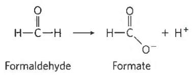

(c)

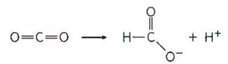

(a)

(d)

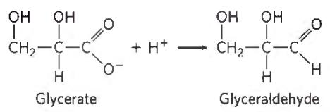

(b)

(c)

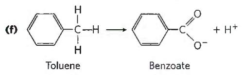

(d)

4. Relationship between Energy Release and the Oxidation State of Carbon A eukaryotic cell can use glucose $\left(\mathrm{C}_{6}\mathrm{H}_{12}\mathrm{O}_{6}\right)$ and hexanoate $\left(\mathrm{C}_{6}\mathrm{H}_{11}\mathrm{O}_{2}\right)$ as fuels for cellular respiration. On the basis of their structural formulas, which substance releases more energy per gram on complete combustion to $CO_{2}$ and $H_{2}O$ ?

5. Nicotinamide Coenzymes as Reversible Redox Carriers The nicotinamide coenzymes (see Fig. 13-24) can undergo reversible oxidation-reduction reactions with specific substrates in the presence of the appropriate dehydrogenase. In these reactions, NADH + H $^{+}$ serves as the hydrogen source, as described in Problem 3. Whenever the coenzyme is oxidized, a substrate must be simultaneously reduced:

For each of the reactions in (a) through (f) shown below, determine whether the substrate has been oxidized or reduced or is unchanged in oxidation state (see Problem 3). If a redox change has occurred, balance the reaction with the necessary amount of $\mathrm{NAD^{+}}$ , NADH, $\mathrm{H^{+}}$ , and $\mathrm{H}_2\mathrm{O}$ . The objective is to recognize when a redox coenzyme is necessary in a metabolic reaction.

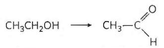

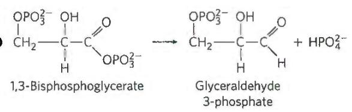

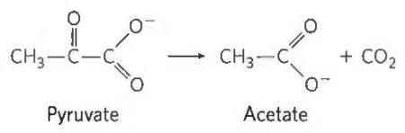

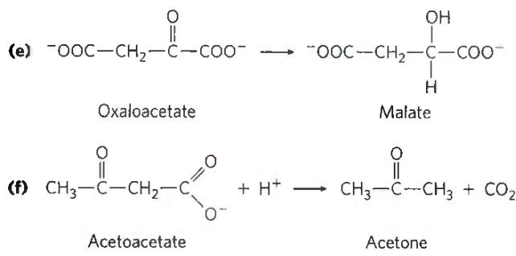

6. Pyruvate Dehydrogenase Cofactors and Mechanism Describe the role of each cofactor involved in the reaction catalyzed by the pyruvate dehydrogenase complex.

7. Thiamine Deficiency Individuals with a thiamine-deficient diet have relatively high levels of pyruvate in their blood. Explain this in biochemical terms.

8. Isocitrate Dehydrogenase Reaction What type of chemical reaction is involved in the conversion of isocitrate to $\alpha$ -ketoglutarate? Name and describe the role of any cofactors. What other reaction(s) of the citric acid cycle are of this same type?

9. Stimulation of Oxygen Consumption by Oxaloacetate and Malate In the early 1930s, Albert Szent-Györgyi reported the interesting observation that the addition of small amounts of oxaloacetate or malate to suspensions of minced pigeon breast muscle stimulated the oxygen consumption of the preparation. Surprisingly, the amount of oxygen consumed was about seven times more than the amount necessary for complete oxidation (to $\mathrm{CO}_{2}$ and $\mathrm{H}_2\mathrm{O}$ ) of the added oxaloacetate or malate. Why did the addition of oxaloacetate or malate stimulate oxygen consumption? Why was the amount of oxygen consumed so much greater than the amount necessary to completely oxidize the added oxaloacetate or malate?

10. Formation of Oxaloacetate in a Mitochondrion In the last reaction of the citric acid cycle, malate is dehydrogenated to regenerate the oxaloacetate necessary for the entry of acetyl-CoA into the cycle:

$$
\begin{array}{r l} \mathrm {L - Malate + NAD^ {+}} & \longrightarrow \text { oxaloacetate } + \mathrm{NADH} + \mathrm{H} ^ {+} \\ & \Delta G ^ {\prime \circ} = 3 0. 0 \mathrm{kJ/mol} \end{array}
$$

(a) Calculate the equilibrium constant for this reaction at 25 °C.
(b) Because $\Delta G^{\prime\circ}$ assumes a standard pH of 7, the equilibrium constant calculated in (a) corresponds to

$$
K _ {\mathrm{eq}} ^ {\prime} = \frac {[ \text { oxaloacetate } ] [ \mathrm{NADH} ]}{[ \mathrm{L-malate} ] [ \mathrm{NAD} ^ {+} ]}
$$

The measured concentration of L-malate in rat liver mitochondria is about 0.20 mm when $[NAD^{+}]/[NADH]$ is 10. Calculate the concentration of oxaloacetate at pH 7 in these mitochondria.

(c) To appreciate the magnitude of the mitochondrial oxaloacetate concentration, calculate the number of oxaloacetate molecules in a single rat liver mitochondrion. Assume the mitochondrion is a sphere of diameter 2.0 $\mu$ m.

11. Cofactors for the Citric Acid Cycle Suppose you have prepared a mitochondrial extract that contains all the soluble enzymes of the matrix but has lost (by dialysis) all the low molecular weight cofactors. What must you add to the extract so that the preparation will oxidize acetyl-CoA to $\mathrm{CO}_{2}$ ?

12. Riboflavin Deficiency How would a riboflavin deficiency affect the functioning of the citric acid cycle? Explain your answer.

13. Oxaloacetate Pool What factors might decrease the pool of oxaloacetate available for the activity of the citric acid cycle? How can the pool of oxaloacetate be replenished?

14. Energy Yield from the Citric Acid Cycle The reaction catalyzed by succinyl-CoA synthetase produces the high-energy compound GTP. How is the free energy contained in GTP incorporated into the cellular ATP pool?

15. Respiration Studies in Isolated Mitochondria Cellular respiration can be studied in isolated mitochondria by measuring oxygen consumption under different conditions. If 0.01 M sodium malonate is added to actively respiring mitochondria that are using pyruvate as fuel, respiration soon stops and a metabolic intermediate accumulates.

(a) What is the structure of this intermediate?

(b) Explain why it accumulates.

(c) Explain why oxygen consumption stops.

(d) Aside from removal of the malonate, what can overcome this inhibition of respiration? Explain.

16. Labeling Studies in Isolated Mitochondria Biochemists have often delineated the metabolic pathways of organic compounds by using a radioactively labeled substrate and following the fate of the label.

(a) How can you determine whether a suspension of isolated mitochondria metabolizes added glucose to $CO_{2}$ and $H_{2}O$ ?

(b) Suppose you add a brief pulse of $[3-^{14}C]$ pyruvate (labeled in the methyl position) to the mitochondria. After one turn of the citric acid cycle, what is the location of the ${}^{14}C$ in the oxaloacetate? Explain by tracing the ${}^{14}C$ label through the pathway. How many turns of the cycle are required to release all the $[3-^{14}C]$ pyruvate as $CO_{2}$ ?

17. [1-14C]Glucose Catabolism An investigator briefly incubates an actively respiring bacterial culture with $[1 - ^{14}\mathrm{C}]$ glucose and isolates the glycolytic and citric acid cycle intermediates. Where is the $^{14}\mathrm{C}$ located in each of the intermediates listed? Consider only the initial incorporation of $^{14}\mathrm{C}$ in the first pass of labeled glucose through the pathways.

(a) Fructose 1,6-bisphosphate

(b) Glyceraldehyde 3-phosphate

(c) Phosphoenolpyruvate

(d) Acetyl-CoA

(e) Citrate

(f) $\alpha$ -Ketoglutarate

(g) Oxaloacetate

18. Role of the Vitamin Thiamine People with beriberi, a disease caused by thiamine deficiency, have elevated levels of blood pyruvate and $\alpha$ -ketoglutarate, especially after consuming a meal rich in glucose. How are these effects related to a deficiency of thiamine?

19. Synthesis of Oxaloacetate by the Citric Acid Cycle In the last step of the citric acid cycle, NAD $^{+}$ -dependent oxidation of L-malate forms oxaloacetate. Can a net synthesis of oxaloacetate from acetyl-CoA occur using only the enzymes and cofactors of the citric acid cycle, without depleting the intermediates of the cycle? Explain. How do cells replenish the oxaloacetate that is lost from the cycle to biosynthetic reactions?

20. Oxaloacetate Depletion Mammalian liver can carry out gluconeogenesis using oxaloacetate as the starting material (Chapter 14). Would the extensive use of oxaloacetate for gluconeogenesis affect the operation of the citric acid cycle? Explain your answer.

21. Mode of Action of the Rodenticide Fluoroacetate Fluoroacetate, prepared commercially for rodent control, is also produced by a South African plant. After entering a cell, fluoroacetate is converted to fluoroacetyl-CoA in a reaction catalyzed by the enzyme acetate thiokinase:

$$
\begin{array}{c} \mathrm {F - CH_ {2} COO^ {-} + CoA - SH + ATP\longrightarrow} \\ \mathrm {F - CH_ {2} C- S - CoA + AMP + PP_ {i}} \\ \mathrm{O} \end{array}
$$

You perform a perfusion experiment to study the toxic effect of fluoroacetate using intact isolated rat heart. After perfusing the heart with 0.22 mm fluoroacetate, you see a decrease in the measured rate of glucose uptake and glycolysis as well as an accumulation of glucose 6-phosphate and fructose 6-phosphate. Examination of the citric acid cycle intermediates reveals that their concentrations are below normal, except for citrate, which has a concentration 10 times higher than normal.

(a) Where did the block in the citric acid cycle occur? What caused citrate to accumulate and the other cycle intermediates to be depleted?

(b) Fluoroacetyl-CoA is enzymatically transformed in the citric acid cycle. What is the structure of the end product of fluoroacetate metabolism? Why does it block the citric acid cycle? How might the inhibition be overcome?

(c) In the heart perfusion experiments, why did glucose uptake and glycolysis decrease? Why did hexose monophosphates accumulate?

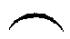

(d) Why is fluoroacetate poisoning fatal?

22. Synthesis of L-Malate in Wine Making The tartness of some wines is due to high concentrations of L-malate. Write a sequence of reactions showing how yeast cells synthesize L-malate from glucose under anaerobic conditions in the presence of dissolved $CO_{2}$ ( $HCO_{3}^{-}$ ). Note that the overall reaction for this fermentation cannot involve the consumption of nicotinamide coenzymes or citric acid cycle intermediates.

23. Net Synthesis of $\alpha$ -Ketoglutarate $\alpha$ -Ketoglutarate plays a central role in the biosynthesis of several amino acids. Write a sequence of enzymatic reactions that could result in the net synthesis of $\alpha$ -ketoglutarate from pyruvate. Your proposed sequence must not involve the net consumption of other citric acid cycle intermediates. Write an equation for the overall reaction.

24. Amphibolic Pathways Explain, giving examples, what is meant by the statement that the citric acid cycle is amphibolic.

25. Regulation of the Pyruvate Dehydrogenase Complex In animal tissues, the ratio of active, unphosphorylated to inactive, phosphorylated PDH complex regulates the rate of conversion of pyruvate to acetyl-CoA. Determine what happens to the rate of this reaction when a preparation of rabbit muscle mitochondria containing the PDH complex is treated with (a) pyruvate dehydrogenase kinase, ATP, and NADH; (b) pyruvate dehydrogenase phosphatase and $Ca^{2+}$ ; (c) malonate.

26. Commercial Synthesis of Citric Acid Manufacturers use citric acid as a flavoring agent in soft drinks, fruit juices, and many other foods. Worldwide, the market for citric acid is valued at hundreds of millions of dollars per year. Commercial production uses the mold Aspergillus niger, which metabolizes sucrose under carefully controlled conditions.

(a) The yield of citric acid strongly depends on the concentration of $FeCl_{3}$ in the culture medium, as indicated in the graph. Why does the yield decrease when the concentration of $Fe^{3+}$ is above or below the optimal value of 0.5 mg/L?

(b) Write the sequence of reactions by which A. niger synthesizes citric acid from sucrose. Write an equation for the overall reaction.

(c) Does the commercial process require the culture medium to be aerated—that is, is this a fermentation or an aerobic process? Explain.

27. Regulation of Citrate Synthase In the presence of saturating amounts of oxaloacetate, the activity of citrate synthase from pig heart tissue shows a sigmoid dependence on the concentration of acetyl-CoA, as shown in the graph. Adding succinyl-CoA shifts the curve to the right and makes the sigmoid dependence more pronounced.

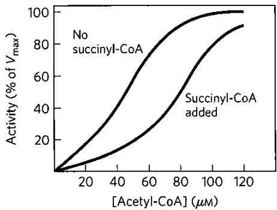

On the basis of these observations, suggest how succinyl-CoA regulates the activity of citrate synthase. (Hint: See Fig. 6-37.) Why is succinyl-CoA an appropriate signal for regulation of the citric acid cycle? How does the regulation of citrate synthase control the rate of cellular respiration in pig heart tissue?

28. Regulation of Pyruvate Carboxylase The carboxylation of pyruvate by pyruvate carboxylase occurs at a very low rate unless acetyl-CoA, a positive allosteric modulator, is present. If you have just eaten a meal rich in fatty acids (triacylglycerols) but low in carbohydrates (glucose), how does this regulatory property shut down the oxidation of glucose to $CO_{2}$ and $H_{2}O$ but increase the oxidation of acetyl-CoA derived from fatty acids?

29. Relationship between Respiration and the Citric Acid Cycle Although oxygen does not participate directly in the citric acid cycle, the cycle operates only when $O_{2}$ is present. Why?

30. Effect of $[NADH]/[NAD^{+}]$ on the Citric Acid Cycle
How would you expect the operation of the citric acid cycle to respond to a rapid increase in the $[NADH]/[NAD^{+}]$ ratio in the mitochondrial matrix? Why?

31. Thermodynamics of Citrate Synthase Reaction in Cells Citrate is formed by the condensation of acetyl-CoA with oxaloacetate, catalyzed by citrate synthase:

$$
\mathrm{Oxaloacetate} + \mathrm{acetyl-CoA} + \mathrm{H} _ {2} \mathrm{O} \rightleftharpoons \text { citrate } + \mathrm{CoA} + \mathrm{H} ^ {+}
$$

In rat heart mitochondria at pH 7.0 and 25 °C, the concentrations of reactants and products are oxaloacetate, 1 μM; acetyl-CoA, 1 μM; citrate, 220 μM; and CoA, 65 μM. The standard free-energy change for the citrate synthase reaction is -32.2 kJ/mol. What is the direction of metabolite flow through the citrate synthase reaction in rat heart cells? Explain.

32. Reactions of the Pyruvate Dehydrogenase Complex
Two of the steps in the oxidative decarboxylation of pyruvate (steps 4 and 5 in Fig. 16-6) do not involve any of the three carbons of pyruvate, yet are essential to the operation of the PDH complex. Explain.

33. Pyruvate Transport into Mitochondria The mitochondrial pyruvate carrier (MPC) is a heterodimer of the proteins MPC1 and MPC2. In a high proportion (80%) of certain cancers, including gliomas (tumors of the glial cells of the brain), the gene for one of these proteins is mutated such that pyruvate cannot enter the mitochondrial matrix. Name three metabolic effects that you would expect to see if cytosolic pyruvate could not gain access to the machinery of the citric acid cycle. (Hint: Box 14-1 may be helpful.)

34. Citric Acid Cycle Mutants There are many cases of human disease in which one or another enzyme activity is lacking due to genetic mutation. Why are cases in which individuals lack one of the enzymes of the citric acid cycle extremely rare?

### [EN] DATA ANALYSIS PROBLEM

35. How the Citric Acid Cycle Was Discovered The detailed biochemistry of the citric acid cycle was determined by several researchers over a period of decades. In a 1937 article, Krebs and Johnson summarized their work and the work of others in the first published description of this pathway.

The methods used by these researchers were very different from those of modern biochemistry. Radioactive tracers were not commonly available until the 1940s, so Krebs and other researchers had to use nontracer techniques to work out the pathway. Using freshly prepared samples of pigeon breast muscle, they determined oxygen consumption by suspending minced muscle in buffer in a sealed flask and measuring the volume (in $\mu$ L) of oxygen consumed under different conditions. They measured levels of substrates (intermediates) by treating samples with acid to remove contaminating proteins, then assaying the quantities of various small organic molecules. The two key observations that led Krebs and colleagues to propose a citric acid cycle as opposed to a linear pathway (like that of glycolysis) were made in the following experiments.

Experiment I: They incubated 460 mg of minced muscle in 3 mL of buffer at 40 °C for 150 minutes. Addition of citrate increased O₂ consumption by 893 μL compared with samples without added citrate. They calculated, based on the O₂ consumed during respiration of other carbon-containing compounds, that the expected O₂ consumption for complete respiration of this quantity of citrate was only 302 μL.

Experiment II: They measured $O_{2}$ consumption by 460 mg of minced muscle in 3 mL of buffer when incubated with citrate and/or with 1-phosphoglycerol (glycerol 1-phosphate; this was known to be readily oxidized by cellular respiration) at 40 °C for 140 minutes. The results are shown in the table.

<table><tr><td>Sample</td><td>Substrate(s) added</td><td> $\mu \mathrm{L}{\mathrm{O}}_{2}$  absorbed</td></tr><tr><td>1</td><td>No extra</td><td>342</td></tr><tr><td>2</td><td>0.3 mL 0.2 M 1-phosphoglycerol</td><td>757</td></tr><tr><td>3</td><td>0.15 mL 0.02 M citrate</td><td>431</td></tr><tr><td>4</td><td>0.3 mL 0.2 M 1-phosphoglycerol and 0.15 mL 0.02 M citrate</td><td>1,385</td></tr></table>

(a) Why is $\mathrm{O}_2$ consumption a good measure of cellular respiration? (b) Why does sample 1 (unsupplemented muscle tissue) consume some oxygen?

(c) Based on the results for samples 2 and 3, can you conclude that 1-phosphoglycerol and citrate serve as substrates for cellular respiration in this system? Explain your reasoning.

(d) Krebs and colleagues used the results from these experiments to argue that citrate was "catalytic"—that it helped the muscle tissue samples metabolize 1-phosphoglycerol more completely. How would you use their data to make this argument?

(e) Krebs and colleagues further argued that citrate was not simply consumed by these reactions, but had to be regenerated. Therefore, the reactions had to be a cycle rather than a linear pathway. How would you make this argument?

Other researchers had found that arsenate (AsO $_{4}^{3-}$ ) inhibits α-ketoglutarate dehydrogenase and that malonate inhibits succinate dehydrogenase.

(f) Krebs and coworkers found that muscle tissue samples treated with arsenate and citrate would consume citrate only in the presence of oxygen; under these conditions, oxygen was consumed. Based on the pathway in Figure 16-7, what was the citrate converted to in this experiment, and why did the samples consume oxygen?

In their article, Krebs and Johnson further reported the following: (1) In the presence of arsenate, 5.48 mmol of citrate was converted to 5.07 mmol of $\alpha$ -ketoglutarate. (2) In the presence of malonate, citrate was quantitatively converted to large amounts of succinate and small amounts of $\alpha$ -ketoglutarate. (3) Addition of oxaloacetate in the absence of oxygen led to production of a large amount of citrate; the amount was increased if glucose was also added.

Other workers had found the following pathway in similar muscle tissue preparations:

Succinate $\longrightarrow$ fumarate $\longrightarrow$ malate $\longrightarrow$

oxaloacetate $\longrightarrow$ pyruvate

(g) Based only on the data presented in this problem, what is the order of the intermediates in the citric acid cycle? How does this compare with Figure 16-7? Explain your reasoning.

(h) Why was it important to show the quantitative conversion of citrate to $\alpha$ -ketoglutarate?

The Krebs and Johnson article also contains other data that filled in most of the missing components of the cycle. The only component left unresolved was the molecule that reacted with oxaloacetate to form citrate.

### [EN] Reference

Krebs, H.A., and W.A. Johnson. 1937. The role of citric acid in intermediate metabolism in animal tissues. Enzymologia 4:148–156. Reprinted in FEBS Lett. 117(Suppl.):K2–K10, 1980.

### [EN] Abbreviated Solutions — Chapter 16

1. (a)

① Citrate synthase:

Acetyl-CoA + oxaloacetate + $H_{2}O \rightarrow$ citrate + CoA

② Aconitase:

Citrate → isocitrate

③ Isocitrate dehydrogenase:

Isocitrate + NAD $^{+}$ → α-ketoglutarate + CO $_{2}$ + NADH

4 α-Ketoglutarate dehydrogenase:

$\alpha$ -Ketoglutarate + NAD $^{+}$ + CoA $\rightarrow$ succinyl-CoA + CO $_{2}$ + NADH

5 Succinyl-CoA synthetase:

Succinyl-CoA + $P_{i}$ + GDP → succinate + CoA + GTP

6 Succinate dehydrogenase:

Succinate + FAD → fumarate + FADH $_{2}$

⑦ Fumarase:

Fumarate + H₂O → malate

8 Malate dehydrogenase:

Malate + NAD $^{+}$ → oxaloacetate + NADH + H $^{+}$ (b), (c) ① CoA, condensation; ② none, isomerization; ③ NAD $^{+}$ , oxidative decarboxylation; ④ NAD $^{+}$ , CoA, and thiamine pyrophosphate, oxidative decarboxylation; ⑤ CoA, substrate-level phosphorylation; ⑥ FAD, oxidation; ⑦ none, hydration; ⑧ NAD $^{+}$ , oxidation

(d) Acetyl-CoA + 3NAD $^{+}$ + FAD + GDP + P $_{i}$ + 2H $_{2}$ O →

$$
2 \mathrm{CO} _ {2} + \mathrm{CoA} + 3 \mathrm{NADH} + \mathrm{FADH} _ {2} + \mathrm{GTP} + 2 \mathrm{H} ^ {+}
$$

2. Glucose + 4ADP + 4P $_{i}$ + 10NAD $^{+}$ + 2FAD →
4ATP + 10NADH + 2FADH $_{2}$ + 6CO $_{2}$

3. (a) Oxidation; methanol → formaldehyde + [H—H]

(b) Oxidation; formaldehyde + $H_{2}O \rightarrow$ formate + [H—H]

(c) Reduction; $CO_{2} + [H—H] \rightarrow formate + H^{+}$

(d) Reduction; glycerate + H $^{+}$ + [H—H] → glyceraldehyde + H $_{2}$ O

(e) Oxidation; glycerol → dihydroxyacetone + [H—H]

(f) Oxidation; $2H_{2}O + toluene \rightarrow benzoate + H^{+} + 3[H--H]$

(g) Oxidation; succinate → fumarate + [H—H]

(h) Oxidation; pyruvate + $H_{2}O \rightarrow$ acetate + $CO_{2}$ + [H—H]

4. From the structural formulas, we see that the carbon-bound H/C ratio of hexanoate (11/6) is higher than that of glucose (7/6). Hexanoate is more reduced and yields more energy on complete combustion to $CO_{2}$ and $H_{2}O$ .

5. (a) Oxidized; ethanol + NAD $^{+}$ → acetaldehyde + NADH + H $^{+}$

(b) Reduced; 1,3-bisphosphoglycerate + NADH + H $^{+}$ →

glyceraldehyde 3-phosphate + NAD $^{+}$ + HPO $_{4}^{2-}$

(c) Unchanged; pyruvate + H $^{+}$ → acetaldehyde + CO $_{2}$

(d) Oxidized; pyruvate + $NAD^{+} \rightarrow$ acetate + $CO_{2} + NADH + H^{+}$

(e) Reduced; oxaloacetate + NADH + H $^{+}$ → malate + NAD $^{+}$

(f) Unchanged; acetoacetate + $H^{+}$ → acetone + $CO_{2}$

6. TPP: thiazolium ring adds to $\alpha$ carbon of pyruvate, then stabilizes the resulting carbanion by acting as an electron sink. Lipoic acid: oxidizes pyruvate to level of acetate (acetyl-CoA) and activates acetate as a thioester. CoA-SH: activates acetate as thioester. FAD: oxidizes lipoic acid. $NAD^{+}$ : oxidizes $\mathrm{FADH}_{2}$ .

7. Lack of TPP, caused by thiamine deficiency, inhibits pyruvate dehydrogenase; pyruvate accumulates.

8. Oxidative decarboxylation; NAD $^{+}$ or NADP $^{+}$ ; $\alpha$ -ketoglutarate dehydrogenase reaction

9. Oxygen consumption is a measure of the activity of the first two stages of cellular respiration: glycolysis and the citric acid cycle. The addition of oxaloacetate or malate stimulates the citric acid cycle and thus stimulates respiration. The added oxaloacetate or malate serves a catalytic role: it is regenerated in the latter part of the citric acid cycle.

10. (a) $5.6 \times 10^{-6}$ (b) $1.1 \times 10^{-8} \mathrm{M}(\mathbf{c})$ 28 molecules

11. ADP (or GDP), $P_{i}$ , CoA-SH, TPP, $NAD^{+}$ ; not lipoic acid, which is covalently attached to the isolated enzymes that use it

12. The flavin nucleotides, FMN and FAD, would not be synthesized. Because FAD is required in the citric acid cycle, flavin deficiency would strongly inhibit the cycle.

13. Oxaloacetate might be withdrawn for aspartate synthesis or for gluconeogenesis. Oxaloacetate is replenished by the anaplerotic reactions catalyzed by PEP carboxykinase, PEP carboxylase, malic enzyme, or pyruvate carboxylase (see Fig. 16-15).

14. The terminal phosphoryl group of GTP can be transferred to ADP in a reaction catalyzed by nucleoside diphosphate kinase, with an equilibrium constant of 1.0: GTP + ADP → GDP + ATP.

15. (a) ${}^{-}$ OOC—CH $_{2}$ —CH $_{2}$ —COO $^{-}$ (succinate) (b) Malonate is a competitive inhibitor of succinate dehydrogenase. (c) A block in the citric acid cycle stops NADH formation, which stops electron transfer, which stops respiration. (d) A large excess of succinate (substrate) overcomes the competitive inhibition.

16. (a) Add uniformly labeled $[^{14}C]$ glucose and check for the release of ${}^{14}CO_{2}$ . (b) Equally distributed in C-2 and C-3 of oxaloacetate; an infinite number of turns

17. (a) C-1 (b) C-3 (c) C-3 (d) C-2 (methyl group) (e) C-4 (f) C-4 (g) Equally distributed in C-2 and C-3

18. Thiamine is required for the synthesis of TPP, a prosthetic group in the pyruvate dehydrogenase and $\alpha$ -ketoglutarate dehydrogenase complexes. A thiamine deficiency reduces the activity of these enzyme complexes and causes the observed accumulation of precursors.

19. No. For every two carbons that enter as acetate, two leave the cycle as $CO_{2}$ ; thus there is no net synthesis of oxaloacetate. Net synthesis of oxaloacetate occurs by the carboxylation of pyruvate, an anaplerotic reaction.

20. Yes. The citric acid cycle would be inhibited. Oxaloacetate is present at relatively low concentrations in mitochondria, and removing it for gluconeogenesis would tend to shift the equilibrium for the citrate synthase reaction toward oxaloacetate.

21. (a) Inhibition of aconitase (b) Fluorocitrate; competes with citrate; by a large excess of citrate (c) Citrate and fluorocitrate are inhibitors of PFK-1. (d) All catabolic processes necessary for ATP production are shut down.

22. Glycolysis:

Glucose + 2P $_{i}$ + 2ADP + 2NAD $^{+}$ →

$$
2 \mathrm{pyruvate} + 2 \mathrm{ATP} + 2 \mathrm{NADH} + 2 \mathrm{H} ^ {+} + 2 \mathrm{H} _ {2} \mathrm{O}
$$

Pyruvate carboxylase reaction:

$$
2 \mathrm{Pyruvate} + 2 \mathrm{CO} _ {2} + 2 \mathrm{ATP} + 2 \mathrm{H} _ {2} \mathrm{O} \rightarrow
$$

$$
2 \text {   oxaloacetate   } + 2 \mathrm{ADP} + 2 \mathrm{P} _ {\mathrm{i}} + 4 \mathrm{H} ^ {+}
$$

Malate dehydrogenase reaction:

$$
2 \mathrm{Oxaloacetate} + 2 \mathrm{NADH} + 2 \mathrm{H} ^ {+} \rightarrow 2 \mathrm{L-malate} + 2 \mathrm{NAD} ^ {+}
$$

This sequence recycles nicotinamide coenzymes under anaerobic conditions. The overall reaction is glucose + 2CO₂ → 2 L-malate + 4H⁺. Four H⁺ are produced per glucose, increasing the acidity and thus the tartness of the wine.

23. Pyruvate + ATP + CO₂ + H₂O → oxaloacetate + ADP + P₁ + H⁺

Pyruvate + CoA + NAD $^{+}$ → acetyl-CoA + CO $_{2}$ + NADH + H $^{+}$

Oxaloacetate + acetyl-CoA → citrate + CoA

Citrate $\rightarrow$ isocitrate

Isocitrate + NAD $^{+}$ → α-ketoglutarate + CO $_{2}$ + NADH + H $^{+}$

Net reaction: 2 Pyruvate + ATP + 2NAD $^{+}$ + H $_{2}$ O →

$$
\alpha \text {-ketoglutarate} + \mathrm{CO} _ {2} + \mathrm{ADP} + \mathrm{P} _ {\mathrm{i}} + 2 \mathrm{NADH} + 3 \mathrm{H} ^ {+}
$$

24. The cycle participates in catabolic and anabolic processes. For example, it generates ATP by substrate oxidation, but also provides precursors for amino acid synthesis (see Fig. 16-15).

25. (a) Decreases (b) Increases (c) Decreases

26. (a) Citrate is produced through the action of citrate synthase on oxaloacetate and acetyl-CoA. Citrate synthase can be used for net synthesis of citrate when (1) there is a continuous influx of new oxaloacetate and acetyl-CoA and (2) isocitrate synthesis is restricted, as in a culture medium low in $Fe^{3+}$ . Aconitase requires $Fe^{3+}$ , so an $Fe^{3+}$ -restricted medium restricts the synthesis of aconitase.

(b) Sucrose + $H_{2}O \rightarrow$ glucose + fructose

Glucose + 2P $_{i}$ + 2ADP + 2NAD $^{+}$ →

$$
2 \mathrm{pyruvate} + 2 \mathrm{ATP} + 2 \mathrm{NADH} + 2 \mathrm{H} ^ {+} + 2 \mathrm{H} _ {2} \mathrm{O}
$$

Fructose $+2\mathrm{P_i} + 2\mathrm{ADP} + 2\mathrm{NAD}^+ \rightarrow$

$$
2 \mathrm{pyruvate} + 2 \mathrm{ATP} + 2 \mathrm{NADH} + 2 \mathrm{H} ^ {+} + 2 \mathrm{H} _ {2} \mathrm{O}
$$

2 Pyruvate + 2NAD $^{+}$ + 2CoA →

$$
2 \mathrm{acetyl-CoA} + 2 \mathrm{NADH} + 2 \mathrm{H} ^ {+} + 2 \mathrm{CO} _ {2}
$$

$$
2 \mathrm{Pyruvate} + 2 \mathrm{CO} _ {2} + 2 \mathrm{ATP} + 2 \mathrm{H} _ {2} \mathrm{O} \rightarrow
$$

$$
2 \text {   oxaloacetate   } + 2 \mathrm{ADP} + 2 \mathrm{P} _ {\mathrm{j}} + 4 \mathrm{H} ^ {+}
$$

2 Acetyl-CoA + 2 oxaloacetate + $2H_{2}O \rightarrow 2$ citrate + 2CoA

The overall reaction is

$$
\mathrm{Sucrose} + \mathrm{H} _ {2} \mathrm{O} + 2 \mathrm{P} _ {\mathrm{i}} + 2 \mathrm{ADP} + 6 \mathrm{NAD} ^ {+} \rightarrow
$$

$$
2 \mathrm{citrate} + 2 \mathrm{ATP} + 6 \mathrm{NADH} + 1 0 \mathrm{H} ^ {+}
$$

(c) The overall reaction consumes $NAD^{+}$ . Because the cellular pool of this oxidized coenzyme is limited, it must be regenerated from NADH by the electron-transfer chain, with consumption of $O_{2}$ . Consequently, the overall conversion of sucrose to citric acid is an aerobic process and requires molecular oxygen.

27. Succinyl-CoA is an intermediate of the citric acid cycle; its accumulation signals reduced flux through the cycle, calling for reduced entry of acetyl-CoA into the cycle. Citrate synthase, by regulating the primary oxidative pathway of the cell, regulates the supply of NADH and thus the flow of electrons from NADH to $O_{2}$ .

28. Fatty acid catabolism increases [acetyl-CoA], which stimulates pyruvate carboxylase. The resulting increase in [oxaloacetate] stimulates acetyl-CoA consumption by the citric acid cycle, and

[citrate] rises, inhibiting glycolysis at the level of PFK-1. In addition, increased [acetyl-CoA] inhibits the pyruvate dehydrogenase complex, slowing the utilization of pyruvate from glycolysis.

29. Oxygen is needed to recycle $NAD^{+}$ from the NADH produced by the oxidative reactions of the citric acid cycle. Reoxidation of NADH occurs during mitochondrial oxidative phosphorylation.

30. Increased $[NADH]/[NAD^{+}]$ inhibits the citric acid cycle by mass action at the three $NAD^{+}$ -reducing steps; high $[NADH]$ shifts the equilibrium toward $NAD^{+}$ .

31. Toward citrate; $\Delta G$ for the citrate synthase reaction under these conditions is about -8 kJ/mol.

32. Steps ④ and ⑤ are essential in the reoxidation of the enzyme's reduced lipoamide cofactor.

33. Many answers are possible. A genetic defect in MPC1 or MPC2 switches pyruvate catabolism from the oxidative path (through acetyl-CoA and the citric acid cycle) to the anaerobic reduction of pyruvate to lactate, with a much-increased use of glucose for the glycolytic production of ATP. The increase in cytosolic lactate concentration would acidify that part of the cell. Citric acid cycle activity would slow or would draw on substrates other than glycolytic pyruvate, such as fatty acids from adipose tissue. Blood levels of pyruvate and lactate would rise and blood pH would drop, producing acidosis. Muscle would fatigue easily.

34. The citric acid cycle is so central to metabolism that a serious defect in any cycle enzyme would probably be lethal to the embryo.

35. (a) The only reaction in muscle tissue that consumes significant amounts of oxygen is cellular respiration, so $O_{2}$ consumption is a good proxy for respiration. (b) Freshly prepared muscle tissue contains some residual glucose; $O_{2}$ consumption is due to oxidation of this glucose. (c) Yes. Because the amount of $O_{2}$ consumed increased when citrate or 1-phosphoglycerol was added, both can serve as substrate for cellular respiration in this system. (d) Experiment I: Citrate is causing much more $O_{2}$ consumption than would be expected from its complete oxidation. Each molecule of citrate seems to be acting as though it were more than one molecule. The only possible explanation is that each molecule of citrate functions more than once in the reaction—which is how a catalyst operates. Experiment II: The key is to calculate the excess $O_{2}$ consumed by each sample compared with the control (sample 1).

<table><tr><td>Sample</td><td>Substrate(s) added</td><td>μL O2absorbed</td><td>Excess μL O2consumed</td></tr><tr><td>1</td><td>No extra</td><td>342</td><td>0</td></tr><tr><td>2</td><td>0.3 mL 0.2 M1-phosphoglycerol</td><td>757</td><td>415</td></tr><tr><td>3</td><td>0.15 mL 0.02 M citrate</td><td>431</td><td>89</td></tr><tr><td>4</td><td>0.3 mL 0.2 M1-phosphoglycerol+ 0.15 mL 0.02 M citrate</td><td>1,385</td><td>1,043</td></tr></table>

If both citrate and 1-phosphoglycerol were simply substrates for the reaction, you would expect the excess $O_{2}$ consumption by sample 4 to be the sum of the individual excess consumptions by samples 2 and 3 (415 $\mu L + 89 \mu L = 504 \mu L$ ). However, the excess consumption when both substrates are present is roughly twice this amount (1,043 $\mu L$ ). Thus citrate increases the ability of the tissue to metabolize 1-phosphoglycerol. This behavior is typical of a catalyst. Both experiments (I and II) are required to make this case convincing. Based on experiment I only, citrate is somehow accelerating the reaction, but it is not clear whether it acts by helping substrate metabolism or by some other mechanism. Based on experiment II only, it is not clear which molecule is the catalyst, citrate or 1-phosphoglycerol. Together, the experiments show that citrate is acting as a “catalyst” for the oxidation of 1-phosphoglycerol.

(e) Given that the pathway can consume citrate (see sample 3), if citrate is to act as a catalyst it must be regenerated. If the set of reactions first consumes then regenerates citrate, it must be a circular rather than a linear pathway. (f) When the pathway is blocked at $\alpha$ -ketoglutarate dehydrogenase, citrate is converted to $\alpha$ -ketoglutarate but the pathway goes no further. Oxygen is consumed by reoxidation of the NADH produced by isocitrate dehydrogenase.

(g)  

This differs from Fig. 16-7 in that it does not include cis-aconitate and isocitrate (between citrate and $\alpha$ -ketoglutarate), or succinyl-CoA, or acetyl-CoA. (h) Establishing a quantitative conversion was essential to rule out a branched or other, more complex pathway.

<!-- EN-END 第16章章末 -->
