## 第 19 章 氧化磷酸化作用

> **本章英文对应内容**（Lehninger，插在所列中文小节末尾）
>
> - 第19章 Oxidative Phosphorylation：章首导言（本章开头）、关键术语/习题/简答（本章末尾）
> - §13.4（第13章）→ 一、氧化还原电势
> - §19.1（第19章）→ 二、电子传递和氧化呼吸链
> - §19.2（第19章）→ 三、氧化磷酸化作用
> - §19.3（第19章）→ 三、氧化磷酸化作用
> - §19.4（第19章）→ 三、氧化磷酸化作用
> - §19.5（第19章）→ 三、氧化磷酸化作用

非光合作用生物体所需的能量大都来自糖、脂肪、蛋白质等有机物的氧化。生物体内的氧化和自然界的燃烧在化学本质上类似，即最终产物都是水和二氧化碳，所释放的能量也完全相等，但二者所进行的方式却大不相同。糖、脂肪、蛋白质在细胞内的彻底氧化都经过分解代谢实现，代谢物的脱氢伴随辅酶 $\mathrm{NAD}^{+}$ 或FAD的还原。这些携带着氢离子和电子的还原型辅酶NADH或 $\mathrm{FADH}_2$ ，将电子传递给氧时，都需经历电子传递过程。有机分子在细胞内氧化分解成二氧化碳和水并释放出能量的过程，被统称为生物氧化（biological oxidation）。生物氧化实际上是需氧细胞中的一系列氧化还原反应，所以又称为细胞氧化或细胞呼吸。生物氧化的特点是：在体温条件下进行；依赖酶的催化；有机分子发生一系列的化学变化，在此过程中逐步氧化并释放能量。这种逐步地放能方式，不会引起体温的突然升高，而且可使放出的能量被有效捕获。而有机分子在体外燃烧需要高温，而且能量是被一次性地释放，产生大量的光和热。生物氧化的另一个特点是在氧化过程中产生的能量一般都被贮存在一些特殊的化合物中，如NAD,FAD和ATP。电子由还原型辅酶传递到氧的过程中所释放出的能量，这可用于形成大量的ATP，这可占全部生物氧化产生能量的绝大部分。例如，一个葡萄糖分子彻底氧化时生成大约30个ATP分子，其中26个是由还原型辅酶氧化得到的。

<!-- EN-BEGIN 第19章导言 -->

### 【英文对应 第19章导言】Oxidative Phosphorylation

> 来源：Lehninger Principles of Biochemistry（书籍/02_生物化学原理） 第19章章首（含章节目录与学习要点）。

#### [EN] OXIDATIVE PHOSPHORYLATION

19.1 The Mitochondrial Respiratory Chain 660

19.2 ATP Synthesis 674

19.3 Regulation of Oxidative Phosphorylation 686

19.4 Mitochondria in Thermogenesis, Steroid Synthesis, and Apoptosis 689

19.5 Mitochondrial Genes: Their Origin and the Effects of Mutations 692

Oxidative phosphorylation is the culmination of energy-yielding metabolism (catabolism) in aerobic organisms. All oxidative steps in the degradation of carbohydrates, fats, and amino acids converge at this final stage of cellular respiration, in which the energy of oxidation drives the synthesis of ATP. Oxidative phosphorylation accounts for most of the ATP synthesized by nonphotosynthetic organisms under most circumstances. In eukaryotes, oxidative phosphorylation occurs in mitochondria and involves huge protein complexes embedded in the mitochondrial membranes. The pathway to ATP synthesis in mitochondria challenged and fascinated biochemists for much of the twentieth century. Our current exploration of the topic is guided by five principles:

#### [EN] P1 Mitochondria play a central role in eukaryotic aerobic metabolism. ATP

production is not the only important mitochondrial function. Mitochondria play host to the citric acid cycle, the fatty acid $\beta$ -oxidation pathway, and the pathways of amino acid oxidation. The mitochondria also act in thermogenesis, steroid synthesis, and apoptosis (programmed cell death). The discovery of these diverse and important roles of mitochondria has stimulated much current research on the biochemistry of this organelle.

P2 Mitochondria trace their evolutionary origin to bacteria. Over 1.45 billion years ago, an endosymbiotic relationship arose between bacteria and a primitive eukaryote or eukaryotic progenitor. Mitochondria are ubiquitous in modern eukaryotes, and their bacterial origin is evident in almost every aspect of their structure and function.

P3 Electrons flow from electron donors (oxidizable substrates) through a chain of membrane-bound carriers to a final electron acceptor with a large reduction potential. The final acceptor is molecular oxygen, $\mathrm{O}_2$ . The appearance of oxygen in the atmosphere some 2.3 billion years ago, and its harnessing in living systems via the evolution of oxidative phosphorylation, made more complex life forms possible.

P4 The free energy made available by "downhill" (exergonic) electron flow is coupled to the "uphill" transport of protons across a proton-impermeable membrane. The free energy of fuel oxidation is thus conserved as a transmembrane electrochemical potential.

P5 The transmembrane flow of protons back down their electrochemical gradient through specific protein channels provides the free energy for synthesis of ATP. This process is catalyzed by a membrane protein complex (ATP synthase) that couples proton flow to phosphorylation of ADP.

Principles 3 through 5, illustrated in Figure 19-1, encapsulate the theory, introduced by Peter Mitchell in 1961, that transmembrane differences in proton concentration are the reservoir for the energy extracted from biological oxidation reactions. This chemiosmotic theory has been accepted as one of the great unifying ideas of twentieth-century biology. It provides insight into the processes of oxidative phosphorylation and photophosphorylation in plants, and into such apparently disparate energy transductions as active transport across membranes and the motion of bacterial flagella.

This chapter begins with a description of the components of the mitochondrial electron-transfer chain—the respiratory chain—and their organization into large functional complexes in the inner mitochondrial membrane, the path of electron flow through these complexes, and the proton movements that accompany this flow. We then consider the remarkable enzyme complex that captures, by "rotational catalysis," the energy of proton flow in ATP, and the regulatory mechanisms that coordinate oxidative phosphorylation with the many catabolic pathways by which fuels are oxidized.

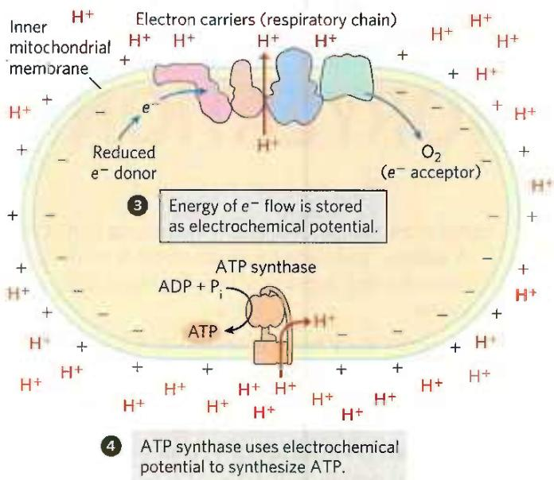  
FIGURE 19-1 The chemiosmotic mechanism for ATP synthesis in mitochondria. Electrons move spontaneously through a chain of membrane-bound carriers, the respiratory chain, driven by the high reduction potential of oxygen and the relatively low reduction potentials of the various reduced substrates (fuels) that undergo oxidation in the mitochondrion. Electron flow creates an electrochemical potential by the transmembrane movement of protons and positive charge. This electrochemical potential drives ATP synthesis by a membrane-bound enzyme (ATP synthase) that is fundamentally similar in mitochondria and chloroplasts, and in bacteria and archaea as well.

The metabolic role of mitochondria is so critical to cellular and organismal function that defects in mitochondrial function have serious medical consequences. Mitochondria are central to neuronal and muscular function, and to the regulation of whole-body energy metabolism and body weight. Human neurodegenerative diseases, as well as cancer, diabetes, and obesity, are recognized as possible results of compromised mitochondrial function, and one theory of aging is based on gradual loss of mitochondrial integrity. We consider the diverse functions of mitochondria, and the consequences of defective mitochondrial function in humans.

<!-- EN-END 第19章导言 -->

## 一、氧化还原电势

氧化磷酸化(oxidative phosphorylation)是指 NADH 和 $FADH_{2}$ 上的电子通过一系列电子传递载体传递给 $O_{2}$ ，并利用所释放的能量使 ADP 磷酸化形成 ATP 的过程。有机分子中的电子是如何转移和传递的？又是如何与分子氧结合形成水并释放能量的？都是生物氧化作用的关键问题。为了比较深刻地了解生物氧化作用，有必要先复习一下氧化还原电势的概念。

凡是有电子从一种物质转移到另一种物质的化学反应都被称为氧化还原反应(oxidation-reduction reactions, 又可称为 oxidoreductions 或 redox reactions); 换言之, 电子转移反应就是氧化还原反应。提供电子的分子称为还原剂(reducing agent 或 reductant), 接受电子的分子称为氧化剂(oxidizing agent 或称为 oxidant)。一种还原剂和其失去电子后的氧化剂形式即构成一个氧化还原电子对(reduction-oxidation pairs), 简称氧还电对(redox pairs)。

氧化还原反应往往是可逆的,物质失去电子后,称为氧化型,氧化型再得到电子后又成为还原型。可将反应按以下方式书写:

$$
\mathrm{A} ^ {n +} + n \mathrm{e} ^ {-} \rightleftharpoons \mathrm{A}\tag{19-1}
$$

其中 $A^{n+}$ 为氧化型，即电子受体；A 为还原型，为电子供体；n 为电子数目，e 为电子。 $A^{n+}$ 和 A 之间为一氧还电对。

## （一）氧化还原电势

在容器 A 和 B 中分别放入硫酸锌和硫酸铜溶液, 如图 19-1 所示。

在盛有硫酸锌的容器中放入锌片，在盛有硫酸铜的容器中放入铜片，两个容器用盐桥连接起来，盐桥为饱和氯化钾溶液与琼脂做成的凝胶。如果用导线将两片金属连接起来，中间串联一检流计（voltmeter），则检流计的指针会立即向一方偏转，表明有电流通过导线。与此同时，锌片开始溶解，而铜片上则有铜沉积上去。这是因为锌失去了两个电子形成锌离子。反应如下：

$$
\mathrm{Zn} \rightleftharpoons \mathrm{Zn} ^ {2 +} + 2 \mathrm{e} ^ {-}\tag{19-2}
$$

$Zn^{2+}$ 进入溶液中,电子则留在锌片上、锌片上的电子经导线向铜片流动,使硫酸铜溶液中的铜离子在金属铜上与电子结合还原为铜原子而沉积在铜片上。反应如下:

$$
\mathrm{Cu} ^ {2 +} + 2 \mathrm{e} ^ {-} \rightleftharpoons \mathrm{Cu}\tag{19-3}
$$

盐桥消除了由于电解质离子迁移(扩散)而引起的扩散电势。以上这种将化学能转变为电能的装置称为化学电池,又称原电池。通常我们把发生氧化反应的电极定义为阳极,把发生还原反应的电极定义为阴极。

从图 19-1 可见,电子流动的方向是从锌电极(阳极)流向铜电极(阴极),电极的方向则相反。从电学观点看,既然电流是从阴极经导线流向阳极,阴极的电势必然高于阳极的电势。因此,从电位高低看,又可把原电池的阴极称为正极,阳极为负极。此外,根据电学惯例,把电池的电动势( $\varepsilon$ )规定为正极电势减去负极的电极电势。

在氧化还原反应中,如果反应物的组成原子或离子能提供电子,则该物质称为还原剂;如果能夺得电子,则该反应物称为氧化剂。

图 19-1 化学电池示意图

以上事例还可作如下的概括和分析: 当把一金属电极 (electrode) M 放入它的盐溶液即构成一个半电池 (half cell), 一方面金属 M 表面的一些原子有一种把电子留在金属电极上, 而自身以离子 $M^{n+}$ 的形式进入溶液的倾向 (金属越活泼, 溶液越稀, 这种倾向越大); 另一方面, 盐溶液中的 $M^{n+}$ 又有一种从金属电极 M 表面获得电子而沉淀在金属电极上的倾向 (金属越不活泼, 浓度越浓, 这种倾向越大)。这两种倾向可用如下反应式表示:

$$
\mathrm{M} \rightleftharpoons \mathrm{M} ^ {n +} + n \mathrm{e} ^ {-}\tag{19-4}
$$

若失去电子的倾向大于获得电子的倾向,结果是金属进入溶液,使金属电极带负电,而靠近金属电极附近的溶液带正电。在金属电极和盐溶液之间即产生电势(electric potential)或称电位,这就是电极电势或称电极势或电极电位。若金属失去电子的倾向小于它的离子获得电子的倾向,在金属和盐溶液之间也产生电极电势,只是金属电极带正电,靠近金属电极附近的溶液带负电。金属电极势除同本金属的性质和金属离子在溶液中的活度(浓度)有关外,还与温度有关。单个电极即半电池的电极电势的绝对值无法直接测量。人们能测量的是由两个电极即两个半电池组成的电动势(简称 $\varepsilon$ 或 $E$ )。实际上能够比较和衡量的只能是电极的相对电势。根据国际纯粹和应用化学联合会(International Union of Pure and Applied Chemistry,简称IUPAC)的建议,通常用一种特定的氢电极作为标准,将所测得的电势称为氢标电势。这种氢电极是由一个镀有铂黑的铂电极,在 $25^{\circ}\mathrm{C}$ 一大气压的氢压力下,浸于氢离子活度为1质量摩尔浓度的溶液中,即 $\mathrm{pH} = 0$ (标准状态)而组成的。发生氧化作用的电极为阴极,又称为负极,用“-”表示。发生还原作用的电极即阳极,称为正极,用“+”号表示。如果将锌电极与氢电极构成原电池,则氢电极为正极,锌电极为负极。如果将铜电极与氢电极构成原电池,则氢电极为负极,铜电极为正极。按氢标电势的规定,标准氢电极的电极势为零( $E_{\mathrm{H^{+}/H_{2}}}^{\ominus} = 0$ )。原电池的电动势与电极势的关系可用下式表示:

$$
\varepsilon = E _ {\mathrm{正极}} - E _ {\mathrm{负极}}\tag{19-5}
$$

式中 $\varepsilon$ 代表电动势, $E_{正极}$ 和 $E_{负极}$ 分别代表电池正极和负极的电极势。

根据以上公式即可计算出氢锌原电池的电极势。

标准电动势被定义为在反应中各种物质的活度均为1质量摩尔浓度时的电动势。用 $\varepsilon^{\ominus}$ 表示。

当电解质溶液活度为 1(质量摩尔浓度)时的电极势称为标准电极势,用 $E^{\ominus}$ 表示。则标准电动势和标准电极的关系是:

$$
\varepsilon^ {\ominus} = E _ {\mathrm{正极}} ^ {\ominus} - E _ {\mathrm{负极}} ^ {\ominus}\tag{19-6}
$$

经测量,氢锌电池的标准电动势 $\varepsilon^{\ominus}=0.763\ V$ , 则

$$
0. 7 6 3 = E _ {\mathrm{H} ^ {+} / \mathrm{H} _ {2}} ^ {\ominus} - E _ {\mathrm{Zn} ^ {2 +} / \mathrm{Zn}} ^ {\ominus}
$$

因根据定义 $E_{H^{+}/H_{2}}^{\ominus}=0$ ，所以，

$$
E _ {\mathrm{Zn} ^ {2 +} / \mathrm{Zn}} ^ {\ominus} = - 0. 7 6 3 \mathrm{V}
$$

同法测得铜氢电池的电动势为 0.34 V, 铜是正极, 氢为负极。则

$$
\begin{array}{r l} 0. 3 4 & = E _ {\mathrm {Cu^ {2 + } /Cu}} ^ {\ominus} - E _ {\mathrm {H^ {+} / H_ {2}}} ^ {\ominus} \\ & E _ {\mathrm {Cu^ {2 + } /Cu}} ^ {\ominus} = + 0. 3 4 \mathrm{V} \end{array}
$$

从上面测定的数据可看出,锌的标准电极势带有负号,铜的标准电极势带有正号。因此锌的还原能力强,而铜离子的氧化能力强,还原剂失掉电子的倾向(氧化剂得到电子的倾向)称为氧化还原电势(oxidation-reduction potential)。

任何一个氧化还原对与标准氢电极组成原电池,都可测定其标准氧化还原电势,并可依上法求出其标准电极电势。在实际工作中,由于氢电极使用不便,往往采用一些比较简便稳定的参比电极来代替氢电极,例如甘汞电极。

因铂和金放入溶液中几乎不发生反应,常用于作为指示电极(工作电极)来测定溶液中氧化还原电对的电势,亦即氧化还原电势。如将两个铂电极分别插入铁离子 $\left(\mathrm{Fe}^{3+}\right)$ 和氢醌 $\left(\mathrm{H}_{2}\mathrm{Q}\right)$ 两种溶液中并组成原电池,则 $Fe^{3+}$ 会从铂电极上获得电子还原为 $Fe^{2+}$ ;氢醌 $\left(\mathrm{H}_{2}\mathrm{Q}\right)$ 将电子释放到铂电极上本身氧化形成醌Q。两种溶液混合后的反应式为:

$$
\begin{array}{l l}\mathrm{H} _ {2} \mathrm{Q} + 2 \mathrm{Fe} ^ {3 +} \rightleftharpoons \mathrm{Q} + 2 \mathrm{H} ^ {+} + 2 \mathrm{Fe} ^ {2 +}\\\text { 氢醌 }&\text { 醌 }\end{array}\tag{19-7}
$$

如果上述反应中 $Fe^{3+}$ 和 $Fe^{2+}$ 的浓度为已知, 根据电极势的能斯特方程 (Nernst equation) 即可算出电极在溶液中的电极势。能斯特方程如下:

$$
E _ {n} = E ^ {\ominus} + R T / n F \cdot \ln [ \mathrm{电子受体} ] ^ {a} / [ \mathrm{电子供体} ] ^ {b}\tag{19-8}
$$

式中 $E_{n}$ 为待测溶液中氧还电对的电极势， $E^{\ominus}$ 为标准电极势。R为气体常数（8.314 J·L $^{-1}$ ·mol $^{-1}$ ），T为25℃或298K的绝对温度，n为电极上的价数变化（即体系中每摩尔物质给予或接受的电子摩尔数），F为法拉第常数等于23062 Cal/V（卡/伏）又等于96494 C/mol（库仑/摩尔）电子，ln为自然对数。

对于 $Fe^{3+}/Fe^{2+}$ 其电极势的计算公式为：

$$
E _ {n} = E ^ {\ominus} + \frac {R T}{n F} \ln \frac {[ \mathrm{Fe} ^ {3 +} ] ^ {2}}{[ \mathrm{Fe} ^ {2 +} ] ^ {2}}
$$

式中 $E_{n}$ 为 $Fe^{3+}/Fe^{2+}$ 的电极势, 其他符号含意同上。

在很多情况下,氢离子也参与电极上的氧化还原反应。这时溶液的 pH 会直接影响这个体系的氧化还原电势。前述标准氧化还原电势的 pH=0,而在 pH=7 的标准生物化学反应条件下测得的标准氧化还原电势用 $\varepsilon^{\ominus}$ 或 $E^{\ominus}$ 表示。

生物体系中的电子转移可通过下列 4 种方式进行：

① 以电子形式直接转移。例如 $Fe^{2+}-Fe^{3+}$ 电对可将电子直接转移到 $Cu^{+}-Cu^{2+}$ 电对：

$$
\mathrm{Fe} ^ {2 +} + \mathrm{Cu} ^ {2 +} \longrightarrow \mathrm{Fe} ^ {3 +} + \mathrm{Cu} ^ {+}\tag{19-9}
$$

② 电子以氢原子的形式转移。氢原子由一个质子 $\left(\mathrm{H}^{+}\right)$ 和一个电子 $\left(\mathrm{e}^{-}\right)$ 组成。这种电子转移可写成：

$$
\mathrm{AH} _ {2} \rightleftharpoons \mathrm{A} + 2 \mathrm{e} ^ {-} + 2 \mathrm{H} ^ {+}\tag{19-10}
$$

$AH_{2}$ 是氢原子供体, A 是氢原子受体, 所以 $AH_{2}$ 和 A 组成氧还电对, 可使另一电子受体 B 以获得氢原子的形式还原:

$$
\mathrm{AH} _ {2} + \mathrm{B} \longrightarrow \mathrm{A} + \mathrm{BH} _ {2}\tag{19-11}
$$

③ 电子以氢负离子( $:H^{-}$ )的形式(它带有2个电子)从电子供体转移到电子受体(通常为脱氢酶中的 $NAD^{+}$ 辅基)上。

④ 有机还原剂直接与氧结合时的电子转移。例如，碳氢化合物氧化形成醇的反应：

$$
\begin{array}{c} \mathrm{R-CH} _ {3} + 1 / 2 \mathrm{O} _ {2} \longrightarrow \mathrm{R-CH} _ {2} - \mathrm{OH} \\ \text {   碳氢化物   } \end{array}\tag{19-12}
$$

此反应式中,碳氢化物是电子供体,氧原子是电子受体。

以上 4 种电子传递方式在细胞中都发生。生物化学中常用“一个还原当量”（reducing equivalent）这一名词，指的是参加到氧化还原反应中的是一个电子，不管电子本身（electron per se）以一个氢原子或一个电子形式转移。因此，一个氢负离子为二个还原当量。

生物燃料分子的酶促脱氢反应一般是同时失去两个还原当量,每个氧原子能够接受两个还原当量。

## （二）生物体中某些重要氧还电对的氧化还原电势

生物体内的氧化还原对进行氧化还原反应时,基本原理和化学电池一样。也可以把生物体内的氧化剂和还原剂做成化学电池,无论是有机物,无机物或混合的有机、无机物。任何的氧还电对都有其特定的标准电势(standard potential),用 $\varepsilon^{\ominus}$ 或 $E^{\ominus}$ 表示,称标准还原势(standard reduction potential),或标准氧化还原电势(standard oxidation-reduction potential)。生物体内一些重要物质的标准氧化还原电势已经测出,如表19-1所示。

表 19-1 生物体中某些氧化还原电对的标准氧化还原电势 $\left( {E}^{ \ominus  }\right)$

<table><tr><td>氧化还原电对</td><td>标准还原势/V</td></tr><tr><td>乙酸 $+ {\mathrm{{CO}}}_{2} + 2{\mathrm{H}}^{ + } + 2{\mathrm{e}}^{ - } \longrightarrow$ 丙酮酸 $+ {\mathrm{H}}_{2}\mathrm{O}$ </td><td>-0.70</td></tr><tr><td>琥珀酸 $+ {\mathrm{{CO}}}_{2} + 2{\mathrm{H}}^{ + } + 2{\mathrm{e}}^{ - } \longrightarrow \alpha$ -酮戊二酸 $+ {\mathrm{H}}_{2}\mathrm{O}$ </td><td>-0.67</td></tr><tr><td>乙酸 $+ 2{\mathrm{H}}^{ + } + 2{\mathrm{e}}^{ - } \longrightarrow$ 乙醛 $+ {\mathrm{H}}_{2}\mathrm{O}$ </td><td>-0.58</td></tr><tr><td>3-磷酸甘油酸 $+ 2{\mathrm{H}}^{ + } + 2{\mathrm{e}}^{ - } \longrightarrow 3$ -磷酸甘油醛 $+ {\mathrm{H}}_{2}\mathrm{O}$ </td><td>-0.55</td></tr><tr><td> $\alpha$ -酮戊二酸 $+ 2{\mathrm{H}}^{ + } + 2{\mathrm{e}}^{ - } \longrightarrow$ 异柠檬酸</td><td>-0.38</td></tr><tr><td>乙酰 $- \mathrm{{CoA}} + {\mathrm{{CO}}}_{2} + 2{\mathrm{H}}^{ + } + 2{\mathrm{e}}^{ - } \longrightarrow$ 丙酮酸 $+ \mathrm{{CoA}}$ </td><td>-0.48</td></tr><tr><td>1,3-二磷酸甘油酸 $+ 2{\mathrm{H}}^{ + } + 2{\mathrm{e}}^{ - } \longrightarrow 3$ -磷酸甘油醛 $+ \mathrm{{Pi}}$ </td><td>-0.29</td></tr><tr><td>硫辛酸 $+ 2{\mathrm{H}}^{ + } + 2{\mathrm{e}}^{ - } \longrightarrow$ 二氢硫辛酸</td><td>-0.29</td></tr><tr><td> $\mathrm{S} + 2{\mathrm{H}}^{ + } + 2{\mathrm{e}}^{ - } \longrightarrow {\mathrm{H}}_{2}\mathrm{\;S}$ </td><td>-0.23</td></tr><tr><td>乙醛 $+ 2{\mathrm{H}}^{ + } + 2{\mathrm{e}}^{ - } \longrightarrow$ 乙醇</td><td>-0.197</td></tr><tr><td>丙酮酸 $+ 2{\mathrm{H}}^{ + } + 2{\mathrm{e}}^{ - } \longrightarrow$ 乳酸</td><td>-0.185</td></tr><tr><td> $\mathrm{{FAD}} + 2{\mathrm{H}}^{ + } + 2{\mathrm{e}}^{ - } \longrightarrow \mathrm{{FAD}}{\mathrm{H}}_{2}$ </td><td>-0.18*</td></tr><tr><td>草酰乙酸 $+ 2{\mathrm{H}}^{ + } + 2{\mathrm{e}}^{ - } \longrightarrow$ 苹果酸</td><td>-0.166</td></tr><tr><td>延胡索酸 $+ 2{\mathrm{H}}^{ + } + 2{\mathrm{e}}^{ - } \longrightarrow$ 琥珀酸</td><td>-0.031</td></tr><tr><td> $2{\mathrm{H}}^{ + } + 2{\mathrm{e}}^{ - } \longrightarrow {\mathrm{H}}_{2}$ </td><td>-0.421</td></tr><tr><td>乙酰乙酸 $+ 2{\mathrm{H}}^{ + } + 2{\mathrm{e}}^{ - } \longrightarrow \beta$ -羟丁酸</td><td>-0.346</td></tr><tr><td>胱氨酸 $+ 2{\mathrm{H}}^{ + } + 2{\mathrm{e}}^{ - } \longrightarrow 2$ 半胱氨酸</td><td>-0.340</td></tr><tr><td> $\mathrm{{NAD}}^{ + } + 2{\mathrm{H}}^{ + } + 2{\mathrm{e}}^{ - } \longrightarrow \mathrm{{NADH}}$ </td><td>-0.32</td></tr><tr><td> $\mathrm{{NADP}}^{ + } + 2{\mathrm{H}}^{ + } + 2{\mathrm{e}}^{ - } \longrightarrow \mathrm{{NADPH}}$ </td><td>-0.32</td></tr><tr><td>NADH脱氢酶(FMN型) $+ 2{\mathrm{H}}^{ + } + 2{\mathrm{e}}^{ - } \longrightarrow$ NADH脱氢酶( ${\mathrm{{FMNH}}}_{2}$ 型)</td><td>-0.30</td></tr><tr><td>标准氢电极 ${E}^{\ominus } = {0.00}$ </td><td></td></tr><tr><td> $\text{CoQ} + 2\text{H}^{+} + 2\text{e}^{-} \longrightarrow \text{CoQH}_{2}$ </td><td>+0.045</td></tr><tr><td>细胞色素  $b(\text{ox}) + \text{e}^{-} \longrightarrow \text{细胞色素 } b(\text{red})$ </td><td>+0.07</td></tr><tr><td>细胞色素  $c_{1}(\text{ox}) + \text{e}^{-} \longrightarrow \text{细胞色素 } c_{1}(\text{red})$ </td><td>+0.215</td></tr><tr><td>细胞色素  $c(\text{ox}) + \text{e}^{-} \longrightarrow \text{细胞色素 } c(\text{red})$ </td><td>+0.235</td></tr><tr><td>细胞色素  $a(\text{ox}) + \text{e}^{-} \longrightarrow \text{细胞色素 } a(\text{red})$ </td><td>+0.210</td></tr><tr><td>细胞色素  $a_{3}(\text{ox}) + \text{e}^{-} \longrightarrow \text{细胞色素 } a_{3}(\text{red})$ </td><td>+0.385</td></tr><tr><td> $1/2\text{O}_{2} + 2\text{H}^{+} + 2\text{e}^{-} \longrightarrow \text{H}_{2}\text{O}$ </td><td>+0.815</td></tr><tr><td> $\text{Fe}^{3+} + \text{e}^{-} \longrightarrow \text{Fe}^{2+}$ </td><td>+0.77</td></tr></table>

注： $E^{\ominus}$ '的测定条件为pH 7.0,25℃，即标准氢电极构成的化学电池的测定值。电子供体和受体的浓度都是1 mol/L。  
\* FAD/FADH $_2$ 的测定值仅为辅酶的单独测定值, 当辅酶与酶蛋白结合后 $E^{\ominus}$ 在 0.0 到 +0.3 V 之间, 随蛋白质而异。

按照传统定义标准还原电势具有较大负值的氧还电对比具有较小负值的氧还电对更倾向于失去电子；换言之，标准还原电势的正值越大的，越倾向于获得电子。例如，异柠檬酸/ $(\alpha-\text{酮戊二酸}+\mathrm{CO}_{2})$ 电对，其标准还原电势 $E^{\ominus'}$ 为-0.38 V。这个氧还电对倾向于将电子传递给氧还电对NADH/NAD $^{+}$ ，因为后者的 $E^{\ominus'}=-0.32\ V$ ，如果有柠檬酸脱氢酶存在，这个电对具有相对的正电势。水/氧电对的标准电势为+0.82 V，这表明水分子失去电子形成分子氧的倾向性极小。相反，分子氧对电子或氢原子具有极高的亲和力。标准电势的单位是V。

氧化还原反应对生物体之所以重要,不只是因为生物体内的许多重要反应属于氧化还原反应,更重要的是因为生物体所需的能量基本都来源于体内所进行的氧化还原反应。要了解氧化还原反应和能量之间的关系,还必须弄清楚氧化还原电势和自由能的关系。

## （三）标准还原电势差和自由能变化的关系

前面已经阐明,体系自由能的改变等于体系所做最大功的能量,可用下式表示:

$$
- \Delta G = W _ {\mathrm{max}}
$$

式中 $\Delta G$ 为体系中自由能的变化, 此处应为负值, 表示体系自由能减少之量, $W_{max}$ 为最大功。

可以把一个氧化还原反应看成是能做最大功的电池。当通过这个电池的电流为无限小时，它所做的功就是最大。其电动势 $\varepsilon=\Delta E$ 可以测出。因电池所做的功在数值上等于两个电极之间的电动势和电量的乘积。当电池传递的电子为 1 mol（即 $6.02\times10^{23}$ 个电子）时，则该电池在标准状态下所做的功可用下式表示：

$$
W = n \Delta E ^ {\ominus} F\tag{19-13}
$$

$\Delta E^{\ominus}$ 为相应反应的标准电极势差，n 为氧化还原反应中传递的电子数目，F 为法拉第常数(96 485 C/mol)。因以上所做的功为最大功，所以也可以把它看成是自由能的变化，即

$$
W _ {\mathrm{max}} = - \Delta G ^ {\ominus \prime} = - n \Delta E ^ {\ominus \prime} F\tag{19-14}
$$

式中各符号含义同上， $-\Delta G^{\ominus'}$ 表示体系自由能降低的变化。利用以上公式即可由氧化还原电势差计算出化学反应的自由能变化。

在生物化学反应中,这种自由能变化决定于一个体系转移电子的能力。

## （四）标准电动势和平衡常数的关系

标准电动势和化学反应平衡常数的关系可根据平衡常数和标准自由能的关系以及标准电动势和标准自由能的关系导出。可表示如下：

$$
\varepsilon^ {\ominus} = \Delta E ^ {\ominus} = \frac {R T}{n F} \mathrm{ln} K _ {\mathrm{eq}} = 2. 3 \frac {R T}{n F} \mathrm{lg} K _ {\mathrm{eq}}\tag{19-15}
$$

式中的对数关系表明电势的微小变化都将引起平衡常数的很大变化。在 $25^{\circ}$ C 下若 n=2 时，一个能够进行到 99% 的反应 ( $K_{eq}=100$ ) 只需 118 mV 的电势。

在实际反应条件下,如果反应物和产物都不是 1 mol,则需根据能斯特方程即(19-8)式求出反应的电动势。

机体中的许多反应都是靠电动势推动的,例如,在细胞膜表面发生的许多反应往往就是靠电势差推动的。细胞或细胞器表面的脂质膜不能使游离电子自由通过,这就形成了一种跨膜的离子梯度,从而产生了电势。跨膜电势即可提供一种能量,驱使膜上的某些反应得以进行。这方面的问题不在此作详细讨论。

<!-- EN-BEGIN 13.4 -->

### 【英文对应 13.4】Biological Oxidation-Reduction Reactions

> 来源：Lehninger Principles of Biochemistry（书籍/02_生物化学原理） 第13章 Introduction to Metabolism，§13.4。对应本章“一、氧化还原电势”。

The transfer of phosphoryl groups is a central feature of metabolism. Equally important is another kind of transfer: electron transfer in oxidation-reduction reactions, sometimes referred to as redox reactions. These reactions involve the loss of electrons by one chemical species, which is thereby oxidized, and the gain of electrons by another, which is reduced. P5 The flow of electrons in oxidation-reduction reactions is responsible, directly or indirectly, for all work done by living organisms. In nonphotosynthetic organisms, the sources of electrons are reduced compounds (foods); in photosynthetic organisms, the initial electron donor is a chemical species excited by the absorption of light. The path of electron flow in metabolism is complex. Electrons move from various metabolic intermediates to specialized electron carriers in enzyme-catalyzed reactions. The carriers, in turn, donate electrons to acceptors with higher electron affinities, with the release of energy. Cells possess a variety of molecular energy transducers, which convert the energy of electron flow into useful work.

We begin by discussing how work can be accomplished by an electromotive force (emf), then consider the theoretical and experimental basis for measuring energy changes in oxidation reactions in terms of emf and the relationship between this force, expressed in volts, and the free-energy change, expressed in joules. We also describe the structures and oxidation-reduction chemistry of the most common of the specialized electron carriers, which you will encounter repeatedly in later chapters.

#### [EN] The Flow of Electrons Can Do Biological Work

Every time we use a motor, an electric light or heater, or a spark to ignite gasoline in a car engine, we use the flow of electrons to accomplish work. In the circuit that powers a motor, the source of electrons can be a battery containing two chemical species that differ in affinity for electrons. Electrical wires provide a pathway for electron flow from the chemical species at one pole of the battery, through the motor, to the chemical species at the other pole of the battery. Because the two chemical species differ in their affinity for electrons, electrons flow spontaneously through the circuit, driven by a force proportional to the difference in electron affinity, the electromotive force, emf. The emf (typically a few volts) can accomplish work if an appropriate energy transducer—in this case a motor—is placed in the circuit. The motor can be coupled to a variety of mechanical devices to do useful work.

P5 Living cells have an analogous biological "circuit," with a relatively reduced compound such as glucose as the source of electrons. As glucose is enzymatically oxidized, the released electrons flow spontaneously through a series of electron-carrier intermediates to another chemical species, such as $\mathrm{O}_2$ . This electron flow is exergonic, because $\mathrm{O}_2$ has a higher affinity for electrons than do the electron-carrier intermediates. The resulting emf provides energy to a variety of molecular energy transducers (enzymes and other proteins) that do biological work. In the mitochondrion, for example, membrane-bound enzymes couple electron flow to the production of a transmembrane pH difference and a transmembrane electrical potential, accomplishing chemiosmotic and electrical work. The proton gradient thus formed has potential energy, sometimes called the proton-motive force by analogy with electromotive force. Another enzyme, ATP synthase in the inner mitochondrial membrane, uses the proton-motive force to do chemical work: synthesis of ATP from ADP and $P_{i}$ as protons flow spontaneously across the membrane. Similarly, membrane-localized enzymes in Escherichia coli convert emf to proton-motive force, which is then used to power flagellar motion. The principles of electrochemistry that govern energy changes in the macroscopic circuit with a motor and battery apply with equal validity to the molecular processes accompanying electron flow in living cells.

#### [EN] Oxidation-Reductions Can Be Described as Half-Reactions

Although oxidation and reduction must occur together, it is convenient when describing electron transfers to consider the two halves of an oxidation-reduction reaction separately. For example, the oxidation of ferrous ion by cupric ion,

$$
\mathrm{Fe} ^ {2 +} + \mathrm{Cu} ^ {2 +} \rightleftharpoons \mathrm{Fe} ^ {3 +} + \mathrm{Cu} ^ {+}
$$

can be described in terms of two half-reactions:

$$
\begin{array}{l}\text {(1)} \mathrm{Fe} ^ {2 +} \rightleftharpoons \mathrm{Fe} ^ {3 +} + e ^ {-}\\\text {(2)} \mathrm{Cu} ^ {2 +} + e ^ {-} \rightleftharpoons \mathrm{Cu} ^ {+}\end{array}
$$

The electron-donating molecule in an oxidation-reduction reaction is called the reducing agent or reductant; the electron-accepting molecule is the oxidizing agent or oxidant. A given agent, such as an iron cation existing in the ferrous (Fe $^{2+}$ ) or ferric (Fe $^{3+}$ ) state, functions as a conjugate reductant-oxidant pair (redox pair), just as an acid and corresponding base function as a conjugate acid-base pair. Recall from Chapter 2 that in acid-base reactions we can write a general equation: proton donor $\rightleftharpoons$ H $^{+}$ + proton acceptor. In redox reactions we can write a similar general equation: electron donor (reductant) $\rightleftharpoons$ e $^{-}$ + electron acceptor (oxidant). In the reversible half-reaction (1) above, Fe $^{2+}$ is the electron donor and Fe $^{3+}$ is the electron acceptor; together, Fe $^{2+}$ and Fe $^{3+}$ constitute a conjugate redox pair. The mnemonic OIL RIG—oxidation is losing, reduction is gaining—may be helpful in remembering what happens to electrons in redox reactions.

The electron transfers in the oxidation-reduction reactions of organic compounds are not fundamentally different from those of inorganic species. Consider the oxidation of a reducing sugar (an aldehyde or a ketone) by cupric ion:

$$
\mathrm{R} - \mathrm{C} \underset {\mathrm{H}} {\overset {\mathrm{O}} {\rightleftharpoons}} + 4 \mathrm{OH} ^ {-} + 2 \mathrm{Cu} ^ {2 +} \rightleftharpoons \mathrm{R} - \mathrm{C} \underset {\mathrm{OH}} {\overset {\mathrm{O}} {\rightleftharpoons}} + \mathrm{Cu} _ {2} \mathrm{O} + 2 \mathrm{H} _ {2} \mathrm{O}
$$

This overall reaction can be expressed as two half-reactions:

$$
\begin{array}{l}\text {(1) R - C(= O)} + 2 \mathrm {OH^ {-}} \rightleftharpoons \mathrm{R-C(= O)} + 2 e ^ {-} + \mathrm {H_ {2} O}\\\text {(2) 2Cu^ {2 + } +2e^ {-} +2OH^ {-} \rightleftharpoons Cu_ {2} O+ H_ {2} O}\end{array}
$$

Notice that because two electrons are removed from the aldehyde carbon, the second half-reaction (the one-electron reduction of cupric to cuprous ion) must be doubled to balance the overall equation.

#### [EN] Biological Oxidations Often Involve Dehydrogenation

The carbon in living cells exists in a range of oxidation states (Fig. 13-22). When a carbon atom shares an electron pair with another atom (typically H, C, S, N, or O), the sharing is unequal, in favor of the more electronegative atom. The order of increasing electronegativity is H < C < S < N < O. In oversimplified but useful terms, the more electronegative atom “owns” the bonding electrons it shares with another atom. For example, in methane (CH₄), carbon is more electronegative than the four hydrogens bonded to it, and the C atom therefore owns all eight bonding electrons (Fig. 13-22). In ethane, the electrons in the C—C bond are shared equally, so each C atom owns only seven of its eight bonding electrons. In ethanol, C-1 is less electronegative than the oxygen to which it is bonded, and the O atom therefore owns both electrons of the C—O bond, leaving C-1 with only five bonding electrons. With each formal loss of “owned” electrons, the carbon atom has undergone oxidation—even when no oxygen is involved, as in the conversion of an alkane (—CH₂—CH₂—) to an alkene (—CH=CH—). In this case, oxidation (loss of electrons) is coincident with the loss of hydrogen. In biological systems, as we noted earlier in the chapter, oxidation is often synonymous with dehydrogenation, and many enzymes that catalyze oxidation reactions are dehydrogenases. Notice that the more reduced compounds in Figure 13-22 (top) are richer in hydrogen than in oxygen, whereas the more oxidized compounds (bottom) have more oxygen and less hydrogen.

Not all biological oxidation-reduction reactions involve carbon. For example, in the conversion of molecular nitrogen to ammonia, $6H^{+} + 6e^{-} + N_{2} \rightarrow 2NH_{3}$ , the nitrogen atoms are reduced.

Electrons are transferred from one molecule (electron donor) to another (electron acceptor) in one of four ways:

1. Directly as electrons. For example, the $Fe^{2+}/Fe^{3+}$ redox pair can transfer an electron to the $Cu^{+}/Cu^{2+}$ redox pair:

$$
\mathrm{Fe} ^ {2 +} + \mathrm{Cu} ^ {2 +} \rightleftharpoons \mathrm{Fe} ^ {3 +} + \mathrm{Cu} ^ {+}
$$

2. As hydrogen atoms. Recall that a hydrogen atom consists of a proton (H $^{+}$ ) and a single electron (e $^{-}$ ). In this case we can write the general equation

$$
\mathrm{AH} _ {2} \rightleftharpoons \mathrm{A} + 2 e ^ {-} + 2 \mathrm{H} ^ {+}
$$

<table><tr><td>Methane</td><td></td><td>8</td></tr><tr><td>Ethane(alkane)</td><td></td><td>7</td></tr><tr><td>Ethene(alkene)</td><td></td><td>6</td></tr><tr><td>Ethanol(alcohol)</td><td></td><td>5</td></tr><tr><td>Acetylene(alkyne)</td><td></td><td>5</td></tr><tr><td>Formaldehyde</td><td></td><td>4</td></tr><tr><td>Acetaldehyde(aldehyde)</td><td></td><td>3</td></tr><tr><td>Acetone(ketone)</td><td></td><td>2</td></tr><tr><td>Formic acid(carboxylicacid)</td><td></td><td>2</td></tr><tr><td>Carbonmonoxide</td><td></td><td>2</td></tr><tr><td>Acetic acid(carboxylicacid)</td><td></td><td>1</td></tr><tr><td>Carbon dioxide</td><td></td><td>0</td></tr></table>

FIGURE 13-22 Different levels of oxidation of carbon compounds in the biosphere. To approximate the level of oxidation of these compounds, focus on the red carbon atom and its bonding electrons. When this carbon is bonded to the less electronegative H atom, both bonding electrons (red) are assigned to the carbon. When carbon is bonded to another carbon, bonding electrons are shared equally, so one of the two electrons is assigned to the red carbon. When the red carbon is bonded to the more electronegative O atom, the bonding electrons are assigned to the oxygen. The number to the right of each compound is the number of electrons "owned" by the red carbon, a rough expression of the degree of oxidation of that compound. As the red carbon undergoes oxidation (loses electrons), the number gets smaller.

where $AH_{2}$ is the hydrogen/electron donor. (Do not mistake the above reaction for an acid dissociation, which involves a proton and no electron.) $AH_{2}$ and A together constitute a conjugate redox pair ( $A/AH_{2}$ ), which can reduce another compound B (or redox pair, $B/BH_{2}$ ) by transfer of hydrogen atoms:

$$
\mathrm{AH} _ {2} + \mathrm{B} \rightleftharpoons \mathrm{A} + \mathrm{BH} _ {2}
$$

3. As a hydride ion ( $:H^{-}$ ), which has two electrons. This occurs in the case of NAD-linked dehydrogenases, described below.

4. Through direct combination with oxygen. In this case, oxygen combines with an organic reductant and is covalently incorporated in the product, as in the oxidation of a hydrocarbon to an alcohol:

$$
\mathrm{R} - \mathrm{CH} _ {3} + \frac {1}{2} \mathrm{O} _ {2} \longrightarrow \mathrm{R} - \mathrm{CH} _ {2} - \mathrm{OH}
$$

The hydrocarbon is the electron donor, and the oxygen atom is the electron acceptor.

All four types of electron transfer occur in cells. The neutral term reducing equivalent is commonly used to designate a single electron equivalent participating in an oxidation-reduction reaction, no matter whether this equivalent is an electron per se or is part of a hydrogen atom or a hydride ion, or whether the electron transfer takes place in a reaction with oxygen to yield an oxygenated product.

#### [EN] Reduction Potentials Measure Affinity for Electrons

When two conjugate redox pairs are together in solution, electron transfer from the electron donor of one pair to the electron acceptor of the other may proceed spontaneously. The tendency for such a reaction depends on the relative affinity of the electron acceptor of each redox pair for electrons. The standard reduction potential, $E^{\circ}$ , a measure (in volts) of this affinity, can be determined in an experiment such as that described in Figure 13-23. Electrochemists have chosen as a standard of reference the half-reaction

$$
\mathrm{H} ^ {+} + e ^ {-} \longrightarrow \frac {1}{2} \mathrm{H} _ {2}
$$

The electrode at which this half-reaction occurs (called a half-cell) is arbitrarily assigned an $E^{\circ}$ of 0.00 V. When this hydrogen electrode is connected through an external circuit to another half-cell in which an oxidized species and its corresponding reduced species are present at standard concentrations (at 25 °C, each solute at 1 M, each gas at 101.3 kPa), electrons tend to flow through the external circuit from the half-cell of lower $E^{\circ}$ to the half-cell of higher $E^{\circ}$ . By convention, a half-cell that takes electrons from the standard hydrogen cell is assigned a positive value of $E^{\circ}$ , and one that donates electrons to the hydrogen cell, a negative value. When any two half-cells are connected, that with the larger (more positive) $E^{\circ}$ will be reduced; it has the greater reduction potential.

  
Reference cell of known emf: the hydrogen electrode in which $H_{2}$ gas at 101.3 kPa is equilibrated at the electrode with 1 M $H^{+}$  
Test cell containing 1 M concentrations of the oxidized and reduced species of the redox pair to be examined  
FIGURE 13-23 Measurement of the standard reduction potential ( $E^{\prime\circ}$ ) of a redox pair. Electrons flow from the test electrode to the reference electrode, or vice versa. The ultimate reference half-cell is the hydrogen electrode, as shown here, at pH 0. The electromotive force (emf) of this electrode is designated 0.00 V. At pH 7 in the test cell (at 25°C), $E^{\prime\circ}$ for the hydrogen electrode is -0.414 V. The direction of electron flow depends on the relative electron "pressure" or potential of the two cells. A salt bridge containing a saturated KCl solution provides a path for counter-ion movement between the test cell and the reference cell. From the observed emf and the known emf of the reference cell, the experimenter can find the emf of the test cell containing the redox pair. The cell that gains electrons has, by convention, the more positive reduction potential.

The reduction potential of a half-cell depends not only on the chemical species present but also on their activities, approximated by their concentrations. The Nernst equation relates standard reduction potential ( $E^{\circ}$ ) to the actual reduction potential (E) at any concentration of oxidized and reduced species in a living cell:

$$
E = E ^ {\circ} + \frac {R T}{n F} \ln \frac {[ \text { electron   acceptor } ]}{[ \text { electron   donor } ]}\tag{13-5}
$$

where R and T have their usual meanings, n is the number of electrons transferred per molecule, and F is the Faraday constant, a proportionality constant that converts volts to joules (Table 13-1). At 298 K (25 °C), this expression reduces to

$$
E = E ^ {\circ} + \frac {0 . 0 2 6 \mathrm{V}}{n} \ln \frac {[ \text { electron   acceptor } ]}{[ \text { electron   donor } ]}\tag{13-6}
$$

KEY CONVENTION Many half-reactions of interest to biochemists involve protons. As in the definition of $\Delta G^{\prime\circ}$ , biochemists define the standard state for oxidation-reduction reactions as pH 7 and express a standard transformed reduction potential, $E^{\circ}$ , the standard reduction potential at pH 7 and 25 °C. By convention, $\Delta E^{\prime\circ}$ for any redox reaction is given as $E^{\prime\circ}$ of the electron acceptor minus $E^{\prime\circ}$ of the electron donor.

The standard reduction potentials given in Table 13-7 and used throughout this book are values for $E''$ and are therefore valid only for systems at neutral pH. Each value represents the potential difference when the conjugate redox pair, at 1 M concentrations, 25 °C, and pH 7, is connected with the standard (pH 0) hydrogen electrode. Notice in Table 13-7 that when the conjugate pair $2\mathrm{H}^{+}/\mathrm{H}_{2}$ at pH 7 is connected with the standard hydrogen electrode (pH 0), electrons tend to flow from the pH 7 cell to the standard (pH 0) cell; the measured $E^{\prime \circ}$ for the $2\mathrm{H}^{+}/\mathrm{H}_{2}$ pair is $-0.414\mathrm{V}$ .

TABLE 13-7 Standard Reduction Potentials of Some Biologically Important Half-Reactions

<table><tr><td>Half-reaction</td><td> $E^{\prime \circ}(V)$ </td></tr><tr><td> $\frac{1}{2}O_{2} + 2H^{+} + 2e^{-} \longrightarrow H_{2}O$ </td><td>0.816</td></tr><tr><td> $Fe^{3+} + e^{-} \longrightarrow Fe^{2+}$ </td><td>0.771</td></tr><tr><td> $NO_{3}^{-} + 2H^{+} + 2e^{-} \longrightarrow NO_{2}^{-} + H_{2}O$ </td><td>0.421</td></tr><tr><td>Cytochrome  $f(Fe^{3+}) + e^{-} \longrightarrow \text{cytochrome } f(Fe^{2+})$ </td><td>0.365</td></tr><tr><td> $Fe(CN)_{6}^{3-}(ferricyanide) + e^{-} \longrightarrow Fe(CN)_{6}^{4-}$ </td><td>0.36</td></tr><tr><td>Cytochrome  $a_{3}(Fe^{3+}) + e^{-} \longrightarrow \text{cytochrome } a_{3}(Fe^{2+})$ </td><td>0.35</td></tr><tr><td> $O_{2} + 2H^{+} + 2e^{-} \longrightarrow H_{2}O_{2}$ </td><td>0.295</td></tr><tr><td>Cytochrome  $a(Fe^{3+}) + e^{-} \longrightarrow \text{cytochrome } a(Fe^{2+})$ </td><td>0.29</td></tr><tr><td>Cytochrome  $c(Fe^{3+}) + e^{-} \longrightarrow \text{cytochrome } c(Fe^{2+})$ </td><td>0.254</td></tr><tr><td>Cytochrome  $c_{1}(Fe^{3+}) + e^{-} \longrightarrow \text{cytochrome } c_{1}(Fe^{2+})$ </td><td>0.22</td></tr><tr><td>Cytochrome  $b(Fe^{3+}) + e^{-} \longrightarrow \text{cytochrome } b(Fe^{2+})$ </td><td>0.077</td></tr><tr><td>Ubiquinone +  $2H^{+} + 2e^{-} \longrightarrow \text{ubiquinol}$ </td><td>0.045</td></tr><tr><td>Fumarate $^{2-} + 2H^{+} + 2e^{-} \longrightarrow \text{succinate}^{2-}$ </td><td>0.031</td></tr><tr><td> $2H^{+} + 2e^{-} \longrightarrow H_{2}$ (at standard conditions, pH 0)</td><td>0.000</td></tr><tr><td>Crotonyl-CoA +  $2H^{+} + 2e^{-} \longrightarrow \text{butyryl-CoA}$ </td><td>-0.015</td></tr><tr><td>Oxaloacetate $^{2-} + 2H^{+} + 2e^{-} \longrightarrow \text{malate}^{2-}$ </td><td>-0.166</td></tr><tr><td>Pyruvate $^{-} + 2H^{+} + 2e^{-} \longrightarrow \text{lactate}^{-}$ </td><td>-0.185</td></tr><tr><td>Acetaldehyde +  $2H^{+} + 2e^{-} \longrightarrow \text{ethanol}$ </td><td>-0.197</td></tr><tr><td>FAD +  $2H^{+} + 2e^{-} \longrightarrow FADH_{2}$ </td><td>-0.219a</td></tr><tr><td>Glutathione +  $2H^{+} + 2e^{-} \longrightarrow 2$ reduced glutathione</td><td>-0.23</td></tr><tr><td>S +  $2H^{+} + 2e^{-} \longrightarrow H_{2}S$ </td><td>-0.243</td></tr><tr><td>Lipoic acid +  $2H^{+} + 2e^{-} \longrightarrow \text{dihydrolipoic acid}$ </td><td>-0.29</td></tr><tr><td> $NAD^{+} + H^{+} + 2e^{-} \longrightarrow NADH$ </td><td>-0.320</td></tr><tr><td> $NADP^{+} + H^{+} + 2e^{-} \longrightarrow NADPH$ </td><td>-0.324</td></tr><tr><td>Acetoacetate +  $2H^{+} + 2e^{-} \longrightarrow \beta$ -hydroxybutyrate</td><td>-0.346</td></tr><tr><td> $\alpha$ -Ketoglutarate +  $CO_{2} + 2H^{+} + 2e^{-} \longrightarrow \text{isocitrate}$ </td><td>-0.38</td></tr><tr><td> $2H^{+} + 2e^{-} \longrightarrow H_{2}$ (at pH 7)</td><td>-0.414</td></tr><tr><td>Ferredoxin ( $Fe^{3+}$ ) +  $e^{-} \longrightarrow \text{ferredoxin (Fe}^{2+}$ )</td><td>-0.432</td></tr></table>

#### [EN] Standard Reduction Potentials Can Be Used to Calculate Free-Energy Change

Why are reduction potentials so useful to the biochemist? When E values have been determined for any two half-cells, relative to the standard hydrogen electrode, we also know their reduction potentials relative to each other. We can then predict the direction in which electrons will tend to flow when the two half-cells are connected through an external circuit or when components of both half-cells are present in the same solution. Electrons tend to flow to the half-cell with the more positive E, and the strength of that tendency is proportional to $\Delta E$ , the difference in reduction potential. The energy made available by this spontaneous electron flow (the free-energy change, $\Delta G$ , for the oxidation-reduction reaction) is proportional to $\Delta E$ :

$$
\Delta G = - n F \Delta E \mathrm{or} \Delta G ^ {\prime \circ} = - n F \Delta E ^ {\prime \circ}\tag{13-7}
$$

where n is the number of electrons transferred in the reaction. P5 With this equation we can calculate the actual free-energy change for any oxidation-reduction reaction from the values of $\Delta E^{\prime\circ}$ in a table of reduction potentials (Table 13-7) and the concentrations of reacting species.

#### [EN] WORKED EXAMPLE 13-3 Calculation of $\Delta G^{\prime \prime}$ and $\Delta G$ of a Redox Reaction

Calculate the standard free-energy change, $\Delta G^{\prime\circ}$ , for the reaction in which acetaldehyde is reduced by the biological electron carrier NADH:

$$
\text { Acetaldehyde } + \mathrm{NADH} + \mathrm{H} ^ {+} \longrightarrow \text { ethanol } + \mathrm{NAD} ^ {+}
$$

Then calculate the actual free-energy change, $\Delta G$ , when [acetaldehyde] and [NADH] are 1.00 M, and [ethanol] and $[\mathrm{NAD}^{+}]$ are 0.100 M. The relevant half-reactions and their $E^{\prime \circ}$ values are

$$
\begin{array}{l l} \text {(1)} & \text {Acetaldehyde + 2H^{+} + 2e^{-} \longrightarrow ethanol} \\ \text {(2)} & \text {NAD^{+} + 2H^{+} + 2e^{-} \longrightarrow NADH+ H^{+}} \end{array} \quad \begin{array}{l l} E ^ {\prime \circ} = - 0. 1 9 7 \mathrm{V} \\ E ^ {\prime \circ} = - 0. 3 2 0 \mathrm{V} \end{array}
$$

Remember that, by convention, $\Delta E^{\prime\circ}$ is $E^{\prime\circ}$ of the electron acceptor minus $E^{\prime\circ}$ of the electron donor. It represents the difference between the electron affinities of the two half-reactions in the table of reduction potentials (Table 13-7). Note that the more widely separated the two half-reactions in the table, the more energetic the electron-transfer reaction when the two half-reactions occur together. By convention, in tables of reduction potentials, all half-reactions are represented as reductions, but when two half-reactions occur together, one of them must be an oxidation. Although that half-reaction will go in the opposite direction from that shown in Table 13-7, we do not change the sign of that half-reaction before calculating $\Delta E^{\prime\circ}$ , because $\Delta E^{\prime\circ}$ is defined as a difference of reduction potentials.

SOLUTION: Because acetaldehyde is accepting electrons (n=2) from NADH, $\Delta E^{\prime\circ} = -0.197 V - (-0.320 V) = 0.123 V$ . Therefore,

$$
\Delta G ^ {\prime \circ} = - n F \Delta E ^ {\prime \circ} = - 2 (9 6. 5 \mathrm{kJ/V} \cdot \mathrm{mol}) (0. 1 2 3 \mathrm{V}) = - 2 3. 7 \mathrm{kJ/mol}
$$

This is the free-energy change for the oxidation-reduction reaction at 25 °C and pH 7, when acetaldehyde, ethanol, NAD $^{+}$ , and NADH are all present at 1.00 M concentrations.

To calculate $\Delta G$ when [acetaldehyde] and [NADH] are $1.00\mathrm{M}$ , and [ethanol] and $[\mathrm{NAD}^{+}]$ are $0.100\mathrm{M}$ , we can use Equation 13-4 and the standard free-energy change calculated above:

$$
\begin{array}{r l} \Delta G & = \Delta G ^ {\prime \circ} + R T \ln \frac {[ \text { ethanol } ] [ \mathrm{NAD} ^ {+} ]}{[ \text { acetaldehyde } ] [ \mathrm{NADH} ]} \\ & = - 2 3. 7 \mathrm{kJ/mol} + (8. 3 1 5 \mathrm{J/mol} \cdot \mathrm{K}) (2 9 8 \mathrm{K}) \ln \frac {(0 . 1 0 0 \mathrm{M}) (0 . 1 0 0 \mathrm{M})}{(1 . 0 0 \mathrm{M}) (1 . 0 0 \mathrm{M})} \\ & = - 2 3. 7 \mathrm{kJ/mol} + (2. 4 8 \mathrm{J/mol}) \ln 0. 0 1 \\ & = - 3 5. 1 \mathrm{kJ/mol} \end{array}
$$

This is the actual free-energy change at the specified concentrations of the redox pairs.

#### [EN] A Few Types of Coenzymes and Proteins Serve as Universal Electron Carriers

The principles of oxidation-reduction energetics described above apply to the many metabolic reactions that involve electron transfers. For example, in many organisms, the oxidation of glucose supplies energy for the production of ATP. The complete oxidation of glucose

$$
\mathrm{C} _ {6} \mathrm{H} _ {1 2} \mathrm{O} _ {6} + 6 \mathrm{O} _ {2} \longrightarrow 6 \mathrm{CO} _ {2} + 6 \mathrm{H} _ {2} \mathrm{O}
$$

has a $\Delta G^{\prime \circ}$ of $-2,840\mathrm{kJ / mol}$ . This is a much larger release of free energy than is required for ATP synthesis in cells (50 to $60\mathrm{kJ / mol}$ ; see Worked Example 13-2). Cells convert glucose to $\mathrm{CO}_{2}$ not in a single, high-energy-releasing reaction but rather in a series of controlled reactions, some of which are oxidations. The free energy released in these oxidation steps is of the same order of magnitude as that required for ATP synthesis from ADP, with some energy to spare. Electrons removed in these oxidation steps are transferred to coenzymes specialized for carrying electrons, such as $\mathrm{NAD^{+}}$ and FAD (described below).

The multitude of enzymes that catalyze cellular oxidations channel electrons from their hundreds of different substrates into just a few types of universal electron carriers. The reduction of these carriers in catabolic processes results in the conservation of free energy released by substrate oxidation. NAD, NADP, FMN, and FAD are water-soluble coenzymes that undergo reversible oxidation and reduction in many of the electron-transfer reactions of metabolism. The nucleotides NAD and NADP move readily from one enzyme to another; the flavin nucleotides FMN and FAD are usually very tightly bound to the enzymes, called flavoproteins, for which they serve as prosthetic groups. Lipid-soluble quinones such as ubiquinone and plastoquinone act as electron carriers and proton donors in the nonaqueous environment of membranes. Iron-sulfur proteins and cytochromes, which have tightly bound prosthetic groups that undergo reversible oxidation and reduction, also serve as electron carriers in many oxidation-reduction reactions. Some of these proteins are water-soluble, but others are peripheral or integral membrane proteins. The oxidation-reduction chemistry of quinones, iron-sulfur proteins, and cytochromes is discussed in Chapters 19 and 20.

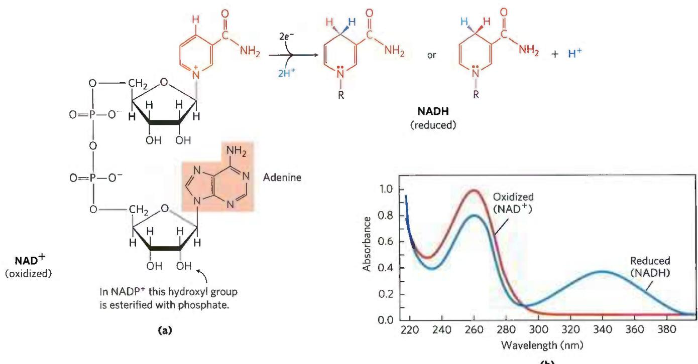  
FIGURE 13-24 NAD and NADP. (a) Nicotinamide adenine dinucleotide, $\mathrm{NAD^{+}}$ , and its phosphorylated analog, $\mathrm{NADP^{+}}$ , undergo reduction to NADH and NADPH, accepting a hydride ion (two electrons and one proton) from an oxidizable substrate. The hydride ion is added to either the front or the back of the planar nicotinamide ring. (b) The UV absorption spectra of

Nicotinamide adenine dinucleotide (NAD; NAD $^{+}$ in its oxidized form) and its close analog nicotinamide adenine dinucleotide phosphate (NADP; NADP $^{+}$ when oxidized) are composed of two nucleotides joined through their phosphate groups by a phosphoanhydride bond (Fig. 13-24a). Because the nicotinamide ring resembles pyridine, these compounds are sometimes called pyridine nucleotides. The vitamin niacin is the source of the nicotinamide moiety in nicotinamide nucleotides.

Both coenzymes undergo reversible reduction of the nicotinamide ring (Fig. 13-24). As a substrate molecule undergoes oxidation (dehydrogenation), giving up two hydrogen atoms, the oxidized form of the nucleotide (NAD $^{+}$ or NADP $^{+}$ ) accepts a hydride ion (:H $^{-}$ , the equivalent of a proton and two electrons) and is reduced (to NADH or NADPH). The second proton removed from the substrate is released to the aqueous solvent. The half-reactions for these nucleotide cofactors are

  
NAD $^{+}$ and NADH. Reduction of the nicotinamide ring produces a new, broad absorption band with a maximum at 340 nm. The production of NADH during an enzyme-catalyzed reaction can be conveniently followed by observing the appearance of the absorbance at 340 nm (molar extinction coefficient $\varepsilon_{340}=6,200\ m^{-1}\ cm^{-1}$ ).

$$
\begin{array}{r l} & \mathrm {NAD^ {+}} + 2 e ^ {-} + 2 \mathrm {H^ {+}} \longrightarrow \mathrm{NADH} + \mathrm {H^ {+}} \\ & \mathrm {NADP^ {+}} + 2 e ^ {-} + 2 \mathrm {H^ {+}} \longrightarrow \mathrm{NADPH} + \mathrm {H^ {+}} \end{array}
$$

Reduction of $NAD^{+}$ or $NADP^{+}$ converts the benzenoid ring of the nicotinamide moiety (with a fixed positive charge on the ring nitrogen) to the quinonoid form (with no charge on the nitrogen). The reduced nucleotides absorb light at 340 nm; the oxidized forms do not (Fig. 13-24b). Biochemists use this difference in absorption to assay reactions involving these coenzymes. Note that the plus sign in the abbreviations $NAD^{+}$ and $NADP^{+}$ does not indicate the net charge on these molecules (in fact, both are negatively charged); rather, it indicates that the nicotinamide ring is in its oxidized form, with a positive charge on the nitrogen atom. In the abbreviations NADH and NADPH, the “H” denotes the added hydride ion. To refer to these nucleotides without specifying their oxidation state, we use NAD and NADP.

The total concentration of $NAD^{+} + NADH$ in most tissues is about $10^{-5}M$ ; that of $NADP^{+} + NADPH$ is about $10^{-6}M$ . In many cells and tissues, the ratio of $NAD^{+}$ (oxidized) to NADH (reduced) is high, favoring hydride transfer from a substrate to $NAD^{+}$ to form NADH. By contrast, NADPH is generally present at a higher concentration than $NADP^{+}$ , favoring hydride transfer from NADPH to a substrate. This reflects the specialized metabolic roles of the two coenzymes: $NAD^{+}$ generally functions in oxidations—usually as part of a catabolic reaction; NADPH is the usual coenzyme in reductions—nearly always as part of an anabolic reaction. A few enzymes can use either coenzyme, but most show a strong preference for one over the other. Also, the processes in which these two cofactors function are segregated in eukaryotic cells: for example, oxidations of fuels such as pyruvate, fatty acids, and $\alpha$ -keto acids derived from amino acids occur in the mitochondrial matrix, whereas reductive biosynthetic processes such as fatty acid synthesis take place in the cytosol. This functional and spatial specialization allows a cell to maintain two distinct pools of electron carriers, with two distinct functions.

More than 200 enzymes are known to catalyze reactions in which NAD $^{+}$ (or NADP $^{+}$ ) accepts a hydride ion from a reduced substrate, or NADPH (or NADH) donates a hydride ion to an oxidized substrate. The general reactions are

$$
\begin{array}{r l} & \mathrm {AH_ {2} + NA D ^ {+} \longrightarrow A + NADH+ H^ {+}} \\ & \mathrm {A + NADPH+ H^ {+} \longrightarrow AH_ {2} + NA DP^ {+}} \end{array}
$$

where $AH_{2}$ is the reduced substrate and A is the oxidized substrate. The general name for an enzyme of this type is oxidoreductase; they are also commonly called dehydrogenases. For example, alcohol dehydrogenase catalyzes the first step in the catabolism of ethanol, in which ethanol is oxidized to acetaldehyde:

$$
\begin{array}{c} \mathrm{CH} _ {3} \mathrm{CH} _ {2} \mathrm{OH} + \mathrm{NAD} ^ {+} \longrightarrow \mathrm{CH} _ {3} \mathrm{CHO} + \mathrm{NADH} + \mathrm{H} ^ {+} \\ \text {   Ethanol   } \end{array}
$$

Notice that one of the carbon atoms in ethanol has lost a hydrogen; the compound has been oxidized from an alcohol to an aldehyde (refer again to Fig. 13-22 for the oxidation states of carbon).

The association between a dehydrogenase and NAD or NADP is relatively loose; the coenzyme readily diffuses from one enzyme to another, acting as a water-soluble carrier of electrons from one metabolite to another. For example, in the production of alcohol during fermentation of glucose by yeast cells, a hydride ion is removed from glyceraldehyde 3-phosphate by one enzyme (glyceraldehyde 3-phosphate dehydrogenase) and transferred to $\mathrm{NAD^{+}}$ . The NADH produced then leaves the enzyme surface and diffuses to another enzyme (alcohol dehydrogenase), which transfers a hydride ion to acetaldehyde, producing ethanol:

(1) Glyceraldehyde 3-phosphate + NAD $^{+}$ →

$$
3 \text {-phosphoglycerate} + \mathrm{NADH} + \mathrm{H} ^ {+}
$$

$$
\text {   (2)   } \mathrm{Acetaldehyde} + \mathrm{NADH} + \mathrm{H} ^ {+} \longrightarrow \mathrm{ethanol} + \mathrm{NAD} ^ {+}
$$

$$
\begin{array}{c} \text { Sum:   Glyceraldehyde   3 - phosphate + acetaldehyde } \\ \text { 3 - phosphoglycerate + ethanol } \end{array}
$$

Notice that in the overall reaction there is no net production or consumption of $NAD^{+}$ or NADH; the coenzymes function catalytically and are recycled repeatedly without a net change in the total amount of $NAD^{+} + NADH$ .

Both reduced and oxidized forms of NAD and NADP serve as allosteric effectors of proteins in catabolic pathways. As we describe in later chapters, the ratios

NAD $^{+}$ /NADH and NADP $^{+}$ /NADPH serve as sensitive gauges of a cell's fuel supply, allowing rapid, appropriate changes in energy-yielding and energy-dependent metabolism.

#### [EN] NAD Has Important Functions in Addition to Electron Transfer

Some key cellular functions are regulated by enzymes that use $NAD^{+}$ not as a redox cofactor but as a substrate in a coupled reaction in which the availability of $NAD^{+}$ can be an indicator of the cell's energy status. In DNA replication and repair, the enzyme DNA ligase is adenylylated and then transfers the AMP to a 5' phosphate in a nicked DNA (see Fig. 25-15); in bacteria, $NAD^{+}$ serves as the source of the activating AMP group. A family of proteins called sirtuins regulate the activity of proteins in diverse cellular pathways by deacetylating the $\varepsilon$ -amino group of an acetylated Lys residue. The deacetylation is coupled to $NAD^{+}$ hydrolysis, yielding O-acetyl-ADP-ribose and nicotinamide. Among the cellular processes regulated by sirtuins are inflammation, apoptosis, aging, and DNA transcription; deacetylation by a sirtuin alters the charge on histones, influencing which genes are expressed. The availability of $NAD^{+}$ for these types of reactions may indicate that the cell is undergoing stress and that pathways designed to respond to stress should be activated.

NAD $^{+}$ also plays an important role in cholera pathology (see Section 12.2). Cholera toxin has an enzymatic activity that transfers ADP-ribose from NAD $^{+}$ to a G protein involved in regulating ion fluxes in the cells lining the gut. This ADP-ribosylation blocks water retention, causing the diarrhea and dehydration characteristic of cholera.

Dietary deficiency of niacin, the vitamin form of NAD and NADP, causes pellagra (Fig. 13-25). The pyridine-like rings of NAD and NADP are derived from the vitamin niacin (nicotinic acid; Fig. 13-26), which is synthesized from tryptophan. Humans generally cannot synthesize sufficient quantities of niacin, and this is especially so for individuals with diets low in tryptophan (maize, for example, has a low tryptophan content). Niacin deficiency, which affects all the NAD(P)-dependent dehydrogenases, causes the serious human disease pellagra (Italian for "rough skin") and a related disease in dogs, called black tongue. Pellagra is characterized by the "three Ds": dermatitis, diarrhea, and dementia, followed in many cases by death. A century ago, pellagra was a common human disease; in the southern United States, where maize was a dietary staple, about 100,000 people were afflicted and about 10,000 died as a result of this disease between 1912 and 1916. In 1920, Joseph Goldberger showed pellagra to be caused by a dietary insufficiency, and in 1937, Frank Strong, D. Wayne Woolley, and Conrad Elvehjem identified niacin as the curative agent for the dog version of pellagra, black tongue. Supplementation of the human diet with this inexpensive compound has nearly eradicated pellagra in the populations of the developed world, with one significant exception: people who drink excessive amounts of alcohol. In these individuals, intestinal absorption of niacin is much reduced, and caloric needs are often met with distilled spirits that are virtually devoid of vitamins, including niacin.

  
FIGURE 13-25 Dermatitis associated with pellagra. Dermatitis involving the face, hands, and feet is an early sign of pellagra, a serious human disease that results from insufficient niacin in the diet. Untreated, pellagra leads to dementia and ultimately is fatal. [Double Vision/Science Source]

  
FIGURE 13-26 Niacin (nicotinic acid) and its derivative nicotinamide. The biosynthetic precursor of these compounds is tryptophan. In the laboratory, nicotinic acid was first produced by oxidation of the natural product nicotine—thus the name. Both nicotinic acid and nicotinamide cure pellagra, but nicotine (from cigarettes or elsewhere) has no curative activity.

#### [EN] Flavin Nucleotides Are Tightly Bound in Flavoproteins

Flavoproteins are enzymes that catalyze oxidation-reduction reactions using either flavin mononucleotide (FMN) or flavin adenine dinucleotide (FAD) as coenzyme (Fig. 13-27). These coenzymes, the flavin nucleotides, are derived from the vitamin riboflavin. The fused ring structure of flavin nucleotides (the isoalloxazine ring) undergoes reversible reduction, accepting either one or two electrons in the form of one or two hydrogen atoms (each atom an electron plus a proton) from a reduced substrate. The fully reduced forms are abbreviated $\mathrm{FADH}_2$ and $\mathrm{FMNH}_2$ . When a fully oxidized flavin nucleotide accepts only one electron (one hydrogen atom), the semiquinone form of the isoalloxazine ring is produced, abbreviated FADH $^{\bullet}$ and FMNH $^{\bullet}$ . Because flavin nucleotides have a chemical specialty that is slightly different from that of the nicotinamide coenzymes—the ability to participate in either one- or two-electron transfers—flavoproteins are involved in a greater diversity of reactions than the NAD(P)-linked dehydrogenases.

Like the nicotinamide coenzymes (Fig. 13-24), the flavin nucleotides undergo a shift in a major absorption band on reduction (again, useful to biochemists who want to monitor reactions involving these coenzymes). Flavoproteins that are fully reduced (two electrons accepted) generally have an absorption maximum near 360 nm. When partially reduced (one electron), they acquire another absorption maximum at about 450 nm; when fully oxidized, the flavin has maxima at 370 and 440 nm.

The flavin nucleotide in most flavoproteins is bound rather tightly to the protein, and in some enzymes, such as succinate dehydrogenase, it is bound covalently. Such tightly bound coenzymes are properly called prosthetic groups. They do not transfer electrons by diffusing from one enzyme to another; rather, they provide a means by which the flavoprotein can temporarily hold electrons while it catalyzes electron transfer from a reduced substrate to an electron acceptor. One important feature of the flavoproteins is the variability in the standard reduction potential ( $E^{\prime\circ}$ ) of the bound flavin nucleotide. Tight association between the enzyme and prosthetic group confers on the flavin ring a reduction potential typical of that particular flavoprotein, sometimes quite different from the reduction potential of the free flavin nucleotide. FAD bound to succinate dehydrogenase, for example, has an $E^{\prime\circ}$ close to 0.0 V, compared with -0.219 V for free FAD; $E^{\prime\circ}$ for other flavoproteins ranges from -0.40 V to +0.06 V. Flavoproteins are often very complex; some have, in addition to a flavin nucleotide, tightly bound inorganic ions (iron or molybdenum, for example) capable of participating in electron transfers.

We examine the function of flavoproteins as electron carriers in Chapters 19 and 20, when we consider their roles in oxidative phosphorylation (in mitochondria) and photophosphorylation (in chloroplasts).

#### [EN] SUMMARY 13.4 Biological Oxidation-Reduction Reactions

In many organisms, a central energy-conserving process is the stepwise oxidation of glucose to $\mathrm{CO}_{2}$ , in which some of the energy of oxidation is conserved in ATP as electrons are passed to $\mathrm{O}_{2}$ .

■ Biological oxidation-reduction reactions can be described in terms of two half-reactions, each with a characteristic standard reduction potential, $E^{\prime\circ}$ .

Many biological oxidation reactions are dehydrogenations in which one or two hydrogen atoms ( $H^{+} + e^{-}$ ) are transferred from a substrate to a hydrogen acceptor. In some biological redox reactions, the substrate loses both electrons and protons, the equivalent of losing hydrogen. The many enzymes that catalyze such reactions are called dehydrogenases.

\- When two electrochemical half-cells, each containing the components of a half-reaction, are connected, electrons tend to flow to the half-cell with the higher reduction potential. The strength of this tendency is proportional to the difference between the two reduction potentials ( $\Delta E$ ) and is a function of the concentrations of oxidized and reduced species.

The standard free-energy change for an oxidation-reduction reaction is directly proportional to the difference in standard reduction potentials of the two half-cells: $\Delta G^{\prime\circ} = -nF\Delta E^{\prime\circ}$ .

\- Oxidation-reduction reactions in living cells involve specialized electron carriers. NAD and NADP are the freely diffusible coenzymes of many dehydrogenases. Both $\mathrm{NAD^{+}}$ and $\mathrm{NADP^{+}}$ accept two electrons and one proton. In addition to its role in oxidation-reduction reactions, $\mathrm{NAD^{+}}$ is the source of AMP in the bacterial DNA ligase reaction and of ADP-ribose in the cholera toxin reaction, and it is hydrolyzed in the deacetylation of proteins by some sirtuins.

\- Lack of the vitamin niacin prevents NAD synthesis and leads to pellagra.

■ FAD and FMN, the flavin nucleotides, serve as tightly bound prosthetic groups of flavoproteins. They can accept either one or two electrons and one or two protons. Their reduction potentials depend on the flavoprotein with which they are associated.

<!-- EN-END 13.4 -->

## 二、电子传递和氧化呼吸链

## （一）电子传递过程的总体自由能释放

需氧细胞内糖、脂肪、氨基酸等通过各自的分解途径所形成的还原型辅基，包括 NADH 和 $FADH_{2}$ ，通过电子传递途径被重新氧化。还原型辅基分子中的氢原子以质子形式脱下，而其电子则沿着一系列的电子载体传递，最后传递到分子氧，形成离子型氧，后者与质子结合而成水。在电子传递过程中释放出的自由能则使 ADP 磷酸化生成 ATP。

电子传递过程包括电子从还原型辅基通过一系列按照电子亲和力递增顺序排列的电子载体所构成的电子传递链，也称呼吸链，传递到氧的过程。这些电子载体都具有氧化还原作用。电子传递和形成 ATP 过程的偶联即为氧化磷酸化作用。氧化磷酸化作用是电子沿着电子传递链传递释放自由能，并将 ADP 磷酸化而形成 ATP 的全过程。

通过电子传递,还原型辅基借助氧分子得以氧化并释放自由能的过程可用下式表示:

$$
\begin{array}{l l} \mathrm {NADH+ H^ {+} +1 / 2O_ {2} \longrightarrow NAD+ H_ {2} O} & \Delta G ^ {\ominus \prime} = - 2 2 0. 0 7 \mathrm{kJ/mol(-52.6kcal/mol)} \\ \mathrm {FADH_ {2} +1 / 2O_ {2} \longrightarrow FAD+ H_ {2} O} & \Delta G ^ {\ominus \prime} = - 1 8 1. 5 8 \mathrm{kJ/mol(-43.4kcal/mol)} \end{array}
$$

上述反应式既表明还原型辅基的氧化,氧的消耗,又表明在此反应中有水的生成。细胞对其燃料物质的彻底氧化最终形成 $CO_{2}$ 和 $H_{2}O$ 。 $CO_{2}$ 是通过柠檬酸循环形成的;水则是在电子传递过程的最后阶段生成。

上式所标明的标准自由能变化 $\Delta G^{\ominus}$ 显示，NADH或 $\mathrm{FADH}_2$ 的氧化，都有大量自由能的释放。表明它们所带的电子对，都具有高的转移势能。它推动电子从还原型辅基顺坡而下，直到转移至分子氧上。这种由电子传递而释放的自由能即可用于合成ATP。当葡萄糖氧化为 $\mathrm{CO}_{2}$ 时，一分子葡萄糖共生成10个NADH和2个 $\mathrm{FADH}_2$ ，它们的总标准自由能为 $10\times (52.6\mathrm{kJ / mol}) + 210\times (43.4\mathrm{kJ / mol}) = 2564.8\mathrm{kJ / mol}$ （613kcal/mol）。在完全燃烧时，一个葡萄糖分子可释放出2870.23kJ/mol(686kcal/mol)的热，因此可推算，葡萄糖分子氧化时所释放自由能的 $90\%$ 都仍贮存在这两种还原型辅基中。

电子传递链存在于原核细胞的质膜上,以及真核细胞线粒体的内膜上。

在电子传递过程中,电子的传递仅发生在相邻的电子载体之间,它的传递方向取决于每种电子载体所具有的还原势的大小。电子传递还伴有 $H^{+}$ 从膜一侧到另一侧的定向转移,形成质子的跨膜梯度,从而推动 ATP 的合成。

前面已经提到,根据各种氧化还原电对的 $E^{\ominus'}$ 值,可以判断电子传递的方向,但是必须有催化剂催化,反应才能发生。催化剂的作用并不能改变电子传递的方向。电子的传递方向总是由电负性较强的氧还电对流向具有更强电正性的氧还电对。例如,NADH/NAD $^{+}$ 的 $E^{\ominus'} = -0.32 \, V$ ,还原型细胞色素 c/氧化型细胞色素 c 的 $E^{\ominus'} = +0.235 \, V$ 。电子将从 NADH 流向氧化型细胞色素 c。结果使 NADH 氧化为 $NAD^{+}$ ，而氧化型细胞色素 c 还原为还原型细胞色素 c；又因 $\mathrm{H}_{2}\mathrm{O}/\left(\frac{1}{2}\mathrm{O}_{2}\right)$ 电对的 $E^{\ominus'} = +0.815 \, V$ ，所以电子的流向一定是从还原型细胞色素 c 到氧。电子从电负性流向电正性系统将伴随着自由能的降低。在两个氧还电对之间，当电子从电负性电对流向电正性电对时，标准还原电势之差越大，自由能的释放也越多。如果一对电子从 NADH 转移到氧，它的标准自由能变化可根据公式(19-14)求出：

$$
\Delta G ^ {\ominus \prime} = - n F \Delta E ^ {\ominus \prime}
$$

NADH/NAD $^{+}$ 电对的标准还原电势 $E^{\ominus'} = -0.32\ V, H_{2}O/\left(\frac{1}{2}O_{2}\right)$ 电对的 $E^{\ominus'} = +0.815\ V$ 。n 为转移电子数，F 为法拉第常数 = 23 062 cal/Vmol。 $\Delta E^{\ominus'}$ 是电子供体和电子受体之间的标准还原电势差。

假设所有参加反应物质的浓度都是 $1.0 \, mol/L$ 、反应条件是 $25^{\circ}C$ ，pH = 7。则：

$$
\Delta G ^ {\ominus \prime} = - 2 \times 2 3 0 6 2 \times [ 0. 8 1 5 - (- 0. 3 2) ] \mathrm{kJ} = - 2 1 9. 1 3 \mathrm{kJ} (- 5 2. 3 5 \mathrm{kcal})
$$

公式 $\Delta G^{\ominus'} = -nF\Delta E^{\ominus'}$ 对计算电子传递链中的每一步电子传递的标准自由能变化是非常有用的。

## （二）呼吸链概念的建立

呼吸链概念的建立将两个争论多年的学派最后统一起来了。

在 1900 年至 1920 年间,人们曾发现,催化脱氢作用的脱氢酶可以在完全没有氧的条件下,将底物的氢原子脱下,于是产生了氢激活学说。Wieland 提出,氢的激活是生物氧化的关键过程,而氧分子无需激活,即可与被激活的氢原子结合。1913 年 Warburg 发现,极少量的氰化物即能全部抑制组织和细胞对分子氧的利用,而氰化物对于脱氢酶并无抑制作用。氰化物与铁原子可以形成非常稳定的化合物(如铁氰化物),于是提出生物氧化作用需要一种含铁的“氧化酶”来激活分子氧,氧的激活是生物氧化的关键步骤。后来匈牙利的科学工作者 A. Szent-Gyorgyi 将两种学说合并在一起,提出在生物氧化过程中氢的激活和氧的激活都是需要的。还提出在“氧化酶”和脱氢酶之间起电子传递作用的是黄素蛋白类物质。1925 年 David Keilin 提出,细胞色素起着连接两类酶的作用。后来,对生物氧化的研究,越来越多地改用分离提纯的电子传递链不同组分在试管中进行重组研究的方法,为进一步阐明生物氧化机制创造了条件。应该指出,直到现在有关呼吸链电子传递及 ATP 的生成机制还未全部阐明,有待进一步深入研究。

## （三）电子传递链

电子从 NADH 或 $FADH_{2}$ 传递到 $O_{2}$ 所经过的一系列电子载体被形象地称为电子传递链，或称呼吸链（respiratory chain）。这条链主要由蛋白质复合体组成，大致分为 4 个部分，分别称为 NADH-Q 还原酶（NADH-Q reductase）、琥珀酸-Q 还原酶（succinate-Q reductase）、细胞色素还原酶（cytochrome reductase）和细胞色素氧化酶（cytochrome oxidase）。它们的排列顺序和主要特点如图 19-2 和表 19-2 所示。

从表 19-2 中可看出,电子传递酶复合体中的辅基有:黄素(flavins)、铁硫中心(iron-sulfur center)、血红素(hemes)和铜离子(copper ions)等,这些辅基都是电子载体。电子传递通过与酶分子结合的这些辅基来完成。

$$
\begin{array}{r l}&\text { 黄素蛋白中的FADH } _ {2}\\&\text { 琥珀酸 - Q还原酶 } \downarrow\\&\mathrm{NAD} \rightarrow \mathrm{NADH-Q} \rightarrow \mathrm{Q} \rightarrow \text { 细胞色素 } \rightarrow \text { 细胞色素c } \rightarrow \text { 细胞色素氧化酶 } \rightarrow \mathrm{O} _ {2}\\&\text { 还原酶 }\end{array}
$$

图 19-2 电子传递链中的电子载体及其顺序

表 19-2 电子传递链中四种复合体的性质

<table><tr><td></td><td>酶复合体</td><td>相对分子质量 $\left( {\times {10}^{3}}\right)$ </td><td>亚基数</td><td>辅基</td><td colspan="3">电子供受体</td></tr><tr><td></td><td></td><td></td><td></td><td></td><td>线粒体基质侧</td><td>线粒体内膜</td><td>膜间隙侧</td></tr><tr><td>复合体I</td><td>NADH-Q还原酶</td><td>880</td><td>46</td><td>FMN,Fe-S</td><td>NADH</td><td>Q</td><td></td></tr><tr><td>复合体II</td><td>琥珀酸-Q还原酶</td><td>140</td><td>4</td><td>FAD,Fe-S</td><td>琥珀酸</td><td>Q</td><td></td></tr><tr><td rowspan="4">复合体III</td><td rowspan="4">细胞色素还原酶</td><td rowspan="4">250</td><td rowspan="4">11</td><td>血红素 $b_{562}$ </td><td></td><td> ${\mathrm{{QH}}}_{2}$ </td><td>细胞色素c</td></tr><tr><td>血红素 $b_{566}$ </td><td></td><td></td><td></td></tr><tr><td>血红素 $c_1$ </td><td></td><td></td><td></td></tr><tr><td>Fe-S</td><td></td><td></td><td></td></tr><tr><td rowspan="3">复合体IV</td><td rowspan="3">细胞色素氧化酶</td><td rowspan="3">160</td><td rowspan="3">13</td><td>血红素a</td><td></td><td></td><td>细胞色素c</td></tr><tr><td>血红素 $a_3$ </td><td></td><td></td><td></td></tr><tr><td> ${\mathrm{{Cu}}}_{\mathrm{A}}$ 和 ${\mathrm{{Cu}}}_{\mathrm{B}}$ </td><td></td><td></td><td></td></tr></table>

辅酶 Q(coenzyme-Q)，又称泛醌(ubiquinone)，简写为 Q。该命名反映它广泛存在于具有呼吸作用的生物体内，故采用了英文“ubiquity”（普遍存在）为字头。它是疏水的醌(quinone)类化合物，在线粒体内膜内部扩散迅速。辅酶 Q 在电子传递链中的作用是将电子从 NADH-Q 还原酶（复合体 I，complex I）和琥珀酸-Q 还原酶（复合体 II）转移到细胞色素还原酶（复合体 III），反应式如下：

$$
\begin{array}{r l} & {\mathrm {NADH+ Q(氧化型)\longrightarrow NAD^ {+} + QH_ {2} (还原型)}} \\ & {\Delta E ^ {\ominus \prime} = 0. 3 6 0 \mathrm{V}, \quad \Delta G ^ {\ominus \prime} = - 6 9. 5 \mathrm{kJ/mol}} \end{array}
$$

细胞色素还原酶(复合体Ⅲ)借助于细胞色素 $c(\text{cytochrome } c)$ ，使还原型 $QH_{2}$ 再氧化，反应式如下：

$$
\begin{array}{r l} \mathrm {QH_ {2}} (\text {还原型}) + \text {细胞色素} c (\text {氧化型}) & \longrightarrow \mathrm{Q(氧化型)} + \text {细胞色素} c (\text {还原型}) \\ \Delta E ^ {\ominus^ {\prime}} = 0. 1 9 0 \mathrm{V}, & \Delta G ^ {\ominus^ {\prime}} = - 3 6. 7 \mathrm{kJ/mol} \end{array}
$$

细胞色素氧化酶(复合体Ⅳ)催化氧使还原型细胞色素c氧化的反应式如下：

还原型细胞色素 $c + 1/2 \, O_{2} \longrightarrow$ 氧化型细胞色素 $c + H_{2}O$

$$
\Delta E ^ {\ominus \prime} = 0. 5 8 0 \mathrm{V}, \quad \Delta G ^ {\ominus \prime} = - 1 1 2 \mathrm{kJ/mol}
$$

当电子对陆续通过复合体Ⅰ、Ⅲ和Ⅳ时，都可释放出足够的自由能，使若干质子发生跨膜转运。

复合体Ⅱ的作用是借助 Q 催化 $FADH_{2}$ 的氧化。反应式如下：

$$
\begin{array}{r l} & {\mathrm {FADH_ {2} + Q(氧化型)\longrightarrow FAD+ QH_ {2} (还原型)}} \\ & {\Delta E _ {0} ^ {\ominus} = 0. 0 1 5 \mathrm{V}, \Delta G ^ {\ominus \prime} = - 2. 9 \mathrm{kJ/mol}} \end{array}
$$

这一步氧化还原反应所释放的自由能不足以使质子跨膜转运,它的作用只是将 $FADH_{2}$ 的电子脱下并往下传递。

合成 ATP 所需要的自由能就是靠上述 4 种酶复合体将 NADH 或 FADH $_{2}$ 所携带的电子从标准还原势较低的成员传递到较高的成员所释放的。这个过程的全貌可用图 19-2 表示。

## （四）电子传递链详情

## 1. NADH-Q 还原酶

真核生物的 NADH-Q 还原酶, 又称为 NADH 脱氢酶 (NADH dehydrogenase) 或复合体 I, 是一个相对分子质量为 880 000 的蛋白质复合体, 由大约 46 种不同亚基组成, 分别由细胞核和线粒体基因组编码。在电子传递链中共有 3 个质子泵 (proton pump), 该酶复合体是第一个质子泵。

该酶复合体催化的第一步反应是将 NADH 上的两个高势能电子转移到 FMN 辅基上, 使 NADH 氧化,

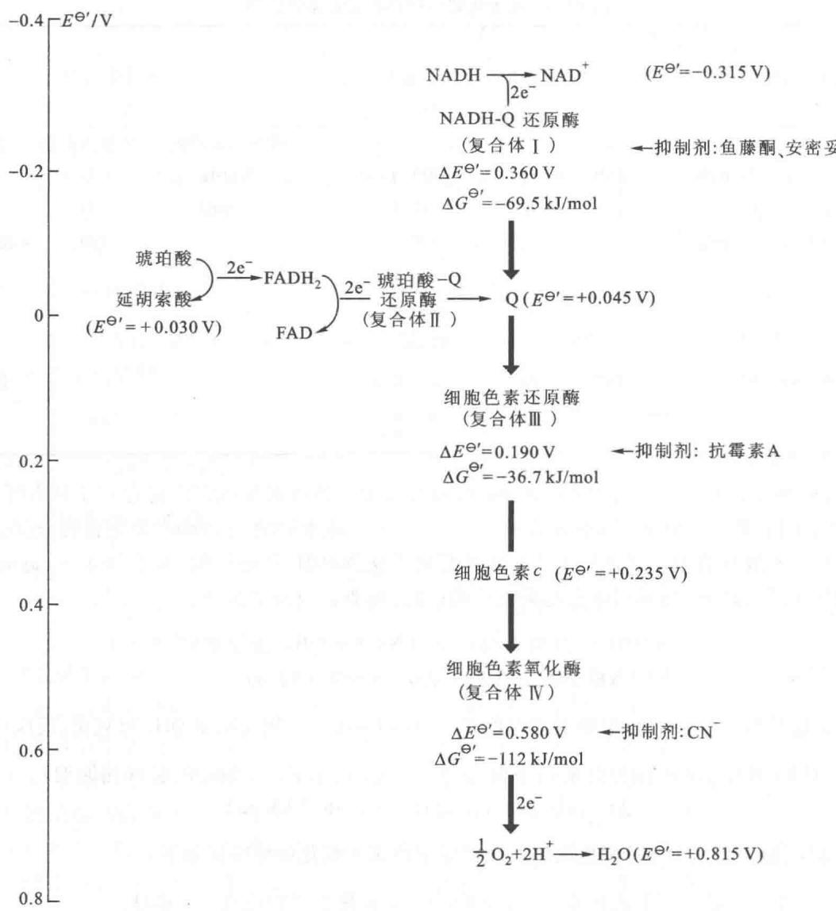  
图19-3 电子传递链部分组分的标准还原势及自由能变化示意图

FMN 还原, 反应如下:

$$
\mathrm{NADH} + \mathrm{H} ^ {+} + \mathrm{FMN} \longrightarrow \mathrm{FMNH} _ {2} + \mathrm{NAD} ^ {+}
$$

FMN 既可接受两个电子形成 $FMNH_{2}$ ，又可接受一个电子，或由 $FMNH_{2}$ 给出一个电子形成一个稳定的半醌中间产物，反应如图 19-4 所示。

在 NADH-Q 还原酶复合体上, 辅基 $FMNH_{2}$ 上的电子又转移到铁硫中心上, 铁硫中心一般简写为 Fe-S。它是 NADH-Q 还原酶中的第二种辅基。Fe-S 中心与蛋白质相结合形成铁硫蛋白, 又称非血红素铁蛋白 (nonheme iron proteins)。这种铁硫蛋白在生物系统的许多氧化还原反应中起着关键性的电子传递作用。铁硫中心有几种不同的类型, 有的只含有一个铁原子 [FeS], 有的含有两个铁原子 [2Fe-2S], 有的含有 4 个铁原子 [4Fe-4S]。只有一个铁原子的铁硫中心其铁原子以四面体形式与蛋白质的 4 个半胱氨酸残基上的巯基 [-SH] 配位相连。含有两个铁原子的 [2Fe-2S], 每个铁原子分别与两个半胱氨酸残基的 -SH 相连, 此外每个铁原子还同时与一个无机硫原子相连 (该中心共有 2 个无机硫原子)。含有 4 个铁原子的铁硫中心 [4Fe-4S], 除每个铁原子各与一个半胱氨酸残基的 -SH 相连外, 每个铁原子还与 3 个无机硫原子相连 (该中心共有 4 个无机硫原子)。三种类型的铁硫中心可用图 19-5 表示。

## 2. 辅酶Q

辅酶 Q 是一种脂溶性辅酶, 存在于线粒体内膜中, 可结合到膜蛋白上, 也可以游离状态存在。它以不同的形式在电子传递链中起作用。它不只接受 NADH-Q 还原酶催化脱下的电子和氢原子，还接受线粒体其他黄素酶类脱下的电子和氢原子，包括琥珀酸-Q 还原酶、脂酰-CoA 脱氢酶（acyl-CoA dehydrogenase）等。可以说辅酶 Q 在电子传递链中处于一个重要地位。它在呼吸链中是一种和蛋白质结合不紧密的辅酶。这使它在黄素蛋白和细胞色素之间能够作为一种特殊灵活的电子载体起作用。电子传递复合体和辅酶 Q 等在可流动的线粒体脂双层膜中进行局部扩散和碰撞。

  
图 19-5 三种类型铁硫中心的铁原子与硫原子关系示意图

辅酶 Q 中存在一个以异戊二烯(isoprene)为单位构成的碳氢长链,在不同生物中其长度不同。哺乳动物中最常见的是具有 10 个异戊二烯单位的长链,简写为 $Q_{10}$ ,为了简便也往往省略“10”这个脚注。在非哺乳类动物中可能只有 6\~8 个异戊二烯单位。辅酶 Q 的异戊二烯碳氢长链称为类异戊二烯(isoprenoid)链。它的作用是使 Q 成为非极性化合物,使其在线粒体内膜的脂双层中可以迅速扩散。

辅酶 Q 和 FMN 都是 NADH-Q 还原酶的辅酶。辅酶 Q 和 FMN 一样，也能够接受或给出一个或者两个电子，因为它们都能以稳定的半醌形式存在，如图 19-6 所示。

## 3. 琥珀酸-Q 还原酶

琥珀酸-Q还原酶(复合体Ⅱ)是嵌在线粒体内膜中的蛋白质复合体。它就是柠檬酸循环中使琥珀酸氧化为延胡索酸的琥珀酸脱氢酶。FAD作为该酶的辅基在传递电子时并不与酶分离，只是将电子传递给琥珀酸脱氢酶分子的铁硫中心。这些铁硫中心以2Fe-2S,3Fe-3S和4Fe-4S形式存在。电子经过铁硫中心又传递给辅酶Q，从而进入了电子传递链。琥珀酸-Q还原酶和NADH还原酶中的辅酶Q辅基已证明具有完全相同的结构和性质。

在琥珀酸-Q 还原酶以及其他黄素酶中, 将电子从 $FADH_{2}$ 转移到辅酶 Q 上的标准氧还电势变化不能产生足够的自由能用以驱动质子跨膜转运。这一步反应的重要意义在于, 它使得 $FADH_{2}$ 上的具有相对高转移势能的电子进入电子传递链。

## 4. 细胞色素还原酶

细胞色素还原酶的名称多种多样,又称复合体Ⅲ,辅酶 Q-细胞色素 c 还原酶(coenzyme Q-cytochrome

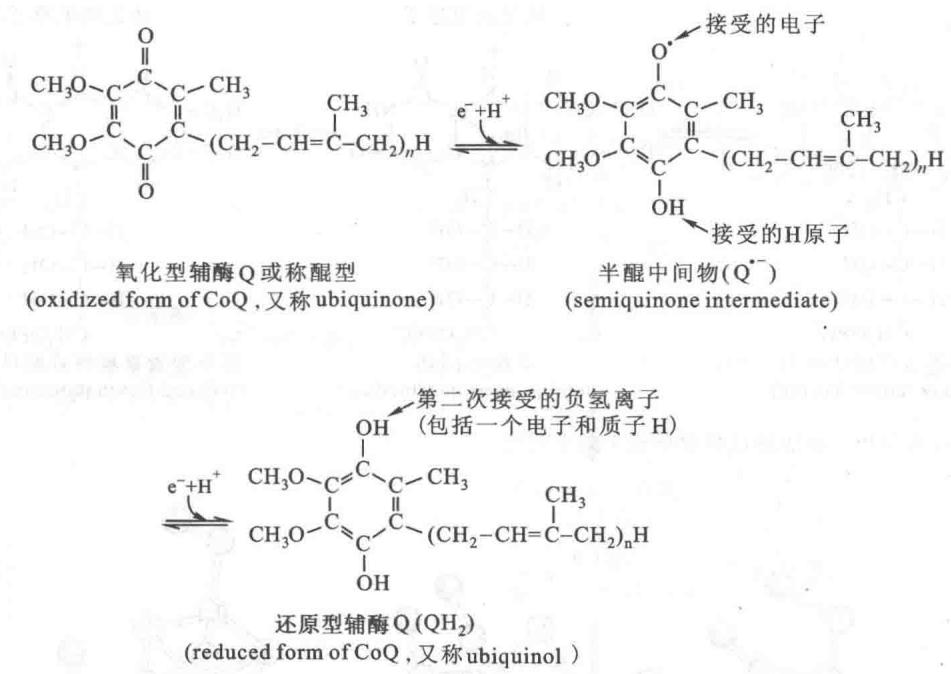  
图 19-6 氧化型辅酶 Q 经过半醌中间物形成还原型辅酶 Q

c reductase）、细胞色素 $bc_{1}$ 复合体（cytochrome $bc_{1}$ complex）等。

细胞色素是一类含有血红素(heme)辅基的电子传递蛋白质的总称。因含有血红素所以显红色或褐色。细胞色素这一名称也是因为它们有颜色而得名。还原型细胞色素具有明显的可见光光谱吸收现象。可看到 $\alpha, \beta$ 和 $\gamma$ 三条光谱吸收带或称 $\alpha, \beta, \gamma$ 吸收峰。 $\gamma$ 光谱带又称为索瑞氏(soret)光谱带。 $\alpha$ 峰的吸收波长随细胞色素种类的不同而不同。这是区别细胞色素不同种类的重要指标。氧化型的细胞色素看不到有吸收峰的存在。

细胞色素在细胞呼吸中的重要作用前面已经提到,是1925年David Keilin最先发现的。他还根据吸收光谱的不同将细胞色素分为a、b、c三类。细胞色素几乎存在于所有的生物体内。只有极少数的专性厌氧微生物(obligate anaerobes)缺乏这类蛋白质。

同一种细胞色素又因为其所处的环境不同，其 $\alpha$ 吸收峰的波长位置也有一些差异。例如，细胞色素还原酶（复合体Ⅲ）中的细胞色素 $b$ 含有两个血红素 $b$ 分子：其中一种的最大吸收峰在 $562\mathrm{nm}$ ，写作 $b_{562}$ 或 $b_{\mathrm{H}}$ ；另一种的最大吸收峰在 $566\mathrm{nm}$ ，写作 $b_{566}$ 或 $b_{\mathrm{L}}$ 。这两种血红素 $b$ 对电子的亲和力不同，主要是因为环绕它们的蛋白质（结构）不同。琥珀酸-Q还原酶（复合体Ⅱ）已知含有细胞色素 $b_{562}$ ，但并不参与电子传递。细胞色素的可见吸收光谱如图19-7所示。

不同细胞色素最大吸收峰的位置差异如表 19-3 所示。

表 19-3 不同细胞色素的最大吸收峰位置举例

<table><tr><td rowspan="2">细胞色素</td><td colspan="3">波长/nm</td></tr><tr><td> $\alpha$ </td><td> $\beta$ </td><td> $\gamma$ </td></tr><tr><td> $a$ </td><td>600</td><td></td><td>439</td></tr><tr><td> $b_{566}$ </td><td>566</td><td></td><td></td></tr><tr><td> $b_{562}$ </td><td>562</td><td>532</td><td>429</td></tr><tr><td> $c$ </td><td>550</td><td>521</td><td>415</td></tr><tr><td> $c_1$ </td><td>554</td><td>524</td><td>418</td></tr></table>

不同类型的细胞色素中的血红素分子内卟啉环上的取代基团各不相同，这将影响铁原子的氧化还原活性。b型细胞色素的血红素是铁-原卟啉IX（protoporphyrin IX）。铁-原卟啉IX也存在于血红蛋白和肌红蛋白分子中，这种血红素又称为b型血红素。c型细胞色素中的血红素和铁-原卟啉IX的区别是，血红素上的乙烯基（vinyl groups）通过其双键与蛋白质的半胱氨酸（Cys）的巯基作用，形成硫醚键与蛋白质相连。铁-原卟啉IX的结构（b型血红素）和细胞色素c类型（c型血红素）的结构如图19-8所示。

细胞色素还原酶除含有细胞色素 b 外, 还含有 2Fe-2S 类铁硫蛋白, 以及细胞色素 $c_{1}$ 。细胞色素 b 在细胞色素还原酶中以非共价形式结合, 而细胞色素 $c_{1}$ 则是以共价键与蛋白质相连。细胞色素还原酶的部分结构可用图 19-9 表示。

  
图19-7 还原型细胞色素 $c$ 的光吸收峰

  
图19-8 $b$ 型细胞色素和 $c$ 型血红素的基本结构及差异

细胞色素还原酶各亚基在线粒体内膜中的排列方式如下：细胞色素 $c_{1}$ 和铁硫蛋白（又名Rieske铁硫蛋白）位于线粒体内膜的外表面。根据编码细胞色素 $b$ 的线粒体DNA序列推测，不同物种来源细胞色素 $b$ 的多肽链，其氨基酸数目都在380到385之间，并表现出氨基酸序列上的高度一致。细胞色素 $b$ 的多肽链有9次跨线粒体膜的弯曲，每两个弯曲之间是大于20个氨基酸的以疏水残基占优势的伸展多肽链。它们以稳定的 $\alpha$ 螺旋形式跨越脂双层膜。细胞色素 $b$ 中的两个血红素可能是以配位的形式与4个组氨酸(His)残基相连。4个组氨酸残基在肽链中的位置也已经被推测出来。

细胞色素还原酶中血红素辅基的铁原子,在电子传递中发生可逆的 $Fe^{2+}$ 和 $Fe^{3+}$ 的价态变化。在电子传递链中细胞色素还原酶的作用是催化电子从 $QH_{2}$ 转移到细胞色素 c。

  
图 19-9 细胞色素还原酶的部分结构模式

## 5. 细胞色素 $c$

细胞色素 c 是一种相对分子质量为 13000 的球形蛋白质, 直径为 3.4 nm; 它由 104 个氨基酸构成, 为一条单一的多肽链。它是唯一能溶于水的细胞色素。它的氨基酸序列及三维空间结构都已经被测定。是

了解最透彻的细胞色素蛋白质。

细胞溶胶中的脱辅基细胞色素 c(apocytochrome c) 可以跨过线粒体外膜进入线粒体内外膜间隙,之后,细胞色素 c 合成酶(cytochrome c synthetase),又称细胞色素 c 血红素裂合酶(cytochrome c hemelyase),将血红素与蛋白质分子结合,细胞色素 c 蛋白分子发生构象变化,不再能穿过线粒体外膜,被“锁”在线粒体的内外膜间隙。

细胞色素 c 交互地与细胞色素还原酶(复合体Ⅲ)中的细胞色素 $c_{1}$ 和细胞色素氧化酶(复合体Ⅳ)接触,起到在复合体Ⅲ和Ⅳ之间传递电子的作用。

复合体Ⅲ中的 $QH_{2}$ 将电子传递给细胞色素 c 不是简单地一次性完成的，而是分为两个阶段。在第一阶段， $QH_{2}$ 所具有的两个高势能电子中的一个被转移到细胞色素还原酶的铁硫中心，再经过细胞色素 $c_{1}$ 传递到细胞色素 c。这样， $QH_{2}$ 失去了一个电子转变为半醌阴离子，即 $Q^{\cdot\cdot}$ 。半醌中间体上的电子迅速地通过细胞色素还原酶中靠近细胞溶胶侧的血红素 $b_{\mathrm{L}}(b_{566})$ 转移到对电子具有较高亲和力的靠近线粒体基质侧的血红素 $b_{\mathrm{H}}(b_{562})$ 。半醌阴离子 $Q^{\cdot\cdot}$ 失去电子后形成 Q。Q 在线粒体膜内处于自由流动状态。血红素 $b_{H}$ 上的电子之后转移到接近细胞溶胶一边的一个 Q 分子上，于是又形成了一个半醌阴离子 $Q^{\cdot\cdot}$ 。

在第一阶段参与电子转移的 $\mathrm{QH}_2$ 通过上述过程将一个电子传递给了细胞色素 $c$ 。另外一个电子供给Q，形成半醌阴离子 $\mathbf{Q}^{\prime \prime}$ 。在第二阶段，另一分子 $\mathrm{QH}_2$ 通过上述相同的途径，将一个电子转移到细胞色素还原酶的Fe-S中心，再经过细胞色素 $c_{1}$ 传递到细胞色素 $c$ 。而这个 $\mathrm{QH}_2$ 分子上剩余的一个电子又使它形成了一个新的半醌阴离子 $\mathbf{Q}^{\prime \prime}$ ，这个半醌阴离子上的电子又传递给 $b_{\mathrm{L}}$ 和 $b_{\mathrm{H}}$ 。这次 $b_{\mathrm{H}}$ 上的电子传递给第一阶段形成的那个半醌阴离子，这就使这个半醌阴离子转变成了 $\mathrm{QH}_2$ 。

总括起来,两个 $QH_{2}$ 参与电子传递,使两个细胞色素 c 还原,过程中又产生了一个新的 $QH_{2}$ 分子。因此整体而言是一个 $QH_{2}$ 分子的两个电子分别传递给 2 分子细胞色素 c。辅酶 Q 的这种电子传递方式称为 Q 循环。上述方式得以使电子由携带两个电子的载体—— $QH_{2}$ 转移给携带一个电子的载体——细胞色素 c。这同时还将 4 个质子从线粒体基质转运到了膜间隙中。上述的电子传递过程可用图 19-10 表示。

  
图 19-10 从细胞色素还原酶到细胞色素 c 的 Q 循环电子传递途径

图中表明细胞色素还原酶接受了两个 $\mathrm{QH}_2$ 分子上的电子，每个 $\mathrm{QH}_2$ 上的一个电子被传递给细胞色素 $c$ 分子；这样，每个 $\mathrm{QH}_2$ 上带有另一个电子，分别形成两个半醌中间体（ $\mathbf{Q}^{\cdot -}$ ）分子。随后，两个半醌中间体上的电子，分别进入另一条传递途径：第一个半醌中间体上的电子经细胞色素 $b(b_{566} \rightarrow b_{562})$ 传递给一个氧化型Q分子，结果形成一个半醌中间体分子；第二个半醌中间体上的电子也经细胞色素 $b(b_{566} \rightarrow b_{562})$ 传递给前面形成的那个半醌中间体分子，结果形成一个新的 $\mathrm{QH}_2$ 分子

## 6. 细胞色素氧化酶

细胞色素氧化酶又称为细胞色素 c 氧化酶(cytochrome c oxidase)或复合体Ⅳ(complex Ⅳ)。

哺乳动物细胞色素氧化酶的相对分子质量大约为 200 000, 是嵌在线粒体内膜的跨膜蛋白质复合体, 其结构如图 19-11 所示。

  
图 19-11 细胞色素氧化酶结构示意图

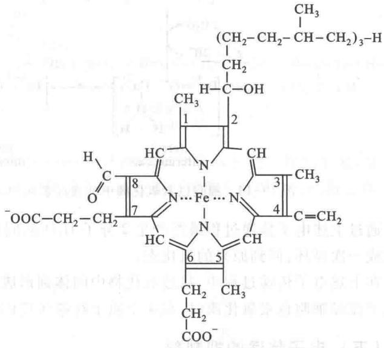  
图中数字表示各亚基的相对分子质量  
图19-12 $a$ 型血红素的结构图

a型血红素(或血红素A)是细胞色素氧化酶中的铁卟啉分子。它与其他血红素的区别在于,一个甲酰基取代了一个甲基,而且拥有一个长达17个碳的碳氢链

哺乳动物细胞色素氧化酶由13个亚基构成，分别称为I、II、III…其中最大的和疏水性最强的三个亚基都由线粒体DNA编码。这些亚基形成类似于细胞色素b的跨膜螺旋。该酶共有4个氧化还原活性中心，为两个a型血红素和三个铜离子，位于亚基Ⅰ和亚基Ⅱ上。两个血红素分别被称为血红素a和血红素 $a_{3}$ 。a型血红素和其他血红素的不同点于图19-12所示：①由一个甲酰基（formyl group）取代一个甲基，②由一15个碳原子组成的碳氢链取代乙烯基（vinyl group）。血红素和蛋白质以非共价键结合。两个血红素a分子虽然在化学结构上完全相同，但因处于细胞色素氧化酶的不同部位，它们具有不同的电子亲和力。三个Cu离子中两个为 $Cu_{A}$ ，另一个为 $Cu_{B}$ ，也是由于它们所结合的蛋白质部位不同，其性质也有差异。 $Cu_{A}$ 的势能较低（\~0.24 V）， $Cu_{B}$ 的势能较高（\~0.34 V）。血红素a位于亚基Ⅰ上，与位于亚基Ⅱ上的两

个 $Cu_{A}$ 接近，血红素 $a_{3}$ 与 $Cu_{B}$ 位于亚基 I 上。血色素 $a_{3}$ 和 $Cu_{B}$ 之间可能通过一个硫(S)原子相连；铁原子和 $Cu_{B}$ 原子构成一个双核中心，可能是 $O_{2}$ 的结合部位，如图 19-13 所示。

细胞色素氧化酶传递电子的顺序如下:先由还原型细胞色素 c 将所携带的电子传递给 $Cu_{A}$ 双核中心,然后再传递给血红素 a,最后传给血红素 $a_{3}-Cu_{B}$ 中的双核中心。在这里 $O_{2}$ 经过一系列还原反应最后生成 2 分子 $H_{2}O$ 。

分子氧是一种理想的最终电子受体。它对电子的强亲和力保证了电子传递所需的热力学驱动力。还原型细胞色素 c 的第 1 个

  
图 19-13 氧( $O_{2}$ ) 在细胞色素氧化酶中与细胞色素 $a_{3}$ 的铁原子和相邻的铜原子( $Cu_{B}$ ) 的结合关系示意图

电子先传递给 $Cu_{B}$ ，使 $Cu^{2+}$ 还原为 $Cu^{+}$ ; 第 2 个电子传递给血红素 $a_{3}$ 的铁离子，使 $Fe^{3+}$ 还原为 $Fe^{2+}$ 。被 $Cu_{B}-a_{3}$ 双核中心吸引的氧分别从 $Fe^{2+}$ 和 $Cu^{+}$ 上各吸引一个电子形成一种过氧中间体（peroxy intermediate）（图 19-14）。这个中间体再吸引一个电子和两个 $H^{+}$ 形成另一个中间体，称为高铁中间体（ferryl intermediate）。在这一中间产物中，一个氧原子以 -2 价形式结合到 +4 价 Fe 原子上。另外一个氧原子则以 HOH 形式结合到 2 价 Cu 原子上。这个高价中间产物又接受一个电子和 2 个 $H^{+}$ ，最后释放出 2 分子 $H_{2}O$ 。这种结合方式保证了 $O_{2}$ 在和电子结合的过程中避免产生对细胞有害的超氧化负离子（superoxide anion） $O_{2}^{-}$ 。这种超氧化负离子 $O_{2}^{-}$ 是 $O_{2}$ 接受一个电子形成的。

  
图19-14 细胞色素氧化酶中的血红素 $a_{3} - \mathrm{Cu}_{\mathrm{B}}$ 双核中心催化氧接受4个电子的过程

通过上述电子传递过程最终产生 2 分子 $H_{2}O$ 的同时，细胞色素氧化酶 $a_{3}-Cu_{B}$ 中心的铁原子和铜原子完成一次循环，回到原来的氧化态。

在上述电子传递过程中,从过氧化物中间体到形成水的两步反应中是发生质子跨膜转运的部位,当一对电子流经细胞色素氧化酶时,有4个质子跨越线粒体内膜进入到膜间质中。

## （五）电子传递的抑制剂

能够阻断呼吸链中某部位电子传递的物质称为电子传递抑制剂。利用专一性抑制剂选择性阻断呼吸链中某个传递步骤，再测定链中各组分的氧化还原态情况，是研究电子传递链顺序的一种重要方法。这种方法的原理正像连通管中的水位图19-15，越靠近出水口水位越低，从入水口到出水口形成均匀下降的梯度；若连通管中某一环节受阻，则在受阻部位之前的水管将充满水，而在受阻部位之后的水管，因无水补充而将流空。

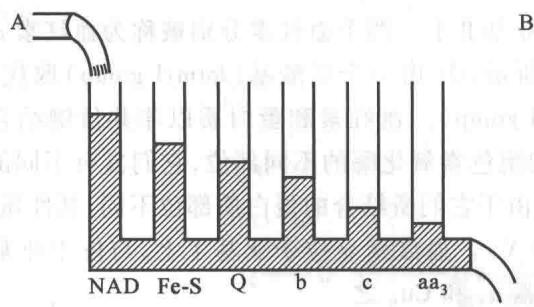

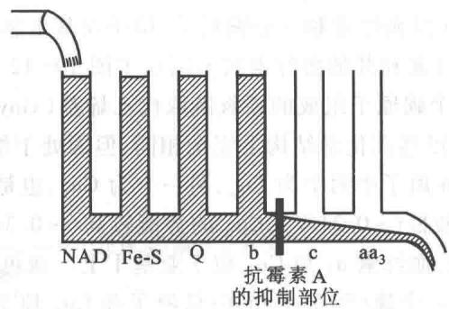  
图19-15 呼吸链特定部位被抑制后的效果比拟图解

A. 正常呼吸链正像流水在水管中畅流无阻,水面沿流向逐步降低; B. 被阻断后,在阻断部位前面的水管被水充满,后面的则即将流尽

常见的抑制剂有以下几类：

（1）鱼藤酮(rotenone)、安密妥(amytal)、杀粉蝶菌素A(piericidin A)。它们的作用是阻断NADH-Q还原酶中的电子传递，即阻断电子由NADH向辅酶Q的传递。鱼藤酮是一种极毒的植物来源物质，常用作重要的杀虫剂。这几种抑制剂的结构如下：

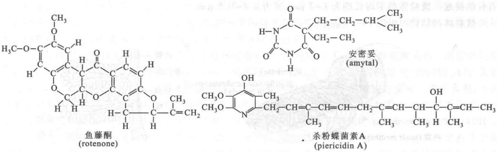

（2）抗霉素 A(antimycin A)。它是从链霉菌(streptomyces griseus)中分离出来的一种抗生素，能干扰细胞色素还原酶中电子从细胞色素 $b_{H}$ 的传递作用，从而抑制电子从还原型辅酶 Q(QH $_{2}$ ) 到细胞色素 $c_{1}$ 的传递作用。抗霉素 A 的结构如下所示。

（3）氰化物（cyanide, $\mathrm{CN}^{-}$ ），叠氮化物（azide, $\mathrm{N}_3^-$ ），一氧化碳（carbon monoxide, CO）。它们都能阻断电子在细胞色素氧化酶中的传递。氰化物和叠氮化物与血红素 $a_3$ 的高铁形式（ferric form）作用，而一氧化碳则是抑制 $a_3$ 的亚铁形式（ferrous form）。

上述各种抑制剂对电子传递链的抑制部位可用图 19-16 表示。

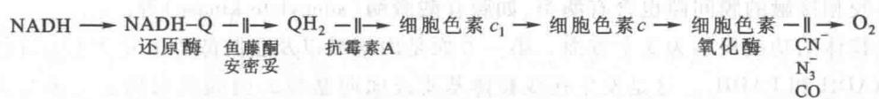  
图19-16 几种电子传递抑制剂的作用部位

<!-- EN-BEGIN 19.1 -->

### 【英文对应 19.1】The Mitochondrial Respiratory Chain

> 来源：Lehninger Principles of Biochemistry（书籍/02_生物化学原理） 第19章 Oxidative Phosphorylation，§19.1。对应本章“二、电子传递和氧化呼吸链”。

The discovery in 1948, by Eugene Kennedy and Albert Lehninger, that mitochondria are the site of oxidative phosphorylation in eukaryotes marked the beginning of the enzymological studies of biological energy transductions. Mitochondria, like gram-negative bacteria, have two membranes (Fig. 19-2a). The outer mitochondrial membrane is readily permeable to small molecules ( $M_{\mathrm{r}} < 5,000$ ) and ions, which move freely through transmembrane channels formed by a family of integral membrane proteins called porins. The inner membrane is impermeable to most small molecules and ions, including protons ( $\mathrm{H^{+}}$ ); the only species that cross this membrane do so through specific transporters.

  
Albert L. Lehninger, 1917–1986 [Alan Mason Chesney Medical Archives of the Johns Hopkins Medical Institutions.]

The inner membrane bears the components of the respiratory chain and ATP synthase.

P1 The mitochondrial matrix, enclosed by the inner membrane, contains the pyruvate dehydrogenase complex and the enzymes of the citric acid cycle, the fatty acid $\beta$ -oxidation pathway, and the pathways of amino acid oxidation—all the pathways of fuel oxidation except glycolysis, which takes place in the cytosol. The selectively permeable inner mitochondrial membrane segregates the intermediates and enzymes of cytosolic metabolic pathways from those of metabolic processes occurring in the matrix. However, specific transporters carry pyruvate, fatty acids, and amino acids or their $\alpha$ -keto derivatives into the matrix for access to the machinery of the citric acid cycle. ADP and $\mathrm{P_i}$ are specifically transported into the matrix as newly synthesized ATP is transported out. Mammalian mitochondria have about 1,200 proteins, according to current best estimates. The functions of up to $25\%$ of these remain partly or entirely enigmatic.

The bean-shaped representation of a mitochondrion in Figure 19-2a is an oversimplification, derived in part from early studies in which thin sections of cells were observed in the electron microscope. Three-dimensional images obtained either by reconstruction from serial sections or by confocal microscopy reveal great variation in mitochondrial size and shape. In living cells stained with mitochondrion-specific fluorescent dyes, large numbers of variously shaped mitochondria are seen, clustered about the nucleus (Fig. 19-2b).

Tissues with a high demand for aerobic metabolism (brain, skeletal and heart muscle, liver, and eye, for example) contain many hundreds or thousands of mitochondria per cell, and in general, mitochondria of cells with high metabolic activity have more, and more densely packed, convolutions, or cristae (Fig. 19-2c, d). P2 During cell growth and division, mitochondria, like bacteria, divide by fission, and under some circumstances individual mitochondria fuse to form larger, more-extended structures. Stressful conditions, such as the presence of electron-transfer inhibitors or mutations in an electron carrier, trigger mitochondrial fission and sometimes mitophagy—the breakdown of mitochondria and recycling of the amino acids, nucleotides, and lipids released. As stress is relieved, small mitochondria fuse to form long, thin, tubular organelles.

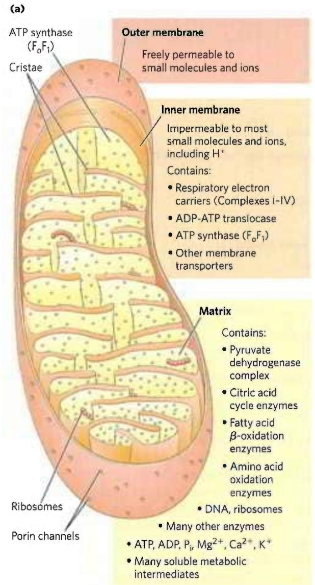  
FIGURE 19-2 Biochemical anatomy of a mitochondrion. (a) The outer membrane has pores that make it permeable to small molecules and ions, but not to proteins. The cristae provide a very large surface area. The inner membrane of a single liver mitochondrion may have more than 10,000 sets of electron-transfer systems (respiratory chains) and ATP synthase molecules, distributed over the membrane surface. (b) A typical animal cell has hundreds or thousands of mitochondria. This endothelial cell from bovine pulmonary artery was stained with fluorescent probes for actin (blue), for DNA (red), and for mitochondria (yellow). Notice the variability in length of

#### [EN] Electrons Are Funneled to Universal Electron Acceptors

Oxidative phosphorylation begins with the entry of electrons into the series of electron carriers called the respiratory chain. Most of these electrons arise from the action of dehydrogenases that collect electrons from catabolic pathways and funnel them into universal electron acceptors—nicotinamide nucleotides (NAD $^{+}$ or NADP $^{+}$ ) or flavin nucleotides (FMN or FAD).

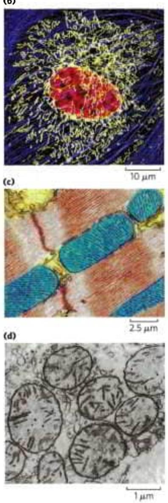  
the mitochondria. (c) The mitochondria of heart muscle (blue in this colorized electron micrograph) have more profuse cristae and thus a much larger area of inner membrane, with more than three times as many sets of respiratory chains as (d) liver mitochondria. Muscle and liver mitochondria are about the size of a bacterium — 1 to 10 $\mu$ m long. The mitochondria of invertebrates, plants, and microbial eukaryotes are similar to those shown here, but with much variation in size, shape, and degree of convolution of the inner membrane. [(b) Talley Lambert/Science Source. (c) Thomas Deerinck, NCMI/R/Science Source. (d) Don W. Fawcett/Science Source.]

Nicotinamide nucleotide-linked dehydrogenases catalyze reversible reactions of the following general types:

Reduced substrate + NAD $^{+}$ ⇌

oxidized substrate + NADH + H $^{+}$

Reduced substrate + NADP $^{+}$ ⇌

oxidized substrate + NADPH + H $^{+}$

Most dehydrogenases that act in catabolism are specific for $NAD^{+}$ as electron acceptor (Table 19-1). Some are in the cytosol, many are in mitochondria, and still others have mitochondrial and cytosolic isozymes.

<table><tr><td colspan="2">TABLE 19-1 Some Important Reactions Catalyzed by NAD(P)+-Linked Dehydrogenases</td></tr><tr><td>Reactiona</td><td>Locationb</td></tr><tr><td>NAD+-linked</td><td></td></tr><tr><td>α-Ketoglutarate + CoA + NAD+ ⇌ succinyl-CoA + CO2 + NADH + H+</td><td>M</td></tr><tr><td>L-Malate + NAD+ ⇌ oxaloacetate + NADH + H+</td><td>M and C</td></tr><tr><td>Pyruvate + CoA + NAD+ ⇌ acetyl-CoA + CO2 + NADH + H+</td><td>M</td></tr><tr><td>Glyceraldehyde 3-phosphate + Pi + NAD+ ⇌ 1,3-bisphosphoglycerate + NADH + H+</td><td>C</td></tr><tr><td>Lactate + NAD+ ⇌ pyruvate + NADH + H+</td><td>C</td></tr><tr><td>β-Hydroxyacyl-CoA + NAD+ ⇌ β-ketoacyl-CoA + NADH + H+</td><td>M</td></tr><tr><td>NADP+-linked</td><td></td></tr><tr><td>Glucose 6-phosphate + NADP+ ⇌ 6-phosphogluconate + NADPH + H+</td><td>C</td></tr><tr><td>L-Malate + NADP+ ⇌ pyruvate + CO2 + NADPH + H+</td><td>C</td></tr><tr><td>NAD+- or NADP+-linked</td><td></td></tr><tr><td>L-Glutamate + H2O + NAD(P)+ ⇌ α-ketoglutarate + NH4+ + NAD(P)H</td><td>M</td></tr><tr><td>Isocitrate + NAD(P)+ ⇌ α-ketoglutarate + CO2 + NAD(P)H + H+</td><td>M and C</td></tr><tr><td colspan="2">aThese reactions and their enzymes are discussed in Chapters 14, 16, 17, and 18.bM designates mitochondria; C designates cytosol.</td></tr></table>

NAD $^{+}$ -linked dehydrogenases remove two hydrogen atoms from their substrates. One of these is transferred as a hydride ion ( $:H^{-}$ ) to NAD $^{+}$ , and the other is released as H $^{+}$ in the medium (see Fig. 13-24). NADH and NADPH are water-soluble electron carriers that associate reversibly with dehydrogenases. About 70% of the cellular NAD pool is in the mitochondria. NADH carries electrons from catabolic reactions to their point of entry into the respiratory chain, the NADH dehydrogenase complex described below. NADPH is primarily involved in biosynthetic (anabolic) reactions, and much of it is concentrated in the cytosol. Cells maintain separate pools of NADPH and NADH, with different redox potentials. This is accomplished by holding the ratio [reduced form]/[oxidized form] relatively high for NADPH and relatively low for NADH. Neither NADH nor NADPH can cross the inner mitochondrial membrane, but the electrons they carry can be shuttled across indirectly, as we shall see.

Flavoproteins contain a very tightly, sometimes covalently, bound flavin nucleotide, either FMN or FAD (see Fig. 13-27). P3 The oxidized flavin nucleotide can accept either one electron (yielding the semiquinone form) or two (yielding $\mathrm{FADH}_2$ or $\mathrm{FMNH}_2$ ). Electron transfer occurs because the flavoprotein has a higher reduction potential than the compound oxidized. Recall that reduction potential is a quantitative measure of the relative tendency of a given chemical species to accept electrons in an oxidation-reduction reaction (p. 490). The standard reduction potential of a flavin nucleotide, unlike that of NAD or NADP, depends on the protein with which it is associated. Local interactions with functional groups in the protein distort the electron orbitals in the flavin ring, changing the relative stabilities of oxidized and reduced forms. The relevant standard reduction potential is therefore that of the particular flavoprotein, not that of isolated FAD or FMN. The flavin nucleotide should be considered part of the flavoprotein's active site rather than a reactant or product in the electron-transfer reaction. Because flavoproteins can participate in either one- or two-electron transfers, they can serve as intermediates between reactions in which two electrons are donated (as in dehydrogenations) and those in which only one electron is accepted (as in the reduction of a quinone to a hydroquinone, described below).

#### [EN] Electrons Pass through a Series of Membrane-Bound Carriers

The mitochondrial respiratory chain consists of a series of sequentially acting electron carriers, most of which are integral proteins with prosthetic groups capable of accepting and donating either one or two electrons. Three types of electron transfers occur in oxidative phosphorylation: (1) direct transfer of electrons, as in the reduction of $Fe^{3+}$ to $Fe^{2+}$ ; (2) transfer as a hydrogen atom ( $H^{+} + e^{-}$ ); and (3) transfer as a hydride ion ( $:H^{-}$ ), which bears two electrons. The term reducing equivalent is used to designate a single electron equivalent transferred in an oxidation-reduction reaction.

P3 In addition to NAD and flavoproteins, three other types of electron-carrying molecules function in the respiratory chain: a hydrophobic quinone called ubiquinone, and two different types of iron-containing proteins, cytochromes and iron-sulfur proteins. Ubiquinone (also called coenzyme Q, or simply Q) is a lipid-soluble benzoquinone with a long isoprenoid side chain (Fig. 19-3). Ubiquinone can accept one electron to become the semiquinone radical (°QH or ubisemiquinone)

  
FIGURE 19-3 Ubiquinone (Q, or coenzyme Q). Complete reduction of ubiquinone requires two electrons and two protons, and occurs in two steps through the semiquinone radical intermediate.

(a)  

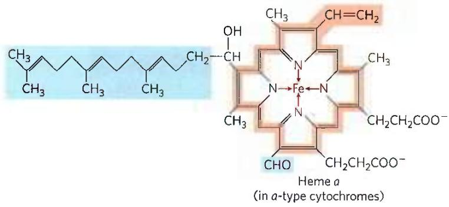  
FIGURE 19-4 Prosthetic groups of cytochromes. (a) Each group consists of four five-membered, nitrogen-containing rings in a cyclic structure called a porphyrin. The four nitrogen atoms are coordinated with a central Fe ion, either $\mathrm{Fe}^{2+}$ or $\mathrm{Fe}^{3+}$ . Iron protoporphyrin IX is found in $b$ -type cytochromes and in hemoglobin and myoglobin (see Fig. 5-1b). Heme $c$ is covalently bound to the protein of cytochrome $c$ through thioether bonds to two Cys residues. Heme $a$ , found in $a$ -type cytochromes, has a long isoprenoid tail attached to one of the five-membered rings. The conjugated double-bond system (shaded light red) of the porphyrin ring has delocalized $\pi$ electrons that are relatively easily excited by photons with the wavelengths of visible light, which accounts for the strong absorption by hemes (and related compounds) in the visible region of the spectrum. (b) Absorption spectra of cytochrome $c$ (cyt $c$ ) in its oxidized (blue) and reduced (red) forms. The characteristic $\alpha, \beta$ , and $\gamma$ bands of the reduced form are labeled.

or two electrons to form ubiquinol (QH $_2$ ) and, like flavoprotein carriers, it can act at the junction between a two-electron donor and a one-electron acceptor. Small and hydrophobic, ubiquinone is not bound to proteins but instead is freely diffusible within the lipid bilayer of the inner mitochondrial membrane and can shuttle reducing equivalents between other, less mobile electron carriers in the membrane. And because it carries both electrons and protons, it plays a central role in coupling electron flow to proton movement.

The cytochromes are proteins with characteristic strong absorption of visible light, due to their iron-containing heme prosthetic groups (Fig. 19-4a). Mitochondria contain three classes of cytochromes, designated a, b, and c, which are distinguished by differences in their light-absorption spectra. Each type of cytochrome in its reduced $\left(\mathrm{Fe}^{2+}\right)$ state has three absorption bands in the visible range (Fig. 19-4b). The longest-wavelength band is near 600 nm in type a cytochromes, near 560 nm in type b, and near 550 nm in type c. To distinguish among closely related cytochromes of one type, the exact absorption maximum is sometimes used in the names, as in cytochrome $b_{562}$ .

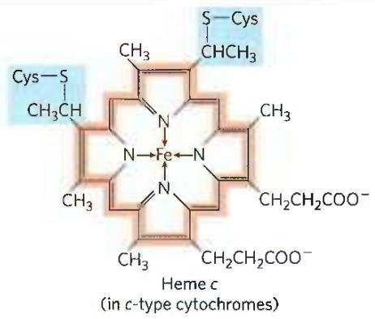

(b)  
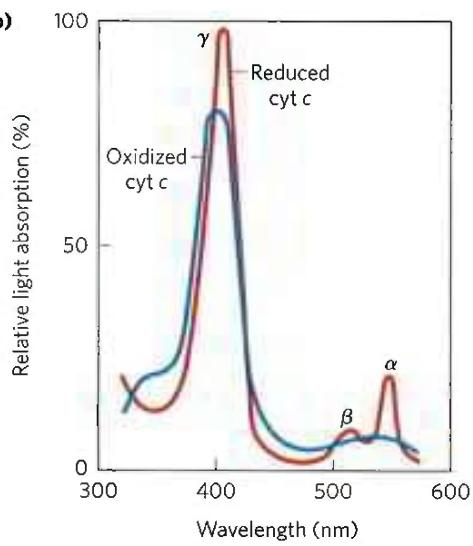

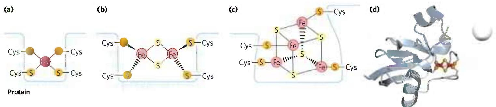  
FIGURE 19-5 Iron-sulfur centers. The Fe-S centers of iron-sulfur proteins may be as simple as shown in (a), with a single Fe ion surrounded by the S atoms of four Cys residues; inorganic S is yellow and the S of Cys is orange. Other centers include both inorganic and Cys S atoms, as in (b) 2Fe-2S or (c) 4Fe-4S centers. (d) The ferredoxin of the cyanobacterium Anabaena 7120  
has one 2Fe-2S center. (Note that in these designations, only the inorganic S atoms are counted. For example, in the 2Fe-2S center (b), each Fe ion is actually surrounded by four S atoms.) The exact standard reduction potential of the iron in these centers depends on the type of center and its interaction with the associated protein. [(d) Data from PDB ID 1FRD, B.L. Jacobson et al., Biochemistry 32:6788, 1993.]

The hemes of a and b cytochromes are tightly, but not covalently, bound to their associated proteins; the hemes of c-type cytochromes are covalently attached through Cys residues (Fig. 19-4). As with the flavoproteins, the standard reduction potential of the heme iron atom of a cytochrome depends on its interaction with protein side chains and is therefore different for each cytochrome. The cytochromes of type a and b and some of type c are integral proteins of the inner mitochondrial membrane. One striking exception is the soluble cytochrome c that associates through electrostatic interactions with the outer surface of the inner membrane.

In iron-sulfur proteins, the iron is present not in heme but in association with inorganic sulfur atoms or with the sulfur atoms of Cys residues in the protein, or both. These iron-sulfur (Fe-S) centers range from simple structures with a single Fe atom coordinated to four Cys—SH groups to more complex Fe-S centers with two or four Fe atoms (Fig. 19-5). Rieske iron-sulfur proteins (named after their discoverer, John S. Rieske) are a variation on this theme, in which one Fe atom is coordinated to two His residues rather than two Cys residues. All iron-sulfur proteins participate in one-electron transfers in which one iron atom of the Fe-S cluster is oxidized or reduced. At least eight Fe-S proteins function in mitochondrial electron transfer. The reduction potential of Fe-S proteins varies from -0.65 V to +0.45 V, depending on the microenvironment of the iron within the protein.

In the overall reaction catalyzed by the mitochondrial respiratory chain, electrons move from NADH, succinate, or some other primary electron donor through flavoproteins, ubiquinone, iron-sulfur proteins, and cytochromes, and finally to $O_{2}$ . A look at the methods used to determine the sequence in which the carriers act is instructive, as the same general approaches have been used to study other electron-transfer chains, such as those of chloroplasts (see Fig. 20-12).

First, the standard reduction potentials of the individual electron carriers have been determined experimentally (Table 19-2). Electrons tend to flow spontaneously from carriers of lower $E^{\prime \circ}$ to carriers of higher $E^{\prime \circ}$ . The

<table><tr><td colspan="2">TABLE 19-2 Standard Reduction Potentials of Respiratory Chain and Related Electron Carriers</td></tr><tr><td>Redox reaction (half-reaction)</td><td> $E^{\prime\circ}$  (V)</td></tr><tr><td> $2H^{+} + 2e^{-} \longrightarrow H_{2}$ </td><td>-0.414</td></tr><tr><td> $NAD^{+} + H^{+} + 2e^{-} \longrightarrow NADH$ </td><td>-0.320</td></tr><tr><td> $NADP^{+} + H^{+} + 2e^{-} \longrightarrow NADPH$ </td><td>-0.324</td></tr><tr><td>NADH dehydrogenase (FMN) +  $2H^{+} + 2e^{-} \longrightarrow NADH$  dehydrogenase ( $FMNH_{2}$ )</td><td>-0.30</td></tr><tr><td>Ubiquinone +  $2H^{+} + 2e^{-} \longrightarrow$  ubiquinol</td><td>0.045</td></tr><tr><td>Cytochrome  $b$  ( $Fe^{3+}$ ) +  $e^{-} \longrightarrow$  cytochrome  $b$  ( $Fe^{2+}$ )</td><td>0.077</td></tr><tr><td>Cytochrome  $c_{1}$  ( $Fe^{3+}$ ) +  $e^{-} \longrightarrow$  cytochrome  $c_{1}$  ( $Fe^{2+}$ )</td><td>0.22</td></tr><tr><td>Cytochrome  $c$  ( $Fe^{3+}$ ) +  $e^{-} \longrightarrow$  cytochrome  $c$  ( $Fe^{2+}$ )</td><td>0.254</td></tr><tr><td>Cytochrome  $a$  ( $Fe^{3+}$ ) +  $e^{-} \longrightarrow$  cytochrome  $a$  ( $Fe^{2+}$ )</td><td>0.29</td></tr><tr><td>Cytochrome  $a_{3}$  ( $Fe^{3+}$ ) +  $e^{-} \longrightarrow$  cytochrome  $a_{3}$  ( $Fe^{2+}$ )</td><td>0.35</td></tr><tr><td> $\frac{1}{2}O_{2} + 2H^{+} + 2e^{-} \longrightarrow H_{2}O$ </td><td>0.817</td></tr></table>

<!-- END OFFICIAL API PART part_007 -->

<!-- BEGIN OFFICIAL API PART part_008 -->

  
FIGURE 19-6 Method for determining the sequence of electron carriers. This method measures the effects of inhibitors of electron transfer on the oxidation state of each carrier. In the presence of an electron donor  
and $O_{2}$ , each inhibitor causes a characteristic pattern of oxidized/reduced carriers: those before the block become reduced (blue), and those after the block become oxidized (light red).

order of carriers deduced by this method is NADH → Q → cytochrome b → cytochrome c₁ → cytochrome c → cytochrome a → cytochrome a₃ → O₂. Note, however, that the order of standard reduction potentials is not necessarily the same as the order of actual reduction potentials under cellular conditions, which depend on the concentrations of reduced and oxidized forms (see Eqn 13-5, p. 491). A second method for determining the sequence of electron carriers involves reducing the entire chain of carriers experimentally by providing an electron source but no electron acceptor (no O₂). When O₂ is suddenly introduced into the system, the rate at which each electron carrier becomes oxidized, measured spectroscopically, reveals the order in which the carriers function. The carrier nearest O₂ (at the end of the chain) gives up its electrons first, the second carrier from the end is oxidized next, and so on. Such experiments have confirmed the sequence deduced from standard reduction potentials.

In a final confirmation, agents that inhibit the flow of electrons through the chain have been used in combination with measurements of the degree of oxidation of each carrier. In the presence of $O_{2}$ and an electron donor, carriers that function before the inhibited step become fully reduced, and those that function after this step are completely oxidized (Fig. 19-6). By using several inhibitors that block different steps in the chain, investigators have determined the entire sequence; it is the same as deduced in the first two approaches.

#### [EN] Electron Carriers Function in Multienzyme Complexes

The electron carriers of the respiratory chain are organized into membrane-embedded supramolecular complexes that can be physically separated. Gentle treatment of the inner mitochondrial membrane with detergents allows the resolution of four unique electron-carrier complexes, each capable of catalyzing electron transfer through a portion of the chain (Fig. 19-7; Table 19-3). P3 Complexes I and II catalyze electron transfer to ubiquinone from two different electron donors: NADH (Complex I) and succinate (Complex II). Complex III carries electrons from reduced ubiquinone to cytochrome c, and Complex IV completes the sequence by transferring electrons from cytochrome c to O₂.

We now look in more detail at the structure and function of each complex of the mitochondrial respiratory chain.

Complex I: NADH to Ubiquinone In mammals, Complex I, also called NADH:ubiquinone oxidoreductase or

<table><tr><td colspan="4">TABLE 19-3 The Protein Components of the Mitochondrial Respiratory Chain</td></tr><tr><td>Enzyme complex/protein</td><td>Mass (kDa)</td><td>Number of subunitsa</td><td>Prosthetic group(s)</td></tr><tr><td>I NADH dehydrogenase</td><td>850</td><td>45 (14)</td><td>FMN, Fe-S</td></tr><tr><td>II Succinate dehydrogenase</td><td>140</td><td>4</td><td>FAD, Fe-S</td></tr><tr><td>III Ubiquinone:cytochrome c oxidoreductaseb</td><td>250</td><td>11</td><td>Hemes, Fe-S</td></tr><tr><td>Cytochrome cc</td><td>13</td><td>1</td><td>Heme</td></tr><tr><td>IV Cytochrome oxidaseb</td><td>204</td><td>13 (3-4)</td><td>Hemes; CuA, CuB</td></tr></table>

Reactions catalyzed by isolated fractions in vitro

  
FIGURE 19-7 Separation of functional complexes of the respiratory chain. The outer mitochondrial membrane is first removed by treatment with the detergent digitonin. Fragments of inner membrane are then obtained by osmotic rupture of the membrane, and the fragments are gently dissolved in a second detergent. The resulting mixture of inner membrane proteins is resolved by ion-exchange chromatography into several complexes (I through IV) of the respiratory chain, each with its unique protein composition (see Table 19-3), and the enzyme ATP synthase (sometimes called Comp ex V). The isolated Complexes I through IV catalyze electron transfers between donors (NADH and succinate), intermediate carriers (Q and cytochrome c), and O₂, as shown. In vitro, isolated ATP synthase has only ATP-hydrolyzing (ATPase), not ATP-synthesizing, activity.

NADH dehydrogenase, is a large enzyme composed of 45 different polypeptide chains, including an FMN-containing flavoprotein and at least 8 iron-sulfur centers. Complex I is L-shaped, with one arm embedded in the inner membrane and the other extending into the matrix. Comparative studies of Complex I in bacteria and other organisms show that 7 polypeptides in the membrane arm and 7 in the matrix arm are conserved and essential (Fig. 19-8).

Complex I catalyzes two simultaneous and obligately coupled processes: (1) the exergonic transfer to ubiquinone of a hydride ion from NADH and a proton from the matrix, expressed by

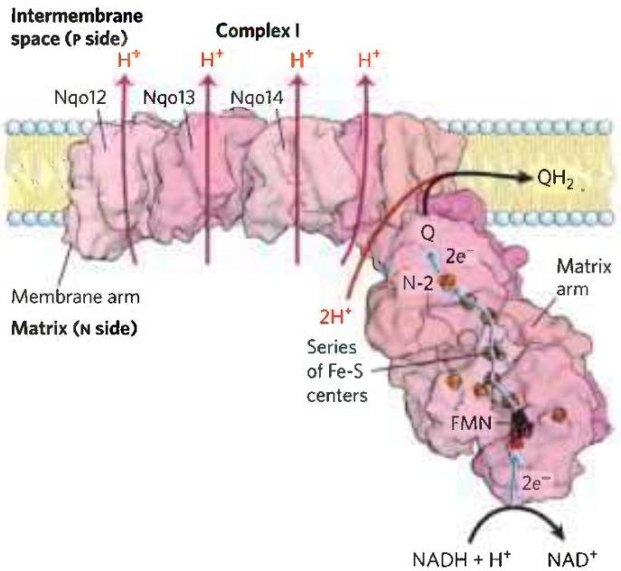  
FIGURE 19-8 Structure of Complex I (NADH:ubiquinone oxidoreductase). Complex I catalyzes the transfer of a hydride ion from NADH to FMN. From the FMN, two electrons pass through a series of Fe-S centers to the Fe-S center N-2 in the matrix arm of the complex. Electron transfer from N-2 to ubiquinone on the membrane arm forms $\mathrm{QH}_2$ , which diffuses into the lipid bilayer. The protons travel a path dictated by subunit conformation changes triggered by the electron flow. Proton flux produces an electrochemical potential across the inner mitochondrial membrane (n side negative, p side positive). Three of the membrane subunits (subunits Nqo12, Nqo13, and Nqo14) are structurally related to a known $\mathrm{Na}^+$ - $\mathrm{H}^+$ antiporter, and the path of proton movement may be similar in both cases. The fourth putative proton pathway is through an integral subunit closest to the Q-binding site. A long helix (not visible in this view) lying along the surface of the membrane arm may coordinate the action of all four proton pumps when Q is reduced. [Data from PDB ID 4HEA, R. Baradaran et al., Nature 494:443, 2013.]

$$
\mathrm{NADH} + \mathrm{H} ^ {+} + \mathrm{Q} \longrightarrow \mathrm{NAD} ^ {+} + \mathrm{QH} _ {2}\tag{19-1}
$$

and (2) the endergonic transfer of four protons from the matrix to the intermembrane space. Protons are moved against a transmembrane proton gradient in this process. P4 Complex I is therefore a proton pump driven by the energy of electron transfer, and the reaction it catalyzes is vectorial: it moves protons in a specific direction from one location (the matrix, which becomes negatively charged with the departure of protons) to another (the intermembrane space, which becomes positively charged). To emphasize the vectorial nature of the process, the overall reaction is often written with subscripts that indicate the location of the protons: P for the positive side of the inner membrane (the intermembrane space), N for the negative side (the matrix):

$$
\mathrm{NADH} + 5 \mathrm{H} _ {\mathrm{N}} ^ {+} + \mathrm{Q} \longrightarrow \mathrm{NAD} ^ {+} + \mathrm{QH} _ {2} + 4 \mathrm{H} _ {\mathrm{P}} ^ {+}\tag{19-2}
$$

Amytal (a barbiturate drug), rotenone (a plant product commonly used as an insecticide), and piericidin A (an antibiotic) inhibit electron flow from the Fe-S centers of Complex I to ubiquinone (Table 19-4) and therefore block the overall process of oxidative phosphorylation.

<table><tr><td colspan="3">TABLE 19-4 Agents That Interfere with Oxidative Phosphorylation</td></tr><tr><td>Type of interference</td><td>Compounda</td><td>Target/mode of action</td></tr><tr><td rowspan="3">Inhibition of electron transfer</td><td>CyanideCarbon monoxide</td><td>Inhibit cytochrome oxidase</td></tr><tr><td>Antimycin A</td><td>Blocks electron transfer from cytochrome b to cytochrome c1</td></tr><tr><td>MyxothiazolRotenoneAmytalPiericidin A</td><td>Prevent electron transfer from Fe-S center to ubiquinone</td></tr><tr><td rowspan="3">Inhibition of ATP synthase</td><td>Aurovertin</td><td>Inhibit F1</td></tr><tr><td>OligomycinVenturicidin</td><td>Inhibit Fo</td></tr><tr><td>DCCD</td><td>Blocks proton flow through Fo</td></tr><tr><td rowspan="3">Uncoupling of phosphorylation fromelectron transfer</td><td>FCCPDNP</td><td>Hydrophobic proton carriers</td></tr><tr><td>Valinomycin</td><td>K+ionophore</td></tr><tr><td>Uncoupling protein 1</td><td>In brown adipose tissue, forms proton-conducting pores ininner mitochondrial membrane</td></tr><tr><td>Inhibition of ATP-ADP exchange</td><td>Atractyloside</td><td>Inhibits adenine nucleotide translocase</td></tr></table>

$^{a}$ DCCD, dicyclohexylcarbodiimide; FCCP, cyanide-p-trifluoromethoxyphenylhydrazone; DNP, 2,4-dinitrophenol.

Three of the seven integral protein subunits of the membrane arm are related to a $Na^{+}-H^{+}$ antiporter and are believed to be responsible for pumping three protons; a fourth subunit in the membrane arm, that nearest the Q-binding site, is probably responsible for pumping the fourth proton (Fig. 19-8).

How is the reduction of ubiquinone coupled to proton pumping? Reduction of Q occurs far away from the membrane arm of the protein, where proton pumping occurs, so the coupling is clearly indirect. The high-resolution view of Complex I from crystallographic and cryo-EM studies suggests that reduction of Q is coupled to a long-range conformational change conducted to all subunits along the hydrophilic core of the transmembrane arm. It seems likely that all four protons are pumped simultaneously, so that the energy from a strongly exergonic reaction (Q reduction) is broken into smaller packets, a common strategy employed by living organisms.

Complex II: Succinate to Ubiquinone We encountered Complex II in Chapter 16 as succinate dehydrogenase, the only membrane-bound enzyme in the citric acid cycle (p. 586). P3 Complex II couples the oxidation of succinate at one site with the reduction of ubiquinone at another site about 40 Å away. Although smaller and simpler than Complex I, Complex II contains five prosthetic groups of two types and four different protein subunits (Fig. 19-9). Subunits C and D are integral membrane proteins, each with three transmembrane helices. They contain a heme

#### [EN] Intermembrane space (P side)

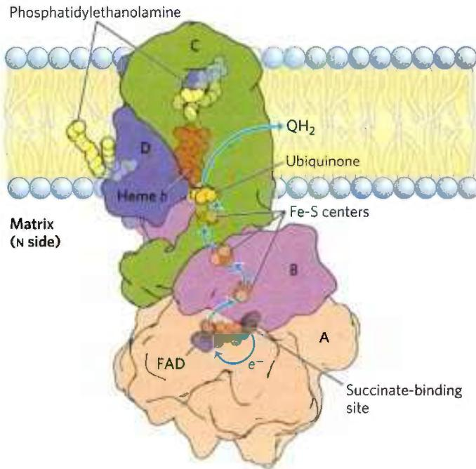  
FIGURE 19-9 Structure of Complex II (succinate dehydrogenase). This complex (porcine) has two transmembrane subunits, C and D; subunits A and B extend into the matrix. Just behind the FAD in subunit A is the binding site for succinate. Subunit B has three Fe-S centers, ubiquinone is bound to subunit B, and heme b is sandwiched between subunits C and D. Two phosphatidylethanolamine molecules are so tightly bound to subunit D that they show up in the crystal structure. Electrons move (blue arrows) from succinate to FAD, then through the three Fe-S centers to ubiquinone. The heme b is not on the main path of electron transfer but protects against the formation of reactive oxygen species (ROS) by electrons that go astray. [Data from PDB ID 1ZOY, F. Sun et al., Cell 121:1043, 2005.]

group, heme b, and a binding site for Q, the final electron acceptor in the reaction catalyzed by Complex II. Subunits A and B extend into the matrix; they contain three 2Fe-2S centers, bound FAD, and a binding site for the substrate, succinate. Although the overall path of electron transfer is long (from the succinate-binding site to FAD, then through the Fe-S centers to the Q-binding site), none of the individual electron-transfer distances exceeds about 11 Å—a reasonable distance for rapid electron transfer (Fig. 19-9). Electron transfer through Complex II is not accompanied by proton pumping across the inner membrane, although the $QH_{2}$ produced by succinate oxidation will be used by Complex III to drive proton transfer. Because Complex II functions in the citric acid cycle, factors that affect its activity (such as the availability of oxidized Q) probably serve to coordinate that cycle with mitochondrial electron transfer.

The heme b of Complex II is apparently not in the direct path of electron transfer; it serves instead to reduce the frequency with which electrons “leak” out of the system, moving from succinate to molecular oxygen to produce the reactive oxygen species (ROS) hydrogen peroxide ( $H_{2}O_{2}$ ) and the superoxide radical ( $^{\bullet}O_{2}^{-}$ ), as described below. Some individuals with point mutations in Complex II subunits near heme b or the ubiquinone-binding site suffer from hereditary paraganglioma, characterized by benign tumors of the head and neck, commonly in the carotid body, an organ that senses $O_{2}$ levels in the blood. These mutations result in greater production of ROS, which cause DNA damage and genome instability that can lead to cancer. Mutations that affect the succinate-binding region in Complex II may lead to degenerative changes in the central nervous system, and some mutations are associated with tumors of the adrenal medulla.

Complex III: Ubiquinone to Cytochrome c Electrons from reduced ubiquinone (ubiquinol, $QH_{2}$ ) pass through two more large protein complexes in the inner mitochondrial membrane before reaching the ultimate electron acceptor, $O_{2}$ . P3 P4 Complex III (also called cytochrome $bc_{1}$ complex or ubiquinone:cytochrome c oxidoreductase) couples the transfer of electrons from ubiquinol to cytochrome c with the vectorial transport of protons from the matrix to the intermembrane space. The functional unit of Complex III (Fig. 19-10) is a dimer. Each monomer consists of three proteins central to the action of the complex: cytochrome b, cytochrome $c_{1}$ , and the Rieske iron-sulfur protein. (Several other proteins associated with Complex III in vertebrates are not conserved across the phyla and presumably play subsidiary roles.) The two cytochrome b monomers surround a cavern in the middle of the membrane, in which ubiquinone is free to move from the matrix side of the membrane (site $Q_{N}$ on one monomer) to the intermembrane space (site $Q_{P}$ on the other monomer) as it shuttles electrons and protons across the inner mitochondrial membrane.

To account for the role of Q in energy conservation, Mitchell proposed the Q cycle (Fig. 19-11). As electrons move from $QH_{2}$ through Complex III, $QH_{2}$ is oxidized with the release of protons on one side of the membrane (at $Q_{P}$ ), while at the other site ( $Q_{N}$ ), Q is reduced and protons are taken up.

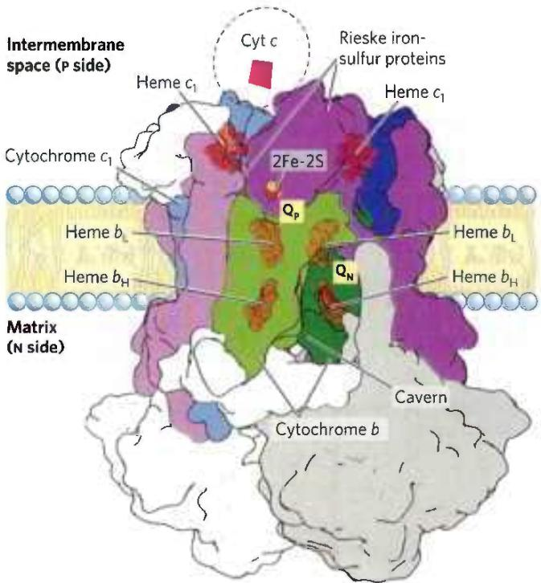  
FIGURE 19-10 Structure of Complex III (cytochrome bc₁ complex). The complex (bovine) is a dimer of identical monomers, each with 11 different subunits. The functional core of each monomer consists of three subunits: cytochrome b (green), with its two hemes (bₕ and bₗ); the Rieske iron-sulfur protein (purple), with its 2Fe-2S centers; and cytochrome c₁ (blue), with its heme. Cytochrome c₁ and the Rieske iron-sulfur protein project from the P surface and can interact with cytochrome c (not part of the functional complex) in the intermembrane space. The complex has two distinct binding sites for ubiquinone, Qₙ and Qₚ, which correspond to the sites of inhibition by two drugs that block oxidative phosphorylation. Antimycin A, which blocks electron flow from cytochrome b to cytochrome c₁, specifically from heme bₕ to Q, binds at Qₙ, close to heme bₕ on the n (matrix) side of the membrane. Myxothiazol, which prevents electron flow from QH₂ to the Rieske iron-sulfur protein, binds at Qₚ, near the 2Fe-2S center and heme bₗ on the P side. The dimeric structure is essential to the function of Complex III. The interface between monomers forms two caverns, each containing a Qₚ site from one monomer and a Qₙ site from the other. The ubiquinone intermediates move within these sheltered caverns. [Data from PDB ID 1BGY, S. Iwata et al., Science 281:64, 1998.]

The Q cycle is most easily understood as occurring in two stages, with two active sites where ubiquinone is either oxidized or reduced. In both stages, one $QH_{2}$ is oxidized at active site 1, shedding two $H^{+}$ and two electrons. The protons are released into the intermembrane space. The two electrons take different paths, with one reducing cytochrome c and the other reducing a molecule of Q at active site 2. Two electrons are required at active site 2 to fully reduce the Q to $QH_{2}$ , one in each stage. Reducing one Q at one site while oxidizing two $QH_{2}$ at another may seem counterproductive at first glance. However, the two processes have complementary functions. The oxidation of two $QH_{2}$ is moving four protons to the intermembrane space and two electrons to cytochrome c. At the same time, the reduction of Q at the other site (using the other two electrons from the oxidation of $QH_{2}$ at site 1) is pulling protons from the matrix, creating a net movement of protons from the matrix to the intermembrane space. The $QH_{2}$ produced at active site 2 becomes a substrate for oxidation at active site 1 in subsequent turns of the cycle, and vice versa. The net equation for the redox reactions of the Q cycle is

  
FIGURE 19-11 The Q cycle, shown in two stages. The path of electrons through Complex III is shown with blue arrows; the movement of various forms of ubiquinone, with black arrows. (a) In the first stage, Q on the N side is reduced to the semiquinone radical, which moves back into position (dotted line) to accept another electron. (b) In the second stage, the semiquinone radical is converted to $\mathrm{QH}_2$ . Meanwhile, on the P side of the membrane, two molecules of $\mathrm{QH}_2$ are oxidized to Q, releasing two protons per Q molecule (four protons in all) into the intermembrane space. Each $\mathrm{QH}_2$ donates  
one electron (via the Rieske Fe-S center) to cytochrome $c_{1}$ , and one electron (via cytochrome b) to a molecule of Q near the N side, reducing it in two steps to $QH_{2}$ . This reduction also consumes two protons per Q, which are taken up from the matrix (N side). Reduced cytochrome $c_{1}$ passes electrons one at a time to cytochrome c, which dissociates and carries electrons to Complex IV. In each cycle, one reduction of Q at the $Q_{N}$ site is coupled with two oxidations of $QH_{2}$ at the $Q_{p}$ site by consuming two protons from the matrix and releasing four protons into the intermembrane space.

$$
\begin{array}{r l} \mathrm {Q H _ {2}} + 2 \text {cyt} c (\text {oxidized}) + 2 \mathrm {H_ {N} ^ {+}} & \longrightarrow \\ \mathrm{Q} + 2 \text {cyt} c (\text {reduced}) + 4 \mathrm {H_ {P} ^ {+}} \end{array}\tag{19-3}
$$

The Q cycle accommodates the switch between the two-electron carrier ubiquinol (the reduced form of ubiquinone) and the one-electron carriers—hemes $b_{L}$ and $b_{H}$ of cytochrome b, and cytochromes $c_{1}$ and c—and results in the uptake of two protons on the N side and the release of four protons on the P side, per pair of electrons passing through Complex III to cytochrome c. Two of the protons released on the P side are electrogenic; the other two are electroneutral, balanced by the two charges (electrons) passed to cytochrome c on the P side. Although the path of electrons through this segment of the respiratory chain is complicated, the net effect of the transfer is simple: $QH_{2}$ is oxidized to Q, two molecules of cytochrome c are reduced, and two protons are moved from the N side to the P side of the inner mitochondrial membrane.

Cytochrome c is a soluble protein of the intermembrane space, which associates reversibly with the P side of the inner membrane. After its single heme accepts an electron from Complex III, cytochrome c moves in the intermembrane space to Complex IV to donate the electron to a binuclear copper center.

Complex IV: Cytochrome c to $O_{2}$ . In the final step of the respiratory chain, Complex IV, also called cytochrome oxidase, carries electrons from cytochrome c to molecular oxygen, reducing it to $H_{2}O$ . P3 P4 Complex IV is a large, dimeric enzyme of the inner mitochondrial membrane, each monomer having 13 subunits and $M_{r}$ of 204,000. Bacteria contain a form that is much simpler, with only 3 or 4 subunits per monomer, but still capable of catalyzing both electron transfer and proton pumping. Comparison of the mitochondrial and bacterial complexes suggests that these 3 subunits have been conserved in evolution; in multicellular organisms, the other 10 subunits contribute to the assembly or stability of Complex IV (Fig. 19-12).

Subunit II of Complex IV contains two Cu ions complexed with the —SH groups of two Cys residues in a binuclear center (Cu $_{A}$ ; Fig. 19-12b) that resembles the 2Fe-2S centers of iron-sulfur proteins. Subunit I contains two heme groups, designated $a$ and $a_{3}$ , and another copper ion (Cu $_{B}$ ). Heme $a_{3}$ and Cu $_{B}$ form a second binuclear center that accepts electrons from heme a and transfers them to $O_{2}$ bound to heme $a_{3}$ . The detailed role of subunit III is not clear, but its presence is essential to Complex IV function.

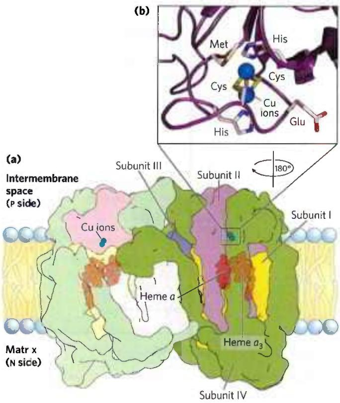  
FIGURE 19-12 Structure of Complex IV (cytochrome oxidase). (a) This complex (bovine) has 13 subunits in each identical monomer of its dimer c structure. Subunit I has two heme groups, a and $a_{3}$ , near a single copper ion, $Cu_{B}$ (not visible here). Heme $a_{3}$ and $Cu_{B}$ form a binuclear Fe-Cu center. Subunit II contains two Cu ions complexed with the —SH groups of two Cys residues in a binuclear center, $Cu_{A}$ , that resembles the 2Fe-2S centers of iron-sulfur proteins. This binuclear center and the cytochrome c-binding site are located in a domain of subunit II that protrudes from the P side of the inner membrane (into the intermembrane space). Subunit III is essential for rapid proton movement through subunit II. The roles of the other 10 subunits in mammalian Complex IV are not fully understood, although some function in assembly or stabilization of the complex. (b) The binuclear center of $Cu_{A}$ . The Cu ions (blue spheres) share electrons equally. When the center is reduced, the ions have the formal charges $Cu^{1+}Cu^{1+}$ ; when oxidized, $Cu^{1.5+}Cu^{1.5+}$ . Six amino acid residues are ligands around the Cu ions: Glu, Met, two His, and two C/S. [Data from PDB ID 10CC, T. Tsukihara et al., Science 272:1136, 1996.]

Electron transfer through Complex IV is from cytochrome c to the $Cu_{A}$ center, to heme a, to the heme $a_{3}-Cu_{B}$ center, and finally to $O_{2}$ (Fig. 19-13a). For every four electrons passing through this complex, the enzyme consumes four “substrate” $H^{+}$ from the matrix (N side) in converting $O_{2}$ to two $H_{2}O$ . It also uses the energy of this redox reaction to pump four protons outward into the intermembrane space (P side) for each four electrons that pass through, adding to the electrochemical potential produced by redox-driven proton transport through Complexes I and III. The overall reaction catalyzed by Complex IV is

4 cyt c (reduced) + 8H $_{N}^{+}$ + O $_{2}$ →

$$
4 \mathrm{cyt} c (\text {oxidized}) + 4 \mathrm{H} _ {\mathrm{P}} ^ {+} + 2 \mathrm{H} _ {2} \mathrm{O}\tag{19-4}
$$

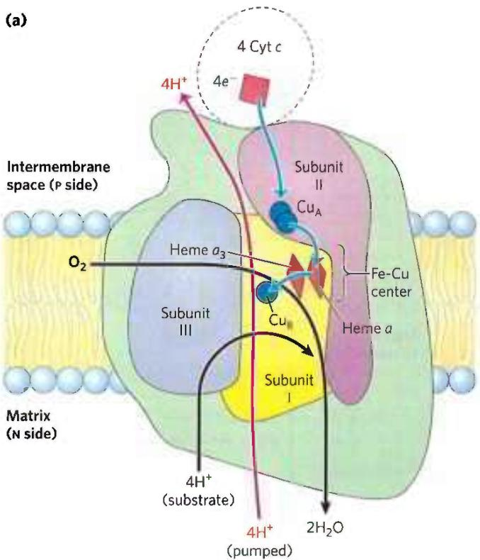  
(b)  
FIGURE 19-13 Path of electrons through Complex IV. (a) For simplicity, only one monomer of the dimeric bovine Complex IV is shown. The three proteins critical to electron flow are subunits I, II, and III. The larger green structure includes the other 10 proteins in each monomer of the dimeric complex. Electron transfer through Complex IV begins with cytochrome c (top). Two molecules of reduced cytochrome c each donate an electron to the binuclear center CuA. From here, electrons pass through heme a to the Fe-Cu center (heme $a_{3}$ and $Cu_{\beta}$ ). Oxygen now binds to heme $a_{3}$ and is reduced to its peroxy derivative ( $O_{2}^{2-}$ ; not shown here) by two electrons from the Fe-Cu center. Delivery of two more electrons from cytochrome c (top), for a total of four electrons, converts the $O_{2}^{2-}$ to two molecules of water, with consumption of four "substrate" protons from the matrix. At the same time, four protons are pumped from the matrix for every four electrons passing through Complex IV. A simplified reaction sequence is presented in (b). Intermediate complexes O, R, A, $P_{R}$ , F, and H represent only a prominent subset of the species for which there is experimental evidence, with some steps and intermediate structures still being debated. The four electrons are introduced in separate steps, and $H_{2}O$ is released in two separate steps.

Note that the $O_{2}$ in this reaction is the final acceptor for electrons originating from the many sources already described, and the stoichiometries between electron sources and $O_{2}$ molecules consumed help to define the energetics of the systems. In this chapter, stoichiometries are sometimes presented, as here, in terms of one molecule of $O_{2}$ . For calculation simplicity, the stoichiometries will be presented in terms of $\frac{1}{2}O_{2}$ in some examples to come.

At Complex IV, $O_{2}$ is reduced at redox centers that carry only one electron at a time. A reaction scheme is presented in Figure 19-13b. Normally the incompletely reduced oxygen intermediates remain tightly bound to the complex until completely converted to water. However, a small fraction of oxygen intermediates escape. These intermediates are reactive oxygen species that can damage cellular components unless eliminated by defense mechanisms described below.

#### [EN] Mitochondrial Complexes Associate in Respirasomes

Although the four electron-transferring complexes can be separated in the laboratory, in the intact mitochondrion, three of the four respiratory complexes associate with each other in the inner membrane. Combinations of Complexes I and III, III and IV, and I, III, and IV are formed in organisms ranging from yeast to plants to mammals. The supercomplex containing Complexes I, III, and IV has been called the respirasome. Unlike the other three complexes, Complex II is generally found free-floating within the membrane. Structural characterization of the various supercomplexes has been advanced by cryo-EM (Fig. 19-14). The functional significance of supercomplexes has not been determined. Researchers have suggested that they may facilitate electron transfers or limit the production of reactive oxygen species. Local pools of the electron carriers cytochrome c and ubiquinone are not constrained within supercomplexes, but instead readily diffuse between them.

#### [EN] Other Pathways Donate Electrons to the Respiratory Chain via Ubiquinone

Several other electron-transfer reactions can reduce ubiquinone in the inner mitochondrial membrane (Fig. 19-15). In the first step of the $\beta$ oxidation of fatty acyl-CoA, catalyzed by the flavoprotein acyl-CoA dehydrogenase (see Fig. 17-8), electrons pass from the substrate to the FAD of the dehydrogenase, then to electron-transferring flavoprotein (ETF). ETF passes its electrons to ETF: ubiquinone oxidoreductase, which reduces Q in the inner mitochondrial membrane to $\mathrm{QH}_2$ . Glycerol 3-phosphate, formed either from glycerol released by triacylglycerol breakdown or from the reduction of dihydroxyacetone phosphate from glycolysis, is oxidized by glycerol 3-phosphate dehydrogenase (see Fig. 17-4), a flavoprotein located on the outer face of the inner mitochondrial membrane. The electron acceptor in this reaction is Q; the $\mathrm{QH}_2$ produced enters the pool of $\mathrm{QH}_2$ in the membrane. The important role of glycerol 3-phosphate dehydrogenase in shuttling reducing equivalents from cytosolic NADH into the mitochondrial matrix is described in Section 19.2 (see Fig. 19-32). Dihydroorotate dehydrogenase, which acts in the synthesis of pyrimidines (see Fig. 22-38), is also on the outside of the inner mitochondrial membrane and donates electrons to Q in the respiratory chain. The reduced $\mathrm{QH}_2$ passes its electrons through Complex III and ultimately to $\mathrm{O}_2$ .

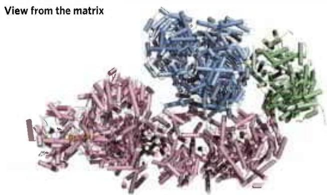  
FIGURE 19-14 A respirasome composed of Complexes I, III, and IV. (a) Purified supercomplexes containing Complexes III and IV (from yeast), as determined by cryo-EM. (b) The structure of a respirasome composed of mammalian (porcine and bovine) Complexes I, III, and IV. Two views are shown. [Data from (a) PDB ID 6GIQ, S. Rathore et al., Nat. Struct Mol. Biol. 26:50, 2019; (b) PDB ID 5GPN, J. Gu et al., Nature 537:639, 2016.]

  
FIGURE 19-15 Paths of electron transfer to ubiquinone in the respiratory chain. Electrons from NADH in the matrix pass through the FMN cf a flavoprotein (NADH dehydrogenase) to a series of Fe-S centers (in Complex I) and then to Q. Electrons from succinate oxidation in the citric acid cycle pass through a flavoprotein with several Fe-S centers (Complex II) on the way to Q. Acyl-CoA dehydrogenase, the first enzyme of fatty acid $\beta$ oxidation, transfers electrons to electron-transferring flavoprotein (ETF), from which they pass to Q via ETF:ubiquinone oxidoreductase. Dihyd oorotate, an intermediate in the biosynthetic pathway to pyrimidine nucleotides, donates two electrons to Q through a flavoprotein (dihydroorotate dehydrogenase). And glycerol 3-phosphate, an intermediate of glycolysis in the cytosol, donates electrons to a flavoprotein (glycerol 3-phosphate dehydrogenase) on the outer face of the inner mitochondrial membrane, from which they pass to Q. $\mathrm{QH}_2$ freely diffuses through the membrane (black dashed arrow), and can interact with several additional complexes.

#### [EN] The Energy of Electron Transfer Is Efficiently Conserved in a Proton Gradient

The transfer of two electrons from NADH through the respiratory chain to molecular oxygen can be summarized as

$$
2 \mathrm{NADH} + 2 \mathrm{H} ^ {+} + \mathrm{O} _ {2} \longrightarrow 2 \mathrm{NAD} ^ {+} + 2 \mathrm{H} _ {2} \mathrm{O}\tag{19-5}
$$

This net reaction is highly exergonic. For the redox pair $NAD^{+}/NADH$ , $E^{\prime\circ}$ is -0.320 V, and for the pair $O_{2}/H_{2}O$ , $E^{\prime\circ}$ is 0.816 V. The $\Delta E^{\prime\circ}$ for this reaction is therefore 1.14 V, and the standard free-energy change (see Eqn 13-7, p. 492) is

$$
\begin{array}{r l} \Delta G ^ {\prime \circ} & = - n F \Delta E ^ {\prime \circ} \\ & = - 2 (9 6. 5 \mathrm{kJ/V} \bullet \mathrm{mol}) (1. 1 4 \mathrm{V}) \\ & = - 2 2 0 \mathrm{kJ/mol} (\text {of NADH}) \end{array}\tag{19-6}
$$

This standard free-energy change is based on the assumption of equal concentrations (1 M) of NADH and $NAD^{+}$ . In actively respiring mitochondria, the actions of many dehydrogenases keep the actual $[NADH]/[NAD^{+}]$ ratio well above unity, and the real free-energy change for the reaction shown in Equation 19-5 is therefore substantially greater (more negative) than -220 kJ/mol. A similar calculation for the oxidation of succinate shows that electron transfer from succinate ( $E^{\circ}$ for fumarate/succinate = 0.031 V) to $O_{2}$ has a smaller, but still negative, standard free-energy change of about -150 kJ/mol.

Much of this energy is used to pump protons out of the matrix. For each pair of electrons transferred to $O_{2}$ , four protons are pumped out by Complex I, four by Complex III, and two by Complex IV (Fig. 19-16). The vectorial equation for the process is therefore

$$
2 \mathrm{NADH} + 2 2 \mathrm{H} _ {\mathrm{N}} ^ {+} + \mathrm{O} _ {2} \longrightarrow 2 \mathrm{NAD} ^ {+} + 2 0 \mathrm{H} _ {\mathrm{P}} ^ {+} + 2 \mathrm{H} _ {2} \mathrm{O}\tag{19-7}
$$

  
FIGURE 19-16 Summary of the flow of electrons and protons through the four complexes of the respiratory chain. Electrons reach Q through Complexes I and II (as well as through several other paths shown in Fig. 19-15). Reduced Q(QH₂) serves as a mobile carrier of electrons and protons. It passes electrons to Complex III, which passes them to another mobile connecting link, cytochrome c. Complex IV then transfers electrons from reduced cytochrome c to O₂. Electron flow through Complexes I, III, and IV is accompa-  
nied by proton efflux from the matrix into the intermembrane space. In bovine heart, the approximate ratios of Complexes I:II:III:IV are 1.1:1.3:3.0:6.7. Broken lines indicate the diffusion of Q in the plane of the inner membrane, and of cytochrome c through the intermembrane space. [Data from Complex I: PDB ID 4HEA, R Baradaran et al., Nature 494:443, 2013; Complex II: PDB ID 1ZOY, F. Sun et al., Cell 121:1043, 2005; Complex III: PDB ID 1BGY, S. Iwata et al., Science 281:64, 1998; cytochrome c: PDB ID 1HRC, G. W. Bushnell et al., J. Mol. Biol. 214:585, 1990; Complex IV: PDB ID 1OCC, T. Tsukihara et al., Science 272:1136, 1996.]

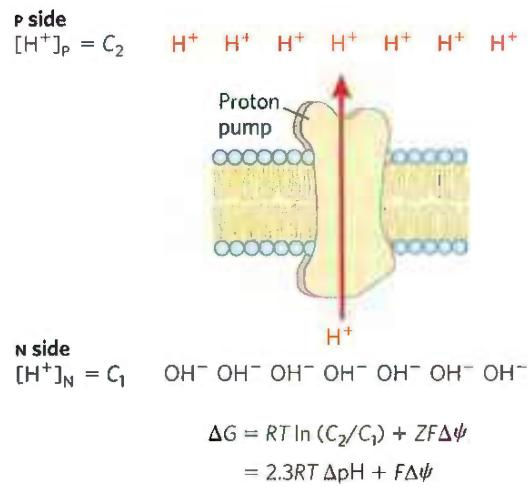  
FIGURE 19-17 Proton-motive force. The inner mitochondrial membrane separates two compartments of different $\left[\mathrm{H}^{+}\right]$ , resulting in differences in chemical concentration $(\Delta \mathrm{pH})$ and charge distribution $(\Delta \psi)$ across the membrane. The net effect is the proton-motive force $(\Delta G)$ , which can be calculated as shown here.

P4 The electrochemical energy inherent in this difference in proton concentration and separation of charge represents a temporary conservation of much of the energy of electron transfer. The energy stored in such a gradient, termed the proton-motive force, has two components: (1) the chemical potential energy due to the difference in concentration of a chemical species (H $^{+}$ ) in the two regions separated by the membrane, and (2) the electrical potential energy that results from the separation of charge when a proton moves across the membrane without a counterion (Fig. 19-17).

As we saw in Chapter 11, the free-energy change for the creation of an electrochemical gradient by an ion pump is

$$
\Delta G = R T \ln (C _ {2} / C _ {1}) + Z F \Delta \psi\tag{19-8}
$$

where $C_{2}$ and $C_{1}$ are the concentrations of an ion in two regions, and $C_{2} > C_{1}$ ; Z is the absolute value of its electrical charge (1 for a proton); and $\Delta\psi$ is the transmembrane difference in electrical potential, measured in volts.

For protons,

$$
\begin{array}{r l} \ln (C _ {2} / C _ {1}) & = 2. 3 (\log [ \mathrm{H} ^ {+} ] _ {\mathrm{P}} - \log [ \mathrm{H} ^ {+} ] _ {\mathrm{N}}) \\ & = 2. 3 (\mathrm{pH} _ {\mathrm{N}} - \mathrm{pH} _ {\mathrm{P}}) = 2. 3 \Delta \mathrm{pH} \end{array}
$$

and Equation 19-8 reduces to

$$
\Delta G = 2. 3 R T \Delta \mathrm{pH} + F \Delta \psi\tag{19-9}
$$

In actively respiring mitochondria, the measured $\Delta\psi$ is 0.15 to 0.20 V, and the pH of the matrix is about 0.75 units more alkaline than that of the intermembrane space.

#### [EN] WORKED EXAMPLE 19-1 Energetics of Electron Transfer

Calculate the amount of energy conserved in the proton gradient across the inner mitochondrial membrane per pair of electrons transferred through the respiratory chain from NADH to oxygen. Assume $\Delta\psi$ is 0.15 V and the pH difference is 0.75 unit at body temperature of 37 $^{\circ}$ C.

SOLUTION: Equation 19-9 gives the free-energy change when one mole of protons moves across the inner membrane. Substituting the values of the constants R and F, 310 K for T, and the measured values for $\Delta pH$ (0.75 unit) and $\Delta \psi$ (0.15 V) in this equation gives $\Delta G = 19$ kJ/mol (of protons). Because the transfer of two electrons from NADH to $O_{2}$ is accompanied by the outward pumping of 10 protons (Eqn 19-7), roughly 190 kJ (of the 220 kJ released by oxidation of 1 mol of NADH) is conserved in the proton gradient.

When protons flow spontaneously down their electrochemical gradient, energy is made available to do work. In mitochondria, chloroplasts, and aerobic bacteria, the electrochemical energy in the proton gradient drives the synthesis of ATP from ADP and $P_{i}$ . We return to the energetics and stoichiometry of ATP synthesis driven by the electrochemical potential of the proton gradient in Section 19.2.

#### [EN] Reactive Oxygen Species Are Generated during Oxidative Phosphorylation

Several steps in the path of oxygen reduction in mitochondria have the potential to produce reactive oxygen species (superoxide, hydrogen peroxide, and hydroxyl radicals) that can damage cells. Some intermediates in the electron-transfer system, such as the partially reduced ubisemiquinone, can react directly with oxygen to form the superoxide radical ( $^{\bullet}Q^{-}$ ) as an intermediate. The $^{\bullet}Q^{-}$ radical is formed when a single electron is passed to $O_{2}$ in the reaction

$$
\mathrm{O} _ {2} + e ^ {-} \longrightarrow {} ^ {\bullet} \mathrm{O} _ {2} ^ {-}
$$

Successive reduction of the superoxide radical with additional electrons produces $H_{2}O_{2}$ , hydroxyl radicals ( $^{\bullet}OH$ ), and finally $H_{2}O$ . The very reactive hydroxyl radical can be especially damaging (Fig. 19-18).

Reactive oxygen species (ROS) can wreak havoc, reacting with and damaging enzymes, membrane lipids, and nucleic acids. In actively respiring mitochondria, 0.2% to as much as 2% of the O₂ used in respiration forms $\cdot O_{2}^{-}$ —more than enough to have lethal effects unless the free radical is quickly disposed of. Factors that slow the flow of electrons through the respiratory chain increase the formation of superoxide, perhaps by prolonging the lifetime of $\cdot O_{2}^{-}$ generated in the Q cycle. The formation of ROS is favored when two conditions are met: (1) mitochondria are not making ATP (for lack of ADP or O₂) and therefore have a large proton-motive force and a high QH₂/Q ratio, and (2) there is a high NADH/NAD⁺ ratio in the matrix. In these situations, the mitochondrion is under oxidative stress—more electrons are available to enter the respiratory chain than can be immediately passed through to oxygen. When the supply of electron donors (NADH) is matched with that of electron acceptors, there is less oxidative stress, and ROS production is much reduced. Although overproduction of ROS is clearly detrimental, low levels of ROS are used by the cell as a signal reflecting the insufficient supply of oxygen (hypoxia), triggering metabolic adjustments (see Fig. 19-34).

  
FIGURE 19-18 ROS formation in mitochondria and mitochondrial defenses. When the rate of electron entry into the respiratory chain and the rate of electron transfer through the chain are mismatched, superoxide radical ( $^{\bullet}O_{2}^{-}$ ) production increases at Complexes I and III as the partially reduced ubiquinone radical ( $^{\bullet}Q^{-}$ ) donates an electron to $O_{2}$ . Superoxide acts on a conitase, a 4Fe-4S protein (not shown), to release $Fe^{2+}$ . $Fe^{2+}$ in turn will react with hydrogen peroxide (in a process called the Fenton reaction) to produce the highly reactive hydroxyl free radical ( $^{\bullet}OH$ ). The reactions shown in blue defend the cell against the damaging effects of superoxide. Reduced glutathione (GSH; see Fig. 22-29) donates electrons for the reduction of $H_{2}O_{2}$ and of the oxidized Cys residues (—S—S—) of enzymes and other proteins; GSH is regenerated from the oxidized form (GSSG) by reduction with NADPH.

To prevent oxidative damage by $\cdot O_{2}^{-}$ , cells have the enzyme superoxide dismutase, which catalyzes the reaction

$$
2 ^ {\bullet} \mathrm{O} _ {2} ^ {-} + 2 \mathrm{H} ^ {+} \longrightarrow \mathrm{H} _ {2} \mathrm{O} _ {2} + \mathrm{O} _ {2}
$$

The hydrogen peroxide ( $H_{2}O_{2}$ ) thus generated is rendered harmless by glutathione peroxidase (Fig. 19-18). Glutathione reductase recycles the oxidized glutathione to its reduced form, using electrons from the NADPH generated by nicotinamide nucleotide transhydrogenase (in the mitochondrion) or by the pentose phosphate pathway (in the cytosol; see Fig. 14-30). Reduced glutathione also serves to keep protein sulfhydryl groups in their reduced state, preventing some of the deleterious effects of oxidative stress.

#### [EN] SUMMARY 19.1 The Mitochondrial Respiratory Chain

\- Chemiosmotic theory provides the intellectual framework for understanding many biological energy transductions, including oxidative phosphorylation and photophosphorylation. The energy of electron flow is conserved by the concomitant pumping of protons across the membrane, producing an electrochemical gradient, the proton-motive force.

In mitochondria, hydride ions removed from substrates (such as $\alpha$ -ketoglutarate and malate) by NAD-linked dehydrogenases donate electrons to the respiratory chain, which transfers the electrons to molecular $\mathrm{O}_2$ , reducing it to $\mathrm{H}_2\mathrm{O}$ .

■ Reducing equivalents from NADH are passed through a series of carrier types that include ubiquinone, Fe-S centers, and cytochromes.

Electron carriers are arranged in multiprotein complexes, which couple electron transfer to the generation of proton gradients. Complex I transfers electrons from NADH to ubiquinone. Complex II harvests electrons from the oxidation of succinate, also transferring them to ubiquinone. Ubiquinone diffuses through the inner mitochondrial membrane, and transfers the electrons to cytochrome b, the first carrier in Complex III. In this complex, electrons move first to an Fe-S center. The Fe-S center passes electrons, one at a time, through cytochrome c and into Complex IV, cytochrome oxidase. This copper-containing enzyme, which also contains cytochromes a and $\alpha_{3}$ , accumulates electrons, then passes them to $O_{2}$ , reducing it to $H_{2}O$ .

■ Complexes I, III, and IV form supercomplexes that facilitate electron flow between them.

Some electrons enter this chain of carriers through alternative paths. Electrons derived from the oxidation of fatty acids pass to ubiquinone via the electron-transferring flavoprotein. The oxidation of glycerol phosphate and of dihydroorotate also sends electrons into the respiratory chain at the level of $\mathrm{QH}_2$ .

\- Much of the free energy generated by electron transfer and the reduction of oxygen to form water is recovered and stored in the form of an electrochemical proton gradient across the mitochondrial inner membrane.

■ Potentially harmful reactive oxygen species produced in mitochondria are inactivated by a set of protective enzymes, including superoxide dismutase and glutathione peroxidase. Low levels of ROS serve as signals coordinating mitochondrial oxidative phosphorylation with other metabolic pathways.

<!-- EN-END 19.1 -->

## 三、氧化磷酸化作用

真核生物中的电子传递和氧化磷酸化都在线粒体内膜上发生。原核生物中的则在细胞质膜上发生。为了阐明真核细胞内氧化磷酸化发生的机制，有必要在讨论氧化磷酸化机制之前对线粒体的结构做一介绍。

## （一）线粒体的结构

线粒体普遍存在于动、植物细胞内。是需氧细胞产生 ATP 的主要部位。不同类型细胞中的线粒体数目和特性不同；其数目可达到数百甚至数千。例如，每个鼠肝细胞大约含有 800 个线粒体。细胞内的线粒体常位于消耗 ATP 的结构附近，或处于细胞进行氧化作用所需燃料例如脂肪滴附近。昆虫飞翔肌细胞的线粒体规则地排列在肌原纤维周围，这有利于细胞对 ATP 的利用。在细胞溶胶中线粒体所占空间的比例相当可观，在肝细胞中占 20%，在心肌细胞中超过 50%。

线粒体的形状随不同细胞而异。例如，褐色脂肪细胞的线粒体呈球状或近似球状，肝细胞的线粒体呈足球状，肾细胞的线粒体呈圆筒状，成纤维细胞的线粒体为线状。酵母细胞线粒体的形状极不规则，且带有长的突起。线粒体的平均长度为 $1 \sim 2 \mu m$ ，宽为 $0.1 \sim 0.5 \mu m$ 。

线粒体的结构可由图 19-17 表示。

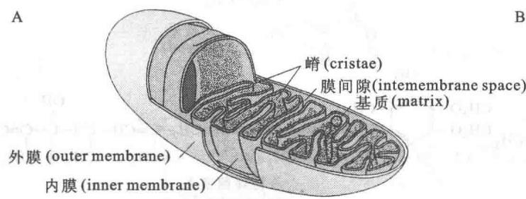  
图19-17 线粒体的结构

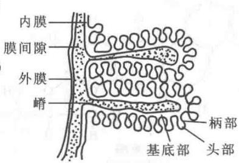  
A. 线粒体的模式结构 B. 线粒体嵴上的球体示意图

线粒体含有两层膜，及夹在两层膜中间的膜间隙。外膜平滑稍有弹性，大约由一半脂质和一半蛋白质构成，外膜含有线粒体孔道蛋白，构成外膜孔道，能通过相对分子质量小于4 000\~5 000的物质，包括质子。内膜含有大约20%的脂类和80%的蛋白质。它的蛋白质含量比细胞的其他任何膜都高。内膜是细胞溶胶和线粒体基质之间的主要屏障。内膜形成许多向内的折叠称为嵴（cristae）。嵴的数目和结构随细胞类型的不同而不同。嵴的存在大大增加了内膜的表面积，增强了它产生ATP的能力。肝细胞线粒体内膜的表面积相当于外膜的5倍，线粒体内膜的总表面积相当于细胞膜的17倍。心脏和骨骼肌线粒体的嵴相当于肝线粒体细胞嵴的3倍。这可能反映了肌肉细胞对ATP的大量需求。

内膜所包围的空间为胶状的基质(matrix)。线粒体基质的体积和组成随着细胞代谢的变化而变化。通过负染法和电子显微镜观察到线粒体内膜的内表面分布着一层排列规则的球形颗粒(图19-17B)。球的直径为8\~9 nm,并带有一细柄,长约5 nm,宽约3 nm,与嵴相连。这种颗粒为ATP合酶。内膜还含有许多涉及电子传递的蛋白质复合体,以及负责物质跨膜运送的转运蛋白(transporters)。因为有些分子,如ADP、Pi以及ATP等,都不能透过线粒体内膜,这些蛋白质分子使ADP和Pi从细胞溶胶进入线粒体基质,也使ATP等分子从线粒体基质进入到细胞溶胶。占内膜约20%的脂主要构成其磷脂双层。这大大降低了内膜对质子的通透性,从而使得形成跨线粒体内膜的质子梯度成为可能。

与细胞溶胶相接触的膜间隙也含有酶类,如腺苷酸激酶(adenylate kinase)等。

可以把线粒体的功能概括为3个方面。第一方面是丙酮酸以及脂肪酸等氧化为 $CO_{2}$ ，同时使 $NAD^{+}$ 和FAD还原为NADH和 $FADH_{2}$ 。这是发生在线粒体基质或面向基质的内膜蛋白质上。第二方面是电子从NADH和 $FADH_{2}$ 传至 $O_{2}$ ，并同时形成跨膜质子梯度。第三方面是将贮存于电化学质子梯度的能量由内膜上的ATP合酶(ATP synthase)复合体合成ATP。

## （二）氧化磷酸化作用机制

前面着重讨论了电子传递过程及在此过程中自由能的释放,电子从一个 NADH 到 $O_{2}$ 传递过程的化学反应式为:

$$
\mathrm{NADH} + \mathrm{H} ^ {+} + 1 / 2 \mathrm{O} _ {2} \longrightarrow \mathrm{NAD} ^ {+} + \mathrm{H} _ {2} \mathrm{O}
$$

这一反应所释放的标准自由能 $\Delta G^{\ominus'} = -220.5 \, \text{kJ/mol} (-52.7 \, \text{kcal/mol})$

下面要讨论的是一个 NADH 分子将电子传递过程中所释放的自由能贮存于 ATP 的过程。全过程大约能合成 3 个分子的 ATP，总反应式为：

$$
3 \mathrm{ADP} + 3 \mathrm{Pi} \longrightarrow 3 \mathrm{ATP} + 3 \mathrm{H} _ {2} \mathrm{O}
$$

这一吸能反应的标准自由能变化 $\Delta G^{\ominus'} = 3 \times 7.3 \, kJ/mol = +91.6 \, kJ/mol (+21.9 \, kcal/mol)$

从上面的反应和计算表明,3个ATP分子的形成共劫获了电子由NADH传递到氧所释放全部自由能的42%(21.9/52.7×100%)。

前面已经提到,氧化磷酸化作用和底物水平磷酸化作用有原则的区别。氧化磷酸化作用是指与电子传递链相偶联的由 ADP 形成 ATP 的过程,底物水平的磷酸化是指直接将一个代谢中间产物(例如磷酸烯醇式丙酮酸)上的磷酸基团转移到 ADP 分子上形成 ATP 的过程。

早在 1940 年, S. Ochoa 等人最先测定了呼吸过程中 $O_{2}$ 的消耗和 ATP 生成的定量关系。用组织匀浆 (tissue homogenates) 以及组织切片 (tissue slices) 所开展的研究工作表明, 组织利用 $O_{2}$ 的同时, ATP 含量随之增加, 测定放射性同位素标记的无机磷酸进入 ATP 中的量即可得出 ATP 的合成量。实验表明, 每消耗 1 个 O 原子合成约 3 个 ATP 分子。这个比例关系称为磷-氧比即 P/O 比。P/O 比也可以看作是一对电子通过呼吸链传至 $O_{2}$ 所产生的 ATP 分子数。从测出的 P/O 比值所得到的假设是, 在电子由 NADH 到 $O_{2}$ 的传递过程中, ATP 可能是在 3 个不同的部位生成的。实验结果也表明, 沿电子传递链确实有 3 个部位可以释放足够的能量形成一个 ATP。测量结果表明, $FADH_{2}$ (琥珀酸脱氢酶) 的电子通过辅酶 Q 进入电子传递链时, P/O 比值是 2。

## 1. ATP 合成的部位

前面已经讨论过, ATP 合成利用的是将 NADH 和 FADH₂ 上的电子传递给氧的过程中释放出来的自由能。其释放自由能的部位有三处: 第 1 个部位是由复合体 I 将 NADH 上的电子传递给辅酶 Q 的过程, 第 2 个部位是由复合体 III 将电子由辅酶 Q 传递给细胞色素 c 的过程, 第 3 个部位是复合体 IV 将电子从细胞色素 c 传递给氧的过程。后来的研究表明, ATP 的合成是由线粒体内膜上和电子传递完全不同的分子组装体 (molecular assembly) 执行的。它是一种多亚基复合体, 最初被称为线粒体 ATP 酶 (mitochondrial ATPase) 或称为 H-ATP 酶 (H⁺-ATPase), 因为该酶最初被发现可以水解 ATP。但是它在线粒体内的真正作用是合成 ATP。为强调该酶的实际功能, 现在普遍称为 ATP 合酶 (ATP synthase), 又称为复合体 V (complex V)。ATP 合酶和电子传递酶类 (复合体 I \~ IV) 完全不同。电子传递所释放出的自由能必须通过一种中间形式才可被 ATP 合酶利用。这种能量的保存和 ATP 合酶对它的利用称为能量偶联 (energy coupling) 或能量转换 (energy transduction)。

## 2. 能量偶联假说

氧化磷酸化作用与电子传递之间的偶联关系已经不存在任何疑问。但是电子在传递过程中究竟怎样促使 ADP 磷酸化, 还有许多未完全阐明的问题。历史上共存在三种主要假说: 化学偶联假说 (chemical coupling hypothesis)、结构偶联假说 (conformational coupling hypothesis) 和化学渗透假说 (chemiosmotic hypothesis)。这三种假说的要点如下:

（1）化学偶联假说 化学偶联假说是 1953 年 Edward Slater 最先提出的。他认为电子传递过程产生一种高能共价中间物。它随后的裂解驱动 ADP 的磷酸化作用。这种例证可见于糖酵解作用中 ATP 的合成。3-磷酸甘油醛被 $NAD^{+}$ 氧化释放的能量供给形成 1,3-二磷酸甘油酸的需要。1,3-二磷酸甘油酸是一种具有高能磷酸基团的酰基磷酸化物。它的高能磷酸基团随后在磷酸甘油酸激酶的作用下转移给 ADP 而生成 ATP。虽然在糖酵解作用中可看到这种情况，但是在氧化磷酸化作用中一直未能找到任何一种类似的高能中间产物。

（2）构象偶联假说 这一假说是1964年Paul Boyer最先提出的。他认为电子沿电子传递链传递使线粒体内膜某些蛋白质组分发生了构象变化，形成一种高能形式。这种高能形式通过ATP的合成而恢复其原来的构象。这一假说和化学偶联假说一样，至今未能找到有力的实验证据。但是在ATP合酶的催化过程中仍可能存在某种形式的构象偶联现象。

（3）化学渗透假说 这一假说是1961年由英国生物化学家Peter Mitchell最先提出的。他认为电子传递释放出自由能和ATP合成这两种过程是通过一种跨线粒体内膜的质子梯度(proton gradient)而偶联的。也就是，电子传递的自由能驱动 $\mathrm{H^{+}}$ 从线粒体基质跨过内膜进入到膜间隙，从而形成跨线粒体内膜的 $\mathrm{H^{+}}$ 电化学梯度(electrochemical $\mathrm{H^{+}}$ gradient)。这个梯度的电化学电势(electrochemical potential,用 $\Delta \mu \mathrm{H}^{+}$ 来表示)驱动ATP的合成。图19-18可作为化学渗透假说的示意图。

化学渗透假说可以解释许多关键的实验结果。例如：

① 氧化磷酸化作用的进行需要封闭的线粒体内膜存在。

② 线粒体内膜对 $H^{+}$ 、 $OH^{-}$ 、 $K^{+}$ 和 $Cl^{-}$ 等离子都是不通透的。

③ 破坏 $H^{+}$ 浓度梯度的形成(用解偶联剂或离子载体试剂等)将破坏氧化磷酸化作用的进行。

④ 在分离到的线粒体内膜两侧人工制造一个质子和电化学梯度可导致 ATP 的生成。

Mitchell 因提出化学渗透假说而获得 1978 年的诺贝尔化学奖。迄今虽然能量偶联的具体分子机制尚未完全阐明，但是跨膜质子电化学梯度产生的质子化学电势即 $\Delta\mu H^{+}$ 和质子跨膜循环在能量偶联中起关键作用的理论已经成为共识。

虽然化学渗透假说能够解释氧化磷酸化过程的大部分问题,但仍有一些问题尚未得到圆满解决。例如 $H^{+}$ 究竟是怎样通过电子传递链而被逐出的,当前虽然已经有些设想,但仍无被公认的揭示机制。

## （三）质子梯度的形成

电子传递使复合体Ⅰ、Ⅲ和Ⅳ推动 $H^{+}$ 跨过线粒体内膜到线粒体的间隙(图19-19)，线粒体膜间隙与细胞溶胶相通。 $H^{+}$ 跨膜流动的结果造成线粒体基质的 $H^{+}$ 浓度低于膜间隙。线粒体基质形成负电势，而膜间隙形成正电势，这样产生的电化学梯度即电动势(electromotive force, emf)称为质子动势或质子动力(protonmotive force, pmf)。其中蕴藏的自由能为ATP合成提供动力。

  
图 19-18 化学渗透假说示意图

图中表明电子传递链是一个 $H^{+}$ 离子泵（质子泵）使 $H^{+}$ 从线粒体基质排到内膜外，在内膜外面的 $H^{+}$ 浓度比膜内高，即形成一种 $H^{+}$ 浓度梯度，所产生的电化学电势驱动 $H^{+}$ 通过 ATP 合成酶系统的 $F_{0}F_{1}ATP$ 酶分子上的特殊通道回流到线粒体基质，同时释放出自由能与 ATP 的合成相偶联

  
图 19-19 表明电子传递和 $H^{+}$ 排出偶联关系的线粒体电子传递链图解

## 1. 质子泵出是耗能过程

一个质子逆电化学梯度跨过线粒体内膜的自由能变化公式可以表示如下：

$$
\Delta G = 2. 3 R T [ \mathrm{pH(膜内)} - \mathrm{pH(膜外)} ] + Z F \Delta \Psi
$$

式中 Z 为质子上的电荷（包括符号），F 为法拉第（faraday）常数， $\Delta\Psi$ 为跨膜电势差。习惯上当电子从负极转移到正极时， $\Delta\Psi$ 为正值。因为线粒体内膜外的 pH 低于内膜内的 pH，因此质子从线粒体基质转运到膜间隙是逆质子梯度转移，所以是一个耗能过程。而且质子从基质转运出去后使内膜的内表面比外表面电负性更强。一个正离子（阳离子）向外转移必然使其自由能增加，是个耗能过程。如果是一个负离子被转移出去，就会得到完全相反的结果。

## 2. 质子转移的机制有两种假设

电子传递链的4种电子传递复合体中的3种复合体即复合体Ⅰ、Ⅲ和Ⅳ都被认为和质子转移有密切关系。有关质子主动转移和电子传递产生的自由能如何偶联的机制当前存在两种假设：一种是氧化还原回路机制（redox loop mechanism），另一种是质子泵机制（proton pump mechanism）。

（1）氧化还原回路机制 该机制由 Mitchell 提出。可简称为氧还回路机制。他认为线粒体内膜呼吸链的各个氧化还原中心即 FMN、辅酶 Q、细胞色素以及铁硫中心的排列可能既使电子转移，也使质子转移。前一个被还原的氧还中心被后一个氧还中心再氧化，同时伴随质子的转移，包括质子由基质泵出和在线粒体内膜外的质子回流到基质一边。氧还回路机制可用图 19-20 表示。

  
图 19-20 线粒体内电子传递与质子转移相结合的氧还回路机制示意图  
FMN 和辅酶 Q 起着 $\left(\mathrm{H}^{+}+\mathrm{e}^{-}\right)$ 载体的作用。铁硫中心和细胞色素是单纯的 $e^{-}$ 载体，这些组分的排列既  
能满足电子传递又能伴有 $\mathrm{H}^+$ 的转移。图中的X是假想的呼吸链中的第3个转移 $\mathrm{H}^+$ 的分子

氧化还原回路机制要求第1个氧化还原载体处在还原态时比其氧化态含有更多的氢原子，其第2个氧化还原载体在氧化态和还原态时所含的氢原子数没有差异。事实上FMN和辅酶Q在还原态时确实含有较多的氢原子，因此可以起质子载体和电子载体的双重作用。如果这些中心专一地与细胞色素和铁硫中心这样的纯电子载体进行交换，这种设想的机制是可以成立的。图19-20即表示这种交换机制。

这种氧化还原回路机制的主要问题是,呼吸链中只发现2种 $\left(\mathrm{H}^{+}+\mathrm{e}^{-}\right)$ 电子载体的存在。而已知最早表明似乎有3个部位能转运质子。因此,按此种机制设想必须有另外一个 $\left(\mathrm{H}^{+}+\mathrm{e}^{-}\right)$ X载体存在(图19-20)。

为了解决上述问题, Mitchell 曾提出一种设想, 即辅酶 Q 可能在复合体的质子转移中发挥两次作用, 通过所谓的 Q 循环。但是 Q 循环不能在复合体Ⅳ中起作用, 复合体Ⅳ中没有 $\left(\mathrm{H}^{+}+\mathrm{e}^{-}\right)$ 载体。虽然如此复合体Ⅳ还是被认为在电子传递过程中能将质子从基质“泵”出到膜间隙中。

（2）质子泵机制 这个机制的内容是，电子传递导致复合体的构象变化。质子的转移是氨基酸侧链pK值变化产生的结果。构象变化造成氨基酸侧链pK值的改变，结果发挥质子泵作用的侧链暴露在外并交替地暴露在线粒体内膜的内侧或外侧，从而使质子发生移位。

当前,以上两种机制虽然各自都有一些旁证,但尚未能在电子传递链本身得到完全令人信服的证据。

质子的跨膜转运和 ATP 形成的机制是复杂的,在电子传递链的不同部位发生的质子转运可能通过不同的机制实现。这正是当前仍旧引人注目的课题。

（3）合成一个 ATP 需要 2\~3 个质子跨膜转运 在生理条件下合成一个 ATP 分子所需自由能为 +(40\~50) kJ/mol。这个值不可能由一个质子流回到线粒体基质的跨膜驱动力提供，至少需要两个质子的流回。尽管此值很难精确测得，因为被转移到膜间隙的质子还有一部分又漏回基质。但测定的结果表明，每合成一分子 ATP 有 2\~3 个质子从膜间隙跨膜转运到基质。

## （四）ATP合成机制

ATP 的合成是由一个蛋白质复合体完成的。这个复合体被称为 ATP 合酶 (ATP synthase)，它由两个主要的单元 (unit) 构成，如图 19-21 所示。起质子通道作用 (proton-conducting) 的单元称为 $F_{0}$ 单元 [ $F_{0}$ 右下角的注脚为英文的“o”字母而不是“零”， $F_{0}$ 中的 o 表示此酶是寡酶素 (oligomycin) 敏感型的酶]，催化 ATP 合成的单元称为 $F_{1}$ 单元。因此，ATP 合酶又称为 $F_{0}F_{1}-ATP$ 酶 ( $F_{0}F_{1}-ATPase$ )。

研究质子动力如何用于合成 ATP 的实验材料可使用通过超声波制备的亚线粒体结构。

## 1. 亚线粒体结构

1960 年 Efraim Racker 发现用超声波处理线粒体, 可将其嵴打成碎片, 这些碎片会自动重新封闭起来形成泡状体。这些泡状体称为亚线粒体泡 (submitochondrial vesicles)。这种囊泡的特点是使原有朝向基质侧的线粒体内膜翻转朝外, 如图 19-22 所示。

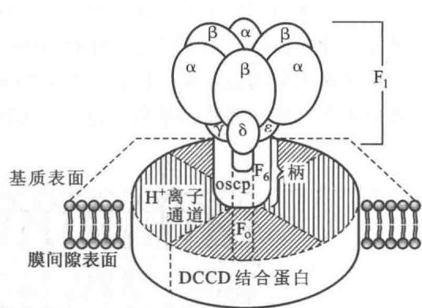

由内膜重新封闭形成的亚线粒体泡仍保有氧化磷酸化作用的功能。在亚线粒体泡的外周可见内膜球体，即ATP合酶的 $F_{1}$ 单元。如果用尿素（urea）或胰蛋白酶（trypsin）处理这些囊泡，则内膜上的 $F_{1}$ 球状体会从囊泡上脱落。但 $F_{0}$ 单元仍留在上面。这种处理过的囊泡还保

图 19-21 ATP 合酶结构示意图

该酶像一个花朵, $F_{0}$ 单元是质子通道, $F_{1}$ 单元是 ATP 的合成部位

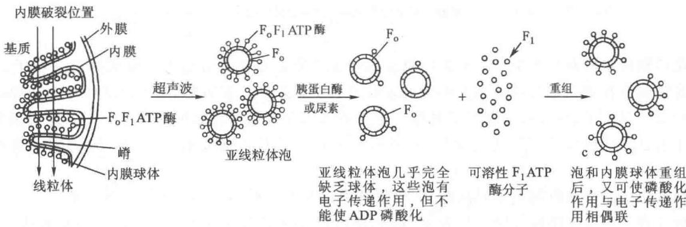  
图19-22 亚线粒体泡的制备及重组示意图  
将亚线粒体泡分解成失去磷酸化作用的无球体的部分和可溶性的 $F_{1}$ ATP 酶球体部分, 然后又重组为具有氧化磷酸化作用的泡, 多数亚线粒体泡的膜是内表面翻转向外的线粒体内膜

有电子传递的功能,但却失去了合成 ATP 的功能。而脱落下来的球体却具有催化 ATP 水解的功能。当将 $F_{1}$ 球体再加回到保有 $F_{0}$ 的囊泡时,则氧化磷酸化作用又可恢复,即恢复了 ATP 合成的功能。这时又可看到在囊泡周围的 $F_{1}$ 球体。因此,可以认为 $F_{1}$ 单元的正常功能是催化 ATP 合成,其水解 ATP 的功能是在缺乏质子梯度的情况下表现出的非正常生理功能。

## 2. $\mathbf{F}_1$ 单元和 $\mathbf{F}_0$ 单元的结构

$F_{1}$ 单元是球状结构, 其直径为 8.5\~9.0 nm, 已知由 5 种不同的亚基组成(表 19-4)。各亚基的化学计量比为 $\alpha_{3}\beta_{3}\gamma\delta\varepsilon$ , 总的相对分子质量为 378 000。用电子显微镜观察到的 $F_{o}F_{1}$ 颗粒呈蘑菇状。催化 ATP 合成的部位在 $\beta$ 亚基上, $\delta$ 亚基是 $F_{1}$ 和 $F_{o}$ 相连接所必需的。 $F_{o}$ 通过一个大约 5 nm 的柄与 $F_{1}$ 单元相连。柄包含有两种蛋白质。一种称为寡霉素敏感性赋予蛋白 (oligomycin-sensitivity-conferring protein, OSCP)。另一种蛋白质称为偶合因子 6 (coupling factor 6, $F_{6}$ )。

$F_{0}$ 是跨线粒体内膜的疏水蛋白质复合体。它是质子通道，除上述两种蛋白质外它还包括由 a, b, c 三种亚基组的 $ab_{2}c_{8\sim15}$ 结构。每个 $F_{0}$ 单元的 8\~15 个相对分子质量为 8000 的 c 亚基在膜内形成一个环状结构。寡霉素对 ATP 合酶的抑制作用是由于它结合到 ATP 合酶的 $F_{0}$ 亚基上，从而抑制 $H^{+}$ 通过 $F_{0}$ ，有趣的是寡霉素抑制剂并非结合到寡霉素敏感性赋予蛋白上，而是结合在 a 亚基和 c 亚基的相互作用表面上。寡霉素（oligomycin）是一种抗生素，它的结构如下：

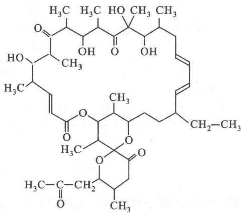  
寡霉素B的结构式

有一种脂溶性的羧基试剂（carboxyl reagent）称为二环己基碳二亚胺（dicyclohexylcarbodiimide）简称DCCD，它的结构如下：

二环己基碳二亚胺(DCCD)

因 DCCD 是一个脂溶性的羧基试剂, $F_{0}$ 上的 c 亚基与 DCCD 发生反应表明有一个羧基位于脂质环境, 即埋藏在膜内。

表 19-4 线粒体 ATP 合酶复合体组分

<table><tr><td>亚基</td><td>相对分子质量</td><td>作用</td><td>定位</td></tr><tr><td> $F_1$ </td><td>378 000</td><td>含有合成 ATP 的催化部位</td><td>线粒体内膜向基质侧的球状体</td></tr><tr><td>α</td><td>56 000</td><td></td><td></td></tr><tr><td>β</td><td>52 000</td><td></td><td></td></tr><tr><td>γ</td><td>34 000</td><td></td><td></td></tr><tr><td>δ</td><td>14 000</td><td></td><td></td></tr><tr><td>ε</td><td>6 000</td><td></td><td></td></tr><tr><td> $F_o$ </td><td>113 000</td><td>含有质子通道</td><td>跨膜部位</td></tr><tr><td>a</td><td>21 000</td><td></td><td></td></tr><tr><td>b</td><td>12 000</td><td></td><td></td></tr><tr><td>c</td><td>8 000</td><td></td><td></td></tr><tr><td>OSCP</td><td>23 000</td><td></td><td></td></tr><tr><td> $F_6$ </td><td>8 000</td><td></td><td></td></tr><tr><td> $F_1$ 抑制因子( $IF_1$ )</td><td>10 000</td><td>抑制 ATP 水解</td><td> $F_oF_1$ 之间的柄</td></tr></table>

## 3. 质子流通过 ATP 合酶时释出与酶牢固结合的 ATP 分子

质子流是如何驱动 ATP 合成的？这个问题一直是科学家感兴趣的课题。一种假设认为最初是能化的质子(energized protons)通过 $F_{0}$ 质子通道集中到 $F_{1}$ 的催化部位，在此处质子脱去无机磷酸上的一个氧原子，结果使平衡驱向 ATP 合成。但是用同位素交换实验却证明了在没有质子动力的情况下 ATP 就能有效合成。将 ADP 和无机磷酸加入到含有 $H_{2}^{18}O$ 的 ATP 合酶中， $^{18}O$ 可通过 ATP 的合成和随后的水解被掺入到无机磷酸分子中。如下式：

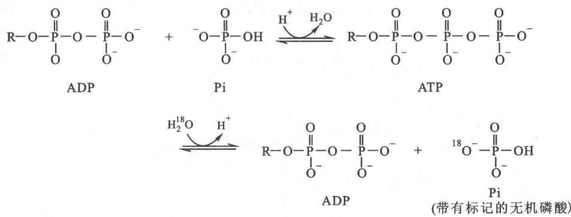

$^{18}$ O 掺入到无机磷酸的速度表明,在没有质子梯度存在的情况下,与 $F_{1}$ 催化部位结合着的 ATP 和游离的 ADP 处于平衡状态。但是如果没有质子流通过 $F_{0}$ , 合成的 ATP 就不能离开催化部位。因此 Paul Boyer 认为质子梯度的作用并不是形成 ATP, 而是使 ATP 从酶分子上释放出来。Paul Boyer 还发现, ATP 合酶分子与 ADP 和 Pi 的结合, 有促使 ATP 分子从酶上释放出来的作用。这表明 ATP 合酶分子上的核苷酸 (ATP、ADP) 结合部位在催化过程中有相互协同的作用。Paul Boyer 对于质子驱动 ATP 合成的机制问题提出“结合变化机制”(binding-change mechanism)。这个机制可用图 19-23 表示。

  
图 19-23 ATP 合酶的结合变化机制示意图

Paul Boyer 提出, 在 ATP 合酶上的 3 个. $\beta$ 亚基尽管氨基酸序列完全相同, 但它们的作用在任何一个时间点都是不相同的。其中之一处于 “O” (open) 状态, 即是开放形式, 对底物的亲和力极低。另一个处于 “L” (loose) 状态。这种状态与底物的结合较松弛, 对底物没有催化能力。第 3 个处于 “T” (tight) 状态, 与底物结合紧密, 并有催化活性。如果在酶分子的 “T” 部位结合着一个 ATP 分子, 又有 ADP 和 Pi 结合到它的 “L” 部位, 这时质子流的能量使 “T” 部位转变为 “O” 部位, “L” 部位转变为 “T” 部位, “O” 部位转变为 “L” 部位 (图 19-23)。当 “T” 部位转变为 “O” 部位时, ATP 就可以解脱下来, 同时又使原来结合 ADP 和 Pi 的 “L” 部位转变成 “T” 部位并合成新的 ATP 分子。只有当质子流从 $F_{0}$ 流经 ATP 合酶时才发生 “O” “L” 和 “T” 状态之间的相互转变。这种构象转变是连续发生的, 很可能是通过 $\gamma$ 亚基与 $\beta$ 亚基的非对称相互作用实现。

ATP 合酶的作用是由质子动力所驱动的。这种动力实质上是由 pH 梯度和膜电势产生的。某些氨基酸残基在 pH 梯度的条件下可以发生质子化(protonation)或去质子化(deprotonation)。这种在一边的质子化和另一边的去质子化而驱动的一个单方向的反应循环可构成促使 ATP 合成的驱动力。

## （五）氧化磷酸化的解偶联和抑制

正常情况下,电子传递和磷酸化是紧密偶联的。在静止状态(resting state),氧化磷酸化处于最低水平,这时通过线粒体内膜的电化学梯度的大小正好能够阻止质子泵的活动,于是电子传递也就受到抑制。在有些情况下,电子传递和磷酸化作用可被解偶联,可举出以下情况:

## 1. 特殊试剂的解偶联作用

特殊的化学试剂可干扰氧化磷酸化过程的不同步骤,这是研究氧化磷酸化中间过程的有效方法。不同的化学试剂对氧化磷酸化作用的影响方式不同,可分为三大类,一类称为解偶联剂,另一类称为氧化磷酸化抑制剂,第三类称为离子载体抑制剂。

（1）解偶联剂(uncoupler) 这类试剂的作用是通过消除跨膜质子梯度而使电子传递和 ATP 形成两个过程分离,不再紧密关联。它们不抑制电子传递过程,使电子传递产生的自由能最终都变为热能。这种试剂使电子传递不再与 ATP 生成偶联,造成过分地消耗氧和燃料底物,但能量得不到贮存。典型的解偶联剂是弱酸性亲脂试剂如2,4-二硝基苯酚(2,4-dinitrophenol,DNP)，它的作用机制可用图19-24表示。解偶联剂的作用只抑制氧化磷酸化的ATP形成，对底物水平的磷酸化没有影响。

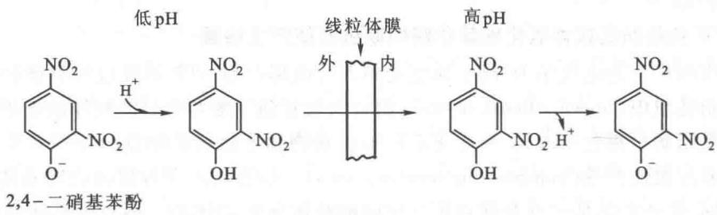  
图19-24 2,4-二硝基苯酚消除跨膜质子梯度的作用机制

在 pH 7 的环境下,2,4-二硝基苯酚以离解的形式存在( )这种形式不能透过膜,因它是脂不

溶性的。在酸性的环境中2,4-二硝基苯酚接受质子后成为不解离的形式而变为脂溶性的，从而可有效地透过膜，同时将一个质子带入膜内。解偶联剂使膜对 $\mathrm{H^{+}}$ 的通透性增加，将其带到 $\mathrm{H^{+}}$ 浓度低的一边。这样就破坏了跨膜质子梯度的形成（参看化学渗透偶联学说），这种破坏 $\mathrm{H^{+}}$ 梯度而引起解偶联现象的试剂又称质子载体试剂。

其他一些酸性芳香族化合物如 FCCP（为三氟甲氧基苯腙羰基氰化物，carbonylcyanide-p-trifluoromethoxyphenylhydrazone 的简称）也有同样作用。FCCP 的结构式如图 19-25 所示。

（2）氧化磷酸化抑制剂(inhibitor) 这类试剂的作用特点是既抑制氧的利用也抑制 ATP 的形成,但不直接抑制电子传递链上电子载体的作用。这一点和电子传递抑制剂不同。氧化磷酸化抑制剂的作用是直接干扰 ATP 的生成过程。由于它干扰了由电子传递的高能状态形成 ATP 的过程,结果也使电子传递不能进行。寡霉素(oligomycin) 就属于这类抑制剂。寡霉素作用和 2,4-二硝基苯酚(解偶联试剂) 作用之不同,可用实验清楚地表明(图 19-26):当在线粒体悬浮液中,加入寡霉素后,再加入 ADP,不见有刺激呼吸的作用发生,这时若加入 DNP 解偶联试剂,则可看到呼吸作用立即加快,表明寡霉素对利用氧的抑制作用可被解偶联试剂解除。

  
图 19-25 FCCP(三氟甲氧基苯腙羰基氰化物)的结构式

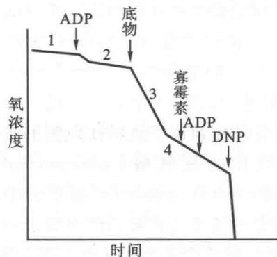  
图 19-26 线粒体呼吸时的氧气消耗和 ATP 生成之间的关联, 寡霉素对氧消耗的抑制作用, 以及 DNP 解除寡霉素的抑制作用

（3）离子载体抑制剂（ionophore） 这是一类脂溶性物质。这种物质能与某些离子结合并作为它们的载体使这些离子能够穿过膜。它和解偶联试剂的区别在于它是除 $H^{+}$ 以外其他一价阳离子的载体，例如缬氨霉素（valinomycin）能够结合 $K^{+}$ 离子，与 $K^{+}$ 形成脂溶性的复合物，于是携带 $K^{+}$ 透过膜。如果 $K^{+}$ 离子不与缬氨霉素结合,它透过膜的速度就很低。又如短杆菌肽(gramicidin)可使 $K^{+}$ 、 $Na^{+}$ 以及其他一些一价阳离子穿过膜。因此,这类抑制剂是通过增加线粒体内膜对一价阳离子的通透性而破坏氧化磷酸化过程的(参看生物膜与物质运送)。

## 2. 激素控制褐色脂肪线粒体氧化磷酸化解偶联机制使产生热量

电子传递过程所产生的电化学 $\mathrm{H^{+}}$ 离子梯度受到人为破坏而与ATP形成过程解偶联并产生热已如前述。有一种褐色脂肪组织(brown adipose tissue)，由含大量甘油三酯和大量线粒体的细胞构成。线粒体内的细胞色素使褐色脂肪呈褐色。人类、新生无毛的哺乳动物和冬眠哺乳动物在颈部和背部都含有褐色脂肪。它的作用是非战栗性产热(nonshivering thermogenesis)。这和由战栗性肌肉收缩或其他活动引起ATP水解产热机制不同，褐色脂肪的产热是线粒体氧化磷酸化解偶联的结果。褐色脂肪线粒体内膜上含有一种蛋白质称为产热蛋白(thermogenin)，或解偶联蛋白(uncoupling protein)，这种蛋白质只存在于褐色脂肪的线粒体中，它控制着线粒体内膜对质子的通透性。适应于寒冷生活的动物在褐色脂肪的线粒体内膜蛋白质中含有高达 $15\%$ 的产热蛋白。该蛋白质可被游离脂肪酸激活，但被嘌呤核苷酸（如ADP和GDP）抑制。核苷酸类对它的抑制可被游离脂肪酸解除。脂肪酸刺激质子流通过该蛋白质并使氧化磷酸化解偶联从而产生热量。褐色脂肪中游离脂肪酸的产生又受到去甲肾上腺素(norepinephrine)的调节。在去甲肾上腺素的作用下，去甲肾上腺素受体系统合成cAMP，于是变构激活cAMP依赖性蛋白激酶(cAMP-dependent protein kinase)，随后激酶又通过磷酸化作用激活激素敏感的甘油三酯酶(hormone-sensitive triacylglycerol lipase)，最后被激活的脂酶催化甘油三酯水解产生游离脂肪酸。

## （六）细胞溶胶内的NADH的再氧化

细胞溶胶内的 NADH 不能透过线粒体内膜进入线粒体氧化。目前已知可通过两种“穿梭”途径解决这些 NADH 的再氧化问题。一种称为 3-磷酸甘油穿梭途径（glycerol-3-phosphate shuttle），另一种称为苹果酸-天冬氨酸穿梭途径（malate-aspartate shuttle）。

## 1. 3-磷酸甘油穿梭途径

由糖酵解过程产生的 NADH 虽不能穿过线粒体内膜,但是 NADH 上的电子却可以通过该穿梭机制进入到线粒体内膜上的电子传递链。在这里起电子载体作用的即是 3-磷酸甘油。后者所介导的穿梭作用如图 19-27 所示。

图 19-27 中所示的穿梭作用的第 1 步是电子从 NADH 转移到磷酸二羟丙酮形成 3-磷酸甘油。催化这一反应的酶称为 3-磷酸甘油脱氢酶，该反应是在细胞溶胶中进行的。3-磷酸甘油上的电子对然后转移到位于线粒体内膜上的线粒体 3-磷酸甘油脱氢酶（mitochondrial glycerol-3-phosphate dehydrogenase）的辅基 FAD

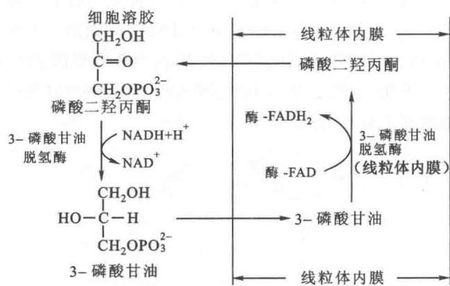  
图19-27 3-磷酸甘油穿梭途径

分子上。3-磷酸甘油转变为磷酸二羟丙酮，FAD 还原为 $FADH_{2}$ 。磷酸二羟丙酮被释放到细胞溶胶中，这就使 3-磷酸甘油完成了携带 NADH 电子进入线粒体内膜的使命，并完成了一次穿梭历程。

在线粒体内膜上被还原的 $FADH_{2}$ 将电子传递给辅酶 Q 使之还原为 $QH_{2}$ ，于是进入了电子传递链，已如前述。

甘油磷酸穿梭途径将 NADH 电子转移进入电子传递链进行氧化磷酸化所利用的电子传递中介体是 FAD 而不是 $NAD^{+}$ ，这就使从 NADH 脱下的电子通过氧化磷酸化最后生成的 ATP 分子数比以 $NAD^{+}$ 作为传递体时少大约 1 个 ATP 分子。也就是说细胞溶胶中的 NADH 上的电子通过甘油磷酸穿梭途径转运后形成的 ATP 分子不是 2.5 个，而是 1.5 个。昆虫飞行肌中存在这种穿梭途径。

## 2. 苹果酸-天冬氨酸穿梭途径

心脏和肝细胞溶胶内的 NADH 的电子进入线粒体是通过苹果酸-天冬氨酸穿梭途径。在这条途径中，NADH 的电子由细胞溶胶的苹果酸脱氢酶（cytoplasmic malate dehydrogenase）催化传递给草酰乙酸使后者转变为苹果酸，同时 NADH 氧化为 $NAD^{+}$ 。苹果酸通过苹果酸- $\alpha-$ 酮戊二酸转运蛋白（malate- $\alpha-ketoglutarate$ transporter）穿过线粒体内膜。进入线粒体内的苹果酸在线粒体基质内被 $NAD^{+}$ 氧化失去电子又转变为草酰乙酸，形成 NADH。基质内的草酰乙酸并不易透过线粒体内膜，但是由草酰乙酸经过转氨基作用（参看第 25 章）形成的天冬氨酸，通过谷氨酸-天冬氨酸转运蛋白可透过线粒体内膜转移到细胞溶胶侧，随后通过转氨基作用又转变为草酰乙酸。这种穿梭途径和甘油磷酸穿梭途径的差异是它可逆转。由于该反应的可逆性，因此只有当细胞溶胶中的 NADH 和 $NAD^{+}$ 之比值比线粒体基质内的比值高时，NADH 才通过这条途径进入线粒体。这条途径的最终结果是将细胞溶胶中的 NADH 所荷电子转移到线粒体基质内，为进入电子传递链创造条件。苹果酸-天冬氨酸穿梭途径可用图 19-28 表示。

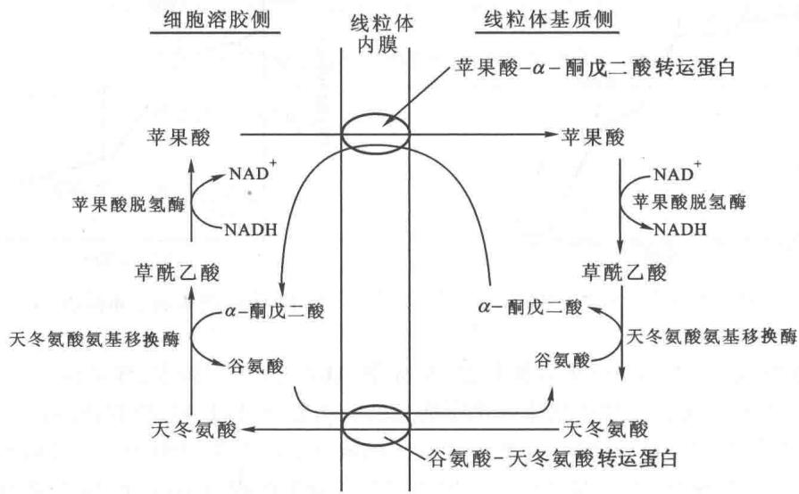  
图 19-28 苹果酸-天冬氨酸穿梭示意图

## (七) 氧化磷酸化的调控

细胞内电子传递和 ATP 形成的偶联关系是强制性的, ATP 的生成必须以电子传递为前提, 而呼吸链上的电子传递也只有在 ATP 被生成时才可发生。完整的线粒体只有当无机磷酸和 ADP 都充分时电子传递速度才能达到最高水平。当缺少 ADP 时, 因为缺乏磷酸的受体则不能进行磷酸化作用。[ATP]/[ADP]之比在细胞内对电子传递速度起着重要的调节作用, 同时对还原型辅酶的积累和氧化也起调节作用。ADP 作为关键物质对氧化磷酸化作用的调节称为呼吸的受体控制 (receptor control)。当细胞利用 ATP 做功时, 细胞内 ATP 水平迅速下降, 同时 ADP 的浓度迅速升高。这无论从热力学或动力学方面都有利于氧化磷酸化的进行。于是 ATP 的合成加速, 电子传递也加速, 各种辅酶往复的氧化还原反应又活跃起来, 底物又不断地被氧化, 氧的利用也增加。反之, 若 ATP 在细胞内积累时, ADP 的浓度必然很低。这时电子传递变缓或停止, 还原型辅酶浓度增加以致不能再接受电子, 于是整个呼吸链也受到抑制或停止。因此, 氧化磷酸化作用的进行和细胞对 ATP 的需要是相适应的。这种精确的适应正是靠以 ADP 作为关键物质的“受体控制”来实现的。

B. Chance 和 G. R. Williams 曾根据线粒体利用氧的情况观察到呼吸作用的 5 种状态, 如图 19-29 所示。

悬浮的线粒体在既无可氧化的底物又无 ADP 情况下的呼吸状态称为状态 I（state I），这时的氧利用率极低。加入 ADP 后的呼吸状态称为状态 II，ADP 刚加入时有一个短暂刺激呼吸的作用。如果既加入 ADP 又加入底物，这时的氧化状态称为状态 III。这时氧的利用速度很快。这种状态一直继续到 ADP被用尽,再加入 ADP,于是氧的利用又迅速增加,这时的状态称为状态Ⅳ。当氧被耗尽时,线粒体呼吸停止,这时称为状态 V。在这些状态中,只有状态Ⅳ和Ⅲ经常发生。状态Ⅲ和 ADP 的加入直接相关。这也说明 ADP 对呼吸链的重要调节作用。

受体控制的定量表示法是测定有 ADP 存在时氧的利用速度(状态Ⅲ)和没有 ADP 时氧的利用速度(状态Ⅳ)的比值。

完整的线粒体其受体控制值可高达10以上,而受损伤或衰老的线粒体此值可低至1,这表明电子传递速度和ATP的形成已经失去偶联,或只有很少偶联,虽然电子传递仍保持最大速度,但失去了磷酸化作用。

受体控制比值是鉴定分离的线粒体完整状况的指标,比值越高表明线粒体越接近完整。如图 19-30 所示,由 ADP 的浓度改变所导出的氧的消耗可测得 $\Delta ADP/\Delta O$ 的比值,这个比值和 P/O 比正相吻合。

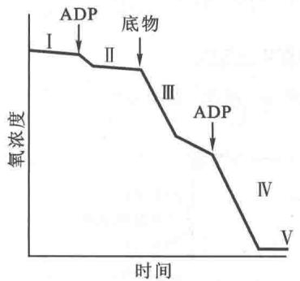  
图19-29 线粒体呼吸的5种状态

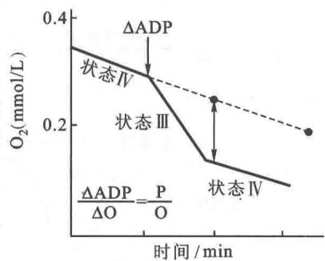  
图19-30 呼吸的受体控制

随着呼吸第Ⅳ状态(没有 ADP)和第Ⅲ状态(过量的 ADP)的互相转变,线粒体的超微结构也相应发生着明显的变化。这些变化是线粒体基质变化所造成的。当缺乏 ADP 时,线粒体的内部分隔完全充满整个线粒体空间,内膜与外膜相接,这种状态称为常态(orthodox state)(图 19-31)。当加入 ADP 后,线粒体处于呼吸活动状态(即第Ⅲ状态)。基质的体积压缩成只有常态体积的 50%,内膜和嵴的折叠变得更密更曲折,这种状态称为紧缩态(condensed state)(图 19-31)。常态和紧缩态的结构相应地反映着线粒体的 ATP 生成系统处于“静止”或“活动”状态。完整的肝细胞内,线粒体处于第Ⅲ状态和第Ⅳ状态之间。ADP 的浓度比较低,不足以使呼吸达到最大速度。当细胞受刺激而活动时,呼吸速度增加,线粒体处于紧缩态,即第Ⅲ种呼吸状态。

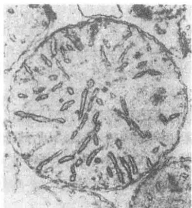  
常态（“静止态”）

  
紧缩态（“活动态”）  
图 19-31 线粒体常态和紧缩态的电子显微图  
图中表明鼠肝线粒体在静止态(状态Ⅳ)和活动态(状态Ⅲ)的超微结构变化,内膜-基质的结构和体积的显著变化可能和内膜ADP-ATP移位酶与ADP分子的结合有关

## (八) 一个葡萄糖分子彻底氧化产生 ATP 分子数的总结算

关于一个葡萄糖分子彻底氧化为水和 $CO_{2}$ 究竟产生多少 ATP 分子的问题一直受到人们的关注。葡萄糖分解通过糖酵解和柠檬酸循环形成的 ATP 或 GTP 的分子数，根据化学计算可以得到明确的答案。但是氧化磷酸化产生的 ATP 分子数还难以精确计算或测定。因为根据化学渗透学说 P/O 比等无须为整数，也无须为一固定值。根据当前最新测定，在一对电子经 NADH-Q 还原酶、细胞色素还原酶和细胞色素氧化酶传到 $O_{2}$ 的过程中，从线粒体基质泵出到内膜外的细胞溶胶侧的质子数依次为 4、2 和 4。合成一个 ATP 分子可能是由 3 个 $H^{+}$ 通过 ATP 合酶所驱动。还需要一个 $H^{+}$ 用于将 ATP 从基质运往膜外细胞溶胶。因此一对电子从 NADH 传至 $O_{2}$ ，所产生的 ATP 分子数是 2.5 个。经由细胞色素还原酶部位进入电子传递链的电子，例如琥珀酸，或细胞溶胶中的 NADH，它们的电子对只产生 1.5 个 ATP 分子。这样，当一分子葡萄糖彻底氧化为 $CO_{2}$ 和水所得到的 ATP 分子数和过去传统的统计数相比（36 个 ATP）少了 6 个 ATP 分子，成为 30 个。全部的统计列于表 19-5。在这 30 个 ATP 分子中，26 个是由氧化磷酸化作用生成的。

表 19-5 一个葡萄糖分子彻底氧化生成 ATP 分子的统计

<table><tr><td>反应名称</td><td>生成 ATP 分子数</td></tr><tr><td>糖酵解作用(在细胞溶胶中进行)</td><td></td></tr><tr><td>1.葡萄糖磷酸化</td><td>-1</td></tr><tr><td>2.6-磷酸果糖磷酸化</td><td>-1</td></tr><tr><td>3.2分子1,3-二磷酸甘油(1,3-BPG)去磷酸化</td><td>+2</td></tr><tr><td>4.2分子磷酸烯醇式丙酮酸去磷酸化</td><td>+2</td></tr><tr><td>5.2分子3-磷酸甘油醛氧化产生2分子NADH</td><td></td></tr><tr><td>2分子丙酮酸转变为乙酰-CoA产生2分子NADH(在线粒体中进行)</td><td></td></tr><tr><td>柠檬酸循环(在线粒体内进行)</td><td></td></tr><tr><td>1.2分子琥珀酰-CoA产生2分子GTP(相当ATP)</td><td>+2</td></tr><tr><td>2.2分子异柠檬酸氧化产生2分子NADH</td><td></td></tr><tr><td>3.2分子α-酮戊二酸氧化产生2分子NADH</td><td></td></tr><tr><td>4.2分子苹果酸氧化产生2分子NADH</td><td></td></tr><tr><td>5.2分子琥珀酸氧化产生2分子 $FADH_2$ </td><td></td></tr><tr><td>氧化磷酸化作用(在线粒体内膜进行)</td><td></td></tr><tr><td>1.糖酵解作用中产生的2个NADH每分子形成1.5个ATP(NADH假定通过甘油磷酸穿梭途径转运)</td><td>+3</td></tr><tr><td>2.丙酮酸氧化脱羧反应产生2分子NADH每分子生成2.5个ATP分子</td><td>+5</td></tr><tr><td>3.柠檬酸循环形成两分子 $FADH_2$ ,每分子产生1.5个ATP</td><td>+3</td></tr><tr><td>4.异柠檬酸、α-酮戊二酸、苹果酸氧化共产生6分子NADH,每分子生成2.5个ATP分子</td><td>+15</td></tr><tr><td>总计</td><td>+30</td></tr></table>

注:如果在葡萄糖氧化过程中是通过苹果酸-天冬氨酸穿梭途径运转 NADH, 在总结算中还多形成 2 分子 ATP, 于是总计形成 32 个 ATP

## （九）氧的不完全还原

呼吸链电子传递过程中的几步都可能产生具有很高反应活性的活性氧,如细胞色素还原酶中产生的半醌中间体可能将其电子传给 $O_{2}$ ，形成氧的自由基(oxygen radicals)。一个电子使氧还原形成超氧化物负离子(superoxide anion, $O_{2}^{\cdot-}$ )，两个电子使氧还原形成过氧化氢(hydrogen peroxide, $H_{2}O_{2}$ )，3个电子使氧还原形成羟自由基(hydroxyl radical, OH $^{-}$ )。反应式如下：

$$
\begin{array}{r l} & {\mathrm {O_ {2} + e^ {-} \longrightarrow O_ {2} ^ {\cdot - }}} \\ & {\mathrm {O_ {2} + 2e^ {-} + 2H^ {+} \longrightarrow H_ {2} O_ {2}}} \\ & {\mathrm {O_ {2} + 3e^ {-} + 3H^ {+} \longrightarrow H_ {2} O + OH^ {\cdot}}} \end{array}
$$

不完全还原形式的氧反应性极强，对机体非常有害。羟自由基是其中最强的氧化剂也是最活跃的诱变剂（mutagen）。这种自由基当机体受到电离辐射时就会产生。生物要存活必须将这些毒性极强的高活性氧转变为活性较小的形式。需氧细胞有几种主要的自我保护机制使机体免受不完全还原氧的侵害。其中最主要的一种方式是通过酶的作用，包括超氧化物歧化酶（superoxide dismutase）、过氧化氢酶（catalase）和过氧化物酶（peroxidase）。

使超氧化物阴离子解毒的主要方式是由超氧化物歧化酶将其转变为过氧化氢 $\left(\mathrm{H}_{2}\mathrm{O}_{2}\right)$ 。该酶催化的是一种歧化反应(dismutation reaction)，即两个相同的底物形成两种不同的产物，一个超氧化物负离子被氧化，而另一个则被还原。反应如下式：

$$
\mathrm{O} _ {2} ^ {\cdot -} + \mathrm{O} _ {2} ^ {\cdot -} + 2 \mathrm{H} ^ {+} \longrightarrow \mathrm{H} _ {2} \mathrm{O} _ {2} + \mathrm{O} _ {2}
$$

超氧化物歧化酶清除 $O_{2}^{\cdot-}$ 的可能机制如下所述：

红细胞的细胞溶胶中的超氧化物歧化酶的活性部位含有一个铜离子和一个锌离子，因此又称为铜-锌超氧化物歧化酶。这两个离子在催化反应中与酶蛋白侧链的组氨酸（His）残基协同作用。带有负电荷的超氧化物，由于静电作用，被吸引到超氧化物歧化酶的带正电荷的活性部位。这个活性部位正处于球形酶的凹陷底部。在凹陷处的外围由带有负电荷的残基所环绕。超氧化物负离子 $\mathrm{O}_2^{+ - }$ 与 $\mathrm{Cu}^{2 + }$ 和精氨酸的胍基（guanido group）相结合，使超氧化物上的一个电子被转移到2价铜离子（cupric ion）上形成1价的 $\mathrm{Cu^{+}}$ 和 $\mathrm{O_2}$ ，后者被释出。第2个超氧化物负离子进入酶的活性部位与1价的 $\mathrm{Cu^{+}}$ 、精氨酸和 $\mathrm{H}_3\mathrm{O}^+$ 结合，被结合的 $\mathrm{O}_2^{+ - }$ 从 $\mathrm{Cu^{+}}$ 上得到一个电子，从被结合的 $\mathrm{H}_3\mathrm{O}^+$ 得到两个质子形成 $\mathrm{H}_2\mathrm{O}_2$ 。于是酶活性部位的1价铜离子又恢复到2价 $\mathrm{Cu}^{2 + }$ 。反应机制如图19-32所示。

  
图 19-32 超氧化物歧化酶可能的催化机制,在反应过程中铜离子在 1 价和 2 价之间发生价态变化  
在酶与 $O_{2}^{\cdot-}$ 开始作用时组氨酸残基既与铜离子 $(\mathrm{Cu}^{2+})$ 相结合也与 $Zn^{2+}$ 相结合，精氨酸的胍基以正电荷吸引 $O_{2}^{\cdot-}$ ，经电子转移后释出 $O_{2}$ ，铜离子还原为 $Cu^{+}$ ，与组氨酸暂时分离，当再与另一分子 $O_{2}^{\cdot-}$ 结合后释出 $H_{2}O_{2}$ ，酶复原， $Cu^{+}$ 氧化为 $Cu^{2+}$ 并恢复与组氨酸结合

超氧化物负离子还可通过第二条途径形成过氧化氢。首先是 $O_{2}^{\cdot-}$ 的质子化，生成过氧羟自由基（hydroperoxyl radical, $HO_{2}^{\cdot-}$ ）。它是超氧化物负离子的共轭酸（conjugate acid）。2 分子过氧羟自由基自发

地结合形成过氧化氢。反应如下式：

$$
\begin{array}{r l} & {\mathrm {O_ {2} ^ {\cdot - } + H^ {+} \longrightarrow HO_ {2} ^ {\cdot}}} \\ & {\mathrm {HO_ {2} ^ {\cdot} + HO_ {2} ^ {\cdot} \xrightarrow [ \text {自发地} ]{} H_ {2} O_ {2} + O_ {2}}} \end{array}
$$

无论是由超氧化物负离子或由其他代谢反应生成的过氧化氢都是对机体有害的。机体内由过氧化氢酶将其分解为水和 $O_{2}$ 。反应如下式：

$$
2 \mathrm{H} _ {2} \mathrm{O} _ {2} \xrightarrow {\text {过氧化氢酶}} 2 \mathrm{H} _ {2} \mathrm{O} + \mathrm{O} _ {2}
$$

过氧化物酶也可以破坏过氧化氢,但需有一个可提供电子的化合物作为电子供体存在,此电子供体用 $AH_{2}$ 表示。反应如下式:

$$
\mathrm{AH} _ {2} + \mathrm{H} _ {2} \mathrm{O} _ {2} \xrightarrow {\text {过氧化物酶}} 2 \mathrm{H} _ {2} \mathrm{O} + \mathrm{A}
$$

谷胱甘肽过氧化物酶(glutathione peroxidase)是一种含硒(selenium)的酶,存在于红细胞内。它与谷胱甘肽的氧化相偶联,催化红细胞内过氧化氢的分解。反应如下式:

$$
\mathrm{H} _ {2} \mathrm{O} _ {2} + 2 \mathrm{GSH} \xrightarrow [ \text {谷胱甘肽(还原型)} ]{\text {谷胱甘肽过氧化物酶}} \mathrm{GSSG} + 2 \mathrm{H} _ {2} \mathrm{O}
$$

谷胱甘肽过氧化物酶对保护红细胞不受 $H_{2}O_{2}$ 的损害是必需的。氧化型的谷胱甘肽在谷胱甘肽还原酶的作用下还原，又生成 GSH。

羟自由基主要由过氧化物负离子与过氧化氢反应生成：

$$
\mathrm{O} _ {2} ^ {\cdot -} + \mathrm{H} _ {2} \mathrm{O} _ {2} \longrightarrow \mathrm{OH} ^ {\cdot} + \mathrm{OH} ^ {\cdot} + \mathrm{O} _ {2}
$$

因此清除过氧化物负离子和过氧化氢不只除去了这两种有害的活性氧,还防止了更有害的羟自由基的生成。

虽然机体存在有效的消除自由基的途径,但不可避免地在机体内还会存在一些羟自由基。它们可能参与3种主要反应:

① 使金属离子氧化形成高氧化态：

$$
\mathrm{OH} ^ {\cdot} + \underset {\text {金属离子}} {\mathrm{M} ^ {n +}} \longrightarrow (\mathrm{MOH}) ^ {n +} \longrightarrow \mathrm{M} ^ {n +} + \mathrm{H} _ {2} \mathrm{O}
$$

② 从 C—H 键中获取一个氢原子,使形成水和有机物自由基(organic radical)。

③加到双键上形成二级基团。

由于不完全还原氧造成对人类的危害极大,甚至和癌症、衰老以及其他许多疾病有关,因此有人主张每天服用一些有抗氧化作用的维生素例如维生素 A、C 和 E,对于抗病以及抗衰老或许是有益的。

<!-- EN-BEGIN 19.2 -->

### 【英文对应 19.2】ATP Synthesis

> 来源：Lehninger Principles of Biochemistry（书籍/02_生物化学原理） 第19章 Oxidative Phosphorylation，§19.2。对应本章“三、氧化磷酸化作用”。

How is a concentration gradient of protons transformed into ATP? We have seen that electron transfer releases, and the proton-motive force conserves, more than enough free energy (about 190 kJ) per "mole" of electron pairs to drive the formation of a mole of ATP, which requires about 50 kJ (p. 480). Mitochondrial oxidative phosphorylation therefore poses no thermodynamic problem. But what is the chemical mechanism that couples proton flux with phosphorylation?

#### [EN] In the Chemiosmotic Model, Oxidation and Phosphorylation Are Obligately Coupled

The chemiosmotic model, proposed by Peter Mitchell, is the paradigm for energy coupling. According to the model (Fig. 19-19), the electrochemical energy inherent in the difference in proton concentration and the separation of charge across the inner mitochondrial membrane—the proton-motive force—drives the synthesis of ATP as protons flow passively back into the matrix through a proton pore in ATP synthase. To emphasize this crucial role of the proton-motive force, the equation for ATP synthesis is sometimes written

$$
\mathrm{ADP} + \mathrm {P_ {i}} + n \mathrm {H_ {P} ^ {+}} \longrightarrow \mathrm{ATP} + \mathrm {H_ {2} O} + n \mathrm {H_ {N} ^ {+}}\tag{19-10}
$$

Mitchell used the term "chemiosmotic" to describe enzymatic reactions that involve, simultaneously, a chemical reaction and a transport process, and the overall process is sometimes referred to as "chemiosmotic coupling." Here, "coupling" refers to the obligate connection between mitochondrial ATP synthesis and electron flow through the respiratory chain; neither of the

Peter Mitchell, 1920–1992
[AP Photos/AP Images.]

two processes can proceed without the other. The operational definition of coupling is shown in Figure 19-20.

P5 When isolated mitochondria are suspended in a buffer containing ADP, $P_{i}$ , and an oxidizable substrate such as succinate, three easily measured processes occur: (1) the substrate is oxidized (succinate yields fumarate), (2) $O_{2}$ is consumed, and (3) ATP is synthesized. Oxygen consumption and ATP synthesis depend on the presence of an oxidizable substrate (succinate in this case) as well as ADP and $P_{i}$ .

Because substrate oxidation drives ATP synthesis, inhibitors of electron transfer block ATP synthesis (Fig. 19-20a). The converse is also true: inhibition of ATP synthesis blocks electron transfer in intact mitochondria. When isolated mitochondria are given $O_{2}$ and oxidizable substrates, but not ADP (Fig. 19-20b), no ATP synthesis can occur and electron transfer to $O_{2}$ does not proceed. Henry Lardy, who pioneered the use

  
Henry Lardy, 1917–2010 [© Courtesy David L. Nelson, Ph.D.]

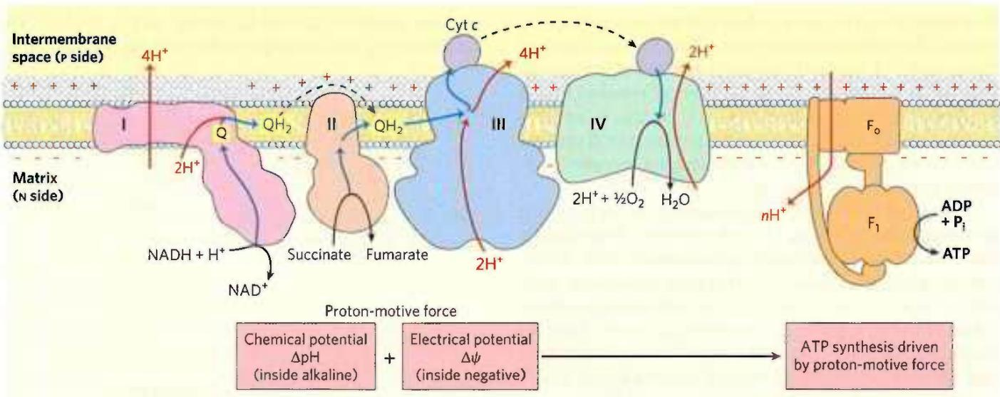

FIGURE 19-19 Chemiosmotic model. In this simple representation of the chemiosmotic theory applied to mitochondria, electrons from NADH and other oxidizable substrates pass through a chain of carriers arranged asymmetrically in the inner membrane. Electron flow is accompanied by proton transfer across the membrane, producing both a chemical gradient ( $\Delta pH$ )

and an electrical gradient ( $\Delta\psi$ ), which, combined, create the proton-motive force. The inner mitochondrial membrane is impermeable to protons; protons can reenter the matrix only through proton-specific channels ( $F_{o}$ ). The proton-motive force that drives protons back into the matrix provides the energy for ATP synthesis, catalyzed by the $F_{1}$ complex associated with $F_{o}$ .

(a)  

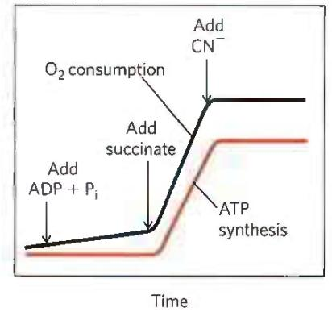  
(b)  
FIGURE 19-20 Coupling of electron transfer and ATP synthesis in mitochondria. In experiments to demonstrate coupling, mitochondria are suspended in a buffered medium, and an $\mathrm{O}_2$ electrode monitors $\mathrm{O}_2$ consumption. At intervals, samples are removed and assayed for the presence of ATP. (a) Addition of ADP and $\mathsf{P}_{\mathsf{i}}$ alone results in little or no increase in either respiration ( $\mathrm{O}_2$ consumption; black) or ATP synthesis (red). When succinate is added, respiration begins immediately, and ATP

of antibiotics to explore mitochondrial function, showed coupling of oxidation and phosphorylation by using oligomycin and venturicidin. These toxic antibiotics bind to the ATP synthase in mitochondria, inhibiting both ATP synthesis and the transfer of electrons through the chain of carriers to $O_{2}$ (Fig. 19-20b). As oligomycin does not interact with the electron carriers, it follows that electron transfer and ATP synthesis are obligately coupled: neither reaction occurs without the other.

Chemiosmotic theory readily explains the dependence of electron transfer on ATP synthesis in mitochondria. When the flow of protons into the matrix through the proton channel of ATP synthase is blocked (with oligomycin, for example), no path exists for the return of protons to the matrix, and the continued extrusion of protons driven by the activity of the respiratory chain generates a large proton gradient. The proton-motive force builds up until the cost (free energy) of pumping protons out of the matrix against this gradient equals or exceeds the energy released by the transfer of electrons from NADH to $O_{2}$ . At this point electron flow must stop; the free energy for the overall process of electron flow coupled to proton pumping becomes zero, and the system is at equilibrium.

Certain conditions and reagents, however, can uncouple oxidation from phosphorylation. When intact mitochondria are disrupted by treatment with detergent or by physical shear, the resulting membrane fragments can still catalyze electron transfer from succinate or NADH to $O_{2}$ , but no ATP synthesis is coupled to this respiration. Certain chemical compounds cause uncoupling without physically disrupting mitochondrial structure. Chemical uncouplers include 2,4-dinitrophenol (DNP) and carbonylcyanide-p-trifluoromethoxyphenylhydrazone (FCCP) (Table 19-4; Fig. 19-21), weak acids with hydrophobic properties that permit them to diffuse readily across mitochondrial membranes. After entering the matrix in the protonated form, they can release a proton, thus dissipating the proton gradient. Resonance stabilization delocalizes the charge on the anionic forms, making them sufficiently hydrophobic to diffuse back across the membrane, where they can pick up a proton and repeat the process. Ionophores such as valinomycin (see Fig. 11-43) allow inorganic ions to pass easily through membranes. Ionophores uncouple electron transfer from oxidative phosphorylation by dissipating the electrical contribution to the electrochemical gradient across the mitochondrial membrane.

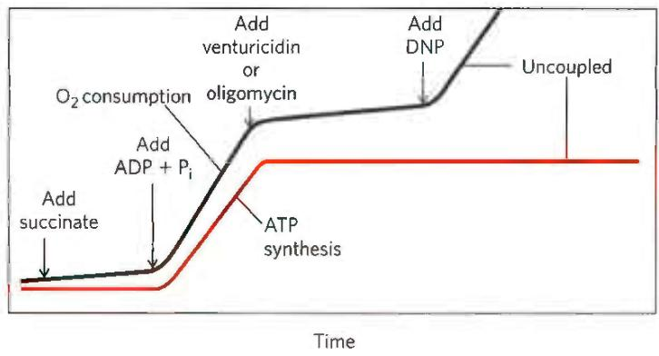  
is synthesized. Addition of cyanide (CN $^{-}$ ), which blocks electron transfer between cytochrome oxidase (Complex IV) and O $_{2}$ , inhibits both respiration and ATP synthesis. (b) Mitochondria provided with succinate respire and synthesize ATP only when ADP and P $_{i}$ are added. Subsequent addition of venturicidin or oligomycin, inhibitors of ATP synthase, blocks both ATP synthesis and respiration. Dinitrophenol (DNP) is an uncoupler, allowing respiration to continue without ATP synthesis.

A prediction of the chemiosmotic theory is that, because the role of electron transfer in mitochondrial ATP synthesis is simply to pump protons to create the electrochemical potential of the proton-motive force, an artificially created proton gradient should be able to replace electron transfer in driving ATP synthesis. This has been experimentally confirmed (Fig. 19-22). In the absence of an oxidizable substrate, the proton-motive force alone suffices to drive ATP synthesis.

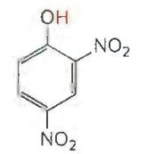  
2,4-Dinitrophenol (DNP)

  
Carbonylcyanide-p-trifluoromethoxyphenylhydrazone (FCCP)  
FIGURE 19-21 Two chemical uncouplers of oxidative phosphorylation. Both DNP and FCCP have a dissociable proton (red) and are very hydrophobic. They carry protons across the inner mitochondrial membrane, dissipating the proton gradient. Both also uncouple photophosphorylation.

#### [EN] ATP Synthase Has Two Functional Domains, $F_{0}$ and $F_{1}$

P2 Mitochondrial ATP synthase is an F-type ATPase (see Fig. 11-40b) similar in structure and mechanism to the ATP synthases of bacteria and (as we will see in Chapter 20) chloroplasts. This large enzyme complex of the inner mitochondrial membrane catalyzes the formation of ATP from ADP and $\mathbf{P}_{\mathrm{i}}$ , driven by the flow of protons from the P to the N side of the membrane (Eqn 19-10). ATP synthase, also called Complex V to relate it to the electron-transfer complexes described in the last section, has two distinct components. These are $\mathbf{F}_{\mathrm{i}}$ , a peripheral membrane protein, and $\mathbf{F}_{\mathrm{o}}$ (o denoting oligomycin-sensitive), which is integral to the membrane. $\mathbf{F}_{\mathrm{l}}$ , the first factor recognized as essential for oxidative phosphorylation, was identified and purified by Efraim Racker and his colleagues in the early 1960s.

  
FIGURE 19-22 Evidence for the role of a proton gradient in ATP synthesis. An artificially imposed electrochemical gradient can drive ATP synthesis in the absence of an oxidizable substrate as electron donor. In this two-step experiment, (a) isolated mitochondria are first incubated in a pH 9 buffer containing 0.1 M KCl. Slow leakage of buffer and KCl into the mitochondria eventually brings the matrix into equilibrium with the surrounding medium. No oxidizable substrates are present. (b) Mitochondria are now removed from the pH 9 buffer and resuspended in pH 7 buffer containing valinomycin but no KCl. The change in buffer creates a difference of two pH units across the inner mitochondrial membrane. The outward flow of $K^{+}$ , carried by valinomycin down the $K^{+}$ ion concentration gradient without a counterion, creates a charge imbalance across the membrane (matrix negative). The sum of the chemical potential provided by the pH difference and the electrical potential provided by the separation of charges is a proton-motive force large enough to support ATP synthesis in the absence of an oxidizable substrate.

In the laboratory, small membrane vesicles formed from inner mitochondrial membranes carry out ATP synthesis coupled to electron transfer. When $F_{1}$ is gently extracted, the “stripped” vesicles still contain intact respiratory chains and the $F_{0}$ portion of ATP synthase. P5 The vesicles can catalyze electron transfer from NADH to $O_{2}$ but cannot produce a proton gradient: $F_{0}$ has a proton pore through which protons leak as fast as they are pumped by electron transfer, and without a proton gradient the $F_{1}$ -depleted vesicles cannot make ATP. Isolated $F_{1}$ catalyzes ATP hydrolysis (the reversal of synthesis) and was therefore originally called $F_{1}$ ATPase. When purified $F_{1}$ is added back to the depleted vesicles, it reassociates with $F_{0}$ , plugging its proton pore and restoring the membrane’s capacity to couple electron transfer and ATP synthesis.

#### [EN] ATP Is Stabilized Relative to ADP on the Surface of $F_{1}$

Isotope exchange experiments using purified $F_{1}$ reveal an extraordinary fact about the enzyme's catalytic mechanism: on the enzyme surface, the reaction $ADP + P_{i} \rightleftharpoons ATP + H_{2}O$ is readily reversible—the free-energy change for ATP synthesis is close to zero. When ATP is hydrolyzed by $F_{1}$ in the presence of ${}^{18}O$ -labeled water, the $P_{i}$ released contains an ${}^{18}O$ atom. Careful measurement of the ${}^{18}O$ content of $P_{i}$ formed in vitro by $F_{1}$ -catalyzed hydrolysis of ATP reveals that the $P_{i}$ has not one but three or four ${}^{18}O$ atoms (Fig. 19-23). This indicates that the terminal pyrophosphate bond in ATP is cleaved and re-formed repeatedly before $P_{i}$ leaves the enzyme surface. This exchange reaction occurs in unenergized $F_{0}F_{1}$ complexes (with no proton gradient) and with isolated $F_{1}$ —the exchange does not require the input of energy.

Kinetic studies of the initial rates of ATP synthesis and hydrolysis confirm the conclusion that $\Delta G^{\prime\circ}$ for ATP synthesis on the enzyme is near zero. From the measured rates of hydrolysis ( $k_{1} = 10$ s $^{-1}$ ) and synthesis ( $k_{-1} = 24$ s $^{-1}$ ), the calculated equilibrium constant for the reaction

$$
\mathrm{Enz-ATP} \rightleftharpoons \mathrm{Enz-(ADP+P} _ {\mathrm{i}})
$$

is

$$
K _ {\mathrm{eq}} ^ {\prime} = \frac {k _ {- 1}}{k _ {1}} = \frac {2 4 \mathrm{s} ^ {- 1}}{1 0 \mathrm{s} ^ {- 1}} = 2. 4
$$

From this $K_{eq}^{\prime}$ , the calculated apparent $\Delta G^{\prime\circ}$ is close to zero. This is much different from the $K_{eq}^{\prime}$ of about $10^{5}$ ( $\Delta G^{\prime\circ} = -30.5$ kJ/mol) for the hydrolysis of ATP free in solution (i.e., not on the enzyme surface).

What accounts for the huge difference? ATP synthase stabilizes ATP relative to ADP + P $_{i}$ by binding ATP more tightly, releasing enough energy to counterbalance the cost of making ATP. Careful measurements of the binding constants show that F $_{o}$ F $_{1}$ binds ATP with very high affinity ( $K_{d} \leq 10^{-12}$ M) and ADP with much lower

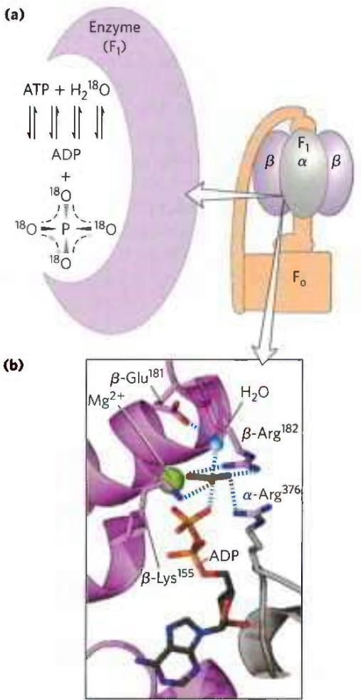  
FIGURE 19-23 Catalytic mechanism of $F_{1}$ . (a) An $^{18}\mathrm{O}$ -exchange experiment. $F_{1}$ solubilized from mitochondrial membranes is incubated with ATP in the presence of $^{18}\mathrm{O}$ -labeled water. At intervals, a sample of the solution is withdrawn and analyzed for the incorporation of $^{18}\mathrm{O}$ into the $P_{i}$ produce from ATP hydrolysis. In minutes, the $P_{i}$ contains three or four $^{18}\mathrm{O}$ atoms, indicating that both ATP hydrolysis and ATP synthesis have occurred several times during the incubation. (b) The likely transition state complex for ATP hydrolysis and synthesis by ATP synthase. The $\alpha$ subunit is shown in gray, $\beta$ in purple. The positively charged residues $\beta -\mathrm{Arg}^{182}$ and $\alpha -\mathrm{Arg}^{376}$ coordinate two oxygens of the pentavalent phosphate intermediate; $\beta -\mathrm{Lys}^{155}$ interacts with a third oxygen, and the $\mathrm{Mg}^{2+}$ ion further stabilizes the intermediate. The blue sphere represents the leaving group $(\mathrm{H}_{2}\mathrm{O})$ . These interactions result in ready equilibration of ATP and ADP + $P_{i}$ in the active site. [(b) Data from PDB ID 1BMF, J.P. Abrahams et al., Nature 370:621, 1994.]

FIGURE 19-24 Reaction coordinate diagrams for ATP synthase and for a more typical enzyme. In a typical enzyme-catalyzed reaction (left), reaching the transition state ( $\ddagger$ ) between substrate and product is the major energy barrier to overcome. In the reaction catalyzed by ATP synthase (right), release of ATP from the enzyme, not formation of ATP, is the major energy barrier. The free-energy change for the formation of ATP from ADP and F in aqueous solution is large and positive, but on the enzyme surface, the very tight binding of ATP provides sufficient binding energy to bring the free energy of the enzyme-bound ATP close to that of ADP + P $_{i}$ , so the reaction is readily reversible. The equilibrium constant is near 1. The free energy required for the release of ATP is provided by the proton-motive force.

affinity ( $K_{d} \approx 10^{-5}$ M). The difference in $K_{d}$ corresponds to a difference of about 40 kJ/mol in binding energy, and this binding energy drives the equilibrium toward formation of the product ATP.

#### [EN] The Proton Gradient Drives the Release of ATP from the Enzyme Surface

Although ATP synthase equilibrates ATP with ADP + P $_{i}$ , in the absence of a proton gradient the newly synthesized ATP does not leave the surface of the enzyme. Effectively, the enzyme cannot turn over and synthesize a second molecule of ATP. It is the proton gradient that causes the enzyme to release the ATP formed on its surface. The reaction coordinate diagram of the process (Fig. 19-24) illustrates the difference between the mechanism of ATP synthase and that of many other enzymes that catalyze endergonic reactions.

For the continued synthesis of ATP, the enzyme must cycle between a form that binds ATP very tightly and a form that releases ATP. Chemical and crystallographic studies of the ATP synthase have revealed the structural basis for this alternation in function.

#### [EN] Each $\beta$ Subunit of ATP Synthase Can Assume Three Different Conformations

Mitochondrial $F_{1}$ has nine subunits of five different types, with the composition $\alpha_{3}\beta_{3}\gamma\delta\varepsilon$ . Each of the three $\beta$ subunits has one catalytic site for ATP synthesis. The crystallographic determination of the $F_{1}$ structure by John E. Walker and colleagues revealed structural details that help explain the catalytic mechanism of the enzyme. The knoblike portion of $F_{1}$ is a flattened sphere, 8 nm by 10 nm, consisting of alternating $\alpha$ and $\beta$ subunits arranged like the sections of an orange (Fig. 19-25a–d). Although the amino acid sequences of the three $\beta$ subunits are identical, their conformations differ. The conformational differences extend to differences in their ATP/ADP-binding sites. When the protein is crystallized in the presence of ADP and App(NH)p, a close structural analog of ATP that cannot be hydrolyzed by the ATPase activity of $F_{1}$ , the binding site of one of the three $\beta$ subunits is filled with

  
Reaction coordinate

FIGURE 19-25 Mitochondrial ATP synthase complex. (a) A cartoon representation of the $F_{0}F_{1}$ complex. The dimeric form is found in eukaryotic mitochondria. The monomeric form is observed in bacteria. (b) $F_{1}$ viewed from above (that is, from the n side of the membrane), showing the three $\beta$ (shades of purple) and three $\alpha$ (shades of gray) subunits and the central shaft ( $\gamma$ subunit, green). Each $\beta$ subunit, near its interface with the neighboring $\alpha$ subunit, has a nucleotide-binding site critical to the catalytic activity. The single $\gamma$ subunit associates primarily with one of the three $\alpha\beta$ pairs, forcing each of the three $\beta$ subunits into slightly different conformations, with different nucleotide-binding sites. In the crystalline enzyme, one subunit, $\beta$ -ADP, has ADP (yellow) in its binding site; the next, $\beta$ -ATP, has ATP (red); and the third, $\beta$ -empty, has no bound nucleotide. (c) The entire enzyme viewed from the side (in the plane of the membrane). The $F_{1}$ portion has three $\alpha$ subunits and three $\beta$ subunits arranged like the segments of an orange around a central shaft, the $\gamma$ subunit (green). (Two $\alpha$ subunits and one $\beta$ subunit have been omitted to reveal the $\gamma$ subunit and the binding sites for ATP and ADP on the $\beta$ subunits.) The $\delta$ subunit confers oligomycin sensitivity on the ATP synthase, and the $\varepsilon$ subunit may serve to inhibit the enzyme's ATPase activity under some circumstances. The $F_{0}$ subunit consists of one a subunit and two b subunits, which anchor the $F_{0}F_{1}$ complex in the membrane and act as a stator (the stationary part of a rotary system), holding the $\alpha$ and $\beta$ subunits in place. $F_{0}$ also includes the c ring, made up of a number (8 to 17, depending on the species) of identical c subunits, small, hydrophobic proteins. The c ring and the a subunit interact to provide a transmembrane path for protons. Each of the c subunits in $F_{0}$ has a critical Asp residue near the middle of the membrane, which undergoes protonation/deprotonation during the catalytic cycle of the ATP synthase. Shown here is the homologous $c_{11}$ ring of the Na $^{+}$ -ATPase of Ilyobacter tartaricus, for which the structure is well established. The Na $^{+}$ -binding sites, which correspond to the proton-binding sites of the $F_{0}F_{1}$ complex, are shown with their bound Na $^{+}$ ions (red spheres). (d) A view of $F_{0}$ perpendicular to the membrane. As in (c), red spheres represent the Na $^{+}$ - or proton-binding sites in Asp residues. [(a) Information from W. Kühlbrandt and K. M. Davies, Trends Biochem. Sci. 41:106, 2016. (b, c, d) Data from F $_{i}$ : PDB ID 1BMF, J. P. Abrahams et al., Nature 370:621, 1994; PDB ID J.NV, A.C. Hausrath et al., J. Biol. Chem. 276:47,227, 2001; PDB ID 2A7U, S. Wilkens et al., Biochemistry 44:11,786, 2005; PDB ID 2CLY, V. Kane Dickson et al., EMBO J. 25:2911, 2006; F $_{0}$ : PDB ID 1B9U, O. Dmitriev et al., J. Biol. Chem. 274:15,598, 1999; c ring: PDB ID 1YCE, T. Meier et al., Science 308:659, 2005.]

(b) Top view of $F_{1}$  
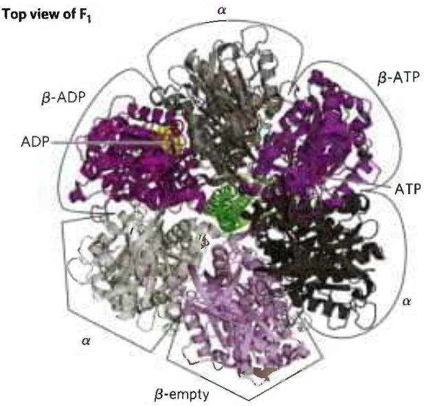

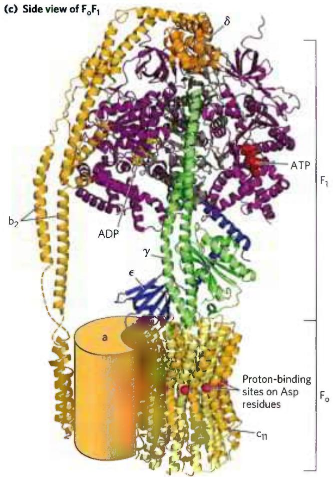

App(NH)p, the second is filled with ADP, and the third is empty. The corresponding $\beta$ subunit conformations are designated $\beta$ -ATP, $\beta$ -ADP, and $\beta$ -empty (Fig. 19-25b). This difference in nucleotide binding among the three subunits is critical to the mechanism of the complex. The polypeptides that make up the stalk in the $F_{1}$ crystal structure are asymmetrically arranged. One domain of the single $\gamma$ subunit makes up a central shaft that passes through $F_{1}$ . Another globular domain of $\gamma$ helps to stabilize the $\beta$ -empty conformation in a $\beta$ subunit it is transiently associated with (Fig. 19-25c).

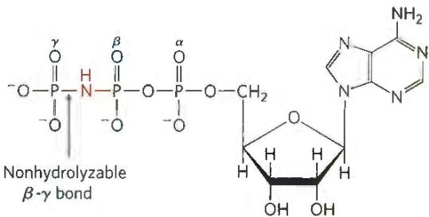  
App(NH)p (β,γ-imidoadenosine 5'-triphosphate)

The $F_{0}$ complex, with its proton pore, is composed of three subunits, a, b, and c, in the proportion $ab_{2}c_{n}$ , where n ranges from 8 to 17, depending on the species. Subunit c is a small ( $M_{r}$ 8,000), very hydrophobic polypeptide, consisting almost entirely of two transmembrane helices, with a small loop extending from the matrix side of the membrane. The crystal structure of the yeast $F_{0}F_{1}$ shows 10 c subunits, each with two transmembrane helices roughly perpendicular to the plane of the membrane and arranged in two concentric circles to create the c ring. The inner circle is made up of the amino-terminal helices of each c subunit; the outer circle, about 55 Å in diameter, is made up of the carboxyl-terminal helices. The c subunits in the c ring rotate together as a unit around an axis perpendicular to the membrane. The ε and γ subunits of $F_{1}$ form a leg-and-foot that projects from the bottom (membrane) side of $F_{1}$ and stands firmly on the ring of c subunits. The a subunit consists of several hydrophobic helices that span the membrane in close association with one of the c subunits in the c ring.

#### [EN] Rotational Catalysis Is Key to the Binding-Change Mechanism for ATP Synthesis

On the basis of detailed kinetic and binding studies of the reactions catalyzed by $F_{0}F_{1}$ , Paul Boyer proposed a rotational catalysis mechanism in which the three active sites of $F_{1}$ take turns catalyzing ATP synthesis (Fig. 19-26). A given $\beta$ subunit starts in the $\beta$ -ADP conformation, which binds ADP and $P_{i}$ from the surrounding medium. The subunit now changes conformation, assuming the $\beta$ -ATP form that tightly binds and stabilizes ATP, bringing about the ready equilibration of ADP + $P_{i}$ with ATP on the enzyme surface. Finally, the subunit changes to the $\beta$ -empty conformation, which has very low affinity for ATP, and the newly synthesized ATP leaves the enzyme surface. Another round of catalysis begins when this subunit again assumes the $\beta$ -ADP form and binds ADP and $P_{i}$ .

  
FIGURE 19-26 Binding-change model for ATP synthase. The $F_{i}$ complex has three nonequivalent adenine nucleotide-binding sites, one for each pair of $\alpha$ and $\beta$ subunits. At any given moment, one of these sites is in the $\beta$ -ATP conformation (which binds ATP tightly), a second is in the $\beta$ -ADP (loose-binding) conformation, and a third is in the $\beta$ -empty (very-loose-binding) conformation. In this view from the n side, the proton-motive force causes rotation of the central shaft — the $\gamma$ subunit, shown as a green arrowhead — which comes into contact with each $\alpha\beta$ subunit pair in succession. This produces a cooperative conformational change in which the $\beta$ -ATP site is converted to the $\beta$ -empty conformation, and ATP dissociates; the $\beta$ -ADP site is converted to the $\beta$ -ATP conformation, which promotes condensation of bound ADP + P $_{i}$ to form ATP; and the $\beta$ -empty site becomes a $\beta$ -ADP site, which loosely binds ADP + P $_{i}$ entering from the solvent. Note that the direction of rotation reverses when the ATP synthase is acting as an ATPase, as in the experiment depicted in Figure 19-27.

P5 The conformational changes central to this mechanism are driven by the passage of protons through the $F_{0}$ portion of ATP synthase. The streaming of protons through the $F_{0}$ pore causes the c ring and the attached $\gamma$ subunit to rotate about the long axis of $\gamma$ , which is perpendicular to the plane of the membrane. The $\gamma$ subunit passes through the center of the $\alpha_{3}\beta_{3}$ spheroid, which is held stationary relative to the membrane surface by the $b_{2}$ and $\delta$ subunits (Fig. 19-25a). With each rotation of $120^{\circ}$ , $\gamma$ comes into contact with a different $\beta$ subunit, and the contact forces that $\beta$ subunit into the $\beta$ -empty conformation.

The three $\beta$ subunits interact in such a way that when one assumes the $\beta$ -empty conformation, its neighbor to one side must assume the $\beta$ -ADP form, and the other neighbor the $\beta$ -ATP form. Thus, one complete rotation of the $\gamma$ subunit causes each $\beta$ subunit to cycle through all three of its possible conformations, and for each rotation, three ATP are synthesized and released from the enzyme surface.

One strong prediction of this binding-change model is that the $\gamma$ subunit should rotate in one direction when $F_{0}F_{1}$ is synthesizing ATP and in the opposite direction when the enzyme is hydrolyzing ATP. This prediction of rotation with ATP hydrolysis was confirmed in elegant experiments in the laboratories of Masasuke Yoshida and Kazuhiko Kinosita, Jr. The rotation of $\gamma$ in a single $F_{1}$ molecule was observed microscopically by attaching a long, thin, fluorescent actin polymer to $\gamma$ and watching it move relative to $\alpha_{3}\beta_{3}$ immobilized on a microscope slide as ATP was hydrolyzed. (The expected reversal of the rotation when ATP is being synthesized could not be tested in this experiment; there is no proton gradient to drive ATP synthesis.) When the entire $F_{0}F_{1}$ complex (not just $F_{1}$ ) was used in a similar experiment, the entire ring of c subunits rotated with $\gamma$ (Fig. 19-27). The “shaft” rotated in the predicted direction through 360°. The rotation was not smooth but occurred in three discrete steps of 120°. As calculated from the known rate of ATP hydrolysis by one F $_{1}$ molecule and from the frictional drag on the long actin polymer, the efficiency of this mechanism in converting chemical energy into motion is close to 100%. It is, in Boyer's words, "a splendid molecular machine!"

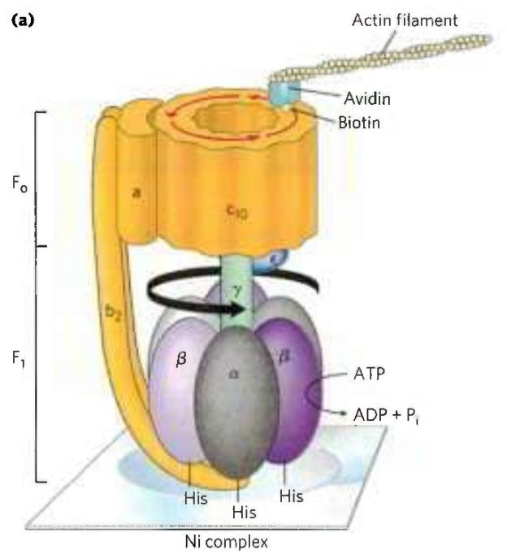

(b)  
  
FIGURE 19-27 Experimental demonstration of rotation of $F_{0}$ and $\gamma$ . This fundamental property of the ATP synthase reaction was demonstrated in several creative ways. (a) In one experiment, illustrated in this cartoon, $F_{1}$ , genetically engineered to contain a run of His residues, was tightly adhered to a microscope slide coated with a Ni complex; biotin was covalently attached to a c subunit of $F_{0}$ . The protein avidin, which binds biotin very tightly, was covalently attached to long filaments of actin labeled with a fluorescent probe. Biotin-avidin binding then attached the actin filaments to the c subunit. When ATP was provided as substrate for the ATPase activity of $F_{1}$ , the labeled filament rotated in one direction, proving that the $F_{0}$ cylinder of c subunits rotates. (b) In another experiment, a fluorescent actin filament was attached directly to the $\gamma$ subunit. The series of fluorescence micrographs (read left to right) shows the position of the actin filament at intervals of 133 ms. Note that as the filament rotated, it made discrete jumps rather than smooth rotation about the circle. The cylinder and shaft move as one unit. ([a] Information from Y. Sambongi et al., Science 286:1722, 1999. (b) Courtesy Hiroyuki Noji.]

P5 A model that illustrates how proton flow and rotary motion are coupled in the $F_{0}$ complex is shown in Figure 19-28. The a subunit is stationary, while the c ring rotates. Critical interactions occur between conserved amino acids in the a and c subunits. The individual subunits in the c ring are arranged in a circle with only a few ir. contact with the a subunit at any moment. Protons diffuse across the membrane through a path made up of both a and c subunits. Transient protonation of a key Glu residue in each c subunit elicits conformation changes that drive rotation and transmit protons between hydrophilic half channels positioned on each side of the membrane. The rotary movement of the c ring is made unidirectional by the large difference in proton concentration across the membrane. The number of protons that must be transferred to produce one complete rotation cf the c ring is equal to the number of c subunits in the ring. Structural studies of the c ring have shown that the number of c subunits differs in different organisms (Fig. 19-29). In bovine mitochondria the number is 8, in yeast mitochondria and in Escherichia coli it is 10, and the number of c subunits can range as high as 17, as is seen in the soil bacterium Burkholderia pseudomallei. The rate of rotation in intact mitochondria has been estimated at about 6,000 rpm—100 rotations per second.

  
FIGURE 19-28 A model for proton-driven rotation of the c ring. The a subunit of the $F_{o}$ complex of the ATP synthase (see Fig. 19-25a) has two hydrophilic half-channels for protons, one leading from the p side to the middle of the membrane, the other leading from the middle of the membrane to the n side (matrix). The function of the stationary a subunit is to conduct protons to and from the c ring subunits to drive c ring rotational motion. Individual c subunits in $F_{o}$ (the total number varies from 8 to 17 in different species) are arranged in a circle about a central core. Each c subunit has a critical Glu residue (an Asp in some species) about midway across the membrane, with a perturbed $pK_{a}$ allowing it to donate or accept a proton (red $H^{+}$ ) at pH near neutrality. The cycle that c subunits go through is illustrated. One c subunit is initially positioned so that a proton that enters the half-channel on the p side (where the proton concentration is relatively high) encounters and protonates a conserved His residue in the a subunit, transferring it to the c subunit Glu residue. This triggers a rotation-facilitating conformational change in the protonated c subunit as the Glu loses its negative charge. The now neutral Glu residue is sequestered in the hydrophobic membrane layer as it rotates as part of the c ring. As the c ring rotates, the c subunit we are following eventually makes contact with the channel to the n side of the membrane, where the environment is relatively alkaline, and the proton is released. As the Glu reacquires its negative charge, another rotation-facilitating conformational change occurs such that the Glu interacts transiently with a conserved Arg residue in the immobile a subunit. The interaction with the Arg is disrupted as the Glu is again protonated by the His residue, in motions that again facilitate rotation. The c subunits positioned near the half channels are providing the rotational driving force at any given moment, as they are the ones undergoing conformation changes associated with protonation and deprotonation. The orientation of the proton gradient dictates the direction of proton flow and makes rotation of the c ring essentially unidirectional. [Information from W. Kühlbrandt and K. M. Davies, Trends Biochem. Sci. 41:106, 2016.]

#### [EN] Chemiosmotic Coupling Allows Nonintegral Stoichiometries of $\mathrm{O}_2$ Consumption and ATP Synthesis

The overall reaction equation for ATP synthesis has the following form:

$$
\begin{array}{r l} x \mathrm{ADP} + x \mathrm {P_ {i}} + \frac {1}{2} \mathrm {O_ {2}} + \mathrm {H^ {+}} + \mathrm{NADH} & \longrightarrow \\ x \mathrm{ATP} + \mathrm {H_ {2} O} + \mathrm {NA D ^ {+}} \end{array}\tag{19-11}
$$

The value of x is sometimes called the P/O ratio or the $P/2e^{-}$ ratio. When a proton gradient is coupled to ATP synthesis as described above, there is no theoretical requirement for P/O to be integral. The relevant questions about stoichiometry become these: How many protons are pumped outward by electron transfer from one NADH to $O_{2}$ ? and How many protons must flow inward through the $F_{0}F_{1}$ complex to drive the synthesis of one ATP? The measurement of proton fluxes is technically complicated; the investigator must take into account the buffering capacity of mitochondria, nonproductive leakage of protons across the inner membrane, and use of the proton gradient for functions other than ATP synthesis, such as driving the transport of substrates across the inner mitochondrial membrane (described below). When NADH or succinate (which sends electrons into the respiratory chain at the level of ubiquinone) is the oxidizable substrate, the consensus experimental values for number of protons pumped out per pair of electrons are 10 and 6, respectively. The most widely accepted experimental value for number of protons required to drive the synthesis of an ATP molecule is 4, of which 1 is used in transporting $P_{i}$ , ATP, and ADP across the mitochondrial membrane (see below). If 10 protons are pumped out per NADH and 4 must flow in to produce 1 ATP, the proton-based P/O ratio is 2.5 for NADH as the electron donor and 1.5 (6/4) for succinate. However, as we will see in Worked Example 19-2, the proton stoichiometry of ATP synthesis by ATP synthase depends upon the number of c units in $F_{0}$ , which ranges from 8 to 17, depending on the species.

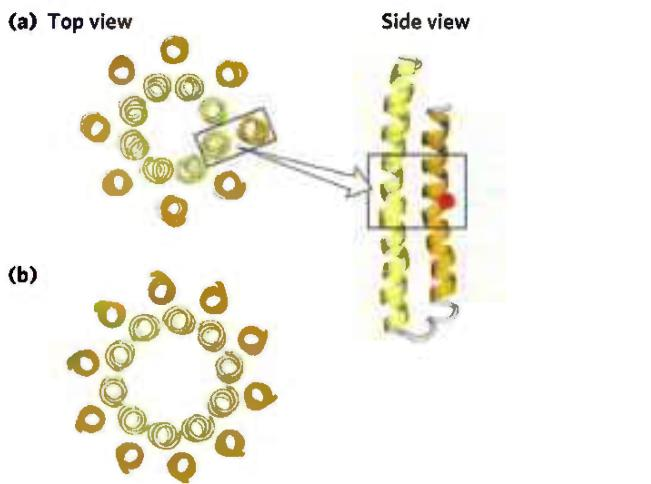  
(d)

(c)  

  
FIGURE 19-29 Species differences in number of c subunits in the c ring of the $F_{0}$ complex. The structures of the c rings from several species have been determined by x-ray crystallography. Each helix in the inner ring is half of a hairpin-shaped c subunit; the outer ring of helices forms the other half of the hairpin structure. The essential Glu residue (Asp in some species) is shown as a red dot. Views of the c ring perpendicular to the membrane show the number of c subunits for (a) bovine mitochondria (8 subunits) and (b) yeast mitochondria (10). Atomic force microscopy has been used to visualize the c rings of (c) a thermophilic bacterium, Bacillus species TA2.A1 (13 subunits), and (d) spinach (14). According to the model in Figure 19-28, different numbers of c subunits in the c ring should result in different ratios of ATP formed per pair of electrons passing through the respiratory chain (i.e., different P/O ratios). ([a) Data from PDB ID 10HH, E. Cabezon et al., Nat. Struct. Biol. 10:744, 2003. (c) Republished with permission of Elsevier from J. Mol. Biol, Matthies, et al., Vol. 388(3), ©2009; permission conveyed through Copyright Clearance Center, Inc. (d) H. Seelert et al. Structural biology: Proton-powered turbine of a plant motor. Nature 405, 418–419. Reprinted by permission from Macmillan Publishers Ltd.]

#### [EN] WORKED EXAMPLE 19-2 Stoichiometry of ATP Production: Effect of c Size

(a) If the ATP synthase of bovine mitochondria has 8 c subunits per c ring, what is the predicted ratio of ATP formed per NADH oxidized? (b) What is the predicted value for yeast mitochondria, with 10 c subunits per ATP synthase? (c) What are the comparable values for electrons entering the respiratory chain from FADH $_{2}$ ?

SOLUTION: (a) Here we are asked to determine how many ATP molecules are produced per NADH. This is another way of asking us to calculate the P/O ratio, or x, in Equation 19-11. If the c ring has 8 c subunits, then one full rotation will transfer 8 protons to the matrix and produce 3 ATP molecules. But this synthesis also requires the transport of 3 P $_{i}$ into the matrix, at a cost of 1 proton each, adding 3 more protons to the total number required. This brings the total cost to (11 protons)/(3 ATP) = 3.7 protons/ATP. The generally agreed value for the number of protons pumped out per pair of electrons transferred from NADH is 10 (Eqn 19-7). So, oxidizing 1 NADH produces (10 protons)/(3.7 protons/ATP) = 2.7 ATP.

(b) If the c ring has 10 c subunits, then one full rotation will transfer 10 protons to the matrix and produce 3 ATP molecules. Adding in the 3 protons to transport the 3 P $_{i}$ into the matrix brings the total cost to (13 protons)/(3 ATP) = 4.3 protons/ATP. Oxidizing 1 NADH produces (10 protons)/(4.3 protons/ATP) = 2.3 ATP.

(c) When electrons enter the respiratory chain from FADH $_2$ (at ubiquinone), only 6 protons are available to drive ATP synthesis. This changes the calculation for bovine mitochondria to (6 protons)/(3.7 protons/ATP)=1.6 ATP per pair of electrons from FADH $_2$ . For yeast mitochondria, the calculation is (6 protons)/(4.3 protons/ATP)=1.4 ATP per pair of electrons from FADH $_2$ .

These calculated values of x, or the P/O ratio, define a range that includes the experimental values of 2.5 ATP/NADH and 1.5 ATP/FADH $_{2}$ , and we therefore use these values throughout this book.

#### [EN] The Proton-Motive Force Energizes Active Transport

Although the primary role of the proton gradient in mitochondria is to furnish energy for the synthesis of ATP, the proton-motive force also drives several transport processes essential to oxidative phosphorylation. The inner mitochondrial membrane is generally impermeable to charged species, but two specific systems transport ADP and $P_{i}$ into the matrix and ATP out to the cytosol (Fig. 19-30).

The adenine nucleotide translocase, integral to the inner membrane, binds ADP $^{3-}$ in the intermembrane space and transports it into the matrix in exchange for an ATP $^{4-}$ molecule simultaneously transported outward (see Fig. 13-11 for the ionic forms of ATP and ADP). Because this antiporter moves four negative charges out for every three moved in, its activity is favored by the transmembrane electrochemical gradient, which gives the matrix a net negative charge; the proton-motive force drives ATP-ADP exchange. Adenine nucleotide translocase is specifically inhibited by atractyloside, a toxic glycoside produced by a species of thistle. If the transport of ADP into and ATP out of mitochondria is inhibited, cytosolic ATP cannot be regenerated from ADP, explaining the toxicity of atractyloside.

A second membrane transport system essential to oxidative phosphorylation is the phosphate translocase, which promotes symport of one $H_{2}PO_{4}^{-}$ and one $H^{+}$ into the matrix. This transport process, too, is favored by the transmembrane proton gradient (Fig. 19-30). Notice that the process requires movement of one proton from the P side to the N side of the inner membrane, consuming some of the energy of electron transfer. A complex of the ATP synthase and both translocases, the ATP synthasome, can be isolated from mitochondria by gentle dissection with detergents, suggesting that the functions of these three proteins are very tightly integrated.

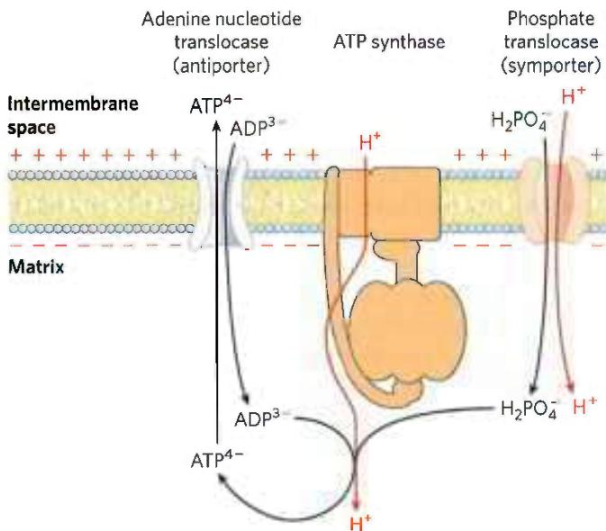  
FIGURE 19-30 Adenine nucleotide and phosphate translocases. Transport systems of the inner mitochondrial membrane carry ADP and $P_{i}$ into the matrix and newly synthesized ATP into the cytosol. The adenine nucleotide translocase is an antiporter; the same protein moves ADP into the matrix and ATP out. The effect of replacing ATP $^{4-}$ with ADP $^{3-}$ in the matrix is the net efflux of one negative charge, which is favored by the charge difference across the inner membrane (outside positive). At pH 7, $P_{i}$ is present as both HPO $_{4}^{2-}$ and H $_{2}$ PO $_{4}^{-}$ ; the phosphate translocase is specific for H $_{2}$ PO $_{4}^{-}$ . There is no net flow of charge during symport of H $_{2}$ PO $_{4}^{-}$ and H $^{+}$ , but the relatively low proton concentration in the matrix favors the inward movement of H $^{+}$ . Thus the proton-motive force is responsible both for providing the energy for ATP synthesis and for transporting substrates (ADP and $P_{i}$ ) into and product (ATP) out of the mitochondrial matrix. All three of these transport systems can be isolated as a single membrane-bound complex (ATP synthasome).

ATP and ADP cross the outer mitochondrial membrane via the voltage-dependent anion channel (VDAC), a 19-stranded $\beta$ barrel with an opening about $27\AA$ wide, connecting the cytosol and the intermembrane space. Each VDAC, when open, can move $10^{5}$ ATP molecules per second. The opening is gated by voltage, as its name indicates, and under some conditions VDAC is closed to ATP.

#### [EN] Shuttle Systems Indirectly Convey Cytosolic NADH into Mitochondria for Oxidation

The NADH dehydrogenase of the inner mitochondrial membrane of animal cells can accept electrons only from NADH in the matrix. Given that the inner membrane is

not permeable to NADH, how can the NADH generated by glycolysis in the cytosol be reoxidized to $NAD^{+}$ by $O_{2}$ via the respiratory chain? Special shuttle systems carry reducing equivalents from cytosolic NADH into mitochondria by an indirect route. The most active NADH shuttle, which functions in liver, kidney, and heart mitochondria, is the malate-aspartate shuttle (Fig. 19-31). The reducing equivalents of cytosolic NADH are first transferred to cytosolic oxaloacetate to yield malate, catalyzed by cytosolic malate dehydrogenase. The malate thus formed passes through the inner membrane via the malate- $\alpha$ -ketoglutarate transporter. Within the matrix, the reducing equivalents are passed to $NAD^{+}$ by the action of matrix malate dehydrogenase, forming NADH; this NADH can pass electrons directly to the respiratory chain. About 2.5 molecules of ATP are generated as this pair of electrons passes to $O_{2}$ . Cytosolic oxaloacetate must be regenerated by transamination reactions and the activity of membrane transporters to start another cycle of the shuttle.

Skeletal muscle and brain use a different NADH shuttle, the glycerol 3-phosphate shuttle (Fig. 19-32). It differs from the malate-aspartate shuttle in that it delivers the reducing equivalents from NADH through FAD in glycerol 3-phosphate dehydrogenase to ubiquinone and thus into Complex III, not Complex I (Fig. 19-15), providing enough energy to synthesize only 1.5 ATP molecules per pair of electrons.

The mitochondria of plants have an externally oriented NADH dehydrogenase that can transfer electrons directly from cytosolic NADH into the respiratory chain at the level of ubiquinone. Because this pathway bypasses the NADH dehydrogenase of Complex I and the associated proton movement, the yield of ATP from cytosolic NADH is less than that from NADH generated in the matrix (Box 19-1).

  
FIGURE 19-31 Malate-aspartate shuttle. This shuttle for transporting reducing equivalents from cytosolic NADH into the mitochondrial matrix is used in liver, kidney, and heart. ① NADH in the cytosol enters the intermembrane space through openings in the outer membrane (porins), then passes two reducing equivalents to oxaloacetate, producing malate. ② Malate crosses the inner membrane via the malate-α-ketoglutarate transporter. ③ In the matrix, malate passes two reducing equivalents to  
NAD $^{+}$ , and the resulting NADH is oxidized by the respiratory chain; the oxaloacetate formed from malate cannot pass directly into the cytosol. ④ Oxaloacetate is first transaminated to aspartate, and ⑤ aspartate can leave via the glutamate-aspartate transporter. ⑥ Oxaloacetate is regenerated in the cytosol, completing the cycle, and glutamate produced in the same reaction enters the matrix via the glutamate-aspartate transporter.

#### [EN] Hot, Stinking Plants and Alternative Respiratory Pathways

Many flowering plants attract insect pollinators by releasing odorant molecules that mimic an insect's natural food sources or potential egg-laying sites. Plants pollinated by flies or beetles that normally feed on or lay their eggs in dung or carrion sometimes use foul-smelling compounds to attract these insects.

One family of stinking plants is the Araceae, which includes philodendrons, arum lilies, and skunk cabbages. These plants have tiny flowers densely packed on an erect structure, the spadix, surrounded by a modified leaf, the spathe. The spadix releases odors of rotting flesh or dung. Before pollination the spadix also heats up, in some species to as much as 20 to 40 °C above ambient temperatures. Heat production (thermogenesis) helps evaporate odorant molecules for better dispersal, and because rotting flesh and dung are usually warm from the hyperactive metabolism of scavenging microbes, the heat itself might also attract insects. In the case of the eastern skunk cabbage (Fig. 1), which flowers in late winter or early spring when snow still covers the ground, thermogenesis allows the spadix to grow up through the snow.

How does a skunk cabbage heat its spadix? The mitochondria of plants, fungi, and unicellular eukaryotes have respiratory chains that are essentially the same as those in animals, but they also have an alternative respiratory pathway. A $QH_{2}$ oxidase transfers electrons from the ubiquinone pool directly to oxygen, bypassing the two proton-translocating steps of Complexes III and IV (Fig. 2). Energy that might have been conserved as ATP is instead released as heat. Plant mitochondria also have an alternative NADH dehydrogenase, insensitive to the Complex I inhibitor rotenone (see Table 19-4), that transfers electrons from NADH in the matrix directly to ubiquinone, bypassing Complex I and its associated proton pumping. And plant mitochondria have yet another NADH dehydrogenase, on the external face of the inner membrane, that transfers electrons from NADPH or NADH in the intermembrane space to ubiquinone, again bypassing Complex I. Thus when electrons enter the alternative respiratory pathway through the rotenone-insensitive NADH dehydrogenase, the external NADH dehydrogenase, or succinate dehydrogenase (Complex II), and pass to $O_{2}$ via the cyanide-resistant alternative oxidase, energy is not conserved as ATP but is released as heat. A skunk cabbage can use the heat to melt snow, produce a foul stench, or attract beetles or flies.

  
FIGURE 1 Eastern skunk cabbage. [Collin Purrington.]

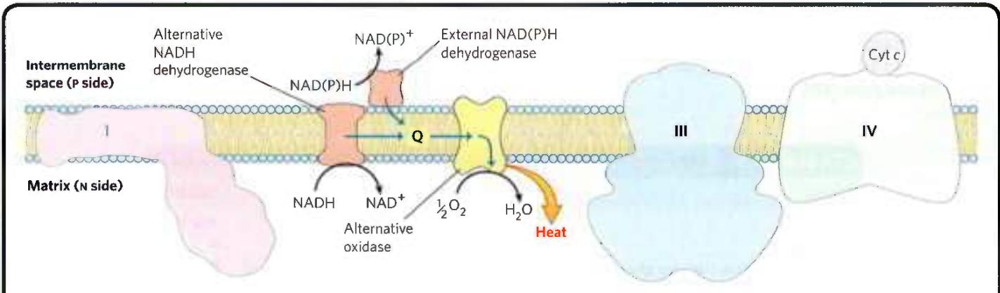  
FIGURE 2 Electron carriers of the inner membrane of plant mitochondria. Electrons can flow through Complexes I, III, and IV, as in animal mitochondria, or through plant-specific alternative carriers by the paths shown with blue arrows.

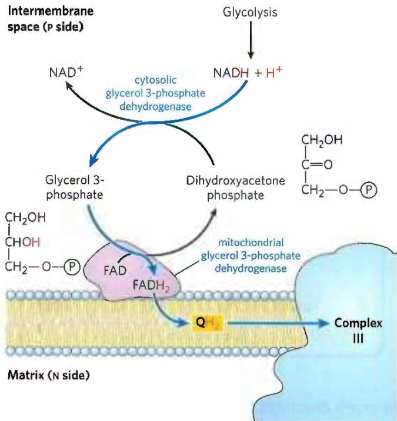  
FIGURE 19-32 Glycerol 3-phosphate shuttle. This alternative means of moving reducing equivalents from the cytosol to the respiratory chain operates in skeletal muscle and the brain. In the cytosol, dihydroxyacetone phosphate accepts two reducing equivalents from NADH in a reaction catalyzed by cytosolic glycerol 3-phosphate dehydrogenase. An isozyme of glycerol 3-phosphate dehydrogenase bound to the outer face of the inner membrane then transfers two reducing equivalents from glycerol 3-phosphate in the intermembrane space to ubiquinone. Note that this shuttle does not involve membrane transport systems.

#### [EN] SUMMARY 19.2 ATP Synthesis

The chemiosmotic theory describes the coupling of ATP synthesis to an electrochemical proton gradient. The flow of electrons through Complexes I, III, and IV results in pumping of protons across the inner mitochondrial membrane, making the matrix alkaline relative to the intermembrane space. This proton gradient provides the energy, in the form of the proton-motive force, for ATP synthesis from ADP and $P_{i}$ .

\- ATP synthase has two major components, called $F_{0}$ and $F_{1}$ . Both components have multiple subunits. The overall complex spans the inner mitochondrial membrane.

■ ATP synthesis is reversible within the active site on the $\beta$ subunits of the $F_{1}$ complex. Very tight binding to ATP offsets the negative $\Delta G$ for ATP hydrolysis in solution.

■ Release of ATP from ATP synthase is promoted by the transmembrane proton gradient.

■ The subunits of the $F_{1}$ complex cycle from $(ADP + P_{i})-$ bound to ATP-bound to empty conformations.

\- ATP synthase carries out "rotational catalysis," in which the flow of protons through $\mathbf{F}_0$ causes the c ring to rotate and in turn trigger the subunit conformational changes in $\mathbf{F}_1$ .

The ratio of ATP synthesized per $\frac{1}{2}O_{2}$ reduced to $H_{2}O$ (the P/O ratio) is about 2.5 when electrons enter the respiratory chain at Complex I, and 1.5 when electrons enter at ubiquinone. This ratio varies among species, depending on the number of c subunits in the $F_{0}$ complex.

■ Energy conserved in a proton gradient can drive solute transport uphill across a membrane.

The inner mitochondrial membrane is impermeable to NADH and $\mathrm{NAD^{+}}$ , but NADH equivalents are moved from the cytosol to the matrix by either of two shuttles. NADH equivalents moved in by the malate-aspartate shuttle enter the respiratory chain at Complex I and yield a P/O ratio of 2.5; those moved in by the glycerol 3-phosphate shuttle enter at ubiquinone and give a P/O ratio of 1.5.

<!-- EN-END 19.2 -->

<!-- EN-BEGIN 19.3 -->

### 【英文对应 19.3】Regulation of Oxidative Phosphorylation

> 来源：Lehninger Principles of Biochemistry（书籍/02_生物化学原理） 第19章 Oxidative Phosphorylation，§19.3。对应本章“三、氧化磷酸化作用”。

Oxidative phosphorylation produces most of the ATP made in aerobic cells. Complete oxidation of a molecule of glucose to $CO_{2}$ yields 30 or 32 ATP (Table 19-5). By comparison, glycolysis under anaerobic conditions (lactate fermentation) yields only 2 ATP per glucose. Clearly, the evolution of oxidative phosphorylation provided a tremendous increase in the energy efficiency of catabolism. Complete oxidation to $CO_{2}$ of the coenzyme A derivative of palmitate (16:0), which also occurs in the mitochondrial matrix, yields 108 ATP per palmitoyl-CoA (see Table 17-1). A similar calculation can be made for the ATP yield from oxidation of each of the amino acids (Chapter 18). Aerobic oxidative pathways that result in electron transfer to $O_{2}$ accompanied by oxidative phosphorylation therefore account for the vast majority of the ATP produced in catabolism, so the regulation of ATP production by oxidative phosphorylation to match the cell's fluctuating needs for ATP is absolutely essential.

<table><tr><td colspan="3">TABLE 19-5 ATP Yield from Complete Oxidation of Glucose</td></tr><tr><td>Process</td><td>Direct product</td><td>Final ATP</td></tr><tr><td rowspan="2">Glycolysis</td><td>2 NADH (cytosolic)</td><td>3 or 5a</td></tr><tr><td>2 ATP</td><td>2</td></tr><tr><td>Pyruvate oxidation (two per glucose)</td><td>2 NADH (mitochondrial matrix)</td><td>5</td></tr><tr><td rowspan="3">Acetyl-CoA oxidation in citric acid cycle 
(two per glucose)</td><td>6 NADH (mitochondrial matrix)</td><td>15</td></tr><tr><td>2 FADH2</td><td>3</td></tr><tr><td>2 ATP or 2 GTP</td><td>2</td></tr><tr><td>Total yield per glucose</td><td></td><td>30 or 32</td></tr></table>

#### [EN] Oxidative Phosphorylation Is Regulated by Cellular Energy Needs

The rate of respiration (O₂ consumption) in mitochondria is generally limited by the availability of ADP as a substrate for phosphorylation. Dependence of the rate of O₂ consumption on the availability of the P₁ acceptor, ADP (Fig. 19-20b), the acceptor control of respiration, can be remarkable. In some animal tissues, the acceptor control ratio, the ratio of the maximal rate of ADP-induced O₂ consumption to the basal rate in the absence of ADP, is at least 10.

The intracellular concentration of ADP is one measure of the energy status of cells. Another, related measure is the mass-action ratio of the ATP-ADP system, $[ATP]/([ADP][P_{i}])$ . Usually this ratio is very high, so the ATP-ADP system is almost fully phosphorylated. When the rate of some energy-requiring process (protein synthesis, for example) increases, the rate of breakdown of ATP to ADP and $P_{i}$ increases, lowering the mass-action ratio. With more ADP available for oxidative phosphorylation, the rate of respiration increases, causing regeneration of ATP. This continues until the mass-action ratio returns to its normal high level, at which point respiration slows again. The rate of oxidation of cellular fuels is regulated with such sensitivity and precision that the $[ATP]/([ADP][P_{i}])$ ratio fluctuates only slightly in most tissues, even during extreme variations in energy demand. In short, ATP is formed only as fast as it is used in energy-requiring cellular activities.

#### [EN] An Inhibitory Protein Prevents ATP Hydrolysis during Hypoxia

We have already encountered ATP synthase as an ATP-driven proton pump (see Fig. 11-40), catalyzing the reverse of ATP synthesis under some experimental conditions. When a cell is hypoxic (deprived of oxygen), as in a heart attack or a stroke, electron transfer to oxygen slows, and so does the pumping of protons. The proton-motive force soon collapses. P5 Under these conditions, the ATP synthase could operate in reverse, hydrolyzing ATP made by glycolysis to pump protons outward and causing a disastrous drop in ATP levels. This is prevented by a small (84 amino acids) protein inhibitor, $\mathrm{IF}_1$ . $\mathrm{IF}_1$ simultaneously binds to two ATP synthase molecules, inhibiting the enzyme's activity in both directions (Fig. 19-33). $\mathrm{IF}_1$ is inhibitory only in its dimeric form, which is favored at pH lower than 6.5. In a cell starved for oxygen, the main source of ATP becomes glycolysis, and the pyruvic or lactic acid thus formed lowers the pH in the cytosol and the mitochondrial matrix. This favors $\mathrm{IF}_1$ dimerization, leading to inhibition of ATP synthase and thereby preventing any wasteful hydrolysis of ATP. When aerobic metabolism resumes, production of pyruvic acid slows, the pH of the cytosol rises, the $\mathrm{IF}_1$ dimer is destabilized, and the inhibition of ATP synthase is lifted. $\mathrm{IF}_1$ is an intrinsically disordered protein (p. 117); it acquires a favored conformation only on interaction with ATP synthase. In many tumors and cancer cell lines, which rely more heavily on glycolysis for ATP generation, $\mathrm{IF}_1$ is expressed at unusually high levels.

#### [EN] Hypoxia Leads to ROS Production and Several Adaptive Responses

In hypoxic cells there is an imbalance between the input of electrons from fuel oxidation in the mitochondrial matrix and transfer of electrons to molecular oxygen, leading to increased formation of reactive oxygen species. In addition to the glutathione peroxidase system (Fig. 19-18), cells have two other lines of defense against ROS (Fig. 19-34). One is regulation of pyruvate dehydrogenase (PDH), the enzyme that delivers acetyl-CoA to the citric acid cycle (Chapter 16). Under hypoxic conditions, PDH kinase phosphorylates mitochondrial PDH, inactivating it and slowing the delivery of FADH₂ and NADH from the citric acid cycle to the respiratory chain. A second means of preventing ROS formation is the replacement of one subunit of Complex IV, known as COX4-1, with another subunit, COX4-2, that is better suited to hypoxic conditions. With COX4-1, the catalytic properties of Complex IV are optimal for respiration at normal oxygen concentrations; with COX4-2, Complex IV is optimized for operation under hypoxic conditions.

  
FIGURE 19-33 Structure of bovine F₁-ATPase in a complex with its regulatory protein IF₁. Two F₁ molecules are viewed here from the N side, as in Figure 19-25b. The inhibitor IF₁ (red) binds to the αβ interface of the subunits in the diphosphate (ADP) conformation (α-ADP and β-ADP), freezing the two F₁ complexes and thereby blocking ATP hydrolysis (and synthesis). (Parts of the IF₁ α-helices that link the two F₁ molecules failed to resolve in the crystals of F₁ and are modeled based on the crystal structure of isolated IF₁.) [Data from PDB ID 10HH, E. Cabezon et al., Nat. Struct. Biol. 10:744, 2003.]

The changes in PDH activity and the COX4-2 content of Complex IV are both mediated by HIF-1, the hypoxia-inducible factor. HIF-1 (another intrinsically disordered protein) accumulates in hypoxic cells and, acting as a transcription factor, triggers increased synthesis of PDH kinase, COX4-2, and a protease that degrades COX4-1. HIF-1 is a master regulator of $O_{2}$ homeostasis. Recall that it also mediates the changes in glucose transport and glycolytic enzymes that produce the Warburg effect, the dependence on glycolysis (not mitochondrial respiration) for ATP production, even in the presence of sufficient oxygen (see Box 14-1).

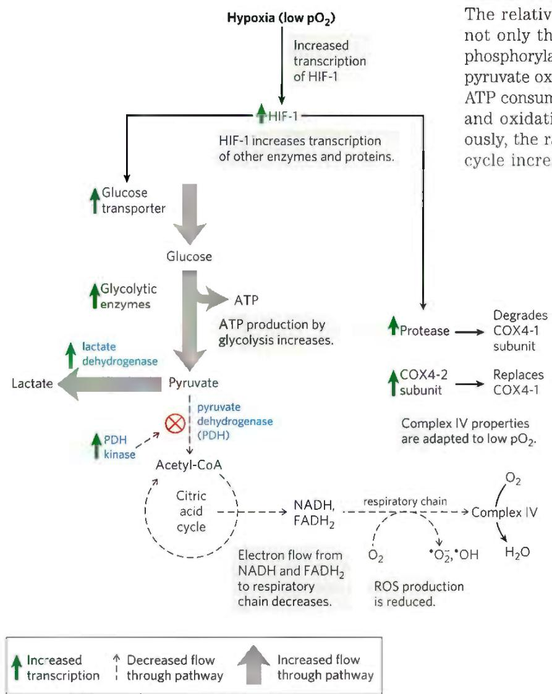

When these mechanisms for dealing with ROS are insufficient, either due to genetic mutation affecting one of the protective proteins or under conditions of very high rates of ROS production, mitochondrial function is compromised. Mitochondrial damage is thought to be involved in aging, heart failure, certain rare cases of diabetes (described below), and several maternally inherited genetic diseases that affect the nervous system.

#### [EN] ATP-Producing Pathways Are Coordinately Regulated

The major catabolic pathways have overlapping and concerted regulatory mechanisms that allow them to function together in an economical and self-regulating manner to produce ATP and biosynthetic precursors. The relative concentrations of ATP and ADP control not only the rates of electron transfer and oxidative phosphorylation but also the rates of the citric acid cycle, pyruvate oxidation, and glycolysis (Fig. 19-35). Whenever ATP consumption increases, the rate of electron transfer and oxidative phosphorylation increases. Simultaneously, the rate of pyruvate oxidation via the citric acid cycle increases, increasing the flow of electrons into

FIGURE 19-34 Regulation of gene expression by hypoxia-inducible factor (HIF-1) to reduce ROS formation. Under conditions of low oxygen (hypoxia), HIF-1 is synthesized in greater amounts and acts as a transcription factor, increasing synthesis of the glucose transporter, glycolytic enzymes, pyruvate dehydrogenase kinase (PDH kinase), lactate dehydrogenase, a protease that degrades the cytochrome oxidase subunit COX4-1, and cytochrome oxidase subunit COX4-2. These changes counter the formation of ROS by decreasing the supply of NADH and $\mathrm{FADH}_2$ and making cytochrome oxidase of Complex IV more effective. [Information from D.A.Harris, Bioenergetics at a Glance, p. 36, Blackwell Science, 1995.]

  
FIGURE 19-35 Regulation of ATP-producing pathways. This diagram shows the coordinated regulation of glycolysis, pyruvate oxidation, the citric acid cycle, and oxidative phosphorylation by the relative concentrations of ATP, ADP, and AMP, and by NADH. High [ATP] (or low [ADP] and [AMP]) produces low rates of glycolysis, pyruvate oxidation, acetate oxidation via the citric acid cycle, and oxidative phosphorylation. All four pathways are accelerated when the use of ATP and the formation of ADP, AMP, and $\mathsf{P_i}$ increase. The ability of citrate to inhibit both glycolysis and the citric acid cycle reinforces the action of the adenine nucleotide system. In addition, increased [NADH] and [acetyl-CoA] also inhibit the oxidation of pyruvate to acetyl-CoA, and a high [NADH]/[NAD+] ratio inhibits the dehydrogenase reactions of the citric acid cycle (see Fig. 16-18).

the respiratory chain. These events, in turn, can evoke an increased rate of glycolysis, increasing the rate of pyruvate formation. When conversion of ADP to ATP lowers the ADP concentration, acceptor control slows electron transfer and thus oxidative phosphorylation. Glycolysis and the citric acid cycle are also slowed, because ATP is an allosteric inhibitor of the glycolytic enzyme phosphofructokinase-1 (see Fig. 14-23) and of pyruvate dehydrogenase (see Fig. 16-18).

Phosphofructokinase-1 is also inhibited by citrate, the first intermediate of the citric acid cycle. When the cycle is "idling," citrate accumulates within mitochondria, then is transported into the cytosol. When the cytosolic concentrations of both ATP and citrate rise, they produce a concerted allosteric inhibition of phosphofructokinase-1 that is greater than the sum of their individual effects, slowing glycolysis.

#### [EN] SUMMARY 19.3 Regulation of Oxidative Phosphorylation

\- Oxidative phosphorylation is regulated by cellular energy demands. Intracellular [ADP] and the mass-action ratio [ATP]/([ADP][ $\mathbf{P_i}$ ]) are measures of a cell's energy status.

In hypoxic (oxygen-deprived) cells, a protein inhibitor blocks ATP hydrolysis by the reverse activity of ATP synthase, preventing a drastic drop in [ATP].

The adaptive responses to hypoxia, mediated by HIF-1, slow electron transfer into the respiratory chain and modify Complex IV to act more efficiently under low-oxygen conditions.

■ ATP and ADP concentrations set the rate of electron transfer through the respiratory chain via a series of coordinated controls on respiration, glycolysis, and the citric acid cycle.

<!-- EN-END 19.3 -->

<!-- EN-BEGIN 19.4 -->

### 【英文对应 19.4】Mitochondria in Thermogenesis, Steroid Synthesis, and Apoptosis

> 来源：Lehninger Principles of Biochemistry（书籍/02_生物化学原理） 第19章 Oxidative Phosphorylation，§19.4。对应本章“三、氧化磷酸化作用”。

Although ATP production is a central role for the mitochondrion, this organelle has other functions that, in specific tissues or under specific circumstances, are also crucial. In adipose tissue, mitochondria generate heat to protect vital organs from low ambient temperature; in the adrenal glands and the gonads, mitochondria are the sites of steroid hormone synthesis; and in most or all tissues, they are key participants in apoptosis (programmed cell death).

#### [EN] Uncoupled Mitochondria in Brown Adipose Tissue Produce Heat

We noted above that respiration slows when the cell is adequately supplied with ATP. There is a remarkable and instructive exception to this general rule. Most newborn mammals, including humans, have a type of adipose tissue called brown adipose tissue (BAT; p. 852), in which P1 fuel oxidation serves not to produce ATP but to generate heat to keep the newborn warm. This specialized adipose tissue is brown because of the presence of large numbers of mitochondria and thus high concentrations of cytochromes, with heme groups that are strong absorbers of visible light.

  
FIGURE 19-36 Two mechanisms of thermogenesis in mitochondria. UCP1, an uncoupling protein in the mitochondria of brown adipose tissue, causes the energy conserved by proton pumping to be dissipated as heat by providing  
an alternative route for protons to reenter the mitochondrial matrix. A futile cycle in which creatine is phosphorylated by creatine kinase (CK), using ATP and producing ADP transported by the ATP/ADP carrier (AAC), also generates heat.

There are at least two mechanisms of thermogenesis. The mitochondria of brown adipocytes are much like those of other mammalian cells, except in having a unique protein in their inner membrane. Uncoupling protein 1 (UCP1), a long-chain fatty acid/H $^{+}$ symporter, provides a path for protons to return to the matrix without passing through the F $_{0}$ F $_{1}$ complex (Fig. 19-36). P5 As a result of this short-circuiting of protons, the energy of oxidation is not conserved by ATP formation but is dissipated as heat, which contributes to maintaining body temperature. However, UCP1 is only part of the story, and heat generation occurs in mammals even when it is absent. The thermogenic action of UCP1 is supplemented by a futile cycle involving creatine and phosphocreatine (Fig. 19-36). ATP synthesized in the mitochondrial matrix is exported to the irtermembrane space via the adenine nucleotide translocator, an ADP/ATP antiporter. There, the ATP is used to phosphorylate creatine to create phosphocreatine and ADP. The ADP is transported back into the matrix. Hydrolysis of phosphocreatine completes a futile cycle that liberates heat.

Hibernating animals also depend on the activity of uncoupled BAT mitochondria to generate heat during their long dormancy (see Box 17-1). We will return to the role of UCP1 when we discuss the regulation of body mass in Chapter 23 (pp. 867–869).

#### [EN] Mitochondrial P-450 Monooxygenases Catalyze Steroid Hydroxylations

P1 Mitochondria are the site of biosynthetic reactions that produce steroid hormones, including the sex hormones, glucocorticoids, mineralocorticoids, and vitamin D hormone. These compounds are synthesized from cholesterol or a related sterol in a series of hydroxylations catalyzed by enzymes of the cytochrome P-450 family (see Box 21-1), all of which have a critical heme group (its absorption at 450 nm gives this family its name). In the hydroxylation reactions, one atom of molecular oxygen is incorporated into the substrate and the second is reduced to $H_{2}O$ , making cytochrome P-450 enzymes monooxygenases:

$$
\mathrm{R} - \mathrm{H} + \mathrm{O} _ {2} + \mathrm{NADPH} + \mathrm{H} ^ {+} \longrightarrow \mathrm{R} - \mathrm{OH} + \mathrm{H} _ {2} \mathrm{O} + \mathrm{NADP} ^ {+}
$$

In this reaction, two species are oxidized: NADPH and R—H.

There are dozens of P-450 enzymes, all situated in the inner mitochondrial membrane with their catalytic site exposed to the matrix. Steroidogenic cells are packed with mitochondria specialized for steroid synthesis; the mitochondria are generally larger than those in other tissues and have more extensive and highly convoluted inner membranes (Fig. 19-37).

  
FIGURE 19-37 Mitochondria of adrenal gland, specialized for steroid synthesis. As seen in this electron micrograph of a thin section of adrenal gland, mitochondria are profuse and have extensive cristae, providing a large surface for the P-450 enzymes of the inner membrane. [Don Fawcett/Science Source]

The path of electron flow in the mitochondrial P-450 system is complex, involving a flavoprotein and an iron-sulfur protein that carry electrons from NADPH to the P-450 heme (Fig. 19-38). All P-450 enzymes have a heme that interacts with $O_{2}$ and a substrate-binding site that confers specificity.

Another large family of P-450 enzymes is found in the endoplasmic reticulum of hepatocytes. These enzymes catalyze reactions similar to the mitochondrial P-450 reactions, but their substrates include a wide variety of hydrophobic compounds, many of which are xenobiotics — compounds not found in nature but synthesized industrially. The P-450 enzymes of the ER have very broad and overlapping substrate specificities. Hydroxylation of the hydrophobic compounds makes them more water-soluble, and they can then be cleared by the kidneys and excreted in urine. Among the substrates for these P-450 oxygenases are many commonly used prescription drugs. Metabolism by P-450 enzymes limits a drug's lifetime in the bloodstream and thus its therapeutic effects. Humans differ in their genetic complement of P-450 enzymes in the ER, as well as in the extent to which certain P-450 enzymes have been induced, such as by a history of ethanol ingestion. In principle, therefore, an individual's genetics and personal history should be considered in determining therapeutic drug doses. In practice, this precise tailoring of dosage is not yet economically feasible, but it may become so.

#### [EN] Mitochondria Are Central to the Initiation of Apoptosis

Apoptosis, also called programmed cell death, is a process in which individual cells die for the good of the organism, such as in the course of normal embryonic development, and the organism conserves the cells' molecular components (amino acids, nucleotides, and so forth). Apoptosis may be triggered by an external signal, acting at a plasma membrane receptor, or by internal events such as DNA damage, viral infection, oxidative stress from the accumulation of ROS, or other stress such as a heat shock.

P1 Mitochondria play a critical role in triggering apoptosis. When a stressor gives the signal for cell death, one early consequence is an increase in the permeability of the outer mitochondrial membrane, allowing cytochrome c to escape from the intermembrane space into the cytosol (Fig. 19-39). The increased permeability is due to the opening of the permeability transition pore complex (PTPC), a multisubunit protein in the outer membrane; its opening and closing are affected by several proteins that stimulate or suppress apoptosis. When released into the cytosol, cytochrome c interacts with monomers of the protein Apaf-1 (apoptosis protease activating factor-1), causing the formation of an apoptosome composed of seven Apaf-1 and seven cytochrome c molecules. The apoptosome provides the platform on which the proenzyme procaspase-9 is activated to caspase-9, a member of a family of highly specific proteases, called the caspases, involved in apoptosis. These cysteine proteases cleave proteins only on the carboxyl-terminal side of Asp residues, thus the name “caspases.” Caspase-9 initiates a cascade of proteolytic activations, with one caspase activating a second, and this in turn activating a third, and so forth (see Fig. 12-42). Note that this role of cytochrome c in apoptosis is a clear case of “moonlighting,” in that one protein plays two very different roles in the cell (see Box 16-1).

#### [EN] SUMMARY 19.4 Mitochondria in Thermogenesis, Steroid Synthesis, and Apoptosis

In the brown adipose tissue of newborns, electron transfer is uncoupled from ATP synthesis, and the energy of fuel oxidation is dissipated as heat. Hibernating animals use this strategy to avoid freezing.

■ Hydroxylation reaction steps in the synthesis of steroid hormones in steroidogenic tissues (adrenal gland, gonads, liver, and kidney) take place in specialized mitochondria. Key reactions are catalyzed by a family of P-450 monooxygenases.

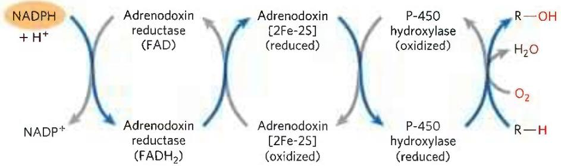  
FIGURE 19-38 Path of electron flow in mitochondrial cytochrome P-450 reactions in adrenal gland. Two electrons are transferred from NADPH to the FAD-containing flavoprotein adrenodoxin reductase, which passes the  
electrons, one at a time, to adrenodoxin, a small, soluble 2Fe-2S protein. Adrenodoxin passes single electrons to the cytochrome P-450 hydroxylase, which interacts directly with $\mathrm{O}_2$ and the substrate (R—H) to form the products, $\mathrm{H}_2\mathrm{O}$ and R—OH.

  
FIGURE 19-39 Role of cytochrome c in apoptosis. Cytochrome c is a small, soluble, mitochondrial protein, located in the intermembrane space, that carries electrons between Complex III and Complex IV during respiration. In a completely separate role, as outlined here, it acts as a trigger for apoptosis by stimulating the activation of a family of proteases called caspases. [Information from S. J. Riedl and G. S. Salvesen, Nat. Rev. Mol. Cell Biol. 8:409, 2007, Fig. 3.]  
■ Mitochondria play a central role in apoptosis. Mitochondrial cytochrome c, released into the cytosol, participates in activation of caspase-9, one of the proteases involved in apoptosis.

<!-- EN-END 19.4 -->

<!-- EN-BEGIN 19.5 -->

### 【英文对应 19.5】Mitochondrial Genes: Their Origin and the Effects of Mutations

> 来源：Lehninger Principles of Biochemistry（书籍/02_生物化学原理） 第19章 Oxidative Phosphorylation，§19.5。对应本章“三、氧化磷酸化作用”。

Mitochondria contain their own genome, a circular, double-stranded DNA (mtDNA) molecule. Each of the hundreds or thousands of mitochondria in a typical cell has about five copies of this genome. The human mitochondrial chromosome (Fig. 19-40) contains 37 genes (16,569 bp), including 13 that encode subunits of proteins of the respiratory chain (Table 19-6); the remaining genes code for rRNA and tRNA molecules essential to the protein-synthesizing machinery of mitochondria. To synthesize these 13 protein subunits, mitochondria have their own ribosomes, distinctly different from those in the cytoplasm. The great majority of mitochondrial proteins—about 1,200 different types—are encoded by nuclear genes, synthesized on cytoplasmic ribosomes, then imported into and assembled in the mitochondria (Chapter 27).

#### [EN] Mitochondria Evolved from Endosymbiotic Bacteria

The existence of mitochondrial DNA, ribosomes, and tRNAs supports the theory of the endosymbiotic origin of mitochondria (see Fig. 1-37), which holds that the first organisms capable of aerobic metabolism, including respiration-linked ATP production, were bacteria. P2 Primitive eukaryotes that lived anaerobically (by fermentation) acquired the ability to carry out oxidative phosphorylation when they established a symbiotic relationship with bacteria living in their cytosol. After a long period of evolution and the movement of many bacterial

<table><tr><td colspan="3">TABLE 19-6 Respiratory Proteins Encoded by Mitochondrial Genes in Humans</td></tr><tr><td>Complex</td><td>Number of subunits</td><td>Number of subunits encoded by mtDNA</td></tr><tr><td>I NADH dehydrogenase</td><td>45</td><td>7</td></tr><tr><td>II Succinate dehydrogenase</td><td>4</td><td>0</td></tr><tr><td>III Ubiquinone:cytochrome c oxidoreductase</td><td>11</td><td>1</td></tr><tr><td>IV Cytochrome oxidase</td><td>13</td><td>3</td></tr><tr><td>V ATP synthase</td><td>8</td><td>2</td></tr></table>

genes into the nucleus of the "host" eukaryote, the endosymbiotic bacteria eventually became mitochondria.

This hypothesis presumes that early free-living bacteria had the enzymatic machinery for oxidative phosphorylation. And it predicts that their modern bacterial descendants must have respiratory chains closely similar to those of modern eukaryotes. They do. Aerobic bacteria carry out NAD-linked electron transfer from substrates to $O_{2}$ , coupled to the phosphorylation of cytosolic ADP. The dehydrogenases are located in the bacterial cytosol, and the respiratory chain in the plasma membrane. The electron carriers translocate protons outward across the plasma membrane as electrons are transferred to $O_{2}$ . Bacteria such as E. coli have $F_{0}F_{1}$ complexes in their plasma membranes; the $F_{1}$ portion protrudes into the cytosol and catalyzes ATP synthesis from ADP and $P_{i}$ as protons flow back into the cell through the proton channel of $F_{0}$ .

The respiration-linked extrusion of protons across the bacterial plasma membrane also provides the driving force for other processes. Certain bacterial transport systems bring about uptake of extracellular nutrients (lactose, for example) against a concentration gradient, in symport with protons. And the rotary motion of bacterial flagella is provided by "proton turbines," molecular rotary motors driven not by ATP but directly by the transmembrane electrochemical potential generated by respiration-linked proton pumping (Fig. 19-41). P2 It seems likely that the chemiosmotic mechanism evolved early, before the emergence of eukaryotes.

FIGURE 19-40 Mitochondrial genes and mutations. A map of human mitochondrial DNA, showing the genes that encode proteins of Complex I, the NADH dehydrogenase (ND1 to ND6); the cytochrome b of Complex III (Cyt b); the subunits of cytochrome oxidase, Complex IV (COI to COIII); and two subunits of ATP synthase (ATPase6 and ATPase8). The colors of the genes correspond to those of the complexes shown in Figure 19-7. Also included here are the genes for ribosomal RNAs (rRNA) and for some mitochondrion-specific transfer RNAs; tRNA specificity is indicated by the one-letter codes for amino acids. Arrows indicate the positions of mutations that cause Leber hereditary optic neuropathy (LHON) and myoclonic epilepsy with ragged-red fibers (MERRF) syndrome. Numbers in parentheses indicate the position of the altered nucleotides (nucleotide 1 is at the top of the circle, and numbering proceeds counterclockwise). [Information from M. A. Morris, J. Clin. Neurophthalmol. 10:159, 1990.]

  
FIGURE 19-41 Rotation of bacterial flagella by proton-motive force. The shaft and rings at the base of the flagellum make up a rotary motor that has been called a "proton turbine." Protons ejected by electron transfer flow back into the cell through the turbine, causing rotation of the shaft of the flagellum. This motion differs fundamentally from the motion of muscle and of eukaryotic flagella and cilia, for which ATP hydrolysis is the energy source.

#### [EN] Mutations in Mitochondrial DNA Accumulate throughout the Life of the Organism

The respiratory chain is the major producer of reactive oxygen species in cells, so mitochondrial contents, including the mitochondrial genome, suffer the greatest exposure

(b)

to, and damage by, ROS. Moreover, the mitochondrial DNA replication system is less effective than the nuclear system at correcting mistakes made during replication and at repairing DNA damage. As a consequence, defects in mtDNA accumulate over time. One theory of aging is that this gradual accumulation of defects is the primary cause of many of the “symptoms” of aging, which include, for example, progressive weakening of skeletal and heart muscle.

A unique feature of mitochondrial inheritance is the variation among individual cells, and between one individual organism and another, in the effects of a mtDNA mutation. A typical cell has hundreds or thousands of mitochondria, each with multiple copies of its own genome (Fig. 19-2b). Animals inherit essentially all of their mitochondria from the female parent. Eggs are large and contain $10^{5}$ or $10^{6}$ mitochondria; sperm are much smaller and contain far fewer mitochondria—perhaps 100 to 1,000. Furthermore, there is an active mechanism for targeting sperm-derived mitochondria for degradation in the fertilized egg. Just after fertilization, maternal phagosomes migrate to the site of sperm entry, engulf sperm mitochondria, and degrade them.

Suppose that, in a female organism, damage to one mitochondrial genome occurs in a germ cell from which oocytes develop, such that the germ cell contains mainly mitochondria with wild-type genes but one mitochondrion with a mutant gene. During the course of oocyte maturation, as this germ cell and its descendants repeatedly divide, the defective mitochondrion replicates and its progeny, all defective, are randomly distributed to daughter cells. Eventually, the mature egg cells contain different proportions of the defective mitochondria. When an egg cell is fertilized and undergoes the many divisions of embryonic development, the resulting somatic cells differ in their proportion of mutant mitochondria (Fig. 19-42a). This heteroplasmy (in contrast to homoplasmy, in which every mitochondrial genome in every cell is the same) results in mutant phenotypes of varying degrees of severity. Cells (and tissues) containing mostly wild-type mitochondria have the wild-type phenotype; they are essentially normal. Other heteroplasmic cells have intermediate phenotypes, some almost normal, others (with a high proportion of mutant mitochondria) abnormal (Fig. 19-42b). If the abnormal phenotype is associated with a disease, individuals with the same mtDNA mutation may have disease symptoms of differing severity—depending on the number and distribution of affected mitochondria.

#### [EN] Some Mutations in Mitochondrial Genomes Cause Disease

About 1 in 5,000 people have a disease-causing mutation in a mitochondrial protein that reduces the cell's capacity to produce ATP. A growing number of these diseases have been attributed to mutations in mitochondrial genes. Some tissues and cell types—neurons,

FIGURE 19-42 Heteroplasmy in mitochondrial genomes. (a) When a mature egg cell is fertilized, all of the mitochondria in the resulting diploid cell (zygote) are maternal; none come from the sperm. If some fraction of the maternal mitochondria have a mutant gene, the random distribution of mitochondria during subsequent cell divisions yields some daughter cells with mostly mutant mitochondria, some with mostly wild-type mitochondria, and some in between. Thus daughter cells show a varying degree of heteroplasmy. (b) Different degrees of heteroplasmy produce different cellular phenotypes. This section of human muscle tissue is from an individual with defective cytochrome oxidase. The cells were stained so that wild-type cells are blue and cells with mutant cytochrome oxidase are brown. As the micrograph shows, different cells in the same tissue are affected to different degrees by the mitochondrial mutation. [(b) Courtesy of Rob Taylor. Reprinted with permission from R. W. Taylor and D. M. Turnbull, Nat. Rev. Genet. 6:389, 2005, Fig. 2a.]

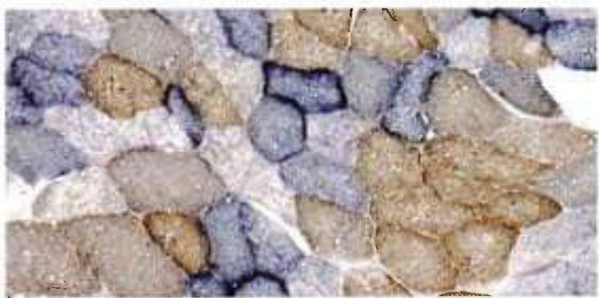

myocytes of both skeletal and cardiac muscle, and $\beta$ cells of the pancreas—are less able than others to tolerate lowered ATP production and are therefore more affected by mutations in mitochondrial proteins.

A group of genetic diseases known as the mitochondrial encephalomyopathies affect primarily the brain and skeletal muscle. These diseases are invariably inherited from the mother, because, as noted above, a developing embryo derives all its mitochondria from the egg. The rare disease Leber hereditary optic neuropathy (LHON) affects the central nervous system, including the optic nerves, causing bilateral loss of vision in early adulthood. A single base change in the mitochondrial gene ND4 (Fig. 19-40) changes an Arg residue to a His residue in a polypeptide of Complex I, and the result is mitochondria partially defective in electron transfer from NADH to ubiquinone. Although these mitochondria can produce some ATP by electron transfer from succinate, they apparently cannot supply sufficient ATP to support the very active metabolism of neurons, including the optic nerve. A single base change in the mitochondrial gene for cytochrome b, a component of Complex III, also produces LHON, demonstrating that the pathology results from a general reduction of mitochondrial function, not specifically from a defect in electron transfer through Complex I.

A mutation in the mitochondrial gene ATP6 affects the proton pore in ATP synthase, leading to low rates of ATP synthesis while leaving the respiratory chain intact. Oxidative stress due to the continued supply of electrons from NADH increases the production of ROS, and the damage to mitochondria caused by ROS sets up a vicious cycle. Half of individuals with this mutant gene die within days or months of birth.

Myoclonic epilepsy with ragged-red fibers (MERRF) syndrome is caused by a mutation in the mitochondrial gene that encodes a tRNA specific for lysine (tRNA $^{Lys}$ ). This disease, characterized by uncontrollable muscular jerking, results from defective production of several of the proteins that require mitochondrial tRNAs for their synthesis. Skeletal muscle fibers of individuals with MERRF syndrome have abnormally shaped mitochondria that sometimes contain paracrystalline structures (Fig. 19-43). Other mutations in mitochondrial genes are believed to be responsible for the progressive muscular weakness that characterizes mitochondrial myopathy and for enlargement and deterioration of the heart muscle in hypertrophic cardiomyopathy.

If a prospective mother is known to carry a pathogenic mitochondrial gene, the technique of mitochondrial donation can circumvent the passage of that mutant gene to her offspring. A prospective mother's nuclear genes are microscopically transplanted into an enucleated ovum from a donor with healthy mitochondria, then the ovum is fertilized in vitro and the resulting embryo is transplanted into the mother's uterus. This and similar "three-parent baby" procedures, which were approved in the United Kingdom in 2015, raise ethical issues that are being vigorously debated.

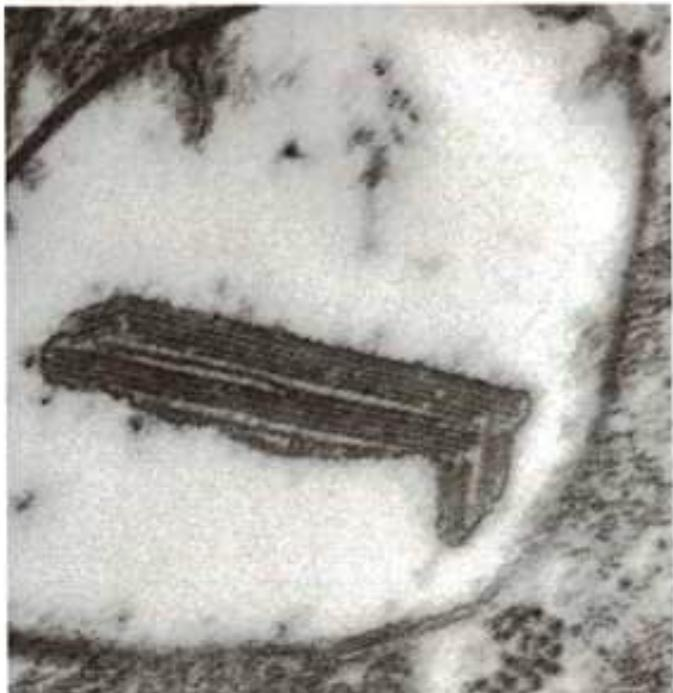  
FIGURE 19-43 Paracrystalline inclusions in MERRF syndrome mitochondrion. Electron micrograph of an abnormal mitochondrion from the muscle of an individual with MERRF syndrome, showing the paracrystalline protein inclusions sometimes present in the mutant mitochondria. [From Regionalized Pathology Correlates with Augmentation of mtDNA Copy Numbers in a Patient with Myoclonic Epilepsy with Ragged-Red Fibers (MERRF-Syndrome). PLOS ONE, Anja Brinckmann et al., October 20, 2010. https://doi.org/10.1371/journal.pone.0013513]

Mitochondrial disease can also result from mutations in any of the \~1,200 nuclear genes that encode mitochondrial proteins. For example, a mutation in one of the nuclear-encoded proteins of Complex IV, COX6B1, results in severe defects in brain development and thickened walls of the heart muscle. Other nuclear genes encode proteins essential for the assembly of mitochondrial complexes. Mutations in these genes can also lead to serious mitochondrial disease.

#### [EN] A Rare Form of Diabetes Results from Defects in the Mitochondria of Pancreatic $\beta$ Cells

The insulin so important to glucose homeostasis in all humans is produced and exported from pancreatic $\beta$ cells. Insulin export hinges on the ATP concentration in those cells. When blood glucose is high, $\beta$ cells take up glucose and oxidize it by glycolysis and the citric acid cycle, raising [ATP] above a threshold level (Fig. 19-44). When [ATP] exceeds this threshold, an ATP-gated K $^{+}$ channel in the plasma membrane closes, depolarizing the membrane and triggering insulin release (see Fig. 23-24).

Normal insulin release can be compromised in several ways. Pancreatic $\beta$ cells with defects in any aspect of oxidative phosphorylation may not be able to increase [ATP] above this threshold, and the resulting failure of insulin release effectively produces diabetes. For example, defects in the gene for glucokinase, the hexokinase IV isozyme present in $\beta$ cells, lead to a rare form of diabetes called MODY2 (maturity onset diabetes of the young); low glucokinase activity prevents the generation of ATP concentrations above the threshold needed to trigger insulin secretion. Mutations in the mitochondrial tRNA $^{Lys}$ or tRNA $^{Leu}$ genes also compromise mitochondrial ATP production by limiting the expression of electron transfer components encoded in the mitochondrial DNA. Type 2 diabetes mellitus is common among individuals with these defects (although such cases make up a very small fraction of all cases of diabetes).

  
FIGURE 19-44 A mitochondrial defect prevents insulin secretion. In the normal situation, as depicted here, when the blood glucose level rises, production of ATP in $\beta$ cells increases. ATP, by blocking $\mathsf{K}^+$ channels, cepolarizes the plasma membrane and thus opens voltage-gated $\mathrm{Ca^{2+}}$ channels. The resulting influx of $\mathrm{Ca^{2+}}$ triggers exocytosis of insulin-containing secretory vesicles, releasing insulin. When oxidative phosphorylation in $\beta$ cells is defective, [ATP] is never sufficient to trigger this process, and insulin is not released.

When nicotinamide nucleotide transhydrogenase, which is part of the mitochondrial defense against ROS (Fig 19-18), is genetically defective, the accumulation of ROS damages mitochondria, slowing ATP production and blocking insulin release by $\beta$ cells (Fig. 19-44). Damage caused by ROS, including damage to mtDNA, may also underlie other human diseases; there is some evidence for its involvement in Alzheimer, Parkinson, and Huntington diseases and in heart failure, as well as in aging.

#### [EN] SUMMARY 19.5 Mitochondrial Genes: Their Origin and the Effects of Mutations

A small proportion of human mitochondrial proteins, 13 in all, are encoded by the mitochondrial genome and synthesized in mitochondria. About 1,200 mitochondrial proteins are encoded by nuclear genes and imported into mitochondria after their synthesis.

■ Mitochondria arose from aerobic bacteria that entered into an endosymbiotic relationship with ancestral eukaryotes.

■ Mutations in the mitochondrial genome accumulate over the life of the organism. Mutations in nuclear or mitochondrial genes that encode components of the respiratory chain, ATP synthase, and the ROS-scavenging system, and even in tRNA genes, can cause a variety of human diseases, which often most severely affect muscle, heart, pancreatic $\beta$ cells, and brain.

It is possible to combine the mitochondria from one woman with the nuclear genes of another to create an ovum free of a mutation that would have led to a mitochondrial disease.

■ Mitochondrial defects in pancreatic $\beta$ cells that limit ATP production when glucose levels are high can compromise normal insulin release and give rise to a form of type 2 diabetes.

<!-- EN-END 19.5 -->

## 提要

氧化磷酸化使 NADH 和 $FADH_{2}$ 再氧化，并将释放出的能量以 ATP 的形式进行贮存。真核细胞氧化磷酸化在细胞的线粒体内膜上进行，而原核细胞则在细胞质膜上进行。

物质氧化还原电势 E 的大小代表它对电子的亲和力。标准氧还势 $(E^{\ominus})$ 是在 pH 7 及标准状态下测得的数值，用伏特(V)表示。反应的标准自由能变化在 pH 7 时用 $\Delta G^{\ominus}$ 表示，可从反应物和产物的氧还电势的变化 $\Delta E^{\ominus}$ 计算求得。 $\Delta E^{\ominus}$ 为正值的反应，它的 $\Delta G^{\ominus}$ 为负值，这种反应为放能反应。

电子从 NADH 传递到氧是沿着一条电子传递链，也叫呼吸链进行的。这条电子传递链主要包括 4 种蛋白质复合体：NADH-Q 还原酶（复合体 I）、琥珀酸-Q 还原酶（复合体 II）、细胞色素还原酶（复合体 III）和细胞色素氧化酶（复合体 IV）。它们所利用的电子载体有 FMN、铁硫中心、醌类、血红素基团以及铜离子等。在 NADH-Q 还原酶中电子从 NADH 先转移到 FMN 辅基，形成 $FMNH_{2}$ ，再转移到 Fe-S 中心，使其中的铁原子发生 3 价 $\left(\mathrm{Fe}^{3+}\right)$ 和 2 价 $\left(\mathrm{Fe}^{2+}\right)$ 的价态变化。电子最后转移到辅酶 Q，使其从氧化型辅酶 Q 转变为还原型的 $QH_{2}$ 。辅酶 Q 是疏水性电子载体，能够在膜内自由地扩散。 $QH_{2}$ 上的电子随后传递给细胞色素还原酶。后者是由细胞色素 b 和 $c_{1}$ 以及铁硫蛋白构成的复合体。含有血红素的细胞色素，其中的铁原子在传递电子过程中，从 $Fe^{3+}$ 变为 $Fe^{2+}$ ，当电子再转移到其他组分后铁原子又恢复其 $Fe^{3+}$ 状态。细胞色素还原酶（复合体Ⅲ）上的电子最后转移到细胞色素 c 上。细胞色素 c 是一个水溶性的周边膜蛋白（peripheral membrane protein），它和辅酶 Q 一样都是传递电子的流动载体。细胞色素 c 接受电子后立即将其传递给细胞色素氧化酶。该酶含有两种细胞色素（细胞色素 a 和 $a_{3}$ ）以及两种铜离子 $\left(\mathrm{Cu}_{\mathrm{A}}\right.$ 和 $\left.\mathrm{Cu}_{\mathrm{B}}\right)$ 。在电子传递时，铜原子往复地发生 $Cu^{2+}$ 和 $Cu^{+}$ 的价态变化。最后细胞色素氧化酶传递 4 个电子到氧分子，形成 2 分子 $H_{2}O$ 。

沿电子传递链发生的氧还电势的变化是每一步自由能变化的依据。在 NADH-Q 还原酶、细胞色素还原酶（又称细胞色素 $bc_{1}$ 复合体）和细胞色素氧化酶催化的三步反应中，自由能的变化足以将 $H^{+}$ 离子（质子）从线粒体内膜基质“泵”（pump）出线粒体内膜进入到线粒体的内外膜间隙，于是产生了一种跨内膜的 $H^{+}$ 离子梯度。因此，上述三种酶（即三种复合体）的每一种都一个质子泵。质子泵都由电子传递提供驱动力。

$FADH_{2}$ 再氧化为 FAD 时, 是将其所带的电子对传递给琥珀酸-Q 还原酶。后者将电子传递给辅酶 Q, 电子通过辅酶 Q 进入电子传递链, 经进一步传递形成跨膜质子梯度以及合成 ATP 分子。琥珀酸-Q 还原酶本身并没有质子泵的作用。

鱼藤酮、安密妥通过抑制 NADH-Q 还原酶抑制电子传递，抗霉素 A 抑制细胞色素还原酶，氰化物 $\left(\mathrm{CN}^{-}\right)$ 、叠氮化物 $\left(\mathrm{N}_{3}^{-}\right)$ 以及一氧化碳 (CO) 抑制细胞色素氧化酶。

电子流经复合体Ⅰ、Ⅲ、Ⅳ时将质子从线粒体内膜的基质侧泵出到细胞溶胶侧。由pH梯度和膜电势构成质子动力。这时细胞溶胶侧为酸性，其电性为电正性。当质子从细胞溶胶侧经ATP合酶流回到线粒体基质时，则产生驱动力使ADP和Pi合成ATP。ATP合酶由 $F_{0}$ 和 $F_{1}$ 两个单元构成。质子流回基质通过 $F_{0}$ 中的通道，ATP的合成部位则是在 $F_{1}$ 单元。与ATP合酶紧密结合着的ATP分子，当质子流经该酶时被释放出来。

一对电子流经 NADH-Q 还原酶所产生的质子动力足够形成 1 个 ATP 分子, 流经细胞色素还原酶形成 0.5 个 ATP 分子, 流经细胞色素氧化酶形成 1 个 ATP。因此每个 NADH 分子通过氧化磷酸化所产生的 ATP 分子是 2.5 个。而一个 FADH₂ 的氧化只形成 1.5 个 ATP 分子。因为它通过辅酶 Q 进入电子传递链上的细胞色素还原酶, 细胞溶胶中的 NADH 通过呼吸链一般也形成 1.5 个 ATP 分子。因为它的电子一般是通过甘油磷酸穿梭途径进入电子传递链。一个葡萄糖分子完全氧化为 CO₂ 和 H₂O 可产生大约 30 个 ATP 分子。

电子传递在正常情况下是与 ATP 的合成强制性偶联的。只有当 ATP 被合成时，电子才可流经电子传递链传递到氧。也只有当 ATP 合成发生时电子的传递才继续进行；如果 ATP 的合成减少，电子传递也随之下降。因此只有当细胞需要 ATP 分子时，电子传递过程才会有效进行。

有一些化合物例如 2,4-二硝基苯酚(DNP)属于解偶联试剂。这类试剂使电子传递有效进行,尽管不合成 ATP。因为它们可使 H $^{+}$ 离子通过线粒体内膜,从而破坏质子梯度,从而电子传递与 ATP 形成之间的偶联解除了,致使产生的能量只能以热的形式释放。在机体的某些组织例如褐色脂肪组织的线粒体中,电子传递和 ATP 合成也被一种产热蛋白(thermogenin)解偶联。由这种脂肪组织产生的热称为非战栗产热,对新生儿有保护敏感机体组织的作用,对冬眠动物有维持体温的作用。

细胞溶胶的 NADH 不能直接跨过线粒体内膜进入线粒体基质进行再氧化。它可通过 3-磷酸甘油穿梭途径再氧化。细胞溶胶的 3-磷酸甘油脱氢酶催化 NADH 氧化，并使磷酸二羟丙酮还原为 3-磷酸甘油。而后又由位于线粒体内膜外侧的 3-磷酸甘油脱氢酶将其转变为磷酸二羟丙酮。该酶以 FAD 为辅助因子。磷酸二羟丙酮可回到细胞溶胶内。在心脏和肝细胞溶胶内 NADH 的再氧化通过苹果酸-天冬氨酸穿梭途径使其电子进入氧化呼吸链。在细胞溶胶中的草酰乙酸由 NADH 还原为苹果酸，通过线粒体内膜上的苹果酸- $\alpha$ -酮戊二酸载体进入线粒体基质。在基质内苹果酸由 $NAD^{+}$ 氧化又形成草酰乙酸，而 $NAD^{+}$ 则还原为NADH，结果相当于细胞溶胶中的NADH将电子传递给了基质内的NADH，后者可以进入呼吸链。草酰乙酸通过转氨酶的作用形成天冬氨酸后离开线粒体基质，在细胞溶胶内又通过转氨酶的作用形成草酰乙酸。

## 习题

1. 什么是氧化还原电势？怎样计算氧化还原电势？

2. 将下列物质按照容易接受电子的顺序加以排列：

(a) $\alpha-$ 酮戊二酸+CO $_{2}$ (c) O $_{2}$

(b) 草酰乙酸 (d) $\mathrm{NADP}^{+}$

3. 在电子传递链中各成员的排列顺序根据什么原则？

4. 在一个具有全部细胞功能的哺乳动物细胞匀浆中加入下列不同的底物, 当每种底物完全被氧化为 $CO_{2}$ 和 $H_{2}O$ 时, 能产生多少 ATP 分子?

(a) 葡萄糖 (e) 磷酸烯醇式丙酮酸

(b) 丙酮酸 (f) 柠檬酸

(c) 乳酸 (g) 磷酸二羟丙酮

(d) 1,6-二磷酸果糖 (h) NADH

5. 在生物化学中 $O_{2}$ 形成 $H_{2}O$ 所测得的标准氧化还原电势为 0.82 V, 而在化学测定中测得的数值为 1.23 V, 这种差异是怎样产生的?

6. 电子传递链和氧化磷酸化之间有何关系？

7. 解释下列的化合物对电子传递和氧化呼吸链有何作用？当供给充分的底物包括异柠檬酸、 $\mathrm{Pi}$ 、 $\mathrm{ADP}$ 、 $\mathrm{O}_2$ ，并分别加入下列化合物时，估计线粒体中的氧化呼吸链各个成员所处的氧化还原状态。

(a) DNP (e) $\mathbf{N}_3^-$

(b) 鱼藤酮 (f) CO

(c) 抗霉素 A (g) 寡霉素

(d) $CN^{-}$

8. 什么是磷/氧比(P/O 比), 测定磷/氧比有何意义?

9. P/O 比、每对电子转运质子数之比 $\left(\mathrm{H}^{+}/2\mathrm{e}^{-}\right)$ 、形成一分子 ATP 所需质子数的比例、将 ATP 转运到细胞溶胶所需质子数之比 $\left(\mathrm{P}/\mathrm{H}^{+}\right)$ ，它们之间是否有相关性？

10. 计算琥珀酸由 FAD 氧化和由 $NAD^{+}$ 氧化的 $\Delta G^{\ominus'}$ (利用表 19-1 的数据)。设 $FAD//FADH_{2}$ 氧还电对的 $\Delta E^{\ominus'}$ 接近于 0 V。解释为什么在琥珀酸脱氧酶催化的反应中只有 FAD 能作为电子受体而不是 $NAD^{+}$ ?

11. 电子传递链产生的质子电动势为 0.2 V, 转运 2、3、4 个质子, 温度为 $25^{\circ}$ C, 所得到的有效自由能为多少? 用这些能可合成多少 ATP 分子?

## 主要参考书目

1. 吉林大学. 物理化学. 北京: 人民教育出版社, 1979.

2. 王镜岩, 朱圣庚, 徐长法. 生物化学教程. 北京: 高等教育出版社, 2008.

3. 郑集, 陈钧辉. 普通生物化学. 3 版. 北京: 高等教育出版社, 1998.

4. Stryer L. Biochemistry. 4th ed. New York: W. H. Freeman and Company, 1995.

5. Voet D, Voet J G. Biochemistry. New York: John Wiley and Sons, 1990.

6. Stenesh J. Biochemistry. New York: Plenum Press, 1998.

7. Roskoski R. Biochemistry. New York: W. B. Saunders Company, 1996.

8. Hames B D, Hooper N M, Houghton J D. Instant Notes in Biochemistry. Berlin: Springer, 1998.

9. Pedersen P L, L Amzel M. ATP synthases. Journal of Biological Chemistry, 1993, (268): 9937-9940.

10. Nelson D L, Cox M M. Lehninger Principles of Biochemistry. 6th ed. New York: Worth Publishers, 2013.

11. Fetter J R, Qian J, Shapleigh J, et al. Possible proton relay pathways in cytochrome c oxidase. Proc Natl Acad Sci USA. 1995, (92): 1604-1608.

12. Gray H B, Winkler J R. Electron transfer in proteins. Annu Rev Biochem. 1996, (65): 537-561.

13. Boyer P D. The ATP synthase—a splendid molecular machine. Annu. Rov. Biochem. 1998, (66):717-749.

14. Kinosita K J, Yasuda R, Noji H, et al. F $_{1}$ ATPase: a rotary motor made of a single molecule. cell. 1998, (93):21-24.

15. Stock D, Losile A G W, Walker J E. Molecular architecture of the rotary motor in ATP synthase. Science. 1999, (286): 1700-1705.

16. Klinganberg M, Huang S G. Stucture and function of the ancoupling protein from brown adipose tissue. Biochim. Biophys. Acta. 1999, (1415):271-296.

(王镜岩 昌增益)

## 网上资源

自测题

<!-- EN-BEGIN 第19章章末 -->

## 【英文对应 第19章章末】Oxidative Phosphorylation：关键术语、习题与简答

> 来源：Lehninger Principles of Biochemistry（书籍/02_生物化学原理） 第19章章末，以及书末 Abbreviated Solutions to Problems 第19章。

### [EN] KEY TERMS

Terms in bold are defined in the glossary.

chemiosmotic theory 659  
cristae 660  
respiratory chain 661  
flavoprotein 662  
reducing equivalent 662  
ubiquinone (coenzyme Q, Q) 662  
cytochromes 663  
iron-sulfur protein 664  
Rieske iron-sulfur protein 664  
Complex I 665  
NADH dehydrogenase 666  
vectorial 666  
Complex II 667  
succinate dehydrogenase 667  
reactive oxygen species (ROS) 668  
superoxide radical $(^{*}\mathrm{O}_{2}^{-})$ 668  
Complex III 668  
cytochrome $bc_{1}$ complex 668  
Q cycle 668  
Complex IV 669

cytochrome oxidase 669  
respirasome 671  
proton-motive force 673  
ATP synthase 675 $\mathbf{F}_1$ ATPase 677  
c ring 680  
rotational catalysis 680  
binding-change model 681  
P/O ratio 682 $\mathrm{P / 2e^{-}}$ ratio 682  
malate-aspartate shuttle 684  
glycerol 3-phosphate shuttle 684  
acceptor control 687  
mass-action ratio (Q) 687  
brown adipose tissue (BAT) 690  
uncoupling protein 1 (UCP1) 690  
cytochrome P-450 690  
xenobiotics 691  
apoptosis 691  
apoptosome 691  
caspase 691  
heteroplasmy 694  
homoplasmy 694

### [EN] PROBLEMS

1. Oxidation-Reduction Reactions Complex I, the NADH dehydrogenase complex of the mitochondrial respiratory chain, promotes the following series of oxidation-reduction reactions, in which $Fe^{3+}$ and $Fe^{2+}$ represent the iron in iron-sulfur centers, Q is ubiquinone, $QH_{2}$ is ubiquinol, and E is the enzyme:

(1) $\mathrm{NADH} + \mathrm{H}^{+} + \mathrm{E - FMN}\longrightarrow \mathrm{NAD}^{+} + \mathrm{E - FMNH}_{2}$

(2) $\mathrm{E - FMNH_2 + 2Fe^{3 + } \longrightarrow E - FMN + 2Fe^{2 + } + 2H^+}$

(3) $2\mathrm{Fe}^{2+} + 2\mathrm{H}^{+} + \mathrm{Q}\longrightarrow 2\mathrm{Fe}^{3+} + \mathrm{QH}_{2}$

Sum: $\mathrm{NADH} + \mathrm{H}^{+} + \mathrm{Q}\longrightarrow \mathrm{NAD}^{+} + \mathrm{QH}_{2}$

For each of the three reactions catalyzed by Complex I, identify (a) the electron donor, (b) the electron acceptor, (c) the conjugate redox pair, (d) the reducing agent, and (e) the oxidizing agent.

2. All Parts of Ubiquinone Have a Function In electron transfer, only the quinone portion of ubiquinone undergoes oxidation-reduction; the isoprenoid side chain remains unchanged. What is the function of this chain?

3. Use of FAD Rather Than $\mathrm{NAD^{+}}$ in Succinate Oxidation All the dehydrogenases of glycolysis and the citric acid cycle use $\mathrm{NAD^{+}}$ ( $E^{\prime \circ}$ for $\mathrm{NAD^{+} / NADH}$ is $-0.32\mathrm{V}$ ) as electron acceptor except succinate dehydrogenase, which uses covalently bound FAD ( $E^{\prime \circ}$ for $\mathrm{FAD^{+} / FADH_{2}}$ in this enzyme is $0.050\mathrm{V}$ ). Suggest why FAD is a more appropriate electron acceptor than $\mathrm{NAD^{+}}$ in the dehydrogenation of succinate, based on the $E^{\prime \circ}$ values of fumarate/succinate ( $E^{\prime \circ} = 0.031\mathrm{V}$ ), $\mathrm{NAD^{+} / NADH}$ , and the succinate dehydrogenase $\mathrm{FAD / FADH_{2}}$ .

4. Degree of Reduction of Electron Carriers in the Respiratory Chain Mitochondrial conditions determine the degree of reduction of each carrier in the respiratory chain. For example, when NADH and $O_{2}$ are abundant, the steady-state degree of reduction of the carriers decreases as electrons pass from the substrate to $O_{2}$ . When electron transfer is blocked, the carriers before the block become more reduced and those beyond the block become more oxidized (see Fig. 19-6). For each of the mitochondrial conditions listed, predict the state of oxidation of ubiquinone and cytochromes b, c₁, c, and $a + a_{3}$ .

(a) Abundant NADH and $O_{2}$ , but cyanide added

(b) Abundant NADH, but $O_{2}$ exhausted

(c) Abundant $\mathrm{O}_2$ , but NADH exhausted

(d) Abundant NADH and $O_{2}$

5. Effect of Rotenone and Antimycin A on Electron Transfer Rotenone, a toxic natural product from plants, strongly inhibits NADH dehydrogenase of insect and fish mitochondria. Antimycin A, a toxic antibiotic, strongly inhibits the oxidation of ubiquinol.

(a) Explain why rotenone ingestion is lethal to some insect and fish species.

(b) Explain why antimycin A is a poison.

(c) Given that rotenone and antimycin A are equally effective in blocking their respective sites in the electron-transfer chain, which would be a more potent poison? Explain.

6. Uncouplers of Oxidative Phosphorylation In normal mitochondria, the rate of electron transfer is tightly coupled to the demand for ATP. When the rate of ATP use is relatively low, the rate of electron transfer is low; when demand for ATP increases, the electron-transfer rate increases. Under these conditions of tight coupling, the number of ATP molecules produced per atom of oxygen consumed when NADH is the electron donor—the P/O ratio—is about 2.5.

(a) Predict the effect of a relatively low and a relatively high concentration of uncoupling agent on the rate of electron transfer and the P/O ratio.

(b) Ingestion of uncouplers causes profuse sweating and an increase in body temperature. Explain this phenomenon in molecular terms. What happens to the P/O ratio in the presence of uncouplers?

(c) Physicians used to prescribe the uncoupler 2,4-dinitrophenol (DNP) as a weight-reducing drug. How could this agent, in principle, serve as a weight-reducing aid? Physicians no longer prescribe uncoupling agents, because some deaths occurred following their use. Why might the ingestion of uncouplers cause death?

7. Effects of Valinomycin on Oxidative Phosphorylation When investigators add the antibiotic valinomycin (see Fig. 11-43) to actively respiring mitochondria, several things happen: the yield of ATP decreases, the rate of $\mathrm{O}_2$ consumption increases, heat is released, and the pH gradient across the inner mitochondrial membrane increases. Does valinomycin act as an uncoupler or as an inhibitor of oxidative phosphorylation? Explain the experimental observations in terms of the antibiotic's ability to transfer $\mathbf{K}^{+}$ ions across the inner mitochondrial membrane.

8. Cellular ADP Concentration Controls ATP Formation Although ATP synthesis requires both ADP and $P_{i}$ , the rate of synthesis depends mainly on the concentration of ADP, not $P_{i}$ . Why?

9. Reactive Oxygen Species Describe the role played by superoxide dismutase in ameliorating the effects of reactive oxygen species.

10. How Many Protons in a Mitochondrion? Electron transfer translocates protons from the mitochondrial matrix to the external medium, establishing a pH gradient across the inner membrane (outside more acidic than inside). The tendency of protons to diffuse back into the matrix is the driving force for ATP synthesis by ATP synthase. During oxidative phosphorylation by a suspension of mitochondria in a medium of pH 7.4, the measured pH of the matrix is 7.7.

(a) Calculate $[H^{+}]$ in the external medium and in the matrix under these conditions.

(b) What is the outside-to-inside ratio of $[H^{+}]$ ? How much energy for ATP synthesis is available in this concentration difference. (Hint: See Eqn 11-4, p. 392.)

(c) Calculate the number of protons in a respiring liver mitochondrion, assuming its inner matrix compartment is a sphere of diameter $1.5 \mu m$ .

(d) From these data, is the pH gradient alone sufficient to generate ATP?

(e) If not, suggest how the necessary energy for synthesis of ATP arises.

11. Rate of ATP Turnover in Rat Heart Muscle Rat heart muscle operating aerobically fills more than 90% of its ATP needs by oxidative phosphorylation. Each gram of tissue consumes $O_{2}$ at the rate of 10.0 $\mu$ mol/min, with glucose as the fuel source.

(a) Calculate the rate at which the heart muscle consumes glucose and produces ATP.

(b) For a steady-state ATP concentration of 5.0 $\mu$ mol/g of heart muscle tissue, calculate the time required (in seconds) to completely turn over the cellular pool of ATP. What does this result indicate about the need for tight regulation of ATP production? (Note: Concentrations are expressed as micromoles per gram of muscle tissue because the tissue is mostly water.)

12. Rate of ATP Breakdown in Insect Flight Muscle ATP production in the flight muscle of the fly Lucilia sericata results almost exclusively from oxidative phosphorylation. During flight, maintaining an ATP concentration of 7.0 $\mu$ mol/g of flight muscle requires 187 mL of $O_{2}/h\cdot g$ of body weight. Assuming that flight muscle makes up 20% of the fly's weight, calculate the rate at which the flight-muscle ATP pool turns over. How long would the reservoir of ATP last in the absence of oxidative phosphorylation? Assume that the glycerol 3-phosphate shuttle transfers the reducing equivalents and that $O_{2}$ is at 25 °C and 101.3 kPa (1 atm).

$[4-^{3}H]NADH$  

13. High Blood Alanine Level Associated with Defects in Oxidative Phosphorylation Most individuals with genetic defects in oxidative phosphorylation have relatively high concentrations of alanine in their blood. Explain this in biochemical terms.

14. Compartmentalization of Citric Acid Cycle Components Isocitrate dehydrogenase is found only in mitochondria, but malate dehydrogenase is found in both the cytosol and mitochondria. What is the role of cytosolic malate dehydrogenase?

15. Transmembrane Movement of Reducing Equivalents Under aerobic conditions, extramitochondrial NADH must undergo oxidation by the mitochondrial respiratory chain. Consider a preparation of rat hepatocytes containing mitochondria and all the cytosolic enzymes. After the introduction of $[4-^{3}H]$ NADH, radioactivity soon appears in the mitochondrial matrix. Conversely, no radioactivity appears in the matrix after the introduction of $[7-^{14}C]$ NADH. What do these observations reveal about the oxidation of extramitochondrial NADH by the respiratory chain?

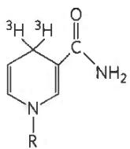

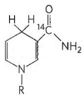

16. NAD Pools and Dehydrogenase Activities Although both pyruvate dehydrogenase and glyceraldehyde 3-phosphate dehydrogenase use $\mathrm{NAD^{+}}$ as their electron acceptor, the two enzymes do not compete for the same cellular NAD pool. Why?

17. The Malate- $\alpha$ -Ketoglutarate Transport System n-Butylmalonate inhibits the transport system that conveys malate and $\alpha$ -ketoglutarate across the inner mitochondrial membrane (see Fig. 19-31). Suppose you add n-butylmalonate to an aerobic suspension of kidney cells using exclusively glucose as fuel. Predict the effect of this inhibitor on (a) glycolysis, (b) oxygen consumption, (c) lactate formation, and (d) ATP synthesis.

18. Time Scales of Regulatory Events in Mitochondria Compare the likely time scales for the adjustments in respiratory rate caused by (a) increased [ADP] and (b) reduced $pO_{2}$ . What accounts for the difference?

19. The Pasteur Effect When investigators add $O_{2}$ to an anaerobic suspension of cells consuming glucose at a high rate, the rate of glucose consumption declines greatly as the cells consume the $O_{2}$ , and accumulation of lactate ceases. This effect, first observed by Louis Pasteur in the 1860s, is characteristic of most cells capable of both aerobic and anaerobic glucose catabolism.

(a) Why does the accumulation of lactate cease after the addition of $O_{2}$ ?

(b) Why does the presence of $O_{2}$ decrease the rate of glucose consumption?

(c) How does the onset of $O_{2}$ consumption slow down the rate of glucose consumption? Explain in terms of specific enzymes.

20. Respiration-Deficient Yeast Mutants and Ethanol Production Researchers can produce respiration-deficient yeast mutants (p $^{-}$ ; “petites”) from wild-type parents by treatment with mutagenic agents. The mutants lack cytochrome oxidase, a deficit that markedly affects their metabolic behavior. One striking effect is that fermentation is not suppressed by O $_{2}$ —that is, the mutants do not experience the Pasteur effect (see Problem 19). Some companies are very interested in using these mutants to ferment wood chips to ethanol for energy use. Why does the absence of cytochrome oxidase eliminate the Pasteur effect? Explain the advantages of using these mutants rather than wild-type yeast for large-scale ethanol production.

21. Mitochondrial Disease and Cancer Mutations in the genes that encode certain mitochondrial proteins are associated with a high incidence of some types of cancer. How might defective mitochondria lead to cancer?

22. Variable Severity of a Mitochondrial Disease Different individuals with a disease caused by the same specific defect in the mitochondrial genome may have symptoms ranging from mild to severe. Explain why.

23. Diabetes as a Consequence of Mitochondrial Defects Glucokinase is essential in the metabolism of glucose in pancreatic $\beta$ cells. Humans with two defective copies of the glucokinase gene exhibit a severe, neonatal diabetes, whereas those with only one defective copy of the gene have a much milder form of the disease (maturity onset diabetes of the young, MODY2). Explain this difference in terms of the biology of the $\beta$ cell.

24. Effects of Mutations in Mitochondrial Complex II Single nucleotide changes in the gene for succinate dehydrogenase (Complex II) are associated with midgut carcinoid tumors. Suggest a mechanism to explain this observation.

### [EN] DATA ANALYSIS PROBLEM

25. Membrane Fluidity and Respiration Rate The mitochondrial electron transfer complexes and the $F_{0}F_{1}$ ATP synthase are embedded in the inner mitochondrial membrane in eukaryotes and in the inner membrane of bacteria. Electrons are shuttled between complexes in part by coenzyme Q, or ubiquinone, a factor that migrates within the membrane. Jay Keasling and coworkers explored the effect of membrane fluidity on rates of respiration in E. coli.

E. coli naturally adjusts its membrane lipid content to maintain membrane fluidity at different temperatures. Workers in the Keasling lab bioengineered an E. coli strain to allow them to control expression of the enzyme FabB, which catalyzes the limiting step in the synthesis of unsaturated fatty acids in E. coli.

(a) How does the content of unsaturated fatty acids affect membrane fluidity?

(b) The researchers were able to modulate the content of unsaturated fatty acids in the membrane lipid from 15% to 80%. They did not try to completely block synthesis of unsaturated fatty acids to extend the experimental range in the membrane to 0%. Why not?

(c) When the cells were grown under aerobic conditions, the researchers found that bacterial growth rate increased as the concentration of unsaturated fatty acids in the membrane increased. However, when oxygen was very limited, the unsaturated fatty acid content of the membrane had no effect on growth rate. How might you explain this observation?

(d) The researchers measured rates of respiration, finding a strong correlation between those rates and the fraction of membrane fatty acids that was unsaturated. When the unsaturated fatty acid content of the membranes was kept low, the cells accumulated pyruvate and lactate. Explain these observations.

(e) Next, they measured rates of diffusion of membrane phospholipids and ubiquinone in vesicles derived from E. coli membranes. The diffusion rates increased as a function of the content of unsaturated fatty acids. These measured rates were consistent with simulations carried out to model the effects of ubiquinone diffusion on respiration. What overall conclusion can be drawn from this work?

### [EN] Reference

Budin, I, T. de Rond, Y. Chen, L.J.G. Chan, C.J. Petzold, and J.D. Keasling. 2018. Viscous control of cellular respiration by membrane lipid composition. Science 362:1186–1189.

### [EN] Abbreviated Solutions — Chapter 19

1. Reaction 1: (a), (d) NADH; (b), (e) E-FMN; (c) $\mathrm{NAD^{+} / NADH}$ and E-FMN/FMNH $_2$

Reaction 2: (a), (d) E-FMNH $_{2}$ ; (b), (e) Fe $^{3+}$ ; (c) E-FMN/FMNH $_{2}$ and Fe $^{3+}$ /Fe $^{2+}$

Reaction 3: (a), (d) $\mathrm{Fe}^{2+}$ ; (b), (e) Q; (c) $\mathrm{Fe}^{3+}/\mathrm{Fe}^{2+}$ and $\mathrm{Q}/\mathrm{Q}\mathrm{H}_2$

2. The side chain makes ubiquinone soluble in lipids and allows it to diffuse in the semifluid membrane.

3. From the difference in standard reduction potential ( $\Delta E^{\prime\circ}$ ) for each pair of half-reactions, we can calculate $\Delta G^{\prime\circ}$ . The oxidation of succinate by FAD is favored by the negative standard free-energy change ( $\Delta G^{\prime\circ} = -3.7$ kJ/mol). Oxidation by NAD $^{+}$ would require a large, positive, standard free-energy change ( $\Delta G^{\prime\circ} = 68$ kJ/mol).

4. (a) All carriers reduced; $\mathrm{CN}^-$ blocks the reduction of $\mathrm{O}_2$ catalyzed by cytochrome oxidase. (b) All carriers reduced; in the absence of $\mathrm{O}_2$ , the reduced carriers are not reoxidized. (c) All carriers oxidized (d) Early carriers more reduced; later carriers more oxidized

5. (a) Inhibition of NADH dehydrogenase by rotenone decreases the rate of electron flow through the respiratory chain, which in turn decreases the rate of ATP production. If this reduced rate is unable to meet the organism's ATP requirements, the organism dies. (b) Antimycin A strongly inhibits the oxidation of Q in the respiratory chain, reducing the rate of electron transfer and leading to the consequences described in (a). (c) Because antimycin A blocks all electron flow to oxygen, it is a more potent poison than rotenone, which blocks electron flow from NADH but not from $\mathrm{FADH}_2$ .

6. (a) The rate of electron transfer necessary to meet the ATP demand increases, and thus the P/O ratio decreases. (b) High concentrations of uncoupler produce P/O ratios near zero. The P/O ratio decreases and more fuel must be oxidized to generate the same amount of ATP. The extra heat released by this oxidation raises the body temperature. (c) Increased activity of the respiratory chain in the presence of an uncoupler requires the degradation of additional fuel. By oxidizing more fuel (including fat reserves) to produce the same amount of ATP, the body loses weight. When the P/O ratio approaches zero, the lack of ATP results in death.

7. Valinomycin acts as an uncoupler. It combines with $K^{+}$ to form a complex that passes through the inner mitochondrial membrane, dissipating the membrane potential. ATP synthesis decreases, which causes the rate of electron transfer to increase. This results in an increase in the $H^{+}$ gradient, $O_{2}$ consumption, and amount of heat released.

8. The steady-state concentration of $P_{i}$ in the cell is much higher than that of ADP. The $P_{i}$ released by ATP hydrolysis changes total $[P_{i}]$ very little.

9. Superoxide dismutase catalyzes the reduction of superoxide to hydrogen peroxide. The hydrogen peroxide can then be eliminated by glutathione peroxidase. This is a major pathway for eliminating the superoxide generated during respiration, helping to ameliorate the damaging effects of reactive oxygen species.

10. (a) External medium: $4.0 \times 10^{-8}$ M; matrix: $2.0 \times 10^{-8}$ M (b) $[H^{+}]$ gradient contributes 1.7 kJ/mol toward ATP synthesis. (c) 21 (d) No (e) From the overall transmembrane potential

11. (a) 0.91 $\mu$ mol/s $\cdot$ g (b) 5.5 s; to provide a constant level of ATP, regulation of ATP production must be tight and rapid.

12. 53 $\mu$ mol/s • g. With a steady state [ATP] of 7.0 $\mu$ mol/g, this is equivalent to 10 turnovers of the ATP pool per second; the reservoir would last about 0.13 s.

13. The citric acid cycle is stalled for lack of an acceptor of electrons from NADH. Pyruvate produced by glycolysis cannot enter the cycle as acetyl-CoA; accumulated pyruvate is transaminated to alanine and exported to the liver.

14. Cytosolic malate dehydrogenase plays a key role in the transport of reducing equivalents across the inner mitochondrial membrane via the malate-aspartate shuttle.

15. The inner mitochondrial membrane is impermeable to NADH, but the reducing equivalents of NADH are transferred (shuttled) through the membrane indirectly: they are transferred to oxaloacetate in the cytosol, the resulting malate is transported into the matrix, and mitochondrial $\mathrm{NAD^{+}}$ is reduced to NADH.

16. Pyruvate dehydrogenase is located in mitochondria; glyceraldehyde 3-phosphate dehydrogenase, in the cytosol. The NAD pools are separated by the inner mitochondrial membrane.

17. (a) Glycolysis becomes anaerobic. (b) Oxygen consumption ceases. (c) Lactate formation increases. (d) ATP synthesis decreases to 2 ATP/glucose.

18. The response to (a), increased [ADP], is faster because the response to (b), reduced $pO_{2}$ , requires protein synthesis.

19. (a) NADH is reoxidized via electron transfer instead of lactic acid fermentation. (b) Oxidative phosphorylation is more efficient. (c) The high mass-action ratio of the ATP system inhibits phosphofructokinase-1.

20. The Pasteur effect is not observed, because the citric acid cycle and respiratory chain are inactive. Fermentation to ethanol could be accomplished in the presence of $O_{2}$ , which is an advantage because strict anaerobic conditions are difficult to maintain.

21. Reactive oxygen species react with macromolecules, including DNA. If a mitochondrial defect leads to increased production of ROS, proto-oncogenes in the nuclear chromosomes can be damaged, producing oncogenes and leading to unregulated cell division and cancer (see Section 12.9).

22. Different extents of heteroplasmy for the defective gene produce different degrees of defective mitochondrial function.

23. Complete lack of glucokinase (two defective alleles) makes it impossible to carry out glycolysis at a sufficient rate to raise [ATP] to the threshold required for insulin secretion.

24. Defects in Complex II result in increased production of ROS, damage to DNA, and mutations that lead to unregulated cell division (cancer; see Section 12.9). It is not clear why the cancer tends to occur in the midgut.

25. (a) Unsaturated fatty acids increase membrane fluidity. (b) The cells cannot survive if their membranes contain less than 15% unsaturated fatty acids. (c) Oxygen is required for respiration. If cell growth is affected by membrane fluidity only in the presence of oxygen, then logically respiration rates may be affected by membrane fluidity. (d) The first observation indicates that something that migrates in the membrane is limiting the rate of respiration. The second observation suggests that respiration is inhibited when unsaturated fatty acid content is low. This might occur if membrane viscosity somehow affected the function of enzymes embedded in the membranes, the passive permeation of oxygen, or the rate of diffusion of a key factor in the membrane itself. (e) The overall conclusion is that ubiquinone diffusion through the membrane limits the rate of respiration.

<!-- EN-END 第19章章末 -->
