# 第 20 章 戊糖磷酸途径

> **本章英文对应内容**（Lehninger，插在所列中文小节末尾）
>
> - §14.6（第14章）→ 二、戊糖磷酸途径的主要反应

## 一、戊糖磷酸途径的发现

戊糖磷酸途径(pentose phosphate pathway)又称戊糖支路(pentose shunt)、己糖单磷酸途径(hexose monophosphate pathway)、磷酸葡糖酸途径(phosphogluconate pathway)及戊糖磷酸循环(pentose phosphate cycle)等。这些名称强调的是从磷酸化的六碳糖形成磷酸化的五碳糖。

这条途径的发现是从研究糖酵解过程的观察中开始的。向供研究糖酵解使用的组织匀浆中添加碘乙酸、氟化物等抑制剂，葡萄糖的利用仍在继续。许多现象表明在已发现的糖酵解途径之外，还存在另外未知的糖代谢途径。特别是1931年，Otto Warburg及同事，还有Fritz Lipman发现了6-磷酸葡糖脱氢酶(glucose phosphate dehydrogenase)和6-磷酸葡糖酸脱氢酶(6-phosphogluconate dehydrogenase)，这两种酶都促使葡萄糖分子的代谢走向糖酵解以外的未知途径。他们还发现了 $\mathrm{NADP^{+}}$ （当时称为TPN，是triphosphopyridinenucleotide的缩写，中文名称为三磷酸吡啶核苷酸）是上述两种酶的辅酶。这些发现不只引起人们对这条未知途径的进一步探索，还在酶学、中间代谢以及维生素和辅酶研究的发展中具有重要的历史意义。他们还提出6-磷酸葡糖酸脱氢酶催化6-磷酸葡糖酸氧化脱羧形成的直接产物可能是戊糖磷酸。Frank Dickens继续O.Warburg等人的研究，分离得到许多戊糖磷酸途径的混合中间产物，包括磷酸戊糖酸(phosphopentonic acid)和磷酸己糖酸(phosphohexonic acid)以及其他一些五碳和四碳化合物的磷酸酯等，其中五碳化合物经鉴定证明是戊糖。Frank Dickens还提出了一条6-磷酸葡糖降解新途径的设想。此外，在各种生物体内所发现的五碳糖、六碳糖、七碳糖以及它们的衍生物景天庚酮糖(sedoheptulose)、核糖(ribose)、脱氧核糖(deoxyribose)等，它们的来源不可能从糖酵解途径中得到解释，这些事实也支持有未知的新途径存在，但当时的酶制剂还不可能达到只催化某单一反应的纯度，也缺乏分离和鉴定少量反应产物的方法，因此通过实验和推理所得到的研究结果还有待进一步地验证。

20世纪30年代虽然已发现了戊糖磷酸途径的存在，也认识到这条途径的某些重要性，但由于战争和研究的极大困难，这一课题竟停顿了约10年之久。1953年F. Dickens总结了前人的研究成果，发表在英国的医学杂志上(British Medical Bulletin, 英国医学公报)，这项研究又得到了进一步发展。50年代开始，随着酶分离方法的进展，获得了较纯的酶制剂，大大促进了对一步反应产物的认识。最早分离得到戊糖的是在1951年，D. B. Scott和S. S. Cohen。他们用F. Dickens的酶制剂得到少量的5-磷酸核糖。当时的鉴定手段是用纸层析法和酶促分析法。

同位素标记研究的应用使这条途径得到了进一步的确证,还显示了这条途径存在的普遍性。

在探索戊糖磷酸途径中做出重要贡献的人除了前述的 Otto Warburg、Fritz Lipman、Frank Dickens 等人外，还应提出 Bernard Horecker、Efraim Racker 等人。有人也将戊糖磷酸途径称为 Warburg-Dickens 戊糖磷酸途径。

## 二、戊糖磷酸途径的主要反应

戊糖磷酸途径是糖代谢的第二条重要途径,它是葡萄糖分解的另外一种机制。这条途径在细胞溶胶内进行,广泛存在于动植物细胞内。

它由一个循环式的反应体系构成。该反应体系的起始物为6-磷酸葡糖，经过氧化分解后产生五碳糖、 $CO_{2}$ 、无机磷酸和 NADPH 即还原型烟酰胺腺嘌呤二核苷酸磷酸（reduced nicotinamide adenine dinucleotide phosphate，又称还原型辅酶Ⅱ）。NADPH 的结构式如图 20-1 所示。

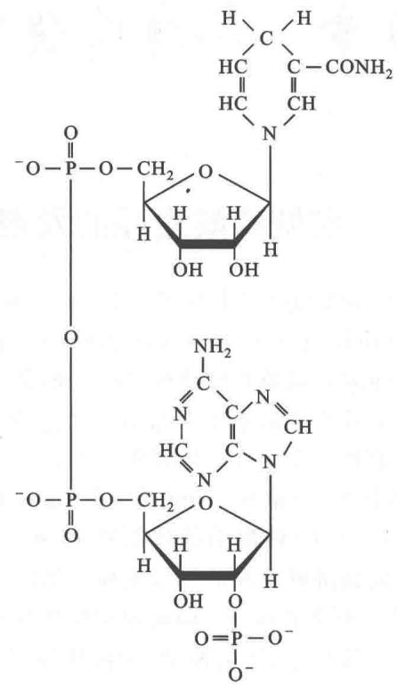  
图20-1 还原型NADPH的结构式

戊糖磷酸途径的核心反应可作如下的概括：

6-磷酸葡糖 + 2NADP $^{+}$ + H $_{2}$ O $\longrightarrow$ 5-磷酸核酮糖 + 2NADPH + 2H $^{+}$ + CO $_{2}$

一般可将其全部反应划分为两个阶段:氧化阶段(oxidative phase)和非氧化阶段(nonoxidative phase)。

## 1. 氧化阶段

这个阶段包括六碳糖氧化脱羧形成五碳糖(核酮糖,ribulose)并使 $NADP^{+}$ 还原形成还原型 NADPH。氧化阶段共包括三步反应：

（1）6-磷酸葡糖在6-磷酸葡糖脱氢酶(glucose-6-phosphate dehydrogenase)的作用下形成6-磷酸葡糖酸-δ-内酯(6-phosphoglucono-δ-lactone)。该反应是分子内第1碳(C1)的羧基和第5碳(C5)的羟基之间发生酯化作用。酶的催化过程需要辅酶NADP $^{+}$ 参加反应。

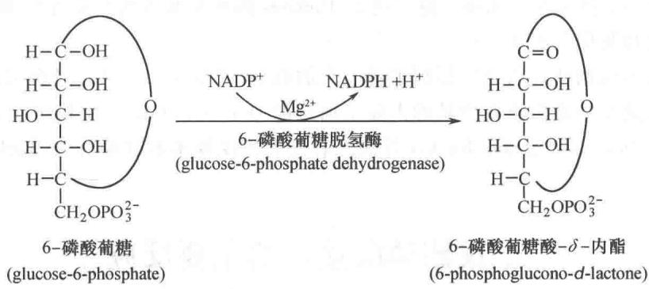

6-磷酸葡糖脱氢酶高度严格地以 $\mathrm{NADP}^{+}$ 为电子受体。以 $\mathrm{NAD}^{+}$ 为辅酶测得的 $K_{\mathrm{M}}$ 值相当于以 $\mathrm{NADP}^{+}$ 为辅酶的千倍。

(2) 6-磷酸葡糖酸- $\delta$ -内酯在一个专一内酯酶(lactonase)作用下水解,形成6-磷酸葡糖酸(6-

phosphogluconate）。这是戊糖磷酸途径的第2步反应：

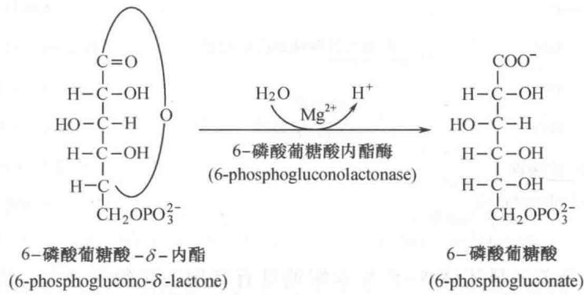

（3）6-磷酸葡糖酸在6-磷酸葡糖酸脱氢酶(6-phosphogluconate dehydrogenase)作用下，氧化脱羧形成5-磷酸核酮糖(ribulose-5-phosphate,简称Ru5P)。这里参与反应的电子受体仍是NADP $^{+}$ 。

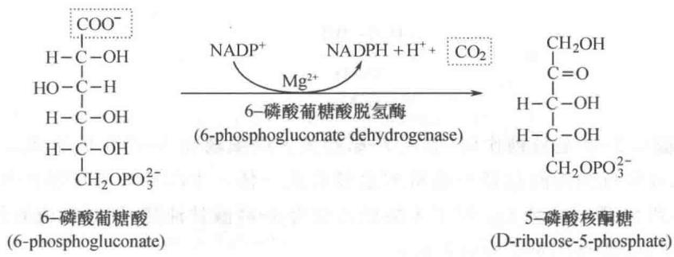

6-磷酸葡糖酸脱氢酶也是专一地以 $NADP^{+}$ 为电子受体，催化的反应包括脱氢和脱羧步骤。

## 2. 非氧化反应阶段

全部戊糖磷酸途径除上述的三步反应外，都是非氧化反应。包括5-磷酸核酮糖通过形成烯二醇中间步骤，异构化为5-磷酸核糖。5-磷酸核酮糖还通过差向异构形成5-磷酸木酮糖，再通过转酮基反应和转醛基反应，将戊糖磷酸途径与糖酵解途径联系起来，并使6-磷酸葡糖再生。

（1）5-磷酸核酮糖异构化为5-磷酸核糖 5-磷酸核酮糖在其异构酶(ribulose-5-phosphate isomerase)作用下,通过形成烯二醇中间产物,异构化为5-磷酸核糖(ribose-5-phosphate):

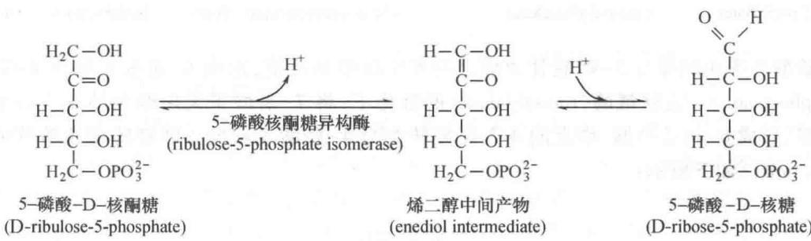

上述反应和糖酵解过程中 6-磷酸葡糖转变为 6-磷酸果糖的反应以及磷酸二羟丙酮异构化为 3-磷酸甘油醛的反应都属于酮醛异构化反应。它们都通过烯二醇中间产物步骤。

6-磷酸葡糖通过三步氧化反应和一步异构化反应形成两分子NADPH和一分子5-磷酸核糖。

(2) 5-磷酸核酮糖转变为 5-磷酸木酮糖 5-磷酸核酮糖在其差向异构酶(ribulose-5-phosphate epimerase)作用下转变成 5-磷酸核酮糖的差向异构体(epimer)5-磷酸木酮糖(xylulose-5-phosphate):

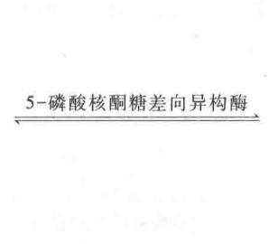

  
5-磷酸核酮糖
(ribulose-5-phosphate)

  
5-磷酸木酮糖
(xylulose-5-phosphate)

5-磷酸核酮糖转变为差向异构体5-磷酸木酮糖具有特别的生物学意义。因为酮糖(ketose)作为转酮酶(transketolase)的底物只有当其C3位羟基的构型(configuration)相当于木酮糖C3的构型时才起作用。核酮糖C3位羟基的构型不能满足转酮酶的要求。木酮糖的C1和C2构成转酮酶转移的基团：

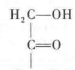

（3）5-磷酸木酮糖与5-磷酸核糖作用，形成7-磷酸景天庚酮糖和3-磷酸甘油醛 木酮糖不仅具有转酮酶所要求的结构，还将戊糖磷酸途径与糖酵解途径联成一体。木酮糖经转酮酶的作用，将两碳单位(two-carbon unit)转移到5-磷酸核糖上。结果木酮糖转变为3-磷酸甘油醛，同时形成另外一个七碳产物，即7-磷酸景天庚酮糖(sedoheptulose-7-phosphate):

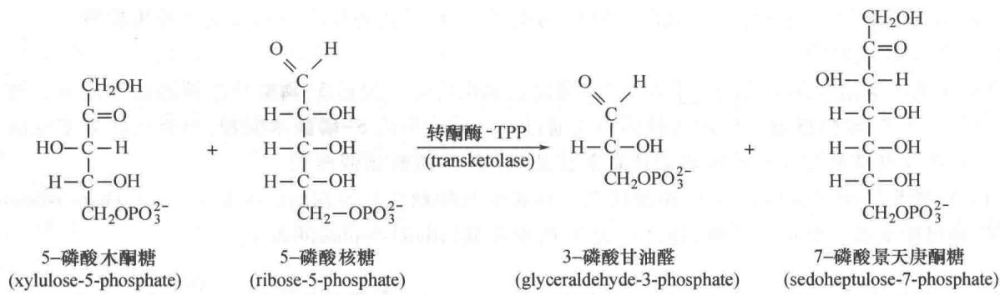

（4）7-磷酸景天庚酮糖与3-磷酸甘油醛之间发生转醛基反应，形成6-磷酸果糖和4-磷酸赤藓糖(erythrose-4-phosphate) 在转醛酶(transaldolase)的催化下，将7-磷酸景天庚酮糖的3个碳单位转移给3-磷酸甘油醛，形成6-磷酸果糖，剩余的4个碳则转变为4-磷酸赤藓糖。转醛酶催化转移的三碳单位(three-carbon unit)，如下所示：

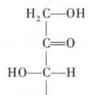

转醛酶催化的全部反应如下：

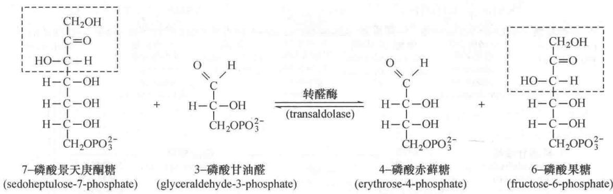

（5）5-磷酸木酮糖和4-磷酸赤藓糖作用形成3-磷酸甘油醛和6-磷酸果糖这是戊糖磷酸途径的第2次转酮基反应。5-磷酸木酮糖和4-磷酸赤藓糖之间发生转酮基作用，生成糖酵解途径的两个中间产物：3-磷酸甘油醛和6-磷酸果糖。反应如下：

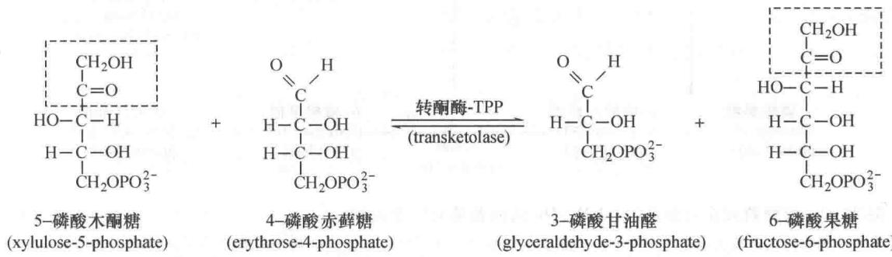

由前述反应可看出,在转酮酶和转醛酶的作用下,戊糖磷酸途径和糖酵解途径之间的沟通主要是通过下列的碳原子的转换过程:

$$
\begin{array}{r l} & {\mathrm{C} _ {5} + \mathrm{C} _ {5} \xrightarrow [ (\mathrm{transketolase}) ]{\text {转酮酶}} \mathrm{C} _ {3} + \mathrm{C} _ {7}} \\ & {\mathrm{C} _ {7} + \mathrm{C} _ {3} \xrightarrow [ (\mathrm{transaldolase}) ]{\text {转醛酶}} \mathrm{C} _ {4} + \mathrm{C} _ {6}} \\ & {\mathrm{C} _ {5} + \mathrm{C} _ {4} \xrightarrow [ ]{\text {转酮酶}} \mathrm{C} _ {3} + \mathrm{C} _ {6}} \end{array}
$$

这些反应的结果由3分子五碳糖可产生2分子六碳糖和1分子三碳糖。这里提供2碳和3碳单位的糖永远是酮糖，接受此单位的则永远是醛糖。

通过上述的沟通,可产生更多的 NADPH,使那些需要更多 NADPH 的细胞满足其对还原力的需要。

另一方面，6-磷酸果糖可在磷酸葡糖异构酶（phosphoglucose isomerase）催化下转变为6-磷酸葡糖。如果6个6-磷酸葡糖分子通过戊糖磷酸途径后，每个6-磷酸葡糖分子氧化脱羧失掉一个 $\mathrm{CO}_{2}$ ，最后失去了一个6-磷酸葡糖分子，又生成了5个6-磷酸葡糖分子。全部反应可用下式表示：

$$
6 6 - \text { 磷酸葡糖 } + 6 \mathrm{H} _ {2} \mathrm{O} + 1 2 \mathrm{NADP} ^ {+} \longrightarrow 6 \mathrm{CO} _ {2} + 5 6 - \text { 磷酸葡糖 } + 1 2 \mathrm{NADPH} + \mathrm{Pi}
$$

由上式可看出通过戊糖磷酸途径使一个6-磷酸葡糖分子全部氧化为6分子 $\mathrm{CO}_{2}$ ，并产生12个具有强还原力的分子即12个NADPH。但此反应不可能由1个6-磷酸葡糖分子来完成，而是由6个6-磷酸葡糖分子共同作用才能完成全部过程。

戊糖代谢的非氧化阶段,全部反应都是可逆的。这保证了细胞能以极大的灵活性满足自己对糖代谢中间产物以及大量还原力的需求。戊糖磷酸途径的总览以3个6-磷酸葡糖分子为例,如图20-2所示。

  
图 20-2 戊糖磷酸途径总览(以 3 分子 6-磷酸葡糖的转变为例)  
图中带箭头的线条数表示在将3分子6-磷酸葡糖转变为3分子 $CO_{2}$ 、2分子6-磷酸果糖、1分子3-磷酸甘油醛的1次轮回中所参加的分子数。图中还表明3分子6-磷酸葡糖转变为3分子 $CO_{2}$ 、2分子6-磷酸果糖、1分子3-磷酸甘油醛，并将6个 $NADP^{+}$ 转变为6个 $NADPH+6H^{+}$ 。为了容易理解，在反应箭头中用数字(①\~⑧)表示出反应步骤

<!-- EN-BEGIN 14.6 -->

### 【英文对应 14.6】Pentose Phosphate Pathway of Glucose Oxidation

> 来源：Lehninger Principles of Biochemistry（书籍/02_生物化学原理） 第14章 Glycolysis, Gluconeogenesis, and the Pentose Phosphate Pathway，§14.6。对应本章“二、戊糖磷酸途径的主要反应”。

P6 In most animal tissues, the major catabolic fate of glucose 6-phosphate is glycolytic breakdown to pyruvate, much of which is then oxidized via the citric acid cycle, ultimately leading to the formation of ATP. Glucose 6-phosphate does have other catabolic fates, however, which lead to specialized products needed by the cell. Of particular importance in some tissues is the oxidation of glucose 6-phosphate to pentose phosphates by the pentose phosphate pathway (also called the phosphogluconate pathway or the hexose monophosphate pathway; Fig. 14-29). In this oxidative pathway, NADP+ is the electron acceptor, yielding NADPH. Rapidly dividing cells, such as those of bone marrow, skin, and intestinal mucosa, and those of tumors, use the pentose ribose 5-phosphate to make RNA, DNA, and such coenzymes as ATP, NADH, FADH₂, and coenzyme A.

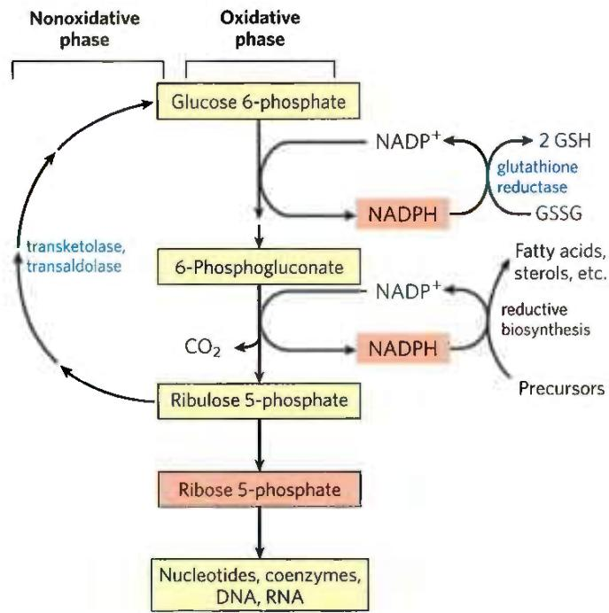  
FIGURE 14-29 General scheme of the pentose phosphate pathway. NADPH formed in the oxidative phase is used to reduce glutathione, GSSG (see Box 14-4), and to support reductive biosynthesis. The other product of the oxidative phase is ribose 5-phosphate, which serves as a precursor for nucleotides, coenzymes, and nucleic acids. In cells that are not using ribose 5-phosphate for biosynthesis, the nonoxidative phase recycles six molecules of the pentose into five molecules of the hexose glucose 6-phosphate, allowing continued production of NADPH and converting glucose 6-phosphate (in six cycles) to CO₂.

In other tissues, the essential product of the pentose phosphate pathway is not the pentoses but the electron donor NADPH, needed for reductive biosynthesis or to counter the damaging effects of oxygen radicals. Tissues that carry out extensive fatty acid synthesis (liver, adipose, lactating mammary gland) or very active synthesis of cholesterol and steroid hormones (liver, adrenal glands, gonads) require the NADPH provided by this pathway. Erythrocytes and the cells of the lens and cornea are directly exposed to oxygen and thus to the damaging free radicals generated by oxygen. By maintaining a reducing environment (a high ratio of NADPH to $\mathrm{NADP^{+}}$ and a high ratio of reduced glutathione to oxidized glutathione), such cells can prevent or undo oxidative damage to proteins, lipids, and other sensitive molecules. In erythrocytes, the NADPH produced by the pentose phosphate pathway is so important in preventing oxidative damage that a genetic defect in glucose 6-phosphate dehydrogenase, the first enzyme of the pathway, can have serious medical consequences (Box 14-4).

#### [EN] The Oxidative Phase Produces NADPH and Pentose Phosphates

P6 The first reaction of the pentose phosphate pathway (Fig. 14-30) is the oxidation of glucose 6-phosphate by glucose 6-phosphate dehydrogenase (G6PD) to form

  
FIGURE 14-30 Oxidative reactions of the pentose phosphate pathway. The end products are ribose 5-phosphate, CO₂, and NADPH.

#### [EN] Why Pythagoras Wouldn't Eat Falafel: Glucose 6-Phosphate Dehydrogenase Deficiency

Fava beans, an ingredient of falafel, have been an important food source in the Mediterranean and the Middle East since antiquity. The Greek philosopher and mathematician Pythagoras prohibited his followers from dining on fava beans, perhaps because they make many people sick with a condition called favism, which can be fatal. In favism, erythrocytes begin to lyse 24 to 48 hours after ingestion of the beans, releasing free hemoglobin into the blood. Jaundice and sometimes kidney failure can result. Similar symptoms can occur with ingestion of the antimalarial drug primaquine or of sulfa antibiotics, or following exposure to certain herbicides. These symptoms have a genetic basis: glucose 6-phosphate dehydrogenase (G6PD) deficiency, which affects about 400 million people worldwide. Most G6PD-deficient individuals are asymptomatic; only the combination of G6PD deficiency and certain environmental factors produces the clinical manifestations.

Glucose 6-phosphate dehydrogenase catalyzes the first step in the pentose phosphate pathway (see Fig. 14-30), which produces NADPH. This reductant, essential in many biosynthetic pathways, also protects cells from oxidative damage by hydrogen peroxide ( $H_{2}O_{2}$ ) and superoxide free radicals, highly reactive oxidants generated as metabolic byproducts and through the actions of drugs such as primaquine and natural products such as divicine — the toxic ingredient of fava beans. During normal detoxification, $H_{2}O_{2}$ is converted to $H_{2}O$ by reduced glutathione and glutathione peroxidase, and the oxidized glutathione is converted back to the reduced form by glutathione reductase and NADPH (Fig. 1). $H_{2}O_{2}$ is also broken down to $H_{2}O$ and $O_{2}$ by catalase, which also requires NADPH. In G6PD-deficient individuals, the NADPH production is diminished and detoxification of $H_{2}O_{2}$ is inhibited. Cellular damage results: lipid peroxidation leading to breakdown of erythrocyte membranes and oxidation of proteins and DNA.

The geographic distribution of G6PD deficiency is instructive. Frequencies as high as 25% occur in tropical Africa, parts of the Middle East, and Southeast Asia, areas where malaria is most prevalent. In addition to such epidemiological observations, in vitro studies show that growth of one malaria parasite, Plasmodium falciparum, is inhibited in G6PD-deficient erythrocytes. The parasite is very sensitive to oxidative damage and is killed by a level of oxidative stress that is tolerable to a G6PD-deficient human host. Because the advantage of

6-phosphoglucono-δ-lactone, an intramolecular ester. NADP+ is the electron acceptor, and the overall equilibrium lies far in the direction of NADPH formation. The lactone is hydrolyzed to the free acid 6-phosphogluconate by a specific lactonase, then 6-phosphogluconate undergoes oxidation and decarboxylation by 6-phosphogluconate dehydrogenase to form the ketopentose ribulose 5-phosphate; the reaction also generates a second molecule of NADPH. Phosphopentose isomerase resistance to malaria balances the disadvantage of lowered resistance to oxidative damage, natural selection sustains the G6PD-deficient genotype in human populations where malaria is prevalent. Only under overwhelming oxidative stress, caused by drugs, herbicides, or divicine, does G6PD deficiency cause serious medical problems.

An antimalarial drug such as primaquine is believed to act by causing oxidative stress to the parasite. It is ironic that antimalarial drugs can cause human illness through the same biochemical mechanism that provides resistance to malaria. Divicine also acts as an antimalarial drug, and ingestion of fava beans may protect against malaria. By refusing to eat falafel, many Pythagoreans with normal G6PD activity may have unwittingly increased their risk of malaria!

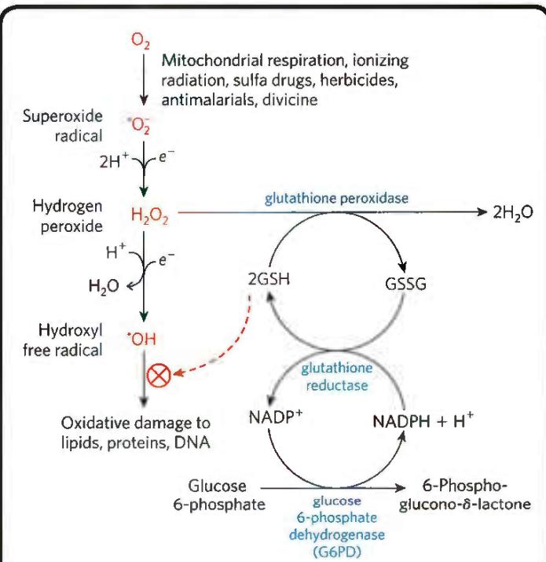  
FIGURE 1 Role of NADPH and glutathione in protecting cells against highly reactive oxygen derivatives. Reduced glutathione (GSH) protects the cell by destroying hydrogen peroxide and hydroxyl free radicals. Regeneration of GSH from its oxidized form (GSSG) requires the NADPH produced in the glucose 6-phosphate dehydrogenase reaction.

converts ribulose 5-phosphate to its aldose isomer, ribose 5-phosphate. In some tissues, the pentose phosphate pathway ends at this point, and its overall equation is

$$
\mathrm{Glucose6-phosphate} + 2 \mathrm{NADP} ^ {+} + \mathrm{H} _ {2} \mathrm{O} \longrightarrow
$$

$$
\text { ribose   5 - phosphate } + \mathrm{CO} _ {2} + 2 \mathrm{NADPH} + 2 \mathrm{H} ^ {+}
$$

The net result is the production of NADPH, a reductant for biosynthetic reactions, and ribose 5-phosphate, a precursor for nucleotide synthesis.

#### [EN] The Nonoxidative Phase Recycles Pentose Phosphates to Glucose 6-Phosphate

P6 In tissues that require primarily NADPH, the pentose phosphates produced in the oxidative phase of the pathway are recycled into glucose 6-phosphate. In this nonoxidative phase, ribulose 5-phosphate is first epimerized to xylulose 5-phosphate:

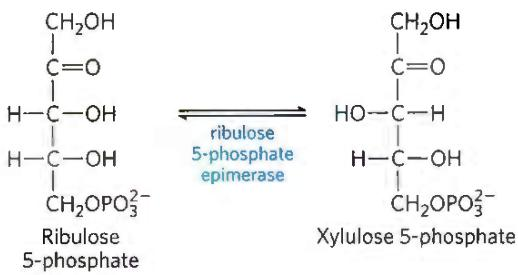

Then, in a series of rearrangements of the carbon skeletons (Fig. 14-31), six five-carbon sugar phosphates are converted to five six-carbon sugar phosphates, completing the cycle and allowing continued oxidation of glucose 6-phosphate with production of NADPH. Continued recycling leads ultimately to the conversion of glucose 6-phosphate to six CO₂. Two enzymes unique to the pentose phosphate pathway act in these interconversions of sugars: transketolase and transaldolase. Transketolase catalyzes the transfer of a two-carbon fragment from a ketose donor to an aldose acceptor (Fig. 14-32a). In its first appearance in the pentose phosphate pathway, transketolase transfers C-1 and C-2 of xylulose 5-phosphate to ribose 5-phosphate, forming the seven-carbon product sedoheptulose 7-phosphate (Fig. 14-32b). The remaining three-carbon fragment from xylulose is glyceraldehyde 3-phosphate.

Next, transaldolase catalyzes a reaction similar to the aldolase reaction of glycolysis: a three-carbon fragment is removed from sedoheptulose 7-phosphate and condensed with glyceraldehyde 3-phosphate, forming fructose 6-phosphate and the tetrose erythrose 4-phosphate (Fig. 14-33). Now transketolase acts again, forming fructose 6-phosphate and glyceraldehyde 3-phosphate from erythrose 4-phosphate and xylulose 5-phosphate (Fig. 14-34). Two molecules of glyceraldehyde 3-phosphate formed by two iterations of these reactions can be converted to a molecule of fructose 1,6-bisphosphate as in gluconeogenesis (Fig. 14-16), and finally FBPase-1 and phosphohexose isomerase convert fructose 1,6-bisphosphate to glucose 6-phosphate. Overall, six pentose phosphates have been converted to five hexose phosphates (Fig. 14-32b)—the cycle is now complete.

Transketolase requires the cofactor thiamine pyrophosphate (TPP), which stabilizes a two-carbon carbanion in this reaction (Fig. 14-35a), just as it does in the pyruvate decarboxylase reaction (Fig. 14-13). Transaldolase uses a Lys side chain to form a Schiff base with the carbonyl group of its substrate, a ketose, thereby stabilizing a carbanion (Fig. 14-35b) that is central to the reaction mechanism.

The first and third steps of the oxidative pentose phosphate pathway shown in Figure 14-30 are oxidations with large, negative standard free-energy changes and are essentially irreversible in the cell. The reactions of the nonoxidative part of the pentose phosphate pathway (Fig. 14-31) are readily reversible and thus also provide a means of converting hexose phosphates to pentose phosphates.

  
FIGURE 14-31 Nonoxidative reactions of the pentose phosphate pathway. (a) These reactions convert pentose phosphates to hexose phosphates, allowing the oxidative reactions to continue. Transketolase and transaldolase are specific to this pathway; the other enzymes also serve in the glycolytic or gluconeogenic pathways. (b) A schematic diagram showing the  
pathway from six pentoses (5C) to five hexoses (6C). Note that this involves two sets of the interconversions shown in (a). Every reaction shown here is reversible; unidirectional arrows are used only to make clear the direction of the reactions during continuous oxidation of glucose 6-phosphate. In the light-independent reactions of photosynthesis, the direction of these reactions is reversed.

  
(a)

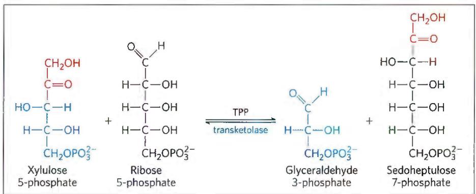  
(b)

FIGURE 14-32 The first reaction catalyzed by transketolase. (a) The general reaction catalyzed by transketolase is the transfer of a two-carbon group, carried temporarily on enzyme-bound TPP, from  
a ketose donor to an aldose acceptor. (b) Conversion of two pentose phosphates to a triose phosphate and a seven-carbon sugar phosphate, sedoheptulose 7-phosphate.  
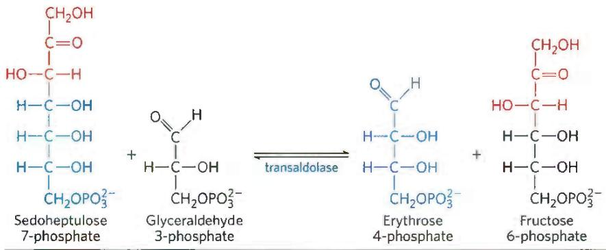

FIGURE 14-33 The reaction catalyzed by transaldolase.

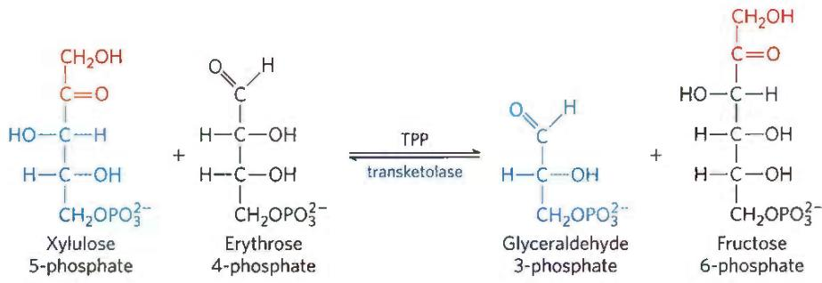

FIGURE 14-34 The second reaction catalyzed by transketolase.

As we shall see in Chapter 20, a process that converts hexose phosphates to pentose phosphates is central to the photosynthetic assimilation of $CO_{2}$ by plants. That pathway, the reductive pentose phosphate pathway, is essentially the reversal of the reactions shown in Figure 14-31 and employs many of the same enzymes.

All the enzymes of the pentose phosphate pathway are located in the cytosol, like those of glycolysis and most of those of gluconeogenesis. In fact, these three pathways are connected through several shared intermediates and enzymes. The glyceraldehyde 3-phosphate formed by the action of transketolase is readily converted to dihydroxyacetone phosphate by the glycolytic enzyme triose phosphate isomerase, and these two trioses can be joined by the aldolase as in gluconeogenesis, forming fructose 1,6-bisphosphate. Alternatively, the triose phosphates can be oxidized to pyruvate by the glycolytic reactions. The fate of the trioses is determined by the cell's relative needs for pentose phosphates, NADPH, and ATP.

(a) Transketolase  
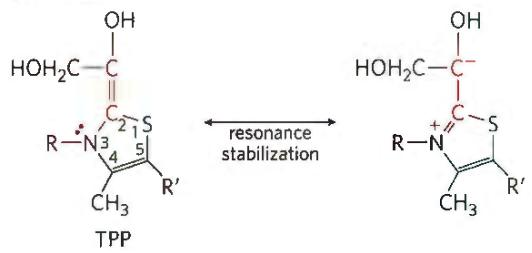

(b) Transaldolase  
  
FIGURE 14-35 Carbanion intermediates stabilized by covalent interactions with transketolase and transaldolase. (a) The ring of TPP stabilizes the carbanion in the dihydroxyethyl group carried by transketolase. (b) In the transaldolase reaction, the protonated Schiff base formed between the ε-amino group of a Lys side chain and the substrate stabilizes the C-3 carbanion formed after aldol cleavage.

#### [EN] Glucose 6-Phosphate Is Partitioned between Glycolysis and the Pentose Phosphate Pathway

P6 Whether glucose 6-phosphate enters glycolysis or the pentose phosphate pathway depends on the current needs of the cell and on the concentration of NADP+ in the cytosol. Without this electron acceptor, the first reaction of the pentose phosphate pathway (catalyzed by glucose 6-phosphate dehydrogenase) cannot proceed. When a cell is rapidly converting NADPH to NADP+ in biosynthetic reductions, [NADP+] rises, allosterically stimulating glucose 6-phosphate dehydrogenase and thereby increasing the flux of glucose 6-phosphate through the pentose phosphate pathway (Fig. 14-36). When the demand for NADPH slows, the level of NADP+ drops, the pentose phosphate pathway slows, and glucose 6-phosphate is instead used to fuel glycolysis.

#### [EN] Thiamine Deficiency Causes Beriberi and Wernicke-Korsakoff Syndrome

Thiamine, precursor to the cofactor thiamine pyrophosphate (TPP), is one of the B vitamins, essential in humans. Lack of vitamin $B_{1}$ in the diet leads to a range of medical problems. The condition known as beriberi is characterized by an accumulation of body fluids (swelling), pain, paralysis, and ultimately, without treatment, death.

  
FIGURE 14-36 Role of NADPH in regulating the partitioning of glucose 6-phosphate between glycolysis and the pentose phosphate pathway. When NADPH is forming faster than it is being used for biosynthesis and glutathione reduction, [NADPH] rises and inhibits the first enzyme in the pentose phosphate pathway. As a result, more glucose 6-phosphate is available for glycolysis.

Wernicke-Korsakoff syndrome, also caused by a severe deficiency of thiamine, typically includes problems with voluntary movements, reflected in abnormal eye movements and gait, and neurological defects. The syndrome is more common among heavy drinkers than in the general population because chronic, heavy alcohol consumption interferes with the intestinal absorption of thiamine. The syndrome can be exacerbated by a mutation in the gene for transketolase that results in an enzyme with a lowered affinity for TPP—an affinity one-tenth that of the normal enzyme. This defect makes individuals much more sensitive to a thiamine deficiency: even a moderate thiamine deficiency (tolerable in individuals with an unmutated transketolase) can result in a transketolase that is not saturated with TPP at its normal concentration. The result is a slowing down of the whole pentose phosphate pathway. In people with Wernicke-Korsakoff syndrome, this mutation results in a worsening of symptoms, which can include severe memory loss, mental confusion, and partial paralysis.

#### [EN] SUMMARY 14.6 Pentose Phosphate Pathway of Glucose Oxidation

■ The oxidative pentose phosphate pathway produces NADPH and pentose phosphates. Tissues that carry out extensive fatty acid synthesis (liver, adipose, lactating mammary gland) or very active synthesis of cholesterol and steroid hormones (liver, adrenal glands, gonads) require the NADPH provided by this pathway.

■ Ribose 5-phosphate is a precursor for nucleotide and nucleic acid synthesis.

■ The first, oxidative phase of the pentose phosphate pathway consists of two oxidations that convert glucose

6-phosphate to ribulose 5-phosphate and reduce NADP $^{+}$ to NADPH.

■ The second, nonoxidative phase of the pentose phosphate pathway comprises steps that convert pentose phosphates to glucose 6-phosphate, which begins the oxidative cycle again.

■ Entry of glucose 6-phosphate either into glycolysis or into the pentose phosphate pathway is largely determined by the relative concentrations of NADP $^{+}$ and NADPH.

<!-- EN-END 14.6 -->

## 三、戊糖磷酸途径反应速率的调控

戊糖磷酸途径氧化阶段的第一步反应,即6-磷酸葡糖脱氢酶催化的6-磷酸葡糖的脱氢反应,实质上是不可逆的。在生理条件下属于限速反应(rate-limiting reaction),是一个重要的调控点。最重要的调控因子是 $NADP^{+}$ 的水平。因为 $NADP^{+}$ 在6-磷酸葡糖氧化形成6-磷酸葡糖酸-δ-内酯的反应中起电子受体的作用。形成的还原型NADPH与 $NADP^{+}$ 争相与酶的活性部位结合从而引起酶活性的降低,即竞争性地抑制6-磷酸葡糖脱氢酶及6-磷酸葡糖酸脱氢酶的活性。所以 $NADP^{+}/NADPH$ 的比例直接影响6-磷酸葡糖脱氢酶的活性。从营养充足的大白鼠肝细胞溶胶测得的 $NADP^{+}/NADPH$ 的比值大约为0.014,这个比值比 $NAD^{+}$ 和NADH的比值低若干个数量级。NAD和NADH的比值在完全相同的条件下为700。0.014表明 $NADP^{+}$ 的水平只略高于NADPH水平。这表明, $NADP^{+}$ 的水平对戊糖磷酸途径的氧化阶段具有极明显的效果。只要 $NADP^{+}$ 的浓度稍高于NADPH,即能够使酶激活从而保证所产生的NADPH及时满足还原性生物合成以及其他方面的需要。所以说 $NADP^{+}$ 的水平对戊糖磷酸途径在氧化阶段产生NADPH的速度和机体在生物合成时对NADPH的利用形成偶联关系。

如前所述,转酮酶和转醛酶催化的反应都是可逆反应。因此根据细胞代谢的需要,戊糖磷酸途径和糖酵解途径可以灵活地相互联系。

戊糖磷酸途径中 6-磷酸葡糖的去路, 可受到机体对 NADPH、5-磷酸核糖和 ATP 不同需要的调节。可能有 3 种情况。

第 1 种情况是机体对 5-磷酸核糖的需要远远超过对 NADPH 的需要。这种情况可见于细胞分裂期，这时需要由 5-磷酸核糖合成 DNA 的前体——核苷酸。为了满足这种需要，大量的 6-磷酸葡糖通过糖酵解途径转变为6-磷酸果糖以及3-磷酸甘油醛。这时由转酮酶和转醛酶将2分子6-磷酸果糖和1分子3-磷酸甘油醛通过反方向戊糖磷酸途径反应转变为3分子5-磷酸核糖。全部反应的化学计算关系可表示如下：

$$
5 6 - \text {   磷酸葡糖   } + \mathrm{ATP} \longrightarrow 6 5 - \text {   磷酸核糖   } + \mathrm{ADP} + \mathrm{H} ^ {+}
$$

第 2 种情况是机体对 NADPH 的需要和对 5-磷酸核糖的需要处于平衡状态。这时戊糖磷酸途径的氧化阶段处于优势。通过这一阶段形成 2 分子 NADPH 和 1 分子 5-磷酸核糖。这一系列反应的化学计算关系可表示为：

$$
6 - \mathrm{磷酸葡糖} + 2 \mathrm{NADP} ^ {+} + \mathrm{H} _ {2} \mathrm{O} \longrightarrow 5 - \mathrm{磷酸核糖} + 2 \mathrm{NADPH} + 2 \mathrm{H} ^ {+} + \mathrm{CO} _ {2}
$$

第3种情况是机体需要的NADPH远远超过5-磷酸核糖，于是6-磷酸葡糖彻底氧化为 $\mathrm{CO}_{2}$ 。例如，脂肪组织①需要大量的NADPH作为还原力来合成脂肪酸(参看第24章)。组织对NADPH的需要促使以下3组反应活跃起来：首先，是由戊糖磷酸途径在氧化阶段形成2分子NADPH和1分子5-磷酸核糖；第2组反应是5-磷酸核糖由转酮酶和转醛酶转变为6-磷酸果糖和3-磷酸甘油醛；第3组反应是6-磷酸果糖和3-磷酸甘油醛，通过糖异生途径(见第23章)形成6-磷酸葡糖。三组反应全过程的化学计算式可表示如下：

$$
① 6 6 - \text { 磷酸葡糖 } + 1 2 \mathrm{NADP} ^ {+} + 6 \mathrm{H} _ {2} \mathrm{O} \longrightarrow 6 5 - \text { 磷酸核糖 } + 1 2 \mathrm{NADPH} + 1 2 \mathrm{H} ^ {+} + 6 \mathrm{CO} _ {2}
$$

$$
② 6 5 - \text { 磷酸核糖 } \longrightarrow 4 6 - \text { 磷酸果糖 } + 2 3 - \text { 磷酸甘油醛 }
$$

$$
③ 4 6 - \text { 磷酸果糖 } + 2 3 - \text { 磷酸甘油醛 } + \mathrm{H} _ {2} \mathrm{O} \longrightarrow 5 6 - \text { 磷酸葡糖 } + \mathrm{Pi}
$$

以上 3 种反应的总反应式即是：

$$
6 - \mathrm{磷酸葡糖} + 1 2 \mathrm{NADP} ^ {+} + 7 \mathrm{H} _ {2} \mathrm{O} \longrightarrow 6 \mathrm{CO} _ {2} + 1 2 \mathrm{NADPH} + 1 2 \mathrm{H} ^ {+} + \mathrm{Pi}
$$

从物质的计量关系上看,1 分子 6-磷酸葡糖可以完全被氧化为 6 分子 $CO_{2}$ , 同时产生 12 个 NADPH。实际上形成的 5-磷酸核糖又通过转酮基、转醛基和糖异生途径中的一些酶的作用转变为 6-磷酸葡糖。

此外，由戊糖磷酸途径形成的5-磷酸核糖还可转变为丙酮酸。丙酮酸又可进一步氧化产生ATP，也可用作生物合成中的结构元件。由5-磷酸核糖形成的6-磷酸果糖和3-磷酸甘油醛都可进入糖酵解途径。所以既可产生ATP又可产生NADPH。

## 四、戊糖磷酸途径的生物学意义

可将戊糖磷酸途径的主要功能概括为以下两个方面：

## 1. 戊糖磷酸途径是细胞产生还原力(NADPH)的主要途径

生活细胞获得的燃料分子经分解代谢将一部分高潜能的电子通过电子传递链传至 $O_{2}$ ，产生 ATP 提供能量消耗的需要，另一部分高潜能的电子并不产生 ATP，而是以还原力的形式供还原性生物合成的需要。NADPH 分子不只是因为它的核糖单位的第 2 个碳原子上有一个磷酸基团而在结构上区别于 NADH，它的功能在大多数生物化学反应中也和 NADH 根本不同。NADH 的作用主要是通过呼吸链提供 ATP 分子，而 NADPH 在还原性生物合成中起氢负离子供体的作用。例如，肝、脂肪组织、授乳期的乳腺脂肪酸合成强劲的部位，肝、肾上腺、性腺等胆固醇和固醇类合成的部位都需要 NADPH（参看脂肪酸及胆固醇的生物合成）；还可用于抵消氧自由基造成的损伤在光合作用中戊糖磷酸途径的部分途径参加由 $CO_{2}$ 合成葡萄糖的途径，由核糖核苷酸转变为脱氧核糖核苷酸等都需要 NADPH。

在脊椎动物的红细胞(red blood cell)中戊糖磷酸途径酶类的活性也很高。因为在红细胞中戊糖磷酸途径提供的还原力可保证红细胞中的谷胱甘肽(glutathion, GSSG)处于还原状态：

$$
\begin{array}{c c c c c} \text {GSSG} & + & \text {NADPH} & + & \mathrm{H} ^ {+} \\ \text {谷胱甘肽} & & & & \xrightarrow [ (\text {glutathione reductase}) ]{\text {谷胱甘肽还原酶}} \\ (\text {glutathione}) & & & & \end{array} \quad \begin{array}{c c c c c} 2 \mathrm{GSH} & + & \mathrm{NADP} ^ {+} \\ \text {还原型谷胱甘肽} \\ (\text {reduced glutathione}) & & & \end{array}
$$

红细胞需要大量的还原型谷胱甘肽，一方面红细胞与还原型谷胱甘肽共用一SH基团来维持其蛋白质结构的完整性；另一方面用于保护脂膜防止被过氧化物、过氧化氢等氧化；再一方面使维持红细胞内血红素的铁原子处于2价 $\left(\mathrm{Fe}^{2+}\right)$ 状态；含有 $Fe^{3+}$ 的高铁血红蛋白（methemoglobin）没有运输氧的功能。NADPH水平的降低可使蛋白质发生变化，使脂质发生过氧化作用，使红细胞产生高血红素 $\left(\mathrm{Fe}^{3+}\right)$ 。此外，眼球、角膜组织直接暴露于氧气环境易受氧自由基的侵害，都需要NADPH的保护。

有些人群,在我国多发生在南方,在国外多发生在黑人,因遗传缺陷6-磷酸葡糖脱氢酶,他们的红细胞中NADPH浓度达不到需要水平,很容易患贫血症(anemia)。这种病人对具有氧化性的药物例如原奎宁、磺胺类药物(sulfa drugs)以及阿司匹林(aspirin)等药物过敏。他们的氧化红细胞内因缺乏NADPH保护而容易破裂,结果造成严重的溶血性贫血症(hemolytic anemia),表现为黄胆、尿呈黑色、血色素下降等症状,严重者甚至因大量红细胞破裂而死亡。

## 2. 戊糖磷酸途径是细胞内不同结构糖分子的重要来源,并为各种单糖的相互转变提供条件

三碳糖、四碳糖、五碳糖、六碳糖以及七碳糖的碳骨架都是细胞内糖类不同的结构分子，其中核糖及其衍生物作为 ATP、CoA、NAD $^{+}$ 、FAD、RNA 以及 DNA 等重要生物分子的组成部分，都来源于戊糖磷酸途径。核酸等的生物合成在生长、再生的组织例如骨髓、皮肤、小肠黏膜以及癌细胞中，其速度都是极高的，因此需要戊糖磷酸途径迅速地提供原料。

## 提要

戊糖磷酸途径主要作用是形成 NADPH 和 5-磷酸核糖。有关作用的酶都存在于细胞溶胶中。NADPH 在还原性生物合成中，例如，脂肪酸和固醇类的合成用于提供还原力。而 5-磷酸核糖及其衍生物则用于合成 RNA、DNA、 $NAD^{+}$ 、FAD、ATP 和辅酶 A 等重要生物分子。戊糖磷酸途径由 6-磷酸葡糖脱氢开始形成一个内酯（lacton），内酯水解形成 6-磷酸葡糖酸，紧接着进行氧化脱羧作用产生 5-磷酸核酮糖。 $NADP^{+}$ 在上述的氧化过程中都是电子受体。最后的步骤是 5-磷酸核酮糖发生差向异构由酮糖形式转变为醛糖形式即 5-磷酸核糖。因机体对 5-磷酸核糖的需要量远不及对 NADPH 的需要量，于是借助转酮基和转醛基作用将 5-磷酸核糖转变为 6-磷酸果糖和 3-磷酸甘油醛。这就使戊糖磷酸途径和糖酵解途径连接起来。5-磷酸木酮糖，7-磷酸景天庚酮糖和 4-磷酸赤藓糖，都在相互转变过程中作为中间产物。通过这条途径每分子 6-磷酸葡糖，如果完全氧化为 $CO_{2}$ 可形成 12 分子 NADPH。如果 5-磷酸核糖的需要量超过对 NADPH 的需要，这时非氧化反应步骤就会相对地更活跃。在这种情况下，6-磷酸果糖和 3-磷酸甘油醛就转变为 5-磷酸核糖而不产生 NADPH。如果相反，由氧化步骤形成的 5-磷酸核糖还可以通过 6-磷酸果糖和 3-磷酸甘油醛转变为丙酮酸。以这种方式，6-磷酸葡糖的 6 个碳原子中的 5 个碳原子参与形成丙酮酸分子，并且产生出 ATP 和 NADPH。戊糖磷酸途径和糖酵解途径之间的穿插作用，使得机体内的 NADPH、ATP、5-磷酸核糖以及丙酮酸等物质可以根据需要保持合理的水平。

## 习题

1. 如果在 6-磷酸葡糖的 C2 上作标记, 在戊糖磷酸途径的产物 6-磷酸果酸的 C1 和 C3 都得到标记, 请绘出标记 C 转变的过程。

2. 用 $^{14}$ C 标记葡萄糖的 C6 原子, 加入到含有戊糖磷酸途径的酶和辅助因子的体系中, 请问放射性标记将在何处出现?

3. 用 $^{14}$ C 标记 5-磷酸核糖的 C1 原子，加入到含有转酮酶、转醛酶、磷酸戊糖差向异构酶、磷酸戊糖异构酶和 3-磷酸甘油醛的溶液中，在 4-磷酸赤藓糖和 6-磷酸果糖中的放射性标记将怎样分布？

4. 写出由 6-磷酸葡糖到 5-磷酸核糖在不产生 NADPH 情况下的化学平衡式。

5. 写出 6-磷酸葡糖在不产生戊糖的情况下产生 NADPH 的化学平衡式？

6. 比较柠檬酸循环途径和戊糖磷酸途径的脱羧反应机制。

7. 戊糖磷酸途径受到怎样的调控？

8. 说明戊糖磷酸途径的生物学意义。

## 主要参考书目

1. Nelson D L, Cox M M. Lehninger 生物化学原理. 3 版. 周海梦, 等译. 北京: 高等教育出版社, 2005.

2. 王琳芳, 杨克恭. 医学分子生物学原理. 北京: 高等教育出版社, 2001.

3. Nelson D L, Cox M M. Lehninger Principles of Biochemistry. 6th ed. New York: W. H. Freeman and Company, 2012.

4. Greenberg D M. Metabolic Pathways. New York: Academic Press, 1960.

5. Roskoski R. Biochemistry. St. Louis: W. B. Saunders Company, 1997:135-138.

6. Hames B D, Hooper N M, Houghton J D. Instant Notes in Biochemistry. Oxford: Bios Scientific Publishers, 1997.

7. Zubay, Gecffrey. Biochemistry. 3rd ed. Dubuque: Wm. C. Brown Publishers, 1993:347-376, 585-609.

8. Berthon H A, Kuchel P W, Nixon P E. High control coefficient of transketolase in the nonoxidative pentose phosphate pathway of human erythrocytes: NMR, antibody, and computer simulation studies. Biochemistry, 1992, 31: 12792-12798.

(王镜岩 秦咏梅)

## 网上资源

习题答案

自测题
