## 第 21 章 糖异生和糖的其他代谢途径

> **本章英文对应内容**（Lehninger，插在所列中文小节末尾）
>
> - §14.4（第14章）→ 一、糖异生作用

## 一、糖异生作用

糖异生即是葡萄糖的异生作用,英文名称为 gluconeogenesis,来源于希腊文:“glykys”是“甜”的意思,“neo”是“新”的意思,“genesis”是“来源”或“产生”的意思。糖异生作用指的是以非糖物质作为前体合成葡萄糖的作用(图 21-1)。非糖物质包括乳酸、丙酮酸、丙酸、甘油以及氨基酸等。糖异生对于人类以及其他动物是绝对需要的途径。例如,人脑以葡萄糖作为主要燃料,对葡萄糖有高度的依赖性。红细胞也需要提供葡萄糖。成人脑每日大约需要 120 g 葡萄糖,占人体对葡萄糖的每日总需要量(约为 160 g)的绝大部分。已知体液中的葡萄糖含量大约为 20 g,从糖原(glycogen)可随时提供的葡萄糖大约为 190 g。因此机体在一般情况下,体内的葡萄糖量足够维持一天的需要,但是如果机体处于饥饿状态,则必须由非糖物质转化成葡萄糖提供急需。当机体处于剧烈运动时,也需要由非糖物质及时提供葡萄糖。机体除中枢神经系统(central nervous system)和红细胞需直接提供葡萄糖外,肾髓质(kidney medulla)、睾丸(testes)、眼晶状体等组织也主要利用葡萄糖提供能量。机体必须将血糖维持在一定水平,才能使这些器官及时得到葡萄糖的供应。因此即使每日从摄食得到葡萄糖而且体内有储存的糖原,机体仍需要不断从非糖物质合成葡萄糖以保证不间断地将葡萄糖提供给那些主要依赖葡萄糖为能源的组织。

  
图21-1 以非糖物质作为前体合成糖类

## （一）糖异生作用的途径

## 1. 糖异生作用和糖酵解作用的关系

糖异生作用并不是糖酵解作用的直接逆反应。虽然葡萄糖可由丙酮酸合成，其所经历的途径绝大部分是糖酵解过程的逆反应，但并不完全是糖酵解过程的逆反应。糖酵解过程是放能过程。一般在典型的细胞内环境下，由葡萄糖形成丙酮酸的 $\Delta G$ 为 $-83.68\mathrm{kJ / mol}(-20\mathrm{kcal / mol})$ 。其中有三步反应是不可逆的。即：①由己糖激酶催化的葡萄糖和ATP形成6-磷酸葡糖和ADP，②由磷酸果糖激酶催化的6-磷酸果糖和ATP形成1,6-二磷酸果糖和ADP，③由丙酮酸激酶催化的磷酸烯醇式丙酮酸和ADP形成丙酮酸和ATP的反应。糖异生作用要利用糖酵解过程中的可逆反应步骤必须对上述3个不可逆过程采取迂迴措施绕道而行。

## 2. 糖异生对糖酵解的不可逆过程采取的迂迴措施

（1）迂迴措施之一：丙酮酸通过草酰乙酸形成磷酸烯醇式丙酮酸。该措施分两步进行：

① 丙酮酸在丙酮酸羧化酶(pyruvate carboxylase)催化下,消耗一个 ATP 分子的高能磷酸键形成草酰乙酸。丙酮酸羧化酶含有一个以共价键结合的生物素(biotin)作为辅基。生物素起 $CO_{2}$ 载体的作用。生物素的末端羧基与酶分子的一个赖氨酸残基的 $\varepsilon-$ 氨基以酰胺键相连。使生物素和赖氨酸形成丙酮酸羧化酶的一个长摆臂：

丙酮酸的羧化分两步进行：

① 丙酮酸羧化酶在 ATP 参与下与 $CO_{2}$ 结合使其成为活化的形式。ATP 的水解推动此反应的进行：

  
N-1-羧化生物素-酶
(N-1-carboxybiotinyl-enzyme)

上式表明: $CO_{2}$ 以羧基形式结合到酶辅基生物素环的 N1 原子上, 形成活化羧基。此活化羧基水解的 $\Delta G^{\ominus'} = -19.7 \, \text{kJ/mol} (-4.7 \, \text{kcal/mol})$ 。因此, 它的转移不需提供能量。

⑥ 活化的羧基从羧化生物素转移到烯醇式丙酮酸上形成草酰乙酸：

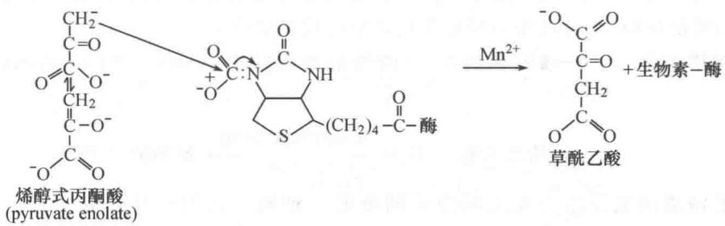

丙酮酸羧化酶是存在于线粒体基质的酶，由4个亚基组成四聚体。每个亚基都与 $Mg^{2+}$ 相结合。每个亚基的相对分子质量为120 000。乙酰-CoA是该酶强有力的别构激活剂（allosteric activator）。如果该酶不与乙酰-CoA结合，则生物素不能羧化。

上述的总反应可用下式表示：

$$
\text { 丙酮酸 } + \mathrm{CO} _ {2} + \mathrm{ATP} + \mathrm{H} _ {2} \mathrm{O} \longrightarrow \text { 草酰乙酸 } + \mathrm{ADP} + \mathrm{Pi} + 2 \mathrm{H} ^ {+}
$$

② 草酰乙酸在磷酸烯醇式丙酮酸羧激酶(phosphoenolpyruvate carboxykinase, PEPCK)催化下,形成磷酸烯醇式丙酮酸。该反应需消耗一个 GTP 分子,反应如下:

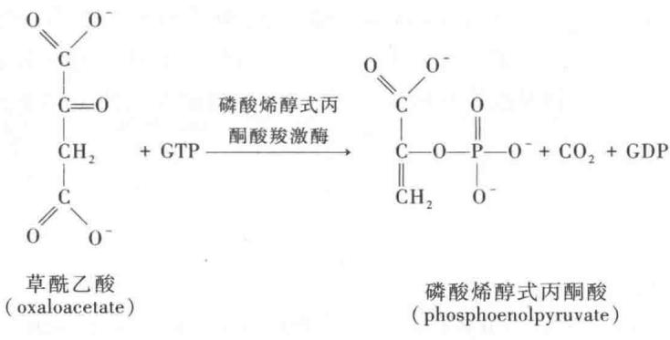

磷酸烯醇式丙酮酸羧激酶由一条单一肽链构成,其相对分子质量为740 000。不同生物该酶在亚细胞内的位置不同。例如,在大白鼠和小白鼠的肝细胞,全部存在于细胞溶胶中;在鸟和兔的肝细胞,全部存在于线粒体中;在豚鼠和人类,则比较均匀地分布在线粒体和细胞溶胶中。

应注意的是,在前述反应中的丙酮酸羧化酶是一种线粒体酶,而糖异生作用中导致形成6-磷酸葡糖的其他酶都是细胞溶胶酶。由丙酮酸羧化形成的草酰乙酸,必须穿过线粒体膜才能作为磷酸烯醇式丙酮酸羧激酶的底物被催化形成磷酸烯醇式丙酮酸。因为细胞不存在直接使草酰乙酸跨膜的运送蛋白,一般情况下,草酰乙酸通过形成苹果酸的途径跨过线粒体膜。草酰乙酸在线粒体内由与NADH相连的苹果酸脱氢酶催化,还原为苹果酸,跨过线粒体膜后,又由细胞溶胶中的与 $NAD^{+}$ 相连的苹果酸脱氢酶使其再氧化形成草酰乙酸。

总结上述由丙酮酸转变为磷酸烯醇式丙酮酸的反应可表示如下：

$$
\text { 丙酮酸 } + \mathrm{ATP} + \mathrm{GTP} + \mathrm{H} _ {2} \mathrm{O} \longrightarrow \text { 磷酸烯醇式丙酮酸 } + \mathrm{ADP} + \mathrm{GDP} + \mathrm{Pi} + 2 \mathrm{H} ^ {+}
$$

（2）迂迴措施之二：1,6-二磷酸果糖在1,6-二磷酸果糖磷酸酶（fructose-1,6-bisphosphatase）催化下，其C1位的磷酸酯键水解形成6-磷酸果糖。这一反应是放能反应，容易进行：

$$
1, 6 - \mathrm{二磷酸果糖} + \mathrm {H_ {2} O\xrightarrow {1,6 - \mathrm{二磷酸果糖磷酸酶}} 6 - \mathrm{磷酸果糖} + Pi}
$$

上述反应的特殊意义在于,它避开了糖酵解过程不可能进行的直接逆反应,即形成一个 ATP 分子和 6-磷酸果糖的吸能反应,将其改变为释放无机磷酸的放能反应。

（3）迂迴措施之三：6-磷酸葡糖在6-磷酸葡糖磷酸酶(glucose-6-phosphatase)催化下水解为葡萄糖。

$$
6 - \mathrm{磷酸萄糖} + \mathrm {H_ {2} O} \xrightarrow {6 - \mathrm{磷酸葡糖磷酸酶}} \mathrm{葡萄糖} + \mathrm{Pi}
$$

6-磷酸葡糖磷酸酶是结合在光面内质网膜的一种酶。它的活性需有一种与 $\mathrm{Ca}^{2+}$ 结合的稳定蛋白（ $\mathrm{Ca}^{2+}$ -bindingstabilizing protein）协同作用。6-磷酸葡糖在转变为葡萄糖之前必须先转移到内质网内才能接受6-磷酸葡糖酶的水解作用；形成的葡萄糖和无机磷酸，通过不同的转运途径又回到细胞溶胶中。

肝、肠和肾细胞内由6-磷酸葡糖形成的葡萄糖进入血液，对维持血液中葡萄糖（血糖）浓度的平衡起着重要作用。脑和肌肉中不存在6-磷酸葡糖磷酸酶，因此脑和肌肉细胞不能利用6-磷酸葡糖形成葡萄糖。在肝中，糖异生作用的主要物质是骨骼肌活动的产物乳酸和丙氨酸。当肌肉紧张活动时形成的乳酸随血流进入肝加工。这有利于减轻肌肉的繁重负担。

上述三步迂迴措施实际上是由不同的酶绕过了糖酵解中不可逆的三步反应。糖酵解作用和糖异生作用中酶的差异可用表21-1表明。

表 21-1 糖酵解和糖异生反应中的酶的差异

<table><tr><td>糖酵解作用</td><td>糖异生作用</td></tr><tr><td>己糖激酶(hexokinase)</td><td>6-磷酸葡糖磷酸酶(glucose-6-phosphatase)</td></tr><tr><td>磷酸果糖激酶(phosphofructokinase)</td><td>1,6-二磷酸果糖磷酸酶(fructose-1,6-bisphosphatase)</td></tr><tr><td>丙酮酸激酶(pyruvate kinase)</td><td>丙酮酸羧化酶(pyruvate carboxylase)</td></tr><tr><td></td><td>磷酸烯醇式丙酮酸羧激酶(phosphoenolpyruvate carboxykinase)</td></tr></table>

## （二）糖异生途径总览

图 21-2 表明糖异生途径的全过程。为便于理解糖异生途径和糖酵解途径的关系，用糖酵解途径的次序和相反的箭头方向相对比。

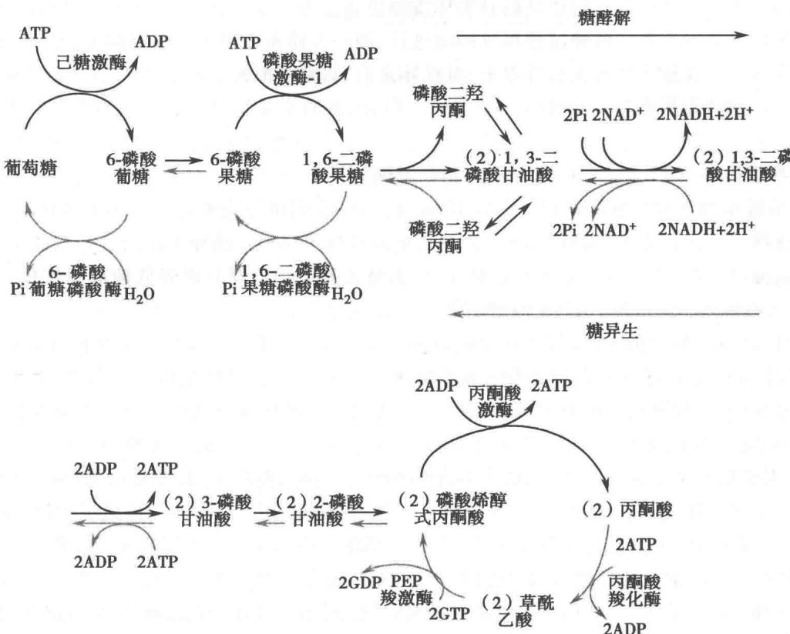  
图21-2 糖异生途径总览图

## （三）由丙酮酸形成葡萄糖的能量消耗及意义

由两分子丙酮酸形成一分子葡萄糖的总反应可用下式表示：

2 丙酮酸 + 4ATP + 2GTP + 2NADH + 6H₂O → 葡萄糖 + 4ADP + 2GDP + Pi + 2NAD⁺ + 2H⁺
上述反应的 $\Delta G^{\ominus'} = -37.66 \, \text{kJ/mol} (-9 \, \text{kcal/mol})$ 。

若完全走糖酵解的逆反应过程,可推算出如下的反应和能量消耗:

2 丙酮酸 + 2ATP + 2NADH + 2H₂O → 葡萄糖 + 2ADP + 2Pi + 2NAD⁺ $\Delta G^{\ominus'} = +20 \text{ kcal/mol}$ (反应不可能进行)。

从上述两种不同途径的比较可看到，由葡萄糖经酵解途径形成丙酮酸可产生两个ATP分子。由丙酮酸合成葡萄糖需消耗4个ATP分子和两个GTP分子即6个高能磷酸键。总算起来，糖异生需消耗4个额外的高能键。这4个额外的高能磷酸键的能量即用于将不可能逆行的过程转变为可以通行的反应。此外，ATP分子参加反应可改变反应的平衡常数。已知一个ATP分子参加到反应中或与某一反应相偶联可改变其平衡常数的系数为 $10^{8}$ 。如果有 $n$ 个ATP分子参与反应，可使反应平衡比改变的系数为 $10^{8n}$ 。因此糖异生作用中参与的4个额外的ATP分子，可使反应的平衡常数的系数变为 $10^{32}$ 。这又从另一个角度表明糖异生作用在热力学上是有利的。

## （四）糖异生作用的调节

糖异生作用和糖酵解作用有密切的相互协调关系。如果糖酵解作用活跃，则糖异生作用必受一定限制。如果糖酵解的主要酶受到抑制，则糖异生作用酶的活性就受到促进。这种相互制约又相互协调的关系主要由两种途径不同的酶活性和浓度起作用；因每条途径的酶浓度和活性都是受到调控的。此外底物浓度也起调节作用。葡萄糖的浓度对糖酵解起调节作用。乳酸浓度以及其他葡萄糖前体的浓度对糖异生都起调节作用。无论是糖酵解作用还是糖异生作用都是高度的放能过程，除上述相互协调的关系外，不存在热力学上的调控抑制关系。两种过程都可同时进行，即一方面葡萄糖转变成丙酮酸，另一方面丙酮酸又重新合成葡萄糖。在这种往复转变的过程中，对机体来说，只是净消耗了两个ATP分子和两个GTP分子。因此，这种循环又有“无用循环”（futile cycle）之称。但是，人们不难想象，“无用循环”不可能对机体是毫无意义的。

## 1. 磷酸果糖激酶(PFK)和1,6-二磷酸果糖磷酸酶的调节

AMP 对磷酸果糖激酶有激活作用。当 AMP 浓度高时，表明机体需要合成更多的 ATP。AMP 刺激磷酸果糖激酶使糖酵解过程加速，同时 1,6-二磷酸果糖磷酸酶不再促进糖异生作用。ATP 以及柠檬酸对磷酸果糖激酶起抑制作用，当二者的浓度升高时，磷酸果糖激酶受到抑制从而降低糖酵解作用，同时柠檬酸又刺激 1,6-二磷酸果糖磷酸酶，通过它使糖异生作用加速进行。

当饥饿时,机体血糖含量下降,刺激血液中的胰高血糖素水平升高。胰高血糖素有启动 cAMP 级联反应的作用(关于级联反应请参看第 22 章糖原的分解和合成代谢),使二磷酸果糖磷酸酶-2 和磷酸果糖激酶 2 都发生磷酸化,结果导致二磷酸果糖磷酸酶-2 受到激活,同时磷酸果糖激酶 2 受到抑制。磷酸果糖激酶 2 使 6-磷酸果糖转变为 2,6-二磷酸果糖(F-2,6-BP)。2,6-二磷酸果糖是一个信号分子(signal molecule),它对磷酸果糖激酶和 1,6-二磷酸果糖磷酸酶具有协同调控作用。2,6-二磷酸果糖对磷酸果糖激酶具有强烈的激活作用,而对 1,6-二磷酸果糖磷酸酶有抑制作用;而 2,6-二磷酸果糖磷酸酶使 2,6-二磷酸果糖水解形成 6-磷酸果糖。因此可以理解,2,6-二磷酸果糖的水平在饥饿情况下对调节糖酵解和糖异生作用有重要意义。在饱食的条件下,血糖浓度升高,血中胰岛素的水平也升高,这时 2,6-二磷酸果糖的水平也随之升高。由于 2,6-二磷酸果糖对磷酸果糖激酶的激活,和对 1,6-二磷酸果糖磷酸酶的抑制,从而糖酵解过程加速,糖异生作用受到抑制。在饥饿时,低水平的 2,6-二磷酸果糖使糖异生作用处于优势。

## 2. 丙酮酸激酶、丙酮酸羧化酶和磷酸烯醇式丙酮酸羧激酶之间的调节

在肝中丙酮酸激酶受高浓度 ATP 和丙氨酸的抑制。高浓度的 ATP 和丙氨酸是能荷高和细胞结构元件丰富的信号，因此当 ATP 和丙酮酸等供生物合成所需的中间物充足时，糖酵解作用就受到抑制。催化由丙酮酸作为起始物合成葡萄糖的第一个酶，丙酮酸羧化酶受乙酰-CoA 的激活和 ADP 的抑制，当乙酰-CoA 的含量充分时，丙酮酸羧化酶受到激活从而促进糖异生作用。但如果细胞的供能情况不够充分，ADP 的浓度升高，丙酮酸羧化酶和磷酸烯醇式丙酮酸羧激酶都受到抑制，而使糖异生作用停止进行。因这时的 ATP 水平很低，丙酮酸激酶解除了抑制，于是糖酵解作用又发挥其有效作用。

丙酮酸激酶还受到1,6-二磷酸果糖的正反馈激活作用，也加速糖酵解作用的进行。

当机体处于饥饿状态时,为首先保证供应脑和肌肉足够的血糖,肝中的丙酮酸激酶受到抑制从而限制了糖酵解作用的进行。因胰高血糖素的分泌加强,进入血液后激活 cAMP 的级联效应使丙酮酸激酶由于磷酸化也失去活性。

## （五）乳酸的再利用和可立氏循环

前面已经提到,在激烈运动时,糖酵解作用产生 NADH 的速度超出通过氧化呼吸链再形成 $NAD^{+}$ 的能

力。这时肌肉中酵解过程形成的丙酮酸由乳酸脱氢酶转变为乳酸以使 $NAD^{+}$ 再生，这样糖酵解作用才能继续提供 ATP。乳酸属于代谢的一种最终产物，除了再转变为丙酮酸外，别无其他去路。肌肉细胞内的乳酸扩散到血液并随着血流进入肝细胞，在肝细胞内通过糖异生途径转变为葡萄糖，又回到血液随血流供应肌肉和脑对葡萄糖的需要。这个循环过程称为可立氏循环（Cori cycle）（图 21-3）。

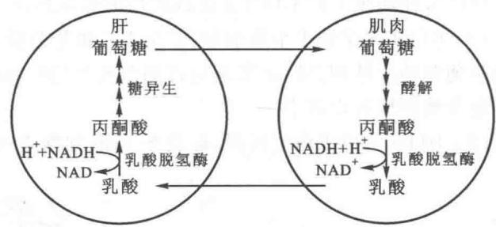  
图21-3 可立氏循环(Cori cycle)示意图

<!-- EN-BEGIN 14.4 -->

### 【英文对应 14.4】Gluconeogenesis

> 来源：Lehninger Principles of Biochemistry（书籍/02_生物化学原理） 第14章 Glycolysis, Gluconeogenesis, and the Pentose Phosphate Pathway，§14.4。对应本章“一、糖异生作用”。

The central role of glucose in metabolism arose early in evolution, and this sugar remains the nearly universal fuel and building block in modern organisms, from microbes to humans. In mammals, some tissues depend almost completely on glucose for their metabolic energy. For the human brain and nervous system, as well as the erythrocytes, testes, renal medulla, and embryonic tissues, glucose from the blood is the sole or major fuel source. The brain alone requires about 120 g of glucose each day—more than half of all the glucose stored as glycogen in muscle and liver. However, the supply of glucose from these stores is not always sufficient; between meals and during longer fasts, or after vigorous exercise, glycogen is depleted. For these times, organisms need a method for synthesizing glucose from noncarbohydrate precursors. This is accomplished by a pathway called gluconeogenesis (“new formation of sugar”), which converts pyruvate and related three- and four-carbon compounds to glucose.

P4 Gluconeogenesis occurs in all animals, plants, fungi, and microorganisms. The reactions are essentially the same in all tissues and all species. The important precursors of glucose in animals are three-carbon compounds such as lactate, pyruvate, and glycerol, as well as certain amino acids (Fig. 14-15). In mammals, gluconeogenesis takes place mainly in the liver, and to a lesser extent in the renal cortex and in the epithelial cells that line the small intestine. The glucose produced passes into the blood to supply other tissues. After vigorous exercise, lactate produced by anaerobic glycolysis in skeletal muscle returns to the liver and is converted to glucose, which moves back to muscle and is converted to glycogen—a circuit called the Cori cycle (see Fig. 23-17). In plant seedlings, stored fats and proteins are converted, via paths that include gluconeogenesis, to the disaccharide sucrose for transport throughout the developing plant. Glucose and its derivatives are precursors for the synthesis of plant cell walls, nucleotides and coenzymes, and a variety of other essential metabolites. In many microorganisms, gluconeogenesis starts from simple organic compounds of two or three carbons, such as acetate, lactate, and propionate, in their growth medium.

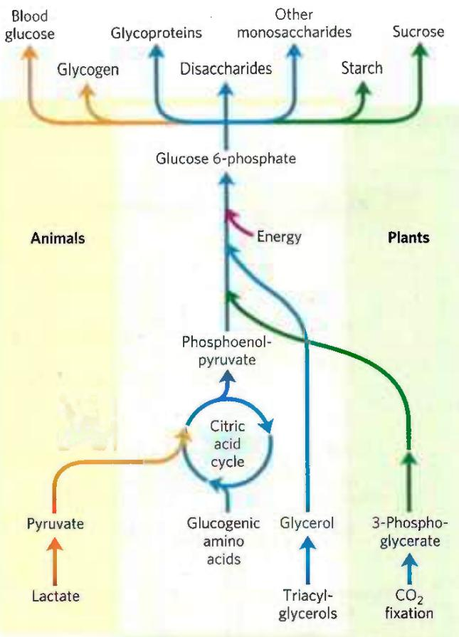  
FIGURE 14-15 Carbohydrate synthesis from simple precursors. The pathway from phosphoenolpyruvate to glucose 6-phosphate is common to the biosynthetic conversion of many different precursors of carbohydrates in animals and plants. The path from pyruvate to phosphoenolpyruvate leads through oxaloacetate, an intermediate of the citric acid cycle, which we discuss in Chapter 16. Any compound that can be converted to either pyruvate or oxaloacetate can therefore serve as starting material for gluconeogenesis. This includes alanine and aspartate, which are convertible to pyruvate and oxaloacetate, respectively, and other amino acids that can also yield three- or four-carbon fragments, the so-called glucogenic amino acids. Plants and photosynthetic bacteria are uniquely able to convert $\mathrm{CO}_{2}$ to carbohydrates, using the Calvin cycle, as we shall see in Section 20.4.

Although the reactions of gluconeogenesis are the same in all organisms, the metabolic context and the regulation of the pathway differ from one species to another and from tissue to tissue. In this section we focus on gluconeogenesis as it occurs in the mammalian liver. In Chapter 20 we show how photosynthetic organisms use this pathway to convert the primary products of photosynthesis into glucose, to be stored as sucrose or starch.

P4 Gluconeogenesis and glycolysis are not identical pathways running in opposite directions, although they do share several steps (Fig. 14-16); 7 of the 10 enzymatic reactions of gluconeogenesis are the reverse of glycolytic reactions. However, three reactions of glycolysis are essentially irreversible in vivo and cannot be used in gluconeogenesis: the conversion of glucose to glucose 6-phosphate by hexokinase, the phosphorylation of fructose 6-phosphate to fructose 1,6-bisphosphate by phosphofructokinase-1, and the conversion of phosphoenolpyruvate to pyruvate by pyruvate kinase. In cells, these three reactions are characterized by a large negative free-energy change, whereas other glycolytic reactions have a $\Delta G$ near 0 (Table 14-2). In gluconeogenesis, the three irreversible steps are bypassed by a separate set of enzymes, catalyzing reactions that are sufficiently exergonic to be effectively irreversible in the direction of glucose synthesis. Thus, both glycolysis and gluconeogenesis are irreversible processes in cells. In animals, both pathways occur largely in the cytosol, necessitating their reciprocal and coordinated regulation, described in Section 14.5.

  
FIGURE 14-16 Opposing pathways of glycolysis and gluconeogenesis in liver. The reactions of glycolysis are on the left side, in red; the opposing pathway of gluconeogenesis is on the right, in blue. The major sites of regulation of gluconeogenesis shown here are discussed in Section 14.5.

We begin by considering the three bypass reactions of gluconeogenesis. (Keep in mind that “bypass” refers throughout to the bypass of irreversible glycolytic reactions.)

#### [EN] The First Bypass: Conversion of Pyruvate to Phosphoenolpyruvate Requires Two Exergonic Reactions

P4 The first of the bypass reactions in gluconeogenesis is the conversion of pyruvate to phosphoenolpyruvate (PEP). This reaction cannot occur by simple reversal of the pyruvate kinase reaction of glycolysis (p. 521), which has a large, negative free-energy change and is therefore irreversible under the conditions prevailing in intact cells (Table 14-2, step 10). Instead, the phosphorylation of pyruvate is achieved by a roundabout sequence of reactions that in eukaryotes requires enzymes in both the cytosol and mitochondria. As we shall see, the pathway shown in Figure 14-16 and described in detail here is one of two routes from pyruvate to PEP; it is the predominant path when pyruvate or alanine is the glucogenic precursor. A second pathway, described later, predominates when lactate is the glucogenic precursor.

Pyruvate is first transported from the cytosol into mitochondria or is generated from alanine within mitochondria by transamination, in which the $\alpha$ -amino group is transferred from alanine (leaving pyruvate) to an $\alpha$ -keto carboxylic acid (transamination reactions are discussed in detail in Chapter 18). Then pyruvate carboxylase, a mitochondrial enzyme that requires the coenzyme biotin, converts the pyruvate to oxaloacetate:

$$
\begin{array}{r l} \text {Pyruvate} + \mathrm{HCO} _ {3} ^ {-} + \mathrm{ATP} & \longrightarrow \\ & \text {oxaloacetate} + \mathrm{ADP} + \mathrm{P} _ {\mathrm{i}} \end{array}\tag{14-4}
$$

The carboxylation reaction involves biotin as a carrier of activated bicarbonate, as shown in Figure 14-17; the reaction mechanism is shown in Figure 16-16. (Note that $\mathrm{HCO_3^-}$ is formed by ionization of carbonic acid formed from $\mathrm{CO}_{2} + \mathrm{H}_{2}\mathrm{O}$ .) $\mathrm{HCO_3^-}$ is phosphorylated by ATP to form a mixed anhydride (a carboxyphosphate); then biotin displaces the phosphate in the formation of carboxybiotin.

<table><tr><td colspan="4">TABLE 14-2 Free-Energy Changes of Glycolytic Reactions in Erythrocytes</td></tr><tr><td colspan="2">Glycolytic reaction step</td><td>ΔG&#x27;o (kJ/mol)</td><td>ΔG (kJ/mol)</td></tr><tr><td>1</td><td>Glucose + ATP → glucose 6-phosphate + ADP</td><td>-16.7</td><td>-33.4</td></tr><tr><td>2</td><td>Glucose 6-phosphate ⇌ fructose 6-phosphate</td><td>1.7</td><td>0 to 25</td></tr><tr><td>3</td><td>Fructose 6-phosphate + ATP → fructose1,6-bisphosphate + ADP</td><td>-14.2</td><td>-22.2</td></tr><tr><td>4</td><td>Fructose1,6-bisphosphate ⇌ dihydroxyacetone phosphate + glyceraldehyde 3-phosphate</td><td>23.8</td><td>-6 to 0</td></tr><tr><td>5</td><td>Dihydroxyacetone phosphate ⇌ glyceraldehyde 3-phosphate</td><td>7.5</td><td>0 to 4</td></tr><tr><td>6</td><td>Glyceraldehyde 3-phosphate + Pi + NAD+ ⇌ 1,3-bisphosphoglycerate + NADH + H+</td><td>6.3</td><td>-2 to 2</td></tr><tr><td>7</td><td>1,3-Bisphosphoglycerate + ADP ⇌ 3-phosphoglycerate + ATP</td><td>-18.8</td><td>0 to 2</td></tr><tr><td>8</td><td>3-Phosphoglycerate ⇌ 2-phosphoglycerate</td><td>4.4</td><td>0 to 0.8</td></tr><tr><td>9</td><td>3-Phosphoglycerate ⇌ phosphoenolpyruvate + H2O</td><td>7.5</td><td>0 to 3.3</td></tr><tr><td>10</td><td>Phosphoenolpyruvate + ADP → pyruvate + ATP</td><td>-31.4</td><td>-16.7</td></tr></table>

Note: $\Delta G^{\prime \prime}$ is the standard free-energy change, as defined in Chapter 13 (p. 468). $\Delta G$ is the free-energy change calculated from the actual concentrations of glycolytic intermediates present under physiological conditions in erythrocytes, at pH 7. The glycolytic reactions bypassed in gluconeogenesis are shown in red. Biochemical equations are not necessarily balanced for H or charge (p. 478).

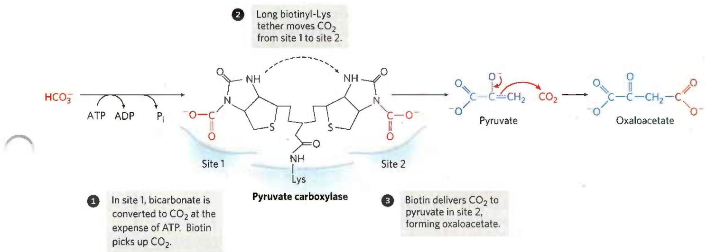  
FIGURE 14-17 Role of biotin in the pyruvate carboxylase reaction. The cofactor biotin is covalently attached to pyruvate carboxylase through an amide linkage to the ε-amino group of a Lys residue, forming a  
biotinyl-enzyme. The reaction takes place in two phases, which occur at two different sites in the enzyme. The long biotinyl-Lys arm carries the substrate from one site to the other.

Pyruvate carboxylase is the first regulatory enzyme in the gluconeogenic pathway, requiring acetyl-CoA as a positive effector. Acetyl-CoA is produced by fatty acid oxidation (Chapter 17), and its accumulation signals the availability of fatty acids as fuel. As we shall see in Chapter 16, the pyruvate carboxylase reaction can replenish intermediates in another central metabolic pathway, the citric acid cycle.

Because the mitochondrial membrane has no transporter for oxaloacetate, before export to the cytosol the oxaloacetate formed from pyruvate must be reduced to malate by mitochondrial malate dehydrogenase, at the expense of NADH:

$$
\begin{array}{r l}\text { Oxaloacetate } + \mathrm{NADH} + \mathrm{H} ^ {+}&\rightleftharpoons\\&\quad \mathrm{L-malate} + \mathrm{NAD} ^ {+}\end{array}\tag{14-5}
$$

The standard free-energy change for this reaction is quite high, but under physiological conditions (including a very low concentration of oxaloacetate) $\Delta G \approx 0$ and the reaction is readily reversible. Mitochondrial malate dehydrogenase functions in both gluconeogenesis and the citric acid cycle, but the overall flow of metabolites in the two processes is in opposite directions.

Malate leaves the mitochondrion through a specific transporter in the inner mitochondrial membrane (see Fig. 19-31), and in the cytosol it is reoxidized to oxaloacetate, with the production of cytosolic NADH:

$$
\mathrm{Malate} + \mathrm{NAD} ^ {+} \longrightarrow \mathrm{oxaloacetate} + \mathrm{NADH} + \mathrm{H} ^ {+}\tag{14-6}
$$

The oxaloacetate is then converted to PEP by phosphoenolpyruvate carboxykinase (Fig. 14-18). This $\mathrm{Mg}^{2+}$ -dependent reaction requires GTP as the phosphoryl group donor:

$$
\mathrm{Oxaloacetate} + \mathrm{GTP} \rightleftharpoons \mathrm{PEP} + \mathrm{CO} _ {2} + \mathrm{GDP}\tag{14-7}
$$

The reaction is reversible under intracellular conditions; the formation of one high-energy phosphate compound (PEP) is balanced by the hydrolysis of another (GTP). The overall equation for this set of bypass reactions, the sum of Equations 14-4 through 14-7, is

  
FIGURE 14-18 Synthesis of phosphoenolpyruvate from oxaloacetate. In the cytosol, oxaloacetate is converted to phosphoenolpyruvate by PEP carboxykinase. The $\mathrm{CO}_{2}$ incorporated in the pyruvate carboxylase reaction is lost here as $\mathrm{CO}_{2}$ . The decarboxylation leads to a rearrangement of electrons that facilitates attack of the carbonyl oxygen of the pyruvate moiety on the $\gamma$ phosphate of GTP.

$$
\begin{array}{r l} \text {Pyruvate} + \mathrm{ATP} + \mathrm{GTP} + \mathrm{HCO} _ {3} ^ {-} & \longrightarrow \\ \mathrm{PEP} + \mathrm{ADP} + \mathrm{GDP} + \mathrm{P} _ {\mathrm{i}} + \mathrm{CO} _ {2} \\ & \Delta G ^ {\prime \circ} = 0. 9 \end{array}\tag{14-8}
$$

kJ/mol

Two high-energy phosphate equivalents (one from ATP and one from GTP), each yielding about 50 kJ/mol under cellular conditions, must be expended to phosphorylate one molecule of pyruvate to PEP. In contrast, when PEP is converted to pyruvate during glycolysis, only one ATP is generated from ADP. Although the standard free-energy change ( $\Delta G^{\circ}$ ) of the two-step path from pyruvate to PEP is 0.9 kJ/mol, the actual free-energy change ( $\Delta G$ ), calculated from measured cellular concentrations of intermediates, is very strongly negative (-25 kJ/mol); this results from the ready consumption of PEP in other reactions such that its concentration remains relatively low. The reaction is thus effectively irreversible in the cell.

Note that the $CO_{2}$ added to pyruvate in the pyruvate carboxylase step (Fig. 14-17) is the same molecule that is lost in the PEP carboxykinase reaction (Fig. 14-18). This carboxylation-decarboxylation sequence represents a way of “activating” pyruvate, in that the decarboxylation of oxaloacetate facilitates PEP formation. In Chapter 21 we shall see how a similar carboxylation-decarboxylation sequence is used to activate acetyl-CoA for fatty acid biosynthesis (see Fig. 21-1).

There is a logic to the route of these reactions through the mitochondrion. The $[NADH]/[NAD^{+}]$ ratio in the cytosol is several orders of magnitude lower than in mitochondria. Because cytosolic NADH is consumed in gluconeogenesis (in the conversion of 1,3-bisphosphoglycerate to glyceraldehyde 3-phosphate; Fig. 14-16), glucose biosynthesis cannot proceed unless NADH is available. The transport of malate from the mitochondrion to the cytosol and its reconversion there to oxaloacetate effectively moves reducing equivalents to the cytosol, where they are scarce. This path from pyruvate to PEP therefore provides an important balance between NADH produced and consumed in the cytosol during gluconeogenesis.

P4 A second pyruvate → PEP bypass predominates when lactate is the glucogenic precursor (Fig. 14-19). This pathway makes use of lactate produced by glycolysis in erythrocytes or anaerobic muscle, for example, and it is particularly important in large vertebrates after vigorous exercise (Box 14-2). The conversion of lactate to pyruvate in the cytosol of hepatocytes yields NADH, and the export of reducing equivalents (as malate) from mitochondria is therefore unnecessary. After the pyruvate produced by the lactate dehydrogenase reaction is transported into the mitochondrion (by a transporter in the inner mitochondrial membrane specific for pyruvate), it is converted to oxaloacetate by pyruvate carboxylase, as described above. This oxaloacetate, however, is converted directly to PEP by a mitochondrial isozyme of PEP carboxykinase, and the PEP is transported out of the mitochondrion to continue on the gluconeogenic path. The mitochondrial and cytosolic isozymes of PEP carboxykinase are encoded by separate genes in the nuclear chromosomes, providing another example of two distinct enzymes catalyzing the same reaction but having different cellular locations or metabolic roles (recall the isozymes of hexokinase).

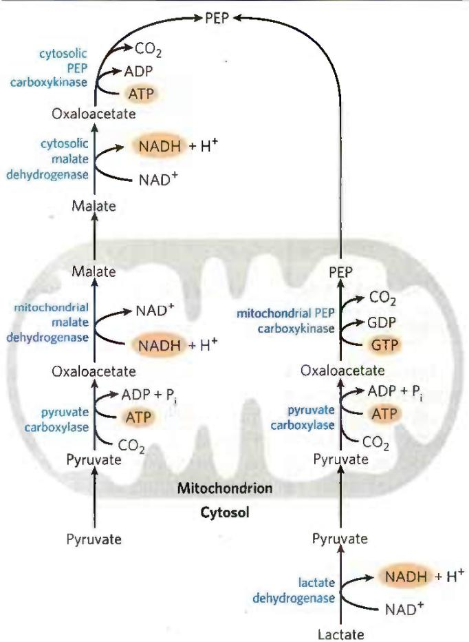  
FIGURE 14-19 Alternative paths from pyruvate to phosphoenolpyruvate. The relative importance of the two pathways depends on the availability of lactate or pyruvate and the cytosolic requirements for NADH for gluconeogenesis. The path on the right predominates when lactate is the precursor, because cytosolic NADH is generated in the lactate dehydrogenase reaction and does not have to be shuttled out of the mitochondrion (see text).

#### [EN] The Second and Third Bypasses Are Simple Dephosphorylations by Phosphatases

The second glycolytic reaction that cannot participate in gluconeogenesis is the phosphorylation of fructose 6-phosphate by PFK-1 (Table 14-2, step 3). Because this reaction is highly exergonic and therefore irreversible in intact cells, the generation of fructose 6-phosphate from fructose 1,6-bisphosphate (Fig. 14-16) is catalyzed by a different enzyme, $\mathrm{Mg}^{2+}$ -dependent fructose 1,6-bisphosphatase (FBPase-1), which promotes the essentially irreversible hydrolysis of the C-1 phosphate (not phosphoryl group transfer to ADP):

$$
\begin{array}{r l} \text { Fructose   1,6 - phosphate } + \mathrm{H} _ {2} \mathrm{O} & \longrightarrow \\ & \text { fructose   6 - phosphate } + \mathrm{P} _ {\mathrm{i}} \\ & \Delta G ^ {\prime \circ} = - 1 6. 3 \mathrm{kJ/mol} \end{array}
$$

FBPase-1 is so named to distinguish it from another, similar enzyme (FBPase-2) with a regulatory role, which we discuss in Section 14.5.

The third bypass is the final reaction of gluconeogenesis, the dephosphorylation of glucose 6-phosphate to yield glucose (Fig. 14-16). Reversal of the hexokinase reaction (p. 514) would require phosphoryl group transfer from glucose 6-phosphate to ADP, forming ATP, an energetically unfavorable reaction (Table 14-2, step 1). The reaction catalyzed by glucose 6-phosphatase does not require synthesis of ATP; it is a simple hydrolysis of a phosphate ester:

$$
\begin{array}{r l} \text {   Glucose   6 - phosphate   } + \mathrm{H} _ {2} \mathrm{O} & \longrightarrow \text {   glucose   } + \mathrm{P} _ {\mathrm{i}} \\ & \Delta G ^ {\prime \circ} = - 1 3. 8 \mathrm{kJ/mol} \end{array}
$$

This $Mg^{2+}$ -activated enzyme is a membrane protein in the lumen of the endoplasmic reticulum of hepatocytes, renal cells, and epithelial cells of the small intestine (see Fig. 15-6), but not in other tissues, which are therefore unable to supply glucose to the blood. If other tissues had glucose 6-phosphatase, this enzyme's activity would hydrolyze the glucose 6-phosphate needed within those tissues for glycolysis. Glucose produced by gluconeogenesis in the liver or kidney or ingested in the diet is delivered to these other tissues, including brain and muscle, through the bloodstream.

#### [EN] Gluconeogenesis Is Energetically Expensive, But Essential

P4 The sum of the biosynthetic reactions leading from pyruvate to free blood glucose (Table 14-3) is

$$
\begin{array}{r l} 2 \mathrm{Pyruvate} + 4 \mathrm{ATP} + 2 \mathrm{GTP} + 2 \mathrm{NADH} + 2 \mathrm{H} ^ {+} + 4 \mathrm{H} _ {2} \mathrm{O} & \longrightarrow \\ \text { glucose } + 4 \mathrm{ADP} + 2 \mathrm{GDP} + 6 \mathrm{P} _ {\mathrm{i}} + 2 \mathrm{NAD} ^ {+} & (1 4 - 9) \end{array}
$$

For each molecule of glucose formed from pyruvate, six high-energy phosphate groups are required: four from ATP and two from GTP. In addition, two molecules of NADH are required for the reduction of two molecules of 1,3-bisphosphoglycerate. Clearly, Equation 14-9 is not simply the reverse of the equation for conversion of glucose to pyruvate by glycolysis, which would require only two molecules of ATP:

<table><tr><td colspan="2">TABLE 14-3 Sequential Reactions in Gluconeogenesis Starting from Pyruvate</td></tr><tr><td>Pyruvate + HCO3− + ATP → oxaloacetate + ADP + Pi</td><td>×2</td></tr><tr><td>Oxaloacetate + GTP ⇌ phosphoenolpyruvate + CO2 + GDP</td><td>×2</td></tr><tr><td>Phosphoenolpyruvate + H2O ⇌ 2-phosphoglycerate</td><td>×2</td></tr><tr><td>2-Phosphoglycerate ⇌ 3-phosphoglycerate</td><td>×2</td></tr><tr><td>3-Phosphoglycerate + ATP ⇌ 1,3-bisphosphoglycerate + ADP</td><td>×2</td></tr><tr><td>1,3-Bisphosphoglycerate + NADH + H+ ⇌ glyceraldehyde 3-phosphate + NAD+ + Pi</td><td>×2</td></tr><tr><td>Glyceraldehyde 3-phosphate ⇌ dihydroxyacetone phosphate</td><td></td></tr><tr><td>Glyceraldehyde 3-phosphate + dihydroxyacetone phosphate ⇌ fructose 1,6-bisphosphate</td><td></td></tr><tr><td>Fructose 1,6-bisphosphate → fructose 6-phosphate + Pi</td><td></td></tr><tr><td>Fructose 6-phosphate ⇌ glucose 6-phosphate</td><td></td></tr><tr><td>Glucose 6-phosphate + H2O → glucose + Pi</td><td></td></tr><tr><td>Sum: 2 Pyruvate + 4ATP + 2GTP + 2NADH + 2H+ + 4H2O → glucose + 4ADP + 2GDP + 6Pi + 2NAD+</td><td></td></tr><tr><td colspan="2">Note: The bypass reactions are in red; all other reactions are reversible steps of glycolysis. The figures at the right indicate that the reaction is to be counted twice, because two three-carbon precursors are required to make a molecule of glucose. The reactions required to replace the cytosolic NADH consumed in the glyceraldehyde 3-phosphate dehydrogenase reaction (the conversion of lactate to pyruvate in the cytosol or the transport of reducing equivalents from mitochondria to the cytosol in the form of malate) are not considered in this summary. Biochemical equations are not necessarily balanced for H and charge (p. 478).</td></tr></table>

$$
\begin{array}{r l} \mathrm{Glucose} + 2 \mathrm{ADP} + 2 \mathrm {P_ {i}} + \mathrm{NAD} ^ {+} & \longrightarrow \\ 2 \text { pyruvate } + 2 \mathrm{ATP} + 2 \mathrm{NADH} + 2 \mathrm{H} ^ {+} + 2 \mathrm{H} _ {2} \mathrm{O} \end{array}
$$

This makes the synthesis of glucose from pyruvate a relatively expensive process. Much of this high energy cost is necessary to ensure the irreversibility of gluconeogenesis. Under intracellular conditions, the overall free-energy change of glycolysis is at least -63 kJ/mol. Under the same conditions the overall $\Delta G$ of gluconeogenesis is -16 kJ/mol. Thus both glycolysis and gluconeogenesis are essentially irreversible processes in cells. A second advantage to investing energy to convert pyruvate to glucose is that if pyruvate were instead excreted, its considerable potential for ATP production by complete, aerobic oxidation would be lost (more than 10 ATP are produced per pyruvate, as we shall see in Chapter 16).

The biosynthetic pathway to glucose described above allows the net synthesis of glucose not only from pyruvate but also from the four-, five-, and six-carbon intermediates of the citric acid cycle (Chapter 16). The citric acid cycle intermediates can undergo oxidation to oxaloacetate (see Fig. 16-7). Some or all of the carbon atoms of most amino acids derived from proteins are ultimately catabolized to pyruvate or to intermediates of the citric acid cycle. Such amino acids can therefore undergo net conversion to glucose and are said to be glucogenic (Table 14-4). Alanine and glutamine, the principal molecules that transport amino groups from extrahepatic tissues to the liver (see Fig. 18-9), are particularly important glucogenic amino acids in mammals. After removal of their amino groups in liver mitochondria, the carbon skeletons remaining (pyruvate and $\alpha$ -ketoglutarate, respectively) are readily funneled into gluconeogenesis.

<table><tr><td>TABLE 14-4</td><td>Glucogenic Amino Acids, Grouped by Site of Entry</td></tr><tr><td>Pyruvate</td><td>Succinyl-CoA</td></tr><tr><td>Alanine</td><td> $Isoleucine^a$ </td></tr><tr><td>Cysteine</td><td>Methionine</td></tr><tr><td>Glycine</td><td>Threonine</td></tr><tr><td>Serine</td><td>Valine</td></tr><tr><td>Threonine</td><td>Fumarate</td></tr><tr><td> $Tryptophan^a$ </td><td> $Phenylalanine^a$ </td></tr><tr><td>α-Ketoglutarate</td><td> $Tyrosine^a$ </td></tr><tr><td>Arginine</td><td>Oxaloacetate</td></tr><tr><td>Glutamate</td><td>Asparagine</td></tr><tr><td>Glutamine</td><td>Aspartate</td></tr><tr><td>Histidine</td><td></td></tr><tr><td>Proline</td><td></td></tr></table>

Note: All these amino acids are precursors of blood glucose or liver glycogen, because they can be converted to pyruvate or citric acid cycle intermediates. Of the 20 common amino acids, only leucine and lysine are unable to furnish carbon for net glucose synthesis. $^{a}$ These amino acids are also ketogenic (see Fig. 18–15).

#### [EN] Mammals Cannot Convert Fatty Acids to Glucose; Plants and Microorganisms Can

No net conversion of fatty acids to glucose occurs in mammals. As we shall see in Chapter 17, the catabolism of most fatty acids yields only acetyl-CoA. Mammals cannot use acetyl-CoA as a precursor of glucose, because the pyruvate dehydrogenase reaction is irreversible and cells have no other pathway to convert acetyl-CoA to pyruvate. Plants, yeast, and many bacteria do have a pathway (the glyoxylate cycle; see Fig. 20-45) for converting acetyl-CoA to oxaloacetate, so these organisms can use fatty acids as the starting material for gluconeogenesis. This is important during the germination of seedlings, for example; before leaves develop and photosynthesis can provide energy and carbohydrates, the seedling relies on stored seed oils for energy production and cell wall biosynthesis.

Although mammals cannot convert fatty acids to carbohydrate, they can use the small amount of glycerol produced from the breakdown of fats (triacylglycerols) for gluconeogenesis. Phosphorylation of glycerol by glycerol kinase, followed by oxidation of the central carbon, yields dihydroxyacetone phosphate, an intermediate in gluconeogenesis in liver.

As we shall see in Chapter 21, glycerol phosphate is an essential intermediate in triacylglycerol synthesis in adipocytes, but these cells lack glycerol kinase and so cannot simply phosphorylate glycerol. Instead, adipocytes carry out a truncated version of gluconeogenesis, known as glyceroneogenesis: the conversion of pyruvate to dihydroxyacetone phosphate via the early reactions of gluconeogenesis, followed by reduction of the dihydroxyacetone phosphate to glycerol 3-phosphate (see Fig. 21-21).

#### [EN] SUMMARY 14.4 Gluconeogenesis

■ Gluconeogenesis is a multistep process in which glucose is produced from lactate, pyruvate, or oxaloacetate, or any compound (including citric acid cycle intermediates) that can be converted to one of these intermediates. Seven steps are the reversal of glycolytic reactions; three differ and must be bypassed with exergonic reactions.

In the first bypass, pyruvate is converted to PEP via oxaloacetate in two steps catalyzed by pyruvate carboxylase (which uses ATP) and PEP carboxykinase (which uses GTP).

In the second bypass, FBPase-1 removes a phosphate group from fructose 1,6-bisphosphate, producing fructose 6-phosphate. In the third bypass, glucose 6-phosphatase converts glucose 6-phosphate to glucose.

In mammals, gluconeogenesis in the liver, kidney, and small intestine provides glucose for use by the brain, muscles, and erythrocytes. Formation of one molecule of glucose from pyruvate requires four ATP, two GTP, and two NADH; it is expensive.

Animals cannot convert acetyl-CoA derived from fatty acids into glucose; they lack the enzymatic machinery to convert acetyl-CoA to pyruvate. Plants and microorganisms have the glyoxylate pathway, which allows them to make glucose from fatty acids.

<!-- EN-END 14.4 -->

## 二、葡萄糖的转运

应提起注意的是,葡萄糖出入细胞质膜(palsma membrane)并不是简单的扩散作用,而是靠葡萄糖的特殊运送机构,称为葡糖运载蛋白(glucose transporter)。运载蛋白对葡萄糖的转运速度是简单扩散的50 000倍。用红细胞进行的研究对了解细胞的运输机制起到了关键性的作用。红细胞的跨膜运载蛋白往复进行着两种形式的构象变化。在一种构象状态下,这种运载蛋白与葡萄糖的结合部位(glucose-binding site)面向细胞质膜的外面,在另一种构象状态下,其结合部位则面向质膜内面。当面向外面的结合部位与葡萄糖结合后即引起运载蛋白发生构象变化,使结合着的葡萄糖分子从原来面向外的结合部位转移到新形成的面向内的结合部位。这种转换并不是整个蛋白质分子的翻转而只是由于构象变化发生的。葡萄糖分子由于两种不同构象的转换,完成了它的跨膜转移。与向内的结合部位结合着的葡萄糖随即从结合部位解脱下来,游离到红细胞内部。运载蛋白失去葡萄糖分子后,又变回到原来的构象形式。面向细胞内面的结合部位失去活性,又重新形成面向外部的结合部位,完成了运输蛋白转运葡萄糖的一次循环过程,这一运载蛋白又可再接受第2个葡萄糖分子进行第2次的转运。在一般情况下,葡萄糖的转运是一种顺浓度梯度下降形式的运载方式。如果细胞内的葡萄糖浓度高于胞外,例如,小肠的上皮细胞(intestinal epithelial cells),则葡萄糖通过相反方向的运载蛋白催化相反方向的运载;即从上皮细胞运载到血液。葡

萄糖由质膜外向内的运载和由质膜内向外的运载是由同一运载蛋白往复地进行,还是由不同的运载蛋白执行,目前似乎认识尚未取得完全一致。

葡糖运载蛋白有许多种,在结构和功能上属于一个家族。已发现的葡糖运载蛋白命名为 GLUT 1, GLUT 2, GLUT 3, GLUT 4, GLUT 5 及 GLUT 7 等 (GLUT 为 glucose transporter 的缩写)。这类蛋白质由一条约为 500 个氨基酸残基的多肽链构成。它们的共同结构要点是有 12 个跨膜片段,如图 21-4 所示。

不同的运载成员所起的作用不同。例如：

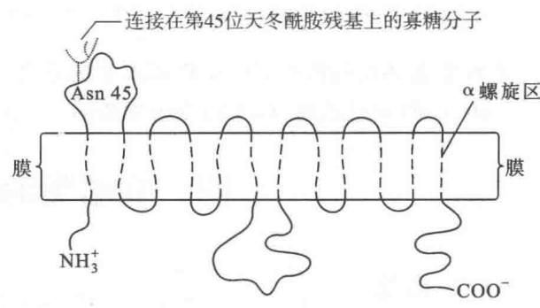  
图21-4 葡糖运载蛋白的结构示意图  
虚线表示 $\alpha$ 螺旋区, 都是跨膜螺旋

(1) CLUT 1 和 GLUT 3 几乎存在于所有哺乳的

细胞,负责基本的葡萄糖摄取:两种运载蛋白对葡萄糖的 $K_{m}$ 值约为 1 mmol/L。一般血清的葡萄糖浓度为 4\~8 mmol/L,因此这两种运载蛋白不断地以稳定的速度转运葡萄糖到细胞内。

（2）GLUT 2 存在于肝和胰腺的 $\beta$ 细胞：它的特点是对葡萄糖的 $K_{m}$ 值特别高，可达 15\~20 mmol/L；葡萄糖进入该组织的速度和血糖的水平成正比。胰腺依据葡萄糖浓度的高低调整胰岛素的分泌。GLUT 2的高 $K_{m}$ 值还保证，只有当葡萄糖非常充足时，才迅速进入肝细胞。当血糖浓度低时，葡萄糖优先进入脑、肌肉以及其他 $K_{m}$ 值低于肝细胞的组织。

（3）GLUT 4 主要存在于肌肉和脂肪细胞: 它的 $K_{m}$ 值为 5 mmol/L。在摄食充足的情况下, 胰岛素作为一种信号使质膜上的 GLUT 4 运载蛋白的数量增加。

（4）GLUT 5 存在于小肠细胞: 它是 $Na^{+}$ 和葡萄糖的共同运载蛋白 ( $Na^{+}-glucose symporter$ )，负责从肠腔吸收葡萄糖。这种共同运载蛋白将葡萄糖从肠腔吸收到小肠的上皮细胞。在细胞质膜内侧的 GLUT 5 又将葡萄糖释放到血液中。

(5) HLUT 7 位于内质网膜, 运载 6-磷酸葡糖进入内质网内。

## 三、乙醛酸途径

乙醛酸途径(glyoxylate pathway)又称乙醛酸循环(glyoxylate cycle)，名称的来源是因为在这个途径中经过一系列反应最终产生乙醛酸。这一途径在动物体内并不存在，只存在于植物和微生物中。它的主要内容实际是通过乙醛酸途径使乙酰-CoA转变为草酰乙酸从而进入柠檬酸循环。

催化乙醛酸途径的酶既存在于线粒体,也存在于一种为植物膜所特有的亚细胞结构称为乙醛酸循环体(glyoxysome;glyoxisome),特别包括只存在于乙醛酸循环体中的两种酶,即异柠檬酸裂合酶(isocitrate lyase)和苹果酸合酶(malate synthase)。

乙醛酸途径的全过程如图21-5所示。从图中可看到通过乙醛酸途径，乙酰-CoA转变为草酰乙酸。乙醛酸途径开始于草酰乙酸与乙酰-CoA的缩合。但线粒体中的草酰乙酸不能透过线粒体膜，必须在天冬氨酸氨基移换酶（aspartate aminotransferase）作用下接受谷氨酸分子的 $\alpha-$ 氨基形成天冬氨酸(aspartate)，才能跨跃线粒体膜并进入乙醛酸循环体。在乙醛酸循环体内，天冬氨酸再经天冬氨酸氨基移换酶的作用将氨基转移到 $\alpha-$ 酮戊二酸分子上，本身又形成草酰乙酸后，才能与乙酰-CoA缩合形成柠檬酸。柠檬酸异构化形成异柠檬酸，与柠檬酸循环不同的是异柠檬酸不进行脱羧，而是经异柠檬酸裂合酶裂解为琥珀酸和乙醛酸。乙醛酸与另一分子乙酰-CoA在苹果酸合酶的催化下缩合形成苹果酸，苹果酸穿过乙醛酸循环体膜进入细胞溶胶，由苹果酸脱氢酶将其氧化为草酰乙酸。细胞溶胶中的草酰乙酸可经糖异生途径转变为葡萄糖。异柠檬酸裂解产生的琥珀酸又可跨膜进入线粒体，通过与柠檬酸循环相同的途径形成草酰乙酸，从而构成乙醛酸途径的一次循环。因此，乙醛酸循环的全部反应可看作是将两个乙酰-CoA分子转变为一分子琥珀酸，反应式如下：

$$
2 \mathrm{CH} _ {3} \mathrm{COCoA} + \mathrm{NAD} ^ {+} + 2 \mathrm{H} _ {2} \mathrm{O} \longrightarrow \mathrm{C} _ {4} \mathrm{H} _ {6} \mathrm{O} _ {4} (\text {琥珀酸}) + 2 \mathrm{CoASH} + \mathrm{NADH} + \mathrm{H} ^ {+}
$$

乙醛酸循环在植物种子中有特别重要的意义。它使萌发的种子将贮存的三酰甘油（又称甘油三酯，triacyl glycerol）通过乙酰-CoA转变为葡萄糖。

## 四、寡糖类的生物合成和分解

## (一) 概论

在上册第9章糖类中对寡糖(oligosaccharides)已有详细的介绍。它是一类由含有以糖苷键形式相连接的糖分子构成的复杂化合物。已知天然存在的以糖苷键相连接的复杂的寡糖类化合物不下80种。其中构成多种形式寡糖的最常见的成分有甘露糖(mannose)、N-乙酰葡糖胺(N-acetyl glucosamine)、N-乙酰胞壁酸(N-acetyl muramic acid)、葡萄糖、岩藻糖(fucose)、半乳糖(galactose)、N-乙酰神经氨酸(N-acetyl neuraminic acid;又名唾液酸,sialic acid)及N-乙酰半乳糖胺(N-acetyl galactosamine)等。

糖苷键的形成在生理条件下需要提供能量。能量的需要主要是供单糖形成活化形式的 NDP-糖分子

  
图21-5 乙醛酸途径示意图

① 线粒体内的草酰乙酸转变为天冬氨酸，跨过线粒体膜进入乙醛酸循环体再转变为草酰乙酸。② 草酰乙酸与乙酰-CoA缩合形成柠檬酸。③ 乌头酸酶将柠檬酸转变为异柠檬酸。④ 异柠檬酸裂合酶催化异柠檬酸裂解为琥珀酸和乙醛酸。⑤ 苹果酸合酶催化乙醛酸和乙酰-CoA缩合形成苹果酸。⑥ 苹果酸进入细胞溶胶后，苹果酸脱氢酶将其氧化为草酰乙酸。从而可进入糖异生途径。⑦ 琥珀酸进入线粒体，又通过柠檬酸循环转变为草酰乙酸。（图中表明参与乙醛酸途径的酶既有在线粒体的酶，也有在乙醛酸循环体中的酶。画横线的异柠檬酸裂合酶和苹果酸合酶表示只存在于植物体内）

（核苷酸糖分子，nucleotide sugars）。该反应的标准自由能变化 $\Delta G^{\ominus'} = +16 \, kJ/mol$ （3.82 kcal/mol）。糖分子异头碳原子上的核苷酸基团很容易离开糖分子，这就促进了与第二个糖分子形成糖苷键。催化形成糖苷键的酶称为糖基转移酶（glycosyl transferases）。反应式可表示如下：

参与转移单糖的核苷酸有 UDP(尿苷二磷酸)、GDP(鸟苷二磷酸)、CMP(胞苷酸)等,每一种糖分子只与核苷酸中的一种相结合,如表 21-2 所示。

表 21-2 糖基转移反应中与单糖相应的核苷酸

<table><tr><td>UDP</td><td>GDP</td><td>CMP</td></tr><tr><td>N-乙酰半乳糖胺(N-acetyl galactosamine)</td><td>岩藻糖(fucose)</td><td>唾液酸(sialic acid)</td></tr><tr><td>N-乙酰葡糖胺(N-acetyl glucosamine)</td><td>甘露糖(mannose)</td><td></td></tr><tr><td>N-乙酰胞壁酸(N-acetyl muramic acid)</td><td></td><td></td></tr><tr><td>半乳糖(galactose)</td><td></td><td></td></tr><tr><td>葡糖醛酸(glucuronic acid)</td><td></td><td></td></tr><tr><td>木糖(xylose)</td><td></td><td></td></tr></table>

## （二）乳糖的生物合成和分解

## 1. 乳糖的生物合成

乳糖是寡糖中简单寡糖的代表。因寡糖类的简单寡糖种类繁多，只能举出一例进行讨论。乳糖由半乳糖和葡萄糖以 $\beta$ -糖苷键相连 $[\beta\text{-galactosyl-}(1\rightarrow 4)\text{-glucose}]$ 。乳糖的生物合成需要活化的半乳糖作为前体，UDP-半乳糖（UDP-galactose）就是其活化形式，用作合成乳糖的前体。UDP-半乳糖来源于 UDP-葡萄糖，是由 UDP-葡萄糖在 1-磷酸半乳糖尿苷酰转移酶（galactose-1-phosphate uridylyl transferase）催化下，将尿苷酰基转移给 1-磷酸半乳糖形成的。

UDP-葡萄糖转变为 UDP-半乳糖对机体的某些生物合成,例如,复杂多糖和糖蛋白的合成起着重要作用。

在哺乳期的乳腺中乳糖合成特别旺盛,其所进行的乳糖合成机制和糖原的合成机制相似。但调节机制却有其特殊性。有一种酶专一地对某种不同底物起不同的催化作用,在某种情况下,可以转变为催化合成乳糖的形式。绝大多数的脊椎动物组织含有一种半乳糖基转移酶(galactosyltransferase),这种酶在糖蛋白的合成中起催化 UDP-半乳糖的半乳糖基向 N-乙酰葡糖胺分子上转移的作用。反应式如下:

$$
\mathrm{UDP-D-半乳糖} + N \text {-乙酰 - D -葡糖胺} \longrightarrow \mathrm{D-半乳糖基-N-乙酰-D-葡糖胺} + \mathrm{UDP}
$$

上述反应在乳糖合成中不起作用。起催化作用的半乳糖基转移酶对于以葡萄糖作为半乳糖基受体的催化活性极小。但当雌性哺乳动物一旦生产后，这时乳腺中产生一种 $\alpha-$ 乳清蛋白（ $\alpha-lactalbumin$ ），乳腺中的半乳糖基转移酶随即迅速地与乳清蛋白结合，从而使其专一性立刻发生变化，并以极高的速度将半乳糖基转移到葡萄糖分子上形成乳糖：

$$
\mathrm{UDP-D-半乳糖} + \mathrm{D-葡萄糖} \longrightarrow \mathrm{D-乳糖} + \mathrm{UDP}
$$

与乳清蛋白结合的半乳糖基转移酶可以说变成了一种新酶,命名为乳糖合酶(lactose synthase)。

以上两种情况下的反应式可用图 21-6 表示。

## A. 非乳腺组织

B. 哺乳期乳腺内

图21-6 乳糖的生物合成

起催化作用的半乳糖基转移酶随着是否有 $\alpha-$ 乳清蛋白存在而表现两种不同的催化作用, 其一是在非乳腺组织中, 其二是在乳腺中, 只有在乳腺中才出现乳糖合酶

也可以认为乳糖合酶由两个亚基组成,即半乳糖基转移酶(或称转半乳糖基酶)和 $\alpha-$ 乳清蛋白。后者是乳腺中特有的无催化作用的蛋白质,它的作用就是改变半乳糖基转移酶的催化功能,使之以葡萄糖作为半乳糖基的受体。

乳糖是乳汁中主要的糖。人乳汁含乳糖5%\~7%。牛乳汁含乳糖4%。乳汁中除含有乳糖外，还含有一种含乳糖的寡糖称为乳糖-N-新四糖，有抑制肺炎双球菌型多糖抗原的作用，从而得以保护婴儿机体的健康。

## 2. 乳糖的分解代谢

乳糖在消化道内的分解是由乳糖酶(lactase)催化的。此酶和其他的一些双糖水解酶,如麦芽糖酶(maltase)、蔗糖酶(sucrase)一样都附着在小肠上皮细胞的外表面上。乳糖被细胞摄取以前必须水解为单糖。微生物水解乳糖不是由乳糖酶催化,而是靠一种 $\beta-$ 半乳糖苷酶( $\beta$ -galactosidase)。乳糖被水解后形

成半乳糖和葡萄糖：

$$
\text{乳糖} \xrightarrow[\substack{\text{乳糖酶或}\\ \beta - \text{半乳糖苷酶(微生物)}}]{\mathrm{H}_{2}\mathrm{O}} \mathrm{D-半乳糖} + \mathrm{D-葡萄糖}
$$

形成的单糖进入小肠上皮细胞再进入血液,由血液送到各种组织,在组织细胞中进行磷酸化并纳入糖酵解途径。

## 3. 乳糖不耐受症

几乎所有的婴儿和幼儿都能消化乳糖，但到少年或成年之后，有许多人小肠细胞的乳糖酶活性大部分或是全部消失，致使乳糖不能被完全消化或完全不能消化，也不能被小肠吸收。乳糖在小肠腔内会产生很强的渗透效应(osmotic effect)导致流体向小肠内流(inflax)；在大肠内，乳糖被细菌转变为有毒物质。因此出现腹胀(abdominal distention)、恶心(nausea)、绞痛(cramping pain)以及腹泻(watery diarrhea)等症状，临床上称为乳糖不耐受症(lactose intolerance)。乳糖酶的消失和遗传有关，可能是常染色体的隐性症状(autosomal recessive trait)。据统计各国患乳糖酶缺失症的人数有很大差异，亚洲人患乳糖酶缺失症的人数多于欧美人。例如，泰国人大约有97%不能耐受乳糖，而丹麦人则只有3%。除北欧外，非洲某些地区的人也很少发生乳糖不耐受症。当前有些国家已经出售用乳糖酶处理过的牛乳，也有乳糖酶制剂出售。

还应提出的是细菌中的 $\beta-$ 半乳糖苷酶是可诱导的酶。大肠杆菌 (E. coli) 能利用乳糖作为唯一的碳源。在乳糖代谢中所必需的酶是 $\beta-$ 半乳糖苷酶，由它将乳糖水解为半乳糖和葡萄糖。一个 E. coli 细胞在乳糖上生长，含有数千个 $\beta-$ 半乳糖苷酶分子。但是如果它生长在其他碳源上，例如，葡萄糖或是甘油上，每个 E. coli 细胞只含有不到 10 个 $\beta-$ 半乳糖苷酶分子。实验证明，在培养基中的乳糖促进新酶分子的合成从而诱导出大量的 $\beta-$ 半乳糖苷酶，而不是使酶原活化 (图 21-7)。

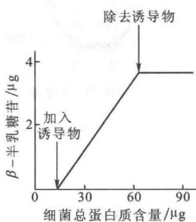

由图21-7可看出 $\beta$ -半乳糖苷酶是一种可诱导酶(inducible enzyme)。和 $\beta$ -半乳糖苷酶相伴合成的还有两种酶，一种是半乳糖苷通透酶(galactoside permease)，另一种是硫代半乳糖苷转乙酰基酶(thiogalactoside transacetylase)。通透酶对于乳糖跨越细菌的细胞膜是必需的。转乙酰基酶的作用目前尚不清楚。体外实验发现它催化将乙酰基从乙酰-CoA转移到硫代半乳糖苷的C6羟基上。

图 21-7 β-半乳糖苷酶量的增加和生长在培养基上 E.coli 细胞的增加成平行关系图中的斜率表明，6.6% 的蛋白质是合成的 β-半乳糖苷酶

在 E.coli 细胞内,天然的诱导物是别乳糖(allolactose)。它是由乳糖经转糖基作用形成。它的结构如下:

  
1,6别乳糖

别乳糖的合成是由少数已存在的 $\beta$ -半乳糖苷酶分子催化的。有些 $\beta$ -半乳糖苷并不是作为 $\beta$ -半乳糖苷酶的底物而是诱导物，而有些化合物是 $\beta$ -半乳糖苷酶的底物而不是诱导物例如乳糖；又例如一种称为异丙基- $\beta$ -D-硫代半乳糖苷（isopropylthiogalactoside，IPTG）的化合物，它是一种不参与代谢的诱导物。IPTG的结构如下：

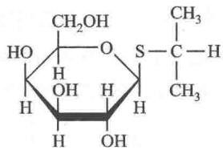

## （三）糖蛋白的生物合成

人体内的蛋白质有三分之一以上属于糖蛋白。后者广泛存在于机体的各种组织和细胞中。由于糖蛋白结构上的多样性和复杂性，赋予了这类物质极其广泛的生物功能，也增添了其生物合成的复杂性。关于糖蛋白中肽链部分是在核糖体合成的，将在第33章蛋白质的生物合成中作详细介绍。本章只侧重介绍寡糖对多肽链进行的加工过程。关于糖蛋白的某些重要的生物功能请参看第9章糖类的有关部分。

## 1. 糖蛋白糖链生物合成的特点

糖蛋白中 N-糖链的合成是和肽链的生物合成同时进行的，O-糖链的合成是在肽链合成后，对肽链进行修饰加工时将糖基逐个连接上去的。糖链的合成是由糖基作为供体和受体，在糖基转移酶（glycosyltransferase）催化下完成的。糖基供体、受体和糖基转移酶之间有相互协调的作用。糖基转移酶将活化的糖基转移到糖基受体上。糖基转移酶对作为供体的糖基和受体都有严格的专一性。因此，糖链中的每个糖苷链都是由专一的糖基转移酶催化形成的。前一个糖基转移酶的产物是后一个糖基转移酶的底物。作为糖基供体的活化单糖最常见的活化形式有核苷二磷酸形式如 UDP-Glc（尿苷二磷酸-葡萄糖）、GDP-Man（鸟苷二磷酸-甘露糖）等，以及长醇焦磷酸（dolichol pyrophosphate, DPP）形式，如 DPP-Man、DPP-GlcNAc（长醇焦磷酸-N-乙酰-D-葡萄糖）等。糖蛋白的肽链在糖基化过程中，作为第一个糖基受体的氨基酸残基一般是肽链中特定位点的氨基酸残基。肽链中有许多特定氨基酸残基可作为糖基的接受位点，如天冬酰胺、丝氨酸、苏氨酸、羟赖氨酸、羟脯氨酸和酪氨酸等。糖链延伸时，糖基的受体则是新接上去的糖基。

## 2. 糖蛋白寡糖部分与多肽链相连接的类型

根据寡糖部分与肽链相接的方式不同可将其概括为三大类: N-连接型, O-连接型和酰胺键型, 分述如下:

（1）N-连接型寡糖的要点 N-连接型寡糖（简称 N-连寡糖），是寡糖分子以 $\beta-N-$ 糖苷键的形式与多肽链相连。相连的部分是多肽链的天冬酰胺（Asn）残基。对这一残基的要求是，与该残基相隔的氨基酸必须是丝氨酸（Ser）或苏氨酸（Thr），与该残基相连的氨基酸是除脯氨酸和天冬氨酸以外的任何氨基酸。这段序列的表示应为 Asn-X-Ser 或 Asn-X-Thr。

多肽链的天冬酰胺残基与寡糖的连接形式可表示如图 21-8。

  
图 21-8 天冬酰胺残基与寡糖的连接形式

N-连接类型的糖链一般由6至数10个糖基连接而成且都形成分支，称为“天线”。寡糖的糖基组分主要是N-乙酰氨基葡糖，此外还有半乳糖和甘露糖等。在酸性N-糖链的末端往往是唾液酸（sialic acid, Sia），又称N-乙酰神经氨酸（N-acetylneuaminic acid）。例如，免疫球蛋白（immunoglobulin）和肽类激素等都含有唾液酸。

以 $N$ -连接的寡糖中都有一个共同的五糖核心。它由3个甘露糖残基和2个 $N$ -乙酰葡糖胺残基构成。其他附加的糖以不同的形式加在这个核心上，形成各式各样的寡糖，可大致分为高甘露糖型、复杂型和杂合型（详见第9章）。图21-9举出两例表明它们的结构。

  
图21-9 $N$ -连接寡糖含有共同的五糖核心  
包括3个甘露糖和2个 $N$ -乙酰葡糖胺残基。图中还表明其他的糖分子加在核心上形成各种不同形  
式的寡糖,其中 A 代表高甘露糖型,B 代表复杂型,C 代表杂合型  
Asn: 天冬酰胺, Fuc: 岩藻糖, Gal: 半乳糖, GlcNAc: N-乙酰葡糖胺, Sia: 唾液酸, Man: 甘露糖

岩藻糖(6-脱氧-L-半乳糖)是由甘露糖衍生而来的。

（2）O-连接型寡糖的要点 O-连接的寡糖（简称 O-连寡糖），是通过 $\alpha-O-$ 糖苷键与肽链上的丝氨酸或苏氨酸相连如图21-10。

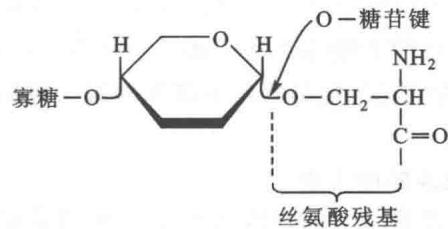  
图21-10 寡糖与肽链Ser形成的 $\alpha -O$ -糖苷链

只有在胶原蛋白(collagens)中，O-糖苷键是与5-羟赖氨酸(5-hydroxyllysine)残基相连，如图21-11。

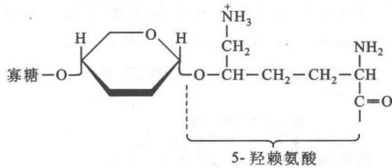  
图 21-11 胶原蛋白中寡糖与 5-羟赖氨酸形成的 O 糖苷键

O-糖链的结构虽然比 N-糖链的简单,但参与连接的糖残基却是多种多样的(参看第9章)。糖蛋白中已发现的由两个糖基组成的 O-糖链有4种:唾液酸 $\alpha2,6-N-$ 乙酰-D-半乳糖胺 $\alpha1-$ 丝氨酸/苏氨酸(SA $\alpha2,6-GalNAc\alpha1-Ser/Thr$ )、半乳糖 $\beta1,3-N-$ 乙酰-D-半乳糖胺 $\alpha1-$ 丝氨酸/苏氨酸(Gal $\beta1,3-GalNAc\alpha1-Ser/Thr$ )、N-乙酰-D-葡糖胺 $\beta1,3-N-$ 乙酰-D-半乳糖胺-丝氨酸/苏氨酸(GlcNAc $\beta1,3-GalNAc\alpha1-Ser/Thr$ )及 N-乙酰-D-半乳糖胺 $\alpha1,3-N-$ 乙酰-D-半乳糖胺-丝氨酸/苏氨酸(GalNAc $\alpha1,3GalNAc\alpha1-Ser/Thr$ )。含有两个以上糖基的多糖链,主要是由 O-乙酰-D-半乳糖胺构成,可将其结构大致划分为3个部分:核心、骨架和非还原性末端。O-连糖链和 N-连糖链的核心不同,N-连糖链只有一个共同的五糖核心,而 O-连糖链多由于 N-乙酰-D-半乳糖胺和半乳糖以及 N-乙酰-D-葡糖胺的连接方式不同,而形成多种形式的糖链核心。最多见的可举出4种形式如图21-12所示。

$$
\begin{array}{l l} \text {①} & \underline {{\beta 1 , 3}} _ {\mathrm{Gal}} \overline {{\beta 1 , 3}} _ {\mathrm{Gal}} \mathrm{NAc} \overline {{\alpha 1}} _ {\mathrm{Ser/Thr}} \\ \text {②} & \underline {{\beta 1 , 4}} _ {\mathrm{GlcNAc}} \overline {{\beta 1 , 6}} _ {\mathrm{GalNAc}} \overline {{\alpha 1}} _ {\mathrm{Ser/Thr}} \\ \text {③} & \underline {{\beta 1 , 4}} _ {\mathrm{GlcNAc}} \overline {{\beta 1 , 3}} _ {\mathrm{GalNAc}} \overline {{\alpha 1}} _ {\mathrm{Ser/Thr}} \\ \text {④} & \underline {{\beta 1 , 4}} _ {\mathrm{GlcNAc}} \overline {{\beta 1 , 6}} _ {\mathrm{GalNAc}} \overline {{\alpha 1}} _ {\mathrm{Ser/Thr}} \end{array}
$$

图21-12 最常见的 $O$ -连糖链

骨架部分即核心外的延伸部分，O-糖链和N-糖链的外链基本相似，大多由Gal-GlcNAc（半乳糖-N-乙酰葡糖胺）二糖单位组成。但O-糖链骨架的多样性仍是它的一个特点。在有的O-糖链的骨架上还有分支存在。O-糖链的非还原末端主要是唾液酸(Sia)，可以 $\alpha2,6$ 或 $\alpha2,3$ 的连接形式分别与半乳糖或N-乙酰-D-半乳糖胺相连。此外还有的非还原末端是 $HSO_{3}^{-}$ 。O-糖链上的分支结构和糖链非还原末端部分的糖基往往在构成复杂的血型抗原中起重要作用。

（3）酰胺键型连接的要点 这一类型的寡糖链的非还原端大多是通过甘露糖磷酸乙醇胺间接地和多肽链的末端羧基形成酰胺键而结合(图21-13)；同时寡糖链的还原端又和磷脂酰肌醇中的肌醇分子的C6位相连。磷脂酰肌醇有两条脂肪酸链嵌在细胞膜中，因此糖基化的磷脂酰肌醇起着锚(着点)的作用。糖基磷脂酰肌醇(glycosylphosphoinositol, GPI)被称为糖基磷酯酰肌醇-锚(着点)。

  
图 21-13 多肽链 C 端与磷酸乙醇胺之间形成酰胺键；多肽链通过磷酸乙醇胺的磷酸基团与甘露糖（寡糖成分）相连

## 3. 糖蛋白中寡糖链的生物合成

前面已经提到糖蛋白的寡糖部分根据其与多肽链连接的形式大致分为三种类型,分别称为 N-连寡糖,O-连寡糖和糖基磷脂酰肌醇锚钩,本章重点讨论 N-连寡糖和 O-连寡糖的生物合成。糖基磷脂酰肌醇只讨论其四糖核心的合成。

（1）N-连寡糖的生物合成 N-连寡糖开始合成是在内质网进行，随后又在高尔基体内加工，全部合成可大致分为4步进行：① 合成以酯键相连的寡糖前体。② 将前体转移到正在增长着的肽链上。③ 除去前体的某些糖单位。④ 在剩余的寡糖核心上再加入另外的糖分子。

N-连寡糖最初形成时是以一种长链多萜醇作为载体，称为长醇（dolichol）或多萜醇。长醇含有14\~24个异戊二烯单元。动物的长醇含有17\~21个异戊二烯单元，真菌类和植物含有14\~24个。异戊二烯通过焦磷酸连接到寡糖前体上（图21-14），因此可以说N-连寡糖最初是以酯键形式合成前体，脂质组分即是长醇。长醇的 $\alpha-$ 异戊二烯单元实际上是饱和形式的醇。长醇显然是起着锚定作用，将正在增长着的寡糖锚定在内质网膜上。在N-连糖蛋白的生物合成中有酯连寡糖存在，最早是1972年由Armando Parodi和Luis Leloir发现的。他们用大鼠肝的微粒体（microsomes）分离出内质网的囊泡片段，将这种囊泡片段与连接在脂质上的带有 $C_{14}$ 标记葡萄糖的寡糖共同保温，可在蛋白质中发现放射性。

  
图21-14 异戊二烯通过焦磷酸连接到寡糖前体上

① N-连寡糖的共同寡糖前体——长醇-焦磷酸-寡糖的合成 长醇-焦磷酸-寡糖(长醇-PP-寡糖)的合成是一步步地将单糖单位加到不断增长的糖酯上,形成一个共同的前体形式(有的作者也称之为核心)。起催化作用的酶是具有高度专一性的糖基转移酶(glycosyl transferase)。每个单糖单位的转移都由专一的糖基转移酶催化。合成共同寡糖前体的全过程如图21-15所示。

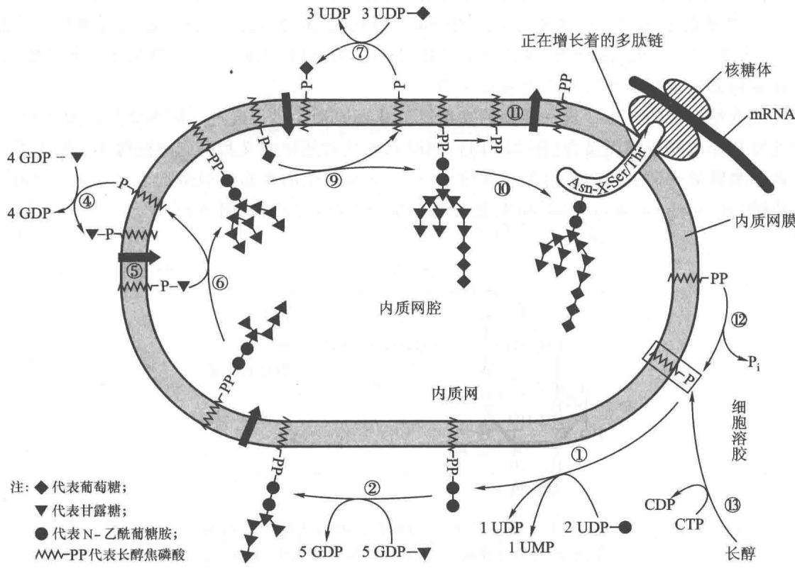  
图21-15 长醇焦磷酸寡糖的合成途径

构成寡糖前体的组分包括2分子N-乙酰-D-葡糖胺 $\left(\mathrm{NAcGlc}\right)_{2}$ ，9分子甘露糖 $\left(\mathrm{Man}\right)_{9}$ 和3分子葡萄糖 $\left(\mathrm{Glc}\right)_{3}$ 。虽然在糖基转移反应中，与核苷酸相连的糖基是最普遍的单糖供体，但仍有一些甘露糖基和葡萄糖基是由长醇-磷酸衍生物提供的。这种对长醇-磷酸-甘露糖的需要是由Stuart Kornfeld发现的。他发现，小鼠的一种淋巴瘤(lymphoma)细胞的突变型，不能合成正常的酯连寡糖，结果导致形成的糖酯少于正常糖酯。这种细胞含所有需要的糖基转移酶，但不能合成长醇-磷酸一甘露糖。这是由于在细胞溶胶中由GDP-甘露糖和长醇-磷酸合成长醇-磷酸-甘露糖的反应被阻断。若将长醇-磷酸-甘露糖提供给细胞，甘露糖分子就能加到不正常的长醇-焦磷酸-寡糖分子上。

如图21-15所示，在长醇-PP-寡糖合成中的第①步反应是2分子活化的 $N-$ 乙酰葡糖胺（UDP-GlcNAc） $_{2}$ ，连续加到长醇磷酸上，第1个 $N-$ 乙酰葡糖胺以 $N-$ 乙酰葡糖胺1-磷酸形式，第2个以 $N-$ 乙酰葡糖胺形式，结果形成长醇-PP-( $N-$ 乙酰葡糖胺) $_{2}$ 。第②步反应是5个GDP-甘露糖分子以甘露糖形式加到长醇-PP- $N-$ (乙酰葡糖胺) $_{2}$ 分子上形成长醇-PP- $N-$ (乙酰葡糖胺) $_{2}$ -(甘露糖) $_{5}$ 。5个甘露糖残基是由5种不同的甘露糖转移酶催化的。这5个甘露糖残基形成分支。因前两步反应都是在内质网膜的细胞溶胶侧进行的，两步反应完成后的第③步反应是形成的上述分子进行移位，“翻转”到内质网腔内，但它是如何进行的翻转？尚未阐明。有趣的是长醇-PP-N-(乙酰葡糖胺) $_{2}$ -(甘露糖) $_{5}$ 分子的再增长还需从细胞溶胶侧引进下一步反应所需的甘露糖分子。引进甘露糖分子的反应包括全部反应过程中的第④步和第⑤步两步反应。4个活化的甘露糖分子(GDP-甘露糖)先与长醇磷酸反应形成长醇-磷酸-甘露糖分子，然后进行移位，锚定在长醇磷酸上的甘露糖转移到了内质网腔。第⑥步反应是转入的与长醇-磷酸结合着的甘露糖又转移到需再增长的寡糖核心分子上，使之又增加了4个甘露糖残基。催化4个甘露糖分子转移的是4种不同的甘露糖转移酶。寡糖核心进一步的增长需要3个葡萄糖分子。活化的葡萄糖分子(UDP-葡萄糖)与长醇-磷酸反应形成长醇-磷酸-葡萄糖分子成为第⑦步反应。随后又是移位反应，即第⑧步反应，磷酸-葡萄糖部分翻转到内质网腔内。第⑨步反应是3分子分别锚定在长醇-磷酸上的葡萄糖残基转移到含有9个甘露糖分子的长醇-焦磷酸-N-(乙酰-葡糖胺) $_{2}$ -(甘露糖) $_{9}$ 上，使之又多了3个葡萄糖残基，于是完成了长醇-焦磷酸-寡糖核心的合成。这时寡糖部分已具备转移到多肽链天冬酰胺残基上的条件。当肽链中出现合乎要求的天冬酰胺分子时(Asn-X-Ser/Thr)，就可进行寡糖部分的转移，同时释出的长醇-焦磷酸分子又进行移位将焦磷酸转换到内质网膜的细胞溶胶侧。其后长醇-焦磷酸又失去一个磷酸基团形成长醇-磷酸。从全部反应中可看到长醇-磷酸完成了一次变化多端的长途旅行，最后又回到了原位。

② 长醇-焦磷酸-寡糖的合成过程包含有拓扑变化 从图21-15可看出，在长醇-焦磷酸-寡糖的合成过程中包含有中间产物的拓扑变化。图中反应①、②、④和⑦都发生在内质网膜的细胞溶胶侧。这些事实是用内部翻转到外面的粗面内质网囊泡测定的。实验表明各种干扰内质网膜通透性的试剂都能够干扰上述某种反应的进行。图中反应⑥、⑨和⑩都发生在内质网腔内。这是利用伴刀豆球蛋白A（concanavalin A），一种糖结合蛋白质作膜通透实验判断出的。伴刀豆球蛋白A若不透入到内质网腔内就不能与反应⑥、⑨和⑩的产物结合。因此，反应②的产物，长醇-PP-N(乙酰葡糖胺) $_{2}$ -(甘露糖) $_{5}$ ，反应④的产物，长醇-P-甘露糖和反应⑦的产物长醇-P-葡萄糖都必须穿过内质网膜，改换位置，这就是通过相应的反应③、⑤和⑧使这些产物伸出到内质网腔内，只有这样才能使N-连寡糖的合成继续下去。目前尚不知这些移位过程的机制。

③ N-连寡糖与蛋白质的结合是在蛋白质合成过程中开始的 这项研究是利用一种能使牛感染产生类似流感症状的病毒称为疱疹性口腔炎病毒(vesicular-stomatitis virus, VSV)进行的。VSV 的外壳是由宿主细胞膜构成的。宿主细胞被病毒感染后，在宿主细胞膜中嵌入了一个单一的病毒糖蛋白称为 VSVG 蛋白(VSVG protein)。因病毒感染几乎是全部侵占了被感染细胞的蛋白质合成机器，正常细胞的高尔基体可合成自身的数百种糖蛋白，一旦细胞被感染后，除合成病毒 G 蛋白外已不再合成自身的蛋白质。因此病毒 G 蛋白的合成就能顺利地进行。

对 VSV 感染细胞的研究表明了, 寡糖分子从长醇链上的转移在多肽链合成的进程中就开始了。病毒 G 蛋白的 N-糖基化是由结合在膜上的寡糖转移酶催化的, 它能识别肽链上的 Asn-X-Ser/Thr 序列位点。但实际测定表明, 在真核细胞糖蛋白中的 Asn-X-Ser/Thr 位点 (又称三联序列子) 只有三分之一是被 N-糖基化的。根据大量糖蛋白二级结构的预测和对多肽模型糖基化的研究表明, 蛋白质中有 70% 的 Asn-X-Ser/Thr 序列处于 β 转角部位, 20% 处于 β 折叠片中, 10% 处于 α 螺旋部位; 糖化率高的部位是 β 转角或成环部位。在这些部位的 Asn 的 N-H 基团和 Ser/Thr 的羟基 O 原子容易形成氢键。关于脯氨酸不能占据 -X-位, 可能是因为它会妨碍 Asn-X-Ser/Thr 所需要的某种源于氢键的构象。α 螺旋结构致密, 不易容纳长达 3\~4 nm 的含有 14 个单糖分子的寡糖前体, 故糖化概率很小。如果 X 为半胱氨酸, 则容易形成二硫键, 而影响糖基化。在十四糖寡糖前体中的 3 个葡萄糖分子是有效转移所必需的。

④ 糖蛋白的加工开始于内质网完成于高尔基体 糖蛋白最初的加工始于内质网,由酶促除去3个葡萄糖残基(图21-16,反应②、③)和一个甘露糖残基(图21-16,反应④)。随后糖蛋白被裹在由膜形成的囊泡中转移到高尔基体进一步加工。高尔基体由一叠4\~6或更多个扁平的膜状囊袋(sacs)构成。囊袋的数目随种属而不同。高尔基体的叠层有内面(cis face)和外面(trans face)的不同,每面都由彼此相连的管道网构成:内在高尔基体网络(cis Golgi network)在内质网对面,是蛋白质的入口,蛋白质通过它进入高尔基体。高尔基体外侧网络(trans Golgi network)，是加工过的蛋白质的出口。介于二者之间的高尔基叠层至少含有3种不同的囊袋，分别称为内侧的、中间的和外侧的嵴（cis, medial and trans cisternae），每一种都含有不同组合的糖蛋白加工酶。在糖蛋白通过内在嵴、中间嵴和外侧嵴的旅途中，甘露糖残基已经过修剪，N-乙酰葡糖胺、半乳糖、岩藻糖以及唾液酸残基都根据需要加到糖蛋白分子上，从而完成它的加工（图21-16反应⑤\~⑪）。最后，糖蛋白在高尔基体外侧网络分类准备转移到细胞的相关部位。糖蛋白在这些不同部位之间的转移是在膜泡(membranous vesicles)中进行的。

  
图21-16 糖蛋白在高尔基体的加工过程

前面已经提到，N-连糖蛋白的寡糖之间表现出极大的多样性，甚至具有相同多肽链的糖蛋白也能表现出相当明显的微小差异。这种差异可能是由于糖基化不完全或是由于糖基转移酶或糖化酶的专一性差异造成的。最后形成的寡糖部分可大致归纳为3类即高甘露糖寡糖、复杂寡糖和杂合寡糖。不同类型的寡糖与它的功能以及与它们的糖蛋白在细胞内的最后定位之间是怎样的关系？还需进行深入研究。现已

知溶酶体糖蛋白似乎是高甘露糖型的变种。

⑤ 抑制剂在研究 N-连糖蛋白中起到重要作用 应用能阻断某种专一性糖基化酶的抑制剂研究糖蛋白糖基化的加工过程曾起到重要的推动作用。值得提出的是两种有效的抑制剂。一种是称为衣霉素（gunicamycin）的抗生素，它是一种具有疏水性的 UDP-N-乙酰葡糖胺的类似物。另一种是杆菌肽（bacitracin），它是一种环状多肽，也是一种抗生素。

这两种抗生素都能抑制细菌细胞壁的生物合成。细胞壁的合成过程有脂连寡糖参与。衣霉素阻断由

磷酸长醇和 UDP-N-乙酰葡糖胺形成长醇-焦磷酸-寡糖的过程(图 21-15 反应①)。衣霉素类似于这些反应物中的某一种，成为结合到酶分子上的加合物，结合后的解离常数为 $7 \times 10^{-9} \mathrm{~mol} / \mathrm{L}$ 。杆菌肽和长醇-焦磷酸形成一种复合物，从而抑制长醇焦磷酸的去磷酸化作用(图 21-15 反应⑫)，因此在脂连寡糖前体的形成中起抑制作用。杆菌肽用于临床只抑制细菌细胞壁的合成，不伤害动物细胞，因为杆菌肽不能通过细胞膜，而细菌细胞壁的合成是在细胞膜外进行的。

（2）O-连寡糖的生物合成 O-连寡糖是先合成蛋白质的多肽链，然后合成寡糖链；所以是翻译后加工形成。

黏蛋白生物合成的深入研究,为 O-连寡糖的生物合成程序提供了有力的证据。黏蛋白是由颌下唾液腺分泌的一种 O-连糖蛋白。它的糖链的合成是在高尔基体中进行的。这时 O-寡糖的多肽链已经全部合成。O-寡糖链是由酶促连续地向已完成的多肽链上加入单糖单位构成的(图 21-17)。

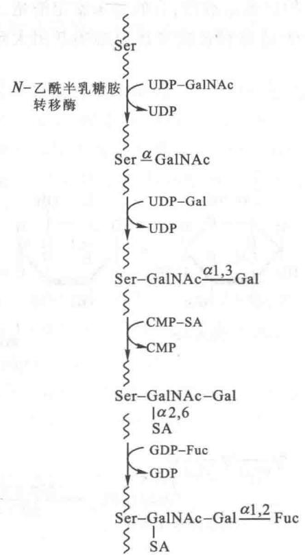

O-连寡糖合成的开始是在N-乙酰半乳糖胺转移酶的催化下，N-乙酰半乳糖胺（GalNAc）从UDP-GalNAc上转移到多肽链的丝氨酸或苏氨酸残基上。和N-连寡糖不同的是：N-连寡糖的糖链是转移到多肽链的一定氨基酸序列上的天冬酰胺残基上；O-连寡糖糖基化的丝氨酸、苏氨酸位点不属于任何一段特定的氨基酸序列，而是和多肽链的二级和三级结构有关。当丝氨酸或苏氨酸的附近含有脯氨酸时，则α螺旋结构被β折叠片或β转角取代从而容易发生O-连糖基化。O-连糖基化是由相应的糖基转移酶将半乳糖、唾液酸、N-乙酰葡糖胺和岩藻糖根图21-17 唾液腺 $O$ -连寡糖链糖单位的合成途径示意

GalNAc: N-乙酰-D-半乳糖胺, Gal: 半乳糖, SA: 唾液酸, Fuc: 岩藻糖

据需要逐步地加上去。一般认为 O-糖基化(实际是 O-N-乙酰半乳糖基化)发生于 N-糖基化之后,而且不同糖蛋白 O-糖基化的起始地点并不一致,有的在内质网,有的在内质网-高尔基中间结构,也有的在内侧高尔基体。但外侧糖基的添加都是在高尔基体完成的。将 UDP-N-乙酰半乳糖胺(UDP-GalNAc)的 GalNAc 首先转移到多肽链上的酶称为多肽-O-GalNAc 转移酶。该酶能识别肽链上 Ser 或 Thr 所处的空间构象。

目前已知 O-连寡糖链在合成时也有形成核心。但是它的核心类型较多。至少可举出以下几种类型：

$$
\begin{array}{l} \text {①} - \mathrm{O} \xrightarrow {\alpha 1} \mathrm{GalNAc} \xrightarrow {\beta 1 , 3} \mathrm{Gal-} \\ \text {②} - \mathrm{O} - \mathrm{GalNAc} \xrightarrow {\beta 1 , 6 / \text {GlcNAc}} \\ \text {③} - \mathrm{O} - \mathrm{GalNAc} \xrightarrow {\beta 1 , 3 / \text {Gal}} \mathrm{GlcNAc} \end{array}
$$

$$
\begin{array}{l} \beta 1, 6 / \mathrm{GlcNAc} \\ ④ - \mathrm{O} - \mathrm{GalNAc} \\ \beta 1, 3 / \mathrm{GlcNAc} \\ ⑤ - \mathrm{O} - \mathrm{GalNAc} \xrightarrow {\beta 1 , 6} \mathrm{GlcNAc} \end{array}
$$

因此 O-糖链的延伸也和 N-糖链相似,都是在核心的基础上逐个添加糖基。催化核心形成的有关的酶有的已鉴定清楚,有的尚未鉴定清楚,此处不作详细介绍。

O-连寡糖链的非还原端的基团大致包括3种，唾液酸、硫酸和岩藻糖。唾液酸化所需的酶也具有专

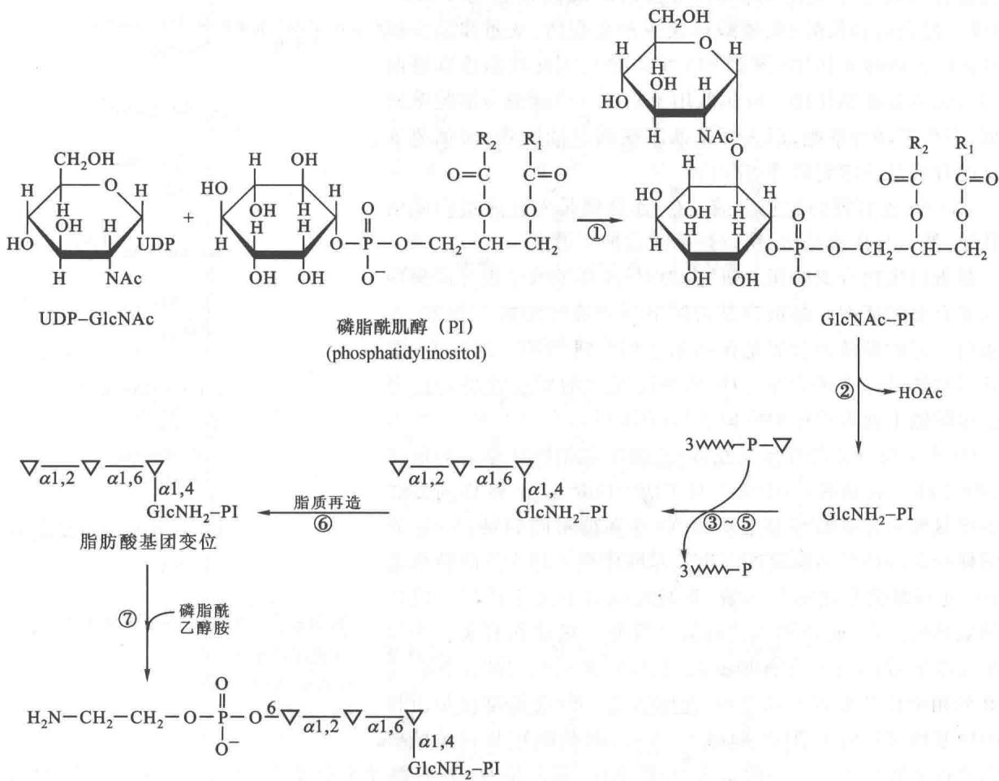

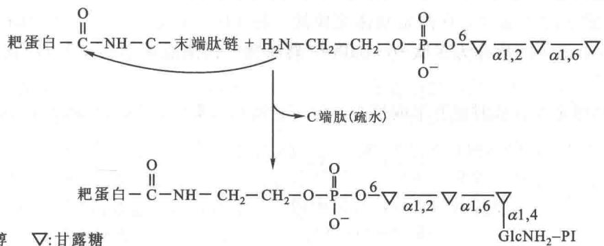

图 21-18 A. 糖基磷脂酰肌醇(GPI)四糖核心的合成途径 B. 耙蛋白的转酰胺基作用导致其 C 端连接到 GPI 锚上

①N-乙酰葡糖胺(GlcNAc)加到磷脂酰肌醇(PI)上；②GlcNAc脱乙酰化；③\~⑤由长醇-P-甘露糖在3种不同酶的催化下加入3个甘露糖基；⑥在PI上的脂质中的脂肪酸变位；⑦磷酸乙醇胺从磷脂酰乙醇胺转移到四糖核心末端甘露糖残基的变位羟基上

一性。硫酸化时， $\mathrm{HSO}_3^-$ 基团一般和半乳糖的第4位相接。催化此反应的酶是高尔基体中的磺基转移酶。临床上发现肿瘤、炎症等病灶中的黏蛋白硫酸化程度可发生明显的改变。非还原端的L-岩藻糖基化是血型抗原合成的必需步骤。

（3）糖基磷脂酰肌醇四糖核心的合成 前面已经提到糖基磷脂酰肌醇(GPI)可将各种蛋白质锚定到真核细胞浆膜的外表面。GPI连接到蛋白质的羧基端使蛋白质得到依附,得以自由地在细胞膜的外面活动。全部蛋白质除糖脂锚(两条脂肪酸链)外都在细胞的外部空间。许多细胞表面的水解酶类以及黏附素(adhesins),都借助GPI锚定在细胞上。

GPI 的核心结构是在内质网膜腔侧由磷脂酰肌醇、UDP-N-乙酰葡糖胺（UDPGlcNAc）、长醇-磷酸-甘露糖（dol-P-man）和磷脂酰乙醇胺合成的。如图 25-18A 所示。

形成的核心随后被修饰加工。根据动物不同的种属以及其附着的蛋白质的不同，加入的糖基也随之变化。GPI-锚的脂肪酸残基的变化也是很大的。这是由于在锚的合成过程中脂质会发生改变。靶蛋白锚定到膜表面是当GPI上磷酸乙醇胺的氨基对蛋白质靠近C端的专一氨酰基进行亲核攻击时，结果引起转酰胺基作用，在C端释放出20\~30个疏水肽链（图25-18B）。因GPI基团是附着在粗面内质网的腔面蛋白质上，由GPI锚定的蛋白质得以存在于细胞浆膜的外表面。

## （四）糖蛋白糖链的分解代谢

糖蛋白的分解代谢是在溶酶体中进行的。糖蛋白的彻底降解需要蛋白水解酶和糖苷酶的联合作用。N-连糖蛋白的水解先从裸露在糖链外的肽链开始，肽链的降解为N-糖链的水解提供空间。糖链核心的降解，先被水解的基团往往是岩藻糖，其次水解以 $\beta1,4-$ 糖苷键连接的N-乙酰-葡糖胺。当肽链和糖链分开后，两部分则分别进行水解。糖链上的糖基由不同的外切糖苷酶从非还原端逐个将糖链上的糖基水解脱下，而肽链上剩余的个别N-乙酰葡糖胺残基则被专一的糖肽水解酶降解。剩下的肽链最后被蛋白水解酶降解。

O-糖蛋白的水解根据糖链的密集程度不同,其多肽链和寡糖链水解的先后也有不同,但也可同时进行。以黏蛋白为例,因含寡糖链较多,一般是先从糖链末端的唾液酸开始水解,随后再从非还原端逐个切除糖单元。多肽链的水解和肽链的暴露情况直接有关。

## 提要

糖异生作用指的是由非糖物质例如乳酸、氨基酸、甘油等作为原料合成葡萄糖的作用。糖异生作用对于机体饥饿和激烈运动时不断提供葡萄糖维持血糖水平是非常重要的。脑和红细胞几乎全部依赖血糖提供能源。糖异生作用的绝大多数酶是细胞溶胶酶，只有丙酮酸羧化酶和6-磷酸葡糖磷酸酶除外，前者位于线粒体基质，后者结合在光面内质网上。

糖异生作用的主要起点可认为是丙酮酸。由丙酮酸转变为葡萄糖，凡在糖酵解过程中的可逆反应都被糖异生作用利用。但遇到糖酵解途径中的不可逆反应则必须绕道而行。以生物素为辅酶的丙酮酸羧化酶和由GTP供能的磷酸烯醇式丙酮酸羧激酶催化的反应绕过了丙酮酸激酶催化的不可逆反应。1,6-二磷酸果糖磷酸酶绕过了磷酸果糖激酶催化的不可逆反应。6-磷酸葡糖磷酸酶绕过了己糖激酶催化的反应。糖酵解过程发生于机体的所有细胞，而糖异生作用则主要发生在肝，其次是肾。在线粒体中丙酮酸羧化为草酰乙酸，在细胞溶胶中草酰乙酸又脱羧并磷酸化为磷酸烯醇式丙酮酸。在这些反应中共用去两个高能磷酸键。

糖异生作用和糖酵解作用是互相协调的。当一条途径活跃时，另一条途径的活性就相应降低，磷酸果糖激酶和1,6-二磷酸果糖磷酸酶是起调控作用的关键酶。当葡萄糖供应丰富时，2,6-二磷酸果糖作为细胞内的分子信号也处于高水平。它活化糖酵解作用并抑制糖异生途径。2,6-二磷酸果糖受到破坏则引起1,6-二磷酸果糖磷酸酶活性加强，从而加速糖异生作用。胰高血糖素/胰岛素比值升高，也促进糖异生作用加快。丙酮酸激酶和丙酮酸羧化酶所受到的调节使它们同时都不是处于最活跃的状态。别构调节和可逆磷酸化作用都是迅速的。这类调节为转录调节(参看第34章)。

乙醛酸循环是植物和微生物特有的反应途径。这个循环除两步由柠檬酸裂合酶和苹果酸合酶催化的反应外，其他的反应都和“柠檬酸循环”相同。乙醛酸循环使2个乙酰-CoA分子转变为1分子草酰乙酸，同时使2分子 $NAD^{+}$ 和1分子FAD还原。乙醛酸循环在植物种子中有重要意义。它使萌发的种子将贮存的三酰甘油通过乙酰-CoA转变为葡萄糖；它使植物和微生物能够靠乙醛酸生活。

寡糖由单糖以糖苷键连接而成，种类极多，其组成成分包括甘露糖、N-乙酰葡糖胺、N-乙酰胞壁酸、葡萄糖、果糖、半乳糖、N-乙酰神经氨酸、N-乙酰半乳糖胺等。

以糖苷键相连的最简单的典型寡糖是乳糖。糖蛋白是多肽链与寡糖分子相结合的重要物质。糖蛋白上的寡糖分子是起识别标记作用的重要分子。以“N”糖苷键相连接的糖蛋白其寡糖组分通过N-糖苷键与蛋白质中具有Asn-X-Ser/Thr序列片段的Asn相连。以“O”糖苷键连接的糖蛋白，其寡糖部分以O-糖苷键连接到多肽链的Ser或Thr残基上；或者在胶原中连接到5-羟赖氨酸上，糖基化的磷脂酰肌醇-锚蛋白的糖组分通过一个中间的磷酸乙醇胺作为桥连接到蛋白质上，它和多肽链的C端氨基酸残基形成一个酰胺键相连。N-连寡糖的合成，开始于内质网。先是经过多步反应形成一个以酯键连接的前体，它是以长醇焦磷酸连接着一个共有的由14个糖残基构成的寡糖核心，即长醇·焦磷酸·寡糖，这一寡糖前体再转移到正在增长着的多肽链上。N-连寡糖的形成和多肽链的延长是同时逐步进行的。未完成的糖蛋白分子随后通过膜泡，被转移到高尔基体的内侧、中间以及外侧嵴，使糖蛋白中的寡糖部分继续加工修饰。这些加工包括加减甘露糖残基以及其他一些单糖分子。加工完的N-连糖蛋白，在高尔基体外侧嵴根据它们所具有的寡糖特性进行分类并准备通过膜泡迁往其目的部位。N-糖链可分为3种主要类型，高甘露糖型、复杂型和杂合型，这3种类型都含有一个共同的五糖核心。O-连糖蛋白是在肽链合成的基础上逐步加上糖基的。抗生素的使用有力地推动了对糖蛋白生物合成的研究，使用过的最重要的抗生素有衣霉素和杆菌肽。O-连寡糖部分在高尔基体合成，在相应肽链的Ser或Thr残基上依次加入所需的单糖单位；Ser/Thr在肽链中的位置与肽链的二、三级结构有关。糖蛋白的寡糖是一种识别标记，它对糖蛋白的定向投送，细胞-细胞和细胞-抗体识别都具有重要作用。糖基磷脂酰肌醇可将各种不同的蛋白质锚定到真核细胞质膜的外表面，使它们可以在细胞外部空间自由地发挥作用。

## 习题

1. 鸡蛋清中有一种对生物素亲和力极高的抗生物素蛋白质。它是含生物素酶的高度专一的抑制剂，请考虑它对下列反应有无影响：

(a) 葡萄糖→丙酮酸 (b) 丙酮酸→葡萄糖

(c) 5-磷酸核糖→葡萄糖 (d) 丙酮酸→草酰乙酸

2. 计算从丙酮酸合成葡萄糖需提供多少高能磷酸键？

3. 维持还原型谷胱甘肽[GSH]的浓度为 $10\mathrm{mmol / L}$ , 氧化型[GSSG]的浓度为 $1\mathrm{mmol / L}$ , 所需的 $\mathrm{NADPH} / \mathrm{NADP}^{+}$ 的比例应是多少? (参看第 19 章氧还电势表)

4. 糖酵解、戊糖磷酸途径和糖异生途径之间如何联系？

5. 比较糖醛酸循环和柠檬酸循环。糖醛酸的存在有何特殊意义？

6. 为什么有人不能耐受乳糖，而乳婴却靠乳汁维持生命？

7. 糖蛋白中寡糖与多肽链的连接形式有几种类型？

8. $N$ -连寡糖和 $O$ -连寡糖的生物合成各有何特点？

## 主要参考书目

1. Nelson D L, Cox M M. Lehninger 生物化学原理. 3 版. 周海梦, 等译. 北京: 高等教育出版社, 2005.

2. Nelson D L, Cox M M. Lehninger Principles of Biochemistry. 6th ed. New York: W. H. Freeman and Company, 2012.

3. 陈惠黎. 糖蛋白寡糖链的生物学功能. 上海: 上海医科大学出版社, 1997.

4. Greenberg, David M. Metabolic Pathways. New York: Academic Press, 1960.

5. Schatz G, Dobberstein B. Common principles of protein translocation across membranes. Science, 2000, (271): 1519–1525.

6. Varki A, Cummings R, Esko J, et al. Essential Glycobiology. Cold Spring Harbor: Cold Spring Harbor Laboratory Press, 1999.

(王镜岩 秦咏梅)

## 网上资源

习题答案

自测题
