## 第23章 光合作用

> **本章英文对应内容**（Lehninger，插在所列中文小节末尾）
>
> - 第20章 Photosynthesis and Carbohydrate Synthesis in Plants：章首导言（本章开头）、关键术语/习题/简答（本章末尾）
> - §20.1（第20章）→ 二、叶绿素的光反应性: 光吸收
> - §20.2（第20章）→ 三、光驱动的电子流:中心光化学事件
> - §20.3（第20章）→ 四、光驱动的 ATP 合成: 光合磷酸化
> - §20.4（第20章）→ 五、暗反应: $CO_{2}$ 固定
> - §20.5（第20章）→ 六、光呼吸和 $\mathrm{C}_{4}$ 途径
> - §20.6（第20章）→ 六、光呼吸和 $\mathrm{C}_{4}$ 途径

光合作用（photosynthesis）可简单地概括为含光合色素（主要是叶绿素）的植物细胞和细菌，在日光下利用无机物质 $\left(\mathrm{CO}_{2},\mathrm{H}_{2}\mathrm{O},\mathrm{H}_{2}\mathrm{S}\right)$ 合成有机化合物 $\left(\mathrm{C}_{6}\mathrm{H}_{12}\mathrm{O}_{6}\right)$ ，并释放氧气 $\left(\mathrm{O}_{2}\right)$ 或其他物质（如S等）的过程。在第19章我们曾看到葡萄糖氧化成 $CO_{2}$ 和 $H_{2}O$ 期间，细胞是如何形成ATP（氧化磷酸化）的。本章将讨论绿色植物是如何进行光合作用的，包括捕光机制、光驱动电子流、ATP形成（光合磷酸化）和 $CO_{2}$ 固定等步骤。虽然讨论的重点放在植物叶绿体中的光合作用，但也将涉及某些细菌中的光合过程。因为对较简单的细菌光合系统的结构和功能的了解有助于在分子细节上追踪光能是如何转化为化学能的。此外还要讨论一下光呼吸和 $C_{4}$ 途径。

<!-- EN-BEGIN 第20章导言 -->

### 【英文对应 第20章导言】Photosynthesis and Carbohydrate Synthesis in Plants

> 来源：Lehninger Principles of Biochemistry（书籍/02_生物化学原理） 第20章章首（含章节目录与学习要点）。

#### [EN] PHOTOSYNTHESIS AND CARBOHYDRATE SYNTHESIS IN PLANTS

20.1 Light Absorption 701

20.2 Photochemical Reaction Centers 707

20.3 Evolution of a Universal Mechanism of ATP Synthesis 716

20.4 $\mathrm{CO}_{2}$ -Assimilation Reactions 719

20.5 Photorespiration and the $C_{4}$ and CAM Pathways 727

20.6 Biosynthesis of Starch, Sucrose, and Cellulose 733

We have now reached a turning point in our study of cellular metabolism. Thus far in Part II we have described how the major metabolic fuels—carbohydrates, fatty acids, and amino acids—are degraded through converging catabolic pathways that lead to the citric acid cycle and yield their electrons to the respiratory chain, driving ATP synthesis by oxidative phosphorylation. We now turn to reductive, anabolic, divergent processes fueled by energy from the sun that take place in photosynthetic organisms, and in all other organisms, driven ultimately by the photosynthetic reduction of $CO_{2}$ .

As we examine this process, these principles will emerge:

P1 The capture of solar energy by photosynthetic organisms and its conversion to the chemical energy of reduced organic compounds is the ultimate source of nearly all biological energy and organic nutrients for all of the nonphotosynthetic organisms, including humans. It is arguably the most important biochemical process in the biosphere.

P2 Photosynthetic organisms use tightly organized light-harvesting complexes to absorb sunlight and capture its energy in chemical form: a separation of positive and negative charge leading to electron flow. The energy from an absorbed photon moves from one antenna chlorophyll to another and another until it arrives at the reaction center where it promotes the photochemical reaction that sends electrons through a series of electron carriers.

P3 The light-driven flow of electrons through specialized protein carriers is coupled to ATP synthesis. A strong reducing agent (NADPH) is also produced, and simultaneously, water is oxidized to $\mathrm{O}_2$ , which is released into the atmosphere.

P4 Evolution yielded a universal mechanism for coupling ATP synthesis to the flow of electrons. A proton gradient created by electron flow is used to energize the ATP-synthesizing enzyme in microorganisms, animals, and plants.

P5 The ATP and NADPH produced in the light-dependent reactions of photosynthesis provide the energy and the reducing power to convert atmospheric $\mathrm{CO}_{2}$ into simple organic compounds. High concentrations of ATP and NADPH allow the chloroplast to carry out redox reactions that are thermodynamically unfavorable.

Photosynthesis encompasses two processes: the light-dependent reactions, in which sunlight provides the energy for the synthesis of ATP and NADPH, and the $CO_{2}$ -assimilation reactions, in which ATP and NADPH are used to reduce $CO_{2}$ to form triose phosphates via a set of reactions known as the Calvin cycle (Fig. 20-1). We heterotrophs are alive because the enormous energy of sunlight has been captured and tamed by autotrophs by photosynthesis and made available to us as fuel, vitamins, and building blocks. How do they do it?

All vascular plants, as well as algae and cyanobacteria, carry out the same basic process of photosynthesis, but some are more amenable to study than others. Algae and cyanobacteria have been extensively studied because of the relative ease of culturing and manipulating them in the laboratory. Spinach is a vascular plant commonly used for studies of photosynthesis because of the ease of obtaining large amounts of material; and for genetic approaches, the small plant Arabidopsis thaliana is a favorite. What we say here about photosynthesis is essentially true of photosynthesis in all of these organisms.

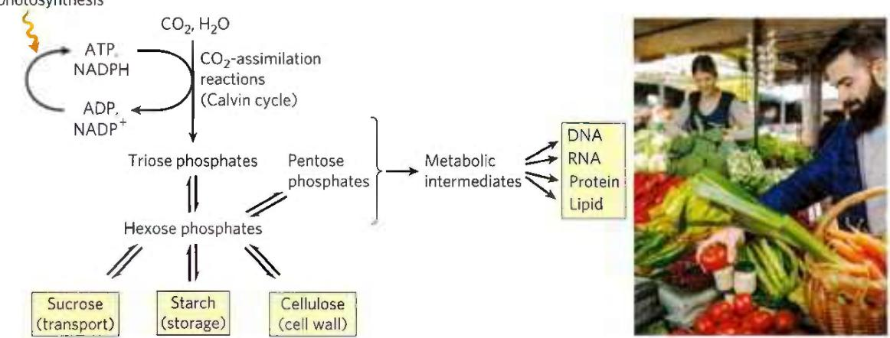  
FIGURE 20-1 Assimilation of $\mathrm{CO}_{2}$ provides all of the carbon a plant needs. The light-driven synthesis of ATP and NADPH provides energy and reducing power for the fixation of $\mathrm{CO}_{2}$ into trioses in the Calvin cycle. All of the carbon-containing compounds of the plant cell are synthesized from this fixation of $\mathrm{CO}_{2}$ . [Emir Memedovski/Getty Images]

After looking at photosynthesis, we will discuss the conversion of trioses produced in the Calvin cycle to sucrose (for sugar transport) and starch (for energy storage) (see Fig. 20-1). This conversion is accomplished by mechanisms analogous to those used by animal cells to make glycogen. We also describe the synthesis of the cellulose of plant cell walls. Finally, we consider how carbohydrate metabolism is integrated within a plant cell and throughout the plant.

Although strikingly different on the surface, the processes of photophosphorylation in the chloroplast and oxidative phosphorylation in the mitochondrion are closely similar at the molecular level, and the mechanism for ATP synthesis is virtually identical: a proton gradient drives rotary catalysis by a remarkable ATP synthase.

<!-- EN-END 第20章导言 -->

## 一、光合作用的概况

## （一）日光是地球上所有生物能的最终来源

光合作用是地球上进行的最大的有机合成反应。每天从太阳到达地球的能量约为 $1.5 \times 10^{22} \mathrm{~kJ}$ ，其中约 $1\%$ ①被绿色植物所吸收。光合生物利用吸收的太阳能合成ATP和NADPH，进而用这些化学能从 $\mathrm{CO}_{2}$ 和 $\mathrm{H}_{2} \mathrm{O}$ 制造碳水化合物，同时放 $\mathrm{O}_{2}$ 到大气中。需氧的异养生物（例如人类以及处于黑暗中的植物）利用这样形成的 $\mathrm{O}_{2}$ 把光合作用合成的富能有机产物（燃料，如葡萄糖）分解为 $\mathrm{CO}_{2}$ 和 $\mathrm{H}_{2} \mathrm{O}$ ，并产生ATP以供生命活动的能量之需。 $\mathrm{CO}_{2}$ 返回大气被光合生物重新利用。因此，日光几乎②是地球上所有生物能的最终来

源,也为 $CO_{2}$ 和 $O_{2}$ 经生物圈不断地循环提供驱动力(图 23-1)。保持光合生物和异养生物处于一个稳态平衡的生物圈中是维持地球上生态平衡的基础,也是人类可持续发展的基础。

太阳能转化为化学能经常使用 $CO_{2}$ 固定（carbon dioxide fixation）这一术语来表示。据估计，每年地球上约有 $10^{11}$ 吨 $CO_{2}$ 被固定，其中三分之一主要是由海洋中的光合微生物固定的。因此人类开发利用海洋必须高度注意它的生态平衡问题。

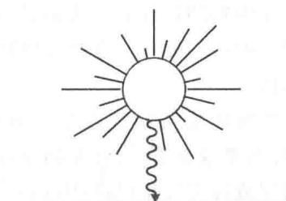

虽然光合作用习惯上用 $CO_{2}$ 固定来衡量,但是光能(更确切些说由它转化来的化学能)驱动光合细胞中的所有吸能过程,例如无机氮和硫同化成有机形式,它们代表跟绿色植物吸收光能紧密偶联的其他两类代谢转化。

## （二）光合作用的发现

在实践中人们很早就认识到植物需要光、水和空气。例如，在6世纪贾思勰的《齐民要术》中就有“槐，性扇地，其阴下，五谷不植”的说法，显然当时人们已懂得光对植物生长的意义。一般的教科书中把

  
图23-1 日光是所有生物能的最终来源

18 世纪的英国化学家 J. Priestley 推为最先发现光合作用的人。1771 年他发现在密闭容器中蜡烛燃烧会“伤害”空气，致使空气不再能助燃，并使放在其中的小鼠窒息。如若在密闭容器中放入一枝薄荷，则“伤害的”空气又能助燃，并能维持小鼠生活；其结论是植物能够净化空气。然而 Priestley 未注意到植物净化空气必须照光，因此，他的实验有时成功（照光），有时失败（不照光）。这一矛盾直至 1779 年荷兰医师 J. Ingenhousz 才确定植物净化空气是依赖于光的，在暗处植物和动物一样会把好的空气变坏。

此后不久,空气的组成弄清楚了, $O_{2}$ 代替了“净化的”空气, $CO_{2}$ 代替了“伤害的”空气。1782年瑞士牧师J.Senebier证明了植物在光照时吸收 $CO_{2}$ ,释放 $O_{2}$ 。随着植物学、化学和物理学的发展,实验技术由定性分析到定量测定,因此对光合作用的认识更加深化。在18世纪末到19世纪中叶这一阶段知道 $H_{2}O$ 参与光合作用,被吸收的 $CO_{2}$ 中的碳参与产物的组成,光合作用的产物是糖类,色素特别是叶绿素在这个过程中起着重要的作用,光是推动这个过程的能量来源,这个过程是一个贮能过程等。到了1860年左右,对植物中光合作用的认识可以用下面的方程式来概括:

$$
\mathrm{CO} _ {2} + \mathrm{H} _ {2} \mathrm{O} \xrightarrow [ \text {叶绿素} ]{\text {光}} (\mathrm{CH} _ {2} \mathrm{O}) + \mathrm{O} _ {2}
$$

这是一个氧化还原反应,反应中 $H_{2}O$ 是 $CO_{2}$ 还原成糖类( $CH_{2}O$ )的电子供体(以氢形式)。“光合作用”一词是1897年才首次出现在教科书上的。上述方程代表了半个多世纪的研究成果。虽然此后光合作用的研究有了很大的发展,取得许多新成果,但是此公式至今还在沿用,只是我们对它的认识内容比百年前详实多了。

## （三）光合作用的场所——叶绿体

虽然能进行光合作用的生物是多种多样的,但从简单的细菌到高大的乔木,它们的光合作用有着很多共同特点,其中重要的一点是光合作用都在膜上发生。在光合原核细胞中光合膜充满细胞内部,在光合真核细胞中光合膜位于称为叶绿体(chloroplast)(图23-2)的大细胞器中。叶绿体是相关植物专一的细胞器家族——质体(plastid)——中的一个成员;质体有双层膜(内膜和外膜)包围,能自我繁殖,植物中的大多数生物合成活动都在这里进行。叶绿体的形状因植物种类不同而有很大的差别。特别是藻类差别更大,它们可以是板状、杯状或星状,例如,水棉(Spirogyra)的叶绿体是螺旋带状的。在高等植物中叶绿体一般为扁平的椭圆形或双凸透镜形,直径为4\~6μm,厚为2\~3μm。细胞中的叶绿体数目因物种、细胞种类和生理状况不同而异。在高等植物的叶肉细胞中一般含有50\~200个叶绿体,藻类细胞通常只有一个大的叶绿体。

叶绿体的共同特点是一种内膜系统的组织形式,称为类囊体膜(thylakoid membrane)。类囊体膜被组织成许多片层(lamella),伸展在整个叶绿体中。这些片层形成称为类囊体小泡(thylakoid vesicle,来自希腊文 thylakos,意为囊袋)的扁平小囊或圆盘。类囊体小泡的直径为250\~800 nm,厚约为10 nm,它们以垛叠(stack)的形式存在,称为基粒(granum)。一个叶绿体含有40\~60个基粒,一个基粒由5\~30个类囊体小泡组成。这些小泡也称基粒片层(grana lamella)。不同基粒之间由片层连接,这些片层穿过叶绿体的基质(stroma)即水相部分。这样,叶绿体就有3个膜和3个区室(图23-2):外膜、内膜和类囊体膜;由膜隔开的3个含水区室,膜间隙(intermembrane space)、基质和类囊体小泡内的空隙,即所谓类囊体腔(thylakiod space或lumen)。

叶绿体像线粒体一样,外膜对小分子和离子是

  
图23-2 叶绿体解剖图

可通透的；内模是叶绿体的通透性屏障，含有转运蛋白（transporter）即所谓透性酶（permease），能调节代谢物进、出细胞器。但内、外膜都不含叶绿素，不直接参与光合作用。类囊体膜具有高度特色的脂质组成，像线粒体的内膜，对多数的离子和分子是不通透的。光合作用在类囊体膜上进行，此膜含有许多内在膜蛋白质，捕获光能的叶绿素和其他辅助色素都结合在这些蛋白质上，形成镶嵌在膜上的叶绿素-蛋白质复合体。在下面我们会看到彼此相通并自成一体的类囊体腔在光能转换为ATP形成的过程中起着重要作用。内膜和类囊体之间的基质中含有碳同化所需的大量二磷酸核酮糖羧化酶以及其他酶类， $\mathrm{CO}_{2}$ 固定反应就在这里发生。叶绿体像线粒体一样，在它的基质中有一个小基因组（一个环状DNA分子），编码它的某些蛋白质，并利用自己的酶和核糖体合成小基因组编码的蛋白质，表现出相当程度的自主性（autonomy）。但大多数的质体蛋白质仍是由核基因编码的，它们的转录和转译跟其他的核基因一样，所以也称叶绿体为半自主细胞器。

## （四）光合作用的总过程

## 1. 光合作用可分为光反应和暗反应两个阶段

1937—1939年英国学者R.Hill发现当含叶绿体的叶片提取液被照光时：①放出 $\mathrm{O}_2$ ，②还原了加入介质中的非生物电子接纳体(electronacceptor)。反应如下进行：

$$
2 \mathrm{H} _ {2} \mathrm{O} + 2 \mathrm{A} \xrightarrow [ \text {叶绿素} ]{\text {光}} 2 \mathrm{H} _ {2} \mathrm{A} + \mathrm{O} _ {2}
$$

式中 A 是人工电子接纳体或称 Hill 试剂, 如 $Fe^{3+}$ 、醌类、醛类和多种有机染料等。一种染料 2, 6-二氯酚靛酚 (2, 6-dichlorophenolindophenol), 处于氧化态 (A) 时为蓝色, 还原态 ( $AH_{2}$ ) 时为无色, 这使得反应容易被追踪:

  
氧化型（蓝色）

  
还原型（无色）

当叶片提取液加上这种染料在无 $\mathrm{CO}_{2}$ 存在下照光时，则可观察到提取液由蓝色变为无色，并放出 $\mathrm{O}_{2}$ ；但置于暗处，则既无 $\mathrm{O}_{2}$ 放出也无染料被还原（仍为蓝色）。这类反应通称为 Hill 反应，它们在正常情况下是热力学上不利的，例如二氯酚靛酚（标准还原电势 $E^{\ominus'}$ 为 $+0.22\mathrm{V}$ ）作为氧化剂比 $\mathrm{O}_{2}(E^{\ominus'}$ 为 $+0.82\mathrm{V}$ ）要弱得多，因此平衡远向左边偏移。但 Hill 的发现表明，照光下的叶绿体能驱动热力学上不利的反应。Hill 反应导致数年后 S. Ochoa 发现生物体内这一电子接纳体（上式中 A）是 $\mathrm{NADP}^{+}(E^{\ominus'}$ 为 $-0.32\mathrm{V}$ ）。更有意义的是 Hill 的发现第一次明确地把光合作用总过程区分为两个阶段：第一阶段是光依赖性反应或光反应（light reaction），它只有当植物被照光时才能发生；第二阶段是不依赖光的反应或所谓暗反应（dark reaction），它是受光反应的产物驱动的（图 23-3）。因为把叶绿体悬浮液在无 $\mathrm{CO}_{2}$ 条件下照光，仍能放 $\mathrm{O}_{2}$ ，把照了光的叶绿体移到暗处并供给 $\mathrm{CO}_{2}$ ，即可观测到有净的己糖合成；所以放 $\mathrm{O}_{2}$ 和 $\mathrm{CO}_{2}$ 固定是可以暂时分开的， $\mathrm{CO}_{2}$ 固定并不直接依赖于光。光反应在类囊体膜上进行，叶绿素和其他色素吸收光能，使之转化为高能磷酸化合物(ATP)和还原力(NADPH),并放出 $\mathrm{O}_2$ 。暗反应在基质中进行,利用光反应的产物(ATP和NADPH)将 $\mathrm{CO}_2$ 还原为三碳糖,并由三碳糖衍生为更复杂的糖类。必须指出,“暗反应”一词并不是指这些反应只在暗处才能发生,其意思只是强调此反应不要求光的直接参与,因此称它为碳同化反应(carbon-assimilation reaction)或碳固定反应(carbon-fixation reaction)更为恰当。其实,从整个过程来看,只有持续的照光,暗反应才能不断地进行。

  
图23-3 光合作用总过程

## 2. 水是光合还原 $NADP^{+}$ 的最终电子供体

在绿色植物(和其他的放氧生物)中,水被用作光合产生还原力(reducing power)的最终电子供体(electron donar)。过程的反应式如下:

$$
2 \mathrm{H} _ {2} \mathrm{O} + 2 \mathrm{NADP} ^ {+} + x \mathrm{ADP} + x \mathrm{Pi} \xrightarrow {n h \nu} \mathrm{O} _ {2} + 2 \mathrm{NADPH} + 2 \mathrm{H} ^ {+} + x \mathrm{ATP} + x \mathrm{H} _ {2} \mathrm{O}
$$

这里 $nh\nu$ 代表光能 (n 是能量 $h\nu$ 的光子的某一数, 其中 h 是 Planck 常数, $\nu$ 是光的频率)。光能是为使热力学上有利的 $H_{2}O$ 还原不利的 $NADP^{+}(\Delta E^{\ominus'} = -1.136\ V; \Delta G^{\ominus'} = +219\ kJ/mol\ NADP^{+})$ 所必需的。因此光能的输入, $nh\nu$ 必须超过 219 kJ/mol $NADP^{+}$ 。ATP 形成的化学计量决定于在那个细胞和那个时间运作的光合磷酸化 (photophosphorylation) 图式和以 ATP 产量表示的化学渗透比, $ATP/H^{+}$ (见后面)。但是 $CO_{2}$ 固定代谢途径的化学计量是一定的:

$$
1 2 \mathrm{NADPH} + 1 2 \mathrm{H} ^ {+} + 1 8 \mathrm{ATP} + 6 \mathrm{CO} _ {2} + 1 2 \mathrm{H} _ {2} \mathrm{O} \longrightarrow \mathrm{C} _ {6} \mathrm{H} _ {1 2} \mathrm{O} _ {6} + 1 2 \mathrm{NADP} ^ {+} + 1 8 \mathrm{ADP} + 1 8 \mathrm{Pi}
$$

## 3. 光合作用的更一般化方程

20 世纪 30 年代, van Niel 对细菌光合作用进行比较研究后, 提出光合作用总过程的更一般化的表示形式:

$$
\begin{array}{r l r} {\mathrm{CO} _ {2}} & {+} & {2 \mathrm{H} _ {2} \mathrm{A} \xrightarrow {\text {光}} (\mathrm{CH} _ {2} \mathrm{O}) + 2 \mathrm{A} + \mathrm{H} _ {2} \mathrm{O}} \\ {\text {氢接纳体}} & & {\text {氢供体} \quad \text {还原态接纳体} \quad \text {氧化态供体}} \end{array}
$$

在光合细菌中氢供体(hydrogen donar;也称给氢体)是多种多样的,例如,绿色和紫色硫细菌利用 $H_{2}S$ 、S 或 $SO_{3}^{2-}$ 作为氢供体或电子供体;非硫细菌利用 $H_{2}$ 或其他(如异丙醇、乳酸等)作为氢供体:

$$
\mathrm{CO} _ {2} + 2 \mathrm{H} _ {2} \mathrm{S} \xrightarrow [ \text {硫细菌} ]{\text {光}} (\mathrm{CH} _ {2} \mathrm{O}) + 2 \mathrm{S} + \mathrm{H} _ {2} \mathrm{O}
$$

$$
\mathrm{CO} _ {2} + 2 \mathrm{SO} _ {3} ^ {2 -} + \mathrm{H} _ {2} \mathrm{O} \xrightarrow [ \text {硫细菌} ]{\text {光}} (\mathrm{CH} _ {2} \mathrm{O}) + 2 \mathrm{SO} _ {3} ^ {2 -} + \mathrm{O} _ {2}
$$

$$
\mathrm{CO} _ {2} + 2 \mathrm{H} _ {2} \xrightarrow [ \text {非硫细菌} ]{\text {光}} (\mathrm{CH} _ {2} \mathrm{O}) + \mathrm{H} _ {2} \mathrm{O}
$$

$$
\mathrm{CO} _ {2} + 2 \mathrm{CH} _ {3} \mathrm{CHOHCH} _ {3} \xrightarrow [ \text {非硫细菌} ]{\text {光}} (\mathrm{CH} _ {2} \mathrm{O}) + 2 \mathrm{CH} _ {3} \mathrm{COCH} _ {3} + \mathrm{H} _ {2} \mathrm{O}
$$

van Niel 发现当 1 分子 $\mathrm{CO}_{2}$ 被同化时, 有 2 分子 $\mathrm{H}_{2} \mathrm{~S}$ 变成了硫; 其他光合细菌进行的光合作用也有类似的化学计量关系。可见, 光合细菌也是利用光能裂解氢供体, 把 $\mathrm{CO}_{2}$ 还原为有机物; 与绿色植物不同之点, 只是氢供体不是 $\mathrm{H}_{2} \mathrm{O}$ , 释放的不是 $\mathrm{O}_{2}$ 罢了。事实上, 细菌的光合作用与绿色植物的光合作用在进化上是有联系的。属于原核生物的蓝细菌 (cyanobacteria), 它的光合类型与高等植物的相同, 也以 $\mathrm{H}_{2} \mathrm{O}$ 作为氢供体, 释放 $\mathrm{O}_{2}$ 。某些绿藻 (真核生物) 本来的光合作用与高等植物一样, 光解 $\mathrm{H}_{2} \mathrm{O}$ , 释放 $\mathrm{O}_{2}$ , 但在无氧条件下培养数小时后, 它们也能变成细菌型的光合作用, 利用 $\mathrm{H}_{2}$ 还原 $\mathrm{CO}_{2}$ , 而不放 $\mathrm{O}_{2}$ , 但一旦遇上 $\mathrm{O}_{2}$ 又立即恢复原来的类型。

## 4. 光合作用放出的 $O_{2}$ 全部来自氢供体 $H_{2}O$

绿色植物光合作用中放出的 $O_{2}$ 究竟来自 $CO_{2}$ 还是 $H_{2}O$ 的问题，细菌光合作用的研究所提供的间接证据证明， $O_{2}$ 来自氢供体 $H_{2}O$ ，正如 S 来自 $H_{2}S$ 。1941 年 S. Ruben 和 N. O. Kamen 用 ${}^{18}O$ 标记的 $H_{2}O$ 和 $CO_{2}$ 的同位素标记实验给出了直接证据。发现放出的 $O_{2}$ 中没有一个氧原子是来自 $CO_{2}$ 的，它们全由氢供体 $H_{2}O$ 提供：

$$
\mathrm{C} ^ {1 8} \mathrm{O} _ {2} + 2 \mathrm{H} _ {2} \mathrm{O} \xrightarrow {\text {光}} (\mathrm{CH} _ {2} ^ {1 8} \mathrm{O}) + \mathrm{H} _ {2} ^ {1 8} \mathrm{O} + \mathrm{O} _ {2}
$$

$$
\mathrm{CO} _ {2} + 2 \mathrm{H} _ {2} ^ {1 8} \mathrm{O} \xrightarrow {\text {光}} (\mathrm{CH} _ {2} \mathrm{O}) + ^ {1 8} \mathrm{O} _ {2}
$$

约占地球大气20%的 $O_{2}$ 就是地球上的藻类(许多是单细胞)、高等植物以及蓝细菌在漫长的岁月中光合作用产氧的直接结果。

## （五）光合作用所需的光是可见光

## 1. 光具有波粒二象性

人们获得关于光本质的现代认识,从17世纪牛顿(I. Newton)提出微粒说算起至少也有300多年历史了。目前公认,光具有两重性:波动性和粒子性,即波粒二象性(wave-particle duality)。在一些情况下,光是在空间和时间上以正弦方式振动的一种电磁场(图3-12),在另一些情况下光又是一粒一粒地以光速运动的粒子流。

1900 年普朗克(M. Planck)在解释黑体热辐射实验现象时,提出了量子假说。假说的中心思想是辐射能不是连续的,而是以独立的小包(pocket)形式出现。“量子(quantum)”一词就是指这些能量小包。这种小包是能量的最小单元,也称为能量子, $\varepsilon$ ;其大小与辐射频率成正比,即:

$$
\varepsilon = h \nu = h c / \lambda
$$

此式称为 Planck 方程。式中 h 为 Planck 常数 $(6.626 \times 10^{-34} \text{ J} \cdot \text{s 或 } 4.135 \text{ eV} \cdot \text{s})$ ; ν 为频率, 单位 $s^{-1}$ ; c 为光速 $(3.00 \times 10^{8} \text{ m/s})$ ; λ 为波长, 单位 m。认为辐射物质中能量变化是量子化的, 也即发射或吸收辐射能必须是 $h\nu$ 的整数倍 $(\varepsilon, 2\varepsilon, 3\varepsilon \cdots n\varepsilon)$ , 并且是一份一份地按不连续方式进行的。

1905年爱因斯坦(A. Einstein)在解释光电效应实验现象时,以普朗克量子假说为基础,提出了光子说。认为光是由系列称为光子的能量小包组成,因此光子(photon)就是光能的量子或光量子(light quantum)。每一光子的能量也是 $\varepsilon=h\nu$ ,不同频率的光子具有不同的能量。因为频率与波长成反比,所以短波长的光具有更高的能量。一个具有足够能量的光子( $h\nu$ )被物质中的一个电子吸收时,一部分能量消耗于从物质的束缚中逸出电子所作的外逸功(A),剩余部分的能量转换为外逸电子(称为光电子)的动能( $\frac{1}{2}mv^{2}$ )。因此:

$$
h \nu = \frac {1}{2} m \nu^ {2} + A
$$

此式称为爱因斯坦光电效应方程。

## 2. 光合作用所需的光在可见光光谱范围

顾名思义光合作用是在太阳能推动下进行的。太阳是一个热核装置，它的内层温度高达数百万度，在这里发生巨大的热核聚变。核裂变释放的巨大能量使太阳表面温度维持在6 000 K左右。太阳辐射出电磁光谱的所有成分，但能穿过地球大气层的只有部分红外线、部分紫外线和全部可见光（图23-4）。大部分紫外线被大气层上部的臭氧所吸收，使得地球上的生物免受紫外辐射的伤害。

电磁辐射的速度都是 $2.998 \times 10^{8} \, m/s$ ，即光速 c。但每种辐射的波长是不同的，例如，X 射线小于 $10^{-8} \, m$ ，而无线电波则在 10 m 以上，可见光的范围为 380\~750 nm。光合作用所需的光谱正在可见光范围内。

## 3. 可见光光谱的能级

光合作用也和一般的光化学反应一样，遵循爱因斯坦的光化学当量定律。如果一个分子只有吸收一个光子的能量 $(h\nu)$ 之后才能发生反应，那么 $1\mathrm{mol}$ 化合物必须吸收 $N$ （阿伏伽德罗常数， $6.022\times 10^{23}$ ）个光子的能量 $(Nh\nu)$ 以启动反应。 $N$ 个光子，即 $1\mathrm{mol}$ 光子，称为1 einstein（爱因斯坦）；一个 einstein 的能量 $E = Nh\nu$ 。光子和爱因斯坦（einstein）都是光化学中使用的光能单位。

根据 Planck 方程可算出各波长光的能量。例如，可见光红光 $\lambda = 700 \, nm$ ，它的 1 个光子的能量 $\varepsilon = hc / \lambda = [(6.626 \times 10^{-34} \, \text{J} \cdot \text{s})(300 \times 10^{8} \, \text{m/s})] / (700 \times 10^{-9} \, \text{m}) = 2.84 \times 10^{-19} \, \text{J}$ ; 1 个 einstein 光子的能量 $E = N\varepsilon = (2.84 \times 10^{-19} \, \text{J}/\text{光子}) \times (6.022 \times 10^{23} \, \text{光子/einstein}) = 17.1 \times 10^{4} \, \text{J/einstein}$ 或 1.77 eV/光子 (1 eV = 1.602 × 10 $^{-19} \, J$ )。

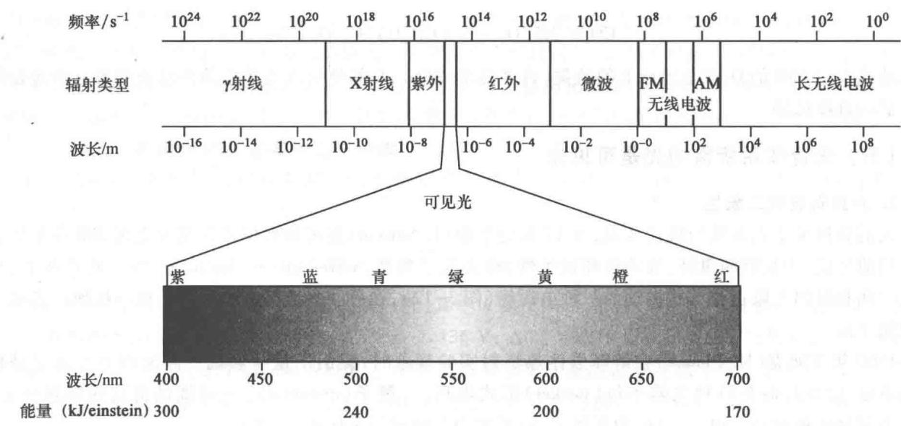  
图23-4 电磁辐射的光谱  
可见光紫端 $\lambda=400\ nm$ ，能量为 $29.93\times10^{4}\ J/einstein$ 或 3.10 eV/光子。由此可知，1 mol 可见光的能量约为 170\~300 kJ，这几乎比从 ADP 和 Pi 合成 1 mol ATP 所需的能量 (30.5 kJ/mol) 大一个数量级。

## 二、叶绿素的光反应性: 光吸收

## （一）叶绿素吸收光能供光合作用之需

叶绿素(chlorophyll, Chl)是深绿色的集光色素(light-harvesting pigment)或吸光色素的总称。高等植物和藻类中存在5种结构上差别很小的叶绿素，称叶绿素a、b、c、d和e。其中最主要的是叶绿素a，存在于所有的放氧生物（包括蓝细菌）中。不放氧的光合细菌则含有另一类叶绿素，称为细菌叶绿素(bacteriochlorophyll, Bchl)。叶绿素b存在于高等植物和绿藻（包括眼虫藻）中。硅藻和褐藻中不存在叶绿素b，代之以叶绿素c。红藻中含叶绿素d。从另两种藻中分离到叶绿素e。在所有的光合细菌中都含有细菌叶绿素a，紫色光合细菌如红假单胞菌(Rhodopseudomonas viridis)中尚含细菌叶绿素b。此外还有其他类型的细菌叶绿素存在。

图 23-5A 表示出几种主要类型的叶绿素结构。叶绿素是含镁的四吡咯衍生物，其基本结构与含铁的卟啉化合物血红素（图 4-1）相似，它们都是由原卟啉Ⅸ通过生物合成形成的（第 26 章）。叶绿素在结构上有 4 点与血红素不同：① 在叶绿素分子的共轭环中心被配位的是镁而不是铁；② 连接吡咯环Ⅲ和环Ⅳ的亚甲基桥被取代并与环Ⅲ交联，导致环 V 的形成（为叶绿素所特有），环 V 上有一个羰基和一个甲氧甲酰基（carbomethoxy）；③ 在叶绿素 a 和 b 中，其中的一个吡咯环（环Ⅳ）由于加入两个氢而被还原，在细菌叶绿素 a 中，有两个环（环Ⅱ和环Ⅳ）被还原；④ 环Ⅳ的丙酰基侧链被多萜醇（见图 10-24）酯化，在叶绿素 a、b、c 和 d 中多萜醇是叶绿醇（phytol），细菌叶绿素 a 中或是叶绿醇或是牻牛儿牻牛儿醇（geranylgeraniol），这取决于细菌的种类。叶绿素由于带有长的多萜醇基，使之不溶于水，只溶于乙醇、丙酮、乙醚等有机溶剂。

叶绿素分子中围绕 $Mg^{2+}$ 的是由 5 个杂环构成的一个单、双键交替（共轭系统）的环状多烯结构，在此多烯环面的上下具有离域的 $\pi$ 电子。 $\pi$ 轨道中电子状态之间的能量差相当于可见光光子的能量，也即两个分子轨道之间的能量差与可见光的能量 $h\nu$ 相当。被吸收的光能用于激发一个电子从一个 $\pi$ 轨道跃迁到另一个能级较高的 $\pi^{*}$ 轨道，因而提高该电子 ( $\pi^{*}$ 电子) 向一个适当受体转移的转移势。这种光激发的高压电子传递过程是一个氧化还原反应。净结果是光能转换为氧化还原反应的化学能。因此，叶绿素在光谱的可见光区具有强烈的光吸收，有非常高的摩尔吸光系数 $\varepsilon$ （量纲为 L·mol·cm），例如，菠菜叶绿素a 在乙醚中 $\varepsilon=8.63\times10^{4}(\lambda=662\mathrm{~nm})$ , $\varepsilon=11.2\times10^{4}(\lambda=428\mathrm{~nm})$ ，菠菜叶绿素 b 在乙醚中 $\varepsilon=5.61\times10^{4}(\lambda=644\mathrm{~nm})$ , $\varepsilon=15.9\times10^{4}(\lambda=452\mathrm{~nm})$ ，因此光合作用期间特别适于吸收可见光。

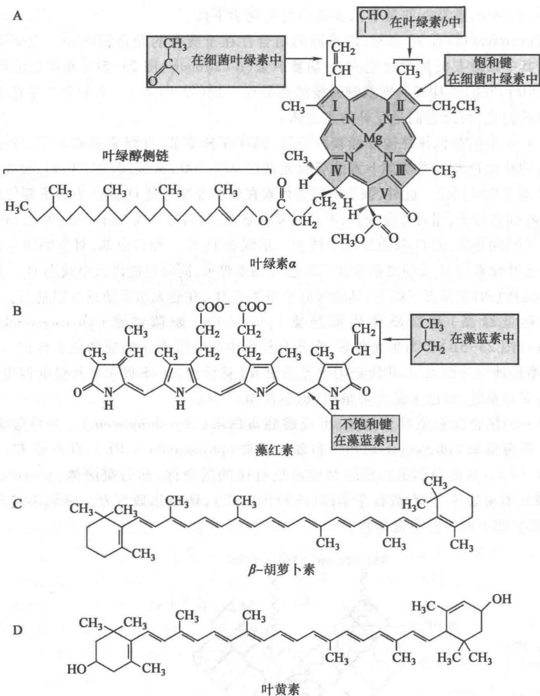  
图23-5 光合色素的结构

高等植物总是含有叶绿素 a 和 b 两种, 含量约为 2:1。虽然二者差别(图 23-6)。这种差别使它们在可见光区内吸光范围彼此互补, 因而拓宽了被吸收的入射能谱。

## （二）辅助集光色素扩展光吸收的范围

除了叶绿素外，集光色素还有类胡萝卜素和藻胆素（某些生物中）。这两类色素和除叶绿素 $a$ 以外的其他叶绿素 $(b, c, d$ 等）统称为辅助[集光]色素（accessory pigment）。而把叶绿素 $a$ （和细菌叶绿素）列为主要色素（primary pigment）。分成主要色素和辅助色素的根据是，叶绿素 $a$ （或细菌叶绿素）吸收最红光端的光，也即主要色素所需的激发能最小。因此从能量角度看，辅助色素收集的光能可以传给主要色素；换言之，叶绿素 $a$ （或细菌叶绿素）分子可作为能量“陷阱”（trap），接受来自吸收了光子的辅助色素分子迁移过来的某种形式的能量如激子(exciton,激发能的量子),直至参与光化学事件。

  
图23-6 叶绿素 $a$ 和叶绿素 $b$ 的光吸收曲线

类胡萝卜素(carotenoid)有70多种,以不同的组合存在于所有的光合细胞中。类胡萝卜素可以是黄的、红的或紫的,其中最重要的是橙红色的 $\beta-$ 胡萝卜素( $\beta$ -carrotene;图23-5C)和黄色的叶黄素(lutein或xathopyll;图23-5D),它们是具有共轭双键系统的类异戊二烯(第13章)。类胡萝卜素色素吸收不被叶绿素吸收的那些波长的光,因此它们是互补的光受体。

这类色素在叶子中的颜色往往被叶绿素所掩盖，但在深秋季节，叶绿素被破坏后，叶子就显露出它们特有的红、橙、黄的壮丽色彩。类胡萝卜素的吸收光谱在 $400\sim 500\mathrm{nm}$ 范围（图23-9），吸收的光能可传递给叶绿素 $a$ ，用于启动光化学反应。此外，强光下这类色素在保护细胞免遭 $\mathrm{O}_2$ 损伤中起重要作用。在光下形成的激发态三线态叶绿素分子，相对寿命较长，不易回复到基态，但当与三线态分子氧(基态)相遇，则很容易使三线态叶绿素分子回到基态，而 $\mathrm{O}_2$ 被激发成单线态。单线态 $\mathrm{O}_2$ 是一种自由基，对生物体毒性很大。类胡萝卜素能够在三线态叶绿素与 $\mathrm{O}_2$ 反应之前就使三线态叶绿素淬灭，同时还能淬灭单线态 $\mathrm{O}_2$ 。这些淬灭都涉及将类胡萝卜素提高到它的激发态三线态，其能级低于单线态 $\mathrm{O}_2$ ，并能无伤害地衰变回基态。

蓝细菌（旧称蓝绿藻）和红藻使用藻胆素（phycobilin）如藻红素（phycoerythrobilin）和藻蓝素（phycocyanobilin）（图23-5B）作为集光色素，在光合作用中起叶绿素 $a$ 的辅助色素作用，所吸收的光能几乎以 $100\%$ 的效率传递给叶绿素 $a$ ，并优先用于光系统Ⅱ（见后面）。藻胆素是开链的四吡咯衍生物，具有叶绿素中的共轭多烯系统，但已不是大环结构，也不含 $\mathrm{Mg}^{2+}$ 中心。

藻胆素与专一的结合蛋白质共价连结，形成藻胆蛋白质（phycobiliprotein）。与藻蓝素和藻红素相应的藻胆蛋白质有藻蓝蛋白（phycocyanin, PC）和藻红蛋白（phycoerythrin, PE），此外还有一种别藻蓝蛋白（allophycocyanin, AP）。这些藻胆蛋白质缔合成高度有序的复合体，称为藻胆体（phycobilisome）（图23-7）。藻胆体是很大的集装体，含有数百个单体（藻胆蛋白质）， $M_{r}$ 可达数百万。藻胆体结合在类囊体膜的外侧，它是这些微生物中的主要集光结构。

  
图23-7 藻胆体的结构  
被 PE(藻红蛋白)或 PC(藻蓝蛋白)吸收的光子能量通过别藻蓝蛋白  
(AP)传递到反应中心的叶绿素 $a$

实验测定不同颜色光在促进光合作用方面的效率给出作用光谱,它经常被用来鉴定负责光的生物效应的主要色素(图23-8)。通过捕获不被其他生物所利用的光谱区的光,一个光合生物可以要求有一个独特的生态位(niche)。例如蓝细菌和红藻中的藻胆素(phycobilin)主要吸收520\~630 nm的光(图23-9),允许它们占据已被生活在它们上面水中的其他生物的色素或水本身滤去了较低或较高波长光的生态位。

## （三）叶绿素分子在膜上被组织成光合单位

20 世纪 30 年代初, R. Emerson 和 W. Arnold 研究了入射光的量子数(光强度)、存在的叶绿素量和被照光小球藻(chlorella)的放氧量之间的关系, 试图测定每一光量子引起的电子转移数(或放氧分子数), 即光合作用的量子产额(quantum yield of photosynthesis)。他们用重复的短暂闪光激发小球藻悬浮液并测量其放氧量时,发现在 $25^{\circ}C$ 时,为了使每次闪光的产氧量达到最高值,在二次闪光之间需要有 20 ms 的黑暗时间。当闪光之间的暗周期小于 20 ms 时,每次闪光的产氧量会降低。这意味着每次闪光生成一种产物,而这种产物必须在第二次闪光到来之前被利用掉。如果第二次闪光到达太早,则吸收的能量主要以热和荧光形式散失。Emerson 和 Arnold 测得了闪光暗周期最佳时的每次闪光的产氧量。但结果使他们感到意外:虽即使用足够强度(至少能使每个叶绿素分子激发一次)的短暂闪光照射,仍约每 2500 个叶绿素分子才放出一个 $O_{2}$ 分子。此结果表明不是所有的叶绿素分子都具有光化学反应性的。根据前面的光合作用总方程的化学计量关系算得:每还原一个 $CO_{2}$ 分子和释放一个 $O_{2}$ 分子,2500 个叶绿素分子需要吸收 8 个光量子,进行 8 次光化学反应。平均每 300 个叶绿素分子吸收一个光量子,发生一次光化学反应。因此发展出光合作用是在功能上独立的单位中发生的概念。

  
图23-8 光合作用的作用光谱  
光谱图是使用氧电极技术测定丝状光合藻的 $O_{2}$ 产生获得的；表示在不同波长的恒定光子数照射下光合作用的相对速率。通过跟吸收光谱的比较，可以揭示哪些色素能够把能量引入光合作用

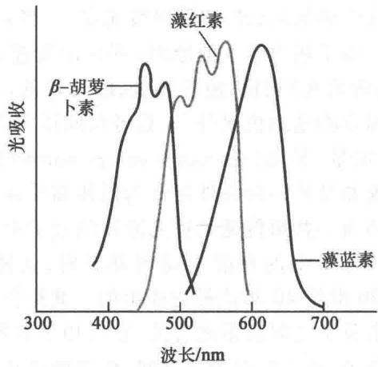  
图23-9 $\beta$ -胡萝卜素、藻红素和藻蓝素的光吸收曲线

光合单位（photosynthetic unit）或光[合]系统（photosystem）是一个由100\~300个叶绿素和其他色

素分子组成的天线系统(集光系统)加上一个由一对特殊的叶绿素 a 分子组成的光化学反应中心 (photochemical reaction center)。例如,在菠菜叶绿体中每个光系统含有 200 个叶绿素分子和 50 个类胡萝卜分子。一个光合单位中所有的色素分子都能吸收光子,并通过激子转移或共振转移(见下面)快速而有效地把它汇集到反应中心(作用中心),但只有很少几个叶绿素分子参与反应中心,专门负责把汇集来的光能转换为化学能(图 23-10)。因此大多数叶绿素和辅助色素只起一个大的集光天线作用。在此意义上说,大多数叶绿素 a 分子也是一种“辅助色素”。光化学事件发生

  
图23-10 光合单位的结构

在反应中心,在这里叶绿素被氧化成一个阳离子自由基 $Chl \cdot ^{+}$ , 其性质作为电子接纳体具有重要的光合作用后果。注意, 在这些氧化还原反应中 $Mg^{2+}$ 的价数没有变化。

## （四）叶绿素通过共振(或激子)传递把吸收来的能量汇集到反应中心

当光合色素分子吸收了一个适当能量的光子后,该分子中的一个电子将从低能级提升到一个高能级。这是一个全或无的事件:被吸收的光量子必须含有与电子 $(e^{-})$ 跃迁的能量精确匹配的能量。吸收了一个这样的光子的色素分子转变为激发态(excited state),它一般是不稳定的。被提升到高能轨道的电子通常很快回复到低能轨道,激发态分子衰变为稳定的(能量最低)基态(ground state),被吸收的量子激发能(excitation enegegy)将以热或光散失或用它做化学功:①能量通过重新分配给色素分子内部的原子振动以热散失；②能量以荧光散失，当 $e^{-}$ 回落到低轨道时，发射荧光光子；但这种情况只见于饱和光强度。由于热力学上的原因（部分激发能消耗于色素分子内的振动），发射的光子（荧光）与激发的光子（吸收的光）相比，波长较长，能量较低；③能量通过共振传递或激子传递从一个激发态色素分子转移给邻近的基态色素分子，后者以同样方式继续转移能量直至到达光合反应中心。

共振[能量]传递(resonance energy transfer)和激子传递(exciton transfer)两者相似但又有不同。利用它们实现能量传递的条件是作为供体和受体的色素分子(激发态和基态)之间的能级之差应与激发能的量子相当。共振传递是被光激发的分子中高能 $e^{-}$ 的振动诱导受体分子中的一个电子振动(共振)，当原来供体分子中的高能 $e^{-}$ 返回基态时，受体分子中的这一电子转变为高能态。这种传递机制是Förster在20世纪40年代最先提出的。共振传递是一种非辐射过程，不涉及光子的发射和吸收；共振传递与色素分子之间的距离有关，它适用于长距离(>2 nm)和弱相互作用，能量的供体和受体可以是同种色素分子，如在叶绿素a之间，传递效率几乎100%；也可以是异种的，如在辅助色素和叶绿素a之间。激子传递是色素分子中被光激发的高能电子在返回原来轨道时发出激子，激发相邻分子中的一个电子，使之成为高能态。这种传递发生在同种色素分子之间，并且仅适用于短距离(<2 nm)和强相互作用的情况。

能量转换(energy transduction)是当激发能传递到反应中心的特殊叶绿素a分子对的一个分子时，此分子中的一个电子被提升到高能轨道，显著地改变了这个叶绿素分子的标准还原势 $E^{\ominus}$ ，成为一个更加有效的电子供体(图23-11)。也即，因光吸收而具有高能电子的激发态分子是一个很强的电子供体。这个激发态电子供体与它附近的电子接纳体反应，导致光能转换为化学能（还原力，电子传递反应的电势）。光能转化或转换为化学能是光合作用的实质。

叶绿素总是与专一的结合蛋白质缔合，以集光复合体（light havesting complex, LHC）的形式存在。在集光复合体中的叶绿素分子与游离的叶绿素分子在光吸收性质上有所区别。被提取的叶绿素分子在体外被光照后，吸收的能量很快地以荧光和热被释放。但完整叶片中的叶绿素分子（或其他天线分子）受光激发后，几乎观察不到荧光现象，而是受激发的叶绿素分子（分子1）把光能直接传递给邻近的天线分子（图23-11，步骤①）。后者（分子2）变为激发态，而分子1返回到基态（步骤②）。借共振（或激子）传递机制能量传递延续到第3个、第4个……相继的天线分子，直至光化学反应中心叶绿素a分子特殊对的一个分子（基态Chl）被激发。也即激发态Chl\*中一个电子被提升到高能轨道（步骤③）。然后此电子被传递给附近的接纳体分子，后者是电子传递链中的一个成员。反应中心的叶绿素a分子变成阳离子自由基Chl $^{+}$ (步骤④)，也即具有一个空轨道（“电子空穴”，图中用+标示），而电子接纳体获得一个负电荷。反应中心叶绿素a失去的电子被来自邻近的电子供体的一个电子所取代（步骤⑤），而电子供体变成荷正电。这样，光的激发引起电荷分离，启动了氧化还原链的电子流。

<!-- EN-BEGIN 20.1 -->

### 【英文对应 20.1】Light Absorption

> 来源：Lehninger Principles of Biochemistry（书籍/02_生物化学原理） 第20章 Photosynthesis and Carbohydrate Synthesis in Plants，§20.1。对应本章“二、叶绿素的光反应性: 光吸收”。

Photophosphorylation (ATP synthesis driven by light) resembles oxidative phosphorylation in that electron flow through a series of membrane carriers is coupled to proton pumping, producing the proton motive force that powers ATP formation. The processes are compared in Figure 20-2. In oxidative phosphorylation, the electron donor is NADH and the ultimate electron acceptor is $O_{2}$ , forming $H_{2}O$ . In photophosphorylation, electrons flow in the opposite direction: $H_{2}O$ is the electron donor and NADPH is formed. How is this endergonic process possible?

Water is a poor donor of electrons; its standard reduction potential is 0.816 V, compared with -0.320 V for NADH, a good electron donor. P1 Photosynthesis requires the input of energy in the form of light to create a good electron donor and a good electron acceptor. P3 Electrons flow from the electron donor through a series of membrane-bound carriers, including cytochromes, quinones, and iron-sulfur proteins, while protons are pumped across a membrane to create an electrochemical potential. Electron transfer and proton pumping are catalyzed by a membrane complex that is homologous in structure and function to Complex III of mitochondria. The electrochemical potential so produced is the driving force for ATP synthesis from ADP and $\mathrm{P_i}$ , catalyzed by a membrane-bound ATP synthase complex closely similar to that of mitochondria and bacteria.

#### [EN] Chloroplasts Are the Site of Light-Driven Electron Flow and Photosynthesis in Plants

In photosynthetic eukaryotic cells, both the light-dependent and the $CO_{2}$ -assimilation reactions take place in chloroplasts (Fig. 20-3), organelles that are variable in shape and generally a few micrometers in diameter. Like mitochondria, chloroplasts are surrounded by two membranes: an outer membrane that is permeable to small molecules and ions, and an impermeable inner membrane that bears specific transporters for a variety of ions and metabolites. The space enclosed by the inner membrane is called the stroma in chloroplasts and is analogous to the mitochondrial matrix; it is an aqueous phase containing most of the soluble enzymes required for the $CO_{2}$ -assimilation reactions. Throughout the stroma is a highly organized set of topologically continuous internal membranes, forming a single compartment or lumen. This complex membrane system forms flattened sacks called thylakoids. Granal thylakoids are disk-like pouches arranged in stacks;

(a)  
  
FIGURE 20-2 The chemiosmotic mechanism for ATP synthesis in chloroplasts and mitochondria. (a) Movement of electrons through a chain of membrane-bound carriers in the chloroplast membrane is driven by the energy of photons absorbed by the green pigment chlorophyll. Electron flow leads to the movement of protons and positive charge across the membrane, creating an electrochemical potential. This electrochemical potential drives ATP synthesis by the membrane-bound ATP synthase, which is fundamentally similar in structure and mechanism to (b) the mitochondrial machinery for oxidative phosphorylation of mitochondria. In mitochondria, the force that moves electrons through the complexes is a large difference in the reduction potentials of electron donor and acceptor. In both systems, the energy made available by electron transfer is captured as a transmembrane proton gradient, which drives ATP synthesis by an ATP synthase.

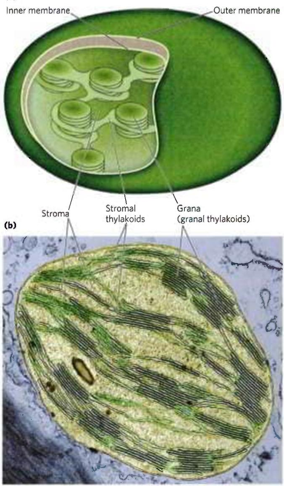  
FIGURE 20-3 Chloroplast structure. (a) Schematic diagram. (b) Colorized electron micrograph at high magnification, showing the highly organized thylakoid membrane system. [(b) Biophoto Associates/Science Source]

they are connected by stromal thylakoids, which are flatter and spiral around a stack of grana. The thylakoid membranes provide a large area for the machinery of photophosphorylation—the photosynthetic pigments and enzyme complexes that carry out the light-dependent reactions and ATP synthesis. Traffic across these membranes is also mediated by specific transporters.

In 1937, Robert Hill found that when leaf extracts containing chloroplasts were illuminated, they (1) evolved $O_{2}$ and (2) reduced a nonbiological electron acceptor added to the medium, according to the Hill reaction

$$
2 \mathrm{H} _ {2} \mathrm{O} + 2 \mathrm{A} \xrightarrow {\text {   light   }} 2 \mathrm{AH} _ {2} + \mathrm{O} _ {2}
$$

where A is an artificial electron acceptor, or Hill reagent. One Hill reagent, the dye 2,6-dichlorophenolindophenol, is blue when oxidized (A) and colorless when reduced $\left(\mathrm{AH}_{2}\right)$ , making the reaction easy to follow.

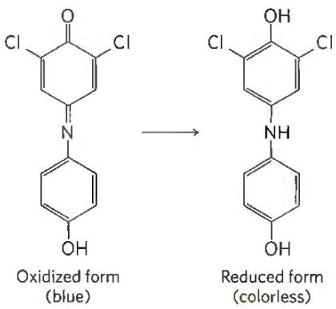  
2,6-Dichlorophenolindophenol

When a leaf extract supplemented with the dye was illuminated, the blue dye became colorless and $O_{2}$ was evolved. In the dark, no $O_{2}$ evolution or dye reduction took place. P2 This was the first evidence that absorbed light energy causes electrons to flow from some electron donor (now known to be $H_{2}O$ ) to an electron acceptor. Moreover, Hill found that $CO_{2}$ was neither required nor reduced to a stable form under these conditions; $O_{2}$ production could be dissociated from $CO_{2}$ reduction. Several years later, Severo Ochoa showed that $NADP^{+}$ is the biological electron acceptor in chloroplasts, according to the equation

$$
2 \mathrm{H} _ {2} \mathrm{O} + 2 \mathrm{NADP} ^ {+} \xrightarrow {\text {   light   }} 2 \mathrm{NADPH} + 2 \mathrm{H} ^ {+} + \mathrm{O} _ {2}
$$

To understand this photochemical process, we must first consider the more general topic of the effects of light absorption on molecular structure.

Visible light is electromagnetic radiation of wavelengths 400 to 700 nm, a small part of the electromagnetic spectrum (Fig. 20-4), ranging from violet to red. The energy of a single photon (a quantum of light) is greater at the violet end of the spectrum than at the red end; shorter wavelength (and higher frequency) corresponds to higher energy. The energy, E, in a single photon of visible light is given by the Planck equation:

$$
E = h \nu = h c / \lambda
$$

where h is Planck's constant $(6.626 \times 10^{-34} \text{ J} \cdot \text{s})$ , v is the frequency of the light in cycles/s, c is the speed of light $(3.00 \times 10^{8} \text{ m/s})$ , and $\lambda$ is the wavelength of the light in meters. The energy of a photon of visible light ranges from 150 kJ/einstein for red light to $\sim300$ kJ/einstein for violet light.

#### [EN] WORKED EXAMPLE 20-1 Energy of a Photon

The light used by vascular plants for photosynthesis has a wavelength of about 700 nm. Calculate the energy in a "mole" of photons (an einstein) of light of this wavelength, and compare this with the energy needed to synthesize a mole of ATP.

SOLUTION: The energy in a single photon is given by the Planck equation. At a wavelength of $700 \times 10^{-9}$ m, the energy of a photon is

$$
\begin{array}{r l} E & = h c / \lambda \\ & = \frac {[ (6 . 6 2 6 \times 1 0 ^ {- 3 4} \mathrm{J} \cdot \mathrm{s}) (3 . 0 0 \times 1 0 ^ {8} \mathrm{m/s}) ]}{(7 . 0 0 \times 1 0 ^ {- 7} \mathrm{m})} \\ & = 2. 8 4 \times 1 0 ^ {- 1 9} \mathrm{J} \end{array}
$$

An einstein of light is Avogadro's number of photons ( $6.022 \times 10^{23}$ ); thus the energy of one einstein of photons at 700 nm is given by

$$
\begin{array}{r l} (2. 8 4 \times 1 0 ^ {- 1 9} \mathrm{J/photon}) (6. 0 2 2 \times 1 0 ^ {2 3} \text {photons / einstein}) & = 1 7. 1 \times 1 0 ^ {4} \mathrm{J/einstein} \\ & = 1 7 1 \mathrm{kJ/einstein} \end{array}
$$

So, a "mole" of photons of red light has about five times the energy needed to produce a mole of ATP from ADP and $\mathsf{P}_{\mathrm{i}}$ (30.5 kJ/mol).

When a photon is absorbed, an electron in the absorbing molecule (chromophore) is lifted to a higher energy level. This is an all-or-nothing event: to be absorbed, the photon must contain a quantity of energy, called a quantum, that exactly matches the energy of the electronic transition. A molecule that has absorbed a photon is in an excited state, which is generally unstable. An electron lifted into a

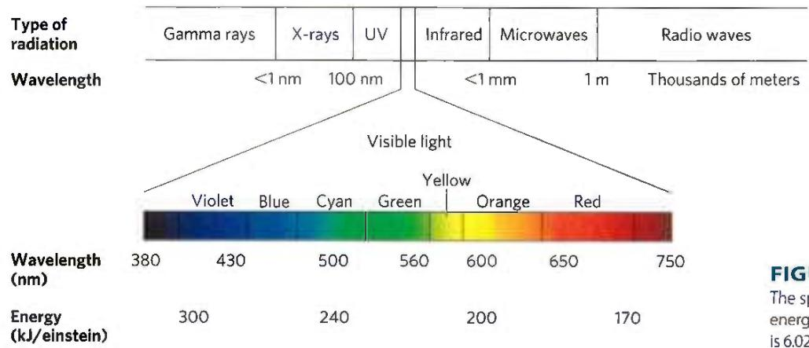  
FIGURE 20-4 Electromagnetic radiation. The spectrum of electromagnetic radiation, and the energy of photons in the visible range. One einstein is $6.022 \times 10^{23}$ photons.

higher-energy orbital usually returns rapidly to its lower-energy orbital; that is, the excited molecule decays to the stable ground state, giving up the absorbed quantum as light or heat or using it to do chemical work. Light emission accompanying decay of excited molecules, fluorescence, is always at a longer wavelength (lower energy) than that of the absorbed light (see Box 12-1). An alternative mode of decay, central to photosynthesis, involves direct transfer of excitation energy from an excited molecule to a neighboring molecule. Just as the photon is a quantum of light energy, so the exciton is a quantum of energy passed from an excited molecule to another molecule in a process called exciton transfer.

#### [EN] Chlorophylls Absorb Light Energy for Photosynthesis

The most important light-absorbing pigments in the thylakoid membranes are the chlorophylls, green pigments with polycyclic, planar structures resembling the protoporphyrin of hemoglobin, except that $Mg^{2+}$ , not $Fe^{2+}$ , occupies the central position (Fig. 20-5a; compare to Fig. 5-1).

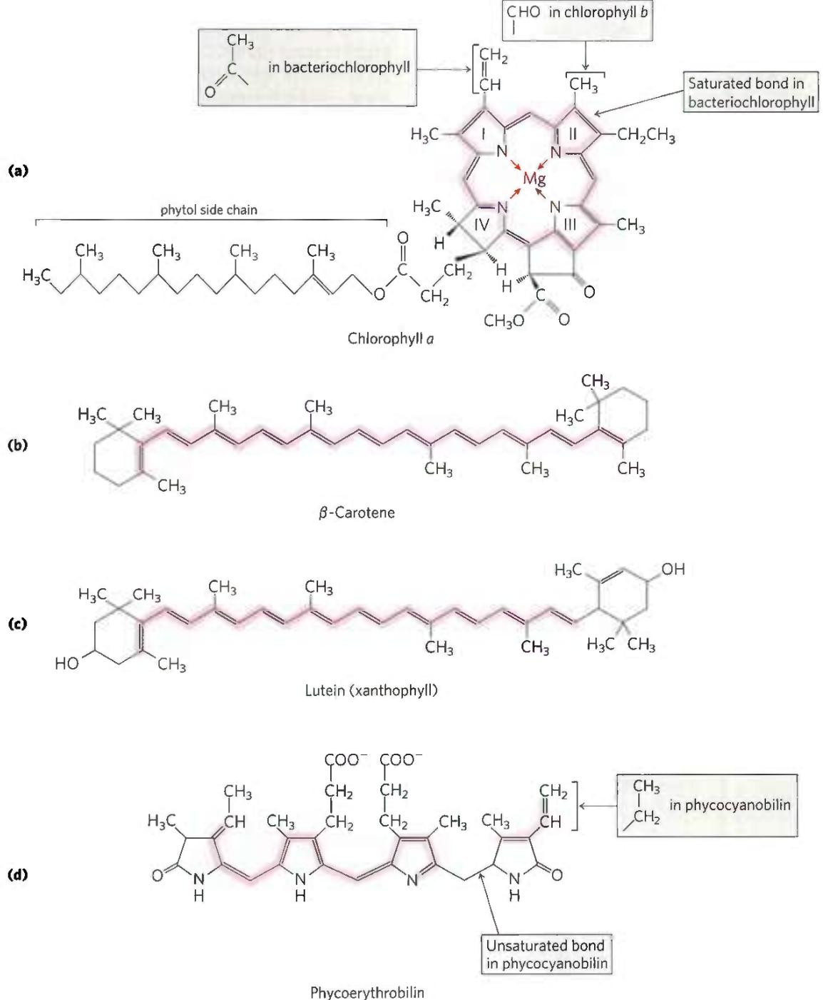  
are accessory pigments in cyanobacteria and red algae. The conjugated bond systems in these molecules (alternating single and double bonds, shaded) have delocalized electrons that are easily excited by photons with the wavelengths of visible light.

FIGURE 20-5 Primary and secondary photopigments. (a) Chlorophylls a and b and bacteriochlorophyll are the primary gatherers of light energy. (b) $\beta$ -Carotene (a carotenoid) and (c) lutein (a xanthophyll) are accessory pigments in plants. (d) Phycoerythrobilin and phycocyanobilin (phycobilins)

The four inward-oriented nitrogen atoms of chlorophyll are coordinated with the $Mg^{2+}$ . All chlorophylls have a long phytol side chain, esterified to a carboxyl-group substituent in ring IV, and chlorophylls also have a fifth five-membered ring not present in heme.

The heterocyclic five-ring system that surrounds the $Mg^{2+}$ has an extended polyene structure, with alternating single and double bonds. Such polyenes characteristically show strong absorption in the visible region of the spectrum (Fig. 20-6); the chlorophylls have unusually high molar extinction coefficients (see Box 3-1) and are therefore particularly well-suited for absorbing visible light during photosynthesis.

Chloroplasts always contain both chlorophyll a and chlorophyll b (Fig. 20-5a). Although both are green, their absorption spectra are sufficiently different (Fig. 20-6) that they complement each other's range of light absorption in the visible region. Most plants contain about twice as much chlorophyll a as chlorophyll b. The chlorophyll in cyanobacteria differs only slightly from those of plants.

In addition to chlorophylls, thylakoid membranes of plants contain secondary light-absorbing pigments, or accessory pigments, called carotenoids. Carotenoids may be yellow, red, or purple. The two most prominent in plant leaves are $\beta$ -carotene, a red-orange isoprenoid, and the yellow carotenoid lutein (Fig. 20-5b, c). Cyanobacteria and red algae use the accessory pigments phyco-cyanobilin and phycoerythrobilin (Fig. 20-5d). Accessory pigments absorb light at wavelengths not absorbed by the chlorophylls (Fig. 20-6) and thus are supplementary light receptors. They also protect downstream components from a highly reactive form of oxygen (singlet oxygen) that is formed when intense light exceeds the system's capacity to accept electrons.

Experimental determination of the effectiveness of light of different colors in promoting photosynthesis yields an action spectrum (Fig. 20-7), often useful in identifying the pigment primarily responsible for a biological effect of light. By capturing light in a region of the spectrum not used by other organisms, a photosynthetic organism can claim a unique ecological niche.

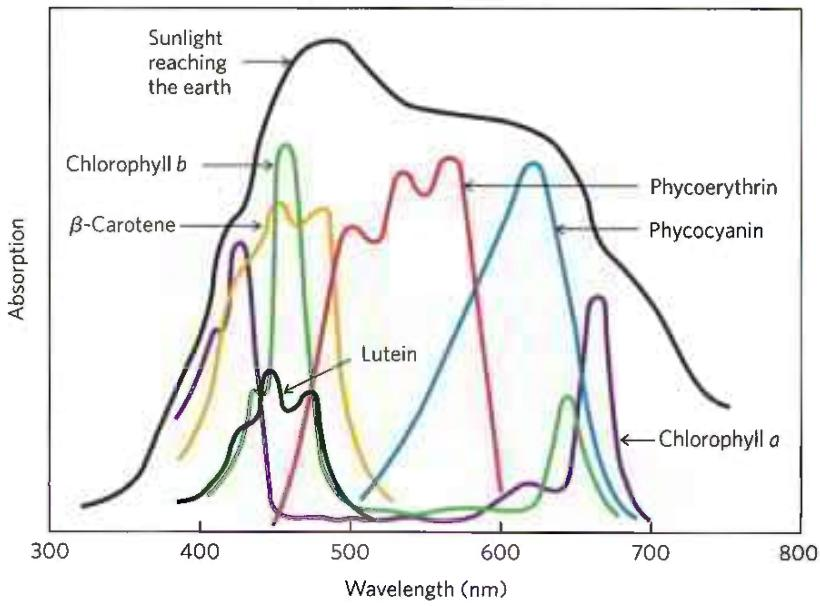

#### [EN] Chlorophylls Funnel Absorbed Energy to Reaction Centers by Exciton Transfer

The light-absorbing pigments of thylakoid or bacterial membranes are arranged in functional arrays called photosystems. In spinach chloroplasts, for example, each photosystem contains about 200 chlorophyll and 50 carotenoid molecules. All the pigment molecules in a photosystem can absorb photons, but P2 only one pair of chlorophyll molecules associated with the photochemical reaction center is specialized to transduce light into chemical energy. The other pigment molecules in a photosystem serve as antenna molecules. They absorb light energy and transmit it rapidly and efficiently to the reaction center (Fig. 20-8). Some chlorophylls are part of a core complex around the reaction center. Others form light-harvesting complexes (LHCs) around the periphery of the core complex. Chlorophyll and other pigments are always associated with specific binding proteins, which fix the chromophores in relation to each other, to other protein complexes, and to the membrane. For example, each monomer of the trimeric light-harvesting complex LHCII (Fig. 20-9) contains seven molecules of chlorophyll $a$ , five of chlorophyll $b$ , and two of lutein.

The chlorophyll molecules in light-harvesting complexes and other chlorophyll-binding proteins have light-absorption properties that are subtly different from those of free chlorophyll. When isolated chlorophyll molecules are excited by light, the absorbed energy is quickly released as fluorescence and heat; but when chlorophyll

FIGURE 20-6 Absorption of visible light by photopigments. Plants are green because their pigments absorb light from the red and blue regions of the spectrum, leaving primarily green light to be reflected. Compare the absorption spectra of the pigments with the spectrum of sunlight reaching the earth's surface; the combination of chlorophylls (a and b) and accessory pigments enables plants to harvest most of the energy available in sunlight. The relative amounts of chlorophylls and accessory pigments are characteristic of a particular plant species. Variation in the proportions of these pigments is responsible for the range of colors of photosynthetic organisms, from the deep blue-green of spruce needles, to the greener green of maple leaves, to the red, brown, or purple color of some species of multicellular algae and the leaves of some foliage plants favored by gardeners.

  
(a)

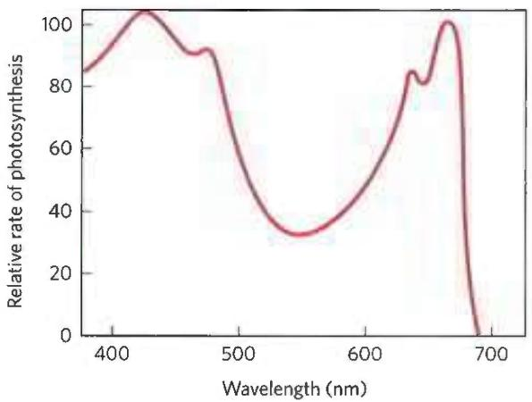  
(b)  
FIGURE 20-7 Two ways to determine the action spectrum for photosynthesis. (a) Results of a classic experiment performed by T. W. Engelmann in 1882 to determine the wavelength of light that is most effective in supporting photosynthesis. Engelmann placed cells of a filamentous photosynthetic alga on a microscope slide and illuminated them with light from a prism, so that one part of the algal filament received mainly blue light, another part yellow, another red. To determine which cells carried out photosynthesis most actively, Engelmann also placed on the microscope slide bacteria known to migrate toward regions of high $O_{2}$ concentration. After a period of illumination, the distribution of bacteria showed highest $O_{2}$ levels (produced by photosynthesis) in the regions illuminated with violet and red light. (b) Results of a similar experiment that used modern techniques (an oxygen electrode) for the measurement of $O_{2}$ production. An action spectrum, as shown here, describes the relative rate of photosynthesis for illumination with a constant number of photons of different wavelengths. An action spectrum is useful because, by comparison with absorption spectra (such as those in Fig. 20-6), it suggests which pigments can channel energy into photosynthesis.

in intact leaves is excited by visible light (Fig. 20-10, step ①), very little fluorescence is observed. Instead, the excited antenna chlorophyll transfers energy directly to a neighboring chlorophyll molecule, which becomes excited as the first molecule returns to its ground state (step ②). This transfer of energy, exciton transfer, extends to a third, fourth, or subsequent neighbor, until one of a “special pair” of chlorophyll a molecules at the photochemical reaction center is excited (step ③). The special pair of chlorophyll molecules, often designated (Chl) $_{2}$ , are held close enough

  
These molecules absorb light energy, transferring it between molecules until it reaches the reaction center.  
Reaction center
Photochemical reaction here converts the energy of a photon into a separation of charge, initiating electron flow.

FIGURE 20-8 Organization of photosystems in the thylakoid membrane. Photosystems are tightly packed in the thylakoid membrane, with several hundred antenna chlorophylls and accessory pigments surrounding each reaction center. Absorption of a photon by any of the antenna chlorophylls leads to excitation of the reaction center by exciton transfer (red arrow).  
  
FIGURE 20-9 The light-harvesting complex LHCII of the pea. The functional unit is a trimer, with 36 chlorophyll and 6 lutein molecules. Shown here is a monomer, viewed in the plane of the membrane, with its three transmembrane $\alpha$ -helical segments, seven chlorophyll $a$ molecules (light green), five chlorophyll $b$ molecules (dark green), and two molecules of lutein (yellow), which form an internal cross-brace. [Data from PDB ID 28HW, J. Standfuss et al., EMBO J. 24:919, 2005.]

Antenna molecules

  
Reaction-center chlorophyll special pair

Light excites an antenna molecule (chlorophyll or accessory pigment), raising an electron to a higher energy level.

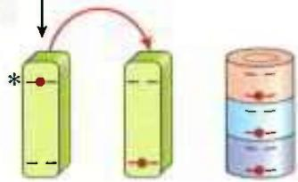

2 The excited antenna molecule passes energy to a neighboring chlorophyll molecule (exciton transfer), exciting it.

3 This energy is transferred to a chlorophyll of the reaction-center special pair, exciting it.

Electron acceptor

4 The excited reaction-center chlorophyll passes an electron to an electron acceptor.

5 The electron hole in the reaction center is filled by an electron from an electron donor.

Electron donor

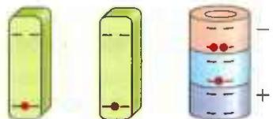  
The absorption of a photon has caused separation of charge in the reaction center.

FIGURE 20-10 Exciton and electron transfer. This generalized scheme shows conversion of the energy of an absorbed photon into separation of charges at the reaction center. Note that step 1 may repeat between successive antenna molecules until the exciton reaches the special pair of chlorophylls in the reaction center. An asterisk (\*) denotes the excited state of a molecule.

to each other to share bonding orbitals, and to react as a single compound when excited. In this excited chlorophyll pair, an electron is promoted to a higher-energy orbital. This electron then passes to a nearby electron acceptor that is part of the photosynthetic electron-transfer chain, leaving the reaction-center chlorophyll pair with a missing electron (an "electron hole," denoted by + in Fig. 20-10) (step 4). The electron acceptor acquires a negative charge in this transaction. The electron lost by the reaction-center chlorophyll pair is replaced by an electron from a neighboring electron-donor molecule (step 5), which thereby becomes positively charged. P1 P2 In this way, excitation by light causes electric charge separation and initiates an oxidation-reduction chain.

#### [EN] SUMMARY 20.1 Light Absorption

■ Photosynthesis takes place in plant chloroplasts, structures enclosed in double membranes and filled with an elaborate system of thylakoid membranes containing the photosynthetic machinery.

Chlorophyll molecules and other light-absorbing pigments are associated with proteins in light-harvesting complexes arrayed around photochemical reaction centers. The proteins are embedded in thylakoid membranes.

The many chlorophyll molecules that surround the reaction center serve as antennas for light. When they absorb light, they pass its energy (exciton) to the reaction center. There the energy is used to create a charge separation that initiates electron flow through a series of oxidation-reduction reactions.

<!-- EN-END 20.1 -->

## 三、光驱动的电子流:中心光化学事件

光合作用期间植物叶绿体中的光驱动电子传递是由类囊体膜中的多酶系统完成的。光合作用机制的现代概念来自植物叶绿体和各种细菌和藻类的综合研究。细菌光合复合体分子结构的 X 射线晶体学测定给了我们对光合作用的分子事件很多新的了解。

## （一）光合细菌只有两种类型反应中心中的一种

在发现真核光合细胞的反应中心色素 P700 和 P680 之前,1952 年 L. Duysens 借差光谱法(第 5 章)发现用 870 nm 波长光照射一种称为深红色红螺菌(Rhodospirillum rubrum)的紫色[非硫]细菌时,引起该波长的光吸收暂时性降低,也即一种色素被 870 nm 光所“漂白”(退色)。后来(1956 年)B. Kok 和 H. Witt 的研究表明植物叶绿体色素也能被 680 nm 和 700 nm 的光漂白。而且,(非生物的)电子接纳体 $\left[\mathrm{Fe}(\mathrm{CN})_{6}\right]^{3-}$ (高铁氰化物)的加入在无光照下也能引起这些波长处的色素被漂白。这些发现说明色素的漂白是由于光化学反应中心丢失电子。这些色素根据最大的漂白波长被命名为 P870、P680 和 P700。

  
图 23-11 共振(或激子)传递和电子传递  
此图说明被吸收的光子引起反应中心的电荷分离。图中步骤①和②可在相继  
的天线分子之间重复直至到达反应中心；星号 $^{*}$ 表示分子的激发态

光合细菌有着比较简单的光转换机构，它只含两种通用类型的反应中心中的一种。类型Ⅱ（存在于紫色细菌中）是把电子通过褐藻素或称脱镁叶绿素（pheophytin；一种失去中心 $\mathrm{Mg}^{2+}$ 离子的叶绿素）传递给醌。类型I（存在于绿色硫细菌中）是把电子通过醌传递给铁硫中心。蓝细菌、藻类和高等植物具有两种光系统（PSII和PSI），每种都以串联方式起作用。生物化学和生物物理的研究已揭示出细菌反应中心的许多分子细节，因此被用作植物的更复杂光转换系统的原型。

<!-- END OFFICIAL API PART part_002 -->

<!-- BEGIN OFFICIAL API PART part_003 -->

## 1. 脱镁叶绿素-醌型反应中心(Ⅱ型反应中心)

紫色细菌中的光合机构由3个基本模件（或模块）(module)组成(图23-12):①一个单反应中心(P870)，包括围绕它的天线色素系统；②细胞色素 $bc_{1}$ 电子传递复合体，它与线粒体电子传递链的复合体Ⅲ相似；③ATP合酶(ATP synthase)，它也与线粒体的ATP合酶相似。光照射驱动电子经过脱镁叶绿素和醌到达细胞色素 $bc_{1}$ 复合体；通过此复合体后，电子经细胞色素 $c_{2}$ 返回反应中心，恢复到照光前状态。这种光驱动的循环式电子流为细胞色素 $bc_{1}$ 复合体泵送质子提供能量。在生成的质子梯度推动下，模件ATP合酶产生ATP，这与线粒体中的情况完全一样(见第19章)。

（1）紫色细菌反应中心的三维结构 紫色细菌，如绿色红假单胞菌(Rhodopseudomonas viridis)和球状红色杆菌(Rhodobacter sphaeroides)的反应中心三维结构已根据其X射线晶体学资料解得，阐明了脱镁叶绿素-醌(Ⅱ型)反应中心的光转换是如何进行的。R. viridis光系统的反应中心是一个大的蛋白质复合体 $(M_{\mathrm{r}}145\times10^{3})$ ，含4个多肽亚基和13个辅基或辅因子(图23-13A,B)。这4个多肽亚基分别标为L(273个氨基酸残基)、M(323个残基)、H(258个残基)和c型细胞色素(333个残基)。L和M亚基每个都由5个跨膜的α螺旋段组成。H亚基只含一个跨膜α螺旋段，此蛋白质的大部分形成一个球状结构域，处于胞质中(图23-13)。c型细胞色素亚基的N端氨基酸是Cys。c型细胞色素是通过与此Cys残基以疏醚键连接的二脂酰甘油上两个脂酰基的疏水链被锚定在膜周质面上(图23-13C)。13个辅基是：L和M每个含2个细菌叶绿素分子(BChl)和1个细菌脱镁叶绿素分子(BPheo)；L还有1个结合的醌分子 $Q_{A}$ （甲基萘醌），M含1个结合的醌分子 $Q_{B}$ （泛醌）；L和M一起与一个非血红素Fe原子配位；c型细胞色素亚基含4个血红素基。反应中心的光化学活性分子是P870，由2个细菌叶绿素分子组成，一个由M，另一个由L供给(图23-13A)。

（2）紫色细菌光化学反应中心的电子传递 R. viridis 反应中心的辅基(P870、BChl、Bpheo 和结合醌)在空间上彼此关系是固定的,这有利于光合 $e^{-}$ 的传递。细菌脱镁叶绿素-醌中心的物理学研究,包括利用短闪光引发光转换和各种分光光度技术追踪通过几个载体的电子流。标为(BChl) $_{2}$ “特殊对”的一对细菌叶绿素分子是细菌反应中心中起始光化学的部位。如图 23-13B 所示,反应中心的电子传递速度是极快的,在皮秒(ps;1 ps=10 $^{-12}$ s)到微秒( $\mu$ s)的数量级。照光时,光子被反应中心周围的天线叶绿素分子中的一个所吸收,能量通过激子传递到达反应中心。当这两个细菌叶绿素分子——它们结合得很紧密以致成键轨道是重叠的——吸收一个激子,(BChl) $_{2}$ 的氧化还原电势移动相当于该光子的能量,使这一特殊对成为很强的电子供体。(BChl) $_{2}$ 供出一个电子经邻近的细菌叶绿素单体(BChl)到达细菌脱镁叶绿素分子(BPheo)。这里产生两个自由基,一个荷正电的(叶绿素特殊对),一个荷负电的(脱镁叶绿素):

$$
(\mathrm{BChl}) _ {2} + 1 \text {激子} (h \nu) \longrightarrow (\mathrm{BChl}) _ {2} ^ {*}\tag{激发}
$$

$$
(\mathrm{BChl}) _ {2} ^ {*} + \mathrm{BPheo} \longrightarrow (\mathrm{BChl}) _ {2} ^ {\cdot +} + \mathrm{BPheo} ^ {\cdot -}\tag{电荷分离}
$$

脱镁叶绿素自由基现在将它的电子传递给紧密结合的醌 $\left(Q_{A}\right)$ ，使 $Q_{A}$ 转变为半醌自由基，后者立即将额外的电子提供给第二个、疏松结合的醌 $\left(Q_{B}\right)$ 。两次这样的电子传递使 $Q_{B}$ 转变为全还原型醌 $\left(Q_{B}H_{2}\right)$ ，它能在膜双层中自由扩散，并离开反应中心：

$$
2 \mathrm{BPheo} ^ {\cdot -} + 2 \mathrm{H} ^ {+} + \mathrm{Q} _ {\mathrm{B}} \longrightarrow 2 \mathrm{BPheo} + \mathrm{Q} _ {\mathrm{B}} \mathrm{H} _ {2}\tag{醌还原}
$$

在它化学键上携有原激发 P870 的光子的部分能量的氢醌 $\left(\mathrm{Q}_{\mathrm{B}}\mathrm{H}_{2}\right)$ 进入溶于膜的还原醌库 $\left(\mathrm{QH}_{2}\mathrm{~pool}\right)$ ，并通过膜双层的脂相移动到邻近的细胞色素 $bc_{1}$ 复合体（图 23-12C）。

像线粒体中的同源复合体Ⅲ一样，紫色细菌的细胞色素 $bc_{1}$ 复合体把来自醌醇供体 $(\mathrm{QH}_2)$ 的电子转运给电子接纳体，利用电子传递的能量跨膜泵送质子，产生质子动势（proton-motive force）。通过细胞色素 $bc_{1}$ 复合体的电子流途径很像是通过线粒体复合体Ⅲ的情况（见第19章），涉及一个Q循环，循环中质子在膜的一侧被吸收，在另一侧被释放。紫色细菌中最终的电子接纳体是空缺电子的P870，即 $(\mathrm{BChl})_2^+$ （见图23-12A）。电子从细胞色素 $bc_{1}$ 复合体经过可溶性 $c-$ 型细胞色素，即细胞色素 $c_{2}$ ，流动到P870。电子传递过程完成了循环，使反应中心返回非漂白状态（处于基态），准备从天线叶绿素分子吸收另一激子，启动下一次循环。

  
图 23-12 紫色细菌和绿色硫细菌中光合机构的 3 个基本模件(反应中心, 细胞色素 $bc_{1}$ 复合体和 ATP 合酶)

A. 紫色细菌反应中心及其电子传递; B. 绿色硫细菌反应中心及其电子传递; C. 紫色细菌光合电子传递(循环式), 质子梯度建立和 ATP 合成

此系统的显著特点是所有的化学反应都在固态中进行,参与反应的分子以正确的反应方位紧密结合在一起。结果是快速而有效的连续反应。

## 2. Fe-S 型反应中心 (I 型反应中心)

绿色硫细菌中的光合作用与紫色细菌一样也涉及3个模件，但光合过程在某些方面有区别，包括涉及一些额外的酶促反应(图23-12B)。激发引起一个电子从反应中心(P840)经过一个醌载体流动到细胞色素 $bc_{1}$ 复合体。通过此复合体的电子传递推动质子转运和产生质子动势，用于ATP合成，这与紫色细菌和线粒体中的情况是一样的。但是，与紫色细菌中的循环式电子流不同，某些电子从反应中心流动到一个铁硫蛋白，称铁氧还蛋白(ferredoxin, Fd)，后者再经过铁氧还蛋白： $NAD^{+}$ 还原酶(ferredoxin: NAD reductase)把电子传递给 $NAD^{+}$ ，形成NADH。从反应中心取来用以还原 $NAD^{+}$ 的电子是由 $H_{2}S$ 氧化成S，然后氧化成 $SO_{4}^{2-}$ 所产生的电子所取代，这个反应只限于绿色硫细菌中。细菌引起的 $H_{2}S$ 氧化类似于放氧植物中的 $H_{2}O$ 氧化。

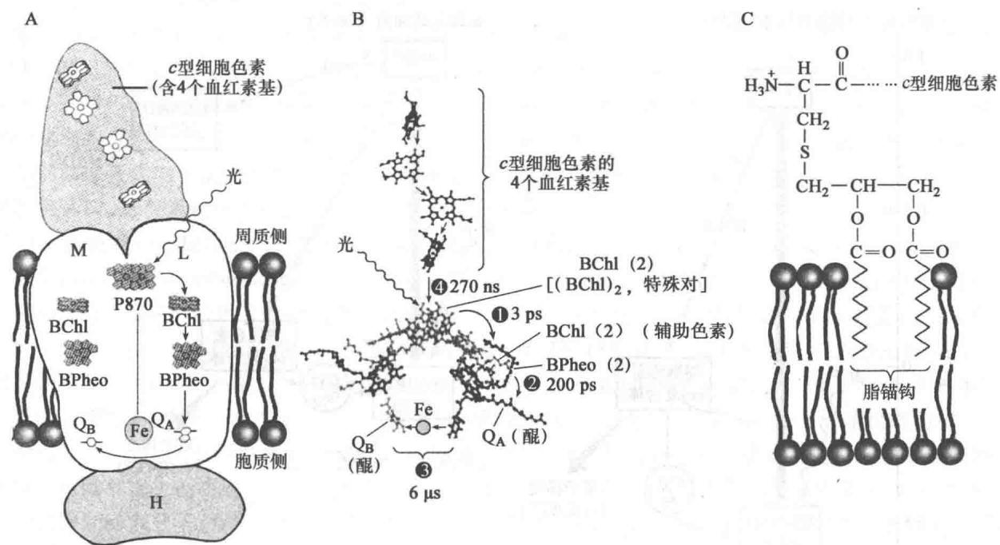  
图 23-13 紫色细菌 R. viridis 反应中心的结构图解  
A. 示出光激活和 $e^{-}$ 传递途径；B. 略去反应中心蛋白质以露出血红素、叶绿素和醌等辅基之间的空间关系；C. c 型细胞色素通过其 N 端 Cys 残基上的二脂酰甘油部分（锚钩）与膜结合

## （二）热力学和动力学的因素防止内转换引起的能量散失

反应中心的复杂结构是进化选择的产物,它有利于提高光合作用的效率。激发态 $\left[\left(\mathrm{BChl}\right)_{2}^{*}\right]$ 原则上能够通过内转换衰变回基态。这是一个非常迅速的过程(10 ps),被吸收的光子能量转变为热(分子运动)。反应中心的构造正是针对防止这种内转换引起的低效率。反应中心的蛋白质将细菌叶绿素、细菌脱镁叶绿素和醌维持在彼此固定的方位,允许光化学反应实际上在固态中进行(图23-13A)。这就是光反应高效、快速的原因;这里不存在概率碰撞或随机扩散的问题。从天线叶绿素到反应中心的“特殊对”的激子传递是在不到100 ps完成的,效率达90%以上。P870被激发后的20 ps内,Bpheo则得到电子并变成荷负电的自由基;200 ps后,电子到达醌 $Q_{A}$ (图23-13A和B)。电子传递的反应不仅快而且在热力学上是“下坡的”;被激发的叶绿素“特殊对” $\left(\mathrm{BChl}\right)_{2}^{*}$ 是一个很好的电子供体 $\left(E^{\ominus'}=-1\mathrm{~V}\right)$ ,每次相继的电子传递都是传给 $E^{\ominus'}$ 负值小得相当多的接纳体。因此,过程的标准自由能变化是大的负值。 $\Delta G^{\ominus'}=-nF\Delta E^{\ominus'}$ (第16章),这里 $\Delta E^{\ominus'}$ 是下面两个半反应的标准还原电势之差:

因此，

$$
\begin{array}{r l r} & (\mathrm{BChl}) _ {2} ^ {*} \longrightarrow (\mathrm{BChl}) _ {2} ^ {+} + e ^ {-} & E ^ {\ominus \prime} = - 1. 0 \mathrm{V} \\ & \mathrm {Q + 2 H^ {+} + 2 e ^ {-} \longrightarrow QH_ {2}} & E ^ {\ominus \prime} = - 0. 0 4 5 \mathrm{V} \\ & \Delta E ^ {\ominus \prime} = - 0. 0 4 5 \mathrm{V} - (- 1 \mathrm{V}) \approx 0. 9 5 \mathrm{V} \\ & \Delta G ^ {\ominus \prime} = - 2 (9 6. 5 \mathrm{kJ/V} \cdot \mathrm{mol}) (0. 9 5 \mathrm{V}) = - 1 8 3 \mathrm{kJ/mol} \end{array}
$$

快速的动力学和有利的热力学二者的结合使过程成为实际上不可逆和高效率的。过程的总能量产率（贮存于 $QH_{2}$ 中的光子能量百分数）大于 30%，其余能量以热散失。

## （三）生氧光合生物同时具有两种类型的反应中心

现代蓝细菌、藻类和维管植物统称生氧光合生物，它们的光合机器比单反应中心的细菌系统复杂得多，同时含有两种反应中心或两种光系统：光系统Ⅱ（PSⅡ）和光系统Ⅰ（PSⅠ）。PSⅡ和PSⅠ很可能是通过两个比较简单的细菌光系统中心的组合进化而来的。这两种系统各有自己类型的光化学反应中心和一套天线色素，有着不同而又互补的功能。PSⅡ含脱镁叶绿素-醌型（Ⅱ型）的反应中心（类似紫色细菌的光系统），此系统含有大致等量的叶绿素a和叶绿素b以及其他辅助色素。PSⅠ含铁氧还蛋白型（Ⅰ型）的反应中心（类似绿色硫细菌的光系统），此系统中叶绿素a的含量比叶绿素b高。一个菠菜叶绿体的类囊体膜上每种光系统都有数百个之多。

## 1. P680 和 P700 分别是光系统Ⅱ和光系统Ⅰ的反应中心色素

1943 年 R. Emerson 等人在分析小球藻光合作用的作用光谱时发现了“红降(red drop)”现象。“红降”是指在较短波长(<680 nm)光下,光合的量子效率是恒定的,但在>680 nm 波长的远红光区光合效率则剧烈下降。13 年后(1956 年)他们又发现了所谓 Emerson“增益效应”(enhancement effect)或称双光效应,指出小球藻在>700 nm 光下进行光合作用,量子效率下降,如果在 700 nm 光的背景下补加较短波长的光(<680 nm),则光合量子效率可增强(图 23-14)。换言之,这两种波长的光是协作的,当两种波长光同时给与时引起的放氧量,比分别给予时的放氧量总和还要大。一个解释是放氧的光合细胞有两个光反应参与:一个光反应利用 700 nm 的波长光,另一个利用 680 nm 或短于 680 nm 的光。两个光反应的发现确立了两个相互合作的色素系统的存在。这些色素系统也称光化学反应系统,简称光系统(photosystem,PS)。光系统就是前面谈到的“光合单位”的具体形式。

与此同时，B. Kok 和 H. Witt 的研究表明，叶绿体色素能被 680 和 700 nm 的光“漂白”；并指出色素被漂白是由于光化学反应中心丢失电子引起的。在叶绿体中 P700 的含量虽很小，仅为植物中叶绿素总量的 0.25%；但是这个含量与“反应中心”（专一的光反应性部位）的概念是一致的。P700 是光系统 I（PS I）的反应中心色素，其红光端的最大吸收在 700 nm 波长。P680 是光系统 II（PS II）的反应中心色素，在 680 nm 波长呈现最大红光吸收。P700 和 P680 都是叶绿素 a 分子的二聚体或“特殊对”，它们处于特化的蛋白质复合体中。

## 2. 叶绿素是以与蛋白质缔合的形式存在于类囊体膜(光合膜)中

用去污剂处理类囊体悬浮液时，膜被溶解，释放出含有叶绿素和蛋白质的复合体。这些复合体是类囊体膜的内在组分。它们的结构组织反映出它们担当着集光复合体（LHC）、PS I 复合体或 PS II 复合体的角色。所有叶绿素都位于这 3 种大分子聚集体中。在 LHC 中叶绿素分子彼此的关系与其他蛋白质复合体的关系以及与膜的关系都是固定的。LHC 是光系统的天线；例如，集光复合体 II（LHC II）是光系统 II 的主要天线，它的详细结构已用 X 射线晶体学方法解出，LHC II 单体结构中含有 3 个跨膜 α 螺旋段、7 个叶绿素 a 分子，5 个叶绿素 b 分子和 2 个叶黄素分子（图 23-15）。作为功能单位的是 LHC II 三聚体。

  
图23-14 光合作用的光化学作用光谱

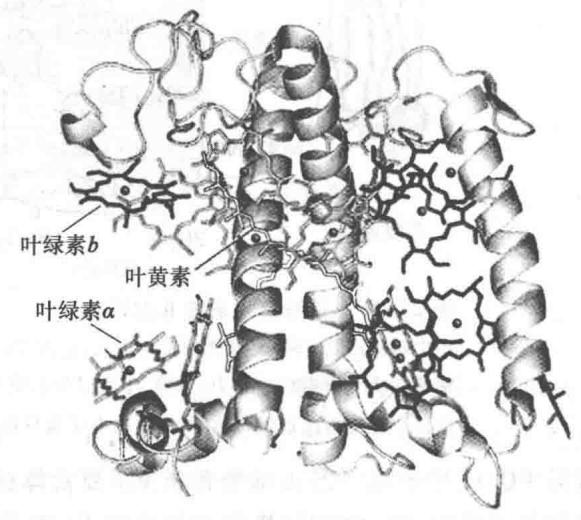  
图 23-15 集光复合体Ⅱ（LHCⅡ）单体的图解
功能单位是 LHCⅡ三聚体，共含9个跨膜α螺旋段、36个叶绿素分子和6个叶黄素分子（引自 Nelson D L, Cox M L. 2013.）

## (四) 生氧光合生物反应中心的分子构造

## 1. PS II 的分子构造类似紫色细菌反应中心的结构

高等植物、绿藻和蓝细菌的 PSⅡ含有 20 多个蛋白质亚基，比单中心的光合细菌（如 R. viridis）的光系统复杂很多。一种称热长聚球藻（Thermosynechococcus elongatus）的嗜热蓝细菌，它的 PSⅡ结构已被阐明。有趣的是，光系统Ⅱ型和Ⅰ型显示出与 R. viridis 的反应中心有很大的相似性，因而证实了生氧光合生物和光合细菌的反应中心之间在进化上是有紧密联系的。

T. elongatus 的 PSⅡ是一个同源二聚体结构。每个“单体”相对分子质量约 350 000，有着 23 个不同的蛋白质亚基、1 个最大的反应中心亚基对（D1 和 D2）和 2 个含叶绿素的内部天线亚基（CP43 和 CP47），支撑着 D1 和 D2（图 23-16）。CP43 和 CP47 共有 26 个 Chl a 分子，激子能量汇集在它们这里，并从这里传递给 P680。PSⅡ“单体”中的蛋白质亚基加起来至少有 34 个跨膜 α 螺旋段，其中 22 个出现在 D1-D2-CP43-CP47“核心”结构上。D1 和 D2 每个都有跨膜 α 螺旋。在结构和功能上，这两个亚基是 R. viridis 的反应中心 L 和 M 亚基的直接副本。P680 由一对 Chl a 分子组成，D1 和 D2 各贡献一个。D1 和 D2 各自都有 2 个其他 Chl a 分子，一个靠近 P680（分别是 Chl $_{D1}$ 和 Chl $_{D2}$ ），另一个与 CP43/CP47 相互作用（分别是 Chl $_{ZD1}$ 和 Chl $_{ZD2}$ ）（图 23-16）。2 个等当量的脱镁叶绿素（Pheo）位于 D1 和 D2 上。酪氨酸残基（Tyr $_{Z}$ ）是 D1 氨基酸序列中的 Tyr 161。与 D2 紧密结合的是质体醌（plastoquinone）分子 PQ $_{A}$ （质体醌的结合部位是许多商品除草剂的作用位点。除草剂灭杀植物是借助封闭经由细胞色素 $b_{6}f$ 复合体的电子传递和阻止光合 ATP 形成）。电子从 P680\* 流向 Chl $_{D1}$ 并到 Pheo $_{D1}$ ，然后 Pheo $_{D1}$ 把电子传递给 D2 上的 PQ $_{A}$ ，在这里电子再流动到位于 D1 上的第二个质体醌，PQ $_{B}$ 。从 PQ $_{A}$ 和 PQ $_{B}$ 的电子传递得到位于它们之间的铁原子的协助。在以醌醇（PQH $_{2}$ ）形式释放到膜脂相之前，每个进入 PQ $_{B}$ 部位的质体醌接纳 2 个从水衍生来的电子和 2 个来自基质水相的 H $^{+}$ 。因此，还原每个进入 PQ $_{B}$ 部位的 PQ 需要 2 个光子（1 光子 E=hν），PSⅡ 催化的总反应的化学计量是：

$$
2 \mathrm{H} _ {2} \mathrm{O} + 2 \mathrm{PQ} _ {\mathrm{B}} + 4 h \nu \longrightarrow \mathrm{O} _ {2} + 2 \mathrm{PQH} _ {2}
$$

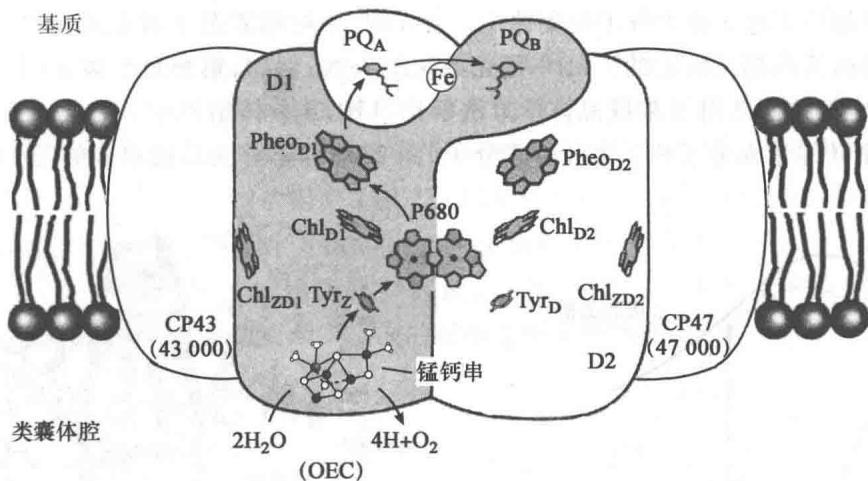  
图23-16 蓝细菌光系统Ⅱ的结构  
图中示出的是 PSⅡ复合体的单体形式，它含有两个主要的跨膜蛋白质 D1 和 D2，每个各有一套辅基如 Tyr、P680（D₁ 和 D₂ 共有）、Chl、Phco、质体醌（PQₐ 和 PQₑ）和 OEC（含锰钙串）等。虽然这两个亚基蛋白近似对称，但发生的电子流只通过两个辅基中的一个（在 D1）

最后 $\mathrm{PQ_BH_2}$ 中的电子经由细胞色素 $b_{6}f$ 复合体被运送到PSI（图23-18，中间）。水氧化产生的电子是使被氧化了的P680(P680+)恢复到原来的P680状态(供下一轮光驱动的电子转运)所需的电子来源。2分子 $\mathrm{H}_2\mathrm{O}$ 氧化生成1分子 $\mathrm{O}_2$ 是由放氧复合体(oxygen evolving compex, OEC; 含有 $\mathrm{Mn_4Ca}$ 串)完成的，OEC位于PSIID1亚基的类囊体腔侧。从水中抽取的电子从OEC经过D1亚基的Tyr161(也称为 $\mathrm{Tyr_Z}$ 或Z)被运送到 $\mathrm{P680^{+}}$ （详见后面的叙述）。

## 2. PS I 的分子构造类似紫色细菌反应中心和 PS II 的结构

嗜热蓝细菌 T. elongates 的 PS I 结构也已用 X 射线晶体学方法解得, 它完善了我们对反应中心结构的看法, 证实这些能量转换的内在膜蛋白在结构组织方面的相似性。因为这跟掌握真核生物 PS I 的信息直接相关, 所以蓝细菌的 PS I 结构为所有含 P700 的光系统提供了一个通用模型(图 23-17)。

T. elongates PS I 以三叶草型的同源三聚体形式存在。每个“单体”由 12 个不同的蛋白质亚基和 127 个辅因子(辅基)组成;这些辅因子包括 96 个叶绿素 $a$ 分子、2 个叶绿醌、3 个 $\mathrm{Fe}_{4} \mathrm{~S}_{4}$ 串、22 个类胡萝卜素和 4 个脂质,它们是该蛋白质复合体的固有组分(图 23-17)。所有对 PS I 功能必需的电子传递辅因子都定位在这 3 个多肽: PsaA、PsaB 和 PsaC。PsaA 和 PsaB ( $M_{\mathrm{r}}$ 均为 83000) 组成反应中心异二聚体,这种结构图案现在看来是光合作用中心的普适形式。PsaA 和 PsaB 各有 11 个跨膜 $\alpha$ 螺旋,每个多肽的 5 个 C 端的 $\alpha$ 螺旋被用作反应中心光合电子传递机器的支架。PsaC 与 PsaA-PsaB 异二聚体在基质侧相互作用。PsaC 携有 2 个 $\mathrm{Fe}_{4} \mathrm{~S}_{4}$ 串, $\mathrm{FeS}_{\mathrm{A}}$ 和 $\mathrm{FeS}_{\mathrm{B}}$ ,并与 PsaD 相互作用。它们一起为铁氧还蛋白提供停靠部位(docking site)。PS I 的电子传递系统由 3 对叶绿素分子组成:P700(是一个由 Chla 和差向异构的 Chla' 组成的杂二聚体)和 2 个额外的 Chla 对(其中一对标为 $\mathrm{A}_{0}$ ),后者介导 $e^{-}$ 传递到醌型接纳体。T. elongates 的醌型接纳体 ( $\mathrm{A}_{1}$ ) 是叶绿醌 (phylloquinone),也称维生素 $\mathrm{K}_{1}$ (见第 13 章)。 $\mathrm{FeS}_{\chi}(\mathrm{Fe}_{4} \mathrm{~S}_{4}$ 串)是桥连 PsaA 和 PsaB 的;它的 4 个半胱氨酸配基 2 个来自个 PsaA,另外 2 个来自 PsaB。光化学过程开始于 P700 吸收激子而成 $\mathrm{P700^{+}}$ ,它具有自然界中最负的还原电势。几乎与此同时发生电子传递和电荷分离(形成 $\mathrm{P700^{+}:A_{0}^{-}}$ ),接着电子从 $\mathrm{A}_{0}$ 传递到 $\mathrm{A}_{1}$ ,然后到 $\mathrm{FeS}_{\mathrm{A}}$ ,到 $\mathrm{FeS}_{\mathrm{B}}$ ,再到位于膜“基质”侧的铁氧还蛋白。 $\mathrm{P700^{+}}$ 的正电荷和 $\mathrm{FeS}_{\mathrm{A}} / \mathrm{FeS}_{\mathrm{B}}$ 的 $e^{-}$ 代表跨膜的电荷分离,这是一个光创造的高能条件(energized condition)。质体蓝素 (plastocyanin),或蓝细菌中类囊体腔的细胞色素(细胞色素 $c_{6}$ ),供出一个电子填充 $\mathrm{P700^{+}}$ 的电子空穴。

  
图23-17 光系统I的结构  
PS I 反应中心由 PsaA 和 PsaB 两个亚基组成，含 P700、 $A_{0}$ （Chl a 单体）、叶绿醌  
$(A_{1})$ ;额外组分:PsaC( $FeS_{A}$ 和 $FeS_{B}$ )、PsaD 和 PsaE(基质侧)和 PsaF(类囊体腔侧)

## （五）生氧光合细胞中 PS II 和 PS I 以串联方式起作用

## 1. 生氧光合电子传递的 Z 图式

生氧光合细胞中由 P680 和 P700 吸收的光能驱动电子从 $H_{2}O$ 流向 $NADP^{+}$ 。从图 23-18 可以看到两个光反应中心 (P680 和 P700) 是以串联方式起作用的，PSⅡ光解水和放氧，并把释放的电子送入连接 PSⅡ和 PS I 的电子传递链；PS I 以 NADPH 形式提供还原力。在电子传递过程中引起质子跨膜泵送和 ATP 合成的作用。 $H_{2}O$ 的氧化和 $NADP^{+}$ 的还原在类囊体膜上是分开的，氧化在 PSⅡ进行，还原在 PS I 进行。在这两个光系统之间运载电子的是质体蓝素；它是一个一电子载体 (one-electron carrier)，功能上类似线粒体的细胞色素 c。为了取代自 PSⅡ经 PS I 到达 $NADP^{+}$ 的电子，蓝细菌和植物氧化 $H_{2}O$ （像绿色硫细菌氧化 $H_{2}S$ ），产生 $O_{2}$ ；还原 $NADP^{+}$ 所需的电子最终来自 $H_{2}O$ 的氧化，释放的 $O_{2}$ 是水光解 (photolysis) 的副产物（图23-18，左下方）。这个过程称为生氧光合作用(oxygenic photosynthesis)以区别于紫色细菌和绿色硫细菌的不生氧(anoxygenic)光合作用。所有放氧光合细胞都含有PSⅡ和PSⅠ，只含一个光系统的生物都不能放 $\mathrm{O}_2$ 。图23-18中的图解常称为Z图式(Z scheme)，因为此图总的形式很像是侧着排的Z字母。Z图式概括出两个光系统之间的电子流动的途径和光反应的能量关系。因此，Z图式按下面方程：

$$
2 \mathrm{H} _ {2} \mathrm{O} + 2 \mathrm{NADP} ^ {+} + 8 h \nu \longrightarrow \mathrm{O} _ {2} + 2 \mathrm{NADPH} + 2 \mathrm{H} ^ {+}
$$

描绘电子从 $H_{2}O$ 流到 $NADP^{+}$ 的完整路线。每吸收两个光子（每个光系统吸收一个），就有一个电子从 $H_{2}O$ 传递到 $NADP^{+}$ 。为形成 1 分子 $O_{2}$ ，要求 4 个电子从 2 个 $H_{2}O$ 传递给 2 个 $NADP^{+}$ ；总共需要吸收 8 个光子，每个光系统吸收 4 个光子。

整个光合电子传递是由3个跨膜超分子复合体（membrane-spanning supramolecular complex）完成的。这3个复合体是PSⅡ复合体、细胞色素 $b_{6}f$ 复合体和PSⅠ复合体。

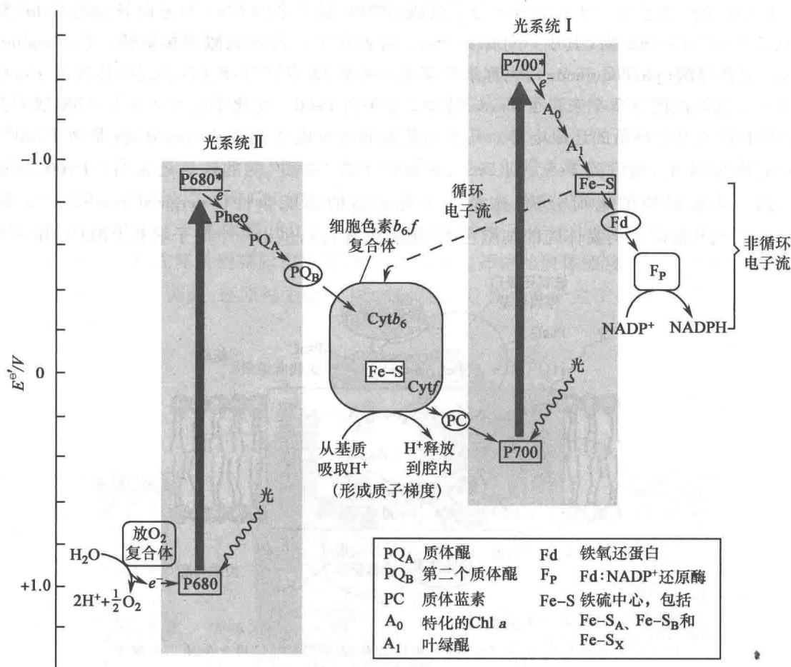  
图23-18 真核光合电子传递的Z图式

## 2. 通过 PS II 的光驱动电子流

PSⅡ和PSⅠ的结构和反应中心的光化学机制跟细菌的两个光系统基本相似，但有一些重要的增补（见前面PSⅡ和PSⅠ的构造部分所述）。光合电子流从PSⅡ中的P680受光激发生成 $\mathrm{P680^{*}}$ 开始。 $\mathrm{P680^{*}}$ 是一种优秀的电子供体（ $E^{\ominus}$ 约为-1V），在几个皮秒(ps)内即把一个电子传递到脱镁叶绿素(Pheo)，使成阴离子 $\mathrm{Pheo^{-}}$ （图23-18左上方）。 $\mathrm{P680^{*}}$ 因失去电子转变为阳离子自由基（ $\mathrm{P680^{**}}$ ）。 $\mathrm{Pheo^{-}}$ 很快将额外电子传递给跟蛋白质结合的质体醌， $\mathrm{PQ_A}$ ； $\mathrm{PQ_A}$ 又将电子传递给另一个结合比较疏松的质体醌 $\mathrm{PQ_B}$ （相当于线粒体中的Q）。经两次这样的传递， $\mathrm{PQ_B}$ 从 $\mathrm{PQ_A}$ 获得两个电子并从基质水相中获得两个质子，变成完全被还原的醌醇(氢醌)形式， $\mathrm{PQ_BH_2}$ 。在PSⅡ中光引发的总反应是：

$$
4 \mathrm{P} 6 8 0 + 4 \mathrm{H} ^ {+} + 2 \mathrm{PQ} _ {\mathrm{B}} + 4 h \nu \rightarrow 4 \mathrm{P} 6 8 0 ^ {+} + 2 \mathrm{PQ} _ {\mathrm{B}} \mathrm{H} _ {2}\tag{23-1}
$$

$Q_{B}H_{2}$ 离开 PSⅡ，进入膜中的质体醌库。由于质体醌的疏水性质，它能在膜脂中游动，并因此能把来自 PSⅡ的电子不断地运送到细胞色素 $b_{6}f$ 复合体。质体醌不仅起脂溶性二电子载体的作用，而且它和它的还原态（质体醌醇）之间的交替氧化还原，涉及质子的吸收（图 23-19 左侧）。

  
图23-19 经由细胞色素 $b_{6}f$ 复合体的电子流和质子流  
图中 $b_{L}$ 和 $b_{H}$ 分别代表接近类囊体腔侧和基质侧的细胞色素 b 血红素基，分别也称 $b_{P}$ 和 $b_{N}$

## 3. 通过 PS I 的光驱动电子流

PS I 的反应中心 P700 被激发后的光化学过程形式上类似于 PS II 的。激发态 P700\* 立即释放出一个电子，给了接纳体 A₀（一个特殊形式的叶绿素分子，功能上类似 PS II 的脱镁叶绿素），生成 A₀⁻ 和 P700⁺（图 23-18，右上方）；激发的结果是造成光化学反应中心的电荷分离。P700⁺ 是一个强氧化剂（P700\*/P700 电对的 E°′约为 +0.45 V），很快从质体蓝素（PC）获得一个电子。PC 是一个可溶性的含 Cu 电子传递蛋白质（Mᵣ 10 400），它能在类囊体腔内扩散，穿梭在细胞色素 b₀f 复合体与 PS I 之间转运电子（图 23-19）。当 PC 中的铜原子在 Cu⁺ 和 Cu²⁺ 状态之间交替氧化还原时起着电子载体（E°′ = +0.32 V）作用。特化的 Chla, A₀⁻，是一个格外强的还原剂，很快将它的电子沿一条引导到 NADP⁺ 的载体链首先传递给叶绿醌（A₁），后者又将电子传递给结合在膜上的铁硫蛋白（通过 PS I 中 3 个铁硫中心或铁硫串，Fe-S）。从这里，电子转移到铁氧还蛋白（Fd），这是一个与类囊体膜疏松缔合的另一铁硫蛋白。菠菜的铁氧还蛋白（Mᵣ 10 700）含有一个 2Fe-2S 中心（见第 19 章），能进行一电子的氧化和还原反应。Fd 是此载体链上的第四个载体黄素蛋白（flavoprotein, Fp）的直接电子供体。此黄素蛋白也称为铁氧还蛋白：NADP⁺ 氧化还原酶，催化从还原型铁氧还蛋白（Fd\_red）传递电子给 NADP⁺：

$$
2 \mathrm{Fd} _ {\mathrm{red}} + \mathrm{H} ^ {+} + \mathrm{NADP} ^ {+} \rightarrow 2 \mathrm{Fd} _ {\mathrm{ox}} + \mathrm{NADPH}
$$

此酶与绿色硫细菌的铁氧还蛋白： $NAD^{+}$ 还原酶（图 23-12B，上方）是同源的。

前面曾经谈到,PS I 传送电子的辅因子和集光复合体组成一个超分子复合体(含 3 个相同的蛋白质复合体)。在此结构上许多天线叶绿素和类胡萝卜素分子回绕反应中心精确排列。因此反应中心的电子传送辅因子与天线叶绿素是紧密整合的。这种排列允许从天线叶绿素到反应中心进行快速、有效的激子传递。与 PS II 中的单途径电子流不同,在 PS I 中吸收光子引发的电子流是分两条途径进行的(图 23-17)。

## （六）细胞色素 $b_{6}f$ 复合体连接PSII和PSI

细胞色素 $b_{6}f$ 复合体（图23-19）或称质体醌醇：质体蓝素氧化还原酶，是一个 $M_{r}$ 约为 $210\times10^{3}$ 的膜蛋白复合体，PSⅡ和PSⅠ的连接者，也是电子传递和质子转移的偶联者。它很像线粒体的复合体Ⅲ；含有一个b型细胞色素 $b_{6}$ (Mr 24 000；内含2个参与Q循环的血红素基 $b_{H}$ 和 $b_{L}$ ，和1个血红素X）、一个Ⅳ亚基、一个Rieske铁硫蛋白(19 000)和一个c型细胞色素 $c_{552}$ (31 000)，常称为细胞色素f(f来自拉丁文frons或folium，意思是叶子）。PSⅡ中的P680被激发时暂时贮存在质体醌醇 $(PQ_{B}H_{2})$ 中的电子经由细胞色素$b_{6}f$ 复合体从 $PQ_{B}H_{2}$ 到细胞色素 f，再到可溶性质体蓝素（一种蛋白质），最终传递给 PS I 的 $P700^{+}$ ，把它还原为 P700（图 23-18，中间）。

跟线粒体的复合体Ⅲ一样，细胞色素 $b_{6}f$ 复合体也把电子从还原型醌——可移动的脂溶性二电子载体（线粒体中是Q，叶绿体中是PQ）——传递给水溶性的一电子载体蛋白质（线粒体中是细胞色素c，叶绿体中是质体蓝素）；其功能也涉及质体醌介导的Q循环（参看第19章），Q循环中从 $PQ_{B}H_{2}$ 到细胞色素 $b_{6}$ ，一次传递一个电子，转移2个质子。Q循环的结果是质子的跨膜泵送；在叶绿体中质子移动的方向是从基质区室（膜的N侧）到类囊体腔（膜的P侧），每传递一对电子转移达4个质子（图23-19）。因此，随电子流经由细胞色素 $b_{6}f$ 复合体从PSⅡ到PSⅠ时，将产生一个跨类囊体膜的质子梯度。因为扁平的类囊体腔体积很小，少量质子的流入则对腔内pH产生相当大的影响。基质（pH8）和类囊体腔（pH5）之间测得的pH差（ $\Delta pH=3$ ）相当于膜两侧1000倍的质子浓度差，这是合成ATP的强大驱动力。

## （七）水被放氧复合体光解

植物光合作用中传递给 $NADP^{+}$ 的电子最终来源是水。激发时 PSⅡ的 $P680^{+}$ 已把一个电子供给了脱镁叶绿素，它必须获得一个电子以返回到基态，准备捕获下一个光子。原则上， $P680^{+}$ 所要的电子可以来自任一有机或无机的化合物。为此光合细菌可利用各种电子供体，如乙酸盐、琥珀酸盐、苹果酸盐和硫化物；这取决于特定生态位中可利用的化合物。大约 30 亿年前原始光合细菌（现代蓝细菌的祖先）的进化产生了一个光系统，它能够从一个总是可得到的供体——水中取得电子。在此过程中 2 分子水被裂解，产生 4 个电子，4 个质子和 1 个分子氧：

$$
2 \mathrm{H} _ {2} \mathrm{O} \rightarrow 4 \mathrm{H} ^ {+} + 4 e ^ {-} + \mathrm{O} _ {2}
$$

一个可见光光子的能量 $(h\nu)$ 不足以把 $\mathrm{H}_2\mathrm{O}$ 分子中的键裂解。水的光解反应需要4个光子。

从水中抽取的4个电子不是直接传递给 $\mathrm{P680^{+}}$ ， $\mathrm{P680^{+}}$ 一次只能接纳一个电子。但在生物进化中有一个巧妙的分子设计，即放氧复合体（OEC），也称水裂解复合体（water-splitting complex），它能一次一个地将4个电子传递给 $\mathrm{P680^{+}}$ （图23-20A）。 $\mathrm{P680^{+}}$ 的直接电子供体是PSⅡ反应中心D1亚基的Tyr161残基（常标为Z、 $\mathrm{Tyr_Z}$ 或 $\mathrm{Y_Z}$ )。Tyr残基失去一个质子和一个电子，转变为电中性的Tyr自由基，Tyr·：

$$
4 \mathrm{P} 6 8 0 ^ {+} + 4 \mathrm{Tyr} \rightarrow 4 \mathrm{P} 6 8 0 + 4 \mathrm{Tyr} \cdot + 4 \mathrm{H} ^ {+}\tag{23-2}
$$

Tyr 自由基借助氧化 OEC 中的 $Mn_{4}Ca$ 串重新获得丢失的电子和质子。此金属串被证实是 OEC 的活性部位，它的 4 个 Mn 和 1 个 Ca 由 5 个 O 原子桥连（图 23-20B），还有一个放氧所需的 $Cl^{-}$ 离子是 $Ca^{2+}$ 的配体。每次单电子传递， $Mn_{4}Ca$ 串的氧化态增高，4 次单电子传递（每次相当于吸收一个光子）在 $Mn_{4}Ca$ 串上产生 4 个正电荷（图 23-20）：

$$
4 \mathrm{Tyr} \cdot + [ \mathrm{Mn} _ {4} \mathrm{Ca} ] ^ {0} \rightarrow 4 \mathrm{Tyr} + [ \mathrm{Mn} _ {4} \mathrm{Ca} ] ^ {4 +}\tag{23-3}
$$

这种状态的 $Mn_{4}Ca$ 串可以从 2 个水分子中取得 4 个电子,释放 4 个 $H^{+}$ 和 1 个 $O_{2}$ :

$$
\left[ \mathrm{Mn} _ {4} \mathrm{Ca} \right] ^ {4 +} + 2 \mathrm{H} _ {2} \mathrm{O} \rightarrow \left[ \mathrm{Mn} _ {4} \mathrm{Ca} \right] ^ {0} + 4 \mathrm{H} ^ {+} + \mathrm{O} _ {2}\tag{23-4}
$$

由于反应中产生的4个质子被释放到类囊体腔中,所以放氧复合体起着一个由电子传递驱动的质子泵作用。方程23-1至方程23-4这4个式子的总和是:

$$
2 \mathrm{H} _ {2} \mathrm{O} + 2 \mathrm{PQ} _ {\mathrm{B}} + 4 h \nu \rightarrow \mathrm{O} _ {2} + 2 \mathrm{PQ} _ {\mathrm{B}} \mathrm{H} _ {2}\tag{23-5}
$$

放氧串的详细结构已经用 X 射线晶体学方法获得。金属串采取椅子形状(图 23-20B)。椅子的座面和腿由 3 个 Mn 离子、1 个 Ca 和 4 个 O 原子组成；第 4 个 Mn 和另一个 O 形成椅子的背。晶体结构中还看到 4 个 $H_{2}O$ 分子，2 个与一个 Mn 离子缔合，另外 2 个与 Ca 离子缔合。可能这些水分子中的一个或多个是发生氧化产生 $O_{2}$ 的。这个金属串与类囊体膜腔侧上的一个外周膜蛋白 ( $M_{r}$ 33 000) 缔合，推测这是稳定 $Mn_{4}Ca$ 串的。已知参与水氧化的 $Tyr_{z}$ 残基是氢键合的水分子网（包括与 $Mn_{4}Ca$ 串缔合的 4 个水分子）的一部分；通过 $\mathrm{Tyr}_2$ 残基电子可以在水和PSⅡ反应中心 $\mathrm{P680^{+}}$ 之间运动。 $\mathrm{Mn_4Ca}$ 引起水氧化的详细机制仍不清楚，正在努力研究中。这是生物圈中几个最重要的反应之一，对地球上的生命是关键性的，它涉及崭新的生物无机化学。多金属中心的结构测定已引出几个合理的和可试验的假设。

A  
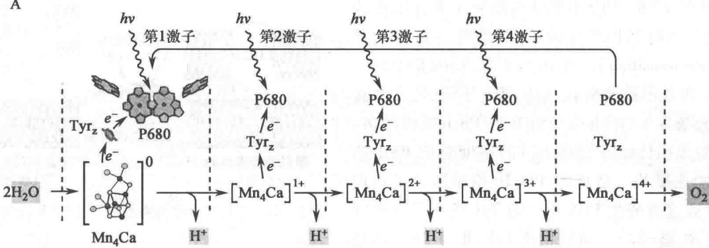

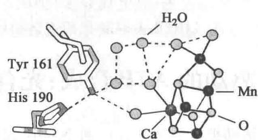  
图23-20 放氧复合体的水光解活性  
A. 示出在 PSⅡ的水裂解复合体中产生四电子氧化剂 $\left(\mathrm{Mn}_{4}\mathrm{CaO}_{5}\right)$ 的过程。每吸收1个 $h\nu$ （激子），锰钙串丢失1个 $e^{-}$ ，相继吸收4个 $h\nu$ ，氧化为 $\left[\mathrm{Mn}_{4}\mathrm{Ca}\right]^{4+}$ ，后者从2分子 $H_{2}O$ 中抽取4个 $e^{-}$ ，还原为 $\left[\mathrm{Mn}_{4}\mathrm{Ca}\right]^{0}$ ，并释放出1个 $O_{2}$ 和4个质子。B. 示出水裂解复合体的金属中心—— $Mn_{4}Ca$ 串和与之有关的氢键合的 $H_{2}O$ 分子网和 $Tyr_{Z}$

## （八）PS I 和 PS II 在类囊体膜上的定位

激发PSI（P700)所需的能量比激发PSII（P680)所需的能量低(更长的光波长)。如果PSI和PSII在空间上是邻近的，那么来自PSII天线系统的激子就会迁移到PSI的反应中心，使PSII长期激发不足，而干扰双反应中心系统的正常运作。但这种激子供应的失衡可以通过类囊体膜上两个光系统的空间分离来防止(图23-21)。PSII几乎无例外地位于类囊体基粒的紧贴垛叠膜中。与PSII缔合的集光复合体(LHCII)是有“黏性的”，介导基粒中相邻膜的紧密结合。PSI和ATP合酶复合体几乎都位于面向基质的非紧贴的类囊体膜(基质片层)以及基粒顶部和底部的表面，在这里它们可以与基质的内容物包括ADP和 $\mathrm{NADP^{+}}$ 接近，有利于 $\mathrm{NADP^{+}}$ 还原和ATP合成。细胞色素 $b_{6}f$ 复合体基本上存在于基粒片层中。

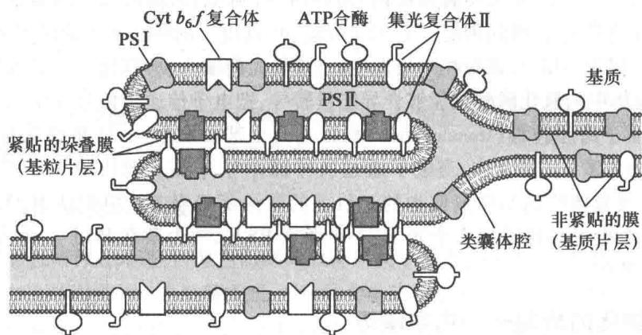  
图23-21 PSI和PSII在类囊体膜上的定位

LHCⅡ跟PSⅡ和PSⅠ的缔合取决于光强度和波长，它们能在短时间内发生改变，导致叶绿体内的状态转变(state transition)。在状态1时，LHCⅡ中的一个关键Ser残基不被磷酸化，LHCⅡ与PSⅡ缔合。在强光或蓝光条件下，PSⅡ吸收的光比PSⅠ吸收的多，还原质体醌成质体醌醇 $(\mathrm{PQ_BH_2})$ 的速度要比PSⅠ能够氧化它的速度快。造成的 $\mathrm{PQ_BH_2}$ 积累激活了蛋白激酶，后者通过磷酸化LHCⅡ上的Tyr残基引发向状态2转变(图23-22)。磷酸化使LHCⅡ与PSⅡ的相

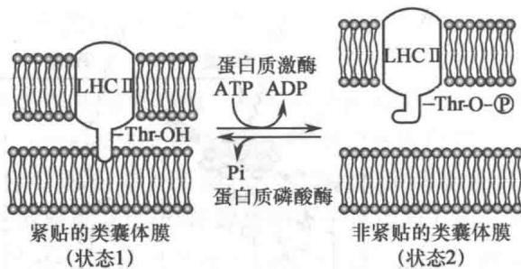  
图 23-22 通过状态改变来平衡 PS I 和 PS II 中的电子流

互作用减弱,某些 LHCⅡ发生解离,并移向基质片层;在这里为 PS I 捕捉光子,加速 $PQ_{B}H_{2}$ 的氧化,扭转 PS I 和 PS II 之间电子流的不平衡。在低强度光(红光成分多)如阴影下,PS I 氧化 $PQ_{B}H_{2}$ 速度比 PS II 产生它的速度快,结果 $PQ_{B}$ 的浓度增加,引发 LHCⅡ去磷酸化而逆转磷酸化影响。

<!-- EN-BEGIN 20.2 -->

### 【英文对应 20.2】Photochemical Reaction Centers

> 来源：Lehninger Principles of Biochemistry（书籍/02_生物化学原理） 第20章 Photosynthesis and Carbohydrate Synthesis in Plants，§20.2。对应本章“三、光驱动的电子流:中心光化学事件”。

Studies on a variety of bacteria that carry out photosynthesis have been helpful in understanding the mechanisms of photosynthesis in cyanobacteria, algae and vascular plants. Photosynthetic bacteria have relatively simple phototransduction machinery, with one of two general types of photosystems. Both systems send electrons through a cytochrome complex that pumps protons, producing the electrochemical gradient that drives ATP synthesis.

#### [EN] Photosynthetic Bacteria Have Two Types of Reaction Center

The type II photosystem in purple bacteria consists of three basic modules (Fig. 20-11a): a single P870 reaction center; a cytochrome $bc_{1}$ electron-transfer complex similar to Complex III of the mitochondrial electron-transfer chain; and an ATP synthase, also similar to that of mitochondria. Illumination lifts an electron in the reaction center to its excited state (P870\*), from which it passes through pheophytin (chlorophyll a lacking its central $\mathrm{Mg}^{2+}$ ) and a quinone to the cytochrome $bc_{1}$ complex. After passing through the $bc_{1}$ complex, electrons flow through cytochrome $c_{2}$ back to the reaction center, restoring its preillumination state and completing one cycle. This light-driven cyclic electron transfer provides the energy for proton pumping by the cytochrome $bc_{1}$ complex. Powered by the resulting proton gradient, ATP synthase produces ATP, exactly as in mitochondria.

  
FIGURE 20-11 Functional Modules of Photosynthetic Machinery in Purple Bacteria and Green Sulfur Bacteria. The position on the vertical scale of each electron carrier reflects its standard reduction potential. (a) In purple bacteria, light energy excites an electron in the reaction center P870. The electron passes through pheophytin (Pheo), a quinone (Q), and the cytochrome $bc_{1}$ complex, then through cytochrome $c_{2}$ and thus back to the reaction center. Electron transfer through the cytochrome $bc_{1}$ complex causes  
proton pumping, creating an electrochemical potential that powers ATP synthesis. (b) Green sulfur bacteria have two routes for electrons driven by excitation of P840. A cyclic electron transfer route that goes through a quinone to the cytochrome $bc_{1}$ complex and back to the reaction center via cytochrome $c_{553}$ causes proton pumping. A linear electron transfer route that goes from the reaction center through the iron-sulfur protein ferredoxin (Fd) reduces $NAD^{+}$ to NADH in a reaction catalyzed by ferredoxin: $NAD^{+}$ reductase.

The type I photosystem in green sulfur bacteria involves the same three modules as in purple bacteria, but the process differs in several respects and includes additional enzymatic reactions (Fig. 20-11b). Excitation by light causes an electron to move from the excited reaction center to the cytochrome $bc_{1}$ complex via a quinone carrier. Electron transfer through this complex powers proton transport and creates the proton-motive force used for ATP synthesis, just as in purple bacteria and in mitochondria. However, in contrast to the cyclic electron transfer path in purple bacteria, some electrons follow a linear electron transfer path from the reaction center to the soluble iron-sulfur protein ferredoxin (see Fig. 19-5), which then passes electrons via ferredoxin: NAD $^{+}$ reductase to NAD $^{+}$ , producing NADH. The electrons taken from the reaction center to reduce NAD $^{+}$ are replaced by the oxidation of H $_{2}$ S to elemental S in the reaction that defines the green sulfur bacteria. This oxidation of H $_{2}$ S by bacteria is chemically analogous to the oxidation of H $_{2}$ O by oxygenic plants. Note that the path of electrons in the purple bacteria is cyclic; the path in the green sulfur bacteria can be either cyclic or linear, leading to NAD $^{+}$ and producing NADH.

#### [EN] In Vascular Plants, Two Reaction Centers Act in Tandem

The photosynthetic apparatus of cyanobacteria, algae, and vascular plants is more complex than the one-center bacterial systems, and it most likely evolved through the combination of two simpler bacterial photosystems.

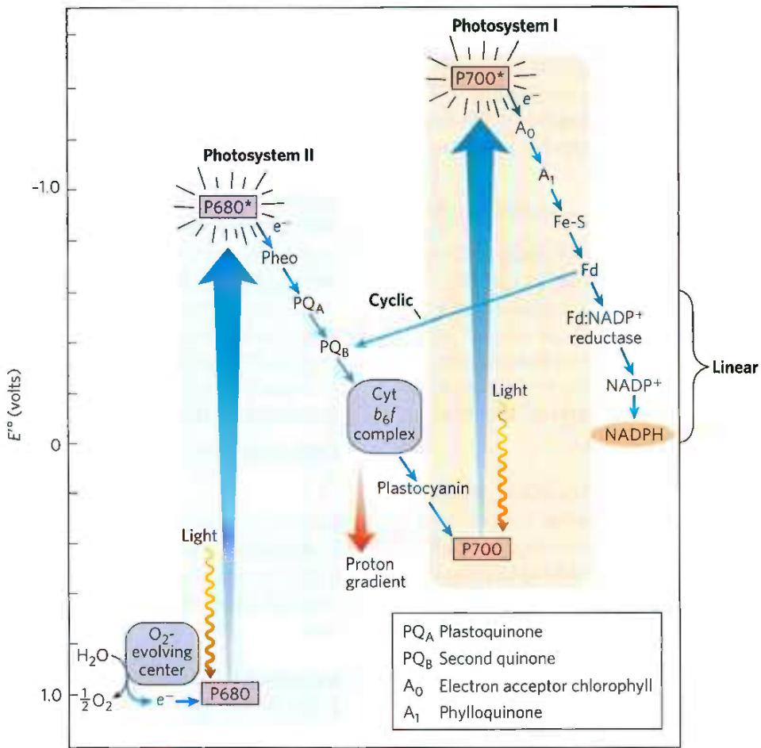  
FIGURE 20-12 Integration of photosystems I and II in chloroplasts. This "Z scheme" shows the pathway of linear electron transfer from $\mathrm{H}_2\mathrm{O}$ (lower left) to $\mathrm{NADP^{+}}$ (far right). The position on the vertical scale of each electron carrier reflects its standard reduction potential. To raise the energy of electrons derived from $\mathrm{H}_2\mathrm{O}$ to the energy level required to reduce $\mathrm{NADP^{+}}$ to NADPH, each electron must be "lifted" twice (heavy arrows) by photons absorbed in PSII and PSI. One photon is required per electron in each photosystem. After excitation, the high-energy electrons flow  
"downhill" through the carrier chains as shown. Protons move across the thylakoid membrane during the water-splitting reaction and during electron transfer through the cytochrome $b_{6}f$ complex, producing the proton gradient that is essential to ATP formation. An alternative path of electrons is cyclic electron transfer, in which electrons move from ferredoxin back to the plastoquinone and cytochrome $b_{6}f$ complex, instead of reducing $\mathrm{NADP^{+}}$ to NADPH. The cyclic pathway produces more ATP and less NADPH than the linear pathway.

The Z scheme diagram in Figure 20-12 outlines the path of electron flow between the two photosystems and the energy relationships in the light-dependent reactions. (The Z scheme takes its name from the zigzag pattern of the pathways in the diagram.) The thylakoid membranes of chloroplasts have two different kinds of photosystems, each with its own type of photochemical reaction center and set of antenna molecules. The two systems have distinct and complementary functions. Photosystem II (PSII) is a pheophytin-quinone type of system (like the single photosystem of purple bacteria) containing roughly equal amounts of chlorophylls $a$ and $b$ . Excitation of the P680 special pair in its reaction center drives electrons through the cytochrome $b_{6}f$ complex discussed below, with concomitant pumping of protons across the thylakoid membrane and ATP synthesis. Photosystem I (PSI) is structurally and functionally related to the photosynthetic machinery of green sulfur bacteria. It has a P700 reaction center and a high ratio of chlorophyll a to chlorophyll b. The excited P700 passes electrons through a linear chain of carriers to ferredoxin, then to $NADP^{+}$ , producing NADPH. An alternative pathway for electrons is cyclic: instead of following the linear path that leads to $NADP^{+}$ reduction, electrons pass to plastoquinone (PQ) through a membrane-embedded protein complex, cytochrome $b_{6}f$ (again, with the movement of protons into the chloroplast lumen). The thylakoid membranes of a single spinach chloroplast have many hundreds of each kind of photosystem.

These two photosystems in plants act in tandem to catalyze the light-driven movement of electrons from $H_{2}O$ to $NADP^{+}$ . The electron carriers include large, integral protein complexes (PSI, PSII, and the proton-pumping complex cytochrome $b_{6}f$ ); quinones that are lipid-soluble and move through the membrane between the protein complexes; and two soluble proteins, plastocyanin (analogous to cytochrome c in mitochondria) and ferredoxin.

To replace the electrons that move from PSII through PSI to NADP $^{+}$ , H $_{2}$ O is oxidized, producing O $_{2}$ (Fig. 20-12, bottom left). All O $_{2}$ -evolving photosynthetic cells—those of plants, algae, and cyanobacteria—contain both PSI and PSII. P3 The Z scheme thus describes the complete route by which electrons flow from H $_{2}$ O to NADP $^{+}$ , according to the equation

$$
2 \mathrm{H} _ {2} \mathrm{O} + 2 \mathrm{NADP} ^ {+} + 8 \text {   photons   } \longrightarrow \mathrm{O} _ {2} + 2 \mathrm{NADPH} + 2 \mathrm{H} ^ {+}
$$

For every two photons absorbed (one by each photosystem), one electron is transferred from $H_{2}O$ to $NADP^{+}$ . To form one molecule of $O_{2}$ , which requires transfer of four electrons from two $H_{2}O$ to two $NADP^{+}$ , a total of eight photons must be absorbed, four by each photosystem.

Having seen the overall process, we'll now look at how the structure of the photosystems informs our understanding of the electrochemistry.

Photosystem II PSII is dimeric (Fig. 20-13). Each monomer is a huge complex of 19 proteins, including the accessory proteins CP47 and CP43, and the core complex of P680 reaction-center proteins D1 and D2; 2 chlorophyll-binding proteins; and associated chromophores, including carotenoids, a nonheme iron, and the critically important inorganic cofactor, $\mathrm{Mn_4CaO_5}$ . Of the proteins in PSII, 16 have transmembrane segments, but 3 are peripheral proteins on the lumenal side that stabilize the $\mathrm{Mn_4CaO_5}$ cofactor. Surrounding PSII are additional chlorophyll-binding proteins and light-harvesting complexes. P2 When a photon is absorbed by any of these antenna molecules, the resulting exciton moves very rapidly from one to another of the antenna chlorophylls until it reaches the reaction center and excites P680, the special pair of chlorophyll a molecules (Chl a) $_{2}$ , to initiate the photochemistry.

  
FIGURE 20-13 Structure of photosystem II of the cyanobacterium Thermosynechococcus vulcanus. The enormous complex, visualized by x-ray crystallography, is a dimer; each monomer has its own reaction center. Chlorophyll-binding proteins CP43 and CP47 form the core antenna, directly associated with the PSII reaction-center proteins D1 and D2. Each PSII monomer contains 35 chlorophylls, 2 pheophytins, 11 β-carotenes, 2 plastoquinones, and 1 each of b-type cytochrome, c-type cytochrome, and nonheme iron. Water is oxidized to form O₂ at the oxygen-evolving center (Mn₄CaO₅). [Data from PDB ID 3WU2, Y. Umena et al., Nature 473:55, 2011.]

Excitation of P680 in PSII (Fig. 20-14) produces P680\*, an excellent electron donor that, within picoseconds, transfers an electron to pheophytin, giving it a negative charge ( $^{\bullet}$ Pheo $^{-}$ ). With the loss of its electron, P680\* is transformed into a radical cation, P680 $^{+}$ . $^{\bullet}$ Pheo $^{-}$ very rapidly passes its extra electron to a protein-bound plastoquinone, PQ $_{A}$ , which in turn passes its electron to another, more loosely bound plastoquinone, PQ $_{B}$ . When PQ $_{B}$ has acquired two electrons in two such transfers from PQ $_{A}$ and two protons from the solvent water, it is in its fully reduced quinol form, PQ $_{B}$ H $_{2}$ . The overall reaction initiated by light in PSII is

$$
\begin{array}{r l} 4 \mathrm{P680+4H} ^ {+} + 2 \mathrm{PQ} _ {\mathrm{B}} + & 4 \text { photons } \longrightarrow \\ & 4 \mathrm{P680} ^ {+} + 2 \mathrm{PQ} _ {\mathrm{B}} \mathrm{H} _ {2} \end{array}\tag{20-1}
$$

Eventually, the electrons in $PQ_{B}H_{2}$ pass through the cytochrome $b_{6}f$ complex (see Fig. 20-12). The electron initially removed from P680 is replaced with an electron obtained from the oxidation of water, as described below.

Photosystem I PSI and its antenna molecules are part of a supramolecular complex composed of at least 16 proteins, including 4 chlorophyll-binding proteins arranged around the periphery of the reaction center (Fig. 20-15). The complex also includes 35 carotenoids of several types, three 4Fe-4S clusters, and two phylloquinones.

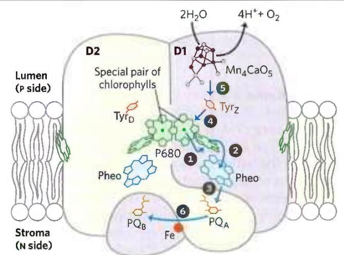  
FIGURE 20-14 Electron transfer through photosystem II of the cyanobacterium Synechococcus elongatus. The monomeric form of the core complex shown here has two major transmembrane proteins, D1 and D2, each with its set of electron carriers. Although the two subunits are nearly symmetrical, electron transfer occurs through only one of the two branches of electron carriers: that on the right (in D1). The arrows show the path of electron transfer from the $\mathrm{Mn_4CaO_5}$ ion cofactor of the oxygen-evolving complex to plastoquinone $\mathsf{PQ}_8$ . The photochemical events occur in the sequence indicated by the step numbers. The role of the Tyr residues and the detailed structure of the $\mathrm{Mn_4CaO_5}$ cofactor are discussed below (see Fig. 20-20b).

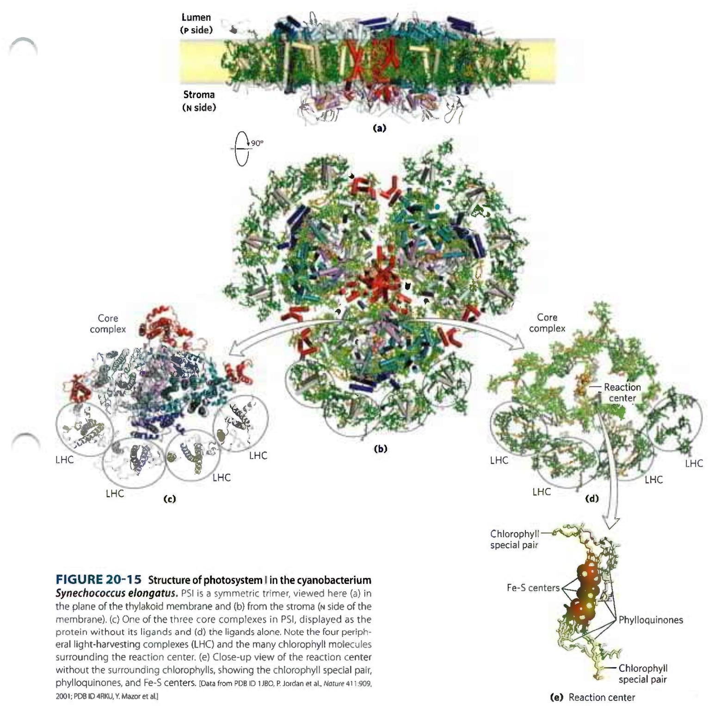

The photochemical events that follow the excitation of PSI at the reaction-center P700 (Fig. 20-16) are formally similar to those occurring in PSII. The excited reaction-center P700\* loses an electron to an acceptor, designated A $_{0}$ (a chlorophyll a molecule, functionally homologous to the pheophytin of PSII), creating A $_{0}^{-}$ and P700+. Again, excitation results in charge separation at the photochemical reaction center. P700+ is a strong oxidizing agent, which quickly acquires an electron from plastocyanin, a soluble Cu-containing electron-transfer protein. A $_{0}^{-}$ is an exceptionally strong reducing agent that passes its electron through a chain of carriers that leads to NADP $^{+}$ (Fig. 20-12, right side). Phylloquinone (Q $_{K}$ ) accepts the electron and passes it to an iron-sulfur protein through three Fe-S centers in PSI. From here, the electron moves to ferredoxin (Fd). Recall that ferredoxin contains a 2Fe-2S center (see Fig. 19-5) that undergoes one-electron oxidation and reduction reactions.

  
FIGURE 20-16 The path of electrons through PSI. The path of electrons (blue arrows) through PSI, viewed in the plane of the membrane. When the reaction-center P700, the special pair of chlorophylls, is excited by a photon or an exciton, its reduction potential is dramatically reduced, making it a good electron donor. P700 then passes an electron through a nearby chlorophyll (referred to as A $_{0}$ ) to phylloquinone (Q $_{K}$ ). Reduced Q $_{K}$ is reoxidized as it passes two electrons, one at a time, to an Fe-S center (F $_{X}$ ) near the n side of the membrane. From F $_{X}$ , electrons move through two more Fe-S centers (F $_{A}$ and F $_{B}$ ) to ferredoxin in the stroma. Ferredoxin then donates electrons to NADP $^{+}$ (not shown), reducing it to NADPH, one of the forms in which the energy of photons is trapped in chloroplasts.

The fourth electron carrier in the chain is the flavoprotein ferredoxin:NADP $^{+}$ reductase, which transfers electrons from reduced ferredoxin (Fd $_{red}$ ) to NADP $^{+}$ :

$$
2 \mathrm{Fd} _ {\mathrm{red}} + 2 \mathrm{H} ^ {+} + \mathrm{NADP} ^ {+} \longrightarrow 2 \mathrm{Fd} _ {\mathrm{ox}} + \mathrm{NADPH} + \mathrm{H} ^ {+}
$$

#### [EN] The Cytochrome $b_{6}f$ Complex Links Photosystems II and I, Conserving the Energy of Electron Transfer

Electrons temporarily held in plastoquinol as a result of the excitation of P680 in PSII are carried to P700 of PSI via the cytochrome $b_{6}f$ complex and the soluble protein plastocyanin (see Fig. 20-12, center). With a structure and role analogous with that of Complex III in mitochondria, the cytochrome $b_{6}f$ complex (Fig. 20-17) contains a b-type cytochrome with two heme groups (designated $b_{H}$ and $b_{L}$ ), a Rieske iron-sulfur protein ( $M_{r}$ 20,000), and cytochrome f (named for the Latin frons, “leaf”). Electrons flow through the cytochrome $b_{6}f$ complex from $PQ_{B}H_{2}$ to cytochrome f, then to plastocyanin, and finally to $P700^{+}$ , thereby reducing it.

Like Complex III of mitochondria, cytochrome $b_{\theta}f$ conveys electrons from a reduced quinone—a mobile, lipid-soluble carrier of two electrons (Q in mitochondria, PQ $_{B}$ in chloroplasts; P for plastoquinone)—to a water-soluble protein that carries one electron (cytochrome c in mitochondria, plastocyanin in chloroplasts) (Fig 20-17a). As in mitochondria, the function of this complex involves a Q cycle (Fig. 20-17b; see Fig. 19-11)

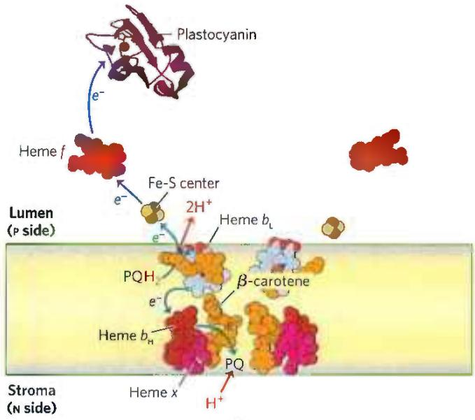  
(a)

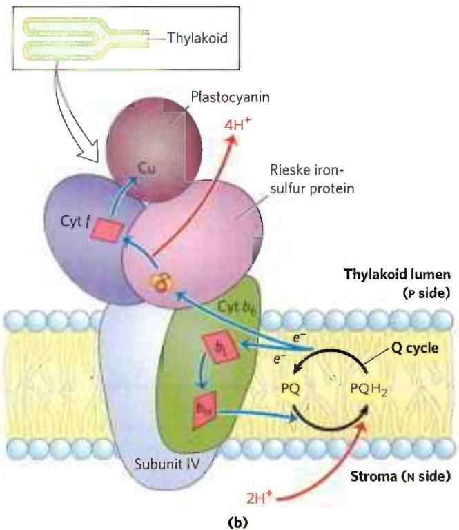  
FIGURE 20-17 Electron and proton flow through the cytochrome $b_{6}f$ complex. (a) In addition to the hemes of cytochrome $b$ (heme $b_{H}$ and $b_{L}$ ; also called heme $b_{N}$ and $b_{P}$ , respectively, because of their proximity to the N and P sides of the bilayer) and cytochrome $f$ (heme $f$ ), there is a fourth heme (heme $x$ ) near heme $b_{H}$ ; also present is a $\beta$ -carotene of unknown function. Two sites bind plastoquinone: the PQH $_{2}$ site near the P side of the bilayer, and the PQ site near the N side. The Fe-S center of the Rieske protein lies just outside the bilayer on the P side, and the heme $f$ site is on a protein domain that extends well into the thylakoid lumen. The electron path is shown for just one of the monomers, but both sets of carriers in the dimer carry electrons to plastocyanin. (b) Plastoquinol (PQH $_{2}$ ), formed in PSII, is oxidized by the cytochrome $b_{6}f$ complex in a series of steps like those of the Q cycle in Complex III of mitochondria (see Fig. 19-11). One electron from PQH $_{2}$ passes to the Fe-S center of the Rieske protein, the other to heme $b_{L}$ of cytochrome $b_{6}$ . The net effect is passage of electrons from PQH $_{2}$ to the soluble protein plastocyanin, which carries them to PSI. [Data from PDB ID IVF5, G. Kurisu et al., Science 302:1009, 2003; PDB ID 2Q5B, Y.S. Bukhman-DeRuyter et al.]

in which electrons pass, one at a time, from $PQ_{B}H_{2}$ to cytochrome $b_{6}$ . This cycle results in the pumping of protons across the membrane, from the stromal compartment to the thylakoid lumen. Up to four protons enter the lumen for each pair of electrons that passes through the cytochrome $b_{6}f$ complex. P3 The result is production of a proton gradient across the thylakoid membrane as electrons pass from PSII to PSI. Because the volume of the flattened thylakoid lumen is small, the influx of a small number of protons has a relatively large effect on lumenal pH. The measured difference in pH between the stroma (pH 8) and the thylakoid lumen (pH 5) represents a 1,000-fold difference in proton concentration—a powerful driving force for ATP synthesis.

#### [EN] Cyclic Electron Transfer Allows Variation in the Ratio of ATP/NADPH Synthesized

Cyclic electron flow between PSI and cytochrome $b_{6}f$ increases the production of ATP relative to NADPH. The linear path of electrons from water, through PSII, cytochrome $b_{6}f$ , and PSI to $NADP^{+}$ produces both a proton gradient, which is used to drive ATP synthesis, and NADPH, which is used in reductive biosynthetic processes (see Fig. 20-12). Some fraction of electrons passing from P700\* to ferredoxin do not continue to $NADP^{+}$ , but cycle back through plastoquinone and the cytochrome $b_{6}f$ complex to plastocyanin. Plastocyanin then donates electrons to P700. In this way, electrons are repeatedly recycled through the cytochrome $b_{6}f$ complex and the reaction center of PSI, each electron propelled around the cycle by the energy of one photon. Cyclic electron flow is not accompanied by net formation of NADPH or evolution of $O_{2}$ . However, it is accompanied by proton pumping by the cytochrome $b_{6}f$ complex and by phosphorylation of ADP to ATP, referred to as cyclic photophosphorylation. The overall equation for cyclic electron flow and photophosphorylation is simply

$$
\mathrm{ADP} + \mathrm {P_ {i}} \xrightarrow {\text {   light   }} \mathrm{ATP} + \mathrm {H_ {2} O}
$$

P5 By regulating the partitioning of electrons between NADP $^{+}$ reduction and cyclic photophosphorylation, a plant adjusts the ratio of ATP to NADPH produced in the light-dependent reactions to match its needs for these products in the CO $_{2}$ -assimilation reactions and other biosynthetic processes. As we shall see in Section 20.4, the CO $_{2}$ -assimilation reactions require ATP and NADPH in the ratio 3:2. This regulation of electron-transfer pathways is part of a short-term adaptation to changes in light color (wavelength) and quantity (intensity).

#### [EN] State Transitions Change the Distribution of LHCII between the Two Photosystems

Photosynthetic organisms are exposed to light of highly variable intensity and wavelength in the course of a day or a season, and, although they can alter their growth patterns somewhat, they cannot uproot themselves and move to optimize their light exposure. Instead, cellular mechanisms have evolved that allow plants to accommodate changing light conditions. The energy needed to excite PSI (P700) is less (light of longer wavelength, lower energy) than the energy needed to excite PSII (P680). If PSI and PSII were physically contiguous, excitons originating in the antenna system of PSII would migrate to the reaction center of PSI, leaving PSII chronically underexcited and thus interfering with the operation of the two-center system. This imbalance in the supply of excitons is prevented by physically separating the two photosystems in the thylakoid membrane (Fig. 20-18). PSII is located almost exclusively in the tightly appressed membrane stacks of granal thylakoids; its associated light-harvesting complex (LHCII) mediates the tight association of adjacent membranes in the grana. PSI and the ATP synthase complex are located almost exclusively in the nonappressed membranes of the stromal thylakoids, where they have access to the contents of the stroma, including ADP and NADP $^{+}$ . The cytochrome $b_{6}f$ complex is present primarily in the granal thylakoids.

P2 The association of LHCII with PSI and PSII depends on light intensity and wavelength, which can change in the short term and lead to state transitions in the chloroplast. In state 1, LHCII, PSII, and PSI are poised to maximize the capture of light energy. A critical Thr residue in LHCII is unphosphorylated, and LHCII associates with PSII. Under conditions of intense or blue light, which favor absorption by PSII, that photosystem reduces plastoquinone to plastoquinol (PQH₂) faster than PSI can oxidize it. The resulting accumulation of PQH₂ activates a protein kinase that triggers the transition to state 2 by phosphorylating a Thr residue on LHCII (Fig. 20-19). Phosphorylation weakens the interaction of LHCII with the appressed membrane and with PSII; some LHCII dissociates and moves to the stromal thylakoids. Here it captures photons (excitons) for PSI, speeding the oxidation of PQH₂ and reversing the imbalance between electron flow in PSI and PSII. In less intense light (in the shade, with more red light), PSI oxidizes PQH₂ faster than PSII can make it, and the resulting increase in [PQ] triggers dephosphorylation of LHCII, reversing the effect of phosphorylation. The state transition in LHCII localization and the transition from cyclic to linear electron transfer are coordinately regulated: the path of electrons is primarily linear in state 1 and primarily cyclic in state 2.

When light is so intense that the combined activity of PSII and PSI cannot synthesize ATP and NADPH fast enough to keep up with the supply of photons, carotenoids in LHCII absorb the excitons and very rapidly quench the excited chlorophyll before it can create damaging reactive oxygen species (ROS). The trigger for switching from an efficient light-harvesting state to an energy-dissipating state is the lowering of pH in the lumenal space, but the detailed mechanism for this transition is not yet known.

(a)  

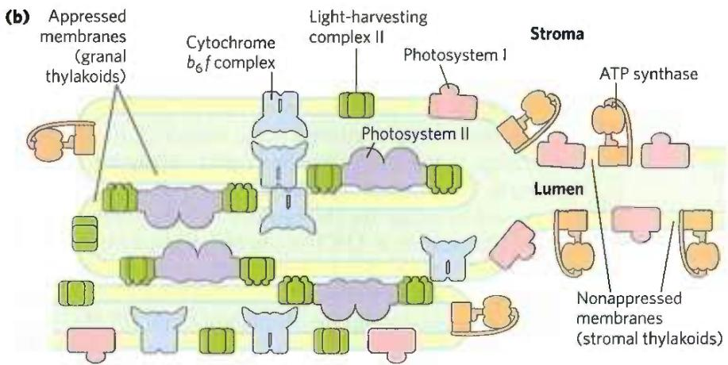  
FIGURE 20-18 Localization of PSI and PSII in thylakoid membranes. (a) Structures of the complexes and soluble proteins of the photosynthetic apparatus of a vascular plant or alga, drawn to the same scale. The bovine ATP synthase is shown. (b) Light-harvesting complex LHCII and ATP synthase are located both in appressed regions of the thylakoid membrane (granal thylakoids, in which several membranes are in contact) and in nonappressed regions (stromal thylakoids), and have ready access to ADP and $\mathrm{NADP^{+}}$ in the stroma. PSII is present almost

  
FIGURE 20-19 Electron transfer in PSI and PSII is balanced through state transitions. In granal thylakoids, a hydrophobic domain of LHCII in one membrane inserts into the neighboring membrane and closely appresses the two (state 1). Accumulation of plastoquinol (not shown) stimulates a protein kinase that phosphorylates a Thr residue in the hydrophobic domain of LHCII, which reduces its affinity for the neighboring membrane and converts appressed granal thylakoids to nonappressed stromal thylakoids (state 2). A specific protein phosphatase reverses this regulatory phosphorylation when the $\left[\mathrm{PQ}\right] / \left[\mathrm{PQH}_2\right]$ ratio increases.  
exclusively in the appressed granal regions, and PSI almost exclusively in nonappressed stromal regions. LHCII is the "adhesive" that holds appressed thylakoid membranes together (see Fig. 20-19). [(a) Data from PSII: PDB ID 3WU2, Y. Umena et al., Nature 473:55, 2011; cyt bef complex: PDB ID 2E74, E. Yamashita et al., J. Mol. Biol. 370:39, 2007; plastocyanin: PDB ID 1AG6, Y. Xue et al., Protein Sci. 7:2099, 1998; PSI: PDB ID 4RKU, Y. Mazor et al.; ferredoxin: PDB ID 1A70, C. Binda et al., Acta Crystallogr. D Biol. Crystallogr. 54:1353, 1998; ferredoxin:NADP reductase: PDB ID 1QG0, Z. Deng et al., Nat. Struct. Biol. 6:847, 1999; ATP synthase: PDB ID 5ARA, A. Zhou et al., eLife 4:e10180, 2015.]

#### [EN] Water Is Split at the Oxygen-Evolving Center

The ultimate source of the electrons passed to NADPH in plant (oxygenic) photosynthesis is water. Having given up an electron to pheophytin, P680 $^{+}$ (of PSII) must acquire an electron to return to its ground state in preparation for capture of another photon. In principle, the required electron might come from any number of organic or inorganic compounds. Photosynthetic bacteria use a variety of electron donors for this purpose—acetate, succinate, malate, or sulfide—depending on what is available in a particular ecological niche. About 2.5 billion years ago, evolution of primitive photosynthetic bacteria (progenitors of the modern cyanobacteria) produced a photosystem capable of taking electrons from a donor that is always available: water. Two water molecules are oxidized, yielding four electrons, four protons, and molecular oxygen:

$$
2 \mathrm{H} _ {2} \mathrm{O} \longrightarrow 4 \mathrm{H} ^ {+} + 4 e ^ {-} + \mathrm{O} _ {2}
$$

(a)  

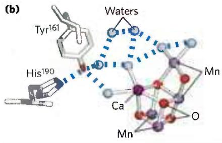  
FIGURE 20-20 Water-splitting activity of the oxygen-evolving center. (a) The process that produces a four-electron oxidizing agent—a multinuclear center with four Mn ions, one Ca ion, and five oxygen atoms—in the oxygen-evolving center of PSII. The sequential absorption of four photons (excitons), each absorption causing the loss of one electron from the $Mn_{4}CaO_{5}$ cofactor, produces an oxidizing agent that can remove four electrons from two molecules of water, producing $O_{2}$ . The electrons lost from the $Mn_{4}CaO_{5}$ cofactor pass one at a time to an oxidized Tyr residue in a PSII protein, then to $P680^{+}$ . (b) The chair-shaped metallic center of the oxygen-evolving center. Tyr $^{161}$ , known to participate in the oxidation of water, is seen hydrogen-bonded to a network of water molecules, including several directly in contact with the $Mn_{4}CaO_{5}$ cofactor. This is the site of one of the most important reactions in the biosphere. [(b) Data from PDB ID 3WU2, Y. Umena et al., Nature 473:55, 2011.]

A single photon of visible light does not have enough energy to break the bonds in water; four photons are required in this photolytic cleavage reaction.

P3 The four electrons abstracted from water do not pass directly to P680+, which can accept only one electron at a time. Instead, a remarkable molecular device, the oxygen-evolving center, passes four electrons one at a time to P680+ (Fig. 20-20a). The immediate electron donor to P680+ is a Tyr residue (sometimes designated Z or TyrZ) in subunit D1 of the PSII reaction center. The Tyr residue loses both a proton and an electron, generating the electrically neutral Tyr free radical, \*Tyr:

$$
4 \mathrm{P} 6 8 0 ^ {+} + 4 \mathrm{Tyr} \longrightarrow 4 \mathrm{P} 6 8 0 + 4 ^ {\bullet} \mathrm{Tyr}\tag{20-2}
$$

The Tyr radical regains its missing electron and proton by oxidizing a cofactor of four manganese ions and one calcium ion in the oxygen-evolving center. With each single-electron transfer, the $Mn_{4}CaO_{5}$ cofactor becomes more oxidized; four single-electron transfers, each corresponding to the absorption of one photon, produce a charge of 4+ on the $Mn_{4}CaO_{5}$ cofactor (Fig. 20-20a):

$$
4 ^ {\bullet} \mathrm{Tyr} + [ \mathrm{Mn} _ {4} \mathrm{CaO} _ {5} ] ^ {0} \longrightarrow 4 \mathrm{Tyr} + [ \mathrm{Mn} _ {4} \mathrm{CaO} _ {5} ] ^ {4 +}\tag{20-3}
$$

In this state, the $Mn_{4}CaO_{5}$ cofactor can take four electrons from a pair of water molecules, releasing four $H^{+}$ and $O_{2}$ :

$$
[ \mathrm{Mn} _ {4} \mathrm{CaO} _ {5} ] ^ {4 +} + 2 \mathrm{H} _ {2} \mathrm{O} \longrightarrow
$$

$$
[ \mathrm{Mn} _ {4} \mathrm{CaO} _ {5} ] ^ {0} + 4 \mathrm{H} ^ {+} + \mathrm{O} _ {2}\tag{20-4}
$$

P4 Because the four protons produced in this reaction are released into the thylakoid lumen, the oxygen-evolving center acts as a proton pump, driven by electron transfer.

We saw in Equation 20-1 that the overall reaction initiated by light in PSII is

$$
\begin{array}{r l} 4 \mathrm{P680} + 4 \mathrm{H} ^ {+} + 2 \mathrm{PQ} _ {\mathrm{B}} + 4 \text {photons} & \longrightarrow \\ & 4 \mathrm{P680} ^ {+} + 2 \mathrm{PQ} _ {\mathrm{B}} \mathrm{H} _ {2} \end{array}
$$

The sum of Equations 20-1 through 20-4 is

$$
2 \mathrm{H} _ {2} \mathrm{O} + 2 \mathrm{PQ} _ {\mathrm{B}} + 4 \text { photons } \longrightarrow \mathrm{O} _ {2} + 2 \mathrm{PQ} _ {\mathrm{B}} \mathrm{H} _ {2}\tag{20-5}
$$

P3 The oxygen-evolving cofactor takes the shape of a chair (Fig. 20-20b). The seat and legs of the chair are made up of three Mn ions, one Ca ion, and four O atoms; the fourth Mn and another O form the back of the chair. Four water molecules are also seen in the crystal structure, two associated with one of the Mn ions, the other two with the Ca ion. It may be one (or more) of these water molecules that undergoes oxidation to produce $\mathrm{O}_2$ . This metal cofactor is associated with several peripheral membrane proteins on the lumenal side of the thylakoid membrane that are believed to stabilize the cofactor. The Tyr residue designated Z, through which electrons move between water and the PSII reaction center, is connected with a network of hydrogen-bonded water molecules that includes the four associated with the $\mathrm{Mn_4CaO_5}$ cofactor. The detailed mechanism of water oxidation by the $\mathrm{Mn_4CaO_5}$ cofactor is not known but is under intense investigation. The reaction is central to life on Earth and may involve novel bioinorganic chemistry. Determination of the structure of the polymetallic center has inspired several reasonable and testable hypotheses. Stay tuned.

#### [EN] SUMMARY 20.2 Photochemical Reaction Centers

Bacteria have a single photochemical reaction center. Purple bacteria have a type II photosystem where electrons from an excited special pair of chlorophyll molecules (P870\*) flow through pheophytin, quinones, and a proton-pumping cytochrome complex, back to the special pair of chlorophylls. Green sulfur bacteria have a type I photosystem that can send electrons through a similar cyclic path or through a linear path that reduces $\mathrm{NAD^{+}}$ to NADH.

In cyanobacteria, algae, and plants, two different reaction centers are arranged in tandem. In the reaction center of PSII, when the special pair of chlorophylls (P680) is excited by light, it passes electrons to plastoquinone, and the electrons lost from P680 are replaced by electrons from $\mathrm{H}_2\mathrm{O}$ . PSI passes electrons from the excited special pair $(\mathrm{P700}^*)$ in its reaction center through a series of carriers to ferredoxin, which then reduces $\mathrm{NADP}^+$ to NADPH.

Electron flow from either photosystem through the cytochrome $b_{6}f$ complex drives protons across the thylakoid membrane, creating a proton-motive force that provides the energy for ATP synthesis by an ATP synthase.

■ Linear electron transfer through the photosystems produces NADPH and ATP. Cyclic electron transfer produces only ATP and allows variability in the proportions of NADPH and ATP formed.

The distribution of PSI and PSII between the granal and stromal thylakoids can change and is indirectly controlled by light intensity, optimizing the distribution of excitons between PSI and PSII for efficient energy capture.

The oxygen-evolving center, which contains a $Mn_{4}CaO_{5}$ cofactor, uses energy from light to split water, producing $O_{2}$ . For each $O_{2}$ formed at the oxygen-evolving center, four protons are pumped into the thylakoid lumen, contributing to the proton motive force.

<!-- EN-END 20.2 -->

## 四、光驱动的 ATP 合成: 光合磷酸化

植物中两个光系统串联起来的活动把电子从水传送到 $NADP^{+}$ ，把部分吸收来的光能转化为 NADPH（图 23-18 右侧）。同时，跨类囊体膜泵送质子，能量转化为电化学势。这一节我们讨论质子梯度驱动的 ATP 合成，ATP 是光依赖反应的另一能量转化产物。

1954 年 D. Arnon 等人发现照光的菠菜叶绿体在光合电子传递过程中由 ADP 和 Pi 形成 ATP。此后又从 A. Frenkel 的工作得到支持，他们在光合细菌的、称载色体（chromatophore）的含色素膜性结构中观察到光诱导的 ATP 合成。因此得出结论：被这些生物的光系统捕获的光能有一部分能量转化为 ATP 的磷酸键能。这一光驱动的 ATP 合成过程称为光合磷酸化（photophosphorylation），以区别于呼吸性线粒体中的氧化磷酸化。

## （一）质子梯度把电子流和磷酸化偶联起来

前面我们讨论了光合电子传递导致 NADPH(还原力)的产生，NADPH 也是富能的化合物，光合系统捕获的能量一部分就贮存在这里。电子传递的另一结果是把质子从基质跨膜泵送到类囊体腔中，形成跨膜质子梯度。叶绿体中光合电子传递和光合磷酸化的一些性质表明质子梯度所起的作用与线粒体氧化磷酸化中的相同。① 反应中心、电子载体和 ATP 形成酶都位于质子不透性膜——类囊体膜——中，膜必需完整才能支持光合磷酸化；② 光合磷酸化可被促进质子通过类囊体膜的试剂而与电子流解偶联；③ 光合磷酸化可被杀黑星霉素(venturicidin)和类似的试剂所阻断，这些试剂是抑制线粒体的 ATP 合酶由 ADP 和 Pi 合成 ATP 的(第 19 章)；④ ATP 的合成是由 $CF_{0}CF_{1}$ 复合体催化的。

1966 年 A. Jagendorf 证明了跨类囊体膜(类囊体外是碱性的)的 pH 梯度是合成 ATP 的驱动力。他的早期观察提供了某些最重要的证据, 支持 Mitchell 的化学渗透假说。Jagendorf 在暗处 pH 4 的缓冲液中温育叶绿体, 温育期间缓冲液慢慢渗入类囊体腔内, 使腔内 pH 降低; 再向叶绿体的暗悬浮液加入 ADP 和 Pi, 并立即将外介质的 pH 升高到 8, 瞬间创造一个大的跨膜 pH 梯度。随质子从类囊体腔向外移动到介质, 则由 ADP 和 Pi 生成 ATP。因为 ATP 形成是在暗处发生的, 并无光能输入, 所以这一实验说明跨膜质子梯度是一种高能态, 它也像线粒体中的氧化磷酸化能够介导能量转导, 把电子传递转化为 ATP 的化学能。

图23-23标明，质子跨膜转移(translocation)可以在几个部位发生：一是在放氧复合体，这是由于水光解的结果；二是在细胞色素 $b_{6}f$ 复合体，当电子通过质体醌库和Q循环时由氧化还原反应引起； $\mathrm{NADP^{+}}$ 还原用去的质子也是从类囊体膜的基质侧取走的。目前的看法是每当1个电子从 $\mathrm{H}_2\mathrm{O}$ 流到 $\mathrm{NADP^{+}}$ ，则3个质子被转移。因为1个电子传递需要2个光子，一个落在PSII，一个落在PSI。平均每一光量子引起1.5个质子转移到类囊体腔内。

## （二）光合磷酸化的机制——化学渗透

像线粒体膜一样,类囊体膜的组织也是不对称的,有“正反面”之别。它对 $H^{+}$ 离子的被动扩散是一道屏障。因此光合电子传递形成了跨类囊体膜的质子梯度，在类囊体膜内侧（腔内）相对基质来说积累了 $\mathrm{H^{+}}$ 离子。光合磷酸化跟氧化磷酸化一样，也是通过化学渗透机制（chemiosmotic mechanism）进行的。贮存在质子梯度中的能量（ $\Delta G$ ）称为电化学势（electrochemical potential）或电化学梯度。它由两项组成（见第14章和第19章）：一项是膜电位能（ $\Delta \psi$ 或 $V_{\mathrm{m}}$ ），一项是化学势能（ $\Delta \mathrm{pH}$ ）。膜电位（电荷梯度）是由于质子跨膜转移而无相应的反离子伴随的电荷分离造成；化学势即 $\mathrm{pH}$ 梯度是由于膜分隔的两个区域内质子浓度差（ $\Delta \mathrm{pH}$ ）引起：

  
图23-23 在类囊体中质子流和电子流的线路（光合磷酸化机制）

$$
\Delta G = F \Delta \psi + 2. 3 R T \Delta \mathrm{pH}
$$

式中，F 是 Faraday 常数 $(96\ 480\ \mathrm{J}\cdot\mathrm{V}^{-1}\cdot\mathrm{mol}^{-1})$ ，R 是气体常数 $(8.315\ \mathrm{J}\cdot\mathrm{K}^{-1}\cdot\mathrm{mol}^{-1})$ T 是绝对温度 $(\mathrm{K}=+273^{\circ}\mathrm{C})$ 。质子梯度的电化学势也可用质子动势来表示。质子动力（proton-motive force； $\Delta p$ ）定义为自由能变化 $(\Delta G)$ 除以 Faraday 常数 $(96.5\ \mathrm{J}\cdot\mathrm{V}^{-1}\cdot\mathrm{mol}^{-1})$ ：

$$
\Delta p = \Delta G / F = \Delta \psi + (2. 3 R T / F) \Delta \mathrm{pH}
$$

在叶绿体中 $\Delta pH$ 是主要项；因为类囊体膜对阴离子是可通透的，反离子移动损失了大部分电势能， $\Delta\psi$ 一般仅为 -50 mV 左右；质子浓度差相当于 3 个 pH 单位。这种情况与线粒体相反，后者 $\Delta\psi$ 对质子动力的贡献比 pH 梯度大。在 25℃ 叶绿体中每 mol 质子贮存在 pH 梯度中的能量（计算略去 $\Delta\psi$ 项）：

$$
\Delta G = - 1 7 \mathrm{kJ/mol} \text {   或   } \Delta p = - 1 7 0 \mathrm{mV}
$$

因此 12 mol 质子通过类囊体膜相当于贮存约 200 kJ 的能量, 此能量足以驱动几个 mol ATP ( $\Delta G^{\ominus'} = 30.5$ kJ/mol) 的合成。实验测得, 每放出 1 个 $O_{2}$ 合成约 3 个 ATP。

## （三）循环和非循环光合磷酸化

光合电子传递能够以两种方式进行,但它们都导致跨膜质子动势的形成,因此都与 ATP 合成相偶联,并且它们的光合磷酸化机制也是相同的。这两种方式,一种称为循环光合磷酸化,另一种称为非循环光合磷酸化。

从 PSⅡ经细胞色素 $b_{6}f$ 复合体，再经 PS I 到达 NADP $^{+}$ 的线型电子传递有时称为非循环电子流（noncyclic electronic flow），以区别于循环电子流，后者以不同程度进行，这主要取决于光条件。非循环途径产生质子梯度和 NADPH；质子梯度用于驱动 ATP 合成，NADPH 用于还原性的生物合成过程。循环电子流仅涉及 PS I，不涉及 PS II（图 23-17）。从 P700 $^{+}$ 到铁氧还蛋白的电子传递不延续到 NADP $^{+}$ ，但经由细胞色素 $b_{6}f$ 复合体回到质体蓝素。（此电子途径相当于绿色硫细菌中的，见于图 23-12B。）然后质体蓝素把电子还给 P700 $^{+}$ 。可见循环电子流中 P700 丢失电子造成的“电子空穴”不是由衍生自 H $_{2}$ O 经 PS II 传递过来的电子填补，而是 P700 自身被光激发的电子沿循环途径最终返回到 P700 $^{+}$ 的。P700 再把电子传递给铁硫中心（Fe-S），启动新的一轮循环。按此循环途径（图 23-17 中有虚线箭头参与的循环）电子经由细胞色素 $b_{6}f$ 复合体在 PS I 反应中心（P700）和铁硫中心（Fe-S）之间反复地再循环，每一电子由一个光子的能量推动循环。循环电子流并无 NADPH 的产生和 O $_{2}$ 的释放，因为它不涉及 PS II，但它伴随着细胞色素 $b_{6}f$ 复合体（经 Q 循环）的质子泵送和 ADP 的磷酸化（生成 ATP），此过程被称为循环光合磷酸化（cyclic photophosphorylation）。循环电子流和光合磷酸化的总方程可简单地表示为：

$$
\mathrm{ADP} + \mathrm{Pi} \xrightarrow {\text {光}} \mathrm{ATP} + \mathrm{H} _ {2} \mathrm{O}
$$

循环光合磷酸化的最大速率不及非循环光合磷酸化的 5%。植物通过调节参与 NADP $^{+}$ 还原和循环光合磷酸化的电子分配,调整光反应中产生的 ATP 和 NADPH 之间的比例,以适应碳同化反应和其他生物合成中对这些产物的需要。在下面“暗反应”一节中将看到碳同化反应(CO $_{2}$ 固定)所需的 ATP 和 NADPH 的摩尔比为 3:2。

非循环光合磷酸化（noncyclic photophosphorylation）中有 $O_{2}$ 的释放和 $NADP^{+}$ 的还原，整个过程图解于图 23-21。在 PSⅡ和 PS I 处被光子激活的电子从 $H_{2}O$ 传递到 $NADP^{+}$ ，同时建立了质子动势 $(3H^{+}/e^{-})$ ，驱动 ATP 合成。驱动 4 个电子从 $H_{2}O$ 到 NADPH，至少需要 8 个光子（每个反应中心每转移一个电子需要 1 个光子）。8 个可见光光子的能量足以合成 3 个分子的 ATP 甚至还有余。ATP 的合成不是植物光合作用中唯一的能量转换反应，电子传递最后一步形成的 NADPH 也是富能的。非循环光合磷酸化的总方程是：

$$
2 \mathrm{H} _ {2} \mathrm{O} + 8 h \nu + 2 \mathrm{NADP} ^ {+} + \sim 3 \mathrm{ADP} ^ {+} + \sim 3 \mathrm{Pi} \rightarrow \mathrm{O} _ {2} + \sim 3 \mathrm{ATP} + 2 \mathrm{NADPH} + 2 \mathrm{H} ^ {+}\tag{23-6}
$$

## （四）叶绿体的 ATP 合酶与线粒体的相似

负责叶绿体中 ATP 合成的酶是一个大的复合体,含有两个功能成分, $CF_{o}$ 和 $CF_{1}$ (C 表示它位于叶绿体)。 $CF_{o}$ 是一个跨膜的质子孔道,由几个内在膜蛋白组成, $CF_{o}$ 与线粒体的 $F_{o}$ 同源。 $CF_{1}$ 是一个外周膜蛋白复合体,在亚基组成、结构和功能方面都很像线粒体的 $F_{1}$ 。

叶绿体切片的显微镜观察表明 ATP 合酶复合体像在类囊体外表面[基质侧或 N 侧]的球状物突起；这些复合体相当于突出在线粒体内膜的内表面[基质(matrix)侧或 N 侧]的 ATP 合酶复合体。因此，ATP 合酶的取向和质子泵的方向之间的关系在叶绿体和线粒体中是一样的。在两者场合，ATP 合酶的 $F_{1}$ 部分都定位在膜的更碱性一侧(N 侧)，质子顺它的浓度梯度通过此膜；质子流的方向与 $F_{1}$ 的关系两者也是相同的：从 P 侧到 N 侧。在细菌如 E. coli 中，ATP 合酶定位在内膜(质膜)的细胞溶胶侧，质子流方向是从细胞壁和内膜之间的膜间间隙(P 侧)到细胞溶胶(N 侧)。

叶绿体 ATP 合酶的机制也是与线粒体合酶基本相同；在酶的表面 ADP 和 Pi 容易缩合成 ATP，但释放酶结合的 ATP 要求质子动力。旋转催化相继地使 ATP 合酶的 3 个 β 亚基的各亚基都参与 ATP 合成、ATP 释放和 ADP + Pi 结合（见第 19 章）。

## （五）盐细菌的光合磷酸化

盐细菌或称嗜盐菌(Halobacterium salinarum)是一种现代的古细菌,它捕获太阳能的方式与前面讨论过的光合机制很不相同。这种细菌生活在盐水湖(例如死海、美国的大盐湖)里。这里盐的浓度超过4 mol/L,高盐浓度是长期蒸发失水的结果。事实上嗜盐菌不能生活在低于3 mol/L的NaCl溶液中。这些细菌是需氧的,正常情况下利用 $O_{2}$ 氧化有机燃料分子。然而在盐水湖中 $O_{2}$ 的溶解度很低,有时氧化性代谢需要以日光作为另一能源加以补充。

盐细菌的质膜含有吸光色素称紫膜质(见图3-4)。此色素以视黄醛(见第13章)作为集光的辅基。当细胞被照光时，结合在紫膜质上的全反式视黄醛吸收一个光子，并发生光异构化（photoisomerization），变成13-顺式视黄醛，使紫膜质发生构象改变。伴随全反式视黄醛的复原质子跨膜泵送到外介质。紫膜质是已知最简单的光驱动质子泵，它的三维结构在暗处和照光后不同。这表明当构象发生变化时，一个协同的系列质子“跳跃（hop）”能够有效地使一个质子跨膜转移。辅基视黄醛是通过一个西佛碱（Schiff's base）与紫膜质的一个Lys残基的 $\varepsilon$ -氨基相连而被结合的。在暗处西佛碱的N原子被质子化，但在光下视黄醛的光异构化降低此基团的 $\mathrm{pK_a}$ ，把质子释放给邻近的Asp残基的 $\beta -\mathrm{COO}^{-}$ ，引发一个系列质子跳跃，最后质子在膜外表面被释放。

形成的电化学势驱动质子通过膜的 ATP 合酶复合体(与线粒体和叶绿体的相似)返回胞内。因此, 当 $O_{2}$ 受限制时嗜盐菌可利用光来补充氧化磷酸化合成 ATP 之不足。但盐细菌不放 $O_{2}$ , 也不进行 $NADP^{+}$ 的还原; 因此, 它的光能转换机构比蓝细菌或高等植物简单得多。被这个简单蛋白质利用的质子泵机制是许多其他更复杂的离子泵的原型。

## （六）光合作用中能量的利用效率

从前面非循环光合磷酸化的总方程(式23-6)可以看到光合量子产额(每mol光子输入形成的产物量)相当于每吸收8 mol光量子产生1 mol O₂, 2 mol NADPH和\~3(或2 $\frac{2}{3}$ ) mol ATP。CO₂固定成己糖的总化学计量方程是：

$$
1 2 \mathrm{NADPH} + 1 2 \mathrm{H} ^ {+} + 1 8 \mathrm{ATP} + 6 \mathrm{CO} _ {2} + 1 2 \mathrm{H} _ {2} \mathrm{O} \rightarrow \mathrm{C} _ {6} \mathrm{H} _ {1 2} \mathrm{O} _ {6} + 1 2 \mathrm{NADP} ^ {+} + 1 8 \mathrm{ADP} + 1 8 \mathrm{Pi}\tag{23-7}
$$

也即合成 1 mol 己糖需要 12 mol NADPH 和 18 mol ATP。为产生这些 NADPH 和 ATP 需要 48 mol 光子，如果按每 8 mol 光子产生 2 mol ATP 的比率计算，尚需产生额外 2 mol ATP，即再消耗 6 mol 光子。这样合成 2 mol 己糖需要 54 Einstein 光能。按真核光系统所吸收的最低能量光（700 nm 波长）计算，1 Einstein 约为 170 kJ, 54 Einstein = 9 180 kJ。根据细胞呼吸逆转，从 $CO_{2}$ 和 $H_{2}O$ 合成己糖的标准自由能变化 $\Delta G^{\ominus}$ 为 +2 870 kJ。因此可算得光合电子传递过程中能量利用效率为（2 870/9 180）×100% = 31%，即光系统吸收的能量 31% 转化为贮存的化学能。

<!-- EN-BEGIN 20.3 -->

### 【英文对应 20.3】Evolution of a Universal Mechanism for ATP Synthesis

> 来源：Lehninger Principles of Biochemistry（书籍/02_生物化学原理） 第20章 Photosynthesis and Carbohydrate Synthesis in Plants，§20.3。对应本章“四、光驱动的 ATP 合成: 光合磷酸化”。

The combined activities of the two plant photosystems move electrons from water to $NADP^{+}$ , conserving some of the energy of absorbed light as NADPH (Fig. 20-12). Simultaneously, protons are pumped across the thylakoid membrane and energy is conserved as an electrochemical potential. We turn now to the process by which this proton gradient drives the synthesis of ATP, the other energy-conserving product of the light-dependent reactions.

#### [EN] A Proton Gradient Couples Electron Flow and Phosphorylation

P4 Although the energy source and electron carriers in photophosphorylation in chloroplasts differ from those of oxidative phosphorylation in mitochondria, they use essentially the same mechanism to capture the energy of the proton gradient. Electron-transferring molecules in the chain of carriers connecting PSII and PSI are oriented asymmetrically in the thylakoid membrane, so photoinduced electron flow results in the net movement of protons across the membrane, from the stromal side to the thylakoid lumen (Fig. 20-21).

  
FIGURE 20-21 Proton and electron circuits during photophosphorylation. In the linear electron pathway (blue arrows), electrons move from $\mathsf{H}_2\mathsf{O}$ through PSII, through the intermediate chain of carriers of the cytochrome $b_{6}f$ complex, through PSI, and finally to $\mathrm{NADP^{+}}$ . In the cyclic pathway, electrons move from PSI back to plastoquinone and cytochrome $b_{6}f$ . Protons (red arrows) are pumped into the thylakoid lumen by the flow of electrons through cytochrome $b_{6}f$ , and they reenter the stroma through proton channels formed by $\mathrm{CF_0}$ of ATP synthase. The $\mathrm{CF_1}$ subunit catalyzes synthesis of ATP.

#### [EN] The Approximate Stoichiometry of Photophosphorylation Has Been Established

As electrons move from water to NADP $^{+}$ in chloroplasts, about 12 protons move from the stroma into the thylakoid lumen per 4 electrons passed (that is, per O $_{2}$ formed). Of these protons, 4 are moved by the oxygen-evolving center, and up to 8 are moved by the cytochrome $b_{6}f$ complex. The measurable result is a 1,000-fold difference in H $^{+}$ concentration across the thylakoid membrane ( $\Delta pH = 3$ ). Recall that the energy stored in a proton gradient (the electrochemical potential) has two components: a proton concentration difference ( $\Delta pH$ ) and an electrical potential ( $\Delta \psi$ ) due to charge separation. In chloroplasts, $\Delta pH$ is the dominant component; counterion movement apparently dissipates most of the electrical potential. In illuminated chloroplasts, the energy stored in the proton gradient per mole of protons is

$$
\Delta G = 2. 3 R T \Delta \mathrm{pH} + Z F \Delta \psi = - 1 7 \mathrm{kJ/mol}
$$

so the movement of 12 mol of protons across the thylakoid membrane represents conservation of about 200 kJ of energy—enough energy to drive the synthesis of several moles of ATP ( $\Delta G^{\circ}=30.5$ kJ/mol). Experimental measurements yield values of about 3 ATP per $O_{2}$ produced.

At least 8 photons must be absorbed to drive 4 electrons from 2 H $_{2}$ O to 2 NADPH (one photon per electron at each reaction center). The energy in 8 photons of visible light is more than enough for the synthesis of three molecules of ATP.

ATP synthesis is not the only energy-conserving reaction of photosynthesis in plants; the NADPH formed in the final electron transfer is also energetically rich. The overall equation for this linear photophosphorylation is

$$
\begin{array}{r l} 2 \mathrm{H} _ {2} \mathrm{O} + 8 \text {   photons } + 2 \mathrm{NADP} ^ {+} + \sim 3 \mathrm{ADP} ^ {+} + \sim 3 \mathrm{P} _ {\mathrm{i}} & \longrightarrow \\ \mathrm{O} _ {2} + \sim 3 \mathrm{ATP} + 2 \mathrm{NADPH} & \end{array}\tag{20-6}
$$

#### [EN] The ATP Synthase Structure and Mechanism Are Nearly Universal

The enzyme responsible for ATP synthesis in chloroplasts is a large complex with two functional components, $CF_{0}$ and $CF_{1}$ (C denoting its location in chloroplasts). $CF_{0}$ is a transmembrane proton pore composed of several integral membrane proteins and is homologous to mitochondrial $F_{0}$ . $CF_{1}$ is a peripheral membrane protein complex very similar in subunit composition, structure, and function to mitochondrial $F_{1}$ .

Electron microscopy of sectioned chloroplasts shows ATP synthase complexes as projections on the outside (stromal, or N) surface of thylakoid membranes; these complexes correspond to the ATP synthase complexes that project on the inside (matrix, or N) surface of the inner mitochondrial membrane. Thus, the relationship between the orientation of the ATP synthase and the direction of proton pumping is the same in chloroplasts and mitochondria. In both cases, the $F_{1}$ portion of ATP synthase is located on the more alkaline (N) side of the membrane through which protons flow down their concentration gradient; the direction of proton flow relative to $F_{1}$ is the same in both cases: P to N (Fig. 20-22).

P4 The mechanism of chloroplast ATP synthase is essentially identical to that of its mitochondrial analog; ADP and $P_{i}$ readily condense to form ATP on the enzyme surface, and the release of this enzyme-bound

  
FIGURE 20-22 Orientation of ATP synthase is fixed relative to the proton gradient. Superficially, the direction of proton pumping in chloroplasts may seem to be opposite to that in mitochondria and bacteria. In mitochondria and bacteria, protons are pumped out of the organelle or cell, and $F_{1}$ is on the inside of the membrane; in chloroplasts, protons are pumped into the thylakoid lumen, and $CF_{1}$ is on the outside of the thylakoid membrane. However, exactly the same mechanism of energy conversion (from proton gradient to ATP) occurs in all three cases. ATP is synthesized in the matrix of mitochondria, the stroma of chloroplasts, and the cytosol of bacteria.

ATP requires a proton-motive force. Rotational catalysis sequentially engages each of the three $\beta$ subunits of the ATP synthase in ATP synthesis, ATP release, and ADP + P $_{i}$ binding (see Figs. 19-26 and 19-27).

The appearance of oxygenic photosynthesis on Earth about 2.5 billion years ago was a crucial event in the evolution of the biosphere. Before that, Earth's atmosphere was composed of methane, $CO_{2}$ , and $N_{2}$ . The planet was essentially devoid of molecular oxygen and lacked the ozone layer that protects organisms from solar UV radiation. Oxygenic photosynthesis made available a nearly limitless supply of reducing agent ( $H_{2}O$ ) to drive the production of organic compounds by reductive biosynthetic reactions. And mechanisms evolved that allowed organisms to use $O_{2}$ as a terminal electron acceptor in highly energetic electron transfers from organic substrates, employing the energy of oxidation to support metabolism. The complex photosynthetic apparatus of a modern vascular plant is the culmination of a series of evolutionary events, the most recent of which was the acquisition by eukaryotic cells of a cyanobacterial endosymbiont.

The chloroplasts of modern organisms share several properties with mitochondria and originated by the same mechanism that gave rise to mitochondria: endosymbiosis. Like mitochondria, chloroplasts contain their own DNA and protein-synthesizing machinery. Some of the polypeptides of chloroplast proteins are encoded by chloroplast genes and synthesized in the chloroplast; others are encoded by nuclear genes, synthesized outside the chloroplast, and imported (Chapter 27). When plant cells grow and divide, chloroplasts give rise to new chloroplasts by division, during which their DNA is replicated and divided between daughter chloroplasts. The machinery and mechanisms for light capture, electron flow, and ATP synthesis in modern cyanobacteria are similar in many respects to those in plant chloroplasts. These observations led to the now widely accepted hypothesis that the evolutionary progenitors of modern plant cells were primitive eukaryotes that engulfed photosynthetic cyanobacteria and established stable endosymbiotic relationships with them (see Fig. 1-37).

At least half of the photosynthetic activity on Earth now occurs in microorganisms—algae, other photosynthetic eukaryotes, and photosynthetic bacteria. Cyanobacteria have PSII and PSI in tandem, and the PSII has an associated oxygen-evolving activity resembling that of plants. However, the other groups of photosynthetic bacteria have single reaction centers and do not split $H_{2}O$ or produce $O_{2}$ . Many are obligate anaerobes and cannot tolerate $O_{2}$ ; they must use some compound other than $H_{2}O$ as an electron donor. Some photosynthetic bacteria use inorganic compounds as electron (and hydrogen) donors. For example, green sulfur bacteria use hydrogen sulfide:

$$
\mathrm {2H_ {2} S + CO_ {2} \xrightarrow{light} (CH_ {2} O)+ H_ {2} O + 2S}
$$

These bacteria, instead of producing molecular $O_{2}$ , form elemental sulfur as the oxidation product of $H_{2}S$ .

(They further oxidize the S to $SO_{4}^{2-}$ .) Other photosynthetic bacteria use organic compounds such as lactate as electron donors:

$$
2 \mathrm{Lactate} + \mathrm{CO} _ {2} \xrightarrow {\text {light}} (\mathrm{CH} _ {2} \mathrm{O}) + \mathrm{H} _ {2} \mathrm{O} + 2 \text {pyruvate}
$$

The fundamental similarity of photosynthesis in plants and bacteria, despite the differences in the electron donors they employ, becomes more obvious when the equation of photosynthesis is written in the more general form

$$
2 \mathrm{H} _ {2} \mathrm{D} + \mathrm{CO} _ {2} \xrightarrow {\text {light}} (\mathrm{CH} _ {2} \mathrm{O}) + \mathrm{H} _ {2} \mathrm{O} + 2 \mathrm{D}
$$

in which $H_{2}D$ is an electron (and hydrogen) donor and D is its oxidized form. $H_{2}D$ may be water, hydrogen sulfide, lactate, or some other organic compound, depending on the species. Most likely, the bacteria that first developed photosynthetic ability used $H_{2}S$ as their electron source.

Modern cyanobacteria can synthesize ATP by oxidative phosphorylation or by photophosphorylation, although they have neither mitochondria nor chloroplasts. The enzymatic machinery for both processes is in a highly convoluted plasma membrane (Fig. 20-23). Three protein components function in both processes, giving evidence that the processes have a common evolutionary origin (Fig. 20-24). First, the proton-pumping cytochrome $b_{6}f$ complex carries electrons from

  
FIGURE 20-23 The photosynthetic membranes of a cyanobacterium. In these thin sections of a cyanobacterium, viewed with a transmission electron microscope, the multiple layers of the internal membranes are seen to fill half the total volume of the cell. The extensive membrane system serves the same role as the thylakoid membranes of vascular plants, providing a large surface area containing all of the photosynthetic machinery. (Bar = 100 nm.) [S. R. Miller et al. Discovery of a free-living chlorophyll d-producing cyanobacterium with a hybrid proteobacterial/cyanobacterial small-subunit rRNA gene. Proc. Natl. Acad. Sci. USA 102:850, 2005, Fig. 2. © 2005 National Academy of Sciences.]

  
FIGURE 20-24 Dual roles of cytochrome $b_{6}f$ and cytochrome $c_{6}$ in cyanobacteria reflect evolutionary origins. Cyanobacteria use cytochrome $b_{6}f$ , cytochrome $c_{6}$ , and plastoquinone for both oxidative phosphorylation and photophosphorylation. (a) In photophosphorylation, electrons flow (blue arrows) from water to NADP+. (b) In oxidative phosphorylation, electrons flow from NADH to O₂. Both processes are accompanied by proton movement across the membrane, accomplished by a Q cycle.

plastoquinone to cytochrome $c_{6}$ in photosynthesis, and also carries electrons from ubiquinone to cytochrome $c_{6}$ in oxidative phosphorylation—the role played by cytochrome $bc_{1}$ in mitochondria. Second, cytochrome $c_{6}$ , homologous to mitochondrial cytochrome c, carries electrons from Complex III to Complex IV in cyanobacteria; it can also carry electrons from the cytochrome $b_{6}f$ complex to PSI—a role performed in plants by plastocyanin. P4 We therefore see the functional homology between the cyanobacterial cytochrome $b_{6}f$ complex and the mitochondrial cytochrome $bc_{1}$ complex, and between cyanobacterial cytochrome $c_{6}$ and plant plastocyanin. The third conserved component is the ATP synthase, which functions in oxidative phosphorylation and photophosphorylation in cyanobacteria, and in the mitochondria and chloroplasts of photosynthetic eukaryotes. The structure and remarkable mechanism of this enzyme have been strongly conserved throughout evolution.

#### [EN] SUMMARY 20.3 Evolution of a Universal Mechanism for ATP Synthesis

In plants, both the water-splitting reaction and electron flow through the cytochrome $b_{6}f$ complex are accompanied by proton pumping across the thylakoid membrane. The proton-motive force thus created drives ATP synthesis by a $\mathrm{CF_0CF_1}$ complex similar to the mitochondrial $\mathrm{F_oF_1}$ complex in both structure and catalytic mechanism.

■ Direct measurements show that eight photons drive the production of one $O_{2}$ from oxidation of two $H_{2}O$ , making three ATP molecules.

■ About 2.5 billion years ago, cyanobacteria appeared on Earth. They had acquired two photosystems—one of the type now found in purple bacteria, the other of the type found in green sulfur bacteria—that operated in tandem, and a water-splitting activity that released oxygen into the atmosphere.

Many photosynthetic microorganisms obtain electrons for photosynthesis not from water but from donors such as $H_{2}S$ , forming an oxidized product such as elemental sulfur (not oxygen).

Chloroplasts, like mitochondria, evolved from bacteria living as endosymbionts in early eukaryotic cells. The ATP synthases of bacteria, cyanobacteria, mitochondria, and chloroplasts share a common evolutionary precursor and a common enzymatic mechanism.

<!-- EN-END 20.3 -->

## 五、暗反应: $CO_{2}$ 固定

## (一) $CO_{2}$ 固定与核酮糖二磷酸羧化酶/加氧酶

本章一开始,就把光合作用跟 $CO_{2}$ 固定过程等同起来。这是因为绿色植物光合作用的总结果是由 $CO_{2}$ 到糖的净合成。事实上能否从 $CO_{2}$ 到糖的净积累是区分自养生物(光养生物)和异养生物的根本标志。虽然动物也具有能够把 $CO_{2}$ 连接到有机化合物受体上的酶,但它们不能借这些反应达到有机物质的净积累。例如,脂肪酸生物合成中 $CO_{2}$ 被共价连接到乙酰-CoA 而形成丙二酸单酰-CoA,但是这样“固定的 $CO_{2}$ ”,在下一步的反应中则被释放(第 24 章)。

## 1. $\mathrm{CO}_{2}$ 固定是通过循环途径进行的

绿色植物在它的叶绿体中含有一个独特的酶促机构，催化 $CO_{2}$ 转变为简单的还原性有机化合物。这一过程被称为 $CO_{2}$ 固定 ( $CO_{2}$ fixation) 或碳固定，也称为 $CO_{2}$ 同化 (carbon assimilation) 或碳同化。 $CO_{2}$ 固定是通过循环途径进行的，途径中关键中间物不断地被再生。此途径最先是在 20 世纪 50 年代初被美国 M. Calvin、A. Benson 和 J. A. Bassham 所阐明；并因此称为 Calvin-Bensen 循环，常简称为 Cavlin 循环 (Calvin cycle)，或光合碳还原循环。

1945 年 Calvin 等人利用单细胞的小球藻(Chlorella)作为实验材料, 探索了 $CO_{2}$ 固定为糖的途径。实验策略是用放射性 ${}^{14}C$ 作为追踪 $CO_{2}$ 的示踪物, 将 ${}^{14}C$ 注入照光的藻悬浮液, 此时藻已与正常的 $CO_{2}$ 进行光合作用。经过预先选定的时间之后, 将悬浮液滴入乙醇中, 把藻杀死以停止酶促反应。藻中的放射性化合物用双向纸层析(见第 5 章)进行分离, 并用放射自显影显示后进行鉴定。照光 60 s 后的放射层析谱非常复杂,无法检出 $CO_{2}$ 固定的最早中间物是哪个。然而只照光 5 s 的,层析谱则简单得多,发现只有一个显著的斑点,并鉴定出它是 3-磷酸甘油酸。进一步研究表明,实际上检出的 3-磷酸甘油酸是在紧接着 $CO_{2}$ 加入一个五碳糖(戊糖)之后形成的:

$$
\mathrm{CO} _ {2} + 5 - \text {   碳接纳体   } \longrightarrow [ 6 - \text {   碳中间物   } ] \longrightarrow 2, 3 - \text {   磷酸甘油酸   }
$$

这些实验说明了, 光合 $CO_{2}$ 固定反应中 $CO_{2}$ 的接纳体是 1,5-二磷酸核酮糖 (ribulose-1,5-biphosphate), 简称 RuBP。3-磷酸甘油酸 (3-PG) 是反应中最早的一个中间物。许多植物中这个三碳化合物是第一个稳定的中间物并因此称它们为 $C_{3}$ 植物, 与下面叙述的 $C_{4}$ 植物不同。

## 2. 二磷酸核酮糖羧化酶/加氧酶是由8个相同的大亚基和8个相同的小亚基组成

催化 $CO_{2}$ 固定这一关键反应的酶是 1,5-二磷酸核酮糖羧化酶/加氧酶（ribulose-1,5-biphosphate carboxylase/oxygenase），简称为 rubisco。此酶的名称反映它既能催化 $CO_{2}$ 和 RuBP 加成，也能催化 $O_{2}$ 和 RuBP 反应。rubisco 的加氧酶活性放在本章后面“光呼吸和 $C_{4}$ 途径”一节讨论。

自然界中存在4种类型的rubisco：I型、Ⅱ型、Ⅲ型和IV型。I型存在于维管植物、藻类和许多光合细菌中，Ⅱ型只限于某些光合细菌。植物I型rubisco是一个杂多聚体 $(\alpha_{8}\beta_{8}$ 或 $\mathrm{L_8S_8}$ ， $M_{\mathrm{r}}550\times 10^{3}$ ，由8个相同的大亚基（ $M_{\mathrm{r}}53000)$ 和8个相同的小亚基（ $M_{\mathrm{r}}14000)$ 组成（图23-24）。大亚基是酶的催化单位，每个大亚基都含催化部位，它能结合底物（ $\mathrm{CO}_{2}$ 和RuBP）和 $\mathrm{Mg}^{2 + }$ （2价阳离子，对酶活性是必需的）。小亚基的功能尚不确定，不过没有小亚基的存在，大亚基的活性只有全酶活性的 $1\%$ ，如果加入小亚基，活性可提高100倍，可见小亚基对维持酶活性是必要的；小亚基可能有稳定 $\mathrm{L_8S_8}$ 结构的作用，并以某种方式提高酶的催化效率。

Rubisco 大亚基是由叶绿体的基因组或原质体系（plastome）中的基因编码，而小亚基是由核基因组中的基因编码。活性的 rubisco 杂多聚体的装配是随着小亚基多肽跨过叶绿体膜进入基质后在叶绿体内发生的。植物 rubisco 具有特别低的转换数，在 $25^{\circ}$ C 每秒钟每分子酶仅固定 3 分子 $CO_{2}$ 。为获得高速度的 $CO_{2}$ 固定，植物需要大量的 rubisco。事实上，此酶占叶绿体基质中可溶性蛋白质的 50%，可能是生物圈中最丰富的酶之一，据估计地球上 rubisco 约有 $4 \times 10^{7}$ 吨。光合细菌Ⅱ型 rubisco 的结构 ( $L_{2}$ ) 比较简单，只含 2 个亚基，这些亚基在许多方面类似植物的大亚基。这种相似性与叶绿体起源的内共生假说是一致的（见第 1 章）。

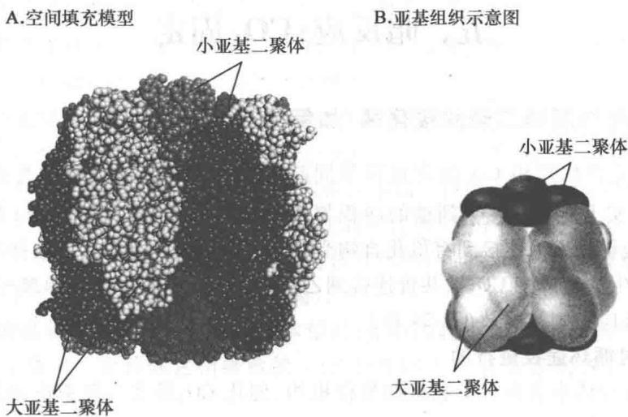  
图23-24 根据X射线晶体学揭示的1,5-二磷酸核酮糖羧化酶的亚基组织  
由4对交互结合的大亚基二聚体 $(\mathrm{L}_2)$ 排列成八聚体核，此核的两端各有2对小亚基二聚体  
$(S_{2})$ 或说各有一对 $S_{4}$ ；每个小亚基陷入大亚基之间的裂缝中

## 3. rubisco 羧化酶以活性形式和无活性形式存在

Rubisco 以 3 种形式存在: ① 无活性形式, 标为 E 型; ② 经氨 [基] 甲酰化但无 $Mg^{2+}$ 存在的无活性形式, EC 型; ③ 活性形式, ECM 型; 经氨甲酰化并在活性部位有 $Mg^{2+}$ 。rubisco 的氨 [基] 甲酰化 (carbamylation) 是由于 $CO_{2}$ 和酶的 Lys $201\varepsilon-NH_{2}$ 发生加成的结果 (生成 $\varepsilon-NH-COO^{-}$ 衍生物)。 $CO_{2}$ 对于rubisco 有双重作用:一是作为羧化底物,二是作为活化的辅助因子,用来氨甲酰化的 $CO_{2}$ (起后一作用)不能作为酶的底物。氨甲酰化反应在微碱性( $\sim pH\ 8$ )下能自发进行。rubisco 氨甲酰化能形成 $Mg^{2+}$ 离子的结合部位, $Mg^{2+}$ 是催化 $CO_{2}$ 固定反应所必需的。一旦 $Mg^{2+}$ 与 EC 结合,rubisco 则变成活性形式(ECM 型)(图 23-25)。被激活的 rubisco 对 $CO_{2}$ 的 $K_{m}$ 为 10\~20 $\mu mol/L$ 。 $CO_{2}$ 在大气中的相对丰度是很低的,约 0.03%。与空气平衡的 $CO_{2}$ 溶于水溶液的浓度约为 10 $\mu mol/L$ 。

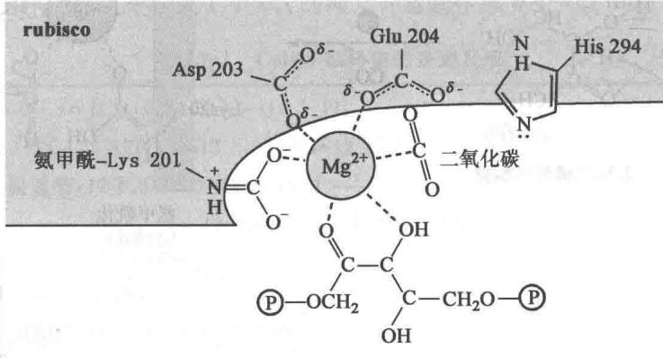  
图23-25 $\mathrm{Mg}^{2+}$ 离子在rubisco催化机制中的中心作用

底物 RuBP 与 rubisco 无活性型 E 结合 ( $K_{d}=20\ nmol/L$ ) 比与活性型 ECM 的结合 ( $K_{m}=20\ \mu mol/L$ ) 更牢固。因此 RuBP 也是 rubisco 活性的强抑制剂。从 rubisco 的活性部位释放 RuBP 是由 rubisco 激活酶 (activase) 介导的，它是一个调节蛋白质，能在酶活性部位的附近与 E 型 rubisco 结合，并在 ATP 依赖型反应中促进 RuBP 的释放。然后 rubisco 经氨甲酰化和 $Mg^{2+}$ 的结合变成活性形式（图 23-26）。rubisco 激活酶本身间接地受光激活。因此光是 rubisco 的最终激活剂。

Rubisco 的氨甲酰化形式不受 RuBP 抑制,但天然存在的 1-磷酸 2-羧-阿拉伯醇或 1,5-二磷酸木酮糖是一种强抑制剂。它们的结构类似 rubisco 反应中的过渡态六碳中间物。这种抑制剂在植物中夜间被积累,翌晨回到光下则从酶上解脱下来,使 rubisco 重新激活。

## 4. rubisco 羧化酶活性催化的反应

业已证明，rubisco作为羧化酶催化 $\mathrm{CO}_{2}$ 与RuBP的烯二醇中间物（enediolate intermediate）共价连结，形成一个与酶结合的不稳定的六碳中间物——2-羧-3-酮-D-阿拉伯醇（2-carboxy-3-keto-D-arabinitol）。此中间物的C2-C3键被水解断裂，生成2分子3-磷酸甘油酸，后者是Calvin循环反应中最早能检测到的中间产物。加入的 $\mathrm{CO}_{2}$ 以这2个分子中的一个的羧基形式出现（图23-26）。Rubisco作用机制的核心是带有一个 $\mathrm{Mg}^{2+}$ 离子的氨甲酰化Lys201侧链。这里 $\mathrm{Mg}^{2+}$ 离子起聚集作用，使反应物定向在活性部位的某些基团，并引起 $\mathrm{CO}_{2}$ 分子极化，使之易遭在酶上形成的五碳(RuBP)烯二醇中间物的亲核攻击，生成不稳定的β-酮酸中间物，详见图23-26。

## （二）经过 Calvin 循环 $CO_{2}$ 固定为糖

实现糖的净合成之前, $CO_{2}$ 固定的直接产物——3-磷酸甘油酸(3-PG),还必需进行一系列的转化。糖类中己糖特别是葡萄糖占据中心的地位。葡萄糖是合成纤维素和淀粉这些多糖的构件分子,植物的这些多糖构成生物界中最丰富的有机物质。因此,把葡萄糖看成是 $CO_{2}$ 固定的主要终产物是有充分理由的。还有,由葡萄糖和果糖构成的蔗糖(二糖)是从叶子转运到其他植物组织的主要碳形式。在非光合组织中蔗糖经水解可通过酵解和TCA循环代谢,产生ATP。在下面的反应方程中以形成1分子葡萄糖作为化学计量的基准。

3-磷酸甘油酸转化为己糖这一系列反应(表23-1)组成了Calvin循环。这一系列反应实际上是循环的，因为不仅需要糖作为终产物出现，而且五碳接纳体(RuBP)必须再生，使 $\mathrm{CO}_{2}$ 固定能继续进行。表示这种情况的平衡方程可图解式地写为：

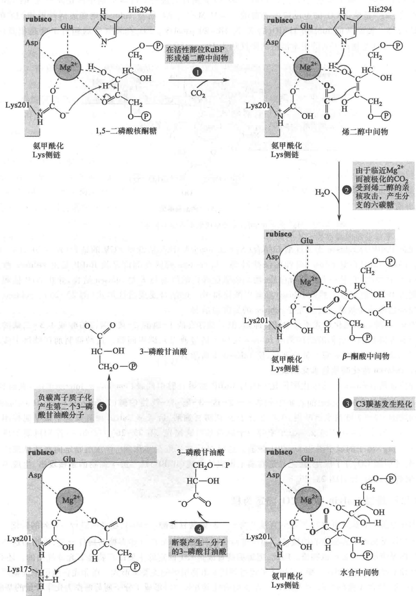  
图23-26 $\mathrm{CO}_{2}$ 同化的机制：rubisco的羧化酶活性

$$
6 \mathrm{C} _ {1} + 6 \mathrm{C} _ {5} \longrightarrow 1 2 \mathrm{C} _ {3}
$$

$$
1 2 \mathrm{C} _ {3} \longrightarrow 1 \mathrm{C} _ {6} + 6 \mathrm{C} _ {5}
$$

$$
\text { 净反应 }: 6 \mathrm{C} _ {1} \longrightarrow 1 \mathrm{C} _ {6}
$$

式中 $C_{1}$ 到 $C_{6}$ 分别代表一碳到六碳化合物。6 个 $\mathrm{C}_{1}(\mathrm{CO}_{2})$ 与 5 个 $\mathrm{C}_{5}(\mathrm{RuBP})$ 缩合生成 12 个 $\mathrm{C}_{5}$ (3-磷酸甘油酸)；12 个 $C_{5}$ 在 Calvin 循环中经重排形成 1 个 $\mathrm{C}_{6}$ (己糖)，并重新生成 6 个 $\mathrm{C}_{5}(\mathrm{RuBP})$ 接纳体（图 23-27）。

表 23-1 Calvin 循环中的系列反应 $^{①}$

1. 二磷酸核酮糖羧化酶: $6 \mathrm{CO}_{2} + 6 \mathrm{H}_{2} \mathrm{O} + 6 \mathrm{RuBP} \longrightarrow 123 - \mathrm{PG}$

$6(1)+6(5)\longrightarrow12(3)$

2. 3-磷酸甘油酸激酶: 12 3-PG+12 ATP → 12 1,3-BPG+12 ADP

12(3) $\longrightarrow$ 12(3)

3. $\mathrm{NADP^{+} - 3 - }$ 磷酸甘油醛脱氢酶：121,3-BPG+12 NADPH

$$
1 2 \mathrm{NADP} ^ {+} + 1 2 \mathrm{G} - 3 - \mathrm{P} + 1 2 \mathrm{Pi}\tag{12(3)  \( \longrightarrow \)  12(3}
$$

4. 磷酸丙糖异构酶: 5 G-3-P → 5 DHAP

5(3) $\longrightarrow$ 5(3)

5. 醛缩酶: 3 G-3-P+3 DHAP → 3 FBP

$3(3)+3(3)\longrightarrow3(6)$

$$
6. 1, 6 - \text {   二磷酸果糖酶   }: 3 \mathrm{FBP} + 3 \mathrm{H} _ {2} \mathrm{O} \longrightarrow 3 \mathrm{F} - 6 - \mathrm{P} + 3 \mathrm{Pi}\tag{3(6)  \( \longrightarrow \)  3(6}
$$

7. 磷酸葡糖异构酶: 1 F-6-P → 1 G-6-P

1(6) $\longrightarrow$ 1(6)

$$
\mathrm{G-6-P+1H} _ {2} \mathrm{O} \longrightarrow 1 \text {   葡萄糖   } + 1 \mathrm{Pi}\tag{1(6)  \( \longrightarrow \)  1(6}
$$

$$
\text { 此途径剩下的步骤涉及从剩余的2个F - 6 - P(12C),4个G - 6 - P(12C)和 }
$$

$$
2 \text { 个 } \mathrm{DHAP(6C)再生} 6 \text { 个 } \mathrm{RuBP接纳体(30C)}
$$

$$
9. \text { 转   羟   乙   醛   酶 }: 2 \mathrm{F} - 6 - \mathrm{P} + 2 \mathrm{G} - 3 - \mathrm{P} \longrightarrow 2 \mathrm{Xu} - 5 - \mathrm{P} + 2 \mathrm{E} - 4 - \mathrm{P}\tag{\(2(6) + 2(3) \longrightarrow 2(5) + 2(4)\}
$$

$$
1 0. \text { 醛   缩   酶 }: 2 \mathrm{E} - 4 - \mathrm{P} + 2 \mathrm{DHAP} \longrightarrow 2 1, 7 - \text { 二   磷   酸   景   天   庚   酮   糖   (S   B   P) }\tag{\( 2(4)+2(3)\longrightarrow2(7) \}
$$

$$
1 1. \text {   二磷酸景天庚酮糖酶:   } 2 \mathrm{SBP} + 2 \mathrm{H} _ {2} \mathrm{O} \longrightarrow 2 \mathrm{S} - 7 - \mathrm{P} + 2 \mathrm{Pi}\tag{2(7)  \( \longrightarrow \)  2(7}
$$

$$
1 2. \text {   转羟乙醛酶:   } 2 \mathrm{S-7-P+2G-3-P} \longrightarrow 2 \mathrm{Xu-5-P+2R-5-P}\tag{\( 2(7)+2(3)\longrightarrow4(5) \}
$$

$$
1 3. \text {   磷酸戊糖差向异构酶:   } 4 \mathrm{Xu} - 5 - \mathrm{P} \longrightarrow 4 \mathrm{Ru} - 5 - \mathrm{P}\tag{4(5)  \( \longrightarrow \)  4(5}
$$

$$
1 4. \text {   磷酸戊糖异构酶:   } 2 \mathrm{R} - 5 - \mathrm{P} \longrightarrow 2 \mathrm{Ru} - 5 - \mathrm{P}\tag{2(5)  \( \longrightarrow \)  2(5}
$$

$$
1 5. \text {   磷酸核酮糖激酶:   } 6 \mathrm{Ru} - 5 - \mathrm{P} + 6 \mathrm{ATP} \longrightarrow 6 \mathrm{RuBP} + 6 \mathrm{ADP}\tag{6(5)  \( \longrightarrow \)  6(5}
$$

$$
\text { 净反应: } 6 \mathrm{CO} _ {2} + 1 8 \mathrm{ATP} + 1 2 \mathrm{NADPH} + 1 2 \mathrm{H} ^ {+} + 1 2 \mathrm{H} _ {2} \mathrm{O} \longrightarrow 1 \text { 葡萄糖 } + 1 8 \mathrm{ADP} + 1 8 \mathrm{Pi} + 1 2 \mathrm{NADP} ^ {+}\tag{6(1)  \( \longrightarrow \)  6(1}
$$

①反应1到15构成形成1分子葡萄糖的循环。表中列出催化每步反应的酶、简明的反应式和总碳数的平衡式。括号中的数字示出底物或产物分子中的碳原子数目。括号前的数字是以化学计量方式指出为提供一个平衡的净反应每步所进行的次数。表中反应物缩写见图23-28。

介导 Calvin 循环反应的 13 种酶大多数也参与糖酵解(见第 17 章)或戊糖磷酸途径(见第 20 章)。如反应方程(23-7)所指,在此循环代谢中消耗光反应中产生的 NADPH 和 ATP。注意,在己糖形成中消耗的总数 18 个当量的 ATP(表 23-1, 反应 2 和 15): 其中 12 个用于从 3-磷酸甘油酸形成 12 当量的 1,3-二磷酸甘油酸(1,3-BPG), 这是经过由 3-磷酸甘油酸激酶催化的几个正常糖酵解反应实现的, 另外 6 个用于磷酸化 5-磷酸核酮糖(Ru-5-P)以再生 6 个 RuBP。所有 12 个当量的 NADPH 用于反应 3(表 23-1)。植物具有 NADPH 特异 3-磷酸甘油醛脱氢酶, 此酶对 NADP 的特异性超过对 NAD 的特异性, 以及对它的正常进行的反应方向都与糖酵解的同类酶成鲜明对比。

## （三）Calvin 循环反应可以分为 3 个阶段

$\mathrm{CO}_{2}$ 同化为生物分子(图23-27)的第1阶段是碳固定反应(carbon-fixation reaction); 第2阶段是3-磷酸甘油酸还原; 第3阶段是RuBP再生(regeneration)。12分子磷酸丙糖中的10个(30个碳)用于再生6个分子的循环起始物RuBP(30个碳)。另2个丙糖磷酸分子是光合作用的净产物, 能用来制造己糖作为燃料和构建材料, 蔗糖作为从叶子转运至非光合组织的主要碳形式, 或淀粉作为贮存形式。总之, 整个过程是循环的, 能不断地把 $\mathrm{CO}_{2}$ 转化为磷酸丙糖和磷酸己糖。6-磷酸果糖(F-6-P)是第3阶段中的一个关键性中间物(图23-28步骤⑥); 它处于导致RuBP再生或淀粉合成的分叉点上。从F-6-P到RuBP的途径有许多反应跟用于动物细胞磷酸戊糖途径(见第20章)的非氧化性阶段中磷酸戊糖转化为磷酸己糖的反应是相同的。 $CO_{2}$ 光合同化中,基本上是同一套反应(同一套酶)在另一方向运行,把磷酸己糖转化为磷酸戊糖。所有13种循环途径的酶(表23-1)都存在于叶绿体的基质中。

  
图23-27 光合生物中Calvin循环的3个阶段

下面讨论中所涉及的反应步骤编号与图 23-28 和表 23-1 中的相同。

## 1. 第 1 阶段: $CO_{2}$ 固定为 3-磷酸甘油酸

这部分的内容在前面已经谈到了(参见图23-26)。反应是由rubisco羧化酶活性催化的,1,5-二磷酸核酮糖(RuBP)是固定反应中 $\mathrm{CO}_{2}$ 的接纳体,过渡态中间物是 $\beta$ -酮酸,后者水解生成2分子3-磷酸甘油酸(图23-28步骤①),3-PG是Calvin循环反应中最早能检测到的中间产物。加入的 $\mathrm{CO}_{2}$ 以这2个分子中的一个的羧基形式出现(见图23-26)。已提出的rubisco作用机制的核心是带有一个 $\mathrm{Mg}^{2+}$ 离子的氨甲酰化Lys侧链。这里 $\mathrm{Mg}^{2+}$ 离子起聚集作用,使反应物定向在活性部位,并引起 $\mathrm{CO}_{2}$ 分子极化,使之容易遭受在酶上形成的五碳(RuBP)烯二醇式中间物的亲核攻击,生成不稳定的六碳中间物,并断裂成2分子的3-PG。

## 2. 第 2 阶段: 3-磷酸甘油酸转变为 3-磷酸甘油醛

第 1 阶段形成的 3-磷酸甘油酸(3-PG)转化为 3-磷酸甘油醛(G-3-P); 过程基本上是糖酵解相应步骤的逆转, 只有一点不同, 即用于 1, 3-二磷酸甘油酸还原的核苷酸因子是 NADPH(图 23-27), 而不是糖酵解中的 NADH。叶绿体的基质中含有除磷酸甘油酸变位酶外的所有糖酵解酶, 基质中的这些酶是叶细胞溶胶中存在的相应酶的同工酶; 这两套酶催化相同的反应, 但它们是不同基因的产物。

这一阶段的第一步是叶绿体基质的3-磷酸甘油酸激酶催化从ATP转移磷酸基到3-PG，生成1,3-二磷酸甘油酸（BGP；图23-28步骤②）。第二步是在3-磷酸甘油醛脱氢酶催化的反应中NADPH提供电子，生成G-3-P（步骤③），磷酸丙糖异构酶催化磷酸二羟丙酮（DHAP）互变（步骤④）。磷酸丙糖在叶绿体中可以转化为淀粉，贮存备用，或者立即外运到细胞溶胶中，转变为蔗糖以便转运到植物的生长区域。在发育的叶片中相当一部分磷酸丙糖经糖酵解途径被降解，为生长提供额外的能量（见图23-27）。

6ADP 6ATP 磷酸核酮糖激酶

  
图23-28 Calvin循环中的反应步骤  
与每步箭头相连的方框中数字表示在产生一分子葡萄糖的一轮循环中参与反应的分子数目。反应顺序的标号与表23-1的相同

## 3. 第 3 阶段: 从丙糖磷酸再生 1,5-二磷酸核酮糖

RuBP 的再生从磷酸丙糖开始, 涉及 G-3-P 和 DHAP 的互变和糖或碳架重排 (步骤⑨ 和步骤⑫～⑪), 过程中的中间物包括三碳糖、四碳糖、五碳糖、六碳糖和七碳糖。1 分子 1, 6-二磷酸果糖经步骤⑦ 和⑧转变为葡萄糖, 这是 Calvin 图解所希望的净产物。剩下的 30 个碳经反应步骤⑨～⑮重新组织成 6 个 RuBP。反应步骤⑤和⑩是由醛缩酶 (aldolase) 或转二羟丙酮酶 (transaldolase) 促进的; 此酶催化 3-磷酸甘油醛与磷酸二羟丙酮的可逆缩合, 产生 1,6-二磷酸果糖 (步骤⑤), 后者在步骤⑥中由二磷酸果糖磷酸酶断裂成 6-磷酸果糖和 Pi, 此反应是强放能的, 基本上不可逆。它也催化 4-磷酸赤藓糖和磷酸二羟丙酮缩合, 产生七碳糖, 1, 7-二磷酸景天庚酮糖 (SBP; 步骤⑩)。步骤⑨和⑫由转羟乙醛酶或转酮醇酶 (transketolase) 催化, 它含有硫胺素焦磷酸 (TPP; 见第 13 章) 作为辅基, 并需要 $\mathrm{Mg}^{2+}$ 。步骤⑨中, 转羟乙醛酶催化从磷酸酮糖供体 (6-磷酸果糖) 将一个羟乙醛基 (ketol; —CO—CH₂OH) 转给醛糖磷酸接纳体 (G-3-P), 生成 4-磷酸赤藓糖和 5-磷酸木酮糖。步骤⑪由 1,7-二磷酸景天庚酮糖磷酸酶 (sedoheptulose bisphosphatase) 催化, 此磷酸酶为质体所特有; 此步骤是途径中第二个不可逆的反应; 它的产物是 7-磷酸景天庚酮糖 (S-7-P), 后者是转羟乙醛酶的底物。在步骤⑫中转羟乙醛酶催化 7-磷酸景天庚酮糖和 3-磷酸甘油醛转变为两个磷酸戊糖 (5-磷酸木酮糖和 5-磷酸核糖) 的反应。在转羟乙醛酶催化的反应中形成的磷酸戊糖转变为 5-磷酸核酮糖 (步骤⑬和⑭)。催化最后一步反应 (步骤⑮) 的是磷酸核酮糖激酶 (phosphoribulose kinase), 此酶也是植物所特有的, 行使植物所特有的功能: 把 Ru-5-P 磷酸化为 RuBP。这一步是整个途径中第 3 次耗能的反应, 另两次耗能反应在步骤②和③。这一净转化说明 6 个 $\mathrm{CO}_{2}$ 固定为 1 个己糖, 消耗 18 个 ATP 和 12 个 NADPH (见表 23-1)。

## （四）Calvin 循环中 4 种酶受光的间接激活

植物细胞含有线粒体,能进行细胞呼吸,为在暗时提供能量。糖酵解和柠檬酸循环进行的反应是糖的分解,从糖到 $CO_{2}$ ,而 $CO_{2}$ 固定进行的是糖的合成,从 $CO_{2}$ 到糖;前者主要是在夜间发生的,后者是在白天进行的。植物体内糖的合成和分解是如何协调控制的?已发现调控主要是通过调节 Calvin 循环来解决的。在这种调节下 Calvin 循环的关键酶的活性与光合产率是一致的。实际上这些酶都间接地对光激活作出反应。当有可利用的光能用以产生 $CO_{2}$ 固定所需的 ATP 和 NADPH 时,Calvin 循环就运行,暗中不能产生 ATP 和 NADPH 时, $CO_{2}$ 固定则停止。

在前面光反应部分曾讲到，叶绿体的照光导致光驱动的质子跨膜泵入类囊体腔，引起基质和类囊体腔中的 $\mathrm{pH}$ 改变。基质的 $\mathrm{pH}$ 从7升高到8，并伴随着 $\mathrm{Mg}^{2+}$ 从类囊体腔流向基质，使基质中的 $[\mathrm{Mg}^{2+}]$ 从 $1\sim 3$ mmol/L升至 $3\sim 6\mathrm{mmol / L}$ 。几种基质中的酶已进化出利用“告知”有ATP和NADPH可利用的光诱导条件：在碱性环境和高 $[\mathrm{Mg}^{2+}]$ 中这些酶的活性变得更高。例如，氨甲酰赖氨酸的形成对rubisco的激活在碱性 $\mathrm{pH}$ 下更快，高基质 $[\mathrm{Mg}^{2+}]$ 有利于酶的活性 $\mathrm{Mg}^{2+}$ 复合体的形成。1，6-二磷酸果糖磷酸酶要求有 $\mathrm{Mg}^{2+}$ ，并对 $\mathrm{pH}$ 依赖性很强，在叶绿体照光期间 $\mathrm{pH}$ 和 $[\mathrm{Mg}^{2+}]$ 升高时，酶活性增加100多倍。

Calvin 循环中 4 种酶受到特殊类型的光调节。5-磷酸核酮糖激酶（见表 23-1，反应 15）、1,6-二磷酸果糖磷酸酶（反应 6）、1,7-二磷酸景天庚酮糖磷酸酶（反应 11）和 3-磷酸甘油醛脱氢酶（反应 3）受到两个半胱氨酸残基之间二硫键的光驱动还原而被激活，这两个残基对这些酶的活性是关键的。当 Cys 残基被二硫键连接（处于氧化态）时酶无活性，这是处于暗时的正常情况。照光时，电子流从光系统 I 流到铁氧还蛋白（见图 23-18），后者把电子传递给一个小的、含二硫化物的可溶性蛋白质，硫氧还蛋白（thioredoxin），后者存在于铁氧还蛋白-硫氧还蛋白还原酶催化的反应中。还原型硫氧还蛋白提供电子以还原那些被光激活的酶的二硫键，这些还原断裂的反应伴随着构象变化而增加酶的活性（图 23-29）。夜间，这 4 种酶的 Cys 残基被重新氧化为二硫化物形式，酶则被钝化，这样 ATP 就不会消耗于 CO₂ 同化中。代之以，白天合成和储存的淀粉在夜间被降解，给糖酵解添加燃料。

6-磷酸葡糖脱氢酶是氧化性磷酸戊糖途径中的第一个酶,它也受这个光驱动机制的调节,但意义相反。在白天光合作用产生丰富的 NADPH,因而不需要此酶合成 NADPH。当一个关键的二硫键被来自铁氧还蛋白的电子还原此酶则钝化。

  
图23-29 Calvin循环的几种酶的光激活  
图中灰色箭头表示电子流动方向

<!-- EN-BEGIN 20.4 -->

### 【英文对应 20.4】$\mathrm{CO}_{2}$ -Assimilation Reactions

> 来源：Lehninger Principles of Biochemistry（书籍/02_生物化学原理） 第20章 Photosynthesis and Carbohydrate Synthesis in Plants，§20.4。对应本章“五、暗反应: $CO_{2}$ 固定”。

Photosynthetic organisms use the ATP and NADPH produced in the light-dependent reactions of photosynthesis to synthesize all of the thousands of components that make up the organism. P5 Plants (and other autotrophs) can reduce atmospheric $\mathrm{CO}_{2}$ to trioses, then use the trioses as precursors for the synthesis of sucrose and starch, lipids and proteins, and the many other organic components of plant cells (Fig. 20-25). Lacking these synthetic capacities, humans and other animals are ultimately dependent on photosynthetic organisms to provide the reduced fuels and organic precursors essential to life.

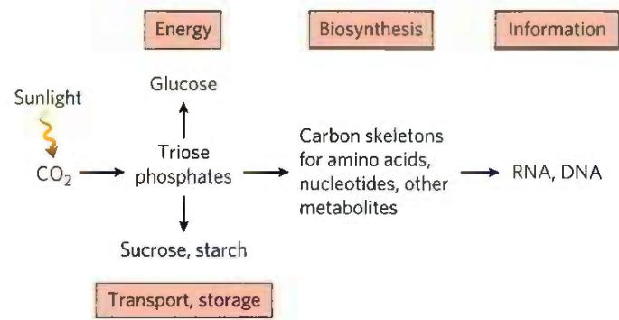  
FIGURE 20-25 Products of photosynthesis.

Green plants contain in their chloroplasts the enzymatic machinery that catalyzes the conversion of $CO_{2}$ to simple (reduced) organic compounds, a process called $CO_{2}$ assimilation. This process has also been called $CO_{2}$ fixation, but we reserve this term for the specific reaction in which $CO_{2}$ is incorporated (fixed) into a three-carbon organic compound, the triose phosphate 3-phosphoglycerate. This simple product of photosynthesis is the precursor of more-complex biomolecules, including sugars, polysaccharides, and the metabolites derived from them, all of which are synthesized by metabolic pathways similar to those of animal tissues. Carbon dioxide is assimilated via a cyclic pathway, its key intermediates constantly regenerated. The pathway was elucidated in the early 1950s by Melvin Calvin, Andrew Benson, and James A. Bassham and is often called the Calvin cycle or, more descriptively, the reductive pentose phosphate pathway. It is essentially the reversal of a central pathway of glucose oxidation, the pentose phosphate pathway, which we described in Section 14.6.

Carbohydrate metabolism is more complex in plant cells than in animal cells or in nonphotosynthetic microorganisms. In addition to the universal pathways of glycolysis, gluconeogenesis, and the pentose phosphate pathway, plants have the unique reaction sequences for reduction of $CO_{2}$ to triose phosphates and the associated reductive pentose phosphate pathway—all of which must be coordinately regulated to ensure proper allocation of carbon to energy production and synthesis of starch and sucrose. Key enzymes are regulated, as we shall see, by (1) reduction of disulfide bonds by electrons flowing from photosystem I and (2) changes in pH and $Mg^{2+}$ concentration that result from illumination. When we look at other aspects of plant carbohydrate metabolism, we also find enzymes that are modulated by (3) conventional allosteric regulation by one or more metabolic intermediates and (4) covalent modification (phosphorylation).

#### [EN] Carbon Dioxide Assimilation Occurs in Three Stages

The first stage in the assimilation of $CO_{2}$ into biomolecules (Fig. 20-26) is the $CO_{2}$ -fixation reaction: condensation of $CO_{2}$ with a five-carbon acceptor, ribulose 1,5-bisphosphate, to form two molecules of 3-phosphoglycerate. In the second stage, the 3-phosphoglycerate is reduced to triose phosphates. P5 Overall, three molecules of $CO_{2}$ are fixed to three molecules of ribulose 1,5-bisphosphate to form six molecules of glyceraldehyde 3-phosphate (18 carbons). In the third stage, five of the six molecules of triose phosphate (15 carbons) are used to regenerate three molecules of ribulose 1,5-bisphosphate (15 carbons), the starting material. The sixth molecule of triose phosphate, the net product of photosynthesis, can be used to make hexoses for fuel and building materials, sucrose for transport to nonphotosynthetic tissues, or starch for storage. Thus, the overall process is cyclical, with the continuous conversion of $CO_{2}$ to triose and hexose phosphates.

Fructose 6-phosphate is a key intermediate in stage 3 of $CO_{2}$ assimilation; it stands at a branch point, leading either to regeneration of ribulose 1,5-bisphosphate or to synthesis of starch. The pathway from hexose phosphate to pentose bisphosphate involves many of the same reactions used in animal cells for the conversion of pentose phosphates to hexose phosphates during the nonoxidative phase of the pentose phosphate pathway (see Fig. 14-31). In the photosynthetic assimilation of $CO_{2}$ , essentially the same set of reactions operates in the reverse direction, converting hexose phosphates to pentose phosphates. This reductive pentose phosphate cycle uses the same enzymes as the oxidative pathway, and several additional enzymes that make the reductive cycle irreversible. All 13 enzymes of the pathway are in the chloroplast stroma.

Stage 1: Fixation of $\mathrm{CO}_{2}$ into 3-Phosphoglycerate An important clue to the nature of the $\mathrm{CO}_{2}$ -assimilation mechanisms in photosynthetic organisms came in the late 1940s. Calvin and his associates illuminated a suspension of green algae in the presence of radioactive carbon dioxide ( $^{14}\mathrm{CO}_{2}$ ) for just a few seconds, then quickly killed the cells, extracted their contents, and used chromatographic methods to search for the metabolites in which the labeled carbon first appeared. The first compound that became labeled was 3-phosphoglycerate, with the $^{14}\mathrm{C}$ predominantly located in the carboxyl carbon atom. These experiments strongly suggested that 3-phosphoglycerate is an early intermediate in photosynthesis.

FIGURE 20-26 The three stages of $\mathrm{CO}_{2}$ assimilation in photosynthetic organisms. Stoichiometries of three key intermediates (numbers in parentheses) reveal the fate of carbon atoms entering and leaving the photosynthetic carbon-reduction cycle (Calvin cycle). Three $\mathrm{CO}_{2}$ are fixed for the net synthesis of one molecule of glyceraldehyde 3-phosphate.  

The many plants in which this three-carbon compound is the first intermediate are called $C_{3}$ plants, in contrast to the $C_{4}$ plants described below. Most plant species — 80% to 90% — are $C_{3}$ , including most trees, wheat, oats, rice, beans, peas, and spinach. The enzyme that catalyzes incorporation of $CO_{2}$ into an organic form is ribulose 1,5-bisphosphate carboxylase/oxygenase, a name mercifully shortened to rubisco. P5 As a carboxylase, rubisco catalyzes the covalent attachment of $CO_{2}$ to the five-carbon sugar ribulose 1,5-bisphosphate and cleavage of the unstable six-carbon intermediate to form two molecules of 3-phosphoglycerate, one of which bears the carbon introduced as $CO_{2}$ in its carboxyl group (Fig. 20-26). The enzyme's oxygenase activity is discussed in Section 20.5.

There are two distinct forms of rubisco. The rubisco of vascular plants, algae, and cyanobacteria is a crucial enzyme in the production of biomass from $CO_{2}$ . It has a complex form I structure (Fig. 20-27a), with eight identical large catalytic subunits ( $M_{r}$ 53,000; encoded in the chloroplast genome), and eight identical small subunits ( $M_{r}$ 14,000; encoded in the nuclear genome) of uncertain function. The form II rubisco of photosynthetic bacteria is simpler, having two subunits that in many respects resemble the large subunits of the plant enzyme (Fig. 20-27b). The plant enzyme has an exceptionally low turnover number; only three molecules of $CO_{2}$ are fixed per second per molecule of rubisco at 25 °C. To achieve high rates of $CO_{2}$ fixation, plants therefore need large amounts of this enzyme. Rubisco is present at about 250 mg/mL in the chloroplast stroma, corresponding to an extraordinarily high concentration of active sites (\~4 mm). In fact, rubisco makes up almost 50% of soluble protein in chloroplasts and is probably one of the most abundant enzymes in the biosphere.

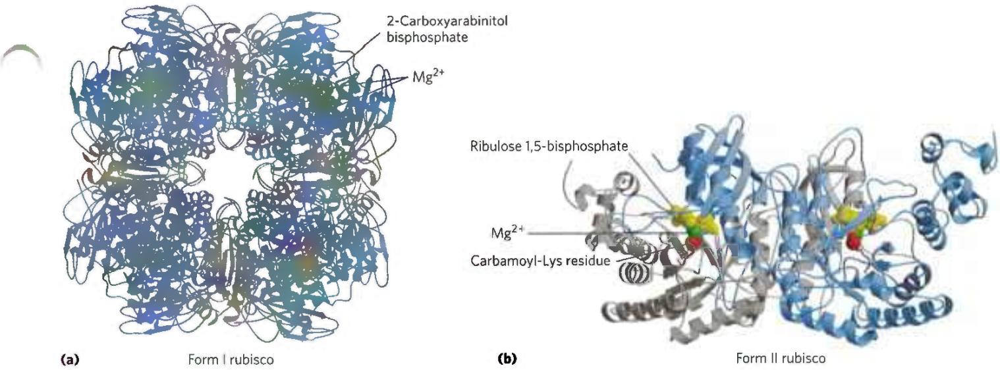  
FIGURE 20-27 Structure of ribulose 1,5-bisphosphate carboxylase/oxygenase (rubisco). (a) A ribbon model of form I rubisco from spinach. The enzyme has eight large (blue) and eight small (gray) subunits, tightly packed into a structure of $M_{\mathrm{r}} > 500,000$ . A transition-state analog, 2-carboxyarabinitol bisphosphate (yellow), is shown bound  
to each of the eight substrate-binding sites. Mg $^{2+}$ in the active site is shown in green. (b) Ribbon model of form II rubisco from the bacterium Rhodospirillum rubrum. The identical subunits are in gray and blue. [Data from (a) PDB ID BRUC, I. Andersson, J. Mol. Biol. 259:160, 1996; (b) PDB ID 9RUB, T. Lundqvist and G. Schneider, J. Biol. Chem. 266:12,604, 1991.]

Central to the proposed mechanism for plant rubisco is a carbamoylated Lys side chain with a bound $Mg^{2+}$ ion. The $Mg^{2+}$ ion brings together and orients the reactants at the active site (Fig. 20-28), setting up for a nucleophilic attack by the five-carbon enediolate reaction intermediate formed on the enzyme (Fig. 20-29). The resulting six-carbon intermediate breaks down to yield two molecules of 3-phosphoglycerate.

  
FIGURE 20-28 Central role of $\mathsf{Mg}^{2+}$ in the active site of rubisco. $\mathsf{Mg}^{2+}$ is coordinated in a roughly octahedral complex with six oxygen atoms: one oxygen in the carbamate on Lys $^{201}$ ; two in the carboxyl groups of Glu $^{204}$ and Asp $^{203}$ ; two at C-2 and C-3 of the substrate, ribulose 1,5-bisphosphate; and one in the other substrate, $\mathrm{CO}_{2}$ . A water molecule occupies the $\mathrm{CO}_{2}$ -binding site in the crystal structure. In this figure, a $\mathrm{CO}_{2}$ molecule is modeled in its place. (Residue numbers refer to the spinach enzyme.) [Data from PDB ID 1RXO, T.C. Taylor and I. Andersson, J. Mol. Biol. 265:432, 1997.]

As the catalyst for the first step of photosynthetic $CO_{2}$ assimilation, rubisco is a prime target for regulation. The enzyme is inactive until carbamoylated on the $\varepsilon$ -amino group of $Lys^{201}$ (Fig. 20-30). Ribulose 1,5-bisphosphate inhibits carbamoylation by binding tightly to the active site and locking the enzyme in the “closed” conformation, in which $Lys^{201}$ is inaccessible. Rubisco activase overcomes the inhibition by promoting ATP-dependent release of the ribulose 1,5-bisphosphate, exposing the Lys amino group to nonenzymatic carbamoylation by $CO_{2}$ ; this is followed by $Mg^{2+}$ binding, which activates the rubisco.

Stage 2: Conversion of 3-Phosphoglycerate to Glyceraldehyde 3-Phosphate Stage 2 begins as stromal 3-phosphoglycerate kinase catalyzes the transfer of a phosphoryl group from ATP to 3-phosphoglycerate, yielding 1,3-bisphosphoglycerate. Next, NADPH donates electrons in a reduction catalyzed by the chloroplast-specific isozyme of glyceraldehyde 3-phosphate dehydrogenase, producing glyceraldehyde 3-phosphate and $\mathbf{P}_{\mathrm{i}}$ . The high concentrations of NADPH and ATP in the chloroplast stroma allow this thermodynamically unfavorable pair of reactions to proceed in the direction of glyceraldehyde 3-phosphate formation. Triose phosphate isomerase then interconverts glyceraldehyde 3-phosphate and dihydroxyacetone phosphate, producing the two substrates for aldolase, which condenses them into fructose 1,6-bisphosphate. Thus far, the process has employed the same enzymes we saw in glycolysis, but operating in the reverse direction.

Most of the triose phosphate and fructose 1,6-bisphosphate produced by photosynthesis is used to regenerate ribulose 1,5-bisphosphate, the essential starting material for photosynthesis. Any excess triose phosphate is either converted to starch in the chloroplast and stored for later use or immediately exported to the cytosol and converted to sucrose for transport to growing regions of the plant.

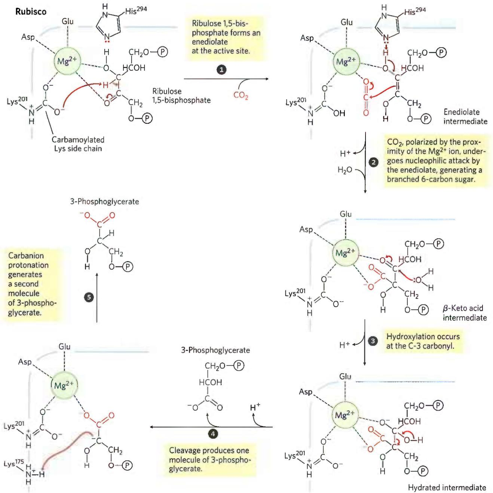  
MECHANISM FIGURE 20-29 First stage of $\mathrm{CO}_{2}$ assimilation: rubisco's carboxylase activity. The $\mathrm{CO}_{2}$ -fixation reaction is catalyzed by ribulose 1,5-bisphosphate carboxylase/oxygenase. The overall reaction accomplishes the combination of one $\mathrm{CO}_{2}$ and one ribulose  
1,5-bisphosphate to form two molecules of 3-phosphoglycerate, one of which contains the carbon atom from $\mathrm{CO}_{2}$ (red). Additional proton transfers (not shown), involving Lys $^{201}$ , Lys $^{175}$ , and His $^{294}$ , occur in several of these steps.

Stage 3: Regeneration of Ribulose 1,5-Bisphosphate from Triose Phosphates For the continuous flow of $\mathrm{CO}_{2}$ into carbohydrate, ribulose 1,5-bisphosphate must be constantly regenerated. This is accomplished in a series of mostly reversible reactions (Fig. 20-31) that, together with stages 1 and 2, constitute the reductive pentose phosphate pathway summarized in Figure 20-26. Three exergonic reactions, shown with blue arrows in Figure 20-31, make the whole process irreversible. These are the reactions catalyzed by ② fructose 1,6-bisphosphatase, ⑤ sedoheptulose 1,7-bisphosphatase, and ⑨ ribulose 5-phosphate kinase.

#### [EN] Synthesis of Each Triose Phosphate from $\mathrm{CO}_{2}$ Requires Six NADPH and Nine ATP

P5 The net result of three turns of the Calvin cycle is the conversion of three molecules of $CO_{2}$ and one molecule of phosphate to a molecule of triose phosphate. The stoichiometry of the overall path from $CO_{2}$ to triose

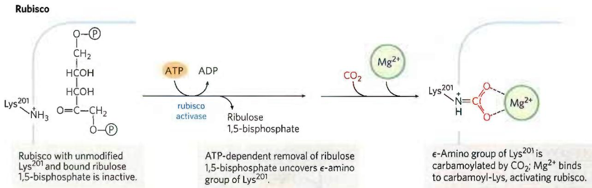  
FIGURE 20-30 Role of rubisco activase in carbamoylation of Lys $^{201}$ of rubisco.

FIGURE 20-31 Third stage of $\mathrm{CO}_{2}$ assimilation. This schematic diagram shows the interconversions of triose phosphates and pentose phosphates. Red dots represent the number of carbons in each compound. Compounds that appear more than once are highlighted. The starting materials are glyceraldehyde 3-phosphate and dihydroxyacetone phosphate. Reactions catalyzed by aldolase (1 and 4) and transketolase (3 and 6) produce pentose phosphates that are converted to ribulose 1,5-bisphosphate — ribose 5-phosphate by ⑦ ribose 5-phosphate isomerase and xylulose 5-phosphate by ⑧ ribulose 5-phosphate epimerase. Ribulose 5-phosphate is phosphorylated ⑨, regenerating ribulose 1,5-bisphosphate. The reactions with blue arrows are exergonic and make the whole process irreversible: ② fructose 1,6-bisphosphatase, ⑤ sedoheptulose 1,7-bisphosphatase, and ⑨ ribulose 5-phosphate kinase.

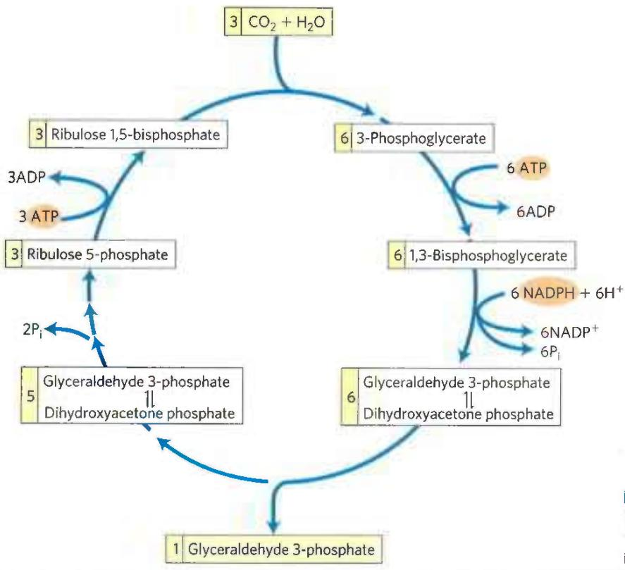

phosphate, with regeneration of ribulose 1,5-bisphosphate, is shown in Figure 20-32.

One molecule of glyceraldehyde 3-phosphate is the net product of the $\mathrm{CO}_{2}$ -assimilation pathway. The other five triose phosphate molecules (15 carbons) are rearranged in steps 1 to 9 of Figure 20-31 to form three molecules of ribulose 1,5-bisphosphate (15 carbons). The last step in this conversion requires one ATP per ribulose 1,5-bisphosphate, or a total of three ATP. Thus, in summary, for every molecule of triose phosphate produced by photosynthetic $\mathrm{CO}_{2}$ assimilation, six NADPH and nine ATP are required.

P5 NADPH and ATP are produced in the light-dependent reactions of photosynthesis in about the same ratio (2:3) as they are consumed in the Calvin cycle. Nine ATP molecules are converted to ADP and phosphate in the generation of a molecule of triose phosphate; eight of the phosphates are released as $P_{i}$ and combined with eight ADP to regenerate ATP. The ninth phosphate is incorporated into the triose phosphate itself. To convert the ninth ADP to ATP, a molecule of $P_{i}$ must be imported from the cytosol, as we shall see.

In the dark, the production of ATP and NADPH by photophosphorylation and the incorporation of $CO_{2}$ into triose phosphate (once referred to as the dark reactions) cease. The “dark reactions” of photosynthesis were so named to distinguish them from the primary light-driven reactions of electron transfer to $NADP^{+}$ and synthesis of ATP. They do not, in fact, occur at significant rates in the dark and are thus more appropriately called the $CO_{2}$ -assimilation reactions. Later in this

FIGURE 20-32 Stoichiometry of $\mathrm{CO}_{2}$ assimilation in the Calvin cycle. For every three $\mathrm{CO}_{2}$ molecules fixed, one molecule of triose phosphate (glyceraldehyde 3-phosphate) is produced and nine ATP and six NADPH are consumed.

section we describe the regulatory mechanisms that turn $CO_{2}$ assimilation on in the light and turn it off in the dark.

The chloroplast stroma contains all the enzymes necessary to convert the triose phosphates produced by $CO_{2}$ assimilation (glyceraldehyde 3-phosphate and dihydroxyacetone phosphate) to starch, which is temporarily stored in the chloroplast as insoluble granules. Aldolase condenses the triose phosphates to fructose 1,6-bisphosphate; fructose 1,6-bisphosphatase produces fructose 6-phosphate; phosphohexose isomerase yields glucose 6-phosphate; and phosphoglucomutase produces glucose 1-phosphate, the starting material for starch synthesis (see Section 20.6).

All the reactions of the Calvin cycle except those catalyzed by rubisco, sedoheptulose 1,7-bisphosphatase, and ribulose 5-phosphate kinase also take place in animal tissues. Lacking these three enzymes, animals cannot carry out significant conversion of $CO_{2}$ to glucose.

#### [EN] A Transport System Exports Triose Phosphates from the Chloroplast and Imports Phosphate

The inner chloroplast membrane is impermeable to most phosphorylated compounds, including fructose 6-phosphate, glucose 6-phosphate, and fructose 1,6-bisphosphate. It does, however, have a specific antiporter that catalyzes the one-for-one exchange of $\mathrm{P_i}$ with a triose phosphate, either dihydroxyacetone phosphate or 3-phosphoglycerate (Fig. 20-33). This antiporter simultaneously moves $\mathrm{P_i}$ into the chloroplast, where it is used in photophosphorylation, and moves triose phosphate into the cytosol, where it can be used to synthesize sucrose, the form in which the fixed carbon is transported to distant plant tissues.

  
FIGURE 20-33 The $\mathsf{P_i}$ -triose phosphate antiport system of the chloroplast inner membrane. This transporter facilitates the exchange of cytosolic $\mathsf{P_i}$ for stromal dihydroxyacetone phosphate. The products of photosynthetic $\mathrm{CO}_{2}$ assimilation are thus moved into the cytosol, where they  
serve as a starting point for sucrose biosynthesis, and $P_{i}$ required for photophosphorylation is moved into the stroma. This same antiporter can transport 3-phosphoglycerate, and it acts indirectly in the export of ATP and reducing equivalents (see Fig. 20-34).

Sucrose synthesis in the cytosol and starch synthesis in the chloroplast are the major pathways by which the excess triose phosphate from photosynthesis is harvested. Sucrose synthesis (described later) releases four $P_{i}$ molecules from the four triose phosphates required to make sucrose. For every molecule of triose phosphate removed from the chloroplast, one $P_{i}$ is transported into the chloroplast, providing the ninth $P_{i}$ mentioned above, to be used in regenerating ATP. If this exchange were blocked, triose phosphate synthesis would quickly deplete the available $P_{i}$ in the chloroplast, slowing ATP synthesis and suppressing assimilation of $CO_{2}$ into starch.

The $P_{i}$ -triose phosphate antiport system serves one additional function. ATP and reducing power are needed in the cytosol for a variety of synthetic and energy-requiring reactions. These requirements are met to an as-yet-undetermined degree by mitochondria, but a second potential source of energy is the ATP and NADPH generated in the chloroplast stroma during the light-dependent reactions. However, neither ATP nor NADPH can cross the chloroplast membrane. The $P_{i}$ -triose phosphate antiport system has the indirect effect of moving ATP equivalents and reducing equivalents from the chloroplast to the cytosol (Fig. 20-34). Dihydroxyacetone phosphate formed in the stroma is transported to the cytosol, where it is converted by glycolytic enzymes to 3-phosphoglycerate, generating ATP and NADH. 3-Phosphoglycerate reenters the chloroplast, completing the cycle.

#### [EN] Four Enzymes of the Calvin Cycle Are Indirectly Activated by Light

The reductive assimilation of $CO_{2}$ requires a lot of ATP and NADPH, and their stromal concentrations increase when chloroplasts are illuminated (Fig. 20-35). The light-induced transport of protons across the thylakoid membrane also increases the stromal pH from about 7 to about 8, and it is accompanied by a flow of $\mathrm{Mg}^{2+}$ from the thylakoid compartment into the stroma, raising the $[\mathrm{Mg}^{2+}]$ from 1 to $3\mathrm{mm}$ to 3 to $6\mathrm{mm}$ . P5 Several stromal enzymes have evolved to take advantage of these light-induced conditions, which signal the availability of ATP and NADPH: the enzymes are more active in an alkaline environment and at high $[\mathrm{Mg}^{2+}]$ . For example, activation of rubisco by formation of carbamoyllysine is faster at alkaline pH, and high stromal $[\mathrm{Mg}^{2+}]$ favors formation of the enzyme's active $\mathrm{Mg}^{2+}$ complex. Fructose 1,6-bisphosphatase requires $\mathrm{Mg}^{2+}$ and is very dependent on pH (Fig. 20-36); its activity increases more than 100-fold when pH and $[\mathrm{Mg}^{2+}]$ rise during chloroplast illumination.

P5 Four Calvin cycle enzymes are subject to a special type of regulation by light. Ribulose 5-phosphate kinase, fructose 1,6-bisphosphatase, sedoheptulose 1,7-bisphosphatase, and glyceraldehyde 3-phosphate dehydrogenase are activated by light-driven reduction of disulfide bonds between two Cys residues critical to their catalytic activities. When these Cys residues are disulfide-bonded (oxidized), the enzymes are inactive; this is the normal situation in the dark. With illumination, electrons flow from photosystem I to ferredoxin (Fig. 20-12), which passes electrons to a small, soluble, disulfide-containing protein called thioredoxin (Fig. 20-37), in a reaction catalyzed by ferredoxin: thioredoxin reductase. Reduced thioredoxin donates electrons for the reduction of the disulfide bonds of the light-activated enzymes, and these reductive cleavage reactions are accompanied by conformational changes that increase enzyme activities. At nightfall, the Cys residues in the four enzymes are reoxidized to their disulfide forms, the enzymes are inactivated, and ATP is not expended in $\mathrm{CO}_{2}$ assimilation. Instead, starch synthesized and stored during the daytime is degraded to fuel glycolysis and oxidative phosphorylation at night.

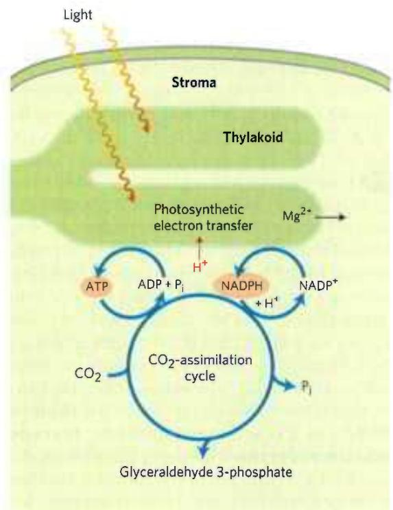  
FIGURE 20-35 Source of ATP and NADPH. ATP and NADPH produced by the light-dependent reactions are essential substrates for the reduction of $CO_{2}$ . The photosynthetic reactions that produce ATP and NADPH are accompanied by movement of protons (red) from the stroma into the thylakoid, creating alkaline conditions in the stroma. Magnesium ions pass from the thylakoid into the stroma, increasing the stromal $[Mg^{2+}]$ .

FIGURE 20-34 Role of the $\mathsf{P_i}$ -triose phosphate antiporter in the transport of ATP and reducing equivalents. Dihydroxyacetone phosphate leaves the chloroplast and is converted to glyceraldehyde 3-phosphate in the cytosol. The cytosolic glyceraldehyde 3-phosphate dehydrogenase and phosphoglycerate kinase reactions then produce NADH, ATP, and 3-phosphoglycerate. The latter reenters the chloroplast and is reduced to dihydroxyacetone phosphate, completing a cycle that effectively moves ATP and reducing equivalents (NAD(P)H) from chloroplast to cytosol.  
  
FIGURE 20-36 Activation of chloroplast fructose 1,6-bisphosphatase. Reduced fructose 1,6-bisphosphatase (FBPase-1) is activated by light and by the combination of high pH and high $\left[\mathrm{Mg}^{2+}\right]$ in the stroma, both of which are results of illumination. [Information from B. Halliwell, Chloroplast Metabolism: The Structure and Function of Chloroplasts in Green Leaf Cells, p. 97, Clarendon Press, 1984.]

Glucose 6-phosphate dehydrogenase, the first enzyme in the oxidative pentose phosphate pathway, is also regulated by this light-driven reduction mechanism, but in the opposite sense. During the day, when photosynthesis produces plenty of NADPH, this enzyme is not needed for NADPH production. Reduction of a critical disulfide bond by electrons from ferredoxin inactivates the enzyme.

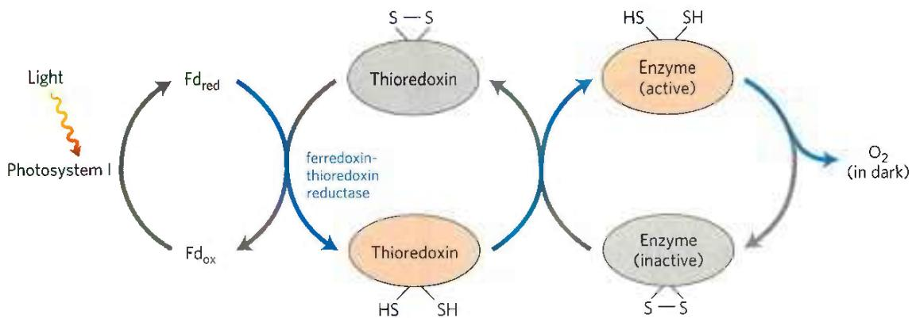  
FIGURE 20-37 Light activation of several enzymes of the Calvin cycle. The light activation is mediated by thioredoxin, a small, disulfide-containing protein. In the light, thioredoxin is reduced by electrons moving from photosystem I through ferredoxin (Fd) (blue arrows), then thioredoxin reduces critical  
disulfide bonds in each of the enzymes sedoheptulose 1,7-bisphosphatase, fructose 1,6-bisphosphatase, ribulose 5-phosphate kinase, and glyceraldehyde 3-phosphate dehydrogenase, activating these enzymes. In the dark, the —SH groups undergo reoxidation to disulfides, inactivating the four enzymes.

#### [EN] SUMMARY 20.4 Carbon-Assimilation Reactions

■ Photosynthesis in eukaryotes takes place in chloroplasts. In the $CO_{2}$ -assimilating reactions (the Calvin cycle), ATP and NADPH are used to reduce $CO_{2}$ to triose phosphates. These reactions occur in three stages: the fixation reaction itself, catalyzed by rubisco; reduction of the resulting 3-phosphoglycerate to glyceraldehyde 3-phosphate; and regeneration of ribulose 1,5-bisphosphate from triose phosphates.

■ Stromal enzymes rearrange the carbon skeletons of triose phosphates to generate intermediates of three, four, five, six, and seven carbons, eventually yielding pentose phosphates. The pentose phosphates are converted to ribulose 5-phosphate, which is phosphorylated to ribulose 1,5-bisphosphate to complete the Calvin cycle.

■ The cost of fixing three $CO_{2}$ into one triose phosphate is nine ATP and six NADPH, which are provided by the light-dependent reactions of photosynthesis.

An antiporter in the inner chloroplast membrane exchanges $\mathrm{P_i}$ in the cytosol for 3-phosphoglycerate or dihydroxyacetone phosphate molecules produced by $\mathrm{CO}_{2}$ assimilation in the stroma. Oxidation of dihydroxyacetone phosphate in the cytosol generates ATP and NADH, thus moving ATP and reducing equivalents from the chloroplast to the cytosol.

■ Four enzymes of the Calvin cycle are activated indirectly by light and are inactive in the dark, so that hexose synthesis does not compete with glycolysis — which is required to provide energy in the dark.

<!-- EN-END 20.4 -->

## 六、光呼吸和 $\mathrm{C}_{4}$ 途径

在前面已经讲到, 光合细胞在光驱动反应期间裂解 $H_{2}O$ 产生 $O_{2}$ , 在暗反应 (不依赖光的过程) 中利用 $CO_{2}$ , 因此整个光合作用期间气体的总变化是 $CO_{2}$ 的摄取和 $O_{2}$ 的释放。在暗中植物也进行线粒体呼吸, 底物氧化成 $CO_{2}, O_{2}$ 转化为 $H_{2}O$ 。而且, 在植物中还有另一过程, 像线粒体一样, 消耗 $O_{2}$ 产生 $CO_{2}$ , 又像光合作用, 过程由光驱动。这个过程称为光呼吸 (photorespiration), 这是光合作用的一个高代价的副反应, 是由于缺乏专一性的 rubisco 造成的。

## （一）光呼吸是 rubisco 加氧酶活性引起的

正如二磷酸核酮糖羧化酶/加氧酶(rubisco)的名称所指,它还能催化另一反应。分子 $O_{2}$ 跟 $CO_{2}$ 竞争活性部位,大约每3、4轮一次rubisco催化 $O_{2}$ 和 RuBP缩合生成3-磷酸甘油酸和2-磷酸乙醇酸(2-phosphoglycolate),后者是一个代谢上无用的产物(图23-30)。Rubisco与 $O_{2}$ 反应的结果没有碳的固定,看来是对细胞的一种纯粹的倾向性。要从2-磷酸乙醇酸解救碳需要消耗相当量的细胞能量,并释放一些先前固定的 $CO_{2}$ 。Rubisco加氧酶反应减小植物的生产率,因为它导致RuBP的损失,RuBP是必需的 $CO_{2}$ 接纳体。

在进化中产生一条从磷酸乙醇酸抢救碳的途径称为乙醇酸途径(glycolate pathway)。此途径把2分子的2-磷酸乙醇酸转化为1分子丝氨酸(三碳)和1分子 $\mathrm{CO}_{2}$ (图23-31)。在叶绿体中磷酸酶把2-磷酸乙醇酸去磷酸为乙醇酸,后者被转移到另一细胞器过氧化物酶体(peroxisome),在这里被分子 $\mathrm{O}_{2}$ 氧化,生成的乙醛酸(glyoxylate),经转氨作用生成甘氨酸。作为乙醇酸氧化的副产物出现的过氧化氢被移交给过氧化物酶体中的过氧化物酶作无害化处理。甘氨酸从过氧化物酶体转移到线粒体基质中,在这里由甘氨酸脱羧酶复合体进行氧化性脱羧。甘氨酸脱羧酶复合体氧化甘氨酸成 $\mathrm{CO}_{2}$ 和 $\mathrm{NH}_{3}$ ,并伴随着 $\mathrm{NAD}^{+}$ 还原成NADH,剩下的碳从甘氨酸转移到辅因子四氢叶酸。然后四氢叶酸上携带的一碳单位由丝氨酸羟甲基转移酶转移到第二个甘氨酸,产生丝氨酸。由甘氨酸脱羧酶和丝氨酸羟甲基转移酶催化的净反应是:

$$
2 \mathrm{甘氨酸} + \mathrm{NAD} ^ {+} + \mathrm{H} _ {2} \mathrm{O} \rightarrow \mathrm{丝氨酸} + \mathrm{CO} _ {2} + \mathrm{NH} _ {3} + \mathrm{NADH} + \mathrm{H} ^ {+}
$$

丝氨酸转化为羟丙酮酸,甘油酸,最后是3-磷酸甘油酸,后者用于再生1,5-二磷酸核酮糖,完成这一长而昂贵的循环(图23-31)。

在强日光下通过乙醇酸抢救途径的流量是很大的,产生的 $CO_{2}$ 大约为通常柠檬酸循环中所有氧化所产生的 5 倍。为产生这样大的流量,线粒体含有大量的甘氨酸脱羧酶复合体:此复合体的 4 个蛋白质构成了豌豆和菠菜植物叶的线粒体基质中所有蛋白质的一半。植物的非光合部分,如马铃薯的块茎,它的甘氨酸脱羧酶复合体的浓度则很低。

与光有关的 rubisco 加氧酶活性加上乙醇酸抢救途径构成消耗 $O_{2}$ 、产生 $CO_{2}$ 的过程（图 23-31），因此称它为光呼吸。此途径也许称为氧化性光合碳循环(oxidative photosynthetic carbon cycle)或 $C_{2}$ 循环更好些,因为这些名称不会引起跟线粒体的呼吸去比较。与线粒体的呼吸不同,“光呼吸”不能保存能量。 $C_{3}$ 植物光合作用固定了的碳(有机碳)相当一部分被光呼吸消耗掉,事实上光呼吸使生物量的净形成减少了50%以上。这种低效性导致了碳同化过程中进化上的适应性,特别是在热带和亚热带气候下进化过来的禾本科植物如玉米、甘蔗和高粱等,这些植物(称 $C_{4}$ 植物,见下面)的光合效率比 $C_{3}$ 植物(如菠菜、小麦和水稻等)高出二倍。Rubisco 的这种明显的低效性和对生物量生产的限制性极大地激励了研究人员用基因工程手段想把它改造成一个更好的酶。

  
图 23-30 rubisco 加氧酶活性: $O_{2}$ 与 RuBP 的加成

## （二）在 $C_{4}$ 植物中 $CO_{2}$ 固定和 rubisco 活性是分开的

如前所述热带禾本科植物有对付光呼吸的手段(适应性)。应用 $CO_{2}$ 作为示踪物的研究指出,在这些植物中被标记的第一个有机中间物不是三碳化合物,而是四碳化合物。20世纪60年代澳大利亚学者M. D. Hatch和C. R. Slack首先发现了这个四碳(4C)产物。 $CO_{2}$ 固定的这一途径被称为 $C_{4}$ 途径或 $C_{4}$ 代谢。利用 $C_{4}$ 途径的植物称为 $C_{4}$ 植物。 $C_{4}$ 植物一般生长在高强光和高温下,它们具有几个重要的特征:高光合速率、高生长速率、低失水速率和特化了的叶结构。 $C_{4}$ 植物与 $C_{3}$ 植物的差别主要是吸收 $CO_{2}$ 的方式不同, $C_{3}$ 植物中第一步反应就是 $CO_{2}$ 和1,5-二磷酸核酮糖缩合成3-磷酸甘油酸。

$C_{4}$ 途径并不是代替Calvin循环的反应系列,也不是一种净 $CO_{2}$ 固定的图解, $C_{4}$ 途径是作为 $CO_{2}$ 的收集、浓缩和转运的系统;或者说 $C_{4}$ 途径是在 $CO_{2}$ 固定成三碳产物3-磷酸甘油酸之前,暂时把 $CO_{2}$ 固定成四碳化合物。然后将 $CO_{2}$ 从氧含量较丰富的叶片表面转运到内部的细胞,这里 $O_{2}$ 浓度较低,与 $CO_{2}$ 竞争rubisco反应的能力较弱。因此 $C_{4}$ 途径是保证rubisco反应离开高氧浓度的细胞区室,以避免或减小光呼吸发生的一种方式。 $C_{4}$ 途径涉及两种类型的细胞:叶肉细胞(mesophyll cell)和维管束鞘细胞(bundle sheath cell),前者是邻接叶片间隙的细胞,后者是环绕维管束组织的细胞(图23-32)。叶肉细胞在富含 $O_{2}$ 的叶片表面(间隙)吸收 $CO_{2}$ ,并用它羧化磷酸烯醇丙酮酸(phosphoenopyruvate,PEP)生成草酰乙酸(OAA), 这一步是在磷酸烯醇丙酮酸羧化酶(PEP carboxylase)催化下进行的(图 23-33)。然后被 NADPH 特异的苹果酸脱氢酶还原为苹果酸或通过转氨作用转变为天冬氨酸(后者图中未示出)。四碳的 $\mathrm{CO}_{2}$ 载体(苹果酸或天冬氨酸)通过胞间连丝被转运到邻近的维管束鞘细胞, 在这里脱羧生成三碳产物丙酮酸, 并释放出 $\mathrm{CO}_{2}$ 。 $\mathrm{CO}_{2}$ 进入与 $\mathrm{C}_{3}$ 植物中完全相同的 Calvin 循环被固定为有机碳, 而丙酮酸返回叶肉细胞, 并重新转变为 PEP, 准备接受另一个 $\mathrm{CO}_{2}$ (图 23-33)。

  
图23-31 光呼吸中的乙醇酸途径

  
图23-32 $\mathrm{C}_3$ 和 $\mathrm{C_4}$ 植物叶片的结构差别  
A. $C_{3}$ 植物的叶肉细胞是 Calvin 循环的光合作用部位; B. $C_{4}$ 植物先在叶肉细胞中利用 $C_{4}$ 途径将 $CO_{2}$ 固定成 4C 化合物, 然后这些化合物被运送到维管束鞘细胞, 在这里进行 Calvin 循环

  
图23-33 $\mathrm{CO}_{2}$ 固定的 $\mathbf{C}_4$ 途径

借苹果酸或天冬氨酸在细胞间转运1个 $\mathrm{CO}_{2}$ 需要消耗两个高能磷酸键。这些键能用于丙酮酸的磷酸化，此反应是由磷酸丙酮酸二激酶(pyruvate phosphate dikinase)催化的，其产物是PEP、AMP和PPi（焦磷酸）。这是一个唯一的催化一个ATP分子的 $\beta-$ 和 $\gamma-$ 磷酸基同时磷酸化两个不同的底物，使丙酮酸转变为PEP, Pi转变为PPi的磷酸转移酶(phosphotransferase)。反应机制涉及一个酶磷酸组氨酸中间物。ATP的 $\gamma-$ 磷酸基被转移给Pi，而ATP的 $\beta-$ 磷酸基与酶-His发生加成，形成酶-His- $\mathbf{P}_{\beta}$ 复合体：

$$
\mathrm{酶} - \mathrm{His} + \mathrm{AMP} _ {\alpha} - \mathrm{P} _ {\beta} - \mathrm{P} _ {\gamma} + \mathrm{Pi} \rightarrow \mathrm{酶} - \mathrm{His} - \mathrm{P} _ {\beta} + \mathrm{AMP} _ {\alpha} + \mathrm{P} _ {\gamma} \mathrm{Pi}
$$

$$
\mathrm{酶} - \mathrm{His} - \mathrm{P} _ {\beta} + \mathrm{丙酮酸} \rightarrow \mathrm{PEP} + \mathrm{酶} - \mathrm{His}
$$

$$
\text { 净反应:ATP } + \text { 丙酮酸 } + \mathrm{Pi} \rightarrow \mathrm{AMP} + \mathrm{PEP} + \mathrm{Pi}
$$

磷酸丙酮酸二激酶受一个苏氨酸残基的可逆磷酸化调节,非磷酸化形式是活性酶。有趣的是在此可互变的调节中 ADP 是磷酸基的供体。尽管 $C_{4}$ 植物每固定一个 $CO_{2}$ 要比 $C_{3}$ 植物(每合成一个磷酸丙糖消耗 9 个 ATP)多消耗两个 ATP(两个高能磷酸键),但是在高光强度,高温度的热带条件下, $C_{4}$ 植物的光合效率比 $C_{3}$ 植物高 ( $C_{3}$ 植物随温度升高其光呼吸增强, $CO_{2}$ 固定效率下降)。热带甘蔗种植园代表集光效率的至高点。落在甘蔗园的入射光约 8% 的能量以固定 $CO_{2}$ 成糖的形式被转变为化学能。对于非栽培植物面积光合效率只有 0.2%。开展光呼吸研究就是想通过控制这个浪费的过程来达到提高农业生产效率的目的。已知的 230 000 种植物中只有 1% 是 $C_{4}$ 植物，而且大多数是生长在炎热地带。

## （三）CAM 植物中 $CO_{2}$ 吸收和 rubisco 作用是暂时被分开的

肉质植物如仙人掌科(Cactaceae)和景天科(Crassulaceae)原本生长在半干旱的热带沙漠环境,它们的 $\mathrm{CO}_{2}$ 吸收和 $\mathrm{CO}_{2}$ 固定在时间上是分开进行的。 $\mathrm{CO}_{2}$ (以及 $\mathrm{O}_{2}$ )通过气孔(stomata)进入叶片,水蒸气也是通过开放的气孔逃逸。在非肉质植物中气孔是白天开放,此时光驱动光合细胞固定 $\mathrm{CO}_{2}$ ,而夜间关闭。肉质植物在白天炎热时气孔不开放,因为干旱地区任何珍贵水分的丢失,都将是对它们的一种致命打击。因此,这些植物只有在夜间开放气孔,吸收 $\mathrm{CO}_{2}$ ,这时温度较低,水分丢失较少。吸入的 $\mathrm{CO}_{2}$ 在PEP羧化酶催化下直接与磷酸烯醇丙酮酸(PEP)结合生成草酰乙酸(OAA)。OAA在苹果酸脱氢酶存在下还原为苹果酸,并在液泡中贮存至天明。在白天苹果酸从液泡中释放出来,经脱羧产生 $\mathrm{CO}_{2}$ 和一个3C产物丙酮酸。产生的 $\mathrm{CO}_{2}$ 参与Calvin循环并固定成为有机碳。因为此过程涉及有机酸(OAA和苹果酸),并且是景天科肉质植物所共有的特点,因此被称为景天酸代谢(crassulacean acid metabolism,CAM)。能进行景天酸代谢的植物称为CAM植物。在CAM植物与 $\mathrm{C}_{4}$ 植物中 $\mathrm{CO}_{2}$ 都是通过 $\mathrm{C}_{4}$ 途径进入Calvin循环被固定成糖的。它们之间的主要区别是:CAM植物中 $\mathrm{CO}_{2}$ 最初的羧化( $\mathrm{CO}_{2}$ 的浓缩或积累)和糖的合成(Calvin循环)发生在同一细胞内,但时间不同;而 $\mathrm{C}_{4}$ 植物中这些过程发生在同一时间,但空间不同也即发生在两种不同的细胞中。

<!-- EN-BEGIN 20.5 -->

### 【英文对应 20.5】Photorespiration and the $C_{4}$ and CAM Pathways

> 来源：Lehninger Principles of Biochemistry（书籍/02_生物化学原理） 第20章 Photosynthesis and Carbohydrate Synthesis in Plants，§20.5。对应本章“六、光呼吸和 $\mathrm{C}_{4}$ 途径”。

As we have seen, photosynthetic cells produce $O_{2}$ (by the splitting of $H_{2}O$ ) during the light-driven reactions and use $CO_{2}$ during the light-independent processes, so the net gaseous change during photosynthesis is the uptake of $CO_{2}$ and release of $O_{2}$ :

$$
\mathrm{CO} _ {2} + \mathrm{H} _ {2} \mathrm{O} \longrightarrow \mathrm{O} _ {2} + (\mathrm{CH} _ {2} \mathrm{O})
$$

In the dark, plants also carry out mitochondrial respiration, the oxidation of substrates to $CO_{2}$ and the conversion of $O_{2}$ to $H_{2}O$ . And there is another process in plants that, like mitochondrial respiration, consumes $O_{2}$ and produces $CO_{2}$ and, like photosynthesis, is driven by light. This process, photorespiration, is a costly side reaction of photosynthesis, a result of the lack of specificity of the enzyme rubisco. In this section we describe this side reaction and the strategies plants use to minimize its metabolic consequences.

#### [EN] Photorespiration Results from Rubisco's Oxygenase Activity

P5 Rubisco is not absolutely specific for $CO_{2}$ as a substrate. Molecular oxygen ( $O_{2}$ ) competes with $CO_{2}$ at the active site, and about once in every three or four turnovers, rubisco catalyzes the condensation of $O_{2}$ with ribulose 1,5-bisphosphate to form 3-phosphoglycerate and 2-phosphoglycolate (Fig. 20-38), a metabolically unneeded product. This is the oxygenase activity referred to in the full name of rubisco: ribulose 1,5-bisphosphate carboxylase/oxygenase. The reaction with $O_{2}$ results in no fixation of $CO_{2}$ and is presumably a net liability to the cell; salvaging the carbons from 2-phosphoglycolate (by the pathway outlined below) consumes significant amounts of cellular energy and releases some previously fixed $CO_{2}$ .

#### [EN] Phosphoglycolate Is Salvaged in a Costly Set of Reactions in $C_{3}$ Plants

The glycolate pathway converts two molecules of 2-phosphoglycolate to a molecule of serine (three carbons) and a molecule of $\mathrm{CO}_{2}$ (Fig. 20-39). In the chloroplast, a phosphatase converts 2-phosphoglycolate to glycolate, which is exported to the peroxisome. There, glycolate is oxidized by molecular oxygen, and the resulting aldehyde (glyoxylate) undergoes transamination to glycine. The hydrogen peroxide formed as a side product of glycolate oxidation is rendered harmless by peroxidases in the peroxisome. Glycine passes from the peroxisome to the mitochondrial matrix, where it undergoes oxidative decarboxylation by the glycine decarboxylase complex, an enzyme similar in structure and mechanism to two mitochondrial complexes we have already encountered: the pyruvate dehydrogenase complex and the $\alpha$ -ketoglutarate dehydrogenase complex (Chapter 16). The glycine decarboxylase complex oxidizes glycine to $\mathrm{CO}_{2}$ and $\mathrm{NH}_{3}$ , with the concomitant reduction of $\mathrm{NAD}^{+}$ to NADH and transfer of the remaining carbon from glycine to the cofactor tetrahydrofolate. The one-carbon unit carried on tetrahydrofolate is then transferred to a second glycine by serine hydroxymethyltransferase, producing serine. The net reaction catalyzed by the glycine decarboxylase complex and serine hydroxymethyltransferase is

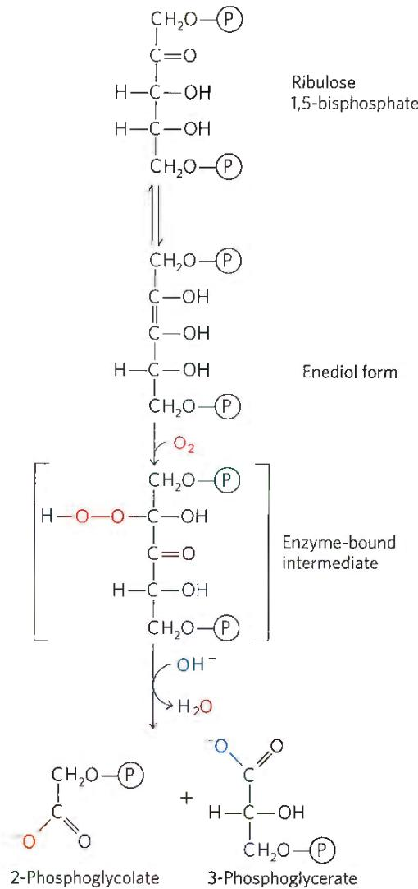  
FIGURE 20-38 Oxygenase activity of rubisco. Rubisco can incorporate $\mathrm{O}_2$ rather than $\mathrm{CO}_{2}$ into ribulose 1,5-bisphosphate. The unstable intermediate thus formed splits into 2-phosphoglycolate (recycled as described in Fig. 20-39) and 3-phosphoglycerate, which can reenter the Calvin cycle.

$$
\begin{array}{r l} 2 \mathrm{Glycine} + \mathrm{NAD} ^ {+} + \mathrm{H} _ {2} \mathrm{O} & \longrightarrow \\ & \text {serine} + \mathrm{CO} _ {2} + \mathrm{NH} _ {3} + \mathrm{NADH} + \mathrm{H} ^ {+} \end{array}
$$

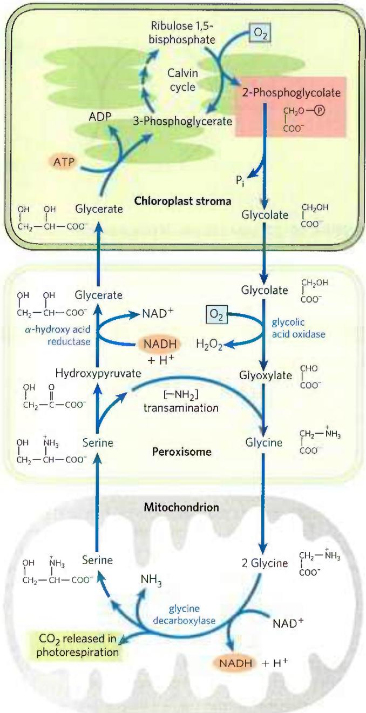  
FIGURE 20-39 Glycolate pathway. This pathway, which salvages 2-phosphoglycolate (shaded light red) by converting it to serine and, eventually, to 3-phosphoglycerate, involves three cellular compartments. Glycolate formed by dephosphorylation of 2-phosphoglycolate in chloroplasts is oxidized to glyoxylate and transaminated to glycine in peroxisomes. In mitochondria, two glycine molecules condense to form serine and $\mathrm{CO}_{2}$ , released in photorespiration. This reaction is catalyzed by glycine decarboxylase, an enzyme present at very high levels in the mitochondria of $C_3$ plants. The serine is converted to hydroxypyruvate and then to glycerate in peroxisomes; glycerate reenters the chloroplasts to be phosphorylated, rejoining the Calvin cycle. Oxygen is consumed at two steps during photorespiration.

The serine is converted to hydroxypyruvate, then to glycerate, and finally to 3-phosphoglycerate, which is used to regenerate ribulose 1,5-bisphosphate, completing the long, expensive cycle (Fig. 20-39).

In bright sunlight, the carbon flux through the glycolate salvage pathway can be very high, producing about five times more $CO_{2}$ than is typically produced by all the oxidations of the citric acid cycle. To generate this large flux, mitochondria contain prodigious amounts of the glycine decarboxylase complex: the four proteins of the complex make up half of all the protein in the mitochondrial matrix in the leaves of pea and spinach plants. In nonphotosynthetic parts of a plant, such as potato tubers, mitochondria have very low concentrations of the glycine decarboxylase complex.

The practical effects of this inefficiency are large and costly. The average yield of soybeans and wheat in the United States is reduced by an estimated 36% and 20%, respectively, by the necessity of recycling glycolate from photorespiration.

P5 The combined activity of the rubisco oxygenase and the glycolate salvage pathway consumes $O_{2}$ and produces $CO_{2}$ —hence the name photorespiration. Unlike mitochondrial respiration, photorespiration does not conserve energy and actually inhibits net biomass formation. This inefficiency has led to evolutionary adaptations in the $CO_{2}$ -assimilation processes, particularly in plants that have evolved in warm climates. The apparent inefficiency of rubisco, and its effect in limiting biomass production, has inspired efforts to genetically engineer a “better” rubisco, but this goal is not, as yet, within reach (Box 20-1).

#### [EN] In $C_{4}$ Plants, $CO_{2}$ Fixation and Rubisco Activity Are Spatially Separated

In many plants that grow in the tropics (and in temperate-zone crop plants native to the tropics, such as maize, sugarcane, and sorghum) a mechanism has evolved to circumvent the problem of wasteful photorespiration. The step in which $CO_{2}$ is fixed into a three-carbon product, 3-phosphoglycerate, is preceded by several steps, one of which is temporary fixation of $CO_{2}$ into oxaloacetate, a four-carbon compound. Plants that use this process are referred to as $C_{4}$ plants, and the assimilation process is known as the $C_{4}$ pathway, by comparison to the $C_{3}$ pathway in which $CO_{2}$ is first fixed in the three-carbon compound 3-phosphoglycerate.

P5 The $C_{4}$ plants, which typically grow at high light intensity and high temperatures, have several important characteristics: high photosynthetic rates, high growth rates, low photorespiration rates, low rates of water loss, and a specialized leaf structure. Photosynthesis in the leaves of $C_{4}$ plants involves two cell types: mesophyll and bundle-sheath cells (Fig. 20-40a).

FIGURE 20-40 CO₂ assimilation in C₄ plants. The C₄ pathway, involving mesophyll cells and bundle-sheath cells, predominates in plants of tropical origin. (a) Electron micrograph showing chloroplasts of adjacent mesophyll and bundle-sheath cells. The bundle-sheath cell contains starch granules. Plasmodesmata connecting the two cells are visible. (b) The C₄ pathway of CO₂ assimilation, which occurs through a four-carbon intermediate. [(a) Dr. Ray Evert, University of Wisconsin–Madison, Department of Botany.]

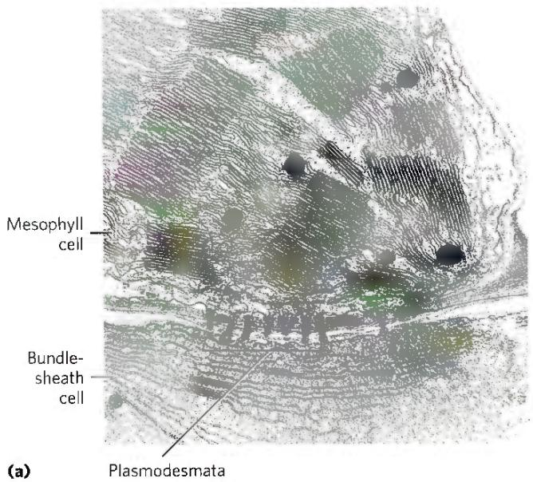

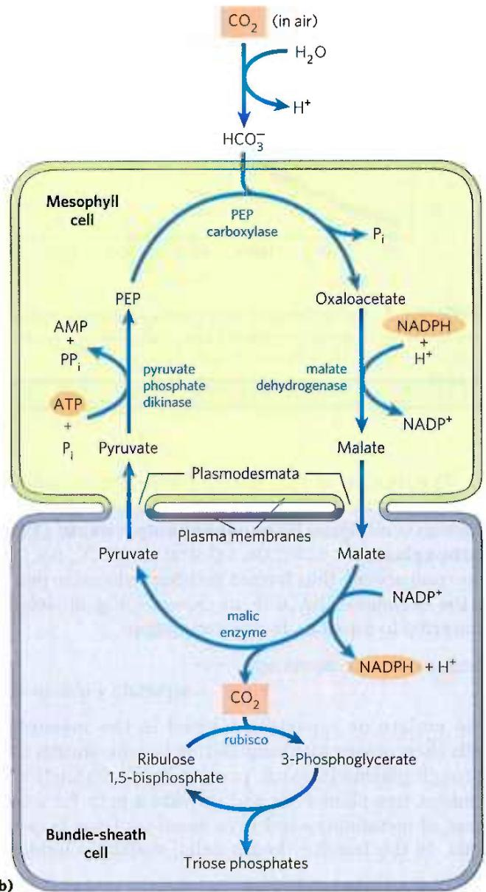

#### [EN] Will Genetic Engineering of Photosynthetic Organisms Increase Their Efficiency?

Three pressing world problems have prompted serious attention to the possibility of engineering plants to be more efficient in converting sunlight into biomass: the greenhouse effect of increasing levels of atmospheric $CO_{2}$ on climate change, the finite supply of oil for generating energy, and the need for more and better food for the world's growing population.

The concentration of $\mathrm{CO}_{2}$ in the earth's atmosphere has risen steadily over the past 50 years (Fig. 1), a combined effect of the use of fossil fuels for energy and the clearing and burning of tropical forests to allow use of the land for agriculture. As atmospheric $\mathrm{CO}_{2}$ increases, the atmosphere absorbs more heat radiated from the earth's surface and reradiates

  
FIGURE 1 The concentration of $\mathrm{CO}_{2}$ in the atmosphere measured at the Mauna Loa Observatory in Hawaii. [Data from the National Oceanic and Atmospheric Administration and the Scripps Institution of Oceanography $\mathrm{CO}_{2}$ Program.]

The fixation of $CO_{2}$ into the four-carbon oxaloacetate occurs in the cytosol of leaf mesophyll cells. The reaction is catalyzed by phosphoenolpyruvate (PEP) carboxylase, for which the substrate is $HCO_{3}^{-}$ , not $CO_{2}$ . The oxaloacetate thus formed is either reduced to malate at the expense of NADPH (as shown in Fig. 20-40b) or converted to aspartate by transamination:

Oxaloacetate + α-amino acid →

$$
\mathrm{L-aspartate} + \alpha \mathrm{-ketoacid}
$$

The malate or aspartate formed in the mesophyll cells then passes into neighboring bundle-sheath cells through plasmodesmata, protein-lined channels that connect two plant cells and provide a path for movement of metabolites and even small proteins between cells. In the bundle-sheath cells, malate is oxidized more heat toward the surface of the planet (and in all other directions). Retention of heat raises the temperature at the surface of the earth; this is the greenhouse effect. One way to limit the increase in atmospheric $CO_{2}$ would be to engineer plants or microorganisms with a greater capacity for sequestering $CO_{2}$ .

The estimated amount of total carbon in all terrestrial systems (atmosphere, soil, biomass) is about 3,200 gigatons (GT), or 3,200 billion metric tons. The atmosphere contains another 760 GT of CO $_{2}$ .

The flux of carbon through these terrestrial reservoirs (Fig. 2) is largely due to the photosynthetic activities of plants and the degradative activities of microorganisms. Plants fix some 123 GT of carbon annually, then immediately release about half of that to the atmosphere as they respire. Much of the remainder is gradually released to the atmosphere by microbial action on dead plant materials, but biomass is sequestered in woody plants and trees for decades or centuries. Anthropogenic carbon flux, the amount of $CO_{2}$ released into the atmosphere by human activities, is 9 GT per year—small compared with total biomass, but enough to tip the balance toward increased $CO_{2}$ in the atmosphere. Estimates indicate that the forests of North America sequester 0.7 GT of carbon annually, which represents about a tenth of the annual global production of $CO_{2}$ from fossil fuels. Clearly, preservation of forests and reforestation are effective ways to limit the flow of $CO_{2}$ back into the atmosphere.

A second approach to limiting the increase of atmospheric $CO_{2}$ , while also addressing the need to replace dwindling fossil fuels, is to use renewable biomass as a source of ethanol to replace fossil fuels in internal combustion engines. This reduces the unidirectional movement of carbon from fossil fuels into the atmospheric pool of $CO_{2}$ , replacing it with the cyclic flow of $CO_{2}$ from ethanol to $CO_{2}$ and back to biomass.

and decarboxylated to yield pyruvate and $CO_{2}$ by the action of malic enzyme, reducing $NADP^{+}$ . In plants that use aspartate as the $CO_{2}$ carrier, aspartate arriving in bundle-sheath cells is transaminated to form oxaloacetate and reduced to malate, then the $CO_{2}$ is released by malic enzyme or PEP carboxykinase. Labeling experiments show that the free $CO_{2}$ released in the bundle-sheath cells is the same $CO_{2}$ molecule originally fixed into oxaloacetate in the mesophyll cells. This $CO_{2}$ is now fixed again, this time by rubisco, in exactly the same reaction that occurs in $C_{3}$ plants: incorporation of $CO_{2}$ into C-1 of 3-phosphoglycerate.

The pyruvate formed by decarboxylation of malate in bundle-sheath cells is transferred back to the mesophyll cells, where it is converted to PEP by an unusual enzymatic reaction catalyzed by pyruvate phosphate

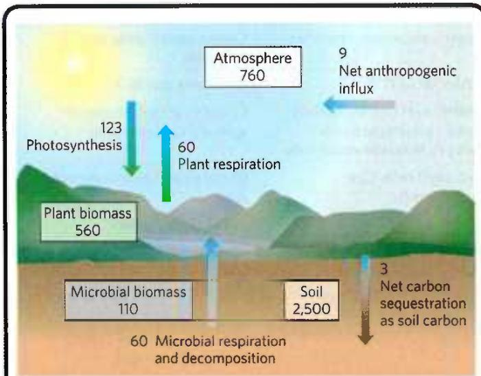  
FIGURE 2 The terrestrial carbon cycle. Carbon stocks (boxed text) are shown as gigatons (GT), and fluxes (arrows) are shown in GT per year. Animal biomass is negligible here — less than 0.5 GT. [Information from C. Jansson et al., BioScience 60:683, 2010, Fig. 1.]

When maize, wheat, or switchgrass is fermented to ethanol for fuel, every increase in biomass production brought about by more efficient photosynthesis should result in a corresponding decrease in the use of fossil fuels.

Finally, engineering of food crops to yield more food per acre of land, or per hour of work, could improve human nutrition worldwide.

In principle, these goals might be accomplished by developing a rubisco that didn't also catalyze the wasteful reaction with $\mathrm{O}_2$ , or by increasing the turnover number for rubisco, or by increasing the level of rubisco or other enzymes in the pathway for $\mathrm{CO}_2$ fixation. Rubisco, as we have

dikinase (Fig. 20-40b). This enzyme is called a dikinase because two different molecules are simultaneously phosphorylated by one molecule of ATP: pyruvate to PEP, and phosphate to pyrophosphate. The pyrophosphate is subsequently hydrolyzed to phosphate, so two high-energy phosphate groups of ATP are used in regenerating PEP. The PEP is now ready to receive another molecule of CO₂ in the mesophyll cell.

The PEP carboxylase of mesophyll cells has a high affinity for $HCO_{3}^{-}$ (which is favored relative to $CO_{2}$ in aqueous solution) and can fix $CO_{2}$ more efficiently than can rubisco. Unlike rubisco, it does not use $O_{2}$ as an alternative substrate, so there is no competition between $CO_{2}$ and $O_{2}$ . The PEP carboxylase reaction, then, serves to fix and concentrate $CO_{2}$ in the form of malate. P5 Release of $CO_{2}$ from malate in the bundle-sheath cells yields a noted, is an unusually inefficient enzyme, with a turnover number of $3 \, s^{-1}$ at $25 \, ^{\circ}C$ ; most enzymes have turnover numbers orders of magnitude larger. It also catalyzes the wasteful reaction with oxygen, which further reduces its efficiency in fixing $CO_{2}$ and producing biomass. If rubisco could be genetically engineered to turn over faster or to be more selective for $CO_{2}$ relative to $O_{2}$ , would the effect be greater photosynthetic production of biomass and thus greater sequestration of $CO_{2}$ , greater production of nonfossil fuel, and improved nutrition?

The traditional view of metabolic pathways held that one step in any pathway was the slowest and therefore the limiting factor in material flow through the pathway. However, efforts to engineer cells or organisms to produce more of the "limiting" enzyme in a pathway have often given discouraging results; the organisms often show little or no change in the flux through that pathway. The Calvin cycle is an instructive case in point. Increasing the amount of rubisco in plant cells through genetic engineering has little or no effect on the rate of $\mathrm{CO}_{2}$ conversion into carbohydrate. Similarly, changes in the levels of enzymes known to be regulated by light and therefore suspected of playing key roles in the regulation of the $\mathrm{CO}_{2}$ -assimilation pathway (fructose 1,6-bisphosphatase, 3-phosphoglycerate kinase, and glyceraldehyde 3-phosphate dehydrogenase) also produce little or no significant improvement in photosynthetic rate. This should probably not be surprising; in the living organism, pathways can be limited by more than one enzymatic step, because every change in one step results in compensating changes in other steps. Metabolic control analysis is the science of measuring, understanding, and eventually altering the factors that govern the overall flux through a pathway. Its application will be essential to the success of engineering plants for higher efficiency or greater yield.

sufficiently high local concentration of $CO_{2}$ for rubisco to function near its maximal rate, and for suppression of the enzyme's oxygenase activity.

Once $CO_{2}$ is fixed into 3-phosphoglycerate in the bundle-sheath cells, the other reactions of the Calvin cycle take place exactly as described earlier. Thus in $C_{4}$ plants, mesophyll cells carry out $CO_{2}$ assimilation by the $C_{4}$ pathway and bundle-sheath cells synthesize starch and sucrose by the $C_{3}$ pathway.

Three enzymes of the $C_{4}$ pathway are regulated by light, becoming more active in daylight. Malate dehydrogenase is activated by the thioredoxin-dependent reduction mechanism shown in Figure 20-37; PEP carboxylase is activated by phosphorylation of a Ser residue; and pyruvate phosphate dikinase is activated by dephosphorylation.

<table><tr><td colspan="4">TABLE 20-1 Comparison of  $C_3$ ,  $C_4$ , and CAM Plants</td></tr><tr><td></td><td> $C_3$  Plants</td><td> $C_4$  Plants</td><td>CAM Plants</td></tr><tr><td>Examples</td><td>Spinach, pea, rice, wheat, beans, most trees</td><td>Maize (corn), sugarcane, crabgrass</td><td>Cactus, prickly pear, orchid, pineapple</td></tr><tr><td>Most efficient environment</td><td>15 to 25 °C</td><td>Hot and dry; 30 to 47 °C</td><td>Extremely dry; 35 °C</td></tr><tr><td>Path of  $CO_2$  fixation</td><td> $C_3$  photosynthesis only</td><td>Sequential  $C_4$  and  $C_3$  cycles spatially separated:  $C_4$  in mesophyll cells followed by  $C_3$  in bundle-sheath cells</td><td> $C_3$  and  $C_4$  cycles, separated spatially and temporally</td></tr><tr><td>Cell type involved</td><td>Mesophyll cells</td><td> $C_4$  in mesophyll cells,  $C_3$  in bundle-sheath cells</td><td> $C_3$  and  $C_4$  in the same mesophyll cells</td></tr><tr><td>Light conditions</td><td>Light</td><td>Light</td><td> $C_3$  in light;  $C_4$  in dark</td></tr><tr><td>Initial  $CO_2$  acceptor</td><td>Ribulose 1,5-bisphosphate</td><td>Phosphoenolpyruvate</td><td>Ribulose 1,5-bisphosphate in light; phosphoenolpyruvate in dark</td></tr><tr><td> $CO_2$ -fixing enzyme</td><td>Rubisco</td><td>PEP carboxylase, then rubisco</td><td>Rubisco in light; PEP carboxylase at night</td></tr><tr><td>First stable product of  $CO_2$  fixation</td><td>3-Phosphoglycerate</td><td>Oxaloacetate in  $C_4$  cycle</td><td>3-Phosphoglycerate in light; oxaloacetate in dark</td></tr><tr><td>Energy needed for complete reduction of one molecule of  $CO_2$ </td><td>3 ATP, 2 NADPH</td><td>5 ATP, 2 NADPH</td><td>6.5 ATP, 2 NADPH</td></tr><tr><td>Photorespiration</td><td>Present</td><td>Absent or suppressed</td><td>Absent or suppressed</td></tr></table>

The pathway of $CO_{2}$ assimilation has a greater energy cost in $C_{4}$ plants than in $C_{3}$ plants. For each molecule of $CO_{2}$ assimilated in the $C_{4}$ pathway, a molecule of PEP must be regenerated at the expense of two phosphoanhydride bonds in ATP. P5 Thus $C_{4}$ plants need five ATP molecules to assimilate one molecule of $CO_{2}$ , whereas $C_{3}$ plants need only three (nine per triose phosphate). As the temperature increases (and the affinity of rubisco for $CO_{2}$ decreases, as noted above), a point is reached, at about 28 to 30 °C, at which the gain in efficiency from the elimination of photorespiration more than compensates for this energetic cost. $C_{4}$ plants (crabgrass, for example) outgrow most $C_{3}$ plants during the summer, as any experienced gardener can attest.

#### [EN] In CAM Plants, CO₂ Capture and Rubisco Action Are Temporally Separated

Succulent plants such as cactus and pineapple, which are native to very hot, very dry environments, have another variation on photosynthetic $CO_{2}$ fixation, which reduces loss of water vapor through the pores (stomata) by which $CO_{2}$ and $O_{2}$ must enter leaf tissue. Instead of separating the initial trapping of $CO_{2}$ and its fixation by rubisco across space (as do the $C_{4}$ plants), they separate these two events over time. At night, when the air is cooler and moister, the stomata open to allow entry of $CO_{2}$ , which is then fixed into oxaloacetate by PEP carboxylase. The oxaloacetate is reduced to malate and stored in the vacuoles, to protect cytosolic and plastid enzymes from the low pH produced by malic acid dissociation. During the day the stomata close, preventing the water loss that would result from high daytime temperatures, and the

CO₂ trapped overnight in malate is released as CO₂ by the NADP-linked malic enzyme. This CO₂ is now assimilated by the action of rubisco and the Calvin cycle enzymes. Because this method of CO₂ fixation was first discovered in stonecrops, perennial flowering plants of the family Crassulaceae, it is called crassulacean acid metabolism, and the plants are called CAM plants. Table 20-1 compares characteristics of C₃, C₄, and CAM plants.

#### [EN] SUMMARY 20.5 Photorespiration and the C₄ and CAM Pathways

■ Rubisco is not completely specific for $CO_{2}$ as its substrate; it can also use $O_{2}$ , producing 2-phosphoglycolate, which must be disposed of in an oxygen-dependent pathway. The result is increased consumption of $O_{2}$ —photorespiration.

■ The 2-phosphoglycolate is converted to glyoxylate, to glycine, and then to serine in a pathway that involves enzymes in the chloroplast stroma, peroxisomes, and mitochondria.

In $\mathrm{C_4}$ plants, the $\mathrm{CO}_{2}$ -assimilation pathway minimizes photorespiration: $\mathrm{CO}_{2}$ is first fixed in mesophyll cells into a four-carbon compound, which passes into bundle-sheath cells and releases $\mathrm{CO}_{2}$ in high concentrations. The released $\mathrm{CO}_{2}$ is fixed by rubisco, and the remaining reactions of the Calvin cycle occur as in $\mathrm{C_3}$ plants.

In CAM plants, $\mathrm{CO}_{2}$ is fixed into malate in the dark and stored in vacuoles until daylight, when the stomata are closed (minimizing water loss), and the stored malate serves as a source of $\mathrm{CO}_{2}$ for rubisco.

<!-- EN-END 20.5 -->

<!-- EN-BEGIN 20.6 -->

### 【英文对应 20.6】Biosynthesis of Starch, Sucrose, and Cellulose

> 来源：Lehninger Principles of Biochemistry（书籍/02_生物化学原理） 第20章 Photosynthesis and Carbohydrate Synthesis in Plants，§20.6。对应本章“六、光呼吸和 $\mathrm{C}_{4}$ 途径”。

During active photosynthesis in bright light, a plant leaf produces more carbohydrate (as triose phosphates) than it needs for generating energy or synthesizing precursors. P5 The excess is converted to sucrose and transported to other parts of the plant, to be used as fuel or stored. In most plants, starch is the main storage form of carbohydrate, but in a few plants, such as sugar beet and sugarcane, sucrose is the primary storage form. The synthesis of sucrose and starch occurs in different cellular compartments (cytosol and plastids, respectively), and these processes are coordinated by a variety of regulatory mechanisms that respond to changes in light level and photosynthetic rate. The synthesis of sucrose and starch is important to the plant but also to humans: starch provides more than 80% of human dietary calories worldwide.

#### [EN] ADP-Glucose Is the Substrate for Starch Synthesis in Plant Plastids and for Glycogen Synthesis in Bacteria

Starch, like glycogen, is a high molecular weight polymer of D-glucose in (α1→4) linkage. It is synthesized in chloroplasts for temporary storage as one of the stable end products of photosynthesis, and for long-term storage it is synthesized in amyloplasts of the nonphotosynthetic parts of plants: seeds, roots, and tubers (underground stems).

The mechanism of glucose activation in starch synthesis is similar to that in glycogen synthesis, described in Chapter 15. An activated sugar nucleotide, in this case ADP-glucose, is formed by condensation of glucose 1-phosphate with ATP in a reaction made essentially irreversible by the presence in plastids of inorganic pyrophosphatase. Starch synthase then transfers glucose residues from ADP-glucose to preexisting starch molecules. The monomeric units are almost certainly added to the nonreducing end of the growing polymer, as they are in glycogen synthesis.

The amylose of starch is unbranched, but amylopectin has numerous (α1→6)-linked branches (see Fig. 7-13). Chloroplasts contain a branching enzyme, similar to the glycogen-branching enzyme that introduces the (α1→6) branches of amylopectin. Taking into account the hydrolysis by inorganic pyrophosphatase of the PP $_{i}$ produced during ADP-glucose synthesis, the overall reaction for starch formation from glucose 1-phosphate is

Starch $_{n}$ + glucose 1-phosphate + ATP $\longrightarrow$

$$
\begin{array}{r} \mathrm{starch} _ {n + 1} + \mathrm{ADP} + 2 \mathrm{P} _ {\mathrm{i}} \\ \Delta G ^ {\prime \circ} = - 5 0 \mathrm{kJ/mol} \end{array}
$$

Starch synthesis is regulated at the level of ADP-glucose formation, as discussed below.

#### [EN] UDP-Glucose Is the Substrate for Sucrose Synthesis in the Cytosol of Leaf Cells

Most of the triose phosphate generated by $CO_{2}$ fixation in plants is converted to sucrose (Fig. 20-41) or starch.

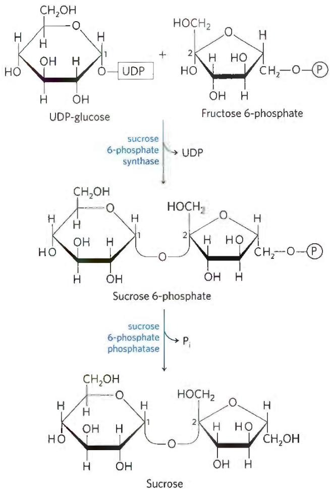  
FIGURE 20-41 Sucrose synthesis. Sucrose is synthesized from UDP-glucose and fructose 6-phosphate, which are synthesized from triose phosphates in the plant cell cytosol. The sucrose 6-phosphate synthase of most plant species is allosterically regulated by glucose 6-phosphate and P $_{i}$ .

In the course of evolution, sucrose may have been selected as the transport form of carbon because of its unusual linkage between the anomeric C-1 of glucose and the anomeric C-2 of fructose. This bond is not hydrolyzed by amylases or other common carbohydrate-cleaving enzymes, and the unavailability of the sucrose molecule's anomeric carbons prevents it from reacting nonenzymatically (as does glucose) with amino acids and proteins.

Sucrose is synthesized in the cytosol, beginning with dihydroxyacetone phosphate and glyceraldehyde 3-phosphate exported from the chloroplast. After condensation of two triose phosphates to form fructose 1,6-bisphosphate (catalyzed by aldolase), hydrolysis by fructose 1,6-bisphosphatase yields fructose 6-phosphate. Sucrose 6-phosphate synthase then catalyzes the reaction of fructose 6-phosphate with UDP-glucose to form sucrose 6-phosphate (Fig. 20-41). Finally, sucrose 6-phosphate phosphatase removes the phosphate group, making sucrose available for export to other tissues. The reaction catalyzed by sucrose 6-phosphate synthase is a low-energy process ( $\Delta G^{\circ} = -5.7$ kJ/mol), but the hydrolysis of sucrose 6-phosphate to sucrose is sufficiently exergonic ( $\Delta G^{\prime\circ} = -16.5$ kJ/mol) to make the overall synthesis of sucrose thermodynamically favorable. Sucrose synthesis is regulated and closely coordinated with starch synthesis, as we shall see.

One remarkable difference between the cells of plants and animals is the absence in the plant cell cytosol of the enzyme inorganic pyrophosphatase, which catalyzes the reaction

$$
\mathrm{PP} _ {\mathrm{i}} + \mathrm{H} _ {2} \mathrm{O} \longrightarrow 2 \mathrm{P} _ {\mathrm{i}} \quad \Delta G ^ {\prime \circ} = - 1 9. 2 \mathrm{kJ/mol}
$$

For many biosynthetic reactions that liberate PP $_{i}$ , pyrophosphatase activity makes the process more favorable energetically, tending to make these reactions irreversible. In plants, this enzyme is present in plastids but absent from the cytosol. As a result, the cytosol of leaf cells contains a substantial concentration of PP $_{i}$ —enough (\~0.3 mm) to make reactions such as that catalyzed by UDP-glucose pyrophosphorylase (see Fig. 15-7) readily reversible.

#### [EN] Conversion of Triose Phosphates to Sucrose and Starch Is Tightly Regulated

Triose phosphates produced by the Calvin cycle in bright sunlight, as we have noted, may be stored temporarily in the chloroplast as starch, or converted to sucrose and exported to nonphotosynthetic parts of the plant, or both. P5 The balance between the two processes is tightly regulated, and both must be coordinated with the rate of $CO_{2}$ fixation. Five-sixths of the triose phosphate formed in the Calvin cycle must be recycled to ribulose 1,5-bisphosphate (Fig. 20-32); if more than one-sixth of the triose phosphate is drawn out of the cycle to make sucrose and starch, the cycle will slow or stop. However, insufficient conversion of triose phosphate to starch or sucrose would tie up phosphate, leaving a chloroplast deficient in $P_{i}$ , which is also essential for operation of the Calvin cycle.

The flow of triose phosphates into sucrose is regulated by the activity of fructose 1,6-bisphosphatase (FBPase-1) and the enzyme that effectively reverses its action, PP $_{i}$ -dependent phosphofructokinase (PP-PFK-1). These enzymes are therefore critical points for determining the fate of triose phosphates produced by photosynthesis. Both enzymes are regulated by fructose 2,6-bisphosphate (F26BP), which inhibits FBPase-1 and stimulates PP-PFK-1. In vascular plants, the concentration of F26BP varies inversely with the rate of photosynthesis (Fig. 20-42). Phosphofructokinase-2, responsible for F26BP synthesis, is inhibited by dihydroxyacetone phosphate or 3-phosphoglycerate and is stimulated by fructose 6-phosphate and P $_{i}$ . During active photosynthesis, dihydroxyacetone phosphate is produced and P $_{i}$ is consumed, resulting in inhibition of PFK-2 and lowered concentrations of F26BP. This favors greater flux of triose phosphate into fructose 6-phosphate formation and sucrose synthesis. With this regulatory system, sucrose synthesis occurs when the level of triose phosphate produced by the Calvin cycle exceeds that needed to maintain operation of the cycle.

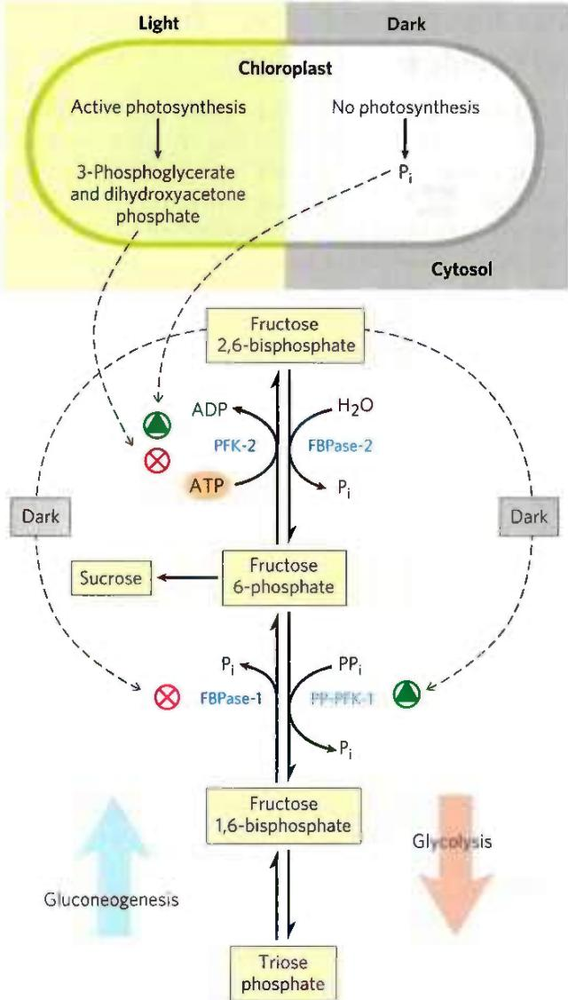  
FIGURE 20-42 Fructose 2,6-bisphosphate as regulator of sucrose synthesis. The concentration of the allosteric regulator fructose 2,6-bisphosphate in plant cells is regulated by the products of photosynthetic CO₂ assimilation and by P₁. Dihydroxyacetone phosphate and 3-phosphoglycerate produced by CO₂ assimilation inhibit phosphofructokinase-2 (PFK-2), the enzyme that synthesizes the regulator; P₁ stimulates PFK-2. The concentration of the regulator is therefore inversely proportional to the rate of photosynthesis. In the dark, the concentration of fructose 2,6-bisphosphate increases and stimulates the glycolytic enzyme PP₁-dependent phosphofructokinase-1 (PP-PFK-1), while inhibiting the gluconeogenic enzyme fructose 1,6-bisphosphatase (FBPase-1). When photosynthesis is active (in the light), the concentration of the regulator drops and the synthesis of fructose 6-phosphate and sucrose is favored.

Sucrose synthesis is also regulated at the level of sucrose 6-phosphate synthase, which is allosterically activated by glucose 6-phosphate and inhibited by $\mathbf{P}_{\mathrm{i}}$ . This enzyme is further regulated by phosphorylation and dephosphorylation; a protein kinase phosphorylates the enzyme on a specific Ser residue, making it less active, and a phosphatase reverses this inactivation by removing the phosphate (Fig. 20-43). Inhibition of the kinase by glucose 6-phosphate, and of the phosphatase by $P_{i}$ , enhances the effects of these two compounds on sucrose synthesis. When hexose phosphates are abundant, sucrose 6-phosphate synthase is activated by glucose 6-phosphate; when $P_{i}$ is elevated (as when photosynthesis is slow), sucrose synthesis is slowed. During active photosynthesis, triose phosphates are converted to fructose 6-phosphate, which is rapidly equilibrated with glucose 6-phosphate by phosphohexose isomerase. Because the equilibrium lies far toward glucose 6-phosphate, as soon as fructose 6-phosphate accumulates, the level of glucose 6-phosphate rises and sucrose synthesis is stimulated.

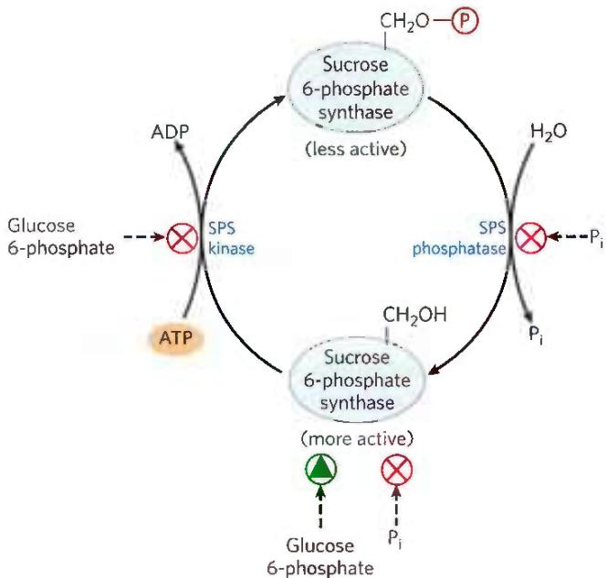  
FIGURE 20-43 Regulation of sucrose phosphate synthase by phosphorylation. A protein kinase (SPS kinase) specific for sucrose phosphate synthase (SPS) phosphorylates a Ser residue in SPS, inactivating it; a specific phosphatase (SPS phosphatase) reverses this inhibition. The kinase is inhibited allosterically by glucose 6-phosphate, which also activates SPS allosterically. The phosphatase is inhibited by $\mathsf{P_i}$ , which also inhibits SPS directly. Thus, when the concentration of glucose 6-phosphate is high as a result of active photosynthesis, SPS is activated and produces sucrose phosphate. A high $\mathsf{P_i}$ concentration, which occurs when photosynthetic conversion of ADP to ATP is slow, inhibits sucrose phosphate synthesis.

The key regulatory enzyme in starch synthesis is ADP-glucose pyrophosphorylase (Fig. 20-44); it is activated by 3-phosphoglycerate, which accumulates during active photosynthesis, and inhibited by $\mathrm{P_i}$ , which accumulates when light-driven condensation of ADP and $\mathrm{P_i}$ slows. When sucrose synthesis slows, 3-phosphoglycerate formed by $\mathrm{CO_2}$ fixation accumulates, activating this enzyme and stimulating the synthesis of starch.

#### [EN] The Glyoxylate Cycle and Gluconeogenesis Produce Glucose in Germinating Seeds

Many plants store lipids (oils) and proteins in their seeds, to be used as sources of energy and as biosynthetic precursors during germination, before photosynthetic capacity has developed. These stored components are converted to carbohydrates by the combined action of several pathways. Glucogenic amino acids (see Table 14-4) derived from the breakdown of stored seed proteins are transaminated and oxidized to succinyl-CoA, pyruvate, oxaloacetate, fumarate, and $\alpha$ -ketoglutarate (Chapter 18)—all good starting materials for gluconeogenesis. Active gluconeogenesis in germinating seeds provides glucose for the synthesis of sucrose, polysaccharides, and many metabolites derived from hexoses. In plant seedlings, sucrose provides much of the chemical energy needed for initial growth.

  
FIGURE 20-44 Regulation of ADP-glucose pyrophosphorylase by 3-phosphoglycerate and $P_{i}$ . This enzyme, which produces the precursor for starch synthesis, is rate-limiting in starch production. The enzyme is stimulated allosterically by 3-phosphoglycerate (3-PGA) and inhibited by $P_{i}$ ; in effect, the ratio [3-PGA]/[P], which rises with increasing rates of photosynthesis, controls starch synthesis at this step.

Triacylglycerols stored in seeds also provide fuel for the germinating plants. They are hydrolyzed to free fatty acids, which undergo $\beta$ oxidation to acetyl-CoA in specialized peroxisomes called glyoxysomes that develop during seed germination (see Fig. 17-14). The acetyl-CoA formed from seed oils enters the glyoxylate cycle (Fig. 20-45), which brings about the net conversion of acetate to succinate or other four-carbon intermediate of the citric acid cycle:

$$
\begin{array}{r l} 2 \mathrm {Acetyl - CoA + NA D ^ {+} +2H_ {2} O\longrightarrow} \\ & \text { succinate } + 2 \mathrm{CoA} + \mathrm{NADH} + \mathrm{H} ^ {+} \end{array}
$$

In the glyoxylate cycle, acetyl-CoA condenses with oxaloacetate to form citrate, and citrate is converted to isocitrate, exactly as in the citric acid cycle. The next step, however, is not the breakdown of isocitrate by isocitrate dehydrogenase but the cleavage of isocitrate by isocitrate lyase, forming succinate and glyoxylate. The glyoxylate then condenses with a second molecule of acetyl-CoA to yield malate, in a reaction catalyzed by malate synthase. The malate is subsequently oxidized to oxaloacetate, which can condense with another molecule of acetyl-CoA to start another turn of the cycle. The succinate passes into the mitochondrial matrix, where it is converted by citric acid cycle enzymes to oxaloacetate. The oxaloacetate moves into the cytosol (glyoxysomes, mitochondria, and cytosol) are integrated for the production of fructose 6-phosphate or sucrose from stored lipids.

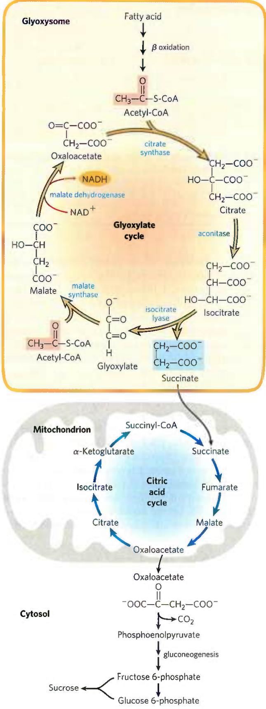  
and can be converted to phosphoenolpyruvate by PEP carboxykinase, then to fructose 6-phosphate, the precursor of sucrose, by gluconeogenesis. Thus, reaction sequences carried out in three subcellular compartments

FIGURE 20-45 Conversion of stored fatty acids to sucrose in germinating seeds through the glyoxylate cycle. This pathway begins in specialized peroxisomes called glyoxysomes. The citrate synthase, aconitase, and malate dehydrogenase of the glyoxylate cycle are isozymes of the citric acid cycle enzymes; isocitrate lyase and malate synthase are unique to the glyoxylate cycle. Notice that two acetyl groups enter the cycle and four carbons leave as succinate. Succinate is exported to mitochondria, where it is converted to oxaloacetate by enzymes of the citric acid cycle. Oxaloacetate enters the cytosol and serves as the starting material for gluconeogenesis and for synthesis of sucrose, the transport form of carbon in plants.  

Enzymes common to the citric acid and glyoxylate cycles have two isozymes, one specific to mitochondria, the other to glyoxysomes. Physical separation of the glyoxylate cycle and $\beta$ -oxidation enzymes from the mitochondrial citric acid cycle enzymes prevents further oxidation of acetyl-CoA to $CO_{2}$ . Each turn of the glyoxylate cycle consumes two molecules of acetyl-CoA and produces one molecule of succinate, which is then available for biosynthetic purposes. Hydrolysis of stored triacylglycerols also produces glycerol 3-phosphate, which can enter the gluconeogenic pathway, after its oxidation to dihydroxyacetone phosphate (see Fig. 14-16).

We noted in Chapter 14 that animal cells can carry out gluconeogenesis from three- and four-carbon precursors, but not from the two acetyl carbons of acetyl-CoA. Because the pyruvate dehydrogenase reaction is effectively irreversible (see Section 16.1) and animals do not have the enzymes specific to the glyoxylate cycle (isocitrate lyase and malate synthase), they have no way to convert acetyl-CoA to pyruvate or oxaloacetate. So, unlike vascular plants, animals cannot bring about the net synthesis of glucose from fatty acids.

#### [EN] Cellulose Is Synthesized by Supramolecular Structures in the Plasma Membrane

Cellulose is a major constituent of plant cell walls, providing strength and rigidity and preventing the swelling of the cell and rupture of the plasma membrane that might result when osmotic conditions favor water entry into the cell. Each year, worldwide, plants synthesize more than $10^{11}$ metric tons of cellulose, making this simple polymer one of the most abundant compounds in the biosphere. The structure of cellulose in the plant cell wall is simple: linear polymers of thousands of $(\beta1\rightarrow4)$ -linked D-glucose units, assembled into bundles of at least 18 chains, which co-crystallize to form microfibrils, which may in turn be assembled into larger macrofibrils. (Fig. 20-46).

P5 As a major component of the plant cell wall, cellulose must be synthesized from intracellular precursors but deposited and assembled outside the plasma membrane. The enzymatic machinery for initiation, elongation, and export of cellulose chains is therefore more complicated than that used to synthesize starch or glycogen (which are not exported).

  
FIGURE 20-46 Cellulose structure. The plant cell wall is made up in part of cellulose molecules arranged side by side to form crystalline arrays — cellulose microfibrils. Several microfibrils may combine to form larger cellulose macrofibrils. The scanning electron microscope shows macrofibrils, 5 to 12 nm in diameter, laid down on the cell surface in several layers distinguishable by the different orientations of the fibrils. [Electron micrograph from Biophoto Associates/Science Source.]

The complex enzymatic machinery that assembles cellulose chains spans the plasma membrane, with one part on the cytoplasmic side positioned to bind the substrate, UDP-glucose, and elongate the chains, and another part extending to the outside, responsible for exporting the cellulose molecules to the extracellular space. Freeze-fracture electron microscopy shows a cellulose synthesis complex, or rosette, composed of six large particles arranged in a regular hexagon with a diameter of about 30 nm (Fig. 20-47a). Several proteins, including the catalytic subunit of cellulose synthase, make up this structure. The structure of the plant cellulose synthase is similar to that of the bacterium Rhodobacter sphaeroides, which has been determined by x-ray crystallography (Fig. 20-47b).

  
FIGURE 20-47 A model for the synthesis of cellulose. (a) Schematic derived from a combination of genetic, electron microscopic, and biochemical studies of Arabidopsis thaliana and other vascular plants. (b) The structure of cellulose synthase from the bacterium Rhodobacter sphaeroides. The transmembrane part of the protein provides a channel through which the lengthening cellulose polymer (red) is pushed into the periplasm as the chain grows by addition of glucose units on the inside surface of the plasma membrane. Two structures of the enzyme move during the catalytic cycle.  
The gating loop moves into the substrate-binding site when UDP-glucose binds, then moves out to allow UDP to leave. The finger helix touches the glucose residue at the growing polymer end, then, after a new residue is added, moves so as to touch this new terminal glucose. The glycosyl transferase domain extends into the cytoplasm, where it binds its substrate UDP-glucose. (a) Electron micrograph @courtesy Dr. Candace H. Haigler, North Carolina State University, and Dr. Mark Grimson, Texas Tech University. (b) Data from PDB ID 5EJZ, J. L. W. Morgan et al., Nature 531:329, 2016. An extension of the cellulose chain was modeled in.]

In one working model of cellulose synthesis, cellulose chains are initiated by the transfer of a glucose residue from UDP-glucose to a "primer" glucose already bound to cellulose synthase on the cytoplasmic side of the plasma membrane, to form a disaccharide. As addition of further glucose residues lengthens the chain, it is extruded through a channel formed by the transmembrane helices of cellulose synthase and, on the outer surface of the plasma membrane, joins growing chains from neighboring cellulose synthase molecules to form a cellulose microfibril. Polymers of more than 6 to 8 glucose units are insoluble in water, promoting microfibril crystallization. There is no definite length for a cellulose polymer; synthesis is highly processive, and some polymers are as long as 15,000 glucose units.

The UDP-glucose used for cellulose synthesis (step 1 in Fig. 20-47) is generated from sucrose produced during photosynthesis, in a reaction catalyzed by sucrose synthase (named for the reverse reaction):

$$
\mathrm{Sucrose} + \mathrm{UDP} \longrightarrow \mathrm{UDP-glucose} + \mathrm{fructose}
$$

A membrane-bound form of sucrose synthase may produce a high local concentration of UDP-glucose for cellulose synthesis.

Each of the six particles of the rosette most likely contains three cellulose synthase molecules, each synthesizing a single cellulose chain (step 2). The large enzyme complex that catalyzes this process moves along the plasma membrane with directionality often related to the course of microtubules in the cell cortex, the cytoplasmic layer just below the membrane (step 3). When these microtubules lie perpendicular to the axis of the plant's growth, the cellulose microfibrils are laid down similarly to promote elongation. The motion of the cellulose synthase complexes is believed to be driven by energy released in the polymerization reaction, not by a molecular motor such as kinesin.

The fundamental cellulose microfibril made by one rosette-type cellulose synthesis complex is thought to be composed of 18 chains lying side by side with the same (parallel) orientation of nonreducing and reducing ends. The 18 separate polymers coalesce on the outer surface of the cell and crystallize soon after they are polymerized (step 4), just prior to integrating into the cell wall.

In UDP-glucose, the glucose is $\alpha$ -linked to the nucleotide, but in cellulose, the glucose residues are $(\beta1\rightarrow4)$ -linked, so there is an inversion of configuration at the anomeric carbon (C-1) as the glycosidic bond forms. Glycosyltransferases that invert configuration are generally assumed to use a single-displacement mechanism, with nucleophilic attack by the acceptor species at the anomeric carbon of the donor sugar (in this case, UDP-glucose).

#### [EN] Pools of Common Intermediates Link Pathways in Different Organelles

Although we have described metabolic transformations in plant cells in terms of individual pathways, these pathways interconnect so completely that we should instead consider pools of metabolic intermediates shared among these pathways and connected by readily reversible reactions (Fig. 20-48). One such metabolite pool includes the hexose phosphates glucose 1-phosphate, glucose 6-phosphate, and fructose 6-phosphate; a second includes the 5-phosphates of the pentoses ribose, ribulose, and xylulose; a third includes the triose phosphates dihydroxyacetone phosphate and glyceraldehyde 3-phosphate. Metabolite fluxes through these pools change in magnitude and direction in response to changes in the circumstances of the plant, and they vary with tissue type. Transporters in the membranes of each organelle move specific compounds in and out, and the regulation of these transporters presumably influences the degree to which the pools mix.

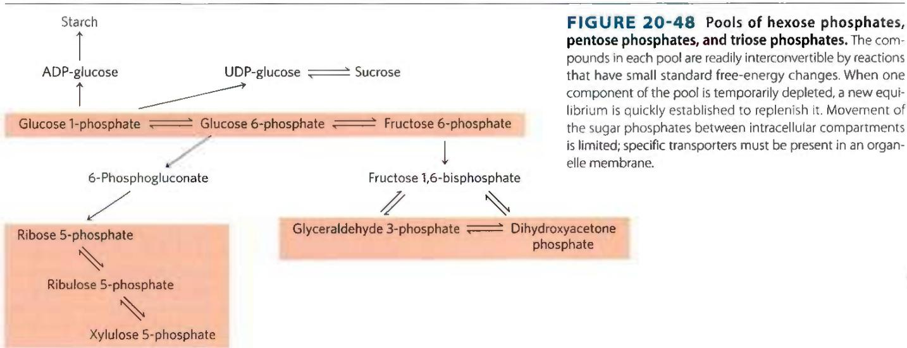

  
FIGURE 20-49 Movement of sucrose between source and sink tissues. (a) In daylight, photosynthetic leaves (source tissue) fix $\mathrm{CO}_{2}$ into triose phosphates via the Calvin cycle in chloroplasts. Some of the triose phosphate is used in the chloroplasts to synthesize starch; the rest is exported to the cytosol, where it can be converted via gluconeogenesis to fructose 6-phosphate and glucose 1-phosphate. Sucrose, synthesized from UDP-glucose and fructose, is exported from leaf mesophyll cells to the plant phloem; the resulting high sucrose content draws water into the phloem by osmosis.  
The resulting increased turgor pressure (p. 52) pushes the solution in the phloem toward sink tissues. (b) Sucrose moves from the phloem into the sink tissues, where it is converted to starch or cell wall cellulose, or is used as fuel for glycolysis, the citric acid cycle, and oxidative phosphorylation to provide ATP for these nonphotosynthetic tissues. Sugar transport across the plasma membrane and between intracellular compartments is catalyzed by several symporters and antiporters coupled to a proton gradient. [Information from Dr. Gerald Edwards, School of Biological Sciences, Washington State University.]

During daylight hours, triose phosphates produced in photosynthetic leaf tissue (“source” tissues, in which there is a net fixation of $CO_{2}$ ) move out of the chloroplast and into the cytosolic hexose phosphate pool, where they are converted to sucrose for transport via the plant phloem (sap) to nonphotosynthetic “sink” tissues (Fig. 20-49). In sink tissues such as roots, tubers, and bulbs, sucrose is converted to starch for storage or is used as an energy source via glycolysis. In growing plants, hexose phosphates are also withdrawn from the pool for the synthesis of cell walls. At night, starch is metabolized by glycolysis and oxidative phosphorylation to provide energy for both source and sink tissues.

#### [EN] SUMMARY 20.6 Biosynthesis of Starch, Sucrose, and Cellulose

■ Starch synthase in chloroplasts and amyloplasts catalyzes the addition of single glucose residues, donated by ADP-glucose, to the growing polymer chain.

■ Sucrose is synthesized in the cytosol from UDP-glucose and fructose 1-phosphate, in two steps.

■ The partitioning of triose phosphates between sucrose synthesis and starch synthesis is regulated by fructose 2,6-bisphosphate (F26BP). [F26BP] varies inversely with the rate of photosynthesis, and F26BP inhibits the synthesis of fructose 6-phosphate, the precursor of sucrose.

■ The glyoxylate cycle, taking place in the glyoxysomes of germinating seeds of some plants, uses several citric acid cycle enzymes and two additional enzymes: isocitrate lyase and malate synthase. The two decarboxylation steps of the citric acid cycle are bypassed, making possible the net formation of succinate, oxaloacetate, and other cycle intermediates from acetyl-CoA.

■ Cellulose synthase has a glycosyl transferase activity in its cytoplasmic domain and forms a transmembrane channel through which the growing cellulose chain is extruded. Glucose units are transferred from UDP-glucose to the nonreducing end of the growing chain.

The plant cell shares pools of common intermediates, including hexose-, pentose-, and triose-phosphates. Transporters in the membranes of chloroplasts, mitochondria, and amyloplasts mediate the movement of sugar phosphates between organelles. The direction of metabolite flow through the pools within a leaf changes from day to night.

■ Sucrose produced in a photosynthetic (source) tissue is exported to nonphotosynthetic (sink) tissue such as roots and tubers via the plant phloem.

<!-- EN-END 20.6 -->

## 提要

光合作用是在藻类和高等植物的叶绿体以及细菌的载色体中进行的；叶绿体是一种有双层膜包裹并充满的膜性碟子（类囊体）结构，内含光合机构。光合作用的光反应直接依赖于光的吸收，引起的光化学是从水中取出电子，并驱动它们通过系列与膜结合的载体，产生NADPH和ATP。光合作用的碳同化反应是利用NADPH的电子和ATP的能量还原 $CO_{2}$ 成为有机碳。

可见光的光子(170\~300 kJ/mol)具有足够的能量引起光合生物中的光化学,并最终导致ATP的合成。在植物的光反应中,吸收的光子激发叶绿素分子和其他(辅助)色素分子,它们把这些能量汇集到类囊体膜上的反应中心(叶绿素a特殊对)。在反应中心光激发的结果是电荷分离,电荷分离产生强电子供体(还原剂)和强电子接纳体(还原剂)。

光合细菌只有单一的反应中心；紫色细菌中是脱镁叶绿素-醌型，绿色硫细菌中是Fe-S型。紫色细菌反应中心的结构研究提供了有关从激发态叶绿素分子特殊对经由脱镁叶绿素到醌的光驱动电子流方面的资料。电子然后从醌经由细胞色素 $bc_{1}$ 复合体回到光反应中心。在绿色硫细菌中是另一条途径，把电子从还原型的醌送到 $NAD^{+}$ 。

光合色素在光合膜上被组织成集光复合体(LHC)和光化学反应中心复合体(光系统)。

蓝细菌、藻类和维管植物同时含有两个不同的反应中心或光系统：PSⅡ和PSⅠ，它们串联排列。植物光系统Ⅰ把电子从它的激发态反应中心P700，经由一系列过程传递给铁氧还蛋白，然后铁氧还蛋白把NADP $^{+}$ 还原成NADPH。

植物光系统Ⅱ的反应中心 P680, 把电子传递给质体醌, P680 失去的电子由来自水的电子来替代 (其他生物中除水外还用其他电子供体)。电子流通过光系统产生 NADPH 和 ATP。循环电子流只产生 ATP, 但允许形成的 ATP 和 NADPH 的比例可以改变。PS I 和 PS II 在基粒片层和基质片层之间的定位是可以改变的, 并间接地由光强度来控制, 使激子在 PS I 和 PS II 之间的分布达到最适程度以捕获有效能量。

$H_{2}O$ 的光驱动裂解是由含 Mn 和 Ca 的蛋白质复合体（放氧复合体）催化的；产生 $O_{2}$ 。还原型质体醌，把电子传递给细胞色素 $b_{6}f$ 复合体；从这里电子转移到质体蓝素（可溶性电子载体），然后传递给 P700 以替代光激发时丢失的电子。经由细胞色素 $b_{6}f$ 复合体的电子流驱动质子跨过质膜，产生质子动力（决定于质子梯度），为 ATP 合酶合成 ATP 提供能量。

植物中,水裂解反应和经由细胞色素 $b_{0}f$ 复合体的电子流都伴随有跨类囊体膜的质子泵送。这样形成的质子动力驱动 ATP 合成,合成是由与线粒体 $F_{0}F_{1}$ 复合体类似的 $CF_{0}CF_{1}$ 复合体催化的。 $CF_{0}CF_{1}$ 的催化机制跟线粒体和细菌的 ATP 合酶很相似。由质子梯度驱动的物理旋转伴随有 ATP 的合成,合成部位轮流经过 3 个不同构象态:一个对 ATP 高亲和力,一个对 ADP+Pi 高亲和力,和一个对两个核苷酸都是低亲和力。

高等植物 $C_{3}$ 途径的光合作用是在叶绿体内进行的。 $CO_{2}$ 同化反应（Calvin 循环）中，光反应阶段产生的 ATP 和 NADPH 用于还原 $CO_{2}$ 为磷酸丙糖。这些反应分 3 个阶段进行：一是 rubisco 催化的 $CO_{2}$ 固定反应；二是生成的 3-磷酸甘油酸还原成 3-磷酸甘油醛；三是 1,5-二磷酸核酮糖从磷酸丙糖再生。

Rubisco 催化 $CO_{2}$ 和 RuBP 缩合，形成不稳定的二磷酸己糖（ $\beta-$ 酮酸中间物），后者裂解成 2 个分子的 3-磷酸甘油酸。生成的 3-磷酸甘油酸去向复杂，一部分被转变为葡萄糖、蔗糖或淀粉；一部分用于重新生成 RuBP。Rubisco 在 rubisco 激活酶催化下经共价修饰（Lys 201 氨甲酰化）而激活，但天然的过渡态类似物能抑制它；此类似物的浓度夜间升高，白天降低。在第 2 阶段中还原 1 分子 3-磷酸甘油酸为 3-磷酸甘油醛需要 1 分子 ATP 和 1 分子 NADPH。

叶绿体基质中的酶包括转羟乙醛酶和醛缩酶重排磷酸丙糖的碳骨架，产生三、四、五、六和七碳中间物，最后生成磷酸戊糖。磷酸戊糖转变为1,5-二磷酸核酮糖，完成Calvin循环。固定3个 $\mathrm{CO}_{2}$ 为1个磷酸丙糖的代价是9个ATP和6个NADPH。它们是由光合作用的光依赖性反应提供的。

Calvin 循环的 4 种酶间接地受光激活, 在暗中无活性, 因此己糖合成不会与糖酵解竞争, 暗中提供能量所必需。

在 $C_{4}$ 植物中 $CO_{2}$ 最初在外部的叶肉细胞中通过与磷酸烯醇丙酮酸反应被固定, 这样产生的 4 碳分子被转运到内部的维管束鞘细胞, 在这里释放 $CO_{2}$ , 并用于 Calvin 循环。这些反应组成 $C_{4}$ 途径。因此 $C_{4}$ 植物即使在大气 $CO_{2}$ 浓度很低时, 其光合效率仍然很高。

光合作用总是伴随着光呼吸,光呼吸在光下发生,消耗 $O_{2}$ 并把一部分 1,5-二磷酸核酮糖转变为 $CO_{2}$ 。

## 习题

1. 根据放氧测定绿色植物的光合作用速率当用 680 nm 波长的光照射时比用 700 nm 光照射时高,但用这两种光一起照射时给出的光合作用速率比单独使用这两种波长光中的任一种光时高。请解释。

2. 光系统 I 中处于基态的 P700, $E^{\ominus}$ 为 +0.4 V, 当受 700 nm 光激发时转变为 P700\*, $E^{\ominus}$ 为 -1.0 V。在此光反应中 P700 捕获光能的效率是多少?

3. 当光系统 I 在标准条件下吸收 700 nm 红光时 P700 的标准还原电势 $E^{\ominus}$ 由 +0.4 V 变为 -1.2 V。被吸收的光能有百分之多少以 NADPH( $E^{\ominus} = -0.32 \, V$ ) 形式被贮存？

4. 在无 ADP 和 Pi 存在下用光照射菠菜叶绿体, 然后停止照射(在暗处), 加入 ADP 和 Pi。发现在短时间内有 ATP 合成。请解释原因。

5. 如果水的光诱导氧化反应(引起放氧)的 $\Delta G^{\ominus}$ 为 -25 kJ/mol。光系统Ⅱ中光产生的原初氧化剂的 $E^{\ominus}$ 值是多少？

6. 在充分照光下, $25^{\circ} \mathrm{C}, \mathrm{pH} 7$ 的离体叶绿体中 ATP、ADP 和 Pi 的稳态浓度分别为 $3 \mathrm{mmol} / \mathrm{L}, 0.1 \mathrm{mmol} / \mathrm{L}$ 和 $10 \mathrm{mmol} / \mathrm{L}$ 。(a) 在这些条件下, 合成 ATP 反应的 $\Delta G$ 是多少? (b) 在此叶绿体中光诱导的电子传递提供 ATP 合成所需的能量 (经过质子动力), 在这些条件下合成 ATP 所需的最小电位差 ( $\Delta E$ ) 是多少? 假设每产生 1 分子 ATP 要求 $2 e^{-}$ 通过电子传递链。

7. 如果非循环光合电子传递导致 $3H^{+}/e^{-}$ 的跨膜转移，循环光合电子传递导致 $2H^{+}/e^{-}$ 的跨膜转移。问：(a) 非循环光合磷酸化的和 (b) 循环光合磷酸化的 ATP 合成效率是多少（以每合成一个 ATP 所需吸收的光子数表示）？（假设 $CF_{0}CF_{1}ATP$ 合酶产生 $1ATP/3H^{+}$ ）。

8. 植物光养生物非循环光合电子传递中 ATP(分子数)/2e⁻ 的实际比值并不确定。试计算从光系统Ⅱ到光系统Ⅰ的光合电子传递中 ATP/2e⁻ 的最大理论比值。假设在细胞条件下，生成 ATP 的 ΔG 为 +50 kJ/mol，并假设 ΔE ≈ ΔE°′。（提示：P680⁺/P680 电对和 P700⁺/P700 电对的 E°′ 分别为 -0.6 V 和 +0.4 V）。

9. 如果使用碳 1 位上标记 $^{14}$ C 的 5-磷酸核酮糖作为暗反应的底物。3-磷酸甘油酸的哪位碳将被标记？

10. 在 1 轮 Calvin 循环中将有 $6 \mu mol \, ^{14}CO_{2}$ 和 $6 \mu mol$ 未标记的 1,5-二磷酸核酮糖 (RuBP) 发生反应, 产生 $1 \mu mol \, 6-$ 磷酸葡糖, 并重新生成 $6 \mu mol \, RuBP$ 。问: (a) 在重新生成的 RuBP 中哪两个碳原子将不被标记; (b) 在重新生成的 RuBP 中其他 3 个碳原子各自被标记的百分数是多少?

## 主要参考书目

1. 沈允钢. 地球上最重要的化学反应——光合作用. 北京: 清华大学出版社, 2000.

2. 许大全. 光合作用学. 北京: 科学出版社, 2013.

3. Hall D O, Rao K K. 光合作用. 3 版, 张永平, 译. 北京: 科学出版社, 1984.

4. Garrett R H, Grisham C M. Biochemistry. 5th ed. Belmont: Brooks/Cole, Cengage Learning, 2013.

5. Stryer L. Biochemistry. 6th ed. New York: W. H. Freeman and Company, 2007.

6. Nelson D L, Cox M L. Lehninger Principles of Biochemistry. 6th ed. New York: W. H. Freeman and Company, 2013.

7. Darnell J, Lodish H, Baltimore D. Molecular Cell Biology. 2nd ed. New York: W. H. Freeman and Company, 1990.

8. Das D, Khanna N, Dasgupta C N. Biohydrogen Production. New York: CRC Press, 2014.

(徐长法)

## 网上资源

习题答案 自测题

<!-- EN-BEGIN 第20章章末 -->

## 【英文对应 第20章章末】Photosynthesis and Carbohydrate Synthesis in Plants：关键术语、习题与简答

> 来源：Lehninger Principles of Biochemistry（书籍/02_生物化学原理） 第20章章末，以及书末 Abbreviated Solutions to Problems 第20章。

### [EN] KEY TERMS

Terms in bold are defined in the glossary.

photosynthesis 700  
light-dependent reactions 700  
photophosphorylation 701  
chloroplast 701  
stroma 701  
thylakoid 701  
photon 703  
excited state 703  
ground state 704  
exciton 704  
exciton transfer 704  
chlorophylls 704  
accessory pigments 705  
carotenoids 705 $\beta$ -carotene 705  
action spectrum 705  
photosystem 705  
photochemical reaction center 705  
light-harvesting complexes (LHCs) 705

cyclic electron
transfer 708
linear electron
transfer 708
ferredoxin 708
Z scheme 709
photosystem II (PSII) 709
photosystem I (PSI) 709
cytochrome $b_{6}f$ 709
plastoquinone $(\mathrm{PQ}_{\mathrm{A}})$ 710
plastocyanin 711
phylloquinone $(\mathrm{PQ}_{\mathrm{K}})$ 711
cyclic photophosphorylation 713
state transition 713
oxygen-evolving center 715 $\mathrm{CO}_{2}$ assimilation 719 $\mathrm{CO}_{2}$ fixation 719
Calvin cycle 719
reductive pentose phosphate pathway 719

ribulose

1,5-bisphosphate 719
3-phosphoglycerate 719
C₃ plants 720
ribulose 1,5-bisphosphate carboxylase/oxygenase (rubisco) 720
rubisco activase 721
thioredoxin 725
ferredoxin:thioredoxin reductase 725
photorespiration 727
2-phosphoglycolate 727
glycolate pathway 727
C₄ plants 729

C4 pathway 729
phosphoenolpyruvate carboxylase 730
malic enzyme 730
pyruvate phosphate dikinase 730
CAM plants 732
sugar nucleotide 733
starch synthase 733
glyoxysome 735
glyoxylate cycle 735
isocitrate lyase 735
glyoxylate 735
malate synthase 735
cellulose synthase 737

### [EN] PROBLEMS

1. Photochemical Efficiency of Light at Different Wavelengths The rate of photosynthesis in a green plant, measured by $O_{2}$ production, is higher when illuminated with light of wavelength 680 nm than with light of wavelength 700 nm. However, illumination by a combination of light of 680 nm and 700 nm gives a higher rate of photosynthesis than light of either wavelength alone. Explain.

2. Balance Sheet for Photosynthesis In 1804, Nicolas-Théodore de Saussure observed that the total weight of oxygen and dry organic matter produced by plants is greater than the weight of carbon dioxide consumed during photosynthesis. Where does the extra weight come from?

3. Role of $H_{2}S$ in Some Photosynthetic Bacteria Illuminated purple sulfur bacteria carry out photosynthesis in the presence of $H_{2}O$ and ${}^{14}CO_{2}$ , but only if $H_{2}S$ is added and $O_{2}$ is absent. During photosynthesis, measured by formation of $[{}^{14}C]$ carbohydrate, the bacteria convert $H_{2}S$ to elemental sulfur but do not produce $O_{2}$ . What is the role of the conversion of $H_{2}S$ to sulfur? Why doesn't photosynthesis produce $O_{2}$ in these bacteria?

4. Electron Transfer through Photosystems I and II
Predict how an inhibitor of electron passage through pheophytin would affect electron transfer through (a) photosystem II and (b) photosystem I. Explain your reasoning.

5. Limited ATP Synthesis in the Dark In a laboratory experiment, a researcher illuminates spinach chloroplasts in the absence of ADP and $P_{i}$ . Then, the researcher turns the light off and adds ADP and $P_{i}$ . ATP synthesis occurs for a short time in the dark. Explain this finding.

6. Mode of Action of the Herbicide DCMU Treating chloroplasts with 3-(3,4-dichlorophenyl)-1,1-dimethylurea (DCMU, or diuron), a potent herbicide, causes oxygen evolution and photophosphorylation to cease. Adding a Hill reagent (an external electron acceptor) restores oxygen evolution, but not photophosphorylation. How does DCMU act as a weed killer? Suggest a location for the inhibitory action of this herbicide in the scheme shown in Figure 20-12. Explain.

7. Effect of Venturicidin on Oxygen Evolution Venturicidin is a powerful inhibitor of the chloroplast ATP synthase, interacting with $\mathrm{CF_0}$ and blocking proton passage through the $\mathrm{CF_0CF_1}$ complex. How would venturicidin affect oxygen evolution in a suspension of well-illuminated chloroplasts? Would your answer change if the experiment were done in the presence of an uncoupling reagent such as 2,4-dinitrophenol (DNP)? Explain.

8. Light Energy for a Redox Reaction Suppose you have isolated a new photosynthetic microorganism that oxidizes $H_{2}S$ and passes the electrons to $NAD^{+}$ . What wavelength of light would provide enough energy for $H_{2}S$ to reduce $NAD^{+}$ under standard conditions? Assume 100% efficiency in the photochemical event, and use an $E^{\circ}$ of -243 mV for $H_{2}S$ and -320 mV for $NAD^{+}$ . See Figure 20-4 for the energy equivalents of wavelengths of light.

9. Equilibrium Constant for Water-Splitting Reactions The coenzyme NADP+ is the terminal electron acceptor in chloroplasts, according to the reaction

$$
2 \mathrm{H} _ {2} \mathrm{O} + 2 \mathrm{NADP} ^ {+} \longrightarrow 2 \mathrm{NADPH} + 2 \mathrm{H} ^ {+} + \mathrm{O} _ {2}
$$

Use information in Chapter 19 (Table 19-2) to calculate the equilibrium constant for this reaction at 25 °C. (The relationship between $K_{\text{eq}}'$ and $\Delta G'' \circ$ is discussed on p. 468.) How can the chloroplast overcome this unfavorable equilibrium?

10. Energetics of Phototransduction During photosynthesis, pigment molecules in chloroplasts must absorb eight photons (four by each photosystem) for every $O_{2}$ molecule they produce, according to the equation

$$
2 \mathrm{H} _ {2} \mathrm{O} + 2 \mathrm{NADP} ^ {+} + 8 \text {   photons   } \longrightarrow 2 \mathrm{NADPH} + 2 \mathrm{H} ^ {+} + \mathrm{O} _ {2}
$$

The $\Delta G^{\prime \circ}$ for the light-independent production of $\mathrm{O}_2$ is $400\mathrm{kJ / mol}$ . Assuming that these photons have a wavelength of $700~\mathrm{nm}$ (red) and that the light absorption and use of light energy are $100\%$ efficient, calculate the free-energy change for the process.

11. Electron Transfer to a Hill Reagent Isolated spinach chloroplasts evolve $O_{2}$ when illuminated in the presence of potassium ferricyanide (a Hill reagent), according to the equation

$$
2 \mathrm{H} _ {2} \mathrm{O} + 4 \mathrm{Fe} ^ {3 +} \longrightarrow \mathrm{O} _ {2} + 4 \mathrm{H} ^ {+} + 4 \mathrm{Fe} ^ {2 +}
$$

where $Fe^{3+}$ represents ferricyanide and $Fe^{2+}$ represents ferrocyanide. Does this process produce NADPH? Explain.

12. How Often Does a Chlorophyll Molecule Absorb a Photon? The amount of chlorophyll $a$ ( $M_{\mathrm{r}}$ 892) in a spinach leaf is about $20~\mu \mathrm{g} / \mathrm{cm}^2$ of leaf surface. In noonday sunlight (average energy reaching the leaf is $5.4~\mathrm{J} / \mathrm{cm}^2 \cdot \mathrm{min}$ ), the leaf absorbs about $50\%$ of the radiation. How often does a single chlorophyll molecule absorb a photon? Given that the average lifetime of an excited chlorophyll molecule in vivo is 1 ns, what fraction of the chlorophyll molecules are excited at any one time?

13. Effect of Monochromatic Light on Electron Flow Using a spectrophotometer, researchers can sometimes directly observe the extent of oxidation or reduction of an electron carrier during photosynthetic electron transfer. Illuminating chloroplasts with 700 nm light oxidizes cytochrome f, plastocyanin, and plastoquinone. Illuminating chloroplasts with 680 nm light, however, reduces these electron carriers. Explain.

14. Function of Cyclic Photophosphorylation When the [NADPH]/[NADP+] ratio in chloroplasts is high, photophosphorylation is predominantly cyclic (see Fig. 20-12). Does cyclic electron transfer evolve O₂? Does cyclic electron transfer produce NADPH? Explain. What is the main function of cyclic electron transfer?

15. Phases of Photosynthesis A researcher illuminates a suspension of green algae in the absence of $CO_{2}$ . He then incubates the algae with ${}^{14}CO_{2}$ in the dark and observes the conversion of ${}^{14}CO_{2}$ to $[{}^{14}C]$ glucose for a brief time. What is the significance of this observation with regard to the $CO_{2}$ -assimilation process, and how is it related to the light-dependent reactions of photosynthesis? Why does the conversion of ${}^{14}CO_{2}$ to $[{}^{14}C]$ glucose stop after a brief time?

16. Identification of Key Intermediates in $CO_{2}$ Assimilation Calvin and his colleagues used the unicellular green alga Chlorella to study the $CO_{2}$ -assimilation reactions of photosynthesis. They incubated ${}^{14}CO_{2}$ with illuminated suspensions of algae and followed the time course of appearance of ${}^{14}C$ in two compounds, X and Y, under two sets of conditions. Suggest the identities of X and Y, based on your understanding of the Calvin cycle.

(a) They grew illuminated Chlorella with unlabeled $CO_{2}$ , then turned off the light and added ${}^{14}CO_{2}$ (vertical dashed line in the graph below). Under these conditions, X was the first compound to become labeled with ${}^{14}C$ ; Y was unlabeled.

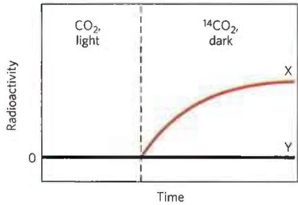

(b) They grew illuminated Chlorella cells with ${}^{14}CO_{2}$ . Illumination was continued until all the ${}^{14}CO_{2}$ had been taken up (vertical dashed line in the graph below). Under these conditions, X became labeled quickly but lost its radioactivity with time, whereas Y became more radioactive with time.

17. Regulation of the Calvin Cycle Iodoacetate reacts irreversibly with the free —SH groups of Cys residues in proteins. Predict which Calvin cycle enzyme(s) would be inhibited by iodoacetate, and explain why.

18. Comparison of the Reductive and Oxidative Pentose Phosphate Pathways The reductive pentose phosphate pathway generates several intermediates identical to those of the oxidative pentose phosphate pathway (Chapter 14). What role does each pathway play in cells where it is active?

19. Photorespiration and Mitochondrial Respiration Compare the oxidative photosynthetic carbon cycle, also called photorespiration, with the mitochondrial respiration that drives ATP synthesis. Why are both processes referred to as respiration? Where in the cell do they occur, and under what circumstances? What is the path of electron flow in each?

20. Pathway of $CO_{2}$ Assimilation in Maize Researchers illuminate a maize (corn) plant in the presence of ${}^{14}CO_{2}$ . After about 1 second of illumination, they find more than 90% of all the radioactivity incorporated in the leaves at C-4 of malate, aspartate, and oxaloacetate. Only after 60 seconds does ${}^{14}C$ appear at C-1 of 3-phosphoglycerate. Explain.

21. Identifying CAM Plants Given some ${}^{14}CO_{2}$ and all the tools typically present in a biochemistry research lab, how would you design a simple experiment to determine whether a plant is a typical $C_{4}$ plant or a CAM plant?

22. Chemistry of Malic Enzyme: Variation on a Theme Malic enzyme, found in the bundle-sheath cells of $C_{4}$ plants, carries out a reaction that has a counterpart in the citric acid cycle. What is the analogous reaction? Explain your choice.

23. Differences between $C_{3}$ and $C_{4}$ Plants The plant genus Atriplex includes some $C_{3}$ and some $C_{4}$ species. In the plots, the black curve represents species 1; the red curve represents species 2. From the data in the plots, identify which is a $C_{3}$ plant and which is a $C_{4}$ plant. Justify your answer in molecular terms that account for the data in all three plots.

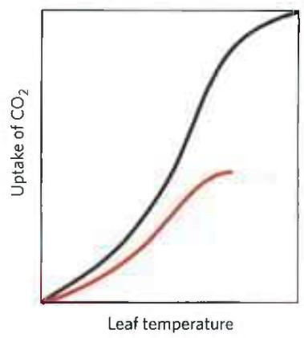

24. Inorganic Pyrophosphatase The enzyme inorganic pyrophosphatase contributes to making many biosynthetic reactions that generate inorganic pyrophosphate essentially irreversible in cells. By keeping the concentration of PP $_{i}$ very low, the enzyme “pulls” these reactions in the direction of PP $_{i}$ formation. The synthesis of ADP-glucose in chloroplasts is one such reaction. However, the synthesis of UDP-glucose in the plant cytosol, which also produces PP $_{i}$ , is readily reversible in vivo. How do you reconcile these two facts?

25. Regulation of Starch and Sucrose Synthesis Sucrose synthesis occurs in the cytosol and starch synthesis occurs in the chloroplast stroma, yet the two processes are intricately balanced. What factors shift the reactions in favor of (a) starch synthesis and (b) sucrose synthesis?

26. Regulation of Sucrose Synthesis In the regulation of sucrose synthesis from the triose phosphates produced during photosynthesis, 3-phosphoglycerate and $P_{i}$ play critical roles (see Fig. 20-42). Explain why the concentrations of these two regulators reflect the rate of photosynthesis.

27. Sucrose and Dental Caries The most prevalent infection in humans worldwide is dental caries, which stems from the colonization and destruction of tooth enamel by a variety of acidifying microorganisms. These organisms synthesize and live within a water-insoluble network of dextrans, called dental plaque, composed of $(\alpha1\rightarrow6)$ -linked polymers of glucose with many $(\alpha1\rightarrow3)$ branch points. Polymerization of dextran requires dietary sucrose, and the bacterial enzyme dextran-sucrose glucosyltransferase catalyzes the reaction.

(a) Write the overall reaction for dextran polymerization.

(b) In addition to providing a substrate for the formation of dental plaque, how does dietary sucrose also provide oral bacteria with an abundant source of metabolic energy?

28. Partitioning between the Citric Acid and Glyoxylate Cycles In an organism (such as Escherichia coli) that has both the citric acid cycle and the glyoxylate cycle, what determines which of these pathways isocitrate will enter?

### [EN] DATA ANALYSIS PROBLEM

29. Photophosphorylation: Discovery, Rejection, and Rediscovery In the 1930s and 1940s, researchers were beginning to make progress toward understanding the mechanism of photosynthesis. At the time, the role of “energy-rich phosphate bonds” (today, “ATP”) in glycolysis and cellular respiration was just becoming known. There were many theories about the mechanism of photosynthesis, especially about the role of light. This problem focuses on what was then called the “primary photochemical process”—that is, on what, exactly, the energy from captured light produces in the photosynthetic cell. Interestingly, one important part of the modern model of photosynthesis was proposed early on, only to be rejected, ignored for several years, then finally revived and accepted.

In 1944, Emerson, Stauffer, and Umbreit proposed that "the function of light energy in photosynthesis is the formation of 'energy-rich' phosphate bonds" (p. 107). In their model (hereafter, the "Emerson model"), the free energy necessary to drive both $\mathrm{CO}_{2}$ fixation and reduction came from these "energy-rich phosphate bonds" (i.e., ATP), produced as a result of light absorption by a chlorophyll-containing protein.

This model was explicitly rejected by Rabinowitch (1945). After summarizing Emerson and coauthors' findings, Rabinowitch stated: "Until more positive evidence is provided, we are inclined to consider as more convincing a general argument against this hypothesis, which can be derived from energy considerations. Photosynthesis is eminently a problem of energy accumulation. What good can be served, then, by converting light quanta (even those of red light, which amount to about 43 kcal per Einstein) into 'phosphate quanta' of only 10 kcal per mole? This appears to be a start in the wrong direction—toward dissipation rather than toward accumulation of energy" (p. 228). This argument, along with other evidence, led to abandonment of the Emerson model until the 1950s, when it was found to be correct—albeit in a modified form.

For each piece of information from Emerson and coauthors' article presented in (a) through (d), answer the following three questions:

1. How does this information support the Emerson model, in which light energy is used directly by chlorophyll to make ATP, and the ATP then provides the energy to drive $CO_{2}$ fixation and reduction?

2. How would Rabinowitch explain this information, based on his model (and most other models of the day), in which light energy is used directly by chlorophyll to make reducing compounds? Rabinowitch wrote: "Theoretically, there is no reason why all electronic energy contained in molecules excited by the absorption of light should not be available for oxidation-reduction" (p. 152). In this model, the reducing compounds are then used to fix and reduce $\mathrm{CO}_{2}$ , and the energy for these reactions comes from the large amounts of free energy released by the reduction reactions.

3. How is this information explained by our modern understanding of photosynthesis?

(a) Chlorophyll contains a $Mg^{2+}$ ion, which is known to be an essential cofactor for many enzymes that catalyze phosphorylation and dephosphorylation reactions.

(b) A crude "chlorophyll protein" isolated from photosynthetic cells showed phosphorylating activity.

(c) The phosphorylating activity of the "chlorophyll protein" was inhibited by light.

(d) The levels of several different phosphorylated compounds in photosynthetic cells changed dramatically in response to light exposure. (Emerson and coworkers were not able to identify the specific compounds involved.)

As it turned out, the Emerson and Rabinowitch models were both partly correct and partly incorrect.

(e) Explain how the two models relate to our current model of photosynthesis.

In his rejection of the Emerson model, Rabinowitch went on to say: "The difficulty of the phosphate storage theory appears most clearly when one considers the fact that, in weak light, eight or ten quanta of light are sufficient to reduce one molecule of carbon dioxide. If each quantum should produce one molecule of high-energy phosphate, the accumulated energy would be only 80–100 kcal per Einstein—while photosynthesis requires at least 112 kcal per mole, and probably more, because of losses in irreversible partial reactions" (p. 228).

(f) How does Rabinowitch's value of 8 to 10 photons per molecule of $\mathrm{CO}_{2}$ reduced compare with the value accepted today?

(g) How would you rebut Rabinowitch's argument, based on our current knowledge about photosynthesis?

### [EN] References

Emerson, R.L., J.F. Stauffer, and W.W. Umbreit. 1944. Relationships between phosphorylation and photosynthesis in Chlorella. Am. J. Botany 31:107–120.

Rabinowitch, E.I. 1945. Photosynthesis and Related Processes, Vol. I. New York: Interscience Publishers.

### [EN] Abbreviated Solutions — Chapter 20

1. For the maximum photosynthetic rate, PSI (which absorbs light of 700 nm) and PSII (which absorbs light of 680 nm) must be operating simultaneously.

2. From water consumed in the overall reaction

3. $H_{2}S$ is the hydrogen donor in photosynthesis. No $O_{2}$ is evolved, because $H_{2}O$ is not split; the single photosystem lacks the water-splitting cofactor.

4. (a) Stops (b) Slows; some electron flow continues by the cyclic pathway.

5. During illumination, a proton gradient is established. When ADP and $P_{i}$ are added, ATP synthesis is driven by the gradient, which becomes exhausted in the absence of light.

6. DCMU blocks electron transfer between PSII and the first site of ATP production.

7. Venturicidin blocks proton movement through the $CF_{0}CF_{1}$ complex; electron flow ( $O_{2}$ evolution) continues only until the free-energy cost of pumping protons against the rising proton gradient equals the free energy available in a photon. DNP, by dissipating the proton gradient, restores electron flow and $O_{2}$ evolution.

8. From the difference in reduction potentials, you can calculate $\Delta G^{\prime\prime} = 15$ kJ/mol for the redox reaction. Fig. 20-4 shows that the energy of photons in any region of the visible spectrum is more than sufficient to drive this endergonic reaction. Even photons in the infrared spectrum can provide sufficient energy.

9. $1.35 \times 10^{-77}$ ; the reaction is highly unfavorable! In chloroplasts, the input of light energy overcomes this barrier.

#### [EN] 10. -968 kJ/mol

11. No. The electrons from $H_{2}O$ flow to the artificial electron acceptor $Fe^{3+}$ , not to $NADP^{+}$ .

12. About once every 0.1 s; 1 in $10^{8}$ is excited

13. Light of 700 nm excites PSI, but not PSII; electrons flow from P700 to NADP $^{+}$ , but no electrons flow from P680 to replace them. When light of 680 nm excites PSII, electrons tend to flow to PSI, but the electron carriers between the two photosystems quickly become completely reduced.

14. No. The excited electron from P700 returns to refill the electron "hole" created by illumination. PSII is not needed to supply electrons, and no $\mathrm{O}_2$ is evolved from $\mathrm{H}_2\mathrm{O}$ . No NADPH is formed, because the

excited electron returns to P700. Cyclic photophosphorylation produces ATP rather than NADPH.

15. ATP and NADPH are generated in the light and are essential for $CO_{2}$ fixation; conversion stops as the supply of ATP and NADPH becomes exhausted. Some enzymes are switched off in the dark.

16. X is 3-phosphoglycerate; Y is ribulose 1,5-bisphosphate.

17. Ribulose 5-phosphate kinase, fructose 1,6-bisphosphatase, sedoheptulose 1,7-bisphosphatase, and glyceraldehyde 3-phosphate dehydrogenase; all are activated by reduction of a critical disulfide bond to a pair of sulfhydryls, which iodoacetate then blocks irreversibly.

18. The reductive pentose phosphate pathway regenerates ribulose 1,5-bisphosphate from triose phosphates produced during photosynthesis. The oxidative pentose phosphate pathway provides NADPH for reductive biosynthesis and ribose 5-phosphate for nucleotide synthesis.

19. Both types of "respiration" occur in plants, consume $\mathrm{O}_2$ , and produce $\mathrm{CO}_2$ . (Mitochondrial respiration also occurs in animals.) Mitochondrial respiration takes place continuously, though primarily at night or on cloudy days; electrons derived from various fuels are passed through a chain of carriers in the inner mitochondrial membrane to $\mathrm{O}_2$ . Photorespiration takes place in chloroplasts, peroxisomes, and mitochondria, during the daytime, when photosynthetic carbon fixation is occurring. Electron transfer in photorespiration is shown in Fig. 20-43; that for mitochondrial respiration, in Fig. 19-19.

20. In maize, the $C_{4}$ pathway fixes $CO_{2}$ . Phosphoenolpyruvate (PEP) carboxylase carboxylates PEP to form oxaloacetate. Some of the oxaloacetate undergoes transamination to aspartate, but most undergoes reduction to malate in the mesophyll cells. Only after subsequent decarboxylation does the $CO_{2}$ enter the Calvin cycle.

21. Measure the amount of ${}^{14}CO_{2}$ fixed in leaves during an hour of darkness and an hour of bright illumination. The CAM plant will take up much more $CO_{2}$ at night. Alternatively, measure the concentration of organic acids in the vacuoles by titrating an extract of leaves. In darkness, the $C_{4}$ plant will have a lower level of titratable acidity.

#### [EN] 22. Isocitrate dehydrogenase reaction

23. Rates of photorespiration, which occurs when rubisco uses $O_{2}$ rather than $CO_{2}$ as a substrate, are increased at higher light intensities and higher leaf temperatures. $C_{4}$ plants evolved mechanisms to minimize photorespiration, resulting in an increased ability to perform photosynthesis under these conditions. Because PEP carboxylase has a higher affinity for $CO_{2}$ than rubisco, $C_{4}$ plants take up more $CO_{2}$ under conditions of low $[CO_{2}]$ . Thus, species 1 is a $C_{4}$ plant and species 2 is a $C_{3}$ plant.

24. $[PP_{i}]$ is high in the cytosol because the cytosol lacks inorganic pyrophosphatase.

25. (a) Low $[P_{i}]$ in the cytosol and high [triose phosphate] in the chloroplast (b) High $[P_{i}]$ and [triose phosphate] in the cytosol

26. 3-Phosphoglycerate is the primary product of photosynthesis; $[P_{i}]$ rises when light-driven synthesis of ATP from ADP and $P_{i}$ slows.

27. (a) Sucrose + (glucose) $_{n}$ → (glucose) $_{n+1}$ + fructose (b) Fructose generated in the synthesis of dextran is readily imported and metabolized by the bacteria.

28. The first enzyme in each path is under reciprocal allosteric regulation. Inhibition of one path shunts isocitrate into the other path.

29. (a) (1) The presence of $Mg^{2+}$ supports the hypothesis that chlorophyll is directly involved in catalysis of the phosphorylation reaction, ADP + $P_{i} \rightarrow ATP$ . (2) Many enzymes (or other proteins) that contain $Mg^{2+}$ are not phosphorylating enzymes, so the presence of $Mg^{2+}$ in chlorophyll does not prove its role in phosphorylation reactions. (3) The presence of $Mg^{2+}$ is essential to chlorophyll's photochemical properties: light absorption and electron transfer.

(b) (1) Enzymes catalyze reversible reactions, so an isolated enzyme that can, under certain lab conditions, catalyze removal of a phosphoryl group could probably, under different conditions (such as in cells), catalyze addition of a phosphoryl group. So, chlorophyll could be involved in the phosphorylation of ADP. (2) There are two possible explanations: the chlorophyll protein is a phosphatase only and does not catalyze ADP phosphorylation under cellular conditions, or the crude preparation contains a contaminating phosphatase activity that is unconnected to the photosynthetic reactions. (3) The preparation was probably contaminated with a nonphotosynthetic phosphatase activity.

(c) (1) This light inhibition would be expected if the chlorophyll protein catalyzed the reaction ADP + $P_{i}$ + light → ATP. Without light, the reverse reaction, a dephosphorylation, would be favored. In the presence of light, energy is provided and the equilibrium would shift to the right, reducing the phosphatase activity. (2) This inhibition must be an artifact of the isolation or assay methods. (3) The crude preparation methods in use at the time were unlikely to preserve intact chloroplast membranes, so the inhibition must be an artifact. (d) In the presence of light, (1) ATP is synthesized and other phosphorylated intermediates are consumed; (2) glucose is produced and is metabolized by cellular respiration to produce ATP, with changes in the levels of phosphorylated intermediates; (3) ATP is produced and other phosphorylated intermediates are consumed. (e) Light energy is used to produce ATP (as in the Emerson model) and is used to produce reducing power (as in the Rabinowitch model). (f) The approximate stoichiometry for photophosphorylation is that 8 photons yield 2 NADPH and about 3 ATP. To reduce 1 $CO_{2}$ requires 2 NADPH and 3 ATP. Thus, at a minimum, 8 photons are required per $CO_{2}$ molecule reduced, in good agreement with Rabinowitch's value. (g) Because the energy of light is used to produce both ATP and NADPH, each photon absorbed contributes more than just 1 ATP for photosynthesis. The process of energy extraction from light is more efficient than Rabinowitch supposed, and plenty of energy is available for this process—even with red light.

<!-- EN-END 第20章章末 -->
