## 第 24 章 脂质的代谢

> **本章英文对应内容**（Lehninger，插在所列中文小节末尾）
>
> - 第17章 Fatty Acid Catabolism：章首导言（本章开头）、关键术语/习题/简答（本章末尾）
> - 第21章 Lipid Biosynthesis：章首导言（本章开头）、关键术语/习题/简答（本章末尾）
> - §17.1（第17章）→ 一、三酰甘油的消化、吸收和转运
> - §17.2（第17章）→ 三、不饱和脂肪酸的氧化
> - §17.3（第17章）→ 四、酮体
> - §21.1（第21章）→ 六、脂质的生物合成
> - §21.2（第21章）→ 六、脂质的生物合成
> - §21.3（第21章）→ 六、脂质的生物合成
> - §21.4（第21章）→ 六、脂质的生物合成

脂肪酸是多数脂质分子的核心组成单元，脂肪酸及其衍生物主要有四种重要功能。其一，磷脂和糖脂是两性分子，它们是生物膜的主要组成成分；其二，脂肪酸以共价键与蛋白质相连，经过修饰的蛋白质被锚定在膜上；其三，脂肪酸是燃料分子，它们以不带电荷的三酰甘油形式贮存起来；其四，脂肪酸衍生物担当着激素及胞内信使的职能。

从表面上看,脂肪酸的分解与合成是两个互为可逆的反应途径,但是实际却不是这样。长链脂肪酸的氧化是动物、许多原生生物和一些细菌获得能量的主要途径。在这个过程中,每次脂肪酸氧化循环移去两个碳原子单位,即产生乙酰-CoA(乙酰辅酶A),从脂肪酸分子中移走的电子通过线粒体呼吸链,推动ATP的合成。乙酰-CoA经过柠檬酸循环而被彻底氧化为二氧化碳,进一步实现能量储存。长跑运动员在比赛中通过对贮存脂肪的氧化获得足够的能量。脂肪酸氧化给冬眠动物提供代谢所需的能量、热量和水。与脂肪酸降解途径相比,脂肪酸合成使用不同的酶,细胞内发生场所也不同,并以三碳单元中间体,即丙二酰-CoA(丙二酸单酰辅酶A)为底物,每次合成循环后,脂肪酸碳链增加两碳单位,当脂肪链达16碳时,产物离开循环。

在本章中,我们以脊椎动物为例,重点讲述脂肪酸氧化和合成反应及脂质代谢调控机制。

<!-- EN-BEGIN 第17章导言 -->

### 【英文对应 第17章导言】Fatty Acid Catabolism

> 来源：Lehninger Principles of Biochemistry（书籍/02_生物化学原理） 第17章章首（含章节目录与学习要点）。

#### [EN] FATTY ACID CATABOLISM

17.1 Digestion, Mobilization, and Transport of Fats 602

17.2 Oxidation of Fatty Acids 606

17.3 Ketone Bodies 619

The oxidation of long-chain fatty acids to acetyl-CoA is a central energy-yielding pathway in many organisms and tissues. In mammalian heart and liver, for example, it provides as much as 80% of the energetic needs under all physiological circumstances. The electrons removed from fatty acids during oxidation pass through the respiratory chain, driving ATP synthesis; the acetyl-CoA produced from the fatty acids may be completely oxidized to $CO_{2}$ in the citric acid cycle, resulting in further energy conservation.

In Chapter 10 we described the properties of triacylglycerols (also called triglycerides or neutral fats) that make them especially suitable as storage fuels. The long alkyl chains of their constituent fatty acids are essentially hydrocarbons, highly reduced structures with an energy of complete oxidation ( $\sim$ 38 kJ/g) more than twice that for the same weight of carbohydrate or protein. This advantage is compounded by the extreme insolubility of lipids in water; cellular triacylglycerols aggregate in lipid droplets, which do not raise the osmolarity of the cytosol, and they are unsolvated. (In storage polysaccharides, by contrast, water of solvation can account for two-thirds of the overall weight of the stored molecules.) And because of their relative chemical inertness, triacylglycerols can be stored in large quantity in cells without the risk of undesired chemical reactions with other cellular constituents.

The properties that make triacylglycerols good storage compounds, however, present problems in their role as fuels. Because they are insoluble in water, ingested triacylglycerols must be emulsified before they can be digested by water-soluble enzymes in the intestine, and triacylglycerols absorbed in the intestine or mobilized from storage tissues must be carried in the blood bound to proteins that counteract their insolubility. Also, to overcome the relative stability of the C—C bonds in a fatty acid, the carboxyl group at C-1 is activated by attachment to coenzyme A, which allows stepwise oxidation of the fatty acyl group at the C-3, or $\beta$ , position—hence the name $\beta$ oxidation.

The principles we emphasize in this chapter are not new. They apply to the catabolic pathways of carbohydrates that we just studied.

P1 Metabolites of diverse origin funnel into a few central pathways. Fatty acid catabolism and glycolysis convert quite different starting materials into the same product (acetyl-CoA). The electrons from the oxidative reactions of these pathways and of the citric acid cycle are carried by common cofactors (NAD and FAD) to the mitochondrial respiratory chain leading to oxygen, providing the energy for ATP synthesis by oxidative phosphorylation.

P2 Evolution selects for chemical mechanisms that make useful reactions more energetically favorable, and those same mechanisms are used in different pathways. In the breakdown of fatty acids we see the activation of a carboxylic acid by its conversion to a thioester, as we saw with acetyl-CoA in the citric acid cycle. To break the C—C bonds in the long chain of relatively inert $-CH_{2}-CH_{2}-$ groups in fatty acids, a carbonyl group is created adjacent to the $-CH_{2}-$ group, as we saw in the reactions of the citric acid cycle.

P3 Allosteric mechanisms and posttranslational regulation (protein phosphorylation) coordinate metabolic processes within a cell. Hormones and growth factors coordinate metabolic activities among tissues and organs. Reciprocal regulation of catabolic and anabolic pathways prevents the inefficiency of futile cycling.

#### [EN] P4 When a process lacks a critical

component—an enzyme, a cofactor, or a regulatory agent—the resulting loss of homeostasis may cause disease across a spectrum of severity. Defects in fatty acid breakdown are no exception.

The liver plays a unique role in whole-body metabolism. When glucose is unavailable, the liver makes glucose by gluconeogenesis and releases it to the blood for distribution to other tissues, including the brain. During starvation, the liver processes fatty acids into ketone bodies, which, unlike fatty acids, can cross the blood brain barrier and fuel the brain.

<!-- EN-END 第17章导言 -->

<!-- EN-BEGIN 第21章导言 -->

### 【英文对应 第21章导言】Lipid Biosynthesis

> 来源：Lehninger Principles of Biochemistry（书籍/02_生物化学原理） 第21章章首（含章节目录与学习要点）。

#### [EN] LIPID BIOSYNTHESIS

21.1 Biosynthesis of Fatty Acids and Eicosanoids 744

21.2 Biosynthesis of Triacylglycerols 760

21.3 Biosynthesis of Membrane Phospholipids 764

21.4 Cholesterol, Steroids, and Isoprenoids: Biosynthesis, Regulation, and Transport 771

Lipids play a variety of cellular roles, some recognized only recently. This chapter describes the biosynthetic pathways for some of the most common cellular lipids, illustrating the strategies employed in assembling these water-insoluble products from water-soluble precursors such as acetate. We first describe the biosynthesis of fatty acids, the primary components of both triacylglycerols and phospholipids, then examine the assembly of fatty acids into triacylglycerols and the simpler membrane phospholipids. Finally, we consider the synthesis of cholesterol, a component of some membranes and the precursor of steroids such as bile acids, sex hormones, and adrenocortical hormones.

Our coverage of lipid biosynthesis is organized around the following principles:

P1 Lipids are the principal form of stored energy in most higher organisms, as well as the major constituents of membranes.

P2 Anabolism is not simply the reverse of catabolism. Biosynthetic pathways typically diverge from breakdown pathways to overcome irreversible steps in catabolism.

P3 Like other anabolic pathways, the reaction sequences in lipid biosynthesis are endergonic and reductive. They use ATP as a source of metabolic energy and a reduced electron carrier (usually NADPH) as a reductant.

P4 Lipid biosynthesis, like other anabolic pathways, is subject to regulation to respond to cellular and organismal requirements. The places where catabolic and anabolic pathways diverge (Principle 2) provide opportunities to

impose metabolic regulation to conserve resources and avoid futile cycles.

P5 Like other major classes of biological molecules, lipids have a plethora of cellular functions. Specialized lipids serve as pigments (retinal, carotene), cofactors (vitamin K), detergents (bile salts), transporters (dolichols), hormones (vitamin D derivatives, sex hormones), extracellular and intracellular messengers (eicosanoids, phosphatidylinositol derivatives), and anchors for membrane proteins (covalently attached fatty acids, prenyl groups, phosphatidylinositol). The ability to synthesize a variety of lipids is essential to all organisms.

We will focus on eukaryotes, with occasional digressions to highlight important distinctions in bacteria and plants.

<!-- EN-END 第21章导言 -->

## 一、三酰甘油的消化、吸收和转运

细胞以 3 种方式获取脂肪酸, 其一, 来自饮食; 其二, 细胞内贮存的脂肪; 其三, 细胞内脂肪酸的从头合成。膳食中的脂质大多是三酰甘油 (triacylglycerol), 或称脂肪 (中性脂肪), 即由甘油和脂肪酸组成的甘油三酯。脂肪是非极性化合物, 以高度还原、无水、惰性的形式存在, 脂肪酸氧化产生的能量按同等干重计算比糖类或蛋白质要高出 2 倍以上。

胃产生胃脂肪酶(gastric lipase)，它在胃的低pH环境中是稳定、有活性的。脂肪的消化实际开始于胃中的胃脂肪酶，彻底的消化是在小肠内由胰分泌的胰脂肪酶(pancreatic lipase)完成。胰脂肪酶消化三酰甘油，使它转化为2-单酰甘油(2-acylglycerol)和脂肪酸。辅脂肪酶(colipase)是一个小的蛋白质，相对分子质量为12000，它产生于胰，是胰脂肪酶活性所必需的。胰液还含有酯酶(esterase)，它作用于单酰甘油、胆固醇酯和维生素A的酯。另外，胰还分泌磷脂酶(phospholipase)，它催化磷脂的2-酰基的水解。胰脂肪酶对三酰甘油催化的作用点在1和3位，随之形成1,2-二酰甘油(1,2-diacylglycerol)和2-单酰甘油(2-acylglycerol)，与此同时得到脂肪酸的钠盐和钾盐(肥皂)。肥皂是两亲性的(amphipathic)，它既亲水又亲脂，所以可使脂肪乳化。脂肪酶(lipase)与很多蛋白质一样，在一些界面，例如在脂质-水界面中会很快地变性。辅脂肪酶与脂肪酶形成1:1的复合物，可以抑制脂肪酶在界面的变性，并把它固定到脂质-水界面上。

脂质中的磷脂(phospholipid)可被磷脂酶 $\mathbf{A}_2$ (phospholipase $\mathrm{A}_2$ ) 催化降解, 水解发生于 C2 处, 产生脂肪酸及相应的溶血磷脂(lysophospholipid)(图 24-1), 例如, 前述的磷脂酰胆碱, 它也是一个强力的“去污剂”。胰磷脂酶 $\mathrm{A}_2$ (pancreatic phospholipase $\mathrm{A}_2$ ) 与胰脂肪酶一样, 在界面上优先地进行催化反应。对牛的这个酶的 X 射线结构分析表明, 该酶的活性部位与胰凝乳蛋白酶(chymotrypsin)相像, 有一个“凹陷”, 由一个环和两侧的鳞状片围绕。鳞状片由 21 个表面残基构成。据推断, 其侧链伸向磷脂聚合物微团并与之结合。核磁共振测定指出, 在这个微团内可能有一构象恰与活性部位互补。胆汁盐包括胆酸、甘氨胆酸和牛磺胆酸, 是胆固醇的氧化产物(图 24-2), 它的极性端暴露于水构成的外侧, 而内侧一端是非极性的。这样就形成一个胶质颗粒, 即微团。微团的疏水部分指向内侧, 羧基和羟基部分指向外侧, 它作为载体把脂肪从小肠腔移送到上皮细胞。小肠对脂肪的吸收即在这里发生。对于游离脂肪酸、单酰甘油和脂溶性维生素, 微团也参与它们的吸收。对胆管堵塞的患者进行检查证实:小肠只吸收了少量的脂肪,在粪便中可看到有较多的脂肪水解产物(脂肪痢)。可以说,胆汁盐不仅有助于脂肪的吸收,而且有助于脂肪消化产物的吸收。

  
图 24-1 磷脂酶 $A_{2}$ 水解磷脂于 C2 位, 生成溶血磷脂

脂肪经消化后的产物脂肪酸和2-单酰甘油由小肠上皮黏膜细胞吸收后又转化为三酰甘油，后者和蛋白质包装在一起，形成称为乳糜微粒（chylomicron）的脂蛋白（lipoprotein）。脂蛋白是一类与脂质结合形成的脂质-蛋白质复合物，根据其密度大小分为乳糜微粒和极低密度脂蛋白（very low density lipoprotein, VLDL）、低密度脂蛋白（low density lipoprotein, LDL）和高密度脂蛋白（high density lipoprotein, HDL）。脱脂形式存在的脂蛋白称为载脂蛋白（apolipoprotein, Apo），主要分A\~E五类，具有稳定脂蛋白结构、激活脂蛋白代谢酶、识别受体等功能。乳糜微粒从小肠黏膜进入淋巴系统，通过它到血液中，然后被转运到肌肉和脂肪组织。在骨骼肌和脂肪组织的毛细血管中，乳糜微粒表面上的ApoC-Ⅱ载脂蛋白激活脂蛋白脂肪酶（lipoprotein lipase），乳糜微粒中的三酰甘油分解为游离脂肪酸和甘油，脂肪酸被这些组织吸收，甘油被运送到肝和肾，经甘油激酶（glycerol kinase）和3-磷酸甘油脱氢酶（glycerol-3-phosphate dehydrogenase）作用，转化为磷酸二羟丙酮

  
图24-2 几种胆汁盐

(dihydroxyacetone phosphate)进入糖酵解途径,或经糖异生途径生成葡萄糖。在肌肉组织中,脂肪酸氧化以供给能量;在脂肪组织中被重新酯化,以三酰甘油形式贮存。在脂肪组织中,脂肪的贮存和释放取决于代谢的需要,它受到血液中激素的调节控制。当机体需要代谢能量时,激素传递这种信息,将脂肪组织中的三酰甘油运送到骨骼肌、心和肾等组织中。在脂肪细胞或甾体生成细胞中,三酰甘油或甾酯被包裹在脂滴内,脂滴表面有一层磷脂膜。脂滴包被蛋白(perilipin)是一种脂滴表面主要的结构蛋白,在基础生理状态下,阻止激素敏感脂肪酶(hormone-sensitive triacylglycerol lipase)接近脂滴。当血液中血糖浓度降低时,机体分泌肾上腺素和胰高血糖素,与其受体结合,激活脂肪细胞细胞质膜中的腺苷酸环化酶(adenylyl cyclase),它以ATP为底物催化产生环腺苷酸(cAMP),cAMP作为胞内第二信使激活依赖cAMP的蛋白激酶(PKA)。脂滴包被蛋白在PKA作用下被磷酸化,使激素敏感脂肪酶在胞质中发生转位至脂滴表面,同时激素敏感脂肪酶也被PKA磷酸化而激活,并催化三酰甘油的水解反应。释放出来的脂肪酸进入血液,由于脂肪酸是水不溶性的,血液中的可溶性的清蛋白(serum albumin)与脂肪酸结合协助其转运,被运送到骨骼肌、心和肾等组织细胞中作为燃料。清蛋白是一个可溶性的相对分子质量为66500的单体蛋白质(monomeric protein),它构成血清蛋白的接近一半。在清蛋白不存在下,游离脂肪酸的最大溶解度为 $10^{-6}\mathrm{mol/L}$ 。三酰甘油分子中, $95\%$

生物能量贮存于脂肪酸链中,仅5%的能量来自甘油。

<!-- EN-BEGIN 17.1 -->

### 【英文对应 17.1】Digestion, Mobilization, and Transport of Fats

> 来源：Lehninger Principles of Biochemistry（书籍/02_生物化学原理） 第17章 Fatty Acid Catabolism，§17.1。对应本章“一、三酰甘油的消化、吸收和转运”。

Cells can obtain fatty acid fuels from four sources: fats consumed in the diet, fats stored in cells as lipid droplets, fats synthesized in one organ for export to another, and fats obtained by autophagy (which degrades the cell's own organelles). Some species use all four sources under various circumstances; others use one or two. Vertebrates, for example, obtain fats in the diet; mobilize fats stored in specialized tissue (adipose tissue, consisting of cells called adipocytes); and, in the liver, convert excess dietary carbohydrates to fats for export to other tissues. During starvation, they can recycle lipids by autophagy. On average, 40% or more of the daily energy requirement of humans in highly industrialized countries is supplied by dietary triacylglycerols. Triacylglycerols provide more than half the energy requirements of some organs, particularly the liver, heart, and resting skeletal muscle. Stored triacylglycerols are virtually the sole source of energy in hibernating animals and migrating birds. Vascular plants mobilize fats stored in seeds during germination, but do not otherwise depend on fats for energy.

#### [EN] Dietary Fats Are Absorbed in the Small Intestine

In vertebrates, before ingested triacylglycerols can be absorbed through the intestinal wall they must be converted from insoluble macroscopic fat particles to finely dispersed microscopic micelles. This solubilization is carried out by bile salts, such as taurocholic acid (p. 352), which are synthesized from cholesterol in the liver, stored in the gallbladder, and released into the small intestine after ingestion of a fatty meal. Bile salts are amphipathic compounds that act as biological detergents, emulsifying dietary fats into mixed micelles of bile salts and triacylglycerols (Fig. 17-1, step 1). Micelle formation enormously increases the fraction of lipid molecules accessible to the action of water-soluble lipases in the intestine, and lipase action converts triacylglycerols to monoacylglycerols (monoglycerides) and diacylglycerols (diglycerides) and free fatty acids (step 2). These products of lipase action diffuse or are transported into the epithelial cells lining the intestinal surface (the intestinal mucosa) (step 3), where they are reconverted to triacylglycerols and packaged with dietary cholesterol and specific apolipoproteins (from the Greek apo, meaning “detached” or “separate,” designating the protein in its lipid-free form) into lipoprotein aggregates called chylomicrons (step 4). It is the protein moieties that target triacylglycerols, phospholipids, cholesterol, and cholesteryl esters for transport between organs.

  
FIGURE 17-1 Processing of dietary lipids in vertebrates. Digestion and absorption of dietary lipids occur in the small intestine, and the fatty acids released from triacylglycerols are packaged and delivered to muscle and adipose tissues. The eight steps are discussed in the text.

Apolipoproteins combine with lipids to form several classes of lipoprotein particles, spherical aggregates with hydrophobic lipids at the core and hydrophilic protein side chains and lipid head groups at the surface. Various combinations of lipid and protein produce particles of different densities, ranging from chylomicrons and very-low-density lipoproteins (VLDL) to very-high-density lipoproteins (VHDL). These particles can be separated by ultracentrifugation. The structures of these lipoprotein particles and their roles in lipid transport are detailed in Chapter 21 (Fig. 21-39).

Apolipoprotein B-48 (apoB-48) is the primary protein component of chylomicrons. In lipid uptake from the intestine, chylomicrons move from the intestinal mucosa into the lymphatic system, and then enter the blood, where they can exchange apolipoproteins with other types of circulating lipoprotein. In the blood, chylomicrons pick up apolipoprotein C-II (apoC-II) from high-density lipoprotein (HDL) particles and are carried to muscle and adipose tissue (Fig. 17-1, step 5). In the capillaries of these tissues, the extracellular enzyme lipoprotein lipase, activated by apoC-II, hydrolyzes triacylglycerols to free fatty acids and monoacylglycerols (step 6), which are taken up by specific transporters in the plasma membranes of cells in the target tissues (step 7). In muscle, the fatty acids are oxidized for energy; in adipose tissue, they are reesterified for storage as triacylglycerols (step 8).

The remnants of chylomicrons, depleted of most of their triacylglycerols but still containing cholesterol and apolipoproteins, travel in the blood to the liver, where they are taken up by endocytosis mediated by receptors for their apolipoproteins. Triacylglycerols that enter the liver by this route may be oxidized to provide energy or to provide precursors for the synthesis of ketone bodies, as described in Section 17.3.

When the diet contains more fatty acids than are needed immediately for fuel or as precursors, the liver converts them to triacylglycerols, which are packaged with specific apolipoproteins into VLDLs. These VLDLs are secreted by hepatocytes and transported in the blood to adipose tissue, where the triacylglycerols are removed and stored in lipid droplets within adipocytes.

#### [EN] Hormones Trigger Mobilization of Stored Triacylglycerols

Neutral lipids (triacylglycerols, sterols, and steroyl esters) are stored in adipocytes (and in steroid-synthesizing cells of the adrenal cortex, ovary, and testis) in lipid droplets, which have a core of triacylglycerols and sterol esters surrounded by a monolayer of phospholipids. The surface of these droplets is coated with perilipins, a family of proteins that restrict access to lipid droplets, preventing untimely lipid mobilization. P1 When hormones signal the need for metabolic energy, triacylglycerols stored in adipose tissue are mobilized (brought out of storage) and transported to tissues (skeletal muscle, heart, and renal cortex) in which fatty acids can be oxidized for energy production. The hormones epinephrine and glucagon, secreted in response to low blood glucose levels or a fight-or-flight situation, stimulate the enzyme adenylyl cyclase in the adipocyte plasma membrane (Fig. 17-2), which produces the intracellular second messenger cyclic AMP (cAMP; see Fig. 12-4). Cyclic AMP-dependent protein kinase (PKA) triggers changes that open the lipid droplet to the action of three cytosolic lipases, which act on tri-, di-, and monoacylglycerols, releasing fatty acids and glycerol.

The fatty acids thus released (free fatty acids, FFAs) pass from the adipocyte into the blood, where they bind to the blood protein serum albumin (Fig. 17-3). This protein ( $M_{r}$ 66,000), which makes up about half of the total serum protein, noncovalently binds as many as seven fatty acids. Bound to this soluble protein, the otherwise insoluble fatty acids are carried to tissues such as skeletal muscle, heart, and renal cortex. In these target tissues, fatty acids dissociate from albumin and are moved by plasma membrane transporters into cells to serve as fuel.

About 95% of the biologically available energy of triacylglycerols resides in their three long-chain fatty acids; only 5% is contributed by the glycerol moiety. The glycerol released by lipase action is phosphorylated by glycerol kinase (Fig. 17-4), and the resulting glycerol 3-phosphate is oxidized to dihydroxyacetone phosphate. The glycolytic enzyme triose phosphate isomerase converts this compound to glyceraldehyde 3-phosphate, which is oxidized via glycolysis.

#### [EN] Fatty Acids Are Activated and Transported into Mitochondria

The enzymes of fatty acid oxidation in animal cells are located in the mitochondrial matrix, as demonstrated in 1948 by Eugene P. Kennedy and Albert Lehninger. Short- and medium-chain fatty acids, those with chain lengths of 12 or fewer carbons, enter mitochondria without the help of membrane transporters. Long-chain fatty acids, those with 14 or more carbons, which constitute the majority of the FFAs obtained in the diet or released from adipose tissue, cannot pass directly through the mitochondrial membranes: they must be transported through the carnitine shuttle. First, the fatty acid must be activated by a fatty acyl-CoA synthetase isozyme specific for long-chain fatty acids. The isozymes are present in the outer mitochondrial membrane, where they promote the general reaction

$$
\text { Fatty   acid } + \mathrm{CoA} + \mathrm{ATP} \rightleftharpoons \text { fatty   acyl - CoA } + \mathrm{AMP} + \mathrm{PP} _ {\mathrm{i}}
$$

P2 Fatty acyl-CoA synthetases catalyze the formation of a thioester linkage between the fatty acid carboxyl group and the thiol group of coenzyme A to yield a fatty acyl-CoA, coupled to the cleavage of ATP to AMP and PP $_{i}$ . (Recall the description of this reaction in Chapter 13, which illustrates how the free energy released by cleavage of phosphoanhydride bonds in ATP could be coupled to the formation of a high-energy compound; p. 485.) The reaction catalyzed by a fatty acyl-CoA synthetase occurs in two steps and involves a fatty acyl-adenylate intermediate (Fig. 17-5).

  
FIGURE 17-2 Mobilization of triacylglycerols stored in adipose tissue. When low levels of glucose in the blood trigger the release of glucagon, $①$ the hormone binds its receptor in the adipocyte membrane and thus $②$ stimulates adenylyl cyclase, via a G protein, to produce cAMP. This activates PKA, which phosphorylates $③$ the hormone-sensitive lipase (HSL) and $④$ perilipin molecules on the surface of the lipid droplet. Phosphorylation of perilipin causes $⑤$ dissociation of the protein CGI-58 from perilipin. CGI-58 (comparative gene identification-58), a protein closely associated with lipid droplets, then recruits adipose triacylg ycerol lipase (ATGL) to the droplet surface and stimulates its lipase

  
FIGURE 17-3 Human serum albumin complexed with stearate. Each day the human liver releases 10–15 g of serum albumin into the bloodstream, where this workhorse protein transports many ligands, drugs, and particularly fatty acids through the blood. The structure has nooks and crannies that can carry up to seven fatty acids. Its passengers are both hydrophobic and hydrophilic, and include steroid hormones, the blood thinner warfarin, the antibiotic penicillin, the anti-inflammatory drug ibuprofen, and the anxiolytic diazepam.  
activity. Active ATGL ⑥ converts triacylglycerols to diacylglycerols. The phosphorylated perilipin associates with phosphorylated HSL, allowing it access to the surface of the lipid droplet, where ⑦ it converts diacylglycerols to monoacylglycerols. ⑧ A third lipase, monoacylglycerol lipase (MGL), hydrolyzes monoacylglycerols. ⑨ Fatty acids leave the adipocyte, and are transported in the blood bound to serum albumin. They are released from the albumin and ⑩ enter a myocyte via a specific fatty acid transporter. ⑪ In the myocyte, fatty acids are oxidized to CO₂, and the energy of oxidation is conserved in ATP, which fuels muscle contraction and other energy-requiring metabolism in the myocyte.

Fatty acyl-CoAs, like acetyl-CoA, are high-energy compounds; their hydrolysis to FFAs and CoA has a large, negative standard free-energy change. The formation of a fatty acyl-CoA is made more favorable by the hydrolysis of two high-energy bonds in ATP; the pyrophosphate formed in the activation reaction is immediately hydrolyzed by inorganic pyrophosphatase (left side of Fig. 17-5), which pulls the preceding activation reaction in the direction of fatty acyl-CoA formation. The overall reaction (three steps) is

Fatty acid + CoA + ATP ⇌

$$
\begin{array}{r l} \text { fatty   acyl - CoA } + \mathrm{AMP} + 2 \mathrm{P} _ {\mathrm{i}} \\ \Delta G ^ {\prime \circ} = - 3 4 \end{array}\tag{17-1}
$$

kJ/mol

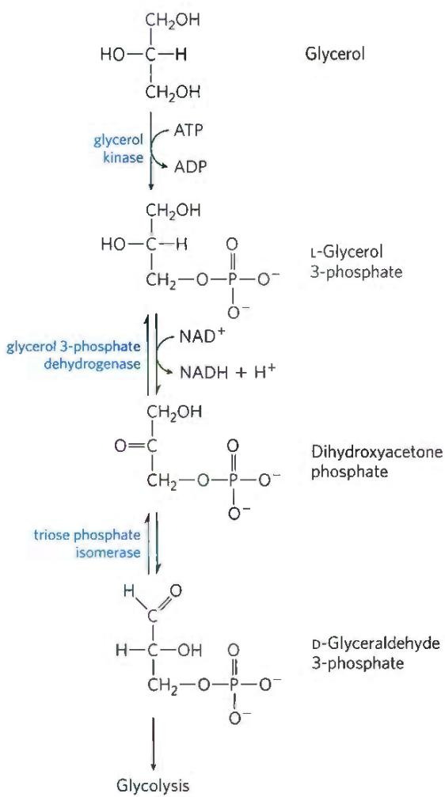  
FIGURE 17-4 Entry of glycerol into the glycolytic pathway.

MECHANISM FIGURE 17-5 Activation of a fatty acid by conversion to a fatty acyl-CoA. Formation of the fatty acyl-CoA derivative occurs in two steps, catalyzed by fatty acyl-CoA synthetase. Hydrolysis of the pyrophosphate created in the first step of that reaction is catalyzed by inorganic pyrophosphatase. The overall reaction is highly exergonic.

Fatty acyl-CoA esters formed on the cytosolic side of the outer mitochondrial membrane can be transported into the mitochondrion and oxidized to produce ATP, or they can be used in the cytosol to synthesize membrane lipids.

Fatty acyl-CoAs destined for mitochondrial oxidation must be attached to carnitine to be shuttled across the inner mitochondrial membrane.

In a transesterification catalyzed by carnitine acyltransferase 1, CAT1 (also called carnitine palmitoyltransferase 1, CPT1) in the outer mitochondrial membrane, the fatty acyl-CoA is transiently attached to the hydroxyl group of carnitine to form fatty acyl-carnitine (Fig. 17-6). The fatty acyl-carnitine ester then diffuses across the intermembrane space and enters the matrix by passive transport through the acyl-carnitine/carnitine cotransporter of the inner mitochondrial membrane. This cotransporter moves one molecule of carnitine from the matrix to the intermembrane space as one molecule of fatty acyl-carnitine moves into the matrix. Once inside the matrix, the fatty acyl group is transferred from carnitine back to coenzyme A from the intramitochondrial pool by carnitine acyltransferase 2 (CAT2, or CPT2). This isozyme, located on the inner face of the inner mitochondrial membrane, regenerates fatty acyl-CoA and releases it, along with free carnitine, into the matrix. The carnitine is then available to be transferred back through the acyl-carnitine/carnitine cotransporter to be used to shuttle the next fatty acid across. Once inside the mitochondrion, the fatty acyl-CoA is acted upon by a set of enzymes in the matrix.

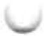

  
FIGURE 17-6 Fatty acid entry into mitochondria via the acyl-carnitine/carnitine transporter. Fatty acyl-carnitine formed on the outer mitochondrial membrane moves into the matrix by passive cotransport  
through the inner membrane. In the matrix, the acyl group is transferred to mitochondrial coenzyme A, freeing carnitine to leave the matrix through the same transporter.

This process for transferring fatty acids into the mitochondrion—esterification to CoA, transesterification to carnitine, translocation across the inner membrane, and transesterification back to CoA—links two separate pools of coenzyme A and of fatty acyl–CoA, one in the cytosol, the other in mitochondria. These pools have different functions. Coenzyme A in the mitochondrial matrix is largely used in oxidative degradation of pyruvate, fatty acids, and some amino acids, whereas cytosolic coenzyme A is used in the biosynthesis of fatty acids (see Fig. 21-10). Fatty acyl–CoA in the cytosolic pool can be used there for membrane lipid synthesis or can be moved into the mitochondrial matrix for oxidation and ATP production. Conversion to the carnitine ester commits the fatty acyl moiety to the oxidative fate. P3 The carnitine-mediated entry process is the rate-limiting step for oxidation of fatty acids in mitochondria and, as discussed later, is a control point. Carnitine acyltransferase 1 is inhibited by malonyl-CoA, the first intermediate in fatty acid synthesis (see Fig. 21-1). This inhibition prevents the simultaneous synthesis and degradation of fatty acids, a wasteful futile cycle.

#### [EN] SUMMARY 17.1 Digestion, Mobilization, and Transport of Fats

\- Dietary triacylglycerols are emulsified in the small intestine by bile salts, hydrolyzed by intestinal lipases, absorbed by intestinal epithelial cells, and reconverted into triacylglycerols. They are combined with specific apolipoproteins for passage through the blood and lymph to adipose tissue, where they are stored as lipid droplets.

■ Triacylglycerols stored in adipose tissue are mobilized by a hormone-sensitive triacylglycerol lipase. The released fatty acids bind to serum albumin and are carried in the blood to the heart, skeletal muscle, and other tissues that use fatty acids for fuel.

■ Once inside cells, fatty acids are activated at the outer mitochondrial membrane by conversion to fatty acyl–CoA thioesters. Fatty acyl–CoA that is to be oxidized enters mitochondria via the carnitine shuttle, which is a major control point. Malonyl-CoA, the first intermediate in fatty acid synthesis, inhibits carnitine acyltransferase 1, assuring that fatty acid oxidation and fatty acid synthesis do not occur simultaneously.

<!-- EN-END 17.1 -->

## 二、脂肪酸的氧化

## (一) 脂肪酸的活化

脂肪酸分解(代谢)发生于原核生物的细胞溶胶及真核生物的线粒体基质中。它在进入线粒体基质前,脂肪酸先与辅酶 A(CoA)形成硫酯键(thioester link)。这个反应是由脂酰辅酶 A 合酶(acyl-CoA synthase)(又称脂肪酸硫激酶 1,fatty acid thiokinase 1)催化发生的,此酶存在于线粒体外膜,它起作用时需要消耗一个 ATP。反应的总体是不可逆的。因为生成的 PPi 立即被水解为两分子的 Pi。

$$
\mathrm{R} - \underset {\mathrm{O} ^ {-}} {\overset {\mathrm{O}} {\mathrm{C}}} + \mathrm{ATP} + \mathrm{HS} - \mathrm{CoA} \xrightarrow {\text {脂酰} - \mathrm{CoA} \text {合酶}} \mathrm{R} - \underset {\mathrm{2Pi}} {\overset {\mathrm{O}} {\mathrm{C}}} - \mathrm{S} - \mathrm{CoA} + \mathrm{AMP} + \mathrm{PPi}
$$

上述的脂酰-CoA 合酶实际是一个“家族”，至少有三种，依其底物脂肪酸的链长不同而异。这些酶与内质网或与线粒体膜外膜相连。

用长链脂酰-CoA 合成酶(long-chain acyl-CoA synthetase)对 $^{18}$ O 标记的软脂酸进行活化发现 AMP 和脂酰-CoA 都为 $^{18}$ O 所标记。它表明此反应经过一个脂酰腺苷酸混合酸酐(acyladenylate mixed andydride)中间体,它被 CoA 的巯基进攻,形成硫酯(thioester)的产物。正是由于 $^{18}$ O 标记了两个产物脂酰-CoA 和 AMP,才证明这个中间体的存在(图 24-3)。这个反应包含着化学键的断裂与合成两个方面。当水解时有较大的负的自由能伴随,所以与反应总体相关的自由能变化接近于零。在细胞内全部反应完成的驱动力是产物焦磷酸(PPi)发生的高度放能的水解(exergonic hydrolysis),这是由广泛存在的无机焦磷酸酶(inorganic pyrophosphatase)的催化实现的。

在一般代谢途径中常发生的是:一个形成高能键的反应是通过 ATP 的一个磷酸酐键的水解产生的,这个反应由 ATP 的第二个磷酸酐键的水解来驱动完成。

脂肪酸的活化是形成脂酰-CoA, 它与乙酰辅酶 A 同样是高能化合物。当它被水解成为脂肪酸和 CoA 时, 产生很大的负的标准自由能变化 ( $\Delta G^{\ominus'} \approx -13$ kJ/mol); 而脂酰-CoA 的形成, 是靠 ATP 的两个高能键的水解。因为若把脂肪酸直接与辅酶 A(CoA) 相连, 需吸收能量; 但当把脂酰-CoA 的形成与 ATP 的水解相偶联, 则脂酰-CoA 的形成便成为释放能量的过程。ATP 的分解分两步进行。以软脂酸(palmitic acid)为例(图 24-4), ATP 的两个磷酸酐键的断裂用以形成软脂酰-CoA。反应的第一步是 ATP 提供腺苷一磷酸(adenylate)从而形成软脂酰腺苷酸, 并释出 PPi。这个 PPi 立即被无机焦磷酸酶水解, 活化了的脂酰基即转移到辅酶 A 上, 形成脂酰-CoA。

以上全部反应, 其一是 ATP 的“放能”, 释出 AMP 和 PPi ( $\Delta G^{\ominus'} = -32.5$ kJ/mol), 其二是形成脂酰-CoA 的“吸能”反应 ( $\Delta G^{\ominus'} = 31.4$ kJ/mol)。

## （二）脂肪酸转入线粒体

短或中长链的脂酰-CoA 分子(10 个碳原子以下)可容易地渗透通过线粒体内膜,但是更长链的脂酰-CoA 就不能轻易透过其内膜,需要一个特殊的运送机制。这个机制就是长链脂酰-CoA 要与极性的肉碱 (carnitine) 分子结合。肉碱在植物和动物体中均存在。结合反应是由线粒体内膜外存在的肉碱脂酰移位酶 I (carnitine acyltransferase I) 进行催化发生的。反应使 CoA 基团脱下,肉碱分子进行取代,得到的脂酰肉碱在肉碱/脂酰肉碱移位酶 (carnitine/acylcarnitine translocase) 的催化下,被运送通过线粒体内膜(图24-5)。这个“膜运输蛋白”通过此种方式即将脂酰肉碱分子送进线粒体基质,然后又把游离肉碱运出。脂酰肉碱一旦进入线粒体基质后,又在肉碱脂酰移位酶 II 作用下,释出游离肉碱,肉碱如上述被运

  
图 24-3 在脂酰-CoA 合酶催化下脂肪酸活化的反应机制  
图24-4 软脂酸活化的反应机制

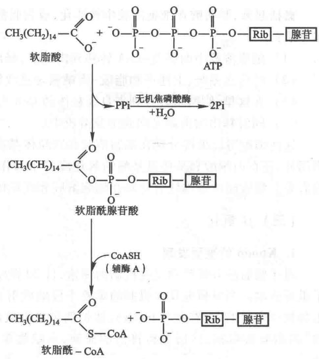

$$
\begin{array}{r l} \text {   全反应:   软脂酸   } + \mathrm{ATP} + \mathrm{CoASH} & \longrightarrow \text {   软脂酰   } - \mathrm{CoA} + \mathrm{AMP} + 2 \mathrm{Pi} \\ \Delta G ^ {\ominus} & = - 3 2. 5 \mathrm{kJ/mol} \end{array}
$$

(Rib: 核糖残基)

出,同时脂酰基又回到 CoA 上,如此完成了脂酰-CoA 穿过线粒体内膜的“使命”。上述的酶存在于线粒体基质侧(图 24-5)。

  
图 24-5 脂酰-CoA 跨线粒体内膜机制

概括起来,脂肪酸在细胞溶胶中被活化,成为脂酰-CoA,它按以下4个步骤穿越线粒体内膜进入线粒体基质:

(1) 细胞溶胶中的脂酰-CoA 转移到肉碱上, 释出 CoA 到细胞溶胶;

(2) 经传送系统, 上述产物脂酰-肉碱被送进线粒体基质;

（3）在这里，脂酰基转移到来自线粒体的 CoA 分子上；

(4) 同时释出的肉碱又回到细胞溶胶中。

这使细胞得以维持分别在细胞溶胶和线粒体基质内的 CoA 库。线粒体的 CoA 库除对脂肪酸氧化起作用外，还在丙酮酸和某些氨基酸的氧化降解中起作用，而细胞溶胶中的 CoA 库则满足脂肪酸生物合成的需要。细胞同样地维持着分别在细胞溶胶和线粒体基质中的 ATP 和 $NAD^{+}$ 库。

## (三) $\beta$ 氧化

## 1. Knoop 的重要发现

对于脂肪酸分解代谢反应机制的探索,自20世纪初即已开始,F. Knoop极为出色的实验(1904)做出了重要贡献。当时研究反应机制的重要手段的放射性同位素尚未出现,Knoop巧妙地设计出第一个用于生物化学实验的“示踪物”(tracer),他把偶数或奇数碳的脂肪酸分子的末端甲基接上苯基,用这带“示踪物”的脂肪酸喂狗,然后分析排出的尿液,示踪物苯基在体内不被代谢,而以某一特定的有机化合物被排出。

Knoop 发现, 把偶数碳原子的脂肪酸己酸 $\left(\mathrm{C}_{6}\right)$ 带上苯基示踪物后喂狗, 分析尿液的结果是, 苯基以 N-苯乙酰甘氨酸 (phenylaceturic acid) (苯乙尿酸) 的形式出现。同样, 对奇数碳原子的戊酸 $\left(\mathrm{C}_{5}\right)$ 进行实验, 结果得到 N-苯甲酰-甘氨酸 (hippuric acid) (马尿酸)。他由此推论: 脂肪酸氧化每次降解下一个 2 碳单元的片段, 氧化是从羧基端的 $\beta$ -碳原子开始的, 释下一个乙酸单元。图 24-6 表示 Knoop 对苯基标记的脂肪酸氧化实验, 箭头表示设想的断裂点。

  
图24-6 Knoop的苯基标记的脂肪酸氧化实验  
箭头指向是假想的断键处

继 Knoop 精彩的发现之后, 近百年的研究工作结果都在支持他的基本论点。即降解始发于羧基端的第二位( $\beta-$ 位) 的碳原子, 在这一处断裂切掉两个碳原子单元。脂肪酸的降解被命名为 $\beta$ 氧化 ( $\beta-$ oxidation)。这正是 Knoop 的发现。用现时的观点比较 Knoop 的假说, 有以下三点差异, 即: ① 切掉的两个碳原子单元是乙酰-CoA, 而不是乙酸分子。② 在反应系列中的中间产物全部都是结合在辅酶 A 上。③ 降解的起始需要 ATP 的水解。

## 2. 脂肪酸的 $\beta$ 氧化作用

脂肪酸 $\beta$ 氧化发生于线粒体中, 共有五个步骤, 即: ① 活化 (activation); ② 氧化 (oxidation); ③ 水合 (hydration); ④ 氧化 (oxidation); ⑤ 断裂 (cleavage)。

一般常说 $\beta$ 氧化是四个步骤，即不计脂肪酸的活化步骤。在进入这4步反应的细节前，应把眼光放大一些，以了解 $\beta$ 氧化在生物体中的地位和作用。线粒体中的脂肪酸氧化可看作三个大步骤（图24-7），第一步是 $\beta$ 氧化。以16碳的软脂酸为例，经过一系列氧化，每一轮切下两个碳原子单元即乙酰-CoA。经过7轮之后，软脂酸只残留两个碳原子，即乙酰-CoA。每一个乙酰-CoA的形成需要失去4个氢原子和两对电子，每步都是在脂酰-CoA脱氢酶的作用下发生的。第二个大步骤是 $\beta$ 氧化形成的乙酰-CoA（若是软脂酸，共形成8个），进入柠檬酸循环，继续被氧化最后脱出 $\mathrm{CO}_{2}$ 。柠檬酸循环也是在线粒体中发生的。换言之，脂肪酸氧化先是经过它们的独特途径—— $\beta$ 氧化，最后进入生物分子（包括糖、氨基酸等）的一般氧化途径——柠檬酸循环。第三个大步骤指的是：前二大步骤中脂肪酸氧化过程产生出还原型的电子传递分子——NADH和 $\mathrm{FADH}_2$ ，它们在第三步骤中把电子送到线粒体呼吸链，经过呼吸链，电子被运送给氧原子，伴随这个电子的流动，ADP经磷酸化作用转化为ATP。脂肪酸氧化中释出的能量就这样转化给了ATP分子（参阅第19章“氧化磷酸化作用”）。

  
图 24-7 线粒体中脂肪酸彻底氧化的三大步骤

下面将着重详述脂肪酸氧化的第一步骤—— $\beta$ 氧化过程,还将讲述偶数和奇数碳原子的氧化。

## (1) $\beta$ 氧化过程

如前述,脂肪酸氧化若从活化进入线粒体计算共分为5步,概括其全部过程如图24-8所示。

反应第1步活化，已作过详述。脂肪酸在硫激酶(thiokinase；又称脂酰-CoA合酶，acyl CoA synthase)作用下形成脂酰-CoA。第2步是脂酰-CoA的氧化，即脂酰-CoA的羧基邻位(β-位)被脂酰-CoA脱氢酶作用，脱下两个氢原子转化为反式- $\Delta^{2}$ -烯酰-CoA(trans- $\Delta^{2}$ -enoyl CoA)，同时产生FADH $_{2}$ 。第3步是反式- $\Delta^{2}$ -烯酰-CoA水合形成3-羟脂酰-CoA，这步反应是在烯酰-CoA水合酶(enoyl CoA hydratase)的作用下发生的。第4步是L-3-羟脂酰-CoA在L-3-羟脂酰-CoA脱氢酶(L-3-hydroxyacyl CoA dehydrogenase)的作用下转化为β-酮脂酰-CoA(β-ketoacyl CoA)，并产生NADH。第5步是β-酮脂酰-CoA受第二个CoA的作用发生硫解(thiolysis)，断裂为乙酰-CoA和一个缩短了两个碳原子单元的脂酰-CoA。这步反应是在β-酮硫解酶(β-keto-thiolase)的催化下进行的。以上反应形成脂肪酸降解的一个循环(round)。其总结果是脂肪酸链以乙酰-CoA形式自羧基端脱下两个碳原子单元。缩短了的脂肪酸以脂酰-CoA形式残留，又进入下一轮的β氧化，如图24-8所示，它进入脂酰-CoA脱氢酶的催化脱氢这一步。如果脂肪酸是软脂酸(C $_{16}$ )，就得转化为软脂酰-CoA后，经过7轮的降解产生8个乙酰-CoA分子，其总反应式可写为：

$$
\begin{array}{r l} & \text {软脂酰-CoA} + 7 \mathrm{FAD} + 7 \mathrm{CoA} \longrightarrow 8 \text {乙酰-CoA} + 7 \mathrm {FADH_ {2}} + 7 \mathrm{NADH} + 7 \mathrm {H^ {+}} \\ & (\mathrm{C} _ {1 5} \mathrm{H} _ {3 1} - \mathrm{C} - \mathrm{CoA}) \\ & \quad \parallel \\ & \quad \mathrm{O} \end{array}
$$

  
图24-8 脂肪酸 $\beta$ 氧化途径

一个循环产生一个脂酰-CoA, 它与最初进入循环的起始物脂酰-CoA 相比较, 缩短了两个碳原子。这两个碳以乙酰-CoA 的形式释出

## (2) 脂酰-CoA 脱氢酶

上述5步反应中的第2步氧化，是脂酰-CoA脱氢酶催化的反应。它使被活化（第1步）的脂酰-CoA在羧基邻位(β-位)上脱下两个氢原子，转化为反式- $\Delta^{2}$ -烯酰-CoA。脂酰-CoA脱氢酶存在于线粒体。根据线粒体基质中脂酰-CoA碳氢链的不同长度（短、中等和长链）而有各自的特异酶，即此类脱氢酶共有3种。它们催化反应的作用点是 $C_{\alpha}$ 和 $C_{\beta}$ ，即在 $C_{\alpha}$ 处脱下一个质子，又自 $C_{\beta}$ 处脱下一个带有一对电子的质子，两个质子都被FAD得到。产物 $FADH_{2}$ 被线粒体电子传递链再氧化，这个氧化过程是通过一系列的电子传递中间体完成的。电子传递黄素蛋白(electron-transfer flavoprotein, ETF)自 $FADH_{2}$ 转移一对电子给黄素-硫蛋白(flavo-sulfur protein)。ETF又名辅酶Q氧化还原酶，辅酶Q即泛醌，所以ETF又名泛醌氧化还原酶(ubiquinone oxidoreductase)。它在脂酰-CoA的β氧化过程中，把辅酶Q还原为 $QH_{2}$ ，从而一个接一个地把电子对转移给线粒体电子传递链(图24-9)。

电子传递链把 $O_{2}$ 还原成 $H_{2}O$ ，若起始于辅酶 Q 的阶段，结果是每转移一对电子产生 1.5 个 ATP 分子。

## (3) 脂酰-CoA 脱氢酶缺欠症

新生儿一夜之间突然死亡,称为婴儿猝死综合征(sudden infant death syndrome, SIDS)。此类婴儿至少10%表现为中长链脂酰脱氢酶的缺欠。这种遗传病较苯丙酮尿症(phenyl ketonuria, PKU)更为普遍。在食物摄取即后,葡萄糖是主要的能量代谢的底物,过后,当葡萄糖浓度水平降低,脂肪酸氧化的速度随即增高。新生儿的猝死可能因中长链脂酰脱氢酶的缺欠,导致葡萄糖和脂肪酸氧化发生不平衡而产生的后果。

脂酰-CoA 脱氢酶还与牙买加呕吐病(Jamaican vomiting sickness)有关。这是一种惊厥后剧烈呕吐，随后昏迷、死亡的症状，在多数情况下观察到出现低血糖。其病因是由于吃了未熟的西非荔枝果(ackee)所致，这种未熟的浆果含有一种很少见的氨基酸——降糖氨酸 A(hypoglycin A)，经代谢可形成甲叉环丙基乙酰-CoA (methylene cyclopropylacetyl-CoA, MCPA-CoA)。它是脂酰-CoA 脱氢酶的一个底物，脂酰-CoA 脱氢酶把它的 $C_{\alpha}$ 位的质子移去，形成一个中间体，即酶的 FAD 辅基被修饰，这个产物可钝化脂酰-CoA 脱氢酶(图 24-10)。

  
图 24-9 脂肪酸 $\beta$ 氧化通过脂酰-CoA 脱氢酶与电子传递链相连

(还): 还原型; (氧): 氧化型  
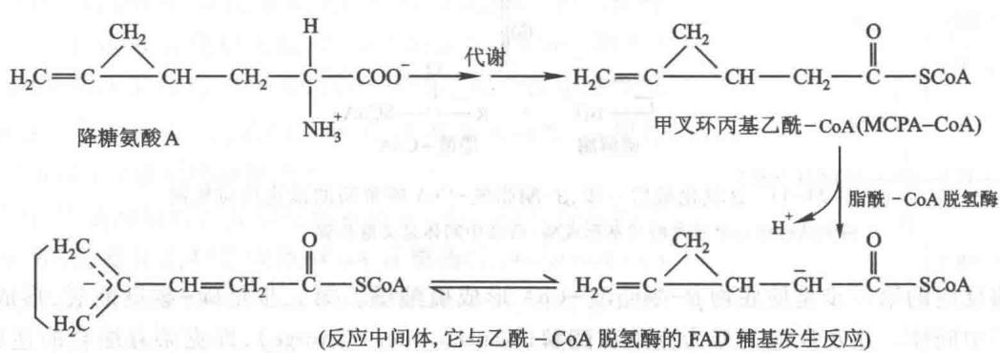  
图 24-10 降糖氨酸 A 经代谢反应转化的产物可以钝化脂酰-CoA 脱氢酶

## (4) 烯酰-CoA 水合酶和 L-3-羟酰-CoA 脱氢酶的催化特点

在 $\beta$ 氧化的第 3 步反应中烯酰-CoA 水合酶(enoyl-CoA hydratase)对底物的作用是对反式 $\alpha,\beta$ 双键进行立体特异的加水，形成 L-3-(S)-羟酰-CoA(hydroxyacyl-CoA)。随后，L-3-羟酰-CoA 脱氢酶对二级醇进行氧化得到酮，即形成 $\beta$ -酮脂酰-CoA，此时使用的氧化剂是 $NAD^{+}$ 。

## (5) 硫解酶的反应

脂肪酸氧化最后一步是硫解,形成的产物是乙酰-CoA 和一个新的脂酰-CoA,它一次使起始物缩短两个碳原子,参看图 24-11 中的起始物及最终产物脂酰-CoA。

  
图 24-11 β 氧化最后一步, $\beta$ -酮脂酰-CoA 硫解酶的催化反应机制  
酶的活性中心半胱氨酸残基形成酶-硫酯中间体是关键步骤

硫解酶反应的第一步是使底物 $\beta-$ 酮脂酰-CoA 形成硫酯键。第二步是碳-碳键断裂，形成乙酰-CoA 的负碳离子中间体。这步反应类型为克莱森酯解（Claisen ester cleavage），即克莱森缩合的逆反应。反应的第三步是在酶的作用下，酶持有的羧基对上述中间体提供质子，形成了乙酰-CoA 及酶-硫酯中间体。最后一步是在 CoA-SH 的作用下形成脂酰-CoA。

## （四）脂肪酸氧化是高度的放能过程

脂肪酸氧化的功能无疑是产生代谢能。 $\beta$ 氧化每一循环产生1个NADH、1个FADH $_{2}$ 和1个乙酰-CoA。乙酰-CoA进入柠檬酸循环又生成FADH $_{2}$ 及NADH，每1分子乙酰-CoA可产生10个ATP（过去的理论值为12个ATP）；每1分子NADH被氧化呼吸链氧化产生2.5个ATP（过去的理论值为3个ATP）；每1分子FADH $_{2}$ 氧化产生1.5个ATP（过去的理论值为2个ATP）。

以软脂酸彻底氧化为例,1 分子软脂酰- $\mathrm{CoA}(\mathrm{C}_{16}-\mathrm{酰基}-\mathrm{CoA})$ 需经 $\beta$ 氧化的 7 个循环,到最后循环时 $C_{4}-$ 酮酰基-CoA 被硫解为两个分子的乙酰-CoA,因此软脂酰-CoA 彻底氧化的化学计算为:

$$
1 \text {   软脂酰-CoA } \longrightarrow 8 \text {   乙酰-CoA   } + 7 \mathrm{FADH} _ {2} + 7 \mathrm{NADH}
$$

$$
8 \mathrm{乙酰-CoA} \sim (8 \times 1 0) \mathrm{ATP} = 8 0 \mathrm{ATP}
$$

$$
7 \mathrm{FADH} _ {2} \sim (7 \times 1. 5) \mathrm{ATP} = 1 0. 5 \mathrm{ATP}
$$

$$
7 \mathrm{NADH} \sim (7 \times 2. 5) \mathrm{ATP} = 1 7. 5 \mathrm{ATP}
$$

以上总计为 108 个 ATP（软脂酰-CoA 彻底氧化根据过去的理论值计算共产生 131 个 ATP），但软脂酸活化为软脂酰-CoA 时消耗了两个高能磷酸键，净算下来：1 分子软脂酸可生成 106 个 ATP（按过去的理论计算净生成 129 个 ATP）。106 个 ATP 水解的标准自由能为：-30.54 kJ×106=-3237 kJ(-773.8 kcal)，软脂酸的标准自由能为 -9790 kJ(-2340 kcal)。所以在标准状态下软脂酸氧化的能量转化率约为 33%（按过去的理论值计算为 40%）。

## 三、不饱和脂肪酸的氧化

## （一）不饱和脂肪酸的氧化

不饱和脂肪酸的氧化也是发生在线粒体中，它的活化和跨越线粒体内膜都与饱和脂肪酸相同，也是经 $\beta$ 氧化而降解，但它需要另外两个酶：一个是异构酶，一个是还原酶。如图24-12所示，油酰-CoA(oleoyl-CoA)的降解与硬脂酰-CoA的降解在 $\beta$ 氧化的最初3个循环中是完全相同的。其后油酰-CoA生成 $\Delta^3$ -顺式-十二烯酰-CoA，但它对脂酰-CoA脱氢酶，不是合格的底物。下面一步是对 $\Delta^3$ -顺式-十二烯酰-CoA进行改造，即经烯酰-CoA异构酶(isomerase)催化把它转化为 $\Delta^2$ -反式-十二烯酰-CoA（12： $\Delta^2$ ），成为烯酰-CoA水合酶的正常底物后，即可继续步上 $\beta$ 氧化的正路。这样，在油酰-CoA的 $\beta$ 氧化中没有脱氢酶参与；与硬脂酰-CoA（18：0）的 $\beta$ 氧化相比较，它少产出1个FADH和1.5个ATP。烯酰-CoA异构酶（ $M_r = 90000$ ）从肝的线粒体中曾纯化获得，它对 $\Delta^3$ -顺式或 $\Delta^3$ -反式的脂酰-CoA都显示活性，这里的脂酰指的是6\~16个碳的脂肪酸链。

多不饱和脂肪酸也可经 $\beta$ 氧化而被降解，但它的过程除需要油酰异构酶外，还要有2,4-二烯酰-CoA还原酶(2,4-dienoyl-CoA reductase)参与。现以亚油酰-CoA（linoleoyl-CoA）[顺式-9,12-十八(碳)二烯酰-CoA]为例，它的 $\beta$ 氧化最初的3个循环与油酰-CoA相同，形成一个 $\Delta^3$ -顺式， $\Delta^6$ -顺式不饱和脂肪酸。它同样不属脂酰-CoA脱氢酶的底物，经烯酰-CoA异构酶的作用，将 $\Delta^3$ -顺式位的双键异构化为 $\Delta^2$ -反式位, 就可继续进行 $\beta$ 氧化, 生成 $\Delta^4$ -顺式-烯酰-CoA。随后, 在脂酰-CoA 脱氢酶的催化下生成 $\Delta^2$ -反式, $\Delta^4$ -顺式-二烯酰-CoA。这个产物在 NADPH 及 2,4-二烯酰-CoA 还原酶的作用下生成 $\Delta^3$ -反式烯酰-CoA, 又再转化为 $\Delta^2$ -反式异构体, 此时, 按 $\Delta^2$ -反式异构体的结构, $\beta$ 氧化即可继续步上第 4 个循环 (图 24-13)。2,4-二烯酰-CoA 还原酶也已自肝中纯化获得, 它专一地需要 NADPH; NADH 对它既不是抑制剂, 也不是还原剂。

  
图24-12 不饱和脂肪酸在线粒体中的降解

  
图24-13 多不饱和脂肪酸在线粒体中的降解

## （二）奇数碳原子脂肪酸的氧化生成丙酰-CoA

## 1. 奇数碳原子脂肪酸的氧化途径

大多数哺乳动物组织中奇数碳原子的脂肪酸是罕见的,但在反刍动物,如牛、羊中,奇数碳链脂肪酸氧化提供的能量相当于它们所需能量的25%。具有17个碳的直链脂肪酸可经正常的 $\beta$ 氧化途径,产生7个乙酰-CoA和1个丙酰-CoA:

这种三个碳的酰基-CoA 也是氨基酸缬氨酸及异亮氨酸的降解产物（见第25章）。丙酰-CoA 经3步酶促反应转化为琥珀酰-CoA（图24-14）。起始一步的丙酰-CoA 羧化酶催化的反应，需用生物素作为辅助因子。反应第2步是在甲基丙二酰-CoA 消旋酶（methylmalonyl-CoA racemase）催化下，D-甲基丙二酰-CoA 转化为L-甲基丙二酰-CoA。最后一步的反应是在需钴胺素（维生素 $B_{12}$ ）的酶——甲基丙二酰-CoA 变位酶（methylmalonyl-CoA mutase）的作用下，发生一个少见的羰基-CoA 基团转移到甲基并置换一个氢的反应。产物琥珀酰-CoA 可以进入柠檬酸循环进一步进行代谢（参看第18章）。

D-甲基丙二酰-CoA  
  
L-甲基丙二酰-CoA

## 2. 维生素 $B_{12}$ 作为甲基丙二酰-CoA 变位酶辅酶的作用机制

在上述奇数碳原子脂肪酸的氧化中, 最后一步反应 L-甲基丙二酰-CoA 在甲基丙二酰-CoA 变位酶作用下转化为琥珀酰-CoA, 这一酶促反应必须同时有维生素 $B_{12}$ 作为辅酶存在(下式, A)。维生素 $B_{12}$ 也作为其他酶的辅酶催化以下类型的反应: 与相邻的两个碳原子连接的基团, 若一个是烷基或取代烷基(X), 另一个是 H, 它们之间的互换(下式, B)需通过辅酶 $B_{12}$ 的参与。在自然界中此类反应较为稀少。此外参与互换的氢原子并未经与溶剂水混合后移位, 也就是说, 氢原子并未在有更多氢的环境中在两个碳原子间移位。

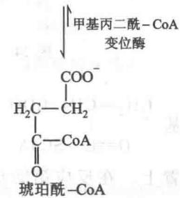  
图24-14 由丙酰-CoA生成琥珀酰-CoA

辅酶 $B_{12}$ 是维生素 $B_{12}$ 作为辅助因子(cofactor)的形式, 它在众多的维生素中是唯一的不仅有一个复杂的含有脱氧腺苷的有机分子, 而且与一钴离子 ( $Co^{3+}$ ) 相络合, 因此又名脱氧腺苷钴胺素 (deoxyadenosyl cobalamin), 有关它的结构详见本书第 13 章。它参与催化甲基丙二酰变位酶的反应, 开始是 5'-脱氧腺苷钴胺素的 Co-C 键的断裂, 生成 5'-脱氧腺苷酰游离基及 $Co^{2+}$ 型 (图 24-15 的①步)。这个脱氧腺苷酰游离基从底物 L-甲基丙二酰-CoA 分子中取下一个氢原子, 形成 5'-脱氧腺苷 (②步)。第③步反应是底物游离基 $\begin{array}{c}CH_{2}-CH-COO^{-}\\O=C-SCoA\end{array}$ 发生重排，得到一个新的游离基。此时， $(-CO-SCoA)$ 基转移到最后产物

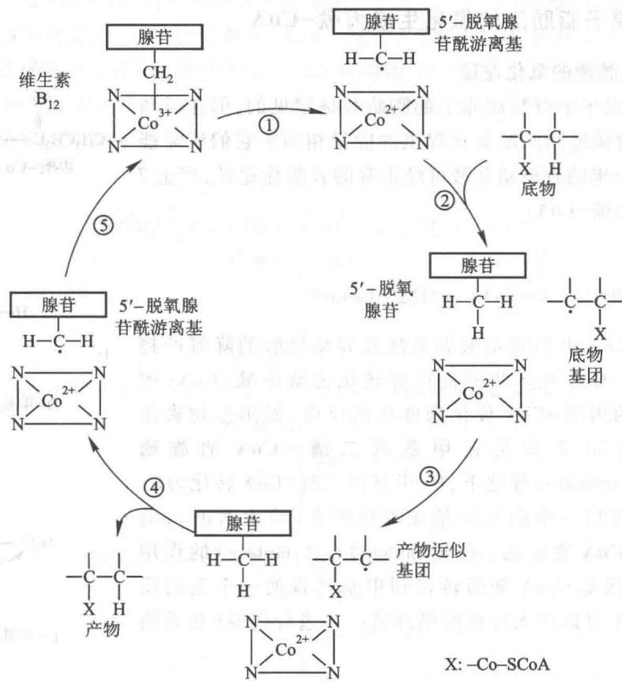  
图24-15 辅酶 $\mathbf{B}_{12}$ 的催化反应

的位置上。在反应第②步中，原底物的氢原子转移给 $5^{\prime}$ -脱氧腺苷游离基形成 $5^{\prime}$ -脱氧腺苷。在第④步中， $5^{\prime}$ -脱氧腺苷又把那个底物的氢原子转给产物游离基，自己成为 $5^{\prime}$ -脱氧腺苷游离基，并完成了产物琥珀酰-CoA的转化。反应第⑤步是 $5^{\prime}$ -脱氧腺苷酰游离基与 $\mathrm{Co}^{2+}$ 相接，恢复了辅酶 $\mathbf{B}_{12}$ 的结构（图24-15）。

## （三）过氧化物酶体中脂肪酸的 $\beta$ 氧化

线粒体是动物细胞内脂肪酸氧化的主要场所。除线粒体外，脂肪酸氧化也在过氧化物酶体中进行。动植物中的过氧化物酶体是由单层膜包被的细胞器，含有氧化酶、过氧化物酶和过氧化氢酶。过氧化物酶体中脂肪酸 $\beta$ 氧化与在线粒体中的反应过程相同，包括4个步骤：引入双键（反式- $\Delta^2$ ）的氧化反应；水被加合到双键上； $\beta-$ 羟脂酰-CoA被氧化成 $\beta-$ 酮脂酰-CoA； $\beta-$ 酮脂酰-CoA发生硫解。但是，过氧化物酶体与线粒体中所发生的脂肪酸氧化有不同之处。第一步反应中生成 $\mathrm{FADH}_2$ 中的电子被传递给 $\mathrm{O}_2$ ，产生具有潜在细胞毒性的氧化物 $\mathrm{H}_2\mathrm{O}_2$ ，后者被过氧化氢酶(catalase)水解为 $\mathrm{H}_2\mathrm{O}$ 和 $\mathrm{O}_2$ 。由此可见，在过氧化物酶体中，脂肪酸氧化释放的能量并没有以ATP形式贮存起来，而是以热的形式释放而被浪费。动物肝细胞中的过氧化物酶体参与脂肪酸氧化，它不含催化柠檬酸循环的酶，因此乙酰-CoA不能被氧化，需要从过氧化物酶体转运出去。过氧化物酶体催化超长链脂肪酸分解为中长链、短链脂肪酸，再被转运至线粒体中进一步氧化。植物的线粒体因不含脂肪酸 $\beta$ 氧化所需要的酶，为此植物中的脂肪酸氧化不在线粒体中进行，而在叶片过氧化物酶体中或者种子中的乙醛酸循环体中进行。乙醛酸循环体仅在种子萌发时形成，被认为是一种特化的过氧化物酶体。植物细胞中脂肪酸 $\beta$ 氧化的作用不是供能，而是利用贮存脂质提供生物合成前体物质。在种子萌发过程中，三酰甘油在脂肪酶的作用下生成脂肪酸，经与过氧化物酶体中相同的4个反应，形成乙酰-CoA。乙酰-CoA通过乙醛酸循环转化为草酰乙酸，经糖异生途径生成葡萄糖。乙醛酸循环体与过氧化物酶体类似，含高浓度的过氧化氢酶，将β氧化产生的 $H_{2}O_{2}$ 分解为 $H_{2}O$ 和 $O_{2}$ 。

## （四）脂肪酸还可发生 $\alpha$ 或 $\omega$ 氧化

尽管 $\beta$ 氧化是脂肪酸分解代谢的最重要而且占比例最大的途径，某些脂肪酸的 $\alpha$ 氧化对于人类健康还是必不可少的。植烷酸（phytanic acid）是膳食中的一个重要的组成成分，它存在于反刍动物的脂肪以及某些食品中。经检测，在某些地方一日摄取的植烷酸为 $50\sim 100\mathrm{mg}$ 。由于在C3位上有一个甲基取代基，因此植烷酸不属于 $\beta$ 氧化的第一步反应的脂酰-CoA脱氢酶的底物。它降解的第一步是由另一个线粒体酶来实现的，即脂肪酸 $\alpha-$ 羟化酶（fatty acid $\alpha$ -hydroxylase）。反应是在植烷酸的 $\alpha-$ 位发生羟基化。羟基化的中间体进一步脱羧，形成降植烷酸（pristanic acid）和 $\mathrm{CO}_{2}$ （图24-16）。降植烷酸经硫激酶（thiokinase）活化形成降植烷酰-CoA。因C-3位已不存在甲基，即可进行正常的 $\beta$ 氧化。对于人类，如若缺欠 $\alpha$ 氧化作用系统，即造成体内植烷酸的积聚，会导致外周神经炎类型的运动失调及视网膜炎等症状。

在鼠肝微粒体中观察到一种较少见的脂肪酸氧化途径。这个途径使中长链和长链脂肪酸通过末端甲基，即 $C_{\omega}$ 位的氧化，转变为二羧基酸。催化此反应的酶存在于内质网的微粒体中。

图24-16 植烷酸的 $\alpha$ 氧化

$$
\mathrm{CH} _ {3} \left(\mathrm{CH} _ {2}\right) _ {3} \mathrm{C} = \mathrm{O} ^ {-} \xrightarrow {\omega \text {氧化}} \mathrm{O} - \mathrm{C} \left(\mathrm{CH} _ {2}\right) _ {3} \mathrm{C} = \mathrm{O} ^ {-}
$$

$\omega$ 碳原子的氧化包括羟基化，有细胞色素 $\mathrm{P}_{450}$ 参与反应，催化此反应的酶为单加氧酶（monooxygenase），它需要NADPH和 $\mathrm{O}_2$ 参与反应。羟基即氧化为羧基，两端羧基都可与CoA结合，并进行 $\beta$ 氧化。 $\omega$ 氧化的底物为长链和中长链脂肪酸。 $\omega$ 氧化加速了脂肪酸降解的速度。

## (五) 脂肪酸 $\beta$ 氧化酶的进化

在真核生物中,脂肪酸 $\beta$ 氧化可发生在线粒体、过氧化物酶体及乙醛酸循环体中。尽管在不同的亚细胞器中, $\beta$ 氧化反应过程基本上是相同的,但催化各步反应的酶(同工酶)具有明显差异。这种不同反映这些酶在进化的早期发生了分叉。在动物细胞线粒体中,作用于脂肪酸 $\beta$ 氧化的酶是由4种独立的、可溶的蛋白质彼此聚合组成的多酶复合体(multienzyme complex),即前一个酶催化反应的产物成为下一个酶的作用底物。革兰氏阳性菌中 $\beta$ 氧化酶与这种多酶复合体的结构类似。在过氧化物酶体、乙醛酸循环体及线粒体内膜中,出现了多功能蛋白(multifunctional protein,MFP)或称多功能酶,即一种蛋白质(多肽)含有两种或两种以上的酶的活性。过氧化物酶体MFP含有烯脂酰-CoA水合酶和L- $\beta$ -羟脂酰-CoA脱氢酶这两种活性,它类似于革兰氏阴性菌中的双功能蛋白。线粒体内膜上也存在作用于长链脂肪酸的 $\beta$ 氧化系统,其中一个由两个亚基组成的三功能蛋白(TFP)含有三种酶的活性。植物过氧化物酶体或乙醛酸循环体中的MFP含有4种酶的活性。因为相关的生物化学反应在一个酶分子上进行,多功能酶比多酶复合体更有效地提高了酶的催化效率,这是生物进化的结果。

<!-- EN-BEGIN 17.2 -->

### 【英文对应 17.2】Oxidation of Fatty Acids

> 来源：Lehninger Principles of Biochemistry（书籍/02_生物化学原理） 第17章 Fatty Acid Catabolism，§17.2。对应本章“三、不饱和脂肪酸的氧化”。

As noted earlier, mitochondrial oxidation of fatty acids takes place in three stages (Fig. 17-7). In the first stage— $\beta$ oxidation—fatty acids undergo oxidative removal of successive two-carbon units in the form of acetyl-CoA, starting from the carboxyl end of the fatty acyl chain. For example, the 16-carbon palmitic acid (palmitate at pH 7) undergoes seven passes through the oxidative sequence, in each pass losing two carbons as acetyl-CoA. At the end of seven cycles, the last two carbons of palmitate (originally C-15 and C-16) remain as acetyl-CoA. The overall result is the conversion of the 16-carbon chain of palmitate to eight two-carbon acetyl groups of acetyl-CoA molecules. Formation of each acetyl-CoA requires removal of four hydrogen atoms (two pairs of electrons and four $\mathrm{H^{+}}$ ) from the fatty acyl moiety by dehydrogenases.

In the second stage of fatty acid oxidation, the acetyl groups of acetyl-CoA are oxidized to $CO_{2}$ in the citric acid cycle, which also takes place in the mitochondrial matrix. Acetyl-CoA derived from fatty acids thus enters a final common pathway of oxidation with the acetyl-CoA derived from glucose via glycolysis and pyruvate oxidation (see Fig. 16-1). The first two stages of fatty acid oxidation produce the reduced electron carriers NADH and FADH $_{2}$ , which in the third stage donate electrons to the mitochondrial respiratory chain, through which the electrons pass to oxygen with the concomitant phosphorylation of ADP to ATP (Fig. 17-7). The energy released by fatty acid oxidation is thus conserved as ATP.

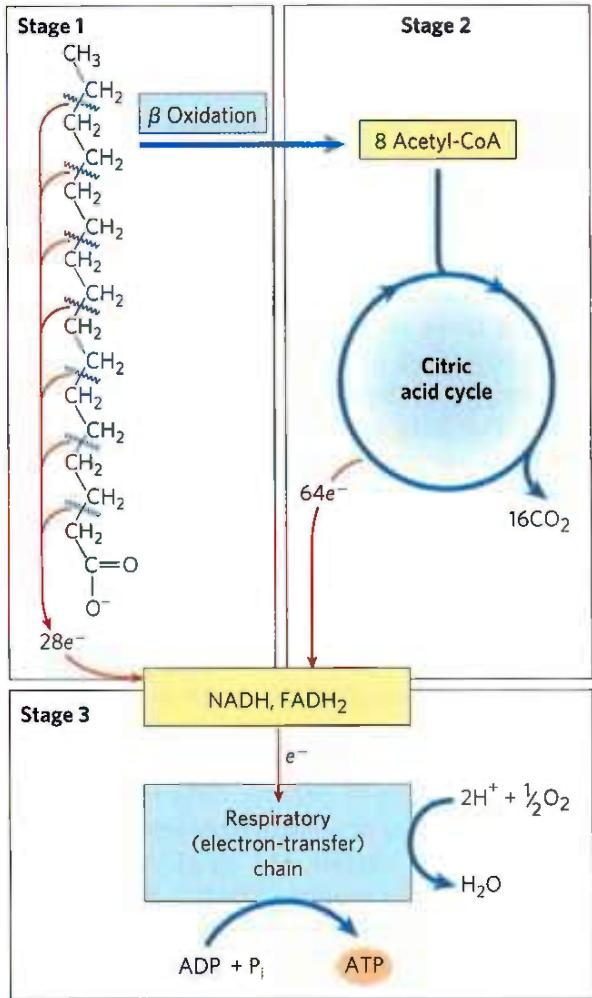  
FIGURE 17-7 Stages of fatty acid oxidation. Stage 1: A long-chain fatty acid is oxidized to yield acetyl residues in the form of acetyl-CoA. This process is called $\beta$ oxidation. Stage 2: The acetyl groups are oxidized to $\mathrm{CO}_{2}$ via the citric acid cycle. Stage 3: Electrons derived from the oxidations of stages 1 and 2 pass to $\mathrm{O}_{2}$ via the mitochondrial respiratory chain, providing the energy for ATP synthesis by oxidative phosphorylation.

We now take a closer look at the first stage of fatty acid oxidation, beginning with the simple case of a saturated fatty acyl chain with an even number of carbons, then turning to the slightly more complicated cases of unsaturated and odd-number chains. We also consider the regulation of fatty acid oxidation, the $\beta$ -oxidative processes as they occur in organelles other than mitochondria, and, finally, a less-common mode of fatty acid catabolism— $\alpha$ oxidation.

#### [EN] The $\beta$ Oxidation of Saturated Fatty Acids Has Four Basic Steps

Four enzyme-catalyzed reactions make up the first stage of fatty acid oxidation (Fig. 17-8a). First, dehydrogenation of fatty acyl-CoA produces a double bond between the $\alpha$ and $\beta$ carbon atoms (C-2 and C-3), yielding a trans- $\Delta^{2}$ -enoyl-CoA (the symbol $\Delta^{2}$ designates the position of the double bond; you may want to review fatty acid nomenclature, p. 342). Note that the new double bond has the trans configuration, whereas the double bonds in naturally occurring unsaturated fatty acids are normally in the cis configuration. We consider the significance of this difference later.

This first step is catalyzed by three isozymes of acyl-CoA dehydrogenase, each specific for a range of fatty-acyl chain lengths: very-long-chain acyl-CoA dehydrogenase (VLCAD), acting on fatty acids of 12 to 18 carbons; medium-chain (MCAD), acting on fatty acids of 4 to 14 carbons; and short-chain (SCAD), acting on fatty acids of 4 to 8 carbons. VLCAD is in the inner mitochondrial membrane; MCAD and SCAD are in the matrix. All three isozymes are flavoproteins with tightly bound FAD (see Fig. 13-27) as a prosthetic group. The electrons removed from the fatty acyl-CoA are transferred to FAD, and the reduced form of the dehydrogenase immediately donates its electrons to an electron carrier, the electron transfer flavoprotein (ETF) (see Fig. 19-15). Electrons move from ETF to a second flavoprotein, ETF:ubiquinone oxidoreductase, and through ubiquinone into the mitochondrial respiratory chain. P2 The oxidation catalyzed by an acyl-CoA dehydrogenase is analogous to succinate dehydrogenation in the citric acid cycle (p. 586); in both reactions the enzyme is bound to the inner membrane, a double bond is introduced into a carboxylic acid between the $\alpha$ and $\beta$ carbons, FAD is the electron acceptor, and electrons from the reaction ultimately enter the respiratory chain and pass to $\mathrm{O}_2$ , with the concomitant synthesis of about 1.5 ATP molecules per electron pair.

In the second step of the $\beta$ -oxidation cycle (Fig. 17-8a), water is added to the double bond of the trans- $\Delta^{2}$ -enoyl-CoA to form the L stereoisomer of $\beta$ -hydroxyacyl-CoA (3-hydroxyacyl-CoA). This reaction, catalyzed by enoyl-CoA hydratase, is formally analogous to the fumarase reaction in the citric acid cycle, in which H $_{2}$ O adds across an $\alpha$ - $\beta$ double bond (p. 587).

In the third step, L-β-hydroxyacyl-CoA is dehydrogenated to form β-ketoacyl-CoA, by the action of β-hydroxyacyl-CoA dehydrogenase; NAD $^{+}$ is the electron acceptor. This enzyme is absolutely specific for the L stereoisomer of hydroxyacyl-CoA. The NADH formed in the reaction donates its electrons to NADH dehydrogenase (Complex I), an electron carrier of the respiratory chain (see Fig. 19-15), and ATP is formed from ADP as the electrons pass to O $_{2}$ . P2 The reaction catalyzed by β-hydroxyacyl-CoA dehydrogenase is closely analogous to the malate dehydrogenase reaction of the citric acid cycle (p. 587).

  
FIGURE 17-8 The $\beta$ -oxidation pathway. (a) In each pass through this four-step sequence, one acetyl residue (shaded in light red) is removed in the form of acetyl-CoA from the carboxyl end of the fatty acyl chain—in this example palmitate ( $C_{16}$ ), which enters as palmitoyl-CoA. Electrons from the first oxidation pass through electron transfer flavoprotein (ETF), and then through a second flavoprotein (ETF:ubiquinone oxidoreductase), into the respiratory chain. Electrons from the second oxidation enter the respiratory chain through NADH dehydrogenase. (b) Six more passes through the $\beta$ -oxidation pathway yield seven more molecules of acetyl-CoA, the seventh arising from the last two carbon atoms of the 16-carbon chain. Eight molecules of acetyl-CoA are formed in all. The acetyl-CoA may be oxidized in the citric acid cycle, donating more electrons to the respiratory chain.

The fourth and last step of the $\beta$ -oxidation cycle is catalyzed by acyl-CoA acetyltransferase, more commonly called thiolase, which promotes reaction of β-ketoacyl-CoA with a molecule of free coenzyme A to split off the carboxyl-terminal two-carbon fragment of the original fatty acid as acetyl-CoA. The other product is the coenzyme A thioester of the fatty acid, now shortened by two carbon atoms (Fig. 17-8a). This reaction is called thiolysis, by analogy with the process of hydrolysis, because the β-ketoacyl-CoA is cleaved by reaction with the thiol group of coenzyme A. The thiolase reaction is a reverse Claisen condensation (see Fig. 13-4).

The last three steps of this four-step sequence are catalyzed by either of two sets of enzymes, with the enzymes employed depending on the length of the fatty acyl chain. For fatty acyl chains of 12 or more carbons, the reactions are catalyzed by a multienzyme complex associated with the inner mitochondrial membrane, the trifunctional protein (TFP). TFP is a heterooctamer of $\alpha_{4}\beta_{4}$ subunits. Each $\alpha$ subunit contains two activities, the enoyl-CoA hydratase and the $\beta$ -hydroxyacyl-CoA dehydrogenase; the $\beta$ subunits contain the thiolase activity. This tight association of three enzymes allows efficient substrate channeling from one active site to the next, without diffusion of the intermediates away from the enzyme surface. When TFP has shortened the fatty acyl chain to 12 or fewer carbons, further oxidations are catalyzed by a set of four soluble enzymes in the matrix.

P2 As noted earlier, the single bond between methylene ( $—CH_{2}—$ ) groups in fatty acids is relatively stable. The $\beta$ -oxidation sequence is an elegant mechanism for destabilizing and breaking these bonds. The first three reactions of $\beta$ oxidation create a much less stable C—C bond, in which the $\alpha$ carbon (C-2) is bonded to two carbonyl carbons (the $\beta$ -ketoacyl-CoA intermediate). The ketone function on the $\beta$ carbon (C-3) makes it a good target for nucleophilic attack by the —SH of coenzyme A, catalyzed by thiolase. The acidity of the $\alpha$ hydrogen and the resonance stabilization of the carbanion generated by the departure of this hydrogen make the terminal $—CH_{2}—CO—S-CoA$ a good leaving group, facilitating breakage of the $\alpha-\beta$ bond.

We have already seen a reaction sequence nearly identical with these four steps of fatty acid oxidation, in the citric acid cycle reaction steps between succinate and oxaloacetate (see Fig. 16-7). A nearly identical reaction sequence occurs again in the pathways by which the branched-chain amino acids (isoleucine, leucine, and valine) are oxidized as fuels (see Fig. 18-28). Figure 17-9 shows the common features of these three sequences, almost certainly an example of the conservation of a mechanism by gene duplication and evolution of a new specificity in the enzyme products of the duplicated genes.

#### [EN] The Four $\beta$ -Oxidation Steps Are Repeated to Yield Acetyl-CoA and ATP

In one pass through the $\beta$ -oxidation sequence, one molecule of acetyl-CoA, two pairs of electrons, and four protons ( $H^{+}$ ) are removed from the long-chain fatty acyl-CoA, shortening it by two carbon atoms. The equation for one pass, beginning with the coenzyme A ester of our example, palmitate, is

  
FIGURE 17-9 A conserved reaction sequence to introduce a carbonyl function on the carbon $\beta$ to a carboxyl group. The $\beta$ -oxidation pathway for fatty acyl-CoAs, the pathway from succinate to oxaloacetate in  
the citric acid cycle, and the pathway by which the deaminated carbon skeletons from isoleucine, leucine, and valine are oxidized as fuels — all use the same reaction sequence.

$$
\begin{array}{r l} & \text { Palmitoyl - CoA } + \text { CoA } + \text { FAD } + \text { NAD } ^ {+} + \text { H } _ {2} \text { O } \longrightarrow \\ & \text { myristoyl - CoA } + \text { acetyl - CoA } + \text { FADH } _ {2} + \text { NADH } + \text { H } ^ {+} \end{array}\tag{17-2}
$$

Following removal of one acetyl-CoA unit from palmitoyl-CoA, the coenzyme A thioester of the shortened fatty acid (now the 14-carbon myristate) remains. The myristoyl-CoA can now go through another set of four $\beta$ -oxidation reactions, exactly analogous to the first, to yield a second molecule of acetyl-CoA and lauroyl-CoA, the coenzyme A thioester of the 12-carbon laurate. Altogether, seven passes through the $\beta$ -oxidation sequence are required to oxidize one molecule of palmitoyl-CoA to eight molecules of acetyl-CoA (Fig. 17-8b). The overall equation is

$$
\begin{array}{r l} \text { Palmitoyl   -   CoA } + 7 \mathrm{CoA} + 7 \mathrm{FAD} + 7 \mathrm{NAD} ^ {+} + 7 \mathrm{H} _ {2} \mathrm{O} & \longrightarrow \\ 8 \text { acetyl   -   CoA } + 7 \mathrm{FADH} _ {2} + 7 \mathrm{NADH} + 7 \mathrm{H} ^ {+} & (1) \end{array}\tag{17-3}
$$

P1 Each molecule of $\mathrm{FADH}_2$ formed during oxidation of the fatty acid donates a pair of electrons to ETF of the respiratory chain, and about 1.5 molecules of ATP are generated during the ensuing transfer of each electron pair to $\mathrm{O}_2$ . Similarly, each molecule of NADH formed delivers a pair of electrons to the mitochondrial NADH dehydrogenase, and the subsequent transfer of each pair of electrons to $O_{2}$ results in formation of about 2.5 molecules of ATP. Thus four molecules of ATP are formed for each two-carbon unit removed in one pass through the sequence.

Note that water is also produced in this process. Each pair of electrons transferred from NADH or FADH $_2$ to O $_2$ yields one H $_2$ O, referred to as "metabolic water." Reduction of O $_2$ by NADH also consumes one H $^+$ per NADH molecule: NADH + H $^+$ + ½O $_2$ → NAD $^+$ + H $_2$ O. In hibernating animals, fatty acid oxidation provides metabolic energy, heat, and water—all essential for survival of an animal that neither eats nor drinks for long periods (Box 17-1). Camels obtain water to supplement the meager supply available in their natural environment by oxidation of fats stored in their hump.

The overall equation for the oxidation of palmitoyl-CoA to eight molecules of acetyl-CoA, including the electron transfers and oxidative phosphorylations, is

$$
\begin{array}{r l} \text { Palmitoyl - CoA } + 7 \mathrm{CoA} + 7 \mathrm{O} _ {2} + 2 8 \mathrm{P} _ {\mathrm{i}} + 2 8 \mathrm{ADP} & \longrightarrow \\ 8 \text { acetyl - CoA } + 2 8 \mathrm{ATP} + 7 \mathrm{H} _ {2} \mathrm{O} \end{array}\tag{17-4}
$$

Acetyl-CoA Can Be Further Oxidized in the Citric Acid Cycle
P1 The acetyl-CoA produced from the oxidation of fatty acids can be oxidized to $CO_{2}$ and $H_{2}O$ by the citric acid cycle. The following equation represents the

#### [EN] A Long Winter's Nap: Oxidizing Fats during Hibernation

Many animals depend on fat stores for energy during hibernation, during migratory periods, and in other situations involving radical metabolic adjustments. One of the most pronounced adjustments of fat metabolism occurs in hibernating grizzly bears. These animals remain in a continuous state of dormancy for as long as seven months. Unlike most hibernating species, the bear maintains a body temperature of about 31 °C, close to its normal (nonhibernating) temperature near 40 °C. Although expending about 25,000 kJ/day (6,000 kcal/day) while hibernating, the bear does not eat, drink, urinate, or defecate for months at a time. Its heart rate drops from 90 to 8 beats per minute, and its respiration rate drops from 6 to 10 breaths to approximately 1 breath per minute.

As we shall see in Chapter 19, mitochondrial electron transfer can be uncoupled from ATP production so that all of the energy of fuel oxidation is dissipated as heat, to maintain a body temperature near normal in the face of much lower ambient temperatures. One form of fat tissue, brown adipose tissue, is especially important in thermogenesis; we discuss it in more detail in Chapter 23.

Experimental studies have shown that hibernating grizzly bears use body fat as their sole fuel. Fat oxidation yields sufficient energy to maintain body temperature, synthesize amino acids and proteins, and carry out other energy-requiring activities, such as membrane transport. Fat oxidation also releases large amounts of water, as described in the text, which replenishes water lost in breathing. The glycerol released by degradation of triacylglycerols is converted into blood glucose by gluconeogenesis. Urea formed during breakdown of amino acids is reabsorbed in the kidneys and recycled, with the amino groups reused to make new amino acids for maintaining body proteins.

Bears store an enormous amount of body fat in preparation for their long sleep. An adult grizzly consumes about 38,000 kJ/day during the late spring and summer, but as winter approaches it feeds for 20 hours a day, consuming up to 84,000 kJ daily. This increase in feeding is a response to a seasonal change in hormone secretion. Large amounts of triacylglycerols are formed from the huge intake of carbohydrates during the fattening-up period. The bear will emerge from hibernation having lost 15% to 40% of its maximum body weight.

The winter sleep of bears is sometimes called torpor, and it differs in important ways from the hibernation behavior of a group of smaller animals that undergo alternating periods of high and low body temperature. In these animals, body temperature approaches ambient temperature, close to 0 °C, for much of the time during hibernation, but rises to almost prehibernation level during brief periods of wakefulness. During these periods, the animals eat, drink, and defecate. In the Arctic ground squirrel (Urocitellus parryii), for example, body temperature (37 °C prehibernation) drops to 0 °C during hibernation, and respiration drops to less than 10% of its prehibernation rate.

Studies of hibernation mechanisms may yield insight into several problems in human medicine; for example, slowing the metabolism of organs donated for transplantation might extend the period of their viability. And if humans are to make long trips into space, inducing a torporlike state might relieve the monotony of long missions and conserve onboard resources such as food and oxygen.

  
A grizzly bear prepares its hibernation nest near the McNeil River in Canada. [Stouffer Productions/Animals Animals]

balance sheet for the second stage in the oxidation of palmitoyl-CoA, together with the coupled phosphorylations of the third stage:

$$
\begin{array}{r l} 8 \mathrm {Acetyl - CoA + 16O_ {2} + 80P_ {i} + 80ADP \longrightarrow} \\ & 8 \mathrm{CoA+80ATP+16CO_ {2} +16H_ {2} O} \end{array}\tag{17-5}
$$

Combining Equations 17-4 and 17-5, we obtain the overall equation for the complete oxidation of palmitoyl-CoA to carbon dioxide and water:

$$
\begin{array}{r l} \mathrm {Palmitoyl - CoA + 23O_ {2} +108P_ {i} +108ADP\longrightarrow} \\ \mathrm {CoA + 108ATP + 16CO_ {2} +23H_ {2} O} \end{array}\tag{17-6}
$$

Table 17-1 summarizes the yields of NADH, FADH $_2$ , and ATP in the successive steps of palmitoyl-CoA oxidation. Note that because the activation of palmitate to palmitoyl-CoA breaks both phosphoanhydride bonds in ATP (Fig. 17-5), the energetic cost of activating a fatty acid is equivalent to two ATP, and the net gain per molecule of palmitate is 106 ATP. The standard free-energy change for the oxidation of palmitate to CO $_2$ and H $_2$ O is about 9,800 kJ/mol. Under standard conditions, the energy recovered as the phosphate bond energy of ATP is 106 × 30.5 kJ/mol = 3,230 kJ/mol, about 33% of the theoretical maximum. However, when the free-energy changes are calculated from actual concentrations of reactants and products under intracellular conditions, the free-energy recovery is more than 60%; the energy conservation is remarkably efficient (see Worked Example 13-2, p. 480).

#### [EN] Oxidation of Unsaturated Fatty Acids Requires Two Additional Reactions

The fatty acid oxidation sequence just described is typical when the incoming fatty acid is saturated (that is, has only single bonds in its carbon chain). However, most of the fatty acids in the triacylglycerols and phospholipids of animals and plants are unsaturated, having one or more double bonds. These bonds are in the cis configuration and cannot be acted upon by enoyl-CoA hydratase, the enzyme catalyzing the addition of $H_{2}O$ to the trans double bond of the $\Delta^{2}$ -enoyl-CoA generated during $\beta$ oxidation. P1 Two auxiliary enzymes—an isomerase and a reductase—must act on the common unsaturated fatty acids to transform them into substrates for the $\beta$ -oxidation pathway. We illustrate these auxiliary reactions with two examples.

Oleate is an abundant 18-carbon monounsaturated fatty acid with a cis double bond between C-9 and C-10 (denoted $\Delta^9$ ). In the first step of oxidation, oleate is converted to oleoyl-CoA and, like the saturated fatty acids, enters the mitochondrial matrix via the carnitine shuttle (Fig. 17-6). Oleoyl-CoA then undergoes three passes through the fatty acid oxidation cycle to yield three molecules of acetyl-CoA and the coenzyme A ester of a $\Delta^3$ , 12-carbon unsaturated fatty acid, $cis-\Delta^3$ -dodecenoyl-CoA (Fig. 17-10). This product cannot serve as a substrate for enoyl-CoA hydratase, which acts only on trans double bonds. The auxiliary enzyme $\Delta^3, \Delta^2$ -enoyl-CoA isomerase isomerizes the $cis-\Delta^3$ -enoyl-CoA to the $trans-\Delta^2$ -enoyl-CoA, which is converted by enoyl-CoA hydratase into the corresponding L-β-hydroxyacyl-CoA ( $trans-\Delta^2$ -dodecenoyl-CoA). This intermediate is now acted upon by the remaining enzymes of β oxidation to yield acetyl-CoA and the coenzyme A ester of a 10-carbon saturated fatty acid, decanoyl-CoA. The latter undergoes four more passes through the β-oxidation pathway to yield five more molecules of acetyl-CoA. Altogether, nine acetyl-CoAs are produced from one molecule of the 18-carbon oleate.

The other auxiliary enzyme (a reductase) is required for oxidation of polyunsaturated fatty acids—for example, the 18-carbon linoleate, which has a $cis-\Delta^{9},cis-\Delta^{12}$ configuration (Fig. 17-11). Linoleoyl-CoA undergoes three passes through the $\beta$ -oxidation sequence to yield three molecules of acetyl-CoA and the coenzyme A ester of a 12-carbon unsaturated fatty acid with a $cis-\Delta^{3},cis-\Delta^{6}$ configuration. This intermediate cannot be used by the enzymes of the $\beta$ -oxidation pathway: its double bonds are in the wrong position and have the wrong configuration (cis, not trans). However, the combined action of enoyl-CoA isomerase and 2,4-dienoyl-CoA reductase, as shown in Figure 17-11, transforms this intermediate into one that can enter the $\beta$ -oxidation pathway and be degraded to six acetyl-CoAs. The overall result is conversion of linoleate to nine molecules of acetyl-CoA.

<table><tr><td colspan="3">TABLE 17.1 Yield of ATP during Oxidation of One Molecule of Palmitoyl-CoA to CO2 and H2O</td></tr><tr><td>Enzyme catalyzing the oxidation step</td><td>Number of NADH or FADH2 formed</td><td>Number of ATP ultimately formeda</td></tr><tr><td>β Oxidation</td><td></td><td></td></tr><tr><td>Acyl-CoA dehydrogenase</td><td>7 FADH2</td><td>10.5</td></tr><tr><td>β-Hydroxyacyl-CoA dehydrogenase</td><td>7 NADH</td><td>17.5</td></tr><tr><td>Citric acid cycle</td><td></td><td></td></tr><tr><td>Isocitrate dehydrogenase</td><td>8 NADH</td><td>20</td></tr><tr><td>α-Ketoglutarate dehydrogenase</td><td>8 NADH</td><td>20</td></tr><tr><td>Succinyl-CoA synthetase</td><td></td><td>8b</td></tr><tr><td>Succinate dehydrogenase</td><td>8 FADH2</td><td>12</td></tr><tr><td>Malate dehydrogenase</td><td>8 NADH</td><td>20</td></tr><tr><td>Total</td><td></td><td>108</td></tr><tr><td colspan="3">aThese calculations assume that mitochondrial oxidative phosphorylation produces 1.5 ATP per FADH2 oxidized and 2.5 ATP per NADH oxidized bGTP produced directly in this step yields ATP in the reaction catalyzed by nucleoside diphosphate kinase (p. 487).</td></tr></table>

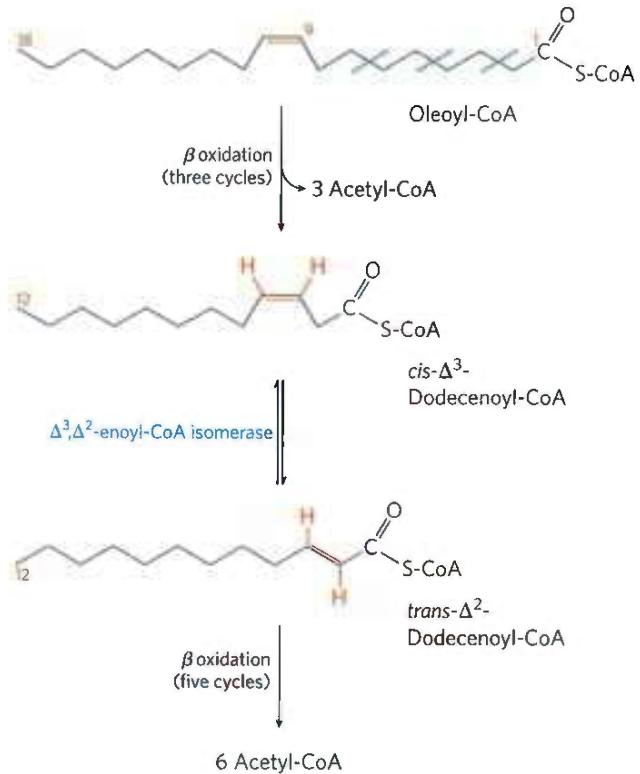  
FIGURE 17-10 Oxidation of a monounsaturated fatty acid. Oleic acid, as oleoyl-CoA ( $\Delta^{9}$ ), is the example used here. Oxidation requires an add tional enzyme, enoyl-CoA isomerase, to reposition the double bond, convering the cis isomer to a trans isomer, an intermediate in $\beta$ oxidation.

#### [EN] Complete Oxidation of Odd-Number Fatty Acids Requires Three Extra Reactions

Although most naturally occurring lipids contain fatty acids with an even number of carbon atoms, fatty acids with an odd number of carbons are common in the lipids of many plants and some marine organisms. Cattle and other ruminant animals form large amounts of the three-carbon propionate (CH₃—CH₂—COO⁻) during fermentation of carbohydrates in the rumen. The propionate is absorbed into the blood and oxidized by the liver and other tissues.

Long-chain odd-number fatty acids are oxidized in the same pathway as the even-number acids, beginning at the carboxyl end of the chain. However, the substrate for the last pass through the $\beta$ -oxidation sequence is a fatty acyl-CoA with a five-carbon fatty acid. When this is oxidized and cleaved, the products are acetyl-CoA and propionyl-CoA. The acetyl-CoA can be oxidized in the citric acid cycle, of course, but propionyl-CoA enters a different pathway, having three enzymes.

  
FIGURE 17-11 Oxidation of a polyunsaturated fatty acid. The example here is linoleic acid, as linoleoyl-CoA ( $\Delta^{9,12}$ ). Oxidation requires a second auxiliary enzyme in addition to enoyl-CoA isomerase: NADPH-dependent 2,4-dienoyl-CoA reductase. The combined action of these two enzymes converts a trans- $\Delta^{2}$ , cis- $\Delta^{4}$ -dienoyl-CoA intermediate to the trans- $\Delta^{2}$ -enoyl-CoA substrate necessary for $\beta$ oxidation.

Propionyl-CoA is first carboxylated to form the D stereoisomer of methylmalonyl-CoA by propionyl-CoA carboxylase, which contains the cofactor biotin (Fig. 17-12). In this enzymatic reaction, as in the pyruvate carboxylase reaction (see Fig. 16-16), bicarbonate ion $(\mathrm{HCO}_3^-)$ is activated by attachment to biotin before its transfer to the substrate, in this case the propionate moiety. Formation of the carboxybiotin intermediate requires energy, which is provided by ATP. The D-methylmalonyl-CoA thus formed is enzymatically epimerized to its L stereoisomer by methylmalonyl-CoA epimerase. The L-methylmalonyl-CoA then undergoes an intramolecular rearrangement to form succinyl-CoA, which can enter the citric acid cycle. This rearrangement is catalyzed by methylmalonyl-CoA mutase, which requires as its coenzyme 5'-deoxyadenosylcobalamin, or coenzyme B $_{12}$ , which is derived from vitamin B $_{12}$ (cobalamin). Box 17-2 describes the role of coenzyme B $_{12}$ in this remarkable exchange reaction.

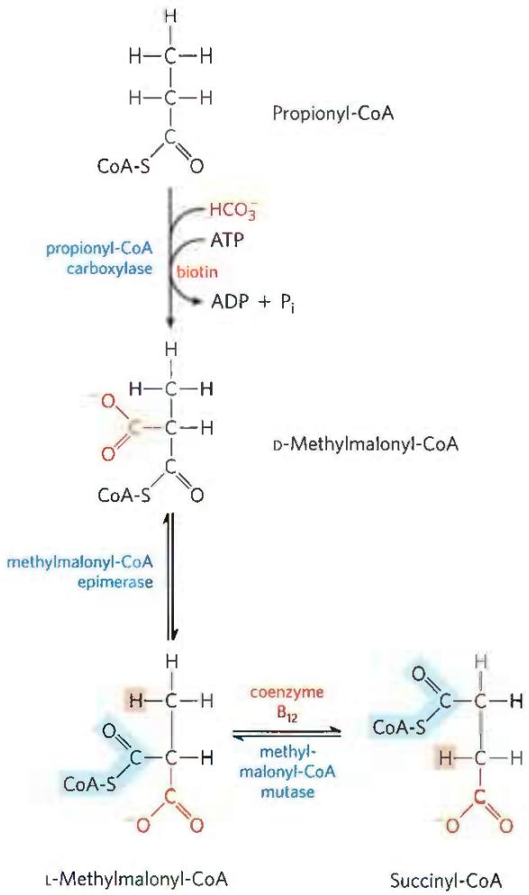  
FIGURE 17-12 Oxidation of propionyl-CoA produced by $\beta$ oxidation of odd-number fatty acids. The sequence involves the carboxylation of propionyl-CoA to D-methylmalonyl-CoA and conversion of the latter to succinyl-CoA. This conversion requires epimerization of D- to L-methylmalonyl-CoA, followed by a remarkable reaction in which substituents on adjacent carbon atoms exchange positions (see Box 17-2).

About 1 in 100,000 babies are born with a genetic deficiency in propionyl-CoA carboxylase, making them unable to metabolize the propionyl-CoA that results from catabolism of odd-number fatty acids, fatty acids with methyl branches, and the amino acids isoleucine, valine, threonine, and methionine. P4 The absence of functional propionyl-CoA carboxylase leads to an accumulation of propionyl-CoA in mitochondria, depleting the available supply of coenzyme A for continuing $\beta$ -oxidation and other metabolism. The propionyl-CoA is esterified to carnitine, transported out of the mitochondria through the carnitine shuttle, and eventually released to the blood as propionate, which severely acidifies the blood and urine, a condition called propionic acidemia. Symptoms generally manifest in the first few days of life, with vomiting, low blood glucose, seizures, and neurologic abnormalities. The condition is diagnosed by detection of propionate and its metabolites in the blood and urine. Treatments include severe restriction of dietary protein, supplying carnitine, and the use of antibiotics targeted at gut bacteria that produce odd-chain and branched-chain fatty acids. Some individuals who are defective in the incorporation of biotin into the enzyme benefit from treatment with high doses of biotin.

#### [EN] Fatty Acid Oxidation Is Tightly Regulated

P3 Oxidation of fatty acids consumes a precious fuel, and it is regulated so as to occur only when the organism's need for energy requires it. In the liver, fatty acyl-CoA formed in the cytosol has two major pathways open to it: (1) $\beta$ oxidation by enzymes in mitochondria or (2) conversion into triacylglycerols and phospholipids by enzymes in the cytosol. The pathway taken depends on the rate of transfer of long-chain fatty acyl-CoA into mitochondria. The three-step carnitine shuttle by which fatty acyl groups are carried into the mitochondrial matrix as fatty acyl-carnitine (Fig. 17-6) is rate-limiting for fatty acid oxidation and is an important point of regulation. Once fatty acyl groups have entered the mitochondrion, they are committed to oxidation to acetyl-CoA.

Figure 17-13 illustrates, with numbered steps described below, the coordinated down-regulation of $\beta$ oxidation when carbohydrate levels are sufficient. Ingestion of a high-carbohydrate meal raises the blood glucose level and thus ① triggers the release of insulin. ② Insulin-dependent protein phosphatase dephosphorylates the enzyme acetyl-CoA carboxylase (ACC), activating it. ③ ACC catalyzes the formation of malonyl-CoA (the first intermediate of cytosolic fatty acid synthesis; see Figs 21-1 and 21-2), and ④ malonyl-CoA inhibits carnitine acyltransferase 1, thereby preventing fatty acid entry into the mitochondrial matrix through the carnitine shuttle. The inhibition of carnitine acyltransferase 1 by malonyl-CoA ensures that the oxidation of fatty acids is inhibited whenever the liver is amply supplied with glucose as fuel and is actively making triacylglycerols from excess glucose. Two of the enzymes of $\beta$ oxidation (8) are also regulated by metabolites that signal energy sufficiency. When the [NADH]/[NAD+] ratio is high, $\beta$ -hydroxyacyl-CoA dehydrogenase is inhibited; in addition, high concentrations of acetyl-CoA inhibit thiolase.

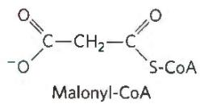

#### [EN] Coenzyme B $_{12}$ : A Radical Solution to a Perplexing Problem

In the methylmalonyl-CoA mutase reaction (see Fig. 17-12), the group —CO—S-CoA at C-2 of the original propionate exchanges position with a hydrogen atom at C-3 of the original propionate (Fig. 1a). Coenzyme B $_{12}$ is the cofactor for this general type of reaction (Fig. 1b). These coenzyme B $_{12}$ -dependent processes are among the very few enzymatic reactions in biology in which there is an exchange of an alkyl or substituted alkyl group (X) with a hydrogen atom on an adjacent carbon, with no mixing of the transferred hydrogen atom with the hydrogen of the solvent, H $_{2}$ O. How can the hydrogen atom move between two carbons without mixing with the enormous excess of hydrogen atoms in the solvent?

Coenzyme $B_{12}$ is the cofactor form of vitamin $B_{12}$ , which is unique among all the vitamins in that it contains an essential trace element, cobalt. The complex corrin ring system of vitamin $B_{12}$ (colored blue in Fig. 2), to which cobalt (as $Co^{3+}$ ) is coordinated, is chemically related to the porphyrin ring system of heme (see Fig. 5-1). A fifth coordination position of cobalt is filled by dimethylbenzimidazole ribonucleotide (shaded yellow), bound covalently by its 3'-phosphate group to a side chain of the corrin ring, through aminoisopropanol. The formation of this complex cofactor occurs in one of only two known reactions in which triphosphate is cleaved from ATP (Fig. 3); the other reaction is the formation of S-adenosylmethionine from ATP and methionine (see Fig. 18-18).

  
Dorothy Crowfoot Hodgkin, 1910–1994 [© Godfrey Argent Studio/The Royal Society]

Vitamin B $_{12}$ is usually isolated as cyanocobalamin, because it contains a cyano group (picked up during purification) attached to cobalt in the sixth coordination position. In 5'-deoxyadenosylcobalamin, the cofactor for methylmalonyl-CoA mutase, the cyano group is replaced by the 5'-deoxyadenosyl group (red in Fig. 2), covalently bound through

C-5' to the cobalt. The three-dimensional structure of the cofactor was determined by Dorothy Crowfoot Hodgkin in 1956, using x-ray crystallography.

The key to understanding how coenzyme $B_{12}$ catalyzes hydrogen exchange lies in the properties of the covalent bond between cobalt and C-5' of the deoxyadenosyl group (Fig. 2). This is a relatively weak bond; merely illuminating the compound with visible light is enough to break this Co—C bond. (This extreme photolability probably accounts for the absence of vitamin $B_{12}$ in plants.) Dissociation produces a 5'-deoxyadenosyl radical and the $Co^{2+}$ form of the vitamin. By generating free radicals in this way, 5'-deoxyadenosylcobalamin initiates a series of transformations such as that illustrated in Figure 4—a postulated mechanism for the reaction catalyzed by methylmalonyl-CoA mutase and several other coenzyme $B_{12}$ -dependent transformations. In this postulated mechanism, the migrating hydrogen atom never exists as a free species and is thus never free to exchange with the hydrogen of surrounding water molecules.

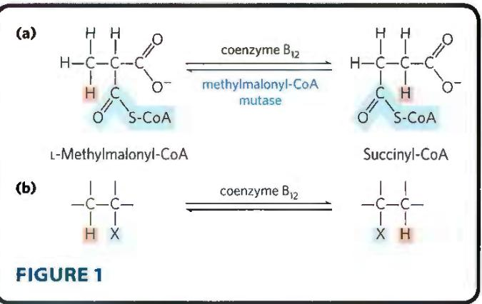

Vitamin $B_{12}$ is not made by plants or animals and can be synthesized only by a few species of microorganisms. It is required by healthy people in only minute amounts, about 3 $\mu$ g/day. Vitamin $B_{12}$ deficiency results in pernicious anemia, caused by a failure to absorb vitamin $B_{12}$ efficiently from the intestine, where it is synthesized by intestinal bacteria or obtained from digestion of meat. Individuals with this disease do not produce sufficient amounts of intrinsic factor, a glycoprotein essential to vitamin $B_{12}$ absorption. The pathology in pernicious anemia includes reduced production of erythrocytes, reduced levels of hemoglobin, and severe, progressive impairment of the central nervous system. Administration of large doses of vitamin $B_{12}$ alleviates these symptoms in at least some cases.

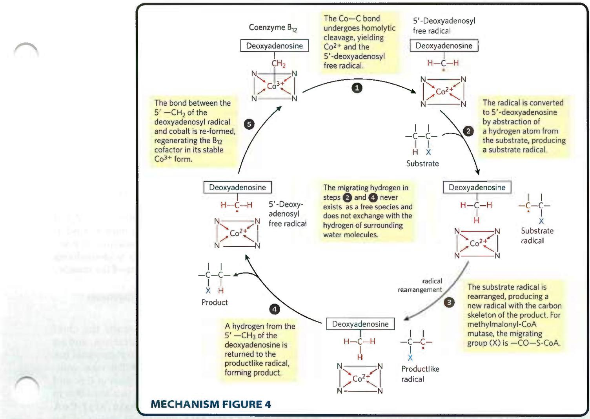

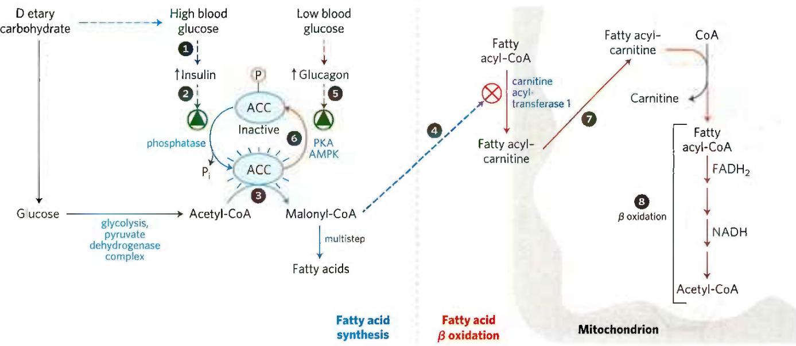  
FIGURE 17-13 Coordinated regulation of fatty acid synthesis and breakdown. The steps are explained in the text.

Figure 17-13 also shows that conversely, when blood glucose levels drop between meals, ⑤ glucagon release activates protein kinase A (PKA), which ⑥ phosphorylates and inactivates ACC. Recall from Chapter 14 that in a low-energy state, [AMP] rises relative to [ATP], activating AMP kinase (AMPK). Activated AMPK also phosphorylates and inactivates ACC. The concentration of malonyl-CoA falls, and the inhibition of fatty acid entry into mitochondria is relieved. Fatty acids ⑦ enter the mitochondrial matrix, ⑧ allowing β oxidation to replenish the supply of ATP. Because glucagon also triggers the mobilization of fatty acids in adipose tissue, a supply of fatty acids begins arriving in the blood.

#### [EN] Transcription Factors Turn on the Synthesis of Proteins for Lipid Catabolism

P3 In addition to the various short-term regulatory mechanisms that modulate the activity of existing enzymes, transcriptional regulation can change the number of molecules of the enzymes of fatty acid oxidation on a longer time scale—minutes to hours. The PPAR family of nuclear receptors are transcription factors that affect many metabolic processes in response to a variety of fatty acid-like ligands. (They were originally recognized as peroxisome proliferator-activated receptors, then were found to function more broadly.) PPARα acts in muscle, adipose tissue, and liver to turn on a set of genes essential for fatty acid oxidation, including the fatty acid transporter, carnitine acyltransferases 1 and 2; the fatty acyl-CoA dehydrogenases for short, medium, long, and very long acyl chains; and related enzymes. This response is triggered when a cell or an organism has an increased demand for energy from fat catabolism, such as during a fast between meals or under conditions of longer-term starvation. Glucagon, released in response to low blood glucose, can act through cAMP and the transcription factor CREB to turn on certain genes for lipid catabolism.

Another situation that is accompanied by major changes in the expression of the enzymes of fatty acid oxidation is the transition from fetal to neonatal metabolism in the heart. In the fetus, the principal fuels in heart muscle are glucose and lactate, but in the neonatal heart, fatty acids are the main fuel. At the time of this transition, PPAR $\alpha$ is activated and in turn activates the genes essential for fatty acid metabolism. As we will see in Chapter 23, two other transcription factors in the PPAR family also play crucial roles in determining the enzyme complements—and therefore the metabolic activities—of specific tissues at particular times (see Fig. 23-38).

The major sites of fatty acid oxidation, at rest and during exercise, are skeletal and heart muscle. Endurance training increases PPARα expression in muscle, leading to increased levels of fatty acid-oxidizing enzymes and increased oxidative capacity of the muscle.

#### [EN] Genetic Defects in Fatty Acyl-CoA Dehydrogenases Cause Serious Disease

Stored triacylglycerols are typically the chief source of energy for muscle contraction, and an inability to oxidize fatty acids from triacylglycerols has serious consequences for health. P4 The most common genetic defect in fatty acid catabolism in U.S. and northern European populations is due to a mutation in the gene encoding the medium-chain acyl-CoA dehydrogenase (MCAD), mentioned earlier in the chapter. Among northern Europeans, the frequency of carriers (individuals with this recessive mutation on one of the two homologous chromosomes) is about 1 in 40, and about 1 individual in 10,000 has the disease—that is, has two copies of the mutant MCAD allele and is unable to oxidize fatty acids of 6 to 12 carbons. The disease is characterized by recurring episodes of a syndrome that includes fat accumulation in the liver, high blood levels of octanoic acid (8:0), low blood glucose (hypoglycemia), sleepiness, vomiting, and coma. Although individuals may have no symptoms between episodes, the episodes are very serious; mortality due to this disease is 25% to 60% in early childhood. If the genetic defect is detected shortly after birth, the infant can be started on a low-fat, high-carbohydrate diet. With early detection and careful management of the diet—including avoiding long intervals between meals, to prevent the body from turning to its fat reserves for energy—the prognosis for these individuals is good.

P4 More than 20 human genetic defects in fatty acid transport or oxidation have been documented, most much less common than the defect in MCAD. One of the most severe disorders results from loss of the long-chain $\beta$ -hydroxyacyl-CoA dehydrogenase activity of the trifunctional protein, TFP. Other disorders include defects in the $\alpha$ or $\beta$ subunits that affect all three activities of TFP and cause serious heart disease and abnormal skeletal muscle.

#### [EN] Peroxisomes Also Carry Out β Oxidation

The mitochondrial matrix is the major site of fatty acid oxidation in animal cells, but other compartments also contain enzymes capable of oxidizing fatty acids to acetyl-CoA, by a pathway similar but not identical to that in mitochondria. In plant cells, the major site of $\beta$ oxidation is not mitochondria but peroxisomes. In peroxisomes, organelles also found in animal cells, the intermediates for $\beta$ oxidation of fatty acids are coenzyme A derivatives, and the process consists of four steps, as in mitochondrial $\beta$ oxidation (Fig. 17-14): (1) dehydrogenation, (2) addition of water to the resulting double bond, (3) oxidation of the $\beta$ -hydroxyacyl-CoA to a ketone, and (4) thiolytic cleavage by coenzyme A. The identical reactions also occur in glyoxysomes, organelles found only in germinating seeds.

One difference between the peroxisomal and mitochondrial pathways is in the chemistry of the first step (Fig. 17-14). In peroxisomes, the flavoprotein acyl-CoA oxidase that introduces the double bond passes electrons directly to $O_{2}$ , producing $H_{2}O_{2}$ (thus the name “peroxisomes”). This strong and potentially damaging oxidant is immediately cleaved to $H_{2}O$ and $O_{2}$ by catalase. Recall that in mitochondria, the electrons removed in the first oxidation step pass through the respiratory chain to $O_{2}$ to produce $H_{2}O$ , and this process is accompanied by ATP synthesis. In peroxisomes, the energy released in the first oxidative step of fatty acid breakdown is not conserved as ATP, but is dissipated as heat.

  
FIGURE 17-14 Comparison of $\beta$ oxidation in mitochondria and in peroxisomes and glyoxysomes. The peroxisomal/glyoxysomal system differs from the mitochondrial system in three respects: (1) the peroxisomal system prefers very-long-chain fatty acids; (2) in the first oxidative step, electrons pass directly to $\mathrm{O}_2$ , generating $\mathrm{H}_2\mathrm{O}_2$ ; and (3) the NADH formed in the second oxidative step cannot be reoxidized in the peroxisome or glyoxysome, so reducing equivalents are exported to the cytosol, eventually entering mitochondria. The acetyl-CoA produced by peroxisomes and glyoxysomes is also exported; the acetate from glyoxysomes serves as a biosynthetic precursor. Acetyl-CoA produced in mitochondria is further oxidized in the citric acid cycle.

A second important difference between mitochondrial and peroxisomal $\beta$ oxidation in mammals is in the specificity for fatty acyl-CoAs; the peroxisomal system is much more active on very-long-chain fatty acids such as hexacosanoic acid (26:0) and on branched-chain fatty acids such as phytanic acid and pristanic acid (see Fig. 17-15). These less-common fatty acids are obtained from dietary intake of dairy products, the fat of ruminant animals, meat, and fish. Their catabolism in the peroxisome involves several auxiliary enzymes unique to this organelle. P4 The inability to oxidize these compounds is responsible for several serious human genetic diseases. Individuals with Zellweger syndrome are unable to make peroxisomes and therefore lack all the metabolism unique to that organelle. In X-linked adrenoleukodystrophy (XALD), peroxisomes fail to oxidize very-long-chain fatty acids, apparently due to lack of a functional transporter for these fatty acids in the peroxisomal membrane. Both defects lead to accumulation in the blood of very-long-chain fatty acids, especially 26:0. XALD affects young boys before the age cf 10 years, causing loss of vision, behavioral disturbances, and death within a few years.

  
FIGURE 17-15 The $\alpha$ oxidation of a branched-chain fatty acid (phytanic acid) in peroxisomes. Phytanic acid has a methyl-substituted $\beta$ carbon and therefore cannot undergo $\beta$ oxidation. The combined action of the enzymes shown here removes the carboxyl carbon of phytanic acid to produce pristanic acid, in which the $\beta$ carbon is unsubstituted, allowing $\beta$ oxidation. Notice that $\beta$ oxidation of pristanic acid releases propionyl-CoA, not acetyl-CoA. This is further catabolized as in Figure 17-12. (The details of the reaction that produces pristanal remain controversial.)

In mammals, high concentrations of fats in the diet result in increased synthesis of the enzymes of peroxisomal $\beta$ oxidation in the liver. Liver peroxisomes do not contain the enzymes of the citric acid cycle and cannot catalyze the oxidation of acetyl-CoA to $CO_{2}$ . Instead, long-chain or branched fatty acids are catabolized in peroxisomes to shorter-chain products, such as hexanoyl-CoA, which are exported to mitochondria and completely oxidized there. As we will see in Chapter 20, the germinating seeds of plants can synthesize carbohydrates and many other metabolites from acetyl-CoA produced in peroxisomes, using a pathway (the glyoxylate cycle) not present in vertebrates.

#### [EN] Phytanic Acid Undergoes $\alpha$ Oxidation in Peroxisomes

Phytanic acid, a long-chain fatty acid with methyl branches, is derived from the phytoI side chain of chlorophyll (see Fig. 20-5). The presence of a methyl group on the $\beta$ carbon of this fatty acid prevents the formation of a $\beta$ -keto intermediate, making its $\beta$ oxidation impossible. Humans obtain phytanic acid in the diet, primarily from dairy products and from the fats of ruminant animals; microorganisms in the rumen of these animals produce phytanic acid as they digest plant chlorophyll. The typical western diet includes 50 to $100\mathrm{mg}$ of phytanic acid per day.

Phytanic acid is metabolized in peroxisomes by $\alpha$ oxidation, in which a single carbon is removed from the carboxyl end of the fatty acid (Fig. 17-15). Phytanoyl-CoA is first hydroxylated on its $\alpha$ carbon in a reaction that involves molecular oxygen. The product is decarboxylated to form an aldehyde one carbon shorter, and then oxidized to the corresponding carboxylic acid, which now has no substituent on the $\beta$ carbon. Further $\beta$ oxidation produces acetyl-CoA and then propionyl-CoA in successive oxidation cycles. Refsum disease, resulting from a genetic defect in phytanoyl-CoA hydroxylase, leads to the accumulation of very high blood levels of phytanic acid, causing (by unknown mechanisms) severe neurological deficits, including blindness and deafness.

#### [EN] SUMMARY 17.2 Oxidation of Fatty Acids

In the first stage of $\beta$ oxidation, four sequential reactions remove each acetyl-CoA unit, in turn, from the carboxyl end of a saturated fatty acyl-CoA: (1) dehydrogenation of the $\alpha$ and $\beta$ carbons by acyl-CoA dehydrogenases; (2) hydration of the resulting trans- $\Delta^{2}$ double bond by enoyl-CoA hydratase; (3) dehydrogenation of the resulting L- $\beta$ -hydroxyacyl-CoA; and (4) cleavage of the resulting $\beta$ -ketoacyl-CoA by thiolase, to form acetyl-CoA and a fatty acyl-CoA shortened by two carbons.

The shortened fatty acyl-CoA then reenters the $\beta$ oxidation sequence for removal of another, and then another, acetyl-CoA.

In the second stage of fatty acid oxidation, the acetyl-CoA is oxidized to $\mathrm{CO}_{2}$ in the citric acid cycle. Much of the free energy from fatty acid oxidation is recovered as ATP by oxidative phosphorylation, the final stage of the oxidative pathway.

\- Oxidation of unsaturated fatty acids requires two additional enzymes: enoyl-CoA isomerase and 2,4-dienoyl-CoA reductase.

\- Odd-number fatty acids are oxidized by the $\beta$ -oxidation pathway to yield acetyl-CoA and a molecule of propionyl-CoA. The propionyl-CoA is carboxylated to methylmalonyl-CoA, which is isomerized to succinyl-CoA in a reaction catalyzed by methylmalonyl-CoA mutase, an enzyme requiring coenzyme $B_{12}$ .

■ To prevent futile cycling, entry of fatty acids into mitochondria is blocked by the first intermediate in fatty acid synthesis, malonyl-CoA.

■ The transcription factor PPARα stimulates the synthesis of several enzymes required in β oxidation when glucose is not available as an energy source.

■ Individuals who lack medium-chain acyl-CoA dehydrogenase experience fatty liver, high blood levels of octanoic acid, coma, and sometimes death.

\- Peroxisomes, of plants and animals, and glyoxysomes, of plants, carry out $\beta$ oxidation in four steps similar to those of the mitochondrial pathway. The first oxidation step, however, transfers electrons directly to $\mathrm{O}_2$ , generating $\mathrm{H}_2\mathrm{O}_2$ . Peroxisomes of animal tissues specialize in the oxidation of very-long-chain fatty acids and branched fatty acids.

■ The reactions of $\alpha$ oxidation convert branched fatty acids such as phytanic acid to products that can undergo $\beta$ oxidation, yielding acetyl-CoA and propionyl-CoA.

<!-- EN-END 17.2 -->

## 四、酮体

## (一) 乙酰-CoA 的代谢结局

在肝线粒体中脂肪酸一旦降解,生成的乙酰-CoA 可以有几种代谢结局。最主要的当然是进入柠檬酸循环及进一步的电子传递系统,最终完全氧化为 $CO_{2}$ 及 $H_{2}O$ (见第 18 章);其二是作为类固醇的前体,生成胆固醇。它在胆固醇生物合成中是起始化合物。每 3 分子乙酰-CoA 合成一分子甲羟戊酰-CoA ( $\beta$ -hydroxy- $\beta$ -methylglutaryl-CoA, 或称 mevalonyl-CoA), 它是胆固醇生物合成前两步的反应产物。其三是进入脂肪酸代谢的逆方向,即扮演脂肪酸合成前体的角色;其四是转化为乙酰乙酸, D- $\beta$ -羟丁酸和丙酮,这三个化合物统称为酮体(ketone body)(图 24-17)。其中 $\beta$ -羟丁酸不是酮,另两个化合物为酮。

  
图 24-17 乙酰-CoA 的代谢结局, 酮体的生成及其他三种走向

## （二）肝中酮体的形成

酮体的合成主要是肝的功能。酮体中丙酮的生成量相当小，生成后即被吸收。乙酰乙酸和D-β-羟丁酸则经血流进入肝外组织，在那里被氧化，经柠檬酸循环提供更多能量给骨、心肌和肾皮质等组织使用。脑组织一般只用葡萄糖作为燃料，但当饥饿时，葡萄糖供给不足，它可以接受使用乙酰乙酸或D-β-羟丁酸。

在肝的粒体中,决定乙酰-CoA去向的是草酰乙酸,它带动乙酰-CoA进入柠檬酸循环,但在某种情况(如饥饿、糖尿病)下,草酰乙酸离开柠檬酸循环,去参与葡萄糖合成。这时草酰乙酸浓度十分低下,乙酰-CoA进入柠檬酸循环的量也随之变得很少,这有利于进入酮体合成途径。当乙酰-CoA不经柠檬酸循环被氧化时,由于酮体自肝输出到肝外组织,在肝外组织转变为乙酰-CoA,因此脂肪酸在肝中的氧化仍保持继续进行。

如图 24-17 所示, 在肝基质中乙酰乙酸(acetoacetate)形成的第 1 步是 2 个分子乙酰-CoA 在硫解酶作用下缩合成为乙酰乙酰-CoA。这是 β 氧化最后一步的逆向反应, 只有当乙酰-CoA 水平升高时才发生。第 2 步是乙酰乙酰-CoA 与乙酰-CoA 在 HMG-CoA 合酶催化下, 再缩合形成 β-羟-β-甲基戊二酰-CoA (β-hydroxy-β-methylglutaryl-CoA, HMG-CoA)。反应的第 3 步就是 HMG-CoA, 在 HMG-CoA 裂解酶(HMG-CoA lyase)催化下的裂解, 形成乙酰-CoA 和乙酰乙酸。

这样形成的游离乙酰乙酸经线粒体基质酶 D- $\beta$ -羟丁酸脱氢酶(D- $\beta$ -hydroxybutyrate dehydrogenase)作用(需 NADH)，被还原为 D- $\beta$ -羟丁酸。这步反应的酶是立体专一的，它只对 D-异构体有效，与可以催化 L-3-羟脂酰-CoA 的 L-3-羟脂酰-CoA 脱氢酶完全不同，后者是 $\beta$ 氧化途径中所必需的。乙酰乙酸还可自动脱羧形成丙酮。对于健康的人，由乙酰乙酸脱羧形成丙酮的量是极微少的。

严重饥饿或未经治疗的糖尿病人体内可产生大量的乙酰乙酸，其原因是饥饿状态和胰岛素水平过低都会耗尽体内糖的贮存。肝外组织不能从血液中获取充分的葡萄糖，为了取得能量，肝中的糖异生作用就会加速，肝和肌肉中的脂肪酸氧化也同样加速，并同时动员蛋白质的分解。脂肪酸氧化加速产生出大量的乙酰-CoA，糖异生作用使草酰乙酸供应耗尽，而后者又是乙酰-CoA进入柠檬酸循环所必需的，在此种情况下乙酰-CoA不能正常地进入柠檬酸循环，而转向生成酮体的方向。这时，血液中出现大量丙酮，它是有毒的。丙酮有挥发性和特殊气味，常可从患者的气息嗅到，

可借此对疾患作出诊断。血液中出现的乙酰乙酸和 D- $\beta$ -羟丁酸使血液 pH 降低，以致发生“酸中毒”（acidosis），另外尿中酮体显著增高，这种情况称为“酮症”（ketosis），如表 24-1 所示。上述的血液或尿中的酮体过高都可导致昏迷，有时甚至死亡。

表 24-1 糖尿的酮症中酮体的累集

<table><tr><td></td><td>尿排泄量/(mg/24 h)</td><td>血中浓度/(mg/100 mL)</td></tr><tr><td>正常</td><td> $\leqslant 125$ </td><td> $<3$ </td></tr><tr><td>严重酮症(未治疗糖尿病)</td><td>5 000</td><td>90</td></tr></table>

## （三）肝外组织使用酮体作为燃料

在肝外组织中，D- $\beta$ -羟丁酸被D- $\beta$ -羟丁酸脱氢酶催化，氧化成为乙酰乙酸。乙酰乙酸与CoA相接而被活化，这步反应是由柠檬酸循环中间产物琥珀酰-CoA供给CoA。乙酰乙酰-CoA被硫解酶裂解，生成两个分子的乙酰-CoA，进入柠檬酸循环。如前述，1分子的乙酰-CoA可产生10个ATP（理论值为12个ATP），由此提供能量给肝外组织（图24-18）。

  
图 24-18 肝外组织使用酮体为燃料

<!-- EN-BEGIN 17.3 -->

### 【英文对应 17.3】Ketone Bodies

> 来源：Lehninger Principles of Biochemistry（书籍/02_生物化学原理） 第17章 Fatty Acid Catabolism，§17.3。对应本章“四、酮体”。

In humans and most other mammals, acetyl-CoA formed in the liver during oxidation of fatty acids can either enter the citric acid cycle (stage 2 of Fig. 17-7) or undergo conversion to the "ketone bodies," acetone, acetoacetate, and $\mathbf{D} - \beta$ -hydroxybutyrate, for export to other tissues. (The term "bodies" is an historical artifact; the compounds are soluble in blood and urine, not particulate, and not all of them are ketones.)

Acetone, produced in smaller quantities than the other ketone bodies, is exhaled. P5 Acetoacetate and D-β-hydroxybutyrate are transported by the blood to tissues other than the liver (extrahepatic tissues), where they are converted to acetyl-CoA and oxidized in the citric acid cycle, providing much of the energy required by tissues such as skeletal and heart muscle and the renal cortex. The brain, which preferentially uses glucose as fuel, can adapt to the use of acetoacetate and D-β-hydroxybutyrate under starvation conditions, when glucose is unavailable. The brain cannot use fatty acids as fuel, because they do not cross the blood-brain barrier. The production and export of ketone bodies from the liver to extrahepatic tissues allows continued oxidation of fatty acids in the liver when acetyl-CoA is not being oxidized in the citric acid cycle.

#### [EN] Ketone Bodies, Formed in the Liver, Are Exported to Other Organs as Fuel

The first step in the formation of acetoacetate, occurring in the liver (Fig. 17-16), is the enzymatic condensation of two molecules of acetyl-CoA, catalyzed by thiolase; this is simply the reversal of the last step of $\beta$ oxidation. The acetoacetyl-CoA then condenses with another molecule of acetyl-CoA to form $\beta$ -hydroxy- $\beta$ -methylglutaryl-CoA (HMG-CoA), which is cleaved to free acetoacetate and acetyl-CoA. The acetoacetate is reversibly reduced by D- $\beta$ -hydroxybutyrate dehydrogenase, a mitochondrial enzyme, to D- $\beta$ -hydroxybutyrate. This enzyme is specific for the D stereoisomer; it does not act on L- $\beta$ -hydroxyacyl-CoAs and is distinct from L- $\beta$ -hydroxyacyl-CoA dehydrogenase of the $\beta$ -oxidation pathway. This difference in stereospecificity of the two enzymes that use $\beta$ -hydroxyacyl-CoAs as substrates in fatty acid breakdown and fatty acid synthesis means that the cell can maintain separate pools of $\beta$ -hydroxyacyl-CoAs, earmarked for either breakdown or synthesis.

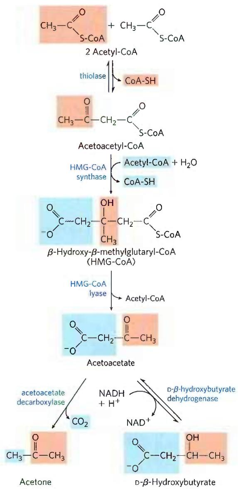  
FIGURE 17-16 Formation of ketone bodies from acetyl-CoA. Healthy, well-nourished individuals produce ketone bodies at a relatively low rate. When acetyl-CoA accumulates (as in starvation or untreated diabetes, for example), thiolase catalyzes the condensation of two acetyl-CoA molecules to acetoacetyl-CoA, the parent compound of the three ketone bodies. The reactions of ketone body formation occur in the matrix of liver mitochondria. The six-carbon compound $\beta$ -hydroxy- $\beta$ -methylglutaryl-CoA (HMG-CoA) is also an intermediate of sterol biosynthesis, but the enzyme that forms HMG-CoA in that pathway is cytosolic. HMG-CoA lyase is present only in the mitochondrial matrix.

In extrahepatic tissues, D-β-hydroxybutyrate is oxidized to acetoacetate by D-β-hydroxybutyrate dehydrogenase (Fig. 17-17). The acetoacetate is activated to its coenzyme A ester by transfer of CoA from succinyl-CoA, an intermediate of the citric acid cycle (see Fig. 16-7), in a reaction catalyzed by β-ketoacyl-CoA transferase, also called thiophorase. The acetoacetyl-CoA is then cleaved by thiolase to yield two molecules of acetyl-CoA, which enter the citric acid cycle. Thus the ketone bodies are used as fuels in all tissues except liver, which lacks β-ketoacyl-CoA transferase. P5 The liver is therefore a producer of ketone bodies for other tissues, but not a consumer.

  
FIGURE 17-17 D-β-Hydroxybutyrate as a fuel. D-β-Hydroxybutyrate, synthesized in the liver, passes into the blood and thus to other tissues, where it is converted in three steps to acetyl-CoA. It is first oxidized to acetoacetate, which is activated with coenzyme A donated from succinyl-CoA, then split by thiolase. The acetyl-CoA thus formed enters the citric acid cycle.

The production and export of ketone bodies by the liver allows continued oxidation of fatty acids with only minimal oxidation of acetyl-CoA. When intermediates of the citric acid cycle are being siphoned off for glucose synthesis by gluconeogenesis, for example, oxidation of cycle intermediates slows—and so does acetyl-CoA oxidation. Moreover, the liver contains only a limited amount of coenzyme A, and when most of it is tied up in acetyl-CoA, $\beta$ oxidation slows for want of the free coenzyme. The production and export of ketone bodies frees coenzyme A, allowing continued fatty acid oxidation.

#### [EN] Ketone Bodies Are Overproduced in Diabetes and during Starvation

Starvation (including very-low-calorie diets) and untreated diabetes mellitus lead to overproduction of ketone bodies in the liver, with several adverse effects on health. During starvation, gluconeogenesis depletes citric acid cycle intermediates, diverting acetyl-CoA from oxidation of mobilized stored fats to ketone body production (Fig. 17-18). In untreated diabetes, when the insulin level is insufficient, extrahepatic tissues cannot take up glucose efficiently from the blood, either for fuel or for conversion to fat. Under these conditions, levels of malonyl-CoA fall, inhibition of carnitine acyltransferase 1 is relieved, and fatty acids enter mitochondria to be degraded to acetyl-CoA (see Fig. 17-13). But this acetyl-CoA cannot pass through the citric acid cycle because cycle intermediates have been drawn off for use as substrates in gluconeogenesis. P4 P5 The resulting accumulation of acetyl-CoA accelerates the formation of ketone bodies and their release into the blood beyond the capacity of extrahepatic tissues to oxidize them. The increased blood levels of acetoacetate and D-β-hydroxybutyrate lower the blood pH, causing the condition known as acidosis. Extreme acidosis can lead to coma and in some cases death. Ketone bodies in the blood and urine of individuals with untreated diabetes can reach extraordinary levels—a blood concentration of 90 mg/100 mL (compared with a normal level of <3 mg/100 mL) and urinary excretion of 5,000 mg/24 h (compared with a normal rate of ≤125 mg/24 h). This condition is called ketosis or, when combined with acidosis, ketoacidosis.

  
FIGURE 17-18 Ketone body formation and export from the liver. Conditions that promote gluconeogenesis (untreated diabetes, severely reduced food intake) slow the citric acid cycle (by drawing off oxaloacetate) and enhance the conversion of acetyl-CoA to acetoacetate. The released coenzyme A allows continued $\beta$ oxidation of fatty acids.

In healthy people, acetone is formed in very small amounts from acetoacetate, which is easily decarboxylated, either spontaneously or by the action of acetoacetate decarboxylase (Fig. 17-16). Because individuals with untreated diabetes produce large quantities of acetoacetate, their blood contains significant amounts of acetone, which is toxic. Acetone is volatile and imparts a characteristic odor to the breath, which is sometimes useful in diagnosing diabetes.

#### [EN] SUMMARY 17.3 Ketone Bodies

The ketone bodies—acetone, acetoacetate, and D-β-hydroxybutyrate—are formed in the liver when fatty acids are the principal fuel supporting whole-body metabolism. Acetoacetate and D-β-hydroxybutyrate serve as fuel molecules in extrahepatic tissues, including the brain, through oxidation to acetyl-CoA and entry into the citric acid cycle.

■ Overproduction of ketone bodies in uncontrolled diabetes or severely reduced calorie intake can lead to life-threatening ketoacidosis, characterized by high concentrations of ketones in blood and urine and lower blood pH.

<!-- EN-END 17.3 -->

## 五、脂肪酸代谢的调节

脂肪酸 $\beta$ 氧化的主要调控关键是血液中脂肪酸的供给情况。血液中游离脂肪酸主要来源于三酰甘油的分解，它原是贮存在脂肪组织中，并受激素敏感的三酰甘油脂肪酶的调节。脂肪酸分解代谢与脂肪酸合成是协同地受调控的,如此,它们可防止耗能性的无效循环。

## （一）脂肪酸进入线粒体的调控

虽然血流中的脂肪酸水平适合于脂肪酸的利用,但由于不同种类的细胞对脂肪酸的需要量有很大差别,在细胞内仍需对脂肪酸的代谢进行调控。在细胞内,脂肪酸分解代谢的调控主要是由线粒体控制脂肪酸进入线粒体内。

脂肪酸进入细胞后,在细胞溶胶中,在硫激酶催化下先被 CoA 和 ATP 活化,形成脂酰-CoA:

$$
\mathrm{RCOO} ^ {-} + \mathrm{ATP} + \mathrm{CoA} \xrightarrow {\mathrm{Mg} ^ {2 +}} \mathrm{RCO-CoA} + \mathrm{PPi} + \mathrm{AMP}
$$

脂酰-CoA 进入线粒体的调节是以脂酰-CoA 不能直接进入线粒体为依据。即它必须先转化为脂酰肉碱(acyl carnitine)，才可穿越线粒体的内膜。

$$
\begin{array}{c c c}\mathrm {RCO - CoA + (CH_ {3}) _ {3} N^ {+} - CH_ {2} - CHCH_ {2} COO^ {-} \rightleftharpoons (CH_ {3}) _ {3} N^ {+} - CH_ {2} - CHCH_ {2} COO^ {-}} + \mathrm{CoA}\\\mid&\mid\\\mathrm{OH}&\mid\\&\mathrm{RC=O}\\\text {脂酰 - CoA}&\text {肉碱}&\text {脂酰肉碱}\end{array}
$$

这个反应是在肉碱酰基移位酶的催化下发生的。至少有三种这样的酶与线粒体联系在一起，其中一个是针对短链脂肪酸的，另两个（移位酶Ⅰ及Ⅱ）是针对长链脂肪酸的。另外，在线粒体内膜有一蛋白质载体，负责运送肉碱，乙酰肉碱及短和长链脂酰肉碱衍生物通过此载体穿越线粒体内膜。脂酰肉碱运进线粒体后就立即受肉碱酰基转移位Ⅱ的作用，发生上面反应式的逆反应，肉碱得以游离，并产生脂酰-CoA。也就是说，在细胞中至少有两个显然不同的脂酰-CoA“库”，一个是在细胞溶胶中，另一个是在线粒体中。移位酶Ⅰ及Ⅱ分别占据各自的部位，移位酶Ⅰ在线粒体外膜，移位酶Ⅱ在线粒体内膜，后者面向线粒体基质（参见图24-5）。

这样安排精致的反应链提供了几种调控脂酰-CoA 氧化降解的可能性。其中主要的调控点是肉碱酰基移位酶 I，它强烈地受丙二酰-CoA 的抑制。如前所述，丙二酰-CoA 在脂肪酸合成中担负着重要角色。因此，当丙二酰-CoA 处于高水平时，它指向脂肪酸合成，也就妨碍脂肪酸的分解代谢。

## （二）心脏中脂肪酸氧化的调节

在绝大多数组织中， $\beta$ 氧化的调节是个复杂问题，因为它与脂质生物合成与糖代谢都牵连在一起。在心脏中，脂质合成很少存在，因此脂肪酸氧化的“图形”更为简单。脂肪酸氧化是心脏的主要能源，如若心脏用能减少，柠檬酸循环和氧化磷酸化的活动也随之减弱，导致乙酰-CoA 和 NADH 的积聚。乙酰-CoA 在线粒体中水平增高会抑制硫解酶的活性，也就抑制 $\beta$ 氧化。NADH 的增高， $\mathrm{NAD}^{+}$ 的缺少，影响了 3-羟脂酰-CoA 脱氢酶，也就妨碍了氧化反应。在心脏中 $\beta$ 氧化的酶的调节似发生于氧化循环后程，与一般代谢途径的调节发生于起始行程有所不同。

## （三）激素对脂肪酸代谢的调节

在脂肪酸分解代谢的调节中,有两个重要的激素,即胰高血糖素(glucagon)和肾上腺素(epinephrin或adrenaline)参与作用。

它们在脂肪酸的存贮部位促进其分解代谢。如前所述，脂肪组织中三酰甘油的水解速度受激素敏感的三酰甘油脂肪酶活性的调节，此酶敏感地受到磷酸化和去磷酸化的调节，而磷酸化和去磷酸化又受到由激素控制的cAMP水平的调节。肾上腺素、胰高血糖素都使脂肪组织的cAMP含量升高。cAMP变构激活cAMP-依赖性蛋白激酶，后者增加三酰甘油脂肪酶磷酸化的水平，从而加速脂肪组织中的脂解(lipolysis)作用，又进一步提高血液中脂肪酸的水平。最终活化其他组织例如肝和肌肉中的 $\beta$ 氧化途径。在肝中，则生成酮体进入血流代替葡萄糖作为燃料提供给其他组织。cAMP依赖性蛋白激酶也抑制乙酰-

CoA 羧化酶(acetyl CoA carboxylase), 它是脂肪酸合成中的一个限速酶, 因此 cAMP 依赖性磷酸化作用既刺激脂肪酸的氧化又抑制脂肪酸的合成。

胰岛素和肾上腺素、胰高血糖素的作用相反，胰岛素刺激三酰甘油以及糖原的形成。它还有降低cAMP水平的作用，导致去磷酸化从而抑制激素敏感的脂肪酸的活性，于是使供给 $\beta$ 氧化所需的脂肪酸量减少。胰岛素也激活一些不依赖cAMP的蛋白激酶，这些酶使另外一些酶磷酸化，例如乙酰-CoA羧化酶即由此磷酸化。因此，胰高血糖素和胰岛素的比例在决定脂肪酸代谢的速度和方向中是至关重要的。

脂肪酸氧化另外的控制点是当脂肪酸的合成被激活后，丙二酰-CoA 成为肉碱脂酰转移酶 I 强劲的抑制剂。这一抑制将新合成的脂肪酸保留在线粒体外而远离 $\beta$ 氧化途径。

## （四）根据机体代谢需要的调控

前面已经提到,脂肪酸代谢的调控是根据机体代谢的需要进行的。细胞溶胶中若软脂酰-CoA 过量,则表明机体不再需要更多的软脂酰-CoA,在此情况下,通过抑制脂肪酸合成的酶关闭脂肪酸合成途径,并抑制产生 NADH 的反应。同样,柠檬酸的充足,表明机体对能量的需要能够满足,这正是合成脂肪酸以存贮能量的好时机。从这现象中可以看到:脂肪酸、NADPH 和乙酰-CoA 是合成底物的关键化合物,进一步说明,柠檬酸是在脂肪酸生物合成中执行第一步反应的乙酰-CoA 羧化酶(催化形成丙二酰-CoA)的专一性活化剂。

## （五）长时间膳食的改变导致相关酶水平的调整

须指出,膳食条件长时期改变,会使与脂肪酸代谢相关的酶的水平发生变化。例如,禁食后大鼠肝中脂肪酸合酶及乙酰-CoA羧化酶的浓度都降低了4到5倍。当给大鼠以无脂肪饲料,脂肪酸合酶较用正常饲料喂饲的大鼠增高14倍。实验证据指出,这些酶的水平是由控制酶的合成速度影响的,而不是其降解速度。mRNA的合成主要由DNA转录的速度进行调控。

## 六、脂质的生物合成

脂质的功能是多种多样的。在大多数生物中脂肪是能量贮存的主要形式，类脂，特别是磷脂和胆固醇是细胞膜的主要组成成分，起着维持细胞的完整、区隔细胞内部的不同结构的作用。有些特殊的脂质还起着某些特殊作用，例如，激素（如维生素D的衍生物性激素）、辅助因子（如维生素K）、乳化剂（如胆汁盐）、转运体（如多萜醇dolichol）、发色团（如视黄醛retinal）及细胞外和细胞内的信使（如白细胞三烯leukotriene、前列腺素prostaglandin、血栓烷thromboxane以及磷脂酰肌醇phosphatidylinositol等），它们多在发生作用的部位或邻近部位产生，属于局部激素。还有膜蛋白的锚钩（anchor）（以共价键相连的异戊二烯基及磷脂酰肌醇）等。因此，有机体合成种种不同脂质的能力是十分重要的。在本节中将着重讨论脂肪在体内的贮存、动员和脂质的生物合成。

## （一）贮存脂肪

前面已经提到脂质,特别是脂肪是动物的主要能量贮存形式,脂质是所有营养物质中单位质量具有最高能量的化合物(38 kJ/g 或 9.0 kcal/g),用它们来贮存能量是最有利的。

我们把贮存的脂肪称之为贮存脂肪(depot fat)或脂肪组织(adipose tissue)。来自膳食的脂肪必须先转化为贮存脂肪。脂肪的贮存和运送是相互联系的过程。当需要脂肪分解代谢提供ATP形式的能量时，脂肪酸自脂肪组织转移到肝以便分解。我们把脂肪“仓库”中贮存的脂肪释出游离脂肪酸，并转移到肝的过程称为动员(mobilization)。这个过程需要酶的作用。脂酶(lipase)和磷脂酶(phospholipase)担负着水解脂肪的作用，释出的游离脂肪酸在线粒体中进行分解代谢，甘油则在细胞溶胶中降解。脂肪酸动员是由一系列酶的作用所调控，与糖类动员的情况相像。脂肪酸一旦从脂肪细胞(adipocyte、脂肪组织的细胞)中游离释出，它们就渗透穿过膜，与血清清蛋白结合，运送到各种组织。

过度的脂肪动员可导致发展成脂肪肝(fatty liver)，这时肝被脂肪细胞所浸渗，变成了非功能的脂肪组织。脂肪肝可能因糖尿而产生，由于胰岛素缺欠不能正常动员葡萄糖，此时就必须使用其他营养物质供给能量。典型的情况是脂质的分解代谢加剧，包括过度的脂肪酸动员和肝中过度的脂肪酸降解，其结果是引起脂肪肝的发生。

脂肪肝的发生还有可能是受化学药品的影响,例如,四氯化碳或吡啶。这些化合物破坏了肝细胞,导致脂肪组织去取代它们,肝的功能就逐步丧失。膳食中缺乏抗脂肪肝剂(lipotropic agent),即胆碱和甲硫氨酸(蛋氨酸)时,因为它们对脂质运送有作用,缺乏也可导致脂肪肝的出现。

已知，胆碱是磷脂酰胆碱（phosphatidyl choline）的组成成分，它的合成需要有丝氨酸提供碳骨架，S-腺苷甲硫氨酸（S-adenosylmethionine, SAM）提供三个甲基。后者是由甲硫氨酸和ATP反应形成，它在许多生物化学的甲基化反应中扮演甲基供体的角色。在膳食中甲硫氨酸和胆碱的不足，导致磷脂酰胆碱合成的缺乏，又导致脂蛋白的缺少。前面已提到，脂蛋白是磷脂和蛋白质环绕着胆固醇和三酰甘油的核构成。脂蛋白的脂质来自肝。脂蛋白合成的减弱导致肝中脂质的积聚，结果产生脂肪肝。

## （二）脂肪酸的生物合成

## 1. 乙酰-CoA 的作用

当有机体需要自膳食获取能量以贮存时,脂肪酸合成就会发生。合成在细胞溶胶中进行,包括脂肪酸链自乙酰-CoA获得两个碳原子单元,从而增长链长的步骤。随后在需要时,脂肪酸与甘油分子结合形成贮存形式的脂肪。

脂肪酸降解的步骤是氧化移去两个碳原子单位(乙酰-CoA)的过程,不难设想脂肪酸合成或许是降解酶反应步骤简单的逆反应而已。但是实际却不是这样。脂肪酸氧化和降解通过不同的途径,使用不同的酶,发生场所也是在细胞的不同部位,而且有一个重要的三碳单元中间体即丙二酸单酰辅酶 A(malonyl-

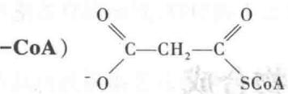

,参与脂肪酸合成,它与脂肪酸降解完全无关。

在叙述这个三碳单元的中间体前,先讨论与降解、合成都相关的乙酰-CoA。已知,乙酰-CoA产生在线粒体中,在丙酮酸脱氢酶复合体的催化下,丙酮酸被转化为乙酰-CoA,另外,在β氧化中硫解酶的反应也产生乙酰-CoA。但是在线粒体产生的乙酰-CoA必须先从线粒体转移到细胞溶胶中,才能参与脂肪酸的合成。然而,线粒体内膜对乙酰-CoA是不容许穿透的。在这里,有一穿梭机制取代直接的运送,这个机制称为三羧酸转运体系(tricarboxylate transport system)(图24-19),它使用柠檬酸作为乙酰基的载体。在线粒体中,柠檬酸循环的第一步反应是柠檬酸的形成,来自乙酰-CoA和草酰乙酸。柠檬酸跨过线粒体内膜,在细胞溶胶中,受柠檬酸裂解酶作用而断裂,生成乙酰-CoA和草酰乙酸:

$$
\text { 柠檬酸 } ^ {3 -} + \mathrm{ATP} ^ {4 -} + \mathrm{CoA} - \mathrm{SH} ^ {4 -} \longrightarrow \text { 乙酰 } - \mathrm{CoA} ^ {4 -} + \mathrm{ADP} ^ {3 -} + \mathrm{Pi} ^ {2 -} + \text { 草酰乙酸 } ^ {2 -}
$$

草酰乙酸可转向苹果酸或丙酮酸，二者都可以再被运送进入线粒体。在有些条件下，穿梭机制产生出的NADPH可用于脂肪酸合成中的还原反应。如果苹果酸回到线粒体，就没有NADPH形成。如果苹果酸在苹果酸酶作用下转化为丙酮酸，在细胞溶胶中就有NADPH的形式。在后述的步骤中，每产生一分子NADPH，就有一分子乙酰-CoA被运送到细胞溶胶中。在脂肪酸合成的总体中，这是重要的一步。举例来说，合成1分子软脂酸需要8分子乙酰-CoA和14分子NADPH。将8分子乙酰-CoA自线粒体运送到细胞溶胶，就同时产生8分子NADPH，余下不足的6分子NADPH可从肝中的戊糖磷酸途径（pentose phosphate pathway）或从脂肪组织中苹果酸酶反应中获得（图24-19）。

## 2. 丙二酸单酰-CoA 的形成来自乙酰-CoA 和碳酸氢盐

脂肪酸合成起始于乙酰-CoA转化成丙二酸单酰-CoA。这步反应是在乙酰-CoA羧化酶作用下实现的，羧化酶反应构成脂肪酸合成的重要步骤。

原核生物,例如,大肠杆菌(E.coli)的乙酰-CoA羧化酶,人们已将其催化不同反应的亚基都分离得到。它是3种蛋白质的复合体，其一是生物素羧基载体蛋白（biotin carboxyl carrier protein, BCCP），它的作用是生物素的载体。生物素的羧基与这个蛋白质的赖氨酸残基的 $\varepsilon-$ 氨基以共价连接，形成生物胞素（biocytin；又名羧基生物素酰赖氨酸，carboxy biotinyl lysine）（如图24-20）。另外两种蛋白质是生物素羧化酶（biotin carboxylase）和转羧酶(trans carboxylase）。在 $E.$ coli中，这个载体蛋白和两个酶的相对分子质量依次为23000、98000（两个亚单位各为49000）及130000。转羧酶催化由乙酰-CoA形成丙二酸单酰-CoA的反应，如图24-21所示。

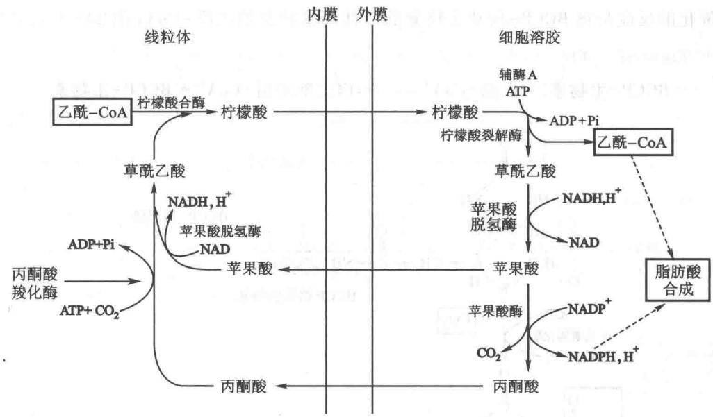  
图24-19 三羧酸转运体系

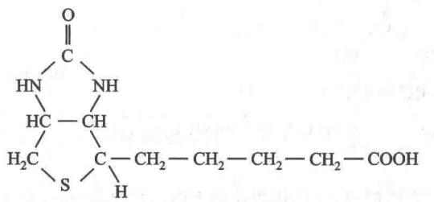

生物素(biotin)  
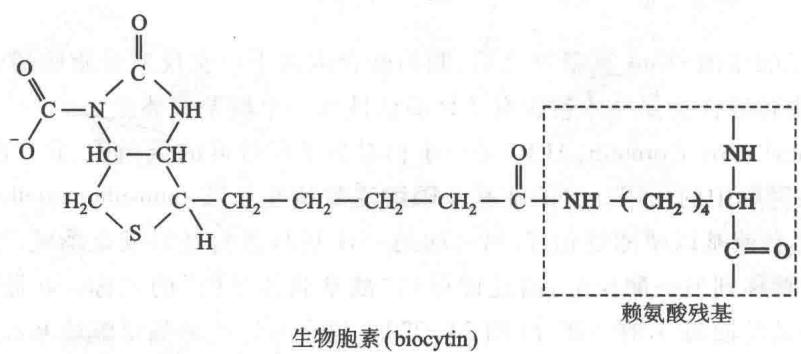  
图24-20 生物素和生物胞素

真核生物哺乳类和鸟类的乙酰-CoA羧化酶是两个相同亚单位（相对分子质量各为260 000）的二聚体，其生物素羧化酶和转羧酶以及生物素羧基载体都在单一的、相对分子质量为230 000的肽链上。生物素羧化酶催化的反应如下：

$$
\mathrm{BCCP} - \text {生物素} + \mathrm{ATP} ^ {4 -} + \mathrm{CO} _ {2} + \mathrm{H} _ {2} \mathrm{O} \longrightarrow \mathrm{BCCP} - \text {羧基生物素} ^ {-} + \mathrm{ADP} ^ {3 -} + \mathrm{Pi} ^ {2 -} + 2 \mathrm{H} ^ {+}
$$

转羧酶催化的反应是将 BCCP-羧基生物素的活性羧基转移给乙酰-CoA（图 24-21），结果生成丙二酸单酰-CoA。

BCCP-生物素 $^{-}$ +乙酰-CoA $^{4-}$ ——→丙二酸单酰-CoA $^{5-}$ +BCCP-生物素

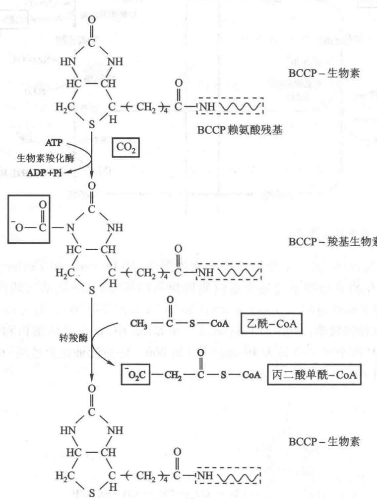  
图 24-21 在乙酰-CoA 羧化酶作用下丙二酸单酰-CoA 的形成

## 3. 脂肪酸合酶

乙酰-CoA 和丙二酸单酰-CoA 准备好之后, 脂肪酸合成的下一步反应是脂肪酸合酶复合体的酶促反应。在动物细胞中, 脂肪酸合酶复合体包含有 7 种酶活性和一个酰基载体蛋白。

酰基载体蛋白(acyl carrier protein, ACP)是一个相对分子质量低的蛋白质,它在脂肪酸合成中的作用犹如辅酶A在脂肪酸降解中的作用。它的辅基是磷酸泛酰巯基乙胺(phosphopantetheine),这个辅基的磷酸基团与ACP的丝氨酸残基以磷酯键相接,另一端的-SH基与脂酰基形成硫酯键,这样形成的分子可把脂酰基从一个酶反应转移到另一酶反应,由此即得到“酰基载体蛋白”的名称。在脂肪酸的降解中,同样的磷酸泛酰巯基乙胺又是辅酶A的一部分(图24-22)。这个长链的磷酸泛酰巯基乙胺分子犹如“摆臂”,和丙酮酸脱氢酶复合体的硫辛酰赖氨酸臂(lipoyl lysine arm)相像,它可以把底物在酶复合体上从一处的催化中心转移到另一处。

酰基载体蛋白最初自 E.coli 分离得到。磷酸泛酰巯基乙胺(也可视为 $4^{\prime}-$ 磷酸泛酰氨基乙硫醇)的磷酸基团与蛋白质的第 36 位丝氨酸的羟基酯化相接(图 24-22A)。蛋白质本身含有 77 个氨基酸残基 ( $M_{r}=10\ 000$ )。ACP 的装配和脂肪酸合成的酶系因有机体类型而异。在 E.coli 和植物中, 脂肪酸合酶由多酶体系构成, 它是由不同的 7 种多肽链的聚合体。其中一链是 ACP, 其余六链是酶。

在酵母中,脂肪酸合酶也由 ACP 及 6 个酶构成,所不同的是它们定位为两个多功能的多肽链。其中之一 $(M_{r}=185\ 000)$ 具有 ACP 功能和两种酶的活性。另外一链 $(M_{r}=175\ 000)$ 含有余下的 4 种酶的活性。6 个二聚体组合成为一个大复合体 $(M_{r}\approx2.4\times10^{6})$ （图 24-23）。在动物中，脂肪酸合酶含有 1 个 ACP 和 7 个酶，所有这些酶全都定位于单一的多功能多肽链（图 24-23）。多肽链的邻近区折叠成独特形式，形成不同的酶活性和 ACP 功能区。酶是二聚体，呈现 X 型，含有两个相同的亚单位（每一单位的 $M_{r}=260\ 000$ ）。每一亚单位含有一个脂基载体蛋白（ACP）和 7 个活性酶的催化部位，分别是乙酰-CoA：ACP 转酰酶，丙二酰-CoA：ACP 转酰酶， $\beta$ -酮酰-ACP 合酶， $\beta$ -酮酰-ACP 还原酶， $\beta$ -羟酰-ACP 脱水酶，烯酰-

  
图 24-22 磷酸泛酰巯基乙胺(phosphopantetheine)是 ACP 和辅酶 A 的活性单位  
A. ACP 与辅基磷酸泛酰巯基乙胺连接的复合体；B. 辅酶 A 中的磷酸泛酰巯基乙胺单元

  
图24-23 真核生物脂肪酸合酶的晶体结构  
AT:乙酰转移酶;MPT:丙二酰-CoA:ACP转酰酶;MAT:乙酰-CoA:ACP转酰酶;TE:软脂酰-ACP硫酯酶;ACP:酰基载体蛋白;PPT:磷酸泛酰巯基乙胺转移酶;KR:β-酮酰-ACP还原酶;KS:β-酮酰-ACP合酶;ER:烯酰-ACP还原酶;DH:β-羟酰-ACP脱水酶（A引自Jenni,2006;B引自Maier,2006)

ACP 还原酶和软脂酰-ACP 硫酯酶。动物体脂肪酸合酶独自多出的酶活性称为软脂酰-ACP 硫酯酶（palmitoyl-ACP thioesterase），它催化最后生成的软脂酰-CoA 的水解，转化为软脂酸和 ACP，它是在 16 个碳的脂肪酸链合成以后方显示功能。其他的有机体没有软脂酰-ACP 硫酯酶，而是直接利用软脂酰-ACP。

## 4. 由脂肪酸合酶催化的各步反应

在动物体中脂肪酸合成包含有以下7步反应,最初的6步见图24-24。

① 启动: 乙酰-CoA: ACP 转酰酶; ② 装载: 丙二酸单酰-CoA: ACP 转酰酶; ③ 缩合: β-酮酰-ACP 合酶; ④ 还原: β-酮酰-ACP 还原酶; ⑤ 脱水: β-羟酰-ACP 脱水酶; ⑥ 还原: 烯酰-ACP 还原酶; ⑦ 释放: 软脂酰-ACP 硫酯酶。

  
图24-24 脂肪酸合成途径  
KS:β-ketoacyl-ACP synthase β-酮酰-ACP 合酶; MAT:malonyl/acetyl-CoA-ACP transferase 丙二酰/乙酰-CoA:ACP 转酰酶; DH:β-hydroxyanyl-ACP dehydratase β-羟酰 ACP 脱水酶; ER:enoyl-ACP reductase 烯酰-ACP 还原酶; KR:β-keroacyl-ACP reductase β-酮酰-ACP 还原酶; ACP:anyl canier protein; 表示该酶的催化活性

（1）启动（priming）“启动”反应是在乙酰-CoA：ACP 转移酶催化下实现的。反应分两步进行，第 1 步，乙酰-CoA 的乙酰基转移到 ACP（反应 24-1）上，随后第 2 步转移到脂肪酸合酶（HS-合酶）上，形成乙酰合酶（反应 24-2）。但在哺乳动物体内不经过乙酰-ACP 中间体。

$$
\begin{array}{c} \mathrm{O} \\ \text {乙酰 - CoA} ^ {4 +} + \mathrm{HS-ACP} \longrightarrow \mathrm{CH} _ {3} - \mathrm{C} - \mathrm{S} - \mathrm{ACP} ^ {-} + \mathrm{CoA-SH} \\ \text {乙酰 - ACP} \end{array}\tag{24-1}
$$

(24-2)

（2）装载（loading）丙二酸单酰-CoA-ACP转酰酶（malonyl-CoA-ACP transacetylase）催化此反应。催化下一步反应的β-酮酰-ACP合酶已在等待丙二酸接到ACP上，以便“接运”。此反应中ACP的游离一SH基团向丙二酸单酰-CoA的羰基进攻，形成丙二酸单酰-ACP。“启动”和“装载”这两步反应为下一步缩合准备了两个底物。

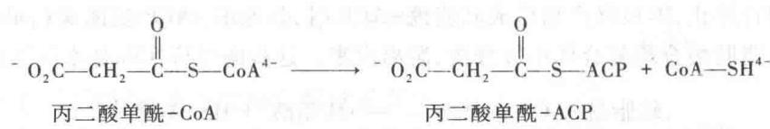

(3) 缩合(condensation) 上步反应(1)的乙酰基(与酶的-SH相接)与(2)的丙二酸单酰基(与ACP相接)在 $\beta$ -酮酰-ACP合酶( $\beta$ -ketoacyl-ACP synthase)的催化下进行缩合。丙二酸单酰-ACP的脱羧活化了它的次甲基, $\mathrm{CO}_{2}$ 的丢失也有助于使反应在热力学上有利,而且不可逆行。反应产物是乙酰乙酰基连接到ACP上,即乙酰乙酰-ACP。

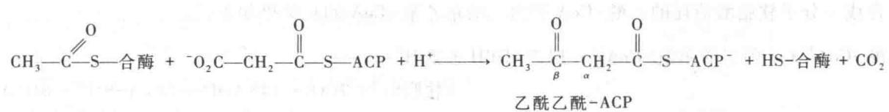

（4）还原(reduction) $\beta$ -酮酰-ACP 还原酶( $\beta$ -ketoacyl-ACP reductase)的催化反应是脂肪酸合成途径的第一步还原反应，NADPH作为还原剂参与此反应，产物为D-构型( $\beta$ -碳原子成为不对称碳原子)，即D- $\alpha, \beta$ -羟丁酰-ACP。

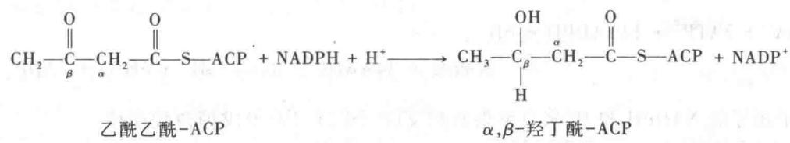

（5）脱水(dehydration) 脱水反应是在 $\beta$ -羟酰-ACP 脱水酶( $\beta$ -hydrdoxyacyl-ACP dehydrase) 的催化下实现的，产物是反式的 $\alpha, \beta$ -不饱和化合物，即 $\alpha, \beta$ -反式-丁烯酰-ACP。

（6）还原(reduction) 这步反应是脂肪酸合成第一个循环的最后一步，在这步中形成了4个碳的脂肪酸，这4个碳是由最初2分子的两碳的化合物，乙酰-CoA提供的。这里所说2分子的乙酰-CoA是指在反应第一步(启动)中，一分子乙酰-CoA转化为乙酰合酶，另一分子是乙酰-CoA在羧化酶作用下生成丙二酸单酰-CoA，它是反应第二步(装载)的起始物。

此反应为总反应中的第二次还原,同样发生在 $\beta$ -位上,还原剂也同样是 NADPH。参与反应的酶为烯酰-ACP 还原酶(enoyl-ACP reductase),产物是一个连接在 ACP 上的四碳脂肪酸(丁酰-ACP)。可以说,乙酰基是接受了丙二酸衍生物的二碳原子的片段而增长了碳链的。丁酰 ACP 现在可以进入第二次循环的碳链延伸。第一次循环的乙酰-ACP 由丁酰-ACP 代替,经过(式 24-1)反应与丙二酸单酰-ACP 缩合(反应 3),经过(4),(5),(6)的反应得到 6 个碳的脂肪酸与 ACP 相接。如此下去,每一循环碳链即延伸两个碳原子单元。

## (7) 释放 (release)

在脂肪酸合成的每一循环中(图 24-24)，脂肪酸链延伸了两个碳原子。动物细胞中延伸的程序在到达16个碳原子时即行停止，即最终产物形成软脂酰-ACP时，软脂酰-ACP硫酯酶(palmitoyl thioesterase)开始作用，软脂酸从脂肪酸合酶复合体中被释放，游离出来。这步酶反应实际是水解反应：

$$
\text {   软脂酰-ACP } ^ {-} + \mathrm{H} _ {2} \mathrm{O} \longrightarrow \text {   软脂酸   } ^ {-} + \mathrm{HS-ACP} ^ {-}
$$

软脂酸若形成更长链的脂肪酸,或引进双键必须接受其他酶系的作用,将在后述。

由于合成的第一次循环生成的是4碳原子单位而不是2碳原子单位，达到软脂酰(16碳)进行“释放”反应前，要求进行7个轮回的反应，即使用7个丙二酸单酰-CoA分子。软脂酰合成共产生7分子水，但在最后一步(释放)反应中要消耗一分子水，即净产生6分子水。

合成一分子软脂酸消耗的乙酰-CoA 和丙二酸单乙酰-CoA 的总结果如下式：

乙酰- $CoA^{4-}$ +7丙二酸单酰- $CoA^{5-}$ +14NADPH+20H $^{+}$ →

$$
\mathrm{软脂酸} ^ {-} + 7 \mathrm{CO} _ {2} + 1 4 \mathrm{NADP} ^ {+} + 8 \mathrm{CoA-SH} ^ {4 -} + 6 \mathrm{H} _ {2} \mathrm{O}
$$

7 分子丙二酸单酰-CoA 的形成要求按照下式, 即需要 7 分子乙酰-CoA:

$$
7 \mathrm{乙酰} - \mathrm{CoA} ^ {4 -} + 7 \mathrm{CO} _ {2} + 7 \mathrm{ATP} ^ {4 -} + 7 \mathrm{H} ^ {+} \longrightarrow 7 \mathrm{丙二酸单酰} - \mathrm{CoA} ^ {5 -} + 7 \mathrm{ADP} ^ {3 -} + 7 \mathrm{Pi} ^ {2 -} + 1 4 \mathrm{H} ^ {+}
$$

综合以上反应式,从起始物乙酰-CoA 到产物软脂酸的化学计量的总反应式为:

8 乙酰- $CoA^{4-}$ + 7ATP $^{4-}$ + 14NADPH + 6H $^{+}$ →

$$
\text { 软   脂   酸 } ^ {-} + 1 4 \mathrm{NADP} ^ {+} + 8 \mathrm{CoA} - \mathrm{SH} ^ {4 -} + 6 \mathrm{H} _ {2} \mathrm{O} + 7 \mathrm{ADP} ^ {3 -} + 7 \mathrm{Pi} ^ {2 -}
$$

其中用于还原的 NADPH 和 $H^{+}$ 来自苹果酸酶反应(图 24-19)及戊糖磷酸途径。

## 5. 脂肪酸合成途径与 $\beta$ 氧化的比较

脂肪酸合成途径与脂肪酸降解即 $\beta$ 氧化的异同可归纳如下：

（1）两条途径的发生场所不同，脂肪酸合成发生于细胞溶胶，降解发生于线粒体。

(2) 两条途径中都有一中间体与载体连接, 脂肪酸合成中载体为 ACP, 降解中的载体则为辅酶 A。

（3）在两个途径中有4步反应，从化学上看一条途径的4步反应是另一途径的4步反应的逆方向，它们所用的酶和辅助因子也不相同。脂肪酸合成中的4步反应是：缩合，还原，脱水和还原；在脂肪酸降解中的这4步反应是：氧化，水合，氧化和裂解。

（4）两条途径都具有转运机制将线粒体和细胞溶胶沟通起来。在脂肪酸合成中，有三羧酸转运机制，它的功能是运送乙酰-CoA；在脂肪酸降解中，有肉碱载体系统，它的功能是运送脂酰-CoA。

（5）两条途径都以脂肪酸链的逐次、轮番的变化为特色，在脂肪酸合成中，脂肪链获取2碳单元而成功地得到延伸，即得自于乙酰-CoA，它必须与丙二酸单酰-CoA缩合，后者又是乙酰-CoA衍生而来；在脂肪酸降解中则是使乙酰-CoA形式的2碳单元离去，以实现脂肪链的缩短。

（6）脂肪酸合成时，是从分子的甲基一端开始到羧基为止，即羧基是最后形成的；脂肪酸降解则持相反的方向，羧基的离去开始于第一步。

(7) 羟酯基中间体在脂肪酸合成中有着 D-构型, 但在脂肪酸降解中则为 L-构型。

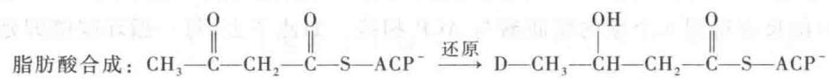

（8）脂肪酸合成由还原途径构成,需要有 NADPH 参与,脂肪酸降解则由氧化途径构成,需要有 FAD 和 $NAD^{+}$ 参与。

（9）这两个途径的循环，每一循环可延伸或除去两个碳原子单元。以16碳脂肪酸为例，不论合成或降解都是进行7个轮回为止。

（10）在动物体中，脂肪酸合成用的酶全都设置在单一多肽链上，此多肽链是脂肪酸合酶的一部分。脂肪酸降解的酶以何种程度聚合在一起，这一问题尚未弄清。

## 6. 脂肪酸碳链的加长和去饱和

已知,在动物体中脂肪酸合成停止在16碳脂肪酸即软脂酸而终止,这是正常的脂肪酸合酶作用的终点。更长链的脂肪酸,或不饱和脂肪酸等都是把软脂酸作为前体,需要另外的酶反应形成(图24-25)。

（1）碳链的延长 碳链的延长发生在线粒体和内质网中，细胞不同部位碳链的延长机制有所差异。

线粒体中的延长是独立于脂肪酸合成之外的过程,它是乙酰单元的加成和还原,恰恰是脂肪酸降解过程的逆反应。仅仅是脂肪酸延长最后一步使用了还原剂 NADPH,而脂肪酸降解的最前一步使用了 FAD 为氧化剂(图 24-26)。

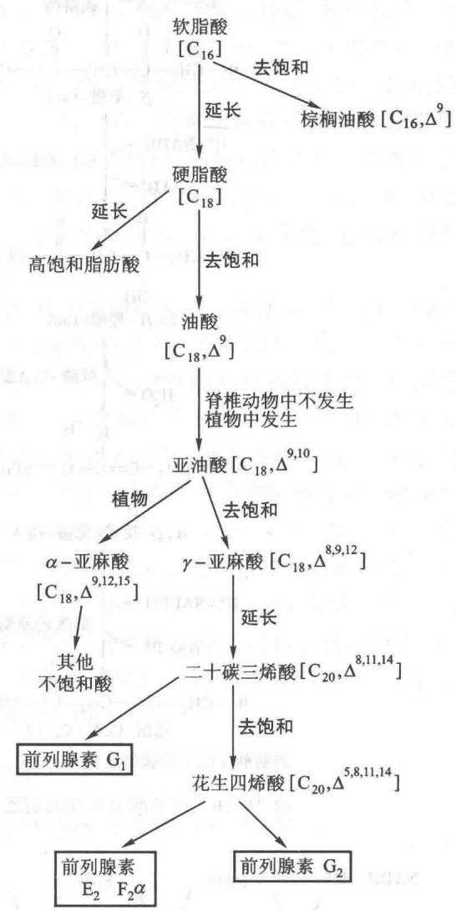

光面内质网中的延长是更活跃的,16 碳的软脂酸可延长两个碳原子形成硬脂酸,只是参与的酶有改变,辅酶 A 代替了脂肪酸合成中所用的 ACP。它与软脂酸合成的最后一循环相同,即由已合成的软脂酰-CoA 以丙二酸单酰-CoA 为二碳单元的供体,由 NADPH 和 H $^{+}$ 供氢,经过还原、脱水、再还原的步骤,形成十八碳产物硬脂酰-CoA。

图24-25 脂肪酸碳链的延长

（2）碳链的去饱和 动物体内最常见的两个饱和脂肪酸——软脂酸和硬脂酸是棕榈油酸 $(16,\Delta^{9})$ 和油酸 $(18,\Delta^{9})$ 的前体(图24-25)。这两个不饱和脂肪酸都在 $\Delta^{9}$ 位(C9和C10间)有一双键，这个不饱和双键是在脂肪酰-CoA去饱和酶(fatty acyl-CoA desaturase)催化下，经氧化反应引入的。在哺乳动物体内，引入双键的氧化反应需要一个由两种酶和一个细胞色素组成的电子传递体系参与(图24-27)。但是哺乳动物缺少能够在C9位以外引进双键的酶，因此，亚油酸(linoleic acid,18, $\Delta^{9,12}$ )和亚麻酸(linoleuic acid,18, $\Delta^{3,12,15}$ )不能经生物合成得到，只能通过膳食获取，因此称为必需脂肪酸(essential fatty acid)。

上述的去饱和反应所使用的脂酰-CoA 去饱和酶是混合功能氧化酶(mixed-function oxidase)的一例。在此反应中,去饱和酶的两个底物,脂肪酸和 $NAD^{+}$ ,相继经历两个电子的氧化作用,电子传递包括黄素蛋白(细胞色素 $b_{5}$ 还原酶)和细胞色素(细胞色素 $b_{5}$ ),二者与脂酰-CoA 去饱和酶全都存在于光面内质网中。分子氧作为电子受体参与反应,但不反映在被氧化的产物中。

哺乳动物肝细胞能够容易地在脂肪酸 $\Delta^{9}$ 位引入双键，但不能在 C10 至甲基末端间再引入第 2 个双键。已于上述，哺乳动物不能合成亚油酸、亚麻酸。但存在于植物中的去饱和酶却可以实现。植物中的这些酶不能直接作用于游离脂肪酸，但可对磷脂类，例如，磷脂酰胆碱含有一个油酸的磷脂，使其油酸链去饱和，成为亚油酸链，以至亚麻酸链。

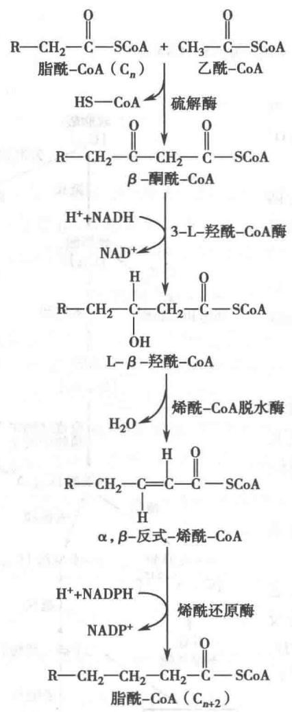  
脂肪酸（ $C_{n}$ ）的碳链延长→（ $C_{n+2}$ ）

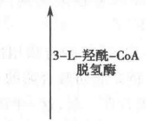

$$
- \mathrm{CoA} \left(\mathrm{C} _ {n}\right)
$$

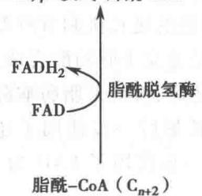  
脂肪酸 $(C_{n+2})$ 的降解 $\rightarrow(C_{n})$

图24-26 脂肪酸延长和脂肪酸降解的比较  
  
图 24-27 哺乳动物体内脂肪酸去饱和酶(desaturase)的电子传递系统  
该系统处于内质网的细胞溶胶侧，2个水分子的形成通过了4个电子反应，其中2个电子来自NADH,2个电子来自脂肪酸被还原的键

## 7. 脂肪酸代谢途径的调节

脂肪酸 $\beta$ 氧化的调节关键是血液中脂肪酸的供给情况。血液中游离脂肪酸主要来源于三酰甘油的分解。贮存在脂肪组织中的三酰甘油受激素敏感的脂肪酶调节。以肝细胞为例，胞质溶胶中形成的脂酰-CoA有两种主要去向：①在线粒体中进行 $\beta$ 氧化；②在胞质溶胶中被转化为三酰甘油和其他脂类物质。因此，脂肪酸分解代谢的调控首先是控制脂肪酸进入线粒体内。前面已讨论过的负责脂酰-CoA转入线粒体的肉碱脂酰移位酶I，强烈受丙二酸单酰-CoA的抑制。当动物体内有足量糖类供应时，丙二酸单酰-

CoA 的浓度提高,它指向脂肪酸合成,同时抑制脂肪酸分解。β 氧化途径中的两种酶同样也受调控。当 $[NADH]/[NAD^{+}]$ 比值提高时,β-羟脂酰-CoA 脱氢酶被抑制。另外,高浓度的乙酰-CoA 抑制硫解酶的活性。当机体处于肌肉强烈收缩或饥饿状态时,细胞内 ATP 浓度下降,AMP 浓度升高,高浓度的 AMP 激活腺苷酸活化蛋白激酶(AMP-activated protein kinase,AMPK),AMPK 可磷酸化多种靶标,其中包括乙酰-CoA 羧化酶。乙酰-CoA 羧化酶的磷酸化抑制其活性,丙二酸单酰-CoA 的生成减少,缓解了丙二酸单酰-CoA 对脂酰-CoA 转入线粒体中的抑制作用,允许 β 氧化进行,从而恢复细胞内 ATP 水平。以上讨论的是酶活性的短期调节,酶活性的长期调节是指酶基因在转录水平受到调节。过氧化物酶体增殖物激活受体(PPAR)是一类由配体激活的转录因子家族。其中 PPAR α 主要分布于肌肉、脂肪组织和肝。当机体对能量的需求增加时,PPAR α 开启与脂肪酸氧化相关的重要基因的表达,包括肉碱脂酰移位酶 I、II,脂酰-CoA 脱氢酶,脂肪酸转运蛋白等。胰高血糖素(glucagon)会使脂肪组织的 cAMP 含量升高,通过 cAMP 和转录因子 CREB 的作用开启脂质分解代谢中某些基因的表达。

当机体内有充足的能量满足其代谢需要时,过量的能量则转化为脂肪酸并以三酰甘油的形式贮存起来。乙酰-CoA羧化酶催化的反应是脂肪酸生物合成的限速步骤,也是脂肪酸合成中重要的调节位点。在脊椎动物,脂肪酸合成的主要产物即软脂酰-CoA,对该酶起反馈抑制作用,柠檬酸是该酶的别构激活剂。柠檬酸在决定细胞内代谢燃料走向分解利用或贮存方面起着重要作用。当线粒体内的乙酰-CoA和ATP浓度很高时,柠檬酸即从线粒体内转移到细胞溶胶中。随之在柠檬酸裂解酶作用下转变为溶胶中的乙酰-CoA,它起着对乙酰-CoA羧化酶别构激活的信号作用。乙酰-CoA羧化酶还可通过共价修饰调控脂肪酸合成。胰高血糖素和肾上腺素使乙酰-CoA羧化酶磷酸化而抑制其活性,从而减慢脂肪酸的合成速度(图24-28)。胰岛素则和胰高血糖素、肾上腺素的作用相反,通过诱导乙酰-CoA羧化酶、脂肪酸合酶,以及柠檬酸裂解酶的合成,从而促进脂肪酸的合成(图24-28)。乙酰-CoA羧化酶活化时聚成长丝状,其磷酸化伴随着酶的解聚成单体而失活。

植物和细菌的乙酰-CoA羧化酶并不受柠檬酸或磷酸化调控。如果脂肪酸合成和氧化同时进行，则构成浪费能源的无效循环。因此，在脂肪酸合成期间，第一个中间产物丙二酸单酰-CoA关闭β氧化反应，这种调控机制显示了将合成和分解途径分割在不同亚细胞器内进行的优势。

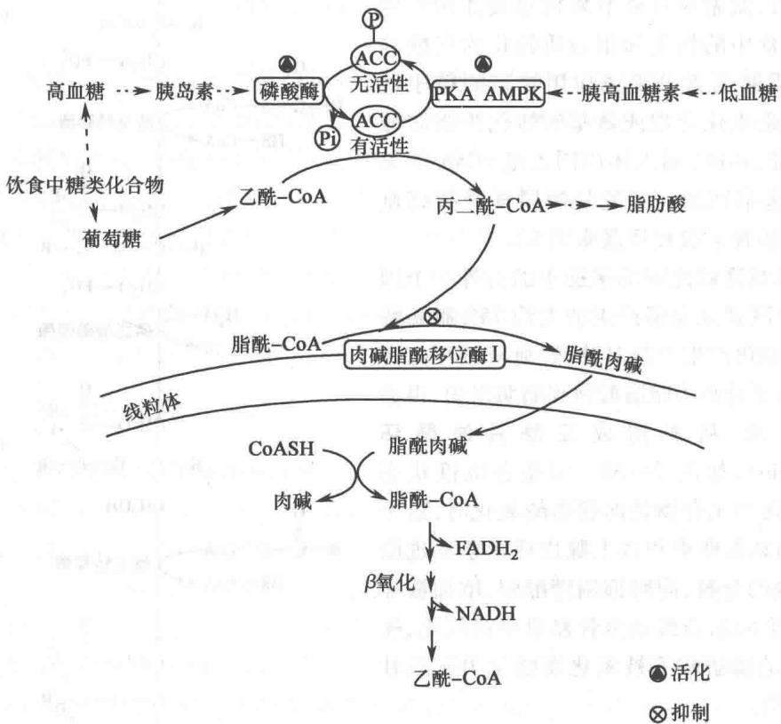  
图24-28 脂肪酸代谢途径的调节  
PKA: 蛋白激酶 A; AMPK: 腺苷酸活化蛋白激酶

## （三）脂酰甘油的生物合成

脂酰甘油（acyl glycerols）是由两个前体合成的，它们是脂酰-CoA（fatty acyl-CoA）和3-磷酸甘油（glycerol 3-phosphate）。脂酰-CoA来自脂肪酸的活化，3-磷酸甘油由两条途径形成，其一是糖酵解的中间体磷酸二羟丙酮形成，其二是甘油降解中的一步，即甘油的磷酸化（图24-29）。

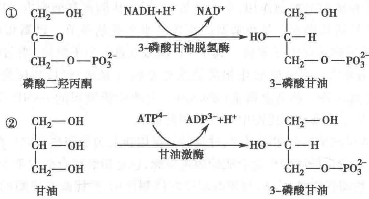  
图24-29 3-磷酸甘油生物合成的两条途径

单酰甘油和二酰甘油是由3-磷酸甘油与脂酰-CoA经相继酯化形成的。三酰甘油来自1,2-二酰甘油-3-磷酸（磷脂酸，phosphatidic acid，PA），经2步反应生成。第1步水解，把磷酸基除去；第2步二脂酰甘油再与另一分子脂酰-CoA反应，即得到产物三酰甘油（图24-30）。

三酰甘油的合成与降解随当时体内代谢资源需求的改变而被调节，激素对其调节发挥重要作用。例如，胰岛素促进饮食中的糖类和蛋白质转化为三酰甘油。对于患有严重胰岛素分泌或作用缺陷的糖尿病人来讲，因不能将碳水化合物或氨基酸转化为脂肪酸而表现为体重下降，同时，病人体内因乙酰-CoA的累积导致酮体形成速率增加。三酰甘油同样受胰高血糖素、垂体生长素和肾上腺皮质激素调节。

三酰甘油合成与降解之间的平衡中的另外一个因素是脂肪组织中三酰甘油分解产生的大约75%脂肪酸经血液循环到肝，酯化产生三酰甘油，经血液循环并在胞外脂蛋白酶作用下分解为脂肪酸回到脂肪组织，再酯化形成三酰甘油，从而构成三酰甘油循环（triacylglycerol cycle），如图24-31。即使在饥饿状态下，当能量代谢从碳水化合物转向脂肪酸氧化时，这个比率仍然存在。胰高血糖素和肾上腺皮质激素促进脂肪组织中三酰甘油的分解，同时抑制糖酵解、增加糖异生的速率，释放产生的脂肪酸运至骨骼肌中被氧化，提供能量，被肝吸收的脂肪酸不被氧化而酯化为三酰甘油，运回至脂肪组织。

即使在饥饿状态下,三酰甘油在脂肪组织中不断被合成,问题是这一过程中所需的3-磷酸甘油源于什么？糖酵解途径因被胰高血糖素和肾上腺皮质激素抑制，磷酸二羟丙酮(DHAP)的量减少，脂肪组织本身么？糖酵解途径因被胰高血糖素和胃上腺及质激素抑制，磷酸二羟丙酮（DH）因缺乏甘油激酶，无法将甘油转化为3-磷酸甘油。然而，3-磷酸甘油的真正来源是甘油异生（glyceroneogenesis）途径，这一途径发现于20世纪60年代，但很少被人关注，直到最近，发现它与三酰甘油循环密切相关，并在更广泛的意义上来说，它调节脂肪酸和碳水化合物代谢间的平衡。甘油异生被看作是一个缩短的糖异生途径，从丙酮酸到DHAP，然后由胞浆内依赖 $\mathrm{NAD^{+}}$ 的3-磷酸甘油脱氢酶催化DHAP生成3-磷酸甘油，用于三酰甘油合成（图24-32）。甘油异生具有多种功效，例如，在脂肪组织中，它与游离脂肪酸再酯化偶联可控制脂肪酸释放至血液中的速率；在褐色脂肪组织中，这一途径可控制游离脂肪酸被转运至线粒体参与生热作用的速率；对于空腹的人，仅肝中的甘油异生就能支持足够的3-磷酸甘油的合成，使比例高达 $65\%$ 的脂肪酸再酯化形成三酰甘油。在甘油异生通路中起调控作用的是PEP羧激酶(PEPCK)，PEPCK在很大程度上调控着三酰甘油在肝和脂肪组织之间的循环。

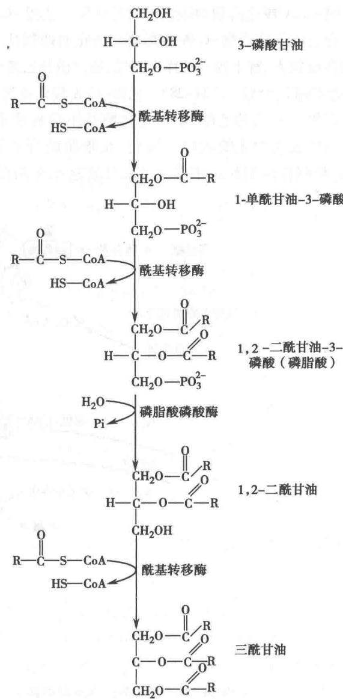  
图24-30 三酰甘油的生物合成

  
图24-31 三酰甘油的循环

  
图24-32 3-磷酸甘油来自甘油异生途径

糖皮质激素如皮质醇(cortisol)通过其受体增加肝细胞中PEPCK基因的表达，促进糖异生和甘油异生，引起肝中三酰甘油合成和释放(至血液)增加，与此同时，皮质醇抑制脂肪细胞中PEPCK基因的表达，降低甘油异生，脂肪酸的回收(酯化)减少，导致多的脂肪酸释放至血液中。由此可见，肝和脂肪组织通过对甘油异生以相互、相反的作用方式调节脂质代谢，最终的结果是增加三酰甘油循环的流量。对其关注的另一重要原因是它与2型糖尿病的发病机制有关联。骨骼肌是胰岛素作用及胰岛素抵抗的主要部位，也是葡萄糖代谢的重要组织，2型糖尿病人血液中大量的游离脂肪酸干扰骨骼肌中葡萄糖的利用，提高了胰岛素抵抗性。用于治疗糖尿病的药物噻唑烷二酮(thiazolidinediones,TZD)与糖皮质激素的作用相反，它使游离脂肪酸以三酰甘油形式存在，减少脂肪酸的释放，从而降低血液中游离脂肪酸水平，增加胰岛素敏感性。

## （四）磷脂类的生物合成

## 1. 甘油磷脂(glycerophosphatide)的合成

甘油磷脂是生物膜的重要组成分,因为它有着两亲性的结构,极性头的一端喜欢水性环境,而非极性的脂酰取代基则是亲脂性的。其结果,甘油磷脂分子自动地形成双层结构,这种双层结构是绝大多数膜优势选择的结构特征。甘油磷酸脂的这种两亲性质对它的合成方式有很大影响。脂质合成所包括的绝大多数反应发生在膜结构的表面,与之相关的各种酶本身就具有着两亲性。

（1）甘油磷脂在大肠杆菌中的合成 大肠杆菌有三类重要的甘油磷脂：磷脂酰乙醇胺（phosphatidylethanolamine, PE）(75%\~85%)，磷脂酰甘油（phosphatidyl glycerol, PG）(10%\~20%)和二磷脂酰甘油（diphosphatidyl glycerol）(图24-33)。这三种甘油磷脂的生物合成途径从开始到CDP-二酰甘油（CDP-diacylglycerol）(图24-34)是共通的，自CDP-二酰甘油以下就分别有各自的途径(图24-35)。这里说的 CDP 是 5′-胞苷二磷酸(cytidine diphosphate)，它经常用作脂质成分的载体，比糖类的载体 UDP 更为普遍，UDP 是尿苷二磷酸(uridine diphosphate)的缩写(图 24-36)。

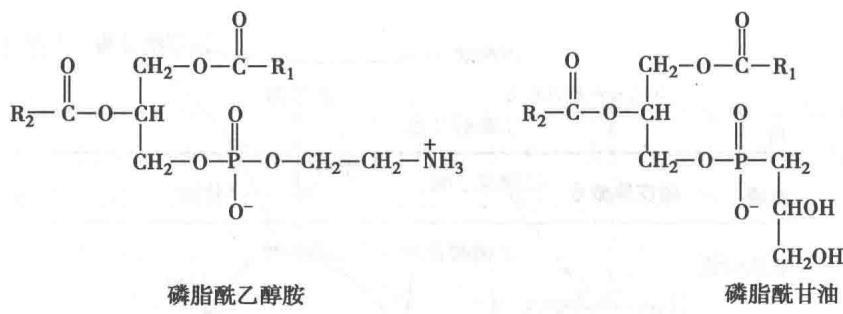

  
图24-33 大肠杆菌（E.coli）中的三种甘油磷脂

  
图24-34 自3-磷酸甘油和脂肪酸合成CDP-二酰甘油

大肠杆菌中绝大多数与甘油磷脂合成有关的酶都在内质网膜上，第1步反应，脂酰-CoA对3-磷酸甘油进行酰基化(图24-34)，是在酰基转移酶的催化下实现的。酰基转移酶的催化机制如图24-37所示。将3-磷酸甘油转化为CDP-二酰甘油是在特定的胞苷转移酶的催化下进行的。这步反应使用了CTP(cytidine 5'-triphosphate,胞苷三磷酸)作为共底物(cosubstrate)。

  
图 24-35 大肠杆菌中以 CDP-二酰甘油为起点, 三种甘油磷脂的生物合成  
酶①：磷脂酰丝氨酸合酶；酶②：磷脂酰丝氨酸脱羧酶；酶③：磷脂酰甘油磷酸合酶；酶④：磷脂酰甘油磷酸磷酸酶；酶⑤：二磷脂酰甘油合酶

（2）甘油磷脂在真核生物中的合成 甘油磷脂在真核生物体中的合成较在大肠杆菌中更为复杂。因为真核生物有更多的膜结构，每一结构有着自己的独特功能。而且与大肠杆菌不同，真核生物以三酰甘油形式贮存脂肪酸。

甘油磷脂合成的第一阶段由3-磷酸甘油形成磷脂酸的反应途径，真核生物与大肠杆菌十分相像（见图24-34）。主要的差异是有两条附加的途径，即：磷脂酸不是来自3-磷酸甘油而是来自磷酸二羟丙酮（dihydroxyacetone phosphate, DHAP）；另外，磷脂酸的下一步是分解代谢，形成二酰甘油（图24-35及图24-38）。磷脂酸一旦形成，很快转化为二酰甘油或CDP-二酰甘油，后者将分头进行代谢（图24-38）。

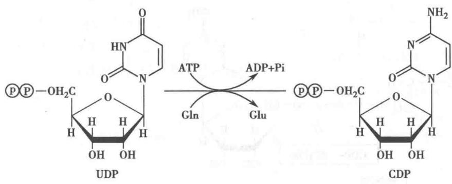  
图24-36 CDP和UDP

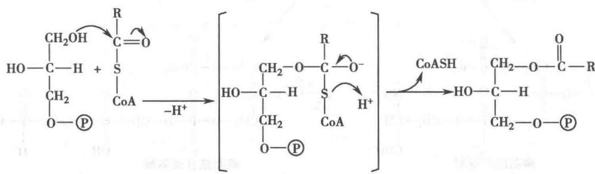  
图24-37 酰基转移酶的作用机制  
中性的激活了的(脂)酰基是很易发生作用的,在正四面体中间体中的辅酶A是个很好的离去基团,这样的机制在乙酰乙酰-CoA的形成中也可看到。本反应起始于羟基向酰基-CoA的亲核进攻,形成正四面体中间体,随后CoA即被除去

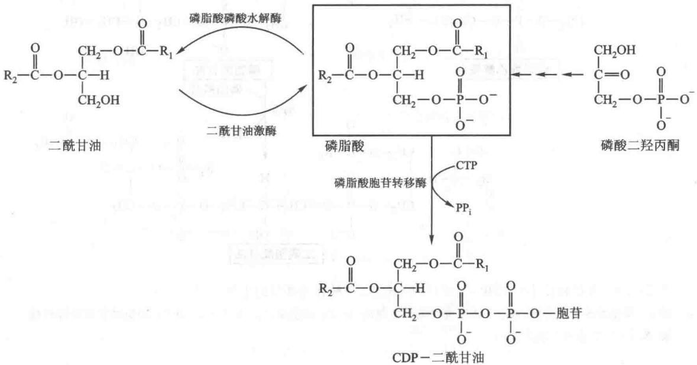  
图 24-38 在真核生物中, 磷脂酸来自磷酸二羟丙酮, 并降解为二酰甘油

## 2. 二酰甘油是磷脂酰胆碱和磷脂酰乙醇胺合成的关键化合物

磷脂酰胆碱和磷脂酰乙醇胺在数量上是真核生物细胞中最重要的磷脂，它们自二酰甘油衍生而来（图24-35）。磷脂酰胆碱的生物合成起始于胆碱（choline）被运送进入细胞。胆碱是人类膳食中不可缺少的组成分，不能在动物体内生成。胆碱一旦进入细胞，就在胆碱（或乙醇胺）激酶作用下迅速地磷酸化成为磷酸胆碱。这个激酶是细胞溶胶中的一种酶。磷酸胆碱与胞苷三磷酸（CTP）在CTP：磷酸胆碱胞苷转移酶（CTP：phosphocholine cytidyltransferase）作用下转化为CDP-胆碱。此酶是一“限速”酶，它在细胞溶胶中无活性,进入内质网后,与膜的磷脂作用后而活化。CDP-胆碱立即与二酰甘油反应,它是受内质网中存在的酶催化发生的。磷脂酰乙醇胺的生物合成是以乙醇胺为起始物,它进行的途径与磷脂酰胆碱相似。

在肝、酵母和细菌中，如假单胞菌（Pseudomonas），有一条途径可自磷脂酰乙醇胺转化为磷脂酰胆碱，在此途径中磷脂酰乙醇胺接受来自S-腺苷甲硫氨酸的甲基化，经过三次同样的反应，乙醇胺的-O- $CH_{2}CH_{2}NH_{3}$ 转化为胆碱的末端- $OCH_{2}CH_{2}N(CH_{3})_{3}$ （图24-39）。与这三步反应同时发生的，还有磷脂酰胆碱的降解，可产生胆碱，这是肝中唯一产生胆碱的机制。

  
图 24-39 磷脂酰乙醇胺到磷脂酰胆碱的转换  
AdoMet:S-adenosyl-L-methionine,S-腺苷甲硫氨酸;AdoHcy:S-adenosyl-L-homocysteine,S-腺苷高半胱氨酸

## 3. 脂肪酸取代可能都在 sn1 和 sn2 位上

肺组织可产生特定的磷脂酰胆碱，即二软脂酰磷脂酰胆碱。软脂酸在此化合物中以软脂酰形式连接在甘油骨架的sn1和sn2位上(sn指立体特异编号，stereospecific numbering)。这种磷脂酰胆碱是肺表面活性剂的主要组成成分，它可保持肺泡的表面张力，因此当肺泡中的空气被排除时，肺泡不会折叠塌陷。

二软脂酰磷脂酰胆碱的合成途径可能如图24-40所示。起始物磷脂酰胆碱是由CDP-胆碱途径生成的，即：①胆碱在ATP作用下转化为磷酸胆碱；②磷酸胆碱受胞苷三磷酸（CTP）作用形成CDP-胆碱；③CDP-胆碱与二脂酰甘油反应得到磷脂酰胆碱。这时形成的磷脂酰胆碱(图24-39)其sn2位的脂肪酸常常是不饱和脂肪酸，反应第1步是软脂酰-CoA在磷脂酶A2催化下把原sn2位上的不饱和脂肪酸水解脱下，软脂酰胆碱转变为溶血磷脂酰胆碱(lysophosphatidylcholine)。第2步是在1-脂酰甘油磷酸胆碱酰基转移酶(1-acylglycerol phosphocholine acyltransferase)催化下与软脂酰-CoA反应，生成二软脂酰磷脂酰胆碱。这里，再脂酰基化发生的位置，即脂肪酸残基在甘油骨架上的位置，规律性地都是在sn1和sn2位上。

由磷脂酰胆碱到二软脂酰磷脂酰胆碱的转变,实际只是发生了脂肪酸残基的转换。通过这种途径改变了原来分子的特性,对机体无疑是一种经济的形成新分子的措施。磷酸胆碱的去脂酰化作用(deacylation)和再脂酰化作用(reacylation)在其他组织中也存在。它提供了一条在sn1和sn2改换脂肪酸残基以确保生物对特殊分子需要的重要途径。

## 4. 4,5-二磷酸磷脂酰肌醇

已述，CDP-二酰甘油在原核生物体内的磷脂合成中是一关键的中间体，它在真核生物的线粒体中也可合成磷脂酰甘油和二磷脂酰甘油（见图24-35）。另外CDP-二酰甘油可导致形成磷脂酰肌醇（图24-41），磷脂酰肌醇约占膜中脂质的 $5\%$ ，它还以4-磷酸磷脂酰肌醇及4,5-二磷酸磷脂酰肌醇的形式存在，但浓度较小。这二磷酸衍生物可以在磷脂酶C的作用下降解成为1,4,5-三磷酸肌醇和二酰甘油（图24-

  
图 24-40 自磷脂酰胆碱转化为二软脂酰磷脂酰胆碱的二步反应

42)。这两种降解产物都有着重要的调节功能。1,4,5-三磷酸肌醇参与钙在细胞内贮存(内质网)的移位，并可引起细胞溶胶钙对各种酶的激活。磷脂酶C反应的其他产物，二酰甘油是蛋白激酶C的激活剂。蛋白激酶C需低浓度的钙和磷脂酰丝氨酸以获得活性。C是英文calcium的字头，它催化许多蛋白质的磷酸化从而改变它们的活性以及它们所介导的生理应答。

  
图 24-41 在真核生物体内 CDP-二酰甘油到磷脂酰肌醇的转化

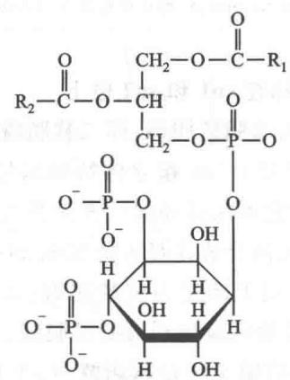

4,5-二磷酸磷脂酰肌醇  
  
图 24-42 磷脂酶对 4,5-二磷酸磷脂酰肌醇的降解

  
图24-43 磷脂酸烷基醚的生物合成

## 5. 烷基和(链)烯基醚(ethers)的生物合成

有些磷脂在它的 sn1 位含有 O-烷基(alkyl)或 O-(链)烯基(alkenyl)而不是以常见的酰酯形式结合。在真核生物体内的这种磷脂酸的烷基脂的合成如图 24-43 所示。合成的最初一步是磷酸二羟丙酮(DHAP)的酰基化，它与磷脂酸合成(图 24-35)相像。紧接的是以由醇衍生的烷基取代 1-酰基。这里进行反应的醇是由脂酰-CoA被 NADPH 或 NADH 还原生成的。第三步反应是酮的还原，最后一步是 2-羟基脂酰基化。这种磷脂酸的 1-烷基醚衍生物一旦形成，即用来合成其他的磷脂。

某些磷脂酰胆碱的烷基醚有强有力的生物活性,例如,1-烷基-2-乙酰甘油磷酸胆碱(1-alkyl-2-acetylglycero phosphocholine)(图24-44)是有名的血小板活化因子(platelet activating factor, PAF),在极低的水平( $10^{-10}$ mol/L)下使血小板发生集结,它还显示降压功能。

在许多组织中，1-烷基-2-脂酰磷脂酰乙醇胺可被一种内质网膜酶作用而去饱和，这个酶名为1-烷基-2-脂酰乙醇胺去饱和酶，产物为1-(链)烯基-2-脂酰磷脂酰乙醇胺，又名缩醛磷脂(plasmalogen)(图24-45)。上述的酶进行反应时需要 $\mathrm{O}_2$ ，NADH和细胞色素 $b_{5}$ 。这些辅助因子与脂肪酰-CoA去饱和转化为软脂酰-CoA时的辅助因子完全相同。在很多组织中缩醛磷脂是少有的组成成分，但在心脏组织中，约有 $50\%$ 的磷脂酰乙醇胺在sn1位含有(链)烯基醚的结构。含(链)烯基醚键的磷脂可以保护细胞免受单态氧(singlet oxygen)的毒害，这种单态氧当浓度高时可致细胞死亡。

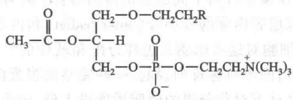  
图 24-44 1-烷基-2-乙酰甘油磷酸胆碱

醚脂质(ether lipid)在微生物中也有发现,特别是原生动物和古细菌(archaebacteria)。对水解来说,烷基醚键较烷基酯键更为牢固。这种稳定性可能是古细菌的膜中醚脂质无所不在的原因,古细菌时常经受极度的pH,盐和温度的影响。

  
图24-45 缩醛磷脂的生成

## 6. 肝中对结构脂质的调控优先于对贮能脂质的调控

虽然目前还不清楚从二酰甘油到磷脂酰胆碱、磷脂酰乙醇胺或三酰甘油的转化(图 24-35)是怎样受调控的,但至少现已了解,在肝中对于组成膜所必需的磷脂酰胆碱、磷脂酰乙醇胺的合成,在适量的三酰甘油合成之前,已经先行得到满足。这三种脂质合成的调控,以及磷脂酰丝氨酸、磷脂酰甘油、二磷脂酰甘油以及肌醇磷脂合成的调控,都密切地与细胞内的膜,包括质膜、内质网膜、高尔基体等的维持、形成和功能有密切关系。

磷脂酰胆碱生物合成的速度主要由 CTP：磷酸胆碱磷脂酰转移酶的活力进行调节。后者是两个相同的亚单位组成的二聚体，相对分子质量为 41720。这个酶存在于细胞溶胶和内质网中，但只有与膜结合的那一部分才具有活性。调节 CTP：磷酸胆碱磷脂酰转移酶（CT）在细胞溶胶和内质网间的分配有以下几种机制：① 很可能是主要的，是一种反馈调节，它基于磷脂酰胆碱在内质网中的浓度。当磷脂酰胆碱在膜内的浓度降低，酶与内质网的结合即增高，随即被激活，并推动磷脂酰胆碱的合成。当磷脂酰胆碱的浓度回到正常水平，磷脂酰转移酶就从内质网释出进入细胞溶胶，变为无活性。② 蛋白激酶使“CT”磷酸化，结果酶自膜脱离（变为无活性）；磷酸酶可发生相反效应。有关这个蛋白激酶的本来面目现在还不清楚，但它与 cAMP-依赖性蛋白激酶或蛋白激酶 C 并不相像。③ 脂肪酸推动磷脂酰转移酶与内质网结合，当脂肪酸移去，酶即从内质网释出进入细胞溶胶。④ 最后，磷脂酰胆碱合成的底物之一——二酰甘油也可使磷脂酰转移酶与内质网结合。当脂肪酸量充裕，二脂酰水平也较高，这时不仅对磷脂酰胆碱生物合成提供了底物，而且也会激活磷脂酰转移酶。这些调控酶活性的机制使得肝得以调节磷脂酰胆碱的生物合成，既迅速，又是正反两个方向都可行（图 24-46）。

腺苷酸环化酶(cAMP)介导的反应抑制脂肪酸合成,此种反应也使二酰甘油生物合成下降。二酰甘油的供应可对磷脂酰胆碱、磷脂酰乙醇胺及三酰甘油的生物合成给以限制。当二酰甘油充裕时,膜组成成分所必需的磷脂酰胆碱及磷脂酰乙醇胺在贮存能量的三酰甘油获得适当量前,就已先行得到二酰甘油的满足。磷脂酰胆碱合成可因CDP-胆碱的供给,通过磷脂酰转移酶反应而受到调控。同样CDP-乙醇胺的供给可调节磷脂酰乙醇胺的合成。当细胞需要的这些磷脂质已得到满足时,过量的二脂酰甘油及脂酰-CoA就进入转化为三酰甘油的途径。

## 7. 磷脂类生物合成的最后一步反应发生于内质网的细胞溶胶面

磷脂酰胆碱、磷脂酰乙醇胺、磷脂酰丝氨酸和磷脂酰肌醇的合成，全都发生在内质网的细胞溶胶面和高尔基体膜上（小鼠肝）。与之不同，磷脂酰甘油和二磷脂酰甘油的合成则大部发生在线粒体中。有关这些脂质分布，在膜中有两个问题还留待回答：①因为磷脂质的合成发生在内质网的细胞溶胶侧；这些磷脂还发现居于双层膜内部的外小叶（outer leaflet）和内小叶（inner leaflet）上，这些磷脂是怎样到达双层膜的小叶的？②细胞对这些磷脂是怎样分配和就位的？是怎样运送磷脂从合成地点到其他膜的？有关第①问，得从膜蛋白的不对称排列说起，一些完整的膜蛋白可优先地与某些脂质联合。蛋白质的取向影响着脂质的取向。这种不对称分隔的磷脂质能进入外、内小叶是依赖于运送它们的膜内在蛋白质。例如，在不同来源的红细胞发现了一种蛋白质，其相对分子质量为31000。它需要ATP提供能量，可将不同地点的磷脂酰丝氨酸经过运送中的突然转向的方式，从外小叶转入内小叶。当然这里还有很多问题有待阐明。关于第②问，很可能磷脂质在细胞内是作为膜的一部分被转移的。由于带有特定膜蛋白的膜小泡（membrane vesicle）从内质网出芽并移动穿过细胞溶胶，最后与特定细胞器的膜融合在一起。在小泡表面的特定膜蛋白可能将小泡导向特定的细胞器，或通过相互碰撞（collision）达到相互融合（fusion）。

细胞内脂质运送的另一可能机制是磷脂与真核细胞中细胞溶胶的蛋白质交换。这些蛋白质可以催化磷脂分子在双层膜之间交换。例如，在内质网上的磷脂酰胆碱分子与交换蛋白(exchange protein)相连接的磷脂酰胆碱进行交换。交换蛋白又转移到线粒体，在这里可发生另一种交换。按此机制，磷脂酰胆碱分子即从内质网转移到线粒体。从已经被分离出的交换蛋白表明，有一些对磷脂的极性头部不表现专一性，但其他的却是高度专一的。虽然膜的成长需要脂质转入，但脂质通过这些蛋白质进入膜的效应却很难模拟。但是最低限度可以说，这种蛋白质以交换方式，可以在不同膜上交换脂质使它新生，因为在真核细胞中磷脂质确是在周转着的。

## （五）鞘磷脂和鞘糖脂的生物生成

所有鞘磷脂(sphingomyelin)的一般结构都有一个长的脂肪链、一个二级胺和一个醇羟基部分,它的代

  
图 24-46 小鼠肝中 CTP：磷酸胆碱磷脂酰转移酶（CT）的调节

表即鞘氨醇(4-sphingenine):

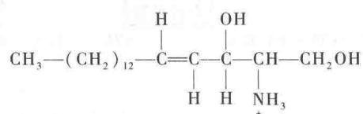

与前述的磷脂质相比较,它代替了甘油分子与不同组分结合,形成鞘磷脂的一般式。这些鞘磷脂的作用如前所述,是所有脊椎动物细胞的组成成分,在髓鞘(myelin sheath)中含量丰富,具有保护和使神经纤维绝缘的作用。它们在红细胞以及血浆脂蛋白中都有存在。

(1) 鞘磷脂直接由神经酰胺(ceramide)生成 在鞘磷脂中的主要结构是(神经)鞘氨醇,它的生物合成发生在内质网上。最初的起始物软脂酰-CoA与丝氨酸缩合形成3-酮鞘氨醇(3-ketosphinganine)。催化此反应的酶称为3-酮鞘氨醇合酶。随后3-酮衍生物被还原，形成二氢鞘氨醇(sphinganine)。催化此反应的酶称为3-酮鞘氨醇还原酶，它以NADPH和 $\mathrm{H^{+}}$ 为辅助因子。它的氨基部分与一分子脂酰-CoA反应，形成 $N-$ 脂酰-二氢鞘氨醇（ $N$ -acyl-sphinganine），再经FAD脱氢，形成神经酰胺(图24-47)。

  
图24-47 以软脂酰CoA和丝氨酸为起始物到鞘磷脂和葡糖-神经酰胺的生物合成路线

鞘磷脂(sphingomyelin)是磷脂酰胆碱转移磷酸胆碱给神经酰胺形成的。磷酸胆碱转移酶位于高尔基体膜的腔侧。

（2）鞘糖脂的生物合成也始于神经酰胺 鞘糖脂(glycosphingolipid)与鞘磷脂都含有鞘氨醇。它们的不同之处是鞘磷脂还含有磷酸胆碱，鞘糖脂则含有糖(单糖、低聚糖或其衍生物)：

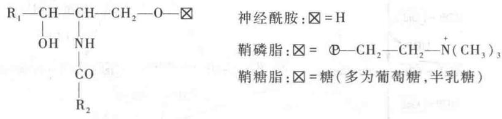

鞘糖脂的生物合成在许多地方与 O-连接的糖蛋白的合成相像，糖基二磷酸尿苷，例如，葡糖二磷酸尿苷（uridine-diphosphate-D-glucose, UDP-D-葡萄糖）为起始物，与神经酰胺反应即形成葡糖-神经酰胺（glucoceramide，也称为葡糖脑苷脂，glucocerebroside）。同样，半乳糖-神经酰胺（半乳糖脑苷脂）也是这样合成的。

$$
\begin{array}{r l} & \text { 神经酰胺 } + \mathrm{UDP-D-葡萄糖} \longrightarrow \text { 葡糖 - 神经酰胺(葡糖脑苷脂) } \\ & \text { 神经酰胺 } + \mathrm{UDP-D-半乳糖} \longrightarrow \text { 半乳糖 - 神经酰胺(半乳糖脑苷脂) } \end{array}
$$

即糖分子以糖核苷酸的形式转移到受体的脂质分子(神经酰胺)上,参与此反应的酶是糖基转移酶,它们对各个反应是特异的。参与鞘糖脂合成的糖基转移酶的绝大多数存在于高尔基体的空腔一侧。最后,用于鞘糖脂合成的糖核苷酸(如 UDP-葡萄糖),是由位于高尔基体膜上的运送分子使它能够穿过膜进入高尔基体空腔的。有关鞘糖脂合成的路线见图 24-48。

  
图 24-48 葡糖-神经酰胺的生物合成

各种鞘糖脂的生物合成可概括如图 24-49。

## （六）类二十烷酸的生物合成

类二十烷酸(类花生酸,eicosanoids)是一族多样化的激素,它们的绝大多数是由 $C_{20}$ 多不饱和脂肪酸——花生四烯酸(arachidonic acid)衍生而来。在一系列的环戊烷酸(cyclopentanoic acid)中最突出的是前列腺素（prostaglandin，PG），它以前列腺烷酸（prostanoic acid）为基本骨架。这个酸有一个五元环和两条侧链，无不饱和双键。根据前列腺烷酸的五元环取代基团以及环上有无双键、双键位置等，可将前列腺素（PG）分为九类，即PGA，B，C，D，E，F，G，H及I。体内较多存在的是PGA，PGE及PGF。PGG，PGH及PGI在五元环外还有一含氧的五元并环，因此又称前列环素（prostacyclin）。又根据 $\mathbb{R}_1$ 和 $\mathbb{R}_2$ 两条侧链中双键的数目和位置又分为1,2,3类。另外，如第9位碳原子上有羟基，根据羟基位于五元环平面的上方或下方，分为 $\beta$ 及 $\alpha$ 型，天然的前列腺素均为 $\alpha$ 型（图24-50）。

  
图24-49 各种鞘糖脂的生物合成概貌

从图 24-50 一般式可以设想,侧链( $R'$ 或 $R''$ )上如有双键,就有一个顺式或反式问题。以 $PGE_{2}$ 为例,结构测定结果表明 5 和 6 位间的双键为顺式(cis $\Delta^{5}$ ),13 和 14 位间为反式(trans $\Delta^{13}$ ),如右图所示:

与前列腺素很相近的是含氧的类二十烷酸——血栓烷（thromboxan）。它在环状结构上与前列腺素不同，血栓烷以 $_{噁}$ 烷环(oxane ring)代替前列腺素的五元环。以血栓烷 $\mathrm{A}_2$ 为例，它的结构如图24-50所示。

类二十烷酸类化合物的前体花生四烯酸作为磷脂复合物的一部分贮存于膜中。根据需要，经专一的磷脂酶 $A_{2}$ 的催化，自磷脂复合物释出。除此之外还有，在磷脂酰肌醇专一的磷脂酶 C（phosphatidylinositol-specific phospholipase C）的作用下，磷脂酰肌醇可降解产生二酰甘油及磷酸肌醇（phosphoinositol）。

二酰甘油随即在二酰甘油脂酶(diacylglycerol lipase)的催化下被裂解,产生花生四烯酸(arachidonic acid)和单酰甘油(monacylglycerol)。二酰甘油还可经另外途径产生花生四烯酸,即经二酰甘油激酶(diacylglycerol kinase)催化形成磷脂酸(phosphatidic acid, PA),再经磷脂酶 $A_{2}$ 催化形成溶血磷脂酸(lysophosphatidic acid)和花生四烯酸。磷脂酶 $A_{2}$ 催化的花生四烯酸的释出是类二十烷酸化合物生物合成途径的限速步骤。

自花生四烯酸以下的类二十烷酸化合物的合成路线根据产物的结构可分为两路,其一是环加氧酶途径(cyclooxygenase pathway),另一个是线性脂加氧酶途径(linear lipoxygenase pathway)(图24-51)。前者的产物为前列腺素（prostaglandins）及其衍生物，如前列环素（prostacyclin， $\mathrm{PGI}_2$ ）、血栓烷（thromboxan）等，它们都含有五元环。后者的产物是线形白三烯类（leucotrienes），它的英文名用“leuco”作字头是指这类化合物都是从白细胞（leucocyte）分离得到的，有三个双键的三烯及四个双键的四烯。

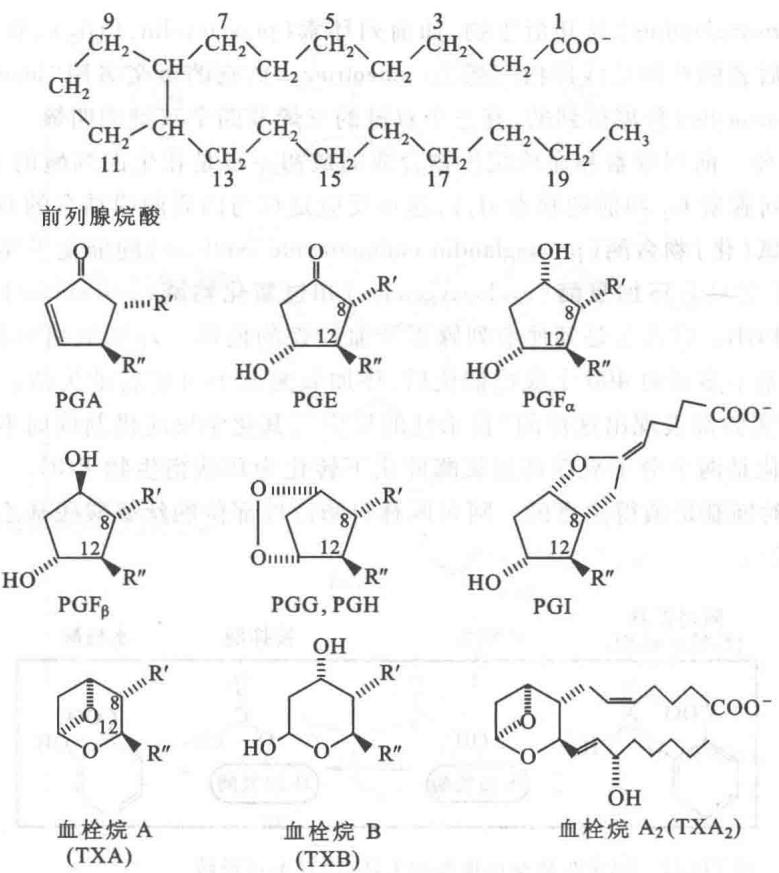  
图24-50 前列腺烷酸、前列腺素及血栓烷的结构

  
图24-51 类二十烷酸生物合成的环形和线形途径

（1）环加氧酶途径 前列腺素和血栓烷生物合成的最初一步是花生四烯酸的氧化和关环，产物依次为 $PGG_{2}$ 和 $PGH_{2}$ （前列腺素 $G_{2}$ 和前列腺素 $H_{2}$ ），这步反应是在与内质网膜结合的双功能酶——环加氧酶也称为前列腺素内过氧（化）物合酶（prostaglandin endoperoxide synthase）的催化下实现的。这个酶所以称为“双功能酶”，是由于它具有环加氧酶（cyclooxygenase）和过氧化物酶（peroxidase）的活性。花生四烯酸依次转变化 $PGG_{2}$ 及 $PGH_{2}$ ，后者又是其他前列腺素及血栓烷的前体。环加氧酶具有很不寻常的性质，它可以催化自我毁灭。差不多每对400个底物催化后，环加氧酶就不可逆转地失活。不论“体内”（in vivo）和“体外”（in vitro）的实验都表现出这样的“自杀性的反应”，其化学反应机制现尚不明。

花生四烯酸的氧化是两个分子氧在环加氧酶催化下转化为环状衍生物 $PGG_{2}$ 。这步酶反应受阿司匹林(aspirin)不可逆转的抑制是值得注意的。阿司匹林对酶活性部位的丝氨酸残基乙酰化，导致酶失活，而且不可逆转(图 24-52)。

  
图 24-52 阿司匹林使环加氧酶失活,而且不可逆转

环加氧酶的失活会导致自 $\mathrm{PGH}_2$ 衍生出的三类化合物的形成受抑制，这三类化合物是其他一些前列腺素（如 $\mathrm{PGE}_2, \mathrm{PGF}_{2\alpha}$ ）、前列环素（如 $\mathrm{PGI}_2$ ）和血栓烷（如 $\mathrm{TXA}_2, \mathrm{TXB}_2$ ）。阿司匹林对过氧化物酶的活性无作用。众所周知，阿司匹林是著名的具有抗炎作用（anti-inflammatory）药物，其他非类固醇抗炎药物也可抑制环加氧酶，但与阿司匹林不同，它们是非共价性的结合，也不是不可逆转的抑制。

有报告称,每隔一天服用低剂量的阿司匹林,可以降低心肌梗塞、中风猝发的发病率,这种效应估计是对环氧加酶抑制所致。但是阿司匹林是否能够预防、保护心血管疾患,对此还没有完全的定论,解决这个问题还需要进一步的研究。

（2）自 $\mathrm{PGH}_2$ 转化为其他前列腺素及血栓烷 自 $\mathrm{PGH}_2$ 转化为 $\mathrm{PGE}_2$ 经过一个异构化反应，9位上的氢与11位的氧连接成醇，9位氧与9位碳形成酮（图24-53）。 $\mathrm{PGF}_{2\alpha}$ 的形成则包括着过氧化结构的两个氧全被还原成两个羟基。动脉壁中含有前列环素合酶（prostacgclin synthase），它催化 $\mathrm{PGH}_2$ 转化为前列环素，它含有一个新的含氧五元环，这个反应是在C9位和C6位间形成醚键，产物 $\mathrm{PGI}_2$ 可以水解形成6-酮 $\mathrm{PGF}_{1\alpha}$ 。在血小板(thrombocytes)中含有血栓烷合酶(thromboxane synthase)。它催化 $\mathrm{PGH}_2$ 形成血栓烷的六元噁烷环，从而形成血栓烷 $\mathrm{A}_2$ 。这个血栓烷 $\mathrm{A}_2$ 水解，9,11位的环氧结构转化为两个羟基，即为血栓烷 $\mathrm{B}_2$ （图24-53）。

（3）线性脂加氧酶途径 脂加氧酶(lipoxygenase)对各种类二十烷酸进行催化,在它的5,12或15位上插入过氧基,产物为5-氧过氧化二十碳四烯酸(hydroperoxy eicosatetraenoate,HPETE)(见图24-51)。其中只有过氧基插在5位的5-HPETE引人注目。它进行脱水反应可形成一个环氧化物名为白三烯 $A_{4}$ (leukotriene $A_{4}$ )。下一步是谷胱甘肽(三肽化合物)的巯基与白三烯 $A_{4}$ 的C6反应,生成硫醚(C-S-C),反应还将环氧基转变为羟基形成白三烯 $C_{4}$ 。白三烯 $C_{4}$ 经水解,将原来是三肽(谷胱甘肽)的衍生物转化为二肽衍生物白三烯 $D_{4}$ 。白三烯 $D_{4}$ 再水解得到白三烯 $E_{4}$ ,它只有一个甘氨酸侧链。上述的水解反应是放能的,而且是单向的。上述的这些白三烯可以转化为十多种代谢物(图24-54)。

脂加氧酶存在于白细胞、心、肺、脾、脑等组织，属于混合功能加氧酶。

（4）缩醛磷脂(plasmalogen)和血小板活化因子 缩醛磷脂的骨架是磷酸甘油酯(phosphoglycerolipid)。在sn1位上有一醚键，与sn3位相接的是磷酸乙醇胺或磷酸胆碱(见图24-45及图24-55)。缩醛磷脂存在于脑中的生物膜、心、红细胞及其他组织中，含量各异。在人的神经组织中，磷脂的 $20\%$ 左右是由缩醛磷脂构成，但在肝中其百分比却少于 $1\%$ 。缩醛磷脂的生物合成起始于磷酸二羟丙酮的放能酰基化反应（图24-55）。众所周知，磷酸二羟丙酮是糖酵解、脂肪代谢的重要中间体。长链的脂肪酸链以醇的形式取代其1位上的酰基进入磷酸二羟丙酮，形成醚键，再经过4步反应，脂肪烷基的侧链与氧邻近的乙基被氧化成双键，最后形成缩醛磷脂。最后一步的氧化是在 $\mathrm{O}_2$ 的参与下，经细胞色素 $b_{5}$ 的催化进行的。这是一步放能、单向性的反应，两个氢被氧化成水脱下。

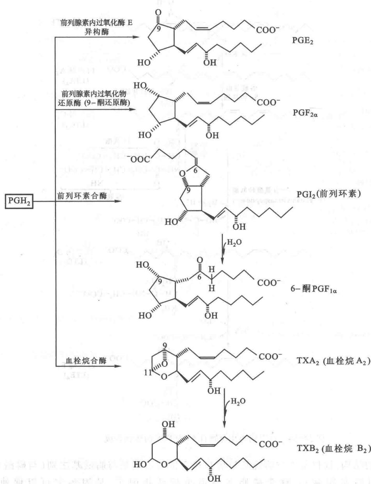  
图 24-53 以 PGH $_{2}$ 为起始物, 前列腺素、前列环素及血栓烷的生物合成

血小板活化因子(platelet activating factor, PAF)也是一个含醚结构的磷脂, 其结构如下式:

  
1-烷基-2-乙酰基甘油-3-磷酸胆碱

  
图24-54 白三烯类化合物自5-HPETE的生物合成

对照缩醛磷脂的结构,仅仅是1位的烷基与烯基和2位的乙酰基与脂酰基之别(与磷酸基相接的可以是乙醇胺,也可以是胆碱)。这个磷脂名为血小板活化因子,是因为它可以促使血小板结粒(granulation)。PAF还可对肌肉、肝、肾和脑细胞发生作用,对炎症、过敏等起重要作用。这个脂质药物在不同的细胞中都可合成,包括白细胞、血小板、肾细胞及血管内皮。PAF在sn2位上被乙酰基而不是长链的脂酰基酯化是很不平常的。

PAF 是自 1-烷基-2-脂酰基甘油-3-磷酸胆碱(1-alkyl-2-acylglycerol-3-phosphocholine)衍生而来。它的合成途径与本节中前述的磷酸乙醇胺衍生物的合成途径相同。它的合成是根据需要而进行,不是贮存在细胞中。PAF-循环如图 24-56,磷脂酶 A₂ 催化 1-烷基-2-脂酰甘油-3-磷酸的水解生成“溶-血小板活化因子”(lyso-PAF),溶-PAF 发生乙酰化生成 PAF。PAF 是个活性物质,它可引发一些生理反应。它被水解转化为溶-PAF,并失活。在溶 PAF 乙酰基转移酶作用下,溶-PAF 又回到 1-烷基-2-脂酰甘油-3-磷酸胆碱。这一循环之后,经适当的刺激又可进行下一循环。PAF 循环的每一步都是放能反应。

## (七) 胆固醇的生物合成

胆固醇(cholesterol)是类固醇(steroid)家族中最突出的成员,它是真核生物膜的一个重要组成分,此外,它又是类固醇的重要的另外两类——类固醇激素(steroid hormone)和胆汁酸(bile acid)的前体。胆固醇是自然界存在最丰富的甾醇化合物,是人体的重要脂质物质之一,其结构式如图24-57所示。它们结构的特点是含有4个烃环合为一体的甾核。这4个烃环中有3个是六碳环,一个是五碳环。甾核几乎处于一个平面上,它是相当稳定的,C—C键不能自由旋转。动物组织中的主要的胆固醇是两亲性的,它有一个极性头的基团(在C3位上的羟基)和一个非极性的烃结构(甾核和在C17位上的烃侧链)。胆固醇来源于简单的五碳化合物异戊二烯,是膜、血浆脂蛋白的重要组成成分,又是许多具有特殊生物活性物质的前体,例如,胆汁酸、类固醇激素、维生素 $D_{3}$ 等(图24-28)。胆汁酸是胆固醇降解的最初产物,它在肝中生成,贮存在胆囊中,并分泌进入小肠。在小肠中它的功能是使脂质得以溶解使其在小肠脂酶催化下被消化。类固醇激素在代谢调控中扮演着关键的角色。这些激素有着丰富的种类,每种激素都与受体蛋白高度专一地相互作用,在适当的靶组织中影响基因表达。

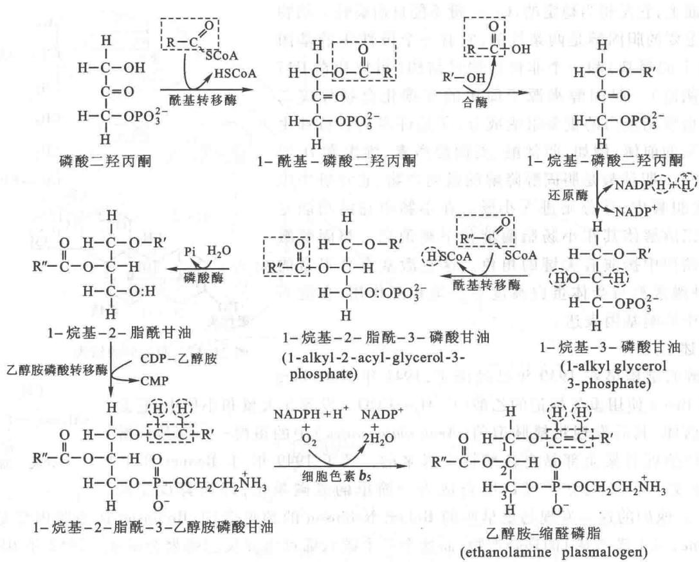  
图24-55 缩醛磷脂的生物合成

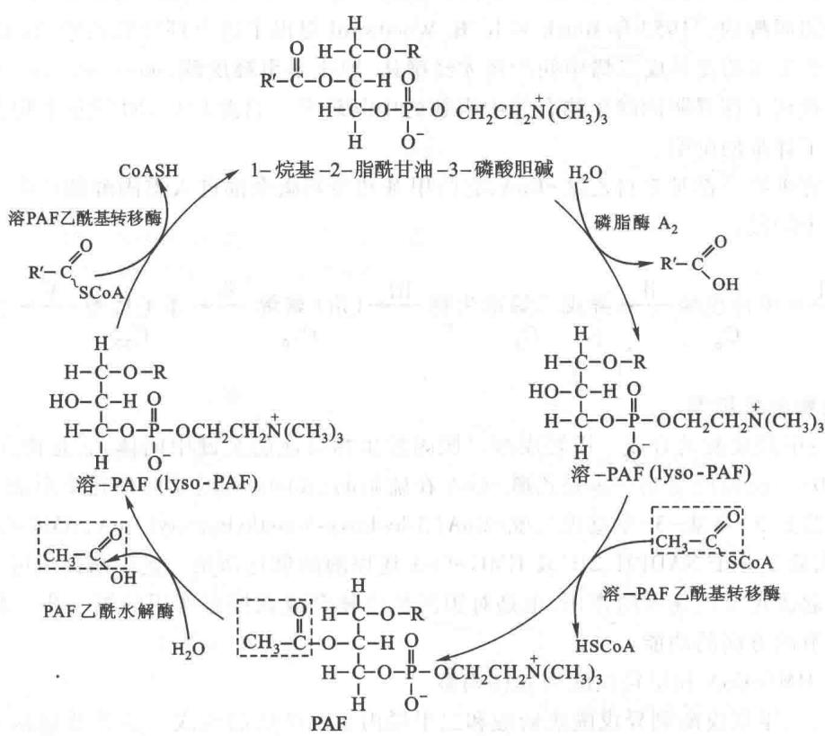  
图 24-56 血小板活化因子(PAF)循环

## 1. 概述

图24-57 胆固醇的结构

胆固醇的结构早在 1930 年已经测定, 1941 年 Rittenberg

和 Konard Bloch 使用重氢标记的乙酸 $\left(\mathrm{C}^{2}\mathrm{H}_{3}-\mathrm{COO}^{-}\right)$ 发现在大鼠和小鼠中，它是胆固醇的前体，其后发现粗糙脉孢菌（Neurospora crassa）中的甾醇——麦角固醇（ergosterol）的碳骨架全部是自乙酸衍生得来的。到了1949年，J. Bonner 和 B. Arreguin 证实3个乙酸分子可以结合成为一简单的五碳单位，即为异戊二烯

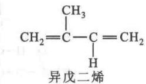

(isoprene)。他们的这一发现与更早些的 Robert Robinson 的预见合拍, Robinson 认为胆固醇是(角)鲨烯(squalene, 三十碳六烯)的环合产物, 而这个三十碳六烯可由异戊二烯聚合形成。1952 年 Bloch 和 R. Langdon 证实了这个(角)鲨烯确实可以转化为胆固醇, 他们提出并证实了胆固醇生物合成的途径如图 24-59 所示。

至此,还有两个问题需待解决。即这个类异戊二烯(isoprenoid)的中间产物是什么?还有,(角)鲨烯是怎样环合成为胆固醇的?1953年Bloch和R.B.Woodward提出了这个环合的设想,后来对此有了修正。直到1956年,这个未知的类异戊二烯中间产物才经确认,原来是甲羟戊酸(mevalonic acid)(见图24-58)。甲羟戊酸的发现找到了探寻胆固醇生物合成中未解的中间环节。自此以后,胆固醇生物合成的线路和立体化学问题得到了详细的阐明。

胆固醇的所有碳原子都是来自乙酰-CoA,它的甲基和羧基碳全部进入类固醇的核中。胆固醇的全生物合成可分为5个阶段：

## 2. 胆固醇生物合成步骤

（1）步骤 I: 甲羟戊酸的合成 甲羟戊酸是胆固醇生物合成的关键中间体, 它是由 3 分子乙酰-CoA 合成的(图 24-60)。反应的起始一步是乙酰-CoA 在硫解酶(thiolase)的反向催化下形成乙酰乙酰-CoA。步骤 I 的最后一步是 3-羟基-3-甲基戊二酰-CoA(3-hydroxy-3-methylglutaryl CoA, HMG-CoA)转化为甲羟戊酸, 这步反应需要 2 分子 NADPH、 $2H^{+}$ 及 HMG-CoA 还原酶的催化作用。这步酶促反应对胆固醇生物合成既承担任务又起决定反应速度的作用, 也是对胆固醇生物合成调控起作用的第一步。此还原酶有着共价修饰和别构调节两方面的功能。

图 29-61 是 HMG-CoA 和甲羟戊酸的立体构型。

（2）步骤Ⅱ：自甲羟戊酸到异戊酰焦磷酸和二甲烯丙基焦磷酸的生成 步骤Ⅱ包括有甲羟戊酸的磷酸化和脱羧基三步反应（图24-62），生成异戊酰焦磷酸(isopentenyl pyrophosphate)，再一步异构化形成二甲烯丙基焦磷酸(dimethylallyl pyrophosphate)。第Ⅱ步的合成有4种酶参与，甲羟戊酸激酶（mevalonatekinase）使底物磷酸化，磷酸甲羟戊酸激酶（phosphomevalinate kinase）催化第二个磷酸化。二步反应形成产物5-焦磷酸甲羟戊酸（5-pyrophosphomevalonate）。第3个酶是5-焦磷酸甲羟戊酸脱羧酶（5-pyrophosphomevalonate decarboxylase），它催化脱羧基反应，并把C3位的羟基消除。此脱羧酶可能是在最初由ATP对C3位羟基磷酸化之后，进行羧基和C3位磷酸基的反式消除的，所以形成了异戊酰焦磷酸。此产物可在异戊烯焦磷酸异构酶（isopentenyl pyrophosphate isomerase）的催化下转化为3,3-二甲烯丙基焦磷酸（3,3-dimethylallyl pyrophosphate）。这里形成的两种类异戊二烯焦磷酸将共同作为第Ⅲ步的起始物继续进行胆固醇的合成。

图24-58 胆固醇和它的一些衍生物的形成箭头旁数字代表胆固醇合成途径中的步骤数  
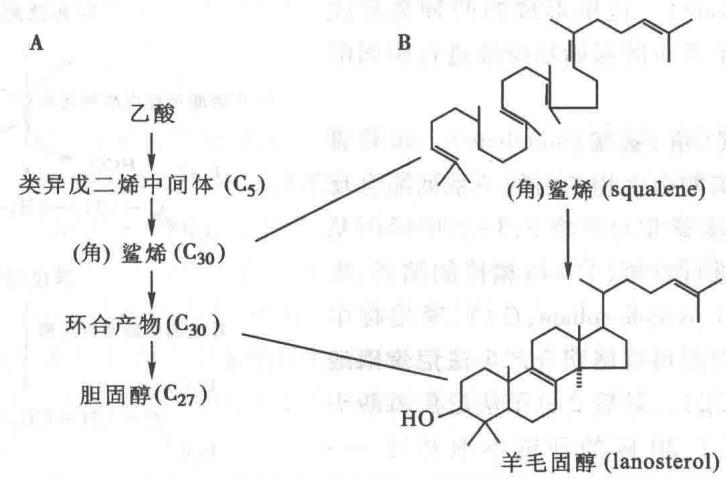  
图24-59 Bloch(1952)设想的(A)及Woodword和Bloch提出的鲨烯成环的(B)胆固醇合成路线

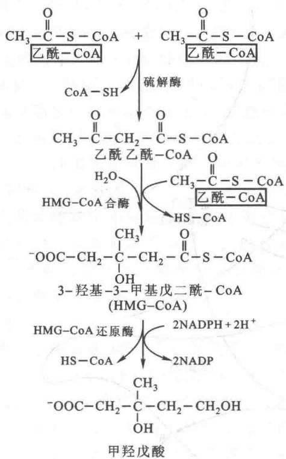  
图 24-60 步骤 I:3 分子乙酰-CoA 转化为甲羟戊酸

（3）步骤Ⅲ：三十碳（角）鲨烯（squalene） 步骤Ⅲ包含有6个异戊二烯焦磷酸衍生物参与的一系列缩合反应（图24-63）。最初是步骤Ⅱ的产物3,3-二甲烯丙基焦磷酸与异戊酰焦磷酸进行首尾（1'-4）相接的缩合，生成牻牛儿焦磷酸（geranyl pyrophosphate， $C_{10}$ ），紧接牻牛儿焦磷酸又与异戊酰焦磷酸再首尾缩合产生法尼焦磷酸（farnesyl pyrophosphate， $C_{15}$ ）。最后2分子法尼焦磷酸头与头（1'-1）缩合，形成了30碳的开链不饱和烃——（角）鲨烯（图24-63），步骤Ⅲ需用一分子NADPH和 $H^{+}$ 。全部反应共释放出4个焦磷酸基团（PPi）。焦磷酸的放能水解是在焦磷酸酶催化下实现的，它对胆固醇合

  
图24-61 HMG-CoA和甲羟戊酸的结构

  
图 24-62 步骤Ⅱ: 甲羟戊酸转化为两种类异戊二烯焦磷酸

第1步：二甲烯丙基焦磷酸失去PPi，成为正碳离子 $\left[\left(\mathrm{CH}_3\right)_2\mathrm{C} = \mathrm{CH}-\mathrm{CH}_2\right]$ ，它受到异戊酰焦磷酸双键电子的进攻，发生(1'-4)首尾相接的缩合；第2步：第2步的缩合与第1步相像，得到(1'-4)缩合的法尼焦磷酸；第3步：2分子的法尼焦磷酸缩合得到了（角）鲨烯  
  
图 24-63 步骤Ⅲ: 自二甲烯丙基焦磷酸合成(角)鲨烯

成提供了驱动力。

（4）步骤Ⅳ：(角)鲨烯二步环合形成羊毛固醇(lanosterol) 30 碳的(角)鲨烯形成后,经过二步反应环合形成羊毛固醇( $C_{27}$ ),类固醇的 4 个环的骨架在此搭成(图 24-64)。反应的第 1 步是在(角)鲨烯单加氧酶(squalene monooxygenase)的催化下,接受分子氧和 NADPH 形成一个活性的中间体——(角)鲨烯环氧化物(squalene-2,3-oxide)。反应的第 2 步是在 2,3-氧化(角)鲨烯羊毛固醇环化酶(2,3-oxidosqualene:lanosterol cyclase)的作用下,进行一个非凡的闭环,得到羊毛固醇。这步闭环需要电子的协同位移,即来自 4 个双键的电子和两个甲基的位移是协同进行的。“协同”这个名称是指参与反应的任何一方对另一方发生反应是必要而不可缺的,所有各方是自发协同的。从甲羟戊酸到羊毛固醇反应的全部历程约需 10 种酶的参与。

（5）步骤V：自羊毛固醇至胆固醇 在胆固醇生物合成的最后步骤中，羊毛固醇经过约20步反应转化为胆固醇，这些反应大多需要NADH（或NADPH）及分子氧。可以看到在胆固醇的生物合成过程中要消耗ATP供能，部分由焦磷酸水解提供，还需要大量的具有还原力的NADH和NADPH。NADPH来自苹果酸酶(malic enzyme)的反应和磷酸戊糖途径。苹果酸酶以NADP $^{+}$ 为辅酶催化苹果酸脱氢产生丙酮酸和NADPH。

自羊毛固醇至胆固醇有两条可能的途径（图24-65），在哺乳动物中的主要途径由一系列的双键还原反应和去甲基反应构成。24位 $(\Delta^{24})$ 的双键是怎样被还原的？现在还没有明确定论。另外，在这系列反应中包括有氧化反应， $14\alpha-$ 甲基的消除，紧接着是6位的氧化和消除两个甲基。最后一步反应是在7位脱氢成为 $\Delta^7$ 双键。

另外, 还有一条变更途径, 起始于去甲基转化为酵母甾醇 (zymosterol), 然后 $\Delta^{8}$ 双键发生异构化转变成 $\Delta^{5}$ 双键, 生成链甾醇 (desmosterol, 又称 24-脱氢胆固醇)。最后一步是 $\Delta^{24}$ 双键的还原。

自羊毛固醇至胆固醇所用的酶全都嵌于内质网膜上。除这些酶外，还发现有两种细胞溶胶蛋白质，它们对膜-联合的反应起催化作用，这个膜-联合反应在把(角)鲨烯转化为胆固醇中起作用。这两个可溶性的蛋白质在胆固醇生物合成中是怎样作用的？现在还是有待研究的问题。

## 3. 胆固醇合成的调控

胆固醇合成是一个复杂的耗能过程。过量的胆固醇不能作为能源，因此，严格调节胆固醇合成以补充食物中摄取的胆固醇对生物体而言是有利的。在哺乳动物中胆固醇合成受细胞内胆固醇含量、ATP供

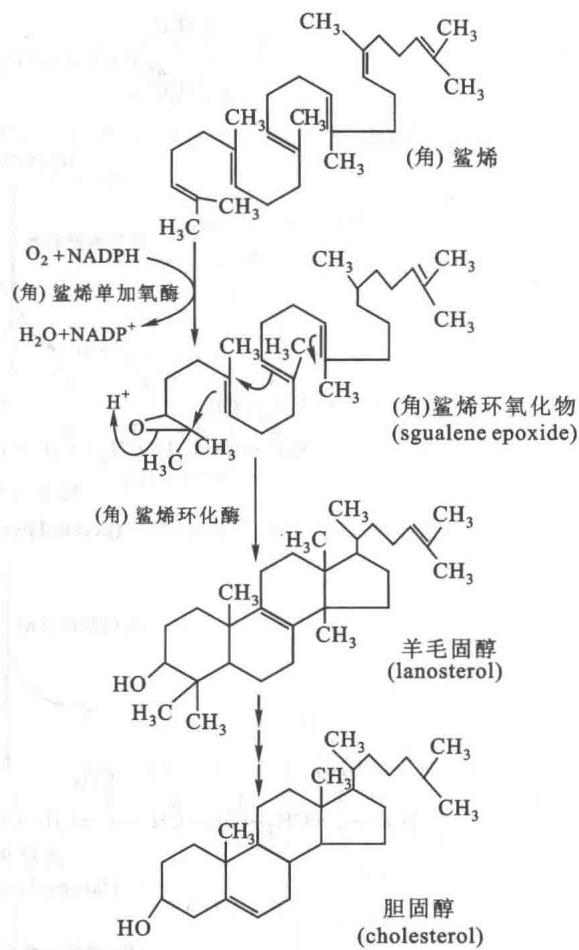  
图 24-64 步骤Ⅳ和 V: (角) 鲨烯转化为羊毛固醇是 2 步反应; 羊毛固醇转化为胆固醇是 20 步反应

应及激素(胰岛素和胰高血糖素)调控,限速步骤是 HMG-CoA 还原酶催化的反应(图 24-66)。

HMG-CoA 还原酶是一个复杂的调控酶, 其酶活性的调节分为短期(short-term)和长期(long-term)两种调节方式。短期调节是指 HMG-CoA 还原酶的磷酸化/去磷酸化导致酶的失活和激活。单磷酸腺苷活化蛋白激酶(AMP-dependent protein kinase, AMPK)作为体内的能量检测器, 受 AMP/ATP 比值调节。当 ATP 水平降低时, AMPK 被激活使 HMG-CoA 还原酶激酶磷酸化, 并使其失活(抑制作用), 同样, 胰高血糖素引起 HMG-CoA 还原酶磷酸化, 抑制胆固醇合成(图 24-66); 胰岛素激活蛋白磷酸酶(protein phosphatase), 导致 HMG-CoA 还原酶去磷酸化(促进作用), 促进胆固醇合成(图 24-66)。这些激酶和磷酸酶介导着 HMG-CoA 还原酶活性的短时变化。

长期调节是指 HMG-CoA 还原酶基因的转录水平受胞内胆固醇水平的调控。固醇反应元件结合蛋白 (sterol regulatory element-binding protein, SREBP) 是一类重要的转录因子，调节 HMG-CoA 还原酶基因的转录（图 24-67）。SREBP 以蛋白质前体的形式在内质网上合成，以两次跨膜的方式形成发夹结构，其 N 端和 C 端都位于细胞内侧，而内质网侧有一小的肽段称为“调节结构域”（regulatory domain）。当细胞胆固醇和氧甾酮含量丰富时，SREBP 与其裂解激活蛋白 SCAP（SREBP cleavage-activating protein）和胰岛素诱导基因蛋白（insulin-induced gene protein, Insig 蛋白）形成复合物锚定在内质网上（图 24-67）；相反，当胆固醇和氧甾酮含量显著减少时，SCAP 和 Insig 蛋白作为固醇敏感器能感受这一变化，Insig 蛋白经泛素化降解，分泌蛋白（Sec）护送 SCAP/SREBP 复合物进入高尔基复合体。在高尔基复合体中，SREBP 被蛋白酶水解并释放其“调节结构域”进入细胞核内，且结合在 DNA 的固醇反应元件上，从而促进 HMG-CoA 还原酶的转录（图 24-67）。长期调节还包括对 HMG-CoA 还原酶的降解速度的调控。已知，酶在细胞中的含量决定着酶的合成和降解两方面的速度。HMG-CoA 还原酶的半寿期为 2\~4 h，约为内质网中其他蛋白质半寿期的十分之一。当胆固醇含量丰富时，Insig蛋白被感应，介导HMG-CoA还原酶泛素化降解。换句话说，HMG-CoA还原酶在细胞内降解得很快。这个还原酶的降解速度又是由胆固醇的供给情况所决定。酶降解的速度与胆固醇在限量供给时相比，要增快约2倍。

  
图24-65 自羊毛固醇到胆固醇的两条途径

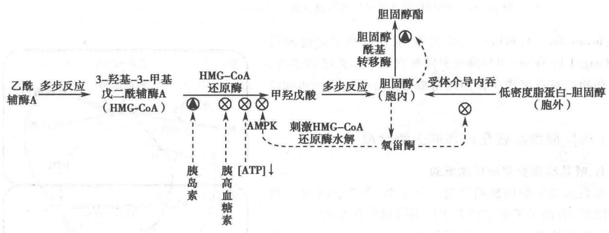  
图24-66 胆固醇合成与转运的调节

很长时期,人们认识到血浆中的高胆固醇与心血管疾患(如绝大多数的心脏病、脑溢血等)有着相互关联。绝大多数的血浆胆固醇发生在肝中,因此设想可有药物特异地对胆固醇生物合成给予作用。也就合乎逻辑地设想使 HMG-CoA 还原酶失活或钝化的药物出现,因为这个酶是调节胆固醇合成途径的关键物。人们从真菌中分离出一些代谢物,它们对 HMG-CoA 还原酶有竞争性抑制作用。其中最有效的一个是lovastatin。对狗做的实验表明，服用小剂量的这种药物(8 mg/1 kg 体重)可以降低胆固醇在血浆中浓度的30%。这个药物已被批准用于高胆固醇血症(hypercholesterolemia)患者。

  
图24-67 SREBP调节胆固醇的生物合成

## （八）胆固醇转化产物的生物合成

## 1. 哺乳动物胆固醇代谢概貌

哺乳动物中胆固醇的代谢十分复杂,图 24-68 是一概括的图解,有助于了解它的主要代谢物和内在关系。

虽然机体各组织都能合成胆固醇，但绝大部分是在肝中合成，或自膳食摄取。由小肠黏膜细胞吸收的胆固醇会同三酰甘油、磷脂及在细胞内新合成的某些载脂蛋白共同形成乳糜微粒（chylomicron, CM），CM经淋巴进入血浆。这个颗粒迅速地受脂蛋白脂酶（lipoprotein lipase）作用而降解，未被降解的残迹又回到肝。作为乳糜微粒中的脂质组成成分和残迹，载脂蛋白实行了与高密度脂蛋白（HDL）的交换。胆固醇在细胞内合成的部位是细胞溶胶和光面内质网。合成胆固醇的酶系主要存在于细胞溶胶和光面内质网部位。在肝中生成的胆固醇还有一些其他的前途：①作为血浆脂蛋白中乳糜微粒、高密度脂蛋白(HDL)和极低密度脂蛋白(VLDL)的组成成分分泌进入血浆。②以胆固醇酯的形式贮存在小滴(droplet)中。③用于细胞膜的结构组成。④转化为胆(汁)酸或胆汁盐。⑤在肾上腺或性腺中转化为多种类固醇激素。现分别介绍如下。

  
图24-68 胆固醇的“走向”

## 2. 血浆脂蛋白

在人类血浆中脂质的含量和类型主要依据膳食习惯和个体的代谢状况而定。血浆脂蛋白共有五类，它们的组成和密度如表 24-2 所示。

表 24-2 血浆脂蛋白的分类及组成

<table><tr><td></td><td>乳糜微粒</td><td>VLDL</td><td>IDL</td><td>LDL</td><td>HDL</td></tr><tr><td>密度/ $(g·mL^{-1})$ </td><td>&lt;0.95</td><td>0.95~1.006</td><td>1.006~1.019</td><td>1.019~1.063</td><td>1.063~1.210</td></tr><tr><td>直径/nm</td><td>75~1 200</td><td>30~80</td><td>25~35</td><td>18~25</td><td>5~12</td></tr><tr><td>组成成分/%(干重)</td><td></td><td></td><td></td><td></td><td></td></tr><tr><td>蛋白质</td><td>1~2</td><td>10</td><td>18</td><td>25</td><td>33</td></tr><tr><td>三酰甘油</td><td>83</td><td>50</td><td>31</td><td>10</td><td>8</td></tr><tr><td>胆固醇和胆固醇酯</td><td>8</td><td>22</td><td>29</td><td>46</td><td>30</td></tr><tr><td>磷脂类</td><td>7</td><td>18</td><td>22</td><td>22</td><td>29</td></tr><tr><td>载脂蛋白成分</td><td></td><td></td><td></td><td></td><td></td></tr><tr><td></td><td>A-I,A-II</td><td>B-100</td><td>B-100</td><td>B-100</td><td>A-I,A-II</td></tr><tr><td></td><td>B-48</td><td>C-I,C-II,</td><td>C-I,C-II,</td><td></td><td>C-I,C-II,</td></tr><tr><td></td><td>C-I,C-II,</td><td>C-III</td><td>C-III</td><td></td><td>C-III</td></tr><tr><td></td><td>C-III</td><td>E</td><td>E</td><td></td><td>D,E</td></tr><tr><td>电泳分类</td><td>Ω</td><td>前-β</td><td>β和前-β间</td><td>β</td><td>α</td></tr></table>

VLDL: 极低密度脂蛋白; IDL: 中密度脂蛋白; LDL: 低密度脂蛋白; HDL: 高密度脂蛋白

脂蛋白是球状的,直径小到5\~12 nm,大到1 200 nm,其大小是依特定的蛋白质和脂质决定的。不论何种类型,脂蛋白的结构都有一球心,它是由三酰甘油或胆固醇酯等中性脂类构成的。球心的外层是由蛋白质、磷脂类和胆固醇构成的“层”包裹着,它们定向地排列着,磷脂类的极性头部朝向脂蛋白的表面,如图24-69所示。

脂蛋白颗粒中的蛋白质部分称为载脂蛋白（apolipoprotein, apoprotein, apo），现已知的有十余种。颗粒中的蛋白质多以某一种为主。对这些蛋白质曾作了大量研究，包括了解其序列，已知它们有富含疏水的氨基酸区，与磷脂结合十分有利。

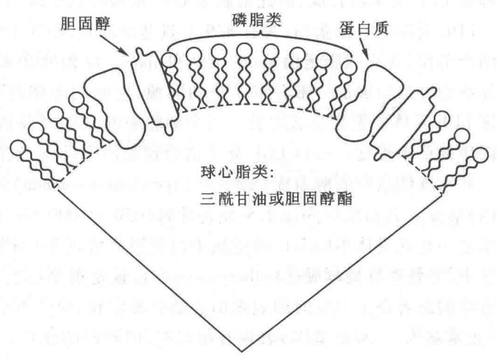  
图24-69 人类血浆脂蛋白的一般结构

脂蛋白的多种组成分是怎样组在一起的？现在还没有完全阐明。目前的看法认为这些组分是从内质网运送到高尔基体，在这里形成分泌小泡，这些小泡随即与质膜融合，并把这些脂蛋白的组成成分分泌进入血浆。

血浆脂蛋白主要在肝和小肠中生成, 小鼠 80% 左右的血浆载脂蛋白是在小肠发生的。乳糜微粒的绝大多数组成成分, 包括载脂蛋白 A、B-48、磷脂类、胆固醇、胆固醇酯及三酰甘油都是在小肠细胞中制出的。乳糜微粒分泌进入毛细淋巴管, 它实际是经大的锁骨下静脉进入血流的, 因此绕过了肝。肝是 VLDC 和 HDL 的主要源头, 包括 apoA-I、apoA-II、apoB-100、apoC-I、apoC-II、apoC-III 和 apoE 及脂蛋白的脂质组分。低密度脂蛋白是由 VLDL 制出的, 下面将进行讨论。

（1）乳糜微粒（CM）和极低密度脂蛋白（VLDL）运送胆固醇和三酰甘油到其他组织 乳糜微粒（chylomicron）作为三酰甘油及胆固醇酯的运输方式将它们从小肠送到其他组织。VLDL（极低密度脂蛋白）以相似的功能将脂质自肝运到其他组织。这两种富含三酰甘油的颗粒首先受脂蛋白脂肪酶的催化而降解，这是一种细胞外酶，它绝大多数是在脂肪组织的毛细管、心肌和骨骼肌以及乳腺中发生作用。脂蛋白脂肪酶使三酰甘油水解，它受到与乳糜微粒和 VLDL 缔合的 apoC-Ⅱ 的特异作用而被激活。其结果是这个脂肪酶从血浆的这些乳糜微粒等脂蛋白中给心脏和脂肪组织提供脂肪酸。在心脏和脂肪组织中这些脂肪酸又为脂肪酶所用，生成三酰甘油形式的贮能物质。此外，这些脂肪酸还会与清蛋白结合，运送到其他组织。

当这些脂蛋白耗尽了它的三酰甘油，颗粒就会缩小。某些表面分子（载脂蛋白、磷脂类）就被输送到HDL。在小白鼠中，来自乳糜微粒和VLDL的“残迹”受肝作用发生分解代谢。在人类也发生这种VLDL残迹的分解作用，但是三酰甘油更多是被脂蛋白脂肪酶作用而降解，转向成为中（间）密度脂蛋白（IDL）。这个颗粒又在脂蛋白脂肪酶作用下转化为LDL，并经胆固醇酯转移蛋白自HDL获得胆固醇酯。在人类血浆中，乳糜微粒及其“残迹”清除的半寿期为 $4\sim 5\mathrm{min}$ 。VLDL的清除周期则为 $1\sim 3\mathrm{h}$ 。

（2）低密度脂蛋白(LDL)自血浆转移到肝、肾上腺和脂肪组织 每日血浆“池”中的低密度脂蛋白(LDL)约有45%被转移到肝和肝外组织(特别是肾上腺和脂肪组织)。有关肝外组织吸收LDL的机制曾有过大量研究。例如,为研究LDL的吸收,使用人类皮肤的成纤维细胞(fibroblast),令其在培养皿中生长,发现LDL颗粒与细胞表面的特异受体相结合,这些受体是集聚在质膜的称为包被区(coated region)的部位。质膜的这个区域吞食了LDL颗粒,这个过程称为胞吞作用(endocytosis)。经胞吞形成了“包被小泡”(coated vesicle),它导向这些LDL与溶酶体融合,LDL颗粒就在溶酶体脂肪酶和蛋白酶的催化下发生降解。胆固醇或胆固醇衍生物自溶酶体弥散出来,它抑制HMG-CoA还原酶的活性,激活脂酰-CoA:胆固醇酰基转移酶(ACAT)。ACAT催化胆固醇酯的合成,产物随即贮存在细胞中。胆固醇(或其衍生物)还抑制LDL受体的合成,因此限制了LDL的吸收(图24-70)。

LDL 受体是一糖蛋白, 含有 839 个氨基酸残基, 由 5 个结构域组成(图 24-71)。结构域①是与脂蛋白的结合部位, 含有载脂蛋白 apoB-100 和 apoE。结构域②和表皮生长因子(epidermal growth factor, EGF)的前体细胞外结构域的一部分有 $35\%$ 的同源, 它的功能现尚不明。结构域⑤即细胞溶胶蛋白, 对在质膜包被区 LDL 受体的聚集是必需的。一个细胞中的 LDL 受体数目从 15000 到 70000, 数目的不同基于细胞对胆固醇的要求程度。一旦 LDL 分子结合到受体上后, 双方在胞吞作用下迅速内化。

对家族性高胆固醇血症(familial hypercholesterolemia)进行研究,发现患者所患的是纯合型(两个缺陷基因)病症。其血浆胆固醇水平显著升高(650\~1 000 mg/100 ml),它大部分是由浓度升高的 LDL 运载。结果之一是在身体不同部位的皮肤中出现胆固醇沉积(黄瘤,xanthoma)。更严重的后果是胆固醇沉积在动脉中,导致动脉粥样硬化(atherosclerosis),这是很多心血管疾患的预兆。实际上,纯合型家族性高胆固醇血症的患者在十多岁时即表现出心脏病的症状,常常不满20岁即因心血管疾患而死亡。另外,杂合型(一正常基因,一缺陷基因)表现有相似的,但较轻的症状。患者的血浆胆固醇在250\~550 mg/100 mL的范围内。一般说,患者在40岁前不显现心脏病突发。家族性高胆固醇血症的杂合型的概率为1:500,纯合型为1:1 000 000。

有 4 种不同的生物化学突变导致家族性高胆固醇血症。最普通的缺陷(第 1 类)是在内质网中的 LDL 受体合成的突变。第 2 类的突变是把受体传送到高尔基体的缺陷。第 3 类是 LDL 与受体结合的缺陷。第 4 类是在被膜凹陷处胆固醇受体不能聚集。

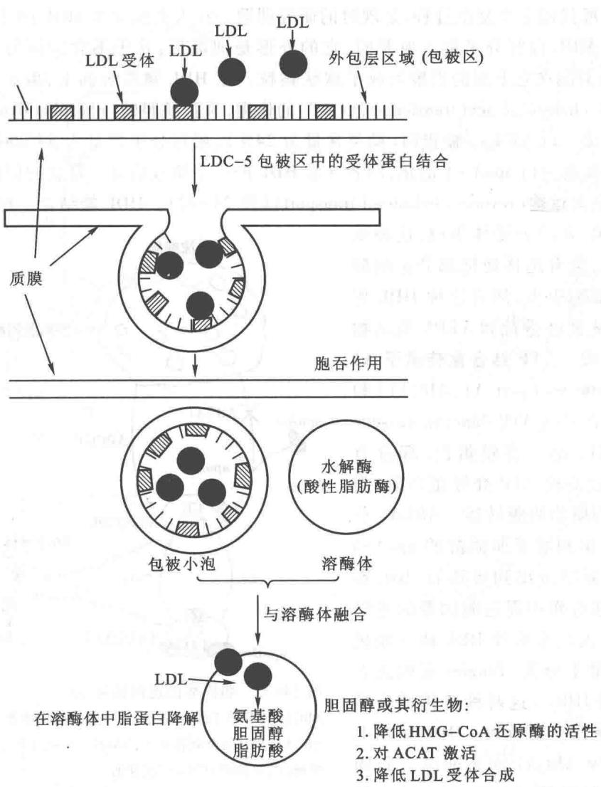  
图24-70 人类皮肤的成纤维细胞中LDL的受体介导的吸收

另一相关的病征是酸性脂酶缺乏症（Wolman's disease），它更明确的是 LDL 吸收所必需的受体介导途径的缺陷。酸性脂酶缺乏症是极其罕见的先天性代谢差错。它的特征是在不同组织中胆固醇酯和三酰甘油的积聚，直接的病因是溶酶体中酸性脂肪酶（acid lipase）的完全缺乏，如图 24-70 所示。在正常情况下，胆固醇酯和三酰甘油的分解代谢是由酸性脂肪酶催化实现的。胆固醇酯累积症（cholesterol ester storage disease）是相关病的一种，它的病因是溶酶体中的酸性脂肪酶的活性大大地减低。这种疾病的症状远比酸性脂酶缺乏症要轻，一般到四十岁时才变严重。

对于 LDL 受体和高胆固醇血症研究的重要意义到 1985 年已广为人知, 那年, Joseph Goldstein 和 Michael Brown 由于他们的卓越贡献获得了诺贝尔生理学或医学奖。

(3) 高密度脂蛋白(HDL)可以减少胆固醇沉积

区块：

  
图24-71 LDL受体

此受体是一单一蛋白质,具有5个结构域区,结构域⑤,即质膜结构域用于使质膜包被区LDL受体汇集。一旦LDL分子与受体结合,LDL与受体双方在胞吞作用下迅速内化

高密度脂蛋白的分解代谢是个复杂过程，是现时的研究课题。在人类血浆中HDL的半寿期(5\~6d)较其他脂蛋白要长。当HDL自肝分泌进入血浆时，它的外形是圆盘形，几乎不含胆固醇酯。这些新形成的HDL颗粒由于胆固醇酯在它上面的积聚形成了球状颗粒。在HDL颗粒表面上，由于卵磷脂：胆固醇脂酰转移酶(lecithin:cholesterol acyl transferase,LCAT)的作用，磷脂酰胆碱(phosphatidylcholine)与胆固醇发生作用生成胆固醇酯。LCAT是一糖蛋白（糖类含量为 $24\%$ )，相对分子质量为59000。这个酶在血浆中与HDL缔合，并被载脂蛋白apoA-I活化，后者又是HDL的一个组成成分。富含胆固醇脂的HDL被运往肝，称为胆固醇的逆向运输(reverse cholesterol transport)(图24-72)。HDL能结合一种位于肝内和类固醇

生成组织被称为 SR-B 的膜受体蛋白, 这种受体不诱发胞吞作用, 能有选择地把部分胆固醇从 HDL 中转移到细胞中去, 然后这种 HDL 再次进入血液循环, 从乳糜微粒和 VLDL 残余物中获取更多的脂肪酸。ATP 结合盒转运子 A1 (ATP binding cassette transport A1, ABCA1) 和 ATP 结合盒转运子 G1 (ATP binding cassette transport G1, ABCG1) 是一类膜蛋白, 都含有 ATP 结合位点, 通过消耗 ATP 介导蛋白质、类固醇、磷脂等多种物质的跨膜转运。ABCA1 负责胆固醇从细胞流出到缺乏胆固醇的 apoA-I 上, ABCG1 负责胆固醇流出到成熟的 HDL 颗粒上, 通过两者的联合作用促进胆固醇的逆向转运 (图 24-72)。人类家族性 HDL 缺乏症患者体内的 HDL 含量十分低, Tangier 疾病患者体内几乎检测不到 HDL。这两种遗传性疾病 的病因是 ABCA1 蛋白突变所致。HDL 颗粒上的 apoA-I 由于缺少 ABCA1 而不能结合胆固醇, apoA-I 和缺乏胆固醇的 HDL 在血液中被

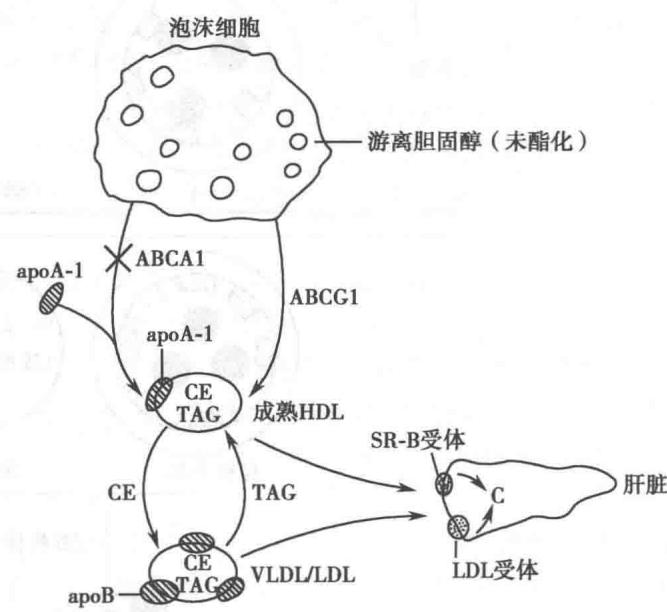  
图24-72 胆固醇的逆向转运

$$
\mathrm{ABCA1:ATP}
$$

$$
\mathrm{G1}; \mathrm{CE}:
$$

$$
; \mathrm{C}:
$$

$$
\text { TAG: }
$$

迅速清除。由于 HDL 与冠状动脉疾病发生密切关连, ABCA1 蛋白和 ABCG1 蛋白有可能成为药物调节 HDL 水平的理想靶点。

## 3. 胆汁酸

从胆固醇向胆汁酸(bile acid)的转化是胆固醇降解最重要的机制。成人每日约有0.5 g的胆固醇转化为胆汁酸。对这个过程的调控是由内质网的7α-羟化酶(7α-hydroxylase)来执行的，它控制着胆固醇到胆汁酸的第一步反应。7α-羟化酶是一族称为“混合功能氧化酶”(mixed function oxidase)的总称。它与分子氧催化底物，产生 $H_{2}O$ 。7α-羟化酶是涉及细胞色素P450的酶中的一种。胆固醇的羟基化也需要NADPH：细胞色素P450还原酶(图24-73)。7-羟基胆固醇转化为胆酸的过程如图24-74。这个反应过程包括有3β-羟基的氧化，双键的异构化，12α-羟基化，双键的还原和3-酮基还原为3α-羟基。另外加上侧链的羟基化和氧化反应，遂形成胆酸(cholic acid)。它与鹅脱氧胆酸(chenodeoxycholic acid)一起是人体中两个重要的胆汁酸(bile acid)。

胆酸的绝大部分都转化为相应的胆盐(bile salt)，如图24-75所示的甘氨胆酸(glycocholate)。从结构上说，胆汁酸可分为两大类，一类即胆酸，包括脱氧胆酸等，称为游离胆酸；另一类是游离胆酸与甘氨酸或牛磺酸的结合产物，又泛称为胆盐。胆盐对于脂类在小肠中的溶解是关键性的重要物质。

## 4. 类固醇激素

胆固醇在肾上腺或性腺中转化为诸种类固醇激素是胆固醇转化产物中最为重要的一大类。请参阅本书第14章“激素和信号通路”。

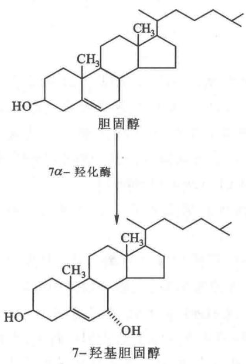  
图24-73 胆固醇的羟基化

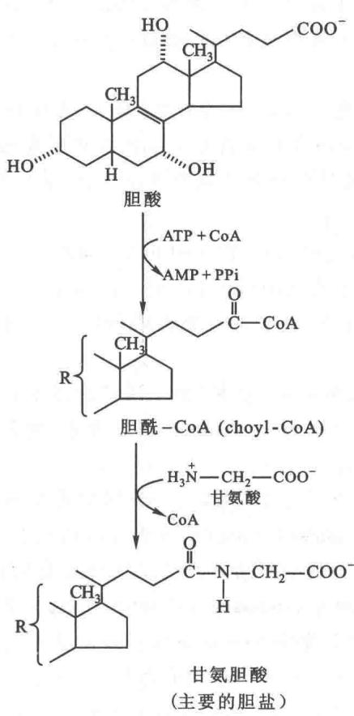  
图24-75 自胆酸到胆盐的转化

甘氨胆酸是胆盐的一种,它在小肠中溶解脂质,又可被脂(肪)酶降解

图24-74 自7-羟基胆固醇转化为胆酸随着反应进程极性基团的增加，水可溶性也增高。胆酸的A、B二环不复在一平面上，而是A/B顺式构型。构型的转变改进了胆酸的乳化功能，从而有助于溶解脂质，帮助对它的消化

<!-- EN-BEGIN 21.1 -->

### 【英文对应 21.1】Biosynthesis of Fatty Acids and Eicosanoids

> 来源：Lehninger Principles of Biochemistry（书籍/02_生物化学原理） 第21章 Lipid Biosynthesis，§21.1。对应本章“六、脂质的生物合成”。

P2 Even when compared to other major classes of metabolites, the division between fatty acid biosynthesis and breakdown is particularly striking. The two processes occur by different pathways, catalyzed by different sets of enzymes, and, in eukaryotes, occur in different cellular compartments. Fatty acid breakdown occurs in the mitochondria, whereas biosynthesis occurs in the cytosol. Moreover, biosynthesis requires the participation of a three-carbon intermediate, malonyl-CoA, that does not appear in the path of fatty acid breakdown.

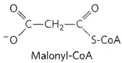

The general pathway of fatty acid synthesis and its regulation now take center stage. We consider the biosynthesis of longer-chain fatty acids, unsaturated fatty acids, and their eicosanoid derivatives at the end of this section.

#### [EN] Malonyl-CoA Is Formed from Acetyl-CoA and Bicarbonate

The formation of malonyl-CoA from acetyl-CoA is an irreversible three-step process, catalyzed by acetyl-CoA carboxylase. In animal cells, all three steps are catalyzed in the cytoplasm by a single multifunctional polypeptide (Fig. 21-1). The enzyme contains a biotin prosthetic group covalently bound in amide linkage to the ε-amino group of a Lys residue in one of the domains of the enzyme molecule.

The reaction catalyzed by this enzyme is very similar to other biotin-dependent carboxylation reactions, such as those catalyzed by pyruvate carboxylase (see Fig. 16-16) and propionyl-CoA carboxylase (see Fig. 17-12). A carboxyl group, derived from bicarbonate $(\mathrm{HCO}_3^-)$ , is first transferred to biotin in an ATP-dependent reaction. In a second step, the carboxyl group is carried by the biotin to a different active site, where the $\mathrm{CO}_{2}$ is transferred to acetyl-CoA in the third and final step to yield malonyl-CoA. As we will see, this carboxylation has the same function as the carboxylation of pyruvate by pyruvate carboxylase—it renders the next step in the reaction sequence much more favorable thermodynamically.

The bacterial version of acetyl-CoA carboxylase is similar but has three separate polypeptide subunits (including a separate biotin carrier protein) that catalyze the three steps. Plant cells contain both types of acetyl-CoA carboxylase.

#### [EN] Fatty Acid Synthesis Proceeds in a Repeating Reaction Sequence

The long carbon chains of fatty acids are assembled in the cytosol in a repeating four-step sequence (Fig. 21-2), catalyzed by a system collectively referred to as fatty acid synthase. A saturated acyl group produced by each four-step series of reactions becomes the substrate for subsequent condensation with an activated malonyl group. With each passage through the cycle, the fatty acyl chain is extended by two carbons.

In the four-step pathway, a condensation reaction is followed by a reduction-dehydration-reduction sequence to convert the C-3 carbonyl to a methylene. The latter three steps are the chemical reverse of the oxidation-hydration-oxidation sequence in the $\beta$ oxidation of fatty acids (Fig. 17-8a). P2 However, both the electron-carrying cofactor and the activating groups in the reductive anabolic sequence differ from those in the oxidative catabolic process. Recall that in $\beta$ oxidation, $\mathrm{NAD^{+}}$ and FAD serve as electron acceptors and the activating group is the thiol (-SH) group of coenzyme A. By contrast, the reducing agent in the synthetic sequence is NADPH and the activating groups are two different enzyme-bound -SH groups, as described below.

In mammals, this synthetic system is called fatty acid synthase I (FAS I). There are seven active sites to catalyze the four-step cycle plus the charging steps described below. The active sites for different reactions lie in separate domains

FIGURE 21-1 The acetyl-CoA carboxylase reaction. The mammalian acetyl-CoA carboxylase of the cytoplasm has three functional domains with distinct functions: biotin carrier protein; biotin carboxylase, which activates $\mathrm{CO}_{2}$ by attaching it to a nitrogen in the biotin ring in an ATP-dependent reaction; and transcarboxylase, which transfers activated $\mathrm{CO}_{2}$ (shaded green) from biotin to acetyl-CoA, producing malonyl-CoA. Part of the biotin carrier protein domain and the long, flexible biotin arm rotate to carry the activated $\mathrm{CO}_{2}$ from the biotin carboxylase active site to the transcarboxylase active site. The active domain in each step is shaded in blue.

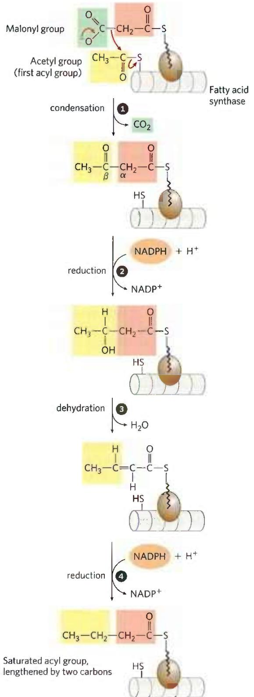  
FIGURE 21-2 Addition of two carbons to a growing fatty acyl chain: a four-step sequence. Each malonyl group and acetyl (or longer acyl) group is activated by a thioester that links it to fatty acid synthase, a multienzyme system. ① Condensation of an activated acyl group (an acetyl group from acetyl-CoA is the first acyl group) and two carbons derived from malonyl-CoA, with elimination of $\mathrm{CO}_{2}$ from the malonyl group, extends the acyl chain by two carbons. The mechanism of the first step of this reaction is given to illustrate the role of decarboxylation in facilitating condensation. The $\beta$ -keto product of the condensation is then reduced in three more steps nearly identical to the reactions of $\beta$ oxidation, but in the reverse sequence: ② the $\beta$ -keto group is reduced to an alcohol, ③ elimination of $\mathrm{H}_{2} \mathrm{O}$ creates a double bond, and ④ the double bond is reduced to form the corresponding saturated fatty acyl group.

(Fig. 21-3a), all within a single multifunctional polypeptide chain ( $M_{r}$ 240,000). Two of these multifunctional polypeptides function as a homodimer ( $M_{r}$ 480,000; Fig. 21-3b). The two subunits seem to function independently. When all the active sites in one subunit are inactivated by mutation, fatty acid synthesis is only moderately reduced.

  
FIGURE 21-3 The structure of a fatty acid synthase type I system. Shown here is the structure of a single (monomeric) polypeptide chain of the mammalian (porcine) enzyme system. (a) All of the active sites in the mammalian system are located in different domains within a single large polypeptide chain. The different enzymatic activities are $\beta$ -ketoacyl-ACP synthase (KS), malonyl/acetyl-CoA-ACP transferase (MAT), $\beta$ -hydroxyacyl-ACP dehydratase (DH), enoyl-ACP reductase (ER), and $\beta$ -ketoacyl-ACP reductase (KR). ACP is the acyl carrier protein. The seventh domain is a thioesterase (TE) that releases the palmitate product from ACP when synthesis is completed. The ACP and TE domains are disordered in the crystal and are therefore not shown in the structure. (b) The native dimeric structure is shown, with one polypeptide transparent to show how the two independently operating subunits come together. The linear arrangement of the domains in the polypeptide is shown below the structure. [Data from PDB ID 2CF2, T. Maier et al., Science 311:1258, 2006.]

With FAS I systems, fatty acid synthesis leads to a single product. As it goes through the cycle, the acyl group is covalently linked to acyl carrier protein (ACP), which shuttles it from one active site to another in sequence. Acyl carrier protein is yet another contiguous part of the single FAS I polypeptide. No intermediates are released. When the chain length reaches 16 carbons, that product (palmitate, 16:0; see Table 10-1) leaves the cycle. Carbons C-16 and C-15 of the palmitate are derived from the methyl and carboxyl carbon atoms, respectively, of an acetyl-CoA used directly to prime the system at the outset (Fig. 21-4); the rest of the carbon atoms in the chain are derived from acetyl-CoA via malonyl-CoA.

A somewhat different FAS I is found in yeast and other fungi, and is made up of two multifunctional polypeptides that form a complex with an architecture distinct from that of the vertebrate systems. Three of the seven required active sites are found on the $\alpha$ subunit and four on the $\beta$ subunit. A different system, called FAS II, is found in plants and most bacteria. FAS II is a dissociated system; each step in the synthesis is catalyzed by a separate enzyme. Unlike FAS I, FAS II generates a variety of products, including saturated fatty acids of several lengths, as well as unsaturated, branched, and hydroxy fatty acids. An FAS II system is also found in vertebrate mitochondria, yet another indication of the bacterial origins of mitochondria in evolution.

#### [EN] The Mammalian Fatty Acid Synthase Has Multiple Active Sites

The multiple domains of mammalian FAS I function as distinct but linked enzymes. The active site for each enzyme is found in a separate domain within the larger polypeptide. Throughout the process of fatty acid synthesis, the intermediates remain covalently attached as thioesters to one of two thiol groups. One point of attachment is the —SH group of a Cys residue in one of the synthase domains ( $\beta$ -ketoacyl-ACP synthase; KS); the other is the —SH group of acyl carrier protein, a separate domain of the same polypeptide. Hydrolysis of thioesters is highly exergonic, and the energy released helps to make two steps (1 and 5 in Fig. 21-6) in fatty acid synthesis thermodynamically favorable.

Acyl carrier protein is the shuttle that holds the system together, containing the prosthetic group 4'-phosphopantetheine, also found in coenzyme A (Fig. 21-5). The 4'-phosphopantetheine serves as a flexible arm, tethering the growing fatty acyl chain to the surface of the fatty acid synthase complex while carrying the reaction intermediates from one enzyme active site to the next. The same prosthetic group is used in FAS II systems.

#### [EN] Fatty Acid Synthase Receives the Acetyl and Malonyl Groups

Before the condensation reactions that build up the fatty acid chain can begin, the two thiol groups on the enzyme complex must be charged with the correct acyl groups (Fig. 21-6a). First, the acetyl group of acetyl-CoA is transferred to ACP in a reaction catalyzed by the malonyl/acetyl-CoA-ACP transferase (MAT) domain of the multifunctional polypeptide. The acetyl group is then transferred to the Cys—SH group of the $\beta$ -ketoacyl-ACP synthase (KS). The second reaction, transfer of the malonyl group from malonyl-CoA to the —SH group of ACP, is also catalyzed by malonyl/acetyl-CoA-ACP transferase. In the charged synthase complex, the acetyl and malonyl groups are activated for the chain-lengthening process. We now consider the first four steps of this process in some detail; all step numbers refer to Figure 21-6.

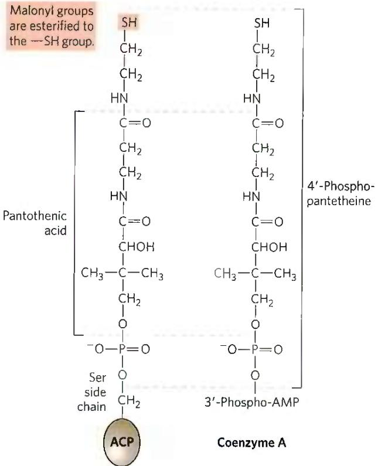  
FIGURE 21-5 Acyl carrier protein (ACP). The prosthetic group is 4'-phosphopantetheine, which is covalently attached to the hydroxyl group of a Ser residue in ACP. Phosphopantetheine, also found in the coenzyme A molecule, contains the B vitamin pantothenic acid. Its —SH group is the site of entry of malonyl groups during fatty acid synthesis. Coenzyme A, shown here for comparison, serves a similar chemical purpose in general metabolism.

Step 1 Condensation The first reaction in the formation of a fatty acid chain is a formal Claisen condensation (see reaction class in Fig. 13-4) of the activated acetyl and malonyl groups to form acetoacetyl-ACP, an acetoacetyl group bound to ACP through the phosphopantetheine —SH group; simultaneously, a molecule of CO₂ is produced. In this reaction, catalyzed by β-ketoacyl-ACP synthase, the acetyl group is transferred from the Cys —SH group of the enzyme to the malonyl group on the —SH of ACP, becoming the methyl-terminal two-carbon unit of the new acetoacetyl group.

The carbon atom of the $CO_{2}$ formed in this reaction is the same carbon originally introduced into malonyl-CoA from $HCO_{3}^{-}$ in the acetyl-CoA carboxylase reaction (Fig. 21-1). Thus, $CO_{2}$ is only transiently in covalent linkage during fatty acid biosynthesis; it is removed as each two-carbon unit is added.

Why do cells go to the trouble of adding $CO_{2}$ to make a malonyl group from an acetyl group, only to lose the $\mathrm{CO}_{2}$ during the formation of acetoacetate? P3 The use of activated malonyl groups rather than acetyl groups makes the condensation reactions thermodynamically favorable. The methylene carbon (C-2) of the malonyl group, sandwiched between carbonyl and carboxyl carbons, forms a good nucleophile. In the condensation step, decarboxylation of the malonyl group facilitates nucleophilic attack of the methylene carbon on the thioester linking the acetyl group to $\beta$ -ketoacyl-ACP synthase, displacing the enzyme's -SH group. Coupling the condensation to the decarboxylation of the malonyl group renders the overall process highly exergonic. A similar carboxylation-decarboxylation sequence facilitates the formation of phosphoenolpyruvate from pyruvate in gluconeogenesis (see Figs. 14-17 and 14-18).

P2 P3 By using activated malonyl groups in the synthesis of fatty acids and activated acetate in their degradation, the cell makes both processes energetically favorable, although one is effectively the reversal of the other. The extra energy required to make fatty acid synthesis favorable is provided by the ATP used to synthesize malonyl-CoA from acetyl-CoA and $HCO_{3}^{-}$ (Fig. 21-1).

Step 2 Reduction of the Carbonyl Group The acetoacetyl-ACP formed in the condensation step now undergoes reduction of the carbonyl group at C-3 to form D-β-hydroxybutyryl-ACP. This reaction is catalyzed by β-ketoacyl-ACP reductase (KR), and the electron donor is NADPH. Notice that the D-β-hydroxybutyryl group does not have the same stereoisomeric form as the L-β-hydroxyacyl intermediate in fatty acid oxidation (see Fig. 17-8).

Step 3 Dehydration The elements of water are now removed from C-2 and C-3 of D-β-hydroxybutyryl-ACP to yield a double bond in the product, trans-Δ²-butenoyl-ACP. The enzyme that catalyzes this dehydration is β-hydroxyacyl-ACP dehydratase (DH).

Step 4 Reduction of the Double Bond Finally, the double bond of trans- $\Delta^{2}$ -butenoyl-ACP is reduced (saturated) to form butyryl-ACP by the action of enoyl-ACP reductase (ER); again, NADPH is the electron donor.

#### [EN] The Fatty Acid Synthase Reactions Are Repeated to Form Palmitate

Production of the four-carbon, saturated fatty acyl-ACP marks completion of one pass through the fatty acid synthase complex. In step 5, the butyryl group is transferred from the phosphopantetheine —SH group of ACP to the Cys —SH group of $\beta$ -ketoacyl-ACP synthase, which initially bore the acetyl group (Fig. 21-6). To start the next cycle of four reactions that lengthens the chain by two more carbons (step 6), another malonyl group is linked to the now unoccupied phosphopantetheine

FIGURE 21-6 Sequence of events during synthesis of a fatty acid. (a) The mammalian FAS I complex is shown schematically, with catalytic domains colored as in Figure 21-3. Each domain of the larger polypeptide represents one of the six enzymatic activities of the complex, arranged in a large, tight S shape. The acyl carrier protein (ACP) is not resolved in the crystal structure shown in Figure 21-3, but it is attached to the KR domain. The phosphopantetheine arm of ACP ends in an —SH. (b) The enzyme shown in color is the one that will act in the next step. As in Figure 21-4, the initial acetyl group is shaded yellow; C-1 and C-2 of malonate, light red; and the carbon released as CO₂, green. Steps ① to ⑥ are described in the text.

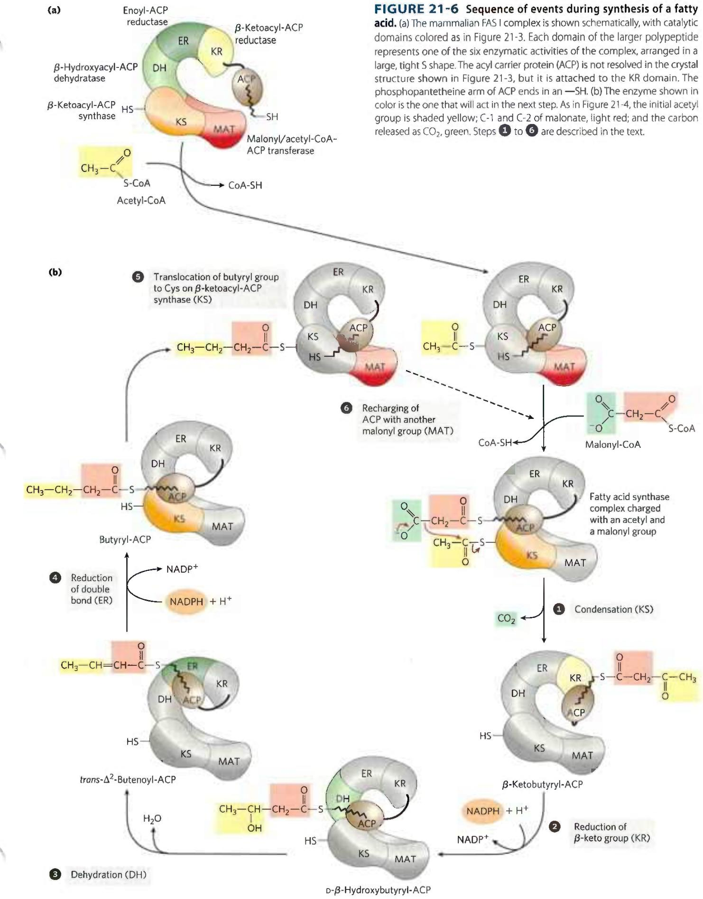

—SH group of ACP (Fig. 21-7). Condensation occurs as the butyryl group, acting like the acetyl group in the first cycle, is linked to two carbons of the malonyl-ACP group with concurrent loss of CO₂. The product of this condensation is a six-carbon acyl group, covalently bound to the phosphopantetheine —SH group. Its β-keto group is reduced in the next three steps of the synthase cycle to yield the saturated acyl group, exactly as in the first round of reactions—in this case forming the six-carbon product.

Seven cycles of condensation and reduction produce the 16-carbon saturated palmitoyl group, still bound to ACP. For reasons not well understood, chain elongation by the synthase complex generally stops at this point, and free palmitate is released from the ACP by a hydrolytic activity (thioesterase; TE) in the multifunctional protein.

  
FIGURE 21-7 Beginning of the second round of the fatty acid synthesis cycle. The butyryl group is on the Cys—SH group. The incoming malonyl group is first attached to the phosphopantetheine—SH group. Then, in the condensation step, the entire butyryl group on the Cys—SH is exchanged for the carboxyl group of the malonyl residue, which is lost as CO₂ (green). This step is analogous to step ① in Figure 21-6. The product, a six-carbon β-ketoacyl group, now contains four carbons derived from malonyl-CoA and two derived from the acetyl-CoA that started the reaction. The β-ketoacyl group then undergoes steps ② through ④ in Figure 21-6.

We can consider the overall reaction for the synthesis of palmitate from acetyl-CoA in two parts. First, the formation of seven malonyl-CoA molecules:

$$
7 \mathrm{Acetyl-CoA} + 7 \mathrm{CO} _ {2} + 7 \mathrm{ATP} \longrightarrow
$$

$$
7 \mathrm{malonyl-CoA} + 7 \mathrm{ADP} + 7 \mathrm{P} _ {\mathrm{i}}\tag{21-1}
$$

then seven cycles of condensation and reduction:

$$
\begin{array}{r l} \text { Acetyl - CoA } + 7 & \text { malonyl - CoA } + 1 4 \mathrm{NADPH} + 1 4 \mathrm{H} ^ {+} \longrightarrow \\ & \text { palmitate } + 7 \mathrm{CO} _ {2} + 8 \mathrm{CoA} + 1 4 \mathrm{NADP} ^ {+} + 6 \mathrm{H} _ {2} \mathrm{O} \end{array} \tag {21-2}
$$

Notice that only six net water molecules are produced, because one is used to hydrolyze the thioester linking the palmitate product to the enzyme. The overall process (the sum of Eqns 21-1 and 21-2) is

$$
\begin{array}{r l} 8 \mathrm {Acetyl - CoA + 7ATP + 14NADPH + 14H^ {+}} & \longrightarrow \\ \text { palmitate } + 8 \mathrm{CoA} + 7 \mathrm{ADP} + 7 \mathrm{P} _ {\mathrm{i}} + 1 4 \mathrm{NADP} ^ {+} + 6 \mathrm{H} _ {2} \mathrm{O} \end{array}\tag{21-3}
$$

P3 The biosynthesis of fatty acids such as palmitate thus requires acetyl-CoA and the input of chemical energy in two forms: the group transfer potential of ATP and the reducing power of NADPH. The ATP is required to attach $CO_{2}$ to acetyl-CoA to make malonyl-CoA; the NADPH molecules are required to reduce the $\beta$ -keto group and the double bond.

In nonphotosynthetic eukaryotes there is an additional cost to fatty acid synthesis, because acetyl-CoA is generated in the mitochondria and must be transported to the cytosol. As we will see, this extra step consumes two ATP per molecule of acetyl-CoA transported, increasing the energetic cost of fatty acid synthesis to three ATP per two-carbon unit.

#### [EN] Fatty Acid Synthesis Is a Cytosolic Process in Most Eukaryotes but Takes Place in the Chloroplasts in Plants

In most eukaryotes, the fatty acid synthase complex (FAS I) is found in the cytosol, as are the biosynthetic enzymes for nucleotides, amino acids, and glucose. This location segregates synthetic processes from degradative reactions, many of which take place in the mitochondrial matrix. P3 There is a corresponding segregation of the electron-carrying cofactors used in anabolism (generally a reductive process) and those used in catabolism (generally oxidative).

Usually, NADPH is the electron carrier for anabolic reactions, and $NAD^{+}$ serves in catabolic reactions. The liver, the largest mammalian internal organ and a key metabolic center responding to large changes during feasting and fasting, provides a useful focus for this discussion. In hepatocytes, the $[NADPH]/[NADP^{+}]$ ratio is very high ( $\sim75$ ) in the cytosol, furnishing a strongly reducing environment for the reductive synthesis of fatty acids and other biomolecules. The cytosolic $[NADH]/[NAD^{+}]$ ratio is much lower ( $\sim8\times10^{-4}$ ), so the $NAD^{+}$ -dependent oxidative catabolism of glucose can take place in the same compartment, and at the same time, as fatty acid synthesis. The $[NADH]/[NAD^{+}]$ ratio in the mitochondrion is much higher than that in the cytosol, because of the flow of electrons to $NAD^{+}$ from the oxidation of fatty acids, amino acids, pyruvate, and acetyl-CoA. This high mitochondrial $[NADH]/[NAD^{+}]$ ratio favors the reduction of oxygen via the respiratory chain.

  
FIGURE 21-8 Production of NADPH. Two routes to NADPH, catalyzed by (a) the pentose phosphate pathway and (b) malic enzyme.

In hepatocytes and adipocytes, cytosolic NADPH is largely generated by the pentose phosphate pathway (Fig. 21-8a; also see Fig. 14-30) and by malic enzyme (Fig. 21-8b). The pyruvate produced by the action of malic enzyme reenters the mitochondrion.

In the photosynthetic cells of plants, fatty acid synthesis occurs not in the cytosol but in the chloroplast stroma (Fig. 21-9). This makes sense, given that NADPH is produced in chloroplasts by the light-dependent reactions of photosynthesis:

$$
\mathrm{H} _ {2} \mathrm{O} + \mathrm{NADP} ^ {+} \xrightarrow {\text {   light   }} \frac {1}{2} \mathrm{O} _ {2} + \mathrm{NADPH} + \mathrm{H} ^ {+}
$$

#### [EN] Acetate Is Shuttled out of Mitochondria as Citrate

In nonphotosynthetic eukaryotes, nearly all the acetyl-CoA used in fatty acid synthesis is formed in mitochondria from pyruvate oxidation and from catabolism of the carbon skeletons of amino acids. Acetyl-CoA arising from the oxidation of fatty acids is not a significant source of acetyl-CoA for fatty acid biosynthesis in animals, because the two pathways are reciprocally regulated, as described below.

The inner mitochondrial membrane is impermeable to acetyl-CoA, so an indirect shuttle transfers acetyl group equivalents across the membrane (Fig. 21-10). Intramitochondrial acetyl-CoA first reacts with oxaloacetate to form citrate, in the citric acid cycle reaction catalyzed by citrate synthase (see Fig. 16-7). Citrate then passes through the inner membrane on the citrate transporter. In the cytosol, citrate cleavage by citrate lyase regenerates acetyl-CoA and oxaloacetate in an ATP-dependent reaction. Oxaloacetate cannot return to the mitochondrial matrix directly, as there is no oxaloacetate transporter. Instead, cytosolic malate dehydrogenase reduces the oxaloacetate to malate, which can return to the mitochondrial matrix on the malate- $\alpha$ -ketoglutarate transporter, in exchange for

  
FIGURE 21-9 Subcellular localization of lipid metabolism. Yeast and animal cells differ from higher plant cells in the compartmentation of lipid metabolism. Fatty acid synthesis takes place in the compartment in which  
NADPH is available for reductive synthesis (i.e., where the [NADPH]/[NADP+] ratio is high); this is the cytosol in animals and yeast, and the chloroplast in plants. Processes in red type are addressed in this chapter.

  
FIGURE 21-10 Shuttle for transfer of acetyl groups from mitochondria to the cytosol. The outer mitochondrial membrane is freely permeable to all these compounds. Pyruvate derived from amino acid catabolism in the mitochondrial matrix, or from glucose by glycolysis in the cytosol, is converted to acetyl-CoA in the matrix. Acetyl groups pass out of the mitochondrion as citrate; in the cytosol they are delivered as acetyl-CoA for fatty  
acid synthesis. Oxaloacetate is reduced to malate, which can be returned to the mitochondrial matrix. The steps converting malate to oxaloacetate and oxaloacetate plus acetyl-CoA to citrate (indicated by blue arrows) are part of the citric acid cycle. The major fate of cytosolic malate, however, is oxidation by malic enzyme to generate cytosolic NADPH; the pyruvate produced returns to the mitochondrial matrix.

citrate. In the matrix, malate is reoxidized to oxaloacetate to complete the shuttle. However, most of the malate produced in the cytosol is used to generate cytosolic NADPH through the activity of malic enzyme (Fig. 21-8b). The pyruvate produced is transported into the mitochondria by the pyruvate transporter (Fig. 21-10), then converted back into oxaloacetate by pyruvate carboxylase in the matrix. In the resulting cycle, two ATP molecules are consumed (by citrate lyase and pyruvate carboxylase) for every molecule of acetyl-CoA delivered to fatty acid synthesis.

Malate thus has two fates in metabolism. In the mitochondrial matrix, malate is part of the citric acid cycle. In the cytosol, malate degradation becomes a significant source of NADPH. After citrate cleavage to generate acetyl-CoA, conversion of the four remaining carbons to pyruvate and $CO_{2}$ by malic enzyme generates about half the NADPH required for fatty acid synthesis. The pentose phosphate pathway contributes the rest of the needed NADPH.

#### [EN] Fatty Acid Biosynthesis Is Tightly Regulated

P1 When a cell or an organism has more than enough metabolic fuel to meet its energy needs, the excess is generally converted to fatty acids and stored as lipids such as triacylglycerols. P4 The reaction catalyzed by acetyl-CoA carboxylase is the rate-limiting step in the biosynthesis of fatty acids, and this enzyme is an important site of regulation. In vertebrates, palmitoyl-CoA, the principal product of fatty acid synthesis, is a feedback inhibitor of the enzyme; citrate is an allosteric activator (Fig. 21-11a), increasing $V_{\text{max}}$ . Citrate plays a central role in diverting cellular metabolism from the consumption (oxidation) of metabolic fuel to the storage of fuel as fatty acids. When the concentrations of mitochondrial acetyl-CoA and ATP increase, citrate is transported out of mitochondria; it then becomes both the precursor of cytosolic acetyl-CoA and an allosteric signal for the activation of acetyl-CoA carboxylase. At the same time, citrate inhibits the activity of phosphofructokinase-1 (see Fig. 14-23), reducing the flow of carbon through glycolysis.

  
FIGURE 21-11 Regulation of fatty acid synthesis. (a) In the cells of vertebrates, both allosteric regulation and hormone-dependent covalent modification influence the flow of precursors into malonyl-CoA. In plants, acetyl-CoA carboxylase is activated by the changes in $[Mg^{2+}]$ and pH that accompany illumination (not shown here). (b) Filaments of acetyl-CoA carboxylase from chicken hepatocytes (the active, dephosphorylated form), as seen with the electron microscope. [(b) Courtesy James M. Ntambi, PhD, Professor of Biochemistry, Steenbock Professor of Nutritional Sciences, University of Wisconsin–Madison.]

P4 Acetyl-CoA carboxylase is also regulated by covalent modification. Phosphorylation, triggered by the hormones glucagon and epinephrine or by high [AMP], inactivates the enzyme and reduces its sensitivity to activation by citrate, thereby slowing fatty acid synthesis. Phosphorylation occurs on at least three Ser residues and is catalyzed primarily by the AMP-activated protein kinase (AMPK). In its active (dephosphorylated) form, acetyl-CoA carboxylase polymerizes into long filaments (Fig. 21-11b); phosphorylation is accompanied by dissociation into monomeric subunits and loss of activity.

The acetyl-CoA carboxylase of plants and bacteria is not regulated by citrate or by a phosphorylation-dephosphorylation cycle. Instead, P4 the plant enzyme is activated by an increase in stromal pH and $[Mg^{2+}]$ , which occurs on illumination of the plant (see Fig. 20-35). Bacteria do not use triacylglycerols as energy stores. In Escherichia coli, the primary role of fatty acid synthesis is to provide precursors for membrane lipids; the regulation of this process is complex, employing guanine nucleotides (such as ppGpp; see Fig. 8-42) that coordinate cell growth with membrane formation.

P4 In addition to the moment-by-moment regulation of enzymatic activity, these pathways are regulated at the level of gene expression. For example, when animals ingest an excess of certain polyunsaturated fatty acids, the expression of genes encoding many lipogenic enzymes in the liver is suppressed. This gene regulation is mediated by a family of nuclear receptor proteins called PPARs, which we encountered in Section 17.2.

P4 If fatty acid synthesis and $\beta$ oxidation were to proceed simultaneously, the two processes would constitute a futile cycle, wasting energy. We noted earlier (see Fig. 17-13) that $\beta$ oxidation is blocked by malonyl-CoA, which inhibits carnitine acyltransferase I. Thus, during fatty acid synthesis, production of the first intermediate, malonyl-CoA, shuts down $\beta$ oxidation at the level of a transport system in the inner mitochondrial membrane. This control mechanism illustrates another advantage of segregating synthetic and degradative pathways in different cellular compartments.

#### [EN] Long-Chain Saturated Fatty Acids Are Synthesized from Palmitate

Palmitate, the principal product of the fatty acid synthase system in animal cells, is the precursor of other long-chain fatty acids (Fig. 21-12). It may be lengthened to form stearate (18:0) or even longer saturated fatty acids by further additions of acetyl groups, through the action of fatty acid elongation systems present in the smooth endoplasmic reticulum (smooth ER) and in mitochondria. The more active elongation system of the ER extends the 16-carbon chain of palmitoyl-CoA by two carbons, forming stearoyl-CoA. Although different enzyme systems are used, and coenzyme A rather than ACP is the acyl carrier in the reaction, the mechanism of elongation in the ER is otherwise identical to that in palmitate synthesis: donation of two carbons by malonyl-CoA, followed by reduction, dehydration, and reduction to the saturated 18-carbon product, stearoyl-CoA.

Two key products of elongation pathways are linoleate, an omega-6 fatty acid (see Chapter 10 for the alternative nomenclature), and $\alpha$ -linolenate, an omega-3 fatty acid. These are precursors for two extensive families of derivative unsaturated fatty acids, the omega-6 and omega-3 families. Humans cannot synthesize linoleate and $\alpha$ -linolenate and must obtain them in the diet. The ratio of omega-6 to omega-3 fatty acids in the diet, if too high, can lead to cardiovascular disease. The importance of this ratio may reflect the multitude of signaling molecules in the omega-6 and omega-3 families (Fig. 21-12), with their equally complex physiological effects. Several of these derivative unsaturated fatty acids are considered below.

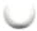

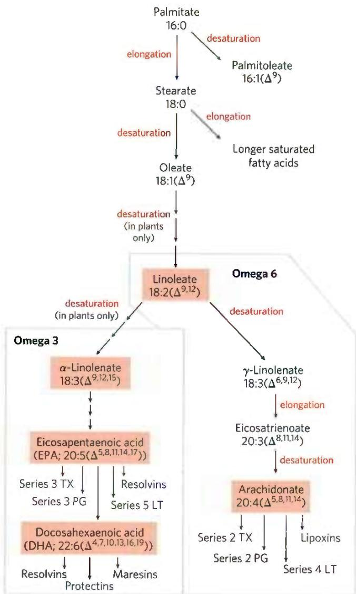  
FIGURE 21-12 Routes of synthesis of unsaturated fatty acids and their derivatives. Palmitate is the precursor of stearate and longer-chain saturated fatty acids, as well as the monounsaturated acids palmitoleate and oleate. Mammals cannot convert oleate to linoleate or $\alpha$ -linolenate (shaded), which are therefore required in the diet as essential fatty acids. Conversion of linoleate to other polyunsaturated fatty acids and eicosanoids is outlined. Unsaturated fatty acids are symbolized by indicating the number of carbons and the number and position of double bonds, as in Table 10-1. Linoleate and $\alpha$ -linolenate are important omega-6 and omega-3 fatty acids, respectively; they are also precursors for a wide range of unsaturated fatty acids that act as signaling molecules. Two-letter abbreviations specify the eicosanoid prostaglandins (PG), thromboxanes (TX), and leukotrienes (LT). Particular classes of unsaturated fatty acids are further delineated by the number of double bonds, which defines subclasses referred to as series. For example, series 2 TX are thromboxanes with two double bonds in the hydrocarbon chain.

#### [EN] Desaturation of Fatty Acids Requires a Mixed-Function Oxidase

Palmitate and stearate serve as precursors of the two most common monounsaturated fatty acids of animal tissues: palmitoleate, 16:1( $\Delta^{9}$ ), and oleate, 18:1( $\Delta^{9}$ ); both of these fatty acids have a single cis double bond between C-9 and C-10 (see Table 10-1). The double bond is introduced into the fatty acid chain by an oxidative reaction catalyzed by fatty acyl-CoA desaturase (Fig. 21-13), a mixed-function oxidase (Box 21-1). Two different substrates, the fatty acid and NADPH, simultaneously undergo two-electron oxidations. The path of electron flow includes a cytochrome (cytochrome $b_{5}$ ) and a flavoprotein (cytochrome $b_{5}$ reductase), both of which, like fatty acyl-CoA desaturase, are in the smooth ER. In plants, oleate is produced by a stearoyl-ACP desaturase (SCD) that uses reduced ferredoxin as the electron donor in the chloroplast stroma.

The SCD of animals (as studied in mice) has an important role in the development of obesity and the insulin resistance that often accompanies obesity and precedes development of type 2 diabetes mellitus. Mice have four isozymes, SCD1 through SCD4, of which SCD1 is the best understood. Its synthesis is induced by dietary saturated fatty acids, and also by the action of SREBP and LXR, two protein regulators of lipid metabolism that activate transcription of lipid-synthesizing enzymes (described in Section 21.4). Mice with mutant forms of SCD1 are resistant to diet-induced obesity and do not develop diabetes under conditions that cause both obesity and diabetes in mice with normal SCD1.

Mammalian hepatocytes can readily introduce double bonds at the $\Delta^{9}$ position of fatty acids but cannot introduce additional double bonds between C-10 and the methyl-terminal end. Thus, as noted above, mammals cannot synthesize the omega-6 family precursor linoleate, 18:2( $\Delta^{9,12}$ ), or the omega-3 family precursor $\alpha$ -linolenate, 18:3( $\Delta^{9,12,15}$ ). Plants, however, can synthesize both; the desaturases that introduce double bonds at the $\Delta^{12}$ and $\Delta^{15}$ positions are located in the ER and in chloroplasts. The ER enzymes act not on free fatty acids but on a phospholipid, phosphatidylcholine, that contains at least one oleate linked to the glycerol (Fig. 21-14). Both plants and bacteria must synthesize polyunsaturated fatty acids to ensure membrane fluidity at reduced temperatures.

Because they are necessary precursors for the synthesis of other products, linoleate and $\alpha$ -linolenate are essential fatty acids for mammals; they must be obtained from dietary plant material. Once ingested, linoleate may be converted to certain other polyunsaturated acids, particularly $\gamma$ -linolenate, eicosatrienoate, and arachidonate (eicosatetraenoate), all of which can be made only from linoleate (Fig. 21-12). Similarly, $\alpha$ -linolenate is converted to two important derivatives, eicosapentaenoic acid (EPA) and docosahexaenoic acid (DHA). Arachidonate, 20:4( $\Delta^{5,8,11,14}$ ), EPA, 20:5( $\Delta^{5,8,11,14,17}$ ), and DHA, 22:6( $\Delta^{4,7,10,13,16,19}$ ), are essential precursors of distinct classes of eicosanoids, lipids with important regulatory functions. The 20- and 22-carbon fatty acids are synthesized from linoleate and $\alpha$ -linolenate by fatty acid elongation reactions analogous to those described on page 753.

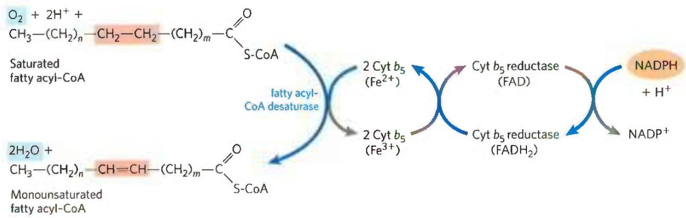  
FIGURE 21-13 Electron transfer in the desaturation of fatty acids in vertebrates. Blue arrows show the path of electrons as two substrates — a fatty acyl-CoA and NADPH — undergo oxidation by

  
FIGURE 21-14 Action of plant desaturases. Desaturases in plants oxidize phosphatidylcholine-bound oleate to polyunsaturated fatty acids. Some of the products are released from the phosphatidylcholine by hydrolysis.  
molecular oxygen. These reactions take place on the lumenal face of the smooth ER. A similar pathway, but with different electron carriers, occurs in plants.

#### [EN] Eicosanoids Are Formed from 20- and 22-Carbon Polyunsaturated Fatty Acids

P5 Eicosanoids are a family of very potent biological signaling molecules that act as short-range messengers, affecting tissues near the cells that produce them.

In response to hormonal or other stimuli, phospholipase A₂, present in most types of mammalian cells, attacks membrane phospholipids, releasing arachidonate from the middle carbon of glycerol. Enzymes of the smooth ER then convert arachidonate to prostaglandins, beginning with the formation of prostaglandin H₂ (PGH₂), the immediate precursor of many other prostaglandins and thromboxanes (Fig. 21-15a). The two reactions that lead to PGH₂ are catalyzed by a bifunctional enzyme, cyclooxygenase (COX), also called prostaglandin H₂ synthase. In the first step, the cyclooxygenase activity introduces molecular oxygen to convert arachidonate to PGG₂. The second step, catalyzed by the peroxidase activity of COX, converts PGG₂ to PGH₂.

KEY CONVENTION Prostaglandins with different functional groups on the ring are given different letter designations: A, B, C, D, E, F, G, H, and R. The subscript number following the letter, as in $PGH_{2}$ and $PGG_{2}$ , indicates the number of double bonds. Prostaglandins with two double bonds, all of which are derived from arachidonate, are referred to as series 2 prostaglandins; those with three double bonds, derived from EPA, as series 3 (Fig. 21-12). Similar naming patterns are used for other classes of eicosanoids described below.

Series 2 prostaglandins have important roles in the immediate response to stress or injury, including inflammation, pain, swelling, and dilation of blood vessels. Series 3 prostaglandins, in general, act more slowly and usually moderate the responses associated with series 2 prostaglandins.

Mammals have two isozymes of prostaglandin $H_{2}$ synthase, COX-1 and COX-2. These have different functions but closely similar amino acid sequences (60% to 65% sequence identity) and similar reaction mechanisms

#### [EN] Oxidases, Oxygenases, Cytochrome P-450 Enzymes, and Drug Overdoses

In this chapter we encounter several enzymes that carry out oxidation-reduction reactions in which molecular oxygen is a participant. The stearoyl-CoA desaturase (SCD) that introduces a double bond into a fatty acyl chain (see Fig. 21-13) is one such enzyme.

The nomenclature for enzymes that catalyze reactions of this general type can be confusing. Oxidase is the general name for enzymes that catalyze oxidations in which molecular oxygen is the electron acceptor but oxygen atoms do not appear in the oxidized product. The enzyme that creates a double bond in fatty acyl-CoA during the oxidation of fatty acids in peroxisomes (see Fig. 17-14) is an oxidase of this type; a second example is the cytochrome oxidase of the mitochondrial respiratory chain (see Fig. 19-13). In the first case, the transfer of two electrons to $\mathrm{H}_2\mathrm{O}$ produces hydrogen peroxide, $\mathrm{H}_2\mathrm{O}_2$ ; in the second, two electrons reduce $\frac{1}{2}\mathrm{O}_2$ to $\mathrm{H}_2\mathrm{O}$ . Many, but not all, oxidases are flavoproteins. Mixed-function oxidases oxidize two different substrates simultaneously; again, the molecular oxygen atoms do not appear in the oxidized products. Mixed-function oxidases act in fatty acid desaturation (fatty acyl-CoA desaturase; see Fig. 21-13) and in the last step of plasmalogen synthesis (see Fig. 21-30).

Oxygenases catalyze oxidative reactions in which oxygen atoms are directly incorporated into the product molecule, forming a new hydroxyl or carboxyl group, for example. Dioxygenases catalyze reactions in which both oxygen atoms of $O_{2}$ are incorporated into the organic product. An example of a dioxygenase is tryptophan 2,3-dioxygenase, which catalyzes the opening of the five-membered ring of tryptophan in the catabolism of this amino acid. When the reaction takes place in the presence of ${}^{18}O_{2}$ , the isotopic oxygen atoms are found in the two carbonyl groups of the product (shown in red):

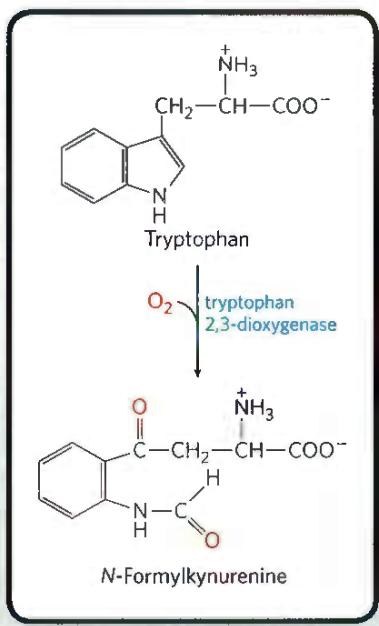

Monooxygenases, more common and more complex in their action, catalyze reactions in which only one of the two oxygen atoms of $O_{2}$ is incorporated into the organic product, the other being reduced to $H_{2}O$ ; an example is squalene monooxygenase (see Fig. 21-37). Monooxygenases require two substrates to serve as reductants of the two oxygen atoms of $O_{2}$ . The main substrate accepts one of the two oxygen atoms, and a cosubstrate furnishes hydrogen atoms to reduce the other oxygen atom to $H_{2}O$ . The general reaction equation for monooxygenases is

$$
\mathrm{AH} + \mathrm{BH} _ {2} + \mathrm{O} - \mathrm{O} \longrightarrow \mathrm{A} - \mathrm{OH} + \mathrm{B} + \mathrm{H} _ {2} \mathrm{O}
$$

where AH is the main substrate and $BH_{2}$ is the cosubstrate. Because most monooxygenases catalyze reactions in which the main substrate becomes hydroxylated, they are also called hydroxylases. They are also sometimes called mixed-function oxygenases to indicate that they oxidize two different substrates simultaneously.

Monooxygenases are divided into several classes, depending on the nature of the cosubstrate. Some use reduced flavin nucleotides (FMNH $_2$ or FADH $_2$ ), others use NADH or NADPH, and still others use $\alpha$ -ketoglutarate as cosubstrate. The enzyme that hydroxylates the phenyl ring of phenylalanine to form tyrosine is a monooxygenase that uses tetrahydrobiopterin as cosubstrate (see Fig. 18-23). (This is the enzyme that is defective in the human genetic disease phenylketonuria.)

The most numerous and most complex monooxygenation reactions are those employing a type of heme protein called cytochrome P-450. Like mitochondrial cytochrome oxidase, enzymes containing a cytochrome P-450 domain can react with $O_{2}$ and bind carbon monoxide, but they can be differentiated from cytochrome oxidase because the carbon monoxide complex of their reduced form absorbs light strongly at 450 nm — thus the name P-450.

Cytochrome P-450 enzymes catalyze hydroxylation reactions in which an organic substrate, RH, is hydroxylated to R—OH, incorporating one oxygen atom of $O_{2}$ ; the other oxygen atom is reduced to $H_{2}O$ by reducing equivalents that are furnished by NADH or NADPH but are usually passed to cytochrome P-450 by an iron-sulfur protein. Figure 1 shows a simplified outline of the action of cytochrome P-450.

One large family of P-450-containing proteins consists of two general types: those highly specific for a single substrate (like typical enzymes) and those with more promiscuous binding sites that accept a variety of substrates, generally similar in being hydrophobic. In the adrenal cortex, for example, a specific cytochrome P-450 participates in the hydroxylation of steroids to yield the adrenocortical hormones (see Fig. 21-49). There are dozens of P-450 enzymes that act on specific substrates in the biosynthetic pathways to steroid hormones and

eicosanoids (Fig. 2). Cytochrome P-450 enzymes with broader specificity are important in the hydroxylation of many different drugs, such as barbiturates and other xenobiotics (substances foreign to the organism), particularly if they are hydrophobic and relatively insoluble. The environmental carcinogen benzo[a] pyrene, found in cigarette smoke, undergoes cytochrome P-450-dependent hydroxylation during detoxification. Hydroxylation of xenobiotics, sometimes combined with the attachment of a polar compound such as glucuronic acid to the hydroxyl group, makes them more soluble in water and allows their excretion in urine. Hydroxylation (and glucuronidation) inactivates most drugs, and the rate at which it occurs can determine how long a given dose of a medication remains in the blood at therapeutic levels.

Humans differ in their levels of drug-metabolizing enzymes, both because of their genetics and because past exposure to substrates can induce the synthesis of higher levels of P-450 enzymes. Ethanol and barbiturate drugs share a P-450 enzyme. Long-term heavy drinking induces synthesis of this enzyme. Then, because the barbiturate is inactivated and cleared faster, larger doses are required to get the same therapeutic effect. If an individual takes this larger-than-usual dose of barbiturate and then also drinks alcohol, competition between the alcohol and the barbiturate for the limited amount of enzyme means that both alcohol and barbiturate are cleared more slowly. The resulting high levels of these two central nervous system depressants can be lethal. Similar complications arise when an individual takes two drugs that happen to be inactivated by the same P-450 enzyme; each drug increases the effective dose of the other by slowing its inactivation. It is therefore essential for physicians and pharmacists to know about all of a patient's prescribed and over-the-counter drugs and supplements, as well as a history of heavy drinking, or smoking, or exposure to environmental toxins.

  
FIGURE 21-15 The "cyclic" pathway from arachidonate to prostaglandins and thromboxanes. (a) After arachidonate is released from phospholipids by the action of phospholipase $\mathsf{A}_2$ , the cyclooxygenase and peroxidase activities of COX (also called prostaglandin $\mathsf{H}_2$ synthase) catalyze the

at both of their catalytic centers. COX-1 is responsible for synthesis of the prostaglandins that regulate the secretion of gastric mucin, and COX-2 is responsible for synthesis of the prostaglandins that mediate inflammation, pain, and fever.

Pain can be relieved by inhibiting COX-2. The first drug widely marketed for this purpose was aspirin (acetylsalicylate; Fig. 21-15b). The name "aspirin" (from a for acetyl and spir for Spirsäure, the German word for the salicylates prepared from the plant Spiraea ulmaria) appeared in 1899 when the drug was introduced by the Bayer company. Aspirin irreversibly inactivates the cyclooxygenase activity of both COX isozymes, by acetylating a Ser residue and blocking each enzyme's active site. The synthesis of prostaglandins and thromboxanes is thereby inhibited. Additional widely used nonsteroidal anti-inflammatory drugs (NSAIDs; Fig. 21-15b), ibuprofen and naproxen, inhibit the same pair of enzymes. However, the inhibition of COX-1 can result in undesired side effects, including stomach irritation and more serious conditions. In the 1990s, NSAID compounds that had a greater specificity for COX-2 were developed as advanced therapies for severe pain. Three of these drugs were approved for use worldwide: rofecoxib (Vioxx), valdecoxib (Bextra), and celecoxib (Celebrex). Though initially considered a success, Vioxx and Bextra were withdrawn as field reports and clinical studies connected the drugs with an increased risk of heart attack and stroke. Celebrex is still on the market but is being used with increased caution. The detailed reasons for the problems with these drugs are still not clear but serve as a cautionary note. We are increasingly aware of the complexity of the web of these signaling interactions, and predicting the consequences of targeting specific components with pharmaceutical agents remains an imperfect process.

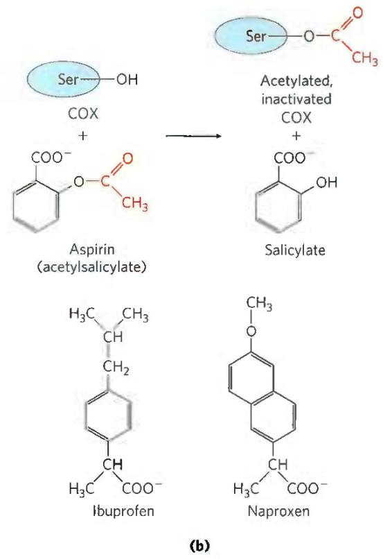  
production of PGH $_2$ , the precursor of other prostaglandins and of thromboxanes. (b) Aspirin inhibits the first reaction by acetylating an essential Ser residue on the enzyme. Ibuprofen and naproxen inhibit the same step, probably by mimicking the structure of the substrate or an intermediate in the reaction.

Thromboxane synthase, present in blood platelets (thrombocytes), converts PGH $_{2}$ to thromboxane A $_{2}$ , from which other series 2 thromboxanes are derived (Fig. 21-15a). The series 2 thromboxanes induce constriction of blood vessels and platelet aggregation, early steps in blood clotting. Low doses of aspirin, taken regularly, reduce the probability of heart attacks and strokes by reducing thromboxane production.

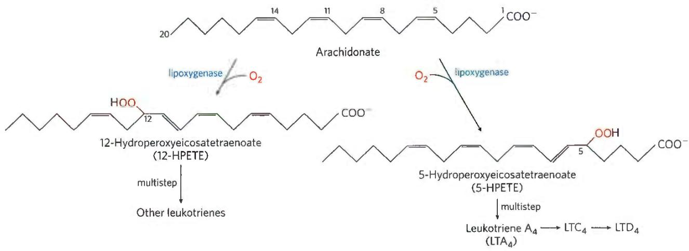  
FIGURE 21-16 The "linear" pathway from arachidonate to leukotrienes.

Thromboxanes, like prostaglandins, contain a ring of five or six atoms; the pathway from arachidonate to the series 2 prostaglandins and thromboxanes is sometimes called the "cyclic" pathway, to distinguish it from the "linear" pathway that leads from arachidonate to the leukotrienes, which are linear compounds (Fig. 21-16). Leukotriene synthesis begins with the action of several lipoxygenases that catalyze the incorporation of molecular oxygen into arachidonate. These enzymes, found in leukocytes and in heart, brain, lung, and spleen, are mixed-function oxidases of the cytochrome P-450 family (see Box 21-1). The various leukotrienes differ in the position of the peroxide group introduced by the lipoxygenases. The linear pathway from arachidonate, unlike the cyclic pathway, is not inhibited by aspirin or other NSAIDs.

Pathogenic organisms, as well as irritants such as air pollution and tobacco smoke, trigger an inflammatory response in the affected tissue, which consists of two phases: initiation and resolution. Eicosanoids of the omega-6 family are critical to initiation—playing key roles in recruiting leukocytes, making blood vessels more permeable, and stimulating chemotaxis and migration of immune system cells. As the source of tissue damage is brought under control, the inflammation must be resolved and the tissue brought back to its normal state. Resolution of inflammation is called catabasis, and it is promoted by several classes of signaling molecules; prominent among these are several leukotrienes and prostaglandins. Many eicosanoids of the omega-3 family (including series 3 prostaglandins and thromboxanes) are anti-inflammatory, although the classification is not absolute; individual eicosanoids can be inflammatory in one tissue and anti-inflammatory in another.

Catabasis is also promoted by a set of eicosanoids termed specialized pro-resolving mediators (SPMs). The first family of SPMs to be discovered was the lipoxins, followed more recently by resolvins, protectins, and maresins. All SPMs are derived from essential fatty acids (Fig. 21-12). They affect different target cells and tissues in different ways. The sum of their action is to promote removal of debris, microbes, and dead cells, to restore blood vessel integrity, and to regenerate tissue. Particular SPMs also reduce pain and fever, and play roles in resolving the tissue inflammation leading to diabetes, obesity, and asthma. Further research on SPMs thus has potential for the development of new pharmaceutical targets.

Plants also derive important signaling molecules from fatty acids. As in animals, a key step in the initiation of signaling is activation of a specific phospholipase. In plants, the fatty acid substrate released by phospholipase action is $\alpha$ -linolenate. A lipoxygenase then catalyzes the first step in a pathway that converts $\alpha$ -linolenate to jasmonate, a substance known to have signaling roles in defense against insects, resistance to fungal pathogens, and maturation of pollen. Jasmonate also affects seed germination, root growth, and fruit and seed development.

#### [EN] SUMMARY 21.1 Biosynthesis of Fatty Acids and Eicosanoids

■ Malonyl-CoA, a key precursor of fatty acids, is synthesized by the action of acetyl-CoA carboxylase.

■ Beginning with malonyl-CoA and acetyl-CoA, fatty acids are synthesized in a repeating cycle of four steps.

Long-chain saturated fatty acids are synthesized from acetyl-CoA by a cytosolic system of six enzymatic activities plus acyl carrier protein (ACP). There are two types of fatty acid synthase. FAS I, found in vertebrates and fungi, consists of multifunctional polypeptides. FAS II is a dissociated system found in bacteria and plants. Both contain two types of —SH groups (one furnished by the phosphopantetheine of ACP, the other by a Cys residue of $\beta$ -ketoacyl-ACP synthase) that function as carriers of the fatty acyl intermediates.

\- Malonyl-ACP, formed from acetyl-CoA (shuttled out of mitochondria) and $\mathrm{CO}_{2}$ , condenses with an acetyl bound to the Cys —SH to yield acetoacetyl-ACP, with release of $\mathrm{CO}_{2}$ . This is followed by reduction to the $\mathfrak{p}-\beta$ -hydroxy derivative, dehydration to the trans- $\Delta^{2}$ -unsaturated acyl-ACP, and reduction to butyryl-ACP. NADPH is the electron donor for both reductions. Fatty acid synthesis is regulated at the level of malonyl-CoA formation.

Six more molecules of malonyl-ACP react successively at the carboxyl end of the growing fatty acid chain to form palmitoyl-ACP—the end product of the fatty acid synthase reaction. Free palmitate is released by hydrolysis.

■ Fatty acid synthesis occurs in the cytosol of animal cells, and in chloroplasts in plants.

■ Acetate is exported from the mitochondria as citrate.

■ Fatty acid synthesis is tightly regulated, principally by regulation of acetyl-CoA carboxylase.

■ Palmitate may be elongated to the 18-carbon stearate.

■ Palmitate and stearate can be desaturated to yield palmitoleate and oleate, respectively, by the action of mixed-function oxidases.

Mammals cannot make linoleate and must obtain it from plant sources; they convert exogenous linoleate to arachidonate, the parent compound of eicosanoids (prostaglandins, thromboxanes, leukotrienes, and specialized pro-resolving mediators), a family of very potent signaling molecules. The synthesis of prostaglandins and thromboxanes is inhibited by NSAIDs that act on the cyclooxygenase activity of prostaglandin $\mathrm{H}_{2}$ synthase.

<!-- EN-END 21.1 -->

<!-- EN-BEGIN 21.2 -->

### 【英文对应 21.2】Biosynthesis of Triacylglycerols

> 来源：Lehninger Principles of Biochemistry（书籍/02_生物化学原理） 第21章 Lipid Biosynthesis，§21.2。对应本章“六、脂质的生物合成”。

P1 Most of the fatty acids synthesized or ingested by an organism have one of two fates, depending on the organism's needs: incorporation into triacylglycerols for the storage of metabolic energy or incorporation into the phospholipid components of membranes. During rapid growth, synthesis of new membranes requires the production of membrane phospholipids; when an organism has a plentiful food supply but is not actively growing, it shunts most of its fatty acids into storage fats. Both pathways begin at the same point: the formation of fatty acyl esters of glycerol. In this section we examine the route to triacylglycerols and its regulation, and the production of glycerol 3-phosphate in the process of glyceroneogenesis.

#### [EN] Triacylglycerols and Glycerophospholipids Are Synthesized from the Same Precursors

Animals can synthesize and store large quantities of triacylglycerols, to be used later as fuel (see Box 17-1). Humans can store only a few hundred grams of glycogen in liver and muscle, barely enough to supply the body's energy needs for 12 hours. However, a 70 kg human stores about 15 kg of triacylglycerol in its tissues, enough to support basal energy needs for as long as 12 weeks (see Table 23-5). Triacylglycerols have the highest energy content of all stored nutrients—more than 38 kJ/g. Whenever carbohydrate is ingested in excess of the organism's capacity to store glycogen, the excess is converted to triacylglycerols and stored in adipose tissue. Plants also manufacture triacylglycerols as an energy-rich fuel, mainly stored in fruits, nuts, and seeds.

In animal tissues, triacylglycerols and glycerophospholipids such as phosphatidylethanolamine share two precursors, fatty acyl-CoA and L-glycerol 3-phosphate, and several biosynthetic steps. The vast majority of the glycerol 3-phosphate is derived from the glycolytic intermediate dihydroxyacetone phosphate (DHAP) by the action of the cytosolic NAD-linked glycerol 3-phosphate dehydrogenase; in liver and kidney, a small amount of glycerol 3-phosphate is also formed from glycerol by the action of glycerol kinase (Fig. 21-17). The other precursors of triacylglycerols are fatty acyl-CoAs, formed from fatty acids by acyl-CoA synthetases, the same enzymes responsible for the activation of fatty acids for $\beta$ oxidation (see Fig. 17-5).

The first stage in the biosynthesis of triacylglycerols is acylation of the two free hydroxyl groups of L-glycerol 3-phosphate by two molecules of fatty acyl-CoA to yield diacylglycerol 3-phosphate, more commonly called phosphatidic acid, or phosphatidate (Fig. 21-17). Phosphatidic acid is present in only trace amounts in cells but is a central intermediate in lipid biosynthesis; it can be converted either to a triacylglycerol or to a glycerophospholipid. In the pathway to triacylglycerols, phosphatidic acid is hydrolyzed by phosphatidic acid phosphatase (also called lipin) to form a 1,2-diacylglycerol (Fig. 21-18). Diacylglycerols are then converted to triacylglycerols by transesterification with a third fatty acyl-CoA.

#### [EN] Triacylglycerol Biosynthesis in Animals Is Regulated by Hormones

In humans, the amount of body fat stays relatively constant over long periods, although there may be minor short-term changes as caloric intake fluctuates. Biosynthesis and degradation of triacylglycerols are regulated to meet the metabolic requirements of the moment. The rate of triacylglycerol biosynthesis is profoundly altered by the action of several hormones. Insulin, for example, promotes the conversion of carbohydrate to triacylglycerols (Fig. 21-19). People with severe diabetes mellitus, due to failure of insulin secretion or action, not only are unable to use glucose properly but also fail to synthesize fatty acids from carbohydrates or amino acids. If the diabetes is untreated, these individuals have increased rates of fat oxidation and ketone body formation (Chapter 17) and therefore lose weight.

Approximately 75% of all fatty acids released by triacylglycerol breakdown (lipolysis) are reesterified to form triacylglycerols rather than used for fuel. This ratio persists even under starvation conditions, when energy metabolism is shunted from the use of carbohydrate to the oxidation of fatty acids. Some of this fatty acid recycling takes place in adipose tissue, with the reesterification occurring before release into the bloodstream; some takes place via a systemic cycle in which free fatty acids are transported to the liver, recycled to triacylglycerol, exported again into the blood (transport of lipids in the blood is discussed in Section 21.4), and taken up again by adipose tissue, after release from triacylglycerol by extracellular lipoprotein lipase (Fig. 21-20; see also Fig. 17-1). Flux through this triacylglycerol cycle between adipose tissue and liver may be low when other fuels are available and the release of fatty acids from adipose tissue is limited, but, as noted above, the proportion of released fatty acids that are reesterified remains roughly constant at 75% under all metabolic conditions. The level of free fatty acids in the blood thus reflects both the rate of release of fatty acids and the balance between the synthesis and breakdown of triacylglycerols in adipose tissue and liver.

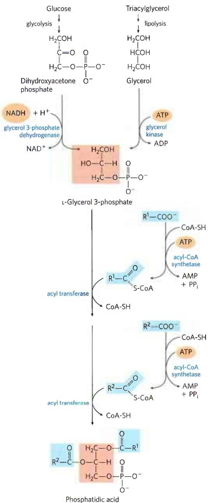  
FIGURE 21-17 Biosynthesis of phosphatidic acid. A fatty acyl group is activated by formation of the fatty acyl-CoA, then transferred to ester linkage with L-glycerol 3-phosphate, formed in either of the two ways shown. Phosphatidic acid is shown here with the correct stereochemistry (L) at C-2 of the glycerol molecule. (The intermediate product with only one esterified fatty acyl group is lysophosphatidic acid.) To conserve space in subsequent figures (and in Fig. 21-14), both fatty acyl groups of glycerophospholipids, and all three acyl groups of triacylglycerols, are shown projecting to the right.

  
FIGURE 21-18 Phosphatidic acid in lipid biosynthesis. Phosphatidic acid is the precursor of both triacylglycerols and glycerophospholipids. The mechanisms for head-group attachment in phospholipid synthesis are described later in this section.

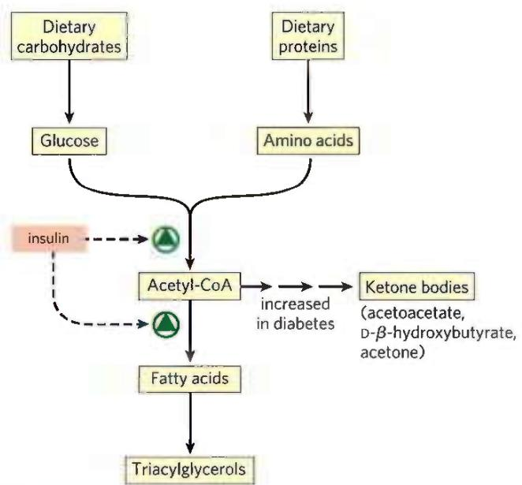  
FIGURE 21-19 Regulation of triacylglycerol synthesis by insulin. Insulin stimulates conversion of dietary carbohydrates and proteins to fat. Individuals with diabetes mellitus either lack insulin or are insensitive to it. This results in diminished fatty acid synthesis, and the acetyl-CoA arising from catabolism of carbohydrates and proteins is shunted instead to ketone body production. People in severe ketosis smell of acetone, so the condition is sometimes mistaken for drunkenness.

When the mobilization of fatty acids is required to meet energy needs, release from adipose tissue is stimulated by the hormones glucagon and epinephrine (see Figs. 17-2, 17-13). Simultaneously, these hormonal signals decrease the rate of glycolysis and increase the rate of gluconeogenesis in the liver (providing glucose for the brain, as further elaborated in Chapter 23). The released fatty acid is taken up by several tissues, including muscle, where it is oxidized to provide energy. Much of the fatty acid taken up by liver is not oxidized but is recycled to triacylglycerol and returned to adipose tissue.

The function of the apparently futile triacylglycerol cycle is not well understood, but as we learn more about how the cycle is sustained via metabolism in two separate organs and is coordinately regulated, some possibilities emerge. For example, the excess capacity in the triacylglycerol cycle—the fatty acid that is eventually reconverted to triacylglycerol rather than oxidized as fuel — could represent an energy reserve in the bloodstream during fasting, one that could be more rapidly mobilized in a "fight or flight" emergency than stored triacylglycerol could be.

  
FIGURE 21-20 The triacylglycerol cycle. In mammals, triacylglycerol molecules are broken down and resynthesized in a triacylglycerol cycle during starvation. Some of the fatty acids released by lipolysis of triacylglycerol in adipose tissue pass into the bloodstream, and the remainder are used for resynthesis of triacylglycerol. Some of the fatty acids released into the blood are used for energy (in muscle, for example), and some are taken up by the liver and used in triacylglycerol synthesis. The triacylglycerol formed in the liver is transported in the blood back to adipose tissue, where the fatty acid is released by extracellular lipoprotein lipase, taken up by adipocytes, and reesterified into triacylglycerol.

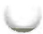

The constant recycling of triacylglycerols in adipose tissue even during starvation raises a second question: what is the source of the glycerol 3-phosphate required for this process? As noted above, glycolysis is suppressed under these conditions by the action of glucagon and epinephrine, so little DHAP is available. And glycerol released during lipolysis cannot be converted directly to glycerol 3-phosphate in adipose tissue, which lacks glycerol kinase (Fig. 21-17). So, how is sufficient glycerol 3-phosphate produced? The answer lies in the pathway of glyceroneogenesis, discovered in the 1960s by Lea Reshef, Richard Hanson, and John Ballard, and simultaneously by Eleazar Shafrir and his coworkers. The investigators were intrigued by the presence of two gluconeogenic enzymes, pyruvate carboxylase and phosphoenolpyruvate (PEP) carboxykinase, in adipose tissue, where glucose is not synthesized. Yet, the importance of this pathway was not appreciated until decades later. Glyceroneogenesis is intimately linked to the triacylglycerol cycle and, in a larger sense, to the balance between fatty acid and carbohydrate metabolism.

#### [EN] Adipose Tissue Generates Glycerol 3-Phosphate by Glyceroneogenesis

Glyceroneogenesis is a shortened version of gluconeogenesis, from pyruvate to DHAP (see Fig. 14-16), followed by conversion of the DHAP to glycerol 3-phosphate by cytosolic NAD-linked glycerol 3-phosphate dehydrogenase (Fig. 21-21). Glycerol 3-phosphate is subsequently used in triacylglycerol synthesis. There is a link between glyceroneogenesis and type 2 diabetes, as we shall see.

  
FIGURE 21-21 Glyceroneogenesis. The pathway is essentially an abbreviated version of gluconeogenesis, from pyruvate to dihydroxyacetone phosphate (DHAP), followed by conversion of DHAP to glycerol 3-phosphate, which is used for the synthesis of triacylglycerol.

Glyceroneogenesis has multiple roles. In adipose tissue, glyceroneogenesis coupled with reesterification of free fatty acids controls the rate of fatty acid release to the blood. In brown adipose tissue, the same pathway may control the rate at which free fatty acids are delivered to mitochondria for use in thermogenesis. And in fasting humans, glyceroneogenesis in the liver alone supports the synthesis of enough glycerol 3-phosphate to account for up to 65% of fatty acids reesterified to triacylglycerol.

Flux through the triacylglycerol cycle between liver and adipose tissue is controlled to a large degree by the activity of PEP carboxykinase, which limits the rate of both gluconeogenesis and glyceroneogenesis. Glucocorticoid hormones such as cortisol (a biological steroid derived from cholesterol; see Fig. 21-48) and dexamethasone (a synthetic glucocorticoid) regulate the levels of PEP carboxykinase reciprocally in the liver and adipose tissue. Acting through the glucocorticoid receptor, these steroid hormones increase the expression of the gene encoding PEP carboxykinase in the liver, thus increasing gluconeogenesis and glyceroneogenesis (Fig. 21-22).

Stimulation of glyceroneogenesis leads to an increase in the synthesis of triacylglycerol molecules in the liver and their release into the blood. At the same time, glucocorticoids suppress expression of the gene encoding PEP carboxykinase in adipose tissue. This results in a decrease in glyceroneogenesis in adipose tissue; recycling of fatty acids declines as a result, and more free fatty acids are released into the blood. Thus, regulation of glyceroneogenesis in the liver and adipose tissue affects lipid metabolism in opposite ways: a lower rate of glyceroneogenesis in adipose tissue leads to more fatty acid release (rather than recycling), whereas a higher rate in the liver leads to more synthesis and export of triacylglycerols. The net result is an increase in flux through the triacylglycerol cycle. When the glucocorticoids are no longer present, flux through the cycle declines as the expression of PEP carboxykinase increases in adipose tissue and decreases in the liver.

#### [EN] Thiazolidinediones Treat Type 2 Diabetes by Increasing Glyceroneogenesis

The connection between glyceroneogenesis and diabetes has stimulated new interest. High levels of free fatty acids in the blood interfere with glucose utilization in muscle and promote the insulin resistance that leads to type 2 diabetes. A class of drugs called thiazolidinediones reduces the levels of fatty acids circulating in the blood and increases sensitivity to insulin. Thiazolidinediones promote the increased expression of PEP carboxykinase in adipose tissue (Fig. 21-22), leading to increased synthesis of the precursors of glyceroneogenesis. The therapeutic effect of thiazolidinediones is thus due, at least in part, to the increase in glyceroneogenesis, which in turn increases the resynthesis of triacylglycerol in adipose tissue and reduces the release of free fatty acid from adipose tissue into the blood. Two thiazolidinediones have been available for treatment of type 2 diabetes: rosiglitazone (Avandia) and pioglitazone (Actos). Large-scale trials of rosiglitazone have indicated an increased risk of heart attack, so rosigliatazone has been withdrawn in the United Kingdom, India, South Africa, and many European countries. It remains available in the United States with limitations.

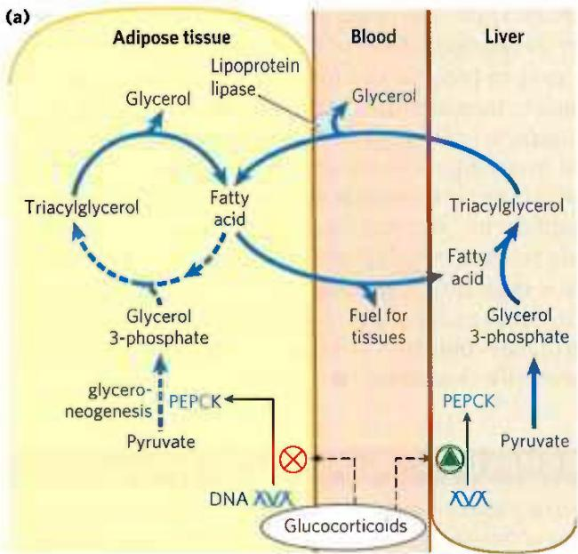

  
FIGURE 21-22 Regulation of glyceroneogenesis. (a) Glucocorticoid hormones stimulate glyceroneogenesis and gluconeogenesis in the liver, while suppressing glyceroneogenesis in adipose tissue (by reciprocal regulation of the gene expressing PEP carboxykinase (PEPCK) in the two tissues); this increases the flux through the triacylglycerol cycle. The glycerol freed by the breakdown of triacylglycerol in adipose tissue is released to the blood and transported to the liver, where it is primarily converted to glucose, although some is converted to glycerol 3-phosphate by glycerol kinase. (b) A class of drugs called thiazolidinediones is used to treat type 2 diabetes. In this disease, high levels of free fatty acids in the blood interfere with glucose utilization in muscle and promote insulin resistance. Thiazolidinediones activate a nuclear receptor called peroxisome proliferator-activated receptor $\gamma$ (PPAR $\gamma$ ), which induces the activity of PEP carboxykinase. Therapeutically, thiazolidinediones increase the rate of glyceroneogenesis, thus increasing the resynthesis of triacylglycerol in adipose tissue and reducing the amount of free fatty acid in the blood. In both panels, dashed lines identify pathways in which flux declines under the conditions indicated.

#### [EN] SUMMARY 21.2 Biosynthesis of Triacylglycerols

Triacylglycerols are formed by reaction of two molecules of fatty acyl-CoA with glycerol 3-phosphate to form phosphatidic acid; this product is dephosphorylated to a diacylglycerol, then acylated by a third molecule of fatty acyl-CoA to yield a triacylglycerol.

■ The synthesis and degradation of triacylglycerols are hormonally regulated.

\- Mobilization and recycling of triacylglycerol molecules result in a triacylglycerol cycle. Triacylglycerols are resynthesized from free fatty acids and glycerol 3-phosphate even during starvation. The dihydroxyacetone phosphate precursor of glycerol 3-phosphate is derived from pyruvate via glyceroneogenesis.

■ Thiazolidinediones stimulate glyceroneogenesis and can be used to treat type 2 diabetes.

<!-- EN-END 21.2 -->

<!-- EN-BEGIN 21.3 -->

### 【英文对应 21.3】Biosynthesis of Membrane Phospholipids

> 来源：Lehninger Principles of Biochemistry（书籍/02_生物化学原理） 第21章 Lipid Biosynthesis，§21.3。对应本章“六、脂质的生物合成”。

In Chapter 10 we introduced two major classes of membrane phospholipids: glycerophospholipids and sphingolipids. Many different phospholipid species can be constructed by combining various fatty acids and polar head groups with the glycerol or sphingosine backbone (see Figs. 10-8, 10-11). All the biosynthetic pathways follow a few basic patterns. In general, the assembly of phospholipids from simple precursors requires (1) synthesis of the backbone molecule (glycerol or sphingosine); (2) attachment of fatty acid(s) to the backbone through an ester or amide linkage; (3) addition of a hydrophilic head group to the backbone through a phosphodiester linkage; and, in some cases, (4) alteration or exchange of the head group or the fatty acids to yield the final phospholipid product.

In eukaryotic cells, phospholipid synthesis occurs primarily on the surfaces of the smooth ER and the inner mitochondrial membrane. Some newly formed phospholipids remain at the site of synthesis, but most are destined for other cellular membranes. Once they arrive, phospholipids can be remodeled within membranes to alter the fatty acid constituents. The process by which water-insoluble phospholipids move from the site of synthesis to the point of their eventual function is not fully understood, but we discuss some mechanisms that have emerged in recent years.

#### [EN] Cells Have Two Strategies for Attaching Phospholipid Head Groups

Stage 1 of glycerophospholipid synthesis is shared with the pathway to triacylglycerols, the formation of glycerol 3-phosphate by one of the two paths shown in Fig. 21-17. In stage 2, fatty acyl groups are esterified to C-1 and C-2 of L-glycerol 3-phosphate to form phosphatidic acid. Usually, the fatty acid at C-1 is saturated and the one at C-2 is unsaturated. A second route to phosphatidic acid is the phosphorylation of a diacylglycerol by a specific kinase.

In stages 3 and 4, the polar head group of glycerophospholipids is attached through a phosphodiester bond, in which each of two alcohol hydroxyls (one on the polar head group and one on C-3 of glycerol) forms an ester with phosphoric acid (Fig. 21-23). In the biosynthetic process, one of the hydroxyls is first activated by attachment of a nucleotide, cytidine diphosphate

  
FIGURE 21-23 Final stages of glycerophospholipid biosynthesis: head-group attachment. The phospholipid head group is attached to a diacylglycerol by a phosphodiester bond (shaded light red), formed when phosphoric acid condenses with two alcohols, eliminating two molecules of $\mathsf{H}_2\mathsf{O}$ .

<!-- END OFFICIAL API PART part_008 -->

<!-- BEGIN OFFICIAL API PART part_009 -->

(CDP). Cytidine monophosphate is then displaced in a nucleophilic attack by the other hydroxyl (Fig. 21-24). Two strategies are employed by mammals. The CDP is attached either to the diacylglycerol, forming the activated phosphatidic acid CDP-diacylglycerol (strategy 1), or to the hydroxyl of the head group (strategy 2). The central importance of cytidine nucleotides in lipid biosynthesis was discovered by Eugene P. Kennedy in the late 1950s, and this pathway is commonly referred to as the Kennedy pathway. In bacteria, only strategy 1 is used to generate glycerophospholipids.

#### [EN] Pathways for Phospholipid Biosynthesis Are Interrelated

In eukaryotes, many phospholipids are synthesized using strategy 1 in Figure 21-24, and many of the pathways begin with CDP-diacylglycerol. The synthesis of phosphatidylglycerol provides our first example. Beginning with CDP-diacylglycerol (Fig. 21-25), displacement of CMP through nucleophilic attack by the C-1 hydroxyl of glycerol 3-phosphate yields phosphatidylglycerol 3-phosphate. Phosphatidylglycerol 3-phosphate is processed further by cleavage of the phosphate monoester (with release of $\mathrm{P_i}$ ) to yield phosphatidylglycerol.

In eukaryotes, cardiolipin is a relatively uncommon phospholipid, found almost exclusively in the inner membranes of mitochondria. As described below, cardiolipin is important in bacteria, and its presence in mitochondria is likely yet another relic of the bacterial origin of these organelles. Cardiolipin is essential for the function of some mitochondrial enzymes. It is also synthesized using strategy 1, by condensation of CDP-diacylglycerol with phosphatidylglycerol (Fig. 21-25).

Phosphatidylinositol is similarly synthesized by condensation of CDP-diacylglycerol with inositol (Fig. 21-25). Specific phosphatidylinositol kinases then convert phosphatidylinositol to its phosphorylated derivatives. Phosphatidylinositol and its phosphorylated products in the plasma membrane play a central role in signal transduction in eukaryotes (see Figs. 12-11, 12-15, 12-23).

Yeast (but not mammals) use a similar path to produce phosphatidylserine by condensation of CDP-diacylglycerol and serine, and they can synthesize phosphatidylethanolamine from phosphatidylserine in the reaction catalyzed by phosphatidylserine decarboxylase (Fig. 21-25). This pathway for synthesis of phosphatidylethanolamine occurs primarily in the mitochondria, although this lipid is transported from there to other cellular membranes. Phosphatidylethanolamine may be converted to phosphatidylcholine (lecithin) by the addition of three methyl groups to its amino group; S-adenosylmethionine is the methyl group donor (see Fig. 18-18) for all three methylation reactions.

In mammals, strategy 2 (Fig. 21-24) is utilized for the synthesis of phosphatidylethanolamine and phosphatidylcholine in the membranes of the ER and nucleus. The activation of the head group to the CDP derivative is followed by condensation with diacylglycerol as shown for phosphatidylcholine (Fig. 21-26a). These pathways serve to salvage free ethanolamine and choline. In contrast, mammalian phosphatidylserine biosynthesis does not utilize either strategy shown in Figure 21-24; instead, it is derived from phosphatidylethanolamine or phosphatidylcholine via one of two head-group exchange reactions carried out in the ER (Fig. 21-26b). These reactions generate free ethanolamine and choline, respectively. The major sources of phosphatidylethanolamine and phosphatidylcholine in all eukaryotic cells are summarized in Figure 21-27.

  
FIGURE 21-25 Synthesis of glycerophospholipids in eukaryotes using CDP-diacylglycerol. These glycerophospholipids are synthesized using strategy 1 in Figure 21-24. Phosphatidylglycerol is synthesized by reaction of CDP-diacylglycerol with glycerol-3-phosphate, followed by dephosphorylation. Phosphatidylglycerol can react with CDP-diacylglycerol to generate cardiolipin. Phosphatidylinositol is generated from CDP-diacylglycerol in a single step. The pathway from CDP-diacylglycerol to phosphatidylserine is used in yeast but not in mammals. The pathway from phosphatidylserine to phosphatidylethanolamine and phosphatidylcholine is common to all eukaryotes.

The most prominent phospholipids in bacteria are phosphatidylglycerol, phosphatidylethanolamine, and cardiolipin. The pathway for phosphatidylglycerol synthesis (Fig. 21-28 on p. 769) is identical to the path employed in mammals (compare to Fig. 21-25), beginning with CDP-diacylglycerol and using strategy 1. Phosphatidylethanolamine is produced in a similar pathway, with phosphatidylserine an intermediate. In bacteria, there are multiple biosynthetic paths to the third prominent phospholipid, cardiolipin, in which two diacylglycerols are joined through a common head group (Fig. 21-28).

#### [EN] Eukaryotic Membrane Phospholipids Are Subject to Remodeling

In principle, the two fatty acyl groups esterified to C-1 and C-2 in a phospholipid may vary in length and degree of desaturation, thus altering the properties of the membrane of which it is a part. Phosphatidylcholine is the major structural phospholipid of mammalian membranes, often representing 40% to 50% of the total. Thus, much of the remodeling centers on phosphatidylcholine. The remodeling occurs largely by a process called the Lands cycle (Fig. 21-29 on p. 770), which replaces the polyunsaturated fatty acyl group at C-2. The fatty acyl moieties are first hydrolyzed by phospholipase A₂ (Fig. 10-14) to generate 1-acyl lysophospholipids. The fatty acid is then replaced by a class of enzymes called lysophosphatidylcholine acyltransferases, or LPCATs. There are at least four LPCATs in humans, each with distinct tissue distributions and substrate specificities.

The physiological effects of LPCAT enzymes go far beyond the alteration of the lipid composition of membranes. LPCAT3, the most widely distributed version of the enzyme, helps to regulate lipogenesis and secretion of very-low-density lipoproteins (VLDLs), described later in this chapter. Mice lacking LPCAT3 have a greatly reduced intake of fatty acids in the intestine, resulting in the release of gut hormones that control appetite. They are unable to survive on a high-fat diet, they resist eating, and they die of starvation unless the diet is changed. LPCATs play a demonstrable but still often mysterious role in processes from atherosclerosis to obesity to cancer, making these enzymes the subjects of increasing interest as research and drug targets.

  
FIGURE 21-27 Summary of the pathways for synthesis of major phospholipids and triacylglycerols in eukaryotes. Phosphatidic acid is formed by transacylation of L-glycerol 3-phosphate with two fatty acyl groups donated from fatty acyl-CoA. The enzyme phosphatidic acid phosphatase (lipin) converts phosphatidic acid to diacylglycerol, which in the Kennedy pathway condenses with a CDP-activated head group (ethanolamine or choline) to form phosphatidylethanolamine or phosphatidylcholine. Alternatively, phosphatidic acid can be activated with a CDP moiety, which is displaced by

#### [EN] Plasmalogen Synthesis Requires Formation of an Ether-Linked Fatty Alcohol

P5 The biosynthetic pathway to ether lipids, including plasmalogens and the platelet-activating factor (see Fig. 10-9), requires displacement of an esterified fatty acyl group by a long-chain alcohol to form the ether linkage (Fig. 21-30 on p. 771). Head-group attachment follows, by mechanisms essentially like those used in formation of the common ester-linked phospholipids. Finally, the characteristic double bond of plasmalogens is introduced by the action of a mixed-function oxidase similar to that responsible for desaturation of fatty acids (Fig. 21-13). The peroxisome is the primary site of plasmalogen synthesis.

condensation with a head-group alcohol—inositol, glycerol 3-phosphate, or serine, forming phosphatidylinositol, phosphatidylglycerol, or (only in yeast and fungi) phosphatidylserine. Decarboxylation of phosphatidylserine yields phosphatidylethanolamine, and methylation of phosphatidylethanolamine produces phosphatidylcholine. In mammals, phosphatidylserine and phosphatidylcholine are generated via the head-group exchange pathways, detailed in Fig. 21-26. Lysophosphatidic acid is phosphatidic acid missing one of the two fatty acyl groups. [Information from G. M. Carman and G.-S. Han, Annu. Rev. Biochem. 80:859, 2011, Fig. 2.]  

#### [EN] Sphingolipid and Glycerophospholipid Synthesis Share Precursors and Some Mechanisms

P5 The biosynthesis of sphingolipids takes place in four stages: (1) synthesis of the 18-carbon amine sphinganine from palmitoyl-CoA and serine; (2) attachment of a fatty acid in amide linkage to yield N-acylsphinganine; (3) desaturation of the sphinganine moiety to form

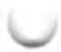

Phosphatidate

Phosphatidylglycerol 3-phosphate

Phosphatidylserine

Phosphatidylethanolamine

Phosphatidylglycerol

cardiolipin synthase C

Ethanolamine

FIGURE 21-28 Origin of the polar head groups of phospholipids in E. coli. Initially, a head group (either serine or glycerol 3-phosphate) is attached via a CDP-diacylglycerol intermediate (strategy 1 in Fig. 21-24). For phospholipids other than phosphatidylserine, the head group is further modified, as shown here. In the enzyme names, PG represents phosphatidylglycerol; PS, phosphatidylserine. Cardiolipin can be generated from either phosphatidylglycerol or phosphatidylethanolamine via multiple pathways, as shown. One of these pathways, in which phosphatidylglycerol is condensed with CDP-diacylglycerol, is identical to the pathway used in eukaryotes.

  
FIGURE 21-29 The Lands cycle for phospholipid remodeling. Phosphatidylcholine, which is the most common phospholipid of eukaryotic membranes, is a major target of this process. Fatty acids at C-2 are removed by  
phospholipase A₂ enzymes. A new fatty acid is then introduced by the action of a lysophosphatidylphocholine acyltransferase (LPCAT). The four mammalian LPCATs differ in tissue distribution and substrate specificity.

N-acylsphingosine (ceramide); and (4) attachment of a head group to produce a sphingolipid such as a cerebroside or sphingomyelin (Fig. 21-31 on p. 772). The first few steps of this pathway occur in the ER; the attachment of head groups in stage 4 occurs in the Golgi complex. The pathway shares several features with the pathways leading to glycerophospholipids: NADPH provides reducing power, and fatty acids enter as their activated CoA derivatives. In cerebroside formation, sugars enter as their activated nucleotide derivatives. Head-group attachment in sphingolipid synthesis has several novel aspects. For example, phosphatidylcholine, rather than CDP-choline, serves as the donor of phosphocholine in the synthesis of sphingomyelin.

P5 In glycolipids—the cerebrosides and gangliosides (see Fig. 10-11)—the head-group sugar is attached directly to the C-1 hydroxyl of sphingosine in glycosidic linkage rather than through a phosphodiester bond. The sugar donor is a UDP-sugar (UDP-glucose or UDP-galactose).

#### [EN] Polar Lipids Are Targeted to Specific Cellular Membranes

Membrane lipids are insoluble in water, so they cannot simply diffuse from their point of synthesis (the ER) to their point of insertion. Instead, they are transported from the ER to the Golgi complex, where additional synthesis can take place. They are then delivered in membrane vesicles that bud from the Golgi complex and then move to and fuse with the target membrane (see Fig. 11-4). Sphingolipid transfer proteins carry ceramide from the ER to the Golgi complex, where sphingomyelin synthesis occurs. Cytosolic proteins also bind phospholipids and sterols and transport them between cellular membranes (see Fig. 11-7). These mechanisms contribute to establishment of the characteristic lipid compositions of organelle membranes (see Fig. 11-5).

#### [EN] SUMMARY 21.3 Biosynthesis of Membrane Phospholipids

■ Beginning with diacylglycerol precursors, there are two pathways for adding head groups to phospholipids. Either the diacylglycerol (strategy 1) or the head group (strategy 2) is activated by CDP.

In eukaryotes, phospholipid biosynthetic strategies vary with subcellular location. The major phospholipids phosphatidylethanolamine and phosphatidylcholine are synthesized using strategy 1 in the mitochondria and strategy 2 in the ER and nucleus. Phosphatidylserine is derived from head-group exchange with phosphatidylethanolamine or phosphatidylcholine.

  
FIGURE 21-30 Synthesis of ether lipids and plasmalogens. The newly formed ether linkage is shaded light red. The intermediate 1-alkyl-2-acylglycerol 3-phosphate is the ether analog of phosphatidic acid. Mechanisms for attaching head groups to ether lipids are essentially the same as for their ester-linked analogs. The characteristic double bond of plasmalogens (shaded blue) is introduced in a final step by a mixed-function oxidase system similar to fatty acyl-CoA desaturase.

In mammals, phospholipids are remodeled in membranes via the Lands cycle. Remodeling is facilitated by lysophosphatidylcholine acyltransferases.

■ The characteristic double bond in plasmalogens is introduced by a mixed-function oxidase.

■ The head groups of sphingolipids are attached by unique mechanisms.

■ Phospholipids travel to their intracellular destinations via transport vesicles or specific proteins.

<!-- EN-END 21.3 -->

<!-- EN-BEGIN 21.4 -->

### 【英文对应 21.4】Cholesterol, Steroids, and Isoprenoids: Biosynthesis, Regulation, and Transport

> 来源：Lehninger Principles of Biochemistry（书籍/02_生物化学原理） 第21章 Lipid Biosynthesis，§21.4。对应本章“六、脂质的生物合成”。

Cholesterol is doubtless the most publicized lipid, notorious because of the strong correlation between high levels of cholesterol in the blood and the incidence of human cardiovascular diseases. Less well advertised is cholesterol's crucial role as a component of cellular membranes and as a precursor of steroid hormones and bile acids. Cholesterol is an essential molecule in many animals, including humans, but is not required in the mammalian diet—all cells can synthesize it from simple precursors.

The structure of this 27-carbon compound suggests a complex biosynthetic pathway, but all of its carbon atoms are provided by a single precursor—acetate. The isoprene units that are the essential intermediates in the pathway from acetate to cholesterol are also precursors to many other natural lipids, and the mechanisms by which isoprene units are polymerized are similar in all these pathways.

$$
\mathrm{CH} _ {2} = \mathrm{C} - \mathrm{CH} = \mathrm{CH} _ {2}
$$

We begin with an account of the main steps in the biosynthesis of cholesterol from acetate, and then discuss the transport of cholesterol in the blood, its uptake by cells, the normal regulation of cholesterol synthesis, and its regulation in those with defects in cholesterol uptake or transport. We next consider other cellular components derived from cholesterol, such as bile acids and steroid hormones. Finally, an outline of the biosynthetic pathways to some of the many compounds derived from isoprene units, which share early steps with the pathway to cholesterol, illustrates the extraordinary versatility of isoprenoid condensations in biosynthesis.

  
FIGURE 21-31 Biosynthesis of sphingolipids. Condensation of palmitoyl-CoA and serine, forming $\beta$ -ketosphinganine, followed by reduction with NADPH, yields sphinganine, which is then acylated to $N$ -acylsphinganine (a ceramide). The sphingosine is shaded gray. In animals, a double bond (shaded light red) is created by a mixed-function oxidase before the final addition of a head group: phosphatidylcholine, to form sphingomyelin, or glucose, to form a cerebroside.

#### [EN] Cholesterol Is Made from Acetyl-CoA in Four Stages

P5 Cholesterol, like long-chain fatty acids, is made from acetyl-CoA. But the assembly plan of cholesterol is quite different from that of long-chain fatty acids. In early experiments, animals were fed acetate labeled with ${}^{14}$ C in either the methyl carbon or the carboxyl carbon. The pattern of labeling in the cholesterol isolated from the two groups of animals in these tracer experiments (Fig. 21-32) provided the blueprint for working out the enzymatic steps in cholesterol biosynthesis.

Synthesis takes place in four stages, as shown in Figure 21-33: ① condensation of three acetate units to form a six-carbon intermediate, mevalonate; ② conversion of mevalonate to activated isoprene units; ③ polymerization of six 5-carbon isoprene units to form the 30-carbon linear squalene; and ④ cyclization of squalene to form the four rings of the steroid nucleus, with a further series of changes (oxidations, removal or migration of methyl groups) to produce cholesterol.

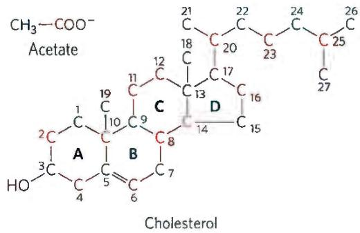  
FIGURE 21-32 Origin of the carbon atoms of cholesterol. This was deduced from tracer experiments with acetate labeled in the methyl carbon (black) or the carboxyl carbon (red). The individual rings in the fused-ring system are designated A through D.

  
FIGURE 21-33 Summary of cholesterol biosynthesis. Isoprene units in squalene are set off by dashed red lines.

Stage 1 Synthesis of Mevalonate from Acetate The first stage in cholesterol biosynthesis leads to the intermediate mevalonate (Fig. 21-34). Two molecules of acetyl-CoA condense to form acetoacetyl-CoA, which condenses with a third molecule of acetyl-CoA to yield the six-carbon compound $\beta$ -hydroxy- $\beta$ -methylglutaryl-CoA (HMG-CoA). These first two reactions are catalyzed by acetyl-CoA acetyl transferase and HMG-CoA synthase, respectively. Both reactions are Claisen condensations, and the standard equilibrium in each case favors degradation to acetyl-CoA. However, in cells, the synthetic reactions are facilitated by the rapid utilization of the product HMG-CoA in subsequent reactions. The cytosolic HMG-CoA synthase in this pathway is distinct from the mitochondrial isozyme that catalyzes HMG-CoA synthesis in ketone body formation (see Fig. 17-16).

P3 The third reaction is the committed step: reduction of HMG-CoA to mevalonate, for which two molecules of NADPH each donate two electrons. HMG-CoA reductase, an integral membrane protein of the smooth ER, is the major point of regulation on the pathway to cholesterol, as we shall see.

  
FIGURE 21-34 Formation of mevalonate from acetyl-CoA. The origin of C-1 and C-2 of mevalonate from acetyl-CoA is shaded light red.

Stage 2 Conversion of Mevalonate to Two Activated Isoprenes In the next stage, three phosphate groups are transferred from three ATP molecules to mevalonate (Fig. 21-35). The phosphate attached to the C-3 hydroxyl group of mevalonate in the intermediate 3-phospho-5-pyrophosphomevalonate is a good leaving group; in the next step, both this phosphate and the nearby carboxyl group leave, producing a double bond in the five-carbon product, $\Delta^{3}$ -isopentenyl pyrophosphate. This is the first of the two activated isoprenes central to cholesterol formation. Isomerization of $\Delta^{3}$ -isopentenyl pyrophosphate yields the second activated isoprene, dimethylallyl pyrophosphate. Synthesis of isopentenyl pyrophosphate in the cytoplasm of plant cells follows the pathway described here. However, plant chloroplasts and many bacteria use a mevalonate-independent pathway. This alternative pathway does not occur in animals, so it is an attractive target for the development of new antibiotics.

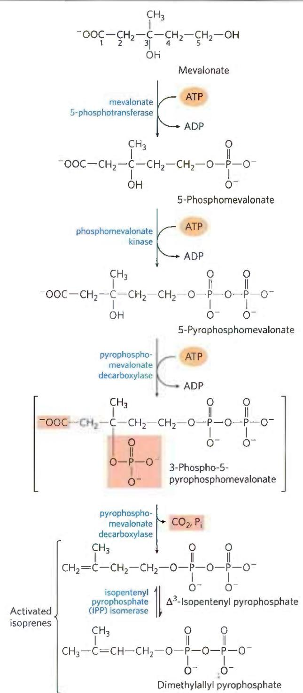  
FIGURE 21-35 Conversion of mevalonate to activated isoprene units. Six of these activated units combine to form squalene (see Fig. 21-36). The leaving groups of 3-phospho-5-pyrophosphomevalonate are shaded light red. The bracketed intermediate is hypothetical. Both of these isoprene products are required for the next stage in cholesterol biosynthesis.

Stage 3 Condensation of Six Activated Isoprene Units to Form Squalene Isopentenyl pyrophosphate and dimethylallyl pyrophosphate now undergo a head-to-tail condensation, in which one pyrophosphate group is displaced and a 10-carbon chain, geranyl pyrophosphate, is formed (Fig. 21-36). (The "head" is the end to which pyrophosphate is joined.) Geranyl pyrophosphate undergoes another head-to-tail condensation with isopentenyl pyrophosphate, yielding the 15-carbon intermediate farnesyl pyrophosphate. Finally, two molecules of farnesyl pyrophosphate join head to head, with the elimination of both pyrophosphate groups, to form squalene. Squalene has 30 carbons: 24 in the main chain and 6 in the form of methyl group branches.

The common names of these intermediates derive from the sources from which they were first isolated. Geraniol, a component of rose oil, has the aroma of geraniums, and farnesol is an aromatic compound found in flowers of the Farnese acacia tree. Many natural scents of plant origin are synthesized from isoprene units. Squalene was first isolated from the liver of sharks (genus Squalus).

Stage 4 Conversion of Squalene to the Four-Ring Steroid Nucleus When the squalene molecule is represented as in Figure 21-37, the relationship of its linear structure to the cyclic structure of the sterols becomes apparent. All sterols have the four fused rings that form the steroid nucleus, and all are alcohols, with a hydroxyl group at C-3—thus the name “sterol.” The action of squalene monooxygenase adds one oxygen atom from $O_{2}$ to the end of the squalene chain, forming an epoxide. This enzyme is another mixed-function oxidase; NADPH reduces the other oxygen atom of $O_{2}$ to $H_{2}O$ . The double bonds of the product, squalene 2,3-epoxide, are positioned so that a remarkable concerted reaction can convert the linear squalene epoxide to a cyclic structure. In animal cells, this cyclization results in the formation of lanosterol, which contains the four rings characteristic of the steroid nucleus. Lanosterol is finally converted to cholesterol in a series of about 20 reactions that include the migration of some methyl groups and the removal of others. Elucidation of this extraordinary biosynthetic pathway, one of the most complex known, was accomplished by Konrad Bloch, Feodor Lynen, John Cornforth, and George Popják in the late 1950s.

  
FIGURE 21-36 Formation of squalene. This 30-carbon structure arises through successive condensations of activated isoprene (five-carbon) units.

Cholesterol is the sterol characteristic of animal cells; plants, fungi, and protists make other, closely related sterols instead. They use the same synthetic pathway as far as squalene 2,3-epoxide, at which point the pathways diverge slightly, yielding other sterols, such as stigmasterol in many plants and ergosterol in fungi (Fig. 21-37).

#### [EN] WORKED EXAMPLE 21-1 Energetic Cost of Squalene Synthesis

What is the energetic cost of the synthesis of squalene from acetyl-CoA, in number of ATPs per molecule of squalene synthesized?

SOLUTION: In the pathway from acetyl-CoA to squalene, ATP is consumed only in the steps that convert mevalonate to the activated isoprene precursors of squalene. Three ATP molecules are used to create each of the six activated isoprenes required to construct squalene, for a total cost of 18 ATP molecules.

#### [EN] Cholesterol Has Several Fates

Most of the cholesterol synthesis in vertebrates takes place in the liver. A small fraction of the cholesterol made there is incorporated into the membranes of hepatocytes, but most of it is exported in one of three forms: as bile acids, as biliary cholesterol, or as cholesteryl

  
FIGURE 21-37 Ring closure converts linear squalene to the condensed steroid nucleus. The first step in this sequence is catalyzed by a mixed-function oxygenase, for which the cosubstrate is NADPH. The product  
is an epoxide, which in the next step is cyclized to the steroid nucleus. The final product of these reactions in animal cells is cholesterol; in other organisms, slightly different sterols are produced, as shown.

esters (Fig. 21-38). Small quantities of oxysterols such as 25-hydroxycholesterol are formed in the liver and act as regulators of cholesterol synthesis (see below). In other tissues, cholesterol is converted into steroid hormones (in the adrenal cortex and gonads, for example; see Fig. 10-18) or into vitamin D hormone (in the liver and kidney; see Fig. 10-19). Such hormones are extremely potent biological signals acting through nuclear receptor proteins.

Bile acids, one of the three forms of cholesterol exported from the liver, are the principal components of bile, a fluid stored in the gallbladder and excreted into the small intestine to aid in the digestion of fat-containing meals. Bile acids and their salts are relatively hydrophilic cholesterol derivatives that serve as emulsifiers in the intestine, converting large particles of fat into tiny micelles and thereby greatly increasing the surface at which digestive lipases can act (see Fig. 17-1). Bile also contains much smaller amounts of cholesterol (biliary cholesterol). Bile helps remove excess cholesterol from the intestine and facilitates excretion. Dietary fiber can enhance this effect by binding to bile and interfering with bile reabsorption in the intestines, leading to increased bile excretion in the feces. More cholesterol is then used to make bile. The soluble fiber available in oats (oatmeal) and barley is especially effective.

Cholesteryl esters are formed in the liver through the action of acyl-CoA-cholesterol acyltransferase (ACAT). This enzyme catalyzes the transfer of a fatty acid from coenzyme A to the hydroxyl group of cholesterol (Fig. 21-38), converting the cholesterol to a more hydrophobic form that is no longer sufficiently amphipathic to function appropriately in membranes. Cholesteryl esters are transported in secreted lipoprotein particles to other tissues that use cholesterol, or they are stored in the liver in lipid droplets.

#### [EN] Cholesterol and Other Lipids Are Carried on Plasma Lipoproteins

Cholesterol and cholesteryl esters, like triacylglycerols and phospholipids, are essentially insoluble in water, yet they must be moved from the tissue of origin to the tissues in which they will be stored or consumed. They are carried in the blood plasma as plasma lipoproteins, macromolecular complexes of specific carrier proteins, called apolipoproteins, and various combinations of phospholipids, cholesterol, cholesteryl esters, and triacylglycerols.

Apolipoproteins ("apo" designates the protein in its lipid-free form) combine with lipids to form several classes of lipoprotein particles, spherical complexes with hydrophobic lipids in the core and hydrophilic amino acid side chains at the surface (Fig. 21-39a, b). Different combinations of lipids and proteins produce particles of different densities, ranging from chylomicrons to high-density lipoproteins. These particles can be separated by ultracentrifugation (Table 21-1) and visualized by electron microscopy (Fig. 21-39c).

Each class of lipoprotein has a specific function, determined by its point of synthesis, lipid composition, and apolipoprotein content. At least 10 distinct apolipoproteins are found in the lipoproteins of human plasma (Table 21-2), distinguishable by their size, their reactions with specific antibodies, and their characteristic distribution in the lipoprotein classes. These protein components act as signals, targeting lipoproteins to specific tissues or activating enzymes that act on the lipoproteins. Figure 21-40 provides an overview of the formation and transport of the lipoproteins in mammals. The numbered steps in the following discussion refer to this figure.

Chylomicrons, discussed in Chapter 17 in connection with the movement of dietary triacylglycerols from the intestine to other tissues, are the first of four classes of lipoproteins we will discuss. These are the largest of the lipoproteins and the least dense, containing a high proportion of triacylglycerols. Chylomicrons are synthesized from dietary fats in the ER of enterocytes, epithelial cells that line the small intestine. The chylomicrons then move through the lymphatic system and enter the bloodstream via the left subclavian vein. The apolipoproteins of chylomicrons include apoA-IV, apoB-48 (unique to this class of lipoproteins), apoE, apoC-II, and

(b) Low-density lipoprotein (LDL)  
  
(c)  
FIGURE 21-39 Lipoproteins. (a) Structure of a chylomicron. Apolipoprotein B-48 (apoB-48) defines the chylomicron. Through the life cycle of a chylomicron other apolipoproteins, including apoC-II, apoC-III, and apoE, become part of the particle, acting as signals in the uptake and metabolism of chylomicron contents. Chylomicrons range from about 100 to 500 nm in diameter. (b) Structure of a low-density lipoprotein (LDL). Apolipoprotein B-100 (apoB-100) is one of the largest single polypeptide chains known, with 4,636 amino acid residues (M, 512,000). One particle of LDL contains a core with about 1,500 molecules of cholesteryl  
esters, surrounded by a shell composed of about 500 more molecules of cholesterol, 800 molecules of phospholipids, and one molecule of apoB-100. (c) Four classes of lipoproteins, visualized in the electron microscope after negative staining. The chylomicrons shown here are 50 to 200 nm in diameter; VLDL, 28 to 70 nm; LDL, 20 to 25 nm; and HDL, 8 to 11 nm. Particle sizes given are those measured for these samples; particle sizes vary considerably in different preparations. For properties of lipoproteins, see Table 21-1. [(b) Data for apoB-100 from A. Johs et al., J. Biol. Chem. 281:19,732, 2006. (c) Robert Hamilton, Jr., PhD.]

apoC-III (Table 21-2). ② ApoC-II activates lipoprotein lipase in the capillaries of adipose, heart, skeletal muscle, and lactating mammary tissues, allowing the release of free fatty acids (FFA) to these tissues. Chylomicrons thus carry dietary fatty acids to tissues where they will be consumed or stored as fuel. ③ The remnants of chylomicrons, depleted of most of their triacylglycerols but still containing cholesterol, apoE, and apoB-48, move through the bloodstream to the liver. Receptors in the liver bind to the apoE in the chylomicron remnants and

TABLE 21-1 Major Classes of Human Plasma Lipoproteins: Some Properties

<table><tr><td rowspan="2">Lipoprotein</td><td rowspan="2">Density (g/mL)</td><td colspan="5">Composition (wt %)</td></tr><tr><td>Protein</td><td>Phospholipids</td><td>Free cholesterol</td><td>Cholesteryl esters</td><td>Triacylglycerols</td></tr><tr><td>Chylomicrons</td><td>&lt;1.006</td><td>2</td><td>9</td><td>1</td><td>3</td><td>85</td></tr><tr><td>VLDL</td><td>0.95–1.006</td><td>10</td><td>18</td><td>7</td><td>12</td><td>50</td></tr><tr><td>LDL</td><td>1.006–1.063</td><td>23</td><td>20</td><td>8</td><td>37</td><td>10</td></tr><tr><td>HDL</td><td>1.063–1.210</td><td>55</td><td>24</td><td>2</td><td>15</td><td>4</td></tr></table>

<table><tr><td colspan="4">TABLE 21-2 Apolipoproteins of the Human Plasma Lipoproteins</td></tr><tr><td>Apolipoprotein</td><td>Polypeptide molecular weight</td><td>Lipoprotein association</td><td>Function (if known)</td></tr><tr><td>ApoA-I</td><td>28,100</td><td>HDL</td><td>Activates LCAT; interacts with ABC transporter</td></tr><tr><td>ApoA-II</td><td>17,400</td><td>HDL</td><td>Inhibits LCAT</td></tr><tr><td>ApoA-IV</td><td>44,500</td><td>Chylomicrons, HDL</td><td>Activates LCAT; cholesterol transport/clearance</td></tr><tr><td>ApoB-48</td><td>242,000</td><td>Chylomicrons</td><td>Cholesterol transport/clearance</td></tr><tr><td>ApoB-100</td><td>512,000</td><td>VLDL, LDL</td><td>Binds to LDL receptor</td></tr><tr><td>ApoC-I</td><td>7,000</td><td>VLDL, HDL</td><td></td></tr><tr><td>ApoC-II</td><td>9,000</td><td>Chylomicrons, VLDL, HDL</td><td>Activates lipoprotein lipase</td></tr><tr><td>ApoC-III</td><td>9,000</td><td>Chylomicrons, VLDL, HDL</td><td>Inhibits lipoprotein lipase</td></tr><tr><td>ApoD</td><td>32,500</td><td>HDL</td><td></td></tr><tr><td>ApoE</td><td>34,200</td><td>Chylomicrons, VLDL, HDL</td><td>Triggers clearance of VLDL and chylomicron remnants</td></tr><tr><td>ApoH</td><td>50,000</td><td>Possibly VLDL, binds phospholipids such as cardiolipin</td><td>Roles in coagulation, lipid metabolism, apoptosis, inflammation</td></tr></table>

Information from D. E. Vance and J. E. Vance (eds), Biochemistry of Lipids and Membranes, 5th edn, Elsevier Science Publishing, 2008.

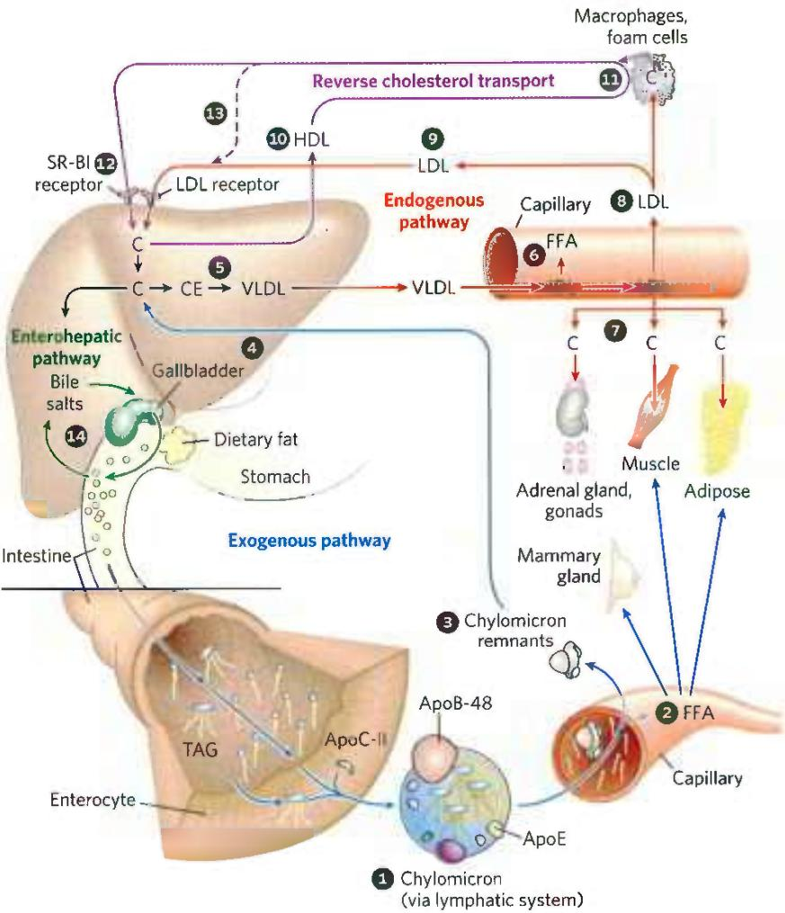  
FIGURE 21-40 Lipoproteins and lipid transport. Lipids are transported in the bloodstream as lipoproteins, which exist as several variants that have different functions, different protein and lipid compositions (see Tables 21-1 and 21-2), and thus different densities. Numbered steps are described in the text. In the exogenous pathway (blue arrows), dietary lipids are packaged into chylomicrons; fatty acids from triacylglycerol (TAG) are released by lipoprotein lipase to adipose and muscle tissues, during transport through capillaries. Chylomicron remnants (containing largely protein and cholesterol) are taken up  
by the liver. Bile salts produced in the liver aid in dispersing dietary fats and are then reabsorbed in the enterohepatic pathway (green arrows). In the endogenous pathway (red arrows), lipids synthesized or packaged in the liver are delivered to peripheral tissues by VLDL. Extraction of lipid from VLDL (along with loss of some apolipoproteins) gradually converts some of it to LDL, which delivers cholesterol to extrahepatic tissues or returns to the liver. Excess cholesterol in extrahepatic tissues is transported back to the liver as HDL in reverse cholesterol transport (purple arrows). C represents cholesterol; CE, cholesteryl ester.

Phosphatidylcholine (lecithin)

mediate uptake of these remnants by endocytosis. ④ In the liver, the remnants release their cholesterol and are degraded in lysosomes. This pathway from dietary cholesterol to the liver is the exogenous pathway (blue arrows in Fig. 21-40).

Very-low-density lipoprotein (VLDL) is the second of the four classes. When the diet contains more fatty acids and cholesterol than are needed immediately as fuel or as precursors to other molecules, 5 they are converted to triacylglycerols or cholesteryl esters in the liver and packaged with specific apolipoproteins into VLDL. Excess carbohydrate in the diet can also be converted to triacylglycerols in the liver and exported as VLDL. In addition to triacylglycerols and cholesteryl esters, VLDL contains apoB-100, apoC-I, apoC-II, apoC-III, and apoE (Table 21-2). VLDL is transported in the blood from the liver to muscle and adipose tissue. 6 In the capillaries of these tissues, apoC-II activates lipoprotein lipase, which catalyzes the release of free fatty acids from triacylglycerols in the VLDL. Adipocytes take up these fatty acids, reconvert them to triacylglycerols, and store the products in intracellular lipid droplets; myocytes, in contrast, primarily oxidize the fatty acids to supply energy. When the insulin level is high (after a meal), VLDL serves primarily to convey lipids from the diet to adipose tissue for storage. In the fasting state between meals, the fatty acids used to produce VLDL in the liver originate primarily from adipose tissue, and the principal VLDL target is myocytes of the heart and skeletal muscle.

Low-density lipoprotein (LDL), the third class of lipoprotein, is formed when triacylglycerol loss converts some VLDL to VLDL remnants, also called intermediate-density lipoprotein (IDL). Further removal of triacylglycerol from IDL (remnants) produces LDL. Rich in cholesterol and cholesteryl esters, and containing apoB-100 as its major apolipoprotein, ⑦ LDL carries cholesterol to extrahepatic tissues such as muscle, adrenal glands, and adipose tissue. These tissues have plasma membrane LDL receptors that recognize apoB-100 and mediate uptake of cholesterol and cholesteryl esters. ⑧ LDL also delivers cholesterol to macrophages, sometimes converting them into foam cells (see Fig. 21-46). ⑨ LDL not taken up by peripheral tissues and cells returns to the liver and is taken up via LDL receptors in the hepatocyte plasma membrane. Cholesterol that enters hepatocytes by this path may be incorporated into membranes, converted to bile acids, or reesterified by ACAT (Fig. 21-38) for storage within cytosolic lipid droplets. This pathway, from VLDL formation in the liver to LDL return to the liver, is the endogenous pathway of cholesterol metabolism and transport (red arrows in Fig. 21-40). Accumulation of excess intracellular cholesterol is prevented by reducing the rate of cholesterol synthesis when sufficient cholesterol is available from LDL in the blood. Regulatory mechanisms to accomplish this are described below.

#### [EN] HDL Carries Out Reverse Cholesterol Transport

High-density lipoprotein (HDL), the fourth major lipoprotein in mammals, $^{10}$ originates in the liver and small intestine as small, protein-rich particles that contain relatively little cholesterol and no cholesteryl esters (Fig. 21-40). HDLs contain primarily apoA-I and other apolipoproteins (Table 21-2). They also contain the enzyme lecithin-cholesterol acyltransferase (LCAT), which catalyzes the formation of cholesteryl esters from lecithin (phosphatidylcholine) and cholesterol (Fig. 21-41). LCAT on the surface of nascent (newly forming) HDL particles converts the cholesterol and phosphatidylcholine of chylomicron and VLDL remnants encountered in the bloodstream to cholesteryl esters, which begin to form a core, transforming the disk-shaped nascent HDL to a mature, spherical HDL particle.

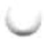

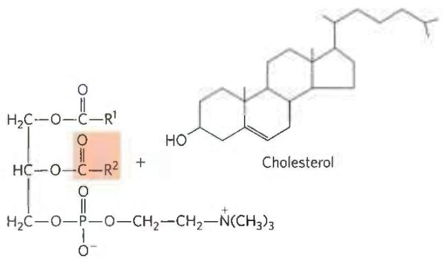

  
FIGURE 21-41 Reaction catalyzed by lecithin-cholesterol acyltransferase (LCAT). This enzyme is present on the surface of HDL and is stimulated by the HDL component apoA-I. Cholesteryl esters accumulate within nascent HDLs, converting them to mature HDLs.

11 Nascent HDL can also pick up cholesterol from cholesterol-rich extrahepatic cells (including macrophages and foam cells, formed from macrophages; see below).
12 Mature HDL then returns to the liver, where the cholesterol is unloaded via the scavenger receptor SR-BI.
13 Some of the cholesteryl esters in HDL can also be transferred to LDL by the cholesteryl ester transfer protein. The HDL circuit is reverse cholesterol transport (purple arrows in Fig. 21-40). Much of this cholesterol is converted to bile salts by enzymes sequestered in hepatic peroxisomes; the bile salts are stored in the gallbladder and excreted into the intestine when a meal is ingested.
14 Bile salts are reabsorbed by the liver and recirculate through the gallbladder in this enterohepatic circulation (green arrows in Fig. 21-40).

The unloading of sterols via SR-BI receptors in liver and other tissues does not occur by endocytosis, the mechanism used for LDL uptake. Instead, when HDL binds to SR-BI receptors in the plasma membranes of hepatocytes or steroidogenic tissues such as the adrenal gland, these receptors mediate partial and selective transfer of cholesterol and other lipids in HDL into the cell. Depleted HDL then dissociates to recirculate in the bloodstream and extract more lipids from remnants of chylomicrons and VLDL, and from cells overloaded with cholesterol, as described below.

#### [EN] Cholesteryl Esters Enter Cells by Receptor-Mediated Endocytosis

Each LDL particle in the bloodstream contains apoB-100, which is recognized by LDL receptors present in the plasma membranes of cells that need to take up cholesterol. Figure 21-42 shows such a cell. ① LDL receptors are synthesized in the ER and transported to the plasma membrane, after modification in the Golgi complex. At the plasma membrane, they are available to bind apoB-100. ② Binding of LDL to an LDL receptor initiates endocytosis, which ③ conveys the LDL and its receptor into the cell within an endosome. ④ The receptor-containing portions of the endosome membrane bud off and are returned to the cell surface, to function again in LDL uptake. ⑤ The endosome fuses with a lysosome, which ⑥ contains enzymes that hydrolyze the cholesteryl esters, releasing cholesterol and fatty acids into the cytosol. The apoB-100 protein is also degraded to amino acids that are released to the cytosol. ApoB-100 is also present in VLDL, but its receptor-binding domain is not available for binding to the LDL receptor; conversion of VLDL to LDL exposes the receptor-binding domain of apoB-100.

This pathway for the transport of cholesterol in blood and its receptor-mediated endocytosis by target tissues was elucidated by Michael Brown and

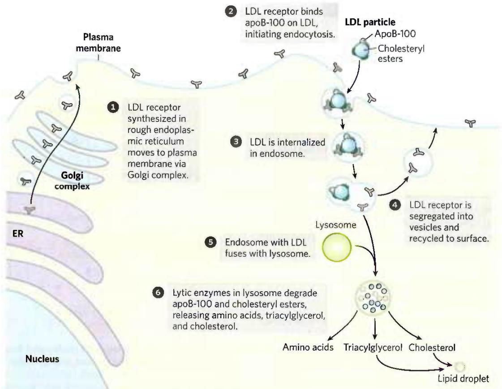  
FIGURE 21-42 Uptake of cholesterol by receptor-mediated endocytosis.

Joseph Goldstein. They discovered that individuals with the genetic disease familial hypercholesterolemia (FH) have mutations in the LDL receptor that prevent the normal uptake of LDL by liver and peripheral tissues. The result of defective LDL uptake is very high blood levels of LDL (and of the cholesterol it carries). Individuals with FH have a greatly increased probability of developing atherosclerosis, a disease of the cardiovascular system in which blood vessels are occluded by cholesterol-rich plaques (see Fig. 21-46).

  
Michael Brown and Joseph Goldstein
[Mei-Chun Jau. Courtesy of Michael Brown and Joseph Goldstein, University of Texas Southwestern Medical Center.]

Niemann-Pick type-C (NPC) disease is an inherited defect in lipid storage. In this disorder, cholesterol is not transported out of the lysosomes and instead accumulates in lysosomes of liver, brain, and lung, bringing about early death. NPC is the result of a mutation in either of two genes, NPC1 and NPC2, essential to moving cholesterol out of the lysosome and into the cytosol, where it can be further metabolized. NPC1 encodes a transmembrane lysosomal protein, and NPC2 encodes a soluble protein. These proteins act in tandem to transfer cholesterol out of the lysosome and into the cytosol for further processing or metabolism.

#### [EN] Cholesterol Synthesis and Transport Are Regulated at Several Levels

Cholesterol synthesis is a complex and energy-expensive process. Excess cholesterol cannot be catabolized for use as fuel and must be excreted. Therefore, it is clearly advantageous to an organism to regulate the biosynthesis of cholesterol to complement dietary intake. In mammals, cholesterol production is regulated by intracellular cholesterol concentration, by the supply of ATP, and by the hormones glucagon and insulin. The committed step in the pathway to cholesterol (and a major site of regulation) is the conversion of HMG-CoA to mevalonate (Fig. 21-34), the reaction catalyzed by HMG-CoA reductase.

Short-term (minute-to-minute) regulation of the activity of existing HMG-CoA reductase is accomplished by reversible covalent alteration: phosphorylation by the AMP-dependent protein kinase (AMPK), which senses high AMP concentration (indicating low ATP concentration). Thus, when ATP levels drop, the synthesis of cholesterol slows, and catabolic pathways for the generation of ATP are stimulated (Fig. 21-43). Hormones that mediate global regulation of lipid and carbohydrate metabolism also act on HMG-CoA reductase; glucagon stimulates its phosphorylation (inactivation), and insulin promotes dephosphorylation, activating the enzyme and favoring cholesterol synthesis. These covalent regulatory mechanisms are probably not as important, quantitatively, as the mechanisms that affect the synthesis and degradation of the enzyme.

In the longer term, the number of molecules of HMG-CoA reductase is increased or decreased in response to cellular concentrations of cholesterol. Regulation of HMG-CoA reductase synthesis by cholesterol is mediated by an elegant system of transcriptional regulation of the HMG-CoA gene (Fig. 21-44). This gene, along with more than 20 other genes encoding enzymes that mediate the uptake and synthesis of cholesterol and unsaturated fatty acids, is controlled by a small family of proteins called sterol regulatory element-binding proteins (SREBPs). When newly synthesized, these proteins are embedded in the ER. Only the soluble regulatory domain fragment of an SREBP functions as a transcription activator, through mechanisms discussed in Chapter 28. When cholesterol and oxysterol levels are high, SREBPs are held in the ER in a complex with another protein called SREBP cleavage-activating protein (SCAP), which in turn is anchored in the ER membrane by its interaction with a third membrane protein, Insig (insulin-induced gene protein) (Fig. 21-44a). SCAP and Insig act as sterol sensors. When sterol levels are high, the Insig-SCAP-SREBP complex is retained in the ER membrane. When the level of sterols in the cell declines (Fig. 21-44b), the SCAP-SREBP complex is escorted by secretory proteins to the Golgi complex. There, two proteolytic cleavages of SREBP release a regulatory fragment, which enters the nucleus and activates transcription of its target genes, including those for HMG-CoA reductase, the LDL receptor protein, and other proteins needed for lipid synthesis. When sterol levels increase sufficiently, the proteolytic release of SREBP amino-terminal domains is again blocked, and proteasome degradation of the existing active domains results in rapid shutdown of the gene targets.

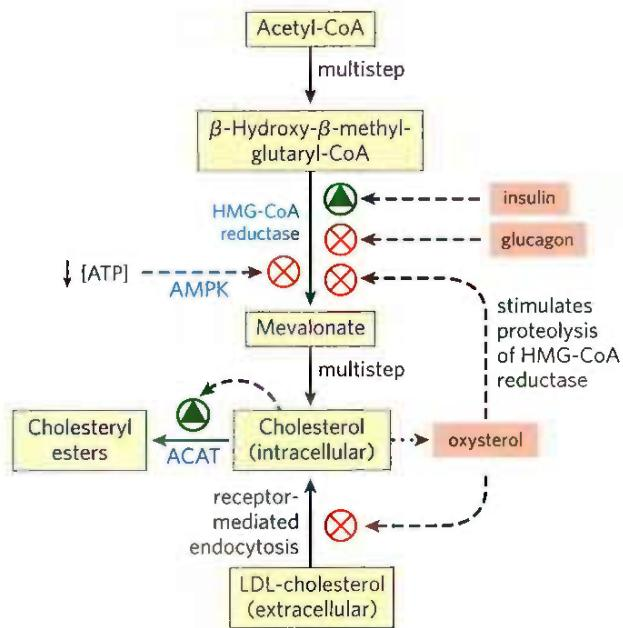  
FIGURE 21-43 Regulation of cholesterol formation balances synthesis with dietary uptake and energy state. Insulin promotes dephosphorylation (activation) of HMG-CoA reductase; glucagon promotes its phosphorylation (inactivation); and the AMP-dependent protein kinase AMPK, when activated by low [ATP] relative to [AMP], phosphorylates and inactivates HMG-CoA reductase. Oxysterol metabolites of cholesterol (for example, 24(S)-hydroxycholesterol) stimulate proteolysis of HMG-CoA reductase.

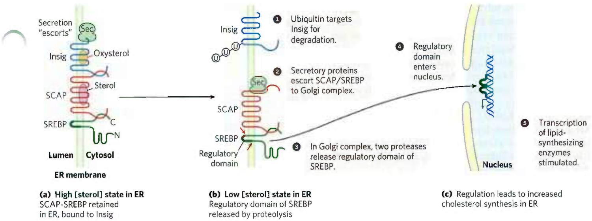  
FIGURE 21-44 Regulation of cholesterol synthesis by SREBP. Sterol regulatory element-binding proteins (SREBPs) are embedded in the ER when first synthesized, in a complex with the protein SREBP cleavage-activating protein (SCAP), which is in turn bound to Insig. (N and C represent the amino and carboxyl termini of the proteins.) (a) Under normal circumstances (high [sterol]), SCAP and Insig are bound to SREBPs and the SREBPs are inactive. (b) When sterol  
levels decline, sterol-binding sites on Insig and SCAP are unoccupied, and Insig is targeted for degradation by the attachment of several ubiquitin molecules. The remaining SCAP-SREBP complex migrates to the Golgi complex, and SREBP is cleaved (arrows) to produce a regulatory domain fragment. (c) This domain acts in the nucleus to increase the transcription of sterol-regulated genes. (Information from R. Raghow et al., Trends Endocrinol Metab. 19:65, 2008, Fig. 2.)

The level of HMG-CoA reductase is also regulated by proteolytic degradation of the enzyme itself. High levels of cellular cholesterol are sensed by Insig, which triggers attachment of ubiquitin molecules to HMG-CoA reductase, leading to its degradation by proteasomes.

Liver X receptor (LXR) is a nuclear transcription factor activated by oxysterol ligands (reflecting high cholesterol levels), which integrates the metabolism of fatty acids, sterols, and glucose. LXRα is expressed primarily in liver, adipose tissue, and macrophages; LXRβ is present in all tissues. When bound to an oxysterol ligand, LXRs form heterodimers with a second type of nuclear receptor, the retinoid X receptors (RXR), and the LXR-RXR dimer activates transcription from a set of genes (Fig. 21-45), including those for acetyl-CoA carboxylase, the first enzyme in fatty acid synthesis; fatty acid synthase; the cytochrome P-450 enzyme CYP7A1, required for sterol conversion to bile acids; apoproteins that participate in cholesterol transport (apoC-I, apoC-II, apoD, and apoE); the ATP-binding cassette (ABC) transporters ABCA1 and ABCG1, required for reverse cholesterol transport (see below); GLUT4, the insulin-stimulated glucose transporter of muscle and adipose tissue; and an SREBP called SREBP1C. The transcriptional regulators LXR and SREBP therefore work together to achieve and maintain cholesterol homeostasis; SREBPs are activated by low levels of cellular cholesterol, and LXRs are activated by high cholesterol levels.

  
FIGURE 21-45 Action of RXR-LXR dimer on expression of genes for lipid and glucose metabolism. When their ligands are absent, RXR and LXR associate with a corepressor protein, preventing transcription of the genes associated with the LXR element (LXRE). When their respective ligands are present — 9-cis-retinoic acid for RXR, cholesterol or oxysterols for LXR — the dimer dissociates from the corepressor, then associates with a coactivator protein. This complex binds to the LXR element and turns on expression of the associated genes. Regulation of gene expression is a topic discussed in more detail in Chapter 28. [Information from A. C. Calkin and P. Tontonoz, Nat. Rev. Mol. Cell Biol. 13:213, 2012, Fig. 1.]

Regulation by LXRs is complemented by the activity of farnesoid X receptor (FXR), which also forms a heterodimer with RXR, with an effect that is often reciprocal to that of LXR-RXR. Although farnesol is a ligand for this receptor, FXR responds primarily to bile acids. High levels of bile acids can be toxic. FXR, expressed mainly in the intestine, liver, kidney, and adrenal glands, provides essential control of bile acid levels by increasing or decreasing expression of multiple genes. FXR represses many of the genes that are activated by LXR.

Finally, two other regulatory mechanisms influence cellular cholesterol level: (1) high cellular concentrations of cholesterol activate ACAT, which increases esterification of cholesterol for storage, and (2) high cellular cholesterol levels diminish (via SREBP) transcription of the gene that encodes the LDL receptor, reducing production of the receptor and thus the uptake of cholesterol from the blood.

#### [EN] Dysregulation of Cholesterol Metabolism Can Lead to Cardiovascular Disease

As noted earlier, cholesterol cannot be catabolized by animal cells. Excess cholesterol can be removed only by excretion or by conversion to bile salts. When the sum of cholesterol synthesized and cholesterol obtained in the diet exceeds the amount required for the synthesis of membranes, bile salts, and steroids, pathological accumulations of cholesterol (plaques) can obstruct blood vessels, a condition called atherosclerosis. Heart failure due to occluded coronary arteries is a leading cause of death in industrialized societies. Atherosclerosis is linked to high levels of cholesterol in the blood, and particularly to high levels of LDL-cholesterol ("bad cholesterol"); there is a negative correlation between HDL ("good cholesterol") levels and arterial disease. Plaque formation in blood vessels is initiated when LDL containing partially oxidized fatty acyl groups adheres to and accumulates in the extracellular matrix of epithelial cells lining arteries (Fig. 21-46). Immune cells (monocytes) are attracted to regions with such LDL accumulations, and they differentiate into macrophages, which take up the oxidized LDL and the cholesterol they contain. Macrophages cannot limit their uptake of sterols, and with increasing accumulation of cholesteryl esters and free cholesterol, the macrophages become foam cells (they appear foamy when viewed under the microscope). As excess free cholesterol accumulates in foam cells and their membranes, the cells undergo apoptosis. Over long periods of time, arteries become progressively occluded as plaques consisting of extracellular matrix material, scar tissue formed from smooth muscle tissue, and foam cell remnants gradually become larger. Within the cholesterol-rich plaques, cholesterol can crystallize (Fig. 21-46, inset). Occasionally, a plaque breaks loose from the site of its formation and is carried through the blood to a narrowed region of an artery in the brain or the heart, causing a stroke or a heart attack. Cholesterol crystals that break loose from plaques can cause vascular injury.

  
FIGURE 21-46 Formation of atherosclerotic plaques. Excess lipid derived from the diet is deposited on arterial walls, a process facilitated by the conversion of monocytes to foam cells and incorporation of foam cells into  
growing plaques. Some of this deposition is countered by HDL and reverse cholesterol transport. The LCAT reaction is shown in Figure 21-41. The inset shows a polarized light micrograph of cholesterol crystals. [Ralph C. Eagle, Jr./Science Source.]

In familial hypercholesterolemia, blood levels of cholesterol are extremely high and severe atherosclerosis develops in childhood. Affected individuals have a defective LDL receptor and lack receptor-mediated uptake of cholesterol carried by LDL. Consequently, cholesterol is not cleared from the blood; it accumulates in foam cells and contributes to the formation of atherosclerotic plaques. Endogenous cholesterol synthesis continues despite the excessive cholesterol in the blood, because extracellular cholesterol cannot enter cells to regulate intracellular synthesis (Fig. 21-44). Drugs in a class called statins, some isolated from natural sources and some synthesized industrially, are used to treat patients with elevated serum cholesterol caused by familial hypercholesterolemia and other conditions. The statins resemble mevalonate (Box 21-2) and are competitive inhibitors of HMG-CoA reductase.

An alternative approach to controlling serum cholesterol levels is to activate LXRs, which has the overall effect of decreasing cholesterol absorption and promoting its excretion. This is the mode of action of a drug called ezetimibe. Ezetimibe is not as effective in lowering serum cholesterol as statins. However, in combination with statins, it can lower risk of stroke or heart attack in high-risk patients. Because LXR activation also activates SREBP1C, causing the liver to increase its production of fatty acids and triacylglycerols, new classes of drugs that target only intestinal LXRs are being developed.

#### [EN] Reverse Cholesterol Transport by HDL Counters Plaque Formation and Atherosclerosis

HDL plays a critical role in the reverse cholesterol transport pathway (Fig. 21-47), reducing the potential damage from foam cell buildup. Depleted HDL (low in cholesterol) picks up cholesterol stored in extrahepatic tissues, including foam cells at nascent plaques, and carries it to the liver.

  
FIGURE 21-47 Reverse cholesterol transport. ApoA-I and HDLs pick up excess cholesterol (C) from peripheral cells, with the participation of ABCA1 and ABCG1 transporters, and return it to the liver. In individuals with genetically defective ABCA1, the failure of reverse cholesterol transport leads to severe and early cardiovascular diseases: Tangier disease and familial HDL deficiency disease. CE, cholesteryl esters; TAG, triacylglycerols. [Information from A. R. Tall et al., Cell Metab. 7:365, 2008, Fig. 1.]

Cholesterol movement out of cells requires transporters. The human genome encodes 48 transporters of the ATP-binding cassette (ABC) class, and about half of these promote lipid transport. Two of them transport cholesterol out of cells. In this process, apoA-I interacts with the transporter ABCA1 in a cholesterol-rich cell. ABCA1 transports a load of cholesterol from inside the cell to the outer surface of the plasma membrane, where lipid-free or lipid-poor apoA-I picks it up, then transports it to the liver. Another transporter, ABCG1, interacts with mature HDL, facilitating the movement of cholesterol out of the cell and into the HDL. This efflux process is particularly critical to reverse cholesterol transport away from foam cells at the sites of plaques in the blood vessels of individuals with cardiovascular disease.

In familial HDL deficiency, HDL levels are very low, and in Tangier disease they are almost undetectable (Fig. 21-47). Both genetic disorders are the result of mutations in the ABCA1 protein. ApoA-I in cholesterol-depleted HDL cannot take up cholesterol from cells that lack ABCA1 protein, and apoA-I and cholesterol-poor HDL are rapidly removed from the blood and destroyed. Both familial HDL deficiency and Tangier disease are very rare (worldwide, fewer than 100 families with Tangier disease are known), but the existence of these diseases establishes a role for ABCA1 and ABCG1 proteins in the regulation of plasma HDL levels.

#### [EN] Steroid Hormones Are Formed by Side-Chain Cleavage and Oxidation of Cholesterol

Humans derive all their steroid hormones from cholesterol (Fig. 21-48). P5 Two classes of steroid hormones are synthesized in the cortex of the adrenal gland: mineralocorticoids, which control the reabsorption of inorganic ions $(\mathrm{Na}^{+}, \mathrm{Cl}^{-}$ , and $\mathrm{HCO}_{3}^{-}$ ) by the kidney, and gluco-corticoids, which help regulate gluconeogenesis and

  
$R^{2} = OH$

#### [EN] The Lipid Hypothesis and the Development of Statins

Coronary heart disease is the leading cause of death in developed countries. The coronary arteries that bring blood to the heart become narrowed due to the formation of fatty deposits called atherosclerotic plaques, containing cholesterol, fibrous proteins, calcium deposits, blood platelets, and cell debris. Developing the link between artery occlusion (atherosclerosis) and blood cholesterol levels was a project of the twentieth century, triggering a dispute that was resolved only with the development of effective cholesterol-lowering drugs. The Framingham Heart Study, a longitudinal study begun in 1948 and continuing today, was aimed at identifying factors correlated with cardiovascular disease. About 5,000 participants from the city of Framingham, Massachusetts, underwent periodic physical examinations and lifestyle interviews. By 2002, participants of the third generation were included in the study. This monumental study led to the identification of risk factors for cardiovascular disease, including smoking, obesity, physical inactivity, diabetes, high blood pressure, and high blood cholesterol.

In 1913, N. N. Anitschkov, an experimental pathologist in Saint Petersburg, Russia, published a study showing that rabbits fed a diet rich in cholesterol developed lesions very similar to the atherosclerotic plaques seen in aging humans. Anitschkov continued his work over the next few decades, publishing it in prominent western journals. Nevertheless, the work was not accepted as a model for human atherosclerosis, due to a prevailing view that the disease was simply a consequence of aging and could not be prevented. The link between serum cholesterol and atherosclerosis (the lipid hypothesis) was gradually strengthened, however, until researchers in the 1960s openly suggested that therapeutic intervention might be helpful. Controversy persisted until the results of a large study of cholesterol lowering, sponsored by the U.S. National Institutes of Health, was published in 1984: the Coronary Primary Prevention Trial. This study conclusively showed a statistically significant decrease in heart attacks and strokes as a result of decreasing blood cholesterol level. The study made use of a bile acid-binding resin, cholestyramine, to control

reduce the inflammatory response. Sex hormones are produced in male and female gonads and the placenta. They include progesterone, which regulates the female reproductive cycle, and androgens (such as testosterone) and estrogens (such as estradiol), which influence the development of secondary sexual characteristics in males and females, respectively. Steroid hormones are effective at very low concentrations and are therefore synthesized in relatively small quantities. In comparison with the bile salts, their production consumes relatively little cholesterol.

cholesterol. The results triggered a search for more effective therapeutic interventions. Some controversy persisted until development of the statins in the late 1980s and 1990s.

Dr. Akira Endo, working at the Sankyo company in Tokyo, discovered the first statin and reported the work in 1976. Endo had been interested in cholesterol metabolism for some time, and he speculated in 1971 that the fungi being screened at that time for new antibiotics might also contain an inhibitor of cholesterol synthesis. Over a period of several years, he screened more than 6,000 fungal cultures until a positive result emerged. The compound that resulted was named compactin (Fig. 1). This compound eventually proved effective in reducing cholesterol levels in dogs and monkeys, and the work came to the attention of Michael Brown and Joseph Goldstein at the University of Texas–Southwestern Medical School. Brown and Goldstein began to work with Endo, and they confirmed his results. Some dramatic results in the first limited clinical trials convinced several pharmaceutical firms to join the hunt for statins. A team at Merck, led by Alfred Alberts

  
Simvastatin (Zocor)  
Pravastatin (Pravachol)  
Lovastatin (Mevacor)

FIGURE 1 Statins as inhibitors of HMG-CoA reductase. A comparison of the structures of mevalonate and four pharmaceutical compounds (statins) that inhibit HMG-CoA reductase.  

Synthesis of steroid hormones requires removal of some or all of the carbons in the "side chain" on C-17 and P. Roy Vagelos, began screening fungal cultures and found a positive result after screening just 18 cultures. The new statin was eventually called lovastatin (Fig. 1). In 1980, a rumor that compactin, at very high doses, was carcinogenic in dogs almost sidelined the race to develop statins, but the benefits to people with familial hypercholesterolemia were already evident. After much consultation with experts around the world and with the U.S. Food and Drug Administration, Merck proceeded carefully to develop lovastatin. Extensive testing over the next two decades revealed no carcinogenic effects from lovastatin, or from the newer generations of statins that have appeared since.

  
Akira Endo
[Courtesy of Akira Endo, Ph.D.]

  
Alfred Alberts (1931–2018)
[Courtesy of Eli Alberts.]

Statins inhibit HMG-CoA reductase, in part, by mimicking the structure of mevalonate (Fig. 1), and thus inhibit cholesterol synthesis. Lovastatin treatment lowers serum cholesterol by as much as 30% in individuals with hypercholesterolemia resulting from one defective copy of the gene for the LDL receptor. When combined with an edible resin that binds bile acids and prevents their reabsorption from the intestine, the statin is even more effective.

of the D ring of cholesterol. Side-chain removal takes place in the mitochondria of steroidogenic tissues. Removal requires the hydroxylation of two adjacent carbons in the side chain (C-20 and C-22) followed by cleavage of the bond between them (Fig. 21-49). Formation of the various hormones also requires the introduction of oxygen atoms. All the hydroxylation and oxygenation reactions in steroid biosynthesis are catalyzed by mixed-function oxygenases (see Box 21-1) that use NADPH, O₂, and mitochondrial cytochrome P-450.

  
P. Roy Vagelos
[Courtesy of P. Roy Vagelos.]

Statins are now the most widely used drugs for lowering serum cholesterol levels. Side effects are always a concern with drugs, but in the case of statins, many of the side effects are positive. These drugs can improve blood flow, enhance the stability of atherosclerotic plaques (so they don't rupture and obstruct blood flow), reduce platelet aggregation, and reduce vascular inflammation. In patients taking statins for the first time, some of these effects occur before cholesterol levels drop and may be related to a secondary inhibition of isoprenoid synthesis. Not all effects of statins are positive. Some individuals, usually among those taking statins in combination with other cholesterol-lowering drugs, experience muscle pain or weakness that can become severe and even debilitating. For these patients, the effects may sometimes be ameliorated by diet supplementation with coenzyme $Q_{10}$ , a coenzyme that statin therapy depletes in the serum. A fairly long list of other side effects has been documented; most are rare. However, for the vast majority of people, the statin-mediated decrease in risks associated with coronary heart disease can be dramatic. As with all medications, statins should be used only in consultation with a physician.

#### [EN] Intermediates in Cholesterol Biosynthesis Have Many Alternative Fates

In addition to its role as an intermediate in cholesterol biosynthesis, isopentenyl pyrophosphate is the activated precursor of a huge array of biomolecules with diverse biological roles (Fig. 21-50). P5 They include vitamins A, E, and K; plant pigments such as carotene and the phytol chain of chlorophyll; natural rubber; many essential oils, such as the fragrant principles of lemon oil, eucalyptus, and musk; insect juvenile hormone, which controls metamorphosis; dolichols, which serve as lipid-soluble carriers in complex polysaccharide synthesis; and ubiquinone and plastoquinone, electron carriers in mitochondria and chloroplasts. Collectively, these molecules are called isoprenoids. More than 20,000 different isoprenoid molecules have been discovered in nature, and hundreds of new ones are reported each year.

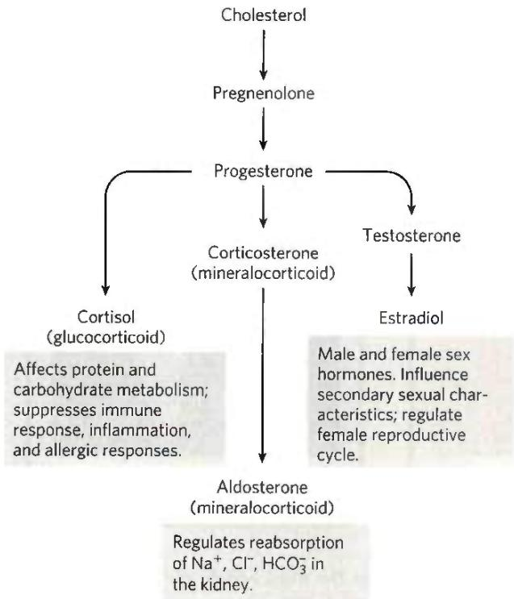  
FIGURE 21-48 Some steroid hormones derived from cholesterol. The structures of some of these compounds are shown in Figure 10-18.

Prenylation, the covalent attachment of an isoprenoid (see Fig. 27-35), is a common mechanism by which proteins are anchored to the inner surface of cellular membranes in mammals (see Fig. 11-16). In some of these proteins, the attached lipid is the 15-carbon farnesyl group; others have the 20-carbon geranylgeranyl group. Different enzymes attach the two types of lipids. It is possible that prenylation targets proteins to different membranes, depending on which lipid is attached. Protein prenylation is another important role for the isoprene derivatives of the pathway to cholesterol.

#### [EN] SUMMARY 21.4 Cholesterol, Steroids, and Isoprenoids: Biosynthesis, Regulation, and Transport

■ Cholesterol is formed from acetyl-CoA in a complex series of reactions, through the intermediates $\beta$ -hydroxy- $\beta$ -methylglutaryl-CoA (HMG-CoA), mevalonate, and two activated isoprenes, dimethylallyl pyrophosphate and isopentenyl pyrophosphate. Condensation of isoprene units produces the noncyclic squalene, which is cyclized to yield the steroid ring system and side chain.

  
FIGURE 21-49 Side-chain cleavage in the synthesis of steroid hormones. Cytochrome P-450 acts as electron carrier in this monooxygenase system that oxidizes adjacent carbons. The process also requires the electron-transferring proteins adrenodoxin and adrenodoxin reductase. This system for cleaving side chains is found in mitochondria of the adrenal cortex, where active steroid production occurs. Pregnenolone is the precursor of all other steroid hormones (see Fig. 21-48).

■ Synthesized primarily in the liver, cholesterol is exported as bile acids, biliary cholesterol, or cholesteryl esters.

■ Cholesterol and cholesteryl esters are carried in the blood as plasma lipoproteins. VLDL carries cholesterol, cholesteryl esters, and triacylglycerols from the liver to other tissues, where the triacylglycerols are degraded by lipoprotein lipase, converting VLDL to LDL. Cholesterol scavenging and transport back to the liver are mediated by HDL. Much of the lipid carried to the liver is utilized in bile salts.

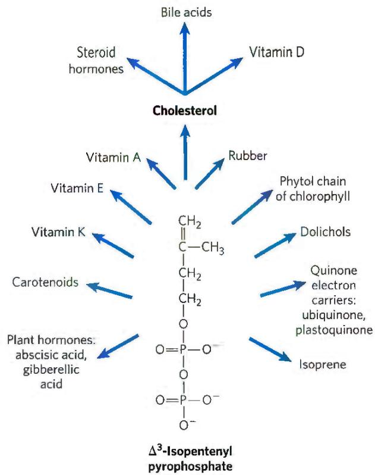  
FIGURE 21-50 Overview of isoprenoid biosynthesis. The structures of most of the end products shown here are given in Chapter 10.

■ The LDL, rich in cholesterol and its esters, is taken up by receptor-mediated endocytosis, in which the apolipoprotein B-100 of LDL is recognized by receptors in the plasma membrane.

■ Cholesterol synthesis and transport are under complex regulation by hormones, cellular cholesterol content, and energy level (AMP concentration). HMG-CoA reductase is regulated allosterically and by covalent modification. Furthermore, a complex of three proteins—Insig, SCAP, and SREBP—sense cholesterol levels and trigger increased synthesis or degradation of HMG-CoA reductase in response. The number of LDL receptors per cell is also regulated by cholesterol content.

■ Dietary conditions or genetic defects in cholesterol metabolism may lead to atherosclerosis and heart disease.

In reverse cholesterol transport, HDL removes cholesterol from peripheral tissues, carrying it to the liver. By reducing the cholesterol content of foam cells, HDL protects against atherosclerosis.

■ The steroid hormones (glucocorticoids, mineralocorticoids, and sex hormones) are produced from cholesterol by alteration of the side chain and introduction of oxygen atoms into the steroid ring system. In addition to cholesterol, a wide variety of isoprenoid compounds are derived from mevalonate through condensations of isopentenyl pyrophosphate and dimethylallyl pyrophosphate.

■ Prenylation of certain proteins targets them for association with cellular membranes and is essential for their biological activity.

<!-- EN-END 21.4 -->

## 提要

脂肪酸分解代谢又称脂肪酸 $\beta$ 氧化，是指脂肪酸的长链被氧化最终产生ATP形式的能量。其过程，简言之是脂肪酸先以它的酰基与-CoA相连，形成脂酰-CoA衍生物。随后经过4步代谢反应，自脂肪酸的羧基端脱掉两个碳原子单元即乙酰辅酶-A单元。脂肪酸的彻底氧化是上述步骤的多次反复，以软脂酸为例，最终产生8个乙酰-CoA,7FADH $_2$ ,7NADH和7H $^+$ 。一分子软脂酸可生成106个ATP（过去的理论值为129个ATP），相当于-30.54 kJ×106=-3 237 kJ或-30.54 kJ×129=-3 940 kJ。

脂肪酸分解代谢发生于原核生物的细胞溶胶及真核生物的线粒体基质中。它在进入线粒体前，先与CoA以硫酯键连接形成脂酰-CoA而被活化。

线粒体内膜不允许长链脂酰-CoA穿透,为此它要先经肉碱/脂酰肉碱转移酶催化,形成肉碱衍生物,才可进入线粒体。一旦进入线粒体后又在酶的特异催化下,释出游离肉碱,回归为脂酰-CoA。

此后，脂酰-CoA 发生 $\beta$ 氧化经历 4 步反应。它们是① 脂酰-CoA 被 FAD 氧化形成反式 $-\Delta^{2}-$ 烯酰-CoA。② 上述烯酰-CoA 经过水合，生成 3-羟脂酰-CoA。③ 3-羟脂酰-CoA 被 $NAD^{+}$ 氧化，形成酮脂酰-CoA。④ 最后一步是被第二个 CoA 分子硫解，生成乙酰-CoA 及一个减少了两个碳原子的脂酰-CoA。以上反应都需相应酶的催化。

脂肪酸的 $\beta$ 氧化产生的 $\mathrm{FADH}_2$ 及NADH直接进入氧化磷酸化，乙酰-CoA则进入柠檬酸循环，并进一步产生 $\mathrm{FADH}_2$ 及NADH。动物体内 $\beta$ 氧化产生的乙酰-CoA不能转化为丙酮酸或草酰乙酸，因此也就不能产生葡萄糖。在植物中有另外两种酶可使乙酰-CoA通过乙醛酸途径(glyoxylate pathway)转化为草酰乙酸。

不饱和脂肪酸在它的 $\beta$ 氧化途径中，需有更多的酶参加反应。例如，棕榈油酸（顺式- $\Delta^9$ C16：7）按正常 $\beta$ 氧化进行了三个循环之后，形成顺式- $\Delta^3$ -烯酰-CoA，这时必得有异构酶参加反应将顺式- $\Delta^3$ 构型转化为反式- $\Delta^2$ 构型，才可继续沿 $\beta$ 氧化途径进行。对于偶数碳原子的多不饱和脂肪酸，除异构酶外，还需另外的酶参与。

奇数碳原子的脂肪酸在最后的一步循环后，生成乙酰-CoA(两个C)及丙酰-CoA(三个C)。

脂肪酸的 $\beta$ 氧化产生的乙酰-CoA，若过量就会转化为乙酰乙酸及 D-3-羟丁酸。后二者与甚少量的转化物丙酮合在一起称为酮体。乙酰乙酸及 D-3-羟丁酸产生于肝，在饥饿或患糖尿病时，它们可以提供选择性燃料给脑组织。

脂肪酸分解代谢与生物合成的调控,如若二者不同时发生,将会是“浪费”的。调控的因子是当生物体的能量贮存过量时,令合成进行,分解代谢只要在需能时才发生。肾上腺素和胰高血糖素、胰岛素都参与脂肪酸代谢的调控。

生物膜的重要特征是其脂质的双层膜(脂双层)。这些脂质是两亲性的。一般膜脂类是由磷脂类(phospholipid)和糖脂类(glycolipid)构成。磷酸甘油脂类(glycerophospholipid)是磷脂类中的代表,鞘脂类(sphingolipid)则是磷脂类和糖脂类二者兼而有之的代表。磷脂类的分解由4种以上的磷脂酶执行,不同酶有不同的攻击点。鞘脂类中又有鞘磷脂(sphingomyelin)与鞘糖脂(sphingoglycolipids)之分,其中鞘糖脂中的脑苷脂(cerebroside)、神经节苷酯(ganglioside)有着重要的生理学和医学意义。如鞘糖脂的分解代谢,最终可生成脂肪酸和长链碱。在代谢途径中,某种重要酶的缺欠都可导致严重的遗传疾患。

胆固醇代谢不同于绝大多数生物活性物质,不降解为二氧化碳和水。它仅经过氧化转化为胆汁酸、类固醇激素、维生素 $D_{3}$ 等。以胆汁酸盐形式进入肠道的胆固醇,一般是在细菌作用下转化为粪固醇或以残量胆固醇排出体外。

乙酰-CoA 是脂肪酸分子所有碳原子的唯一来源, 它来自糖的氧化分解或氨基酸的分解。这些过程是在线粒体内进行的, 但脂肪酸合成的酶却存在于细胞溶胶中。乙酰-CoA 借助柠檬酸-丙酮酸循环自线粒体进入细胞溶胶, 即乙酰-CoA 先与草酰乙酸缩合形成柠檬酸, 进入细胞溶胶后又裂解形成乙酰-CoA 和草酰乙酸。

脂肪酸生物合成的酶在哺乳动物几乎都在一个大酶复合体内，合成步骤如下：①启动，乙酰-CoA 经乙酰-ACP 转化为乙酰-合酶。②装载，丙二酰-CoA 转化为丙二酸单酰 ACP。③缩合，乙酰合酶与丙二酸单酰 ACP 缩合形成乙酰乙酰-ACP。④还原，将③的产物还原为 β-羟丁酰-ACP。⑤脱水，将④的产物脱水为 α,β-反式-丁烯酰-ACP。⑥还原，将⑤的产物还原生成丁酰-ACP。至此，每一循环脂肪链延长了两个碳原子。如此循环反复进行，例如生成了 16 个碳的软脂酰-ACP。实行最终一步⑦释放，软脂酰-ACP 水解，生成了软脂酸。

脂肪酸碳链的加长和去饱和是指生物合成最终产物为软脂酸,再长链的脂肪酸或不饱和脂肪酸,需要在形成软脂酸后,另加多步酶反应去完成。

磷脂类合成反应几乎是在膜结构表面进行,这是很独特的。其原因是磷脂分子的两亲性。在真核生物中有各样的细胞器与脂类合成相关,最重要的是内质网膜、线粒体和高尔基体。细菌中没有这样的细胞器,脂类合成是在内原生质膜。

磷脂质的生物合成是3-磷酸甘油或磷酸二羟丙酮经酰基化转化为磷脂酸,这是一个“中转作用”的中间体,可进一步经两种途径转化为磷脂,其一是磷脂酸与CTP作用,生成CDP-二酰甘油,它在细菌中可转化为磷脂酰丝氨酸,或磷脂酰甘油,或二磷脂酰甘油。大肠杆菌(E.coli)中的磷脂主要是磷脂酰乙醇胺。它是磷脂酰丝氨酸经脱羧反应生成的。第二条途径发现于真核生物体中,磷脂酸水解为二酰甘油,后者与CDP-乙醇胺或CDP-胆碱反应,生成磷脂酰乙醇胺或磷脂酰胆碱。二酰甘油还有另外别的途径,即与脂酰-CoA反应生成三酰甘油。

磷脂类的脂酰基团或极性头部可以发生各样反应,或修饰,或交换。它还可被磷脂酶降解。磷脂在膜间的运送是由磷脂交换蛋白推动的。出芽和融合也对脂类在不同膜之间的分配起作用。

在大肠杆菌中,脂肪几乎全被用于磷脂合成,脂肪酸合成的调节发生在合成的起始步。在哺乳动物的肝中,脂肪酸是结构磷脂和能量贮存脂肪三酰甘油的重要前体。结构磷脂对脂肪酸的需要总是比用作能量贮存的脂肪即三酰甘油对脂肪酸的需要先得到满足。

三酰甘油合成速度的调控来自于膳食及生物合成对脂肪的供应情况。磷脂酰胆碱生物合成的调节首先实现于 CTP：磷酸胆碱磷脂酰转移酶催化的反应。该酶在细胞溶胶中无活性，当位移到内质网即被激活。在正常细胞中，其他磷脂酸生物合成的调节现尚不明。

鞘磷脂是真核细胞膜中重要的结构脂类。鞘氨醇经酰基化生成神经酰胺。它与磷脂酰胆碱反应即形成鞘磷脂。神经酰胺还可与活化了的糖类（如 UDP-葡萄糖）作用，转化生成鞘糖脂。对鞘糖脂分解代谢的研究引起对一些遗传性疾病的思考，这些疾患是因一种鞘脂类降解所需酶的缺欠所引起的。

前列腺素和血栓烷统称为类二十烷酸，它们都是以 $C_{20}$ 多不饱和脂肪酸——花生四烯酸为起始物合成的。这两类型化合物的生物活性很不相同。花生四烯酸在前列腺素内在过氧化物合酶催化下转化为 $PGH_{2}$ ，随后， $PGH_{2}$ 又可转化为 $PGE_{2}$ ， $PGF_{2}$ ， $TXA_{2}$ 或 $PGI_{2}$ 。另外，花生四烯酸还可转化为羟基花生四烯酸。类二十烷酸是一种局部激素（就地分泌，就地起作用），它与细胞表面的受体结合，而影响细胞的功能。这类受体总是与 GTP 结合蛋白反应，后者可改变第二信使如 cAMP 的合成。

类固醇是四环烷烃，环戊烷多氢菲（perhydrocyclopentano-phenanthrene）的衍生物。它的生物合成开始于3分子乙酰-CoA转化为甲羟戊酸。甲羟戊酸脱羧转化为异戊烯焦磷酸。随后，6分子异戊烯焦磷酸聚合生成（角）鲨烯，经环化生成羊毛固酮。至此四环烷烃的结构已形成。羊毛固酮再转化即得胆固醇，后者是胆酸，类固醇激素类等的前体。

胆固醇生物合成速度的调节首先由 HMG-CoA 还原酶的活性所决定。这个关键酶又由酶的合成和磷酸化/去磷酸化反应所控制。酶的合成受胆固醇调控，这里讲的胆固醇指的是低密度脂蛋白（LDL）提供给细胞的胆固醇。胆固醇和磷脂类靠脂蛋白运送到血浆取得。脂蛋白是由小肠和肝合成并分泌的。胆固醇合成的部位主要在细胞溶胶和内质网。

脂蛋白有5种，即：乳糜微粒、极低密度脂蛋白（VLDL）、低密度脂蛋白（LDL）、高密度脂蛋白（HDL）和中密度脂蛋白（IDL）。在乳糜微粒和VLDL中的三酰甘油在血浆脂蛋白脂肪酶的催化下降解，降解产物脂肪酸和单酰甘油主要被心、骨骼及脂肪组织吸收。LDL与质膜上专一的LDL受体结合后经胞吞作用

从血浆进入溶酶体。在溶酶体中 LDL 被酶解。

在家族性高胆固醇血症患者体内，专一的 LDL 受体是无活性的。这样，高水平的 LDL 有增加心血管疾患发病率的危险。而高水平的 HDL 却似可防止心血管疾患发生。

胆汁酸是 $C_{24}$ 的羧酸，它是胆固醇在体内的代谢产物。胆固醇的 $7\alpha-$ 羟基化是胆汁酸生物合成的第一步，这步反应既是必需的，又是承担限速的。胆汁酸形成后经分泌进入小肠，帮助脂类的溶解和消化。

## 习题

1. 说明 Knoop 对脂肪酸氧化的经典实验和结论。比较他的假说与现代 $\beta$ 氧化学说的异同。

2. 计算 1 分子硬脂酸彻底氧化成 $CO_{2}$ 及 $H_{2}O$ 产生的 ATP 分子数，并计算每克硬脂酸彻底氧化产生的自由能。

3. 说明肉碱-酰基转移酶在脂肪酸氧化过程中的作用。

4. 说明辅酶维生素 $B_{12}$ 在奇数碳原子氧化途径中的功能。

5. 说明在植烷酸的氧化中， $\alpha$ 氧化是必然的。

6. 如若膳食中只有肉、蛋和蔬菜，完全排除脂质，会不会发生脂肪酸缺乏症？

7. 患者体内发生脂质异常积聚,经检测,脂质中具有半乳糖-葡萄糖神经酰胺的结构。试问是哪一步酶反应不能正常运行?

8. 试说明“酮尿症”的生化机制。

9. 试解释“三羧酸转运体系”（tricarboxylate transport system）的作用机制和功能。

10. 说明真核生物体内脂肪酸合酶的结构与功能。

11. 试比较脂肪酸合成与脂肪酸 $\beta$ 氧化的异同。

12. 脂肪酸合成中的碳链延长在线粒体中和在内质网中的机制有何不同？

13. 乙酰-CoA 羧化酶在脂肪酸合成中起着调控作用,试述这个调控的机制。

14. 磷脂的特征是在 C2 位上有一不饱和脂肪酸。举一磷脂的实例，它在 C2 位上是饱和脂肪酸，这样的结构是怎样合成的？

15. 试述以 CDP-二脂酰甘油为起始物，3 种甘油磷脂（磷脂酰乙醇胺、磷脂酰甘油、二磷脂酰甘油）的生物合成路线。

16.“血小板活化因子”(platelet activating factor, PAF)为何物？用磷酸二羟丙酮为原料如何实现它的合成？

17. 试述以软脂酰-CoA 和丝氨酸为起始物, 鞘磷脂和葡糖-神经酰胺的生物合成路线。

18. 低剂量的阿司匹林(如隔日一粒)有防止心脏病突发的功能。如每日服用3\~4粒,为什么反而适得其反?(提示: $TXA_{2}$ 生成于血小板中, $PGI_{2}$ 生成于动脉壁上)

19. 培养肝细胞时加入 $2-\left[^{14}\mathrm{C}\right]-$ 乙酸。 $^{14}$ C 标记在 HMG-CoA 的什么位置上？

20. 试述酸性脂酶缺乏症的症候和病因。将患者的皮肤的成纤维细胞进行培养，HMG-CoA 的活性是变高还是变低？在培养基中 LDL 受体的数量是增还是减？

21. 乙酰-CoA 如何转化为甲羟戊酸？试述甲羟戊酸转化为(角)鲨烯的立体化学问题。

22. 试综述低密度脂蛋白(LDL)的大体组成、体内的运送和生物功能。

## 主要参考书目

1. Nelson D L, Cox M M. Lehninger Principles of Biochemistry. 6th ed. New York: W. H. Freeman and Company, 2012.

2. Kim K H, Kioez C F, Bai D H, et al. Role of reversible phosphorylation of acetyl-CoA carboxylase in long-chian fatty acid synthesis. FASEB J, 1989, (3): 225-256.

3. Lands W E. Biosynthesis of Prostaglandins. Ann. Rev. Nutrit, 1991, (11):41-60.

4. Rently R. Molecular Asymmetry in Biology. New York: Academic Press, 1970.

5. Eston S, Bartlett K, Pourfarzam M. Mammalian mitochondrial β-oxidation. Biochem. J, 1996, (320): 345–257.

6. Rinaldo P, Raymond K, et al. Clinical and biochemical features of fatty acid oxidation disorders. Curt. Opin. Pediatr, 1998, (10):615-621.

7. Thorpe C, Kim J J. Structure and mechanism of action of the acyl—CoA dehydrogenases. FASEB J, 1995, (9): 718-725.

8. Hashimoto T. Peroxisomal β-oxidation: enzymology and molecular Biology. Ann. N. Y. Acad. Sci, 1996(804):86-98.

9. Wanders R J, Vreken P, Ferdinandusse S, et al. Peroxisomal fatty acid $\alpha$ -and $\beta$ -oxidation in humans: enzymology, peroxisomal metabolite transporters and peroxisomal diseases. Biochem Soc Trans, 2001, (29): 250–267.

10. Desvergne B, Michalik L, Wahli W. Transcriptional regulation of metabolism. Physiol Rev, 2006, (86):465-514.

11. Maier T, Jenni S, Ban N. Architecture of mammalian fatty acid synthase at 4.5 Å resolution. Science, 2006, (311): 1258-1562.

12. Jenni S, Leibundgut M, Maier T, et al. Architecture of a fungal fatty acid synthase at 5 Å resolution. Science, 2006, (311): 1263–1267.

(王镜岩 秦咏梅)

## 网上资源

自测题

<!-- EN-BEGIN 第17章章末 -->

## 【英文对应 第17章章末】Fatty Acid Catabolism：关键术语、习题与简答

> 来源：Lehninger Principles of Biochemistry（书籍/02_生物化学原理） 第17章章末，以及书末 Abbreviated Solutions to Problems 第17章。

### [EN] KEY TERMS

Terms in bold are defined in the glossary.

$\beta$ oxidation 601  
apolipoprotein 602  
chylomicron 603  
lipoprotein 603  
perilipin 603  
free fatty acids 603  
serum albumin 603  
carnitine shuttle 603  
fatty acyl-CoA synthetase 603  
fatty acyl-CoA 604  
carnitine acyltransferase 1 (CAT1) 605  
acyl-carnitine/carnitine cotransporter 605  
carnitine acyltransferase 2 (CAT2) 605

electron-transfer
flavoprotein (ETF) 607
NADH dehydrogenase
(Complex I) 607
trifunctional protein
(TFP) 608
methylmalonyl-CoA
mutase 613
coenzyme B $_{12}$ 613
malonyl-CoA 613
pernicious anemia 615
intrinsic factor 615
PPAR (peroxisome
proliferator-activated
receptor) 616
medium-chain acyl-CoA
dehydrogenase (MCAD) 616 peroxisome 617
α oxidation 618
ketone bodies 619
acetone 619
acetoacetate 619

D-β-hydroxybutyrate 619
acidosis 621
ketosis 621
ketoacidosis 621

### [EN] PROBLEMS

1. Energy in Triacylglycerols On a per-carbon basis, where does the largest amount of biologically available energy in triacylglycerols reside: in the fatty acid portions or in the glycerol portion? Indicate how knowledge of the chemical structure of triacylglycerols provides the answer.

2. Effect of PDE Inhibitor on Adipocytes How would the addition of a cAMP phosphodiesterase (PDE) inhibitor affect the response of an adipocyte to epinephrine? (Hint: See Fig. 12-4.)

3. Compartmentation in $\beta$ Oxidation The activation of free palmitate to its coenzyme A derivative (palmitoyl-CoA) in the cytosol occurs before it can be oxidized in the mitochondrion. After adding palmitate and $[^{14}C]$ coenzyme A to a liver homogenate, you find palmitoyl-CoA isolated from the cytosolic fraction is radioactive, but that isolated from the mitochondrial fraction is not. Explain.

4. Mutant Carnitine Acyltransferase What changes in metabolic pattern would result from a mutation in the muscle carnitine acyltransferase 1 in which the mutant protein has lost its affinity for malonyl-CoA but not its catalytic activity?

5. Effect of Carnitine Deficiency An individual developed a condition characterized by progressive muscular weakness and aching muscle cramps. The symptoms were aggravated by fasting, exercise, and a high-fat diet. An homogenate of a skeletal muscle specimen from the patient oxidized added oleate more slowly than did control homogenates consisting of muscle specimens from healthy individuals. When the pathologist added carnitine to the patient's muscle homogenate, the rate of oleate oxidation equaled that in the control homogenates. Based on these results, the attending physician diagnosed the patient as having a carnitine deficiency.

(a) Why did added carnitine increase the rate of oleate oxidation in the patient's muscle homogenate?

(b) Why did fasting, exercise, and a high-fat diet aggravate the patient's symptoms?

(c) Suggest two possible reasons for the deficiency of muscle carnitine in this individual.

6. Fuel Reserves in Adipose Tissue Triacylglycerols, with their hydrocarbon-like fatty acids, have the highest energy content of the major nutrients.

(a) If 15% of the body mass of a 70.0 kg adult consists of triacylglycerols, what is the total available fuel reserve, in both kilojoules and kilocalories, in the form of triacylglycerols? Recall that 1.00 kcal = 4.18 kJ.

(b) If the basal energy requirement is approximately 8,400 kJ/day (2,000 kcal/day), how long could this person survive if the oxidation of fatty acids stored as triacylglycerols were the only source of energy?

(c) What would be the weight loss in pounds per day under such starvation conditions (1 lb = 0.454 kg)?

7. Common Reaction Steps in the Fatty Acid Oxidation Cycle and Citric Acid Cycle Cells often use the same enzyme reaction pattern for analogous metabolic conversions. For example, the steps in the oxidation of pyruvate to acetyl-CoA and of $\alpha$ -ketoglutarate to succinyl-CoA, although catalyzed by different enzymes, are very similar. The first stage of fatty acid oxidation follows a reaction sequence closely resembling a sequence in the citric acid cycle. Use equations to show the analogous reaction sequences in the two pathways.

8. $\beta$ Oxidation: How Many Cycles? How many cycles of $\beta$ oxidation are required for the complete oxidation of activated oleic acid, 18:1( $\Delta^{9}$ )?

9. Chemistry of the Acyl-CoA Synthetase Reaction Fatty acids are converted to their coenzyme A esters in a reversible reaction catalyzed by acyl-CoA synthetase:

$$
\begin{array}{c} \mathrm {R - CO O ^ {-} + ATP + CoA} \\ \stackrel {{\mathrm{O}}} {{\mathrm{R-C-CoA+AMP+PP}}} _ {i} \end{array}
$$

(a) The enzyme-bound intermediate in this reaction has been identified as the mixed anhydride of the fatty acid and adenosine monophosphate (AMP), acyl-AMP:

Write two equations corresponding to the two steps of the reaction catalyzed by acyl-CoA synthetase.

(b) The acyl-CoA synthetase reaction is readily reversible, with an equilibrium constant near 1. How can this reaction be made to favor formation of fatty acyl-CoA?

10. Intermediates in Oleic Acid Oxidation What is the structure of the partially oxidized fatty acyl group that is formed when oleic acid, $18:1(\Delta^{9})$ , has undergone three cycles of $\beta$ oxidation? What are the next two steps in the continued oxidation of this intermediate?

11. $\beta$ Oxidation of an Odd-Number Fatty Acid What are the direct products of $\beta$ oxidation of a fully saturated, straight-chain fatty acid of 11 carbons?

12. Oxidation of Tritiated Palmitate An investigator adds palmitate uniformly labeled with tritium ( $^{3}$ H) to a specific activity of $2.48 \times 10^{8}$ counts per minute (cpm) per micromole of palmitate to a mitochondrial preparation that oxidizes it to acetyl-CoA. She then isolates the acetyl-CoA and hydrolyzes it to acetate. The specific activity of the isolated acetate is $1.00 \times 10^{7}$ cpm/ $\mu$ mol. Is this result consistent with the $\beta$ -oxidation pathway? Explain. What is the final fate of the removed tritium? (Note: Specific activity is a measure of the degree of labeling with a radioactive tracer expressed as radioactivity per unit mass. In a uniformly labeled compound, all atoms of a given type are labeled.)

13. Comparative Biochemistry: Energy-Generating Pathways in Birds One indication of the relative importance of various ATP-producing pathways is the $V_{max}$ of certain enzymes of these pathways. The values of $V_{max}$ of several enzymes from the pectoral muscles (chest muscles used for flying) of pigeon and pheasant are listed below.

<table><tr><td rowspan="2">Enzyme</td><td colspan="2"> ${V}_{\max }\left( {\mu \mathrm{{mol}}}\right.$  substrate/min/g tissue)</td></tr><tr><td>Pigeon</td><td>Pheasant</td></tr><tr><td>Hexokinase</td><td>3.0</td><td>2.3</td></tr><tr><td>Glycogen phosphorylase</td><td>18.0</td><td>120.0</td></tr><tr><td>Phosphofructokinase-1</td><td>24.0</td><td>143.0</td></tr><tr><td>Citrate synthase</td><td>100.0</td><td>15.0</td></tr><tr><td>Triacylglycerol lipase</td><td>0.07</td><td>0.01</td></tr></table>

(a) Discuss the relative importance of glycogen metabolism and fat metabolism in generating ATP in the pectoral muscles of these birds.

(b) Compare oxygen consumption in the two birds.

(c) Judging from the data in the table, which bird is the long-distance flyer? Justify your answer.

(d) Why were these particular enzymes selected for comparison? Would the activities of triose phosphate isomerase and malate dehydrogenase be equally good bases for comparison? Explain.

14. Fatty Acids as a Source of Water Contrary to legend, camels do not store water in their humps, which actually consist of large fat deposits. How can these fat deposits serve as a source of water? Calculate the amount of water (in liters) that a camel can produce from 1.0 kg of fat. Assume for simplicity that the fat consists entirely of tripalmitoylglycerol.

15. Metabolism of a Straight-Chain Phenylated Fatty Acid Investigators isolate a crystalline metabolite from the urine of a rabbit that has been fed a straight-chain fatty acid containing a terminal phenyl group:

$$
\mathrm{CH} _ {2} - \left(\mathrm{CH} _ {2}\right) _ {n} - \mathrm{COO} ^ {-}
$$

The addition of 22.2 mL of 0.100 M NaOH completely neutralized a 302 mg sample of the metabolite in aqueous solution.

(a) What is the probable molecular weight and structure of the metabolite?

(b) Did the straight-chain fatty acid contain an even or an odd number of methylene ( $—CH_{2}—$ ) groups (i.e., is n even or odd)? Explain.

16. Fatty Acid Oxidation in Uncontrolled Diabetes When the acetyl-CoA produced during $\beta$ oxidation in the liver exceeds the capacity of the citric acid cycle, the excess acetyl-CoA forms ketone bodies—acetone, acetoacetate, and p- $\beta$ -hydroxybutyrate. This occurs in people with severe, uncontrolled diabetes; because their tissues cannot use glucose, they oxidize large amounts of fatty acids instead. Although acetyl-CoA is not toxic, the mitochondrion must divert the acetyl-CoA to ketone bodies. What problem would arise if acetyl-CoA were not converted to ketone bodies? How does the diversion to ketone bodies solve the problem?

17. Consequences of a High-Fat Diet with No Carbohydrates Suppose you had to subsist on a diet of whale blubber and seal blubber, with little or no carbohydrate.

(a) What would be the effect of carbohydrate deprivation on the utilization of fats for energy?

(b) If your diet were totally devoid of carbohydrate, would it be better to consume odd- or even-number fatty acids? Explain.

18. Even- and Odd-Number Fatty Acids in the Diet In a laboratory experiment, investigators feed two groups of rats two different fatty acids as their sole source of carbon for a month. The first group gets heptanoic acid (7:0), and the second gets octanoic acid (8:0). After the experiment, those in the first group are healthy and have gained weight, whereas those in the second group are weak and have lost weight as a result of losing muscle mass. What is the biochemical basis for this difference?

19. Metabolic Consequences of Ingesting $\omega$ -Fluoroleate The shrub Dichapetalum toxicarium, native to Sierra Leone, produces $\omega$ -fluorooleate, which is highly toxic to warm-blooded animals.

$$
\begin{array}{c} \mathrm{F} - \mathrm{CH} _ {2} - (\mathrm{CH} _ {2}) _ {7} - \stackrel {\mathrm{H}} {\mathrm{C}} = \stackrel {\mathrm{H}} {\mathrm{C}} - (\mathrm{CH} _ {2}) _ {7} - \mathrm{COO} ^ {-} \\ \omega \text {-Fluorooleate} \end{array}
$$

This substance has been used as an arrow poison, and powdered fruit from the plant is sometimes used as a rat poison (hence the plant's common name, ratsbane). Why is this substance so toxic? (Hint: Review Chapter 16, Problem 21.)

20. Mutant Acetyl-CoA Carboxylase What would be the consequences for fat metabolism of a mutation in acetyl-CoA carboxylase that replaced the Ser residue normally phosphorylated by AMPK with an Ala residue? What might happen if the same Ser were replaced by Asp? (Hint: Compare the structures of phosphoserine, alanine, aspartate; see Fig. 17-13.)

21. Role of FAD as Electron Acceptor Acyl-CoA dehydrogenase uses enzyme-bound FAD as a prosthetic group to dehydrogenate the $\alpha$ and $\beta$ carbons of fatty acyl-CoA. What is the advantage of using FAD as an electron acceptor rather than $NAD^{+}$ ? Explain in terms of the standard reduction potentials for the Enz-FAD/FADH $_{2}$ ( $E^{\prime\circ} = -0.219 V$ ) and $NAD^{+}/NADH$ ( $E^{\prime\circ} = -0.320 V$ ) half-reactions.

22. $\beta$ Oxidation of Arachidic Acid How many turns of the fatty acid oxidation cycle are required for complete oxidation of arachidic acid (20:0) to acetyl-CoA?

23. Fate of Labeled Propionate Adding $[3-^{14}C]$ propionate ( $^{14}C$ in the methyl group) to a liver homogenate leads to the rapid production of ${}^{14}C$ -labeled oxaloacetate. Draw a flowchart for the pathway by which propionate is transformed to oxaloacetate, and indicate the location of the ${}^{14}C$ in oxaloacetate.

24. Phytanic Acid Metabolism A mouse fed phytanic acid uniformly labeled with ${}^{14}$ C produces detectable levels of radioactive malate, a citric acid cycle intermediate, within minutes. Draw a metabolic pathway that could account for this. Which of the carbon atoms in malate would contain ${}^{14}$ C label?

25. Sources of $H_{2}O$ Produced in $\beta$ Oxidation The complete oxidation of palmitoyl-CoA to carbon dioxide and water is represented by the overall equation

Palmitoyl-CoA + 23O $_{2}$ + 108P $_{i}$ + 108ADP →

$$
\mathrm{CoA} + 1 6 \mathrm{CO} _ {2} + 1 0 8 \mathrm{ATP} + 2 3 \mathrm{H} _ {2} \mathrm{O}
$$

Water also forms in the reaction

$$
\mathrm{ADP} + \mathrm {P_ {i}} \longrightarrow \mathrm{ATP} + \mathrm {H_ {2} O}
$$

but is not included as a product in the overall equation. Why?

26. Biological Importance of Cobalt Cattle, deer, sheep, and other ruminant animals produce large amounts of propionate in the rumen through the bacterial fermentation of ingested plant matter. Propionate is the principal source of glucose for these animals, via the route propionate $\longrightarrow$ oxaloacetate $\longrightarrow$ glucose. In some areas of the world, notably Australia, ruminant animals sometimes show symptoms of anemia with concomitant loss of appetite and retarded growth, resulting from an inability to transform propionate to oxaloacetate. This condition is due to a cobalt deficiency caused by very low cobalt levels in the soil and thus in plant matter. Explain.

27. Fat Loss during Hibernation Bears expend about $25 \times 10^{6}$ J/day during periods of hibernation, which may last as long as seven months. The energy required to sustain life is obtained from fatty acid oxidation. How much weight (in kilograms) do bears lose after 7 months of hibernation? How could a bear's body minimize ketosis during hibernation? (Assume the oxidation of fat yields 38 kJ/g.)

### [EN] DATA ANALYSIS PROBLEM

28. $\beta$ Oxidation of Trans Fats Unsaturated fats with trans double bonds are commonly referred to as "trans fats." In their investigations of the effects of trans fatty acid metabolism on health, Yu and colleagues (2004) showed that a model trans fatty acid was processed differently from its cis isomer. They used three related 18-carbon fatty acids to explore the difference in $\beta$ oxidation between cis and trans isomers of the same-size fatty acid.

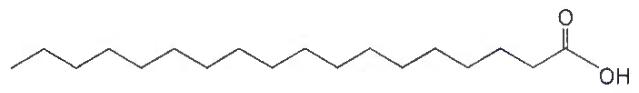

Stearic acid (octadecenoic acid)

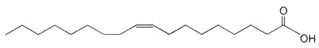

The researchers incubated the coenzyme A derivative of each acid with rat liver mitochondria for 5 minutes, then separated the remaining CoA derivatives in each mixture by HPLC (high-performance liquid chromatography). The results are shown below, with separate panels for the three experiments.

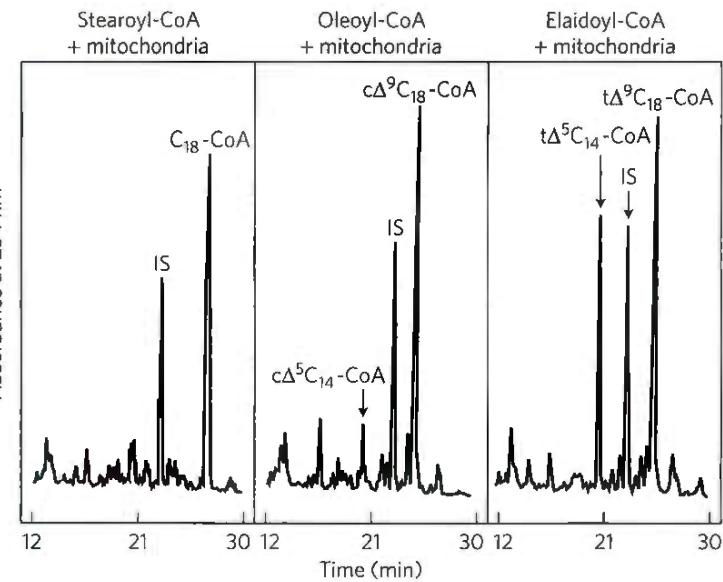  
In the figure, IS indicates an internal standard (pentadecanoyl-CoA) added to the mixture after the reaction as a molecular marker. The researchers abbreviated the CoA derivatives as follows: stearoyl-CoA, $C_{18}$ -CoA; cis- $\Delta^{5}$ -tetradecenoyl-CoA, $c\Delta^{5}C_{14}$ -CoA; oleoyl-CoA, $c\Delta^{9}C_{18}$ -CoA; trans- $\Delta^{5}$ -tetradecenoyl-CoA, $t\Delta^{5}C_{14}$ -CoA; and elaidoyl-CoA, $t\Delta^{9}C_{18}$ -CoA.

(a) Why did Yu and colleagues need to use CoA derivatives rather than the free fatty acids in these experiments?

(b) Why were no lower molecular weight CoA derivatives found in the reaction with stearoyl-CoA?

(c) How many rounds of $\beta$ oxidation would be required to convert the oleoyl-CoA and the elaidoyl-CoA to cis- $\Delta^{5}$ -tetradecenoyl-CoA and trans- $\Delta^{5}$ -tetradecenoyl-CoA, respectively?

Yu and coworkers measured the kinetic parameters of two forms of the enzyme acyl-CoA dehydrogenase: long-chain acyl-CoA dehydrogenase (LCAD) and very-long-chain acyl-CoA dehydrogenase (VLCAD). They used the CoA derivatives (d) For LCAD, the $K_{m}$ differs dramatically for the cis and trans substrates. Provide a plausible explanation for this observation in terms of the structures of the substrate molecules. (Hint: You may want to refer to Fig. 10-1.)

of three fatty acids: tetradecanoyl-CoA (C $_{14}$ -CoA), cis-Δ $^{5}$ -tetradecenoyl-CoA (cΔ $^{5}$ C $_{14}$ -CoA), and trans-Δ $^{5}$ -tetradecenoyl-CoA (tΔ $^{5}$ C $_{14}$ -CoA). The results are shown below. (See Chapter 6 for definitions of the kinetic parameters.)  

<table><tr><td rowspan="2"></td><td colspan="3">LCAD</td><td colspan="3">VLCAD</td></tr><tr><td> $C_{14}-CoA$ </td><td> $c\Delta^5C_{14}-CoA$ </td><td> $t\Delta^5C_{14}-CoA$ </td><td> $C_{14}-CoA$ </td><td> $c\Delta^5C_{14}-CoA$ </td><td> $t\Delta^5C_{14}-CoA$ </td></tr><tr><td> $V_{max}$ </td><td>3.3</td><td>3.0</td><td>2.9</td><td>1.4</td><td>0.32</td><td>0.88</td></tr><tr><td> $K_m$ </td><td>0.41</td><td>0.40</td><td>1.6</td><td>0.57</td><td>0.44</td><td>0.97</td></tr><tr><td> $k_{cat}$ </td><td>9.9</td><td>8.9</td><td>8.5</td><td>2.0</td><td>0.42</td><td>1.12</td></tr><tr><td> $k_{cat}/K_m$ </td><td>24</td><td>22</td><td>5</td><td>4</td><td>1</td><td>1</td></tr></table>

(e) The kinetic parameters of the two enzymes are relevant to the differential processing of these fatty acids only if the LCAD or VLCAD reaction (or both) is the rate-limiting step in the pathway. What evidence is there to support this assumption? (f) How do these different kinetic parameters explain the different levels of the CoA derivatives found after incubation of rat liver mitochondria with stearoyl-CoA, oleoyl-CoA, and elaidoyl-CoA (shown in the three-panel figure)?

Yu and coworkers measured the substrate specificity of rat liver mitochondrial thioesterase, which hydrolyzes acyl-CoA to CoA and free fatty acid. This enzyme was approximately twice as active with $C_{14}$ -CoA thioesters as with $C_{18}$ -CoA thioesters.

(g) Other research has suggested that free fatty acids can pass through membranes. In their experiments, Yu and colleagues found trans- $\Delta^{5}$ -tetradecenoic acid outside (i.e., in the medium surrounding) mitochondria that had been incubated with elaidoyl-CoA. Describe the pathway that led to this extramitochondrial trans- $\Delta^{5}$ -tetradecenoic acid. Be sure to indicate where in the cell the various transformations take place, as well as the enzymes that catalyze the transformations.
(h) It is sometimes said in the popular press that “trans fats are not broken down by your cells and instead accumulate in your body.” In what sense is this statement correct and in what sense is it an oversimplification?

### [EN] Reference

Yu, W., X. Liang, R. Ensenauer, J. Vockley, L. Sweetman, and H. Schultz. 2004. Leaky $\beta$ -oxidation of a trans-fatty acid. J. Biol. Chem. 279:52,160–52,167.

### [EN] Abbreviated Solutions — Chapter 17

1. The fatty acid portion; the carbons in fatty acids are more reduced than those in glycerol.

2. Response to glucagon or epinephrine would be prolonged, mobilizing more fatty acids in adipocytes.

3. Fatty acyl groups condensed with CoA in the cytosol are first transferred to carnitine, releasing CoA, then transported into the mitochondrion, where they are again condensed with CoA. The cytosolic and mitochondrial pools of CoA are thus kept separate, and no radioactive CoA from the cytosolic pool enters the mitochondrion.

4. Malonyl-CoA would no longer inhibit entry of fatty acids into the mitochondrion for $\beta$ oxidation, so there might be a futile cycle of simultaneous fatty acid synthesis in the cytosol and fatty acid breakdown in mitochondria.

5. (a) The carnitine-mediated entry of fatty acids into mitochondria is the rate-limiting step in fatty acid oxidation. Carnitine deficiency slows fatty acid oxidation; added carnitine increases the rate. (b) All increase the metabolic need for fatty acid oxidation. (c) Carnitine deficiency might result from a deficiency of a carnitine precursor (such as lysine), or from a defect in one of the enzymes in the biosynthesis of carnitine.

6. (a) $4.0 \times 10^{5}$ kJ ( $9.6 \times 10^{4}$ kcal) (b) 48 days (c) 0.48 lb/day

7. The first step in fatty acid oxidation is analogous to the conversion of succinate to fumarate; the second step, to the conversion of fumarate to malate; the third step, to the conversion of malate to oxaloacetate.

8. 8 cycles; the last releases 2 acetyl-CoA.

9. (a) R—COO $^{-}$ + ATP → acyl-AMP + PP $_{i}$

Acyl-AMP + CoA → acyl-CoA + AMP

(b) Irreversible hydrolysis of PP $_{i}$ to 2P $_{i}$ by cellular inorganic pyrophosphatase

10. cis- $\Delta^{3}$ -Dodecanoyl-CoA; it is converted to cis- $\Delta^{2}$ -dodecanoyl-CoA, then $\beta$ -hydroxydodecanoyl-CoA.

11. 4 acetyl-CoA and 1 propionyl-CoA

12. Yes. Some of the tritium is removed from palmitate during the dehydrogenation reactions of $\beta$ oxidation. The removed tritium appears as tritiated water.

13. (a) In the pigeon, $\beta$ oxidation predominates; in the pheasant, anaerobic glycolysis of glycogen predominates. (b) Pigeon muscle would consume more $\mathrm{O}_2$ . (c) Fat contains more energy per gram than glycogen does. In addition, the anaerobic breakdown of glycogen is limited by the tissue's tolerance to lactate buildup. Thus the pigeon, using the oxidative catabolism of fats, is the long-distance flyer. (d) The enzymes listed in the table are the regulatory enzymes of their respective pathways and thus limit ATP production rate; however, triose phosphate isomerase and malate dehydrogenase are not regulatory enzymes of their respective pathways.

14. Oxidation of fats releases metabolic water; 1.5 L of water per kg of tripalmitoylglycerol (ignores the small contribution of glycerol to the mass).

15. (a) $M_{r}$ 136; phenylacetic acid (b) Even; removal of two carbons at a time from odd-number chains would leave phenylpropionate.

16. Because the mitochondrial pool of CoA is small, CoA must be recycled from acetyl-CoA via the formation of ketone bodies. This allows the operation of the $\beta$ -oxidation pathway, necessary for energy production.

17. (a) Glucose yields pyruvate via glycolysis, and pyruvate is the main source of oxaloacetate. Without glucose in the diet, [oxaloacetate] drops and the citric acid cycle slows. (b) Odd-number; propionate conversion to succinyl-CoA provides intermediates for the citric acid cycle and four-carbon precursors for gluconeogenesis.

18. For the odd-number heptanoic acid, $\beta$ oxidation produces propionyl-CoA, which can be converted in several steps to oxaloacetate, a starting material for gluconeogenesis. The even-number fatty acid cannot support gluconeogenesis, because it is entirely oxidized to acetyl-CoA.

19. $\beta$ Oxidation of $\omega$ -fluorooleate forms fluoroacetyl-CoA, which enters the citric acid cycle and produces fluorocitrate, a powerful inhibitor of aconitase. Inhibition of aconitase shuts down the citric acid cycle. Without reducing equivalents from the citric acid cycle, oxidative phosphorylation (ATP synthesis) is fatally slowed.

20. Ser to Ala: the Ala side chain in ACC cannot be phosphorylated (and thereby inactivated). Malonyl-CoA continues to be made, which inhibits carnitine acyltransferase 1. $\beta$ oxidation in mitochondria is blocked. Ser to Asp: ACC has a negative charge where Ser would normally be phosphorylated, so it remains inactive. Fatty acid synthesis is blocked and $\beta$ oxidation is stimulated (derepressed).

21. Enz-FAD, having a more positive standard reduction potential, is a better electron acceptor than $NAD^{+}$ , and the reaction is driven in the direction of fatty acyl-CoA oxidation. This more favorable equilibrium is obtained at the cost of 1 ATP; only 1.5 ATP are produced per $FADH_{2}$ oxidized in the respiratory chain (vs. 2.5 per NADH).

22. 9 turns; arachidic acid, a 20-carbon saturated fatty acid, yields 10 molecules of acetyl-CoA, the last two formed in the ninth turn.

23. See Fig. 17-12. [3-14C]Succinyl-CoA is formed, which gives rise to oxaloacetate labeled at C-2 and C-3.

24. Phytanic acid → pristanic acid → propionyl-CoA → → → succinyl-CoA → succinate → fumarate → malate. All malate carbons would be labeled, but C-1 and C-4 would have only half as much label as C-2 and C-3.

25. ATP hydrolysis in the energy-requiring reactions of a cell takes up water in the reaction $ATP + H_{2}O \rightarrow ADP + P_{i}$ ; thus, in the steady state, there is no net production of $H_{2}O$ .

26. Digestion of propionate requires methylmalonyl-CoA mutase, which, in turn, requires the cobalt-containing cofactor formed from vitamin $B_{12}$ .

27. Mass lost per day is about 0.66 kg, or about 140 kg in seven months. Ketosis could be avoided by degradation of nonessential body proteins to supply amino acid skeletons for gluconeogenesis.

28. (a) Fatty acids are converted to their CoA derivatives by enzymes in the cytoplasm; the acyl-CoAs are then imported into mitochondria for oxidation. Given that the researchers were using isolated mitochondria, they had to use CoA derivatives. (b) Stearoyl-CoA was rapidly converted to 9 acetyl-CoA by the $\beta$ -oxidation pathway. All intermediates reacted rapidly, and none were detectable at significant levels. (c) Two rounds. Each round removes two carbon atoms, thus two rounds convert an 18-carbon to a 14-carbon fatty acid and 2 acetyl-CoA. (d) The $K_{\mathrm{m}}$ is higher for the trans isomer than for the cis, so a higher concentration of trans isomer is required for the same rate of breakdown. Roughly speaking, the trans isomer binds less well than the cis, probably because differences in shape, even though not at the target site for the enzyme, affect substrate binding to the enzyme. (e) The substrate for LCAD/VLCAD builds up differently, depending on the particular substrate; this is expected for the rate-limiting step in a pathway. (f) The kinetic parameters show that the trans isomer is a poorer substrate than the cis for LCAD, but there is little difference for VLCAD. Because it is a poorer substrate, the trans isomer accumulates to higher levels than the cis. (g) One possible pathway is shown below (indicating "inside" and "outside" mitochondria).

(h) It is correct insofar as trans fats are broken down less efficiently than cis fats, and thus trans fats may "leak" out of mitochondria. It is incorrect to say that trans fats are not broken down by cells; they are broken down, but at a slower rate than cis fats.

<!-- EN-END 第17章章末 -->

<!-- EN-BEGIN 第21章章末 -->

## 【英文对应 第21章章末】Lipid Biosynthesis：关键术语、习题与简答

> 来源：Lehninger Principles of Biochemistry（书籍/02_生物化学原理） 第21章章末，以及书末 Abbreviated Solutions to Problems 第21章。

### [EN] KEY TERMS

Terms in bold are defined in the glossary.

malonyl-CoA 744
acetyl-CoA carboxylase 744
fatty acid synthase 745
acyl carrier protein (ACP) 747
4'-phosphopantetheine 747
fatty acid elongation systems 753
fatty acyl-CoA desaturase 754
mixed-function
oxidases 754
stearoyl-ACP desaturase (SCD) 754
essential fatty acids 754
arachidonate 754
eicosatetraenoate 754
prostaglandin (PG) 755
cyclooxygenase (COX) 755
prostaglandin H₂ synthase 755
mixed-function
oxygenases 756
cytochrome P-450 756
thromboxane synthase 758
thromboxane (TX) 758
leukotriene (LT) 759
catabasis 759
specialized pro-resolving mediator (SPM) 759
lipoxin 759
glycerol 3-phosphate dehydrogenase 760
phosphatidic acid 760
triacylglycerol cycle 762
glyceroneogenesis 762
thiazolidinediones 763
phosphatidylglycerol 765
cardiolipin 765
phosphatidylinositol 765
phosphatidylserine 765
phosphatidylethanolamine 765

phosphatidylcholine 765  
Lands cycle 767  
lysophosphatidylcholine acyltransferases (LPCATs) 767  
plasmalogen 768  
platelet-activating factor 768  
cerebroside 770  
sphingomyelin 770  
ganglioside 770  
isoprene 772  
mevalonate 773 $\beta$ -hydroxy- $\beta$ -methylglutaryl-CoA (HMG-CoA) 773  
HMG-CoA synthase 773  
HMG-CoA reductase 773  
squalene 774  
bile acids 776  
cholesteryl esters 777  
apolipoprotein 777  
chylomicron 777  
exogenous pathway 780  
very-low-density lipoprotein (VLDL) 780  
low-density lipoprotein (LDL) 780  
LDL receptors 780  
endogenous pathway 780  
high-density lipoprotein (HDL) 780  
reverse cholesterol transport 781  
enterohepatic circulation 781  
receptor-mediated endocytosis 781  
sterol regulatory element-binding proteins (SREBPs) 782  
SREBP cleavage-activating protein (SCAP) 783

insulin-induced gene protein (Insig) 783
liver X receptor (LXR) 783
retinoid X receptor (RXR) 783

farnesoid X receptor (FXR) 784
atherosclerosis 784
foam cell 785
statin 785

### [EN] PROBLEMS

1. Pathway of Carbon in Fatty Acid Synthesis Using your knowledge of fatty acid biosynthesis, provide an explanation for the two experimental observations.

(a) A biochemist adds uniformly labeled $[^{14}C]$ acetyl-CoA to a soluble liver fraction, which yields palmitate uniformly labeled with ${}^{14}C$ .

(b) In a second experiment, the biochemist adds a trace of uniformly labeled $[^{14}C]$ acetyl-CoA in the presence of an excess of unlabeled malonyl-CoA to a soluble liver fraction, which yields palmitate labeled with ${}^{14}C$ only in C-15 and C-16.

2. Synthesis of Fatty Acids from Glucose After a person has ingested large amounts of sucrose, the body transforms the glucose and fructose that exceed caloric requirements to fatty acids for triacylglycerol synthesis. This fatty acid synthesis consumes acetyl-CoA, ATP, and NADPH. How do cells produce acetyl-CoA, ATP, and NADPH from glucose?

3. Net Equation of Fatty Acid Synthesis Write the net equation for the biosynthesis of palmitate in rat liver, starting from mitochondrial acetyl-CoA and cytosolic NADPH, ATP, and $\mathrm{CO}_{2}$ .

4. Pathway of Hydrogen in Fatty Acid Synthesis
A researcher has prepared a solution that contains all the enzymes and cofactors necessary for fatty acid biosynthesis from added acetyl-CoA and malonyl-CoA.

(a) She then adds $[2-^{2}H]$ acetyl-CoA (labeled with deuterium, the heavy isotope of hydrogen) and an excess of unlabeled malonyl-CoA as substrates.

$$
\begin{array}{c} ^ {2} \mathrm{H} \\ ^ {2} \mathrm{H} - \mathrm{C} - \mathrm{C} \\ ^ {2} \mathrm{H} \end{array} \text {   S - CoA   }
$$

How many deuterium atoms incorporate into every molecule of palmitate? What are their locations? Explain.

(b) In a separate experiment, the researcher adds unlabeled acetyl-CoA and $[2-^{2}H]$ malonyl-CoA as substrates.

$$
\mathrm {^ {-} OOC - \overset {^ {2} H} {\underset {^ {2} H} {C}} - \overset {^ {O}} {\underset {S - CoA} {C}}}
$$

How many deuterium atoms incorporate into every molecule of palmitate? What are their locations? Explain.

5. Energetics of $\beta$ -Ketoacyl-ACP Synthase The condensation reaction catalyzed by $\beta$ -ketoacyl-ACP synthase (see Fig. 21-6) synthesizes a four-carbon unit by combining a two-carbon unit and a three-carbon unit, with the release of $\mathrm{CO}_{2}$ . What is the thermodynamic rationale for this process relative to one that simply combines two two-carbon units?

6. Modulation of Acetyl-CoA Carboxylase Acetyl-CoA carboxylase is the principal regulation point in the biosynthesis of fatty acids. Following are some of the properties of the enzyme:

(a) Addition of citrate or isocitrate raises the $V_{max}$ of the enzyme as much as 10-fold.

(b) The enzyme exists in two interconvertible forms that differ markedly in their activities:

$$
\text { Protomer   (inactive) } \rightleftharpoons \text { filamentous   polymer   (active) }
$$

Citrate and isocitrate bind preferentially to the filamentous form, and palmitoyl-CoA binds preferentially to the protomer.

Explain how these properties are consistent with the regulatory role of acetyl-CoA carboxylase in the biosynthesis of fatty acids.

7. Shuttling of Acetyl Groups across the Inner Mitochondrial Membrane The acetyl group shuttle transfers acetyl-CoA, produced by oxidative decarboxylation of pyruvate in the mitochondrion, to the cytosol as outlined in Figure 21-10. (a) Write the overall equation for the transfer of one acetyl group from the mitochondrion to the cytosol.

(b) What is the cost of this process in ATPs per acetyl group?
(c) In Chapter 17 we encountered an acyl group shuttle in the transfer of fatty acyl-CoA from the cytosol to the mitochondrion in preparation for β oxidation (see Fig. 17-6). One result of that shuttle is separation of the mitochondrial and cytosolic pools of CoA. Does the acetyl group shuttle also accomplish this? Explain.

8. Oxygen Requirement for Desaturases The biosynthesis of palmitoleate (see Fig. 21-12), a common unsaturated fatty acid with a cis double bond in the $\Delta^9$ position, uses palmitate as a precursor. Can palmitoleate synthesis be carried out under strictly anaerobic conditions? Explain.

9. Energy Cost of Triacylglycerol Synthesis Use a net equation for the biosynthesis of tripalmitoylglycerol (tripalmitin) from glycerol and palmitate to show how many ATPs are required per molecule of tripalmitin formed.

10. Turnover of Triacylglycerols in Adipose Tissue A researcher adds $[^{14}C]$ glucose to the balanced diet of adult rats. She finds no increase in the total amount of stored triacylglycerols, but the triacylglycerols become labeled with ${}^{14}C$ . Explain.

11. Energy Cost of Phosphatidylcholine Synthesis Write the sequence of steps and the net reaction for the biosynthesis of phosphatidylcholine by the salvage pathway from oleate, palmitate, dihydroxyacetone phosphate, and choline. Starting from these precursors, what is the cost (in number of ATPs) of the synthesis of phosphatidylcholine by the salvage pathway?

12. Salvage Pathway for Synthesis of Phosphatidylcholine A young rat maintained on a diet deficient in methionine fails to thrive unless choline is included in the diet. Explain.

13. Energetics of Acetyl-CoA Condensation to Form Acetoacetyl-CoA The formation of a thioester of acetoacetate is catalyzed by fatty acid synthase during fatty acid synthesis, and by acetyl-CoA acetyltransferase in the first step of cholesterol biosynthesis. Both are Claisen condensations. However, in fatty acid synthesis, malonyl-CoA forms in an earlier step so that decarboxylation facilitates the condensation. In the cholesterol biosynthesis pathway, the condensation occurs between two acetyl-CoA molecules, and no decarboxylation occurs to facilitate the reaction. Suggest a reason why the thermodynamic augmentation of decarboxylation is needed in fatty acid synthesis, but not in the first steps of cholesterol biosynthesis.

14. Synthesis of Isopentenyl Pyrophosphate A researcher adds $[2-^{14}C]$ acetyl-CoA to a rat liver homogenate that is synthesizing cholesterol. Where will the ${}^{14}C$ label appear in $\Delta^{3}$ -isopentenyl pyrophosphate, the activated form of an isoprene unit?

15. Activated Donors in Lipid Synthesis In the biosynthesis of complex lipids, components are assembled by transfer of the appropriate group from an activated donor. For example, the activated donor of acetyl groups is acetyl-CoA. For each of the following groups, give the form of the activated donor: (a) phosphate; (b) D-glucosyl; (c) phosphoethanolamine; (d) D-galactosyl; (e) fatty acyl; (f) methyl; (g) the two-carbon group in fatty acid biosynthesis; (h) $\Delta^3$ -isopentenyl.

16. Importance of Fats in the Diet When young rats are placed on a completely fat-free diet, they grow poorly, develop a scaly dermatitis, lose hair, and soon die. These symptoms can be prevented if linoleate or plant material is included in the diet. What makes linoleate an essential fatty acid? Why can plant material be substituted?

17. Regulation of Cholesterol Biosynthesis Cholesterol in humans can be obtained from the diet or synthesized de novo. An adult human on a low-cholesterol diet typically synthesizes 600 mg of cholesterol per day in the liver. If the amount of cholesterol in the diet is large, de novo synthesis of cholesterol is drastically reduced. How is this regulation brought about?

18. Lowering Serum Cholesterol Levels with Statins Patients treated with a statin drug generally exhibit a dramatic lowering of serum cholesterol. However, the amount of the enzyme HMG-CoA reductase present in cells can increase substantially. Suggest a simple explanation for this effect.

19. Roles of Thiol Esters in Cholesterol Biosynthesis Draw a mechanism for each of the three reactions shown in Figure 21-34, detailing the pathway for the synthesis of mevalonate from acetyl-CoA.

20. Potential Side Effects of Treatment with Statins Although the benefits of taking statins have become clear, side effects have yet to be documented in detail. Some physicians have suggested that patients being treated with statins should also take a supplement of coenzyme Q. Suggest a rationale for this recommendation.

### [EN] DATA ANALYSIS PROBLEM

21. Engineering E. coli to Produce Large Quantities of an Isoprenoid There are more than 20,000 naturally occurring isoprenoids, some of which are medically or commercially important and produced industrially. The production methods include in vitro enzymatic synthesis, an expensive and low-yield process. In 1999, Wang, Oh, and Liao reported on their experiments to engineer the easily grown bacterium E. coli to produce large amounts of astaxanthin, a commercially important isoprenoid. Astaxanthin is a red-orange carotenoid pigment (an antioxidant) produced by marine algae. Marine animals such as shrimp, lobster, and some fish that feed on the algae get their orange color from the ingested astaxanthin. Astaxanthin is composed of eight isoprene units; its molecular formula is $C_{40}H_{52}O_{4}$ .

  
Astaxanthin

(a) Circle the eight isoprene units in the astaxanthin molecule. Hint: Use the projecting methyl groups as a guide.

Astaxanthin is synthesized by the pathway shown on the next page, starting with $\Delta^{3}$ -isopentenyl pyrophosphate (IPP). Steps ① and ② are shown in Figure 21-36, and the reaction catalyzed by lPP isomerase is shown in Figure 21-35.

(b) In step 4 of the pathway, two molecules of geranylgeranyl pyrophosphate are linked to form phytoene. Is this a head-to-head joining or is it a head-to-tail joining? (See Figure 21-36 for details.)

(c) Briefly describe the chemical transformation in step 5.

(d) The synthesis of cholesterol (Fig. 21-37) includes a cyclization (ring closure) that requires a net oxidation by $\mathrm{O}_2$ . Does the cyclization in step 6 of the astaxanthin synthetic pathway require a net oxidation of the substrate (lycopene)? Explain your reasoning.

E. coli does not make large quantities of many isoprenoids, and does not synthesize astaxanthin. It is known to synthesize small amounts of IPP, DMAPP, geranyl pyrophosphate, farnesyl pyrophosphate, and geranylgeranyl pyrophosphate. Wang and colleagues cloned several of the E.coli genes that encode enzymes needed for astaxanthin synthesis, in plasmids that allowed their overexpression. These genes included idi, which encodes IPP isomerase, and ispA, which encodes a prenyl transferase that catalyzes steps ① and ②.

To engineer an E. coli capable of the complete astaxanthin pathway, Wang and colleagues cloned several genes from other bacteria into plasmids that would allow their overexpression in E. coli. These genes included crtE from Erwinia uredovora, which encodes an enzyme that catalyzes step ③; and crtB, crtI, crtY, crtZ, and crtW from Agrobacterium aurantiacum, which encode enzymes for steps 4, 5, 6, 7, and 8, respectively.

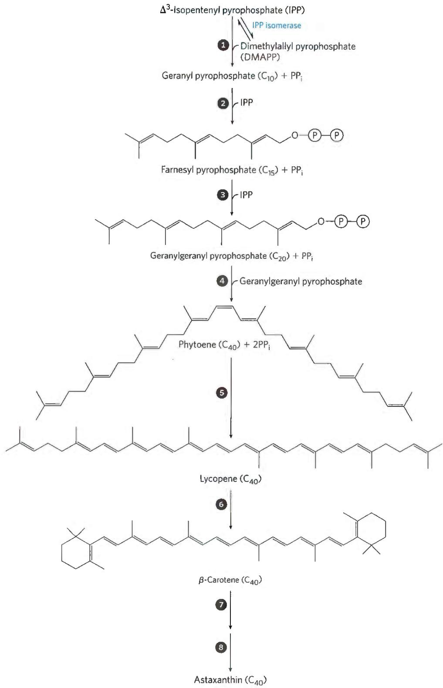

The investigators also cloned the gene gps from Archaeoglobus fulgidus, overexpressed this gene in E. coli, and extracted the gene product. When this extract was reacted with $[^{14}C]$ IPP and DMAPP or geranyl pyrophosphate or farnesyl pyrophosphate, only ${}^{14}C$ -labeled geranylgeranyl pyrophosphate was produced in all cases.

(e) Based on these data, which step(s) in the pathway are catalyzed by the enzyme encoded by gps? Explain your reasoning.

Wang and coworkers then constructed several E. coli strains overexpressing different genes; they measured the orange color of the colonies (wild-type E. coli colonies are off-white) and the amount of astaxanthin produced (as measured by its orange color). Their results are shown below (ND indicates not determined).

<table><tr><td>Strain</td><td>Gene(s) overexpressed</td><td>Orange color</td><td>Astaxanthin yield (μg/g dry weight)</td></tr><tr><td>1</td><td>crtBIZYW</td><td>-</td><td>ND</td></tr><tr><td>2</td><td>crtBIZYW, ispA</td><td>-</td><td>ND</td></tr><tr><td>3</td><td>crtBIZYW, idi</td><td>-</td><td>ND</td></tr><tr><td>4</td><td>crtBIZYW, idi, ispA</td><td>-</td><td>ND</td></tr><tr><td>5</td><td>crtBIZYW, crtE</td><td>+</td><td>32.8</td></tr><tr><td>6</td><td>crtBIZYW, crtE, ispA</td><td>+</td><td>35.3</td></tr><tr><td>7</td><td>crtBIZYW, crtE, idi</td><td>++</td><td>234.1</td></tr><tr><td>8</td><td>crtBIZYW, crtE, idi, ispA</td><td>+++</td><td>390.3</td></tr><tr><td>9</td><td>crtBIZYW, gps</td><td>+</td><td>35.6</td></tr><tr><td>10</td><td>crtBIZYW, gps, idi</td><td>+++</td><td>1,418.8</td></tr></table>

(f) Comparing the results for strains 1 through 4 with those for strains 5 through 8, what can you conclude about the expression level of an enzyme capable of catalyzing step 3 of the astaxanthin synthetic pathway in wild-type E. coli? Explain your reasoning.

(g) Based on the data above, which enzyme is rate-limiting in this pathway, IPP isomerase or the enzyme encoded by idi? Explain your reasoning.

### [EN] Reference

Wang, C.-W., M.-K. Oh, and J.C. Liao. 1999. Engineered isoprenoid pathway enhances astaxanthin production in Escherichia coli. Biotechnol. Bioeng. 62:235–241.

### [EN] Abbreviated Solutions — Chapter 21

1. (a) The 16 carbons of palmitate are derived from 8 acetyl groups of 8 acetyl-CoA molecules. The $^{14}\mathrm{C}$ -labeled acetyl-CoA gives rise to malonyl-CoA labeled at C-1 and C-2. (b) The metabolic pool of malonyl-CoA, the source of all palmitate carbons except C-16 and C-15, does not become labeled with small amounts of $^{14}\mathrm{C}$ -labeled acetyl-CoA. Hence, only [15,16- $^{14}\mathrm{C}$ ] palmitate is formed.

2. Both glucose and fructose are degraded to pyruvate in glycolysis. Pyruvate is converted to acetyl-CoA by the pyruvate dehydrogenase complex. Some of this acetyl-CoA enters the citric acid cycle, which produces reducing equivalents, NADH and NADPH. Mitochondrial electron transfer to $O_{2}$ yields ATP.

3. 8 Acetyl-CoA + 15ATP + 14NADPH + 9H₂O →

$$
\text { palmitate } + 8 \mathrm{CoA} + 1 5 \mathrm{ADP} + 1 5 \mathrm{P} _ {\mathrm{i}} + 1 4 \mathrm{NADP} ^ {+} + 2 \mathrm{H} ^ {+}
$$

4. (a) 3 deuteriums per palmitate; all located on C-16; all other two-carbon units are derived from unlabeled malonyl-CoA (b) 7 deuteriums per palmitate; located on all even-numbered carbons except C-16

5. By using the three-carbon unit malonyl-CoA, the activated form of acetyl-CoA (recall that malonyl-CoA synthesis requires ATP), metabolism is driven in the direction of fatty acid synthesis by the exergonic release of $CO_{2}$ .

6. (a) The rate-limiting step in fatty acid synthesis is carboxylation of acetyl-CoA, catalyzed by acetyl-CoA carboxylase. High [citrate] and [isocitrate] indicate that conditions are favorable for fatty acid synthesis: an active citric acid cycle is providing a plentiful supply of ATP, reduced pyridine nucleotides, and acetyl-CoA. Citrate stimulates (increases the $V_{max}$ of) acetyl-CoA carboxylase (b). Because citrate binds more tightly to the filamentous (active) form of the enzyme, high [citrate] drives the protomer $\rightleftharpoons$ filament equilibrium in the direction of the active form. In contrast, palmitoyl-CoA (the end product of fatty acid synthesis) drives the equilibrium in the direction of the inactive (protomer) form. Hence, when the end product of fatty acid synthesis accumulates, the biosynthetic path slows.

$$
7. (\mathbf {a}) \mathrm{Acetyl-CoA} _ {\text {(nol)}} + \mathrm{ATP} + \mathrm{CoA} _ {\text {(cyl)}} \rightarrow
$$

$$
\text { acetyl - CoA } _ {\text {(cyt)}} + \text { ADP } + \text { P } _ {i} + \text { CoA } _ {\text {(mit)}}
$$

(b) 1 ATP per acetyl group (c) Yes

8. No. The double bond in palmitoleate is introduced by an oxidation catalyzed by fatty acyl-CoA desaturase, a mixed-function oxidase that requires $O_{2}$ as a cosubstrate.

9. 3 Palmitate + glycerol + 7ATP + 4H₂O →

$$
\mathrm{tripalmitin} + 7 \mathrm{ADP} + 7 \mathrm{P} _ {\mathrm{i}} + 7 \mathrm{H} ^ {+}
$$

10. In adult rats, stored triacylglycerols are maintained at a steady-state level through a balance of rates of degradation and biosynthesis. Hence, triacylglycerols of adipose (fat) tissue are constantly turned over, which explains the incorporation of ${}^{14}$ C label from dietary glucose.

11. Net reaction:

Dihydroxyacetone phosphate + NADH + palmitate + oleate + 3ATP + CTP + choline + 4H₂O →

phosphatidylcholine + NAD $^{+}$ + 2AMP + ADP + H $^{+}$ + CMP + 5P $_{i}$ 7ATP per molecule of phosphatidylcholine

12. Methionine deficiency reduces the level of adoMet, which is required for de novo synthesis of phosphatidylcholine. The salvage pathway does not employ adoMet, but uses available choline. Thus phosphatidylcholine can be synthesized even when the diet is deficient in methionine, as long as choline is available.

13. During cholesterol biosynthesis, the two Claisen condensations involving acetyl-CoA and leading to HMG-CoA are both thermodynamically unfavorable. However, the product HMG-CoA is rapidly siphoned off by more thermodynamically favorable subsequent reactions. In fatty acid synthesis, all of the condensation reactions involving each new malonyl-CoA are identical. If acetyl-CoA were utilized instead of malonyl-CoA, all would be thermodynamically unfavorable. As subsequent reduction steps that expend NADPH in each four-step cycle are also thermodynamically unfavorable, there are no downstream processes capable of balancing the thermodynamics and pulling the sequence toward synthesis. The synthesis of long fatty acids would not be chemically feasible without the use of malonyl-CoA and the thermodynamic boost provided by decarboxylation.

14. ${}^{14}$ C label appears in three places in the activated isoprene:

$$
\begin{array}{c} ^ {1 4} \mathrm{CH} _ {2} \\ \mathrm{C} - ^ {1 4} \mathrm{CH} _ {2} - \mathrm{CH} _ {2} - \textcircled {P} - \textcircled {P} \\ ^ {1 4} \mathrm{CH} _ {3} \end{array}
$$

15. (a) ATP (b) UDP-glucose (c) CDP-ethanolamine (d) UDP-galactose (e) Fatty acyl-CoA (f) S-Adenosylmethionine (g) Malonyl-CoA (h) $\Delta^{3}$ -Isopentenyl pyrophosphate

16. Linoleate is required in the synthesis of prostaglandins. Animals cannot transform oleate to linoleate, so linoleate is an essential fatty acid. Plants can convert oleate to linoleate, and they provide animals with the required linoleate (see Fig. 21-12).

17. The rate-determining step in the biosynthesis of cholesterol is the synthesis of mevalonate, catalyzed by HMG-CoA reductase. This enzyme is allosterically regulated by mevalonate and cholesterol derivatives. High intracellular [cholesterol] also reduces transcription of the gene encoding HMG-CoA reductase.

18. When cholesterol levels decline because of treatment with a statin, cells attempt to compensate by increasing expression of the gene encoding HMG-CoA reductase; however, statins are good competitive inhibitors of HMG-CoA reductase activity and reduce overall production of cholesterol.

19. Note: In the absence of detailed knowledge of the literature on this enzyme, students might propose several plausible alternatives. Thiolase reaction: Begins with nucleophilic attack of an active-site Cys residue on the first acetyl-CoA substrate, displacing —S-CoA and forming a covalent thioester link between Cys and the acetyl group. A base on the enzyme then extracts a proton from the methyl group of the second acetyl-CoA, leaving a carbanion that attacks the carbonyl carbon of the thioester formed in the first step. The sulfhydryl of the Cys residue is displaced, creating the product acetoacetyl-CoA. HMG-CoA synthase reaction: Begins in the same way, with a covalent thioester link formed between the enzyme's Cys residue and the acetyl group of acetyl-CoA, with displacement of —S-CoA. The —S-CoA dissociates as CoA-SH, and acetoacetyl-CoA binds to the enzyme. A proton is abstracted from the methyl group of the enzyme-linked acetyl, forming a carbanion that attacks the ketone carbonyl of the acetoacetyl-CoA substrate. The carbonyl is converted to a hydroxyl ion in this reaction, which is protonated to create —OH. The thioester link with the enzyme is then cleaved hydrolytically to generate the HMG-CoA product. HMG-CoA reductase reaction: Two successive hydride ions derived from NADPH first displace the —S-CoA, and then reduce the aldehyde to a hydroxyl group.

20. Statins inhibit HMG-CoA reductase, an enzyme in the pathway to the synthesis of activated isoprenes, which are precursors of cholesterol and a wide range of isoprenoids, including coenzyme Q (ubiquinone). Hence, statins might reduce the levels of coenzyme Q available for mitochondrial respiration. Ubiquinone is obtained in the diet as well as by direct biosynthesis, but it is not yet clear how much is required and how well dietary sources can substitute for reduced synthesis. Reductions in the levels of particular isoprenoids may account for some side effects of statins.

21. (a)  
  
Astaxanthin

(b) Head-to-head. There are two ways to look at this. First, the "tail" of geranylgeranyl pyrophosphate has a branched dimethyl structure, as do both ends of phytoene. Second, no free —OH is formed by the release of PP $_{i}$ , indicating that the two —O—P—P “heads” are linked to form phytoene. (c) Four rounds of dehydrogenation convert four single bonds to double bonds. (d) No. A count of single and double bonds in the reaction below shows that one double bond is replaced by two single bonds—so, there is no net oxidation or reduction:

Lycopene (C-40)

bend ends around for cyclization

  
β-Carotene (C-40)

(e) Steps ① through ③. The enzyme can convert IPP and DMAP to geranylgeranyl pyrophosphate, but it catalyzes no further reactions in the pathway, as confirmed by results with the other substrates. (f) Strains 1 through 4 lack crtE and have much lower astaxanthin production than strains 5 through 8, all of which overexpress crtE. Thus, overexpression of crtE leads to a substantial increase in astaxanthin production. Wild-type E. coli has some step ③ activity, but this conversion of farnesyl pyrophosphate to geranylgeranyl pyrophosphate is strongly rate-limiting. (g) IPP isomerase. Comparing strains 5 and 6 shows that adding ispA, which catalyzes steps ① and ②, has little effect on astaxanthin production, so these steps are not rate-limiting. However, comparing strains 5 and 7 shows that adding idi substantially increases astaxanthin production, so IPP isomerase must be the rate-limiting step when crtE is overexpressed.

<!-- EN-END 第21章章末 -->
