## 第 25 章 蛋白质降解和氨基酸的分解代谢

> **本章英文对应内容**（Lehninger，插在所列中文小节末尾）
>
> - 第18章 Amino Acid Oxidation and the Production of Urea：章首导言（本章开头）、关键术语/习题/简答（本章末尾）
> - §18.1（第18章）→ 二、氨基酸分解代谢
> - §18.2（第18章）→ 三、尿素的形成
> - §18.3（第18章）→ 四、氨基酸碳骨架的氧化途径

<!-- EN-BEGIN 第18章导言 -->

### 【英文对应 第18章导言】Amino Acid Oxidation and the Production of Urea

> 来源：Lehninger Principles of Biochemistry（书籍/02_生物化学原理） 第18章章首（含章节目录与学习要点）。

#### [EN] AMINO ACID OXIDATION AND THE PRODUCTION OF UREA

18.1 Metabolic Fates of Amino Groups 626
18.2 Nitrogen Excretion and the Urea Cycle 633
18.3 Pathways of Amino Acid Degradation 639

We now turn our attention to the amino acids, the final class of biomolecules that, through their oxidative degradation, make a significant contribution to the generation of metabolic energy. The fraction of metabolic energy obtained from amino acids, whether they are derived from dietary protein or from tissue protein, varies greatly with the type of organism and with metabolic conditions. Carnivores consume primarily protein and thus must obtain most of their energy from amino acids, whereas herbivores may fill only a small fraction of their energy needs by this route. Most microorganisms can scavenge amino acids from their environment and use them as fuel when required by metabolic conditions. Plants, however, rarely if ever oxidize amino acids to provide energy; the carbohydrate produced from $CO_{2}$ and $H_{2}O$ in photosynthesis is generally their sole energy source. Amino acid concentrations in plant tissues are carefully regulated to just meet the requirements for biosynthesis of proteins, nucleic acids, and other molecules needed to support growth. Amino acid catabolism does occur in plants, but only to produce metabolites for other biosynthetic pathways.

Amino acid oxidation pathways can seem complex, and they are best understood in the context of five principles:

P1 The many paths for amino acid catabolism have two broad parts, one involving the amino groups and the other involving the carbon skeletons. All of the pathways for amino acid degradation include a key step, always involving a pyridoxal phosphate cofactor, in which the $\alpha$ -amino group is separated from the carbon skeleton and shunted into the pathways of amino group metabolism. The carbon skeletons are broken down to citric acid cycle intermediates (Fig. 18-1).

P2 Four amino acids—alanine, glutamate, glutamine, and aspartate—play key roles in the transport and distribution of amino groups. All are present in relatively high concentrations in one or many mammalian tissues. All are readily converted to key citric acid cycle intermediates.

P3 Metabolic pathways are not distinct. The various pathways for amino acid catabolism are elaborately intertwined with other catabolic and anabolic pathways.

P4 Free ammonia is toxic. Excess amino groups must be safely excreted. In mammals, the urea cycle serves this purpose.

P5 Each amino acid has a different catabolic fate. The varied carbon skeletons of amino acids are broken down via equally varied pathways. All can be oxidized to generate ATP. All but leucine and lysine can contribute to gluconeogenesis when needed.

In mammals, blood glucose must be supplemented by gluconeogenesis, often just a few hours after a meal. Amino acids, particularly alanine and glutamine, can make a significant contribution to the fuel for gluconeogenesis. Amino acids undergo oxidative degradation in three different metabolic circumstances:

1. Amino acids released during normal protein turnover are not needed for new protein synthesis.

2. Ingested amino acids exceed the body's needs for protein synthesis.

3. Cellular proteins are used as fuel because carbohydrates are either unavailable or not properly utilized due to starvation or uncontrolled diabetes mellitus.

  
FIGURE 18-1 Overview of amino acid catabolism in mammals. The amino groups and the carbon skeleton take separate but interconnected pathways.

The pathways of amino acid catabolism are quite similar in most organisms. The focus of this chapter is on the pathways in vertebrates, because these have received the most research attention. As in carbohydrate and fatty acid catabolism, the processes of amino acid degradation converge on the central catabolic pathways, with the carbon skeletons of most amino acids finding their way to the citric acid cycle. In some cases, the reaction pathways of amino acid breakdown closely parallel steps in the catabolism of fatty acids (see Fig. 17-9). We begin with amino group metabolism and nitrogen excretion, before turning to the fate of the carbon skeletons derived from the amino acids; along the way we see how the pathways are interconnected.

<!-- EN-END 第18章导言 -->

## 一、蛋白质的降解

Henry Borsook 和 Rudolf Schoenheimer 1940 年证明了活细胞的组成成分在不断地转换更新。蛋白质有自己的存活时间，短到几分钟，长到几周。不论何种情况，细胞总是不断地从氨基酸合成蛋白质，又把蛋白质降解为氨基酸。表面看来，这样的变化过程似是一种浪费，实际上它有二重功能，其一是排除那些不正常的蛋白质，它们若一旦积聚，将对细胞有害；其二是通过排除累积过多的酶和调节蛋白（regulatory protein）使细胞代谢的井然有序得以维持。酶的活动能力实际是根据它的合成速度和降解速度决定的。在细胞“经济学”中，控制蛋白质的降解与控制其合成速度是同样重要的。本章将讨论细胞内蛋白质降解及其影响的有关问题。

## （一）蛋白质降解的特性

细胞有选择地降解非正常蛋白质,例如,血红蛋白与缬氨酸类似物 $\alpha-$ 氨基- $\beta-$ 氯丁酸( $\alpha-$ amino $\beta-$ clorobutyric acid)结合,得到的产物在网织红细胞(reticulocyte)中的半衰期约为10 min,而正常血红蛋白可延续红细胞的存活期最终可达120 d。同样,不稳定的突变株血红蛋白在与此种丁酸衍生物结合之后,即迅速降解。因此,它成了溶血性贫血这种分子疾患的治疗药物。

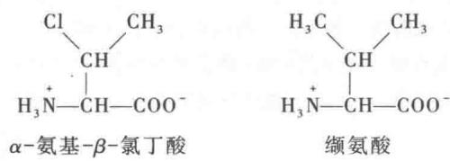

细菌也表现有选择性降解。例如，在大肠杆菌(E.coli)中 $\beta$ -半乳糖苷酶的amber与ochre突变型，其半衰期仅为几分钟，而广域的这种酶却是绝对稳定的。绝大多数的非正常蛋白质很可能基于此种化学修饰或由于这些脆弱分子的不断变性而容易发生降解。它们更多缘起于细胞的活泼环境，而不一定是基于突变，或在转录或翻译时出现的误差，受损蛋白质的降解能力是具选择性的，它是一种自发的再循环机制。它可防止某种物质的形成，否则一旦形成即将妨碍细胞的系列活动。

正常的胞内蛋白质被排除的速度是由它们的个性所决定的。某一蛋白质被排除的速度若为一级反应，表示这个分子被降解是偶然选择的，与其存活寿命无关。在组织中，不同酶的半衰期有着很大差异。以大鼠肝中的酶为例，如表25-1所示。

很显然,绝大多数快速降解的酶都居于重要的“代谢控制”位置,而较为稳定的酶在所有生理条件下有着较稳定的催化活性。酶对降解的敏感性很明显的与它们的催化活性以及别构性质密切相关。因此,细胞能有效地对它的环境及代谢需求作出应答。

细胞中蛋白质降解的速度还因它的营养及激素状态而有所不同。在营养被“剥夺”的条件下，细胞提高它的蛋白质降解速度，以维持它的必需营养源，使不可缺的代谢过程得以进行。在大肠杆菌中提高降解速度的机制是一种应激反应。在真核生物中也与大肠杆菌相似，因为正像在大肠杆菌中的那样，提高了的降解速度可被能够阻断蛋白质合成的抗生素所抑制。

蛋白质的周转代谢使种种代谢途径的调节得以容易地实现。

表 25-1 大鼠肝中某些酶的半衰期

<table><tr><td>酶</td><td></td><td>半衰期/h</td></tr><tr><td rowspan="6">短寿命的酶</td><td></td><td></td></tr><tr><td>鸟氨酸脱羧酶</td><td>0.2</td></tr><tr><td>RNA聚合酶I</td><td>1.3</td></tr><tr><td>酪氨酸转氨酶</td><td>2.0</td></tr><tr><td>酪氨酸水合酶</td><td>4.0</td></tr><tr><td>磷酸烯醇式丙酮酸羧化酶</td><td>5.0</td></tr><tr><td rowspan="6">长寿命的酶</td><td></td><td></td></tr><tr><td>醛缩酶</td><td>118</td></tr><tr><td>甘油醛磷酸脱氢酶</td><td>130</td></tr><tr><td>细胞色素b</td><td>130</td></tr><tr><td>乳酸脱氢酶</td><td>130</td></tr><tr><td>细胞色素c</td><td>150</td></tr></table>

引自 Dice J F, Doldberg A I. Arch. Biochem. Biophys, 1975: 170-214.

## （二）蛋白质降解的反应机制

真核细胞对于蛋白质降解持有两种体系,一种是溶酶体的降解机制(lysosomal mechanism),另一种是ATP-依赖性的以细胞溶胶为基础的机制,现分别阐述如下。

## 1. 溶酶体无选择的降解蛋白质

溶酶体是具有单层膜的细胞器,它含有约50种水解酶,包括不同种的蛋白酶,称之为组织蛋白酶(cathepsin)。溶酶体保持其内部pH在5左右,而它含有的酶的最适pH即是酸性。可以设想这种境况可抵制偶然的溶酶体渗漏从而保护了细胞,因为在细胞溶胶的pH下,溶酶体的各种酶大部分都是无活性的。

溶酶体对细胞内各组分的再利用是通过它融合细胞质的膜被点块即自(体吞)噬泡(autophagic vacuole)，并随即分解其内容物来实现的。溶酶体还降解一些物质，这些物质是细胞通过胞吞作用(endocytosis)来利用的。这就是溶酶体如何处理细胞内组成成分的过程，它近似于降解作用。使用溶酶体的阻断剂曾模拟证明上述过程的存在，例如抗虐药物氯代奎宁(chloroquine)：

  
氯代奎宁

它是一种弱碱，以不带电荷形式随意穿透溶酶体，在溶酶体内累积形成带电荷型，因此增高了溶酶体内部的 $\mathrm{pH}$ ，并阻碍了溶酶体的功能。用氯代奎宁处置细胞可减低它们的蛋白质降解速度。同样地，以组织蛋白酶阻断剂，例如，用一种多肽抗生素——抗蛋白酶（antipain）处置细胞也可降低蛋白质的降解速度。

溶酶体降解蛋白质是无选择性的。溶酶体抑制剂对于非正常蛋白质或短寿命酶无快速降解的效应。但是，它们可以防止饥饿状态下蛋白质的加速崩溃。

许多正常的和病理的活动经常随伴溶酶体活性的升高。糖尿病会刺激溶酶体的蛋白质分解。同样由于废弃使用神经切除或创伤导致肌肉损毁可引起溶酶体活性的增高。如产后子宫的萎缩，此时这个肌肉器官的质量在9 d内从2 kg降到50 g，是此类过程的突出例证。很多慢性炎症，例如类风湿性关节炎（rheumatoid arthritis）等，引起溶酶体酶的细胞外释放，这些释出的酶会损坏周围的组织。

## 2. 泛素(ubiquitin)给选择降解的蛋白质加以标记

最初设想真核细胞中的蛋白质降解,主要是溶酶体的活动过程。但是,缺少溶酶体的网织红细胞却可选择性地降解非正常蛋白质。

从实验观察得到:在无氧条件下蛋白质的分解受到阻断,从而发现了这里有 ATP-依赖的蛋白质水解体系存在。这种现象是热力学上未曾料到的,因为多肽水解是一个放能过程。

对无细胞核的兔网织红细胞体系进行分析,发现了 ATP-依赖的蛋白质的分解需要有泛素相伴,泛素最初是一个对其功能不了解的蛋白质。它是一个有 76 个氨基酸残基的蛋白质单体,由于它无所不在(ubiquitous),而且在真核细胞中含量丰富。因而得名“ubiquitin”,它以高度保守、氨基酸序列极少变化为特点,在不同种属生物中是同一的,例如,人、蟾蜍、鳟鱼及果蝇属(Drosophila)等,又如人与酵母,只有 3 个氨基酸残基不同。因此,泛素几乎是唯一的、适合于某些必需的细胞过程。

被选定降解的蛋白质先加以标记。即以共价键与泛素连接。这个程序的目的是标记氨基酸的激活，它分三步进行（图 25-1）：

（1）在一个“需 ATP”的反应中，泛素的羧基端通过硫酯键与泛素活化酶（ubiquitin-activating enzyme, $E_{1}$ ）偶联。泛素活化酶的相对分子质量为 105 000，它是两个相同的亚单位形成的二聚体。

  
图 25-1 泛素与选择性降解蛋白质的相接  
第①步:泛素的羧基在 ATP 水解的推动下,以巯基与 $E_{1}$ 相接;第②步:活化了的泛素立即与 $E_{2}$ 的巯基相连接;第③步:在 $E_{3}$ 的催化下,泛素与宣布无用的蛋白质中的 Lys 的 $\varepsilon-$ 氨基相接。这就形成了“标记”的蛋白质,它在 UCDEN 催化下发生降解。 $E_{1}$ :泛素活化酶; $E_{2}$ :泛素载体蛋白质; $E_{3}$ :泛素-蛋白质连接酶

（2）泛素随即转接到几种小蛋白质(相对分子质量为 25 000\~70 000)中的某一小蛋白质的巯基上。这个结合物称为“泛素-载体蛋白质”(ubiquitin carrier protein, $E_{2}$ )。

（3）第三步，泛素-蛋白质连接酶（ubiquitin-protein ligase, $E_{3}$ ，相对分子质量约180 000），将活化了的泛素从 $E_{2}$ 转移到赖氨酸的 $\varepsilon-$ 氨基上。这个 $NH_{2}-Lys$ 是事先已与蛋白质结合了的一个残基。这样，形成了一个异肽键（isopeptide bond）。在选择蛋白质发生降解的过程中， $E_{3}$ 似乎起着关键的作用。在一般情况下是若干个泛素分子与那些宣布无用的蛋白质相连接。而且可能有20个泛素分子依次一前一后地与目的蛋白质分子相连接，形成多泛素链，在这里，每一泛素的Lys 48都与下一个泛素的C端羧基相连，形成异肽键。

这样,泛素连接的蛋白质,即在 ATP-依赖的反应过程中被降解。这个反应过程是由较大的(相对分子质量为 100 000)多蛋白质复合体参与实现。这个复合体名为“泛素缀合酶”(ubiquitin-conjugating enzyme, UCDEN)。该酶只对待降解的泛素-连接蛋白质有效。

## （三）机体对外源蛋白质的需要及其消化作用

外源蛋白质进入体内,总是先经过水解作用变为小分子的氨基酸,然后才被吸收。高等动物摄入的蛋白质在消化道内消化后形成游离氨基酸,吸收入血液,供给细胞合成自身蛋白质的需要。氨基酸的分解代谢主要在肝进行。同位素示踪法表明,一个体重70 kg的人,膳食正常,每天可有400 g蛋白质在体内发生变化。其中约有四分之一进行氧化降解或转变为葡萄糖,并由外源蛋白质加以补充;其余四分之三在体内进行再循环。机体每天由尿以含氮化合物排出的氨基氮为6\~20 g，甚至在未进食蛋白质时也是如此。每天排泄5 g氮相当于丢失30 g内源蛋白质。

蛋白质在哺乳动物消化道中降解为氨基酸经过一系列的消化过程。食物进入胃后，使胃分泌胃泌素（gastrin），后者刺激胃中壁细胞（parietal cell）分泌盐酸，主细胞（chief cell）分泌胃蛋白酶原（pepsinogen）。胃液的酸性（pH 1.5\~2.5）可促使球状蛋白质变性和松散。胃蛋白酶原经自身催化（autocatalysis）作用，脱下N端的42个氨基酸肽段转变为活性胃蛋白酶（pepsin），它催化具有苯丙氨酸、酪氨酸、色氨酸以及亮氨酸、谷氨酸、谷氨酰胺等肽键的断裂，使大分子的蛋白质变为较小分子的多肽。

蛋白质在胃中消化后,连同胃液进入小肠。在胃液的酸性刺激下,小肠分泌肠促胰液素(secretin)进入血液,刺激胰腺分泌碳酸进入小肠中和胃酸。食物中的氨基酸刺激十二指肠分泌胰蛋白酶、糜蛋白酶、羧肽酶、氨肽酶等。这些酶也以酶原形式分泌,随后被激活而发挥作用。胰蛋白酶被肠激酶(enterokinase)激活,胰蛋白酶也有自身催化作用。其酶原从分子的N端脱掉一段6肽肽段,转变为有活性的酶。胰蛋白酶可水解由赖氨酸、精氨酸的羧基形成的肽键。糜蛋白酶原分子中含有4个二硫键,由胰蛋白酶水解断开其酶原中的两个二硫键,并脱掉分子中的两个肽而被激活,形成的活性糜蛋白酶分子,是由二硫键连接着的三段肽链构成的。该酶的作用是水解含有苯丙氨酸、酪氨酸、色氨酸等残基羧基形成的肽键。

肠中还有一种弹性蛋白酶(elastase)，其特异性最低，能水解缬氨酸、亮氨酸、丝氨酸及丙氨酸等各种脂肪族氨基酸羧基形成的肽键。

经胃蛋白酶、胰蛋白酶、糜蛋白酶及弹性蛋白酶作用后的蛋白质，已变成短链的肽和部分游离氨基酸。短肽又经羧肽酶和氨肽酶的作用，分别从肽段的C端和N端水解下氨基酸残基。羧肽酶有A、B两种，分别称为羧肽酶A和羧肽酶B。羧肽酶A（相对分子质量为34000）主要水解由各种中性氨基酸为羧基端构成的肽键。羧肽酶B主要水解由赖氨酸、精氨酸等碱性氨基酸为羧基端构成的肽键。氨肽酶则水解氨基端的肽键。

蛋白质经过上述消化管内各种酶的协同作用,最后全部转变为游离氨基酸。

细胞内蛋白质周转是非常迅速的,蛋白质的半衰期(half-life)可从几分钟到几个星期不等。许多半衰期极短的蛋白质能使细胞迅速地改变代谢条件。许多代谢的关键酶和受严格调节的酶都能够迅速地进行周转。例如,在多胺(polyamine)生物合成中起限速作用的鸟氨酸脱羧酶半衰期短(ornithine decarboxylase);多胺的浓度影响DNA的复制、蛋白质的合成和细胞分裂,从而影响细胞的生长速度。RNA聚合酶I决定核糖体RNA的合成速度,受激素和营养条件控制的丝氨酸脱氢酶(serine dehydrogenase)、色氨酸氧化酶(tryptophan oxygenase)、酪氨酸氨基转移酶(tyrosine aminotransferase)以及在糖异生作用中催化关键反应的磷酸烯醇式丙酮酸羧激酶(phosphoenolpyruvate carboxykinase)等,所有这些酶都属于周转迅速的蛋白质。

前已述及细胞内催化蛋白质降解的是溶酶体中的各种蛋白质水解酶。细胞内蛋白质的分解机制，还有待深入研究。

氨基酸在细胞内的代谢有多种途径。一种是经生物合成形成蛋白质，一种是进行分解代谢。氨基酸的分解一般总是先脱去氨基，形成的碳骨架—— $\alpha-$ 酮酸可进行氧化，形成二氧化碳和水，产生ATP，也可以转化为糖和脂肪。

多数细菌,体内氨基酸的分解不占主要位置,而以氨基酸的合成为主。有些细菌又以氨基酸作为唯一碳源,这类细菌则以氨基酸的分解为主。高等植物随着机体的不断增长需要氨基酸,因此合成过程胜于分解过程。下面主要讨论动物体内氨基酸的分解代谢。

## 二、氨基酸分解代谢

α-氨基酸的功能除去它是蛋白质的组成单位外,还是能量代谢的物质,又是许多生物体内重要含氮化合物的前体。这些含氮化合物突出的有血红素,生物活性的胺,谷胱甘肽,核苷酸及核苷酸的辅酶等。已于前述,哺乳动物可自代谢物前体合成非必需氨基酸,而必需氨基酸则自膳食中获取。膳食中获取的多余氨基酸既不为后来使用而被贮存,也不被排泄。多余的氨基酸则转化为常见的代谢中间体,例如,丙酮酸、草酰乙酸、 $\alpha-$ 酮戊二酸等。由此，氨基酸又是葡萄糖、脂肪酸及酮体的前体物，也就是说，它又是代谢过程的“燃料”。

在动物中,氨基酸的氧化代谢主要分为以下三个方面:

（1）在蛋白质的正常合成及分解代谢条件下，某些蛋白质分解释放的氨基酸不再参与新的蛋白质合成而转入氧化代谢。

（2）当饮食中含有丰富的蛋白质，氨基酸的摄入超过身体所需，多余的氨基酸会被分解代谢，氨基酸不能被存储。

（3）在饥饿状态或对于不受控制的糖尿病患者，当糖类是不可用的或被不正确使用时，细胞的蛋白质会作为燃料使用(图 25-2)。

  
图 25-2 哺乳动物氨基酸的分解代谢途径总览图

在所有这些代谢条件下,氨基酸失去氨基

形成氨基酸的“碳骨架”，即 $\alpha-$ 酮酸。 $\alpha-$ 酮酸可以被氧化成 $CO_{2}$ 和水，产生 ATP，提供的三碳和四碳单元通过糖异生途径被转换成葡萄糖，从而为大脑、骨骼肌及其他组织提供燃料。

## （一）氨基酸的脱氨基作用

氨基酸分解代谢的第一步常是 $\alpha-$ 氨基的脱离。分离出多余的氮，并留下碳骨架进一步降解。

在陆栖哺乳动物中主要排泄出的氮化合物是尿素,它合成的起始步骤是由氨与天冬氨酸作用。后二者主要来自谷氨酸,它又是绝大多数脱氨基反应的产物。下面将讨论 $\alpha-$ 氨基怎样结合到 $\alpha-$ 酮戊二酸分子上形成谷氨酸的,以及如何转化为天冬氨酸和氨的。

绝大多数氨基酸之脱氨基是出自转氨基作用。氨基酸脱下的氨基转移到一个 $\alpha-$ 酮酸上，产生与原氨基酸相应的酮酸和一个新氨基酸，这个反应是在氨基转移酶（aminotransferase）的催化下发生的。在此反应中具有优势接受脱下的氨基的是 $\alpha-$ 酮戊二酸，新生成的氨基酸为谷氨酸：

$$
\mathrm{氨基酸} + \alpha - \mathrm{酮戊二酸} \rightleftharpoons \alpha - \mathrm{酮酸} + \mathrm{谷氨酸}
$$

接着,谷氨酸的氨基在第二步的转氨基中转移到草酰乙酸上,形成天冬氨酸:

$$
\text {   谷氨酸   } + \text {   草酰乙酸   } \rightleftharpoons \alpha - \text {   酮戊二酸   } + \text {   天冬氨酸   }
$$

当然，并非所有的纯脱氨基作用皆起因于转氨基作用。大部分的脱氨基作用发生于谷氨酸的氧化脱氨基作用（oxidative deamination），它是在谷氨酸脱氢酶的催化下发生的，产物为氨。此反应需要有 $\mathrm{NAD}^{+}$ 或 $\mathrm{NAD(P)}^{+}$ 作为氧化剂参与，并使 $\alpha-$ 酮戊二酸得到再生，后者可用于进一步的氨基转移反应。

$$
\text {   谷氨酸   } + \mathrm{NAD(P)} ^ {+} + \mathrm{H} _ {2} \mathrm{O} \rightleftharpoons \alpha - \text {   酮戊二酸   } + \mathrm{NH} _ {3} + \mathrm{NAD(P)H} + \mathrm{H} ^ {+}
$$

本节中将讨论氨基转移及氧化脱氨基作用的反应机制。还将讨论某些氨基酸的其他脱氨基反应。

## 1. 氨基转移反应

氨基转移酶促反应分两步进行。

（1）任意的氨基酸在氨基转移酶的作用下，把氨基转移到酶分子上，自身形成 $\alpha-$ 酮酸。

$$
\mathrm{氨基酸} \xrightarrow {\mathrm{氨基转移酶}} \alpha - \mathrm{酮酸}
$$

（2）酶分子上的氨基转移到酮酸受体上（例如 $\alpha-$ 酮戊二酸），形成产物氨基酸（例如谷氨酸），同时，酶又再生。

氨基转移酶为了携带氨基,需要有 5'-磷酸吡哆醛(pyridoxal-5'-phosphate,PLP)参与反应,后者是吡哆醇(维生素 $B_{6}$ )的衍生物(图25-3)。PLP转化为 $5^{\prime}-$ 磷酸吡哆胺(pyridoxamine- $5^{\prime}-$ phosphate,PMP)时,即接受了一个氨基。实际上,PLP是以共价键与酶相接,即它以醛基与酶分子Lys残基的 $\varepsilon-$ 氨基结合成为希夫碱(亚胺型),如下图:

这个与辅酶的吡啶输环(puridinium ring)共轭的希夫碱左右着辅酶的活性程度。

  
图 25-3 辅酶 5'-磷酸吡哆醛(PLP)和磷酸吡哆胺(PMP)是自吡哆醇(维生素 B $_{6}$ )衍生形成的

氨基转移酶的反应属于“乒乓 BiBi 机制”（Ping Pong BiBi mechanism）——双底物的酶反应机制，它的两个步骤各由三步反应组成，即：

## (1) 步骤 I, 氨基酸转化为酮酸

① 在氨基转移反应中, 氨基酸的亲核氨基向酶-希夫碱的碳原子进攻, 形成氨基酸-PLP 希夫碱(醛亚胺, aldimine), 与此同时, 酶-Lys 残基被释出。

② 由于氨基酸的 $\alpha-$ 氢的消除及 PLP 的 C(4') 原子的质子化, 形成共振稳定的负碳离子中间体, 氨基酸-PLP 希夫碱的 $\alpha-$ 酮酸-PMP 希夫碱。

③ $\alpha$ -酮酸-PMP 希夫碱水解, 形成 PMP 及 $\alpha$ -酮酸。

## (2) 步骤Ⅱ, $\alpha-$ 酮酸转化为氨基酸

为了完成氨基转移酶的催化循环(catalytic cycle)，这里的辅酶必须把PMP转化回归为酶-PLP希夫碱。它包括与上述3步反应相同，但方向相反的反应。即：

① Lys 残基的 $\varepsilon-$ 氨基在氨基转移反应中向氨基酸-PLP 希夫碱进攻, 再生成活泼的酶-PLP 希夫碱, 与此同时释出新形成的氨基酸。

② $\alpha$ -酮酸-PMP 希夫碱互变异构为氨基酸-PLP 希夫碱。

③ PMP 与 $\alpha-$ 酮酸反应形成希夫碱。

本反应的化学计量学可总括为：

$$
\text { 氨基酸 } _ {1} + \alpha - \text { 酮酸 } _ {2} \quad \Longleftrightarrow \quad \alpha - \text { 酮酸 } _ {1} + \text { 氨基酸 } _ {2}
$$

以上的两个步骤各包括 3 步反应如图 25-4 所示。

仔细究明氨基酸-PLP希夫碱的结构,可以了解:为什么这个体系被称为“乐于推出电子的体系”(eletron pusher's delight)。氨基酸 $C_{\alpha}$ 原子的三个键(图中的a、b和c)中任何一个的断裂皆可产生一个共轭稳定的 $C_{\alpha}$ 碳负离子,这个碳负离子的电子都远离 $C_{\alpha}$ 原子而靠近辅酶的吡啶中质子化的正氮原子。因此可将PLP视为起着“电子槽”(electric sink)的作用。在氨基转移反应中,这种拉电子的能力可容易地在

第①和①步: 氨基转移

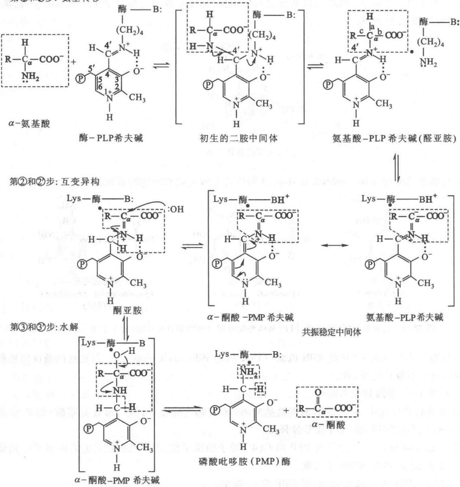

第②和②步: 互变异构

图 25-4 以吡哆醛 5'-磷酸为辅酶的酶催化氨基转移反应的机制

②③, 实际是步骤 I 的三步反应的逆反应.

希夫碱的互变异构中移走 $\alpha$ 质子(得自图 25-4 中 a 键的断裂)。PLP 引起的反应还包括 b 键的断裂(氨基酸的脱羧)和 c 键的活化。

氨基转移酶因氨基转移反应第一步的底物氨基酸特性不同而异，从而使酶促催化产生了不同的 $\alpha-$ 酮酸产物。但氨基转移酶的绝大多数在反应第二步中作为 $\alpha-$ 酮酸底物的，仅能是 $\alpha-$ 酮戊二酸，或者（少部分的）草酰乙酸，因此只可能产生谷氨酸或天冬氨酸。绝大多数氨基就这样流进而形成谷氨酸或天冬氨酸，它们乃自行受谷氨酸-天冬氨酸氨基转移酶的作用进行如下转化：

$$
\text {   谷氨酸   } + \text {   草酰乙酸   } \rightleftharpoons \alpha - \text {   酮戊二酸   } + \text {   天冬氨酸   }
$$

谷氨酸氧化脱氨基产生氨，并再生 $\alpha-$ 酮戊二酸。 $\alpha-$ 酮戊二酸又进入另一种氨基反应的途径。在尿素合成中，氨和天冬氨酸扮演着两个氨基受体的角色。

## 2. 葡萄糖-丙氨酸循环,氨运入肝

与前述转氨基作用规律相反的一个重要例外,是有一组肌肉氨基转移酶,可把丙酮酸当作它们的 $\alpha-$ 酮酸底物。即在它们的催化下得到的产物为丙氨酸。这个丙氨酸被释放进入血流,并被传送到肝,在肝中经过转氨基作用产生丙酮酸,又可用于糖异生作用(gluconeogenesis)(见第21章)。这样形成的葡萄糖又回到肌肉中,在这里又以糖酵解方式降解为丙酮酸。以上称之为葡萄糖-丙氨酸循环(glucose-alanine cycle)(图25-5)。氨基酸最后以氨或天冬氨酸告终,产物即用于尿素的形成。它证明葡萄糖-丙氨酸循环起着将氨运入肝的作用。

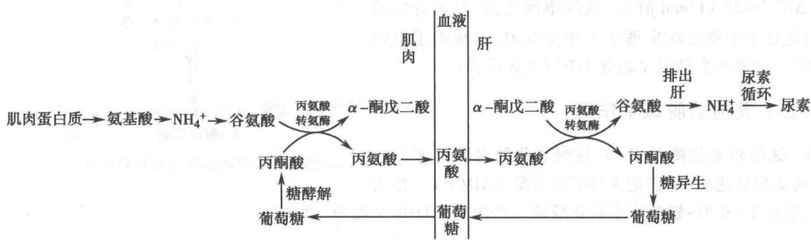  
图 25-5 葡萄糖-丙氨酸循环

## 3. 转氨酶

催化转氨基反应的酶称为转氨酶(transaminase)，或称氨基转移酶(aminotransferase)。催化氨基酸转氨基的酶种类很多，在动、植物、微生物中分布很广。在动物的心、脑、肾、睾丸以及肝细胞中含量都很高。大多数转氨酶需要 $\alpha-$ 酮戊二酸作为氨基的受体，因此它们对两个底物中的一个底物，即 $\alpha-$ 酮戊二酸（或谷氨酸）是专一的，而对另外一个底物则无严格的专一性，虽然某种酶对某种氨基酸有较高的活力，但对其他氨基酸也有一定作用。酶的命名是根据其催化活力最大的氨基酸命名，至今已发现有50种以上的转氨酶。

动物和高等植物的转氨酶一般只催化 L-氨基酸和 $\alpha-$ 酮酸的转氨作用。某些细菌，例如，枯草杆菌 (B.Subtilis) 的转氨酶能催化 D- 和 L- 两种氨基酸的转氨作用。

转氨酶催化的反应都是可逆的,它们的平衡常数为1.0左右,也表明催化的反应可向左、右两个方向进行。但是在生物体内,与转氨作用相偶联的反应是氨基酸的氧化分解作用,例如,谷氨酸的氧化脱氨基作用,这种偶联反应可以促使氨基酸的转氨作用向一个方向进行。

在真核细胞的线粒体和细胞溶胶中都可进行转氨作用。在细胞不同部位的转氨酶，虽然功能相同，但结构和性质并不相同。在猪心细胞线粒体内和线粒体外的天冬氨酸转氨酶，其氨基酸组成和等电点都不相同，但两种转氨酶的相对分子质量都是90 000，都含有两个大小相同的亚基。

哺乳动物细胞中氨基酸氨基的集合作用是在细胞溶胶中进行的。起催化作用的酶是细胞溶胶中的各种转氨酶，这些酶催化的转氨产物是谷氨酸。谷氨酸通过膜的特殊转运系统进入线粒体基质（matrix），在线粒体基质中，谷氨酸或直接脱氨基，或作为 $\alpha-$ 氨基的供体，借助线粒体天冬氨酸转氨酶，将氨基转移给草酰乙酸又形成天冬氨酸。在线粒体内，天冬氨酸是尿素形成时氨基的直接供给者，又是形成腺苷酸代琥珀酸（adenylosuccinate）的重要物质（参看联合脱氨基作用）。

## （二）氧化脱氨基作用：谷氨酸脱氢酶

谷氨酸在线粒体中受谷氨酸脱氢酶作用发生氧化脱氨基反应。这是唯一为人所知的，至少在一些组织中，既可把 $\mathrm{NAD}^{+}$ 又可把 $\mathrm{NAD(P)}^{+}$ 作为它的氧化还原辅酶的酶。氧化的发生被认为是由于谷氨酸的 $\mathrm{C}_{\alpha}$ 带一对电子的质子转移到 $\mathrm{NAD(P)}^{+}$ 所致。这时，形成 $\alpha-$ 亚氨基戊二酸。这个具有亚氨基的中间产物经水解即形成 $\alpha-$ 酮戊二酸及氨，见图25-6。

谷氨酸脱氢酶的相对分子质量为 330 000，在脊椎动物中，此酶由 6 个相同的亚基构成。此酶存在于线粒体基质中。它是一别构调节酶。在体外的实验中可以见到谷氨酸脱氢酶被 GTP 和 ATP 抑制，被 ADP 激活。因此，认为此类核苷酸在体内起着调节此酶的作用。然而，对于细胞底物及产物浓度的研究却表明，在体内此脱氢酶的作用非常接近平衡状态（ $\Delta G \approx 0$ ）。因此，最大的可能是受底物及产物浓度所左右。反应的平衡点表明在动态反应中谷氨酸的形成超过氨的形成（即在上图的反应式中 $\Delta G^{\ominus} \approx 30 \, kJ/mol$ 时）。氨的浓度越高，显示毒性越高，因此这个平衡点在生理学上至关重要，它维护了氨的低浓度。这里产生的氨又转化为尿素（见后节）。

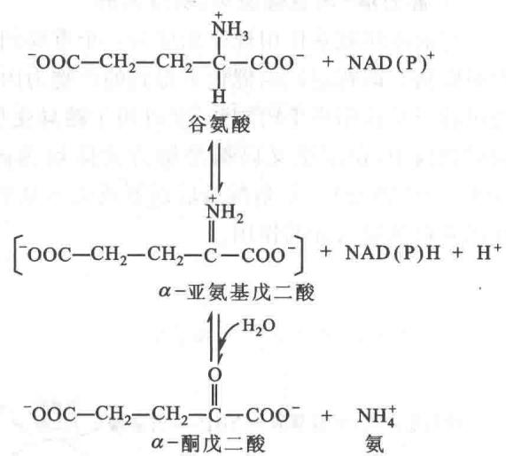

## （三）其他的脱氨基作用

L-氨基酸氧化酶及 D-氨基酸氧化酶是两个非专一性的氨基酸氧化酶, 它们把 FAD[而不是 $\mathrm{NAD(P)^{+}}$ ]作为图 25-6 谷氨酸的氧化脱氨基作用

辅酶,催化 L- 及 D- 氨基酸的氧化反应。产出的 FADH 又被 $O_{2}$ 再氧化:

$$
\begin{array}{r l} \text { 氨基酸 } + \mathrm{FAD} + \mathrm{H} _ {2} \mathrm{O} & \longrightarrow \alpha - \text { 酮酸 } + \mathrm{NH} _ {3} + \mathrm{FADH} _ {2} \\ \mathrm{FADH} _ {2} + \mathrm{O} _ {2} & \longrightarrow \mathrm{FAD} + \mathrm{H} _ {2} \mathrm{O} _ {2} \end{array}
$$

D-氨基酸氧化酶主要存在于肾中。它的功能是颇为神秘的，因为 D-氨基酸绝大多数是结合在细菌的细胞壁上。

极少数的氨基酸,如丝氨酸及组氨酸之脱氨基是非氧化型的脱氨基作用。

## （四）联合脱氨作用

氨基酸的转氨作用虽然在生物体内普遍存在,但是单靠转氨作用并不能最终脱掉氨基。当前联合脱氨作用(transdeamination)有两个内容:其一是指氨基酸的 $\alpha-$ 氨基借助转氨作用,转移到 $\alpha-$ 酮戊二酸的分子上,生成相应的 $\alpha-$ 酮酸和谷氨酸,然后谷氨酸在谷氨酸脱氢酶的催化下,脱氨基生成 $\alpha-$ 酮戊二酸,同时释放出氨(图25-7)。其二是嘌呤核苷酸的联合脱氨作用,这一过程的内容是:

  
图25-7 以谷氨酸脱氢酶为主的联合脱氨基作用

次黄嘌呤核苷酸与天冬氨酸作用形成中间产物腺苷酸代琥珀酸（adenylsuccinate），后者在裂合酶的作用下，分裂成腺嘌呤核苷酸和延胡索酸，腺嘌呤核苷酸（腺苷酸）水解后即产生游离氨和次黄嘌呤核苷酸（图25-8）。

天冬氨酸主要来源于谷氨酸，由草酰乙酸与谷氨酸转氨而来，催化此反应的酶称为谷氨酸-草酰乙酸转氨酶，简称谷草转氨酶，又称为谷氨酸：天冬氨酸转氨酶。从 $\alpha-$ 氨基酸开始的联合脱氨反应可概括如图25-9。

以谷氨酸脱氢酶为中心的联合脱氨作用,虽然在机体内广泛存在,但不是所有组织细胞的主要脱氨方式。骨骼肌、心肌、肝以及脑的脱氨方式可能都是以嘌呤核苷酸循环为主,实验证明脑组织中的氨有50%是经嘌呤核苷酸循环产生的。

## （五）氨基酸的脱羧基作用

机体内部分氨基酸可进行脱羧而生成相应的一级胺。催化脱羧反应的酶称为脱羧酶（decarboxylase），这类酶的辅酶为磷酸吡哆醛，其所催化的反应如下：

  
图25-8 嘌呤核苷酸的联合脱氨基作用

  
图25-9 从 $\alpha$ -氨基酸开始通过嘌呤核苷酸循环的联合脱氨基过程

<!-- END OFFICIAL API PART part_003 -->

<!-- BEGIN OFFICIAL API PART part_004 -->

氨基酸脱羧酶的专一性很高,一般是一种氨基酸对应一种脱羧酶,而且只对 L-氨基酸起作用。在脱羧酶中只有组氨酸脱羧酶不需要辅酶。

氨基酸的脱羧反应普遍存在于微生物,高等动、植物组织中。动物的肝、肾、脑中都发现有氨基酸脱羧酶,脑组织中富有 L-谷氨酸脱羧酶,能使 L-谷氨酸脱羧形成 γ-氨基丁酸。氨基酸脱羧后形成的胺,有许多具有重要的生理作用。如上述的 γ-氨基丁酸是重要的神经递质(neurotransmitter)。组氨酸脱羧形成的组胺(histamine)有降低血压的作用,又是胃液分泌的刺激剂。酪氨酸脱羧形成的酪胺(tyramine)有升高血压的作用,这点将在氨基酸与生物活性物质一节中详细讨论。绝大多数胺类是对动物有毒性的。但体内有胺氧化酶,能将胺氧化为醛和氨。醛可进一步氧化成脂肪酸,氨可合成尿素,又可形成新的氨基酸。

## (六) 氨的命运

氨基酸经过前述的氧化脱氨基作用、脱酰氨基作用，或经嘌呤核苷酸循环等途径将氨基氮转变为氨。氨对生物机体是毒性物质，特别是高等动物的脑对氨极为敏感，血液中1%的氨就可引起中枢神经系统中毒，因此氨的排泄是生物体维持正常生命活动所必需的。

人类氨中毒的症状表现为语言紊乱、视力模糊，机体发生一种特有的震颤，甚至昏迷或死亡。氨对中枢神经系统危害的机制目前尚未完全阐明。已知脑细胞线粒体可将氨与 $\alpha-$ 酮戊二酸作用形成谷氨酸：

$$
\mathrm{NH} _ {4} ^ {+} + \alpha - \text { 酮   戊   二   酸 } + \mathrm{NADPH} + \mathrm{H} ^ {+} \longrightarrow \text { 谷   氨   酸 } + \mathrm{NADP} ^ {+} + \mathrm{H} _ {2} \mathrm{O}
$$

此反应一方面大量消耗了 $\alpha-$ 酮戊二酸，从而破坏了柠檬酸循环的正常进行；另一方面，对 NADPH 的大量消耗，严重地影响需要还原力 $(NADPH+H^{+})$ 反应的正常进行。

有些微生物可将游离氨用于形成细胞的其他含氮物质。当以某种氨基酸作为氮源时，从氨基酸上脱下的氨，除一部分用于进行生物合成外，多余的氨即排到周围环境中。

某些水生的或海洋动物,如原生动物和线虫以及鱼类、水生两栖类等,都以氨的形式将氨基氮排出体外。这些动物称为排氨动物(ammonotelic animal)。

绝大多数陆生动物将脱下的氨转变为尿素。鸟类和陆生的爬虫类，因体内水分有限，它们的排氨方式是形成固体尿酸的悬浮液排出体外。因此鸟类和爬虫类又称为排尿酸动物（uricotelic animal）。

有些两栖类处于中间位置，幼虫为排氨动物，如蝌蚪，变态时肝产生出必要的酶，成蛙后，即排泄尿素。

概括地说,生活着的有机体把氨基酸分解代谢产生的氮的多余部分排出体外,有3种形式:①排氨,包括许多水生动物,排泄时需要少量的水;②排尿素,包括绝大多数陆生脊椎动物;③排尿酸,包括鸟类和陆生爬行动物。有些生物在水供应受到限制时,可以从排氨类转变为排尿素类或排尿酸类。

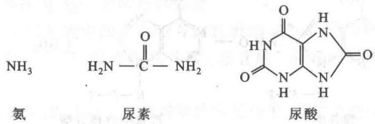

## 1. 氨的转运

氨的转运主要是通过谷氨酰胺,多数动物细胞内有谷氨酰胺合成酶(glutamine synthetase),催化谷氨酸与氨结合而形成谷氨酰胺。

$$
\mathrm{NH} _ {4} ^ {+} + \mathrm{谷氨酸} + \mathrm{ATP} \xrightarrow {\text {谷氨酰胺合成酶}} \mathrm{谷氨酰胺} + \mathrm{ADP} + \mathrm{Pi} + \mathrm{H} ^ {+}
$$

在该反应中形成中间产物谷氨酰-5-磷酸,是一种与酶结合的高能中间产物,是谷氨酸第5位的羧基磷酸化的结果,提供磷酸基团的是ATP。谷氨酰-5-磷酸的磷酯键是活泼键,很容易脱下磷酸基团而与氨结合形成谷氨酰胺。

  
谷氨酰-5-磷酸（与酶相结合）

谷氨酰胺是中性无毒物质,容易透过细胞膜,是氨的主要运输形式;而谷氨酸带有负电荷,不能透过细胞膜。

谷氨酰胺由血液运送到肝，肝细胞的谷氨酰胺酶(glutaminase)又将其分解为谷氨酸和氨。

$$
\mathrm{谷氨酰胺} + \mathrm {H_ {2} O} \xrightarrow {\mathrm{谷氨酰胺酶}} \mathrm{谷氨酸} + \mathrm {NH_ {4} ^ {+}}
$$

前已述及,肌肉可利用葡萄糖-丙氨酸循环转运氨,将氨送到肝。在肌肉中谷氨酸与丙酮酸进行转氨形成丙氨酸:

$$
\mathrm{谷氨酸} + \mathrm{丙酮酸} \xrightarrow [ (\mathrm{在肌肉}) ]{\mathrm{丙酮酸转氨酶}} \alpha - \mathrm{酮戊二酸} + \mathrm{丙氨酸}
$$

丙氨酸在 pH 近于 7 的条件下是中性不带电荷的化合物,通过血液运送到肝,再与 $\alpha-$ 酮戊二酸转氨又变为丙酮酸和谷氨酸:

$$
\mathrm{丙氨酸} + \alpha - \mathrm{酮戊二酸} \xrightarrow [ (\text {在肝}) ]{\mathrm{丙氨酸转氨酶}} \mathrm{丙酮酸} + \mathrm{谷氨酸}
$$

肌肉中所需的丙酮酸由糖酵解提供,在肝中多余的丙酮酸又可通过糖异生作用转化为葡萄糖。

生物体利用丙氨酸作为从肌肉到肝运送氨的载体,是机体在维持生命活动中遵循经济原则的一种表现。肌肉在紧张活动中既产生大量的氨,又产生大量的丙酮酸,二者都需要运送到肝进一步转化。将丙酮酸与氨转化为丙氨酸,收到一举两得的功效。

## 2. 氨的排泄

（1）排氨动物由氨基酸的 $\alpha-$ 氨基形成的氨，经谷氨酰胺形式运送到排泄部位。例如，鱼类的鳃，经鳃内谷氨酰胺酶分解，游离的氨即借助扩散作用排出体外。

（2）尿素的形成——尿素循环(urea cycle) 排尿素动物合成尿素是在肝中进行的，由一个循环机制完成，这一循环称为尿素循环，如图 25-10 所示。

  
图25-10 Krebs和Henseleit最早提出的尿素循环

<!-- EN-BEGIN 18.1 -->

### 【英文对应 18.1】Metabolic Fates of Amino Groups

> 来源：Lehninger Principles of Biochemistry（书籍/02_生物化学原理） 第18章 Amino Acid Oxidation and the Production of Urea，§18.1。对应本章“二、氨基酸分解代谢”。

Nitrogen, $N_{2}$ , is abundant in the atmosphere but is too unreactive for use in most biochemical processes. Reduced nitrogen is essential for life but bioenergetically expensive. Only a few microorganisms can convert $N_{2}$ to biologically useful forms such as $NH_{3}$ (Chapter 22). Amino groups are thus used efficiently in biological systems, and the lack of reactive nitrogen can limit growth.

P4 If not reused for the synthesis of new amino acids or other nitrogenous products, amino groups are channeled into a single excretory end product (Fig. 18-2). Most aquatic species, such as the bony fishes, are ammonotelic, excreting amino nitrogen as ammonia. The toxic ammonia is simply diluted in the surrounding water. Terrestrial animals require pathways for nitrogen excretion that minimize toxicity and water loss. Most terrestrial animals are ureotelic, excreting amino nitrogen in the form of urea; birds and reptiles are uricotelic, excreting amino nitrogen as uric acid. (The pathway of uric acid synthesis is described in Fig. 22-48.) Plants recycle virtually all amino groups—they excrete nitrogen only under rare circumstances. Reactive nitrogen excreted in any form is rapidly assimilated into the global nitrogen web (see Fig. 22-1), metabolized by microorganisms that are ubiquitous in aqueous and soil environments.

Figure 18-2a provides an overview of the catabolic pathways of ammonia and amino groups in vertebrates. Glutamine, glutamate, and alanine are prominent in this scheme. Amino acids derived from dietary protein are the source of most amino groups. Most amino acids are metabolized in the liver. Some of the ammonia generated in this process is recycled and used in biosynthetic pathways where glutamine, glutamate, and aspartate play major roles (Chapter 22). Excess amino groups are either excreted directly or converted to urea or uric acid for excretion, depending on the organism (Fig. 18-2b). In mammals, including marsupials, most excess ammonia generated in other (extrahepatic) tissues travels to the liver for conversion to urea.

  
FIGURE 18-2 Amino group catabolism. (a) Overview of catabolism of amino groups (shaded) in vertebrate liver. (b) Excretory forms of nitrogen. Excess $\mathrm{NH_4^+}$ is excreted as ammonia, urea, or uric acid.  
Notice that the carbon atoms of urea and uric acid are highly oxidized; the organism discards carbon only after extracting most of its available energy of oxidation.

P2 The special place of glutamate, glutamine, alanine, and aspartate in nitrogen metabolism is not an evolutionary accident. These particular amino acids are the ones most easily converted into citric acid cycle intermediates: glutamate and glutamine to $\alpha$ -ketoglutarate, alanine to pyruvate, and aspartate to oxaloacetate. Glutamate and glutamine are especially important, acting as general collection points for amino groups. In the cytosol of liver cells (hepatocytes), amino groups from most amino acids are transferred to $\alpha$ -ketoglutarate to form glutamate, which enters mitochondria and gives up its amino group to form $\mathrm{NH}_4^+$ . Excess ammonia generated in most other tissues is converted to the amide nitrogen of glutamine, which passes to the liver, then into liver mitochondria. Glutamine or glutamate or both are present in higher concentrations than other amino acids in most tissues. In skeletal muscle, excess amino groups are generally transferred to pyruvate to form alanine, another important molecule in the transport of amino groups to the liver. We begin with a discussion of the breakdown of dietary proteins, then proceed to a general description of the metabolic fates of amino groups.

#### [EN] Dietary Protein Is Enzymatically Degraded to Amino Acids

In humans, the degradation of ingested proteins to their constituent amino acids occurs in the gastrointestinal tract. Entry of dietary protein into the stomach stimulates the gastric mucosa to secrete the hormone gastrin, which in turn stimulates the secretion of hydrochloric acid by the parietal cells and pepsinogen by the chief cells of the gastric glands (Fig. 18-3a). The acidic gastric juice (pH 1.0 to 2.5) is both an antiseptic, killing most bacteria and other foreign cells, and a denaturing agent, unfolding globular proteins and rendering their internal peptide bonds more accessible to enzymatic hydrolysis. Pepsinogen ( $M_{r}$ 40,554), an inactive precursor, or zymogen (p. 220), is converted to active pepsin ( $M_{r}$ 34,614) by an autocatalytic cleavage (a cleavage mediated by the pepsinogen itself) that occurs only at low pH. In the stomach, pepsin cleaves long polypeptide chains into a mixture of smaller peptides.

  
FIGURE 18-3 Part of the human digestive (gastrointestinal) tract. (a) The parietal cells and chief cells of the gastric glands secrete their products in response to the hormone gastrin. Pepsin begins the process of protein degradation in the stomach. (b) The cytoplasm of exocrine cells of the pancreas is completely filled with rough endoplasmic reticulum, the site of synthesis of the zymogens of many digestive enzymes. The zymogens are concentrated in membrane-enclosed transport particles called zymogen granules. When an exocrine cell is stimulated, its plasma membrane fuses with the zymogen granule membrane and zymogens are released into the lumen of the collecting duct by exocytosis. The collecting ducts ultimately lead to the pancreatic duct and from there to the small intestine. (c) In the small intestine, amino acids are absorbed through the epithelial cell layer (intestinal mucosa) of the villi and enter the capillaries.

As the acidic stomach contents pass into the small intestine, the low pH triggers secretion of the hormone secretin into the blood. Secretin stimulates the pancreas to secrete bicarbonate into the small intestine to neutralize the gastric HCl, abruptly increasing the pH to about 7. Arrival of peptides in the upper part of the intestine (duodenum) causes release into the blood of the hormone cholecystokinin, which stimulates secretion of several pancreatic proteases with activity optima at pH 7 to 8. Trypsinogen, chymotrypsinogen, and procarboxypeptidases A and B—the zymogens of trypsin, chymotrypsin, and carboxypeptidases A and B—are synthesized and secreted by the exocrine cells of the pancreas (Fig. 18-3b). Trypsinogen is converted to its active form, trypsin, by enteropeptidase, a proteolytic enzyme secreted by intestinal cells. Free trypsin then catalyzes the conversion of additional trypsinogen to trypsin (see Fig. 6-42). Trypsin also activates chymotrypsinogen, the procarboxypeptidases, and proelastase.

Why this elaborate mechanism for getting active digestive enzymes into the gastrointestinal tract? Synthesis of the enzymes as inactive precursors protects the exocrine cells from destructive proteolytic attack. The pancreas further protects itself against self-digestion by making a specific inhibitor, a protein called pancreatic trypsin inhibitor (p. 220). Given the key role of trypsin in proteolytic activation pathways, inhibition of trypsin effectively prevents premature production of active proteolytic enzymes within pancreatic cells.

Trypsin and chymotrypsin further hydrolyze the peptides that were produced by pepsin in the stomach. This stage of protein digestion is accomplished very efficiently, because pepsin, trypsin, chymotrypsin, and the carboxypeptidases have different catalytic specificities and cleave different sets of peptide bonds (see Table 3-6). The resulting mixture of free amino acids is transported into the epithelial cells lining the small intestine (Fig. 18-3c), through which the amino acids enter the blood capillaries in the villi and travel to the liver.

Acute pancreatitis is a disease caused by obstruction of the normal pathway by which pancreatic secretions enter the intestine. The zymogens of the proteolytic enzymes are converted to their catalytically active forms prematurely, inside the pancreatic cells, and attack the pancreatic tissue itself. This causes excruciating pain and damage to the organ that can prove fatal.

#### [EN] Pyridoxal Phosphate Participates in the Transfer of α-Amino Groups to α-Ketoglutarate

P1 The first step in the catabolism of most L-amino acids, once they have reached the liver, is removal of the $\alpha$ -amino groups, promoted by enzymes called aminotransferases or transaminases. In these transamination reactions, the $\alpha$ -amino group is transferred to the $\alpha$ -carbon atom of $\alpha$ -ketoglutarate, leaving behind the corresponding $\alpha$ -keto acid analog of the amino acid (Fig. 18-4). There is no net deamination (loss of amino groups) in these reactions, because the $\alpha$ -ketoglutarate becomes aminated as the $\alpha$ -amino acid is deaminated. P2 These are the reactions that effectively collect the amino groups from many different amino acids in the form of L-glutamate.

  
FIGURE 18-4 Enzyme-catalyzed transaminations. In many aminotransferase reactions, $\alpha$ -ketoglutarate is the amino group acceptor. All aminotransferases have pyridoxal phosphate (PLP) as cofactor. Although the reaction is shown here in the direction of transfer of the amino group to $\alpha$ -ketoglutarate, it is readily reversible.

Cells contain different types of aminotransferases. Many are specific for $\alpha$ -ketoglutarate as the amino group acceptor but differ in their specificity for the L-amino acid. The enzymes are named for the amino group donor (alanine aminotransferase and aspartate aminotransferase, for example). The reactions catalyzed by aminotransferases are freely reversible, having an equilibrium constant of about 1.0 ( $\Delta G' \approx 0$ kJ/mol).

P1 All aminotransferases have pyridoxal phosphate (PLP), the coenzyme form of pyridoxine, or vitamin B6, as a prosthetic group. We encountered pyridoxal phosphate in Chapter 15, as a coenzyme in the glycogen phosphorylase reaction, but its role in that reaction is not representative of its usual coenzyme function. Its primary role in cells is in the metabolism of molecules with amino groups.

Pyridoxal phosphate functions as an intermediate carrier of amino groups at the active site of aminotransferases. It undergoes reversible transformations between its aldehyde form, pyridoxal phosphate, which can accept an amino group, and its aminated form, pyridoxamine phosphate, which can donate its amino group to an $\alpha$ -keto acid (Fig. 18-5a). Pyridoxal phosphate is generally covalently bound to the enzyme's active site through an aldimine (Schiff base) linkage to the $\varepsilon$ -amino group of a Lys residue (Fig. 18-5b, c). This linkage is replaced by the amino group of the amino acid as the first step in most PLP-catalyzed reactions (Fig. 18-5d).

Pyridoxal phosphate participates in a variety of reactions in amino acid metabolism (Section 18.3 and Chapter 22), facilitating reactions at the $\alpha$ , $\beta$ , and $\gamma$ carbons (C-2 to C-4) of amino acids. Reactions at the $\alpha$ carbon (Fig. 18-6) include racemizations (interconverting L- and D-amino acids) and decarboxylations, as well as transaminations. Pyridoxal phosphate plays the same chemical role in each of these reactions. A bond to the $\alpha$ carbon of the substrate is broken, removing either a proton or a carboxyl group. Pyridoxal phosphate provides resonance stabilization of the otherwise unstable carbanion

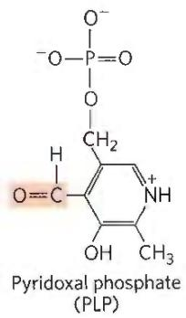

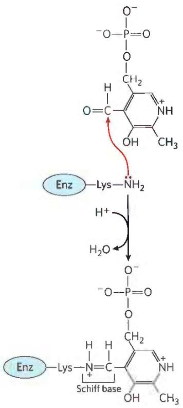

  
(a)

  
(c)

(b)  
  
(d)  
FIGURE 18-5 Pyridoxal phosphate, the prosthetic group of aminotransferases. (a) Pyridoxal phosphate (PLP) and its aminated form, pyridoxamine phosphate, are the tightly bound coenzymes of aminotransferases. The functional groups are shaded. (b) Pyridoxal phosphate is bound to the enzyme through noncovalent interactions and a Schiff-base (aldimine) linkage to a Lys residue at the active site. The steps in the formation of a Schiff base from a primary amine and a carbonyl group are detailed in Figure 14-5. (c, d) Close-up views of the active site of aspartate aminotransferase, with PLP (white, with the phosphoryl group in orange and red). In (c) PLP is in aldimine linkage with the side chain of Lys $^{258}$ (purple). In (d) PLP is linked to the substrate analog 2-methylaspartate (green) via a Schiff base. [(c, d) Data from PDB ID 1AJS, S. Rhee et al., J. Biol. Chem. 272:17,293, 1997.]

  
tion of an electron pair to avoid formation of an unstable carbanion on the $\alpha$ carbon (inset). A quinonoid intermediate is involved in all three types of reactions. The transamination route A is especially important in the pathways described in this chapter. This pathway (shown left to right) represents only part of the overall reaction catalyzed by aminotransferases. To complete the process, a second $\alpha$ -keto acid replaces the one that is released, and this is converted to an amino acid in a reversal of the reaction steps (right to left). Pyridoxal phosphate is also involved in certain reactions at the $\beta$ and $\gamma$ carbons of some amino acids (not shown).

MECHANISM FIGURE 18-6 Some amino acid transformations at the $\alpha$ carbon that are facilitated by pyridoxal phosphate. Pyridoxal phosphate is generally bonded to the enzyme through a Schiff base, also called an internal aldimine. This activated form of PLP readily undergoes transamination to form a new Schiff base (external aldimine) with the $\alpha$ -amino group of the substrate amino acid (see Fig. 18-5b, d). Three alternative fates for the external aldimine are shown: A transamination, B racemization, and C decarboxylation. The PLP-amino acid Schiff base is in conjugation with the pyridine ring, an electron sink that permits delocaliza

intermediate (Fig. 18-6, inset). The highly conjugated structure of PLP (an electron sink) permits delocalization of the negative charge.

Aminotransferases (Fig. 18-6a) are classic examples of enzymes catalyzing bimolecular Ping-Pong reactions (see Fig. 6-15b, d), in which the first substrate reacts and the product must leave the active site before the second substrate can bind. Thus, the incoming amino acid binds to the active site, donates its amino group to pyridoxal phosphate, and departs in the form of an $\alpha$ -keto acid.

The incoming $\alpha$ -keto acid then binds, accepts the amino group from pyridoxamine phosphate, and departs in the form of an amino acid.

#### [EN] Glutamate Releases Its Amino Group as Ammonia in the Liver

As we shall see, the urea cycle begins with free ammonia in the mitochondria of hepatocytes. P1 The delivery of $NH_{4}^{+}$ to these mitochondria is streamlined by collecting the amino groups of many different $\alpha$ -amino acids in the liver in one of two forms: the amino group of L-glutamate or the amide nitrogen of glutamine (Fig. 18-2).

As the product of many aminotransferase reactions, glutamate has a central role. In hepatocytes, glutamate is transported from the cytosol into mitochondria. Here, it undergoes oxidative deamination catalyzed by L-glutamate dehydrogenase ( $M_{r}$ 330,000) to produce $NH_{4}^{+}$ and $\alpha$ -ketoglutarate. In mammals, this enzyme is present in the mitochondrial matrix. It is unusual in that it can use either $NAD^{+}$ or $NADP^{+}$ as the acceptor of reducing equivalents (Fig. 18-7).

The combined action of an aminotransferase and glutamate dehydrogenase is referred to as transdeamination. A few amino acids bypass the transdeamination pathway and undergo direct oxidative deamination. The fate of the $NH_{4}^{+}$ produced by any of these deamination processes is discussed in detail in Section 18.2. P3 The $\alpha$ -ketoglutarate formed from glutamate deamination can be used either in the citric acid cycle or for glucose synthesis.

P1 P2 P3 Glutamate dehydrogenase operates at an important intersection of carbon and nitrogen metabolism. Its $\alpha$ -ketoglutarate product can be oxidized as fuel or serve as a glucose precursor in gluconeogenesis. An allosteric enzyme with six identical subunits, its activity is influenced by a complicated array of allosteric modulators. The best-studied of these are the positive modulator ADP and the negative modulator GTP. Although the metabolic rationale for this regulatory

FIGURE 18-7 Reaction catalyzed by glutamate dehydrogenase. The glutamate dehydrogenase of mammalian liver has the unusual capacity to use either $\mathrm{NAD^{+}}$ or $\mathrm{NADP^{+}}$ as cofactor. The glutamate dehydrogenases of plants and microorganisms are generally specific for one or the other. The mammalian enzyme is allosterically regulated by GTP and ADP.

pattern has not been elucidated in detail, ADP can signal low glucose levels and GTP is a product of the citric acid cycle that can signal high levels of $\alpha$ -ketoglutarate (see Fig. 16-7).

Mutations that alter the allosteric binding site for GTP or otherwise cause permanent activation of glutamate dehydrogenase lead to a human genetic disorder called hyperinsulinism-hyperammonemia syndrome, characterized by hypersecretion of insulin after a protein meal. This results in elevated levels of ammonia in the bloodstream and hypoglycemia.

#### [EN] Glutamine Transports Ammonia in the Bloodstream

Glutamine is the second major source of ammonia in hepatocyte mitochondria and is particularly important for intercellular transport of ammonia. P4 Ammonia is quite toxic to animal tissues (we examine some possible reasons for this toxicity later). Significant amounts are present in blood, but the levels are tightly controlled. In many tissues, including the brain, some processes such as nucleotide degradation generate free ammonia. In most animals, much of the free ammonia is converted to a nontoxic compound before export from the extrahepatic tissues into the blood and transport to the liver or kidneys. For this transport function, glutamate, critical to intracellular amino group metabolism, is supplanted by L-glutamine. The free ammonia produced in tissues is combined with glutamate to yield glutamine by the action of glutamine synthetase. This reaction requires ATP and occurs in two steps (Fig. 18-8). First, glutamate and ATP react to form ADP and a $\gamma$ -glutamyl phosphate intermediate, which then reacts with ammonia to produce glutamine and inorganic phosphate. In addition to its transport role, glutamine serves as a source of amino groups in a variety of biosynthetic reactions. Glutamine synthetase is found in all organisms, always playing a central metabolic role. In microorganisms, the enzyme serves as an essential portal for the entry of fixed nitrogen into biological systems. (The roles of glutamine and glutamine synthetase in metabolism are further discussed in Chapter 22.)

In most terrestrial animals, glutamine in excess of that required for biosynthesis is transported in the blood to the intestine, liver, and kidneys for processing. In these tissues, the amide nitrogen is released as ammonium ion in the mitochondria, where the enzyme glutaminase converts glutamine to glutamate and $NH_{4}^{+}$ (Fig. 18-8). The $NH_{4}^{+}$ from intestine and kidney is transported in the blood to the liver. In the liver, the ammonia from all sources is disposed of by urea synthesis. Some of the glutamate produced in the glutaminase reaction may be further processed in the liver by glutamate dehydrogenase (Fig. 18-7), releasing more ammonia and producing carbon skeletons for metabolic fuel.

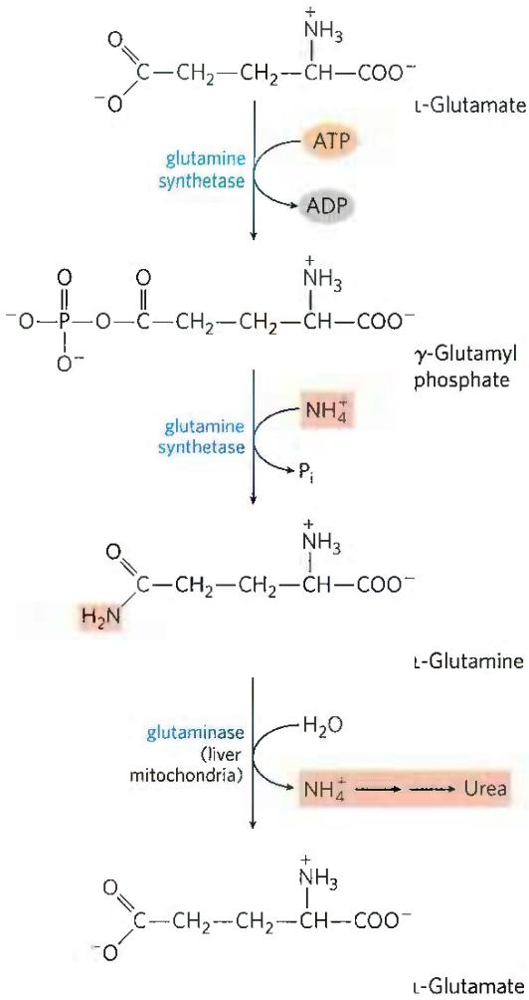  
FIGURE 18-8 Ammonia transport in the form of glutamine. Excess ammonia in tissues is added to glutamate to form glutamine, a process catalyzed by glutamine synthetase. After transport in the bloodstream, the glutamine enters the liver, and $\mathrm{NH_4^+}$ is liberated in mitochondria by the enzyme glutaminase.

In metabolic acidosis (p. 621) there is a regulated increase in glutamine processing by the kidneys. Much of the excess $NH_{4}^{+}$ thus produced is not destined for the bloodstream or converted to urea; instead, it is excreted directly into the urine where it forms salts with metabolic acids. The glutamine breakdown thus facilitates removal of those acids in the urine. Bicarbonate produced by the decarboxylation of $\alpha$ -ketoglutarate in the citric acid cycle can also serve as a buffer in blood plasma. Taken together, these effects of glutamine metabolism in the kidney tend to counteract acidosis.

#### [EN] Alanine Transports Ammonia from Skeletal Muscles to the Liver

Vigcrously contracting skeletal muscles operate anaerobically, producing large amounts of pyruvate and lactate from glycolysis as well as ammonia from protein breakdown. These products must find their way to the liver, where pyruvate and lactate are incorporated into glucose, which is returned to the muscles, and ammonia is converted to urea for excretion. Pyruvate and alanine are readily interconverted via transamination with glutamate by the action of alanine aminotransferase). Thus, alanine largely supplants glutamine in the transport of amino groups from muscle to the liver in a nontoxic form (Fig. 18-2a), ultimately delivering the free ammonia to hepatocyte mitochondria via glutamate in a pathway called the glucose-alanine cycle (Fig. 18-9). In the cytosol of hepatocytes, alanine aminotransferase acts in reverse to transfer the amino group from alanine to $\alpha$ -ketoglutarate, forming pyruvate and glutamate. Glutamate can then enter mitochondria, where the glutamate dehydrogenase reaction releases $\mathrm{NH}_4^+$ (Fig. 18-7), or it can undergo transamination with oxaloacetate to form aspartate, another nitrogen donor in urea synthesis, as we shall see.

The use of alanine to transport ammonia from skeletal muscles to the liver is another example of the intrinsic economy of living organisms. The energetic burden of gluconeogenesis is imposed on the liver rather than the muscle, and all available ATP in muscle is devoted to muscle contraction. The glucose-alanine cycle, in concert with the Cori cycle (see Box 14-2 and Fig. 23-17), accomplishes this transaction.

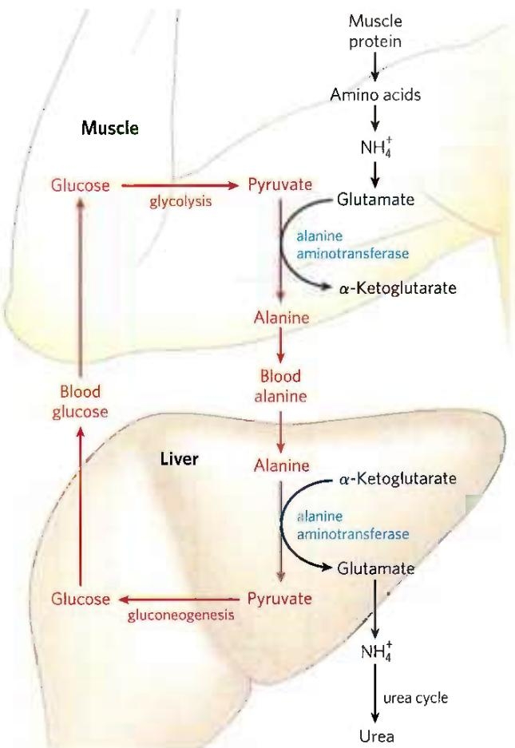  
FIGURE 18-9 Glucose-alanine cycle. Alanine serves as a carrier of ammonia and of the carbon skeleton of pyruvate from skeletal muscle to liver. The ammonia is excreted and the pyruvate is used to produce glucose, which is returned to the muscle.

#### [EN] Ammonia Is Toxic to Animals

The catabolic production of ammonia poses a serious biochemical problem, because ammonia is very toxic. The brain is particularly sensitive; damage from ammonia toxicity causes cognitive impairment, ataxia, and epileptic seizures. In extreme cases there is swelling of the brain leading to death. The molecular bases for this toxicity are gradually coming into focus. In the blood, about 98% of ammonia is in the protonated form (NH $_{4}^{+}$ ), which does not cross the plasma membrane. The small amount of NH $_{3}$ present readily crosses all membranes, including the blood-brain barrier, allowing it to enter cells, where much of it becomes protonated and can accumulate inside cells as NH $_{4}^{+}$ .

Ridding the cytosol of ammonia requires reductive amination of $\alpha$ -ketoglutarate to glutamate by glutamate dehydrogenase (the reverse of the reaction described earlier; Fig. 18-7) and conversion of glutamate to glutamine by glutamine synthetase. In the brain, only astrocytes — star-shaped cells of the nervous system that provide nutrients, support, and insulation for neurons — express glutamine synthetase. Glutamate and its derivative $\gamma$ -aminobutyrate (GABA; see Fig. 22-31) are important neurotransmitters; some of the sensitivity of the brain to ammonia may reflect depletion of glutamate in the glutamine synthetase reaction. However, glutamine synthetase activity is insufficient to deal with excess ammonia, or to fully explain its toxicity.

Increased $[NH_{4}^{+}]$ also alters the capacity of astrocytes to maintain potassium homeostasis across the membrane. $NH_{4}^{+}$ competes with $K^{+}$ for transport into the cell through the $Na^{+}K^{+}$ ATPase, resulting in elevated extracellular $[K^{+}]$ . The excess extracellular $K^{+}$ enters neurons through a symporter, $Na^{+}-K^{+}-2Cl^{-}$ cotransporter 1 (NKCC1), bringing $Na^{+}$ and $2Cl^{-}$ with it. Excess $Cl^{-}$ in these neurons alters their response when the neurotransmitter GABA interacts with their $GABA_{A}$ receptors, producing abnormal depolarization and increased neuronal activity that likely account for the neuromuscular incoordination and seizures that often result from ammonia poisoning. If extracellular $[NH_{4}^{+}]$ remains elevated, the perturbation of ion and aquaporin channels in astrocytes causes the cells to swell, resulting in fatal brain edema.

As we close this discussion of amino group metabolism, note that we have described several processes that deposit excess ammonia in the mitochondria of hepatocytes (Fig. 18-2). We now look at the fate of that ammonia.

#### [EN] SUMMARY 18.1 Metabolic Fates of Amino Groups

■ Humans derive a small fraction of their oxidative energy from the catabolism of amino acids. Proteases degrade ingested proteins in the stomach and small intestine. Most proteases are initially synthesized as inactive zymogens.

An early step in the catabolism of amino acids is the separation of the amino group from the carbon skeleton. In most cases, the amino group is transferred to $\alpha$ -ketoglutarate to form glutamate. This transamination reaction requires pyridoxal phosphate, a coenzyme globally involved in amino acid metabolism.

■ Glutamate, a central reservoir of metabolized amino groups, is transported to liver mitochondria, where glutamate dehydrogenase liberates the amino group as ammonium ion (NH $_{4}^{+}$ ).

■ Ammonia formed in most other tissues is transported to the liver as the amide nitrogen of glutamine.

■ To make use of the pyruvate and amino groups generated in hardworking skeletal muscle, the pyruvate is converted to alanine and transported to the liver within the glucose-alanine cycle.

■ Free ammonia is toxic. Excess ammonia is often manifested in serious neurological damage.

<!-- EN-END 18.1 -->

## 三、尿素的形成

## （一）尿素循环的发现

尿素循环是最早发现的代谢循环，比发现柠檬酸循环还早5年。1932年发现柠檬酸循环的同一人，Hans A. Krebs和他的学生Kurt Henseleit观察到，当往悬浮有肝切片的缓冲液中加入鸟氨酸（ornithine）、瓜氨酸（citrulline）或精氨酸的任何一种时，都可促使肝切片显著加快尿素的合成，而其他任何氨基酸或含氮化合物都不能起到上述3种氨基酸的促进作用。较早人们就已经知道精氨酸可以由精氨酸酶（arginase）水解为鸟氨酸和尿素。

$$
\mathrm{精氨酸} + \mathrm {H_ {2} O} \xrightarrow {\mathrm{精氨酸酶}} \mathrm{鸟氨酸} + \mathrm{尿素}
$$

Krebs 和 Henseleit 研究了前述 3 种氨基酸的结构关系, 发现它们彼此的相关结构, 提出鸟氨酸是瓜氨酸的前体, 瓜氨酸是精氨酸的前体, 它们的相互关系见图 25-10。

在以上实验和分析的基础上，Krebs提出了尿素循环的设想。在此循环中，鸟氨酸所起的作用类似草酰乙酸在柠檬酸循环中的作用，一分子鸟氨酸和一分子氨及二氧化碳结合形成瓜氨酸。瓜氨酸与另一分子氨结合形成精氨酸。精氨酸水解形成尿素和鸟氨酸完成一次循环。当今公认的尿素循环表示如图25-11。

  
图 25-11 尿素循环部分发生在线粒体,部分发生在细胞溶胶  
其通路是分别经鸟氨酸及瓜氨酸在特异的运输体系下穿过线粒体膜实现的。在尿素循环中分布有5种酶：①氨甲酰磷酸合成酶；②鸟氨酸氨甲酰基转移酶；③精氨琥珀酸合成酶；④精氨琥珀酸酶；⑤精氨酸酶

## （二）尿素循环

尿素是肝中由尿素循环的一系列酶催化形成的。合成的尿素被分泌进入血流，再被肾汇集，从尿中排出。尿素循环的过程可概括为：

尿素的两个 N 原子来自一个氨分子和一个天冬氨酸分子, 其 C 原子则来自 $HCO_{3}^{-}$ 。在尿素循环中包括有 5 步酶反应, 其中 2 步发生在线粒体内, 3 步发生在细胞溶胶中 (见图 25-11)。下面着重讨论鸟氨酸循环的反应机制:

## 1. 氨甲酰磷酸合成酶, 尿素的第一个氮原子的获取

氨甲酰磷酸合成酶(carbamoyl phosphate synthetase, CPS)严格地说,其实不属于尿素循环的一员。它催化 $NH_{3}$ 及 $HCO_{3}^{-}$ 使之活化并缩合形成氨甲酰磷酸。它是尿素循环的两个含氮底物中的一个。这个反应伴随有两个ATP的水解。真核生物中的CPS有两类,即:

（1）线粒体的氨甲酰磷酸合成酶Ⅰ（CPSⅠ）用氨作为它的氮给体，参与尿素的生物合成。

（2）细胞溶胶的氨甲酰磷酸合成酶Ⅱ（CPSⅡ）用谷氨酸作为它的氮给体，分担着嘧啶生物合成的任务。

CPS所催化的反应包含有3个步骤（图25-12）：① $\mathrm{HCO_3^-}$ 受ATP作用而活化，形成羰基磷酸。②氨对羰基磷酸进攻，取代磷酸基团形成氨基甲酸酯。③受第2个ATP作用，发生氨基甲酸酯的磷酸化，形成氨甲酰磷酸及ADP。本反应基本上是不可逆的，它在尿素循环中是限速的一步。

## 2. 鸟氨酸氨甲酰基转移酶

鸟氨酸氨甲酰基转移酶(ornithine transcarbamoylase)的作用是将氨甲酰磷酸的氨甲酰基转移到鸟氨酸(ornithine)上,形成瓜氨酸(citrulline),这是尿素循环的第2步。此反应发生在线粒体中,而鸟氨酸则产生于细胞溶胶,所以它必须通过一个特异的运送体系进入线粒体。同样地,尿素循环的以后几步皆在细胞溶胶中进行,瓜氨酸就必须从线粒体中脱出(见图25-11)。

## 3. 精氨琥珀酸合成酶, 尿素第二个氮原子的获取

尿素第2个氮原子的获取是在尿素循环的第3步反应中实现的,即:在精氨琥珀酸合成酶(argininosuccinate synthetase)作用下,瓜氨酸的脲基(ureido group)与天冬

  
图25-12 CPSI酶促反应的机制

① $HCO_{3}^{-}$ 被磷酸化而活化,形成一个假设的中间体——羰基磷酸;② $NH_{3}$ 向羰基磷酸进攻,形成氨基甲酸酯;③氨基甲酸酯受ATP作用发生磷酸化反应,产生氨甲酰磷酸

氨酸的氨基进行缩合。反应的机制是瓜氨酸经 ATP 作用，形成瓜氨酸-AMP（citrullyl-AMP）中间体，此时瓜氨酸的脲基氧活化成为脱离基团。这个中间体立即与天冬氨酸的氨基发生置换反应，形成精氨琥珀酸（argininosuccinate）（图 25-13）。使用 $^{18}$ O 标记的瓜氨酸，最后在释出的 AMP 中分离得到了带标记的 AMP。这个实验证明 AMP 与瓜氨酸确实是通过脲基氧以共价联合在一起。

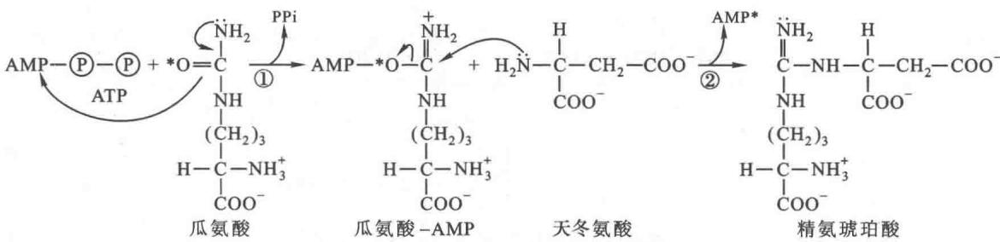  
图 25-13 精氨琥珀酸合成酶的催化反应机制  
①瓜氨酸的脲基氧由于形成瓜氨酸-AMP而被活化；②天冬氨酸以其氨基与AMP置换，星号（\*）表示用 $^{18}$ O标记的氧及相应化合物

## 4. 精氨琥珀酸酶

精氨琥珀酸形成之后，尿素分子的全部组成成分都已齐备。但是天冬氨酸所提供的氨基仍然连接在天冬氨酸的碳骨架上。这时需要精氨琥珀酸酶的作用，精氨琥珀酸酶（argininosuccinase）又称精氨琥珀酸裂解酶，在它的催化下，精氨酸与天冬氨酸的碳骨架脱离，脱下的是延胡索酸（见图25-11反应④）。精氨酸最终成为尿素的直接前体。请注意，尿素循环与柠檬酸循环之间的沟通，正是通过尿素循环中精氨琥珀酸酶催化形成的延胡索酸和在柠檬酸循环中形成草酰乙酸经转氨基反应形成天冬氨酸而连接在一起的。

## 5. 精氨酸酶

尿素循环的第5步，也是最后一步，是精氨酸酶（arginase）催化水解精氨酸产生尿素及再生成鸟氨酸（见图25-11）。再生成的鸟氨酸又回到线粒体中进入另一轮尿素循环。就这样，尿素循环把两个氨基和一个碳原子转化为非毒性的排泄物尿素。在这个循环中使用了4个“高能”磷酸键（3个ATP水解为两个ADP及Pi，一个AMP和PPi，后者并随之迅速水解为Pi）。上述的两个氨基，其中一个来自氨，另一个来自天冬氨酸；一个碳原子来自 $\mathrm{HCO_3^-}$ 。在这过程中，能量的消耗大于能量的获取，因为在形成尿素底物时，是需要能量的。但是在谷氨酸脱氢酶催化下，由谷氨酸释出氨的反应中，伴随着NADH的形成；在延胡索酸经草酰乙酸转化为天冬氨酸（图25-14）的过程中，同样也伴有NADH生成。在线粒体中对NADH再氧化，能产生 $2.5\times 2 = 5$ 个ATP。

## （三）尿素循环的调节

线粒体酶之一的氨甲酰磷酸合成酶I承担着尿素循环关键的第一步反应,它被 N-乙酰-谷氨酸别构激活。这个代谢物是谷氨酸在 N-乙酰谷氨酸合酶(N-acetylglutamate synthase)的催化下与乙酰-CoA 合成的。

肝中尿素生成的速度实际上与这个 N-乙酰谷氨酸合酶的浓度直接相关。当氨基酸降解速度提高，产生出过量的、必须排出的氮时，尿素的合成增加。氨基酸降解速度增高的“信号”使转氨反应加速从而引起谷氨酸浓度增高。随之又引起 N-乙酰谷氨酸合成的增加，又激化了氨甲酰磷酸合成酶，乃至整个尿素循环。

  
N-乙酰谷氨酸

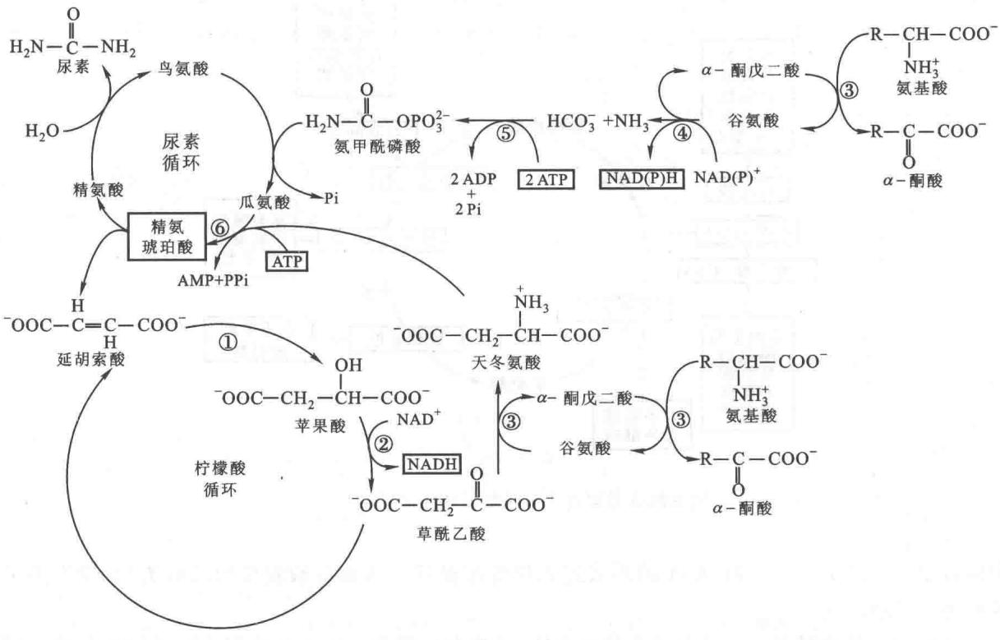  
图25-14 尿素循环与柠檬酸循环的联系是基于精氨琥珀酸的断裂与形成实现的  
酶①延胡索酸酶及酶②苹果酸脱氢酶是属于柠檬酸循环的成员。草酰乙酸自柠檬酸循环改道形成天冬氨酸是受酶③氨基转移酶的作用所致。ATP 的水解发生于酶⑤氨甲酰磷酸合成酶I及酶⑥精氨琥珀酸合成酶所催化的两个反应中。在酶④谷氨酸脱氢酶的作用下，由于产生出的 NAD(P)H 及酶②苹果酸脱氢酶的反应中产生出 NADH，经氧化磷酸化作用后又形成 5 个 ATP

尿素循环中的其他酶则是由它们的底物所控制。正因为这样，遗传性尿素循环中某些酶的不足，除精氨酸酶以外，都不会因此发生尿素的重大减量（但是任何一种尿素循环酶的完全丧失，都会导致初生儿死亡）。当这些缺欠酶的底物增加时，它会使由于缺欠某种酶引起的某一速度之不足恢复正常。当然，这种欠量底物的增加，不是不需付出的。底物浓度的提升会使尿素循环逆行直至产生氨的各个途径，结果会发生“高血氨症”（hyperammonemia）。迄今，氨毒性的根源尚未彻底弄清，氨的高浓度会使“氨清除体系”（ammonia-clearing system）过分耗力，特别是在脑中（尿素循环酶缺欠症状包括有智力迟钝、嗜眠症等）。上述的“氨清除体系”中包含有谷氨酸脱氢酶（反方向工作）及谷氨酰胺合成酶。这个体系可使 $\alpha-$ 酮戊二酸及谷氨酸的“蓄池水位”下降，这些蓄池如若耗竭，脑将发生极其敏感的反应。 $\alpha-$ 酮戊二酸的耗尽，会引发产生能量的柠檬酸循环失速，而谷氨酸既是神经递质，又是 $\gamma-$ 氨基丁酸（GABA）的前体，后者是另一种神经递质。

<!-- EN-BEGIN 18.2 -->

### 【英文对应 18.2】Nitrogen Excretion and the Urea Cycle

> 来源：Lehninger Principles of Biochemistry（书籍/02_生物化学原理） 第18章 Amino Acid Oxidation and the Production of Urea，§18.2。对应本章“三、尿素的形成”。

In ureotelic organisms, the ammonia deposited in the mitochondria of hepatocytes is converted to urea in the urea cycle (Fig. 18-10). This pathway was discovered in 1932 by Hans Krebs (who later also discovered the citric acid cycle) and a medical student associate, Kurt Henseleit. Urea production occurs almost exclusively in the liver and is the fate of most of the ammonia channeled there. The urea passes into the bloodstream and thus to the kidneys and is excreted into the urine. The production of urea now becomes the focus of our discussion.

#### [EN] Urea Is Produced from Ammonia in Five Enzymatic Steps

The urea cycle begins inside liver mitochondria, but three of the subsequent steps take place in the cytosol; the cycle thus spans two cellular compartments (Fig. 18-10). The first amino group to enter the urea cycle is derived from ammonia in the mitochondrial matrix — most of this $NH_{4}^{+}$ arises by the pathways described in Section 18.1. The liver also receives some ammonia via the portal vein from the intestine, from the bacterial oxidation of amino acids. Whatever its source, the $NH_{4}^{+}$ generated in liver mitochondria is immediately used, together with $CO_{2}$ (as $HCO_{3}^{-}$ ) produced by mitochondrial respiration,

Glutamine (from extrahepatic tissues)

FIGURE 18-10 The urea cycle and reactions that feed amino groups into the cycle. The enzymes catalyzing these reactions (named in the text) are distributed between the mitochondrial matrix and the cytosol. One amino group enters the urea cycle as carbamoyl phosphate, formed in the matrix; the other enters as aspartate, formed in the matrix by transamination of oxaloacetate and glutamate, catalyzed by aspartate aminotransferase. The urea cycle consists of four steps: ① Formation of citrulline from ornithine and carbamoyl phosphate (entry of the first amino group); the citrulline passes into the cytosol. ② Formation of argininosuccinate through a citrullyl-AMP intermediate (entry of the second amino group). ③ Formation of arginine from argininosuccinate; this reaction releases fumarate, which enters the citric acid cycle. ④ Formation of urea; this reaction also regenerates ornithine.

to form carbamoyl phosphate in the matrix (as shown in Fig. 18-10 and explained in detail in Fig. 18-11a). This ATP-dependent reaction is catalyzed by carbamoyl phosphate synthetase I, a regulatory enzyme (see below). The mitochondrial form of the enzyme is distinct from the cytosolic (II) form, which has a separate function in pyrimidine biosynthesis (Chapter 22).

The carbamoyl phosphate, which functions as an activated carbamoyl group donor, now enters the urea cycle. The cycle has only four enzymatic steps. First, carbamoyl phosphate donates its carbamoyl group to ornithine to form citrulline, with the release of $P_{i}$ (Fig. 18-10, step 1). The reaction is catalyzed by ornithine transcarbamoylase. Ornithine is not one of the 20 common amino acids found in proteins, but it is a key intermediate in arginine biosynthesis and nitrogen metabolism in general. It is synthesized from glutamate in a five-step pathway described in Chapter 22. Ornithine plays a role resembling that of oxaloacetate in the citric acid cycle, accepting material at each turn of the urea cycle. The citrulline produced in the first step of the urea cycle passes from the mitochondrion to the cytosol.

The next two steps bring in the second amino group, featuring aspartate as the amino group donor. The aspartate is generated in the mitochondria by transamination between glutamate and oxaloacetate, and then transported into the cytosol. A condensation reaction between the amino group of aspartate and the ureido (carbonyl) group of citrulline forms argininosuccinate (step 2 in Fig. 18-10). This cytosolic reaction, catalyzed by argininosuccinate synthetase, requires ATP and proceeds through a citrullyl-AMP intermediate (Fig. 18-11b). The argininosuccinate is then cleaved by argininosuccinase (step 3 in Fig. 18-10) to form free arginine and fumarate, the latter being converted to malate before entering mitochondria to join the pool of citric acid cycle intermediates. This is the only reversible step in the urea cycle. In the last reaction of the urea cycle (step 4), the cytosolic enzyme arginase cleaves arginine to yield urea and ornithine. Ornithine is transported into the mitochondrion to initiate another round of the urea cycle.

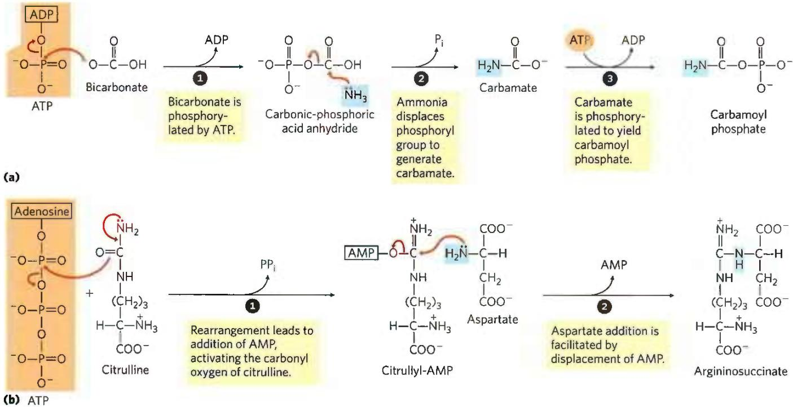

MECHANISM FIGURE 18-11 Nitrogen-acquiring reactions in the synthesis of urea. The urea nitrogens are acquired in two separate reactions, each requiring ATP. (a) In the first reaction, catalyzed by carbamoyl phosphate synthetase I, the first nitrogen enters from ammonia. The terminal phosphate groups of two molecules of ATP are used to form one molecule of carbamoyl phosphate. In other words, this reaction has two activation steps (1 and 3). (b) In the second reaction, catalyzed by argininosuccinate synthetase, the second nitrogen enters from aspartate. This reaction has two steps. Activation of the ureido oxygen of citrulline in step 1 sets up the addition of aspartate in step 2.

As we noted in Chapter 16, the enzymes of many metabolic pathways are clustered in metabolons (p. 595), with the product of one enzyme reaction being channeled directly to the next enzyme in the pathway. In the urea cycle, the mitochondrial and cytosolic enzymes seem to be clustered in this way. The citrulline transported out of the mitochondrion is not diluted into the general pool of metabolites in the cytosol but is passed directly to the active site of argininosuccinate synthetase. This channeling between enzymes continues for argininosuccinate, arginine, and ornithine. Only urea is released into the general cytosolic pool of metabolites.

#### [EN] The Citric Acid and Urea Cycles Can Be Linked

The fumarate produced in the argininosuccinase reaction is also an intermediate of the citric acid cycle. Thus, the cycles are, in principle, interconnected—in a process dubbed the “Krebs bicycle” (Fig. 18-12). However each cycle can operate independently, and communication between them depends on the transport of key intermediates between the mitochondrion and cytosol. Major transporters in the inner mitochondrial membrane include the malate- $\alpha$ -ketoglutarate transporter, the glutamate-aspartate transporter, and the glutamate-OH $^{-}$ transporter. Together, these transporters facilitate the movement of malate and glutamate into the mitochondrial matrix and the movement of aspartate and $\alpha$ -ketoglutarate out to the cytosol.

Several enzymes of the citric acid cycle, including fumarase (fumarate hydratase) and malate dehydrogenase (p. 586), are also present as isozymes in the cytosol. There is no transporter to directly move the fumarate generated in cytosolic arginine synthesis back into the mitochondrial matrix. However, fumarate can be converted to malate in the cytosol. Fumarate and malate can be further metabolized in the cytosol, or malate can be transported into mitochondria for use in the citric acid cycle. Aspartate formed in mitochondria by transamination between oxaloacetate and glutamate can be transported to the cytosol, where it serves as nitrogen donor in the urea cycle reaction catalyzed by argininosuccinate synthetase. These reactions, making up the aspartate-argininosuccinate shunt, provide metabolic links between the separate pathways by which the amino groups and carbon skeletons of amino acids are processed.

  
FIGURE 18-12 Links between the urea cycle and citric acid cycle. The interconnected cycles have been called the "Krebs bicycle." The pathways linking the citric acid and urea cycles are known as the aspartate-argininosuccinate shunt; these effectively link the fates of the amino groups and the carbon skeletons of amino acids. The interconnections are quite elaborate. For example, some citric acid cycle enzymes, such as fumarase and malate dehydrogenase, have both cytosolic and mitochondrial isozymes. Fumarate  
produced in the cytosol — whether by the urea cycle, purine biosynthesis, or other processes — can be converted to cytosolic malate, which is used in the cytosol or transported into mitochondria to enter the citric acid cycle. These processes are further intertwined with the malate-aspartate shuttle, a set of reactions that brings reducing equivalents into the mitochondrion. These different cycles and processes rely on a limited number of transporters in the inner mitochondrial membrane.

The use of aspartate as a nitrogen donor in the urea cycle may appear to be a relatively complicated way to introduce the second amino group into urea. However, we shall see in Chapter 22 that this pathway for nitrogen incorporation is one of the two common ways to introduce amino groups into biomolecules. In the urea cycle, additional pathway interconnections can help explain why aspartate is used as a nitrogen donor. P3 The urea and citric acid cycles are closely tied to an additional process that brings NADH, in the form of reducing equivalents, into the mitochondrion. As detailed in the next chapter, the NADH produced by glycolysis, fatty acid oxidation, and other processes cannot be transported across the mitochondrial inner membrane. Reducing equivalents are instead brought into the mitochondrion by converting aspartate to oxaloacetate in the cytosol, reducing the oxaloacetate to malate with NADH, and transporting the malate into the mitochondrial matrix via the malate-α-ketoglutarate transporter. Once inside the mitochondrion, the malate can be reconverted to oxaloacetate while generating NADH. The oxaloacetate is converted to aspartate in the matrix and transported out of the mitochondrion by the aspartate-glutamate transporter. This malate-aspartate shuttle completes yet another cycle that functions to keep the mitochondrion supplied with NADH (Fig. 18-12; see also Fig. 19-31).

These processes require that a balance be maintained in the cytosol between the concentrations of glutamate and aspartate. The enzyme that transfers amino groups between these key amino acids is aspartate aminotransferase, AAT (also called glutamate-oxaloacetate transaminase, GOT). This is one

#### [EN] BOX 18-1 MEDICINE

#### [EN] Assays for Tissue Damage

Analyses of certain enzyme activities in blood serum give valuable diagnostic information for several disease conditions.

Blood levels of alanine aminotransferase (ALT; also called glutamate-pyruvate transaminase, GPT) and aspartate aminotransferase (AAT; also called glutamate-oxaloacetate transaminase, GOT) are important in the diagnosis of liver damage, toxicity associated with long-term drug use, or infection. When tissue is damaged, a variety of enzymes, including these aminotransferases, leak from injured cells into the bloodstream. Measurements of the blood serum concentrations of the two aminotransferases by the SGPT and SGOT tests (S for serum) — and of another enzyme, of the most active enzymes in hepatocytes and other tissues. When tissue damage occurs, this easily assayed enzyme and others leak into the blood. Thus, measuring blood levels of liver enzymes is important in diagnosing a variety of medical conditions (Box 18-1).

#### [EN] The Activity of the Urea Cycle Is Regulated at Two Levels

The flux of nitrogen through the urea cycle in an individual animal varies with diet. When the dietary intake is primarily protein, the carbon skeletons of amino acids are used for fuel, producing much urea from the excess amino groups. During prolonged starvation, when breakdown of muscle protein begins to supply much of the organism's metabolic energy, urea production also increases substantially.

On a shorter time scale, allosteric regulation of at least one key enzyme adjusts the flux through the urea cycle. The first enzyme in the pathway, carbamoyl phosphate synthetase I, is allosterically activated by N-acetylglutamate, which is synthesized from acetyl-CoA and glutamate by N-acetylglutamate synthase (Fig. 18-13). In plants and microorganisms, this enzyme catalyzes the first step in the de novo synthesis of arginine from glutamate (see Fig. 22-12), but in mammals,

These changes in demand for urea cycle activity are met over the long term by regulation of the rates of synthesis of the four urea cycle enzymes and carbamoyl phosphate synthetase I in the liver. All five enzymes are synthesized at higher rates in starving animals and in animals on very-high-protein diets than in well-fed animals eating primarily carbohydrates and fats. Animals on protein-free diets produce lower levels of urea cycle enzymes.

creatine kinase, by the SCK test — can provide information about the severity of the damage.

The SGOT and SGPT tests are used in occupational medicine to determine whether people exposed to carbon tetrachloride, chloroform, or other industrial solvents have suffered liver damage. Liver degeneration caused by these solvents is accompanied by leakage of various enzymes from injured hepatocytes into the blood. Aminotransferases are most useful in the monitoring of people exposed to these chemicals, because these enzyme activities are high in liver and thus are likely to be among the proteins leaked from damaged hepatocytes; also, they can be detected in the bloodstream in very small amounts.

  
FIGURE 18-13 Synthesis of N-acetylglutamate and its activation of carbamoyl phosphate synthetase I.

N-acetylglutamate synthase activity in the liver has a purely regulatory function (mammals lack the other enzymes needed to convert glutamate to arginine). The steady-state levels of N-acetylglutamate are determined by the concentrations of glutamate and acetyl-CoA (the substrates for N-acetylglutamate synthase) and arginine (an activator of N-acetylglutamate synthase, and thus an activator of the urea cycle).

#### [EN] Pathway Interconnections Reduce the Energetic Cost of Urea Synthesis

If we consider the urea cycle in isolation, we see that the synthesis of one molecule of urea requires four high-energy phosphate groups (Fig. 18-10). Two ATP molecules are required to make carbamoyl phosphate, and one ATP to make argininosuccinate—the latter ATP undergoing a pyrophosphate cleavage to AMP and PP $_{i}$ , which is hydrolyzed to two P $_{i}$ . The overall equation of the urea cycle is

$$
\begin{array}{r l} & 2 \mathrm{NH} _ {4} ^ {+} + \mathrm{HCO} _ {3} ^ {-} + 3 \mathrm{ATP} ^ {4 -} + \mathrm{H} _ {2} \mathrm{O} \longrightarrow \\ & \qquad \text { urea } + 2 \mathrm{ADP} ^ {3 -} + 4 \mathrm{P} _ {1} ^ {2 -} + \mathrm{AMP} ^ {2 -} + 2 \mathrm{H} ^ {+} \end{array}
$$

However, this apparent cost is compensated for by the pathway interconnections detailed above. The fumarate generated by the urea cycle is converted to malate, and the malate is transported into the mitochondrion (Fig. 18-12). Inside the mitochondrial matrix, NADH is generated in the malate dehydrogenase reaction. Each NADH molecule can generate up to 2.5 ATP during mitochondrial respiration, greatly reducing the overall energetic cost of urea synthesis (mitochondrial respiration is discussed further in Chapter 19).

#### [EN] Genetic Defects in the Urea Cycle Can Be Life-Threatening

Infants with severe genetic defects in any enzyme involved in urea formation often appear normal at birth. However, they soon develop symptoms of hyperammonemia, including cerebral edema, lethargy, and hyperventilation. Without treatment, early death usually results. Symptoms may be less severe in patients retaining partial enzyme activity. These patients cannot tolerate protein-rich diets. Amino acids ingested in excess of the minimum daily requirements for protein synthesis are deaminated in the liver, producing free ammonia that cannot be converted to urea and exported into the bloodstream, and, as we have seen, ammonia is highly toxic. Given that most urea cycle steps are irreversible, the absent enzyme activity can often be identified by determining which cycle intermediate is present in elevated concentration in the blood and/or urine. Although the breakdown of amino acids can have serious health consequences in individuals with urea cycle deficiencies, a protein-free diet is not a treatment option. Humans are incapable of synthesizing half of the 20 common amino acids; they must obtain these essential amino acids in the diet (Table 18-1).

A variety of treatments are available for individuals with urea cycle defects. Careful administration of the aromatic acids benzoate or phenylbutyrate in the diet can help lower the level of ammonia in the blood. Benzoate is converted to benzoyl-CoA, which combines with glycine to form hippurate (Fig. 18-14, left). The glycine used up in this reaction must be regenerated, and ammonia is thus taken up in the glycine synthase reaction. Phenylbutyrate is converted to phenylacetate by $\beta$ oxidation. The phenylacetate is then converted to phenylacetyl-CoA,

<table><tr><td>Nonessential</td><td>Conditionally essentiala</td><td>Essential</td></tr><tr><td>Alanine</td><td>Arginine</td><td>Histidine</td></tr><tr><td>Asparagine</td><td>Cysteine</td><td>Isoleucine</td></tr><tr><td>Aspartate</td><td>Glutamine</td><td>Leucine</td></tr><tr><td>Glutamate</td><td>Glycine</td><td>Lysine</td></tr><tr><td>Serine</td><td>Proline</td><td>Methionine</td></tr><tr><td></td><td>Tyrosine</td><td>Phenylalanine</td></tr><tr><td></td><td></td><td>Threonine</td></tr><tr><td></td><td></td><td>Tryptophan</td></tr><tr><td></td><td></td><td>Valine</td></tr></table>

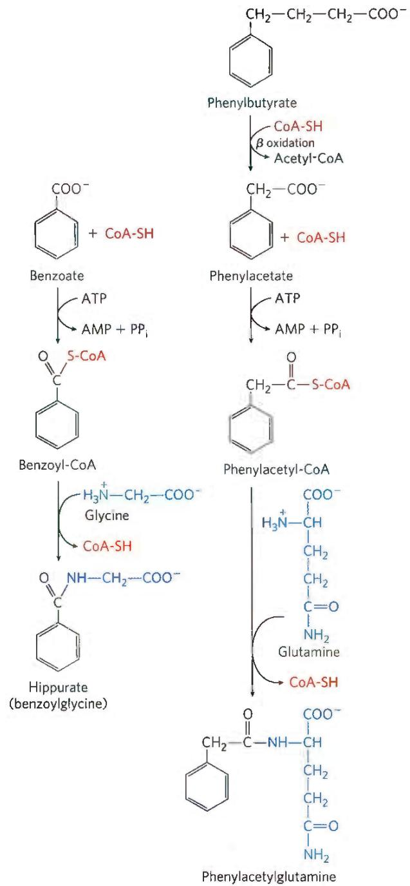  
FIGURE 18-14 Treatment for deficiencies in urea cycle enzymes. The aromatic acids benzoate and phenylbutyrate, administered in the diet, are metabolized and combine with glycine and glutamine, respectively. The products are excreted in the urine. Subsequent synthesis of glycine and glutamine to replenish the pool of these intermediates removes ammonia from the bloodstream.

which combines with glutamine to form phenylacetylglutamine (Fig. 18-14, right). The resulting removal of glutamine triggers its further synthesis by glutamine synthetase (see Eqn 22-1) in a reaction that takes up ammonia. Both hippurate and phenylacetylglutamine are nontoxic compounds that are excreted in the urine. The pathways shown in Figure 18-14 make only minor contributions to normal metabolism, but they become prominent when aromatic acids are ingested.

Other therapies are more specific to a particular enzyme deficiency. Deficiency of N-acetylglutamate synthase results in the absence of the normal activator of carbamoyl phosphate synthetase I (Fig. 18-13). This condition can be treated by administering carbamoyl glutamate, an analog of N-acetylglutamate that is effective in activating carbamoyl phosphate synthetase I.

Supplementing the diet with arginine is useful in treating deficiencies of ornithine transcarbamoylase, argininosuccinate synthetase, and argininosuccinase. Many of these treatments must be accompanied by strict dietary control and supplements of essential amino acids. In the rare cases of arginase deficiency, arginine, the substrate of the defective enzyme, must be excluded from the diet.

#### [EN] SUMMARY 18.2 Nitrogen Excretion and the Urea Cycle

In the urea cycle, ornithine combines with ammonia, in the form of carbamoyl phosphate, to form citrulline. A second amino group is transferred to citrulline from aspartate to form arginine—the immediate precursor of urea. Arginase catalyzes hydrolysis of arginine to urea and ornithine; ornithine is regenerated in each turn of the cycle.

The urea cycle results in a net conversion of oxaloacetate to fumarate, both of which are intermediates in the citric acid cycle. The two cycles are thus interconnected.

■ The activity of the urea cycle is regulated at the level of enzyme synthesis and by allosteric regulation of the enzyme that catalyzes the formation of carbamoyl phosphate.

■ The energetic cost of the urea cycle is reduced by cycle interconnections.

■ Genetic diseases involving urea cycle enzyme deficiencies have serious consequences but sometimes can be managed by dietary intervention.

<!-- EN-END 18.2 -->

## 四、氨基酸碳骨架的氧化途径

脊椎动物体内的20种氨基酸的碳骨架，由20种不同的多酶体系进行氧化分解。虽然氨基酸的氧化分解途径各异，但它们都集中形成5种产物而进入柠檬酸循环，最后氧化为 $\mathrm{CO}_{2}$ 和水，图25-15表明20种氨基酸进入柠檬酸循环的途径。

图 25-15 表明，丙氨酸、苏氨酸、丝氨酸、半胱氨酸、甘氨酸、苯丙氨酸、酪氨酸、亮氨酸、赖氨酸及色氨酸共 10 种氨基酸的碳骨架分解后形成乙酰-CoA；精氨酸、组氨酸、谷氨酰胺、脯氨酸及谷氨酸共 5 种氨基酸形成 α-酮戊二酸；异亮氨酸、甲硫氨酸及缬氨酸共 3 种氨基酸变为琥珀酰-CoA；苯丙氨酸、酪氨酸形成延胡索酸；天冬氨酸、天冬酰胺转变为草酰乙酸。因此构成蛋白质的 20 种氨基酸通过转变为乙酰-CoA、α-酮戊二酸、琥珀酰-CoA、延胡索酸以及草酰乙酸这 5 种物质都能进入柠檬酸循环。此外，苯丙氨酸和酪氨酸碳骨架的一部分也以乙酰-CoA 的形式进入柠檬酸循环。当氨基酸脱羧形成胺类后，即失去了进入柠檬酸循环的可能性。

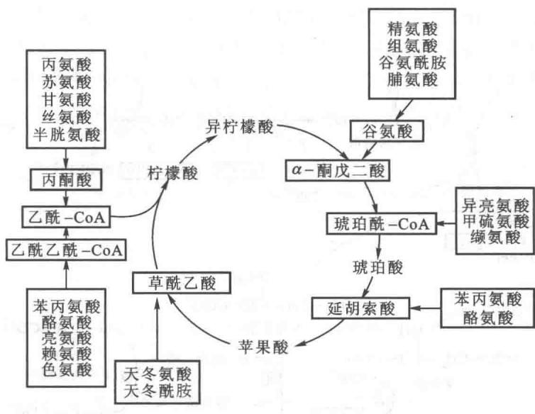  
图 25-15 氨基酸碳骨架进入三羧酸循环的途径

氨基酸的分解途径并不是其合成途径的逆转,虽然在分解和合成途径之间也有共同的步骤。氨基酸分解代谢过程中有许多中间产物具有其他生物功能,特别是用作组成细胞其他成分的前体。脊椎动物分解代谢主要是在肝中进行,肾中也比较活跃。肌肉中氨基酸的分解是很少的。

下面将按照氨基酸碳骨架进入柠檬酸循环的入口方式分述其代谢途径。

## （一）形成乙酰-CoA的途径

乙酰-CoA 是进入柠檬酸循环的主要入口物质,通过形成乙酰-CoA 进入柠檬酸循环的氨基酸又有三条途径:一条是由氨基酸先转变为丙酮酸再形成乙酰-CoA;第二条是经过乙酰乙酰-CoA 再形成乙酰-CoA;第三条是氨基酸直接形成乙酰-CoA(参看图 25-15)。现分述如下。

## 1. 经丙酮酸到乙酰 CoA 的途径——氨基酸转变为丙酮酸的途径

（1）丙氨酸 经与 $\alpha-$ 酮戊二酸转氨。催化此反应的酶为谷-丙转氨酶，反应如下：

$$
\mathrm{L} - \text {丙氨酸} + \alpha - \text {酮戊二酸} \xrightarrow {\text {谷-丙转氨酶}} \text {丙酮酸} + \text {谷氨酸}
$$

（2）甘氨酸 先转变为丝氨酸，再由丝氨酸转变为丙酮酸。催化甘氨酸转变为丝氨酸的酶称为丝氨酸转羟甲基酶（serine transhydroxymethylase），该酶以磷酸吡哆醛为辅基，但其转移的羟甲基以四氢叶酸（tetrahydrofolate, THF）为载体，反应如下：

$$
\begin{array}{r l} & {\text {甘氨酸} + N ^ {5}, N ^ {1 0} - \text {甲烯基四氢叶酸} \xrightarrow [ \mathrm{Mn} ^ {2 +} ]{\text {丝氨酸转羟甲基酶}} \mathrm{L-丝氨酸} + \text {四氢叶酸}} \\ & {(N ^ {5}, N ^ {1 0} - \text {Methylentetrahydrofolate})} \end{array}
$$

丝氨酸和甘氨酸的互变是极为灵活的,因此该反应也是丝氨酸生物合成的重要途径,关于四氢叶酸将在“氨基酸与一碳单位”一节中详述。

甘氨酸的分解代谢不是以形成乙酰-CoA为主要途径。甘氨酸的重要作用是一碳单位的提供者，在此反应中，同时产生 $CO_{2}$ 和 $NH_{4}^{+}$ 。该反应需 $NAD^{+}$ 作为氢的传递体，反应如下式：

$$
\begin{array}{r l}&{\mathrm{H} _ {3} \stackrel {+} {\mathrm{N}} - \mathrm{CH} _ {2} - \mathrm{COO} ^ {-} + \mathrm{THF} + \mathrm{NAD} ^ {+} \rightleftharpoons N ^ {5}, N ^ {1 0} - \text {甲烯} \mathrm{THF} + \mathrm{CO} _ {2} + \mathrm{NH} _ {4} ^ {+} + \mathrm{NADH} + \mathrm{H} ^ {+}}\\&{\text {甘氨酸} \qquad \qquad \text {四氢叶酸}}\end{array}
$$

（3）丝氨酸 本身脱水、脱氨转变成丙酮酸，催化该反应的酶称为丝氨酸脱水酶。该酶也是磷酸吡哆醛酶类，又称为丝氨酸-苏氨酸脱水酶（serine-threonine dehydratase），反应如图25-16所示。

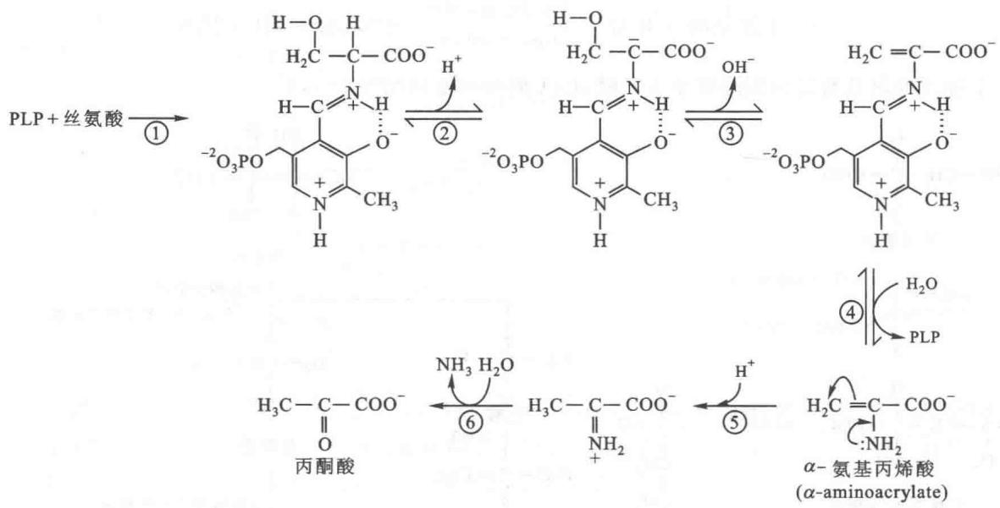  
图25-16 丝氨酸脱水转变为丙酮酸的机制  
①丝氨酸与磷酸吡哆醛(PLP)形成希夫碱；②丝氨酸脱下一个 $\alpha-H$ 原子形成共振稳定的负碳离子；③ $OH^{-}$ 基的 $\beta-$ 消除；④希夫碱水解，游离出PLP-酶并产生氨基丙烯酸；⑤非酶促互变异构形成亚胺；⑥非酶促水解形成丙酮酸和氨

（4）苏氨酸 由苏氨酸羟甲基转移酶（threonine aldolase）催化裂解生成甘氨酸和乙醛(acetaldehyde)，后者氧化形成乙酸。乙酸氧化形成乙酰-CoA。甘氨酸形成丙酮酸的途径已如前述，苏氨酸的分解代谢还有两条其他途径，一条是由丝氨酸-苏氨酸脱水酶（serine-threonine dehydratase）转变为 $\alpha-$ 酮丁酸，另一条是脱氢、脱羧形成氨基丙酮(aminoacetone）。

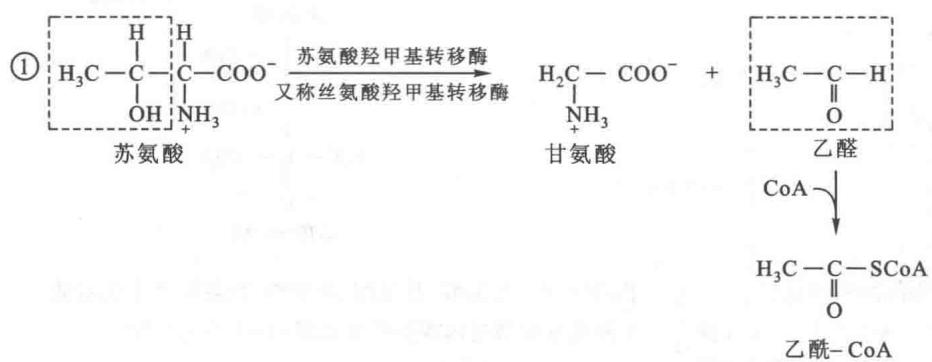

(5) 半胱氨酸 形成丙酮酸的途径如图 25-17 所示。

在某些细菌可发生半胱氨酸的加水分解反应。

$$
\mathrm{半胱氨酸} + \mathrm {H_ {2} O} \xrightarrow [ (\mathrm{cysteinedesulfhydrase}) ]{\mathrm{半胱氨酸脱巯基酶}} \mathrm{丙酮酸} + \mathrm {NH_ {3}} + \mathrm {H_ {2} S}
$$

上述 5 种氨基酸经丙酮酸转变为乙酰-CoA 的关系概括如图 25-18。

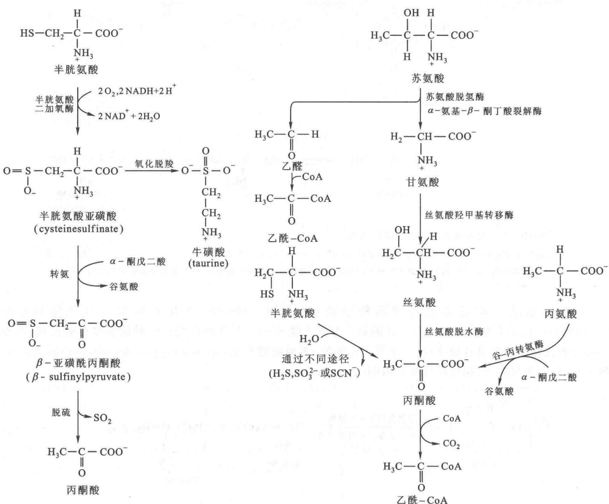  
图25-17 半胱氨酸转为丙酮酸的途径  
在动物体内主要分3步进行。第1个中间产物半胱氨酸亚磺酸是一个分支点。一方面可以形成丙酮酸，另一方面也可形成牛磺酸  
图 25-18 苏氨酸、甘氨酸、丝氨酸、丙氨酸及半胱氨酸  
5种氨基酸通过丙酮酸形成乙酰-CoA的关系图

## 2. 经乙酰乙酰-CoA 到乙酰-CoA 的途径

通过形成乙酰乙酰-CoA 再形成乙酰-CoA 的氨基酸有苯丙氨酸、酪氨酸、亮氨酸、赖氨酸及色氨酸 5 种氨基酸。它们的转变可概括如图 25-19。

下面分述以上 5 种氨基酸的分解途径：

（1）苯丙氨酸 在分解代谢中先转变为酪氨酸，因此它的分解途径和酪氨酸相同（参看酪氨酸的分解），苯丙氨酸转变为酪氨酸的反应如下：

苯丙氨酸-4-单加氧酶（phenylalanine-4-monooxygenase）又称苯丙氨酸羟化酶（phenylalanine hydroxylase），该酶是一种混合功能酶，它同时催化两个反应，一方面使分子 $\mathrm{O}_2$ 中的一个氧原子将底物羟基化，另一方面使另一个氧原子还原为 $\mathrm{H}_2\mathrm{O}$ 。它的辅助因子是四氢生物蝶呤。

  
图 25-19 通过乙酰乙酰-CoA 途径形成乙酰-CoA 的氨基酸共 5 种: 赖氨酸、色氨酸、苯丙氨酸、酪氨酸和亮氨酸

（2）酪氨酸 酪氨酸既可转变为延胡索酸，又可转变为乙酰-CoA。苯丙氨酸和酪氨酸转变为延胡索酸和乙酰乙酰-CoA的途径如图25-20所示。

  
图25-20 酪氨酸转变为延胡索酸和乙酰乙酰-CoA的途径

酪氨酸在酪氨酸转氨酶催化下将氨基转移到 $\alpha-$ 酮戊二酸上，本身转变为 4-羟苯丙酮酸，后者脱羧形成尿黑酸，并产生 1 个 $CO_{2}$ 。酪氨酸和苯丙氨酸有 4 个碳原子转变为延胡索酸，因此这 2 种氨基酸可通过形成延胡索酸进入柠檬酸循环，除形成 1 个 $CO_{2}$ 和 4 个碳的延胡索酸外，其余的 4 个碳原子即形成乙酰乙酸，后者经琥珀酰-CoA 的活化形成乙酰乙酰-CoA。

在苯丙氨酸、酪氨酸代谢途径中，有两个酶和分子遗传缺陷症有关，将在本章第七节中讨论。

（3）亮氨酸 先经转氨形成 $\alpha-$ 酮酸，再氧化脱羧形成异戊酰-CoA(isovaleryl CoA)，后者再经脱氢、羧化、加水，形成六碳 $\beta-$ 羟- $\beta-$ 甲基戊二酰-CoA( $\beta-hydroxy-\beta-methyl\ glutaryl\ CoA$ )，随后分裂为乙酰-CoA 和乙酰乙酸，后者转变为乙酰乙酰-CoA 已如前述。 $\beta-$ 羟- $\beta-$ 甲基戊二酰-CoA 是胆固醇生物合成的前体之一。现将亮氨酸的分解途径概括如图 25-21。

（4）赖氨酸 其转变过程如图25-22所示。在复杂的转变过程中，4个碳原子转变为乙酰乙酰-CoA，其他两个碳原子经脱羧失去。赖氨酸不进行转氨作用。在一条途径中，赖氨酸先与 $\alpha-$ 酮戊二酸缩合，形成酵母氨酸(saccharopine)[ $\varepsilon-N(L-$ 戊二酸基-2-)-L-赖氨酸]，最后形成乙酰乙酰-CoA。在第二条途径中，赖氨酸的 $\alpha-$ 氨基可能被L-氨基酸氧化酶氧化。两条途径都形成L- $\alpha-$ 氨基己二酸半醛(L- $\alpha-$ aminoadipic semialdehyde)。

（5）色氨酸 其分解路线也颇复杂如图25-23所示。色氨酸的11个碳原子中的4个转变为乙酰乙酰-CoA，另外3个转变为丙氨酸，其余的4个形成3分子 $\mathrm{CO}_{2}$ 和1分子甲酸。色氨酸分解的第一步是氧化，形成 $N-$ 醛基犬尿氨酸。催化此反应的酶称为色氨酸2,3-二加氧酶，又名色氨酸吡咯酶（pyrrolase），该酶含有铜和血红素。人类患色氨酸2,3-二加氧酶遗传缺陷症，导致智力迟钝。中间产物3-羟犬尿氨酸在某些昆虫类用作色素的前体称为眼色素（ommochrome）。犬尿氨酸酶催化3-羟犬尿氨酸的分解，生成丙氨酸和3-羟邻氨基苯甲酸，该酶含有磷酸吡哆醛。哺乳动物缺乏维生素 $B_{6}$ 时，在尿中排出大量的犬尿氨酸，中间产物3-羟邻氨基苯甲酸是尼克酸生物合成的前体。

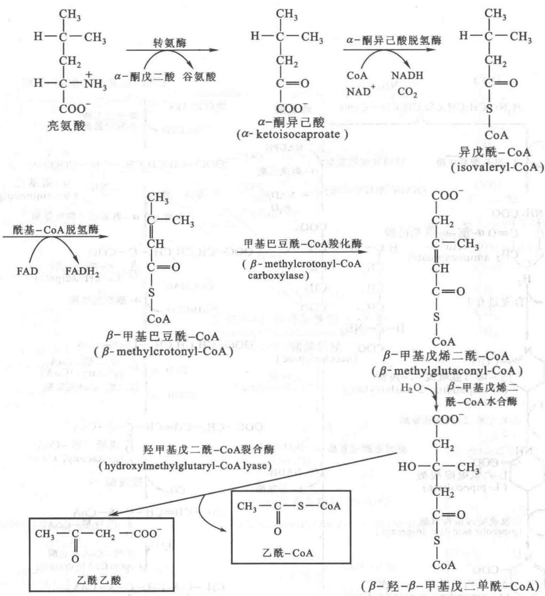  
图 25-21 亮氨酸转变为乙酰-CoA 和乙酰乙酸途径

色氨酸分解代谢的中间产物是许多其他重要物质生物合成的前体,如5-羟色胺(serotonin)是一种神经递质和血管收缩物质,吲哚乙酸(indoleacetic acid)是一种植物激素,烟酸又称尼克酸是NAD和NADP的前体(图25-24)。

## （二） $\alpha-$ 酮戊二酸途径

参见图 25-15 所示, 经 $\alpha$ -酮戊二酸进入柠檬酸循环的氨基酸有精氨酸、组氨酸、谷氨酰胺、脯氨酸以及谷氨酸 5 种氨基酸。它们的转变关系可概括如图 25-25, 其中每个氨基酸的转变扼要分述如下:

## 1. 精氨酸

在精氨酸酶的作用下,水解形成尿素和鸟氨酸,经鸟氨酸转氨酶的作用,将 $\delta-$ 氨基转给 $\alpha-$ 酮戊二酸,本身转变为谷氨酸 $\gamma-$ 半醛;再经脱氢酶的作用形成谷氨酸,反应步骤参看图 25-26。谷氨酸转氨或氧化脱氨又形成 $\alpha-$ 酮戊二酸。

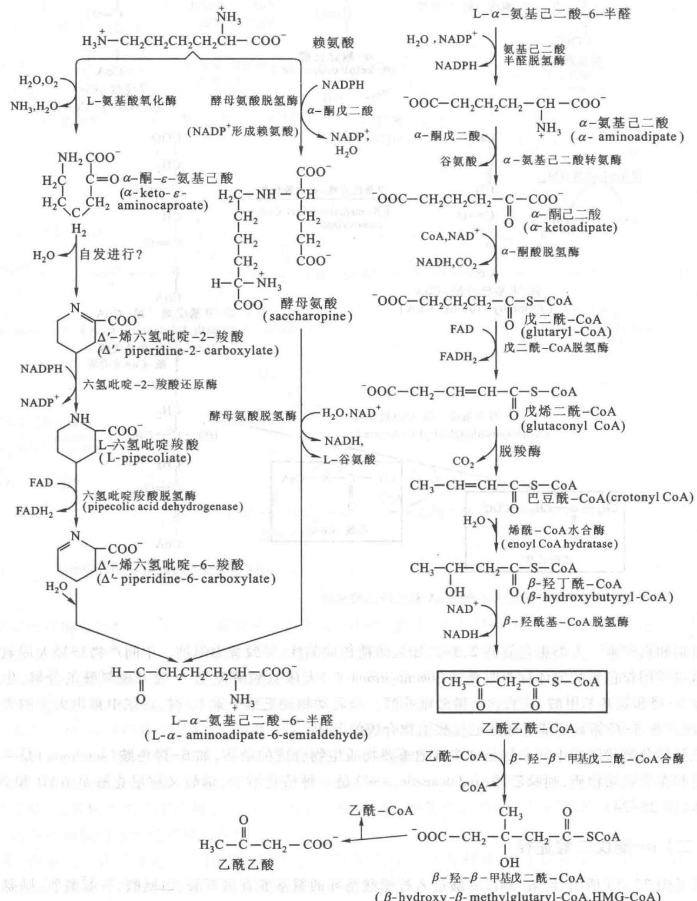  
图25-22 赖氨酸转变为乙酰乙酰-CoA

由赖氨酸变为 $\alpha-$ 氨基己二酸半醛有两条不同路线，在肝占优势的是形成中间产物酵母氨酸途径

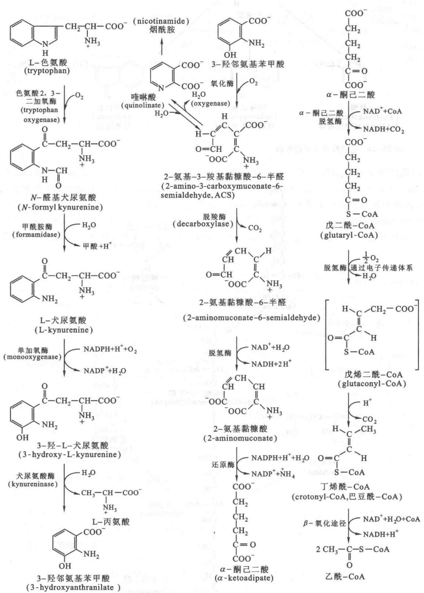  
图25-23 色氨酸的分解代谢形成2分子乙酰-CoA的途径

  
图25-24 色氨酸的重要衍生物

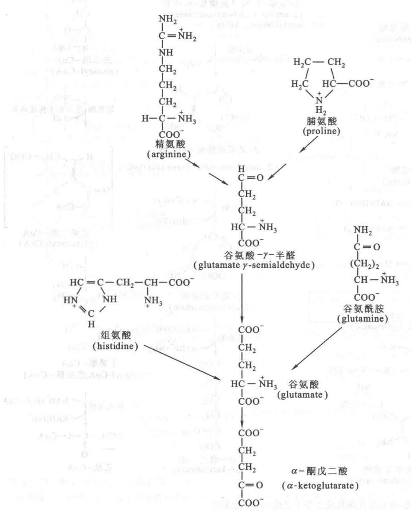  
图25-25 精氨酸、组氨酸、谷氨酰胺、脯氨酸和谷氨酸形成 $\alpha$ -酮戊二酸的途径

  
图25-26 精氨酸形成 $\alpha$ -酮戊二酸的途径

## 2. 组氨酸

经组氨酸氨裂合酶(histidine ammonia lyase)的作用,移去(α,β)一分子NH₃,转变为尿刊酸(urocanic acid),再经尿刊酸水合酶(urocanate hydratase)作用,形成4-咪唑酮-5丙酸(4-imidazolone-5-propionate),这步转变包括加入水分子和分子内部的氧化还原反应。咪唑酮丙酸酶催化水解使咪唑酮丙酸转变为N-甲亚氨基谷氨酸(N-formimioglutamic acid),后者在谷氨酸转甲亚氨酶(glutamate transformiminase)作用下,将甲亚氨基转移到四氢叶酸的第5位N原子上,本身转变为谷氨酸。组氨酸转变为谷氨酸的全过程如图25-27所示。

  
图25-27 组氨酸形成 $\alpha$ -酮戊二酸的途径

## 3.谷氨酰胺

可有三条途径形成谷氨酸,再形成 $\alpha-$ 酮戊二酸。

(1) 经谷氨酰胺酶水解：

$$
\mathrm{谷氨酰胺} + \mathrm {H_ {2} O\xrightarrow {\mathrm{谷氨酰胺酶}} \mathrm{谷氨酸} + NH_ {3}}
$$

（2）由谷氨酸合成酶催化，借助 $\mathrm{NADPH + H^{+}}$ 的还原作用，使 $\alpha-$ 酮戊二酸与谷氨酰胺转变为2分子谷氨酸：

$$
\text {   谷氨酰胺   } + \alpha - \text {   酮戊二酸   } + \mathrm{NADPH} + \mathrm{H} ^ {+} \xrightarrow {\text {   谷氨酸合成酶   }} 2 \text {   谷氨酸   } + \mathrm{NADP} ^ {+}
$$

  
$\Delta^{\prime}$ -吡咯啉-5-羧酸 $(\Delta^{\prime}$ -pyrroline-5-carboxylate）

（3）与 $\alpha-$ 酮戊二酸的 $\gamma-$ 位羧基转氨形成 $\alpha-$ 酮谷酰胺酸 ( $\alpha-$ ketoglutarmic acid)，又进而水解形成 $\alpha-$ 酮戊二酸和氨：

## 4. 脯氨酸和羟脯氨酸

如图 25-28 所示, 经氧化、加水等步骤形成谷氨酸- $\gamma$ -半醛, 再脱氢形成谷氨酸。

(γ-hydroxyglutamate - γ-semialdehyde)  

  
图 25-28 脯氨酸和羟脯氨酸的分解途径

值得提出的是羟脯氨酸的转变与脯氨酸有所不同,它的分解产物是丙酮酸和乙醛酸,参看图25-28。但在脯氨酸和羟脯氨酸开始分解到形成 $\gamma$ -羟谷氨酸的过程,二者的分解方式是类似的,脯氨酸则形成谷氨酸。

## 5. 谷氨酸

经谷氨酸脱氢酶或经转氨都可形成 $\alpha-$ 酮戊二酸。

## （三）形成琥珀酰-CoA的途径

甲硫氨酸、异亮氨酸、缬氨酸的碳骨架最后形成丙酰辅酶 A 和甲基-丙二酰辅酶 A，进而转变为琥珀酰辅酶 A，概括如图 25-29。

  
图25-29 甲硫氨酸、异亮氨酸、缬氨酸转变为琥珀酰-CoA的途径

## 1. 甲硫氨酸

甲硫氨酸转变为琥珀酰-CoA的途径如图25-30所示。

## 2. 异亮氨酸

异亮氨酸转变为琥珀酰-CoA 以及乙酰-CoA 的步骤如图 25-31 所示。

## 3. 缬氨酸

缬氨酸转变为琥珀酰-CoA 的途径如图 25-32 所示。

## （四）形成延胡索酸途径

经延胡索酸进入柠檬酸循环的氨基酸有苯丙氨酸和酪氨酸。这两种氨基酸的分解已在图25-19和图25-20中表明，在分解过程中，其芳香环的降解通过氧化酶的作用，苯丙氨酸羟化酶为单加氧酶，以四氢蝶呤为还原剂，中间产物4-延胡索酰乙酰乙酸由延胡索酰乙酰乙酸酶催化，形成两个产物，一个是乙酰乙酸，另一个是延胡索酸。因此，苯丙氨酸和酪氨酸分子都是通过两条途径进入柠檬酸循环的，一条是通过乙酰乙酰-CoA再形成乙酰-CoA的途径，另一条则是延胡索酸途径。

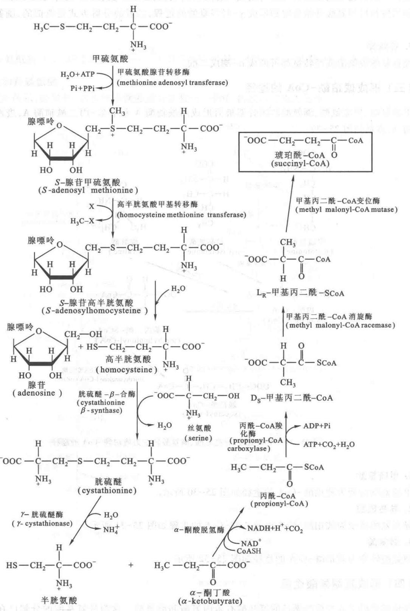  
图25-30 甲硫氨酸转变为琥珀酰-CoA的途径

(methylmalonyl semialdehyde)  
甲基丙二酰半醛  
缬氨酸  

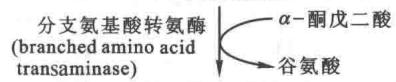

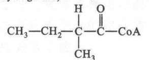

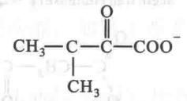

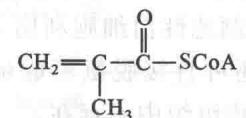

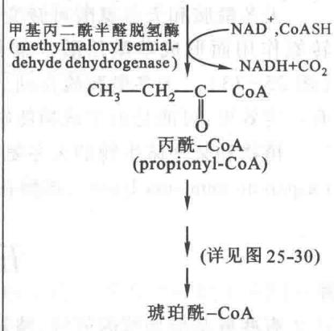

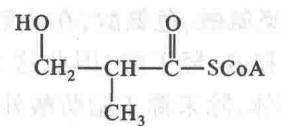  
图 25-31 异亮氨酸转变为琥珀酰-CoA 以 图 25-32 缬氨酸转变为琥珀酰-CoA 的途径及乙酰-CoA 的途径

  
图 25-33 天冬酰胺和天冬氨酸转变为草酰乙酸的途径

## （五）形成草酰乙酸途径

天冬酰胺和天冬氨酸可转变为草酰乙酸而进入柠檬酸循环。天冬酰胺先转变为天冬氨酸，然后再经转氨作用而形成草酰乙酸。催化天冬酰胺转变为天冬氨酸和氨的酶称为天冬酰胺酶（asparaginase）（图25-33）。天冬酰胺酶在动、植物组织中分布很广。静脉注射天冬酰胺酶对控制某些白血病人的症状有一定效果，可能是由于该酶能够限制恶性白细胞利用天冬酰胺。

植物和某些微生物的天冬氨酸还可直接脱氨形成延胡索酸。催化此反应的酶为天冬氨酸氨裂解酶(aspartate ammonia lyase)，该酶在动物组织中不存在。

<!-- EN-BEGIN 18.3 -->

### 【英文对应 18.3】Pathways of Amino Acid Degradation

> 来源：Lehninger Principles of Biochemistry（书籍/02_生物化学原理） 第18章 Amino Acid Oxidation and the Production of Urea，§18.3。对应本章“四、氨基酸碳骨架的氧化途径”。

Amino acid catabolism normally accounts for only 10% to 15% of the human body's energy production; these pathways are not nearly as active as glycolysis and fatty acid oxidation. Flux through these catabolic routes also varies greatly, depending on the balance between requirements for biosynthetic processes and the availability of a particular amino acid. The 20 catabolic pathways converge to form only six major products: pyruvate, acetyl-CoA, $\alpha$ -ketoglutarate, succinyl-CoA, fumarate, and oxaloacetate. All of these enter the citric acid cycle (Fig. 18-15). From here the carbon skeletons are diverted to gluconeogenesis or ketogenesis; alternatively, they are completely oxidized as fuel to $CO_{2}$ and $H_{2}O$ .

We summarize the individual pathways for the 20 amino acids in flow diagrams, each leading to a specific point of entry into the citric acid cycle. In these diagrams, the carbon atoms that enter the citric acid cycle are shown in color. Note that some amino acids appear more than once, reflecting different fates for different parts of their carbon skeletons. Rather than examining every step of every pathway in amino acid catabolism, we single out for special discussion some enzymatic reactions that are particularly noteworthy for their mechanisms or their medical significance.

#### [EN] Some Amino Acids Can Contribute to Gluconeogenesis, Others to Ketone Body Formation

P5 The seven amino acids that are degraded entirely or in part to acetoacetyl-CoA and/or acetyl-CoA—phenylalanine, tyrosine, isoleucine, leucine, tryptophan, threonine, and lysine — can yield ketone bodies in the liver, where acetoacetyl-CoA is converted to acetoacetate and then to acetone and $\beta$ -hydroxybutyrate (see Fig. 17-16). These are the ketogenic amino acids (Fig. 18-15). Their ability to form ketone bodies is particularly evident in uncontrolled diabetes mellitus, in which the liver produces large amounts of ketone bodies from both fatty acids and the ketogenic amino acids. Ketone bodies may also be metabolized in the brain as fuel in place of glucose in cases during starvation.

The amino acids that are degraded to pyruvate, $\alpha$ -ketoglutarate, succinyl-CoA, fumarate, and/or oxaloacetate can be converted to glucose and glycogen by pathways described in Chapter 14. They are the glucogenic amino acids. The division between ketogenic and glucogenic amino acids is not sharp; five amino acids—tryptophan, phenylalanine, tyrosine, threonine, and isoleucine—are both ketogenic and glucogenic. All amino acids except for lysine and leucine can make some contribution to gluconeogenesis. Catabolism of amino acids is particularly critical to the survival of animals with high-protein diets or during starvation. Leucine is an exclusively ketogenic amino acid that is very common in proteins. Its degradation makes a substantial contribution to ketosis under starvation conditions.

  
FIGURE 18-15 Summary of amino acid catabolism. Amino acids are grouped according to their major degradative end product. Some amino acids are listed more than once because different parts of their carbon skeletons are degraded to different end products. The figure shows the most important catabolic pathways in vertebrates, but there are minor variations among vertebrate species. Threonine, for instance, is degraded by at least  
two different pathways (see Figs 18-19, 18-27), and the importance of a given pathway can vary with the organism and its metabolic conditions. The glucogenic and ketogenic amino acids are also delineated in the figure, by color shading. Notice that five of the amino acids are both glucogenic and ketogenic. The amino acids degraded to pyruvate are also potentially ketogenic. Only two amino acids, leucine and lysine, are exclusively ketogenic.

  
FIGURE 18-16 Some enzyme cofactors important in one-carbon transfer reactions. The nitrogen atoms to which one-carbon groups are attached in tetrahydrofolate are shown in blue.

#### [EN] Several Enzyme Cofactors Play Important Roles in Amino Acid Catabolism

The structural diversity of amino acids is reflected in the varied reaction types encountered in their breakdown pathways. We begin our study of these pathways by noting important classes of reactions that recur and introducing their enzyme cofactors. We have already considered one important class: transamination reactions requiring pyridoxal phosphate. One-carbon transfers are another common type of reaction in amino acid catabolism. Such transfers usually involve one of three cofactors: biotin, tetrahydrofolate, or S-adenosylmethionine (Fig. 18-16). These cofactors transfer one-carbon groups in different oxidation states: biotin transfers carbon in its most oxidized state, CO₂ (see Fig. 14-17); tetrahydrofolate transfers one-carbon groups in intermediate oxidation states and sometimes as methyl groups; and S-adenosylmethionine transfers methyl groups, the most reduced state of carbon. The latter two cofactors are especially important in amino acid and nucleotide metabolism.

Tetrahydrofolate (H $_{4}$ folate), synthesized in bacteria, consists of substituted pterin (6-methylpterin), $p$ -aminobenzoate, and glutamate moieties (Fig. 18-16).

The oxidized form, folate, is a vitamin for mammals; it is converted in two steps to tetrahydrofolate by the enzyme dihydrofolate reductase. The one-carbon group undergoing transfer, in any of three oxidation states, is bonded to N-5 or N-10 or both. The most reduced form of the cofactor carries a methyl group, a more oxidized form carries a methylene group, and the most oxidized forms carry a methenyl, formyl, or formimino group (Fig. 18-17). Most forms of tetrahydrofolate are interconvertible and serve as donors of one-carbon units in a variety of metabolic reactions. The primary source of one-carbon units for tetrahydrofolate is the carbon removed in the conversion of serine to glycine, producing $N^{5}$ , $N^{10}$ -methylenetetrahydrofolate.

Although tetrahydrofolate can carry a methyl group at N-5, the transfer potential of this methyl group is insufficient for most biosynthetic reactions. S-Adenosylmethionine (adoMet) is the preferred cofactor for biological methyl group transfers. It is synthesized from ATP and methionine by the action of methionine adenosyl transferase (Fig. 18-18, step 1). This reaction is unusual in that the nucleophilic sulfur atom of methionine attacks the 5' carbon of the ribose moiety of ATP rather than one of the phosphorus atoms. Triphosphate is released and is cleaved to $P_{i}$ and $PP_{i}$ on the enzyme, and the $PP_{i}$ is cleaved by inorganic pyrophosphatase; thus three bonds, including two bonds of high-energy phosphate groups, are broken in this reaction. The only other known reaction in which triphosphate is displaced from ATP occurs in the synthesis of coenzyme $B_{12}$ (see Box 17-2, Fig. 3).

S-Adenosylmethionine is a potent alkylating agent by virtue of its destabilizing sulfonium ion. The methyl group is subject to attack by nucleophiles and is about 1,000 times more reactive than the methyl group of $N^{5}$ -methyltetrahydrofolate.

Transfer of the methyl group from S-adenosylmethionine to an acceptor yields S-adenosylhomocysteine (Fig. 18-18, step 2), which is subsequently broken down to homocysteine and adenosine (step 3). Methionine is regenerated by transfer of a methyl group to homocysteine in a reaction catalyzed by methionine synthase (step 4), and methionine is reconverted to S-adenosylmethionine to complete an activated-methyl cycle.

  
FIGURE 18-17 Conversions of one-carbon units on tetrahydrofolate. The different molecular species are grouped according to oxidation state, with the most reduced at the top and most oxidized at the bottom. All species within a single shaded box are at the same oxidation state. The conversion of $N^5$ , $N^{10}$ -methylenetetrahydrofolate to $N^5$ -methyltetrahydrofolate is effectively irreversible. The enzymatic transfer of formyl groups, as in purine synthesis (see Fig. 22-35) and in the formation of formylmethionine in bacteria (Chapter 27),  
generally uses $N^{10}$ -formyltetrahydrofolate rather than $N^{5}$ -formyltetrahydrofolate. The latter species is significantly more stable and therefore a weaker donor of formyl groups. $N^{5}$ -Formyltetrahydrofolate is a minor byproduct of the cyclohydrolase reaction, and can also form spontaneously. Conversion of $N^{5}$ -formyltetrahydrofolate to $N^{5}, N^{10}$ -methenyltetrahydrofolate requires ATP, because of an otherwise unfavorable equilibrium. Note that $N^{5}$ -formiminotetrahydrofolate is derived from histidine in a pathway shown in Figure 18-26.

One form of methionine synthase common in bacteria uses $N^{5}$ -methyltetrahydrofolate as a methyl donor.

Another form of the enzyme present in some bacteria and mammals uses $N^{5}$ -methyltetrahydrofolate, but the methyl group is first transferred to cobalamin, derived from coenzyme $B_{12}$ , to form methylcobalamin as the methyl donor in methionine formation. This reaction and the rearrangement of L-methylmalonyl-CoA to succinyl-CoA (see Box 17-2, Fig. 1a) are the only known coenzyme B $_{12}$ -dependent reactions in mammals.

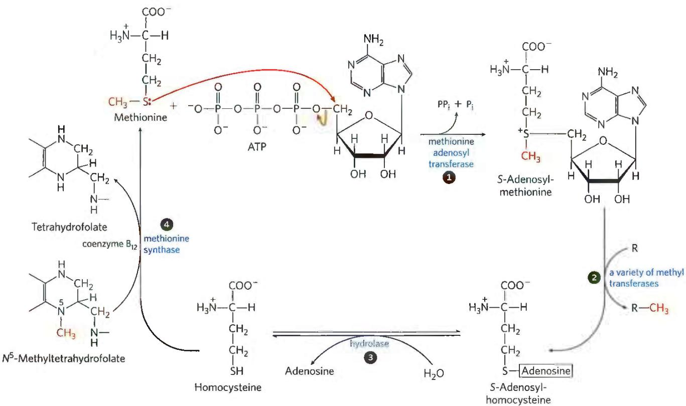  
FIGURE 18-18 Synthesis of methionine and S-adenosylmethionine in an activated-methyl cycle. The steps are described in the text. In the methionine synthase reaction (step 4), the methyl group is transferred to cobalamin to form methylcobalamin, which is the methyl  
donor in the formation of methionine. S-Adenosylmethionine, which has a positively charged sulfur (and is thus a sulfonium ion), is a powerful methylating agent in several biosynthetic reactions. The methyl group acceptor (step 2) is designated R.

The vitamins $B_{12}$ and folate are closely linked in these pathways. The anemia observed in the rare $B_{12}$ deficiency disease pernicious anemia (Box 17-2) can be traced to the methionine synthase reaction. As noted above, the methyl group of methylcobalamin is derived from $N^{5}$ -methyltetrahydrofolate, and this is the only reaction in mammals that uses $N^{5}$ -methyltetrahydrofolate. The reaction converting the $N^{5}, N^{10}$ -methylene form to the $N^{5}$ -methyl form of tetrahydrofolate is irreversible (Fig. 18-17). Thus, if coenzyme $B_{12}$ is not available for the synthesis of methylcobalamin, metabolic folates become trapped in the $N^{5}$ -methyl form.

The anemia associated with vitamin $B_{12}$ deficiency is called megaloblastic anemia. It manifests as a decline in the production of mature erythrocytes (red blood cells) and the appearance in the bone marrow of immature precursor cells, or megaloblasts. Erythrocytes are gradually replaced in the blood by smaller numbers of abnormally large erythrocytes called macrocytes. The defect in erythrocyte development is a direct consequence of the depletion of the $N^{5}, N^{10}$ -methylenetetrahydrofolate, which is required for synthesis of the thymidine nucleotides needed for DNA synthesis (see Chapter 22). Folate deficiency, in which all forms of tetrahydrofolate are depleted, also produces anemia, for much the same reasons. The anemia symptoms of $B_{12}$ deficiency can be alleviated by administering either vitamin $B_{12}$ or folate.

However, it is dangerous to treat pernicious anemia by folate supplementation alone, because the neurological symptoms of $B_{12}$ deficiency will progress. These symptoms do not arise from the defect in the methionine synthase reaction. Instead, the impaired methylmalonyl-CoA mutase (see Box 17-2 and Fig. 17-12) causes accumulation of unusual, odd-number fatty acids in neuronal membranes. The anemia associated with folate deficiency is thus often treated by administering both folate and vitamin $B_{12}$ , at least until the metabolic source of the anemia is unambiguously defined. Early diagnosis of $B_{12}$ deficiency is important because some of its associated neurological conditions may be irreversible.

Folate deficiency also reduces the availability of the $N^{5}$ -methyltetrahydrofolate required for methionine synthase function. This leads to a rise in homocysteine levels in blood, a condition linked to heart disease, hypertension, and stroke. High levels of homocysteine may be responsible for 10% of all cases of heart disease. The condition is treated with folate supplements.

Tetrahydrobiopterin, another cofactor of amino acid catabolism, is similar to the pterin moiety of tetrahydrofolate, but it is not involved in one-carbon transfers; instead it participates in oxidation reactions. We consider its mode of action when we discuss phenylalanine degradation (see Fig. 18-24).

#### [EN] Six Amino Acids Are Degraded to Pyruvate

P1 P3 P5 The carbon skeletons of six amino acids—alanine, tryptophan, cysteine, serine, glycine, and threonine—are converted in whole or in part to pyruvate. The pyruvate can then be converted to acetyl-CoA and eventually oxidized via the citric acid cycle, or to oxaloacetate and shunted into gluconeogenesis (Fig. 18-19). Alanine yields pyruvate directly on transamination with $\alpha$ -ketoglutarate, and the side chain of tryptophan is cleaved to yield alanine and thus pyruvate. Cysteine is converted to pyruvate in two steps; one removes the sulfur atom, the other is a transamination.

Serine is converted to pyruvate by serine dehydratase. Both the $\beta$ -hydroxyl and the $\alpha$ -amino groups of serine are removed in this single pyridoxal phosphate-dependent reaction (Fig. 18-20a).

Glycine is degraded via three pathways, only one of which leads to pyruvate. Glycine is converted to serine by enzymatic addition of a hydroxymethyl group (Figs 18-19, 18-20b). This reaction, catalyzed by serine hydroxymethyltransferase, requires the coenzymes tetrahydrofolate and pyridoxal phosphate. The serine is converted to pyruvate as described above. In the second pathway, which predominates in animals, glycine undergoes oxidative cleavage to $\mathrm{CO}_{2}$ , $\mathrm{NH}_{4}^{+}$ , and a methylene group ( $-\mathrm{CH}_{2}-$ ) (Figs. 18-19, 18-20c). This readily reversible reaction, catalyzed by glycine cleavage enzyme (also called glycine synthase), also requires tetrahydrofolate, which accepts the methylene group. In this oxidative cleavage pathway, the two carbon atoms of glycine do not enter the citric acid cycle. One carbon is lost as $\mathrm{CO}_{2}$ and the other becomes the methylene group

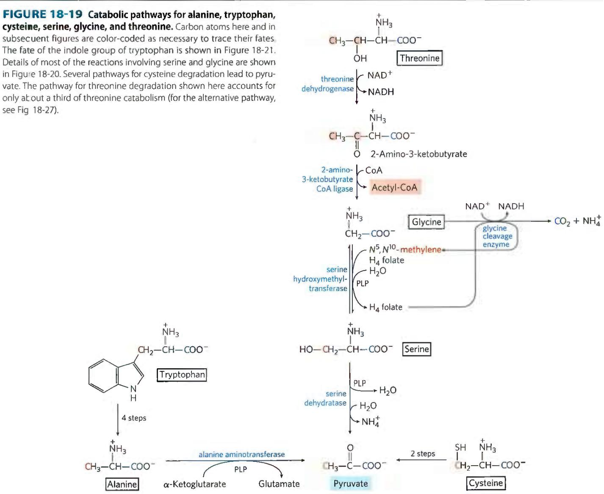

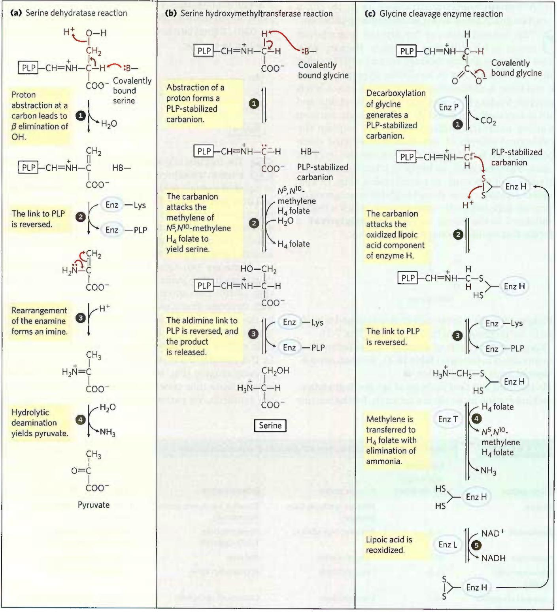

Serine

MECHANISM FIGURE 18-20 Interplay of the pyridoxal phosphate and tetrahydrofolate cofactors in serine and glycine metabolism. The first step in each of these reactions (not shown) involves the formation of a covalent imine linkage between enzyme-bound PLP and the substrate amino acid — serine in (a), glycine in (b) and (c). (a) A PLP-catalyzed elimination of water in the serine dehydratase reaction (step 1) begins the pathway to pyruvate. (b) In the serine hydroxymethyltransferase reaction, a PLP-stabilized carbanion (product of step 1) is a key intermediate in the reversible transfer of the methylene group (as—CH₂—OH) from $N^{5}, N^{10}$ -methylenetetrahydrofolate to form serine. (c) The glycine cleavage enzyme is a multienzyme complex, with components P, H, T, and L. The overall reaction, which is reversible, converts glycine to $CO_{2}$ and $NH_{4}^{\ddagger}$ , with the second glycine carbon taken up by tetrahydrofolate to form $N^{5}, N^{10}$ -methylenetetrahydrofolate. Pyridoxal phosphate activates the $\alpha$ carbon of amino acids at critical stages in all these reactions, and tetrahydrofolate carries a one-carbon unit in two of them (see Figs 18-6, 18-17).

of $N^{5}.N^{10}$ -methylenetetrahydrofolate (Fig. 18-17), a one-carbon group donor in certain biosynthetic pathways.

This second pathway for glycine degradation seems to be critical in mammals. Humans with serious defects in glycine cleavage enzyme activity suffer from a condition known as nonketotic hyperglycinemia. The condition is characterized by elevated serum levels of glycine, leading to severe intellectual disability and death in very early childhood. At high levels, glycine is an inhibitory neurotransmitter, which may explain the neurological effects of the disease. Perhaps more important, high levels of glycine increase the levels of 2-amino-3-ketobutyrate, an unstable intermediate in the degradation of threonine in mitochondria (Fig. 18-19). 2-Am-no-3-ketobutyrate decarboxylates spontaneously to form the toxic metabolite aminoacetone, which is readily metabolized to the highly reactive methylglyoxal, a molecule that modifies both protein and DNA.

Methylglyoxal is also a byproduct of glycolysis and is implicated in the progression of type 2 diabetes (Box 7-2).

Many genetic defects of amino acid metabolism have been identified in humans (Table 18-2). We shall encounter several more in this chapter.

In the third and final pathway of glycine degradation, the achiral glycine molecule is a substrate for the enzyme

D-amino acid oxidase. The glycine is converted to glyoxylate, an alternative substrate for lactate dehydrogenase (p. 526). Glyoxylate is oxidized in an NAD $^{+}$ -dependent reaction to oxalate:

The function of D-amino acid oxidase, present at high levels in the kidney, is thought to be the detoxification of ingested D-amino acids derived from bacterial cell walls and from grilled foodstuffs (high heat causes some spontaneous racemization of the L-amino acids in proteins). Oxalate, whether obtained in foods or produced enzymatically in the kidneys, has medical significance. Crystals of calcium oxalate account for up to 75% of all kidney stones.

There are two significant pathways for threonine degradation. One pathway leads to pyruvate via glycine (Fig. 18-19). The conversion to glycine occurs in two steps, with threonine first converted to 2-amino-3-ketobutyrate by the action of threonine dehydrogenase. This pathway is important in a few classes of rapidly dividing human cells, such as embryonic stem cells. The glycine generated by this pathway is broken down primarily by the glycine cleavage enzyme (Fig. 18-19). The $N^5, N^{10}$ -methylenetetrahydrofolate thus generated (Fig. 18-20c) is needed for the synthesis, via pathways described in Chapter 22, of nucleotides used in DNA replication. However, in most human tissues, the degradation of threonine via glycine is a relatively minor pathway, accounting for 10% to 30% of threonine catabolism. It is more important in some other mammals. The major pathway in most human tissues leads to succinyl-CoA, as described later in this chapter.

<table><tr><td>TABLE 18-2</td><td colspan="4">Some Human Genetic Disorders Affecting Amino Acid Catabolism</td></tr><tr><td>Medical condition</td><td>Approximate incidence (per 100,000 births)</td><td>Defective process</td><td>Defective enzyme</td><td>Symptoms and effects</td></tr><tr><td>Albinism</td><td>&lt;3</td><td>Melanin synthesis from tyrosine</td><td>Tyrosine 3-monooxygenase (tyrosinase)</td><td>Lack of pigmentation; white hair, pink skin</td></tr><tr><td>Alkaptonuria</td><td>&lt;0.4</td><td>Tyrosine degradation</td><td>Homogentisate 1,2-dioxygenase</td><td>Dark pigment in urine; late-developing arthritis</td></tr><tr><td>Argininemia</td><td>&lt;0.5</td><td>Urea synthesis</td><td>Arginase</td><td>Intellectual disability</td></tr><tr><td>Argininosuccinic acidemia</td><td>&lt;1.5</td><td>Urea synthesis</td><td>Argininosuccinase</td><td>Vomiting; convulsions</td></tr><tr><td>Carbamoyl phosphate synthetase I deficiency</td><td>&lt;0.5</td><td>Urea synthesis</td><td>Carbamoyl phosphate synthetase I</td><td>Lethargy; convulsions; early death</td></tr><tr><td>Homocystinuria</td><td>&lt;0.5</td><td>Methionine degradation</td><td>Cystathionine β-synthase</td><td>Faulty bone development; intellectual disability</td></tr><tr><td>Maple syrup urine disease (branched-chain keto-aciduria)</td><td>&lt;0.4</td><td>Isoleucine, leucine, and valine degradation</td><td>Branched-chain α-keto acid dehydrogenase complex</td><td>Vomiting; convulsions; intellectual disability; early death</td></tr><tr><td>Methylmalonic acidemia</td><td>&lt;0.5</td><td>Conversion of propionyl-CoA to succinyl-CoA</td><td>Methylmalonyl-CoA mutase</td><td>Vomiting; convulsions; intellectual disability; early death</td></tr><tr><td>Phenylketonuria</td><td>&lt;8</td><td>Conversion of phenylalanine to tyrosine</td><td>Phenylalanine hydroxylase</td><td>Neonatal vomiting; intellectual disability</td></tr></table>

#### [EN] Seven Amino Acids Are Degraded to Acetyl-CoA

P1 P5 Portions of the carbon skeletons of seven amino acids—tryptophan, lysine, phenylalanine, tyrosine, leucine, isoleucine, and threonine—yield acetyl-CoA and/or acetoacetyl-CoA, the latter being converted to acetyl-CoA (Fig. 18-21). Some of the final steps in the degradative pathways for leucine, lysine, and tryptophan resemble steps in the oxidation of fatty acids (see Fig. 17-9). Threonine (not shown in Fig. 18-21) yields some acetyl-CoA via the minor pathway illustrated in Figure 18-19.

The degradative pathways of two of these seven amino acids deserve special mention. Tryptophan breakdown is the most complex of all the pathways of amino acid catabolism in animal tissues; portions of tryptophan (four of its carbons) yield acetyl-CoA via acetoacetyl-CoA. Some of the intermediates in tryptophan catabolism are precursors for the synthesis of other

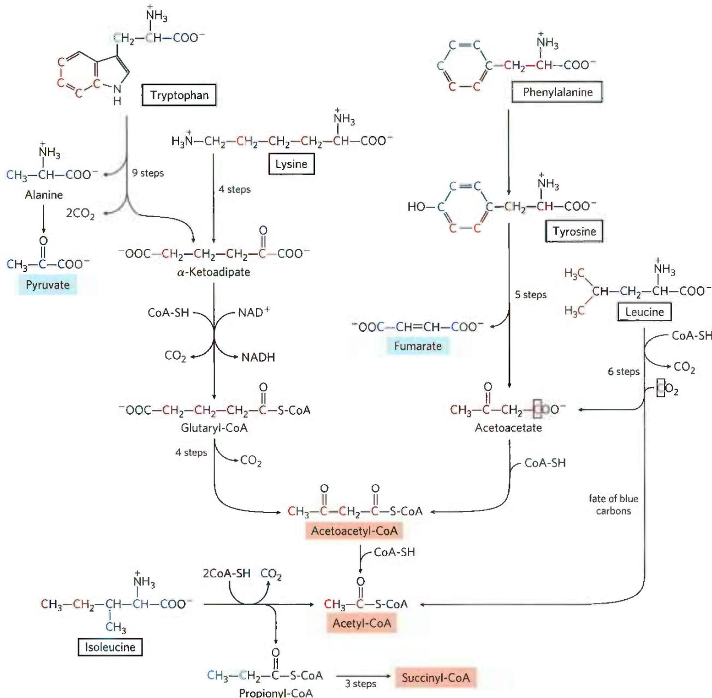

FIGURE 18-21 Catabolic pathways for tryptophan, lysine, phenylalanine, tyrosine, leucine, and isoleucine. These amino acids donate some of their carbons (red) to acetoacetate and acetyl-CoA. In the pathway for leucine catabolism, the carbon in acetoacetate that is donated by $\mathrm{CO}_{2}$ is surrounded by a box to distinguish it from the three carbons that come from leucine itself. Tryptophan, phenylalanine, tyrosine, and isoleucine also contribute carbons (blue) to pyruvate or citric acid cycle intermediates. The phenylalanine pathway is described in more detail in Figure 18-23. The fate of nitrogen atoms is not traced in this scheme; in most cases they are transferred to $\alpha$ -ketoglutarate to form glutamate.

biomolecules (Fig. 18-22), including nicotinate, a precursor of NAD and NADP in animals; serotonin, a neurotransmitter in vertebrates; and indoleacetate, a growth factor in plants. Some of these biosynthetic pathways are described in more detail in Chapter 22 (see Figs. 22-30, 22-31).

The breakdown of phenylalanine is noteworthy because genetic defects in the enzymes of this pathway lead to several inheritable human diseases (Fig. 18-23), as discussed below. Phenylalanine and its oxidation product tyrosine (both with nine carbons) are degraded into two fragments, both of which can enter the citric acid cycle: four of the nine carbon atoms yield free acetoacetate, which is converted to acetoacetyl-CoA and thus acetyl-CoA, and a second four-carbon fragment is recovered as fumarate. Eight of the nine carbons of these two amino acids thus enter the citric acid cycle; the remaining carbon is lost as $\mathrm{CO}_{2}$ . Phenylalanine, after its hydroxylation to tyrosine, is also the precursor of dopamine, a neurotransmitter, and of norepinephrine and epinephrine, hormones secreted by the adrenal medulla (see Fig. 22-31). Melanin, the black pigment of skin and hair, is also derived from tyrosine.

  
FIGURE 18-22 Tryptophan as precursor. The aromatic rings of tryptophan give rise to nicotinate (niacin), indoleacetate, and serotonin. Colored atoms trace the source of the ring atoms in nicotinate.

  
FIGURE 18-23 Catabolic pathways for phenylalanine and tyrosine. In humans these amino acids are normally converted to acetoacetyl-CoA and fumarate. Genetic defects in many of these enzymes cause inheritable human diseases (shaded yellow).

  
FIGURE 18-24 Role of tetrahydrobiopterin in the phenylalanine hydroxylase reaction. The H atom shaded pink is transferred directly from C-4 to C-3 in the reaction. This feature, discovered at the National Institutes of Health, is called the NIH shift.

#### [EN] Phenylalanine Catabolism Is Genetically Defective in Some People

Given that many amino acids are either neurotransmitters or precursors or antagonists of neurotransmitters, it is not surprising that genetic defects of amino acid metabolism can cause defective neural development and intellectual deficits. In most such diseases, specific intermediates accumulate. For example, a genetic defect in phenylalanine hydroxylase, the first enzyme in the catabolic pathway for phenylalanine (Fig. 18-23), is responsible for the disease phenylketonuria (PKU), the most common cause of elevated levels of phenylalanine in the blood (hyperphenylalaninemia).

Phenylalanine hydroxylase (also called phenylalanine-4-monooxygenase) is one of a general class of enzymes called mixed-function oxygenases (see Box 21-1), all of which catalyze simultaneous hydroxylation of a substrate by an oxygen atom of $\mathrm{O}_2$ and reduction of the other oxygen atom to $\mathrm{H}_2\mathrm{O}$ . Phenylalanine hydroxylase requires the cofactor tetrahydrobiopterin, which carries electrons from NADPH to $\mathrm{O}_2$ and becomes oxidized to dihydrobiopterin in the process (Fig. 18-24). It is subsequently reduced by the enzyme dihydrobiopterin reductase in a reaction that requires NADPH.

In individuals with PKU, a secondary, normally little-used pathway of phenylalanine metabolism comes into play. In this pathway phenylalanine undergoes transamination with pyruvate to yield phenylpyruvate (Fig. 18-25). Phenylalanine and phenylpyruvate accumulate in the blood and tissues and are excreted in the urine—hence the name “phenylketonuria.” Much of the phenylpyruvate, rather than being excreted as such, is either decarboxylated to phenylacetate or reduced to phenyllactate. Phenylacetate imparts a characteristic honeylike odor to the urine, which nurses have traditionally used to detect PKU in infants. The accumulation of phenylalanine or its metabolites in early life impairs normal development of the brain, causing severe intellectual deficits. This may be caused by excess phenylalanine competing with other amino acids for transport across the blood-brain barrier, resulting in a deficit of required metabolites.

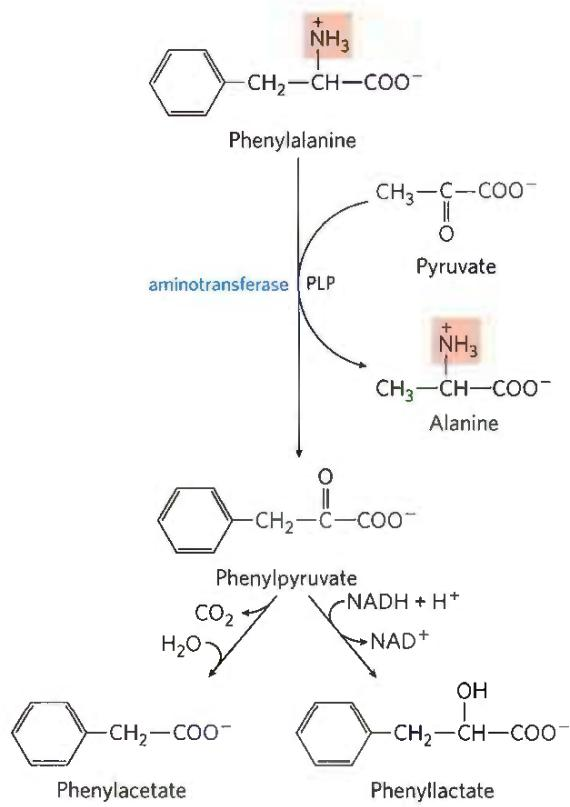  
FIGURE 18-25 Alternative pathways for catabolism of phenylalanine in phenylketonuria. In PKU, phenylpyruvate accumulates in the tissues, blood, and urine. The urine may also contain phenylacetate and phenyllactate.

Fhenylketonuria was among the first inheritable metabolic defects discovered in humans. When this condition is recognized early in infancy, intellectual disability can be prevented by rigid dietary control. The diet must supply only enough phenylalanine and tyrosine to meet the needs for protein synthesis. Consumption of protein-rich foods must be curtailed. Natural proteins, such as casein of milk, must first be hydrolyzed and much of the phenylalanine removed to provide an appropriate diet, at least through childhood. Because the artificial sweetener aspartame is a dipeptide of aspartate and the methyl ester of phenylalanine (see Fig. 1-23a), foods sweetened with aspartame bear warnings addressed to individuals on phenylalanine-controlled diets.

The dietary restrictions are difficult to follow perfectly for a lifetime, and thus often do not completely eliminate neurological symptoms. An enzyme substitution treatment has been developed in which the enzyme phenylalanine ammonia lyase is modified with polyethylene glycol (PEGylated) and injected subcutaneously to degrade phenylalanine in proteins ingested as part of a somewhat less restricted diet. Derived from plants, bacteria, and many yeast and fungi, phenylalanine ammonia lyase normally contributes to the biosynthesis of polyphenol compounds such as flavonoids. It degrades phenylalanine to the harmless metabolite trans-cinnamic acid and ammonia; the small amounts of ammonia generated are not toxic. The treatment was approved for patients in 2018. The long-term effects of the treatment continue to be studied.

Fhenylketonuria can also be caused by a defect in the enzyme that catalyzes the regeneration of tetrahydrobiopterin (Fig. 18-24). The treatment in this case is more complex than restricting the intake of phenylalanine and tyrosine. Tetrahydrobiopterin is also required for the formation of L-3,4-dihydroxyphenylalanine (L-dopa) and 5-hydroxytryptophan—precursors of the neurotransmitters norepinephrine and serotonin, respectively. In phenylketonuria of this type, these precursors must be supplied in the diet, along with tetrahydrobiopterin.

Screening newborns for genetic diseases can be highly cost-effective, especially in the case of PKU. The tests (no longer relying on urine odor) are relatively inexpensive, and the detection and early treatment of PKU in infants (eight to ten cases per 100,000 newborns) saves millions of dollars in later health care costs each year. More importantly, the emotional trauma avoided by early detection with these simple tests is inestmable.

Another inheritable disease of phenylalanine catabolism is alkaptonuria, in which the defective enzyme is homogentisate dioxygenase (Fig. 18-23). Less serious than PKU, this condition produces few ill effects, although large amounts of homogentisate are excreted and its oxidation turns the urine black. Individuals with alkaptonuria are also prone to develop a form of arthritis. Alkaptonuria is of considerable historical interest. Archibald Garrod discovered in the early 1900s that this condition is inherited, and he traced the cause to the absence of a single enzyme. Garrod was the first to make a connection between an inheritable trait and an enzyme—a great advance on the path that ultimately led to our current understanding of genes and the information pathways described in Part III.

#### [EN] Five Amino Acids Are Converted to $\alpha$ -Ketoglutarate

P5 The carbon skeletons of five amino acids (proline, glutamate, glutamine, arginine, and histidine) enter the citric acid cycle as $\alpha$ -ketoglutarate (Fig. 18-26). Proline, glutamate, and glutamine have five-carbon skeletons. The cyclic structure of proline is opened by oxidation of the carbon most distant from the carboxyl group to create a Schiff base, then hydrolysis of the Schiff base to form a linear semialdehyde, glutamate $\gamma$ -semialdehyde. This intermediate is further oxidized at the same carbon to produce glutamate. The action of glutaminase, or any of several enzyme reactions in which glutamine donates its amide nitrogen to an acceptor, converts glutamine to glutamate. Transamination or deamination of glutamate produces $\alpha$ -ketoglutarate.

Arginine and histidine contain five adjacent carbons and a sixth carbon attached through a nitrogen atom. The catabolic conversion of these amino acids to glutamate is therefore slightly more complex than the path from proline or glutamine (Fig. 18-26). Arginine is converted to the five-carbon skeleton of ornithine in the urea cycle (Fig. 18-10), and the ornithine is transaminated to glutamate $\gamma$ -semialdehyde. Conversion of histidine to the five-carbon glutamate occurs in a multistep pathway; the extra carbon is removed in a step that uses tetrahydrofolate as cofactor.

#### [EN] Four Amino Acids Are Converted to Succinyl-CoA

P5 The carbon skeletons of methionine, isoleucine, threonine, and valine are degraded by pathways that yield succinyl-CoA (Fig. 18-27), an intermediate of the citric acid cycle. Methionine donates its methyl group to one of several possible acceptors through S-adenosyl methionine, and three of its four remaining carbon atoms are converted to the propionate of propionyl-CoA, a precursor of succinyl-CoA. Isoleucine undergoes transamination, followed by oxidative decarboxylation of the resulting $\alpha$ -keto acid. The remaining five-carbon skeleton is further oxidized to acetyl-CoA and propionyl-CoA. Valine undergoes transamination and decarboxylation, then a series of oxidation reactions that convert the remaining four carbons to propionyl-CoA. Some parts of the valine and isoleucine degradative pathways closely parallel steps in fatty acid degradation (see Fig. 17-9). In human tissues, threonine is also converted in two steps to propionyl-CoA. This is the primary pathway for threonine degradation in humans (see Fig. 18-19 for the alternative pathway). The mechanism of the first step is analogous to that catalyzed by serine dehydratase, and the serine and threonine dehydratases may actually be the same enzyme.

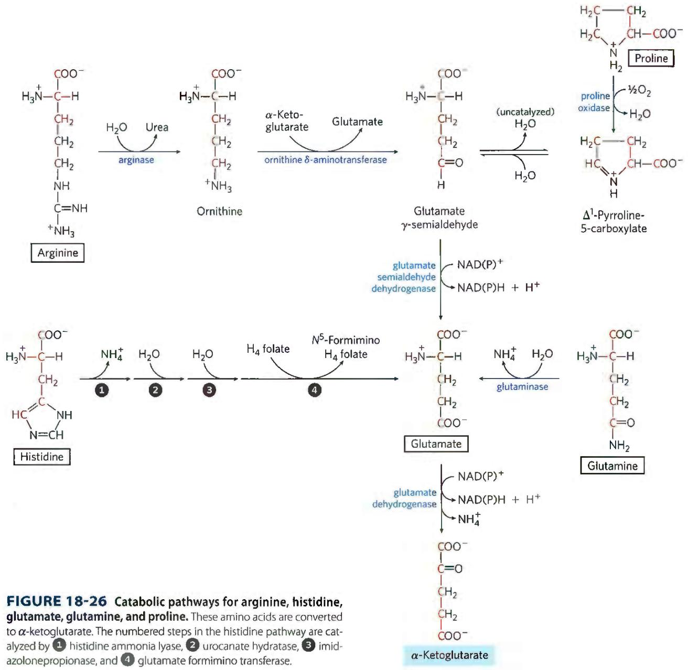

The propionyl-CoA derived from these three amino acids is converted to succinyl-CoA by a pathway described in Chapter 17: carboxylation to methylmalonyl-CoA, epimerization of the methylmalonyl-CoA, and conversion to succinyl-CoA by the coenzyme $\mathbf{B}_{12}$ -dependent methylmalonyl-CoA mutase (see Fig. 17-12). In the rare genetic disease known as methylmalonic acidemia, methylmalonyl-CoA mutase is lacking—with serious metabolic consequences (Table 18-2; Box 18-2).

#### [EN] Branched-Chain Amino Acids Are Not Degraded in the Liver

Although much of the catabolism of amino acids takes place in the liver, the three amino acids with branched side chains (leucine, isoleucine, and valine) are oxidized as fuels primarily in muscle, adipose, kidney, and brain tissue. These extrahepatic tissues contain an aminotransferase, absent in liver, that acts on all three branched-chain amino acids to produce the corresponding $\alpha$ -keto acids (Fig. 18-28). The branched-chain $\alpha$ -keto acid dehydrogenase complex then catalyzes oxidative decarboxylation of all three $\alpha$ -keto acids, in each case releasing the carboxyl group as $CO_{2}$ and producing the acyl-CoA derivative. This reaction is formally analogous

FIGURE 18-27 Catabolic pathways for methionine, isoleucine, threonine, and valine. These amino acids are converted to succinyl-CoA; isoleucine also contributes two of its carbon atoms to acetyl-CoA (see Fig. 18-21). The pathway of threonine degradation shown here occurs in humans; a pathway found n other organisms is shown in Figure 18-19. The route from methionine to homocysteine is described in more detail in Figure 18-18; the conversion of homocysteine to α-ketobutyrate, n Figure 22-16; and the conversion of propionyl-CoA to succinyl-CoA, in Figure 17-12.

to two other oxidative decarboxylations encountered in Chapter 16: oxidation of pyruvate to acetyl-CoA by the pyruvate dehydrogenase complex and oxidation of $\alpha$ -ketoglutarate to succinyl-CoA by the $\alpha$ -ketoglutarate dehydrogenase complex (see Fig. 16-12). In fact, all three enzyme complexes are similar in structure and share essentially the same reaction mechanism. Five cofactors (thiamine pyrophosphate, FAD, NAD, lipoate, and coenzyme A) participate, and the three proteins in each complex catalyze homologous reactions. This is clearly a case in which enzymatic machinery that evolved to catalyze one reaction was "borrowed" by gene duplication and further evolved to catalyze similar reactions in other pathways.

Experiments with rats have shown that the branched-chain $\alpha$ -keto acid dehydrogenase complex is regulated by covalent modification in response to the content of branched-chain amino acids in the diet. With little or no excess dietary intake of branched-chain amino acids, the enzyme complex is phosphorylated by a protein kinase and thereby inactivated. Addition of excess branched-chain amino acids to the diet results in dephosphorylation and consequent activation of the enzyme. Recall that the pyruvate dehydrogenase complex is subject to similar regulation by phosphorylation and dephosphorylation (see Fig. 16-19).

There is a relatively rare genetic disease in which the three branched-chain $\alpha$ -keto acids (as well as their precursor amino acids, especially leucine) accumulate in the blood and "spill over" into the urine. This condition, called maple syrup urine disease

#### [EN] MMA: Sometimes More than a Genetic Disease

Without treatment, an infant born with a genetic deficiency involving the enzyme methylmalonyl-CoA mutase is subject to severe symptoms ranging from seizures and vomiting to lethargy, developmental disease, progressive encephalopathy (brain disease), and early death. A rare and recessive genetic disorder, the condition, methylmalonic acidemia or MMA, affects about 1 child in 48,000 (Fig. 1). For most parents of a child with MMA, the condition brings trials and some heartbreak. For Patricia Stallings, the condition of her undiagnosed child led to much worse. Biochemistry eventually came to the rescue.

In the summer of 1989, Stallings took her baby son Ryan to the emergency room at the Cardinal Glennon Children's Hospital in St. Louis. To the attending physician, a toxicologist, Ryan's fit of vomiting and labored breathing suggested ingestion of the antifreeze ingredient ethylene glycol. The toxicologist suspected foul play and alerted authorities. Analysis of Ryan's milk bottles by two laboratories seemed to confirm the physician's fears. Ryan was placed in foster care as soon as he recovered. Unfortunately for both Ryan and his mother, Ryan subsequently died immediately after a visit from Patricia. Patricia was arrested and charged with murder.

While awaiting trial, Patricia learned that she was again pregnant. She gave birth to a second son, David, who was placed in foster care. David developed symptoms similar to Ryan's and was diagnosed with MMA. Although the symptoms of MMA can mimic those observed in cases of ethylene glycol poisoning, the revelation did not help Patricia. The information about David's diagnosis was excluded at her trial for the murder of Ryan. In 1991, Patricia Stallings was sentenced to prison for life.

The situation was ultimately resolved when William Sly, chair of the Department of Biochemistry and Molecular Biology at St. Louis University, became interested in the case. Working with metabolic disease experts James Shoemaker and Piero Rinaldo, he had new analyses performed on Ryan's blood and the original milk bottles. The blood showed high levels of methylmalonic acid and ketones, diagnostic of MMA. Surprisingly, unlike the earlier lab reports, they found no ethylene glycol in any of the samples. Could both a hospital lab and a commercial lab have been mistaken? What the biochemists saw provided the final breakthrough. The biochemists presented all of their materials to the Missouri state prosecutor who had handled the case, George McElroy. Both of the original lab analyses had been so unusually shoddy that they were quickly dismissed. Patricia Stallings was cleared of charges and released on September 20, 1991.

  
FIGURE 1 Children with a mutation (red X) that inactivates the enzyme methylmalonyl-CoA mutase cannot degrade isoleucine, methionine, threonine, and valine normally. Instead, a potentially fatal accumulation of methylmalonic acid occurs, with symptoms similar to those of ethylene glycol poisoning.

because of the characteristic odor imparted to the urine by the $\alpha$ -keto acids, results from a defective branched-chain $\alpha$ -keto acid dehydrogenase complex. Untreated, the disease results in abnormal development of the brain and death in early infancy. Treatment entails rigid control of the diet, limiting the intake of valine, isoleucine, and leucine to the minimum required to permit normal growth.

#### [EN] Asparagine and Aspartate Are Degraded to Oxaloacetate

The carbon skeletons of asparagine and aspartate ultimately enter the citric acid cycle as malate in mammals or oxaloacetate in bacteria. The enzyme asparaginase catalyzes the hydrolysis of asparagine to aspartate, which undergoes transamination with $\alpha$ -ketoglutarate to yield glutamate and oxaloacetate (Fig. 18-29).

  
FIGURE 18-28 Catabolic pathways for the three branched-chain amino acids: valine, isoleucine, and leucine. All three pathways occur in extrahepatic tissues and share the first two enzymes, as shown here. The branched-chain $\alpha$ -keto acid dehydrogenase complex is analogous to the

The cxaloacetate is converted to malate in the cytosol and then transported into the mitochondrial matrix through the malate- $\alpha$ -ketoglutarate transporter. In bacteria, the oxalcacetate produced in the transamination reaction can be used directly in the citric acid cycle.

We have now seen how the 20 common amino acids, after losing their nitrogen atoms, are degraded by dehydrogenation, decarboxylation, and other reactions to yield portions of their carbon backbones in the form of six central metabolites that can enter the citric acid cycle. Those portions degraded to acetyl-CoA are completely oxidized to carbon dioxide and water, with generation of ATP by oxidative phosphorylation. Those portions degraded to other citric acid cycle intermediates can either be oxidized or contribute to gluconeogenesis, depending on the metabolic state.

As was the case for carbohydrates and lipids, the degradation of amino acids results ultimately in the generation of reducing equivalents (NADH and FADH $_{2}$ ) through the action of the citric acid cycle. Our survey of catabolic processes concludes in the next chapter with a discussion of respiration, in which these reducing equivalents fuel the ultimate oxidative and energy-generating process in aerobic organisms.

#### [EN] SUMMARY 18.3 Pathways of Amino Acid Degradation

■ After the removal of amino groups, the carbon skeletons of amino acids undergo oxidation to compounds that can enter the citric acid cycle. The citric acid cycle products can be oxidized as fuel. Alternatively, depending on their degradative end product, some amino acids can be converted to ketone bodies, some to glucose, and some to both. Thus, amino acid degradation is integrated into intermediary metabolism and can be critical to survival under conditions in which amino acids are a significant source of metabolic energy.

pyruvate and $\alpha$ -ketoglutarate dehydrogenase complexes and requires the same five cofactors (some not shown here). This enzyme is defective in people with maple syrup urine disease.  
  
FIGURE 18-29 Catabolic pathway for asparagine and aspartate. Both amino acids are converted to oxaloacetate.

The reactions of these pathways require several cofactors, including tetrahydrofolate and S-adenosylmethionine in one-carbon transfer reactions and tetrahydrobiopterin in the oxidation of phenylalanine by phenylalanine hydroxylase.

■ Alanine, cysteine, glycine, serine, threonine, and tryptophan are converted in whole or in part to pyruvate.

■ Leucine, lysine, phenylalanine, tyrosine, and tryptophan yield acetyl-CoA via acetoacetyl-CoA. Isoleucine, leucine, threonine, and tryptophan also form acetyl-CoA directly. Leucine and lysine are the only amino acids that cannot contribute to gluconeogenesis. Four carbon atoms of phenylalanine and tyrosine give rise to fumarate.

■ Many human genetic diseases are traced to deficiencies in enzymes catalyzing steps in amino acid degradation. Two well-studied examples, phenylketonuria and alkaptonuria, feature defects in phenylalanine degradation. Most amino acid degradation deficiencies are treated with dietary intervention.

■ Arginine, glutamate, glutamine, histidine, and proline are degraded to $\alpha$ -ketoglutarate.

■ Isoleucine, methionine, threonine, and valine produce succinyl-CoA.

■ The branched-chain amino acids (isoleucine, leucine, and valine), unlike the other amino acids, are degraded only in extrahepatic tissues.

■ Asparagine and aspartate produce oxaloacetate.

<!-- EN-END 18.3 -->

## 五、生糖氨基酸和生酮氨基酸

有些氨基酸如苯丙氨酸、酪氨酸、亮氨酸、色氨酸，在分解过程中转变为乙酰乙酰-CoA，而乙酰乙酰-CoA在动物的肝中可转变为乙酰乙酸和β-羟丁酸，因此这5种氨基酸称为生酮氨基酸（ketogenic amino acid）。糖尿病人的肝所形成的大量酮体，除来源于脂肪酸外，还来源于生酮氨基酸。

凡能形成丙酮酸、 $\alpha-$ 酮戊二酸、琥珀酸和草酰乙酸的氨基酸都称为生糖氨基酸（glycogenic amino acid）。因为这些物质都能导致生成葡萄糖和糖原（参看第22章）。

有的氨基酸如苯丙氨酸和酪氨酸，既可生成酮体又可生成糖，因此，称为生酮和生糖氨基酸。

还有些氨基酸如丙氨酸、丝氨酸、半胱氨酸，也可通过形成乙酰-CoA后进而形成乙酰乙酸，因此，生酮氨基酸和生糖氨基酸的界限并不是非常严格的。

## 六、由氨基酸衍生的其他重要物质

## （一）氨基酸与一碳单位

生物化学中将具有一个碳原子的基团称为“一碳单位”（one carbon unit）或“一碳基团”（one carbon

group)。

生物体内的一碳单位有许多形式,例如:

(1) 亚氨甲基—CH=NH (formimino-)

(2) 甲酰基 H—C—(formyl-)
O

(3) 羟甲基— $CH_{2}OH$ (hydroxymethyl-)

(4) 亚甲基(又称甲叉基)— $CH_{2}$ —(methylene-)

(5) 次甲基(又称为甲川基)—CH=(methenyl)

(6) 甲基— $CH_{3}$ (methyl-)

许多氨基酸都可作为一碳单位来源，如甘氨酸、苏氨酸、丝氨酸和组氨酸等。

一碳单位不只与氨基酸代谢密切相关,还参与嘌呤和嘧啶的生物合成以及S-腺苷甲硫氨酸的生物合成。它是生物体各种化合物甲基化的甲基来源。

许多带有甲基的化合物在生物学上都有重要功能。如肾上腺素、肌酸、卵磷脂等。嘌呤和嘧啶又是合成核酸的重要成分。

一碳单位的转移靠四氢叶酸(5,6,7,8-tetrahydrofolic acid)，用符号THF表示，曾用 $\mathrm{HF}_4$ 表示，携带甲基的部位是在 $N^5, N^{10}$ 位（参看维生素章叶酸部分）。THF是一个6-甲基蝶呤(6-methylpterin)的衍生物，依次与对氨基苯甲酸(p-aminobenzoic acid)和谷氨酸残基相连（图25-34）。四氢叶酸有附加的5个谷氨酸残基与第1个谷氨酸残基通过异肽键(isopeptide bond)相连，形成多谷氨酸尾部。

  
图25-34 四氢叶酸结构图

一碳单位与 THF 在 N5, N10, 或 N5 和 N10 位以共价相连。与 THF 相连的一碳单位可处于不同的氧化水平, 如甲酸(formate)、甲醛(formaldehyde)或甲醇(methanol)等, 在氧化还原酶的催化下, 可以互相转化(图 25-35)。

氨基酸和一碳单位的关系可列举如下：

（1）甘氨酸脱氨基生成乙醛酸后，与THF反应生成 $N^{5},N^{10}$ -亚甲基THF。

(2) 苏氨酸可分解为甘氨酸和乙醛, 所以苏氨酸是通过甘氨酸形成一碳单位。

（3）丝氨酸分子上的 $\beta-$ 碳原子可转移到 THF 上，同时脱去一分子水，生成 $N^{5}, N^{10}-$ 亚甲基 THF ( $N^{5}, N^{10}-CH_{2}-THF$ )。丝氨酸的 $\beta-$ 碳原子转移后变为甘氨酸。所以丝氨酸既可直接与 THF 作用形成一碳衍生物，又可通过甘氨酸途径形成 $N^{5}, N^{10}-$ 亚甲基 THF。

（4）组氨酸在分解过程中形成亚氨甲酰谷氨酸(N-formimino glutamate)后与THF作用,将亚氨甲酰基转移到THF上,形成亚氨甲酰THF,再脱去氨后即形成 $N^{5},N^{10}$ -次甲基四氢叶酸。

（5）S-腺苷甲硫氨酸可提供甲基，它是在甲硫氨酸腺苷转移酶(methionine adenosyl transferase)作用下，由ATP和甲硫氨酸合成(图25-36)。在这个反应中，甲硫氨酸上的硫原子对ATP核糖上的5'碳原子发起亲核进攻，导致三磷酸基被释放，裂解成PPi和Pi，随后，PPi通过焦磷酸酶的作用进一步裂解。

  
图25-35 与四氢叶酸结合的一碳单位的转变形式

  
图 25-36 活化甲基循环中蛋氨酸和 S-腺苷甲硫氨酸合成

尽管 $N^{5}$ -甲基四氢叶酸在 N5 上携带一个甲基，但是其转移势对于体内大多数合成反应是不够的。生物体内合成胆碱、肌酸、肾上腺素等所需的甲基都是由 S-腺苷甲硫氨酸提供。S-腺苷甲硫氨酸是大约 50 种不同甲基受体的供给者。催化甲基转移的酶称为甲基转移酶，脱甲基后的产物是 S-腺苷高半胱氨酸。虽然甲硫氨酸是甲基的供给者，但是，甲硫氨酸的甲基却只能由极少数反应提供，主要途径是从 $N^{5}$ -甲基四氢叶酸的甲基转移到高半胱氨酸上。

一碳单位还可参与嘌呤和胸腺嘧啶的合成。

如上所述,甲基的转移靠四氢叶酸。叶酸是四氢叶酸的前体。人体所需叶酸来源于食物,因体内没有合成叶酸的酶,而细菌所需叶酸靠自身合成。叶酸分子的组成成分之一是对氨基苯甲酸。常用的磺胺类药物是对氨基苯甲酸的颉颃剂,因此能抑制细菌的生长,而对人体影响不大。抗叶酸药物如三甲氧苄二氨嘧啶(trimethoprim,TMP)等二氢叶酸类似物,能抑制二氢叶酸还原酶的活性从而影响叶酸还原为四氢叶酸。若将甲氧苄氨嘧啶与磺胺药共同使用,可明显增强药力并减少两种药物的用量。这类药物称为“增效剂”。

## （二）氨基酸与生物活性物质

有些氨基酸在神经系统活动中起着重要作用,它们本身都属于生物活性物质,此外,生物体在生命活动中还需要由氨基酸合成许多其他生物分子来调节代谢及生命活动。这类生物分子,少量就能发挥明显的生物功能,因此称为生物活性物质。表 25-2 列举了一部分由氨基酸来源的生物分子。

表 25-2 氨基酸来源的生物活性物质

<table><tr><td>氨基酸</td><td>转变产物</td><td>生物学作用</td><td>备注</td></tr><tr><td rowspan="3">甘氨酸</td><td>嘌呤碱</td><td>核酸及核苷酸成分</td><td>与Gln、Asp、一碳单位 $CO_{2}$ 共同合成</td></tr><tr><td>肌酸</td><td>组织中储能物质</td><td>与Arg、Met共同合成</td></tr><tr><td>卟啉</td><td>血红蛋白及细胞色素等辅基</td><td>与琥珀酰-CoA共同合成</td></tr><tr><td rowspan="2">丝氨酸</td><td>乙醇胺及胆碱</td><td>磷脂成分</td><td>胆碱由Met提供甲基</td></tr><tr><td>乙酰胆碱</td><td>神经递质</td><td></td></tr><tr><td>半胱氨酸</td><td>牛磺酸</td><td>结合胆汁酸成分</td><td></td></tr><tr><td>天冬氨酸</td><td>嘧啶碱</td><td>核酸及核苷酸成分</td><td>与 $CO_{2}$ 、Gln共同合成</td></tr><tr><td>谷氨酸</td><td>γ-氨基丁酸</td><td>抑制性神经递质</td><td></td></tr><tr><td>组氨酸</td><td>组胺</td><td>神经递质</td><td></td></tr><tr><td rowspan="3">酪氨酸</td><td>儿茶酚胺类</td><td>神经递质</td><td>肾上腺素由Met提供甲基</td></tr><tr><td>甲状腺激素</td><td>激素</td><td></td></tr><tr><td>黑色素</td><td>皮、发形成黑色</td><td></td></tr><tr><td rowspan="3">色氨酸</td><td>5-羟色胺</td><td>神经递质促进平滑肌收缩</td><td>即N-乙酰-5-甲氧色胺</td></tr><tr><td>退黑素</td><td>松果体激素</td><td></td></tr><tr><td>烟酸</td><td>维生素PP</td><td></td></tr><tr><td>鸟氨酸</td><td>腐胺亚精胺</td><td>促进细胞增殖</td><td></td></tr><tr><td>天冬氨酸</td><td>—</td><td>兴奋性神经递质</td><td></td></tr><tr><td>谷氨酸</td><td>—</td><td>兴奋性神经递质</td><td></td></tr></table>

下面列举几种生物分子的形成机制。

## 1. 酪氨酸代谢与黑色素(melanin)的形成

酪氨酸在酪氨酸酶(tyrosinase)作用下形成二羟苯丙氨酸(dihydroxy phenylalanine, dopa)，后者是一辅助底物(cosubstrate)，再被同一酶作用形成多巴醌(dopaquinone)又称苯丙氨酸-3,4-醌(phenylalanine-3,4-quinone)。极少量的多巴醌能起到催化作用，酮式的苯丙氨酸3,4-醌是不稳定物质，自发进行一系列反应形成吲哚5,6-醌(indole-5,6-quinone)，后者聚合形成黑色素(melanin pigment)(图25-37)。

## 2. 酪氨酸代谢和肾上腺素、去甲肾上腺素、多巴及多巴胺的形成

肾上腺素和去甲肾上腺素最早发现于肾上腺髓质，其生理功能除对心脏、血管有作用（参看第14章激素）外，还发现它们与多巴(dopa)、多巴胺(dopamine)这些由酪氨酸衍生来的系列物，都在神经系统中起重要作用。它们和神经活动、行为以及大脑皮层的醒觉和睡眠节律等都有关系。

肾上腺素、去甲肾上腺素、多巴及多巴胺由酪氨酸的衍生途径如图 25-38。

肾上腺素（AD）、去甲肾上腺素（NA）、多巴和多巴胺（DA）等统称为儿茶酚胺（catecholamine）类物质。

## 3. 色氨酸代谢与 5-羟色胺及吲哚乙酸

如前所述,5-羟色胺是脊椎动物的一种神经递质,在神经系统中的含量与神经的兴奋和抑制状态有密切关系,也是一种血管收缩素。吲哚乙酸是一种植物生长激素。二者都是由色氨酸形成的,其形成途径如图25-39所示。

## 4. 肌酸和磷酸肌酸的形成

肌酸存在于动物的肌肉、脑和血液。既可以游离形式存在，也可以磷酸化形式存在。后者称为磷酸肌酸。肌酸和磷酸肌酸在贮存和转移磷酸键能中起重要作用（参看第16章生物能学）。参与肌酸合成的有3种氨基酸：精氨酸、甘氨酸和甲硫氨酸。合成反应如图25-40所示。

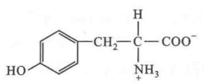

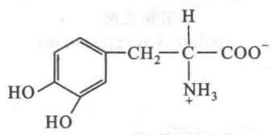

  
图 25-37 酪氨酸代谢与黑色素的形成  
肾上腺素(epinephrine)  
图25-38 酪氨酸形成多巴、多巴胺、去甲肾上腺素、肾上腺素的途径

  
图25-39 由色氨酸形成5-羟色胺及吲哚乙酸的途径

  
图 25-40 精氨酸、甘氨酸、甲硫氨酸形成磷酸肌酸的途径

## 5. 组胺的形成

肺、肝、胃黏膜的壁细胞、肌肉、乳腺及神经组织都有组胺存在。它是一种强烈的血管舒张物质，浓度过高可引起虚脱。创伤性休克或炎症病变部位都有组胺释放。它还有刺激胃黏膜分泌胃蛋白酶和胃酸的作用。在神经组织中它是感觉神经的一种递质，和周围神经的感觉与传递有密切关系。

组胺是组氨酸脱羧基的产物,它的形成如下式:

## 6. 腐胺、精胺、亚精胺（精脒）的形成

腐胺(putrescine)名称的起源是因为它发现于腐败的肉中。它是鸟氨酸脱羧的产物,鸟氨酸来源于精氨酸的水解。

亚精胺(spermidine)和精胺(spermine)名称的来源是因为它们发现于人的精液中。这两种物质在法律上一直用于鉴定犯罪事实。但它们的结构直至1926年才弄清。现已知亚精胺、精胺和腐胺广泛存在于各种组织，而且可能具有重要的功能。它们总是与核酸并存，可能在转录和细胞分裂的调节中起作用。

亚精胺来源于腐胺。三者的形成途径如图 25-41 所示。

  
图 25-41 腐胺、亚精胺和精胺的形成途径

亚精胺和精胺的分子中,含有多个氨基,因此又统称多胺(polyamine)。

## 7. 谷氨酸和 $\gamma$ -氨基丁酸

谷氨酸在动物脑中含量占全身各组织的首位。在脑和脊髓中是一种广泛存在的具有兴奋作用的神经递质。谷氨酸脱羧形成 $\gamma-$ 氨基丁酸（ $\gamma-$ aminobutyric acid，简称 GABA），可增加突触后神经元细胞膜对 $Na^{+}$ 的通透性，使神经元细胞膜超极化，从而提高动作电位的启动阈值，因此，是脑组织中具有抑制作用的神经递质。

$\gamma$ -氨基丁酸的形成途径如下：

γ-氨基丁酸并非氨基酸中唯一的抑制性神经递质，甘氨酸、牛磺酸等也都是不同程度的抑制性神经递质。谷氨酸也并非唯一的兴奋性神经递质，天冬氨酸也有类似的作用。

## 8. 牛磺酸和半胱氨酸

牛磺酸来源于半胱氨酸氧化脱羧,反应参见图 25-17。牛磺酸是某些胆酸的组分,也被认为是一种抑制性神经递质。

## 七、氨基酸代谢缺陷症

氨基酸代谢中缺乏某一种酶,都可能引起疾患,这种疾病称为代谢缺陷症。由于某种酶的缺乏,致使该酶的作用物在血或尿中大量出现。这种代谢缺陷属于分子疾病。其病因和 DNA 分子突变有关,往往是先天性的,又称为先天性遗传代谢病。这类先天性代谢缺陷症,大部分发生在婴儿时期,常在幼年就导致死亡,发病的症状表现有智力迟钝、发育不良、周期性呕吐、沉睡、搐溺、共济失调及昏迷等。目前已发现的氨基酸代谢病已达 30 多种。表 25-3 列举一些与先天性氨基酸代谢病有关的酶,以及血或尿中出现的不正常代谢产物。

表 25-3 先天性氨基酸代谢缺陷症

<table><tr><td>病名</td><td>涉及的氨基酸代谢途径</td><td>临床症状</td><td>代谢缺陷</td></tr><tr><td>精氨酸血和高血氨症(argininemia and hyperammonemia)</td><td>精氨酸和尿素循环</td><td>智力迟钝,血中出现精氨酸及氨</td><td>缺乏精氨酸酶</td></tr><tr><td>鸟氨酸血和高血氨症(ornithinemia and hyperammonemia)</td><td>尿素循环</td><td>新生儿死亡、昏睡、惊厥、智力迟钝</td><td>缺乏氨甲酰磷酸合成酶、鸟氨酸脱羧酶</td></tr><tr><td>高甘氨酸血症(hyperglycinemia)</td><td>甘氨酸</td><td>严重的智力迟钝</td><td>甘氨酸代谢系统疾患</td></tr><tr><td>高组氨酸血症(hyperhistidinemia)</td><td>组氨酸</td><td>语言缺陷,某些情况有智力迟钝</td><td>组氨酸酶缺欠</td></tr><tr><td>枫糖尿症(maple syrup urine disease,MSUD,又称支链酮酸尿症)</td><td>异亮氨酸、亮氨酸、缬氨酸</td><td>新生儿呕吐、惊厥、死亡,严重的智力迟钝</td><td>支链酮酸脱氢酶复合体缺欠</td></tr><tr><td>甲基丙二酸血症(methylmalonic acidemia)</td><td>异亮氨酸、甲硫氨酸、苏氨酸及缬氨酸</td><td>除血中积累甲基丙二酸外,其他症状同上</td><td>缺乏甲基丙二酰-CoA、变位酶(有些病人对维生素 $B_{12}$ 治疗有反应)</td></tr><tr><td>异戊酸血症(isovaleric acidemia)</td><td>亮氨酸</td><td>新生儿呕吐、酸中毒、昏睡及昏迷,生存者智力迟钝</td><td>缺乏异戊酰-CoA脱氢酶</td></tr><tr><td>高赖氨酸血症(hyperlysinemia)</td><td>赖氨酸</td><td>智力迟钝,同时某些非中枢神经系统不正常</td><td>缺乏赖氨酸-酮戊二酸还原酶</td></tr><tr><td>高胱氨酸尿症(homocystinuria)</td><td>甲硫氨酸</td><td>智力迟钝,眼疾患,血栓栓塞,骨质疏松、骨结构不正常</td><td>缺乏胱硫醚- $\beta$ -合酶</td></tr><tr><td>苯丙酮尿症和高苯丙氨酸尿症(phenylketonuria and hyperphenylalaninemia)</td><td>苯丙氨酸</td><td>新生儿呕吐,智力迟钝以及其他神经疾患</td><td>缺乏苯丙氨酸-4-单加氧酶</td></tr><tr><td>高脯氨酸血症I型(hyperprolinemia type I)</td><td>脯氨酸</td><td>临床检验除血中含有过量脯氨酸外,未发现其他症状</td><td>缺乏脯氨酸氧化酶、脯氨酸脱氢酶</td></tr><tr><td>尿黑酸症(alkaptonuria)</td><td>酪氨酸</td><td>尿中含有尿黑酸,在碱性条件下,在空气中变黑。成人皮肤和软骨变黑,发展成关节炎</td><td>缺乏尿黑酸氧化酶</td></tr><tr><td>白化病(albinism)</td><td></td><td>最普通的类型是眼皮肤白化,头发变为白色,皮肤呈粉色,惧光,眼睛缺少色素</td><td>缺失黑色素细胞的酪氨酸酶</td></tr></table>

上表中值得特别提出的是在苯丙氨酸代谢中由于缺乏苯丙氨酸-4-单加氧酶（phenylalanine-4-monooxygenase）而引起的苯丙酮尿症（phenylketonuria, PKU 症）。这种病，在 1 万人中即可发现一人。当机体缺乏这种酶时，苯丙氨酸的正常代谢途径（参见图 25-19，图 25-20）即改变为在正常情况下很少起作用的第二条途径，即苯丙氨酸与 α-酮戊二酸转氨形成苯丙酮酸，聚集在血液中，最后由尿排出体外。这是人们最早认识的一种代谢遗传缺陷症。患者若在儿童时期限制吃含有苯丙氨酸的饮食，可以防止发生智力迟钝。

尿黑酸症,是酪氨酸代谢中缺乏尿黑酸氧化酶引起(图25-42)。这种病人尿中含有尿黑酸,在碱性条件下暴露于氧气中即氧化并聚合成为类似黑色素的物质而使尿显黑色。因此称为尿黑酸症(alkaptonuria),这种病人的结缔组织有不正常的色素沉着。

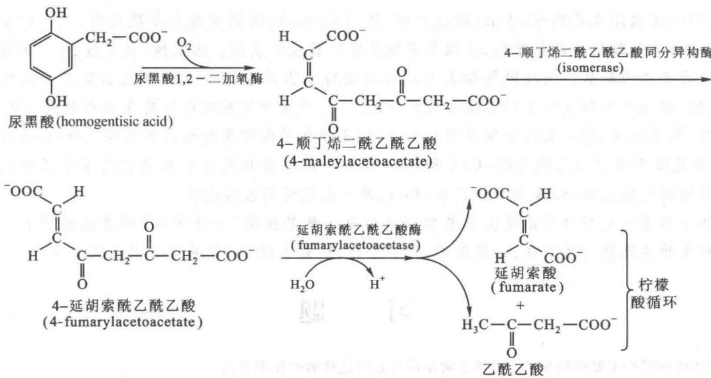  
图 25-42 酪氨酸代谢中间产物尿黑酸的氧化分解途径  
缺乏尿黑酸1,2-二加氧酶导致尿黑酸症

枫糖尿症(maple syrup urine disease)名称的来源并不是由于尿中有枫糖排出,而是患者的尿有类似枫糖的气味。患者血液及尿中出现大量支链氨基酸(缬氨酸、亮氨酸、异亮氨酸)及其相应酮酸,因此,又称为支链酮酸尿症。患者出生后约一周末出现症状,喂食困难、呕吐、昏睡等,出现广泛的大脑损伤,一般在周岁死亡。

## 提要

细胞不断地把氨基酸合成为蛋白质，又不断把蛋白质降解为其组成成分——氨基酸。这个过程有二重功能,其一是排除不正常的蛋白质,它们若一旦聚集,将对细胞有害;其二是通过排除积累过多的酶和调节蛋白,使细胞代谢得以秩序井然地进行。对正常蛋白质的降解,细胞是有选择性的。绝大多数的非正常蛋白质很可能基于它们的化学修饰及/或“这些分子不变性”而降解。细胞中蛋白质的降解速度还因它的营养及激素状态而有所差异。

真核细胞对蛋白质的降解有二个体系,一个是溶酶体系,另一个是以细胞溶胶为基础,依赖ATP的机制。溶酶体系含有约50种水解酶。溶酶体融合细胞中的自噬泡,随即分解其内溶物;溶酶体还能降解一些物质,这些物质是细胞的胞吞作用的目的物。溶酶体降解蛋白质是非选择性的,这个机制有着多样的生理功能。依赖ATP,以细胞溶胶为基础的机制,又称泛素标记选择性蛋白质降解。有选择性的蛋白质先以共价键与泛素连接,这个程序的目的是“标记”氨基酸的激活,它经过3步反应,泛素连接的蛋白质乃在ATP依赖的反应中由泛素结合降解酶——专一降解与泛素相接的蛋白质的水解酶催化而被降解。

氨基酸的分解代谢总是先脱去氨基。脱氨基的方式，不同生物不完全相同，氧化脱氨基作用普遍存在于动植物中，非氧化脱氨基作用主要见于微生物。转氨基作用是氨基酸脱去氨基的一种重要方式。不同氨基酸和 $\alpha-$ 酮戊二酸的转氨形成谷氨酸在氨基酸的分解代谢中占有重要地位。催化转氨基作用的酶称为转氨酶，以磷酸吡哆醛作为辅基。与转氨作用相偶联的反应有氨基酸的氧化脱氨基作用和嘌呤核苷酸循环。谷氨酸脱氢酶将谷氨酸脱去氨基形成 $\mathrm{NH}_{4}^{+}$ 和 $\alpha-$ 酮戊二酸。 $\mathrm{NAD}^{+}$ 或 $\mathrm{NADP}^{+}$ 是该反应的电子受体。陆生脊椎动物将脱下的氨合成尿素。嘌呤核苷酸循环将氨基酸的 $\alpha$ 氨基与次黄嘌呤核苷酸结合形成腺嘌呤核苷酸，再经水解脱下氨基形成 $\mathrm{NH}_{4}^{+}$ 。氨的运输形式是形成谷氨酰胺。

尿素的形成通过尿素循环,尿素的直接前体是精氨酸。精氨酸水解形成尿素和鸟氨酸,后者又与由氨、二氧化碳和 ATP 合成的氨甲酰磷酸作用,形成瓜氨酸。瓜氨酸又在天冬氨酸参与下,加入亚氨基形成精氨酸。

氨基酸的碳骨架进行氧化分解时,先形成能够进入柠檬酸循环的化合物。氨基酸可通过5条途径进入柠檬酸循环:通过形成乙酰-CoA、α-酮戊二酸、琥珀酰-CoA、延胡索酸和草酰乙酸,大多数氨基酸是生糖氨基酸,两种氨基酸是生酮氨基酸,少数氨基酸既能生糖也能生酮。丙氨酸、丝氨酸、半胱氨酸、甘氨酸、苏氨酸都能转变为丙酮酸。天冬酰胺和天冬氨酸都能转变为草酰乙酸。α-酮戊二酸是谷氨酸以及谷氨酰胺、组氨酸、脯氨酸和精氨酸5种氨基酸碳骨架的入口,后4种氨基酸都可转变为谷氨酸。琥珀酰-CoA是甲硫氨酸、异亮氨酸、缬氨酸部分碳原子的入口,这3种氨基酸都通过形成甲基丙二酰-CoA转变为琥珀酰-CoA。亮氨酸可转变为乙酰乙酰-CoA和乙酰-CoA。酪氨酸和苯丙氨酸通过两条途径进入柠檬酸循环。一条是通过乙酰乙酰-CoA再形成乙酰-CoA,另一条是延胡索酸途径。

生物体许多重要生物分子都是由氨基酸衍生而来。氨基酸是“一碳单位”的直接提供者。此外氨基酸还是多种生物活性物质的前体，如黑色素、儿茶酚胺、5-羟色胺、γ-氨基丁酸以及肌酸等。

## 习题

1. 动物体内有哪些主要的酶参加蛋白质水解反应？总结这些酶的作用特点。

2. 氨基酸脱氨基后的碳链如何进入柠檬酸循环？

3. 有一种遗传病人, 在血浆中异戊酸的含量增高, 可能影响了哪种氨基酸的代谢? 如果这种氨基酸及其 $\alpha$ -酮酸在血液中含量是正常的, 可能缺乏哪一种酶?

4. 写出苯丙氨酸在排氨动物和排尿素动物体内完全氧化时的平衡式，包括全部活化和能量贮存步骤。

5. 组氨酸分解代谢时,下面标出的原子会出现在谷氨酸的什么位置上?

6. 写出丙氨酸转变为乙酰乙酸和尿素的总平衡式。

7. 根据化学计算, 在尿素合成中消耗了 4 个高能磷酸键 ( $\sim P$ ), 在此反应中天冬氨酸转变为延胡索酸。假设延胡索酸又转回到天冬氨酸, 尿素合成的化学计算结果如何? 消耗了几个高能磷酸键?

8. 用成年大白鼠做同位素示踪实验,得到下面的结果:肌酸分子中的标记原子是由下面所列的一些前体而来,从这样的实验结果设计一条肌酸合成的可能途径。

$$
\begin{array}{r l} & \mathrm {H_3N^* - C - NH - (CH_2)_3 - CH - COO^- 精氨酸} \\ & \quad \Bigg | _ {\mathrm{NH}} \quad \quad \quad \quad \quad \quad \quad \quad \quad \quad \quad \quad \quad \quad \quad \quad \quad \quad \quad \quad \quad \quad \quad \quad \quad \quad \quad \text {肌酸} \\ & \mathrm {H_3C^* - N^* - CH_2 - COO^-} \\ & \uparrow \quad \quad \quad \quad \quad \quad \quad \quad \quad \quad \quad \quad \quad \quad \quad \quad \text {甘氨酸} \\ & \mathrm {H_3C^* - S - (CH_2)_2 - CH - COO^- 甲硫氨酸} \\ & \quad \quad \quad \quad \quad \quad \quad \quad \quad \quad \quad \quad \quad \quad \text {NH_2} \end{array}
$$

9. 说明尿素形成的机制和意义。

## 主要参考书目

1. Nelson D L, Cox M M. Lehninger Principles of Biochemistry. 6th ed. New York: W. H. Freeman and Company, 2012.

2. Ciechanover A, Hod Y, Hershko A. Biochem Biophys Res Commun, 2012, (425): 565-570.

3. Brusilow S. Urea Cycle Enzymes //The Metabolic & Molecular bases of Inherited Disease. New York: McGraw Hill, 2001: 1909-1963.

4. Umbarger H E. Amino Acid Biosynthesis and its Regulation. Ann. Rev. Biochem, 1978, (47): 553-606.

5. Cooper A J. Biochemistry of sulfur-containing amino acids. Ann. Rev. Biochem, 1983, (52): 187-222.

6. Hermann K M, Somerville R L. Amino Acids: Biosynthesis and genetic regulation. Upper Saddle River: Addison-Wesley, 1983.

(王镜岩 秦咏梅)

## 网上资源

习题答案 自测题

<!-- EN-BEGIN 第18章章末 -->

## 【英文对应 第18章章末】Amino Acid Oxidation and the Production of Urea：关键术语、习题与简答

> 来源：Lehninger Principles of Biochemistry（书籍/02_生物化学原理） 第18章章末，以及书末 Abbreviated Solutions to Problems 第18章。

### [EN] KEY TERMS

Terms in bold are defined in the glossary.

ammonotelic 626  
ureotelic 626  
uricotelic 626  
aminotransferases 628  
transaminases 628  
transamination 628  
pyridoxal phosphate (PLP) 629  
oxidative deamination 631  
L-glutamate  
dehydrogenase 631  
glutamine synthetase 631  
glutaminase 631  
glucose-alanine cycle 632  
urea cycle 633

urea 635  
creatine kinase 637  
essential amino acids 638  
ketogenic 640  
glucogenic 640  
tetrahydrofolate 641  
S-adenosylmethionine (adoMet) 641  
tetrahydrobiopterin 644  
phenylketonuria (PKU) 649  
mixed-function oxygenases 649  
alkaptonuria 650  
maple syrup urine disease 652

### [EN] PROBLEMS

1. Products of Amino Acid Transamination Name and draw the structure of the $\alpha$ -keto acid resulting when each of the four amino acids listed undergoes transamination with $\alpha$ -ketoglutarate: (a) aspartate, (b) glutamate, (c) alanine, (d) phenylalanine.

2. Measurement of Alanine Aminotransferase Activity The measurement of alanine aminotransferase activity (reaction rate) usually includes an excess of pure lactate dehydrogenase and NADH in the reaction system. The rate of alanine disappearance is equal to the rate of NADH disappearance measured spectrophotometrically. Explain how this assay works.

3. Alanine and Glutamine in the Blood Normal human blood plasma contains all the amino acids required for the synthesis of body proteins, but not in equal concentrations. Alanine and glutamine are present in much higher concentrations than any other amino acids. Suggest why.

4. Glutamate Dehydrogenase Function Increases in ATP levels in blood trigger insulin release by the pancreas, which in turn stimulates the uptake of blood glucose (see Chapter 23, p. 860). Knowing this, suggest why a mutation that prevents inhibition of glutamate dehydrogenase by GTP results in insulin release and hypoglycemia.

5. Distribution of Amino Nitrogen If your diet is rich in alanine but deficient in aspartate, will you show signs of aspartate deficiency? Explain.

6. Lactate versus Alanine as Metabolic Fuel: The Cost of Nitrogen Removal The three carbons in lactate and alanine have identical oxidation states, and animals can use either carbon source as a metabolic fuel. Compare the net ATP yield (moles of ATP per mole of substrate) for the complete oxidation (to $CO_{2}$ and $H_{2}O$ ) of lactate versus alanine when the cost of nitrogen excretion as urea is included.

7. Ammonia Toxicity Resulting from an Arginine-Deficient Diet In a study, cats were fasted overnight then given a single meal complete in all amino acids except arginine. Within 2 hours, blood ammonia levels increased from a normal level of $18\mu \mathrm{g} / \mathrm{L}$ to $140~\mu \mathrm{g} / \mathrm{L}$ , and the cats showed the clinical symptoms of ammonia toxicity. A control group fed a complete amino acid diet or an amino acid diet in which arginine was replaced by ornithine showed no unusual clinical symptoms.

(a) What was the role of fasting in the experiment?

(b) What caused the ammonia levels to rise in the experimental group? Why did the absence of arginine lead to ammonia toxicity? Is arginine an essential amino acid in cats? Why or why not? (c) Why can ornithine be substituted for arginine?

8. Oxidation of Glutamate Write a series of balanced equations and an overall equation for the net reaction describing the oxidation of 2 mol of glutamate to 2 mol of $\alpha$ -ketoglutarate and 1 mol of urea.

9. Transamination and the Urea Cycle Aspartate aminotransferase has the highest activity of all the mammalian liver aminotransferases. Why?

10. The Case against the Liquid Protein Diet A weight-reducing diet heavily promoted some years ago required the daily intake of a "liquid protein" soup made of hydrolyzed gelatin (derived from collagen), water, and an assortment of vitamins. All other food and drink were to be avoided. People on this diet typically lost 10 to 14 lb in the first week.

(a) Opponents argued that the weight loss was almost entirely due to water loss and would be regained very soon after a normal diet was resumed. What is the biochemical basis for this argument? (b) A few people on this diet died. What are some of the dangers inherent in the diet, and how can they lead to death?

11. Ketogenic Amino Acids Which amino acids are exclusively ketogenic?

12. A Genetic Defect in Amino Acid Metabolism: A Case History A two-year-old child was taken to the hospital. His mother said that he vomited frequently, especially after feedings. The child's weight and physical development were below normal. His hair, although dark, contained patches of white. A urine sample treated with ferric chloride (FeCl₃) gave a green color characteristic of the presence of phenylpyruvate. Quantitative analysis of urine samples gave the results shown in the table.

Concentration (mM)

<table><tr><td>Substance</td><td>Patient&#x27;s urine</td><td>Normal urine</td></tr><tr><td>Phenylalanine</td><td>7.0</td><td>0.01</td></tr><tr><td>Phenylpyruvate</td><td>4.8</td><td>0</td></tr><tr><td>Phenyllactate</td><td>10.3</td><td>0</td></tr></table>

(a) Suggest which enzyme might be deficient in this child. Propose a treatment.

(b) Why does phenylalanine appear in the urine in large amounts?
(c) What is the source of phenylpyruvate and phenyllactate? Why does this pathway (normally not functional) come into play when the concentration of phenylalanine rises?

(d) Why does the boy's hair contain patches of white?

13. Role of Cobalamin in Amino Acid Catabolism Pernicious anemia is caused by impaired absorption of vitamin B $_{12}$ . What is the effect of this impairment on the catabolism of amino acids? Are all amino acids equally affected? (Hint: See Box 17-2.)

14. Vegetarian Diets Vegetarian diets can provide high levels of antioxidants and a lipid profile that can help prevent coronary disease. However, there can be some associated problems. Blood samples were taken from a large group of volunteer subjects who were vegans (strict vegetarians: no animal products), lactovegetarians (vegetarians who eat dairy products), or omnivores (individuals with a varied diet, including meat). In each case, the volunteers had followed the diet for several years. The blood levels of both homocysteine and methylmalonate were elevated in the vegan group, somewhat lower in the lactovegetarian group, and much lower in the omnivore group. Explain.

15. Pernicious Anemia Vitamin B $_{12}$ deficiency can arise from a few rare genetic diseases that lead to low B $_{12}$ levels despite a normal diet that includes B $_{12}$ -rich meat and dairy sources. These conditions cannot be treated with dietary B $_{12}$ supplements. Explain.

16. Pyridoxal Phosphate Reaction Mechanisms Threonine can be broken down by the enzyme threonine dehydratase, which catalyzes the conversion of threonine to $\alpha$ -ketobutyrate and ammonia. The enzyme uses PLP as a cofactor. Suggest a mechanism for this reaction, based on the mechanisms in Figure 18-6. Note that this reaction includes an elimination at the $\beta$ carbon of threonine.

17. Pathway of Carbon and Nitrogen in Glutamate Metabolism When $[2-^{14}C,^{15}N]$ glutamate undergoes oxidative degradation in the liver of a rat, in which atoms of the following metabolites will each isotope be found? (a) urea (b) succinate (c) arginine (d) citrulline (e) ornithine (f) aspartate

  
Labeled glutamate

18. Chemical Strategy of Isoleucine Catabolism Isoleucine is degraded in six steps to propionyl-CoA and acetyl-CoA.

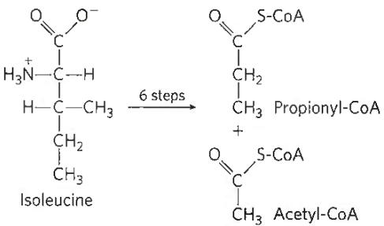

(a) The chemical process of isoleucine degradation includes strategies analogous to those used in the citric acid cycle and the $\beta$ oxidation of fatty acids. The intermediates of isoleucine degradation (1 to V) shown below are not in the proper order. Use your knowledge and understanding of the citric acid cycle and $\beta$ -oxidation pathway to arrange the intermediates in the proper metabolic sequence for isoleucine degradation.

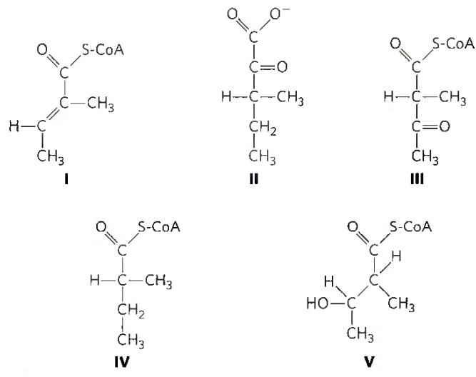

(b) For each step you propose, describe the chemical process, provide an analogous example from the citric acid cycle or $\beta$ -oxidation pathway (where possible), and indicate any necessary cofactors.

19. Role of Pyridoxal Phosphate in Glycine Metabolism The enzyme serine hydroxymethyltransferase requires pyridoxal phosphate as a cofactor. Propose a mechanism for the reaction catalyzed by this enzyme, in the direction of serine degradation (glycine production). (Hint: See Figs 18-19 and 18-20b.)

20. Parallel Pathways for Amino Acid and Fatty Acid Degradation The carbon skeleton of leucine is degraded by a series of reactions closely analogous to those of the citric acid cycle and $\beta$ oxidation. For each reaction, (a) through (f), shown below, indicate its type, provide an analogous example from the citric acid cycle or $\beta$ -oxidation pathway (where possible), and note any necessary cofactors.

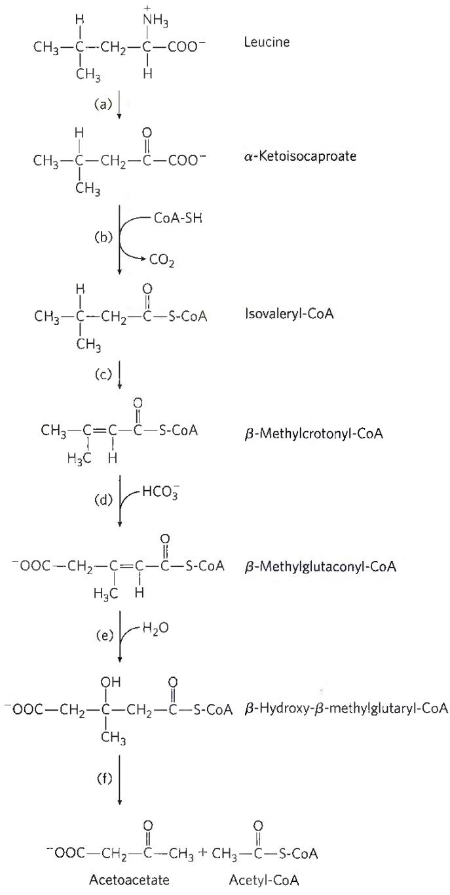

21. Treatments for a Genetic Disease The strict dietary controls required to stem the progress of maple syrup urine disease are difficult to follow for a lifetime, and patients may experience poor metabolic control that leads to neurological symptoms. In these cases, treatment can involve an organ transplant from a suitable donor. Organ transplantation involves considerable risk, but success can greatly alleviate this metabolic disorder and reduce the need for dietary restrictions. Which organ could be transplanted to gain this effect, and why?

### [EN] DATA ANALYSIS PROBLEM

22. Maple Syrup Urine Disease Figure 18-28 shows the pathway for the degradation of branched-chain amino acids and the site of the biochemical defect that causes maple syrup urine disease. The initial findings that eventually led to the discovery of the defect in this disease were presented in three papers published in the late 1950s and early 1960s. This problem traces the history of the findings from initial clinical observations to proposal of a biochemical mechanism.

Menkes, Hurst, and Craig (1954) presented the cases of four siblings, all of whom died following a similar course of symptoms. In all four cases, the mother's pregnancy and the birth had been normal. The first 3 to 5 days of each child's life were also normal. But soon thereafter each child began having convulsions, and the children died between the ages of 11 days and 3 months. Autopsy showed considerable swelling of the brain in all cases. The children's urine had a strong, unusual "maple syrup" odor, starting from about the third day of life.

Menkes (1959) reported data collected from six more children. All showed symptoms similar to those described above and died within 15 days to 20 months of birth. In one case, Menkes was able to obtain urine samples during the last months of the infant's life. When he treated the urine with 2,4-dinitrophenylhydrazone, which forms colored precipitates with keto compounds, he found three $\alpha$ -keto acids in unusually large amounts:

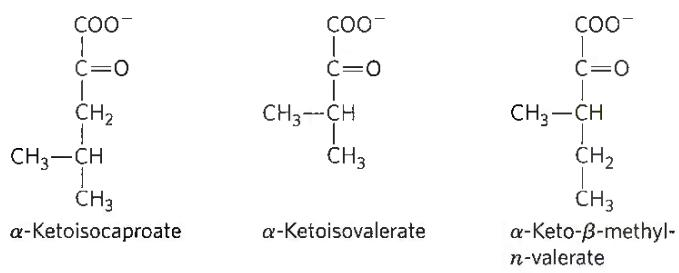

(a) These $\alpha$ -keto acids are produced by the deamination of amino acids. For each of the $\alpha$ -keto acids above, draw and name the amino acid from which it was derived.

Dancis, Levitz, and Westall (1960) collected further data that led them to propose the biochemical defect shown in Figure 18-28. In one case, they examined a patient whose urine first showed the maple syrup odor when he was 4 months old. At the age of 10 months (March 1956), the child was admitted to the hospital because he had a fever, and he showed grossly delayed motor development. At the age of 20 months (January 1957), he was readmitted and was found to have the degenerative neurological symptoms seen in previous cases of maple syrup urine disease; he died soon after. Results of his blood and urine analyses are shown in the table, along with normal values for each component.

<table><tr><td rowspan="3">Amino acid(s)</td><td colspan="3">Urine concentration (mg/24 h)</td><td colspan="2">Plasma concentration (mg/mL)</td></tr><tr><td>Normal</td><td colspan="2">Patient</td><td>Normal</td><td>Patient</td></tr><tr><td></td><td>Mar. 1956</td><td>Jan. 1957</td><td></td><td>Jan. 1957</td></tr><tr><td>Alanine</td><td>5–15</td><td>0.2</td><td>0.4</td><td>3.0–4.8</td><td>0.6</td></tr><tr><td>Asparagine and glutamine</td><td>5–15</td><td>0.4</td><td>0</td><td>3.0–5.0</td><td>2.0</td></tr><tr><td>Aspartic acid</td><td>1–2</td><td>0.2</td><td>1.5</td><td>0.1–0.2</td><td>0.04</td></tr><tr><td>Arginine</td><td>1.5–3</td><td>0.3</td><td>0.7</td><td>0.8–1.4</td><td>0.8</td></tr><tr><td>Cystine</td><td>2–4</td><td>0.5</td><td>0.3</td><td>1.0–1.5</td><td>0</td></tr><tr><td>Glutamic acid</td><td>1.5–3</td><td>0.7</td><td>1.6</td><td>1.0–1.5</td><td>0.9</td></tr><tr><td>Glycine</td><td>20–40</td><td>4.6</td><td>20.7</td><td>1.0–2.0</td><td>1.5</td></tr><tr><td>Histidine</td><td>8–15</td><td>0.3</td><td>4.7</td><td>1.0–1.7</td><td>0.7</td></tr><tr><td>Isoleucine</td><td>2–5</td><td>2.0</td><td>13.5</td><td>0.8–1.5</td><td>2.2</td></tr><tr><td>Leucine</td><td>3–8</td><td>2.7</td><td>39.4</td><td>1.7–2.4</td><td>14.5</td></tr><tr><td>Lysine</td><td>2–12</td><td>1.6</td><td>4.3</td><td>1.5–2.7</td><td>1.1</td></tr><tr><td>Methionine</td><td>2–5</td><td>1.4</td><td>1.4</td><td>0.3–0.6</td><td>2.7</td></tr><tr><td>Ornithine</td><td>1–2</td><td>0</td><td>1.3</td><td>0.6–0.8</td><td>0.5</td></tr><tr><td>Phenylalanine</td><td>2–4</td><td>0.4</td><td>2.6</td><td>1.0–1.7</td><td>0.8</td></tr><tr><td>Proline</td><td>2–4</td><td>0.5</td><td>0.3</td><td>1.5–3.0</td><td>0.9</td></tr><tr><td>Serine</td><td>5–15</td><td>1.2</td><td>0</td><td>1.3–2.2</td><td>0.9</td></tr><tr><td>Taurine</td><td>1–10</td><td>0.2</td><td>18.7</td><td>0.9–1.8</td><td>0.4</td></tr><tr><td>Threonine</td><td>5–10</td><td>0.6</td><td>0</td><td>1.2–1.6</td><td>0.3</td></tr><tr><td>Tryptophan</td><td>3–8</td><td>0.9</td><td>2.3</td><td>Not measured</td><td>0</td></tr><tr><td>Tyrosine</td><td>4–8</td><td>0.3</td><td>3.7</td><td>1.5–2.3</td><td>0.7</td></tr><tr><td>Valine</td><td>2–4</td><td>1.6</td><td>15.4</td><td>2.0–3.0</td><td>13.1</td></tr></table>

(b) The table includes taurine, an amino acid not normally found in proteins. Taurine is often produced as a byproduct of cell damage. Its structure is

$$
\mathrm{H} _ {3} \stackrel {+} {\mathrm{N}} - \mathrm{CH} _ {2} - \mathrm{CH} _ {2} - \stackrel {\mathrm{O}} {\mathrm{S}} - \mathrm{O} ^ {-}
$$

Based on its structure and the information in this chapter, what is the most likely amino acid precursor of taurine? Explain your reasoning.

(c) Compared with the normal values given in the table, which amino acids showed significantly elevated levels in the patient's blood in January 1957? Which ones in the patient's urine?

Based on their results and their knowledge of the pathway shown in Figure 18-28, Dancis and coauthors concluded that “although it appears most likely to the authors that the primary block is in the metabolic degradative pathway of the branched-chain amino acids, this cannot be considered established beyond question."

(d) How do the data presented here support this conclusion?
(e) Which data presented here do not fit this model of maple syrup urine disease? How do you explain these seemingly contradictory data?

(f) What data would you need to collect to be more secure in your conclusion?

### [EN] References

Dancis, J., M. Levitz, and R. Westall. 1960. Maple syrup urine disease: branched-chain ketoaciduria. Pediatrics 25:72–79.

Menkes, J.H. 1959. Maple syrup disease: isolation and identification of organic acids in the urine. Pediatrics 23:348–353.

Menkes, J.H., P.L. Hurst, and J.M. Craig. 1954. A new syndrome: progressive familial infantile cerebral dysfunction associated with an unusual urinary substance. Pediatrics 14:462–466.

### [EN] Abbreviated Solutions — Chapter 18

(a)

(b)

(c)

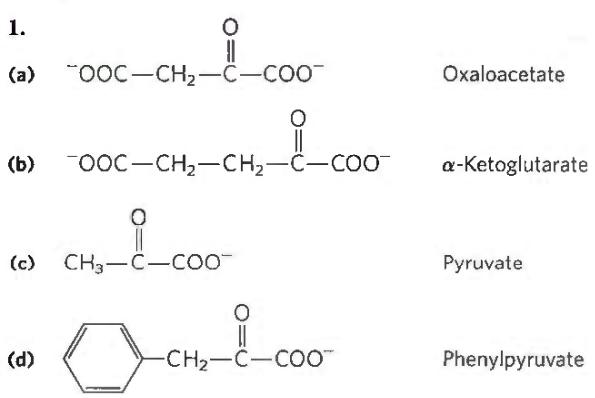

(d)

2. This is a coupled-reaction assay. The product of the slow transamination (pyruvate) is rapidly consumed in the subsequent "indicator reaction" catalyzed by lactate dehydrogenase, which consumes NADH. Thus the rate of disappearance of NADH is a measure of the rate of the aminotransferase reaction. The indicator reaction is monitored by observing the decrease in absorption of NADH at 340 nm with a spectrophotometer.

3. Alanine and glutamine play special roles in the transport of amino groups from muscle and from other nonhepatic tissues, respectively, to the liver.

4. GTP is a product of the citric acid cycle, generated in the second step after the formation of $\alpha$ -ketoglutarate. Elimination of the

#### [EN] AS-22 Abbreviated Solutions to Problems

GTP inhibition of glutamate dehydrogenase leads to unconproduction of $\alpha$ -ketoglutarate, which is oxidized to product levels of ATP. This in turn leads to insulin secretion.

5. No. The nitrogen in alanine can be transferred to oxaloa transamination, to form aspartate.

6. 15 mol of ATP per mol of lactate; 13 mol of ATP per mol when nitrogen removal is included

7. (a) Fasting resulted in low blood glucose; subsequent administration of the experimental diet led to rapid catabol of glucogenic amino acids. (b) Oxidative deamination cat rise in $\mathrm{NH}_3$ levels; the absence of arginine (an intermedia urea cycle) prevented conversion of $\mathrm{NH}_3$ to urea; arginine synthesized in sufficient quantities in the cat to meet the imposed by the stress of the experiment. This suggests that is an essential amino acid in the cat's diet. (c) Ornithine to arginine by the urea cycle.

8. $\mathrm{H}_2\mathrm{O} +$ glutamate $+\mathrm{NAD^{+}}\rightarrow \alpha$ -ketoglutarate $+\mathrm{NH}_{4}^{+} + \mathrm{NH}$ $\mathrm{NH_{4}^{+} + 2ATP + H_{2}O + CO_{2}\rightarrow carbamoyl phosphate + 2ADF}$

19. A likely mechanism is  

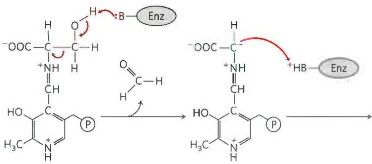

The formaldehyde (HCHO) produced in the second step reacts rapidly with tetrahydrofolate at the enzyme active site to produce $N^{5}, N^{10}$ -methylenetetrahydrofolate (see Fig. 18-17).

20. (a) Transamination; no analogies; PLP (b) Oxidative decarboxylation; analogous to oxidative decarboxylation of pyruvate to acetyl-CoA prior to entry into the citric acid cycle, and of $\alpha$ -ketoglutarate to succinyl-CoA in the citric acid cycle; $\mathrm{NAD^{+}}$ , FAD, lipoate, and TPP (c) Dehydrogenation (oxidation); analogous to dehydrogenation of succinate to fumarate in the citric acid cycle, and of fatty acyl-CoA to enoyl-CoA in $\beta$ oxidation; FAD (d) Carboxylation; no analogies in citric acid cycle or $\beta$ oxidation; ATP and biotin (e) Hydration; analogous to hydration of fumarate to malate in the citric acid cycle, and of enoyl-CoA to 3-hydroxyacyl-CoA in $\beta$ oxidation; no cofactors (f) Reverse aldol reaction; analogous to reverse of citrate synthase reaction in the citric acid cycle; no cofactors

21. Most amino acid catabolism occurs in the liver, including the key steps that are blocked in maple syrup urine disease. A liver transplant from a suitable donor with a normally functioning branched-chain $\alpha$ -keto acid dehydrogenase complex could alleviate disease symptoms.

22. (a) Leucine; valine; isoleucine (b) Cysteine (derived from cystine). If cysteine were decarboxylated as shown in Fig. 18-6, it would yield $\mathrm{H}_3\mathrm{N}-\mathrm{CH}_2-\mathrm{CH}_2-\mathrm{SH}$ , which could be oxidized to taurine.

(c) The January 1957 blood shows significantly elevated levels of isoleucine, leucine, methionine, and valine; the January 1957 urine, significantly elevated isoleucine, leucine, taurine, and valine. (d) All patients had high levels of isoleucine, leucine, and valine in both blood and urine, suggesting a defect in the breakdown of these amino acids. Given that the urine also contained high levels of the keto forms of these three amino acids, the block in the pathway must occur after deamination but before dehydrogenation (as shown in Fig. 18-28). (e) The model does not explain the high levels of methionine in blood and taurine in urine. The high taurine levels may be due to the death of brain cells during the end stage of the disease. However, the reasons for high levels of methionine in blood are unclear; the pathway of methionine degradation is not linked with the degradation of branched-chain amino acids. Increased methionine could be a secondary effect of buildup of the other amino acids. It is important to keep in mind that the January 1957 samples were from an individual who was dying, so comparing blood and urine results with those of a healthy individual may not be appropriate. (f) The following information is needed (and was eventually obtained by other workers): (1) The dehydrogenase activity is significantly reduced or missing in individuals with maple syrup urine disease. (2) The disease is inherited as a single-gene defect. (3) The defect occurs in a gene encoding all or part of the dehydrogenase. (4) The genetic defect leads to production of inactive enzyme.

<!-- EN-END 第18章章末 -->
