# 第 26 章 氨基酸的生物合成和生物固氮

> **本章英文对应内容**（Lehninger，插在所列中文小节末尾）
>
> - 第22章 Biosynthesis of Amino Acids, Nucleotides, and Related Molecules：章首导言（本章开头）、关键术语/习题/简答（本章末尾）
> - §22.1（第22章）→ 二、氨的同化作用——氨通过谷氨酸和谷氨酰胺掺入生物分子
> - §22.2（第22章）→ 四、氨基酸生物合成的调节
> - §22.3（第22章）→ 五、氨基酸转化为其他氨基酸及其他代谢物

<!-- EN-BEGIN 第22章导言 -->

### 【英文对应 第22章导言】Biosynthesis of Amino Acids, Nucleotides, and Related Molecules

> 来源：Lehninger Principles of Biochemistry（书籍/02_生物化学原理） 第22章章首（含章节目录与学习要点）。

#### [EN] BIOSYNTHESIS OF AMINO ACIDS, NUCLEOTIDES, AND RELATED MOLECULES

22.1 Overview of Nitrogen Metabolism 795  
22.2 Biosynthesis of Amino Acids 805  
22.3 Molecules Derived from Amino Acids 817  
22.4 Biosynthesis and Degradation of Nucleotides 823

Nitrogen ranks behind only carbon, hydrogen, and oxygen in its contribution to the mass of living systems. Most of this nitrogen is bound up in amino acids and nucleotides. In this chapter we address all aspects of the metabolism of these nitrogen-containing compounds except amino acid catabolism, which is the subject of Chapter 18.

In this final chapter covering anabolic processes, some of the underlying principles are unique, while others will be familiar from Chapter 21 and the consideration of gluconeogenesis in Chapter 14:

P1 Amino acids and nucleotides are the precursors to proteins and nucleic acids, respectively. They also give rise to numerous neurotransmitters, metabolic cofactors, and other molecules of biological importance.

P2 The supply of biologically available nitrogen can be limiting in many environments. Atmospheric $N_{2}$ is relatively inert and must be converted to other forms, such as ammonia and nitrate, to accommodate the requirements of life. A complex web of enzymatic processes, based primarily in microorganisms, interconverts the various molecular forms that comprise the global inventory of reactive nitrogen.

P3 Oxygen and nitrogen metabolism are interlinked. The oxidation and reduction of the various forms of nitrogen in the biosphere often involve oxygen.

P4 Regulation again plays an important role. Many of the processes covered in this chapter are regulated to carefully conserve a critical and limited resource. Tight regulation is needed to maintain balanced supplies of amino acids and nucleotides. The metabolic flux through most of these pathways is far less than for carbohydrate or lipid biosynthetic pathways; most amino acids and nucleotides are not stored, but are synthesized as they are needed.

The amino acids glutamate and glutamine represent the entry point where reactive forms of nitrogen are incorporated into biological systems. Reflecting their importance, the concentrations of these amino acids are sufficiently elevated in many tissues that they are major contributors to the electrochemical environment of cells. The prominent role of these two amino acids is a universal feature of animate nitrogen metabolism, yet another molecular manifestation of the shared evolutionary history of all organisms on the planet.

P6 Like other anabolic pathways, the reaction sequences in amino acid and nucleotide biosynthesis are endergonic and reductive. They use ATP as a source of metabolic energy and they use a reduced electron carrier (usually NADPH) as a reductant.

Discussing the biosynthetic pathways for amino acids and nucleotides together is a sound approach, not only because both classes of molecules contain nitrogen, but also because the two sets of pathways are extensively intertwined, with several key intermediates in common. Certain amino acids or parts of amino acids are incorporated into the structure of purines and pyrimidines, and in one case, part of a purine ring is incorporated into an amino acid (histidine). The two sets of pathways also share much common chemistry, in particular a preponderance of reactions involving the transfer of nitrogen or one-carbon groups.

The sheer number of steps and variety of intermediates in the pathways described here can be intimidating to the beginning biochemistry student. These pathways are best approached by maintaining a focus on metabolic principles we have already discussed, on key intermediates and precursors, and on common classes of reactions. Even a cursory look at the chemistry can be rewarding, for some of the most unusual chemical transformations in biological systems occur in these pathways; for instance, we find prominent examples of the rare biological use of the metals molybdenum, selenium, and vanadium. The effort also offers a practical dividend, especially for students of human or veterinary medicine. Many genetic diseases of humans and animals have been traced to an absence of one or more enzymes of amino acid and nucleotide metabolism, and many pharmaceuticals in common use to combat infectious diseases are inhibitors of enzymes in these pathways—as are a number of the most important agents in cancer chemotherapy.

<!-- EN-END 第22章导言 -->

## 一、生物固氮

氮是构成生命物质的基本元素,也是农业生产的基本肥料。尽管分子氮 $\left(\mathrm{N}_{2}\right)$ 占空气的79%,但因 $N\equiv N$ 键非常牢固,高等植物无法直接利用它。只有通过某些微生物把空气中游离的氮固定,转化为含氮化合物后植物方可利用。这种通过微生物将分子氮转化为含氮化合物的过程即称为生物固氮。

生物固氮的研究领域,包括生物固氮机制、共生固氮机制、固氮分子遗传及固氮微生物等等。从1862年发现生物固氮现象到目前为止,生物固氮的研究已有一百多年的历史。以生物固氮机制为主线,可以把这一百年的研究史大致分为三个时期。

第一个时期,从 1862 年到 1960 年,大约一百年,是细胞水平时期。在这漫长的历史时期内,生物固氮的研究,是用完整的细胞作为实验材料的。1888 年,贝杰林克(Beijierink)第一个从豆科植物中分离到根瘤菌。从此以后,各种各样的固氮微生物相继被分离鉴定出来。20 世纪初期,将圆褐固氮菌、根瘤菌等应用于农业,使一些农作物获得了明显的增产。由于当时实验材料摆脱不了完整的细胞,使生物固氮机制的研究受到了很大的限制,生物固氮机制的研究进展十分缓慢。虽然早在 1893 年维诺格拉得斯基(Winogradsky)就推测过, $NH_{3}$ 可能是生物固氮的产物,但是关于生物固氮的产物是不是 $NH_{3}$ 的问题,一直争论不休。1942 年,鲍利斯应用 $^{15}N$ 实验示踪确定了 $NH_{3}$ 是生物固氮的产物。

第二个时期,从 1960 年到 1966 年,是无细胞水平时期。在这一时期,生物固氮机制的研究,主要是用无细胞抽提液作为实验材料的。首先把固氮菌细胞粉碎,用超速离心分离,除去细胞的残渣碎片,得到无细胞的抽提液。然后,以此抽提液为实验材料,来研究生物固氮机制。

1960年，美国卡纳汉(Carnahan)等人，通过将丙酮酸加到巴氏梭菌的无细胞抽提液中，成功地实现了 $\mathrm{N}_2$ 还原成 $\mathrm{NH}_3$ 的试验，这一试验的成功，打破了长期以来生物固氮机制的研究摆脱不了完整细胞的困难局面，开辟了用无细胞抽提液研究生物固氮机制的新途径。1962年，莫顿森(Mortenson)等人发现，生物固氮必须有铁氧还蛋白作电子传递体，并从巴氏梭菌中得到了这种蛋白。1964年，哈迪等人直接明确地证明了生物固氮必须有ATP的参与。1965年，布伦(Bulen)等人发现， $\mathrm{Na}_2\mathrm{S}_2\mathrm{O}_4$ 可以代替由铁氧还蛋白、氢化酶和 $\mathrm{H}_{2}$ 所组成的电子供体系统。1966年，迪尔沃思(Dilworth)和肖勒霍恩(Schollhorn)同时发现了 $\mathrm{C}_2\mathrm{H}_2$ 可作为固氮酶的底物，并且创建了一个测定固氮酶活性的新方法——乙炔还原法。

第三个时期，从1966年到目前，是分子水平时期。1966年，布伦等和莫顿森等分别从棕色固氮菌和巴氏梭菌的抽提液中，得到了部分纯化的钼铁蛋白和铁蛋白制剂。1972年，伊迪（Eady）等人从肺炎克氏杆菌中分离到了纯的钼铁蛋白和铁蛋白制剂。固氮酶提纯的成功，得以使固氮酶结构与功能为中心的生物固氮机制的研究进入更本质的阶段。1992年，固氮酶的空间结构得到测定。

自然界中只有少数原核生物能固定原子态的氮。这些原核生物包括在土壤、空气和海洋中的蓝藻（blue-green algae）、一些自养型土壤细菌及豆科植物根瘤的共生固氮菌，能够将空气中的 $\mathrm{N}_2$ 还原为 $\mathrm{NH}_3$ （ $\mathrm{NH}_4^+$ ）。迄今已知的能固氮的生物属于原核生物，从其固氮类型来说，可分为两大类（图26-1）：其一为能独立生存的自生型固氮微生物，种类较多，包括细菌、放线菌类微生物和蓝藻等；其二为与其他植物共生的共生型固氮微生物。所有这些固氮微生物中最重要的是豆科植物的根瘤菌。形成的 $\mathrm{NH}_4^+$ ，由土壤中的微生物氧化为 $\mathrm{NO}_2^-$ 及 $\mathrm{NO}_3^-$ ，称为硝化作用（nitrification）。植物和许多微生物都含有硝酸及亚硝酸还原酶能将 $\mathrm{NO}_2^-$ 及 $\mathrm{NO}_3^-$ 再还原为 $\mathrm{NH}_4^+$ 。植物利用它作为合成氨基酸的氮源。动物则利用植物作为氨基酸的来源。

固氮微生物 $\left\{\begin{array}{l}\text { 共生型固氮微生物 } \left\{\begin{array}{l}\text { 豆科植物(如大豆、花生)的根瘤菌 } \\ \text { 非豆科植物(如木麻黄属、杨梅属)的根瘤菌 }\end{array}\right. \\ \text { 自主型固氮微生物 } \left\{\begin{array}{l}\text { 厌氧的巴氏梭菌,需氧固氮杆菌,光合细菌,兼性厌氧的克氏杆菌, } \\ \text { 厌氧和光合自养的蓝藻,需氧和光合自养的细菌 }\end{array}\right.\end{array}\right.$

图26-1 固氮生物的类型

氮还原为 $NH_{4}^{+}$ 的反应是放能反应：

$$
\mathrm{N} _ {2} + 3 \mathrm{H} _ {2} \longrightarrow 2 \mathrm{NH} _ {3} \quad \Delta G ^ {\ominus^ {\prime}} = - 3 3. 5 \mathrm{kJ/mol}
$$

虽然 $N_{2}$ 是不易参与反应的惰性气体，在机体酶的催化下固氮反应却有极高的活化能促使过程进行。生物固氮反应是由固氮酶复合体（nitrogenase complex）催化完成的。它由两个主要组分构成：固氮酶还原酶（dinitrogenase reductase）和固氮酶（dinitrogenase）。还原酶又称铁蛋白，相对分子质量 60 000～64 000，具有相同亚基的二聚体，每个亚基含有一个铁硫 [4Fe-4S] 中心，可接受或给出一个电子，还有两个结合 ATP/ADP 的位点。固氮酶又称铁钼蛋白，相对分子质量 220 000～240 000，由两种不同亚基组成的四聚体 $(\alpha_{2}\beta_{2})$ ，并含有 2 个钼原子 (Mo)，32 个铁 (Fe) 原子和 30 个硫 (S) 原子。已发现存在一种含钒 (V, canadium)，而不是含钼的固氮酶。有些固氮菌可产生这两种类型的固氮酶。

固氮酶复合体的还原酶能使电子具有高的还原力。而固氮酶则利用高的还原力电子将 $N_{2}$ 还原为 $NH_{3}$ 。电子从还原酶到固氮酶的转移需消耗 ATP 分子。固氮酶催化的固氮作用共需要 8 个电子参与反应。由 $N_{2}$ 还原为 $NH_{3}$ ，需要 6 个电子参与反应，另 2 个电子参与 $H_{2}$ 的生成：

$$
\mathrm{N} _ {2} + 8 \mathrm{e} ^ {-} + 8 \mathrm{H} ^ {+} \longrightarrow 2 \mathrm{NH} _ {3} + \mathrm{H} _ {2}
$$

生物固氮化学反应的总计量式如下：

$$
\mathrm{N} _ {2} + 8 \mathrm{e} ^ {-} + 1 6 \mathrm{ATP} + 1 6 \mathrm{H} _ {2} \mathrm{O} \longrightarrow 2 \mathrm{NH} _ {3} + \mathrm{H} _ {2} + 1 6 \mathrm{ADP} + 1 6 \mathrm{Pi} + 8 \mathrm{H} ^ {+}
$$

所需的8个高势能电子来自还原型的铁氧还蛋白（ferredoxin）。铁氧还蛋白的电子或由叶绿体中的光合系统I产生，或是在电子传递的氧化中产生（图26-2）。固氮酶复合体对 $\mathrm{O}_2$ 的抑制作用非常敏感。氧会不可逆地破坏固氮酶组分的结构，因此固氮酶的催化反应需在厌氧环境下进行。在这个过程中ATP起着催化作用而不是发挥热动力学效应。ATP不仅通过水解一个或多个磷酸键提供化学能，而且也能通过非共价键结合的结合能来降低反应活化能。在固氮酶复合体还原酶的反应中，ATP的结合和水解可引起蛋白质构象发生明显的变化以提供固氮所需的高活化能。ATP结合到还原酶可使还原电势从-250mV降低到-400mV，提高电子转移到固氮酶所需要的还原电势。

  
图26-2 固氮酶催化下 $\mathbf{N}_2$ 还原为 $\mathrm{NH}_3$ 中的电子转移

## 二、氨的同化作用——氨通过谷氨酸和谷氨酰胺掺入生物分子

由固氮作用形成的氨是合成氨基酸所需氨基的来源。氨不仅给氨基酸提供氨基，也是其他含氮生物分子的氮源。在将氨引入氨基酸分子中起中介作用的有两个氨基酸，即谷氨酸和谷氨酰胺。通过转氨基作用，谷氨酸提供氨基使之形成许多其他氨基酸。谷氨酰胺的酰胺氮则是生物合成中广泛的氨基提供者。

氨在动物、植物、微生物中都存在的同化途径是通过谷氨酸脱氢酶的作用，使 $\alpha-$ 酮戊二酸还原、氨化形成谷氨酸。这一途径虽然普遍存在，但并不是主要的。L-谷氨酸脱氢酶在不同生物种属甚至同一物种不同组织中队辅酶 NADH 或 NADPH 的要求不尽一致，也有的无选择性。L-谷氨酸脱氢酶催化的反应表示如下：

$$
\alpha \mathrm{-酮戊二酸} + \mathrm{NH} _ {4} ^ {+} + \mathrm{NADPH} \longrightarrow \mathrm{L-谷氨酸} + \mathrm{NADP} ^ {+} + \mathrm{H} _ {2} \mathrm{O}
$$

在真核细胞中，L-谷氨酸脱氢酶定位于线粒体。反应平衡倾向于反应物的方向，对 $NH_{4}^{+}$ 的 $K_{M}$ 值相当高（大约为 mmol/L），因而这个反应将 $NH_{4}^{+}$ 引入到氨基酸及其他代谢物中所起的作用不大。谷氨酸脱氢酶在反应中要求 $NH_{4}^{+}$ 的浓度非常高，因此只有当土壤中加入大量的 $NH_{3}$ 或者在提供高氮的实验条件下，这个反应才能对谷氨酸的产生起到决定性作用。

生物体中最重要的同化氨的途径是谷氨酰胺合成酶(glutamine synthetase)催化的由谷氨酸形成谷氨酰胺。该反应发生在酶分子上分2步进行。第一步先形成 $\gamma-$ 谷氨酰磷酸，然后由 $\mathrm{NH}_{4}^{+}$ 取代其磷酸基团形成谷氨酰胺。

$$
\mathrm{谷氨酸} + \mathrm{ATP} \longrightarrow \gamma - \mathrm{谷氨酰磷酸} + \mathrm{ADP}
$$

$$
\gamma \text {-谷氨酰磷酸} + \mathrm{NH} _ {4} ^ {+} + \mathrm{ATP} \longrightarrow \text {谷氨酰胺} + \mathrm{Pi} + \mathrm{H} ^ {+}
$$

$$
\text {   总反应式:谷氨酸   } + \mathrm{NH} _ {4} ^ {+} + \mathrm{ATP} \longrightarrow \text {   谷氨酰胺   } + \mathrm{ADP} + \mathrm{Pi} + \mathrm{H} ^ {+}
$$

谷氨酰胺除了在细菌中吸收 $NH_{4}^{+}$ ，对哺乳动物机体还有重要的生理作用，它将机体有毒的氨转变为无毒的谷氨酰胺。

在细菌和植物中,谷氨酰胺提供氨基给 $\alpha-$ 酮戊二酸,由谷氨酸合酶(glutamate synthase,动物体内部存在此酶)催化形成2分子谷氨酸:

$$
\alpha - \text { 酮   戊   二   酸 } + \text { 谷   氨   酰   胺 } + \mathrm{NADPH} + \mathrm{H} ^ {+} \longrightarrow 2 \text { 谷   氨   酸 } + \mathrm{NADP} ^ {+}
$$

在原核生物中,当环境中的氨浓度降低时,谷氨酰胺合成酶和谷氨酸合酶联合作用,谷氨酰胺合成酶可将氨与谷氨酸合成谷氨酰胺,再由谷氨酸合酶催化产生谷氨酸,净反应式表示如下:

$$
\alpha \mathrm{-酮戊二酸} + \mathrm{NH} _ {4} ^ {+} + \mathrm{NADPH} + \mathrm{ATP} \rightarrow \mathrm{谷氨酸} + \mathrm{NADP} ^ {+} + \mathrm{ADP} + \mathrm{Pi}
$$

对于大多数原核生物, 当 $NH_{4}^{+}$ 的浓度低时, 仍可进行由 $\alpha-$ 酮戊二酸形成谷氨酸的反应。因为谷氨酰胺合成酶对 $NH_{4}^{+}$ 的 $K_{M}$ 值远远低于谷氨酸脱氢酶对的对 $NH_{4}^{+}$ 的 $K_{M}$ 值。

谷氨酰胺合成酶由 12 个相同的亚基组成, 每个亚基的相对分子质量为 50 000。它受到别构效应、共价修饰以及反馈效应的多重调节。而且各种抑制效应对酶的抑制可以加合。因此该酶对控制谷氨酰胺的水平起着关键作用。

<!-- EN-BEGIN 22.1 -->

### 【英文对应 22.1】Overview of Nitrogen Metabolism

> 来源：Lehninger Principles of Biochemistry（书籍/02_生物化学原理） 第22章 Biosynthesis of Amino Acids, Nucleotides, and Related Molecules，§22.1。对应本章“二、氨的同化作用——氨通过谷氨酸和谷氨酰胺掺入生物分子”。

The biosynthetic pathways leading to amino acids and nucleotides share a requirement for nitrogen. Soluble, biologically useful nitrogen compounds are generally scarce in natural environments; thus, most organisms use ammonia, amino acids, and nucleotides economically. P2 Available amino acids, purines, and pyrimidines formed during metabolic turnover of proteins and nucleic acids are often salvaged and reused. We begin by examining the pathways by which nitrogen from the environment is introduced into biological systems.

#### [EN] A Global Nitrogen Cycling Network Maintains a Pool of Biologically Available Nitrogen

The movement of nitrogen through the biosphere has been viewed historically as a cycle. However, our evolving understanding of the complexity of nitrogenous interconversions makes it clear that nitrogen moves through a complex web, rather than in a neat cycle (Fig. 22-1). Earth's atmosphere is four-fifths molecular nitrogen $(\mathrm{N}_2)$ . However, $\mathbf{N}_2$ is too unreactive to be of use to living organisms. Conversion of $\mathbf{N}_2$ to forms that can support life $(\mathrm{NH}_3,\mathrm{NO}_2^-, \mathrm{NO}_3^-)$ is called nitrogen fixation. The reduction of $\mathbf{N}_2$ to $\mathrm{NH}_3$ plays such a central role in making $\mathbf{N}_2$ available that this one reaction is often considered synonymous with nitrogen fixation. In the biosphere, the metabolic processes of countless species function interdependently to salvage and reuse biologically available nitrogen. Most of the key reactions are carried out by bacteria and archaea.

  
FIGURE 22-1 The global nitrogen web. The total amount of nitrogen fixed annually in the biosphere exceeds $10^{11}\mathrm{kg}$ ; industrial sources of fixed nitrogen are now nearly as great. Reactions are identified with the processes they are involved in by colored arrows (see key). The oxidation number of the N atom is indicated on the vertical axis. [Information from M. M. M. Kuypers et al., Nat. Rev. Microbiol. 16:263, 2018, Fig. 1.]

The reduction of atmospheric nitrogen ( $N_{2}$ ) by nitrogen-fixing bacteria and archaea to yield ammonia ( $NH_{3}$ or $NH_{4}^{+}$ ), provides a useful anchor for our discussion. This critical process, described in detail in Section 22.2, provides most of the reduced nitrogen for incorporation into biomolecules.

Free ammonia does not build up, and reduction is balanced by oxidation. P3 Bacteria that derive their energy by oxidizing ammonia to nitrite (NO $_{2}^{-}$ ) and ultimately nitrate (NO $_{3}^{-}$ ) are abundant and active in both terrestrial and marine environments. The processes of converting ammonia to nitric oxide, nitrite, and finally nitrate are known as nitrification (Fig. 22-1, purple arrows). Individual bacterial or archaeal species may promote one or more of these steps.

Atmospheric $N_{2}$ must be replaced in order to maintain levels at a steady-state concentration. Some of the replacement comes from reduction of nitrate and nitrite. The reduction of nitrate and nitrite to $N_{2}$ under anaerobic conditions, a process called denitrification (Fig. 22-1, red arrows), is carried out by specialized microorganisms in all three domains of life. These organisms use $NO_{3}^{-}$ or $NO_{2}^{-}$ rather than $O_{2}$ as the ultimate electron acceptor in a series of reactions that (like oxidative phosphorylation) generates a transmembrane proton gradient, which is used to synthesize ATP. These microorganisms exist in all anoxic environments where nitrate is present, including soils, marine sediments, and eutrophic marine zones. An alternative path back to atmospheric $N_{2}$ is provided by a group of bacteria that promote anaerobic ammonia oxidation, or anammox (Fig. 22-1, blue arrows). Anammox converts ammonia and nitrite to $N_{2}$ . As much as 50% to 70% of the $NH_{3}-to-N_{2}$ conversion in the biosphere may occur through this pathway, which went undetected until the 1980s. The obligate anaerobes that promote anammox are fascinating in their own right and are providing some useful solutions to waste-treatment problems (Box 22-1).

Fixation of atmospheric $N_{2}$ is not the only source of reduced ammonia for biological systems. Much of it comes from an alternative fate of nitrate that circumvents denitrification. More than 90% of the $NH_{4}^{+}$ generated by vascular plants, algae, and microorganisms comes from nitrate assimilation, a two-step reductive process that bypasses atmospheric $N_{2}$ . First $NO_{3}^{-}$ is reduced to $NO_{2}^{-}$ by nitrate reductase, then the $NO_{2}^{-}$ is reduced to $NH_{4}^{+}$ in a six-electron transfer catalyzed by nitrite reductase (Fig. 22-2). Both reactions involve chains of electron carriers and cofactors we have not yet encountered. Nitrate reductase is a large, soluble protein ( $M_{r}$ 220,000). Within the enzyme, a pair of electrons, donated by NADH, flows through —SH groups of cysteine, FAD, and a cytochrome (cyt $b_{557}$ ), then to a novel cofactor containing molybdenum, before reducing the substrate $NO_{3}^{-}$ to $NO_{2}^{-}$ .

The nitrite reductase of plants is located in the chloroplasts and receives its electrons from ferredoxin (which is reduced in the light-dependent reactions of photosynthesis; see Section 20.2). Six electrons, donated one at a time by ferredoxin, pass through a 4Fe-4S center in the enzyme, then through a novel hemelike molecule (siroheme) before reducing $\mathrm{NO}_2^-$ to $\mathrm{NH}_4^+$ (Fig. 22-2). Nonphotosynthetic microbes possess a distinct nitrite reductase for which NADPH is the electron donor.

Human activity presents an increasing challenge to the global nitrogen balance, and to all life in the biosphere supported by that balance. P2 Fixed nitrogen is increasingly necessary to boost production in agriculture. Industrial nitrogen-based fertilizers now contribute as much ammonia and other reactive nitrogen species to the biosphere as do natural processes. Nonfarming manufacturing activity releases additional reactive nitrogen into the atmosphere, including nitric oxide, a prominent greenhouse gas. Controlling the damaging effects of agricultural runoff and industrial pollutants will remain an important component of the continuing effort to expand the food supply for a growing human population.

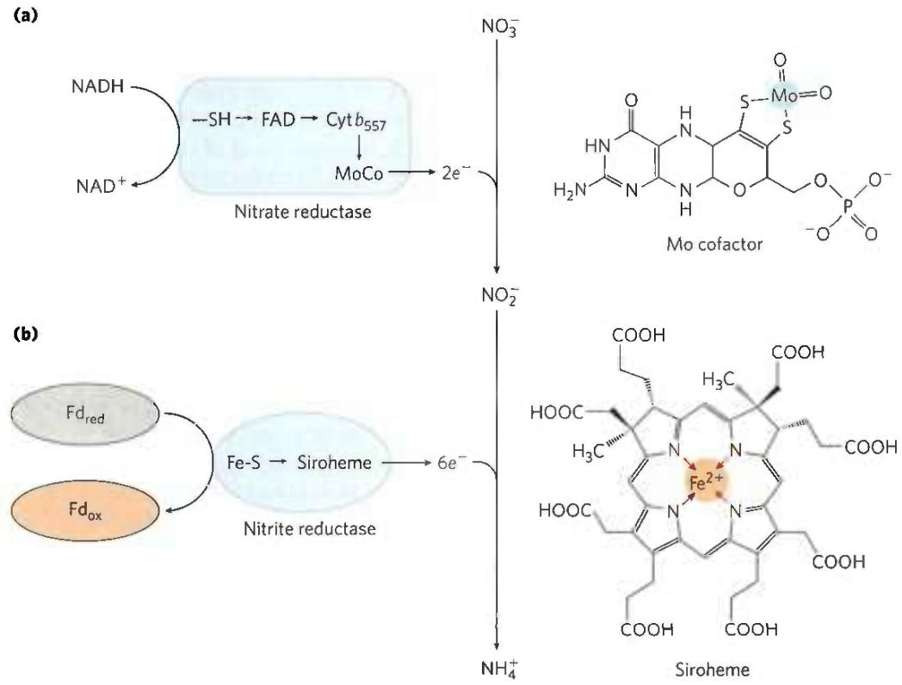  
FIGURE 22-2 Nitrate assimilation by nitrate reductase and nitrite reductase. (a) Nitrate reductases of plants and bacteria catalyze the two-electron reduction of $\mathrm{NO}_3^-$ to $\mathrm{NO}_2^-$ , in which a novel Mo-containing cofactor plays a central role. NADH is the electron donor. (b) Nitrite reductase

converts the product of nitrate reductase into $NH_{4}^{+}$ in a six-electron, eight-proton transfer process in which the metallic center in siroheme carries electrons and the carboxyl groups of siroheme may donate protons. The initial source of electrons is reduced ferredoxin.  

#### [EN] Nitrogen Is Fixed by Enzymes of the Nitrogenase Complex

The availability of fixed nitrogen, an essential nutrient, may have limited the size of the primordial biosphere. As early cells acquired a capacity to fix atmospheric nitrogen, the biosphere expanded. Evidence for biological nitrogen fixation has been found in sedimentary rocks more than 3 billion years old.

In the biosphere of today, only certain bacteria and archaea can fix atmospheric $N_{2}$ . These organisms, called diazotrophs, include the cyanobacteria of soils and fresh and salt waters, methanogenic archaea (strict anaerobes that obtain energy and carbon by converting $H_{2}$ and $CO_{2}$ to methane), other kinds of free-living soil bacteria such as Azotobacter species, and the nitrogen-fixing bacteria that live as symbionts in the root nodules of leguminous plants. The most important product of nitrogen fixation is ammonia, which can be used by all organisms either directly or after its conversion to other soluble compounds such as nitrites, nitrates, or amino acids.

The reduction of nitrogen to ammonia is an exergonic reaction:

$$
\mathrm{N} _ {2} + 3 \mathrm{H} _ {2} \longrightarrow 2 \mathrm{NH} _ {3} \quad \Delta G ^ {\prime \circ} = - 3 3. 5 \mathrm{kJ/mol}
$$

The N≡N triple bond, however, is very stable, with a bond energy of 930 kJ/mol. Nitrogen fixation therefore has an extremely high activation energy, and atmospheric nitrogen is almost chemically inert under normal conditions. Ammonia is produced industrially by the Haber process (named for its inventor, Fritz Haber), which requires temperatures of 400 to 500 °C and nitrogen and hydrogen at pressures of tens of thousands of kilopascals (several hundred atmospheres) to provide the necessary activation energy.

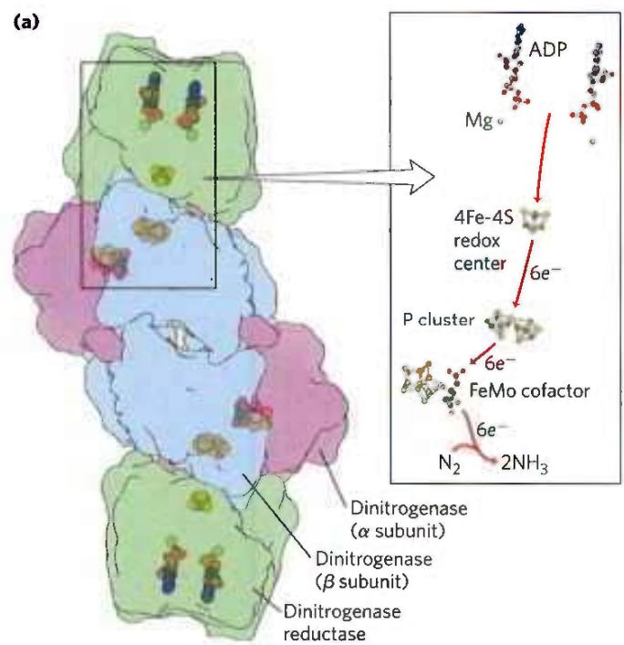  
(b)

  
FIGURE 22-3 Enzymes and cofactors of the nitrogenase complex. (a) The holoenzyme consists of two identical dinitrogenase reductase molecules (green), each with a 4Fe-4S redox center and binding sites for two ATP, and two identical dinitrogenase heterodimers (purple and blue), each with a P cluster (Fe-S center) and an FeMo cofactor. In this structure, ADP is bound in the ATP site, to make the crystal more stable. (b) The electron-transfer cofactors. A P cluster is

Biological nitrogen fixation must occur at biological temperatures and at 0.8 atm of nitrogen, and the high activation barrier is overcome by other means. This is accomplished, at least in part, by the binding and hydrolysis of ATP. The overall reaction can be written

$$
\begin{array}{r l} \mathrm{N} _ {2} + 1 0 \mathrm{H} ^ {+} + 8 e ^ {-} + 1 6 \mathrm{ATP} & \longrightarrow \\ & 2 \mathrm{NH} _ {4} ^ {+} + 1 6 \mathrm{ADP} + 1 6 \mathrm{P} _ {\mathrm{i}} + \mathrm{H} _ {2} \end{array}
$$

Biological nitrogen fixation to produce ammonia is carried out by a highly conserved complex of proteins called the nitrogenase complex; its central components are dinitrogenase reductase and dinitrogenase (Fig. 22-3a). Dinitrogenase reductase ( $M_{r}$ 60,000) is a dimer of two identical subunits. It contains a single 4Fe-4S redox center (see Fig. 19-5), bound between the subunits, and can be oxidized and reduced by one electron. It also has two binding sites for ATP/ADP (one site on each subunit). Dinitrogenase ( $M_{r}$ 240,000), an $\alpha_{2}\beta_{2}$ tetramer, has two Fe-containing cofactors that transfer electrons (Fig. 22-3b). One, the P cluster, has a pair of 4Fe-4S centers; these share a sulfur atom, making an

  
shown here in its reduced (top) and oxidized (middle) forms. The FeMo cofactor (bottom) has a Mo atom with three S ligands, a His ligand, and two oxygen ligands from a molecule of homocitrate. In some organisms, the Mo atom is replaced with a vanadium atom. (Fe is shown in orange, S in yellow.) [Data from (a) PDB ID 1N2C, H. Schindelin et al., Nature 387:370, 1997; (b) $P_{\mathrm{red}}$ ; PDB ID 3MIN, and $P_{\mathrm{ox}}$ ; PDB ID 2MIN, J. W. Peters et al., Biochemistry 36:1181, 1997; FeMo cofactor: PDB ID 1MIN, O. Einsle et al., Science 297:1696, 2002.]

#### [EN] Unusual Lifestyles of the Obscure but Abundant

Air-breathers that we are, we can easily overlook the bacteria and archaea that thrive in anaerobic environments. Although rarely featured in introductory biochemistry textbooks, these organisms constitute much of the biomass of this planet, and their contributions to the balance of carbon and nitrogen in the biosphere are essential to all forms of life.

As detailed in earlier chapters, the energy used to maintain living systems relies on the generation of proton gradients across membranes. Electrons derived from a reduced substrate are made available to electron carriers in membranes and pass through a series of electron transfers to a final electron acceptor. As a byproduct of this process, protons are released on one side of the membrane, generating the transmembrane proton gradient. The proton gradient is used to synthesize ATP or to drive other energy-requiring processes. For all eukaryotes, the reduced substrate is generally a carbohydrate (glucose or pyruvate) or a fatty acid and the electron acceptor is oxygen.

Many bacteria and archaea are much more versatile. In anaerobic environments such as marine and freshwater sediments, the variety of life strategies is extraordinary. Almost any available redox pair can be an energy source for some specialized organism or group of organisms. For example, a large number of lithotrophic bacteria (a lithotroph is a chemotroph that uses inorganic energy sources) have a hydrogenase that uses molecular hydrogen to reduce $NAD^{+}$ :

$$
\mathrm{H} _ {2} + \mathrm{NAD} ^ {+} \xrightarrow {\text { hydrogenase }} \mathrm{NADH} + \mathrm{H} ^ {+}
$$

The NADH is a source of electrons for a variety of membrane-bound electron acceptors, generating the proton gradient needed for ATP synthesis. Other lithotrophs oxidize sulfur compounds ( $H_{2}S$ , elemental sulfur, or thiosulfate) or ferrous iron. A widespread group of archaea called methanogens, all strict anaerobes, extract energy from the reduction of $CO_{2}$ to methane. And this is just a small sampling of what anaerobic organisms do for a living. Their metabolic pathways are replete with interesting reactions and highly specialized cofactors unknown in our own world of obligate aerobic metabolism. Study of these organisms can yield practical dividends. It can also provide clues about the origins of life on an early Earth, in an atmosphere that lacked molecular oxygen.

The web of reactions that defines nitrogen utilization in the biosphere depends on a wide range of specialized bacteria. Some nitrifying bacteria oxidize ammonia to nitrites, and some oxidize the resulting nitrites to nitrates (see Fig. 22-1, purple arrows). Nitrate is second only to $\mathrm{O}_2$ as a biological electron acceptor, and a great many bacteria and archaea can catalyze the denitrification of nitrates and nitrites to nitrogen, which the nitrogen-fixing bacteria then convert back into ammonia. Ammonia is a major pollutant in sewage and in farm animal waste, and it is a byproduct of fertilizer manufacture and oil refining. Waste-treatment plants have generally made use of communities of nitrifying and denitrifying bacteria to convert ammonia waste to atmospheric nitrogen. The process is expensive, requiring inputs of organic carbon and oxygen.

In the 1960s and 1970s, a few articles appeared in the research literature suggesting that ammonia could be oxidized to nitrogen anaerobically, using nitrite as an electron acceptor; this process was called anammox. The reports received little notice until bacteria promoting anammox were discovered in a waste-treatment system in Delft, the Netherlands, in the mid-1980s. A team of Dutch microbiologists led by Gijs Kuenen and Mike Jetten began to study these bacteria, which were soon identified as belonging to an unusual bacterial phylum, Planctomycetes. Some surprises were to follow.

  
FIGURE 1 The anammox reactions. Ammonia and hydroxylamine are converted to hydrazine and $\mathsf{H}_2\mathsf{O}$ by hydrazine hydrolase, and the hydrazine is oxidized by hydrazine-oxidizing enzyme, generating $\mathsf{N}_2$ and protons. The protons create a proton gradient for ATP synthesis. On the anammoxosome exterior, protons are used by the nitrite-reducing enzyme, producing hydroxylamine and completing the cycle. All of the anammox enzymes are embedded in the anammoxosome membrane. [Information from L.A.van Nifrik et al., FEMS Microbiol. Lett. 233:10, 2004, Fig. 4.]

  
(b)

  
FIGURE 2 (a) Ladderane lipids of the anammoxosome membrane. The mechanism for synthesis of the unstable fused cyclobutane ring structures is unknown. (b) Ladderanes can stack to form a very dense,

The biochemistry underlying the anammox process was slowly unraveled (Fig. 1). Hydrazine $(\mathsf{N}_2\mathsf{H}_4)$ , a highly reactive molecule used as a rocket fuel, was an unexpected intermediate. As a small molecule, hydrazine is both highly toxic and difficult to contain. It readily diffuses across typical phospholipid membranes. The anammox bacteria solve this problem by sequestering hydrazine in a specialized organelle, dubbed the anammoxosome. The membrane of this organelle is composed of lipids known as ladderanes (Fig. 2), never before encountered in biology. The fused cyclobutane rings of ladderanes stack tightly to form a very dense barrier, greatly slowing the release of hydrazine. Cyclobutane rings, with their unusual bond angles, are strained and difficult to synthesize; the bacterial mechanisms for synthesizing these lipids are not yet known.

The anammoxosome was a surprising finding. Bacterial cells generally do not have compartments, and the lack of a membrane-enclosed nucleus is often cited as the primary distinction between eukaryotes and bacteria. One type of organelle in a bacterium was interesting enough, but microbiologists also found that planctomycetes have a nucleus: their chromosomal DNA is contained within a membrane (Fig. 3). Planctomycetes are an ancient bacterial line with multiple genera, three of which are known to carry out the anammox reactions. Discovery of this subcellular organization has prompted further research to trace the origin of the planctomycetes and the evolution of eukaryotic nuclei. Further study of this group may ultimately bring us closer to a key goal of evolutionary biology: a description of the organism affectionately referred to as LUCA — the last universal common ancestor of all life on our planet.

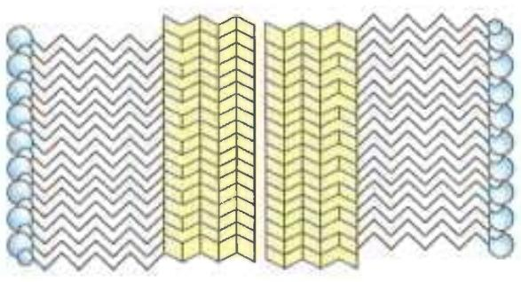

impermeable, hydrophobic membrane structure, allowing sequestration of the hydrazine produced in the anammox reactions. [Information from L. A. van Nifrik et al., FEMS Microbiol. Lett. 233:7, 2004, Fig. 3.]  
  
FIGURE 3 Transmission electron micrograph of a cross section through Gemmata obscuriglobus, showing the DNA in a nucleus (N) with enclosing nuclear envelope (NE). Bacteria of the Gemmata genus (phylum Planctomycetes) do not promote the anammox reactions. [Provided by John Fuerst from R. Lindsay et al, Arch. Microbiol. 175:413, 2001, Fig. 6a. © Springer-Verlag, 2001.]

For now, the anammox bacteria offer a major advance in waste treatment, reducing the cost of ammonia removal by as much as 90% (the conventional denitrification steps are eliminated completely, and the aeration costs associated with nitrification are lower) and reducing the release of polluting byproducts. Clearly, a greater familiarity with the bacterial underpinnings of the biosphere can pay big dividends as we deal with the environmental challenges of the twenty-first century.

8Fe-7S center. The second cofactor in dinitrogenase, the FeMo cofactor, is a novel structure composed of 7 Fe atoms, 9 inorganic S atoms, a Cys side chain, and a single carbon atom in the center of the FeS cluster. Also part of the cofactor is a molybdenum atom, with ligands that include three inorganic S atoms, a His side chain, and two oxygen atoms from a molecule of homocitrate that is an intrinsic part of the FeMo cofactor.

There are two additional forms of nitrogenase. One includes a dinitrogenase with a vanadium-containing cofactor rather than molybdenum (VFe); the other contains a second Fe atom (FeFe). Each of the nitrogenase complexes is encoded by a separate set of genes. The FeMo nitrogenase complex is the ancestral type, and all nitrogen-fixing bacteria and archaea contain it. Some species can produce one or both of the alternative VFe or FeFe types. Although the alternative enzymes are somewhat less efficient, they may play important roles in environments in which molybdenum is limiting or absent. They may also permit some additional reactions to occur. The vanadium nitrogenase system of Azotobacter vinelandii has the remarkable capacity to catalyze the reduction of carbon monoxide (CO) to ethylene (C₂H₄), ethane, and propane.

Nitrogen fixation to produce ammonia is carried out by a highly reduced form of dinitrogenase and requires eight electrons: six for the reduction of $N_{2}$ and two to produce one molecule of $H_{2}$ . Production of $H_{2}$ is an obligate part of the reaction mechanism, but the biological role of $H_{2}$ in the process is not understood.

Dinitrogenase is reduced by the transfer of electrons from dinitrogenase reductase (Fig. 22-4). The dinitrogenase tetramer has two binding sites for the reductase. The required eight electrons are transferred from reductase to dinitrogenase one at a time: a reduced reductase molecule binds to the dinitrogenase and transfers a single electron, then the oxidized reductase dissociates from dinitrogenase, in a repeating cycle. Each turn of the cycle requires the hydrolysis of two ATP molecules by the dimeric reductase. The immediate source of electrons to reduce dinitrogenase reductase varies, with reduced ferredoxin (see Section 20.2), reduced flavodoxin, and perhaps other sources playing a role. In at least one species, the ultimate source of electrons to reduce ferredoxin is pyruvate.

In the reaction carried out by dinitrogenase reductase, both ATP binding and ATP hydrolysis bring about protein conformational changes that help overcome the high activation energy of nitrogen fixation. The binding of two ATP molecules to the reductase shifts the reduction potential ( $E^{\circ}$ ) of this protein from -300 to -420 mV, an enhancement of its reducing power that is required to transfer electrons through dinitrogenase to $N_{2}$ ; the standard reduction potential for the half-reaction $N_{2} + 6H^{+} + 6e^{-} \rightarrow 2NH_{3}$ is -0.34 V. The ATP molecules are then hydrolyzed just before the actual transfer of one electron to dinitrogenase.

  
FIGURE 22-4 Electron path in nitrogen fixation by the nitrogenase complex. Electrons are transferred from pyruvate to dinitrogenase via ferredoxin (or flavodoxin) and dinitrogenase reductase. Dinitrogenase reductase reduces dinitrogenase one electron at a time, with at least six electrons required to fix one molecule of $\mathsf{N}_2$ . Two additional electrons are used to reduce $2\mathrm{H}^+$ to $\mathsf{H}_2$ in a process that obligatorily accompanies nitrogen fixation in anaerobes, making a total of eight electrons required per $\mathsf{N}_2$ molecule. The subunit structures and metal cofactors of the dinitrogenase reductase and dinitrogenase proteins are described in the text and in Figure 22-3.

ATP binding and hydrolysis change the conformation of nitrogenase reductase in two regions, which are structurally homologous with the switch 1 and switch 2 regions of the GTP-binding proteins involved in biological signaling (see Fig. 12-12). ATP binding produces a conformational change that brings the 4Fe-4S center of the reductase closer to the P cluster of dinitrogenase (from 18 Å to 14 Å away), which facilitates electron transfer between the reductase and dinitrogenase. The details of electron transfer from the P cluster to the FeMo cofactor, and the means by which eight electrons are accumulated by nitrogenase, are not yet known in detail. Two pathways that conform to available data, both involving the Mo atom as a central player, are illustrated in Figure 22-5.

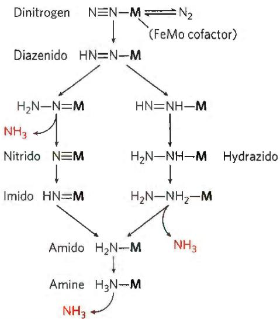  
FIGURE 22-5 Two reasonable hypotheses for the intermediates involved in $\mathsf{N}_2$ reduction. In both scenarios, the FeMo cofactor (abbreviated as M here) plays a central role, binding directly to one of the nitrogen atoms of $\mathsf{N}_2$ and remaining bound throughout the sequence of reduction steps. [Information from L.C.Seefeldt et al., Annu.Rev.Biochem.78:701, 2009, Fig. 9.]

P3 The nitrogenase complex is remarkably unstable in the presence of oxygen. The reductase is inactivated in air, with a half-life of 30 seconds; dinitrogenase has a half-life of only 10 minutes in air. Free-living bacteria that fix nitrogen cope with this problem in a variety of ways. Some live only anaerobically or repress nitrogenase synthesis when oxygen is present. Some aerobic species, such as A. vinelandii, partially uncouple electron transfer from ATP synthesis so that oxygen is burned off as rapidly as it enters the cell (see Box 19-1). When fixing nitrogen, cultures of these bacteria increase in temperature as a result of their efforts to rid themselves of oxygen.

  
(a)

The symbiotic relationship between leguminous plants and the nitrogen-fixing bacteria in their root nodules (Fig. 22-6) takes care of both the energy requirements and the oxygen lability of the nitrogenase complex. The energy required for nitrogen fixation was probably the evolutionary driving force for this plant-bacteria association. The bacteria in root nodules have access to a large reservoir of energy in the form of abundant carbohydrate and citric acid cycle intermediates made available by the plant. This may allow the bacteria to fix hundreds of times more nitrogen than do their free-living cousins under conditions generally encountered in soils. To solve the oxygen-toxicity problem, the bacteria in root nodules are bathed in a solution of the oxygen-binding heme protein leghemoglobin, produced by the plant (although the heme may be contributed by the bacteria). Leghemoglobin binds all available oxygen so that it cannot interfere with nitrogen fixation, and it efficiently delivers the oxygen to the bacterial electron-transfer system. The benefit to the plant, of course, is a ready supply of reduced nitrogen. In fact, the bacterial symbionts typically produce far more $\mathrm{NH}_3$ than is needed by their symbiotic partner; the excess is released into the soil. The efficiency of the symbiosis between plants and bacteria is evident in the enrichment of soil nitrogen brought about by leguminous plants. This enrichment of $\mathrm{NH}_3$ in the soil is the basis of crop rotation methods, in which plantings of nonleguminous plants (such as maize) that extract fixed nitrogen from the soil are alternated with plantings of legumes such as alfalfa, peas, or clover.

Nitrogen fixation is energetically costly: 16 ATP and 8 electrons yield only 2 NH $_{3}$ . It is therefore not surprising that the process is tightly regulated so that NH $_{3}$ is produced only when needed. High [ADP], an indicator of low [ATP], is a strong inhibitor of nitrogenase. NH $_{4}^{+}$ represses the expression of the \~20 nitrogen fixation (nif) genes,

  
(b)

FIGURE 22-6 Nitrogen-fixing nodules. (a) Pea plant (Pisum sativum) root nodules containing the nitrogen-fixing bacterium Rhizobium leguminosarum. The nodules are pink due to the presence of leghemoglobin; this heme protein has a very high binding affinity for oxygen, which strongly inhibits nitrogenase. (b) Artificially colorized electron micrograph of a thin section through a pea root nodule. Symbiotic nitrogen-fixing bacteria, or bacteroids (red), live inside the nodule cell, surrounded by the peribacteroid membrane (blue). Bacteroids produce the nitrogenase complex that converts atmospheric nitrogen $(\mathsf{N}_2)$ to ammonium $(\mathsf{NH}_4^+)$ ; without the bacteroids, the plant is unable to utilize $\mathsf{N}_2$ . (The cell nucleus is shown in yellow/green. Not visible in this micrograph are other organelles of the infected root cell that are normally found in plant cells.) [(a, b) Jeremy Burgess/Science Source.]

effectively shutting down the pathway. Covalent alteration of nitrogenase is also used in some diazotrophs to control nitrogen fixation in response to the availability of $NH_{4}^{+}$ in the surroundings. Transfer of an ADP-ribosyl group from NADH to a specific Arg residue in the nitrogenase reductase shuts down $N_{2}$ fixation in Rhodospirillum, for example. This is the same covalent modification that we saw in the case of G protein inhibition by the toxins of cholera and pertussis (see Fig. 12-14).

Nitrogen fixation is the subject of intense study because of its immense practical importance. Industrial production of ammonia for use in fertilizers requires a large and expensive input of energy, and this has spurred a drive to develop recombinant or transgenic organisms that can fix nitrogen. In principle, recombinant DNA techniques (Chapter 9) might be used to transfer the DNA that encodes the enzymes of nitrogen fixation into non-nitrogen-fixing bacteria and plants. However, those genes alone will not suffice. About 20 genes are essential to nitrogenase activity in bacteria, many of them needed for the synthesis, assembly, and insertion of the cofactors. There is also the problem of protecting the enzyme in its new setting from destruction by oxygen. In all, there are formidable challenges in engineering new nitrogen-fixing plants. Success in these efforts will depend on overcoming the problem of oxygen toxicity in any cell that produces nitrogenase.

#### [EN] Ammonia Is Incorporated into Biomolecules through Glutamate and Glutamine

Reduced nitrogen in the form of $NH_{4}^{+}$ is assimilated into amino acids and then into other nitrogen-containing biomolecules. P5 Two amino acids, glutamate and glutamine, provide the critical entry point. Recall that these same two amino acids play central roles in the catabolism of ammonia and amino groups in amino acid oxidation (Chapter 18). Glutamate is the source of amino groups for most other amino acids, through transamination reactions (the reverse of the reaction shown in Fig. 18-4). The amide nitrogen of glutamine is a source of amino groups in a wide range of biosynthetic processes. In most types of cells, and in extracellular fluids in higher organisms, one or both of these amino acids are present at higher concentrations—sometimes an order of magnitude or more higher—than other amino acids. An Escherichia coli cell requires so much glutamate that this amino acid is one of the primary solutes in the cytosol. Its concentration is regulated not only in response to the cell's nitrogen requirements but also to maintain an osmotic balance between the cytosol and the external medium.

The biosynthetic pathways to glutamate and glutamine are simple, and all or some of the steps occur in most organisms. The most important pathway for the assimilation of $NH_{4}^{+}$ into glutamate requires two reactions. The net effect is to convert glutamate, $\alpha$ -ketoglutarate, and ammonia into two molecules of glutamate.

First, $NH_{4}^{+}$ is reacted with glutamate to produce glutamine, using the enzyme glutamine synthetase. This reaction takes place in two steps, with enzyme-bound $\gamma$ -glutamyl phosphate as an intermediate (see Fig. 18-8):

$$
\text {(1)} \quad \mathrm{Glutamate} + \mathrm{ATP} \longrightarrow \gamma - \text {glutamyl   phosphate } + \mathrm{ADP}
$$

$$
\gamma \text {-Glutamyl phosphate} + \mathrm{NH} _ {4} ^ {+} \longrightarrow \text {   glutamine } + \mathrm{P} _ {\mathrm{i}} + \mathrm{H} ^ {+} \tag {2}
$$

Sum: Glutamate + NH $_{4}^{+}$ + ATP →

$$
\mathrm{glutamine} + \mathrm{ADP} + \mathrm {P_ {i}} + \mathrm {H^ {+}}\tag{22-1}
$$

Glutamine synthetase is found in all organisms. In addition to its importance for $NH_{4}^{+}$ assimilation in bacteria, it has a central role in amino acid metabolism in mammals, converting free $NH_{4}^{+}$ , which is toxic, to glutamine for transport in the blood (Chapter 18).

In the second reaction needed for $NH_{4}^{+}$ assimilation, the glutamine reacts with $\alpha$ -ketoglutarate to generate two molecules of glutamate. In bacteria and plants, this reaction is catalyzed by glutamate synthase. (An alternative name for this enzyme, glutamate:oxoglutarate aminotransferase, yields the acronym GOGAT, by which the enzyme also is known.) $\alpha$ -Ketoglutarate, an intermediate of the citric acid cycle, undergoes reductive amination with glutamine as nitrogen donor:

$$
\begin{array}{r l} \alpha - \text { Ketoglutarate } + \text { glutamine } + \mathrm{NAD(P)H} + \mathrm{H} ^ {+} & \longrightarrow \\ 2 \text { glutamate } + \mathrm{NAD(P)} ^ {+} \end{array}\tag{22-2}
$$

The net reaction of glutamine synthetase and glutamate synthase (Eqns 22-1 and 22-2) is

$$
\begin{array}{r l} \alpha \text {-Ketoglutarate} + \mathrm {NH_ {4} ^ {+}} + \mathrm{NAD(P)H} + \mathrm{ATP} & \longrightarrow \\ \text {glutamate} + \mathrm {NAD(P) ^ {+}} + \mathrm{ADP} + \mathrm {P _ {i}} \end{array}
$$

Glutamate synthase is not present in animals, which instead maintain high levels of glutamate by processes such as the transamination of $\alpha$ -ketoglutarate during amino acid catabolism. Plants possess a second alternative form of glutamate synthase that uses reduced ferredoxin rather than NADPH as a source of reducing electrons.

Glutamate can also be formed in yet another, albeit minor, pathway: the reaction of $\alpha$ -ketoglutarate and $\mathrm{NH}_4^+$ to form glutamate in one step. P6 This is catalyzed by glutamate dehydrogenase, an enzyme present in all organisms. Reducing power is furnished by NADPH:

$$
\begin{array}{r l} \alpha \text {-Ketoglutarate} + \mathrm {NH_ {4} ^ {+}} + \mathrm{NAD(P)H} + \mathrm {H^ {+}} & \longrightarrow \\ \text { glutamate } + \mathrm {NAD(P) ^ {+}} + \mathrm {H_ {2} O} \end{array}
$$

We encountered this reaction in the catabolism of amino acids (see Fig. 18-7). In eukaryotic cells, glutamate dehydrogenase is located in the mitochondrial matrix. The reaction equilibrium favors the reactants, and the $K_{\mathrm{m}}$ for $\mathrm{NH_4^+}$ (\~1 mm) is so high that the reaction is not important for $\mathrm{NH_4^+}$ assimilation in mammals. (Recall that the glutamate dehydrogenase reaction, in reverse (see Fig. 18-10), is one source of $NH_{4}^{+}$ destined for the urea cycle.) In microorganisms and plants, concentrations of $NH_{4}^{+}$ high enough for the glutamate dehydrogenase reaction to make a significant contribution to glutamate levels generally occur only when $NH_{3}$ is added artificially to the growth environment. In general, soil bacteria and plants rely on the two-enzyme pathway outlined above (Eqns 22-1, 22-2).

#### [EN] Glutamine Synthetase Is a Primary Regulatory Point in Nitrogen Metabolism

There are three known classes of glutamine synthetases. The class I enzyme (GSI, found in bacteria) has 12 identical subunits of $M_r$ 50,000 (Fig. 22-7) and is regulated both allosterically and by covalent modification. The class II enzyme (GSII, found in eukaryotes and some bacteria) has 10 identical subunits. The third class of glutamine synthetases (GSIII), so far found only in two bacterial species, are much larger enzymes, consisting of a double-ringed dodecamer of identical chains.

P4 Befitting their central metabolic role as an entry point for reduced nitrogen, GSI glutamine synthetases are highly regulated. In enteric bacteria such as E. coli, the regulation is unusually complex. Alanine, glycine, and at least six end products of glutamine metabolism are allosteric inhibitors (Fig. 22-8). Each inhibitor alone produces only partial inhibition, but the effects of multiple inhibitors are more than additive, and all eight together virtually shut down the enzyme. This is an example of cumulative feedback inhibition. This control mechanism provides a constant adjustment of glutamine levels to match immediate metabolic requirements.

  
FIGURE 22-7 Subunit structure of bacterial type I glutamine synthetase. This view shows 6 of the 12 identical subunits; a second layer of 6 subunits lies directly beneath those shown. Each of the 12 subunits has an active site, where ATP and glutamate are bound in orientations that favor transfer of a phosphoryl group from ATP to the side-chain carboxyl of glutamate. In this crystal structure, ADP occupies the ATP site. [Data from PDB ID 2GLS, M. M. Yamashita et al., J. Biol. Chem. 264:17,681, 1989.]

  
FIGURE 22-8 Allosteric regulation of glutamine synthetase. The enzyme undergoes cumulative regulation by six end products of glutamine metabolism. Alanine and glycine probably serve as indicators of the general status of amino acid metabolism in the cell.

Superimposed on the allosteric regulation is inhibition by adenylylation of (addition of AMP to) Tyr $^{397}$ , located near the enzyme's active site (Fig. 22-9). This covalent modification increases sensitivity to the allosteric inhibitors, and activity decreases as more subunits are adenylylated. Both adenylylation and de-adenylylation are promoted by adenylyltransferase (AT in Fig. 22-9), part of a complex enzymatic cascade that responds to levels of glutamine, $\alpha$ -ketoglutarate, ATP, and P $_{i}$ . The activity of adenylyltransferase is modulated by binding to a regulatory protein called P $_{II}$ , and the activity of P $_{II}$ , in turn, is regulated by covalent modification (uridylylation), again at a Tyr residue. The adenylyltransferase complex with uridylylated P $_{II}$ (P $_{II}$ -UMP) stimulates de-adenylylation, whereas the same complex with deuridylylated P $_{II}$ stimulates adenylylation of glutamine synthetase. Both uridylylation and deuridylylation of P $_{II}$ are brought about by a single enzyme, uridylyltransferase. Uridylylation is inhibited by binding of glutamine and P $_{i}$ to uridylyltransferase and is stimulated by binding of $\alpha$ -ketoglutarate and ATP to P $_{II}$ .

The regulation does not stop there. The uridylylated $P_{II}$ also mediates the activation of transcription of the gene encoding glutamine synthetase, thus increasing the cellular concentration of the enzyme; the deuridylylated $P_{II}$ brings about a decrease in transcription of the same gene. This mechanism involves an interaction of $P_{II}$ with additional proteins involved in gene regulation, of a type described in Chapter 28. The net result of this elaborate system of controls is a decrease in glutamine synthetase

(a)

(b)  

  
FIGURE 22-9 Second level of regulation of glutamine synthetase: covalent modifications. (a) An adenylylated Tyr residue. (b) Cascade leading to adenylylation (inactivation) of glutamine synthetase. AT represents adenylyltransferase; UT, uridylyltransferase. P $_{II}$ is a regulatory protein, itself regulated by uridylylation.

activity when glutamine levels are high, and an increase in activity when glutamine levels are low and $\alpha$ -ketoglutarate and ATP (substrates for the synthetase reaction) are available. The multiple layers of regulation permit a sensitive response in which glutamine synthesis is tailored to cellular needs.

#### [EN] Several Classes of Reactions Play Special Roles in the Biosynthesis of Amino Acids and Nucleotides

The pathways described in this chapter include a variety of interesting chemical rearrangements. Several of these recur and deserve special note before we progress to the pathways themselves. These are (1) transamination reactions and other rearrangements promoted by enzymes containing pyridoxal phosphate; (2) transfer of one-carbon groups, with either tetrahydrofolate (usually at the —CHO and —CH₂OH oxidation levels) or S-adenosylmethionine (at the —CH₃ oxidation level) as cofactor; and (3) transfer of amino groups derived from the amide nitrogen of glutamine. Pyridoxal phosphate (PLP), tetrahydrofolate (H₄ folate), and S-adenosylmethionine (adoMet) are described in some detail in Chapter 18 (see Figs. 18-6, 18-17, and 18-18). Here we focus on amino group transfer involving the amide nitrogen of glutamine.

More than a dozen known biosynthetic reactions use glutamine as the major physiological source of amino groups, and most of these occur in the pathways outlined in this chapter. As a class, the enzymes catalyzing these reactions are called glutamine amidotransferases. All have two structural domains: one binding glutamine, the other binding the second substrate, which serves as amino group acceptor (Fig. 22-10). A conserved Cys residue in the glutamine-binding domain is believed to act as a nucleophile, cleaving the amide bond of glutamine and forming a covalent glutamyl-enzyme intermediate. The $NH_{3}$ produced in this reaction is not released, but instead is transferred through an “ammonia channel” to a second active site, where it reacts with the second substrate to form the aminated product. The covalent intermediate is hydrolyzed to the free enzyme and glutamate. If the second substrate must be activated, the usual method is the use of ATP to generate an acyl phosphate intermediate (R—OX in Fig. 22-10, where X is a phosphoryl group). The enzyme glutaminase acts similarly but uses $H_{2}O$ as the second substrate, yielding $NH_{4}^{+}$ and glutamate (see Fig. 18-8).

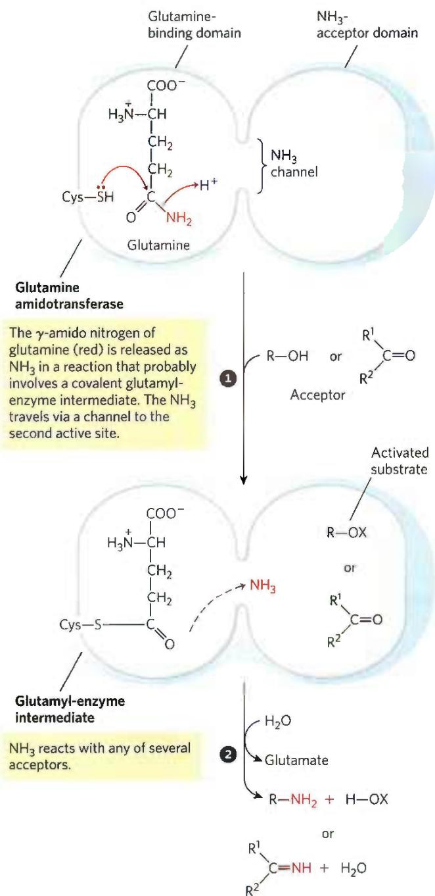  
MECHANISM FIGURE 22-10 Proposed mechanism for glutamine amidotransferases. Each enzyme has two domains. The glutamine-binding domain contains structural elements conserved among many of these enzymes, including a Cys residue required for activity. The $\mathrm{NH}_3$ -acceptor (second-substrate) domain varies. Two types of amino acceptors are shown. X represents an activating group, typically a phosphoryl group derived from ATP, that facilitates displacement of a hydroxyl group from R—OH by $\mathrm{NH}_3$ .

#### [EN] SUMMARY 22.1 Overview of Nitrogen Metabolism

The molecular nitrogen that makes up 80% of Earth's atmosphere is unavailable to most living organisms until it is reduced. A complex web of reactions converts atmospheric $N_{2}$ to biologically useful forms and maintains a global balance between them. Prominent species that are interconverted within this web include ammonia ( $NH_{3}$ or $NH_{4}^{+}$ ; most reduced), nitrite ( $NO_{2}^{-}$ ), and nitrate ( $NO_{3}^{-}$ ; most oxidized). Conversion of $N_{2}$ to ammonia is fixation. Nitrification constitutes the steps converting ammonia to nitrate. Conversion of nitrate to $N_{2}$ constitutes denitrification. The alternative conversion of nitrate to ammonia is nitrate assimilation.

■ Fixation of $N_{2}$ as $NH_{3}$ is carried out by the nitrogenase complex, in a reaction that requires large investments of ATP and of reducing power. The nitrogenase complex is highly labile in the presence of $O_{2}$ , and it is subject to regulation by the supply of $NH_{3}$ .

In living systems, reduced nitrogen is incorporated first into amino acids and then into a variety of other biomolecules, including nucleotides. The key entry point is the amino acid glutamate. Glutamate and glutamine are the nitrogen donors in a wide range of biosynthetic reactions.

■ Glutamine synthetase, which catalyzes the formation of glutamine from glutamate, is a main regulatory enzyme of nitrogen metabolism.

The amino acid and nucleotide biosynthetic pathways make repeated use of the biological cofactors pyridoxal phosphate, tetrahydrofolate, and S-adenosylmethionine. Pyridoxal phosphate is required for transamination reactions involving glutamate and for other amino acid transformations. One-carbon transfers require S-adenosylmethionine and tetrahydrofolate. Glutamine amidotransferases catalyze reactions that incorporate nitrogen derived from the amide group of glutamine.

<!-- EN-END 22.1 -->

## 三、氨基酸的生物合成

人和其他动物不具备合成蛋白质中全部氨基酸的途径,因此他们必须从食物中获得自身不能合成的氨基酸,这些氨基酸称为必需氨基酸(essential amino acids)。这一名称来源于用大白鼠所作的实验。若在喂饲大白鼠的膳食中缺乏苯丙氨酸、赖氨酸、异亮氨酸、亮氨酸、甲硫氨酸、苏氨酸、色氨酸、缬氨酸、组氨酸或精氨酸(对幼小动物需要)等10种氨基酸的任何一种,动物都不能正常生长,由此得名。凡机体能自己合成的氨基酸称为非必需氨基酸(nonessential amino acids)。人类和大白鼠的必需氨基酸是相同的。高等植物有能力合成自己所需的全部氨基酸,而且既可利用氨又可利用硝酸根作为合成氨基酸的氮源。微生物合成氨基酸的能力有很大差异,例如,大肠杆菌可合成全部所需氨基酸,而乳酸菌却需从外界获取某些氨基酸。

虽然生物合成氨基酸的能力有种种差异,但仍可总结出氨基酸生物合成的某些共性。本章将讨论它们的共性以及构成蛋白质20种氨基酸的各种合成途径。

氨基酸生物合成的研究,大多数以微生物作为材料。这不仅因为取材方便,最大的优越性是比较容易地将遗传和生物化学技术结合起来。应用遗传突变技术可获得在合成氨基酸方面具有各种特点的遗传突变株。例如,某个突变株在某种氨基酸合成过程中缺乏某一种酶,则该氨基酸合成过程就在这缺乏酶的一步受阻,这时全部合成反应就停留在这缺失酶的步骤上,而使前一步反应的产物大量积累。在突变株微生物的培养基中就可测出此积累产物的浓度大大提高。又例如,某种突变株有合成某一种氨基酸的特殊能力,则该突变株即可为研究这种氨基酸的合成途径提供便利条件。

若将氨基酸的生物合成反应步骤用下列反应式表示：

$$
\mathrm{A} \xrightarrow {\text {酶I}} \mathrm{B} \xrightarrow {\text {酶II}} \mathrm{C} \xrightarrow {\text {酶III}} \mathrm{D} \xrightarrow {\text {酶IV}} \mathrm{E} \xrightarrow {\text {酶V}} \mathrm{F}
$$

式中 A 代表某种氨基酸生物合成前体物质，B、C、D、E、F 代表不同的中间产物，酶（I、II、III、IV、V）代表不同的酶，F 代表最终产物，即某种氨基酸。

突变株微生物的同一种氨基酸的正常合成路线在发生变异的步骤受阻可用下式表示：

$$
\begin{array}{r l} & {\mathrm{A} \xrightarrow {\text {酶I}} \mathrm{B} \xrightarrow {\text {酶II}} \mathrm{C} \xrightarrow {\text {酶III缺失}} \mathrm{D} \xrightarrow {\text {酶IV}} \mathrm{E} \xrightarrow {\text {酶V}} \mathrm{F}} \\ & {\qquad \qquad \qquad \qquad \text {中间物积累} \quad \mathrm{D}, \mathrm{E}, \mathrm{F} \text {都不产生}} \end{array}
$$

上式表明当酶Ⅲ缺失时,此突变株培养基中即大量积累中间产物 C。通过对中间产物 C 的测定,即可判断氨基酸(F)的一个中间代谢环节。

用上述材料和方法阐明的氨基酸合成途径,还需用其他生物材料弄清不同生物合成氨基酸的特殊性。

讨论氨基酸的生物合成,首先要说明的是:它的碳骨架是怎样形成的?氮是经怎样的途径进入的?

概括地说,在生物合成中,各种氨基酸碳骨架的形成,源起于代谢的几条“主要干线”(柠檬酸循环、糖酵解以及磷酸戊糖途径等)中的关键中间体。根据生物合成起始物——代谢中间体的不同,可将氨基酸的生物合成途径归纳为六族,将在下面分族讨论。它们的氨基基团多来自谷氨酸的转氨基反应。

氨基酸生物合成分族情况如图 26-3 所示。氨基酸生物合成的概貌如图 26-4 所示。

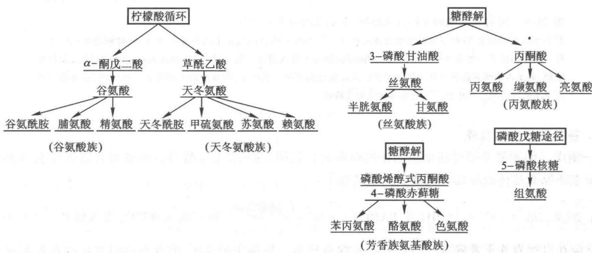  
图 26-3 氨基酸生物合成的分族情况

## （一）由 $\alpha-$ 酮戊二酸形成的氨基酸——谷氨酸、谷氨酰胺、脯氨酸、精氨酸、赖氨酸

这些氨基酸的生物合成都以 $\alpha-$ 酮戊二酸为前体, 即它们都是由 $\alpha-$ 酮戊二酸衍生而来, 下面分述它们的生物合成。

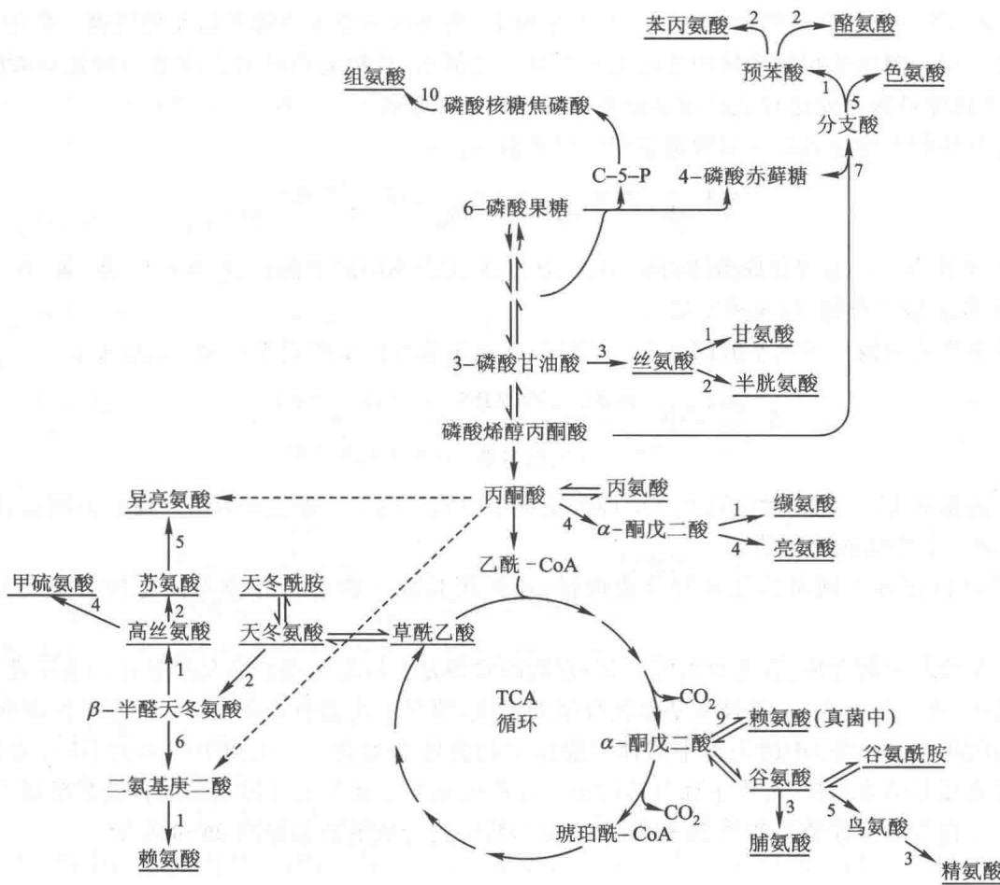  
图 26-4 20 种氨基酸的生物合成概貌(各氨基酸全为 L-型)  
图为蛋白质中的是20种氨基酸生物合成的概貌。氨基酸生物合成与相关的柠檬酸循环，糖酵解及磷酸戊糖途径。图中画出了一些重要的中间物，丙酮酸起始的两条虚线指向二氨基庚二酸（diaminopimelate, DAP），及异亮氨酸，表示丙酮酸为这两个化合物的某侧链之碳源做出贡献。请注意，赖氨酸的生物合成是独特的，它有着两条完全不同的途径。图中数字表明通过的反应步骤数

## 1. 谷氨酸的生物合成

$\alpha-$ 酮戊二酸和氨基酸经转氨酶的作用即形成谷氨酸。 $\alpha-$ 酮戊二酸与游离氨可在谷氨酸脱氢酶的催化下发生还原氨基化而形成谷氨酸。反应式如下：

$$
\alpha \text {-酮戊二酸} + \mathrm{NH} _ {4} ^ {+} + \mathrm{NADH(或NADPH)} + \mathrm{H} ^ {+} \xrightarrow {\text {谷氨酸脱氢酶}} \text {谷氨酸} + \mathrm{NAD} ^ {+} (\text {或NADP} ^ {+}) + \mathrm{H} _ {2} \mathrm{O}
$$

这种反应在自然界并不普遍, 植物、蕈类以及细菌只有当环境中的 $NH_{4}^{+}$ 浓度很高时才由此途径形成谷氨酸。在动物的细胞中, 过多的 $NH_{4}^{+}$ 也可通过这一途径形成谷氨酸, 再由谷氨酰胺合成酶催化转变为谷氨酰胺。谷氨酸脱氢酶和谷氨酰胺合成酶在脑中的含量都相当高。当然由形成谷氨酰胺而消除 $NH_{4}^{+}$ 的作用可能比由 $\alpha-$ 酮戊二酸形成谷氨酸更为重要。

L-谷氨酸脱氢酶在动物体内可利用 $NAD^{+}/NADH$ 和 $NADP^{+}/NADPH$ 两类辅酶，利用 $NAD^{+}$ 作辅酶的酶一般是催化谷氨酸脱氨基转变为 $\alpha-$ 酮戊二酸。无论利用哪种辅酶的 L-谷氨酸脱氢酶，都能催化可逆反应。

实验表明:植物、微生物、蕈类的谷氨酸氨基一般并非来源于游离氨,而是来源于谷氨酰胺的酰胺基。后面还将进一步讨论。

## 2. 谷氨酰胺的生物合成

由 $\alpha-$ 酮戊二酸先经转氨基作用形成 L-谷氨酸已如上述，再经谷氨酰胺合成酶（glutamate synthetase）催化由 L-谷氨酸形成 L-谷氨酰胺。这一过程需 ATP 提供能量。

谷氨酰胺合成酶是催化氨转变为有机含氮物的主要酶。该酶活性受到机体对含氮物需要情况的灵活控制。

从大肠杆菌中获得的谷氨酰胺合成酶的结构以及其调控机制都已经得到阐明。该酶由12个相同的亚基对称排列成两个六面体环棱柱状结构。每个亚基的相对分子质量为51600。它的活性受到复杂的反馈控制系统以及共价修饰调控。有9种含氮物以不同程度对该酶发生反馈别构抑制效应。每一种都有自己与酶的结合部位。这9种含氮物是：6-磷酸氨基葡糖、色氨酸、丙氨酸、甘氨酸、丝氨酸、组氨酸、胞苷三磷酸、AMP及氨甲酰磷酸。除甘氨酸、丙氨酸、丝氨酸外，所有上述其他含氮物的氮都直接来源于谷氨酰胺，而且都是由谷氨酰胺导出的反应最终产物。虽然丙氨酸、丝氨酸和甘氨酸的氨基也来源于谷氨酰胺，但都不是反应系列的最终产物。在培养细胞时检测培养液中丙氨酸、丝氨酸和甘氨酸含量的高低，却可作为了解氮源供给情况的鉴定指标。

谷氨酰胺合成酶的调节机制,可作为氨基酸生物合成调控机制复杂性的典型,将在氨基酸生物合成的调控中讨论。

前已述及， $\alpha-$ 酮戊二酸直接与氨由谷氨酸脱氢酶催化还原反应，合成谷氨酸的途径，在自然界并不普遍。在一般情况下最普遍的合成谷氨酸的途径是在谷氨酸合酶（glutamate synthase）催化下， $\alpha-$ 酮戊二酸接受L-谷氨酰胺的酰胺基形成谷氨酸的反应。在这个反应中实际上形成了两个谷氨酸分子。

虽然经这种形式合成谷氨酸从能量观点看并不经济。因为由谷氨酸形成谷氨酰胺需要消耗ATP如前所示。但这种方式有很多优越性。由谷氨酰胺合成酶催化的酰胺基的形成可在 $\mathrm{NH}_4^+$ 浓度极低的条件下进行，而由谷氨酸脱氢酶催化的反应却需要很高的 $\mathrm{NH}_4^+$ 浓度。以大肠杆菌(E.coli)为例，其谷氨酸脱氢酶所催化的反应，以 $\mathrm{NH}_4^+$ 计算， $K_{\mathrm{m}}$ 值为 $1.1\mathrm{mmol}$ ，而谷氨酰胺合成酶的 $K_{\mathrm{m}}$ 值仅为 $0.2\mathrm{mmol}$ 。因此谷氨酰

胺合成酶所催化的反应方向更倾向于脱去酰胺基。一般在自然条件下 $NH_{4}^{+}$ 的浓度不会很高。所以由谷氨酰胺提供酰胺基使 $\alpha-$ 酮戊二酸形成谷氨酸的可能性是最大的。 $\alpha-$ 酮戊二酸、谷氨酸和谷氨酰胺的合成关系如图 26-5 所示。

谷氨酸合酶的氢供给者(hydrogen donor)随不同来源的酶而异。细菌以NADPH为供氢体，有些蕈类以NADH为供氢体。植物则有两种类型。有一种对还原型“铁氧还蛋白”(reduced ferredoxin)是特异的，另一种，体外试验表明需要NADPH或NADH。因为在土壤中， $\mathrm{NH}_4^+$ 的浓度常是不高的，因此在植物中氨基的形成是在低浓度下进行的，而 $\alpha-$ 酮戊二酸的氨基化则需由谷氨酰胺的酰胺基提供。

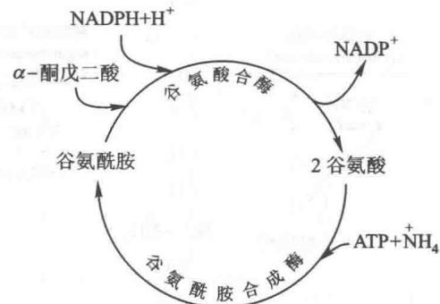  
图 26-5 由 $\alpha$ -酮戊二酸、谷氨酰胺和谷氨酸形成关系图

## 3. 脯氨酸的生物合成

L-脯氨酸的合成步骤如图26-6所示。由 $\alpha$ -酮戊二酸先形成谷氨酸。后者在谷氨酸激酶催化下由ATP提供磷酸基团形成谷氨酰磷酸，又在谷氨酸脱氢酶作用下将谷氨酸的 $\gamma$ -羧基还原形成 $\gamma$ -半醛谷氨酸（glutamic- $\gamma$ -semialdehyde），然后自发环化形成五元环化合物5-羧酸- $\Delta'$ 二氢吡咯（ $\Delta'$ -pyrroline-5-carboxylate），再由二氢吡咯还原酶催化还原形成脯氨酸。

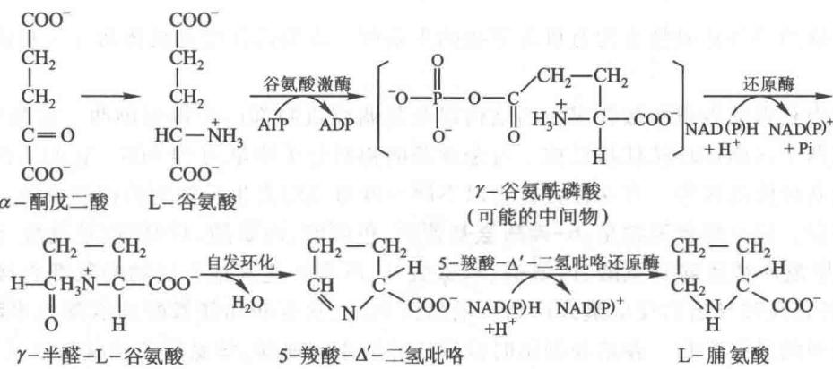  
图 26-6 L-脯氨酸的合成途径

## 4. L-精氨酸的生物合成

精氨酸的生物合成如图 26-7 所示, 它是由谷氨酸经过许多步骤形成。谷氨酸先在转乙酰基酶催化下，转化为 $N-$ 乙酰谷氨酸（ $N$ -acetylglutamate），再经激酶作用由ATP上转移一个高能磷酸基团，形成 $N-$ 乙酰- $\gamma-$ 谷氨酰磷酸（ $N$ -acetyl- $\gamma$ -glutamyl phosphate），再经以NADPH为辅酶的还原酶作用，形成 $N-$ 乙酰谷氨酸- $\gamma-$ 半醛（ $N$ -acetylglutamic- $\gamma$ -semialdehyde），又经转氨酶作用，自谷氨酸分子转移一个 $\alpha-$ 氨基，形成 $\alpha-N-$ 乙酰鸟氨酸（ $\alpha-N$ -acetyl ornithine），经酶促脱去乙酰基（脱乙酰基作用或转乙酰基作用），形成L-鸟氨酸，接受由转氨甲酰酶催化，自氨甲酰磷酸转移的氨甲酰基先形成L-瓜氨酸，L-瓜氨酸在合成酶的催化下，与L-天冬氨酸结合（需 $\mathrm{Mg}^{2+}$ 离子，同时ATP $\longrightarrow$ AMP+PPi），形成精氨琥珀酸，精氨琥珀酸在裂解酶的作用下，形成精氨酸，同时产生延胡索酸。

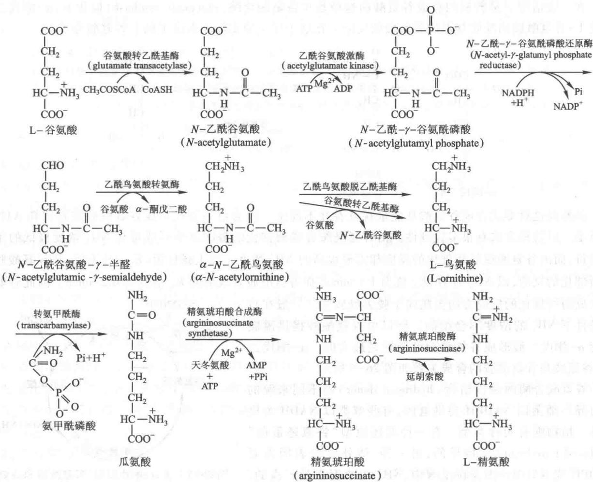  
图26-7 精氨酸的生物合成途径

谷氨酸 $\alpha-$ 氨基的乙酰化, 可使氨基受到保护, 以利于羧酸的活化和还原, 并防止发生环化作用, 使反应向形成精氨酸的方向进行。乙酰基可通过谷氨酸转乙酰基酶的作用, 在全部合成反应中得到保护。

精氨酸不只是构成蛋白质的组分,也是尿素形成的前体物质(请参看尿素的形成)。

## 5. 赖氨酸的生物合成

L-赖氨酸的生物合成在不同生物体内有完全不同的两条途径。蕈类(和眼虫)L-赖氨酸的合成以 $\alpha$ -酮戊二酸为起始物。图26-8表明蕈类(和眼虫)由 $\alpha$ -酮戊二酸合成L-赖氨酸的途径。细菌和绿色植物则是通过丙酮酸和天冬氨酸途径(参看天冬氨酸族的生物合成,图26-9)。

α-酮戊二酸有5个碳原子。而赖氨酸有6个碳原子。因此，α-酮戊二酸形成赖氨酸需延长碳链。第一步是α-酮戊二酸在高柠檬酸合酶(homocitrate synthase)的催化下，与乙酰辅酶A作用，形成高柠檬酸，高柠檬酸在脱水酶催化下脱水形成顺-高乌头酸(cis-homoaconitate)，再由水化酶催化形成高异柠檬酸(homoisocitrate)，然后在脱氢酶催化下脱氢，形成α-酮己二酸(α-ketoadipate)。该反应所需辅酶为 $NAD^{+}$ ，反应过程中还脱去羧基。

由 $\alpha-$ 酮戊二酸形成 $\alpha-$ 酮己二酸所经过的碳链延长过程和柠檬酸循环中草酰乙酸转变为 $\alpha-$ 酮戊二酸以及在亮氨酸生物合成中碳链延长过程都基本相同。不同处是 $\alpha-$ 酮戊二酸的 $\alpha-$ 羧基是由草酰乙酸的 $\beta-$ 羧基形成，不是转来的乙酰基。以上表明这些 $\alpha-$ 酮酸碳链的延长都遵循一般 $\alpha-$ 酮酸碳链延长的规律。

α-酮戊二酸的形成提供了赖氨酸的碳骨架结构，下一步的变化是δ-羧基的还原。羧基的活化需ATP参与反应，可能形成酸酐和AMP的复合物，即δ-腺苷-α-氨基己二酸，这和脯氨酸以及鸟氨酸生物合成中的羧基活化机制不同。δ-腺苷-α-氨基己二酸在其还原酶的催化下，以NADPH为辅酶还原，同时释放出腺苷基团形成α-氨基己二酸-δ-半醛（α-aminoadipic-δ-semialdehgde）。己醛基团一旦形成，在α-氨基己二酸-δ-半醛-谷氨酸还原酶作用下，即与谷氨酸在氨基部位缩合。这是一个需NADPH的还原缩合反应。缩合后形成ε-N(2-戊二酸)-赖氨酸(saccharopine)。后者在ε'-N(2-戊二酸)-赖氨酸脱氢酶作用下，再氧化裂解形成L-赖氨酸和α-酮戊二酸。此反应专一地以NAD $^{+}$ 为辅酶。上述的两步反应，实际是一种氨基转移反应。它和以磷酸吡哆醛为辅酶的氨基转移反应方式完全不同。

（二）由草酰乙酸形成的氨基酸——天冬氨酸、天冬酰胺、甲硫氨酸、苏氨酸、赖氨酸（细菌、植物）、异亮氨酸

## 1. 天冬氨酸的生物合成

L-天冬氨酸是由草酰乙酸接受由谷氨酸转来的氨基形式。催化这一反应的酶称为谷-草转氨酶或称天冬氨酸-谷氨酸转氨酶。天冬氨酸的合成途径如下所示：

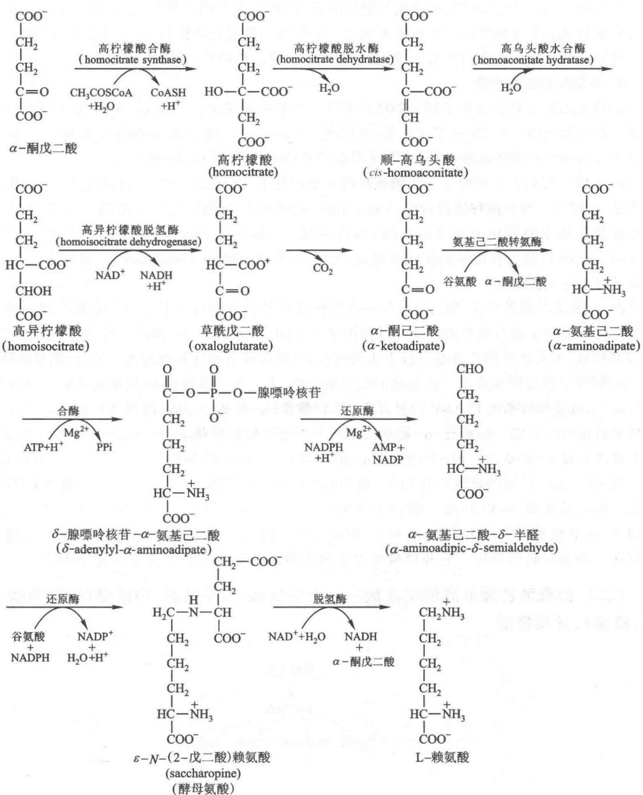  
图 26-8 蕈类和眼虫 L-赖氨酸的生物合成途径

## 2. 天冬酰胺的生物合成

哺乳动物天冬酰胺的合成可能都是在天冬氨酸的 $\beta-$ 羧基上转移一个谷氨酰胺的酰胺基而成。催化该反应的酶称为天冬酰胺合成酶(asparagine synthetase)，需 ATP 参与作用。ATP 在反应中降解为 AMP 和

PPi。天冬酰胺的合成反应可用下式表示：

该反应可能在酰胺基断裂时形成一个酶和氨基结合的中间产物。

除上述的天冬酰胺合成途径外，在细菌则有另外一种由 $NH_{4}$ 提供酰胺基氮源的合成途径。这一途径也伴有 ATP 降解为 AMP 和 PPi 的反应。

在这个反应中,也可能包括一个形成与酶结合的 $\beta$ -天冬酰腺苷酸( $\beta$ -aspartyladenylate)中间物的步骤。

催化上述两种形成天冬酰胺的酶都称为天冬酰胺合成酶(asparagen synthetase)，它们区别在于一种催化酰基的断裂，另一种则对游离氨有高的亲和力。

天冬酰胺和谷氨酰胺合成的机制有许多类似之处,主要的不同是在谷氨酰胺合成反应中 ATP 转变成 ADP 和 Pi,天冬酰胺合成反应中 ATP 则形成 AMP 和 PPi。在机体内催化 PPi 水解为 2Pi 的酶是焦磷酸酶。这一水解反应可释放约 34 kJ 能,因此,天冬酰胺的合成反应比谷氨酰胺的合成反应更易于进行。

## 3. 细菌和植物 L-赖氨酸的生物合成

由 L-天冬氨酸作为起始物的 L-赖氨酸合成途径如图 26-9 所示。首先要使 L-天冬氨酸的 β-羧基还原。该反应需 ATP 活化羧基。催化此反应的酶称为天冬氨酸激酶(aspartokinase)。羧基活化后，形成天冬氨酰-β-磷酸(aspartyl-β-phosphate)。这一还原反应和谷氨酸羧基的还原以及 3-磷酸甘油酸还原为 3-磷酸甘油醛的情况都很相似。再由天冬氨酸-β-半醛脱氢酶催化逆反应，使天冬氨酰-β-磷酸还原。参与天冬氨酸还原反应的辅酶是 NADPH。还原的产物是天冬氨酸-γ-半醛。天冬氨酸-γ-半醛与丙酮酸缩合形成一环状化合物称为 2,3-二氢吡啶-2,6-二羧酸(2,3-dihydropyridine 2,6-dicarboxylate)。因此，也可将植物 L-赖氨酸的合成看作是起始于丙酮酸和天冬氨酸。催化天冬氨酸-γ-半醛和丙酮酸缩合的酶称为 2,3-二氢吡啶-2,6-二羧酸合酶。该酶受赖氨酸抑制。2,3-二氢吡啶-2,6-二羧酸由以 NADPH 为辅酶的脱氢酶还原为 Δ'-哌啶-2,6-二羧酸（又称 2,3,4,5-四氢吡啶-2,6-二羧酸）。该二羧酸与琥珀酰-CoA 作用形成 N-琥珀酰-2-氨基-6-酮庚二酸(N-Succinyl-2-amino-6-keto-L-pimelate)。在有些生物由乙酰基代替琥珀酰基。6-酮基通过与谷氨酸的转氨基作用而形成氨基，使 N-琥珀酰-2-氨基-6-酮庚二酸转变为 N-琥珀酰-L,L-2,6-二氨基庚二酸。在琥珀酰-二氨基庚二酸脱琥珀酸酶的作用下，脱去琥珀酸形成 L,L-2,6-二氨基庚二酸或称 L-α,ε-二氨基庚二酸。在二氨基庚二酸差向异构酶的作用下，形成消旋-α,ε-二氨基庚二酸(meso-α,ε-diaminopimelate)。再经二氨基庚二酸脱羧酶的作用。脱去羧基形成 L-赖氨酸。

## 4. 甲硫氨酸的生物合成

甲硫氨酸的生物合成如图26-10及图26-11所示，由天冬氨酸的羧基还原，此反应有ATP参与。它活化了羧基并提供一个磷酸基，形成天冬氨酰磷酸。反应进一步形成天冬氨酸- $\beta$ -半醛。以上反应过程与细菌及植物合成L-赖氨酸的一段过程完全相同。天冬氨酸- $\beta$ -半醛以NADPH为辅酶，在脱氢酶作用下还原形成L-高丝氨酸（L-homoserine）。由L-高丝氨酸转化为甲硫氨酸的途径不止一种。它的酰基化也有不同方式。在绿色植物形成O-磷酰高丝氨酸。一般从高丝氨酸转变为酰基高丝氨酸，进而转变为 L-高半胱氨酸。转变为 L-高半胱氨酸也有不同路线。在细菌中，是在胱硫醚- $\gamma$ -合酶（cystathionine- $\gamma$ -synthase）催化下，与半胱氨酸作用形成 L,L-胱硫醚（L,L cystathionine）。后者又在 $\beta$ -胱硫醚酶（ $\beta$ -cystathionase）作用下，形成 L-高半胱氨酸。另外的途径是 O-琥珀酰基高丝氨酸在硫水解酶（sulfhydrolase）作用下与 $H_{2}S$ 作用直接生成 L-高半胱氨酸（图中虚线标示），接着 L-高半胱氨酸在转移酶（tranferase）催化下，接受 $N^{5}$ -甲基四氢叶酸的甲基，生成 L-甲硫氨酸。高丝氨酸还可在酰基转移酶作用下与琥珀酰基结合形成 O-琥珀酰高丝氨酸，又在胱硫醚- $\gamma$ -合酶催化下由半胱氨酸替下琥珀酰基形成胱硫醚，又在胱硫醚- $\beta$ -裂解酶作用下，脱出丙酮酸和氨形成高半胱氨酸再由 $N^{5}$ -甲基四氢叶酸提供甲基，由转移酶催化形成甲硫氨酸。

  
图26-9 细菌和绿色植物赖氨酸的合成途径

  
图 26-10 天冬氨酸族的氨基酸（赖氨酸、甲硫氨酸、苏氨酸）共同经历的合成途径

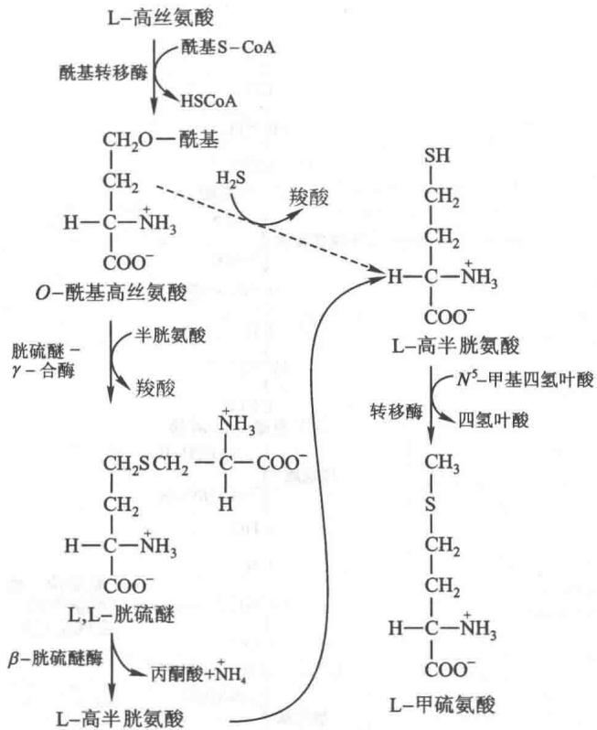  
图 26-11 甲硫氨酸的合成, 最后一步的 L-高半胱氨酸转  
变为甲硫氨酸还有依赖维生素 $\mathrm{B}_{12}$ 的另一途径

## 5. 苏氨酸的生物合成

苏氨酸的合成,从 L-天冬氨酸开始,直到形成 L-高丝氨酸,与甲硫氨酸的合成步骤是完全相同的(图 26-10)。L-高丝氨酸在其激酶作用下在羟基位置转移 ATP 上的一个磷酸基团形成 O-磷酰-L-高丝氨酸(O-phospho-L-homoserine),再经苏氨酸合酶作用,水解下磷酸基团形成苏氨酸(图 26-12)。

纵观上述 L-赖氨酸、L-甲硫氨酸、L-苏氨酸的合成，可看出这三种氨基酸有一段共同的合成途径，由 L-天冬氨酸为共同起点都需经过 $\beta$ -羧基的还原，形成的天冬氨酸- $\beta$ -半醛是一个分支点化合物，L-赖氨酸的合成即由此物质分道，甲硫氨酸和苏氨酸的合成还共同经过 L-高丝氨酸再分道，L-高丝氨酸也是分支点化合物（见图 26-10）。

## 6. 异亮氨酸的生物合成

异亮氨酸的6个碳原子有4个来自天冬氨酸，只有2个来自丙酮酸，所以一般将异亮氨酸的合成列入天冬氨酸类型。在异亮氨酸合成过程中有4种酶和缬氨酸合成中的酶是相同的，而缬氨酸的合成属于丙酮酸衍生类型，因此异亮氨酸的生物合成也可视为丙酮酸衍生类型。鉴于异亮氨酸和缬氨酸生物合成中

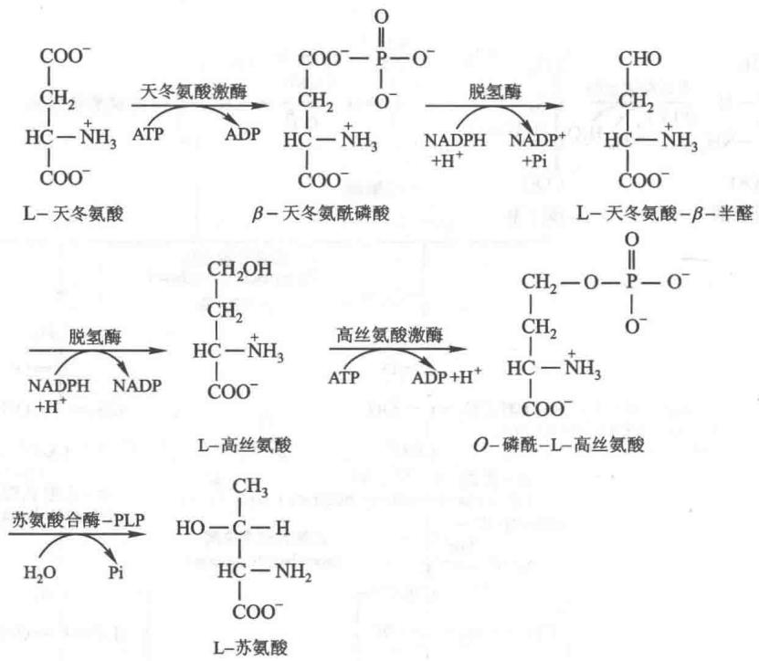  
图 26-12 L-苏氨酸的生物合成

4种酶的相同,异亮氨酸的合成途径和缬氨酸共同讨论(图26-13)异亮氨酸和缬氨酸的合成途径。

## （三）丙酮酸族的生物合成：L-丙氨酸、L-缬氨酸、L-亮氨酸

由丙酮酸形成的氨基酸有 L-丙氨酸、L-缬氨酸、L-亮氨酸，还为异亮氨酸的合成提供两个碳原子，为赖氨酸的合成提供两个或 3 个碳原子（图 26-8 及图 26-9 赖氨酸的生物合成）。因异亮氨酸和缬氨酸生物合成途径的平行关系，本节将一并讨论其合成途径。

## 1. 丙氨酸的生物合成

丙氨酸是丙酮酸与谷氨酸在谷-丙转氨酶的作用下形成的,如图26-14所示。

丙氨酸的合成没有反馈抑制效应。机体细胞内可找到许多丙氨酸库。又因转氨酶的作用是可逆的，丙酮酸和丙氨酸可根据需要而互相转换。

## 2. 缬氨酸和异亮氨酸的生物合成

缬氨酸和异亮氨酸的生物合成如图26-13所示。这两种氨基酸的第一步是相应地由丙酮酸和丁酮酸与活性乙醛基缩合。活性乙醛基可能是乙醛基与 $\alpha-$ 羟乙基硫胺素焦磷酸结合的产物。醛基是由丙酮酸脱羧而成。缩合后所形成的产物是相应的 $\alpha-$ 乙酰- $\alpha-$ 羟酸。形成的两种化合物进行甲基、乙基的自动位移，产物经脱水后形成缬氨酸和异亮氨酸的相应酮酸，再经转氨作用形成缬氨酸和异亮氨酸。

## 3. 亮氨酸的生物合成

亮氨酸的合成途径从丙酮酸开始直至形成 $\alpha$ -酮异戊酸和 L-缬氨酸以及异亮氨酸的合成途径完全相同（参看图 26-13, L-缬氨酸的生物合成）。 $\alpha$ -酮异戊酸（ $\alpha$ -ketoisovalerate）在 $\alpha$ -异丙基苹果酸合酶（ $\alpha$ -isopropyl malate synthase）作用下，由乙酰-CoA 转来酰基形成 $\alpha$ -异丙基苹果酸，后者在（同分）异构酶作用下形成 $\beta$ -异丙基苹果酸。再经以 NAD $^{+}$ 为辅助因子的脱氢酶作用形成 $\alpha$ -酮异己酸。后者再由亮氨酸转氨酶催化与谷氨酸转氨形成 L-亮氨酸（图 26-15）。

  
图26-13 异亮氨酸和缬氨酸的合成途径

  
图26-14 丙氨酸的生物合成

  
图26-15 L-亮氨酸的生物合成途径

（四）丝氨酸族的生物合成：L-丝氨酸、L-甘氨酸、L-半胱氨酸的生物合成及固硫作用

## 1. 丝氨酸和甘氨酸的生物合成

如图 26-16 所示, 这两种氨基酸合成的第一步, 是由糖酵解过程的中间产物 3-磷酸甘油酸作为起始物质, 它的 $\alpha$ -羟基在磷酸甘油酸脱氨酶催化下, 由 $NAD^{+}$ 脱氢形成 3-磷酸羟基丙酮酸, 后者再经磷酸丝氨酸转氨酶催化由谷氨酸转来氨基形成 3-磷酸丝氨酸。在磷酸丝氨酸磷酸酶 (phosphoserine phosphatase) 的作用下脱去磷酸, 即形成 L-丝氨酸。L-丝氨酸在丝氨酸转羟甲基酶 (serine hydroxymethyltransferase) 的作用下, 脱去羟甲基, 即形成甘氨酸, 丝氨酸转羟甲基酶的辅酶是四氢叶酸。

## 2. 半胱氨酸的生物合成

半胱氨酸生物合成中的关键是硫氢基的来源,在大多数植物和微生物,其硫氢基主要来源于硫酸,可能还原为某种硫化物,这一过程相当复杂,迄今了解很少。在动物体内,硫氢基团主要来源于高半胱氨酸。

大多数植物和微生物的半胱氨酸合成途径如图 26-17 所示。起始步骤是乙酰-CoA 的乙酰基转移到丝氨酸上，形成 O-乙酰丝氨酸。催化这一反应的酶为丝氨酸转乙酰基酶。O-乙酰丝氨酸将 $\beta$ -丙氨酸基团部分 $(-CH_{2}-CHNH_{3}-COO^{-})$ 提供给与酶结合的硫氢基团而形成L-半胱氨酸。

  
图26-16 丝氨酸和甘氨酸的生物合成途径

  
图26-17 某些植物和微生物体内半胱氨酸的合成途径

关于硫酸的还原问题即由 $SO_{4}^{2-}$ 还原为 $H_{2}S$ 的过程, 目前所了解的首先是通过硫酸与 ATP 作用形成活化形式, 即 5'-磷酸腺嘌呤硫酸 (adenosine-5'-phosphosulfate, APS), 催化这一反应的酶称为腺苷硫酸焦磷酸化酶 (adenylylsulfate pyrophosphorylase), 该化合物又在 5'-磷酸腺嘌呤硫酸激酶 (APS-激酶) 的作用下, 再从另一分子 ATP 上接受一磷酸基团形成 5'-磷酸-3-磷酸腺嘌呤硫酸 (3-phosphoadenosine-5'-phosphosulfate, PAPS) (图 26-18)。

在动物体内半胱氨酸的直接前体为丝氨酸和高半胱氨酸。后者也是甲硫氨酸生物合成的一个中间产物，也可称为前体（见图26-10及26-11甲硫氨酸的生物合成途径）

丝氨酸和高半胱氨酸在胱硫醚 $\beta-$ 合酶作用下，形成 L- 胱硫醚，后者在胱硫醚 $-\gamma-$ 水解酶（胱硫醚 $-\gamma-$ 裂合酶）作用下，分解为 $\alpha-$ 酮丁酸、 $NH_{4}^{+}$ 和 L- 半胱氨酸（图 26-19）。

图26-18 硫酸还原过程中所形成的活性中间  
  
图 26-19 动物体内半胱氨酸的合成途径

## （五）芳香族氨基酸及组氨酸的生物合成

1. 苯丙氨酸、酪氨酸及色氨酸的生物合成

芳香族氨基酸包括苯丙氨酸、酪氨酸、色氨酸，只能由植物和微生物合成。这3种氨基酸的合成途径有7步是共同的。合成的起始物是4-磷酸赤藓糖(erythose 4-phosphate)(戊糖磷酸途径的中间产物)和糖酵解过程的一个中间产物——磷酸烯醇式丙酮酸(phosphoenolpyruvate)。二者缩合形成一个七碳酮糖开链磷酸化合物，称为7-磷酸-3-脱氧- $\alpha$ -阿拉伯庚酮糖酸(3 deoxy- $\alpha$ -arabinoheptulosonate-7-phosphate, DAHP)，再经脱磷酸环化，形成苯环后又脱水、加氢形成莽草酸(shikimate)。可以把莽草酸看作合成此3种芳香族氨基酸的共同前体，因此可将芳香族氨基酸合成相同的一段过程称为莽草酸途径。这一途径指的是以莽草酸为起始物直至形成分支酸的一段过程。具体步骤如图26-20所示。分支酸(chorismate)是芳香族氨基酸合成途径的分支点。在分支酸以后即分为两条途径。其中一条是形成苯丙氨酸和酪氨酸，另一条是形成色氨酸。

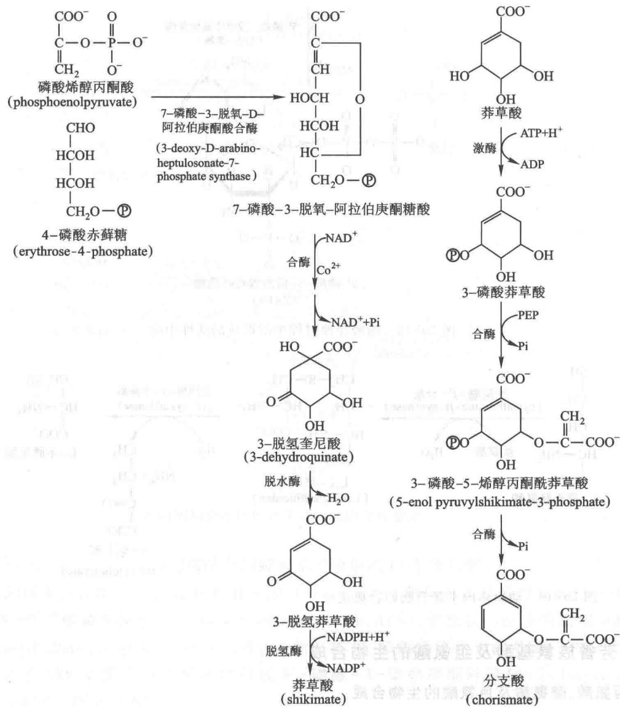  
图 26-20 分支酸的生物合成, 它的成环导致芳香族氨基酸的形成, 例如, 苯丙氨酸、色氨酸  
①代表磷酸基团，PEP代表烯醇式丙酮酸磷酸

## (1) 由分支酸形成苯丙氨酸和酪氨酸

如图 26-21 所示, 分支酸在分支酸变位酶 (chorismate mutase) 作用下, 转变为预苯酸 (prephenate), 经脱水、脱羧后形成苯丙酮酸 (phenylpyruvate), 后者在转氨酶作用下, 与谷氨酸进行转氨形成苯丙氨酸。

预苯酸经氧化脱羧作用形成对-羟苯丙酮酸，再由谷氨酸进行转氨即形成酪氨酸。

虽然苯丙氨酸和酪氨酸都以预苯酸作为由分支酸转变的第一步反应,但它们的合成确实是通过两条不同的途径。分支酸形成苯丙酮酸经过两个步骤，都是由一个酶催化的，称为分支酸变位酶P-预苯酸脱水酶（chorismate mutase P-prephenate dehydratase）。该酶先将分支酸转变为预苯酸。酶蛋白和预苯酸结合在一起，由同一酶脱水、脱羧，将预苯酸转化为苯丙酮酸。催化形成4-羟苯丙酮酸是另外一个酶，称为 $\mathrm{NAD^{+}}$ 依赖性分支酸变位酶T-预苯酸脱氢酶(NAD dependent chorismate T-prephenate dehydrogenase)。它催化分支酸形成4-羟苯丙酮酸也是先形成与它结合在一起的预苯酸中间产物再脱氢，脱羟(图26-21)，形成4-羟苯丙酮酸。

  
图 26-21 L-苯丙氨酸和 L-酪氨酸的生物合成, 它们都来自分支酸, 经过预  
苯酸后，步向两条不同途径

预苯酸无论转变为苯丙酮酸或4-羟苯丙酮酸都需脱去羧基同时脱水或脱氢。这一步骤也可视为“成环”即形成芳香环的最后步骤。

酪氨酸的生物合成除上述途径外,还可由苯丙氨酸羟基化而形成。催化此反应的酶称为苯丙氨酸羟化酶(phenylalanine hydroxylase)又称4-单加氧酶苯丙氨酸。

有些人遗传缺欠苯丙氨酸羟化酶而产生苯丙酮酸尿症。

## (2) 由分支酸形成色氨酸

如图 26-22 所示,由分支酸形成色氨酸的第①步是形成邻-氨基苯甲酸(anthranilate)。这一步是在氨基苯甲酸合酶(anthranilate synthase)作用下,需谷氨酰胺的酰胺基团提供氨基,同时以丙酮酸形式脱去分支酸的烯醇式丙酮酸侧链。第②步是邻-氨基苯甲酸在氨基苯甲酸磷酸核糖转移酶(anthranilate-phosphoribosyl transferase)作用下,将1'-焦磷酸-5'-磷酸核糖(PRPP)的5'-磷酸核糖部分转移到邻-氨基

酸，N 来源于谷氨酰胺的酰胺基

  
图26-22 由分支酸形成色氨酸的途径

苯甲酸的氨基上,同时脱掉一个焦磷酸分子,形成 $N-5'$ -磷酸核糖-氨基苯甲酸[ $N-(5'-phosphoribosyl)$ anthranilate]。核糖的 $C_1$ 和 $C_2$ 为吲哚环的形成提供两个碳原子。第③步的转变是在同分异构酶作用下,核糖的呋喃环被打开进行互变异构,转变为烯醇式 $1-(O-$ 羧基苯氨基)-1-脱氧 $5'$ -磷酸核酮糖[ $\text{enol}-1-(O-$ carboxyphenylamino)-1-deoxyribulose- $5'$ -phosphate]。又在3-甘油磷酸吲哚合酶(Indole-3-glycerol phosphate synthase)作用下环化,形成3-甘油磷酸吲哚。3-甘油磷酸吲哚在色氨酸合酶催化下脱掉3-磷酸甘油醛形成吲哚(indole),在同一酶作用下与丝氨酸结合,脱去水,形成色氨酸。

通过上述的合成反应,总览一下色氨酸碳原子和氮原子的来源可以看到,吲哚环上苯环的 $C_{1}$ 和 $C_{6}$ 来源于磷酸烯醇式丙酮酸: $C_{2}$ 、 $C_{3}$ 、 $C_{4}$ 、 $C_{5}$ 来源于 4-磷酸赤藓糖。色氨酸吲哚环的氮原子来源于谷氨酰胺的酰胺氮,吲哚环的 $C_{7}$ 和 $C_{8}$ 来源于 PRPP,色氨酸的侧链部分来源于丝氨酸(图 26-22)。

## 2. 组氨酸的生物合成

组氨酸的酶促合成有9种酶参与催化，并经过9步特殊反应，如图26-23。

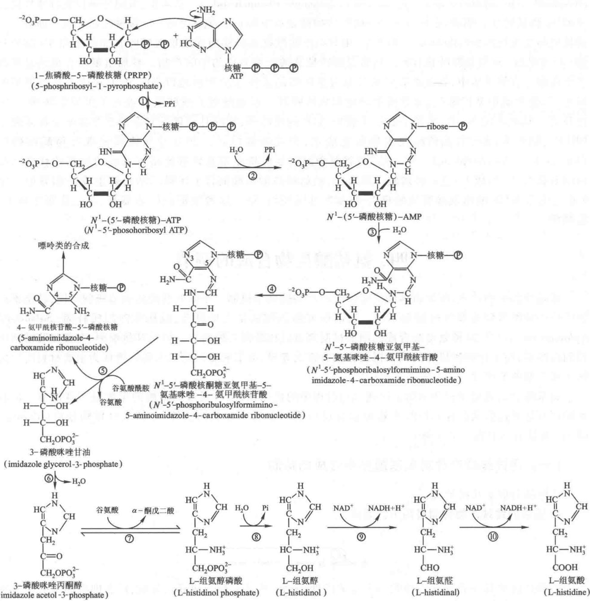  
图 26-23 组氨酸的生物合成  
图中①ATP 磷酸核糖转移酶(ATP phosphoribosyl transferase)，②焦磷酸水解酶(pyrophosphohydrolase)，③磷酸核糖-AMP 环化水解酶(phosphoribosyl-AMP cyclohydrolase)，④亚氨甲基-5-氨基咪唑-4-羧酰胺核苷酸磷酸核糖同分异构酶(phosphoribosylformimino-5-aminoimidazole carboxamide ribonucleotide isomerase)，⑤谷氨酰胺酰氨基转移酶(glutamine aminotransferase)，⑥咪唑甘油磷酸脱水酶(imidazole glycerol phosphate dehydrogenase)，⑦L-组氨醇磷酸氨基转移酶(L-histidinol phosphate aminotransferase)，⑧L-组氨醇磷酸磷酸酶(L-histidinol phosphate phosphatase)，⑨组氨醇脱氢酶(histidinol dehydrogenase)⑩组氨醛脱氢酶(histinal dehydrogenase)

组氨酸合成的第1步是 $1'$ 焦磷酸- $5'-$ 磷酸核糖(PRPP)的 $5'-$ 磷酸核糖部分转移到ATP分子上，与ATP嘌呤环的第一个氮原子形成以N-糖苷键(N-glycosyl linkage)相连的化合物 $N^{1}-(5'-$ 磷酸核糖)-ATP。第2步，上述化合物ATP部分水解除掉一个焦磷酸分子形成 $N^{1}-(5'-$ 磷酸核糖)-AMP。该化合物的 $C_{6}$ 与一亚氨离子(iminium ion)相连，亚氨离子有强烈吸收电子的作用，因此容易受水的亲核攻击。第

3步，在磷酸核糖-AMP解环酶(cyclohydrolase)作用下，上述 $N^1 -(5^{\prime}$ -磷酸核糖)-AMP的嘌呤环在 $\mathbf{C}_6$ 和 $N_{1}$ 之间被打开，形成 $N^1 -(5^{\prime}$ -磷酸核糖亚氨甲基）-5-氨基咪唑-4-羧酰胺核苷酸（ $N^1 -5^{\prime}$ phosphoribosylformimino-5-aminoimidazole-4-carboxamide ribonucleotide）。第4步，由同分异构酶打开核糖的呋喃环，将其转变为酮糖，形成 $N^1 -(5^{\prime}$ -磷酸核酮糖亚氨甲基)-5-氨基咪唑-4-羧酰胺核苷酸。即分子内的核糖转变为核酮糖(ribulose)。第5步，由谷氨酰胺酰氨基转移酶催化形成咪唑甘油磷酸和 $5^{\prime}$ -磷酸核糖-4-羧酰胺-5-氨基咪唑核苷酸。后者是嘌呤核苷酸生物合成的中间产物。参加组氨酸合成的是咪唑甘油磷酸。在第5步中，谷氨酰胺的酰胺基可能在酶的活性部位短暂地以 $\mathrm{NH}_3$ 的形式攻击亚氨甲基的碳原子，使亚氨甲基键断裂，并紧接着环化形成咪唑环。谷氨酰胺的酰胺氮即进入了组氨酸咪唑环 $\mathbf{N}_{1}$ 的位置。咪唑环的 $\mathbf{N}_2,\mathbf{C}_5$ 来源于起始步骤中ATP的嘌呤环，咪唑甘油磷酸其余的5个碳原子都来源于PRPP。第6步，咪唑甘油磷酸脱水酶催化脱水，生成的烯醇式产物互变异构形成咪唑丙酮醇磷酸(imidazole acetol phosphate)。第7步，需谷氨酸的组氨醇磷酸氨基转移酶将谷氨酸的氨基转移到咪唑丙酮醇磷酸上，形成L-组氨醇磷酸。第8步，组氨醇磷酸磷酸酶将上述磷酸酯水解生成L-组氨醇。第9步是由需 $\mathrm{NAD^{+}}$ 的组氨醇脱氢酶将L-组氨醇连续脱氢，第一次脱氢形成L-组氨醛，第二次则生成L-组氨酸。

## 四、氨基酸生物合成的调节

氨基酸的生物合成,根据机体的需要情况有严格的调节机制。不同氨基酸的调节机制不同,甚至不同机体同一种氨基酸的调节机制也不同。当前研究得透彻的是大肠杆菌、鼠伤寒沙门氏杆菌(Salmonella typhimurium),对其20种氨基酸合成的调节机制都做过比较深入的研究。但从其他细菌、真菌以及植物中得到的结果,与上述两种机体的调节机制往往有很大差异,本节着重讨论以大肠杆菌作为主要材料所得到的一些一般调节规律。

氨基酸合成既可通过调节酶活性或代谢过程中的代谢物,又可通过调节酶的生成量实现调节。最有效的调节是通过合成过程的终端产物抑制其反应系列中第一个酶的活性,亦即通过别构效应(allosteric effect)调节第一个酶的生成物。

## （一）通过终端产物对氨基酸生物合成的抑制

可概括为以下几种形式：

1. 简单的终端产物抑制可用下式表示：

终端产物 E 抑制合成途径中第一个酶的活性,例如,由苏氨酸合成异亮氨酸,后者即是苏氨酸脱氨酶 (threonine deaminase) 的反馈抑制物(见图 26-13)。

2. 不同终端产物对共经合成途径的协同抑制 (concerted end product inhibition)

终端产物 E 和 H 既抑制在合成过程中共经途径的第一个酶,也抑制在分道后第一个产物的合成酶。例如,谷氨酸形成谷氨酰胺第 1 步反应中起催化作用的酶,即谷氨酰胺合酶(参看本章第一节, $\alpha-$ 酮戊二酸形成谷氨酰胺)受到 8 种产物的反馈抑制。

3. 不同分支产物对多个同工酶的特殊抑制——酶的多重性抑制 (enzyme multiplicity)

A 形成 B 由两个酶分别合成,两个酶分别受不同分支产物的特殊控制。两个分支产物又分别抑制其分道后第一个产物 E 和 F 的形成。例如,由 4-磷酸赤藓糖和磷酸烯醇式丙酮酸形成 3 种芳香族氨基酸的途径(图 26-24)。

4. 连续产物抑制 (sequential end product inhibition), 又称连续反馈控制 (sequential feedback control) 或逐步反馈抑制 (step feedback inhibition)

终端产物 E 和 H 只分别抑制分道后自己途径中第一个酶的作用。共经途径的终端产物 D 抑制全合成过程第一个酶的作用。这种抑制的特点是由于 E 对 e 酶的抑制致使 D 产物增加，D 的增加促使反应向 D→F→G→H 方向进行，而使产物 H 增加，又对 f 酶产生抑制，结果也造成 D 物质的积累，D 物质反馈抑制 a 酶的作用，而使 A→B 的速度减慢。枯草杆菌（Bacillus subtilis）中芳香族氨基酸生物合成的反馈抑制即属这种类型。苯丙氨酸、酪氨酸、色氨酸分支途径的第一步都分别受各自终产物的抑制。如果 3 种终端产物都过量，则分支酸即行积累。分支点中间产物积累的结果，使共经途径催化第一步反应的酶受到反馈抑制，从而抑制 4-磷酸赤藓糖和磷酸烯醇式丙酮酸的缩合反应（见图 26-24）。

由天冬氨酸生成赖氨酸、甲硫氨酸、异亮氨酸的过程也出现有各种类型的抑制现象(图 26-25)。

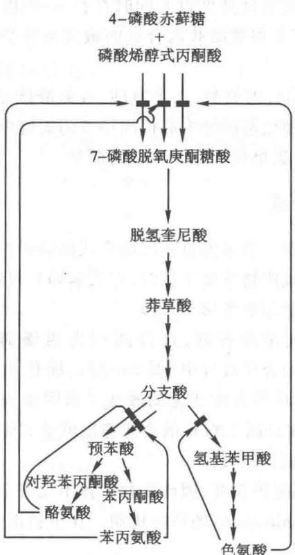  
图 26-24 苯丙氨酸、色氨酸、酪氨酸合成的连续产物抑制

  
图26-25 赖氨酸、甲硫氨酸、异亮氨酸合成的连续产物抑制

催化谷氨酸与氨结合形成谷氨酰胺的谷氨酰胺合成酶受 Ala、Gly 和至少 6 种谷氨酸代谢的终产物的催化谷氨酸与氨结合形成谷氨酰胺的谷氨酰胺合成酶受 Ala、Gly 和别构抑制调节。每种抑制剂单独作用时只能产生部分的抑制作用。只有当所有 8 种抑制剂同时作用的时候才能完全抑制这个酶。这种调控机制可连续调节谷氨酸水平以满足瞬时代谢的需要。在 E.coil 这样的肠道细菌中，谷氨酰胺合成酶的调控是极其复杂的。这种酶含有 12 个相对分子质量为 50 000 的相同亚基，并且可以通过别构作用和共价修饰进行调节。除了别构调节，位于酶活性部位的 Tyr $^{397}$ 的腺苷酰化作用（加入 AMP）也能产生抑制效应。

这种共价修饰提高了别构抑制剂的敏感度，随着亚基的腺苷酰化增加，其活性逐渐降低。不论是腺苷酰化反应还是脱腺苷酰化反应，都是一种复杂的与谷氨酸、 $\alpha-$ 酮戊二酸、ATP以及Pi浓度水平相关的酶级联反应，它们均可被腺苷酰转移酶（adenylyltransferase）所催化。腺苷酰转移酶的活性可通过结合到一种称为 $\mathrm{P}_{\mathrm{II}}$ 的调节蛋白质上而进行调节， $\mathrm{P}_{\mathrm{II}}$ 的活性则又是被 $\mathrm{P}_{\mathrm{II}}$ 的一个Tyr残基的尿苷酰化共价修饰所调节。腺苷酰转移酶复合物与尿苷酰化的 $\mathrm{P}_{\mathrm{II}}(\mathrm{P}_{\mathrm{II}} - \mathrm{UMP})$ 结合可引起谷氨酰胺合成酶的腺苷酰化。 $\mathrm{P}_{\mathrm{II}}$ 的尿苷酰化和脱尿苷酰化都是由尿苷酰转移酶（uridylyltransferase）催化的。尿苷酰化可以被谷氨酸和Pi结合到尿苷转移酶所抑制，也可被 $\alpha-$ 酮戊二酸和ATP结合到 $\mathrm{P}_{\mathrm{II}}$ 所激活。

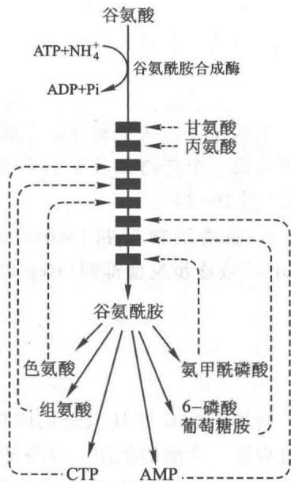  
图26-26 谷氨酰胺合成的连续产物抑制

这种调控并没有就此终止，尿苷酰化的 $\mathrm{P}_{\mathrm{II}}$ 也可以介导编码谷氨酰胺合成酶基因的转录激活，最终使细胞中该酶的浓度增加。同样脱尿苷酰化的 $\mathrm{P}_{\mathrm{II}}$ 会使谷氨酰胺合成酶基因的转录水平下降。这种机制涉及一种 $\mathrm{P}_{\mathrm{II}}$ 与其他蛋白相互作用的机制，这些蛋白与基因调控相关。这种复杂机制的总效应就是当存在高浓度的谷氨酰胺时，谷氨酰胺合成酶的活件降低；而谷氨酰胺浓度降低以及同时存在 $\alpha-$ 酮戊二酸和ATP时，谷氨酰胺合成酶的活性升高。这种多层次的调控就决定了谷氨酰胺的合成的敏锐应答受控于细胞的需要。

并不是所有氨基酸的生物合成都受最终产物的反馈抑制，丙氨酸、天冬氨酸、谷氨酸就是例外。这3种氨基酸靠与其相对应的酮酸的可逆反应维持平衡。这3种氨基酸是中心代谢环节的关键中间产物。

甘氨酸的合成酶也不受最终产物抑制，此酶可能受到一碳单位和四氢叶酸的调节。

## （二）通过酶生成量的改变调节氨基酸的生物合成

酶生成量的控制主要是通过有关酶编码基因活性的改变。当某种氨基酸的合成能够提供超过需要量的产物时，则该合成途径酶的编码基因即受到抑制；而当合成产物浓度下降时，有关编码基因则解除抑制，从而合成增加产物浓度所需要的酶。有关酶基因的调控问题请参考第39章。

在氨基酸的合成途径中,有些酶能够受到细胞合成量的控制,这种酶称为阻遏酶(repressible enzyme)。例如,在大肠杆菌由天冬氨酸衍生的几种氨基酸的合成过程中(图26-25),标有A、B、C的3种酶都不属于变构酶,这些酶属于阻遏酶,它们的调控靠细胞对其合成速度的改变。当甲硫氨酸的量足够时,同工酶A和B都受到阻遏。同样当异亮氨酸的合成足够时同工酶C的合成速度就受到阻遏。靠阻遏与去阻遏(derepression)调控氨基酸的生物合成一般比别构调控缓慢。

因 20 种氨基酸在蛋白质生物合成中都需以准确的比例提供需要,因此生物机体不仅有个别氨基酸合成的调控机制,而且有使各种氨基酸在合成中相互协调(coordination)的调控机制。在生长迅速的细菌中,这种机制比电子计算机还要完善。

<!-- EN-BEGIN 22.2 -->

### 【英文对应 22.2】Biosynthesis of Amino Acids

> 来源：Lehninger Principles of Biochemistry（书籍/02_生物化学原理） 第22章 Biosynthesis of Amino Acids, Nucleotides, and Related Molecules，§22.2。对应本章“四、氨基酸生物合成的调节”。

All amino acids are derived from intermediates in glycolysis, the citric acid cycle, or the pentose phosphate pathway (Fig. 22-11). Nitrogen enters these biosynthetic pathways by way of glutamate and glutamine. Some pathways are simple, others are not. Ten of the amino acids are just one or several steps removed from the common metabolite from which they are derived. The biosynthetic pathways for others, such as the aromatic amino acids, are more complex.

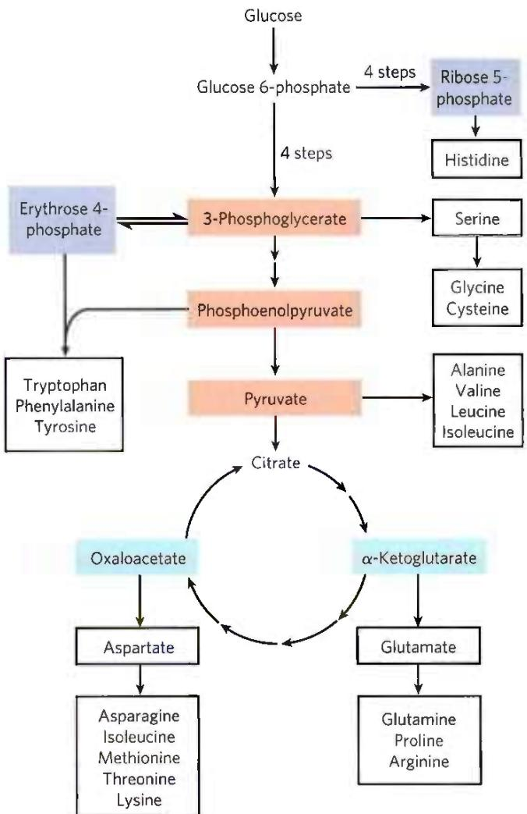  
FIGURE 22-11 Overview of amino acid biosynthesis. The carbon skeleton precursors derive from three sources: glycolysis (light red), the citric acid cycle (blue), and the pentose phosphate pathway (purple).

#### [EN] Organisms Vary Greatly in Their Ability to Synthesize the 20 Common Amino Acids

Whereas most bacteria and plants can synthesize all 20 amino acids, mammals can synthesize only about half of them—generally those with simple pathways. These are often called nonessential amino acids (see Table 18-1). The label is somewhat misleading, however, because innate biosynthetic pathways often do not provide enough of these amino acids to support optimal growth and health. The remaining amino acids, the essential amino acids, cannot be synthesized by most mammals and must be obtained from food. A few amino acids are conditionally essential in mammals, required at particular stages of development. Unless otherwise indicated, the pathways for the 20 common amino acids presented below are those operative in bacteria.

#### [EN] TABLE 22-1 Amino Acid Biosynthetic Families, Grouped by Metabolic Precursor

<table><tr><td>α-Ketoglutarate</td><td>Pyruvate</td></tr><tr><td>Glutamate</td><td>Alanine</td></tr><tr><td>Glutamine</td><td>Valinea</td></tr><tr><td>Proline</td><td>Leucinea</td></tr><tr><td>Arginine</td><td>Isoleucinea</td></tr><tr><td>3-Phosphoglycerate</td><td rowspan="2">Phosphoenolpyruvate and erythrose 4-phosphate</td></tr><tr><td>Serine</td></tr><tr><td>Glycine</td><td>Tryptophana</td></tr><tr><td>Cysteine</td><td>Phenylalaninea</td></tr><tr><td></td><td>Tyrosineb</td></tr><tr><td>Oxaloacetate</td><td></td></tr><tr><td>Aspartate</td><td>Ribose 5-phosphate</td></tr><tr><td>Asparagine</td><td>Histidinea</td></tr><tr><td>Isoleucine</td><td></td></tr><tr><td>Methioninea</td><td></td></tr><tr><td>Threoninea</td><td></td></tr><tr><td>Lysinea</td><td></td></tr><tr><td colspan="2">aEssential amino acids in mammals.</td></tr><tr><td colspan="2">bDerived from phenylalanine in mammals.</td></tr></table>

A useful way to organize these biosynthetic pathways is to group them into six families corresponding to their metabolic precursors (Table 22-1), and we use this approach to structure the detailed descriptions that follow. In addition to these six precursors, there is a notable intermediate in several pathways of amino acid and nucleotide synthesis: 5-phosphoribosyl-1-pyrophosphate (PRPP):

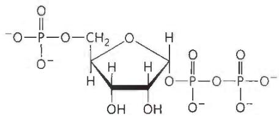

PRPP is synthesized from ribose 5-phosphate derived from the pentose phosphate pathway (see Fig. 14-31), in a reaction catalyzed by ribose phosphate pyrophosphokinase:

Ribose 5-phosphate + ATP →

5-phosphoribosyl-1-pyrophosphate + AMP

This enzyme is allosterically regulated by many of the biomolecules for which PRPP is a precursor.

#### [EN] α-Ketoglutarate Gives Rise to Glutamate, Glutamine, Proline, and Arginine

We have already described the biosynthesis of glutamate and glutamine. Proline is a cyclized derivative of glutamate (Fig. 22-12). P6 In the first step of proline synthesis, ATP reacts with the $\gamma$ -carboxyl group of glutamate to form an acyl phosphate, which is reduced by NADPH or NADH to glutamate $\gamma$ -semialdehyde. This intermediate undergoes rapid spontaneous cyclization and is then reduced further to yield proline.

Arginine is synthesized from glutamate via ornithine and the urea cycle in animals (Chapter 18). In principle, ornithine could also be synthesized from glutamate γ-semialdehyde by transamination, but the spontaneous cyclization of the semialdehyde in the proline pathway precludes a sufficient supply of this intermediate for ornithine synthesis. Bacteria have a de novo biosynthetic pathway for ornithine (and thus arginine) that parallels some steps of the proline pathway but includes two additional steps that avoid the problem of the spontaneous cyclization of glutamate γ-semialdehyde (Fig. 22-12). In the first step, the α-amino group of glutamate is blocked by an acetylation requiring acetyl-CoA; then, after the transamination step, the acetyl group is removed to yield ornithine.

The pathways to proline and arginine are somewhat different in mammals. Proline can be synthesized by the pathway shown in Figure 22-12, but it is also formed from arginine obtained from dietary or tissue protein. Arginase, a urea cycle enzyme, converts arginine to ornithine and urea (see Figs. 18-10, 18-26). The ornithine is converted to glutamate $\gamma$ -semialdehyde by the enzyme ornithine $\delta$ -aminotransferase (Fig. 22-13). The semialdehyde cyclizes to $\Delta^{1}$ -pyrroline-5-carboxylate, which is then converted to proline (Fig. 22-12). The pathway for arginine synthesis shown in Figure 22-12 is absent in mammals. P1 When arginine from dietary intake or protein turnover is insufficient for protein synthesis, the ornithine $\delta$ -aminotransferase reaction operates in the direction of ornithine formation. Ornithine is then converted to citrulline and arginine in the urea cycle.

#### [EN] Serine, Glycine, and Cysteine Are Derived from 3-Phosphoglycerate

The major pathway for the formation of serine is the same in all organisms (Fig. 22-14). In the first step, the hydroxyl group of 3-phosphoglycerate is oxidized by a dehydrogenase (using $\mathrm{NAD^{+}}$ ) to yield 3-phosphohydroxypyruvate. Transamination from glutamate yields

FIGURE 22-12 Biosynthesis of proline and arginine from glutamate in bacteria. All five carbon atoms of proline arise from glutamate. In many organisms, glutamate dehydrogenase is unusual in that it uses either NADH or NADPH as a cofactor. The same may be true of other enzymes in these pathways. The $\gamma$ -semialdehyde in the proline pathway undergoes a rapid, reversible cyclization to $\Delta^{1}$ -pyrroline-5-carboxylate (PSC), with the equilibrium favoring PSC formation. Cyclization is averted in the ornithine/arginine pathway by acetylation of the $\alpha$ -amino group of glutamate in the first step and removal of the acetyl group after the transamination. This acetyl group is highlighted in yellow. Although some bacteria lack arginase and thus the complete urea cycle, they can synthesize arginine from ornithine in steps that parallel the mammalian urea cycle, with citrulline and argininosuccinate as intermediates (see Fig. 18-10).

Here, and in subsequent figures in this chapter, the reaction arrows indicate the linear path to the final products, without considering the reversibility of individual steps. For example, the step of the pathway leading to arginine that is catalyzed by N-acetylglutamate dehydrogenase is chemically similar to the glyceraldehyde 3-phosphate dehydrogenase reaction in glycolysis (see Fig. 14-7) and is readily reversible.

  
FIGURE 22-13 Ornithine δ-aminotransferase reaction: a step in the mammalian pathway to proline. This enzyme is found in the mitochondrial matrix of most tissues. Although the equilibrium favors P5C

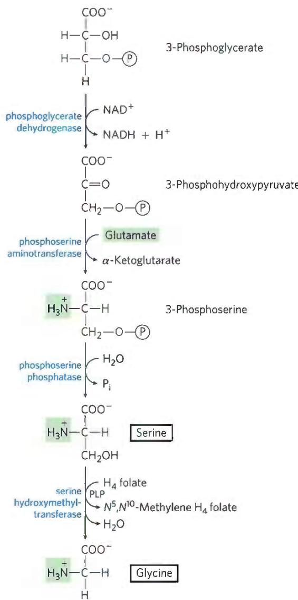  
FIGURE 22-14 Biosynthesis of serine from 3-phosphoglycerate and of glycine from serine in all organisms. As indicated in the text, this is only one of multiple pathways to synthesize glycine.  
formation, the reverse reaction is the only mammalian pathway for synthesis of ornithine (and thus arginine) when arginine levels are insufficient for protein synthesis.

3-phosphoserine, which is hydrolyzed to free serine by phosphoserine phosphatase.

Serine (three carbons) is the precursor of glycine (two carbons) through removal of a carbon atom by serine hydroxymethyltransferase (Fig. 22-14). Tetrahydrofolate accepts the $\beta$ carbon (C-3) of serine, which forms a methylene bridge between N-5 and N-10 to yield $N^5$ , $N^{10}$ -methylenetetrahydrofolate (see Fig. 18-17). The overall reaction, which is reversible, also requires pyridoxal phosphate. In the liver of vertebrates, glycine can be made by another route: the reverse of the reaction shown in Figure 18-20c, catalyzed by glycine synthase (also called glycine cleavage enzyme):

$$
\begin{array}{r l} \mathrm{CO} _ {2} + \mathrm{NH} _ {4} ^ {+} + N ^ {5}, N ^ {1 0} - \text { methylenetetrahydrofolate } + \\ \mathrm{NADH} + \mathrm{H} ^ {+} & \longrightarrow \text { glycine } + \text { tetrahydrofolate } + \mathrm{NAD} ^ {+} \end{array}
$$

Plants and bacteria produce the reduced sulfur required for the synthesis of cysteine (and methionine, described later) from environmental sulfates; the pathway is shown on the right side of Figure 22-15. Sulfate is activated in two steps to produce 3'-phosphoadenosine 5'-phosphosulfate (PAPS), which undergoes an eight-electron reduction to sulfide. The sulfide is then used in the formation of cysteine from serine in a two-step pathway. Mammals synthesize cysteine from two amino acids: methionine furnishes the sulfur atom, and serine furnishes the carbon skeleton. Methionine is first converted to S-adenosylmethionine (see Fig. 18-18), which can lose its methyl group to any of a number of acceptors to form S-adenosylhomocysteine (adoHcy). This demethylated product is hydrolyzed to free homocysteine, which undergoes a reaction with serine, catalyzed by cystathionine β-synthase, to yield cystathionine (Fig. 22-16). Finally, cystathionine γ-lyase, a PLP-requiring enzyme, catalyzes removal of ammonia and cleavage of cystathionine to yield free cysteine.

  
FIGURE 22-15 Biosynthesis of cysteine from serine in bacteria and plants. The origin of reduced sulfur is shown in the pathway on the right.

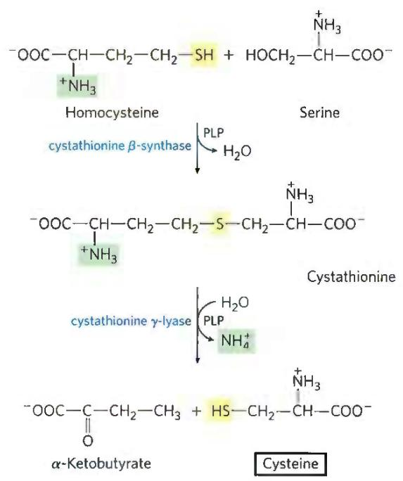

FIGURE 22-16 Biosynthesis of cysteine from homocysteine and serine in mammals. The homocysteine is formed from methionine.

Three Nonessential and Six Essential Amino Acids Are Synthesized from Oxaloacetate and Pyruvate

Alanine and aspartate are synthesized from pyruvate and oxaloacetate, respectively, by transamination from glutamate. Asparagine is synthesized by amidation of aspartate, catalyzed by the enzyme asparagine synthetase. The $NH_{4}^{+}$ is donated by glutamine. These are nonessential amino acids, and their simple biosynthetic pathways occur in all organisms.

The malignant lymphocytes present in childhood acute lymphoblastic leukemia (ALL) produce little or no asparagine synthetase, and they are thus sensitive to asparagine depletion. The chemotherapy for ALL is administered together with an L-asparaginase derived from bacteria, with the enzyme functioning to reduce serum asparagine. The combined treatment results in a greater than 95% remission rate in cases of childhood ALL (L-asparaginase treatment alone produces remission in 40% to 60% of cases). However, the asparaginase treatment has some deleterious side effects, and about 10% of patients who achieve remission eventually suffer relapse, with tumors resistant to drug therapy. Researchers are now developing inhibitors of human asparagine synthetase to augment these therapies for childhood ALL.

Methionine, threonine, lysine, isoleucine, valine, and leucine are essential amino acids; humans cannot synthesize them. Their biosynthetic pathways in bacteria are complex and interconnected (Fig. 22-17). In some cases, the pathways in bacteria, fungi, and plants differ significantly.

Aspartate gives rise to methionine, threonine, and lysine. Branch points occur at aspartate $\beta$ -semialdehyde, an intermediate in all three pathways, and at homoserine, a precursor of threonine and methionine. Threonine, in turn, is one of the precursors of isoleucine. The valine and isoleucine pathways share four enzymes (Fig. 22-17). Pyruvate gives rise to valine and isoleucine in pathways that begin with condensation of two carbons of pyruvate (in the form of hydroxyethyl thiamine pyrophosphate; see Fig. 14-13b) with another molecule of pyruvate (the valine path) or with $\alpha$ -ketobutyrate (the isoleucine path). The $\alpha$ -ketobutyrate is derived from threonine in a reaction that requires pyridoxal phosphate. An intermediate in the valine pathway, $\alpha$ -ketoisovalerate, is the starting point for a four-step branch pathway leading to leucine.

Chorismate Is a Key Intermediate in the Synthesis of Tryptophan, Phenylalanine, and Tyrosine

The three amino acid side chains that contain aromatic rings, tryptophan, phenylalanine, and tyrosine, present a special chemical problem for biosynthesis. Aromatic rings are not readily available in the environment, even though the benzene ring is very stable. The branched pathway to tryptophan, phenylalanine, and tyrosine, occurring in bacteria, fungi, and plants, is the main biological route of aromatic ring formation. It proceeds through ring closure of an aliphatic precursor followed by stepwise addition of double bonds. The first four steps produce shikimate, a seven-carbon molecule derived from erythrose 4-phosphate and phosphoenolpyruvate (Fig. 22-18). Shikimate is converted to chorismate in three steps that include the addition of three more carbons from another molecule of phosphoenolpyruvate. Chorismate is the first branch point of the pathway, with one branch leading to tryptophan, the other to phenylalanine and tyrosine.

In the tryptophan branch (Fig. 22-19), chorismate is converted to anthranilate in a reaction in which glutamine donates the nitrogen that will become part of the

3-Dehydroshikimate

  
FIGURE 22-18 Biosynthesis of chorismate, an intermediate in the synthesis of aromatic amino acids in bacteria and plants. All carbons are derived from either erythrose 4-phosphate (light purple) or phosphoenolpyruvate (light red). Note that the NAD $^{+}$ required as a cofactor in step ② is released unchanged; it may be transiently reduced to NADH during the reaction, with formation of an oxidized reaction intermediate. Step ⑥ is competitively inhibited by glyphosate ( $^{-}$ COO—CH $_{2}$ —NH—CH $_{2}$ —PO $_{3}^{2-}$ ), the active ingredient in the widely used herbicide Roundup. The herbicide is relatively nontoxic to mammals, which lack this biosynthetic pathway. The intermediates quinate and shikimate are named after the plants in which they have been found to accumulate.

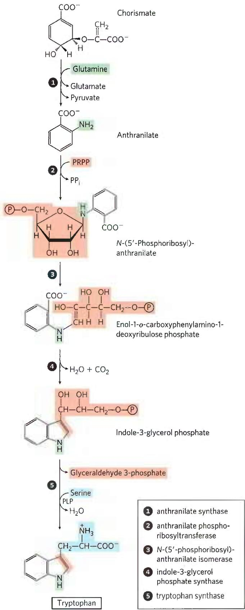  
FIGURE 22-19 Biosynthesis of tryptophan from chorismate in bacteria and plants. In E. coli, enzymes catalyzing steps ① and ② are subunits of a single complex.

indole ring. Anthranilate then condenses with PRPP. The indole ring of tryptophan is derived from the ring carbons and amino group of anthranilate plus two carbons derived from PRPP. The final reaction in the sequence is catalyzed by tryptophan synthase. This enzyme has an $\alpha_{2}\beta_{2}$ subunit structure and can be dissociated into two $\alpha$ subunits and a $\beta_{2}$ unit that catalyze different parts of the overall reaction:

$$
\begin{array}{r l} & \text { Indole - 3 - glycerol phosphate } \xrightarrow {\alpha \text { subunit }} \\ & \text { indole + glyceraldehyde 3 - phosphate } \\ & \text { Indole + serine } \xrightarrow {\beta_ {2} \text { subunit }} \text { tryptophan } + \mathrm{H} _ {2} \mathrm{O} \end{array}
$$

The second part of the reaction requires pyridoxal phosphate (Fig. 22-20). Indole formed in the first part is not released by the enzyme, but instead moves through a channel from the $\alpha$ -subunit active site to one of the $\beta$ -subunit active sites, where it condenses with a Schiff base intermediate derived from serine and PLP. Intermediate channeling of this type may be a feature of the entire pathway from chorismate to tryptophan. Enzyme active sites catalyzing different steps (sometimes not sequential steps) of the pathway to tryptophan are found on single polypeptides in some species of fungi and bacteria, but they are separate proteins in other species. In addition, the activity of some of these enzymes requires a noncovalent association with other enzymes of the pathway. These observations suggest that all the pathway enzymes are components of a large, multienzyme complex, a metabolon, in both bacteria and eukaryotes. Such complexes are generally not preserved intact when the enzymes are isolated using traditional biochemical methods (see Section 16.4).

In plants and bacteria, phenylalanine and tyrosine are synthesized from chorismate in pathways much less complex than the tryptophan pathway. The common intermediate is prephenate (Fig. 22-21). The final step in both cases is transamination with glutamate.

Animals can produce tyrosine directly from phenylalanine through hydroxylation at C-4 of the phenyl group by phenylalanine hydroxylase; this enzyme also participates in the degradation of phenylalanine (see Figs. 18-23, 18-24). Tyrosine is considered a conditionally essential amino acid, or as nonessential insofar as it can be synthesized from the essential amino acid phenylalanine.

#### [EN] Histidine Biosynthesis Uses Precursors of Purine Biosynthesis

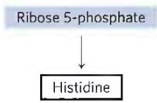

The pathway to histidine in all plants and bacteria differs in several respects from other amino acid

MECHANISM FIGURE 22-20 Tryptophan synthase reaction. (a) This enzyme catalyzes a multistep reaction with several types of chemical rearrangements. The PLP-facilitated transformations occur at the $\beta$ carbon (C-3) of the amino acid, as opposed to the $\alpha$ -carbon reactions described in

Figure 18-6. The $\beta$ carbon of serine is attached to the indole ring system. (b) Indole generated on the $\alpha$ subunit (white) moves through a tunnel to the $\beta$ subunit (blue), where it condenses with the serine moiety. [(b) Data from PDB ID 1KFJ, V. Kulik et al., J. Mol. Biol. 324:677, 2002.]

  
FIGURE 22-21 Biosynthesis of phenylalanine and tyrosine from chorismate in bacteria and plants. Conversion of chorismate to prephenate is a rare biological example of a Claisen rearrangement.

biosynthetic pathways. Histidine is derived from three precursors (Fig. 22-22): PRPP contributes five carbons, the purine ring of ATP contributes a nitrogen and a carbon, and glutamine supplies the second ring nitrogen. The key steps are condensation of ATP and PRPP, in which N-1 of the purine ring is linked to the activated C-1 of the ribose of PRPP (step 1 in Fig. 22-22); purine ring opening that ultimately leaves N-1 and C-2 of adenine linked to the ribose (step 3); and formation of the imidazole ring, a reaction in which glutamine donates a nitrogen (step 5). The use of ATP as a metabolite rather than a high-energy cofactor is unusual—but not wasteful, because it dovetails with the purine biosynthetic pathway. The remnant of ATP that is released after the transfer of

N-1 and C-2 is 5-aminoimidazole-4-carboxamide ribonucleotide (AICAR), an intermediate of purine biosynthesis (see Fig. 22-35) that is rapidly recycled to ATP.

#### [EN] Amino Acid Biosynthesis Is under Allosteric Regulation

As detailed in Chapter 13, the control of flux through a metabolic pathway often reflects the activity of multiple enzymes in that pathway. P4 In the case of amino acid synthesis, regulation often takes place in part through feedback inhibition of the first reaction by the end product of the pathway. This first reaction is often catalyzed by an allosteric enzyme that plays an important role in the overall control of flux through that pathway. As an example, Figure 22-23 shows the allosteric regulation of isoleucine synthesis from threonine. The end product, isoleucine, is an allosteric inhibitor of the first reaction in the sequence. In bacteria, such allosteric modulation of amino acid synthesis contributes to the minute-to-minute adjustment of pathway activity to cellular needs.

Allosteric regulation of an individual enzyme can be considerably more complex. An example is the remarkable set of allosteric controls exerted on glutamine synthetase of E. coli (Fig. 22-8). Six products derived from glutamine serve as negative feedback modulators of the enzyme, and the overall effects of these and other modulators are more than additive. Such regulation is called concerted inhibition.

Additional mechanisms contribute to the regulation of the amino acid biosynthetic pathways. P1 P4 Because the 20 common amino acids must be made in the correct proportions for protein synthesis, cells have developed ways not only of controlling the rate of synthesis of individual amino acids but also of coordinating their formation. Such coordination is especially well developed in fast-growing bacterial cells. Figure 22-24 shows how E. coli cells coordinate the synthesis of lysine, methionine, threonine, and isoleucine, all made from aspartate. Several important types of inhibition patterns are evident. The step from aspartate to aspartyl- $\beta$ -phosphate is catalyzed by three isozymes, each independently controlled by different modulators. This enzyme multiplicity prevents one biosynthetic end product from shutting down key steps in a pathway when other products of the same pathway are required. The steps from aspartate $\beta$ -semialdehyde to homoserine and from threonine to $\alpha$ -ketobutyrate (detailed in Fig. 22-17) are also catalyzed by dual, independently controlled isozymes. One isozyme for the conversion of aspartate to aspartyl- $\beta$ -phosphate is allosterically inhibited by two different modulators, lysine and isoleucine, whose action is more than additive—another example of concerted inhibition. The sequence from aspartate to isoleucine undergoes multiple, overlapping negative feedback inhibitions; for example, isoleucine inhibits the conversion of threonine to $\alpha$ -ketobutyrate (as described above), and threonine inhibits its own formation at three points: from homoserine,

FIGURE 22-22 Biosynthesis of histidine in bacteria and plants. Atoms derived from PRPP and ATP are shaded light red and blue, respectively. Two of the histidine nitrogens are derived from glutamine and glutamate (green). Note that the derivative of ATP remaining after step 5 (AICAR) is an intermediate in purine biosynthesis (see Fig. 22-35, step 9), so ATP is rapidly regenerated.

  
FIGURE 22-23 Allosteric regulation of isoleucine biosynthesis. The first reaction in the pathway from threonine to isoleucine is inhibited by the end product, isoleucine. This was one of the first examples of allosteric feedback inhibition to be discovered.

  
FIGURE 22-24 Interlocking regulatory mechanisms in the biosynthesis of several amino acids derived from aspartate in E. coli. Three enzymes (A, B, C) have either two or three isozyme forms, indicated by numerical subscripts. In each case, one isozyme ( $A_{2}$ , $B_{1}$ , and $C_{2}$ ) has no allosteric regulation; these isozymes are regulated by changes in the amount of enzyme synthesized. Synthesis of isozymes $A_{2}$ and $B_{1}$ is repressed when methionine levels are high, and synthesis of isozyme $C_{2}$ is repressed when isoleucine levels are high. Enzyme A is aspartokinase; B, homoserine dehydrogenase; C, threonine dehydratase.

from aspartate $\beta$ -semialdehyde, and from aspartate (see Fig. 22-17). This overall regulatory mechanism is called sequential feedback inhibition.

Similar patterns are evident in the pathways leading to the aromatic amino acids. The first step of the early pathway to the common intermediate chorismate is catalyzed by the enzyme 2-keto-3-deoxy-D-arabinoheptulosonate 7-phosphate (DAHP) synthase (1 in Fig. 22-18). Most microorganisms and plants have three DAHP synthase isozymes. One is allosterically inhibited (feedback inhibition) by phenylalanine, another by tyrosine, and the third by tryptophan. This scheme helps the overall pathway to respond to cellular requirements for one or more of the aromatic amino acids. Additional regulation takes place after the pathway branches at chorismate. For example, the enzymes catalyzing the first two steps of the tryptophan branch are subject to allosteric inhibition by tryptophan.

#### [EN] SUMMARY 22.2 Biosynthesis of Amino Acids

■ Plants and bacteria synthesize all 20 common amino acids. Mammals can synthesize about half; the others are required in the diet (essential or conditionally essential amino acids).

Glutamate is formed by reductive amination of $\alpha$ -ketoglutarate and serves as the precursor of glutamine, proline, and arginine.

The carbon chain of serine is derived from 3-phosphoglycerate. Serine is a precursor of glycine; the $\beta$ -carbon atom of serine is transferred to tetrahydrofolate. In microorganisms, cysteine is produced from serine and from sulfide produced by the reduction of environmental sulfate. Mammals produce cysteine from methionine and serine by a series of reactions requiring S-adenosylmethionine and cystathionine.

Alanine and aspartate (and thus asparagine) are formed from pyruvate and oxaloacetate, respectively, by transamination. Pyruvate and oxaloacetate also give rise to methionine, threonine, lysine, valine, isoleucine, and leucine via longer pathways.

The aromatic amino acids (phenylalanine, tyrosine, and tryptophan) form by a pathway in which chorismate occupies a key branch point. Tyrosine can also be formed by hydroxylation of phenylalanine (and thus is considered conditionally essential). Phosphoribosyl pyrophosphate is a precursor of tryptophan and histidine.

■ The pathway to histidine is interconnected with the purine synthetic pathway.

■ The amino acid biosynthetic pathways are subject to allosteric end-product inhibition; the regulatory enzyme is usually the first in the sequence. Regulation of the various synthetic pathways is coordinated.

<!-- EN-END 22.2 -->

## 五、氨基酸转化为其他氨基酸及其他代谢物

某些氨基酸,除了它是蛋白质的组成单元外,还可成为一些重要生物分子的前体。这些分子包括一些核苷酸、核苷酸辅酶、血红素、各种激素、神经介质、氧化氮及谷胱甘肽等。本节将介绍氧化氮、谷胱甘肽、肌酸、卟啉及血红素、短杆菌肽等是如何从氨基酸转化形成的。有关核苷酸、核苷酸辅酶将在有关章节介绍。

## （一）氧化氮的形成

氧化氮(nitric oxide, NO)最近被发现在脊椎动物体内是一种重要的信息分子。它在信号传导过程中起重要作用。它是由精氨酸在氧化氮合酶(nitric oxide synthase, NOS)催化下形成的，产物是氧化氮和瓜氨酸，反应如下式：

(γ-谷氨酰半胱氨酰甘氨酸)  

以上的反应,实际上是一复杂反应。反应中还原型的 NADPH 和 $O_{2}$ 都需要。对这两种物质的需要表明氧化氮合酶(NOS)可能类似于细胞色素 P450。后者在催化羟基化反应中有活化分子氧的作用。实验证明,氧化氮合酶的 cDNA 序列自羧基端有一半与 P450 加氧酶(oxygenases)的序列相似。特别是在结合部位,二者都有黄素(flavins)和 NADPH 的结合部位。氧化氮可自由地跨膜扩散。因它非常活跃,其存在时间极短,甚至少于几秒钟。一氧化氮非常适合于在细胞内部以及在细胞之间作为瞬间的信号分子。

## （二）谷胱甘肽

谷胱甘肽(glutathion)含有巯基(一SH)，能保护血液中的红细胞不受氧化损伤、维持血红素中半胱氨酸处于还原态。正常情况下，还原型谷胱甘肽(GSH)与氧化型谷胱苷肽(GSSG)之比为500：1以上。在运动细胞中谷胱甘肽的含量很高(约5 mol/L)，因此谷胱甘肽可起到一SH“缓冲剂”(sulfhydryl buffer)的作用。

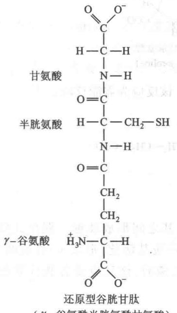

还原型谷胱甘肽与过氧化氢或其他有机氧化物反应还可起到解毒作用。

谷胱甘肽还参与氨基酸的转运, Meister A 首先提出 $\gamma-$ 谷氨酰循环, 解释了谷胱甘肽在氨基酸跨膜转运中的机制(图 26-27)。

  
图26-27 谷胱甘肽在氨基酸跨膜转运的作用机制  
谷胱甘肽通过 $\gamma-$ 谷氨酰循环完成氨基酸的跨膜运转，氨基酸以 $\gamma-$ 谷氨酰衍生物（ $\gamma-$ glutamyl derivative）的形式，从一个细胞转移到另一个细胞，谷胱甘肽与氨基酸形成 $\gamma-$ 谷氨酰氨基酸的反应发生于细胞质膜的外表面。循环中所有其他反应都在细胞溶胶内进行

在此循环中存在一个与膜结合的酶,称为 $\gamma-$ 谷氨酰转肽酶( $\gamma$ -glutamyl transpeptidase)。该酶的催化作用是使谷胱甘肽分子上的 $\gamma-$ 谷氨酰基转移到任何一个氨基酸上,形成 $\gamma-$ 谷氨酰氨基酸:

该酶的催化部位在细胞膜外侧(肾细胞)。谷胱甘肽能跨过质膜进行上述反应,形成的 $\gamma-$ 谷氨酰氨基酸被其他器官的细胞吸收并环化形成 5-氧代脯氨酸(5-oxoproline)。同时将被运转的氨基酸释出:

5-氧代脯氨酸在 5-氧代脯氨酸酶作用下水解开环又形成谷氨酸。该反应为需能反应。

谷胱甘肽生物合成的第1步是谷氨酸的 $\gamma$ -羧基和半胱氨酸的氨基之间形成肽键。催化此反应的酶称为 $\gamma$ -谷氨酸半胱氨酸合成酶。该肽键的形成需要由ATP先将 $\gamma$ -羧基活化，形成 $\gamma$ -谷氨酰磷酸，活化了的 $\gamma$ -羧基易于接受半胱氨酸氨基的进攻，形成肽键，同时脱去磷酸，该反应受谷胱甘肽的反馈抑制。

$\delta$ -氨基乙酰丙酸  
甘氨酸 琥珀酰-CoA  

谷胱甘肽合成的第二步是 $\gamma-$ 谷氨酰半胱氨酸分子中半胱氨酸部分的羧基与甘氨酸的氨基之间形成肽键。催化此反应的酶称为谷胱甘肽合成酶，反应的机制和上述肽键的形成基本上相同，在 ATP 参与下使半胱氨酸的羧基活化，而易于接受甘氨酸氨基的进攻。

## （三）肌酸的生物合成

肌酸(creatine)可形成磷酸肌酸在肌肉和神经的贮能中占有重要地位(参看第16章生物能学)。

肌酸的生物合成是由甘氨酸、精氨酸、甲硫氨酸形成。精氨酸提供胍基（guanidino group），甲硫氨酸提供甲基，其合成步骤可表示如图26-28。

## （四）卟啉、血红素的生物合成

## 1. 叶啉(porphyrin)是从琥珀酰-CoA及甘氨酸衍生而来

（1）自甘氨酸形成 $\delta-$ 氨基 $-\gamma-$ 酮戊酸 ( $\delta-$ aminolevulinate, ALA) 甘氨酸在与琥珀酰辅酶 A 缩合前先与 $\delta-$ 氨基 $-\gamma-$ 酮戊酸合成酶的辅酶磷酸吡哆醛结合，形成一个中间产物 $\alpha-$ 氨基 $-\beta-$ 酮己二酸，然后脱羧而成 $\delta-$ 氨基 $-\gamma-$ 酮戊酸。

  
图26-28 肌酸的生物合成

其反应机制如图 26-29 所示。

（2）自 $\delta-$ 氨基 $-\gamma-$ 酮戊酸生成胆色素原（porphobilinogen，PBG）在细胞溶胶中，两分子 $\delta-$ 氨基乙酰丙酸缩合形成一分子胆色素原，这是第二个中间产物。催化此反应的酶 $\delta-$ 氨基乙酰丙酸脱水酶（ $\delta-$ aminolevulinate dehydrase）。催化过程经过两分子 $\delta-$ 氨基 $-\gamma-$ 酮戊酸间的醇醛缩合反应，加合物的脱水以及环化等反应最后形成胆色素原。以上反应都是在与酶结合的状态下进行。

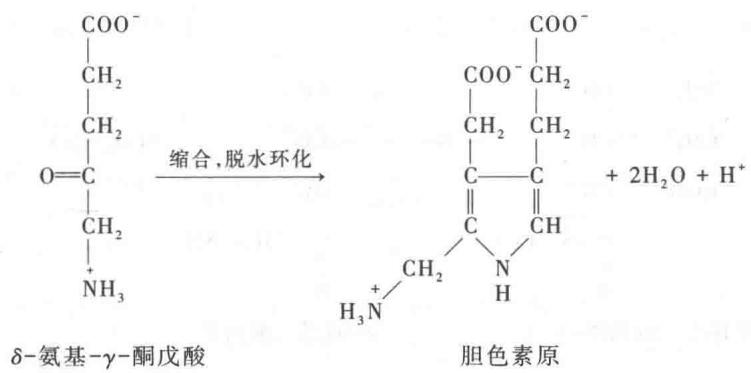

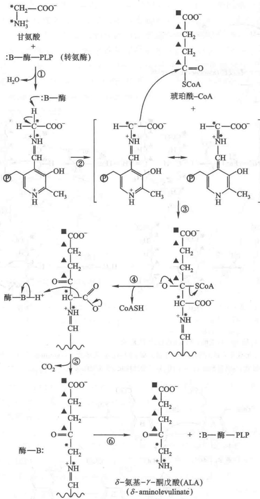  
图 26-29 叶啉合成过程中甘氨酸与琥珀酰-CoA 形成中间产物 δ-氨基-γ-酮戊酸的反应机制  
①甘氨酸在酶促催化下发生转氨基反应，辅因子为吡哆醛磷酸（PLP）；②PLP使碳负离子的形成得到稳定；③C—C键的形成；④CoA的释出；⑤PLP希夫碱易化脱羧反应，⑥发生转亚氨基作用，产生 $\delta-$ 氨基- $\gamma-$ 酮戊酸（ALA）同时PLP酶又得到再生。■、▲、\*为C和N原子来源的标记

全部过程可表示如图 26-30。

（3）胆色素原是吡咯化合物的母体 4 分子胆色素原在胆色素原脱氨酶（porphobilinogendeaminase）催化下，缩合形成一线型四吡咯（tetrapyrrole），即聚吡咯基甲烷（polypyrrole methane）。每一缩合即形成一个乙烯桥，同时失去一铵离子。仔细考察可以看到这个四吡咯中的氮和碳原子来源于甘氨酸，其他则来自琥珀酰-CoA，其反应机制见图 26-31。

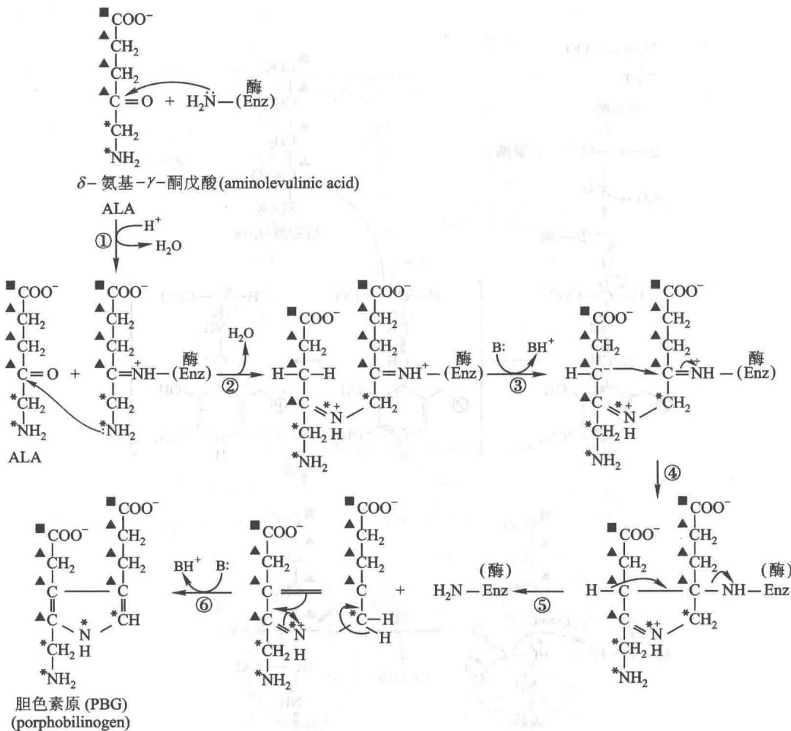  
图26-30 由 $\delta$ -氨基- $\gamma$ -酮戊酸（ALA）合成胆色素原

图中所示反应包括①形成希夫碱；②形成第二个希夫碱；③形成α-负碳离子（carbanion）与希夫碱反应；④以羟醛（aldol）形式缩合而环化；⑤消除酶的 $NH_{2}$ 基团；⑥互变异构化，形成胆色素原

  
(linear tetrapyrrole, polypyrryl methane)  
图 26-31 胆色素原缩合形成线型四吡咯反应机制

（4）线型四吡咯的环化 如果没有其他酶存在，线型四吡咯可自行环化，形成尿卟啉原Ⅰ（uroporphyrinogen I）。该化合物的结构特点如图26-32所示。它的四个吡咯环内的双键以两个对称平面彼此对称；侧链的乙酸和丙酸基都以该分子的中心互相对称，尿卟啉原Ⅰ并不是血红素的前体，它的前体是尿卟啉原Ⅲ，后者是由胆色素原脱氨酶和尿卟啉原Ⅲ同合酶（uroporphyrinogen III cosynthase）共同作用形成的，它的结构如图26-33所示。尿卟啉原Ⅲ和尿卟啉原Ⅰ的区别在于第4个吡咯环（B环）上的乙酸基和丙酸基侧链位置相反，因此失去以分子对称中心的对称关系。此侧链异位是由于辅合成酶催化四吡咯D环双键的互变异构后环化产生的。胆色素原(PBG)合成尿卟啉原Ⅲ的过程如图26-34所示，图中参与反应的与胆色素原脱氨酶(porphobilinogen deaminase)结合的辅助因子——联吡咯甲烷是由胆色素原脱氢酶自己用两个胆色素原预先合成的。

  
尿卟啉原 I 又称六氢尿卟啉 I (uroporphyrinogen I)  
图 26-32 尿卟啉原 I (nroporphyrinogen I) 的结构  
图中 A 代表乙酸基；P 代表丙酸基。吡咯核双键以两个对称平面对称，乙酸基和丙酸基侧链以对称中心对称

  
图 26-33 尿卟啉原Ⅲ（uroporphyrinogenⅢ）与尿卟啉原Ⅰ的结构（见图 26-32）的区别仅在于一个吡咯环上的侧链，乙酸基和丙酸基的位置不同，图中 A 代表乙酸基；P 代表丙酸基

尿卟啉原Ⅲ在一系列酶的催化下，经粪卟啉原Ⅲ（coproporphyrinogen Ⅲ）（图26-35），在原卟啉Ⅸ氧化酶作用下转变为原卟啉原Ⅸ（protoporphyrinogen Ⅸ）（图26-36），在亚铁螯合酶（ferrochelatase）催化下，亚铁原子掺入原卟啉Ⅸ形成血红素，它的结构如图26-37所示。

## 2. 血红素(heme)生物合成的历程

$\delta$ -氨基- $\gamma$ -酮戊酸(ALA)的合成完成于线粒体中。它从线粒体脱出转化为胆色素原(PBG)。由胆色素原脱氨酶催化,4个分子的PBG缩合脱氨又羧基化形成线型羟基甲基后胆色素原,然后在尿卟啉原Ⅲ同合酶(uroporphyrinogen III cosynthase)的作用下形成尿卟啉原Ⅲ(uroporphyrinogen Ⅲ),它在尿卟啉原Ⅲ脱羧酶的作用下形成血红素的前体粪卟啉原Ⅲ(coproporphyrinogen Ⅲ)(图26-35)。接着对吡咯环取代基的氧化作用产生原卟啉IX(protoporphyrin IX)。这三步反应是伴随反应物又返回线粒体发生的。与吡咯环相接的亚甲基(methylene)被氧化后,产生原卟啉原IX(protoporphyrinogen IX)。亚铁螯合酶催化下,对原卟啉IX螯合 $\mathrm{Fe}^{2+}$ 离子,得到血红素(heme)。血红素合成的全过程如图26-38所示。图中A为乙基 $(-\mathrm{CH}_{2}-\mathrm{CH}_{3})$ ,D为丙酰基 $(-\mathrm{CH}_{2}-\mathrm{CH}_{2}-\mathrm{COO}^{-})$ ,M为甲基 $(-\mathrm{CH}_{3})\mathrm{V}$ 为乙烯基 $(-\mathrm{CH}=\mathrm{CH}_{2})$ 。

粪卟啉原Ⅲ在生物合成的地位十分重要，除血红素外，它还是生成叶绿素，维生素 $B_{12}$ 及 siro-血红素的中间体，从它出发，经原卟啉IX，若螯合 $Fe^{2+}$ 得（正铁）血红素（protoheme），它是血红素的前体。若螯合 $Mg^{2+}$ ，则得到 $Mg^{2+}$ 原卟啉IX（Mg protoporphyrin IX），它是叶绿素的前体。从尿卟啉原走向另一途径，可生成维生素 $B_{12}$ 等。

应附带提及的是,铁卟啉或血红蛋白血红素降解后的产物为 $Fe^{2+}$ 和胆红素(bilirubin)。后者是一线型开链四吡咯衍生物,结构如图 26-39 所示。

临床上由于血红素合成的某种酶缺失,而引起卟啉化合物或前体物堆积,称为卟啉症(porphyria),这

  
图 26-34 从胆色素原(PBG)合成尿卟啉原Ⅲ的过程

①由一般碱催化脱氨形成亚甲吡咯烯啉（methylene pyrrolinene）中间体，②与胆色素原脱氨酶-联吡咯甲烷（ $\mathrm{E - C_1 - C_2}$ ）相结合。（②\~④）第二，三，四 PBG 连续加成并脱氨形成甲基-后胆色素原-酶- $\mathrm{C_1 - C_2}$ ，每次的反应过程重复 1a 和 1b。⑤甲基后胆色素原-酶- $\mathrm{C_1 - C_2}$ 水解形成羟基甲基后胆色素原，并脱下酶- $\mathrm{C_1 - C_2}$ 。⑥由胆色素原脱氨酶和尿卟啉原Ⅲ同合酶催化经螺旋状中间体，转化为尿卟啉原Ⅲ⑦羟基甲基后胆色素原还可自动环合，形成尿卟啉原 I

  
图26-35 粪卟啉原Ⅲ的结构

图中 M 代表甲基; P 代表丙酸基

图 26-36 原卟啉 IX 的结构 $^{°}$ C 代表来源于琥珀酰辅酶 A 的碳原子  
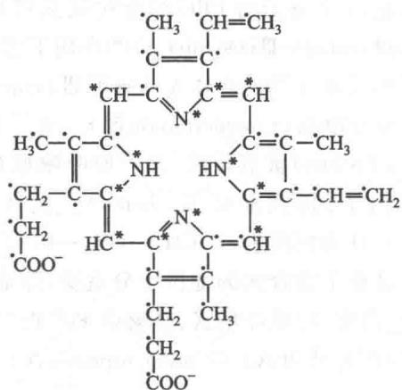

$C^{*}$ , $N^{*}$ 代表来源于甘氨酸的碳原子和氮原子

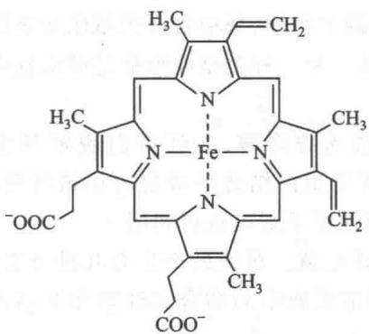  
图26-37 血红素(heme)的结构

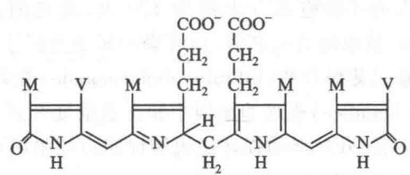  
图 26-38 胆红素的结构(bilirubin)  
图中 M 代表甲基 $(-CH_{3})$ ; V 代表乙烯基 $(-CH=CH_{2})$

  
图26-39 血红素生物合成的全路线

种病属于遗传病。如缺乏尿卟啉原Ⅲ同合酶，则尿卟啉原Ⅰ在红细胞中积累，尿中含有大量尿卟啉原Ⅰ和粪卟啉原Ⅰ并呈红色，牙齿在紫外光下有强的荧光，皮肤对阳光过敏。另一种类型卟啉症是肝细胞中积累胆色素原而且出现周期性的精神和行为失常。

正常人的红细胞寿命大约为 120 天, 衰老的红细胞随血流进入脾降解, 血红蛋白脱辅基蛋白质 (apoprotein) 被水解为氨基酸, 血红素则转变为胆红素。后者与血清清蛋白结合形成复合体被转移到肝, 形成胆红素二葡糖苷酸 (bilirubin diglucoronide) 被分泌到胆汁中, 而铁原子则可被再利用。

黄胆(Jaundice)表现为血液中胆红素浓度升高,并且皮肤和眼球变黄。黄疸的产生有几种可能,红细胞的过分破裂,肝功能的损坏或机械性胆道梗阻都可导致黄疸。测定血液中的结合胆红素和非结合胆红素的浓度比例有助于疾病的诊断。

血红素降解的第1步是形成胆绿素，它比胆红素有更好的溶解度，而哺乳动物却选择了胆红素，其重要原因是胆红素对机体是非常有效的抗氧化剂（antioxidant）。它可消除过氧羟自由基（hydroperoxy radical, $\mathrm{HO}_2$ ）。每分子可结合2分子 $\mathrm{HO}_2$ 而转变为胆绿素（图26-40），它又可还原为胆红素。按浓度计算，胆红素与清蛋白结合后对过氧化物的消除率是抗坏血酸（维生素C）的10倍。由此可以看到在自然选择中，代谢途径的分解产物也使其能够对机体发挥效用。

## (五) 短杆菌肽 S

短杆菌肽 S(gramicidin S) 是一种离子载体性抗生素, 是氧化磷酸化的一种氧偶联剂, 它的结构如图 26-41 所示。

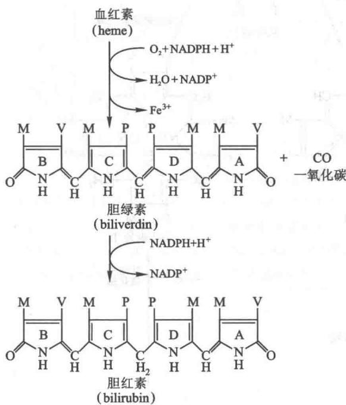  
图26-40 血红素的降解

  
图26-41 短杆菌肽S的结构

短杆菌肽 S 是一个环状 10 肽, 是由两条五肽链头尾相接构成。它以酶为模板逐步合成, 不需要 mRNA 和核糖体参加(参看第 38 章蛋白质的生物合成)。它的合成是由两个酶体系完成的, 其中两个酶中的一个酶具有催化合成和作为模板的双重功能。

在合成过程中氨基酸的活化不需要氨基乙酰 tRNA 参加反应。

催化短杆菌肽的多酶体系中的两个酶，用 $E_{I}$ 和 $E_{II}$ 表示。 $E_{I}$ 的相对分子质量为 280 000，称为重链。 $E_{II}$ 相对分子质量为 100 000，称为轻链。短杆菌肽 S 的合成可划分为 5 个步骤。详见图 26-42。

反应包括氨基酸在相应酶作用下的活化、硫酯化和消旋。 $E_{II}$ 能使苯丙氨酸消旋并与之结合形成硫酯键， $E_{II}$ 只与 D-Phe 结合。 $E_{I}$ 则可同时与短杆菌肽所需的其他 4 个氨基酸结合，无论与 $E_{I}$ 或 $E_{II}$ 形成硫酯键都是由氨基酰基腺苷酸(aminoacyl adenylates)与之作用。短杆菌肽S合成时氨基酸的活化包括两步如下：

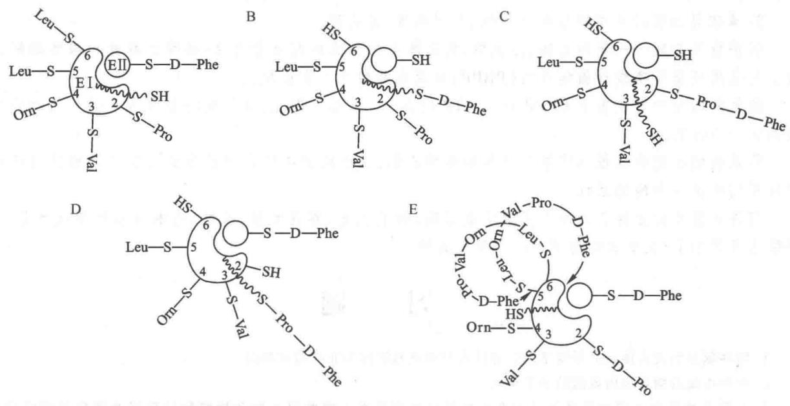  
图 26-42 在蛋白质模板上形成短杆菌肽 S 的可能机制

合成的下一步是活化的氨基酸结合到酶的轻链 $E_{1}(D-Phe)$ 和重链 $E_{II}(Pro_{2}, Val, Orn, Leu)$ 上。

苯丙氨酸残基被消旋，并转移到重链的泛酰巯基乙胺长臂上。其余的所有步骤都在 $E_{1}$ 上进行。

在 $E_{I}$ 分子上以共价相连的长臂 4'-磷酸泛酰巯基乙胺（4'-phosphopantethlotheine），可视为该酶的辅基。与脂肪酸生物合成中酰基载体蛋白的作用相似， $E_{I}$ 能以准确的顺序活化合成短杆菌肽 S 所需的 4 个氨基酸，并按一定顺序同时结合到 $E_{I}$ 上。由 $E_{II}$ 将 Phe 转移到 $E_{I}$ 结合着的 Pro 上形成一个二肽 Pro-Phe，然后由 4'-磷酸泛酰巯基乙胺臂将其转送到下一个与 $E_{I}$ 以硫酯键相连的 Val 的游离氨基上形成三肽链（-Val-Pro-Phe- $NH_{2}$ ），同时在第一位上的一SH 基被空出来。

如上依次转移连接下一个氨基酸直至形成五肽，两个五肽头尾相接形成环状十肽。相接反应也是在酶分子 $E_{1}$ 上进行的。其全部合成方式见图26-42。

A

A. 活化的氨基酸以硫酯键分别结合到酶体系的轻链和重链上,苯丙氨酸残基与轻链结合被消旋并转移到重链的泛酰巯基乙胺臂上。B. 苯丙氨酰基从泛酰巯基乙胺臂上转移到脯氨酰残基上形成第一个肽键。C. 苯丙氨酰-脯氨酰残基转移到泛酰巯基乙胺的游离巯基上,同时轻链接受另外一个已被消旋的苯丙氨酰基。D. 苯丙氨酰-脯氨酰残基转移到缬氨酰残基上。E. 形成的五肽被转移到“等候”部位6上,第二个五肽也同时合成并与第一个五肽缩合形成短杆菌肽S,游离的泛酰巯基乙胺臂又为下一个肽的合成做好准备

许多寡肽其链长在有 15 个氨基酸残基以下的, 几乎都是通过上述类似的方式合成。

## (六) D-氨基酸的形成

许多生物体内既含有 L-氨基酸,也含有 D-氨基酸。例如,微生物的细胞壁以及许多肽类的抗生素都含有 D-氨基酸。

D-氨基酸的来源大多是由 L-氨基酸通过消旋酶(racemase)的作用形成。D-氨基酸一旦形成就立即掺入到肽链中。细菌细胞壁的 D-丙氨酸就是由 L-丙氨酸经消旋酶作用形成的。丙氨酸消旋酶以磷酸吡哆醛为辅助因子。L-丙氨酸转变为 D-丙氨酸后，立即形成 D-丙氨酰-D-丙氨酸二肽，消旋酶催化的反应是需能反应。形成的二肽随后即将其 D-氨基酸掺入到细菌细胞壁的肽聚糖(peptidoglycan)分子中。到现在为止，还没有发现一种含 D-氨基酸的肽在其形成时直接以游离的 D-氨基酸作为合成肽的底物。

<!-- EN-BEGIN 22.3 -->

### 【英文对应 22.3】Molecules Derived from Amino Acids

> 来源：Lehninger Principles of Biochemistry（书籍/02_生物化学原理） 第22章 Biosynthesis of Amino Acids, Nucleotides, and Related Molecules，§22.3。对应本章“五、氨基酸转化为其他氨基酸及其他代谢物”。

In addition to their role as the building blocks of proteins, amino acids are precursors of many specialized biomolecules, including hormones, coenzymes, nucleotides, alkaloids, cell wall polymers, porphyrins, antibiotics, pigments, and neurotransmitters. We describe here the pathways to a number of these amino acid derivatives.

#### [EN] Glycine Is a Precursor of Porphyrins

The biosynthesis of porphyrins, for which glycine is a major precursor, is our first example because of the central importance of the porphyrin nucleus in heme proteins such as hemoglobin and the cytochromes. The porphyrins are constructed from four molecules of the monopyrrole derivative porphobilinogen, which itself is derived from two molecules of $\delta$ -aminolevulinate. There are two major pathways to $\delta$ -aminolevulinate. In higher eukaryotes (Fig. 22-25a), glycine reacts with succinyl-CoA in the first step to yield $\alpha$ -amino- $\beta$ -ketoadipate, which is then decarboxylated to $\delta$ -aminolevulinate. In plants, algae, and most bacteria, $\delta$ -aminolevulinate is formed from glutamate (Fig. 22-25b). The glutamate is first esterified to glutamyl-tRNA $^{\text{Glu}}$ ; P6 reduction by NADPH converts the glutamate to glutamate 1-semialdehyde, which is cleaved from the tRNA. An aminotransferase converts the glutamate 1-semialdehyde to $\delta$ -aminolevulinate.

In all organisms, two molecules of $\delta$ -aminolevulinate condense to form porphobilinogen and, through a series of complex enzymatic reactions, four molecules of porphobilinogen come together to form protoporphyrin (Fig. 22-26). The iron atom is incorporated after the protoporphyrin has been assembled, in a step catalyzed by ferrochelatase. Porphyrin biosynthesis is regulated in higher eukaryotes by heme, which serves as a feedback inhibitor of early steps in the synthetic pathway. Genetic defects in the biosynthesis of porphyrins can lead to the accumulation of pathway intermediates, causing a variety of human diseases known collectively as porphyrias (Box 22-2).

#### [EN] Heme Degradation Has Multiple Functions

The iron-porphyrin (heme) group of hemoglobin, released from dying erythrocytes in the spleen, is degraded to yield free $Fe^{2+}$ and, ultimately, bilirubin. The pathway also contributes the pigment present in mixtures of the bile salts derived from cholesterol.

The first step in the two-step pathway to bilirubin, catalyzed by heme oxygenase, converts heme to biliverdin, a linear (open) tetrapyrrole derivative (Fig. 22-27 on p. 820). The other products of the reaction are free $\mathrm{Fe}^{2+}$ and CO. The $\mathrm{Fe}^{2+}$ is quickly bound by ferritin. Carbon monoxide is a poison that binds to hemoglobin (see Box 5-1), and the production of CO by heme oxygenase ensures that, even in the absence of environmental exposure, about $1\%$ of an individual's heme is complexed with CO.

  
FIGURE 22-25 Biosynthesis of $\delta$ -aminolevulinate. (a) In most animals, including mammals, $\delta$ -aminolevulinate is synthesized from glycine and succinyl-CoA. The atoms furnished by glycine are shown in red. (b) In bacteria and plants, the precursor of $\delta$ -aminolevulinate is glutamate.

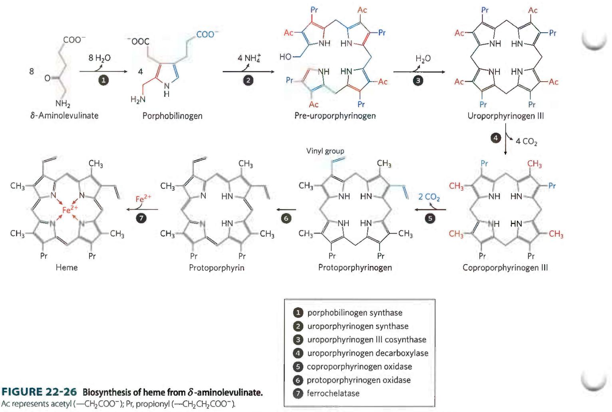

Biliverdin is converted to bilirubin in the second step, catalyzed by biliverdin reductase. You can monitor the reactions in the breakdown of heme (Fig. 22-27) colorimetrically in a familiar in situ experiment. When you are bruised, the black and/or purple color results from hemoglobin released from damaged erythrocytes. Over time, the color changes to the green of biliverdin, and then to the yellow of bilirubin. Bilirubin is largely insoluble, and it travels in the bloodstream as one of many metabolites, fatty acids and others, complexed with serum albumin (see Fig. 17-3). In the liver, bilirubin is transformed to the bile pigment bilirubin diglucuronide. This product is sufficiently water-soluble to be secreted with other components of bile into the small intestine, where microbial enzymes convert it to several products, predominantly urobilinogen. Some urobilinogen is reabsorbed into the blood and transported to the kidney, where it is converted to urobilin, the compound that gives urine its yellow color. Urobilinogen remaining in the intestine is converted (in another microbe-dependent reaction) to stercobilin, which imparts the red-brown color to feces.

Impaired liver function or blocked bile secretion causes bilirubin to leak from the liver into the blood, resulting in a yellowing of the skin and eyeballs, a condition called jaundice. In cases of jaundice, determination of the concentration of bilirubin in the blood may be useful in the diagnosis of underlying liver disease. Newborn infants sometimes develop jaundice because they have not yet produced enough glucuronyl bilirubin transferase to process their bilirubin. A traditional treatment to reduce excess bilirubin, exposure to a fluorescent lamp, causes a photochemical conversion of bilirubin to compounds that are more soluble and easily excreted.

These pathways of heme breakdown play significant roles in protecting cells from oxidative damage and in regulating certain cellular functions. The CO produced by heme oxygenase is toxic at high concentrations, but at the very low concentrations generated during heme degradation it seems to have some regulatory and/or signaling functions. It acts as a vasodilator, much the same as (but less potent than) nitric oxide (discussed below). Low levels of CO also have some regulatory effects on neurotransmission. Bilirubin is the most abundant antioxidant in mammalian tissues and is responsible for most of the antioxidant activity in serum. Its protective effects seem to be especially important in the developing brain

#### [EN] On Kings and Vampires

Porphyrias are a group of genetic diseases that result from defects in enzymes of the biosynthetic pathway from glycine to porphyrins (Fig. 1); specific porphyrin precursors accumulate in erythrocytes, body fluids, and the liver. The most common form is acute intermittent porphyria. Most individuals inheriting this condition are heterozygotes and are usually asymptomatic, because the single copy of the normal gene provides a sufficient level of enzyme function. However, certain nutritional or environmental factors (as yet poorly understood) can cause a buildup of $\delta$ -amino-levulinate and porphobilinogen, leading to attacks of acute abdominal pain and neurological dysfunction. King George III, British monarch during the American Revolution, suffered several episodes of apparent madness that tarnished the record of this otherwise accomplished man. The symptoms of his condition suggest that George III suffered from acute intermittent porphyria.

About 5,000 to 10,000 humans worldwide suffer from a genetic condition in which the activity of ferrochelatase (step 7) is reduced, leading to abnormally high concentrations of protoporphyrin in tissues. When exposed to light, the excess protoporphyrin releases free radicals that damage cellular macromolecules, including proteins and lipids in cell membranes. The resulting cell damage and inflammation in the endothelial (skin) cells can be very painful. Patients are forced to adopt a lifestyle in which they avoid sunlight and even bright indoor light. A new drug called afamelanotide, slowly released over several months from a small implant under the skin, has shown success in alleviating the symptoms of sunlight exposure. The drug interacts with the melanocortin-1 receptor, stimulating melanin production and modulating the expression of antioxidants that eliminate the free radical species. Afamelanotide may also prove useful in treating vitiligo, a more common condition in which melanin production is not uniform and skin color is lost in blotches.

of newborn infants. The cell toxicity associated with jaundice may be due to bilirubin levels in excess of the serum albumin needed to solubilize it.

P4 Given these varied roles of heme degradation products, the degradative pathway is subject to regulation, mainly at the first step. Humans have at least three isozymes of heme oxygenase (HO). HO-1 is highly regulated; the expression of its gene is induced by a wide range of stress conditions, including shear stress, uncontrolled angiogenesis (development of blood vessels), hypoxia, hyperoxia, heat shock, exposure to ultraviolet light, hydrogen peroxide, and many other metabolic insults. HO-2 is found mainly in the brain and the testes, where it is continuously expressed. The third isozyme, HO-3, is not catalytically active, but may play a role in oxygen sensing.

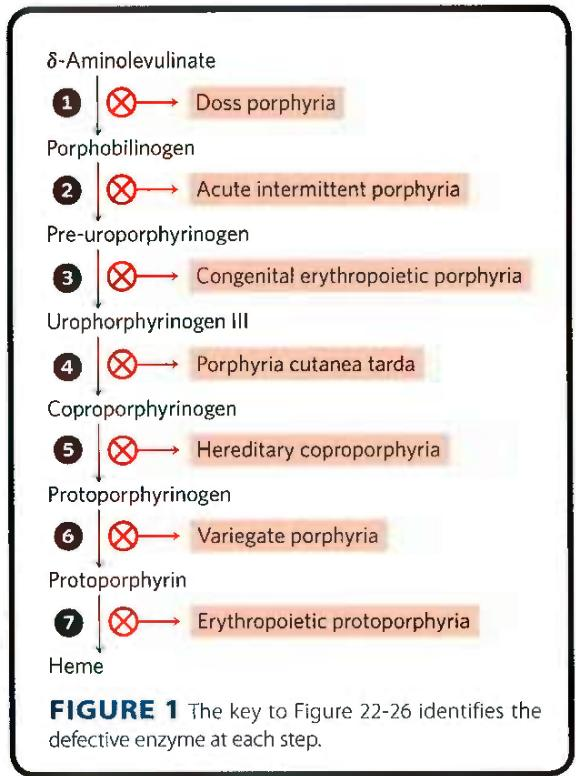

One of the rarer porphyrias results in an accumulation of uroporphyrinogen I, an abnormal isomer of a protoporphyrin precursor. This compound stains the urine red, causes the teeth to fluoresce strongly in ultraviolet light, and makes the skin abnormally sensitive to sunlight. Many individuals with this porphyria are anemic because insufficient heme is synthesized. This genetic condition may have given rise to the vampire stories of folk legend.

The symptoms of many porphyrias are now readily controlled with dietary changes or the administration of heme or heme derivatives.

#### [EN] Amino Acids Are Precursors of Creatine and Glutathione

Phosphocreatine, derived from creatine, is an important energy buffer in skeletal muscle (see Box 23-1). Creatine is synthesized from glycine and arginine (Fig. 22-28); methionine, in the form of S-adenosylmethionine, acts as methyl group donor.

Glutathione (GSH), present in plants, animals, and some bacteria, often at high levels, can be thought of as a redox buffer. It is derived from glutamate, cysteine, and glycine (Fig. 22-29). The $\gamma$ -carboxyl group of glutamate is activated by ATP to form an acyl phosphate intermediate, which is then attacked by the $\alpha$ -amino group of cysteine. A second condensation reaction follows, with the $\alpha$ -carboxyl group of cysteine activated to an acyl phosphate to permit reaction with glycine.

FIGURE 22-27 Bilirubin and its breakdown products. M represents methyl; V, vinyl; Pr, propionyl; E, ethyl. For ease of comparison, these structures are shown in linear form, rather than in their correct stereochemical conformations.  

The oxidized form of glutathione (glutathione disulfide, or GSSG), produced in the course of its redox activities, contains two glutathione molecules linked by a disulfide bond.

Glutathione helps maintain the sulfhydryl groups of proteins in the reduced state and the iron of heme in the ferrous (Fe $^{2+}$ ) state, and it serves as a reducing agent for glutaredoxin in deoxyribonucleotide synthesis (see Fig. 22-41). Its redox function is also used to remove toxic peroxides formed in the normal course of growth and metabolism under aerobic conditions:

$$
2 \mathrm{GSH} + \mathrm{R} - \mathrm{O} - \mathrm{O} - \mathrm{H} \longrightarrow \mathrm{GSSG} + \mathrm{H} _ {2} \mathrm{O} + \mathrm{R} - \mathrm{OH}
$$

This reaction is catalyzed by glutathione peroxidase, a remarkable enzyme in that it contains a covalently bound selenium (Se) atom in the form of selenocysteine (see Fig. 3-8a), which is essential for its activity.

#### [EN] D-Amino Acids Are Found Primarily in Bacteria

Although D-amino acids do not generally occur in proteins, they do serve some special functions in the structure of bacterial cell walls and peptide antibiotics. Bacterial peptidoglycans (see Fig. 6-32) contain both D-alanine and D-glutamate. D-Amino acids arise directly from the L isomers by the action of amino acid racemases, which have pyridoxal phosphate as cofactor (see Fig. 18-6). Amino acid racemization is uniquely important to bacterial metabolism, and enzymes such as alanine racemase are prime targets for pharmaceutical agents. One such agent, L-fluoroalanine, is being tested as an antibacterial drug. Another, cycloserine, is used to treat tuberculosis. Because these inhibitors also affect some PLP-requiring human enzymes, however, they have potentially undesirable side effects.

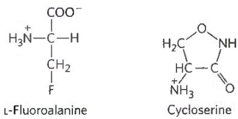

#### [EN] Aromatic Amino Acids Are Precursors of Many Plant Substances

Phenylalanine, tyrosine, and tryptophan are converted to a variety of important compounds in plants. The rigid polymer lignin, derived from phenylalanine and tyrosine, is second only to cellulose in abundance in plant tissues. The structure of the lignin polymer is complex and not well understood. Tryptophan is also the precursor of the plant growth hormone indole-3-acetate, or auxin (Fig. 22-30a), which is important in the regulation of a wide range of biological processes in plants.

  
FIGURE 22-28 Biosynthesis of creatine and phosphocreatine. Creatine is made from three amino acids: glycine, arginine, and methionine. This pathway shows the versatility of amino acids as precursors of other nitrogenous biomolecules.

Phenylalanine and tyrosine also give rise to many commercially significant natural products, including the tannins that inhibit oxidation in wines; alkaloids such as morphine, which have potent physiological effects; and the flavoring of cinnamon oil (Fig. 22-30b), nutmeg, cloves, vanilla, cayenne pepper, and other products.

  
FIGURE 22-29 Glutathione metabolism. (a) Biosynthesis of glutathione. (b) Oxidized form of glutathione.

#### [EN] Biological Amines Are Products of Amino Acid Decarboxylation

Many important neurotransmitters are primary or secondary amines, derived from amino acids in simple pathways. In addition, some polyamines that form complexes with DNA are derived from the amino acid ornithine, a component of the urea cycle. A common denominator of many of these pathways is amino acid decarboxylation, another PLP-requiring reaction (see Fig. 18-6).

The synthesis of some neurotransmitters is illustrated in Figure 22-31. Tyrosine gives rise to a family of catecholamines that includes dopamine, norepinephrine, and epinephrine. Levels of catecholamines are correlated with, among other things, changes in blood pressure. The neurological disorder Parkinson disease is associated with an underproduction of dopamine, and it has traditionally been treated by administering L-dopa. Overproduction of dopamine in the brain may be linked to psychological disorders such as schizophrenia.

Glutamate decarboxylation gives rise to $\gamma$ -amino-butyrate (GABA), an inhibitory neurotransmitter. Its underproduction is associated with epileptic seizures. GABA analogs are used in the treatment of epilepsy and hypertension. Levels of GABA can also be increased by administering inhibitors of the GABA-degrading enzyme GABA aminotransferase. Another important neurotransmitter, serotonin, is derived from tryptophan in a two-step pathway.

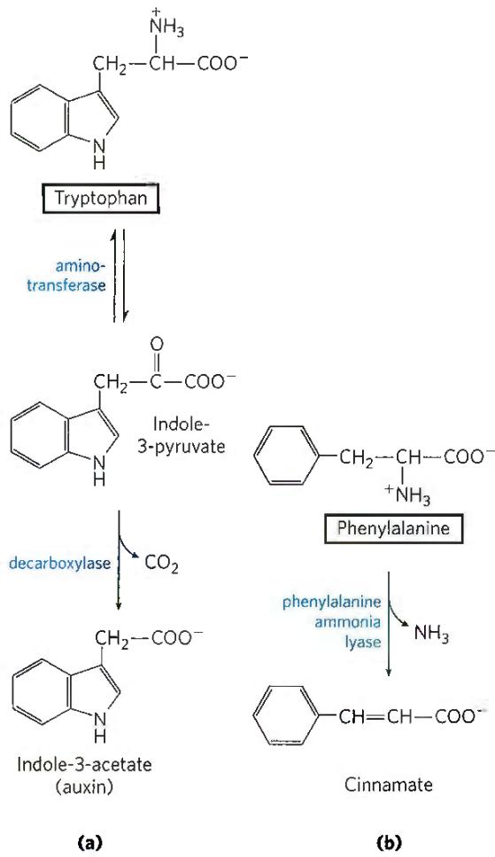  
FIGURE 22-30 Biosynthesis of two plant substances from amino acids. (a) Indole-3-acetate (auxin) and (b) cinnamate (cinnamon flavor).

Histidine undergoes decarboxylation to histamine, a powerful vasodilator in animal tissues. Histamine is released in large amounts as part of the allergic response, and it also stimulates acid secretion in the stomach. A growing array of pharmaceutical agents are being designed to interfere with either the synthesis or the action of histamine. A prominent example is the histamine receptor antagonist cimetidine (Tagamet), a structural analog of histamine:

$$
\begin{array}{c} \mathrm{CH} _ {3} \\ \mathrm{N} \end{array} \begin{array}{c} \mathrm{CH} _ {2} - \mathrm{S} - \mathrm{CH} _ {2} - \mathrm{CH} _ {2} - \mathrm{NH} - \mathrm{C} - \mathrm{NH} - \mathrm{CH} _ {3} \\ \mathrm{N} - \mathrm{C} \equiv \mathrm{N} \end{array}
$$

It promotes the healing of duodenal ulcers by inhibiting secretion of gastric acid.

Polyamines such as spermine and spermidine, involved in DNA packaging, are derived from methionine and ornithine by the pathway shown in Figure 22-32. The first step is decarboxylation of ornithine, a precursor of arginine (Fig. 22-12). Ornithine decarboxylase, a PLP-requiring enzyme, is the target of several powerful inhibitors used as pharmaceutical agents (see Box 6-1).

#### [EN] Arginine Is the Precursor for Biological Synthesis of Nitric Oxide

A surprise finding in the mid-1980s was the role of nitric oxide (NO)—previously known mainly as a component of smog—as an important biological messenger. This simple gaseous substance diffuses readily through membranes, although its high reactivity limits its range of diffusion to about a 1 mm radius from the site of synthesis. In humans NO plays a role in a range of physiological processes, including neurotransmission, blood clotting, and the control of blood pressure. Its mode of action is described in Box 12-2.

P6 Nitric oxide is synthesized from arginine in an NADPH-dependent reaction catalyzed by nitric oxide synthase (Fig. 22-33), a dimeric enzyme structurally related to NADPH cytochrome P-450 reductase (see Box 21-1). The reaction is a five-electron oxidation. Each subunit of the enzyme contains one bound molecule of each of four different cofactors: FMN, FAD, tetrahydrobiopterin, and $\mathrm{Fe}^{3+}$ heme. NO is an unstable molecule and cannot be stored. Its synthesis is stimulated by interaction of nitric oxide synthase with $\mathrm{Ca}^{2+}$ -calmodulin (see Fig. 12-17).

#### [EN] SUMMARY 22.3 Molecules Derived from Amino Acids

■ Many important biomolecules are derived from amino acids. Glycine is a precursor of porphyrins.

■ Degradation of iron-porphyrin (heme) generates bilirubin, which is converted to bile pigments with several physiological functions.

■ Glycine and arginine give rise to creatine and phosphocreatine, an energy buffer. Glutathione, formed from three amino acids, is an important cellular reducing agent.

■ Bacteria synthesize D-amino acids from L-amino acids in racemization reactions requiring pyridoxal phosphate. D-Amino acids are commonly found in certain bacterial walls and certain antibiotics.

■ Plants make many substances from aromatic amino acids.

■ The PLP-dependent decarboxylation of some amino acids yields important biological amines, including neurotransmitters and polyamines.

\- Arginine is the precursor of nitric oxide, a biological messenger.

FIGURE 22-31 Biosynthesis of some neurotransmitters from amino acids. The key step is the same in each case: a PLP-dependent decarboxylation (shaded light red).

<!-- EN-END 22.3 -->

## 提要

不同生物合成氨基酸的能力不同,合成氨基酸的种类也有很大差异。机体维持正常生长所必需,而又不能自己合成,需从外界摄取的氨基酸称为必需氨基酸。凡能自己合成的为非必需氨基酸。人和大白鼠需10种必需氨基酸。研究氨基酸生物合成大多用微生物的遗传突变株,使突变株在氨基酸的某个合成环节上产生缺失,造成某种中间物的积累,从而判明各个中间代谢环节。当前20种氨基酸的生物合成途径已得到基本阐明。

在生物合成中,氨基酸的各种碳骨架起源于代谢的几条主要途径,即柠檬酸循环,糖酵解及戊糖磷酸途径。因此,可将这几条途径中与氨基酸合成密切相关的几种化合物看作氨基酸生物合成的起始物。氮的来源起始于无机氮,如 $N_{2}, NH_{3}$ 。 $N_{2}$ 的转化是经生物固氮, $NH_{3}$ 的转化是经同化作用。氨基酸生物合成可按碳来源于柠檬酸循环、糖酵解、戊糖磷酸途径划分为若干类型。

α-酮戊二酸衍生类型包括谷氨酸、谷氨酰胺、甲硫氨酸、苏氨酸、异亮氨酸及赖氨酸（以草酰乙酸为底物）提供碳原子。

3-磷酸甘油酸衍生类型包括丝氨酸、半胱氨酸、甘氨酸。

芳香族氨基酸——苯丙氨酸、酪氨酸、色氨酸生物合成的起始物为4-磷酸赤藓糖和磷酸烯醇式丙酮酸。色氨酸还需要磷酸核糖焦磷酸（PRPP）以及丝氨酸参与合成反应。

组氨酸的生物合成需要 PRPP 以及 ATP 的 N—C 基团。因此，组氨酸的合成也可认为是嘌呤核苷酸代谢的一个分支。

氨基酸的生物合成根据需要有严格的调控机制,调控机制中最有效的是通过合成过程的终产物抑制反应系列中第一个酶的活性。

有许多重要的生物活性物质来源于氨基酸,如氧化氮、谷胱甘肽、肌酸、卟啉及短杆菌肽 S 等。D-氨基酸大多是由 L-氨基酸经过消旋酶作用形成的。

## 习题

1. 哪些氨基酸对人体是必需氨基酸？为什么有些氨基酸称为非必需氨基酸？

2. 写出由葡萄糖合成丙氨酸的总平衡式。

3. 在氨基酸生物合成中哪些氨基酸和柠檬酸循环有联系？哪些氨基酸和糖酵解过程以及磷酸五碳糖途径有直接联系？

4. 在下列的每个转变中是哪种叶酸的中间产物参与反应？

(a) 甘氨酸→丝氨酸(四氢叶酸)

(b) 组氨酸→谷氨酰胺(四氢叶酸)

(c) 高半胱氨酸→甲硫氨酸( $N^{5}$ -甲基四氢叶酸)

5. 芳香族氨基酸生物合成的共同前体是什么？它们以哪种中间产物作为合成路线的分支点？

6. 缺乏苯丙氨酸羟化酶(苯丙氨酸单加氧酶)的病人为什么出现苯丙酮酸尿症?

7. 从漂白过的面粉中有时可分离到一种甲硫氨酸衍生物——甲硫氨酸亚砜亚胺（methionine sulfoximine），它的结构如下：

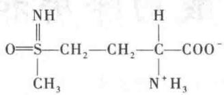  
甲硫氨酸亚砜亚胺

它可引起机体抽搐，是谷氨酰胺合成酶的强烈抑制剂。请提出这一抑制剂可能的作用机制？

8. 由 $\mathbf{N}_2$ 到血红素(heme)在氮的流程中有哪些中间产物？

## 主要参考书目

1. Stryer L. Biochemistry. 4th ed. New York: W. H. Freeman and Company, 1995.

2. Lehnninger A R. Biochemistry. 2nd ed. New York: Worth Publishers. Inc. 1975.

3. Lebioda L, Stec B. Crystal structure of enolase indicates that enolase and pyruvate kinase from a common ancestor. Nature, 1988.

4. Nelson D L, Cox M M. Lehnninger 生物化学原理. 3 版. 周海梦, 等译. 北京: 高等教育出版社, 2005.

5. Nelson D L, Cox M M. Lehninger Principles of Biochemistry. 6th ed. New York: W. H. Freeman and Company, 2012.

6. Herrmann K M, Somerville R L (Eds.). Amino Acids: Biosynthesis and genetic regulation. Addison-Wesley, 1983.

7. Frey P A, Hegeman A D. Enzymatic Reaction Mechanism. New York: Oxford University Press, 2007.

8. Richards N G J, Kilberg M S. Asparagine synthetase chemotherapy. Annu. Rev. Biochem, 2006, 75: 629-654.

(王镜岩 秦咏梅)

## 网上资源

习题答案

自测题

## [1] 2023年1月1日（星期二）

<!-- EN-BEGIN 第22章章末 -->

## 【英文对应 第22章章末】Biosynthesis of Amino Acids, Nucleotides, and Related Molecules：关键术语、习题与简答

> 来源：Lehninger Principles of Biochemistry（书籍/02_生物化学原理） 第22章章末，以及书末 Abbreviated Solutions to Problems 第22章。

### [EN] KEY TERMS

Terms in bold are defined in the glossary.

nitrogen fixation 795  
nitrification 795  
denitrification 795  
anammox 796  
symbionts 797  
nitrogenase complex 797  
FeMo cofactor 800  
ferredoxin 800  
leghemoglobin 801  
glutamate 802  
glutamine 802  
glutamine synthetase 802  
glutamate synthase 802  
glutamine amidotransferases 804  
5-phosphoribosyl-1-pyrophosphate (PRPP) 806  
porphyrin 817  
porphyria 817  
bilirubin 817  
phosphocreatine 819  
creatine 819  
glutathione (GSH) 819

serotonin 822  
histamine 822  
spermine 822  
spermidine 822  
ornithine decarboxylase 822  
de novo pathway 823  
salvage pathway 823  
inosinate (IMP) 825  
carbamoyl phosphate synthetase II 828  
aspartate transcarbamoylase 828  
nucleoside monophosphate kinase 829  
nucleoside diphosphate kinase 829  
ribonucleotide reductase 829  
thioredoxin 829  
thymidylate synthase 833  
dihydrofolate reductase 833  
adenosine deaminase (ADA) deficiency 834  
Lesch-Nyhan syndrome 835  
allopurinol 835  
fluorouracil 836  
methotrexate 836  
aminopterin 836  
trimethoprim 838

dopamine 821
norepinephrine 821
epinephrine 821
γ-aminobutyrate

(GABA) 821

### [EN] PROBLEMS

1. ATP Consumption by Root Nodules in Legumes Bacteria residing in the root nodules of the pea plant consume more than 20% of the ATP produced by the plant. Suggest why these bacteria consume so much ATP.

2. Nitrate Fertilizers and Oceanic Dead Zones Farmers apply industrially fixed nitrogen, in the form of ammonia or nitrate, to agricultural fields worldwide to increase crop yields. Agricultural runoff feeds into rivers and creates large hypoxic dead zones at the point where rivers meet oceans. How does an increase in soluble fixed nitrogen create dead zones?

3. PLP Reaction Mechanisms Pyridoxal phosphate (PLP) can help catalyze transformations one or two carbons removed from the $\alpha$ carbon of an amino acid. The enzyme threonine synthase promotes the PLP-dependent conversion of phosphohomoserine to threonine. Suggest a mechanism for this reaction.

4. Transformation of Aspartate to Asparagine There are two routes for transforming aspartate to asparagine at the expense of ATP. Many bacteria have an asparagine synthetase that uses ammonium ion as the nitrogen donor. Mammals have an asparagine synthetase that uses glutamine as the nitrogen donor. Given that the latter requires an extra ATP (for the synthesis of glutamine), why do mammals use this route?

5. Equation for the Synthesis of Aspartate from Glucose Write the net equation for the synthesis of aspartate (a nonessential amino acid) from glucose, carbon dioxide, and ammonia.

6. Asparagine Synthetase Inhibitors in Leukemia Therapy Mammalian asparagine synthetase is a glutamine-dependent amidotransferase. Efforts to identify an effective inhibitor of human asparagine synthetase for use in chemotherapy for patients with leukemia have focused not on the amino-terminal glutaminase domain but on the carboxyl-terminal synthetase active site. Explain why the glutaminase domain is not a promising target for a useful drug.

7. Phenylalanine Hydroxylase Deficiency and Diet Tyrosine is normally a nonessential amino acid, but individuals with a genetic defect in phenylalanine hydroxylase require tyrosine in their diet for normal growth. Explain.

8. Arginine Biosynthesis The first step of arginine biosynthesis from glutamate acetylates glutamate on the $\alpha$ -amino group. A subsequent step late in the same pathway removes the added acetyl group. What chemical problem is solved by adding and then removing an acetyl group, with none of the acetyl atoms appearing in the arginine product of the pathway?

9. Cofactors for One-Carbon Transfer Reactions Most one-carbon transfers are promoted by one of three cofactors: biotin, tetrahydrofolate, or S-adenosylmethionine. S-Adenosylmethionine generally serves as a methyl group donor; the transfer potential of the methyl group in $N^{5}$ -methyltetrahydrofolate is insufficient for most biosynthetic reactions. However, one example of the use of $N^{5}$ -methyltetrahydrofolate in methyl group transfer is in methionine formation by the methionine synthase reaction; methionine is the immediate precursor of S-adenosylmethionine (see Fig. 18-18).

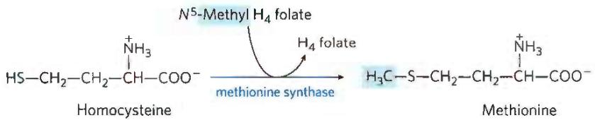

Explain how the methyl group of S-adenosylmethionine can be derived from $N^{5}$ -methyltetrahydrofolate, even though the transfer potential of the methyl group in $N^{5}$ -methyltetrahydrofolate is one-thousandth of that of S-adenosylmethionine.

10. Concerted Regulation in Amino Acid Biosynthesis Various products of glutamine metabolism independently modulate the glutamine synthetase of E. coli (see Fig. 22-8). In this concerted inhibition, the extent of enzyme inhibition is greater than the sum of the separate inhibitions caused by each product. For E. coli grown in a medium rich in histidine, what is the advantage of concerted inhibition?

11. Relationship between Folic Acid Deficiency and Anemia Folic acid deficiency, believed to be the most common vitamin deficiency, causes a type of anemia in which hemoglobin synthesis is impaired and erythrocytes do not mature properly. What is the metabolic relationship between hemoglobin synthesis and folic acid deficiency?

12. Synthesis of Polyamines The metabolic amino acid ornithine is a direct precursor of the polyamine putrescine, shown here.

$$
\mathrm{H} _ {3} \stackrel {+} {\mathrm{N}} - \mathrm{CH} _ {2} - \mathrm{CH} _ {2} - \mathrm{CH} _ {2} - \mathrm{CH} _ {2} - \stackrel {+} {\mathrm{NH}} _ {3}
$$

Subsequent reactions convert putrescine to spermine and spermidine. What type of reaction is required to convert ornithine to putrescine, and what enzymatic cofactor is needed?

13. Nucleotide Biosynthesis in Amino Acid Auxotrophic Bacteria Wild-type E. coli cells can synthesize all 20 common amino acids, but some mutants, called amino acid auxotrophs, are unable to synthesize a specific amino acid and require its addition to the culture medium for optimal growth. Besides their role in protein synthesis, some amino acids are also precursors for other nitrogenous cell products. Consider the three amino acid auxotrophs that are unable to synthesize glycine, glutamine, and aspartate, respectively. For each mutant, what nitrogenous products other than proteins would the cell fail to synthesize?

14. Inhibitors of Nucleotide Biosynthesis Suggest a mechanism for the inhibition of alanine racemase by L-fluoroalanine.

15. Mode of Action of Sulfa Drugs Some bacteria require p-aminobenzoate in the culture medium for normal growth, and their growth is severely inhibited by the addition of sulfanilamide, one of the earliest sulfa drugs. Moreover, in the presence of this drug, 5-aminoimidazole-4-carboxamide ribonucleotide (AlCAR; see Fig. 22-35) accumulates in the culture medium. Addition of excess p-aminobenzoate reverses these effects.

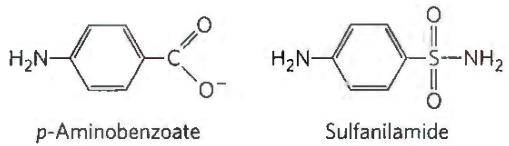

(a) What is the role of p-aminobenzoate in these bacteria? (Hint: See Fig. 18-16.)

(b) Why does AICAR accumulate in the presence of sulfanilamide? (c) Why does addition of excess p-aminobenzoate reverse the inhibition and accumulation?

16. Purine Biosynthesis Which atoms of the purine ring derive from the amide nitrogen of glutamine? (a) N-1 (b) N-3 (c) N-7 (d) N-9

17. Pathway of Carbon in Pyrimidine Biosynthesis Predict the locations of ${}^{14}$ C in orotate isolated from cells grown on a small amount of uniformly labeled $[{}^{14}$ C]succinate. Justify your prediction.

18. Nucleotides as Poor Sources of Energy Under starvation conditions, organisms can use proteins and amino acids as sources of energy. Deamination of amino acids produces carbon skeletons that can enter the glycolytic pathway and the citric acid cycle to produce energy in the form of ATP. Nucleotides are not similarly degraded for use as energy-yielding fuels. What observations about cellular physiology support this statement? What aspect of the structure of nucleotides makes them a relatively poor source of energy?

19. Treatment of Gout Physicians use allopurinol (see Fig. 22-50), an inhibitor of xanthine oxidase, to treat chronic gout. Explain the biochemical basis for this treatment. Patients treated with allopurinol sometimes develop xanthine stones in the kidneys, although the incidence of kidney damage is much lower than in untreated gout. Explain this observation in light of these solubilities in urine: uric acid, 0.15 g/L; xanthine, 0.05 g/L; and hypoxanthine, 1.4 g/L.

20. Antibiotics That Inhibit Dihydrofolate Reductase Trimethoprim, a commonly used antibiotic, inhibits the bacterial form of dihydrofolate reductase much more than it inhibits the mammalian enzyme. What metabolic processes described in this chapter are affected by depleting tetrahydrofolate?

### [EN] DATA ANALYSIS PROBLEM

21. Use of Modern Molecular Techniques to Determine the Synthetic Pathway of a Novel Amino Acid Most of the biosynthetic pathways described in this chapter were determined before the development of recombinant DNA technology and genomics, so the techniques were quite different from those that researchers would use today. Here we explore an example of the use of modern molecular techniques to investigate the pathway of synthesis of a novel amino acid, (2S)-4-amino-2-hydroxybutyrate (AHBA). The techniques mentioned here are described in various places in the text; this problem is designed to show how they can be integrated in a comprehensive study.

AHBA is a $\gamma$ -amino acid that is a component of some aminoglycoside antibiotics, including the antibiotic butirosin. Antibiotics modified by the addition of an AHBA residue are often more resistant to inactivation by bacterial antibiotic-resistance enzymes. As a result, understanding how AHBA is synthesized and added to antibiotics is useful in the design of pharmaceuticals.

In an article published in 2005, Li and coworkers describe how they determined the synthetic pathway of AHBA from glutamate.

(a) Briefly describe the chemical transformations needed to convert glutamate to AHBA. At this point, don't be concerned about the order of the reactions.

Li and colleagues began by cloning the butirosin biosynthetic gene cluster from the bacterium Bacillus circulans, which makes large quantities of butirosin. They identified five genes that are essential for the pathway: btrI, btrJ, btrK, btrO, and btrV. They cloned these genes into E. coli plasmids that allow overexpression of the genes, producing proteins with "histidine tags" fused to their amino termini to facilitate purification (see p. 313).

The predicted amino acid sequence of the BtrI protein showed strong homology to known acyl carrier proteins (see Fig. 21-5). Using mass spectrometry, Li and colleagues found a molecular mass of 11,812 for the purified BtrI protein (including the His tag). When the purified BtrI was incubated with coenzyme A and an enzyme known to attach CoA to other acyl carrier proteins, the majority molecular species had an $M_r$ of 12,153.

(b) How would you use these data to argue that BtrI can function as an acyl carrier protein with a CoA prosthetic group?

Using standard terminology, Li and coauthors called the form of the protein lacking CoA apo-BtrI and the form with CoA (linked as in Fig. 21-5) holo-BtrI. When holo-BtrI was incubated with glutamine, ATP, and purified BtrJ protein, the holo-BtrI species of $M_r$ 12,153 was replaced with a species of $M_r$ 12,281, corresponding to the thioester of glutamate and holo-BtrI. Based on these data, the authors proposed the following structure for the $M_r$ 12,281 species, γ-glutamyl-S-BtrI:

(c) What other structure(s) is (are) consistent with the data above?

(d) Li and coauthors argued that the structure shown here (γ-glutamyl-S-BtrI) is likely to be correct because the α-carboxyl group must be removed at some point in the synthetic process. Explain the chemical basis of this argument. (Hint: See Fig. 18-6, reaction C.)

The BtrK protein showed significant homology to PLP-dependent amino acid decarboxylases, and BtrK isolated from E. coli was found to contain tightly bound PLP. When $\gamma$ -glutamyl-S-BtrI was incubated with purified BtrK, a molecular species of $M_{r}$ 12,240 was produced.

(e) What is the most likely structure of this species?

(f) When the investigators incubated glutamate and ATP with purified BtrI, BtrJ, and BtrK, they found a molecular species of $M_{r}$ 12,370. What is the most likely structure of this species? Hint: Remember that BtrJ can use ATP to $\gamma$ -glutamylate nucleophilic groups.

Li and colleagues found that BtrO is homologous to monooxygenase enzymes (see Box 21-1) that hydroxylate alkanes, using FMN as a cofactor, and BtrV is homologous to an NAD(P)H oxidoreductase. Two other genes in the cluster, btrG and btrH, probably encode enzymes that remove the γ-glutamyl group and attach AHBA to the target antibiotic molecule.

(g) Based on these data, propose a plausible pathway for the synthesis of AHBA and its addition to the target antibiotic. Include the enzymes that catalyze each step and any other substrates or cofactors needed (ATP, NAD, etc.).

### [EN] Reference

Li, Y., N.M. Llewellyn, R. Giri, F. Huang, and J.B. Spencer. 2005. Biosynthesis of the unique amino acid side chain of butirosin: possible protective-group chemistry in an acyl carrier protein-mediated pathway. Chem. Biol. 12:665–675.

### [EN] Abbreviated Solutions — Chapter 22

1. In their symbiotic relationship with the plant, bacteria supply ammonium ion by reducing atmospheric nitrogen, a process that requires large quantities of ATP because of the very high activation energy of ammonia production from $N_{2}$ .

2. Fixed nitrogen is limiting in most environments, including marine ecosystems. Large increases in fixed nitrogen help to feed algae blooms, with an accompanying increase in aerobic respiration, which depletes oxygen in the affected waters.

3. A link is formed between enzyme-bound PLP and the phosphohomoserine substrate, with rearrangement to generate the ketimine at the $\alpha$ carbon of the substrate. This activates the $\beta$ carbon for proton abstraction, leading to displacement of the phosphate and formation of a double bond between the $\beta$ and $\gamma$ carbons. A rearrangement (beginning with proton abstraction at the pyridoxal carbon adjacent to the substrate amino nitrogen) moves the α-β double bond and converts the ketimine to the aldimine form of PLP. Attack of water at the β carbon is then facilitated by the linked pyridoxal, followed by hydrolysis of the imine link between PLP and the product, to generate threonine.

4. In the mammalian route, toxic ammonium ions are transformed to glutamine, reducing toxic effects on the brain.

$$
5. \mathrm{Glucose} + 2 \mathrm{CO} _ {2} + 2 \mathrm{NH} _ {3} \rightarrow 2 \text { aspartate } + 2 \mathrm{H} ^ {+} + 2 \mathrm{H} _ {2} \mathrm{O}
$$

6. The amino-terminal glutaminase domain is similar in all glutamine amidotransferases. A drug that targeted this active site would probably inhibit many enzymes and produce many more side effects than a more specific inhibitor that targets the unique carboxyl-terminal synthetase active site.

7. If phenylalanine hydroxylase is defective, the biosynthetic route to tyrosine is blocked and tyrosine must be obtained from the diet.

8. The biosynthetic pathway requires reduction of the $\gamma$ -carboxyl group of glutamate to a carbonyl. Prior acetylation of the $\alpha$ -amino group prevents a spontaneous cyclization reaction that leads not to arginine, but to proline.

9. In adoMet synthesis, triphosphate is released from ATP. Hydrolysis of the triphosphate renders the reaction thermodynamically more favorable.

10. If the inhibition of glutamine synthase were not concerted, saturating concentrations of histidine would shut down the enzyme and cut off production of glutamine, which the bacterium needs to synthesize other products.

11. Folic acid is a precursor of tetrahydrofolate (see Fig. 18-16), required in the biosynthesis of glycine (see Fig. 22-14), a precursor of porphyrins. A folic acid deficiency therefore impairs hemoglobin synthesis.

12. This is a PLP-catalyzed decarboxylation.

13. Glycine auxotrophs: adenine and guanine; glutamine auxotrophs: adenine, guanine, and cytosine; aspartate auxotrophs: adenine, guanine, cytosine, and uridine

14. See Fig. 18-6, step 2, for the reaction mechanism of amino acid racemization. The F atom of fluoroalanine is an excellent leaving group. Fluoroalanine causes irreversible (covalent) inhibition of alanine racemase. One plausible mechanism (where Nuc denotes any nucleophilic amino acid side chain in the enzyme active site) is

15. (a) As shown in Fig. 18-16, p-aminobenzoate is a component of tetrahydrofolate ( $H_{4}$ folate), the cofactor involved in the transfer of one-carbon units. (b) In the presence of sulfanilamide, a structural analog of p-aminobenzoate, bacteria are unable to synthesize tetrahydrofolate, a cofactor necessary for converting AICAR to FAICAR; thus, AICAR accumulates. (c) The competitive inhibition by sulfanilamide of the enzyme involved in tetrahydrofolate biosynthesis is overcome by the addition of excess substrate (p-aminobenzoate).

16. (b) and (d)

17. The ${}^{14}$ C-labeled orotate arises from the following pathway (the first three steps are part of the citric acid cycle):

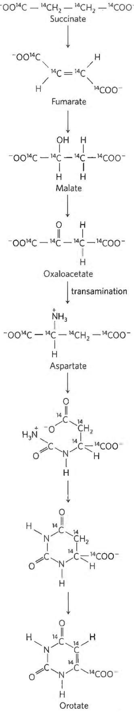

18. Organisms do not store nucleotides to be used as fuel, and they do not completely degrade them, but rather hydrolyze them to release the bases, which can be recovered in salvage pathways. The low C:N ratio of nucleotides makes them poor sources of energy.

19. Treatment with allopurinol has two consequences. (1) It inhibits conversion of hypoxanthine to uric acid, causing accumulation of hypoxanthine, which is more soluble and more readily excreted; this alleviates the clinical problems associated with AMP degradation. (2) It inhibits conversion of guanine to uric acid, causing accumulation of xanthine, which is less soluble than uric acid; this is the source of xanthine stones. Because the amount of GMP degradation is low relative to AMP degradation, the kidney damage caused by xanthine stones is less than the damage caused by untreated gout.

20. Tetrahydrofolate is utilized in thymidylate synthesis, and also in the synthesis of glycine from serine.

21. (a) The $\alpha$ -carboxyl group is removed and an —OH is added to the $\gamma$ carbon. (b) BtrI has sequence homology with acyl carrier proteins. The molecular weight of BtrI increases when incubated under conditions in which CoA could be added to the protein. Adding CoA to a Ser residue would replace an —OH, formula weight (FW) 17, with a $4^{\prime}$ -phosphopantetheine group (see Fig. 21-5; formula $\mathrm{C_{11}H_{21}N_2O_7PS}$ ), FW 356. Thus, 11,182 - 17 + 356 = 12,151, which is very close to the observed $M_r$ of 12,153. (c) The thioester could form with the $\alpha$ -carboxyl group. (d) In the most common reaction for removing the $\alpha$ -carboxyl group of an amino acid (see Fig. 18-6, reaction ©), the carboxyl group must be free. Furthermore, it is difficult to imagine a decarboxylation reaction starting with a carboxyl group in its thioester form. (e) 12,240 - 12,281 = 41, close to the $M_r$ of $\mathrm{CO}_{2}$ (44). Given that BtrK is probably a decarboxylase, the most likely structure is the decarboxylated form:

(f) 12,370 - 12,240 = 130. Glutamic acid (C $_{5}$ H $_{9}$ NO $_{4}$ ; M $_{r}$ 147), minus the —OH (FW 17) removed in the glutamylation reaction, leaves a glutamyl group of FW 130; thus, γ-glutamylating the molecule shown above would add 130 to its M $_{r}$ . BtrJ is capable of γ-glutamylating other substrates, so it may γ-glutamylate this molecule. The most likely site for this is the free amino group, giving the following structure:

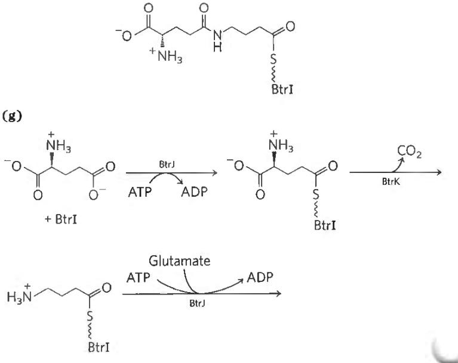

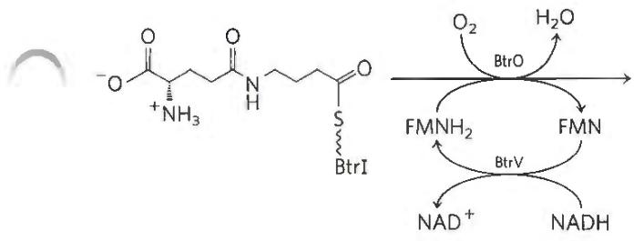

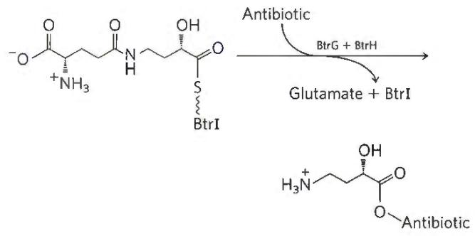

<!-- EN-END 第22章章末 -->
