## 第 28 章 新陈代谢的调节控制

> **本章英文对应内容**（Lehninger，插在所列中文小节末尾）
>
> - 第23章 Hormonal Regulation and Integration of Mammalian Metabolism：章首导言（本章开头）、关键术语/习题/简答（本章末尾）
> - §13.5（第13章）→ 二、酶活性和酶量的调节
> - §23.2（第23章）→ 四、机体在整体水平上对细胞代谢的调节控制
> - §23.3（第23章）→ 四、机体在整体水平上对细胞代谢的调节控制
> - §23.4（第23章）→ 五、代谢紊乱造成疾病
> - §23.5（第23章）→ 五、代谢紊乱造成疾病

新陈代谢是生物机体一切生命活动的基础。新陈代谢包括物质代谢、能量代谢和信息代谢三个方面。任何系统的物质变化总伴有能量变化，而物质变化和能量变化又总表现出其组织结构相对无序和有序的变更。系统的这种无序和有序变化可以通过称为“熵”的热力学函数进行度量。熵标志着一个系统的混乱程度，或者说无组织程度。熵越大，系统越混乱；反之熵越小，系统的有组织程度就越高。信息也可以作为系统组织程度的量度，获得信息便意味着混乱程度或者不确定程度的减少，也就是说它的组织程度提高。在物理学的计算公式中，信息与熵只差一个符号，因此可以说信息就是负熵。生物机体不断与环境交换物质，摄取能量，输入负熵，从而得以构建和维持其复杂的组织结构；一旦这种关系破坏，死亡便到来，生物就解体了。

细胞是生物机体的结构和功能单位。细胞由四类生物大分子（多糖、脂质、蛋白质和核酸）、有机分子、无机盐和水所组成。在细胞内同时进行着上千种生化反应，这些反应错综复杂却有条不紊，当细胞内外环境发生改变时能适时调整，维持着细胞的生理稳态。代谢调节（metabolic regulation）是指在代谢途径通量(flux)发生改变时，使有关代谢物浓度得以保持其稳态的机制。代谢控制（metabolic control）是指改变代谢途径的通量，以适应环境变化的机制。也就是说，代谢调节是对代谢物浓度变化的节制；代谢控制是对代谢途径通量的管控。两者合起来简称为调控，或者就称为调节。代谢的“自调节”是生命的重要特征之一。新陈代谢的调节控制机制是生物在长期进化过程中建立和完善的。

前面几章我们分别叙述了各类物质的代谢过程,以及在这些物质代谢过程中能量和信息的变化。实际上,生物机体的新陈代谢是一个完整统一的过程,并且存在复杂的自我调节机制。本章首先介绍细胞代谢调节控制的基本原理。然后分别介绍在分子、细胞和整体三个水平上的代谢调节控制机制。最后举例介绍代谢紊乱造成的疾病和防治途径。

<!-- EN-BEGIN 第23章导言 -->

### 【英文对应 第23章导言】Hormonal Regulation and Integration of Mammalian Metabolism

> 来源：Lehninger Principles of Biochemistry（书籍/02_生物化学原理） 第23章章首（含章节目录与学习要点）。

#### [EN] HORMONAL REGULATION AND INTEGRATION OF MAMMALIAN METABOLISM

23.1 Hormone Structure and Action 842

23.2 Tissue-Specific Metabolism 848

23.3 Hormonal Regulation of Fuel Metabolism 859

23.4 Obesity and the Regulation of Body Mass 867

23.5 Diabetes Mellitus 875

In Chapters 13 through 22 our focus has been on metabolism at the level of the individual cell, emphasizing central pathways common to almost all cells—bacterial, archaeal, and eukaryotic. We have seen how metabolic processes within cells are regulated at the level of individual enzyme reactions by substrate availability, by allosteric mechanisms, and by reversible covalent modification of enzymes.

To fully appreciate the significance of individual metabolic pathways and their regulation, we must view these pathways in the context of the whole organism. An essential characteristic of multicellular organisms is cell differentiation and division of labor. Specialized functions of the tissues and organs require specialized fuels and patterns of metabolism. Hormonal and neuronal signals integrate and coordinate the metabolic activities of different tissues and optimize the allocation of fuels and precursors to each organ. Although our focus is on mammalian systems, mammals are hardly unique in possessing hormonal signaling systems. Insects and nematode worms have highly developed systems for hormonal regulation, with fundamental mechanisms similar to those in mammals. Plants, too, use hormonal signals to coordinate the activities of their differentiated, specialized tissues.

In this chapter we will look at the specialized metabolism of several major organs and tissues and the integration of metabolism in mammals. We begin with an overview of the broad range of hormones and hormonal mechanisms, then turn to the tissue-specific functions regulated by these mechanisms. We discuss the distribution of nutrients to various organs, emphasizing the central role of the liver, and the metabolic cooperation among these organs. To illustrate the integrative role of hormones, we describe the interplay of insulin, glucagon, and epinephrine in coordinating fuel metabolism in muscle, liver, and adipose tissue. We also introduce other hormones, produced in adipose tissue, muscle, gut, and brain, that play key roles in coordinating metabolism and behavior. We discuss the long-term hormonal regulation of body mass and the role of obesity in the development of metabolic syndrome and type 2 diabetes. Finally, we discuss interventions used to manage diabetes.

In this chapter, we illustrate the following principles:

P1 The tissues in a mammal are connected by a neurosecretory system that coordinates their activities. Mammals use chemically diverse hormones in a highly specific and multidirectional signaling system, connecting the tissues with each other and with the central nervous system.

P2 Among the tissues and organs of an animal, there is a striking division of labor. The specialized role of each organ is reflected in its metabolic activities and capabilities. The circulatory system connects all of the tissues by carrying hormonal signals and metabolites between and among them.

Because the brain requires a continuous supply of glucose, maintaining an adequate concentration of glucose in the blood is a high priority in the activities of the other tissues. The liver integrates the use of fuels (glucose, fatty acids, and amino acids) by each tissue to keep the blood glucose level within the optimal range. Hormones carried in the blood (insulin, glucagon, epinephrine, cortisol) mediate this regulation.

P4 Maintaining an optimal body mass is an important priority in the adult mammal. Body mass is a function of dietary intake, physical activity, and the choice of metabolic fuel, all of which are subject to hormonal regulation. Hormonal signals between the brain, the adipose tissue, and the gastrointestinal tract help to set activity and feeding behavior.

P5 The metabolic activities of cells and organisms are complex and intertwined; perturbation at one point in the system has far-reaching consequences for health. When the normal energy-yielding metabolism of glucose and fatty acids is impeded by defective insulin signaling, the result is the disease diabetes.

<!-- EN-END 第23章导言 -->

## 一、细胞代谢调节控制的基本原理

生物界,包括人类、动物、植物和微生物,其结构特征和生活方式多种多样,千变万化。然而,它们的新陈代谢有着共同的基本途径和调控机制。这也表明地球上的生物有统一的起源。

细胞从环境中取得物质和能量,用以构建自身的组成结构,同时分解已有的成分,获得能量和前体,加以再利用,并将不被利用的代谢产物排出细胞。细胞是如何经济有效地转化各类物质的?如何维持代谢稳态的?这里就细胞代谢调节总的原则和方略作一概述。

## （一）代谢途径相互联系形成网络

细胞内有数百种小分子在代谢中起着关键的作用，由它们构成了各种特异的生物大分子。如果这些分子各自单独进行代谢而互不相关，那么代谢反应将变得无比庞杂，以至细胞无法容纳。细胞代谢的原则和方略是，将各类物质分别纳入各自的共同代谢途径，通过少数种类的反应，例如，氧化还原、基团转移、水解合成、基团脱加及异构反应等，以转化种类繁多的分子。连续的反应称为代谢途径，不同的代谢途径可通过交叉点上共同的中间代谢物而相互转化，使各代谢途径得以沟通，形成经济有效、运转良好的代谢网络通路。其中三个最关键的中间代谢物是：6-磷酸葡萄糖、丙酮酸和乙酰辅酶A。

细胞内 4 类主要生物分子: 糖、脂类、蛋白质和核酸在代谢过程中相互转化, 密切相关, 在代谢部分已有介绍。在此需强调指出, 柠檬酸循环不仅是各类物质共同的代谢途径, 而且也是它们之间相互联系的渠道。现将 4 类物质的主要代谢关系总结如图 28-1。

  
图 28-1 糖、脂质、蛋白质及核酸代谢的相互关系示意图

不同代谢途径之间虽然相互沟通,但它们各自存在调节与控制,转化是有节制的。各代谢途径相互协同配合,形成调节网络。

## （二）代谢保持动力学的稳态

细胞和机体通常都处于动力学的稳态(dynamic steady state)。在正常生理条件下，机体的组成和各代谢途径的运行保持不变。机体摄入营养物，排出废弃物，消耗自由能并以热能形式释放体外。所消耗的自由能主要用于对抗熵的作用力。也就是说，机体通过增加环境的熵来维持体内的稳态(homeostasis)。如若在生物发育过程，或是环境发生重大变化，代谢格局也将随之改变，从一种稳态转变为另一种稳态。

动力学稳态是指代谢途径的物流(flow)处于稳定状态,代谢物的生成与消耗速率相等,其浓度保持不变。稳态与物流速率(即通量)的大小或是否变动无关,在稳态条件下各代谢物浓度恒定,使代谢得以平稳进行。在两步反应中

$$
\mathrm{A} \xrightarrow {\mathrm{V} _ {1}} \mathrm{S} \xrightarrow {\mathrm{V} _ {2}} \mathrm{P}
$$

当 $V_{1}=V_{2}$ ，[S] 即保持不变。现以 ATP 为例来说明代谢稳态。ATP 是生物通用能量载体，广泛参与各种产能和需能反应；ATP 又是能量水平的标记，在代谢调节中起重要作用。因此，细胞充分供应并保持其浓度恒定。通常利用 ATP 的酶其 $K_{m}$ 值在 $0.1 \sim 1 \, mmol \cdot L^{-1}$ 之间，正常细胞 ATP 的浓度为 $5 \sim 10 \, mmol \cdot L^{-1}$ ，明显大于 $K_{m}$ 值（常在 10 倍以上）。昆虫和鸟类在起飞时，或运动员在开始奔跑时，肌肉细胞对 ATP 的需求瞬间增加数十倍，甚至上百倍。在这种情况下，氧的供应跟不上机体对 ATP 的急需，于是迅速通过增强葡萄糖酵解等途径加大对 ATP 的供应，然而细胞中 ATP 和其他许多代谢物的浓度却并无显著变化。

生物机体的种种代谢调节控制机制是在进化过程中获得的。机体在进化中积累的有用信息很大一部分用于编码调控机制。人类大约有4000个基因编码调节蛋白，约占基因组的12%，其中包括各种转录因子、细胞因子、受体、信号蛋白，以及超过500种的蛋白质激酶。越是高等生物，其代谢调控机制越复杂。

## （三）代谢调节点常是远离平衡的反应

一切可逆反应,只要有足够时间,都能自发达到平衡。在平衡点,正向和逆向反应速率相等,自由能的变化 $\Delta G$ 为零。处于动力学稳态的细胞内,代谢途径的多数反应接近平衡。当反应接近平衡时,较小的底物或产物浓度变化可以引起较大的净物流速率变化,并且自由能的变化也较小。这就是说,接近平衡的反应易于使物流平稳;而远离平衡的反应,消耗的自由能较大,故常为调节点。

“接近”平衡的标准是什么？通常用质量作用比（mass-action ratio）Q值和平衡常数 $K_{eg}^{\prime}$ 进行比较来判断。在下列反应中：

$$
\mathrm{A} + \mathrm{B} \rightleftharpoons \mathrm{C} + \mathrm{D}
$$

$$
\mathrm{Q} = \frac {[ \mathrm{C} ] [ \mathrm{D} ]}{[ \mathrm{A} ] [ \mathrm{B} ]}
$$

Q 是细胞内产物浓度乘积被底物浓度乘积相除的数值。当 Q 值和平衡常数 $K_{eg}^{\prime}$ 的比值不超过 2 个数量级，即不超过 100 时，就可认为反应接近平衡。一个反应的平衡常数是固定的，但质量作用比则在不同细胞、不同状态下可以有较大差别。

在细胞内远离平衡的反应常是一些释放高能的反应,例如一些利用 ATP 和其他高能化谷物的酶促反应,其逆反应接近于零,在稳态条件下该正向反应的速率也就代表了整个代谢途径物流的速率。因此,这些反应也就成为代谢的调节点。从糖的酵解途径来看,共有 10 步反应,其中己糖激酶、磷酸果糖激酶和丙酮酸激酶催化的反应均为调节点,这 3 个酶也就是调节酶。

综上所述,远离平衡的反应适于作为调节点,这是由于:① 远离平衡的反应可看作单向或接近单向的反应,其速率与代谢途径的速率直接相关联;② 远离平衡的反应通常都是释放高能的反应,或利用 ATP 和其他高能化合物,或本身即是高能化合物,机体必需对其节制;③ 远离平衡的反应通常都是一些对机体十分重要的反应,它们涉及高能释放,并且常位于代谢途径的关键位置(起点或终点),故而机体严格限制其速率,有关的酶也大多是调节酶。单向、高能、受限制,这三点正符合代谢调节点的基本要求。自然选择压力使催化该反应的酶在进化过程中获得调节功能,成为调节酶。

## （四）代谢控制分析

最早研究代谢控制并取得显著成果的科学家是 Louis Pasteur。1861 年, Pasteur 发现将酵母培养物从有氧转变为无氧条件, 葡萄糖的消耗量随即增加 10 倍以上。这一现象被称为“巴斯德效应”。现在知道, 有氧对酵解的抑制是通过腺苷酸系统作用的。有氧条件下能够产生较多的 ATP, 无氧时细胞增加酵解过程, 以维持 ATP 的稳定供应, 从而使葡萄糖的消耗增加。在其后的一个半世纪时间里, 代谢研究取得巨大进展, 弄清楚了各类物质的代谢途径, 也弄清楚了代谢的调节控制机制。

“单一限速步骤”假说(single rate-limiting step hypothesis)曾在相当长一段时间内被广泛接受。该假说认为代谢途径的物流速率由系列反应中速率最小的反应(步骤)所决定。在当时实验条件下,要想在完整细胞或无细胞提取液中精确测定酶和底物浓度殊不容易。直到20世纪70年代基因克隆技术兴起,利用克隆技术可以增加基因拷贝数以提高酶的浓度;也可以在提取液中添加提纯的酶,或是用酶的激活剂和抑制剂控制酶的活性;底物浓度也可以用许多生化方法测定,实验技术的突破为代谢分析提供可能。实验结果却令人大感意外。曾以为磷酸果糖激酶(PFK-1)是酵解途径的限速步骤,但是将该酶浓度提高五倍,酵解物流速度提高还不到10%。对其他代谢途径的检验结果也与“限速步骤”假设不一致。早在1973年Kacser等人就提出影响通量的有诸多因素,而不是单独一步反应。次年Heinrich等人阐述了代谢控制分析的基本原理。然而,当时对Heinrich和Kacser等人的观点并不重视,及至实验揭示了“限速步骤”假说

的局限性,才使该学说获得普遍关注。

代谢控制分析(metabolic control analysis, MCA)将研究对象看作是由代谢反应步骤和代谢途径组成的代谢系统,因此应对整个系统进行分析,不能局限于个别反应,并认为代谢通量的控制是由组成代谢途径各个步骤及其相互关系决定的,随环境改变而改变。MCA不仅对代谢控制作了数学推导,而且还可以通过实验进行验证。许多实验与MCA预期结果一致或接近一致,然而迄今仍有一些代谢途径过于复杂,尚未分析清楚。

MCA 理论有三个基本参数可用来描述代谢途径对环境变化的反应性。通量控制系数 C(flux control coefficient, C) 用以表示代谢途径中每个酶对调节代谢物流速的相对贡献。通量(flux, J) 是指物流的速率，改变酶量引起代谢通量的相对变化之比，可以得到 C 值。例如，在大鼠肝提取液的酵解途径中己糖激酶

的通量控制系数为 0.79, PFK-1 为 0.21, 磷酸己糖异构酶为 0.0。C 值不是常数, 它随代谢系统底物和效应物浓度的改变而不同; C 值可以是负数, 如有分支途径, 分支途径的酶对主干途径的通量就起负作用, 如图 28-2 所示。无论是直线途径或是分支途径, 各酶 C 值的总和必为 1, 因为我们将代谢的整体控制定义为 1。

  
图 28-2 分支代谢途径的通量控制系数 C

弹性系数 $\varepsilon(\text{elasticity coefficient},\varepsilon)$ 用以定量表示代谢途径中单个酶对代谢物或效应物 (effector) 浓度的反应性,也就是说反应速率变化与代谢物或效应物浓度变化之比,它是酶固有的动力学性质函数。对于具有典型 Michaelis-Menten 动力学性质的酶来说,底物浓度对反应速率所作的曲线为一双曲线(见第7章酶促反应的底物饱和曲线)。曲线上各点的斜率即为弹性系数 $\varepsilon$ ,当底物浓度较低时(如 $0.1 K_{m}$ ),底物浓度稍微增加可引起酶活性的相应增加, $\varepsilon$ 接近于 1.0;而当底物浓度较高时(如 $10 K_{m}$ ),底物浓度稍微增加,对酶活性几乎没有影响, $\varepsilon$ 接近于 0.0。具有变构效应的酶, $\varepsilon$ 可以大于 1,但不能超过 Hill 系数,因此在 1.0 与 4.0 之间。

反应系数 R(response coefficient, R) 表示外部控制物(outside controller) 对流经代谢途径通量的影响。所谓外部控制物是指激素、生长因子或其他细胞因子。通过实验可以测定改变激素等外部化学调节因子浓度(P) 时代谢途径通量发生的变化，从而获得 R。三个系数 C、 $\varepsilon$ 和 R 之间彼此相关：外部控制物总是通过代谢途径的某一环节(某-酶)而对通量发生控制的，因此 R 是 C 的函数；而该酶受控制因子的影响，故也是 $\varepsilon$ 的函数，由此得到下列关系式。

$$
\mathrm{R} = \mathrm{C} \cdot \varepsilon
$$

总和原理(代谢途径各步反应酶的 C 值总和为 1) 和各参数相关性原理(R 为 C 和 $\varepsilon$ 的乘积) 是 MCA 的两个基本原理。运用 MCA 进行实验, 不仅弄清楚了许多代谢途径的调控机制, 而且在利用生物技术改造机体代谢, 即代谢工程中, 也取得许多重大成果。然而, MCA 也有其局限性, 它主要基于对酶活性和动力学性质分析, 有时酶浓度的影响并不明显, 而且通量控制系数只在测定条件下有效, 随着系统状态变化而变化, 其预测值的作用有限。因此 MCA 还需进一步研究改进。

## （五）代谢的协同调节

上面提到,细胞和机体各代谢途径存在调节控制机制。当环境改变时可通过控制代谢途径通量改变代谢格局;调节机制使代谢途径维持在稳态。然而,细胞和机体是一个整体,各代谢途径彼此沟通,其调控也是相互协调,使代谢得以恰到好处的进行。代谢的协同调节表现为各代谢途径(包括分解途径和合成途径)间的协调配合,各组织器官间的分工合作以及不同调控机制间的协作互补。

生物体内的代谢反应都是由酶催化的。任何催化剂，包括酶在内，仅能改变化学反应的速率，并不能改变化学反应的平衡点。因此，它对正反应和逆反应起着同样的促进作用。代谢途径中大量生化反应都是可逆的。然而，实际上整个代谢过程是单向的，分解代谢和合成代谢各有其自身的途径。在分解代谢和合成代谢途径中，许多反应的酶是相同的，但是某些关键部位的正反应和逆反应往往是由两种不同的酶所催化，一种酶催化正向反应，另一种酶催化逆向反应。因此，这些反应被称为相对立的单向反应（opposingunidirectional reaction)。这种分开机制可使生物合成和分解途径或者正向反应和逆向反应分别处于热力学最有利状态。生物合成是一个吸能反应(endergonic reaction)，它通过与一定数量ATP的水解相偶联而得以进行。分解则是放能反应(exergonic reaction)。这些吸能反应和放能反应均远离平衡点，从而保证了反应的单向进行。另一方面，分解代谢和合成代谢的单向性也有利于对它们的调节控制。例如，哺乳动物肝脏可以在糖原被耗尽并且无食物葡萄糖来源时，由丙酮酸经葡糖异生途径转化为葡萄糖，以维持血糖稳定，供脑和其他组织所需，丙酮酸可以由乳酸、丙氨酸和甘油等物质转变而成。葡糖异生有11步反应，糖酵解有10步反应，两者间有7步反应是可逆的，由相同的酶所催化。糖酵解有3步放能反应基本上是不可逆的，催化这3步反应的酶为己糖激酶、PFK-1和丙酮酸激酶。葡糖异生绕过对应的3步不可逆反应，取代的4步反应也有较大的负 $\Delta G^{\prime}$ 值。这些单向的放能反应也正是代谢的调节点，催化的酶也都是调节酶，受代谢物和效应物的调节。糖酵解和葡糖异生途径见图28-3。

  
图 28-3 糖酵解和糖异生途径  
糖酵解有10步反应，糖异生有11步反应，其中7步可逆反应的酶两者共有。糖酵解有3步  
单向放能反应，在糖异生中对应有4步反应，为两代谢途径的重要调节点

生物机体的代谢有时一种反应由不止一种酶催化,多种酶催化同一种反应称为同工酶(isozyme)。这些酶的催化功能虽然相同,但酶学性质不同,调节功能也不同,分布在不同的组织分别起着不同的作用。人类的己糖激酶同工酶共有4种,分别称为I至IV型,由不同基因编码。肌细胞由血液获得的葡萄糖主要用作肌肉收缩的能源。肌细胞有I至III型己糖激酶,这3种同工酶性质相近,对葡萄糖的亲和力都很高(如肌细胞占优势的II型 $V_{m}$ 值为0.1 mmol)。血液中的葡萄糖浓度通常为4\~5 mmol,当血液与肌细胞糖浓度达到平衡时,足以使己糖激酶饱和,酶的活性为最大,而且血糖浓度的波动实际上对酶活性的影响不大。己糖激酶I至III均为变构酶,其产物6-磷酸葡萄糖浓度升高将会有效抑制酶活性,从而使反应维持在一定的稳态。

肝细胞承担着维持血糖浓度稳定的功能,其己糖激酶为Ⅳ型, $K_{m}$ 值高达约10 mM。高效的葡萄糖运输系统使肝细胞与血液间糖浓度迅速达到平衡,此时的糖浓度低于酶的半饱和值,故而血糖浓度可以直接影响肝细胞己糖激酶的活性。餐后血糖浓度升高,己糖激酶Ⅳ活性随之升高,该酶不受产物6-磷酸葡萄糖的抑制,糖酵解途径通量因之而增加,己糖激酶Ⅳ受其特异的调节蛋白(regulatory protein)抑制,该调节蛋白为肝细胞特有并固着于核内,在变构效应物6-磷酸果糖存在下己糖激酶从胞液移至核内与调节蛋白牢固结合。葡萄糖是6-磷酸果糖的竞争结合物,在正常血糖浓度下6-磷酸果糖的作用受竞争抑制;当血糖浓度低于正常值时,葡萄糖被6-磷酸果糖所替代,己糖激酶Ⅳ活性被抑制,肝不再与其他器官竞争消耗葡萄糖。

葡糖异生或糖原分解产生的6-磷酸葡萄糖需经6-磷酸葡萄糖酶(G6 Pase)水解,生成葡萄糖才能进入血液。6-磷酸葡萄糖酶是一种复合膜蛋白,固定在内质网的内膜上,包括水解酶和3种转运蛋白,分别负责6-磷酸葡萄糖 $(\mathrm{T}_{1})$ 、无机磷酸盐 $(\mathrm{T}_{2})$ 和葡萄糖 $(\mathrm{T}_{3})$ 的运输。底物6-磷酸葡萄糖由胞液经 $\mathrm{T}_{1}$ 运送到内质网腔，水解后产物磷酸盐和葡萄糖经 $\mathrm{T}_{2}$ 和 $\mathrm{T}_{3}$ 送回胞液。己糖激酶和6-磷酸葡萄糖酶被分隔在细胞的不同部位，可用以控制该两途径通量并防止葡萄糖磷酸化和去磷酸循环反应，即所谓底物循环（subtract cycling）的无谓耗能反应。同样原因，糖异生第一步反应的酶丙酮酸羧化酶位于线粒体的基质，底物丙酮酸可以自由进出线粒体，产物草酰乙酸没有进出线粒体的通道，需要转变成苹果酸（通过苹果酸脱氢酶逆反应）和天冬氨酸（转氨酶反应）才能穿过线粒体膜，进入胞液后再转变回草酰乙酸，防止底物循环还可以经由其他途径，例如对立反应的交互调节，其中一种反应有活性，另一种则被抑制，反之亦然。

激素可以调节酶的活性,也可以在转录水平上调节酶的生成。高血糖促进胰岛素分泌,胰岛素与受体结合经信号转导激活磷脂酰肌醇3-激酶(PI3 kinase),从而催化磷脂酰肌醇(4,5)二磷酸( $PIP_{2}$ )转变为磷脂酰肌醇(3,4,5)三磷酸( $PIP_{3}$ ), $PIP_{3}$ 能够抑制G6Pase活性。另一方面,胰岛素信号途径还能抑制G6 Pase基因的转录。低血糖则促进胰高血糖素的分泌,胰高血糖素经cAMP信号途径增强G6Pase基因的转录。此外,G6Pase还需要 $Ca^{2+}$ 结合稳定蛋白( $Ca^{2+}$ -binding stabilizing protein)活化,因此受 $Ca^{2+}$ 信号调节。己糖激酶和6-磷酸葡萄糖酶受不同调控机制的协同作用见图28-4。

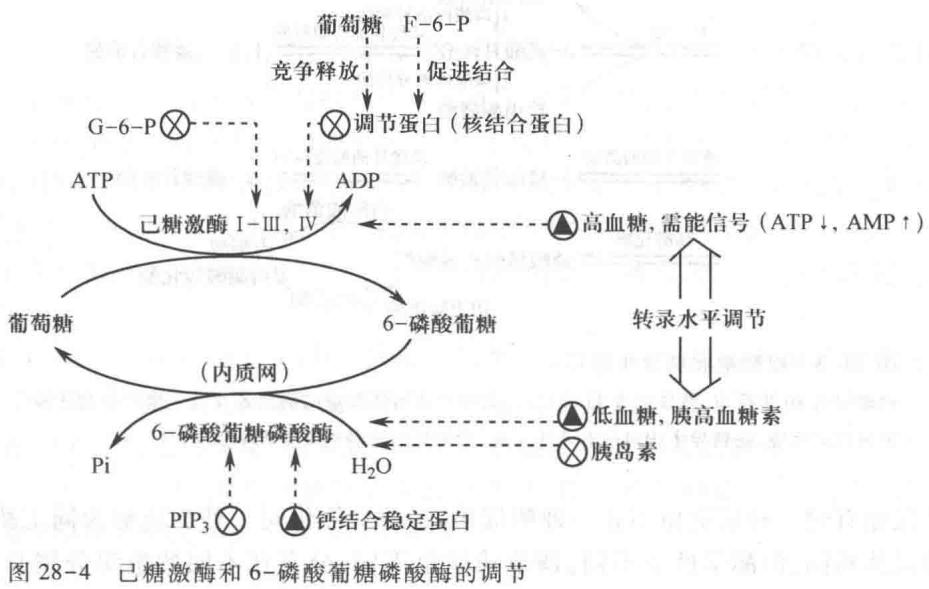  
▲ 激活作用；⊗ 抑制作用

6-磷酸果糖激酶(PFK-1)和1,6-二磷酸果糖酶(FBPase-1)分别是催化糖酵解和糖异生关键步骤反应的酶,这两个酶也都是变构酶。ADP和AMP对磷酸果糖激酶有激活作用,而AMP对1,6-二磷酸果糖酶则起抑制作用。ADP和AMP浓度高表明细胞需要加速ATP的合成,因此增强糖酵解并抑制糖异生。与此类似,柠檬酸和ATP对6-磷酸果糖激酶起抑制作用,从而抑制糖酵解;柠檬酸对1,6二磷酸果糖酶起激活作用,促进糖异生。6-磷酸果糖激酶和1,6-二磷酸果糖酶还受激素通过信号分子2,6-二磷酸果糖(F-2,6-BP)进行的协同调节。6-磷酸果糖在磷酸果糖激酶-2(PFK-2)催化下与ATP反应产生信号分子2,6-二磷酸果糖,后者在2,6-二磷酸果糖酶(FBPase-2)催化下水解重新生成6-磷酸果糖。值得指出的是,PFK-2和FBPase-2是同一个双功能蛋白质的两种酶活性,当酶蛋白在依赖cAMP的蛋白激酶(PKA)催化下被磷酸化,呈现FBPase-2活性;经磷蛋白磷酸酶作用去掉磷酸基,则呈现PFK-2活性。胰高血糖素可产生cAMP,激活PKA。胰岛素的作用相反,促进磷蛋白磷酸酶活性。前者降低F-2,6-BP浓度,抑制糖酵解,促进葡糖异生;后者增加F-2,6-BP浓度,增强糖酵解,抑制葡糖异生。磷酸果糖激酶和1,6-二磷酸果糖酶的交互调节见图28-5。

同样，丙酮酸激酶、丙酮酸羧化酶和磷酸烯醇式丙酮酸羧激酶都是调节点的变构酶。高浓度 ATP、乙酰-CoA 和丙氨酸反映细胞能量和氨基酸丰富，因而糖酵解受到抑制。丙酮酸激酶还受到代谢物 1,6-二磷酸果糖的正反馈激活。丙酮酸激酶至少有三个同工酶，肝丙酮酸激酶(L型)在PKA催化下被磷酸化而失活，磷蛋白磷酸酶(PP)使其水解去磷酸基而恢复活性并受变构调节。PKA受胰高血糖素诱导产生的cAMP激活。前面提到糖异生第一步反应的酶丙酮酸羧化酶位于线粒体的基质，受ADP变构抑制，为乙酰-CoA激活。磷酸烯醇式丙酮酸羧激酶在线粒体和胞液内都有，受ADP抑制。这3个酶的调节见图28-6。

  
图 28-5 磷酸果糖激酶和果糖 1,6-二磷酸酶的交互调节  
激活作用；抑制作用

  
图 28-6 丙酮酸激酶、丙酮酸羧化酶和磷酸烯醇式丙酮酸羧激酶之间的调节  
▲ 激活作用;⊗ 抑制作用

## 二、酶活性和酶量的调节

生物体内的各种代谢变化都是由酶驱动的。酶有两种功能:其一,催化各种生化反应,是生物催化剂;其二,调节和控制代谢的速度、方向和途径,是新陈代谢的调节物。虽说酶并不改变反应的热力学性质,但却能从动力学上使本来不易发生的反应得以进行。酶对正反应和逆反应起着同样的促进作用,这是对单个反应来说的,酶对代谢过程的调节控制是由于:①酶使吸能反应与放能反应相偶联,因而能推动吸能反应的完成;②代谢途径由系列酶所催化,中间产物迅速被除去,并不积累;③反应在酶或酶复合物的表面进行,往往直到终产物才脱离,成为定向的过程。“酶水平”的调节是代谢最基本、最关键的调节。酶调节主要有两种方式:一种是通过激活或抑制以改变细胞内已有酶分子的催化活性;另一种是通过影响酶分子的合成或降解,以改变酶分子存在的量。虽然,代谢底物和代谢产物都对代谢反应有影响。质量作用定律表明,反应速度与反应物的摩尔浓度乘积成正比。因此,增加代谢底物的浓度,将促进正向反应;反之,增加代谢产物的浓度,将促进逆向反应。代谢物的调节也属于分子水平的调节,然而代谢物的调节是十分有限的,主要受到酶的调节。

酶活性的调节主要包括酶的抑制和激活作用、变构效应、共价修饰和酶切激活等方式。而酶的合成则涉及基因表达调控。本节侧重介绍酶促反应的前馈和反馈、能荷的调节、级联反应、酶切激活、共价修饰以及酶量的调节。

## （一）酶活性的变构调节：前馈和反馈

前馈(feedforward)和反馈(feedback)这两个术语来自电子工程学。前者意思是“输入对输出的影

响”，后者意思是“输出对输入的影响”。这里分别借用来说明代谢底物和代谢产物对代谢过程的作用。前馈或反馈又可分为正作用和负作用两种。凡反应物能使代谢过程速度加快者，称为正作用；反之，则称为负作用。下面图解表明前馈和反馈，S代表底物，有 $S_{0}$ 、 $S_{1}\cdots S_{n}$ 等先后出现的各种底物；E代表酶，有 $E_{0}$ 、 $E_{1}\cdots E_{n}$ 等先后出现的不同的酶；“+”表示激活作用，“-”表示抑制作用。无论是前馈还是反馈都是变构效应，代谢底物和代谢产物在这里起效应物的作用（图28-7）。

  
图 28-7 酶促反应的前馈和反馈

通常,代谢底物对代谢反应具有促进作用。在代谢途径中前面的底物对其后某一催化反应的调节酶起激活作用,称为正前馈作用。正前馈的例子很多,例如,二磷酸果糖对磷酸烯醇式丙酮酸羧化酶的激活作用是正前馈作用。在某些特殊的情况下,为避免代谢途径的过分拥挤,当代谢底物过量存在时,对代谢过程亦可呈负前馈作用。此时过量的代谢底物可以转向另外的途径。例如,高浓度的乙酰辅酶A是乙酰辅酶A羧化酶的变构抑制剂,因而避免丙二酸单酰辅酶A过多合成。

代谢产物对代谢过程的调节即为反馈调节。当生物合成或分解代谢产物大量积累时，产物对代谢途径第一步反应的酶或关键步骤的酶活性发生抑制作用，这就是反馈抑制。反馈抑制可以节省代谢物和能量，有重要生物学意义，因而广泛存在于各代谢途径。代谢产物对酶活性的调节，不仅表现为反馈抑制，也可以表现为对酶的反馈激活。磷酸烯醇式丙酮酸通过羧化反应，形成草酰乙酸，这是复杂分支代谢的共同第一步。由草酰乙酸可以转变成各种氨基酸和核苷酸。另一方面，草酰乙酸还可以促使乙酰辅酶A通过柠檬酸循环而被氧化。草酰乙酸作为合成氨基酸和核苷酸的前体物质，能被产物连续地进行反馈抑制。即当嘧啶核苷酸积累时，其合成途径第一步反应的酶受到抑制，这就导致天冬氨酸的积累，进而对磷酸烯

醇式丙酮酸羧化酶的活性产生反馈抑制。然而，对于柠檬酸循环中柠檬酸的合成，又必需有草酰乙酸参加，从而对磷酸烯醇式丙酮酸羧化酶产生了三种正调节：①嘧啶核苷酸的反馈激活；②乙酰辅酶A的反馈激活；③前体二磷酸果糖的前馈激活。此外，乙酰辅酶A还能增加磷酸烯醇式丙酮酸羧化酶对嘧啶核苷酸的亲和力，从而促进了它们的反馈激活效应。这样，通过错综复杂的调节系统，就能使磷酸烯醇式丙酮酸羧化反应处于最适当的水平(图28-8)。

## （二）产能反应与需能反应的调节

细胞内许多代谢反应受到能量状态的调节。ATP 是通用的能量载体，ADP 是形成 ATP 的磷酸受体。

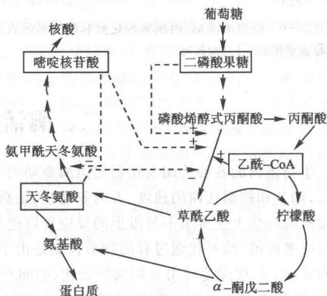  
图 28-8 磷酸烯醇式丙酮酸羧化反应的调节控制

ATP、ADP 和无机磷酸盐广泛参与细胞的各种能量代谢。通常产能反应与 ADP 的磷酸化相偶联，需能反应则与 ATP 高能磷酸键的水解相偶联。因此 ATP 与 ADP 和 Pi 的浓度比值 [ATP] / { [ADP] [Pi]}，成为细胞能量状态的一种指标，被称作 ATP 系统的质量作用比 (mass-action ratio)。在正常状态下，该比值是很高的，ATP-ADP 系统总是充分被磷酸化。这使 ADP 的浓度变得非常低，远不足以使氧化磷酸化达到最大速度。此时 ATP 的合成速度足够用来维持细胞的一般需要。但当某些需要 ATP 的细胞活动突然增加时，ATP 迅速分解成 ADP 和磷酸盐，从而降低 [ATP] / { [ADP] [Pi]} 比值。ADP 浓度的增加即能自动增加电子传递和氧化磷酸化的速度，从而加速由 ADP 合成 ATP 的反应。该过程一直持续到 [ATP] / { [ADP] [Pi]} 比值返回正常的高水平，于是氧化磷酸化的速度再次降低。

正常情况时,细胞有机物氧化速度的调节极其灵敏和精确,ATP、ADP 和磷酸盐不仅是代谢反应的底物和产物,可以通过质量作用效应而调节能量代谢,而且更重要的还是许多重要调节酶的变构效应物。例如,在糖酵解、柠檬酸循环和氧化磷酸化途径中,ATP 是抑制效应物,ADP、AMP 和磷酸盐是激活效应物。因此,他们浓度发生任何变化都将迅速引起相应调节酶活性的改变。它们对调节酶的作用见图 28-9。

  
图 28-9 糖酵解与柠檬酸循环途径的调节

Atkinson 建议以能荷来表示细胞的能量状态。能荷的定义为在总的腺苷酸系统中（即 ATP、ADP 和 AMP 之和）所负荷的高能磷酸基数量：

$$
\mathrm{能荷} = \frac {[ \mathrm{ATP} ] + 1 / 2 [ \mathrm{ADP} ]}{[ \mathrm{ATP} ] + [ \mathrm{ADP} ] + [ \mathrm{AMP} ]}
$$

当所有腺苷酸充分磷酸化为 ATP 时, 能荷值为 1.0; 如所有腺苷酸“卸空”成为 AMP 时, 能荷则等于零。正常情况下细胞的能荷大约为 0.9, 变动范围为 0.85\~0.95。能荷是腺苷酸总池中 ATP 或其当量物质量的分数; 由于 AMP 激酶催化二分子 ADP 转化成一分子 ATP 和一分子 AMP, 故 ADP 只相当于 1/2 ATP。在某些条件下, 能荷值可作为细胞产能和需能代谢过程间变构调节的信号。

## （三）酶活性的特异激活和抑制

酶活性受到多种离子和有机分子的影响,尤其是特异的蛋白质激活剂和抑制剂在酶活性的调节中起重要作用。例如,钙调蛋白,它能感受细胞内 $Ca^{2+}$ 浓度的变化,当钙的水平升高时即激活许多种相关蛋白质。

蛋白水解酶也许是生命起源早期就出现的酶，自有蛋白质世界就有蛋白酶。蛋白酶进化至今已成为最庞大的酶家族，其中包括丝氨酸蛋白酶、半胱氨酸蛋白酶、金属蛋白酶和酸性蛋白酶4个主要家族，它们广泛参与各种重要生理过程，并有各类特异的激活剂和抑制剂精确调节其功能。凝血系统的大多组分都是丝氨酸蛋白酶，凝血因子Ⅷ（抗血友病因子）和凝血因子V本身不是蛋白酶，而是丝氨酸蛋白酶激活剂。它们通过级联激活，促使血纤维蛋白原转变为血纤维蛋白，在伤口处造成血液凝固。一旦出现血液栓塞，则由溶栓系统将其水解，该系统也由丝氨酸蛋白酶所组成，并受丝氨酸蛋白酶抑制剂的抑制。凝血与溶栓

<!-- END OFFICIAL API PART part_004 -->

<!-- BEGIN OFFICIAL API PART part_005 -->

之间的平衡和调节，依赖于诸多丝氨酸蛋白酶激活剂和抑制剂的作用。血浆中还含有 $\alpha_{1}$ -抗胰蛋白酶，它与抗凝血酶Ⅲ均属于丝氨酸蛋白酶抑制剂（serpin）家族，但二者的特异性不同。 $\alpha_{1}$ -抗胰蛋白酶这一名称并不恰当，其实它主要抑制弹性蛋白酶。外伤常引起血浆中 $\alpha_{1}$ -抗胰蛋白酶活性的增加，用以抵消中性白细胞在受刺激后过量产生的弹性蛋白酶。类似例子，不胜枚举。

还有一些调节酶,其催化活性是由调节亚基来控制的。如蛋白激酶 A,在激素引发产生胞内信使 cAMP 后,抑制亚基脱离酶而使之活化。

## （四）酶原激活、共价修饰和级联反应

不少蛋白质在合成之初并无活性,需将一个或少数几个特异肽键切开后才被活化。最为熟知的例子是消化酶的激活,胃和胰腺合成的蛋白酶,如胃蛋白酶、糜蛋白酶、胰蛋白酶、羧肽酶及弹性蛋白酶等,都是以酶原的形式存在,分泌到消化管后才被酶切激活。

与酶类似,有些蛋白质激素以无活性前体形式被合成。例如,胰岛素是由胰岛素原经蛋白酶除去一段C肽才被激活。一些多肽激素,如垂体激素,其前体经蛋白酶加工,切成许多小肽,才成为有活性激素。

纤维状的胶原蛋白（collagen）是皮肤和骨骼的主要成分，它的前体是可溶性的前胶原蛋白（procollagen）。动物变态涉及胶原蛋白的分解，在此过程中无活性的胶原酶原在变态的一定时间转变为有活性的胶原酶。

前面已经提过,凝血过程是由一个系列凝血因子连续激活引起的。凝血因子都是一些丝氨酸蛋白酶或其激活剂,由此构成蛋白酶解激活的级联反应。通过级联反应,一方面能够对外伤作出瞬间放大效应;另一方面也便于调节,能够有效控制凝血的速度和进程。凝血的级联系统如图28-10所示。

酶的可逆共价修饰是调节酶活性的重要方式。其中最重要、最普遍的调节是对靶蛋白的磷酸化。催化此反应的酶称为蛋白激酶，由ATP供给磷酸基和能量，磷酸基转移到靶蛋白特异的丝氨酸、苏氨酸或酪氨酸残基上。蛋白的脱磷酸是由磷蛋白磷酸酶催化水解反应将其脱下。磷酸化和脱磷酸分别由不同酶促反应来完成，以便于对反应的控制。磷酸化反应，具有高度放大效

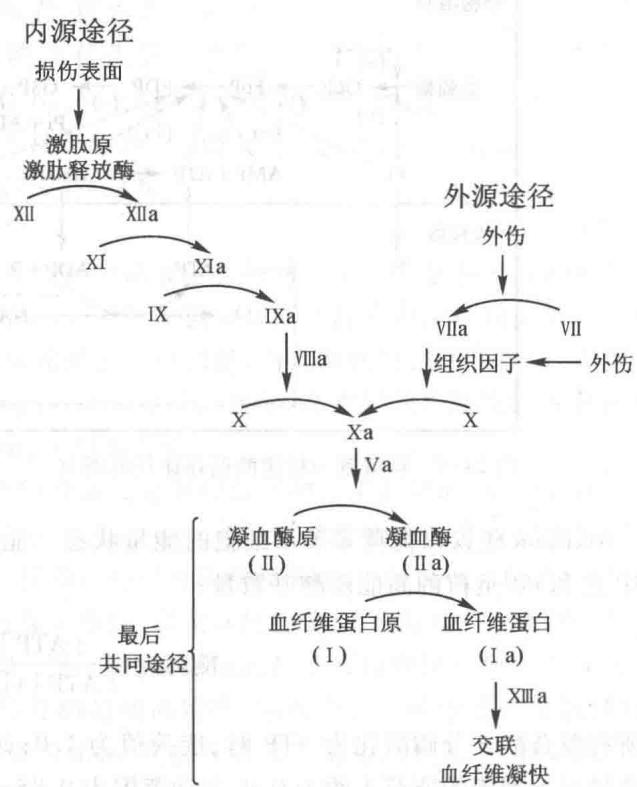  
图28-10 凝血级联系统

应。一个活化的激酶能够在很短时间内催化数百个靶蛋白的磷酸化，新被激活的激酶又能激活下一个激酶，由此引起级联激活，信号呈指数递增，迅速达到生理效果。酶的磷酸化和脱磷酸作用，主要在真核生物细胞信号转导途径中进行。

腺苷酰化和脱腺苷酰作用（adenylylation and deadenylylation）则是细菌中共价修饰调节酶活性的另一种重要方式，其中以大肠杆菌谷氨酰胺合成酶(GS)研究得比较清楚。谷氨酰胺合成酶催化谷氨酸、 $\mathrm{NH}_4^+$ 和ATP合成谷氨酰胺。它由12个完全相同的亚基(亚基 $M_{\mathrm{r}}$ 为50000)，有规则地排列成两层六角环的结构，每个亚基含有与底物反应的催化部位和结合效应物的别构部位。此外各个亚基的酪氨酸残基上还能进行可逆的腺苷酰基化，完全腺苷酰化可结合12个AMP，完全和部分腺苷酰化的酶是低活性的，只有全部脱腺苷酰的酶才是高活性的。该酶在氮的中间代谢中起着关键的作用，通过调节氮代谢而影响细胞的许多反应。谷氨酰胺的酰胺基是合成AMP、CTP、色氨酸、组氨酸、氨甲酰磷酸及葡萄糖胺-6-磷酸等化合物氮的来源；它的氨基可通过转氨反应为甘氨酸和丙氨酸提供氮源。谷氨酰胺合成酶

AT·P $_{A}$ 腺苷酰转移酶与调节蛋白P $_{A}$ 的复合物；AT·P $_{D}$ 腺苷酰转移酶与调节蛋白P $_{D}$ 的复合物；GS $_{0}$ 完全脱腺苷酰的谷氨酰胺合成酶；GS $_{12}$ 12个亚基全部腺苷酰化的谷氨酰胺合成酶活性受到上述8种终产物的积累反馈抑制，并且在腺苷酰化后提高了对这些反馈抑制剂的敏感性，致使酶分子具有对多种信号敏感反应的调节特性（图28-11）。

腺苷酰化酶的 AMP 单位来自 ATP；共价结合的 AMP 单位可通过磷酸解而脱去，并产生 ADP。这两个反应都是由腺苷酰转移酶（adenylyl transferase, AT）催化完成的。腺苷酰转移酶的特异性是由调节蛋白 P 所控制，该调节蛋白以两种形式存在，分别称为 $P_{A}$ 和 $P_{D}$ 。 $P_{A}$ 与腺苷酰转移酶的复合物催化谷氨酰胺合成酶的腺苷酰化反应； $P_{D}$ 与腺苷酰转移酶的复合物则催化脱腺苷酰反应。而调节蛋白 P 本身又受到尿苷酰化和脱尿苷酰的可逆共价修饰。 $P_{A}$ 通过尿苷酰化而转变成 $P_{D}$ ，催化该反应的酶为尿苷酰转移酶（uridyl transferase），酶活性受 ATP 和 $\alpha-$ 酮戊二酸激活，并受谷氨酰胺抑制。

  
图 28-11 谷氨酰胺合成酶的活性通过可逆共价修饰进行调节

受 ATP 和 $\alpha$ -酮戊二酸激活，并受谷氨酰胺抑制。 $P_{D}$ 的尿苷酰基可被酶水解下来。

调节蛋白 P 通过尿苷酰化和脱尿苷酰反应而改变其调节作用的特异性：

$$
\begin{array}{r l} & {\mathrm {P_ {A}} + 2 \mathrm{UTP} \xrightarrow {\text {尿苷酰转移酶}} \mathrm {P_ {D}} + 2 \mathrm{PPi}} \\ & {\mathrm {P_ {D}} + 2 \mathrm {H_ {2} O} \xrightarrow {\text {水解酶}} \mathrm {P_ {A}} + 2 \mathrm{UMP}} \end{array}
$$

## (五) 酶量的调节

在一定的反应条件下，酶活性取决于酶分子的数量。酶活性的调节通常都是快速的、可逆的，随着细胞内外环境的变化而发生适应性的改变。酶数量的变化则比较缓慢，但较为持久。酶的数量是酶的生成和酶的降解两方面作用的结果。酶的生成可分为两类：一类随细胞生长和蛋白质合成而生成，并以相对恒定的水平存在于细胞内，这类酶称为组成酶（constitutive enzyme）；另一类只在细胞需要时才生成，称为可调酶（regulated enzyme）。酶的降解也同样存在相对恒定和有选择的两类。详细机制请参阅基因表达调节一章。

原核细胞结构比较简单,基因组携带的遗传信息也较少,酶生成的调节远没有真核细胞那样复杂。有些细菌,如大肠杆菌,生长迅速,10多分钟即能繁殖一代。原核细胞没有细胞核和其他细胞器,转录和翻译可以同时进行,适应于快速生长的需要,往往正在延伸中的mRNA链上就已合成出多肽链。因此,原核细胞基因表达调节的特点是简单、快速、高效,并且以转录水平的调节为主。原核细胞有些分解代谢的酶可被底物诱导生成;有些生物合成的酶可被产物阻遏不再生成。

1961年，法国科学家J.L.Monod和F.Jacob在研究大肠杆菌乳糖代谢酶的诱导生成时发表“蛋白质合成中的遗传调节机制”一文，提出操纵子（operon）学说，开创了基因调节研究领域。1965年因此项研究而获诺贝尔生理学或医学奖。操纵子学说认为，功能相关的基因组成一个转录单位，有一个控制部位，称为操纵基因（operator），受调节基因产物阻遏蛋白（reoversor）的调节。乳糖操纵子共有三个结构基因，分别编码 $\beta-$ 半乳糖苷酶（ $\beta$ -glactosidase, lac Z）、 $\beta-$ 半乳糖苷透性酶（ $\beta$ -glactosidase permease, lac Y）和 $\beta-$ 硫代半乳糖苷乙酰基转移酶（ $\beta$ -thioglactoside transacetylase）。阻遏蛋白结合在操纵基因上，阻止结构基因表达。当有乳糖存在时，乳糖作为诱导物（inducer）与阻遏蛋白结合，使其从操纵基因上脱落下来，全部结构基因转录形成一条多顺反子mRNA（polycistronic mRNA），这样，乳糖便诱导产生乳糖代谢的酶。

一些催化生物合成的酶,其操纵子的阻遏蛋白单独并无活性,只有和生物合成的产物作为辅阻遏物(corepressor)相结合才能结合到操纵基因上,阻止结构基因的表达。由此可见,酶的诱导和酶的阻遏都可通过操纵子进行调节。

后来知道,操纵子的控制部位还有一个作用位点,称为启动子(promoter),是RNA聚合酶结合并起始转录的位点。此外,受葡萄糖降解物阻遏的操纵子还有一个cAMP-CAP复合物的结合位点,cAMP与其受体蛋白(cAMP receptor protein,CAP)结合才能使启动子活化。当培养基中存在葡萄糖时,葡萄糖的降解物活化磷酸二酯酶,水解cAMP,使许多分解代谢酶的基因不能转录,因此而优先利用葡萄糖。其实,原核生物的基因只有一部分组成操纵子,基因表达的调节还有许多其他的方式,操纵子只是其中重要的一种。

真核生物结构复杂,核结构使转录和翻译在时间和空间上被分开;基因组远比原核生物为大,含有较高比例的表达调节信息。其表达调节的特点是:复杂、多样、精确;表现为多级调节系统,即在染色质、基因组、转录、转录后加工、翻译、翻译后加工、运输和定位等水平均可进行调节。仅以转录水平的调节而言,其复杂性就已超出想象。真核生物基因不组成操纵子,每个基因单独表达。在启动子部位或上游存在多个特殊序列的反应元件和调节因子结合位点,许多转录因子可以与其结合。多种蛋白激酶和蛋白磷酸酶可以使转录因子激活或失活;还有许多蛋白质辅助因子可以调节这些转录因子的活性。当细胞环境发生变化时,通过神经递质、激素或其他各种信号分子作用于受体,经过信号途径而影响转录因子,从而精确、有效的调节转录和酶的生成。

<!-- EN-BEGIN 13.5 -->

### 【英文对应 13.5】Regulation of Metabolic Pathways

> 来源：Lehninger Principles of Biochemistry（书籍/02_生物化学原理） 第13章 Introduction to Metabolism，§13.5。对应本章“二、酶活性和酶量的调节”。

Metabolic regulation is one of the most remarkable features of living organisms. Of the thousands of enzyme-catalyzed reactions that can take place in a cell, there is probably not one that escapes some form of regulation. This need to regulate every aspect of cellular metabolism becomes clear as one examines the complexity of metabolic reaction sequences. Although it is convenient for the student of biochemistry to divide metabolic processes into “pathways” that play discrete roles in the cell’s economy, no such separation exists in the living cell. Rather, every pathway we discuss in this book is inextricably intertwined with all the other cellular pathways in a multidimensional network of reactions (Fig. 13-28).

For example, in Chapter 14 we will discuss four possible fates for glucose 6-phosphate in a hepatocyte: breakdown by glycolysis for the production of ATP, breakdown in the pentose phosphate pathway for the production of NADPH and pentose phosphates, use in

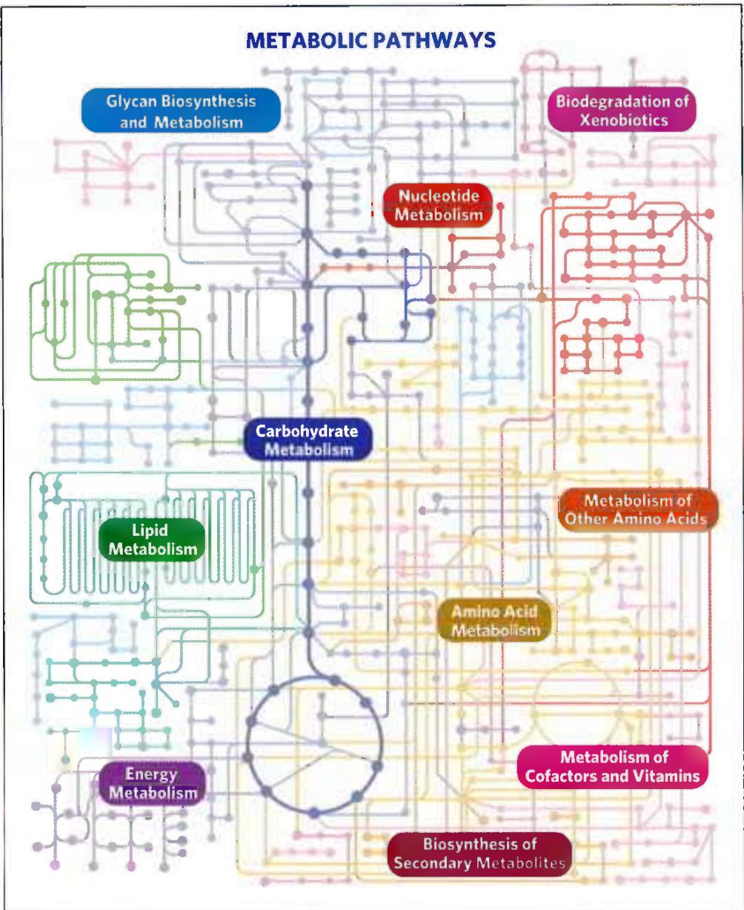  
FIGURE 13-28 Metabolism as a three-dimensional meshwork. A typical eukaryotic cell has the capacity to make about 30,000 different proteins, which catalyze thousands of different reactions involving many hundreds of metabolites, most shared by more than one "pathway." In this much-simplified overview of metabolic pathways, each dot represents an intermediate compound and each connecting line represents an  
enzymatic reaction. For a more realistic and far more complex diagram of metabolism, see the online KEGG PATHWAY database (www.genome.ad.jp/kegg/pathway/map/map01100.html); in this interactive map, you can click on each dot to obtain extensive data about the compound and the enzymes for which it is a substrate. [www.genome.ad.jp/kegg/pathway/map/map01100.html]

the synthesis of complex polysaccharides of the extracellular matrix, or hydrolysis to glucose and phosphate to replenish blood glucose. In fact, glucose 6-phosphate has other possible fates in hepatocytes, too; it may, for example, be used to synthesize other sugars, such as glucosamine, galactose, galactosamine, fucose, and neuraminic acid, for use in protein glycosylation, or it may be partially degraded to provide acetyl-CoA for fatty acid and sterol synthesis. And E. coli can use glucose to produce the carbon skeleton of every one of its several thousand types of molecules. When any cell uses glucose 6-phosphate for one purpose, that “decision” affects all the other pathways for which glucose 6-phosphate is a precursor or intermediate: any change in the allocation of glucose 6-phosphate to one pathway affects, directly or indirectly, the flow of metabolites through all the others.

#### [EN] Cells and Organisms Maintain a Dynamic Steady State

The pathways of glucose metabolism provide, in the catabolic direction, the energy essential to oppose the forces of entropy and, in the anabolic direction, biosynthetic precursors and a storage form of metabolic energy. These reactions are so important to survival that very complex regulatory mechanisms have evolved to ensure that metabolites move through each pathway in the correct direction and at the correct rate to match exactly the cell's or the organism's changing circumstances. By a variety of mechanisms operating on different time scales, adjustments are made in the rate of metabolite flow through an entire pathway when external circumstances change.

Circumstances do change, sometimes dramatically. The availability of oxygen may decrease due to hypoxia (diminished delivery of oxygen to tissues) or ischemia (diminished flow of blood to tissues). Wound healing requires huge amounts of energy and biosynthetic precursors. The relative proportions of carbohydrate, fat, and protein in the diet vary from meal to meal, and the supply of fuels obtained in the diet is intermittent, requiring metabolic adjustments between meals and during periods of starvation.

Fuels such as glucose enter a cell, and waste products such as $CO_{2}$ leave, but the mass and the gross composition of a typical cell, organ, or adult animal do not change appreciably over time; cells and organisms exist in a dynamic steady state. For each metabolic reaction in a pathway, the substrate is provided by the preceding reaction at the same rate at which it is converted to product. Thus, although the rate (v) of metabolite flow, or flux, through this step of the pathway may be high and variable, the concentration of substrate, S, remains constant. So, for the two-step reaction

$$
\mathrm{A} \xrightarrow {v _ {1}} \mathrm{S} \xrightarrow {v _ {2}} \mathrm{P}
$$

when $v_{1} = v_{2}$ , [S] is constant. P6 For example, changes in $v_{1}$ for the entry of glucose from various sources into the blood are balanced by changes in $v_{2}$ for the uptake of glucose from the blood into various tissues, so the concentration of glucose in the blood ([S]) is held nearly constant at 5 mM. This is homeostasis for blood glucose. The failure of homeostatic mechanisms is often at the root of human disease. In diabetes mellitus, for example, the regulation of blood glucose concentration is defective as a result of the lack of or insensitivity to insulin, with profound medical consequences.

In the course of evolution, organisms have acquired a remarkable collection of regulatory mechanisms for maintaining homeostasis at the molecular, cellular, and organismal levels, as reflected in the proportion of genes that encode regulatory machinery. In humans, about 2,500 genes (\~12% of all genes) encode regulatory proteins, including a variety of receptors, regulators of gene expression, and more than 500 different protein kinases! In many cases, the regulatory mechanisms overlap: one enzyme is subject to regulation by several different mechanisms.

#### [EN] Both the Amount and the Catalytic Activity of an Enzyme Can Be Regulated

The flux through an enzyme-catalyzed reaction can be modulated by changes in the number of enzyme molecules or by changes in the catalytic activity of each enzyme molecule already present. Such changes occur on time scales from milliseconds to many hours, in response to signals from within or outside the cell. Very rapid allosteric changes in enzyme activity are generally triggered locally, by changes in the local concentration of a small molecule—a substrate of the pathway in which that reaction is a step (say, glucose for glycolysis), a product of the pathway (ATP from glycolysis), or a key metabolite or cofactor (such as NADH) that indicates the cell's metabolic state. Second messengers (such as cyclic AMP and $Ca^{2+}$ ) generated intracellularly in response to extracellular signals (hormones, cytokines, and so forth) also mediate allosteric regulation, on a slightly slower time scale set by the rate of the signal-transduction mechanism (see Chapter 12).

Extracellular signals (Fig. 13-29, 1) may be hormonal (insulin or epinephrine, for example) or neuronal (acetylcholine), or may be growth factors or cytokines. The number of molecules of a given enzyme in a cell is a function of the relative rates of synthesis and degradation of that enzyme. The rate of synthesis can be adjusted by the activation (in response to some outside signal) of a transcription factor (Fig. 13-29, 2; described in more detail in Chapter 28). Transcription factors are nuclear proteins that, when activated, bind specific DNA regions (response elements) near a gene's promoter (its transcriptional starting point) and activate or repress the transcription of that gene, leading to increased or decreased synthesis of the encoded protein. Activation of a transcription factor is sometimes the result of its binding of a specific ligand and sometimes the result of its phosphorylation or dephosphorylation. Each gene is controlled by one or more response elements that are recognized by specific transcription factors. Genes that have several response elements are therefore controlled by several different transcription factors responding to several different signals. Groups of genes encoding proteins that act together, such as the enzymes of glycolysis, often share common response element sequences, so that a single signal, acting through a particular transcription factor, turns all of these genes on and off together.

The stability of messenger RNAs—their resistance to degradation by cellular ribonucleases (Fig. 13-29, ③)—varies, and the amount of a given mRNA in the cell is a function of its rates of synthesis and degradation (Chapter 26). The rate at which an mRNA is translated into a protein by ribosomes (Fig. 13-29, ④) is also regulated, and depends on several factors described in detail in Chapter 27. Note that an n-fold increase in an mRNA does not always mean an n-fold increase in its protein product.

Once synthesized, protein molecules have a finite lifetime, which may range from minutes to many days (Table 13-8). The rate of protein degradation (Fig. 13-29, 5) differs from one protein to another and depends on the conditions in the cell. Some proteins are tagged by the covalent attachment of ubiquitin for degradation in proteasomes, as discussed in Chapter 27 (see, for example, the case of cyclin, in Fig. 12-38). P6 Rapid turnover (synthesis followed by degradation) is energetically expensive, but proteins with a short half-life can reach new steady-state levels much faster than those with a long half-life, and the benefit of this quick responsiveness must balance or outweigh the cost to the cell.

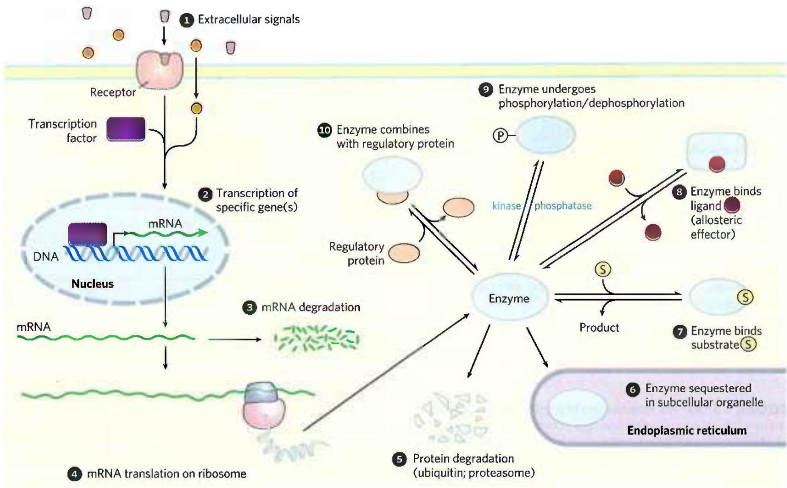  
FIGURE 13-29 Factors affecting the activity of enzymes. The total activity of an enzyme can be changed by altering the number of its molecules in the cell, or its effective activity in a subcellular compartment

<table><tr><td colspan="2">TABLE 13-8 Average Half-Life of Proteins in Mammalian Tissues</td></tr><tr><td>Tissue</td><td>Average half-life (days)</td></tr><tr><td>Liver</td><td>0.9</td></tr><tr><td>Kidney</td><td>1.7</td></tr><tr><td>Heart</td><td>4.1</td></tr><tr><td>Brain</td><td>4.6</td></tr><tr><td>Muscle</td><td>10.7</td></tr></table>

(1 through 6), or by modulating the activity of existing molecules (7 through 10), as detailed in the text. An enzyme may be influenced by a combination of such factors.

Yet another way to alter the effective activity of an enzyme is to sequester the enzyme and its substrate in different compartments (Fig. 13-29, 6). In muscle, for example, hexokinase cannot act on glucose until the sugar enters the myocyte from the blood, and the rate at which it enters depends on the activity of glucose transporters (see Table 11-1) in the plasma membrane. Within cells, membrane-bounded compartments segregate certain enzymes and enzyme systems, and the transport of substrate across these intracellular membranes may be the limiting factor in enzyme action.

By these several mechanisms for regulating enzyme level, cells can dramatically change their complement of enzymes in response to changes in metabolic circumstances. In vertebrates, liver is the most adaptable tissue; a change from a high-carbohydrate diet to a high-lipid diet, for example, affects the transcription of hundreds of genes and thus the levels of hundreds of proteins. These global changes in gene expression can be quantified in the entire complement of mRNAs (the transcriptome) or protein (proteome) of a cell type or organ, offering great insights into metabolic regulation. The effect of changes in the proteome is often a change in the total ensemble of low molecular weight metabolites, the metabolome (Fig. 13-30). The metabolome of E. coli growing on glucose is dominated by a few classes of metabolites: glutamate (49%); nucleotides (mainly ribonucleoside triphosphates) (15%); intermediates of glycolysis, the citric acid cycle, and the pentose phosphate pathway (central pathways of carbon metabolism) (15%); and redox cofactors and glutathione (9%).

  
FIGURE 13-30 The metabolome of E. coli growing on glucose. Summary of the relative molar abundance of 103 metabolites as measured by a combination of liquid chromatography and tandem mass spectrometry (LC-MS/MS). For reference, the absolute concentration of glutamate in living cells is 9.6 mM. [Data from B. D. Bennett et al., Nature Chem. Biol. 5:593, 2009, Fig. 1.]

Once the regulatory mechanisms that involve protein synthesis and degradation have produced a certain number of molecules of each enzyme in a cell, the activity of those enzymes can be further regulated in several other ways: by the concentration of substrate, the presence of allosteric effectors, covalent modifications, or binding of regulatory proteins—all of which can change the activity of an individual enzyme molecule (Fig. 13-29, 7 to 10).

All enzymes are sensitive to the concentration of their substrate(s) (Fig. 13-29, 7). Recall that in the simplest case (an enzyme that follows Michaelis-Menten kinetics), the initial rate of the reaction is half-maximal when the substrate is present at a concentration equal to $K_{\mathrm{m}}$ (that is, when the enzyme is half-saturated with substrate). Activity drops off at lower [S], and when [S] << $K_{\mathrm{m}}$ , the reaction rate is linearly dependent on [S].

The relationship between [S] and $K_{m}$ is important because intracellular concentrations of substrate are often in the same range as, or lower than, $K_{m}$ . The activity of hexokinase, for example, changes with [glucose], and intracellular [glucose] varies with the concentration of glucose in the blood. As we will see, the different forms (isozymes) of hexokinase have different $K_{m}$ values and are therefore affected differently by changes in intracellular [glucose], in ways that make sense physiologically. For a number of phosphoryl transfers from ATP, and for redox reactions using NADPH or $NAD^{+}$ , the metabolite concentration is well above the $K_{m}$ (Fig. 13-31); these cofactors are not likely to be limiting in such reactions.

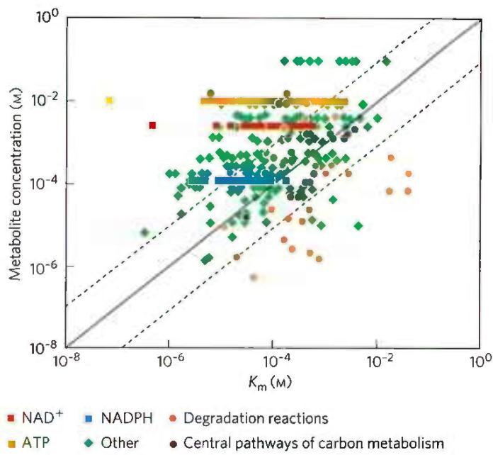  
FIGURE 13-31 Comparison of $K_{\mathrm{m}}$ and substrate concentration for some metabolic enzymes. Measured metabolite concentrations for E. coli growing on glucose are plotted against the known $K_{\mathrm{m}}$ for enzymes that consume that metabolite. The solid line is the line of unity (where metabolite concentration $= K_{\mathrm{m}}$ ), and the dashed lines each denote a 10-fold deviation from the line of unity. [Data from B. D. Bennett et al., Nature Chem. Biol. 5:593, 2009, Fig. 2.]

Enzyme activity can be either increased or decreased by an allosteric effector (Fig. 13-29, $^{8}$ ; see Fig. 6-37). Allosteric effectors typically convert hyperbolic kinetics to sigmoid kinetics, or vice versa (see Fig. 14-24b, for example). In the steepest part of the sigmoid curve, a small change in the concentration of substrate, or of allosteric effector, can have a large impact on reaction rate. Recall from Chapter 5 (p. 157) that the cooperativity of an allosteric protein can be expressed as a Hill coefficient, with higher coefficients meaning greater cooperativity. For an allosteric enzyme with a Hill coefficient of 4, activity increases from 10% $V_{max}$ to 90% $V_{max}$ with only a 3-fold increase in [S], compared with the 81-fold rise in [S] needed by an enzyme with no cooperative effects (Hill coefficient of 1; Table 13-9).

TABLE 13-9 Relationship between Hill Coefficient and the Effect of Substrate Concentration on Reaction Rate for Allosteric Enzymes

<table><tr><td>Hill coefficient ( $n_H$ )</td><td>Required change in [S] to increase  $V_0$  from 10% to 90%  $V_{max}$ </td></tr><tr><td>0.5</td><td> $\times 6,600$ </td></tr><tr><td>1.0</td><td> $\times 81$ </td></tr><tr><td>2.0</td><td> $\times 9$ </td></tr><tr><td>3.0</td><td> $\times 4.3$ </td></tr><tr><td>4.0</td><td> $\times 3$ </td></tr></table>

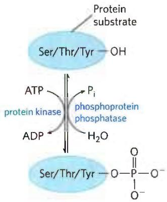  
FIGURE 13-32 Protein phosphorylation and dephosphorylation. Protein kinases transfer a phosphoryl group from ATP to a Ser, Thr, or Tyr residue in an enzyme or other protein substrate. Protein phosphatases remove the phosphoryl group as $\mathbb{P}_{\mathrm{i}}$ .

Covalent modifications of enzymes or other proteins (Fig. 13-29, ⑨) occur within seconds or minutes of a regulatory signal, typically an extracellular signal. By far the most common modifications are phosphorylation and dephosphorylation (Fig. 13-32); up to half the proteins in a eukaryotic cell are phosphorylated under some circumstances. Phosphorylation by a specific protein kinase may alter the electrostatic features of an enzyme's active site, cause movement of an inhibitory region of the enzyme out of the active site, alter the enzyme's interaction with other proteins, or force conformational changes that translate into changes in $V_{\text{max}}$ or $K_{\text{m}}$ . For covalent modification to be useful in regulation, the cell must be able to restore the altered enzyme to its original activity state. A family of phosphoprotein phosphatases, at least some of which are themselves under regulation, catalyzes the dephosphorylation of proteins.

Finally, many enzymes are regulated by association with and dissociation from another, regulatory protein (Fig. 13-29, 10). For example, the cyclic AMP-dependent protein kinase (PKA; see Fig. 12-6) is inactive until cAMP binding separates catalytic from regulatory (inhibitory) subunits of the enzyme.

These several mechanisms for altering the flux through a step in a metabolic pathway are not mutually exclusive. P6 It is very common for a single enzyme to be regulated at the level of transcription and by both allosteric and covalent mechanisms. The combination provides fast, smooth, effective regulation in response to a very wide array of perturbations and signals.

In the discussions that follow, it is useful to think of changes in enzymatic activity as serving two distinct though complementary roles. We use the term metabolic regulation to refer to processes that serve to maintain homeostasis at the molecular level—to hold some cellular parameter (concentration of a metabolite, for example) at a steady level over time, even as the flow of metabolites through the pathway changes. The term metabolic control refers to a process that leads to a change in the output of a metabolic pathway over time, in response to some outside signal or change in circumstances. The distinction, although useful, is not always easy to make.

  
FIGURE 13-33 Near-equilibrium and nonequilibrium steps in a metabolic pathway. Steps ② and ③ of this pathway are near equilibrium in the cell; for each step, the rate (V) of the forward reaction is only slightly greater than the reverse rate, so the net forward rate (10) is relatively low and the free-energy change, $\Delta G$ , is close to zero. An increase in [C] or [D] can reverse the direction of these steps. Step ① is maintained in the cell far from equilibrium; its forward rate greatly exceeds its reverse rate. The net rate of step ① (10) is much larger than the reverse rate (0.01) and is identical to the net rates of steps ② and ③ when the pathway is operating in the steady state. Step ① has a large, negative $\Delta G$ .

#### [EN] Reactions Far from Equilibrium in Cells Are Common Points of Regulation

For some steps in a metabolic pathway the reaction is close to equilibrium, with the cell in its dynamic steady state (Fig. 13-33). The net flow of metabolites through these steps is the small difference between the rates of the forward and reverse reactions, rates that are very similar when a reaction is near equilibrium. Small changes in substrate or product concentration can produce large changes in the net rate, and they can even change the direction of the net flow. We can identify these near-equilibrium reactions in a cell by comparing the mass-action ratio, Q, with the equilibrium constant for the reaction, $K_{eq}^{\prime}$ . Recall that for the reaction A + B → C + D, $Q = [C][D]/[A][B]$ . In practice, when Q and $K_{eq}^{\prime}$ are within 1 to 2 orders of magnitude of each other, the reaction is near equilibrium. This is the case for more than half of the enzymes in the glycolytic pathway, for example (Table 13-10).

Other reactions are far from equilibrium in the cell. For example, $K_{eq}^{\prime}$ for the phosphofructokinase-1 (PFK-1) reaction is about 1,000, but Q ([fructose 1,6-bisphosphate][ADP]/[fructose 6-phosphate][ATP]) in a hepatocyte in the steady state is about 0.1 (Table 13-10). It is because the reaction is so far from equilibrium in the cell that the process is exergonic under cellular conditions and tends to go in the forward direction. The reaction is held far from equilibrium because, under prevailing cellular conditions of substrate, product, and effector concentrations, the rate of conversion of fructose 6-phosphate to fructose 1,6-bisphosphate is limited by the activity of PFK-1. PFK-1 activity itself is limited by the number of PFK-1 molecules present and by the actions of allosteric effectors. Thus, the net forward rate of the enzyme-catalyzed reaction is equal to the net flow of glycolytic intermediates through other steps in the pathway, and the reverse flow through PFK-1 remains near zero.

<table><tr><td colspan="7">TABLE 13-10 Equilibrium Constants, Mass-Action Ratios, and Free-Energy Changes for Enzymes of Carbohydrate Metabolism</td></tr><tr><td rowspan="2">Enzyme</td><td rowspan="2"> $K'_{eq}$ </td><td colspan="2">Mass-action ratio, Q</td><td rowspan="2">Reaction near equilibrium in vivo?a</td><td rowspan="2"> $\Delta G''^o$ (kJ/mol)</td><td rowspan="2"> $\Delta G$ (kJ/mol) in heart</td></tr><tr><td>Liver</td><td>Heart</td></tr><tr><td>Hexokinase</td><td> $1 \times 10^{3}$ </td><td> $2 \times 10^{-2}$ </td><td> $8 \times 10^{-2}$ </td><td>No</td><td>-17</td><td>-27</td></tr><tr><td>PFK-1</td><td> $1.0 \times 10^{3}$ </td><td> $9 \times 10^{-2}$ </td><td> $3 \times 10^{-2}$ </td><td>No</td><td>-14</td><td>-23</td></tr><tr><td>Aldolase</td><td> $1.0 \times 10^{-4}$ </td><td> $1.2 \times 10^{-6}$ </td><td> $9 \times 10^{-6}$ </td><td>Yes</td><td>+24</td><td>-6.0</td></tr><tr><td>Triose phosphate isomerase</td><td> $4 \times 10^{-2}$ </td><td>__b</td><td> $2.4 \times 10^{-1}$ </td><td>Yes</td><td>+7.5</td><td>+3.8</td></tr><tr><td>Glyceraldehyde 3-phosphate dehydrogenase + phosphoglycerate kinase</td><td> $2 \times 10^{3}$ </td><td> $6 \times 10^{2}$ </td><td>9.0</td><td>Yes</td><td>-13</td><td>+3.5</td></tr><tr><td>Phosphoglycerate mutase</td><td> $1 \times 10^{-1}$ </td><td> $1 \times 10^{-1}$ </td><td> $1.2 \times 10^{-1}$ </td><td>Yes</td><td>+4.4</td><td>+0.6</td></tr><tr><td>Enolase</td><td>3</td><td>2.9</td><td>1.4</td><td>Yes</td><td>-3.2</td><td>-0.5</td></tr><tr><td>Pyruvate kinase</td><td> $2 \times 10^{4}$ </td><td> $7 \times 10^{-1}$ </td><td>40</td><td>No</td><td>-31</td><td>-17</td></tr><tr><td>Phosphohexose isomerase</td><td> $4 \times 10^{-1}$ </td><td> $3.1 \times 10^{-1}$ </td><td> $2.4 \times 10^{-1}$ </td><td>Yes</td><td>+2.2</td><td>-1.4</td></tr><tr><td>Pyruvate carboxylase + PEP carboxykinase</td><td>7</td><td> $1 \times 10^{-3}$ </td><td>__b</td><td>No</td><td>-5.0</td><td>-23</td></tr><tr><td>Glucose 6-phosphatase</td><td> $8.5 \times 10^{2}$ </td><td> $1.2 \times 10^{2}$ </td><td>__b</td><td>Yes</td><td>-17</td><td>-5.0</td></tr></table>

The cell cannot allow reactions with large equilibrium constants to reach equilibrium. If [fructose 6-phosphate], [ATP], and [ADP] in the cell were held at typical levels (low millimolar concentrations) and the PFK-1 reaction were allowed to reach equilibrium by an increase in [fructose 1,6-bisphosphate], the concentration of fructose 1,6-bisphosphate would rise into the molar range, wreaking osmotic havoc on the cell. Consider another case: if the reaction ATP → ADP + Pi were allowed to approach equilibrium in the cell, the actual free-energy change ( $\Delta G$ ) for that reaction ( $\Delta G_{p}$ ; see Worked Example 13-2, p. 480) would approach zero, and ATP would lose the high phosphoryl group transfer potential that makes it valuable to the cell. It is therefore essential that enzymes catalyzing ATP breakdown and other highly exergonic reactions in a cell be sensitive to regulation, so that when metabolic changes are forced by external circumstances, the flow through these enzymes will be adjusted to ensure that [ATP] remains far above its equilibrium level. When such metabolic changes occur, the activities of enzymes in all interconnected pathways adjust to keep these critical steps away from equilibrium. Thus, not surprisingly, many enzymes that catalyze highly exergonic reactions are subject to a variety of subtle regulatory mechanisms. The multiplicity of these adjustments is so great that we cannot predict by examining the properties of any one enzyme in a pathway whether that enzyme has a strong influence on net flow through the entire pathway.

#### [EN] Adenine Nucleotides Play Special Roles in Metabolic Regulation

After the protection of its DNA from damage, perhaps nothing is more important to a cell than maintaining a constant supply and concentration of ATP. Many ATP-using enzymes have $K_{m}$ values between 0.1 and 1 mm, and the ATP concentration in a typical cell is about 5 to 10 mm (Fig. 13-31). If [ATP] were to drop significantly, these enzymes would be less than fully saturated by their substrate (ATP), and the rates of hundreds of reactions that involve ATP would decrease (Fig. 13-34); the cell would probably not survive this kinetic effect on so many reactions.

  
FIGURE 13-34 Effect of ATP concentration on the initial reaction velocity of a typical ATP-dependent enzyme. These experimental data yield a $K_{\mathrm{m}}$ for ATP of 5 mm. The concentration of ATP in animal tissues is $\sim 5\mathrm{mM}$ .

There is also an important thermodynamic effect of lowered [ATP]. Because ATP is converted to ADP or AMP when "spent" to accomplish cellular work, the [ATP]/[ADP] ratio profoundly affects all reactions that employ these cofactors. The same is true for other important cofactors, such as NADH/NAD $^{+}$ and NADPH/NADP $^{+}$ . For example, consider the reaction catalyzed by hexokinase:

$$
\begin{array}{l} \mathrm{ATP+glucose} \longrightarrow \mathrm{ADP+glucose6-phosphate} \\ K _ {\mathrm{eq}} ^ {\prime} = \frac {[ \mathrm{ADP} ] _ {\mathrm{eq}} [ \text { glucose6 - phosphate } ] _ {\mathrm{eq}}}{[ \mathrm{ATP} ] _ {\mathrm{eq}} [ \text { glucose } ] _ {\mathrm{eq}}} = 2 \times 1 0 ^ {3} \end{array}
$$

Note that this expression holds true only when reactants and products are at their equilibrium concentrations, where $\Delta G = 0$ . At any other set of concentrations, $\Delta G$ is not zero. Recall (from Section 13.1) that the ratio of products to substrates (the mass-action ratio, Q) determines the magnitude and sign of $\Delta G$ and therefore the driving force, $\Delta G$ , of the reaction:

$$
\Delta G = \Delta G ^ {\circ} + R T \ln \frac {[ \mathrm{ADP} ] [ \text { glucose   6 - phosphate } ]}{[ \mathrm{ATP} ] [ \text { glucose } ]}
$$

Because an alteration of this driving force profoundly influences every reaction that involves ATP, organisms have evolved under strong pressure to develop regulatory mechanisms responsive to the [ATP]/[ADP] ratio.

AMP concentration is an even more sensitive indicator of a cell's energetic state than is [ATP]. Normally, cells have a far higher concentration of ATP (5 to 10 mm) than of AMP (<0.1 mm). When some process (say, muscle contraction) consumes ATP, AMP is produced in two steps. First, hydrolysis of ATP produces ADP, then the reaction catalyzed by adenylate kinase produces AMP:

#### [EN] 2ADP $\longrightarrow$ AMP + ATP

If ATP is consumed such that its concentration drops 10%, the relative increase in [AMP] is much greater than that of [ADP] (Table 13-11). It is not surprising, therefore, that many regulatory processes are keyed to changes in [AMP]. P6 Probably the most important mediator of regulation by AMP is AMP-activated protein kinase (AMPK), which responds to an increase in [AMP] by phosphorylating key proteins and thus regulating their activities. (AMPK is not to be confused with the cyclic AMP-dependent protein kinase PKA; see Section 12.2.) The rise in [AMP] may be caused by a reduced nutrient supply or by increased physical exercise. AMP activates AMPK allosterically, which increases glucose transport and activates glycolysis and fatty acid oxidation, while suppressing energy-requiring processes such as the synthesis of glycogen, fatty acids, cholesterol, and protein. All of the changes effected by AMPK serve to raise [ATP] and lower [AMP]. In Chapter 23, we discuss the role of AMPK in balancing anabolism and catabolism in the whole organism.

TABLE 13-11 Relative Changes in [ATP] and [AMP] When ATP Is Consumed

<table><tr><td>Adenine nucleotide</td><td>Concentration before ATP depletion (mm)</td><td>Concentration after ATP depletion (mm)</td><td>Relative change</td></tr><tr><td>ATP</td><td>5.0</td><td>4.5</td><td>10%</td></tr><tr><td>ADP</td><td>1.0</td><td>1.0</td><td>0</td></tr><tr><td>AMP</td><td>0.1</td><td>0.6</td><td>600%</td></tr></table>

#### [EN] SUMMARY 13.5 Regulation of Metabolic Pathways

In a metabolically active cell in a steady state, intermediates are formed and consumed at equal rates. When a transient perturbation alters the rate of formation or consumption of a metabolite, compensating changes in enzyme activities return the system to the steady state.

Cells regulate their metabolism by a variety of mechanisms over a time scale ranging from less than a millisecond to days, either by changing the activity of existing enzyme molecules or by changing the number of molecules of a specific enzyme.

■ Various signals activate or inactivate transcription factors, which act in the nucleus to regulate gene expression. Changes in the transcriptome lead to changes in the proteome, and ultimately in the metabolome of a cell or tissue.

In multistep processes such as glycolysis, certain reactions are essentially at equilibrium in the steady state; the rates of these reactions rise and fall with substrate concentration. Other reactions are far from equilibrium; these steps are typically the points of regulation of the overall pathway.

■ Regulatory mechanisms maintain nearly constant levels of key metabolites such as ATP and NADH in cells and glucose in the blood, while matching the use or production of glucose to the organism's changing needs.

The levels of ATP and AMP are a sensitive reflection of a cell's energy status, and when the [ATP]/[AMP] ratio decreases, the AMP-activated protein kinase (AMPK) triggers a variety of cellular responses to raise [ATP] and lower [AMP].

<!-- EN-END 13.5 -->

## 三、细胞对代谢途径的分隔与控制

细胞具有精细的结构,真核生物的细胞还具有由膜包围的各种细胞器,如核、内质网、线粒体、高尔基体和溶酶体等。组成细胞结构的基本生物大分子彼此特异地结合而成为超分子复合物,再由这些复合物装配成细胞本身的结构和细胞器。生物大分子装配所需的信息可能完全包含在大分子内,例如,多聚体酶、多酶复合物、核糖体、剪接体和简单的病毒颗粒等,所有这些结构都是由大分子相互作用的自由能状态所决定。但也有一些细胞结构装配所需信息除大分子携带外,还必须由先存结构提供,例如染色体、细胞壁和膜等。这种装配是在原有结构的基础上加入新的成分,原有结构对装配起着指导作用。蛋白质在合成后立即定位于细胞的特定部位,各类酶也同样在细胞中有各自的空间分布,或是与细胞的某些结构(膜、颗粒或纤维)相结合,或是存在于细胞溶胶内。因此,酶催化的代谢反应得以有条不紊、各不相扰地进行,而且能够相互协调和制约,受到精确的调节。

## （一）细胞结构和酶的区域化分布

原核细胞,包括支原体、细菌和蓝藻,其细胞分化较低,有些细菌质膜有凹陷。真核细胞,无论是单细胞的原生动物和酵母,或是多细胞的动、植物,其细胞均具有核、胞质和细胞器,细胞内膜结构比较复

杂。另一类介于真细菌和真核生物之间的生物机体，称为古细菌，其某些生化特征类似于真核细胞，但并无细胞核等结构。现在以动物的肝细胞为例，按照它的电镜切面图，绘制简明细胞图解如图28-12。

无论是原核细胞还是真核细胞，各代谢途径的酶和酶复合物分布于膜结构或胞内各分化区域，以使代谢有条不紊、彼此协调的进行。现仍以动物细胞为例，把糖、脂质、蛋白质及核酸代谢的相互关系，用图解来表示（图28-13）。在这个图解中，表明了细胞质膜内侧和细胞质膜外侧的物质交换，用“来回箭头”表示。细胞质近质膜处进行酵解和脂肪酸的生物合成，在颗粒型内质网膜上进行蛋白质的生物合成。细胞核、核仁和有孔核膜的附近，表示出DNA和各种RNA。线粒体内进行柠檬酸循环、电子传递和氧化磷酸化，以及脂肪酸的β氧化。线粒体膜内侧和细胞质之间也有物

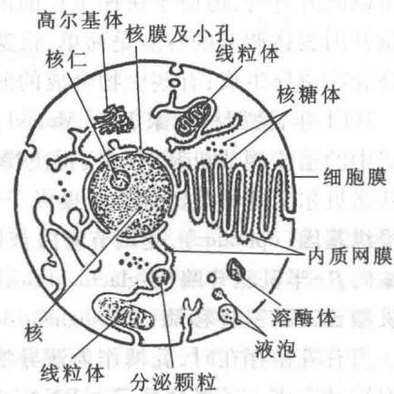  
图28-12 动物细胞图解

质交换,也用“来回箭头”表示。真核细胞内某些酶的区域化分布总结于表28-1。

  
图28-13 动物细胞结构和各类物质代谢的联系图解

表 28-1 真核细胞内某些酶的区域化分布

<table><tr><td>酶或酶系</td><td>所在区域</td><td>酶或酶系</td><td>所在区域</td></tr><tr><td>糖酵解酶系</td><td>细胞溶胶</td><td>氨基酸的分解和合成酶系</td><td>细胞溶胶</td></tr><tr><td>柠檬酸循环</td><td>线粒体</td><td>氨基酸氧化酶类</td><td>线粒体</td></tr><tr><td>氧化磷酸化</td><td>线粒体</td><td>尿素合成酶系</td><td>线粒体和细胞溶胶</td></tr><tr><td>光合磷酸化</td><td>叶绿体</td><td>核苷酸分解和合成</td><td>细胞溶胶</td></tr><tr><td>磷酸戊糖途径酶系</td><td>细胞溶胶</td><td>蛋白质合成酶系</td><td>粗面内质网</td></tr><tr><td>糖异生途径酶系</td><td>细胞溶胶、线粒体和内质网</td><td>DNA聚合酶</td><td>细胞核</td></tr><tr><td>糖原的分解和合成酶系</td><td>细胞溶胶和内质网</td><td>RNA聚合酶</td><td>细胞核</td></tr><tr><td>脂肪酸β氧化酶系</td><td>线粒体</td><td>水解酶类</td><td>溶酶体</td></tr><tr><td>脂肪酸合成酶系</td><td>细胞溶胶</td><td></td><td></td></tr></table>

## （二）细胞膜结构对代谢的调节

膜结构既是细胞结构的基本形式,也是生命活动的主要结构基础。在真核细胞中膜结构占细胞干重的70%\~80%左右,除质膜外还有广泛的内膜系统,将细胞分隔成许多特殊区域,形成各种细胞器。原核细胞缺乏内膜系统,但某些细胞的质膜内陷形成中体或质膜体(mesosome)。各种膜结构对代谢的调节和

控制作用有以下几种形式：

## 1. 控制跨膜离子浓度梯度和电位梯度

由于生物膜的选择通透性,造成膜两侧的离子浓度梯度和电位梯度。因此当离子逆浓度梯度转移时,需要消耗自由能;而离子沿浓度梯度转移时,则释放自由能。膜的三种最基本功能:物质运输、能量转换和信息传递无不与离子和电位梯度的产生和控制机制有关。细菌质膜和线粒体内膜可利用质子浓度梯度的势能合成 ATP 和吸收磷酸根等物质。在动物细胞以及某些植物、真菌和细菌的细胞中, $Na^{+}$ 离子流可驱动氨基酸和糖的主动运输。神经肌肉的兴奋传导则与跨膜离子流产生膜电位有关。此外, $Ca^{2+}$ 是重要的胞内信使,通过控制质膜、内质网膜和线粒体内膜的 $Ca^{2+}$ 通道蛋白,可以调节细胞不同区域的代谢功能。例如,在静息的骨骼肌中,肌浆 $Ca^{2+}$ 浓度为 $10^{-8} \sim 10^{-7} \text{mol/L}$ ,大量的 $Ca^{2+}$ 被贮存在肌浆网中(浓度达 $10^{-3} \text{mol/L}$ )。当肌膜兴奋时,它的去极化作用传导到肌浆网,使其中 $Ca^{2+}$ 迅速释放,肌浆 $Ca^{2+}$ 浓度上升到 $10^{-5} \text{mol/L}$ ,从而触发肌肉收缩。收缩过后,肌浆中的 $Ca^{2+}$ 又被肌浆网的钙泵利用水解 ATP 释放的能量主动吸收进入肌浆网中,恢复并维持这两区域的 $Ca^{2+}$ 浓度。

## 2. 控制细胞和细胞器的物质运输

细胞膜由于具有高度的选择透性,使细胞不断从外界环境中吸收有用的营养成分,并排出代谢废物,维持了细胞恒定的内环境,细胞代谢得以顺利进行。细胞器同样需要吸收代谢底物,转移出代谢产物。细胞膜和细胞器膜中的运输系统担负着与周围环境的物质交换。通过运输系统可以控制底物进入细胞或细胞器,从而调节细胞内该物质的代谢。实验证明,葡萄糖进入肌肉和脂肪细胞的运输是它们利用葡萄糖的限速过程。胰岛素可以促进肌肉及脂肪细胞对葡萄糖的主动运输,这也是它能降低血糖、促进肌肉和脂肪细胞中糖的利用、糖原合成和糖转变为脂肪的重要因素。某些载体在代谢底物运入细胞器中起着关键作用。

## 3. 膜与酶的可逆结合

有些酶能可逆地与膜结合，并以其膜结合型和可溶型的互变来影响酶的性质和调节酶活性。这类酶称为双关酶(ambiguous enzyme)，以区别于膜上固有的组成酶。双关酶以代谢状态变动的应答迅速，调节灵敏，是细胞代谢调节的一种重要方式。就目前所知这类酶大多是代谢途径中关键的酶或调节酶。例如，糖酵解途径中的己糖激酶、磷酸果糖激酶、醛缩酶及3-磷酸甘油醛脱氢酶；氨基酸代谢的谷氨酸脱氢酶、酪氨酸氧化酶，以及一些参与共价修饰的蛋白激酶、蛋白磷酸酯酶等。

双关酶与膜结合和溶解状态的构象不同,其理化性质和动力学参数也都有差异。如己糖激酶的两种类型对 ATP 的 $K_{m}$ 值不同,可溶性酶的 $K_{m}$ 为 0.035 mmol/L,与线粒体外膜结合的酶 $K_{m}$ 为 0.1 mmol/L。细胞内 ATP 浓度的变化还可通过酶的双关性,调节酶与膜的结合。ATP 浓度在 0.035\~0.1 mmol/L,有利于己糖激酶结合于膜上;ATP 浓度大于 0.1 mmol/L,酶便从膜上脱落下来,成为可溶性酶。ATP 经消耗,浓度下降,酶又结合到膜上。膜结合酶是高活性的,使糖的有氧分解得以高效进行,但当 ATP 量积累过多时,酶以低活性的可溶型形式存在,限制了糖的有氧分解代谢的进行,如此周而复始循环变化。此外,己糖激酶的产物 6-磷酸葡萄糖又是酶的反馈抑制物,其两种类型的 $K_{i}$ 值也不同。结合于线粒体外膜的己糖激酶其对 6-磷酸葡萄糖的 $K_{i}$ 为 0.035 mmol/L;可溶性酶的 $K_{i}$ 为 0.007 mmol/L,因此该酶的不同状态受到不同水平的反馈抑制。

双关酶很易受一些因素的影响,离子、代谢物或调节物的存在都会影响酶与膜的结合。激素能够调节这些具双关性的酶的行为,改变两种类型酶的比例。实验表明,己糖激酶与线粒体的结合需要胰岛素,而肾上腺素则有相反效应。

## （三）信号途径对代谢的调节

细胞能够对外部信号作出反应,这是细胞得以生存的必要机制。外部信号包括物理信号(如光、声波、机械接触等)和化学信号(无机分子和生物分子),由受体接受,再转化为细胞反应。通常信号分子无需进入细胞,在作用于受体后即引起细胞内的化学变化,称为信号转导(signal transoluction)。常见的受体有6类:① G蛋白偶联受体(G protein-coupled receptor);② 受体酪氨酸激酶(receptor tyrosine kinase);③ 受体鸟苷酸环化酶(receptor guanylyl cyclase);④ 门控离子通道(gated ion channel);⑤ 黏附受体(adhesion receptor);⑥核受体(nuclear receptor)。信号转导产生第二信使(cAMP、cGMP、二酰甘油、 $\mathrm{IP}_3$ 和 $\mathrm{Ca}^{2+}$ 等),激活蛋白激酶(PKA、PKG、PKC等),导致磷酸化级联反应;有些信号转导不经第二信使,直接激活蛋白激活引起信号传递的级联反应。信号途径对代谢的调节,一般情况下,或是直接激活(或抑制)代谢反应的酶;或是通过影响转录因子,在转录水平上调节基因的表达。细节请参阅信号途径和转录调节等有关章节。

## 四、机体在整体水平上对细胞代谢的调节控制

前面三节分别介绍了底物水平、酶水平和细胞水平的代谢调节。随着生物的进化，代谢调节机制也跟着得到发展。多细胞生物增强了细胞间的信息交流，发展了化学信号分子对各类细胞代谢的调节。动物机体的神经系统和神经调节也随着不断发展而完善起来。激素调节是比神经调节较为原始的一种调节方式，但二者都体现了机体水平的代谢调节。无论是激素调节或是神经调节，都作用于细胞并通过信号转导系统而发挥作用。从分子水平来看，激素和神经递质并无本质的区别，调节肽即是神经组织及内分泌组织均可产生和释放并起着同样作用的化学信号分子。实际上单细胞生物就需要对环境信号做出应答，在细胞之间进行通讯，协调彼此的行为。

## （一）激素和递质对代谢的调节

细胞产生的信号分子(即内源配体),包括激素、神经递质和调节肽等,在释放后可以三种方式作用于膜受体,即自分泌(autocrine)、旁分泌(paracrine)和内分泌(endocrine)。自分泌的信号分子作用于分泌细胞自身,如神经末梢分泌的递质可作用于前突触膜的递质受体,以进行反馈调节。旁分泌的产物或经细胞外液或经细胞间隙接头(gap junction)局部作用于邻近细胞,如神经组织和内脏器官分泌的调节肽。内分泌的产物则在释放后经血液流到特定器官作用于靶细胞受体。一些小的非极性信号分子,如一氧化氮(NO)和甾类激素等,直接透过脂双层膜,在细胞内与受体结合,调节细胞代谢,或进入核内调节基因表达。但一些大的极性信号分子不能进入细胞,仅作用于质膜受体,经受体介导将信号传给胞内,称为跨膜信号传递(transmembrane signalling)或信号转导(signal transduction)。

细胞质膜上激素和递质的受体可分为四大类: 第一类受体是依赖于神经递质的离子通道 (neurotransmitter-dependent channel), 或称为配体门控离子通道, 例如烟碱型乙酰胆碱受体 (nAChR)、γ-氨基丁酸受体 (GABA)、谷氨酸受体 (GluR) 等, 多数为寡聚体蛋白质, 并含有受体亚基。第二类受体与膜上信号转导蛋白 (GTP 结合蛋白或 G 蛋白) 相偶联, 例如, 肾上腺素能 α 受体、肾上腺素能 β 受体和毒蕈碱型乙酰胆碱受体 (mAChR) 等。它们多为单链多肽, 跨膜部分蛇形来回弯曲, 共有 7 段 α 螺旋 (seven-transmembrane-helix, 7TM)。当与激素或神经递质结合后, 经 G 蛋白将信息转给效应器, 产生第二信使, 才能激活细胞内有关的酶系统。第三类则包括一些生长因子的受体, 例如, 表皮生长因子 (EGF) 受体、血小板衍生的生长因子 (PDGF) 受体、成纤维细胞生长因子 (FGF) 受体以及胰岛素受体等。它们的主要特点是具有酪氨酸蛋白激酶 (TPK) 活性, 或能结合具有酪氨酸蛋白激酶活性的蛋白质。当它们与各自相应的生长因子结合后, 该酶活性即被激活, 从而构成信号转导的重要环节。第四类受体具有鸟苷酸环化酶活性, 如心钠素 (atrial uatriuretic factor, ANF) 受体当血容量增加大时, 心房细胞产生心钠素, 随血液流至肾可激活集合导管细胞的鸟苷酸环化酶, 使产生 cGMP, 并促进 Na⁺ 和水的排出。

现在已经分离出多种 G 蛋白, 它们分别介导不同的信号转导系统(表 28-2)。对腺苷酸环化酶起调节作用的 G 蛋白有两种: $G_{s}$ 和 $G_{i}$ , 分别为偶联刺激性(stimulatory)受体(如肾上腺素能 $\beta$ 受体)和抑制性(inhibitory)受体(如肾上腺素能 $\alpha$ 受体和毒蕈碱型乙酰胆碱受体)。前者促进 cAMP 生成; 后者抑制 cAMP 生成。作用于磷酸肌醇系统的 G 蛋白称为 $G_{p}$ 。刺激视网膜 cGMP 磷酸二脂酶的转导蛋白称为 $G_{t}$ 。还有一些其他的 G 蛋白。所有这些 G 蛋白都是由 $\alpha, \beta$ 和 $\gamma$ 三个亚基组成, 迄今已知 $\alpha$ 亚基有 21 种, $\beta$ 亚基 5 种, $\gamma$ 亚基 11 种, 使 G 蛋白富有多样性。不同种类 G 蛋白的 $\alpha$ 亚基都有鸟苷酸结合区, 可与 GDP 结合。当受体与其相应配体结合后, 诱导 $\alpha$ 亚基构象变化, 在 GTP-GDP 交换因子(GTP-GDP exchange factor, GEF)促进下发生 GDP 与 GTP 变换, 此步骤需要 $Mg^{2+}$ 。GTP 的结合导致 $\alpha$ 亚基与 $\beta, \gamma$ 亚基分开, $\alpha$ 亚基激活并作用于效应器,产生胞内信使,引起各种细胞反应。 $\alpha$ 亚基有 GTP 酶活性,在 $Mg^{2+}$ 存在下水解 GTP,产生 GDP,使 $\alpha$ 亚基复合物失活并重新与 $\beta$ 、 $\gamma$ 亚基结合。该过程可简单用反应式表示如下:

$$
\begin{array}{l} \mathrm{G} _ {\alpha \beta \gamma} + \mathrm{GTP} \xrightarrow {\text {配体-受体}} \mathrm{G} _ {\alpha} \cdot \mathrm{GTP} + \mathrm{G} _ {\beta \gamma} + \mathrm{GDP} \\ \mid \\ \mathrm{GDP} \end{array}
$$

G 蛋白的 $\alpha$ 亚基可被共价修饰而改变活性。某些细菌毒素，如霍乱毒素（cholera），催化其依赖 NAD 的腺二磷核糖基化（ADP-ribosylated），使 NAD 的腺二磷核糖基转移到 $G_{s\alpha}$ 的精氨酸残基上，结果抑制 GTP 酶活性，加强 GTP 对 G 蛋白的活化，从而导致腺苷酸环化酶持续活化，肠表皮细胞内 cAMP 水平保持升高，引起大量 $Na^{+}$ 和水外流到肠腔造成严重腹泻。相反，百日咳毒素（pertussis）催化 $G_{i\alpha}$ 的半胱氨酸腺二磷核糖基化，阻断激素和 GTP 对 $G_{i}$ 的活化，使之丧失抑制功能。

表 28-2 G 蛋白介导的生理效应

<table><tr><td>信号分子</td><td>受体</td><td>G蛋白</td><td>效应器</td><td>生理效应</td></tr><tr><td>肾上腺素</td><td> $\beta$ -肾上腺素能受体</td><td> $G_s$ </td><td>腺苷酸环化酶</td><td>糖原分解</td></tr><tr><td>5-羟色胺</td><td>5-羟色胺受体</td><td> $G_s$ </td><td>腺苷酸环化酶</td><td>记忆和学习</td></tr><tr><td>光</td><td>视紫质</td><td> $G_t$ (转导素)</td><td>cGMP磷酸二酯酶</td><td>视觉兴奋</td></tr><tr><td>气味剂</td><td>嗅觉受体</td><td> $G_{\text{olf}}$ </td><td>腺苷酸环化酶</td><td>嗅觉</td></tr><tr><td>fMet肽</td><td>趋化因子受体</td><td> $G_q$ </td><td>磷脂酶C</td><td>趋化</td></tr><tr><td>乙酰胆碱</td><td>毒蕈碱受体</td><td> $G_i$ </td><td>抑制腺苷酸环化酶</td><td>起搏变慢</td></tr><tr><td></td><td></td><td></td><td>活化钾通道</td><td></td></tr></table>

磷酸肌醇系统是不经过腺苷酸环化酶的另一信使系统。当毒蕈碱型乙酰胆碱受体、肾上腺素能 $\alpha$ 受体、组胺受体、5-羟色胺受体、多肽激素受体以及生长因子受体与其激素或递质结合时，能通过G蛋白活化效应器磷脂酶C，引起特异磷脂酰肌醇二磷酸（ $\mathrm{PIP}_2$ ）的水解，产生肌醇三磷酸（ $\mathrm{IP}_3$ ）和二（脂）酰甘油（DAG）。由这两种物质作为第二信使，导致胞内游离 $\mathrm{Ca}^{2+}$ 浓度瞬间增加，蛋白激酶C活化，以及鸟苷酸环化酶活化等一系列级联反应。

$\mathrm{Ca}^{2+}$ 是一种广泛存在的胞内信使，对细胞反应起着重要的调节作用。通常动物细胞溶胶中游离 $\mathrm{Ca}^{2+}$ 的浓度很低（ $\leqslant 10^{-7} \mathrm{~mol/L}$ ），与细胞外的浓度（ $\geqslant 10^{-3} \mathrm{~mol/L}$ ）相差一千倍以上。这是由于质膜上存在的 $\mathrm{Ca}^{2+}$ 泵，由ATP供给能量将 $\mathrm{Ca}^{2+}$ 排到细胞外；内质网膜和线粒体内膜结合的 $\mathrm{Ca}^{2+}$ 泵能够摄取大量的 $\mathrm{Ca}^{2+}$ 。此外，某些小分子（如磷酸盐）和大分子（如钙调蛋白， $\mathrm{CaM}$ ），亦能结合游离的 $\mathrm{Ca}^{2+}$ 。上述受体的活化，都将导致胞内游离 $\mathrm{Ca}^{2+}$ 增加，或是从胞外跨膜流入胞内，或是从胞内 $\mathrm{Ca}^{2+}$ 储库释放到胞液。对神经细胞，似乎主要是前者；而对肝、胰、血小板、平滑肌及腺细胞等，受体活化首先引起质膜磷脂酰肌醇的水解，生成的肌醇三磷酸扩散到胞质，诱发 $\mathrm{Ca}^{2+}$ 从胞内储库（主要是内质网）释放，这过程称为 $\mathrm{Ca}^{2+}$ 动员（ $\mathrm{Ca}^{2+}-$ mobilization），造成 $\mathrm{Ca}^{2+}$ 浓度的瞬间增加。已知许多酶和蛋白质依赖 $\mathrm{Ca}^{2+}/\mathrm{CaM}$ ，其中包括几种蛋白激酶、磷酸酯酶、核苷酸环化酶、 $\mathrm{Ca}^{2+}-\mathrm{ATP}$ 酶泵、离子通道蛋白和肌肉收缩蛋白等。

蛋白激酶 C(PKC) 是一种依赖 $Ca^{2+}$ 的蛋白激酶。正常条件下，蛋白激酶 C 以无活性形式存在于胞液中，对 $Ca^{2+}$ 不敏感；当细胞受刺激后，磷脂酰肌醇二磷酸水解，质膜上瞬时二酰甘油积累，同时胞内 $Ca^{2+}$ 浓度增加，促使蛋白激酶 C 由胞质转移到含磷脂的质膜内表面。在二酰甘油和磷脂（主要是磷脂酰丝氨酸，PS）的共同作用下，大大提高了酶对 $Ca^{2+}$ 的敏感性，因而使蛋白激酶 C 活化。蛋白激酶 C 由一条多肽链组成。它可以引起许多底物蛋白质丝氨酸或苏氨酸残基磷酸化，其中包括各种受体、膜蛋白、收缩蛋白、细胞骨架蛋白、核蛋白和酶类等，从而影响细胞代谢、生长和分化。

二酰甘油在 $\alpha$ -脂肪酸水解酶或磷脂酰肌醇二磷酸在磷脂酶A作用下产生花生四烯酸，后者可转化为各种前列腺素。它们能激活鸟苷酸环化酶（GC），使cGMP浓度升高。cGMP通过激活多种酶及依赖于cGMP的蛋白激酶而发挥生理效应。依赖于cGMP的蛋白激酶即蛋白激酶G(PKG)，它由两条相同的肽链组成，与cGMP结合后被活化，而二聚体并不解离。蛋白激酶G对底物蛋白质的磷酸化方式与蛋白激酶A类似，但二者的激活剂和抑制剂以及活性调节作用不一样，推测它们的天然底物也不相同。

上述蛋白激酶 A、蛋白激酶 C 和蛋白激酶 G 都属于丝氨酸/苏氨酸蛋白激酶,酪氨酸蛋白激酶(TPK)则发现较晚。目前已知的酪氨酸蛋白激酶有三类:第一类是生长因子受体,第二类是某些癌基因产物,第三类是正常细胞中非受体的酪氨酸蛋白激酶。在正常细胞中酪氨酸蛋白激酶的活性很低,但在生长旺盛、迅速分裂的细胞和癌细胞中却非常高,许多事实表明,蛋白质酪氨酸的磷酸化是细胞增殖的信号,并与细胞癌变有关。因此,这类酶的研究始终受到人们的极大关注。

生长因子(growth factor)，可促使某些种类的细胞生长，并有多种效应，其受体为单条肽链，可分成三个结构域：质膜外侧N端肽段，常有糖基化部位；中间为疏水性跨膜区；质膜内侧C端肽段具有受体酪氨酸激酶活性(receptor tyrosine kinase, RTK)。如前所述，配体和偶联G蛋白的受体结合，通过三级结构的改变而活化G蛋白；生长因子与其受体的结合则通过二聚化，即四级结构的改变而活化受体酪氨酸激酶。二聚化使受体在胞质部分的两条肽链交互磷酸化，成为靶蛋白的结合位点，并引发底物蛋白质的磷酸化。胰岛素的受体与此略有不同，其受体是一种跨膜糖蛋白，由4条多肽链组成，即 $\alpha_{2}\beta_{2}$ 。α亚基全部在胞外，含胰岛素结合部位；β亚基的N端在质膜外侧，以二硫键与α亚基结合，经一跨膜区段，其含酪氨酸激酶活性的C端位于质膜内侧。胰岛素受体虽以四个亚基聚体形式存在，但其受体酪氨酸激酶活性仍需在与胰岛素结合后才被激活。

受体酪氨酸激酶的活化一方面可激活某些酶，如磷脂酶C和脂质激酶，导致产生第二信使。另一方面通过蛋白激酶级联反应，最后激活转录因子，从而影响细胞周期。在受体酪氨酸激酶引发的信号级联反应中，首先与受体磷酸化位点相结合的为生长因子受体结合蛋白（growth factor receptor-binding protein, Grb），例如Grb2。Grb是一类含有Src同源域(Src homology, SH)的蛋白质，起衔接蛋白(adaptor protein)的作用。Grb2有一个SH2结构域，可识别和结合在受体磷酸酪氨酸位点；还有2个SH3结构域，可结合富含脯氨酸区的蛋白质，如SOS蛋白（son of sevenless protein）。该蛋白是一类鸟苷酸交换因子（guanine-nucleotide exchange factor, GEF），可与信号转导蛋白Ras结合，并使Ras的GDP被GTP取代。Ras是一类小的单链G类蛋白，通过异戊二烯基锚定在膜上，它能结合鸟苷酸，具有GTPase活性。GDP被GTP取代并被活化，从而可激活Ser/Thr激酶系统，最后通过磷酸化激活促分裂原活化蛋白激酶（mitogen-activated protein kinase, MAPK），它在细胞质或进入核内激活转录因子，以调节基因转录活性。Ras家族包含多个亚家族，如Rab、Rac、Ran和Rho等，它们可以与不同激酶系统连接，从而导致不同的效应。

某些细胞因子受体其自身并无蛋白激酶活性，例如 $\gamma$ 干扰素（interferon- $\gamma$ , IFN- $\gamma$ ）。当细胞因子与受体结合后即发生二聚化，并激活一种酪氨酸激酶 JAK（just another kinase；Janus kinase）。该激酶进而激活信号转导及转录活化蛋白 STAT（signal transducer and activator），磷酸化的 STAT 形成二聚体并进入核内调节转录。JAK 有多种，STAK 也有 7 种以上，它们可转导不同信号，Ras-MAPK 信号转导途径和 JAK-STAT 途径见图 28-14 所示。

受体酶是多种多样的。一氧化氮(NO)受体是一种鸟苷酸环化酶,它含有一个血红素基团,存在于细胞质内。NO具有不成对的电子,因此是一种自由基气体。研究表明,它在信号转导中起着十分重要的信使作用。在生物体内,NO由精氨酸经复杂的反应产生,催化此反应的酶是一氧化氮合酶(nitric oxide synthase,NOS)。NO的合成需要NADPH和 $O_{2}$ ,产物有瓜氨酸,反应式如下:

NO 是非极性的小分子,容易穿过质膜,从产生的细胞扩散到邻近的细胞中,与鸟苷酸环化酶的血红素结合,并激活酶产生 cGMP。在心脏,cGMP 促使 $Ca^{2+}$ 离子泵将 $Ca^{2+}$ 从细胞溶胶中排出,从而使心肌松弛。当冠状动脉梗塞,心脏因缺氧收缩引起疼痛,服用硝酸甘油片剂可缓解心绞痛。NO 十分不稳定,它产生后只在数秒钟内作用,随即被氧化生成亚硝酸或硝酸盐。硝基血管舒张药物能在几小时内不断分解产生 NO,因而能够使心肌持续松弛。NO 具有十分广泛的生理作用,它对免疫反应、胚胎发育、心血管系统及神经信号传递等过程都起着重要的调节作用。它的大部分作用都是通过依赖于 cGMP 的蛋白激酶(PKG)途径而发生的。

B  
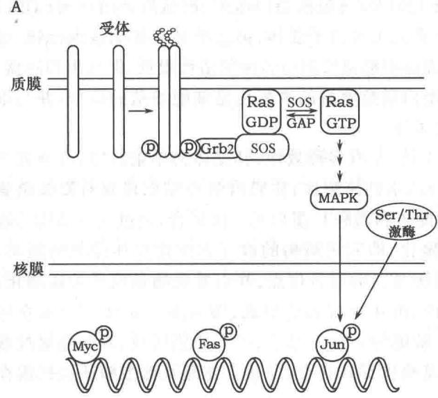

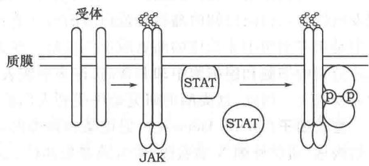

  
图 28-14 细胞因子受体的信号转导途径  
A. Ras-MAPK 途径; B. JAK-STAT 途径

R. F. Furchgott、L. J. Ignarro 和 F. Murad 因发现一氧化氮传递信号的机制而获得 1998 年诺贝尔生理学或医学奖。

受体与信号转导系统是当前分子生物学和医学最热门的研究课题之一, 美国科学家 R. Axel 和 L. Back 发现家鼠嗅觉基因超家族。哺乳类动物大约有 1 000 个编码嗅觉受体的基因 (占基因总数的 3%)。Axel 和 Back 的发现有助于揭示嗅觉的本质, 因而获 2004 年诺贝尔生理学或医学奖。实际上近年来连续多次的诺贝尔奖均奖励这一研究领域的科学家。例如, 2000 年诺贝尔生理学或医学奖授予神经系统信号转导的研究, 2001 年授予细胞周期调节的研究, 2002 年授予器官发育和细胞程序性死亡的研究, 2003 年诺贝尔化学奖授予发现水通道和离子通道的科学家, 2004 年生理学或医学奖授予气味受体的研究, 2011 年诺贝尔化学奖授予肾上腺素受体的研究, 2012 年诺贝尔化学奖授予 G 蛋白偶联受体的研究。信号途径的研究连续获得多项诺贝尔奖, 充分表明这一研究领域的重要性。

## （二）神经对代谢的调节

神经细胞,或称为神经元(neuron),可以接受、处理和转导信号。有关的信号通过电兴奋传导波作为动作电位(action potential)或神经脉冲(nerve impulse)而沿着神经元的质膜迅速传播。神经元的电信号依赖于离子通过膜通道引起的膜电位变化。 $Na^{+}-K^{+}$ 泵由分解ATP获得的能量不断排出 $Na^{+}$ 和吸收 $K^{+}$ ,因而使细胞内 $Na^{+}$ 浓度远低于胞外,而 $K^{+}$ 浓度则远高于胞外,从而贮存大量能量以驱使离子运动。在静息神经元中,膜的 $K^{+}$ 选择渗漏通道使 $K^{+}$ 的透性远大于其他离子,因而静息电位,即静止条件下的膜电位约为-60 mV,接近于 $K^{+}$ 的平衡电位-75 mV。动作电位是由电位门控离子通道(voltage-gated ion channel),主要是 $Na^{+}$ 通道的暂时打开而产生的。具有许多 $Na^{+}$ 通道的膜由于瞬间刺激而局部去极化,某些通道迅即被打开,使 $Na^{+}$ 得以进入细胞。带正电荷的离子流进一步使膜去极化,该过程以自我扩增的方式继续下去,直到膜电位由静息值达到+30 mV。此时 $Na^{+}$ 流的净电化学驱动为零,细胞处于一种新的休止状态。随后由于 $Na^{+}$ 通道的自动失活而关闭,在 $Na^{+}-K^{+}$ 泵的作用下膜电位逐渐恢复原先的静息值。许多类型的神经元(并非全部,哺乳类有髓鞘的轴突即是例外)由于质膜存在门控 $K^{+}$ 通道而加速恢复。

门控离子通道有两类:一类是电位门控通道;一类是配体门控通道(ligand-gated channel)。电位门控通道,如 $Na^{+}$ 通道、 $K^{+}$ 通道和 $Ca^{2+}$ 通道,它们由一条肽链组成,但分成多个主结构域和亚结构域,跨膜部分形成 $\alpha$ 螺旋,中央部分为离子通道。配体门控通道即由化学信号激活而开放的离子通道,如乙酰胆碱受体通道、氨基酸受体通道、单胺类受体通道和 $Ca^{2+}$ 激活的 $K^{+}$ 通道等,主要是神经递质(neurotransmitter)控制的通道。 $Ca^{2+}$ 作为细胞内信使亦能激活通道受体。它们通常由多个亚基所组成,除受体亚基外即是通道本身。两种类型门控通道的作用方式见图 28-15。

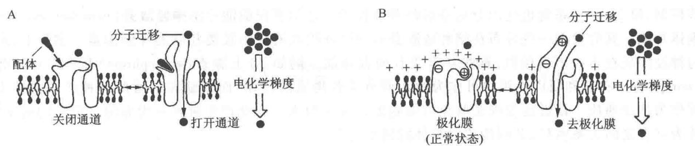  
图28-15 两种类型门控离子通道示意图  
A. 配体门控通道: 在与胞外配体结合时打开; B. 电位门控通道: 在膜去极化时打开

神经元之间或神经元与靶细胞(如肌肉细胞)之间的接触部位称为突触(synapse)。现在知道,某些神经元之间的突触可以直接传递电信号,称为电突触;但大多数突触以神经递质来转导信号,称为化学突触。神经递质贮存于轴突末梢的突触泡(synaptic vesicle)内。当神经脉冲到达末梢时,膜电位降低(去极化)造成暂时打开前突触膜(presynaptic membrane)的电位门控 $Ca^{2+}$ 通道。由于细胞外的 $Ca^{2+}$ 浓度远大于细胞内游离 $Ca^{2+}$ 浓度, $Ca^{2+}$ 大量流入神经末梢(终末),刺激突触泡与前突触膜融合,神经递质被释放到突触裂隙(cleft)内。游离 $Ca^{2+}$ 浓度的升高是短暂的,因为 $Ca^{2+}$ 结合蛋白、隔离 $Ca^{2+}$ 的小泡和线粒体能迅速摄取进入末梢的 $Ca^{2+}$ 。神经递质经扩散到达突触后细胞(postsynaptic cell),并与其膜受体相结合。神经递质的受体有两类:一类是配体门控离子通道,它将化学信号又重新转变为电信号;另一类受体通过信号转导产生胞内信使,以调节细胞代谢,最后引起各种生理效应。存在于突触裂隙的神经递质即被分解,或被分泌它的前突触膜重吸收。

神经递质的种类很多,除乙酰胆碱外还有各种单胺类、氨基酸和肽类等,有些是兴奋性的,有些是抑制性的。例如,骨骼肌细胞膜的乙酰胆碱受体是一种单价阳离子通道,对 $Na^{+}$ 和 $K^{+}$ 有较小的选择性。当乙酰胆碱与其结合后即被打开,在细胞膜去极化达到阈值时触发动作电位,因而属于兴奋性作用。而 $\gamma-$ 氨

基丁酸(GABA)受体则介导抑制性作用，它打开时允许小的负离子(主要是 $Cl^{-}$ )通过，而正离子是不可通过的， $Cl^{-}$ 的浓度在细胞外大于细胞内，相应于 $Cl^{-}$ 的平衡电位接近于正常静息电位或更负一些。当 $Cl^{-}$ 通道打开时，膜电位即保持在非常负的甚至超极化的值上，使膜难于去极化，因此难于使细胞兴奋。

不同神经递质有不同类型的受体,同一神经递质也可能有不同类型的受体。例如,乙酰胆碱作用于骨骼肌细胞和心肌细胞引起截然相反的效应,前者是兴奋性的,后者是抑制性的,因为二者的受体不同。乙酰胆碱作用于骨骼肌细胞受体,打开的是阳离子( $Na^{+}$ )通道,从而引起动作电位传播和肌肉收缩,如图28-16所示。然而在心肌细胞由于是另一类型的乙酰胆碱受体,即与G蛋白偶联的受体,其结果却引起心肌松弛。

神经内分泌系统（neuroendocrine system）在高等动物代谢的协同调节中起着重要作用。内分泌系统受神经系统调

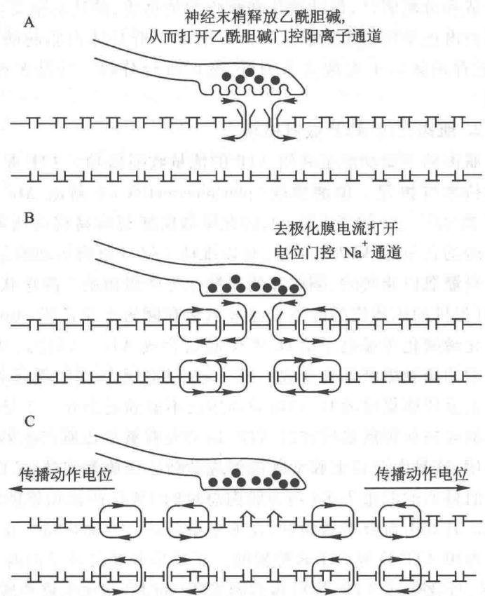  
图 28-16 图解表示在神经肌肉接头处由乙酰胆碱打开离子通道  
A. 神经末梢释放乙酰胆碱; B. 细胞膜去极化触发动作电位; C. 传播动作电位

节控制；反之，神经系统也受内分泌系统的调节控制。已知下丘脑能分泌神经激素（neurohormone）调节垂体功能。其后发现一些分布在脑和各脏器的神经细胞也能分泌胺类和肽类神经激素。实际上，激素与神经递质在本质上很相似，有些甚至兼有两者功能。例如，肾上腺素（epinephrine）和去甲肾上腺素（norephrine）在肝和肌肉组织中可作为激素调节能源物质的代谢，而在脑和平滑肌的神经肌肉接头却可作为神经递质。最近还发现某些免疫细胞也能分泌激素。因此产生神经—内分泌—免疫网络学说，认为三者之间关系密切，共同构成对机体的调节网络。

## （三）各器官间代谢的协调

人体和哺乳动物的各种器官分别执行不同功能,其代谢也各有特点。然而,机体是一个整体,各器官组织的代谢必然存在相互沟通和协调。

## 1. 肝加工和转运营养物

肝是人体和哺乳动物的重要器官，是营养物（糖、脂类和蛋白质）加工和转运的中心。食物在小肠消化和吸收后由血液首先运送到肝，在肝进行适当加工，成为燃料（易于利用的能源物质）和生物合成的前体，再运往其他组织。肝犹如一个仓库，营养物丰富时贮存起来；缺乏时由肝供给。前面曾经提到，血液中葡萄糖浓度高时可迅速进入肝细胞，由于肝己糖激酶IV的 $K_{m}$ 值很高并且不受产物G-6-P的变构抑制，因此可以持续快速将葡萄糖转变为G-6-P。G-6-P有多种去向，可以在磷酸基变位后合成糖原，也可以进入戊糖磷酸途径，还可以通过糖酵解进入柠檬酸循环，转化为脂类和氨基酸。但当血糖浓度降低时，可以由糖原产生葡萄糖；也可以由葡糖异生产生葡萄糖，以维持血糖浓度稳定。从小肠中吸收的其他糖类，如果糖、半乳糖、甘露糖等，也都需要在肝转变为葡萄糖才运送给各种组织利用。

肝还有许多其他重要功能。由门静脉收集从腹腔流来的血液进入肝，其中的有害物质和微生物都需要在肝中解毒和清除。肝的血流量很大，约占心输出量的四分之一，在机体失血时可从肝内静脉窦排出较多血，以补偿血量的不足。血浆蛋白、各种凝血因子也是在肝内合成，多余的氮通过合成尿素排出体外。肝合成和分泌胆汁，帮助消化和吸收脂类物质，并且是脂类运输的枢纽。脂类消化吸收后，一部分进入肝，大部由淋巴系统运至脂肪组织贮存起来。肝是体内脂肪酸、胆固醇、磷脂合成的主要器官之一。在饥饿时，贮存的体脂可先被运送到肝，然后进行分解。肝是多种维生素贮存和代谢的场所，也是激素代谢的场所。

## 2. 肌肉利用 ATP 做机械功

肌肉的主要功能是利用 ATP 的能量收缩做功。ATP 是许多代谢反应的底物、产物和效应物，因此必须保持浓度恒定。磷酸肌酸（phosphocratine）水解的 $\Delta G^{\ominus'} = -43.1 \, kJ/mol$ ，ATP 水解下一个磷酸基成 ADP 的 $\Delta G^{\ominus'} = -30.5 \, kJ/mol$ ，因此磷酸肌酸很容易将高能磷酸基团转移给 ADP 产生 ATP。在肌肉中磷酸肌酸的含量是 ATP 的 4 倍，足以维持 4\~6 s 肌肉运动的急需。

骨骼肌以脂肪酸、酮体和葡萄糖作为能源物质。静止状态的肌肉主要利用脂肪组织提供的游离脂肪酸，肝提供的酮体作为能源。通过氧化和降解产生乙酰-CoA，然后进入柠檬酸循环，氧化成 $CO_{2}$ 。同时，由氧化磷酸化传递电子给 $O_{2}$ 产生能量合成 ATP。轻度运动时，除脂肪酸和酮体外还利用血液中的葡萄糖。葡萄糖经糖酵解转变成乙酰-CoA，再进入柠檬酸循环和氧化磷酸化。剧烈运动要求大量供应 ATP，此时血液所能提供的 $O_{2}$ 和能源物质已不能满足需要。于是贮存的肌糖原被分解，通过酵解产生乳酸。乳酸能够较快获得需要增加的 ATP，以补充有氧氧化所产生的 ATP。肾上腺素能够极大促进血糖和肌糖原的利用，这是由于肾上腺素既能促进肝糖原释放葡萄糖，又促进肌糖原的分解。

肌糖原的贮量不多(约为肌肉总量的1%),而且积累的乳酸使肌肉中的pH下降,肌肉的效率也随之降低。乳酸由血液运送到肝,在那里重新转变为葡萄糖。在最剧烈运动时可以利用磷酸肌酸产生ATP,休整时再用ATP恢复产生磷酸肌酸。正反应和逆反应是由两个肌酸激酶同工酶所催化,细胞溶胶的同工酶(cCK)催化生成ATP,线粒体的同工酶(mCK)催化生成磷酸肌酸。

## 3. 脑利用能量传递电脉冲以加工信息

脑是人体和哺乳动物神经系统的高级部位。成年人脑占人体重的 $2\%$ ，即 $1.2 \sim 1.6 \mathrm{~kg}$ ，拥有约1000亿 $(10^{11})$ 个神经细胞。神经信息是以电脉冲的形式编码的，因此脑消耗的能量大部分用于传递电脉冲。脑通常只能利用葡萄糖作为能源，自身贮存的糖原极少，主要依靠从血液中取得葡萄糖。葡萄糖经糖酵解、柠檬酸循环和氧化磷酸化而被彻底氧化，并产生ATP。在静息时人体消耗 $\mathrm{O}_{2}$ 的 $20\%$ 、葡萄糖的 $25\%$ 用于脑的能量消耗。但是在血糖供应不足时，脑也能利用 $\beta-$ 羟丁酸氧化产生乙酰-CoA，这使得在饥饿情况下由肝产生的酮体（ $\beta-$ 羟丁酸是酮体的一种）也能够维持脑的能量供应。

## 4. 血液运送氧、代谢物和激素

血液将机体所有器官组织连在一起，使各组织在代谢上彼此互补和协调。血液从小肠吸收营养物运送到肝，再到其他组织；并从各组织收集废弃物送到肝进行处理，再由肾排出体外。氧从肺进入血液送往各组织，而继续呼吸产生的 $CO_{2}$ 也由血液带到肺运到体外。同时，血液还携带激素至各组织，与靶细胞受体结合，激素信号或是调节酶活性，或是调节基因表达。

人体血液约有 5 到 6 L, 其中一半体积由三种细胞所占据。红细胞(erythrocytes)无细胞核, 也无线粒体, 胞内充满血红蛋白, 主要用于携带 $\mathrm{O}_{2}$ 和 $\mathrm{CO}_{2}$ 。白细胞(leukocytes)有多种类型, 主要起免疫作用。血小板(platelets)的功能是帮助血凝。血液的液体部分称为血浆。血凝后离心去掉沉淀即为血清, 也即血浆除去凝血固体成分后的液体, 其中含有各种溶质, 包括血浆蛋白。血液通过毛细血管与各类组织的细胞交换 $\mathrm{O}_{2}$ 和 $\mathrm{CO}_{2}$ 、营养物与废弃物, 各类信号分子分别与靶细胞作用, 甚至大分子激素也能渗出毛细血管外作用于靶细胞。然而血液与脑之间存在血脑屏障, 用于防止有害物质侵入脑组织。血脑屏障包括血-脑、血-脑脊液、脑脊液-脑三类屏障。血脑屏障与脑部血管壁的特殊结构有关, 在脑部血管内皮细胞重叠覆盖, 无孔隙, 外有基膜包被, 并有星状胶质细胞附着其上。脂溶性或中性小分子可以通过质膜, 因此 $\mathrm{O}_{2}$ 和 $\mathrm{CO}_{2}$ 能够扩散进出, 大分子、药物和有害物质却无法进入脑部细胞, 而葡萄糖、短链脂肪酸和某些特殊分子则借助特异载体来运送。

血液细胞由骨髓和脾脏产生,血浆蛋白大部分分子由肝产生,免疫球蛋白由浆细胞产生。激素来自内分泌腺或神经内分泌细胞,许多酶来自消化腺和其他组织。血液与各类组织都有密切关系。

<!-- EN-BEGIN 23.2 -->

### 【英文对应 23.2】Tissue-Specific Metabolism

> 来源：Lehninger Principles of Biochemistry（书籍/02_生物化学原理） 第23章 Hormonal Regulation and Integration of Mammalian Metabolism，§23.2。对应本章“四、机体在整体水平上对细胞代谢的调节控制”。

Each tissue of the human body has a specialized function, reflected in its anatomy and metabolic activity (Fig. 23-9). Skeletal muscle allows directed motion; adipose tissue stores and distributes energy in the form of fats, which serve as fuel throughout the body and as thermal insulation; in the brain, cells pump ions across their plasma membranes to produce electrical signals. The liver plays a central processing and distribution role in metabolism and furnishes all other organs and tissues with an appropriate mix of nutrients via the bloodstream. The functional centrality of the liver is indicated by the common reference to all other tissues and organs as “extrahepatic.” We therefore begin our discussion of the division of metabolic labor by considering the transformations of carbohydrates, amino acids, and fats in the mammalian liver. This is followed by brief descriptions of the primary metabolic functions of adipose tissue, muscle, brain, and the tissue that interconnects all others: the blood.

#### [EN] The Liver Processes and Distributes Nutrients

During digestion in mammals, the three main classes of nutrients (carbohydrates, fats, and proteins) undergo enzymatic hydrolysis into their simple constituents (monosaccharides, fatty acids, and amino acids). This breakdown is necessary because the epithelial cells lining the intestinal lumen absorb only relatively small molecules. Many of the fatty acids and monoacylglycerols released by digestion of fats in the intestine are reassembled within these epithelial cells into triacylglycerols (TAGs).

After being absorbed, most sugars and amino acids and some reconstituted TAGs pass from intestinal epithelial cells into blood capillaries and travel in the bloodstream to the liver; the remaining TAGs enter adipose tissue via the lymphatic system. The portal vein (Fig. 23-9) is a direct route from the digestive organs to the liver, and the liver therefore has first access to ingested nutrients. The liver has two main cell types.

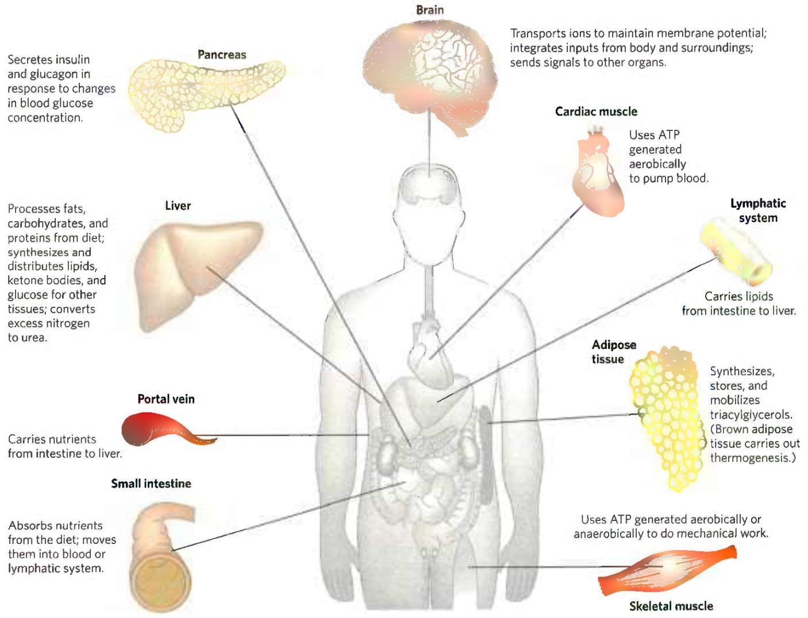  
FIGURE 23-9 Specialized metabolic functions of mammalian tissues.

Kupffer cells are phagocytes, important in immune function. Hepatocytes, of primary interest here, transform dietary nutrients into the fuels and precursors required by other tissues and export them via the blood. The kinds and amounts of nutrients supplied to the liver are determined by the composition of the diet, the interval between meals, and several other factors. The demand of extrahepatic tissues for fuels and precursors varies from one organ to another, and it also varies with the level of activity and overall nutritional state of the individual.

To meet these changing circumstances, the liver has remarkable metabolic flexibility. For example, when the diet is rich in protein, hepatocytes synthesize more of the enzymes needed for amino acid catabolism and gluconeogenesis. Within hours after a shift to a high-carbohydrate diet, the levels of these enzymes begin to drop and the hepatocytes increase their synthesis of enzymes essential to carbohydrate metabolism and fat synthesis. Liver enzymes turn over (that is, are synthesized and degraded) at 5 to 10 times the rate of enzyme turnover in other tissues, such as muscle. Extrahepatic tissues also can adjust their metabolism to prevailing conditions, but none of these tissues is as adaptable as the liver, and none is so central to the organism's overall metabolism.

We turn now to a survey of the possible fates of sugars, amino acids, and lipids that enter the liver from the bloodstream.

Carbohydrates The glucose transporter of hepatocytes (GLUT2) allows rapid, passive diffusion of glucose, so that the concentration of glucose in a hepatocyte is essentially the same as that in the blood. Glucose entering hepatocytes is phosphorylated by glucokinase (hexokinase IV) to yield glucose 6-phosphate. Glucokinase has a much higher $K_{\mathrm{m}}$ for glucose (10 mm) than do the hexokinase isozymes in other cells (p. 539) and, unlike these other isozymes, it is not inhibited by its product, glucose 6-phosphate. The presence of glucokinase allows hepatocytes to continue phosphorylating glucose when the glucose concentration rises well above levels that would overwhelm other hexokinases. The high $K_{\mathrm{m}}$ of glucokinase also ensures that the phosphorylation of glucose in hepatocytes is minimal when the glucose concentration is low, preventing the liver from consuming glucose as fuel via glycolysis. This spares glucose for other tissues. Fructose, galactose, and mannose, all absorbed from the small intestine, are also converted to glucose 6-phosphate by enzymatic pathways examined in Chapter 14 (see Fig. 14-9). Glucose 6-phosphate is at the crossroads of carbohydrate metabolism in the liver. It may take any of several major metabolic routes (Fig. 23-10), depending on the current metabolic needs of the organism. By the action of various allosterically regulated enzymes, and through hormonal regulation of enzyme synthesis and activity, the liver directs the flow of glucose into one or more of these pathways.

  
FIGURE 23-10 Metabolic pathways for glucose 6-phosphate in the liver. Here and in Figures 23-11 and 23-12, anabolic pathways are generally shown leading upward, catabolic pathways leading downward, and distribution to other organs leading horizontally. The numbered processes in each figure are described in the text.

① Glucose 6-phosphate is dephosphorylated by glucose 6-phosphatase to yield free glucose (see Fig. 15-6), which is exported to replenish blood glucose. Export is the predominant pathway when glucose 6-phosphate is in limited supply, because the blood glucose concentration must be kept sufficiently high (4 to 5 mm) to provide adequate energy for the brain and other tissues. ② Glucose 6-phosphate not immediately needed to form blood glucose is converted to liver glycogen, or has one of several other fates. Following glycolysis and the pyruvate dehydrogenase reaction, ③ the acetyl-CoA so formed can be oxidized for ATP production by the citric acid cycle, with ensuing electron transfer and oxidative phosphorylation yielding ATP. (Normally, however, fatty acids are the preferred fuel for ATP production in hepatocytes.) ④ Acetyl-CoA can also serve as the precursor of fatty acids, which are incorporated into TAGs and phospholipids, and of cholesterol. Much of the lipid synthesized in the liver is transported to other tissues by blood lipoproteins. ⑤ Alternatively, glucose 6-phosphate can enter the pentose phosphate pathway, yielding both reducing power (NADPH), needed for the biosynthesis of fatty acids and cholesterol, and ribose 5-phosphate, a precursor for nucleotide biosynthesis. NADPH is also an essential cofactor in the detoxification and elimination of many drugs and other xenobiotics (compounds that don't occur naturally but are the products of human activity, such as drugs, food additives, and preservatives) that are metabolized in the liver.

Amino Acids Amino acids that enter the liver follow several important metabolic routes (Fig. 23-11). ① They are precursors for protein synthesis, a process discussed in Chapter 27. The liver constantly renews its own proteins, which have a relatively high turnover rate (average half-life of hours to days), and it is also the site of biosynthesis of most plasma proteins. ② Alternatively, amino acids pass in the bloodstream to other organs to be used in the synthesis of tissue proteins. ③ Other amino acids are precursors in the biosynthesis of nucleotides, hormones, and other nitrogenous compounds in the liver and other tissues.

4a Amino acids not needed as biosynthetic precursors are transaminated or deaminated and degraded to yield pyruvate and citric acid cycle intermediates, with various fates; 4b the ammonia released is converted to the excretory product urea. 5 Pyruvate can be converted to glucose and glycogen via gluconeogenesis, or 6 can be converted to acetyl-CoA, which has several possible fates: 7 oxidation via the citric acid cycle and 8 oxidative phosphorylation to produce ATP, or 9 conversion to lipids for storage. 10 Citric acid cycle intermediates can be siphoned off into glucose synthesis by gluconeogenesis.

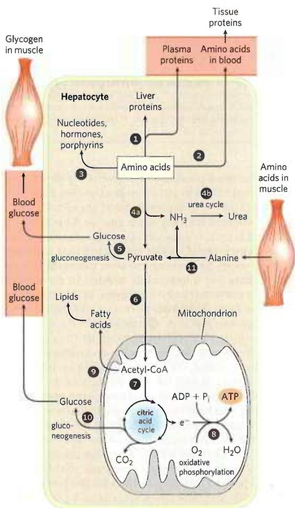  
FIGURE 23-11 Metabolism of amino acids in the liver.

P2 The liver also metabolizes amino acids that arrive intermittently from other tissues. The blood is adequately supplied with glucose just after the digestion and absorption of dietary carbohydrate or, between meals, by the conversion of liver glycogen to blood glucose. During the interval between meals, especially if prolonged, some muscle protein is degraded to amino acids. These amino acids donate their amino groups (by transamination) to pyruvate, the product of glycolysis, to yield alanine, which 11 is transported to the liver and deaminated. Hepatocytes convert the resulting pyruvate to blood glucose via gluconeogenesis 5, and the ammonia to urea for excretion 4b. One benefit of this glucose-alanine cycle is the smoothing out of fluctuations in blood glucose between meals. The amino acid deficit incurred in muscles is made up after the next meal by incoming dietary amino acids.

Lipids The fatty acid components of lipids entering hepatocytes also have several different fates (Fig. 23-12). ① Some are converted to liver lipids. ② Under most circumstances, fatty acids are the primary oxidative fuel in the liver. Free fatty acids may be activated and oxidized to yield acetyl-CoA and NADH. ③ The acetyl-CoA is further oxidized via the citric acid cycle, and ④ oxidations in the cycle drive the synthesis of ATP by oxidative phosphorylation. ⑤ Excess acetyl-CoA, not required by the liver, is converted to acetoacetate and β-hydroxybutyrate; these ketone bodies circulate in the blood to other tissues to be used as fuel for the citric acid cycle. Ketone bodies, unlike fatty acids, can cross the blood-brain barrier, providing the brain with a source of acetyl-CoA for energy-yielding oxidation. Ketone bodies can supply a significant fraction of the energy in some extrahepatic tissues — up to one-third in the heart and as much as 60% to 70% in the brain during prolonged fasting. ⑥ Some of the acetyl-CoA derived from fatty acids (and from glucose) is used for the biosynthesis of cholesterol, which is required for membrane synthesis. Cholesterol is also the precursor of all steroid hormones and of the bile salts, which are essential for the digestion and absorption of lipids.

The other two metabolic fates of lipids require specialized mechanisms for the transport of insoluble lipids in blood. 7 Fatty acids are converted to the phospholipids and TAGs of plasma lipoproteins, which carry lipids to adipose tissue for storage. 8 Some free fatty acids (FFAs) are bound to serum albumin and carried to the heart and skeletal muscles, which take up and oxidize FFAs as a major fuel. Serum albumin is the most abundant plasma protein; one molecule can carry up to seven FFA molecules (see Fig. 17-3).

  
FIGURE 23-12 Metabolism of fatty acids in the liver.

The liver thus serves as the body's distribution center, exporting nutrients in the correct proportions to other organs, smoothing out fluctuations in metabolism caused by intermittent food intake, and processing excess amino groups into urea and other products to be disposed of by the kidneys. Certain nutrients are stored in the liver, including iron ions and vitamin A. The liver also detoxifies xenobiotics. Detoxification often includes the cytochrome P-450-dependent hydroxylation of relatively insoluble organic compounds, making them sufficiently soluble for further breakdown and excretion (see Box 21-1).

#### [EN] Adipose Tissues Store and Supply Fatty Acids

There are two primary types of adipose tissue, white and brown (Fig. 23-13), with different roles, and we focus first on the more abundant of the two. White adipose tissue (WAT) is amorphous and widely distributed in the body: under the skin, around deep blood vessels, and in the abdominal cavity. The adipocytes of white adipose tissue are large (diameter 30 to 70 $\mu$ m), spherical cells, completely filled with a single large lipid droplet that constitutes about 65% of the cell mass and squeezes the mitochondria and nucleus into a thin layer against the plasma membrane (Fig. 23-13a, c). The lipid droplet contains TAGs and sterol esters and is coated with a monolayer of phospholipids, oriented with their polar head groups facing the cytosol. Specific proteins are associated with the surface of the droplets, including perilipin and the enzymes for synthesis and breakdown of TAGs (see Fig. 17-2). White adipose tissue typically makes up about 15% of the mass of a healthy young adult human. Adipocytes are metabolically active, responding quickly to hormonal stimuli in a metabolic interplay with the liver, skeletal muscles, and heart.

  
FIGURE 23-13 White and brown adipose tissue. Schematic views of typical mouse adipocytes from (a) white adipose tissue (WAT) and (b) brown adipose tissue (BAT). White adipocytes are larger and contain a single huge lipid droplet, which squeezes the mitochondria and nucleus against the plasma membrane. In brown adipocytes, mitochondria are much more prominent, the nucleus is near the center of the cell, and multiple small fat droplets are present. Below are light micrographs of (c) adipocytes in white adipose tissue, stained to show nuclei, and (d) a region of mixed white and brown adipocytes, stained with an antibody specific to UCP1, the uncoupling protein responsible for thermogenesis. [(c, d) Courtesy of Dr. Patrick Seale.]

Adipocytes have an active glycolytic metabolism, oxidize pyruvate and fatty acids via the citric acid cycle, and carry out oxidative phosphorylation. During periods of high carbohydrate intake, adipose tissue can convert glucose (via pyruvate and acetyl-CoA) to fatty acids, convert the fatty acids to TAGs, and store the TAGs as large lipid droplets—although in humans, much of the fatty acid synthesis occurs in hepatocytes. Adipocytes store TAGs arriving from the liver (carried in the blood as very-low-density lipoproteins) and from the intestinal tract (carried in chylomicrons), particularly after meals rich in fat.

When the demand for fuel rises (between meals, for example), lipases in adipocytes hydrolyze stored TAGs to release FFAs, which can travel in the bloodstream to skeletal muscle, the heart, and, during starvation, the liver. The release of fatty acids from adipocytes is greatly accelerated by epinephrine, which stimulates the cAMP-dependent phosphorylation of perilipin and thus gives lipases that are specific for tri-, di-, and monoacylglycerols access to TAGs in lipid droplets (see Fig. 17-2). Hormone-sensitive lipase is also stimulated by phosphorylation. Insulin counterbalances this effect of epinephrine, decreasing the activity of the lipase.

The breakdown and synthesis of TAGs in adipose tissue constitute a substrate cycle; up to 70% of the fatty acids released by the three lipases are reesterified in adipocytes, re-forming TAGs. Each cycle consumes ATP (used to activate the fatty acids as acyl-CoA esters), so the net effect of the substrate cycling is the breakdown of ATP and the accompanying release of heat. In adipose tissue, glycerol liberated by adipocyte lipases cannot be reused in the synthesis of TAGs, because adipocytes lack glycerol kinase. Instead, the glycerol phosphate required for TAG synthesis is made from pyruvate by glyceroneogenesis, requiring the action of the cytosolic PEP carboxykinase (see Fig. 21-22).

In addition to its central function as a fuel depot, adipose tissue plays an important role as an endocrine organ, producing and releasing hormones that signal the state of energy reserves and coordinate metabolism of fats and carbohydrates throughout the body. We return to this function in Section 23.4 when we discuss the hormonal regulation of body mass.

#### [EN] Brown and Beige Adipose Tissues Are Thermogenic

In small vertebrates and hibernating animals, a significant proportion of the adipose tissue is brown adipose tissue (BAT), distinguished from white adipose tissue by its smaller (diameter 20 to 40 $\mu$ m), differently shaped (polygonal, not round) adipocytes (Fig. 23-13b, d). Like white adipocytes, brown adipocytes store TAGs, but in several smaller lipid droplets per cell rather than as a single central droplet. Brown adipocytes have more mitochondria and a richer supply of capillaries and innervation than white adipocytes; it is the cytochromes of mitochondria and the hemoglobin in capillaries that give brown adipose tissue its characteristic color. A unique feature of brown adipocytes is their production of uncoupling protein 1 (UCP1), also called thermogenin (see Fig. 19-36). This protein is responsible for one of the principal functions of brown adipose tissue: thermogenesis.

In brown adipocytes, fatty acids stored in lipid droplets are released, enter mitochondria, and undergo complete conversion to $CO_{2}$ by $\beta$ oxidation and the citric acid cycle. The reduced $FADH_{2}$ and NADH so generated pass their electrons through the respiratory chain to molecular oxygen. In white adipocytes, protons pumped out of the mitochondria during electron transfer reenter the matrix through ATP synthase, with the energy of electron transfer conserved in ATP synthesis. In brown adipocytes, UCP1 provides an alternative route for the reentry of protons that bypasses ATP synthase. The energy of the proton gradient is thus dissipated as heat, which can maintain the body (especially the nervous system and viscera) at its optimal temperature when the ambient temperature is relatively low.

In the human fetus, differentiation of fibroblast preadipocytes into brown adipose tissue begins at the twentieth week of gestation, and at the time of birth, brown adipose tissue represents 1% to 5% of total body mass. The brown fat deposits are located where the heat generated by thermogenesis can ensure that vital tissues—blood vessels to the head, major abdominal blood vessels, and the viscera, including the pancreas, adrenal glands, and kidneys—are not chilled as the newborn enters a world of lower ambient temperature (Fig. 23-14a).

At birth, white adipose tissue development begins and brown adipose tissue begins to disappear. Young adult humans have much-diminished deposits of brown adipose tissue, ranging from 3% of all adipose tissue in males to 7% in females, making up less than 0.1% of body mass. However, adults have, distributed among their white adipose cells, significant numbers of adipocytes that can be converted by cold exposure or by $\beta$ -adrenergic stimulation into cells very similar to brown adipocytes. These beige adipocytes have multiple lipid droplets, are richer in mitochondria than white adipocytes, and produce UCP1, so they function effectively as heat generators. Brown and beige adipocytes produce heat by oxidation of their own fatty acids, but they also take up and oxidize both fatty acids and glucose from the blood at rates out of proportion to their mass. In fact, the detection of brown adipose tissue by PET scanning depends on the adipocytes' relatively high rate of glucose uptake and metabolism (Fig. 23-14b). In adaptation to warm or cold surroundings, and in the normal differentiation of white, brown, and beige adipose tissue, the nuclear transcription factor PPAR $\gamma$ (described later in the chapter) plays a central role. And as we noted above, the peptide hormone irisin, produced in muscle by exercise, triggers the development of beige adipose tissue that continues to burn fuel long after the exercise ends.

#### [EN] Muscles Use ATP for Mechanical Work

Metabolism in skeletal muscle cells — myocytes — is specialized to generate ATP as the immediate source of energy for contraction. Moreover, skeletal muscle is adapted to do its mechanical work intermittently, on demand. Sometimes skeletal muscles must work at their maximum capacity for a short time, as in a 100 m sprint;

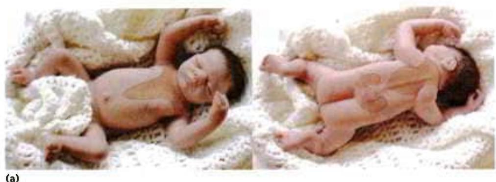

  
(b) After cold exposure  
FIGURE 23-14 Brown adipose tissue in infants and adults. (a) At birth, human infants have brown fat distributed as shown here, to protect the spine, major blood vessels, and internal organs. (b) Positron emission tomography (PET) scanning can show metabolic activity in a living person, in real time. PET scans allow visualization of isotopically labeled glucose in precisely localized regions of the body. A positron-emitting glucose analog, 2-[18F]-fluoro-2-deoxy-D-glucose (FDG), is injected into the bloodstream; a short time later, a PET scan shows how much of the glucose has been taken up by each part of the body -- a measure of metabolic activity. On the left is a PET scan of a healthy 25-year-old man who fasted for 12 hours, then stayed for 1 hour in a cold (19 °C) room, with his legs on

at other times more prolonged work is required, as in running a marathon or in prolonged physical labor.

There are two general classes of muscle tissue, which differ in physiological role and fuel utilization. Slow-twitch muscle, also called red muscle, provides relatively low tension but is highly resistant to fatigue. It produces ATP by the relatively slow but steady process of oxidative phosphorylation. Red muscle is very rich in mitochondria and is served by dense networks of blood vessels, which bring the oxygen essential to ATP production.

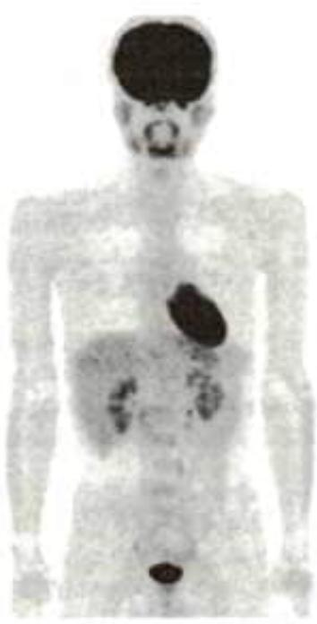  
Room-temperature control  
ice to thoroughly chill him. At the end of the hour, he was injected with $[^{18}F]$ -FDG, then remained under cold conditions for another hour. Whole-body PET scans were then done at 24 °C. For the control scan, the same man underwent the same PET scan protocol two weeks later, but this time following 2 hours at 27 °C instead of chilling (right). Intense labeling of the brain and heart shows high rates of glucose uptake; labeling of the kidneys and bladder indicates clearance of FDG. In the scan after chilling (left), $[^{18}F]$ -FDG labels brown adipose tissue in the region above the collarbone and along the vertebrae. [(a) Adam Steinberg. (b) Reprinted with permission of American Diabetes Association, from M. Saito et al., Diabetes 58:1526, 2009, Fig. 1; permission conveyed through Copyright Clearance Center, Inc.]

Fast-twitch muscle, or white muscle, has fewer mitochondria than red muscle and is less well supplied with blood vessels, but it can develop greater tension and do so faster. White muscle is quicker to fatigue because, when active, it uses ATP faster than it can replace it. There is a genetic component to the proportion of red and white muscle in any individual, but with training, an athlete can improve the endurance of fast-twitch muscle.

Skeletal muscle can use free fatty acids or glucose as fuel, depending on the degree of muscular activity (Fig. 23-15). In resting muscle, the primary fuels are FFAs from adipose tissue. These are oxidized and degraded to yield acetyl-CoA, which enters the citric acid cycle, ultimately yielding the energy for ATP synthesis by oxidative phosphorylation. Muscle in light activity uses blood glucose in addition to fatty acids. The glucose is phosphorylated, then degraded by glycolysis to pyruvate, which is converted to acetyl-CoA and oxidized via the citric acid cycle and oxidative phosphorylation.

In maximally active fast-twitch muscles, the demand for ATP is so great that the blood flow cannot provide $O_{2}$ and fuels fast enough to supply sufficient ATP by aerobic respiration alone. Under these conditions, stored muscle glycogen is broken down to lactate by fermentation (p. 525). Each glucose unit degraded yields three ATP, because phosphorolysis of glycogen produces glucose 6-phosphate (via glucose 1-phosphate), sparing the ATP normally consumed in the hexokinase reaction. Lactic acid fermentation thus responds more quickly than oxidative phosphorylation to an increased need for ATP, supplementing basal ATP production by aerobic oxidation of other fuels via the citric acid cycle and respiratory chain. The secretion of epinephrine, which stimulates both the release of glucose from liver glycogen and the breakdown of glycogen in muscle tissue, greatly enhances the use of blood glucose and muscle glycogen as fuels for muscular activity. (Epinephrine mediates the so-called fight-or-flight response, discussed more fully below.)

The relatively small amount of glycogen (about 1% of the total weight of skeletal muscle) limits the glycolytic energy available during all-out exertion. Moreover, the accumulation of lactate and consequent decrease in pH in maximally active muscles reduces their efficiency. Skeletal muscle, however, contains another source of

  
FIGURE 23-15 Energy sources for muscle contraction. Different fuels are used for ATP synthesis during bursts of heavy activity and during light activity or rest. Phosphocreatine can rapidly supply ATP.

ATP, phosphocreatine (10 to 30 mm), which can rapidly regenerate ATP from ADP by the creatine kinase reaction:

During periods of active contraction and glycolysis, this reaction proceeds predominantly in the direction of ATP synthesis; during recovery from exertion, the same enzyme resynthesizes phosphocreatine from creatine and ATP. Because of the relatively high levels of ATP and phosphocreatine in muscle, these compounds can be detected in intact muscle, in real time, by NMR spectroscopy (Fig. 23-16). Creatine serves to shuttle ATP equivalents from the mitochondrion to sites of ATP consumption and can be the limiting factor in the development of new muscle tissue (Box 23-1).

After a period of intense muscular activity, the individual continues breathing heavily for some time, using much of the extra $O_{2}$ for oxidative phosphorylation in the liver. The ATP produced is used for gluconeogenesis (in the liver) from lactate that has been carried in the blood from the muscles. The glucose thus formed returns to the muscles to replenish their glycogen, completing the Cori cycle (Fig. 23-17; see also Box 15-1).

Actively contracting skeletal muscle generates heat as a byproduct of imperfect coupling of the chemical energy of ATP with the mechanical work of contraction. This heat production can be put to good use when ambient temperature is low: skeletal muscle carries out shivering thermogenesis, rapidly repeated muscle contraction that produces heat but little motion, helping to maintain the body at its preferred temperature of $37^{\circ}$ C.

  
FIGURE 23-16 Phosphocreatine buffers ATP concentration during exercise. A "stack plot" of magnetic resonance spectra (of $^{31}\mathrm{P}$ ) shows inorganic phosphate $(\mathbb{P}_{i})$ , phosphocreatine (PCr), and ATP (each of its three phosphates giving a signal). The series of plots represents the passage of time, from a period of rest to one of exercise, and then of recovery. Notice that the ATP signal barely changes during exercise, kept high by continued respiration and by the reservoir of phosphocreatine, which diminishes during exercise. During recovery, when ATP production by catabolism is greater than ATP use by the (now resting) muscle, the phosphocreatine reservoir is refilled. [Data from M. L. Blei, K. E. Conley, and M. J. Kushmerick, J. Physiol. 465:203, 1993, Fig. 4.]

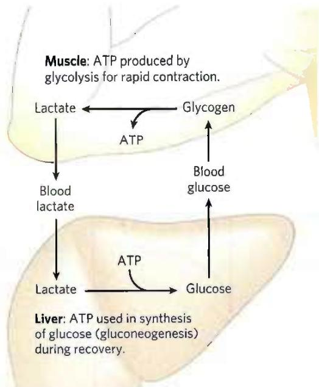  
FIGURE 23-17 Metabolic cooperation between skeletal muscle and the liver: the Cori cycle. Extremely active muscles use glycogen as their energy source, generating lactate by glycolysis. During recovery, some of the lactate is transported to the liver and converted to glucose by gluconeogenesis. The glucose is released to the blood and returned to the muscles to replenish their glycogen stores. The overall pathway, glucose → lactate → glucose, constitutes the Cori cycle.

Heart muscle differs from skeletal muscle in that it is continuously active in a regular rhythm of contraction and relaxation, and has a completely aerobic metabolism at all times. Mitochondria are much more abundant in heart muscle than in skeletal muscle, making up almost half the volume of the cells (Fig. 23-18). The heart uses mainly FFAs as a source of energy, but also some glucose and ketone bodies taken up from the blood; these fuels are oxidized aerobically to generate ATP. Like skeletal muscle, heart muscle does not store lipids or glycogen in large amounts. It does have small amounts of reserve energy in the form of phosphocreatine, enough for a few seconds of contraction. Because the heart is normally aerobic and obtains its energy from oxidative phosphorylation, the failure of $\mathrm{O}_2$ to reach part of the heart muscle when the blood vessels are blocked by lipid deposits (atherosclerosis) or blood clots (coronary thrombosis) can cause that region of the heart muscle to die. This is what happens in myocardial infarction (heart attack).

#### [EN] The Brain Uses Energy for Transmission of Electrical Impulses

The metabolism of the brain is remarkable in several respects. The neurons of the adult mammalian brain normally use only glucose as fuel (Fig. 23-19). (Astrocytes, the other major cell type in the brain, can oxidize fatty acids.) The brain, which constitutes about 2% of total body mass, has a very active respiratory metabolism (Fig. 23-15); more than 90% of the ATP produced in the neurons comes from oxidative phosphorylation. The brain uses $O_{2}$ at a fairly constant rate, accounting for almost 20% of the total $O_{2}$ consumed by the body at rest. Because the brain contains very little glycogen, it is constantly dependent on incoming glucose in the blood.

  
FIGURE 23-18 Electron micrograph of heart muscle. In the profuse mitochondria of heart tissue, pyruvate (from glucose), fatty acids, and ketone bodies are oxidized to drive ATP synthesis. This steady aerobic metabolism allows the human heart to pump blood at a rate of nearly 6 L/min, or about 350 L/h — which amounts to $200 \times 10^{6}$ L of blood over 70 years. [D.w. Fawcett/Science Source.]

  
FIGURE 23-19 The fuels that supply ATP in the brain. The energy source used by the brain varies with nutritional state. The ketone body used during starvation is $\beta$ -hydroxybutyrate. Electrogenic transport by the $\mathrm{Na^{+}K^{+}}$ ATPase maintains the transmembrane potential essential to information transfer among neurons.

#### [EN] Creatine and Creatine Kinase: Invaluable Diagnostic Aids and the Muscle Builder's Friends

Animal tissues that have a high and fluctuating need for ATP, primarily skeletal muscle, cardiac muscle, and brain, contain several isozymes of creatine kinase. A cytosolic isozyme (cCK) is present in regions of high ATP use (myofibrils and sarcoplasmic reticulum, for example). By converting ADP produced during periods of high ATP use back to ATP, cCK prevents the accumulation of ADP to concentrations that could inhibit ATP-using enzymes by mass action. Another isozyme of creatine kinase is located in regions where the inner and outer membranes of mitochondria come into contact. This mitochondrial isozyme (mCK) probably serves to shuttle ATP equivalents produced in mitochondria to cytosolic sites of ATP use (Fig. 1). The species that diffuses from the mitochondrion to ATP-consuming activities in the cytosol is therefore creatine phosphate, not ATP. The mCK isozyme co-localizes with the adenine nucleotide transporter (in the inner mitochondrial membrane) and porin (in the outer mitochondrial membrane), which suggests that these three components may function together to transport ATP equivalents formed in mitochondria into the cytosol.

In knockout mice lacking the mitochondrial isozyme, myocytes compensate by producing more mitochondria, closely associated with myofibrils and sarcoplasmic reticulum, allowing quick diffusion of mitochondrial ATP to the sites of ATP use. Nevertheless, these mice have a reduced capacity for running, indicating a defect in some aspect of energy-supplying metabolism.

Creatine and phosphocreatine spontaneously break down to form creatinine (Fig. 2). To maintain high creatine levels, these losses have to be compensated for, either by dietary creatine, obtained primarily from meat (muscle) and dairy products, or by de novo synthesis from glycine, arginine, and methionine (see Fig. 22-28), which occurs primarily in liver and kidney. De novo synthesis of creatine is a major consumer of these amino acids, particularly in vegans, for whom this is the only source of creatine; plants do not contain creatine. Muscle tissue has a specific system to take up creatine (exported by liver or kidney) from the blood, against a substantial concentration gradient. Efficient uptake of dietary creatine requires continuous exercise; without exercise, creatine supplementation is of little value.

Should blood glucose fall significantly below a critical level for even a short time, severe and sometimes irreversible changes in brain function may result.

P3 Although the neurons of the brain cannot directly use free fatty acids or lipids from the blood as fuels, they can, when necessary, get up to 60% of their energy requirement from the oxidation of β-hydroxybutyrate (a ketone body), formed in the liver from fatty acids. The capacity of the brain to oxidize β-hydroxybutyrate via acetyl-CoA becomes important during prolonged fasting or starvation, after liver glycogen has been depleted, because it allows the brain to use body fat as an energy source. This spares muscle proteins—until they become the brain's ultimate source of glucose, via gluconeogenesis in the liver, during severe starvation.

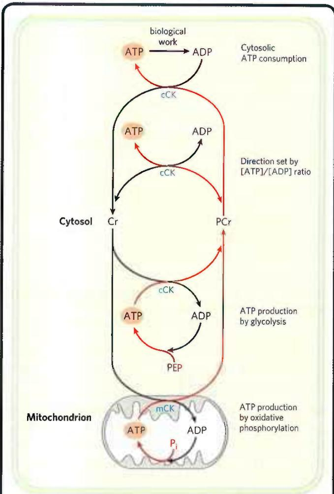  
FIGURE 1 Mitochondrial creatine kinase (mCK) transfers a phosphoryl group from ATP to creatine (Cr) to form phosphocreatine (PCr), which diffuses to sites of ATP use; at these sites, cytosolic creatine kinase (cCK) passes the phosphoryl group into ATP. Cytosolic CK can also use ATP produced by glycolysis to synthesize PCr. During periods of little ATP demand, the pools of ATP and PCr are replenished in preparation for the next period of intense demand for ATP. In resting muscle, the concentration of PCr is three to five times that of ATP, buffering the cell against rapid depletion of ATP during short bursts of ATP demand. [Information from U. Schlattner et al., Biochim. Biophys. Acta 1762:164, 2006, Fig. 1.]

In neurons, energy is required to create and maintain an electrical potential across the plasma membrane. The membrane contains an electrogenic ATP-driven antiporter, the $Na^{+}K^{+}$ ATPase, which simultaneously pumps two $K^{+}$ ions into and three $Na^{+}$ ions out of the neuron (see Fig. 11-39). The resulting transmembrane potential changes transiently as an electrical signal, an

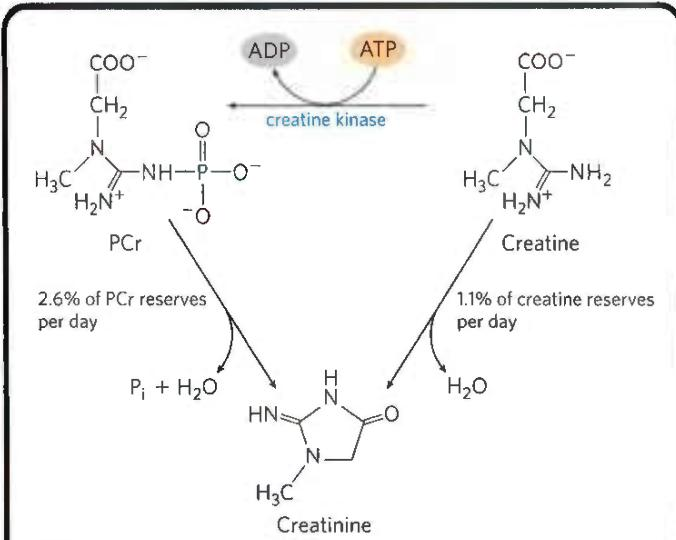  
FIGURE 2 Spontaneous (nonenzymatic) formation of creatinine from phosphocreatine or creatine consumes a few percent of the body's total creatine per day, which must be replaced by biosynthesis or from the diet.

Heart muscle contains a unique isozyme of creatine kinase (MB, for myocardial band), which is not normally found in the blood but appears there when released from heart muscle damaged by a heart attack. The blood level of MB begins to rise within 2 hours of the heart attack, typically peaks 12 to 36 hours after the heart attack, and returns to normal levels in 3 to 5 days. Measurement of the MB isozyme in blood therefore confirms a diagnosis of heart attack and indicates approximately when it occurred.

Children with inborn errors in the enzymes of creatine synthesis or uptake suffer severe intellectual disability and seizures. They have much-reduced levels of brain creatine as measured by NMR (see Fig. 23-16). Creatine supplementation raises their brain creatine and creatine phosphate concentrations and brings about partial improvement of the symptoms.

action potential, sweeps from one end of a neuron to the other (see Fig. 12-33). Action potentials are the chief mechanism of information transfer in the nervous system, so depletion of ATP in neurons would have disastrous effects on all activities coordinated by neuronal signaling.

#### [EN] Blood Carries Oxygen, Metabolites, and Hormones

P2 Blood mediates the metabolic interactions among all tissues. It transports nutrients from the small intestine to the liver and from the liver and adipose tissue

  
FIGURE 3 Many body builders take supplemental creatine to supply phosphocreatine in new muscle tissue. [Steve Williams Photo/Getty Images.]

In the healthy kidney, creatinine from creatine breakdown is efficiently cleared from the blood into the urine. When renal function is defective, creatinine levels in the blood rise above the normal range of 0.8 to 1.4 mg/dL. Elevated blood creatinine is associated with renal failure in diabetes and other conditions in which renal function is temporarily or permanently compromised. Renal clearance of creatinine varies slightly with age, ethnicity, and gender, so correcting the calculation for those factors yields a more sensitive measure of the extent of renal function, the glomerular filtration rate (GFR).

Body builders who are adding muscle mass have a greater need for creatine and commonly take creatine supplements of up to 20 g per day for a few days, followed by lower maintenance doses. The combination of exercise and creatine supplementation increases muscle mass (Fig. 3) and improves performance in high-intensity, short-duration work.

to other organs; it also transports waste products from extrahepatic tissues to the liver for processing and to the kidneys for excretion. Oxygen moves in the bloodstream from the lungs to the tissues, and $CO_{2}$ generated by tissue respiration returns via the bloodstream to the lungs for exhalation. Blood also carries hormonal signals from one tissue to another. In its role as signal carrier, the circulatory system resembles the nervous system: both regulate and integrate the activities of different organs.

The average adult human has 5 to 6 L of blood. Almost half of this volume is occupied by three types of blood cells (Fig. 23-20): erythrocytes (red cells), filled with hemoglobin and specialized for carrying O₂ and CO₂; much smaller numbers of leukocytes (white cells) of several types (including lymphocytes, also found in lymphatic tissue), which are central to the immune system to defend against infections; and platelets (cell fragments), which help to mediate blood clotting. The liquid portion is the blood plasma, which is 90% water and 10% solutes. Dissolved or suspended in the plasma are many proteins, lipoproteins, nutrients, metabolites, waste products, inorganic ions, and hormones. More than 70% of the plasma solids are plasma proteins, primarily immunoglobulins (circulating antibodies), serum albumin, apolipoproteins (for lipid transport), transferrin (for iron transport), and blood-clotting proteins such as fibrinogen and prothrombin.

The ions and low molecular weight solutes in blood plasma are not fixed components; they are in constant flux between blood and various tissues. Dietary uptake of the inorganic ions that are the predominant electrolytes of blood and cytosol (Na $^{+}$ , K $^{+}$ , and Ca $^{2+}$ ) is, in general, counterbalanced by their excretion in the urine. For many blood components, something near a dynamic steady state is achieved: the concentration of a component changes little, although a continuous flux occurs between the digestive tract, blood, and urine. The plasma levels of $Na^{+}$ , $K^{+}$ , and $Ca^{2+}$ remain close to 140, 5, and 2.5 mm, respectively, with little change in response to dietary intake. Any significant departure from these values can result in serious illness or death. The kidneys play an especially important role in maintaining ion balance by selectively filtering waste products and excess ions out of the blood while preventing the loss of essential nutrients and ions.

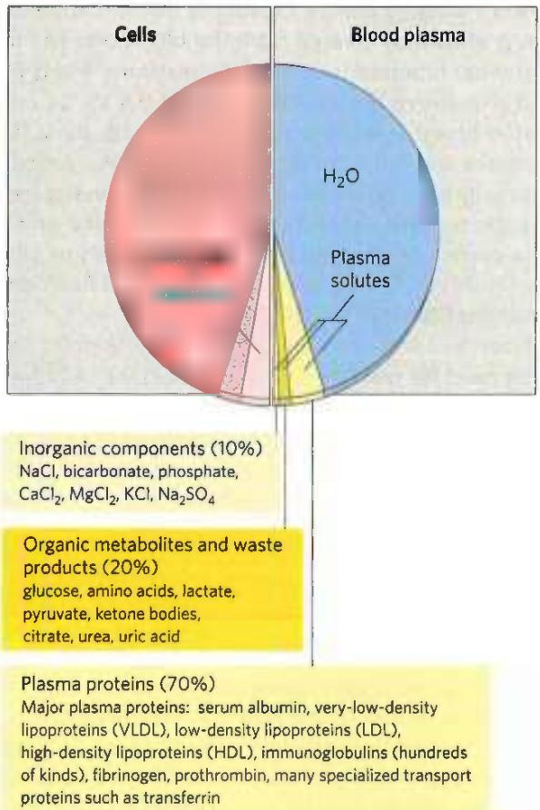  
FIGURE 23-20 The composition of blood (by weight). Whole blood can be separated into blood plasma and cells by centrifugation. About 10% of blood plasma is solutes, about 10% of these consisting of inorganic salts, 20% small organic molecules, and 70% plasma proteins. The major dissolved components are listed here. Blood contains many other substances, often in trace amounts. These include other metabolites, enzymes, hormones, vitamins, trace elements, and bile pigments. Measurements of the concentrations of components in blood plasma are important in the diagnosis and treatment of many diseases.

The human erythrocyte loses its nucleus and mitochondria during differentiation. It therefore relies on glycolysis alone for its supply of ATP. The lactate produced by glycolysis returns to the liver, where gluconeogenesis converts it to glucose, to be stored as glycogen or recirculated to peripheral tissues. The erythrocyte has constant access to glucose in the bloodstream.

The concentration of glucose in plasma is subject to tight regulation. We have noted the constant requirement of the brain for glucose and the role of the liver in maintaining blood glucose in the normal range, 60 to 90 mg/100 mL of whole blood (\~4.5 mm). (Because erythrocytes make up a significant fraction of blood volume, their removal by centrifugation leaves a supernatant fluid, the plasma, containing the "blood glucose" in a smaller volume. To convert blood glucose to plasma glucose concentration, multiply the blood glucose level by 1.14.) When blood glucose in a human drops to 70 mg/100 mL (the hypoglycemic condition), the person experiences discomfort and mental confusion (Fig. 23-21); further reductions lead to coma, convulsions, and, in extreme hypoglycemia, death. Maintaining the normal concentration of glucose in blood is therefore a high priority, and a variety of regulatory mechanisms have evolved to achieve that end. Among the most important regulators of blood glucose are the hormones insulin, glucagon, and epinephrine, as discussed in the next section.

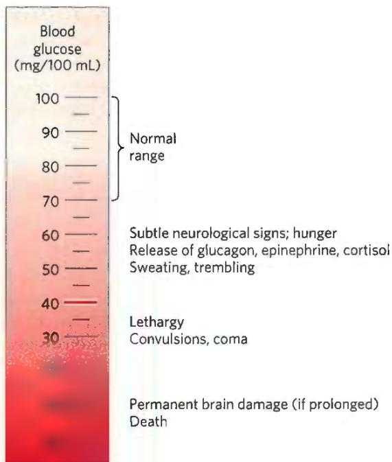  
FIGURE 23-21 Physiological effects of low blood glucose in humans. Blood glucose levels of 40 mg/100 mL and below constitute severe hypoglycemia.

#### [EN] SUMMARY 23.2 Tissue-Specific Metabolism

In mammals there is a division of metabolic labor among specialized tissues and organs. The liver is the central processing and distribution organ for nutrients. Glucose 6-phosphate may be used to synthesize glycogen or fatty acids, or it may be sent into the citric acid cycle to produce ATP, or into the pentose phosphate pathway to yield NADPH and pentoses. Amino acids are used to synthesize liver and plasma proteins, or their carbon skeletons are converted to glucose and glycogen by gluconeogenesis; the ammonia formed by deamination is converted to urea. Fatty acids in the liver may undergo $\beta$ oxidation, or be converted to triglycerides, phospholipids or cholesterol, or be converted into ketone bodies.

■ White adipose tissue stores large reserves of triacylglycerol molecules and releases them into the blood in response to epinephrine or glucagon. Brown and beige adipose tissue are specialized for thermogenesis, the result of fatty acid oxidation in uncoupled mitochondria.

■ Skeletal muscle is specialized to produce and use ATP for mechanical work, oxidizing fatty acids and glucose during low to moderate muscular activity. During strenuous muscular activity, glycogen is the ultimate fuel, supplying ATP through glycolysis and fermentation to lactate. Phosphocreatine directly replenishes ATP during active contraction. Heart muscle obtains nearly all its ATP from oxidative phosphorylation, with fatty acids as the primary fuel.

The neurons of the brain use only glucose and $\beta$ -hydroxybutyrate as fuels, the latter being important during fasting or starvation. The brain uses most of its ATP for the active transport of $\mathrm{Na}^{+}$ and $\mathrm{K}^{+}$ to maintain the electrical potential across the neuronal membrane.

■ The blood transfers nutrients, oxygen, waste products, and hormonal signals among tissues and organs. It is made up of cells (erythrocytes, leukocytes, and platelets) and electrolyte-rich water (plasma) containing many dissolved proteins.

<!-- EN-END 23.2 -->

<!-- EN-BEGIN 23.3 -->

### 【英文对应 23.3】Hormonal Regulation of Fuel Metabolism

> 来源：Lehninger Principles of Biochemistry（书籍/02_生物化学原理） 第23章 Hormonal Regulation and Integration of Mammalian Metabolism，§23.3。对应本章“四、机体在整体水平上对细胞代谢的调节控制”。

P3 The minute-by-minute adjustments that keep the blood glucose level near 4.5 mm involve the combined actions of insulin, glucagon, epinephrine, and cortisol on metabolic processes in many body tissues, but especially in liver, muscle, and adipose tissue. Insulin signals to these tissues that blood glucose is higher than necessary; as a result, cells take up excess glucose from the blood and convert it to glycogen and triacylglycerols for storage. Glucagon signals that blood glucose is too low, and tissues respond by producing glucose through glycogen breakdown and (in the liver) gluconeogenesis, and by oxidizing fats to reduce the need for glucose. Epinephrine is released into the blood to prepare the muscles, lungs, and heart for a burst of activity. Cortisol mediates the body's response to longer-term stresses.

In this section, we discuss these hormonal regulations in the context of three normal metabolic states—well fed, fasted, and starving.

#### [EN] Insulin Counters High Blood Glucose in the Well-Fed State

After a high-carbohydrate meal, blood glucose rises several-fold. In response, insulin is released and acts through its plasma membrane receptors in muscle and liver (see Figs. 12-22, 12-23) to stimulate glucose uptake, phosphorylation, and oxidation via glycolysis and the citric acid cycle (Table 23-3). In response to insulin, GLUT4 glucose transporters sequestered in intracellular vesicles move to the plasma membrane, dramatically increasing the uptake of glucose from the blood (see Box 11-1). In the liver, insulin activates glycogen synthase and inactivates glycogen phosphorylase, so that much of the glucose 6-phosphate derived from blood glucose is channeled into glycogen.

TABLE 23-3 Effects of Insulin on Blood Glucose: Uptake of Glucose by Cells and Storage as Triacylglycerols and Glycogen

<table><tr><td>Metabolic effect</td><td>Target enzyme</td></tr><tr><td>↑ Glucose uptake (muscle, adipose tissue)</td><td>↑ Glucose transporter (GLUT4)</td></tr><tr><td>↑ Glucose uptake (liver)</td><td>↑ Glucokinase (increased expression)</td></tr><tr><td>↑ Glycogen synthesis (liver, muscle)</td><td>↑ Glycogen synthase</td></tr><tr><td>↓ Glycogen breakdown (liver, muscle)</td><td>↓ Glycogen phosphorylase</td></tr><tr><td>↑ Glycolysis, acetyl-CoA production (liver, muscle)</td><td>↑ PFK-1 (by PFK-2)↑ Pyruvate dehydrogenase complex</td></tr><tr><td>↑ Fatty acid synthesis (liver)</td><td>↑ Acetyl-CoA carboxylase</td></tr><tr><td>↑ Triacylglycerol synthesis (adipose tissue)</td><td>↑ Lipoprotein lipase</td></tr></table>

Insulin also stimulates the storage of excess fuel as fat in adipose tissue (Fig. 23-22). Excess acetyl-CoA not needed for energy production via the citric acid cycle is used for fatty acid synthesis. These fatty acids are converted to TAGs in the liver and exported to adipose tissue as components of plasma lipoproteins (VLDL; see Fig. 21-40). In adipose tissue, TAGs are released from VLDL as fatty acids, which are taken up by adipocytes and reconverted to TAGs for storage in response to insulin stimulation.

In summary, an important effect of insulin is to bring about the conversion of excess blood glucose after a meal to two storage forms: glycogen (in the liver and muscle) and TAGs (in adipose tissue).

#### [EN] Pancreatic $\beta$ Cells Secrete Insulin in Response to Changes in Blood Glucose

The peptide hormones insulin, glucagon, and somatostatin are produced by clusters of specialized pancreatic cells, the islets of Langerhans (Fig. 23-23). Each cell type of the islets produces a single hormone: $\alpha$ cells produce glucagon; $\beta$ cells, insulin; and $\delta$ cells, somatostatin. When glucose enters the bloodstream from the intestine after a carbohydrate-rich meal, the resulting increase in blood glucose causes the pancreas to secrete insulin (and to decrease the secretion of glucagon).

As shown in Figure 23-24, when blood glucose rises, ① GLUT2 transporters carry glucose into the β cells, where it is immediately converted to glucose 6-phosphate by glucokinase and enters glycolysis. With the higher rate of glucose catabolism, ② [ATP] increases, causing ATP-gated K⁺ channels in the plasma membrane to close. ③ Reduced efflux of K⁺ depolarizes the membrane. (Recall from Section 12.6 that exit of K⁺ through an open K⁺ channel hyperpolarizes the membrane; thus, closing the K⁺ channel effectively depolarizes the membrane.) Membrane depolarization opens voltage-gated Ca²⁺ channels, and ④ the resulting increase in cytosolic $[Ca^{2+}]$ triggers ⑤ the release of insulin by exocytosis. The brain integrates inputs on energy supply and demand, and signals from the parasympathetic and sympathetic nervous systems also affect (stimulate and inhibit, respectively) insulin release. A simple feedback loop limits hormone release: insulin lowers blood glucose by stimulating glucose uptake by the tissues; the reduced blood glucose is detected by the $\beta$ cell as a diminished flux through the glucokinase reaction; this slows or stops the release of insulin. This feedback regulation holds blood glucose concentration nearly constant despite large fluctuations in dietary intake.

  
FIGURE 23-22 The well-fed state: the lipogenic liver. Immediately after a calorie-rich meal, glucose, fatty acids, and amino acids enter the liver. Blue arrows follow the path of glucose; orange arrows follow the path of lipids. Insulin released in response to the high blood glucose concentration stimulates glucose uptake by the tissues. Some glucose is exported to the brain for its energy needs, and some goes to adipose and muscle tissue. In the liver, excess  
glucose is oxidized to acetyl-CoA, which is used to make triacylglycerols for export to adipose and muscle tissue. The NADPH necessary for lipid synthesis is obtained by oxidation of glucose in the pentose phosphate pathway. Excess amino acids are converted to pyruvate and acetyl-CoA, which are also used for lipid synthesis. Dietary fats move from the intestine as chylomicrons, via the lymphatic system, to the liver, muscle, and adipose tissues.

  
FIGURE 23-23 The endocrine system of the pancreas. The pancreas contains both exocrine cells (see Fig. 18-3b), which secrete digestive enzymes in the form of zymogens, and clusters of endocrine cells, the islets of Langerhans. The islets contain $\alpha$ , $\beta$ , and $\delta$ cells (also known as A, B, and D cells, respectively), each cell type secreting a specific peptide hormone.

The activity of ATP-gated K $^{+}$ channels is central to the regulation of insulin secretion by β cells. The channels are octamers of four identical Kir6.2 subunits and four identical SUR1 subunits (Fig. 23-25a) and are constructed along the same lines as the K $^{+}$ channels of bacteria and those of other eukaryotic cells (see Fig. 11-45). The four Kir6.2 subunits form a cone around the K $^{+}$ channel and function as the selectivity filter and ATP-gating mechanism (Fig. 23-25b). When [ATP] rises, indicating increased blood glucose, the K $^{+}$ channels close, thus depolarizing the plasma membrane and triggering insulin release as shown in Figure 23-24. The sulfonylurea drugs, oral medications used in the treatment of type 2 diabetes mellitus, bind to the SUR1 (sulfonylurea receptor) subunits of the K+ channels, closing the channels and stimulating insulin release.

  
FIGURE 23-24 Glucose regulation of insulin secretion by pancreatic $\beta$ cells. When the blood glucose level is high, active metabolism of glucose in the $\beta$ cell raises intracellular [ATP], closing $K^{+}$ channels in the plasma membrane and thus depolarizing the membrane. In response to this membrane depolarization, voltage-gated $Ca^{2+}$ channels open, allowing $Ca^{2+}$ to flow into the cell. ( $Ca^{2+}$ is also released from the ER, in response to the initial elevation of $[Ca^{2+}]$ in the cytosol.) Cytosolic $[Ca^{2+}]$ is now high enough to trigger insulin release by exocytosis. The numbered processes are discussed in the text.

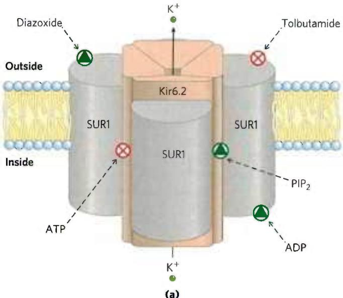

  
FIGURE 23-25 ATP-gated K $^{+}$ channels in β cells. (a) The ATP-gated channel, viewed in the plane of the membrane. The channel is formed by four identical Kir6.2 subunits, which are surrounded by four SUR1 (sulfonylurea receptor) subunits. The SUR1 subunits have binding sites for ADP and the drug diazoxide, both of which favor the open channel, and tolbutamide, a sulfonylurea drug that favors the closed channel. The Kir6.2 subunits constitute the channel, and they contain, on the cytosolic side, binding sites for ATP and phosphatidylinositol 4,5-bisphosphate (PIP $_{2}$ ), which favor the closed and the open channel, respectively. (b) The structure of the Kir6.2 portion of the channel, viewed in the plane of the membrane. For clarity, only two transmembrane domains and two cytosolic domains are shown. Three K $^{+}$ ions (green) are shown in the region of the selectivity filter. Mutation in certain amino acid residues (shown in red) leads to neonatal diabetes; mutation in others (shown in blue) leads to hyperinsulinism of infancy. This structure was obtained by mapping the known Kir6.2 sequence onto the crystal structures of a bacterial Kir channel (KirBac1.1) and the amino and carboxyl domains of another Kir protein, Kir3.1. [Data from (b) KirBac1.1: PDB ID 1P7B, A. Kuo et al., Science 300:1922, 2003; Kir3.1: PDB ID 1U4E, S. Pegan et al., Nature Neurosci. 8:279, 2005. Coordinates courtesy of Frances M. Ashcroft, Oxford University, used with permission of S. Haider and M. S. P. Sansom to re-create a model published in J. F. Antcliff et al., EMBO J. 24:229, 2005.]

Mutations in the ATP-gated K $^{+}$ channels of β cells are, fortunately, rare. Mutations in Kir6.2 that result in constantly open K $^{+}$ channels (red residues in Fig. 23-25b) lead to neonatal diabetes mellitus, with severe hyperglycemia that requires insulin therapy. Other mutations in Kir6.2 or SUR1 (blue residues in Fig. 23-25b) produce permanently closed K $^{+}$ channels and continuous release of insulin. If untreated, individuals with these mutations develop a condition in which excessive insulin causes severe hypoglycemia (low blood glucose) leading to irreversible brain damage. One effective treatment is surgical removal of part of the pancreas to reduce insulin production.

#### [EN] Glucagon Counters Low Blood Glucose

P3 Several hours after the intake of dietary carbohydrate, blood glucose levels fall slightly because of the ongoing oxidation of glucose by the brain and other tissues. Lowered blood glucose triggers the pancreas to secrete glucagon and simultaneously decrease the release of insulin (Fig. 23-26).

Glucagon causes an increase in blood glucose concentration in several ways (Table 23-4). Like epinephrine, it stimulates the net breakdown of liver glycogen by activating glycogen phosphorylase and inactivating glycogen synthase; both effects are the result of phosphorylation of the regulated enzymes, triggered by cAMP. Glucagon inhibits glucose breakdown by glycolysis in the liver and stimulates glucose synthesis by gluconeogenesis. Both effects result from lowering the concentration of fructose 2,6-bisphosphate, an allosteric inhibitor of the gluconeogenic enzyme fructose 1,6-bisphosphatase (FBPase-1) and an activator of the glycolytic enzyme phosphofructokinase-1. Recall that [fructose 2,6-bisphosphate] is ultimately controlled by a cAMP-dependent protein phosphorylation reaction (see Fig. 14-25). Glucagon also inhibits the glycolytic enzyme pyruvate kinase, by promoting its cAMP-dependent phosphorylation, thus blocking the conversion of phosphoenolpyruvate to pyruvate and preventing oxidation of pyruvate via the citric acid cycle (see Fig. 14-26). The resulting accumulation of phosphoenolpyruvate favors gluconeogenesis. This effect is augmented by glucagon's stimulation of the synthesis of the gluconeogenic enzyme PEP carboxykinase. By stimulating glycogen breakdown, preventing glycolysis and promoting gluconeogenesis in hepatocytes, glucagon enables the liver to export glucose, restoring blood glucose to its normal level.

Although its primary target is the liver, glucagon (like epinephrine) also affects adipose tissue, activating TAG

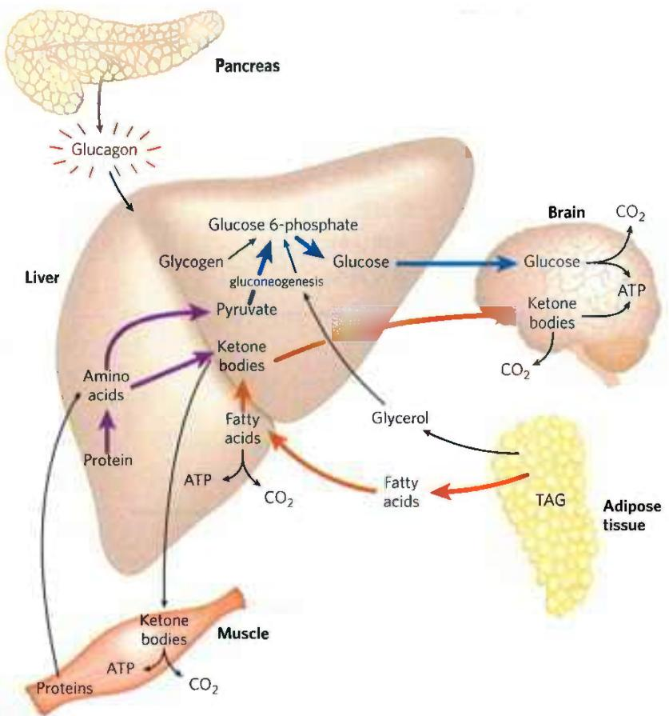

FIGURE 23-26 The fasting state: the glucogenic liver. After some hours without a meal, the liver becomes the principal source of glucose for the brain. Liver glycogen is broken down to glucose 1-phosphate, and this is converted to glucose 6-phosphate, then to free glucose, which is released into the bloodstream. Amino acids from the degradation of proteins in liver and muscle, and glycerol from the breakdown of TAGs in adipose tissue, are used for gluconeogenesis. The liver uses fatty acids as its principal fuel, and excess acetyl-CoA is converted to ketone bodies for export to other tissues; the brain is especially dependent on this fuel when glucose is in short supply (see Fig. 23-19). Blue arrows follow the path of glucose; orange arrows, the path of lipids; and purple arrows, the path of amino acids.

<table><tr><td colspan="3">TABLE 23-4 Effects of Glucagon on Blood Glucose: Production and Release of Glucose by the Liver</td></tr><tr><td>Metabolic effect</td><td>Effect on glucose metabolism</td><td>Target enzyme</td></tr><tr><td>↑ Glycogen breakdown (liver)</td><td>Glycogen → glucose</td><td>↑ Glycogen phosphorylase</td></tr><tr><td>↓ Glycogen synthesis (liver)</td><td>Less glucose stored as glycogen</td><td>↓ Glycogen synthase</td></tr><tr><td>↓ Glycolysis (liver)</td><td>Less glucose used as fuel in liver</td><td>↓ PFK-1</td></tr><tr><td>↑ Gluconeogenesis (liver)</td><td>Amino acids Glycerol Oxaloacetate</td><td>↑ FBPase-2 ↓ Pyruvate kinase ↑ PEP carboxykinase</td></tr><tr><td>↑ Fatty acid mobilization (adipose tissue)</td><td>Less glucose used as fuel by liver, muscle</td><td>↑ Hormone-sensitive lipase ↑ PKA (perilipin-P)</td></tr><tr><td>↑ Ketogenesis</td><td>Provides alternative to glucose as energy source for brain</td><td>↓ Acetyl-CoA carboxylase</td></tr></table>

breakdown by causing cAMP-dependent phosphorylation of perilipin and hormone-sensitive lipase. The activated lipase liberates free fatty acids, which are exported to the liver and other tissues as fuel, sparing glucose for the brain. The net effect of glucagon is therefore to stimulate glucose synthesis and release by the liver and to mobilize fatty acids from adipose tissue, to be used instead of glucose by tissues other than the brain. All these effects of glucagon are mediated by cAMP-dependent protein phosphorylation.

#### [EN] During Fasting and Starvation, Metabolism Shifts to Provide Fuel for the Brain

A healthy adult human has three types of fuel reserves: glycogen stored in the liver and, in smaller quantities, in muscles; large quantities of TAG in adipose tissues; and tissue proteins, which can be degraded when necessary to provide fuel (Table 23-5).

P3 Two hours after a meal, the blood glucose level is diminished slightly, and tissues receive glucose released from liver glycogen. There is little or no synthesis of TAGs. By four hours after a meal, blood glucose has fallen further, insulin secretion has slowed, and glucagon secretion has increased. These hormonal signals mobilize TAGs from adipose tissue, which now become the primary fuel for muscle and liver. Figure 23-27 shows the responses to prolonged fasting. ① To provide glucose for the brain, the liver degrades certain proteins—those most expendable in an organism not ingesting food. Their nonessential amino acids are transaminated or deaminated (Chapter 18), and ② the extra amino groups are converted to urea, which is exported via the bloodstream to the kidneys and excreted in the urine.

<table><tr><td colspan="4">TABLE 23-5 Available Metabolic Fuels in a Normal-Weight, 70 kg Man and in an Obese, 140 kg Man at the Beginning of a Fast</td></tr><tr><td>Type of fuel</td><td>Weight (kg)</td><td>Caloric equivalent (thousands of kcal (kJ))</td><td>Estimated survival (months)a</td></tr><tr><td>Normal-weight, 70 kg man</td><td></td><td></td><td></td></tr><tr><td>Triacylglycerols (adipose tissue)</td><td>15</td><td>140 (590)</td><td></td></tr><tr><td>Proteins (mainly muscle)</td><td>6</td><td>24 (100)</td><td></td></tr><tr><td>Glycogen (muscle, liver)</td><td>0.23</td><td>0.90 (3.8)</td><td></td></tr><tr><td>Circulating fuels (glucose, fatty acids, triacylglycerols, etc.)</td><td>0.023</td><td>0.10 (0.42)</td><td></td></tr><tr><td>Total</td><td></td><td>165 (690)</td><td>3</td></tr><tr><td>Obese, 140 kg man</td><td></td><td></td><td></td></tr><tr><td>Triacylglycerols (adipose tissue)</td><td>80</td><td>750 (3,100)</td><td></td></tr><tr><td>Proteins (mainly muscle)</td><td>8</td><td>32 (130)</td><td></td></tr><tr><td>Glycogen (muscle, liver)</td><td>0.23</td><td>0.92 (3.8)</td><td></td></tr><tr><td>Circulating fuels</td><td>0.025</td><td>0.11 (0.46)</td><td></td></tr><tr><td>Total</td><td></td><td>783 (3,200)</td><td>14</td></tr></table>

Also in the liver, and to some extent in the kidneys, the carbon skeletons of glucogenic amino acids are converted to pyruvate or intermediates of the citric acid cycle. ③ These intermediates (as well as the glycerol derived from TAGs in adipose tissue) provide the starting materials for gluconeogenesis in the liver, ④ yielding glucose for export to the brain. ⑤ Fatty acids released from adipose tissue are oxidized to acetyl-CoA in the liver, but as oxaloacetate is depleted by the use of citric acid cycle intermediates for gluconeogenesis, ⑥ entry of acetyl-CoA into the cycle is inhibited and acetyl-CoA accumulates. ⑦ This favors the formation of acetoacetyl-CoA and ketone bodies. After a few days of fasting, the levels of ketone bodies in the blood rise (Fig. 23-28) as they are exported from the liver to the heart, skeletal muscle, and brain, which use these fuels instead of glucose (Fig. 23-27, ⑧). When the concentration of ketone bodies in the blood exceeds the ability of the kidneys to reabsorb ketones ⑨, these compounds begin to appear in the urine.

Triacylglycerols stored in the adipose tissue of a normal-weight adult could provide enough fuel to maintain a basal rate of metabolism for about three months; a very obese adult has enough stored fuel to endure a fast of more than a year (Table 23-5). When fat reserves are gone, the degradation of essential proteins begins; this leads to loss of heart and liver function and, in prolonged starvation, to death. Stored fat can provide adequate energy (calories) during a fast or a rigid diet, but vitamins and minerals must be provided, and sufficient dietary glucogenic amino acids are needed to replace those being used for gluconeogenesis. Rations for those on a weight-reduction diet are commonly fortified with vitamins, minerals, and amino acids or proteins.

#### [EN] Epinephrine Signals Impending Activity

When an animal is confronted with a stressful situation that requires increased activity—fighting or fleeing, in the extreme case—neuronal signals from the brain trigger the release of epinephrine and norepinephrine from the adrenal medulla. Both hormones dilate the respiratory passages to facilitate the uptake of $O_{2}$ , increase the rate and strength of the heartbeat, and raise the blood pressure, thereby promoting the flow of $O_{2}$ and fuels to the tissues (Table 23-6). This is the “fight-or-flight” response.

Epinephrine acts primarily on muscle, adipose, and liver tissues. It activates glycogen phosphorylase and inactivates glycogen synthase by cAMP-dependent phosphorylation of the enzymes, thus stimulating the

<!-- END OFFICIAL API PART part_009 -->

<!-- BEGIN OFFICIAL API PART part_010 -->

  
FIGURE 23-27 Fuel metabolism in the liver during prolonged fasting or in uncontrolled diabetes mellitus. The numbered steps are described in the text. After depletion of stored carbohydrates (glycogen), gluconeogenesis in the liver becomes the main source of glucose for the brain (blue arrows). $\mathrm{NH}_3$ from amino acid deamination is converted into urea and excreted (green arrows). Glucogenic amino acids from protein breakdown  
(purple arrows) provide substrates for gluconeogenesis, and glucose is exported to the brain. Fatty acids from adipose tissue are imported into the liver and oxidized to acetyl-CoA (orange arrows), and acetyl-CoA is the starting material for ketone body formation in the liver and for export to the brain to serve as an energy source (red arrows). Excess ketone bodies are excreted in the urine.

conversion of liver glycogen to blood glucose, the fuel for anaerobic muscular work. Epinephrine also promotes the anaerobic breakdown of muscle glycogen by lactic acid fermentation, stimulating glycolytic ATP formation. The stimulation of glycolysis is accomplished by raising the concentration of fructose 2,6-bisphosphate, a potent allosteric activator of the key glycolytic enzyme phosphofructokinase-1. Epinephrine also stimulates fat mobilization in adipose tissue, by activating hormone-sensitive lipase and moving aside perilipin (see Fig. 17-2). Finally, epinephrine stimulates glucagon secretion and inhibits insulin secretion, reinforcing its effect of mobilizing fuels and inhibiting fuel storage.

#### [EN] Cortisol Signals Stress, Including Low Blood Glucose

A variety of stressors (anxiety, fear, pain, hemorrhage, infection, low blood glucose, starvation) stimulate release of the glucocorticoid cortisol from the adrenal cortex (see Fig. 23-6). P3 Cortisol acts on muscle, liver, and adipose tissue to supply the organism with fuel to withstand the stress. Cortisol is a relatively slow-acting hormone that alters metabolism by changing the kinds and amounts of certain enzymes synthesized in its target cells, rather than by regulating the activity of existing enzyme molecules.

  
FIGURE 23-28 Plasma concentrations of fatty acids, glucose, and ketone bodies during six weeks of starvation. Despite the hormonal mechanisms for maintaining the glucose level in blood, glucose begins to diminish within 2 days of beginning a fast. The levels of ketone bodies, almost unmeasurable before the fast, rise dramatically after 2 to 4 days of fasting, with $\beta$ -hydroxybutyrate as the major contributor. These water-soluble ketones, acetoacetate and $\beta$ -hydroxybutyrate, supplement glucose as an energy source for the brain during a long fast. Acetone, a minor ketone body, is not metabolized but is eliminated in the breath. A much smaller rise in blood fatty acids also occurs, but this does not contribute to energy metabolism in the brain, as fatty acids do not cross the blood-brain barrier. [Data from G. F. Cahill, Jr., Annu. Rev. Nutr. 26:1, 2006, Fig. 2]

In adipose tissue, cortisol leads to an increased release of fatty acids from stored TAGs. The exported fatty acids serve as fuel for other tissues, and the glycerol is used for gluconeogenesis in the liver. Cortisol stimulates the breakdown of nonessential muscle proteins and the export of amino acids to the liver, where they serve as precursors for gluconeogenesis. In the liver, cortisol promotes gluconeogenesis by stimulating synthesis of PEP carboxykinase; glucagon has the same effect, whereas insulin has the opposite effect. Glucose produced in this way is stored in the liver as glycogen or exported immediately to tissues that need glucose for fuel. The net effect of these metabolic changes is to restore blood glucose to its normal level and to increase glycogen stores, ready to support the fight-or-flight response commonly associated with stress. The effects of cortisol therefore counterbalance those of insulin. During extended periods of stress, the continued release of cortisol loses its positive adaptive value and begins to cause damage to muscle and bone and to impair endocrine and immune function.

Cushing disease is a medical condition in which a tumor on the pituitary gland causes the adrenal glands to overproduce cortisol. It is treated by surgery to remove the tumor, followed by chemotherapy to kill remaining tumor cells. Addison disease results from underproduction of cortisol, and is treated by administering hydrocortisone (the pharmaceutical name for cortisol).

#### [EN] SUMMARY 23.3 Hormonal Regulation of Fuel Metabolism

■ Fluctuations in blood glucose (normally 70 to 100 mg/100 mL, or about 4.5 mm) due to dietary intake or vigorous exercise are counterbalanced by a variety of hormonally triggered changes in metabolism in several organs.

■ High blood glucose elicits the release of insulin, which speeds the uptake of glucose by tissues and favors the storage of fuels as glycogen and triacylglycerols while inhibiting fatty acid mobilization in adipose tissue.

■ Low blood glucose triggers release of glucagon, which stimulates glucose release from liver glycogen and shifts fuel metabolism in liver and muscle to fatty acid oxidation, sparing glucose for use by the brain. In prolonged fasting, TAGs become the principal fuel; the liver converts the fatty acids to ketone bodies for export to other tissues, including the brain.

<table><tr><td colspan="2">TABLE 23-6 Physiological and Metabolic Effects of Epinephrine: Preparation for Action</td></tr><tr><td>Immediate effect</td><td>Overall effect</td></tr><tr><td>Physiological↑ Heart rate↑ Blood pressure↑ Dilation of respiratory passages</td><td>Increase delivery of  $O_{2}$  to tissues (muscle)</td></tr><tr><td>Metabolic↑ Glycogen breakdown (muscle, liver)↓ Glycogen synthesis (muscle, liver)↑ Gluconeogenesis (liver)</td><td>Increase production of glucose for fuel</td></tr><tr><td>↑ Glycolysis (muscle)</td><td>Increases ATP production in muscle</td></tr><tr><td>↑ Fatty acid mobilization (adipose tissue)</td><td>Increases availability of fatty acids as fuel</td></tr><tr><td>↑ Glucagon secretion↓ Insulin secretion</td><td>Reinforce metabolic effects of epinephrine</td></tr></table>

■ Epinephrine prepares the body for increased activity by mobilizing glucose from glycogen and other precursors, releasing the glucose into the blood.

Cortisol, released in response to a variety of stressors (including low blood glucose), stimulates gluconeogenesis from amino acids and glycerol in the liver, thus raising blood glucose and counterbalancing the effects of insulin.

<!-- EN-END 23.3 -->

## 五、代谢紊乱造成疾病

新陈代谢,包括物质代谢、能量代谢和信息代谢,都必须按规律有条不紊的进行,任何代谢物的缺失,任何代谢途径的酶发生缺陷,或是代谢途径之间的不协调都会造成代谢紊乱,导致疾病。这里仅举例说明物质代谢和能量代谢紊乱造成的疾病。有关信息代谢放在基因表达章节中介绍。

## （一）糖尿病与胰岛素

糖尿病(diabetes)是一种较常见的糖代谢紊乱疾病,其主要特征是高血糖。在临床上主要可分为两类:类型1是胰岛素依赖型糖尿病(insulin-dependent diabetes mellitus, IDDM);类型2是非胰岛素依赖型糖尿病(non-insulin-dependent diabetes mellitus, NIDDM)。无论是类型1或类型2都有明显的遗传因素影响,

1/4\~1/2 患者存在糖尿病家族史。但也有环境因素的影响。类型 1 型患者往往存在免疫系统异常，如曾经感染过柯萨奇病毒、风疹病毒和腮腺病毒，从而导致自身免疫反应，破坏产生胰岛素的 β 细胞。类型 2 患者常因进食过多、体力活动太少导致肥胖，遗传易感性个体易患此疾病。从患病机制上来看，类型 1 糖尿病是由于胰岛素产生和分泌不足；类型 2 糖尿病是由于胰岛素作用受阻，因而类型 2 又称为胰岛素抵抗糖尿病（insulin-resistant diabetes）。

类型 1 糖尿病多见于年轻人,在糖尿病患者中所占比例较少,检测血液除血糖高这一特征指标外还往往伴有胰岛素或 C 肽水平低,口服降糖药效果不好,需用胰岛素治疗。该病起因大多为自身免疫破坏胰岛 β 细胞所致,故而胰岛细胞抗体(ICA)、胰岛素自身抗体(IAA)和谷氨酸脱羧酶抗体(GAD)是诊断类型 1 糖尿病免疫异常的三项特征指标。自身免疫病较难治愈,类型 1 糖尿病往往需要终身治疗和护理。

类型 2 糖尿病人多见于老年人, 比例较高, 发病缓慢早期易于忽视。该病常伴有肥胖、高血脂、高血压、动脉粥样硬化等症状。其起因有多种: 胰岛素突变失效、受体突变失效或是胰岛素信号途径某环节失效, 现已发现多种有关基因突变, 如胰岛素基因、胰岛素受体基因、葡糖激酶基因等。糖代谢紊乱的病因很复杂, 有时可能并非胰岛素的原因, 例如胰高血糖素分泌过量, 或其他因素也能造成高血糖。因此, 糖尿病的治疗不能单纯依赖胰岛素, 还要从多方面考虑。

糖尿病患者,无论是类型1或是类型2,不能有效利用血液中的葡萄糖,因此造成血糖升高。任何时间血糖超过11.1 mmol/L,空腹血糖超过7.0 mmol/L,餐后2小时血糖超过11.1 mmol/L即可以判断为糖尿糖。当血液中葡萄糖浓度超过肾糖阈(8.9\~10.0 mmol/L),葡萄糖就会从尿中排出。糖尿病患者必须严格控制饮食,限制糖类的摄入,再配合药物治疗。

血液中葡萄糖不能被很好利用，脂肪酸就成为主要能源物质，从而使糖尿病患者在肝中脂肪酸过量但不能完全氧化。由于 $\beta$ 氧化产生高[NADH]/[NAD+]比，从而抑制了柠檬酸循环，乙酰-CoA不能完全经柠檬酸循环彻底氧化，由此造成乙酰-CoA积累，并形成酮体（ $\beta-$ 羟丁酸、乙酰乙酸和丙酮）。丙酮具有挥发性，使某些糖尿病患者吐出气体带有类似醉酒的气味。血液中带有过量酮体称为酮血症(ketonemia)，酮体出现在尿中称酮尿症(ketonuria)。酮体具有酸性，过量时会造成酮症酸中毒，必须及时采取措施予以缓解和治疗。

## （二）肥胖病与脂代谢紊乱

当前,超重和肥胖(obesity)在我国及至全球都是一个挑战健康的严重问题。摄入超过所需热量的食物,多余部分就会以脂肪形式贮存在体内;主要贮存在脂肪组织内。常常用体重指数(bady mass index, BMI)来衡量人体重量是否正常,BMI为体重(kg)/身高平方( $m^{2}$ )。正常人群BMI应为18.5\~25 kg/ $m^{2}$ , BMI在25\~30 kg/ $m^{2}$ 为超重,30 kg/ $m^{2}$ 以上即为肥胖。肥胖往往会带来许多疾病,例如类型2糖尿病、心血管疾病、中风以及某些癌症。

脂肪组织分布在皮下、腹腔、内脏周围、颈和肩胛等部位。脂肪组织不仅是分解、合成和贮存脂肪的组织，而且还具有重要的内分泌功能。进食行为和脂类代谢都受到激素和中枢神经系的调节。20世纪90年代初最早发现瘦素（leptin），其后进一步发现脂肪组织能产生肽类激素，如脂肪细胞因子（adipocytokine）亦即脂肪素（adipokine）等。脂肪素可通过自分泌、旁分泌或内分泌，将脂肪组织贮存足够数量脂肪（TAG）的信息传递给有关组织，以抑制食欲、增加耗能、减少贮存。瘦素是其中一种，由167个氨基酸组成，可作用于下丘脑以减少食欲。破坏小鼠瘦素基因，小鼠即变得进食无节制，躯体肥胖；注射瘦素，小鼠食欲下降；躯体消瘦。瘦素受体主要在下丘脑调节进食行为的区域中表达，瘦素带来脂肪充足的信息，于是脑部释放厌食神经肽，并通过迷走神经系统增加血压和心率，促进棕色脂肪组线粒体解偶联产热。

## （三）长期禁食和饥饿造成的代谢紊乱

健康成年人体内可以动用的能源贮备物有三类:首要的能源贮备物是三酰甘油(TAG),主要贮存在脂肪组织,约占体重的20%以上;其次是蛋白质,贮存在肌肉,约占体重6%\~9%;然后是糖原,贮存在肌肉和肝,约占体重的0.16%\~0.33%。正在进行的葡萄糖、脂肪酸和三酰甘油只占体重的0.03%以下。在这些能源物质(或称为燃料)中最易利用的是葡萄糖,因此饥饿时最先动用的能源贮备物是肌糖原和肝糖原,然后才是脂肪组织的三酰甘油和肌肉的蛋白质。

进食后食物在小肠被消化、吸收，血糖随之升高。2小时后血糖浓度下降，于是肝动员肝糖原，释放葡萄糖。同时，三酰甘油的合成受抑制。进食后4小时血糖进一步减少，胰岛素分泌减慢，胰高血糖素分泌增加，这些激素信号从脂肪组织中动员贮存的脂肪，开始成为肌肉和肝的主要能源。脂肪组织输送脂肪酸和甘油到肝，分别进行β氧化和糖异生。由于糖异生消耗草酰乙酸，降低了柠檬酸循环的重要成分，因而阻止了乙酰-CoA进入柠檬酸循环，使得乙酰-CoA被大量积累，并转变为酮体。酮体在肾被排出体外。为了向脑组提供葡萄糖，肝降解某些蛋白质，生糖氨基酸经脱氨或转氨，碳骨架转变为葡萄糖，氨则合成尿素，由肾排出体外。肌肉组织降解非关键的蛋白质，然后输送到肝，生糖或生酮。利用蛋白质作为能源，对机体来说显然代价过高，非必要不会如此。再者，血糖不足时脑组织也可以利用短链脂肪酸和β-羟丁酸，这对于维持脑的能源供应十分重要。

进食行为和对能源物质的消耗与贮存都受到神经和激素的调节。下丘脑有两个与进食行为有关的区域，一个是饱中枢（satiety center），位于腹内侧核（ventromedial nucleus）；另一个饿中枢（hunger center），位于外侧区（lateral area）。这两个中枢的神经信号分别作用于下丘脑拱状核（arcuate nucleus）的两类神经元，以控制摄食和代谢。一类称为开胃（促进食欲）神经元（orexigenic neurons），可产生和释放神经肽Y(NPY)，NPY一方面将信号传给脑，另一方面通过血液传给消化器管，从而促进摄食。另一类为厌食神经元（unorexigenic neurons），可产生 $\alpha-$ 促黑素（ $\alpha-\mathrm{MSH}$ ），其作用导致拒绝进食，瘦素还可以在下丘脑通过信号转导途径促进 $\alpha-$ 促黑素的产生。

从进化的观点来看,瘦素的作用未必完全是为了减肥,虽然当今我们有可能利用瘦素来减肥。瘦素的实际功能很可能是一种对饥饿的调节反应。动物在自然界经常会挨饿,在饥饿时需要对其活动和代谢加以调整。营养不足可使瘦素水平下降,导致一系列节能反应。在下丘脑,瘦素水平的下降可减少甲状腺激素的产生(基础代谢变慢),减少性激素的产生(阻止繁殖),并且增加糖皮质激素的产生(动员体内产能贮备物)。通过减少能量消耗和充分利用内源性能量贮备,使动物渡过营养不足的艰难时期。从另一方面来看,肥胖对动物十分有害,在进化过程中产生防止过度肥胖的瘦素也是十分必要的。因此,防止肥胖和饥饿时节能应是瘦素的两个彼此相关的功能。

<!-- EN-BEGIN 23.4 -->

### 【英文对应 23.4】Obesity and the Regulation of Body Mass

> 来源：Lehninger Principles of Biochemistry（书籍/02_生物化学原理） 第23章 Hormonal Regulation and Integration of Mammalian Metabolism，§23.4。对应本章“五、代谢紊乱造成疾病”。

In the U.S. population, more than 40% of adults are obese, including more than 10% who are severely obese, as defined in terms of body mass index (BMI), calculated as (weight in kg)/(height in m) $^{2}$ . A BMI below 25 is considered normal; an individual with a BMI of 25 to 30 is overweight; a BMI greater than 30 indicates obesity; a BMI greater than 40 indicates severe obesity. Obesity is life-threatening. It significantly increases the likelihood of developing type 2 diabetes, as well as heart attack, stroke, and cancers of the colon, breast, prostate, and endometrium. Consequently, there is great interest in understanding how body mass and the storage of fats in adipose tissue are regulated.

To a first approximation, obesity is the result of taking in more calories in the diet than are expended by the body's fuel-consuming activities. The body can deal with an excess of dietary calories in three ways: (1) convert excess fuel to fat and store it in adipose tissue, (2) burn excess fuel by extra exercise, and (3) "waste" fuel by diverting it to heat production (thermogenesis) by uncoupled mitochondria. P4 In mammals, a complex set of hormonal and neuronal signals acts to keep fuel intake and energy expenditure in balance so as to hold the amount of adipose tissue at a suitable level. Dealing effectively with obesity requires understanding how the various checks and balances work under normal conditions and how these homeostatic mechanisms can fail.

#### [EN] Adipose Tissue Has Important Endocrine Functions

One early hypothesis to explain body-mass homeostasis, the “adiposity negative-feedback” model, postulated a mechanism that inhibits eating behavior and increases energy expenditure whenever body weight exceeds a certain value, called the set point; the inhibition is relieved when body weight drops below the set point (Fig. 23-29). This model predicts that a feedback signal originating in adipose tissue influences the brain centers that control eating behavior and metabolic and motor activity. The first such signal to be discovered was leptin, in 1994. Subsequent research revealed that P4 adipose tissue is an important endocrine organ that produces peptide hormones, known as adipokines. Adipokines may act locally (autocrine and paracrine action) or systemically (endocrine action), carrying information about the adequacy of the energy reserves (TAGs) stored in adipose tissue to other tissues and to the brain. Normally, adipokines produce changes in fuel metabolism and feeding behavior that reestablish adequate fuel reserves and maintain body mass. When adipokines are over- or underproduced, the resulting dysregulation may result in life-threatening disease.

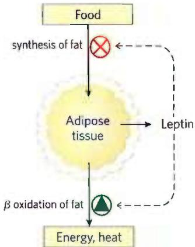  
FIGURE 23-29 Set-point model for maintaining constant mass. When the mass of adipose tissue increases (dashed outline), released leptin inhibits feeding and fat synthesis and stimulates oxidation of fatty acids. When the mass of adipose tissue decreases (solid outline), lowered leptin production favors greater food intake and less fatty acid oxidation.

Leptin (Greek leptos, "thin") is an adipokine (167 amino acid residues) that, on reaching the brain, acts on receptors in the hypothalamus to curtail appetite. Leptin was first identified as the product of a gene designated OB (obese) in laboratory mice. Mice with two defective copies of this gene (ob/ob genotype; lowercase letters signify a mutant form of the gene) show the behavior and physiology of animals in a constant state of starvation: their plasma cortisol levels are elevated; they exhibit unrestrained appetite, are unable to stay warm, grow abnormally large, and do not reproduce. As a consequence of unrestrained appetite, they become severely obese, weighing as much as three times more than normal mice (Fig. 23-30). They also have metabolic disturbances similar to those seen in diabetes, and they are insulin-resistant. When leptin is injected into ob/ob mice, they eat less, lose weight, and increase their locomotor activity and thermogenesis.

A second mouse gene, designated DB (diabetic), also has a role in appetite regulation. Mice with two defective copies (db/db) are obese and diabetic. The DB gene encodes the leptin receptor. When the receptor is defective, the signaling function of leptin is lost.

The leptin receptor is expressed primarily in regions of the brain known to regulate feeding behavior—neurons of the arcuate nucleus of the hypothalamus (Fig. 23-31a). Leptin carries the message that fat reserves are sufficient, and it promotes reduction of fuel intake and increase in expenditure of energy. Leptin-receptor interaction in the hypothalamus alters the release of neuronal signals to the region of the brain that affects appetite. Leptin also stimulates the sympathetic nervous system, increasing blood pressure, heart rate, and thermogenesis by uncoupling the mitochondria of brown adipocytes (Fig. 23-31b). Recall that the uncoupling protein UCP1 forms a channel in the inner mitochondrial membrane that allows protons to reenter the mitochondrial matrix without passing through the ATP synthase complex. This permits constant oxidation of fuel (fatty acids in a brown or beige adipocyte) without ATP synthesis, dissipating energy as heat and consuming dietary calories or stored fats in potentially large amounts.

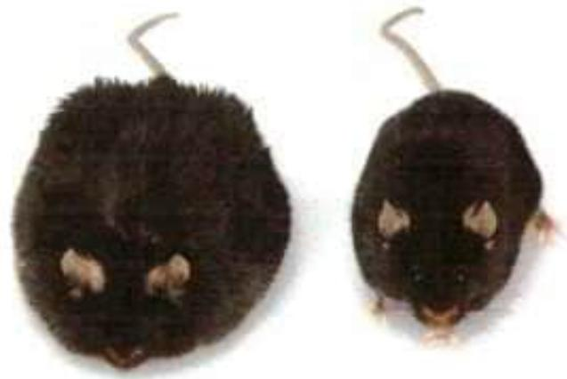  
FIGURE 23-30 Obesity caused by defective leptin production. Both of these mice, which are the same age, have defects in the OB gene. The mouse on the right was injected daily with purified leptin and weighs 35 g. The mouse on the left got no leptin and consequently ate more food and was less active; it weighs 67 g. (The Rockefeller University/AP Photo.)

#### [EN] Leptin Stimulates Production of Anorexigenic Peptide Hormones

Two types of neurons in the arcuate nucleus control fuel intake and metabolism (Fig. 23-32). The orexigenic (appetite-stimulating) neurons stimulate eating by producing and releasing neuropeptide Y (NPY), which causes the next neuron in the circuit to send the signal to the brain: Eat! The blood level of NPY rises during starvation and is elevated in mice with either two defective copies of the leptin gene (ob/ob) or two defective copies of the leptin receptor gene (db/db). The high NPY concentration presumably contributes to the obesity of these mice, which eat voraciously.

The anorexigenic (appetite-suppressing) neurons in the arcuate nucleus produce $\alpha$ -melanocyte-stimulating hormone ( $\alpha$ -MSH; also known as melanocortin), formed from its polypeptide precursor pro-opiomelanocortin (POMC; Fig. 23-5). Release of $\alpha$ -MSH causes the next neuron in the circuit to send the signal to the brain: Stop eating!

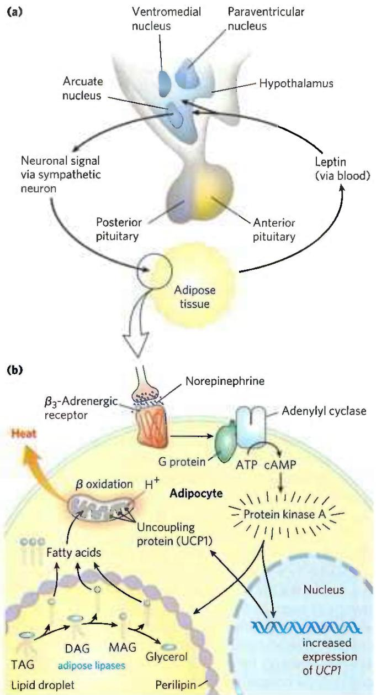  
FIGURE 23-31 Hypothalamic regulation of food intake and energy expenditure. (a) Role of the hypothalamus in its interaction with adipose tissue. The hypothalamus receives input (leptin) from adipose tissue and responds with neuronal signals to adipocytes. (b) This signal (norepinephrine) activates protein kinase A, which triggers mobilization of fatty acids from TAG and their uncoupled oxidation in mitochondria, generating heat but not ATP. DAG, diacylglycerol; MAG, monoacylglycerol.

The amount of leptin released by adipose tissue depends on both the number and the size of adipocytes. When weight loss decreases the mass of lipid tissue, leptin levels in the blood decrease, the production of NPY increases, and the processes in adipose tissue shown in Figure 23-31 are reversed. Uncoupling is diminished, slowing thermogenesis and saving fuel, and fat mobilization slows in response to reduced signaling by cAMP. Consumption of more food, combined with more efficient utilization of fuel, results in replenishment of the fat reserve in adipose tissue, bringing the system back into balance.

  
FIGURE 23-32 Hormones that control eating. In the arcuate nucleus of the hypothalamus, two sets of neurosecretory cells receive hormonal input and relay neuronal signals to the cells of muscle, adipose tissue, and liver. Leptin and insulin are released from adipose tissue and the pancreas, respectively, in proportion to the mass of body fat. The two hormones act on anorexigenic neurosecretory cells to trigger release of $\alpha$ -MSH (melanocyte-stimulating hormone); $\alpha$ -MSH carries the signal to second-order neurons in the hypothalamus, which puts out the signals to eat less and metabolize more fuel. Leptin and insulin also act on orexigenic neurosecretory cells to inhibit the release of NPY, reducing the "eat more" signal sent to the tissues. As described later in the text, the gastric hormone ghrelin stimulates appetite by activating the NPY-expressing cells; PYY $_{3-36}$ , released from the colon, inhibits these neurons and decreases appetite. Each of the two types of neurosecretory cells inhibits hormone production by the other, so any stimulus that activates orexigenic cells inactivates anorexigenic cells, and vice versa. This strengthens the effect of stimulatory inputs.

#### [EN] Leptin Triggers a Signaling Cascade That Regulates Gene Expression

The leptin signal is transduced by a mechanism also used by receptors for some growth factors. The leptin receptor has a single transmembrane segment. When leptin binds to the extracellular domains of two monomers, they dimerize and undergo phosphorylation on several Tyr residues. This initiates a chain of events that ends in the nucleus with the increased synthesis of target genes including the gene for POMC, from which $\alpha$ -MSH is produced.

The increased catabolism and thermogenesis triggered by leptin are due in part to increased synthesis of the mitochondria in brown and beige adipocytes. Leptin stimulates UCP1 synthesis by altering synaptic transmissions from neurons of the arcuate nucleus to adipose and other tissues via the sympathetic nervous system. The consequent increased release of norepinephrine in these tissues acts through $\beta_{3}$ -adrenergic receptors to stimulate transcription of the UCP1 gene. The resulting uncoupling of electron transfer from oxidative phosphorylation consumes fat and is thermogenic (Fig. 23-31).

Might human obesity be the result of insufficient leptin production and therefore be treatable by the injection of leptin? Blood levels of leptin are, in fact, usually much higher in obese animals (including humans) than in animals of normal body mass (except, of course, in ob/ob mutants, which cannot make leptin). Some downstream element in the leptin response system must be defective in obese individuals, and the elevation in leptin is the result of an (unsuccessful) attempt to overcome the leptin resistance. In those very rare humans with extreme obesity who have a defective leptin gene (OB), leptin injection does result in dramatic weight loss. In the vast majority of obese individuals, however, the OB gene is intact. In clinical trials, the injection of leptin did not have the weight-reducing effect observed in obese ob/ob mice. Clearly, most cases of human obesity involve one or more factors in addition to leptin.

#### [EN] Adiponectin Acts through AMPK to Increase Insulin Sensitivity

Adiponectin is a peptide hormone produced almost exclusively in adipose tissue, an adipokine that sensitizes other organs to the effects of insulin. Adiponectin circulates in the blood and powerfully affects the metabolism of fatty acids and carbohydrates in liver and muscle. It increases the uptake of fatty acids from the blood by myocytes and the rate at which fatty acids undergo $\beta$ oxidation in muscle. It also blocks fatty acid synthesis and gluconeogenesis in hepatocytes, and stimulates glucose uptake and catabolism in muscle and liver.

These effects of adiponectin are indirect and not fully understood, but the AMP-activated protein kinase (AMPK) mediates many of them. Acting through its GPCR, adiponectin triggers phosphorylation and activation of AMPK. Recall that AMPK is activated by factors that signal the need to shift metabolism toward energy generation and away from energy-requiring biosynthesis (Fig. 23-33; see also p. 503). When activated, AMPK profoundly affects the metabolism of individual cells and, through its actions in the brain, the metabolism of the whole animal.

#### [EN] AMPK Coordinates Catabolism and Anabolism in Response to Metabolic Stress

AMPK has emerged as a central player in the coordination of metabolic pathways, organism activity, and feeding behavior (Fig. 23-34). This heterotrimeric, AMP-activated protein kinase monitors the energy and nutrient status in individual cells and shifts metabolism toward energy generation when necessary to maintain metabolic homeostasis. Furthermore, by responding to a variety of hormone signals, AMPK in the hypothalamus acts to keep the whole organism in energetic balance (Fig. 23-8).

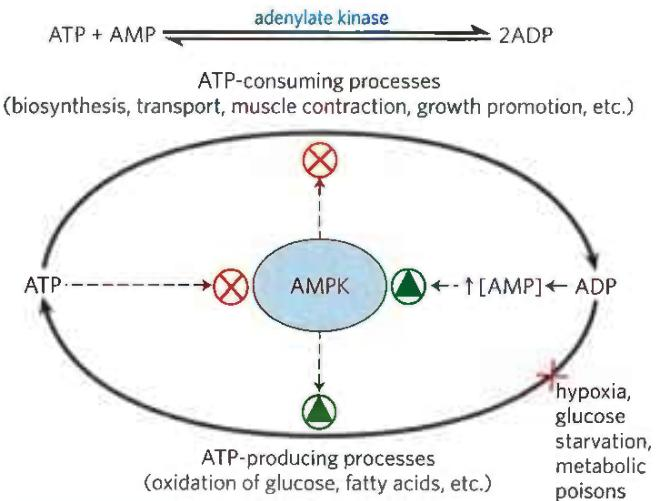  
FIGURE 23-33 The role of AMP-activated protein kinase (AMPK) in maintaining energy homeostasis. ADP produced by synthetic reactions is converted to ATP and AMP by adenylate kinase. AMP activates AMPK, which reciprocally regulates ATP-consuming and ATP-generating pathways by phosphorylating key enzymes (see Fig. 23-34). Conditions or agents that inhibit ATP production by catabolic reactions (such as hypoxia, lack of glucose, or metabolic poisons) raise [AMP], activate AMPK, and stimulate catabolism. Cellular or organismal activities that consume ATP (muscle contraction, growth) increase [AMP] and stimulate catabolic reactions to replenish ATP. When [ATP] is high, ATP prevents AMP binding to AMPK, thus lowering AMPK activity and slowing catabolism.

AMPK monitors the energy status of a cell through its response to increased [AMP]/[ATP]. Many of the energy-consuming reactions in cells convert ATP to ADP or AMP. Adenylate kinase catalyzes the reaction 2ADP → AMP + ATP, so [AMP] is a sensitive measure of the cell's energy status. AMPK is allosterically activated by AMP binding, and ATP prevents AMP binding, so the enzyme is activated when the cell is energetically depleted (high [AMP]) and inactivated when energy is plentiful (high [ATP], and high [ATP]/[AMP]). AMPK responds to the energetic needs of the whole organism through a second mode of regulation. The enzyme is activated 100-fold by phosphorylation of Thr $^{172}$ by liver kinase B1 (LKB1), which is itself subject to regulation by upstream components, including adiponectin. When activated by phosphorylation and AMP binding, AMPK phosphorylates specific enzymes in metabolic pathways that are crucial to energy homeostasis (Fig. 23-34).

FIGURE 23-34 Formation of adiponectin and its actions through AMPK. Extended fasting or starvation decreases triacylglycerol reserves in adipose tissue, which triggers adiponectin production and release from adipocytes. Adiponectin acts through its plasma membrane receptors in various cell types and organs to inhibit energy-consuming processes and stimulate energy-producing processes. It acts in the brain to stimulate feeding behavior and inhibit energy-consuming physical activity, and in brown fat to inhibit thermogenesis. Adiponectin exerts some of its metabolic effects by activating AMPK, which regulates (by phosphorylation) specific enzymes in key metabolic processes. PFK-2, phosphofructokinase-2; GLUT1 and GLUT4, glucose transporters; FAS I, fatty acid synthase I; ACC, acetyl-CoA carboxylase; HSL, hormone-sensitive lipase; HMGR, HMG-CoA reductase; GPAT, an acyl transferase; G5, glycogen synthase; eEF2, eukaryotic elongation factor 2 (required for protein synthesis; see Chapter 27); and mTORC1, mammalian target of rapamycin complex 1 (a protein kinase complex that regulates protein synthesis on the basis of nutrient availability). Exercise, through conversion of ATP to ADP and AMP, also stimulates AMPK.

When AMPK senses depletion of ATP in an individual cell, lipid synthesis is inhibited and use of lipid as fuel is stimulated. One enzyme regulated by AMPK in the liver and in white adipose tissue is acetyl-CoA carboxylase, which produces malonyl-CoA, the first intermediate committed to fatty acid synthesis. Malonyl-CoA is a powerful inhibitor of the enzyme carnitine acyltransferase 1, which starts the process of $\beta$ oxidation by transporting fatty acids into the mitochondrion (see Fig. 17-6). By phosphorylating and inactivating acetyl-CoA carboxylase, AMPK inhibits fatty acid synthesis while relieving inhibition (by malonyl-CoA) of $\beta$ oxidation (see Fig. 17-13). Cholesterol synthesis, a heavy energy consumer, is also inhibited by AMPK, which phosphorylates and inactivates HMG-CoA reductase, an enzyme central to sterol synthesis (see Fig. 21-34). Similarly, AMPK inhibits fatty acid synthase and acyl transferase, effectively blocking the synthesis of TAGs. In addition to its effects on lipid metabolism, AMPK inhibits the synthesis of glycogen and of protein (see Fig. 23-35). Inadequate supplies of oxygen (hypoxia) or blood glucose (hypoglycemia) are among the stressors that trigger AMPK activation.

In the hypothalamus, AMPK is positioned to receive a variety of signals from throughout the body (Fig. 23-8). Ghrelin and adiponectin signal “empty stomach” and “fat tissue depleted,” and, like low blood glucose, they elicit hypothalamic signals, mediated by AMPK, that stimulate feeding and inhibit energy-requiring biosynthetic processes. Leptin, as we have seen, brings to the brain the signal “adipose tissue is full,” slowing catabolic processes and favoring growth and biosynthesis.

At the cytoplasmic surface of lysosomes, AMPK interacts with a second central regulator of cellular activity, the protein kinase mTOR. This enzyme, at the center of an enormous complex, mTORC1, gauges whether sufficient nutrients and low molecular weight substrates are available to support cell growth and proliferation. Together, the two protein kinases, AMPK and mTOR, control major aspects of a cell's activity and fate.

#### [EN] The mTORC1 Pathway Coordinates Cell Growth with the Supply of Nutrients and Energy

The highly conserved Ser/Thr kinase mTOR forms a complex, mTORC1, with a scaffold protein, raptor, and other regulatory proteins. mTORC1 is recruited to the cytosolic surface of the lysosome through raptor by another complex, Ragulator, and a number of associated Rag G proteins that sense amino acid sufficiency in the cell. The Ragulator-Rag complex is tethered to the lysosomal membrane by covalently linked lipids. When mTORC1 is docked to the Ragulator-Rag complex, it is in contact with another G protein, Rheb (Fig. 23-35). This massive complex integrates signals from inside and outside of the lysosome about the energy status of the cell, the availability of critical amino acids needed for protein synthesis, and the presence of growth factors. When these signals indicate that the cell has what it needs to grow, GTP-bound Rheb activates the protein kinase activity of mTOR, which then phosphorylates many different proteins required for transcription, increased ribosome synthesis, and expression of genes encoding the enzymes of lipid synthesis and mitochondrial proliferation (Fig. 23-36). Because the lysosome is where the cell recycles defective or unneeded components, or extracellular substances brought into the cell through phagocytosis, it is, in effect, the warehouse of parts for cellular construction. The mTORC1-Ragulator-Rag complex is the supply chain manager determining whether the assembly line can operate.

  
FIGURE 23-35 The mTORC1-Ragulator-Rag complex on the lysosomal surface. This model integrates the structures of mTORC1 and Ragulator-Rag, separately determined by cryo-EM. Raptor acts as a scaffold protein organizing the assembly, which puts the mTOR protein kinase in contact with the G protein Rheb for activation. [Information from J. H. Park et al., Trends Biochem. Sci. 45:367, 2019, Fig. 1; K. B. Rogala et al., Science 366:468, 2019, Fig. 5A.]

Fasting results in inactivation of mTORC1 by AMPK, leading to increased breakdown of protein and glycogen in the liver and muscle and mobilization of TAGs in adipose tissue. Chronic activation of mTORC1 by overeating results in excess deposition of TAGs in adipose tissue, as well as in liver and muscle, which may contribute to insulin insensitivity and type 2 diabetes. Mutations that produce constantly activated mTORC1 are commonly associated with human cancers.

#### [EN] Diet Regulates the Expression of Genes Central to Maintaining Body Mass

Proteins in a family of ligand-activated transcription factors known as peroxisome proliferator-activated receptors (PPARs) respond to changes in dietary lipid by altering the expression of genes involved in fat and carbohydrate metabolism. (These transcription factors were first recognized for their roles in peroxisome synthesis—thus their names.) Their normal ligands are fatty acids or fatty acid derivatives. PPARγ, PPARα, and PPARδ act in the nucleus by forming heterodimers with another nuclear receptor, RXR, then binding to regulatory regions of DNA near the genes under their control and changing the rate of transcription of those genes (Fig. 23-37).

PPARγ turns on genes that act in the differentiation of fibroblasts into adipocytes and genes that encode proteins required for lipid synthesis and storage in adipocytes (Fig. 23-38). PPARγ is activated by the thiazolidinedione drugs that are used to treat type 2 diabetes (discussed below).

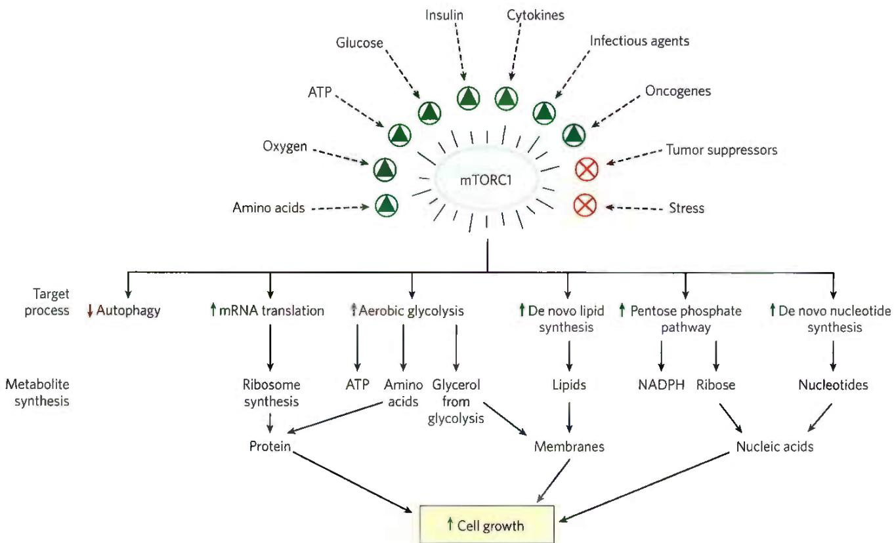  
FIGURE 23-36 A summary of mTORC1 activation signals and the cellular processes that active mTORC1 stimulates. The Ser/Thr protein kinase of mTORC1 is activated by the G protein Rheb, reflecting the integration of many signals that indicate that the cell is

  
FIGURE 23-37 Mode of action of PPARs. PPARs are transcription factors that, when bound to their cognate ligand, form heterodimers with the nuclear receptor RXR. The dimer binds specific regions of DNA known as response elements, stimulating transcription of genes in those regions. [Information from R. M. Evans et al., Nat. Med. 10:355, 2004, Fig. 3.]  
prepared for growth. By phosphorylating key target proteins, mTORC1 activates energy (ATP and NADPH) production for biosynthesis and stimulates the synthesis of proteins and lipids, allowing cell growth and proliferation.

PPARα is expressed in liver, kidney, heart, skeletal muscle, and brown adipose tissue. The ligands that activate this transcription factor include eicosanoids and free fatty acids. In hepatocytes, PPARα turns on the genes necessary for the uptake and β oxidation of fatty acids and for the formation of ketone bodies during fasting.

PPARδ is a key regulator of fat oxidation, which responds to changes in dietary lipid. PPARδ acts in liver and muscle, stimulating the transcription of at least nine genes encoding proteins for β oxidation and for energy dissipation through uncoupling of mitochondria. By stimulating fatty acid breakdown in uncoupled mitochondria, PPARδ causes fat depletion, weight loss, and thermogenesis.

#### [EN] Short-Term Eating Behavior Is Influenced by Ghrelin, PYY $_{3-36}$ , and Cannabinoids

The peptide hormone ghrelin is produced in cells lining the stomach. It is a powerful appetite stimulant that works on a shorter time scale (between meals) than leptin and insulin. Ghrelin receptors are located in the hypothalamus, affecting appetite, as well as in heart muscle and adipose tissue. Ghrelin acts through a GPCR to generate the second messenger IP $_{3}$ , which mediates the hormone's action. The concentration of ghrelin in the blood fluctuates strikingly throughout the day, peaking just before a meal and dropping sharply just after a meal (Fig. 23-39). Injection of ghrelin into humans produces immediate sensations of intense hunger. Individuals with Prader-Willi syndrome, whose blood levels of ghrelin are exceptionally high, have an uncontrollable appetite, leading to extreme obesity that often results in death before the age of 30.

  
FIGURE 23-38 Metabolic integration by PPARs. The three PPAR isoforms regulate lipid and glucose homeostasis through their coordinated effects on gene expression in liver, muscle, and adipose tissue. PPARα and PPARδ regulate lipid utilization; PPARγ regulates lipid storage and the insulin sensitivity of various tissues.

(a)

$PYY_{3-36}$ is a peptide hormone (34 amino acid residues) secreted by endocrine cells in the lining of the small intestine and colon in response to food entering from the stomach. The level of $PYY_{3-36}$ in the blood rises after a meal and remains high for some hours. The hormone is carried in the blood to the arcuate nucleus, where it acts on orexigenic neurons, inhibiting NPY release and reducing hunger (Fig. 23-32). Humans injected with $PYY_{3-36}$ feel little hunger and eat less than normal amounts for about 12 hours.

Endocannabinoids (Fig. 23-40) are eicosanoid lipid messengers that act through specific GPCRs in the brain and peripheral nervous system to increase

FIGURE 23-39 Variations in blood concentrations of glucose, ghrelin, and insulin relative to meal times. (a) Plasma levels of ghrelin rise sharply just before the usual time for meals (7 AM breakfast, 12 noon lunch, 5:30 PM dinner) and drop precipitously just after meals, paralleling subjective feelings of hunger. (b) Plasma glucose rises sharply after a meal, (c) followed immediately by a rise in insulin level in response to the increased blood glucose. [(a, c) Data from D. E. Cummings et al., Diabetes 50:1714, 2001, Fig. 1. (b) Data from M. D. Feher and C. J. Bailey, Br. J. Diabet. Vasc. Dis. 4:39, 2004.]

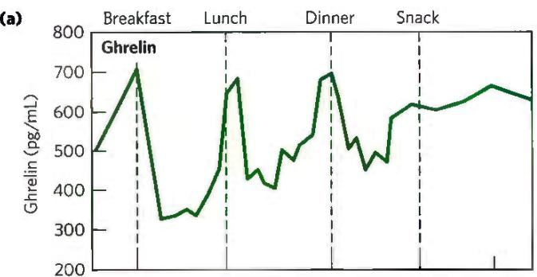

(b)  

(c)  
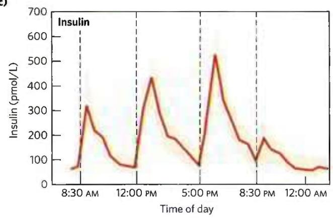

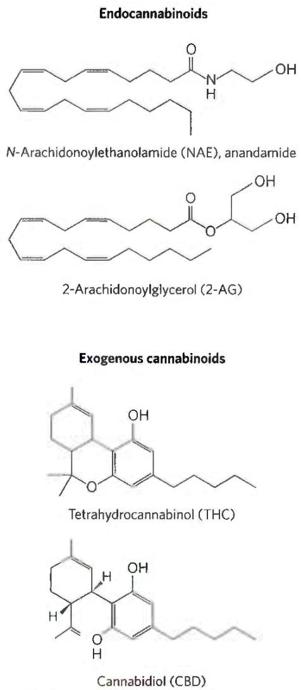  
FIGURE 23-40 Cannabinoids. Two endocannabinoids produced by animals, and two products from the cannabis plant. Endocannabinoids carry retrograde signals: secreted by a postsynaptic cell, they diffuse across the synaptic cleft and activate GPCR receptors in the presynaptic cell. The receptors are of two types: $\mathrm{CB_1}$ in the central nervous system, and $\mathrm{CB_2}$ in the peripheral nervous system. $\Delta^9$ -Tetrahydrocannabinol (THC), the psychoactive compound in cannabis, is an agonist of both types of cannabinoid receptors in animals; cannabidiol (CBD) does not bind either.

appetite, heighten the sensory response to food (especially sweet and fatty foods), and elevate mood. When food enters the mouth, neuronal signals travel to the brain, and from there through the vagus nerve to the intestine, which then produces and releases endocannabinoids. The receptors for endocannabinoids control ion channels of sensory neurons, changing their membrane potentials and sending signals to the brain. Palatable food sensed in this way motivates further consumption of that food. The taste of fats (which are particularly high in caloric content) causes cannabinoid release, which effectively triggers further consumption. Well-conserved across vertebrate species, this system probably evolved to maximize the intake of food and to guard against starvation. In mammals, cannabinoid action stimulates an increase in fat mass and inhibits energy loss by motor activity or thermogenesis. Cannabinoid receptors also mediate the psychoactive effects of $\Delta^{9}$ -tetrahydrocannabinol (Fig. 23-40), the main active ingredient in marijuana, long known for its stimulating effect on appetite.

#### [EN] Microbial Symbionts in the Gut Influence Energy Metabolism and Adipogenesis

An adult human is host to about $10^{14}$ microbial cells that inhabit the gut. These microbes function as a major endocrine organ, producing a variety of metabolites with profound effects on host metabolism, feeding behavior, and body mass. Lean and obese individuals harbor different combinations of microbial symbionts in the gut. Investigation of this observation led to the discovery that gut microbes release fermentation products—the short-chain fatty acids acetate, propionate, butyrate, and lactate—that enter the bloodstream and trigger metabolic changes in adipose tissue (Fig. 23-41). Propionate, for example, drives the expansion of white adipose tissue by acting on GPCRs in the plasma membranes of several cell types, including adipocytes. These receptors trigger differentiation of precursor cells (preadipocytes) into adipocytes and inhibit lipolysis in existing adipocytes, leading to an increase in white adipose tissue mass—that is, obesity. Gut microbes also convert primary bile acids, synthesized in the liver, into the secondary bile acids deoxycholate and lithocholate, which enter the bloodstream and act through GPCRs and steroid receptors to activate beige adipocytes to produce UCP1 and increase energy expenditure.

These findings raise the possibility of preventing obesity by altering the makeup of the microbial community in the gut. Weight reduction might be accomplished either by adding, directly to the gut, microbial species (probiotics) that disfavor adipogenesis, or by adding to the diet nutrients (prebiotics) that favor the dominance of probiotic microbes. For example, experiments in mice have shown that fructans, polymers of fructose that are indigestible by animals, favor a specific microbial community. When this combination of microorganisms is present, fat storage in white adipose tissue and liver decreases, and there is none of the decrease in insulin sensitivity that is associated with obesity and lipid deposition in the liver (see below). Investigators have transplanted fecal material from lean mice to fat ones, and found that a new collection of microbes became established in the gut of the recipient animals, and the animals lost weight.

P4 Endocrine cells in the lining of the intestinal tract secrete peptides—the anorexigenic PYY $_{3-36}$ and GLP-1 and the orexigenic ghrelin—that modulate food intake and energy expenditure. Interaction with specific microbes in the gut, or with their fermentation products, may trigger release of these peptides. Understanding how diet and microbial symbionts interact to affect energy metabolism and adipogenesis is an important key to understanding the development of obesity, metabolic syndrome, and type 2 diabetes and is a major challenge for the future.

  
FIGURE 23-41 Effects of gut microbe metabolism on health. The enormous number and diversity of microorganisms (the microbiota) in the colon generate metabolic products that may have significant effects on health, both positive and negative. For example, the metabolism of primary bile acids by microbiota produces secondary products that act through nuclear receptors to stimulate thermogenesis in host brown adipose tissue (BAT) and increase both energy consumption and insulin sensitivity, while reducing inflammation. Metabolism of undigested carbohydrates by microbiota produces short-chain fatty acids (SCFAs) that signal expansion of the host's white adipose tissue (WAT), promoting obesity. SCFAs produced by microbiota are also a readily metabolizable energy source for the host. Microbial production of the SCFA propionate prevents lipogenesis in the liver and lowers blood cholesterol, both favorable to health. On the other hand, metabolic conversion of phosphatidylcholine and L-carnitine to trimethylamine (TMA), and its further conversion in liver to trimethylamine-N-oxide (TMAO), results in receptor-mediated changes in cholesterol transport and macrophage activity. The combination of altered sterol transport and increased macrophage activity can lead to formation of atherosclerotic plaque (see Fig. 21-46).

The exquisitely interconnected system of neuroendocrine controls of food intake and metabolism presumably evolved to protect against starvation and to eliminate counterproductive accumulation of fat (extreme obesity). The difficulty most people face in trying to lose weight testifies to the remarkable effectiveness of these controls.

#### [EN] SUMMARY 23.4 Obesity and the Regulation of Body Mass

Adipose tissue produces leptin, a hormone that regulates feeding behavior and energy expenditure so as to maintain adequate reserves of fat. Leptin production and release increase with the number and size of adipocytes.

■ Leptin acts on receptors in the brain, causing the release of anorexigenic (appetite-suppressing) peptides, including $\alpha$ -MSH, that act in the brain to inhibit eating.

■ Adiponectin stimulates fatty acid uptake and oxidation and inhibits fatty acid synthesis. It also sensitizes muscle and liver to insulin. At least some of the actions of adiponectin are mediated by AMPK, which is also activated by metabolic stress (low [AMP]), and by exercise.

The protein kinase complex mTORC1 gauges the supply of essential amino acids and other metabolites, triggering cell growth if all required nutrients are available. It thus complements AMPK in determining the energetic status of a cell.

■ Expression of the enzymes of lipid synthesis is under tight and complex regulation. PPARs are transcription factors that determine the rate of synthesis of many enzymes involved in lipid metabolism and adipocyte differentiation.

Ghrelin, a hormone produced in the stomach, acts on orexigenic (appetite-stimulating) neurons in the arcuate nucleus to produce hunger before a meal. PYY $_{3-36}$ , a peptide hormone of the intestine, acts at the same site to lessen hunger after a meal. Endocannabinoids signal the availability of sweet or fatty food and stimulate its consumption.

■ Microbial symbionts in the gut produce fermentation products and secondary bile acids, which influence release of gut hormones that regulate body mass.

<!-- EN-END 23.4 -->

<!-- EN-BEGIN 23.5 -->

### 【英文对应 23.5】Diabetes Mellitus

> 来源：Lehninger Principles of Biochemistry（书籍/02_生物化学原理） 第23章 Hormonal Regulation and Integration of Mammalian Metabolism，§23.5。对应本章“五、代谢紊乱造成疾病”。

Diabetes mellitus is a relatively common disease: about 9% of the U.S. population, and nearly 25% of the U.S. population over the age of 65, show some degree of abnormality in glucose metabolism that is indicative of diabetes or a tendency toward the condition. There are two major clinical classes of diabetes mellitus: type 1 diabetes, sometimes referred to as insulin-dependent diabetes mellitus (IDDM), and type 2 diabetes, or non-insulin-dependent diabetes mellitus (NIDDM), also called insulin-resistant diabetes. The discovery of insulin and its role in diabetes led to its development as a pharmaceutical, saving millions of lives (Box 23-2).

#### [EN] Diabetes Mellitus Arises from Defects in Insulin Production or Action

Type 1 diabetes usually begins early in life, and symptoms quickly become severe. This disease responds to insulin injection, because the metabolic defect

#### [EN] The Arduous Path to Purified Insulin

Millions of people with type 1 diabetes mellitus inject themselves daily with pure insulin to compensate for the lack of production of this critical hormone by their own pancreatic $\beta$ cells. Insulin injection is not a cure for diabetes, but it allows people who otherwise would have died young to lead long and productive lives. The discovery of insulin, which began with an accidental observation, illustrates the combination of serendipity and careful experimentation that led to the discovery of many hormones.

In 1889, Oskar Minkowski, a young assistant at the Medical College of Strasbourg, and Josef von Mering, at the Hoppe-Seyler Institute in Strasbourg, had a friendly disagreement about whether the pancreas, known to contain lipases, was important in fat digestion in dogs. To resolve the issue, they began an experiment on the digestion of fats. They surgically removed the pancreas from a dog, but before their experiment got any farther, Minkowski noticed that the dog was now producing far more urine than normal (a common symptom of untreated diabetes). Also, the dog's urine had glucose levels far above normal (another symptom of diabetes). These findings suggested that lack of some pancreatic product caused diabetes.

Minkowski tried unsuccessfully to prepare an extract of dog pancreas that would reverse the effect of removing the pancreas — that is, would lower the urinary or blood glucose levels. Despite considerable effort, no significant progress was made in the isolation or characterization of the "antidiabetic factor" until the summer of 1921, when Frederick G. Banting, a young scientist working in the laboratory of J. J. R. MacLeod at the University of Toronto, and a student assistant, Charles Best, took up the problem. By that time, several lines of evidence pointed to a group of specialized cells in the pancreas (the islets of Langerhans; see Fig. 23-23) as the source of the antidiabetic factor, which came to be called insulin (from Latin insula, "island").

Taking precautions to prevent proteolysis by the pancreatic proteases trypsin and chymotrypsin, Banting and Best (later aided by biochemist J. B. Collip) succeeded in December 1921 in preparing a purified pancreatic extract that cured the symptoms of experimentally induced diabetes in dogs. On January 25, 1922 (just one month later!), their insulin preparation was injected into Leonard Thompson, a 14-year-old boy severely ill with diabetes mellitus. Within days, the levels of ketone bodies and glucose in Thompson's urine dropped dramatically; the extract saved his life and the lives of other seriously ill children who also received these early preparations (Fig. 1). In 1923, Banting and MacLeod won the Nobel Prize for their isolation of

stems from an autoimmune destruction of pancreatic $\beta$ cells and a consequent inability to produce sufficient insulin. Type 1 diabetes requires both insulin therapy and careful, lifelong control of the balance between dietary intake, activity, and insulin dose. Characteristic symptoms of untreated type 1 (and type 2) diabetes are excessive insulin. Banting immediately announced that he would share his prize with Best; MacLeod shared his with Collip.

By 1923, pharmaceutical companies were supplying thousands of patients throughout the world with insulin extracted from porcine pancreas. With the development of genetic engineering techniques in the 1980s, it became possible to produce unlimited quantities of human insulin by inserting the cloned human gene for insulin into a microorganism, which was then cultured on an industrial scale. Many people with diabetes are now fitted with implanted insulin pumps, which release adjustable amounts of insulin on demand to meet changing needs at meal times and during exercise. There is a reasonable prospect that, in the future, transplanted pancreatic tissue will provide a source of insulin that responds as well as a normal pancreas, releasing insulin into the bloodstream only when blood glucose rises.

  
FIGURE 1 A child with type 1 diabetes, before (left) and after (right) three months of treatment with an early preparation of insulin. [H. R. Geyelin et al., J. Metabol. Res. 2:767, 1922.]

thirst and frequent urination, leading to the intake of large volumes of water. These symptoms are due to excretion of large amounts of glucose in the urine. ("Diabetes mellitus" means "excessive excretion of sweet urine.")

Type 2 diabetes is slower to develop (typically but not always in obese adults), and the symptoms are milder and often go unrecognized at first. This is really a group of diseases in which the regulatory activity of insulin is disordered: insulin is produced, but some feature of the insulin-response system is defective. Many individuals with this disorder are insulin-resistant. The connection between type 2 diabetes and obesity (discussed below) is an active area of research.

The pathology of diabetes includes cardiovascular disease, renal failure, blindness, and neuropathy. In 2019, the global mortality from diabetes was estimated at 4.2 million and rising. It is essential to understand diabetes and its relationship to obesity and to find countermeasures that prevent or reverse the damage done by this disease.

P5 Individuals with either type of diabetes are unable to take up glucose efficiently from the blood. Recall that insulin triggers the movement of GLUT4 glucose transporters to the plasma membrane in muscle and adipose tissue (see Fig. 12-23 and Box 11-1). Biochemical measurements on blood and urine samples are essential in the diagnosis and treatment of diabetes. A sensitive diagnostic criterion is the level of HbA1c, a glucose derivative of hemoglobin, which forms in the blood and reflects the average blood glucose level (see Box 7-2). Another measurement to confirm the diagnosis of diabetes is the glucose-tolerance test. The individual fasts overnight, then drinks a test dose of 100 g of glucose dissolved in a glass of water. The blood glucose concentration is measured before the test dose and at 30 min intervals for several hours thereafter. A healthy individual assimilates the glucose readily, the blood glucose rising to no more than about 9 or 10 mm; little or no glucose appears in the urine. In diabetes, individuals assimilate the test dose of glucose poorly; their blood glucose level rises dramatically and returns to the fasting level very slowly. Because the blood glucose levels exceed the kidney threshold (about 10 mm), glucose also appears in the urine.

#### [EN] Carboxylic Acids (Ketone Bodies) Accumulate in the Blood of Those with Untreated Diabetes

With glucose unavailable to cells, fatty acids become the principal fuel, which leads to another characteristic metabolic change in diabetes: excessive but incomplete oxidation of fatty acids in the liver. The acetyl-CoA produced by $\beta$ oxidation cannot be completely oxidized by the citric acid cycle, because the high $[NADH]/[NAD^{+}]$ ratio produced by $\beta$ oxidation inhibits the cycle (recall that three steps of the cycle convert $NAD^{+}$ to NADH). Accumulation of acetyl-CoA leads to overproduction of the ketone bodies $\beta$ -hydroxybutyrate and acetoacetate, which cannot be used by extrahepatic tissues as fast as they are made in the liver (see Figs. 17-15, 17-16). In addition to $\beta$ -hydroxybutyrate and acetoacetate, the blood of individuals with diabetes contains small amounts of acetone, which results from the spontaneous decarboxylation of acetoacetate:

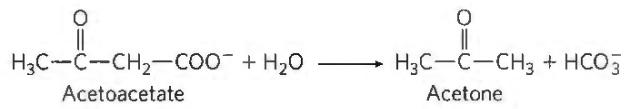

The overproduction of ketone bodies, called ketosis, results in greatly increased concentrations of ketone bodies in the blood (ketonemia) and urine (ketonuria). The ketone bodies are carboxylic acids, which ionize, releasing protons. In uncontrolled diabetes, this acid production can overwhelm the capacity of the blood's bicarbonate buffering system and produce a lowering of blood pH called acidosis or, in combination with ketosis, ketoacidosis, a potentially life-threatening condition.

#### [EN] In Type 2 Diabetes the Tissues Become Insensitive to Insulin

In the industrialized world, where the food supply is more than adequate, there is a growing epidemic of obesity and the type 2 diabetes associated with it. The hallmark of type 2 diabetes is the development of insulin resistance, a state in which more insulin is needed to bring about the biological effects produced by a lower concentration of insulin in the normal, healthy state. In the early stages of the disease, pancreatic $\beta$ cells secrete enough insulin to overcome the lower insulin sensitivity of muscle and liver. But the $\beta$ cells eventually fail, and the lack of insulin becomes apparent in the body's inability to regulate blood glucose. The intermediate stage, preceding type 2 diabetes mellitus, is sometimes called metabolic syndrome. This is typified by obesity, especially in the abdomen; hypertension (high blood pressure); abnormal blood lipids (high TAG and LDL, low HDL); slightly high fasting blood glucose; and a reduced ability to clear glucose in the glucose-tolerance test. Individuals with metabolic syndrome often also show changes in blood proteins associated with abnormal clotting (high fibrinogen concentration) or inflammation (high concentration of the C-reactive peptide, not to be confused with the C peptide generated during the proteolytic maturation of insulin). About $30\%$ of the adult population in the United States has these indicators of metabolic syndrome.

What predisposes individuals with metabolic syndrome to develop type 2 diabetes? According to the "lipid toxicity" hypothesis (Fig. 23-42), the action of PPARδ on adipocytes normally keeps the cells ready to synthesize and store triacylglycerols—the adipocytes are insulin-sensitive and produce leptin, which leads to their continued intracellular deposition of TAGs. However, excess caloric intake in obese individuals causes adipocytes to become filled with TAGs, leaving adipose tissue unable to meet any further demand for TAG storage. Lipid-filled adipose tissue releases protein factors, including MCP-1 (monocyte chemotaxis protein-1), that attract macrophages, which infiltrate the tissue and may eventually represent as much as 50% of the adipose tissue by mass. Macrophages trigger the inflammatory response mediated by TNFα release, which impairs TAG deposition in adipocytes and favors release of free fatty acids into the blood. These excess fatty acids enter liver and muscle cells, where they are converted to TAGs that accumulate as lipid droplets. This ectopic (Greek ektopos, “out of place”) deposition of TAGs inhibits GLUT4 transporter movement to the plasma membrane, which leads to insulin insensitivity in liver and muscle, the hallmark of type 2 diabetes.

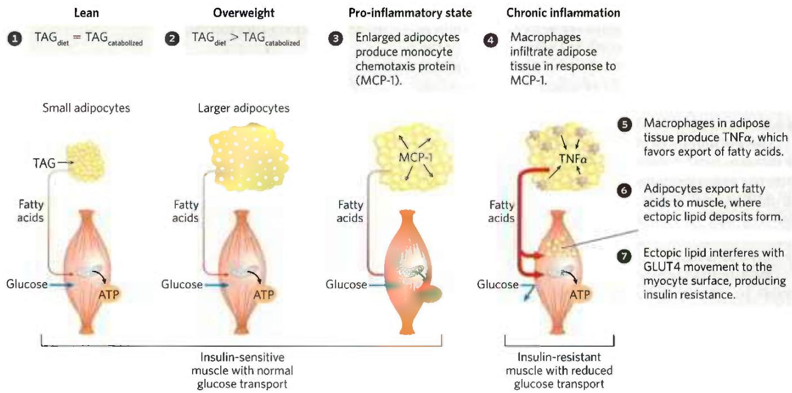  
FIGURE 23-42 Overloading adipocytes with triacylglycerols triggers inflammation in fat tissue and ectopic lipid deposition and insulin resistance in muscle. In an individual of healthy body mass, dietary TAG uptake equals TAG oxidation for energy. In overweight individuals, excess caloric intake results in enlarged adipocytes, engorged with TAG and unable to store more. Enlarged adipocytes secrete MCP-1 (monocyte chemotaxis protein-1), attracting macrophages. Macrophages infiltrate the adipose tissue and produce TNFα (tumor necrosis factor α), which triggers lipid breakdown and release of fatty acids into the blood. The fatty acids enter myocytes, where they  
accumulate in small lipid droplets. This ectopic lipid storage in muscle somehow causes insulin resistance, perhaps by triggering lipid-activated protein kinases that inactivate some element in the insulin-signaling pathway. GLUT4 glucose transporters leave the myocyte surface, preventing glucose entry into muscle; the myocyte has now become insulin-resistant. It cannot use blood glucose for its fuel, so fatty acids are mobilized from adipose tissue and become the primary fuel. The increased influx of fatty acids into muscle leads to further deposition of ectopic lipids. In some individuals, insulin resistance develops into type 2 diabetes. [Information from A. Guilherme et al., Mol. Cell Biol. 9:367, 2008, Fig. 1.]

According to this hypothesis, excess stored fatty acids and TAGs are toxic to liver and muscle. Some individuals are less well equipped genetically to handle this burden of ectopic lipids and are more susceptible to the cellular damage that leads to development of type 2 diabetes. Insulin resistance probably involves impairment of several of the mechanisms by which insulin acts on metabolism, which include changes in protein levels and changes in the activities of signaling enzymes and transcription factors. For example, both adiponectin synthesis in adipocytes and adiponectin levels in the blood decrease with obesity and increase with weight loss.

There are genetic factors that predispose individuals to type 2 diabetes. Although 80% of people with type 2 diabetes are obese, most obese individuals do not develop type 2 diabetes. Given the complexity of the regulatory mechanisms we have discussed in this chapter, it is not surprising that the genetics of diabetes is complex, involving interactions among variant genes and environmental factors, including diet and lifestyle. A growing number of genetic loci have been reliably linked to type 2 diabetes; variation in any of these “diabetogenes” alone would cause a relatively small increase in the likelihood of developing type 2 diabetes.

#### [EN] Type 2 Diabetes Is Managed with Diet, Exercise, Medication, and Surgery

Studies show that at least four factors improve the health of individuals with type 2 diabetes: dietary restriction, regular exercise, drugs that increase insulin sensitivity or insulin production, and surgery that reroutes food passage through the gastrointestinal tract. Dietary restriction (and accompanying weight loss) reduces the overall burden of handling fatty acids. The lipid composition of the diet influences, through

<table><tr><td colspan="3">TABLE 23-7 Treatments for Type 2 Diabetes Mellitus</td></tr><tr><td>Intervention/treatment</td><td>Direct target</td><td>Effect of treatment</td></tr><tr><td>Weight loss</td><td>Adipose tissue; reduction in TAG content</td><td>Reduces lipid burden; increases capacity for lipid storage in adipose tissue; restores insulin sensitivity</td></tr><tr><td>Exercise</td><td>AMPK, activated by increasing [AMP]/[ATP]</td><td>Aids weight loss (see Fig. 23-34)</td></tr><tr><td>Bariatric surgery</td><td>Unknown</td><td>Leads to weight loss, better control of blood glucose</td></tr><tr><td>Sulfonylureas: glipizide (Glucotrol), glyburide (Micronase), glimepiride (Amaryl)</td><td>Pancreatic β cells; K+ channels blocked</td><td>Stimulates insulin secretion by pancreas (see Fig. 23-24)</td></tr><tr><td>Biguanides: metformin (Glucophage)</td><td>AMPK, activated</td><td>Increases glucose uptake by muscle; decreases glucose production in liver</td></tr><tr><td>Thiazolidinediones: rosiglitazone (Avandia), pioglitazone (Actos)</td><td>PPARγ</td><td>Stimulates expression of genes potentiating the action of insulin in liver, muscle, adipose tissue; increases glucose uptake; decreases glucose synthesis in liver</td></tr><tr><td>GLP-1 modulators: exenatide (Byetta), sitagliptin (Januvia), dulaglutide (Trulicity)</td><td>Glucagon-like peptide-1, dipeptide protease IV</td><td>Enhances insulin secretion by pancreas</td></tr></table>

PPARs and other transcription factors, the expression of genes that encode proteins involved in burning fat.

Exercise contributes to weight loss directly by consuming calories. Exercise also increases release of irisin from muscle into the blood. Irisin increases the expression of UCP1 genes in white adipose tissue and also stimulates the development of beige adipocytes, so that even after the exercise ends, energy continues to be used in thermogenesis. Exercise activates AMPK, as does adiponectin; AMPK shifts metabolism toward fat oxidation and inhibits fat synthesis.

Several classes of drugs are used in the management of type 2 diabetes (Table 23-7). Their targets include AMPK, the K+ channels in β cells, PPARs, and GLP receptors.

In cases of extreme obesity, dramatic weight loss can be achieved by bariatric surgery, which reroutes food movement through the stomach and small intestine. In many cases, this procedure also moderates or even reverses type 2 diabetes. In Roux-en-Y gastric bypass (RYGBP, named for César Roux, the Swiss surgeon who developed the procedure), the stomach is reduced to a small pouch attached to the esophagus, and the middle region of the small intestine (the jejunum) is attached directly to the pouch. Food bypasses most of the stomach and the duodenum, and goes primarily to the "Roux limb" of the intestine. Stomach acid and digestive enzymes travel through bypassed portions of the gut to join the food in the common channel. People who undergo RYGBP surgery not only experience dramatic weight loss but also are less hungry. Remarkably, this surgery also reverses type 2 diabetes in many cases. The explanations for these effects are likely to lie in altered communication among the gut, the brain, and other organs. This may result from changes in the kind and amount of peptide hormones (such as GLP-1 and PYY $_{3-36}$ )

secreted in the intestine that signal satiety and inhibit feeding behavior. The last word has not been written on this issue.

#### [EN] SUMMARY 23.5 Diabetes Mellitus

■ Metabolic syndrome, which includes obesity, hypertension, elevated blood lipids, and insulin resistance, is often the prelude to type 2 diabetes. Uncontrolled diabetes is characterized by high glucose levels in the blood and urine and the production and excretion of ketone bodies.

In diabetes, insulin is either not produced or not recognized by the tissues, and the uptake of blood glucose is defective. Lacking access to glucose, cells rely on fatty acid oxidation, which results in ketone body formation, producing ketoacidosis.

■ The insulin resistance that characterizes type 2 diabetes may be a consequence of abnormal lipid storage in muscle and liver, in response to a lipid intake that cannot be accommodated by adipose tissue.

■ Effective treatments for type 2 diabetes include exercise, appropriate diet, and drugs that increase insulin sensitivity or insulin production. Surgical alteration of the digestive tract leads to weight loss and often reverses type 2 diabetes.

<!-- EN-END 23.5 -->

## 提要

细胞代谢包括物质代谢、能量代谢和信息代谢三个方面。活细胞不断与环境交换物质，摄取能量，输入负熵，从而得以构建和维持其复杂的组织结构，进行各种生命活动。新陈代谢是一切生命活动的基础。生命物质主要有蛋白质、核酸、糖、脂质以及一些有机小分子，在这些物质代谢过程中同时进行着能量和信息的代谢。生物机体的新陈代谢是一个完整统一的过程，存在复杂的调节控制机制。代谢调节是对代谢物浓度变化的节制，以维持其稳定。代谢控制是对代谢途径通量的管控，以适应内外环境的变化。生物机体在分子、细胞和整体三个水平上进行代谢调节控制。

多糖、蛋白质和核酸都是高聚物，它们分别由少数种类的单糖、氨基酸和核苷酸所组成。脂质分子也能聚集成超分子结构。这些物质的代谢途径是相互联系的。细胞代谢的原则是将各类物质分别纳入各自的共同代谢途径，不同途径间可通过交叉点上的中间代谢物而相互沟通和相互转化。最关键的中间代谢物是：6-磷酸葡萄糖、丙酮酸和乙酰辅酶A。由此使各代谢途径形成网络。

细胞和机体通常都处于动力学的稳态，代谢物的生成和消耗速率相等，浓度保持相对不变。ATP是通用能量载体，又是能量水平的标记，在代谢调节中起重要作用。代谢调节点常是远离平衡的反应。代谢控制分析有三个重要参数：通量控制系数C，弹性系数 $\varepsilon$ 和反应系数R。总和原理和相关性原理是代谢控制分析的基本原理。不同代谢途径、不同器官、不同调控机制之间均存在协同调节。糖酵解和糖异生之间有7步反应是可逆的，3处不可逆反应为各自的调节点，在酶活性和酶生成上都受到调节。

生物体内的代谢反应都是由酶所催化和调节的。酶的调节包括酶活性的调节和酶含量的调节，前者又分为变构效应，酶的特异激活和抑制以及共价修饰等几种方式；后者则受合成和降解两方面的影响。代谢底物和代谢产物对代谢过程调节酶（变构酶）活性的调节作用分别称为前馈和反馈，这种作用或是激活（正作用），或是抑制（负作用）。ATP、ADP和磷酸盐广泛参与各种产能和需能反应，它们不仅通过质量作用效应而调食能量代谢，而且还是许多重要调节酶的变构效应物。能荷的定义为在总的腺苷酸系统中（ATP、ADP和AMP之和）所负荷的高能磷酸基数量（ATP加1/2ADP）。能荷值可作为细胞产能和需能代谢过程间变构调节的信号。凝血是由一系列凝血因子经级联激活引起的反应，凝血因子大多为丝氨酸蛋白酶。其间受到特异激活剂和抑制剂的精确调节。溶栓过程也是由丝氨酸蛋白酶的酶解级联反应引起的。酶原和激素原由蛋白酶酶解而激活。级联反应导致原始信号的放大，可于瞬间激活，并易于调节控制。

细胞具有精细的结构。各类酶在细胞中有各自的空间分布，因而使不同代谢途径分别在细胞的不同部位进行。细胞膜结构对代谢的调控作用主要有：控制跨膜离子浓度梯度和电位梯度，控制物质运输，与酶的可逆结合影响酶的性质和活性。细胞能对外部信号作出反应。外部信号作用于受体而引起细胞内的化学变化称为信号转导，并经信号途径而调节酶的活性和基因表达。

在整体水平上的神经调节和激素调节是在进化过程中发展和完善起来的调节机制,它们仍然需通过酶和基因的调节而起作用。激素、递质和调节肽作用于膜受体,经信号转导蛋白(G蛋白)而引起效应器的反应,或是改变膜透性,或是产生胞内信使导致酶的连续激活。生长因子的受体自身具有酪氨酸蛋白激酶活性,成为信号转导的重要环节。另一类受体自身具有鸟苷酸环化酶活性。有些受体不在质膜上,而分布在胞质内,如一氧化氮受体和某些核受体。

神经元传导电信号依赖于离子通过膜通道引起的膜电位变化。有两类门控离子通道：电位门控离子通道和配体门控离子通道。前者在膜去极化时打开，因而产生动作电位；后者由神经递质所打开，使化学信号又转变为电信号。神经递质和激素没有本质上的差别。有些神经细胞也能分泌胺类和肽类激素。最近发现神经、内分泌和免疫系统间存在密切关系。因此提出神经-内分泌-免疫网络学说。

各器官间在代谢上相互协调。肝加工和转运营养物，从小肠消化、吸收的营养物先送到肝，然后再分送各组织。肌肉利用 ATP 作机械功，并以脂肪酸、酮体和葡萄糖作为能源物质，必要时可以分解和利用肌糖原、磷酸肌酸和非关键的蛋白质。脑利用能量传递电脉冲，在静息时人体消耗 $O_{2}$ 的 20%、消耗葡萄糖的 25% 用于脑的能量供应，必要时也能利用 β-羟丁酸作为能源物质。血液运送氧、代谢物和激素，血液将所有器官连在一起。

代谢紊乱即造成疾病。糖尿病以高血糖为主要特征。有2类糖尿病：一类是胰岛素依赖型；另一类是非胰岛素依赖型。前者是由于胰岛素产生和分泌不足，可能因自身免疫破坏胰岛β细胞所致。后者是由胰岛素作用受阻。糖尿病患者不能很好利用血液中葡萄糖，易造成酮血症、酮尿症和酮症酸中毒，并常伴有许多其他疾病。

超重和肥胖严重危害健康。脂肪组织不仅是分解、合成和贮存脂肪的组织，而且还是重要的内分泌组织。脂肪组织在有足够脂肪时合成和分泌脂肪素，以抑制食欲、增加耗能、减少贮存。瘦素是其中重要的一种。瘦素作用于下丘脑，促进有关神经细胞合成和释放厌食神经肽，并通过迷走神经促进棕色脂肪组织解偶联产热。

长期禁食和饥饿将造成代谢紊乱。正常能源贮备物有三类，三酰甘油（脂肪组织）、蛋白质（肌肉组织）和糖原（肝和肌肉）。在无食物来源和肝糖原已耗尽时脂肪组织的三酰甘油和肌肉蛋白质便成为主要能源。大量利用脂肪酸会产生酮体。大量降解蛋白质也会生酮，而且会影响蛋白质更新，给机体带来损害。下丘脑存在饱中枢和饿中枢，拱状核的神经元可以分别合成促进食欲的神经肽Y和抑制食欲的α-促黑素，用以调节进食行为和能量的消耗。瘦素既有防止肥胖又有在饥饿时节能的功能，对机体十分重要。

## 习题

1. 物质代谢、能量代谢和信息代谢三者之间有何关系？

2. 什么是代谢调节？什么是代谢控制？

3. 何谓代谢网络？代谢途径之间是如何沟通的？

4.6-磷酸葡糖、丙酮酸和乙酰-CoA分别可沟通哪些代谢途径？

5. 何谓代谢动力学稳态？

6. 为什么利用 ATP 的酶其 $K_{m}$ 值常在 0.1 mM \~1 mM 之间？

7. 为什么代谢调节点常为远离平衡的反应？

8. 反应接近平衡的标准是什么？

9. 何谓巴斯德效应？其机制是什么？

10. “单一限速步骤”假说是否正确？为什么？

11. 为什么代谢途径各酶的通量控制系数 C 之总和必为 1?

12. 为什么 $\mathrm{R} = \mathrm{C}\cdot \varepsilon ?$

13. 何谓相对立的单向反应？其中每一个单独的反应是否可逆？

14. 何谓同工酶？其生物学意义是什么？

15. 比较己糖激酶Ⅰ\~Ⅲ和己糖激酶Ⅳ酶学性质的异同。

16. 何谓底物循环？举例说明生物如何防止底物循环。

17. $\mathrm{IP}_3$ 和 $\mathrm{PIP}_3$ 分别代表什么化合物？其生物学作用是否相同？

18. 催化糖异生的酶分布在哪里？这种分布有何生物学意义？

19. PFK-2 是一种双功能酶, 分析两种酶活性之间的关系。

20. 丙酮酸激酶 L 型和 M 型酶学性质有何差异？

21. 举例说明酶促反应的前馈和反馈,有何生物学意义?

22. 何谓能荷？它是如何调节代谢的？

23. 何谓级联反应？有哪些方式可以形成级联反应？

24. 试简要说明凝血级联反应中的各步反应。

25. 谷氨酰胺合成酶是如何通过共价修饰进行调节的？

26. 何谓诱导酶？何谓阻遏酶？其调节机制是否相同？

27. 何谓操纵子？

28. 比较原核生物和真核生物酶生成调节的异同。

29. 代谢途径有关酶的区域化有何意义？为什么有些途径的酶分布在细胞的不同区域？有何意义？

30. 为什么说,膜的三种基本功能都与离子和电位梯度的产生有关?

31. 举例说明膜的运输对代谢的调节作用。

32. 膜与酶的可逆结合如何调节代谢？

33. 常见的受体有哪几类？

34. 何谓信号转导？

35. 激素和递质在本质上有何区别？

36. 什么是 G 蛋白？主要有哪几类？

37. 为什么硝酸甘油可缓解心绞痛？

38. 试比较电位门控通道和配体门控通道的异同。

39. 简要说明神经系统与内分泌系统的关系。

40. 肝的主要功能是什么？

41. 说明肌肉乳酸的来源和去处。

42. 为什么脑组织需要消耗大量 $\mathrm{O}_2$ 和葡萄糖？

43. 简要说明血脑屏障。

44. 糖尿病主要可分几类？其病因是什么？

45. 瘦素的主要功能是什么？

46. 严重饥饿会造成哪些代谢紊乱？

## 主要参考书目

1. 王镜岩, 朱圣庚, 徐长法. 生物化学教程. 北京: 高等教育出版社, 2008.

2. Nelson D L, Cos M M. Lehninger Principles of Biochemistry. 6th ed. New York: W. H. Freeman and Company, 2012.

3. Berg J, Tymoczko J, Stryer L. Biochemistry. 7th ed. New York: W. H. Freeman and Company, 2010.

4. Alberts B, Alexander J, Lewis J, et al. Molecular Biology of the Cell. 5th ed. New York&London: Garland Publishing, 2008.

(朱圣庚)

## 网上资源

自测题

<!-- EN-BEGIN 第23章章末 -->

## 【英文对应 第23章章末】Hormonal Regulation and Integration of Mammalian Metabolism：关键术语、习题与简答

> 来源：Lehninger Principles of Biochemistry（书籍/02_生物化学原理） 第23章章末，以及书末 Abbreviated Solutions to Problems 第23章。

### [EN] KEY TERMS

Terms in bold are defined in the glossary.

<table><tr><td>hormone 842</td><td>endocrine 843</td></tr><tr><td>neuroendocrine system 842</td><td>paracrine 843autocrine 844</td></tr><tr><td>metabotropic 843</td><td>hypothalamus 845</td></tr><tr><td>ionotropic 843</td><td>hepatocyte 849</td></tr></table>

white adipose tissue (WAT) 851
adipocyte 851
brown adipose tissue (BAT) 852

uncoupling protein 1
(UCP1) 852

thermogenesis 852

myocyte 852

glucagon 862

cortisol 865

body mass index

(BMI) 867

adipokines 867

leptin 867

arcuate nucleus 868

orexigenic 868

anorexigenic 868 α-melanocyte-stimulating hormone (α-MSH) 868
adiponectin 869

AMP-activated protein kinase (AMPK) 869

mTORC1 (mechanistic target of rapamycin complex 1) 871

PPAR (peroxisome proliferator-activated receptor) 871

ghrelin 872

diabetes mellitus 875
type 1 diabetes 875
type 2 diabetes 875
glucose-tolerance
test 877

ketosis 877

acidosis 877

ketoacidosis 877

metabolic syndrome 877

### [EN] PROBLEMS

1. Peptide Hormone Activity Explain how two peptide hormones as structurally similar as oxytocin and vasopressin can have such different effects (see Fig. 23-8).

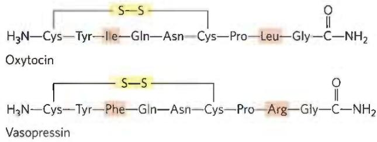

2. Metabolism of Glutamate in the Brain Brain tissue takes up glutamate from the blood, transforms it into glutamine, and releases the glutamine into the blood. What does this metabolic conversion accomplish? How does this conversion take place? The amount of glutamine produced in the brain can exceed the amount of glutamate entering from the blood. How does this extra glutamine arise? (Hint: You may want to review amino acid catabolism in Chapter 18; recall that $\mathrm{NH}_4^+$ is very toxic to the brain.)

3. Proteins as Fuel during Fasting When muscle proteins undergo catabolism in skeletal muscle during a fast, what are the fates of the amino acids?

4. Absence of Glycerol Kinase in Adipose Tissue The biosynthesis of triacylglycerols requires glycerol 3-phosphate. Adipocytes, specialized for the synthesis and degradation of TAGs, cannot use glycerol directly because they lack glycerol kinase, which catalyzes the reaction

$$
\text {   Glycerol   } + \text {   ATP   } \longrightarrow \text {   glycerol   3 - phosphate   } + \text {   ADP   }
$$

How does adipose tissue obtain the glycerol 3-phosphate necessary for TAG synthesis?

5. Oxygen Consumption during Exercise A sedentary adult consumes about 0.05 L of O₂ in 10 seconds. A sprinter running a 100 m race consumes about 1 L of O₂ in 10 seconds. After finishing the race, the sprinter continues to breathe at an elevated (but declining) rate for some minutes, consuming an extra 4 L of O₂ above the amount consumed by the sedentary individual.

(a) Why does the need for $\mathrm{O}_2$ increase dramatically during the sprint?

(b) Why does the demand for $O_{2}$ remain high after the sprinter finishes the race?

6. Thiamine Deficiency and Brain Function Individuals with thiamine deficiency show some characteristic neurological signs and symptoms, including loss of reflexes, anxiety, and mental confusion. Why might thiamine deficiency manifest as changes in brain function?

7. Potency of Hormones Under normal conditions, the human adrenal medulla secretes epinephrine (C $_{9}$ H $_{13}$ NO $_{3}$ ) at a rate sufficient to maintain a concentration of 10 $^{-10}$ M in circulating blood. To appreciate what that concentration means, calculate the volume of water that you would need to dissolve 1.0 g (about 1 teaspoon) of epinephrine to a concentration equal to that in blood.

8. Regulation of Hormone Levels in the Blood The half-life of most hormones in the blood is relatively short. For example, when researchers inject radioactively labeled insulin into an animal, half of the labeled hormone disappears from the blood within 30 min.

(a) What is the importance of the relatively rapid inactivation of circulating hormones?

(b) In what ways can the organism make rapid changes in the level of a circulating peptide hormone?

9. Water-Soluble versus Lipid-Soluble Hormones On the basis of their physical properties, hormones fall into one of two categories: those that are very soluble in water but relatively insoluble in lipids (e.g., epinephrine) and those that are relatively insoluble in water but highly soluble in lipids (e.g., steroid hormones). In their role as regulators of cellular activity, most water-soluble hormones do not enter their target cells. The lipid-soluble hormones, by contrast, do enter their target cells and ultimately act in the nucleus. What is the relationship between solubility, the location of receptors, and the mode of action of these two classes of hormones?

10. Metabolic Differences between Muscle and Liver in a "Fight-or-Flight" Situation When an animal confronts a "fight-or-flight" situation, the release of epinephrine promotes glycogen breakdown in the liver and skeletal muscle. The end product of glycogen breakdown in the liver is glucose; the end product in skeletal muscle is pyruvate.

(a) What is the reason for the different products of glycogen breakdown in the two tissues?

(b) What is the advantage of these specific glycogen breakdown routes to an animal that must fight or flee?

11. Excessive Amounts of Insulin Secretion: Hyperinsulinism Certain malignant tumors of the pancreas cause excessive production of insulin by $\beta$ cells. Affected individuals exhibit shaking and trembling, weakness and fatigue, sweating, and hunger.

(a) What is the effect of hyperinsulinism on the metabolism of carbohydrates, amino acids, and lipids by the liver?

(b) What are the causes of the observed symptoms? Suggest why this condition, if prolonged, leads to brain damage.

12. Thermogenesis Caused by Thyroid Hormones Thyroid hormones are intimately involved in regulating the basal metabolic rate. Liver tissue of animals given excess thyroxine shows an increased rate of $O_{2}$ consumption and increased heat output (thermogenesis), but the ATP concentration in the tissue is normal. Different explanations have been offered for the thermogenic effect of thyroxine. One is that excess thyroxine causes uncoupling of oxidative phosphorylation in mitochondria. How could such an effect account for the observations? Another explanation suggests that thermogenesis is due to an increased rate of ATP utilization by the thyroxine-stimulated tissue. Is this a reasonable explanation? Why or why not?

13. Function of Prohormones What are the possible advantages of synthesizing hormones as prohormones?

14. Sources of Glucose during Starvation The typical human adult uses about 160 g of glucose per day. Of this, the brain alone uses 120 g. The body's available reserve of glucose (\~20 g of circulating glucose and \~190 g of glycogen) is adequate for about one day. After the glucose reserve has been depleted during starvation, how does the body obtain more glucose?

15. Parabiotic ob/ob Mice By careful surgery, researchers can connect the circulatory systems of two mice so that the same blood circulates through both animals. In these parabiotic mice, products released into the blood by one animal reach the other animal via the shared circulation. Both animals are free to eat independently. Suppose a researcher parabiotically joins a mutant ob/ob mouse (both copies of the OB gene are defective) and a normal OB/OB mouse (both copies of the OB gene are functional). What would happen to the weight of each mouse in the parabiotic pair?

16. Calculation of Body Mass Index A biochemistry professor weighs 260 lb (118 kg) and is 5 feet 8 inches (173 cm) tall. What is his body mass index (BMI)? How much weight would he have to lose to bring his BMI down to 25 (normal)?

17. Insulin Secretion Predict the effects on insulin secretion by pancreatic $\beta$ cells of exposure to the potassium ionophore valinomycin. Explain your prediction.

18. Effects of a Deleted Insulin Receptor A strain of mice specifically lacking the insulin receptor of liver is found to have mild fasting hyperglycemia (blood glucose = 132 mg/dL, vs. 101 mg/dL in controls) and a more striking hyperglycemia in the fed state (glucose = 363 mg/dL, vs. 135 mg/dL in controls). The mice have higher than normal levels of glucose 6-phosphatase in the liver and elevated levels of insulin in the blood. Explain these observations.

19. Decisions on Drug Safety The drug rosiglitazone (Avandia) is effective in lowering blood glucose levels in patients with type 2 diabetes, but a few years after rosiglitazone came into widespread use, it seemed that using the drug came with an increased risk of heart attack. In response, the U.S. Food and Drug Administration (FDA) severely restricted the conditions under which it could be prescribed. Two years later, after additional studies had been completed, the FDA lifted the restrictions, and today rosiglitazone is available by prescription in the United States, with no special limitations. Many other countries ban it completely. If it were your responsibility to decide whether this drug should remain on the market (labeled with suitable warnings about its side effects) or should be withdrawn from the market altogether, what factors would you weigh in making your decision?

20. Type 2 Diabetes Medication The drugs acarbose (Precose) and miglitol (Glyset), used in the treatment of type 2 diabetes mellitus, inhibit $\alpha$ -glucosidases in the brush border of the small intestine. These enzymes degrade oligosaccharides derived from glycogen or starch to monosaccharides. Suggest a possible mechanism for the salutary effect of these drugs for individuals with diabetes. What side effects, if any, would you expect from these drugs? Why? (Hint: Review lactose intolerance, p. 523.)

### [EN] DATA ANALYSIS PROBLEM

21. Cloning the Sulfonylurea Receptor of the Pancreatic $\beta$ Cell Glyburide, a member of the sulfonylurea family of drugs, is used to treat type 2 diabetes. It binds to and closes the ATP-gated K $^{+}$ channel shown in Figures 23-26 and 23-27.

  
Glyburide

(a) Given the mechanism shown in Figure 23-27, would treatment with glyburide result in increased or decreased insulin secretion by pancreatic $\beta$ cells? Explain your reasoning. (b) How does treatment with glyburide help reduce the symptoms of type 2 diabetes?

(c) Would you expect glyburide to be useful for treating type 1 diabetes? Explain your answer.

Aguilar-Bryan and coauthors (1995) cloned the gene for the sulfonylurea receptor (SUR) portion of the ATP-gated $K^{+}$ channel from hamsters. The research team went to great lengths to ensure that the gene they cloned was, in fact, the SUR-encoding gene. Here we explore how it is possible for researchers to demonstrate that they have cloned the gene of interest rather than another gene.

The first step was to obtain pure SUR protein. As was already known, drugs such as glyburide bind SUR with very high affinity ( $K_{d} < 10$ nM), and SUR has a molecular weight of 140 to 170 kDa. Aguilar-Bryan and coworkers made use of the high-affinity glyburide binding to tag the SUR protein with a radioactive label that would serve as a marker to purify the protein from a cell extract. First, they made a radiolabeled derivative of glyburide, using radioactive iodine ( $^{125}$ I):

  
[125]5-iodo-2-hydroxyglyburide

(d) In preliminary studies, the ${}^{125}$ I-labeled glyburide derivative (hereafter, $[{}^{125}$ I]glyburide) was shown to have the same $K_{d}$ and binding characteristics as unaltered glyburide. Why was it necessary to demonstrate this? (What alternative possibilities did it rule out?)

Even though $[^{125}I]$ glyburide bound to SUR with high affinity, a significant amount of the labeled drug would probably dissociate from the SUR protein during purification. To prevent this, $[^{125}I]$ glyburide had to be covalently cross-linked to SUR. There are many methods for covalent cross-linking; Aguilar-Bryan and coworkers used UV light. When aromatic molecules are exposed to short-wave UV, they enter an excited state and readily form covalent bonds with nearby molecules. By cross-linking the radiolabeled glyburide to the SUR protein, the researchers could simply track the ${}^{125}I$ radioactivity to follow SUR through the purification procedure.

The research team treated hamster HIT cells (which express SUR) with $[^{125}I]$ glyburide and UV light, purified the ${}^{125}I$ -labeled 140 kDa protein, and sequenced its 25 residue amino-terminal segment; they found the sequence PLAFCGTENHSAAYRVDQGVLNNGC. The investigators then generated antibodies that bound to two short peptides in this sequence, one binding to PLAFCGTE and the other to HSAAYRVDQGV, and showed that these antibodies bound the purified ${}^{125}I$ -labeled 140 kDa protein.

(e) Why was it necessary to include this antibody-binding step?

Next, the researchers designed PCR primers based on the sequences above, and then cloned a gene from a hamster cDNA library that encoded a protein with these sequences (see Chapter 9 on biotechnology methods). The cloned putative SUR cDNA hybridized to an mRNA of the appropriate length that was present in cells known to contain SUR. The putative SUR cDNA did not hybridize to any mRNA fraction of the mRNAs isolated from hepatocytes, which do not express SUR.

(f) Why was it necessary to include this putative SUR cDNA-mRNA hybridization step?

Finally, the cloned gene was inserted into and expressed in COS cells, which do not normally express the SUR gene. The investigators mixed these cells with $[^{125}I]$ glyburide, with or without a large excess of unlabeled glyburide, exposed the cells to UV light, and measured the radioactivity of the 140 kDa protein produced. Their results are shown in the table.

<table><tr><td>Experiment</td><td>Cell type</td><td>Added putative SUR cDNA?</td><td>Added excess unlabeled glyburide?</td><td> $^{125}I$  label in 140 kDa protein</td></tr><tr><td>1</td><td>HIT</td><td>No</td><td>No</td><td>+++</td></tr><tr><td>2</td><td>HIT</td><td>No</td><td>Yes</td><td>-</td></tr><tr><td>3</td><td>COS</td><td>No</td><td>No</td><td>-</td></tr><tr><td>4</td><td>COS</td><td>Yes</td><td>No</td><td>+++</td></tr><tr><td>5</td><td>COS</td><td>Yes</td><td>Yes</td><td>-</td></tr></table>

(g) Why was no ${}^{125}$ l-labeled 140 kDa protein found in experiment 2?

(h) How would you use the information in the table to argue that the cDNA encoded SUR?

(i) What other information would you want to collect to be more confident that you had cloned the SUR gene?

### [EN] Reference

Aguilar-Bryan, L., C.G. Nichols, S.W. Wechsler, J.P. Clement, IV, A.E. Boyd, III, G. González, H. Herrera-Sosa, K. Nguyen, J. Bryan, and D.A. Nelson. 1995. Cloning of the $\beta$ cell high-affinity sulfonylurea receptor: a regulator of insulin secretion. Science 268:423–426.

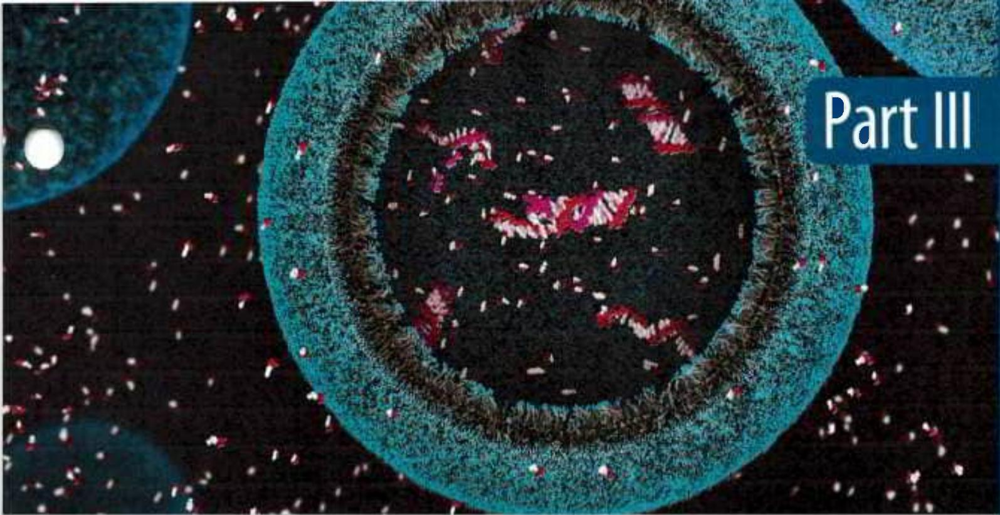

### [EN] Abbreviated Solutions — Chapter 23

1. They are recognized by two different receptors, typically found in different cell types, and are coupled to different downstream effectors.

2. Ammonia is highly toxic to nervous tissue, especially the brain. In healthy individuals, excess $NH_{3}$ is removed by transformation of glutamate to glutamine, which travels to the liver and is subsequently transformed to urea. The additional glutamine arises from conversion of glucose to $\alpha$ -ketoglutarate, transamination of $\alpha$ -ketoglutarate to glutamate, and conversion of glutamate to glutamine.

3. Glucogenic amino acids are used to make glucose for the brain; others are deaminated, then oxidized in mitochondria via the citric acid cycle.

4. From glucose, by the following route: Glucose → dihydroxyacetone phosphate (in glycolysis); dihydroxyacetone phosphate + NADH + H⁺ → glycerol 3-phosphate + NAD⁺ (glycerol 3-phosphate dehydrogenase reaction)

5. (a) Increased muscular activity increases the demand for ATP, which is met by increased $O_{2}$ consumption. (b) After the sprint, lactate produced by anaerobic glycolysis is converted to glucose and glycogen, which requires ATP and therefore $O_{2}$ .

6. Glucose is the primary fuel for the brain. TPP-dependent oxidative decarboxylation of pyruvate to acetyl-CoA is essential to complete glucose metabolism. TPP synthesis requires the vitamin thiamine.

7. $5.5 \times 10^{7}$ L. For comparison, an Olympic pool, 50 m long, 25 m wide, and 2 m deep, holds $2.5 \times 10^{6}$ L.

8. (a) Inactivation provides a rapid means to change the concentration of active hormone and thus end its effects. (b) Changes in the rate of release from storage, the rate of conversion from prohormone to active hormone, and the rate of inactivation can rapidly change the level of a circulating peptide hormone.

9. Water-soluble hormones bind to receptors on the outer surface of the cell, triggering formation of a second messenger (e.g., cAMP) inside the cell. Lipid-soluble hormones can pass through the plasma membrane to act on target molecules or receptors directly.

10. (a) Skeletal muscle does not express glucose 6-phosphatase. Any glucose 6-phosphate produced enters the glycolytic pathway and, under O₂-deficient conditions, is converted to lactate via pyruvate. (b) In a “fight-or-flight” situation, the concentration of glycolytic precursors must be high in preparation for muscular activity. Phosphorylated intermediates cannot escape from myocytes because the membrane is not permeable to charged species, and glucose 6-phosphate is not exported by the glucose transporter. In the liver, glucose is formed from glucose 6-phosphate and enters the bloodstream to maintain the blood glucose level in the homeostatic range.

11. (a) Excessive uptake and use of blood glucose by the liver, leading to hypoglycemia; shutdown of amino acid and fatty acid catabolism (b) Little circulating fuel is available for ATP requirements. Brain damage results because glucose is the main source of fuel for the brain.

12. As an uncoupler of oxidative phosphorylation, thyroxine would decrease the efficiency of the process (lower the P/O ratio), forcing the tissue to increase respiration to meet the normal demand for ATP. This less-efficient respiration would dissipate as heat a greater proportion of the energy potentially available for making ATP. Thermogenesis could also be due to the increased rate of ATP use by the thyroid-stimulated tissue. In this case, the efficiency of oxidative phosphorylation (the P/O ratio) would be unchanged. But because some energy is always dissipated as heat in the process, the increased production of ATP demanded by the stimulated tissue would produce more heat overall.

13. Because prohormones are inactive, they can be stored in quantity in secretory granules. Rapid activation is achieved by enzymatic cleavage in response to an appropriate signal.

14. In animals, glucose can be synthesized from many precursors (see Fig. 14-15). In humans, the principal precursors are glycerol from TAGs, glucogenic amino acids from protein degradation, and oxaloacetate formed by pyruvate carboxylase.

15. The ob/ob mouse, which is initially obese, will lose weight. The OB/OB mouse will retain its normal body weight.

16. BMI = 39.3. For a BMI of 25, weight must be 75 kg; he must lose 43 kg, or 95 lb.

17. Reduced insulin secretion. Valinomycin has the same effect as opening the $K^{+}$ channel, allowing $K^{+}$ exit and consequent hyperpolarization.

18. The liver does not receive the insulin message and therefore continues to have high levels of glucose 6-phosphatase and gluconeogenesis, increasing blood glucose both during a fast and after a glucose-containing meal. The elevated blood glucose triggers insulin release from pancreatic $\beta$ cells, hence the high level of insulin in the blood.

19. Some things to consider: What do the data show about the frequency of heart attack attributable to the drug among people taking the drug? How does this frequency compare with the data on individuals spared the long-term consequences of type 2 diabetes? Are other, equally effective treatment options with fewer adverse effects available?

20. Without intestinal glucosidase activity, absorption of glucose from dietary glycogen and starch is reduced, blunting the usual rise in blood glucose after a meal. The undigested oligosaccharides are fermented by intestinal bacteria, and the gases released cause intestinal discomfort.

21. (a) Increased; closing the ATP-gated K+ channel would depolarize the membrane, increasing insulin release. (b) Type 2 diabetes results from decreased sensitivity to insulin, not a deficit of insulin production; increasing circulating insulin levels will reduce the symptoms associated with this disease. (c) Individuals with type 1 diabetes have deficient pancreatic β cells, so glyburide will have no beneficial effect. (d) lodine, like chlorine (the atom it replaces in the labeled glyburide), is a halogen, but it is a larger atom and has slightly different chemical properties. The iodinated glyburide might not bind to SUR. If it bound to another molecule instead, the experiment would result in cloning of the gene for this other, incorrect protein. (e) Although a protein has been "purified," the "purified" preparation might be a mixture of several proteins that co-purify under those experimental conditions. In this case, the amino acid sequence could be that of a protein that co-purifies with SUR. Using antibody binding to show that the peptide sequences are present in SUR excludes this possibility. (f) Although the cloned gene does encode the 25 amino acid sequence found in SUR, it could be a gene that, coincidentally, encodes the same sequence in another protein. In this case, this other gene would most likely be expressed in different cells than the SUR gene. The mRNA hybridization results are consistent with the putative SUR cDNA actually encoding SUR. (g) The excess unlabeled glyburide competes with labeled glyburide for the binding site on SUR. As a result, there is significantly less binding of labeled glyburide, so little or no radioactivity is detected in the $140\mathrm{kDa}$ protein. (h) In the absence of excess unlabeled glyburide, labeled $140\mathrm{kDa}$ protein is found only in the presence of the putative SUR cDNA. Excess unlabeled glyburide competes with the labeled glyburide, and no ${}^{125}\mathrm{I}$ -labeled $140\mathrm{kDa}$ protein is detected. This shows that the cDNA produces a glyburide-binding protein of the same molecular weight as SUR—strong evidence that the cloned gene encodes the SUR protein. (i) Several additional steps are possible, such as the following: (1) Express the putative SUR cDNA in CHO (Chinese hamster ovary) cells and show that the transformed cells have ATP-gated $\mathbf{K}^+$ channel activity. (2) Show that HIT cells with mutations in the putative SUR gene lack ATP-gated $\mathbf{K}^+$ channel activity. (3) Show that humans or experimental animals with mutations in the putative SUR gene are unable to secrete insulin.

<!-- EN-END 第23章章末 -->
