## 第 29 章 基因和染色体

> **本章英文对应内容**（Lehninger，插在所列中文小节末尾）
>
> - 第24章 Genes and Chromosomes：章首导言（本章开头）、关键术语/习题/简答（本章末尾）
> - §24.1（第24章）→ 二、基因和基因组的结构
> - §24.2（第24章）→ 三、染色体的结构
> - §24.3（第24章）→ 三、染色体的结构

生物功能由生物不同层次的结构所决定。生物不同层次的结构则是由生物大分子装配而成(图29-1)。四类生物大分子中,蛋白质是主要的生物功能分子,它参与所有的生命活动过程,并在其中起着主导作用。核酸包括DNA和RNA,是主要的遗传信息携带分子。DNA贮存和传递遗传信息;RNA使遗传信息得以表达。多糖和脂质化合物协助蛋白质完成其功能。脂质化合物与蛋白质构成生物膜,形成细胞的基本结构。核酸能够自我复制,蛋白质的合成由核酸所控制,多糖和脂质化合物由蛋白质作为酶催化合成。因此,生物的形态结构可通过核酸的自复制和生物大分子的自装配而完成。单独生物分子本身并不显示生命现象,一切生命现象均产生于生物分子的相互作用之中,其中DNA、RNA和蛋白质起着决定的作用。

  
图29-1 生物机体的不同层次结构

子代细胞来自亲代细胞,细胞结构的某些特征可作为先存结构(pre-existing structure)被传递下来,在子代细胞的形成中起指导作用,因此也携带一定的遗传信息。例如,细胞膜可按原有的成分和结构生长;染色质的修饰可指导子代细胞染色质以同样方式修饰;细胞内的淀粉粒可保持其特殊的花纹;某些蛋白质的折叠方式可使新生肽按同样方式折叠等。然而,决定生物大分子的遗传信息主要编码在核酸分子上,表现为特定的核苷酸序列。

经过半个多世纪的努力,遗传学、生物化学和分子生物学在20世纪揭示了基因的本质和作用机理。基因被定义为:在染色体上占有一定位置、通过表达对表型有专一效应、并可突变成等位型式的遗传单位。也就是说,基因是编码多肽链和RNA的一段DNA。如上所述,遗传信息主要贮存在基因(DNA)中,但是染色质修饰和RNA引起的基因沉默等性状改变也可以遗传,于是产生和发展了表观遗传学。表观遗传学研究不涉及 DNA 序列变化的、可遗传的、表观改变的规律。由此可见，表观遗传学研究的是基因之外的遗传机理，它是遗传学的一个分支，是基因理论的补充。

<!-- EN-BEGIN 第24章导言 -->

### 【英文对应 第24章导言】Genes and Chromosomes

> 来源：Lehninger Principles of Biochemistry（书籍/02_生物化学原理） 第24章章首（含章节目录与学习要点）。

#### [EN] INFORMATION PATHWAYS

PART OUTLINE

24 Genes and Chromosomes 885

25 DNA Metabolism 914

26 RNA Metabolism 960

27 Protein Metabolism 1005

28 Regulation of Gene Expression 1054

The third and final part of this book explores the biochemical mechanisms underlying the apparently contradictory requirements for both genetic continuity and the evolution of living organisms. What is the molecular nature of genetic material? How is genetic information transmitted from one generation to the next with high fidelity? How do the rare changes in genetic material that are the raw material of evolution arise? How is genetic information ultimately expressed in the amino acid sequences of the astonishing variety of protein molecules in a living cell?

Today's understanding of information pathways has arisen from the convergence of genetics, physics, and chemistry in modern biochemistry. This convergence was epitomized by the discovery of the double-helical structure of DNA, postulated by James Watson and Francis Crick in 1953. Genetic theory contributed the concept of coding by genes. Physics permitted the determination of molecular structure by x-ray diffraction analysis. Chemistry revealed the composition of DNA. The profound impact of the Watson-Crick hypothesis arose from its ability to account for a wide range of observations derived from studies in these diverse disciplines.

This discovery revolutionized our understanding of the structure of DNA and inevitably stimulated questions about its function. The double-helical structure itself clearly suggested how DNA might be copied so that the information it contains can be transmitted from one generation to the next. Clarification of how the information in DNA is converted into functional proteins came with the discoveries of messenger RNA and transfer RNA and with the deciphering of the genetic code.

These and other major advances gave rise to the central dogma of molecular biology, comprising the three major processes in the cellular utilization of genetic information. The first is replication, the copying of parental DNA to form daughter DNA molecules with identical nucleotide sequences. The second is transcription, the process by which parts of the genetic message encoded in DNA are copied precisely into RNA. The third is translation, whereby the genetic message encoded in messenger RNA is translated on the ribosomes into a polypeptide with a particular sequence of amino acids.

  
In bacteria, transcription and translation are tightly coupled such that ribosomes are in direct contact with RNA polymerases. The mRNA is translated as soon as it is synthesized. The overall complex has been given the name expressome.

Part III explores these and related processes. In Chapter 24 we examine the structure, topology, and packaging of chromosomes and genes. The processes underlying the central dogma are elaborated in Chapters 25 through 27. Finally, in Chapter 28, we turn to regulation, examining how the expression of genetic information is controlled.

A major theme running through these chapters is the added complexity inherent in the biosynthesis of macromolecules that contain information. Assembling nucleic acids and proteins with particular sequences of nucleotides and amino acids represents nothing less than preserving the faithful expression of the template upon which life itself is based. We might expect the formation of phosphodiester bonds in DNA or peptide bonds in proteins to be a trivial feat for cells, given the arsenal of enzymatic and chemical tools described in Part II. However, the framework of patterns and rules established in our examination of metabolic pathways thus far must be enlarged considerably to take into account molecular information. Bonds must be formed between particular subunits in informational biopolymers, avoiding either the occurrence or the persistence of sequence errors. This requirement has an enormous impact on the thermodynamics, chemistry, and enzymology of the biosynthetic processes. Formation of a peptide bond requires an energy input of only about 21 kJ per mole of bonds and can be catalyzed by relatively simple enzymes. But to synthesize a bond between two specific amino acids at a particular place in a polypeptide, the cell invests about 125 kJ/mol while making use of more than 200 enzymes, RNA molecules, and specialized proteins. The chemistry involved in peptide bond formation does not change because of this requirement, but additional processes are layered over the basic reaction to ensure that the peptide bond is formed between particular amino acids. Biological information is expensive.

The dynamic interaction between nucleic acids and proteins is another central theme of Part III. Regulatory and catalytic RNA molecules are gradually taking a more prominent place in our understanding of these pathways (discussed in Chapters 26 through 28). However, most of the processes that make up the pathways of cellular information flow are catalyzed and regulated by proteins. An understanding of these enzymes and other proteins can have practical as well as intellectual rewards, because they form the basis of recombinant DNA technology (introduced in Chapter 9).

Evolution again constitutes an overarching theme. Many of the processes outlined in Part III can be traced back billions of years, and a few can be traced to LUCA, the last universal common ancestor. The ribosome, most of the translational apparatus, and some parts of the transcriptional machinery are shared by every living organism on this planet. Genetic information is a kind of molecular clock that can help define ancestral relationships among species. Shared information pathways connect humans to every other species now living on Earth, and to all species that came before. Exploration of these pathways is allowing scientists to slowly open the curtain on the first act — the events that may have heralded the beginning of life on Earth.

#### [EN] GENES AND CHROMOSOMES

24.1 Chromosomal Elements 885

24.2 DNA Supercoiling 891

24.3 The Structure of Chromosomes 898

DNA molecules are typically the largest macromolecules in any cell, often many orders of magnitude longer than the cells or viral particles that contain them (Fig. 24-1). The extraordinary degree of organization required for the tertiary packaging of DNA into chromosomes — the repositories of genetic information, is the focus of this chapter. It also gives rise to the principles around which the chapter is organized:

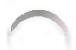

P1 Chromosomes include dedicated sequences that ensure their replication, transcription, packaging, and transmission from one generation to the next. They are more than a long stretch of protein-encoding genes.

P2 Chromosomes are large. To constrain them in a small space can require multiple layers and multiple modes of tertiary structure.

P3 Chromosomes in all cells are maintained in a state of torsional stress. DNA is underwound relative to the stable B-form structure, facilitating both the packaging of DNA and access to the genetic information contained within it.

P4 Specialized proteins and RNAs maintain chromosome structure. Topoisomerases control DNA underwinding. Histones, condensins, cohesins, and other DNA-binding proteins provide scaffolds to organize chromosome structure. Certain long, noncoding RNAs also play important roles in chromosome structure and function.

The chapter begins with an examination of the elements that make up viral and cellular chromosomes, and then considers chromosomal size and organization. We then discuss DNA topology, describing the coiling and supercoiling of DNA molecules. Finally, we consider the protein-DNA interactions that organize chromosomes into compact structures.

  
FIGURE 24-1 Bacteriophage T2 protein coat surrounded by its single, linear molecule of DNA. The DNA was released by lysing the bacteriophage particle in distilled water and allowing the DNA to spread on the water surface. An undamaged T2 bacteriophage particle consists of a head structure that tapers to a tail by which the bacteriophage attaches itself to the outer surface of a bacterial cell. All the DNA shown in this electron micrograph is normally packaged inside the phage head. [Republished with permission of Elsevier, from A. K. Kleinschmidt et al. (1962), "Preparation and length measurements of the total deoxyribonucleic acid content of T2 bacteriophages," Biochim. Biophys. Acta 61:857–864; permission conveyed through Copyright Clearance Center, Inc.]

<!-- EN-END 第24章导言 -->

## 一、基因概念的演变

遗传学是生物科学的一门核心分支学科。遗传学发展迅速，其思想对生物科学各分支学科都起着指导作用。遗传学从一开始就充满争议，并贯穿于整个发展过程。基因是遗传学最基本的概念，不同时期存在不同的理解。生物化学从分子水平上研究基因，揭示其化学本质和作用机制，生物化学与遗传学的观念是一致的。

## （一）孟德尔的遗传因子假说

在 19 世纪中叶, 尚无系统的遗传理论, 也缺乏有效研究遗传的方法和技术。有关研究仅限于对亲代和子代特征的观察, 或是进行动、植物杂交试验和统计学分析。由于生物的复杂性, 在生物学实验中选材和设计实验就无比重要。当时多数杂交试验在选材上都不够严谨, 研究的性状也并不都合适, 所得结果认为杂交子代的特征介于双亲之间, 还有学者认为子代性状接近于群体的平均值, 这似乎与“融合遗传 (blending inheritance)”的观点一致。“融合遗传”认为, 子代遗传物质是由亲代遗传物质“融合”而成。在 19 世纪比较流行的遗传观点还有拉马克 (Lamarck) 的“获得性遗传”和希波克拉底 (Hippocrates) 的“泛生论”。达尔文于 1859 年出版了他的举世名著《物种起源》, 自此达尔文的名字便和“自然选择”与“进化论”联系在一起了。达尔文进化论的最大缺陷是未能提出令人信服的遗传学说。达尔文用“融合遗传”的观点来解释子代的遗传特征, 用“获得性遗传”来说明环境的影响, 并试图用“泛生论”来阐明遗传机制, 这是全书最糟糕的部分。然而, 那时并无更好的遗传理论可供达尔文采用。

孟德尔最早从豌豆杂交试验中发现遗传的一些基本规律，因此认为他奠定了遗传学的基础是很恰当的。孟德尔的豌豆杂交试验十分严谨、仔细，工作量也非常大，远不是同时代杂交试验可以与之相比的。从1856年开始，孟德尔采用34个豌豆品系，挑选7对区分明显的性状，反复进行杂交试验，对所收集的成千上万个杂交后代种子全部进行统计学分析，而不像同时代科学家那样人为有选择的分析，他的工作在同时代是独一无二的。孟德尔于1865年在“布隆自然历史学会”上宣读了他的论文“植物杂交试验”，其中总结了他所发现的遗传规律。次年该论文在学会的刊物上发表。

孟德尔的主要功绩在于:第一,他通过豌豆杂交试验证明遗传性状是由独立存在的遗传因子所决定,因此否定了“融合遗传”,确立了“颗粒遗传(particulate inheritance)”的思想。第二,他发现遗传因子有显性(dominant)和隐性(recessive)之分。决定一个遗传性状(如高矮)的遗传因子有一对,其中一个来自父本,另一个来自母本。子代的两个遗传因子可以是相同的(都是高的或都是矮的),也可以是不同的(一个高因子和一个矮因子);当两个不同遗传因子在一起时,其中一个掩盖另一个的表现。第三,他发现遗传因子由亲代传递给子代有两条原理,后来被称为分离定律(law of segregation)和自由组合定律(law of independent assortment)。就是说,在形成生殖细胞时,决定任何性状的一对遗传因子总是彼此分开进入不同卵或精子中;生殖细胞含有决定不同性状的整套遗传因子,其中有些来自父本,有些来自母本,这种组合是随机的。

为什么孟德尔能够取得如此巨大的科学成就？孟德尔虽然是一位虔诚的修道士，但却受过良好的自然科学训练，他在维也纳大学学习了物理学、化学、动物学、昆虫学、植物学、古生物学和数学，还当过多位教授的助手。他工作执著，思想敏锐，善于抓住问题的关键。他对实验体系的选择是十分出色的，他曾强调取材必需有助于研究的目的。例如植物学家 Nägeli 曾建议孟德尔用山柳菊属的野鹰草作杂交试验，认为也许可以揭示出某些隐匿的性状，孟德尔作了尝试随即摒弃了这种材料，因为野鹰草由于无融合生殖（孤雌生殖）而不能显示有性生殖的遗传规律。

很可惜,孟德尔的杂交试验和遗传理论不被当时的学术界所接受。孟德尔的研究成果被埋没了35年,直到1900年由三位科学家几乎同时重新发现了他的学术著作。多数学者认为,19世纪中叶孟德尔的工作不被理解,是由于当时的时机尚不成熟,无论是本学科还是邻近学科都缺少对他学说支持的证据,也没有科学家获得与他工作类似的成果。进入20世纪,遗传学兴起的时机成熟了,重新认识孟德尔的工作便成为遗传学发展的开始。

## （二）摩尔根的基因学说和染色体理论

重新发现孟德尔1866年论文的三位植物学家，H. de Vries、C. Correns和E. von Tschemak，都曾从事植物杂交研究，在解释杂交结果并据以推导遗传规律的过程中看到孟德尔的原始论文，他们都认识到了孟德尔工作的重要意义。Correns和Tschemak曾做过豌豆杂交试验，从孟德尔的理论中受到启发，深信其正确。de Vries在19世纪后期曾用玉米进行杂交试验，观察到了显性和性状分离现象，并得到3：1的比例；其后又对30多个其他物种和变种进行杂交试验，也得到类似的结果。他的杂交试验和理论观点基本与孟德尔一致。三位科学家同时推崇孟德尔的论文，足以引起学术界广泛的关注。但是，在一段时间内（1900年—1910年），许多生物学家仍对这种新的遗传理论抱着反对或怀疑的态度。

孟德尔遗传理论的支持者和反对者之间展开热烈的争论。在刊物上、在各种学术会议上、甚至在私下的会见和信件中，彼此针锋相对、互不相让。一些科学家重复孟德尔的豌豆杂交试验，或者另外设计试验，以求验证孟德尔遗传理论是否正确。学术争论是推动学科发展的最好方式，在争论中遗传学得到迅速发展。1909年W.L.Johannsen提出基因(gene)这个名词，表示遗传物质的最小功能单位，用来取代孟德尔所称的遗传因子，并提出基因型(genotype)和表型(phenotype)这样两个术语，前者表示生物的基因成分，后者是这些基因所表现的性状。在争论中不少学者混淆了“遗传因子”和“表现性状”之间的区别，由此造成概念上的混乱，Johannsen的定义对理解孟德尔遗传理论有重要意义。

1910 年初, 摩尔根(T. H. Morgan)和他的助手从饲养的红眼果蝇中发现一只白眼雄性果蝇, 这是一种突变型(mutant), 正常的红眼为野生型(wild type)。让这个突变的雄果蝇与正常(红眼)雌果蝇交配, 所得子代都是正常的红眼果蝇; 如果让杂交子代之间交配, 白眼性状又再次出现, 然而总是存在于雄果蝇中, 雌性极为偶见; 如果接着让突变雄果蝇与杂交子一代交配, 那么在后代中一半雄性、一半雌性为白眼。这种结果只能用孟德尔遗传原理来解释。于是摩尔根和他的学生们由孟德尔遗传理论的反对者一变而成为积极的支持者。摩尔根是一位非常杰出的科学家, 他通过自己的试验证明孟德尔理论正确之后便不遗余力的宣扬孟德尔遗传理论。10 年论战, 孟德尔的遗传理论终于成为主流的遗传学, 并被冠以孟德尔的名字, 以示对这位遗传学奠基者的尊敬。当然, 对孟德尔或摩尔根理论的反对者和怀疑者还是有的, 事实上任何理论在任何时候都有反对者, 有些是因为理论本身不完善, 有些是过于自信自己创立或自己支持的理论, 有些则是根本不懂自己反对的理论。

摩尔根对遗传学的贡献十分巨大,他和他的同事发展了孟德尔的“颗粒遗传”的思想,首次用实验证明染色体是基因(相当于孟德尔的遗传因子)的载体,基因位于染色体的特定座位(loci)上。摩尔根小组发现了伴性性状、连锁定律和上百个果蝇基因,对这些基因的性质和效应进行了广泛的研究。摩尔根小组还创立了遗传的染色体理论。摩尔根认为,两条同源染色体联会时发生部分交换,产生基因间重组,这种重组程度是它们空间分隔距离的量度,从而可以通过测定基因重组频率或染色体变异的遗传效应构建出基因的连锁图,即基因在染色体上的线性排列图。1915年摩尔根与他的合作者出版了具有划时代意义的著作《孟德尔遗传机理》,稍后又出版了《遗传的物质基础》(1919)和《基因论》(1926),这些著作对遗传学的发展意义深远。1933年摩尔根获诺贝尔生理学或医学奖。

细胞学和遗传学是生物学关系密切的两个分支学科。19世纪30年代末建立细胞学说，认识到所有生物都是由细胞组成的。其后，通过对细胞染色体的观察知道，配子（精子和卵）的染色体数目是体细胞的一半，有丝分裂将复制后的染色体平均分配给子代细胞，减数分裂则只分配给配子一半染色体，通过受精才使两个配子的染色体合并。在显微镜下还观察到染色体发生缺失、易位、倒位和重复等异常现象，而机体也同时会有性状的变异。这些研究结果使一些细胞学家相信染色体与遗传有关。1903年W.S.Sutton首先提出遗传因子位于染色体上这一概念，并认为染色体的行为可以构成孟德尔遗传定律的物质基础。摩尔根用实验证明了细胞学家的臆测，他发现伴性性状说明决定这些性状的基因位于性染色体上,终于将细胞学和遗传学结合起来,产生了细胞遗传学。摩尔根小组花费大量时间找出果蝇基因的连锁群,绘制染色体图,进而建立了染色体遗传学。

摩尔根的影响远不止遗传学。摩尔根原先是实验胚胎学家，对“突变”极感兴趣，对达尔文以连续变异作为进化原始材料的观点抱有怀疑。他曾用多种动物进行诱变实验，从1908年开始选用果蝇进行实验，终于获得成功。他的学生H.J.Muller由于研究X射线对突变率的影响而获1946年诺贝尔生理学或医学奖，也与摩尔根思想的影响有关。摩尔根用他的基因学说使“发育-遗传-进化”三个学科联系在一起。事实上没有一个生物学的分支学科与发育、遗传和进化无关，基因学说已成为生物学所有分支学科的指导思想。有生物学家说：“19世纪是达尔文的世纪”，那么，20世纪对生物学影响最大的科学家是谁？可以说，前半个世纪是摩尔根，后半个世纪是沃森(J.D.Watson)和克里克(F.Crick)。前半个世纪从生物学(遗传学)角度研究基因的存在和作用；后半个世纪从分子水平(生物化学和分子生物学角度)研究基因的本质，研究基因如何编码、如何传递和表达遗传信息。

## （三）基因是编码多肽链和RNA的一段DNA

随着遗传学的发展,基因这个术语广泛被生物学各分支学科所使用,同时也普遍被提问基因的化学本质是什么?细胞学和生物化学同为遗传学的重要基础学科。细胞学揭示了基因载体染色体的行为,因而有助于了解基因的生物学作用。生物化学是沟通化学与遗传学之间的桥梁,研究基因的分子结构和基因作用的化学过程,则有赖于生物化学。

虽然 J. F. Miescher 在 1868 年就已提取出 DNA, 然而直到 1944 年 O. T. Avery 证明 DNA 是细菌性状的转化因子才被重视。1952 年 A. Hershey 和 M. Chase 用放射性同位素标记实验证明, 噬菌体感染宿主时只有 DNA 进入细菌细胞, 从而真正认识到 DNA 是遗传物质。在此之前已经知道, 代谢障碍与基因突变有关, 1945 年 G. W. Beadle 和 E. L. Tatum 据此提出“一个基因一种酶”的假设。Watson 和 Crick 受量子论奠基者 N. Bohr 的学生 M. Delbrück 的影响, 深信遗传信息编码在染色体的遗传物质上, 当他们知道遗传物质是 DNA 后就把注意力集中到了这类物质。他们从 M. Wilkins 处获得 DNA 的 X 射线衍射图, 根据 DNA 的化学性质和作为遗传物质可能的作用方式, 经过不懈努力, 构建出 DNA 分子双螺旋结构模型。该模型阐明了遗传物质的分子结构和复制机制, 在此基础上诞生了分子生物学。20 世纪的分子生物学实质上就是基因的分子生物学。

按照 Watson 和 Crick 的设想,遗传信息贮存在 DNA 分子中,经复制而由亲代传递给子代,在子代经 RNA 指导蛋白质的合成,从而表现出各种生命特征。Crick 在 1958 年将之总结为分子生物学的中心法则 (dogma),即“DNA →RNA →蛋白质”。按照此设想,基因也就是 DNA 分子的一个片段。法则的意思是无需证明而必须遵循的规则。中心法则虽然逐渐为大家所接受,然而始终争议不断。1961 年 F. Jacob 和 J. Monod 提出操纵子学说,并论证了 mRNA 的功能。其后认识到基因有启动子和各种调节元件。1966 年 M. W. Nirenburg 等破译了遗传密码。于是基因被定义为一段核苷酸序列。20 世纪 70 年代建立 DNA 克隆技术,兴起了基因工程,至此基因已不仅仅是一个纯理论上的概念,而且是实实在在可以操作的遗传物质。在一段时间内“基因学说”似乎已经十分“完美”,但在随后的研究中却不断受到新发现的冲击,有关基因的概念也在不断改变。

1977 年 F. Sanger 测定 $\phi X174$ 噬菌体 DNA 序列发现基因可以是重叠的，因此不能简单将基因等同于一段 DNA。同年，R. J. Roberts 和 P. A. Sharp 分别发现真核生物的基因是断裂的，由内含子 (intron) 将编码序列的外显子 (exon) 分割开。其后发现 RNA 在加工过程可以发生选择性剪接 (alternative splicing)，产生异型体 (isoform) 多肽链。这就是说，“一个基因一种酶”“一个基因一条多链肽”的观点是不准确的。20 世纪 80 年代还发现，除 tRNA、rRNA 和 mRNA 负责蛋白质合成外，还存在许多具有催化功能、调节功能和其他功能的 RNA，表明有些基因的终产物是这些有特殊功能的 RNA。那么，现在应该如何定义基因？综上所说，基因是指携带编码多肽链和 RNA 遗传信息的一段 DNA，而不是简单指一段核苷酸序列或 DNA。表观遗传学证明染色体修饰和 RNA 引起的基因沉默也能遗传，但表观遗传学研究基因之外的遗传，并不涉及基因概念。简言之，基因是一段编码 DNA，研究基因不能仅研究其物理载体，更重要的是了解其编码的遗传信息。

## 二、基因和基因组的结构

基因组也就是整套基因的意思。通常基因组是指细胞或病毒整套染色体基因，细胞器基因组需注明是什么细胞器。原核生物和真核生物的基因和基因组有显著差别。

## （一）原核生物的基因和基因组结构

原核生物染色体 DNA 和真核生物细胞器 DNA 通常都是双链环状分子, 极少数为线状分子。病毒可看作游离的染色体, 其基因组或为 DNA(单链或双链, 线状或环状), 或为 RNA(正链、负链或双链, 线状或环状)。原核生物基因组的结构有如下特点: ① 基因组较小, 大部分为编码序列, 单拷贝(rRNA 基因为多拷贝), 间隔序列和调节序列所占比例较小; ② 基因编码序列连续, 无内含子; ③ 功能相关的基因组成操纵子; ④ 重复序列极少、较短。

表 29-1 列出几种原核生物和病毒的基因组大小和基因数, 平均每个基因大小为 $1\ 000 \sim 1\ 500\ bp$ 。基因组较大的细菌, 如黄色黏球菌的基因组 $(9.4 \times 10^{6}\ \mathrm{bp})$ , 其大小已接近酿酒酵母 $(1.21 \times 10^{7}\ \mathrm{bp})$ ; 基因数前者约为 8000, 后者为 5800, 已超过后者。生殖道支原体是目前已知能独立生活的最小原核生物, 其基因组大小为 $0.580 \times 10^{6}\ bp$ , 基因数为 473。据推测, 能够独立生活的原始细胞可能最低基因数为 256 个。

表 29-1 原核生物和病毒的基因组大小和基因数

<table><tr><td>生物</td><td>基因数</td><td>基因组大小(bp)</td></tr><tr><td>MS2噬菌体(ssRNA phage)</td><td>3</td><td>3569</td></tr><tr><td> $\phi X174$  噬菌体(scDNA phage)</td><td>11</td><td>5386</td></tr><tr><td> $\lambda$  噬菌体(dsDNA phage)</td><td>66</td><td>48502</td></tr><tr><td>痘苗病毒(Vaccinia virus)</td><td>206</td><td> $1.86\times 10^{5}$ </td></tr><tr><td>生殖道支原体(Mycoplasma genitalium)</td><td>473</td><td> $0.580\times 10^{6}$ </td></tr><tr><td>沙眼衣原体(Chlamydia trachomatis)</td><td>894</td><td> $1.04\times 10^{6}$ </td></tr><tr><td>普氏立克次体(Rickattsia prowazekii)</td><td>834</td><td> $1.11\times 10^{6}$ </td></tr><tr><td>布氏疏螺旋体(Borrelia burgdorferi)</td><td>853</td><td> $0.911\times 10^{6}$ </td></tr><tr><td>幽门螺杆菌(Helicobacter pylori)</td><td>1590</td><td> $1.66\times 10^{6}$ </td></tr><tr><td>詹氏甲烷球菌(Methanococcus jannaschii)</td><td>1738</td><td> $1.66\times 10^{6}$ </td></tr><tr><td>流感嗜血杆菌(Hacmophilus influenzae)</td><td>1760</td><td> $1.83\times 10^{6}$ </td></tr><tr><td>闪烁古生球菌(Archaeoglobus fulgidus)</td><td>2436</td><td> $2.18\times 10^{6}$ </td></tr><tr><td>腾冲嗜热厌氧菌(Thermoanaerobacter tengcongensis)</td><td>2588</td><td> $2.68\times 10^{6}$ </td></tr><tr><td>枯草芽孢杆菌(Bacillus subtilis)</td><td>4100</td><td> $4.2\times 10^{6}$ </td></tr><tr><td>大肠杆菌(Escherichia coli)</td><td>4400</td><td> $4.6\times 10^{6}$ </td></tr><tr><td>天蓝色放线菌(Streptomyces coelicolor)</td><td>7846</td><td> $8.6\times 10^{6}$ </td></tr><tr><td>黄色黏球菌(Myxococcus xanthus)</td><td>8000</td><td> $9.4\times 10^{6}$ </td></tr></table>

原核生物的染色体 DNA 小于 $10 \, Mb (10 \times 10^{6} \, bp)$ ，除链霉菌和疏螺旋体为双链线状 DNA 外，一般都是双链环状分子。原核生物基因组以操纵子为转录单位，每个操纵子有转录的控制部位，受调节基因产物的调节（详见基因表达调节）。大肠杆菌有 2584 个操纵子，其中 73% 只含一个基因，16.6% 含 2 个基因，4.6% 含 3 个基因，6% 含 4 个或 4 个以上基因。染色体外的基因或基因组称为质粒，质粒通常为双链环状 DNA，少数为线状分子。有些质粒并不携带对宿主有益的遗传信息，其仅有的功能就在于可自身繁殖。线粒体 DNA (mtDNA) 通常为环状分子，一个线粒体可以有多个分子，低等生物的线粒体 DNA 大小和形状变动较大，在18\~400 kb之间，环状或线状。植物的mtDNA较大，在120 kb以上，甚至高达2400 kb，一般为环状，少数为线状。后生动物的mtDNA大小为15\~40 kb，为环状分子。在进化过程中不断有线粒体基因移至核染色体内。人的mtDNA为16.6 kb，环状分子。不同植物的叶绿体DNA（cpDNA）较为一致，为120\~217 kb，环状分子，一个叶绿体常含多个DNA分子。

病毒基因组因其起源和复制方式不同而有较大差异,多样性是其特征之一。选择压力使病毒基因组被压缩,基因间隔区很小或没有。有些病毒基因相互重叠:①一个基因是另一个基因的一部分,即同一阅读框架,但起始或终止氨基酸不同;②一个基因在另一个基因编码区内,但阅读框架不同;③两个基因部分重叠,阅读框架不同;④一个基因的起始信号在另一个基因的终止信号内。

## （二）真核生物的基因和基因组结构

真核生物包括单细胞的真菌(如酵母)与原生生物(原生动物、黏菌、藻类)和多细胞的植物、真菌和动物。其基因组结构的特点是:①基因组较大(>10 Mb),间隔序列和调节序列所占比例大;②通常基因的编码序列不连续,编码的外显子被非编码的内含子序列分割开;③功能相关基因不组成操纵子,分散在各染色体中;④存在较大比例各种重复序列。真核生物基因组大小及基因数见表29-2。

表 29-2 真核生物的基因组大小和基因数

<table><tr><td>生物</td><td>大约基因数</td><td>基因组大小(bp)</td></tr><tr><td>酿酒酵母(Saccharomyces cerevisiae)</td><td>5 800</td><td> $1.21 \times 10^{7}$ </td></tr><tr><td>嗜热四膜虫(Tetrahymeno thermophila)</td><td>27 000</td><td> $1.25 \times 10^{8}$ </td></tr><tr><td>秀丽隐杆线虫(Caenorhabditis elegans)</td><td>20 000</td><td> $1.03 \times 10^{8}$ </td></tr><tr><td>黑腹果蝇(Drosophila melanogaster)</td><td>14 700</td><td> $1.80 \times 10^{8}$ </td></tr><tr><td>玻璃海鞘(Ciona intestinalis)</td><td>16 000</td><td> $1.60 \times 10^{8}$ </td></tr><tr><td>河豚(Fugu rubripes)</td><td>22 000</td><td> $3.93 \times 10^{8}$ </td></tr><tr><td>小鼠(Mus musculus)</td><td>27 000</td><td> $2.60 \times 10^{9}$ </td></tr><tr><td>人类(Homo saplens)</td><td>30 000</td><td> $3.20 \times 10^{9}$ </td></tr><tr><td>拟南芥菜(Arabidopsis thaliana)</td><td>26 500</td><td> $1.20 \times 10^{8}$ </td></tr><tr><td>亚洲稻(Oryza sativa)</td><td>45 000</td><td> $4.66 \times 10^{8}$ </td></tr><tr><td>玉米(Zea mays)</td><td>45 000</td><td> $2.20 \times 10^{9}$ </td></tr><tr><td>烟草(Nicotiana tobacum)</td><td>43 000</td><td> $4.50 \times 10^{9}$ </td></tr></table>

人类单倍体(22+X+Y)基因组 DNA 大小为 $3.20 \times 10^{9}$ bp, 包含大约 3 万个基因, 其中编码蛋白质的基因 21 000 个, 已知 RNA(包括 tRNA、rRNA、snoRNA、snRNA、miRNA 和 antiRNA 等)基因 8 800 个。蛋白质基因大约只占基因组 DNA 的 25%, 编码序列约占 1.2%, 23.8% 为基因的各类调节序列、内含子序列和假基因; RNA 基因有些位于内含子, 有些位于基因间隔区。上述数据只能给出一个大致的情况, 不同实验室报导的数据出入颇大, 而且随着研究的深入, 有关概念和数据也在不断改变。

真核生物的基因存在内含子(intron)和各类调节元件,因此比原核生物基因要大得多。不同基因间差别极大。最大的基因为肌养蛋白(dystrophin)基因,位于X染色体,达2.5 Mb(2.5×10 $^{6}$ bp),编码约3700个氨基酸的蛋白质多肽链(\~500 kD)。该基因共有79个外显子(exon),实际上其编码序列仅11058 bp,不到基因的0.5%。最大的蛋白质为肌联蛋白(titin),约含27000个氨基酸(\~3.2 MD),其基因约250 kb,位于Y染色体,是外显子最多的基因,共178个外显子。而组蛋白基因无内含子,H1、H4、H2B、H3和H2A基因串联在一起,构成基因簇(gene cluster),其大小约为6000\~7000 bp,多拷贝分散存在。真核生物基因启动子的上游、下游或内含子中常存在增强子(enhancer),可结合调节蛋白促进基因的转录;有时还存在负的调控序列,称为沉默子(silencer)。增强子和沉默子具有远距离效应,绝缘子(silencer)可防止远距离增强子和沉默子的作用。在启动子附近存在各类调节元件(regulation element)。基因的下游为终止子(terminator),是转录的终止信号。真核生物的基因结构如图29-2所示。

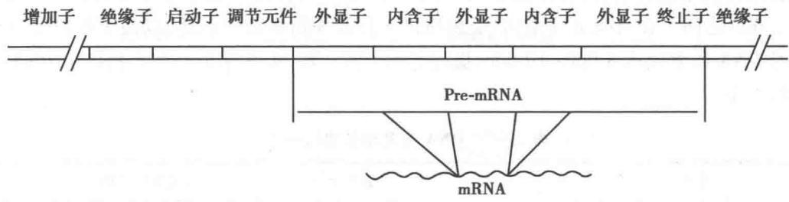  
图 29-2 真核生物基因示意图

真核生物基因组 DNA 有较大量的重复序列。重复序列可分为两类:一类序列较短(<10 bp),拷贝数可达上百万( $10^{6}$ ),称为高度重复序列(highly repetitive sequence),约占基因组的 3%;另一类序列有长 (>100 bp)有短(<100 bp),拷贝数从几十到数十万,称为中度重复序列(moderately repetitive sequence),约占基因组的 50%。高度重复 DNA 又称为卫星 DNA(satellite DNA),因其碱基组成与主体 DNA 有较大差别,将细胞 DNA 切成碎片进行氯化铯密度梯度离心时,由于密度不同而与主体 DNA 分开,形成卫星条带。这类 DNA 组成特别,可能与某些特殊功能有关,仅存在于基因组的着丝点(centromere)和端粒(telomere)等位点。前者是细胞有丝分裂时纺锤丝的固着点;后者是线状染色体 DNA 的末端结构,起着保护 DNA 末端和完成 DNA 复制的作用。中度重复 DNA 包括多拷贝基因(如组蛋白、tRNA、rRNA 基因)、调节序列、倍增片段(segmental duplication)以及大量各类转座子。

真核生物基因组中还存在许多基因家族，或称为多基因家族（multigene family）。基因家族是由一个祖先基因经重复和突变，形成若干序列相似、其编码产物结构和功能相近的基因群。例如，哺乳动物基因组的组蛋白、珠蛋白、免疫球蛋白、肌动蛋白、胶原蛋白、热激蛋白等基因家族。基因家族与基因簇（gene cluster）是两个不同的概念，前者在进化上具有亲缘关系；后者指在位置上彼此排列在一起。基因簇的成员可以是同一家族，也可以不是同一家族。原核生物的基因簇常组成操纵子；真核生物的基因簇不组成操纵子，簇内各个基因分别有其启动和调节转录的序列。

<!-- EN-BEGIN 24.1 -->

### 【英文对应 24.1】Chromosomal Elements

> 来源：Lehninger Principles of Biochemistry（书籍/02_生物化学原理） 第24章 Genes and Chromosomes，§24.1。对应本章“二、基因和基因组的结构”。

Cellular DNA contains genes and intergenic regions, both of which may serve functions vital to the cell. The more complex genomes, such as those of eukaryotic cells, demand increased levels of chromosomal organization, and this is reflected in the structural features of the chromosomes. We begin by considering the different types of DNA sequences and structural elements within chromosomes.

#### [EN] Genes Are Segments of DNA That Code for Polypeptide Chains and RNAs

Our understanding of genes has evolved tremendously over the past century. Classically, a gene was defined as a portion of a chromosome that determines or affects a single character or phenotype (visible property), such as eye color. George Beadle and Edward Tatum proposed a molecular definition of a gene in 1940. After exposing spores of the fungus Neurospora crassa to x-rays and other agents now known to damage DNA and cause alterations in DNA sequence (mutations), they detected mutant fungal strains that lacked one or another specific enzyme, sometimes resulting in the failure of an entire metabolic pathway. Beadle and Tatum concluded that a gene is a segment of genetic material that determines, or codes for, one enzyme: the one gene-one enzyme hypothesis. Later this concept was broadened to one gene-one polypeptide, because many genes code for a protein that is not an enzyme or for one polypeptide of a multisubunit protein.

The modern biochemical definition of a gene is even more precise. A gene is all the DNA that encodes the primary sequence of some final gene product, which can be either a polypeptide or an RNA with a structural or catalytic function. DNA also contains other segments or sequences that have a purely regulatory function. Regulatory sequences provide signals that may denote the beginning or the end of genes, or influence the transcription of genes, or function as initiation points for replication or recombination (Chapter 28). Some genes can be expressed in different ways to generate multiple gene products from a single segment of DNA; the special transcriptional and translational mechanisms that allow this are described in Chapters 26 through 28.

We can estimate directly the minimum overall size of genes that encode proteins. As described in detail in Chapter 27, each amino acid of a polypeptide chain is coded for by a sequence of three consecutive nucleotides in a single strand of DNA (Fig. 24-2), with these “codons” arranged in a sequence that corresponds to the sequence of amino acids in the polypeptide that the gene encodes. A polypeptide chain of 350 amino acid residues (an average-size chain) corresponds to 1,050 base pairs (bp) of coding DNA. Many genes in eukaryotes and a few in bacteria and archaea are interrupted by noncoding DNA segments and are therefore considerably longer than this simple calculation would suggest.

How many genes are in a single chromosome? The Escherichia coli chromosome is a circular DNA molecule (in the sense of an endless loop rather than a perfect circle) with 4,641,652 bp. These base pairs encode about 4,300 genes for proteins and more than 200 genes for structural or catalytic RNA molecules. Among eukaryotes, the approximately 3.1 billion base pairs of the human genome include approximately 20,000 genes on the 24 different chromosomes.

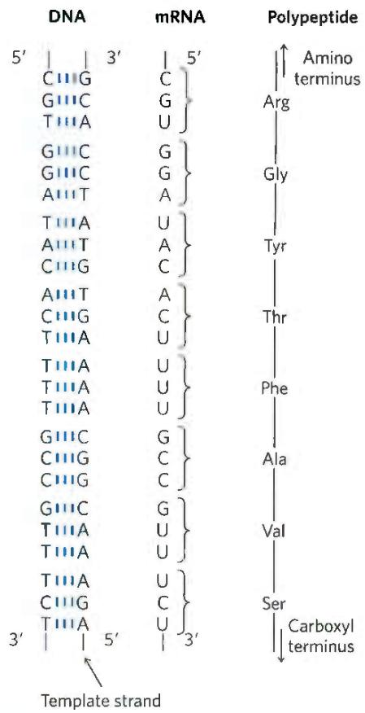

FIGURE 24-2 Colinearity of the coding nucleotide sequences of DNA and mRNA and the amino acid sequence of a polypeptide chain. The triplets of nucleotide units in DNA determine the amino acids in a protein through the intermediary mRNA. One of the DNA strands serves as a template for synthesis of mRNA, which has nucleotide triplets (codons) complementary to those of the DNA. In some bacterial and many eukaryotic genes, coding sequences are interrupted at intervals by regions of noncoding sequences (called introns).  

#### [EN] DNA Molecules Are Much Longer than the Cellular or Viral Packages That Contain Them

Chromosomal DNAs are often many orders of magnitude longer than the cells or viruses in which they are located (Fig. 24-1; Table 24-1). This is true of every class of organism or viral parasite.

Viruses Viruses are not free-living organisms; rather, they are infectious parasites that use the resources of a host cell to carry out many of the processes they require to propagate. Many viral particles consist of no more than a genome (usually a single RNA or DNA molecule) surrounded by a protein coat.

Almost all plant viruses and some bacterial and animal viruses have RNA genomes. These genomes tend to be particularly small. For example, the genomes of mammalian retroviruses such as HIV consist of 9,000 nucleotides of single-stranded RNA.

The genomes of DNA viruses vary greatly in size. Many viral DNAs are circular for at least part of their life cycle. During viral replication within a host cell, specific types of viral DNA called replicative forms may appear; for example, many linear DNAs become circular and all single-stranded DNAs become double-stranded. A typical medium-size DNA virus is bacteriophage $\lambda$ (lambda), which infects E. coli. In its replicative form inside cells, $\lambda$ DNA is a circular double helix. This double-stranded DNA contains 48,502 bp and has a contour length of 17.5 $\mu$ m. Bacteriophage $\phi$ X174 is much smaller; the DNA in the viral particle is a single-stranded circle, and the double-stranded replicative form contains 5,386 bp. P2 Although viral genomes are small, the contour lengths of their DNAs are typically hundreds of times longer than the long dimensions of the viral particles that contain them (Table 24-1).

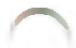

<table><tr><td colspan="4">TABLE 24-1 The Sizes of DNA and Viral Particles for Some Bacterial Viruses (Bacteriophages)</td></tr><tr><td>Virus</td><td>Size of viral DNA (bp)</td><td>Length of viral DNA (nm)</td><td>Long dimension of viral particles (nm)</td></tr><tr><td> $\phi X174$ </td><td>5,386</td><td>1,939</td><td>25</td></tr><tr><td>T7</td><td>39,936</td><td>14,377</td><td>78</td></tr><tr><td> $\lambda$  (lambda)</td><td>48,502</td><td>17,460</td><td>190</td></tr><tr><td>T4</td><td>168,889</td><td>60,800</td><td>210</td></tr></table>

Note: Data on size of DNA are for the replicative form (double-stranded). The contour length is calculated assuming that each base pair occupies a length of 3.4 Å (see Fig. 8-13).

Bacteria A single E. coli cell contains almost 100 times as much DNA as a bacteriophage $\lambda$ particle. The chromosome of an E. coli cell is a single, double-stranded circular DNA molecule. Its 4,641,652 bp have a contour length of about 1.7 mm, some 850 times the length of the E. coli cell (Fig. 24-3). In addition to the very large, circular DNA chromosome in their nucleoid, many bacteria contain one or more small circular DNA molecules that are free in the cytosol. These extrachromosomal elements are called plasmids (Fig. 24-4; see also p. 305). Most plasmids are only a few thousand base pairs long, but some contain up to 400,000 bp. They carry genetic information and undergo replication to yield daughter plasmids, which pass into the daughter cells at cell division. Plasmids have been found in yeast and other fungi as well as in bacteria.

In many cases plasmids confer no obvious advantage on their host, and their sole function seems to be self-propagation. However, some plasmids carry genes that are useful to the host bacterium. For example, some plasmid genes make a host bacterium resistant to antibacterial agents. Plasmids carrying the gene for the enzyme $\beta$ -lactamase confer resistance to $\beta$ -lactam antibiotics such as penicillin, ampicillin, and amoxicillin (see Fig. 6-34). These and similar plasmids may pass from an antibiotic-resistant cell to an antibiotic-sensitive cell of the same or another bacterial species, making the recipient cell antibiotic-resistant. The extensive use of antibiotics in some human populations and in animal feeds has served as a strong selective force, encouraging the spread of antibiotic resistance-coding plasmids (as well as transposable elements, described below, that harbor similar genes) in disease-causing bacteria.

Eukaryotes A yeast cell, one of the simplest eukaryotes, has 2.6 times more DNA in its genome than an E. coli cell (Table 24-2). Cells of Drosophila, the fruit fly used in classical genetic studies, contain more than 35 times as much DNA as E. coli cells, and human cells have almost 700 times as much. The cells of many plants and amphibians contain even more. The genetic material of eukaryotic cells is apportioned into chromosomes, the diploid (2n) number depending on the species. A human somatic cell, for example, has 46 chromosomes (Fig. 24-5). Each chromosome of a eukaryotic cell, such as that shown in Figure 24-5a, contains a single, very large, duplex DNA molecule. The DNA molecules in the 24 different types of human chromosomes (22 matching pairs of autosomes plus the X and Y sex chromosomes) vary in length over a 25-fold range. Each type of chromosome in eukaryotes carries a characteristic set of genes.

P2 DNA molecules of one human genome (22 chromosomes plus X and Y), placed end to end, would extend for about a meter. Most human cells are diploid, so each cell contains a total of 2 m of DNA. An adult human body contains approximately $10^{14}$ cells and thus a total DNA length of $2 \times 10^{11}$ km. Compare this with the circumference of the earth ( $4 \times 10^{4}$ km) or the distance between the earth and the sun ( $1.5 \times 10^{8}$ km)—a dramatic illustration of the extraordinary degree of DNA compaction in our cells.

Eukaryotic cells also have organelles, mitochondria and chloroplasts, that contain DNA. Mitochondrial DNA (mtDNA) molecules are much smaller than the nuclear chromosomes. In animal cells, mtDNA contains fewer than 20,000 bp (16,569 bp in human mtDNA) and is a circular duplex. Each mitochondrion typically has 2 to 10 copies of this mtDNA molecule, and the number can rise to hundreds in certain cells of an embryo that is undergoing cell differentiation. Plant cell mtDNA ranges in size from 200,000 to 2,500,000 bp. Chloroplast DNA (cpDNA) also exists as circular duplexes and ranges in size from 120,000 to 160,000 bp. Mitochondrial and chloroplast DNAs have an evolutionary origin in the chromosomes of ancient bacteria that gained

FIGURE 24-3 A bacterial cell and its DNA. The length of the E. coli chromosome (1.7 mm), depicted in linear form, relative to the length of a typical E. coli cell (2 $\mu$ m).

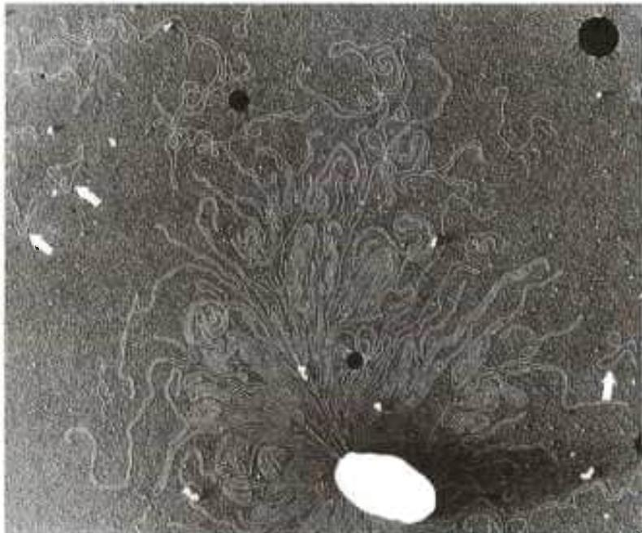

FIGURE 24-4 DNA from a lysed E. coli cell. In this electron micrograph, several small, circular plasmid DNAs are indicated by white arrows. The black spots and white specks are artifacts of the preparation. [Huntington Potter, University of Colorado School of Medicine, and David Dressler, Balliol College, Oxford University.]

TABLE 24-2 DNA, Gene, and Chromosome Content in Some Genomes

<table><tr><td></td><td>Total DNA (bp)</td><td>Number of chromosomesa</td><td>Approximate number of protein-coding genes</td></tr><tr><td>Escherichia coli K12 (bacterium)</td><td>4,641,652</td><td>1</td><td> $4,494^b$ </td></tr><tr><td>Saccharomyces cerevisiae (yeast)</td><td>12,157,105</td><td> $16^c$ </td><td>6,600</td></tr><tr><td>Caenorhabditis elegans (nematode)</td><td>100,286,401</td><td> $12^d$ </td><td>20,191</td></tr><tr><td>Arabidopsis thaliana (plant)</td><td>119,667,750</td><td>10</td><td>27,655</td></tr><tr><td>Drosophila melanogaster (fruit fly)</td><td>143,726,002</td><td>18</td><td>13,931</td></tr><tr><td>Oryza sativa (rice)</td><td>375,049,285</td><td>24</td><td>37,849</td></tr><tr><td>Mus musculus (mouse)</td><td>2,730,871,774</td><td>40</td><td>22,480</td></tr><tr><td>Homo sapiens (human)</td><td>3,096,649,726</td><td>46</td><td> $20,454^e$ </td></tr></table>

Note: This information is constantly being refined. For the most current information, consult the websites for the individual genome projects. [Data from ensembl.org. Accessed April 21, 2020.] $^{a}$ The diploid chromosome number is given for all eukaryotes except yeast. $^{b}$ Includes known RNA-coding genes. $^{c}$ Haploid chromosomes number. Wild yeast strains generally have eight (octoploid) or more sets of these chromosomes. $^{d}$ Number for females, with two X chromosomes. Males have an X but no Y, thus 11 chromosomes in all $^{e}$ When known genes encoding functional RNAs are included, this number rises to more than 43,000.

access to the cytoplasm of host cells and became the precursors of these organelles (see Fig. 1-37). Mitochondrial DNA codes for the mitochondrial tRNAs and rRNAs and for a few mitochondrial proteins. More than 95% of mitochondrial proteins are encoded by nuclear DNA. Mitochondria and chloroplasts divide when the cell divides. Their DNA is replicated before and during division, and the daughter DNA molecules pass into the daughter organelles.

#### [EN] Eukaryotic Genes and Chromosomes Are Very Complex

Many bacterial species have only one chromosome per cell and, in nearly all cases, each chromosome contains only one copy of each gene. A very few genes, such as those for rRNAs, are repeated several times. Genes and regulatory sequences account for almost all the DNA in bacteria. Moreover, almost every gene is precisely colinear with the amino acid sequence (or RNA sequence) it encodes throughout its entire length (Fig. 24-2).

The organization of genes in eukaryotic DNA is structurally and functionally much more complex. Studies of eukaryotic chromosome structure and the sequencing of entire eukaryotic genomes have yielded many surprises.

FIGURE 24-5 Eukaryotic chromosomes. (a) A pair of linked and condensed sister chromatids from a Chinese hamster ovary cell. Eukaryotic chromosomes are in this state after replication at metaphase during mitosis. (b) A complete set of chromosomes from a leukocyte from one of the authors. There are 46 chromosomes in every normal human somatic cell. [(a) Don W. Fawcett/Science Source. (b) © Michael M. Cox.]

P1 Many, if not most, eukaryotic genes have a distinctive structural feature: the colinearity of the DNA and amino acid sequence is periodically broken by intervening segments of DNA that do not code for the amino acid sequence of the polypeptide product. Such nontranslated DNA segments in genes are called introns, and the coding segments are called exons. Few bacterial genes contain introns. In higher eukaryotes, the typical gene has much more intron sequence than sequences devoted to exons. For example, in the gene coding for the single polypeptide chain of ovalbumin, an avian egg protein (Fig. 24-6), the introns are much longer than the exons; altogether, the seven introns make up 85% of the gene's DNA. The gene encoding the hemoglobin β subunit has only two introns, but again they are larger than the exons. Genes for histones seem to have no introns. In many cases the function of introns is not clear. In total, only about 1.5% of human DNA is "coding" or exon DNA, carrying sequence information for protein products. However, when the much larger introns are included as functional elements in the gene and their length is included, as much as 30% of the human genome consists of protein-coding genes.

  
FIGURE 24-6 Introns in two eukaryotic genes. The gene for ovalbumin has seven introns (A to G), splitting the coding sequences into eight exons (L, and 1 to 7). The gene for the $\beta$ subunit of hemoglobin has two introns and three exons, including one intron that alone contains more than half the base pairs of the gene.

A great deal of work remains to be done to understand the genomic sequences that do not correspond to protein-encoding genes. Much of the DNA that is not within genes is made up of repeated sequences of several kinds. These include transposable elements (transposons), molecular parasites that account for nearly half of the DNA in the human genome (see Fig. 9-25a and Chapters 25 and 26), and genes encoding functional RNA molecules of many types.

Approximately 3% of the human genome consists of highly repetitive sequences, also referred to as simple-sequence DNA or simple sequence repeats (SSR). These short sequences, generally less than 10 bp long, are sometimes repeated millions of times per cell. The simple-sequence DNA is also called satellite DNA, so named because its unusual base composition often causes it to migrate as “satellite” bands (separated from the rest of the DNA) when fragmented cellular DNA samples are centrifuged in a cesium chloride density gradient. Studies suggest that simple-sequence DNA does not encode proteins or RNAs. The functional importance of the highly repetitive DNA has been defined in at least some cases. Much of it is associated with two crucial features of eukaryotic chromosomes: centromeres and telomeres.

P1 The centromere (Fig. 24-7) is a sequence of DNA that functions during cell division as an attachment point for proteins that link the chromosome to the mitotic spindle. This attachment is essential for the equal and orderly segregation of chromosome sets to daughter cells. The centromeres of Saccharomyces cerevisiae have been isolated and studied. The sequences essential to centromere function are about 130 bp long and are very rich in A=T pairs. The centromeric sequences of higher eukaryotes are much longer and, unlike those of yeast, generally consist of thousands of tandem copies of one or several sequences of 5 to 10 bp, in the same orientation.

P1 Telomeres (Greek telos, "end") are sequences at the ends of eukaryotic chromosomes that help stabilize the chromosome. Telomeres end with multiple repeated sequences of the form

$$
\begin{array}{l} (5 ^ {\prime}) (\mathrm{T} _ {x} \mathrm{G} _ {y}) _ {n} \\ (3 ^ {\prime}) (\mathrm{A} _ {x} \mathrm{C} _ {y}) _ {n} \end{array}
$$

where x and y are generally between 1 and 4 (Table 24-3). The number of telomere repeats, n, is in the range of 20 to 100 for most single-celled eukaryotes and is generally more than 1,500 in mammals. The ends of a linear DNA molecule cannot be routinely replicated by the cellular replication machinery (which may be one reason why bacterial DNA molecules are circular). Repeated telomeric sequences are added to eukaryotic chromosome ends primarily by the enzyme telomerase (see Fig. 26-35).

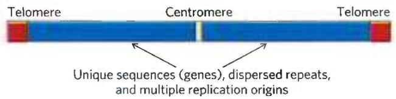  
FIGURE 24-7 Important structural elements of a yeast chromosome.

<table><tr><td colspan="2">TABLE 24-3 Telomere Sequences</td></tr><tr><td>Organism</td><td>Telomere repeat sequence</td></tr><tr><td>Homo sapiens (human)</td><td> $(TTAGGG)_n$ </td></tr><tr><td>Tetrahymena thermophila (ciliated protozoan)</td><td> $(TTGGGG)_n$ </td></tr><tr><td>Saccharomyces cerevisiae (yeast)</td><td> $(T(G)_{1-3}(TG)_{2-3})_n$ </td></tr><tr><td>Arabidopsis thaliana (plant)</td><td> $(TTTAGGG)_n$ </td></tr></table>

Artificial chromosomes (Chapter 9) have been constructed as a means of better understanding the functional significance of many structural features of eukaryotic chromosomes. A reasonably stable artificial linear chromosome requires only three components: a centromere, a telomere at each end, and sequences that allow the initiation of DNA replication. Yeast artificial chromosomes (YACs; see Fig. 9-6) have been developed as a research tool in biotechnology. Similarly, human artificial chromosomes (HACs) are being developed for the treatment of genetic diseases. These may eventually provide a new path to the intracellular replacement of missing or defective gene products, or somatic gene therapy.

#### [EN] SUMMARY 24.1 Chromosomal Elements

■ Genes are segments of a chromosome that contain the information for a functional polypeptide or RNA molecule. In addition to genes, chromosomes contain a variety of regulatory sequences involved in replication, transcription, and other processes.

■ Genomic DNA and RNA molecules are generally orders of magnitude longer than the viral particles or cells that contain them.

Many genes in eukaryotic cells (but few in bacteria and archaea) are interrupted by noncoding sequences, or introns. The coding segments separated by introns are called exons. Only about 1.5% of human genomic DNA encodes proteins; even when introns are included, less than one-third of human genomic DNA consists of genes. Much of the remainder consists of repeated sequences of various types. Nucleic acid parasites known as transposons account for about half of the human genome. Eukaryotic chromosomes have two important special-function repetitive DNA sequences: centromeres, which are attachment points for the mitotic spindle, and telomeres, located at the ends of chromosomes.

<!-- EN-END 24.1 -->

## 三、染色体的结构

细胞学研究发现,在有丝分裂和减数分裂期的细胞核中呈现一些对染料着色深的结构实体,称为染色体(chromosome)。摩尔根依据染色体的遗传行为证明其为基因载体。染色体这一术语除特指细胞核中着色深的结构实体外,也被用来泛指病毒、细菌、真核生物细胞核和细胞器中遗传信息的载体。细胞化学分析表明,染色体由DNA、蛋白质、少量RNA和无机离子所组成。许多实验都证明,基因是DNA的一个片段。从细菌或动、植物组织中提取的DNA总是伴有蛋白质,也说明在细胞内DNA是与蛋白质一起存在的。真核生物分裂间期的细胞核看不到染色体,DNA和组蛋白及其他蛋白质复合物以丝状结构存在,称为染色质(chromatin)。组成染色体或染色质的DNA是一条细长的分子,其直径约为2 nm,大肠杆菌染色体DNA长约1.56 mm,人类46个染色体的DNA如果头尾相连长达2 m。如此细长的分子,如果散开必将因纠结而极易断裂。现在知道,染色体或染色质DNA具有不同层次特殊的螺旋和折叠结构,以保证行使其复制、修复、重组、转录以及平均分配给子代细胞的复杂功能。

## （一）染色体不同层次的结构

生物体内核酸常与蛋白质结合形成复合物，并具有复杂的高级结构。通常将遗传信息的载体统称为染色体，染色体的组成物质称为染色质，也就是基因组DNA与蛋白质的复合物。染色质具有不同层次的结构得以组装成染色体。DNA分子十分细长，将它与蛋白质一起组装到有限的空间中需要高度组织，这种组装可以用压缩比(compression ratio)来表示。所谓压缩比是指DNA分子长度与组装后特定结构长度之比。原核生物无细胞核结构，但DNA与蛋白质仍有复杂结构，DNA被压缩在拟核之内。真核细胞在间期并不呈现着色深的染色体实体，而以染色质形式存在，它具有各种功能如进行复制、重组和转录，其压缩比在1000\~2000之间。在有丝分裂期间，染色质进一步凝缩组装成染色体，以便于将遗传物质分配到子代细胞。此时DNA压缩比达8000\~10000，提高5\~10倍。表29-3列出一些生物体中DNA分子长度和其组装空间的大小。

表 29-3 DNA 与其组装空间的大小

<table><tr><td>种类</td><td>外形</td><td>大小</td><td>DNA类型</td><td>DNA长度</td><td>压缩比</td></tr><tr><td>噬菌体fd</td><td>丝状</td><td>0.006 μm×0.85 μm</td><td>单链环状DNA</td><td>6.4 kb=2 μm</td><td>2.4</td></tr><tr><td>腺病毒</td><td>二十面体</td><td>0.07 μm(直径)</td><td>双链线状DNA</td><td>35.0 kb=11 μm</td><td>157</td></tr><tr><td>大肠杆菌</td><td>圆筒</td><td>1.7 μm×0.65 μm</td><td>双链环状DNA</td><td>4.2×103 kb=1.3 mm</td><td>1 000~1 500</td></tr><tr><td>线粒体(人类)</td><td>椭圆体</td><td>3.0 μm×0.5 μm</td><td>双链环状DNA</td><td>16.0 kb=50 μm</td><td>16.7</td></tr><tr><td>细胞核(人类)</td><td>球形</td><td>6 μm(直径)</td><td>双链线状DNA(23对)</td><td>6×10^6 kb=2 m</td><td>8 000~10 000</td></tr></table>

病毒基因组较小,通常只有几个至几十个基因。病毒颗粒(virion)主要由核酸(DNA或RNA)和蛋白质组成。在病毒颗粒中,核酸位于内部,蛋白质包裹着核酸。蛋白质外壳称为衣壳(capsid),衣壳由许多蛋白质亚基构成,称为原聚体(protomer)。由核酸和衣壳形成螺旋对称或二十面体对称的核衣壳(nucleocapsid)。有些病毒还有脂蛋白和糖蛋白的被膜(envelope)。病毒侵染的遗传信息由核酸携带,蛋白质的作用主要有两个方面:一是保护核酸免受损伤;二是选择和侵染宿主。有些病毒蛋白质还有辅助完成病毒生活史的功能,如酶、引物蛋白、运动蛋白等。病毒可看作是游离的染色体,但适应于游离和感染机制,病毒颗粒结构有许多特化,不同于细胞染色体。在进入宿主细胞后,原核细胞的噬菌体DNA行为相当于染色体外基因质粒;真核细胞的病毒DNA也能组装成核小体。

细菌中基因组 DNA 与碱性蛋白和非碱性蛋白作用,能够产生区域化的结构,但比较简单。真核生物有细胞核,染色体形成复杂的分层次的螺旋和折叠结构。

## （二）细菌拟核的结构

虽然细菌没有细胞核结构,其遗传物质也不显示真核细胞染色体的形态特征,但细菌染色体 DNA 也并非完全散开的,它在细胞内盘绕形成致密体,称为拟核(nucleoid),约占细胞体积的三分之一。细菌的基因组 DNA 为环状双链分子,其上也结合了一些小的碱性蛋白,与组蛋白类似,称为 HU 蛋白。但 HU 蛋白为二聚体( $M_r$ 19 000),与 DNA 的结合并不牢固,随结合随脱落。在电子显微镜下,大肠杆菌 DNA 显示组成许多突环,即超螺旋结构域(supercoiled domain),它们固着在质膜内表面一个或多个点上。如果在超螺旋结构域中产生一个切口,该突环即呈松弛态,但邻近结构域仍为超螺旋,表明存在拓扑束缚(图 29-3)。通常大肠杆菌 DNA 呈负超螺旋,每 200 bp 负一圈( $\sigma = -0.05$ )。DNA 的附着点为蛋白质和膜(可能还有 RNA 参与作用)构成的核心,或称为支架(scaffold)结构。大肠杆菌大约有 500 个突环,平均每个突环约 10 000 bp,每个突环相当于一个转录单位。DNA 的复制可以通过附着点,实际上附着点在复制时可以发生移动。

细菌基因组 DNA 分子长度约为拟核长度的 1 000\~1 500 倍, 其压缩比与真核细胞活性染色质的压缩比较相近。大肠杆菌和其他原核细胞基因组是以拟核的形式存在并行使它的各种功能, 在复制后直接分配到子代细胞中, 无需凝缩成染色体再分配。大肠杆菌生长最快时 15 min 即分裂一次。也就是说, 大肠杆菌染色体 DNA 几乎随时都在进行复制和转录, 拟核的简单结构与其快速的复制和转录相适应。真核细胞有丝分裂十分复杂, 完成一次分裂需要数小时, 甚至几个月。其染色体的复杂结构以及有丝分裂机制使得真核细胞携带的遗信息比原核细胞大数百至数千倍, 但其遗传信息传递的精确度却比原核细胞大三、四个数量级。

无论是细菌还是真核细胞,染色体 DNA 都处于负超螺旋,这种状态有助于染色体(染色质)的结构稳定和执行功能。但适应于高温( $>80^{\circ}C$ )的细菌,其 DNA 为正超螺旋。

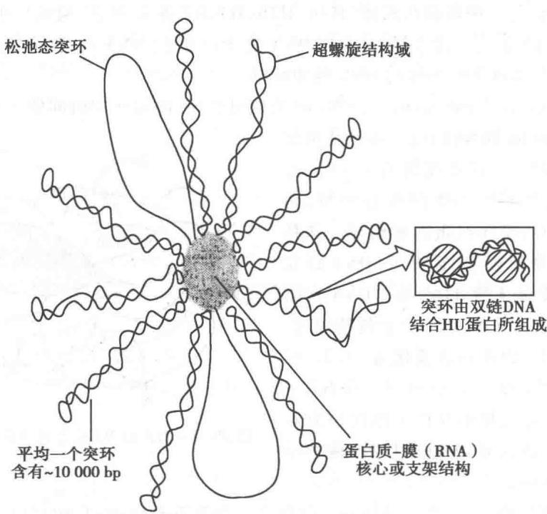  
图 29-3 细菌拟核的突环结构

## （三）真核生物染色体的结构

真核生物的染色体具有不同层次的螺旋和折叠结构,压缩比高达10 000。在细胞分裂间期,基因组DNA以比较展开的染色质形式存在,并可根据所执行的功能调整其结构。染色质可以分为两类:常染色质(euchromatin)和异染色质(heterochromatin)。染色质的基本结构单位是核小体(nucleosome)。

## 1. 常染色质和异染色质

早期研究发现,在光学显微镜下可以看到染色体的各区段被染料不同程度着色,表明染色体各区段的结构有差别,从而可以区分常染色质和异染色质两类组分。异染色质的着色深,致密;常染色质则相反。进一步研究了解到,间期的染色体展开为染色质。其中,常染色质结构比较疏松,因此结合染料较少,转录活性主要存在于该类染色质;异染色质结构紧密,结合染料多,极少转录活性。

常染色质 DNA 相对比较伸展,压缩比较低(1 000\~2 000),主要为单拷贝和中等重复序列,是基因活跃表达区域,其表达受各种调节因子的作用。异染色质 DNA 有更多的螺旋和折叠,压缩比较高(接近染色体)。这部分 DNA 复制落后于常染色质,除混杂其中的少数基因外大多不能转录。着丝粒、端粒、次缢痕以及染色体的某些节段 DNA 大多是由短的高度重复序列所组成,这部分形成组成型异染色质(constitutive heterochromatin),它们虽缺少表达活性然而却具有染色体不可或缺的功能。另一些染色质区域随细胞分化而进一步螺旋化和折叠,通过压缩以封闭基因活性,称为功能型异染色质(functional heterochromatin)。例如,哺乳动物雄性个体细胞的性染色体一条为 X 染色体,一条为 Y 染色体;雌性个体细胞的性染色体为两条 X 染色体。在个体发育早期,雌性细胞两条 X 染色体中的一条随机发生异染色质化,其活性被永久封闭。这一过程使雄性和雌性个体细胞的 X 染色体基因活性相等,称为性分化的剂量补偿效应(dosage compensation)。

## 2. 核小核的结构

核小体是真核细胞染色质的基本结构单位,无论是常染色质还是异染色质,它都是由 DNA 盘绕组蛋白核心所构成。1974 年 R. D. Kornberg 根据电镜观察和 X 射线衍射等资料,阐明了核小体的结构。Kornberg 发现组蛋白 H3 和 H4 在溶液中以四聚体 $(H3-H4)_{2}$ 形式存在,组蛋白 H2A 和 H2B 也能形成二聚体和寡聚体。他用 $(H3-H4)_{2}$ 和 H2A-H2B 寡聚体与 DNA 重建染色质,其 X 射线衍射图谱与天然染色质相同。据此他提出，每一组蛋白八聚体（H2A、H2B、H3、H4各2分子）构成核小体的核心，DNA盘绕其上。H1可能以另外的方式结合在核小体的DNA之上。由此DNA与组蛋白结合形成一串直径为 $11\mathrm{nm}$ 的念珠状细丝，平均每个核小体的DNA约 $200~\mathrm{bp}$ 。

用微球菌核酸酶(micrococcal nuclease, MNase)消化染色质,随着作用时间的延长得到的 DNA 片段逐

渐缩短,最初可得到200 bp的片段;进一步消化可得到带有H1的核小体,DNA片段长度约为165 bp;充分消化释放出H1,只剩下核小体的核心颗粒,由146\~147 bp的DNA和八聚体组蛋白所组成。该核心颗粒的X射线结构分析表明,它由B-DNA以左手超螺旋在组蛋白八聚体上绕1.65圈。DNA在组蛋白核心上左手盘绕可以剩余DNA产生负超螺旋,每组装一个核小体,DNA的连环数变化为-1.2。核小体之间连接(link)DNA短至8 bp,长至114 bp,一般为20\~60 bp。DNA进入和离开核小体的位置在同一侧。组蛋白H1结合在DNA进出口处,使核小体结构更为紧凑(图29-4)。

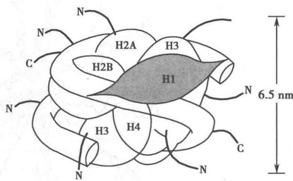  
图 29-4 组蛋白 H1 结合在 165 bp DNA 的核小体上

从低等到高等真核生物,其组蛋白结构均十分保守。共有五种组蛋白,相对分子质量都较小,并有较高比例的碱性氨基酸,不同物种的组蛋白略有差别(牛组蛋白的成分见表29-4)。核小体的八聚体核心结构由H2A、H2B、H3、H4四种组蛋白各2分子组成。这四种组蛋白结构十分相似,表明它们有共同的起源。尤以H3和H4的保守性最强。牛的H3和豌豆的序列只差4个氨基酸,鲤鱼和牛只差1个氨基酸;牛的H4和豌豆H4只差2个氨基酸。这四种组蛋白的中心区均为α螺旋,两侧各以突环与短的α螺旋相连,由3个α螺旋构成折叠结构域。N端为富含碱性氨基酸的柔性尾巴,带正电荷,伸出核小体之外;C端序列较短,碱性氨基酸少,大部分疏水氨基酸分布在C端,只有H2A的C端较长伸出在外。组蛋白还存在一些变异体(variant),可被置换到核小体内。4种组蛋白的尾区有许多可被修饰的基团,通过修饰(如乙酰化、甲基化等)影响与DNA的亲和力。核小体组蛋白的置换和修饰可控制染色质的结构和活性。

表 29-4 牛组蛋白的组成成分

<table><tr><td>组蛋白</td><td>残基数目</td><td>相对分子质量</td><td>Arg(%)</td><td>Lys(%)</td><td>组蛋白</td><td>残基数目</td><td>相对分子质量</td><td>Arg(%)</td><td>Lys(%)</td></tr><tr><td>H1</td><td>223</td><td>21 130</td><td>11.3</td><td>29.5</td><td>H3</td><td>135</td><td>15 273</td><td>13.3</td><td>19.6</td></tr><tr><td>H2A</td><td>129</td><td>13 960</td><td>19.3</td><td>10.9</td><td>H4</td><td>102</td><td>11 236</td><td>13.7</td><td>10.8</td></tr><tr><td>H2B</td><td>125</td><td>13 774</td><td>16.4</td><td>16.0</td><td></td><td></td><td></td><td></td><td></td></tr></table>

在水溶液中，H2A 和 H2B 中心区螺旋彼此靠近，形成异二聚体 H2A-H2B。H3 和 H4 以类似方式形成四聚体 $(H3-H4)_{2}$ 。核小体由组蛋白聚合体和 DNA 依次结合自组装而成。首先，由 $(H3-H4)_{2}$ 四聚体与 DNA 结合；然后再结合两个 H2A-H2B 二聚体；DNA 在八聚体上盘绕约 1 又 2/3 圈。DNA 组装成核小体使其长度压缩 7 倍。在核小体中，DNA 双螺旋以浅沟以及靠近浅沟的磷酸二酯键与组蛋白八聚体接触，借大量氢键（约 40 个）维系着 DNA 与八聚体间的结合。氢键主要在蛋白质肽键和磷酸二酯键的氧原子间形成，只有七个氢键是由蛋白质侧链和位于浅沟的碱基所形成。组蛋白碱性氨基酸的正电荷对 DNA 磷酸基负电荷的影响，减小 DNA 核苷酸间排斥力，使 DNA 在组蛋白八聚体上易于弯曲。由此可见，核小体的作用不是识别和传递碱基序列所携带的遗传信息，而是维持染色质（染色体）的基本结构。

核小体是否有相位,即核小体在 DNA 序列上是否存在精确取相或定位(positioning)?这个问题争议颇多。从目前研究的结果来看,核小体的位置不依赖于特殊 DNA 序列,但 DNA 序列对核小体装配有一定影响。首先,核小体存在于染色质的各个部位;然而基因内比基因间核小体更多,启动子区最少。激活因子活化基因促进其转录时,启动子区某些核小体即被移去。说明核小体在染色质各部位的分布并不均匀,而且是动态的。分析大量核小体 DNA 的序列并未发现有特殊的或专一的序列；但是频繁出现 A-T 碱基对的二核苷酸或三核苷酸，其间隔为 10 bp。当 AA/AT/TT 位于浅沟并接触组蛋白八聚体，而 GG/GC/CC 位于螺旋的对侧，即核小体外缘时，DNA 最易在组蛋白核心上盘绕。这是因为 DNA 盘绕使分子弯曲，接触组蛋白的内圈将会被压缩，而 A-T 碱基对显然较易被压缩。大约 50% 以上的核小体中都可找到成簇间隔约 10 bp 的 A-T 二核苷酸，不过 A-T 碱基对不能连续超过 8 个 bp，超过将使 DNA 分子变僵硬。

DNA复制时亲代DNA核小体被解开，复制后子代DNA迅速装配成核小体。实际上DNA在修复、重组和转录时都需要解开核小体，然后再重新装配。DNA在执行其功能时需要与各类蛋白质相互作用，因此必需移开核小体。移开的方式有两种，一是移动（moving），即DNA与组蛋白八聚体之间相对运动；另一是解开重组装，DNA暂时脱开组蛋白八聚体。移动包括DNA与组蛋白接触的内侧转向外侧，称为旋转(rotation)；或者组蛋白核心沿DNA分子滑动，称为平移(translation)。无论是移动或是解开再组装都需要蛋白质辅助因子的帮助，这些辅助因子起着分子伴侣的作用，称为组蛋白分子伴侣(histone chaperone)。例如，染色质装配因子1(chromatin assembly factor 1)和抗沉默功能1(anti-silencing function 1)是两种位于复制叉的装配因子。

在染色质的某一区域进行核小体组装时,往往在边界处优先投放组蛋白聚体,装配出第一个核小体,其后依次组装核小体就比较顺利。还有一些其他优先组装核小体的区域。另一方面,染色质的某些区域不存在核小体,该区域 DNA 片段存在特殊排除组装的序列。无论是优先组装的序列,或是排除组装的序列,都不能被核小体识别,但可以被核小体装配蛋白(nucleosome assembly protein, NAP)所识别,在其帮助下避开某些序列,在合适的位置下装配核小体。

## 3. 染色质的高级结构

DNA 在组蛋白八聚体上盘绕形成念珠状核小体长链（直径 11 nm），这是第一级组装。在电子显微镜下可以看到成串的核小体，还可看到 30 nm 的纤丝（fiber）和更高级结构。核小体组蛋白的尾巴带有正电荷，与邻近核小体组蛋白表面的负电荷相互吸引，使核小体彼此贴近；H1 同时结合盘绕在组蛋白核心上的两处 DNA，使核小体更为紧凑。分子扭力使核小体链进一步螺旋化，每圈 6 个核小体，使 DNA 又被压缩 6 倍。DNA 形成 30 nm 纤丝是第二级组装。有两个模型可用来说明纤丝的结构：一个称为螺线管（solenoid）；另一称为锯齿状（zigzag）。两者的主要差别在于核小体在螺旋圈上的排列，前者 6 个核小体连续排列成一圈，连接 DNA 位于螺线管内缘；后者两两相对，连接 DNA 通过管的中轴（见图 29-5）。

染色质的更高级结构目前还不十分清楚。可能是借助某些能识别特殊序列的 DNA 结合蛋白（非组蛋白），使纤丝 DNA 的某些位点被固定在核的骨架（nuclear scaffold）蛋白上，形成纤丝突环（fiber loop）。每个突环约为 20\~100 kb（平均 75 kb），其中含有多个相关基因，例如 5 种组蛋白基因常位于同一突环内。一种比较流行的模型认为，由染色质纤丝组成突环（loop），再由突环组成玫瑰花结（rosette），进而组成螺旋圈（coil），由螺旋圈形成染色单体（chromatid）。该模型见图 29-5 所示。很可能不同物种的染色体，或是同一物种不同状态下的染色体，或是同一染色体的不同区域，其高级结构均有所不同。模型只是提供一种设想。

纤丝与支架蛋白结合的 DNA 区域大部分是 A 和 T, 覆盖数百 bp, 称支架联结区 (scaffold association region, SAR)。其分布密度与染色体的带状图形有关。染色质蛋白, 除上述组蛋白、拓扑异构酶和组蛋白伴侣外, 还有一类蛋白质与染色体的组装和压缩有关, 称为染色体结构维持蛋白 (structural maintenance of chromosome, SMC)。SMC 家族有许多成员, 其中包括黏结蛋白 (cohesin) 和凝聚蛋白 (condensin)。SMC 蛋白的多肽长链中间为铰链区, 两侧为 $\alpha$ 螺旋, 通过回折两个 $\alpha$ 螺旋被此盘绕形成半月形的卷曲螺旋 (coiled-coil)。其二聚体或是构成闭环, 或是头尾相连成连锁体。黏结蛋白二聚体形成闭环, 将复制后的姊妹染色单体锁在一起, 直到细胞分裂要求两者分开。凝聚蛋白则形成连锁体将纤丝捆绑在核骨架上, 形成突环 (玫瑰花结)。捆绑还离需要其他一些连接蛋白 (connector) 参与作用, 并且需要水解 ATP 以提供能量。

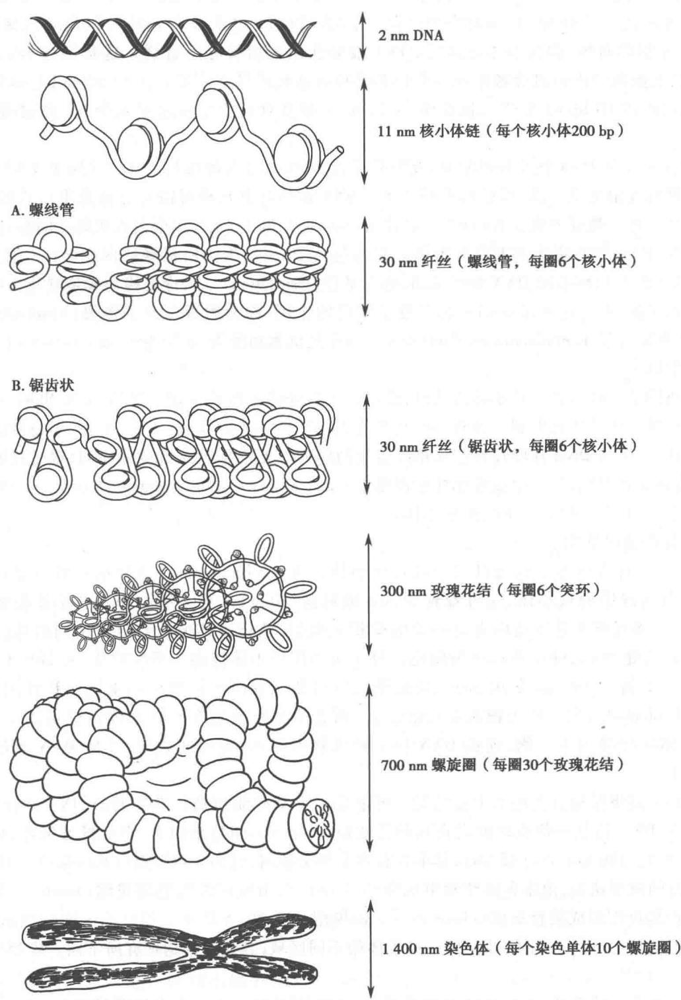  
图29-5 真核生物染色体不同层次结构示意图

<!-- EN-BEGIN 24.2 -->

### 【英文对应 24.2】DNA Supercoiling

> 来源：Lehninger Principles of Biochemistry（书籍/02_生物化学原理） 第24章 Genes and Chromosomes，§24.2。对应本章“三、染色体的结构”。

How is cellular or viral DNA compacted into the cells or viral coats that contain it in a way that still permits access to the information in the DNA? The extreme compaction implies a high degree of structural organization. First, the many negative charges of the phosphoryl groups in the DNA backbone must be neutralized. Cations, particularly $Mg^{2+}$ ions, and a class of molecules called polyamines provide multiple positive counterions to permit DNA compaction. Polyamines are derived from the amino acid ornithine (see Box 6-1). The second key to DNA compaction is a DNA structural alteration known as supercoiling. All cells maintain their DNA in a state that is underwound—having fewer right-handed helical turns per given length of DNA—than B-form DNA. The underwinding places structural strain on the DNA, causing it to twist upon itself. Supercoiling affects and is affected by processes such as replication and transcription. We introduce it here as a prelude to a broader discussion of DNA metabolism.

P3 "Supercoiling" means the coiling of a coil. An old-fashioned telephone cord, for example, was typically a coiled wire. The path taken by the wire between the base of the phone and the receiver often included one or more supercoils (Fig. 24-8). DNA is coiled in the form of a double helix, with both strands of the DNA coiling around an axis. The further coiling of that axis upon itself (Fig. 24-9) produces DNA supercoiling. As detailed below, DNA supercoiling is generally a manifestation of structural strain. When there is no net bending of the DNA axis upon itself, the DNA is said to be in a relaxed state.

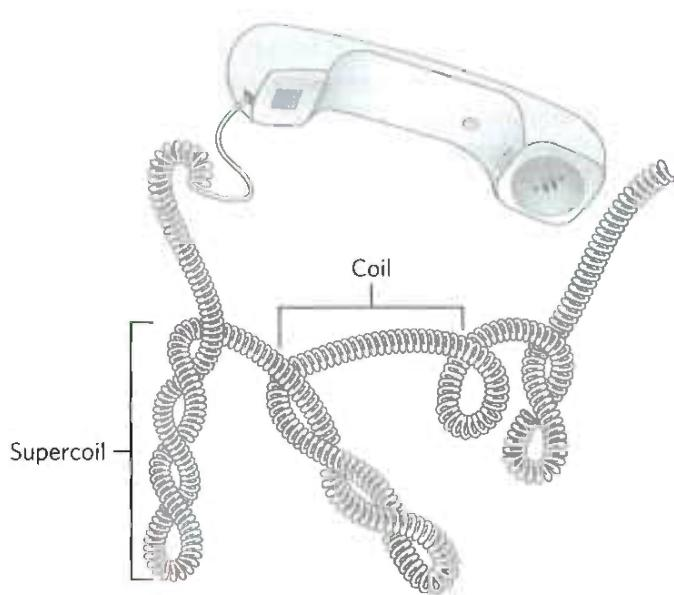  
FIGURE 24-8 Supercoils. An old-fashioned phone cord is coiled like a DNA helix, and the coiled cord can itself coil in a supercoil. Examining phone cords helped lead Jerome Vinograd and his colleagues to the insight that many properties of small circular DNAs can be explained by supercoiling. They first detected DNA supercoiling—in small circular viral DNAs—in 1965.

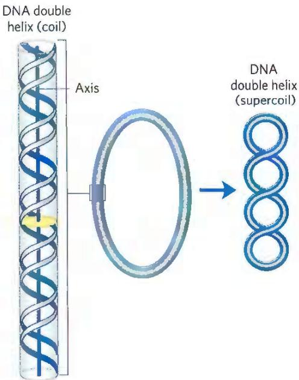  
FIGURE 24-9 Supercoiling of DNA. When the axis of the DNA double helix is coiled on itself, it forms a new helix (superhelix). The DNA superhelix is usually called a supercoil.

As we shall see, the supercoiling that occurs in cells reflects underwinding of the DNA, facilitating the separation of strands required for the processes of replication and transcription (Fig. 24-10).

That a DNA molecule would bend on itself and become supercoiled in tightly packaged cellular DNA would seem logical, and perhaps even trivial, were it not for one additional fact: many circular DNA molecules remain highly supercoiled even after they are extracted and purified, freed from protein and other cellular components. P3 This indicates that supercoiling is an intrinsic property of DNA tertiary structure. It occurs in all cellular DNAs and is highly regulated by each cell.

Several measurable properties of supercoiling have been established, and the study of supercoiling has provided many insights into DNA structure and function. This work has drawn heavily on concepts derived from a branch of mathematics called topology, the study of the properties of an object that do not change under continuous deformations. For DNA, continuous deformations include conformational changes due to thermal motion or due to interaction with proteins or other molecules; discontinuous deformations involve DNA strand breakage. For circular DNA molecules, a topological property is one that is unaffected by deformations of the DNA strands as long as no breaks are introduced. Topological properties are changed only by breakage and rejoining of the backbone of one or both DNA strands.

We now examine the fundamental properties and physical basis of supercoiling.

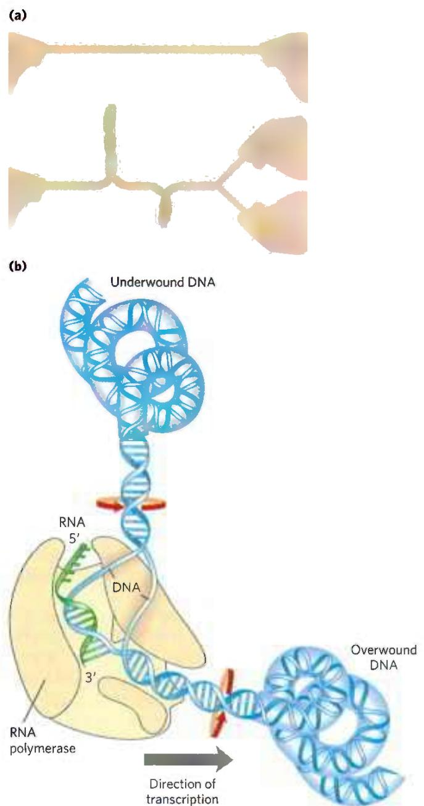  
FIGURE 24-10 The effects of replication and transcription on DNA supercoiling. Because DNA is a double-helical structure, strand separation leads to added stress and supercoiling if the DNA is constrained (not free to rotate) ahead of the strand separation. (a) The general effect can be illustrated by twisting two strands of a rubber band about each other to form a double helix. If one end is constrained, separating the two strands at the other end will lead to twisting. (b) In a DNA molecule, the progress of a DNA polymerase or RNA polymerase (as shown here) along the DNA involves separation of the strands. As a result, the DNA becomes overwound ahead of the enzyme (upstream) and underwound behind it (downstream). Red arrows indicate the direction of winding.

#### [EN] Most Cellular DNA Is Underwound

To understand supercoiling, we must first focus on the properties of small circular DNAs such as plasmids and small viral DNAs. When these DNAs have no breaks in either strand, they are referred to as closed-circular DNAs. In aqueous solutions, DNA is most stable—that is, it is in its lowest free-energy form—in the B-form structure. If the DNA of a closed-circular molecule conforms closely to the B-form structure (Watson-Crick structure; see Fig. 8-13), with one turn of the double helix per 10.5 bp, the DNA is relaxed rather than supercoiled (Fig. 24-11). Supercoiling results when DNA is subject to some form of structural strain such that it is overwound or underwound. Purified closed-circular DNA is rarely relaxed, regardless of its biological origin. P3 Furthermore, DNAs derived from a given cellular source have a characteristic degree of supercoiling. DNA structure is therefore strained in a manner that is regulated by the cell to induce the supercoiling.

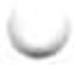

In almost every instance, the strain is a result of underwinding of the DNA double helix in the closed circle. In other words, the DNA has fewer helical turns than would be expected for the B-form structure. The effects of underwinding are summarized in Figure 24-12. An 84 bp segment of a circular DNA in the relaxed state would contain eight double-helical turns, one for every 10.5 bp. If one of these turns were removed, there would be (84 bp)/7 = 12.0 bp per turn, rather than the 10.5 found in B-DNA (Fig. 24-12b). This is a deviation from the most stable DNA form, and the molecule is thermodynamically strained as a result. Generally, much of this strain would be accommodated by coiling the axis of the DNA on itself to form a supercoil (Fig. 24-12c; some of the strain in this 84 bp segment would simply become dispersed in the untwisted structure of the larger DNA molecule). In principle, the strain could also be accommodated by separating the two DNA strands over a distance of about 10 bp (Fig. 24-12d). In isolated closed-circular DNA, strain introduced by underwinding is generally accommodated by supercoiling rather than strand separation, because coiling the axis of the DNA usually requires less energy than breaking the hydrogen bonds and disrupting the base stacking that stabilizes paired bases. Note, however, that the underwinding of DNA in vivo makes separation of the DNA strands easier, facilitating access to the information they contain.

Every cell actively underwinds its DNA with the aid of enzymatic processes (described below), and the resulting strained state represents a form of stored energy. Cells maintain DNA in an underwound state to facilitate its compaction by coiling. The underwinding of DNA is also important to enzymes of DNA metabolism that must bring about strand separation as part of their function.

The underwound state can be maintained only if the DNA is a closed circle or if it is bound and stabilized by proteins so that the strands are not free to rotate about each other. If there is a break in one strand of an isolated, protein-free circular DNA, free rotation at that point will cause the underwound DNA to revert spontaneously to the relaxed state. In a closed-circular DNA molecule, however, the number of helical turns cannot be changed without at least transiently breaking one of the DNA strands. The number of helical turns in a DNA molecule therefore provides a precise description of supercoiling.

  
FIGURE 24-11 Relaxed and supercoiled plasmid DNAs. The molecule in the leftmost electron micrograph is relaxed; the degree of supercoiling increases from left to right. [Laurien Polder, from A. Kornberg, DNA Replication, p. 29, W. H. Freeman, 1980.]

  
FIGURE 24-12 Effects of DNA underwinding. (a) A segment of DNA in a closed-circular molecule, 84 bp long, in its relaxed form with eight helical turns. (b) Removal of one turn induces structural strain. (c) The strain is generally accommodated by formation of a supercoil. (d) DNA underwinding also makes the separation of strands somewhat easier. In principle, each turn of underwinding should facilitate strand separation over about 10 bp, as shown here. However, the hydrogen-bonded base pairs would generally preclude strand separation over such a short distance, and the effect becomes important only for longer DNAs and higher levels of DNA underwinding.

#### [EN] DNA Underwinding Is Defined by Topological Linking Number

The field of topology provides some ideas that are useful to the discussion of DNA supercoiling, particularly the concept of linking number. Linking number is a topological property of double-stranded DNA, because it does not vary when the DNA is bent or deformed, as long as both DNA strands remain intact. Linking number (Lk) is illustrated in Figure 24-13. As we shall see, all cells have enzymes called topoisomerases that catalyze changes in the linking number. Because of this critical role, topoisomerases are the targets of many antibiotics and cancer chemotherapy agents.

  
FIGURE 24-13 Linking number, Lk. Here, as usual, each blue ribbon represents one strand of a double-stranded DNA molecule. For the molecule in (a), Lk = 1. For the molecule in (b), Lk = 6. One of the strands in (b) is kept untwisted for illustrative purposes, to define the border of an imaginary surface (shaded blue). The number of times the twisting strand penetrates this surface provides a rigorous definition of linking number.

Let's begin by visualizing the separation of the two strands of a double-stranded circular DNA. If the two strands are linked as shown in Figure 24-13a, they are effectively joined by what can be described as a topological bond. Even if all hydrogen bonds and base-stacking interactions were abolished such that the strands were not in physical contact, this topological bond would still link the two strands. Visualize one of the circular strands as the boundary of a surface (such as the soap film framed by the loop of a bubble wand before you blow a bubble). The linking number can be defined as the number of times the second strand pierces this surface. For the molecule in Figure 24-13a, Lk = 1; for that in Figure 24-13b, Lk = 6. The linking number for a closed-circular DNA is always an integer. By convention, if the links between two DNA strands are arranged so that the strands are interwound in a right-handed helix, the linking number is defined as positive (+); for strands interwound in a left-handed helix, the linking number is negative (−). Negative linking numbers are, for all practical purposes, not encountered in DNA.

We can now extend these ideas to a closed-circular DNA with 2,100 bp (Fig. 24-14a). When the molecule is relaxed, the linking number is simply the number of base pairs divided by the number of base pairs per turn, which is close to 10.5; so in this case, Lk = 200. The linking number in relaxed DNA is designated $Lk_{0}$ . For a circular DNA molecule to have a topological property such as linking number, both strands must be intact, without a break. If there is a break in either strand, the two strands can, in principle, be unraveled and separated completely. In this case, no topological bond exists and Lk is undefined (Fig. 24-14b).

We can now describe DNA underwinding in terms of changes in the linking number. For the molecule shown in Figure 24-14a, $Lk_{0} = 200$ ; if two turns are removed from this molecule, Lk = 198. The change can be described by the equation

$$
\begin{array}{r} \Delta L k = L k - L k _ {0} \\ = 1 9 8 - 2 0 0 = - 2 \end{array}\tag{24-1}
$$

It is often convenient to express the change in linking number in terms of a quantity that is independent of the length of the DNA molecule. This quantity, called the specific linking difference or superhelical density ( $\sigma$ ), is a measure of the number of turns removed relative to the number present in relaxed DNA:

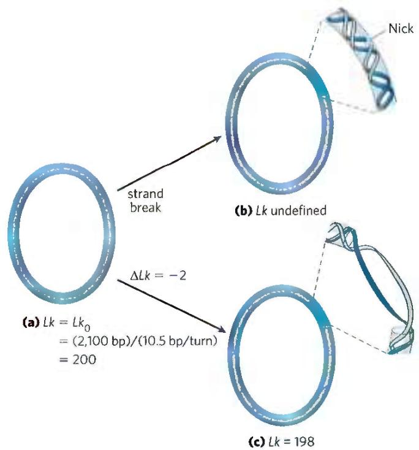  
FIGURE 24-14 Linking number applied to closed-circular DNA molecules. A 2,100 bp circular DNA is shown in three forms: (a) relaxed, Lk = 200; (b) relaxed with a nick (break) in one strand, Lk undefined; and (c) underwound by two turns, Lk = 198. The underwound molecule generally exists as a supercoiled molecule, but underwinding also facilitates the separation of DNA strands.

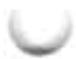

$$
\sigma = \frac {\Delta L k}{L k _ {0}}\tag{24-2}
$$

In the example in Figure 24-14c, $\sigma = 0.01$ , which means that $1\%$ (2 of 200) of the helical turns present in the DNA (in its B form) have been removed. The degree of underwinding in cellular DNAs generally falls in the range of $5\%$ to $7\%$ ; that is, $\sigma = -0.05$ to $-0.07$ . The negative sign indicates that the change in linking number is due to underwinding of the DNA. The supercoiling induced by underwinding is therefore defined as negative supercoiling. Conversely, under some conditions DNA can be overwound, resulting in positive supercoiling. Note that the twisting path taken by the axis of the DNA helix when the DNA is underwound (negative supercoiling) is the mirror image of that taken when the DNA is overwound (positive supercoiling) (Fig. 24-15). Supercoiling is not a random process; the path of the supercoiling is largely prescribed by the torsional strain imparted to the DNA by decreasing or increasing the linking number relative to B-DNA. P2 P3 An increase in superhelical density brings about an increase in DNA compaction.

Linking number can be changed by $\pm1$ by breaking one DNA strand, rotating one of the ends $360^{\circ}$ about the unbroken strand, and rejoining the broken ends. This change has no effect on the number of base pairs or the number of atoms in the circular DNA molecule. Two forms of a circular DNA that differ only in a topological property such as linking number are referred to as topoisomers.

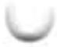

  
FIGURE 24-15 Negative and positive supercoils. For the relaxed DNA molecule of Figure 24-14a, underwinding or overwinding by two helical turns (Lk = 198 or 202) will produce negative or positive supercoiling, respectively. Notice that the DNA axis twists in opposite directions in the two cases.

Cruciform DNA  

#### [EN] WORKED EXAMPLE 24-1 Calculation of Superhelical Density

What is the superhelical density ( $\sigma$ ) of a closed-circular DNA with a length of 4,200 bp and a linking number (Lk) of 374? What is the superhelical density of the same DNA when Lk = 412? Are these molecules negatively or positively supercoiled?

SOLUTION: First, calculate $Lk_{0}$ by dividing the length of the closed-circular DNA (in bp) by 10.5 bp/turn: (4,200 bp)/(10.5 bp/turn) = 400. We can now calculate $\Delta Lk$ from Equation 24-1: $\Delta Lk = Lk - Lk_{0} = 374 - 400 = -26$ . Substituting the values for $\Delta Lk$ and $Lk_{0}$ into Equation 24-2: $\sigma = \Delta Lk / Lk_{0} = -26 / 400 = -0.065$ . Because the superhelical density is negative, this DNA molecule is negatively supercoiled.

When the same DNA molecule has an Lk of 412, $\Delta Lk = 412 - 400 = 12$ , and $\sigma = 12/400 = 0.03$ . The superhelical density is positive, and the molecule is positively supercoiled.

In addition to causing supercoiling and making strand separation somewhat easier, the underwinding of DNA facilitates structural changes in the molecule. These are of less physiological importance but they help illustrate the effects of underwinding. Recall that a cruciform (see Fig. 8-19) generally contains a few unpaired bases; DNA underwinding helps to maintain the required strand separation (Fig. 24-16). Underwinding of a right-handed DNA helix also enables the formation of short stretches of left-handed Z-DNA in regions where the base sequence is consistent with the Z form (see Chapter 8).

#### [EN] Topoisomerases Catalyze Changes in the Linking Number of DNA

DNA supercoiling is a precisely regulated process that influences many aspects of DNA metabolism. Every cell has enzymes with the sole function of underwinding and/or relaxing DNA. The enzymes that increase or decrease the extent of DNA underwinding are topoisomerases; the property of DNA that they change is the linking number. These enzymes play an especially important role in processes such as replication and DNA packaging. There are two classes of topoisomerases. Type I topoisomerases act by transiently breaking one of the two DNA strands, passing the unbroken strand through the break, and rejoining the broken ends; they change Lk in increments of 1. Type II topoisomerases break both DNA strands and change Lk in increments of 2.

P2 When a circular DNA is supercoiled, it is twisted upon itself and therefore is more compact than when it is relaxed. The supercoiled molecule will thus migrate faster in a gel matrix (Fig. 24-17). A population of identical plasmid DNAs with the same linking number migrates as a discrete band during agarose gel electrophoresis. Topoisomers with Lk values differing by as little as 1 can be separated by this method, so changes in linking number induced by topoisomerases are readily detected.

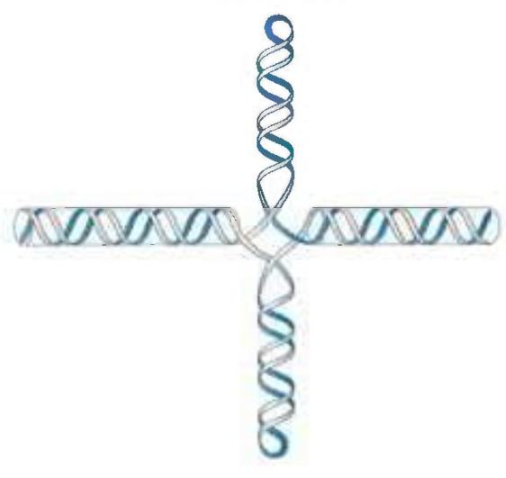

FIGURE 24-16 Promotion of cruciform structures by DNA underwinding. In principle, cruciforms can form at palindromic sequences (see Fig. 8-19), but they seldom occur in relaxed DNA because the linear DNA accommodates more paired bases than does the cruciform structure. Underwinding of the DNA facilitates the partial strand separation needed to promote cruciform formation at appropriate sequences.  
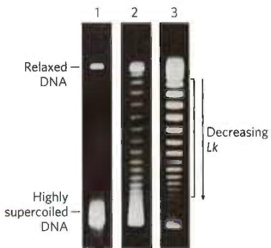  
FIGURE 24-17 Visualization of topoisomers. In this experiment, all DNA molecules have the same number of base pairs but exhibit some range in the degree of supercoiling. Because supercoiled DNA molecules are more compact than relaxed molecules, they migrate more rapidly during gel electrophoresis. The gels shown here separate topoisomers (moving from top to bottom) over a limited range of superhelical density. In lane 1, highly supercoiled DNA migrates in a single band, even though different topoisomers are probably present. Lanes 2 and 3 illustrate the effect of treating the supercoiled DNA with a type I topoisomerase; the DNA in lane 3 was treated for a longer time than that in lane 2. As the superhelical density of the DNA is reduced to the point where it corresponds to the range in which the gel can resolve individual topoisomers, distinct bands appear. Individual bands in the region indicated by the bracket next to lane 3 each contain DNA circles with the same linking number; Lk changes by 1 from one band to the next. (Courtesy of Michael Cox Lab.)

E. coli has at least four individual topoisomerases (I through IV). Those of type I (topoisomerases I and III) generally relax DNA by removing negative supercoils (increasing Lk). The way in which bacterial type I topoisomerases change linking number is illustrated in Figure 24-18. A bacterial type II enzyme, called either topoisomerase II or DNA gyrase, can introduce negative supercoils (decrease Lk). It uses the energy of ATP to accomplish this. To alter DNA linking number, type II topoisomerases cleave both strands of a DNA molecule and pass another duplex through the break. The overall degree of supercoiling of bacterial DNA is maintained by regulation of the net activity of topoisomerases I and II. Topoisomerases III and IV have more-specialized roles in DNA metabolism.

Eukaryotic cells also have type I and type II topoisomerases. The type I enzymes are topoisomerases I and III. The single type II enzyme has two isoforms in vertebrates, called IIα and IIβ. Most type II enzymes, including a DNA gyrase in archaea, are related and define a family called type IIA. The eukaryotic type II topoisomerases cannot underwind DNA (introduce negative supercoils), but they can relax both positive and negative supercoils (Fig. 24-19a). The capacity of type II topoisomerases to pass one duplex DNA segment through a double-strand break in another duplex allows these enzymes to untangle catenanes, DNA circles that are topologically linked (Fig. 24-19b). Some topoisomerases are specialized for decatenation functions. For example, the bacterial type II enzyme called topoisomerase IV is involved in chromosome untangling during cell division (Chapter 25).

Archaea have an unusual enzyme, topoisomerase VI, which alone defines the type IIB family. The full diversity of DNA topoisomerases is illustrated in Table 24-4. As we shall show in the next few chapters, topoisomerases play a critical role in every aspect of DNA metabolism, making them important drug targets for the treatment of bacterial infections and cancer.

#### [EN] DNA Compaction Requires a Special Form of Supercoiling

Supercoiled DNA molecules are uniform in several respects. The supercoils are right-handed in a negatively supercoiled DNA molecule (Fig. 24-15), and they tend to be extended and narrow rather than compacted, often with multiple

Type I topoisomerase  
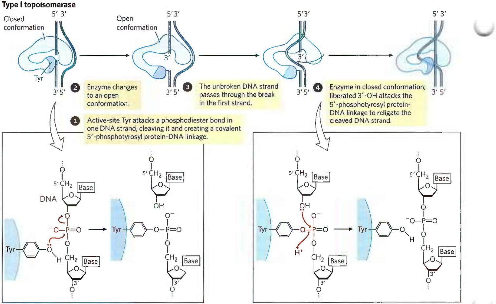  
MECHANISM FIGURE 24-18 The type I topoisomerase reaction. Bacterial topoisomerase I increases Lk by breaking one DNA strand, passing the unbroken strand through the break, then resealing the break.  
Nucleophilic attack by the active-site Tyr residue breaks one DNA strand. The ends are ligated by a second nucleophilic attack. At each step, one high-energy bond replaces another. [Information from J.J. Champoux, Annu. Rev. Biochem. 70:369, 2001, Fig. 3.]

  
FIGURE 24-19 Alteration of the linking number by a eukaryotic type IIα topoisomerase. (a) The general mechanism features passage of one intact duplex DNA segment through a transient double-strand break in another segment. The DNA segment enters and leaves the topoisomerase through gated cavities, called the N gate and the C gate, above and below the bound DNA. Two ATPs are bound and hydrolyzed

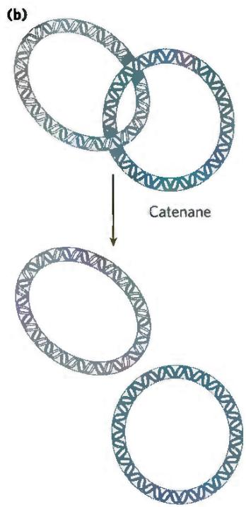  
during this cycle. The enzyme structure and use of ATP are specific to this reaction. (b) When topologically linked as shown, two DNA circles are referred to as a catenane. By cleaving both strands of one circle and passing a segment of the second circle through the break, a type II topoisomerase can decatenate the circles. [(a) Information from J. J. Champoux, Annu. Rev. Biochem. 70:369, 2001, Fig. 11.]

<table><tr><td colspan="5">TABLE Diversity in DNA Topoisomerases</td></tr><tr><td>Type</td><td>Mechanism</td><td>Family (defined by structural class)</td><td>Domain(s)</td><td>Notes</td></tr><tr><td rowspan="3">IA</td><td rowspan="3">Strand passagea</td><td>Topoisomerase I</td><td>Bacteria, Eukarya</td><td>Relaxes (-)</td></tr><tr><td>Topoisomerase III</td><td>Bacteria, Eukarya</td><td>Relaxes (-)</td></tr><tr><td>Reverse gyrase</td><td>Archaea, Bacteria</td><td>Uses ATP to introduce positive supercoils; thermophilic bacteria and archaea only</td></tr><tr><td>IB</td><td>Swivelaseb</td><td>Topoisomerase IB</td><td>Bacteria, Eukarya</td><td>A few bacteria; all eukaryotes</td></tr><tr><td>IC</td><td>Swivelase</td><td>Topoisomerase V</td><td>Archaea</td><td>Methanopyrus only</td></tr><tr><td rowspan="4">IIA</td><td rowspan="4">Strand passagec</td><td>Topoisomerase II (DNA gyrase)</td><td>Archaea, Bacteria</td><td>Introduces negative supercoils (ATPase)</td></tr><tr><td>Topoisomerase IIα</td><td>Eukarya</td><td>Relaxes (+ or -)</td></tr><tr><td>Topoisomerase IIβ</td><td>Eukarya</td><td>Relaxes (+ or -)</td></tr><tr><td>Topoisomerase IV</td><td>Bacteria</td><td>Decatenased</td></tr><tr><td>IIB</td><td>Strand passage</td><td>Topoisomerase VI</td><td>Archaea, Bacteria, Eukarya</td><td>Among eukaryotes, plants, algae, and protists only</td></tr><tr><td colspan="5">aSee Figure 24-18.bA nick is made in one strand, and the other strand is allowed to rotate to relieve topological strain.cSee Figure 24-19a.dSee Figure 24-19b.</td></tr></table>

branches (Fig. 24-20). At the superhelical densities normally encountered in cells, the length of the supercoil axis, including branches, is about 40% of the length of the DNA. This type of supercoiling is referred to as plectonemic (from the

Greek plektos, "twisted," and nema, "thread"). The term can be applied to any structure with strands intertwined in some simple and regular way, and it is a good description of the general structure of supercoiled DNA in solution.

  
(a)

  
(b)

  
(c)

Plectonemic supercoiling, the form observed in isolated DNAs in the laboratory, does not produce sufficient compaction to package DNA in the cell. A second form of supercoiling, solenoidal (Fig. 24-21), can be adopted by an underwound DNA. Instead of the extended right-handed supercoils characteristic of the plectonemic form, solenoidal supercoiling involves tight left-handed turns, similar to the shape taken up by a garden hose neatly wrapped on a reel. Although their structures are dramatically different, plectonemic and solenoidal supercoiling are two forms of negative supercoiling that can be taken up by the same segment of underwound DNA. The two forms are readily interconvertible. Although the plectonemic form is more stable in solution, the solenoidal form can be stabilized by protein binding, as it is in eukaryotic chromosomes; it provides a much greater degree of compaction. Solenoidal supercoiling is a primary mechanism by which underwinding contributes to DNA compaction in cells.

  
FIGURE 24-21 Plectonemic and solenoidal supercoiling of the same DNA molecule, drawn to scale. Plectonemic supercoiling takes the form of extended right-handed coils. Solenoidal negative supercoiling takes the form of tight left-handed turns about an imaginary tubelike structure. The two forms are readily interconverted, although the solenoidal form is generally not observed unless certain proteins are bound to the DNA. Solenoidal supercoiling provides a much greater degree of compaction.

FIGURE 24-20 Plectonemic supercoiling. (a) Electron micrograph of plectonemically supercoiled plasmid DNA and (b) an interpretation of the observed structure. The dotted lines show the axis of the supercoil; notice the branching of the supercoil. (c) An idealized representation of this structure. [(a, b) Republished with permission of Elsevier, from T. C. Boles et al. (1990), "Structure of plectonemically supercoiled DNA," J. Mol. Biol. 213:931–951, Fig. 2; permission conveyed through Copyright Clearance Center, Inc.]  

#### [EN] SUMMARY 24.2 DNA Supercoiling

■ Most cellular DNAs are supercoiled. Underwinding decreases the total number of helical turns in DNA relative to the relaxed, B form. To maintain an underwound state, DNA must be either a closed circle or bound to protein.

■ Underwinding is quantified by a topological parameter called linking number, Lk. Underwinding is measured in terms of specific linking difference, or superhelical density, $\sigma$ , which is $(Lk - Lk_{0})/Lk_{0}$ . For cellular DNAs, $\sigma$ is typically -0.05 to -0.07, which means that approximately 5% to 7% of the helical turns in the DNA have been removed. DNA underwinding facilitates strand separation by enzymes of DNA metabolism.

■ DNAs that differ only in linking number are called topoisomers. Topoisomerases, enzymes that underwind and/or relax DNA, catalyze changes in linking number. The two classes of topoisomerases, type I and type II, change Lk in increments of 1 or 2, respectively, per catalytic event.

■ Supercoiled DNA in solution, unconstrained by proteins, takes on a plectonemic supercoiling structure. When supercoiled DNA is wrapped around specialized DNA-binding proteins, it forms solenoidal supercoils.

<!-- EN-END 24.2 -->

<!-- EN-BEGIN 24.3 -->

### 【英文对应 24.3】The Structure of Chromosomes

> 来源：Lehninger Principles of Biochemistry（书籍/02_生物化学原理） 第24章 Genes and Chromosomes，§24.3。对应本章“三、染色体的结构”。

The term “chromosome” is used to refer to a nucleic acid molecule that is the repository of genetic information in a virus, a bacterium, an archaeon, a eukaryotic cell, or an organelle. It also refers to the densely colored bodies seen in the nuclei of dye-stained eukaryotic cells undergoing mitosis, as visualized using a light microscope.

#### [EN] Chromatin Consists of DNA, Proteins, and RNA

The eukaryotic cell cycle produces remarkable changes in the structure of chromosomes (Fig. 24-22). In nondividing eukaryotic cells (in the G0 phase) and those in interphase (G1, S, and G2), the chromosomal material, chromatin, is amorphous. In the S phase of interphase, the DNA in this amorphous state replicates, each chromosome producing two sister chromosomes (called sister chromatids) that remain associated with each other after replication is complete. The chromosomes become much more condensed during prophase of mitosis, taking the form of a species-specific number of well-defined pairs of sister chromatids (Fig. 24-5).

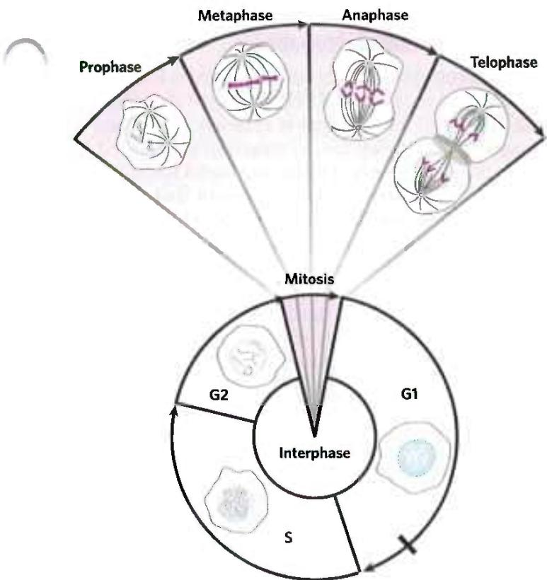  
FIGURE 24-22 Changes in chromosome structure during the eukaryotic cell cycle. The relative lengths of the phases shown here are arbitrary. The duration of each phase varies with cell type and with growth conditions (for single-celled organisms) or metabolic state (for multicellular organisms); mitosis is typically the shortest phase. Cellular DNA is uncondensed throughout interphase, as shown in the cartoons of the nucleus. The interphase period can be divided into the G1 (gap) phase; the S (synthesis) phase, when the DNA is replicated; and the G2 phase, throughout which the replicated chromosomes (chromatids) cohere to one another. Mitosis can be divided into four stages. The DNA undergoes condensation in prophase. During metaphase, the condensed chromosomes line up in pairs along the plane halfway between the spindle poles. The two chromosomes of each pair are linked to different spindle poles via microtubules that extend between the spindle and the centromere. The sister chromatids separate at anaphase, each drawn toward the spindle pole to which it is connected. The process is completed in telophase. After cell division, the chromosomes decondense and the cycle begins anew.

P4 Chromatin consists of fibers containing protein and DNA in approximately equal proportions (by mass), along with a significant amount of associated RNA. The DNA in the chromatin is very tightly associated with proteins called histones, which package and order the DNA into structural units called nucleosomes (Fig. 24-23). Also found in chromatin are many nonhistone proteins, some of which help maintain chromosome structure and others that regulate the expression of specific genes (Chapter 28).

  
FIGURE 24-23 Nucleosomes. (a) Regularly spaced nucleosomes consist of core histone proteins bound to DNA. (b) In this electron micrograph, the DNA-wrapped histone octamer structures are clearly visible. [(b) J. Bednar et al., Nucleosomes, linker DNA, and linker histone form a unique structural motif that directs the higher-order folding and compaction of chromatin, Proc. Natl. Acad. Sci. USA vol. 95 no. 24: 14173–14178, November 1998 Cell Biology Fig. 1. © 1998 National Academy of Sciences, U.S.A.]

Beginning with nucleosomes, eukaryotic chromosomal DNA is packaged into a succession of higher-order structures that ultimately yield the compact chromosome seen with the light microscope. We now turn to a description of this structure in eukaryotes and compare it with the packaging of DNA in bacterial cells.

#### [EN] Histones Are Small, Basic Proteins

Found in the chromatin of all eukaryotic cells, histones have molecular weights between 11,000 and 21,000 and are very rich in the basic amino acids arginine and lysine (together these make up about one-fourth of the amino acid residues). All eukaryotic cells have five major classes of histones, differing in molecular weight and amino acid composition (Table 24-5). The H3 histones are nearly identical in amino acid sequence in all eukaryotes, as are the H4 histones, suggesting strict conservation of their functions. For example, only 2 of 102 amino acid residues differ between the H4 histone molecules of peas and cows, and only 8 differ between the H4 histones of humans and yeast. Histones H1, H2A, and H2B show less sequence similarity across eukaryotic species.

Each type of histone is subject to enzymatic modification by methylation, acetylation, ADP-ribosylation, phosphorylation, glycosylation, SUMOylation, or ubiquitination (p. 216 and Fig. 6-38). Such modifications affect the net electric charge, shape, and other properties of histones, as well as the structural and functional properties of the chromatin. The modifications play a role in the regulation of transcription and in chromatin structure at different stages of the cell cycle.

In addition, eukaryotes generally have several variant forms of certain histones, most notably histones

<table><tr><td colspan="5">TABLE 24-5 Types and Properties of the Common Histones</td></tr><tr><td rowspan="2">Histones</td><td rowspan="2">Molecular weight</td><td rowspan="2">Number of amino acid residues</td><td colspan="2">Content of basic amino acids (% of total)</td></tr><tr><td>Lys</td><td>Arg</td></tr><tr><td>H1a</td><td>21,130</td><td>223</td><td>29.5</td><td>11.3</td></tr><tr><td>H2Aa</td><td>13,960</td><td>129</td><td>10.9</td><td>19.3</td></tr><tr><td>H2Ba</td><td>13,774</td><td>125</td><td>16.0</td><td>16.4</td></tr><tr><td>H3</td><td>15,273</td><td>135</td><td>19.6</td><td>13.3</td></tr><tr><td>H4</td><td>11,236</td><td>102</td><td>10.8</td><td>13.7</td></tr></table>

$^{a}$ The sizes of these histones vary somewhat from species to species. The numbers given here are for bovine histones.

H2A and H3, described in more detail below. The variant forms, along with their modifications, have specialized roles in DNA metabolism.

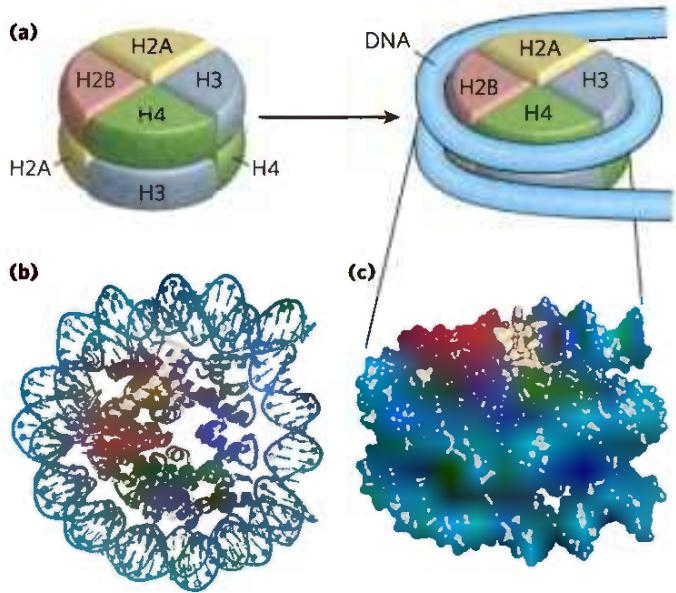  
FIGURE 24-24 DNA wrapped around a histone core. (a) The simplified structure of a nucleosome octamer (left), with DNA wrapped around the histone core (right). (b) A ribbon representation of the nucleosome from the African frog Xenopus laevis. Different colors represent the different histones, matching the colors in (a). (c) Surface representation of the nucleosome. The view in (c) is rotated relative to the view in (b) to match the orientation shown in (a). A 146 bp segment of DNA in the form of a left-handed solenoidal supercoil wraps around the histone complex 1.67 times. (d) Two views of histone amino-terminal tails protruding from between the two DNA duplexes that supercoil around the nucleosome core. Some tails pass between the supercoils, through holes formed by alignment of the minor grooves of adjacent helices. The H3 and H2B tails emerge between the two coils of DNA wrapped around the histone; the H4 and H2A tails emerge between adjacent histone subunits. (e) The amino-terminal tails of one nucleosome protrude from the particle and interact with adjacent nucleosomes, helping to define higher-order DNA packaging. [(b-d) Data from PD8 ID 1AOI, K. Luger et al., Nature 389:251, 1997.]

#### [EN] Nucleosomes Are the Fundamental Organizational Units of Chromatin

P4 The eukaryotic chromosome depicted in Figure 24-5 represents the compaction of a DNA molecule about $10^{5}\mu \mathrm{m}$ long into a cell nucleus that is typically 5 to $10\mu \mathrm{m}$ in diameter. This 10,000-fold compaction is achieved by means of several levels of highly organized folding. Subjection of chromosomes to treatments that partially unfold them reveals a structure in which the DNA is bound tightly to beads of protein, often regularly spaced. The beads in this "beads-on-a-string" arrangement are complexes of histones and DNA. The bead plus the connecting DNA that leads to the next bead form the nucleosome, the fundamental unit of organization on which the higher-order packing of chromatin is built (Fig. 24-24). The bead of each nucleosome contains eight histone molecules: two copies each of H2A, H2B, H3, and H4.

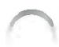

The spacing of the nucleosome beads provides a repeating unit typically of about 200 bp, of which 146 bp are bound tightly around the eight-part histone core and the remainder serve as linker DNA between nucleosome beads. Histone H1 binds to the linker DNA. Brief treatment of chromatin with enzymes that digest DNA causes the linker DNA to degrade preferentially, releasing histone particles containing 146 bp of bound DNA that is protected from digestion.

Researchers have crystallized nucleosome cores obtained in this way, and x-ray diffraction analysis reveals a particle made up of the eight histone molecules with the DNA wrapped around the core in the form of a left-handed solenoidal supercoil (Fig. 24-24; see also Fig. 24-21). Extending out from the nucleosome core are the amino-terminal tails of the histones, which are intrinsically disordered (Fig. 24-24d). Most of the histone modifications occur in these tails. The tails play a key role in forming contacts between nucleosomes in the chromatin (Fig. 24-24e). As the nucleosomes are approximately 10 to 11 nm in diameter, this simple beads-on-a-string structure is sometimes called the 10 nm fiber.

A close inspection of the nucleosome structure reveals why eukaryotic DNA is underwound even though eukaryotic cells lack enzymes that underwind DNA. Recall that the solenoidal wrapping of DNA in nucleosomes is but one form of supercoiling that can be taken up by underwound (negatively supercoiled) DNA. The tight wrapping of DNA around the histone core requires the removal of about one helical turn in the DNA. When the protein core of a nucleosome binds in vitro to a relaxed closed-circular DNA, the binding introduces a negative supercoil. Because this binding process does not break the DNA or change the linking number, the formation of a negative solenoidal supercoil must be accompanied by a compensatory positive supercoil in the unbound region of the DNA (Fig. 24-25). As mentioned earlier, eukaryotic topoisomerases can relax positive supercoils. Relaxing the unbound positive supercoil leaves the negative supercoil fixed (through its binding to the nucleosome's histone core) and results in an overall decrease in linking number. Indeed, topoisomerases have proved necessary for assembling chromatin from purified histones and closed-circular DNA in vitro.

Another factor that affects the binding of DNA to histones in nucleosome cores is the sequence of the bound DNA. Histone cores do not bind at random positions on the DNA; rather, some locations are more likely to be bound than others. This positioning is not fully understood, but in some cases it seems to depend on a local abundance of A=T base pairs in the DNA helix where it is in contact with the histones (Fig. 24-26). A cluster of two or three A=T base pairs facilitates the compression of the minor groove that is needed for the DNA to wrap tightly around the nucleosome's histone core. Nucleosomes bind particularly well to sequences where AA or AT or TT dinucleotides are staggered at 10 bp intervals, an arrangement that can account for up to 50% of the positions of bound histones in vivo.

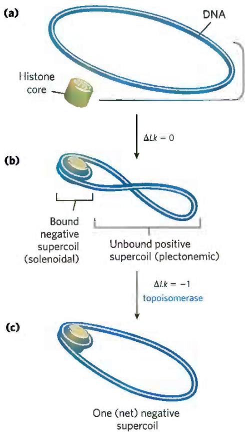  
FIGURE 24-25 Chromatin assembly. (a) Relaxed closed-circular DNA. (b) Binding of a histone core to form a nucleosome induces one negative supercoil. In the absence of any strand breaks, a positive supercoil must form elsewhere in the DNA ( $\Delta Lk = 0$ ). (c) Relaxation of this positive supercoil by a topoisomerase leaves one net negative supercoil ( $\Delta Lk = -1$ ).

Nucleosome cores are deposited on DNA during replication or following other processes that require a transient displacement of nucleosomes. Other, nonhistone proteins are required for the positioning of some nucleosome cores. In several organisms, certain proteins bind to a specific DNA sequence and facilitate the formation of a nucleosome core nearby. Nucleosome cores seem to be deposited stepwise. A tetramer of two H3 and two H4 histones binds first, followed by two H2A–H2B dimers. The incorporation of nucleosomes into chromosomes after chromosomal replication is mediated by a complex of histone chaperones conserved in all eukaryotes and described here for the yeast system. These include the proteins CAF1 (chromatin assembly factor 1), RTT106 and RTT109 (regulation of Ty1 transposition), and ASF1 (anti-silencing factor 1). ASF1 binds to newly synthesized H3–H4 dimers and facilitates RTT109-mediated acetylation at Lys $^{56}$ (K56) of histone H3 (H3K56). The H3K56 modification increases the affinity of H3 for CAF1 and RTT, which in turn promote the deposition of H3-containing histone complexes on the DNA after replication. CAF1 binds directly to a key component of the replication complex called PCNA (see Chapter 25), so that nucleosome deposition is closely coordinated with replication. Some of the same histone chaperones, or different ones, may help assemble nucleosomes after DNA repair, transcription, or other processes.

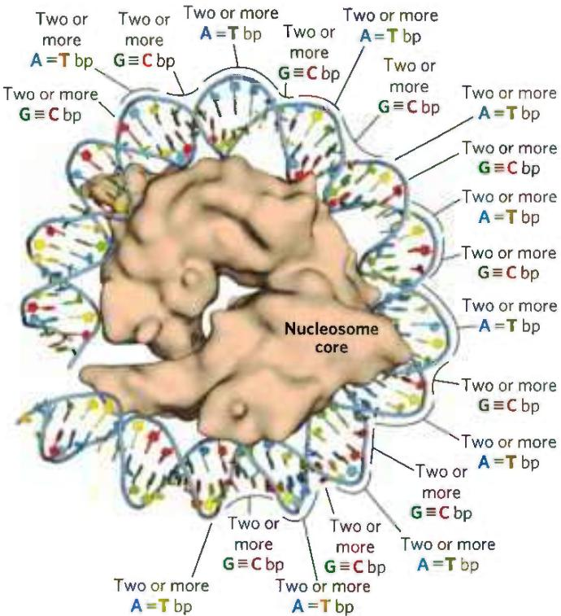  
FIGURE 24-26 The effect of DNA sequence on nucleosome binding. Runs of two or more A=T base pairs facilitate the bending of DNA, whereas runs of two or more G≡C base pairs have the opposite effect. When spaced at about 10 bp intervals, consecutive A=T base pairs help bend DNA into a circle. When consecutive G≡C base pairs are spaced 10 bp apart, offset by 5 bp from runs of A=T base pairs, DNA binding to the nucleosome core is facilitated. [Data from PDB ID 1AOI, K. Luger et al., Nature 389.251, 1997.]

Histone exchange factors permit the substitution of histone variants for core histones in contexts other than postreplication. Proper placement of these variant histones is important. Studies show that mice lacking one of the variant histones die as early embryos (Box 24-1). Precise positioning of nucleosome cores also plays a role in the expression of some eukaryotic genes (Chapter 28).

#### [EN] Nucleosomes Are Packed into Highly Condensed Chromosome Structures

Wrapping of DNA around a nucleosome core compacts the DNA length about sevenfold. The overall compaction in a chromosome, however, is greater than 10,000-fold—ample evidence for even higher orders of structural organization. The condensation does not follow a rigid organization, but it is also not random and occurs so as to avoid the formation of knots.

P4 The higher levels of folding are not yet fully understood, but certain regions of DNA seem to associate with a chromosomal scaffold (Fig. 24-27) that contains many proteins. Given the need to fold and compact the chromosome without creating knots, topoisomerase II is one of the most abundant proteins in the chromosome, further emphasizing the relationship between DNA underwinding and chromatin structure. P3 Topoisomerase II is so important to the maintenance of chromatin structure that inhibitors of this enzyme can kill rapidly dividing cells. Several drugs used in cancer chemotherapy are topoisomerase II inhibitors that allow the enzyme to promote strand breakage but not the resealing of the breaks (Box 24-2, p. 906).

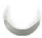

There are additional layers of organization in the eukaryotic nucleus. Just before cell division during mitosis, chromosomes can be seen as highly condensed and organized structures (Figure 24-28a). During interphase, chromosomes appear dispersed (Fig. 24-28b,

(b)  

FIGURE 24-27 Loops of DNA attached to a chromosomal scaffold. (a) A swollen mitotic chromosome, produced in a buffer of low ionic strength, as seen in the electron microscope. Notice the appearance of chromatin loops at the margins. (b) Extraction of the histones leaves a proteinaceous chromosomal scaffold surrounded by naked DNA. (c) The DNA appears to be organized in loops attached at their base to the scaffold in the upper left corner; scale bar = 1 μm. The three images are at different magnifications. [(a, b) Don W. Fawcett/Science Source. (c) U. K. Laemmli et al., "Metaphase chromosome structure: The role of nonhistone proteins," Cold Spring Harb. Symp. Quant. Biol. 42:351, 1978. © Cold Spring Harbor Laboratory Press.]  

  
FIGURE 24-28 Chromosomal organization in the eukaryotic nucleus. (a) Condensed chromosomes at the mitotic anaphase in cells of the bluebell (Endymion sp.). (b) Interphase nuclei of human breast epithelial cells. The nucleus on the bottom has been treated so that its two copies of chromosome 11 fluoresce green. (c) Chromosomes are organized into active compartments, in which actively transcribed genes are clustered, and inactive compartments, made of heterochromatin within which genes are silenced. In both cases, the compartments feature large DNA loops called topologically associating domains (TADs), many constrained at their bases by DNA-binding proteins such as CTCF. Certain lncRNAs (Fig. 24-29) also play a role in defining loops within chromatin. Constraining a loop at its base not only provides a boundary for the loop, but also allows supercoiling within the loop to be controlled. [(a) Pr. G. Giménez-Martín/Science Source. (b) Karen Meaburn and Tom Misteli/National Cancer Institute.]

top), but they do not meander randomly in nuclear space (Fig. 24-28b, bottom). Each chromosome appears to be organized with two sets of compartments, one set that is transcriptionally active and the other that is transcriptionally inactive. The level of chromatin condensation is reduced in the transcriptionally active compartments. The highly condensed DNA in transcriptionally inactive regions or in regions lacking genes is also called heterochromatin. Within each compartment, large segments of DNA are organized in loops called topologically associating domains, or TADs. The TADs, which typically average about 800,000 bp, are often bordered by DNA sites recognized by the CCCTC-binding factor (CTCF). The binding by CTCF brings together sites that are otherwise quite distant in the linear DNA sequence, tethering the base of the loop (Fig. 24-28c).

P4 Another important component defining the structure of chromosomes is RNA, particularly a class of RNAs called long noncoding RNAs (lncRNAs). RNA has the potential to take up a variety of structures (see Chapter 8), and can interact with DNA, proteins, or other RNA molecules. The lncRNAs, as the name implies, are functional RNAs, generally over 200 nucleotides long, that do not necessarily encode proteins. Many lncRNAs are now known and more are being discovered rapidly. Many of them provide a scaffold for proteins that both bind to the RNA and affect chromosome structure and function. Some proteins that bind to lncRNAs also have binding sites on DNA, and the RNAs provide a link that tethers distant parts of the chromosome together (Fig. 24-29). Other proteins that bind to lncRNAs help to position nucleosomes, modify histones,

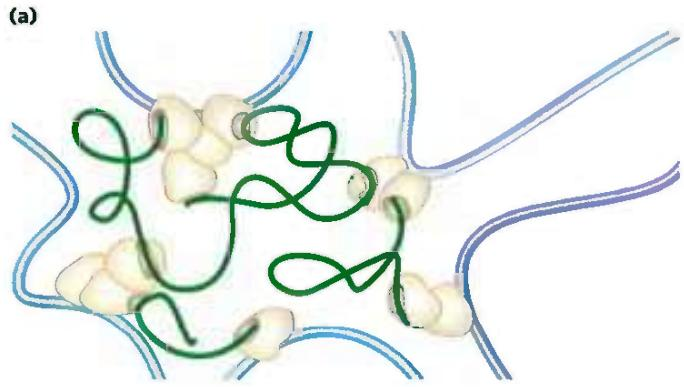

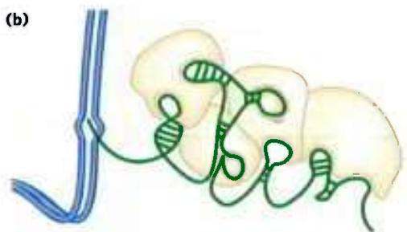  
FIGURE 24-29 Effects of lncRNAs on chromosome architecture and gene expression. (a) Various lncRNAs can interact with DNA-binding proteins and in some cases with DNA to tether otherwise distant segments of DNA. (b) A transcribed lncRNA can interact with multiple proteins that have gene regulatory roles, suppressing or activating transcription of nearby genes. [Information from J. M. Engreitz et al., Nat. Rev. Mol. Cell Biol. 17:756, 2016, Fig. 5.]

#### [EN] Epigenetics, Nucleosome Structure, and Histone Variants

Information that is passed from one generation to the next — to daughter cells at cell division or from parent to offspring — but is not encoded in DNA sequences is referred to as epigenetic information. Much of it is in the form of covalent modification of histones and/or the placement of histone variants in chromosomes. Understanding that placement in the context of a chromosome encompassing millions of base pairs is the focus of some powerful technologies.

Chromatin regions where active gene expression (transcription) is occurring tend to be partially decondensed and are called euchromatin. In these regions, histones H3 and H2A are often replaced by the histone variants H3.3 and H2AZ, respectively (Fig. 1). The complexes that deposit nucleosome cores containing histone variants on the DNA are similar to those that deposit nucleosome cores with the more common histones. Nucleosome cores containing histone H3.3 are

  
FIGURE 1 Shown here are the standard histones H3, H2A, and H2B and a few of the known variants. Sites of Lys/Arg residue methylation and Ser phosphorylation are indicated. HFD denotes the histone-fold domain, a structural domain common to all standard histones. Regions denoted in other colors define sequence and structural homologies. [Information from K. Sarma and D. Reinberg, Nat. Rev. Mol. Cell Biol. 6:139, 2005.]

methylate DNA at various locations to alter gene transcription, and generally affect chromosome structure in many different ways. Some well-studied examples include particular lncRNAs that play a major role in X chromosome inactivation in mammals (Box 24-3).

deposited by a complex in which CAF1 (chromatin assembly factor 1) is replaced by the protein HIRA (a name derived from a class of proteins called HIR, for histone repressor). Both CAF1 and HIRA can be considered histone chaperones, helping to ensure the proper assembly and placement of nucleosomes. Histone H3.3 differs in sequence from H3 by only four amino acid residues, but these residues all play key roles in histone deposition.

Like histone H3.3, H2AZ is associated with a distinct nucleosome deposition complex, and it is generally associated with chromatin regions involved in active transcription. Incorporation of H2AZ stabilizes the nucleosome octamer, but it impedes some cooperative interactions between nucleosomes that are needed to compact the chromosome. This leads to a more open chromosome structure that enables the expression of genes in the region where H2AZ is located. The gene encoding H2AZ is essential in mammals. In fruit flies, loss of H2AZ prevents development beyond the larval stage.

Another H2A variant is H2AX, which is associated with DNA repair and genetic recombination. In mice, the absence of H2AX results in genome instability and male infertility. Modest amounts of H2AX seem to be scattered throughout the genome. When a double-strand break occurs, nearby molecules of H2AX become phosphorylated at Ser $^{139}$ in the carboxyl-terminal region. If this phosphorylation is blocked experimentally, formation of the protein complexes necessary for DNA repair is inhibited.

The H3 histone variant known as CENPA (centromere protein A) is associated with the repeated DNA sequences in centromeres. The chromatin in the centromere region contains the histone chaperones CAF1 and HIRA, and both proteins could be involved in the deposition of nucleosome cores containing CENPA. Elimination of the gene for CENPA is lethal in mice.

The function and positioning of the histone variants can be studied by an application of technologies used in genomics. One useful technology is chromatin immunoprecipitation, or chromatin IP (ChIP). Nucleosomes containing a particular histone variant are precipitated by an antibody that binds specifically to this variant. These nucleosome cores can be studied in isolation from their DNA, but more commonly the DNA associated with them is included in the study to determine where the nucleosome cores of interest bind. The DNA can be sequenced, yielding a map of genomic sequences to which those particular nucleosome cores bind. This technique is called a ChIP-Seq experiment (Fig. 2).

The entire structure of each chromosome is constrained within a subnuclear domain called a chromosome territory (Fig. 24-30). There is little or no intermingling of chromosomal DNA in different territories. The exact location of chromosome territories

The histone variants, along with the many covalent modifications that histones undergo, help define and isolate the functions of chromatin. They mark the chromatin, facilitating or suppressing specific functions such as chromosome segregation, transcription, and DNA repair. The histone modifications do not disappear at cell division or during meiosis, and thus they become part of the information transmitted from one generation to the next in all eukaryotic organisms.

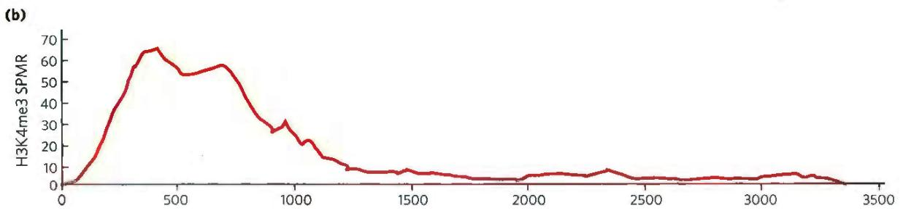

  
FIGURE 2 A ChIP-Seq experiment is designed to reveal the genomic DNA sequences to which a particular histone variant binds. (a) A histone variant with an epitope tag (a protein or chemical structure recognized by an antibody; see Chapters 5 and 9) is introduced into a particular cell type, where it is incorporated into nucleosomes. (In some cases, an epitope tag is unnecessary because antibodies are available that bind directly to the histone modification of interest.) Chromatin is isolated from the cells and digested briefly with micrococcal nuclease (MNase). The DNA bound in nucleosomes is protected from digestion, but the linker DNA is cleaved, releasing segments of DNA bound to one or two nucleosomes. An antibody that binds to the epitope tag is  
added, and the nucleosomes containing the epitope-tagged histone variant are selectively precipitated. The DNA in these nucleosomes is extracted from the precipitate and sequenced in depth to reveal the locations where the nucleosomes are bound. (b) In this example, the binding of different modified versions of histone H3 is characterized along the gene YLR249W from the yeast S. cerevisiae. Numbers along the bottom correspond to numbered nucleotide positions in this chromosomal segment. The top and bottom panels show the distributions of H3K4me3 (H3 with Lys $^{4}$ methylated three times) and H3K4me1, respectively. SPMR is sequence tags per million reads. [Information from L. M. Soares et al., Mol. Cell 68:773, 2017, Fig. 1D.]

varies from cell to cell in an organism, but some spatial patterns are evident. Some chromosomes have a higher density of genes than others (for example, human chromosomes 1, 16, 17, 19, and 22), and these tend to have territories in the center of the nucleus. Chromosomes with more heterochromatin tend to be located on the nuclear periphery. Spaces between chromosomes are often sites where transcriptional machinery and transcriptionally active genes on adjacent chromosomes are concentrated.

#### [EN] Curing Disease by Inhibiting Topoisomerases

P3 The topological state of cellular DNA is intimately connected with its function. Without topoisomerases, cells cannot replicate or package their DNA, or express their genes — and they die. Inhibitors of topoisomerases have therefore become important pharmaceutical agents, targeted at infectious agents and malignant cells.

Two classes of bacterial topoisomerase inhibitors have been developed as antibiotics. The coumarins, including novobiocin and coumermycin A1, are natural products derived from Streptomyces species. They inhibit the ATP binding of the bacterial type II topoisomerases, DNA gyrase and topoisomerase IV. These antibiotics are not often used to treat infections in humans, but research continues to identify clinically effective variants.

The quinolone antibiotics, also inhibitors of bacterial DNA gyrase and topoisomerase IV, first appeared in 1962 with the introduction of nalidixic acid. This compound had limited effectiveness and is no longer used clinically in the United States, but the continued development of this class of drugs eventually led to the introduction of the fluoroquinolones, exemplified by ciprofloxacin (Cipro). The quinolones act by blocking the last step of the topoisomerase reaction, the resealing of the DNA strand breaks. Ciprofloxacin is a broad-spectrum antibiotic. It is one of the few antibiotics reliably effective in treating anthrax infections and is considered a valuable agent in protection against possible bioterrorism. Quinolones are selective for the bacterial topoisomerases, inhibiting the eukaryotic enzymes only at concentrations several orders of magnitude greater than the therapeutic doses.

Some of the most important chemotherapeutic agents used in cancer treatment are inhibitors of human topoisomerases. Topoisomerases are generally present at elevated levels in tumor cells, and agents targeted to these enzymes are much more toxic to the tumors than to most other tissue types. Inhibitors of both type I and type II topoisomerases have been developed as anticancer drugs.

Camptothecin, isolated from a Chinese ornamental tree and first tested clinically in the 1970s, is an inhibitor of eukaryotic type I topoisomerases. Clinical trials indicated limited effectiveness, despite its early promise in preclinical work on mice. However, two effective derivatives, irinotecan (Campto) and topotecan (Hycamtin) — used to treat colorectal cancer and ovarian cancer, respectively — were developed in the 1990s. All of these drugs act by trapping the topoisomerase-DNA complex in which the DNA is cleaved, inhibiting religation.

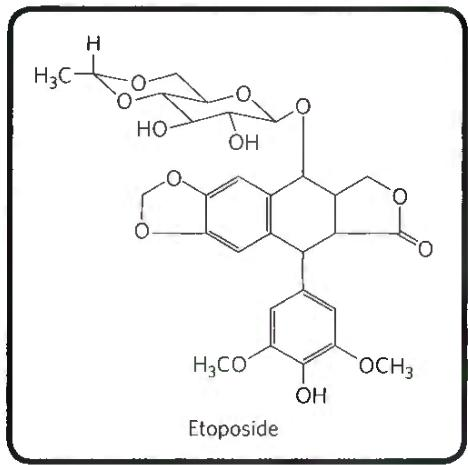

The human type II topoisomerases are targeted by a variety of antitumor drugs, including doxorubicin (Adriamycin), etoposide (Etopophos), and ellipticine. Doxorubicin, effective against several kinds of human tumors, is an anthracycline in clinical use. Most of these drugs stabilize the covalent topoisomerase-DNA (cleaved) complex.

All of these anticancer agents generally increase the levels of DNA damage in the targeted, rapidly growing tumor cells. However, noncancerous tissues can also be affected, leading to a more general toxicity and unpleasant side effects that must be managed during therapy. As cancer therapies become more effective and survival statistics for cancer patients improve, the independent appearance of new tumors is becoming a greater problem. In the continuing search for new cancer therapies, topoisomerases are likely to remain prominent targets for research.

#### [EN] X Chromosome Inactivation by an IncRNA: Preventing Too Much of a Good (or Bad) Thing

In higher eukaryotes, the Y chromosome contains only a few genes. The X chromosome, in contrast, often contains more than a thousand genes, many essential for cell function and organismal development. Males have just one X chromosome, whereas females have two. Females thus could end up with a double dose of gene products, leading to a variety of potentially toxic outcomes. Mechanisms of gene dosage compensation vary among different groups of eukaryotes. In most mammals, dosage compensation is accomplished by X chromosome inactivation, randomly affecting just one of the two X chromosomes in a given cell. The effects of this can be seen in calico cats, all of which are female. Fur pigmentation genes are found on the X chromosome. When a cat inherits chromosomes with different pigmentation alleles on its two X chromosomes, its coloration patterns reflect the random inactivation of one or the other X chromosome in different sets of cells.

  
A calico cat. (krblokhin/Getty Images)

An IncRNA called Xist (X-inactive specific transcript) is uniquely expressed from its gene on the inactive X chromosome. Xist is approximately 17,000 nucleotides long, encodes no proteins, and is expressed only in cells with two X chromosomes (not in males). Xist is an essential component of the X inactivation process. This IncRNA interacts with many proteins and transcription factors (Fig. 1). As it migrates in the region immediately proximal to the gene from which it is transcribed, Xist gradually encompasses more and more DNA as that X chromosome undergoes a major condensation, giving rise to the inactive form called a Barr body.

The active X chromosome also transcribes the gene that produces Xist, but it does so in the opposite direction to produce a longer lncRNA called Tsix (Xist spelled backward). Tsix is synthesized using a different RNA polymerase binding site (promoter; Chapter 26) and is 40,000 nucleotides long. A large part of Tsix is perfectly complementary to Xist, and it antagonizes the function of any Xist that may appear near the active X chromosome.

(a)  
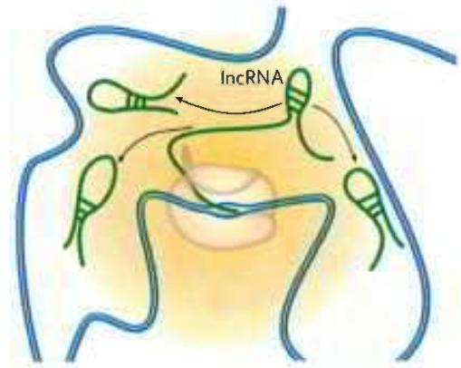

(b)  

(c)  

FIGURE 1 (a) As Xist RNA is transcribed, it migrates to nearby regions within an X chromosome, (b) binding to proteins including SAFA (scaffold attachment factor A). Xist binding spreads through the chromosome, leading to condensation and other architectural changes to form a Barr body. Other than the Xist gene itself, gene expression is suppressed throughout the chromosome. (c) The effects are quite local; Xist does not spread within the nucleus beyond the chromosome territory occupied by the inactivated X chromosome. [Information from J. M. Engreitz et al., Nat. Rev. Mol. Cell Biol. 17:756, 2016, Fig. S.]

Random X inactivation occurs in the cells of a female embryo long before birth. The processes that initiate the inactivation of one, but not both, of the X chromosomes in a particular cell are still being elucidated.

  
FIGURE 24-30 Chromosome territories. Cartoon showing chromosome territories in a eukaryotic nucleus. The interchromatin compartments are enriched in transcriptional machinery and have abundant actively transcribed genes. The nucleolus is a suborganelle within the nucleus where ribosomes are synthesized and assembled (Chapter 27).

#### [EN] Condensed Chromosome Structures Are Maintained by SMC Proteins

P4 SMC proteins (structural maintenance of chromosomes), the third major class of chromatin protein in addition to the histones and topoisomerases, are responsible for maintaining the structure and integrity of chromosomes following replication. The primary structure of SMC proteins consists of five distinct domains (Fig. 24-31a). The amino- and carboxyl-terminal globular domains, N and C, each of which contains part of an ATP-hydrolytic site, are connected by two regions of $\alpha$ -helical coiled-coil motifs (see Fig. 4-10) joined by a hinge domain. The proteins are generally dimeric, forming a V-shaped complex that is thought to be tied together through the protein's hinge domains. One N domain and one C domain come together like tweezers to form a complete ATP-hydrolytic site at each free end of the V (Fig. 24-31b).

Proteins in the SMC family are found in all types of organisms, from bacteria to humans. Eukaryotes have two major types, cohesins and condensins, both of which are bound by regulatory and accessory proteins (Fig. 24-31c, d). Cohesins play a substantial role in linking together sister chromatids immediately after replication and keeping them together as the chromosomes condense to metaphase. This linkage is essential if chromosomes are to segregate properly at cell division. Cohesins, along with a third protein, kleisin, are thought to form a ring around the replicated chromosomes that ties them together until separation is required. The ring may expand and contract in response to ATP hydrolysis. Condensins are essential to the condensation of chromosomes as cells enter mitosis. In the laboratory, condensins bind to DNA in a manner that creates positive supercoils; that is, condensin binding causes the DNA to become overwound, in contrast to the underwinding

  
induced by the binding of nucleosomes. A model for the role of condensins in chromatin compaction is presented in Figure 24-32. In brief, as DNA is compacted to

FIGURE 24-32 Two current models of the possible role of condensins in chromatin condensation. Initially, the DNA is bound at the hinge region of the SMC protein, in the interior of what can become an intramolecular SMC ring. ATP binding leads to head-to-head association, forming supercoiled loops in the bound DNA. Subsequent rearrangement of the head-to-head interactions to form rosettes condenses the DNA. Condensins may organize the looping of the chromosome segments in several ways. [Information from T. Hirano, Nat. Rev. Mol. Cell Biol. 7:311, 2006, Fig. 6.]

form tighter and tighter loops, the condensins stabilize the loops by binding at the base of each one. Cohesins and condensins are essential in orchestrating the many changes in chromosome structure during the eukaryotic cell cycle (Fig. 24-33).

#### [EN] Bacterial DNA Is Also Highly Organized

We now turn briefly to the structure of bacterial chromosomes. P2 Bacterial DNA is compacted in a structure called the nucleoid, which can occupy a significant fraction of the cell volume (Fig. 24-34). The DNA seems to be attached at one or more points to the inner surface of the plasma membrane. Much less is known about the structure of the nucleoid than of eukaryotic chromatin, but a complex organization is slowly being revealed. P3 In E. coli, a scaffoldlike structure seems to organize the circular chromosome into a series of about 500 looped domains, each encompassing, on average, 10,000 bp (Fig. 24-35), as described above for chromatin. The domains are topologically constrained; for example, if the DNA is cleaved in one domain, only the DNA within that domain will be relaxed. The domains do not have fixed end points. Instead, the boundaries are most likely in constant motion along the DNA, coordinated with DNA replication.

  
FIGURE 24-33 The roles of cohesins and condensins in the eukaryotic cell cycle. Cohesins are loaded onto the chromosomes during G1 (see Fig. 24-22), tying the sister chromatids together during replication. At the onset of mitosis, condensins bind and maintain the chromatids  
in a condensed state. During anaphase, the enzyme separase removes the cohesin links. Once the chromatids separate, condensins begin to unload and the daughter chromosomes return to the uncondensed state. [Information from D. P. Bazett-Jones et al., Mol. Cell 9:1183, 2002, Fig. 5.]

  
FIGURE 24-34 E. coli nucleoids. The DNA of these cells is stained with a dye that fluoresces blue when exposed to UV light. The blue areas define the nucleoids. Notice that some cells have replicated their DNA but have not yet undergone cell division and hence have multiple nucleoids. [Lars Renner.]

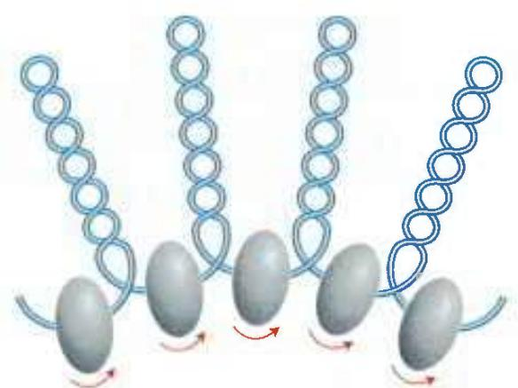  
FIGURE 24-35 Looped domains of the E. coli chromosome. Each domain is about 10,000 bp long. The domains are not static but move along the DNA as replication proceeds. Barriers at the boundaries of the domains, of unknown composition, prevent the relaxation of DNA beyond the boundaries of the domain where a strand break occurs. The putative boundary complexes are shown as gray-shaded ovoids. The arrows denote movement of DNA through the boundary complexes.

Bacterial DNA does not seem to have any structure comparable to the local organization provided by nucleosomes in eukaryotes. P4 Histonelike proteins are abundant in E. coli—the best-characterized example is a two-subunit protein called HU ( $M_{r}$ 19,000)—but these proteins bind and dissociate within minutes, and no regular, stable DNA-histone structure has been found. The dynamic structural changes in the bacterial chromosome may reflect a requirement for more ready access to its genetic information. The bacterial cell division cycle can be as short as 15 min, whereas a typical eukaryotic cell may not divide for hours or even months. In addition, a much greater fraction of bacterial DNA is used to encode RNA and/or protein products. Higher rates of cellular metabolism in bacteria mean that a much higher proportion of the DNA is being transcribed or replicated at a given time than in most eukaryotic cells.

#### [EN] SUMMARY 24.3 The Structure of Chromosomes

A eukaryotic chromosome is made of DNA, protein, and RNA, forming a structure called chromatin.

Histones are small, basic DNA-binding proteins. Complexes of histones form nucleosomes, the fundamental structural unit of chromatin.

The nucleosome consists of histones and a 200 bp segment of DNA. A core protein particle containing eight histone molecules (two copies each of histones H2A, H2B, H3, and H4) is encircled by a segment of DNA (about 146 bp) in the form of a left-handed solenoidal supercoil.

■ Higher-order folding of chromosomes involves attachment to a chromosomal scaffold. Transcriptionally active and inactive regions of chromosomes are separated into compartments, each featuring large loops of DNA, each loop constrained at its base by proteins and lncRNAs. Individual chromosomes are constrained within nuclear subdomains called territories. Histone H1, topoisomerase II, and SMC proteins play organizational roles in chromosomes.

■ The SMC proteins, principally cohesins and condensins, have important roles in keeping the chromosomes organized during each stage of the cell cycle.

The bacterial chromosome is extensively compacted into the nucleoid, but the chromosome seems to be much more dynamic and irregular in structure than eukaryotic chromatin, reflecting the shorter cell cycle and very active metabolism of a bacterial cell.

<!-- EN-END 24.3 -->

## 四、染色质重塑

染色质的结构改变称为染色质重塑（chromatin remodeling）。染色质是遗传信息载体，遗传信息的贮存、传递和表达都与染色质有关。编码蛋白质和功能RNA的遗传信息（基因携带的遗传信息）主要贮存在染色质的DNA中；而染色质重塑的某些变化也能被遗传，影响后代基因表达，构成表观遗传学的基础。染色质重塑主要涉及核小体组成和结构的改变、核小体相位的改变和由此导致的染色质高级结构的改变。

## （一）组蛋白变异和修饰

核小体组蛋白的改变包括组蛋白变异体的置换和组蛋白尾部的修饰两个方面。

## 1. 组蛋白变异体改变核小体的功能

组蛋白十分保守,真核生物的核小体通常都由一些非常类似的组蛋白所组成,但是也存在少数组蛋白的变异体。在染色质的某些特殊区域,或染色质处于某些特殊状态下,核小体的一种正常组蛋白可被其变异体所取代,从而给染色质的该区域带上标志,或是给予该区域特殊功能。例如,H2AX是H2A的变异体,比较广泛的分布在真核生物的核小体中。当染色质DNA断裂时,尤其是双链断裂,邻近断口处的H2AX便被磷酸化。磷酸化发生在H2AX的一个Ser残基上,该Ser残基于H2A中并不存在。磷酸化的H2AX可被DNA修复酶所特异识别,因此而将修复酶引到DNA损伤处进行修复。

另一个是组蛋白 H3 的变异体 CENP-A, 在染色体着丝粒区域的核小体中 H3 被它取代。组蛋白 H3 与 CENP-A 的折叠区完全相同, 但是后者有较长的 N 端尾巴。因此, 着丝粒区域核小体的核心结构可能并无变化, 但 CENP-A 的 N 端长尾可被动原体 (kinetochore) 的蛋白 CENP-C 所结合, 并由此组成着丝粒。目前已知, 除了组蛋白 H4 外, 其余所有组蛋白都存在变异体。组蛋白变异体的功能见表 29-5。

表 29-5 组蛋白变异体的功能

<table><tr><td>组蛋白变异体</td><td>功能</td><td>组蛋白变异体</td><td>功能</td></tr><tr><td>组蛋白 H3.3</td><td>转录激活</td><td>组蛋白 macroH2A</td><td>X 染色体失活,转录阻遏</td></tr><tr><td>组蛋白 CENP-A</td><td>组装着丝粒</td><td>组蛋白 H2ABBD</td><td>转录激活</td></tr><tr><td>组蛋白 H2AX</td><td>DNA 修复和重组</td><td>组蛋白 spH2B</td><td>组装染色质</td></tr><tr><td>组蛋白 H2AZ</td><td>基因表达,染色体分离</td><td></td><td></td></tr></table>

## 2. 组蛋白修饰

组蛋白的共价修饰主要发生在尾部，较为常见的有甲基化、乙酰化和磷酸化，有时还发生泛素化（ubiquitylation）、苏素化（sumoylation）和ADP-核糖基化（ADP-ribosylation）。N端尾区的赖氨酸（K）常被乙酰基或甲基所修饰，乙酰基可中和 $\varepsilon-$ 氨基的正电荷；甲基则仍保持正电荷，并可同时被单个、两个或三个甲基所修饰。精氨酸(R)则可被单个或两个甲基所修饰。丝氨酸(S)、苏氨酸(T)还可能有酪氨酸(Y)被磷酸修饰，从而导入负电荷。核心区有时也能被修饰，如H3的K79和H4的K59被甲基化。泛素一般位于C端尾部。表29-6列出已知组蛋白N端尾部的一些修饰位点。

表 29-6 组蛋白 N 端尾部的修饰位点

<table><tr><td>组蛋白</td><td>磷酸化</td><td>甲基化</td><td>乙酰化</td></tr><tr><td>H2A</td><td>S1</td><td></td><td>K4、K5</td></tr><tr><td>H2B</td><td>S14</td><td></td><td>K5、K12、K15</td></tr><tr><td>H3</td><td>T3、S10、T11、S28</td><td>K4、K9、R17、K27、K36、K79(核心区)</td><td>K4、K9、K14、K18、K23、K27</td></tr><tr><td>H4</td><td>S1</td><td>R3、K20、K59(核心区)</td><td>K5、K8、K12、K16</td></tr></table>

组蛋白是强碱性蛋白,DNA 则呈强酸性,因此广泛的乙酰化可以降低组蛋白正电荷,减弱与 DNA 磷酸基的作用,便于核小体的组装。新合成的组蛋白常以某种方式乙酰化,而在组装成核小体后乙酰基即被除去。还可以看到,无活性的基因通常并不被乙酰化,活性的基因乙酰化程度较高。

核小体组蛋白的尾部垂挂在核小体表面，正好可用来接收和给出信号，借以调节染色质各区段的功能。组蛋白尾部存在众多可被修饰的位点，修饰基团的加入或除去，可影响核小体的结构，尤为重要的是给了核小体特殊的标志。例如，组蛋白H4的N端上第8和16位赖氨酸乙酰化，可成为基因表达的起点；然而第5和12位赖氨酸的乙酰化则有不同的含义，它们是在H4新合成后即被乙酰化以便结合DNA后组装新的核小体。又如，组蛋白H3第4、36或79位赖氨酸的甲基化与基因表达有关；而第9或27位赖氨酸的甲基化却与转录阻遏关联。这表明，组蛋白修饰可以形成或改变染色质某些特殊功能区域。据此产生“组蛋白密码(histone code)”假说,认为组蛋白各位点的修饰提供一种生物密码,可用于决定染色质各区域的功能,这种密码是由细胞内一些特殊蛋白质所书写、解读和删除的。

染色质的基本结构单位是核小体,染色质重塑也以核小体重塑(nucleosome remodeling)为基础。核小体组蛋白修饰引起核小体重塑,包括改变核小体的电荷分布,改变组蛋白八聚体的结构,改变组蛋白八聚体与DNA的空间关系,也改变了核小体的表面标志。核小体的结构改变可被细胞蛋白质或蛋白质复合物所识别,从而给予染色质新的功能,如促进转录;也可能再通过招募一些蛋白质而促进染色质的新功能。

一些重要的蛋白结构域能够识别经修饰的组蛋白,如同源调节域(bromodomain)、染色质结构修饰域(chromodomain)、TUDOR结构域以及PHD(plant homeodomain)锌指等。含同源调节域的蛋白质能识别乙酰化组蛋白尾巴,后三者识别甲基化组蛋白尾巴。与上述蛋白不同,含SANT结构域的蛋白识别未经修饰的组蛋白。组蛋白修饰位点不止一个,而细胞中也存在一些蛋白质含有不止一个上述结构域,这些结构域组合在一起,就可以识别不同修饰的组蛋白。例如,一种蛋白质含PHD锌指,可识别第4位赖氨酸甲基化的组蛋白H3,其相邻的结构域为同源调节域,可识别乙酰化组蛋白。

当识别蛋白与核小体结合后,接着很可能是又招募一些酶去修饰下一个核小体。组蛋白修饰酶通常含有可识别经修饰的组蛋白,它修饰的组蛋白又可被另外的修饰酶所识别,然后依次完成组蛋白各位点的修饰。核小体重塑复合物具有一个或多个含识别结构域的亚基,可以修饰组蛋白并进一步招募修饰酶。某些调节转录的蛋白质也含有识别结构域,例如转录因子TFIID就含有同源调节域,它识别乙酰化的组蛋白,并通过进一步乙酰化而增强转录活性。而在建立异染色质中起重要作用的一些蛋白质中却发现存在染色质组构修饰域,这类结构域识别甲基化组蛋白,并可导致基因转录被阻遏。

## 3. 组蛋白修饰酶

组蛋白修饰是一个动态过程。通过核小体重塑而赋予一段染色质区新的功能或改变其原有的功能。而核小体组蛋白的修饰是由特异的酶催化的。组蛋白乙酰转移酶（histone acetyltransferase, HAT）催化乙酰基加到组蛋白上；组蛋白脱乙酰酶（histone deacetylase, HDAc）催化修饰的组蛋白脱去乙酰基。与此类似，组蛋白甲基转移酶（histone methyltransferase, HMT）加甲基到组蛋白上；组蛋白脱甲基酶（histone demethylase, HDM）脱去修饰组蛋白的甲基。催化同一反应的酶有许多种，或是选择不同的组蛋白，或是对同一组蛋白不同位点某一氨基酸具有特异性。不同的修饰往往对核小体功能有不同效果。

组蛋白修饰酶往往是十分大的多蛋白复合物的一个组分,复合物的其他组分在招募各种酶到 DNA 的特殊区段中分别起着各自的作用。表 29-7 列出了一些已知的组蛋白修饰酶。

表 29-7 组蛋白修饰酶

<table><tr><td>名称</td><td>亚基数</td><td>催化亚基</td><td>结合组蛋白的结构域</td><td>靶组蛋白</td></tr><tr><td colspan="5">组蛋白乙酰转移酶复合物</td></tr><tr><td>SAGA</td><td>15</td><td>Gcn5</td><td>同源调节域,染色质组构修饰域</td><td>H3和H2B</td></tr><tr><td>PCAF</td><td>11</td><td>PCAF</td><td>同源调节域</td><td>H3和H4</td></tr><tr><td>NuA3</td><td>5</td><td>Sas3</td><td>PHD锌指</td><td>H3</td></tr><tr><td>NuA4</td><td>6</td><td>Esa1</td><td>染色质组构修饰域,SANT,PHD锌指</td><td>H4和H2A</td></tr><tr><td>P300/CBP</td><td>1</td><td>P300/CBP</td><td>同源调节域,PHD锌指</td><td>H2A、H2B、H3和H4</td></tr><tr><td colspan="5">组蛋白脱乙酰酶复合物</td></tr><tr><td>NuRD</td><td>9</td><td>HDAC1/HDAC2</td><td>染色质组构修饰域,PHD锌指</td><td></td></tr><tr><td>SlR2复合物</td><td>3</td><td>Sir2</td><td></td><td></td></tr><tr><td>Rpd3(大)</td><td>12</td><td>Rpd3</td><td>PHD锌指</td><td></td></tr><tr><td>Rpd3(小)</td><td>5</td><td>Rpd3</td><td>染色质组构修饰域,PHD锌指</td><td></td></tr><tr><td colspan="5">组蛋白甲基转移酶</td></tr><tr><td>SET1</td><td></td><td></td><td></td><td>H3K4</td></tr><tr><td>SUV39/CLR4</td><td></td><td></td><td>染色质组构修饰域</td><td>H3K9</td></tr><tr><td>SET2</td><td></td><td></td><td></td><td>H3K36</td></tr><tr><td>DOT1</td><td></td><td></td><td></td><td>H3K79</td></tr><tr><td>PRMT</td><td></td><td></td><td></td><td>H3R3</td></tr><tr><td>SET9/SUV4-20</td><td></td><td></td><td></td><td>H4K20</td></tr><tr><td>组蛋白脱甲基酶</td><td></td><td></td><td></td><td></td></tr><tr><td>LSD1</td><td></td><td></td><td>PHD锌指,SANT结构域</td><td>H3K4</td></tr><tr><td>JHDM1</td><td></td><td></td><td>PHD锌指</td><td>H3K36</td></tr><tr><td>JHDM3</td><td></td><td></td><td>PHD锌指,TUDOR结构域</td><td>H3K9和36</td></tr></table>

## （二）DNA的修饰

DNA 可被甲基化。与组蛋白甲基化不同，DNA 甲基化后即失去转录活性，而组蛋白甲基化可失活，也可活化，视甲基化位置而定。在基因沉默或异染色质化区段，组蛋白 H3K9 甲基化，DNA 也被甲基化。催化此赖氨酸甲基化的酶是含 SET 结构域的组蛋白甲基转移酶，称作 Suv39h1。在此之前先要由 HDAC 脱去 H3K9 上的乙酰基，然后才能甲基化。甲基化的 H3K9 随即招募异染色质蛋白 1(heterochromatin protein 1, HP1)，该蛋白质通过染色质结构修饰域与甲基化的 H3K9 结合，并活化 DNA 甲基转移酶（DNA methyltransferase, DNMT）。DNA 甲基化和组蛋白甲基化可以相互强化，甲基化组蛋白能够招募 DNA 甲基转移酶，而有些组蛋白甲基转移酶能够识别甲基化 CpG。

DNA 甲基化是 DNA 修饰的主要方式,通常甲基位于 CpG 岛胞嘧啶的第 5 位碳上。哺乳动物基因组 DNA 的 5mC 占胞嘧啶总量的 2%\~7%,约 70% 的 5mC 位于基因组的 CpG 二核苷酸。所谓 CpG 岛(CpG island)是指基因 5' 端调控区成串存在的 CpG 二核苷酸,长达 500\~1 000 bp,大约 56% 的结构基因含有 CpG 岛。DNA 甲基化的甲基供体是 S-腺苷甲硫氨酸(SAM),由 DNMT1 所催化,反应如下:

## 1. DNA 甲基化引起基因沉默和异染色质化

DNA 修饰是基因活性的一种调节方式。转录活性区的 CpG 岛一般是未甲基化的；DNA 甲基化使基因沉默和异染色质化。沉默基因重新激活需要除去甲基，催化 DNA 脱甲基的反应（DNA demethylation）比较复杂，可能涉及碱基切除修复（base excision repair）。DNA 甲基化并非基因沉默的原因，而是借以使基因长期失活的途径。催化 DNA 甲基化的酶有两类：一类是维持性的（maintenance），即在 DNA 复制后以旧链为模板使新链甲基化，将半甲基化 DNA（semimethylated DNA）转变成全甲基化 DNA（homomethylated DNA），如上述 DNMT1。另一类是全新的（de novo），在新的位点使 DNA 甲基化，如 DNMT3a 和 DNMT3b。指导全新甲基化位点的信息可能来自以下几方面：① DNA 本身具有的特殊序列；② 由非编码 RNA 引导 DNA 甲基化；③ 在染色体区段内组蛋白修饰引导 DNA 甲基化。

DNA 成串 CpG 二核苷酸的胞嘧啶被甲基化, 改变了 DNA 的构象, 使 DNA 结构更紧缩, 螺旋加深, 一些调控元件的碱基序列缩入深沟内, 无法被转录因子识别。同时, DNA 甲基化也引起组蛋白修饰和异染色质化, 这种结构改变可被一些蛋白质和蛋白质复合物所识别, 因而在细胞分裂过程中得以保持下去。实际上, 染色质各区段的结构是一个不断改变的动态过程, 以适应完成不同功能的需要, DNA 甲基化在转录的长期活性调节中起重要作用。

## 2. 性别决定和剂量补偿

在性染色体决定性别的生物中,雌性与雄性个体细胞常染色体数量是相同的,但是性染色体数量不同。例如,性染色体为 XY 型的生物,雌性为 2 个 X 染色体,雄性为 1 个 X 一个为 Y。我们知道,常染色体数量异常往往是致死的突变,而雌性 X 染色体连锁的基因是雄性的 2 倍,它们能够同样正常生存和代谢,因此必定存在某种机制用以补偿雌、雄细胞 X 染色体连锁基因数量的不同,使雌性和雄性细胞基因表达产物达到同样水平,这种机制称为剂量补偿效应(dosage compensation effect)。有两种不同的剂量补偿方式,一种是调节基因活性,使雌、雄细胞表达水平一样;另一种是将两个 X 染色体中的一个关闭掉。

果蝇以第一种方式进行剂量补偿。果蝇产生一种非编码 RNA 称为 roX RNA，以此来调节雄性细胞 X 染色体的基因活性。该 RNA 与 MSL 蛋白组成剂量补偿复合物（dosage compensation complex, DCC），使雄性细胞 X 染色体组蛋白乙酰化和磷酸化，因而核小体松开，转录活性提高一倍，与雌性细胞 2 个 X 染色体的转录活性持平。

哺乳动物以第二种方式进行剂量补偿。在雌性哺乳动物胚胎发育早期，细胞的2个X染色体随机关闭一个，被关闭的X染色体凝缩成致密的巴氏小体（Barr body）。有些体细胞的巴氏小体来源于父本X染色体，有些则来源于母本，因此雌性个体是嵌合体（mosaic）。X染色体的失活从X失活中心（X inactivation center, XIC)开始，然后扩展使X染色体大部分基因失活。在XIC基因附近有另一基因，编码X失活特异转录物（X inactive specific transcripts, XIST），这种非编码RNA称为XIST RNA，人类为17 kb，小鼠为15 kb。可能在XIST RNA作用下关闭了X染色体的大部分基因。雌性体细胞失活的X染色体在有丝分裂过程中仍维持其DNA甲基化和组蛋白修饰，只在形成生殖细胞时才清除其标记。

## 3. 基因组印记

哺乳动物来自双亲的等位基因有些只有一方有活性,或是父源的有活性,或是母源的有活性,另一方则失活。也就是说这些等位基因是半合子,即功能上的单倍体。失活的基因带有印记,其 DNA 被甲基化、组蛋白被修饰,故而称为基因组印记(genomic imprinting)。基因组印记显示出表观遗传学的特征。哺乳动物已知的这类印记基因有 100\~200 个。最早发现的印记基因是小鼠的胰岛素样生长因子(insulin-like growth factor,IGF)基因 Igf2。当敲除父本 Igf2 时,出生小鼠个小,并且检查不出有 IGF2 表达;然而敲除母本 Igf2 则表达完全正常。这说明小鼠的母本 Igf2 不表达,分析表明其 DNA 和组蛋白被修饰。在 Igf2 下游还有另一个基因 H19,该基因不编码蛋白,所产生的 RNA 参与调节胎儿的生长和发育。Igf2 是母源印记,父源表达;H19 则相反,是父源印记,母源表达。

Igf2 和 H19 两基因的印记控制区 (imprinting control region, ICR) 位于两基因间的区域, 其间存在多个 CpG 岛, 父本和母本的甲基化不同, 称为差异甲基化区 (differentially methylated region, DMR)。正是父本和母本印记控制区的差异甲基化, 才使双亲来源的等位基因表达不同。母本印记控制区甲基化, 使 CCCTC 结合因子 (CCCTC-binding factor, CTCF) 结合其上, 阻断了 H19 基因下游增强子对 Igf2 基因的促进作用, Igf2 基因不表达, H19 表达。父本印记控制区不甲基化, CTCF 不与其结合, 导致 Igf2 表达, H19 不表达。CTCF 是具有 11 个锌指结构域的 DNA 结合蛋白质, 它识别 DNA 的 3 个 CCCTC 重复序列, 可以阻断增强子的作用, 是一种绝缘蛋白。它在 X 染色体的失活中也起重要作用。同样, 各类印记基因往往都成簇存在, 由一个共同的印记控制区所控制, 控制区含有成串的 CpG 岛, 通过差异甲基化而使来自双亲的等位基因区别表达。

为什么有些来自双亲的等位基因只有一方有活性,另一方被关闭? R. L. Trivers 提出“亲本-后代冲突论(parent-offspring conflict)”来解释基因组印记现象。他认为雌性哺乳动物在怀孕期间胎儿力图从母体更快更多的吸收养分;而母体为了自身的需要、也为了防止胎儿生长过快造成出生困难,将限制胎儿吸收过多养分。父本基因则支持胎儿的快速生长。其间需要综合协调,基因组印记就是为此进行协调的。其实,父本和母本基因进化的选择标准并不完全一样,将基因传递给后代必定会有矛盾,需要加以协调,其间的矛盾并不限于母体和胎儿在养分上的争夺,需要从更广的范围来考虑这种协调。

## （三）染色质重塑和基因表达调节

染色质结构的改变通常与其执行的功能相适应,因此可以说染色质重塑是基因表达在染色质水平的调节。上面介绍了基因沉默、剂量补偿和基因组印记,这些涉及基因表达较长期的调节;短期的调节依赖于各种转录因子和反式作用因子的与基因调控区的作用,因此首先要使染色质疏松,使 DNA 能够接触调节蛋白或调节复合物。增加 DNA 特殊序列与 DNA 结合蛋白可接触性(accessibility)的途径有二,一是移动核小体,另一是释放核小体。

松开核小体,挪开组蛋白核心,将核小体沿 DNA 移动(包括 DNA 分子旋转和平移),都需要作用力,以断开 DNA 与组蛋白之间的氢键。染色质重塑是在依赖于 ATP 的染色质重塑复合物(ATP-dependent chromatin remodeling complexes)作用下进行的。复合物含有 ATPase,水解 ATP 以提供重塑所需能量。所有重塑复合物中的 ATPase 亚基都属于同一个蛋白质超家族的成员,其下可再分成若干亚家族。目前已知的重塑复合物有 4 类:SWI/SNF、ISWI、CHD 和 INO80/SWR1,各有一些结构类似、功能相近的成员。由于这些复合物最初是从酵母、果蝇等生物中发现的,最初了解到的相关性状并不反映实际的作用机制,因此命名并不确切,而有其历史的原因。

SWI/SNF 是指来源于 swi 和 snf 基因变异体编码的重塑复合物, swi 是交配型转换基因 (mating type switching); snf 是蔗糖不发酵基因 (sucrose nonfermenting), 其突变体不能利用蔗糖作为碳源。SWI/SNF 的作用并不是解开组蛋白八聚体, 而是通过形成中间体使靶核小体在 DNA 原位重建, 或是将八聚体移至别处。与 SWI/SNF 不同, ISWI (imitation switch) 不释放组蛋白八聚体, 它通过水解 ATP 获得的能量推动八聚体沿 DNA 移动。SWI/SNF 复合物通常使转录被激活, 而 ISWI 复合物起着阻遏蛋白的作用, 当核小体移到启动子区就阻止转录进行。

CHD(chromodomain helicase DNA-binding)亦是起阻遏作用。在人类该家族成员为NuRD(nucleosome remodeling deacetylase)，它使染色质重塑并使组蛋白脱乙酰化。INO80/SWR1除染色体重塑功能外还具有组蛋白交换功能，能用组蛋白突变体替代组蛋白八聚体中的成分。它参与染色质复制、修复和转录的调节。

## 五、基因的进化

生物进化是宇宙进化的一部分。宇宙物质、能量和信息的分布是不均匀的，因此产生由不均一趋向均一的“力”和在“力”的推动下发生的“物质流”“能量流”“信息流”。在趋向均一的“洪流”中出现了局部更加不均一的“复杂系统”。生命机体借助环境的熵增而获得负熵；并通过大量淘汰不适应的生物而获得进化。

什么是生命？美国航空航天局为搜索外星生命所下的定义是：生命是能够经历达尔文进化的一种自我维持的化学系统。这一定义可代表当前学术界对生命的主流共识。生命的化学系统包括生物大分子（蛋白质、核酸、多糖和脂质化合物）、少数种类的有机分子和生命必需的无机盐及水，自我维持即是指自复制、自组装和自调节。指导生命系统自复制、自组装和自调节的遗传信息以基因为载体，编码在一段DNA(或RNA)分子上。经历达尔文进化，提高了生命系统自复制、自组装和自调节的能力，积累了遗传信息。所以，生物进化，也就是基因的进化，归根到底是遗传信息的进化。

所有生命活动都有其分子基础,生物进化同样以生物分子的进化为基础,但其生物学意义却需要在生物不同层次上体现。基因的进化可分为三步:首先是发生遗传变异,包括突变和重组;然后是大量繁殖;从而才得以产生遗传漂变和自然选择,使变异体世代相传下去。中性变异的漂变增加了机体的多样性;自然选择使机体获得适应性。适应是相对的,在一定环境条件下的“有益”性状,换一种环境条件也许会成为“无益”甚至是“有害”的。自然选择是对生物群体表型的选择,然而经过选择传递下来的是生物群体的基因型。

本节主要从分子水平讨论生物进化，并且侧重于进化机制，因此先介绍进化热力学和动力学以及生命

起源,再介绍生物的进化机制,最后介绍基因进化和表观遗传进化。

## （一）进化热力学和动力学

20 世纪数理科学从各个领域渗入生命科学,从而导致生物学的重大变革。1932 年量子论的先驱 N. Bohr 在题为“生命和光”(Life and Light) 的演讲中指出,量子物理学以统计概率取代了一对一的因果关系。生物学也会如此。他认为生物学也将像物理学一样,当它运用了新的概念和新的研究方法时,就能上升到新的认识水平。受 Bohr 的影响,一批很有造诣的数理科学家转向生物学研究。但是生物系统的不断进化,与热力学原理表明的孤立系统趋向退化的结论相矛盾,这成为沟通物理学与生物学的一大障碍。另一位量子理论的奠基者 E. Schrödinger 1945 年在《什么是生命?》一书中提出,生命有机体为了摆脱死亡唯一的办法就是从环境中吸取负熵。负熵的概念指明了跨越热力学障碍的途径。

经典热力学研究的是平衡态和可逆过程，它对熵趋向极大值的论断是就孤立系统而言。然而生命运动有赖于和外界不断地进行物质、能量和信息的交流，所以要用开放系统、非平衡态或称之为不可逆过程的热力学来研究。在接近平衡态区域，由于系统不均匀性产生作用“力”，推动物质粒子、能量和熵“流”动，“力”与“流”之间存在线性关系。然而在远离平衡区时，运动方程是非线性的，而且必然存在耗散。随着偏离平衡参量的增大，非线性方程的解一再出现分岔，最终将导致混沌。离平衡点越远，结构也越复杂。当达到某一临界点附近时，微小的扰动也会被放大，使系统进入不稳定状态。然后又会跃迁到一个新的具有更大耗散、更大熵输出的稳定状态。Prigogine学派的进化热力学能解释许多生物进化现象。

生物进化是一个在动力学控制下的开放系统热力学过程。生命系统借助能流和熵流而维持其远离平衡的定态，从无序的环境中获得有序，产生生命和组织，并从一种有序的结构跃变为另一种有序度更高的结构。当一个生物种群在进化中取得成功，却有更多种群趋向绝灭，这就是生物进化付出的代价。

生物进化动力学和热力学研究表明,物种是一种相对的稳定态。它是由于存在环境隔离和生殖隔离而保持一个共有基因库的生物类群,因此物种间是不连续的,以此抵消了有性生殖带来的遗传不稳定性。生物进化既有个体和种群层次上的小进化;又有种以上的大进化。物种是大进化的基本单位。物种的存在体现了生物与环境间的复杂关系。物种绝灭表明,物种不能在一定范围内始终保持稳定和延续;新物种形成和新生态关系的建立表明,生物与环境之间从不平衡又达到新的平衡。

当前数理科学家与生物学家正合作致力于生命复杂系统进化模型的研究,通过设定初态和演化规则,以推导出各种动态过程。新的数学模型认为,自然界存在的各种复杂结构和过程,都可以归结为由大量基本组成单元的简单相互作用所引起。人们期望通过这类研究可以揭示生物分子的进化历程和进化机制,从而有助于对生物进化规律的理论认识。

## （二）生命的起源：化学进化和“RNA 世界”学说

## 1. 前生命期的化学进化

早在 1924 年, 苏联科学家奥巴林 (A. И. Опарин) 就对生命如何在古代原始海洋中从有机物产生的化学进化过程作了说明。1953 年在 Urey 实验室工作的 S. L. Miller 模拟古老地球的“大气”和“海洋”, 在烧瓶中由甲烷、氨、氢和水汽经连续放电, 产生许多种氨基酸, 从而为前生命期 (prebiotic stage) 地球上的化学进化提供了证据。现在认为, 地球大约形成于 46.5 亿年前, 至 42 亿年前成为稳定的表面分布大片海洋的星球, 通过海底火山喷发、空中雷电和天外来星溅落等途径, 产生含碳、氢、氧、氮、磷、硫等元素的有机分子, 包括各种糖、有机酸、氨基酸和核苷酸。在供能条件下, 氨基酸和核苷酸发生聚合反应。故此 42 亿\~40 亿年前即为前生命的化学进化时期。

化学进化可分为三个阶段:①从自然界存在的无机和有机分子产生出生命机体重要的糖、有机酸、氨基酸、核苷酸等生物分子;②从生物小分子产生高聚大分子;③从一般高聚大分子产生能自我复制的生物大分子。Miller 之后一些科学家从陨石、火山岩、雷击区土壤中都找到氨基酸和核苷酸等分子,在实验室或自然界也找到过氨基酸和核苷酸的聚合物。但是，自然界产生的生物分子数量太少，浓度太稀，生命是如何开始的？早在1871年达尔曾这样写道：“生命最早很可能在一个热的小的池子里面”。后来，这个“热的小池子”被称做“原始汤”。蒸发浓缩可以促进小分子聚合为大分子，黏土、岩石的表面也能吸附小分子并催化小分子的聚合反应。尤其在某些岩石的孔径内，能够有效促进小分子的聚合。

所有生命机体都能进行新陈代谢,代谢途径是如何形成的?先有代谢反应途径,再有催化反应的酶?还是先有催化反应的酶,再有反应途径?科学家发现在自然界没有酶也能完成酵解反应,因此相信先有途径后有酶。自然界产生各类生化分子,这些分子可以进行种种反应,原始的生物利用这些反应进行代谢物的分解和合成,原始生物的一些蛋白质可以分别在不同程度上促进这些反应,经过长期进化这些蛋白质成为专一催化反应的酶。

手性是如何形成的？这是生命起源研究必然要涉及的问题。生物体内的糖都是D型，氨基酸都是L型，然而自然界化学合成的都是消旋混合物。即使存在某种拆分机制将对映异构体分开，在水溶液里也难以抵挡自发的外消旋作用。因此手性的出现应是代谢反应或生物合成的结果。如上所述，代谢反应在产生专一的酶之前就已存在，并且可以由无机催化剂促进反应。酶可以产生手性，无机催化剂也可以产生手性，例如在岩石表面进行合成反应，它或许只允许某种构型的化合物参与反应，也只合成某种构型的化合物。生物大分子对其前体小分子的构型是有严格要求的，如果混入错误构型的前体就将破坏生物大分子的构象。因此，生物大分子选择了适合其需要的前体分子合成途径。

## 2. “RNA 世界”假说

生物体内 DNA 和 RNA 的合成都需要蛋白质的催化,而蛋白质的合成又需核酸的指令,那么生命起源的初期先形成核酸还是先形成蛋白质?这类似于“先有鸡还是先有蛋”的问题。1981 年 Cech 发现 RNA 具有催化功能,称之为核酶。既然 RNA 能像 DNA 一样携带和复制遗传信息,又能像蛋白质一样催化生化反应,可以设想生命起源最早出现的应是 RNA,而不是 DNA 和蛋白质。因而 W. Gilbert 于 1986 年提出了 “RNA 世界” 的假说,认为生命起源于早期存在的 RNA 世界,蛋白质和 DNA 世界是在此之后产生的。“RNA 世界”的假说显得十分合理,因此被广泛接受。然而争论仍然很多。RNA 不稳定,在碱性溶液中 RNA 的水解速度是 DNA 的 $10^{6}$ 倍,一些科学家怀疑如此不稳定的 RNA 何以能构成生命起源的世界。其实 RNA 在中性偏酸性溶液中还是比较稳定的,RNA 在实验操作中极易降解是由于广泛存在分解 RNA 的酶所致。通过实验室进化已获得各种功能的 RNA,包括合成核苷酸前体和进行 RNA 复制的核酶,从而证明了 RNA 世界的存在。

“RNA 世界”假说的提出是生命起源研究的一个里程碑。形成 RNA 世界的核心过程是 RNA 的自我复制。在前生命期化学进化太杂乱无章，虽能产生 RNA 的某些前体，但似乎不能直接聚合生成 RNA，原因在于：① 前体量太少，尤其缺乏嘧啶核苷酸，而且存在种类太多；② 核糖核苷酸的聚合可产生 2',5'-、3',5'-和 5',5'-磷酸二酯键各种连接的混合结构，而不是单一的规则结构；③ 核糖存在 D 型和 L 型两种手性异构体，在 RNA 中核苷酸的糖为 D 型，若生长链的末端加入一个 L 型的核苷酸就会产生“对映异构体交叉抑制”（enantiomeric cross-inhibition）。对此科学家提出了一种新的设想，认为在“RNA 世界”之前可能存在一个“前 RNA 世界”。这种前 RNA（pre-RNA）分子的自发合成可能没有 RNA 那么困难，但其催化和复制能力也不如 RNA，它只是作为一种过渡，以便为 RNA 世界的起源做好准备。

一种可能的 pre-RNA 分子称为肽核酸(peptide nucleic acid, PNA), 它具有类似多肽的非手性链骨架, 不带电荷, 能够形成双螺旋。另外, 它还可以与 RNA(或 DNA 链) 形成稳定的互补结构。这类分子的骨架是由 $N-(2-$ 氨基乙基) 甘氨酸单体聚合而成, 碱基通过亚甲基羧基附着其上。值得注意的是, 在当年 Miller-Urey 的实验中就发现还原性大气经放电可以产生 $N-(2-$ 氨基乙基) 甘氨酸。另一种可能的 pre-RNA 是苏糖核酸(threose nucleic acid, TNA)。苏糖是自然界仅有的两种四碳糖之一, 其单体只能按 $3', 2'$ -磷酸二酯键方式连接, 无过多异构体问题。现在还不知道生命起源早期出现的 pre-RNA 究竟是什么, 也许出现不止一种 pre-RNA 分子。总之, 存在“pre-RNA 世界”的假设是合理的。TNA 和 PNA 的分子结构如图 29-6 所示。

在化学进化阶段,所有有机物都是自生自灭的,包括核苷酸的随机聚合物和氨基酸的随机聚合物在内。由 pre-RNA 或 RNA 构成的核酶可促进其前体底物分子的合成并促进其自我复制，使 pre-RNA 或 RNA 得以扩增。然而，复制免不了引入错误。如果自我复制能力只限于特定结构，任何变异都将使其失去这种能力，该 pre-RNA 或 RNA 仍然避免不了自生自灭的命运。只有当更一般的自我复制核酶出现，即不仅能复制其自身，还能复制其变异体，也就开始了达尔文式进化，这意味着生命的开始。合成底物、复制自身、复制变异体这三项也许在 pre-RNA 世界就已完成，但更可能的是在建立 RNA 世界中完成的。换句话说，生命起源于 RNA 世界。

进入 RNA 世界, RNA 的核酶功能不断被扩展, RNA 链也随之被修饰和加入辅基, 以适应新的功能需要。也许最初氨基酸是作为辅基加到 RNA 链上的。由于氨基酸和多肽显著提高了酶的催化功能, 核糖核蛋白 (ribonucleoprotein, RNP) 世界得到了发展。随后大部分催化功能逐渐由 RNA 转移给了蛋白质。蛋白质世界的出现有三个条件: ① 合成氨基酸底物; ② 形成合成蛋白质的装置;

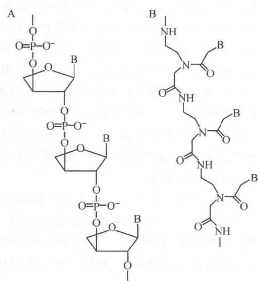  
图 29-6 TNA 和 PNA 的分子结构  
A. TNA; B. PNA

③ 进化出一套适宜的遗传密码。实验室进化得到的核酶可以催化完成上述各种反应。近年核糖体晶体结构获得高分辨率的解析，揭示了 RNA 世界维持至今仍积极参与蛋白质合成的面貌。

在 RNA 世界里并不排斥蛋白质(多肽)和 DNA 的存在。很可能在出现氨基酸、核糖核苷酸和脱氧核糖核苷酸后,这三类前体分子的高聚物也就随之出现了。肽核酸甚至在 RNA 世界前就出现了,但是其中的多肽只是氨基乙基甘氨酸一种成分的高聚物。随机聚合的多肽和 RNA 形成复合物,其中多肽可能有某些功能,但不能重复产生。在 RNA 世界里,RNA 具有自我复制和催化反应的能力,因而超越所有生物分子,是独一无二的,它能够遗传和进化、能够改变其他生物分子。脱氧核糖核苷酸的结构与核糖核苷酸类似,因此可以掺入 RNA 分子中,成为混合分子,因其结构稳定,久而久之贮存和传递遗传信息的任务就转交给了 DNA。氨基酸带有各种功能基团,因此蛋白质能够执行不同的生命功能,一旦产生遗传密码,RNA 能够控制蛋白质的合成,“RNA 世界”就转变成“三驾并驱的世界”。

## 3. 遗传密码的起源和进化

遗传密码的起源和进化是一个备受瞩目的问题。早在1967年C.Woese就提出假说，认为遗传密码产生的基础是氨基酸与三联体核苷酸之间可能存在某种化学匹配关系，即具有亲和力。Crick则反对这种观点，认为密码起源于“冻结的偶然事件”。这一争论一直持续至今。最近有科学家提出，识别氨基酸密码的序列与其对应氨基酸之间有一定的相关性，至少对某些氨基酸（例如精氨酸）是如此。另一些科学家则反对，认为实验无统计学意义。生命的起源和进化，包括遗传密码的起源和进化，是一个极为复杂的过程，决不能简单归之为立体化学的相互作用，也不是纯属偶然，这里既有概率也有自然选择的作用。

随着 RNA 世界的进化, 积累的遗传信息增多, 储存在 RNA 基因组中“渐感不便”。于是更稳定的双链 DNA 便被用作基因组, 以储存更多的遗传信息。所以主张蛋白质世界的出现先于 DNA 世界, 有两个理由: ① 合成 DNA 的底物脱氧核苷酸是由核糖核苷酸还原产生的, 迄今未找到能还原核苷酸的核酶, 而蛋白质的核苷酸还原酶能催化此反应; ② 现今细胞所有的 RNA (除了 tRNA) 都与蛋白质形成复合物, 说明自早期 RNA 世界保留至今的 RNA 都是与蛋白质一起进化的。tRNA 携带氨基酸, 也许是最早参与蛋白质生物合成的分子。

由 RNA 世界转变成 RNP 世界和 DNA 世界, 生命世界变得更为复杂, 更为多样化。在此基础上出现了细胞, 开始向单细胞和多细胞机体进化。

## （三）生物的进化：驱动力、多样性和适应性

从地球形成水球至今42亿年间,分子进化(包括化学进化和生命进化)约占7亿年,多细胞生物进化也约7亿年,中间28亿年只存在单细胞生物(包括原核和真物生物)的进化。在漫长的生物进化过程中,是什么力量推动着生物进化?是什么机制控制着生物进化的方向和速度?生物的多样性和适应性是如何形成的?

20 世纪 40 年代以来,生物学获得了空前迅猛的发展,进化理论也日新月异。它吸取了分子遗传学、发育学、生态学、古生物学和生物统计学的研究成果,在各个研究方向上形成了严谨、定量的理论体系,揭示了物种形成和大绝灭、大进化和小进化、进化趋势和进化速率、大分子构造与进化关系、中性漂变与自组织等从宏观到微观的进化现象和规律。然而各学派间观点对立,争论十分激烈,也许没有一个学科领域的学术争论是如此持续和针锋相对。其实,无论分子驱动学说、中性漂变学说还是自然选择学说,或者断续平衡论与灾变论,都是根据事实总结得出的学说和理论,它们必然反映了一定范围或层次的进化规律。也许在消除各学说局限性的基础上,就有可能建立统一的进化理论。从生物化学与分子生物学的角度来看,生物进化大致可归纳出以下一些要点:

## 1. 进化由生物分子相互作用所驱动

进化是生命运动的基本特征。一切生命运动都是由生物分子，即核酸（DNA、RNA）、蛋白质和其他生物分子以特定关系相互作用所形成，生物进化也是如此。生命系统的自组织特征表现为，可依赖于能量耗散和负熵输入使系统由一种定态跃进为另一种有序度更高的定态。生物不同层次的结构都是由生物分子自组装而成，更高层次的结构是在较低层次结构的基础上产生的，并有更高层次的功能和生物学意义。生物合成和形态发生都是生物在进化过程中产生的，因此一定程度上可反映生物进化的历史进程。总之，生物进化是由开放系统热力学所支持并受动力学束缚的生物分子相互作用所驱动。

## 2. 进化改进性状,也改进了进化能力

生物在进化过程中不仅改进了性状,也改进了进化能力,也就是说,生物的遗传结构能够影响子代性状的多样性、适应性及进化潜力。生物进化有赖于变异,可遗传的变异是进化的源泉,没有变异就没有进化。按照经典遗传学的观点,变异完全是随机的,并且否定有获得性遗传。然而,进化总是在原有遗传结构基础上进行的。达尔文和综合进化论或多或少忽略了生物内在因素对适应进化的作用,自然选择的作用被夸大了。现在知道,生物的遗传结构具有减小突变危害的机制,并将进化过程中获得的遗传信息分别贮存在各种结构和调控单元内,通过重组可以产生新的优化组合。变异具有随机性,但也有一定的非随机性。生物控制变异的机制也就是进化的内因,它能一定程度上影响进化的方向。生物经长期进化获得的遗传信息,促使其进化总的趋势是向更高级、更复杂、多样化、增加适应性和进化潜力方向演变。

## 3. 达尔文进化论的最大挑战来自中性漂变理论

基于对蛋白质和核酸分子进化变异的比较研究,木村资生(Motoo Kimura)于1968年提出分子水平的进化速率可能是近似恒定的。其后,他在《分子进化的中性理论》一书中对此作了详细的论述,认为蛋白质和核酸序列的改变绝大部分在选择上是中性的。中性等位基因的替换率是一个恒定的概率,可以证明该概率即为等位基因的突变率。中性理论虽然承认自然选择在表型(形态、生理、行为和生态的特征)进化中的作用,但否认自然选择在分子进化中的作用,认为生物大分子进化的主要因素是突变的随机固定。

从分子层次上看,绝大多数突变都是选择中性的,有显著表型效应的突变很少发生。在基因编码序列中,每一个密码子有9种替换突变,64个密码子中共有576种替换,其中同义替换138种,占24.0%;近义替换(替换的氨基酸性质相近)184种,占32.0%,两者相加超过一半。而且蛋白质许多部位氨基酸替换都不影响其功能。再者,高等动、植物基因组DNA中,编码序列只占1%,存在大量重复序列和间隔序列,绝大多数突变发生在非编码区DNA上。与表型进化速率相比,蛋白质和核酸分子的进化速率甚高,而且相对恒定。这就表明相当大部分的突变与表型无关。换句话说分子进化速率与表型进化速度不“匹配”。

在所有可能出现的突变中,有一部分突变是有害的,携带这些突变者即被自然选择所淘汰;另一些是有益的,它的数量极少,因此对总的进化速率作用很小。

通常用于度量自然选择的参数是适合度,即基因型繁殖的相对概率。为了运算的方便,可将生殖效能最高的基因型适合度值定为1,适合度常用W表示。另一个度量是选择系数(selection coefficient),用s表示,定义 $s=1-W$ ,用以度量一个基因适合度的降低。所谓选择中性,不能简单理解为“无利也无害”,而是指它们的变化主要是由于漂变而不是自然选择。这取决于两个因素:一是种群有效大小(指具有生殖能力的个体数量);另一个是选择系数s。自然选择是否起作用,不仅取决于s值,还取决于种群大小。如若种群很小,不足以排除偶然因素的影响,基因频率的变化仍然是一个随机漂变过程,选择几乎不起作用,即可视为选择中性。

木村对中性突变频率的变化作了数学推算。大多数中性或接近中性的突变，在经历几代的漂变中随机地绝灭了；只有很少突变经过很长时间，才能扩散到整个种群而被固定下来。设 K 为分子进化速率，时间可以是年或世代。在有 N 个二倍体随机交配群中，

$$
K = 2 N u x
$$

这里 u 是单位时间（与 K 同一个单位）内每个配子的突变率，x 是一个中性等位基因最后固定的概率。假定等位基因是中性的，群体内所有该基因固定的概率都一样，可以得出 x 为 1/2N，代入上式得到

$$
K = 2 N u \frac {1}{2 N} = u
$$

即中性等位基因的进化率就是它们的突变率,与群体大小和任何其他参数无关。这个结果虽然简明,却非常重要。

根据分子进化中性学说,生物大分子进化速度是恒定的,因此存在所谓的分子钟(molecular clock),即蛋白质和核酸分子进化改变量(替换数)可作为生物进化时间的度量。检测是否存在分子钟就以可判断中性学说是否正确。许多科学家为此进行了大量的比较研究,所得结果甚不一致,争议颇多。例如有人比较了18种脊椎动物(从鱼类到哺乳动物)的4种蛋白质(血红蛋白的 $\alpha$ 与 $\beta$ 、细胞色素c和血肽A)序列,经统计学检验表明它们的分子进化速率无论以年计算或以世代计算都不是恒定的,由此怀疑分子钟的存在。许多学者认为分子钟是有事实依据的,不能简单否定,尽管存在不少例外,而且分子进化率的变动大于预期值;然而对许多不同生物的许多同源大分子研究表明,在相当长时间内平均进化速率仍十分恒定,分子进化似有规律可循。如果考虑到在长期进化过程中不可避免会受到各种因素的影响,大分子在不同时期以不同速率进化,也就不足为奇了。

## 4. 获得性可以遗传

长期以来遗传学家认为起决定作用的遗传物质是染色体和 DNA, 因此否定获得性遗传。20 世纪 80 年代后开始重新认识 RNA, 动摇了 DNA 中心的观点。其实, 在分子水平上已有不少实验证据表明获得性可以遗传。当然, 并不是所有后天获得的性状都能传递给后代, 对于多细胞生物来说必须通过生殖细胞才能遗传。最常见的获得性遗传现象有以下几类: ① 先存结构的指导作用; ② 基因的表达方式, 如血清型的转变; ③ 由 RNA 携带新的遗传信息, 如 RNA 干扰可通过 RNA 复制酶扩增并传递给后代。后天获得的性状对基因变异进行选择, 从而影响变异的方向; RNA 携带的遗传信息也可以通过逆转座子成为新的基因。

## 5. 小进化、大进化和协同进化

进化可以是少数分子或基因逐渐变异，即小进化；或者是一大群分子和基因组突然爆发变异，即量子式的飞跃或大进化。过去对小进化机制研究较多，对大进化机制的了解则是近年间才发展起来的。目前已知至少有三种情况会造成大突变。第一，转座子或逆转座子的活跃转座，打破了基因组的稳定性，造成大量基因突变。真核生物尤以逆转座子更为重要，如酵母的Ty因子、果蝇的Copia、玉米的Bs I和人类的Alu序列等。第二，结构基因的变异只影响单个基因产物，而调节基因或控制元件的变异却影响一系列基因产物。控制个体发育的基因往往是一些编码转录因子的基因，它们在生物进化历史中必然起过重大作用。第三,美国科学家 S. Lingest 通过实验观察果蝇的变异与进化,当降低热激蛋白 Hsp 90 在体内的水平时,其后代畸形的数量明显增多。这表明热激蛋白能使许多突变蛋白仍按正常方式折叠,但热激蛋白自身活性降低立即爆发出众多原被掩盖的突变。

国内外科学家都已证明，生物体内关系密切的分子通常呈协同进化（coevolution），例如配体和受体、底物和酶、相互传递信号的蛋白质，它们之间的进化速率大致相同。因为这些分子带来的性状相关联，它们受到相同的影响和选择压力。L. M. Van Valen 借用 L. Carroll 童话故事中红皇后的话：“必须快跑才能留在原位”，原意是用于说明物种间的生态关系：所有物种都在进化，为了保持与其他物种之间的关系，也必须发生相应进化。这里用来说明的生物分子之间的相互关系也是如此。生物分子发生变异往往不是用来改进性状，而是维持其功能，即保持与相关分子的相互识别和作用。这就是红皇后假说。

新的大分子或其基因需借助变异和自然选择才能产生并不断完善其功能。但在经历漫长的进化岁月后，基本上已无改进的余地，例如原核生物和真核生物的持家基因便是如此。参与糖酵解的磷酸丙糖异构酶也许是最古老的酶之一，原核生物与真核生物该酶的变化不多，说明在20亿年的进化中已无大的改进。基因频率随机“涨落”，而使某些等位基因或被删除，或被固定，并在自然选择压力下束缚着分子的保守区。自然选择并不能完全淘汰隐性有害基因，中性漂变则能够彻底将其排除。由此可见，分子驱动、中性漂变和自然选择对分子进化各起不同的作用，并且不同时期的作用也不完全相同。

通过不同层次的研究才有可能揭示生物进化规律,深刻了解进化机制。生物化学与分子生物学在技术上的突破,以空前的高速度积累了大量生物分子的结构资料,从而为阐明生物分子进化历程和进化机理奠定了基础,为建立统一的生物进化理论作出了重大贡献。

## （四）基因和基因组的进化

上面提到，“RNA 世界”假说认为基因起源于“RNA 世界”。现今参与蛋白质合成的 RNA 有三类，mRNA、rRNA 和 tRNA，分别起模板、组装和适配的作用。可作为模板的 RNA、具有催化肽酰转移酶活性的 RNA 以及能携带氨基酸的 L 形 RNA，在 RNA 世界里都能够产生。问题是，作为“适配器（adaptor）”的 L 形 RNA，一端是“反密码子”，另一端挂上对应的氨基酸，这种对应关系是如何确定的？也就是说，密码表是如何编制的？正如前面“遗传密码的起源和进化”中提到的，“反密码子”的极性与氨基酸大小和极性之间的关系未必是一对一那么简单，然而有可能存在某种倾向，也即不同氨基酸各有其出现的机率。这种概率经过漂变和选择才固定下来，成为当今生物统一的密码表。遗传密码的起源是“RNA 世界”向“三驾并驱世界”转化的关键。

“中心法则”告诉我们,遗传信息流是从 DNA 到 RNA,再到蛋白质,进入蛋白质后不再转移。一些科学家对此有怀疑,试图找出“逆翻译”的信息流,一度以为朊病毒的存在即是“逆翻译”的例证。但是这些科学家寻找“逆翻译”信息流的努力都失败了,因为自然界并不存在识别多肽链序列并予以编码的系统。很可能当初基因的起源就不是按多肽链来编码核苷酸链,而是按核苷酸链序列经“翻译系统”合成多肽链,如果所产生多肽链表现出有益的生物性状,核苷酸链就被选择下来成为基因。最初的基因可能是 RNA,以后才转变为 DNA,实际上迄今仍在某些情况下以 RNA 作为基因。

生物在进化过程中复杂性与多样性不断增加,新的基因在不断形成。根据对细菌和支原体基本功能的分析,现今细胞最核心的持家基因(house-keeping gene)数为256个,主要是编码重要代谢途径的酶和某些结构蛋白。原始细胞的基因数或许更少,估计至少要100多个基因。迄今所知,新的基因形成方式有三种:一是基因通过倍增和歧化,从而产生新的基因;二是由基因模块(外显子)改组,往往产生一些多功能基因;三是由RNA逆转录产生逆基因,或由逆序列再进化形成新的基因。

DNA 重组可产生重复基因或重复序列,新的基因往往起源于这些重复序列。所有基因都各有其自身的功能,当基因结构发生改变(突变或重排)时,可能失去原有的功能,并获得新的功能。自然选择压力将束缚单拷贝基因,使其不能转变为新的基因,因为这种转变会失去基因原有的功能。基因发生重复,这种束缚就被解除。此时一个拷贝的基因发生改变,还有另一拷贝的基因维持原有的功能。

许多基因以基因家族的形式存在,它们排列成簇(cluster),编码某些结构与功能相近的蛋白质,组成蛋白质家族。这些略有不同的蛋白质往往在机体发育不同阶段和不同分化组织中表达。在高等动植物中此现象尤为显著。序列分析表明，它们是从一个共同的祖先，经基因重复和歧化而来。

生物的复杂性,生物的适应能力,生物进化位置的高低,并不简单取决于基因数目的多少。前面曾经介绍,线虫有20 000个基因,比线虫更复杂的果蝇只有15 000个基因,远比线虫和果蝇更复杂的人类也只有30 000个基因。实际上基本持家基因只有256个,果蝇的15 000个基因已包含控制表达和发育的各类调节基因。重要的是对基因的解读,也就是基因表达在时间上和空间上的多级调控。高等生物和低等生物在基因表达多级调控系统上的差异远大于基因数的差异。

## （五）表观遗传对生物进化的作用

一切可遗传的变异,包括表观遗传修饰,都会对生物进化发生作用。表观遗传修饰能够影响染色质的结构,也影响染色质的功能,从而增加了机体表型的多样性和适应性。但是研究表观遗传机制的时间不长,表观遗传学是从20世纪80年代才兴起的,许多问题未弄清楚,对表观遗传在生物进化中有何作用,也争议颇多。

有科学家利用拟南芥这种模式植物进行表观遗传的详细分析,他们选择来自同一母株的10株拟南芥,进行30代自交,然后测定DNA甲基化谱,并与祖先比较。平均每株基因组有 $3\times10^{6}$ 个甲基化的胞嘧啶,大部分修饰位点是一样的,但有6%的位点发生改变。每株大约有3万个表观遗传突变,是基因突变的1000倍。拟南芥经30代,共产生3万个表观遗传突变,平均每代1000个。实际上,表观遗传突变较不稳定,有些突变经几代后又恢复原状,也许在强大选择压力下才可以保持下去。另一个与基因突变的不同是,表观突变并不是随机的,往往每次都发生在基因组的同一位置。再有,表观遗传修饰可以在基因组大片段范围内发生,同时影响数个基因。综上所述,表观遗传突变发生频率高、受环境影响大、对表型更加重要;然而效应时间短,对生物长期进化的作用可能十分有限。

表观遗传对进化的作用,可能对于不同生物、不同性状甚至不同环境,都不相同。我国科学家研究推动人类大脑容量进化的表观遗传时发现,与神经系统发育有关的基因 CENP-J,其 5' 端调控区的甲基化水平明显低于其他灵长类(黑猩猩、长臂猿和猕猴),相应转录水平有较大提高。其间的具体过程还有待进一步深入研究,但人类大脑进化和认知能力提高的表观遗传显然是一个十分重要的研究领域。

表观遗传对生物进化的作用不仅有重大理论意义,也有重大实践意义。许多危害人类的疾病,如肿瘤、冠心病、退行性老年痴呆症等也都与之有关。因此,学术界对此十分关注。

## 提要

生物功能由生物不同层次结构所决定,而不同层次结构则由生物大分子装配而成。蛋白质是主要的生物功能分子。核酸包括 DNA 和 RNA,是主要的遗传信息携带分子。多糖和脂质化合物协助蛋白质完成其功能。脂质化合物与蛋白质构成生物膜,形成细胞的基本结构。一切生命现象均产生于生物分子的相互作用之中。先存结构在子代细胞形成中起指导作用,因此也携带一定的遗传信息。基因是编码多肽链和 RNA 的一段 DNA。研究基因之外的遗传机理称为表观遗传学。

基因的概念在不断演变中。早期孟德尔用豌豆进行杂交试验，在此基础上提出遗传因子假说。他否定了“融合遗传”，确立了“颗粒遗传”思想，发现遗传因子的显性和隐性之分，还发现遗传的分离和自由组合定律。孟德尔的遗传理论被埋没35年，直到1900年被学术界重新发现。1909年约翰森最早提出基因这个术语。摩尔根研究果蝇的杂交，建立基因学说和染色体理论，他发现性连锁现象以及通过重组绘制基因连锁图。此后，遗传学进入分子水平的研究阶段。Watson和Crick提出DNA双螺旋结构模型，奠定了分子生物学的基础。中心法则归纳出遗传信息流从DNA到RNA，再到蛋白质。20世纪70年代初，基因操作技术得到突破，开创基因和基因组研究的新时期。

原核生物基因组结构的特点:①基因组较小,大部分为编码序列;②基因无内含子;③相关基因组成操纵子；④重复序列少、较短。病毒基因组可看作游离的基因，变化较大，或是DNA，或是RNA；单链或双链，线状或环状；有些病毒基因相互重叠。细菌和细胞器基因组一般为双链环状分子，少数为线状。

真核生物基因组特点:①基因组较大;②基因有内含子;③不组成操纵子;④重复序列多。人类基因组大小为 $3.2\times10^{9}$ bp。包含约3万个基因,占基因组长度25%,其中编码序列只占1.2%。调节序列包括增强子、沉默子、绝缘子、启动子和各类调节元件。高度重复序列如着丝点、端粒等;中等重复序列如多拷贝基因和基因家族以及调节元件。

染色体是真核细胞有丝分裂期由基因组 DNA 致密组装而成的易染色实体,也可泛指各类生物的基因组。组成染色体的物质称为染色质,有不同层次结构,使 DNA 具有不同的压缩比。细菌 DNA 与蛋白质组成拟核,含有多个突环,即超螺旋结构域,相当于转录单位。其 DNA 呈负超螺旋。

真核生物染色体有不同层次的螺旋和折叠，压缩比达10 000，间期以染色质形式存在。染色质分常染色质和异染色质，常染色质结构较疏松，是转录活性区；异染色质结构致密，又分为组成型异染色质和功能型异染色质。核小体是染色质的基本结构单位，由DNA和组蛋白八聚体（H2A、H2B、H3、H4） $_{2}$ 所组成。DNA以左手螺旋绕组蛋白八聚体1.65圈，DNA为负超螺旋，长146\~147 bp，连接DNA长20\~60 bp，核小体DNA平均为200 bp。组蛋白富含碱性氨基酸，结构保守，中心区为 $\alpha$ 螺旋构成的折叠结构域；N端碱性氨基酸较多伸出核小体外，C端疏水氨基酸较多。组蛋白变异体或被修饰都会影响染色质结构和功能。

核小体组装先由（H3-H4） $_{2}$ 四聚体与DNA结合，再加入2个H2A-H2B二聚体，然后DNA盘绕八聚体1又2/3圈，长度压缩7倍。H1位于连接DNA靠近核小体的入口处。电荷和氢键在稳定核小体中起重要作用。核小体在染色质各部位的分布并不均匀，但未发现有相位的专一序列，而间隔为10 bp出现于浅沟的AA/AT/TT二核苷酸序列易于DNA对组蛋白的盘绕。DNA在执行其复制、修复和转录等功能时需要解开核小体，完成功能后重新装配。DNA在组蛋白上的旋转、平移和脱开都需要组蛋白分子伴侣帮助。核小体装配蛋白能够识别DNA序列，在合适的位置装配核小体。

念珠状核小体链直径为 11 nm, 是第一级组装; 核小体链螺旋化, 每圈 6 个核小体, 称螺线管, 或 6 个核小体两两相对称为锯齿状, 此 30 nm 纤丝为第二级组装; 纤丝以某些位点固定在核骨架上形成突环, 每个突环 20\~100 kb, 再组成 300 nm 的玫瑰花结螺旋, 为第三级组装; 进而组成 700 nm 的螺旋圈, 为第四级组装。染色单体即由螺旋圈所组成。支架蛋白结合的 DNA 区为支架联结区 (SAR), 捆绑染色质丝的蛋白质为染色体结构维持蛋白 (SMC) 和连接蛋白。

染色质的结构改变称为染色质重塑。核小体重塑是染色质重塑的基础。核小体重塑包括组蛋白被变异体置换、组蛋白修饰和DNA甲基化。核小体结构改变招致许多特殊功能的蛋白质结合其上，使染色质各类功能得以完成。DNA甲基化具有长期效应，可导致基因沉默和异染色质化，并与剂量补偿和基因组印记有关。DNA在核小体上旋转、平移或是解开，都增加了DNA的可接触性，是基因表达调节的重要环节。染色质重塑需要解开组蛋白与DNA间的作用力，依赖于ATP的染色质重塑复合物水解ATP以提供能量。

生物进化是一个受动力学束缚的开放系统热力学过程。在前生命期的化学进化过程中由无机分子产生有机分子，由小分子产生大分子，由随机合成的大分子产生自我复制的大分子，一旦出现自我复制的大分子，一种能经历达尔文进化的自我维持的化学系统就产生了。自然界产生有机分子，也产生了有机分子化学反应途径，这些途径由催化剂所催化，先是无机催化剂，然后是有机催化剂，手性是由催化剂决定的。“RNA世界”假说认为最早出现的具有自我复制能力的生物大分子是RNA。遗传密码的出现由“RNA世界”转为“三驾并驱的世界”。

生物进化由生物大分子相互作用所驱动。生物在进化过程中也提高了进化能力。中性漂变理论认为在分子水平上的变异多数是中性的,不受选择的作用,在长期漂变过程中随机绝灭,只有很少数被固定下来,在生物进化中起主要作用的是中性漂变,而不是自然选择。分子进化中性学说认为生物大分子进化速度是恒定的,称为分子钟。基因表达的方式受环境影响发生改变,如经生殖细胞可以传给后代,因此获得性可以遗传。个别基因的进化可称为小进化,一组基因的进化称为大进化,相关基因受同样的影响可以表现为协同进化。突破各学说的局限性，有可能建立一个统一的进化理论。

新基因的产生有三种方式:一是基因倍增和歧化;二是基因模块改组;三是RNA逆转录。生物进化不仅是基因数的增加,尤为重要的是基因表达时空调节的进化。

表观遗传突变频率高,受环境影响大,对表型更加重要,但其作用时间短,可能对生物长期进化作用有限。不同性状的影响可能不同。因其对人类许多疾病有关,因而受关注。

## 习题

1. 何谓遗传信息,亲代细胞如何将遗传信息传递给子代细胞?

2. 简要叙述生物大分子系统的自复制、自组装和自调节。

3. 为什么说先存结构携带一定的遗传信息？

4. 简要比较遗传学和表观遗传学的异同。

5. 基因概念经历了哪些演变？

6. 孟德尔对遗传学的主要贡献有哪些？为什么他的学说被埋没达35年？

7. 摩尔根对遗传学主要有哪些贡献？摩尔根的基因与孟德尔的遗传因子是否完全一致？

8. 什么是基因？如何看待“一个基因一条多肽链”的学说？

9. 为什么说 Watson 和 Crick 提出 DNA 分子双螺旋结构模型奠定了分子生物学基础？

10. 为什么说 DNA 重组技术导致分子生物学第二次革命？

11. 什么是分子生物学的“中心法则”？如何看待其意义和局限性？

12. 原核生物的基因组有何特点？

13. 为什么病毒基因组如此多种多样？

14. 真核生物基因组有何特点？

15. 图示真核生物基因的结构。

16. 基因家族和基因簇这两个概念有何异同？

17. 染色体 DNA 压缩比是什么意思？有何意义？

18. 简述细菌拟核的结构。

19. 何谓常染色质和异染色质？何谓组成型异染色质和功能型异染色质？

20. 试述核小体的基本结构。低等真核生物和高等真核生物核小体结构是否一样？说明什么？

21. 组蛋白结构有何特点？

22. 简述核小体组装的基本过程。是否存在精确定位？

23. 简述真核生物染色质不同层次的结构。

24. 何谓染色质重塑？

25. 举例说明核小体组蛋白变异体置换引起染色质结构与功能的改变。

26. 组蛋白有哪些种类修饰？由哪些酶催化？

27. DNA 甲基化有哪些酶催化?

28. 何谓剂量补偿？何谓基因组印记？两者有何异同？

29. 染色质重塑与基因表达调节有何关系？

30. 如何理解生物进化是动力学控制下的开放系统热力学过程？

31. 代谢反应、手性和遗传密码, 是生命起源的三个关键问题, 三者之间有何关联? 你如何看待这三个问题?

32. 你如何看待“RNA世界”学说？

33. 有实验室测定反密码子与氨基酸之间亲和力,两者之间似存在亲和力,但又不能找出确切对应关系,你如何看待这类实验?

34. 如何看生物进化的驱动力、多样性和适应性？

35. 表观遗传学与获得性遗传学说的观点是否完全一致？

36. 什么是小进化、大进化和协同进化？用中性漂变学说和自然选择学说能否加以说明？

37. 你如何看待表观遗传对生物进化的可能作用？

## 主要参考书目

1. 王镜岩，朱圣庚，徐长法. 生物化学教程. 北京：高等教育出版社，2008.

2. 张昀. 生物进化. 北京: 北京大学出版社, 1998.

3. Nelson D L, Cox M M. Lehninger Principles of Biochemistry. 6th ed. New York: W. H. Freeman and Company, 2012.

4. Watson J D, Baker T A, Bell S P, et al. Molecular Biology of the Gene. 7th ed. San Francisco: Pearson Education, 2013.

5. Krebs J E, Kilpatrick S T, Goldstein E S. Lewin's Genes XI. Boston: Jones and Bartlett Publishers, 2013.

(朱圣庚)

## 网上资源

自测题

## 中国银行 AMO

## 图2.10 变动半面 4.0 (一)

<!-- EN-BEGIN 第24章章末 -->

## 【英文对应 第24章章末】Genes and Chromosomes：关键术语、习题与简答

> 来源：Lehninger Principles of Biochemistry（书籍/02_生物化学原理） 第24章章末，以及书末 Abbreviated Solutions to Problems 第24章。

### [EN] KEY TERMS

Terms in bold are defined in the glossary.

chromosome 885  
phenotype 886  
mutation 886  
gene 886  
regulatory sequence 886  
plasmid 887  
intron 889  
exon 889  
simple-sequence DNA 890  
satellite DNA 890  
centromere 890  
telomere 890  
supercoil 891  
relaxed DNA 891  
topology 891  
linking number 893  
specific linking difference 894  
superhelical density (σ) 894  
topoisomers 894

topoisomerases 895  
catenane 896  
plectonemic 897  
solenoidal 898  
chromatin 899  
histones 899  
nucleosome 899  
histone exchange factors 902  
heterochromatin 903  
topologically associating domains (TADs) 903  
long noncoding RNA (lncRNA) 903  
epigenetic 904  
euchromatin 904  
chromosome territory 904  
Barr body 907  
SMC proteins 908  
cohesins 908  
condensins 908  
nucleoid 909

### [EN] PROBLEMS

1. Packaging of DNA in a Virus Bacteriophage T2 has a DNA of molecular weight $120 \times 10^{6}$ contained in a head about 210 nm long. Calculate the length of the DNA and compare it with the length of the T2 head. Assume the molecular weight of a nucleotide base pair is 650 and that the DNA is in the B form and relaxed.

2. The DNA of Phage M13 The base composition of the DNA within a bacteriophage M13 viral particle is A, 23%; T, 36%; G, 21%; C, 20%. What does this tell you about this DNA molecule?

3. The Mycoplasma Genome The complete genome of the simplest bacterium known, Mycoplasma genitalium, is a circular DNA molecule with 580,070 bp. Calculate the molecular weight and contour length (when relaxed) of this molecule. What is $Lk_0$ for the Mycoplasma chromosome? If $\sigma = -0.06$ , what is $Lk$ ?

4. Size of Eukaryotic Genes An enzyme isolated from rat liver has 192 amino acid residues and is encoded by a gene with 1,440 bp. Explain the relationship between the number of amino acid residues in the enzyme and the number of nucleotide pairs in its gene.

5. Linking Number A closed-circular DNA molecule in its relaxed form has an Lk of 500. Approximately how many base pairs are in this DNA? How is Lk altered (increases, decreases, doesn't change, becomes undefined) when (a) a protein complex binds to form a nucleosome, (b) one DNA strand is broken, (c) DNA gyrase and ATP are added to the DNA solution, or (d) the double helix is denatured by heat?

6. DNA Topology In the presence of a eukaryotic condensin and a bacterial type II topoisomerase, the Lk of a relaxed closed-circular DNA molecule does not change. However, the DNA becomes highly knotted.

Formation of the knots requires breakage of the DNA, passage of a segment of DNA through the break, and religation by the topoisomerase. Given that every reaction of the topoisomerase would be expected to result in a change in linking number, how can Lk remain the same?

7. Superhelical Density Bacteriophage $\lambda$ infects E. coli by integrating its DNA into the bacterial chromosome. The success of this recombination depends on the topology of the E. coli DNA. When the superhelical density ( $\sigma$ ) of the E. coli DNA is greater than -0.045, the probability of integration is less than 20%; when $\sigma$ is less than -0.06, the probability is >70%. Plasmid DNA isolated from an E. coli culture is found to have a length of 13,800 bp and an Lk of 1,222. Calculate $\sigma$ for this DNA and predict the likelihood that bacteriophage $\lambda$ will be able to infect this culture.

8. Altering Linking Number (a) What is the Lk of a 5,000 bp circular duplex DNA molecule with a nick in one strand? (b) What is the Lk of the molecule in (a) when the nick is sealed (relaxed)? (c) How would the Lk of the molecule in (b) be affected by the action of a single molecule of E. coli topoisomerase I? (d) What is the Lk of the molecule in (b) after eight enzymatic turnovers by a single molecule of DNA gyrase in the presence of ATP? (e) What is the Lk of the molecule in (d) after four enzymatic turnovers by a single molecule of bacterial type I topoisomerase? (f) What is the Lk of the molecule in (d) after binding of one nucleosome core?

9. Chromatin The agarose gel shown, in which the thick bands represent DNA, helped researchers define nucleosome structure. They generated this result by briefly treating chromatin with an enzyme that degrades DNA, then removing all protein and subjecting the purified DNA to electrophoresis. Numbers at the side of the gel denote the position to which a linear DNA of the indicated size would migrate. What does this gel demonstrate about chromatin structure? Why are the DNA bands thick and spread out rather than sharply defined?

  
[Courtesy Dr. Roger D. Kornberg,  
Stanford University School of Medicine.]

10. DNA Structure Explain how the underwinding of a B-DNA helix might facilitate or stabilize the formation of Z-DNA (see Fig. 8-17).

11. Maintaining DNA Structure (a) Describe two structural features required for a DNA molecule to maintain a negatively supercoiled state. (b) List three structural changes that become more favorable when a DNA molecule is negatively supercoiled. (c) What E. coli enzyme, with the aid of ATP, can generate negative superhelicity in DNA? (d) Describe the physical mechanism by which this enzyme acts.

12. Yeast Artificial Chromosomes (YACs) Researchers use YACs to clone large pieces of DNA in yeast cells. What three types of DNA sequence do researchers require to ensure proper replication and propagation of a YAC in a yeast cell?

13. Nucleoid Structure in Bacteria In bacteria, DNA topology affects the transcription of a subset of genes, with expression increasing or (more often) decreasing when the DNA is relaxed. Following cleavage of a bacterial chromosome at a specific site by a restriction enzyme (one that cuts at a long, and thus rare, sequence), only nearby genes (within 10,000 bp) exhibit either an increase or a decrease in expression. The transcription of genes elsewhere in the chromosome is unaffected. Explain. (Hint: See Fig. 24-35.)

14. DNA Topology When DNA is subjected to electrophoresis in an agarose gel, shorter molecules migrate faster than longer ones. Closed-circular DNAs of the same size but with different linking numbers also can be separated on an agarose gel: topoisomers that are more supercoiled, and thus more condensed, migrate faster through the gel. In the gel shown, purified plasmid DNA has migrated from top to bottom. There are two bands, with the faster band much more prominent.

  
[Michael Cox Laboratory.]

(a) What are the DNA species in the two bands? (b) If topoisomerase I were added to a solution of this DNA, what would happen to the upper and lower bands after electrophoresis? (c) If DNA ligase were added to the DNA, would the appearance of the bands change? Explain your answer. (d) If DNA gyrase plus ATP were added to the DNA after the addition of DNA ligase, how would the band pattern change?

15. DNA Topoisomers When DNA is subjected to electrophoresis in an agarose gel, shorter molecules migrate faster than longer ones. Closed-circular DNAs of the same size but different linking number also can be separated on an agarose gel: topoisomers that are more supercoiled, and thus more condensed, migrate faster through the gel—from top to bottom in the two gels shown. An investigator added a dye, chloroquine, to these gels. Chloroquine intercalates between base pairs and stabilizes a more underwound DNA structure. When the dye binds to a relaxed closed-circular DNA, the DNA is underwound where the dye binds, and unbound regions take on positive supercoils to compensate. In the experiment shown here, an investigator used topoisomerases to make preparations of the same DNA circle with different superhelical densities ( $\sigma$ ). Completely relaxed DNA migrated to the position labeled N (for nicked), and highly supercoiled DNA (above the limit where individual topoisomers can be distinguished) migrated to the position labeled X.

  
[R. P. Bowater (2005), "Supercoiled DNA: structure," in Encyclopedia of Life Sciences, John Wiley & Sons/Wiley InterScience, www.els.net.]

(a) In gel A, why does the $\sigma = 0$ lane (i.e., DNA prepared so that $\sigma = 0$ , on average) have multiple bands?

(b) In gel B, is the DNA from the $\sigma = 0$ preparation positively or negatively supercoiled in the presence of the intercalating dye?

(c) In both gels, the $\sigma = -0.115$ lane has two bands, one a highly supercoiled DNA and one relaxed. Propose a reason for the presence of relaxed DNA in these lanes (and others).

(d) The native DNA (leftmost lane in each gel) is the same DNA circle isolated from bacterial cells and untreated. What is the approximate superhelical density of this native DNA?

16. Nucleosomes The human genome comprises just over 3.1 billion base pairs. Assuming it contains nucleosomes that are spaced as described in this chapter, how many molecules of histone H2A are present in one somatic human cell? (Ignore reductions in H2A due to its replacement in some regions by H2A variants.) How would the number change after DNA replication but before cell division?

17. Bacterial DNA Topoisomerase IV The gene encoding topoisomerase IV in E. coli is essential, even though another type II topoisomerase (topoisomerase II or gyrase) is present. Suggest a reason for the requirement for topoisomerase IV.

18. Chromosome Topology Eukaryotic chromosomes are linear DNA molecules, yet the DNA of a chromosome retains a high level of underwinding (supercoiling) throughout its length. How does the organization of chromosomal DNA into loops called TADs contribute to the maintenance of supercoiling?

### [EN] DATA ANALYSIS PROBLEM

19. Defining the Functional Elements of Yeast Chromosomes Figure 24-7 shows the major structural elements of a chromosome of budding yeast (S. cerevisiae). Heiter, Mann, Snyder, and Davis (1985) determined the properties of some of these elements. They based their study on the finding that in yeast cells, plasmids (which have genes and an origin of replication) act differently from chromosomes (which have these elements plus centromeres and telomeres) during mitosis. The plasmids are not manipulated by the mitotic apparatus and segregate randomly between daughter cells. Without a selectable marker to force the host cells to retain them (see Fig. 9-4), these plasmids are rapidly lost. In contrast, chromosomes, even without a selectable marker, are manipulated by the mitotic apparatus and are lost at a very low frequency (about $10^{-5}$ per cell division).

Heiter and colleagues set out to determine the important components of yeast chromosomes by constructing plasmids with various parts of chromosomes and observing whether these "synthetic chromosomes" segregated properly during mitosis. To measure the frequencies of different types of failed chromosome segregation, the researchers needed a rapid assay to determine the number of copies of synthetic chromosomes present in different cells. The assay took advantage of the fact that wild-type yeast colonies are white whereas certain adenine-requiring (ade-) mutants yield red colonies on nutrient media; ade2- cells lack functional AIR carboxylase (the enzyme of step 6a in Fig. 22-35) and accumulate AIR (5-aminoimidazole ribonucleotide) in their cytoplasm, and the excess AIR is converted to a conspicuous red pigment. The other part of the assay involved the gene SUP11, which encodes an ochre suppressor (a type of nonsense suppressor in which a termination codon specifies an amino acid) that suppresses the phenotype of some ade2- mutants.

Heiter and coworkers started with a diploid strain of yeast homozygous for ade2 $^{-}$ ; these cells are red. When the mutant cells contain one copy of SUP11, the metabolic defect is partly suppressed and the cells are pink. When the cells contain two or more copies of SUP11, the defect is completely suppressed and the cells are white.

The researchers inserted one copy of SUP11 into synthetic chromosomes containing various elements thought to be important in chromosome function, and then observed how well these chromosomes were passed from one generation to the next. These pink cells were plated on nonselective media, and the behavior of the synthetic chromosomes was observed. Heiter and coworkers looked for colonies in which the synthetic chromosomes segregated improperly at the first division after plating, giving rise to a colony that was half one genotype and half the other. Because yeast cells are nonmotile, this would be a sectored colony, with one half one color and the other half another color.

(a) One way for the mitotic process to fail is nondisjunction: the chromosome replicates but the sister chromatids fail to separate, so both copies of the chromosome end up in the same daughter cell. Explain how nondisjunction of the synthetic chromosome would give rise to a colony that is half red and half white.

(b) Another way for the mitotic process to fail is chromosome loss: the chromosome does not enter the daughter nucleus or is not replicated. Explain how loss of the synthetic chromosome would give rise to a colony that is half red and half pink.

By counting the frequency of the different colony types, Heiter and colleagues could estimate the frequency of these aberrant mitotic events with different types of synthetic chromosome. First, they explored the requirement for centromeric sequences by constructing synthetic chromosomes with DNA fragments of different sizes containing a known centromere. Their results are shown here.

<table><tr><td>Synthetic chromosome</td><td>Size of centromere-containing fragment (kbp)</td><td>Chromosome loss (%)</td><td>Nondisjunction (%)</td></tr><tr><td>1</td><td>None</td><td>—</td><td>&gt;50</td></tr><tr><td>2</td><td>0.63</td><td>1.6</td><td>1.1</td></tr><tr><td>3</td><td>1.6</td><td>1.9</td><td>0.4</td></tr><tr><td>4</td><td>3.0</td><td>1.7</td><td>0.35</td></tr><tr><td>5</td><td>6.0</td><td>1.6</td><td>0.35</td></tr></table>

(c) Based on these data, what can you conclude about the size of the centromere required for normal mitotic segregation? Explain your reasoning.

(d) All the synthetic chromosomes created in these experiments were circular and lacked telomeres. Explain how they could be replicated more-or-less properly.

Heiter and colleagues next constructed a series of linear synthetic chromosomes that included the functional centromeric sequence and telomeres, and they measured the total mitotic error frequency (\% loss + \% nondisjunction) as a function of size.

<table><tr><td>Synthetic chromosome</td><td>Size (kbp)</td><td>Total error frequency (%)</td></tr><tr><td>6</td><td>15</td><td>11.0</td></tr><tr><td>7</td><td>55</td><td>1.5</td></tr><tr><td>8</td><td>95</td><td>0.44</td></tr><tr><td>9</td><td>137</td><td>0.14</td></tr></table>

(e) Based on these data, what can you conclude about the chromosome size required for normal mitotic segregation? Explain your reasoning.

(f) Normal yeast chromosomes are linear, range from 250 kbp to 2,000 kbp in length, and, as noted above, have a mitotic error frequency of about $10^{-5}$ per cell division. Extrapolating the results from (e), do the centromeric and telomeric sequences used in these experiments explain the mitotic stability of normal yeast chromosomes, or must other elements be involved? Explain your reasoning. (Hint: A plot of log of error frequency vs. length will be helpful.)

### [EN] Reference

Heiter, P., C. Mann, M. Snyder, and R.W. Davis. 1985. Mitotic stability of yeast chromosomes: A colony color assay that measures nondisjunction and chromosome loss. Cell 40:381–392.

### [EN] Abbreviated Solutions — Chapter 24

1. $6.1 \times 10^{4}$ nm; 290 times longer than the T2 phage head

2. The number of A residues does not equal the number of T residues, nor does the number of G equal the number of C, so the DNA is not a base-paired double helix; the M13 DNA is single-stranded.

3. $M_{r} = 3.8 \times 10^{8}$ ; length = 200 $\mu$ m; $Lk_{0} = 55, 200$ ; Lk = 51, 900

4. The exons contain 3 bp/amino acid × 192 amino acids = 576 bp. The remaining 864 bp are in introns, possibly in a leader or signal sequence, and/or in other noncoding DNA.

5. 5,000 bp. (a) Doesn't change; Lk cannot change without breaking and re-forming the covalent backbone of the DNA. (b) Becomes undefined; a circular DNA with a break in one strand has, by definition, no Lk. (c) Decreases; in the presence of ATP, gyrase underwinds DNA. (d) Doesn't change; this assumes that neither of the DNA strands is broken in the heating process.

6. For Lk to remain unchanged, the topoisomerase must introduce the same number of positive and negative supercoils.

7. $\sigma = -0.067; > 70\%$ probability

8. (a) Undefined; the strands of a nicked DNA could be separated and thus have no Lk. (b) 476 (c) The DNA is already relaxed, so the topoisomerase does not cause a net change; Lk = 476. (d) 460; gyrase plus ATP reduces the Lk in increments of 2. (e) 464; eukaryotic type 1 topoisomerases increase the Lk of underwound or negatively supercoiled DNA in increments of 1. (f) 460; nucleosome binding does not break any DNA strands and thus cannot change Lk.

9. A fundamental structural unit in chromatin repeats about every 200 bp; the DNA is accessible to the nuclease only at 200 bp intervals. The brief treatment was insufficient to cleave the DNA at every accessible point, so a ladder of DNA bands is created in which the DNA fragments are multiples of 200 bp. The thickness of the DNA bands suggests that the distance between cleavage sites varies somewhat. For instance, not all the fragments in the lowest band are exactly 200 bp long.

10. A right-handed helix has a positive Lk; a left-handed helix (such as Z-DNA) has a negative Lk. Decreasing the Lk of a closed circular B-DNA by underwinding facilitates formation of regions of Z-DNA within certain sequences. (See Chapter 8, p. 273, for a description of sequences that permit the formation of Z-DNA.)

11. (a) Both strands must be covalently closed, and the molecule must be either circular or constrained at both ends. (b) Formation of cruciforms, left-handed Z-DNA, plectonemic or solenoidal supercoils, and unwinding of the DNA are favored. (c) E. coli DNA topoisomerase II or DNA gyrase (d) It binds the DNA at a point where it crosses on itself, cleaves both strands of one of the crossing segments, passes the other segment through the break, then reseals the break. The result is a change in Lk of -2.

12. Centromere, telomeres, and an autonomous replicating sequence or replication origin

13. The bacterial nucleoid is organized into domains approximately 10,000 bp long. Cleavage by a restriction enzyme relaxes the DNA within a domain, but not outside the domain. Any gene in the cleaved domain for which expression is affected by DNA topology will be affected by the cleavage; genes outside the domain will not.

14. (a) The lower, faster-migrating band is negatively supercoiled plasmid DNA. The upper band is nicked, relaxed DNA. (b) DNA topoisomerase I would relax the supercoiled DNA. The lower band would disappear, and all of the DNA would converge on the upper band. (c) DNA ligase would produce little change in the pattern. Some minor additional bands might appear near the upper band, due to the trapping of topoisomers not quite perfectly relaxed by the ligation reaction. (d) The upper band would disappear, and all of the DNA would be in the lower band. The supercoiled DNA in the lower band might become even more supercoiled and migrate somewhat faster.

15. (a) When DNA ends are sealed to create a relaxed, closed circle, some DNA species are completely relaxed but others are trapped in slightly underwound or overwound states. This gives rise to a distribution of topoisomers centered on the most relaxed species. (b) Positively supercoiled (c) The DNA that is relaxed despite the addition of dye is DNA with one or both strands broken. DNA isolation procedures inevitably introduce small numbers of strand breaks in some of the closed-circular molecules. (d) -0.05. This is determined by simply comparing native DNA with samples of known $\sigma$ . In both gels, the native DNA migrates most closely with the sample of $\sigma = -0.049$ .

16. 62 million (the genome refers to the haploid genetic content of the cell; the cell is actually diploid, so the number of nucleosomes is doubled). The number is obtained by dividing 3.1 billion bp by 200 bp/nucleosome (giving 15.5 million nucleosomes), multiplying by 2 copies of H2A per nucleosome, and again multiplying by 2 to account for the diploid state of the cell. The 62 million would double upon replication.

17. DNA topoisomerase IV is needed to decatenate the two circular chromosome products of DNA replication prior to cell division.

18. A TAD, or topologically associating domain, is a DNA loop that is bound and constrained at its base. Supercoiling within the TAD is maintained in part by the restriction to free DNA rotation imposed by the protein binding at the base of the loop.

19. (a) In nondisjunction, one daughter cell and all of its descendants get two copies of the synthetic chromosome and are white; the other daughter cell and all of its descendants get no copies of the synthetic chromosome and are red. This gives rise to a half-white, half-red colony. (b) In chromosome loss, one daughter cell and all of its descendants get one copy of the synthetic chromosome and are pink; the other daughter cell and all of its descendants get no copies of the synthetic chromosome and are red. This gives rise to a half-pink, half-red colony. (c) The minimum functional centromere must be smaller than 0.63 kbp, because all fragments of this size or larger confer relative mitotic stability. (d) Telomeres are required to fully replicate only linear DNA; a circular molecule can replicate without them.

(f)  

(e) The larger the chromosome, the more faithfully it is segregated. The data show neither a minimum size below which the synthetic chromosome is completely unstable nor a maximum size above which stability no longer changes.

  
As shown in the graph, even if the synthetic chromosomes were as long as the normal yeast chromosomes, they would not be as stable. This suggests that other, as yet undiscovered, elements are required for stability.

<!-- EN-END 第24章章末 -->
