# 第 30 章 DNA 的复制和修复

> **本章英文对应内容**（Lehninger，插在所列中文小节末尾）
>
> - 第25章 DNA Metabolism：章首导言（本章开头）、关键术语/习题/简答（本章末尾）
> - §25.1（第25章）→ 一、DNA 的复制
> - §25.2（第25章）→ 二、DNA 的损伤修复

现代生物学已充分证明，DNA 是生物遗传的主要物质基础。生物机体的遗传信息以密码的形式编码在 DNA 分子上，表现为特定的核苷酸排列顺序，并通过 DNA 的复制（replication）由亲代传递给子代。在后代的生长发育过程中，遗传信息自 DNA 转录（transcription）给 RNA，然后翻译（translation）成特异的蛋白质，以执行各种生命功能，使后代表现出与亲代相似的遗传性状，即遗传信息的表达（expression）。DNA 分子虽然十分稳定，但在机体生命活动过程中不可避免会受到各种物理、化学和生物因素的作用，遭到损伤，而机体具有修复机制，在一定程度上可以使其复原。

<!-- EN-BEGIN 第25章导言 -->

### 【英文对应 第25章导言】DNA Metabolism

> 来源：Lehninger Principles of Biochemistry（书籍/02_生物化学原理） 第25章章首（含章节目录与学习要点）。

#### [EN] DNA METABOLISM

25.1 DNA Replication 915

25.2 DNA Repair 930

25.3 DNA Recombination 940

As the repository of genetic information, DNA occupies a unique and central place among biological macromolecules. The nucleotide sequences of DNA encode the primary structures of all cellular RNAs and proteins and, through enzymes, indirectly affect the synthesis of all other cellular constituents. This passage of information from DNA to RNA and protein guides the size, shape, and functioning of every living thing.

DNA is a marvelous device for the stable storage of genetic information. The phrase “stable storage,” however, conveys a static and misleading picture. It fails to capture the complexity of processes by which genetic information is preserved in an uncorrupted state and then transmitted from one generation of cells to the next. DNA metabolism comprises both the process that gives rise to faithful copies of DNA molecules (replication) and the processes that affect the inherent structure of the information (repair and recombination). Together, these activities are both the focus of this chapter and the underpinning for several guiding principles:

#### [EN] P1 Along with catalysis, biological information is one of the two key prerequisites for life. The faithful maintenance and transmission of genetic information from one generation to another ensures continuity within each species.

P2 Information is expensive. The chemistry of joining one nucleotide to the next in DNA replication is elegant and simple, almost deceptively so. However, the enzymatic and thermodynamic commitment to linking one nucleotide to another in DNA far exceeds what would normally be required to successfully form a phosphodiester bond. It is not enough to synthesize a phosphodiester bond; that bond must accurately link two particular nucleotides.

#### [EN] P3 The fidelity of genome maintenance and transmission is not perfect. DNA damage

happens, often by spontaneous processes. DNA replication and repair deal with the vast majority of DNA lesions, providing a high degree of genetic fidelity and stability. The few DNA damage events that slip through uncorrected provide fuel for evolution.

#### [EN] P4 Although considered separately, the processes of replication, repair, and recombination of DNA are not distinct. These processes are highly integrated in cells, and they are required for proper genome maintenance.

We give the enzymes of DNA metabolism special emphasis in this chapter. These enzymes are not only intrinsically important biologically; they are also important in medicine and biochemical technologies. Many of the seminal discoveries in DNA metabolism have been made with Escherichia coli, so its well-understood enzymes are generally used to illustrate the ground rules.

KEY CONVENTION Before taking a closer look at replication, we make a short digression into the use of abbreviations in naming genes and proteins — you will encounter many of these in this and later chapters. Bacterial genes generally are named using three italicized, lowercase letters that often reflect a gene's apparent function. For example, the dna, uvr, and rec genes affect DNA replication, resistance to the damaging effects of UV radiation, and recombination, respectively. Where several genes affect the same process, the letters A, B, C, and so forth, are added — as in dnaA, dnaB, dnaQ, for example — usually reflecting their order of discovery rather than the order of their gene products in a reaction sequence. Similar conventions exist for naming eukaryotic genes, although the exact form of the abbreviations may vary with the species, and no single convention applies to all eukaryotic systems. For example, in the budding yeast Saccharomyces cerevisiae, gene names are generally three uppercase letters followed by a number, all italicized (e.g., the gene COX1 encodes a subunit of cytochrome oxidase). Gene names that predate current conventions may differ in format.

The use of abbreviations in naming proteins is less straightforward. During genetic investigations, the protein product of each gene is usually isolated and characterized. Many bacterial genes were identified and named before the roles of their protein products were understood in detail. Sometimes the gene product was found to be a previously isolated protein, and some renaming occurred. Often, however, the product turned out to be an as yet unknown protein, with an activity not easily described by a simple enzyme name.

Bacterial proteins often retain the name of their genes. When referring to the protein product of an E. coli gene, we use roman type and capitalize the first letter: for example, the dnaA and recA gene products are the DnaA and RecA proteins, respectively. Conventions for eukaryotic proteins are again complex. For yeast, some proteins have long common names (such as cytochrome oxidase). Others have the same name as the gene, in which case the protein name usually has one uppercase and two lowercase letters, followed by a number and the letter "p," all in roman type (such as Rad51p). The "p" is to emphasize that this is a protein and to prevent confusion with naming conventions for other organisms.

<!-- EN-END 第25章导言 -->

## 一、DNA 的复制

原核生物每个细胞只含有一个染色体,真核生物每个细胞常含有多个染色体。在细胞增殖周期的一定阶段整个染色体组都将发生精确的复制,随后以染色体为单位把复制的基因组分配到两个子代细胞中去。一旦复制完成,就可发动细胞分裂;细胞分裂结束后,又可开始新的一轮 DNA 复制。

染色体外的遗传因子,包括原核生物的质粒、真核生物的细胞器以及细胞内共生或寄生生物的 DNA,它们也在细胞周期内复制。质粒或是受染色体复制的控制,与染色体复制同步,每个细胞只有一个或少数几个拷贝,因此称为单拷贝质粒;或是不受染色体复制的控制,在细胞分裂间期随时都可进行,每个细胞含有许多拷贝(通常在 20 个以上),称为多拷贝质粒。细胞器 DNA 的复制受细胞器组成成分的控制,细胞器可与细菌类似进行分裂。上述不同 DNA 的复制方式和调节机制虽有不同,但基本生物化学过程是一致的。

由于 DNA 是遗传信息的载体, 在合成 DNA 时决定其结构特异性的遗传信息只能来自其本身, 因此必须由原来存在的分子为模板来合成新的分子, 即进行自我复制 (self-replication)。细胞内存在极为复杂的系统, 以确保 DNA 复制的正确进行, 并纠正可能出现的误差。本节将着重介绍 DNA 的半保留复制 (semiconservative replication)、复制的单位和酶系、复制的半不连续性 (semidiscontinuity)、复制的拓扑学 (topology)、复制体 (replisome) 结构和复制的调控机理等。

## (一) DNA 的半保留复制

DNA 由两条螺旋盘绕的多核苷酸链所组成,两条链通过碱基对之间的氢键连接在一起,所以这两条链是互补的。一条链上的核苷酸排列顺序决定了另一条链上的核苷酸排列顺序。由此可见,DNA 分子的每一条链都含有合成它的互补链所必需的全部遗传信息。Watson 和 Crick 在提出 DNA 双螺旋结构模型时即推测,在复制过程中碱基间氢键需先破裂并使双链解开,然后每条链可作为模板在其上合成新的互补链(图 30-1)。在此过程中,每个子代分子的一条链来自亲代 DNA,另一条链则是新合成的,这种方式称为半保留复制。

1958 年 M. Meselson 和 F. Stahl 利用氮的同位素 ${}^{15}$ N 标记大肠杆菌 DNA，首先证明了 DNA 的半保留复制。他们让大肠杆菌在以 ${}^{15}$ NH $_{4}$ Cl 为唯一氮源的培养基中生长，经过连续培养 12 代，使所有 DNA 分子标记上 ${}^{15}$ N。 ${}^{15}$ N-DNA 的密度比普通 ${}^{14}$ N-DNA 的密度大，在氯化铯密度梯度离心（CsCl density gradient centrifugation）时，这两种 DNA 形成位置不同的区带（zone）。如果将 ${}^{15}$ N 标记的大肠杆菌转移到普通培养基（含 ${}^{14}$ N 的氮源）中培养，经过一代之后，所有 DNA 的密度都介于 ${}^{15}$ N-DNA 和 ${}^{14}$ N-DNA 之间，即形成了 DNA 分子的一半含 ${}^{15}$ N，另一半含 ${}^{14}$ N 的杂合分子。两代后， ${}^{14}$ N 分子和 ${}^{14}$ N- ${}^{15}$ N 杂合分子等量出现。若再继续培养，可以看到 ${}^{14}$ N-DNA 分子增多。当把 ${}^{14}$ N- ${}^{15}$ N 杂合分子加热时，它们分开成 ${}^{14}$ N 链和 ${}^{15}$ N 链。这就充分证明了,在 DNA 复制时原来的 DNA 分子可被分成两个亚单位,分别构成子代分子的一半,这些亚单位经过许多代复制仍然保持着完整性(图 30-2)。

  
图 30-1 Watson 和 Crick 提出的 DNA 双螺旋复制模型

  
图30-2 DNA的半保留复制  
第一代子分子含有一条亲代的链（用黑色表示），与另一条新合成的链（用白色表示）配对。在以后的连续复制过程中，原来亲代的两条链仍然保持完整

双螺旋 DNA 分子在复制时两条链需解开, 每条链作为模板, 在其上合成出新的互补链

在这以后，用不同生物材料做了类似的实验，都证实了DNA复制的半保留方式。然而，这类实验所研究的复制中DNA在提取过程中已被断裂成许多片段，得到的信息只涉及DNA复制前和复制后的状态。1963年J.Cairns用放射自显影（autoradiography)的方法第一次观察到完整的正在复制的大肠杆菌染色体DNA。他将 $^{3}$ H-脱氧胸苷标记大肠杆菌DNA，然后用溶菌酶把细胞壁消化掉，使完整的染色体DNA释放出来，铺在一张透析膜上，在暗处用感光乳胶覆盖于干燥了的膜表面，放置若干星期。在这期间 $^{3}$ H由于放射性衰变而放出β粒子，使乳胶曝光生成银粒。显影以后银粒黑点轨迹勾画出DNA分子的形状，黑点数目代表了 $^{3}$ H在DNA分子中的密度。把显影后的片子放在光学显影镜下就可以观察到大肠杆菌染色体的全貌。借助这种方法，Cairns阐明了大肠杆菌染色体DNA是一个环状分子，并以半保留的方式进行复制(图30-3)。

半保留的复制,即子代 DNA 分子中仅保留一条亲代链,另一条链则是新合成的,这是双链 DNA 普遍的复制机制。即使是单链 DNA 分子,在其复制过程中通常也总是要先形成双链$^{3}$ H-胸苷掺入大肠杆菌 DNA, 经过将近两代时间。非复制部分 (C) 银粒子密度较低, 由一股放射性链和一股非放射性链构成。已复制的部分约占整个染色体的三分之二, 其中一条双链 (B) 仅一股链是标记的; 另一条双链 (A) 的两股链都是标记的, 银粒子密度为二者的两倍。染色体全长约为 1 100 μm

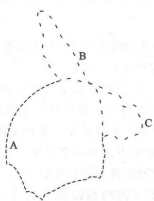  
图 30-3 复制中的大肠杆菌染色体放射自显影图

的复制型(RF)。半保留复制要求亲代DNA的两条链解开,各自作为模板,通过碱基配对的法则,合成出另一条互补链。在这里,碱基配对是核酸分子间传递信息的结构基础。无论是复制、转录或逆转录,在形成双链螺旋分子时都是通过碱基配对来完成的。需要指出的是,碱基、核苷或核苷酸单体之间并不形成碱基对,但是在形成双链螺旋时由于空间结构的关系而构成特殊的碱基对。

## （二）DNA的复制起点和复制方式

基因组能独立进行复制的单位称为复制子(replicon)。每个复制子都含有控制复制起始的起点(origin)，可能还有终止复制的终点(terminus)。复制是在起始阶段进行控制的，一旦复制开始，它即继续下去，直到整个复制子完成复制或复制受阻。

原核生物的染色体和质粒,真核生物的细胞器 DNA 都是环状双链分子。实验表明,它们都在一个固定的起点开始复制,复制方向大多是双向的(bidirectional),即形成两个复制叉(replication fork)或生长点(growing point),分别向两侧进行复制;也有一些是单向的(unidirectional),只形成一个复制叉或生长点(图30-4)。通常复制是对称的,两条链同时进行复制;有些则是不对称的,一条链复制后再进行另一条链的复制。DNA 在复制叉处两条链解开,各自合成其互补链,在电子显微镜下可以看到形如眼的结构,环状DNA 的复制眼形成希腊字母 $\theta$ 形结构(图30-5)。

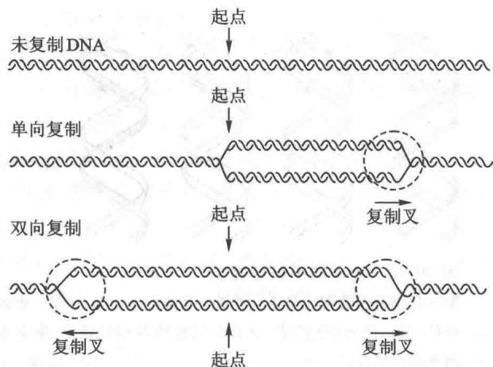  
图30-4 DNA的双向或单向复制

  
图30-5 环状DNA的复制眼形成 $\theta$ 结构

真核生物染色体 DNA 是线性双链分子, 含有许多复制起点, 因此是多复制子 (multireplicon)。病毒 DNA 有多种多样, 或是环状分子, 或是线性分子, 或是双链, 或是单链。每一个病毒基因组 DNA 分子是一个复制子, 它们的复制方式也是多种多样的: 双向的, 或是单向的; 对称的, 或是不对称的。有些病毒线性 DNA 分子在侵入细胞后可转变成环状分子, 而另一些线性 DNA 分子的复制起点在末端。

在一个生长的群体中多数细胞的染色体都处在复制过程中,因此离复制起点越近的基因出现频率越高,越远的基因出现频率越低。将大肠杆菌提取出来的 DNA 切成大约 1% 染色体长度的片段,通过分子杂交的方法测定各基因片段的频率,结果表明 ori C 位于基因图谱的 ilv 位点处(83 分附近)。一旦复制开始以后,复制叉向两侧以相等速度向前移动,两个复制叉在起点 $180^{\circ}$ 的 trp 位点处(33 分附近)相会合(图 30-6)。

通过放射自显影的实验可以判断 DNA 的复制是双向进行的,还是单向进行的。在复制开始时,先用低放射性的 ${}^{3}$ H-脱氧胸苷标记大肠杆菌。经数分钟后,再转移到含有高放射性的 ${}^{3}$ H-脱氧胸苷培养基中继续进行标记。这样,在放射自显影图像上,复制起始区的放射性标记密度比较低,感光还原的银颗粒密度就较低;继续合成区标记密度较高,银颗粒密度也就较高。若是单向复制,银颗粒的密度分布应是一端低,一端高。若是双向复制,则应是中间密度低,两端密度高。由大肠杆菌所获得的放射自显影图像都是两端密,中间稀,这就清楚证明了大肠杆菌染色体 DNA 是双向复制的(图 30-7)。

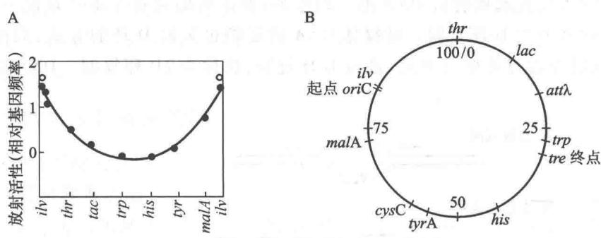  
图 30-6 大肠杆菌复制起点和终点在基因图谱上的位置  
A. DNA 复制起点的测定；B. 复制起点和终点的位置

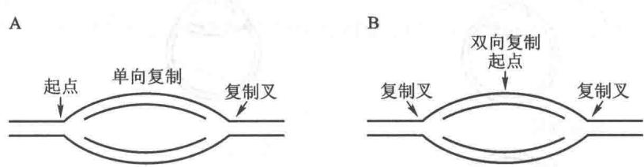  
图30-7 单向和双向复制的放射自显影示意图  
A. 单向复制；B. 双向复制

大肠杆菌和其他几种革兰氏阴性细菌以及酵母的 DNA 复制起始区已被克隆并测定了它们的核苷酸顺序。从质粒中分离出带有抗药性基因（例如氨苄青霉素的抗性基因 $amp^{r}$ ）的限制片段，它是不能自主复制的。如用同一种限制性酶处理大肠杆菌的染色体 DNA，经 DNA 连接酶加以连接后转化大肠杆菌，筛选抗氨苄青霉素的转化子（transformant），在这些转化细胞中的重组质粒含有大肠杆菌的复制起点（ori C）。克隆的复制起始区可用来研究复制的控制机制。

含有 ori C 区 1 000 bp 的重组质粒在大肠杆菌中的复制行为与细菌染色体一样, 受到严紧控制, 每个细胞只有 1\~2 个拷贝。用核酸外切酶缩短 ori C 克隆片段的大小, 最后得 245 bp 的基本功能区, 携带它的质粒依然能自主复制, 但拷贝数可增加到 20 以上, 这说明决定拷贝数和发动复制的作用是由不同序列控制的。

鼠伤寒沙门氏菌(Salmonella typhimurium)的起点位于一段296 bp的DNA片段上，与大肠杆菌的起点相比，它们之间的相似序列达86%。其他的细菌，即使亲缘较远的细菌，其起点在大肠杆菌中亦能进行复制。看来起始区的结构是很保守的。比较已知序列的起始区，发现它们都含有一系列对称排列的反向重复(inverted repeats)和某些短的成簇的保守序列，这些序列的意义还不完全清楚。

有些种类 DNA 的复制是不对称的,两个复制叉或两条亲本链并不同时进行复制。有一种单向复制的特殊方式,称为滚环(rolling circle)式。噬菌体 $\phi X$ 174 DNA 是环状单链分子。它在复制过程中首先形成共价闭环的双链分子(复制型),然后其正链由 A 蛋白在特定位置切开,游离出一个 3'-OH 末端,A 蛋白连在 5'-磷酸基末端。随后,在 DNA 聚合酶(DNA polymerase)催化下,以环状负链为模板,从正链的 3'-OH 末端加入脱氧核苷酸,使链不断延长,通过滚动而合成出新的正链。合成一圈后,露出切口序列,A 蛋白再次将其切开,并连在切出的 5'-磷酸基末端,游离出单位长度噬菌体环状单链 DNA 分子。实验证明,某些双链 DNA 的合成也可以通过滚环的方式进行。例如,噬菌体 $\lambda$ 复制的后期以及非洲爪蟾(Xenopus)卵母细胞中 rRNA 基因的扩增都是以这种方式进行的。

另一种单向复制的特殊方式称为替代环(displacement loop)或D环(D-loop)式。线粒体DNA的复制采取这种方式(纤毛虫的线粒体DNA为线性分子,其复制方式与此不同)。双链环在固定点解开进行复制,但两条链的合成是高度不对称的,一条链先复制,另一条链保持单链而被取代,在电镜下可以看到呈D环形状。待一条链复制到一定程度,露出另一链的复制起点,另一条链才开始复制。这表明复制起点是以一条链为模板起始合成 DNA 的一段序列；两条链的起点并不总在同一点上，当两条链的起点分开一定距离时就产生 D 环复制。叶绿体 DNA 的复制也采取 D 环的方式，双链环两条链的起点不在同一位置，但同时在起点处解开双链，进行 D 环复制，故称为 2D 环复制。DNA 的不同复制方式见图 30-8。

B. 多起点双向

C. $\theta$ 型双向

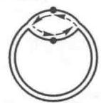

D. $\theta$ 型单向

E. 滚动环

F. D环

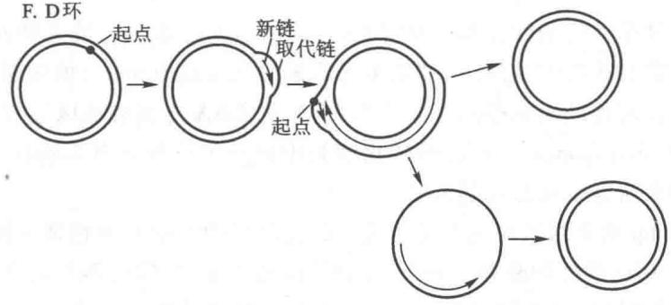

G. 2D环

  
图30-8 DNA的不同复制方式

利用放射自显影的方法测定,细菌 DNA 的复制叉移动速度大约每分钟 50 000 bp。大肠杆菌染色体

完成复制需要 40 min。但是在丰富培养基中，大肠杆菌每 20 min 即可分裂一次。实验分析结果表明，复制叉前进的速度是比较恒定的，复制速度实际取决于起始频率。在丰富的培养基中，大肠杆菌染色体一轮复制尚未完成，起点已开始第二轮的复制，因此一个染色体可以不只 2 个生长点（图 30-9）。

  
图 30-9 大肠杆菌的多复制叉染色体 DNA

真核生物染色体 DNA 的复制叉移动速度比原核生物慢得多,这是由于真核生物的染色体具有复杂的高级结构,复制时需要解开核小体(nucleosome),复制后又需重新形成核小体。它们的复制叉移动速度为

1 000\~3 000 bp/min。高等真核生物一般复制单位长度是 100\~200 kb，低等真核生物要小一些，每一复制单位在 30\~60 min 内复制完毕。由于各复制子发动复制的时间有先后，就整个细胞而言，通常完成染色体复制的时间要用 6\~8 h。

## （三）DNA 聚合反应和有关的酶

DNA 由脱氧核糖核苷酸聚合而成。与 DNA 聚合反应有关的酶包括多种 DNA 聚合酶和 DNA 连接酶。

## 1. DNA 的聚合反应和聚合酶

1956 年 A. Kornberg 等首先从大肠杆菌提取液中发现 DNA 聚合酶。其后从不同的生物中都找到有这种酶。用提纯的酶制剂作实验表明，在有适量 DNA 和镁离子存在时，该酶能催化四种脱氧核糖核苷三磷酸合成 DNA，所合成的 DNA 具有与天然 DNA 同样的化学结构和物理化学性质。dATP、dGTP、dCTP 和 dTTP 四种脱氧核糖核苷三磷酸缺一不可；它们不能被相应的二磷酸或一磷酸化合物所取代，也不能被核糖核苷酸所取代。在 DNA 聚合酶催化下，脱氧核糖核苷酸被加到 DNA 链的末端，同时释放出无机焦磷酸。DNA 的聚合反应可表示如下：

$$
\begin{array}{r l} & {n _ {1} \mathrm{dATP}} \\ & {\qquad +} \\ & {n _ {2} \mathrm{dGTP}} \\ & {\qquad +} \\ & {n _ {3} \mathrm{dCTP}} \\ & {\qquad +} \\ & {n _ {4} \mathrm{dTTP}} \end{array} + \mathrm{DNA} \xrightarrow [ \mathrm{Mg} ^ {2 +} ]{\mathrm{DNA} \text {聚合酶}} \left[ \begin{array}{c} {\mathrm{dAMP}} \\ {\mid} \\ {\mathrm{dGMP}} \\ {\mid} \\ {\mathrm{dCMP}} \\ {\mid} \\ {\mathrm{dTMP}} \end{array} \right] - \mathrm{DNA} + (n _ {1} + n _ {2} + n _ {3} + n _ {4}) \mathrm{PPi}
$$

在 DNA 聚合酶催化的链延长反应中,链的游离 3'-羟基对进入的脱氧核糖核苷三磷酸 α 磷原子发生亲核攻击,从而形成 3',5'-磷酸二酯键并脱下焦磷酸(图 30-10)。形成磷酸二酯键所需要的能量来自 α-与 β-磷酸基之间高能键的裂解。聚合反应是可逆的;但随后焦磷酸的水解可推动反应的完成。DNA 链由 5'向 3'方向延长。DNA 聚合酶只能催化脱氧核糖核苷酸加到已有核酸链的游离 3'-羟基上,而不能使脱氧核糖核苷酸自身发生聚合,也就是说,它需要引物链(primer strand)的存在。加入核苷酸的种类则由模板链所决定。

  
图 30-10 DNA 聚合酶催化的链延长反应

与生物小分子的合成不同,信息大分子(informational macromolecule)的合成除需要底物、能量和酶外,还需要模板(template)。DNA聚合酶催化的反应是按模板的指令(instruction)进行的。只有当进入的核苷酸碱基能与模板链的碱基形成Watson-Crick类型的碱基对时,才能在该酶催化下形成磷酸二酯键。因此,DNA聚合酶是一种模板指导的酶。加入各种不同生物来源的DNA作模板,可以同样引起和促进新的DNA的酶促合成,而且产物DNA的性质不取决于聚合酶的来源,也与四种核苷酸前体的相对比例无关,而仅仅取决于所加进去的模板 DNA。产物 DNA 与作为模板的双螺旋 DNA 具有相同的碱基组成, 这说明在 DNA 聚合酶作用下, 模板 DNA 的两条链都能进行复制。

DNA 的体外酶促合成必须加入少量的 DNA 才能进行。由于 DNA 在提取过程中常受到机械切力或酶的作用，从而引起磷酸二酯键的断裂。在一条链上失去一个磷酸二酯键称为切口（nick），失去一段单链称为缺口（gap）。显露出 3'-羟基的核酸链可作为引物，链延长的信息来自对应的互补链。由此可见，在 DNA 聚合酶反应中，加入的 DNA 同时起两者作用：一条链作为引物，另一条作为模板（图 30-11）。

综上所述，DNA 聚合酶的反应特点为：① 以四种脱氧核糖核苷三磷酸作底物，② 反应需要接受模板的指导，③ 反应需要有引物 3'-羟基存在，④ DNA 链的生长方向为 5'→3'，⑤ 产物 DNA 的性质与模板相同。这就表明了 DNA 聚合酶合成的产物是模板的复制物。

  
图 30-11 DNA 酶促合成的引物链和模板链

## 2. 大肠杆菌 DNA 聚合酶

大肠杆菌中共含有五种不同的 DNA 聚合酶, 它们分别称为 DNA 聚合酶 I、II、III、IV 和 V。

（1）DNA 聚合酶 I Kornberg 等最初从大肠杆菌中分离出来的酶称为 DNA 聚合酶 I 或 Kornberg 酶。DNA 聚合酶 I 已得到高度纯化，从 100 kg 大肠杆菌中可以分离得到约 500 mg 纯化的酶。DNA 聚合酶 I 的相对分子质量为 103 000，由一条单一多肽链组成。多肽链中含有两个二价金属离子（镁或锌），参与聚合反应。酶分子形状像球体，直径约 6.5 nm，为 DNA 直径的三倍左右。每个大肠杆菌细胞约有 400 个分子的 DNA 聚合酶 I。

当有底物和模板存在时，DNA 聚合酶 I 可使脱氧核糖核苷酸逐个地加到具有 $3^{\prime}-OH$ 末端的多核苷酸链上。与其他种类的 DNA 聚合酶一样，DNA 聚合酶 I 只能在已有核酸链上延伸链，而不能从无到有开始 DNA 链的合成，也就是说，它催化的反应需要有引物链（DNA 链或 RNA 链）的存在。在 $37^{\circ}C$ 条件下，每分子 DNA 聚合酶 I 每分钟可以催化约 1000 个核苷酸的聚合。

DNA 聚合酶 I 是一个多功能酶。它可以催化以下的反应: ① 通过核苷酸聚合反应, 使 DNA 链沿 $5'\rightarrow3'$ 方向延长 (DNA 聚合酶活性); ② 由 $3'$ 端水解 DNA 链 ( $3'\rightarrow5'$ 外切核酸酶活性); ③ 由 $5'$ 端水解 DNA 链 ( $5'\rightarrow3'$ 外切核酸酶活性); ④ 由 $3'$ 端使 DNA 链发生焦磷酸解; ⑤ 无机焦磷酸盐与脱氧核糖核苷三磷酸之间的焦磷酸基交换。焦磷酸解是聚合反应的逆反应, 焦磷酸交换反应则是由前两个反应连续重复多次引起的。因此, 实际上 DNA 聚合酶 I 仅兼有聚合酶、 $3'\rightarrow5'$ 外切核酸酶和 $5'\rightarrow3'$ 外切核酸酶的活性。在酶的活性中心, 与这些功能有关的结合位置分布得十分精巧。

若用蛋白水解酶将 DNA 聚合酶 I 作有限水解, 可以得到相对分子质量为 68 000 和 35 000 的两个片段。大的片段具有聚合酶和 $3'\rightarrow5'$ 外切核酸酶活性, 小的片段具有 $5'\rightarrow3'$ 外切核酸酶活性。聚合酶和 $3'\rightarrow5'$ 外切酶活性紧密结合在一起, 表明两者间有着重要的内在联系(图 30-12)。

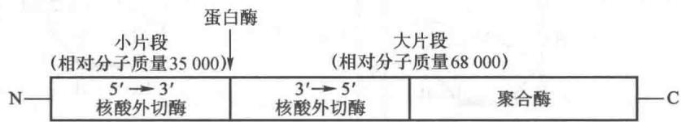  
图30-12 DNA聚合酶I的酶切片段

DNA 聚合酶 I 被蛋白酶切开得到的大片段称为 Klenow 片段，X 射线晶体学研究揭示它有两个明显的裂隙，彼此接近垂直。其中一个裂隙为双链 DNA 的结合位点；另一裂隙为聚合反应的催化位点，两个金属离子结合其上并可分别与生长链 3'-OH 的氧和底物核苷三磷酸的三个磷形成配位键而促进聚合反应。3'→5' 核酶外切酶位点十分靠近聚合酶位点，合成链的 3' 端可在其间摆动（图 30-13）。其他种类的 DNA 聚合酶往往无 5'→3' 外切核酸酶活性，但有 3'→5' 外切核酸酶活性，其空间结构与 Klenow 片段类似，相当于右手形状。实际上不仅是 DNA 聚合酶 I，右手结构是所有核酸聚合酶的共同特征。

当核酸落入核酸聚合酶拇指与指形结构和掌形结构间的凹槽时，引起构象改变，使核酸合成链的3'端正好位于催化位点。聚合酶所以能够辨别进入的底物核苷酸，是因为凹槽空间只允许底物与模板之间形成Watson-Crick类型的碱基配对。非配对碱基因空间位置不适合而不能进行聚合反应，这就保证了新合成的链严格按模板链的互补碱基顺序进行聚合。在这里，酶对底物进行了专一性的核对。然而错配的碱基仍然不可避免地会出现。例如，碱基的瞬时互变异构即可造成不正常碱基配对。DNA聚合酶的3'→5'外切核酸酶活性能切除单链DNA的3'末端核苷酸，而对双链DNA不起作用，故不能形成碱基对的错配核苷酸可被该酶水解下来。3'→5'外切核酸酶活性被认为起着校对功能（proofreading function），它能切除聚合过

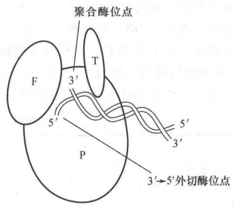  
图 30-13 DNA 聚合酶 I 大片段 (Klenow 片段) 的结构  
P. 掌形结构区，F. 指形结构区，T. 拇指结构区

程中的错配碱基。由此可见，DNA复制过程中碱基配对要受到双重核对：聚合酶的选择作用和 $3^{\prime}\rightarrow 5^{\prime}$ 外切酶的校对作用。在无 $3^{\prime}\rightarrow 5^{\prime}$ 外切酶的校对功能时，DNA聚合酶I掺入核苷酸的错误率为 $10^{-5}$ ；具有校对功能后，错误率降低至 $5\times 10^{-7}$ 。体内DNA修复系统进一步降低DNA复制的错误率。

DNA 聚合酶 I 尚具有 $5'\rightarrow3'$ 外切核酸酶活性, 它只作用于双链 DNA 的碱基配对部分, 从 $5'$ 末端水解下核苷酸或寡核苷酸。因而该酶被认为在切除由紫外线照射而形成的嘧啶二聚体 (pyrimidine dimer) 中起着重要作用。DNA 半不连续合成中冈崎片段 $5'$ 端 RNA 引物的切除也有赖于这个外切酶。

（2）DNA 聚合酶Ⅱ和Ⅲ DNA 聚合酶 I 发现后，随着对其性质的逐步了解，增加了对该酶是否真是细胞 DNA 复制酶的怀疑。首先，该酶合成 DNA 的速度太慢，只及细胞内 DNA 复制速度的百分之一。其次，它的持续合成能力（processivity）较低，细胞内 DNA 的复制不会如此频繁中断。第三，遗传学分析表明，许多基因突变都会影响 DNA 的复制，但都与 DNA 聚合酶 I 无关。1969 年 P. DeLucia 和 J. Cairns 分离到一株大肠菌变异株，它的 DNA 聚合酶 I 活性极低，只为野生型的 0.5%\~1%，这一变异株称为 pol A1 或 pol A⁻。该变异株可以像它的亲代株一样以正常速度繁殖，但是对紫外线、X 射线和化学诱变剂甲基磺酸甲酯等敏感性高，容易变异和死亡。这表明 DNA 聚合酶 I 不是复制酶，而是修复酶。后来证明，它在 DNA 复制过程中起着取代 RNA 引物、参与局部修复的作用。

由于 pol A1 变异株中 DNA 聚合酶 I 的聚合反应活力很低, 因此是寻找其他聚合酶的适宜材料。T. Kornberg 在 1970 年分离出了另外一种聚合酶, 称为 DNA 聚合酶 II。该酶由一条相对分子质量为 88 000 的多肽链组成, 活力比 DNA 聚合酶 I 高, 若以每分子酶每分钟促进核苷酸掺入 DNA 的转化率计算, 约为 2 400 个/min 核苷酸。每个大肠杆菌细胞约含有 100 个 DNA 聚合酶 II 分子。它也是以四种脱氧核糖核苷三磷酸为底物, 从 $5' \rightarrow 3'$ 方向合成 DNA, 并需要带有缺口的双链 DNA 作为模板-引物, 缺口不能过大, 否则活性将会降低。反应需 $\mathrm{Mg}^{2+}$ 和 $\mathrm{NH}_4^+$ 激活。DNA 聚合酶 II 具有 $3' \rightarrow 5'$ 外切核酸酶活力, 但无 $5' \rightarrow 3'$ 外切酶活力。已分离到一株大肠杆菌变异株 (pol B1), 它的 DNA 聚合酶 II 活力只有正常菌株的 $0.1\%$ , 但仍然以正常速度生长, 表明 DNA 聚合酶 II 也不是复制酶, 而是一种修复酶。

1971 年 M. Gefter 分离到一种聚合酶, 称为 DNA 聚合酶Ⅲ。它是由多个亚基组成的蛋白质, 现在认为它是大肠杆菌细胞内真正负责重新合成 DNA 的复制酶 (replicase)。经诱变处理, 分离到一些大肠杆菌温度敏感条件致死变异株。dna E (pol C) 基因的温度敏感株在适宜温度 (30℃) 下, DNA 能正常复制; 当培养温度上升到限制温度 (45℃) 时, DNA 的合成立即停止。亦已鉴定该位点编码 DNA 聚合酶Ⅲ的 α 亚基。从这种变异株中分离出来的 DNA 聚合酶Ⅲ是对温度敏感的, 而聚合酶 I 和 II 则不敏感。虽然每个大肠杆菌细胞只有 10\~20 个 DNA 聚合酶Ⅲ分子, 然而它催化的合成速度达到了体内 DNA 合成的速度。DNA 聚合酶Ⅲ的许多性质都表明, 它就是 DNA 的复制酶。

DNA 聚合酶 I、II 和 III 的基本性质总结于表 30-1。DNA 聚合酶Ⅲ的亚基很容易解离，在分离酶的过程中常得到不同的组分,对每一组分的作用也还不十分清楚,因此要区分酶的组成成分和辅助因子是比较困难的。现认为 DNA 聚合酶Ⅲ的全酶(holoenzyme)由 $\alpha$ 、 $\beta$ 、 $\gamma$ 、 $\delta$ 、 $\delta'$ 、 $\varepsilon$ 、 $\theta$ 、 $\tau$ 、 $\chi$ 和 $\psi$ 10 种亚基所组成,含有金属离子。其中 $\alpha$ 亚基的相对分子质量为 130 000,具有 $5'\rightarrow3'$ 方向合成 DNA 的催化活性。 $\varepsilon$ 亚基具有 $3'\rightarrow5'$ 外切核酸酶活性,起校对作用,可提高聚合酶Ⅲ复制 DNA 的保真性。 $\theta$ 亚基可能起组建的作用。由 $\alpha$ 、 $\varepsilon$ 和 $\theta$ 三种亚基组成全酶的核心酶(core enzyme)。

表 30-1 大肠杆菌三种 DNA 聚合酶的性质比较

<table><tr><td></td><td>DNA 聚合酶I</td><td>DNA 聚合酶II</td><td>DNA 聚合酶III</td></tr><tr><td>结构基因*</td><td>pol A</td><td>pol B(din A)</td><td>pol C(dna E)</td></tr><tr><td>不同种类亚基数目</td><td>1</td><td>1</td><td>10</td></tr><tr><td>相对分子质量</td><td>103 000</td><td>88 000</td><td>130 000 *</td></tr><tr><td>3&#x27;→5&#x27;外切核酸酶</td><td>+</td><td>+</td><td>+</td></tr><tr><td>5&#x27;→3&#x27;外切核酸酶</td><td>+</td><td>-</td><td>-</td></tr><tr><td>聚合速度(核苷酸/min)</td><td>1 000~1 200</td><td>2 400</td><td>15 000~60 000</td></tr><tr><td>持续合成能力</td><td>3~200</td><td>1 500</td><td> $\geqslant$ 500 000</td></tr><tr><td>功能</td><td>切除引物,修复</td><td>修复</td><td>复制</td></tr></table>

\* 对于多亚基酶,这里仅列出聚合活性亚基的结构基因和相对分子质量。

DNA 聚合酶Ⅲ为异二聚体(heterologous dimer)，它使 DNA 解开的双链可以同时进行复制，但二聚化的两个聚合酶亚基种类并不完全相同，在这里 $\tau$ 亚基起着促使核心酶二聚化的作用。 $\beta$ 亚基的功能犹如夹子：两个 $\beta$ 亚基夹住 DNA 分子并可向前滑动，使聚合酶在完成复制前不再脱离 DNA，从而提高了酶的持续合成能力（图 30-14）。 $\gamma$ 亚基与另 4 个亚基构成 $\gamma$ 复合物 ( $\gamma\delta\delta'\chi\psi$ )，具有依赖 DNA 的 ATP 酶活性，其主要功能是帮助 $\beta$ 亚基夹住 DNA 以及其后卸下来，故称为夹子安装器(clamp-loader)。DNA 聚合酶Ⅲ的亚基组成列于表 30-2，其全酶的结构如图 30-15 所示。DNA 聚合酶Ⅲ的复杂亚基结构使其具有更高的忠实性(fidelity)、协同性(cooperativity)和持续性(processivity)。如无校对功能，DNA 聚合酶Ⅲ的核苷酸掺入错误率为 $7\times10^{-6}$ ，具有校对功能的功能相互协调，全酶可以持续完成整个染色体 DNA 的合成。

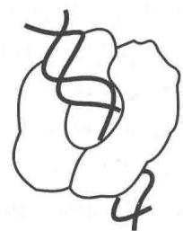  
图30-14 DNA聚合酶Ⅲ两个β亚基夹住DNA

$$
5 \times 1 0 ^ {- 9}
$$

表 30-2 DNA 聚合酶Ⅲ全酶的亚基组成

<table><tr><td>亚基</td><td>相对分子质量</td><td>亚基数目</td><td>基因</td><td>亚基功能</td></tr><tr><td> $\alpha$ </td><td>129 900</td><td>2</td><td>pol C(dna E)</td><td rowspan="2">聚合活性 $\left. \begin{array}{l} \\ \\ \end{array} \right\}$ 核心酶</td></tr><tr><td> $\varepsilon$ </td><td>27 500</td><td>2</td><td>dna Q(mut D)</td></tr><tr><td> $\theta$ </td><td>8 600</td><td>2</td><td>hol E</td><td>组建核心酶</td></tr><tr><td> $\tau$ </td><td>71 100</td><td>2</td><td>dna X</td><td>核心酶二聚化,稳定与模板结合</td></tr><tr><td> $\gamma$ </td><td>47 500</td><td>1</td><td>dna X*</td><td rowspan="3">形成 $\gamma$ 复合物,依赖DNA的ATP酶, $\left. \begin{array}{l} \\ \\ \end{array} \right\}$ 夹子安装器</td></tr><tr><td> $\delta$ </td><td>38 700</td><td>1</td><td>hol A</td></tr><tr><td> $\delta'$ </td><td>36 900</td><td>1</td><td>hol B</td></tr><tr><td> $\chi$ </td><td>16 600</td><td>1</td><td>hol C</td><td>与SSB相互作用</td></tr><tr><td> $\psi$ </td><td>15 200</td><td>1</td><td>hol D</td><td>与 $\gamma$ 和X相互作用</td></tr><tr><td> $\beta$ </td><td>40 600</td><td>4-</td><td>dna N</td><td>两个 $\beta$ 亚基形成滑动夹子,以提高酶的持续合成能力</td></tr></table>

γ亚基由τ亚基基因的一部分所编码，τ亚基氨基端80%与γ亚基具有相同的氨基酸序列。

（3）DNA 聚合酶Ⅳ和 V DNA 聚合酶Ⅳ和 V 是在 1999 年才被发现的，它们涉及 DNA 的易错修复（error-prone repair）。当 DNA 受到较严重损伤时，即可诱导产生这两个酶，它们在遇到 DNA 损伤部分时并不像一般的 DNA 聚合酶那样的无法产生正确碱基配对而停止聚合反应。该两酶能进行跨越损伤的合成（translesion synthesis, TLS），却使修复缺乏准确性（accuracy），因而出现高突变率。编码 DNA 聚合酶Ⅳ的基因是 din B。编码 DNA 聚合酶 V 的基因是 umu C 和 umu D。基因 umu D 产物 Umu D 被裂解产生较短的 Umu D'，两个 Umu D' 与一个 Umu C 形成复合物，成为 DNA 聚合酶 V。高突变率虽会使许多细胞变异或死亡，但至少可以克服复制障碍，使某些突变的细胞得以存活。

## 3. DNA 连接酶

DNA 聚合酶只能催化多核苷酸链的延长反应, 不能使链之间连接。环状 DNA 的复制表明, 必定存在一种酶, 能催化链的两个末端之间形成共价连接。1967 年不同实验室同时发现了 DNA 连接酶 (DNA ligase)。这个酶催化双链 DNA 切口处的 5'-磷酸基和 3'-羟基生成磷酸二酯键。大肠杆菌 DNA 连接酶要求断开的两条链由互补链将它们聚在一起, 形成双螺旋结构。它不能将两条游离的 DNA 链连接起来。T4 DNA 连接酶不仅能在模板链上连接 DNA 和 DNA 链之间的切口, 而且能连接无单链黏性末端的平头 (blunt) 双链 DNA。

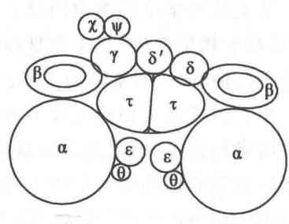  
图 30-15 DNA 聚合酶Ⅲ异二聚体的亚基结构示意图

在 $\gamma$ 复合物帮助下， $\beta$ 夹子夹往模板与引物双链并与核心酶结合，开始 DNA 复制

连接反应需要能量供给。大肠杆菌和其他细菌的 DNA 连接酶以烟酰胺腺嘌呤二核苷酸 (NAD $^{+}$ ) 作为能量来源, 动物细胞和噬菌体的连接酶则以腺苷三磷酸 (ATP) 作为能量来源。反应分三步进行。首先由 NAD $^{+}$ 或 ATP 与酶反应, 形成腺苷酰化的酶 (酶-AMP 复合物), 其中 AMP 的磷酸基与酶的赖氨酸之 ε-氨基以磷酰胺键相结合。然后酶将 AMP 转移给 DNA 切口处的 5'-磷酸基, 以焦磷酸键的形式活化, 形成 AMP-DNA。最后通过相邻的 3'-OH 对活化的磷原子发生亲核攻击, 生成 3', 5'-磷酸二酯键, 同时释放出 AMP (图 30-16)。

  
图 30-16 DNA 连接酶催化的反应

大肠杆菌 DNA 连接酶是一条相对分子质量为 74 000 的多肽。连接酶缺陷的大肠杆菌变异株中 DNA 片段积累，对紫外线敏感性增加。DNA 连接酶在 DNA 的复制、修复和重组等过程中均起重要的作用。

## （四）DNA的半不连续复制

在体内,DNA 的两条链都能作为模板,同时合成出两条新的互补链。由于 DNA 分子的两条链是反向平行的,一条链的走向为 $5'\rightarrow3'$ ,另一条链为 $3'\rightarrow5'$ 。但是,所有已知 DNA 聚合酶的合成方向都是 $5'\rightarrow3'$ ,

而不是 $3'\rightarrow5'$ 。这就很难理解，DNA 在复制时两条链如何能够同时作为模板合成其互补链。为了解决这个矛盾，日本学者冈崎等提出了 DNA 的不连续复制模型，认为 $3'\rightarrow5'$ 走向合成的 DNA 实际上是由许多 $5'\rightarrow3'$ 方向的 DNA 片段连接起来的（图 30-17）。

1968 年,冈崎等用 $^{3}$ H-脱氧胸苷标记噬菌体 T4 感染的大肠杆菌,然后通过碱性密度梯

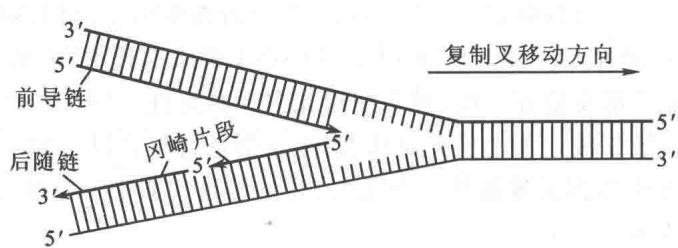  
图30-17 DNA的一条链以不连续方式合成

度离心法分离标记的 DNA 产物, 发现短时间内首先合成的是较短的 DNA 片段, 接着出现较大的分子, 最初出现的 DNA 片段长度约为 1000 个核苷酸, 一般称为冈崎片段 (Okazaki fragment)。用 DNA 连接酶变异的温度敏感株进行实验, 在连接酶不起作用的温度下, 便有大量 DNA 片段积累。这些实验都说明在 DNA 复制过程中首先合成较短的片段, 然后再由连接酶连成大分子 DNA。

从大肠杆菌中分离出冈崎片段之后，许多实验室的研究进一步证明，DNA的不连续合成不只限于细菌，真核生物染色体DNA的复制也是如此。细菌的冈崎片段长度为 $1000\sim 2000$ 个核苷酸，相当于一个顺反子（cistron），即基因的大小；真核生物的冈崎片段长度为 $100\sim 200$ 个核苷酸，相当于一个核小体DNA的大小。冈崎等最初的实验不能判断DNA链的不连续合成只发生在一条链上，还是两条链都如此，对冈崎片段进行测定，结果测得的数量远超过新合成DNA的一半，似乎两条链都是不连续的。后来发现这是由于尿嘧啶取代胸腺嘧啶掺入DNA所造成的假象。DNA中的尿嘧啶可被尿嘧啶-DNA-糖苷酶(uracil-DNA-glycosidase)切除，随后该处的磷酸二酯键断裂，在此过程中也会产生一些类似冈崎片段的DNA片段。用缺乏糖苷酶的大肠杆菌变异株 $(ung^{-})$ 进行实验时，DNA的尿嘧啶将不再被切除，新合成DNA大约有一半放射性标记出现于冈崎片段中，另一半直接进入长的DNA链。由此可见，当DNA复制时，一条链是连续的，另一条链是不连续的，因此称为半不连续复制(semidiscontinuous replication）。

以复制叉向前移动的方向为标准,一条模板链是 $3'\rightarrow5'$ 走向,在其上DNA能以 $5'\rightarrow3'$ 方向连续合成,称为前导链(leading strand);另一条模板链是 $5'\rightarrow3'$ 走向,在其上DNA也是从 $5'\rightarrow3'$ 方向合成,但是与复制叉移动的方向正好相反,所以随着复制叉的移动,形成许多不连续的片段,最后连成一条完整的DNA链,该链称为后随链(lagging strand)。由于DNA复制酶系不易从DNA模板上解离下来,因此前导链的合成通常是连续的。但是有很多因素会影响到前导链的连续性,例如,模板链的损伤、复制因子和底物的供应不足等,都会引起前导链复制中断并重新起始。

在用大肠杆菌提取液进行 DNA 合成的实验表明,冈崎片段的合成除需要四种脱氧核糖核苷酸外,还需要四种核糖核苷酸(ATP、GTP、CTP 和 UTP)。通过对新合成的 DNA 片段进行分析,发现它们以共价键连着一小段 RNA 链。用专一的核酸酶水解证明,RNA 链位于 DNA 片段的 5' 端。这些实验有力地说明了,冈崎片段的合成需要 RNA 引物。RNA 引物是在 DNA 模板链的一定部位合成并互补于 DNA 链,合成方向也是 5'→3',催化该反应的酶称为引发酶(primase)。引物的长度通常为几个核苷酸至十多个核苷酸,DNA 聚合酶Ⅲ可在其上聚合脱氧核糖核苷酸,直至完成冈崎片段的合成。RNA 引物的消除和缺口的填补是由 DNA 聚合酶 I 来完成的。最后由 DNA 连接酶将冈崎片段连成长链。

随着研究的深入,人们对 DNA 复制机制的复杂性也有了进一步的认识。生物体为什么要用如此复杂的机制来复制 DNA 呢?主要是为了保持 DNA 复制的高度忠实性。假定观察到的生物自发突变都是由 DNA 复制时碱基对的错配引起的,则可估计出大肠杆菌复制时每个碱基配对错误的频率为 $10^{-10} \sim 10^{-9}$ 。实际上还存在其他来源的变异和修复机制,生物的突变频率往往比这个数值还低。这是令人惊异的高保真系统。从热力学的角度考虑,碱基对的错配使双螺旋结构不稳定,因而给出正的自由能值,但由此计算的碱基对错误频率大约在 $10^{-2}$ 。DNA 聚合酶对底物的选择作用和 $3' \rightarrow 5'$ 外切核酸酶的校对作用分别使错配频率下降 $10^{-2}$ ,因而达 $10^{-6}$ 。这是一般 DNA 聚合酶在体外合成 DNA 时所能达到的水平。在体内,复制叉的复杂结构进一步提高了复制的准确性;修复系统可以检查出错配碱基和 DNA 的各种损伤并加以修正,从而使变异率下降到更低的水平(对生物进化适宜的水平)。

由此可以理解,为什么 DNA 聚合酶需要引物,而 RNA 聚合酶则不需要;为什么冈崎片段要以 RNA 为引物,而最后又要切除 RNA,并以 DNA 链来取代 RNA 链。DNA 聚合酶具有校对功能,它在每引入一个核苷酸后都要复查一次,碱基配对无误才继续往下聚合。它不能从无到有合成新的链,这是因为在未核实前一个核苷酸处于正确配对状态,是不会进行聚合反应的。RNA 聚合酶没有精确的校对功能,不需要引物。RNA 引物都是重新开始合成的,它的错配可能性大,在完成引物功能后即将它删除,而代之以高保真的 DNA 链。

## (五) DNA 复制的拓扑性质

核酸的拓扑结构(topology,拓扑学或拓扑结构)是指核酸分子结构的空间关系。拓扑学是近代数学的一个分支,它研究曲线或曲面的空间关系和内在数学性质,而不考虑它们的度量(大小、形状等)。两条互相缠绕的双螺旋核酸分子表现出许多拓扑学的关系。在 DNA 的复制、重组、转录和装配等过程中无不牵涉到其拓扑结构的转变。DNA 在复制时,首先需要将两条链解开,因而会产生扭曲张力。早期曾认为

DNA 分子可通过旋转而消除这种张力。然而一条很长的 DNA 双螺旋分子进行高速的旋转,这是不可思议的。通过对 DNA 的拓扑结构和拓扑异构酶的研究,现在已能较好了解 DNA 在复制时双链是如何解开的。
1966 年 Vinograd 和 Lebowitz 在研究闭环 DNA 的空间关系时提出了以下公式：

$$
\alpha = \beta + \tau
$$

其中 $\alpha$ 为双链闭环中两条链的互绕数(intertwining number)，或称为拓扑连环数(topological linking number); $\beta$ 为 DNA 构象所应有的螺旋数(helical turn)或扭转数(twisting number); $\tau$ 为超螺旋数(superhelical turn)，亦即缠绕数(writing number)。当双链闭环的两条链保持连续时， $\alpha$ 值不变。 $\beta$ 值只与 DNA 分子的碱基对数目和构象有关，B 型 DNA 的 $\beta$ 值为碱基对数目除以 10.4。 $\alpha$ 值减 $\beta$ 值之差即为超螺旋数 $\tau$ 。 $\alpha$ 值必定是整数， $\beta$ 值与 $\tau$ 值不一定是整数。 $\alpha$ 与 $\beta$ 的正负表示螺旋方向，右手螺旋为正，左手螺旋为负； $\tau$ 的正负则表示 $\alpha$ 大于还是小于 $\beta$ ，即双链闭环的螺旋圈数增加还是减少。

超螺旋数目是以整个环状 DNA 分子为单位的,为便于比较,需引入另一个概念,比超螺旋(specific superhelix),或称为超螺旋密度(superhelical density),以符号 $\sigma$ 来表示:

$$
\sigma = \frac {\alpha - \beta}{\beta}
$$

生物体内的 DNA 分子通常处于负超螺旋状态。从热力学上考虑，超螺旋 DNA 处于较高的自由能状态，因此，如果 DNA 的一条链有一个切口，它即自发转变成松弛状态。负超螺旋状态有利于 DNA 两条链地解开，而 DNA 的许多生物功能都需要解开双链才能进行，生物体内可通过 DNA 不同的负超螺旋结构来控制其功能状态。除连环数不同外其他性质均相同的 DNA 分子称为拓扑异构体（topological isomer），引起拓扑异构反应的酶称为拓扑异构酶（topoisomerase）。DNA 拓扑异构酶通过改变 DNA 的 $\alpha$ 值来影响其拓扑结构。拓扑异构酶可分为两类：类型 I 的酶能使 DNA 的一条链发生断裂和再连接，反应无需供给能量；类型 II 的酶能使 DNA 的两条链同时发生断裂和再连接，当它引入超螺旋时需要由 ATP 供给能量。

类型 I 拓扑异构酶首先在大肠杆菌中发现。过去称为 $\omega$ 蛋白，或切口封闭酶（nick-closing enzyme），现在统一称为拓扑异构酶 I，是相对分子质量为 97000 的一条多肽链，由基因 top A 所编码。该基因突变将导致 DNA 负超螺旋水平的增加，并影响到转录活性。拓扑异构酶 I 只能消除负超螺旋，对正超螺旋无作用，每次作用改变的 $\alpha$ 值为 +1。除消除负超螺旋外，拓扑异构酶 I 还能引起 DNA 其他的拓扑转变，例如，单链环形成拓扑结和互补单链环形成环状双链。

当大肠杆菌的拓扑异构酶Ⅰ与DNA作用时，DNA的一条链断裂，其5'-磷酸基与酶的酪氨酸羟基形成酯键。在此发生的是磷酸二酯键的转移反应，由DNA转移到蛋白质。随后使DNA链重新连接，即磷酸二酯键又由蛋白质转到DNA。整个过程并不发生键的不可逆水解，没有能量的丢失。因此DNA链的断裂和再连接并不需要外界供给能量。由于酶与DNA相结合，DNA链并不能自由转动，超螺旋DNA的扭曲张力不会自动消失。但是酶分子可牵引另一条链通过切口，然后使断链重新连接，从而改变DNA的连环数和超螺旋数。拓扑异构酶Ⅰ只能消除负超螺旋，说明该酶只能按一个方向牵引DNA链。大肠杆菌细胞内还有另一种类型Ⅰ的拓扑异构酶，称为拓扑异构酶Ⅲ，其性质与拓扑异构酶Ⅰ相似，功能可能也相同。

细菌的 DNA 旋转酶(gyrase)是一种类型Ⅱ的拓扑异构酶,称为拓扑异构酶Ⅱ,它可连续引入负超螺旋到同一个共价闭和环状 DNA 分子中去,每分钟引入大约 100 个负超螺旋。反应需要由 ATP 供给能量。在无 ATP 存在时,旋转酶可松弛负超螺旋,但不作用于正超螺旋,而且松弛负超螺旋的速度比引入负超螺旋的速度慢 10 倍。大肠杆菌旋转酶由两条相对分子质量为 105 000 的 A 亚基和两条相对分子质量为 95 000 的 B 亚基所组成,即 $A_{2}B_{2}$ ,整个酶的相对分子质量为 400 000。这两个亚基分别由基因 gyr A 和 gyr B 所编码。对抗生素抗性突变的分析表明,gyr A 是抗萘啶酮酸(nalidixic acid)和奥啉酸(oxolinic acid)突变的位点;gyr B 是抗香豆霉素 A1(coumermycin A1)和新生霉素(novobiocin)突变的位点。这些抗生素均能抑制复制,因而推测 DNA 旋转酶对 DNA 的合成是必需的。

图 30-18 说明了旋转酶的作用机制。当酶结合到 DNA 分子上时, 可同时使两条链交错断裂, 交错 4 个碱基对。2 个 A 亚基通过酪氨酸分别与断链 5'-磷酸基结合, 在酶构象改变的牵引下, DNA 双链穿过切

口,然后断裂的2条链又重新连接。每次反应改变的连环数为-2。ATP水解产生的能量用来恢复酶的构象,从而可进行下一次循环。新生霉素通过抑制ATP与B亚基的结合而干扰依赖ATP的反应。萘啶酮酸则抑制A亚基的功能。大肠杆菌有两种类型Ⅱ的拓扑异构酶,除拓扑异构酶Ⅱ外,还有拓扑异构酶Ⅳ,该酶的功能可能为分离环状DNA复制后形成的连锁体(catenane)。

真核生物的细胞也有类型Ⅰ和类型Ⅱ拓扑异构酶。拓扑异构酶Ⅰ和Ⅲ均属于类型Ⅰ。与原核生物的拓扑异构酶Ⅰ不同，真核生物的拓扑异构酶Ⅰ既能消除负超螺旋，又能消除正超螺旋。真核生物拓扑异构酶Ⅲ只消除负超螺旋，而且活性较弱。真核生物两种类型Ⅱ拓

  
图 30-18 拓扑异构酶Ⅱ作用机制示意图

扑异构酶分别称为拓扑异构酶Ⅱα和Ⅱβ，它们能够消除正超螺旋和负超螺旋，但不能导入负超螺旋。真核生物染色体DNA的负超螺旋可能是在DNA盘绕组蛋白核心时扭曲张力使未与组蛋白结合的DNA部分形成正超螺旋，随后正超螺旋即被拓扑异构酶消除。

拓扑异构酶Ⅰ和Ⅱ广泛存在于原核生物和真核生物。细胞内的定位分析表明，拓扑异构酶Ⅰ主要集中在活性转录区，与转录有关。拓扑异构酶Ⅱ分布在染色质骨架蛋白和核基质部位，与复制有关。原核生物拓扑异构酶Ⅱ可引入负超螺旋，拓扑异构酶Ⅰ可减少负超螺旋。真核生物略有不同，但均在它们协同作用下控制着DNA的拓扑结构。复制时需要较高水平的负超螺旋，复制结束后需要降低负超螺旋水平，以便在活性染色质部位进行转录。拓扑异构酶在重组、修复和其他DNA的转变方面也起着重要的作用。

DNA 拓扑异构酶引入负超螺旋,可以消除复制叉前进时带来的扭曲张力,从而促进双链地解开。而将 DNA 两条链解开,则有赖于 DNA 解旋酶(helicase)。这类酶能通过水解 ATP 获得能量来解开双链,每解开一对碱基,需要水解 2 分子 ATP 转变成 ADP 和磷酸盐。分解 ATP 的活力要有单链 DNA 的存在。如双链 DNA 中有单链末端或缺口,解旋酶即可结合于单链部分,然后向双链方向移动。大肠杆菌有许多种解旋酶,其中解旋酶 I、II 和 III 可以沿着模板链的 $5' \rightarrow 3'$ 方向移动,而 rep 蛋白则沿 $3' \rightarrow 5'$ 方向移动。过去以为在 DNA 复制中,这两种解旋酶的配合作用推动着 DNA 双链地解开。但是上述酶经诱变并不影响细胞复制。曾经分离出一些大肠杆菌 DNA 复制温度敏感突变株。其中一株当培养温度由 $30^{\circ} \mathrm{C}$ 上升到 $40^{\circ} \mathrm{C}$ , DNA 复制立即停止,分析表明 dna B 基因发生温度敏感突变。该基因产物 Dna B 是一种解旋酶,可沿 DNA 链 $5' \rightarrow 3'$ 方向移动,由 ATP 供给能量。这就证明,该解旋酶参与 DNA 的复制,其余的可能参与修复过程。

解开的两条单链随即被单链结合蛋白(single-strand binding protein, SSB)所覆盖。大肠杆菌的SSB蛋白相对分子质量为75600，由4个相同亚基所组成。过去这类蛋白曾被称为解链蛋白(unwinding protein)、熔解蛋白(melting protein)、螺旋去稳定蛋白(helix destabilizing protein)等。值得指出的是，这一蛋白实际并非DNA解链蛋白，它的功能在于稳定DNA解开的单链，阻止复性和保护单链部分不被核酸酶降解。原核生物的SSB蛋白与DNA的结合表现出明显的协同效应，当第一个蛋白结合后，其后蛋白的结合能力可提高 $10^{3}$ 倍。因此一旦结合反应开始后，它即迅速扩展，直至全部单链DNA都被SSB蛋白覆盖。从真核生物中分离到的SSB蛋白没有表现出这种协同效应，可能它们的作用方式有所不同。

## （六）DNA的复制过程

大肠杆菌染色体 DNA 的复制过程可分为三个阶段: 起始、延伸和终止。其间的反应和参与作用的酶与辅助因子各有不同。在 DNA 合成的生长点 (growth point), 即复制叉上, 分布着各种各样与复制有关的酶和蛋白质因子,它们构成的多蛋白复合体称为复制体(replisome)。DNA 复制的阶段表现在其复制体结构的变化。

## 1. 复制的起始

大肠杆菌的复制起点称为 ori C，由 245 个 bp 构成，其序列和控制元件在细菌复制起点中十分保守。关键序列在于两组短的重复：三个 13 bp 的序列和四个 9 bp 序列（图 30-19）。

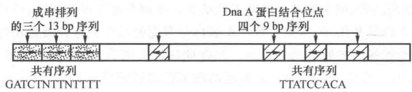  
图30-19 大肠杆菌复制起点成串排列的重复序列

复制起点上四个 9 bp 重复序列为 Dna A 蛋白的结合位点,20\~40 个 Dna A 蛋白各带一个 ATP 结合在此位点上,并聚集在一起,DNA 缠绕其上,形成起始复合物(initial complex)。HU 蛋白是细菌的类组蛋白,可与 DNA 结合,促使双链 DNA 弯曲。受其影响,邻近三个成串富含 AT 的 13 bp 序列被变性,成为开链复合物(open complex),所需能量由 ATP 供给。Dna B(解旋酶)六聚体随即在 Dna C 帮助下结合于解链区(un-

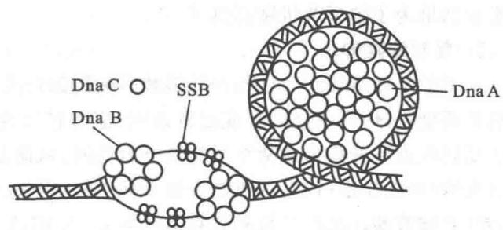  
图30-20 大肠杆菌复制起点在起始阶段的结构模型

wound region), 借助水解 ATP 产生的能量沿 DNA 链 $5' \rightarrow 3'$ 方向移动, 解开 DNA 的双链, 此时构成前引发复合物 (prepriming complex)。DNA 双链地解开还需要 DNA 旋转酶 (拓扑异构酶 II) 和单链结合蛋白 (SSB), 前者可消除解旋酶产生的拓扑张力, 后者保护单链并防止恢复双链 (图 30-20)。复制的起始, 要求 DNA 呈负超螺旋, 并且起点附近的基因处于转录状态。这是因为 Dna A 只能与负超螺旋的 DNA 相结合。RNA 聚合酶对复制起始的作用可能是因其在起点邻近处合成 RNA, 可形成 RNA 突环 (R-loop), 影响起点的结构, 因而有利于 Dna A 的作用。与复制起始有关的酶和蛋白质辅助因子列于表 30-3。

表 30-3 大肠杆菌起点与复制起始有关的酶与辅助因子

<table><tr><td>蛋白质</td><td>相对分子质量</td><td>亚基数目</td><td>功能</td></tr><tr><td>Dna A</td><td>52 000</td><td>1</td><td>识别起点序列,在起点特异位置解开双链</td></tr><tr><td>Dna B</td><td>300 000</td><td>6</td><td>解开 DNA 双链</td></tr><tr><td>Dna C</td><td>174 000</td><td>6</td><td>帮助 Dna B 结合于起点</td></tr><tr><td>HU</td><td>19 000</td><td>2</td><td>类组蛋白,DNA 结合蛋白,促进起始</td></tr><tr><td>引物合成酶(Dna G)</td><td>60 000</td><td>1</td><td>合成 RNA 引物和单链 DNA</td></tr><tr><td>单链结合蛋白(SSB)</td><td>75 600</td><td>4</td><td>结合单链 DNA</td></tr><tr><td>RNA 聚合酶</td><td>454 000</td><td>5</td><td>促进 Dna A 活性</td></tr><tr><td>DNA 旋转酶(拓扑异构酶II)</td><td>400 000</td><td>4</td><td>释放 DNA 解链过程产生的扭曲张力</td></tr><tr><td>Dam 甲基化酶</td><td>32 000</td><td>1</td><td>使起点 GATC 序列的腺嘌呤甲基化</td></tr></table>

DNA 复制的调节发生在起始阶段,一旦开始复制,如无意外受阻,就能一直进行到完成。现在知道,DNA 复制的发动与 DNA 甲基化以及与细菌质膜的相互作用有关。在 245 bp 的 ori C 位点中总共有 11 个 4 bp 回文序列 GATC,Dam 甲基化酶可使该序列中腺嘌呤第 6 位 N 甲基化。当 DNA 完成复制后,ori C 的亲代链保持甲基化,新合成的链则未甲基化,因此是半甲基化 DNA(hemimethylated DNA)。半甲基化的起点不能发生复制的起始,直到 Dam 甲基化酶使起点全甲基化。然而,起点处 GATC 位点在复制后一直保持半甲基化状态,约经过 13 min 才再甲基化。这点很特殊,基因组其余部位的 GATC 在复制后通常很快 (<1.5 min) 就能再甲基化。只有与 ori C 靠近的 dna A 基因启动子的再甲基化需要同样的延迟期。当 dna A 启动子处于半甲基化时,转录被阻遏,从而降低了 Dna A 蛋白的水平。此时起点本身是无活性的,并且关键性起始蛋白 Dna A 的产生也受到阻遏。

什么原因造成 ori C 和 dna A 位点再甲基化的延迟？实验表明，半甲基化的 ori C DNA(dna A 基因位于起点附近)可与细胞膜结合，但全甲基化的就不能结合。推测有可能因 ori C 与膜结合而阻碍了 Dam 甲基化酶对其 GATC 位点的甲基化，也抑制了 Dna A 蛋白与起点的结合。这种结合使得正在复制中的 DNA 可随着细胞膜的生长而被移向细胞的两半部分。只在此过程完成后，DNA 的起点才从膜上脱落下来，并被甲基化，于是又开始新一轮的复制起始。在延迟期内细胞得以完成有关的功能。复制起始的调节还涉及 Dna A 蛋白活性的循环变化；它与 ATP 结合为活性形式，随之结合到起点上，ATP 被缓慢水解；它与 ADP 结合为无活性形式。膜磷脂可以促进 Dna A 的 ADP 被 ATP 置换。调节的许多细节还不清楚，但上述实验结果为了解调节机制提供了线索。

## 2. 复制的延伸

复制的延伸阶段同时进行前导链和后随链的合成。这两条链合成的基本反应相同，并且都由 DNA 聚合酶Ⅲ所催化；但两条链的合成也有差别，前者持续合成，后者分段合成，因此参与的蛋白质因子也有不同。复制起点解开后形成两个复制叉，即可进行双向复制。前导链开始合成后通常都一直继续下去。先由引发酶（Dna G 蛋白）在起点处合成一段 RNA 引物，前导链的引物一般比冈崎片段的引物略长一些，为 10\~60 个核苷酸。某些质粒和线粒体的 DNA 由 RNA 聚合酶合成引物，其长度可以更长。随后 DNA 聚合酶Ⅲ即在引物上加入脱氧核糖核苷酸。前导链的合成与复制叉的移动保持同步。

后随链的合成是分段进行的,需要不断合成冈崎片段的 RNA 引物,然后由 DNA 聚合酶Ⅲ加入脱氧核糖核苷酸。后随链合成的复杂性在于如何保持它与前导链合成的协调一致。由于 DNA 的两条互补链方向相反,为使后随链能与前导链被同一个 DNA 聚合酶Ⅲ不对称二聚体所合成,后随链必须绕成一个突环(loop),如图 30-21 所示。合成冈崎片段需要 DNA 聚合酶Ⅲ不断与模板脱开,然后在新的位置又与模板结合。这一作用是由 β 夹子和 γ 复合物(β 夹子装卸器)来完成的。

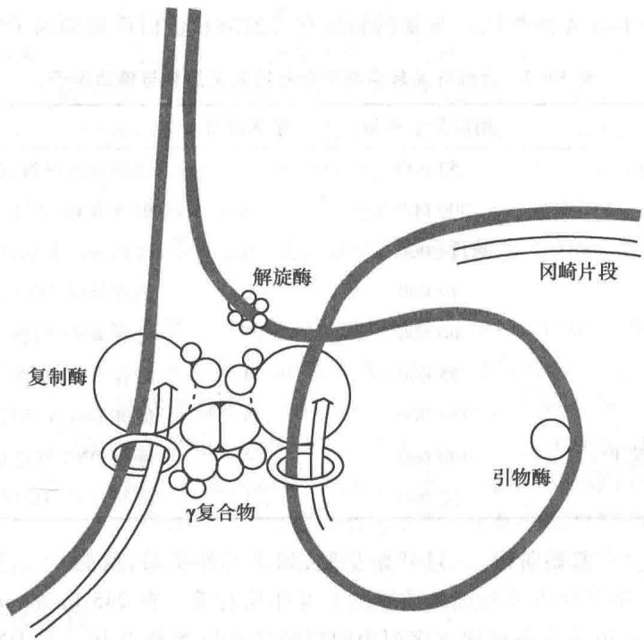  
图 30-21 大肠杆菌复制体结构示意图  
:亲代 DNA 链； $\Longrightarrow$ :新合成 DNA 链

当引物酶在适当位置合成出 RNA 引物后， $\beta$ 夹子的两个亚基即在 $\gamma$ 复合物 $(\gamma\delta\delta^{\prime}\chi\psi)$ 帮助下将引物与模板双链夹住，并与聚合酶核心酶结合。 $\beta$ 亚基的二聚体形成一个环，套在双链分子上，使聚合酶得以束缚在双链上滑动。完成冈崎片段合成后， $\beta$ 夹子即从 DNA 双链上拆卸下来，此过程仍然依赖于 $\gamma$ 复合物的帮助。 $\beta$ 夹子与 $\gamma$ 复合物的 $\delta$ 亚基以及核心酶的 $\alpha$ 亚基都有高的亲和力，二者的结合位点也相同，但随着 $\beta$ 夹子状态的改变，对二者亲和力大小发生改变，推动其功能循环。当 $\beta$ 夹子在溶液中时，它趋向于和 $\gamma$ 复合物结合。 $\gamma$ 复合物使环状 $\beta$ 夹子的一处亚基界面被打开，并将开环 $\beta$ 夹子带到模板/引物前端，通过水解 ATP 提供的能量使 $\beta$ 夹子夹住双链。然后 $\beta$ 夹子发生构象变化，与 $\gamma$ 复合物脱离，而与聚合酶核心酶结合。一旦冈崎片段合成结束，它又脱开核心酶与 $\gamma$ 复合物结合，并在其帮助下开环脱落，此过程同样需由 ATP 提供能量。由此使 $\beta$ 夹子得以反复循环使用。

Dna B有两个功能,其一是解旋酶,以解开 DNA 的双螺旋;另一是活化引物酶,促使其合成 RNA 引物。由 Dna B 解旋酶和 Dna G 引物合成酶构成了复制体的一个基本功能单位,称为引发体(primosome)。在某些噬菌体 DNA 的复制过程中,引发体还包括一些辅助蛋白质,例如 $\phi X$ 174,它含有 6 个前引发蛋白(prepriming protein):Dna B、Dna C、Dna T、Pri A、Pri B 和 Pri C。Pri A 可识别引发体装配位点,与 Pri B 和 Pri C 一起结合其上,然后由 Dna T 引入 Dna B 和 Dna C,该多蛋白复合体称为前引发体(preprimosome),加入 Dna G 后组成引发体。Dna T、Pri A、Pri B 和 Pri C 过去也曾称作 i、n、n' 和 n" 蛋白。无论是哪一种引发体,都能依赖 ATP 沿复制叉运动方向在 DNA 链上移动,并合成冈崎片段的 RNA 引物。引物的合成方向与复制叉前进的方向正好相反。DNA 聚合酶Ⅲ在模板链上合成冈崎片段,遇到上一个冈崎片时即停止合成,β 亚基随即脱开 DNA 链。可能正是此停顿成为合成 RNA 引物的信号,由引物酶沿反方向合成引物,并被 β 夹子带到核心酶上,开始又一个冈崎片段的合成。

复制体的蛋白质与 DNA 之间的移动是相对的, 过去认为是聚合酶复合物沿 DNA 分子运动, 实际上是聚合酶复合物推动 DNA 运动, 全部染色体 DNA 经过复制装置就可以完成一轮复制。

## 3. 复制的终止

细菌环状染色体的两个复制叉向前推移,最后在终止区(terminus region)相遇并停止复制,该区含有多个约22 bp的终止子(terminator)位点。大肠杆菌有6个终止子位点,分别称为ter A\~ter F。与ter位点结合的蛋白质称为Tus(terminus utilization substance)。Tus-ter复合物只能够阻止一个方向的复制叉前移,即不让对侧复制叉超过中点后过量复制。在正常情况下,两个复制叉前移的速度是相等的,到达终止区后就都停止复制;然而如果其中一个复制叉前移受阻,另一个复制叉复制过半后,就受到对侧Tus-ter复合物的阻挡,以便等待前一复制叉的会合。这就是说,终止子的功能对于复制来说并不是必需的,它只是使环状染色体的两半边各自复制。因为两半边的基因方向也正好是相反的,如果让复制叉超过中点后继续复制就可能与转录方向对撞。

两个复制叉在终止区相遇而停止复制，复制体解体，其间仍有50\~100 bp未被复制。其后两条亲代链解开，通过修复方式填补空缺。此时两环状染色体互相缠绕，成为连锁体（catenane）。此连锁体在细胞分裂前必须解开，否则将导致细胞分裂失败，细胞可能因此死亡。大肠杆菌分开连锁环需要拓扑异构酶Ⅳ.（属于类型Ⅱ拓扑异构酶）参与作用。该酶两个亚基分别由基因par C和par E编码。每次作用可以使DNA两链断开和再连接，因而使两个连锁的闭环双链DNA彼此解开(图30-22)。其他环状染色体，包括某些真核生物病毒，其复制的终止相可能以类似的方式进行。

## （七）真核生物 DNA 的复制

真核生物的 DNA 通常都与组蛋白构成核小体，组蛋白核心为 H2A、H2B、H3 和 H4 各两分子组成的八聚体，DNA 在其上绕 1.65 圈，约 146 bp。组蛋白 H1 结合在进出核小体之间的连接 DNA 上，核小体连接 DNA 长度随不同生物或不同基因区而变化。通常每一核小体 DNA 的长度在 156\~260 bp 之间变动，平均为 200 bp。由于 DNA 以左手螺旋方向绕在组蛋白核心上，每形成一个核小体大致相当于引入 1.2 个负超螺旋。真核生物 DNA 复制的冈崎片段长约 200 bp，相当于一个核小体 DNA 的长度。

真核生物染色体有多个复制起点。酵母的复制起点已被克隆。它们称为自主复制序列（autonomouslyreplicating sequence, ARS), 或复制基因(replicator)。酵母的ARS元件大约为150 bp, 含有几个基本的保守序列。单倍体酵母有16个染色体, 其基因组约有400个复制基因。在起点上有一个由6个蛋白质组成, 相对分子质量约为400 000的起点识别复合物(origin recognition complex, ORC)。它与DNA的结合要求有ATP参与。一些蛋白质与ORC作用, 并调节其功能, 从而影响着细胞周期。

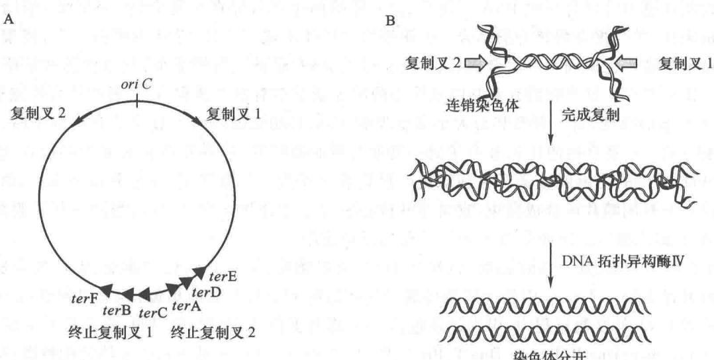  
图30-22 大肠杆菌染色体复制的终止  
A. ter 位点在染色体上的位置；B. DNA 拓扑异构酶Ⅳ使连锁环状染色体解开

5-氟脱氧尿苷(floxuridine)能够抑制胸腺嘧啶核苷酸的合成,因而是DNA合成的强烈抑制剂。用5-氟脱氧尿苷处理真核生物的培养细胞以抑制DNA的合成,随后加入 $^{3}$ H-脱氧胸苷就可以使DNA复制同步化。复制中的DNA放射自显影图像在电子显微镜下观察,可以看到很多复制眼,每个复制眼都有独立的起点,并呈双向延长。哺乳动物的复制子大多在100\~200 kb之间。果蝇或酵母的复制子比较小,平均为40 kb。

真核生物 DNA 的复制速度比原核生物慢,基因组比原核生物大,然而真核生物染色体 DNA 上有许多复制起点,它们可以分段进行复制。例如,细菌 DNA 复制叉的移动速度为 50 000 bp/min,哺乳类动物复制叉移动速度实际仅 1 000\~3 000 bp/min,相差约 20\~50 倍,然而哺乳类动物的复制子只有细菌的几十分之一,所以从每个复制单位而言,复制所需时间在同一数量级。真核生物与原核生物染色体 DNA 的复制还有一个明显的区别是:真核生物染色体在全部复制完成之前起点不再重新开始复制;而在快速生长的原核生物中,起点可以不断重新发动复制。真核生物在快速生长时,往往采用更多的复制起点。例如,黑腹果蝇的早期胚胎细胞中相邻两复制起点的平均距离为 7.9 kb,培养的成体细胞中复制起点的平均距离为 40 kb,说明成体细胞只利用一部分复制起点。

真核生物有多种 DNA 聚合酶。从哺乳动物细胞中分出的 DNA 聚合酶多达 15 种，主要有 5 种，分别以 $\alpha$ 、 $\beta$ 、 $\gamma$ 、 $\delta$ 、 $\varepsilon$ 来命名。它们的性质列于表 30-4。真核生物 DNA 聚合酶和细菌 DNA 聚合酶的基本性质相同，均以 4 种脱氧核糖核苷三磷酸为底物，需 $Mg^{2+}$ 激活，聚合时必须有模板和引物 $3^{\prime}-OH$ 存在，链的延伸方向为 $5^{\prime}\rightarrow3^{\prime}$ 。

细胞核染色体的复制由 DNA 聚合酶 $\alpha$ 和 DNA 聚合酶 $\delta$ 及 $\varepsilon$ 共同完成。DNA 聚合酶 $\alpha$ 为多亚基酶，其中两个亚基具有 RNA 引物合成酶活性，另两个亚基具有 DNA 聚合酶活性，无外切酶活性的亚基。因该酶具有合成引物的能力，过去以为它的功能是合成后随链，但是它无校正功能，很难解释真核生物 DNA 复制何以具有高度忠实性。现在认为它的功能只是合成引物，但它在合成一小段约 10 个核苷酸的 RNA 链后还可聚合 20\~30 个多聚脱氧核糖核苷酸，称为起始 DNA (initiator DNA, iDNA)。DNA 聚合酶 $\alpha$ /引物酶的持续合成能力较低，合成一段 iDNA 后即脱落，而由 DNA 聚合酶 $\delta$ 和 $\varepsilon$ 完成染色体 DNA 的复制，此过程称为聚合酶转换 (polymerase switching)。推测在复制叉上由 DNA 聚合酶 $\alpha$ 合成引物；两个 DNA 聚合酶 $\delta$ 分别合成前导链和后随链。DNA 聚合酶 $\delta$ 及 $\varepsilon$ 与一种称为增殖细胞核抗原（proliferating cell nuclear antigen, PCNA）的复制因子相结合，该因子相对分子质量为 29000。PCNA 相当于大肠杆菌 DNA 聚合酶Ⅲ的 $\beta$ 亚基，但由 3 个亚基组成，它能形成环状夹子，极大增加聚合酶的持续合成能力。RNA 引物被 RNase H1 和 MF-1 核酸酶水解，然后由 DNA 聚合酶 $\varepsilon$ 填补缺口，DNA 连接酶 I 将片段相连接。DNA 聚合酶 $\beta$ 是修复酶。DNA 聚合酶 $\gamma$ 是线粒体的 DNA 合成酶。

表 30-4 哺乳动物的 DNA 聚合酶 \*

<table><tr><td>定位</td><td>细胞核</td><td>细胞核</td><td>线粒体</td><td>细胞核</td><td>细胞核</td></tr><tr><td>亚基数目</td><td>4</td><td>1</td><td>2</td><td>4</td><td>4</td></tr><tr><td>外切酶活性</td><td>无</td><td>无</td><td>3&#x27;→5&#x27;外切酶</td><td>3&#x27;→5&#x27;外切酶</td><td>3&#x27;→5&#x27;外切酶</td></tr><tr><td>引物合成酶活性</td><td>有</td><td>无</td><td>无</td><td>无</td><td>无</td></tr><tr><td>持续合成能力</td><td>低</td><td>低</td><td>高</td><td>有PCNA时高</td><td>高</td></tr><tr><td>抑制剂</td><td>蚜肠霉素</td><td>双脱氧TTP</td><td>双脱氧TTP</td><td>蚜肠霉素</td><td>蚜肠霉素</td></tr><tr><td>功能</td><td>引物合成</td><td>修复</td><td>线粒体DNA复制和修复</td><td>核DNA复制和修复</td><td>核DNA复制和修复</td></tr></table>

\* 酵母相应 DNA 聚合酶以括弧内罗马数字和 M 表示。

在真核生物的 DNA 复制中, 另有两个蛋白质复合物参与作用。RP-A 是真核生物的单链 DNA 结合蛋白, 相当于大肠杆菌的 SSB 蛋白。RF-C 是夹子安装器(clamp loader), 相当于大肠杆菌的 $\gamma$ 复合物, 帮助 PCNA 因子安装到双链上以及拆下来, 它还促进复制体的装配。与细菌类似, 真核生物复制起始需安装解旋酶, 真核生物解旋酶是一类异六聚复合物, 称为微小染色体维持蛋白(MCM), 其安装需要 ORC。现将细菌和真核生物复制体的组成总结于表 30-5。

表 30-5 细菌和真核生物复制体的组成

<table><tr><td>组成成分</td><td>细菌</td><td>真核生物</td></tr><tr><td>复制酶</td><td>DNA 聚合酶III全酶</td><td>DNA 聚合酶 α/DNA 聚合酶 δ</td></tr><tr><td>进行性因子</td><td>β夹子</td><td>PCNA</td></tr><tr><td>定位因子</td><td>γ复合物</td><td>RF-C</td></tr><tr><td>引物合成酶</td><td>Dna G</td><td>DNA 聚合酶 α(引物合成酶)</td></tr><tr><td>去除引物的酶</td><td>RNase H 和 DNA 聚合酶 I</td><td>RNase H1 和 MF-1( $5' \rightarrow 3'$ 外切核酸酶)</td></tr><tr><td>后随链修复酶</td><td>DNA 聚合酶 I 和 DNA 连接酶</td><td>DNA 聚合酶 ε和 DNA 连接酶 I</td></tr><tr><td>解旋酶</td><td>Dna B(定位需要 Dna C)</td><td>MCM 复合物</td></tr><tr><td>安装解旋酶/引物酶</td><td>DnaC</td><td>ORC</td></tr><tr><td>消除拓扑张力的酶</td><td>旋转酶</td><td>拓扑异构酶II</td></tr><tr><td>单链结合蛋白</td><td>SSB</td><td>RP-A</td></tr></table>

真核生物线性染色体的两个末端具有特殊的结构，称为端粒(telomere)，它是由许多成串短的重复序列所组成。该重复序列中通常一条链上富含G(G-rich)，而其互补链上富含C(C-rich)。例如，原生动物四膜虫端粒的重复单位为TTGGGG（仅列一条链的序列）；人的端粒为TTAGGG。TG链常比AC链更长些，形成3'单链末端。端粒的功能为稳定染色体末端结构，防止染色体间末端连接，并可补偿后随链5'端在消除RNA引物后造成的空缺。原核生物的染色体是环状的，其5'最末端冈崎片段的RNA引物被除去后可借助另半圈DNA链向前延伸来填补。但是真核生物线性染色体在复制后，不能像原核生物那样填补5'端的空缺，从而会使5'端序列因此而缩短。真核生物通过形成端粒结构来解决这个问题。复制使端粒5'端缩短，而端粒酶(telomerase)可外加重复单位到5'端上，结果维持端粒一定长度。

端粒酶是一种含有 RNA 链的逆转录酶, 它以所含 RNA 为模板来合成 DNA 端粒结构。通常端粒酶含有约 150 个碱基的 RNA 链, 其中含 1 个半拷贝的端粒重复单位的模板。如四膜虫端粒酶的 RNA 为 159 个碱基的分子, 含有 CAACCCCAA 序列。端粒酶可结合到端粒的 3' 端上, RNA 模板的 5' 端识别 DNA 的 3' 端碱基并相互配对, 以 RNA 链为模板使 DNA 链延伸, 合成一个重复单位后酶再向前移动一个单位 (图 30-23)。端粒的 3' 单链末端又可回折作为引物, 合成其互补链。

在动物的生殖细胞中,由于端粒酶的存在,端粒一直保持着一定的长度。体细胞随图 30-23 端粒酶以自身携带的 RNA 为模板合成 DNA 的 3'端

着分化而失去端粒酶活性,主要是因为编码该催化亚基的基因表达受到了阻遏。在缺乏端粒酶活性时,细胞连续分裂将使端粒不断缩短,短到一定程度即引起细胞生长停止或凋亡。组织培养的细胞证明,端粒在决定细胞的寿命中起重要作用,经过多代培养老化的细胞端粒变短,染色体也变得不稳定。然而,主要的肿瘤细胞中均发现存在端粒酶活性,因此设想端粒酶可作为抗癌治疗的靶位点。

真核生物 DNA 复制的调节远比原核生物更为复杂。真核生物的细胞有多条染色体，每一染色体上有多个复制起点，所以是多复制子。它们的复制存在时间上的控制，并不是所有起点都在同一时间被激活，而是有先有后。复制时间与染色质结构、DNA 甲基化以及转录活性有关。通常活性区先复制，异染色质区晚复制。复制是双向的，相邻两复制起点形成的复制叉相遇后借助拓扑异构酶而使子代分子分开。真核生物似乎没有复制终止子。染色体复制在一个细胞周期中只发生一次，这一机制被认为是复制许可因子（replication licensing factor）所控制。该因子为复制起始所必需，但一旦复制起始后它即被灭活或降解。由于该因子不能通过核膜，只能经有丝分裂在重建核结构时才能进入核内并作用于染色体的复制起点。这使其仅在有丝分裂后期才能与复制起点相互作用。

真核生物的细胞周期可分为 DNA 合成前期( $G_{1}$ 期)、DNA 合成期(S 期)、DNA 合成后期( $G_{2}$ 期)和有丝分裂期(M 期)等四个时相(图 30-24)。间期的细胞(包括 $G_{1}$ 、S 和 $G_{2}$ 期)进行着复杂的生物化学变化,为 M 期进行准备,生物大分子和细胞器都在此时先后进行倍增。 $G_{1}$ 期合成 DNA 复制所要求的蛋白质和 RNA,其中包括合成底物和 DNA 复制的酶系、辅助因子和起始因子等。在具备了 DNA 合成的必要条件后,细胞 DNA 才开始复制。DNA 复制完成后即进入有丝分裂的准备期( $G_{2}$ 期)。S、 $G_{2}$ 和 M 期长短相对比较恒定, $G_{1}$ 期变动较大。

在细胞分裂后,一部分细胞可再进入 $G_{1}$ 期,开始第二个周期;另一些细胞失去了分裂的能力,或者进行分化,或者进入静止状态即 $G_{0}$ 期。成年动物组织大部分细胞处于 $G_{0}$ 期。 $G_{0}$ 期细胞一旦解除对增殖的抑制,即又进入细胞周期的 $G_{1}$ 期。细胞周期

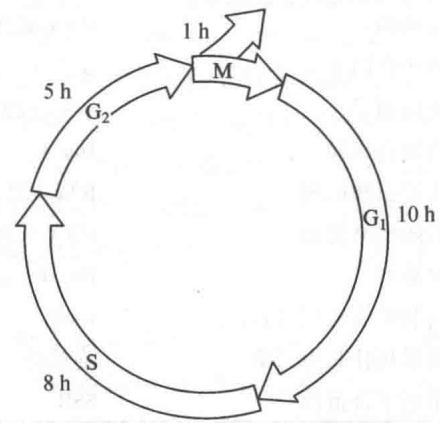  
图30-24 哺乳动物培养细胞各周期阶段的持续时间

受 cdk-周期蛋白复合物的控制, cdk(cyclin-dependent kinase)为依赖于周期蛋白的激酶。在这里有关蛋白质的磷酸化和去磷酸化起着重要的调节作用。详细内容参看细胞周期调节部分。

<!-- EN-BEGIN 25.1 -->

### 【英文对应 25.1】DNA Replication

> 来源：Lehninger Principles of Biochemistry（书籍/02_生物化学原理） 第25章 DNA Metabolism，§25.1。对应本章“一、DNA 的复制”。

P1 Long before the structure of DNA was known, scientists wondered at the ability of organisms to create faithful copies of themselves and, later, at the ability of cells to produce many identical copies of large, complex macromolecules. Speculation about these problems centered around the concept of a template, a structure that would allow molecules to be lined up in a specific order and joined to create a macromolecule with a unique sequence and function. The 1940s brought the revelation that DNA was the genetic molecule, but not until James Watson and Francis Crick deduced its structure did the way in which DNA could act as a template for the replication and transmission of genetic information become clear: one strand is the complement of the other. The strict base-pairing rules mean that each strand provides the template for a new strand with a predictable and complementary sequence (see Figs. 8-14, 8-15). The fundamental properties of the DNA replication process and the mechanisms used by the enzymes that catalyze it have proved to be essentially identical in all species.

#### [EN] DNA Replication Follows a Set of Fundamental Rules

Early research on bacterial DNA replication and its enzymes helped to establish several basic properties that have proven applicable to DNA synthesis in every organism.

DNA Replication Is Semiconservative P1 Each DNA strand serves as a template for the synthesis of a new strand, producing two new DNA molecules, each with one new strand and one old strand. This is semiconservative replication. The semiconservative nature of replication was established by Matthew Meselson and Frank Stahl in 1957.

Replication Begins at an Origin and Usually Proceeds Bidirectionally Following the confirmation of a semiconservative mechanism of replication, a host of questions arose. Are the parent DNA strands completely unwound before each is replicated? Does replication begin at random places or at a unique point? After initiation at any point in the DNA, does replication proceed in one direction or both?

Photographic images of tritium ( $^{3}$ H)-labeled bacterial DNA made by John Cairns revealed that the intact chromosome of E. coli is a single huge circle, 1.7 mm long. Radioactive DNA isolated from cells during replication showed an extra loop (Fig. 25-1). Cairns concluded that the loop resulted from the formation of two radioactive daughter strands, each complementary to a parent strand. One or both ends of the loop are dynamic points, termed replication forks, where parent DNA is being unwound and the separated strands quickly replicated. Cairns's results demonstrated that both DNA strands are replicated simultaneously, and variations on his experiment showed that replication of bacterial chromosomes is bidirectional: both ends of the loop have active replication forks.

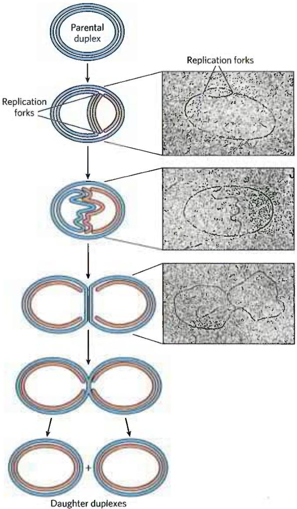  
FIGURE 25-1 Visualization of DNA replication. Stages in the replication of circular DNA molecules have been visualized by electron microscopy. Replication of a circular chromosome produces a structure resembling the Greek letter theta, $\theta$ , as both strands are replicated simultaneously (new strands shown in light red). The electron micrographs show images of plasmid DNA being replicated from a single replication origin. [Electron micrographs: Cairns, J. (1963), The Chromosome of Escherichia coli, Cold Spring Harbor Symp Quant Biol, 28, 43–46. © Cold Spring Harbor Laboratory Press.]

Determination of whether the replication loops originate at a unique point in the DNA required landmarks along the DNA molecule. These landmarks were provided by a technique called denaturation mapping, developed by Ross Inman and colleagues. Using the 48,502 bp chromosome of bacteriophage $\lambda$ , Inman showed that DNA could be selectively denatured at sequences unusually rich in A=T base pairs, generating a reproducible pattern of single-strand bubbles (see Fig. 8-28). Using the denatured regions as points of reference, investigators have subsequently been able to measure the position and progress of the replication forks. Inman and colleagues found that the replication loops always initiated at a unique point, which was termed an origin. They also confirmed the earlier observation that replication is usually bidirectional. For circular DNA molecules, the two replication forks meet at a point on the side of the circle opposite to the origin. Specific origins of replication have since been identified and characterized in bacteria and eukaryotes.

DNA Synthesis Proceeds in a 5'→3' Direction and Is Semidiscontinuous A new strand of DNA is always synthesized in the 5'→3' direction, with the free 3'-OH as the point at which the DNA is elongated. (Recall from Chapter 8 that the 5' end lacks a nucleotide attached to the 5' position, and the 3' end lacks a nucleotide attached to the 3' position.) Because the two DNA strands are antiparallel, the strand serving as the template is read from its 3' end toward its 5' end.

If synthesis always proceeds in the $5'\rightarrow3'$ direction, how can both strands be synthesized simultaneously? If both strands were synthesized continuously while the replication fork moved, one strand would have to undergo $3'\rightarrow5'$ synthesis. This problem was resolved by Reiji Okazaki and colleagues in the 1960s. Okazaki found that one of the new DNA strands is synthesized in short pieces, now called Okazaki fragments. Thus, one strand is synthesized continuously and the other discontinuously (Fig. 25-2). The continuous strand, or leading strand, is the one for which $5'\rightarrow3'$ synthesis proceeds in the same direction that the replication fork moves. The discontinuous strand, or lagging strand, is the one in which $5'\rightarrow3'$ synthesis proceeds in the direction opposite to the direction of fork movement. Okazaki fragments are typically 150 to 200 nucleotides long in eukaryotes, and 1,000 to 2,000 nucleotides long in bacteria. As we shall see, leading and lagging strand syntheses are tightly coordinated.

  
FIGURE 25-2 Defining DNA strands at the replication fork. A new DNA strand (light red) is always synthesized in the $5'\rightarrow3'$ direction. The template is read in the opposite direction, $3'\rightarrow5'$ . The leading strand is continuously synthesized in the direction taken by the replication fork. The other strand, the lagging strand, is synthesized discontinuously in short pieces (Okazaki fragments) in a direction opposite to that in which the replication fork moves. The Okazaki fragments are spliced together by DNA ligase. In bacteria, Okazaki fragments are $\sim1{,}000$ to 2,000 nucleotides long. In eukaryotic cells, they are 150 to 200 nucleotides long.

#### [EN] DNA Is Degraded by Nucleases

To explain the enzymology of DNA replication, we first introduce the enzymes that degrade DNA rather than synthesize it. These enzymes are known as nucleases, or DNases if they are specific for DNA rather than RNA. Every cell contains several different nucleases, belonging to two broad classes: exonucleases and endonucleases. Exonucleases degrade nucleic acids from one end of the molecule. Many operate in only the 5'→3' direction or the 3'→5' direction, removing nucleotides only from the 5' end or the 3' end, respectively, of one strand of a double-stranded nucleic acid or of a single-stranded DNA. Endonucleases can begin to degrade at specific internal sites in a nucleic acid strand or molecule, reducing it to smaller and smaller fragments. A few exonucleases and endonucleases degrade only single-stranded DNA. A few important classes of endonucleases cleave only at specific nucleotide sequences (such as the restriction endonucleases that are so important in biotechnology; see Chapter 9, Fig. 9-2). You will encounter many types of nucleases in this and subsequent chapters.

#### [EN] DNA Is Synthesized by DNA Polymerases

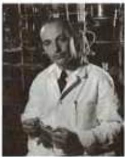  
Arthur Kornberg, 1918–2007
[World History Archive/Alamy.]

The search for an enzyme that could synthesize DNA began in 1955. Work by Arthur Kornberg and colleagues led to the purification and characterization of a DNA polymerase from E. coli cells, a single-polypeptide enzyme now called DNA polymerase I ( $M_{r}$ 103,000; encoded by the polA gene). Much later, investigators found that E. coli contains at least four additional distinct DNA polymerases, described below.

Detailed studies of DNA polymerase I revealed features of the DNA synthetic process that are now known to be common to all DNA polymerases. The fundamental reaction is a phosphoryl group transfer. The nucleophile is the 3'-hydroxyl group of the nucleotide at the 3' end of the growing strand. Nucleophilic attack occurs at the $\alpha$ phosphorus of the incoming deoxynucleoside 5'-triphosphate (Fig. 25-3). Inorganic pyrophosphate is released in the reaction. The general reaction is

$$
\begin{array}{c} (\mathrm{dNMP}) _ {n} + \mathrm{dNTP} \longrightarrow (\mathrm{dNMP}) _ {n + 1} + \mathrm{PP} _ {\mathrm{i}} \\ \text {DNA} \end{array}\tag{25-1}
$$

where dNMP and dNTP are a deoxynucleoside 5'-monophosphate and 5'-triphosphate, respectively. Catalysis by virtually all DNA polymerases prominently involves two $Mg^{2+}$ ions at the active site. One of these helps to deprotonate the 3'-hydroxyl group, rendering it a more effective nucleophile. The other binds to the incoming dNTP and facilitates departure of the pyrophosphate.

P2 The reaction seems to proceed with only a minimal change in free energy, given that one phosphodiester bond is formed at the expense of a somewhat less stable phosphate anhydride. However, noncovalent base-stacking and base-pairing interactions provide additional stabilization to the lengthened DNA product relative to the free nucleotide. Also, the formation of products is facilitated in the cell by the 19 kJ/mol generated in the subsequent hydrolysis of the pyrophosphate product by the enzyme pyrophosphatase (p. 485).

  
MECHANISM FIGURE 25-3 The DNA polymerase reaction. The catalytic mechanism for addition of a new nucleotide by DNA polymerase involves two $\mathrm{Mg}^{2+}$ ions, coordinated to the phosphate groups of the incoming nucleotide triphosphate, the $3^{\prime}$ -hydroxyl group that will act as a nucleophile, and three Asp residues, two of which are highly conserved in all DNA polymerases. The $\mathrm{Mg}^{2+}$ ion depicted at the top facilitates attack of the $3^{\prime}$ -hydroxyl group of the primer on the $\alpha$ phosphate of the nucleotide triphosphate; the other $\mathrm{Mg}^{2+}$ ion facilitates displacement of the pyrophosphate. Both ions stabilize the structure of the pentacovalent transition state. RNA polymerases use a similar mechanism.

Early work on DNA polymerase I led to the definition of two central requirements for DNA polymerization (Fig. 25-4). First, all DNA polymerases require a template. The polymerization reaction is guided by a template DNA strand according to the base-pairing rules predicted by Watson and Crick: where a guanine is present in the template, a cytosine deoxynucleotide is added to the new strand, and so on. P1 This was a particularly important discovery, not only because it provided a chemical basis for accurate semiconservative DNA replication, but also because it represented the first example of the use of a template to guide a biosynthetic reaction.

Second, the polymerases require a primer. A primer is a strand segment (complementary to the template) with a free 3'-hydroxyl group to which a nucleotide can be added; the free 3' end of the primer is called the primer terminus (Fig. 25-4a). In other words, part of the new strand must already be in place: all DNA polymerases can add nucleotides only to a preexisting strand. Many primers are oligonucleotides of RNA rather than DNA, and specialized enzymes synthesize primers when and where they are required.

A DNA polymerase active site has two parts (Fig. 25-4a). The incoming nucleotide is initially positioned in the insertion site. Once the phosphodiester bond is formed, the polymerase slides forward on the DNA and the new base pair is positioned in the postinsertion site. These sites are located in a pocket that resembles the palm of a hand (Fig. 25-4b, c).

After adding a nucleotide to a growing DNA strand, a DNA polymerase either dissociates or moves along the template and adds another nucleotide. Dissociation and reassociation of the polymerase can limit the overall polymerization rate—the process is generally faster when a polymerase adds more nucleotides without dissociating from the template. The average number of nucleotides added before a polymerase dissociates defines its processivity. DNA polymerases vary greatly in processivity; some add just a few nucleotides before dissociating, whereas others add many thousands.

#### [EN] Replication Is Very Accurate

Replication proceeds with an extraordinary degree of fidelity. In E. coli, a mistake is made only once for every $10^{9}$ to $10^{10}$ nucleotides added. For the E. coli chromosome of $\sim4.6\times10^{6}$ bp, this means that an error occurs only once per 1,000 to 10,000 replications. During polymerization, discrimination between correct and incorrect nucleotides relies not just on the hydrogen bonds that specify the correct pairing between complementary bases but also on the common geometry of the standard A=T and G≡C base pairs (Fig. 25-5). The active site of DNA polymerase I accommodates only base pairs with this geometry. An incorrect nucleotide may be able to hydrogen-bond with a base in the template, but it generally will not fit into the active site. Incorrect bases can be rejected before the phosphodiester bond is formed.

  
FIGURE 25-4 Elongation of a DNA chain. (a) DNA polymerase I activity requires a single unpaired strand to act as template and a primer strand to provide the free hydroxyl group at the 3' end to which the new nucleotide unit is added. Each incoming complementary nucleotide is bound selectively, in part by base-pairing to the appropriate nucleotide in the template strand. The reaction product has a new free 3' hydroxyl, allowing the addition of another nucleotide. The newly formed base pair  
translocates to make the active site available to the next pair to be formed. (b) The core of most DNA polymerases is shaped like a human hand that wraps around the active site. The structure shown here is DNA polymerase I of Thermus aquaticus, bound to DNA. (c) A cartoon interpretation shows the insertion site, where the nucleotide addition occurs, and the postinsertion site, to which the newly formed base pair translocates. [(b) Data from PDB ID 4KTQ, Y. Li et al., EMBO J. 17:7514, 1998.]

The accuracy of the polymerization reaction itself, however, is insufficient to account for the high degree of fidelity in replication. Careful measurements in vitro have shown that DNA polymerases insert one incorrect nucleotide for every $10^{4}$ to $10^{5}$ correct ones. These mistakes sometimes occur because a base is briefly in an unusual tautomeric form (see Fig. 8-9), allowing it to hydrogen-bond with an incorrect partner. In vivo, the error rate is reduced by additional enzymatic mechanisms.

One mechanism intrinsic to many DNA polymerases is a separate $3'\rightarrow5'$ exonuclease activity that double-checks each nucleotide after it is added. This nuclease activity permits the enzyme to remove a newly added nucleotide and is highly specific for mismatched base pairs (Fig. 25-6). If the polymerase has added the wrong nucleotide, translocation of the enzyme to the position where the next nucleotide is to be added is inhibited. This kinetic pause provides the opportunity for a correction. The

  
FIGURE 25-6 An example of error correction by the 3'→5' exonuclease activity of DNA polymerase I. Structural analysis has located the exonuclease activity behind the polymerase activity as the enzyme is oriented in its movement along the DNA. A mismatched base (here, a C-T mismatch) impedes translocation of DNA polymerase I (Pol I) to the next site.

3'→5' exonuclease activity cleaves the most recently added phosphodiester bond and removes the mispaired nucleotide; the polymerase then adds another nucleotide to begin active synthesis again. This activity, known as proofreading, is not simply the reverse of the polymerization reaction (Eqn 25-1). P2 Instead, replacement of the incorrect nucleotide requires the expenditure of three high-energy bonds. The polymerizing and proofreading activities of a DNA polymerase can be measured separately. Proofreading improves the inherent accuracy of the polymerization reaction $10^{2}$ -to $10^{3}$ -fold. In the monomeric DNA polymerase I, the polymerizing and proofreading activities have separate active sites within the same polypeptide.

P3 When base selection and proofreading are combined, DNA polymerase leaves behind one net error for every $10^{6}$ to $10^{8}$ bases added. Yet the measured accuracy of replication in E. coli is higher still. The additional accuracy is provided by a separate enzyme system that repairs the mismatched base pairs remaining after replication. We describe this mismatch repair, along with other DNA repair processes, in Section 25.2.

#### [EN] E. coli Has at Least Five DNA Polymerases

More than 90% of the DNA polymerase activity observed in E. coli extracts can be accounted for by DNA polymerase I. Soon after the isolation of this enzyme in 1955, however, evidence began to accumulate that it is not suited for replication of the large E. coli chromosome. First, the rate at which it adds nucleotides (600 nucleotides/min) is too slow (by a factor of 100 or more) to account for the rates at which the replication fork moves in the bacterial cell. Second, DNA polymerase I has a relatively low processivity. Third, genetic studies have demonstrated that many genes, and therefore many proteins, are involved in replication: DNA polymerase I clearly does not act alone. Fourth, and most important, in 1969 John Cairns isolated a bacterial strain with an altered gene for DNA polymerase I that produced an inactive enzyme. Although this strain was abnormally sensitive to agents that damaged DNA, it was nevertheless viable.

A search for other DNA polymerases led to the discovery of E. coli DNA polymerase II and DNA polymerase III in the early 1970s. DNA polymerase II is an enzyme involved in one type of DNA repair (Section 25.3). DNA polymerase III is the principal replication enzyme in E. coli. DNA polymerases IV and V, identified in 1999, are involved in an unusual form of DNA repair (Section 25.2). The properties of these five DNA polymerases are compared in Table 25-1.

DNA polymerase I, then, is not the primary enzyme of replication; instead, it performs a host of cleanup functions during replication, recombination, and repair. The polymerase's special functions are enhanced by its $5'\rightarrow3'$ exonuclease activity. This activity, distinct from the $3'\rightarrow5'$ proofreading exonuclease (Fig. 25-6), is located in a structural domain that can be separated from the rest of the enzyme by mild protease treatment. When the $5'\rightarrow3'$ exonuclease domain is removed, the remaining fragment ( $M_{r}$ 68,000), the large fragment or Klenow fragment, retains the polymerization and proofreading activities. The $5'\rightarrow3'$ exonuclease activity of intact DNA polymerase I can replace a segment of DNA (or RNA) paired to the template strand, in a process known as nick translation (Fig. 25-7). Most other DNA polymerases lack a $5'\rightarrow3'$ exonuclease activity.

<table><tr><td colspan="6">TABLE 25-1 Comparison of the Five DNA Polymerases of E. coli</td></tr><tr><td rowspan="2"></td><td colspan="5">DNA polymerase</td></tr><tr><td>I</td><td>IIa</td><td>III</td><td>IVa</td><td>Va</td></tr><tr><td>Structural geneb</td><td>polA</td><td>polB</td><td>polC (dnaE)</td><td>dinB</td><td>umuC</td></tr><tr><td>Subunits (number of different types)</td><td>1</td><td>7</td><td>9</td><td>1</td><td>3</td></tr><tr><td>Mr</td><td>103,000</td><td>88,000c</td><td>1,065,400</td><td>39,100</td><td>110,000</td></tr><tr><td>3&#x27;→5&#x27; exonuclease (proofreading)</td><td>Yes</td><td>Yes</td><td>Yes</td><td>No</td><td>No</td></tr><tr><td>5&#x27;→3&#x27; exonuclease</td><td>Yes</td><td>No</td><td>No</td><td>No</td><td>No</td></tr><tr><td>Polymerization rate (nucleotides/s)</td><td>10–20</td><td>40</td><td>250–1,000</td><td>2–3</td><td>1</td></tr><tr><td>Processivity (nucleotides added before polymerase dissociates)</td><td>3–200</td><td>1,500</td><td>≥500,000</td><td>1</td><td>6–8</td></tr></table>

$^{a}$ Translesion (mutagenic) DNA polymerases. For DNA polymerase IV, processivity is increased substantially by association with a $\beta$ clamp. These polymerases are slowed when a DNA lesion is present in the DNA template strand.  
$^{b}$ For enzymes with more than one subunit, the gene listed here encodes the subunit with polymerization activity. Note that dnaE is an earlier designation for the gene now referred to as polC. $^{c}$ Polymerization subunit only. DNA polymerase II shares several subunits with DNA polymerase III, including the $\beta$ , $\delta$ , $\delta'$ , $\chi$ , and $\psi$ subunits (see Table 25-2).

DNA polymerase III is much more complex than DNA polymerase I, with nine different kinds of subunits (Table 25-2). Its polymerization and proofreading activities reside in its $\alpha$ and $\varepsilon$ subunits, respectively. The $\theta$ subunit associates with $\alpha$ and $\varepsilon$ to form a core polymerase, which can polymerize DNA but with limited processivity. Up to three core polymerases can be linked by a clamp-loading complex consisting of five subunits of three different types, $\tau_{3}\delta\delta'$ . The core polymerases are linked through the $\tau$ (tau) subunits. Two additional subunits, $\chi$ (chi) and $\psi$ (psi), are bound to the clamp-loading complex. The entire assembly of 16 protein subunits (eight different types) is called DNA polymerase III\* (Fig. 25-8a).

DNA polymerase III\* can polymerize DNA, but with a much lower processivity than one would expect for the organized replication of an entire chromosome. The necessary increase in processivity is provided by the addition of the $\beta$ subunits. The $\beta$ subunits associate in pairs to form donut-shaped structures that encircle the DNA and act like clamps (Fig. 25-8b). Each dimer associates with a core subassembly of polymerase III\* (one dimeric clamp per active core subassembly) and slides along the DNA as replication proceeds. The $\beta$ sliding clamp prevents the dissociation of DNA polymerase III from DNA, dramatically increasing processivity—to greater than 500,000

FIGURE 25-7 Nick translation. The bacterial DNA polymerase I has three domains, catalyzing its DNA polymerase, 5'→3' exonuclease, and 3'→5' exonuclease activities. The 5'→3' exonuclease domain is in front of the enzyme as it moves along the DNA and is not shown in Figure 25-4. By degrading the DNA strand ahead of the enzyme and synthesizing a new strand behind, DNA polymerase I can promote nick translation, in which a break or nick in the DNA is effectively moved along with the enzyme. This process has a role in DNA repair and in the removal of RNA primers during replication (both described later in this chapter). The strand of nucleic acid to be removed (either DNA or RNA) is shown in purple, the replacement strand in red. DNA synthesis begins at a nick (a broken phosphodiester bond, leaving a free 3' hydroxyl and a free 5' phosphate). A nick remains where DNA polymerase I eventually dissociates, and the nick is later sealed by another enzyme.

<table><tr><td colspan="6">TABLE 25-2 Subunits of DNA Polymerase III of E. coli</td></tr><tr><td>Subunit</td><td>Number of subunits per holoenzyme</td><td>Mrof subunit</td><td>Gene</td><td>Function of subunit</td><td></td></tr><tr><td> $\alpha$ </td><td>3</td><td>129,900</td><td>polC (dnaE)</td><td>Polymerization activity</td><td rowspan="3">Core polymerase</td></tr><tr><td> $\varepsilon$ </td><td>3</td><td>27,500</td><td>dnaQ (mutD)</td><td>3&#x27;→5&#x27; proofreading exonuclease</td></tr><tr><td> $\theta$ </td><td>3</td><td>8,600</td><td>holE</td><td>Stabilization of  $\varepsilon$  subunit</td></tr><tr><td> $\tau$ </td><td>3</td><td>71,100</td><td>dnaX</td><td>Stable template binding; core enzyme dimerization</td><td rowspan="6">Clamp-loading ( $\gamma$ ) complex that loads  $\beta$  subunits on lagging strand at each Okazaki fragmenta</td></tr><tr><td> $\delta$ </td><td>1</td><td>38,700</td><td>holA</td><td>Clamp opener</td></tr><tr><td> $\delta'$ </td><td>1</td><td>36,900</td><td>holB</td><td>Clamp loader</td></tr><tr><td> $\chi$ </td><td>1</td><td>16,600</td><td>holC</td><td>Interaction with SSB</td></tr><tr><td> $\psi$ </td><td>1</td><td>15,200</td><td>holD</td><td>Interaction with  $\tau$  and  $\chi$ </td></tr><tr><td> $\beta$ </td><td>6</td><td>40,600</td><td>dnaN</td><td>DNA clamp required for optimal processivity</td></tr></table>

$^{a}$ The $\gamma$ subunit is encoded by a portion of the gene for the $\tau$ subunit (dnaX), such that the amino-terminal 66% of the $\tau$ subunit has the same amino acid sequence as the $\gamma$ subunit. The $\gamma$ subunit is generated by a translational frameshifting mechanism (p. 1013) that leads to premature translational termination. The $\gamma$ subunit shares the clamp-loading functions of $\tau$ but lacks the protein segments that interact with the core polymerase or with DnaB helicase. Clamp-loading complexes incorporating $\gamma$ subunits may operate independently of the DNA polymerase III holoenzyme, promoting the unloading of $\beta$ clamps discarded on the lagging strand as the replication fork progresses. They may also promote loading of $\beta$ clamps for some DNA repair processes that require DNA synthesis away from the replication fork.

  
FIGURE 25-8 DNA polymerase III. (a) Architecture of bacterial DNA polymerase III (Pol III). Three core domains, composed of subunits $\alpha$ , $\varepsilon$ , and $\theta$ , are linked by a five-subunit clamp-loading complex, with the composition $\tau_{3}\delta\delta'$ . The core subunits and clamp-loading complex constitute DNA polymerase III\*. The other two subunits of DNA polymerase III\*, $\chi$ and $\psi$ (not shown), also bind to the clamp-loading complex. Three $\beta$ clamps interact with the three core subassemblies, each clamp a dimer of the $\beta$ subunit. The complex interacts with the DnaB helicase (described later in the text)  
through the $\tau$ subunits. (b) Two $\beta$ subunits of $E.$ coli polymerase III form a circular clamp that surrounds the DNA. The clamp slides along the DNA molecule, increasing the processivity of the polymerase III holoenzyme to more than 500,000 nucleotides by preventing its dissociation from the DNA. The two $\beta$ subunits are shown in two shades of purple as ribbon structures (left) and surface contour images (right), surrounding the DNA. ((a) Information from N. Yao and M. O'Donnell, Mol. Biosyst. 4:1075, 2008. (b) Data from PDB ID 2POL, X.-P. Kong et al., Cell 69:425, 1992.]

(Table 25-1). The addition of the $\beta$ subunits converts DNA polymerase III\* to DNA polymerase III holoenzyme.

#### [EN] DNA Replication Requires Many Enzymes and Protein Factors

Replication in E. coli requires not just a single DNA polymerase but 20 or more different enzymes and proteins, each performing a specific task. The entire complex has been termed the DNA replicase system or replisome. The enzymatic complexity of replication reflects the constraints imposed by the structure of DNA and by the requirements for accuracy. The main classes of replication enzymes are considered here in terms of the problems they overcome.

The DNA must be separated into two strands that each act as a template. P2 This is generally accomplished by helicases, enzymes that move along the DNA and separate the strands, using chemical energy from ATP. Strand separation creates topological stress in the helical DNA structure (see Fig. 24-11), which is relieved by the action of topoisomerases. The separated strands are stabilized by DNA-binding proteins. As noted earlier, before DNA polymerases can begin synthesizing DNA, primers must be present on the template—generally, short segments of RNA synthesized by enzymes known as primases. Ultimately, the RNA primers are removed and replaced by DNA; in E. coli, this is one of the many functions of DNA polymerase I. A specialized nuclease that degrades RNA in RNA-DNA hybrids, called RNase H1, also removes some RNA primers. After an RNA primer is removed and the gap is filled in with DNA, a nick remains in the DNA backbone in the form of a broken phosphodiester bond. These nicks are sealed by DNA ligases. All these processes require coordination and regulation best characterized in the E. coli system.

#### [EN] Replication of the E. coli Chromosome Proceeds in Stages

The synthesis of a DNA molecule can be divided into three stages: initiation, elongation, and termination, distinguished both by the reactions taking place and by the enzymes required. As you will find here and in the next two chapters, synthesis of the major information-containing biological polymers—DNAs, RNAs, and proteins—can be understood in terms of these same three stages, with the stages of each pathway having unique characteristics. The events described below reflect information derived primarily from in vitro experiments using purified E. coli proteins, although the principles are highly conserved in all replication systems.

Initiation The E. coli replication origin, oriC, consists of 245 bp and contains DNA sequence elements that are highly conserved among bacterial replication origins. The general arrangement of the conserved sequences is illustrated in Figure 25-9. Two types of sequences are of special interest: five repeats of a 9 bp sequence (R sites) that serve as binding sites for the key initiator protein, DnaA, and a region rich in A=T base pairs called the DNA unwinding element (DUE). There are three additional DnaA-binding sites (I sites), and binding sites for the proteins IHF (integration host factor) and FIS (factor for inversion stimulation). These two proteins were discovered as necessary components of certain recombination reactions described later in this chapter, and their names reflect those roles. Another DNA-binding protein, HU (a histonelike bacterial protein originally dubbed factor U), also participates but does not have a specific binding site.

At least 10 different enzymes or proteins (summarized in Table 25-3) participate in the initiation phase of replication. They open the DNA helix at the origin and establish a prepriming complex for subsequent reactions. The crucial component in the initiation process is the DnaA protein, a member of the AAA+ ATPase protein family (ATPases associated with diverse cellular activities). Many AAA+ ATPases, including DnaA, form oligomers and hydrolyze ATP relatively slowly. This ATP hydrolysis acts as a switch that mediates interconversion of the protein between two states. In the case of DnaA, the ATP-bound form is active and the ADP-bound form is inactive.

Eight DnaA protein molecules, all in the ATP-bound state, assemble to form a helical complex encompassing the R and I sites in oriC (Fig. 25-10). DnaA has a higher affinity for R sites than I sites, and it binds R sites equally well in its ATP- or ADP-bound form. The I sites, which bind only the ATP-bound DnaA, allow discrimination between the active and inactive forms of DnaA. The tight right-handed wrapping of the DNA around this complex introduces a positive supercoil (see Chapter 24). The associated strain in the nearby DNA, combined with the binding of additional DnaA protein to the DUE region, leads to strand separation in the A=T-rich DUE. The complex formed at the replication origin also includes several DNA-binding proteins—HU, IHF, and FIS—that facilitate DNA bending.

The DnaC protein, another AAA+ ATPase, then loads the DnaB protein onto the separated DNA strands in the denatured region. A hexamer of DnaC, each subunit bound to ATP, forms a tight complex with the ring-shaped, hexameric DnaB helicase. This DnaC-DnaB interaction opens the DnaB ring, the process being aided by a further interaction between DnaB and DnaA. Two of the ring-shaped DnaB hexamers are loaded in the DUE, one onto each DNA strand. The ATP bound to DnaC is hydrolyzed, releasing the DnaC and leaving the DnaB bound to the DNA.

  
FIGURE 25-9 Arrangement of sequences in the E. coli replication origin, oriC. Conserved sequences for key repeated elements are shown. N represents any of the four nucleotides. The horizontal arrows indicate the orientations of the nucleotide sequences (left-to-right arrow denotes

a sequence in the top strand; right-to-left, in the bottom strand). FIS and IHF are binding sites for proteins described in the text. R sites are bound by DnaA. I sites are additional DnaA-binding sites (with different sequences, labeled 11, 12, and 13), for DnaA only when the protein is complexed with ATP.  
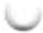

<table><tr><td>Protein</td><td> $M_{t}$ </td><td>Number of subunits</td><td>Function</td></tr><tr><td>DnaA protein</td><td>52,000</td><td>1</td><td>Recognizes oriC sequence; opens duplex at specific sites in origin</td></tr><tr><td>DnaB protein (helicase)</td><td>300,000</td><td> $6^{a}$ </td><td>Unwinds DNA</td></tr><tr><td>DnaC protein</td><td>174,000</td><td> $6^{a}$ </td><td>Required for DnaB binding at origin</td></tr><tr><td>HU</td><td>19,000</td><td>2</td><td>Histonelike protein; DNA-binding protein; stimulates initiation</td></tr><tr><td>FIS</td><td>22,500</td><td> $2^{a}$ </td><td>DNA-binding protein; stimulates initiation</td></tr><tr><td>IHF</td><td>22,000</td><td>2</td><td>DNA-binding protein; stimulates initiation</td></tr><tr><td>Primase (DnaG protein)</td><td>60,000</td><td>1</td><td>Synthesizes RNA primers</td></tr><tr><td>Single-stranded DNA-binding protein (SSB)</td><td>75,600</td><td> $4^{a}$ </td><td>Binds single-stranded DNA</td></tr><tr><td>DNA gyrase (DNA topoisomerase II)</td><td>400,000</td><td>4</td><td>Relieves torsional strain generated by DNA unwinding</td></tr><tr><td>Dam methylase</td><td>32,000</td><td>1</td><td>Methylates ( $5'$ )GATC sequences at oriC</td></tr></table>

  
FIGURE 25-10 Model for initiation of replication at the E. coli origin, oriC. DnaA protein molecules bind initially at the five specific R sites. Upon ATP binding, additional DnaA molecules bind at the I sites in the origin, forming a right-handed helical complex and drawing in more DnaA molecules that continue the helix into the DUE region (see Fig. 25-9). The DNA is wrapped around this complex. DnaA molecules bound at the R and I sites bind the DNA with an HTH domain (referring to a DNA binding motif called helix-turn-helix). The A=T-rich DUE region is denatured as a result of the strain imparted by the DnaA binding. Within the DUE, single-stranded DNA is bound by the ATPase domain of DnaA rather than by the HTH. Formation of the helical DnaA complex is facilitated by the proteins HU, IHF, and FIS. The detailed structural roles of these proteins are not known, but IHF may stabilize a transient DNA loop, as shown here. Hexamers of the DnaB protein bind to each strand, with the aid of DnaC protein. The DnaB helicase activity further unwinds the DNA in preparation for priming and DNA synthesis. [Information from J. P. Erzberger et al., Nat. Struct. Mol. Biol. 13:676, 2006.]

Loading of the DnaB helicase is the key step in replication initiation. As a replicative helicase, DnaB migrates along the single-stranded DNA in the 5'→3' direction, unwinding the DNA as it travels. The DnaB helicases loaded onto the two DNA strands thus travel in opposite directions, creating two potential replication forks. All other proteins at the replication fork are linked directly or indirectly to DnaB. The DNA polymerase III holoenzyme is linked through its τ subunits; additional DnaB interactions are described below. As replication begins and the DNA strands are separated at the fork, many molecules of single-stranded DNA-binding protein (SSB) bind to and stabilize the separated strands, and DNA gyrase (DNA topoisomerase II) relieves the topological stress induced ahead of the fork by the unwinding reaction.

Initiation is the only phase of DNA replication that is known to be regulated, and it is regulated such that replication occurs only once in each cell cycle. The mechanism of regulation is not yet entirely understood, but genetic and biochemical studies have provided insights into several separate regulatory mechanisms.

Once DNA polymerase III has been loaded onto the DNA, along with the $\beta$ subunits (signaling completion of the initiation phase), the protein Hda binds to the $\beta$ subunits and interacts with DnaA to stimulate hydrolysis of its bound ATP. Hda is yet another AAA+ ATPase closely related to DnaA (its name is derived from homologous to DnaA). This ATP hydrolysis leads to disassembly of the DnaA complex at the origin. Slow release of ADP by DnaA and rebinding of ATP cycles the protein between its inactive (with bound ADP) and active (with bound ATP) forms on a time scale of 20 to 40 minutes.

The timing of replication initiation is affected by DNA methylation and interactions with the bacterial plasma membrane. The oriC DNA is methylated by the Dam methylase (Table 25-3), which methylates the $N^6$ position of adenine within the palindromic sequence (5')GATC. (Dam is not a biochemical expletive; it stands for DNA adenine methylation.) The oriC region of E. coli is highly enriched in GATC sequences—it has 11 in its 245 bp; the average frequency of GATC in the E. coli chromosome as a whole is 1 in 256 bp.

Immediately after replication, the DNA is hemimethylated: the parent strands have methylated oriC sequences but the newly synthesized strands do not. The hemimethylated oriC sequences are now sequestered by interaction with the plasma membrane (the mechanism is unknown) and by binding of the protein SeqA. After a time, oriC is released from the plasma membrane, SeqA dissociates, and the DNA must be fully methylated by Dam methylase before it can again bind DnaA and initiate a new round of replication.

Elongation The elongation phase of replication includes two distinct but related operations: leading strand synthesis and lagging strand synthesis. Several enzymes at the replication fork are important to the synthesis of both strands. Parent DNA is first unwound by DNA helicases, and the resulting topological stress is relieved by topoisomerases. Each separated strand is then stabilized by SSB. From this point, synthesis of leading and lagging strands is sharply different.

Leading strand synthesis, the more straightforward of the two, begins with the synthesis by primase (DnaG protein) of a short (10 to 60 nucleotide) RNA primer at the replication origin. DnaG interacts with DnaB helicase to carry out this reaction, and the primer is synthesized in the direction opposite to that in which the DnaB helicase is moving. In effect, the DnaB helicase moves along the strand that becomes the lagging strand in DNA synthesis; however, the first primer laid down in the first DnaG-DnaB interaction serves to prime leading strand DNA synthesis in the opposite direction. Deoxyribonucleotides are added to this primer by a DNA polymerase III complex linked to the DnaB helicase tethered to the opposite DNA strand. Leading strand synthesis then proceeds continuously, keeping pace with the unwinding of DNA at the replication fork.

Lagging strand synthesis, as we have noted, is accomplished in short Okazaki fragments (Fig. 25-11a). First, an RNA primer is synthesized by primase, and, as in leading strand synthesis, DNA polymerase III binds to the RNA primer and adds deoxyribonucleotides (Fig. 25-11b). On this level, the synthesis of each Okazaki fragment seems straightforward, but the details are quite complex. The complexity lies in the coordination of leading and lagging strand synthesis. Both strands are produced by a single asymmetric DNA polymerase III dimer; this is accomplished by looping the DNA of the lagging strand as shown in Figure 25-12, bringing together the two points of polymerization.

The synthesis of Okazaki fragments on the lagging strand entails some elegant enzymatic choreography.

  
FIGURE 25-11 Synthesis of Okazaki fragments. (a) At intervals, primase synthesizes an RNA primer for a new Okazaki fragment. If we consider the two template strands as lying side by side, lagging strand synthesis formally proceeds in the opposite direction from fork movement. Each primer is extended by DNA polymerase III. DNA synthesis continues until the fragment extends as far as the primer of the previously added Okazaki fragment.  
A new primer is synthesized near the replication fork to begin the process again. (b) In the replisome complex, DNA synthesis on the leading and lagging strands is tightly coordinated. Each DNA polymerase III holoenzyme has three sets of core subunits (yellow), linked together with a single clamp-loading complex, so one or two Okazaki fragments can be synthesized simultaneously, along with the leading strand.

FIGURE 25-12 DNA synthesis on the leading and lagging strands. Events at the replication fork are coordinated by a single DNA polymerase III dimer, in an integrated complex with DnaB helicase. This figure shows the replication process already underway; (a) through (e) are discussed in the text. Only two sets of polymerase core subunits rather than three are shown, to more clearly illustrate the cycling on the lagging strand. The lagging strand is looped so that DNA synthesis proceeds steadily on both the leading and lagging strand templates at the same time. Red arrows indicate the 3' end of the two new strands and the direction of DNA synthesis. An Okazaki fragment is being synthesized on the lagging strand. The subunit colors and the functions of the clamp-loading complex are explained in Figure 25-13.

DNA polymerase III uses one set of its core subunits (the core polymerase) to synthesize the leading strand continuously, while the other two sets of core subunits cycle from one Okazaki fragment to the next on the looped lagging strand. In vitro, a DNA polymerase III holoenzyme with only two sets of core subunits can synthesize both leading and lagging strands. However, a third set of core subunits increases the efficiency of lagging strand synthesis as well as the processivity of the overall replisome.

DnaB helicase, bound in front of DNA polymerase III, unwinds the DNA at the replication fork (Fig. 25-12a) as it travels along the lagging strand template in the $5'\rightarrow3'$ direction. DnaG primase occasionally associates with DnaB helicase and synthesizes a short RNA primer (Fig. 25-12b). A new $\beta$ sliding clamp is then positioned at the primer by the clamp-loading complex of DNA polymerase III (Fig. 25-12c). When synthesis of an Okazaki fragment has been completed, replication halts, and the core subunits of DNA polymerase III dissociate from their β sliding clamp (and from the completed Okazaki fragment) and associate with the new clamp (Fig. 25-12d, e). This initiates synthesis of a new Okazaki fragment. Two sets of core subunits may be engaged in the synthesis of two different Okazaki fragments at the same time. The proteins acting at the replication fork are summarized in Table 25-4.

<table><tr><td colspan="4">TABLE 25-4 Proteins of the E. coli Replisome</td></tr><tr><td>Protein</td><td> $M_{r}$ </td><td>Number of subunits</td><td>Function</td></tr><tr><td>SSB</td><td>75,600</td><td>4</td><td>Binding to single-stranded DNA</td></tr><tr><td>Helicase (DnaB protein)</td><td>300,000</td><td>6</td><td>DNA unwinding</td></tr><tr><td>Primase (DnaG protein)</td><td>60,000</td><td>1</td><td>RNA primer synthesis</td></tr><tr><td>DNA polymerase III</td><td>1,065,400</td><td>17</td><td>New strand elongation</td></tr><tr><td>DNA polymerase I</td><td>103,000</td><td>1</td><td>Filling of gaps; excision of primers</td></tr><tr><td>DNA ligase</td><td>74,000</td><td>1</td><td>Ligation</td></tr><tr><td>DNA gyrase (DNA topoisomerase II)</td><td>400,000</td><td>4</td><td>Supercoiling</td></tr></table>

  
FIGURE 25-13 The DNA polymerase III clamp loader. The five subunits of the clamp-loading (γ) complex are the δ and δ' subunits and the amino-terminal domain of each of the three τ subunits (see Fig. 25-8). The complex binds to three molecules of ATP and to a dimeric β clamp. This binding forces the β clamp open at one of its two subunit interfaces. Hydrolysis of the bound ATP allows the β clamp to close again around the DNA.

The clamp-loading complex of DNA polymerase III, consisting of parts of the three $\tau$ subunits along with the $\delta$ and $\delta'$ subunits, is also an AAA+ ATPase. This complex binds to ATP and to the new $\beta$ sliding clamp. The binding imparts strain on the dimeric clamp, opening up the ring at one subunit interface (Fig. 25-13). The newly primed lagging strand is slipped into the ring through the resulting break. The clamp loader then hydrolyzes ATP, releasing the $\beta$ sliding clamp and allowing it to close around the DNA.

The replisome promotes rapid DNA synthesis, adding \~1,000 to 2,000 nucleotides to each strand (leading and lagging). Once an Okazaki fragment has been completed, its RNA primer is removed by DNA polymerase I or RNase H1 and replaced with DNA by the polymerase; the remaining nick is sealed by DNA ligase (Fig. 25-14).

DNA ligase catalyzes the formation of a phosphodiester bond between a 3' hydroxyl at the end of one DNA strand and a 5' phosphate at the end of another strand. The phosphate must be activated by adenylylation. DNA ligases isolated from viruses and eukaryotes use ATP for this purpose. DNA ligases from bacteria are unusual in that many use NAD $^{+}$ —a cofactor that usually functions in hydride transfer reactions (see Fig. 13-24)—as the source of the AMP activating group (Fig. 25-15). DNA ligase is another enzyme of DNA metabolism that has become an important reagent in recombinant DNA experiments (see Fig. 9-1).

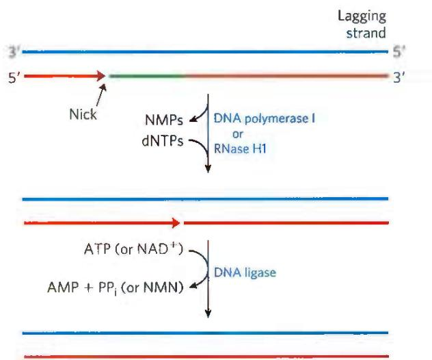  
FIGURE 25-14 Final steps in the synthesis of lagging strand segments. RNA primers in the lagging strand are removed by the $5'\rightarrow3'$ exonuclease activity of DNA polymerase I or RNase H1, and then replaced with DNA by DNA polymerase I. The remaining nick is sealed by DNA ligase. The role of ATP or NAD $^{+}$ is shown in Figure 25-15.

Termination Eventually, the two replication forks of the circular E. coli chromosome meet at a terminus region

FIGURE 25-15 Mechanism of the DNA ligase reaction. In each of the three steps, one phosphodiester bond is formed at the expense of another. Steps ① and ② lead to activation of the 5' phosphate in the nick. An AMP group is transferred first to a Lys residue on the enzyme and then to the 5' phosphate in the nick. In step ③, the 3'-hydroxyl group attacks this phosphate and displaces AMP, producing a phosphodiester bond to seal the nick. In the E. coli DNA ligase reaction, AMP is derived from NAD⁺. The DNA ligases isolated from some viral and eukaryotic sources use ATP rather than NAD⁺, and they release pyrophosphate rather than nicotinamide mononucleotide (NMN) in step ①.

containing multiple copies of a 20 bp sequence called Ter (Fig. 25-16). The Ter sequences are arranged on the chromosome to create a trap that a replication fork can enter but cannot leave. The Ter sequences function as binding sites for the protein Tus (terminus utilization substance). The Tus-Ter complex can arrest a replication fork from only one direction. Only one Tus-Ter complex functions per replication cycle—the complex first encountered by either replication fork. Given that opposing replication forks generally halt when they collide, Ter sequences would not seem to be essential, but they may prevent overreplication by one fork in the event that the other is delayed or halted by an encounter with DNA damage or some other obstacle.

  
FIGURE 25-16 Termination of chromosome replication in E. coli. The Ter sequences (TerA through TerJ) are positioned on the chromosome in two clusters with opposite orientations. The overall Ter region encompasses about $9\%$ of the circular chromosome.

So, when either replication fork encounters a functional Tus-Ter complex, it halts; the other fork halts when it meets the first (arrested) fork. The final few hundred base pairs of DNA between these large protein complexes are then replicated (by an as yet unknown mechanism), completing two topologically interlinked (catenated) circular chromosomes (Fig. 25-17). DNA circles linked in this way are known as catenanes. Separation of the catenated circles in E. coli requires topoisomerase IV (a type II topoisomerase). The separated chromosomes then segregate into daughter cells at cell division. The terminal phase of replication of other circular chromosomes, including many of the DNA viruses that infect eukaryotic cells, is similar.

#### [EN] Replication in Eukaryotic Cells Is Similar but More Complex

The DNA molecules in eukaryotic cells are considerably larger than those in bacteria and are organized into complex nucleoprotein structures (chromatin; p. 898). The essential features of DNA replication are the same in eukaryotes and bacteria, and many of the protein complexes are functionally and structurally conserved. However, eukaryotic replication is regulated and coordinated with the cell cycle, and must function within the complexities of chromatin structure.

  
FIGURE 25-17 Role of topoisomerases in replication termination. Replication of the DNA separating opposing replication forks leaves the completed chromosomes joined as catenanes, or topologically interlinked circles. The circles are not covalently linked, but because they are interwound and each is covalently closed, they cannot be separated — except by the action of topoisomerases. In E. coli, a type II topoisomerase known as DNA topoisomerase IV plays the primary role in separating catenated chromosomes, transiently breaking both DNA strands of one chromosome and allowing the other chromosome to pass through the break.

Origins of replication have a well-characterized structure in some lower eukaryotes, but they are much less defined in higher eukaryotes. In both cases, replication begins in short nucleosome-free regions. Yeast (S. cerevisiae) has about 400 defined replication origins called autonomously replicating sequences (ARSs), or replicators. Yeast replicators span \~150 bp and contain several essential, conserved sequences. There are about 30,000 to 50,000 replication origins in human chromosomes.

The replication origins of vertebrates in general may be defined by some aspect of DNA secondary structure, as yet unknown.

Regulation ensures that all cellular DNA is replicated once per cell cycle. Much of this regulation involves proteins called cyclins and the cyclin-dependent kinases (CDKs) with which they form complexes (see Section 12.8). The cyclins are rapidly destroyed by ubiquitin-dependent proteolysis at the end of the M phase (mitosis), and the absence of cyclins allows the establishment of prereplicative complexes (pre-RCs) on replication initiation sites. In rapidly growing cells, the pre-RC forms at the end of M phase. In slow-growing cells, it does not form until the end of G1. Formation of the pre-RC renders the cell competent for replication, an event sometimes called licensing.

As in bacteria, the key event in the initiation of replication in all eukaryotes is the loading of the replicative helicase, a heterohexameric complex of minichromosome maintenance (MCM) proteins (MCM2 to MCM7). The ring-shaped MCM2–7 helicase functions in some ways like the bacterial DnaB helicase, although it translocates 3'→5' along the leading strand template. It is loaded onto the DNA in steps (Fig. 25-18). The origin is recognized and bound first by another six-protein complex, called ORC (origin recognition complex), followed by the protein CDC6 (cell division cycle), which recruits CDT1 (CDC10-dependent transcript 1). Together, they facilitate the loading of two inactive MCM2–7 complexes (the pre-RC). The ORC-CDC6 complex and CTD1 dissociate, leaving behind the pre-RC. ORC has five AAA+ ATPase domains among its subunits and is functionally analogous to the bacterial DnaA. The yeast CDC6 is yet another AAA+ ATPase that forms a complex with the ORC subunits. Following pre-RC formation, another set of proteins, CDC45 and the GINS, bind to and activate the MCM2–7 helicase, triggering DNA denaturation. (GINS refers to the first letters of the numbers 5-1-2-3 in Japanese, go-ichi-ni-san, providing a somewhat cryptic callout to the four protein subunits of the complex: SLD5, PSF1, PSF2, and PSF3.) The replication proteins then bind to form a replisome, and bidirectional replication begins.

Commitment to replication requires the synthesis and activity of S-phase cyclin-CDK complexes (such as the cyclin E-CDK2 complex; see Fig. 12-36) and CDC7-DBF4. Both types of complexes help to activate replication by binding to and phosphorylating several subunits of the pre-RC. Other cyclins and CDKs function to inhibit the formation of more pre-RC complexes once replication has been initiated. For example, CDK2 binds to cyclin A as cyclin E levels decline during S phase, inhibiting CDK2 and preventing the licensing of additional pre-RC complexes.

The rate of movement of the replication fork in eukaryotes (\~50 nucleotides/s) is only one-twentieth that observed in E. coli. At this rate, replication of an average human chromosome proceeding from a single origin would take more than 500 hours, making the requirement for many origins evident.

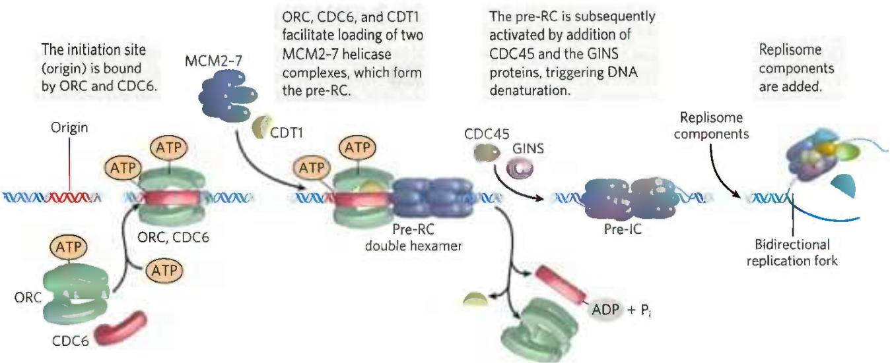  
FIGURE 25-18 Assembly of a prereplicative complex at a eukaryotic replication origin. The initiation site (origin) is bound by ORC, CDC6, and CDT1. These proteins, many of them AAA+ ATPases, promote loading of two MCM2-7 helicase complexes, in a reaction analogous to the loading of the bacterial DnaB  
helicase by DnaC protein. The two loaded but inactive MCM2–7 complexes comprise the prereplicative complex, or pre-RC. The pre-RC is subsequently activated by addition of CDC45 and the GINS proteins, followed by addition of the replisome components. [Information from M.W. Parker et al., Crit. Rev. Biochem. Mol. Biol. 52:107, 2017.]

Like bacteria, eukaryotes have several types of DNA polymerases. Some have been linked to particular functions, such as the replication of mitochondrial DNA. The replication of nuclear chromosomes primarily involves three multisubunit DNA polymerases. The highly processive DNA polymerase $\varepsilon$ synthesizes the leading strand, and DNA polymerase $\delta$ synthesizes the lagging strand. Both enzymes have $3'\rightarrow5'$ proofreading exonuclease activities. DNA polymerase $\alpha$ , a DNA polymerase/primase, synthesizes RNA primers and also extends them by about 10 nucleotides of DNA to initiate synthesis of each Okazaki fragment on the lagging strand. One subunit of DNA polymerase $\alpha$ has a primase activity, and the largest subunit ( $M_{r}\sim180,000$ ) contains the polymerization activity. However, this polymerase has no proofreading $3'\rightarrow5'$ exonuclease activity, making it unsuitable for high-fidelity DNA replication.

DNA polymerases $\varepsilon$ and $\delta$ are associated with and stimulated by proliferating cell nuclear antigen (PCNA; $M_{r}$ 29,000), a protein found in large amounts in the nuclei of proliferating cells. The three-dimensional structure of PCNA is remarkably similar to that of the $\beta$ subunit of E. coli DNA polymerase III (Fig. 25-8b), although primary sequence homology is not evident. PCNA has a function analogous to that of the $\beta$ subunit, forming a circular clamp that enhances the processivity of the two polymerases.

Two other protein complexes also function in eukaryotic DNA replication. RPA (replication protein A) is a single-stranded DNA-binding protein, equivalent in function to the E. coli SSB protein. RFC (replication factor C)

is a clamp loader for PCNA and facilitates the assembly of active replication complexes. The subunits of the RFC complex have significant sequence similarity to the subunits of the bacterial clamp-loading ( $\gamma$ ) complex.

Termination of replication on linear eukaryotic chromosomes occurs when replication forks operating from nearby origins converge. As in bacteria, there are successive steps of final replication, replisome dissociation, and decatenation of the DNA products. All of the steps are mediated by additional protein complexes, with some parts of the process still undefined.

#### [EN] Viral DNA Polymerases Provide Targets for Antiviral Therapy

Many DNA viruses encode their own DNA polymerases, and some of these have become targets for pharmaceuticals. For example, the DNA polymerase of the herpes simplex virus is inhibited by acyclovir, a compound developed by Gertrude Elion and George Hitchings (p. 836). Acyclovir consists of guanine attached to an incomplete ribose ring.

It is phosphorylated by a virally encoded thymidine kinase; acyclovir binds to this viral enzyme with an affinity 200-fold greater than its binding to the cellular thymidine kinase. This ensures that phosphorylation occurs mainly in virus-infected cells. Cellular kinases convert the resulting acyclo-GMP to acyclo-GTP, which is both an inhibitor and a substrate of DNA polymerases; acyclo-GTP competitively inhibits the herpes DNA polymerase more strongly than cellular DNA polymerases. Because it lacks a 3' hydroxyl, acyclo-GTP also acts as a chain terminator when incorporated into DNA. Thus viral replication is inhibited at several steps.

#### [EN] SUMMARY 25.1 DNA Replication

■ Replication of DNA follows a set of universal rules. Replication is semiconservative, each strand acting as template for a new daughter strand. It is carried out in three identifiable phases: initiation, elongation, and termination. The process starts at a single origin in bacteria and usually proceeds bidirectionally. DNA is synthesized in the 5'→3' direction by DNA polymerases. At the replication fork, the leading strand is synthesized continuously in the same direction as replication fork movement; the lagging strand is synthesized discontinuously as Okazaki fragments, which are subsequently ligated.

■ Nucleases are enzymes that degrade DNA. Endonucleases cleave within a DNA polymer; exonucleases degrade DNA from the end of one strand (either $5'\rightarrow3'$ or $3'\rightarrow5'$ ).

■ DNA polymerases are complex enzymes that synthesize DNA, and often possess additional activities, including exonuclease functions.

■ DNA is replicated with very high fidelity. Accuracy is maintained by (1) base selection by the polymerase, (2) a $3'\rightarrow5'$ proofreading exonuclease activity that is part of many DNA polymerases, and (3) specific repair systems for mismatches left behind after replication.

■ Most cells have several DNA polymerases. In E. coli, DNA polymerase III is the primary replication enzyme. DNA polymerase I is responsible for special functions during replication, recombination, and repair.

■ Replication requires an array of enzymes and protein factors in addition to DNA polymerases. Many of these proteins belong to the AAA+ ATPase family.

■ Replication initiation occurs when replicative helicases are loaded onto replication origins in stepwise fashion. Elongation is achieved by an active replisome—a supramolecular complex of nucleic acids and many proteins, including polymerases. Termination occurs when replisomes proceeding in opposite directions converge. It requires decatenation of the replication products when replication is complete.

■ The major replicative DNA polymerases in eukaryotes are DNA polymerases $\varepsilon$ and $\delta$ . DNA polymerase $\alpha$ synthesizes primers.

■ Viral DNA replication is a drug target.

<!-- EN-END 25.1 -->

## 二、DNA 的损伤修复

DNA 在复制过程中可能产生错配。DNA 重组、病毒基因的整合，常常会局部破坏 DNA 的双螺旋结构。某些物理化学因子，如紫外线、电离辐射和化学诱变剂等，都能作用于 DNA，受到破坏的可能是 DNA 的碱基、糖或是磷酸二酯键。总之，DNA 的正常双螺旋结构遭到破坏，就可能影响其功能，从而引起生物突变，甚而导致死亡。然而在一定条件下，生物机体能使其 DNA 的损伤得到修复。这种修复是生物在长期进化过程中获得的一种保护功能。目前已知，细胞对 DNA 损伤的修复系统有五种：错配修复（mismatch repair）、直接修复（direct repair）、切除修复（excision repair）、重组修复（recombination repair）和易错修复（error-prone repair）。

## （一）错配修复

早在 1895 年, Alfred Warthin 的女佣告诉他, 她将得癌症而早死, 因为她家庭中许多人都死于癌症。不久她的预感得到应验, 她死于子宫癌。Warthin 对她的家族进行了研究, 发现确实存在高发癌症的倾向; 许多成员患结肠癌、胃癌或子宫癌。其后的研究表明, 这是一种遗传性疾病, 称为遗传性非息肉结肠直肠癌 (hereditary nonpolyposis colorectal cancer, HNPCC) 或 Lynch 综合征。现在了解到 HNPCC 是由于 DNA 错配修复有缺陷而造成的。人类的两个基因, 即 hMSH2 和 hMLH1, 发生突变被认为是导致癌症的主要遗传诱因。

DNA 的错配修复机制是在对大肠杆菌的研究中被阐明的。错配修复需分辨新旧链，否则如果模板链被校正，错配就会被固定。细菌借助半甲基化 DNA 而区分“旧”链和“新”链。Dam 甲基化酶可使 DNA 的 GATC 序列中腺嘌呤 N6 位甲基化。复制后 DNA 在短期内（数分钟）保持半甲基化的 GATC 序列，一旦发现错配碱基，即将未甲基化链的一段核苷酸切除，并以甲基化链为模板进行修复合成。

大肠杆菌参与错配修复的蛋白质至少有12种，其功能或者是区分两条链，或者是进行修复合成，其中几个特有的蛋白由mut基因编码。Mut S二聚体识别并结合到DNA的错配碱基部位，Mut L二聚体与之结合。二者组成的复合物可沿DNA双链向前移动，DNA由此形成突环，水解ATP提供所需能量，直至遇到GATC序列为止。随后Mut H内切核酸酶结合到Mut SL上，并在未甲基化链GATC位点的5'端切开。如果切开处位于错配碱基的3'侧，由外切核酸酶I或外切核酸酶X沿3'→5'方向切除核酸链；如果切开处位于5'侧，由外切核酸酶VII或Rec J沿5'→3'方向切除核酸链。在此切除链的过程中，解旋酶Ⅱ和SSB帮

助链地解开。切除的链可长达1000个核苷酸以上，直到将错配碱基切除（图30-25）。新的DNA链由DNA聚合酶Ⅲ和DNA连接酶合成并连接。为了校正一个错配碱基，启动如此复杂的修复机制，由此可以看出维持基因信息的完整性对于生物是何等重要。

真核生物的 DNA 错配修复机制与原核生物相似,也存在 Mut S 和 Mut L 同源的蛋白质,分别称为 MSH(Mut S homolog)和 MLH(Mut L homolog)。但是,真核生物没有 Mut H 的同源物,并且不靠半甲基化的 GATC 来区别“旧链”和“新链”。最近的研究表明,人的 Mut S 类似物(MSH)可与复制体的滑动夹子

  
图30-25 大肠杆菌DNA的错配修复

(PCNA)相互作用,推测它可紧附其上,随着复制过程检查错配。后随链冈崎片段间的断开处就相当于Mut H的切口,由外切酶自此逐个切下核苷酸直至切除错配碱基。前导链则能自3'端生长点切除核苷酸,然后由聚合酶和连接酶填补缺口。这就是说真核生物是在DNA复制过程中进行错配修复,一旦发现错配即从新合成的链上加以切除。

## （二）直接修复

紫外线照射可以使 DNA 分子中同一条链两相邻胸腺嘧啶碱基之间形成二聚体(TT)。这种二聚体是由两个胸腺嘧啶碱基以共价键连接成环丁烷的结构而形成(图 30-26)。其他嘧啶碱基之间也能形成类似的二聚体(CT、CC)，但数量较少。嘧啶二聚体的形成，影响了DNA的双螺旋结构，使其复制和转录功能均受到阻碍。

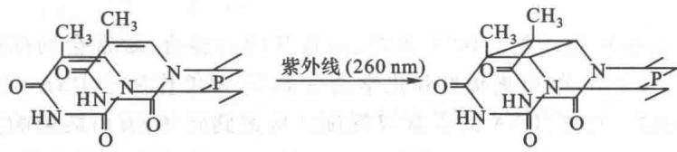  
图30-26 胸腺嘧啶二聚体的形成

胸腺嘧啶二聚体的形成和修复机制研究得最多，也最清楚。其修复有多种类型，常见的有光复活修复（photoreactivation repair）和暗修复（dark repair）。最早发现细菌在紫外线照射后立即用可见光照射，可以显著提高细菌存活率。稍后一些时间了解到光复活的机制是可见光（最有效波长为400 nm左右）激活了光复活酶（photoreactivating enzyme），它能分解由于紫外线照射而形成的嘧啶二聚体（图30-27）。

光复活作用是一种高度专一的直接修复方式。它只作用于紫外线引起的 DNA 嘧啶二聚体。光复活酶在生物界分布很广，从低等单细胞生物一直到鸟类都有，而高等的哺乳类却没有。这种修复方式在植物中特别重要。

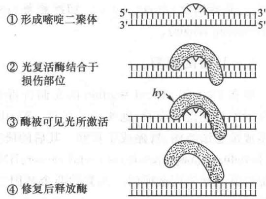  
图30-27 紫外线损伤的光复活过程

高等动物更重要的是暗修复，即切除含嘧啶二聚体的核酸链，然后再修复合成。

另一种直接修复的例子是 $O^{6}$ -甲基鸟嘌呤的修复。在烷化剂作用下碱基可被烷基化，并改变了碱基配对的性质。甲基化的鸟嘌呤在 $O^{6}$ -甲基鸟嘌呤-DNA 甲基转移酶 ( $O^{6}$ -methylguanine-DNA methyltransferase) 作用下，可将甲基转移到酶自身的半胱氨酸残基上。甲基转移酶因此而失活，但却成为其自身基因和另一些修复酶基因转录的活化物，促进它们的表达。

## （三）切除修复

所谓切除修复,即是在一系列酶的作用下,将 DNA 分子中受损伤部分切除掉,并以完整的那一条链为模板,合成出切去的部分,然后使 DNA 恢复正常结构的过程。这是比较普遍的修复机制,它对多种损伤均能起修复作用。切除修复包括两个过程:一是由细胞内特异的酶找到 DNA 的损伤部位,切除含有损伤结构的核酸链;二是修复合成并连接。

细胞内有许多种特异的 DNA 糖基化酶(glycosylase)，它们能识别 DNA 中不正常的碱基，而水解其与糖的连接键。例如，电离辐射和化学反应剂可以产生自由基和强氧化剂 $\left(\mathrm{OH}^{*},\mathrm{O}^{-2}\right.$ 和 $H_{2}O_{2}$ 等)，它们作用于 DNA 使鸟嘌呤氧化，形成 7,8-二氢-8-羟鸟嘌呤(OXOG)，因其既可与腺嘌呤又可与胞嘧啶配对，故为强诱变剂。很可能电离辐射和强氧化剂的致癌作用与产生 OXOG 有关。体内特异的糖基化酶可识别并除去 OXOG。烷化剂可使碱基烷基化，如甲基磺酸甲酯(MMS)作用于 DNA 引起鸟嘌呤第 7 位氮原子或腺嘌呤第 3 位氮原子甲基化。烷基腺嘌呤 DNA 糖基化酶可除去烷基化的碱基，包括 3-甲基腺嘌呤、7-甲基鸟嘌呤和 7-甲基次黄嘌呤。DNA 的胞嘧啶脱氨产生尿嘧啶，可被尿嘧啶-DNA 糖基化酶除去。经修饰的碱基因不能参与碱基配对而被排除双螺旋结构之外，糖基化酶沿 DNA 浅沟移动，遇到异常碱基随即将其切除。已从人的细胞核内分出 8 种特异的 DNA 糖基化酶。

DNA 切除碱基的部位为无嘌呤（apurinic）或无嘧啶位点（apyrimidinic site），简称为 AP 位点。一旦 AP 位点形成后，即有 AP 内切核酸酶在 AP 位点附近将 DNA 链切开。不同 AP 内切核酸酶的作用方式不同，或在 5' 端切开，或在 3' 端切开。然后外切核酸酶将包括 AP 位点在内的 DNA 链切除。DNA 聚合酶 I 兼有聚合酸和外切酶活性，它使 DNA 链 3' 端延伸以填补空缺，而后由 DNA 连接酶将链连上。在 AP 位点处必须切除若干核苷酸后才能进行修复合成,细胞内没有酶能在 AP 位点处直接将碱基插入,因为 DNA 合成的前体物质是核苷酸而不是碱基。

通常只有单个碱基缺陷才以碱基切除修复(base-excision repair)方式进行修复。如果DNA损伤造成DNA螺旋结构较大变形，则需要以核苷酸切除修复(nucleotide-excision repair)方式进行修复。最常见的是短片段的修复(short-patch repair)，只有多处发生严重的损伤才会诱导长片段修复(long-patch repair)。损伤链由切除酶(excinuclease)切除。该酶也是一种内切核酸酶，但在链的损伤部位两侧同时切开，与一般的内切核酸酶不同。编码此酶的基因是uvr，酶由多个亚基组成。大肠杆菌切除酶ABC包括三种亚基：Uvr A（相对分子质量104 000）、Uvr B（相对分子质量78 000）和Uvr C（相对分子质量68 000）。由Uvr A和Uvr B蛋白组成复合物（AB），它寻找并结合在损伤部位。Uvr A随即解离（此步需要ATP），留下Uvr B与DNA牢固结合。然后Uvr C蛋白结合到Uvr B上，Uvr B切开损伤部位3'端距离3\~4个核苷酸的磷酸二酯键，Uvr C切开5'端7个核苷酸磷酸二酯键。结果12\~13个核苷酸片段（决定于损伤碱基是1个还是2个）在Uvr D解旋酶帮助下被除去，空缺由DNA聚合酶I和DNA连接酶填补。人类和其他真核生物的酶水解损伤部位3'端第6个磷酸二酯键以及5'端第22个磷酸二酯键，切除27\~29个核苷酸片段，然后用DNA聚合酶ε和DNA连接酶填补空缺。

切除酶可以识别多种 DNA 损伤,包括紫外线引起的嘧啶二聚体、碱基的加合物(如 DNA 暴露于烟雾中形成的苯并芘鸟嘌呤)和其他各种反应物等。真核生物具有功能上类似的切除酶,但在亚基结构上与原核生物并不相同。在转录过程中,RNA 聚合酶遇到模板链的损伤部位,将无法识别而停止转录,此时可招致核苷酸切除酶系统进行修复,称为转录偶联的修复(transcription-coupled repair)。转录偶联修复广泛存在于原核和真核生物中。切除修复过程可总结如图 30-28 所示。

细胞切除修复系统和癌症的发生也有一定的关系。有一种称为着色性干皮病（xeroderma pigmentosa）的遗传病，这种病患者对日光或紫外线特别敏感，往往容易出现皮肤癌。经分析表明，共有7个称为XP的基因与此有关，它们突变将导致着色性干皮病，这些基因都是编码与核苷酸切除修复有关的酶。这说明切除修复系统的障碍可能是癌症发生的一个原因。

DNA 的两条链序列互补, 这就是说两条链编码的信息相同, 当一条链受到损伤时可以用另一条链为模板进行修复。但

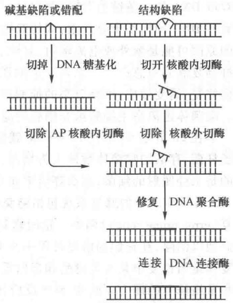  
图30-28 DNA损伤的切除修复过程

在有些情况下无法为修复提供正确的模板,例如:双链断裂、双链交联、模板链遭损伤、单链损伤而无正常互补链等。当复制叉遇到未修复的 DNA 损伤时,正常复制过程受阻,这种情况将导致重组修复或易错修复。

## （四）重组修复

上述切除修复过程发生在 DNA 复制之前,因此又称为复制前修复。然而,当 DNA 发动复制时尚未修复的损伤部位也可以先复制再修复。例如,含有嘧啶二聚体、烷基化引起的交联和其他结构损伤的 DNA 仍然可以进行复制,当复制酶系在损伤部位无法通过碱基配对合成子代 DNA 链时,它就跳过损伤部位,在下一个冈崎片段的起始位置或前导链的相应位置上重新合成引物和 DNA 链,结果子代链在损伤相对应处留下缺口。这种遗传信息有缺损的子代 DNA 分子可通过遗传重组而加以弥补,即从同源 DNA 的母链上将相应核苷酸序列片段移至子链缺口处,然后用再合成的序列来补上母链的空缺(图 30-29)。此过程称为重组修复,因为发生在复制之后,又称为复制后修复(post-replication repair)。

在重组修复过程中,DNA链的损伤并未除去。在进行第二轮复制时,留在母链上的损伤仍会给复制带来困难,复制经过损伤部位时所产生的缺口还需通过同样的重组过程来弥补,直至损伤被切除修复所消除。但是，随着复制的不断进行，若干代后，即使损伤始终未从亲代链中除去，而在后代细胞群中也已被稀释，实际上消除了损伤对群体的影响。

参与重组修复的酶系统包括与重组有关的主要酶类以及修复合成的酶类。重组基因 rec A 编码一种相对分子质量为 38000 的蛋白质，它具有交换 DNA 链的活力。基因 rec BCD 编码多功能酶 Rec BCD，具有解旋酶、核酸酶和 ATP 酶活性，使 DNA 在重组位点产生 3' 单链，为重组和重组修复所必需。修复合成需要 DNA 聚合酶和连接酶，其作用如前所述。

重组修复机制的缺陷,有可能导致癌症。业已发现,妇女的 Brca 1 和 Brca 2 两个基因如果有缺陷,80% 的概率可能会发生乳腺癌。实验表明,这两个基因编码的蛋白质 BRCA1 和 BRCA2 可以与重组蛋白质 Rad 51 相作用,很可能是参与重组修复过程。

  
图 30-29 重组修复的过程 × 表示 DNA 链受损伤的部位，虚线表示通过复制新合成的 DNA 链，锯齿线表示重组后缺口处再合成的 DNA 链

## （五）应急反应和易错修复

前面介绍的 DNA 损伤修复可以不经诱导而发生。这类损伤通常发生在双链 DNA 的一条链上，可以利用另一条链的信息指导损伤链的修复。然

而有些 DNA 的损伤十分严重,例如双链断裂、双链交联、损伤链的对应链不存在或不正常等,造成这类损伤的原因可能是紫外或电离辐射、氧化、交联剂或烷化剂作用,前述修复途径无法对此进行修复。此时细胞抑制复制并应急产生一系列复杂的诱导效应,称为应急反应(SOS response)。SOS 反应包括诱导 DNA 损伤修复、诱变效应、细胞分裂的抑制以及溶原性细菌释放噬菌体等。细胞的癌变也与 SOS 易错修复有关。噬菌体逃离宿主细胞虽非细胞的应急反应,却是噬菌体的应急反应。

早在20世纪50年代中，Weigle就发现用紫外线照射过的 $\lambda$ 噬菌体感染事先经低剂量紫外线照射的大肠杆菌，存活的噬菌体数便大为增加，而且存活的噬菌体中出现较多的突变型（Weigle效应）。如果感染的是未经照射的细菌，那么存活率和变异率都较低。可见这些效应是经紫外线照射后诱导产生的。

SOS 反应诱导的修复系统包括避免差错的修复(error free repair,又称免错修复或无差错修复)和易错修复(error prone repair)两类。错配修复、直接修复、切除修复和重组修复能够识别 DNA 的损伤或错配碱基而加以消除，在它们的修复过程中并不引入错配碱基，因此属于避免差错的修复。SOS 反应能诱导切除修复和重组修复中某些关键酶和蛋白质的产生，使这些酶和蛋白质在细胞内的含量升高，从而加强切除修复和重组修复的能力。此外，SOS 反应还能诱导产生缺乏校对功能的 DNA 聚合酶，它能跨越损伤进行合成(translesion synthesis, TLS)而避免了细胞死亡，可是却带来了高的 DNA 变异率。SOS 的诱变效应与此有关。

DNA 聚合酶 I 具有 3' 外切核酸酶活性而表现出校对功能, 它在 DNA 损伤部位进行复制时, 由于新合成链的核苷酸不能和模板链的碱基配对而被切除, 再次引入的核苷酸如还不能配对仍将被切除, 这样 DNA 聚合酶就会在原地打转而不前进, 或是脱落下来使 DNA 链的合成中止。SOS 诱导产生 DNA 聚合酶 IV 和 V, 它们不具有 3' 外切核酸酶校正功能, 于是在 DNA 链的损伤部位引入任意核苷酸, 使 DNA 合成仍能继续前进。在此情况下允许错配可增加存活的机会。

SOS 反应使细菌的细胞分裂受到抑制,结果长成丝状体。其生理意义可能是在 DNA 复制受到阻碍的情况下避免因细胞分裂而产生不含 DNA 的细胞,或者使细胞有更多进行重组修复的机会。

现在知道,SOS 反应是由 Rec A 蛋白和 Lex A 阻遏物相互作用引起的。Rec A 蛋白不仅在同源重组中起重要作用,而且它也是 SOS 反应最初发动的因子。在有单链 DNA 和 ATP 存在时,Rec A 蛋白被激活而促进 Lex A 自身的蛋白水解酶活性,Rec A 被称为辅蛋白酶(coprotease)。Lex A 蛋白(相对分子质量为 22700)是许多基因的阻遏物。当它被 Rec A 激活自身的蛋白水解酶活性后自我分解,使一系列基因得以表达,其中包括紫外线损伤的修复基因 uvr A,uvr B、uvr C(分别编码切除酶的亚基),以及 rec A 和 lex A 基因本身,此外还有编码单链结合蛋白的基因 ssb,与 λ 噬菌体 DNA 整合有关的基因 him A,与诱变作用有关的基因 umu DC(编码 DNA 聚合酶 V)和 din B(编码 DNA 聚合酶 IV),与细胞分裂有关的基因 sul A、ruv 和 lon 以及一些功能还不清楚的基因 din D、F 等。SOS 反应的机制见图 30-30。

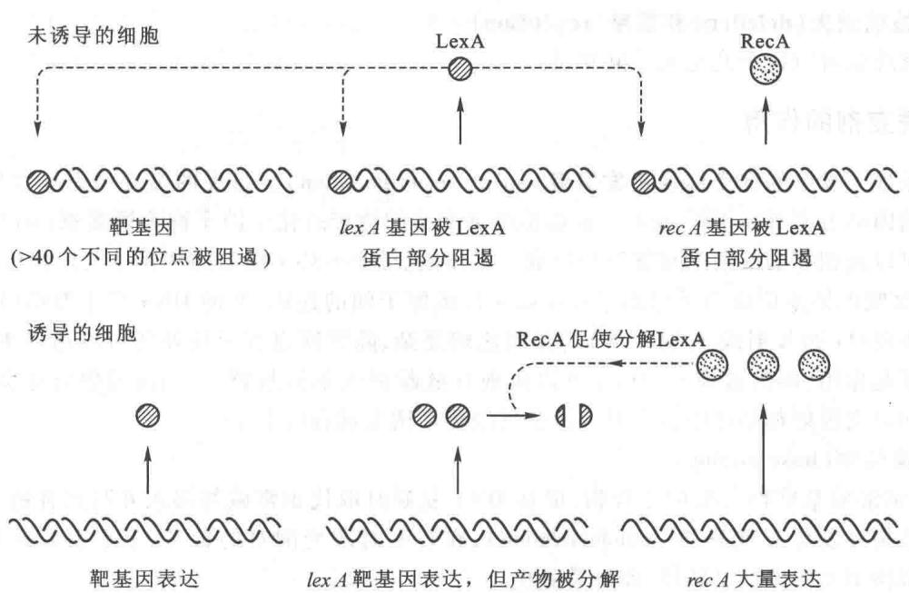  
图30-30 SOS反应的机制

SOS 反应广泛存在于原核生物和真核生物, 它是生物在不利环境中求得生存的一种基本功能。SOS 反应主要包括两个方面: DNA 修复和导致变异。在一般环境中突变常是不利的, 可是在 DNA 受到损伤和复制被抑制的特殊条件下生物发生突变将有利于它的生存和进化。然而, 另一方面, 大多数能在细菌中诱导产生 SOS 反应的作用剂, 对高等动物都是致癌的: 如 X 射线、紫外线、烷化剂及黄曲霉毒素等。而某些不能致癌的诱变剂却并不引起 SOS 反应, 如 5-溴尿嘧啶。因此猜测, 癌变可能是通过 SOS 反应诱变造成的。目前有关致癌物的一些简便检测方法即是根据 SOS 反应原理而设计的。

<!-- EN-BEGIN 25.2 -->

### 【英文对应 25.2】DNA Repair

> 来源：Lehninger Principles of Biochemistry（书籍/02_生物化学原理） 第25章 DNA Metabolism，§25.2。对应本章“二、DNA 的损伤修复”。

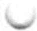

Most cells have only one or two sets of genomic DNA. P1 Damaged proteins and RNA molecules can be quickly replaced by using information encoded in the DNA, but DNA molecules themselves are irreplaceable. Maintaining the integrity of the information in DNA is a cellular imperative, supported by an elaborate set of DNA repair systems. DNA can become damaged by a variety of processes, some spontaneous, others catalyzed by environmental agents (Chapter 8). Replication itself can very occasionally damage the information content in DNA when polymerase errors create mismatched base pairs (such as G paired with T).

The chemistry of DNA damage is diverse and complex. The cellular response to this damage includes enzymatic systems that catalyze some of the most interesting chemical transformations in DNA metabolism. We first examine the effects of alterations in DNA sequence and then consider specific repair systems.

#### [EN] Mutations Are Linked to Cancer

The best way to illustrate the importance of DNA repair is to consider the effects of unrepaired DNA damage (a lesion). P3 The most serious outcome is a change in the base sequence of the DNA, which, if replicated and transmitted to future generations of cells, becomes permanent. A permanent change in the nucleotide sequence of DNA is called a mutation. Mutations can involve the replacement of one base pair with another (substitution mutation) or the addition or deletion of one or more base pairs (insertion or deletion mutations). If the mutation affects nonessential DNA or if it has a negligible effect on the function of a gene, it is known as a silent mutation. P1 P3 Rarely, a mutation confers some biological advantage. Most nonsilent mutations, however, are neutral or deleterious.

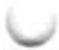

In mammals there is a strong correlation between the accumulation of mutations and cancer. A simple test developed by Bruce Ames in the 1970s measures the potential of a given chemical compound to promote certain easily detected mutations in a specialized bacterial strain (Fig. 25-19). Few of the chemicals that we encounter in daily life score as mutagens in this test. However, of the compounds known to be carcinogenic from extensive animal trials, more than 90% are also found to be mutagenic in the Ames test. Because of this strong correlation between mutagenesis and carcinogenesis, the Ames test for bacterial mutagens is still widely used as a rapid and inexpensive screen for potential human carcinogens.

The genomic DNA in a typical mammalian cell accumulates many thousands of lesions during a 24-hour period. However, as a result of DNA repair, fewer than 1 in 1,000 become a mutation. DNA is a relatively stable molecule, but in the absence of repair systems, the cumulative effect of many infrequent but damaging reactions would make life impossible.

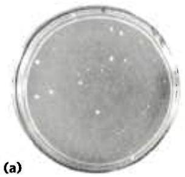

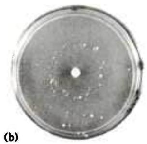

  
FIGURE 25-19 Ames test for carcinogens, based on their mutagenicity. A strain of Salmonella typhimurium having a mutation that inactivates an enzyme of the histidine biosynthetic pathway is plated on a histidine-free medium. Few cells grow. (a) The few small colonies of S. typhimurium that do grow on a histidine-free medium carry spontaneous mutations that permit the histidine biosynthetic pathway to operate. Three identical nutrient plates (b), (c), and (d) have been inoculated with an equal number of cells. Each plate then receives a disk of filter paper containing progressively lower concentrations of a mutagen. The mutagen greatly increases the rate of back-mutation and hence the number of colonies. The clear areas around the filter paper indicate where the concentration of mutagen is so high that it is lethal to the cells. As the mutagen diffuses away from the filter paper, it is diluted to sublethal concentrations that promote back-mutation. Mutagens can be compared on the basis of their effect on mutation rate. Because many compounds undergo a variety of chemical transformations after entering cells, compounds are sometimes tested for mutagenicity after first incubating them with a liver extract. Some substances have been found to be mutagenic only after this treatment. [Bruce N. Ames, University of California, Berkeley, Department of Biochemistry and Molecular Biology.]

#### [EN] All Cells Have Multiple DNA Repair Systems

The number and diversity of repair systems reflect both the importance of DNA repair to cell survival and the diverse sources of DNA damage (Table 25-5). Some common types of lesions, such as pyrimidine dimers (see Fig. 8-30), can be repaired by several distinct systems. Nearly 200 genes in the human genome encode proteins dedicated to DNA repair. In many cases, the loss of function of one of these proteins results in genomic instability and an increased occurrence of oncogenesis (Box 25-1).

P2 Many DNA repair processes also seem to be extraordinarily inefficient energetically—an exception to the pattern observed in the vast majority of metabolic pathways, where every ATP is generally accounted for and used optimally. When the integrity of the genetic information is at stake, the amount of chemical energy invested in a repair process seems almost irrelevant.

Accurate DNA repair is possible largely because the DNA molecule consists of two complementary strands. Damaged DNA in one strand can be removed and replaced, without introducing mutations, by using the undamaged complementary strand as a template. We consider here the principal types of repair systems, beginning with those that repair the rare nucleotide mismatches that are left behind by replication.

<table><tr><td colspan="2">TABLE 25-5 Types of DNA Repair Systems in E. coli</td></tr><tr><td>Enzymes/proteins</td><td>Type of damage</td></tr><tr><td colspan="2">Mismatch repair</td></tr><tr><td>Dam methylaseMutH, MutL, MutS proteinsDNA helicase IISSB</td><td rowspan="2">Mismatches</td></tr><tr><td>DNA polymerase IIIExonuclease IExonuclease VIIRecJ nucleaseExonuclease XDNA ligase</td></tr><tr><td colspan="2">Base-excision repair</td></tr><tr><td>DNA glycosylasesAP endonucleasesDNA polymerase IDNA ligase</td><td>Abnormal bases (uracil,hypoxanthine, xanthine);alkylated bases; in some otherorganisms, pyrimidine dimers</td></tr><tr><td colspan="2">Nucleotide-excision repair</td></tr><tr><td>ABC excinucleaseDNA polymerase IDNA ligase</td><td>DNA lesions that causelarge structural change(e.g., pyrimidine dimers)</td></tr><tr><td colspan="2">Direct repair</td></tr><tr><td>DNA photolyases</td><td>Pyrimidine dimers</td></tr><tr><td> $O^6$ -Methylguanine-DNAmethyltransferase</td><td> $O^6$ -Methylguanine</td></tr><tr><td>AlkB protein</td><td>1-Methylguanine, 3-methylcytosine</td></tr></table>

Mismatch Repair Correction of the rare mismatches left after replication in E. coli improves the overall fidelity of replication by an additional factor of $10^{2}$ to $10^{3}$ . The mismatches are nearly always corrected to reflect the information in the old (template) strand, which the repair system can distinguish from the newly synthesized strand by the presence of methyl group tags on the template DNA. The mismatch repair system of E. coli includes at least 10 protein components (Table 25-5) that function either in strand discrimination or in the repair process itself. The functions of many of these were first worked out by Paul Modrich and colleagues in the 1980s.

The strand discrimination mechanism has not been determined for most bacteria or eukaryotes, but it is well understood for E. coli and some closely related bacterial species. In these bacteria, strand discrimination is based on the action of Dam methylase, which, as you will recall, methylates DNA at the $N^{6}$ position of all adenines within (5')GATC sequences. Immediately after passage of the replication fork, there is a short period (a few seconds or minutes) during which the template strand is methylated

#### [EN] DNA Repair and Cancer

Human cancers develop when genes that regulate normal cell division (oncogenes and tumor suppressor genes; see Chapter 12) fail to function, are activated at the wrong time, or are altered. As a consequence, cells may grow out of control and form a tumor. The genes controlling cell division can be damaged by spontaneous mutation or overridden by the invasion of a tumor virus (Chapter 26). Not surprisingly, alterations in DNA repair genes that result in a higher rate of mutation can greatly increase an individual's susceptibility to cancer. Defects in the genes encoding the proteins involved in nucleotide-excision repair, mismatch repair, recombinational repair, and error-prone translesion DNA synthesis have all been linked to human cancers. Clearly, DNA repair can be a matter of life and death.

Nucleotide-excision repair requires a larger number of proteins in humans than in bacteria, although the overall pathways are very similar. Genetic defects that inactivate nucleotide-excision repair have been associated with several genetic diseases, the best-studied of which is xeroderma pigmentosum (XP). Because nucleotide-excision repair is the sole repair pathway for pyrimidine dimers in humans, people with XP are extremely sensitive to light and readily develop sunlight-induced skin cancers. Most people with XP also have neurological abnormalities, presumably because of their inability to repair certain lesions caused by the high rate of oxidative metabolism in neurons. Defects in the genes encoding any of at least seven different protein components of the nucleotide-excision repair system can result in XP, giving rise to seven different genetic groups, denoted XPA to XPG. Note that XPC and XPE are parts of complexes that recognize damaged DNA, whereas XPA, XPB, XPD, XPF, and XPG are all components of a much larger multisubunit complex that represents the human excinuclease depicted in Figure 25-24. These proteins are involved in making the DNA incisions and removing the 29mer segment of DNA.

Most microorganisms have redundant pathways for the repair of cyclobutane pyrimidine dimers—making use of DNA photolyases and sometimes base-excision repair as alternatives to nucleotide-excision repair—but humans and other placental mammals do not. This lack of a backup for nucleotide-excision repair for removing pyrimidine dimers has led to speculation that early mammals were small, furry, nocturnal animals with little need to repair UV damage. However, mammals do have a pathway for the translesion bypass of cyclobutane pyrimidine dimers, which involves

but the newly synthesized strand is not (Fig. 25-20). The transient unmethylated state of GATC sequences in the newly synthesized strand permits the new strand to be distinguished from the template strand. Replication mismatches in the vicinity of a hemimethylated GATC sequence are then repaired according to the information

DNA polymerase $\eta$ . This enzyme preferentially inserts two A residues opposite a T–T pyrimidine dimer, minimizing mutations. People with a genetic condition in which DNA polymerase $\eta$ function is missing exhibit an XP-like illness known as XP-variant, or XP-V. Clinical manifestations of XP-V are similar to those of the classic XP diseases, although mutation levels are higher in XP-V when cells are exposed to UV light. Apparently, the nucleotide-excision repair system works in concert with DNA polymerase $\eta$ in normal human cells, repairing and/or bypassing pyrimidine dimers as needed to keep cell growth and DNA replication going. Exposure to UV light introduces a heavy load of pyrimidine dimers, and some must be bypassed by translesion synthesis to keep replication on track. When one system is missing, it is partly compensated for by the other. A loss of DNA polymerase $\eta$ activity leads to stalled replication forks and bypass of UV lesions by different, more mutagenic, translesion synthesis (TLS) polymerases. As when other DNA repair systems are absent, the resulting increase in mutations often leads to cancer.

One of the most common inherited cancer-susceptibility syndromes is hereditary nonpolyposis colon cancer (HNPCC). This syndrome has been traced to defects in mismatch repair. Human and other eukaryotic cells have several proteins analogous to the bacterial MutL and MutS proteins (see Fig. 25-21). Defects in at least five different mismatch repair genes can give rise to HNPCC. The most prevalent are defects in the hMLH1 (human MutL homolog 1) and hMSH2 (human MutS homolog 2) genes. In individuals with HNPCC, cancer generally develops at an early age, with colon cancers being most common.

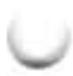

Most human breast and ovarian cancer occurs in women with no known predisposition. However, about 10% of cases are associated with inherited defects in two genes, BRCA1 and BRCA2. Human BRCA1 and BRCA2 are large proteins (1,834 and 3,418 amino acid residues, respectively) that interact with a wide range of other proteins involved in transcription, chromosome maintenance, DNA repair, and control of the cell cycle. BRCA2 has been implicated in the recombinational DNA repair of double-strand breaks. One of the key roles of BRCA2 is to load the human RecA homolog, called Rad51, onto DNA at the sites of double-strand breaks. BRCA1 has as yet imperfectly defined roles in the repair of double-strand breaks, transcription, and some other processes of DNA metabolism. Women with defects in either the BRCA1 or BRCA2 gene have a high (\~70%) chance of developing breast cancer.

in the methylated parent (template) strand. If both strands are methylated at a GATC sequence, few mismatches are repaired; if neither strand is methylated, repair occurs but does not favor either strand. The methyl-directed mismatch repair system of E. coli efficiently repairs mismatches up to 1,000 bp from a hemimethylated GATC sequence.

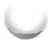

  
FIGURE 25-20 Methylation and mismatch repair. Methylation of DNA strands can serve to distinguish parent (template) strands from newly synthesized strands in E. coli DNA, a function that is critical to mismatch repair. The methylation occurs at the $N^{6}$ of adenines in (5')GATC sequences. This sequence is a palindrome, present in opposite orientations on the two strands.

How is the mismatch correction process directed by relatively distant GATC sequences? Figure 25-21 illustrates one mechanism. MutS scans the DNA and forms a clamplike complex upon encountering a lesion. The complex binds to all mismatched base pairs (except C–C). MutL protein forms a complex with MutS protein, and the MutSL complex slides along the DNA to find a hemimethylated GATC sequence. MutH binds to MutL, and the MutSLH complex moves in either direction at random along the DNA. MutH has a site-specific endonuclease activity that is inactive until the complex encounters a hemimethylated GATC sequence. At this site, MutH catalyzes cleavage of the unmethylated strand on the 5' side of the G in GATC, which marks the strand for repair. Further steps in the pathway depend on where the mismatch is located relative to this cleavage site (Fig. 25-22).

When the mismatch is on the 5' side of the cleavage site (Fig. 25-22, right side), the unmethylated strand is unwound and degraded in the 3'→5' direction from the

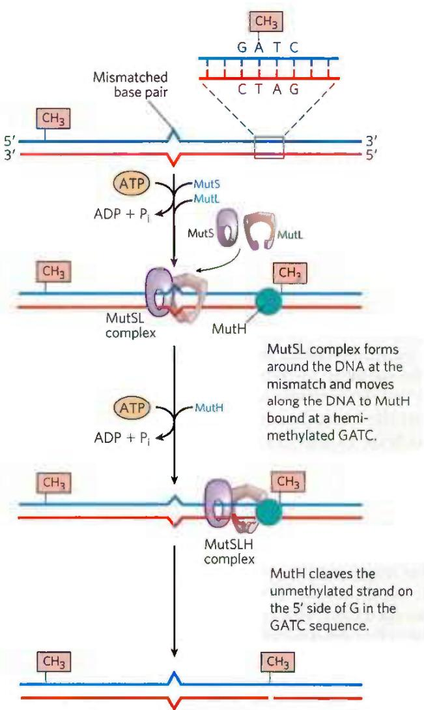  
FIGURE 25-21 A model for the early steps of methyl-directed mismatch repair. Recognition of the sequence (5')GATC and of the mismatch are specialized functions of the MutH and MutS proteins, respectively.

  
FIGURE 25-22 Completion of methyl-directed mismatch repair. The combined action of DNA helicase II, SSB, and one of four different exonucleases removes a segment of the new strand between the MutH cleavage site and a point just beyond the mismatch. The particular  
exonuclease depends on the location of the cleavage site relative to the mismatch, as shown by the alternative pathways here. The resulting gap is filled in (dashed line) by DNA polymerase III, and the nick is sealed by DNA ligase (not shown).

cleavage site through the mismatch, and this segment is replaced with new DNA. This process requires the combined action of DNA helicase II (also called UvrD helicase), SSB, exonuclease I or exonuclease X (both of which degrade strands of DNA in the 3'→5' direction) or exonuclease VII (which degrades single-stranded DNA in either direction), DNA polymerase III, and DNA ligase. The pathway for repair of mismatches on the 3' side of the cleavage site is similar (Fig. 25-22, left), except that the exonuclease is either exonuclease VII or RecJ nuclease (which degrades single-stranded DNA in the 5'→3' direction).

P2 Mismatch repair is particularly costly for E. coli in terms of energy expended. The mismatch may occur 1,000 or more base pairs from the GATC sequence. The degradation and replacement of a strand segment of this length require an enormous investment in activated deoxynucleotide precursors to repair a single mismatched base. This again underscores the importance to the cell of genomic integrity.

Eukaryotic cells also have mismatch repair systems, with several proteins structurally and functionally analogous to the bacterial MutS and MutL (but not MutH) proteins. Alterations in human genes encoding proteins of this type produce some of the most common inherited cancer-susceptibility syndromes (see Box 25-1), further demonstrating the value to the organism of DNA repair systems. The main MutS homologs in most eukaryotes, from yeast to humans, are MSH2 (MutS homolog), MSH3, and MSH6. Heterodimers of MSH2 and MSH6 generally bind to single base-pair mismatches, and they bind less well to slightly longer mispaired loops. In many organisms, the longer mismatches (2 to 6 bp) may be bound instead by a heterodimer of MSH2 and MSH3, or are bound by both types of heterodimers in tandem. Homologs of MutL, predominantly a heterodimer of MLH1 (MutL homolog) and PMS1 (post-meiotic segregation), bind to and stabilize the MSH complexes. Many details of the subsequent events in eukaryotic mismatch repair remain to be worked out. In particular, we do not know how newly synthesized DNA strands are identified, although research reveals that this process does not involve GATC sequences.

Base-Excision Repair Every cell has a class of enzymes called DNA glycosylases that recognize particularly common DNA lesions (such as the products of cytosine and adenine deamination; see Fig. 8-29a) and remove the affected base by cleaving the N-glycosyl bond. The repair pathway is called base-excision repair, as the first step involves only the removal of the base rather than an entire nucleotide. The cleavage creates an apurinic or apyrimidinic site in the DNA, commonly referred to as an AP site or abasic site. Each DNA glycosylase is generally specific for one type of lesion.

Uracil DNA glycosylases, for example, found in most cells, specifically remove from DNA the uracil that results from spontaneous deamination of cytosine. Mutant cells that lack this enzyme have a high rate of G≡C to A=T mutations. This glycosylase does not remove uracil residues from RNA or thymine residues from DNA. The capacity to distinguish thymine from uracil, the product of cytosine deamination—necessary for the selective repair of the latter—may be one reason why DNA evolved to contain thymine instead of uracil (p. 280).

Most bacteria have just one type of uracil DNA glycosylase, whereas humans have at least four types, with different specificities—an indicator of the importance of removing uracil from DNA. The most abundant human uracil glycosylase, UNG, is associated with the replisome, where it eliminates the occasional U residue inserted in place of a T during replication. The deamination of C residues is 100-fold faster in single-stranded DNA than in double-stranded DNA, and humans have an enzyme, hSMUG1, that removes any U residues occurring in single-stranded DNA during replication or transcription. Two other human DNA glycosylases, TDG and MBD4, remove either U or T residues paired with G, which are generated by deamination of cytosine or 5-methylcytosine, respectively.

Other DNA glycosylases recognize and remove a variety of damaged bases, including formamidopyrimidine and 8-hydroxyguanine (both arising from purine oxidation), hypoxanthine (from adenine deamination), and alkylated bases such as 3-methyladenine and 7-methylguanine. Glycosylases that recognize other lesions, including pyrimidine dimers, have also been identified in some classes of organisms. Remember that AP sites also arise from slow, spontaneous hydrolysis of the N-glycosyl bonds in DNA (see Fig. 8-29b).

Once an AP site has been formed by a DNA glycosylase, another type of enzyme must repair it. The repair is not made by simply inserting a new base and re-forming the N-glycosyl bond. Instead, the deoxyribose 5'-phosphate left behind is removed and replaced with a new nucleotide. This process begins with one of the AP endonucleases, enzymes that cut the DNA strand containing the AP site. The position of the incision relative to the AP site (5' or 3' to the site) depends on the type of AP endonuclease. A segment of DNA including the AP site is then removed, DNA polymerase I replaces the DNA, and DNA ligase seals the remaining nick (Fig. 25-23). In eukaryotes, nucleotide replacement is carried out by specialized polymerases, as described below.

Nucleotide-Excision Repair DNA lesions that cause large distortions in the helical structure of DNA generally are repaired by the nucleotide-excision system, a repair pathway critical to the survival of all free-living organisms. In nucleotide-excision repair (Fig. 25-24), a multisubunit enzyme (excinuclease) hydrolyzes two phosphodiester bonds, one on either side of the distortion caused by the lesion. In E. coli and other bacteria, the enzyme system hydrolyzes the fifth phosphodiester bond on the 3' side and the eighth phosphodiester bond on the 5' side to generate a fragment of 12 to 13 nucleotides (depending on whether the lesion involves one or two bases). In humans and other eukaryotes, the enzyme system hydrolyzes the sixth phosphodiester bond on the 3' side and the twenty-second phosphodiester bond on the 5' side, producing a fragment of 27 to 29 nucleotides. Following the dual incision, the excised oligonucleotides are released from the duplex and the resulting gap is filled—by DNA polymerase I in E. coli and DNA polymerase ε in humans. DNA ligase seals the nick.

  
FIGURE 25-23 DNA repair by the base-excision repair pathway. 1 A DNA glycosylase recognizes a damaged base (in this case, a uracil) and cleaves between the base and deoxyribose in the backbone. 2 An AP endonuclease cleaves the phosphodiester backbone near the AP site. 3 DNA polymerase I initiates repair synthesis from the free $3^{\prime}$ hydroxyl at the nick, removing (with its $5^{\prime} \rightarrow 3^{\prime}$ exonuclease activity) and replacing a portion of the damaged strand. 4 The nick remaining after DNA polymerase I has dissociated is sealed by DNA ligase.

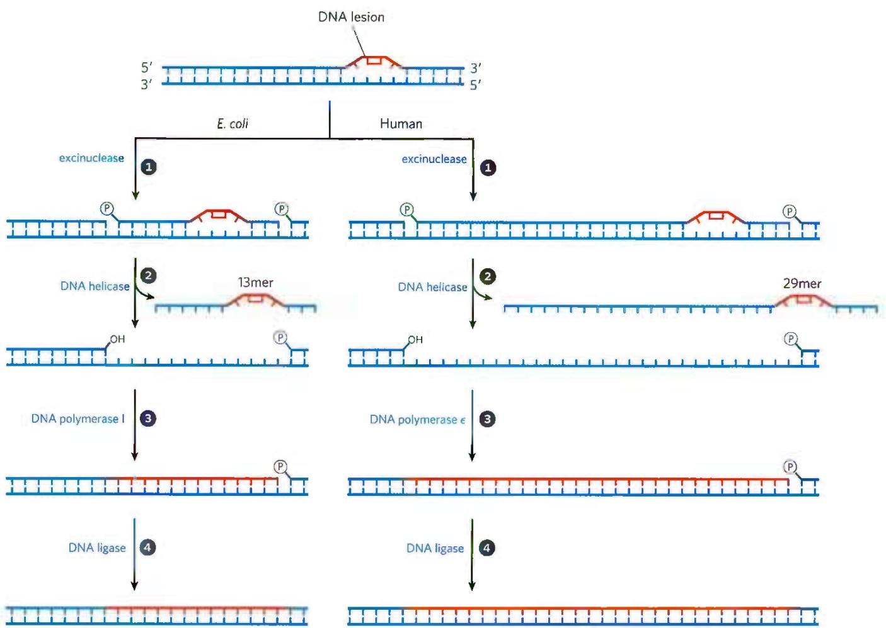  
FIGURE 25-24 Nucleotide-excision repair in E. coli and humans. The general pathway of nucleotide-excision repair is similar in all organisms. ① An excinuclease binds to DNA at the site of a bulky lesion and cleaves the damaged DNA strand on either side of the lesion. ② The  
DNA segment — of 13 nucleotides (13mer) or 29 nucleotides (29mer) — is removed with the aid of a helicase. The gap is filled in by DNA polymerase, and the remaining nick is sealed with DNA ligase. (Information from a figure provided by Aziz Sancar.)

In E. coli, the key enzymatic complex is the ABC excinuclease, which has three protein components, UvrA ( $M_{r}$ 104,000), UvrB ( $M_{r}$ 78,000), and UvrC ( $M_{r}$ 68,000). The term “excinuclease” is used to describe the unique capacity of this enzyme complex to catalyze two specific endonucleolytic cleavages, distinguishing this activity from that of standard endonucleases. A dimeric UvrA protein (an ATPase) scans the DNA and binds to the site of a lesion. A UvrB protein can bind to UvrA either before or after an encounter with the lesion. At the lesion, the UvrA dimer dissociates, leaving a tight UvrB-DNA complex. UvrC protein then binds to UvrB, and UvrB makes an incision at the fifth phosphodiester bond on the 3' side of the lesion. This is followed by a UvrC-mediated incision at the eighth phosphodiester bond on the 5' side. The resulting fragment, consisting of 12 to 13 nucleotides, is removed by UvrD helicase. The short gap thus created is filled in by DNA polymerase I and DNA ligase. This pathway (Fig. 25-24, left) is a primary repair route for many types of lesions, including cyclobutane pyrimidine dimers, 6-4 photoproducts (see Fig. 8-30), and several other types of base adducts, including benzo[a]pyrene-guanine, which is formed in DNA by exposure to cigarette smoke. The nucleolytic activity of the ABC excinuclease is novel in the sense that two cuts are made in the DNA.

The mechanism of eukaryotic excinucleases is quite similar to that of the bacterial enzyme, although at least 16 polypeptides with no similarity to the E. coli excinuclease subunits are required for the dual incision. Some of the nucleotide-excision repair and base-excision repair in eukaryotes is closely tied to transcription (see Chapter 26). Genetic deficiencies in nucleotide-excision repair in humans give rise to a variety of serious diseases (see Box 25-1).

Direct Repair Several types of damage are repaired without removing a base or nucleotide. The best-characterized example is direct photoreactivation of cyclobutane pyrimidine dimers, a reaction promoted by DNA photolyases. Pyrimidine dimers result from a UV-induced reaction.

Through a mechanism worked out by Aziz Sancar and colleagues, photolyases use energy derived from absorbed light to reverse the damage (Fig. 25-25). Photolyases generally contain two cofactors that serve as light-absorbing agents, or chromophores: in all organisms, one is FADH $_{2}$ ; in E. coli and yeast, the other is a folate. The reaction mechanism entails the generation of free radicals. DNA photolyases are not found in humans and other placental mammals.

Additional examples are seen in the repair of nucleotides with alkylation damage. The modified nucleotide $O^{6}$ -methylguanine forms in the presence of alkylating agents and is a common and highly mutagenic lesion. It tends to pair with thymine rather than cytosine during replication, and therefore causes G≡C to A=T mutations (Fig. 25-26).

MECHANISM FIGURE 25-25 Repair of pyrimidine dimers with photolyase. Energy derived from absorbed light is used to reverse the photoreaction that caused the lesion. The two chromophores in E. coli photolyase (M, 54,000), $N^5$ , $N^{10}$ -methenyltetrahydrofolylpolyglutamate (MTHFpolyGlu)

and FADH $^{-}$ , perform complementary functions. MTHFpolyGlu functions as a photoantenna to absorb blue-light photons. The excitation energy passes to FADH $^{-}$ , and the excited flavin ( $*$ FADH $^{-}$ ) donates an electron to the pyrimidine dimer, leading to the rearrangement as shown.

  
FIGURE 25-26 Example of how DNA damage results in mutations. (a) The methylation product $O^6$ -methylguanine pairs with thymine rather than cytosine residues. (b) If not repaired, this leads to a G≡C to A=T mutation after replication.

Direct repair of $O^{6}$ -methylguanine is carried out by $O^{6}$ -methylguanine-DNA methyltransferase, a protein that catalyzes transfer of the methyl group of $O^{6}$ -methylguanine to one of its own Cys residues. This methyltransferase is not strictly an enzyme, because a single methyl transfer event permanently methylates the protein, inactivating it in this pathway. P2 The consumption of an entire protein molecule to correct a single damaged base is another vivid illustration of the priority given to maintaining the integrity of cellular DNA.

A very different but equally direct mechanism is used to repair 1-methyladenine and 3-methylcytosine. The amino groups of A and C residues are sometimes methylated when the DNA is single-stranded, and the methylation directly affects proper base pairing. In E. coli, oxidative demethylation of these alkylated nucleotides is mediated by the AlkB protein, a member of the $\alpha$ -ketoglutarate- $Fe^{2+}$ -dependent dioxygenase superfamily (Fig. 25-27). (See Box 4-2 for a description of proline hydroxylation, catalyzed by another member of this enzyme family.)

#### [EN] The Interaction of Replication Forks with DNA Damage Can Lead to Error-Prone Translesion DNA Synthesis

The repair pathways considered to this point generally work only for lesions in double-stranded DNA, the undamaged strand providing the correct genetic information to restore the damaged strand to its original state. However, in certain types of lesions, such as double-strand breaks, double-strand cross-links, or lesions in a single-stranded DNA, the complementary strand is itself damaged or is absent. P3 Double-strand breaks and lesions in single-stranded DNA most often arise when a replication fork encounters an unrepaired DNA lesion (Fig. 25-28). Such lesions and DNA cross-links can also result from ionizing radiation and oxidative reactions.

At a stalled bacterial replication fork, there are two avenues for repair. In the absence of a second strand, the information required for accurate repair must come from a separate, homologous chromosome. The repair system thus involves homologous genetic recombination. This recombinational DNA repair is considered in

  
FIGURE 25-27 Direct repair of alkylated bases by AlkB. The AlkB protein is an $\alpha$ -ketoglutarate- $\mathrm{Fe}^{2+}$ -dependent hydroxylase (see Box 4-2). It catalyzes the oxidative demethylation of 1-methyladenine and 3-methylcytosine residues.

  
FIGURE 25-28 DNA damage and its effect on DNA replication. If the replication fork encounters an unrepaired lesion or strand break, the DNA polymerase sometimes disengages and re-initiates downstream. The lesion remains in an unreplicated, single-stranded gap that is left behind the replication fork (left). In other cases, a replication fork may encounter a lesion that is actively undergoing repair such that a transient break is present in one of the template strands. When the replication fork encounters it, the single-strand break becomes a double-strand break (right). In each case, the damage to  
one strand cannot be repaired by mechanisms described earlier in this chapter, because the complementary strand required to direct accurate repair is damaged or absent. There are at least two possible avenues for repair: recombinational DNA repair or, when lesions are unusually numerous, error-prone repair. The latter mechanism involves translesion DNA polymerases such as DNA polymerase V, encoded by the umuC and umuD genes and activated by the RecA protein that can replicate, albeit inaccurately, over many types of lesions. The repair mechanism is "error-prone" because mutations often result.

detail in Section 25.3. Under some conditions, a second repair pathway, error-prone translesion DNA synthesis (often abbreviated TLS), becomes available. When this pathway is active, DNA repair is significantly less accurate, and a high mutation rate can result. In bacteria, error-prone translesion DNA synthesis is part of a cellular stress response to extensive DNA damage known, appropriately enough, as the SOS response.

Some of the 40 or more SOS proteins, such as the UvrA and UvrB proteins involved in the error-free nucleotide-excision repair already described, are normally present in the cell but are induced to higher levels as part of the SOS response. Additional SOS proteins participate in the pathway for error-prone repair; these include the UmuC and UmuD proteins (unmutable; lack of the umu gene eliminates error-prone repair). The UmuD protein is cleaved in an SOS-regulated process to a shorter form called UmuD', which forms a complex with UmuC and a protein called RecA (described in Section 25.3) to create a specialized DNA polymerase, DNA polymerase V (UmuD'2UmuCRecA), which can replicate past many of the DNA lesions that would normally block replication. Proper base pairing is often impossible at the site of such a lesion, so this translesion replication is error-prone.

Given the emphasis on the importance of genomic integrity throughout this chapter, the existence of a system that increases the rate of mutation may seem incongruous. However, we can think of this system as a desperation strategy. The umuC and umuD genes are fully induced only late in the SOS response, and they are not activated for translesion synthesis initiated by UmuD cleavage unless the levels of DNA damage are particularly high and all replication forks are blocked. The mutations resulting from DNA polymerase V-mediated replication kill some cells and create deleterious mutations in others, but this is the biological price a species pays to overcome an otherwise insurmountable barrier to replication, as it permits at least a few mutant daughter cells to survive.
P3 The resultant mutations contribute to evolution.

Yet another DNA polymerase, DNA polymerase IV, is also induced during the SOS response. Replication by DNA polymerase IV, a product of the dinB gene, is also highly error-prone. The bacterial DNA polymerases IV and V (Table 25-1) are part of a family of TLS polymerases found in all organisms. These enzymes lack a proofreading exonuclease and have a more open active site than other DNA polymerases, one that accommodates damaged template nucleotides. With these enzymes, the fidelity of base selection during replication may be reduced by a factor of $10^{2}$ , lowering overall replication fidelity to one error in $\sim 1,000$ nucleotides.

P4 Mammals have many low-fidelity DNA polymerases of the TLS polymerase family. However, the presence of these enzymes does not necessarily translate into an unacceptable mutational burden, because most of the enzymes also have specialized functions in DNA repair. DNA polymerase η (eta), for example, found in all eukaryotes, promotes translesion synthesis primarily across cyclobutane T–T dimers. Few mutations result, because the enzyme preferentially inserts two A residues across from the linked T residues. Several other low-fidelity polymerases, including DNA polymerases β,ι (iota), and λ, have specialized roles in eukaryotic base-excision repair. Each of these enzymes has a 5'-deoxyribose phosphate lyase activity in addition to its polymerase activity. After base removal by a glycosylase and backbone cleavage by an AP endonuclease, these polymerases remove the abasic site (a 5'-deoxyribose phosphate) and fill in the very short gap. The frequency of mutation due to DNA polymerase $\eta$ activity is minimized by the short lengths (often one nucleotide) of DNA synthesized.

What emerges from research into cellular DNA repair systems is a picture of a DNA metabolism that maintains genomic integrity with multiple and often redundant systems. Most of the major DNA repair systems occur in all organisms. P4 These repair systems are often integrated with the DNA replication systems and are complemented by recombination systems, which we turn to next.

#### [EN] SUMMARY 25.2 DNA Repair

■ Mutations are genomic changes that alter the information in DNA. When mutations occur in genes encoding enzymes involved in DNA repair, the loss of function can lead to cancer.

Cells have many systems for DNA repair. Major repair systems present in all organisms include mismatch repair, base excision repair, nucleotide-excision repair, and direct repair.

In bacteria, TLS DNA polymerases respond to very heavy DNA damage with error-prone translesion DNA synthesis. In eukaryotes, similar polymerases have specialized roles in DNA repair that minimize the introduction of mutations.

<!-- EN-END 25.2 -->

## 三、DNA 的突变

DNA 作为遗传物质有三个基本功能:一是通过复制将遗传信息由亲代传递给子代;二是进行转录使遗传信息在子代得以表达;三是产生变异为进化提供基础。变异是 DNA 的核苷酸序列改变的结果,它包括由于 DNA 损伤和错配得不到修复而引起的突变,以及由于不同 DNA 分子之间片段的交换而引起的遗传重组。

## (一) 突变的类型

DNA 的编码序列发生改变就会引起突变或死亡, 死亡是致死突变的结果。改变单个核苷酸的突变称位点突变。已知突变有以下几种类型：

## 1. 碱基对的置换(substitution)

碱基对置换包括两种类型:一种称为转换(transition),即两种嘧啶之间或两种嘌呤之间互换,这种置换方式最为常见。另一种称为颠换(transversion),是在嘌呤与嘧啶之间的发生互换,较为少见。易错修复可以发生颠换。由于密码的简并性,突变使核苷酸序列改变但不改变蛋白质的序列,称为沉默突变(silent mutation)。三联体密码子发生突变导致蛋白质中原有氨基酸被另一种氨基酸取代,称为错义突变(mis-sense mutation)。当氨基酸密码子变为终止密码子时,称为无义突变(nonsense mutation),它导致翻译提前结束而常使产物失活。

## 2. 移码突变 (frameshift mutation)

由于一个或多个非三整倍数的核苷酸插入(insertion)或缺失(deletion)，而使编码区该位点后的密码阅读框架改变，导致其后氨基酸都发生错误，如出现终止密码子则使翻译提前结束，该突变常会使基因产物完全失活。

## 3. 大片段的缺失(deletion)和重复(repetition)

缺失的核苷酸可以达十几至几千碱基对。

## （二）诱变剂的作用

在自然条件下发生的突变称为自发突变(spontaneous mutation)。自发的突变率是非常低的,大肠杆菌和果蝇的基因突变率都在 $10^{-10}$ 左右。能够提高突变率的物理或化学因子称为诱变剂(mutagen)。紫外线的高能量可以使相邻嘧啶之间双键打开形成二聚体,包括产生环丁烷结构和6-4光产物(6-4 photoproduct),即一个嘧啶的第6位碳原子与相邻嘧啶第4位碳原子间的连接,并使DNA产生弯曲(bend)和纽结(kink)。电离辐射(如X射线、γ射线等)的作用比较复杂,除射线直接效应外还可以通过水在电离时所形成的自由基起作用(间接效应)。DNA可以出现双链断裂或单链断裂,大剂量照射时还会有碱基的破坏。紫外线和电离辐射都是强的诱变剂。最常见的化学诱变剂有以下几类:

## 1. 碱基类似物 (base analog)

与 DNA 正常碱基结构类似的化合物,能在 DNA 复制时取代正常碱基掺入并与互补链上碱基配对。但是这些类似物易发生互变异构(tautomerization),在复制时改变配对的碱基,于是引起碱基对的置换。通常碱基类似物引起的置换是转换,而不是颠换。

5-溴尿嘧啶(BU)是胸腺嘧啶的类似物,在一般情况下它以酮式(keto)结构存在,能与腺嘌呤配对;但它有时以烯醇式(enol)结构存在,与鸟嘌呤配对(图30-31)。胸腺嘧啶也有酮式和烯醇式互变异构现象,但其烯醇式发生率极低。而5-溴尿嘧啶中由于溴原子负电性很强,其烯醇式发生率要高得多,因此显著提高了诱变的能力。结果使AT对转变为GC对;而在相反的情况下使GC对转变成AT对。

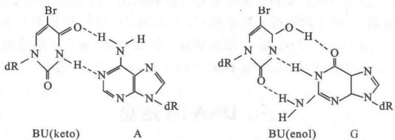  
图30-31 5-溴尿嘧啶的酮式和烯醇式具有不同配对性质

2-氨基嘌呤(AP)是腺嘌呤的类似物,正常状态下与胸腺嘧啶配对,但以罕见的亚氨基状态存在时却与胞嘧啶配对(图30-32)。因此,它能引起AT对转换为GC对,以及GC对转换为AT对。

  
图30-32 2-氨基嘌呤的不同配对性质

## 2. 碱基的修饰剂 (base modifier)

某些化学诱变剂通过对 DNA 碱基的修饰作用,而改变其配对性质。例如,亚硝酸能脱去碱基上的氨基。腺嘌呤脱氨后成为次黄嘌呤(I),它与胞嘧啶配对,而不是与原来的胸腺嘧啶配对。胞嘧啶脱氨后成为尿嘧啶,它成为与腺嘌呤配对的碱基。鸟嘌呤脱氨后成为黄嘌呤(X),它仍与胞嘧啶配对,因此经过 DNA 复制后即恢复正常,并不引起碱基对置换。

羟胺 $\left(\mathrm{NH}_{2}\mathrm{OH}\right)$ 与碱基作用十分特异，它只与胞嘧啶作用，生成4-羟胺胞嘧啶（HC），而与腺嘌呤配对，结果GC对变为AT对（图30-33）。

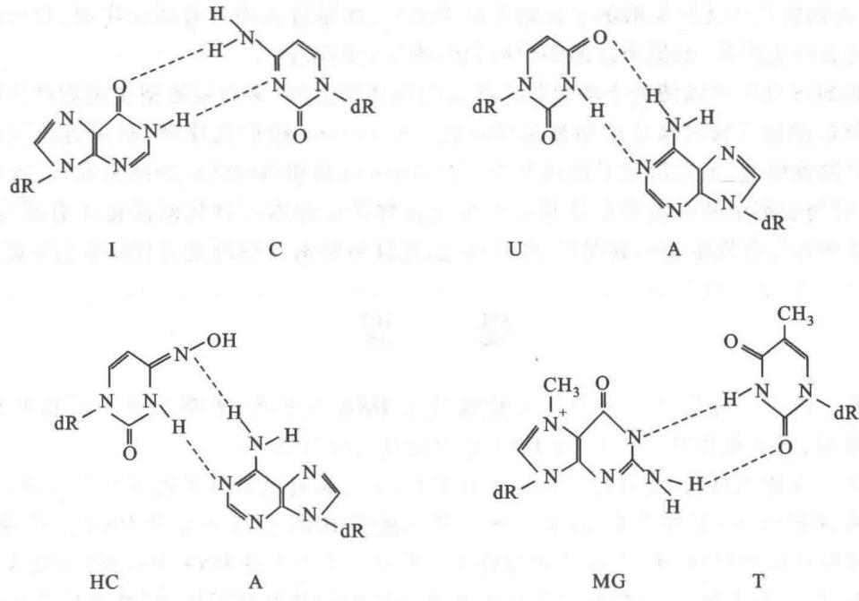  
图30-33 化学修饰剂改变碱基的配对性质

烷化剂(alkylating agent)是极强的化学诱变剂,其中较常见的包括氮芥(nitrogen mustard)、硫芥(sulfur mustard)、乙基甲烷磺酸(ethyl methane sulfonate,EMS)、乙基乙烷磺酸(ethylethane sulfonate,EES)和亚硝基胍(nitrosoguanidine,NTG)等。烷化剂使DNA碱基上的氮原子烷基化,最常见的是鸟嘌呤上第7位氮原子的烷基化,引起分子电荷分布的变化而改变碱基配对性质,如7-甲基鸟嘌呤(MG)与胸腺嘧啶配对(图30-33)。氮芥是二(氯乙基)胺的衍生物,硫芥是二(氯乙基)硫醚,它们的双功能基能同时与DNA同一条链或两条不同链上鸟嘌呤相连。DNA两条链的交联阻止了正常的修复,因此交联剂往往是强致癌剂。亚硝基胍在适宜条件下可使DNA复制叉部位出现多个紧相靠近的成簇突变,因此精确控制培养条件和加入亚硝基胍的时间与剂量可选择性地使细胞DNA特殊片段发生突变。烷化后的嘌呤和脱氧核糖结合的糖苷键变得不稳定,容易使嘌呤脱落。氧化也能使其破坏并被水解掉。

## 3. 嵌入染料 (intercalating dye)

一些扁平的稠环分子,例如吖啶橙(acridine)、原黄素(proflavine)、溴化乙锭(ethidium bromide)等染料,可以插入到DNA的碱基对之间,故称为嵌入染料。这些扁平分子插入DNA后将碱基对间的距离撑大约一倍,正好占据了一个碱基对的位置。嵌入染料插入碱基重复位点处可造成两条链错位。在DNA复制时,

新合成的链或者增加核苷酸插入,或者使核苷酸缺失,结果造成移码突变。其可能的机制如图 30-34 所示。

## （三）诱变剂和致癌剂的检测

医学和分子生物学的研究表明,人类癌症的发生是由于控制细胞分裂的基因发生突变,或是致瘤病毒核酸的入侵,原癌基因成为癌基因,抑癌基因失去抑制细胞恶性生长的能力所致。细胞生长失控就形成肿瘤,能转移的恶性肿瘤称为癌。因此,细胞癌变与修复机制的受损坏以及突变率的提高有关。

由于食品、日用品和环境中存在的诱变剂和致癌剂对人类健康十分有害,需要有效的方法将它们检测出来。B. Ames 发明了一种简易检测诱变剂的方法,称为 Ames 试验(Ames test)。该方法采用鼠伤寒沙门氏杆菌(Salmonella typhimurium)的营养缺陷型菌株,其组氨酸生物合成途径一个酶的基因发生突变而使酶失活,将该菌与待测物置于无组氨酸的平皿培养基中培养,如果待测物具有诱变作用,就可使营养缺陷型细菌因恢复突变而产生菌落,根据菌落的多少可判断诱变力的强弱。

  
图 30-34 嵌入染料插入 DNA 引起移码突变的可能机制(嵌入染料以粗短线表示)

大肠杆菌的 SOS 反应可以使处于溶原状态的 $\lambda$ 噬菌体被激活，从而裂解宿主细胞产生噬菌斑。通常引起细菌 SOS 反应的化合物对高等动物都是致癌的。R. Devoret 根据此原理，利用溶原菌被诱导产生噬菌斑的方法来检测致癌剂，大大简化了检测方法。由 Ames 试验和动物试验的结果发现，致癌物质中 90% 都有诱变作用，而诱变剂中 90% 有致癌作用。不少化合物需在体内经过代谢活化才有诱变或致癌作用，在测试时可将待测物与肝提取物一起保温，使其转化，这样可使潜在的诱变剂和致癌剂也能被检测出来。

## 提 要

亲代传递给子代的遗传信息以密码的形式编码在 DNA 分子上,表现为特定的核苷酸序列。细胞 DNA 能够精确复制,并对损伤进行修复,而 DNA 序列的改变即为突变。

DNA 分子具有双螺旋结构, 复制时一条链来自亲代, 另一条链通过碱基配对重新合成, 称为半保留复制。DNA 复制有固定起点; 双向或单向; 有多种方式。催化 DNA 合成的酶为 DNA 聚合酶, 该酶以 4 种 dNTP 为底物, 需要模板和引物, 由 5' 向 3' 方向合成。大肠杆菌有 5 种 DNA 聚合酶 (I 至 V)。DNA 聚合酶 I 为多功能酶, 具有聚合酶、3'→5' 外切核酸酶和 5'→3' 外切核酸酶活性, 除聚合反应外还具有校正和切除引物或损伤链的功能。DNA 聚合酶 II 有聚合和校正功能, 但不能由 5' 端外切。DNA 聚合酶 I 和 II 都是修复酶, DNA 聚合酶 III 才是复制酶。

DNA 聚合酶Ⅲ具有 10 个亚基, 其中 $\alpha, \varepsilon, \theta$ 构成聚合酶的核心酶, $\alpha$ 催化聚合反应, $\varepsilon$ 起校正作用, $\theta$ 起组建作用。 $\tau_{2}$ 使核心酶二聚化, 并与 $\gamma$ 复合物 ( $\gamma\delta\delta'\chi\psi$ ) 构成夹子安装器, 操纵夹子 $\beta$ 的装卸。由于 $\gamma$ 复合物的不对称性, DNA 聚合酶Ⅲ是异二聚体。这些复杂的亚基使酶具有更高的忠实性、协同性和持续性。DNA 聚合酶 IV 和 V 都是易错修复酶, 无校正功能。DNA 连接酶以 NAD $^{+}$ 或 ATP 提供能量, 使 DNA 片段之间形成磷酸二酯键。DNA 复制的两条链走向不同, 链的合成方向与复制叉移动方向一致的为连续合成, 不一致需分段合成, 因此是半不连续复制。

闭环 DNA 和两端固定的 DNA 具有拓扑关系式: $\alpha = \beta + \tau$ 。 $\alpha$ 为 DNA 两条链的拓扑连环数, $\beta$ 为螺旋数, $\tau$ 为超螺旋数。以 $\sigma$ 表示比超螺旋, $\sigma = (\alpha - \beta) / \beta$ 。DNA 复制时解(螺)旋酶解开双链, 由旋转酶(拓扑异构酶 II)消除扭曲张力, SSB 保护解开的单链。复制起始由 Dna A 识别起点 (ori C), 解开双链, Dna B (解旋酶) 在 Dna C 帮助下结合于解链区, 借助水解 ATP 产生的能量向前移动。RNA 聚合酶合成 RNA, 形成 RNA 突环, 有利于 Dna A 的作用。随后 DNA 聚合酶 III 开始复制。细菌环状 DNA 两个复制叉在含有多个终止子的终止区相遇, 复制体解体, 由修复酶填补空缺。然后, 拓扑异构酶 IV 分开连锁环。复制起点有 11 个 4 bp 的回文序列 GATC, 其中 A 第 6 位- $NH_{2}$ 被甲基化, DNA 复制使其成为半甲基化, 从而附着在细胞膜上, 并抑制 Dna A 的转录和新一轮的复制起始。正在复制的 DNA 随膜的生长而分开, 间隔一定时间, 半甲基化 GATC 被全甲基化, 新一轮 DNA 复制得以重新开始。

真核生物染色体 DNA 为多复制子。真核生物 DNA 聚合酶有 15 种，主要有 5 种，分别为 DNA 聚合酶 $\alpha$ 、 $\beta$ 、 $\gamma$ 、 $\delta$ 和 $\varepsilon$ 。DNA 聚合酶 $\alpha$ 的功能是合成引物、 $\beta$ 是修复酶、 $\gamma$ 是线粒体 DNA 的复制、 $\delta$ 是前导链和滞后链的合成、而 $\varepsilon$ 则是引物空缺的填补。真核生物 DNA 的复制与原核生物基本类似，差别在于真核生染色体 DNA 有端粒结构，端粒酶以所含 RNA 为模板合成端粒 DNA。此外，DNA 复制受细胞周期调节。

DNA 的损伤修复主要有五种: 错配修复、直接修复、切除修复、重组修复和应急修复。大肠杆菌参与错配修复的蛋白质至少有 12 种, 主要由 Mut S 二聚体识别错配碱基对并与 Mut L 二聚体一起结合其上, Mut SL 四聚体借助水解 ATP 提供的能量沿 DNA 向前移动, DNA 形成突环, 直至遇到 GATC 序列, 由 Mut H 在该序列未甲基化的 5' 端切开。然后, 由外切酶切除单链, DNA 聚合酶Ⅲ合成新链, DNA 连接酶连上。真核生物有类似 Mut S 和 Mut L 的蛋白质因子 MSH 和 MLH, 可以识别错配碱基, 但依赖复制体除去错配碱基。直接修复是由酶切开紫外线造成的嘧啶二聚体，或由酶除去化学修饰基团。切除修复由特异的DNA糖基化酶将异常碱基切除，然后由AP内切核酸酶在AP位点附近将链切开，外切酶除去AP链，然后经修复酶和连接酶加以修复。重组修复是复制后修复。当复制酶遇到未修复的损伤部位无法通过碱基配对合成子代链时，可以跳过损伤部位，结果留下缺口。复制后从同源DNA母链上通过重组将相应片段补上缺口，然后用再合成的序列补上母链空缺。原来的损伤处依然有待修复。应急(SOS)修复又称为诱导修复或易错修复。当DNA严重受损（双链断裂、交联或损伤链无完整的对应链），复制无法进行，通过诱导产生无校对功能的DNA聚合酶，使复制得以完成，却导致高突变率。

基因突变包括碱基置换、移码突变和大片段序列的删除与重复。通常诱变剂有：① 碱基类似物；② 碱基修饰剂；③ 嵌入染料。细胞癌变与某些基因的突变有关。Ames 试验利用细菌营养缺陷型突变株的恢复突变检测诱变剂。Devoret 试验利用细菌噬菌体溶原株的 SOS 反应检测致癌剂。这些检测方法在食品和环境的安全性检查中十分有用。

## 习题

1. 生物的遗传信息如何由亲代传递给子代？

2. 何谓 DNA 的半保留复制？是否所有 DNA 的复制都以半保留的方式进行？[双链 DNA 通常都以半保留方式复制]

3. 若使 $^{15}$ N 标记的大肠杆菌在 $^{14}$ N 培养基中生长三代, 其 $^{14}$ N-DNA 分子与 $^{14}$ N, $^{15}$ N-杂合 DNA 分子之比应为多少? 若经变性密度梯度离心, 其 $^{14}$ N 单链和 $^{15}$ N 单链之比应为多少?

4. 何谓复制子,何谓复制叉,何谓复制体?三者有何关系?

5. 在丰富的培养基中大肠杆菌染色体 DNA 有几个复制叉？

6. 大肠杆菌染色体 DNA 大小为 $4.6 \times 10^{6}$ bp, 复制叉移动速度为 60 000 bp/min, 复制起点发动复制后需相隔 13 min 才能再次发动复制, 若细胞分裂过程 DNA 照常复制, 而复制起始、终止及转换过程等共需 5 min, 问完成全部染色体复制需要多少时间? 细胞倍增需要多少时间?

7. 比较 DNA 聚合酶 I、II 和 III 性质的异同。DNA 聚合酶 IV 和 V 的功能是什么？有何生物学意义？

8. DNA 复制的精确性、持续性和协同性是通过怎样的机制实现的？

9. 何谓 DNA 的半不连续复制？试述冈崎片段合成的过程。

10. 若天然双链闭环 DNA(cccDNA) 的比超螺旋 ( $\sigma$ ) 为 -0.05，复制时解旋酶将双链撑开，如果反应系统中无旋转酶，当比超螺旋达到 +0.05 时，DNA 的扭曲张力将阻止双链解开，此时已解开的双链占 DNA 分子的百分数是多少？

11. 何谓拓扑异构体？试比较类型Ⅰ和类型Ⅱ拓扑异构酶作用机制的异同。

12. 简单叙述大肠杆菌 ori C 的结构特点, 这些结构有何生物学意思?

13. 参与大肠杆菌染色体复制起始的酶和辅助因子主要有哪些？它们各起何作用？

14. 绘制简图表示大肠杆菌复制体的结构。

15. 何谓复制终止子？它的生物学意思是什么？

16. 为什么闭环双链 DNA 复制后会形成连锁体？连锁体是如何解开的？

17. 比较真核生物和原核生物染色体 DNA 复制的异同。

18. 真核生物 DNA 聚合酶有哪几种？它们主要功能是什么？

19. 真核生物 DNA 复制时在合成 iDNA 后为什么要进行聚合酶转换？有何生物学意义？

20. 真核生物染色体 DNA 的端粒有何功能？它是如何合成的？

21. 何谓复制许可因子？它有何功能？

22. 生物借助什么机制来维持低突变率？

23. 哪些因素能引起 DNA 损伤？生物机体是如何修复的？

24. 何谓错配修复？为什么原核生物可通过半甲基化 GATC 序列来区别“旧”链和“新”链，而真核生物则不能？真核生物是如何纠正错配的？

25. 为什么哺乳动物没有光复活作用？哺乳类动物通过何种作用修复紫外线造成的 DNA 损伤？

26. 何谓转录偶联的修复？它有何生物学意义？

27. 什么是应急反应(SOS)和易错修复？它们之间是什么关系？

28. 何谓突变？突变有哪几种类型？突变与细胞癌变有何关系？

29. DNA 复制时前导链和后随链发生错配的概率是否相等？两条链错配修复的概率是否相等？

30. 为什么引起 SOS 反应的化合物通常都是致癌剂？

31. 试述 Ames 试验的原理。比较 Devoret 试验和 Ames 试验的异同。

## 主要参考书目

1. 王镜岩, 朱圣庚, 徐长法. 生物化学教程. 北京: 高等教育出版社, 2008.

2. Voet D, Voet J G, Pratt C W. Fundamentals of Biochemistry. 3rd ed. New York: John Wiley & Sons, 2008.

3. Nelson D L, Cox M M. Lehninger Principles of Biochemistry. 6th ed. New York: W. H. Freeman, 2012.

4. Berg J, Tymoczko J, Stryer L. Stryer Biochemistry. 7th ed. New York: W. H. Freeman, 2010.

5. Krebs J E, Kilpatrick S T, Goldstein E S. Lewin's Genes XI. Boston: Jones & Bartlett Publishers, 2013.

6. Watson J D, Baker T A, Bell S P, et al. Molecular Biology of the Gene. 7th ed. San Francisco: Pearson Education, 2013.

(朱圣庚)

## 网上资源

习题答案

自测题

<!-- EN-BEGIN 第25章章末 -->

## 【英文对应 第25章章末】DNA Metabolism：关键术语、习题与简答

> 来源：Lehninger Principles of Biochemistry（书籍/02_生物化学原理） 第25章章末，以及书末 Abbreviated Solutions to Problems 第25章。

### [EN] KEY TERMS

Terms in bold are defined in the glossary.

template 915
semiconservative
replication 915
replication fork 916
origin 916
Okazaki fragment 916
leading strand 916
lagging strand 916
nucleases 916
exonucleases 916
endonucleases 916
DNA polymerases 916
DNA polymerase I 916
primer 917
primer terminus 917
processivity 917
proofreading 919
DNA polymerase III 919
replisome 921
helicases 921
topoisomerases 922
primases 922
DNA ligases 922
DNA unwinding element (DUE) 922
AAA+ ATPases 922
catenane 927
prereplicative complex (pre-RC) 928
licensing 928
minichromosome maintenance (MCM) protein 928
ORC (origin recognition complex) 928

DNA polymerase ε 929
DNA polymerase δ 929
DNA polymerase α 929
mutation 930
DNA glycosylases 934
base-excision repair 934
AP site 935
abasic site 935
AP endonucleases 935
DNA photolyases 937
error-prone translesion DNA synthesis 939
SOS response 939
homologous genetic recombination 940
site-specific recombination 940
DNA transposition 940
recombinational DNA repair 941
branch migration 942
Holliday intermediate 942

replication restart
primosome 943

double-strand break repair model 947

nonhomologous end joining (NHEJ) 948
transposon 951
transposition 952
insertion sequence 952

### [EN] PROBLEMS

1. DNA Replication An investigator adds DNA polymerase III holoenzyme, DNA primase (DnaG), single-stranded DNA-binding protein (SSB), an ATP-dependent DNA ligase, and the replicative helicase (DnaB) to each of the DNA substrates shown, along with ATP and all four dNTPs. The length of DNA in the circle in structure 1 is 10,000 bp. The linear (unbranched) part of structure 2 is 20,000 bp long.

(a) If precursor (dNTP) concentrations are not limiting, Okazaki fragments are 2,000 nucleotides long, and replication proceeds at 1,000 nucleotides/s for 30 seconds, which DNA substrate will generate a longer replication product?

(b) For structure 1, draw the product of this 30 second replication. (c) Draw the expected product if DnaG were left out of the reaction. (d) Draw the expected product if DNA ligase were instead left out of the reaction.

2. Heavy Isotope Analysis of DNA Replication A researcher switches a culture of E. coli growing in a medium containing ${}^{15}NH_{4}Cl$ to a medium containing ${}^{14}NH_{4}Cl$ for three generations (an eightfold increase in population). What is the molar ratio of hybrid DNA ( ${}^{15}N-{}^{14}N$ ) to light DNA ( ${}^{14}N-{}^{14}N$ ) at this point?

3. Replication of the E. coli Chromosome The E. coli chromosome contains 4,641,652 bp.

(a) How many turns of the double helix must be unwound during replication of the E. coli chromosome?

(b) Using the data in this chapter, how long would it take to replicate the E. coli chromosome at $37\ ^{\circ}C$ if two replication forks proceeded from the origin? Assume replication occurs at a rate of 1,000 bp/s. Under some conditions, E. coli cells can divide every 20 min. How might this be possible?

(c) In the replication of the E. coli chromosome, about how many Okazaki fragments would be formed? What factors are required to link together newly synthesized Okazaki fragments in the lagging strand?

4. Base Composition of DNAs Made from Single-Stranded Templates Predict the base composition of the total DNA synthesized by DNA polymerase on templates provided by an equimolar mixture of the two complementary strands of bacteriophage $\phi$ X174 DNA (a circular DNA molecule). The base composition of one strand is A, 24.7%; G, 24.1%; C, 18.5%; and T, 32.7%. What assumption is necessary to answer this problem?

5. DNA Replication Kornberg and his colleagues incubated soluble extracts of E. coli with a mixture of dATP, dTTP, dGTP, and dCTP, all labeled with ${}^{32}$ P in the $\alpha$ -phosphate group. After a time, they treated the incubation mixture with trichloroacetic acid, which precipitates the DNA but not the nucleotide precursors. They then collected the precipitate and determined the extent of precursor incorporation into DNA from the amount of radioactivity present in the precipitate.

(a) If any one of the four nucleotide precursors were omitted from the incubation mixture, would radioactivity be found in the precipitate? Explain.

(b) Would ${}^{32}$ P be incorporated into the DNA if only dTTP were labeled? Explain.

(c) Would radioactivity be found in the precipitate if ${}^{32}$ P labeled the $\beta$ phosphate or $\gamma$ phosphate rather than the $\alpha$ phosphate of the deoxyribonucleotides? Explain.

6. The Chemistry of DNA Replication All DNA polymerases synthesize new DNA strands in the 5'→3' direction. In some respects, replication of the antiparallel strands of duplex DNA would be simpler if there were also a second type of polymerase, one that synthesized DNA in the 3'→5' direction. The two types of polymerase could, in principle, coordinate DNA synthesis without the complicated mechanics required for lagging strand replication. However, no such 3'→5'-synthesizing enzyme has been found. Suggest two possible mechanisms for 3'→5' DNA synthesis. Pyrophosphate should be one product of both proposed reactions. Could one or both mechanisms be supported in a cell? Why or why not? (Hint: You may suggest the use of DNA precursors not actually present in extant cells.)

7. Activities of DNA Polymerases You are characterizing a new DNA polymerase. When you incubate the enzyme with ${}^{32}$ P-labeled DNA and no dNTPs, you observe the release of $[{}^{32}\mathrm{P}]$ dNMPs. The addition of unlabeled dNTPs prevents this release. Explain the reactions that most likely underlie these observations. What would you expect to observe if you added pyrophosphate instead of dNTPs?

8. Leading and Lagging Strands Prepare a table that lists the names and compares the functions of the precursors, enzymes, and other proteins needed to make the leading strand versus the lagging strand during DNA replication in E. coli.

9. Function of DNA Ligase Some E. coli mutants contain defective DNA ligase. When researchers expose these mutants to ${}^{3}$ H-labeled thymine and then sediment the DNA produced on an alkaline sucrose density gradient, two radioactive bands appear. One corresponds to a high molecular weight fraction, the other to a low molecular weight fraction. Explain.

10. Fidelity of Replication of DNA What factors promote the fidelity of replication during synthesis of the leading strand of DNA? Would you expect the lagging strand to be made with the same fidelity? Give reasons for your answers.

11. Importance of DNA Topoisomerases in DNA Replication DNA unwinding, such as that occurring in replication, affects the superhelical density of DNA. In the absence of topoisomerases, the DNA would become overwound ahead of a replication fork as the DNA is unwound behind it. A bacterial replication fork will stall when the superhelical density ( $\sigma$ ) of the DNA ahead of the fork reaches +0.14 (see Chapter 24).

An investigator initiates bidirectional replication at the origin of a 6,000 bp plasmid in vitro, in the absence of topoisomerases. The plasmid initially has a $\sigma$ of $-0.06$ . How many base pairs will be unwound and replicated by each replication fork before the forks stall? Assume that both forks travel at the same rate and that each includes all components necessary for elongation except topoisomerase.

12. The Ames Test In a nutrient medium that lacks histidine, a thin layer of agar containing $\sim10^{9}$ Salmonella typhimurium histidine auxotrophs (mutant cells that require histidine to survive) produces $\sim13$ colonies over a two-day incubation period at 37 °C (see Fig. 25-19). How do these colonies arise in the absence of histidine? When investigators repeat the experiment in the presence of 0.4 $\mu$ g of 2-aminoanthracene, the number of colonies produced over two days exceeds 10,000. What does this indicate about 2-aminoanthracene? What can you surmise about its carcinogenicity?

13. DNA Repair Mechanisms Vertebrate and plant cells often methylate cytosine in DNA to form 5-methylcytosine (see Fig. 8-5a). In these same cells, a specialized repair system recognizes G-T mismatches and repairs them to G≡C base pairs. How might this repair system be advantageous to the cell? (Explain in terms of the presence of 5-methylcytosine in the DNA.)

14. The Energetic Cost of Mismatch Repair In an E. coli cell, DNA polymerase III makes a rare error and inserts a G opposite an A residue at a position 650 bp away from the nearest GATC sequence. The mismatch repair system accurately repairs the mismatch. How many phosphodiester bonds derived from deoxynucleotides (dNTPs) does this repair expend? This process also uses ATP molecules. Which enzyme(s) consume the ATP?

15. DNA Repair in People with Xeroderma Pigmentosum The condition known as xeroderma pigmentosum (XP) arises from mutations in at least seven different human genes (see Box 25-1). The deficiencies are generally in genes encoding enzymes involved in some part of the pathway for human nucleotide-excision repair. The various types of XP are denoted A through G (XPA, XPB, etc.), with a few additional variants lumped under the label XPV.

Investigators irradiate cultures of fibroblasts from healthy individuals and from patients with XPG with ultraviolet light. After isolating and denaturing the DNA, they characterize the resulting single-stranded DNA by analytical ultracentrifugation. (a) Samples from the normal fibroblasts show a significant reduction in the average molecular weight of the single-stranded DNA after irradiation, but samples from the XPG fibroblasts show no such reduction. Why might this be?

(b) If you assume that a nucleotide-excision repair system is operative in fibroblasts, which step might be defective in the cells from the patients with XPG? Explain.

16. DNA Repair and Cancer Many pharmaceuticals used for tumor chemotherapy are DNA damaging agents. What is the rationale behind actively damaging DNA to address tumors? Why do such treatments often have a greater effect on a tumor than on healthy tissue?

17. Direct Repair Cells normally repair the lesion $O^{6}$ -meG by directly transferring the methyl group to the protein $O^{6}$ -methylguanine-DNA methyltransferase. For the nucleotide sequence AAC( $O^{6}$ -meG)TGCAC, with a damaged (methylated) G residue, what would be the sequence of both strands of double-stranded DNA resulting from replication in each of the situations listed?

(a) Replication occurs before repair.

(b) Replication occurs after repair.

(c) Two rounds of replication occur, followed by repair.

18. Strand Invasion in Recombination A key step in many homologous recombination reactions is strand invasion (see step 2 in Fig. 25-29). In almost every case, strand invasion proceeds with a single strand that has a free 3' end rather than a 5' end. What DNA metabolic advantage is inherent with the use of a free 3' end for strand invasion?

19. Holliday Intermediates How does the formation of Holliday intermediates in homologous genetic recombination differ from their formation in site-specific recombination?

20. Cleavage of Holliday Intermediates A Holliday intermediate forms between two homologous chromosomes, at a point between genes $A$ and $B$ , as shown. The chromosomes have different alleles of the two genes ( $A$ and $a$ , $B$ and $b$ ). Where would the Holliday intermediate have to be cleaved (points X and/or Y) to generate a chromosome that would carry (a) an Ab genotype or (b) an ab genotype?

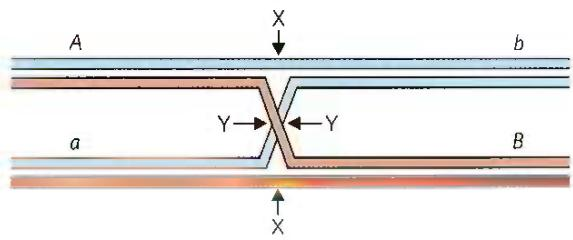

21. A Connection between Replication and Site-Specific Recombination Most wild strains of S. cerevisiae have multiple copies of the circular DNA plasmid $2\mu$ (named for its contour length of about $2\mu m$ ), which has $\sim6,300$ bp. For its replication, the plasmid uses the host replication system, under the same strict control as the host cell chromosomes, replicating only once per cell cycle. Replication of the plasmid is bidirectional, with both replication forks initiating at a single, well-defined origin. However, one replication cycle of a $2\mu$ plasmid can result in more than two copies of the plasmid, allowing amplification of the plasmid copy number (number of plasmid copies per cell) whenever plasmid segregation at cell division leaves one daughter cell with fewer than the normal complement of plasmid copies. Amplification requires a site-specific recombination system encoded by the plasmid, which serves to invert one part of the plasmid relative to the other. Explain how a site-specific inversion event could result in amplification of the plasmid copy number. (Hint: Consider the situation when replication forks have duplicated one recombination site but not the other.)

### [EN] DATA ANALYSIS PROBLEM

22. Mutagenesis in Escherichia coli Many mutagenic compounds act by alkylating the bases in DNA. The alkylating agent R7000 (7-methoxy-2-nitronaphtho[2,1-b]furan) is an extremely potent mutagen.

In vivo, R7000 is activated by the enzyme nitroreductase, and this more reactive form covalently attaches to DNA—primarily, but not exclusively, to G≡C base pairs.

In a 1996 study, Quillardet, Touati, and Hofnung explored the mechanisms by which R7000 causes mutations in E. coli. They compared the genotoxic activity of R7000 in two strains of E. coli: the wild-type (Uvr $^{+}$ ) and mutants lacking uvrA activity (Uvr $^{-}$ ). They first measured rates of mutagenesis. Rifampicin is an inhibitor of RNA polymerase. In its presence, cells will not grow unless certain mutations occur in the gene encoding RNA polymerase; the appearance of rifampicin-resistant colonies thus provides a useful measure of mutagenesis rates.

The investigators determined the effects of different concentrations of R7000. Their results are shown in the following graph:

  
(a) Why are some mutants produced even when no R7000 is present?

Quillardet and colleagues also measured the survival rate of bacteria treated with different concentrations of R7000, with the following results:

  
(b) Explain how treatment with R7000 is lethal to cells.

(c) Explain the differences in the mutagenesis curves and in the survival curves for the two types of bacteria, Uvr $^{+}$ and Uvr $^{-}$ , as shown in the graphs.

The researchers went on to measure the amount of R7000 covalently attached to the DNA in Uvr $^{+}$ and Uvr $^{-}$ E. coli. They incubated bacteria with [ $^{3}$ H]R7000 for 10 or 70 minutes, extracted the DNA, and measured its $^{3}$ H content in counts per minute (cpm) per microgram of DNA.

$^{3}$ H in DNA (cpm/ $\mu$ g)

<table><tr><td>Time (min)</td><td>Uvr+</td><td>Uvr-</td></tr><tr><td>10</td><td>76</td><td>159</td></tr><tr><td>70</td><td>69</td><td>228</td></tr></table>

(d) Explain why the amount of ${}^{3}H$ drops over time in the Uvr $^{+}$ strain and rises over time in the Uvr $^{-}$ strain.

Quillardet and colleagues then examined the particular DNA sequence changes caused by R7000 in the Uvr $^{+}$ and Uvr $^{-}$ bacteria. For this, they used six different strains of E. coli, each with a different point mutation in the lacZ gene, which encodes $\beta$ -galactosidase. Cells with any of these mutations have a nonfunctional $\beta$ -galactosidase and are unable to metabolize lactose (i.e., a Lac $^{-}$ phenotype). Each type of point mutation required a specific reverse mutation to restore lacZ gene function and Lac+ phenotype. By plating cells on a medium containing lactose as the sole carbon source, the researchers selected for these reverse-mutated, Lac+ cells. And by counting the number of Lac+ cells following mutagenesis of a particular strain, they could measure the frequency of each type of mutation.

First, they looked at the mutation spectrum in Uvr $^{-}$ cells. The following table shows the results for the six strains, CC101 through CC106 (with the point mutation required to produce Lac $^{+}$ cells indicated in parentheses).

Number of Lac $^{+}$ cells (average ± SD)

<table><tr><td>R7000 (μg/mL)</td><td>CC101 (A=T to C≡G)</td><td>CC102 (G≡C to A=T)</td><td>CC103 (G≡C to C≡G)</td><td>CC104 (G≡C to T=A)</td><td>CC105 (A=T to T=A)</td><td>CC106 (A=T to G≡C)</td></tr><tr><td>0</td><td>6±3</td><td>11±9</td><td>2±1</td><td>5±3</td><td>2±1</td><td>1±1</td></tr><tr><td>0.075</td><td>24±19</td><td>34±3</td><td>8±4</td><td>82±23</td><td>40±14</td><td>4±2</td></tr><tr><td>0.15</td><td>24±4</td><td>26±2</td><td>9±5</td><td>180±71</td><td>130±50</td><td>3±2</td></tr></table>

(e) Which types of mutation show significant increases above the background rate due to treatment with R7000? Provide a plausible explanation for why some have higher frequencies than others.

(f) Can all of the mutations you listed in (e) be explained as resulting from covalent attachment of R7000 to a G≡C base pair? Explain your reasoning.

(g) Figure 25-26b shows how methylation of guanine residues can lead to a G≡C to A=T mutation. Using a similar pathway, show how an R7000-G adduct could lead to the G≡C to A=T or T=A mutations shown above. Which base pairs with the R7000-G adduct?

The results for the Uvr $^{+}$ bacteria are shown in the following table.

Number of Lac $^{+}$ cells (average ± SD)

<table><tr><td>R7000 (μg/mL)</td><td>CC101 (A=T to C≡G)</td><td>CC102 (G≡C to A=T)</td><td>CC103 (G≡C to C≡G)</td><td>CC104 (G≡C to T=A)</td><td>CC105 (A=T to T=A)</td><td>CC106 (A=T to G≡C)</td></tr><tr><td>0</td><td>2±2</td><td>10±9</td><td>3±3</td><td>4±2</td><td>6±1</td><td>0.5±1</td></tr><tr><td>1</td><td>7±6</td><td>21±9</td><td>8±3</td><td>23±15</td><td>13±1</td><td>1±1</td></tr><tr><td>5</td><td>4±3</td><td>15±7</td><td>22±2</td><td>68±25</td><td>67±14</td><td>1±1</td></tr></table>

(h) Do these results show that all mutation types are repaired with equal fidelity? Provide a plausible explanation for your answer.

### [EN] Reference

Quillardet, P., E. Touati, and M. Hofnung. 1996. Influence of the uvr-dependent nucleotide-excision repair on DNA adducts formation and mutagenic spectrum of a potent genotoxic agent: 7-methoxy-2-nitronaphtho[2,1-b]furan (R7000). Mutat. Res. 358:113–122.

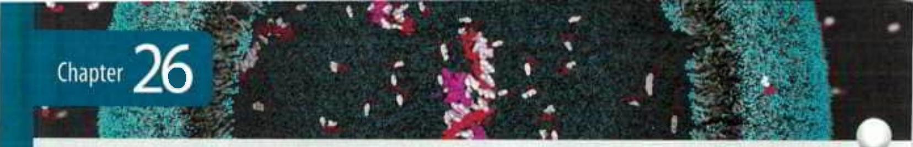

### [EN] Abbreviated Solutions — Chapter 25

1. (a) Structure 1

2. This is an extension of the classic Meselson-Stahl experiment. After three generations the molar ratio of ${}^{15}N-{}^{14}N$ DNA to ${}^{14}N-{}^{14}N$ DNA is 2/6 = 0.33.

3. (a) $4.42 \times 10^{5}$ turns (b) 40 min. In cells dividing every 20 min, a replicative cycle is initiated every 20 min, each cycle beginning before the prior one is complete. (c) 2,000 to 5,000 Okazaki fragments. The fragments are 1,000 to 2,000 nucleotides long. The ligation of Okazaki fragments does not occur randomly. Each fragment is stably base-paired with the lagging strand template prior to ligation with its neighbor, ensuring proper ordering.

4. A, 28.7%; G, 21.3%; C, 21.3%; T, 28.7%. The DNA strand made from the template strand: A, 32.7%; G, 18.5%; C, 24.1%; T, 24.7%; the DNA strand made from the complementary template strand: A, 24.7%; G, 24.1%; C, 18.5%; T, 32.7%. This assumes that the two template strands are replicated completely.

5. (a) No. Incorporation of ${}^{32}$ P into DNA results from the synthesis of new DNA, which requires the presence of all four nucleotide precursors. (b) Yes. Although all four nucleotide precursors must be present for DNA synthesis, only one of them has to be radioactive for radioactivity to appear in the new DNA. (c) No. Radioactivity is incorporated only if the ${}^{32}$ P label is in the $\alpha$ phosphate; DNA polymerase cleaves off pyrophosphate—that is, the $\beta$ - and $\gamma$ -phosphate groups.

6. Mechanism 1: 3'-OH group of an incoming dNTP attacks the $\alpha$ phosphate of the triphosphate at the 5' end of the growing DNA strand, displacing pyrophosphate. This mechanism uses normal dNTPs, and the growing end of the DNA always has a triphosphate on the 5' end.

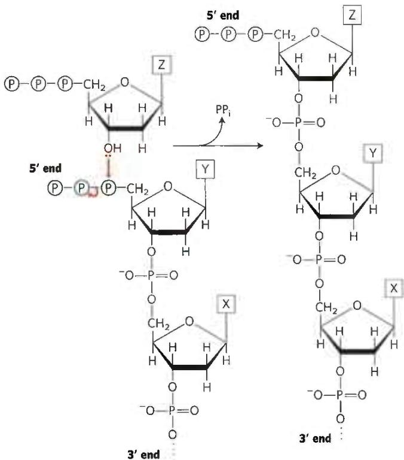

Mechanism 2: This uses a new type of precursor, nucleotide 3'-triphosphates. The growing end of the DNA strand has a 5'-OH group, which attacks the $\alpha$ phosphate of an incoming deoxynucleoside 3'-triphosphate, displacing pyrophosphate. Note that this mechanism would require the evolution of new metabolic pathways to supply the needed deoxynucleoside 3'-triphosphates.

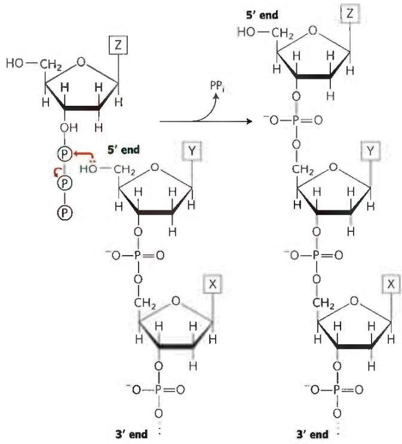

7. The DNA polymerase contains a $3'\rightarrow5'$ exonuclease activity that degrades DNA to produce $[^{32}P]dNMPs$ . The activity is not a $5'\rightarrow3'$ exonuclease, because the addition of unlabeled dNTPs inhibits the production of $[^{32}P]$ dNMPs (polymerization activity would suppress a proofreading exonuclease but not an exonuclease operating downstream of the polymerase). Addition of pyrophosphate would generate $[^{32}P]$ dNTPs through reversal of the polymerase reaction.

8. Leading strand: Precursors: dATP, dGTP, dCTP, dTTP (also needs a template DNA strand and DNA primer); enzymes and other proteins: DNA gyrase, helicase, single-stranded DNA-binding protein, DNA polymerase III, topoisomerases, and pyrophosphatase. Lagging strand: Precursors: ATP, GTP, CTP, UTP, dATP, dGTP, dCTP, dTTP (also needs an RNA primer); enzymes and other proteins: DNA gyrase, helicase, single-stranded DNA-binding protein, primase, DNA polymerase III, DNA polymerase I, DNA ligase, topoisomerases, and pyrophosphatase. NAD+ is also required as a cofactor for DNA ligase.

9. Mutants with defective DNA ligase produce a DNA duplex in which one of the strands remains in pieces (as Okazaki fragments). When this duplex is denatured, sedimentation results in one fraction containing the intact single strand (the high molecular weight band) and one fraction containing the unspliced fragments (the low molecular weight band).

10. Watson-Crick base pairing between template and leading strand; proofreading and removal of wrongly inserted nucleotides by the 3'-exonuclease activity of DNA polymerase III. Yes—perhaps. Because the factors ensuring fidelity of replication are operative in both the leading and the lagging strands, the lagging strand would probably be made with the same fidelity. However, the greater number of distinct chemical operations involved in making the lagging strand might provide a greater opportunity for errors to arise.

#### [EN] 11. \~1,200 bp (600 in each direction)

12. A small fraction (13 of $10^{9}$ cells) of the histidine-requiring mutants spontaneously undergo back-mutation and regain their capacity to synthesize histidine. 2-Aminoanthracene increases the rate of back-mutations about 1,800-fold and is therefore mutagenic. Since most carcinogens are mutagenic, 2-aminoanthracene is probably carcinogenic.

13. Spontaneous deamination of 5-methylcytosine (see Fig. 8-29a) produces thymine, and thus a G-T mismatched pair. These are among the most common mismatches in the DNA of eukaryotes. The specialized repair system restores the G=C pair.

14. \~1,950 (650 in the DNA degraded between the mismatch and GATC, plus 650 in DNA synthesis to fill the resulting gap, plus 650 in degradation of the pyrophosphate products to inorganic phosphate). ATP is hydrolyzed by the MutSL complex and by the UvrD helicase.

15. (a) UV irradiation produces pyrimidine dimers; in normal fibroblasts, these are excised by cleavage of the damaged strand by a special excinuclease. Thus the denatured single-stranded DNA contains the many fragments created by the cleavage, and the average molecular weight is lowered. These fragments of single-stranded DNA are absent from the XPG samples, as indicated by the unchanged average molecular weight. (b) The absence of fragments in the single-stranded DNA from the XPG cells after irradiation suggests the special excinuclease is defective or missing.

16. Most cancerous tumors consist of cells that are deficient in some aspect of DNA repair, relative to the normal surrounding tissue. They thus can be more sensitive to the DNA damaging agent. Tumor cells also tend to be actively dividing, a state in which cells are more sensitive to DNA damage that might be encountered by replication forks.

17. Using G\* to represent $O^{6}$ -meG:
(a) (5')AACG\*TGCAC
TTG T ACGTG
(5')AACGTGCAC
TTGCACGTG

(b) (5')AACGTGCAC TTGCACGTG

(5')AACGTGCAC TTGCACGTG

(c) (5')AACG\*TGCAC TTG T ACGTG

(5')AACATGCAC

TTGTACGTG

$2\times (5^{\prime})$ AACGTGCAC TTGCACGTG

18. Once paired with a complement after strand invasion, the 3' end, unlike a 5' end, can be extended by a DNA polymerase.

19. During homologous genetic recombination, a Holliday intermediate may be formed almost anywhere within the two paired, homologous chromosomes; the branch point of the intermediate can move extensively by branch migration. In site-specific recombination, the Holliday intermediate is formed between two specific sites, and branch migration is generally restricted by heterologous sequences on either side of the recombination sites.

#### [EN] 20. (a) Points Y (b) Points X

21. Once replication has proceeded from the origin to a point where one recombination site has been replicated but the other has not, site-specific recombination not only inverts the DNA between the recombination sites but also changes the direction of one replication fork relative to the other. The forks will chase each other around the DNA circle, generating many tandem copies of the plasmid. The multimeric circle can be resolved to monomers by additional site-specific recombination events.

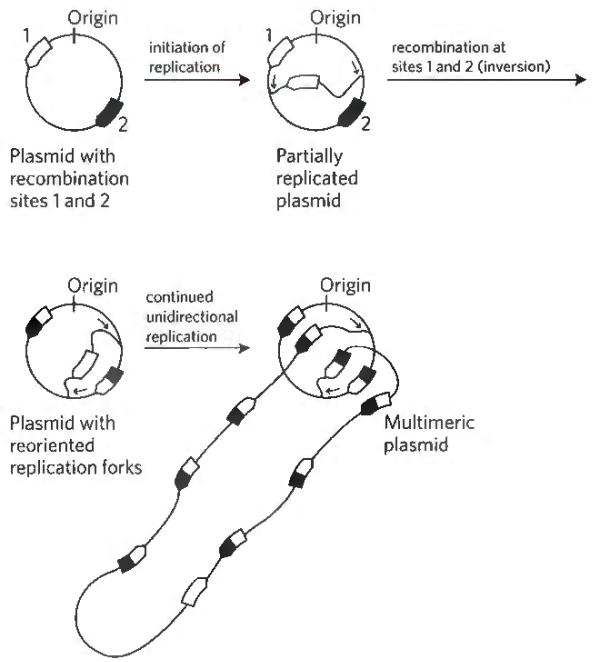  
22. (a) Even in the absence of an added mutagen, background mutations occur due to radiation, cellular chemical reactions, and so forth. (b) If the DNA is sufficiently damaged, a substantial fraction of gene products is nonfunctional and the cell is nonviable. (c) Cells with reduced DNA repair capability are more sensitive to mutagens. Because they less readily repair lesions caused by R7000, Uvr $^{-}$ bacteria have an increased mutation rate and increased chance of lethal effects. (d) In the Uvr $^{+}$ strain, the excision-repair system removes DNA bases with attached $[^{3}H]R7000$ , decreasing the amount of ${}^{3}H$ in these cells over time. In the Uvr $^{-}$ strain, the DNA is not repaired and the ${}^{3}H$ level increases as $[{}^{3}H]R7000$ continues to react with the DNA.

(e) All mutations listed in the table except A=T to G≡C show significant increases over background. Each type of mutation results from a different type of interaction between R7000 and DNA. Because different types of interactions are not equally likely (due to differences in reactivity, steric constraints, etc.), the resulting mutations occur with different frequencies. (f) No. Only those that start with a G≡C base pair are explained by this model. Thus A=T to C≡G and A=T to T=A must be due to R7000 attaching to an A or a T. (g) R7000—G pairs with A. First, R7000 adds to G≡C to give R7000—G≡C. (Compare this with what happens with the CH₃—G in Fig. 25-27b.) If this is not repaired, one strand is replicated as R7000—G=A, which is repaired to T=A. The other strand is wild-type. If the replication produces R7000—G=T, a similar pathway leads to an A=T base pair. (h) No. Compare data in the two tables, and keep in mind that different mutations occur at different frequencies.

A=T to C≡G: moderate in both strains; but better repair in Uvr $^{+}$

G≡C to A=T: moderate in both; no real difference

G≡C to C≡G: higher in Uvr $^{+}$ ; certainly less repair!

G≡C to T=A: high in both; no real difference

A=T to T=A: high in both; no real difference

A=T to G≡C: low in both; no real difference

Certain adducts may be more readily recognized by the repair apparatus than others, and these are repaired more rapidly and result in fewer mutations.

<!-- EN-END 第25章章末 -->
