# 第 32 章 RNA 的生物合成和加工

> **本章英文对应内容**（Lehninger，插在所列中文小节末尾）
>
> - 第26章 RNA Metabolism：章首导言（本章开头）、关键术语/习题/简答（本章末尾）
> - §26.1（第26章）→ 一、DNA 指导下 RNA 的合成
> - §26.2（第26章）→ 二、RNA 的转录后加工
> - §26.3（第26章）→ 三、RNA 指导下 RNA 和 DNA 的合成

贮存于 DNA 中的遗传信息需通过转录和翻译而得到表达。在转录过程中，RNA 聚合酶以 DNA 的一条链作为模板，通过碱基配对的方式合成出与模板链互补的 RNA。最初转录的 RNA 产物通常都需要经过一系列加工和修饰才能成为成熟的 RNA 分子。RNA 所携带的遗传信息也可以用于指导 RNA 或 DNA 的合成，前一过程即 RNA 复制，后一过程为逆转录。RNA 的信息加工和各种细胞功能的发现，已使 RNA 研究成为生命科学最活跃的研究领域之一。

<!-- EN-BEGIN 第26章导言 -->

### 【英文对应 第26章导言】RNA Metabolism

> 来源：Lehninger Principles of Biochemistry（书籍/02_生物化学原理） 第26章章首（含章节目录与学习要点）。

#### [EN] RNA METABOLISM

26.1 DNA-Dependent Synthesis of RNA 961

26.2 RNA Processing 972

26.3 RNA-Dependent Synthesis of RNA and DNA 988

#### [EN] 26.4 Catalytic RNAs and the RNA World Hypothesis 995

Expression of the information in a gene generally involves production of an RNA molecule transcribed from a DNA template. Strands of RNA and DNA may seem similar at first glance, differing only in that RNA has a hydroxyl group at the 2' position of the aldopentose, and uracil usually replaces thymine. However, unlike DNA, most RNAs carry out their functions as single strands, strands that fold back on themselves and have the potential for much greater structural diversity than DNA (Chapter 8). RNA is thus suited to a variety of cellular functions.

RNA is the only macromolecule known to have a role both in the storage and transmission of information and in catalysis, which has led to much speculation about its possible role as an essential chemical intermediate in the development of life on this planet. The discovery of catalytic RNAs, or ribozymes, has changed the very definition of an enzyme, extending it beyond the domain of proteins. Proteins nevertheless remain essential to RNA and its cellular functions. In the biosphere of today, all nucleic acids, including RNAs, are complexed with proteins. In the case of RNA, these complexes are called ribonucleoproteins or RNPs. Some of these RNPs are quite elaborate, and RNA can assume both structural and catalytic roles within complicated biochemical machines.

All RNA molecules except the RNA genomes of certain viruses are derived from information permanently stored in DNA. During transcription, an enzyme system converts the genetic information in a segment of double-stranded DNA into an RNA strand with a base sequence complementary to one of the DNA strands. Four major kinds of RNA are produced. Messenger RNAs (mRNAs) encode the amino acid sequence of one or more polypeptides specified by a gene or set of genes. Transfer RNAs (tRNAs) read the information encoded in the mRNA and transfer the appropriate amino acid to a growing polypeptide chain during protein synthesis. Ribosomal RNAs (rRNAs) are constituents of ribosomes, the intricate cellular machines that synthesize proteins. Noncoding RNAs (ncRNAs) have a variety of catalytic, structural, and regulatory functions.

During replication the entire chromosome is usually copied, but transcription is more selective. Only particular genes or groups of genes are transcribed at any one time, and some portions of the DNA genome are never transcribed. The cell restricts the expression of genetic information to the formation of gene products needed at any particular moment. The sum of all the RNA molecules produced in a cell under a given set of conditions is called the cellular transcriptome. Given the relatively small fraction of the human genome devoted to protein-coding genes (about 2%), we might expect that only a small part of the human genome is transcribed. This is not the case. Transcriptome analyses have revealed that approximately 76% of the human genome is transcribed into RNA. The products are predominantly not mRNAs but rather ncRNAs. Many ncRNAs are involved in regulating gene expression by interaction with other RNAs, genomic DNA, or proteins. However, the rapid pace of their discovery has forced us to realize that we do not yet know the function of the majority of our genomic ncRNA transcripts.

In this chapter we examine the synthesis of RNA on a DNA template and the postsynthetic processing, location, and turnover of RNA molecules. In doing so, we encounter many of the specialized functions of RNA, including catalytic functions. We also describe systems in which RNA is the template and DNA the product, rather than vice versa. The information pathways thus come full circle and reveal that template-dependent nucleic acid synthesis has standard rules, regardless of the nature of template or product (RNA or DNA). This examination of the biological interconversion of DNA and RNA as information carriers leads inevitably to a discussion of the evolutionary origin of biological information and processing. We will be guided by four principles.

P1 RNA is synthesized by RNA polymerases using DNA templates and ribonucleoside 5'-triphosphates. RNA is made in the 5'→3' direction and complementary to the template DNA strand. Transcription is highly regulated and initiates by recruitment of the transcription machinery to gene promoters. Although bacterial and eukaryotic polymerases share many conserved features, the transcriptional machinery and its regulation are much more complex in eukaryotes.

P2 Many RNAs must be modified and processed to become functional. RNAs can be modified by nucleases, by excision of certain RNA segments, and/or by chemical modification of the RNA nucleotides. In humans, nearly all mRNAs are 5' capped, spliced, and polyadenylated before being exported from the nucleus for translation in the cytoplasm.

P3 RNA can be used as a template for synthesis of DNA by reverse transcriptases. RNA carries genetic information that can be reverse transcribed into DNA. Retroviruses, such as HIV or those responsible for some cancers, must convert their RNA genomes into DNA by reverse transcription. Reverse transcription by telomerase is also responsible for producing the telomeres that protect the DNA found at the ends of eukaryotic chromosomes.

P4 RNA can act as both a catalyst and carrier of genetic information. Ribozymes can catalyze chemical transformations using many of the same strategies as protein-based enzymes. The dual capacity of RNA as both a carrier of genetic information and a catalyst is support for the RNA world hypothesis for the evolution of life on Earth.

<!-- EN-END 第26章导言 -->

## 一、DNA 指导下 RNA 的合成

RNA链的转录起始于DNA模板的特定起点，并在下游终点处终止。此转录区域称为转录单位。一个转录单位可以是一个基因，也可以是多个基因。基因是遗传物质的最小功能单位，相当于DNA的一个片段。它通过转录对表型有专一性的效应。基因的转录是有选择性的，随着细胞的不同生长发育阶段和细胞内外条件的改变而转录不同的基因。转录的起始由DNA的启动子(promoter)控制，终止位点则称为终止子(terminator)。转录是通过DNA指导的RNA聚合酶来实现的，现在已从各种原核生物和真核生物中分离到了这种聚合酶。通过提纯的酶在体外对DNA进行选择性的转录，基本上搞清楚了转录的机制。

## （一）DNA 指导的 RNA 聚合酶

1960 年至 1961 年,由微生物和动物细胞中分别分离得到 DNA 指导的 RNA 聚合酶 (DNA-directed RNA polymerase),该酶需要以 4 种核糖核苷三磷酸 (NTP) 作为底物,并需要适当的 DNA 作为模板, $Mg^{2+}$ 能促进聚合反应。RNA 链的合成方向也是 $5'\rightarrow3'$ ,第一个核苷酸带有 3 个磷酸基,其后每加入一个核苷酸脱去一个焦磷酸,形成磷酸二酯键,反应是可逆的,但焦磷酸的分解可推动反应趋向聚合。与 DNA 聚合酶不同,RNA 聚合酶无需引物,它能直接在模板上合成 RNA 链。

$$
\begin{array}{r l} & {n _ {1} \mathrm{dATP}} \\ & {\qquad +} \\ & {n _ {2} \mathrm{dGTP}} \\ & {\qquad +} \\ & {n _ {3} \mathrm{dCTP}} \\ & {\qquad +} \\ & {n _ {4} \mathrm{dUTP}} \end{array} \xrightarrow [ \mathrm {DNA, Mg^ {2 + } \text {或} Mn^ {2 +}} ]{\mathrm{DNA指导的RNA聚合酶}} \mathrm{RNA+} (n _ {1} + n _ {2} + n _ {3} + n _ {4}) \mathrm{PPi}
$$

在体外，RNA 聚合酶能使 DNA 的两条链同时进行转录；但在体内 DNA 两条链中仅有一条链可用于转录，或者某些区域以这条链转录，另一些区域以另一条链转录。用于转录的链称为模板链，或负链（-链）；对应的链为编码链，即正链（+链）。编码链与转录出来的 RNA 链碱基序列一样，只是以尿嘧啶取代胸腺嘧啶，它不能作为转录的模板，只能进行复制。RNA 在体外转录时失去控制机制，使两条链同样进行转录，这种不正常情况被认为可能是由于 DNA 在制备过程因断裂而失去控制序列，或 RNA 聚合酶在分离时丢失起始亚基 $\sigma$ 引起的。分子杂交实验表明，合成的 RNA 只与模板 DNA 形成杂交体，而与其他 DNA 不能产生杂交。

在 RNA 聚合酶催化的反应中,天然(双链)DNA 作为模板比变性(单链)DNA 更为有效。这表明 RNA 聚合酶对模板的利用与 DNA 聚合酶有所不同。DNA 在复制时,首先需要将两条链解开,DNA 聚合酶才能将它们作为模板,以半保留的方式形成两个子代分子。转录时无需将 DNA 双链完全解开,RNA 聚合酶能够局部解开 DNA 的两条链,并以其中一条链作为模板,在其上合成出互补的 RNA 链,DNA 经转录后仍以全保留的方式(conservative mode)保持双螺旋结构,已合成的 RNA 链则离开 DNA 链(图 32-1)。

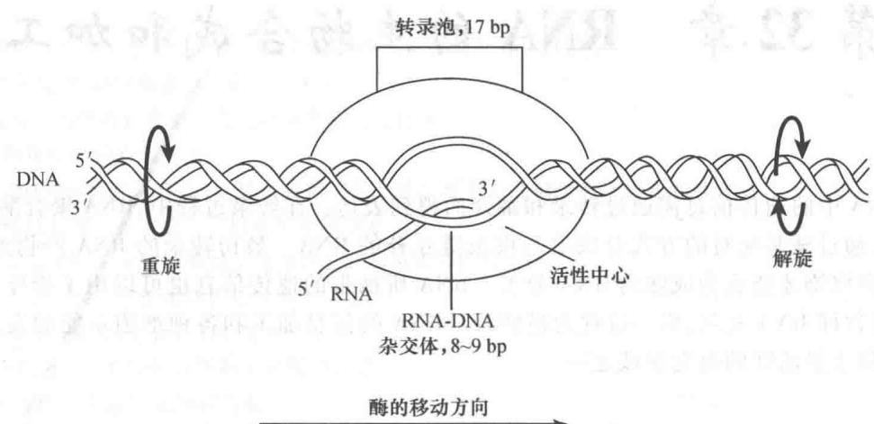  
图 32-1 大肠杆菌 RNA 聚合酶进行转录

大肠杆菌的 RNA 聚合酶全酶(holoenzyme)相对分子质量 465 000,由五个亚基( $\alpha_{2}\beta\beta'\sigma$ )组成,还含有两个镁离子,它们与 $\beta'$ 亚基相结合。没有 $\sigma$ 亚基的酶( $\alpha_{2}\beta\beta'\omega$ )叫核心酶(core enzyme)。核心酶只能使已开始合成的 RNA 链延长,但不具有起始合成 RNA 的能力。这就是说,在开始合成 RNA 链时必须有 $\sigma$ 亚基参与作用,因此称 $\sigma$ 亚基为起始亚基。此外,在全酶制剂中还存在一种相对分子质量较小的成分,称为 $\omega$ 亚基。各亚基的大小和功能列于表 32-1。每个大肠杆菌细胞含有 13 000 个酶分子。RNA 聚合酶的转录速度在 37℃ 约为 40\~50 个核苷酸/s,与多肽链的合成速度(15 个氨基酸/s)相当,但远比 DNA 的合成速度(800 bp/s)慢。

表 32-1 大肠杆菌 RNA 聚合酶各亚基的性质和功能

<table><tr><td>亚基</td><td>基因</td><td>相对分子质量</td><td>亚基数目</td><td>功能</td></tr><tr><td> $\alpha$ </td><td>rpo A</td><td>37 000</td><td>2</td><td>酶的装配与启动子上游元件的活化因子结合</td></tr><tr><td> $\beta$ </td><td>rpo B</td><td>151 000</td><td>1</td><td rowspan="2">结合核苷酸底物催化磷酸二酯键形成催化中心与模板 DNA 结合</td></tr><tr><td> $\beta'$ </td><td>rpo C</td><td>155 000</td><td>1</td></tr><tr><td> $\sigma$ </td><td>rpo D</td><td>32 000~92 000</td><td>1</td><td>识别启动子促进转录的起始</td></tr><tr><td> $\omega$ </td><td>rpo Z</td><td>9 000</td><td>1</td><td>组建,调节</td></tr></table>

已有多种细菌、噬菌体和真核生物的 RNA 聚合酶用 X 射线测定了它们的晶体结构，T7 噬菌体 RNA 聚合酶虽为一条多肽链，但其空间结构仍与原核和真核生物类似。酶的形状有如一个多突起椭球体，长达 16 nm。最大的两个亚基 $\beta$ 和 $\beta'$ 由不同的基因编码，但它们的结构与功能十分相似，推测它们在进化上有共同的起源。 $\beta$ 和 $\beta'$ 亚基犹如螃蟹的前螯，活性中心位于两个亚基底部界面处。 $\alpha$ 亚基在酶的另一端，其 C 端结构域（C-terminal domain, CTD）与 DNA 接触，它与酶的组装以及转录起始有关。 $\omega$ 亚基与酶的组建和功能调节有关。 $\sigma$ 亚基窄而长，分 4 个区，位于核心酶表面。例如，大肠杆菌一般基因转录共用的起始因子 $\sigma^{70}$ ，以其 2 区与启动子的 -10 序列结合并解开双螺旋，4 区与 -35 序列结合，1 区与 3 区的某些部位带有强的负电荷，前者可抑制 $\sigma$ 亚基与 DNA 的结合，后者可堵住酶的 RNA 通道，两者均起调节作用。全酶各亚基相对位置如图 32-2 所示。

RNA 聚合酶的活性中心有多个通道。 $\beta$ 和 $\beta'$ 亚基间的裂缝为 DNA 入口的通道。进入活性中心的

DNA 遇到的蛋白质壁产生转折,促使双链解开,模板链和非模板链经分开的两通道而于出口处重新形成双螺旋。RNA 链在模板链上不断合成,并经 RNA 出口通道离开酶。核苷三磷酸由底物入口通道到达 RNA 链的生长点(图 32-3)。在 $Mg^{2+}$ 的帮助下,RNA 链 $3^{\prime}-OH$ 的氧对底物 NTP $\alpha-PO_{4}$ 的磷原子发动亲核攻击,形成磷酸二酯键,并释放出焦磷酸。 $\sigma^{70}$ 亚基游离存在时并不与 DNA 的启动子结合,因其 N 端部位回折封闭了 2 和 4 区与启动子结合的活性部位,只有当 $\sigma^{70}$ 与核心酶结合时才暴露出该活性部位。

  
图 32-2 大肠杆菌 RNA 聚合酶的亚基结构

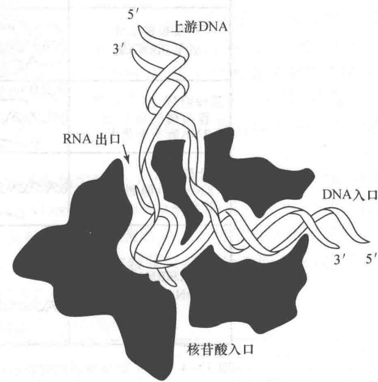  
图 32-3 DNA 在活性部位转折并使双链解开

转录反应可分为三个阶段:转录的起始、延伸和终止。起始阶段又可分为三步。首先 RNA 聚合酶在 $\sigma$ 亚基引导下识别并结合到启动子上,启动子的 -10 和 -35 区由 $\sigma$ 亚基识别,上游序列则由 $\alpha$ 亚基识别。此时全酶与 DNA 形成闭合型复合物 (closed complex)。然后,复合物由闭合型转变为开放型 (open complex)。DNA 双链被局部解开,形成转录泡 (transcription bubble),酶的构象也发生改变, $\beta$ 和 $\beta'$ 亚基牢固夹住 DNA 直至转录结束, $\sigma$ 亚基的 N 端部分离开 DNA 入口,方便 DNA 的移动。最后,酶的催化中心按照模板链的碱基选择与其配对的底物核苷酸,形成二酯键并脱下焦磷酸。第一个核苷酸通常为腺苷酸(或鸟苷酸)。最初产生不超过 10 个核苷酸的 RNA 链即被释放,称为流产起始 (abortive initiation),也许这只是一种转录前的试探。在转录条件合适,转录物超过 10 个核苷酸之后,转录才进入延伸阶段。随着 $\sigma$ 亚基脱离核心酶,后者也就离开启动子,起始阶段至此结束。

在延伸阶段,随着核心酶沿 DNA 分子向前移动,解链区也跟着移动,新生 RNA 链得以不断生长。在解链区 RNA 与 DNA 模板链形成杂交体,其后 DNA 恢复双螺旋结构,RNA 被置换出来。有时转录会突然受阻,例如遇到 DNA 受损或进入核苷酸类似物,核心酶的移动随即停止,此种情况称为熄火(stall)。当除去受阻因素以后,核心酶为恢复转录需后退若干核苷酸,在辅助因子(大肠杆菌为 GreA 和 GreB,真核生物为 TF II S)帮助下切除一段 RNA,在新产生的 3'-OH 上继续 RNA 链的生长。最后,RNA 聚合酶在 Nus A 因子(亚基)帮助下识别转录终止信号,停止转录,酶与 RNA 链离开模板,DNA 恢复双螺旋结构(图 32-4)。

$\sigma$ 因子 $(\sigma$ 亚基) 的功能在于引导 RNA 聚合酶稳定地结合到 DNA 启动子上。单独核心酶也能与 DNA 结合。 $\beta'$ 亚基是一碱性蛋白、与酸性 DNA 之间可借静电引力结合； $\beta$ 亚基也可借疏水相互作用与 DNA 结合，但是此种结合与 DNA 的特殊序列无关，DNA 仍保持其双链形式。 $\sigma$ 因子的存在导致 RNA 聚合酶与 DNA 一般序列和启动子序列的亲和力产生很大不同，极大降低了酶与一般序列的结合常数和停留时间，同时又大大增加了酶与启动子的结合常数和停留时间。大肠杆菌 RNA 聚合酶核心酶和一般序列的结合常数为 $10^{9}(\mathrm{mol/L})^{-1}$ ，停留的半寿期约 $60\mathrm{min}$ 。当 $\sigma$ 因子与核心酶结合后，与 DNA 一般序列的结合常数为 $10^{5}$ ，半寿期小于 1 s；而与 DNA 启动子的结合常数达到 $10^{12}$ ，半寿期为数小时，二者结合常数相差约 $10^{7}$ 。这只是一个平均数，因为酶与不同基因启动子的亲和力并不一样，它们的结合常数变动范围在 $10^{12} \sim 10^{6}$ 。受亲和力影响，起始频率也各不相同，rRNA 基因启动频率为每秒一次，lac I 启动频率为每 30 min 一次。

<table><tr><td>起始阶段:RNA聚合酶在 $\sigma$ 亚基引导下结合到启动子上</td><td></td></tr><tr><td>DNA双链局部解开</td><td></td></tr><tr><td>在模板链上合成最初RNA链</td><td></td></tr><tr><td>延伸阶段:核心酶向前移动RNA链不断生长</td><td>恢复DNA双螺旋结构5′mRNA</td></tr><tr><td>终止阶段:RNA聚合酶到达转录终点</td><td></td></tr><tr><td>RNA和RNA聚合酶从DNA上脱落</td><td></td></tr></table>

图 32-4 RNA 聚合酶催化的转录过程

全酶可通过扩散与 DNA 任意部位结合,这种结合是疏松的,并且是可逆的。随后酶结合的 DNA 迅速被置换。DNA 置换显然比酶从 DNA 上脱落下来再经扩散结合到另外部位要快得多。全酶不断改变与 DNA 的结合部位,直到遇上启动子序列,随即由疏松结合转变为牢固结合,并且 DNA 双链被局部解开。

不同的 $\sigma$ 因子识别不同类型的启动子，可借以调节基因的转录。大肠杆菌一般基因由 $\sigma^{70}$ 因子所识别，其他 $\sigma$ 因子可介导特殊基因的协同表达，例如识别应激反应有关基因的因子为 $\sigma^{\mathrm{S}}$ ，热休克（heat shock）蛋白基因的因子为 $\sigma^{32}$ ，利用不同氮源有关基因的因子为 $\sigma^{54}$ ，某些不利环境下反应有关基因为 $\sigma^{\mathrm{E}}$ 以及与鞭毛运动有关基因的因子为 $\sigma^{\mathrm{F}}$ （表32-2）。一些噬菌体（如T4噬菌体）编码自身的 $\sigma$ 因子，这些 $\sigma$ 因子使宿主细胞的核心酶被用于转录噬菌体的基因；另一些噬菌体（如T3，T7）合成自己的RNA聚合酶。这类聚合酶仅为一条相对分子质量小于100000的单链多肽，也无 $\sigma$ 亚基，但对自身DNA的启动子具有高度专一型和高的转录效率，在 $37^{\circ}\mathrm{C}$ 转录速度可达200个核苷酸/s，相当于细菌转录速度的 $3\sim 4$ 倍。

表 32-2 大肠杆菌 RNA 聚合酶的起始亚基及其识别的启动子序列

<table><tr><td>基因</td><td>亚基</td><td>-35 序列</td><td>间隔</td><td>-10 序列</td><td>功能</td></tr><tr><td>rpoD</td><td> $\sigma^{70}$ </td><td>TTGACA</td><td>16~18 bp</td><td>TATAAT</td><td>一般基因转录</td></tr><tr><td>rpoN</td><td> $\sigma^{54}$ </td><td>CTGGNA</td><td>6 pb</td><td>TTGCA</td><td>不同氮源利用</td></tr><tr><td>rpoS</td><td> $\sigma^{38}(\sigma^S)$ </td><td>TTGACA</td><td>16~18 bp</td><td>TATAAT</td><td>应激反应</td></tr><tr><td>rpoH</td><td> $\sigma^{32}$ </td><td>CCCTTGAA</td><td>13~15 bp</td><td>CCCGATNT</td><td>热休克</td></tr><tr><td>rpoF</td><td> $\sigma^{28}(\sigma^F)$ </td><td>CTAAA</td><td>15 bp</td><td>GCCGATAA</td><td>靶毛合成和趋化作用</td></tr><tr><td>rpoE</td><td> $\sigma^{24}(\sigma^E)$ </td><td>GAA</td><td>16 bp</td><td>YCTGA</td><td>极端环境</td></tr><tr><td>fecl</td><td> $\sigma^{18}(\sigma^{Fecl})$ </td><td></td><td></td><td></td><td>柠檬酸铁的转运</td></tr></table>

过去以为 RNA 聚合酶无校对功能,实际上无论是 DNA、RNA 或蛋白质的合成都有校对功能,并能对错误加以纠正,只不过 RNA 聚合酶的校对作用十分有限。RNA 聚合酶可以在两个水平上进行校对。一是借焦磷酸解(pyrophosphorolysis)除去错误掺入的核苷酸,这是聚合反应的逆反应。由于 RNA 聚合酶在遇到错配核苷酸时停留时间比正常核苷酸为长,故给予了切除的机会。另一种校对机制是聚合酶发生熄火,酶向后退,切除一段 RNA(包括错配碱基),然后再重新开始转录。

真核生物的基因组远比原核生物大，它们的RNA聚合酶也更为复杂。真核生物RNA聚合酶主要有三类，相对分子质量都在500000左右，通常都有 $10\sim 15$ 个亚基，并含有二价金属离子。原核生物RNA聚合酶的亚基(除 $\sigma$ 亚基)在真核生物的酶中都有其对应物。利用 $\alpha-$ 鹅膏蕈碱（ $\alpha-$ amanitine）的抑制作用可将真核生物三类RNA聚合酶区分开；RNA聚合酶I对鹅膏蕈碱不敏感，RNA聚合酶II可被低浓度 $\alpha-$ 鹅膏蕈碱（ $10^{-9}\sim 10^{-8}\mathrm{mol / L})$ 所抑制，RNA聚合酶III只被高浓度 $\alpha-$ 鹅膏蕈碱（ $10^{-5}\sim 10^{-4}\mathrm{mol / L})$ 所抑制。 $\alpha-$ 鹅膏蕈碱是一种毒蕈(鬼笔鹅膏Amanita phalloides)产生的八肽化合物，对真核生物有较大毒性，但对细菌的RNA聚合酶只有微弱的抑制作用。

真核生物 RNA 聚合酶 I 转录 45S rRNA 前体，经转录后加工产生 5.8S RNA、18S rRNA 和 28S rRNA。RNA 聚合酶 II 转录所有 mRNA 前体和大多数核内小 RNA(snRNA)。RNA 聚合酶 III 转录 tRNA、5S rRNA、U6 snRNA 和胞质小 RNA(scRNA) 等小分子转录物。真核生物 RNA 聚合酶中没有细菌 $\sigma$ 因子的对应物，必须借助各种转录因子才能选择和结合到启动子上。因此真核生物转录反应可分为四个阶段：装配、起始、延伸和终止。真核生物 RNA 聚合酶的种类和性质列于表 32-3。

表 32-3 真核生物 RNA 聚合酶的种类和性质

<table><tr><td>酶的种类</td><td>功能</td><td>对抑制物的敏感性</td></tr><tr><td>RNA聚合酶I</td><td>转录45S rRNA前体,经加工产生5.8S rRNA、18S rRNA和28S rRNA。</td><td>对 $\alpha$ -鹅膏蕈碱不敏感</td></tr><tr><td>RNA聚合物II</td><td>转录所有编码蛋白质的基因和大多数核内小RNA</td><td>对 $\alpha$ -鹅膏蕈碱敏感</td></tr><tr><td>RNA聚合物III</td><td>转录小RNA的基因,包括tRNA、5S rRNA、U6 snRNA和scRNA</td><td>对 $\alpha$ -鹅膏蕈碱中等敏感</td></tr></table>

除了上述细胞核 RNA 聚合酶外,还分离到线粒体和叶绿体 RNA 聚合酶,它们分别转录线粒体和叶绿体的基因组。线粒体和叶绿体的 RNA 聚合酶不同于细胞核的 RNA 聚合酶,它们的结构比较简单,类似于细菌的 RNA 聚合酶,能催化所有种类 RNA 的生物合成,并被原核生物 RNA 聚合酶的抑制物利福平等抑制。

## （二）启动子和转录因子

启动子是指 RNA 聚合酶识别、结合和开始转录的一段 DNA 序列。转录因子(transcription factor)则是 RNA 聚合酶在特异启动子上起始转录所需要的作用因子。

利用足迹法(footprint)和 DNA 测序法可以确定启动子的核心序列。所谓足迹法即是将 DNA 起始转录的限制片段分离出来,加 RNA 聚合酶使之结合。利用 DNA 酶进行部分水解,与酶结合的部位被保护而不水解,其余部位水解成长短不同的片断,经凝胶电泳即可测出酶所结合的部位(图 32-5)。

习惯上 DNA 的序列按其转录的 RNA 链(有义链,正链)来书写,由左到右相当于 5' 到 3' 方向。转录单位的起点(start point)核苷酸为 +1,从转录的近端(proximal)向远端(distal)计数。转录起点的左侧为上游(upstream),用负的数码来表示,起点前一个核苷酸为 -1。起点后为下游(downstream),即转录区。通过比较已知启动子的结构,可寻找出它们的共有序列(consensus sequence)。大肠杆菌基因组为 $4.7 \times 10^{6}$ bp,为避免假信号的出现,估计信号序列最短必须有 $12 \text{ bp}(4^{12}=1.68\times10^{7},\text{略大于基因组})$ 。信号序列并不一定要连续,因为分开距离的本身也是一种信号。从起点上游约 -10 序列处找到 6 bp 的保守序列 TATAAT,称为 Pribnow 框 (box) 或称为 -10 序列。实际位置在不同启动子中略有变动。该保守序列各碱基出现的统计频率为:

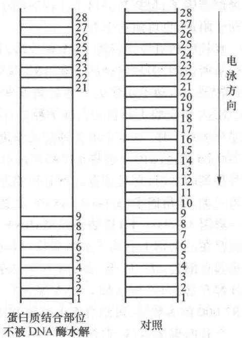  
图 32-5 足迹法测定 DNA 上蛋白质的结合部位

$$
\mathrm{T} _ {8 0} \mathrm{A} _ {9 5} \mathrm{T} _ {4 5} \mathrm{A} _ {6 0} \mathrm{A} _ {5 0} \mathrm{T} _ {9 6}
$$

若将上述片段提纯，RNA 聚合酶不能与之再结合，因此必定另外还有序列为 RNA 聚合酶识别和结合所必需。在 -10 序列的上游又找到一个保守序列 TTGACA，其中心约为 -35 位置，称为识别区或 -35 序列。各碱基出现的频率如下：

$$
\mathrm{T} _ {8 2} \mathrm{T} _ {8 4} \mathrm{G} _ {7 8} \mathrm{A} _ {6 5} \mathrm{C} _ {5 4} \mathrm{A} _ {4 5}
$$

利用定位诱变技术使启动子发生突变可获得有关共有序列功能的信息。-35序列的突变将降低RNA聚合酶与启动子结合的速度，但不影响转录起点附近DNA双链地解开；而-10序列的突变不影响RNA聚合酶与启动子结合的速度，可是会降低双链解开速度。由此可见，-35序列提供了RNA聚合酶识别的信号，-10序列则有助于DNA局部双链解开，-10序列含有较多的A-T碱基对，因而双链分开所需能量也较低。启动子共有序列的功能见图32-6。启动子的结构是不对称的，它决定了转录的方向。

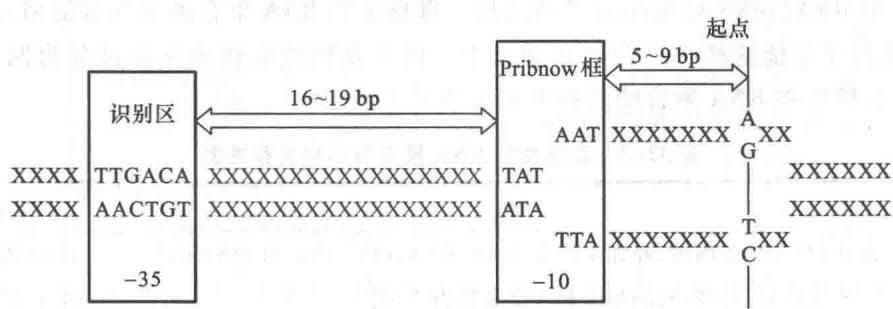  
图32-6 启动子共有序列的功能

启动子-35序列以及-10序列正好位于双螺旋DNA的同一侧。它们之间距离的改变将影响 $\sigma$ 因子的作用力而改变起始效率。启动子的序列是多种多样的，尽管分成两个保守位点是最为常见的结构，最弱的启动子完全没有-35序列，转录速度几近乎零，必须在另外的激活蛋白帮助下RNA聚合酶才能结合。转录调节因子，包括激活因子和抑制因子，其在DNA上的结合位点（应答元件）或是在启动子内，或是在启动子附近，也可能在上游。

真核生物对应于三类 RNA 聚合酶, 其启动子也有三类。真核生物的启动子由转录因子而不是 RNA 聚合酶所识别, 多种转录因子和 RNA 聚合酶在起点上首先形成前起始复合物 (preinitiation complex) 而后进行转录。启动子通常由一些短的保守的序列所组成, 它们被适当种类的辅助因子 (ancillary factor) 识别。RNA 聚合酶 I 和 III 的启动子种类有限, 对其识别所需辅助因子的数量也较少。RNA 聚合酶 II 的启动子序列多种多样, 基本上由各种顺式作用元件 (cis-acting element) 组合而成, 它们分散在转录起点上游大约 200 bp 的范围内。某些元件和其识别因子是各类启动子共有的; 有些元件和因子是特异的, 只存在于某些种类的基因, 常见于发育和分化的控制基因。参与 RNA 聚合酶 II 转录起始的各类因子数目很大, 可分为三类: 通用因子 (general factor)、上游因子 (upstream factor) 和可诱导因子 (inducible factor)。

类别 I (class I) 启动子控制 rRNA 基因的转录, 由 RNA 聚合酶 I 催化。该类基因有许多拷贝, 往往成簇存在。类别 I 启动子由两部分 (bipartite) 保守序列所组成。其一为核心启动子 (core promoter) 位于转录起点附近, 从 -45 至 +20; 另一为上游控制元件 (upstream control element, UCE) 位于 -180 至 -107。两部分都有富含 GC 的区域。RNA 聚合酶 I 对其转录需要两种因子参与作用。UBF1 是一条相对分子质量为 97 000 的多肽链, 可结合在上游控制元件富含 GC 区。随后 SL1 因子转移到核心启动子上。SL1 因子是一个异四聚体蛋白, 它含有一个另两类 RNA 聚合酶起始转录也需要 的蛋白 TBP 和 3 个特异的转录辅助因子 TAF I 。在 SL1 因子介导下 RNA 聚合酶 I 结合在转录起点上并开始转录。SL1 因子起着定位的作用, 有些类似于细菌的 $\sigma$ 因子。类别 I 启动子的结构与转录因子的结合位置见图 32-7。

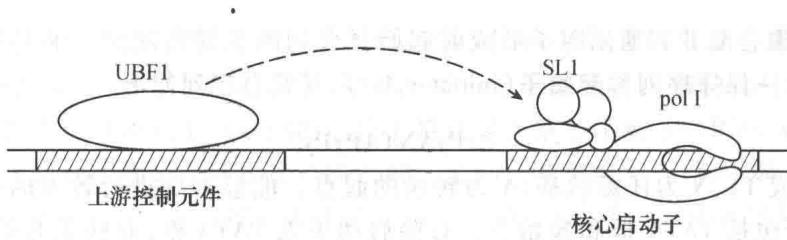  
图32-7 类别I启动子的结构与相应转录因子的结合位置

类别Ⅱ(class Ⅱ)或RNA聚合酶Ⅱ启动子涉及众多编码蛋白质的基因表达的控制。该类型启动子包含五类控制元件:基本启动子(basal promoter)、起始子(initiator)、上游元件(upstream element)、下游元件(downstream element)、有时还有各种应答元件(response element)。这些元件的不同组合,再加上其他序列的变化,构成了数量十分庞大的各种启动子。它们受相应转录因子的识别和作用。其中有些是组成型的,可在各类细胞中存在;有些是诱导型的,在时序、空间和各种内外条件调节下产生。

基本启动子序列为-25至-30左右的7bp保守区，其碱基频率为：

$$
\mathrm{T} _ {8 2} \mathrm{A} _ {9 7} \mathrm{T} _ {9 3} \mathrm{A} _ {8 5} (\mathrm{A} _ {6 3}, \mathrm{T} _ {3 7}) \mathrm{A} _ {8 2} (\mathrm{A} _ {6 0}, \mathrm{T} _ {3 7})
$$

这一共有序列称为 TATA 框(TATA box)或 Goldberg-Hogness 框,序列中全为 A-T 碱基对,仅少数启动子中含有一个 G-C 对,其功能与 RNA 聚合酶的定位有关,DNA 双链在此解开并决定转录的起点位置。失去 TATA 框,转录将在许多位点上开始。

作用于基本启动子上的辅助因子称为通用(转录)因子(general transcription factor, GTF),或基本转录因子(basal transcription factor),它们为任何细胞类别Ⅱ启动子起始转录所必需,以TFⅡX来表示,其中X按发现先后次序用英文字母定名。目前已知至少有6种以上通用因子参与作用。最先结合到TATA框上的因子是TFⅡD,它是一种寡聚蛋白,包含TATA结合蛋白(TATA-binding protein, TBP)和多种TBP相联因子(TBP-associated factor, TAF),起定位因子的作用。TBP结合于DNA的小沟,使DNA弯曲成约80°,有助于双链解开。TAF具有特异性,作用类别Ⅱ启动子的因子为TAFⅡ,含有不同TAFⅡ的TFⅡD可以识别不同的启动子。其后TFⅡA结合其上,它有两个亚基,其作用为稳定TFⅡD与启动子的结合,并且活化TFⅡD中的TBP。然后结合TFⅡB,它有两结构域,其一结合TBP,另一功能为引进TFⅡF/polⅡ复合物。TFⅡF可与RNA聚合酶Ⅱ(polⅡ)形成复合物。TFⅡF由3个亚基所组成。较大的亚基RAP74具有依赖ATP的DNA解旋酶活性,可能参与起点的解链;较小的亚基RAP38能与RNA聚合酶Ⅱ牢固结合。TFⅡD也可和RNA聚合酶ⅡC端结构域(CTD)直接相互作用,从而使RNA聚合酶Ⅱ定位于转录起点,并促进其作用。在聚合酶存在下TFⅡE进入结合位点,后者又引入TFⅡH并提高其活性。TFⅡE和TFⅡH均为多亚基蛋白质,TFⅡE有2个亚基,TFⅡH有9个亚基。TFⅡH是最大最复杂的转录因子,具有多种酶活性,包括ATP酶、解旋酶和激酶。它借助水解ATP获得能量参与启动子的解链,使闭合型转化为开放型;其激酶活性促使RNA聚合酶Ⅱ催化亚基羧基端结构域(carboxyl terminal domain, CTD)多个位点磷酸化,起始复合物构象改变而进行转录;并使聚合酶在开始RNA链合成后脱离起始复合物。TFⅡH除参与转录外还参与DNA损伤修复。在起始阶段结束后大部分基本转录因子均被清除,只保留TFⅡH与另一些延伸因子(elongation factor, EF)参与下一步作用。现将通用转录因子归纳列于表32-4。

表 32-4 RNA 聚合酶 II 的通用转录因子

<table><tr><td>通用转录因子</td><td>亚基数</td><td>功能</td></tr><tr><td>TF II D (TBP, TAFs)</td><td>1</td><td>特异识别 TATA box</td></tr><tr><td>TF II A</td><td>3</td><td>稳定 TF II D 与启动子的结合,活化 TBP</td></tr><tr><td>TF II B</td><td>1</td><td>引入 TF II F/DNA 聚合酶II复合物结合到 TBP 上</td></tr><tr><td>TF II E</td><td>2</td><td>引入和调节 TF II H,具有 ATP 酶和解旋酶活性</td></tr><tr><td>TF II F</td><td>2</td><td>与 RNA 聚合酶II形成复合物</td></tr><tr><td>TF II H</td><td>12</td><td>启动子解链,RNA 聚合酶II CTD 磷酸化,转录因子的清除,修复</td></tr></table>

TATA 框是 RNA 聚合酶Ⅱ和通用因子形成前起始复合物的主要装配点。前起始复合物覆盖了转录的起点，在该起点处有一保守序列称起始子（initiator, Inr），其共有序列如下：

$$
\mathrm{PyPy} ^ {+ 1} \mathrm{ANTAPyPy}
$$

其中 Py 为嘧啶碱(C 或 T), N 为任意碱基, A 为转录的起点。能够准确进行转录的最小序列元件称为核心启动子, 核心启动子包括 TATA 框和起始子。有些启动子无 TATA 框, 有些无起始子, 或二者均无。如果无 TATA 框(TATA-less), 核心启动子由起始子和下游元件(AGAC)组成。如 TATA 框和起始子都无, 则通过结合于上游元件上的激活因子介导并装配起始复合物。RNA 聚合酶Ⅱ与通用转录因子在启动子上的装配过程如图 32-8 所示。

  
图 32-8 RNA 聚合酶Ⅱ和转录因子在启动子上的装配

上述基本启动子和转录因子对于 RNA 聚合酶Ⅱ的转录是必要的,但不是足够的,它们单独只能给出微弱的效率,而要达到适宜水平的转录还需要许多附加序列,作为影响 RNA 聚合酶Ⅱ活性的转录调节因子结合位点,这些附加序列或围绕 TATA 框,或位于起始子的上、下游,或在基本启动子的上游。通常一个序列元件可以被不止一种转录调节因子所识别,有些因子存在于所有细胞,有些因子只存在一定种类的细胞和发育时期。普遍存在的上游元件有 CAAT 框、GC 框和八聚体(octamer)框等。识别上游元件的转录调节因子称为上游因子或转录辅助因子(transcription ancillary factor)。CAAT 框的共有序列是 GC-CAATCT,与其相互作用的因子有 CTF 家族的成员 CP1、CP2 和核因子 NF-1。GC 框的共有序列为 GGGCGG 和 CCGCCC,后者是前者的反向序列,识别该序列的因子为 Sp1。八聚体框含有 8 bp,其共有序列为 ATGCAAAT,它的识别因子为 Oct-1 和 Oct-2,前者普遍存在,后者只存在 B 淋巴细胞中。所有这些激活因子都需要通过所谓中介复合物(mediator complex)才能作用于 RNA 聚合酶Ⅱ,帮助形成起始复合物,并稳定其与启动子的结合,以提高转录活性。中介复合物由许多亚基所组成,它们分别识别不同的激活因子。

在真核生物中,与细胞类型和发育阶段相关的基因表达,主要通过转录因子的重新合成来进行调节的,因此是长期的过程。对外界刺激的快速反应则主要通过转录激活物(transcription activator)的可诱导调节。细菌细胞调节蛋白的活性以变构调节为主;真核生物诱导调节则以共价修饰为基本机制,由此产生的转录激活因子与靶基因上应答元件相作用。例如,热休克效应元件HSE的共有序列可被热休克因子HSF识别和作用;血清效应元件SRE的共有序列可被血清效应因子SRF识别和作用;γ-干扰素的效应元件IGRE的共有序列可被信号转导及转录活化蛋白(signal transducer and activator of transcription, STAT)识别和作用。它们的活性受因子磷酸化和脱磷酸化的调节。

类别Ⅲ(class Ⅲ)启动子为 RNA 聚合酶Ⅲ所识别。其中,5S rRNA 和 tRNA 以及胞质小 RNA 基因的启动子位于转录起点下游，也即在基因内部；核内小RNA基因的启动子在转录起点的上游，与通常的启动子类似。无论是上游启动子，还是下游启动子，都由一些为转录因子所识别的元件所组成，在转录因子的指引下RNA聚合酶Ⅲ方始结合其上。基因内启动子最初是在鉴定爪蟾5S rRNA基因启动子的序列时发现的，在此之前总以为启动子都是在转录起点的上游。通过删除实验发现，转录起点上游序列对转录无影响，然而切除基因内+55至+80位置，转录即停止。这就表明，启动子位置在该区域内。其后用系统碱基诱变的方法，在该区内找到3个敏感区，其碱基改变会显著降低启动子的功能。它们分别称为框架A（box A）、中间元件（intermediate element）和框架C（box C）。用类似的方法从腺病毒VA RNA和tRNA基因中找到两个控制元件，分别为框架A和框架B（图32-9）。

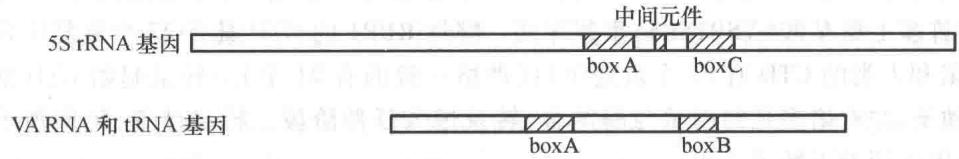  
图32-9 由RNA聚合酶Ⅲ转录的基因内启动子

上述两类基因内启动子各含有两个框架序列，分别被3种转录因子所识别。因子TFⅢA是一种锌指蛋白。TFⅢB含有TBP和另两种辅助蛋白质。TFⅢC是一个大的蛋白质复合物 $M_{r}>500\ 000$ ，有至少5个亚基，其大小与RNA聚合酶相当。类别Ⅲ启动子，如5S rRNA基因的启动子，先由TFⅢA结合在框架A上，然后促使TFⅢC结合，后者又使TFⅢB结合到转录起点附近，并引导RNA聚合酶Ⅲ结合在起点上。TFⅢA和TFⅢC是装配因子（assembly factor）；TFⅢB才是真正的起始因子（initiation factor）。TFⅢB的功能是使RNA聚合酶正确定位，起“定位因子”（positioning factor）的作用。另一类别Ⅲ的启动子，如tRNA基因的启动子，由TFⅢC识别框架B，其结合区域包括框架A和框架B，然后依次引导TFⅢB和RNA聚合酶结合。如前所述，TBP也存在于其他类别启动子的转录因子中，它能直接与RNA聚合酶相互作用并定位于启动子上。

有些类型启动子,如 snRNA 基因的启动子,位于转录起点上游。这类启动子含有 3 个上游元件(图

32-10)。在 RNA 聚合酶Ⅲ的上游启动子中, 只要靠近起点存在 TATA 元件, 就能起始转录。然而 PSE 和 OCT 元件的存在将会增加转录效率。PSE 表示近侧序列元件 (proximal sequence element), OCT 表示八聚体基序 (octamer motif), 它们各自被有关因子识别和

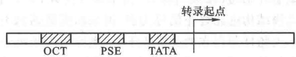  
图 32-10 RNA 聚合酶Ⅲ的上游启动子

结合。有些 snRNA 的基因由 RNA 聚合酶Ⅱ转录；其余 snRNA 的基因由 RNA 聚合酶Ⅲ转录。然而这二者的启动子都存在上述 3 个上游元件（TATA、PSE、OCT）。究竟是由聚合酶Ⅱ还是聚合酶Ⅲ转录，似乎是由 TATA 框的序列所决定。关键的 TATA 元件由包含 TBP 的转录因子所识别，TBP 又与其他辅助蛋白质结合，其中有些是对聚合酶Ⅲ启动子特异的蛋白质。由 TBP 和 TAF 的功能使 RNA 聚合酶Ⅲ正确定位于起点。

## （三）链的延伸和延伸因子

转录的起始阶段包括酶和转录因子在启动子上装配、局部解旋(打开双链)和起始转录。在转录开始后转录复合物改变构象,沿 DNA 向前移动,启动子被清空,转录进入延伸阶段。原核生物的转录依赖于 RNA 聚合酶,进入延伸阶段后 $\sigma$ 亚基脱落,随后代之以 Nus 亚基。细菌的 RNA 聚合酶 $\alpha$ 亚基 C 端结构域 (CTD) 为细长柔性结构,可直接与 DNA 接触,可能在酶移动中起重要作用。

真核生物延伸阶段除 RNA 聚合酶外有诸多延伸因子参与作用,这些延伸因子的主要作用是阻止转录的暂停或终止(表 32-5)。

表 32-5 RNA 聚合酶 II 的延伸因子

<table><tr><td>转录因子</td><td>亚基数</td><td>相对分子质量( $M_r$ )</td><td>功能</td></tr><tr><td>ELL</td><td>1</td><td>80 000</td><td></td></tr><tr><td>pTEFb</td><td>2</td><td>43 000,124 000</td><td>磷酸化 RNA 聚合酶的 C 端结构域</td></tr><tr><td>SII(TF II S)</td><td>1</td><td>38 000</td><td></td></tr><tr><td>延伸蛋白(SIII)</td><td>3</td><td>15 000,18 000,110 000</td><td></td></tr></table>

真核生物 RNA 聚合酶主要亚基与原核生物十分类似,此外还有许多亚基与诸多转录因子相互作用。RNA 聚合酶 II 的最大亚基 RBP1 十分类似细菌 RNA 聚合酶的 $\alpha$ 亚基,其 C 端结构域(CTD)为一长的羧基端尾巴,具有许多七氨基酸(YSPTSPS)重复序列。酵母 RBP1 的 CTD 具有 27 个重复序列(严格一致的有 18 个)。小鼠和人类的 CTD 有 52 个重复序列(严格一致的有 21 个)。转录起始 CTD 被磷酸化,聚合酶随即离开启动子,并有诸多延伸因子与酶结合,转录进入延伸阶段。转录结束,延伸因子解离,CTD 去磷酸化,在终止因子帮助下转录终止。

## （四）终止子和终止因子

细菌和真核生物转录一旦起始，通常都能继续下去，直至转录完成而终止。但在转录的延伸阶段RNA聚合酶遇到障碍会停顿和受阻，酶脱离模板即终止。真核生物中有一些能与酶结合的延伸因子(elongation factor)，可抑制停顿(如延伸蛋白elongin)和防止受阻(如TEFb、TFIIs)。转录结束，RNA聚合酶和RNA转录产物即被释放。

提供转录停止信号的 DNA 序列称为终止子,协助 RNA 聚合酶识别终止信号的辅助因子(蛋白质)则称为终止因子(termination factor)。有些终止子的作用可被特异的因子所阻止,使酶得以越过终止子继续转录,这称为通读(readthrough)。这类引起抗终止作用的蛋白质称为抗终止因子(anti-termination factor)。

在转录过程中，RNA聚合酶沿着模板链向前移动，它所感受的终止信号来自正在转录的序列，即终止信号应位于已转录的序列中。所有原核生物的终止子在终止点之前均有一个回文结构，其产生的RNA可形成茎环结构（发夹结构）。该结构可使RNA聚合酶减慢移动或暂停合成。然而，RNA产生具有发夹型的二级结构远比终止信号为多，如果酶所遇到的不是终止序列，它将继续移动并进行转录。

大肠杆菌存在两类终止子:一类称为不依赖于 $rho(\rho)$ 的终止子,即内在终止子或简单终止子;另一类称为依赖于 $rho(\rho)$ 的终止子。简单终止子回文对称区通常有一段富含 G-C 的序列,在终点前还有一系

列 U 核苷酸(约有 6 个)。由 rU-dA 组成的 RNA-DNA 杂交分子具有特别弱的碱基配对结构。当聚合酶暂停时, RNA-DNA 杂交分子即在 rU-dA 弱键结合的末端区解开。

依赖于 $rho(\rho)$ 的终止子必须在 $rho(\rho)$ 因子存在时才发生终止作用。依赖于 rho 的终止子结构特点是胞苷酸含量高，可能存在短的回文结构，但不含富有 G-C 区，短的回文结构之后也无寡聚 U。依赖于 rho 的终止子在细菌染色体中少见，而在噬菌体中广泛存在。不依赖于 rho 的终止子结构见图 32-11。

rho 因子是一种相对分子质量约为 275 000 的六聚体蛋白质，在有 RNA 存在时它能水解腺苷三磷酸，即具依赖于 RNA 的 ATPase 活力。由此推测，rho 结合在新产生的 RNA 链上，借助水解 ATP 获得的能量推动其沿着 RNA 链移动。RNA 聚合酶遇到终止子时发生暂停，使 rho 得以追上酶。rho 与酶相互作用，造成释放 RNA，并使 RNA 聚合酶与该因子一起从 DNA 上脱落下来。体外实验发现 rho 具有 RNA-DNA 解旋酶(helicase)活力，进一步说明了该因子的作用机制。

正如 RNA 聚合酶识别启动子需要有 $\sigma$ 因子一样, 识别终止子也需要一些特殊的辅助因子。已知 nus 位点与终止功能有关,其中包括:nus A、nus B、nus E 和 nus G。Nus A 因子可提高终止效率,可能是由于它能促进 RNA 聚合酶在终止子位置上的停顿。Nus E 也就是核糖体蛋白 S10,作为核糖体蛋白和终止功能间有何关系尚不清楚。Nus B 和 S10 形成二聚体,作用于 RNA 聚合酶,促进酶对终止子的识别。Nus G 与诸 Nus 因子和 RNA 聚合酶形成复合物的装配有关。

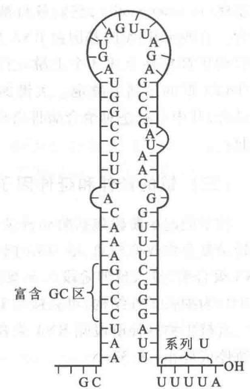  
图32-11 不依赖于rho的终止子

Nus 因子是在研究 N 蛋白抗终止作用时发现的,名称也由此而来(nus 是 N utilization substance 的缩写)。抗终止作用主要见于某些噬菌体的时序控制。 $\lambda$ 噬菌体前早期(immediate early)基因的产物 N 蛋白是一种抗终止因子,它与 RNA 聚合酶作用阻止其在终止子处停止转录,从而发生通读,后早期(delayed early)基因得以表达。因此,后早期基因的表达是由于 RNA 链的延长所致。N 蛋白阻止不依赖于 rho 的终止子作用,仅有 Nus A 因子就已足够;然而 N 蛋白阻止依赖于 rho 的终止子作用,要求有 4 种 Nus 因子的参与。后早期基因的产物 Q 蛋白也是一种抗终止因子,它能使晚期基因得以表达。Q 蛋白的作用与 N 蛋白类似。

Nus A 可与 RNA 聚合酶的核心酶结合, 形成 $\alpha_{2}\beta\beta^{\prime}\omega$ Nus A 复合物。当 $\sigma$ 因子存在时, 它可取代 Nus A, 形成 $\alpha_{2}\beta\beta^{\prime}\omega\sigma$ 。此全酶 $(\alpha_{2}\beta\beta^{\prime}\omega\sigma)$ 可识别并结合到启动子上。 $\sigma$ 因子完成起始功能后即脱落下来, 由核心酶 $(\alpha_{2}\beta\beta^{\prime}\omega)$ 合成 RNA。然后 Nus A 结合到核心酶上, 由 Nus A 识别终止子序列。转录终止后, RNA 聚合酶脱离模板, Nus A 又被 $\sigma$ 所取代, 由此形成 RNA 聚合酶起始复合物和终止复合物两种形式的循环。因此 Nus 因子也可以看作是 RNA 聚合酶的亚基。

有关真核生物转录的终止信号和终止过程了解甚少。实验表明，RNA聚合酶Ⅱ的转录产物是在3'端切断，然后腺苷酸化，而并无终止作用。但在病毒SV40的DNA中仍可检测到类似细菌不依赖于rho的t位点，在发夹结构后有一段U序列。RNA聚合酶I和RNA聚合酶Ⅲ转录产物末端常有连续的U，有的为2个、有的3个、甚至4个U。显然，仅仅连续U的本身不足以成为终止信号。在细菌终止子中为5个U，而真核生物常仅2个U。很可能U序列附近的特殊序列结构在终止反应中起重要作用。

## （五）转录的调节控制

细胞基因的表达,即由 DNA 转录成 RNA 再翻译成蛋白质的过程,存在严格的调节控制。在细胞的生长、发育和分化过程中,遗传信息的表达可按一定时间程序发生变化,而且随着细胞内外环境条件的改变而加以调整,这就是时序调节(temporal regulation)和适应调节(adaptive regulation)。在这里,转录水平的调控是关键的环节,因为遗传信息的表达首先涉及的是转录过程。尤其是原核生物,转录和翻译几乎同时进行,转录水平的调控就显得更为重要。

法国生物化学家 Monod 和 Jacob 对大肠杆菌酶产生的诱导和阻遏现象进行深入研究后, 提出了操纵子结构模型 (operon structural model)。所谓操纵子即是指细菌基因表达和调控的单位, 它包括结构基因、调节基因 (regulatory gene) 和由调节基因产物所识别的控制序列。通常在功能上彼此有关的编码基因串联在一起, 有共同的启动子并受操纵基因 (operator) 的控制。当调节基因的产物阻遏蛋白 (repressor protein) 与操纵基因结合后, 即可阻止其邻近启动子起始转录。阻遏蛋白的作用属于负调控。但调节基因的产物可以是负调节 (抑制) 因子, 也可以是正调节 (激活) 因子。

真核生物的转录调节与原核生物相比,有相似之处,也有显著的不同。其间主要差别为:① 原核生物某些功能相关的基因组成操纵子,作为基因表达和调节的单位。真核生物不组成操纵子,每个基因都有自己的基本启动子和调节元件,单独进行转录;但相关基因间也存在协同调节(cooperative regulation),拥有共同顺式作用元件(调控序列)和反式因子(调节蛋白)的基因组成基因群(gene battery)。② 原核生物只有少数种类的调节元件,包括激活蛋白和阻遏蛋白的结合位点,它们常与启动子重叠或在其附近。真核生物为数众多的调节元件包括组成型元件、可诱导元件、增强子和沉默子,分散在核心启动子的上游,它们由许多短的共有序列所组成,并能各自结合反式因子,作用于基因。③ 无论是原核生物或是真核生物,其转录受反式调节因子(激活因子或抑制因子)所调节,这种调节可在两个水平上进行,一方面是调节因子的生物合成(数量的调节),另一方面是它们的变构或共价修饰(活性的调节)。原核生物以负调节为主,调节因子活性常受变构效应调节;真核生物以正调节为主,调节因子常受共价修饰,主要是磷酸化的调节。

<!-- END OFFICIAL API PART part_005 -->

<!-- BEGIN OFFICIAL API PART part_006 -->

④ 真核生物具有染色质结构,基因活化首先需要改变染色质的状态,使转录因子能够接触 DNA,此过程称为染色质重塑(chromatin remodeling)。这一过程只是使基因转录成为可能;转录的实现还有赖于顺式作用元件、反式作用因子与 RNA 聚合酶的相互作用。染色质水平的调节在原核生物中不存在,它涉及真核生物发育与细胞分化等长期(long term)的调节;DNA 水平的调节属于短期(short term)的调节,基本与原核生物相似。

转录调节的具体机制请见基因表达调控有关章节。

## （六）RNA生物合成的抑制剂

某些核酸代谢的拮抗物和抗生素能抑制核苷酸或核酸的生物合成,因此被用作治疗疾病的药物,特别是抗病毒和抗肿瘤药物,而在临床上得到广泛应用。在实验室中研究核酸的代谢也常要用到这些抑制剂。按照作用性质的不同,RNA生物合成的抑制剂可分为三类:一类是嘌呤和嘧啶类似物,它们能抑制核酸前体的合成或破坏核酸功能;第二类是通过与DNA结合而改变模板的功能;第三类则是与RNA聚合酶结合而影响其活力。现分别举例说明如下:

## 1. 嘌呤和嘧啶类似物

有些人工合成的碱基类似物(analogue)能够抑制和干扰核酸的合成。其中重要的如:6-巯基嘌呤(6-mercaptopurine)、硫鸟嘌呤(thioguanine)、2,6-二氨基嘌呤(2,6-diaminopurine),8-氮鸟嘌呤(8-azaguanine)、5-氟尿嘧啶(5-fluorouracil)以及氮尿嘧啶(azauracil)等。这些碱基类似物进入体内后需要转变成相应的核苷酸,才表现出抑制作用。在体内至少有两方面的作用:它们或者作为抗代谢物(antimetabolite),直接抑制核苷酸生物合成有关的酶类;或者通过掺入到核酸分子中去,形成异常的DNA或RNA,从而影响核酸的功能并导致突变。

例如，6-巯基嘌呤进入体内后，在酶催化下与5-磷酸核糖焦磷酸反应，转变成巯基嘌呤核苷酸，然后在核苷酸水平上阻断体内嘌呤核苷酸的生物合成。具体的作用部位可能有两个：一是抑制次黄嘌呤核苷酸转变为腺嘌呤核苷酸和鸟嘌呤核苷酸；另一是通过反馈抑制阻止5-磷酸核糖焦磷酸与谷氨酰胺反应生成5-磷酸核糖胺。6-巯基嘌呤是重要的抗癌药物，临床上用于治疗急性白血病和绒毛膜上皮癌等。又如8-氮鸟嘌呤在形成核苷酸后，除能抑制嘌呤核苷酸的生物合成外，尚能显著地掺入到RNA中去，有时也有少量掺入DNA。8-氮鸟嘌呤对蛋白质合成的抑制作用，可能与它构成不正常的RNA有关。6-氮尿嘧啶在体内则先转变成核苷然后再转变成核苷酸，后者对乳清苷酸脱羧酶有明显的抑制作用；而其核苷三磷酸则能抑制DNA指导的RNA聚合酶。通常氮尿嘧啶并不掺入RNA。

嘧啶的卤素化合物常能掺入到核酸中，造成不正常的核酸分子。5-氟尿嘧啶能掺入RNA，但不能掺入DNA。5-氯、5-溴、5-碘尿嘧啶均能取代胸腺嘧啶掺入到DNA中去。这是因为氟的范德华半径为0.135 nm，与氢的范德华半径0.120 nm相近似，故氟尿嘧啶类似于尿嘧啶；而胸腺嘧啶中甲基的范德华半径为0.202 nm，氯为0.180 nm，溴为0.195 nm，碘为0.215 nm，尿嘧啶的氯、溴、碘取代物均类似于胸腺嘧啶。但三者间也有差别，以溴的范德华半径与甲基最为相近，因而溴尿嘧啶最易掺入DNA。溴尿嘧啶掺入DNA中能与腺嘌呤配对，但它通过互变异构而形成较罕见的烯醇式时，却能和鸟嘌呤配对，因此造成碱基配对错误。某些卤素取代的嘧啶类似物也是常见的抗癌药物，其中以5-氟尿嘧啶较为重要，它进入体内后能先转变成核糖核苷酸(F-UMP)，再转变成脱氧核糖核苷酸(F-dUMP)，后者能抑制胸腺嘧啶核苷酸合成酶。在正常细胞内，5-氟尿嘧啶能被分解为α-氟-β-氨基丙酸，但在癌细胞内则否。这可能是5-氟尿嘧啶具有选择性抑制癌细胞生长的原因之一。

## 2. DNA 模板功能的抑制物

有一些化合物由于能够与 DNA 结合,使 DNA 失去模板功能,从而抑制其复制和转录,并致诱变。某些重要的抗癌和抗病毒药物属于这一类抑制物。现举一些例子说明其作用原理。

烷化剂(alkylating agent)，如氮芥[nitrogen mustard，为二(氯乙基)胺的衍生物]、磺酸酯(sulfonate)、氮丙啶(aziridine)或乙烯亚胺(ethylenimine)类的衍生物等，它们带有一个或多个活性烷基，能使DNA烷基化。烷基化位置主要发生在鸟嘌呤碱基的N7上，腺嘌呤的N1、N3和N7以及胞嘧啶的N1也有少量被烷基化。鸟嘌呤烷基化后不稳定，易被水解脱落下来，留下的空隙可能干扰 DNA 复制或引起错误碱基的掺入。带有双功能基团的烷化剂（即有两个活性基团的烷化剂）能同时与 DNA 的两条链作用，使双链间发生交联（cross-link），从而抑制其模板功能。磷酸基也可以被烷基化，这样形成的磷酸三酯是不稳定的，可以导致 DNA 链断裂。

通常烷化剂都具有较大毒性,能引起细胞突变和致癌作用。有些烷化剂因能较有选择性地杀死肿瘤细胞而在临床上用于治疗恶性肿瘤。例如,环磷酰胺(cyclophosphamide)在体外几乎无毒性,肿瘤细胞有较高磷酰胺酶活性,使其水解成活泼氮芥,因而可用于治疗多种癌症。再如,苯丁酸氮芥(chlorambucil)因含有酸性基团,不易进入正常细胞;而癌细胞酵解作用旺盛,大量积累乳酸,pH较低,故容易进入癌细胞。环磷酰胺与苯丁酸氮芥的结构式如下:

放线菌素有抗菌和抗癌作用,临床上应用很广泛。放线菌素 D 含有一个吩噁嗪酮稠环 (phenoxazone) 和两个五肽环。它能与 DNA 发生非共价结合,其吩噁嗪酮稠环部分插入 DNA 的邻近两 G-C 碱基对之间,双链上两个鸟嘌呤的 2-氨基分别与环肽 L-苏氨酸残基的羰基氧形成氢键,两个环肽则位于 DNA 双螺旋的“浅沟”上,如同阻遏蛋白一样抑制 DNA 的模板功能。低浓度 (1 mmol/L) 的放线菌素 D 即可有效地抑制 DNA 指导的 RNA 的合成,也就是说阻止遗传信息的转录;但对 DNA 的复制,则必须在较高浓度 (10 mmol/L) 下才有抑制作用。在实验室中,常用它来研究核酸的生物合成。

某些具有扁平芳香族发色团的染料,可插入双链 DNA 相邻碱基对之间,因而称为嵌入染料(intercalative dye)。嵌入剂通常含有吖啶(acridine)或菲啶(phenanthridine)环,它们与碱基对差不多大小,插入后使 DNA 在复制中缺失或增添一个核苷酸,从而导致移码突变。吖啶类染料有原黄素(proflavine)、吖啶黄(acridine yellow)、吖啶橙(acridine orange)等。它们也能抑制 RNA 链的起始以及质粒复制。溴化乙锭(ethidium bromide)常用于检测 DNA 和 RNA,是一种高灵敏的荧光试剂,与 DNA 结合后荧光效率增强。这类化合物的结构式如下:

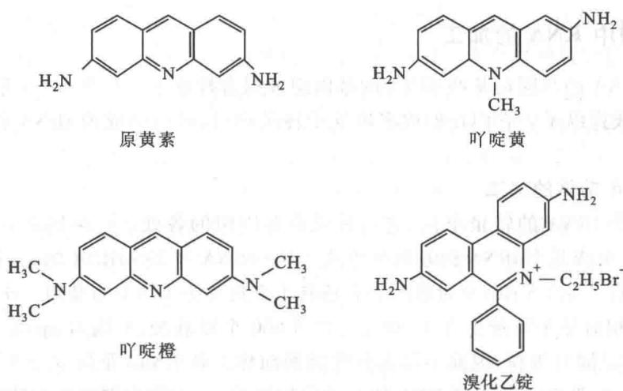

## 3. RNA 聚合酶的抑制物

有些抗生素或化学药物,由于能够抑制 RNA 聚合酶,因而抑制 RNA 的合成。例如,利福霉素(rifamycin)是 1957 年分离得到的一族抗生素,它能强烈抑制革兰氏阳性菌和结核杆菌,对革兰氏阴性菌的抑制作用较弱。随后进行了对利福霉素结构改造工作。1962 年获得半合成的利福霉素 B 衍生物利福平(rifampicin),它可供口服,且具有广谱的抗菌作用,对结核杆菌有高效,并能杀死麻风杆菌,在体外有抗病毒作用。许多实验说明,利福霉素及其同类化合物的作用机制与前类抗生素不同,它们不作用于 DNA,而主要是特异地抑制细菌 RNA 聚合酶的活性。

α-鹅膏蕈碱是从毒蕈(鬼笔鹅膏 Amanita phalloides)中分离出来的一种八肽化合物。它抑制真核生物 RNA 聚合酶,但对细菌 RNA 聚合酶的抑制作用极为微弱。α-鹅膏蕈碱的结构式如下:

<!-- EN-BEGIN 26.1 -->

### 【英文对应 26.1】DNA-Dependent Synthesis of RNA

> 来源：Lehninger Principles of Biochemistry（书籍/02_生物化学原理） 第26章 RNA Metabolism，§26.1。对应本章“一、DNA 指导下 RNA 的合成”。

Our discussion of RNA synthesis begins with a comparison between transcription and DNA replication (Chapter 25). Transcription resembles replication in its fundamental chemical mechanism, its polarity (direction of synthesis), and its use of a template. And like replication, transcription has initiation, elongation, and termination phases. Transcription differs from replication in that it does not require a primer and, generally, involves only limited segments of a DNA molecule. Additionally, only one DNA strand serves as a template for a particular RNA molecule.

#### [EN] RNA Is Synthesized by RNA Polymerases

The discovery of DNA polymerase and its dependence on a DNA template spurred a search for an enzyme that synthesizes RNA complementary to a DNA strand. By 1960, four research groups had independently detected an enzyme in cellular extracts that could form an RNA polymer from ribonucleoside 5'-triphosphates.

Subsequent work on the purified Escherichia coli RNA polymerase helped to define the fundamental properties of transcription (Fig. 26-1). P1 DNA-dependent RNA polymerase requires, in addition to a DNA template, all four ribonucleoside 5'-triphosphates (ATP, GTP, UTP, and CTP) as precursors of the nucleotide units of RNA, as well as Mg $^{2+}$ . The chemistry and mechanism of RNA synthesis closely resemble those used by DNA polymerases (see Fig. 25-3). RNA polymerase elongates an RNA strand by adding ribonucleotide units to the 3'-hydroxyl end, building RNA in the 5'→3' direction. The 3'-hydroxyl group acts as a nucleophile, attacking the α phosphate of the incoming ribonucleoside triphosphate (Fig. 26-1a) and releasing pyrophosphate. The overall reaction is

$$
\begin{array}{c} \mathrm {(NMP) _ {n}} + \mathrm{NTP} \longrightarrow \mathrm {(NMP) _ {n + 1}} + \mathrm{PP} _ {\mathrm{i}} \\ \text {RNA} \end{array}
$$

RNA polymerase requires DNA for activity and is most active when bound to a double-stranded DNA. As noted above, only one of the two DNA strands serves as a template. The template DNA strand is copied in the 3'→5' direction (antiparallel to the new RNA strand), just as in DNA replication. Each nucleotide in the newly formed RNA is selected by Watson-Crick base-pairing interactions: U residues are inserted in the RNA to pair with A residues in the DNA template, G residues are inserted to pair with C residues, and so on. Base-pair geometry (see Fig. 25-5) may also play a role in base selection.

Unlike DNA polymerase, RNA polymerase does not require a primer to initiate synthesis. Initiation occurs when RNA polymerase binds at specific DNA sequences called promoters (described below). The 5'-triphosphate group of the first residue in a nascent (newly formed) RNA molecule is not cleaved to release PP $_{i}$ , but instead remains intact and functions in eukaryotes as a substrate for the RNA-capping machinery (see Fig. 26-13). During the elongation phase of transcription, the growing end of the new RNA strand base-pairs temporarily with the DNA template to form a short hybrid RNA-DNA double helix, about 8 bp long (Fig. 26-1b). The RNA in this hybrid duplex "peels off" shortly after its formation, and the DNA duplex re-forms.

To enable RNA polymerase to synthesize an RNA strand complementary to one of the DNA strands, the DNA duplex must unwind over a short distance, forming a transcription "bubble." During transcription, the E. coli RNA polymerase generally keeps about 17 bp unwound. The 8 bp RNA-DNA hybrid occurs in this unwound region. Elongation of a transcript by E. coli RNA polymerase proceeds at a rate of 50 to 90 nucleotides/s. Because DNA is a helix, movement of a transcription bubble requires considerable strand rotation of the nucleic acid molecules. DNA strand rotation is restricted in most DNAs by DNA-binding proteins and other structural barriers. As a result, a moving RNA polymerase generates waves of positive supercoils ahead of the transcription bubble and negative supercoils behind (Fig. 26-1c). This has been observed both in vitro and in vivo (in bacteria). In the cell, the topological problems caused by transcription are relieved through the action of topoisomerases (Chapter 24).

(a)  
  
FIGURE 26-1 Transcription by RNA polymerase in E. coli. For synthesis of an RNA strand complementary to one of two DNA strands in a double helix, the DNA is transiently unwound. (a) Catalytic mechanism of RNA synthesis by RNA polymerase. Notice that this is essentially the same mechanism used by DNA polymerases. The reaction involves two $\mathrm{Mg}^{2+}$ ions coordinated to the phosphate groups of the incoming nucleoside triphosphates (NTPs) and to three Asp residues, which are highly conserved in the RNA polymerases of all species. One $\mathrm{Mg}^{2+}$ ion facilitates attack by the $3^{\prime}$ -hydroxyl group on the $\alpha$ phosphate of the NTP; the other $\mathrm{Mg}^{2+}$ ion facilitates displacement of the pyrophosphate. Both metal ions stabilize the pentacovalent transition state. (b) About 17 bp of DNA are unwound at any given time. RNA

KEY CONVENTION The two complementary DNA strands have different roles in transcription. The strand that serves as template for RNA synthesis is called the template strand. The DNA strand complementary to the template, the nontemplate strand, or coding strand, is identical in base sequence to the RNA transcribed from the gene, with U in the RNA in place of T in the DNA (Fig. 26-2). The coding strand for a particular gene may be located in either strand of a given chromosome (as shown in Fig. 26-3 for a virus). By convention, the regulatory sequences that control transcription (described later in this chapter) are designated by the sequences in the coding strand.

The DNA-dependent RNA polymerase of E. coli is a large, complex enzyme with five core subunits ( $\alpha_{2}\beta\beta'\omega$ ; $M_{r}$ 390,000) and a sixth subunit, one of a group designated (5') CGCTATAGCGTTT(3') DNA nontemplate (coding) strand
(3') GCGATATCGCAAA(5') DNA template strand
(5') CGCUAUAGCGUUU(3') RNA transcript

  
polymerase and the transcription bubble move from left to right along the DNA as shown, facilitating RNA synthesis. The DNA is unwound ahead and rewound behind as RNA is transcribed. As the DNA is rewound, the RNA-DNA hybrid is displaced and the RNA strand is extruded. (c) Movement of an RNA polymerase along DNA tends to create positive supercoils (overwound DNA) ahead of the transcription bubble and negative supercoils (underwound DNA) behind it. The RNA polymerase is in close contact with the DNA ahead of the transcription bubble as well as with the separated DNA strands and the RNA within and immediately behind the bubble. A channel in the protein funnels new NTPs to the polymerase active site. The polymerase footprint encompasses about 35 bp of DNA during elongation.

FIGURE 26-2 Template and nontemplate (coding) DNA strands. The two complementary strands of DNA are defined by their function in transcription. The RNA transcript is synthesized on the template strand and is identical in sequence (with U in place of T) to the nontemplate strand, or coding strand.

  
FIGURE 26-3 Organization of coding information in the adenovirus genome. The genetic information of the adenovirus genome is encoded by a double-stranded DNA molecule of 36,000 bp, both strands of which encode proteins. The information for most proteins is encoded by (that is, identical to) the top strand — by convention, the strand is oriented 5' to 3' from left to right. The bottom strand acts as template for these transcripts. However, a few proteins are encoded by the bottom strand, which is transcribed in the opposite direction (and uses the top strand as template).

σ, with variants designated by size (molecular weight). The σ subunit binds transiently to the core and directs the enzyme to specific binding sites on the DNA (described below). These six subunits constitute the RNA polymerase holoenzyme (Fig. 26-4). The RNA polymerase holoenzyme of E. coli thus exists in several forms, depending on the type of σ subunit. The most common subunit is σ $^{70}$ (M $_{r}$ 70,000), and the upcoming discussion focuses on the corresponding RNA polymerase holoenzyme.

RNA polymerases lack a separate proofreading $3'\rightarrow5'$ exonuclease active site (such as that of many DNA polymerases), and the error rate for transcription is higher than that for chromosomal DNA replication—approximately one error for every $10^{4}$ to $10^{5}$ ribonucleotides incorporated into RNA. Because many copies of an RNA are generally produced from a single gene, and nearly all RNAs are eventually degraded and replaced, a mistake in an RNA molecule is of less consequence to the cell than a mistake in the permanent information stored in DNA. Many RNA polymerases, including bacterial RNA polymerase and the eukaryotic RNA polymerase II (discussed below), do pause when a mispaired base is added during transcription, and they can remove mismatched nucleotides from the 3' end of a transcript by direct reversal of the polymerase reaction. But we do not yet know whether this activity is a true proofreading function and to what extent it may contribute to the fidelity of transcription.

(a)  

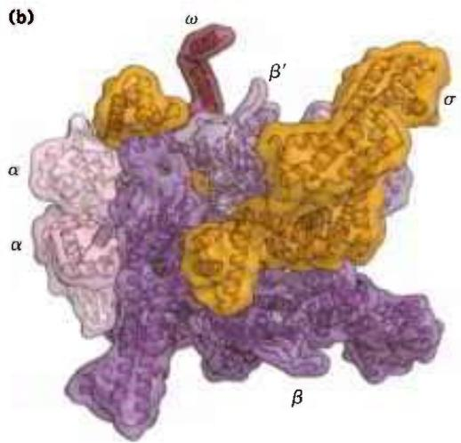  
FIGURE 26-4 Structure of the $\sigma^{70}$ RNA polymerase holoenzyme of E. coli. (a) The several subunits of the bacterial RNA polymerase give the enzyme the shape of a crab claw (purple). The $\sigma^{70}$ subunit rests on top of the crab claw and threads through the RNA exit channel. (b) In this crystal structure of the RNA polymerase holoenzyme, each of the six subunits ( $\alpha_{2}\beta\beta'\omega$ and $\sigma^{70}$ ) can be identified. The pincers of the crab claw are formed by the $\beta$ and $\beta'$ subunits. [Data from PDB ID 4MEY, D. Degen et al., eLife 3:e02451, 2014.]

#### [EN] RNA Synthesis Begins at Promoters

Initiation of RNA synthesis at random points in a DNA molecule would be an extraordinarily wasteful process. P1 Instead, an RNA polymerase binds to specific sequences in the DNA called promoters, which direct the transcription of adjacent segments of DNA (genes). The sequences where RNA polymerases bind are variable, and much research has focused on identifying the particular sequences that are critical to promoter function.

In E. coli, RNA polymerase binding occurs within a region stretching from about 70 bp before the transcription start site to about 30 bp beyond it. By convention, the DNA base pairs that correspond to the beginning of an RNA molecule are given positive numbers, and those preceding the RNA start site are given negative numbers. The promoter region thus extends between positions -70 and +30. Analyses and comparisons of the most common class of bacterial promoters (those recognized by an RNA polymerase holoenzyme containing $\sigma^{70}$ ) have revealed consensus sequences centered about positions -10 and -35 (Fig. 26-5a). Although the sequences are not identical for all bacterial promoters in this class, certain nucleotides that are particularly common at each position form a consensus sequence. The consensus sequence at the -10 region is (5')TATAAT(3'); at the -35 region it is (5')TTGACA(3'). A third AT-rich recognition element, called the UP (upstream promoter) element, occurs between positions -40 and -60 in the promoters of certain highly expressed genes. The UP element is bound by the $\alpha$ subunit of RNA polymerase. The efficiency with which an RNA polymerase containing $\sigma^{70}$ binds to a promoter and initiates transcription is determined in large measure by these sequences, the spacing between them, and their distance from the transcription start site. A change in only one base pair in the promoter can decrease the rate of binding by several orders of magnitude. The promoter sequence thus establishes a basal level of expression that can vary greatly from one E. coli gene to the next. The x-ray crystal structure of the $\sigma^{70}$ RNA polymerase holoenzyme bound to its promoter shows how the $\sigma$ factor recognizes both the RNA polymerase and the -10 and -35 regions by introducing a large bend in the DNA (Fig. 26-5b). Information about these interactions can also be obtained using the method illustrated in Box 26-1.

  
FIGURE 26-5 Promoter recognition by RNA polymerase holoenzymes containing $\sigma^{70}$ . (a) The nontemplate strand of the consensus sequence for $E.$ coli promoters recognized by $\sigma^{70}$ is shown, read in the $5^{\prime} \rightarrow 3^{\prime}$ direction, as is the convention for representations of this kind. The sequences differ from one promoter to the next, but comparisons of many promoters reveal similarities, particularly in the -10 and -35 regions. The sequence element UP, not present in all $E.$ coli promoters, generally occurs in the region between -40 and -60 and strongly stimulates transcription at the promoters that contain them. Spacer regions contain slightly variable numbers of nucleotides (N). Only the first nucleotide coding the RNA transcript  
(at position +1) is shown. (b) This x-ray crystallographic structure of the E. coli holoenzyme bound to a promoter shows that the $\sigma^{70}$ subunit introduces a sharp bend in the DNA template, allowing it to simultaneously contact the -35 and -10 regions as well as the RNA polymerase core. In this view the $\beta$ subunit was omitted to allow the path of the DNA through the polymerase to be more easily seen. Due to the low resolution of the structure (5.5 Å) not all of the DNA backbone could be modeled, and these unmodeled regions are missing from the DNA shown in the figure. A cartoon schematic of the structure is also shown below (a), aligned with consensus promoter elements. [Data from PDB ID 4YLN, Y. Zuo and T. A. Steitz, Mol. Cell S8:534, 2015.]

The pathway of transcription initiation and the fate of the $\sigma$ subunit are illustrated in Figure 26-6. The pathway consists of two major parts, binding and initiation, each with multiple steps. First, the polymerase, directed by its bound $\sigma$ factor, binds to the promoter. A closed complex (in which the bound DNA remains double-stranded) and an open complex (in which the bound DNA is partially unwound near the -10 sequence) form in succession. Second, transcription is initiated within the complex, leading to a conformational change that converts the complex to the elongation form, followed by movement of the transcription complex away from the promoter (promoter clearance). Any of these steps can be affected by the specific makeup of the promoter sequences. The $\sigma$ subunit dissociates at random as the polymerase enters the elongation phase of transcription. The protein NusA ( $M_{r}$ 54,430) binds to the elongating RNA polymerase, competitively with the $\sigma$ subunit. Once transcription is complete, NusA dissociates from the enzyme, the RNA polymerase dissociates from the

DNA, and a $\sigma$ factor ( $\sigma^{70}$ or another) can again bind to the enzyme to initiate transcription.

E. coli has other classes of promoters bound by RNA polymerase holoenzymes with different $\sigma$ subunits, such as the promoters of the heat shock genes. The products of this set of genes are made at higher levels when the cell is exposed to environmental stress, such as a sudden increase in temperature. RNA polymerase binds to the promoters of these genes only when $\sigma^{70}$ is replaced with the $\sigma^{32}$ ( $M_{r}$ 32,000) subunit, which is specific for the heat shock promoters (see Fig. 28-3). By using different $\sigma$ subunits, the cell can coordinate the expression of sets of genes, permitting major changes in cell physiology. Which sets of genes are expressed is determined by the availability of the various $\sigma$ subunits. This, in turn, is determined by several factors: regulated rates of synthesis and degradation, posttranslational modifications that switch individual $\sigma$ subunits between active and inactive forms, and a specialized class of anti- $\sigma$ proteins, each type binding to and sequestering a particular $\sigma$ subunit to render it unavailable for transcription initiation.

<!-- END OFFICIAL API PART part_010 -->

<!-- BEGIN OFFICIAL API PART part_011 -->

#### [EN] RNA Polymerase Leaves Its Footprint on a Promoter

Footprinting, a technique derived from principles used in DNA sequencing, identifies the DNA sequences bound by a particular protein. Researchers isolate a DNA fragment thought to contain sequences recognized by a DNA-binding protein, and then radiolabel one end of one strand (Fig. 1). They then use chemical or enzymatic reagents to introduce random breaks in the DNA fragment (averaging about one break per molecule). Separation of the labeled cleavage products (broken fragments of various lengths) by high-resolution electrophoresis produces a ladder of radioactive bands. In a separate tube, the cleavage procedure is repeated on copies of the same DNA fragment in the presence of the DNA-binding protein. The researchers then subject the two sets of cleavage products to electrophoresis and compare them side by side. A gap ("footprint") in the series of radioactive bands derived from the DNA-protein sample, attributable to protection of the DNA by the bound protein, identifies the sequences that the protein binds.

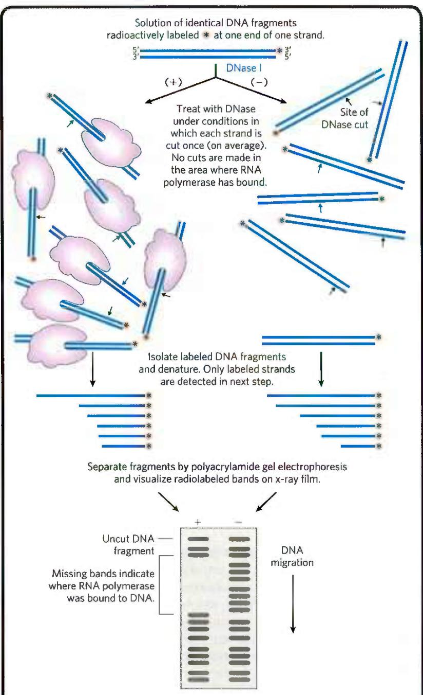  
FIGURE 1 Footprint analysis of the RNA polymerase-binding site on a DNA fragment. Separate experiments are carried out in the presence (+) and absence (−) of the polymerase.

The precise location of the protein-binding site can be determined by directly sequencing (see Fig. 8-35) copies of the same DNA fragment and including the sequencing lanes (not shown here) on the same gel with the footprint. Figure 2 shows footprinting results for the binding of RNA polymerase to a DNA fragment containing a promoter. The polymerase covers 60 to 80 bp; protection by the bound enzyme includes the -10 and -35 regions.

  
FIGURE 2 Footprinting results of RNA polymerase binding to the lac promoter. In this experiment, the 5' end of the nontemplate strand was radioactively labeled. Lane C is a control in which the labeled DNA fragments were cleaved with a chemical reagent that produces a more uniform banding pattern. [© Courtesy of Carol Gross Laboratory.]

  
FIGURE 26-6 Transcription initiation and elongation by E. coli RNA polymerase. Initiation of transcription requires several steps generally divided into two phases: binding and initiation. In the binding phase, the initial interaction of the RNA polymerase with the promoter leads to formation of a closed complex, in which the promoter DNA is stably bound but not unwound. A 12 to 15 bp region of DNA—from within the -10 region to position +2 or +3—is then unwound to form an open complex. Additional intermediates (not shown) have been detected in the pathways leading to the closed and open  
complexes, along with several changes in protein conformation. The initiation phase encompasses promoter binding, transcription initiation, and promoter clearance (steps 1 through 4 here). Once elongation commences, the $\sigma$ subunit is released and is replaced by the protein NusA. The polymerase leaves the promoter and becomes committed to elongation of the RNA (step 5). When transcription is complete, the RNA is released, the NusA protein dissociates, and the RNA polymerase dissociates from the DNA (step 6). Another $\sigma$ subunit binds to the RNA polymerase and the process begins again.

#### [EN] Transcription Is Regulated at Several Levels

Requirements for any gene product vary with cellular conditions or developmental stage, and transcription of each gene is carefully regulated to form gene products only in the proportions needed. P1 Regulation can occur at any step of transcription, including elongation and termination. However, much of the regulation is directed at the polymerase binding and transcription initiation steps outlined in Figure 26-6. Differences in promoter sequences are just one of several levels of control.

The binding of proteins to sequences both near to and distant from the promoter can also affect levels of gene expression. Protein binding can activate transcription by facilitating either RNA polymerase binding or steps farther along in the initiation process, or it can repress transcription by blocking the activity of the polymerase. In E. coli, one protein that activates transcription is the cAMP receptor protein (CRP), which increases the transcription of genes coding for enzymes that metabolize sugars other than glucose when cells are grown in the absence of glucose. Repressors are proteins that block the synthesis of RNA at specific genes. In the case of the Lac repressor, transcription of the genes for the enzymes of lactose metabolism is blocked when lactose is unavailable.

As described further in Chapter 27, transcription of mRNAs and their translation are tightly coupled in bacteria. As a protein-coding gene is being transcribed, ribosomes rapidly bind to and begin to translate the mRNA before its synthesis is complete. Another protein, NusG, binds directly to both the ribosome and RNA polymerase, linking the two complexes. The rate of translation directly affects the rate of transcription. In contrast, eukaryotes carry out transcription in the nucleus and translation in the cytoplasm, making it impossible for these two steps to be physically coupled.

#### [EN] Specific Sequences Signal Termination of RNA Synthesis

RNA synthesis is processive; that is, the RNA polymerase introduces a large number of nucleotides into a growing RNA molecule before dissociating (p. 917). This is necessary because, if the polymerase released an RNA transcript prematurely, it could not resume synthesis of the same RNA and would have to start again from the beginning of the gene. However, an encounter with certain DNA sequences results in a pause in RNA synthesis, and at some of these sequences transcription is terminated. Our focus here is again on the well-studied systems in bacteria. E. coli has at least two classes of termination signals: one class relies on a protein factor called $\rho$ (rho), and the other is $\rho$ -independent.

Most $\rho$ -independent terminators have two distinguishing features. The first is a region that produces an RNA transcript with self-complementary sequences, permitting the formation of a hairpin structure (see Fig. 8-19a) centered 15 to 20 nucleotides before the projected end of the RNA strand. The second feature is a highly conserved string of three A residues in the template strand that are transcribed into U residues near the 3' end of the hairpin. When a polymerase arrives at a termination site with this structure, it pauses (Fig. 26-7a). Formation of the hairpin structure in the RNA disrupts several A=U base pairs in the RNA-DNA hybrid segment and may disrupt important interactions between RNA and the RNA polymerase, facilitating dissociation of the transcript.

  
FIGURE 26-7 Termination of transcription in E. coli. (a) p-Independent termination. RNA polymerase pauses at a variety of DNA sequences, some of which are terminators. One of two outcomes is then possible: either the polymerase bypasses the site and continues on its way, or the complex undergoes a conformational change (isomerization). During isomerization, intramolecular pairing of complementary sequences in the newly formed RNA transcript may form a hairpin that disrupts the RNA-DNA hybrid, the interactions

The $\rho$ -dependent terminators lack the sequence of repeated A residues in the template strand but usually include a CA-rich sequence called a rut (rho utilization) element. The $\rho$ protein associates with the RNA at specific binding sites and migrates in the 5'→3' direction until it reaches the transcription complex that is paused at a termination site (Fig. 26-7b). Here it promotes release of the RNA transcript. The $\rho$ protein has an ATP-dependent RNA-DNA helicase activity that permits translocation of the protein along the RNA, and ATP is hydrolyzed by the $\rho$ protein during the termination process. The detailed mechanism by which the protein promotes the release of the RNA transcript is not known.

#### [EN] Eukaryotic Cells Have Three Kinds of Nuclear RNA Polymerases

The transcriptional machinery in the nucleus of a eukaryotic cell is much more complex than that in bacteria. Eukaryotes have three nuclear RNA polymerases, designated I, II, and III, which are distinct complexes but have certain subunits in common. Each polymerase has a specific function (Table 26-1) and is recruited to a specific promoter sequence. In addition, eukaryotic mitochondria and chloroplasts have their own RNA polymerases for transcription of genes encoded in their own DNA (see Fig. 19-40). The RNA polymerases in these organelles are similar to bacterial RNA polymerases and less elaborate than the nuclear transcription machinery discussed below.

  
between RNA and polymerase, or both. An A=U hybrid region at the 3' end of the new transcript is relatively unstable, and the RNA dissociates from the complex completely, leading to termination. At nonterminating pause sites, the complex may escape after the isomerization step to continue RNA synthesis. (b) ρ-Dependent termination. RNAs that include a rut element recruit the ρ helicase. The ρ helicase migrates along the mRNA in the 5'→3' direction and separates it from the polymerase.

<table><tr><td colspan="2">TABLE 26-1 Eukaryotic Nuclear RNA Polymerases</td></tr><tr><td>RNA polymerase</td><td>Types of RNA synthesized</td></tr><tr><td>I</td><td>Pre-ribosomal RNA</td></tr><tr><td>II</td><td>mRNA ncRNA</td></tr><tr><td>III</td><td>tRNA 5S rRNA ncRNA</td></tr></table>

RNA polymerase I (Pol I) is responsible for the synthesis of only one type of RNA, a transcript called pre-ribosomal RNA (or pre-rRNA), which contains the precursor for the 18S, 5.8S, and 28S rRNAs. The principal function of RNA polymerase II (Pol II) is the synthesis of mRNAs and many ncRNAs. This enzyme can recognize thousands of promoters that vary greatly in sequence. Some Pol II promoters have a few sequence features in common, including a TATA box (eukaryotic consensus sequence TATA(A/T)A(A/T)(A/G)) near base pair -30 and an Inr sequence (initiator) near the RNA start site at +1 (Fig. 26-8). However, such promoters are in the minority, and elaborate interactions with regulatory proteins guide Pol II function at many promoters that lack these features.

RNA polymerase III (Pol III) makes tRNAs, the 5S rRNA, and other small, specialized ncRNAs, including the U6 RNA component of the spliceosome, which we will discuss in Section 26.2. The promoters recognized by Pol III are well characterized. Some of the sequences required for the regulated initiation of transcription by

<table><tr><td rowspan="3"></td><td colspan="2">-30</td><td colspan="2">+1</td></tr><tr><td colspan="2">TATAAA</td><td>YYANTA</td><td>YY</td></tr><tr><td>Various regulatory sequences</td><td>TATA box</td><td>Inr</td><td>3&#x27;</td></tr></table>

FIGURE 26-8 Some common features of TATA box promoters recognized by eukaryotic RNA polymerase II. The TATA box is the major assembly point for the proteins of the preinitiation complexes of Pol II. The DNA is unwound at the initiator sequence (Inr), and the transcription start site is usually within or very near this sequence. In the Inr consensus sequence shown here, N represents any nucleotide and Y represents a pyrimidine nucleotide. Additional sequences around the TATA box and downstream (to the right as shown here) of Inr may be recognized by one or more transcription factors. The sequence elements of Pol II promoters summarized here are much more variable and complex in comparison to E. coli promoters (see Fig. 26-5).

Pol III are located within the gene itself, whereas others are in more conventional locations upstream of the RNA start site (Chapter 28).

#### [EN] RNA Polymerase II Requires Many Other Protein Factors for Its Activity

RNA polymerase II is central to eukaryotic gene expression and has been studied extensively. P1 Although this polymerase is strikingly more complex than its bacterial counterpart, the complexity masks a remarkable conservation of structure, function, and mechanism. Pol II isolated from either yeast or human cells is a 12-subunit enzyme with an aggregate molecular weight of more than 510,000. The largest subunit (RBP1) exhibits a high degree of homology to the $\beta'$ subunit of bacterial RNA polymerase. Another subunit (RBP2) is structurally similar to the bacterial $\beta$ subunit, and two others (RBP3 and RBP11) show some structural homology to the two bacterial $\alpha$ subunits. Pol II must function with genomes that are more complex and with DNA molecules more elaborately packaged than in bacteria. The need for protein-protein contacts with the numerous other protein factors required to navigate this labyrinth accounts in large measure for the added complexity of the eukaryotic polymerase.

The largest subunit of Pol II (RBP1) also has an unusual feature, a long carboxyl-terminal tail consisting of many repeats of a consensus heptad amino acid sequence,—YSPTSPS—. There are 26 repeats in the yeast enzyme (19 exactly matching the consensus) and 52 (21 exact) in the mouse and human enzymes. This carboxyl-terminal domain (CTD) is separated from the main body of the enzyme by an intrinsically disordered linker sequence. The CTD has many important roles in Pol II function, as outlined below.

RNA polymerase II requires an array of other proteins, called transcription factors, to form the active transcription complex. The general transcription factors required at every Pol II promoter (factors usually designated TFII with an additional identifier) are highly conserved in all eukaryotes (Table 26-2). The process of transcription by Pol II can be described in terms of several phases—assembly, initiation, elongation, termination—each associated with characteristic proteins (Fig. 26-9). The step-by-step pathway described below leads to active transcription in vitro. In the cell, many of the proteins may be present in larger, preassembled complexes, simplifying the pathways for assembly on promoters. As you read about this process, consult Figure 26-9 and Table 26-2 to help keep track of the many participants.

Assembly of RNA Polymerase and Transcription Factors at a Promoter The formation of a closed complex begins when the TATA-binding protein (TBP) binds to the TATA box (Fig. 26-9a, step 1). At promoters lacking a TATA box, TBP arrives as part of a multisubunit complex called

<table><tr><td colspan="4">TABLE 26-2 Proteins Required for Initiation of Transcription at the RNA Polymerase II (Pol II) Promoters of Eukaryotes</td></tr><tr><td>Transcription protein</td><td>Number of different subunits</td><td>Subunit(s)  $M_r^a$ </td><td>Function(s)</td></tr><tr><td colspan="4">Initiation</td></tr><tr><td>Pol II</td><td>12</td><td>7,000–220,000</td><td>Catalyzes RNA synthesis</td></tr><tr><td>TBP (TATA-binding protein)</td><td>1</td><td>38,000</td><td>Specifically recognizes the TATA box</td></tr><tr><td>TFIIA</td><td>2</td><td>13,000, 42,000</td><td>Stabilizes binding of TFIIIB and TBP to the promoter</td></tr><tr><td>TFIIB</td><td>1</td><td>35,000</td><td>Binds to TBP; recruits Pol II-TFIIF complex</td></tr><tr><td>TFIIDb</td><td>13–14</td><td>14,000–213,000</td><td>Required for initiation at promoters lacking a TATA box</td></tr><tr><td>TFIIE</td><td>2</td><td>33,000, 50,000</td><td>Recruits TFIIH; has ATPase and helicase activities</td></tr><tr><td>TFIIF</td><td>2–3</td><td>29,000–58,000</td><td>Binds tightly to Pol II; binds to TFIIIB and prevents binding of Pol II to nonspecific DNA sequences</td></tr><tr><td>TFIIH</td><td>10</td><td>35,000–89,000</td><td>Unwinds DNA at promoter (helicase activity); phosphorylates Pol II CTD; recruits nucleotide-excision repair proteins</td></tr><tr><td colspan="4">Elongationc</td></tr><tr><td>ELLd</td><td>1</td><td>80,000</td><td></td></tr><tr><td>pTEFb</td><td>2</td><td>43,000, 124,000</td><td>Phosphorylates Pol II CTD</td></tr><tr><td>SII (TFIIS)</td><td>1</td><td>38,000</td><td></td></tr><tr><td>Elongin (SIII)</td><td>3</td><td>15,000, 18,000, 110,000</td><td></td></tr></table>

$^{b}$ The presence of multiple copies of some TFIID subunits brings the total subunit composition of the complex to 21–22.  
$^{c}$ The function of all elongation factors is to suppress the pausing or arrest of transcription by the Pol II–TFIIF complex.  
$^{d}$ Name derived from eleven-nineteen lysine-rich leukemia. The gene for ELL is the site of chromosomal recombination events frequently associated with acute myeloid leukemia.

TFIID. TBP is bound, in turn, by the transcription factor TFIIB. TFIIA then binds and, along with TFIIB, helps to stabilize the TBP-DNA complex. The TFIIB-TBP complex is next bound by another complex consisting of TFIIF and Pol II. TFIIF helps target Pol II to its promoters, both by interacting with TFIIB and by reducing the binding of the polymerase to nonspecific sites on the DNA. Finally, TFIIE and TFIIH bind to create the closed, preinitiation complex (PIC).

A key function of TFIID in the PIC is to position TBP on the promoter, which in turn dictates the location of Pol II loading and transcription initiation. Because most human promoters (\~80%) lack a TATA box, how TFIID correctly positions TBP and Pol II relative to the transcription start site was poorly understood until their structures were determined by cryo-EM (Fig. 26-9b). These structures showed that TFIID binds the promoter DNA in an elongated complex that is anchored by TBP-DNA interactions on one end and extends linearly over 70 base pairs. The Inr sequence is positioned roughly in the middle, straddled on both ends by TFIID subunits. TFIID thus acts as a scaffold to direct binding of Pol II and other PIC components and uses its structure and interactions with TBP to help define the transcription start site.

TFIIH has multiple subunits and includes a DNA helicase activity that promotes the unwinding of DNA near the RNA start site (a process requiring the hydrolysis of ATP), thereby creating an open initiation complex (Fig. 26-9a, step 2). Counting all the subunits of the various factors (including TFIIA and the subunits of TFIID), this active initiation complex can have more than 50 polypeptides.

RNA Strand Initiation and Promoter Clearance TFIIH has an additional function during the initiation phase. A kinase activity in one of its subunits phosphorylates Pol II at many places in the CTD (Fig. 26-9a, step 3). Several other protein kinases, including CDK9 (cyclin-dependent kinase 9), which is part of the complex pTEFb (positive transcription elongation factor b), also phosphorylate the CTD, primarily on Ser residues of the CTD repeat sequence. CTD phosphorylation causes a conformational change in the overall complex, initiating transcription. During the subsequent elongation phase of transcription, the phosphorylation state of the CTD changes, affecting which RNA processing components are bound to the transcription complexes (Fig. 26-10).

During synthesis of the initial 60 to 70 nucleotides of RNA, first TFIIE, then TFIIH is released, and Pol II enters the elongation phase of transcription (Fig. 26-9a, step 4).

Elongation, Termination, and Release TFIIF remains associated with Pol II throughout elongation. During this stage, polymerase activity is greatly enhanced by protein elongation factors (Table 26-2). The elongation factors, some bound to the phosphorylated CTD, suppress pausing during transcription and also coordinate interactions between the supramolecular complexes involved in the posttranscriptional processing of mRNAs. Once the RNA transcript is completed, transcription is terminated (Fig. 26-9a, step 5). The Pol II CTD is dephosphorylated and the transcription machinery recycled, ready to initiate another transcript.

FIGURE 26-9 Transcription at RNA polymerase II promoters. (a) TBP (often with TFIIA and sometimes with TFIID) and TFIIB bind sequentially to a promoter. TFIIF plus Pol II are then recruited to that complex. The further addition of TFIIE and TFIIH results in a closed complex. Within the complex, the DNA is unwound at the Inr region by the helicase activity of TFIIH and perhaps of TFIIE, creating an open complex that completes assembly. The carboxyl-terminal domain of the largest Pol II subunit is phosphorylated by TFIIH, and the polymerase then escapes the promoter and initiates transcription. Elongation is accompanied by the release of many transcription factors and is also enhanced by elongation factors (see Table 26-2). After termination, Pol II is released, dephosphorylated, and recycled. (b) Structure of the human TFIIA/TFIID/TBP complex bound to promoter DNA, determined by cryo-EM. The DNA is stretched linearly over 70 base pairs, with the Inr sequence positioned roughly in the middle of TFIID, anchored by TBP/TATA-box interactions on the end. ([a) Information from E. Nogales et al., Curr. Opin. Struct. Biol. 47:60, 2017, Fig. 4. (b) Data from PDB ID 5FUR, R.K. Louder et al., Nature 531:604, 2016.]  

  
FIGURE 26-10 Phosphorylation of the carboxyl-terminal domain (CTD) of RNA polymerase II. The phosphorylation pattern of the CTD changes during different phases of transcription due to the action of kinases and phosphorylases associated with the transcription machinery. Multiple

Regulation of transcription at Pol II promoters is an elaborate process. It involves the interaction of a wide variety of other proteins with the preinitiation complex. Some of these regulatory proteins interact with transcription factors, others with Pol II itself. The regulation of eukaryotic transcription is described in more detail in Chapter 28.

#### [EN] RNA Polymerases Are Drug Targets

Both bacterial and eukaryotic RNA polymerases are the targets of a large number of chemical inhibitors. Some of these molecules inhibit transcription of both types of RNA polymerases; others selectively inhibit only certain types of polymerase.

The elongation of RNA strands by RNA polymerase in both bacteria and eukaryotes is inhibited by the antibiotic actinomycin D. The planar portion of this molecule inserts (intercalates) into the double-helical DNA between successive G≡C base pairs, deforming the DNA duplex. This prevents movement of the polymerase along the DNA during transcription. Because actinomycin D inhibits RNA elongation in intact cells as well as in cell extracts, it can be used to identify cell processes that depend on RNA synthesis.

Rifampin (Fig. 26-11a) inhibits bacterial RNA synthesis by preventing the promoter clearance step of transcription. Rifampin is an important antibiotic for the treatment of tuberculosis (TB), which is caused by the bacterium Mycobacterium tuberculosis and kills approximately 1.8 million people each year. The antibiotic binds near the active site of RNA polymerase and prevents extension of the RNA product beyond 2 to 3 nucleotides. Unfortunately, M. tuberculosis can develop resistance to rifampin; more than 600,000 cases of rifampin-resistant TB are reported each year. In many cases, resistance is due to mutation in the rifampin binding site (Fig. 26-11b), particularly at Asp $^{516}$ , His $^{526}$ , and Ser $^{531}$ of the $\beta$ subunit. New drugs that inhibit M. tuberculosis RNA polymerase are desperately needed for treatment of drug-resistant TB.

repeats of the CTD tail are phosphorylated with the patterns shown here during each stage; however, these are not shown for clarity. Understanding the patterns and heterogeneity of CTD tail phosphorylation at different stages of transcription and on different genes is an active area of transcription research.  
(a)  

(b)  
  
FIGURE 26-11 Inhibition of RNA polymerase by rifampin. (a) Chemical structure of rifampin. (b) X-ray crystallographic structure of rifampin bound to the active site of M. tuberculosis RNA polymerase. In this slab view, much of the surrounding polymerase has been removed so that active site details, including one of the essential $\mathrm{Mg}^{2+}$ ions, can be highlighted. Rifampin (shown in spacefill) binds within the active site and blocks extension of the RNA transcript. Many RNA polymerase amino acids make direct contact with rifampin, and mutation of these amino acids can result in rifampicin-resistant RNA polymerase and TB infection. [(b) Data from PDB ID SUH6 and information from W. Lin et al., Mol. Cell 66:169, 2017.]

The death cap mushroom Amanita phalloides has a very effective defense mechanism against predators. It produces $\alpha$ -amanitin, which disrupts transcription in animal cells by blocking Pol II and, at higher concentrations, Pol III. Neither Pol I nor bacterial RNA polymerase is sensitive to $\alpha$ -amanitin—nor is the RNA polymerase II of A. phalloides itself. Because $\alpha$ -amanitin is selective for inhibiting the function of only certain RNA polymerases, it has proven useful for identifying the functions of different polymerases in the cell. Mitochondrial and bacterial RNA polymerases share significant similarities to one another, including $\alpha$ -amanitin resistance. By exposing eukaryotic cells to $\alpha$ -amanitin, it is possible to detect newly synthesized mRNAs that arise only from mitochondrial and not nuclear transcription. Researchers using $\alpha$ -amanitin need to exercise abundant caution because it is highly toxic to humans. An amount of $\alpha$ -amanitin the size of a grain of rice contains a lethal dose.

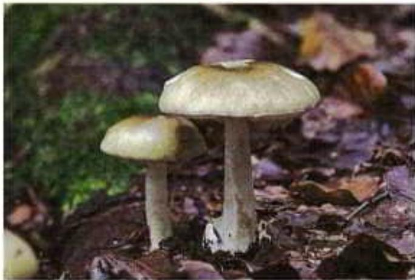  
Amanita phalloides, the death cap mushroom [Wolstenholme Images/Alamy Stock Photo.]

#### [EN] SUMMARY 26.1 DNA-Dependent Synthesis of RNA

■ Transcription is catalyzed by DNA-dependent RNA polymerases, which use ribonucleoside 5'-triphosphates to synthesize RNA in the 5'→3' direction, complementary to the template strand of duplex DNA. Transcription occurs in several phases: binding of RNA polymerase to a DNA site called a promoter, initiation of transcript synthesis, elongation, and termination.

■ RNA polymerases bind regions of DNA called promoters to initiate transcription of nearby genes. Promoter sequences help to establish the level of gene expression and in E. coli are recognized by variable RNA polymerase subunits called $\sigma$ factors. Transcription initiation involves formation of the closed and open complexes. DNA is unwound in the open complex to allow it to serve as the transcription template.

As the first committed steps in transcription, binding of RNA polymerase to the promoter and initiation of transcription are closely regulated.

■ Bacterial transcription stops at sequences called terminators. E. coli commonly uses two types of termination signals: $\rho$ -dependent and $\rho$ -independent.

■ Eukaryotic cells have three types of nuclear RNA polymerases. The vast majority of cellular mRNAs and ncRNAs are synthesized by Pol II.

■ Binding of Pol II to its promoters requires an array of proteins called transcription factors. Ultimately, a large molecular complex called the preinitiation complex, PIC, forms at the promoter. Elongation factors participate in the elongation phase of transcription. The phosphorylation state of the long carboxyl-terminal domain of the largest Pol II subunit changes in the initiation and elongation phases and determines what components are part of the initiation and elongation complexes.

■ RNA polymerases can be inhibited by a number of drugs, some of which are specific to either bacterial or eukaryotic polymerases. Drugs that inhibit bacterial RNA polymerase are commonly used to treat infections such as tuberculosis.

<!-- EN-END 26.1 -->

## 二、RNA 的转录后加工

在细胞内，由RNA聚合酶合成的原初转录物（primary transcript）往往需要经过一系列的变化，包括链的裂解、5'端与3'端的切除、末端特殊结构的形成、核苷的修饰和糖苷键的改变以及剪接和编辑等信息加工过程，始能转变为成熟的RNA分子。此过程总称之为RNA的成熟，或称为转录后加工（post-transcriptional processing）。原核生物的mRNA一经转录通常立即进行翻译，除少数例外，一般不进行转录后加工。但稳定的RNA(tRNA和rRNA)都要经过一系列加工才能成为有活性的分子。真核生物由于存在细胞核结构，转录与翻译在时间上和空间上都被分隔开来，其mRNA前体的加工极为复杂。而且真核生物的大多数基因都被居间序列（intervening sequence），即内含子(intron)，所分隔而成为断裂基因(interrupted gene)，在转录后需通过剪接(splicing)使编码区成为连续序列。在真核生物中还能通过不同的加工方式，表达出不同的信息，即选择性基因(alternative gene)。因此，对于真核生物来讲，RNA的加工尤为重要。

## （一）原核生物中RNA的加工

在原核生物中，rRNA 的基因与某些 tRNA 的基因组成混合操纵子。其余 tRNA 基因也成簇存在，并与编码蛋白质的基因组成操纵子。它们在形成多顺反子转录物后，经断链成为 rRNA 和 tRNA 的前体，然后进一步加工成熟。

## 1. 原核生物 rRNA 前体的加工

大肠杆菌共有7个rRNA的转录单位，它们分散在基因组的各处。每个转录单位由16S rRNA、23S rRNA、5S rRNA以及一个或几个tRNA的基因所组成。16S rRNA与23S rRNA的基因之间常插入1个或2个tRNA的基因，有时在 $3^{\prime}$ 端5S rRNA的基因之后还有1个或2个tRNA的基因。rRNA的基因原初转录物的沉降常数为30S，相对分子质量为 $2.1 \times 10^{6}$ ，约含6500个核苷酸， $5^{\prime}$ 端为pppA。由于在原核生物中rRNA的加工往往与转录同时进行，因此不易得到完整的前体。从RNaseⅢ缺陷型大肠杆菌中分离到30S rRNA前体(P30)。RNaseⅢ是一种负责RNA加工的内切核酸酶，它的识别部位为特定的RNA双螺旋区，在茎部相对的两切割位点间相差2bp。16S rRNA和23S rRNA前体的两侧序列互补，形成茎环结构，经RNaseⅢ切割产生16S和23S rRNA前体P16和P23。5S rRNA前体P5在RNase E作用下产生的，它可识别P5两端形成的茎环结构。P5、P16和P23两端的多余附加序列需进一步由核酸酶切除。可能rRNA前体需先经甲基化修饰，再被内切核酸酶和外切核酸酶切割（图32-12）。不同细菌rRNA前体的加工过程并不完全相同，但基本过程类似。

原核生物 rRNA 含有多个甲基化修饰成分, 包括甲基化碱基和甲基化核糖, 尤其常见的是 $2^{\prime}-$ 甲基核糖。16S rRNA 含有约 10 个甲基, 23S rRNA 约 20 个甲基, 其中 $N^{4}, 2^{\prime}-O-$ 二甲基胞苷 ( $m^{4}Cm$ ) 是 16S rRNA

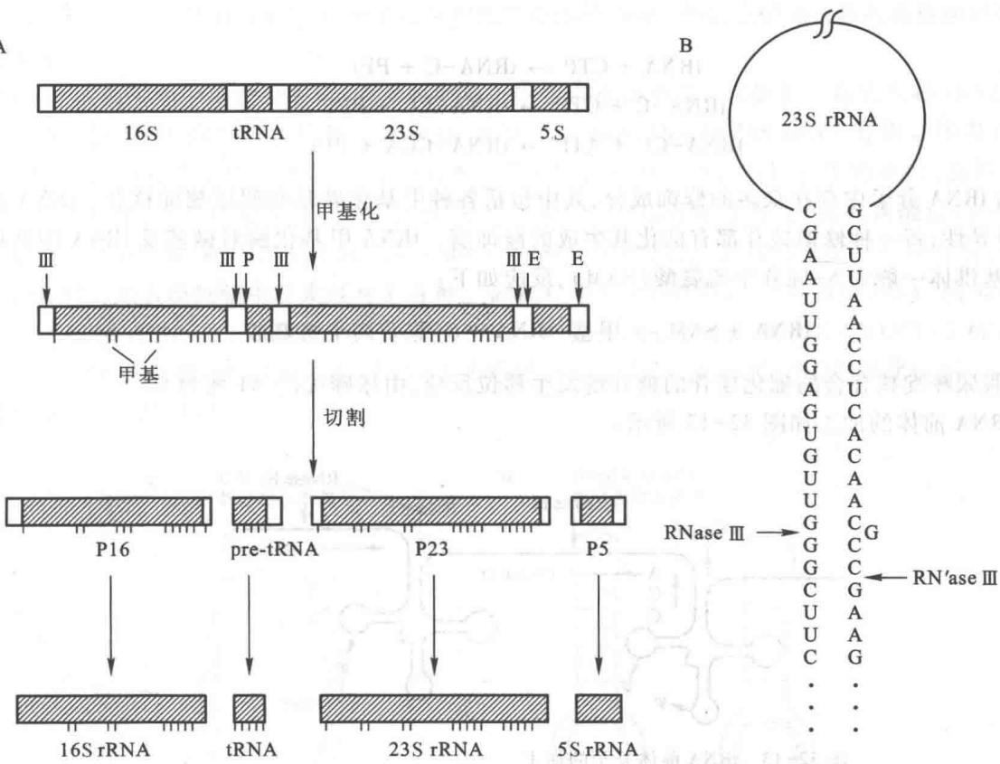  
图 32-12 大肠杆菌 rRNA 前体的加工过程  
特有的成分。一般 5S rRNA 中无修饰成分, 不进行甲基化反应。

## 2. 原核生物 tRNA 前体的加工

大肠杆菌染色体基因组共有 tRNA 的基因约 60 个。这个数字远大于按变偶假说所要求的反密码子数，也就是说，某些反密码子可以不止一个 tRNA 分子，或某些 tRNA 基因不止一个拷贝。tRNA 的基因大多成簇存在，或与 rRNA 基因，或与编码蛋白质的基因组成混合转录单位。tRNA 前体的加工包括：① 由内切核酸酶在 tRNA 两端切断 (cutting)；② 由外切核酸酶逐个切去多余序列进行修剪 (trimming)；③ 核苷酸的修饰和异构化；④ 在 tRNA 3' 端加上胞苷酸-胞苷酸-腺苷酸 (-CCA)。

与 DNA 限制性内切酶不同，RNA 内切核酸酶不能识别特异的序列，它所识别的是加工部位的空间结构。大肠杆菌 RNase P 是一类切断 tRNA 5' 端的加工酶，属于内切核酸酶性质。差不多所有大肠杆菌及其噬菌体 tRNA 前体都是在该酶作用下切出成熟的 tRNA 5' 端。因此，这个 5'-内切核酸酶是 tRNA 的 5' 成熟酶。RNase P 是一个很特殊的酶，它含有蛋白质和 RNA 两部分。RNA 链由 375 个核苷酸组成（相对分子质量约 130 000），蛋白质多肽链的相对分子质量仅 20 000。在某些条件下（提高 Mg $^{2+}$ 浓度或加入多胺类物质），RNase P 中的 RNA 单独也能切断 tRNA 前体的 5' 端序列。RNase P 中的 RNA 称为 M1 RNA。有关 RNA 的催化功能，后面还将进一步讨论。

加工 tRNA 前体 3' 端的序列还需要另外的内切核酸酶,例如 RNase F,它从靠近 3' 端处切断前体分子。为了得到成熟的 3' 端,需要有外切核酸酶进一步进行修剪,直至 tRNA 的 3' 端。负责修剪的外切核酸酶可能主要为 RNase D。这个酶由相对分子质量为 38000 的单一多肽链所组成,具有严格的选择活性。实验表明它识别的是整个 tRNA 结构,而不是 3' 端的特异序列。由此可见,RNase D 是 tRNA 的 3' 端成熟酶。

所有成熟 tRNA 分子的 3' 端都有 CCAOH 结构, 它对于接受氨酰基的活性是必要的。细菌的 tRNA 前体存在两类不同的 3' 端序列。一类其自身具有 CCA 三核苷酸, 位于成熟 tRNA 序列与 3' 端附加序列之间, 当附加序列被切除后即显露出该末端结构; 另一类其自身并无 CCA 序列, 当前体切除 3' 端附加序列后, 必须在 tRNA 核苷酰转移酶 (nucleotidyl transferase) 催化下由 CTP 和 ATP 供给胞苷酸和腺苷酸, 反应

式如下：

$$
\mathrm{tRNA} + \mathrm{CTP} \rightarrow \mathrm{tRNA-C} + \mathrm{PPi}
$$

$$
\mathrm{tRNA-C} + \mathrm{CTP} \rightarrow \mathrm{tRNA-CC} + \mathrm{PPi}
$$

$$
\mathrm{tRNA-CC} + \mathrm{ATP} \rightarrow \mathrm{tRNA-CCA} + \mathrm{PPi}
$$

成熟的 tRNA 分子中存在众多的修饰成分,其中包括各种甲基化碱基和假尿嘧啶核苷。tRNA 修饰酶具有高度特异性;每一种修饰核苷都有催化其生成的修饰酶。tRNA 甲基化酶对碱基及 tRNA 序列均有严格要求,甲基供体一般为 S-腺苷甲硫氨酸(SAM),反应如下:

$$
\mathrm{tRNA} + \mathrm{SAM} \rightarrow \text {   甲基   } - \mathrm{tRNA} + S - \text {   腺苷高半胱氨酸   }
$$

tRNA 假尿嘧啶核苷合酶催化尿苷的糖苷键发生移位反应,由尿嘧啶的 N1 变为 C5。

细菌 tRNA 前体的加工如图 32-13 所示。

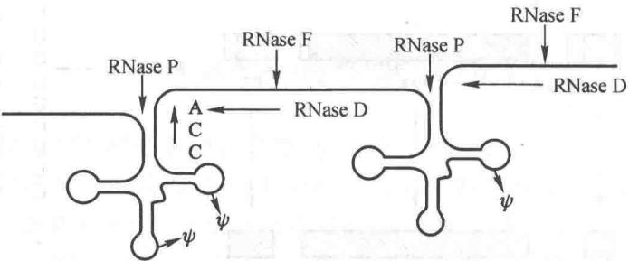  
图32-13 tRNA前体分子的加工  
↓表示内切核酸酶的作用；←表示外切核酸酶的作用；↑表示核苷酰转移酶的作用；↓表示异构化酶的作用

## 3. 原核生物 mRNA 前体的加工

细菌中用于指导蛋白质合成的 mRNA 大多不需要加工,一经转录即可直接进行翻译。但也有少数多顺反子 mRNA 需通过内切核酸酶切成较小的单位,然后再进行翻译。例如,核糖体大亚基蛋白 L10 和 L7/L12 与 RNA 聚合酶 β 和 β'亚基的基因组成混合操纵子,它在转录出多顺反子 mRNA 后需通过 RNase III 将核糖体蛋白质与聚合酶亚基的 mRNA 切开,然后再各自进行翻译。核糖体蛋白质的合成必须对应于 rRNA 的合成水平,并且与细胞的生长速度相适应。细胞内 RNA 聚合酶的合成水平则要低得多。将二者 mRNA 切开,有利于各自的翻译调控。

## （二）真核生物中 RNA 的一般加工

真核生物 rRNA 和 tRNA 前体的加工过程与原核生物有些相似；然而其 mRNA 前体必须经复杂的加工过程，这与原核生物大不相同。真核生物大多数基因含有居间序列，需在转录后的加工过程中予以切除。由于这方面研究的进展极为迅速，故留在后面单独进行讨论。

## 1. 真核生物 rRNA 前体的加工

真核生物的核糖体比原核生物的核糖体更大,结构也更复杂。其核糖体的小亚基含有一条16S\~18S rRNA;大亚基除26S\~28S rRNA和5S rRNA外,还含有一条原核生物中所没有的5.8S rRNA。真核生物rRNA基因拷贝数较多,通常在几十至几千之间。rRNA基因成簇排列在一起,由16S\~18S、5.8S和26S\~28S rRNA基因组成一个转录单位,彼此被间隔区分开,由RNA聚合酶I转录产生一个长的rRNA前体。不同生物的rRNA前体大小不同。哺乳类动物18S、5.8S和28S rRNA基因转录产生45S rRNA前体。果蝇18S、5.8S和28S rRNA基因的转录产物为38S rRNA前体。酵母17S、5.8S和26S rRNA基因的转录产物为37S的rRNA前体。

在真核生物中 5S rRNA 基因也是成簇排列的, 中间隔以不被转录的区域。它由 RNA 聚合酶Ⅲ转录, 经过适当加工即与 28S rRNA 和 5.8S rRNA 以及有关蛋白质一起组成核糖体的大亚基。18S rRNA 与有关蛋白质则组成小亚基。核仁是 rRNA 合成、加工和装配成核糖体的场所。然后它们通过核孔再转移到细胞质中参与核糖体循环。

rRNA 在成熟过程中可被甲基化,主要的甲基化位置也在核糖 2'-羟基上。真核生物 rRNA 的甲基化程度比原核生物 rRNA 的甲基化程度高。例如,哺乳类细胞的 18S 和 28S rRNA 分别含甲基约 43 和 74 个,大约 2% 的核苷酸被甲基化,相当于细菌 rRNA 甲基化程度的 3 倍。与原核生物类似,真核生物 rRNA 前体也是先甲基化,然后再被切割。现在知道,真核生物 rRNA 前体的甲基化、假尿苷酸化 (pseudouridylation) 和切割是由核仁小 RNA (small nucleolar RNA, snoRNA) 指导的。真核细胞的核仁中存在种类甚多的 snoRNA,从酵母和人类细胞中已发现有上百种。含有 C 框 (AUGAUGA) 和 D 框 (CUGA) 的 snoRNA 可借助互补序列识别 rRNA 前体中进行甲基化 (2'OMe) 和切割的位点;含 H 框 (ANANNA) 和 ACA 框的 snoRNA 可识别假尿苷酸化的位点。酵母 rRNA 中假尿苷酸有 43 个,以及众多的甲基化位点,依靠 snoRNA 才能精确加工(图 32-14)。

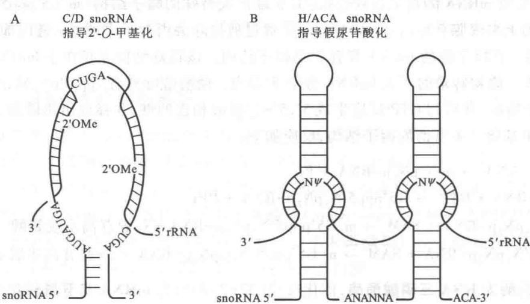  
图 32-14 snoRNA 指导 rRNA 前体特异位点的修饰

多数真核生物的 rRNA 基因不存在内含子。有些 rRNA 基因含有内含子但并不转录。例如，果蝇的 285 个 rRNA 基因中有约三分之一含有内含子，它们均不转录。四膜虫（Tetrahymena）的核 rRNA 基因和酵母线粒体 rRNA 基因含有内含子，它们的转录产物可自动切去内含子序列。

线粒体和叶绿体 rRNA 基因的排列方式和转录后加工过程一般都与原核生物的 rRNA 基因类似。

## 2. 真核生物 tRNA 前体的加工

真核生物 tRNA 基因的数目比原核生物 tRNA 基因的数目要大得多。例如，大肠杆菌基因组约有 60 个 tRNA 基因，啤酒酵母有 320\~400 个，果蝇 850 个，爪蟾 1150 个，而人体细胞则有 1300 个。真核生物的 tRNA 基因也成簇排列，并且被间隔区所分开。tRNA 基因由 RNA 聚合酶Ⅲ转录，转录产物为 4.5S 或稍大的 tRNA 前体，相当于 100 个左右的核苷酸。成熟的 tRNA 分子为 4S，约 70\~80 个核苷酸。前体分子在 tRNA 的 5' 端和 3' 端都有附加的序列，需由内切核酸酶和外切酶加以切除。与原核生物类似的 RNase P 可切除 5' 端的附加序列，但是真核生物 RNase P 中的 RNA 单独并无切割活性。3' 端附加序列的切除需要多种内切核酸酶和外切核酸酶的作用。

真核生物 tRNA 前体的 3' 端不含 CCA 序列, 成熟 tRNA 3' 端的 CCA 是后加上去的, 由核苷酰转移酶催化, CTP 和 ATP 供给胞苷酰和腺苷酰基。tRNA 的修饰成分由特异的修饰酶所催化。真核生物的 tRNA 除含有修饰碱基外, 还有 2'-O-甲基核糖, 其含量约为核苷酸的百分之一。具有居间序列的 tRNA 前体还须将这部分序列切掉。

## 3. 真核生物 mRNA 前体的一般加工

真核生物编码蛋白质的基因以单个基因作为转录单位,其转录产物为单顺反子 mRNA。大多数蛋白质基因存在居间序列,需在转录后加工过程中切除。由于细胞核结构将转录和翻译过程分隔开,mRNA 前体在核中需经过一系列复杂的加工过程并转移到细胞质中才能表现出翻译功能,因此它的调控序列变得更为复杂,半寿期也更长。mRNA的原初转录物在核内加工过程中形成分子大小不等的中间物,称为核内不均一RNA(heterogeneous nuclear RNA,hnRNA),它们在核内迅速合成和降解,半寿期很短,比细胞质mRNA更不稳定。不同细胞类型hnRNA半寿期不同,从几分钟至1 h左右;而细胞质mRNA的半寿期一般在1\~10 h。神经细胞mRNA最长半寿期可达数年,甚至终生。

hnRNA 分子大小分布极不均一,最大的沉降系数可达 100S 以上,一般在 30S\~40S 间。哺乳类动物 hnRNA 平均链长在 8000\~10000 个核苷酸之间,而细胞质 mRNA 平均链长为 1800\~2000 核苷酸。由于 hnRNA 代谢转换率极高,而稳定性 RNA 则较低,用同位素脉冲标记技术,即短期加入同位素标记前体随即除去并用非标记前体取代,可追踪 hnRNA 的去向。用这样的方法测定总 hnRNA 中只有一小部分的分子可加工转变成 mRNA,对哺乳类细胞来说大约为 5%。考虑到 hnRNA 分子大小约为 mRNA 的 4\~5 倍,粗略计算加工的 hnRNA 中约 25% 转变成 mRNA。

由 hnRNA 转变成 mRNA 的加工过程包括: ① 5' 端形成特殊的帽子结构 ( $m^{7}G5'ppp5'NmpNp-$ ), ② 在链的 3' 端切断并加上多聚腺苷酸 (poly A) 尾巴, ③ 通过剪接除去内含子序列, ④ 链内部核苷被甲基化。

（1）5'端加帽 真核生物的 mRNA 都有 5'端帽子结构。该特殊结构亦存在于 hnRNA 中，它可能在转录的早期就已形成。原初转录的巨大 hnRNA 分子 5'端为三磷酸嘌呤核苷（pppPu），转录起始后不久从 5'端三磷酸脱去一个磷酸，然后与 GTP 反应生成 5',5'-三磷酸相连的键，并释放出焦磷酸，最后以 S-腺苷蛋氨酸（SAM）进行甲基化产生所谓的帽子结构，反应如下：

$$
\mathrm{pppN} _ {1} \mathrm{pN} _ {2} \mathrm{p-RNA} \rightarrow \mathrm{ppN} _ {1} \mathrm{pN} _ {2} \mathrm{p-RNA} + \mathrm{Pi}\tag{32-1}
$$

$$
\mathrm{ppN} _ {1} \mathrm{pN} _ {2} \mathrm{p-RNA} + \mathrm{GTP} \rightarrow \mathrm{G5} ^ {\prime} \mathrm{ppp5} ^ {\prime} \mathrm{N} _ {1} \mathrm{pN} _ {2} \mathrm{p-RNA} + \mathrm{PPi}\tag{32-2}
$$

$$
\mathrm{G} 5 ^ {\prime} \mathrm{ppp} 5 ^ {\prime} \mathrm{N} _ {1} \mathrm{pN} _ {2} \mathrm{p-RNA} + \mathrm{SAM} \rightarrow \mathrm{m} ^ {7} \mathrm{G} 5 ^ {\prime} \mathrm{ppp} 5 ^ {\prime} \mathrm{N} _ {1} \mathrm{pN} _ {2} \mathrm{p-RNA} + S - \text {腺苷高半胱氨酸}\tag{32-3}
$$

$$
\mathrm{m} ^ {7} \mathrm{G5} ^ {\prime} \mathrm{ppp5} ^ {\prime} \mathrm{N} _ {1} \mathrm{pN} _ {2} \mathrm{p-RNA+SAM} \rightarrow \mathrm{m} ^ {7} \mathrm{G5} ^ {\prime} \mathrm{ppp5} ^ {\prime} \mathrm{N} _ {1} \mathrm{mpN} _ {2} \mathrm{p-RNA+S-腺苷高半胱氨酸}\tag{32-4}
$$

催化反应(32-1)的酶为 RNA 三磷酸酯酶, 催化反应(32-2)的酶为 mRNA 鸟苷酰转移酶, 催化反应(32-3)的酶为 mRNA(鸟嘌呤-7)甲基转移酶, 催化反应(32-4)的酶为 mRNA(核苷-2')甲基转移酶。不同生物体内, 由于甲基化程度的不同, 可以形成几种不同形式的帽子。有些帽子结构仅形成 7-甲基鸟苷三磷酸 m $^{7}$ Gppp, 被称为 Cap O 型; 有些在 m $^{7}$ Gppp 之后的 N1 核苷甚至 N2 核苷的核糖 2'-OH 基上也被甲基化, 分别称为 Cap I 型和 Cap II 型。

上述加帽酶结合在 pol Ⅱ 的 CTD 上, 及至 RNA 链合成约 30 nt 随即暂停, 等待加帽酶完成一系列加帽反应。加帽酶完成加帽后脱离 CTD, 帽子通过另一帽结合复合物 (cap-binding complex, CBC) 仍拴在 CTD 上, RNA 链形成突环 (loop)。如若新生 RNA 链不被加帽, 外切酶从 5' 端切除 RNA, pol Ⅱ 和转录因子随之脱落。新生 RNA 链加帽后转录再起始 (reinitiation), 完成 RNA 的转录, 末端断开并加上聚腺苷酸。

5'端帽子的功能并未完全清楚,一般认为它能保护 RNA 转录物,并给出 5'端标记,有助于剪接、运输和翻译各类功能复合物的识别,以协助完成这些功能。RNA 加帽后边转录边加工,在转录过程中完成剪接。成熟的 mRNA 从核内转运到细胞质,成为蛋白质合成的模板。帽子结构对 mRNA 的翻译功能很重要,若用化学方法除去 m $^{7}$ G 的珠蛋白 mRNA 在麦胚无细胞系统中不能有效翻译。5'-脱氧-5'-异丁酰基腺苷是腺苷高半胱氨酸的类似物,它能强烈抑制劳氏肉瘤的生长,这是因为该抑制剂可抑制 mRNA(鸟嘌呤-7)甲基转移酶活力,从而阻止帽子的形成。

（2）3'端的产生和多聚腺苷酸化 真核生物 mRNA 的 3'端通常都有 20\~200 个腺苷酸残基，构成多聚腺苷酸的尾部结构。但也有例外，如组蛋白、呼肠孤病毒和不少植物病毒的 mRNA 并没有多聚腺苷酸。核内 hnRNA 的 3'端也有多聚腺苷酸，表明加尾过程早在核内已完成。hnRNA 中的多聚腺苷酸比 mRNA 的略长，平均长度为 150\~200 个核苷酸。

实验表明, RNA 聚合酶 II 的转录产物是在 3' 端切断, 然后多聚腺苷酸化 (polyadenylation)。高等真核生物 (酵母除外) 的细胞和病毒 mRNA 在靠近 3' 端区都有一段非常保守的序列 AAUAAA, 这一序列离多聚腺苷酸加入位点的距离不一, 大致在 11\~30 个核苷酸范围内。将病毒转录单位的该段序列删除后, 原来位置上就不再发生切断和多聚腺苷酸化。一般认为，这一序列为链的切断和多聚腺苷酸化提供了某种信号。

hnRNA链的切断可能是由RNaseⅢ完成的。多聚腺苷酸化则由多聚腺苷酸聚合酶(poly(A)polymerase)所催化，该酶以带3'-OH基的RNA为受体，ATP作供体，需 $Mg^{2+}$ 或 $Mn^{2+}$ 。此外，还需十多个蛋白质参与作用，协助切割和多聚腺苷酸化。

多聚腺苷酸化可被类似物 3'-脱氧腺苷, 即冬虫夏草素 (cordycepin) 所阻止。这是一种多聚腺苷酸化的特异抑制剂; 它并不影响 hnRNA 的转录, 但在加入该抑制剂时, 即可阻止细胞质中出现新的 mRNA。另一方面, 珠蛋白 mRNA 上的多聚腺苷酸尾巴被除去后, 仍然能在麦胚无细胞系统中翻译, 显示该尾部结构并非翻译所必需。然而除去多聚腺苷酸尾巴的 mRNA 稳定性较差, 可被体内有关酶所降解, 翻译效率下降。当 mRNA 由细胞核转移到细胞质中时, 其多聚腺苷酸尾部常有不同程度的缩短。由此可见, 多聚腺苷酸尾巴至少可以起某种缓冲作用, 防止外切核酸酶对 mRNA 信息序列的降解作用。

(3) mRNA 的内部甲基化 真核生物 mRNA 分子内部往往有甲基化的碱基, 主要是 $N^{6}-$ 甲基腺嘌呤 ( $m^{6}A$ )。这类修饰成分在 hnRNA 中已经存在。不过也有一些真核生物细胞和病毒 mRNA 中并不存在 $N^{6}-$ 甲基腺嘌呤, 似乎这个修饰成分对翻译功能不是必要的。据推测, 它可能对 mRNA 前体的加工起识别作用。

## （三）RNA的剪接、编辑和再编码

大多数真核基因都是断裂基因,但也有少数编码蛋白质的基因以及一些 tRNA 和 rRNA 基因是连续的。断裂基因的转录产物需通过剪接,去除插入部分(即内含子),使编码区(外显子)成为连续序列。这是基因表达调控的一个重要环节。内含子具有多种多样的结构,剪接机制也是多种多样的。有些内含子可以催化自我剪接(self-splicing),有些内含子需在剪接体(spliceosome)作用下才能剪接。RNA 编码序列的改变称为编辑(editing)。RNA 编码和读码方式的改变称为再编码(recoding)。由于存在选择性剪接(alterative splicing)、编辑和再编码,一个基因可以产生多种蛋白质。

## 1. RNA 的剪接

1977 年 R. J. Roberts 和 P. A. Sharp 分别发现断裂基因 (interrupted gene)。当用 RNA 与其转录的模板 DNA 分子杂交时, RNA 链取代 DNA 双链中对应的链, 形成 R 环 (R-loop)。Roberts 等用腺病毒 (Ad2) 纤维 (fiber) mRNA 与病毒 DNA 限制片段杂交, 然后用电子显微镜观察 R 环的结构, 结果令人惊异的发现 mRNA 的 5' 端与其余部分分别与不同 DNA 限制片段形成杂交。Sharp 等用腺病毒六邻体 (hexon) mRNA 与 DNA 杂交, 在电子显微镜下也看到 mRNA 5' 端不与同一 DNA 片段杂交 (图 32-15)。这说明腺病毒 mRNA 5' 前导序列与其余序列由基因组不同部位转录而来。其后研究进一步了解到真核生物基因大部分都是不连续的, 插进去的序列称为居间序列 (intervening sequence, 又称间插序列), 需在转录后通过 RNA 剪接加以切除。1978 年 W. Gilbert 将断裂基因中经转录被剪接除去的序列称为内含子 (intron); 而在成熟 RNA 产物中出现的序列称为外显子 (exon)。Roberts 和 Sharp 由于发现断裂基因以及其后有关 RNA 剪接研究中的贡献而获 1993 年诺贝尔生理学或医学奖。

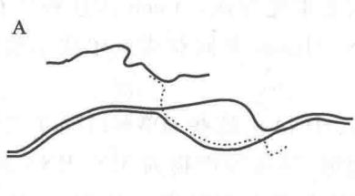

  
图 32-15 腺病毒-2 晚期 mRNA 与互补 DNA 片段形成 R-突环示意图

A. 腺病毒-2 纤维 mRNA 与两 DNA 片段形成杂交体；B. 腺病毒-2 六邻体 mRNA 与互补 DNA 片段形成 R-突环，5' 和 3' 端游离在外

真核生物的外显子一般为 100\~200 nt, 多数长度小于 1 000 nt; 内含子长度变化较大, 从 50\~20 000 nt, 甚至大于 100 000 nt。较高等的真核生物有更多的内含子序列。内含子主要通过 RNA 核酶催化两次转酯反应而切除, 少数由酶切除。Pre-mRNA 含有多个内含子, 一般为依次剪接, 但有些内含子具有增强或抑制剪接的序列, 前者可优先剪接, 后者延迟剪接。RNA 剪接是一个十分精确的过程, 不能有一个核苷酸的差错, 关键在于对内含子 5' 和 3' 剪接位点的精确识别。许多 U-系列核内小 RNA 和蛋白质 (snRNP) 组成剪接体 (spliceosome), 参与剪接的识别、空间组装和催化反应。参与剪接体的蛋白大约有 40\~50 种, 其中 SR 蛋白在剪接体的组装和剪接反应中起核心作用。SR 蛋白家族含有许多成员, 其结构特点为: N 端有一至两个 RNA 识别基序, C 端结构域富含丝氨酸 (S) 和精氨酸 (R)。N 端结构域使其识别并结合到 RNA 的特殊序列上; C 端结构域有助于蛋白质-蛋白质相互作用。剪接体还与 RNA 聚合酶的 CTD 相连, 表明 RNA 加工与转录之间的协同关系。

迄今所知，RNA 的剪接共有 4 种方式：类型 I 自我剪接（group I self-splicing），类型 II 自我剪接（group II self-splicing），核 mRNA 剪接体的剪接（nuclear mRNA spliceosomal splicing），核 tRNA 的酶促剪接（nuclear tRNA enzymatic splicing）。它们的剪接过程如图 32-16 所示。

  
图32-16 RNA的剪接方式  
A. 类型Ⅰ自我剪接；B. 类型Ⅱ自我剪接；C. 核 mRNA 剪接体的剪接；D. 核 tRNA 的酶促剪接

（1）类型 I 自我剪接 1981 年 T. Cech 在研究四膜虫 (Tetrahymena thermophila) rRNA 前体剪接过程中发现, 此类剪接无需蛋白质的酶参与作用, 它可自我催化完成。Cech 称这种具有催化功能的 RNA 为核酶 (ribozyme)。由于发现核酶, 1989 年 T. Cech 和 S. Altman 共同获诺贝尔化学奖。Altman 的贡献是发现 RNase P 中的 M1 RNA 单独也有催化功能。

四膜虫的大核含有大量经扩增的 rRNA 的基因(rDNA)，这些 rDNA 以回文二聚体的形式构成微染色体。每一个回文二聚体由两个同样的转录单位所组成，其转录产物为 35S rRNA 前体。35S rRNA 含 6400 个核苷酸，经加工生成 17S、5.8S 和 26S rRNA。某些品系的四膜虫在其 26S rRNA 的基因中有一个内含子，长 413 bp。35S rRNA 前体需经过剪接以切除内含子序列。此剪接过程只需要 1 价和 2 价阳离子以及鸟苷酸(或鸟苷)存在即能自发进行，无需酶催化和供给能量。剪接实际上是磷酸酯的转移反应，如图 32-17 所示。

鸟苷酸(或鸟苷)在此起着辅助因子的作用,它提供了游离的3'-羟基,从而使内含子的5'-磷酸基转移其上。紧接着发生第二次类似的转酯反应,由第一个外显子产生的3'-羟基攻击第二个外显子的5'-磷酸基。因为在磷酸酯的转移过程中并不发生水解作用，磷酸酯键的能量被贮存起来，由此可以解释为什么反应不需要供给能量。在两次转酯反应中产生的线状内含子片段可以发生环化。这是由于内含子分子的3'-羟基攻击5'端第15个核苷酸处的磷酸基，引起第三次磷酸基转移反应所致，结果形成一个环状分子和一小段15聚核苷酸。环状内含子还具有自我切割和转酯反应，最后产生395个核苷酸的线形分子，称为L-19。它不再自我切割，但可以催化适当RNA底物的水解和转酯反应。

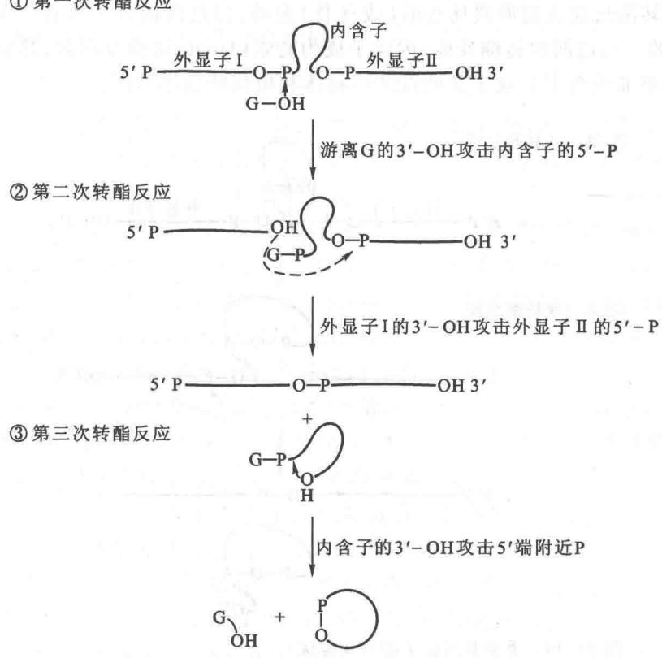  
图32-17 四膜虫rRNA前体的剪接过程

类型 I 自我剪接的内含子分布很广,存在于真核生物的细胞器(线粒体和叶绿体)基因,低等真核生物核的 rRNA 基因,以及细菌和噬菌体的个别基因中。这类内含子含有某些特殊序列,它的内含子指导序列(intron guide sequence,IGS)GGAGGG 可与左侧外显子末端的 CUCUCU 序列配对,整个内含子包括 IGS 在内共有 9 个碱基配对区,其中 P、Q、R、S 四个序列十分保守,其核酶活性与该内含子 RNA 所形成特定的折叠有关(图 32-18)。

  
图32-18 类型I内含子的二级结构  
粗黑线为保守序列；双线为外显子

（2）类型Ⅱ自我剪接 类型Ⅱ内含子本身也具有催化功能，能够自我完成剪接。它与类型Ⅰ内含子自我剪接的差别在于转酯反应无需游离鸟苷酸(或鸟苷)发动，而是由内含子靠近3'端的腺苷酸2'-羟基攻击5'-磷酸基引起的。经过两次转酯反应，内含子成为套索(lariat)结构被切除，两个外显子得以连接在一起(图32-19)。类型Ⅱ内含子只见于某些真菌线粒体和植物叶绿体基因。

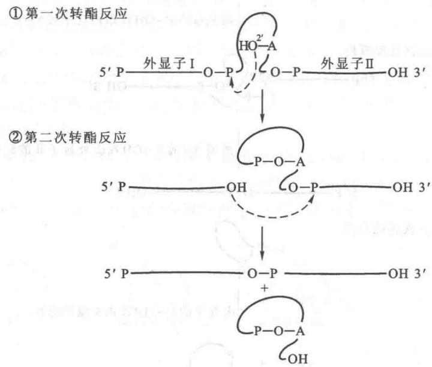  
图32-19 类型Ⅱ内含子的自我剪接

类型Ⅱ内含子的结构更复杂,也更保守,这也是这类内含子存在受局限的重要原因之一。该内含子有6个螺旋区,其中螺旋区Ⅰ有两个外显子结合位点(exon binding site,EBS),可以与左侧外显子的内含子结合位点(intron binding site,IBS)配对。内含子靠近3'端有一保守序列CUGAC,其上A的2'-OH可与末端5'-P形成磷酸酯键。由于已有两个磷酸酯键,此反应较弱,对核酶的要求也就比较高。类型Ⅱ内含子的自我剪接活性有赖于其二级结构和进一步折叠,如图32-20所示。

  
图32-20 类型Ⅱ内含子的二级结构

（3）hnRNA 的剪接 真核生物编码蛋白质的核基因含有数目巨大的内含子，它们占据了所有内含子的绝大部分。这些内含子的左端（5'端）均为 GT，右端（3'端）均为 AG，此称为 GT-AG 规则（对应于 RNA 为 GU-AG）。此规则不适合于线粒体和叶绿体基因的内含子，也不适合于 tRNA 和 rRNA 核基因的内含子。根据大量资料分析的结果，脊椎动物、酵母和植物 mRNA 前体（hnRNA）的内含子具有以下的保守结构：

$$
\text {脊椎动物} \quad \mathrm{AGGUAAGU} \longrightarrow \mathrm{UNCU} _ {\mathrm{A}} ^ {\mathrm{G}} \mathrm{AC} - (\mathrm{Py}) _ {1 0 \sim 1 5} - \mathrm{NCAGG}
$$

$$
\text {酵母} \quad \mathrm{GUAAGU} \longrightarrow \mathrm{UNCU~AAC} \longrightarrow \mathrm{PyAG}
$$

$$
\text { 植物 } \quad A G G U A A G U \longrightarrow \text { 富含   UA   的序列 } \longrightarrow U G C A G G U
$$

细胞核内存在许多种类的小分子 RNA, 其大小在 100\~300 个核苷酸, 称为核内小 RNA (small nuclear RNA, snRNA)。U 系列的 snRNA 中尿嘧啶含量较高, 因而得名。这些小 RNA 通常都与多肽或蛋白质相结合, 形成核糖核蛋白 (RNP)。每一 snRNA 与数个或十多个蛋白质结合, 称为 snRNP。U1、U2、U4、U5、U6 snRNP 参与 hnRNA 的剪接; U3 snRNP 参与 rRNA 前体的加工。剪接体 (spliceosome) 为在被剪接 RNA 上由上述 5 种 U 系列 snRNP 与数十种剪接因子 (splicing factor) 和调节因子 (regulator) 蛋白质所组成的复合物, 沉降常数为 50S\~60S, 呈有突起的椭球体。剪接体是在 RNA 剪接位点上由 U1、U2、U4、U5、U6 snRNP 以及一些剪接因子 (splicing factor, SF) 逐步装配而成。hnRNA 的剪接过程与类型 II 内含子 RNA 的剪接十分相似, 其差别在于前者由剪接体完成, 后者由内含子自我催化完成。

U1 snRNA 的 5'端序列与 hnRNA 内含子 5'剪接点处的序列互补,因而可以结合其上。U2 辅助因子 (U2 auxiliary factor, U2AF) 随后结合在分支点下游嘧啶 (Py) 区。某些剪接和调节因子 (splicing factor & regulator, SR) 将 U1 snRNP 和 U2 AF 连在一起,组成 E 复合物 (early presplicing complex)。U2 snRNA 含有与分支点互补的序列,在其辅助因子帮助下结合其上,E 复合物转变为 A 复合物 (A presplicing complex)。U4 与 U6 和 U5 snRNP 三聚体进入 A 复合物后形成 B1 复合物,此时复合物已包含剪接所需成分,故已组成剪接体。U1 snRNP 随后被释放,从而腾出空间,使 U5 snRNP 得以从外显子转到内含子,U6 结合到 5'剪接点上,构成 B2 复合物。关键步骤是释放 U4 snRNP,U4 与 U6 的解离需由 ATP 供给能量。U6 活性受 U4 封闭,因此 U4 脱离后 U6 即可和 U2 碱基配对,并自身回折形成发夹结构,构成类似于 II 型内含子的催化中心,形成 C1 复合物。U5 snRNP 可以识别两外显子的剪接点并与之结合,形成 C2 复合物。在 U6/U2 催化下完成两次转酯反应使两个外显子连接在一起,剪接过程如图 32-21 所示。

上述 GT-AG 内含子见于绝大多数 hnRNA 的编码基因,但有少数内含子与此不同,而以 AT 开头和 AC 结尾,称为 AT-AC 内含子。前者为主要内含子,后者为次要内含子。参与次要内含子剪接体的成分也有不同,除保留 U5 snRNP 外,以 U11 snRNP 和 U12 snRNP 取代 U1 和 U2,分别识别内含子的 5'剪接点和分支点,以 U4atac 和 U6atac 取代 U4 和 U6,通过类似方式催化转酯反应。

由于核 mRNA 前体的剪接与类型Ⅱ内含子的自我剪接基本相同, 推测 snRNA 可能是从类型Ⅱ内含子演变而来。核 mRNA 前体的含内子数目如此庞大, 在进化过程中很难设想可以保持其核酶的结构, 唯一可行的途径是将Ⅱ型内含子的催化功能转交某些小 RNA 和辅助蛋白, 以专司其职。迄今仍可从 snRNA 中看到与Ⅱ型内含子结构域的一些类似之处。

（4）核内 tRNA 前体的酶促剪接 酵母 tRNA 前体的剪接机制研究得比较清楚。酵母基因组共有约 400 个 tRNA 基因，含有内含子的基因仅占十分之一。内含子的长度从 14\~46 bp 不等，它们之间并无保守序列。推测切除内含子的酶识别的仅是共同的二级结构，而不是共同的序列。通常内含子插入到靠近反密码子处，与反密码子碱基配对，反密码子环不再存在，代之以插入的内含子环（图 32-22）。

研究 tRNA 前体在无细胞提取液中的剪接过程表明, 反应分两步进行。第一步是由一个特殊内切核酸酶断裂磷酸二酯键, 切去插入序列, 反应不需要 ATP。第二步由 RNA 连接酶催化使切开的两部分共价连接, 需要 ATP 供给能量。内切核酸酶断裂 tRNA 前体, 产生 tRNA 的两个半分子和一个线状内含子分子。它们的 5' 端均为羟基; 3' 端为 2', 3'-环状磷酸基。两个半分子 tRNA 通过碱基对仍然维系在一起。在有激酶和 ATP 存在时, 5'-羟基可转变成 5'-磷酸基。2', 3'-环状磷酸基在环磷酸二酯酶催化下被打开, 形成 2'-磷酸基和 3'-羟基。

连接反应(ligation reaction)需先由 ATP 活化连接酶,形成腺苷酸化蛋白质。AMP 的磷酸基以共价键连接在酶蛋白质的氨基上。然后 AMP 被转移到 tRNA 半分子的 5'-磷酸基上,形成焦磷酸键连接。在 tRNA 另一半分子 3'-羟基攻击下 AMP 被取代,产生 5',3'-磷酸二酯键。此时多余的 2'-磷酸基被磷酸酯酶所除去。整个剪接过程如图 32-23 所示。

  
图32-21 hnRNA的剪接过程

  
图 32-22 酵母 tRNA 前体剪接前后的结构  
GAA 为反密码子； $|\leftarrow\rightarrow|$ ：内含子  
图 32-23 酵母和植物 tRNA 前体的剪接过程

植物和哺乳动物 tRNA 前体被内切核酸酶断裂时也产生 2', 3'-环磷酸。植物的剪接过程与酵母类似。哺乳动物的反应则有些差别。HeLa(人)细胞的连接酶可将 RNA 的 2', 3'-环磷酸基直接与 5'-羟基端连接。因此，当 tRNA 前体被内切核酸酶除去内含子后，两个 tRNA 半分子可直接由 RNA 连接酶催化连接，无需末端基的转变。

（5）反式剪接与选择性剪接 上述四类剪接均为分子内剪接，即顺式剪接。但生物体内还存在分子间的剪接，即反式剪接。如果一个RNA分子具有 $5^{\prime}$ 剪接点，另一分子具有 $3^{\prime}$ 剪接点，它们又靠得很近，就可以发生反式剪接。结果使一分子 $5^{\prime}$ 剪接点上游序列与另一分子 $3^{\prime}$ 剪接点下游序列连在一起，被切除的序列(相当于内含子)形成类似套索的Y形结构。分支点形成不稳定的磷酸三酯，随即水解脱去分支。反式剪接较为少见。一个研究较多的反式剪接例子是锥虫的mRNA，其众多mRNA的 $5^{\prime}$ 端有一共同的35个碱基长的前导序列。该前导序列并非由各个转录单位的上游所编码，而是来自一些重复单位的转录产物（图32-24）。给出35碱基前导序列的RNA称为SL RNA(spliced leader RNA)。在其他生物中也发现有个别反式剪接现象。

一个基因的转录产物在不同的发育阶段、分化细胞和生理状态下，通过不同的剪接方式，可以得到不同的 mRNA 和翻译产物，称为选择性剪接（alternative splicing）。所产生的多个蛋白质即为同源体（isoform）。例如， $\alpha$ 原肌球蛋白基因可得到 10 个不同蛋白质产物。肌钙蛋白可产生 64 个蛋白质同源体。果蝇的性分化是由一系列基因产物相互作用的结果，通过关键基因转录物的选择性剪接决定了雄性和雌性的差别。选择性剪接广泛存在，在基因表达的调节控制中起了十分重要的作用。

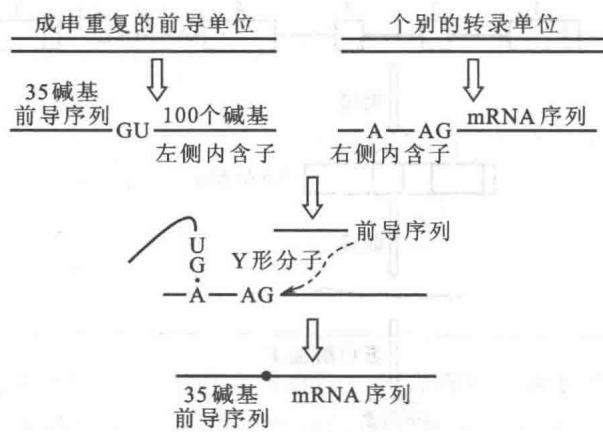  
图 32-24 锥虫 mRNA 前导序列的反式剪接

选择性剪接可以有许多种方式进行,归纳起来有以下4种:①剪接产物缺失一个或几个外显子;②剪接产物保留一个或几个内含子作为外显子的编码序列;③外显子中存在5'剪接点或3'剪接点,从而部分缺失该外显子;④内含子中存在5'剪接点或3'剪接点,从而使部分内含子变为编码序列。由于转录的起点不同以及mRNA前体3'端聚腺苷酸位点不同,增加了最后成熟mRNA的种类。图32-25列出各种选择性剪接的方式。

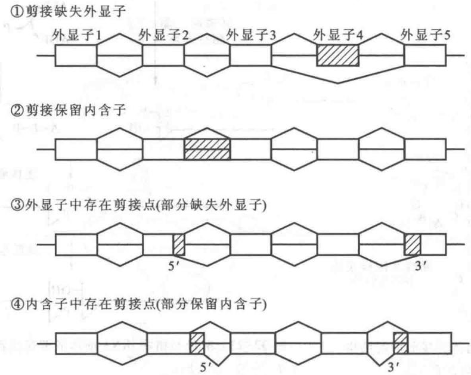

④内含子中存在剪接点(部分保留内含子)

图32-25 选择性剪接示意图

现以降钙素(calcitonin)的mRNA前体为例,说明具选择性剪接的机制。降钙素基因有6个外显子。它的原初转录物3'端有两个poly(A)位点,其一显现于甲状腺中,另一显现于脑中。在甲状腺中,通过剪接产生降钙素mRNA,它包括外显子1\~4。在脑中剪接去除降钙素外显子(外显子4),产生降钙素基因相关肽(calcitonin-gene-related peptide,CGRP)mRNA。同一基因在不同组织中由于在剪接激活蛋白和抑制蛋白影响下加工的不同而得到两种不同的激素(图32-26)。

  
图 32-26 降钙素基因转录物的选择性加工

(6) RNA 剪接的生物学意义 RNA 剪接现象的发现, 给生物学家带来了一系列令人困惑的疑问。为什么生物机体要先转录内含子, 然后将其切除? RNA 剪接的耗费是巨大的, 其收益是什么? 内含子由何而来? 为什么内含子主要见于真核生物? 内含子序列有无生物功能? 围绕这些问题曾提出不少设想, 争论很大, 迄今尚无定论。这里仅提出一些看法, 以供思考。

首先需要指出的是，RNA剪接是生物机体在进化历史中形成的，是进化的结果。基因与基因产物蛋白质都是由一些构造元件即模块（module）装配而成。从已有资料的分析中发现，约半数的基因其外显子与蛋白质结构域、亚结构域或基序有很好的对应关系。例如，免疫球蛋白基因的外显子十分精确地相当于蛋白质折叠的结构域。再有血红蛋白基因有3个外显子，而其蛋白质分子的三维结构显示有4个亚结构域，第一个外显子对应于蛋白质第一个亚结构域，第二个外显子对应于中间第2、3个亚结构域，第三个外显子对应于第4个亚结构域。而且还发现豆科植物的豆血红蛋白（leghemoglobin）基因有4个外显子，正好对应于蛋白质的4个亚结构域。这就是说，结合血红素的两个亚结构域外显子在豆血红蛋白基因中是精确分开的，而在动物相应的基因中合并为一个外显子。类似的例子还很多。但是另有约半数的基因不能找出外显子与蛋白质结构域的对应关系；这毫不奇怪，因为在漫长的进化历程中由于变异而将使模块的边界逐渐模糊以至完全消失。由于内含子和外显子的存在，使得外显子的重新组合即外显子改组（exon shuffling）成为形成新基因的重要方式，这极大加快了进化速度。

其次，RNA剪接是基因表达调节的重要环节。RNA转录后通过剪接而抽提有用信息，形成连续的编码序列，并可通过选择性剪接而控制生物机体生长发育。因此，这是真核生物遗传信息精确调节和控制的方式之一。

第三,如上所述,基因由模块装配而成,模块间的间隔序列也就演变成为内含子,因此外显子和内含子有着同样古老的历史。而现今存在的几类内含子也各有其起源和进化历史,从它们的剪接方式和分布(表32-6)可以大致推测其起源时间。Ⅰ型内含子能够自我剪接,并且分布极广,从蓝细菌、噬菌体到低等真核生物rRNA基因和高等真核生物的细胞器基因都有,估计它出现于35亿年前。Ⅱ型自我剪接的内含子也许与Ⅰ型内含子同时或稍后出现。核tRNA前体的内含子应在真细菌和真核生物分化之前出现,也就是说17亿年前。而核mRNA前体的内含子应在真核生物出现之后,大约7亿\~10亿年前出现。另一方面,某些Ⅰ型内含子含有编码内切核酸酶的序列,它们可以如同转座子一般在基因组内由一位点转移到另一位点;Ⅱ型内含子含有内切核酸酶或逆转录酶的编码序列,可以如同转座子和逆转座子一般扩散。这是内含子横向转移的过程。

表 32-6 内含子的剪接方式与分布

<table><tr><td rowspan="2">剪接方式</td><td rowspan="2">真细菌</td><td rowspan="2">古细菌</td><td colspan="3">真核生物</td></tr><tr><td>细胞核</td><td>线粒体</td><td>叶绿体</td></tr><tr><td rowspan="3">I型自我剪接</td><td>蓝细菌Leu-tRNA</td><td></td><td rowspan="3">原生动物、真菌、藻类rRNA的基因</td><td>mRNA、rRNA</td><td>mRNA、rRNALeu-tRNA</td></tr><tr><td>大肠杆菌T偶数噬菌体(td、nrd、sunY基因)</td><td></td><td></td><td></td></tr><tr><td>枯草芽孢杆菌SPO1噬菌体</td><td></td><td></td><td></td></tr><tr><td>II型自我剪接</td><td></td><td></td><td></td><td>mRNA</td><td>mRNA、tRNA</td></tr><tr><td>核mRNA前体依赖剪接体的剪接</td><td></td><td></td><td>mRNA</td><td></td><td></td></tr><tr><td>核tRNA的酶促剪接</td><td></td><td>tRNA、rRNA</td><td>tRNA</td><td></td><td></td></tr></table>

第四, RNA 剪接主要存在于真核生物, 原核生物极为少见, 但并非完全没有。一种合理的解释是原核生物为适应快速生长的需要, 在进化过程中已将内含子丢掉。事实上, 快速生长的单细胞真核生物, 如酵母, 其编码基因也几乎没有内含子。然而, 内含子的存在使同源重组 DNA 分子间链的断裂和再连接可以发生在内含子中，避免了在重组过程中由于错位而造成基因失活，因而促进了重组。内含子增加了基因组的复杂性，可成为新的编码序列。尤其重要的是，当基因内由突变产生新的5'或3'剪接点时，旧的剪接依然存在，使生物机体不因突变而失去原有的蛋白质。许多突变是有害的，有益突变只是极少数，新旧蛋白质并存使机体能在长时间内对它们进行选择，只有对生物机体有益的突变才被固定下来。

第五,外显子和内含子是相对的,有些内含子具有编码序列,能够产生蛋白质或功能 RNA。前面提到Ⅰ型内含子能产生内切核酸酶,Ⅱ型内含子能产生内切核酸酶或逆转录酶,以帮助内含子转移。也有些Ⅰ型和Ⅱ型内含子能产生成熟酶(maturase),帮助内含子自身折叠,促进自我剪接。许多核仁小 RNA 是由内含子产生的。上述内含子在表达时就成为外显子。再者,许多内含子对基因表达有一定影响,也就是说它们编码了某些基因表达的调控信息。因此,不能将内含子看成是无用的序列。

## 2. RNA 的编辑

1986年R.Benne等在研究锥虫线粒体DNA时发现，其细胞色素氧化酶亚基Ⅱ（coⅡ）基因与酵母或人的相应基因比较存在一个-1的移码突变，然而酶的功能又是正常的。进一步对比coⅡ基因与其转录物的序列，发现转录物在移码突变位点附近有4个不被基因DNA编码的额外尿苷酸，正好纠正了基因的移码突变(图32-27)。由于用分子杂交技术在线粒体内找不到第二个coⅡ基因，所以认为这些尿苷酸是在转录中或转录后插进去的。他们将这种改变RNA编码序列的方式称为RNA编辑。

  
图32-27 锥虫coⅡ基因与其表达产物的序列比较  
\* 标出插入核苷酸的位置

继 Benne 等人的工作之后, 又有一些实验室陆续在多种生物中发现 RNA 的编辑, 其中包括 U 的插入和删除, C、A 和 G 的插入, C 被 U 取代或 U 被 C 取代, A 转变为 I 等方式 (表 32-7)。在锥虫线粒体细胞色素氧化酶亚基Ⅲ (coⅢ) 中, 来自原始基因的遗传信息只占成熟 mRNA 的 45%, 而 55% 的遗传信息来自 RNA 编辑。还发现副黏病毒的 P 基因在插入 G 的编辑中, 由于插入数量的不同引起阅读框架改变, 一个 mRNA 前体的编辑产物可以产生多种蛋白质。

表 32-7 RNA 编辑的不同类型和分布

<table><tr><td>编辑类型</td><td>机制</td><td>存在</td></tr><tr><td>U的插入与删除</td><td>gRNA指导的反应</td><td>锥虫线粒体mRNA</td></tr><tr><td>C,A或U的插入</td><td></td><td>多头绒孢菌线粒体mRNA和rRNA</td></tr><tr><td>G的插入</td><td>RNA聚合酶重复转录</td><td>副黏病毒的P基因</td></tr><tr><td>C转变为U</td><td>酶促脱氨</td><td>哺乳类肠的apoB mRNA</td></tr><tr><td>C转变为U或U转变为C</td><td>脱氨或氨基化</td><td>植物线粒体mRNA和rRNA</td></tr><tr><td></td><td></td><td>牛心线粒体tRNA</td></tr><tr><td>A转变为I</td><td>脱氨</td><td>脑谷氨酸受体亚基mRNA</td></tr></table>

B. Blum 等揭示了 RNA 编辑中插入尿苷酸的机制。他们从线粒体中分离出一些长约 60 个核苷酸的 RNA，与被编辑 mRNA 前体序列互补，可作为编辑的模板，称为指导 RNA（guide RNA, gRNA）。gRNA 由另外的编码基因转录而来。编辑通常沿 mRNA 由 3' 端向 5' 端方向进行，当 gRNA 与 mRNA 配对而遇到不配对的核苷酸时，即以 gRNA 为模板在 mRNA 前体中插入和删除尿苷酸。此编辑过程由 20S 的酶复合物所催化，其中包括内切核酸酶、末端尿苷酰转移酶（terminal uridyl transferase, TUTase）和 RNA 连接酶，编辑过程如图 32-28 所示。由内切酶在不配对处将待编辑的 RNA（pre-edited RNA）切开，末端尿苷酸转移酶以 UTP 为底物转移尿苷酸到切开的 3' 端上，或由外切酶除去 RNA 中多余的尿苷酸，然后经 RNA 连接酶使断口连上。至于多头绒孢菌(Physarum polycephalum)线粒体 mRNA 和 rRNA 的编辑插入 C、A 和 U, 是否也由 gRNA 所导致, 目前还不清楚。

哺乳类动物的载脂蛋白 B(Apolipoprotein B, Apo B) 按大小可分为 Apo B100 和 Apo B48 两种，二者是同一基因的产物。人的 Apo B100( $M_r$ 512 000) 在肝中合成；Apo B48( $M_r$ 241 000) 在小肠中合成。在小肠细胞中 Apo B mRNA 前体于特定位置上一个 C 脱氨变成 U，原来编码谷氨酸的密码子 CAA 变成终止密码子 UAA，从而引起翻译提前结束。研究表明，编辑位点附近一段序列（约 26 个碱基）很重要，推测编辑酶 (editing enzyme) 识别并结合其上，然后脱去一定位置上 C 的氨基。

尤为引人瞩目的是脑受体离子通道亚基 mRNA 的编辑。脑进行学习和记忆的快速兴奋突触反应以及建立并维持突触可塑性通路均与受体离子通道有关。大鼠脑谷氨酸受体通道蛋白有 6 个亚基，其中三个亚基的 mRNA 能发生编辑，使一个谷氨酰胺的密码子变成精氨酸的密码子，以此控制神经递质引起的离子流。在受体的另一位置上，还发生一个精氨酸密码子转变成甘氨酸密码子。这些变化都涉及腺嘌呤的脱氨反应。腺苷脱氨酶作用于双链 RNA 区上的 A 使其变为 I（次黄嘌呤）。I 的碱基配对行为与 G 相当，因此改变了 mRNA 翻译的蛋白质性质。编辑酶能够特异识别编辑位点的茎环结构，其作用十分精确（图 32-29）。同样的事件也发生在 5-羟色胺受体的 mRNA。

  
图 32-28 在 gRNA 指导下 pre-mRNA 的编辑过程

  
图 32-29 在内含子指导下 pre-mRNA 的脱氨反应

RNA 的编辑有何生物学意义？首先，从锥虫线粒体 mRNA 编辑和其他的例子中可以看到，RNA 编辑可以消除突变的危害。甚至某些基因在突变过程中丢失达一半以上的遗传信息都可借 gRNA 一一加以补足。令人费解的是何以 RNA 编辑恰好可以纠正基因突变带来的损害？合乎逻辑的推理是 RNA 原来就是多变的，它能通过分子内和分子间反应产生种种 RNA 重排或由酶进行修饰，如果有 RNA 或酶引起 mRNA 众多变异中的一种恰好补救了基因突变引起的灾难，自然选择就将这种变异固定下来，成为 RNA 编辑。其次，RNA 编辑增加了基因产物的多样性，由同一基因转录物经编辑可以表达出多种同源体蛋白质。第三，RNA 编辑还和生物发育与分化有关，是基因调控的一种重要方式。第四，RNA 编辑还可能使基因产物获得新的结构和功能，有利于生物进化。

## 3. RNA 的再编码

过去一直以为编码在 mRNA 上的遗传信息是以固定的方式进行译码的,然而并不尽然。日益积累的事实表明,在某些情况下可以用不同的方式译码,也就是说改变了原来编码的含义,称为再编码 (recoding)。由于基因的错义、无义和移码突变,使基因降低或失去活性。校正 tRNA 通常是一些变异的 tRNA,它们或是反密码子环碱基发生改变,或是决定 tRNA 特异性即个性的碱基发生改变,从而改变了译码规则,故而使错误的编码信息受到校正。校正 tRNA 在错义或无义突变的位置上引入一个与原来氨基酸相同或性质相近的氨基酸,因而恢复或部分恢复基因编码蛋白质的活性,并通过阅读一个二联体 (doublet) 密码子或四联体 (quadruplet) 密码子而消除 -1 移码或 +1 移码的效应。这是 RNA 再编码的一种重要方式。有时 rRNA 的突变也有助于消除移码突变的影响。

在蛋白质合成过程中核糖体按照 mRNA 上三联体阅读框架移动, 另两个可能的阅读框架是不含有用遗传信息的。然而, 核糖体遇到某些 mRNA 可在翻译的一定位点上发生“打嗝”或“跳跃”, 由此改变阅读框架。此过程称为核糖体移码, 或程序性阅读框架移位 (programmed reading frame shift), 简单称为翻译移码 (translational frameshifting)。翻译移码可能与 mRNA 的高级结构有关。这一机制可以使一个 mRNA 产生两个或更多相互有关但是不同的蛋白质, 也可以借以调节蛋白质的合成。

## （四）RNA生物功能的多样性

按照传统的观点,RNA 只是基因表达的中间物,主要功能是控制蛋白质的生物合成。上世纪 80 年代初发现 RNA 也具有催化功能,称之为核酶,从而破除了“酶一定是蛋白质”的传统观点,也破除了“RNA 的功能只是控制蛋白质的合成”这一传统观点。此后 RNA 的重要功能不断有新的发现。归纳起来,RNA 的主要功能有以下几个方面:

第一，RNA 在遗传信息的翻译中起着决定的作用。蛋白质生物合成是生物机体最复杂也是最重要的代谢过程，三类 RNA 共同承担并完成这一过程。rRNA 起着装配 (assembler) 作用，tRNA 起着信息转换 (adaptor) 的作用，mRNA 起信使 (messenger) 的作用。蛋白质是在核糖体上合成的。按照传统的观点，催化肽键形成的肽基转移酶活性应归之于核糖体上一个或几个蛋白质。1992 年，H. F. Holler 等证明，该活性是由大亚基 rRNA 所催化，而核糖体蛋白质被认为只起辅助作用。2000 年在多个实验室共同努力下，核糖体小亚基和大亚基高分辨率的结构已被揭示，在蛋白质合成的活性中心只有 rRNA，核糖体蛋白质位于外周，从结构角度证明了蛋白质是由 RNA 控制合成的。

第二，RNA具有重要的催化功能和其他持家功能。20世纪80年代初由Cech和Altman首先发现RNA有催化功能。随后陆续发现一些噬菌体、类病毒（viroid）、拟病毒（virusoid）和卫星RNA在复制过程中能够自我切割和环化。自然界存在的核酶多数催化自身加工反应。催化分子间反应的核酶通常都与蛋白质结合，形成核糖核蛋白复合物，如RNase P、1,4-α-葡聚糖分支酶、马铃薯邻苯二酚氧化酶、端粒酶等。从这些复合物中分离出的RNA，有些单独即具催化活性，多数单独无催化活性。生物体内一些非常重要的RNA-蛋白质颗粒，如核糖体、剪接体、编辑体等也可以看成是核酶的复合物。RNA的持家功能包括形成细胞的结构成分，如原核和真核生物染色体的结构RNA，噬菌体的装配RNA（packaging RNA，pRNA）等。

第三，RNA转录后加工和修饰依赖于各类小RNA和其蛋白质复合物。RNA转录后加工十分复杂，除少数比较简单的过程可以直接由酶完成外，通常都要由一些特殊的RNA参与作用。它们或选择加工部位，或完成加工反应，并且这些RNA常与蛋白质形成复合物，如UsnRNP。近年来发现核仁中存在大量小RNA(snoRNA)，它们与rRNA前体的加工有关，包括断裂、甲基化、假尿嘧啶核苷的形成。另一特点是，snoRNA不是由其单独的基因所编码，而是由切除的内含子片段加工而成。有关RNA的信息加工，前面已有介绍，这里不再重复。

第四，RNA对基因表达和细胞功能具有重要调节作用。反义RNA(antisense RNA)可通过与靶部位序列互补而与之结合，或直接阻止其功能，或改变靶部位构象而影响其功能。早期发现的micRNA(mRNA interfering complementary RNA)可调节mRNA的翻译。一般micRNA结合于mRNA的 $5^{\prime}$ 端，但也有结合于 $3^{\prime}$ 端的。近年来发现一系列siRNA(small interfering RNA)和miRNA(microRNA)，前者用于对付入侵基因或基因的不正常表达，使之沉默；后者调节机体生长发育过程中的基因表达。例如，线虫C.elegans的lin4 RNA可结合于lin14和lin28 mRNA的 $3^{\prime}$ 非翻译区，影响其翻译功能，lin14和lin28基因均与控制幼虫发育有关。

细胞应激反应涉及一系列细胞功能和基因表达的调节。大肠杆菌在氧应力诱导下产生一种稳定的小RNA，称为OxyS RNA，它可激活或阻遏40多种基因的表达，其中包括转录调节因子Fh1A和起始因子 $\sigma^{5}$ 的基因，并且还具有抗诱变作用。

较早就发现 RNA 在个体发育和组织分化中起重要调节作用。例如, 异配动物的性决定和剂量补偿可由 RNA 进行调节。果蝇和哺乳动物雌性细胞带有两条 X 染色体，雄性细胞带有一条 X 染色体和一条 Y 染色体。果蝇通过活化雄性细胞的 X 染色体，使其转录水平达到雌性细胞两条 X 染色体的转录水平，这种活化作用是由 X 染色体编码的 roX1 RNA 所调节。哺乳动物采取另一种剂量补偿机制，在发育早期雌性细胞两条 X 染色体中的一条随机失活，以浓缩的异染色质小体形式存在，由此使雌性细胞 X 连锁基因表达水平与雄性细胞相当。X 染色体失活的起始和维持均由 Xist RNA 介导，该 RNA 是从失活 X 染色体上所产生。

第五，RNA 在生物的进化中起重要作用。RNA 进化的研究一直是一个十分活跃的领域。核酶的发现表明 RNA 既是信息分子，又是功能分子，生命起源早期可能首先出现的是 RNA。据此 W. Gilbert 提出“RNA 世界”的假说，这对“DNA 中心”的观点是一次有力的冲击。如果说生物大分子的合成在一定程度上反映了它们的演化历史，那么 RNA 就是最具复杂演化历史的生物大分子，它的转录后加工远比任何一类大分子合成后加工都更复杂。从 RNA 的剪接过程中可以推测到蛋白质及基因由模块构筑的演化历程。剪接和编辑可以降低基因突变的危害，增加遗传信息的多样性，促进生物进化。RNA 也可能是某些获得性遗传的分子基础。

逆转座子是基因组的不稳定因素,它们能够促进基因组的流动性,并在进化中成为形成新的基因和调控元件的种子。上述许多问题目前还知道不多,有待更深入研究。

## (五) RNA 的降解

基因表达可在不同水平上进行调节。RNA降解是涉及基因表达的一个重要环节。rRNA和tRNA是稳定的RNA，其更新率较低；mRNA是不稳定RNA，其更新率非常高。因为mRNA与其编码基因的表达活性直接有关，不同的mRNA需要以不同速度进行降解。对于一个基因产物仅短暂需要的mRNA，其半寿期只有几分钟，甚至几秒钟。然而，细胞对基因产物如果恒定需要，其mRNA将在细胞的许多世代中都是稳定的。脊椎动物细胞mRNA的平均半寿期约为3 h，细胞每一世代中各类mRNA约周转10次。细菌mRNA的半寿期大约只有1.5 min，以适应快速生长和对环境作出快速反应的要求。

在所有细胞中都存在各种核糖核酸酶,可以降解 RNA。但由核糖外切核酸酶按 $5'\rightarrow3'$ 方向降解 RNA 较为常见,虽然 $3'\rightarrow5'$ 核糖外切核酸酶也存在。在细菌中,通常 mRNA 还未转录完,已有核糖体跟着结合上去进行翻译,经过几轮翻译,mRNA 即被降解。具有不依赖于 rho 因子终止子的 mRNA 其末端可形成发夹结构,因而具有对降解的稳定性。类似的发夹结构可以使多顺反子 mRNA 的某些部分变得更加稳定。在真核细胞中, $3'$ 多聚腺苷酸尾巴对许多 mRNA 的稳定性十分重要。真核生物 mRNA 降解的主要途径首先是 poly(A) 尾巴的缩短。去腺苷酸化既能诱发 $5'$ 端脱掉帽子结构,然后由 $5'\rightarrow3'$ 方向降解 RNA;也能直接由 $3'\rightarrow5'$ 方向降解 mRNA。

<!-- EN-BEGIN 26.2 -->

### 【英文对应 26.2】RNA Processing

> 来源：Lehninger Principles of Biochemistry（书籍/02_生物化学原理） 第26章 RNA Metabolism，§26.2。对应本章“二、RNA 的转录后加工”。

P2 Many of the RNA molecules in bacteria and virtually all RNA molecules in eukaryotes are processed to some degree after synthesis. Processing can include addition or deletion of nucleotide sequences as well as chemical modification of RNA nucleotides. All of these events can be used to control the posttranscriptional fate of the RNA in the cell. As a result, many mature RNAs are not exact copies of the DNA genes from which they were transcribed. Some of the most interesting molecular events in RNA metabolism occur during posttranscriptional processing. Intriguingly, several of the enzymes that catalyze these reactions have active sites composed of RNA rather than protein. The discovery of these catalytic RNAs, or ribozymes, has brought a revolution in thinking about RNA function and about the origin of life, as we will discuss in Section 26.4.

A newly synthesized RNA molecule is called a primary or precursor transcript. Perhaps the most extensive processing of primary transcripts occurs in eukaryotic precursor mRNAs (pre-mRNAs) and in the tRNAs of both bacteria and eukaryotes. However, many ncRNAs are also processed.

The precursor transcript for a eukaryotic mRNA typically contains sequences encompassing one gene, although the sequences encoding the polypeptide may not be contiguous. Noncoding tracts that break up the coding region of the transcript are called introns, and the coding segments are called exons (see the discussion of introns and exons in DNA in Chapter 24). P2 In a process called RNA splicing, the introns are removed from the pre-mRNA, and the exons are spliced together to form a continuous sequence that specifies a functional polypeptide. Virtually all human genes contain introns, the average being eight introns per gene. Eukaryotic mRNAs are also modified at each end. A modified nucleotide structure called a 5' cap is added at the 5' end. The 3' end is cleaved, and 80 to 250 A residues are added to create a poly(A) "tail." The sometimes elaborate protein complexes that carry out 5' capping, splicing, and 3' polyadenylation mRNA-processing reactions do not operate independently. They are organized in association with each other and with the phosphorylated CTD of Pol II; each complex affects the function of the others, as outlined in Figure 26-12.

Proteins involved in mRNA transport to the cytoplasm are also associated with the mRNA in the nucleus, and the processing of the transcript is coupled to its transport. In effect, a eukaryotic mRNA, as it is synthesized, is ensconced in an elaborate and dynamic supramolecular messenger ribonucleoprotein (mRNP) complex comprising dozens of proteins. The composition of the mRNP changes as the transcript is processed, transported to the cytoplasm, and delivered to the ribosome for translation. Associated proteins can dramatically modulate the cellular destination, function, and fate of an mRNA.

In addition to splicing and 5' and 3' end modification, individual purine and pyrimidine nucleotides within primary transcripts can undergo chemical modification. Many eukaryotic mRNAs contain modified nucleotides that affect their interactions with RNA-binding proteins and regulate gene expression; however, RNA modification has been best characterized in primary tRNA transcript processing. Many bases and sugars in tRNAs are modified in both bacteria and eukaryotes, including with unusual bases not found in other nucleic acids (see

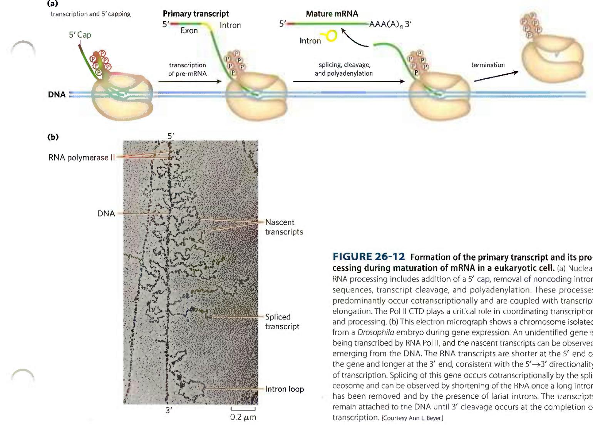

Fig. 26-22). Many ncRNAs also undergo elaborate processing, often involving the removal of segments from one or both ends.

The ultimate fate of any RNA is its complete and regulated degradation. The rate of turnover of RNAs plays a critical role in determining their steady-state levels and the rate at which cells can shut down expression of a gene when its product is no longer needed. During the development of multicellular organisms, for example, certain proteins must be expressed at one stage only, and the mRNA encoding such a protein must be made and destroyed at the appropriate times.

#### [EN] Eukaryotic mRNAs Are Capped at the 5' End

P2 Most eukaryotic mRNAs have a 5' cap, a residue of 7-methylguanosine linked to the 5'-terminal residue of the mRNA through an unusual 5',5'-triphosphate linkage (Fig. 26-13). The 5' cap helps protect mRNA from ribonucleases. It also binds to specific cap-binding complexes of proteins and participates in binding of the mRNA to the ribosome to initiate translation (Chapter 27).

The 5' cap is formed by condensation of a molecule of GTP with the triphosphate at the 5' end of the transcript. The guanine is subsequently methylated at N-7, and additional methyl groups are often added at the 2' hydroxyls of the first and second nucleotides adjacent to the cap (Fig. 26-13a). The methyl groups are derived from S-adenosylmethionine. All these reactions (Fig. 26-12b) occur very early in transcription, after the first 20 to 30 nucleotides of the transcript have been added. All four of the enzymes in the cap-synthesizing complex, and through them the 5' end of the transcript itself, are associated with the RNA polymerase II CTD (Fig. 26-13c) until the cap is synthesized. The capped 5' end is then released from the cap-synthesizing complex and bound by the nuclear cap-binding complex, which facilitates both splicing and nuclear export of the RNA.

The 5' cap does not provide permanent protection of the transcript. Eukaryotes also contain cellular decapping enzymes, which are important for RNA regulation. Cap removal allows RNAs to be degraded by exonucleases that hydrolyze the RNA in the 5'→3' direction. Some viruses have also evolved elaborate mechanisms for removing the 5' cap from host mRNAs. The influenza virus needs no specialized enzymes for the synthesis of 5' caps on its viral RNAs; instead, it borrows these structures from host-cell transcripts in a process termed "cap-snatching." A capped host transcript is bound by the viral RNA polymerase and cleaved by an endonuclease. The influenza RNA polymerase can then use the resulting capped oligonucleotide to prime viral RNA synthesis.

#### [EN] Both Introns and Exons Are Transcribed from DNA into RNA

In bacteria, the mRNA used for translation is generally a direct copy of the DNA gene sequence, continuing along the DNA template without interruption until the information needed to specify the polypeptide is complete. However, the notion that all genes are continuous was disproved in 1977 when Phillip Sharp and Richard Roberts independently discovered that many genes for polypeptides in eukaryotes are interrupted by noncoding sequences (introns).

P2 The vast majority of genes in vertebrates contain introns; among the few exceptions are those that encode histones. The occurrence of introns in other eukaryotes varies. Many genes of the yeast Saccharomyces cerevisiae lack introns, but introns are more common in some other yeast species. Introns are also found in a few bacterial and archaeal genes. Introns in DNA are transcribed along with the rest of the gene by RNA polymerases. The introns in the primary RNA transcript are then spliced, and the exons are joined to form a mature, functional RNA. In eukaryotic mRNAs, most exons are less than 1,000 nucleotides long, with many in the 100 to 200 nucleotide size range, encoding stretches of 30 to 60 amino acids within a longer polypeptide. Introns vary in size from 50 to more than 700,000 nucleotides, with a median length of about 1,800. Genes of higher eukaryotes, including humans, typically have much more DNA devoted to introns than to exons. For example, the human dystrophin gene encodes a pre-mRNA more than 2 million nucleotides long. However, the final mRNA is 14,000 nucleotides long, indicating that more than 99% of the transcribed RNA is found within introns and removed by splicing. Deficiencies in dystrophin expression can lead to muscular dystrophies. The \~20,000 genes of the human genome include more than 200,000 introns.

#### [EN] RNA Catalyzes the Splicing of Introns

There are four classes of introns (Table 26-3). The first two, the group I and group II introns, differ in the details of their splicing mechanisms but share one surprising characteristic: they are self-splicing—no proteins are needed to carry out catalysis. The introns found in the nuclear-encoded genes of eukaryotes comprise the third class. These pre-mRNA introns are removed by a large RNP called the spliceosome. Although the spliceosome requires dozens of proteins for its function, its active site includes RNA. The final class of introns requires protein enzymes for their removal. These introns are found in some tRNAs as well as certain mRNAs, such as that encoding the Xbox binding protein 1, Xbp1. Protein-mediated splicing of the XBP1 transcript regulates the cellular response to unfolded proteins that occurs under conditions of endoplasmic reticulum stress in human cells. The mechanisms of tRNA and XBP1 mRNA splicing are similar.

Group I introns are found in some nuclear, mitochondrial, and chloroplast genes that code for rRNAs, mRNAs, and tRNAs. Group II introns are generally found in the primary transcripts of mitochondrial or chloroplast mRNAs in fungi, algae, and plants. Group I and group II introns are also among the rare examples of introns in bacteria. The splicing mechanisms in both groups involve two transesterification reaction steps (Fig. 26-14), in which a ribose 2'- or 3'-hydroxyl group makes a nucleophilic attack on a phosphorus, and a new phosphodiester bond is formed at the expense of the old, maintaining the balance of energy. These reactions are very similar to the DNA breaking and rejoining reactions promoted by topoisomerases (see Fig. 24-18) and site-specific recombinases (see Fig. 25-37).

The group I splicing reaction requires a guanine nucleoside or nucleotide cofactor, but the cofactor is not used as a source of energy; instead, the 3'-hydroxyl group of guanosine is used as a nucleophile in the first step of the

<table><tr><td colspan="4">TABLE 26-3 Mechanisms of RNA Splicing</td></tr><tr><td>Mechanism</td><td>Components</td><td>Features</td><td>Cellular locations</td></tr><tr><td>Group I Intron</td><td>Catalytic RNA</td><td>Self-splicing using a guanine-derived cofactor</td><td>Found in nuclear, mitochondrial, and chloroplast genes that encode mRNAs, rRNAs, or tRNAs. Can be found in bacteria.</td></tr><tr><td>Group II Intron</td><td>Catalytic RNA; maturase and reverse transcriptase proteins</td><td>Self-splicing using a nucleophile within the intron to form a lariat</td><td>Primarily found in mitochondrial and chloroplast genes of fungi, algae, and plants. Can be found in bacteria.</td></tr><tr><td>Spliceosome</td><td>Catalytic snRNAs; dozens of protein splicing factors</td><td>Requires a large RNP for processing using a nucleophile within the intron to form a lariat</td><td>Found in nuclear genes of eukaryotes. Capable of alternative splicing to create multiple products from a given transcript.</td></tr><tr><td>Protein-catalyzed</td><td>Protein enzymes</td><td>Uses a splicing endonuclease and ligase</td><td>Found in tRNAs and a few mRNAs.</td></tr></table>

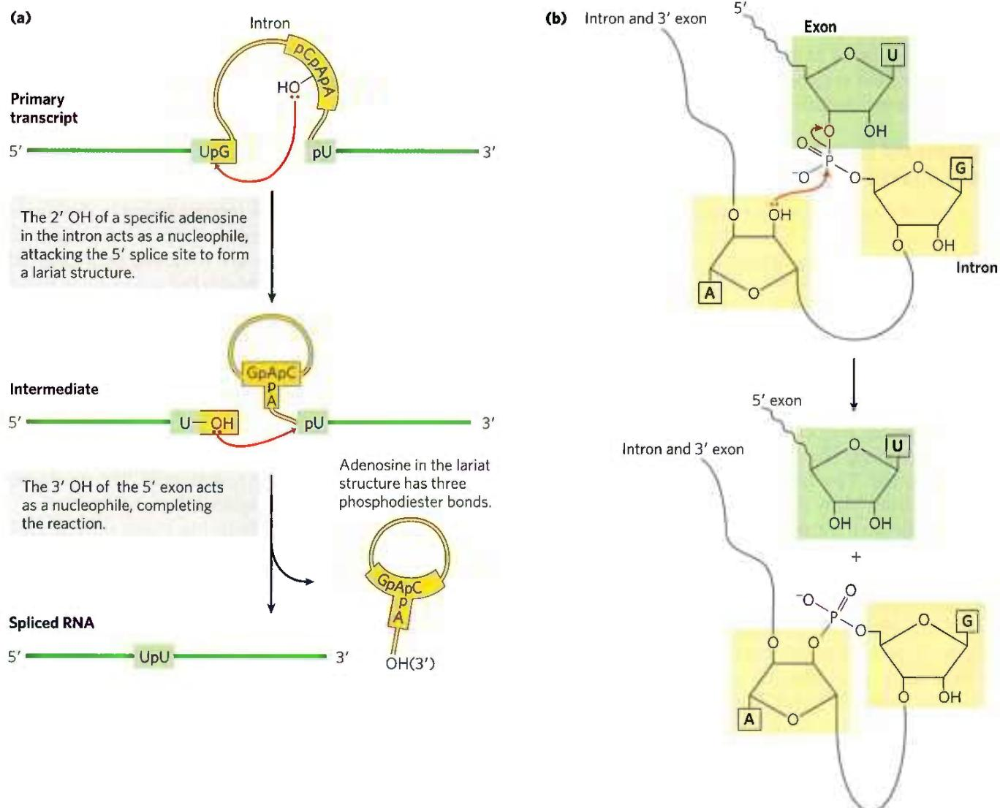  
FIGURE 26-14 Splicing mechanism of group II introns. (a) In the first step, the $2'$ OH of an internal A residue (called the branch point) attacks the phosphodiester bond at the $5'$ splice site, resulting in $5'$ splice site cleavage and lariat formation. In the second step, the free $3'$ OH of the $5'$ exon attacks the phosphodiester bond at the $3'$ splice site, resulting in exon ligation and intron-lariat release. The spliceosome uses the same  
chemistry for intron removal, although different RNA sequences mark the intron boundaries and location of the branch point. (b) In the transesterification reaction that occurs during lariat formation, one phosphodiester bond is broken as a second one is created. This forms a lariatlike structure in which one branch is a 2',5'-phosphodiester bond (the linkage between the intron branchpoint A and intron G nucleotides).

splicing pathway. In group II splicing reactions, the nucleophile is the 2'-hydroxyl group of an A residue within the intron (Fig. 26-14a). A branched lariat structure is formed as an intermediate (Fig. 26-14b). In both group I introns and group II introns, the 3' hydroxyl of the exon that is displaced in the first step then acts as a nucleophile in a similar reaction at the 3' end of the intron. The result is precise excision of the intron and ligation of the exons.

Self-splicing of introns was first revealed in 1982 in studies of the splicing mechanism of the group I rRNA intron from the ciliated protozoan Tetrahymena thermophila, conducted by Thomas Cech and colleagues. These workers transcribed isolated Tetrahymena DNA (including the intron) in vitro, using purified bacterial RNA polymerase. The resulting RNA spliced itself accurately without any protein enzymes from Tetrahymena. The discovery that RNAs could have catalytic functions was a milestone in our understanding of biological systems and a major step forward in the understanding of how life probably evolved. Catalytic RNAs like group I and group II introns share many features with protein-based enzymes, including folding into well-defined secondary and tertiary structures (Fig. 26-15). Catalytic RNAs and their significance in evolution are described in greater detail in Section 26.4.

  
Thomas Cech
[Photo by Glenn Asakawa/
University of Colorado.]

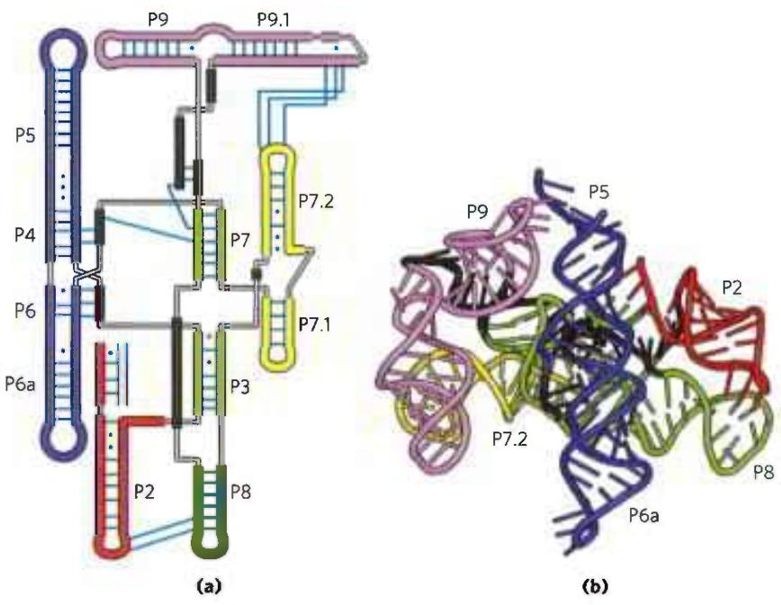  
FIGURE 26-15 Structure of a group I intron. (a) The secondary structure of the group I intron ribozyme from phage Twort, a mycobacterium phage named for Frederick Twort, the physician who discovered phage in 1915. Like most catalytic RNAs, this intron adopts well-defined secondary structure. It is composed of multiple RNA duplexes (P2–P9, each differently colored) capped by hairpin structures. (b) The tertiary structure of the intron bound to a spliced RNA product, obtained by x-ray crystallography, shows that the RNA duplexes pack closely with one another to yield a compact ribozyme. The RNA duplexes are colored and named as in (a). [Data from PDB ID 1Y0Q, B. Golden et al., Nat. Struct. Biol. 12:82, 2005.]

#### [EN] In Eukaryotes the Spliceosome Carries out Nuclear pre-mRNA Splicing

In eukaryotes, most introns undergo splicing by the same lariat-forming mechanism as the group II introns. P2 However, the intron splicing takes place within a spliceosome, a large complex made up of multiple specialized RNP complexes called small nuclear ribonucleoproteins (snRNPs, pronounced snurps) and dozens of non-snRNP proteins. Each snRNP contains one of a class of eukaryotic RNAs, 100 to 200 nucleotides long, known as small nuclear RNAs (snRNAs). Five snRNAs (U1, U2, U4, U5, U6) involved in splicing reactions are generally found in abundance in eukaryotic nuclei. The U3 snRNP is also found in the nucleus but is involved in ribosome assembly and is not part of the spliceosome.

The role of snRNPs in the splicing reaction was discovered by Joan Steitz in a remarkable example of "bedside-to-bench" science. Using antibodies isolated

  
Joan Steitz [Photo by Robert A. Lisak, courtesy Yale School of Medicine.]

from patients with autoimmune diseases, members of the Steitz laboratory were able to purify the spliceosome's snRNP components and identify the associated snRNAs. Based on complementarity between the 5' end of the U1 snRNA and the 5' splice site of nuclear pre-mRNA introns (Fig. 26-16), Steitz proposed that snRNPs participate in the splicing reaction. Subsequently, it was discovered that patients suffering from the autoimmune disease lupus can generate antibodies against protein components of their own spliceosomes.

In yeast, the various snRNPs include about 80 different proteins, most of which have close homologs in all other eukaryotes. In humans, these conserved protein components are augmented by more than 200 additional proteins, which mostly participate in regulating the splicing reaction. Spliceosomes are thus among the most complex supramolecular machines in any eukaryotic cell. The RNA components of a spliceosome are the catalysts of the various splicing steps. The overall complex can be considered a highly flexible ribonucleoprotein enzyme that can adapt to the great diversity in size and sequence of nuclear pre-mRNAs.

Spliceosomal introns generally have the dinucleotide sequence GU at the 5' end and AG at the 3' end, marking the sites where splicing occurs. The U1 snRNA contains a sequence complementary to the 5' splice site (Fig. 26-16b), and the U1 snRNP binds to this region by forming an RNA duplex with the pre-mRNA. A U2 snRNP binds to the 3' end, also by base-pairing, and identifies the A residue that becomes the nucleophile used during the first transesterification reaction (Fig. 26-14). Addition of a complex of the U4, U5, and U6 snRNPs, called the tri-snRNP, leads to formation of the spliceosome (Fig. 26-16c).

Key parts of the splicing active site found in the U6 snRNA are initially sequestered by base-pairing to parts of U4 snRNA to prevent aberrant cleavage of nontarget phosphodiester bonds. In a process called activation, the U6 and U4 snRNAs must be unwound and separated to expose the active site needed for the first step in splicing. Unwinding of U4 and U6 as well as many other steps in splicing require ATP hydrolysis by a set of eight different ATPases that are part of the splicing machinery.

  
FIGURE 26-16 Processing of pre-mRNA primary transcripts by the spliceosome. (a) Small nuclear RNPs, such as the human U1 snRNP shown here, contain snRNAs associated with a number of proteins. The human U1 snRNP contains a single copy of the U1 snRNA and 10 associated polypeptides. (b) The U1 snRNP recognizes the 5' splice site by base-pairing between the U1 snRNA and conserved RNA sequences within the intron that mark the 5' exon/intron boundary. The sequences and structure shown were obtained from x-ray crystal structure shown in (a). The human U1 snRNA normally contains pseudouridines at positions 5 and 6; however, an unmodified RNA was used to determine this structure. (c) Spliceosomes are assembled on introns from snRNPs and proceed through stages of assembly, activation, catalysis of intron removal, release of the RNA products, and recycling of the  
splicing factors. In addition to the U snRNPs discussed in the text, a large protein-only supramolecular complex called the Prp19-containing complex (also known as NineTeen Complex, or NTC) is required for splicing and joins the spliceosome during the activation step. (d) Structure of the human spliceosome, determined by cryo-EM. Nuclear pre-mRNA splicing requires this large molecular machine composed of dozens of proteins and five snRNAs to remove many different introns. By comparison, using similar chemistry, group II introns can catalyze their own removal. In order to highlight the RNA catalytic core of the spliceosome and the U2, U5, and U6 snRNAs, some protein splicing factors are not shown in this view. The RNA appears discontinuous where the structure could not be resolved. [Data from (a, b) PDB ID 4PJO, Y. Kondo et al., eLife 4:e04986, 2015; (d) PDB ID 6QDV, S. Fica et al., Science 363:710, 2019.]

Spliceosomes are single turnover enzymes, meaning that each spliceosome can remove only one intron from a single transcript. As a result, spliceosomes undergo a complex cycle of assembly, activation, catalysis, product release, and recycling of the snRNP components each time an intron is removed (Fig. 26-16c, steps ① through ⑤).

The chemical events of splicing—5' splice site cleavage by formation of an intron lariat followed by exon ligation—are identical in mechanism to that of group II introns, despite the former requiring dozens of proteins for activity and the latter being a self-splicing ribozyme. The similarities in chemistry as well as conservation between essential RNA components of each enzyme suggests that group II introns and spliceosomes are evolutionarily related to one another. Comparison of x-ray crystal structures of group II introns and cryo-EM structures of spliceosomes provide strong support for this hypothesis. Despite being surrounded by a large protein scaffold, the catalytic center of the spliceosome is composed of RNA and arranged in a nearly identical manner to that of group II introns (Fig. 26-17). Thus, the spliceosome uses a ribozyme core to carry out pre-mRNA splicing. As we shall see, some group II introns also contain domains that are themselves translated as mRNAs and encode proteins that bear striking similarity to those in the spliceosome, strengthening this evolutionary connection.

About 1% of human introns are spliced by a less common type of spliceosome, called the minor spliceosome, in which the U1, U2, U4, and U6 snRNPs are replaced by the U11, U12, U4atac, and U6atac snRNPs. Whereas U1- and U2-containing spliceosomes remove introns with (5')GU and AG(3') terminal sequences, the minor spliceosomes remove a rare class of introns that have (5')AU and AC(3') terminal sequences to mark the splice sites. Introns removed by either the major or the minor spliceosome most often remain in the nucleus and are degraded.

FIGURE 26-17 RNA active site conservation between group II introns and the spliceosome. A close-up examination of the active sites of (a) the Pylaiella littoralis group II intron and (b) the S. cerevisiae spliceosome reveal a similar arrangement of catalytic RNAs. In both cases, a catalytic RNA (domain V of the group II intron or U6 snRNA of the spliceosome) promotes a transesterification reaction by orienting the phosphodiester bond located at the 5' splice site/intron junction for nucleophilic attack and by coordinating essential Mg $^{2+}$ ions. In addition to similarities between domain V of group II introns and the U6 snRNA, group II intron domain VI and exon binding site 1 (EBS 1) play functional roles that are similar to those of the U2 and

U5 snRNAs in the spliceosome. Close examination shows that the active sites of the group II intron and the spliceosome are nearly identical, formed by a complex arrangement of nucleotides called the catalytic triplex. The triplex is responsible for binding $Mg^{2+}$ ions essential for catalysis as well as orienting the substrates for the splicing reaction. Conservation of sequence, chemistry, and three-dimensional structure suggests that the spliceosome evolved from a group II intron-like ribozyme. [Data from (a) left and center PDB ID 4R0D, A. R. Robart et al., Nature 514:193, 2014; right PDB ID 6QDV, S. M. Fica et al., Science 363:710, 2019; (b) left PDB ID 5LJ3, W. P. Galej et al., Nature 537:197, 2016, center PDB ID 5MQO, S. M. Fica et al., Nature 542:377, 2017; right PDB ID 6MEO, D. B. Haack et al., Cell 178:612, 2019. Information from W. Galej et al., Chem. Rev. 118:4156, 2018.]

Some components of the splicing apparatus are tethered to the CTD of RNA polymerase II, indicating that splicing, like other RNA processing reactions, is tightly coordinated with transcription. Most splicing in humans occurs cotranscriptionally, meaning that splicing occurs while Pol II is still transcribing the gene. For this to occur correctly, the rates of transcription, capping, splicing, and 3' end formation must be carefully regulated. Splicing of a pre-mRNA in the nucleus can also have profound effects on the function of the mRNA in the cytoplasm. Lynne Maquat and Melissa Moore discovered that the human spliceosome leaves behind a set of proteins on each spliced mRNA near the junction between two exons. This exon junction complex is retained on the mRNA as it is exported to the cytoplasm, where it can regulate the extent to which an mRNA can be translated over its lifetime before degradation.

#### [EN] Proteins Catalyze Splicing of tRNAs

A fourth and final class of introns, found in certain tRNAs and a few mRNAs such as XBP1, is distinguished from other intron types in that the splicing reaction requires endonucleases and ligases made of protein and does not involve catalytic RNAs. The splicing endonuclease cleaves the phosphodiester bonds at both ends of the intron, and the two exons are joined by a mechanism similar to the DNA ligase reaction (see Fig. 25-15).

#### [EN] Eukaryotic mRNAs Have a Distinctive 3' End Structure

P2 At their 3' end, most eukaryotic mRNAs undergoing translation in the cell cytoplasm have a string of A residues, about 30 residues in yeast and 50 to 100 in animals, called the poly(A) tail. This tail serves as a binding site for one or more specific proteins. The poly(A) tail and its associated proteins have a variety of roles in coordinating transcription and translation, and may help protect mRNA from enzymatic destruction. Many bacterial mRNAs also acquire poly(A) tails, but these tails stimulate decay of mRNA rather than protecting it from degradation.

The poly(A) tail is added in a multistep process. The transcript is extended beyond the site where the poly(A) tail is to be added, then is cleaved at the poly(A) addition site by an endonuclease component of a large enzyme complex, again associated with the CTD of RNA polymerase II (Fig. 26-18). The mRNA site where cleavage occurs is marked by two sequence elements: the highly conserved sequence (5')AAUAAA(3'), 10 to 30 nucleotides on the 5' side (upstream) of the cleavage site, and a less well-defined sequence rich in G and U residues, 20 to 40 nucleotides downstream of the cleavage site. Cleavage generates the free 3'-hydroxyl group that defines the end of the mRNA, to which A residues are immediately added by polyadenylate polymerase, which catalyzes the reaction

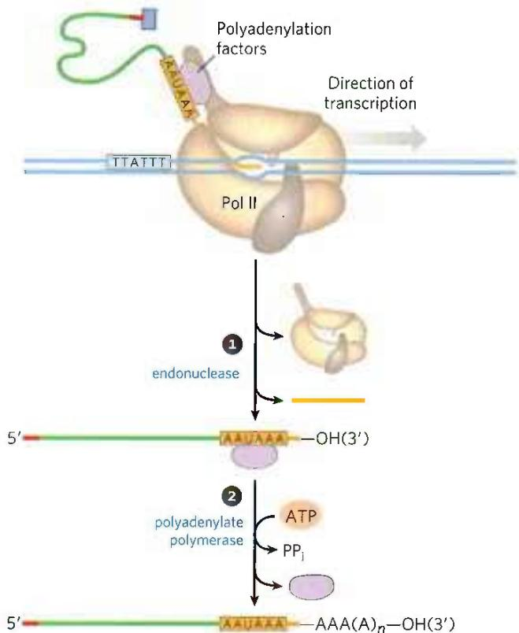  
FIGURE 26-18 Addition of the poly(A) tail to the primary RNA transcript of eukaryotes. Pol II synthesizes RNA beyond the segment of the transcript containing the cleavage signal sequences, including the highly conserved upstream sequence (5')AAUAAA. This cleavage signal sequence is bound by an enzyme complex that includes an endonuclease, a polyadenylate polymerase, and several other multisubunit proteins involved in sequence recognition, stimulation of cleavage, and regulation of the length of the poly(A) tail; all of these proteins are tethered to the CTD. The RNA is cleaved by the endonuclease at a point 10 to 30 nucleotides 3' to (downstream of) the sequence AAUAAA. The polyadenylate polymerase synthesizes a poly(A) tail 80 to 250 nucleotides long, beginning at the cleavage site.

$$
\mathrm{RNA} + n \mathrm{ATP} \rightarrow \mathrm{RNA} - (\mathrm{AMP}) n + n \mathrm{PP} _ {\mathrm{i}}
$$

where n = 80 to 250. This enzyme does not require a template but does require the cleaved mRNA as a primer. These longer poly(A) tails are added in the nucleus, and then shortened significantly after the mRNA is transported to the cytoplasm.

The overall processing of a typical eukaryotic mRNA is summarized in Figure 26-19. In some cases, the polypeptide-coding region of the mRNA is also modified by RNA “editing” (see Section 27.1 for details). This editing includes processes that add or delete bases in the coding regions of primary transcripts or that change the sequence (such as by enzymatic deamination of a C residue to create a U residue). A particularly dramatic example occurs in trypanosomes, which are parasitic protists: large regions of an mRNA are synthesized without any uridylate, and the U residues are inserted later by RNA editing.

  
FIGURE 26-19 Overview of the processing of a eukaryotic mRNA. The ovalbumin gene, shown here, has introns A to G and exons 1 to 7 and L (L encodes a signal peptide sequence that targets the protein for export from the cell; see Fig. 27-38). About three-quarters of the RNA is removed during processing. Pol II extends the primary transcript well beyond the cleavage and polyadenylation site ("extra RNA") before terminating transcription.

#### [EN] A Gene Can Give Rise to Multiple Products by Differential RNA Processing

One of the paradoxes of modern genomics is that the apparent complexity of organisms does not correlate with the number of protein-coding genes, or even the amount of genomic DNA. Some eukaryotic mRNA transcripts can be processed in more than one way to produce different mRNAs and thus different polypeptides. Much of the variability in processing is the result of alternative splicing, in which a particular exon may or may not be incorporated into the mature mRNA transcript. Alternative splicing occurs in a relatively small number of transcripts in yeast, but in more than 95% of human genes. Changes in alternative splicing can have profound impact on the development of an organism (Box 26-2). Alternative splicing of a single transcription factor in the staple grain quinoa differentiates palatable sweet varieties from those too bitter to ingest without processing. In Drosophila, sex is determined by alternative splicing of the sex lethal (Sxl) transcript based on the number of X chromosomes present in the cell.

Figure 26-20a illustrates how alternative splicing patterns can produce more than one protein from a common pre-mRNA. The pre-mRNA contains molecular signals for all the alternative processing pathways, and the pathway favored in a given cell or metabolic situation is determined by processing factors, RNA-binding proteins that promote one particular path. For example, splicing regulatory proteins or heterogeneous ribonuclear proteins (hnRNPs) may bind these signals and promote or inhibit spliceosome assembly at that site. There are many additional patterns of alternative splicing.

Complex transcripts can also have more than one site where poly(A) tails can form (Fig. 26-20b). If there are two or more sites for cleavage and polyadenylation, use of the one closest to the 5' end will remove more of the primary transcript sequence. This mechanism,

BOX 26-2

MEDICINE

#### [EN] Alternative Splicing and Spinal Muscular Atrophy

Alternative splicing is one of the least understood steps in human gene regulation, in part because a gene product can be spliced together in many ways: entire exons can be left out of the mRNA (skipped) or spliced in (retained). More subtle changes can also occur in which alternative 5' or 3' splice sites are used that differ from their canonical positions by just a few nucleotides. The spliced isoform that is generated is determined by interactions among the spliceosome, a large number of regulatory factors that associate with the pre-mRNA transcript, and other cellular machinery, including the transcription complex.

Despite this complexity, scientists are learning how to control alternative splicing to treat genetic diseases such as spinal muscular atrophy (SMA). SMA is a progressive neurodegenerative disease and in its most severe form is always fatal. It is the most common genetic cause of death in infants. SMA is caused by a defect in the SMN1 (survival of motor neuron 1) gene. SMN1 encodes a protein that is essential for assembly of cellular snRNPs, including those that make up the spliceosome.

Humans have two SMN genes: SMN1 and SMN2. However, only SMN1 is capable of being correctly spliced to produce a functional protein (Fig. 1). SMN2 encodes an RNA sequence called a silencer, which causes exon 7 to be excluded from the mRNA. As a result, SMN2 cannot produce functional protein. Healthy individuals are able to get all of the SMN protein they require for snRNP assembly from the SMN1 gene. But those with a mutation in SMN1 do not produce enough SMN protein to assemble an adequate number of snRNPs. This leads to neuromuscular degeneration that is often fatal.

One possible solution for treating SMA would be to find a way to change the alternative splicing pattern of the SMN2 gene so that exon 7 would be included rather than skipped. This would produce functional SMN protein. This is exactly the strategy that

(Continued on next page)

#### [EN] Alternative Splicing and Spinal Muscular Atrophy (Continued)

(b) SMA patient  

  
(c) SMA patient, treated with nusinersen

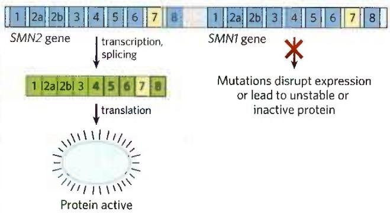  
FIGURE 1 Alternative splicing of the SMN1 and SMN2 gene transcripts in healthy individuals and in those with SMA. (a) In healthy individuals, active protein is produced by translation of mRNAs that include exon 7 of the SMN1 gene. Alternative splicing of the SMN2 transcript skips exon 7, resulting in an mRNA that cannot produce functional protein. (b) In SMA patients, a mutation in the SMN1 gene results in no functional protein being produced from either SMN1 or SMN2. (c) Upon treatment with nusinersen, alternative splicing of SMN2 results in an mRNA that includes exon 7 and produces functional protein. This can prevent neuromuscular degeneration. [Information from D. R. Corey, Nat. Neurosci. 20:497, 2017, Fig. 1.]

called poly(A) site choice, generates diversity in the variable domains of immunoglobulin heavy chains (see Fig. 25-42).

Both alternative splicing and poly(A) site choice come into play in the expression of many genes. For example, a single RNA transcript is processed using

  
Adrian Krainer [Courtesy Adrian Krainer.]

Adrian Krainer used to correct SMA phenotypes in mice. Scientists in the Krainer lab discovered that if they injected mice with a synthetic oligonucleotide complementary to the silencer sequence of SMN2 exon 7 (also called an antisense oligonucleotide, or ASO), the sequence would be hidden from the splicing machinery. This changes the splicing of the SMN2 gene so that exon 7 is

included and the SMN2 gene is able to produce a functional SMN protein and prevent neurodegeneration (Fig. 1).

A drug called nusinersen has since been developed based on Krainer's research and became the first approved treatment for SMA. In SMA patients, injection of nusinersen into the central nervous system can correct splicing of the human SMN2 gene product, restore SMN protein production, and halt neurodegeneration. Most pharmaceuticals are small, organic molecules, but nusinersen is an 18-mer oligonucleotide. To turn an oligonucleotide into a drug, researchers had to incorporate chemical modifications into the phosphate backbone and ribose sugar (Fig. 2). These modifications prevent the oligonucleotide from being destroyed by cellular nucleases and also improve binding to RNA targets. Currently very few nucleic acid-based drugs have been approved for medical use, but their importance in medicine will likely continue to grow.

  
FIGURE 2 The modified nucleotides in nusinersen use a phosphorthioate backbone rather than phosphodiesters, and the 2' hydroxyl groups are replaced by 2'-O-methoxyethyl groups.

both mechanisms to produce two different hormones: the calcium-regulating hormone calcitonin in rat thyroid and calcitonin-gene-related peptide (CGRP) in rat brain (Fig. 26-21). P2 Together, alternative splicing and poly(A) site choice greatly increase the variety of proteins generated from the genomes of higher eukaryotes.

Dihydrouridine (D)

(a)  
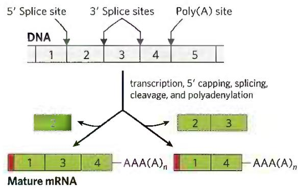

(b)  
  
FIGURE 26-20 Alternative transcript production in eukaryotes. (a) Alternative splicing patterns. Two 3' splice sites are shown. Different mature mRNAs are produced from the same primary transcript. (b) Two alternative cleavage and polyadenylation sites, A₁ and A₂.

  
FIGURE 26-21 Alternative processing of the calcitonin gene transcript in rats. The calcitonin gene encodes a primary transcript with two poly(A) sites; one predominates in the brain, the other in the thyroid. In the brain, splicing eliminates the calcitonin exon (exon 4); in the thyroid, this exon is retained. The resulting peptides are processed further to yield the final hormone products: calcitonin in the thyroid and calcitonin-gene-related peptide (CGRP) in the brain.

#### [EN] Ribosomal RNAs and tRNAs Also Undergo Processing

Posttranscriptional processing is not limited to mRNA. Ribosomal RNAs of bacterial, archaeal, and eukaryotic cells are made from longer precursors called pre-ribosomal RNAs, or pre-rRNAs. Transfer RNAs are similarly derived from longer precursors. These RNAs may also contain a variety of modified nucleosides; some examples are shown in Figure 26-22.

Ribosomal RNAs In bacteria, 16S, 23S, and 5S rRNAs (and some tRNAs, although most tRNAs are encoded elsewhere) arise from a single 30S RNA precursor of about 6,500 nucleotides. RNA at both ends of the 30S precursor and segments between the rRNAs are removed during processing (Fig. 26-23). The 16S and 23S rRNAs contain modified nucleosides. In E. coli, the 11 modifications in the 16S rRNA include a pseudouridine and 10 nucleosides methylated on the base or the 2'-hydroxyl group or both. The 23S rRNA has 10 pseudouridines, 1 dihydrouridine, and 12 methylated nucleosides. In bacteria, each modification is generally catalyzed by a distinct enzyme. Methylation reactions use S-adenosylmethionine as cofactor. No cofactor is required for pseudouridine formation.

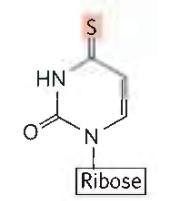  
4-Thiouridine (S $^{4}$ U)

  
Inosine (I)

  
1-Methylguanosine (m $^{1}$ G)

FIGURE 26-22 Some modified bases of RNA produced in posttranscriptional reactions. The standard symbols are shown in parentheses. This is just a small sampling of the 96 modified nucleosides known to occur in different RNA species, with 81 different types known in tRNAs and 30 observed to date in rRNAs. Notice the unusual ribose attachment point in pseudouridine. A complete listing of these modified bases can be found in the Modomics database of RNA modification pathways (http://iimcb.genesilico.pl/modomics/).

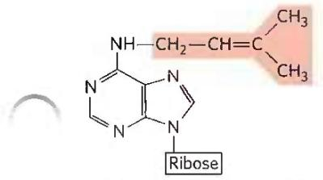

  
$N^{6}$ -Isopentenyladenosine ( $i^{6}A$ )

  
Ribothymidine (T)

Pseudouridine (ψ)

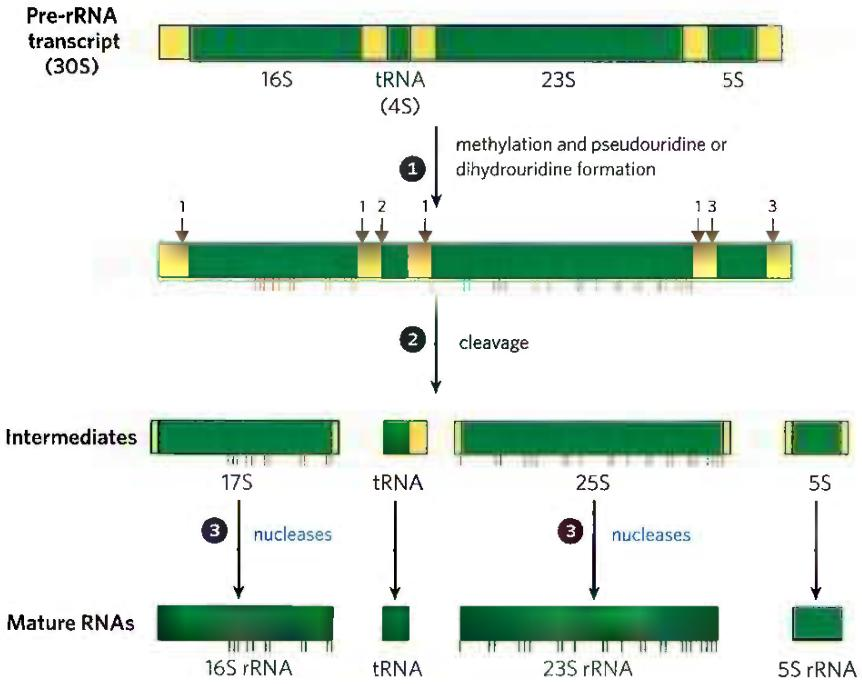

The genome of E. coli encodes seven pre-rRNA molecules. All of these genes have essentially identical rRNA-coding regions, but they differ in the segments between these regions. The segment between the 16S and 23S rRNA genes generally encodes one or two tRNAs, with different tRNAs produced from different pre-rRNA transcripts. Coding sequences for tRNAs are also found on the 3' side of the 5S rRNA in some precursor transcripts.

The situation in eukaryotes is even more complicated (see Fig. 27-17). The entire process is initiated in the nucleolus, in large complexes that assemble on the rRNA precursor as it is synthesized by Pol I. There is a tight coupling between rRNA transcription, rRNA maturation, and ribosome assembly in the nucleolus. Each complex includes the ribonucleases that cleave the rRNA precursor, the enzymes that modify particular bases, large numbers of ncRNAs called small nucleolar RNAs, or snoRNAs, that guide nucleoside modification and some cleavage reactions, and ribosomal proteins. In yeast, the entire process involves the pre-rRNA, more than 170 nonribosomal proteins, snoRNAs for each nucleoside modification (about 70, because some snoRNAs guide two types of modification), and the 78 ribosomal proteins. Humans have an even greater number of modified nucleosides, about 200, and a greater number of associated snoRNAs. The composition of the complexes may change as the ribosomes are assembled, and many of the intermediate complexes rival the ribosome itself in complexity. The 5S rRNA of most eukaryotes is made as a completely separate transcript by a different polymerase (Pol III).

The most common nucleoside modifications in eukaryotic rRNAs are conversion of uridine to pseudouridine and adoMet-dependent nucleoside methylation (often at 2'-hydroxyl groups). These reactions often rely on snoRNA-protein complexes, or snoRNPs, each consisting of a snoRNA and four or five proteins, including the enzyme that carries out the modification. There are two classes of snoRNPs, both defined by key conserved sequence elements referred to as lettered boxes. The box H/ACA snoRNPs function in pseudouridylylation, and box C/D snoRNPs in 2'-O-methylations. The snoRNAs are 60 to 300 nucleotides long. Each snoRNA includes a 10 to 21 nucleotide sequence that is perfectly complementary to some site on an rRNA and serves to identify the modification site (Fig. 26-24). The conserved sequence elements in the remainder of the snoRNA fold into structures that are bound by the snoRNP proteins.

FIGURE 26-23 Processing of pre-rRNA transcripts in bacteria. ① Before cleavage, the 30S RNA precursor is methylated at specific bases (red tick marks), and some uridine residues are converted to pseudouridine (blue tick) or dihydrouridine (black tick) residues. The methylation reactions are of multiple types, some occurring on bases and some on 2'-hydroxyl groups. ② Cleavage liberates precursors of rRNAs and tRNA(s). Cleavage at the points labeled 1, 2, and 3 is carried out by the enzymes RNase III, RNase P, and RNase E, respectively. As discussed later in the text, RNase P is a ribozyme. ③ The final 16S, 23S, and 5S rRNA products result from the action of a variety of specific nucleases. The seven copies of pre-rRNA gene in the E. coli chromosome differ in the number, location, and identity of tRNAs included in the primary transcript. Some copies of the gene have additional tRNA gene segments between the 16S and 23S rRNA segments and at the far 3' end of the primary transcript.  

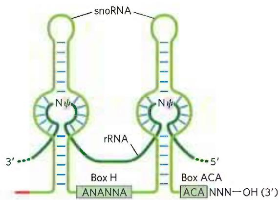  
FIGURE 26-24 RNA pairing with box H/ACA snoRNAs to guide pseudouridylation. The pseudouridine conversion sites in the target rRNA are in the regions paired with the snoRNA, and the conserved H/ACA box sequences are protein-binding sites. [Information from T. Kiss, Cell 109:145, 2002.]

Transfer RNAs Most cells have 40 to 50 distinct tRNAs, and eukaryotic cells have multiple copies of many of the tRNA genes. Transfer RNAs are derived from longer RNA precursors by enzymatic removal of nucleotides from the 5' and 3' ends (Fig. 26-25). In eukaryotes, introns are present in a few tRNA transcripts and must be excised. Where two or more different tRNAs are contained in a single primary transcript, they are separated by enzymatic cleavage. The endonuclease RNase P, found in all organisms, removes RNA at the 5' end of tRNAs. This enzyme contains both protein and RNA. The RNA component is essential for activity, and in bacterial cells it can carry out its processing function with precision even without the protein component. RNase P is another example of a catalytic RNA, as described in more detail below. The 3' end of tRNAs is processed by one or more nucleases, including the exonuclease RNase D.

Transfer RNA precursors may undergo further post-transcriptional processing. The 3'-terminal trinucleotide CCA(3') to which an amino acid is attached during protein synthesis (Chapter 27) is absent from some bacterial tRNA precursors and all eukaryotic tRNA precursors and is added during processing (Fig. 26-25). This addition is carried out by tRNA nucleotidyltransferase, an unusual enzyme that binds the three ribonucleoside triphosphate precursors in separate active sites and catalyzes formation of the phosphodiester bonds to produce the CCA(3') sequence. The creation of this defined sequence of nucleotides is therefore not dependent on a DNA or RNA template—the template is the binding site of the enzyme.

The final type of tRNA processing is the modification of some bases by methylation, deamination, or reduction (Fig. 26-22). These modifications can change how the tRNA interacts with cellular proteins and even how the tRNA is used by the ribosome during translation. In the case of pseudouridine, the base (uracil) is removed and reattached to the sugar through C-5. Some of these modified bases occur at characteristic positions in all tRNAs (Fig. 26-25).

#### [EN] Special-Function RNAs Undergo Several Types of Processing

The number of known classes of special-function noncoding RNAs (ncRNAs) is expanding rapidly, as is the variety of functions known to be associated with them. Many of these ncRNAs also undergo processing.

The snRNAs and snoRNAs not only facilitate RNA processing reactions but also are themselves synthesized as larger precursors and then processed. Many snoRNAs are encoded within the introns of other genes. As the introns are spliced from the pre-mRNA, proteins bind to the snoRNA sequences and ribonucleases remove the extra RNA at the 5' and 3' ends to form the snoRNP. The snRNAs destined for spliceosomes are synthesized as pre-snRNAs, and ribonucleases remove the extra RNA at each end. Particular nucleosides in snRNAs are also subject to 11 types of modification, with 2'-O-methylation and conversion of uridine to pseudouridine predominating.

MicroRNAs (miRNAs) are a special class of non-coding RNAs involved in gene regulation. The miRNAs are about 22 nucleotides long, complementary in sequence to particular regions of mRNAs. Found in plants and in animals, from worms to mammals, they promote mRNA degradation and suppress translation to fine-tune gene expression. About 1,500 human genes encode miRNAs, and one or more of these miRNAs affect the expression of most protein-coding genes.

  
FIGURE 26-25 Processing of tRNAs in bacteria and eukaryotes. The yeast tRNA $^{Tyr}$ (the tRNA specific for tyrosine binding; see Chapter 27) is used to illustrate the important steps. Short blue lines represent normal base pairing; blue dots indicate G–U base pairs. The nucleotide sequences shown in yellow are removed from the primary transcript. The ends are processed first, the 5' end before the 3' end. CCA is then added to the 3' end, a necessary  
step in processing all eukaryotic tRNAs and for those bacterial tRNAs that lack this sequence in the primary transcript. While the ends are being processed, specific bases in the rest of the transcript are modified (see Fig. 26-22). For the eukaryotic tRNA shown here, the final step is splicing of the 14 nucleotide intron by a protein enzyme. Introns are found in some eukaryotic tRNAs but not in bacterial tRNAs.

The miRNAs are synthesized from much larger precursors, in several steps (Fig. 26-26). The primary transcripts for miRNAs (pri-miRNAs) vary greatly in size; some are encoded in the introns of other genes and are coexpressed with these host genes. Processing of pri-miRNA is mediated by two endoribonucleases in the RNase III family, Drosha and Dicer. First, in the nucleus, the pri-miRNA is reduced to a 70 to 80 nucleotide precursor miRNA (pre-miRNA) by a protein complex including Drosha and another protein, DGCR8. The pre-miRNA is then exported to the cytoplasm in a complex with two proteins, exportin-5 and the Ran GTPase (see Fig. 27-42). In the cytoplasm, Ran hydrolyzes the GTP, then exportin-5 and the pre-miRNA are released. The pre-miRNA is then acted on by Dicer to produce the nearly mature miRNA paired with a short RNA complement. The complement is removed by an RNA helicase, and the mature miRNA is incorporated into protein complexes, such as the RNA-induced silencing complex (RISC), which then bind a target mRNA. If the complementarity between miRNA and its target is nearly perfect, the target mRNA is cleaved. If the complementarity is only partial, the complex blocks translation of the target mRNA. The roles of miRNAs and RISC in gene regulation are detailed in Chapter 28.

#### [EN] Cellular mRNAs Are Degraded at Different Rates

The expression of genes is regulated at many levels. A crucial factor governing a gene's expression is the cellular concentration of its associated mRNA. The concentration of any molecule depends on two factors: its rate of synthesis and its rate of degradation. When synthesis and degradation of an mRNA are balanced, the concentration of the mRNA remains in a steady state. A change in either rate will lead to net accumulation or depletion of the mRNA. P2 Degradative pathways ensure that mRNAs do not build up in the cell and direct the synthesis of unnecessary proteins.

The rates of degradation vary greatly for mRNAs from different eukaryotic genes. For a gene product that is needed only briefly, the half-life of its mRNA may be only minutes or even seconds. Gene products needed

FIGURE 26-26 Synthesis and processing of miRNAs. The primary transcript of miRNAs is a larger RNA of variable length, called pri-miRNA. The pri-miRNA undergoes a number of processing events both in the nucleus and in the cytoplasm to make a mature miRNA. Once the miRNA has been loaded into a protein complex called RISC, it can then hybridize to mRNAs and repress their translation or trigger their cleavage and destruction. [Information from E. Wienholds and R. H. A. Plasterk, FEBS Lett. 579:5911, 2005; V. N. Kim et al., Nat. Rev. Mol. Cell Biol. 10:126, 2009, Figs 2–4.]

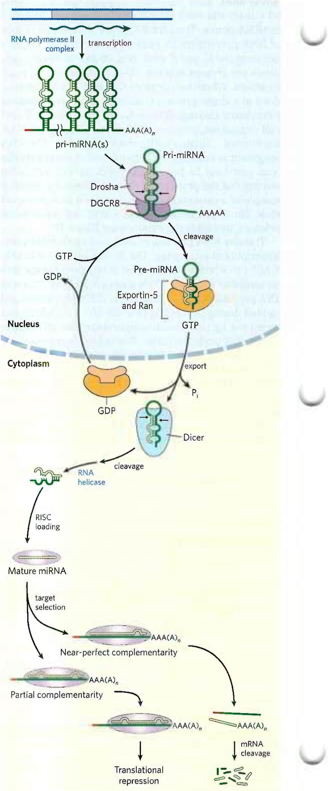

constantly by the cell may have mRNAs that are stable over many cell generations. The average half-life of the mRNAs of a vertebrate cell is about 3 hours, with the pool of each type of mRNA turning over about 10 times per cell generation. The half-life of bacterial mRNAs is much shorter—only about 1.5 min—perhaps because of regulatory requirements.

Messenger RNA is degraded by ribonucleases present in all cells. In E. coli, mRNAs typically contain 5' triphosphates remaining from the initiation of transcription. These groups protect the mRNA from 5' degradation. As a result, mRNA decay begins with one or several cuts by an endoribonuclease, followed by 3'→5' degradation by exoribonucleases (Fig. 26-27). The initial cut by the endonuclease generates an RNA fragment with a 5' monophosphate end, which serves to tether the endonuclease to the transcript and ensure its rapid destruction. Some bacteria (Bacillus subtilis, for example), have exonucleases that also recognize the 5' monophosphate end and can degrade RNA fragments in the 5'→3' direction.

Polynucleotide phosphorylase (PNPase) is a common 3'→5' exoribonuclease responsible for the degradation of many mRNAs in bacteria, chloroplasts, and mitochondria. It catalyzes the reversible phosphorolysis (rather than hydrolysis) of the mRNA chain using orthophosphate as the nucleophile. The PNPase reaction is readily reversible and the enzyme can also add nucleotides to the 3' ends of bacterial mRNAs. Decay of mRNAs containing complex 3' end structures, such as the hairpins responsible for $\rho$ -independent transcription termination (see Fig. 26-7), can involve multiple rounds of lengthening and shortening of the mRNA by PNPase until it is finally consumed. This unusual nontemplated RNA polymerization activity of PNPase proved to be critical for production of mRNA polymers used for deciphering the genetic code (Chapter 27).

  
FIGURE 26-27 Degradation of RNA in bacteria. In bacteria, mRNA degradation usually begins by endonucleolytic cleavage because the 5' and 3' ends of the mRNA are often protected by a triphosphate and hairpin structure, respectively. In E. coli, the RNase E endonuclease carries out this cleavage, whereas in B. subtilis the cleavage is carried out by the RNase Y endonuclease. The endonuclease activity produces RNA fragments that serve as substrates for 3'→5' or 5'→3' exonucleases. All bacteria contain 3'→5' exonucleases such as PNPase, RNase R, or RNase II. Some species, like B. subtilis, also contain a 5'→3' exonuclease called RNase J. The 5' phosphate produced by the endonuclease after the first cleavage can also serve as a tether to link the RNase E endonuclease directly to the mRNA, ensuring its rapid destruction. [Information from M. Hui et al. Annu. Rev. Genet. 48:537, 2014.]

As we have previously seen with transcription and RNA processing, the analogous processes for RNA degradation in eukaryotes are much more complex than their bacterial counterparts. Eukaryotes have multiple pathways for mRNA decay, and the pathway used can depend on the mRNA location, its structure, its association with ribosomes, and other factors. However, in most cases, decapping the 5' end and shortening the 3' poly(A) tail are critical steps for allowing exonucleases to access the mRNA.

All eukaryotes also have large $3^{\prime}\rightarrow5^{\prime}$ exoribonucleases called exosomes, which are responsible for the degradation for nearly all types of RNA. Exosomes are multisubunit complexes containing about 10 proteins. Specialized exosomes exist in the nucleus, cytoplasm, and nucleolus. The core of the exosome is a barrel-like structure through which RNA is threaded (Fig. 26-28). Even though this core is structurally similar to bacterial PNPase, RNA is not degraded within the barrel. Instead, the barrel serves as an adapter that efficiently channels the RNA to associated enzymes with $3'\rightarrow5'$ exonuclease and endonuclease activity.

  
FIGURE 26-28 Essential role of the exosome in eukaryotic RNA degradation. (a) Exosomes are multisubunit enzymes in which RNA is threaded through a central barrel and fed into a nuclease. In this structure, the exosome core is topped by ATPase and RNA helicase modules that help unwind RNA secondary structures so that single-stranded RNA can pass into the core. Below the core is a nuclease responsible for cleaving the RNA. (b) In this cartoon schematic, the passage of the substrate RNA through the barrel-like exosome and to the nuclease is highlighted. [Data from PDB ID 4IFD, D. L. Makino et al., Nature 495:70, 2013; PDB ID 4OO1, E.V. Wasmuth et al., Nature 511:435, 2014. Information from K. Januszyk and C. D. Lima, Curr. Opin. Struct. Biol. 24:132, 2014.]

#### [EN] SUMMARY 26.2 RNA Processing

Many primary transcripts produced in bacteria and eukaryotes must be processed into a mature form to be functional. Processing can include modifications to the 5' and 3' ends of the RNA, removal of internal RNA sequences by splicing, and modifications of the RNA nucleotides.

Eukaryotic mRNAs have an inverted 7-methylguanosine residue cap at their 5' end. The cap helps to protect the RNA from degradation and interacts with proteins important for cellular transport and translation.

■ Many organisms contain genes in which the coding information is interrupted by introns. Splicing removes these introns and joins the flanking exons. Nearly every human gene contains multiple introns, which can vary dramatically in size.

There are four classes of introns: group I, group II, spliceosome-processed introns, and protein-processed introns. Group I and II introns are self-splicing with RNAs capable of carrying out catalysis independent of protein enzymes. Catalytic RNAs share features in common with protein-based enzymes.

Nuclear-encoded introns in eukaryotes are removed by a large RNP machine called a spliceosome. A spliceosome is a single-turnover enzyme containing snRNA and protein that recognizes introns by base-pairing with the snRNAs. Even though a spliceosome contains dozens of proteins, it uses an RNA active site and mechanism similar to that of group II introns.

■ Some tRNAs and a few mRNAs contain introns that must be removed by protein-based endonuclease and ligase enzymes.

In eukaryotes, transcription terminates when an endonuclease cleaves the nascent RNA, freeing it from Pol II. A poly(A) tail is then added to the 3' end of the RNA by a polyadenylate polymerase.

■ Alternative splicing and alternative poly(A) site choice in eukaryotes allow for many different transcripts to be produced from a single gene.

The primary transcripts of tRNAs, rRNAs, and miRNAs also undergo extensive processing, including endonucleolytic cleavage and chemical modification. Correct placement of these modifications is often guided by snoRNAs that base-pair with the target RNA.

■ The cellular lifetime of RNAs can be highly variable, and RNA degradation is tightly regulated. In bacteria, endonucleases generate mRNA fragments for destruction by exonucleases. In eukaryotes, mRNAs typically must be decapped and the poly(A) tail shortened before degradation. The exosome is a supramolecular complex of 3'→5' exo- and endonucleases involved in many steps of eukaryotic RNA decay.

<!-- EN-END 26.2 -->

## 三、RNA 指导下 RNA 和 DNA 的合成

核糖核酸(RNA)在遗传信息表达和调节中的重要作用已如上述。在有些生物中,核糖核酸也可以是遗传信息的基本携带者,并能通过复制而合成出与其自身相同的分子。例如,某些RNA病毒,当它侵入寄主细胞后可借助于复制酶(replicase)(RNA指导的RNA聚合酶)而进行病毒RNA的复制。遗传信息还可以从RNA传递给DNA,即以RNA为模板借助逆转录酶(RNA指导的DNA聚合酶)合成DNA。

## (一) RNA 的复制

从感染 RNA 病毒的细胞中可以分离出 RNA 复制酶。这种酶以病毒 RNA 作模板，在有 4 种核苷三磷酸和镁离子存在时合成出互补链，最后产生病毒 RNA。用复制产物去感染细胞，能产生正常的病毒。可见，病毒的全部遗传信息，包括合成病毒外壳蛋白质（coat protein）和各种有关酶的信息均贮存在被复制的 RNA 之中。

## 1. 噬菌体 $\mathbf{Q}\beta$ RNA 的复制

复制酶的模板特异性很高,它只识别病毒自身的 RNA,而对宿主细胞和其他与病毒无关的 RNA 均无反应。例如,噬菌体 Qβ 的复制酶只能以 Qβ RNA 作模板,而代用与其类似的噬菌体 MS2、R17 和 f2RNA 或其他 RNA 都不行。

噬菌体 Qβ 是一种直径为 20 nm 的正二十面体小噬菌体，含 30% 的 RNA，其余为蛋白质。RNA 为相对分子质量 $1.5 \times 10^{6}$ 的单链分子，由约 4500 个核苷酸组成，含有编码 3\~4 个蛋白质分子的基因。其有关蛋白质为：成熟蛋白（A 或 A₂ 蛋白）、外壳蛋白和复制酶 β 亚基。Qβ 还含有另一特异蛋白质称之为 A₁，它是完整病毒的次要组分。氨基酸序列分析表明，A₁ 蛋白 N 端氨基酸序列与外壳蛋白一致。推测编码 A₁ 蛋白的 RNA 序列具有两个终止位点，在第一个位点终止时仅产生外壳蛋白，但如通读过去直到第二个终止位点，这样就产生 A₁ 蛋白。Qβ 的基因次序是：

## 5'端-成熟蛋白-外壳蛋白(或A₁蛋白)-复制酶β亚基-3'端

Qβ复制酶有4个亚基,噬菌体RNA只编码其中的β亚基,另外3个亚基(α、γ和δ)则来自宿主细胞。现已证明,α是核糖体的蛋白质S1。γ和δ是宿主细胞蛋白质合成系统中的肽链延长因子EF-Tu和EF-Ts。它们的性质和功能总结于表32-8。

表 32-8 Qβ 复制酶亚基的性质和功能

<table><tr><td>亚基名称</td><td>相对分子质量</td><td>来源</td><td>功能</td></tr><tr><td>I(α)</td><td>65 000</td><td>宿主细胞核糖体的蛋白质 S1</td><td>与噬菌体 Qβ RNA 结合</td></tr><tr><td>II(β)</td><td>65 000</td><td>噬菌体感染后合成</td><td>聚合反应中磷酸二酯键形成的活性中心</td></tr><tr><td>III(γ)</td><td>45 000</td><td>宿主细胞的 EF-Tu 因子</td><td>与底物结合,识别模板并选择底物</td></tr><tr><td>IV(δ)</td><td>35 000</td><td>宿主细胞的 EF-Ts 因子</td><td>稳定 α、γ 亚基结构</td></tr></table>

当噬菌体 $Q\beta$ 的 RNA 侵入大肠杆菌细胞后，其 RNA 可以直接进行蛋白质的合成。通常将具有 mRNA 功能的链称为正链，而它的互补链为负链；故噬菌体 $Q\beta$ RNA 为正链。在噬菌体特异的复制酶装配好后不久，就被吸附到正链 RNA 的 3' 端，以正链为模板合成出负链 RNA，直至合成进程结束，负链从模板上释放。同样的酶又吸附到负链 RNA 的 3' 端，并以负链为模板合成正链（图 32-30）。所以两条链都是由

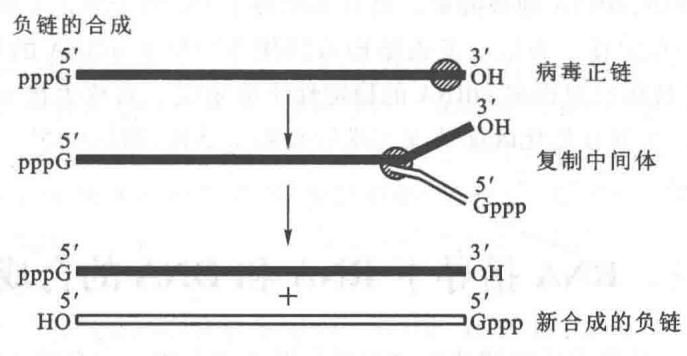

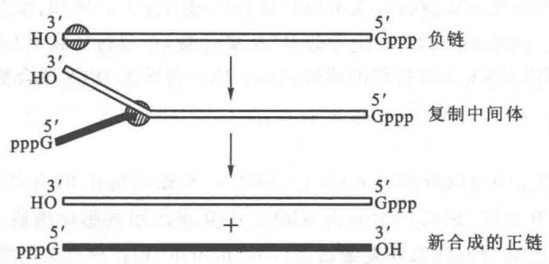  
图 32-30 噬菌体 Qβ RNA 的合成

$5'\rightarrow3'$ 方向延长。在最适宜条件下，无论正链或负链的合成速度均为每秒35个核苷酸。

噬菌体 RNA 通过回折形成大量短的双螺旋区，在此二级结构基础上还可形成紧密的三级结构。噬菌体 RNA 的高级结构参与翻译的调节控制。当噬菌体 RNA 处于天然高级结构状态时，成熟蛋白质基因的起始区处于折叠结构之中，无法与核糖体结合，因而被关闭。只有刚完成复制的噬菌体 RNA，成熟蛋白质基因的起始区才能接受核糖体，进行成熟蛋白质的翻译。同样，RNA 复制酶亚基的合成起始区与外壳蛋白质基因部分序列碱基配对，核糖体能直接启动外壳蛋白合成，但不能直接启动 RNA 复制酶亚基的合成。只有当外壳蛋白合成过程中核糖体使双链结构打开，RNA 复制酶亚基的起始区才能接受核糖体，并开始复制酶亚基的合成（图 32-31）。通过这种方式可以控制各种蛋白质合成的时间和合成的量。

  
图 32-31 Qβ RNA 翻译和复制的自我调节 A 蛋白质基因和复制酶亚基基因的起始区可通过碱基配对形成双螺旋，AUG 是起始密码子。外壳蛋白质基因有两个终止位点， $t_{1}$ 和 $t_{2}$ 。刚复制的 Qβ RNA 可启动 A 蛋白质的合成，复制酶亚基的合成有赖于外壳蛋白的合成

当以正链为模板合成负链时,除需要复制酶外,还需要两个来自宿主细胞的蛋白质因子,称为 HFI 和 HFII。但是,

由负链为模板合成正链时并不需要这两个因子。在感染后期，噬菌体 RNA 大量合成，这时正链 RNA 的合成远超过负链 RNA 的合成，其原因就是宿主的蛋白质因子起了限速作用。

进化的压力使病毒具有极高的复制效率,精确的识别和控制机制,并且尽量依赖宿主的条件。病毒的一个显著特点是,它的各组成成分常具有多种复杂的功能。例如,Qβ复制酶不仅能将噬菌体RNA与大量存在于宿主细胞的RNA区别开来,特异地催化噬菌体RNA的复制;而且还能强力地抑制核糖体结合到Qβ的RNA上,起蛋白质合成阻遏物的作用,这在病毒复制的早期有重要意义。再如,作为病毒颗粒结构组分的外壳蛋白,同时又是复制酶合成的调节(阻遏)蛋白,因此感染后期当外壳蛋白的需要达到高潮时,复制酶的合成即大大降低。

## 2. 病毒 RNA 复制的主要方式

RNA 病毒的种类很多,其复制方式也是多种多样的,归纳起来可以分成以下几类:

（1）病毒含有正链 RNA 进入宿主细胞后首先合成复制酶（以及有关蛋白质），然后在复制酶作用下进行病毒 RNA 的复制，最后由病毒 RNA 和蛋白质装配成病毒颗粒。噬菌体 Qβ 和脊髓灰质炎病毒（poliovirus）即是这种类型的代表。脊髓灰质炎病毒是一种小 RNA 病毒（picornavirus）。它感染细胞后，病毒 RNA 即与宿主核糖体结合，产生一条长的多肽链，在宿主蛋白酶的作用下水解成 6 个蛋白质，其中包括 1 个复制酶，4 个外壳蛋白和 1 个功能还不清楚的蛋白质。在形成复制酶后病毒 RNA 才开始复制。

（2）病毒含有负链 RNA 和复制酶 例如，狂犬病病毒（rabies virus）和马水疱性口炎病毒（vesicular-stomatitis virus）。这类病毒侵入细胞后，借助于病毒带进去的复制酶合成出正链 RNA，再以正链 RNA 为模板，合成病毒蛋白质和复制病毒 RNA。

（3）病毒含有双链 RNA 和复制酶 例如，呼肠孤病毒（reovirus）。这类病毒以双链 RNA 为模板，在病毒复制酶的作用下通过不对称的转录，合成出正链 RNA，并以正链 RNA 为模板翻译成病毒蛋白质。然后再合成病毒负链 RNA，形成双链 RNA 分子。

（4）致癌 RNA 病毒 主要包括白血病病毒 (leukemia virus) 和肉瘤病毒 (sarcoma virus) 等逆转录病毒。它们的复制需经过 DNA 前病毒阶段，由逆转录酶所催化。这类病毒的复制过程，后面再予详细介绍。

不同类型的 RNA 病毒产生 mRNA 的机制大致可分为 4 类(图 32-32)。由病毒 mRNA 合成各种病毒蛋白质, 再进行病毒基因组的复制和病毒装配。因此病毒 mRNA 的合成在病毒复制过程中处于核心地位。

$$
\begin{array}{r l}&(\pm) \text {双链RNA}\\&(+) \mathrm{RNA} \rightarrow (-) \mathrm{RNA} \rightarrow \boxed {\mathrm{mRNA}}\\&(+) \text {链}\\&(-) \mathrm{RNA}\end{array}\leftarrow (\pm) \text {双链DNA} \leftarrow (-) \mathrm{DNA} \leftarrow (+) \mathrm{RNA}
$$

图32-32 RNA病毒合成mRNA的不同途径

## （二）RNA的逆转录

以 RNA 为模板、即按照 RNA 中的核苷酸序列合成 DNA，这与通常转录过程中遗传信息流从 DNA 到 RNA 的方向相反，故称为逆转录（reverse transcription）。催化逆转录反应的酶最初是在致癌 RNA 病毒中发现的。

## 1. 逆转录酶的发现

1970 年, Temin、Mizufani 以及 Baltimore 分别从致癌 RNA 病毒中发现逆转录酶 (reverse transcriptase), 这就有力证明了 Temin 的前病毒学说 (provirus theory)。

致癌 RNA 病毒是一大群能引起鸟类、哺乳类等动物白血病和肉瘤以及其他肿瘤的病毒。这类病毒侵染细胞后并不引起细胞死亡，却可以使细胞发生恶性转化。Temin 等注意到致癌 RNA 病毒的复制行为与一般 RNA 病毒不同，用特异的抑制物（放线菌素 D）能抑制致癌 RNA 病毒的复制，但不能抑制一般 RNA 病毒的复制。已经知道放线菌素 D 专门抑制以 DNA 为模板的反应，可见致癌 RNA 病毒的复制过程必然涉及 DNA。Temin 于 1964 年提出了前病毒的假设，认为致癌 RNA 病毒的复制需经过一个 DNA 中间体（即前病毒），此 DNA 中间体可部分或全部整合（integration）到细胞 DNA 中，并随细胞增殖而传递至子代细胞。细胞的恶性转化就是由前病毒引起的。前病毒学说的一个关键，即是认为遗传信息可以由 RNA 传递给 DNA。这种观点虽然能解释一些现象，但却不能被当时生物学界所接受；因为按照传统的“中心法则”，遗传信息的传递只能由 DNA 到 RNA 然后再到蛋白质，是一种单向进行的过程。为了证明前病毒学说，促使 Temin 等人努力去寻找逆转录酶。

Bader 用嘌呤霉素(puromycin)抑制静止细胞的蛋白质合成,发现这种细胞仍然能感染劳氏肉瘤病毒(RSV,一种致癌 RNA 病毒),说明有关的酶不是感染后在细胞中合成的,而是在病毒中早已存在并由病毒带进细胞的。在这之后陆续报道在病毒粒子中发现有 DNA 聚合酶或 RNA 聚合酶存在。以上结果推动了 Temin 等以及 Baltimore 从致癌 RNA 病毒中寻找合成前病毒的酶,终于在 1970 年分别在劳氏肉瘤病毒和鼠白血病病毒(MLV)中找到了逆转录酶。这一发现具有重要的理论意义和实践意义。它表明不能把“中心法则”绝对化,遗传信息也可以从 RNA 传递到 DNA,从而冲破了传统观念的束缚。它还促进了分子生物学、生物化学和病毒学的研究,为肿瘤的防治提供了新的线索。逆转录酶现已成为研究这些学科的有力工具。Temin 和 Baltimore 于 1975 年因发现逆转录酶而获诺贝尔生理学与医学奖。

## 2. 逆转录酶的性质

禽类成髓细胞瘤病毒的逆转录酶由一个 $\alpha$ 亚基和一个 $\beta$ 亚基所组成。 $\alpha$ 亚基的相对分子质量为 65 000，它是由相对分子质量为 90 000 的 $\beta$ 亚基加工产物。鼠类白血病病毒的逆转录酶由一条多肽链组成，相对分子质量为 84 000。该酶由 pol 基因所编码。正如所有 DNA 和 RNA 聚合酶一样，逆转录酶亦含有二价金属离子。

逆转录酶催化的 DNA 合成反应以 4 种脱氧核苷三磷酸作为底物, 要求有模板和引物, 此外还需要适当浓度的二价阳离子 ( $Mg^{2+}$ 和 $Mn^{2+}$ ) 和还原剂 (以保护酶蛋白中的巯基), DNA 链的延长方向为 $5'\rightarrow3'$ 。这些性质都与 DNA 聚合酶相类似。当以其自身病毒 RNA 作为模板时, 该酶表现出最大的逆转录活力, 但是带有适当引物的任何种类 RNA 都能作为合成 DNA 的模板。引物可以是寡聚脱氧核糖核苷酸, 也可以是寡聚核糖核苷酸, 但必须与模板互补, 并且具有游离 $3'-OH$ 末端, 其长度至少要有 4 个核苷酸。实验室常用该酶合成 mRNA 的 cDNA。

现在知道,逆转录酶是一种多功能酶,它兼有3种酶的活力。①它可以利用RNA作模板,在其上合成出一条互补的DNA链,形成RNA-DNA杂合分子(RNA指导的DNA聚合酶活力);②它还可以在新合成的DNA链上合成另一条互补DNA链,形成双链DNA分子(DNA指导的DNA聚合酶活力);③除了聚合酶活力外,它尚有核糖核酸酶H的活力,专门水解RNA-DNA杂合分子中的RNA。

## 3. 逆转录病毒的基因组

所有已知的致癌 RNA 病毒都含有逆转录酶, 因此被称为逆转录病毒 (retrovirus)。这类病毒的基因组通常是由两条相同的 (+)RNA 链所组成, 在 RNA 分子靠近 5' 端附近区域以氢键结合在一起, 因此在各类病毒中是独特的二倍体。基因组 RNA 的两端具有同样的序列, 成为正向重复。5' 端有帽子结构 (m $^{7}$ G $^{5'}$ ppp $^{5'}$ N-), 3' 端有多聚腺苷酸, 与一般真核生物 mRNA 相似。(+)RNA 靠近 5' 端处还通过碱基配对带有 1 分子宿主 tRNA, 以作为逆转录的引物。某些鸟类逆转录病毒携带的是 tRNA $^{Trp}$ , 鼠类是 tRNA $^{Pro}$ , 人嗜 T 淋巴细胞病毒 (human T lymphotropic virus, HTLV) 也是 tRNA $^{Pro}$ , 而获得性免疫缺损综合征 (acquired immunodeficiency syndrome, AIDS) 病毒是 tRNA $^{Lys}$ 。

典型的逆转录病毒 RNA 基因组长约 7000\~10 000 个核苷酸，携带 3 个基因：gag、pol 和 env。gag 和 pol 通常翻译成一条长的多肽链，由病毒的蛋白酶切成 6 个蛋白。gag（group associated antigen）基因编码病毒颗粒内的核心蛋白，包括基质（matrix, MA）、衣壳（capsid, CA）和核衣壳（nucleocapsid, NC）3 个蛋白。pol 基因编码蛋白酶、整合酶（integrase）和逆转录酶。许多逆转录酶含有 α 和 β 两个亚基，α 亚基是由 β 亚基被蛋白酶切去 C 端后形成的；也有只含一条多肽链。env 基因编码被膜（envelope）蛋白，其 RNA 经剪接后翻译成一条多肽链，由蛋白酶切成两个蛋白，即表面蛋白（surface protein, SU）和跨膜蛋白（transmembrane, TM）。

劳氏肉瘤病毒的 RNA 基因组还有第 4 个基因 (src)，为病毒携带的癌基因 (v-onc)，仅与转化宿主细胞有关，对病毒自身繁殖并非必需。目前已知肉瘤病毒携带的癌基因编码一种酪氨酸蛋白激酶，它的高表达造成细胞分裂失控。人嗜 T 淋巴细胞病毒和获得性免疫缺损综合征病毒的基因组更为复杂，除 gag、pol 和 env 基因外，还有多个开放阅读框架，编码不同功能的蛋白质。其中有些框架序列被内含子分开，需要经过剪接才能翻译。图 32-33 显示某些逆转病毒的基因组。

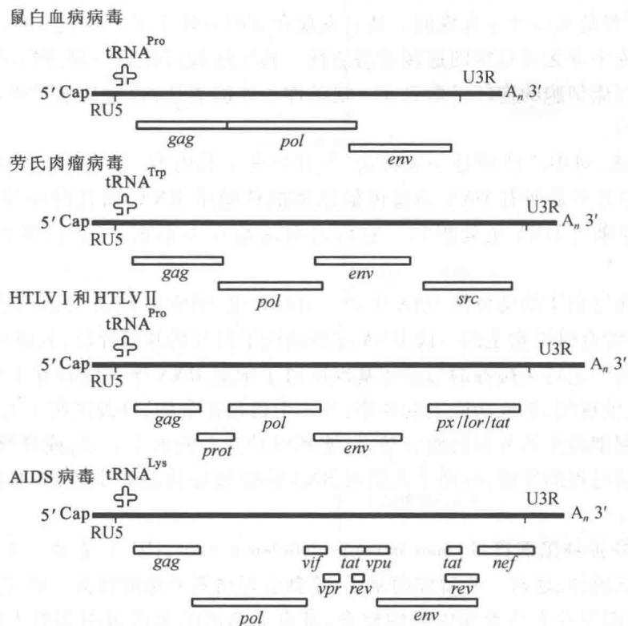  
图32-33 某些逆转录病毒的基因组  
□ 开放阅读框架,其中有些阅读框架被内含子分开

## 4. 逆转录的过程

逆转录病毒的生活周期十分复杂。借助于病毒颗粒的表面蛋白和跨膜蛋白，使病毒与宿主细胞相融合，病毒颗粒所携带的基因组RNA以及逆转录和整合所需要的引物（tRNA）和酶（逆转录酶、整合酶）得以进入宿主细胞内。在细胞质内发生病毒RNA的逆转录，由cDNA进入细胞核，在整合酶帮助下整合到宿主染色体DNA内，成为前病毒(provirus)。前病毒可随宿主染色体DNA一起复制和转录。只有整合的前病毒DNA转录的mRNA才能翻译产生病毒蛋白质，刚进入细胞的病毒RNA是无翻译活性的。因此，逆转录和整合所需的酶必须由病毒颗粒所携带。由此可见，在逆转录病毒生活周期中最关键的是逆转录过程。

逆转录过程可分为十步反应，其中需要经过逆转录酶两次转换模板（或称为两次跳跃）。首先，由结合在靠近5'端引物结合位点（primer-binding site, PBS）的tRNA作为引物，在逆转录酶作用下合成U5（unique to the 5' end）和R(repeat)区的互补序列。第二步，由逆转录酶的RNase H将模板RNA的U5和R区水解掉。第三步，新合成的(-)链DNA3'端R区与模板RNA3'端的R区配对，这是第一次逆转录酶转换模板（跳跃）。第四步，(-)链DNA继续延长。第五步，模板RNA的U3（unique to the 3' end）、R和poly(A)被水解掉，5'端也开始被水解，保留3'端附近的多聚嘌呤片段（poly purine tract, PPT)作为合成(+)链DNA的引物。第六步，(+)链DNA开始合成。第七步，引物tRNA被降解掉。第八步，(+)链DNA与(-)链DNA在PBS位点处配对，酶第二次转换模板（跳跃）。第九步，继续合成双链DNA。第十步，两末端序列重复合成形成长末端重复序列（long terminal repeat, LTR）。全部过程如图32-34所示。

逆转录产生的线型双链 cDNA 进入核内即可发生整合。逆转录病毒 DNA 的整合机制与转座子的转座过程类似。前病毒的两端 LTR 各失去 2 bp，两侧形成 4\~6 bp 的正向重复。逆转录病毒 RNA 是从整合的前病毒 DNA 上经转录而来。它们转运到胞质，在那里进行翻译。基因组 RNA 和病毒蛋白质转移到质膜，经装配通过出芽的方式形成新的病毒颗粒（图 32-35）。

## 5. 逆转录的生物学意义

病毒只是游离的基因或基因组,这就是说病毒 RNA 的逆转录过程是细胞所具有的,而并不仅限于病毒,虽然最初逆转录过程是从病毒中发现的。其后发现众多的逆转座子,表明逆转录过程在细胞中频繁发生。但是在一般的细胞中并无可觉察的逆转录酶活性。其实端粒酶就是一种逆转录酶,其活性只存在于胚胎和肿瘤细胞中。可能细胞的逆转录酶只在一定条件下才能表达,这也是细胞染色体遗传信息得以保持相对稳定的一个原因。

逆转录过程的发现,对中心法则是一次冲击,并且扩充了其内容。DNA 和 RNA 之间遗传信息流虽以双向箭头来表示,但并不是所有 DNA 的遗传信息都能传递给 RNA,而且传递受到严格的调节控制;而遗传信息从 RNA 传递给 DNA 更受限制。它们之间的相互关系正是遗传、发育和进化的核心问题之一。

逆转录病毒能够转导宿主的染色体 DNA 序列。通过重组，前病毒 DNA 可以与宿主染色体 DNA 组合在一起，由此产生的病毒有时以宿主的一段 DNA 序列取代了自身的基因片段，故而是复制有缺陷的，不能依靠自身完成感染周期。逆转录病毒的二倍体基因组对于细胞 DNA 序列的转导十分重要。由于二倍体的存在，一个基因组发生重组，造成功能上的缺陷；另一个仍是正常的，可提供所失去的病毒功能。如果重组病毒携带了宿主控制细胞生长分裂的原癌基因，使其以异常高的水平表达，或经突变失去了调节机制，就成为癌基因。逆转录过程的发现，有助于人们对 RNA 病毒致癌机制的了解，并对防治肿瘤提供了重要线索和途径。

1983 年发现人类免疫缺陷病毒(human immune deficiency virus, HIV), 它是一类逆转录病毒, 其 RNA 基因组中除一般常见基因外, 还有一些特殊的基因, 使其表现出不寻常的行为。通常逆转录病毒侵入细胞后并不杀死宿主细胞, 而是发生病毒基因组的整合, 带有癌基因的病毒可引起宿主细胞转化。但是 HIV 却不同, 它感染(主要是 T 淋巴细胞) 后即杀死细胞, 造成宿主机体免疫系统损伤, 引起艾滋病(AIDS)。根据艾滋病的起因和逆转录过程已设计和研制了一批治疗药物。药物作用的靶部位主要选择对逆转录病毒特异的逆转录酶和蛋白酶,其中治疗效果较好的有叠氮胸苷(3'-azido-2',3'-dideoxythymidine,AZT)和双脱氧肌苷(2',3'-dideoxyinosine,DDI)。AZT原设计作为抗肿瘤药物,临床试验发现它抗肿瘤的效果很不理想,但是意外发现它对AIDS有很好疗效。当AZT被T淋巴细胞吸收后,即转变为AZT三磷酸,而HIV的逆转录酶对AZT三磷酸有很高亲和力,从而竞争性抑制了酶对dTTP的结合。当AZT加入到DNA链生长的3'端时,病毒DNA链的合成迅即终止。AZT对T淋巴细胞的毒性不大,因为细胞DNA聚合酶对其亲和力较低。然而对骨髓细胞却有较大毒性,尤其是红细胞的祖细胞,因此采用AZT治疗常会引起贫血,这是该类药物的缺点。DDI具有类似的作用机制。AZT和DDI的结构式如下:

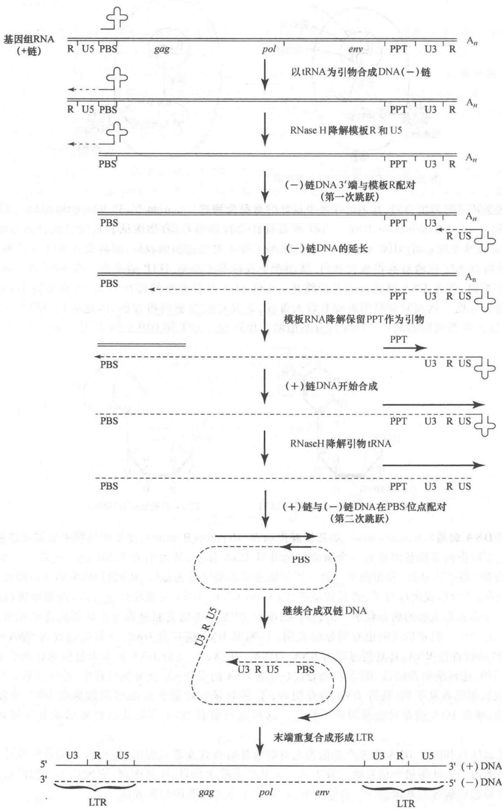  
图32-34 逆转录病毒DNA的合成

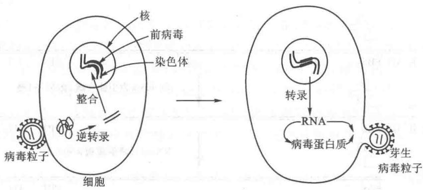  
图32-35 逆转录病毒的生活周期

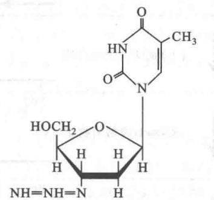

  
$3^{\prime}-$ 叠氮基 $-2^{\prime},3^{\prime}-$ 双脱氧胸苷(AZT)  
2',3'-双脱氧肌苷(DDI)

嗜肝 DNA 病毒(Hepadnavirus),如乙型肝炎病毒(Hepatitis B virus),在复制周期中也需经过逆转录的步骤。乙型肝炎病毒的基因组是一个带缺口的环状 DNA 分子,其大小为 3200 bp。病毒粒子中携带有 DNA 聚合酶(即逆转录酶)和蛋白质引物。当细胞感染乙型肝炎病毒后,基因组 DNA 的缺口即由 DNA 聚合酶所填补,从而形成闭环分子,然后转录产生(+)链 RNA。RNA 被装配到核壳内,在那里进行逆转录,最后加上外壳成为成熟的病毒粒子。由此可见,嗜肝 DNA 病毒的复制过程与逆转录病毒很相像,二者均有逆转录的阶段。但它们之间也有明显的差别:① 嗜肝 DNA 病毒含 DNA,其复制过程为 DNA→RNA→DNA;逆转录病毒含 RNA,其复制过程为 RNA→DNA→RNA;② 嗜肝 DNA 病毒以蛋白质作为合成(-)链 DNA 的引物;逆转录病毒则以 tRNA 作为合成(-)链 DNA 的引物;③ 在复制过程中,逆转录病毒的前病毒 DNA 形成长末端重复序列;嗜肝 DNA 病毒则否;④ 逆转录病毒能有效地将其前病毒 DNA 整合到细胞 DNA 中去,嗜肝 DNA 病毒只能低频随机整合。这可能与嗜肝 DNA 病毒缺乏长末端重复序列和整合酶有关。

逆转录病毒和嗜肝 DNA 病毒严重危害人类健康并给畜牧业造成损失,然而将它们进行改造,也可以成为向细胞内引入外源遗传信息的有效工具。尤其是逆转录病毒,经过改建,它能成为理想的信息载体,用于肿瘤和遗传病等的基因治疗。在这方面,已取得了令人鼓舞的初步成功。

## （三）逆转座子的种类和作用机制

真核生物的基因组内存在大量分散的重复序列，使基因组变得极为庞大。现在知道，基因组的分散重复序列主要是由一些移动因子(mobile element)所组成。DNA重组一章已对转座子作了介绍。另一类移动因子因其在转座过程中需要以RNA为中间体，经逆转录再分散到基因组中，故称之为逆转座子(retroposon)。过去曾将逆转座子看成是一些无用的、“自私的”、进入进化死端的DNA，认为它们只不过被杂乱堆放在基因组内。最近有关逆转座子活动和作用的一些发现表明，这一观点并不正确；逆转座子可能在基因组结构动态变化中起着关键的作用，故有深入研究的必要。

## 1. 逆转座子的结构特点

逆转座作用的关键酶为逆转录酶和整合酶。自身编码逆转录酶和/或整合酶的非传染性转座因子称为逆转录转座子(retrotransposon)。按其结构特征可分为两类：一类具有与逆转录病毒类似的长末端重复(LTR)结构，并含gag和pol基因，但无被膜蛋白基因env，不形成细胞外相。这类中包括酵母的Ty因子，果蝇的copia和gypsy，玉米的Bs1，啮齿类的LAP，人类的THE1。另一类不具有LTR，但有3'poly(A)，其中心编码区含有与gag和pol类似的序列，5'端常被截短，其中包括果蝇的I因子，哺乳类的长分散因子（又称长散在元件，long interspersed element, LINE)L1和线粒体质粒等。它们的结构如图32-36所示。

  
图32-36 几种逆转录转座子的结构

另一方面，真核生物由于转录和翻译在空间上和时间上均被分隔开，逆转座有关的酶并不一定需要由移动因子自身编码，可以由其他基因通过反式作用供给。因此，几乎所有种类的细胞RNA都能产生其逆转座序列。自身不编码逆转录酶的逆转座子，包括由RNA聚合酶Ⅱ转录物（各种mRNA和snRNA）形成的逆基因和逆假基因；由RNA聚合酶Ⅲ转录物（tRNA、4.5S RNA、7SK RNA、7SL RNA、Alu序列等）形成的短分散因子（又称短散在元件，short interspersed element, SINE）。它们的共同结构特点是无内含子，无重复末端，通常有3'poly(A)，5'端或3'端可能被截短。

## 2. 逆转座子的转座作用

一般认为逆转座子插入基因组的位点是随机的,但实际上它仍有一定程度的选择,并非完全任意。某些有关序列有较高的整合频率,具体机制目前还不清楚。

逆转录转座子自身能编码整合酶，它们整合部位的两侧有固定长度的正向重复，表明整合酶能交错切开靶序列，整合后通过复制而使靶序列倍增。通常整合酶对靶序列并无严格选择，但交错切开的长度是固定的。然而，逆基因和逆假基因两侧的正向重复长度却不固定，最短为零，最长可达41 bp，不像是由整合酶交错切开而成，很可能是随机插入染色体DNA的断裂部位，再由连接酶接上。DNA富含AT区最易断裂，由此可以理解为什么该区是插入热点。许多逆转座子具有3'poly(A)结构，它在整合中可能起一定作用。另外，活性基因5'端上游的DNase I超敏感区是染色体DNA暴露的部位，易于和各种因子接触，也是较易整合的部位。

人类的 Alu 家族与 7SL RNA(信号识别颗粒的 RNA) 的两端序列高度同源, 其中间和 3' 端为连续的 A。当 7SL RNA 发夹结构的中间部分被切除后再连接, 即构成 Alu 序列。人类 Alu 序列常以二聚体(或四聚体)形式存在; 灵长类和啮齿类常为单体。它们内部都有 RNA 聚合酶Ⅲ启动子。RNA 聚合酶Ⅲ转录终止于 oligo(U), $U_{n}$ 回折与 $A_{n}$ 配对可引发 cDNA 的合成。Alu 序列可能以这种方式得以大量扩增。在人类单倍体基因组中它的拷贝数可达 50 万以上，是拷贝数最多的一种逆转座子。实验表明，Alu RNA 的二级结构为其逆转座所必需。

## 3. 逆转座子的生物学意义

逆转座子广泛分布于真核生物的基因组中,必将对真核生物基因组的功能带来影响。归纳起来可能有以下几方面的作用:

（1）逆转座子对基因表达的影响 逆转录转座子的两个 LTR 包括 U3、R 和 U5 序列。U3 区含增强子以及转录起始信号，U5 区含有 poly(A) 加工信号。左 LTR 可启动自身基因的表达，右 LTR 可启动邻近宿主基因的表达。逆转录转座子编码有关逆转座作用的酶，它们可造成细胞内 RNA 的逆转座作用。一般的逆转座子不编码逆转座的酶，它们只有顺式作用，对宿主基因表达的影响与其整合的部位有关。当它们插入基因的编码序列和启动子序列时即造成基因失活；插入基因 3' 和 5' 非翻译区或内含子时可能会影响到基因的转录、转录后加工或翻译过程，有时还会影响表达的组织特异性和发育阶段性。

（2）逆转座子介导基因的重排 逆转座子自身在复制时易发生重排，已如上所述。分散在真核生物基因组中的大量逆转座子是基因组的不稳定因素，它们可引起基因组序列的删除、扩增、倒位、移位及断裂等重排。由逆转座子介导的基因重排有时可引起人类某些遗传疾病的形成。例如，血友病A是由于缺乏凝血因子VIII所致，经分析知道这是因为L1因子插入该凝血因子基因造成的。已知癌基因的形成和活化与基因重排有关。据文献报道，发现一些肿瘤组织的特定基因位点内存在L1，但其周围正常细胞的该位点则不存在L1因子。人类基因组中L1因子的拷贝数大于10000，该因子造成了人类的许多遗传突变。

（3）逆转座子在生物进化中的作用 逆转座子除了能够促进基因组的流动性，从而有利于遗传的多样性外；它们散布在基因组中，还可成为基因进化的种子，通过突变而形成新的基因、基因的结构域，或是与先存的基因匹配成为新的调节因子。在众多逆转座子中，也有一些具有表达功能，称为半加工的逆基因。例如，大鼠和小鼠（还有少数鱼类）有两个非等位的前胰岛素原基因，基因Ⅰ在5'非翻译区含有单个小的内含子，而基因Ⅱ除此小内含子外，在C肽编码区还有一个大的内含子。比较这两个基因的结构可以看到，基因Ⅰ的两侧有41 bp的正向重复，5'端有与基因Ⅱ类似的启动子和调控序列，但少一个内含子，3'端有oligo(A)。显然基因Ⅰ是基因Ⅱ的不正常转录产物，即从基因Ⅱ上游至少0.5 kb处由另一启动子（或类似序列）转录出来，经部分加工然后逆转座而成。

RNA 较易变异,而且与环境有着更直接的联系,因此它所包含的遗传信息比 DNA 丰富得多。它通过逆转座作用能将所获得的遗传信息逆向转移给 DNA,并促进基因结构域或基因的最优组合。昆虫和哺乳类动物在进化上的优势很可能与它们含有大量活跃的逆转座子有关。逆转座子的功能和活动规律虽还不很清楚,但它们在真核生物进化中无疑起着重要作用。对于逆转座子的深入研究,将有助于对基因组动态结构的了解,并且还能为基因工程的实践提供新的途径和手段。

<!-- EN-BEGIN 26.3 -->

### 【英文对应 26.3】RNA-Dependent Synthesis of RNA and DNA

> 来源：Lehninger Principles of Biochemistry（书籍/02_生物化学原理） 第26章 RNA Metabolism，§26.3。对应本章“三、RNA 指导下 RNA 和 DNA 的合成”。

In our discussion of DNA and RNA synthesis up to this point, the role of the template strand has been reserved for DNA. However, some enzymes use an RNA template for nucleic acid synthesis. With the important exception of viruses with an RNA genome, these enzymes play only supporting roles in information pathways. RNA viruses are the source of most characterized RNA-dependent polymerases, although some eukaryotes also use these enzymes to amplify double-stranded RNAs used in RNA interference.

The existence of RNA replication requires an elaboration of the central dogma—the notion that genetic information flows only from DNA to RNA to proteins. RNA-dependent polymerases allow the genetic information stored in RNA to be replicated and reverse transcribed into DNA. The enzymes of the RNA replication process have profound implications for investigations into the nature of self-replicating molecules that may have existed in prebiotic times.

#### [EN] Reverse Transcriptase Produces DNA from Viral RNA

P3 Certain RNA viruses that infect animal cells carry within the viral particle an RNA-dependent DNA polymerase called reverse transcriptase. On infection, the single-stranded RNA viral genome (\~10,000 nucleotides) and the enzyme enter the host cell. The reverse transcriptase first catalyzes the synthesis of a DNA strand complementary to the viral RNA (Fig. 26-29), then degrades the RNA strand of the viral RNA-DNA hybrid and replaces it with DNA. The resulting duplex DNA often becomes incorporated into the genome of the eukaryotic host cell. These integrated (and dormant) viral genes can be activated and transcribed, and the gene products—viral proteins and the viral RNA genome itself—are packaged as new viruses. The RNA viruses that contain reverse transcriptases are known as retroviruses (retro is the Latin prefix for “backward”).

The existence of reverse transcriptases in RNA viruses was predicted by Howard Temin in 1962, and the enzymes were ultimately detected by Temin and, independently, by David Baltimore in 1970. P3 Their discovery aroused much attention as dogma-shaking proof that genetic information can flow "backward" from RNA to DNA.

  
FIGURE 26-29 Retroviral infection of a mammalian cell and integration of the retrovirus into the host chromosome. Viral particles entering the host cell carry viral reverse transcriptase and a cellular tRNA (picked up from a former host cell) already base-paired to the viral RNA. The purple segments represent the long terminal repeats on the viral RNA. The tRNA facilitates immediate conversion of viral RNA to double-stranded DNA by the action of reverse transcriptase. The double-stranded DNA enters the nucleus and is integrated into the host genome. The integration is catalyzed by a virally encoded integrase. Integration of viral DNA into host DNA is mechanistically similar to

  
Howard Temin, 1934–1994
[Bettmann/Getty Images.]

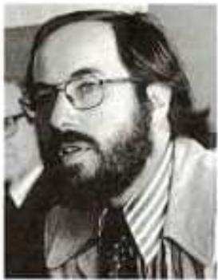  
David Baltimore [AP Images.]  
the insertion of transposons in bacterial chromosomes (see Fig. 25-41). For example, a few base pairs of host DNA become duplicated at the site of integration, forming short repeats of 4 to 6 bp at each end of the inserted retroviral DNA (not shown). On transcription and translation of the integrated viral DNA, new viruses are formed and released by cell lysis (right). In the viruses, the viral RNA is enclosed by capsid proteins called Gag and outer envelope proteins called Env. Additional viral proteins (reverse transcriptase, integrase, and a viral protease needed for posttranslational processing of viral proteins) are packaged within the virus particle with the RNA.

Retroviruses typically have three genes: gag (a name derived from the historical designation group associated antigen), pol, and env (Fig. 26-30). The transcript that contains gag and pol is translated into a long "polyprotein," a single large polypeptide that is cleaved into six proteins with distinct functions. The proteins derived from the gag gene make up the interior core of the viral particle. The pol gene encodes the protease that cleaves the long polypeptide, an integrase that inserts the viral DNA into the host chromosomes, and reverse transcriptase. Many reverse transcriptases have two subunits, $\alpha$ and $\beta$ . The pol gene specifies the $\beta$ subunit ( $M_{r}$ 90,000), and the $\alpha$ subunit ( $M_{r}$ 65,000) is simply a proteolytic fragment of the $\beta$ subunit. The env gene encodes the proteins of the viral envelope. At each end of the linear RNA genome are long terminal repeat (LTR) sequences of a few hundred nucleotides. Transcribed into the duplex DNA, these sequences facilitate integration of the viral chromosome into the host DNA and contain promoters for viral gene expression.

  
FIGURE 26-30 Structure and gene products of an integrated retroviral genome. The long terminal repeats (LTRs) have sequences needed for the regulation and initiation of transcription. The sequence denoted $\psi$ is required for packaging of retroviral RNAs into mature viral particles. Transcription of the retroviral DNA produces a primary transcript encompassing the gag, pol, and env genes. Translation (Chapter 27) produces a polyprotein, a single long polypeptide derived from the gag and pol genes, which is cleaved into six distinct proteins. Splicing of the primary transcript yields an mRNA derived largely from the env gene, which is also translated into a polyprotein, then cleaved to generate viral envelope proteins.

Reverse transcriptases catalyze three different reactions: (1) RNA-dependent DNA synthesis, (2) RNA degradation, and (3) DNA-dependent DNA synthesis. Each transcriptase is most active with the RNA of its own virus, but each can be used experimentally to make DNA complementary to a variety of RNAs. The DNA and RNA synthesis and RNA degradation activities use separate active sites on the protein. For DNA synthesis to begin, the reverse transcriptase requires a primer, a cellular tRNA obtained during an earlier infection and carried in the viral particle. This tRNA is base-paired at its 3' end with a complementary sequence in the viral RNA. The new DNA strand is synthesized in the 5'→3' direction, as in all RNA and DNA polymerase reactions. Reverse transcriptases, like RNA polymerases, do not have $3'\rightarrow5'$ proofreading exonucleases. They generally have error rates of about 1 per 20,000 nucleotides added. An error rate this high is extremely unusual in DNA replication and seems to be a characteristic of most enzymes that replicate the genomes of RNA viruses. A consequence is a higher mutation rate and a faster rate of viral evolution, which is a factor in the frequent appearance of new strains of disease-causing retroviruses.

Reverse transcriptases have become important reagents in the study of DNA-RNA relationships and in DNA cloning techniques. They make possible the synthesis of DNA complementary to an mRNA template, and synthetic DNA prepared in this manner, called complementary DNA (cDNA), can be used to clone cellular genes (see Fig. 9-13).

#### [EN] Some Retroviruses Cause Cancer and AIDS

P3 Retroviruses have featured prominently in the molecular understanding of cancer. Most retroviruses do not kill their host cells but remain integrated in the cellular DNA, replicating when the cell divides. Some retroviruses, classified as RNA tumor viruses, contain an oncogene that can cause the cell to grow abnormally. The first retrovirus of this type to be studied was the Rous sarcoma virus (also called avian sarcoma virus; Fig. 26-31), named for F. Peyton Rous, who studied chicken tumors now known to be caused by this virus. Since the initial discovery of oncogenes by Harold Varmus and Michael Bishop, many dozens of such genes have been found in retroviruses.

P3 The human immunodeficiency virus (HIV), which causes acquired immune deficiency syndrome (AIDS), is a retrovirus. Identified in 1983, HIV has an RNA genome with standard retroviral genes along with several other unusual genes (Fig. 26-32). Unlike many other retroviruses, HIV kills many of the cells it infects (principally T lymphocytes) rather than causing tumor formation. This gradually leads to suppression of the immune system in the host organism. The reverse transcriptase of HIV is even more error-prone than other known reverse transcriptases — 10 times more so — resulting in high mutation rates in this virus. One or more errors are generally made every time the viral genome is replicated, so any two viral RNA molecules are likely to differ.

Many modern vaccines for viral infections consist of one or more coat proteins of the virus, produced by methods described in Chapter 9. These proteins are not infectious on their own but stimulate the immune

<table><tr><td colspan="5">LTR</td><td>LTR</td></tr><tr><td></td><td>gag</td><td>pol</td><td>env</td><td>src</td><td></td></tr></table>

FIGURE 26-31 Rous sarcoma virus genome. The src gene encodes a tyrosine kinase, one of a class of enzymes that function in systems affecting cell division, cell-cell interactions, and intercellular communication (see Section 12.4). The same gene is found in chicken DNA (the usual  
host for this virus) and in the genomes of many other eukaryotes, including humans. When associated with the Rous sarcoma virus, this oncogene is often expressed at abnormally high levels, contributing to unregulated cell division and cancer.

  
FIGURE 26-32 The genome of HIV, the virus that causes AIDS. In addition to the typical retroviral genes, HIV contains several small genes with a variety of functions (not identified here and not all known). Some of these genes overlap. Alternative splicing mechanisms produce many different proteins from this small (9.7 × 10 $^{3}$ nucleotides) genome.

system to recognize and resist subsequent viral invasions (Chapter 5). Because of the high error rate of the HIV reverse transcriptase, the env gene in this virus (along with the rest of the genome) undergoes very rapid mutation, complicating the development of an effective vaccine. However, repeated cycles of cell invasion and replication are needed to propagate an HIV infection, so inhibition of viral enzymes offers the most effective therapy currently available. The HIV protease is targeted by a class of drugs called protease inhibitors (see Fig. 6-29). Reverse transcriptase is the target of some additional drugs widely used to treat HIV-infected individuals (Box 26-3).

#### [EN] Many Transposons, Retroviruses, and Introns May Have a Common Evolutionary Origin

Some well-characterized eukaryotic DNA transposons from sources as diverse as yeast and fruit flies have a structure very similar to that of retroviruses; these are sometimes called retrotransposons (Fig. 26-33). Retrotransposons

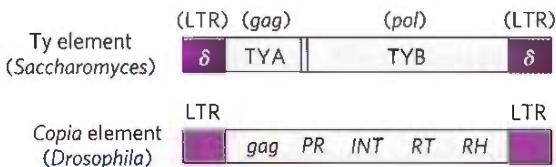  
FIGURE 26-33 Eukaryotic transposons. The Ty element of the yeast Saccharomyces and the copia element of the fruit fly Drosophila are examples of eukaryotic retrotransposons, which often have a structure similar to retroviruses but lack the env gene. The δ sequences of the Ty element are functionally equivalent to retroviral LTRs. In the copia element, INT and RT are homologous to the integrase and reverse transcriptase segments, respectively, of the pol gene.

#### [EN] BOX 26-3

MEDICINE

#### [EN] Fighting AIDS with Inhibitors of HIV Reverse Transcriptase

Research into the chemistry of template-dependent nucleic acid biosynthesis, combined with modern techniques of molecular biology, has elucidated the life cycle and structure of the human immunodeficiency virus, the retrovirus that causes AIDS. A few years after the isolation of HIV, this research resulted in the development of drugs capable of prolonging the lives of people infected by HIV.

The first drug to be approved for clinical use was azido-thymidine (AZT), a structural analog of deoxythymidine. AZT was first synthesized in 1964 by Jerome P. Horwitz. It failed as an anticancer drug (the purpose for which it was made), but in 1985 it was found to be a useful treatment for AIDS. AZT is taken up by T lymphocytes, immune system cells that are particularly vulnerable to HIV infection, and it is converted to AZT triphosphate. (AZT triphosphate taken directly would be ineffective because it cannot cross the plasma membrane.) HIV's reverse transcriptase has a higher affinity for AZT triphosphate than for deoxythymidine triphosphate (dTTP), and binding of AZT triphosphate to this enzyme competitively inhibits dTTP binding. When AZT is added to the 3' end of the growing DNA strand, lack of a 3' hydroxyl means that the DNA strand is terminated prematurely and viral DNA synthesis grinds to a halt.

AZT triphosphate is not as toxic to the T lymphocytes themselves because cellular DNA polymerases have a lower affinity for this compound than for dTTP. At concentrations of 1 to 5 $\mu$ M, AZT affects HIV reverse transcription but not most cellular DNA replication. Unfortunately, AZT seems to be toxic to the bone marrow cells that are the progenitors of erythrocytes, and many individuals taking AZT develop anemia. AZT can increase the survival time of people with advanced AIDS by about a year, and it delays the onset of AIDS in those who are still in the early stages of HIV infection. Some other AIDS drugs, such as dideoxyinosine (DDI), have a similar mechanism of action. Newer drugs target and inactivate the HIV protease. Because of the high error rate of HIV reverse transcriptase and the resulting rapid evolution of HIV, the most effective treatments of HIV infection use a combination of drugs directed at both the protease and the reverse transcriptase.

encode an enzyme homologous to the retroviral reverse transcriptase, and their coding regions are flanked by LTR sequences. They transpose from one position to another in the cellular genome by means of an RNA intermediate, using reverse transcriptase to make a DNA copy of the RNA, followed by integration of the DNA at a new site. Most transposons in eukaryotes use this mechanism for transposition, distinguishing them from bacterial transposons, which move as DNA directly from one chromosomal location to another (see Fig. 25-41).

Retrotransposons lack an env gene and so cannot form viral particles. They can be thought of as defective viruses, trapped in cells. Comparisons between retroviruses and eukaryotic transposons suggest that reverse transcriptase is an ancient enzyme that predates the evolution of multicellular organisms.

Many group I and group II introns are also mobile genetic elements. In addition to their self-splicing activities, they encode DNA endonucleases that promote their movement. During genetic exchanges between cells of the same species, or when DNA is introduced into a cell by parasites or by other means, these endonucleases promote insertion of the intron into an identical site in another DNA copy of a homologous gene that does not contain the intron, in a process termed homing (Fig. 26-34). Whereas group I intron homing is DNA-based, group II intron homing occurs through an RNA intermediate. The endonucleases of the group II introns have associated reverse transcriptase activity. The proteins can form complexes with the intron RNAs themselves, after the introns are spliced from the primary transcripts. Because the homing process involves insertion of the RNA intron into DNA and reverse transcription of the intron, the movement of these introns has been called retrohoming. Over time, every copy of a particular gene in a population may acquire the intron.

#### [EN] FIGURE 26-34 Introns that move: homing and retrohoming.

FIGURE 26-31 introns that move homing and retrohoming. Certain introns include a gene (shown in red) for enzymes that promote homing (some group I introns) or retrohoming (some group II introns). (a) The gene in the spliced intron is bound by a ribosome and translated. Group I homing introns specify a site-specific endonuclease, called a homing endonuclease. Group II retrohoming introns specify a protein with both endonuclease and reverse transcriptase activities (not shown here). (b) Homing. Allele $a$ of a gene $X$ containing a group I homing intron is present in a cell containing allele $b$ of the same gene, which lacks the intron. The homing endonuclease produced by $a$ cleaves $b$ at the position corresponding to the intron in $a$ , and double-strand break repair (recombination with allele $a$ ; see Fig. 25-34) then creates a new copy of the intron in $b$ . (c) Retrohoming. Allele $a$ of gene $Y$ contains a retrohoming group II intron; allele $b$ lacks the intron. The spliced intron inserts itself into the coding strand of $b$ in a reaction that is the reverse of the splicing that excised the intron from the primary transcript (see Fig. 26-14), except that here the insertion is into DNA rather than RNA. The noncoding DNA strand of $b$ is then cleaved by the intron-encoded endonuclease/reverse transcriptase. This same enzyme uses the inserted RNA as a template to synthesize a complementary DNA strand. The RNA is then degraded by cellular ribonucleases and replaced with DNA.

(a) Production of homing endonuclease  

(c) Retrohoming  

Much more rarely, the intron may insert itself into a new location in an unrelated gene. If this event does not kill the host cell, it can lead to the evolution and distribution of an intron in a new location. The structures and mechanisms used by mobile introns support the idea that at least some introns originated as molecular parasites whose evolutionary past can be traced to retroviruses and transposons.

#### [EN] Telomerase Is a Specialized Reverse Transcriptase

Telomeres, the structures at the ends of linear eukaryotic chromosomes (see Fig. 24-7), generally consist of many tandem copies of a short oligonucleotide sequence. This sequence usually has the form $T_{x}G_{y}$ in one strand and $C_{y}A_{x}$ in the complementary strand, where x and y are typically in the range of 1 to 4 (p. 890). Telomeres vary in length from a few dozen base pairs in some ciliated protozoans to tens of thousands of base pairs in mammals. The TG strand is longer than its complement, leaving a region of single-stranded DNA of up to a few hundred nucleotides at the 3' end.

The ends of a linear chromosome are not readily replicated by cellular DNA polymerases. DNA replication requires a template and primer, and beyond the end of a linear DNA molecule no template is available for the pairing of an RNA primer. Without a special mechanism for replicating the ends, chromosomes would be shortened somewhat in each cell generation. The enzyme telomerase, discovered by Carol Greider and Elizabeth Blackburn, solves this problem by adding telomeres to chromosome ends.

  
Carol Greider [Courtesy Carol Greider.]

  
Elizabeth Blackburn [Micheline Pelletier/Getty Images.]

The discovery and purification of this enzyme provided insight into a reaction mechanism that is remarkable and unprecedented. Telomerase, like some other enzymes described in this chapter, is an RNP that contains both RNA and protein components. The RNA component in humans is about 150 nucleotides long and contains about 1.5 copies of the appropriate $C_{y}A_{x}$ telomere repeat. This region of the RNA acts as a template for synthesis of the $T_{x}G_{y}$ strand of the telomere. P3 Telomerase thereby acts as a cellular reverse transcriptase that provides the active site for RNA-dependent DNA synthesis. Unlike retroviral reverse transcriptases, telomerase copies only a small segment of RNA that it carries within itself. Telomere synthesis requires the 3' end of a chromosome as primer and proceeds in the usual 5'→3' direction. Having synthesized one copy of the repeat, the enzyme repositions to resume extension of the telomere (Fig. 26-35a).

After extension of the $T_{x}G_{y}$ strand by telomerase, the complementary $C_{y}A_{x}$ strand is synthesized by cellular DNA polymerases, starting with an RNA primer (see Fig. 25-11). The single-stranded region is protected by specific binding proteins in many lower eukaryotes, especially those species with telomeres of less than a few hundred base pairs. In higher eukaryotes (including mammals) with telomeres many thousands of base pairs long, the single-stranded end is sequestered in a specialized structure called a T loop (Fig. 26-35b). The single-stranded end is folded back and paired with its complement in the double-stranded portion of the telomere. The formation of a T loop involves invasion of the 3' end of the telomere's single strand into the duplex DNA, perhaps by a mechanism similar to the initiation of homologous genetic recombination (see Fig. 25-34). In mammals, the looped DNA is bound by two proteins, TRF1 and TRF2, with the latter protein involved in formation of the T loop. T loops protect the 3' ends of chromosomes, making them inaccessible to nucleases and the enzymes that repair double-strand breaks.

In protozoans (such as Tetrahymena), loss of telomerase activity results in a gradual shortening of telomeres with each cell division, ultimately leading to the death of the cell line. A similar link between telomere length and cell senescence (cessation of cell division) has been observed in humans. In germ-line cells, which contain telomerase activity, telomere lengths are maintained; in somatic cells, which lack telomerase, they are not. There is a linear, inverse relationship between the length of telomeres in cultured fibroblasts and the age of the individual from whom the fibroblasts were taken: telomeres in human somatic cells gradually shorten as an individual ages. If the telomerase reverse transcriptase is introduced into human somatic cells in vitro, telomerase activity is restored and the cellular life span increases markedly.

Is the gradual shortening of telomeres a key to the aging process? Is our natural life span determined by the length of the telomeres we are born with? Further research in this area should yield some fascinating insights.

#### [EN] Some RNAs Are Replicated by RNA-Dependent RNA Polymerase

Apart from the retroviruses, the RNA viruses include some E. coli bacteriophages as well as eukaryotic viruses such as the influenza virus and coronaviruses that cause SARS or COVID-19. The single-stranded RNA chromosomes of these viruses also function as mRNAs for the synthesis of viral proteins. They are replicated in the host cell by an RNA-dependent RNA polymerase (RNA replicase). All RNA viruses—with the exception of retroviruses—must encode a protein with RNA-dependent RNA polymerase activity, either because the host cells lack such an enzyme or because the RNA genome structure of a virus imposes specialized enzymatic requirements.

  
FIGURE 26-35 Telomere synthesis and structure. (a) The internal template RNA of telomerase binds to and base-pairs with the TG primer $(\mathrm{T}_x\mathrm{G}_y)$ of DNA. Telomerase adds more T and G residues to the TG primer, then repositions the internal template RNA to allow the addition of more T and G residues to generate the TG strand of the telomere. The complementary strand is synthesized  
by cellular DNA polymerases, after priming by an RNA primase. (b) Proposed structure of T loops in telomeres. The single-stranded tail synthesized by telomerase is folded back and paired with its complement in the duplex portion of the telomere. The telomere is bound by several telomere-binding proteins, including TRF1 and TRF2 (telomere repeat binding factors).

The RNA replicase isolated from E. coli cells infected with the bacteriophage Qβ catalyzes the formation of an RNA complementary to the viral RNA, in a reaction equivalent to that catalyzed by DNA-dependent RNA polymerases. New RNA strand synthesis proceeds in the 5'→3' direction by a chemical mechanism identical to that used in all other nucleic acid synthetic reactions that require a template. RNA replicase requires RNA as its template and will not function with DNA. It lacks a separate proofreading endonuclease activity and has an error rate similar to that of RNA polymerase. Unlike the DNA and RNA polymerases, RNA replicases are specific for the RNA of their own virus; the RNAs of the host cell are generally not replicated. This explains how RNA viruses are preferentially replicated in the host cell, which contains many other types of RNA.

  
FIGURE 26-36 Structural similarities between RNA-dependent polymerases. RNA-dependent polymerases use a common active site architecture in which the duplexed substrate sits in a hand-shaped protein fold with palm and finger domains. This protein fold can be found in protein factors involved in (a) group II intron retrohoming, (b) spliceosome-catalyzed pre-mRNA splicing, (c) telomere synthesis, (d) HIV reverse transcription, and (e) hepatitis C viral genome replication. The retrohoming  
reverse transcriptase of group II introns is most structurally related to the reverse transcriptase structure present in the spliceosome, supporting their close evolutionary relationship. [Information from C. Zhao and A. M. Pyle, Nat. Struct. Mol. Biol. 23:558, 2016, Fig. 2. Data from (a) PDB ID 5HHJ, C. Zhao and A. M. Pyle, Nat. Struct. Mol. Biol. 23:558, 2016; (b) PDB ID 4I43, W. P. Galej et al., Nature 493:638, 2013; (c) PDB ID 3DU6, A. J. Gillis et al., Nature 455:633, 2008; (d) PDB ID 2HMI, J. Ding et al., J. Mol. Biol. 284:1095, 1998; (e) PDB ID 1C2P, C. A. Lesburg et al., Nat. Struct. Biol. 6:937, 1999.]

RNA-dependent RNA polymerases are not limited to viruses. Enzymes of this type are found in plants, protists, fungi, and some simpler animals, but not in insects or mammals. Those found in the genomes of eukaryotes generally play a role in the metabolism of another class of small RNAs, called small interfering RNAs (siRNAs), which participate in gene regulation (Chapter 28).

#### [EN] RNA-Dependent RNA Polymerases Share a Common Structural Fold

Even though viral RNA replication and reverse transcription, retrohoming, and telomere synthesis represent a diverse array of biological processes, the polymerases involved in each pathway bear remarkable similarities in structure (Fig. 26-36). In all cases, palm and finger domains are used to grip the duplexed template and primer nucleic acids within the active site. Amazingly, the group II intron retrohoming reverse transcriptase is structurally most closely related to a protein component of the spliceosome that helps scaffold its RNA active site. In addition to identical splicing chemistry and active site features (see Fig. 26-17), this provides further evidence that the spliceosome evolved from a group II intron-like ancestor.

#### [EN] SUMMARY 26.3 RNA-Dependent Synthesis of RNA and DNA

■ RNA-dependent DNA polymerases, also called reverse transcriptases, were first discovered in retroviruses, which must convert their RNA genomes into double-stranded DNA as part of their life cycle. These enzymes transcribe the viral RNA into DNA, a process that can be used experimentally to form cDNA.

■ Retroviruses can cause human diseases, including AIDS and cancers. Some of these viruses contain oncogenes, which cause infected cells to grow abnormally.

Many eukaryotic transposons are related to retroviruses, and their mechanism of transposition includes an RNA intermediate. An RNA intermediate is also present in group II intron retrohoming, in which the RNA intron is inserted into a DNA gene followed by production of a DNA copy by a reverse transcriptase.

■ Telomerase, the enzyme that synthesizes the telomere ends of linear chromosomes, is a specialized reverse transcriptase that contains an internal RNA template.

\- RNA-dependent RNA polymerases, such as the replicases of RNA bacteriophages, are template-specific for the viral RNA. These enzymes share structural homology with reverse transcriptases involved in retroviral replication, telomere production, and retrohoming.

<!-- EN-END 26.3 -->

## 提要

DNA 结构稳定,适于贮存遗传信息,转录成 RNA 才便于进行信息加工,使遗传信息得以表达。DNA 指导的 RNA 聚合酶以 4 种 NTP 为底物,需要 DNA 作为模板, $Mg^{2+}$ 能促进反应,RNA 的合成方向为 $5'\rightarrow3'$ 。反应是可逆的,焦磷酸分解使反应趋向聚合。RNA 聚合酶催化的反应无需引物,缺少二重校对。

大肠杆菌 RNA 聚合酶核心酶为 $(\alpha_{2}\beta\beta'\omega)$ ，加上 $\sigma$ 亚基即为全酶。RNA 转录可分为三个阶段，每一阶段又分为若干步。起始阶段由 $\sigma$ 亚基引导 RNA 聚合酶稳定结合在启动子上，它增加了酶对启动子的亲和力和停留时间；降低了与一般序列的亲和力和停留时间。细胞内存在多种 $\sigma$ 亚基，可以帮助 RNA 聚合酶选择不同的转录基因。

真核生物 RNA 聚合酶有 I、II 和 III 三种，它们分别转录 rRNA、mRNA 和小 RNA，各由 10 多个亚基组

成。利用 $\alpha-$ 鹅膏蕈碱的抑制作用可以区分这三类 RNA 聚合酶。

启动子是 RNA 聚合酶识别、结合和开始转录的一段序列。原核生物的启动子有两个保守序列，位于 -10 的 Pribnow 框和位于 -35 的识别区。

真核生物的启动子有三类，分别由RNA聚合酶I、II和III进行转录。RNA聚合酶不能直接区分和结合到不同基因的启动子上，需要借助于诸多转录因子和辅助转录因子才能形成前起始复合物，以进行转录。类别I启动子包括核心启动子和上游控制元件两部分，需要UBF1和SL1因子参与作用。类别Ⅱ启动子包括四类控制元件：基本启动子、起始子、上游元件和应答元件。识别这些元件的反式因子有通用转录因子、上游转录因子和可诱导的因子。类别Ⅲ启动子有两类：上游启动子和基因内启动子，分别由装配因子和起始因子促进转录起始复合物的形成和转录。

链的合成经起始后即进入延伸阶段, $\alpha$ 亚基的CTD在酶的移动中起重要作用。真核生物有诸多延伸因子参与延伸阶段的作用,主要是阻止转录的暂停或终止。RBPI的CTD协调转录和转录后加工。

转录的终止控制元件为终止子,其辅助因子为终止因子。大肠杆菌有两类终止子:依赖于 rho 因子的终止子和不依赖于 rho 的终止子。Nus 因子帮助 RNA 聚合酶识别终止子。终止子还可用于控制下游基因的表达。

转录的调节是基因表达调节的重要环节,包括时序调节和适应调节。原核生物的操纵子既是表达单位,也是协同调节的单位。调节有正调节和负调节,原核生物以负调节为主。受一种调节蛋白所控制的调节系统称为调节子。不同调节系统间相互影响形成调节网络。真核生物的转录调节与原核生物有相同之处,也有显著的不同。①真核生物基因不组成操纵子;②真核生物存在大量顺式作用元件和反式因子,调节更复杂;③真核生物的调节以正调节为主,可诱导因子以共价修饰为主;④真核生物具有染色质结构水平上的调节。

RNA 生物合成的抑制剂包括嘌呤和嘧啶类似物、DNA 模板抑制物和 RNA 聚合酶抑制物。它们有些可在临床上作为抗生素和抗肿瘤药物，有些只能在实验室供试验用。

RNA 在转录后需要经过一系列复杂的加工过程才能成为成熟的 RNA 分子。原核生物的稳定 RNA(rRNA 和 tRNA) 存在切割、修剪、附加、修饰和异构化等加工过程，mRNA 一般在转录的同时即能进行翻译。真核生物 RNA 加工过程更为复杂，mRNA 存在特殊结构，其加工包括 5' 端加帽和 3' 端聚腺苷酸化。真核生物 RNA 还存在剪接、编辑和再编码等信息加工过程。信息加工可以抽提有用信息，消除错误，适应调节和选择性的表达。RNA 的功能多种多样，归根结底是遗传信息的传递、加工和表达。

RNA 也可以成为遗传信息的基本携带分子,例如,有些病毒的基因组为 RNA 分子。RNA 可借复制将遗传信息由亲代分子传递给子代分子。RNA 的复制由 RNA 指导的 RNA 聚合酶所催化。通常 RNA 复制酶对模板有很高的特异性,并且对 RNA 的复制和翻译,正链和负链的数量等存在调节控制作用。

逆转录酶最初发现于致癌 RNA 病毒。该酶为多功能酶，能以 RNA 为模板合成第一条 cDNA 链（逆转录酶活性），水解除去 RNA-DNA 杂合分子中的 RNA（RNase H 活性），再以 DNA 链为模板合成双链 DNA（DNA 聚合酶活性）。病毒 RNA 的逆转录要求特定 tRNA 为引物。逆转录酶无校正功能，因此错误率较高。逆转录过程共有十步反应，其中有两次逆转录酶在模板上的转移或称为跳跃。逆转录的结果在前病毒的两端出现两个长末端重复（即 U3-R-U5），这是末端重复逆转录和复制所致。长末端重复序列中含有整合位点、加工位点以及启动子和增强子序列，对于前病毒的整合和表达十分重要。

逆转录病毒能够转导宿主 DNA 序列。如果病毒携带了细胞的原癌基因，使其高水平表达或失去调控即成为癌基因。人免疫缺损病毒主要侵染 T 淋巴细胞，它在感染后即杀死宿主细胞，造成获得性免疫缺损综合征(AIDS)。逆转录过程的研究不仅揭示了 DNA 和 RNA 之间的关系，而且也为 RNA 病毒致癌和艾滋病等的治疗提供新的途径。

由 RNA 逆转录和整合而形成的遗传因子即为逆转座子。逆转座子有两类，一类自身编码逆转录酶/整合酶；另一类自身不能编码有关的酶，而依赖于其他来源。事实上任何 RNA 都能经逆转录和整合而成为逆转座子。具有整合酶和整合位点的逆转座子以较高的效率发生整合。具有 $\mathrm{poly(A)}_n$ 结构的逆转座子易于结合在染色体富含A-T的断裂处。有些逆转座子利用染色体DNA随机断裂而发生整合，这种整合方式将缺乏转座子整合位点的结构。

逆转座子广泛分布在真核生物基因组内。它们的生物学作用主要为:①影响所在位点或邻近基因的活性;②成为基因组的不稳定因素,促进基因组重组;③促进生物进化。

## 习题

1. 比较四类核酸聚合酶性质和作用的异同(四类核酸聚合酶是: DNA 指导的 DNA 聚合酶, DNA 指导的 RNA 聚合酶, RNA 指导的 RNA 聚合酶, RNA 指导的 DNA 聚合酶)。

2. 原核生物 RNA 聚合酶是如何找到启动子的？真核生物 RNA 聚合酶与之相比较有何异同？

3. 何谓启动子？保守序列与共有序列的概念是否一样？Pribnow 框与启动子之间是何关系？

4. 真核生物三类启动子各有何结构特点？

5. 何谓终止子和终止因子？依赖于rho的转录终止信号是如何传递给RNA聚合酶的？

6. 何谓时序调控？何谓适应调控？分别对原核生物和真核生物的转录调控举例加以说明。

7. 简要说明原核生物和真核生物转录调控的主要特点。

8. 转录调节因子的结构有何特点？

9. 比较启动子上游元件、增强子和绝缘子的作用特点。

10. 什么是染色质的结构域？它有哪些控制位点？

11. 目前有哪些重要的 RNA 合成抑制剂已在临床上用作抗癌药物、抗病毒药物和治疗艾滋病的药物？其作用机制是什么？

12. 为什么 RNA 转录后加工比任何生物大分子合成后的加工过程都更复杂？

13. 试述 snoRNA 的结构和作用？

14. 由 hnRNA 转变为 mRNA 需经过何种加工？这些加工有何意义？

15. 何谓 RNA 剪接？为何要先转录内含子，然后再将其切除？

16. RNA 剪接可分为几类？它们有何特点？

17. 比较不同剪接方式在进化上出现的先后关系。

18. 何谓剪接体？它如何催化剪接？

19. 比较 GU-AG 内含子和 AT-AC 内含子剪接的异同。

20. 选择性剪接有何生物学意义？它如何调节控制？

21. 举例说明同源体蛋白质的形成机制和意义。

22. RNA 编辑有哪几类？其遗传信息如何获得？

23. 比较 RNA 剪接和编辑的异同?

24. 何谓 RNA 再编码？它有何生物学意义？

25. 校正 tRNA 可以消除错义、无义和移码突变带来的危害,但它是否会将正确的密码子翻译错误?

26. RNA 剪接、编辑和再编码三者对生物进化有何意义？

27. 简要说明 RNA 功能的多样性。

28. 你认为细胞 DNA 和 RNA 何者储存的遗传信息更多?

29. 细胞正常 RNA 能否复制？它与病毒 RNA 的复制有何异同？

30. 比较各类 RNA 病毒产生 mRNA 的途径。

31. 何谓转录子？它有何生物学意义？

32. 逆转录病毒 RNA 的 LTR 是如何来的？它有何功能？

33. 为什么逆转座子只存在于真核生物？比较它对真核生物带来的“利”与“弊”。

34. 逆转座子的结构有何特点？

35. 逆转座子对物种形成有何作用？

## 主要参考书目

1. 王镜岩，朱圣庚，徐长法. 生物化学教程. 北京：高等教育出版社，2008.

2. Voet D, Voet J G, Pratt C W. Fundamentals of Biochemistry. 3rd ed. New York: John Wiley & Sons, 2008.

3. Nelson D L, Cox M M. Lehninger Principles of Biochemistry. 6th ed. New York: W. H. Freeman, 2012.

4. Berg J, Tymoczko J, Stryer L. Stryer Biochemistry. 7th ed. New York: W. H. Freeman, 2010.

5. Krebs J E, Kilpatrick S T, Goldstein E S. Lewin's Genes XI. Boston: Jones & Bartlett Publishers, 2013.

6. Watson J D, Baker T A, Bell S P, et al. Molecular Biology of the Gene. 7th ed. San Francisco: Pearson Education, 2013.

(朱圣庚)

## 网上资源

## 1. $\frac{1}{2}$ (1) $\frac{1}{2}$ (2) $\frac{1}{2}$ (3) $\frac{1}{2}$ (4) $\frac{1}{2}$ (5) $\frac{1}{2}$ (6) $\frac{1}{2}$ (7) $\frac{1}{2}$ (8) $\frac{1}{2}$ (9) $\frac{1}{2}$ (10) $\frac{1}{2}$ (11) $\frac{1}{2}$ (12) $\frac{1}{2}$ (13) $\frac{1}{2}$ (14) $\frac{1}{2}$ (15) $\frac{1}{2}$ (16) $\frac{1}{2}$ (17) $\frac{1}{2}$ (18) $\frac{1}{2}$ (19) $\frac{1}{2}$ (20)

自测题

## （一）董事会成员的薪酬与考核

<!-- EN-BEGIN 第26章章末 -->

## 【英文对应 第26章章末】RNA Metabolism：关键术语、习题与简答

> 来源：Lehninger Principles of Biochemistry（书籍/02_生物化学原理） 第26章章末，以及书末 Abbreviated Solutions to Problems 第26章。

### [EN] KEY TERMS

Terms in bold are defined in the glossary.

ribonucleoprotein (RNP) 960   
transcription 960   
messenger RNA (mRNA) 960   
transfer RNA (tRNA) 960   
ribosomal RNA (rRNA) 960   
noncoding RNA (ncRNA) 960   
transcriptome 960 DNA-dependent RNA polymerase 961   
template strand 962   
nontemplate strand 962 coding strand 962   
promoter 963   
consensus sequence 963   
footprinting 965   
cAMP receptor protein (CRP) 966   
repressor 966   
carboxyl-terminal domain (CTD) 968   
transcription factors 968   
general transcription factors 968   
preinitiation complex (PIC) 969   
ribozymes 972   
primary transcript 972   
precursor transcript 972   
intron 973

exon 973
RNA splicing 973
messenger ribonucleo-
protein (mRNP)
complex 973
5' cap 974
spliceosome 977
small nuclear RNA
(snRNA) 977
poly(A) tail 980
alternative splicing 981
poly(A) site choice 982
small nucleolar RNA
(snoRNA) 984
snoRNA-protein complex
(snoRNP) 984
microRNA (miRNA) 985
polynucleotide
phosphorylase 987
exosome 987
reverse transcriptase 988
retrovirus 988
complementary DNA
(cDNA) 990
homing 992
telomerase 993
T loop 993
RNA-dependent RNA
polymerase (RNA
replicase) 994
internal guide sequence 996
RNA world hypothesis 998
SELEX 1000
aptamer 1000

### [EN] PROBLEMS

1. RNA Polymerase (a) How long would it take for the E. coli RNA polymerase to synthesize the primary transcript for the E. coli genes encoding the enzymes for lactose metabolism, the 5,300 bp lac operon? (b) How far along the DNA would the transcription "bubble" formed by RNA polymerase move in 10 seconds? (c) Assuming that human Pol II transcribes at a similar rate, how long does it take to transcribe the 2,000,000 bp dystrophin gene?

2. Error Correction by RNA Polymerases DNA polymerases are capable of editing and error correction, whereas the capacity for error correction in RNA polymerases seems to be limited. Given that a single base error in either replication or transcription can lead to an error in protein synthesis, suggest a possible biological explanation for this difference.

3. RNA Posttranscriptional Processing Predict the likely effects of a mutation in the sequence (5')AAUAAA in a eukaryotic mRNA transcript.

4. Coding versus Template Strands The RNA genome of phage Qβ is the nontemplate strand, or coding strand, and when introduced into the cell, it functions as an mRNA. Suppose the RNA replicase of phage Qβ synthesized primarily template-strand RNA and uniquely incorporated this, rather than nontemplate strands, into the viral particles. What would be the fate of the template strands when they entered a new cell? What enzyme would have to be included in the viral particles for successful invasion of a host cell?

5. Transcription The gene encoding the E. coli enzyme enolase begins with the sequence ATGTCCAAAATCGTA. What is the sequence of the RNA transcript specified by this part of the gene?

6. The Chemistry of Nucleic Acid Biosynthesis Describe three properties common to the reactions catalyzed by DNA polymerase, RNA polymerase, reverse transcriptase, and RNA replicase. How is the enzyme polynucleotide phosphorylase similar to and different from these four enzymes?

7. RNA Processing I While studying human transcription in the 1960s, James Darnell carried out an experiment that has become a classic in biochemistry, but at the time, it was incredibly perplexing. Darnell and coworkers used radioactive isotopes, such as $[^{32}P]$ -labeled phosphate, to isolate and quantify RNAs from a cultured line of human cancer cells (HeLa). With this approach, they were able to identify those RNAs present in the nucleus and those present in the cytoplasm. The results were puzzling, because it was obvious that a large amount of transcription was occurring in the nucleus, but comparatively little radioactive mRNA was isolated from the cytoplasm. Moreover, the nuclear-isolated RNAs were much longer than those isolated from the cytoplasm. What can account for these observations?

8. The Transcriptome If a cell's genome is completely known, is it possible to determine the cell's transcriptome—the sequence of all the RNAs being produced by the cell—without additional information? Explain.

9. RNA Splicing What is the minimum number of transesterification reactions needed to splice an intron from a pre-mRNA transcript? Explain.

10. RNA Processing II Blocking the splicing of a particular pre-mRNA in a vertebrate cell also blocks a nucleotide modification reaction occurring in the rRNA. Suggest a reason for this.

11. RNA Modification I Researchers Brenda Bass and Harold Weintraub discovered double-stranded RNA-specific adenosine deaminases (ADARs) in 1987. These enzymes recognize double-stranded regions of mRNA and convert adenosine bases to inosine within these regions.

(a) When ADAR encounters a double-stranded RNA substrate in water that also contains $H_{2}[^{18}O]$ , radioactive oxygen incorporates into the RNA. Draw a reaction mechanism for ADAR that accounts for this observation.

(b) After ADAR reacts with a double-stranded RNA, the RNA duplex sometimes spontaneously unwinds to form single strands. Why might this occur?

(c) What is a possible consequence of adenosine to inosine conversion in the coding sequence of an mRNA?

12. Organization of RNA Processing In eukaryotes, pre-mRNA splicing by the spliceosome occurs only in the nucleus and translation of mRNAs occurs only in the cytosol. Why might the separation of these two activities into different cellular compartments be important?

13. RNA Modification II In addition to rRNAs and tRNAs, many human mRNAs also contain modified nucleotides, in particular $N^{6}$ -methyladenosine.

(a) How might incorporation of $N^{6}$ -methyladenosine impact RNA processing?

(b) Incorporation of $N^{6}$ -methyladenosine into the 3' untranslated region (UTR; see Fig. 9-24) of the MAT2A transcript, which encodes a methionine adenosyltransferase, regulates the metabolism of the cofactor S-adenosylmethionine. Why would metabolism of S-adenosylmethionine be linked to $N^{6}$ -methyladenosine formation?

14. RNA Genomes RNA viruses have relatively small genomes. For example, the single-stranded RNAs of retroviruses have about 10,000 nucleotides, and the Qβ RNA is only 4,220 nucleotides long. How might the properties of reverse transcriptase and RNA replicase have contributed to the small size of these viral genomes?

15. Screening of RNAs by SELEX The practical limit for the number of different RNA sequences that can be screened in a SELEX experiment is $10^{15}$ . (a) Suppose you are working with oligonucleotides that are 36 nucleotides long. How many sequences exist in a randomized pool containing every sequence possible? (b) What percentage of these can a SELEX experiment screen? (c) Suppose you wish to select an RNA molecule that catalyzes the hydrolysis of a particular ester. From what you know about catalysis, propose a SELEX strategy that might allow you to select the appropriate catalyst.

16. Slow Death The death cap mushroom, Amanita phalloides, contains several dangerous substances, including the lethal $\alpha$ -amanitin. This toxin blocks RNA elongation in consumers of the mushroom by binding to eukaryotic RNA polymerase II with very high affinity; it is deadly in concentrations as low as $10^{-8}$ M. The initial reaction to ingestion of the mushroom is gastrointestinal distress (caused by some of the other toxins). These symptoms disappear, but about 48 hours later, the mushroom-eater dies, usually from liver dysfunction. Speculate on why it takes this long for $\alpha$ -amanitin to kill.

17. Detection of Rifampin-Resistant Strains of Tuberculosis Rifampin is an important antibiotic used to treat tuberculosis and other mycobacterial diseases. Some strains of Mycobacterium tuberculosis, the causative agent of tuberculosis, are resistant to rifampin. These strains become resistant through mutations that alter the rpoB gene, which encodes the $\beta$ subunit of the RNA polymerase (see Fig. 26-10). Rifampin cannot bind to the mutant RNA polymerase and so is unable to block the initiation of transcription. DNA sequences from a large number of rifampin-resistant M. tuberculosis strains have been found to have mutations in a specific 69 bp region of rpoB. One well-characterized rifampin-resistant strain has a single base pair alteration in rpoB that results in a His residue being replaced by an Asp residue in the $\beta$ subunit.

(a) Based on your knowledge of protein chemistry, what technique could you use to detect whether a particular strain produces the rpoB His → Asp mutant protein?

(b) Based on your knowledge of nucleic acid chemistry, what technique could you also use to identify the mutant forms of rpoB?

### [EN] BIOCHEMISTRY ONLINE

18. The Ribonuclease Gene Human pancreatic ribonuclease has 128 amino acid residues.

(a) What is the minimum number of nucleotide pairs required to code for this protein?

(b) The mRNA expressed in human pancreatic cells was copied with reverse transcriptase to create a "library" of human DNA. The sequence of the mRNA coding for human pancreatic ribonuclease was determined by sequencing the complementary DNA (cDNA) from this library that included an open reading frame for the protein. Use the nucleotide database at NCBI (www.ncbi.nlm.nih.gov/nucleotide) to find the published sequence of this mRNA. (Search for accession number D26129.) What is the length of this mRNA?

(c) How can you account for the discrepancy between the size you calculated in (a) and the actual length of the mRNA?

### [EN] DATA ANALYSIS PROBLEM

19. Amputated RNAs with Prosthetic Tails The Wickens lab studies the dramatic effects of RNA processing on how a cell utilizes mRNAs, such as the c-mos (cellular mouse sarcoma) protooncogene, which controls meiosis and embryonic cell cycles in vertebrates. In frogs (Xenopus), expression of the c-mos protein is essential for maturation of oocytes after exposure to progesterone and embryo formation.

Specific RNAs can be cleaved (amputated) in Xenopus oocytes by injection of antisense DNA oligonucleotides that will hybridize to the mRNA. The formation of an RNA/DNA duplex triggers cleavage of the RNA strand by cellular RNase H. The figure below depicts the results of amputation of the c-mos mRNA after oligo injection. In this case, the oligonucleotide targeted the -883 region of the c-mos mRNA. This region is downstream of the c-mos open reading frame (depicted by the AUG start and UAA stop codons) within the 3' untranslated region (3'UTR).

After injection of a sense oligonucleotide, the oocyte maturation percentage was nearly unchanged. However, when an antisense oligonucleotide was injected, the maturation percentage was reduced by \~60%. The c-mos mRNA was isolated from oocytes that either did or did not mature after injection of the antisense oligonucleotide. The mRNAs were analyzed by gel electrophoresis followed by northern blotting, as shown below. In a northern blot, RNAs are separated by gel electrophoresis according to their size, transferred to a membrane, and then detected by hybridization to radioactive or fluorescent complementary DNA probes.

(a) What can you conclude about the importance of the c-mos mRNA poly(A) tail on oocyte maturation?

(b) Why was a sense oligonucleotide used in some experiments? Members of the Wickens lab then decided to inject a prosthetic RNA after amputation of the c-mos mRNA. The prosthetic RNA contained the c-mos mRNA 3'UTR as well as a region complementary to the amputated c-mos mRNA. Their observations are shown below. In these experiments, oocyte maturation was measured by the percentage of cells in which germinal vesicle breakdown (% GVBD) was observed. GVBD occurs when the oocyte nucleus (called the germinal vesicle) dissolves and the cell resumes meiosis.

  
(c) How do you explain these results?

Wickens lab scientists then tried attaching the c-mos mRNA 3'UTR to an unrelated reporter enzyme. In this case, they used luciferase, whose enzymatic activity can easily be measured by luminescence (see Box 13-2). The total luciferase activity is also proportional to the amount of luciferase protein being produced by the cell. They tried attaching the entire c-mos mRNA 3'UTR (mRNA1), the amputated 3'UTR (mRNA2), or a combination of the amputated 3'UTR with the prosthetic poly(A) tail to luciferase. High luciferase activity was observed only when either the entire c-mos mRNA 3'UTR was used or when the prosthetic poly(A) tail was included along with the amputated 3'UTR.

(d) What does this experiment tell you about the likely function of the 3'UTR and poly(A) tail for the c-mos mRNA and in oocyte maturation?

(e) How might these results be useful for controlling cellular gene expression?

### [EN] Reference

Sheets, M.D., M. Wu, and M. Wickens. 1995. Polyadenylation of c-mos mRNA as a control point in Xenopus meiotic maturation. Nature 374:511-516.

### [EN] Abbreviated Solutions — Chapter 26

1. (a) 60 to 100 s (b) 500 to 900 nucleotides (c) 6 to 11 h

2. A single base error in DNA replication, if not corrected, would cause one of the two daughter cells, and all its progeny, to have a mutated chromosome. A single base error in RNA transcription would not affect the chromosome; it would lead to formation of some defective copies of one protein, but because mRNAs turn over rapidly, most copies of the protein would not be defective. The progeny of this cell would be normal.

3. Normal posttranscriptional processing at the 3' end (cleavage and polyadenylation) would be inhibited or blocked.

4. Because the template-strand RNA does not encode the enzymes needed to initiate viral infection, it would probably be inert or simply degraded by cellular ribonucleases. Replication of the template-strand RNA and propagation of the virus could occur only if intact RNA replicase (RNA-dependent RNA polymerase) were introduced into the cell along with the template strand.

5. AUGUCCAAAAUCGUA

6. (1) Use of a template strand of nucleic acid; (2) synthesis in the $5'\rightarrow3'$ direction; (3) use of nucleoside triphosphate substrates, with formation of a phosphodiester bond and displacement of $PP_{i}$ . Polynucleotide phosphorylase forms phosphodiester bonds but differs in all other listed properties.

7. Most of the RNA transcribed in the nucleus was intronic and removed from the mRNAs.

8. No, at this time it is not possible to determine a cell's transcriptome based solely on the genome. Different cells have different transcriptomes based on which promoters are being used and how the transcripts are processed by factors present in the cell.

9. Generally two: one to cleave the phosphodiester bond at one intron-exon junction, the other to link the resulting free exon end to the exon at the other end of the intron. If the nucleophile in the first step were water, this step would be a hydrolysis, and only one transesterification step would be required to complete the splicing process.

10. Many snoRNAs, required for rRNA modification reactions, are encoded in introns. If splicing does not occur, snoRNAs are not produced.

11. (a) Water attacks the C-6 position of adenine, forming a tetrahedral intermediate, which then eliminates ammonia to form inosine. (b) Inosine can no longer pair correctly with U residues found on the opposite RNA strand prior to ADAR activity. This results in disruption of the RNA duplex. (c) Inosine does not have the same pairing properties as adenine and could potentially recode that particular codon so that a different amino acid is incorporated into the protein.

12. Physical separation of the processes prevents translation of primary or precursor transcripts that have not yet been processed by the cell. It also prevents the RNA processing and translational machineries from competing with one another for mRNAs.

13. (a) This could change how proteins or other RNAs recognize a particular RNA sequence and interfere with splicing, poly(A) formation, RNA modification, or other steps in which sequence-specific RNA recognition is important. (b) S-adenosylmethionine serves as the methyl donor in the synthesis of $N^{6}$ -methyladenosine.

14. These enzymes lack a $3'\rightarrow5'$ proofreading exonuclease and have a high error rate; the likelihood of a replication error that would inactivate the virus is much lower in a small genome than in a large one.

15. (a) $4^{36} = 4.7 \times 10^{21}$ (b) 0.00002% (c) For the “unnatural selection” step, use a chromatographic resin with a bound molecule that is a transition-state analog of the ester hydrolysis reaction.

16. Though RNA synthesis is quickly halted by $\alpha$ -amanitin toxin, it takes several days for the critical mRNAs and proteins in the liver to degrade, causing liver dysfunction and death.

17. (a) After lysis of the cells and partial purification of the contents, an antibody-based assay could detect the $\beta$ subunit. The $\beta$ subunit could then be subjected to tandem mass spectrometry, which could detect the difference in amino acid residues between the normal $\beta$ subunit and the mutated form. (b) Direct DNA sequencing (by the Sanger method)

18. (a) 384 (b) 1,620 nucleotide pairs (c) Most of the nucleotides are untranslated regions at the 3' and 5' ends of the mRNA. Also, most mRNAs code for a signal sequence (Chapter 27) in their protein products, which is eventually removed to produce the mature, functional protein.

19. (a) Injection of the antisense oligo cleaves the c-mos RNA and removes its poly(A) tail. This correlates with a loss in oocyte maturation. The noncoding poly(A) tail of the c-mos mRNA must be important for its function in maturation. (b) The sense oligo control shows that these results depend on complementarity to the c-mos mRNA. (c) The prosthetic RNA likely base-paired with the amputated c-mos mRNA and restored its function. Therefore, poly(A) tails can function "in trans"—they do not need to be covalently connected to the mRNAs they regulate. (d) The poly(A) tail stimulates protein expression in the reporter. This is likely also occurring with c-mos, and this protein expression is important for oocyte maturation. (e) These results suggest that the expression of genes can be artificially controlled either by cutting off their poly(A) tails or by attaching synthetic ones derived from other genes. This could be useful for fine-tuning gene expression in bioengineered cells or turning expression on or off.

<!-- EN-END 第26章章末 -->
