# 第 33 章 蛋白质合成、加工和定位

> **本章英文对应内容**（Lehninger，插在所列中文小节末尾）
>
> - 第27章 Protein Metabolism：章首导言（本章开头）、关键术语/习题/简答（本章末尾）
> - §27.1（第27章）→ 一、遗传密码
> - §27.2（第27章）→ 三、蛋白质合成的步骤
> - §27.3（第27章）→ 五、蛋白质的定位

蛋白质是细胞功能的主要负荷者,它具有复杂的空间结构和众多的反应基团,能参与所有的生命活动过程。蛋白质的生物合成是机体新陈代谢途径中最复杂的过程,有多种 RNA 和上百种蛋白质分子参与该过程。早在上世纪 30—40 年代就开始了解 RNA 与蛋白质的生物合成有关,经过半个多世纪的努力,才基本了解其过程。本章首先介绍有关遗传密码问题以及参与蛋白质合成的 RNA,然后再依次叙述蛋白质合成的步骤、忠实性和蛋白质多肽链合成后的加工修饰及定位,最后简要介绍蛋白质合成的抑制物。

<!-- EN-BEGIN 第27章导言 -->

### 【英文对应 第27章导言】Protein Metabolism

> 来源：Lehninger Principles of Biochemistry（书籍/02_生物化学原理） 第27章章首（含章节目录与学习要点）。

#### [EN] PROTEIN METABOLISM

#### [EN] 27.1 The Genetic Code 1006

27.2 Protein Synthesis 1015

#### [EN] 27.3 Protein Targeting and Degradation 1041

Almost every biological process requires one or more proteins. A typical cell requires thousands of different proteins at any given moment. These proteins must be synthesized in response to the cell's current needs, modified to alter their activity or fate, transported (targeted) to their appropriate cellular locations, and degraded when no longer needed. Dozens of separate processes contribute to cellular proteostasis, the steady-state complement of proteins that enable the life of a cell at any given moment.

Many of the fundamental components and mechanisms used by the protein biosynthetic machinery are remarkably well conserved in all life-forms, from bacteria to higher eukaryotes, indicating that they were present in the last universal common ancestor (LUCA) of all extant organisms. Whereas the chapter focuses on protein biosynthesis, all aspects of proteostasis are considered. The principles that guide our approach are interrelated, reflecting all of these realities and more.

P1 Information is expensive. This principle, noted in earlier chapters, is particularly well illustrated by protein synthesis. Protein synthesis consumes more cellular resources than any other process in most cells. The 15,000 ribosomes, 100,000 molecules of protein synthesis-related protein factors and enzymes, and 200,000 tRNA molecules in a typical bacterial cell can account for more than $35\%$ of the cell's dry weight. Overall, almost 300 different macromolecules cooperate to synthesize polypeptides. Protein synthesis can account for up to $90\%$ of the chemical energy used by a cell for all biosynthetic reactions. Why? The enzymatic synthesis of an amide bond should require little energetic input. However, the sequence of amino acids in a protein is a form of biological information. Synthesis of each amide (peptide) bond between two particular amino

acids is ensured by the investment of more than four nucleoside triphosphates (NTPs).

P2 The genetic code is nearly universal and arose early in evolution. This is one of the many characteristics of living systems that ties all of them to a common ancestor. Even the rare exceptions to code universality reinforce this rule.

P3 The genetic code functions via linker molecules. The tRNAs are the crucial adaptor, matching amino acids with DNA codons.

P4 Proteins are synthesized by RNAs. The study of protein synthesis offers another important reward: a look at a world of RNA catalysts that may have existed in an RNA world before the dawn of life “as we know it.” Proteins are synthesized by a gigantic RNA enzyme.

P5 Protein metabolism is regulated at many levels. The resource investment in protein synthesis ensures that many layers of regulation work together to determine which proteins are synthesized at any given moment. However, proteins often function only in particular cellular locations and at particular times. Mechanisms for spatial and temporal regulation—protein targeting, activation, and eventual degradation—exhibit complexities that can approach those of the biosynthetic processes.

Several major advances set the stage for our present knowledge of protein biosynthesis (Fig. 27-1). First, in the early 1950s, Paul Zamecnik and Elizabeth Keller discovered the ribonucleoprotein particles in which protein synthesis occurs. These particles, visible in animal tissues by electron microscopy, were later named ribosomes. Soon after, Francis Crick considered how the genetic information encoded in the 4-letter language of nucleic acids could be translated into the 20-letter language of proteins. In 1955, Crick postulated that a small nucleic acid could serve the role of an adaptor, with one part of the adaptor molecule binding a specific

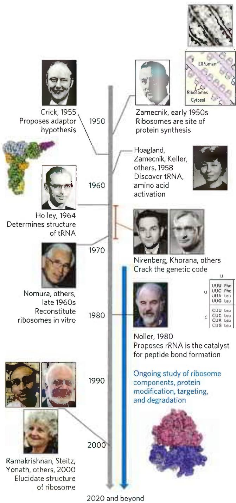

FIGURE 27-1 Timeline for the elucidation of protein biosynthetic pathways. Some key contributions are highlighted. However, our current understanding of the genetic code and protein biosynthetic pathways comes as the result of international endeavors involving hundreds of laboratories. [Top left to bottom left: Bettmann/Getty Images; data from PDB ID 4TRA, E. Westhof et al., Acta Crystallogr. A 44:112, 1988; Bettmann/Getty Images; Courtesy Archives, University of Wisconsin, Madison; Alastair Grant/AP Images; Lucas Jackson/Reuters/Newscm; Xinhua/ZUMAPRESS.com. Top right to bottom right: Joseph F. Gennaro Jr./Science Source; Archives and Special Collections, Massachusetts General Hospital; Cornell University Media Services PhotoSection records, #21-37-2227, Division of Rare and Manuscript Collections, Cornell University Library; Bob Schutz/AP Images; Courtesy Archives, University of Wisconsin, Madison; Courtesy Harry Noller; data from PDB ID 4V7R, A. Ben-Shem et al., Science 330:1203, 2010.]

amino acid and another part recognizing the nucleotide sequence encoding that amino acid in an mRNA (Fig. 27-2). Crick's adaptor hypothesis was soon verified when Mahlon Hoagland and Zamecnik discovered tRNA. The structure of alanyl-tRNA was reported by Robert Holley in 1964. The tRNA adaptor “translates” the nucleotide sequence of an mRNA into the amino acid sequence of a polypeptide. The overall process of mRNA-guided protein synthesis is often referred to simply as translation. Hoagland, Zamecnik, and Elizabeth Keller also discovered that amino acids were “activated” for protein synthesis when incubated with ATP and the cytosolic fraction of liver cells. The amino acids became attached to a heat-stable soluble RNA—the tRNA—to form aminoacyl-tRNAs. The enzymes that catalyze this process are the aminoacyl-tRNA synthetases.

  
FIGURE 27-2 Crick's adaptor hypothesis. Francis Crick proposed that one end of a small nucleotide adaptor could bind a specific amino acid and the other end could recognize a nucleotide sequence in the mRNA. Today we know that the amino acid is covalently bound at the 3' end of a tRNA molecule and that a specific nucleotide triplet elsewhere in the tRNA interacts with a particular triplet codon in mRNA through hydrogen bonding of complementary bases.

These developments soon led to recognition of the major stages of protein synthesis and ultimately to elucidation of the genetic code that specifies each amino acid. In subsequent decades, ribosomes were purified and their protein and rRNA components were dissected. Elucidation of the three-dimensional structures of ribosomes was completed by 2000, confirming a hypothesis first put forward by Harry Noller two decades earlier: it is the rRNA, rather than ribosomal proteins, that catalyzes peptide bond formation.

<!-- EN-END 第27章导言 -->

## 一、遗传密码

由亲代传递给子代的遗传信息借助核苷酸序列编码在核酸分子上，在子代遗传信息的表达需将核苷酸序列语言翻译成蛋白质的氨基酸序列语言。核苷酸序列与氨基酸序列之间的对应关系即为遗传密码。上世纪中期，通过人工合成 mRNA 破译了遗传密码，这是生物化学和分子生物学所取得的最卓越的成果之一。

## （一）遗传密码的破译

20 世纪中叶已经知道 DNA 是遗传信息的携带分子,并通过 RNA 控制蛋白质的合成,于是科学家们的注意力被吸引到核酸分子如何指导蛋白质中氨基酸排列顺序的问题。一些科学家从不同角度去破译遗传密码。

1954年物理学家G.Gamov首先对遗传密码进行探讨。核酸分子中只有4种碱基，要为蛋白质分子的20种氨基酸编码，不可能是一对一的关系，两个碱基决定一个氨基酸也只能编码16种氨基酸，如果用三个碱基决定一个氨基酸， $4^{3} = 64$ ，就足以编码20种氨基酸。这是编码氨基酸所需碱基的最低数目，故密码子（codon）应是三联体(triplet)。那么密码子是重叠的还是不重叠的？Gamov指出，重叠的密码子更为经济。但是，重叠密码子使氨基酸序列中每一个氨基酸都受上下氨基酸的约束，这种现象在已知的蛋白质序列中却并未见到。

1961 年 F. H. C. Crick 及其同事提供了确切的证据,说明三联体密码子学说是正确的。他们研究 T 噬菌体 $\gamma$ II 位点 A 和 B 两个基因(顺反子)变异的影响,这两个基因与噬菌体能否感染大肠杆菌 $\kappa$ 株有关。吖啶类染料是扁平的杂环分子,可插入 DNA 两碱基对之间,而引起 DNA 插入或丢失核苷酸。他们的研究发现,在上述位点缺失一个核苷酸或插入一个核苷酸产生的突变体,以及两个缺失或两个插入突变体用以进行重组得到的重组体,都是严重缺陷性的,不能感染大肠杆菌 $\kappa$ 株。然而从一个缺失突变体和一个插入突变体得到的重组体却能恢复感染活性。他们还观察到,如果缺失三个核苷酸,或插入三个核苷酸,这些核苷酸彼此非常靠近,这样的突变体也表现正常的功能。但缺失或插入四个核苷酸,虽然彼此非常靠近,其突变体却是严重缺陷性的。

Crick 等的实验结果表明三联体密码是非重叠的,而且连续编码并无标点符号隔开,因为在序列的任一位置上插入或删除一个核苷酸都会改变三联体密码的阅读框架,发生移码突变使基因失活。但是如果插入或删除三个核苷酸,或者插入一个核苷酸后又删除一个核苷酸,阅读框架仍可维持不变,原来编码的信息便能够在变异位点之后照旧表现出来(图 33-1)。这是基因与蛋白质共线性(colinearity)的最早证据。

在 Crick 等提出遗传信息是在核酸分子上以非重叠、无标点、三联体的方式编码的同时，S.S. Spiegelman 以及 F. Jacob 和 J. Monod 证明了 mRNA 的存在，而 M. W. Nirenberg 和 J. H. Matthaei 开始了用人工合成的mRNA 在无细胞蛋白质合成系统中寻找氨基酸与三联体密码子的对应关系。Nirenberg 等将大肠杆菌破碎，离心除去细胞碎片，上清液含有蛋白质合成所需各种成分，其中包括 DNA、mRNA、tRNA、核糖体、氨酰 tRNA 合成酶以及蛋白质合成必需的各种因子。将上清液保温一段时间，内源 mRNA 被降解，该系统自身蛋白质的合成即停止。当补充外源 mRNA 以及 ATP、GTP 和氨基酸等成分，再在 37℃ 保温就能合成新的蛋白质。为检测某种氨基酸是否掺入新合成的蛋白质，需将氨基酸用放射性标记。

<table><tr><td></td><td>CAT</td><td>CAT</td><td>CAT</td><td>CAT</td><td>CAT</td><td>CAT</td></tr><tr><td>-1</td><td>CAT</td><td> $CA^vC$ </td><td>ATC</td><td>ATC</td><td>ATC</td><td>ATC</td></tr><tr><td>-1+1</td><td>CAT</td><td> $CA^vC$ </td><td>AXT</td><td>CAT</td><td>CAT</td><td>CAT</td></tr><tr><td>+3</td><td>CAX</td><td>TXC</td><td>ATX</td><td>CAT</td><td>CAT</td><td>CAT</td></tr></table>

图 33-1 缺失或插入核苷酸引起三联体密码的改变  
-1, 删除一个核苷酸, 在删除位置以符号 $\checkmark$ 表示; -1+1, 在相近位置分别删除和插入一个核苷酸, 插入核苷酸以 X 表示;  
+3, 在相近位置分别插入三个核苷酸

Nirenberg 等早期实验使用的多聚核糖核苷酸为均聚尿嘧啶核苷酸(poly U)。原以为 poly U 大概不能替代 mRNA，或活性很低。出乎意料的是，在无细胞蛋白质合成系统中，它能指导多聚苯丙氨酸的合成，而且只合成多聚苯丙氨酸。由此推断密码子 UUU 代表 Phe。用同样的方法证明 poly C 指导 Pro 掺入蛋白质，poly A 指导 Lys 掺入蛋白质。poly G 因易于形成多股螺旋，不宜作 mRNA。这三个密码子最早得到破译。当时对起始密码子和终止密码子还一无所知，虽然从 Crick 等的实验结果已预示遗传密码的阅读有起始和终止信号。十分幸运的是，Nirenberg 等的实验采用的 $Mg^{2+}$ 浓度较高，以致合成的均聚核苷酸不需要起始密码子便可指导肽链的合成，此时密码子阅读的起点是任意的。

均聚核苷酸的实验获得成功之后，Nirenberg 和 Ochoa 等又进一步用两种核苷酸或三种核苷酸的共聚物作模板，重复上述实验。例如，U 和 G 的共聚物 poly UG 可以出现 8 种不同的三联体，即 UUU、UUG、UGU、GUU、GUG、GGU、UGG 和 GGG。酶促合成共聚核苷酸时，根据加入核苷酸底物的比例可以计算出各种三联体出现的相对频率，而标记氨基酸掺入的相对量应与其密码子的出现频率相一致（表 33-1）。需要指出的是，用此方法可以确定 20 种氨基酸密码子的碱基组成，但不知道它们的排列顺序。

表 33-1 无序 poly UG 对氨基酸的密码 (U : G = 5 : 1)

<table><tr><td>可能的密码子</td><td>按计算可能出现的相对频率*</td><td>氨基酸掺入的相对分子质量</td></tr><tr><td>UUU</td><td>100</td><td>Phe(100)</td></tr><tr><td>UUG</td><td></td><td></td></tr><tr><td>UGU</td><td>20</td><td>Cys(20)</td></tr><tr><td>GUU</td><td></td><td>Val(20)</td></tr><tr><td>GUU</td><td></td><td></td></tr><tr><td>GUG</td><td>4</td><td>Gly(4)</td></tr><tr><td>GGU</td><td></td><td>Trp(5)</td></tr><tr><td>GGG</td><td>0.8</td><td>—</td></tr></table>

\* UUU 出现的频率为 100。

1964 年 Nirenberg 发现, 用人工合成的三核苷酸取代 mRNA, 在没有 GTP 时, 不能合成蛋白质, 但是核苷酸三联体却能与其对应的氨酰 tRNA 一起结合在核糖体上。将此反应混合物通过硝酸纤维素滤膜时, 核糖体便和核苷酸三联体以及特异结合的氨酰 tRNA 形成复合物而留在膜上。用这种核糖体结合技术可以直接测出三联体对应的氨基酸。所有 64 种可能的三联体都已合成, 经试验其中 50 种都得到确切的结果。但是在此系统中仍有一些三联体编码的氨基酸不能肯定, 需要用其他方法来破译。

与此差不多同一时间，H. G. Khorana 和他的同事将化学合成和酶促合成巧妙地结合起来，合成含有重复序列的多聚核苷酸。例如 poly(UG)，它含有两种三联体密码子，UGU 和 GUG，在无细胞蛋白质合成系统中指导合成 poly(Cys·Val)。经与核糖体结合技术所得结果相比较，可以确定 UGU 是 Cys 的密码子，GUG 是 Val 的密码子。如果用聚三核苷酸作模板，由于阅读框架不同，可以指导产生三种不同的均聚多肽。例如，poly(UUC)指导 poly Phe、poly Ser 和 poly Leu 的合成。用四核苷酸多聚物作模板，可合成共聚四肽，或因出现终止密码子而合成小肽，如 poly(UUAC) 可合成 (Leu·Leu·Thr·Tyr)。由其他二核苷酸、三核苷酸和四核苷酸共聚物作模板时，所合成的多聚氨基酸见表 33-2。

表 33-2 重复序列共聚核苷酸指导下多聚氨基酸的合成

<table><tr><td>多聚核苷酸</td><td>含有密码子</td><td>合成多肽</td></tr><tr><td> $(AG)_n$ </td><td>AGA,GAG</td><td> $(Arg·Glu)_n$ </td></tr><tr><td> $(AC)_n$ </td><td>ACA,CAC</td><td> $(Thr·His)_n$ </td></tr><tr><td> $(UC)_n$ </td><td>UCU,CUC</td><td> $(Ser·Leu)_n$ </td></tr><tr><td> $(UG)_n$ </td><td>UGU,GUG</td><td> $(Cys·Val)_n$ </td></tr><tr><td> $(AAG)_n$ </td><td>AAG,AGA,GAA</td><td> $(Lys)_n,(Arg)_n,(Glu)_n$ </td></tr><tr><td> $(UUC)_n$ </td><td>UUC,UCU,CUU</td><td> $(Phe)_n,(Ser)_n,(Leu)_n$ </td></tr><tr><td> $(UUG)_n$ </td><td>UUG,UGU,GUU</td><td> $(Leu)_n,(Cys)_n,(Val)_n$ </td></tr><tr><td> $(AAC)_n$ </td><td>AAC,ACA,CAA</td><td> $(Asn)_n,(Thr)_n,(Gln)_n$ </td></tr><tr><td> $(UAC)_n$ </td><td>UAC,ACU,CUA</td><td> $(Tyr)_n,(Thr)_n,(Leu)_n$ </td></tr><tr><td> $(AUC)_n$ </td><td>AUC,UCA,CAU</td><td> $(Ile)_n,(Ser)_n,(His)_n$ </td></tr><tr><td> $(GAU)_n$ </td><td>GAU,AUG,UGA</td><td> $(Asp)_n,(Met)_n$ </td></tr><tr><td> $(GUA)_n$ </td><td>GUA,UAG,AGU</td><td> $(Val)_n,(Ser)_n$ </td></tr><tr><td> $(UAUC)_n$ </td><td>UAU,CUA,UCU,AUC</td><td> $(Tyr·Leu·Ser·Ile)_n$ </td></tr><tr><td> $(UUAC)_n$ </td><td>UUA,CUU,ACU,UAC</td><td> $(Leu·Leu·Thr·Tyr)_n$ </td></tr><tr><td> $(GAUA)_n$ </td><td>GAU,AGA,UAG,AUA</td><td rowspan="2">二、三肽</td></tr><tr><td> $(GUAA)_n$ </td><td>GUA,AGU,AAG,UAA</td></tr></table>

用以上所述方法,经过5年的努力,终于在1966年完全确定了编码20种氨基酸的密码子,另有3个密码子用作翻译的终止信号。表33-3为全部64个遗传密码子的字典。除甲硫氨酸和色氨酸只有一个密码子外,其余氨基酸均有不止一个密码子。已知多肽合成的第一个氨基酸为甲酰甲硫氨酸(原核生物)或甲硫氨酸(真核生物),但甲硫氨酸的密码子只有一个,这就是说编码多肽链内部的甲硫氨酸和起始氨基酸是同一个密码子。

表 33-3 遗传密码字典

<table><tr><td rowspan="2">第一位碱基(5&#x27;端)</td><td colspan="4">第二位碱基(中间)</td><td rowspan="2">第三位碱基(3&#x27;端)</td></tr><tr><td>U</td><td>C</td><td>A</td><td>G</td></tr><tr><td rowspan="4">U</td><td>Phe</td><td>Ser</td><td>Tyr</td><td>Cys</td><td>U</td></tr><tr><td>Phe</td><td>Ser</td><td>Tyr</td><td>Cys</td><td>C</td></tr><tr><td>Leu</td><td>Ser</td><td>终止</td><td>终止</td><td>A</td></tr><tr><td>Leu</td><td>Ser</td><td>终止</td><td>Trp</td><td>G</td></tr><tr><td rowspan="4">C</td><td>Leu</td><td>Pro</td><td>His</td><td>Arg</td><td>U</td></tr><tr><td>Leu</td><td>Pro</td><td>His</td><td>Arg</td><td>C</td></tr><tr><td>Leu</td><td>Pro</td><td>Gln</td><td>Arg</td><td>A</td></tr><tr><td>Leu</td><td>Pro</td><td>Gln</td><td>Arg</td><td>G</td></tr><tr><td rowspan="4">A</td><td>Ile</td><td>Thr</td><td>Asn</td><td>Ser</td><td>U</td></tr><tr><td>Ile</td><td>Thr</td><td>Asn</td><td>Ser</td><td>C</td></tr><tr><td>Ile</td><td>Thr</td><td>Lys</td><td>Arg</td><td>A</td></tr><tr><td>Met</td><td>Thr</td><td>Lys</td><td>Arg</td><td>G</td></tr><tr><td rowspan="4">G</td><td>Val</td><td>Ala</td><td>Asp</td><td>Gly</td><td>U</td></tr><tr><td>Val</td><td>Ala</td><td>Asp</td><td>Gly</td><td>C</td></tr><tr><td>Val</td><td>Ala</td><td>Glu</td><td>Gly</td><td>A</td></tr><tr><td>Val</td><td>Ala</td><td>Glu</td><td>Gly</td><td>G</td></tr></table>

破译遗传密码是用无细胞系统进行实验得出的。那么生物体内的情况是否也是如此呢？不少实验室对此作了许多研究，都得到肯定的结论。例如，Sanger等测定噬菌体R17 RNA一些区段的序列并与其编码蛋白质的氨基酸序列相比较，完全符合遗传密码表。还有一些实验室利用突变，得出三联体密码子的可靠资料。20世纪70年代兴起的基因克隆和快速测序技术，充分证明了遗传密码表的正确。

## （二）遗传密码的基本性质

经过许多科学家的共同努力,于20世纪60年代中期才完全破译了编码蛋白质中氨基酸的遗传密码,并发现有以下特点:

## 1. 密码的基本单位

如上所述，Crick等最早推测蛋白质中氨基酸序列的遗传密码编码在核酸分子上，其基本单位是按 $5^{\prime}\rightarrow 3^{\prime}$ 方向编码、不重叠、无标点的三联体密码子。其后一系列实验证明这个推测是正确的，并找出了各种氨基酸对应的密码子。AUG为甲硫氨酸兼起始密码子。UAA、UAG和UGA为终止密码子。其余61个密码子对应于20种氨基酸。因此要正确阅读密码，必须从起始密码子开始，按一定的阅读框架（reading frame）连续读下去，直至遇到终止密码子为止。若插入或删除一个核苷酸，就会使这以后的读码发生错位，称为移码突变(frame-shift mutation)。

目前已经证明，在绝大多数生物中基因是不重叠的；但在少数病毒中，部分基因的遗传密码却是重叠的。即使在重叠基因(overlapping genes)中，各自的开放阅读框架仍按三联方式连续读码。

## 2. 密码的简并性

一共有64个三联体密码子，除了三个终止密码子外，余下61个密码子编码20种氨基酸，所以许多氨基酸的密码子不止一个。同一种氨基酸有两个或更多密码子的现象称为密码子的简并性（degeneracy）。对应于同一种氨基酸的不同密码子称为同义密码子（synonymous codon），只有色氨酸与甲硫氨酸密码子无简并性（表33-4）。

表 33-4 氨基酸密码子的简并

<table><tr><td>氨基酸</td><td>密码子数目</td><td>氨基酸</td><td>密码子数目</td></tr><tr><td>Ala</td><td>4</td><td>Leu</td><td>6</td></tr><tr><td>Arg</td><td>6</td><td>Lys</td><td>2</td></tr><tr><td>Asn</td><td>2</td><td>Met</td><td>1</td></tr><tr><td>Asp</td><td>2</td><td>Phe</td><td>2</td></tr><tr><td>Cys</td><td>2</td><td>Pro</td><td>4</td></tr><tr><td>Gln</td><td>2</td><td>Ser</td><td>6</td></tr><tr><td>Glu</td><td>2</td><td>Thr</td><td>4</td></tr><tr><td>Gly</td><td>4</td><td>Trp</td><td>1</td></tr><tr><td>His</td><td>2</td><td>Tyr</td><td>2</td></tr><tr><td>Ile</td><td>3</td><td>Val</td><td>4</td></tr></table>

密码的简并性具有重要的生物学意义,它可以减少有害突变。设若每种氨基酸只有一个密码子,64个密码子中只有20个是有意义的,剩下44个密码子都将是无意义的,将使肽链合成导致终止。因而由基因突变而引起肽链合成终止的概率将会大大提高,这极不利于生物生存。简并增加了密码子中碱基改变仍然编码原来氨基酸的可能性。密码简并也可使DNA上碱基组成有较大变动余地,不同种细菌DNA中G+C含量变动很大,但却可以编码出相同的多肽链。所以密码简并性在物种的稳定上起一定作用。

曾有科学家提出,氨基酸的密码子数目与该氨基酸残基在蛋白质中的使用频率有关,频率越大,密码子数目也越多。图33-2所示为大肠杆菌蛋白质中氨基酸的使用频率与各种氨基酸密码子数目之间的关系。其间可以看出有一定的倾向,越是常见的氨基酸其密码子数目越多,但它们之间并无严格的对应关系。需要指出的是,遗传密码是在生命起源的早期形成的,如果氨基酸的密码子数目与其在蛋白质中的使用频率有关,应该对应于原始蛋白质中氨基酸的出现频率,而不是现今某种生物蛋白质的氨基酸频率。

  
图 33-2 氨基酸的密码子数目与在蛋白质中的使用频率

## 3. 密码的摆动性

密码的简并性往往表现在密码子的第三位碱基上，如甘氨酸的密码子是GGU、GGC、GGA和GGG，丙氨酸的密码子是GCU、GCC、GCA和GCG。它们的前两位碱基都相同，只是第三位碱基不同。有些氨基酸只有两个密码子，通常第三位碱基或者都是嘧啶，或者都是嘌呤。例如，天冬氨酸的密码子GAU、GAC，第三位皆为嘧啶；谷氨酸的密码子GAA、GAG，第三位皆为嘌呤。所以几乎所有氨基酸的密码子都可以用XY(U、C)和XY(A、G)来表示。显然，密码子的专一性基本上取决于前两位碱基，第三位碱基起的作用有限。有些科学家注意到了这一点，并进而发现tRNA上的反密码子(anticodon)与mRNA密码子反向配对时，密码子第一位、第二位碱基配对是严格的，第三位碱基可以有一定的变动。Crick称这一现象为摆动性(wobble)。特别应该指出的是，在tRNA反密码子中除A、U、G、C四种碱基外，还经常在第一位出现次黄嘌呤(I)。次黄嘌呤的特点是可以与U、A、C三者任一之间形成碱基配对，这就使带有次黄嘌呤的反密码子可以识别更多的简并密码子。这一点已有实验证明。酵母丙氨酸tRNA的反密码子IGC可阅读GCU、GCC、GCA三个密码子：

$$
\begin{array}{r l r l r l} & \text {反密码子:} & 3 ^ {\prime} - \mathrm{C} - \mathrm{G} - \mathrm{I} - 5 ^ {\prime} & 3 ^ {\prime} - \mathrm{C} - \mathrm{G} - \mathrm{I} - 5 ^ {\prime} & 3 ^ {\prime} - \mathrm{C} - \mathrm{G} - \mathrm{I} - 5 ^ {\prime} \\ & \text {密码子:} & 5 ^ {\prime} - \mathrm{G} - \mathrm{C} - \mathrm{U} - 3 ^ {\prime} & 5 ^ {\prime} - \mathrm{G} - \mathrm{C} - \mathrm{U} - 3 ^ {\prime} & 5 ^ {\prime} - \mathrm{G} - \mathrm{C} - \mathrm{U} - 3 ^ {\prime} \end{array}
$$

tRNA 上的反密码子与 mRNA 的密码子呈反向互补关系。按照 Crick 于 1966 年提出的变偶假说，反密码子的第一位碱基与密码子第三位碱基的配对可以在一定范围内变动（变偶）。如 U 可以和 A 或 G 配对，G 可以和 U 或 C 配对，I 可以和 U、C、A 配对，但 A 和 C 只能与 U 和 G 配对（表 33-5）。由于摆动性的存在，细胞内只需要 32 种 tRNA，就能识别 61 个编码氨基酸的密码子。

表 33-5 反密码子与密码子之间的碱基配对

<table><tr><td>反密码子第一位碱基</td><td>密码子第三位碱基</td><td>反密码子第一位碱基</td><td>密码子第三位碱基</td></tr><tr><td>A</td><td>U</td><td>U</td><td> $\left\{ \begin{array}{l} A \\ G \end{array} \right.$ </td></tr><tr><td>C</td><td>G</td><td></td><td></td></tr><tr><td>G</td><td> $\left\{ \begin{array}{l} U \\ C \end{array} \right.$ </td><td>I</td><td> $\left\{ \begin{array}{l} U \\ C \\ A \end{array} \right.$ </td></tr></table>

从已知一级结构的 tRNA 中, 其反密码子第一位碱基为 C、G、U、I, 没有 A, 显然 I 是由 A 转变而来的。体外实验表明, 在有些情况下, 反密码子第一位碱基可以与密码子第三位上任意四种碱基 (A、G、C、U) 配对。例如, 家蚕 tRNAGly1 反密码子为 GCC, 可识别 GGN (N 为 A、G、C 或 U) 四种密码子。兔肝 tRNAVal1 反密码子为 IAC, 可识别 GUN。哺乳动物线粒体 tRNA 第一位为 U 的反密码子也可识别四种密码子。这类配对关系被称为是“三配二”(two-out-of-three base pairing)。

## 4. 密码的通用性

20 世纪 60 年代中期遗传密码被破译,70 年代后各种生物大量基因被测序,同时蛋白质序列的资料也迅速积累,结果充分证明生物界有一套共同的遗传密码。生命起源距今已有近 40 亿年历史,现今不同生物仍共用一套遗传密码,说明其十分保守。这不难理解,因为即使只有一个氨基酸密码子发生改变,都有可能对蛋白质结构带来巨大有害的影响。然而,遗传密码的通用性并非绝对的,某些低等生物和真核生物细胞器基因的密码仍发现有一些改变。遗传密码的变异涉及基因组全部编码信息,可以设想只有编码少数几种蛋白质的小基因组才有可能发生。其次,三个终止密码子,因其只存在于基因编码序列的末尾,也较有可能改变。目前已知线粒体 DNA(mtDNA) 的编码方式与通常遗传密码有所不同(表 33-6)。脊椎动物 mtDNA 含有编码 13 种蛋白质、2 种 rRNA 和 22 种 tRNA 的基因。其特殊的变偶规则使得 22 种 tRNA 就能识别全部氨基酸密码子。在线粒体的遗传密码中,有四组密码子其氨基酸特异性只决定于三联体的前两位碱基,它们由一种 tRNA 即可识别,该 tRNA 的反密码子第一位为 U。其余的 tRNA 或者识别第三位为嘌呤(A、G)的密码子,或者识别第三位为嘧啶(U、C)的密码子。这就是说,所有 tRNA 或者识别两个密码子,或者识别四个密码子。

表 33-6 线粒体中变异的密码子

<table><tr><td rowspan="2"></td><td colspan="5">密码子*</td></tr><tr><td>UGA</td><td>AUA</td><td>AGG、AGA</td><td>CUN</td><td>CGG</td></tr><tr><td>通用密码</td><td>终止</td><td>Ile</td><td>Arg</td><td>Leu</td><td>Arg</td></tr><tr><td>动物</td><td></td><td></td><td></td><td></td><td></td></tr><tr><td>脊椎动物</td><td>Trp</td><td>Met</td><td>终止</td><td>+</td><td>+</td></tr><tr><td>果蝇</td><td>Trp</td><td>Met</td><td>Ser</td><td>+</td><td>+</td></tr><tr><td>酵母</td><td></td><td></td><td></td><td></td><td></td></tr><tr><td>酿酒酵母(S.cerevisiae)</td><td>Trp</td><td>Met</td><td>+</td><td>Thr</td><td>+</td></tr><tr><td>光滑球拟酵母(T.galabrate)</td><td>Trp</td><td>Met</td><td>+</td><td>Thr</td><td>?</td></tr><tr><td>彭贝裂殖酵母(S.pombe)</td><td>Trp</td><td>+</td><td>+</td><td>+</td><td>+</td></tr><tr><td>丝状真菌</td><td>Trp</td><td>+</td><td>+</td><td>+</td><td>+</td></tr><tr><td>锥虫</td><td>Trp</td><td>+</td><td>+</td><td>+</td><td>+</td></tr><tr><td>高等植物</td><td>+</td><td>+</td><td>+</td><td>+</td><td>Trp</td></tr></table>

\* N 为任意碱基；+表示与正常密码子相同。

在正常密码中,有两种氨基酸只有一个密码子,这两种氨基酸为甲硫氨酸和色氨酸。按照线粒体的编码规则,它们各有两个密码子,即各增加一个密码子。正常的甲硫氨酸密码子为 AUG,在线粒体中 AUA 由异亮氨酸密码子转变为甲硫氨酸密码子。正常的色氨酸密码子为 UGG,在线粒体中终止密码子 UGA 转变为色氨酸密码子。甲硫氨酸的两个密码子和色氨酸的两个密码子各由单个 tRNA 识别。

除了线粒体外,某些生物的染色体基因密码也出现个别的变异。在原核生物的支原体中,UGA 也被用于编码色氨酸。十分特殊的是,在真核生物中少数纤毛类原生动物以终止密码子 UAA 和 UAG 编码谷氨酰胺。在有些情况下密码子的含义可随上下文不同而改变。在大肠杆菌中,有时缬氨酸密码子 GUG 和亮氨酸密码子 UUG 也可被用作起始密码子,当其位于特殊 mRNA 翻译的起始位置时,可被起始 tRNA (tRNA $^{fMet}$ ) 所识别。

蛋白质中的修饰氨基酸一般都是在翻译后进行修饰的；但有例外，含有硒代半胱氨酸（selenocysteine）

的蛋白质其硒代半胱氨酸是在翻译过程中掺入的。硒代半胱氨酸与半胱氨酸类似，但以硒代替硫，为硒蛋白（selenoprotein）或硒酶（selenoenzyme）功能所必需。如细菌中的甲酸脱氢酶、哺乳动物的谷胱甘肽过氧化物酶都是含硒的酶。已知大肠杆菌中有一类丝氨酸 tRNA，其存在水平比其他丝氨酸 tRNA 更低，它携带丝氨酸后在酶的催化下转变为硒代半胱氨酸，然后根据 mRNA 的上下文只识别阅读框架内的 UGA 密码子，而对任何作为终止密码子的 UGA 并无反应。在编码硒蛋白的 mRNA 中有一段称为硒代半胱氨酸插入序列（selenocysteine insertion sequence, SECIS）所构成的二级结构，帮助硒代半胱氨酸 tRNA 识别这种密码子。在细菌中，SECIS 位于 mRNA 编码区；而在真核生物中，SECIS 位于 3' 非编码区。在大肠杆菌中一种帮助硒代半胱氨酰-tRNA 进入核糖体 A 位点的鸟苷酸结合蛋白（Sel B）已被发现。从诸多迹象来看，硒代半胱氨酸可被认为是蛋白质的第 21 个氨基酸，UGA 正在演变成编码该氨基酸的密码子，也许还未进化完善。

## 5. 密码的防突变(安全性)

虽然密码子的简并程度各不相同,但同义密码子在密码表中的分布十分有规则,而且密码子中碱基顺序与其相应氨基酸物理化学性质之间存在巧妙的关系。在密码表中,氨基酸的极性通常由密码子的第二位(中间)碱基决定,简并性由第三位碱基决定。例如,① 中间碱基是 U,它编码的氨基酸是非极性、疏水的和支链的,常在球蛋白的内部;② 中间碱基是 C,相应的氨基酸是非极性的或具有不带电荷的极性侧链;③ 中间碱基是 A 或 G,其相应氨基酸常在球蛋白外周,具有亲水性;④ 第一位碱基是 A 或 C,第二位碱基是 A 或 G,第三位可以是任意碱基,其相应氨基酸具有可解离的亲水性侧链并多数具有碱性;⑤ 带有酸性亲水侧链的氨基酸其密码子前两位为 GA,第三位为任意碱基。

这种分布使得密码子中一个碱基被置换,其结果或是仍然编码相同的氨基酸;或是以物理化学性质最接近的氨基酸相取代。从而使基因突变可能造成的危害降至最低程度。这就是说,密码的编排具有防错功能,密码表是一个故障-安全系统(fail-safe system),这是在进化过程中获得的最佳选择。

## （三）RNA对遗传密码的解读

基因携带的遗传信息经由 RNA 才得以表达。RNA 不仅传递遗传信息,而且还对遗传信息进行必要的加工处理,按照加工信息合成蛋白质,在细胞内执行各种功能。所以说,遗传密码由 RNA 进行解读。RNA 对遗传信息的加工处理包括:① 从基因组选译性转录遗传信息;② 抽取有用信息,进行高效组合;③ 消除差错,防止失真;④ 转换语言,完成翻译;⑤ 调节遗传信息流。这也是 RNA 对遗传密码解读的重要环节。

## 1. 选译性转录遗传信息

原核生物染色体 DNA 主要由编码基因所组成, 其中一部分为可诱导基因。真核生物染色体 DNA 有较大比例的重复序列和调节序列, 只有部分为编码基因, 许多编码基因是可调的。哺乳动物胚胎细胞大约有 30% 的基因产生成熟的 mRNA, 分化细胞大约只有 10% 基因转录。转录水平的调节使得细胞在不同环境和时空条件下, 表达不同基因编码的信息。这种调节是 DNA、RNA 和蛋白质相互作用的结果, 所选择的遗传信息则由 DNA 转录到 RNA。转录是一个传真过程, 初级转录物 (primary transcript) RNA 与被转录 DNA 的序列基本一致。RNA 在转录后需要进行一系列加工处理才成为成熟的、有功能的 RNA。

## 2. RNA 对遗传信息进行加工处理

RNA 一般性加工包括切割（cutting）、修剪（trimming）、附加（appending）、修饰（modification）和异构化（isomerization），并不改变 RNA 的编码序列，目的只是为了激活其功能。编码序列的加工，即遗传信息加工，包括可变转录（alternative transcription）、剪接（splicing）、编辑（editing）和再编码（recoding），既改变了 RNA 的序列，也改变了其携带的遗传信息。不同的加工，可以得到不同的表达产物。因此，DNA 相当于遗传信息的储存器，RNA 则相当于遗传信息的处理器。

一个基因可以有不止一个转录起点和终点，在转录过程中还可通过模板滑动等方式重复或失去一段序列，因此由一个基因可以得到不止一种转录物。这种现象在真物生物，以及真核生物的病毒中较易见到。而且，可变转录常和可变剪接以及编辑相关联，增加了基因产物的多样性。

真核生物基因通常都是断裂基因，插入的非编码序列（内含子）需在转录后加工过程中删除。将编码序列（外显子）剪接成有义链是一个抽提有用信息的过程。生物分子在进化过程中的核心问题是如何尽可能保存原有的有用信息，并不断获取新的有用信息。最有效的方式是基因和基因产物由一些模块（module）组装而成，每一外显子对应于基因产物的一个基本结构元件或模块（结构域、亚结构域和基序），也即遗传信息用于编码模块。基因突变多数是有害的或者中性的，有益突变的概率极低。DNA 分子间重组，尤其是发生在内含子间的重组，可以使模块重新组合，产生新的基因。在 RNA 水平上外显子选择性剪接比基因重组对生物机体更有利，这是因为：①一个基因通过选择性剪接产生多个产物，压缩了基因数目，符合经济原则；②基因水平的进化是一个漫长的过程，淘汰众多不适宜的变异基因需要付出巨大代价；而新的剪接方式的出现还可以保留原有的剪接方式，如果新的无用随后被淘汰，新的有用可以取代旧的或两者并存，机体无需为此付出巨大的进化代价；③不同细胞采取不同剪接方式，有利于机体发育分化。

RNA 在加工过程中序列发生改变称为编辑。这种改变或者是在某一位点插入或删除若干核苷酸；或者是碱基发生脱氨或氨基化反应。前者改变了序列，后者改变了碱基性质，从而改变了 RNA 的编码信息。RNA 编辑需要遗传信息指导，插入（或删除）核苷酸的信息来自指导 RNA（gRNA），帮助脱氨或氨基化酶识别编辑位点的信息来自被编辑 RNA 自身。RNA 编辑可消除移码突变或无义突变带来的危害，选译性编辑增加了基因产物的多样性，为发育的基因调节，甚至为大脑的学习、记忆，提供可能的机制。

在核糖体上进行翻译时，mRNA 的阅读框架有时会发生程序性移位，由信号决定在特定位点上作 -1 或 +1 移动，甚或跳过 50 个核苷酸，这一过程称为程序性阅读框架移位和跳跃（programmed reading frame shifts and hops），或者称为核糖体移码（ribosomal frame shifting）。某些变异的 tRNA 可以改变对密码子的识别规律，mRNA 的特殊结构（假结或颈环结构）也会影响正常的解读，以及核糖体移码，三者都能改变常规读码方式，统称为 RNA 的再编码（recoding）。再编码可以校正有害的基因突变，也带来了基因表达的多样性。

## 3. RNA 的纠错功能

基因突变使 DNA 编码的密码子发生改变。同义突变(synonym mutation)或称为沉默突变(silent mutation)，虽然并不改变蛋白质的氨基酸序列，但密码子的改变有可能影响翻译效率。错义突变(missense mutation)发生氨基酸置换，多数是中性突变，少数是有害突变，有益突变的概率很低。移码突变(frameshift mutation)使突变点之后的序列乱码，通常基因产物都会失活，如果是重要的基因也就成为致死突变。无义突变(nonsense mutation)是将氨基酸的密码子变成终止信号，翻译提前终止，通常都是有害的或致死的。回复突变(reverse mutation)的概率非常低。而 RNA 编辑和再编码能够消除有害突变。

当 DNA 的编码序列插入或删除非 3 整倍数的核苷酸时即发生移码突变, 而在 RNA 水平上通过编辑可以恢复正确的阅读框架。无义突变也可通过 RNA 编辑改变终止信号。通过 RNA 再编码消除有害突变似更常见。某些变异的 tRNA 能够校正基因突变, 称为校正 tRNA ( suppressor tRNA)。校正 tRNA 通常是由于反密码子发生改变, 在无义突变的密码子处引入一个氨基酸, 却起了校正功能。对应于三种终止密码子, 无义突变有琥珀型 ( UAG )、赭石型 ( UAA ) 和乳白型 ( UGA ), 分别由识别这三种无义突变的校正 tRNA 引入氨基酸, 使多肽链得以继续合成。引入的氨基酸往往不是突变前的氨基酸, 而取决于校正 tRNA 的种类, 因此通常只是部分恢复蛋白质活性。还有一类校正 tRNA 在反密码子区或其附近核苷酸发生改变, 导致识别密码子的反密码子为两个核苷酸或四个核苷酸, 因而能校正 -1 或 +1 移码突变。与此类似, 核糖体移位也能消除移码突变和无义突变的危害。

何以基因发生有害突变,甚至致死突变,会有 RNA 编辑或再编码给予校正?合乎逻辑的推理是,RNA 是多变的,各种变异的 RNA 分布在不同的细胞内,在正常情况下变异 RNA 或是无用,或是导致小量错误蛋白质的合成,并不妨碍细胞的正常功能。然而,当细胞基因突变,处于生死存亡之际,正好遇到某种变异 RNA 能够校正有害突变,这种机制就经过自然选择被固定下来。

## 4. RNA 的翻译功能

早在上世纪 40 年代, Caspersson 使用显微紫外分光光度法, Brachet 使用组织化学法, 都证明了蛋白质合成旺盛的细胞,如快速生长细胞和分泌细胞,富含 RNA。由此推测 RNA 与蛋白质合成有关。及至 50 年代末、60 年代初,相继分离出参与蛋白质合成的 tRNA、rRNA 和 mRNA。现在知道,转移 RNA (transfer RNA, tRNA) 相当于 Crick 于 1958 年所设想的、由核酸语言转变为蛋白质语言时所需要的转换器 (adapter)。它携带氨基酸至核糖体上,由其反密码子识别 mRNA 上的密码子,起翻译作用。核糖体 RNA (ribosomal RNA, rRNA) 与数十种蛋白质组成核糖体,使 mRNA 和 tRNA 在其上正确定位,并催化肽键合成,起装配者 (assembler) 作用。信使 RNA (messenger RNA, mRNA) 从 DNA 处携带遗传信息,以决定蛋白质的氨基酸序列,起指导者 (instructor) 作用。

长期以来,一直以为 RNA 的功能只是控制蛋白质的合成。从上世纪 80 年才开始发现 RNA 的多种新的功能。然而蛋白质合成仍是 RNA 的核心功能。

## 5. RNA 主导表型的形成

生物的表(现)型是指可观察到的性状,也就是基因型在一定环境条件下的表现。生物性状是由蛋白质和 RNA 表现的,其余的生物分子只起辅助作用,而蛋白质是 RNA 合成的,因此归根到底表型的形成由 RNA 主导。

RNA 有诸多功能,所有这些功能都与遗传信息的表达有关。核酶主要催化 RNA 的加工和蛋白质的肽键合成。多种多样的顺式或反式 RNA 在遗传信息的表达中起调节作用。有些 RNA 与蛋白质形成复合物用以识别编码序列。指导 RNA、校正 tRNA 以及与再编码有关的 RNA 特殊结构纠正基因突变带来的错误遗传信息。另一些 RNA 对应激作出反应。RNA 最核心的功能则是指导蛋白质的合成。总之,基因的编码信息由 RNA 解码,由 RNA 控制着遗传信息流。中心法则仅仅指出遗传信息流的方向:DNA→RNA→蛋白质;而没有说明 RNA 对遗传信息流的加工处理,遗传信息并不只是流经 RNA。所以说,RNA 在遗传信息表现型的形成中起着主导作用。

<!-- EN-BEGIN 27.1 -->

### 【英文对应 27.1】The Genetic Code

> 来源：Lehninger Principles of Biochemistry（书籍/02_生物化学原理） 第27章 Protein Metabolism，§27.1。对应本章“一、遗传密码”。

By the 1960s, it was apparent that at least three nucleotide residues of DNA are necessary to encode each amino acid. The four code letters of DNA (A, T, G, and C) in groups of two can yield only $4^{2} = 16$ different combinations, insufficient to encode 20 amino acids. Groups of three, however, yield $4^{3} = 64$ different combinations. Deciphering the genetic code quickly became a major goal.

  
FIGURE 27-3 Overlapping versus nonoverlapping genetic codes. In a nonoverlapping code, codons (numbered consecutively) do not share nucleotides. In an overlapping code, some nucleotides in the mRNA are shared by different codons. In a triplet code with maximum overlap, many nucleotides, such as the third nucleotide from the left (A), are shared by three codons. A nonoverlapping code provides much more flexibility in the triplet sequence of neighboring codons and therefore in the possible amino acid sequences designated by the code.

#### [EN] The Genetic Code Was Cracked Using Artificial mRNA Templates

Several key properties of the genetic code were established in early genetic studies. A codon is a triplet of nucleotides that codes for a specific amino acid. In all living systems, translation occurs in such a way that these nucleotide triplets are read in a successive, nonoverlapping fashion (Figs. 27-3, 27-4). A specific first codon in the sequence establishes the reading frame, in which a new codon begins every three nucleotide residues. There is no punctuation between codons for successive amino acid residues. The amino acid sequence of a protein is defined by a linear sequence of contiguous triplets. In principle, any given single-stranded DNA or mRNA sequence has three possible reading frames. Each reading frame gives a different sequence of codons (Fig. 27-5), but only one is likely to encode a given protein. A key question remained: what were the three-letter code words for each amino acid?

In 1961, Marshall Nirenberg and J. Heinrich Matthaei reported the first breakthrough. They incubated synthetic polyuridylate, poly(U), with an Escherichia coli extract, GTP, ATP, and a mixture of the 20 amino acids in 20 different tubes, each tube containing a different radioactively labeled amino acid. Because poly(U) mRNA is made up of many successive UUU triplets, it should promote the synthesis of a polypeptide containing only the amino acid encoded by UUU. A radioactive polypeptide was formed only in the tube containing radioactive phenylalanine. Nirenberg and Matthaei therefore concluded that the triplet codon UUU encodes phenylalanine. The same approach soon revealed that polycytidylate, poly(C), encodes a polypeptide containing only proline (polyproline), and that polyadenylate, poly(A), encodes polylysine. Polyguanylate did not generate any polypeptide in this experiment because it spontaneously forms tetraplexes (see Fig. 8-20d) that cannot be bound by ribosomes.

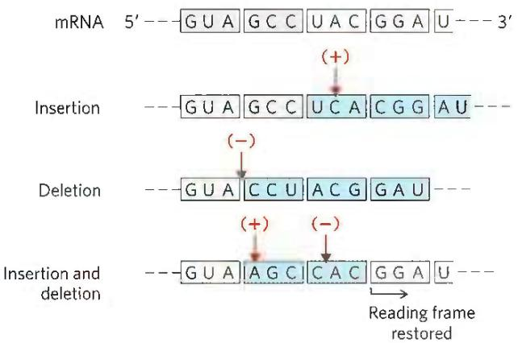  
FIGURE 27-4 The triplet, nonoverlapping code. Evidence for the general nature of the genetic code came from many types of experiments, including genetic experiments on the effects of deletion and insertion mutations. Inserting or deleting one base pair (shown here in the mRNA transcript) alters the sequence of all amino acids coded by the mRNA following the change. Combining insertion and deletion mutations affects some amino acids but can eventually restore the correct amino acid sequence. Adding or subtracting three nucleotides (not shown) leaves the remaining triplets intact, providing evidence that a codon has three, rather than four or five, nucleotides. The triplet codons shaded in gray are those transcribed from the original gene; codons shaded in blue are new codons resulting from the insertion or deletion mutations.

The synthetic polynucleotides used in such experiments were prepared by using polynucleotide phosphorylase (p. 987), which catalyzes the formation of RNA polymers starting from ADP, UDP, CDP, and GDP. This enzyme, discovered by physician/biochemist Severo Ochoa, requires no template and makes polymers with a base composition that directly reflects the relative concentrations of the nucleoside 5'-diphosphate precursors in the medium. If polynucleotide phosphorylase is presented with only UDP, it makes only poly(U). If it is presented with a mixture of five parts ADP and one part CDP, it makes a polymer in which about five-sixths of the residues are adenylate and one-sixth is cytidylate. This random polymer is likely to have many triplets of the sequence AAA; smaller numbers of AAC, ACA, and CAA triplets; relatively few ACC, CCA, and CAC triplets; and very few CCC triplets (Table 27-1). Using a variety of artificial mRNAs made by polynucleotide phosphorylase from different starting mixtures of ADP, GDP, UDP, and CDP, the Nirenberg and Ochoa groups soon identified the base compositions of the triplets coding for almost all the amino acids. Although these experiments revealed the base composition of the coding triplets, they usually could not reveal the sequence of the bases.

<table><tr><td>Reading frame 1</td><td>5&#x27; ---</td><td>U</td><td>U</td><td>C</td><td>U</td><td>C</td><td>G</td><td>G</td><td>A</td><td>C</td><td>C</td><td>U</td><td>G</td><td>G</td><td>A</td><td>G</td><td>A</td><td>U</td><td>U</td><td>C</td><td>A</td><td>C</td><td>A</td><td>G</td><td>U</td><td>---</td><td>3&#x27;</td></tr><tr><td>Reading frame 2</td><td></td><td>---</td><td>U</td><td>U</td><td>C</td><td>U</td><td>C</td><td>G</td><td>G</td><td>A</td><td>C</td><td>C</td><td>U</td><td>G</td><td>G</td><td>A</td><td>G</td><td>A</td><td>U</td><td>U</td><td>C</td><td>A</td><td>C</td><td>A</td><td>G</td><td>U</td><td>---</td></tr><tr><td>Reading frame 3</td><td></td><td>---</td><td>U</td><td>U</td><td>C</td><td>U</td><td>C</td><td>G</td><td>G</td><td>A</td><td>C</td><td>C</td><td>U</td><td>G</td><td>G</td><td>A</td><td>G</td><td>A</td><td>U</td><td>U</td><td>C</td><td>A</td><td>C</td><td>A</td><td>G</td><td>U</td><td>---</td></tr></table>

FIGURE 27-5 Reading frames in the genetic code. In a triplet, nonoverlapping code, all mRNAs have three potential reading frames, shaded here in different colors. The triplets, and hence the amino acids specified, are different in each reading frame.

TABLE 27-1 Incorporation of Amino Acids into Polypeptides in Response to Random Polymers of RNA

<table><tr><td>Amino acid</td><td>Observed frequency of incorporation (Lys = 100)</td><td>Tentative assignment for nucleotide composition of corresponding codona</td><td>Expected frequency of incorporation based on assignment (Lys = 100)</td></tr><tr><td>Asparagine</td><td>24</td><td> $A_{2}C$ </td><td>20</td></tr><tr><td>Glutamine</td><td>24</td><td> $A_{2}C$ </td><td>20</td></tr><tr><td>Histidine</td><td>6</td><td> $AC_{2}$ </td><td>4</td></tr><tr><td>Lysine</td><td>100</td><td>AAA</td><td>100</td></tr><tr><td>Proline</td><td>7</td><td> $AC_{2}$ , CCC</td><td>4.8</td></tr><tr><td>Threonine</td><td>26</td><td> $A_{2}C$ ,  $AC_{2}$ </td><td>24</td></tr></table>

Note: Presented here is a summary of data from one of the early experiments designed to elucidate the genetic code. A synthetic RNA containing only A and C residues in 5:1 ratio directed polypeptide synthesis, and both the identity and the quantity of incorporated amino acids were determined. Based on the relative abundance of A and C residues in the synthetic RNA, and assigning the codon AAA (the most likely codon) a frequency of 100, there should be three different codons of composition $\mathrm{A}_2\mathrm{C}$ , each at a relative frequency of 20; three of composition $\mathrm{AC}_2$ , each at a relative frequency of 4.0; and CCC at a relative frequency of 0.8. The CCC assignment was based on information derived from prior studies with poly(C). Where two tentative codon assignments are made, both are proposed to code for the same amino acid.  
$^{a}$ These designations of nucleotide composition contain no information on nucleotide sequence (except, of course, AAA and CCC).

KEY CONVENTION Much of the following discussion deals with tRNAs. The amino acid specified by a tRNA is indicated by a superscript, such as tRNA $^{Ala}$ , and the aminoacylated tRNA is designated by a hyphenated name, such as alanyl-tRNA $^{Ala}$ or Ala-tRNA $^{Ala}$ .

In 1964, Nirenberg and Philip Leder achieved another experimental breakthrough. Isolated E. coli ribosomes would bind a specific aminoacyl-tRNA in the presence of the corresponding synthetic polynucleotide messenger. For example, ribosomes incubated with poly(U) and phenylalanyl-tRNA $^{Phe}$ (Phe-tRNA $^{Phe}$ ) bind both RNAs, but if the ribosomes are incubated with poly(U) and some other aminoacyl-tRNA, the aminoacyl-tRNA is not bound, because it does not recognize the UUU triplets in poly(U) (Table 27-2). Even trinucleotides could promote specific binding of appropriate tRNAs, so these experiments could be carried out with chemically synthesized small oligonucleotides. With this technique, researchers determined which aminoacyl-tRNA bound to 54 of the 64 possible triplet codons. For some codons, either no aminoacyl-tRNA or more than one would bind. Another method was needed to complete and confirm the entire genetic code.

At about this time, a complementary approach was provided by H. Gobind Khorana, who developed chemical methods to synthesize polyribonucleotides with defined, repeating sequences of two to four bases. The polypeptides produced by these mRNAs had one or a few amino acids in repeating patterns. These patterns, when combined with information from the random polymers used by Nirenberg and colleagues, permitted unambiguous codon assignments. The copolymer (AC) $_{n}$ , for example, has alternating ACA and CAC codons: ACACACACACACACA. The polypeptide synthesized on this messenger contained equal amounts of threonine and histidine. Given that a histidine codon has one A and two Cs (Table 27-1), CAC must code for histidine and ACA for threonine.

<table><tr><td colspan="4">TABLE 27-2 Trinucleotides That Induce Specific Binding of Aminoacyl-tRNAs to Ribosomes</td></tr><tr><td rowspan="2">Trinucleotide</td><td colspan="3">Relative increase in14C-labeled aminoacyl-tRNA bound to ribosomea</td></tr><tr><td>Phe-tRNAPhe</td><td>Lys-tRNALys</td><td>Pro-tRNAPro</td></tr><tr><td>UUU</td><td>4.6</td><td>0</td><td>0</td></tr><tr><td>AAA</td><td>0</td><td>7.7</td><td>0</td></tr><tr><td>CCC</td><td>0</td><td>0</td><td>3.1</td></tr></table>

Information from M. Nirenberg and P. Leder, Science 145:1399, 1964.  
$^{a}$ Each number represents the factor by which the amount of bound ${}^{14}C$ increased when the indicated trinucleotide was present, relative to a control with no trinucleotide.

Consolidation of the results from many experiments permitted assignment of 61 of the 64 possible codons. The other three were identified as termination codons, in part because they disrupted amino acid coding patterns when they occurred in a synthetic RNA polymer (Fig. 27-6). Meanings for all the triplet codons (tabulated in Fig. 27-7) were established by 1966 and have been verified in many different ways. The cracking of the genetic code is regarded as one of the most important scientific discoveries of the twentieth century.

P2 Codons are the key to the translation of genetic information, directing the synthesis of specific proteins. The reading frame is set when translation of an mRNA molecule begins, and it is maintained as the synthetic machinery reads sequentially from one triplet to the next. If the initial

Reading frame 1 5' --- G U A A G U A A G U A A G U A A A --- 3'

Reading frame 2 --- G U A A G U A A G U A A G U A A G U A A ---

Reading frame 3 --- G U A A G | U A A | G U A | A G U | A A G | U A A | ---

FIGURE 27-6 Effect of a termination codon in a repeating tetranucleotide. Termination codons (light red) are encountered every fourth codon in three different reading frames (shown in different colors). Dipeptides or tripeptides are synthesized, depending on where the ribosome initially binds.

<table><tr><td colspan="5">First letter of codon (5&#x27; end)</td></tr><tr><td colspan="5">Second letter of codon</td></tr><tr><td></td><td>U</td><td>C</td><td>A</td><td>G</td></tr><tr><td rowspan="4">U</td><td>UUU Phe</td><td>UCU Ser</td><td>UAU Tyr</td><td>UGU Cys</td></tr><tr><td>UUC Phe</td><td>UCC Ser</td><td>UAC Tyr</td><td>UGC Cys</td></tr><tr><td>UUA Leu</td><td>UCA Ser</td><td>UAA Stop</td><td>UGA Stop</td></tr><tr><td>UUG Leu</td><td>UCG Ser</td><td>UAG Stop</td><td>UGG Trp</td></tr><tr><td rowspan="4">C</td><td>CUU Leu</td><td>CCU Pro</td><td>CAU His</td><td>CGU Arg</td></tr><tr><td>CUC Leu</td><td>CCC Pro</td><td>CAC His</td><td>CGC Arg</td></tr><tr><td>CUA Leu</td><td>CCA Pro</td><td>CAA Gln</td><td>CGA Arg</td></tr><tr><td>CUG Leu</td><td>CCG Pro</td><td>CAG Gln</td><td>CGG Arg</td></tr><tr><td rowspan="4">A</td><td>AUU Ile</td><td>ACU Thr</td><td>AAU Asn</td><td>AGU Ser</td></tr><tr><td>AUC Ile</td><td>ACC Thr</td><td>AAC Asn</td><td>AGC Ser</td></tr><tr><td>AUA Ile</td><td>ACA Thr</td><td>AAA Lys</td><td>AGA Arg</td></tr><tr><td>AUG Met</td><td>ACG Thr</td><td>AAG Lys</td><td>AGG Arg</td></tr><tr><td rowspan="4">G</td><td>GUU Val</td><td>GCU Ala</td><td>GAU Asp</td><td>GGU Gly</td></tr><tr><td>GUC Val</td><td>GCC Ala</td><td>GAC Asp</td><td>GGC Gly</td></tr><tr><td>GUA Val</td><td>GCA Ala</td><td>GAA Glu</td><td>GGA Gly</td></tr><tr><td>GUG Val</td><td>GCG Ala</td><td>GAG Glu</td><td>GGG Gly</td></tr></table>

FIGURE 27-7 "Dictionary" of amino acid code words in mRNAs. The codons are written in the $5' \rightarrow 3'$ direction. The third base of each codon (in bold type) plays a lesser role in specifying an amino acid than the first two. The three termination codons are shaded in light red, the initiation codon AUG in green. All the amino acids except methionine and tryptophan have more than one codon. In most cases, codons that specify the same amino acid differ only at the third base.

reading frame is off by one or two bases, or if translation somehow skips a nucleotide in the mRNA, all the subsequent codons will be out of register; the result is usually a "missense" protein with a garbled amino acid sequence.

Several codons serve special functions (Fig. 27-7). The initiation codon AUG is the most common signal for the beginning of a polypeptide in all cells, in addition to coding for Met residues in internal positions of polypeptides. The termination codons (UAA, UAG, and UGA), also called stop codons or nonsense codons, normally signal the end of polypeptide synthesis and do not code for any known amino acids.

As described in Section 27.2, initiation of protein synthesis in the cell is an elaborate process that relies on initiation codons and other signals in the mRNA. P1 In retrospect, the experiments of Nirenberg, Khorana, and others to identify codon function should not have worked in the absence of initiation codons. Serendipitously, experimental conditions caused the normally complex initiation requirements for protein synthesis (unknown at the time) to be relaxed. Diligence combined with chance to produce a breakthrough—a common occurrence in the history of biochemistry.

In a random sequence of nucleotides, 1 in every 20 codons in each reading frame is, on average, a termination codon. In general, a reading frame without a termination codon among 50 or more consecutive codons is referred to as an open reading frame (ORF). Long ORFs usually correspond to genes that encode proteins. In the analysis of sequence databases, sophisticated programs are used to search for ORFs in order to find genes among the often-huge background of nongenic DNA. An uninterrupted gene coding for a typical protein with a molecular weight of 60,000 would require an ORF with 500 or more codons.

A striking feature of the genetic code is that an amino acid may be specified by more than one codon, so the code is described as degenerate. This does not suggest that the code is flawed: although an amino acid may have two or more codons, each codon specifies only one amino acid. The degeneracy of the code is not uniform. Whereas methionine and tryptophan have single codons, for example, three amino acids (Arg, Leu, Ser) have six codons, five amino acids have four, isoleucine has three, and nine amino acids have two (Table 27-3).

The genetic code is nearly universal. With the intriguing exception of a few minor variations in mitochondria, some bacteria, and some single-celled eukaryotes, amino acid codons are identical in all species examined so far. Human beings, E. coli, tobacco plants, amphibians, and viruses share the same genetic code. This suggests that all life-forms have a common evolutionary ancestor, whose genetic code has been preserved throughout biological evolution. Even the variations (Box 27-1) reinforce this theme.

TABLE 27-3 Degeneracy of the Genetic Code

<table><tr><td>Amino acid</td><td>Number of codons</td><td>Amino acid</td><td>Number of codons</td></tr><tr><td>Met</td><td>1</td><td>Tyr</td><td>2</td></tr><tr><td>Trp</td><td>1</td><td>Ile</td><td>3</td></tr><tr><td>Asn</td><td>2</td><td>Ala</td><td>4</td></tr><tr><td>Asp</td><td>2</td><td>Gly</td><td>4</td></tr><tr><td>Cys</td><td>2</td><td>Pro</td><td>4</td></tr><tr><td>Gln</td><td>2</td><td>Thr</td><td>4</td></tr><tr><td>Glu</td><td>2</td><td>Val</td><td>4</td></tr><tr><td>His</td><td>2</td><td>Arg</td><td>6</td></tr><tr><td>Lys</td><td>2</td><td>Leu</td><td>6</td></tr><tr><td>Phe</td><td>2</td><td>Ser</td><td>6</td></tr></table>

#### [EN] Exceptions That Prove the Rule: Natural Variations in the Genetic Code

In biochemistry, as in other disciplines, exceptions to general rules can be problematic for instructors and frustrating for students. At the same time, though, they teach us that life is complex and they inspire us to search for more surprises. Understanding the exceptions can even reinforce the original rule in unpredictable ways.

One would expect little room for variation in the genetic code. Even a single amino acid substitution can have profoundly deleterious effects on the structure of a protein. Nevertheless, variations in the code do occur in some organisms, and they are both interesting and instructive. The types of variation and their rarity provide powerful evidence for a common evolutionary origin of all living things.

To alter the code, changes must occur in the gene(s) encoding one or more tRNAs, with the obvious target for alteration being the anticodon. Such a change would lead to the systematic insertion of an amino acid at a codon that, according to the standard code (see Fig. 27-7), does not specify that amino acid. The genetic code, in effect, is defined by two elements: (1) the anticodons on tRNAs, which determine where an amino acid is placed in a growing polypeptide, and (2) the specificity of the enzymes — the aminoacyl-tRNA synthetases — that charge the tRNAs, which determines the identity of the amino acid attached to a given tRNA.

Most sudden changes in the code would have catastrophic effects on cellular proteins, so code alterations are more likely to persist where relatively few proteins would be affected — such as in small genomes encoding only a few proteins. The biological consequences of a code change could also be limited by restricting changes to the three termination codons, which do not generally occur within genes. This pattern is, in fact, observed.

Of the very few variations in the genetic code that we know of, most occur in mitochondrial DNA (mtDNA), which encodes only 10 to 20 proteins. Mitochondria have their own tRNAs, so their code variations do not affect the much larger cellular genome. The most common changes in mitochondria involve termination codons. These changes affect termination in the products of only a subset of genes, and sometimes the effects are minor, because the genes have multiple (redundant) termination codons.

Vertebrate mtDNAs have genes that encode 13 proteins, 2 rRNAs, and 22 tRNAs (see Fig. 19-40). Given the small number of codon reassignments, along with an unusual

#### [EN] Wobble Allows Some tRNAs to Recognize More than One Codon

When several different codons specify one amino acid, the difference between them usually lies at the third base position (at the 3' end). For example, alanine is encoded by the triplets GCU, GCC, GCA, and GCG. The codons for set of wobble rules (p. 1012), the 22 tRNAs are sufficient to decode the protein-coding genes, as opposed to the 32 tRNAs required for the standard code. In mitochondria, these changes can be viewed as a kind of genomic streamlining, as a smaller genome confers a replication advantage on the organelle. Four codon families (in which the amino acid is determined entirely by the first two nucleotides) are decoded by a single tRNA with a U residue in the first (or wobble) position in the anticodon. Either the U pairs somehow with any of the four possible bases in the third position of the codon or a "two out of three" mechanism is used — that is, no base pairing is needed at the third position. Other tRNAs recognize codons with either A or G in the third position, and yet others recognize U or C, so that virtually all the tRNAs recognize either two or four codons.

In the standard code, only two amino acids are specified by single codons: methionine and tryptophan (see Table 27-3). If all mitochondrial tRNAs recognize two codons, we would expect additional Met and Trp codons in mitochondria. And we find that the single most common code variation is UGA, usually a termination codon, specifying tryptophan. The tRNA $^{Trp}$ recognizes and inserts a Trp residue at either UGA or the usual Trp codon, UGG. The second most common variation is conversion of AUA from an Ile codon to a Met codon; the usual Met codon is AUG, and a single tRNA recognizes both codons. The known coding variations in mitochondria are summarized in Table 1.

Turning to the much rarer changes in the codes for cellular (as distinct from mitochondrial) genomes, we find that the only known variation in a bacterium is again the use of UGA to encode Trp residues, occurring in the simplest free-living cell, Mycoplasma capricolum. Among eukaryotes, rare extramitochondrial coding changes occur in a few species of ciliated protists, in which both termination codons UAA and UAG can specify glutamine. There are also rare but interesting cases in which stop codons have been adapted to encode amino acids that are not among the standard 20, as detailed in Box 27-2.

Changes in the code need not be absolute; a codon might not always encode the same amino acid. For example, in many bacteria — including E. coli — GUG (Val) is sometimes used as an initiation codon that specifies Met. This occurs only for those genes in which the GUG is properly located relative to particular mRNA sequences that affect the initiation of translation (as discussed in Section 27.2).

most amino acids can be symbolized by $XY_{G}^{A}$ or $XY_{C}^{U}$ . The first two letters of each codon are the primary determinants of specificity, a feature that has some interesting consequences.

P3 Transfer RNAs base-pair with mRNA codons at a three-base sequence on the tRNA called the anticodon.

TABLE 1 Known Variant Codon Assignments in Mitochondria

<table><tr><td rowspan="2"></td><td colspan="5">Codons $^{a}$ </td></tr><tr><td>UGA</td><td>AUA</td><td>AGA AGG</td><td>CUN</td><td>CGG</td></tr><tr><td>Normal (cellular) code assignment</td><td>Stop</td><td>Ile</td><td>Arg</td><td>Leu</td><td>Arg</td></tr><tr><td colspan="6">Animals</td></tr><tr><td>Vertebrates</td><td>Trp</td><td>Met</td><td>Stop</td><td>+</td><td>+</td></tr><tr><td>Drosophila</td><td>Trp</td><td>Met</td><td>Ser</td><td>+</td><td>+</td></tr><tr><td colspan="6">Yeasts</td></tr><tr><td>Saccharomyces cerevisiae</td><td>Trp</td><td>Met</td><td>+</td><td>Thr</td><td>+</td></tr><tr><td>Torulopsis glabrata</td><td>Trp</td><td>Met</td><td>+</td><td>Thr</td><td>?</td></tr><tr><td>Schizosaccharomyces pombe</td><td>Trp</td><td>+</td><td>+</td><td>+</td><td>+</td></tr><tr><td>Filamentous fungi</td><td>Trp</td><td>+</td><td>+</td><td>+</td><td>+</td></tr><tr><td>Trypanosomes</td><td>Trp</td><td>+</td><td>+</td><td>+</td><td>+</td></tr><tr><td>Higher plants</td><td>+</td><td>+</td><td>+</td><td>+</td><td>Trp</td></tr><tr><td>Chlamydomonas reinhardtii</td><td>?</td><td>+</td><td>+</td><td>+</td><td>?</td></tr></table>

$^{a}$ N indicates any nucleotide; + indicates that a codon has the same meaning as in the cellular code; ? indicates that a codon was not observed in this mitochondrial genome.

The most surprising alteration in the genetic code occurs in some fungal species of the genus Candida, as originally discovered for Candida albicans. C. albicans is an organism of high genomic complexity, yet its genetic code has undergone a dramatic change: the CUG codon, which usually encodes Leu residues, encodes Ser instead. The natural selection pressure for this change is completely unknown. Furthermore, Ser and Leu are quite different in chemical structure. However, even this change can be understood based on the properties of a universal code. When several codons encode the same amino acid and use multiple tRNAs, not all of the codons are used with equal frequency. In a phenomenon called codon bias, some codons for a particular amino acid are used more frequently (sometimes much more frequently) than others. The tRNAs for the frequently used codons are often present at much higher concentrations than the tRNAs required for the rarely used codons. Code degeneracy leads to the presence of six codons for Leu. In bacteria, CUG often encodes Leu. However, in fungi of genera that are very closely related to Candida but do not have the coding change, CUG only rarely encodes Leu and is often entirely absent in highly

The first base of the codon in mRNA (read in the 5'→3' direction) pairs with the third base of the anticodon (Fig. 27-8a). If the anticodon triplet of a tRNA recognized only one codon triplet through Watson-Crick base pairing at all three positions, cells would have a different tRNA for each amino acid codon. This is not the case, however, expressed proteins. A change in the coding sense of CUG would thus have a much smaller effect on fungal cell metabolism than might be expected if all codons were used equally. The coding change may have occurred by a gradual loss of CUG codons in genes and of the tRNA that recognizes CUG as a Leu codon, followed by a capture event—a mutation in the anticodon of a tRNA $^{Ser}$ that allowed it to recognize CUG. Alternatively, there may have been an intermediate stage in which CUG was recognized as encoding both Leu and Ser, perhaps with contextual signals in the mRNAs that helped one tRNA or another recognize specific CUG codons (see Box 27-2). Phylogenetic analysis indicates that the reassignment of CUG as a Ser codon occurred in Candida ancestors about 150 million to 170 million years ago.

These variations tell us that the code is not quite as universal as once believed, but that its flexibility is severely constrained. The variations are obviously derivatives of the cellular code, and no example of a completely different code has been found. The limited scope of code variants strengthens the principle that all life on this planet evolved on the basis of a single (slightly flexible) genetic code.

because the anticodons in some tRNAs include the nucleotide inosinate (designated I), which contains the uncommon base hypoxanthine (see Fig. 8-5b). Inosinate can form hydrogen bonds with three different nucleotides — A, U, and C (Fig. 27-8b) — although these pairings are much weaker than the hydrogen bonds of Watson-Crick base pairs G≡C and A=U. In yeast, one tRNA $^{Arg}$ has the anticodon (5')ICG, which recognizes three arginine codons: (5')CGA, (5')CGU, and (5')CGC. The first two bases are identical (CG) and form strong Watson-Crick base pairs with the corresponding bases of the anticodon, but the third base (A, U, or C) forms rather weak hydrogen bonds with the I residue at the first position of the anticodon.

Examination of these and other codon-anticodon pairings led Crick to conclude that the third base of most codons pairs rather loosely with the corresponding base of its anticodon; to use his picturesque word, the third base of such codons (and the first base of their corresponding anticodons) "wobbles." Crick proposed a set of four relationships called the wobble hypothesis:

1. The first two bases of an mRNA codon always form strong Watson-Crick base pairs with the corresponding bases of the tRNA anticodon and confer most of the coding specificity.

2. The first base of the anticodon (reading in the 5'→3' direction; this pairs with the third base of the codon) determines the number of codons recognized by the tRNA. When the first base of the anticodon is C or A, base pairing is specific and only one codon is recognized by that tRNA. When the

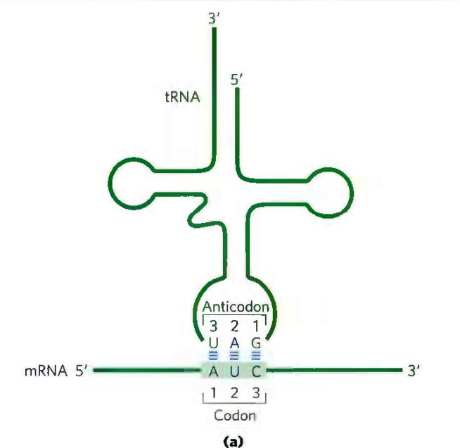  
(a)

$$
\begin{array}{c c c c c} & 3 & 2 & 1 \\ \text {Anticodon} & (3 ^ {\prime}) & G - C - I \\ & \equiv & \equiv & \equiv \\ \text {Codon} & (5 ^ {\prime}) & C - G - A \\ & & 1 & 2 & 3 \end{array} \qquad \qquad \begin{array}{c c c c c} & 3 & 2 & 1 \\ & G - C - I \\ & \equiv & \equiv & \equiv \\ & C - G - U \\ & 1 & 2 & 3 \end{array} \qquad \qquad \begin{array}{c c c c c} & 3 & 2 & 1 \\ & G - C - I & (5 ^ {\prime}) \\ & \equiv & \equiv & \equiv \\ & C - G - C & (3 ^ {\prime}) \\ & 1 & 2 & 3 \end{array}
$$

(b)

FIGURE 27-8 Pairing relationship of codon and anticodon. (a) Alignment of the two RNAs is antiparallel. The tRNA is shown in the traditional cloverleaf configuration. (b) Three different codon pairing relationships are possible when the tRNA anticodon contains inosinate.

first base is U or G, binding is less specific and two different codons may be read. When inosine (I) is the first (wobble) nucleotide of an anticodon, three different codons can be recognized—the maximum number for any tRNA. These relationships are summarized in Table 27-4.

3. When an amino acid is specified by several different codons, the codons that differ in either of the first two bases require different tRNAs.

4. A minimum of 32 tRNAs are required to translate all 61 codons (31 to encode the amino acids, 1 for initiation).

The wobble (or third) base of the codon contributes to specificity, but because it pairs only loosely with its corresponding base in the anticodon, it permits rapid dissociation of the tRNA from its codon during protein synthesis. If all three bases of a codon engaged in strong Watson-Crick pairing with the three bases of the anticodon, tRNAs would dissociate too slowly and this would limit the rate of protein synthesis. Codon-anticodon interactions balance the requirements for accuracy and speed.

P3 Although only 32 tRNAs are required to translate all codons, most cells have more than that. The bacterium E. coli has 47 different tRNA genes. Many of these are present in multiple copies, such that there are 86 total tRNA genes in the E. coli genome.

#### [EN] The Genetic Code Is Mutation-Resistant

The genetic code plays an interesting role in safeguarding the genomic integrity of every living organism. Evolution did not produce a code in which codon assignments appeared at random. Instead, the code is strikingly resistant to the deleterious effects of the most common kinds

#### [EN] TABLE 27-4 How the Wobble Base of the Anticodon Determines the Number of Codons a tRNA Can Recognize

1. One codon recognized:
Anticodon (3') X - Y - C (5') (3') X - Y - A (5')
Codon (5') X' - Y' - G (3') (5') X' - Y' - U (3')

2. Two codons recognized:
Anticodon (3') X - Y - U (5') (3') X - Y - G (5')
Codon (5') X' - Y' - A (3') (5') X' - Y' - C (3')

3. Three codons recognized:
Anticodon (3') X - Y - I (5')
Codon (5') X' - Y' - A U C (3')

Note: X and Y denote bases complementary to and capable of strong Watson-Crick base pairing with $X'$ and $Y'$ , respectively. Wobble bases—in the $3'$ position of codons and $5'$ position of anticodons—are shaded.

of mutations—missense mutations, in which a single new base pair replaces another. In the third, or wobble, position of the codon, single base substitutions produce a change in the encoded amino acid only about 25% of the time. Most such changes are thus silent mutations, in which the nucleotide is different but the encoded amino acid remains the same.

Due to the types of spontaneous DNA damage that affect genomes (see Chapter 8), the most frequent missense mutation is a transition mutation, in which a purine is replaced by a purine, or a pyrimidine by a pyrimidine (for example, G≡C changed to A=T). All three codon positions have evolved so that there is some resistance to transition mutations. A mutation in the first position of the codon will usually produce an amino acid coding change, but the change often results in an amino acid with similar chemical properties. This is especially true for the hydrophobic amino acids that dominate the first column of the code shown in Figure 27-7. Consider the Val codon GUU. A change to AUU would substitute Ile for Val. A change to CUU would replace Val with Leu. The resulting changes in the structure and/or function of the protein encoded by that gene would often (but not always) be small.

P2 Computational studies have shown that alternative genetic codes, delineated at random, are almost always less resistant to mutation than the existing code. The results indicate that the code underwent considerable streamlining before the appearance of LUCA, the ancestral cell.

The genetic code tells us how protein sequence information is stored in nucleic acids and provides some clues about how that information is translated into protein.

#### [EN] Translational Frameshifting Affects How the Code Is Read

Once the reading frame has been set during protein synthesis, codons are translated without overlap or punctuation until the ribosomal complex encounters a termination codon. The other two possible reading frames usually contain no useful genetic information. Overlap between two genes would necessarily constrain the possible amino acid sequences encoded by one or both genes in the overlap region. However, to make maximal use of limited (and expensive) genetic information, a few genes are structured so that ribosomes "hiccup" at a certain point in the translation of their mRNAs, changing the reading frame from that point on. This allows two or more related but distinct proteins to be produced from a single transcript.

One of the best-documented examples of translational frameshifting occurs during translation of the mRNA for the overlapping gag and pol genes of the Rous sarcoma virus, a retrovirus (see Fig. 26-31). The reading frame for pol is offset to the left by one base pair (-1 reading frame) relative to the reading frame for gag (Fig. 27-9).

The product of the retroviral pol gene (reverse transcriptase) is translated as a larger polyprotein, on the same mRNA that is used for the Gag protein alone (see Fig. 26-30). The polyprotein, or Gag-Pol protein, is then trimmed to the mature reverse transcriptase by proteolytic digestion. Production of the polyprotein requires a translational frameshift in the overlap region to allow the ribosome to bypass the UAG termination codon at the end of the gag gene (shaded light red in Fig. 27-9).

Frameshifts occur during about 5% of translations of this mRNA, and the Gag-Pol polyprotein (and ultimately reverse transcriptase) is synthesized at about one-twentieth the frequency of the Gag protein, a level that suffices for efficient reproduction of the virus. A similar mechanism produces both the $\tau$ and $\gamma$ subunits of E. coli DNA polymerase III from a single dnaX gene transcript (see footnote to Table 25-2).

#### [EN] Some mRNAs Are Edited before Translation

RNA editing can involve the addition, deletion, or alteration of nucleotides in the RNA in a manner that affects the meaning of the transcript when it is translated. Addition or deletion of nucleotides has been most commonly observed in RNAs originating from the mitochondrial and chloroplast genomes. The initial transcripts of the genes that encode cytochrome oxidase subunit II in some protist mitochondria provide an example of editing by insertion. These transcripts do not correspond precisely to the sequence needed at the carboxyl terminus of the protein product. A posttranscriptional editing process inserts four U residues that shift the translational reading frame of the transcript. The insertions require a special class of guide RNAs (gRNAs; Fig. 27-10) that act as templates for the editing process. The added U residues are all located in a small part of the transcript. Note that the base pairing between the initial transcript and the guide RNA includes several G=U base pairs (blue dots), which are common in RNA molecules.

RNA editing by alteration of nucleotides most commonly involves the enzymatic deamination of adenosine or cytidine residues, forming inosine or uridine, respectively (Fig. 27-11), although other base changes have been described. Inosine is interpreted as a G residue during translation. The adenosine deamination reactions are carried out by adenosine deaminases that act on RNA (ADARs). The cytidine deaminations are carried out by the apoB mRNA editing catalytic peptide (APOBEC) family of enzymes, which includes the activation-induced deaminase (AID) enzymes. Both the ADAR and APOBEC groups of deaminase enzymes have a homologous zinc-coordinating catalytic domain.

  
(b)  
FIGURE 27-11 Deamination reactions that result in RNA editing. (a) Conversion of adenosine nucleotides to inosine nucleotides is catalyzed by ADAR enzymes. (b) Cytidine-to-uridine conversions are catalyzed by the APOBEC family of enzymes.

FIGURE 27-10 RNA editing of the transcript of the cytochrome oxidase subunit II gene from Trypanosoma brucei mitochondria. (a) Insertion of four U residues (red) produces a revised reading frame. (b) A special class of guide RNAs, complementary to the edited product, acts as templates for the editing process. Note the presence of three G=U base pairs, signified by blue dots to indicate non-Watson-Crick pairing.  

The ADAR-promoted A-to-I editing of RNA transcripts is particularly common in primates. Most of the editing occurs in Alu elements, a subset of short interspersed elements (SINEs), eukaryotic transposons that are particularly common in primate genomes. Human DNA contains more than a million 300 bp Alu elements, making up about 10% of the genome. These elements are concentrated near protein-coding genes, often in introns and untranslated regions at the 3' and 5' ends of transcripts. When it is first synthesized (before processing), the average human mRNA includes 10 to 20 Alu elements. Certain microRNAs are also targeted by ADARs. The microRNA (miRNA) alterations generally reduce expression and/or function.

The ADAR enzymes bind to and promote A-to-I editing only in duplex regions of RNA. The abundant Alu elements offer many opportunities for intramolecular base pairing within the transcripts, providing the duplex targets required by ADARs. Some of the editing affects the coding sequences of genes. Defects in ADAR function have been associated with a variety of human neurological conditions, including amyotrophic lateral sclerosis (ALS), epilepsy, and major depression.

There are six general classes of APOBEC cytidine deaminases: APOBEC1–APOBEC5 and AID. The AID proteins function in increasing antibody diversity during immunoglobulin gene maturation (see Figs. 25-42 and 25-43). APOBEC1 and some of the APOBEC3 proteins (seven APOBEC paralogs are encoded by the human genome) edit mRNAs. A well-studied example of RNA editing by APOBEC1-mediated deamination occurs in the gene for the apolipoprotein B component of low-density lipoprotein in vertebrates. One form of apolipoprotein B, apoB-100 ( $M_{r}$ 513,000), is synthesized in the liver; a second form, apoB-48 ( $M_{r}$ 250,000), is synthesized in the intestine. Both are encoded by an mRNA produced from the gene for apoB-100. An APOBEC cytidine deaminase found only in the intestine binds to the mRNA at the codon for amino acid residue 2,153 (CAA=Gln) and converts the C to a U to create the termination codon UAA. The apoB-48 produced in the intestine from this modified mRNA is simply an abbreviated form (corresponding to the amino-terminal half) of apoB-100 (Fig. 27-12). P1 This reaction permits tissue-specific synthesis of two different proteins from one gene.

  
FIGURE 27-12 RNA editing of the transcript of the gene for the apoB-100 component of LDL. Deamination, which occurs only in the intestine, converts a specific cytidine to uridine, changing a Gln codon to a stop codon and producing a truncated protein.

APOBEC2, 4, and 5 act on DNA rather than RNA, and their functions are poorly understood. However, their ability to cause genomic mutations can make them a liability to the cell. One or more APOBEC enzymes are often overexpressed in tumor cells, and their mutagenic ability can contribute to the formation of tumors. They also provide a mechanism for introducing multiple mutations into a targeted segment of a chromosome, leading to selective and more rapid evolution of that DNA region.

#### [EN] SUMMARY 27.1 The Genetic Code

The particular amino acid sequence of a protein is constructed through the translation of information encoded in mRNA. This process is carried out by ribosomes. Amino acids are specified by mRNA codons consisting of nucleotide triplets. Translation requires adaptor molecules, the tRNAs, that recognize codons and insert amino acids into their appropriate sequential positions in the polypeptide.

The base sequences of the codons were deduced from experiments using synthetic mRNAs of known composition and sequence. The codon AUG signals initiation of translation. The triplets UAA, UAG, and UGA are signals for termination. The genetic code is degenerate: it has multiple codons for almost every amino acid. The standard genetic code is universal in all species, with some minor deviations in mitochondria and a few single-celled organisms. The deviations occur in a pattern that reinforces the concept of a universal code.

\- The third position in each codon is much less specific than the first and second positions and is said to wobble. This property allows certain tRNAs to recognize more than one codon.

■ The genetic code is resistant to the effects of missense mutations. The code evolved so that many nucleotide changes in a DNA codon do not alter the encoded amino acid, or they result in a very conservative alteration.

■ Translational frameshifting and RNA editing affect how the genetic code is read during translation.

■ RNA editing by ADARs (adenosine deaminases) and APOBECs (cytidine deaminases) also alters the coding sequence of some mRNAs. Many APOBEC enzymes target DNA, where they function in facilitating antibody diversity and suppression of retroviruses and retrotransposons.

<!-- EN-END 27.1 -->

## 二、蛋白质合成有关 RNA 和装置

主要有三类 RNA 参与蛋白质合成: 核糖体 RNA、转移 RNA 和信使 RNA。在原核生物和真核生物中分别由 3 至 4 种 rRNA 和 50 至 80 多种蛋白质构成核糖体, 成为合成蛋白质的装置 (apparatus)。mRNA 携带指导蛋白质合成的遗传信息, tRNA 携带活化的氨基酸, 一起在核糖体上完成多肽链的合成。

## (一) 核糖体

P. Zamecnik 于 1955 年用 $^{14}$ C 标志的氨基酸进行实验证明, 蛋白质是在被称作微粒体 (microsome) 的含 RNA 细胞器上合成的, 放射性氨基酸首先短暂与该细胞器结合, 然后才出现于游离的蛋白质中。其后知道微粒体是在破碎细胞时产生的附着核糖核蛋白质颗粒 (ribonucleoprotein particle, RNP) 的内质网膜碎片。“核糖体” (ribosome) 这一名词是 1957 年才开始采用, 专指参与蛋白质合成的核糖核蛋白颗粒。核糖体广泛存在于真细菌、古细菌和真核生物细胞, 以及线粒体和叶缘体等细胞器中。细菌和细胞器的核糖体小一些, 真核生物细胞的核糖体相对更大一些, 但它们都是由大、小两个亚基所组成。

大肠杆菌核糖体近似一个不规则椭圆球体(13.5 nm×20.0 nm×40.0 nm)，沉降系数70S。它有两个亚基。小亚基30S，由一个16S rRNA和21种不同的蛋白质所组成，蛋白质分别以S1-21来表示。大亚基50S，含有一个5S和一个23S rRNA及36个蛋白质，蛋白质分别以L1\~36来表示。其中L7为N端乙酰化的L12，该两种蛋白质各有2个拷贝，其余蛋白质均只有1个拷贝，因此实际共33种蛋白质。此外，S20和L26完全相同。核糖体RNA约占细胞总RNA的\~80%，核糖体蛋白质占细胞总蛋白质\~10%。核糖体RNA和蛋白质能在体外自动组装成核糖体亚基和核糖体。有关核糖体RNA的结构与功能请参考第11章。

从上世纪中叶发现核糖体以来,许多科学家致力于核糖体结构的研究。主要研究方法有三类:一是化学的方法,如蛋白质和 RNA 的酶解分析、化学标记和交联剂反应等;二是电子显微镜和后来的冷冻电镜 (cryoelectron microscopy) 观察;三是 X 射线晶体学测定。在所有这些方法中以 X 射线衍射法最为精确。

2000 年核糖体结构研究取得重大突破,在这一年中分别对细菌核糖体 30S 和 50S 亚基的晶体结构获得原子水平或接近原子水平分辨率的解析,随后在类似分辨率上阐明了完整 70S 核糖体的结构。完成这一结构测定需要确定超过 100 000 个原子的位置,这是多么了不起的成就!

在电子显微镜下，细菌核糖体小亚基犹如一颗带壳的花生，由头部和底部组成，但在一侧翘起一叶扁平突起，形成平台，相互间为裂缝。大亚基有三个突起，中央突起（central protuberance）较大，一侧突起成翼状（wing），为核糖体蛋白L1所在，另一侧突起较长，称为柄（stalk）。小亚基以平台一侧与大亚基中间部分结合。mRNA恰好穿过小亚基裂缝，并与位于核糖体位点A和P的tRNA反密码子相互作用，位点E上的脱负荷tRNA可随即离去。细菌核糖体的结构如图33-3所示。核糖体大、小两亚基的关系可用手来表示：将左手中间三指并拢，拇指和小指伸开，比作大亚基；右手四指并拢，与拇指相对，比作小亚基，横贴在左手上，正如两者的相互关系（图33-4）。

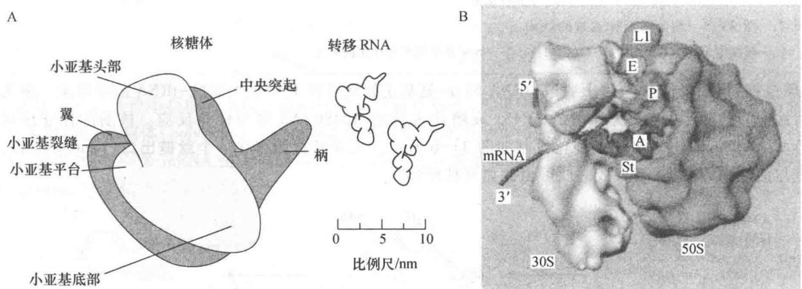  
图33-3 细菌核糖体结构模型

A. 核糖体小亚基以平台一侧横贴在大亚基的中间部分；B. 图示 mRNA、tRNA 与核糖体的关系，mRNA 穿过小亚基裂缝，tRNA 分别位于核糖体 A、P 和 E 位点，大亚基中央突起朝上（引自 Frank J. Current Opinion in Structural Biology, 1997.）

  
图 33-4 细菌核糖体大、小亚基关系示意图  
左手并拢中间三指作为中央突起，伸开拇指和小指作为两侧突起，以此比作大亚基；右手  
并拢四指，与拇指相对，比作小亚基，将右手横放在左手上，表示大亚基和小亚基之间关系

核糖体精细晶体结构的揭示对了解核糖体结构与功能起了关键的作用：

（1）核糖体的外形与核糖体 RNA 的三级结构基本一致，核糖体蛋白质分布在外表，并不包埋在 rRNA 的内部。这一现象支持了“RNA 世界”学说，表明最早出现的核糖体是由 RNA 所组成，蛋白质是后来加上去的。并且也表明了核糖体的功能主要由 rRNA 来完成，蛋白质只起着辅助的作用（图 33-5）。

（2）核糖体大亚基的肽基转移酶活性中心(peptidyl transferase centre)只有RNA,没有蛋白质,进一步证明肽基转移反应是由大亚基rRNA所催化的。大亚基结合底物、底物类似物以及产物的晶体结构显示,结合于A位点和P位点的tRNA氨基酸臂CCA序列分别与A突环(23S rRNA的螺旋92)和P突环(螺旋

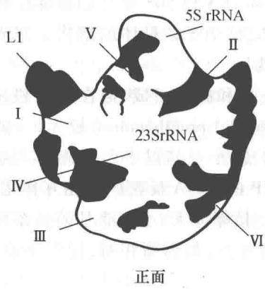

  
50S 亚基

  
30S 亚基  
图 33-5 细菌核糖体亚基的结构  
核糖体 50S 亚基正面中心的无蛋白质区与 30S 亚基形成相互作用的界面

80)碱基配对,结果使A位点上氨酰-tRNA的 $\alpha$ -氨基正好攻击在P位点上肽酰-tRNA的羰基碳。推测位于活性中心的腺嘌呤(大肠杆菌的A2451或嗜盐古菌的A2486)N3参与催化反应。核酶的保守序列为(5')AUAACAGG(3');可能的催化机制如图33-6所示。大亚基背面存在一个肽链出口(peptide exit),以隧道与活性中心相连,新合成的肽可由此离开核糖体。

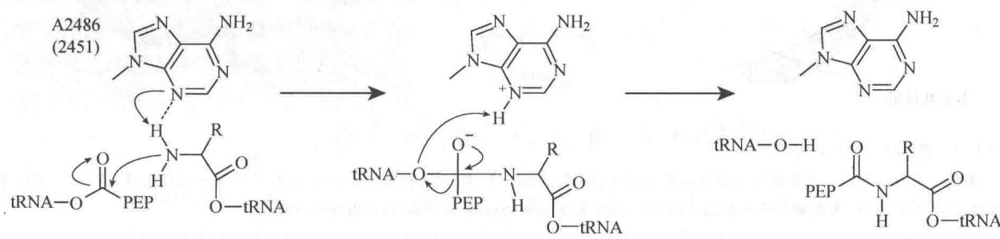  
图33-6 肽键形成的可能机制

（3）核糖体小亚基的译码中心（decoding centre）具有忠实性校对（fidelity-checking）功能。与肽基转移酶活性中心不同，在译码中心除RNA外还有蛋白质，但显然蛋白质只起次要作用。在A位点3'一侧的蛋白质S3、S4和S5可作为解旋酶去除mRNA的二级结构。进入A位点的tRNA其反密码子正好可与mRNA的密码子相互识别和作用，核糖体A位点RNA的核苷酸和蛋白质的氨基酸也协助识别。当tRNA与mRNA密码子第一、第二和第三个碱基形成碱基对，小亚基的A1493与第一个碱基对结合，A1492和S12与第二个碱基对结合，而与第三个碱基对反应的主要是G530，它似乎不太敏感，因而第三个位置得以产生变偶性。可是如果tRNA不匹配，就不被小亚基所接纳。这一校对功能对翻译的忠实性十分重要。从进化的观点的来看，“原始的核糖体”只有合成肽键一种功能，只有一个亚基，并且只含RNA，蛋白质是后来加进去的。随着译码和校对功能的发展才产生大、小两个亚基。核糖体有A、P和E三个位点，E位点产生较后，它有更多蛋白质似乎表明了这点。

真核生物的核糖体无论在结构上还是功能上都与原核生物的核糖体十分类似,但是显然真核生物核糖体更大、更复杂。哺乳类动物的核糖体沉降系数为 80S,由 40S 和 60S 两个亚基所组成。小亚基含有 18S rRNA 和 33 种蛋白质;大亚基含有 5S、5.8S 和 28S 三个 rRNA 分子以及 47 种蛋白质。5.8S rRNA 与原核生物 23S rRNA5'端序列同源,可见它是在进化过程中通过转录后加工方式的突变而产生的第四种 rRNA。哺乳类核糖体的 RNA 比细菌增加约 50%,但蛋白质的增加近一倍,表明有更多的蛋白质参与作用。原核生物和真核生物核糖体的组分见表 33-7。

表 33-7 核糖体的 RNA 和蛋白质组分

<table><tr><td>核糖体</td><td>相对分子质量( $M_r$ )</td><td>RNA类型</td><td>蛋白质数目</td></tr><tr><td>原核生物</td><td></td><td></td><td></td></tr><tr><td>核糖体70S</td><td> $2.7×10^6$ </td><td></td><td></td></tr><tr><td rowspan="2">大亚基50S</td><td rowspan="2"> $1.8×10^6$ </td><td>5S rRNA</td><td>36</td></tr><tr><td>23S rRNA</td><td></td></tr><tr><td>小亚基30S</td><td> $0.9×10^6$ </td><td>16S rRNA</td><td>21</td></tr><tr><td>真核生物</td><td></td><td></td><td></td></tr><tr><td>核糖体80S</td><td> $4.2×10^6$ </td><td></td><td></td></tr><tr><td rowspan="3">大亚基60S</td><td rowspan="3"> $2.8×10^6$ </td><td>5S rRNA</td><td>47</td></tr><tr><td>28S rRNA</td><td></td></tr><tr><td>5.8S rRNA</td><td></td></tr><tr><td>小亚基40S</td><td> $1.4×10^6$ </td><td>18S rRNA</td><td>33</td></tr></table>

采用温和的条件小心地从细胞中经超速离心分离核糖体,可以得到数个成串甚至上百个成串的核糖体,称为多(聚)核糖体(polysome)。这表明核糖体可以依次与 mRNA 结合,沿 mRNA 由 5' 向 3' 端方向移动以合成多肽链,一条 mRNA 链上同时有多个核糖体进行多条多肽链的合成(图 33-7)。这样就提高了蛋白质合成的效率。

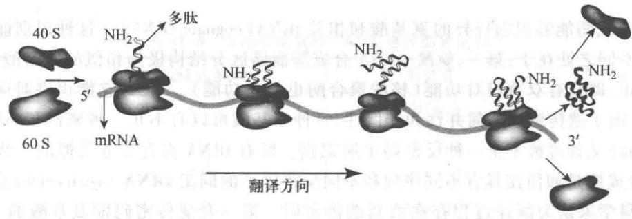  
图33-7 多核糖体

## (二) 转移 RNA 和氨酰-tRNA 合成酶

1957 年 Zamecnik 及其同事利用大鼠无细胞蛋白质合成系统进行实验时发现, 超速离心的上清液在 pH 5 时产生沉淀, 其中有氨基酸激活酶 (pH 5 酶) 和一种小的可溶性 RNA (soluble RNA, sRNA)。将 $^{14}\mathrm{C}$ 标记的氨基酸与 ATP 和其反应, 放射性氨基酸即与小 RNA 偶联。以此携带氨基酸的小 RNA 与微粒体保温, 放射性氨基酸可掺入微粒体新合成的蛋白质中。由此证明该小 RNA 相当于 Crick 假设的“转换器” RNA, 它携带活化的氨基酸至核糖体上, 识别模板序列, 使多肽链得以按模板的遗传信息合成。此后改称其为转移 RNA, 氨基酸激活酶改称为氨酰-tRNA 合成酶 (aminoacyl-tRNA synthetase, aaRS)。

1965 年 R. Holley 首先测定了酵母丙氨酸 tRNA(tRNA $^{Ala}$ ) 76 个核苷酸的序列。现已知道数百种生物数千种 tRNA 的序列，其长度在 60 至 95 个核苷酸， $M_{r}$ 为 $(18 \sim 28) \times 10^{3}$ 之间变动，最常见的为 \~76 个核苷酸长 $(\sim 25 \times 10^{3})$ 。1974 年 S. H. Kim 测定了酵母 tRNA $^{Phe}$ 的晶体结构。1983 年我国科学家完成了酵母 tRNA $^{Ala}$ 的人工全合成。tRNA 可能是一种最古老的生物大分子，也是研究最多、了解最多的 RNA 分子，然而至今对它的起源、进化、精细结构和诸多功能仍不十分清楚，有待深入研究。

tRNA 具有三叶草形二级结构,并借助茎环结构之间的作用力折叠形成倒 L 形三级结构,参与交互作用的碱基大部分都是通过非 Watson-Crick 的配对氢键结合,碱基与磷酸基和核糖 2'-OH 之间的氢键在维持构象稳定性中也起一定作用。反密码子的碱基和接受氨基酸的 CCA 末端位于倒 L 形 tRNA 的两端,以保证其生物功能的完成。

合成蛋白质的氨基酸共 20 种, 氨酰-tRNA 合成酶也相应有 20 种。氨酰-tRNA 合成酶催化两步反应:

(1) 氨基酸与 ATP 反应而被激活, 形成氨酰-腺苷酸 (aminoacyl-adenylate):

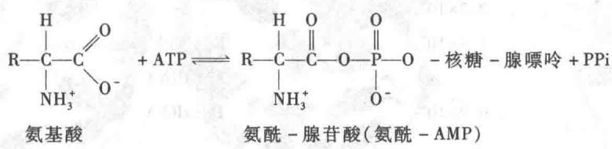

通常此中间产物牢固结合在酶上。

(2) 上述混合酸酐(氨酰-AMP)与相应 tRNA 反应, 形成氨酰-tRNA:

$$
\mathrm{氨酰-AMP+tRNA} \rightleftharpoons \mathrm{氨酰-tRNA+AMP}
$$

某些氨酰-tRNA合成酶将氨基酸连接到相应tRNA的3'-OH端上；另一些连到2'-OH上，然后再转移到3'端。总的氨酰化反应为：

$$
\text { 氨基酸 } + \mathrm{tRNA} + \mathrm{ATP} \longrightarrow \text { 氨酰 } - \mathrm{tRNA} + \mathrm{AMP} + \mathrm{PPi}
$$

氨酰-tRNA 是一种“高能”化合物, 故第一步反应需由 ATP 激活氨基酸, 反应中产生的 PPi 水解可推动反应的完成。氨基酸激活与脂肪酸的激活反应十分类似, 主要差别在于前者的受体是 tRNA, 后者为 CoA。

氨酰-tRNA合成酶能够识别特异的氨基酸和相关tRNA(cognate tRNA)。这种识别能力与通常酶对底物识别的主要不同之处在于:第一,氨酰-tRNA合成酶能够区分结构极为相似的氨基酸,一旦发现反应错误还能予以校正,即具有双重校对功能(核酸聚合酶也有此功能)。第二,它能识别对应于同一种氨基酸的多种tRNA。由于遗传密码的简并性和变偶性,一种氨基酸可以有不止一种密码子,这些同义密码子(synonymous codon)又各可被不止一种反密码子所识别。所有tRNA都有十分类似的二级结构和三级结构,氨酰-tRNA合成酶是如何使具有不同序列和不同反密码子的同工tRNA(isoacceptor tRNA)携带上同一种氨基酸的?科学家认为翻译过程存在两套遗传密码。第一套遗传密码即氨基酸的三联体(三核苷酸)密码,携带氨基酸的tRNA借以辨认模板核酸上的指令以指导多肽链合成。第二套遗传密码为tRNA个性要素(identify element)的识别标志,氨基酸特异的酶借以辨认同工tRNA,使氨基酸与相应tRNA连接。

通过多种方法研究 tRNA 与合成酶的相互作用, 主要采用 tRNA 的片段、tRNA 的定位诱变、化学交联剂反应、计算机的序列比较和 X 射线晶体学分析等, 现已基本破译了第二套遗传密码。与第一套遗传密码不同, 第二套遗传密码是以空间结构进行编码。合成酶接触的位点都在倒 L 形 tRNA 的内面, 即凹面。tRNA 被相应合成酶识别各有其特点, 并无简单的共同规则。

一般而言,受体臂最为关键,其中螺旋区碱基对和 CCA 末端前一个未配对碱基为主要的鉴别碱基。其次是反密码子环,通常有一个或多个碱基被识别,但也有 tRNA 的个性要素中并不包括反密码子环的碱基。再有,起关键作用的碱基也可存在于各茎环结构中。决定个性(identity)的要素可以是单个碱基,也可以是碱基对,数量从几个至几十个碱基,不同 tRNA 各不相同。合成酶根据识别到的个性要素而催化氨酰化反应。例如最简单的 tRNA $^{Ala}$ ,其个性要素只是位于受体茎的 G3 和 U70 单个碱基对。

20 种氨酰-tRNA 合成酶其大小、三级结构和序列各不相同,有些是单体,也有些是二聚体或四聚体。根据合成酶的多项特征,可将合成酶分为两类(class),各有 10 种酶。两类酶的主要区别在于:① 类群 I 是一些较大氨基酸的酶,通常是单体,个别是二聚体,可能在进化上是较晚出现的酶;类群 II 是一些较小氨基酸的酶,通常是二聚体,少数是同源或异源四聚体,可能是较古老的酶。② 类群 I 的酶含有 Rossmann 折叠,即两个相邻的 $\beta \alpha \beta \alpha \beta$ 超二级结构,常见于结合 NAD $^{+}$ 和 ATP 的蛋白质;类群 II 的酶无此结构,代之以独特的七条反平行 $\beta$ 片层,外侧为三个螺旋,以此形成催化结构域的核心。③ 类群 I 的酶结合于 tRNA受体臂螺旋的浅沟，3'-CCA端回折成发夹结构，使2'-OH参与氨酰化反应；类群Ⅱ的酶结合于tRNA受体臂螺旋的深沟，末端不回折，3'-OH参与氨酰化反应，两者犹如镜像对称（图33-8）。④类群I的酶必定能识别相应tRNA的反密码子；而类群Ⅱ的酶有些不识别tRNA反密码子。现将大肠杆菌氨酰-tRNA合成酶的类别列于表33-8。

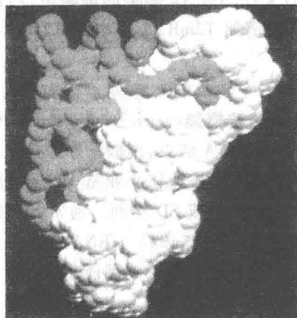

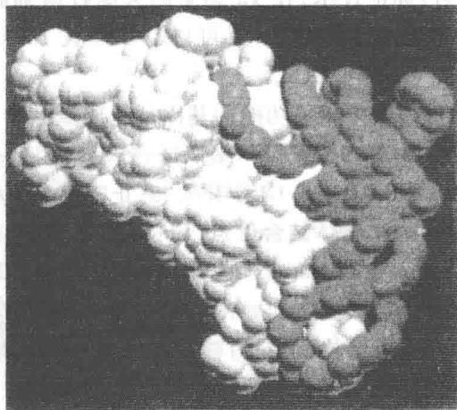  
图 33-8 tRNA 与氨酰-tRNA 合成酶复合物的结构模型  
A. tRNA $^{Gln}$ 与谷酰胺酰-tRNA合成酶复合物；B. tRNA $^{Asp}$ 与天冬氨酰-tRNA合成酶复合物（引自Arnez J G, Moras D. Trends in Biochemical Sciences, 1997）

表 33-8 大肠杆菌氨酰-tRNA 合成酶的类别 \*

<table><tr><td>类群I</td><td>肽链残基数</td><td>类群II</td><td>肽链残基数</td></tr><tr><td>Arg(α)</td><td>577</td><td>Ala( $\alpha_{4}$ )</td><td>875</td></tr><tr><td>Cys(α)</td><td>461</td><td>Asn( $\alpha_{2}$ )</td><td>467</td></tr><tr><td>Gln(α)</td><td>551</td><td>Asp( $\alpha_{2}$ )</td><td>590</td></tr><tr><td>Glu(α)</td><td>471</td><td>Gly( $\alpha_{2}\beta$ )</td><td>303/689</td></tr><tr><td>Ile(α)</td><td>939</td><td>His( $\alpha_{2}$ )</td><td>424</td></tr><tr><td>Leu(α)</td><td>860</td><td>Lys( $\alpha_{2}$ )</td><td>505</td></tr><tr><td>Met( $\alpha_{2}$ )</td><td>676</td><td>Pro( $\alpha_{2}$ )</td><td>572</td></tr><tr><td>Trp( $\alpha_{2}$ )</td><td>325</td><td>Phe( $\alpha_{2}\beta_{2}$ )</td><td>327/795</td></tr><tr><td>Tyr( $\alpha_{2}$ )</td><td>424</td><td>Ser( $\alpha_{2}$ )</td><td>430</td></tr><tr><td>Val(α)</td><td>951</td><td>Thr( $\alpha_{2}$ )</td><td>642</td></tr></table>

\* 引自 Carter C W Jr. Annu Rev Biochem, 1993.

tRNA 不仅是一个古老的生物分子,而且是一个多功能的生物分子。tRNA 的主要功能是携带氨基酸到核糖体上,在蛋白质合成中起翻译作用,包括校正 tRNA 的校正作用。此外,还能进行不依赖于核糖体的多肽合成。例如,将氨基酸转移到多糖、脂肪和蛋白质上,参与细胞壁、细胞膜的合成。叶绿素和硒代半胱氨酸都是在 tRNA 上合成的。逆转录病毒以 RNA 基因组为模板合成 cDNA 时需以 tRNA 为引物。有些 tRNA 可以是植物的激素。在蚕体内,tRNA $^{Lys}$ 还可以作为转录调节因子。tRNA 的诸多功能也许正反映了它在 RNA 世界早期曾活跃参与各种生命活动。

## （三）信使RNA

最初以为核糖体 RNA 是蛋白质合成的模板。但在 1959 年同位素标记实验表明, 大肠杆菌感染噬菌体 T2 后并不合成新的 rRNA, 这就排除了合成特异蛋白质的模板是 rRNA 的可能性。于是 F. Jacob 和

J. Monod提出了信使 RNA(messenger RNA, mRNA) 的概念, 认为必定有一种中间物质, 从 DNA 上获得遗传信息, 带到核糖体上用作蛋白质合成的模板。他们在研究大肠杆菌乳糖代谢有关酶类的生物合成时还发现, 诱导物(底物和底物类似物) 加入可以使酶蛋白的合成速度立即增加数千倍; 一旦除去诱导物又可使酶蛋白的合成随即停止。他们相信蛋白质合成的模板极不稳定, 其半寿期很短。1961 年几个实验室采用脉冲(短时间) 标记技术, 在 T2 感染的大肠杆菌细胞, 后又在不经 T2 感染的细胞中, 均证实了不稳定 RNA(mRNA) 的存在。这种 RNA 可以与其模板 DNA 杂交, 例如 T2 mRNA 可以与 T2DNA 杂交, 故又称为 D-RNA。

原核生物基因组中相关功能的基因常组成操纵子,作为一个转录单位,转录产生多顺反子 mRNA。在多顺反子 mRNA 中有多个基因的编码区,各编码区为一开放阅读框架(open reading frame, ORF),又称可译框,以起始密码子 AUG 或 GUG 开头,终止密码子 UAA、UAG、UGA 结束,读框正好为是三的倍数。起始密码子前(上游)为核糖体结合位点(ribosome binding site, RBS),与核糖体小亚基 16S rRNA 的 3'端序列互补,最初由 Shine 和 Dalgarno 所发现,故称为 Shine-Dalgarno 序列,或 SD 序列。通常 SD 序列长 4\~9 个核苷酸,富含嘌呤碱基,位于起始密码子上游 3\~11 个核苷酸处(图 33-9)。mRNA 或多顺反子的 mRNA 可以形成二级和三级结构,但在沿核糖体小亚基移动时被解开,其存在会影响翻译速度。

  
图33-9 原核生物mRNA的核糖体结合位点

真核生物基因并不组成操纵子，除了某些病毒的基因例外，通常真核生物基因转录产生单顺反子mRNA。有些病毒基因不仅组成操纵子而且基因还彼此重叠或形成多聚蛋白质（polyprotein），需在翻译后切开。真核生物mRNA 5'端有甲基鸟苷酸 $\left[m^{7}G5^{\prime}ppp5^{\prime}Nm(Nm)\right]$ 构成的帽子；3'端有poly(A)尾巴，平均长200个核苷酸，在其上游存在腺苷酸化的信号序列AAUAAA。真核生物mRNA无SD序列，在5'非翻译区和3'非翻译区存在调控序列，可结合各种调节因子以影响翻译的进行。在5'端起始密码子AUG附近常存在不同的茎环结构，它们或起正调节，或起负调节。总之，在最适宜的序列（例如ACCAUGG）和二级结构环境中，起始密码子具有最高的起始频率。而在3'非翻译区除具有调节因子结合位点外，还有mRNA的定位信号序列。现将原核生物和真核生物的mRNA的结构特点图解如图33-10。

  
图 33-10 原核生物与真核生物 mRNA 结构比较

## 三、蛋白质合成的步骤

蛋白质生物合成十分复杂,采用无细胞体系(cell-free system)进行研究,现已基本弄清楚其过程。以大肠杆菌为例,蛋白质占细胞干重的50%左右,每个细胞中约有3 000种不同的蛋白质,每种蛋白质又有数量甚多的分子,而大肠杆菌细胞分裂周期不过20 min。其蛋白质生物合成速度之快由此可见,而且还十分精确,错误率低于 $10^{-4}$ 至 $10^{-3}$ 。

多肽链的合成由 N 端向 C 端进行, 这与 DNA 和 RNA 链由 5' 向 3' 方向编码和合成是一致的。H. M.

Dintzis 等人在 1961 年用 $^{3}$ H-亮氨酸作标记揭示了兔网织红细胞无细胞体系中血红蛋白的生物合成过程。血红蛋白含有较多的亮氨酸，并且其氨基酸序列已知。为了降低合成速度，反应在较低温度（15℃）下进行。在反应开始后 4～60 min 内，每隔一定时间取样分析。将带有放射性标记的蛋白质分离出来，拆开 $\alpha$ 、 $\beta$ 两条链，用胰蛋白质酶水解，然后经纸层析分开水解碎片，测定其所含放射性强度。实验结果如图 33-11 所示。从图中可以看出，反应 4min 只有羧基端肽段含有 $^{3}$ H-亮氨酸；随着标记反应时间延长，带有标记的肽段自 C 端向 N 端延伸，到 60 min 时几乎整个肽段都布满标记。这个实验证明了多肽链合成的方向。多肽链的合成极快， $\alpha$ 链 146 个氨基酸残基在 37℃ 约需 3 min。大肠杆菌具有更高的速度，一个核糖体每秒钟可合成 40 个氨基酸的多肽。

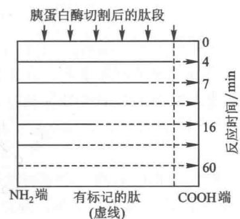  
图 33-11 标记亮氨酸掺入血红蛋白 $\alpha$ 链羧基末端图解
虚线为带有标记肽段

蛋白质生物合成可分为五个步骤:① 氨酰-tRNA 的合成(aminoacyl-tRNA synthesis);② 多肽链合成的起始(initiation);③ 多肽链合成的延伸(elongation);④ 多肽链合成的终止(termination);⑤ 多肽链的折叠与加工(folding and processing)。现分别叙述如下。

## （一）氨酰-tRNA的合成

蛋白质合成的第一步是胞质中20种不同的氨基酸与各自的tRNA以酯键结合，催化这一步的酶为氨酰-tRNA合成酶。每种酶对于一种氨基酸和一种或多种相应的tRNA是特异的。这一步十分关键。首先，氨基酸必需附着在特定的tRNA分子上，正确的翻译才成为可能。tRNA携带氨基酸，通过其反密码子对mRNA密码子的识别，使氨基酸得以掺入多肽链的指定位置。酶的校正功能后面还要讨论。第二，由游离氨基酸合成肽键需要供给能量。合成酶利用ATP使氨基酸腺苷酸化，从而使氨基酸激活，与tRNA反应形成高能酯键，有利于下一步肽键的合成。

ATP、氨基酸和相关的 tRNA 分别结合在合成酶活性部位的适当位置,酶与底物的互补空间结构、特异氢键和范德华引力(Vander Waals attraction)在相互识别中起重要作用。在酶催化下，ATP与氨基酸反应产生氨酰腺苷酸和焦磷酸，反应平衡常数大约为1，ATP中磷酸酐键水解所能释放的能量继续保存在氨酰-AMP的混合酸酐分子中，这时中间产物氨酰-AMP仍然紧密结合在酶分子表面(图33-12)。中间产物氨酰-AMP分子结构如下：

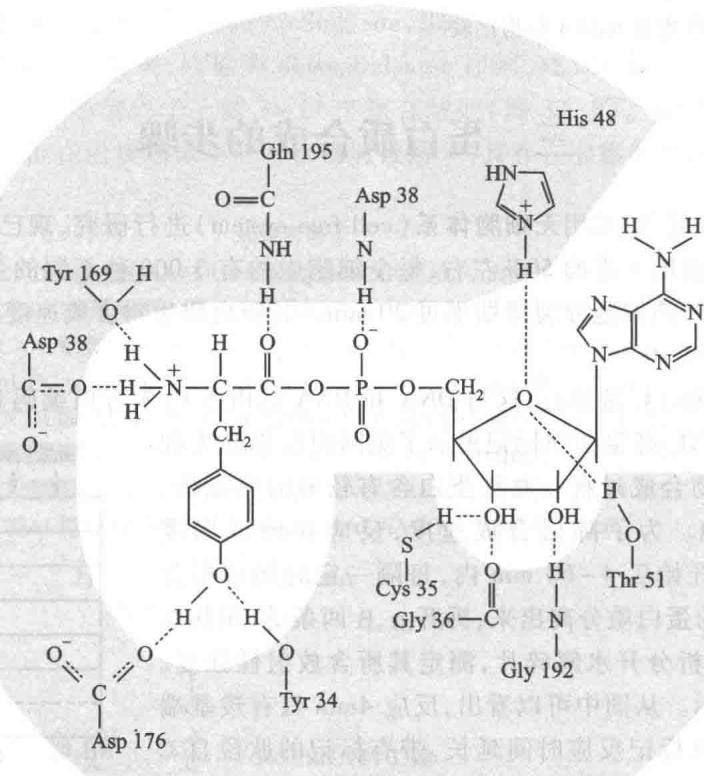  
图 33-12 酪氨酰-tRNA 合成酶与反应中间物酪氨酰-腺苷酸复合物的相互作用  
反应中间物结合在酶分子的深沟中，两者间形成11个氢键

氨基酸被激活后与相关 tRNA 反应, 产生 2' 或 3' 氨基酸酯, 视酶的类群而异, 2' 或 3' 羟基酯之间可互换, 但在合成肽键时必定是 3' 羟基酯。氨酰-tRNA 的结构如下:

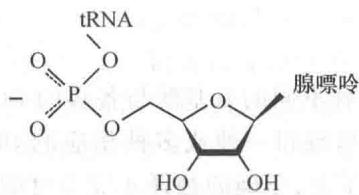  
氨酰 - tRNA

由氨酰腺苷酸与相应 tRNA 产生氨酰-tRNA 并释放出 AMP, 反应平衡常数接近 1, 自由能降低极少。氨基酸与 tRNA 之间的酯键与高能磷酸键相仿, 水解时产生高的负标准自由能 ( $\Delta G^{\ominus'} = -29$ kJ/mol)。ATP 激活氨基酸产生的焦磷酸随被焦磷酸酶水解成无机磷酸, 推动反应的完成。因此产生一分子氨酰-tRNA, 消耗两

个高能磷酸键。

## （二）多肽链合成的起始

所有多肽链的合成都以甲硫氨酸作为 N 端的起始氨基酸,但在翻译后的加工过程中有些被保留,有些则被除去。编码多肽链的阅读框架通常以 AUG 为起始密码子,但在细菌中有时也用 GUG(偶尔用 UUG)为起始密码子。甲硫氨酸的 tRNA 有两种,一种用于识别起始密码子(无论是 AUG 或 GUG 以及 UUG),另一种识别阅读框架内部的 AUG 密码子。两种 tRNA 分别以 $tRNA_{i}^{Met}$ 和 $tRNA_{m}^{Met}$ 来表示。甲硫氨酰-tRNA 合成酶则只有一种。

在细菌和原核生物细胞器中起始 tRNA 所携带甲硫氨酸通常其氨基都被甲酰化，此 tRNA 可写作 $tRNA_{f}^{fMet}$ 或 $tRNA_{f}^{Met}$ 。甲硫氨酰- $tRNA_{f}$ 甲酰化后氨基被封闭，不能再参与肽链的延伸过程，可以防止起始 tRNA 误读框架内部密码子。真核细胞起始 tRNA 在辅助因子帮助下严格识别起始密码子 AUG，故无甲酰化。甲酰化反应由特异的甲酰化酶所催化，甲酰基来自 $N^{10}-$ 甲酰四氢叶酸，反应式如下：

$$
N ^ {1 0} - \mathrm{甲酰四氢叶酸} + \mathrm{Met-tRNA} _ {\mathrm{f}} \longrightarrow \mathrm{四氢叶酸} + \mathrm{fMet-tRNA} _ {\mathrm{f}}
$$

原核生物参与起始的蛋白质因子有三个，起始因子（initiation factor, IF）1、起始因子2和起始因子3。在起始因子帮助下，由30S小亚基、mRNA、fMet-tRNA $_{f}$ 和50S大亚基依次结合，形成起始复合物（initiation complex）。在此过程需要分解一分子GTP成GDP和无机磷供给能量，并要求Mg $^{2+}$ 作用。起始阶段又可分为三步：①30S-mRNA复合物的形成；②fMet-tRNA $_{f}$ 的加入；③50S亚基的加入。各步都有辅助因子参与作用。

在步骤①, IF-1 和 IF-3 两个起始因子与 30S 小亚基结合。IF-1 占据小亚基的 A 位点, 空出 P 位点留待 fMet-tRNA $_{f}$ 的进入。A 位点在多肽链延伸阶段供非起始 tRNA 携带氨基酸进入核糖体之用。IF-1 结合在 30S 小亚基上也妨碍了它与 50S 大亚基的结合。IF-3 有两个功能。首先, 它控制 70S 核糖体的解离平衡, 起着抗结合因子 (anti-association factor) 的作用。IF-3 和 50S 大亚基在 30S 小亚基上的结合部位相互重叠, 小亚基结合 IF-3 后就不能再与大亚基结合。其次, 它促使小亚基与 mRNA 结合。核糖体小亚基 16S rRNA 3'端序列与 mRNA 的 SD 序列互补, 两者结合并在 IF-3 的帮助下使 mRNA 的起始密码子正好落在 P 位点。

在步骤②,上述复合物(30S-mRNA、IF-1、IF-3)与 IF-2 结合。IF-2 能特异结合 fMet-tRNA $_{f}$ ,并使其进入 P 位点,于是 tRNA $_{f}$ 的反密码子得以与起始密码子正确配对。IF-2 的功能与延伸因子 EF-Tu 有些类似,两者差别在于前者特异介导 fMet-tRNA $_{f}$ 进入 P 位点;后者在延伸阶段介导一般氨酰-tRNA 进入 A 位点。

在步骤③, IF-3 离开 30S 小亚基, 以便 50S 大亚基加入复合物形成完整的 70S 核糖体。IF-1 和 IF-2 随即离开核糖体, 同时结合在 IF-2 上的 GTP 水解成 GDP 和 Pi, 产生的能量用于推动核糖体构象改变, 使其成为活化的起始复合物。原核生物多肽链合成的起始如图 33-13 所示。

  
图 33-13 原核生物多肽链合成的起始步骤

真核生物多肽链合成的起始过程与原核生物基本类似,但也有不同点。主要差别为:① 真核生物多肽链合成的起始甲硫氨酸不被甲酰化,仅借助起始 $tRNA_{i}^{Met}$ 与内部 $tRNA_{m}^{Met}$ 的差别依靠辅助因子来区分起始和阅读框架内部的密码子。② 真核生物有 10 多个起始因子(表 33-9)，原核生物则只有三个。③ 真核生物 mRNA 无 SD 序列，核糖体结合位点(ribosome binding site, RBS)在起始密码子 AUG 附近，最常见的 RBS 为 GCCAGCCAUGG。④ 与原核生物相反，Met-tRNA $_{i}$ 先于 mRNA 与 40S 小亚基结合。⑤ 真核生物 40S 小亚基在起始因子帮助下从 mRNA 5'端移向 RBS 需要水解 ATP 供给能量，以解开 mRNA 的二级结构。

表 33-9 真核生物参与多肽链合成起始的蛋白质因子

<table><tr><td>因子</td><td>功能</td></tr><tr><td>eIF1</td><td>多功能,使小亚基沿mRNA扫描</td></tr><tr><td>eIF1A</td><td>使小亚基沿mRNA扫描</td></tr><tr><td>eIF2</td><td>介导 $Met-tRNA_{i}$ 与小亚基P位点结合;水解GTP</td></tr><tr><td>eIF2B</td><td>以GTP交换eIF2上水解产生的GDP</td></tr><tr><td>eIF3</td><td>阻止40S小亚基与60S大亚基结合</td></tr><tr><td>eIF4A</td><td>具有RNA解旋酶活性</td></tr><tr><td>eIF4B</td><td>结合ATP并促进eIF4A与mRNA结合</td></tr><tr><td>eIF4E</td><td>具有结合mRNA5′端帽子的活性</td></tr><tr><td>eIF4G</td><td>能与多种蛋白质(eIF3、eIF4A、PABP)结合,通过eIF4E连到5′帽子周围</td></tr><tr><td>eIF5</td><td>促进小亚基与大亚基结合</td></tr><tr><td>eIF6</td><td>与60S大亚基结合,阻止大亚基与小亚基的结合</td></tr><tr><td>PABP</td><td>与poly(A)相结合的蛋白质</td></tr></table>

\* 真核生物的起始因子以“eIF”来表示。

真核生物多肽链合成都的起始阶段也分为三个步骤：

步骤①,eIF3 结合 40S 小亚基,阻止其与大亚基结合; eIF2 帮助 Met-tRNA $_{i}$ 结合于 P 位点,它带有 GTP 以便在解离时水解成 GDP 和 Pi。mRNA 的 5′端帽子与 eIF4A、eIF4B、eIF4E、eIF4G 结合,其中真正的帽结合蛋白(cap-binding protein,CBP)是 eIF4E,余者均通过衔接蛋白(adapter protein)eIF4G 结合到 eIF4E 上。mRNA 3′端 poly(A)通过 poly(A)结合蛋白(poly(A)-binding protien,PABP)也结合在 eIF4G 上。步骤②,40S 小亚基上的 eIF3 与衔接蛋白 eIF4G 结合,连带小亚基与 mRNA 结合,在 eIF1 和 eIF1A 的帮助下沿 mRNA 移动,扫描到核糖体结合位点,通过 Met-tRNA $_{i}$ 的反密码子识别起始密码并与之结合。步骤③,脱去完成功能的起始因子,在 eIF5 的帮助下 60S 大亚基与小亚基结合,形成核糖体起始复合物(图 33-14)。

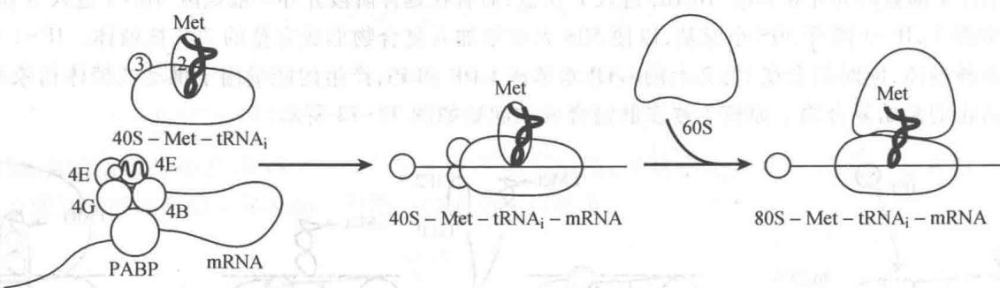  
图33-14 真核生物多肽链合成的起始步骤

## （三）多肽链合成的延伸

核糖体与起始氨酰-tRNA 和 mRNA 组成起始复合物后, 多肽链合成即进入延伸阶段, mRNA 上编码序列的翻译由三个连续的重复反应来完成。每循环一次, 多肽链羧基端添加一个新的氨基酸残基。延伸反应在进化过程中十分保守, 原核生物和真核生物基本相同, 并且都需要三个延伸因子 (elongation factor, EF) 参与作用。(细菌的三个延伸因子是 EF-Tu、EF-Ts 和 EF-G)。值得指出的是, 肽键的形成并不需要蛋白质的酶来催化,而是由大亚基的 rRNA 催化。延伸的三步反应分别是,氨酰-tRNA 结合(binding)到核糖体 A 位点上、进行转肽反应(transpeptidation)、核糖体沿 mRNA 移位(translocation,又称易位)。这里首先介绍细菌的多肽合成过程,然后再比较真核生物与原核生物的差别。

延伸步骤①: 所有氨酰-tRNA都是在EF-Tu的帮助下, 进入核糖体结合在A位点。上面曾提到, 起始因子IF-2与延伸因子EF-Tu功能类似, 两者都起着运送氨酰-tRNA到核糖体上的作用, 并且都有水解GTP的酶活性(GTPase)。但前者特异识别 $fMet-tRNA_{f}$ , 将其引导到P位点; 后者识别除了起始氨酰-tRNA外的各种氨酰-tRNA, 导入A位点。结合了GTP的EF-Tu可与氨酰-tRNA形成三元复合物(氨酰-tRNA·EF-Tu·GTP)。该复合物进入A位点后由tRNA的反密码子与位于A位点的mRNA密码子配对, 碱基正确配对触发核糖体构象改变, 导致tRNA的结合变稳定, 并且引起EF-Tu对GTP的水解。当反密码子与密码子配对时, 所携带氨基酸正好落在50S大亚基的肽基转移酶活性中心, 引发催化反应。二元复合物EF-Tu·GDP随即被释放。

另一因子 EF-Ts 的功能是帮助无活性的 EF-Tu·GDP 再生为有活性的 EF-Tu·GTP。首先 EF-Ts 置换 GDP，形成 EF-Tu·EF-Ts 复合物；然后再被 GTP 置换，从新形成 EF-Tu·GTP。EF-Ts 可以反复使用，使细胞内有充裕的 EF-Tu·GTP，以供多肽链合成之用。

EF-Tu 的作用可影响多肽链合成的忠实性。氨酰-tRNA 被带到 A 位点, 如果反密码子与密码子不配对, 迅即离去。EF-Tu·GTP 的水解相对较慢, 留下足够时间使不正确的氨酰-tRNA 离开 A 位点。水解后, EF-Tu·GDP 的释放也较慢, 如还有不正确氨酰-tRNA 也可于此时离开。

延伸步骤②:肽酰转移反应由23S rRNA所催化。反应实质是使起始氨酰基(fMet)或肽酰基(peptidyl)的酯键转变成肽键,即由P位点的tRNA上转移到A位点氨酰-tRNA的氨基上。通过转肽,新生肽链得以由N端向C端延伸。反应是由新加入氨基酸的氨基向起始氨酰-或肽酰-tRNA上酯键的羰基作亲核攻击所发动,如图33-15所示。

嘌呤霉素(puromycin)对蛋白质合成的抑制作用就发生在这一步上。嘌呤霉素的结构与氨酰-tRNA 3'端上的AMP残基的结构十分相似。肽基转移酶也能促使起氨酰基或肽酰基与嘌呤霉素结合，形成肽酰嘌呤霉素，但其连键不是酯键，而是肽键。肽酰-嘌呤霉素复合物很易从核糖体上脱落，从而使多肽链合成过程中断。这一点不仅证明了嘌呤霉素的作用机制，也说明了活化氨基酸是添加在延伸肽链的羧基上。嘌呤霉素结构如下：

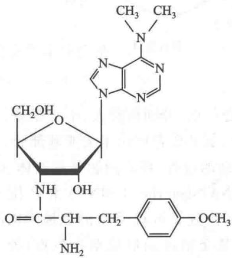  
嘌呤霉素

延伸步骤③:紧接着转肽反应之后,核糖体沿 mRNA 由 5' 向 3' 方向移动一个密码子,以便继续翻译。移位依赖于因子 EF-G 和 GTP。核糖体不能同时结合 EF-Tu 和 EF-G,必须在 EF-Tu·GDP 离开后 EF-G·GTP 才能结合上去;同样只有在 EF-G·GDP 离开后新的氨酰-tRNA·EF-Tu·GTP 三元复合物才能进入 A 位点。氨酰-tRNA·EF-Tu·GTP 的三级结构与 EF-G 的三级结构十分相似。两者有共同的保守结构,EF-G 的其余部分模拟了 EF-Tu·tRNA 中的 tRNA 成分,故而可以进入前者在核糖体上的结合位置(图 33-16)。

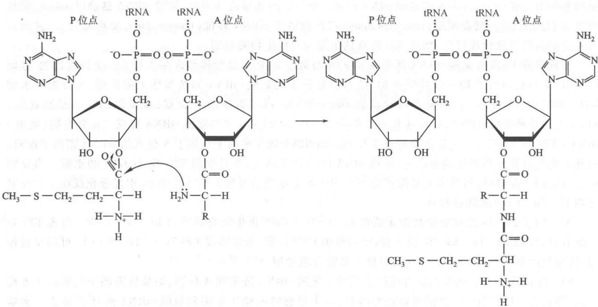  
图33-15 多肽链合成中第一个肽键的形成

  
图33-16 原核生物核糖体的功能位点

原核生物核糖体有三个 tRNA 结合位点，分别横跨大、小两亚基。倒 L 形 tRNA 可分两部分，反密码子区位于 A 位点和 P 位点的小亚基部分，氨基酸臂区位于大亚基部分，E 位点大部分都在大亚基上，和小亚基只有少许接触。移位是一个十分复杂的过程，核心问题是核糖体、tRNA 和 mRNA 三者间究竟如何进行相对移动。移位后，卸去氨酰基的 tRNA（deacylated tRNA）由 P 位点转至 E 位点，然后再脱落；肽酰-tRNA 由 A 位点转至 P 位点，空出的 A 位点又可接受新的氨酰-tRNA。对此一种较可信的解释是移位可分两步进行：首先由大亚基与小亚基交错运动形成杂合位点，即 50SE/30SP 和 50SP/30SA。此时两 tRNA 的 CCA 末端脱开 50S 大亚基原来位置的束缚，进入新的位置。然后大亚基与小亚基再次交错运动以恢复原状。两 tRNA 的反密码子末端脱开 30S 小亚基束缚，也进入新的位置。mRNA 借助密码子与反密码子之间的碱基对结合，跟随 tRNA 一起移动。移位发生在 GTP 水解之后，想必 GTP 水解产生的能量先引起 EF-G 的构象改变，进而引起核糖体构象的改变。核糖体与 tRNA 的相对移动不涉及碱基对的重新配对。

原核生物多肽链合成的延伸循环如图 33-17 所示。

真核生物多肽链合成的延伸循环与原核生物十分相似，三个延伸因子分别称为 eEF1A、eEF1B 和 eEF2。eEF1A 和 1B 分别相当于原核生物的 EF-Tu 和 Ts，eEF2 相当于 EF-G。真核生物核糖体无 E 位点,脱酰 tRNA 直接从 P 位点脱落。白喉毒素(diphtheria toxin)能利用 NAD $^{+}$ 将腺苷二磷酸核糖基(ADPR)转移到 eEF2 上,使其失活,故而具有极大毒性,几微克毒素就足以致人于死命。白喉毒素由白喉杆菌内的溶原性噬菌体所编码。

  
图 33-17 原核生物多肽链合成的延伸过程

## （四）多肽链合成的终止

多肽链合成的终止需要终止密码子和释放因子(release factor, RF)参与作用。tRNA 只能识别氨基酸

密码子,不能识别终止密码子,需由释放因子来识别终止密码子。当 mRNA 的终止密码子进入核糖体 A 位点时,多肽链合成即停止,由相应释放因子识别并结合其上。细菌有三个释放因子,RF-1识别 UAA 和 UAG,RF-2 识别 UAA 和 UGA。RF-1 和 RF-2 三级结构的形状十分类似 tRNA,它们结合到 A 位点后可活化核糖体的肽基转移酶活性。与多肽链的延伸反应不同,RF 引起的是将肽酰基转移到水分子上,多肽链即被水解下来。将大肠杆菌核糖体、fMet-tRNA $_{f}$ 、RF-1、两个三聚核苷酸 AUG 和 UAA 一起保温,可在体外观察到 RF 的水解作用(图 33-18)。RF-3 是一个 GTP 结合蛋白,它与 EF-Tu 和 EF-G 类似,结合到核糖体后引起 GTP 水解,并使 RF-1 或 RF-2 脱落。核糖体与 tRNA 和 mRNA 的解离还需要核糖体再循环因子(ribosome recycling factor, RRF)、EF-G 和 IF-3 参与作用, 并水解 GTP。

  
图33-18 释放因子的体外活性实验

真核生物的一个释放因子 eRF1 可识别所有三个终止密码子并使多肽链水解下来，故而无 eRF2。eRF1 的外形类似于 tRNA，当其进入核糖体 A 位点时顶端三个氨基酸 GGQ 正好在氨酰-tRNA 的氨酰基位置，Q（谷氨酰胺）的酰胺基结合一分子 $H_{2}O$ ，肽酰基转移其上而被水解下来。eRF3 为 GTP 结合蛋白，进入 A 位点后水解 GTP 并使 eRF1 脱落。

## （五）多肽链的折叠、加工和修饰

多肽链合成后必须经过折叠和加工,才能成为具有生物活性的形式。

## 1. 新生多肽链的折叠

新生多肽链在合成过程中或合成后，借助自身主链间和各侧链的相互作用，形成氢键、范德华力、离子键以及疏水相互作用，发生折叠，获得其天然的构象。通过这种方式，由 mRNA 一维结构编码信息指导形成蛋白质的三维结构。

C. Anfinsen 在 1957 年用核糖核酶 A(RNase A) 所做的出色实验表明, 蛋白质的变性是可以逆转的。他将 RNase A 在含 β-巯基乙醇的 8 mol 尿素溶液中变性, 然后透析除去尿素和还原剂, 并在 pH 8 时用 O₂ 氧化, 结果完全恢复酶活性和物理特性。RNase A 有 124 个残基和 8 个半胱氨酸, 如果听任随机形成二硫键可有 105 种方式, 活性最多只能恢复 1%。实际上变性后“散乱”的多肽链在有痕量 β-巯基乙醇存在下可将所产生不正确的二硫键打开, 重新形成正确的形式。Anfinsen 的实验证明在生理条件下蛋白质能自发折叠形成其天然的构象, 因此他认为蛋白质的一级结构决定三级结构。这一原则至今仍被认为是正确的, 但有了许多新的认识。

新生肽的折叠和变性蛋白质的再折叠并不完全相同,新生肽通常边合成边折叠,并需要不断调整其已折叠的结构。多肽链在各种作用力影响下产生高级结构,四个氨基酸残基的多肽就可以产生二级结构,十个残基的多肽可以产生超二级结构,四十个以上残基的多肽其凝聚力才可以产生结构域,但仍然需要次级键和二硫键来稳定其结构。有两个酶可以改变多肽链的共价结构,一个是蛋白质二硫键异构酶(protein disulfide isomerase, PDI),它可以进行二硫键交换,以调整不正确的二硫键;另一个是肽基脯氨酰异构酶(peptidyl prolyl isomerase, PPIase),可以改变脯氨酸残基的顺反构型。在蛋白质分子中大部脯氨酸残基都是反式构型,但也有约6%的顺式,PPIase可以调整此构型。

上世纪70年代发现，蛋白质折叠和寡聚蛋白的组装需要一类称为分子伴侣（molecular chaperone）的蛋白质参与作用。这类蛋白质某些方面与酶相似，能帮助蛋白质折叠与组装，而不是最终结构的一部分。但它与酶又不一样，一是对底物蛋白不具有高度专一性，同一分子伴侣可以作用于多种不同多肽链的折叠。二是并不促进正确折叠，只是防止错误折叠。分子伴侣作用于新生肽的折叠，跨膜蛋白的解折叠和再折叠，变性或错折叠蛋白的重折叠，以及蛋白质分子的装配。由于细胞内蛋白质的浓度极高，并且存在诸多各类化学分子，多肽链的折叠易受到干扰，可能产生非天然的折叠，并使多肽链各疏水区段发生聚集和形成沉淀。携带ATP的分子伴侣可以与多肽的疏水区段结合，ATP水解成ADP后分子伴侣即脱落，ADP被ATP替换后又可与多肽链结合，在脱落的间隙多肽进行正常的折叠，不断结合分子伴侣起着阻止疏水区段聚集的作用，直至完成折叠为止。

许多分子伴侣属于热激蛋白(heat shock protein, HSP)。HSP是在升温或其他刺激作用下增加合成速率的一类蛋白质，可用于恢复热变性蛋白或阻止外界不利条件下多肽链的错误折叠。分子伴侣主要有两类：一类为Hsp70家族，其成员均为单体的蛋白质；另一类伴侣蛋白家族(chaperonine family)，为寡聚体的蛋白质(表33-10)。

表 33-10 分子伴侣的主要群类

<table><tr><td>种类</td><td>结构与功能</td></tr><tr><td>Hsp70 家族(单体蛋白质)</td><td></td></tr><tr><td>Hsp70(Dnak)</td><td>ATPase</td></tr><tr><td>Hsp40(DnaJ)</td><td>促进 ATPase</td></tr><tr><td>GrpE</td><td>核苷酸交换因子</td></tr><tr><td>Hsp90</td><td>作用于信号转导蛋白</td></tr><tr><td>伴侣蛋白家族(寡聚复合物)</td><td></td></tr><tr><td>类群I</td><td></td></tr><tr><td>Hsp60(GroEL)</td><td>形成两个七聚体环状结构</td></tr><tr><td>Hsp10(GroES)</td><td>形成帽状结构</td></tr><tr><td>类群II</td><td></td></tr><tr><td>TRic</td><td>形成两个八聚体环</td></tr></table>

Hsp70 借助水解 ATP 来完成对未对叠和部分折叠多肽链的结合-释放循环。Hsp40 的功能是促进 Hsp70 的作用。GrpE 使 Hsp70 上的 ADP 与 ATP 发生交换。经过多轮结合-释放循环，多肽链得以获得天然构象。Hsp90 作用类似于 Hsp70，在作用过程中需水解 ATP，但它专一作用于信号转导途径蛋白质的构象改变。

与上述系统不同,伴侣蛋白家族成员可形成大的寡聚复合物。Hsp60(大肠杆菌中为 GroEL)的 14 聚体,分成上下两环,每环 7 个亚基,构成中空的圆筒。上下两环亚基的方向相反,圆筒中间由各亚基的羧基端突起将筒隔成两半。每一亚基结合一个 ATP,中空筒内表面的疏水区段与未完成折叠的多肽链结合。Hsp10(在大肠杆菌中为 GroES)由 7 个亚基构成类似帽子的结构,待底物进入空筒后即盖上。于是多肽链可在被隔离的空间内进行折叠,待 ATP 水解后盖子(Hsp10 或 GroES)打开,底物被释放。也许底物一次进入圆筒内不能完成折叠,可以多次进入有 ATP 的圆筒内继续折叠,直到全部完成。上下两环可以交替使用。上环腾清后在 ATP/ADP 交换期间,可以利用下环空间进行多肽链折叠;同样,下环在准备阶段可以利用上环进行折叠。伴侣蛋白的寡聚复合物结构如图 33-19 所示。真核生物的 TriC 和 GimC 与之相似,只是各亚基大小并不相同。

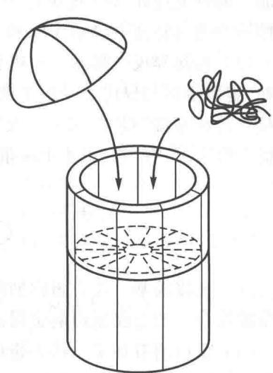  
图33-19 伴侣蛋白形成大的寡聚复合物  
14个GroEL形成两环组成的中空圆筒，7个GroES形成帽子，多肽链在筒内完成折叠

## 2. 翻译后的加工和修饰

多肽链合成后常常不是其最后具有生物学活性的形式,而需要经过一系列的加工和修饰。主要的加工和修饰有以下几类:

（1）氨基端和羧基端的修饰 所有多肽链合成最起始的残基都是甲酰甲硫氨酸(细菌中)或甲硫氨酸(真核生物中)。在合成后,甲酰基、氨基末端的甲硫氨酸残基、甚至多个氨基酸残基或是羧基端的残基常被酶切除,因此它们并不出现在最后有功能的蛋白质中。在真核生物的蛋白质中约有50%氨基端残基的氨基都被N-乙酰化。有时羧基端残基也被修饰。

（2）信号肽被切除 分泌蛋白和膜蛋白的氨基端存在一段序列长 15 至 30 个残基，它引导蛋白质穿越质膜（细菌）或内质网膜（真核生物）。这段序列在穿膜后即被信号肽酶所切除。

（3）肽链个别氨基酸被修饰 蛋白质某些 Ser、Thr 和 Tyr 残基上的羟基可被激酶利用 ATP 进行磷酸化。不同蛋白质磷酸化的意义是不一样的。例如，乳液中酪蛋白的磷酸化可增加 $Ca^{2+}$ 的结合，有利于幼儿营养。细胞内许多酶和调节蛋白可借助磷酸化和去磷酸化以调节其活性。

凝血机制中的关键成分凝血酶原,其氨基端区的 Glu 残基常被增加一个 $\gamma-$ 羧基,催化该反应的酶为羧化酶,需要维生素 K 作为辅酶。这些羧基可结合 $Ca^{2+}$ ,为凝血机制所需要。 $\gamma-$ 羧基谷氨酸的结构

式如下：

此外，在某些肌肉蛋白和细胞色素 c 中还存在甲基赖氨酸和二甲基赖氨酸残基。有些生物的钙调蛋白（calmodulin）中有三甲基赖氨酸。这些甲基位于赖氨酸残基的 $\varepsilon-$ 氨基上。还有些蛋白质谷氨酸的 $\gamma-$ 羧基可被甲基化形成酯。

（4）连接糖类的侧链 在肽链合成过程中或合成后某些位点被连以糖类侧链，糖蛋白有重要生物学功能。糖链或连在 Asn 残基上（N-连接寡糖）；或连在 Ser、Thr、Hyl（羟赖）及 Hyp（羟脯）残基上（O-连接寡糖）；少数可以连在 Asp、Glu 和 Cys 残基上。详见糖生物学。

（5）连接异戊二烯基 一些真核生物的蛋白质可通过连接异戊二烯基(isoprenyl)衍生物进行修饰。例如，胞质蛋白与异戊二烯衍生的十五碳法尼基焦磷酸反应(farnesyl pyrophosphate)生成羧酸酯，使蛋白质疏水的羧基端“锚”在膜上。又如，ras癌基因和原癌基因的产物Ras蛋白以Cys与法尼基焦磷酸生成硫酯键。引人关注的是，阻止Ras蛋白的法尼基化可以使其失去致癌性。法尼基化Ras蛋白结构如下：

（6）连接辅基 缀合蛋白的活性与其辅基(prosthetic group)有关,多肽链合成后需与辅基以共价键或配位键结合。如金属蛋白的金属离子,血红素蛋白的血红素,黄素蛋白的含核黄素辅基等。

（7）蛋白酶解加工 许多蛋白质最初合成较大的、无活性的前体蛋白质，合成后需经蛋白酶的酶解加工（proteolytic processing）产生较小的、活性形式。蛋白酶解加工可用于控制蛋白质的活性，如酶和激素常见先合成其非活性形式蛋白原（proprotein），在额外序列被蛋白酶切去后产生活性蛋白质。选择性酶解可以产生多种不同的蛋白质，如病毒的多蛋白质，哺乳动物的脑肽。

（8）二硫键的形成 在多肽链折叠形成天然的构象后，链内或链间的 Cys 残基间有时会产生二硫键。二硫键可以保护蛋白质的天然构象，以免分子内外条件改变或凝聚力较低的情况下引起变性。

<!-- EN-BEGIN 27.2 -->

### 【英文对应 27.2】Protein Synthesis

> 来源：Lehninger Principles of Biochemistry（书籍/02_生物化学原理） 第27章 Protein Metabolism，§27.2。对应本章“三、蛋白质合成的步骤”。

As we have seen for DNA and RNA (Chapters 25 and 26), the synthesis of polymeric biomolecules can be considered in terms of initiation, elongation, and termination stages. These fundamental processes are typically bracketed by two additional stages: activation of precursors before synthesis and postsynthetic processing of the completed polymer. Protein synthesis follows the same pattern. The activation of amino acids before their incorporation into polypeptides and the posttranslational processing of the completed polypeptide play particularly important roles in ensuring both the fidelity of synthesis and the proper function of the protein product. The process is outlined in Figure 27-13. P1 The cellular components involved in the five stages of protein synthesis in E. coli and other bacteria are listed in Table 27-5; the requirements in eukaryotic cells are similar, although the components are usually more numerous. Before looking at these five stages in detail, we must examine two key components of protein biosynthesis: the ribosome and tRNAs.

#### [EN] The Ribosome Is a Complex Supramolecular Machine

P1 Each E. coli cell contains 15,000 or more ribosomes, which comprise nearly a quarter of the dry weight of the cell. Bacterial ribosomes contain about 65% rRNA and 35% protein; they have a diameter of about 18 nm and are composed of two unequal subunits with sedimentation coefficients of 30S and 50S and a combined sedimentation coefficient of 70S. Both subunits contain dozens of ribosomal proteins (r-proteins) and at least one large rRNA (Table 27-6).

As it became clear that ribosomes are the complexes responsible for protein synthesis, and following elucidation of the genetic code, the study of ribosomes accelerated. In the late 1960s Masayasu Nomura and colleagues demonstrated that both ribosomal subunits can be broken down into their RNA and protein components, then reconstituted in vitro. Ribosomal subunits are identified by their S (Svedberg unit) values, sedimentation coefficients that refer to their rate of sedimentation in a centrifuge.

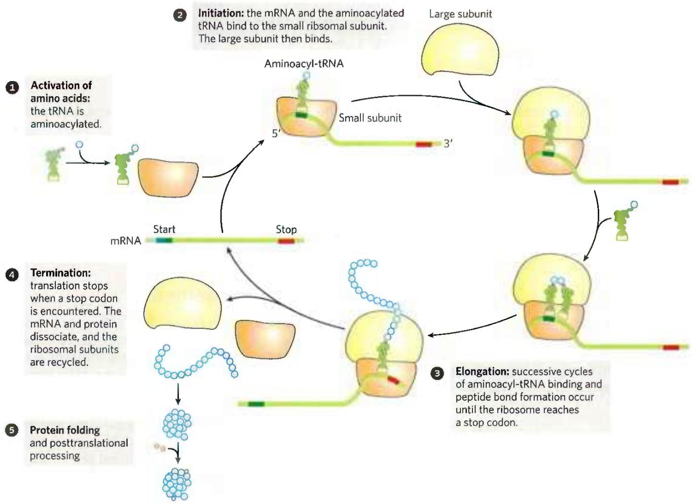  
FIGURE 27-13 An overview of the five stages of protein synthesis.

<table><tr><td colspan="3">TABLE 27-5 Components Required for the Five Major Stages of Protein Synthesis in E. coli</td></tr><tr><td>Stage</td><td colspan="2">Essential components</td></tr><tr><td rowspan="3">1. Activation of amino acids</td><td>20 amino acids</td><td>ATP</td></tr><tr><td>20 aminoacyl-tRNA synthases</td><td> $Mg^{2+}$ </td></tr><tr><td>32 or more tRNAs</td><td></td></tr><tr><td rowspan="4">2. Initiation</td><td>mRNA</td><td>50S ribosomal subunit</td></tr><tr><td>N-Formylmethionyl-tRNA $^fMet$ </td><td>Initiation factors (IF1, IF2, IF3)</td></tr><tr><td>Initiation codon in mRNA (AUG)</td><td>GTP</td></tr><tr><td>30S ribosomal subunit</td><td> $Mg^{2+}$ </td></tr><tr><td rowspan="3">3. Elongation</td><td>Functional 70S ribosomes (initiation complex)</td><td>Elongation factors (EF-Tu, EF-Ts, EF-G)</td></tr><tr><td rowspan="2">Aminoacyl-tRNAs specified by codons</td><td>GTP</td></tr><tr><td> $Mg^{2+}$ </td></tr><tr><td rowspan="2">4. Termination and ribosome recycling</td><td>Termination codon in mRNA</td><td>EF-G</td></tr><tr><td>Release factors (RF1, RF2, RF3, RRF)</td><td>IF3</td></tr><tr><td>5. Folding and posttranslational processing</td><td colspan="2">Chaperones and folding enzymes (PPI, PDI); specific enzymes, cofactors, and other components for removal of initiating residues and signal sequences, additional proteolytic processing, modification of terminal residues, and attachment of acetyl, phosphoryl, methyl, carboxyl, carbohydrate, or prosthetic groups</td></tr></table>

Under appropriate experimental conditions, the RNA and protein spontaneously reassemble to form 30S or 50S subunits nearly identical in structure and activity to native subunits. This breakthrough fueled decades of research into the function and structure of ribosomal RNAs and proteins. At the same time, increasingly sophisticated structural methods revealed more and more details about ribosome structure.

<table><tr><td colspan="5">TABLE 27-6 RNA and Protein Components of the E. coli Ribosome</td></tr><tr><td>Subunit</td><td>Number of different proteins</td><td>Total number of proteins</td><td>Protein designations</td><td>Number and type of rRNAs</td></tr><tr><td>30S</td><td>21</td><td>21</td><td>S1-S21</td><td>1 (16S rRNA)</td></tr><tr><td>50S</td><td>33</td><td>36</td><td>L1-L36a</td><td>2 (5S and 23S rRNAs)</td></tr></table>

$^{a}$ The L1 to L36 protein designations do not correspond to 36 different proteins. The protein originally designated L7 is a modified form of L12, and L8 is a complex of three other proteins. Also, L26 proved to be the same protein as S20 (and not part of the 50S subunit). This gives 33 different proteins in the large subunit. There are four copies of the L7/L12 protein, with the three extra copies bringing the total protein count to 36.

The dawn of a new millennium illuminated the first high-resolution structures of bacterial ribosomal subunits by Venkatraman Ramakrishnan, Thomas Steitz, Ada Yonath, Harry Noller, and others. This work yielded a wealth of surprises (Fig. 27-14a). First, a traditional focus on the protein components of ribosomes was shifted. The ribosomal subunits are huge RNA molecules. In the 50S subunit, the 5S and 23S rRNAs form the structural core. The proteins are secondary elements in the complex, decorating the surface. Second, and most important, there is no protein within 18 Å of the active site for peptide bond formation. P4 The high-resolution structure thus confirms what Noller had predicted much earlier: the ribosome is a ribozyme. In addition to the insight that the detailed structures of the ribosome and its subunits provide into the mechanism of protein synthesis (as elaborated below), these findings have stimulated a new look at the evolution of life (Section 26.4). The ribosomes of eukaryotic cells have also yielded to structural analysis (Fig. 27-14b).

The bacterial ribosome is complex, with a combined molecular weight of $\sim 2.7$ million. The two irregularly shaped ribosomal subunits fit together to form a cleft through which the mRNA passes as the ribosome moves along it during translation (Fig. 27-14a). The 57 proteins in bacterial ribosomes vary enormously in size and structure. Molecular weights range from about 6,000 to 75,000. Most of the proteins have globular domains arranged on the ribosome surface. Some also have snakelike extensions that protrude into the rRNA core of the ribosome, stabilizing its structure. The functions of some of these proteins have not yet been elucidated in detail, although a structural role seems evident for many of them.

The sequences of the rRNAs of countless thousands of organisms are now known due to genomic sequencing. Each of the three single-stranded rRNAs of E. coli has a specific three-dimensional conformation with extensive intrachain base pairing. The folding patterns of the rRNAs are highly conserved in all organisms, particularly the regions implicated in key functions (Fig. 27-15). The predicted secondary structure of the rRNAs has largely been confirmed by structural analysis but fails to convey the extensive network of tertiary interactions apparent in the complete structure.

FIGURE 27-14 The structure of ribosomes. Our understanding of ribosome structure has been greatly enhanced by multiple high-resolution images of the ribosomes from bacteria and yeast. (a) The bacterial ribosome. The 50S and 30S subunits come together to form the 70S ribosome.  

  
The cleft between them is where protein synthesis occurs. (b) The yeast ribosome has a similar structure with somewhat increased complexity. [Data from (a) PDB ID 4V4I, A. Korostelev et al., Cell 126:1065, 2006; (b) PDB ID 4V7R, A. Ben-Shem et al., Science 330:1203, 2010.]

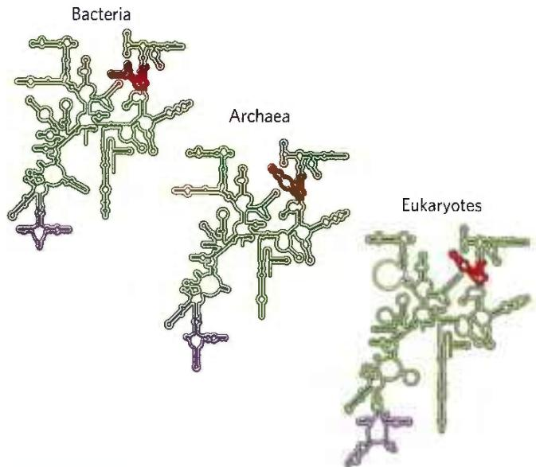  
FIGURE 27-15 Conservation of secondary structure in the small subunit rRNAs from the three domains of life. The red, yellow, and purple indicate areas where the structures of the rRNAs from bacteria, archaea, and eukaryotes have diverged. Conserved regions are shown in green. [Information originally from the Comparative RNA Web, University of Texas.]

The ribosomes of eukaryotic cells (other than mitochondrial and chloroplast ribosomes) are larger and more complex than bacterial ribosomes (Fig. 27-16; compare Fig. 27-14b), with a diameter of about 23 nm and a sedimentation coefficient of about 80S. They also have two subunits, which vary in size among species but on average are 60S and 40S. Altogether, a ribosome of the yeast Saccharomyces cerevisiae contains 79 different proteins and 4 ribosomal RNAs. The ribosomes of mitochondria and chloroplasts are somewhat smaller and simpler than bacterial ribosomes. Nevertheless, ribosomal structure and function are strikingly similar in all organisms and organelles.

In both bacteria and eukaryotes, ribosomes are assembled through a hierarchical incorporation of r-proteins as the rRNAs are synthesized. Much of the processing of pre-rRNAs occurs within large ribonucleoprotein complexes. The composition of these complexes changes as new r-proteins are added, the rRNAs acquire their final form, and some proteins required for rRNA processing dissociate. In eukaryotes, the early stages of assembly occur in the nucleolus, with the final maturation of the ribosome completed after export to the cytosol. P1 Dozens of assembly factors, both proteins and some small RNA molecules (snoRNAs; Fig. 26-24), participate in this process (Fig. 27-17).

#### [EN] Transfer RNAs Have Characteristic Structural Features

To understand how tRNAs can serve as adaptors in translating the language of nucleic acids into the language of proteins, we must first examine their structure in more detail. Transfer RNAs are relatively small and consist of a single strand of RNA folded into a precise three-dimensional structure (see Fig. 8-25a). The tRNAs of bacteria and in the cytosol of eukaryotes have between 73 and 93 nucleotide residues, corresponding to molecular weights of 24,000 to 31,000. Mitochondria and chloroplasts contain distinctive, somewhat smaller tRNAs. Cells have at least one kind of tRNA for each amino acid; at least 32 tRNAs are required to recognize all the amino acid codons (some recognize more than one codon), but some cells use more than 32.

  
FIGURE 27-16 Summary of the composition and mass of ribosomes in bacteria and eukaryotes. The S values associated with the subunits are not additive when subunits are combined, because S values are approximately proportional to the two-thirds power of molecular weight and are also slightly affected by shape.

Yeast alanine tRNA (tRNA $^{Ala}$ ) was the first nucleic acid to be completely sequenced, by Robert Holley in 1965. It contains 76 nucleotide residues, 10 of which have modified bases. Comparisons of tRNAs from various species have revealed many common structural features (Fig. 27-18a). Eight or more of the nucleotide residues have modified bases and sugars, many of which are methylated derivatives of the principal bases. Most tRNAs have a guanylate (pG) residue at the 5' end, and all have the trinucleotide sequence CCA(3') at the

  
FIGURE 27-17 Assembly of ribosomes in eukaryotes. ① Most of the early steps of ribosome assembly occur in the nucleolus, an organelle inside the nucleus. Ribonucleases and specialized RNAs, including some snoRNAs, process the initial rRNA transcript. ② Large pre-ribosomal particles are formed and additional processing of the large complex occurs with the aid of proteins called assembly factors. The pre-40S and pre-60S complexes move into the nucleoplasm. ③ The 40S and 60S subunits are exported to the cytoplasm, coupled with the ejection of assembly factors. ④ Final maturation of the ribosome occurs in the cytoplasm.

3' end. When drawn in two dimensions, all tRNAs have a hydrogen-bonding pattern that forms a cloverleaf structure with four arms, as first proposed by Elizabeth Keller. The longer tRNAs have a short fifth arm, or extra arm. In three dimensions, a tRNA has the form of a twisted L (Fig. 27-18b).

P3 Two of the arms of a tRNA are critical for its adaptor function. The amino acid arm can carry a specific amino acid esterified by its carboxyl group to the 2'- or 3'-hydroxyl group of the A residue at the 3' end of the tRNA. The anticodon arm contains the anticodon. The other major arms are the D arm, which contains the unusual nucleotide dihydrouridine (D), and the TψC arm, which contains ribothymidine (T), not usually present in RNAs, and pseudouridine (ψ), which has an unusual carbon-carbon bond between the base and ribose (see Fig. 26-22). The D and TψC arms contribute important interactions for the overall folding of tRNA molecules, and the TψC arm interacts with the large-subunit rRNA.

  
(a)

  
(b)  
FIGURE 27-18 General structure of tRNAs. (a) The cloverleaf structure. The large dots on the backbone represent nucleotide residues; the blue lines represent base pairs. Characteristic and/or invariant residues common to all tRNAs are specified. Transfer RNAs vary in length from 73 to 93 nucleotides. Extra nucleotides occur in the extra arm or in the D arm. At the end of the anticodon arm is the anticodon loop, which always contains seven unpaired nucleotides. The D arm contains two or three D (5,6-dihydrouridine) residues, depending on the tRNA. In some tRNAs, the D arm has only three hydrogen-bonded base pairs. Pu represents purine nucleotide; Py, pyrimidine nucleotide; $\psi$ , pseudouridylate; G\*, guanylate or 2'-O-methylguanylate. (b) Schematic diagram of the folded tRNA, which resembles a twisted L.

Having looked at the structures of ribosomes and tRNAs, we now consider in detail the five stages of protein synthesis.

#### [EN] Stage 1: Aminoacyl-tRNA Synthetases Attach the Correct Amino Acids to Their tRNAs

P3 For the synthesis of a polypeptide with a defined sequence, two fundamental chemical requirements must be met: (1) the carboxyl group of each amino acid must be activated to facilitate formation of a peptide bond, and (2) a link must be established between each new amino acid and the information in the mRNA that encodes it. Both these requirements are met by attaching the amino acid to a tRNA in the first stage of protein synthesis. When attached to their amino acid (aminoacylated), the tRNAs are said to be “charged.”

This first stage of protein synthesis takes place in the cytosol. Aminoacyl-tRNA synthetases esterify the 20 amino acids to their corresponding tRNAs. Each enzyme is specific for one amino acid and one or more corresponding tRNAs. Most organisms have one aminoacyl-tRNA synthetase for each amino acid. For amino acids with two or more corresponding tRNAs, the same enzyme usually aminoacylates all of them.

In all organisms, the aminoacyl-tRNA synthetases fall into two classes (Table 27-7), based on substantial differences in primary and tertiary structure and in reaction mechanism (Fig. 27-19). There is no evidence that the two classes share a common ancestor, and the biological, chemical, or evolutionary reasons for two enzyme classes for essentially identical processes remain obscure.

<table><tr><td colspan="2">Class I</td><td colspan="2">Class II</td></tr><tr><td>Arg</td><td>Leu</td><td>Ala</td><td>Lys</td></tr><tr><td>Cys</td><td>Met</td><td>Asn</td><td>Phe</td></tr><tr><td>Gln</td><td>Trp</td><td>Asp</td><td>Pro</td></tr><tr><td>Glu</td><td>Tyr</td><td>Gly</td><td>Ser</td></tr><tr><td>Ile</td><td>Val</td><td>His</td><td>Thr</td></tr></table>

Note: Here, Arg represents arginyl-tRNA synthetase, and so forth. The classification applies to all organisms for which tRNA synthetases have been analyzed and is based on protein structural distinctions and on the mechanistic distinction outlined in Figure 27-19.

The reaction catalyzed by an aminoacyl-tRNA synthetase is

$$
\begin{array}{c} \text {Amino acid + tRNA + ATP} \xrightarrow {\mathrm{Mg} ^ {2 +}} \\ \text {aminoacyl - tRNA + AMP + PP} _ {\mathrm{i}} \end{array}
$$

This reaction occurs in two steps in the enzyme's active site. In step 1 (Fig. 27-19), an enzyme-bound intermediate, aminoacyl adenylate (aminoacyl-AMP), is formed. In the second step, the aminoacyl group is transferred from enzyme-bound aminoacyl-AMP to its corresponding specific tRNA. The course of this second step depends on the class to which the enzyme belongs, as shown by pathways 2a and 2b in Figure 27-19. The resulting ester linkage between the amino acid and the tRNA (Fig. 27-20) has a highly negative standard free energy of hydrolysis ( $\Delta G^{\circ} = -29$ kJ/mol). The pyrophosphate formed in the activation reaction undergoes hydrolysis to phosphate by inorganic pyrophosphatase. Thus, two high-energy phosphate bonds are ultimately expended for each amino acid molecule activated, rendering the overall reaction for amino acid activation essentially irreversible:

$$
\begin{array}{r l} \text { Amino   acid } + \mathrm{tRNA} + \mathrm{ATP} & \xrightarrow {\mathrm{Mg} ^ {2 +}} \\ & \text { aminoacyl   -   tRNA } + \mathrm{AMP} + 2 \mathrm{P} _ {\mathrm{i}} \\ & \Delta G ^ {\prime \circ} \approx - 2 9 \mathrm{kJ/mol} \end{array}
$$

Proofreading by Aminoacyl-tRNA Synthetases The aminoacylation of tRNA accomplishes two ends: (1) it activates an amino acid for peptide bond formation and (2) it ensures appropriate placement of the amino acid in a growing polypeptide. The identity of the amino acid attached to a tRNA is not checked on the ribosome, so attachment of the correct amino acid to the tRNA is essential to the fidelity of protein synthesis.

As you will recall from Chapter 6, enzyme specificity is limited by the binding energy available from enzyme-substrate interactions. Discrimination between two similar amino acid substrates has been studied in detail in the case of Ile-tRNA synthetase, which distinguishes between valine and isoleucine, amino acids that differ by only a single methylene group ( $—CH_{2}—$ ):

$$
\begin{array}{c} \mathrm{COO} ^ {-} \\ \mathrm{H} _ {3} \mathrm{N} ^ {+} - \mathrm{C} - \mathrm{H} \\ \mathrm{H} - \mathrm{C} - \mathrm{CH} _ {3} \\ \mathrm{CH} _ {3} \end{array} \quad \text { Valine } \quad \text { Isoleucine }
$$

Ile-tRNA synthetase favors activation of isoleucine (to form Ile-AMP) over valine by a factor of 200—as we

MECHANISM FIGURE 27-19 Aminoacylation of tRNA by aminoacyl-tRNA synthetases. Step ① is formation of an aminoacyl adenylate, which remains bound to the active site. In the second step, the aminoacyl group is transferred to the tRNA. The mechanism of this step is somewhat different for the two classes of aminoacyl-tRNA synthetases.

For class I enzymes, 2a the aminoacyl group is transferred first to the 2'-hydroxyl group of the 3'-terminal A residue, then 3a to the 3'-hydroxyl group by a transesterification reaction. For class II enzymes, 2b the aminoacyl group is transferred directly to the 3'-hydroxyl group of the terminal adenylate.

  
FIGURE 27-20 General structure of aminoacyl-tRNAs. The aminoacyl group is esterified to the 3' position of the terminal A residue. The ester linkage that both activates the amino acid and joins it to the tRNA is shaded light red.

would expect, given the amount by which a methylene group (in Ile) could enhance substrate binding. Yet valine is erroneously incorporated into proteins in positions normally occupied by an Ile residue at a frequency of only about 1 in 3,000. How is this greater-than-10-fold increase in accuracy brought about? Ile-tRNA synthetase, like some other aminoacyl-tRNA synthetases, has a proofreading function.

Recall a general principle from the discussion of proofreading by DNA polymerases (see Fig. 25-6): if available binding interactions do not provide sufficient discrimination between two substrates, the necessary specificity can be achieved by substrate-specific binding in two successive steps. The effect of forcing the system through two successive filters is multiplicative. In the case of Ile-tRNA synthetase, the first filter is the initial binding of the amino acid to the enzyme and its activation to aminoacyl-AMP. The second is the binding of any incorrect aminoacyl-AMP products to a separate active site on the enzyme; a substrate that binds in this second active site is hydrolyzed. The R group of valine is slightly smaller than that of isoleucine, so Val-AMP fits the hydrolytic (proofreading) site of the Ile-tRNA synthetase, but Ile-AMP does not. P1 Thus Val-AMP is hydrolyzed to valine and AMP in the proofreading active site, and tRNA bound to the synthetase does not become aminoacylated to the wrong amino acid.

In addition to proofreading after formation of the aminoacyl-AMP intermediate, most aminoacyl-tRNA synthetases can hydrolyze the ester linkage between amino acids and tRNAs in the aminoacyl-tRNAs. This hydrolysis is greatly accelerated for incorrectly charged tRNAs, providing yet a third filter to enhance the fidelity of the overall process. The few aminoacyl-tRNA synthetases that activate amino acids with no close structural relatives (Cys-tRNA synthetase, for example) demonstrate little or no proofreading activity; in these cases, the active site for aminoacylation can sufficiently discriminate between the proper substrate and any incorrect amino acid.

The overall error rate of protein synthesis (\~1 mistake per $10^{4}$ amino acids incorporated) is not nearly as low as that of DNA replication. Because flaws in a protein are eliminated when the protein is degraded and are not passed on to future generations, they have less biological significance. The degree of fidelity in protein synthesis is sufficient to ensure that most proteins contain no mistakes and that the large amount of energy required to synthesize a protein is rarely wasted. One defective protein molecule is usually unimportant when many correct copies of the same protein are present.

A "Second Genetic Code" P3 An individual aminoacyl-tRNA synthetase must be specific not only for a single amino acid but for certain tRNAs as well. Discriminating among dozens of tRNAs is just as important for the overall fidelity of protein biosynthesis as is distinguishing among amino acids. The interaction between aminoacyl-tRNA synthetases and tRNAs has been referred to as the "second genetic code," reflecting its critical role in maintaining the accuracy of protein synthesis. The "coding" rules appear to be more complex than those in the "first" code.

Figure 27-21 summarizes what we know about the nucleotides involved in recognition by some aminoacyl-tRNA synthetases. Some nucleotides are conserved in all tRNAs and therefore cannot be used for discrimination. Nucleotide positions necessary for discrimination by the aminoacyl-tRNA synthetases seem to be concentrated in the amino acid arm and the anticodon arm, including the nucleotides of the anticodon itself. A few are located in other parts of the tRNA molecule. Determination of the crystal structures of aminoacyl-tRNA synthetases complexed with their cognate tRNAs and ATP has added a great deal to our understanding of these interactions (Fig. 27-22).

Ten or more specific nucleotides may be involved in recognition of a tRNA by its specific aminoacyl-tRNA synthetase. But in a few cases the recognition mechanism is quite simple. Across a range of organisms from bacteria to humans, the primary determinant of tRNA recognition by the Ala-tRNA synthetases is a single G=U base pair in the amino acid arm of tRNA $^{Ala}$ (Fig. 27-23a). A short synthetic RNA with as few as 7 bp arranged in a simple hairpin minihelix is efficiently aminoacylated by the Ala-tRNA synthetase, as long as the RNA contains the critical G=U (Fig. 27-23b). This relatively simple alanine system may be an evolutionary relic of a period when RNA oligonucleotides, ancestors to tRNA, were aminoacylated in a primitive system for protein synthesis.

  
FIGURE 27-21 Nucleotide positions in a tRNA that are recognized by aminoacyl-tRNA synthetases. (a) Some positions (purple dots) are the same in all tRNAs and therefore cannot be used to discriminate one from another. Other positions are known recognition points for one (orange) or more (blue) aminoacyl-tRNA synthetases. Structural features other than

  
(b)

sequence are important for recognition by some of the synthetases. (b) The same structural features are shown in three dimensions, with the orange and blue residues again representing positions recognized by one or more aminoacyl-tRNA synthetases, respectively. [(b) Data from PDB ID 1EHZ, H. Shi and P. B. Moore, RNA 6:1091, 2000.]  
  
FIGURE 27-22 Aminoacyl-tRNA synthetases. The synthetases are complexed with their cognate tRNAs (green). Bound ATP (red) pinpoints the active site near the end of the aminoacyl arm. (a) Gln-tRNA synthetase of E. coli, a typical monomeric class I synthetase. (b) Asp-tRNA synthetase of  
yeast, a typical dimeric class II synthetase. (c) The two classes of aminoacyl-tRNA synthetases recognize different faces of their tRNA substrates. [Data from (a, c (left)) PDB ID 1QRT, J. G. Arnez and T. A. Steitz, Biochemistry 35:14,725, 1996; (b, c (right)) PDB ID 1ASZ, J. Cavarelli et al., EMBO J. 13:327, 1994.]

The interaction of aminoacyl-tRNA synthetases and their cognate tRNAs is critical to accurate reading of the genetic code. Any expansion of the code to include new amino acids would necessarily require a new aminoacyl-tRNA synthetase-tRNA pair. A limited expansion of the genetic code has been observed in nature; a more extensive expansion has been accomplished in the laboratory (Box 27-2).

#### [EN] Stage 2: A Specific Amino Acid Initiates Protein Synthesis

Protein synthesis begins at the amino-terminal end and proceeds by the stepwise addition of amino acids to the carboxyl-terminal end of the growing polypeptide. The AUG initiation codon thus specifies an amino-terminal methionine residue. Although methionine has only one codon, (5')AUG, all organisms have two tRNAs for methionine. One is used exclusively when (5')AUG is the initiation codon for protein synthesis. The other is used to code for a Met residue in an internal position in a polypeptide.

The distinction between an initiating (5')AUG and an internal one is straightforward. In bacteria, the two types of tRNA specific for methionine are designated tRNA $^{Met}$ and tRNA $^{fMet}$ . The amino acid incorporated in response to the (5')AUG initiation codon is N-formylmethionine (fMet). It arrives at the ribosome as N-formylmethionyl-tRNA $^{fMet}$ (fMet-tRNA $^{fMet}$ ), which is formed in two successive reactions. First, methionine is attached to tRNA $^{fMet}$ by the Met-tRNA synthetase (which in E. coli aminoacylates both tRNA $^{fMet}$ and tRNA $^{fMet}$ ):

Methionine + tRNA $^{fMet}$ + ATP →

$$
\mathrm{Met-tRNA} ^ {\mathrm{fMet}} + \mathrm{AMP} + \mathrm{PP} _ {\mathrm{i}}
$$

Next, a transformylase transfers a formyl group from $N^{10}$ -formyltetrahydrofolate to the amino group of the Met residue:

$N^{10}$ -Formyltetrahydrofolate + Met-tRNA $^{fMet}$ →

$$
\mathrm {tetrahydrofolate + fMet - tRN A ^ {fMet}}
$$

The transformylase is more selective than the Met-tRNA synthetase; it is specific for Met residues attached to tRNA $^{fMet}$ , presumably recognizing some unique structural feature of that tRNA. By contrast, Met-tRNA $^{fMet}$ inserts methionine in interior positions in polypeptides.

FIGURE 27-23 Structural elements of tRNA $^{Ala}$ that are required for recognition by Ala-tRNA synthetase. (a) The tRNA $^{Ala}$ structural elements recognized by the Ala-tRNA synthetase are unusually simple. A single G=U base pair (light red) is the only element needed for specific binding and aminoacylation. (b) A short synthetic RNA minihelix, with the critical G=U base pair but lacking most of the remaining tRNA structure. This is aminoacylated specifically with alanine almost as efficiently as the complete tRNA $^{Ala}$ .  

Addition of the N-formyl group to the amino group of methionine by the transformylase prevents fMet from entering interior positions in a polypeptide while also allowing fMet-tRNA $^{fMet}$ to be bound at a specific ribosomal initiation site that accepts neither Met-tRNA $^{Met}$ nor any other aminoacyl-tRNA.

In eukaryotic cells, all polypeptides synthesized by cytosolic ribosomes begin with a Met residue (rather than fMet), but, again, the cell uses a specialized initiating tRNA that is distinct from the tRNA $^{Met}$ used at (5')AUG codons at interior positions in the mRNA. Polypeptides synthesized by mitochondrial and chloroplast ribosomes, however, begin with N-formylmethionine. This strongly supports the view that mitochondria and chloroplasts originated from bacterial ancestors that were symbiotically incorporated into precursor eukaryotic cells at an early stage of evolution (see Fig. 1-37).

How can the single (5')AUG codon determine whether a starting N-formylmethionine (or methionine, in eukaryotes) or an interior Met residue is ultimately inserted? The details of the initiation process provide the answer.

#### [EN] Natural and Unnatural Expansion of the Genetic Code

As we have seen, the 20 standard amino acids found in proteins offer only limited chemical functionality. Living systems generally overcome these limitations by using enzymatic cofactors or by modifying particular amino acids after they have been incorporated into proteins. In principle, expansion of the genetic code to introduce new amino acids into proteins offers another route to new functionality, but it is a very difficult route to exploit. Such a change might just as easily result in inactivation of thousands of cellular proteins.

Expanding the genetic code to include a new amino acid requires several cellular changes. A new aminoacyl-tRNA synthetase must generally be present, along with a cognate tRNA. Both of these components must be highly specific, interacting only with each other and the new amino acid. Significant concentrations of the new amino acid must be present in the cell, which may entail the evolution of new metabolic pathways. As outlined in Box 27-1, the anticodon on the tRNA would most likely pair with a codon that usually specifies termination. Making all of this work in a living cell seems unlikely, but it has happened both in nature and in the laboratory.

There are actually 22 rather than 20 amino acids specified by the known genetic code. The two extra amino acids are selenocysteine and pyrrolysine, each found in only very few proteins but both offering a glimpse into the intricacies of code evolution.

A few proteins in all cells (such as formate dehydrogenase in bacteria and glutathione peroxidase in mammals) require selenocysteine for their activity. In E. coli, selenocysteine is introduced into the enzyme formate dehydrogenase during translation, in response to an in-frame UGA codon. A special type of Ser-tRNA, present at lower levels than other Ser-tRNAs, recognizes UGA and no other codons. This tRNA is charged with serine by the normal serine aminoacyl-tRNA synthetase, and the serine is enzymatically converted to selenocysteine by a separate enzyme before its use at the ribosome. The charged tRNA does not recognize just any UGA codon; some contextual signal in the mRNA, still to be identified, ensures that this tRNA recognizes only the few UGA codons, within certain genes, that specify selenocysteine. In effect, UGA doubles as a codon for both termination and (very occasionally) selenocysteine. This particular code expansion has a dedicated tRNA, as described above, but it lacks a dedicated cognate aminoacyl-tRNA synthetase. The process works for selenocysteine, but one might consider it an intermediate step in the evolution of a complete new codon definition.

Pyrrolysine is found in a group of anaerobic archaea called methanogens (see Box 22-1). These organisms produce methane as a required part of their metabolism, and the Methanosarcinaceae family can use methylamines as substrates for methanogenesis. Producing methane from monomethylamine requires the enzyme monomethylamine methyltransferase. The gene encoding this enzyme has an in-frame UAG termination codon. The structure of the methyltransferase was elucidated in 2002, revealing the presence of the novel amino acid pyrrolysine at the position specified by the UAG codon. Subsequent experiments demonstrated that — unlike selenocysteine — pyrrolysine is attached directly to a dedicated tRNA by a cognate pyrrolysyl-tRNA synthetase. These methanogens produce pyrrolysine via a metabolic pathway that remains to be elucidated. The overall system has all the hallmarks of an established codon assignment, although it works only for UAG codons in this particular gene. As in the case of selenocysteine, there are probably contextual signals that direct this tRNA to the correct UAG codon.

Can scientists match this evolutionary feat? Modification of proteins with various functional groups can provide important insights into the activity and/or structure of the proteins. However, protein modification is often laborious. For example, an investigator who wishes to attach a new group to a particular Cys residue will have to somehow block other Cys residues that may be present on the same protein. If one could instead adapt the genetic code to enable a cell to insert a modified amino acid at a particular location in a protein, the process could be rendered much more convenient. Peter Schultz and coworkers have done just that.

To develop a new codon assignment, one again needs a new aminoacyl-tRNA synthetase and a novel cognate tRNA, both adapted to work only with a particular new amino acid. Efforts to create such an "unnatural" code expansion initially focused on E. coli. The codon UAG was chosen as the best target for encoding a new amino acid. UAG is the least used of the three termination codons, and strains with tRNAs selected

(Continued on next page)

#### [EN] Natural and Unnatural Expansion of the Genetic Code (Continued)

FIGURE 1 Selecting $Mj\ tRNA^{Tyr}$ variants that function only with the tyrosyl-tRNA synthetase $Mj$ TyrRS. The sequence of the gene encoding $Mj\ tRNA^{Tyr}$ , on a plasmid, is randomized at 11 positions that do not interact with $Mj$ TyrRS (red dots). The mutagenized plasmids are introduced into E. coli cells to create a library of millions of $Mj\ tRNA^{Tyr}$ variants, represented by the six cells shown here. The toxic barnase gene, engineered to include the sequence TAG so that its transcript includes UAG codons, is present on a separate plasmid, providing a negative selection. If this gene is expressed, the cells die. It can be successfully expressed only if the $Mj\ tRNA^{Tyr}$ variant expressed by that particular cell is aminoacylated by endogenous (E. coli) aminoacyl-tRNA synthetases, inserting an amino acid instead of stopping translation. Another gene, encoding $\beta$ -lactamase, and also engineered with TAG sequences to produce UAG stop codons, is provided on yet another plasmid that also expresses the gene encoding $Mj$ TyrRS. This serves as a means of positive selection for the remaining $Mj$ tRNA $^{Tyr}$ variants. Those variants that are aminoacylated by $Mj$ TyrRS allow expression of the $\beta$ -lactamase gene, so these cells can grow on ampicillin. Multiple rounds of negative and positive selection yield the best $Mj$ tRNA $^{Tyr}$ variants that are aminoacylated uniquely by $Mj$ TyrRS and used efficiently in translation.

to recognize UAG do not exhibit growth defects. To create the new tRNA and tRNA synthetase, the genes for a tRNA $^{Tyr}$ and its cognate tyrosyl-tRNA synthetase were taken from the archaeon Methanococcus jannaschii (MjtRNA $^{Tyr}$ and MjTyrRS, respectively). MjTyrRS does not bind to the anticodon loop of MjtRNA $^{Tyr}$ , so the anticodon loop can be modified to CUA (complementary to UAG) without affecting the interaction. Because the archaeal and bacterial systems are orthologous, the modified archaeal components could be transferred to E. coli without disrupting the intrinsic translation system of the bacterial cells.

First, the gene encoding $MjtRNA^{Tyr}$ had to be modified to generate an ideal product tRNA — one that was not recognized by any aminoacyl-tRNA synthetases endogenous to E. coli but was aminoacylated by MjTyrRS. Finding such a variant could be accomplished through a series of negative and positive selection cycles designed to efficiently sift through variants of the tRNA gene (Fig. 1). Parts of the $MjtRNA^{Tyr}$ sequence were randomized, allowing creation of a library of cells that each expressed a different version of the tRNA. A gene encoding barnase (a ribonuclease toxic to E. coli) was engineered so that its mRNA transcript contained several UAG codons, and this gene was also introduced into the cells on a plasmid. If the $MjtRNA^{Tyr}$ variant expressed in a particular cell in the library were aminoacylated by an endogenous tRNA synthetase, it would express the barnase gene and that cell would die (negative selection). Surviving cells would contain tRNA variants that were not aminoacylated by endogenous tRNA synthetases, but could potentially be aminoacylated by MjTyrRS. A positive selection (Fig. 1) was then set up by engineering the $\beta$ -lactamase gene (which confers resistance to the antibiotic ampicillin) so that its transcript contained several UAG codons, and introducing this gene into the cells along with the gene encoding $Mj$ TyrRS. Those $MjtRNA^{Tyr}$ variants that could be aminoacylated by $Mj$ TyrRS allowed growth on ampicillin only when $Mj$ TyrRS was also expressed in the cell. Several rounds of this negative and positive selection scheme identified a new $MjtRNA^{Tyr}$ variant that was not affected by endogenous enzymes, was aminoacylated by $Mj$ TyrRS, and functioned well in translation.

Next, the $Mj$ TyrRS had to be modified to recognize the new amino acid. The gene encoding $Mj$ TyrRS was mutagenized to create a large library of variants. Variants that would aminoacylate the new $MjtRNA^{Tyr}$ variant with endogenous amino acids were eliminated using the barnase gene selection. A second positive selection (similar to the ampicillin selection described above) was carried out so that cells would survive only if the $MjtRNA^{Tyr}$ variant were aminoacylated only in the presence of the unnatural amino acid. Several rounds of negative and positive selection generated a cognate tRNA synthetase–tRNA pair that recognized only the unnatural amino acid.

Using this approach, researchers have constructed many E. coli strains, each capable of incorporating one particular unnatural amino acid into a protein in response to a UAG codon. The same approach has been used to artificially expand the genetic code of yeast and even mammalian cells. More than 30 different amino acids (Fig. 2) can be introduced site-specifically and efficiently into cloned proteins in this way. The result is an increasingly useful and flexible tool kit with which to advance the study of protein structure and function.

  
FIGURE 2 A sampling of unnatural amino acids that have been added to the genetic code. These unnatural amino acids add uniquely reactive chemical groups such as (a) a ketone; (b) an azide; (c) a photocrosslinker, a functional group designed to form a covalent bond with  
a nearby group when activated by light; (d) a highly fluorescent amino acid; (e) an amino acid with a heavy atom (Br) for use in crystallography; and (f) a long-chain cysteine analog that can form extended disulfide bonds. [Information from J. Xie and P. G. Schultz, Nat. Rev. Mol. Cell Biol. 7:775, 2006.]

The Three Steps of Initiation The initiation of polypeptide synthesis in bacteria requires (1) the 30S ribosomal subunit, (2) the mRNA coding for the polypeptide to be made, (3) the initiating fMet-tRNA $^{fMet}$ , (4) a set of three proteins called initiation factors (IF1, IF2, and IF3), (5) GTP, (6) the 50S ribosomal subunit, and (7) Mg $^{2+}$ . Formation of the initiation complex takes place in three steps (Fig. 27-24).

In step 1, the 30S ribosomal subunit binds two initiation factors, IF1 and IF3. Factor IF3 prevents the 30S and 50S subunits from combining prematurely. The mRNA then binds to the 30S subunit. The initiating (5')AUG is guided to its correct position by the Shine-Dalgarno sequence (named for Australian researchers John Shine and Lynn Dalgarno, who identified it) in the mRNA. This consensus sequence is an initiation signal of four to nine purine residues, 8 to 13 bp to the 5' side of the initiation codon (Fig. 27-25a). The sequence base-pairs with a complementary pyrimidine-rich sequence near the 3' end of the 16S rRNA of the 30S ribosomal subunit (Fig. 27-25b). This mRNA-rRNA interaction positions the initiating (5')AUG sequence of the mRNA in the precise position on the 30S subunit where it is required for initiation of translation. The particular (5')AUG where fMet-tRNA $^{fMet}$ is to be bound is distinguished from other methionine codons by its proximity to the Shine-Dalgarno sequence in the mRNA.

Bacterial ribosomes have three sites that bind tRNAs, the aminoacyl (A) site, the peptidyl (P) site, and the exit (E) site. The A and P sites bind aminoacyl-tRNAs, whereas the E site binds only uncharged tRNAs that have completed their task on the ribosome. Factor IF1 binds at the A site and prevents tRNA binding at this site during initiation. The initiating (5')AUG is positioned at the P site, the only site to which fMet-tRNA $^{fMet}$ can bind (Fig. 27-24). The fMet-tRNA $^{fMet}$ is the only aminoacyl-tRNA that binds first to the P site; during the subsequent elongation stage, all other incoming aminoacyl-tRNAs (including the Met-tRNA $^{fMet}$ that binds to interior AUG codons) bind first to the A site and only subsequently to the P and E sites. The E site is the site from which the “uncharged” tRNAs leave during elongation. Both the 30S and the 50S subunits contribute to the characteristics of the A and P sites, whereas the E site is largely confined to the 50S subunit.

In step 2 of the initiation process (Fig. 27-24), the complex consisting of the 30S ribosomal subunit, IF3, and mRNA is joined by both GTP-bound IF2 and the initiating fMet-tRNA $^{fMet}$ . The anticodon of this tRNA now pairs correctly with the mRNA's initiation codon.

In step 3, this large complex combines with the 50S ribosomal subunit; simultaneously, the GTP bound to IF2 is hydrolyzed to GDP and $P_{i}$ , which are released from the complex. All three initiation factors leave the ribosome at this point.

P1 Completion of the steps in Figure 27-24 produces a functional 70S ribosome called the initiation complex, containing the mRNA and the initiating fMet-tRNA $^{fMet}$ . The correct binding of the fMet-tRNA $^{fMet}$ to the P site in the complete 70S initiation complex is ensured by at least three points of recognition and attachment: the codon-anticodon interaction involving the initiation AUG fixed in the P site, the interaction between the Shine-Dalgarno sequence in the mRNA and the 16S rRNA, and the binding interactions between the ribosomal P site and the fMet-tRNA $^{fMet}$ . The initiation complex is now ready for elongation.

  
FIGURE 27-24 Formation of the initiation complex in bacteria. The complex forms in three steps (described in the text) at the expense of the hydrolysis of GTP to GDP and P1, IF1, IF2, and IF3 are initiation factors. E designates the exit site; P, the peptidyl site; and A, the aminoacyl site. Here the anticodon of the tRNA is oriented 3' to 5', left to right, as in Figure 27-8, but opposite to the orientation in Figures 27-21 and 27-23.

  
(b)  
FIGURE 27-25 Messenger RNA sequences that serve as signals for initiation of protein synthesis in bacteria. (a) Alignment of the initiating AUG (shaded in green) at its correct location on the 30S ribosomal subunit depends in part on upstream Shine-Dalgarno sequences (light red). Portions of the mRNA transcripts of five bacterial genes are shown. Note the  
unusual example of the E. coli LacI protein, which initiates with a GUG (Val) codon. In E. coli, AUG is the start codon in approximately 91% of genes, with GUG (7%) and UUG (2%) assuming this role more rarely. (b) The Shine-Dalgarno sequence of the mRNA pairs with a sequence near the 3' end of the 16S rRNA.

Initiation in Eukaryotic Cells Translation is generally similar in eukaryotic and bacterial cells; most of the significant differences are in the number of components and the mechanistic details. The initiation process in eukaryotes is outlined in Figure 27-26. Eukaryotic mRNAs are bound to the ribosome as a complex with a number of specific binding proteins. Eukaryotic cells have at least 12 initiation factors. Initiation factors eIF1A and eIF3 are the functional homologs of the bacterial IF1 and IF3, binding to the 40S subunit in step ①, blocking tRNA binding to the A site and premature joining of the large and small ribosomal subunits, respectively. The factor eIF1 binds to the E site. The charged initiator tRNA is bound by the initiation factor eIF2, which also has bound GTP. In step ②, this ternary complex binds to the 40S ribosomal subunit, along with two other proteins involved in later steps, eIF5 (not shown in Fig. 27-26) and eIF5B. This creates a 43S preinitiation complex. The mRNA binds to the eIF4F complex, which, in step 3, mediates its association with the 43S preinitiation complex. The eIF4F complex is made up of eIF4E (binding to the 5' cap), eIF4A (an ATPase and RNA helicase), and eIF4G (a linker protein). The eIF4G protein binds to eIF3 and eIF4E to provide the first link between the 43S preinitiation complex and the mRNA. The eIF4G also binds to the poly(A) binding protein (PABP) at the 3' end of the mRNA, circularizing the mRNA (Fig. 27-27) and facilitating the translational regulation of gene expression, as described in Chapter 28.

Addition of the mRNA and its associated factors creates a 48S complex. This complex scans the bound mRNA, starting at the 5' cap, until an AUG codon is encountered. The scanning process (step 4 in Fig. 27-26) may be facilitated by the RNA helicase of eIF4A, which unwinds RNA secondary structures while in a transient complex with another factor, eIF4B (not shown in Fig. 27-26).

Once the initiating AUG site is encountered, the 60S ribosomal subunit associates with the complex in step 5, which is accompanied by release of many of the initiation factors. This requires the activity of eIF5 and eIF5B. The eIF5 protein promotes the GTPase activity of eIF2, producing an eIF2-GDP complex with reduced affinity for the initiator tRNA. The eIF5B protein is homologous to the bacterial IF2. It hydrolyzes its bound GTP and triggers dissociation of eIF2-GDP and other initiation factors, followed closely by association of the 60S subunit. This completes formation of the initiation complex.

  
FIGURE 27-26 Initiation of protein synthesis in eukaryotes. The five steps are described in the text. Eukaryotic initiation factors mediate the association of, first, the charged initiator tRNA to form a 43S preinitiation

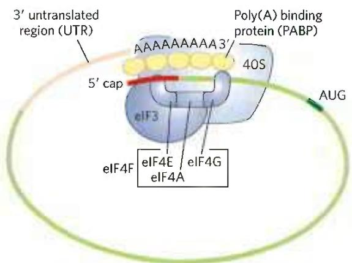  
FIGURE 27-27 Circularization of mRNA in the eukaryotic initiation complex. The 3' and 5' ends of eukaryotic mRNAs are linked by the eIF4F complex of proteins. The eIF4E subunit binds to the 5' cap, and the eIF4G protein binds to the poly(A) binding protein (PABP) at the 3' end of the mRNA. The eIF4G protein also binds to eIF3, linking the circularized mRNA to the 40S subunit of the ribosome.  
complex, and then the mRNA (with the 5' cap shown in red) to form a 48S complex. The final 80S initiation complex is formed as the 60S subunit associates, coupled with release of most of the initiation factors.

The roles of the various bacterial and eukaryotic initiation factors in the overall process are summarized in Table 27-8. The mechanism by which these proteins act is an important area of investigation.

#### [EN] Stage 3: Peptide Bonds Are Formed in the Elongation Stage

The third stage of protein synthesis is elongation. Again, we begin with bacterial cells. Elongation requires (1) the initiation complex described above, (2) aminoacyl-tRNAs, (3) a set of three soluble cytosolic proteins called elongation factors (EF-Tu, EF-Ts, and EF-G in bacteria), and (4) GTP. Cells use three steps to add each amino acid residue, and the steps are repeated as many times as there are residues to be added.

Elongation Step 1: Binding of an Incoming Aminoacyl-tRNA In the first step of the elongation cycle (Fig. 27-28), the appropriate incoming aminoacyl-tRNA binds to a complex of GTP-bound EF-Tu. The resulting aminoacyl-tRNA-EF-Tu-GTP complex binds to the A site of the 70S initiation complex. The GTP is hydrolyzed and an EF-Tu-GDP complex is released from the 70S ribosome. The bound GDP is released when the EF-Tu-GDP complex binds to EF-Ts, and EF-Ts is subsequently released when another molecule of GTP binds to EF-Tu, recycling it.

<table><tr><td colspan="2">TABLE 27-8 Protein Factors Required for Initiation of Translation in Bacterial and Eukaryotic Cells</td></tr><tr><td>Factor</td><td>Function</td></tr><tr><td colspan="2">Bacterial</td></tr><tr><td>IF1</td><td>Prevents premature binding of tRNAs to A site</td></tr><tr><td>IF2</td><td>Facilitates binding of fMet-tRNA $^fMet$  to 30S ribosomal subunit</td></tr><tr><td>IF3</td><td>Binds to 30S subunit; prevents premature association of 50S subunit; enhances specificity of P site for fMet-rRNA $^fMet$ </td></tr><tr><td colspan="2">Eukaryotic</td></tr><tr><td>eIF1</td><td>Binds to the E site of the 40S subunit; facilitates interaction between eIF2-tRNA-GTP ternary complex and the 40S subunit</td></tr><tr><td>eIF1A</td><td>Homolog of bacterial IF1; prevents premature binding of tRNAs to A site</td></tr><tr><td>eIF2</td><td>GTPase; facilitates binding of initiating Met-tRNA $^Met$  to 40S ribosomal subunit</td></tr><tr><td>eIF2Ba, eIF3</td><td>First factors to bind 40S subunit; facilitate subsequent steps</td></tr><tr><td>eIF4F</td><td>Complex consisting of eIF4E, eIF4A, and eIF4G</td></tr><tr><td>eIF4A</td><td>RNA helicase activity; removes secondary structure in the mRNA to permit binding to 40S subunit; part of the eIF4F complex</td></tr><tr><td>eIF4B</td><td>Binds to mRNA; facilitates scanning of mRNA to locate the first AUG</td></tr><tr><td>eIF4E</td><td>Binds to the 5&#x27; cap of mRNA; part of the eIF4F complex</td></tr><tr><td>eIF4G</td><td>Binds to eIF4E and to poly(A) binding protein (PABP); part of the eIF4F complex</td></tr><tr><td>eIF5a</td><td>Promotes dissociation of several other initiation factors from 40S subunit as a prelude to association of 60S subunit to form 80S initiation complex</td></tr><tr><td>eIF5b</td><td>GTPase homologous to bacterial IF2; promotes dissociation of initiation factors before final ribosome assembly</td></tr><tr><td colspan="2">aNot shown in Figure 27-26.</td></tr></table>

Elongation Step 2: Peptide Bond Formation A peptide bond is now formed between the two amino acids bound by their tRNAs to the A and P sites on the ribosome. This occurs by transfer of the initiating N-formylmethionyl group from its tRNA to the amino group of the second amino acid, now in the A site (Fig. 27-29). The $\alpha$ -amino group of the amino acid in the A site acts as a nucleophile, displacing the tRNA in the P site to form a peptide bond. The constrained structure of the proline side chain interferes with the alignment needed for peptide bonds to form properly. A special system binds to the ribosome to facilitate peptide bonds between two proline residues whenever that is necessary (Box 27-3). The reaction produces a dipeptidyl-tRNA in the A site, and the now "uncharged" (deacylated) tRNA $^{fMet}$ remains bound to the P site. The tRNAs then shift to a hybrid binding state, with elements of each spanning two different sites on the ribosome, as shown in Figure 27-29.

  
FIGURE 27-28 First elongation step in bacteria: binding of the second aminoacyl-tRNA. The second aminoacyl-tRNA (AA $_{2}$ ) enters the A site of the ribosome bound to GTP-bound EF-Tu (shown here as Tu). Binding of the second aminoacyl-tRNA to the A site is accompanied by hydrolysis of the GTP to GDP and P $_{i}$ and release of the EF-Tu-GDP complex from the ribosome. The EF-Tu-GTP complex is regenerated in a process requiring EF-Ts and GTP. "Accommodation" involves a change in the conformation of the second tRNA that pulls its aminoacyl end into the peptidyl transferase site.

  
FIGURE 27-29 Second elongation step in bacteria: formation of the first peptide bond. The N-formylmethionyl group is transferred to the amino group of the second aminoacyl-tRNA in the A site, forming a dipeptidyl-tRNA. At this stage, both tRNAs bound to the ribosome shift position in the 50S subunit to take up a hybrid binding state. The  
uncharged tRNA shifts so that its 3' and 5' ends are in the E site. Similarly, the 3' and 5' ends of the peptidyl-tRNA shift to the P site. The anticodons remain in the P and A sites. Note the involvement of the 2'-hydroxyl group of the 3'-terminal adenosine as a general acid-base catalyst in this reaction.

P5 The peptidyl transferase activity that catalyzes peptide bond formation resides in the 23S rRNA rather than in any of the protein components of ribosomes. The ribosomal 23S rRNA catalyzes the reaction by binding and aligning the tRNAs in the A and P sites in the proper orientations for reaction. A highly conserved active site adenosine residue in the 23S rRNA (A2451 in E. coli) may facilitate the reaction by general base catalysis and transition state stabilization utilizing N-3 in the purine ring and/or the 2'-hydroxyl group. This addition to the known catalytic repertoire of ribozymes has interesting implications for the evolution of life (see Section 26.4).

Elongation Step 3: Translocation In the final step of the elongation cycle, translocation, the ribosome moves one codon toward the 3' end of the mRNA (Fig. 27-30a). This movement shifts the anticodon of the dipeptidyl-tRNA, which is still attached to the second codon of the mRNA, from the A site to the P site, and shifts the deacylated tRNA from the P site to the E site, from where the tRNA is released into the cytosol. The third codon of the mRNA now lies in the A site and the second codon lies in the P site. Movement of the ribosome along the mRNA requires EF-G (also known as translocase) and the energy provided by hydrolysis of another molecule of GTP. Because the structure of EF-G mimics the structure of the EF-Tu-tRNA complex (Fig. 27-30b), EF-G can bind the A site and, presumably, displace the peptidyl-tRNA.

After translocation, the ribosome, with its attached dipeptidyl-tRNA and mRNA, is ready for the next elongation cycle and attachment of a third amino acid residue. This process occurs in the same way as addition of the second residue (as shown in Figs. 27-28, 27-29, and 27-30). For each amino acid residue correctly added to the growing polypeptide, two GTPs are hydrolyzed to GDP and $P_{i}$ as the ribosome moves from codon to codon along the mRNA toward the 3' end.

The polypeptide remains attached to the tRNA of the most recent amino acid to be inserted. This association maintains the functional connection between the information in the mRNA and its decoded polypeptide output. At the same time, the ester linkage between this tRNA and the carboxyl terminus of the growing

#### [EN] Ribosome Pausing, Arrest, and Rescue

Ribosomes may stall during protein biosynthesis, especially while translating an mRNA that is damaged or incomplete. If translation cannot proceed to the end of the gene, the termination factors cannot act, and the ribosome may become "stuck" and thus inactivated.

Translation can experience a variety of stalling events. One well-documented issue involves the addition of proline to the growing chain, particularly when two prolines must be added sequentially. Unlike the other amino acids, proline is a secondary amine and is not as good a nucleophile in the peptide bond formation step (Fig. 27-29). The constrained geometry of the proline side chain can also affect alignment of groups for reaction on the ribosome, an issue particularly acute when the peptide bond is to be between two prolines. Bacteria have an elongation factor P (EFP) that binds between the E and P sites on the ribosome next to the peptidyl-tRNA. EFP binding affects the positioning of adjacent bound tRNAs and facilitates an optimal alignment for peptide bond formation with proline. Ribosomes in cells lacking EFP stall regularly at locations where two or more proline codons must be read consecutively. In eukaryotes, a factor closely related to EFP, eIF5A, performs this same function.

When the ribosome encounters the end of an mRNA before encountering a stop codon, the translocation step leads to formation of a stable non-stop complex, in which the A site has no mRNA that can interact with a new charged tRNA. The non-stop complex cannot be recycled by the normal termination factors. Instead, the ribosome is rescued by trans-translation (Fig. 1). In virtually all bacteria, the rescue system consists of transfer-messenger RNA (tmRNA) and small protein B (SmpB). These bind to the stalled complex in such a way that the tmRNA is positioned in the empty A site so that the ribosome can continue translation until it encounters a stop codon embedded in the tmRNA. The ribosome is then recycled, and both the defective mRNA and the polypeptide translated from it are degraded. Similar systems exist in eukaryotes.

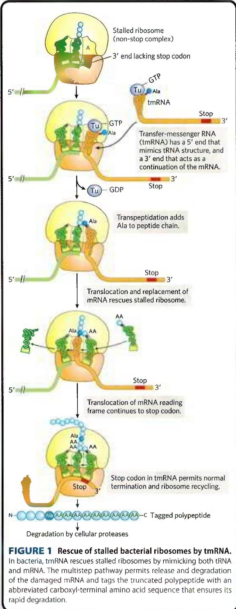

FIGURE 1 Rescue of stalled bacterial ribosomes by tmRNA. In bacteria, tmRNA rescues stalled ribosomes by mimicking both tRNA and mRNA. The multistep pathway permits release and degradation of the damaged mRNA and tags the truncated polypeptide with an abbreviated carboxyl-terminal amino acid sequence that ensures its rapid degradation.

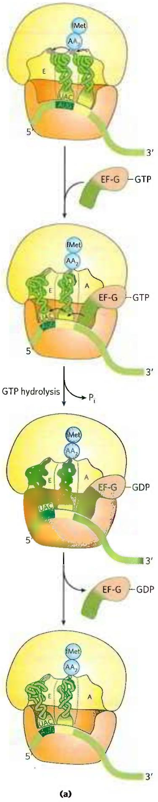

polypeptide activates the terminal carboxyl group for nucleophilic attack by the incoming amino acid to form a new peptide bond (Fig. 27-29). As the existing ester linkage between the polypeptide and tRNA is broken during peptide bond formation, the linkage between the polypeptide and the information in the mRNA persists, because each newly added amino acid is still attached to its tRNA.

The elongation cycle in eukaryotes is similar to that in bacteria. Three eukaryotic elongation factors (eEF1α, eEF1βγ, and eEF2) have functions analogous to those of the bacterial elongation factors (EF-Tu, EF-Ts, and EF-G, respectively). When a new aminoacyl-tRNA binds to the A site, an allosteric interaction leads to ejection of the uncharged tRNA from the E site.

Proofreading on the Ribosome The GTPase activity of EF-Tu during the first step of elongation in bacterial cells (Fig. 27-28) makes an important contribution to the rate and fidelity of the overall biosynthetic process. Both the EF-Tu-GTP and EF-Tu-GDP complexes exist for a few milliseconds before they dissociate. These two intervals provide opportunities for the codon-anticodon interactions to be proofread. Incorrect aminoacyl-tRNAs normally dissociate from the A site during one of these periods. If the GTP analog guanosine

FIGURE 27-30 Third elongation step in bacteria: translocation. (a) The ribosome moves one codon toward the 3' end of the mRNA, using energy provided by hydrolysis of GTP bound to EF-G (translocase). The dipeptidyl-tRNA is now entirely in the P site, leaving the A site open for an incoming (third) aminoacyl-tRNA. The uncharged tRNA later dissociates from the E site, and the elongation cycle begins again. (b) The structure of EF-G (left) mimics the structure of EF-Tu complexed with tRNA (right). The carboxyl-terminal part of EF-G mimics the structure of the anticodon loop of tRNA in both shape and charge distribution. [(b) Data from (left) PDB ID 1DAR, S. al-Karadaghi et al., Structure 4:555, 1996; (right) PDB ID 1B23, P. Nissen et al., Structure 7:143, 1999.]

5'-O-(3-thiotriphosphate) (GTPγS) is used in place of GTP, hydrolysis is slowed, improving the fidelity (by increasing the proofreading intervals) but reducing the rate of protein synthesis.

The process of protein synthesis (including the characteristics of codon-anticodon pairing already described) has clearly been optimized through evolution to balance the requirements for speed and fidelity. Improved fidelity might diminish speed, whereas increases in speed would probably compromise fidelity. And, recall that the proofreading mechanism on the ribosome establishes only that the proper codon-anticodon pairing has taken place, not that the correct amino acid is attached to the tRNA. If a tRNA is successfully aminoacylated with the wrong amino acid (as can be done experimentally), this incorrect amino acid is efficiently incorporated into a protein in response to whatever codon is normally recognized by the tRNA.

#### [EN] Stage 4: Termination of Polypeptide Synthesis Requires a Special Signal

Elongation continues until the ribosome adds the last amino acid coded by the mRNA. Termination, the fourth stage of polypeptide synthesis, is signaled by the presence of one of three termination codons in the mRNA (UAA, UAG, UGA), immediately following the final coded amino acid. Mutations in a tRNA anticodon that allow an amino acid to be inserted at a termination codon are generally deleterious to the cell. In bacteria, once a termination codon occupies the ribosomal A site, three termination factors, or release factors—the proteins RF1, RF2, and RF3—contribute to (1) hydrolysis of the terminal peptidyl-tRNA bond; (2) release of the free polypeptide and the last tRNA, now uncharged, from the P site; and (3) dissociation of the 70S ribosome into its 30S and 50S subunits, ready to start a new cycle of polypeptide synthesis (Fig. 27-31). RF1 recognizes the termination codons UAG and UAA, and RF2 recognizes UGA and UAA. Either RF1 or RF2 (depending on which codon is present) binds at a termination codon and induces peptidyl transferase to transfer the growing polypeptide to a water molecule rather than to another amino acid. The release factors have domains thought to mimic the structure of tRNA, as shown for the elongation factor EF-G in Figure 27-30b. The specific function of RF3 has not been firmly established, although it is thought to release the ribosomal subunit. In eukaryotes, a single release factor, eRF, recognizes all three termination codons.

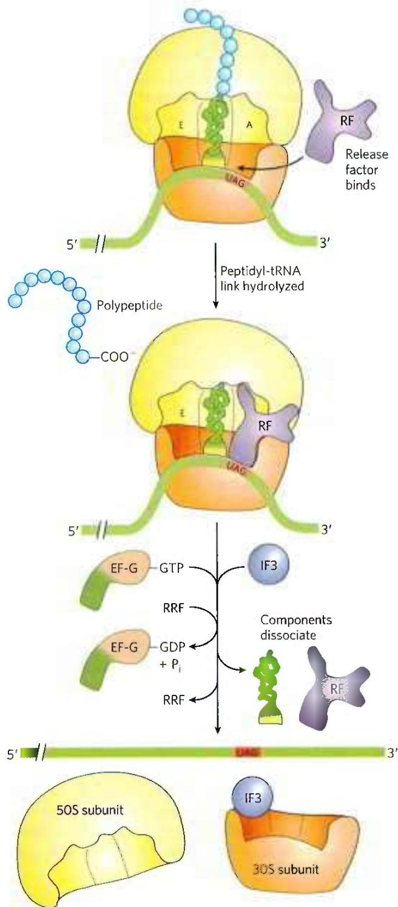  
FIGURE 27-31 Termination of protein synthesis in bacteria. Synthesis is terminated in response to a termination codon in the A site. First, a release factor, RF (RF1 or RF2, depending on which termination codon is present), binds to the A site. This leads to hydrolysis of the ester linkage between the nascent polypeptide and the tRNA in the P site and release of the completed polypeptide. Finally, the mRNA, deacylated tRNA, and release factor leave the ribosome, which dissociates into its 30S and 50S subunits, aided by ribosome recycling factor (RRF), IF3, and energy provided by EF-G-mediated GTP hydrolysis. The 30S subunit complex with IF3 is ready to begin another cycle of translation.

Dissociation of the translation components leads to ribosome recycling. The release factors dissociate from the posttermination complex (with an uncharged tRNA in the P site) and are replaced by EF-G and a protein called ribosome recycling factor (RRF; $M_{r}$ 20,300). Hydrolysis of GTP by EF-G leads to dissociation of the 50S subunit from the 30S-tRNA-mRNA complex. EF-G and RRF are replaced by IF3, which promotes dissociation of the tRNA. The mRNA is then released. The complex of IF3 and the 30S subunit is then ready to initiate another round of protein synthesis (Fig. 27-24).

Energy Cost of Fidelity in Protein Synthesis P1 Synthesis of a protein true to the information specified in its mRNA requires energy well beyond what would be required to synthesize peptide bonds linking a random sequence of amino acids. Formation of each aminoacyl-tRNA uses two high-energy phosphate groups. An additional ATP is consumed each time an incorrectly activated amino acid is hydrolyzed by the deacylation activity of an aminoacyl-tRNA synthetase as part of its proofreading activity. A GTP is cleaved to GDP and $\mathbf{P}_{\mathrm{i}}$ during the first elongation step, and another during the translocation step. Thus, on average, the energy derived from the hydrolysis of more than four NTPs to NDPs is required for the formation of each peptide bond of a polypeptide.

This represents an exceedingly large thermodynamic “push” in the direction of synthesis: at least $4 \times 30.5$ kJ/mol = 122 kJ/mol of phosphodiester bond energy to generate a peptide bond, which has a standard free energy of hydrolysis of only about -21 kJ/mol. The net free-energy change during peptide bond synthesis is thus -101 kJ/mol. Proteins are information-containing polymers. The biochemical goal is not simply the formation of a peptide bond but the formation of a peptide bond between two specified amino acids. Each of the high-energy phosphate compounds expended in this process plays a critical role in maintaining proper alignment between each new codon in the mRNA and its associated amino acid at the growing end of the polypeptide. This energy permits very high fidelity in the biological translation of the genetic message of mRNA into the amino acid sequence of proteins.

Rapid Translation of a Single Message by Polysomes Large clusters of 10 to 100 ribosomes that are very active in protein synthesis can be isolated from both eukaryotic and bacterial cells. Electron micrographs show a fiber between adjacent ribosomes in the cluster, which is called a polysome (Fig. 27-32a). The connecting strand is a single molecule of mRNA that is being translated simultaneously by many closely spaced ribosomes, allowing the highly efficient use of the mRNA.

In bacteria, transcription and translation are tightly coupled. Messenger RNAs are synthesized and translated in the same 5'→3' direction. As soon as the 5' end of the mRNA appears, ribosomes and the RNA polymerase form a complex, the expressome, beginning translation long before transcription is complete (Fig. 27-32b). As the 5' end of the mRNA exits one ribosome, additional ribosomes are loaded in succession to form a polysome. The situation is quite different in eukaryotic cells, where newly transcribed mRNAs must leave the nucleus before they can be translated (see Fig. 27-17).

  
FIGURE 27-32 Coupling of transcription and translation in bacteria. (a) Electron micrograph of polysomes forming during transcription of a segment of DNA from E. coli. Each mRNA is being translated by many ribosomes simultaneously. The nascent polypeptide chains are difficult to see under the conditions used to prepare the sample shown here. The arrow marks the approximate beginning of the gene that is being transcribed. (b) Each mRNA is translated by ribosomes while it is still being transcribed from DNA by RNA polymerase. This is possible because the mRNA in bacteria does not have to be transported from a nucleus to the cytoplasm before encountering ribosomes. In this schematic diagram the ribosomes are depicted as smaller than the RNA polymerase. In reality, the ribosomes ( $M_r$ $2.7 \times 10^6$ ) are an order of magnitude larger than the RNA polymerase ( $M_r$ $3.9 \times 10^5$ ). [(a) O. L. Miller, Jr., et al. Science 169:392, 1970, Fig. 3. © 1970 American Association for the Advancement of Science.]

Bacterial mRNAs generally exist for just a few minutes (p. 986) before they are degraded by nucleases. To maintain high rates of protein synthesis, the mRNA for a given protein or set of proteins must be made continuously and translated with maximum efficiency. The short lifetime of mRNAs in bacteria allows a rapid cessation of synthesis when the protein is no longer needed.

#### [EN] Stage 5: Newly Synthesized Polypeptide Chains Undergo Folding and Processing

In the final stage of protein synthesis, the nascent polypeptide chain is folded and processed into its biologically active form. During or after its synthesis, the polypeptide progressively assumes its native conformation. As introduced in Chapter 4, protein chaperones, chaperonins, and specific enzymes (e.g., protein disulfide isomerase and peptide prolyl cis-trans isomerase) play an important role in the correct folding of many proteins in all cells. Chaperones and chaperonins, exemplified by GroEL/GroES in bacteria (Fig. 27-33) and Hsp60 in eukaryotes, assist folding in part by restricting formation of unproductive aggregates and limiting the conformational space that a polypeptide may explore as it folds. P4 ATP is hydrolyzed as part of this process. The GroEL/GroES system is required for the folding of about 10%–15% of the proteins in E. coli.

Some newly made proteins, bacterial, archaeal, and eukaryotic, do not attain their final biologically active conformation until they have been altered by one or more posttranslational modifications. Protein modifications of one type or another have been described in almost every chapter of this text, and some prominent examples are summarized here.

Amino-Terminal and Carboxyl-Terminal Modifications The first residue inserted in all polypeptides is N-formylmethionine (in bacteria) or methionine (in eukaryotes). However, the formyl group, the amino-terminal Met residue, and often additional amino-terminal (and, in some cases, carboxyl-terminal) residues may be removed enzymatically in formation of the final functional protein. In as many as 50% of eukaryotic proteins, the amino group of the amino-terminal residue is N-acetylated after translation. Carboxyl-terminal residues are also sometimes modified.

Loss of Signal Sequences As we shall see in Section 27.3, the 15 to 30 residues at the amino-terminal end of some proteins play a role in directing the protein to its ultimate destination in the cell. Such signal sequences are eventually removed by specific peptidases.

Modification of Individual Amino Acid Residues The hydroxyl groups of certain Ser, Thr, and Tyr residues of some proteins are enzymatically phosphorylated by ATP (Fig. 27-34a); the phosphate groups add negative charges to these polypeptides. The functional significance of this modification varies from one protein to the next. For example, the milk protein casein has many phosphoserine groups that bind $\mathrm{Ca^{2+}}$ . Calcium, phosphate, and amino acids are all valuable to suckling young, so casein efficiently provides three essential nutrients. And as we have seen in numerous instances, phosphorylation-dephosphorylation cycles regulate the activity of many enzymes and regulatory proteins.

  
FIGURE 27-33 Chaperonins in protein folding. (a) A proposed pathway for the action of the E. coli chaperonins GroEL (a member of the Hsp60 protein family) and GroES. Each GroEL complex consists of two large chambers formed by two heptameric rings (each subunit $M_{\mathrm{f}}$ 57,000). GroES, also a heptamer (subunit $M_{\mathrm{f}}$ 10,000), blocks one of the GroEL chambers after an unfolded protein is bound inside. The chamber with the unfolded protein is referred to as cis; the opposite one is trans. Folding occurs within the cis chamber, during the time it takes to hydrolyze the seven ATP that are bound to the subunits in the heptameric ring. The GroES and the ADP molecules then dissociate, and the protein is released. The two chambers of the GroEL/Hsp60 systems alternate in the binding and facilitated folding of client proteins. (b) A cutaway image of the GroEL/GroES complex. The $\alpha$ -helical secondary structure is represented as cylinders within a transparent surface structure. A folded protein (gp23) is shown within the large interior space of the upper chamber; an unfolded version of gp23 is shown in the lower chamber. [(a) Information from F. U. Hartl et al., Nature 475:324, 2011, Fig. 3. (b) Data from EMDB-1548, D. K. Clare et al., Nature 457:107, 2009; PDB ID 2CGT, D. K. Clare et al., J. Mol. Biol. 358:905, 2006; PDB ID 1YUE, A. Fokine et al., Proc. Natl. Acad. Sci. USA 102:7163, 2005.]

Extra carboxyl groups may be added to Glu residues of some proteins. For example, the blood-clotting protein prothrombin contains $\gamma$ -carboxyglutamate residues (Fig. 27-34b) in its amino-terminal region; the $\gamma$ -carboxyl groups are introduced by an enzyme that requires vitamin K. These carboxyl groups bind $Ca^{2+}$ , which is required to initiate the clotting mechanism.

Monomethyl- and dimethyllysine residues (Fig. 27-34c) occur in some muscle proteins and in cytochrome c. The calmodulin of most species contains one trimethyllysine residue at a specific position. In other proteins, the carboxyl groups of some Glu residues undergo methylation, removing their negative charge.

Attachment of Carbohydrate Side Chains The carbohydrate side chains of glycoproteins are attached covalently during or after synthesis of the polypeptide. In some glycoproteins, the carbohydrate side chain is attached enzymatically to Asn residues (N-linked oligosaccharides), in others to Ser or Thr residues (O-linked oligosaccharides; see Fig. 7-27). Many proteins that function extracellularly, as well as the lubricating proteoglycans that coat mucous membranes, contain oligosaccharide side chains (see Fig. 7-25).

Addition of Isoprenyl Groups Some eukaryotic proteins are modified by the addition of groups derived from isoprene (isoprenyl groups). A thioether bond is formed between the isoprenyl group and a Cys residue of the protein (see Fig. 11-16). The isoprenyl groups are derived from pyrophosphorylated intermediates of the cholesterol biosynthetic pathway (see Fig. 21-36), such as farnesyl pyrophosphate (Fig. 27-35). Proteins modified in this way include the Ras proteins (small G proteins), which are products of the ras oncogenes and proto-oncogenes, and the trimeric G proteins (both discussed in Chapter 12), as well as lamins, proteins found in the nuclear matrix. The isoprenyl group helps to anchor the protein in a membrane. The transforming (carcinogenic) activity of the ras oncogene is lost when isoprenylation of the Ras protein is blocked, a finding that has stimulated interest in identifying inhibitors of this posttranslational modification pathway for use in cancer chemotherapy.

Addition of Prosthetic Groups Many proteins require for their activity covalently bound prosthetic groups. Two examples are the biotin molecule of acetyl-CoA carboxylase and the heme group of hemoglobin or cytochrome c.

  
(a)

  
(b)

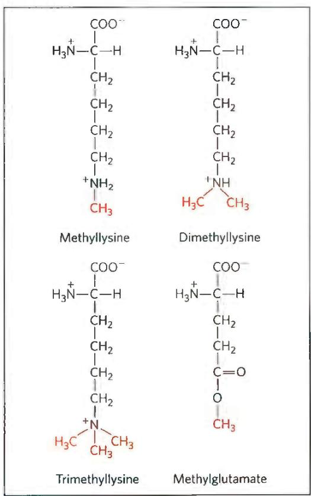  
(c)

FIGURE 27-34 Some modified amino acid residues. (a) Phosphorylated amino acids. (b) A carboxylated amino acid. (c) Some methylated amino acids.

  
FIGURE 27-35 Farnesylation of a Cys residue. The thioether linkage is shown in red. The Ras protein is the product of the ras oncogene.

Proteolytic Processing Many proteins are initially synthesized as large, inactive precursor polypeptides that are proteolytically trimmed to form their smaller, active forms. Examples include proinsulin (Fig. 23-4), some viral proteins (Fig. 26-30), and proteases such as chymotrypsinogen and trypsinogen (Fig. 6-42).

Formation of Disulfide Cross-Links After folding into their native conformations, some proteins form intrachain or interchain disulfide bridges between Cys residues. In eukaryotes, disulfide bonds are common in proteins to be exported from cells. The cross-links formed in this way help to protect the native conformation of the protein molecule from denaturation in the extracellular environment, which can differ greatly from intracellular conditions and is generally oxidizing.

#### [EN] Protein Synthesis Is Inhibited by Many Antibiotics and Toxins

Protein synthesis is a central function in cellular physiology and is the primary target of many naturally occurring antibiotics and toxins. Except as noted otherwise, these antibiotics inhibit protein synthesis in bacteria. The differences between bacterial and eukaryotic protein synthesis, though in some cases subtle, are such that most of the compounds discussed below are relatively harmless to eukaryotic cells. Natural selection has favored the evolution of compounds that exploit minor differences in order to affect bacterial systems selectively, so that these biochemical weapons are synthesized by some microorganisms and are extremely toxic to others. Because nearly every step in protein synthesis can be specifically inhibited by one antibiotic or another, antibiotics have become valuable tools in the study of protein biosynthesis.

Puromycin, made by the mold Streptomyces alboniger, is one of the best-understood inhibitory antibiotics. Its structure is very similar to the 3' end of an aminoacyl-tRNA, enabling it to bind to the ribosomal A site and participate in peptide bond formation, producing peptidylpuromycin (Fig. 27-36). However, because puromycin resembles only the 3' end of the tRNA, it does not engage in translocation and dissociates from the ribosome shortly after it is linked to the carboxyl terminus of the peptide. This prematurely terminates polypeptide synthesis.

  
FIGURE 27-36 Disruption of peptide bond formation by puromycin. The antibiotic puromycin resembles the aminoacyl end of a charged tRNA, and it can bind to the ribosomal A site and participate in peptide bond formation. The product of this reaction, peptidyl puromycin, is not translocated to the P site. Instead, it dissociates from the ribosome, causing premature chain termination.

Tetracyclines inhibit protein synthesis in bacteria by blocking the A site on the ribosome, preventing the binding of aminoacyl-tRNAs. Chloramphenicol inhibits protein synthesis by bacterial (and mitochondrial and chloroplast) ribosomes by blocking peptidyl transfer; it does not affect cytosolic protein synthesis in eukaryotes. Conversely, cycloheximide blocks the peptidyl transferase of 80S eukaryotic ribosomes but not that of 70S bacterial (and mitochondrial and chloroplast) ribosomes. Streptomycin, a basic trisaccharide, causes misreading of the genetic code (in bacteria) at relatively low concentrations and inhibits initiation at higher concentrations.

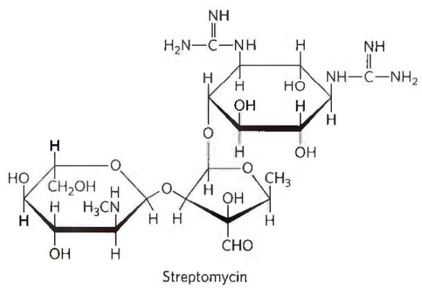

Several other inhibitors of protein synthesis are notable because of their toxicity to humans and other mammals. Diphtheria is a serious bacterial illness that causes sore throat, swollen glands, breathing difficulties, and often death. Although it has been largely eradicated in the developed world, a few thousand cases still occur each year in countries where vaccination is limited. The bacterium Corynebacterium diphtheriae releases the diphtheria toxin ( $M_{r}$ 58,330), which catalyzes the ADP-ribosylation of a diphthamide (a modified histidine) residue of eukaryotic elongation factor eEF2, thereby inactivating it. The resulting dead cells form a thick, gray membrane that covers the throat and tonsils, creating a putrid odor that is one hallmark of the disease. Ricin ( $M_{r}$ 29,895), an extremely toxic protein of the castor bean, inactivates the 60S subunit of eukaryotic ribosomes by depurinating a specific adenosine residue in 28S rRNA. Ricin was used in the infamous 1978 murder of BBC journalist and Bulgarian dissident Georgi Markov, presumably by the Bulgarian secret police. Using a syringe hidden at the end of an umbrella, a member of the secret police injected Markov in the leg with a ricin-infused pellet. He died four days later.

#### [EN] SUMMARY 27.2 Protein Synthesis

■ Protein synthesis occurs on the ribosomes, which consist of protein and rRNA. Bacteria have 70S ribosomes, with a large (50S) and a small (30S) subunit. Eukaryotic ribosomes are significantly larger (80S) and contain more proteins. The growth of polypeptides on ribosomes begins with the amino-terminal amino acid and proceeds by successive additions of new residues to the carboxyl-terminal end.

Transfer RNAs have 73 to 93 nucleotide residues, some of which have modified bases. Each tRNA has an amino acid arm with the terminal sequence CCA(3') to which an amino acid is esterified, an anticodon arm, a TψC arm, and a D arm; some tRNAs have a fifth arm. The anticodon is responsible for the specificity of interaction between the aminoacyl-tRNA and the complementary mRNA codon.

In stage 1 of the five stages of protein synthesis, amino acids are activated by specific aminoacyl-tRNA synthetases in the cytosol. These enzymes catalyze the formation of aminoacyl-tRNAs, with simultaneous cleavage of ATP to AMP and PP $_{i}$ . The fidelity of protein synthesis depends on the accuracy of this reaction, and some of these enzymes carry out proofreading steps at separate active sites.

■ Stage 2 is initiation. In bacteria, the initiating aminoacyl-tRNA in all proteins is N-formylmethionyl-tRNA $^{fMet}$ . Initiation of protein synthesis involves formation of a complex between the 30S ribosomal subunit, mRNA, GTP, fMet-tRNA $^{fMet}$ , three initiation factors, and the 50S subunit; GTP is hydrolyzed to GDP and P $_{i}$ .

■ Stage 3 is elongation. In the elongation steps, GTP and elongation factors are required for binding the incoming aminoacyl-tRNA to the A site on the ribosome. In the first peptidyl transfer reaction, the fMet residue is transferred to the amino group of the incoming aminoacyl-tRNA. Movement of the ribosome along the mRNA then translocates the dipeptidyl-tRNA from the A site to the P site, a process requiring hydrolysis of GTP. Deacylated tRNAs dissociate from the ribosomal E site.

■ Stage 4 is termination. After many such elongation cycles, synthesis of the polypeptide is terminated with the aid of release factors. At least four high-energy phosphate equivalents (from ATP and GTP) are required to generate each peptide bond, an energy investment required to guarantee fidelity of translation.

■ Stage 5 is protein processing. Polypeptides fold into their active, three-dimensional forms. Many proteins are further processed by posttranslational modification reactions.

■ Many well-studied antibiotics and toxins inhibit some aspect of protein synthesis.

<!-- EN-END 27.2 -->

## 四、蛋白质合成的忠实性

蛋白质合成不仅是细胞新陈代谢中最复杂的过程,也是一个速度快、表达遗传信息高度忠实的过程。这些都需要付出能量的代价。

## （一）蛋白质合成忠实性需要消耗能量

蛋白质合成是一个高耗能的过程,自由能不仅用来合成肽键,更多用来保证遗传信息表达的忠实性(fidelity)。每合成一分子氨酰-tRNA,需要分解2个高能磷酸键。这一步活化氨基酸需要的能量由ATP供给。如果合成发生错误,不正确产物将被水解,还需额外消耗ATP。在延伸阶段第一步(结合)和第三步(移位)各分解一个高能磷酸键,能量用于推动分子运动故由GTP供给,GTP分解成GDP和Pi。因此每合成一个肽键,至少需要水解4个高能磷酸键,共消耗能量 $4\times(-30.5\ \text{kJ/mol})=-122\ \text{kJ/mol}$ 。水解肽键的标准自由能变化为-21 kJ/mol,合成肽键的净自由变化为-101 kJ/mol(-24.14 kcal/mol)。多付出的能量允许蛋白质合成达到非常高的忠实性。

## （二）合成酶的校对功能提高了忠实性

氨酰-tRNA合成酶的识别能力直接关系到翻译的忠实性。它既要从20种氨基酸中分辨出一种，又要从数十至上百种tRNA中分辨出1\~3种相关tRNA。合成酶对相关tRNA的分辨能力相对较高，可能是由于酶与tRNA的接触面积大，根据同工tRNA的个性特征（第二套遗传密码），能够较精确区分相关tRNA和非相关tRNA。但合成酶对于结构相似的氨基酸就不易区分。通常tRNA的选择错误率为 $10^{-6}$ ，氨基酸的选择错误率为 $10^{-5}$ 至 $10^{-4}$ 。无论是不正确的氨基酸，或是不正确的tRNA，一旦发生错误，酶具有校正功能，可以在一定程度上查出加以校正。合成酶的校对功能有两类，一是动力学校对（kinetic proofreading）；另一是化学校对。

动力学校对是基于相关 tRNA 与非相关 tRNA 对酶的亲和力不同,因而反应速度不同。相关 tRNA 与酶结合迅速,解离较慢,结合后引起酶构象改变,迅即发生相关 tRNA 的氨酰化反应。而非相关 tRNA 与酶结合慢,解离快,不引起酶构象改变,氨酰化反应发生缓慢。因此,进入酶活性部位的非相关 tRNA 可在随后被排除。

化学校对是根据底物空间结构进行鉴别。氨酰-tRNA合成反应分为两步进行，氨基酸先被ATP活化形成氨酰腺苷酸，待相关tRNA进入活性部位后再形成氨酰-tRNA。这两步反应都能进行校对。校对发生在相关tRNA进入活性部位后，如发现氨基酸不正确，或者水解氨酰腺苷酸，或水解氨酰-tRNA，不同的酶不完全一样。甲硫氨酸、异亮氨酸和缬氨酸优先作用于第一步，另一些酶主要作用于第二步。举例来说，异亮氨酰- $\mathrm{tRNA}^{\mathrm{Ile}}$ 合成酶除合成位点外还有校对位点（editing site），可以水解不正确的氨酰-tRNA。比Ile大的氨基酸（如Leu）无法进入该酶合成位点；Val比Ile小，可以进入合成位点，但随后送往校正位点， $\mathrm{Vat - tRNA}^{\mathrm{Ile}}$ 即被水解成Val和 $\mathrm{tRNA}^{\mathrm{Ile}}$ 。Ile能进入合成位点，但不能进入较小的校正位点，经过双重筛选，只有Ile可与其相关 $\mathrm{tRNA}^{\mathrm{Ile}}$ 连接。校正有赖于tRNA氨酰化末端核苷酸链的柔性构象，它能将氨基酸从合成位点送往校正位点。许多合成酶都有此校正位点。

有少数合成酶虽无校对功能,但也能达到高度精确选择氨基酸。例如,酪氨酰-tRNA $^{Tyr}$ 合成酶能够精确分辨酪氨酸和苯丙氨酸,因羟基的存在,酶对前者的结合是后者的 $10^{4}$ 倍。

## （三）核糖体对忠实性的影响

蛋白质生物合成是一个高度精确的过程,通常误差小于 $10^{-5}$ 。容易引入错误的步骤有两个:一是在合成酶催化下,氨基酸连接到相关 tRNA 上;二是在核糖体上氨酰-tRNA 通过反密码子与 mRNA 的密码子配对。前已谈到,借助合成酶的校正功能,可以使选择氨基酸和 tRNA 的错误率降低到 $10^{-5}$ 以下。然而,反密码子与密码子的结合常数很小,远不足维持蛋白质合成的错误率小于 $10^{-5}$ 。因此很容易想到,核糖体必定存在某种机制来增强反密码子与密码子的相互作用。这种机制表现在两个方面,一是核糖体在结构上能识别是否正确配对;二是使不正确配对的氨酰-tRNA 在多个步骤上可以脱离,亦即动力学校对,此过程需要蛋白因子参与作用。

从核糖体晶体结构分析中知道，16S rRNA 可与氨酰-tRNA 多处接触。在反密码子与密码子配对时，16S rRNA 的两个碱结合在 tRNA 反密码子与 mRNA 密码子形成的螺旋前两个碱基对浅沟上，从而稳定了配对结构。一方面使氨酰-tRNA 束缚在 A 位点；另一方面 rRNA 构象的改变触发了下一步反应，导致 EF-Tu 对 GTP 的水解。校对作用还受到动力学的控制。不配对的氨酰-tRNA 解离速度约比配对氨酰-tRNA 的解离速度快 5 倍。延迟转肽反应也可以使不配对氨酰-tRNA 有更多机会脱离。就是说降低速度可以增加忠实性。

## 五、蛋白质的定位

多肽链在核糖体上合成后即自发装配成蛋白质，并被运送到细胞的各个部分，“各就各位”以行使其生物功能。真核生物的细胞、亚细胞结构和细胞器都被膜所包围，分泌蛋白、溶酶体蛋白和膜蛋白在结合于内质网膜的核糖体上合成后，需与翻译同时穿过内质网膜，或者被送往高尔基体、分泌小泡、质膜或溶酶体；或者停留在内质网膜上。在此过程中蛋白质被糖基化，糖基化与定位有关。线粒体、叶绿体和细胞核的蛋白质则在翻译完成后再运输。大肠杆菌新合成的蛋白质有些仍停留在胞浆中，有些则被送往质膜、外膜或质膜与外膜之间的空隙，有些也可分泌到胞外。

## （一）蛋白质的信号肽和跨膜运输

蛋白质的运输尽管比较复杂,但生物体中蛋白质的运输机制基本上已了解。每一需要运输的蛋白质都含有一段氨基酸序列,称为信号肽或导肽序列(signal or leader sequence),引导蛋白质至特定的位置。在真核细胞中,核糖体以游离状态停留在胞浆中,它们中一部分合成胞浆蛋白质或成为线粒体及叶绿体的膜蛋白质。另一部分受新合成多肽链N端上信号肽(signal sequence)的引导而到内质网膜上,使原来表面光洁的光面内质网(smooth ER)变成带有核糖体的粗面内质网(rough ER)。停留在内质网上的核糖体可合成三类主要的蛋白质:溶酶体蛋白、分泌蛋白和构成质膜骨架的蛋白。信号肽的概念首先是由D. Sabatini和G. Blobel于1970年所提出。以后,C. Milstein和G. Brownlee在体外合成免疫球蛋白肽链的N端找到了这种信号肽,但在体内合成经过加工的成熟免疫球蛋白上找不到它。因为多肽链在体内合成后的加工过程中,信号肽被信号肽酶(signal peptidase)切掉了。许多蛋白质激素就是以前体蛋白质形式合成,例如,胰岛素mRNA通过翻译,可得到前胰岛素原蛋白,其前面23个氨基酸残基的信号肽在转运至高尔基体的过程中被切除。以后在很多真核细胞的分泌蛋白中都发现有信号肽。

信号肽序列通常在被转运多肽链的 N 端，长度在 10\~40 个氨基酸残基范围，氨基端至少含有一个带正电荷的氨基酸，中部有一段长度为 10\~15 个高度疏水性氨基酸，常见的如丙氨酸、亮氨酸、缬氨酸，异亮氨酸和苯丙氨酸，组成疏水肽段。这个疏水区极重要，其中某一个氨基酸被极性氨基酸置换时，信号肽即失去其功能。一般蛋白质是很难通过脂膜，而信号肽可引导它通过膜至特定的细胞部位，可能与这段疏水肽段有关。在信号肽的 C 端有一个可被信号肽酶识别的位点，此位点上游常有一段疏水性较强的五肽，信号肽酶切点上游的第一个（-1）及第三个（-3）氨基酸常为具有一个小侧链的氨基酸（如丙氨酸）。图 33-20 为一些真核细胞多肽链的信号肽序列。信号肽的位置并不一定在新生肽的 N 端，有些蛋白质（如卵清蛋白）的信号肽位于多肽链的内部，24 至 45 残基处，它们不被切除，但其功能则相同。

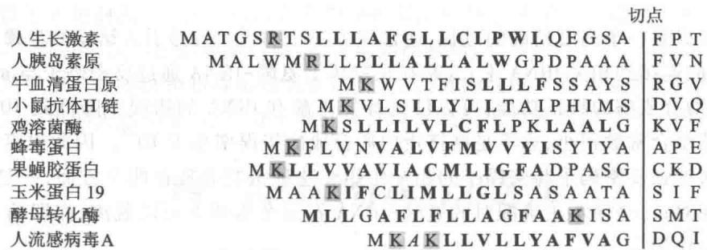  
图33-20 一些真核细胞多肽链氨基端的信号肽序列  
疏水氨基酸残基以黑体字母表示，碱性氨基酸残基用带阴影字母表示

随后 Blobel 等发现,信号肽可被信号识别颗粒 (signal recognition particle, SRP) 识别。SRP 的相对分子质量为 325 000,由一分子 7SL RNA(长 300 核苷酸)和 6 个不同的多肽分子组成。SRP 有两个功能域,一个用以识别信号肽,另一个用以干扰进入核糖体的氨酰-tRNA 和肽基转移酶的反应,以停止多肽链的延伸。信号肽与 SRP 的结合发生在蛋白质合成开始不久,即 N 端的新生肽链刚一出现时,一旦 SRP 与带有新生肽链的核糖体相结合,肽链的延伸作用暂时停止,或延伸速度大大降低。SRP-核糖体复合物随即移到内质网上并与那里的 SRP 受体停泊蛋白 (docking protein) 相结合。SRP 与受体结合后,蛋白质合成的延伸作用又重新开始。SRP 受体是一个二聚体蛋白,由相对分子质量为 69 000 的 α 亚基与相对分子质量为 30 000 的 β 亚基组成。然后,带有新生肽链的核糖体被送到多肽转运装置 (translocation machinery) 上,SRP 被释放到胞浆中,新生肽链又继续延长。SRP 和 SRP 受体都结合了 GTP,当它们解离时均伴有

GTP 的水解。转运装置含有两个整合膜蛋白（integral membrane protein），即核糖体受体蛋白Ⅰ和Ⅱ（ribophorin I & II）。多肽链通过转运装置送入内质网腔，此过程由 ATP 所驱动。多肽链进入内质网腔后，信号肽即被信号肽酶所切除。信号肽指导新生肽链进入内质网腔的过程如图 33-21 所示。进入内质网腔的多肽链在信号肽切除后即进行折叠、糖基化及二硫键形成等加工过程。膜蛋白肽链的 C 端一般有 11\~25 个疏水氨基酸残基，紧接着是一些碱性氨基酸残基，它们的作用与信号肽相反，引起膜上核糖体受体及孔道的解聚，使多肽链“锚”在内质网膜上。

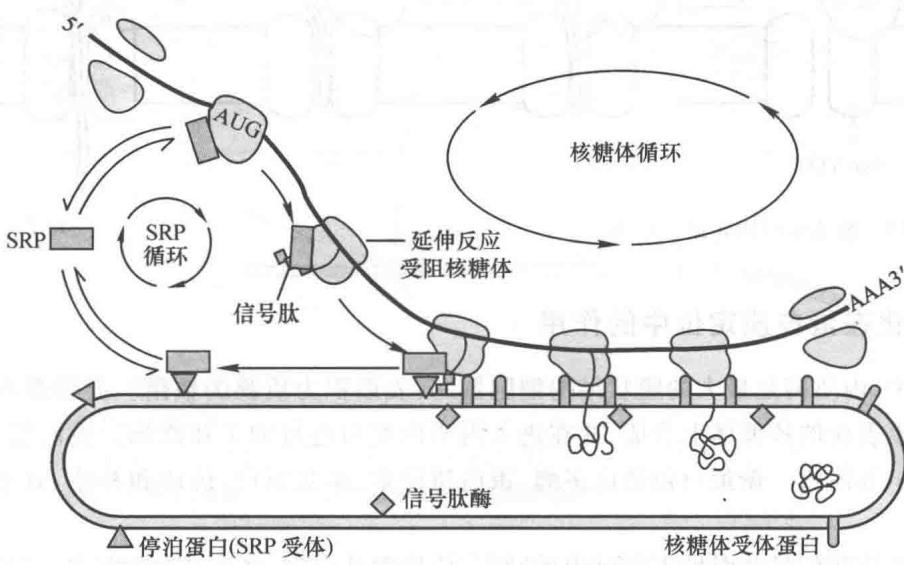  
图 33-21 信号肽的识别过程

细菌的分泌蛋白和膜蛋白也依赖于信号肽指导跨膜运输。真核细胞多肽链在信号肽指导下对内质网膜的跨膜运输是边翻译边转运，故称为共翻译转运（cotranslational translocation）。细菌除存在类似的共翻译转运外，还存在翻译后转运（post-translational translocation）。细菌的信号肽如图33-22所示。

<table><tr><td>内膜蛋白</td><td colspan="2">切点</td></tr><tr><td>噬菌体fd主要外壳蛋白</td><td>MKKSLVLKASVAVATLVPMLSTA</td><td>AE</td></tr><tr><td>噬菌体fd少量外壳蛋白</td><td>MKKLLFAIPLVVPFYSHS</td><td>AE</td></tr><tr><td>周质蛋白</td><td></td><td></td></tr><tr><td>碱性磷酸酯酶</td><td>MKQSTIALALLPLLFTPVTKA</td><td>RT</td></tr><tr><td>亮氨酸特异结合蛋白</td><td>MKANAKTIIAGMIALAISHTAMA</td><td>DD</td></tr><tr><td> $\beta$ -内酰胺酶</td><td>MSIQHFRVALIPFFAAFCLPVFA</td><td>HP</td></tr><tr><td>外膜蛋白</td><td></td><td></td></tr><tr><td>脂蛋白</td><td>MKATKLVLGAVILGSTLLAG</td><td>CS</td></tr><tr><td>Lam B</td><td>LRKIPLAVAVAAGVMSAQAMA</td><td>VD</td></tr><tr><td>Omp A</td><td>MMITMKKTAIAIAVALAGFATVAQA</td><td>AP</td></tr></table>

图 33-22 细菌多肽氨基端的信号肽结构  
疏水氨基酸残基以黑体字母表示，碱性氨基酸残基以阴影字母表示

细菌的SRP由4.5S RNA与Ffh和FtsY蛋白所组成，它将核糖体上新合成的多肽链带到位于内膜的转运子(translocon)上。转运子或称转运装置，转运复合物，形成多肽链通过的孔道。除此之外，细菌还另有转运系统，其中包括SecA、SecB、SecD、SecF和SecYEG。SecB是一种分子伴侣，当新生肽合成后SecB即与之结合。SecB的主要功能有二，一是与蛋白质的信号肽或其他特征序列结合，防止多肽链的进一步折叠，以便于转运；二是将结合的多肽链带到SecA上，因其与SecA有很高的亲和力。SecA位于内膜表面，既是受体，又是转运的ATPase。SecD和SecG协助SecA作用。多肽链由SecB转移到SecA，然后送到膜上的转运复合物SecY、E和G上。SecA借助构象的变化，将多肽链推进到转运复合物的孔道内，通过水解 ATP 获得的能量来推动多肽链运动, 每分解一分子 ATP 多肽链前进约 20 个氨基酸残基, 直至全部肽链通过(图 33-23)。多肽链的“锚”序列还可使多肽链插入内膜或外膜。

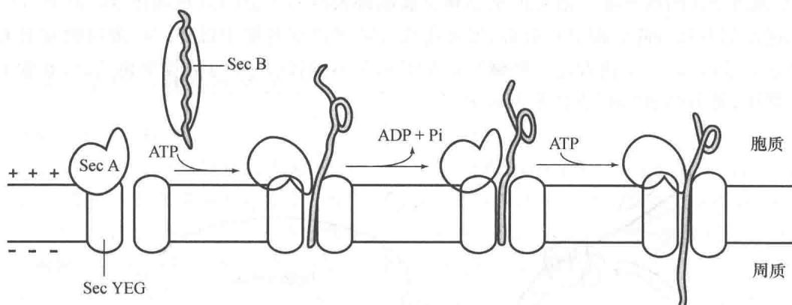  
图 33-23 细菌蛋白质转运示意图

## （二）糖基化在蛋白质定位中的作用

在真核细胞中,内质网是最大的膜状结构细胞器,其表面积为质膜的数倍。分泌蛋白、溶酶体蛋白和膜蛋白在内质网膜表面的核糖体上合成,并在进入内质网腔后进行加工和修饰。蛋白质的糖基化主要发生在内质网和高尔基体内。糖蛋白包括许多酶、蛋白质激素、血浆蛋白、抗体和补体、血型物质、黏液组分以及许多膜蛋白。

新合成的多肽链在信号肽引导下穿过内质网膜，信号肽被切除，多肽链发生折叠，二硫键形成，其中许多蛋白质被糖基化。糖基化发生在内质网膜的腔内侧。尽管糖蛋白上的寡糖多种多样，但其形成的途径基本相同。在内质网膜上，由多萜醇磷酸酯（dolichol phosphate）作为寡糖载体，在转移酶作用下将其上形成的核心寡糖转移到蛋白质上，与Asn残基以N-糖苷键连接。多萜醇磷酸酯的结构如下：

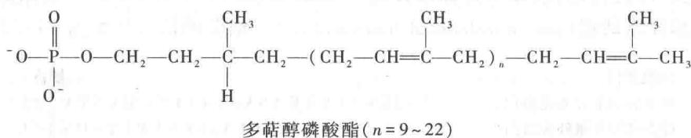

核心寡糖是由尿苷二磷酸-N-乙酰葡糖胺(uridine diphosphate-N-acetylglucosamine, UDP-GlcNAc)、鸟苷二磷酸-甘露糖(guanosine diphosphate-mannose, GDP-Man)和尿苷二磷酸-葡萄糖(uridine diphosphate-glucose, UDPG)在多萜醇磷酸酯上逐步合成的，由14个残基所组成(图33-24)。核心寡糖转移到蛋白质上后再进一步修饰和加工。

经适当修饰的蛋白质随后被转运到细胞内各靶部位。首先由内质网形成运输泡（transport vesicle）将腔内蛋白质转运到高尔基体（Golgi），进行进一步加工。在高尔基体内产生 O-糖苷键连接的寡糖，并对 N-连接的寡糖进行修饰。糖基化蛋白质易被识别，分别按其结构特征包裹到分泌粒（granule）、运输泡和溶酶体内，将它们分泌到胞外、运输到质膜或保存在溶酶体中。

## （三）线粒体和叶绿体蛋白质的定位

线粒体和叶绿体 DNA 基因组可编码其全部 RNA, 但只编码一小部分蛋白质。大部分线粒体和叶绿体蛋白质由核基因编码, 在胞浆内由游离核糖体合成, 再送到细胞器中去, 因此这种运输为翻译后转运, 与内质网的共翻译转运不同。但三者都是需要一段信号序列 (signal sequence) 的引导, 以进行跨膜运输。引导线粒体和叶绿体蛋白质靶定位 (target localization) 的肽段常称为导向序列或导肽 (targeting sequence)。因其位于 N 端, 故也称为前导序列或前导肽 (leader sequence)。

  
图 33-24 糖蛋白核心寡糖的合成  
步骤①和②，在内质网胞质一侧多萜醇磷酸酯上加入2个GlcNac和5个Man。步骤③，寡糖由胞质一侧转到腔内。步骤④，完成核心寡糖的合成。步骤⑤，核心寡糖由多萜醇磷酸酯转移到蛋白质上，以N-糖苷键与Asn连接。步骤⑥，多萜醇焦磷酸酯再次转移到胞质一侧。步骤⑦，磷酸基被水解除去，重新产生多萜醇磷酸酯

线粒体的前导肽一般长度为25至35个氨基酸残基，富于Ser、Thr和碱性氨基酸。当线粒体蛋白质前体多肽链合成后即与Hsp70或MSF(mitochondrial import stimulation factor)相结合，这些分子伴侣可稳定前体多肽链未折叠的构象。然后前体多肽链被转移到膜的受体上，并通过通道蛋白进入线粒体的基质。前导肽被特异的蛋白酶切除，多肽链折叠成为成熟的线粒体蛋白质。蛋白质跨膜运输需要消耗能量，由线粒体Hsp70(mHsp 70)与ATP水解相偶联以及内膜的跨膜电化学梯度来提供所需的能量。

线粒体具有两层膜结构,蛋白质进入线粒体后需要定位在外膜、内膜、膜间间隙和基质(matrix)四个不同的部位。在前导肽引导下蛋白质前体首先进入基质,前导肽识别基质的序列随即被基质中的蛋白酶切除,基质蛋白质到此为止。内、外膜蛋白和间隙蛋白需要在第二个信号序列引导下再转移到靶部位。第一个信号序列切除后第二个信号序列即成为N端序列,它使蛋白质前体再次穿过膜通道,并决定到达的部位,然后第二个信号序列也被蛋白酶切除。当前体穿越内膜或外膜时,如遇到疏水氨基酸的肽段使转移停止,多肽链即锚在膜内,而成为整合膜蛋白。在某些情况下,穿越内膜的前体被加工成为间隙的可溶性蛋白质。

叶绿体蛋白质的定位运输过程与线粒体蛋白质十分类似。叶绿体也有内、外膜、间隙和基质（stroma），其内还有类囊体（thylakoid），包括类囊体膜和内腔（lumen），蛋白质的定位十分复杂。叶绿体蛋白质的前导肽可分成不同功能的肽段。它首先引导蛋白质前体进入叶绿体基质，切除第一个肽段，然后由第二个信号序列决定穿越类囊体膜还是再次穿越叶绿体膜。同样，在越膜后第二个肽段也被切除，然后前体被加工为成熟的蛋白质。

线粒体和叶绿体蛋白质的定位过程如图 33-25 所示。

## （四）核蛋白质的定位

真核生物细胞有细胞核和细胞质的分化,两者间由两层膜组成的核被膜(nuclear envelope)隔开,内膜包围核质,外膜上分布许多核糖体,并与胞质的内质网膜局部相连,核膜间隙可与内质网内腔相通。核膜上存在许多核孔,核孔有复杂的结构,构成核孔的物质称为核孔复合物(nucleopore complex)。核孔呈8重对称,由球状亚基构成上下两圈的环状结构,每圈8个亚基,各亚基有臂与中央圆孔小体连接。圆环直径

  
图 33-25 线粒体和叶绿体蛋白质的定位  
A. 蛋白质定位于线粒体基质；B. 蛋白质定位于叶绿体类囊体

120 nm, 中央小孔直径约 10 nm, 整个复合物由数百个蛋白质分子组成。核孔贯穿内、外膜, 因此溶于水的离子、核苷酸和其他小的生物分子可以自由出入细胞核。相对分子质量在 $(5 \sim 50) \times 10^{3}$ 的生物大分子也能通过核孔扩散, 扩散速度与分子大小成反比。实际上更大的复合物 (>20 nm) 也能穿过核孔, 例如核糖体亚基和核糖核蛋白颗粒可在核内形成后转移到细胞质。此时核孔可以变大, 大分子和复合物的构象也可能发生改变。

RNA 在核内合成和加工后需要输送到细胞质中去,蛋白质在细胞质中合成后需要输送到核内,还有一些 RNA、蛋白质和其复合物需要在核质间穿梭来往。所有这些大分子的运输通常都不是被动扩散,而是需要消耗能量的主动运输过程,能量由 ATP 或 GTP 的水解供给。RNA 和蛋白质的转运首先需与运输受体(载体蛋白)结合,再经过核孔出入细胞核。运输受体按其转运的方向可分为输出蛋白(exportin)、输入蛋白(importin)或可出入的转运蛋白(transportin)。有些运输受体是单条多肽链,如转运蛋白和输入蛋白β3;有些是多亚基结构,如输入蛋白αβ。运输受体能识别并结合底物,又能与核孔蛋白(nucleoporin)结合,由此将底物蛋白带到核孔处。如输入蛋白αβ的α亚基与底物结合,β亚基与核孔蛋白结合。单链的运输受体由不同结构域分别与底物和核孔蛋白结合。

运输受体能够识别底物蛋白的核定位信号（nuclear localization signal, NLS）和核输出信号（nuclear export signal, NES）。NLS 常为短的、含有多个碱性氨基酸的肽段，在碱性氨基酸残基上游还常有中断 $\alpha$ 螺旋的脯氨酸残基。典型的 NES 为 10 个氨基酸的序列，并有特定的亮氨酸。携带 NLS 或 NES 序列的蛋白质如与另外的蛋白质或 RNA 结合，即可一起进行转运。

一种小的单体 G 蛋白(鸟苷酸结合蛋白) Ran 控制着运输的方向。Ran 以结合 GTP 或 GDP 的状态存在, 并具有 GTP 酶(GTPase) 活性。Ran-GAP(Ran-GTPase activating protein) 存在于细胞质中, 它能促使 Ran-GTP 水解产生 Ran-GDP。Ran-GEF(Ran guanine nucleotide exchange factor) 存在于细胞核中, 它促使 Ran-GDP 与 GTP 交换, 再生 Ran-GTP。因此, 在核内由底物、受体与 Ran-GTP 形成三元复合物, 由核内转移到细胞质, Ran-GTP 水解产生 Ran-GDP, 底物与受体也就随之解离。与之相反, 在细胞质中形成底物-受体-Ran-GDP 三元复合物, 进入核内后 Ran-GDP 交换为 Ran-GTP, 复合物解离。由此可见, 核运输是在 Ran 控制下的主动扩散过程。核的运输和定位如图 33-26 所示。

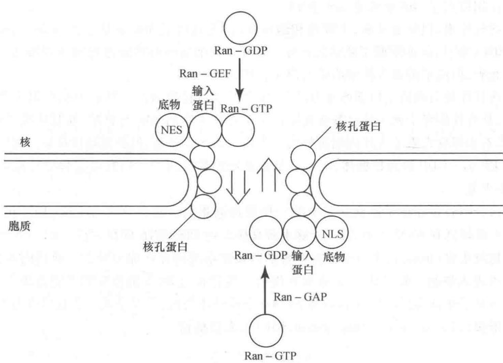  
图33-26 核的运输和定位  
与内质网、线粒体和叶绿体定位的信号序列不同，核的定位序列在运输后并不切除。

<!-- EN-BEGIN 27.3 -->

### 【英文对应 27.3】Protein Targeting and Degradation

> 来源：Lehninger Principles of Biochemistry（书籍/02_生物化学原理） 第27章 Protein Metabolism，§27.3。对应本章“五、蛋白质的定位”。

The eukaryotic cell is made up of many structures, compartments, and organelles, each with specific functions that require distinct sets of proteins and enzymes. These proteins (with the exception of those produced in mitochondria and plastids) are synthesized on ribosomes in the cytosol, so how are they directed to their final cellular destinations?

We are now beginning to understand this complex and fascinating process. Proteins destined for secretion, integration in the plasma membrane, or inclusion in lysosomes generally share the first few steps of a pathway that begins in the endoplasmic reticulum. Proteins destined for mitochondria, chloroplasts, or the nucleus use three separate mechanisms. And proteins destined for the cytosol simply remain where they are synthesized. P1 The thermodynamic cost of protein synthesis is magnified by the processes used by cells to transport proteins to their correct cellular locations.

The most important element in many of these targeting pathways is a short sequence of amino acids called a signal sequence, whose function was first postulated by Günter Blobel and colleagues in 1970. The signal sequence directs a protein to its appropriate location in the cell and, for many proteins, is removed during transport or after the protein has reached its final destination. In proteins slated for transport into mitochondria, chloroplasts, or the ER, the signal sequence is at the amino terminus of a newly synthesized polypeptide. In many cases, the targeting capacity of particular signal sequences has been confirmed by fusing the signal sequence from one protein to a second protein and showing that the signal directs the second protein to the location where the first protein is normally found. The selective degradation of proteins no longer needed by the cell also relies largely on a set of molecular signals embedded in each protein's structure.

In this concluding section we examine protein targeting and degradation, emphasizing the underlying signals and molecular regulation that are so crucial to cellular metabolism. Except where noted, the focus is now on eukaryotic cells.

#### [EN] Posttranslational Modification of Many Eukaryotic Proteins Begins in the Endoplasmic Reticulum

Perhaps the best-characterized targeting system begins in the ER. Most lysosomal, membrane, or secreted proteins have an amino-terminal signal sequence (Fig. 27-37) that marks them for translocation into the lumen of the ER; hundreds of such signal sequences have been determined. The carboxyl terminus of the signal sequence is defined by a cleavage site, where protease action removes the sequence after the protein is imported into the ER. Signal sequences vary in length from 13 to 36 amino acid residues, but all have the following features: (1) about 10 to 15 hydrophobic amino acid residues; (2) one or more positively charged residues, usually near the amino terminus, preceding the hydrophobic sequence; and (3) a short sequence at the carboxyl terminus (near the cleavage site) that is relatively polar, typically having amino acid residues with short side chains (especially Ala) at the positions closest to the cleavage site.

As originally demonstrated by the cell biologist George Palade, proteins with these signal sequences are synthesized on ribosomes attached to the ER. The signal sequence itself helps to direct the ribosome to the ER, as illustrated in Figure 27-38. The targeting pathway begins in step 1, with initiation of protein synthesis on free ribosomes. The signal sequence appears early in the synthetic process (step 2), because it is at the amino terminus, which, as we have seen, is synthesized first. As it emerges from the ribosome (step 3), the signal sequence—and the ribosome itself—is bound by the large signal recognition particle (SRP). The SRP is a rod-shaped complex containing a 300 nucleotide RNA (7SL-RNA) and six different proteins (combined $M_{\mathrm{r}}$ 325,000). The SRP then binds GTP and halts elongation of the polypeptide when it is about 70 amino acids long and the signal sequence has completely emerged from the ribosome. In step 4, the GTP-bound SRP directs the ribosome (still bound to the mRNA) and the incomplete polypeptide to GTP-bound SRP receptors in the cytosolic face of the ER; the nascent polypeptide is delivered to a peptide translocation complex in the ER, which interacts directly with the ribosome. In step 5, the SRP dissociates from the ribosome, accompanied by hydrolysis of GTP in both the SRP and the SRP receptor. The SRP receptor is a heterodimer of $\alpha$ ( $M_{\mathrm{r}}$ 69,000) and $\beta$ ( $M_{\mathrm{r}}$ 30,000) subunits, both of which bind and hydrolyze multiple GTP molecules during this process.

  
FIGURE 27-37 Amino-terminal signal sequences of some eukaryotic proteins that direct their translocation into the ER. The hydrophobic core (yellow) is preceded by one or more basic residues (blue).  
Polar and short-side-chain residues immediately precede (to the left, as shown here) the cleavage sites (indicated by red arrows).

  
FIGURE 27-38 Directing eukaryotic proteins with the appropriate signals to the endoplasmic reticulum. This process involves the SRP cycle and the translocation and cleavage of the nascent polypeptide.  
One protein subunit of SRP binds directly to the signal sequence, obstructing elongation by sterically blocking the entry of aminoacyl-tRNAs and inhibiting peptidyl transferase. Another protein subunit binds and hydrolyzes GTP.

Elongation of the polypeptide now resumes (step 6), with the ATP-driven translocation complex feeding the growing polypeptide into the ER lumen until the complete protein has been synthesized. In step 7, the signal sequence is removed by a signal peptidase within the ER lumen. The ribosome dissociates (step 8) and is recycled (step 9).

#### [EN] Glycosylation Plays a Key Role in Protein Targeting

In the ER lumen, newly synthesized proteins are further modified in several ways. Following the removal of signal sequences, polypeptides are folded, disulfide bonds are formed, and many proteins are glycosylated to form glycoproteins. In many glycoproteins, the linkage to their oligosaccharides is through Asn residues. These N-linked oligosaccharides are diverse (Chapter 7), but the pathways by which they form have a common first step. A 14 residue core oligosaccharide is built up stepwise, first on the cytosolic face of the membrane and then on the lumenal face. Once completed, it is transferred from a dolichol phosphate donor molecule to certain Asn residues in the protein (Fig. 27-39). The transferase is on the lumenal face of the ER and thus cannot catalyze glycosylation of cytosolic proteins. After transfer, the core oligosaccharide is trimmed and elaborated in different ways on different proteins, but all N-linked oligosaccharides retain a pentasaccharide core derived from the original 14 residue oligosaccharide.

Several antibiotics act by interfering with one or more steps in this process and have aided in elucidating the steps of protein glycosylation. The best characterized is tunicamycin, which mimics the structure of UDP-N-acetylglucosamine and blocks the first step of the process (Fig. 27-39, step 1). A few proteins are O-glycosylated in the ER, but most O-glycosylation occurs in the Golgi complex or in the cytosol (for proteins that do not enter the ER).

  
FIGURE 27-39 Synthesis of the core oligosaccharide of glycoproteins. The core oligosaccharide is built up by the successive addition of monosaccharide units. ①, ② The first steps occur on the cytosolic face of the ER. ③ Translocation moves the incomplete oligosaccharide across the membrane (mechanism not shown), and ④ completion of the core oligosaccharide occurs within the lumen of the ER. The precursors that contribute additional mannose and glucose residues to the growing oligosaccharide in the lumen are dolichol phosphate derivatives. ⑤ In the first step in construction of the N-linked oligosaccharide moiety of

  
a glycoprotein, the core oligosaccharide is transferred from dolichol phosphate to an Asn residue of the protein, and 6 protein synthesis continues. The core oligosaccharide is then further modified in the ER and the Golgi complex in pathways that differ for different proteins. The five sugar residues shown surrounded by a beige screen, after step 7, are retained in the final structure of all N-linked oligosaccharides. 8 The released dolichol pyrophosphate is again translocated so that the pyrophosphate is on the cytosolic face of the ER, then 9 a phosphate is hydrolytically removed to regenerate dolichol phosphate.

Suitably modified proteins can now be moved to a variety of intracellular destinations. Proteins travel from the ER to the Golgi complex in transport vesicles (Fig. 27-40). In the Golgi complex, oligosaccharides are O-linked to some proteins, and N-linked oligosaccharides are further modified. By mechanisms not yet fully understood, the Golgi complex also sorts proteins and sends them to their final destinations. The processes that segregate proteins targeted for secretion from those targeted for the plasma membrane or lysosomes must distinguish among these proteins on the basis of structural features other than signal sequences, which were removed in the ER lumen.

This sorting process is best understood in the case of hydrolases destined for transport to lysosomes. On arrival of a hydrolase (a glycoprotein) in the Golgi complex, an as yet undetermined feature (sometimes called a signal patch) of the three-dimensional structure of the hydrolase is recognized by a phosphotransferase, which phosphorylates terminal mannose residues in the oligosaccharides (Fig. 27-41). The presence of one or more mannose 6-phosphate residues in its N-linked oligosaccharide is the structural signal that targets a protein to lysosomes. A receptor protein in the membrane of the Golgi complex recognizes the mannose 6-phosphate signal and binds the hydrolase so marked. Vesicles containing these receptor-hydrolase complexes bud from the trans side of the Golgi complex and make their way to sorting vesicles. Here, the receptor-hydrolase complex dissociates in a process facilitated by the lower pH in the vesicle and by phosphatase-catalyzed removal of phosphate groups from the mannose 6-phosphate residues. The receptor is then recycled to the Golgi complex, and vesicles containing the hydrolases bud from the sorting vesicles and move to the lysosomes. In cells treated with tunicamycin (Fig. 27-39, step 1), hydrolases that should be targeted to lysosomes are instead secreted, confirming that the N-linked oligosaccharide plays a key role in targeting these enzymes to lysosomes.

  
FIGURE 27-40 Pathway taken by proteins destined for lysosomes, the plasma membrane, or secretion. Proteins are moved from the ER to the cis side of the Golgi complex in transport vesicles. Sorting occurs primarily in the trans side of the Golgi complex.

The pathways that target proteins to mitochondria and chloroplasts also rely on amino-terminal signal sequences. Although mitochondria and chloroplasts contain DNA, most of their proteins are encoded by nuclear DNA and must be targeted to the appropriate organelle. Unlike other targeting pathways, however, the mitochondrial and chloroplast pathways begin only after a precursor protein has been completely synthesized and released from the ribosome. Precursor proteins destined for mitochondria or chloroplasts are bound by cytosolic chaperone proteins and delivered to receptors on the exterior surface of the target organelle. Specialized translocation mechanisms then transport the protein to its final destination in the organelle, after which the signal sequence is removed.

  
FIGURE 27-41 Phosphorylation of mannose residues on lysosome-targeted enzymes. N-Acetylglucosamine phosphotransferase recognizes some as yet unidentified structural feature of hydrolases destined for lysosomes.

#### [EN] Signal Sequences for Nuclear Transport Are Not Cleaved

Molecular communication between the nucleus and the cytosol requires the movement of macromolecules through nuclear pores. RNA molecules synthesized in the nucleus are exported to the cytosol. Ribosomal proteins synthesized on cytosolic ribosomes are imported into the nucleus and assembled into 60S and 40S ribosomal subunits in the nucleolus; completed subunits are then exported back to the cytosol (Fig. 27-17). A variety of nuclear proteins (RNA and DNA polymerases, histones, topoisomerases, proteins that regulate gene expression, and so forth) are synthesized in the cytosol and imported into the nucleus. This traffic is modulated by a complex system of molecular signals and transport proteins that is gradually being elucidated.

In most multicellular eukaryotes, the nuclear envelope breaks down at each cell division, and once division is completed and the nuclear envelope reestablished, the dispersed nuclear proteins must be reimported. To allow this repeated nuclear importation, the signal sequence that targets a protein to the nucleus—the nuclear localization sequence (NLS)—is not removed after the protein arrives at its destination. An NLS, unlike other signal sequences, may be located almost anywhere along the primary sequence of the protein. NLSs can vary considerably in structure, but many consist of four to eight amino acid residues and include several consecutive basic (Arg or Lys) residues.

Nuclear importation is mediated by several proteins that cycle between the cytosol and the nucleus (Fig. 27-42), including importin $\alpha$ and $\beta$ and a small GTPase known as Ran (Ras-related nuclear protein). A heterodimer of importin $\alpha$ and $\beta$ functions as a soluble receptor for proteins targeted to the nucleus, with the $\alpha$ subunit binding NLS-bearing proteins in the cytosol. The complex of the NLS-bearing protein and the importin docks at a nuclear pore and is translocated through the pore by an energy-dependent mechanism. In the nucleus, the importin $\beta$ is bound by Ran GTPase, releasing importin $\beta$ from the imported protein. Importin $\beta$ is bound by Ran and by CAS (cellular apoptosis susceptibility protein) and separated from the NLS-bearing protein. Importin $\alpha$ and $\beta$ , in their complexes with Ran and CAS, are then exported from the nucleus. Ran hydrolyzes GTP in the cytosol to release the importins, which are then free to begin another importation cycle. Ran itself is also cycled back into the nucleus by the binding of Ran-GDP to nuclear transport factor 2 (NTF2). Inside the nucleus, the GDP bound to Ran is replaced with GTP through the action of Ran guanosine nucleotide-exchange factor (Ran-GEF).

  
FIGURE 27-42 Targeting of nuclear proteins. (a) 1 A protein with an appropriate nuclear localization signal (NLS) is bound by a complex of importins $\alpha$ and $\beta$ . 2 The resulting complex binds to a nuclear pore and translocates. 3 Inside the nucleus, dissociation of importin $\beta$ is promoted by the binding of Ran-GTP. 4 Importin $\alpha$ binds to Ran-GTP and CAS (cellular apoptosis susceptibility protein), releasing the nuclear protein. 5 Importins $\alpha$ and $\beta$ and CAS are transported out of the nucleus and recycled. They are released in the cytosol when Ran hydrolyzes its  
bound GTP. 6 Ran-GDP is bound by NTF2, and transported back into the nucleus. 7 Ran-GEF promotes the exchange of GDP for GTP in the nucleus, and Ran-GTP is ready to process another NLS-bearing protein-importin complex. (b) Transmission electron micrograph of a freeze-fractured nucleus, showing numerous nuclear pores. The nuclear pore complex is one of the largest molecular aggregates in the cell $(M_{\mathrm{r}} \sim 5 \times 10^{7})$ . It is made up of multiple copies of more than 30 different proteins. ([a) Information from C. Strambio-De-Castillia et al., Nat. Rev. Mol. Cell Biol. 11:490, 2010, Fig. 1. (b) Don W. Fawcett/Science Source.]

During mitosis, when the nuclear envelope transiently breaks down, the Ran GTPase and the importins play additional roles. The Ran GTPase–importin $\beta$ complex helps to position the spindle microtubules on the cell perimeter to facilitate chromosome segregation as the cell divides, and this complex also regulates microtubule interaction with other cellular structures.

#### [EN] Bacteria Also Use Signal Sequences for Protein Targeting

Bacteria can target proteins to their inner or outer membranes, to the periplasmic space between these membranes, or to the extracellular medium. They use signal sequences at the amino terminus of the proteins (Fig. 27-43), much like those on eukaryotic proteins targeted to the ER, mitochondria, and chloroplasts.

Most proteins exported from E. coli make use of the pathway shown in Figure 27-44. Following translation, a protein to be exported may fold only slowly, the amino-terminal signal sequence impeding the folding. The soluble chaperone protein SecB binds to the protein's signal sequence or other features of its incompletely folded structure. The bound protein is then delivered to SecA, a protein associated with the inner surface of the plasma membrane. SecA acts as both a receptor and a translocating ATPase. Released from SecB and bound to SecA, the protein is delivered to a translocation complex in the membrane, made up of SecY, E, and G, and is translocated stepwise through the membrane at the SecYEG complex in lengths of about 20 amino acid residues. Each step requires the hydrolysis of ATP, catalyzed by SecA.

Although most exported bacterial proteins use this pathway, some follow an alternative pathway that uses signal recognition and receptor proteins homologous to components of the eukaryotic SRP and the SRP receptor (see Fig. 27-38).

#### [EN] Cells Import Proteins by Receptor-Mediated Endocytosis

Some proteins are imported into eukaryotic cells from the surrounding medium; examples include low-density lipoprotein (LDL), the iron-carrying protein transferrin, peptide hormones, and circulating proteins destined for degradation. There are several importation pathways (Fig. 27-45). In one path, proteins bind to receptors in invaginations of the membrane called coated pits, which concentrate endocytic receptors in preference to other cell-surface proteins. The pits are coated on their cytosolic side with a lattice of the protein clathrin, which forms closed polyhedral structures (Fig. 27-46). The clathrin lattice grows as more receptors are occupied by target proteins. Eventually, a complete membrane-bounded

FIGURE 27-43 Signal sequences that target proteins to different locations in bacteria. Basic amino acids near the amino terminus are highlighted in blue, hydrophobic core amino acids in yellow. Cleavage sites marking the ends of the signal sequences are

<table><tr><td colspan="26">Inner membrane proteins</td><td></td><td></td></tr><tr><td>Phage fd, major coat protein</td><td>Met</td><td>Lys</td><td>Lys</td><td>Ser</td><td>Leu</td><td>Val</td><td>Leu</td><td>Lys</td><td>Ala</td><td>Ser</td><td>Val</td><td>Ala</td><td>Val</td><td>Ala</td><td>Thr</td><td>Leu</td><td>Val</td><td>Pro</td><td>Met</td><td>Leu</td><td>Ser</td><td>Phe</td><td>cleavage site↓Ala</td><td>Ala</td><td>Glu</td><td>--</td><td></td></tr><tr><td>Phage fd, minor coat protein</td><td></td><td></td><td></td><td></td><td></td><td>Met</td><td>Lys</td><td>Lys</td><td>Leu</td><td>Leu</td><td>Phe</td><td>Ala</td><td>Ile</td><td>Pro</td><td>Leu</td><td>Val</td><td>Val</td><td>Pro</td><td>Phe</td><td>Tyr</td><td>Ser</td><td>His</td><td>Ser</td><td>Ala</td><td>Glu</td><td>--</td><td></td></tr><tr><td colspan="26">Periplasmic proteins</td><td></td><td></td></tr><tr><td>Alkaline phosphatase</td><td></td><td>Met</td><td>Lys</td><td>Gln</td><td>Ser</td><td>Thr</td><td>Ile</td><td>Ala</td><td>Leu</td><td>Ala</td><td>Leu</td><td>Leu</td><td>Pro</td><td>Leu</td><td>Leu</td><td>Phe</td><td>Thr</td><td>Pro</td><td>Val</td><td>Thr</td><td>Lys</td><td>Ala</td><td>Arg</td><td>Thr</td><td>--</td><td></td><td></td></tr><tr><td>Leucine-specific binding protein</td><td>Met</td><td>Lys</td><td>Ala</td><td>Asn</td><td>Ala</td><td>Lys</td><td>Thr</td><td>Ile</td><td>Ile</td><td>Ala</td><td>Gly</td><td>Met</td><td>Ile</td><td>Ala</td><td>Leu</td><td>Ala</td><td>Ile</td><td>Ser</td><td>His</td><td>Thr</td><td>Ala</td><td>Met</td><td>Ala</td><td>Asp</td><td>Asp</td><td>--</td><td></td></tr><tr><td>β-Lactamase of pBR322</td><td>Met</td><td>Ser</td><td>Ile</td><td>Gln</td><td>His</td><td>Phe</td><td>Arg</td><td>Val</td><td>Ala</td><td>Leu</td><td>Ile</td><td>Pro</td><td>Phe</td><td>Phe</td><td>Ala</td><td>Ala</td><td>Phe</td><td>Cys</td><td>Leu</td><td>Pro</td><td>Val</td><td>Phe</td><td>Ala</td><td>His</td><td>Pro</td><td>--</td><td></td></tr><tr><td colspan="26">Outer membrane proteins</td><td></td><td></td></tr><tr><td>Lipoprotein</td><td></td><td></td><td></td><td>Met</td><td>Lys</td><td>Ala</td><td>Thr</td><td>Lys</td><td>Leu</td><td>Val</td><td>Leu</td><td>Gly</td><td>Ala</td><td>Val</td><td>Ile</td><td>Leu</td><td>Gly</td><td>Ser</td><td>Thr</td><td>Leu</td><td>Leu</td><td>Ala</td><td>Gly</td><td>Cys</td><td>Ser</td><td>--</td><td></td></tr><tr><td>LamB</td><td></td><td></td><td>Leu</td><td>Arg</td><td>Lys</td><td>Leu</td><td>Pro</td><td>Leu</td><td>Ala</td><td>Val</td><td>Ala</td><td>Val</td><td>Ala</td><td>Ala</td><td>Gly</td><td>Val</td><td>Met</td><td>Ser</td><td>Ala</td><td>Gln</td><td>Ala</td><td>Met</td><td>Ala</td><td>Val</td><td>Asp</td><td>--</td><td></td></tr><tr><td>OmpA</td><td>Met</td><td>Met</td><td>Ile</td><td>Thr</td><td>Met</td><td>Lys</td><td>Lys</td><td>Thr</td><td>Ala</td><td>Ile</td><td>Ala</td><td>Ile</td><td>Ala</td><td>Val</td><td>Ala</td><td>Leu</td><td>Ala</td><td>Gly</td><td>Phe</td><td>Ala</td><td>Thr</td><td>Val</td><td>Ala</td><td>Gln</td><td>Ala</td><td>Pro</td><td>--</td></tr></table>

indicated by red arrows. Note that the inner bacterial cell membrane is where phage fd coat proteins and DNA are assembled into phage particles. OmpA is outer membrane protein A; LamB is a cell surface receptor protein for $\lambda$ phage.

  
(b)  
FIGURE 27-46 Clathrin. (a) The protein has three light (L) chains $(M_{\mathrm{r}}35,000)$ and three heavy (H) chains $(M_{\mathrm{r}}180,000)$ of the $(\mathrm{HL})_3$ clathrin unit, organized as a three-legged structure called a triskelion. Triskelions tend to assemble into polyhedral lattices. (b) Electron micrograph of a coated pit on the cytosolic face of the plasma membrane of a fibroblast. [(a) Information from S. Mayor and R. E. Pagano, Nat. Rev. Mol. Cell Biol. 8:603, 2007. (b) ©1980 Heuser. The Rockefeller University Press. J. Heuser, J. Cell Biol. 84:560, 1980.]  
FIGURE 27-44 Model for protein export in bacteria. A newly translated polypeptide binds to the cytosolic chaperone protein SecB, which delivers it to SecA, a protein associated with the translocation complex (SecYEG) in the bacterial cell membrane. SecB is released, and SecA inserts itself into the membrane, forcing about 20 amino acid residues of the protein to be exported through the translocation complex. Hydrolysis of an ATP by SecA provides the energy for a conformational change that causes SecA to withdraw from the membrane, releasing the polypeptide. SecA binds another ATP, and the next stretch of 20 amino acid residues is pushed across the membrane through the translocation complex. Steps and are repeated until the entire protein has passed through and is released to the periplasm. The electrochemical potential across the membrane (denoted by + and -) also provides some of the driving force required for protein translocation.  
FIGURE 27-45 Summary of endocytosis pathways in eukaryotic cells. Pathways dependent on clathrin or caveolin make use of the GTPase dynamin to pinch vesicles from the plasma membrane. Some pathways do not use clathrin or caveolin; some of these make use of dynamin and some do not.

endocytic vesicle is pinched off the plasma membrane with the aid of the large GTPase dynamin, and it enters the cytoplasm. The clathrin is quickly removed by uncoating enzymes, and the vesicle fuses with an endosome. ATPase activity in the endosomal membranes reduces the pH therein, facilitating dissociation of receptors from their target proteins. In a related pathway, caveolin causes invagination of patches of membrane containing lipid rafts associated with certain types of receptors (see Fig. 11-23). These endocytic vesicles then fuse with caveolin-containing internal structures called caveosomes, where the internalized molecules are sorted and redirected to other parts of the cell and the caveolins are prepared for recycling to the membrane surface. There are also clathrin- and caveolin-independent pathways; some make use of dynamin and others do not.

The imported proteins and receptors then go their separate ways, their fates varying with the cell and protein type. Transferrin and its receptor are eventually recycled. Some hormones, growth factors, and immune complexes, after eliciting the appropriate cellular response, are degraded along with their receptors. LDL is degraded after the associated cholesterol has been delivered to its destination, but the LDL receptor is recycled (see Fig. 21-42).

Receptor-mediated endocytosis is exploited by some toxins and viruses to gain entry to cells. Influenza virus, diphtheria toxin, SARS-CoV-2 (the virus that causes COVID-19), and cholera toxin all enter cells in this way.

#### [EN] Protein Degradation Is Mediated by Specialized Systems in All Cells

Protein degradation is critical to overall cellular proteostasis, preventing the buildup of abnormal or unwanted proteins and permitting the recycling of amino acids. The half-lives of eukaryotic proteins vary from 30 seconds to many days. Most proteins turn over rapidly relative to the lifetime of a cell, although a few (such as hemoglobin) can last for the life of the cell (about 110 days for an erythrocyte). Rapidly degraded proteins include those that are defective because of incorrectly inserted amino acids or because of damage accumulated during normal functioning. And enzymes that act at key regulatory points in metabolic pathways often turn over rapidly.

Defective proteins and those with characteristically short half-lives are generally degraded in both bacterial and eukaryotic cells by selective ATP-dependent cytosolic systems. A second system in vertebrates, operating in lysosomes, recycles the amino acids of membrane proteins, extracellular proteins, and proteins with characteristically long half-lives.

In E. coli, many proteins are degraded by one of several proteolytic systems that contain AAA+ ATPases (see Chapter 25), including Lon (the name refers to the "long form" of proteins, observed only when this protease is absent), ClpXP, ClpAP, ClpCP, ClpYQ, and FtsH. Each system targets particular proteins distinguished by their structure or subcellular location or both. Typically, ATP hydrolysis is used to maneuver a target protein through a pore into a proteolytic chamber, unfolding the protein in the process. Proteins are cleaved within the chamber. Once a protein has been reduced to small, inactive peptides, other ATP-independent proteases complete their degradation.

The ATP-dependent pathway in eukaryotic cells is quite different, involving the protein ubiquitin, which, as its name suggests, occurs throughout the eukaryotic kingdoms. One of the most highly conserved proteins known, ubiquitin (76 amino acid residues) is essentially identical in organisms as different as yeasts and humans and is key to proteostasis (see Figs. 4-23 and 13-29) and cell cycle regulation (see Fig. 12-38). Ubiquitin is covalently linked to proteins slated for destruction via an ATP-dependent pathway that includes three separate types of enzymes: E1 activating enzymes, E2 conjugating enzymes, and E3 ligases (Fig. 27-47).

  
FIGURE 27-47 Three-step pathway by which ubiquitin is attached to a protein. The pathway includes two different enzyme-ubiquitin intermediates. First, the free carboxyl group of ubiquitin's carboxyl-terminal Gly residue becomes linked to an E1-class activating enzyme through a thioester. The ubiquitin is then transferred to an E2 conjugating enzyme. An E3 ligase ultimately catalyzes transfer of the ubiquitin from E2 to the target, linking ubiquitin through an amide (isopeptide) bond to the ε-amino group of a Lys residue in the target protein. Additional cycles produce polyubiquitin, a covalent polymer of ubiquitin subunits that targets the attached protein for destruction in eukaryotes. Multiple pathways of this sort, with different protein targets, are present in most eukaryotic cells.

Ubiquitinated proteins are degraded by a large complex known as the 26S proteasome ( $M_{r}$ $2.5 \times 10^{6}$ ) (Fig. 27-48). The eukaryotic proteasome consists of two copies each of at least 32 different subunits, most of which are highly conserved from yeasts to humans. The proteasome contains two main types of subcomplexes: a barrel-like core particle and regulatory particles at each end of the barrel. The 19S regulatory particle on each end of the core particle contains approximately 18 subunits, including some that recognize and bind to ubiquitinated proteins. Six of the subunits are AAA+ ATPases that probably function in unfolding the ubiquitinated proteins and translocating the unfolded polypeptide into the core particle for degradation. The 19S particle also deubiquitinates the proteins as they are degraded in the proteasome. Most cells have additional regulatory complexes that can replace the 19S particle. These alternative regulators do not hydrolyze ATP and do not bind to ubiquitin, but they are important for the degradation of particular cellular proteins. The 26S proteasome can be effectively “accessorized” with regulatory complexes that change with changing cellular conditions.

  
FIGURE 27-48 Three-dimensional structure of the eukaryotic proteasome. The 20S core particle and the 19S regulatory particle, or cap, are shown (a) as a molecular structure and (b) in schematic form. The core particle consists of four rings arranged to form a barrel-like structure. The outer rings are formed from seven $\alpha$ subunits, and the inner rings from seven $\beta$ subunits. Three of the $\beta$ subunits have protease activities, each with different substrate specificity. A regulatory particle forms a cap on each end of the core particle. The regulatory particle binds ubiquitinated proteins, unfolds them, and translocates them into the core particle, where they are degraded to peptides of 3 to 25 amino acid residues. [(a) Data from PDB ID 3L5Q, K. Sadre-Bazzaz et al., Mol. Cell 37:728, 2010.]

Although we do not yet understand all the signals that trigger ubiquitination, one simple signal has been found. For many proteins, the identity of the first residue that remains after removal of the amino-terminal Met residue, and any other posttranslational proteolytic processing of the amino-terminal end, has a profound influence on half-life (Table 27-9). These amino-terminal signals have been conserved over billions of years of evolution and are the same in bacterial protein degradation systems and in the human ubiquitination pathway. More complex signals, such as the destruction box discussed in Chapter 12 (see Fig. 12-38), are also being identified.

Ubiquitin-dependent proteolysis is as important for the regulation of cellular processes as it is for the elimination of defective proteins. Many proteins required at only one stage of the eukaryotic cell cycle are rapidly degraded by the ubiquitin-dependent pathway after fulfilling their function. Ubiquitin-dependent destruction of cyclin is critical to cell-cycle regulation. The E1, E2, and E3 components of the ubiquitination pathway (Fig. 27-47) are large families of proteins. Different E1, E2, and E3 enzymes exhibit different specificities for target proteins and thus regulate different cellular processes. Some of these enzymes are highly localized in certain cellular compartments, reflecting a specialized function.

<table><tr><td>Amino-terminal residue</td><td>Half-life $^{a}$ </td></tr><tr><td colspan="2">Stabilizing</td></tr><tr><td>Ala, Gly, Met, Ser, Thr, Val</td><td>&gt;20 h</td></tr><tr><td colspan="2">Destabilizing</td></tr><tr><td>Gln, Ile</td><td>~30 min</td></tr><tr><td>Glu, Tyr</td><td>~10 min</td></tr><tr><td>Pro</td><td>~7 min</td></tr><tr><td>Asp, Leu, Lys, Phe</td><td>~3 min</td></tr><tr><td>Arg</td><td>~2 min</td></tr></table>

Information from A. Bachmair et al., Science 234:179, 1986.  
$^{a}$ Half-lives were measured in yeast for the $\beta$ -galactosidase protein modified so that in each experiment it had a different amino-terminal residue. Half-lives may vary for different proteins and in different organisms, but this general pattern appears to hold for all organisms.

Not surprisingly, defects in the ubiquitination pathway have been implicated in a wide range of disease states. An inability to degrade certain proteins that activate cell division (the products of oncogenes) can lead to tumor formation, and a too-rapid degradation of proteins that act as tumor suppressors can have the same effect. The ineffective or overly rapid degradation of cellular proteins also seems to play a role in a range of other conditions, including renal diseases, asthma, and neurodegenerative disorders such as Alzheimer and Parkinson diseases that are associated with the formation of characteristic proteinaceous structures in neurons. Cystic fibrosis is caused in some cases by a too-rapid degradation of a chloride ion channel, with resultant loss of function (see Box 11-2). Liddle syndrome, in which a sodium channel in the kidney is not degraded, leads to excessive $\mathrm{Na^{+}}$ absorption and early-onset hypertension. Drugs designed to inhibit proteasome function are being developed as potential treatments for some of these conditions. Many bacterial pathogens have found ways to hijack the eukaryotic ubiquitination system, evolving enzymes that ubiquitinate and thus eliminate host proteins as required to facilitate infection. In a changing metabolic environment, protein degradation is as important to a cell's survival as is protein synthesis, and much remains to be learned about these interesting pathways.

#### [EN] SUMMARY 27.3 Protein Targeting and Degradation

■ After synthesis, many proteins are directed to particular locations in the cell, a process mediated by signal sequences embedded in the polypeptide chain. In eukaryotic cells, one class of signal sequences is recognized by the signal recognition particle (SRP), which binds the signal sequence as soon as it appears on the ribosome and transfers the entire ribosome and incomplete polypeptide to the endoplasmic reticulum. Polypeptides with these signal sequences are moved into the endoplasmic reticulum lumen as they are synthesized.

■ Once in the lumen of the ER, many proteins are glycosylated. So modified, they are moved to the Golgi complex, then sorted and sent to lysosomes, the plasma membrane, or transport vesicles.

■ Proteins targeted to the nucleus have an internal signal sequence that, unlike other signal sequences, is not cleaved once the protein is successfully targeted.

■ Proteins targeted to mitochondria and chloroplasts in eukaryotic cells, and those destined for export in bacteria, also make use of an amino-terminal signal sequence.

■ Some eukaryotic cells import proteins by receptor-mediated endocytosis.

All cells eventually degrade proteins, using specialized proteolytic systems. Defective proteins and those slated for rapid turnover are generally degraded by an ATP-dependent system. In eukaryotic cells, the proteins are first tagged by linkage to ubiquitin, a highly conserved protein. Ubiquitin-dependent proteolysis, critical to the regulation of many cellular processes, is carried out by proteasomes, which also are highly conserved.

<!-- EN-END 27.3 -->

## 六、蛋白质合成的抑制物

研究蛋白质生物合成的抑制物有两个重要的目的。首先，它可用于揭示蛋白质合成的生化机制。其次，某些抑制物可抑制或杀死病原体，在临床用作抗生素治疗或在实验室用作抗菌制剂。表33-11列出部分抑制物及其作用方式。

表 33-11 某些蛋白质合成的抑制物

<table><tr><td>抑制物</td><td>抑制对象</td><td>作用方式</td></tr><tr><td>春日霉素(kasugamycin)</td><td>原核生物</td><td>抑制 $fMet-tRNA_f$ 的结合</td></tr><tr><td>链霉素(streptomycin)</td><td>原核生物</td><td>结合于30S亚基,阻止起始复合物形成,并造成错误</td></tr><tr><td>新霉素(neomycin)</td><td>原核生物</td><td>结合于30S亚基,阻止起始复合物形成,并造成错误</td></tr><tr><td>卡那霉素(kanamycin)</td><td>原核生物</td><td>结合于30S亚基,阻止起始复合物形成,并造成错误</td></tr><tr><td>四环素(tetracycline)</td><td>原核生物</td><td>结合于30S亚基,抑制氨酰-tRNA进入A位点</td></tr><tr><td>氯霉素(chloramphenicol)</td><td>原核生物</td><td>抑制50S亚基的肽基转移酶活性</td></tr><tr><td>红霉素(erythromycin)</td><td>原核生物</td><td>与50S亚基结合,抑制移位反应</td></tr><tr><td>麦迪霉素(midecamycin)</td><td>原核生物</td><td>与50S亚基结合,抑制移位反应</td></tr><tr><td>螺旋霉素(spiramycin)</td><td>原核生物</td><td>与50S亚基结合,抑制移位反应</td></tr><tr><td>环己酰亚胺(cycloheximide)</td><td>真核生物</td><td>作用于60S亚基,抑制肽基转移酶活性</td></tr><tr><td>梭链孢酸(fusidic acid)</td><td>两者</td><td>抑制EF-G·GDP从核糖体解离</td></tr><tr><td>白喉毒素(diphtheria toxin)</td><td>真核生物</td><td>通过ADP-核糖基化使eEF2失活</td></tr><tr><td>嘌呤霉素(puromycin)</td><td>两者</td><td>作为氨酰-tRNA类似物接受肽基使肽链合成终止</td></tr><tr><td>蓖麻毒素(ricin)</td><td>真核生物</td><td>核糖体失活</td></tr></table>

链霉素、新霉素、卡那霉素等氨基环醇类抗生素可与原核生物30S亚基相结合，阻止起始复合物的形成，并且其结合使核糖体构象改变，氨酰-tRNA与mRNA上密码子的配对变得比较松弛，易于发生错误。春日霉素及其他一些氨基环醇抗生素却与之不同，并不引起密码子的错误，能够专一抑制30S起始复合物

的形成。它的作用位点是 30S 亚基的 16S rRNA。

四环素族的抗生素,包括金霉素、土霉素和四环素,由于封闭了30S亚基上的A位点,使氨酰-tRNA无法进入与mRNA结合,因而阻断了肽链的延伸。真核生物细胞的核糖体也对四环素敏感。但四环素不能透过真核细胞膜,因此不抑制真核细胞的蛋白质合成。

氯霉素能选择性地与原核生物 50S 亚基结合,抑制肽基转移酶活性。但它也能作用于真核生物线粒体内的大亚基,其毒性即缘于此。环己酰亚胺则作用于真核生物的 60S 大亚基,抑制其肽基转移酶活性。红霉素、麦迪霉素和螺旋霉素等大环内酯抗生素也作用于 50S 大亚基,但抑制移位反应。梭链孢酸是甾环化合物它抑制 EF-G·GDP 脱离核糖体,因而也阻止延伸的移位反应。白喉毒素和嘌呤霉素的作用前已有介绍,这里不重复。

蓖麻毒蛋白(ricin)是存在于蓖麻种子中的一种极毒糖蛋白。它由A亚基 $(32\times10^{3})$ 和B亚基 $(33\times10^{3})$ 所组成。A亚基具有N-糖苷酶活性，能够水解真核生物28S rRNA中特定位点的一个N-腺苷键。B亚基是一种植物凝集素(lectin)，能与细胞表面糖蛋白和糖脂的特异糖部分结合。通过内吞作用，结合的蓖麻毒蛋白得以进入细胞。随后连接A链和B链的二硫键被打开，A链释放到细胞溶质中，催化核糖体大亚基失活。一分子蓖麻毒蛋白的A链可使50 000个核糖体失活，从而杀死一个真核细胞。目前已知多种核糖体失活蛋白(ribosome-inactivating protein, RIP)多来自植物。

## 提要

蛋白质是生理功能的主要负荷者。蛋白质合成是细胞新陈代谢中最复杂的过程，有多种RNA和上百种蛋白质参与作用。遗传信息编码在核酸分子上，遗传信息的表达需将核酸语言翻译成蛋白质语言，其中核苷酸与氨基酸的对应关系就是遗传密码。Crick最早通过噬菌体基因移码突变而推测核酸分子以非重叠、无标点、核苷酸三联体的方式编码蛋白质的氨基酸序列。之后，许多科学家从事破译遗传密码的研究。

Nirenberg 等用人工合成的多聚核糖核苷酸作为合成蛋白质的模板,破译了遗传密码,证实 Crick 的推测是正确的。遗传密码的基本单位是核苷酸三联体密码子,AUG 为甲硫氨酸兼起始密码子,UAA、UAG 和 UGA 为终止密码子。由于 61 个密码子编码 20 种氨基酸,有些氨基酸具有不止一种密码子,称为密码子的简并性。氨基酸的密码子数目与其在蛋白质中的出现频率有一定的相关性。tRNA 的反密码子能够准确识别密码子的前两位,而第三位可以有一定变动,称为密码子的摆动性。这就是说,tRNA 的反密码子可以识别不止一种简并密码子。生物界共用一套密码,但是线粒体和少数生物的个别密码子略有变化。密码子的编码方式可以最大程度防止基因突变带来的危害。RNA 不仅能够传递信息,而且对遗传信息进行加工,“选择转录,有效组合,纠正差错,语言翻译,调节表达”。

原核生物核糖体为 70S，由大、小两个亚基组成，大亚基 50S 含 5S rRNA、23S rRNA 和 33 种（36 个）蛋白质；小亚基 30S 含 16S rRNA 和 21 种蛋白质。真核生物核糖体为 80S，大亚基 60S 含 5S、28S 和 5.8S rRNA 和 47 种蛋白质；小亚基 40S 含 28S rRNA 和 33 种蛋白质。大亚基具有肽基转移酶活性中心；小亚基具有译码中心。tRNA 具有三叶草形二级结构和倒 L 形三级结构，反密码子碱基和氨基酸臂位于两端。氨酰-tRNA 合成酶能够识别氨基酸和相关 tRNA，由 ATP 提供能量合成氨酰-tRNA。mRNA 是蛋白质合成的模板，核糖体在 mRNA 上移动的方向是 5' 端→3' 端；多肽链合成的方向是 N 端→C 端。

蛋白质合成可分为五步:①氨酰-tRNA的合成;②多肽链合成的起始;③多肽链合成的延伸;④多肽链合成的终止;⑤多肽链的折叠和加工。蛋白质合成的忠实性需要消耗能量。合成酶的校对功能提高了忠实性。核糖体的校对功能受空间结构和动力学双重控制。蛋白质的信号肽与跨膜运输有关。真核生物蛋白质糖基化主要发生在内质网和高尔基体内,指导其进一步转运和定位。线粒体、叶绿体和核的蛋白质由定位序列指导转运至靶部位,但核的定位序列在运输后并不切除。

多种抗生素和毒蛋白能在不同步骤上抑制蛋白质合成。它们可作抗菌剂应用于临床治疗或防治农牧业的病害；也可以用来揭示蛋白质合成的生化机制。

## 习题

1. 何谓遗传密码？为什么遗传信息要以密码形式传递？

2. 遗传密码是如何破译的？

3. 遗传密码的基本性质有哪些？

4. 根据遗传密码的变偶性,细胞需要多少种反密码子才能识别 61 种密码子? 在线粒体需要多少种反密码子?

5. 在子代遗传信息如何被解码和解读？

6. 遗传密码的防突变机制有何生物学意义？

7. 什么是 RNA 的信息加工？有何生物学意义？

8. 生物借何方法纠正基因突变带来的错误遗传信息？

9. 三类参与蛋白质合成的 RNA 各起什么作用？

10. mRNA 的概念是如何形成的？如何证实的？

11. 何谓 SD 序列？有何生物学意义？

12. 比较原核生物和真核生物 mRNA 结构的异同。

13. 什么是蛋白质生物合成的无细胞体系？最常用的有哪几种？

14. 如何证明多肽链的合成是由 N 端向 C 端进行的？

15. 蛋白质的生物合成可分为哪些步骤？有哪些种类的酶参与反应？

16. 写出合成 fMet-tRNA $_{f}$ 的反应式和催化反应的酶。

17. 原核生物参与多肽链合成起始的因子有哪些？各起何作用？

18. 原核生物多肽链合成起始阶段包括哪些步骤？

19. 真核生物多肽链合成起始阶段与原核生物有何区别？

20. 多肽链合成的延伸包括哪些步骤？各有何因子参与作用？原核生物与真核生物有无区别？

21. 多肽链合成过程中核糖体如何沿 mRNA 移动?

22. 试述白喉毒素的作用机制。

23. 原核生物和真核生物多肽链合成终止各有哪些因子参与作用？

24. 试述 C. Anfinsen 有关 RNase A 复性的实验,从中他得出什么结论?你认为他的结论是否正确?

25. 新生肽的折叠和变性蛋白质复性过程中的折叠是否相同？

26. 哪些酶参与蛋白质的折叠过程？

27. 分子伴侣在蛋白质折叠中起何作用？

28. 分子伴侣可分为哪些家族？各有何特点？

29. 翻译后的加工和修饰都有哪些内容？

30. 在蛋白质生物合成中每合成一个肽键需要消耗多少能量？原核生物与真核生物是否相同？

31. 多肽链合成过程中如何保证其忠实性？什么是化学校对？什么是动力学校对？在第一套遗传密码和第二套遗传密码的识别过程中是如何校对的？

32. 何谓共翻译转运？何谓翻译后转运？

33. 跨膜运输的信号序列是如何发现的？

34. 试述多肽链跨越内质网膜的过程。内质网内膜和外膜上的蛋白质是如何运输和定位的？

35. 比较细菌两种蛋白质转运途径的异同。

36. 举例说明糖基化在蛋白质定位中的重要作用。

37. 什么是前导肽？其结构有何特点？

38. 比较线粒体和叶绿体蛋白质定位的异同。

39. 什么是核孔复合物？其功能是什么？

40. 核的运输可分为哪些步骤？有哪些因子参与作用？

41. 核运输受体可分哪几类？它们的结构各有何特点？

42. Ran 蛋白有何功能？

43. 核定位的信号有何特点？

44. 比较内质网、线粒体、叶绿叶、核和质膜蛋白质定位的异同。

45. 蛋白质运输需要消耗能量, 比较各类运输对能量的需求。

46. 链霉素等氨基环醇类抗生素抑制蛋白质合成的作用机制是什么？

47. 四环素、氯霉素、红霉素、梭链孢酸和嘌呤霉素的作用机制是否相同？

48. 为什么氯霉素等抑制细菌蛋白质合成的抗生素对人体会有毒性？

49. 什么是核糖体失活蛋白？植物产生该毒蛋白有何生物学意义？

50. 你认为“蛋白质生物合成是细胞代谢的中心”这一观点是否正确？为什么？

## 主要参考书目

1. 王镜岩, 朱圣庚, 徐长法. 生物化学教程. 北京: 高等教育出版社, 2008.

2. Voet D, Voet J G. Biochemistry. 4th ed. New York: John Wiley & Sons, 2011.

3. Nelson D L, Cox M M. Lehninger Principles of Biochemistry. 6th ed. New York: W. H. Freeman, 2012.

4. Berg J, Tymoczko J, Stryer L. Biochemistry. 7th ed. New York: W. H. Freeman, 2010.

5. Krebs J E, Kilpatrick S T, Goldstein E S. Lewin's Genes XI. Boston: Jones and Bartlett Publishers, 2013.

6. Watson J D, Baker T A, Bell S P, et al. Molecular Biology of the Gene. 7th ed. San Francisco: Pearson Education, 2013.

(朱圣庚)

## 网上资源

习题答案

<!-- EN-BEGIN 第27章章末 -->

## 【英文对应 第27章章末】Protein Metabolism：关键术语、习题与简答

> 来源：Lehninger Principles of Biochemistry（书籍/02_生物化学原理） 第27章章末，以及书末 Abbreviated Solutions to Problems 第27章。

### [EN] KEY TERMS

Terms in bold are defined in the glossary.

proteostasis 1005  
translation 1006  
aminoacyl-tRNA 1006  
aminoacyl-tRNA synthetases 1006  
codon 1007  
reading frame 1007  
initiation codon 1009  
termination codons 1009  
open reading frame (ORF) 1009  
degenerate code 1009  
anticodon 1010  
wobble 1012  
translational frameshifting 1013  
RNA editing 1013  
initiation 1028

Billic-Bargarino sequence 1028
aminoacyl (A) site 1028
peptidyl (P) site 1028
exit (E) site 1028
initiation complex 1028
elongation 1030
elongation factors 1030
peptidyl transferase 1032
translocation 1032
termination 1035
termination factors 1035
release factors 1035
polysome 1036
posttranslational modification 1037
puromycin 1039
tetracycline 1040

chloramphenicol 1040
cycloheximide 1040
streptomycin 1040
diphtheria toxin 1040
ricin 1040
signal sequence 1041
signal recognition particle (SRP) 1042
peptide translocation complex 1042

tunicamycin 1042  
nuclear localization sequence (NLS) 1045  
coated pits 1046  
clathrin 1046  
dynamin 1047  
ubiquitin 1048  
proteasome 1048

### [EN] PROBLEMS

1. Messenger RNA Translation Predict the amino acid sequences of peptides formed by ribosomes in response to each mRNA sequence, assuming that the reading frame begins with the first three bases in each sequence.

(a) GGUCAGUCGCUCCUGAUU

(b) UUGGAUGCGCCAUAAUUUGCU

(c) CAUGAUGCCUGUUGCUAC

(d) AUGGACGAA

2. How Many Different mRNA Sequences Can Specify One Amino Acid Sequence? Write all the possible mRNA sequences that can code for the simple tripeptide segment Leu-Met-Tyr. Your answer will give you some idea of the number of possible mRNAs that can code for one polypeptide.

3. Can the Base Sequence of an mRNA Be Predicted from the Amino Acid Sequence of Its Polypeptide Product? A given sequence of bases in an mRNA will code for one and only one sequence of amino acids in a polypeptide, if the reading frame is specified. From a given sequence of amino acid residues in a protein such as cytochrome c, can we predict the base sequence of the unique mRNA that encoded it? Give reasons for your answer.

4. Coding of a Polypeptide by Duplex DNA The template strand of a segment of double-helical DNA contains the sequence

(5')CTTAACACCCCTGACTTCGCGCCGTCG(3')

(a) What is the base sequence of the mRNA that can be transcribed from this strand?

(b) What amino acid sequence could be coded by the mRNA in (a), starting from the 5' end?

(c) If the complementary (nontemplate) strand of this DNA were transcribed and translated, would the resulting amino acid sequence be the same as in (b)? Explain the biological significance of your answer.

5. The Genetic Code and Mutation A mutation occasionally arises that converts a codon specifying an amino acid to a stop or nonsense codon. When this occurs in the middle of a gene, the resulting protein is truncated and often inactive. If the protein is essential, cell death can result. Which of these secondary mutations might restore some or all of the protein function so that the cell can survive (there may be more than one correct answer)?

(a) A mutation restoring the codon to one encoding the original amino acid

(b) A mutation changing the nonsense codon to one encoding a different but similar amino acid

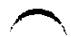

(c) A mutation in the anticodon of a tRNA such that the tRNA now recognizes the nonsense codon

(d) A mutation in which an additional nucleotide inserts just upstream of the nonsense codon, changing the reading frame so the nonsense codon is no longer read as "stop"

6. The Direction of Protein Synthesis In 1961, Howard Dintzis established that protein synthesis on ribosomes begins at the amino terminus and proceeds toward the carboxyl terminus. He used immature red blood cells that were still synthesizing hemoglobin. He added radioactively labeled leucine (chosen because it occurs frequently in both the $\alpha$ and $\beta$ subunits) for various lengths of time, rapidly isolated only the full-length (completed) $\alpha$ subunits, and then determined where in the peptide the labeled amino acids were located. After the labeled leucine and extract had been incubated together for one hour, the protein was labeled uniformly along its length. However, after much shorter incubation times, the labeled amino acids were clustered at one end. At which end, amino or carboxyl terminus, did Dintzis find the labeled residues after the short exposure to labeled leucine?

7. Methionine Has Only One Codon Methionine is one of two amino acids with only one codon. How does the single codon for methionine specify both the initiating residue and the interior Met residues of polypeptides synthesized by E. coli?

8. The Genetic Code in Action Translate the mRNA shown, starting at the first 5' nucleotide, assuming that translation occurs in an E. coli cell. If all tRNAs make maximum use of wobble rules but do not contain inosine, how many distinct tRNAs are required to translate this RNA?

(5')AUGGGUCGUGAGUCAUCGUUAAUUGUAGCUGGAGGGGA GGAAUGA(3')

9. Synthetic mRNAs The genetic code was elucidated through the use of polyribonucleotides synthesized either enzymatically or chemically in the laboratory. Given what we now know about the genetic code, how would you make a polyribonucleotide that could serve as an mRNA coding predominantly for many Phe residues and for a small number of Leu and Ser residues? What other amino acid(s) would be encoded by this polyribonucleotide, but in smaller amounts?

10. Energy Cost of Protein Biosynthesis Determine the minimum energy cost, in terms of ATP equivalents expended, for the biosynthesis of the $\beta$ -globin chain of hemoglobin (146 residues), starting from a pool including all necessary amino acids, ATP, and GTP. Compare your answer with the direct energy cost of the biosynthesis of a linear glycogen chain of 146 glucose residues in $(\alpha1\rightarrow4)$ linkage, starting from a pool including glucose, UTP, and ATP. From your data, what is the extra energy cost of making a protein, in which all the residues are ordered in a specific sequence, compared with the cost of making a polysaccharide containing the same number of residues but lacking the informational content of the protein?

In addition to the direct energy cost for the synthesis of a protein, there are indirect energy costs—those required for the cell to make the necessary enzymes for protein synthesis. Compare the magnitude of the indirect costs to a eukaryotic cell of the biosynthesis of linear $(\alpha1\rightarrow4)$ glycogen chains and the biosynthesis of polypeptides, in terms of the enzymatic machinery involved.

11. Predicting Anticodons from Codons Most amino acids have more than one codon and attach to more than one tRNA, each with a different anticodon. Write all possible anticodons for the four codons of glycine: (5')GGU, GGC, GGA, and GGG.

(a) From your answer, which of the positions in the anticodons are primary determinants of their codon specificity in the case of glycine?

(b) Which of these anticodon-codon pairings has/have a wobbly base pair?

(c) In which of the anticodon-codon pairings do all three positions exhibit strong Watson-Crick hydrogen bonding?

12. Effect of Single-Base Changes on Amino Acid Sequence Much important confirmatory evidence on the genetic code has come from assessing changes in the amino acid sequence of mutant proteins after a single base has been changed in the gene that encodes the protein. Which of the listed amino acid replacements would be consistent with the genetic code if the replacements were caused by a single base change? Which cannot be the result of a single-base mutation? Why?

(a) Phe $\rightarrow$ Leu (e) Ile $\rightarrow$ Leu

(g) Pro→Ser

(d) Phe→Lys

13. Resistance of the Genetic Code to Mutation The RNA sequence shown represents the beginning of an open reading frame (ORF). What changes (if any) can occur at each position without generating a change in the encoded amino acid residue?

### [EN] (5')AUGAUUUUGCUAUCUUGGACU

14. Basis of the Sickle Cell Mutation Sickle cell hemoglobin has a Val residue at position 6 of the $\beta$ -globin chain instead of the Glu residue found in normal hemoglobin A. Can you predict what change took place in the DNA codon for glutamate to account for replacement of the Glu residue by Val?

15. Proofreading by Aminoacyl-tRNA Synthetases The isoleucyl-tRNA synthetase has a proofreading function that ensures the fidelity of the aminoacylation reaction, but the histidyl-tRNA synthetase lacks such a proofreading function. Explain.

16. Importance of the "Second Genetic Code" Some aminoacyl-tRNA synthetases do not recognize and bind the anticodon of their cognate tRNAs but instead use other structural features of the tRNAs to impart binding specificity. The tRNAs for alanine apparently fall into this category.

(a) What features of tRNA $^{Ala}$ does Ala-tRNA synthetase recognize?

(b) Describe the consequences of a C→G mutation in the third position of the anticodon of tRNA $^{Ala}$ .

(c) What other kinds of mutations might have similar effects?
(d) Mutations of these types are never found in natural populations of organisms. Why? (Hint: Consider what might happen both to individual proteins and to the organism as a whole.)

17. Rate of Protein Synthesis A bacterial ribosome can synthesize about 20 peptide bonds per minute. If the average bacterial protein is approximately 260 amino acid residues long, how many proteins can the ribosomes in an E. coli cell synthesize in 20 minutes if all ribosomes are functioning at maximum rates?

18. The Role of Translation Factors A researcher isolates mutant variants of the bacterial translation factors IF2, EF-Tu, and EF-G. In each case, the mutation allows proper folding of the protein and the binding of GTP but does not allow GTP hydrolysis. At what stage would translation be blocked by each mutant protein?

19. Maintaining the Fidelity of Protein Synthesis The chemical mechanisms used to avoid errors in protein synthesis are different from those used during DNA replication. DNA polymerases use a 3'→5' exonuclease proofreading activity to remove mispaired nucleotides incorrectly inserted into a growing DNA strand. There is no analogous proofreading function on ribosomes, and, in fact, the identity of an amino acid attached to an incoming tRNA and added to the growing polypeptide is never checked. A proofreading step that hydrolyzed the previously formed peptide bond after insertion of an incorrect amino acid into a growing polypeptide (analogous to the proofreading step of DNA polymerases) would be impractical. Why? (Hint: Consider how the link between the growing polypeptide and the mRNA is maintained during elongation; see Figs. 27-28 and 27-29.)

20. Bacterial Protein Export Bacteria mostly use the system shown in Fig. 27-44 to export proteins out of the cell. SecB, one of the chaperone proteins found only in gram-negative bacteria, delivers a newly translated polypeptide to the SecA ATPase on the interior side of the membrane. SecA pushes the exported protein through a membrane pore formed by the SecYEG complex. The SecYEG complex is homologous to the Sec61 complex in eukaryotes. Which component of this bacterial protein export system would be the most attractive target for antibiotic development? Explain.

21. Predicting the Cellular Location of a Protein You alter the gene for a eukaryotic polypeptide 300 amino acid residues long so that a signal sequence recognized by the SRP occurs at the polypeptide's amino terminus and a nuclear localization signal (NLS) occurs internally, beginning at residue 150. Where would you likely find the protein in the cell?

22. Requirements for Protein Translocation across a Membrane The secreted bacterial protein OmpA has a precursor, ProOmpA, which has the amino-terminal signal sequence required for secretion. If you denature purified ProOmpA with 8 M urea and then remove the urea (such as by running the protein solution rapidly through a gel filtration column), the protein can translocate across isolated bacterial inner membranes in vitro. However, translocation becomes impossible if you first incubate ProOmpA for a few hours in the absence of urea. Furthermore, ProOmpA maintains its capacity for translocation for an extended period if you first incubate it in the presence of another bacterial protein called trigger factor. Describe the probable function of trigger factor.

23. Protein-Coding Capacity of a Viral DNA The 5,386 bp genome of bacteriophage $\phi$ X174 includes genes for 10 proteins, designated A to K (omitting "I"), with sizes given in the table. How much DNA would be required to encode these 10 proteins? How can you reconcile the size of the $\phi$ X174 genome with its protein-coding capacity?

<table><tr><td>Protein</td><td>Number of amino acid residues</td><td>Protein</td><td>Number of amino acid residues</td></tr><tr><td>A</td><td>455</td><td>F</td><td>427</td></tr><tr><td>B</td><td>120</td><td>G</td><td>175</td></tr><tr><td>C</td><td>86</td><td>H</td><td>328</td></tr><tr><td>D</td><td>152</td><td>J</td><td>38</td></tr><tr><td>E</td><td>91</td><td>K</td><td>56</td></tr></table>

### [EN] DATA ANALYSIS PROBLEM

24. Designing Proteins by Using Randomly Generated Genes Studies of the amino acid sequence and corresponding three-dimensional structure of wild-type or mutant proteins have led to significant insights into the principles that govern protein folding. An important test of this understanding would be to design a protein based on these principles and see whether it folds as expected.

Kamtekar and colleagues (1993) used aspects of the genetic code to generate random protein sequences with defined patterns of hydrophilic and hydrophobic residues. Their clever approach combined knowledge about protein structure, amino acid properties, and the genetic code to explore the factors that influence protein structure.

The researchers set out to generate a set of proteins with the simple four-helix bundle structure shown below, with $\alpha$ helices (shown as cylinders) connected by segments of random coil (light red).

  
An amphipathic $\alpha$ helix  
Four-helix bundle

Each $\alpha$ helix is amphipathic—the R groups on one side of the helix are exclusively hydrophobic (yellow), and those on the other side are exclusively hydrophilic (blue). A protein consisting of four of these helices separated by short segments of random coil would be expected to fold so that the hydrophilic sides of the helices face the solvent.

(a) What forces or interactions hold the four $\alpha$ helices together in this bundled structure?

Figure 4-3a shows a segment of $\alpha$ helix consisting of 10 amino acid residues. With the gray central rod as a divider, four of the R groups (purple spheres) extend from the left side of the helix, and six extend from the right.

(b) Number the R groups in Figure 4-3a, from top (amino terminus; 1) to bottom (carboxyl terminus; 10). Which R groups extend from the left side, and which extend from the right?

(c) Suppose you wanted to design this 10 amino acid segment to be an amphipathic helix, with the left side hydrophilic and the right side hydrophobic. Give a sequence of 10 amino acids that could potentially fold into such a structure. There are many possible correct answers.

(d) Give one possible double-stranded DNA sequence that could encode the amino acid sequence you chose for (c). (It is an internal portion of a protein, so you do not need to include start or stop codons.)

Rather than designing proteins with specific sequences, Kamtekar and colleagues designed proteins with partially random sequences, with hydrophilic and hydrophobic amino acid residues placed in a controlled pattern. They did this by taking advantage of some interesting features of the genetic code to construct a library of synthetic DNA molecules with partially random sequences arranged in a particular pattern.

To design a DNA sequence that would encode random hydrophobic amino acid sequences, the researchers began with the degenerate codon NTN, where N can be A, G, C, or T. They filled each N position by including an equimolar mixture of A, G, C, and T in the DNA synthesis reaction to generate a mixture of DNA molecules with different nucleotides at that position (see Fig. 8-32). Similarly, to encode random polar amino acid sequences, they began with the degenerate codon NAN and used an equimolar mixture of A, G, and C (but in this case, no T) to fill the N positions.

(e) Which amino acids can be encoded by the NTN triplet? Are all amino acids in this set hydrophobic? Does the set include all the hydrophobic amino acids?

(f) Which amino acids can be encoded by the NAN triplet? Are all of these polar? Does the set include all the polar amino acids? (g) In creating the NAN codons, why was it necessary to leave T out of the reaction mixture?

Kamtekar and coworkers cloned this library of random DNA sequences into plasmids, selected 48 that produced the correct patterning of hydrophilic and hydrophobic amino acids, and expressed these in E. coli. The next challenge was to determine whether the proteins folded as expected. It would be very time-consuming to express each protein, crystallize it, and determine its complete three-dimensional structure. Instead, the investigators used the E. coli protein-processing machinery to screen out sequences that led to highly defective proteins. In this initial screening, they kept only those clones that resulted in a band of protein with the expected molecular weight on SDS polyacrylamide gel electrophoresis (see Fig. 3-18).

(h) Why would a grossly misfolded protein fail to produce a band of the expected molecular weight on electrophoresis?

Several proteins passed this initial test, and further exploration showed that they had the expected four-helix structure.

(i) Why didn't all of the random-sequence proteins that passed the initial screening test produce four-helix structures?

### [EN] Reference

Kamtekar, S., J.M. Schiffer, H. Xiong, J.M. Babik, and M.H. Hecht. 1993. Protein design by binary patterning of polar and nonpolar amino acids. Science 262:1680–1685.

### [EN] Abbreviated Solutions — Chapter 27

1. (a) Gly-Gln-Ser-Leu-Leu-Ile (b) Leu-Asp-Ala-Pro (c) His-Asp-Ala-Cys-Cys-Tyr (d) Met-Asp-Glu in eukaryotes; fMet-Asp-Glu in bacteria

2. UUAAUGUAU, UUGAUGUAU, CUUAUGUAU, CUCAUGUAU, CUAAUGUAU, CUGAUGUAU, UUAAUGUAC, UUGAUGUAC, CUUAUGUAC, CUCAUGUAC, CUAAUGUAC, CUGAUGUAC

3. No. Because nearly all the amino acids have more than one codon (e.g., Leu has six), any given polypeptide can be encoded by several different base sequences. However, some amino acids are encoded by only one codon, and those with multiple codons often share the same nucleotide at two of the three positions, so certain parts of the mRNA sequence encoding a protein of known amino acid sequence can be predicted with high certainty.

4. (a) (5')CGACGGCGCGAAGUCAGGGGUGUUAAG(3') (b) Arg-Arg-Arg-Glu-Val-Arg-Gly-Val-Lys (c) No. The complementary antiparallel strands in double-helical DNA do not have the same base sequence in the 5'→3' direction. RNA is transcribed from only one specific strand of duplex DNA. The RNA polymerase must therefore recognize and bind to the correct strand.

5. (a), (b), and (c) are correct. (a) This outcome would restore the original gene and allow production of the native protein. (b) Altering the gene to insert a different amino acid at this position would allow for the generation of a full-length protein. Some activity may be present, especially if the new amino acid represented a conservative alteration (such as Ile substituting for Val). (c) This outcome would be similar to (c), inserting an amino acid (probably a different one) at the affected position and allowing synthesis of a full length and perhaps active protein. This outcome is called nonsense suppression. It works because most cells have multiple copies of particular tRNAs, some of which are expressed at low levels. If a minor one is altered, the genetic code is not disrupted because the other copies of the tRNA provide normal function. (d) This outcome would rarely work, since it would tend to introduce too many amino acid changes into the protein.

6. The labeled amino acids were found at the carboxyl end. Dintzis only isolated complete $\alpha$ subunits. With short incubation times, labeled amino acids would only appear in the part of the polypeptide that was synthesized last. Labeled amino acids introduced at the amino terminus would not be seen, because those polypeptides would not have been completed prior to protein isolation.

7. There are two tRNAs for methionine: tRNA $^{fMet}$ , which is the initiating tRNA, and tRNA $^{Met}$ , which can insert a Met residue in interior positions in a polypeptide. Only fMet-tRNA $^{fMet}$ is recognized by the initiation factor IF2 and is aligned with the initiating AUG positioned at the ribosomal P site in the initiation complex. AUG codons in the interior of the mRNA can bind and incorporate only Met-tRNA $^{Met}$ .

8. (5')AUG-GGU-CGU-GAG-UCA-UCG-UUA-AUU-GUA-GCU-GGA-GGG-GAG-GAA-UGA(3') is translated as Met-Gly-Arg-Glu-Ser-Ser-Leu-Ile-Val-Ala-Gly-Gly-Glu-Glu. The peptide is 14 amino acids long instead of 15, because the last codon is a stop codon. Ten tRNAs are needed, one for each type of amino acid.

9. Allow polynucleotide phosphorylase to act on a mixture of UDP and CDP in which UDP has, say, five times the concentration of CDP. The result would be a synthetic RNA polymer with many UUU triplets (coding for Phe), a smaller number of UUC (Phe), UCU (Ser), and CUU (Leu), a much smaller number of UCC (Ser), CUC (Leu), and CCU (Pro), and an even smaller number of CCC (Pro).

10. A minimum of 583 ATP equivalents (based on 4 per amino acid residue added, except that there are only 145 translocation steps). Correction of each error requires 2 ATP equivalents. For glycogen synthesis, 292 ATP equivalents are required. The extra energy cost for $\beta$ -globin synthesis reflects the cost of the information content of the protein. At least 20 activating enzymes, 70 ribosomal proteins, 4 rRNAs, 32 or more tRNAs, an mRNA, and 10 or more auxiliary enzymes must be made by the eukaryotic cell in order to synthesize a protein from amino acids. The synthesis of an $(\alpha 1 \rightarrow 4)$ chain of glycogen from glucose requires only 4 or 5 enzymes (Chapter 15).

11.

<table><tr><td>Glycine codons</td><td>Anticodons</td></tr><tr><td>(5&#x27;)GGU</td><td>(5&#x27;)ACC, GCC, ICC</td></tr><tr><td>(5&#x27;)GGC</td><td>(5&#x27;)GCC, ICC</td></tr><tr><td>(5&#x27;)GGA</td><td>(5&#x27;)UCC, ICC</td></tr><tr><td>(5&#x27;)GGG</td><td>(5&#x27;)CCC, UCC</td></tr></table>

(a) The 3' and middle position (b) Pairings with anticodons (5')GCC, ICC, and UCC (c) Pairings with anticodons (5')ACC and CCC 12. (a), (c), (e), and (g) only; (b), (d), and (f) cannot be the result of single-base mutations, because (b) and (f) would require substitutions of two bases, and (d) would require substitutions of all three bases.

13. (5') AUGAUUUGCUAUCUUGGACU

<table><tr><td>Changes:</td><td>CC</td><td>AU</td><td>U</td><td>C</td><td>C</td></tr><tr><td></td><td>U</td><td></td><td>C</td><td>A</td><td>A</td></tr><tr><td></td><td></td><td></td><td>G</td><td>G</td><td>G</td></tr></table>

Of 63 possible one-base changes, 14 would result in no coding change.

14. The two DNA codons for Glu are GAA and GAG, and the four DNA codons for Val are GTT, GTC, GTA, and GTG. A single base change in GAA to form GTA or in GAG to form GTG could account for the Glu → Val replacement in sickle-cell hemoglobin. Much less likely are two-base changes, from GAA to GTG, GTT, or GTC; and from GAG to GTA, GTT, or GTC.

15. Isoleucine is similar in structure to several other amino acids, particularly valine. Distinguishing between valine and isoleucine in the aminoacylation process requires a second filter—a proofreading function. Histidine has a structure unlike that of any other amino acid, providing opportunities for binding specificity adequate to ensure accurate aminoacylation of the cognate tRNA.

16. (a) The Ala-tRNA synthetase recognizes the G $^{3}$ -U $^{70}$ base pair in the amino acid arm of tRNA $^{Ala}$ . (b) The mutant tRNA $^{Ala}$ would insert Ala residues at codons encoding Pro. (c) A mutation that might have similar effects is an alteration in tRNA $^{Pro}$ that allowed it to be recognized and aminoacylated by Ala-tRNA synthetase. (d) Most of the proteins in the cell would be inactivated, so these would be lethal mutations and hence never observed. This represents a powerful selective pressure for maintaining the genetic code.

17. The 15,000 ribosomes in an E. coli cell can synthesize more than 23,000 proteins in 20 minutes.

18. IF2: The 70S ribosome would form, but initiation factors would not be released and elongation could not start. EF-Tu: The second aminoacyl-tRNA would bind to the ribosomal A site, but no peptide bond would form. EF-G: The first peptide bond would form, but the ribosome would not move along the mRNA to vacate the A site for binding of a new EF-Tu-tRNA.

19. The amino acid most recently added to a growing polypeptide chain is the only one covalently attached to a tRNA and thus is the only link between the polypeptide and the mRNA encoding it. A proofreading activity would sever this link, halting synthesis of the polypeptide and releasing it from the mRNA.

20. SecA; Drugs that inhibit the ability of SecA to bind bacterial proteins or hydrolyze ATP could significantly disrupt the export of bacterial proteins. SecB is nonessential as bacteria have numerous other chaperone proteins. Antibiotics that target the SecYEG complex, which is homologous to its eukaryotic counterpart (Sec61), could cause significant adverse effects in humans.

21. The protein would be directed into the ER, and from there the targeting would depend on additional signals. SRP binds the amino-terminal signal early in protein synthesis and directs the nascent polypeptide and ribosome to receptors in the ER. Because the protein is translocated into the lumen of the ER as it is synthesized, the NLS is never accessible to the proteins involved in nuclear targeting.

22. Trigger factor is a molecular chaperone that stabilizes an unfolded and translocation-competent conformation of ProOmpA.

23. DNA with a minimum of 5,784 bp; some of the coding sequences must be nested or overlapping.

24. (a) The helices associate through the hydrophobic effect and van der Waals interactions. (b) R groups 3, 6, 7, and 10 extend to the left; 1, 2, 4, 5, 8, and 9 extend to the right. (c) One possible sequence is

<table><tr><td>1</td><td>2</td><td>3</td><td>4</td><td>5</td><td>6</td><td>7</td><td>8</td><td>9</td><td>10</td></tr><tr><td colspan="10">N-Phe-Ile-Glu-Val-Met-Asn-Ser-Ala-Phe-Gln-C</td></tr></table>

(d) One possible DNA sequence for the amino acid sequence in (c) is Nontemplate strand

(5')TTTATTGAAGTAATGAATAGTGCATTCCAG(3')
(3')AAATAACTTCATTACTTATCACGTAAGGTC(5')

Template strand

(e) Phe, Leu, Ile, Met, and Val. All are hydrophobic, but the set does not include all the hydrophobic amino acids; Trp, Pro, and Ala are missing. (f) Tyr, His, Gln, Asn, Lys, Asp, and Glu. All of these are hydrophilic, although Tyr is less hydrophilic than the others. The set does not include all the hydrophilic amino acids; Ser, Thr, and Arg are missing. (g) Omitting T from the mixture excludes codons starting or ending with T—thus excluding Tyr, which is not very hydrophilic, and, more importantly, excluding the two possible stop codons (TAA and TAG). No other amino acids in the NAN set are excluded by omitting T. (h) Misfolded proteins are often degraded in the cell. Therefore, if a synthetic gene has produced a protein that forms a band on the SDS gel, it is likely that this protein is folded properly. (i) Protein folding depends on more than the hydrophobic effect and van der Waals interactions. There are many reasons why a synthesized random-sequence protein might not fold into the four-helix structure. For example, hydrogen bonds between hydrophilic side chains could disrupt the structure. Also, not all sequences have an equal propensity to form an $\alpha$ helix.

<!-- EN-END 第27章章末 -->
