## 第 34 章 基因表达调节

> **本章英文对应内容**（Lehninger，插在所列中文小节末尾）
>
> - 第28章 Regulation of Gene Expression：章首导言（本章开头）、关键术语/习题/简答（本章末尾）
> - §28.1（第28章）→ 一、基因表达调节的基本原理
> - §28.2（第28章）→ 二、原核生物基因表达调节
> - §28.3（第28章）→ 三、真核生物基因表达调节

蛋白质参与并控制细胞的一切代谢活动,而决定蛋白质合成的结构信息和时序信息则编码在核酸分子中,表现为特定的核苷酸序列。生物在生长发育过程中,遗传信息的展现,即基因表达,可按一定时间程序发生改变,而且随着内外环境条件的变化而加以调整,这就是时序调节(temporal regulation)和适应调节(adaptive regulation)。基因由此而分为两类:持家基因(housekeeping gene),其表达产物大致以恒定水平始终存在于细胞内,这类基因的表达为组成型表达(constitutive expression);可调基因(regulated gene),它们的产物只有在细胞需要时才表达,为调节型表达(regulated expression)。

<!-- EN-BEGIN 第28章导言 -->

### 【英文对应 第28章导言】Regulation of Gene Expression

> 来源：Lehninger Principles of Biochemistry（书籍/02_生物化学原理） 第28章章首（含章节目录与学习要点）。

#### [EN] REGULATION OF GENE EXPRESSION

28.1 The Proteins and RNAs of Gene Regulation 1055

28.2 Regulation of Gene Expression in Bacteria 1065

28.3 Regulation of Gene Expression in Eukaryotes 1075

Biological information is expensive. We have discussed the extraordinary energetic cost of replication, transcription, and translation in previous chapters. The ATP requirements of converting information from a gene in a chromosome to protein imposes a need for efficiency, explaining the pervasive and often complex regulation of the expression of every gene.

Of the 4,000 or so genes in the typical bacterial genome, or the 20,000 genes in the human genome, only a fraction are expressed in a cell at any given time. Some gene products are present in very large amounts: the elongation factors required for protein synthesis, for example, are among the most abundant proteins in bacteria, and ribulose 1,5-bisphosphate carboxylase/oxygenase (rubisco) of plants and photosynthetic bacteria is one of the most abundant enzymes in the biosphere. Other gene products occur in much smaller amounts; for instance, a cell may contain only a few molecules of the enzymes that repair rare DNA lesions. Requirements for some gene products change over time. The need for enzymes in certain metabolic pathways may wax and wane as food sources change or are depleted. During development of a multicellular organism, some proteins that influence cellular differentiation are present for just a brief time in only a few cells. Specialization of cellular function can greatly affect the need for various gene products; an example is the uniquely high concentration of a single protein—hemoglobin—in erythrocytes. It is clear from these examples that the appearance of gene products must be regulated. Our exploration of the regulation of gene expression is once again guided by multiple principles:

P1 The cellular concentration of a protein is determined by a delicate balance of at least seven processes, each having several potential points of regulation. These processes include synthesis of the primary RNA transcript (transcription); posttranscriptional modification of mRNA; degradation of mRNA; protein synthesis (translation); posttranslational modification of proteins; protein targeting and transport; and protein degradation.

P2 Regulation is achieved by specialized proteins and RNAs. The proteins are usually ligand-binding proteins with no other function. They bind to specific sequences in DNA or RNA. They respond to molecular signals that can be any kind of biological molecule. The RNAs either interact with other RNAs or serve as protein cofactors.

P3 Regulated gene expression may bring about increases or decreases in the amount of a gene product. Gene products that increase in concentration under particular molecular circumstances are referred to as inducible; the process of increasing their expression is induction. Conversely, gene products that decrease in concentration in response to a molecular signal are referred to as repressible, and the process is called repression.

P4 The default transcriptional state of a gene, on or off, is dictated in part by the size and complexity of the genome. In bacteria, where genomes are relatively small and DNA is readily accessible, the default state of genes is generally "on." Transcription of each gene or gene cluster is usually limited by a specific protein repressor. In eukaryotes, where genomes are larger and genes are encapsulated in chromatin, the default state of most genes is "off." Gene transcription requires chromatin modification followed by the action of transcription activators.

P5 Regulation is expensive. For many genes, especially in eukaryotes, the regulatory processes can require a considerable investment of chemical energy. That expenditure is nevertheless small when compared to the cost of RNA and protein synthesis when the gene is expressed.

P1 The steps required to generate and then remove an active protein or RNA, all of which may be regulated, are summarized in Figure 28-1. We have examined several of the relevant regulatory mechanisms in previous chapters. Post-transcriptional modification of mRNA, by processes such as alternative splicing patterns (see Fig. 26-20) or RNA editing (see Figs 27-10 and 27-12), can affect which proteins are produced from an mRNA transcript and in what amounts. A variety of nucleotide sequences in an mRNA can affect the rate of its degradation (p. 986). Many factors affect the rate at which an mRNA is translated into a protein, as well as the posttranslational modification, targeting, and eventual degradation of that protein (Chapter 27).

  
FIGURE 28-1 Seven processes that affect the steady-state concentration of a protein. Each process has several potential points of regulation.

Of the regulatory processes illustrated in Figure 28-1, those operating at the level of transcription initiation are particularly well-documented. These processes are a major focus of this chapter, although we also consider other mechanisms. As noted in earlier chapters, the complexity of an organism is not reflected in the number of its protein-coding genes. Instead, as complexity increases from bacteria to mammals, mechanisms of gene regulation become more elaborate, and posttranscriptional and translational regulation play greater roles.

Control of transcription initiation permits the synchronized regulation of multiple genes encoding products with interdependent activities. For example, when their DNA is heavily damaged, bacterial cells require a coordinated increase in the levels of the many DNA repair enzymes. And perhaps the most sophisticated form of coordination occurs in the complex regulatory circuits that guide the development of multicellular eukaryotes, which can include many types of regulatory mechanisms.

We begin by examining the interactions between proteins and DNA that are the key to transcriptional regulation. We next discuss the specific proteins that influence the expression of specific genes, first in bacterial and then in eukaryotic cells. Information about posttranscriptional and translational controls is included in the discussion, where relevant, to provide a more complete overview of the rich complexity of cellular regulation.

<!-- EN-END 第28章导言 -->

## 一、基因表达调节的基本原理

原核生物与真核生物基因表达调节有共同规律,但是这两类生物沿着不同的方向进化,因此基因表达调节又有较大差别。原核生物的特点是,生长快、效率高、多种多样;真核生物的特点是,进化潜力大、调节精确、适应性强。细菌十多分钟就能分裂一次,复制、转录、翻译同时进行,调节效率非常高,以表型的多样性来适应环境复杂多变。真核生物有较大的基因组,积累的遗传信息多,进化机制更为完善。真核生物生长速度比细菌慢,但调节的精确远比细菌高,其表型对环境有较大适应性。如果说细菌表型以多样性取胜,无论什么样的环境都有细菌生长其中;真核生物的表型就以适应变化取胜,其性状能随环境变化而调整。下面就基因表达的基本原理作一简单介绍,并对原核和真核生物的调节方式进行一些比较。

## （一）基因表达不同水平上的调节

基因表达是指在基因的遗传信息指导下产生基因产物(蛋白质和RNA)的过程。基因表达是生物分子，主要是生物大分子(DNA、RNA和蛋白质)相互作用的结果，无论是转录或是翻译，都在由蛋白质(或核蛋白)复合物构成的装置(转录装置、剪接体和核糖体)上进行。表达调节是通过反式因子(trans-acting factor)与顺式作用元件(cis-acting element)之间的作用，前者是蛋白质或RNA，后者是一段DNA或一段RNA。在基因表达的不同水平上，转录水平(包括转录前、转录和转录后)或是翻译水平(包括翻译和翻译后)都可以进行调节。

原核生物无细胞核结构,只有拟核,因此转录和翻译是连在一起的,转录水平的调节就显得更为重要。然而原核生物依然存在不同表达水平上的调节。例如,细菌和噬菌体可以通过特异位点重组控制不同基因的表达,这是转录前的调节。转录和翻译也都有各自的调节。

真核生物由于核结构的存在,转录和翻译在空间上和时间上都被隔开,基因表达强化了各级水平的调节。因此,真核生物基因表达受多级调节系统(multistage regulation system)的调节。多级调节包括:①染色质结构的调节;②RNA转录的调节;③RNA转录后加工的调节;④RNA降解的调节;⑤蛋白质合成的调节;⑥蛋白质合成后加工的调节;⑦蛋白质降解的调节。多级系统使真核生物基因表达更加精确,更好适应环境变化。

## （二）反式作用因子和顺式作用元件的调节

无论是原核生物还是真核生物,基因表达调节总是通过反式因子与顺式作用元件之间的作用来完成的。前者是蛋白质或 RNA,后者是一段 DNA 或一段 RNA。顺式是指与 DNA 或 RNA 同一分子,反式是指不同分子。基因不仅包含编码基因产物的信息,还包含基因表达调节的信息,基因的调控区有各种调节元件,可以结合转录因子,招募有关的蛋白质复合物,起始或调节转录活性。基因转录后各个表达水平的调节信息也都转录到 RNA 上,成为 RNA 的调节元件。

反式因子包括调节蛋白和调节 RNA。或是它们的产生反映了细胞内外环境的需要；或是它们产生后接受信号分子带来细胞内外环境需要的信息，通过改变反式因子构象而调节基因表达。信号分子可以是分解代谢的底物，表示需要产生催化该分解代谢的酶；可以是合成代谢的产物，表示产物已足够，不需要再产生有关的酶；也可以是第二信使，或是作用于核受体的激素。反式因子接受了细胞信号，从而按照细胞的需要调节基因表达。

基因表达的时空调节,是指基因表达受时序调节,也受细胞空间位置的调节。时序也就是一系列连续发生的事件,例如早期基因产物打开晚期基因的表达,而晚期基因产物关闭早期基因表达。在细胞分化过程中不同空间位置的细胞可按照不同时序进行表达,包括染色质水平上的调节,转录水平上的调节,或是之后各水平的调节。细胞受体能够接受各种化学和物理因素的作用,并通过信号途径进行传递,磷酸化级联反应起着放大信号的作用,然后再传给反式调节因子。归根到底,调节是反式因子与顺式作用元件间的相互作用。

## （三）正调节和负调节

上世纪中在研究蛋白质合成的调节机制时发现,有些酶只在需要时才诱导合成(inducible synthesis),不需要时合成即被阻遏(repression),这类酶称为适应酶(adaptive enzyme)。在细菌、动物和植物中都找到适应酶,可见某些蛋白质的适应性合成是生物界的普遍现象。

法国微生物遗传学家 Jacob 和 Monod 在研究大肠杆菌乳糖代谢的生化遗传时发现,有关基因协同表达的一些规律,因而提出乳糖操纵子模型(lac operon model)。他们认为功能相关的基因组成操纵子,共同受调节基因的产物阻遏蛋白(repressor)的抑制,当有乳糖存在时,阻遏蛋白与之结合,不再阻止乳糖代谢酶的产生,亦即去阻遏(derepression)。操纵子模型成功说明了基因表达的调节机制,一时曾以为真核生物基因表达也以同样方式调节。不久,Jacob 和 Monod 获诺贝尔生理学或医学奖。

随后对真核生物基因表达调节的研究揭示出更多更复杂的调节作用。真核生物基因表达远比原核生物复杂，真核生物有许多调节因子，其中激活因子比抑制因子多，真核生物调节元件也较多。诸多分子信号导致许多调节因子与调节元件作用，关系错综复杂，却使细胞的基因表达能更好反映内外环境的变化。正调节（positive regulation）还是负调节（negative regulation）不是看结果，而是看作用机制。诱导产物合成可以是激活蛋白结合于调节元件，也可以是阻遏蛋白的解离；同样，抑制产物合成可以是阻遏蛋白结合于调节元件，也可以是激活蛋白的解离。

从现有知识来看,原核生物许多功能相关的基因组成操纵子,但也有不少转录单位是单个基因,或者说有些操纵子只含单个基因。原核生物中负调节比较常见,但也存在正调节。真核生物功能相关的基因即使在一起,但不组成操纵子,甚至分散在染色体的不同位置,或不同染色体上,然而通过调节因子仍可协同表达(cooperative expression)。真核生物正调节较常见,但也存在负调节。

## （四）调节蛋白具有结合DNA的结构域

调节蛋白通常都具有结合 DNA 的结构域,能够识别并结合到 DNA 的特殊序列上。调节蛋白与靶序列的亲和力比与一般序列的亲和力要大 $10^{4} \sim 10^{6}$ 倍。这是由于结合蛋白与靶序列间存在互补的空间关系,产生特异的相互作用。DNA 序列的特异性是由 4 种碱基对所决定,多肽的 Asn、Gln、Glu、Lys 和 Arg 侧链可以与碱基对相互作用,主要是以 $\alpha$ 螺旋形式插入 DNA 深沟内与碱基对形成特异氢键,在适当条件下也能与浅沟的碱基对形成氢键。结合 DNA 的结构域常含有一个或多个相对较小、具有特征的结构基序 (structural motif)。最常见的基序为螺旋-转角-螺旋 (helix-turn-helix, HTH) 和锌指 (zinc finger, ZnF)。此外,真核生物一类较常见的调节蛋白含有同源域 (homeodomain, HD)。现分别介绍如下:

## 1. 螺旋-转角-螺旋

螺旋-转角-螺旋(HTH)是一种常见的结合 DNA 基序。最早在噬菌体的阻遏蛋白中鉴定出含有该基序的结合 DNA 结构域。HTH 结构基序存在很广，原核生物多种阻遏蛋白 CI、Cro、Lac 和 cAMP 受体蛋白 CAP 都含有该基序；真核生物许多结合 DNA 的蛋白质也都有该结构，如酵母的配对因子 Mα1 和 Mα2。而广泛存在于真核生物控制发育的同源域蛋白(homeoprotein)，由一个 α 螺旋通过 β 转角与两个叠加的 α螺旋相连,因此也可以看作是一种含有 HTH 基序的结构域。

HTH 基序很小, 常见的仅 20 个氨基酸, 构成两个 $\alpha$ 螺旋中间夹以 $\beta$ 转角, 两个 $\alpha$ 螺旋中一个为识别螺旋, 伸出在结构域之外。当蛋白质与 DNA 相互作用时, 识别螺旋即可插入或靠近 DNA 深沟, 与其中碱基对识别和相互作用。

## 2. 锌指

锌指(ZnF)基序最早发现于转录因子TFIIIA,该因子为5S rRNA基因转录所必需。锌指结构广泛存在于各种结合DNA的蛋白质,含有一个至多个重复单位,最多可达37个。每一锌指单位约有30个氨基酸残基,形成一个反平行β发夹,随后是一个α螺旋,由β片层上两个Cys和α螺旋上两个His与 $Zn^{2+}$ 构成四面体配位结构。α螺旋是主要的识别单元,它可接触DNA深沟中碱基对,相互间形成氢键。α螺旋上不同的氨基酸残基识别不同的碱基对,于是不同排列的锌指就能联合识别DNA的特异序列。另一类锌指结构存在于类固醇激素受体、形态发生素(morphogen)和酵母依赖半乳糖激活蛋白GAL4。在其结合DNA的结构域中只有两个锌指单位,每个锌离子由4个半胱氨酸残基构成四面体配位结构。第一个锌指含有识别螺旋,其右侧序列决定DNA结合的特异性;第二个锌指提供二聚化表面,其左侧序列决定二聚化的特异性。它们称为 $Cys_{2}/Cys_{2}$ 锌指,以区别于前者 $Cys_{2}/His_{2}$ 锌指。GAL4的含锌单位由两个锌离子和6个Cys形成锌簇(zinc cluster),它们的结构也与上述两类锌指不同。

## 3. 同源域

同源域是另一类结合 DNA 的结构域, 多见于真核生物的某些转录调节因子, 以调节躯体形态发育。编码同源域的 DNA 序列约 180 bp, 称为同源(异型)框(homeobox)。最早发现从果蝇到哺乳类动物控制形态发育的基因都有此序列, 故有此称。含有同源框的基因称为同源异形基因(homeotic gene), 它们在发育过程中依次表达控制着个体的发育。

同源域常由60个氨基酸组成,有一条伸展的氨基末端多肽链和三个 $\alpha$ 螺旋。螺旋1和螺旋2彼此反向平行,螺旋3与之接近垂直,伸出结构域外。螺旋2和螺旋3(识别螺旋)呈螺旋-转角-螺旋关系,即为结合DNA基序。

常见结合 DNA 的结构基序见图 34-1。

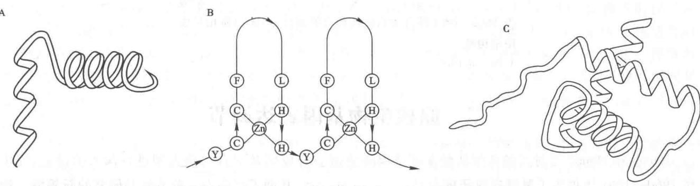  
图 34-1 DNA 结合蛋白的几种常见结构  
A. HTH B. ZnF C. HD

## （五）调节蛋白具有蛋白质-蛋白质相互作用结构域

通常结合 DNA 的蛋白都是二聚体或具多重结构域,因其靶序列为二重旋转对称,可由结合蛋白各单体分别以一个 $\alpha$ 螺旋插入 DNA 深沟,两侧的附加结构提高了对调节元件的识别能力。蛋白质-蛋白质相互作用结构最常见的有亮氨酸拉链(leucine zipper,Zip)和螺旋-突环-螺旋(helix-loop-helix,HLH)。分别介绍如下:

## 1. 亮氨酸拉链

亮氨酸拉链(Zip)基序介导结合 DNA 的调节蛋白二聚化。调节蛋白往往都以二聚体形式起作用, 这是以少数调节蛋白亚基达到加强特异结合的有效途径。亮氨酸拉链基序由约 35 个氨基酸残基形成两性的卷曲螺旋型 $\alpha$ -螺旋 (coiled-coil $\alpha$ -helix)。疏水侧链位于螺旋一侧, 解离基团位于另一侧, 使螺旋具有两性性质。每圈螺旋 3.5 个残基, 两圈有一个 Leu, 单体通过 Leu 侧链疏水作用而二聚化, 犹如拉链。该结构域借助 N 端碱性氨基酸构成 $\alpha$ 螺旋而与 DNA 结合, 此种结构称为碱性亮氨酸拉链 (bZip)。bZip 广泛存在于同或异二聚体的激活因子中。高等真核生物的 cAMP 应答元件结合蛋白 (cAMP response element binding protein, CREB) 以此结构而二聚体化并与 DNA 结合, 磷酸化可增强其活性, 多种磷酸激酶均能促使它磷酸化, 表明它能综合多渠道来源的信号。前述转录因子 AP1 由 Jun 和 Fos 通过 Zip 而成为稳定的异二聚体, 它们与细胞生长的调节有关。

## 2. 螺旋-突环-螺旋

螺旋-突环-螺旋(HLH)基序含有两个两性的 $\alpha$ 螺旋, 螺旋之间以一段突环连接, 全长约 $40 \sim 50$ 个残基, 由于突环的柔性, 使两螺旋可回折并叠加在一起。两亚基通过螺旋疏水侧链的相互作用而结合在一起。螺旋的 N 端与一段碱性氨基酸相连, 以此与 DNA 结合。bHLH 蛋白以同二聚体或异二聚体作用于基因控制元件, 如 E12/E47 结合在免疫球蛋白的增强子上。成肌素 (myogenin) MyoD 和转录因子 Myf-5 均与肌细胞生成有关。

该两结构域的基本结构见图 34-2。

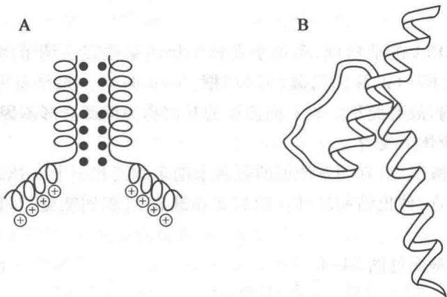  
图 34-2 DNA 结合蛋白的两种常见蛋白质-蛋白质相互作用结构域  
A. Zip B. HLH

<!-- EN-BEGIN 28.1 -->

### 【英文对应 28.1】The Proteins and RNAs of Gene Regulation

> 来源：Lehninger Principles of Biochemistry（书籍/02_生物化学原理） 第28章 Regulation of Gene Expression，§28.1。对应本章“一、基因表达调节的基本原理”。

Transcription is mediated and regulated by protein-DNA interactions, especially those involving the protein components of RNA polymerase (Chapter 26). We first consider how the activity of RNA polymerase is regulated. Next, we proceed to a general description of the proteins participating in this regulation. We then examine the molecular basis for the recognition of specific DNA sequences by DNA-binding proteins. Regulatory RNAs are encountered most often in the regulation of mRNA translation in eukaryotes, but also play a role in the life of some bacterial mRNAs. We consider them briefly in this section, and in more detail in Section 28.3.

#### [EN] RNA Polymerase Binds to DNA at Promoters

RNA polymerases bind to DNA and initiate transcription at promoters (see Fig. 26-5), sites generally found near points at which RNA synthesis begins on the DNA template. The regulation of transcription initiation often entails changes in how RNA polymerase interacts with a promoter.

The nucleotide sequences of promoters vary considerably, affecting the binding affinity of RNA polymerases and thus the frequency of transcription initiation. Some Escherichia coli genes are transcribed once per second, others less than once per cell generation. Much of this variation is due to differences in promoter sequence. In the absence of regulatory proteins, differences in promoter sequence may affect the frequency of transcription initiation by a factor of 1,000 or more. Most E. coli promoters have a sequence close to a consensus (Fig. 28-2). Mutations that result in a shift away from the consensus sequence usually decrease the function of bacterial promoters; conversely, mutations toward consensus usually enhance promoter function.

<table><tr><td>DNA 5&#x27;</td><td>UP element</td><td>TTGACA</td><td> $N_{17}$ </td><td>TATAAT</td><td> $N_{5-9}$ </td><td>RNA start site</td><td>mRNA</td></tr></table>

FIGURE 28-2 Consensus sequence for many E. coli promoters. Most base substitutions in the -10 and -35 regions have a negative effect on promoter function. Some promoters also include the UP (upstream promoter) element.

KEY CONVENTION By convention, DNA sequences are shown as they exist in the nontemplate strand, with the 5' terminus on the left. Nucleotides are numbered from the transcription start site, with positive numbers to the right (in the direction of transcription) and negative numbers to the left. N indicates any nucleotide.

Genes for products that are required at all times, such as those for the enzymes of central metabolic pathways, are expressed continuously, with little variation in virtually every cell of a species or organism. Such genes are often referred to as housekeeping genes. Expression of a gene at approximately constant levels is called constitutive gene expression. Although housekeeping genes are expressed constitutively, the cellular concentrations of the proteins they encode vary widely. For these genes, the RNA polymerase–promoter interaction strongly influences the rate of transcription initiation. Differences in promoter sequence may be the only level of regulation for a housekeeping gene, allowing the cell to synthesize the appropriate level of each housekeeping gene product.

The basal rate of transcription initiation at the promoters of nonhousekeeping genes is also determined by the promoter sequence, but expression of these genes is further modulated by regulatory proteins. Many of these proteins work by enhancing or interfering with the interaction between RNA polymerase and the promoter.

The sequences of eukaryotic promoters are much more variable than their bacterial counterparts. The three eukaryotic RNA polymerases usually require an array of general transcription factors in order to bind to a promoter, and these can heavily influence basal transcription rates. Yet, as with bacterial gene expression, the basal level of transcription is determined in part by the effect of promoter sequences on the function of RNA polymerase and its associated transcription factors.

#### [EN] Transcription Initiation Is Regulated by Proteins and RNAs

P2 At least three types of regulatory proteins regulate transcription initiation by RNA polymerase: specificity factors alter the specificity of RNA polymerase for a given promoter or set of promoters, repressors impede access of RNA polymerase to the promoter, and activators enhance the RNA polymerase-promoter interaction.

As our understanding of the roles of protein regulators slowly matures, many new roles for gene regulation by noncoding RNAs (ncRNAs) are also beginning to emerge. Among these are the long noncoding RNAs (lncRNAs), generally defined as noncoding RNAs more than 200 nucleotides long that lack an open reading frame (ORF) that encodes a protein—thus distinguishing them from the small, functional ncRNAs (miRNA, snoRNA, snRNA, etc.) described in Chapter 26. The lncRNAs are found in all types of organisms, with tens of thousands expressed in mammalian cells. Known functions of lncRNAs include regulation of nucleosome positioning and chromatin structure, control of DNA methylation and posttranscriptional histone modifications, transcriptional gene silencing, multiple roles in transcriptional activation and repression, and much more.

We introduced bacterial specificity factors in Chapter 26, although we did not refer to these proteins by that name. The $\sigma$ subunit of the $E.$ coli RNA polymerase holoenzyme is a specificity factor that mediates promoter recognition and binding. Most $E.$ coli promoters are recognized by a single $\sigma$ subunit ( $M_{\mathrm{r}}$ 70,000), $\sigma^{70}$ (see Fig. 26-5). Under some conditions, some of the $\sigma^{70}$ subunits are replaced by one of six other specificity factors. One notable case arises when bacteria are subjected to heat stress, leading to the replacement of $\sigma^{70}$ by $\sigma^{32}$ ( $M_{\mathrm{r}}$ 32,000). When bound to $\sigma^{32}$ , RNA polymerase is directed to a specialized set of promoters with a different consensus sequence (Fig. 28-3). These promoters control the

FIGURE 28-3 Consensus sequence for promoters that regulate expression of the E. coli heat shock genes. This system responds to temperature increases as well as some other environmental stresses, resulting in the induction of a set of proteins. Binding of RNA polymerase to heat shock promoters is mediated by a specialized $\sigma$ subunit of the polymerase, $\sigma^{32}$ , which replaces $\sigma^{70}$ in the RNA polymerase initiation complex.

expression of a set of genes that encode proteins, including some protein chaperones (p. 132), that are part of a stress-induced system called the heat shock response. Thus, through changes in the binding affinity of the polymerase that direct the enzyme to different promoters, a set of genes involved in related processes is coordinately regulated. In eukaryotic cells, some of the general transcription factors, in particular the TATA-binding protein (TBP; see Fig. 26-9), may be considered specificity factors.

Repressors bind to specific sites on the DNA. In bacterial cells, such binding sites, called operators, are generally near a promoter. RNA polymerase binding, or its movement along the DNA after binding, is blocked when the repressor is present. P3 Regulation by means of a repressor protein that blocks transcription is referred to as negative regulation. Repressor binding to DNA is regulated by a molecular signal, or effector, usually a small molecule or a protein that binds to the repressor and causes a conformational change. The interaction between repressor and signal molecule either increases or decreases transcription. In some cases, the conformational change results in dissociation of a DNA-bound repressor from the operator (Fig. 28-4a). Transcription initiation can then proceed unhindered. In other cases, interaction between an inactive repressor and the signal molecule causes the repressor to bind to the operator (Fig. 28-4b). P4 In eukaryotic cells, gene regulation by a repressor is less common. Where it does occur (more often in lower eukaryotes such as yeast), the binding site for a repressor may be some distance from the promoter. Binding of these repressors to their binding sites has the same effect as in bacterial cells: inhibiting the assembly or activity of a transcription complex at the promoter.

P3 Activators provide a molecular counterpoint to repressors; they bind to DNA and enhance the activity of RNA polymerase at a promoter; this is positive regulation. In bacteria, activator-binding sites are often adjacent to promoters that are bound weakly or not at all by RNA polymerase alone, such that little transcription occurs in the absence of the activator. Some activators are usually bound to DNA, enhancing transcription until dissociation of the activator is triggered by the binding of a signal molecule (Fig. 28-4c). In other cases the activator binds to DNA only after interaction with a signal molecule (Fig. 28-4d). Signal molecules can therefore increase or decrease transcription, depending on how they affect the activator.

P4 Positive regulation by activators is particularly common in eukaryotes. Many eukaryotic activators bind to DNA sites, called enhancers, that are distant from the promoter, affecting the rate of transcription at a promoter that may be located thousands of base pairs away.

The distance between a promoter and the binding site of an activator or repressor is bridged by looping out of the DNA between the two sites (Fig. 28-5). The looping is facilitated in some cases by proteins called architectural regulators that bind to intervening sites. Interaction

(a) Negative regulation
Molecular signal causes dissociation of repressor from DNA, inducing transcription.

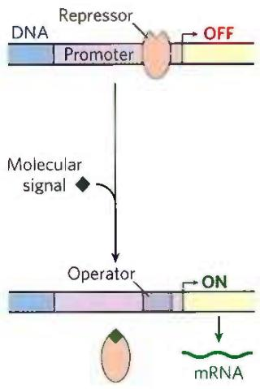

(b) Negative regulation
Molecular signal causes binding of repressor to DNA, inhibiting transcription.

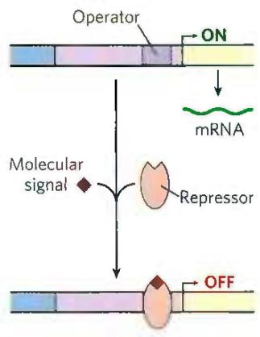  
(c) Positive regulation
Molecular signal causes dissociation of activator from DNA, inhibiting transcription.

(d) Positive regulation
Molecular signal causes binding of activator to DNA, inducing transcription.

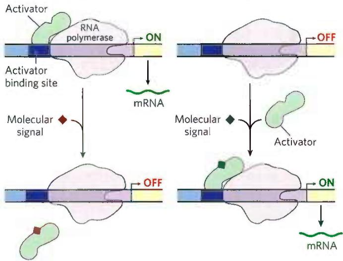  
FIGURE 28-4 Common patterns of regulation of transcription initiation. Two types of negative regulation are illustrated. (a) Repressor binds to the operator in the absence of the molecular signal; the external signal causes dissociation of the repressor to permit transcription. (b) Repressor binds in the presence of the signal; the repressor dissociates, and transcription ensues when the signal is removed. Positive regulation is mediated by gene activators. Again, two types are shown. (c) Activator binds in the absence of the molecular signal and transcription proceeds; when the signal is added, the activator dissociates and transcription is inhibited. (d) Activator binds in the presence of the signal; it dissociates only when the signal is removed. Note that "positive" regulation and "negative" regulation refer to the type of regulatory protein involved: the bound protein either facilitates or inhibits transcription. In either case, addition of the molecular signal may increase or decrease transcription, depending on its effect on the regulatory protein.

between activators and the RNA polymerase at the promoter is often mediated by intermediary proteins called coactivators. In some instances, protein repressors may take the place of coactivators, binding to the activators and preventing the activating interaction.

  
FIGURE 28-5 Interaction between activators/repressors and RNA polymerase in eukaryotes. Eukaryotic activators and repressors frequently bind sites thousands of base pairs distant from the promoters they regulate. DNA looping, often facilitated by architectural regulators, brings the sites together. The interaction between activators and RNA polymerase may be mediated by coactivators, as shown. Repression is sometimes mediated by repressors (described later) that bind to activators, thereby preventing the activating interaction with RNA polymerase.

#### [EN] Many Bacterial Genes Are Clustered and Regulated in Operons

Bacteria have a simple general mechanism for coordinating the regulation of multiple genes: these genes are clustered on the chromosome and are transcribed together. Many bacterial mRNAs are polycistronic—multiple genes on a single transcript—and the single promoter that initiates transcription of the cluster is the site of regulation for expression of all the genes in the cluster. The gene cluster and promoter, plus additional sequences that function together in regulation, are called an operon (Fig. 28-6). Operons that include two to six genes transcribed as a unit are common; some operons contain 20 or more genes. The identity and order of the genes in an operon are not random. In many cases, genes in the same operon encode subunits of a larger protein complex, and cotranslation directly enables assembly of the complex. Some operons organize genes involved in related processes that require coordinated regulation. In other cases, the genes may seem to be unrelated, but they encode products required by the cell under similar conditions.

  
FIGURE 28-6 Representative bacterial operon. Genes A, B, and C are transcribed on one polycistronic mRNA. Typical regulatory sequences include binding sites for proteins that either activate or repress transcription from the promoter.

Many of the principles of bacterial gene expression were first defined by studies of lactose metabolism in E. coli, which can use lactose as its sole carbon source. In 1960, François Jacob and Jacques Monod published a short paper in the Proceedings of the French Academy of Sciences that described how two adjacent genes involved in lactose metabolism were coordinately regulated by a genetic element located at one end of the gene cluster. The genes were those for $\beta$ -galactosidase, which cleaves lactose to galactose and glucose, and for galactoside permease, which transports lactose into the cell (Fig. 28-7). The terms “operon” and “operator” were first introduced in this paper. With the operon model, gene regulation could, for the first time, be considered in molecular terms.

#### [EN] The lac Operon Is Subject to Negative Regulation

The lactose (lac) operon (Fig. 28-8a) includes the genes for $\beta$ -galactosidase (Z), galactoside permease (Y), and thiogalactoside transacetylase (A). The last of these enzymes seems to modify toxic galactosides to facilitate their removal from the cell. Each of the three genes is preceded by a ribosome-binding site (not shown in Fig. 28-8) that independently directs the translation of that gene (Chapter 27). Regulation of the lac operon by the lac repressor protein (Lac) follows the pattern outlined in Figure 28-4a.

The study of lac operon mutants has revealed some details of the workings of the operon's regulatory system. In the absence of lactose, the lac operon genes are repressed. Mutations in the operator or in another gene, the I gene, result in constitutive synthesis of the gene products. When the I gene is defective, repression can be restored by introducing a functional I gene into the cell on another DNA molecule, demonstrating that the I gene encodes a diffusible molecule that causes gene repression. This molecule proved to be a protein, now called the Lac repressor, a tetramer of identical monomers. The operator to which it binds most tightly (O $_{1}$ ) abuts the transcription start site (Fig. 28-8a). The I gene is transcribed from its own promoter (P $_{1}$ ) independent of the lac operon genes. The lac operon has two secondary binding sites for the Lac repressor: $O_{2}$ and $O_{3}$ . $O_{2}$ is centered near position +410, within the gene encoding $\beta$ -galactosidase (Z); $O_{3}$ is near position -90, within the I gene. To repress the operon, the Lac repressor seems to bind to both the main operator and one of the two secondary sites, with the intervening DNA looped out (Fig. 28-8b, c). Either binding arrangement blocks transcription initiation.

(a)  
  
FIGURE 28-7 Lactose metabolism in E. coli. Uptake and metabolism of lactose require the activities of galactoside (lactose) permease and $\beta$ -galactosidase. Conversion of lactose to allolactose by transglycosylation is a minor reaction also catalyzed by $\beta$ -galactosidase.

Despite this elaborate binding complex, repression is not absolute. Binding of the Lac repressor reduces the rate of transcription initiation by a factor of $10^{3}$ . If the $O_{2}$ and $O_{3}$ sites are eliminated by deletion or mutation, the binding of repressor to $O_{1}$ alone reduces transcription by a factor of about $10^{2}$ . Even in the repressed state, each cell has a few molecules of $\beta$ -galactosidase and galactoside permease, presumably synthesized on the rare occasions when the repressor transiently dissociates from the operators. This basal level of transcription is essential to operon regulation.

  
FIGURE 28-8 The lac operon. (a) In the lac operon, the lacI gene encodes the Lac repressor. The lac Z, Y, and A genes encode β-galactosidase, galactoside permease, and thiogalactoside transacetylase, respectively. P is the promoter for the lac genes, and P₁ is the promoter for the I gene. O₁ is the main operator for the lac operon; O₂ and O₃ are secondary operator sites of lesser affinity for the Lac repressor. The inverted repeat to which the Lac repressor binds in O₁ is shown. (b) The Lac repressor binds to the main operator and O₂ or O₃, and it seems to form a loop in the DNA. (c) Lac repressor (shades of red) is shown bound to short, discontinuous segments of DNA (blue and orange). [(c) Data from PDB ID 2PES, R. Daber et al., J. Mol. Biol. 370:609, 2007.]

When cells are provided with lactose, the lac operon is induced. An inducer (signal) molecule binds to a specific site on the Lac repressor, causing a conformational change that results in dissociation of the repressor from the operator. The inducer in the lac operon system is not lactose itself but allolactose, an isomer of lactose (Fig. 28-7). After entry into the E. coli cell (via the few preexisting molecules of lactose permease), lactose is converted to allolactose by one of the few preexisting $\beta$ -galactosidase molecules. Release of the operator by Lac repressor, triggered as the repressor binds to allolactose, allows expression of the lac operon genes and leads to a $10^{3}$ -fold increase in the concentration of $\beta$ -galactosidase.

Several $\beta$ -galactosides structurally related to allolactose are inducers of the lac operon but are not substrates for $\beta$ -galactosidase; others are substrates but not inducers. One particularly effective and nonmetabolizable inducer of the lac operon that is often used experimentally is isopropylthiogalactoside (IPTG).

  
Isopropyl- $\beta$ -D-thiogalactoside (IPTG)

An inducer that cannot be metabolized allows researchers to explore the physiological function of lactose as a carbon source for growth, separate from its function in the regulation of gene expression.

In addition to the multitude of operons now known in bacteria, a few polycistronic operons have been found in the cells of lower eukaryotes. In the cells of higher eukaryotes, however, almost all protein-coding genes are transcribed separately.

The mechanisms by which operons are regulated can vary significantly from the simple model presented in Figure 28-8. Even the lac operon is more complex than indicated here, with an activator also contributing to the overall scheme, as we shall see in Section 28.2. Before any further discussion of the layers of regulation of gene expression, however, we examine the critical molecular interactions between DNA-binding proteins (such as repressors and activators) and the DNA sequences to which they bind.

#### [EN] Regulatory Proteins Have Discrete DNA-Binding Domains

P2 Regulatory proteins generally bind to specific DNA sequences. Their affinity for these target sequences is roughly $10^{4}$ to $10^{6}$ times higher than their affinity for any other DNA sequence. Most regulatory proteins have discrete DNA-binding domains containing substructures that interact closely and specifically with the DNA. These binding domains usually include one or more of a relatively small group of recognizable and characteristic structural motifs.

To bind specifically to DNA sequences, regulatory proteins must recognize surface features on the DNA (see Fig. 8-13). Most of the chemical groups that differ among the four bases and thus permit discrimination between base pairs are hydrogen-bond donor and acceptor groups exposed in the major groove of DNA (Fig. 28-9), and most of the protein-DNA contacts that impart specificity are hydrogen bonds. A notable exception is the nonpolar surface near C-5 of pyrimidines, where thymine is readily distinguished from cytosine by its protruding methyl group. Protein-DNA contacts are also possible in the minor groove of the DNA, but the hydrogen-bonding patterns there generally do not allow ready discrimination between base pairs.

  
FIGURE 28-9 Groups in DNA available for protein binding. (a) Shown here are functional groups on all four base pairs that are displayed in the major and minor grooves of DNA. Hydrogen-bond acceptor (A) and donor (D) atoms are marked by blue and red disks, respectively. Other hydrogen atoms (H) are marked with purple disks, and methyl groups (M) with  
yellow disks. (b) Recognition patterns for each base pair (from left to right). The much greater variation in the patterns for the major groove gives rise to a much greater discriminatory power in the major groove relative to the minor groove. [Information from J. L. Huret, Atlas Genet. Cytogenet. Oncol. Haematol. 2006, http://atlasgeneticsoncology.org/Educ/DNAEnglID30001ES.html.]

Within regulatory proteins, the amino acid side chains most often hydrogen-bonding to bases in the DNA are those of Asn, Gln, Glu, Lys, and Arg residues. Is there a simple recognition code in which a particular amino acid always pairs with a particular base? The two hydrogen bonds that can form between Gln or Asn and the $N^{6}$ and N-7 positions of adenine cannot form with any other base. And an Arg residue can form two hydrogen bonds with N-7 and $O^{6}$ of guanine (Fig. 28-10). Examination of the structure of many DNA-binding proteins, however, has shown that a protein can recognize each base pair in more than one way, leading to the conclusion that there is no simple amino acid-base code. For some proteins, the Gln-adenine interaction can specify A=T base pairs, but in others a van der Waals pocket for the methyl group of thymine can recognize A=T base pairs. Researchers cannot yet examine the structure of a DNA-binding protein and infer the DNA sequence to which it binds.

To interact with bases in the major groove of DNA, a protein requires a relatively small substructure that can stably protrude from the protein surface. The DNA-binding domains of regulatory proteins tend to be small (60 to 90 amino acid residues), and the structural motifs within these domains that are actually in contact with the DNA are smaller still. Many small proteins are unstable because of their limited capacity to form layers of structure to bury hydrophobic groups. The DNA-binding motifs provide either a very compact stable structure or a way of allowing a segment of protein to protrude from the protein surface.

P2 The DNA-binding sites for regulatory proteins are often inverted repeats of a short DNA sequence (a palindrome) at which multiple (usually two) subunits of a regulatory protein bind cooperatively. The Lac repressor is unusual in that it functions as a tetramer, with two dimers tethered together at the end distant from the DNA-binding sites (Fig. 28-8b). An E. coli cell usually contains about 20 tetramers of the Lac repressor. Each of the tethered dimers separately binds to a palindromic operator sequence, in contact with 17 bp of a 22 bp region in the lac operon. And each of the tethered dimers can independently bind to an operator sequence, with one generally binding to O $_{1}$ and the other to O $_{2}$ or O $_{3}$ (as in Fig. 28-8b). The symmetry of the O $_{1}$ operator sequence corresponds to the twofold axis of symmetry of two paired Lac repressor subunits. The tetrameric Lac repressor binds to its operator sequences in vivo with an estimated dissociation constant of 10 $^{-10}$ M. The repressor discriminates between the operators and other sequences by a factor of about 10 $^{6}$ , so binding to these few base pairs among the 4.6 million or so of the E. coli chromosome is highly specific.

  
FIGURE 28-10 Specific amino acid residue–base pair interactions. The two examples shown have been observed in DNA-protein binding.

Several DNA-binding motifs have been described, but here we focus on two that play prominent roles in the binding of DNA by regulatory proteins from all domains of life: the helix-turn-helix and the zinc finger. We also consider two other types of such motifs: the homeodomain and the RNA recognition motif, which, as its name implies, also binds RNA; both motifs play prominent roles in some eukaryotic regulatory proteins.

Helix-Turn-Helix The helix-turn-helix motif is crucial to the interaction of many regulatory proteins with DNA in bacteria, and similar motifs occur in some eukaryotic regulatory proteins. The helix-turn-helix comprises about 20 amino acid residues in two short $\alpha$ -helical segments, each 7 to 9 residues long, separated by a $\beta$ turn (Fig. 28-11). This structure generally is not stable by itself; it is simply the interactive portion of a somewhat larger DNA-binding domain. One of the two $\alpha$ -helical segments is called the recognition helix, because it usually contains many of the amino acids that interact with DNA in a sequence-specific way. This $\alpha$ helix is stacked on other segments of the protein structure so that it protrudes from the protein surface. When bound to DNA, the recognition helix is positioned in or nearly in the major groove. The Lac repressor has this DNA-binding motif.

Zinc Finger In a zinc finger, about 30 amino acid residues form an elongated loop held together at the base by a single $\mathrm{Zn}^{2+}$ ion, which is coordinated to 4 of the residues (4 Cys, or 2 Cys and 2 His). The zinc does not itself interact with DNA; rather, the coordination of zinc with the amino acid residues stabilizes this small structural motif. Several hydrophobic side chains in the core of the structure also lend stability. Figure 28-12 shows the interaction between DNA and three zinc fingers of a single polypeptide from the mouse regulatory protein Zif268.

  
FIGURE 28-11 Helix-turn-helix. (a) DNA-binding domain of the Lac repressor bound to DNA. (b) The entire Lac repressor. The DNA-binding domains and the $\alpha$ helices involved in tetramer formation are labeled. The remainder of the protein has the binding sites for allolactose. The allolactose-binding domains are linked to the DNA-binding domains through linker helices. [Data from PDB ID 2PES, R. Daber et al., J. Mol. Biol. 370:609, 2007.]

  
FIGURE 28-12 Zinc fingers. Three zinc fingers of the regulatory protein Zif268, complexed with DNA. Each $\mathrm{Zn^{2+}}$ coordinates with two His and two Cys residues. [Data from PDB ID 1ZAA, N.P. Pavletich and C.O. Pabo, Science 252:809, 1991.]

Many eukaryotic DNA-binding proteins contain zinc fingers. The interaction of a single zinc finger with DNA is typically weak, and many DNA-binding proteins, like Zif268, have multiple zinc fingers that substantially enhance binding by interacting simultaneously with the DNA. One DNA-binding protein of the frog Xenopus has 37 zinc fingers. There are few known examples of the zinc finger motif in bacterial proteins.

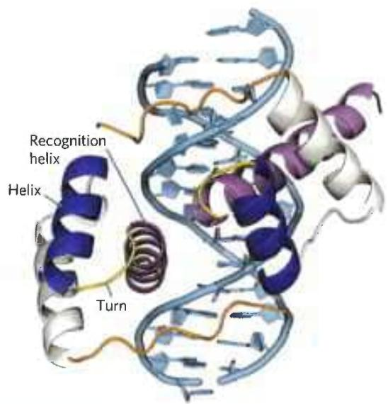  
FIGURE 28-13 Homeodomains. Shown here are two homeodomains bound to DNA. In each homeodomain, the recognition helix, layered on two others, can be seen protruding into the major groove. This is only a small part of a larger regulatory protein from a class called Pax, active in the regulation of development in fruit flies (see Section 28.3). [Data from PDB ID 1FJL, D. S. Wilson et al., Cell 82:709, 1995.]

The precise manner in which proteins with zinc fingers bind to DNA differs from one protein to the next. Some zinc fingers contain the amino acid residues that are important in sequence discrimination, whereas others seem to bind DNA nonspecifically (the amino acids required for specificity are located elsewhere in the protein). Zinc fingers can also function as RNA-binding motifs, such as in certain proteins that bind eukaryotic mRNAs and act as translational repressors. We discuss this role later (Section 28.3).

Homeodomain Another type of DNA-binding domain has been identified in some proteins that function as transcriptional regulators, especially during eukaryotic development. This domain of 60 amino acid residues—called the homeodomain, because it was discovered in homeotic genes (genes that regulate the development of body patterns)—is highly conserved and has now been identified in proteins from a wide variety of organisms, including humans (Fig. 28-13). The DNA-binding segment of the domain is related to the helix-turn-helix motif. The DNA sequence that encodes this domain is known as the homeobox.

RNA Recognition Motif New classes of proteins with RNA-binding domains continue to be identified. RNA recognition motifs (RRMs) are found in some eukaryotic gene activators, where they may do double duty in binding DNA and RNA. When bound to specific binding sites in DNA, these activators induce transcription. The same activators are sometimes regulated in part by specific lncRNAs that compete with DNA binding and decrease gene transcription. Other proteins with RRM motifs bind to mRNA, rRNA, or any of a range of other smaller, noncoding RNAs. The RRM consists of 90 to 100 amino acid residues, arranged in a four-strand antiparallel $\beta$ sheet sandwiched against two $\alpha$ helices, with a $\beta_{1}-\alpha_{1}-\beta_{2}-\beta_{3}-\alpha_{2}-\beta_{4}$ topology (Fig. 28-14a). This motif may be present as part of DNA-binding regulatory proteins that also have other DNA-binding motifs or may occur in proteins that bind uniquely to RNA. The RRM is just one of many diverse protein motifs known to interact with RNA (Fig. 28-14b).

#### [EN] Regulatory Proteins Also Have Protein-Protein Interaction Domains

Regulatory proteins contain domains not only for DNA binding but also for protein-protein interactions—with RNA polymerase, other regulatory proteins, or other subunits of the same regulatory protein. Examples include many eukaryotic transcription factors that function as gene activators, which often bind as dimers to the DNA through DNA-binding domains that contain zinc fingers. Some structural domains are devoted to the interactions required for dimer formation, which is generally a prerequisite for DNA binding. Like DNA-binding motifs, the structural motifs that mediate protein-protein interactions tend to fall within one of a few common categories. Two important examples are the leucine zipper and the basic helix-loop-helix. Structural motifs such as these are the basis for classifying some regulatory proteins into structural families.

Leucine Zipper The leucine zipper is an amphipathic $\alpha$ helix with a series of hydrophobic amino acid residues concentrated on one side (Fig. 28-15), with the hydrophobic surface forming the area of contact between the two polypeptides of a dimer. A striking

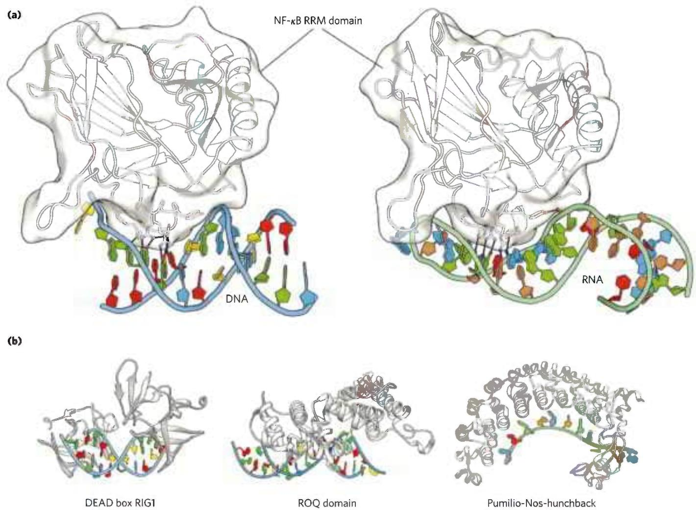  
FIGURE 28-14 RNA recognition motifs (RRMs). (a) An RRM from the p50 subunit of regulatory protein NF- $\kappa$ B is shown, bound to (left) DNA and (right) RNA. Black lines indicate hydrogen-bonding interactions between particular amino acid residues and bases in the DNA or RNA. NF- $\kappa$ B is the name of a family of structurally related eukaryotic transcription factors that regulate processes ranging from immune and inflammatory responses  
to cell growth and apoptosis. (b) Three additional RRM motifs from widespread RNA-binding protein families. [(a) Data from (left) PDB ID 100A, D. B. Huang et al., Proc. Natl. Acad. Sci. USA 100:9268, 2003; (right) PDB ID IVKX, F. E. Chen et al., Nature 391:410, 1998. (b) DEAD box RIG1: PDB ID 3LRR, C. Lu et al., Structure 18:1032, 2010; ROQ domain: PDB ID 4QIK, D. Tan et al., Nat. Struct. Mol. Biol. 21:679, 2014; Pumilio-Nos-hunchback: PDB ID 5KL1, C. A. Weidmann et al., eLife 5, 2016.]

  
FIGURE 28-15 Leucine zippers. (a) Comparison of amino acid sequences of several leucine zipper proteins. Notice the Leu (L) residues (shaded) at every seventh position in the zipper region, and the number of Lys (K) and Arg (R) residues in the DNA-binding region. (b) Leucine zipper from the yeast activator protein GCN4. Only the "zippered" $\alpha$ helices, derived

feature of these $\alpha$ helices is the occurrence of Leu residues at every seventh position, forming a straight line along the hydrophobic surface. Although researchers initially thought the Leu residues interdigitated (hence the name "zipper"), we now know that they line up, side by side, as the interacting $\alpha$ helices coil around each other (forming a coiled coil; Fig. 28-15b). Regulatory proteins with leucine zippers often have a separate DNA-binding domain with a high concentration of basic (Lys or Arg) residues that can interact with the negatively charged phosphates of the DNA backbone. Leucine zippers have been found in many eukaryotic proteins and a few bacterial proteins.

Basic Helix-Loop-Helix Another common structural motif, the basic helix-loop-helix, occurs in some eukaryotic regulatory proteins implicated in the control of gene expression during development of multicellular organisms. These proteins share a conserved region of about 50 amino acid residues important in both DNA binding and protein dimerization. This region can form two short, amphipathic $\alpha$ helices linked by a loop of variable length, the helix-loop-helix (distinct from the helix-turn-helix motif associated with DNA binding). The helix-loop-helix motifs of two polypeptides interact to form dimers (Fig. 28-16). In these proteins, DNA binding is mediated by an adjacent short amino acid sequence rich in basic residues, similar to the separate DNA-binding region in proteins containing leucine zippers.

from different subunits of the dimeric protein, are shown. The two helices wrap around each other in a gently coiled coil. The interacting Leu side chains and the conserved residues in the DNA-binding region are highlighted to correspond to the sequence in (a). [(a) Information from S. L. McKnight, Sci. Am. 264 (April):S4, 1991. (b) Data from PDB ID 1YSA, T. E. Ellenberger et al., Cell 71:1223, 1992.]  
  
FIGURE 28-16 Helix-loop-helix. The human transcription factor Max, bound to its DNA target site. The protein is dimeric; one subunit is colored. The recognition helix is linked via the loop to the dimer-forming helix, which merges with the carboxyl-terminal end of the subunit. Interaction of the carboxyl-terminal helices of the two subunits describes a coiled coil very similar to that of a leucine zipper (see Fig. 28-15b), but with only one pair of interacting Leu residues (side chains at the right) in this example. The overall structure is sometimes called a helix-loop-helix/leucine zipper motif. [Data from PDB ID 1HLO, P. Brownlie et al., Structure S:509, 1997.]

Protein-Protein Interactions in Eukaryotic Regulatory Proteins In eukaryotes, most genes are regulated by activators,

<!-- END OFFICIAL API PART part_011 -->

<!-- BEGIN OFFICIAL API PART part_012 -->

and most genes are monocistronic. If a different activator were required for each gene, the number of activators (and genes encoding them) would need to be equivalent to the number of regulated genes. However, in yeast, about 300 transcription factors (many of them activators) are responsible for the regulation of many thousands of genes. Many of the transcription factors regulate the induction of multiple genes, but most genes are subject to regulation by multiple transcription factors.
P4 Appropriate regulation of different genes is accomplished by different combinations of a limited repertoire of transcription factors at each gene, a mechanism referred to as combinatorial control.

Combinatorial control is accomplished in part by mixing and matching the variants within a regulatory protein family to form a series of different active protein dimers. Several families of eukaryotic transcription factors have been defined on the basis of close structural similarities. Within each family, dimers can sometimes form between two identical proteins (a homodimer) or between two different members of the family (a heterodimer). A hypothetical family of four different leucine-zipper proteins could thus form up to 10 different dimeric species. In many cases, the different combinations have distinct regulatory and functional properties and regulate different genes. As we shall see, multiple regulatory proteins of this kind function in the regulation of most eukaryotic genes, further contributing to combinatorial control.

In addition to having structural domains devoted to DNA binding and protein dimerization, which direct a particular protein dimer to a particular gene, many regulatory proteins have domains that interact with RNA polymerase, with regulatory RNAs, with unrelated regulatory proteins, or with some combination of the three. At least three types of additional domains for protein-protein interaction have been characterized (primarily in eukaryotes): glutamine-rich, proline-rich, and acidic domains, the names reflecting the amino acid residues that are especially abundant.

Protein-DNA and protein-RNA binding interactions are the basis of the intricate regulatory circuits fundamental to gene function. We now turn to a closer examination of these gene regulatory schemes, first in bacteria, then in eukaryotes.

#### [EN] SUMMARY 28.1 The Proteins and RNAs of Gene Regulation

■ Transcription is initiated when an RNA polymerase interacts with a site called a promoter. In bacteria, the frequency of transcription initiation is dictated in part by sequence changes within the promoter. For gene products required all the time at a defined level—the products of housekeeping genes—the promoter sequence may be the sole element of regulation. For genes encoding products that are not always needed, regulation is imposed by additional proteins and RNAs.

■ Regulation of gene transcription is imposed primarily by three types of proteins: specificity factors, repressors, and activators. Regulatory RNAs also play an important role in regulating the expression of many genes.

In bacteria, genes that encode products with interdependent functions are often clustered in an operon, a single transcriptional unit. Transcription of the genes is generally blocked by binding of a specific repressor protein at a DNA site called an operator. Dissociation of the repressor from the operator is mediated by a specific small molecule, an inducer.

■ Many principles of gene regulation in bacteria were first elucidated in studies of the lactose (lac) operon. The Lac repressor dissociates from the lac operator when the repressor binds to its inducer, allolactose.

■ Regulatory proteins are DNA-binding proteins that recognize specific DNA sequences; most have distinct DNA-binding domains. Within these domains, common structural motifs that bind DNA (and/or RNA) are the helix-turn-helix, zinc finger, homeodomain, and RNA recognition motif.

■ Regulatory proteins often contain domains such as the leucine zipper and helix-loop-helix, required for dimerization or other protein-protein interactions, and other motifs required for activation of transcription. Mixing and matching of protein family variants in dimeric transcription factors provides for more efficient and responsive regulation through combinatorial control.

<!-- EN-END 28.1 -->

## 二、原核生物基因表达调节

Jacob 和 Monod 等对大肠杆菌乳糖发酵过程酶的适应合成以及对有关突变型进行深入的研究,终于在 1960—1961 年提出了乳糖操纵子模型(lac operon model),开创了基因表达调节机制研究的新领域。操纵子模型可以很好说明原核生物基因表达的调节机制。其后的大量研究工作证明并发展了这一模型,同时也发现了许多其他的调节机制。

## （一）细菌功能相关的基因组成操纵子

所谓操纵子即基因表达的协调单位（coordinated unit），它们有共同的控制区（control region）和调节系统（regulation system）。操纵子包括在功能上彼此有关的结构基因和共同的控制部位，后者由启动子（promoter, P）和操纵基因（operator, O）所组成。操纵子的全部结构基因通过转录形成一条多顺反子 mRNA（polycistronic mRNA），其控制部位可接受调节基因产物的调节。

Jacob 和 Monod 提出的操纵子模型说明,酶的诱导和阻遏是在调节基因产物阻遏蛋白的作用下,通过操纵基因控制结构基因的转录而发生的。由于经济的原则,细菌通常并不合成那些在代谢上无用的酶,因此一些分解代谢的酶类只在有关的底物存在时才被诱导合成;而一些合成代谢的酶类在产物足够量存在时,其合成被阻遏(repression)。在酶诱导时,阻遏蛋白与诱导物相结合,因而失去封闭操纵基因的能力。在酶阻遏时,原来无活性的阻遏蛋白与辅阻遏物(corepressor),即各种生物合成途径的终产物(或产物类似物)相结合而被活化,从而封闭了操纵基因。

现以大肠杆菌乳糖操纵子来具体说明操纵子的作用机制。大肠杆菌乳糖操纵子是第一个被发现的操纵子，它包括依次排列着的启动子、操纵基因和三个结构基因。结构基因 lacZ 编码水解乳糖的 $\beta$ 半乳糖苷酶 ( $\beta$ -glactosidase)，lacY 编码吸收乳糖的 $\beta$ -半乳糖苷透性酶 ( $\beta$ -glactoside permease)，lacA 编码 $\beta$ -硫代半乳糖苷乙酰基转移酶 ( $\beta$ -thioglactoside transacetylase)，该酶虽非乳糖代谢所必需，但对透性酶输入的某些毒性物质有解毒功能。乳糖操纵子的操纵基因 lacO 不编码任何蛋白质，它是调节基因 lacI 所编码阻遏蛋白的结合部位。阻遏蛋白是一种变构蛋白，当细胞中有乳糖或其他诱导物（inducer）时阻遏蛋白便和它们相结合，结果使阻遏蛋白的构象发生改变而不能结合到 lacO 上，于是转录便得以进行，从而诱导产生摄取和分解乳糖的酶（图 34-3）。如果细胞中没有乳糖或其他诱导物则阻遏蛋白就结合在 lacO 上，阻止了启动子 P 上 RNA 聚合酶向前移动，转录便不能进行。

  
图 34-3 大肠杆菌乳糖操纵子模型

乳糖操纵子的阻遏蛋白是由4个相对分子质量为37000的亚基聚合而成。亚基与DNA结合的结构域含有螺旋-转角-螺旋基序，该结构常见于DNA结合蛋白。基序由两个短的 $\alpha$ 螺旋中间夹一个β转角所组成，其中一个 $\alpha$ 螺旋为识别螺旋，能与DNA相互作用，识别操纵基因序列并与之结合。核酸酶保护实验表明，操纵基因为一段含有 $28\mathrm{bp}$ 旋转对称的回文结构（palindrome），阻遏蛋白亚基二聚体与其结合时正好分别贴在DNA的深沟处，识别螺旋的氨基酸分别与回文序列的碱基对之间形成特异的氢键。操纵基因 $O_{1}$ 在其上游和下游还各有一个相似的回文结构序列，称为 $O_{2}$ 和 $O_{3}$ 。阻遏蛋白两个亚基与操纵基因回文结构结合，另两个亚基与上游或下游回文结构结合，中间DNA形成突环，由此增加了阻遏蛋白阻止转录的效果(图34-4)。

在上述过程中,无论是产物对合成途径酶的阻遏或是底物对分解途径酶的诱导,阻遏蛋白所起的都是负调节作用,诱导实际上只是去阻遏。但是在操纵子模型提出后不久即发现,并非所有调节蛋白都对操纵子起负调节作用,而有些调节基因产物对操纵子起着正调节作用。

## （二）细菌的降解物阻遏

当细菌在含有葡萄糖和乳糖的培养基中生长时，通常优先利用葡萄糖，而不利用乳糖。只有在葡萄糖耗尽后，细菌经过一段停滞期，由乳糖诱导合成β-半乳糖苷酶，细菌才能充分利用乳糖。这种现象过去称为葡萄糖效应。后来了解到这是由于一些分解代谢的酶类受葡萄糖降解物的影响而停止合成，因此又称为降解物阻遏（catabolite repression）。受到降解物阻遏的酶类包括代谢乳糖、半乳糖、阿拉伯糖及麦芽糖等的操纵子。分解葡萄糖的酶是组成酶（constitutive enzyme），在有葡萄糖时不需分解其他糖的酶类。在这里调节基因的产物为环腺苷酸受体蛋白（cyclic AMP receptor protein, CRP）或称为降解物基因活化蛋白（catabolite gene activation protein, CAP）。当它与环腺苷酸（cAMP）结合后即被活化，并结合于分解代谢酶类操纵子的一定部位，促进转录的进行。葡萄糖分解代谢的降解物能抑制腺苷酸环化酶活性并活化磷酸二酯酶，因而降低cAMP浓度，使许多分解代谢酶的基因不能转录。

A

B  
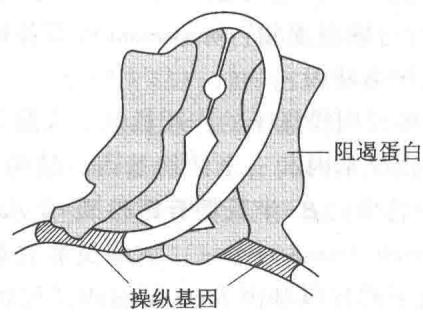

<table><tr><td></td><td> $P_{2}$ </td><td>I</td><td> $O_{3}$ </td><td></td><td></td><td>P</td><td> $O_{1}$ </td><td>Z</td><td> $O_{2}$ </td><td></td><td>Y</td><td>A</td><td></td></tr></table>

  
图 34-4 阻遏蛋白与操纵基因结合  
A, B. 乳糖操纵子除启动子内含有主要操纵基因 $O_{1}$ 外，还有两个阻揭蛋白结合位点，分别在 Z 基因和 I 基因内，称为 $O_{2}$ 和 $O_{3}$ ，阻遏蛋白亚基与操纵基因及上游或下游相似回文结构结合，中间 DNA 形成突环；C. 操纵基因序列，方框内碱基对为回文结构

CRP 为相对分子质量 22 000 亚基的二聚体, 其结合 DNA 的结构域也有螺旋-转角-螺旋基序。cAMP-CRP 复合物与可诱导分解代谢操纵子结合位点均含有 TGTGA 序列。当 cAMP-CRP 结合于 DNA 时, 可使 DNA 发生 94° 弯曲, 促进了 RNA 聚合酶与启动子的结合, 二者正好位于弯曲 DNA 的同一方向, 彼此作用得以加强。由此可以解释, 为什么 cAMP-CRP 能够增强转录。

基因表达是正调节还是负调节,决定于调节蛋白的作用机制是激活还是抑制,而不取决于调节的结果是诱导还是阻遏。如上所述,代谢乳糖的酶可由阻遏蛋白的去阻遏所诱导,为负调节;还可由葡萄糖降解物使激活蛋白(CRP)失活所阻遏,为正调节。同受一种调节蛋白控制的几个操纵子构成的调节系统称为调节子(regulon)。cAMP与CRP复合物对各种不同糖分解代谢的调节即属于一种调节子。

## （三）合成途径操纵子的衰减作用

生物合成途径的操纵子通常借助阻遏作用来调节有关酶类的合成。例如，色氨酸操纵子的调节基因 $(trpR)$ 产生阻遏物蛋白（aporepressor），在有过量色氨酸存在时与之结合，成为有活性的阻遏物，它作用于操纵基因可阻止转录的进行。进一步研究发现，除了阻遏物-操纵基因的调节外，还存在另一种在转录水平上的调节，称为衰减作用（attenuation），用以终止和减弱转录。这种调节依赖于一种位于结构基因上游前导区的终止子，称为衰减子（attenuator）。前导区编码mRNA的前导序列（leader sequence），该序列可合成一段小肽（前导肽），它在翻译水平上控制前导区转录的终止。阻遏和衰减机制虽然都是在转录水平上进行调节，但是它们的作用机制完全不同，前者控制转录的起始，后者控制转录起始后是否继续下去。衰减作用与遏阻作用相比是更为精细的调节。衰减机制首先是从色氨酸操纵子的研究中弄清楚的。

色氨酸 mRNA 的 5' 端有 162 个核苷酸的前导序列, 当 mRNA 的合成启动后除非缺乏色氨酸, 否则大部分 mRNA 仅合成 140 个核苷酸即终止。前导序列能编码一小段 14 个核苷酸的肽, 编码序列终止区具有潜在的茎环结构和成串的 U, 表现出一段终止位点的特征。前导 RNA 链有 4 个区域彼此互补, 可形成奇特的二级结构。推测由于 RNA 的特殊空间结构控制着转录的进行。

分析认为,当氨基酸缺乏时,前导肽不能形成,前导 RNA 链以图 34-5A 的结构存在,转录在终止信号处(RNA 茎环结构和寡聚 U)停止。如果环境中缺乏色氨酸但有其他氨基酸存在,则色氨酰-tRNA $^{Trp}$ 不能形成,前导肽翻译至色氨酸密码子(UGG)处停止,核糖体占据区域 1 的位置,区域 2 与 3 配对,终止信号不能形成,转录继续进行,RNA链以图34-5B的结构存在。环境中有足够量氨基酸存在或合成过量,前导肽被正常合成,这时核糖体占据1和2位置,终止信号形成,故转录也终止,如图34-5C所示。衰减子模型能够较好地说明某些氨基酸生物合成的调节机制。

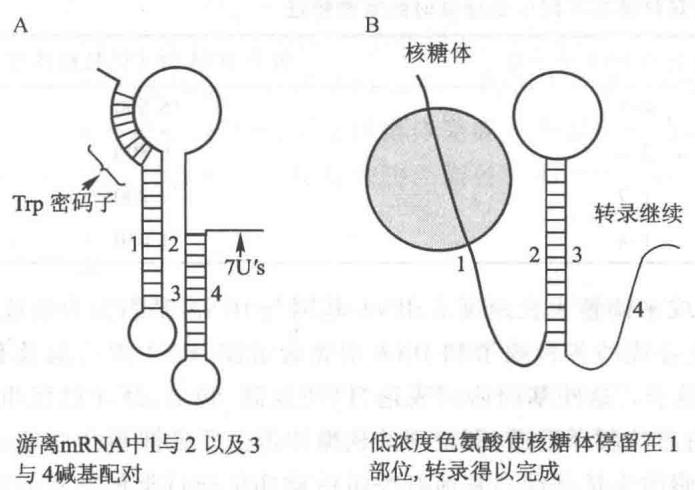  
图34-5 大肠杆菌色氨酸操纵子的衰减机制

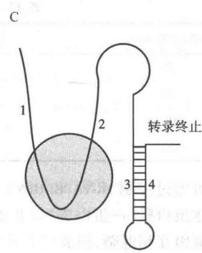

除色氨酸外，苯丙氨酸、苏氨酸、亮氨酸、异亮氨酸-缬氨酸和组氨酸的操纵子中都存在衰减子的调节位点，前导RNA可编码前导肽，能在翻译水平上抑制相应基因的转录。为了提高控制效率，前导RNA链中往往存在重复的调节密码子，这种现象在苯丙氨酸和组氨酸的前导序列中尤为明显，前者有7个苯丙氨酸密码子，后者有7个组氨酸密码子。有关几种氨基酸合成途径操纵子前导肽的序列和调节的氨基酸列于表34-1。  
表 34-1 氨基酸合成操纵子前导肽序列和调节的氨基酸

<table><tr><td>操纵子</td><td>前导肽序列</td><td>调节的氨基酸</td></tr><tr><td>trp</td><td>Met-Lys-Ala-Ile-Phe-Val-Leu-Lys-Gly-Trp-Trp-Arg-Thr-Ser</td><td>Trp</td></tr><tr><td>his</td><td>Met-Thr-Arg-Val-Gln-Phe-Lys-His-His-His-His-His-His-Pro-Asp</td><td>His</td></tr><tr><td>pheA</td><td>Met-Lys-His-Ile-Pro-Phe-Phe-Phe-Ala-Phe-Phe-Phe-Thr-Phe-Pro</td><td>Phe</td></tr><tr><td>leu</td><td>Met-Ser-His-Ile-Val-Arg-Phe-Thr-Gly-Leu-Leu-Leu-Leu-Asn-Ala-Phe-Ile-Val-Arg-Gly-Arg-Pro-Val-Gly-Gly-Ile-Gln-His</td><td>Leu</td></tr><tr><td>thr</td><td>Met-Lys-Arg-Ile-Ser-Thr-Thr-Ile-Thr-Thr-Ile-Thr-Ile-Thr-Gly-Asn-Gly-Ala-Gly</td><td>Thr, Ile</td></tr><tr><td>ilv</td><td>Met-Thr-Ala-Leu-Leu-Arg-Val-Ile-Ser-Leu-Val-Val-Ile-Ser-Val-Val-Val-Ile-Ile-Ile-Pro-Pro-Cys-Gly-Ala-Ala-Leu-Gly-Arg-Gly-Lys-Ala</td><td>Leu, Val, Ile</td></tr></table>

嘧啶核苷酸的生物合成由6个酶催化完成，编码这些酶的基因分散在大肠杆菌染色体DNA上，受控于一个调节基因，因此是一个调节子。最近的研究发现，嘧啶调节子也有前导区，它编码的前导RNA能形成典型终止信号的茎环结构，随后紧接一串U，并能翻译出前导肽。因此推测嘧啶调节子的转录也受衰减作用的调节。在低浓度UTP条件下，RNA聚合酶转录到一串U的部位，移动受到阻滞，挡住了正在进行翻译的核糖体，从而阻止终止信号结构的形成，由此RNA聚合酶继续向前转录，基因得以表达。在高浓度UTP条件下，核糖体不被RNA聚合酶阻挡，此时RNA聚合酶的结合部位形成终止信号茎环结构，因此转录停止。看来衰减子并非仅限于氨基酸合成操纵子，其他合成途径酶类的基因表达也受到它的调节。

## （四）核糖体蛋白与 rRNA 的协同合成

细菌在不同的生长培养基中表现出不同的生长速度。在葡萄糖作为碳源的基本培养基中，大肠杆菌在37℃约每45 min分裂一次；然而在以脯氨酸为唯一碳源的培养基中，倍增时间增加至500 min。在含有葡萄糖、氨基酸、核酸碱基、各种维生素和脂肪酸的丰富培养基中，生长极为迅速，世代时间缩短到18 min。

不同生长速度是通过调节蛋白质的合成能力而实现的，多肽链的生长速度实际上是由每个细胞的核糖体数目所决定。在迅速生长的细胞中，中隔的形成落后于DNA的合成，因此每个细胞可含有不止一个DNA分子。表34-2列出不同生长速度下大肠杆菌的DNA分子数和相对于DNA分子的核糖体数。

表 34-2 大肠杆菌在不同生长速度时的某些特征

<table><tr><td>倍增时间/min</td><td>每个细胞的 DNA 分子数</td><td>每个 DNA 分子的核糖体数</td></tr><tr><td>25</td><td>4.5</td><td>15 500</td></tr><tr><td>50</td><td>2.4</td><td>6 800</td></tr><tr><td>100</td><td>1.7</td><td>4 200</td></tr><tr><td>300</td><td>1.4</td><td>1 450</td></tr></table>

细菌可通过控制 rRNA 和 tRNA 的合成来调整生长速度。rRNA 基因与 tRNA 基因混合组成操纵子。所有核糖体蛋白质 (r-蛋白质) 以及蛋白质合成的各种因子和 DNA 引物合成酶、RNA 聚合酶及有关附属蛋白质的基因互相混杂，组成二十几个操纵子。这些基因协同表达，以使复制、转录、翻译过程相互协调，适应于细胞生长速度的需要。通过 r-蛋白质的翻译阻遏，即游离的核糖体蛋白质可抑制其自身 mRNA 的翻译，从而使各种 r-蛋白质水平相应于细胞的生长条件。其他有关蛋白质亦可通过类似的基因自身调节机制维持在适当的水平上。

当细菌处于贫瘠环境,缺乏氨基酸供给蛋白质合成,即关闭大部分的代谢活性,这种现象称为严紧型控制(stringent control)。任何一种氨基酸的缺乏,或突变导致任何一种氨酰-tRNA合成酶的失活都将引起严紧控制反应。此时细胞内出现两种不寻常的核苷酸,电泳呈现两个特殊斑点,称之为魔点(magic spots)Ⅰ和Ⅱ。现已鉴定此两斑点为ppGpp(鸟苷四磷酸,即5'和3'位置各连两个磷酸)和pppGpp(鸟苷五磷酸,5'位置连以三个磷酸,3'位置连两个磷酸)。大肠杆菌的严紧反应主要积累ppGpp,不同细菌的情况不同。

氨基酸饥饿可引起(p)ppGpp迅速积累,而rRNA和tRNA以及细菌的生长被强烈抑制。通过消除此种严紧反应的松弛突变(relaxed mutation)表明,编码此严紧控制因子(stringent factor,SF)的基因为rel A。该基因产生的蛋白质(SF)位于核糖体上,它催化由ATP转移焦磷酸基给GDP或GTP而分别形成ppGpp及pppGpp。反应式如下:

它们的合成需要有 mRNA 和相应的未负载 tRNA(idling tRNA)的存在。用人工合成的 TpψpCpGp 可以代替未负载的 tRNA,说明 tRNA 的 TψC 环参与此反应。当未负载的 tRNA 进入核糖体的 A 位点时,可能触发了核糖体构象的某种改变,引起(p)ppGpp 的合成。未负载 tRNA 进入核糖体,反映了氨基酸饥饿的环境条件,它可作为合成该两种核苷酸的信号,通过调节稳定 RNA 的合成,从而影响蛋白质的合成和细胞的生长。

ppGpp 是控制多种反应的效应分子, 最显著的作用是与 RNA 聚合酶结合, 降低 rRNA 的合成。其结果: 一是抑制 rRNA 操纵子启动子的转录起始作用; 另一是增加 RNA 聚合酶在转录过程中的暂停, 因而放慢延长相。但是 ppGpp 对不同操纵子的效应有很大差异。

## (五) mRNA 翻译的调节和小 RNA 的调节作用

原核生物的基因表达除了转录水平上的调节外,还存在翻译水平的调节,已知表现有:① 不同 mRNA 翻译能力的差异,② 翻译阻遏作用,③ 反义 RNA 的作用。

## 1. mRNA 的翻译能力

原核生物 mRNA 边合成边翻译, 经多次翻译后即被降解, 其翻译能力与 mRNA 存留期有关。mRNA 的二级结构也影响翻译效率, 茎环结构的存在将降低翻译速度。mRNA 还要受控于 5' 端的核糖体结合部位 (SD 序列), 强的控制部位造成翻译起始频率高, 反之则翻译频率低。此外, mRNA 采用的密码系统也会影响其翻译速度。大多数氨基酸由于密码子的简并性且具有不止一种密码子, 它们对应 tRNA 的丰度可以差别很大, 因此采用常用密码子的 mRNA 翻译速度快, 而稀有密码子比例高的 mRNA 翻译速度慢。多顺反子 mRNA 在进行翻译时, 通常核糖体完成一个编码区的翻译后即脱落和解离, 然后在下一个编码区上游的 SD 序列处重新形成起始复合物。当各个编码区翻译频率和速度不同时, 它们合成的蛋白错误率也就不同。

## 2. 翻译阻遏

组成核糖体的蛋白质共有50多种，它们的合成严格保持与rRNA数量相应的水平。当有过量核糖体游离蛋白质存在时即引起它自身mRNA的翻译阻遏（translational repression）。对核糖体蛋白质起翻译阻遏作用的调节蛋白质均为能直接和rRNA相结合的核糖体蛋白质，例如，在L11操纵子中，起调节作用的为第二个蛋白质L1，它与多顺反子mRNA第一个编码区(L11)起始密码子邻近的部位结合，以阻止其翻译。通常，起调节作用的核糖体蛋白质与rRNA的结合能力大于和自身mRNA的结合能力，它们合成出来后首先与rRNA结合装配成核糖体，如有多余游离的核糖体蛋白质积累，就会与其自身mRNA结合，从而起阻遏作用。然而操纵子中还常存在非核糖体蛋白质，它们则可按其自身需要的速度合成，而不受核糖体蛋白质翻译的束缚。RNA聚合酶亚基可受到其自身的调节。EF-Tu和L7/L12则具有更强的翻译效率。这就使得同一操纵子中不同蛋白质以不同的水平进行合成，各自相应于细胞的生长要求。

## 3. 反义 RNA

反义 RNA(antisense RNA) 亦能够调节 mRNA 的翻译功能。所谓反义 RNA 即是指具有互补序列的 RNA。1983 年 Mizuno 等以及 Simons 和 Kleckner 同时发现反义 RNA 的调节作用, 从而揭示了一种新的基因表达调节机制。反义 RNA 可以通过互补序列与特定的 mRNA 相结合, 结合位置包括 mRNA 结合核糖体的序列 (SD 序列) 和起始密码子 AUG, 也可在 mRNA 的下游, 而抑制 mRNA 的翻译。因此, 他们称这类 RNA 为干扰 mRNA 的互补 RNA (mRNA interfering complementary RNA, micRNA)。

Mizuno 等研究了渗透压变化对大肠杆菌外膜蛋白表达的调节, 发现有两种外膜蛋白, OmpC 和 OmpF, 它们的合成受渗透压调节。在高渗的条件下, OmpC 的合成增加, 而 OmpF 的合成受抑制; 反之, 低渗使 OmpC 合成抑制, 而优先合成 OmpF。两种蛋白质的量随渗透压的变化而改变, 但总量保持不变。他们从 ompC 基因的启动子前发现一段 DNA 序列, 称之为 CX28 区域。当 ompC 基因进行转录时, 该区域以相反方向转录出一种 6S RNA(174 个核苷酸), 称为 micF。在这个小 RNA 中有很大一部分序列与 OmpF 的 mRNA 5' 端互补, 二者可结合而使 mRNA 失去翻译活性。这就解释了为什么高渗时, 随着 OmpC 蛋白合成的增加, OmpF 蛋白的合成受到抑制(图 34-6)。

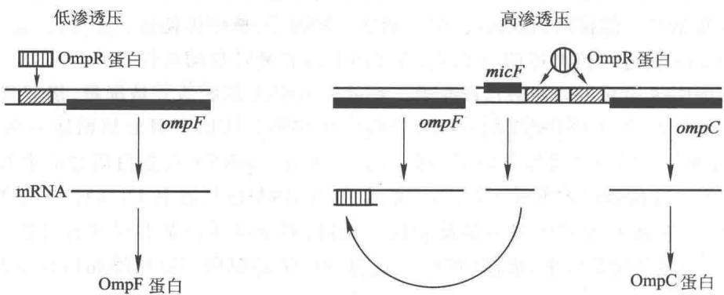  
图 34-6 渗透压调节中 micRNA 的调节机制模型

Simons 和 Kleckner 在分析 Tn10 转座子的调节机制时发现一种类似的互补小分子 RNA。该转座子的两端各有一个插入序列 IS10，转座酶是由这一序列编码的。转座活性主要存在于右侧插入序列。转座酶的启动部位有两个启动子，其一转录转座酶 mRNA，另一反方向转录 micRNA，二者 5' 端重叠 40 个碱基，因此可以形成碱基配对（图 34-7）。micRNA 与转座酶的 mRNA 结合后，即可抑制转座酶的合成，从而控制转座活性。

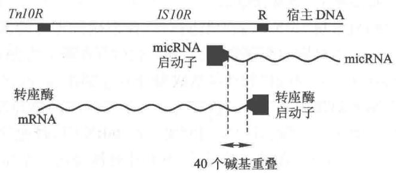  
图34-7 转座酶mRNA和micRNA转录的模式

反义 RNA 对基因表达调节机制的发现不仅具有重大的理论意义,而且也为人类控制生物的实践提供了新的途径。不少科学家正在试图将 micRNA 的基因引入家畜和农作物以获得抗病毒的新品种,或是利用反义 RNA 抑制有害基因(如癌基因)的表达。在这方面亦已取得令人鼓舞的成果。

自从上世纪80年代初发现反义RNA以来，在原核生物中又陆续发现了多种反义RNA。例如，编码应激反应 $\sigma^{\mathrm{s}}$ 因子的基因为rpoS(RNA polymerase sigma factor)，通常其mRNA在细胞内的水平很低，并且因在SD序列处存在发夹结构而不翻译。在应激状态下（如热休克）诱导产生两种反义RNA，DsrA(downstream A)和RprA(Rpos regulator RNA A)，分别与发夹的一条链互补，其中任一或两者共同作用可使RpoS的mRNA得以翻译。另一小RNA，OxyS(oxidative stress gene S)，是由氧应激反应所诱导产生，它特异诱导氧应激反应相关基因的表达，但关闭与氧损伤无关的应激与修复途径基因表达。OxyS与DsrA和RprA两者不同，前者直接与rpoS的mRNA SD序列互补，因而阻止mRNA的翻译；后两者破坏发夹结构，而使翻译得以进行。

反义 RNA 对基因表达调节机制的发现不仅具有重大理论意义,也为人类控制有害基因的实践提供新的途径。迄今已在畜牧业、农业以及医疗保健业中取得令人鼓舞的成果。

## 4. tmRNA

上世纪70年代末发现大肠杆菌中存在一种小RNA，在凝胶电泳时位于10S的位置，在此位置附近还有另一条RNA，故它称为10Sa RNA。90年代中才知道该RNA结构很特殊，一半类似tRNA，另一半类似mRNA，因此称之为tmRNA。类似tRNA的一半称为TLD(tRNA-like domain)，具有T环、D环和氨基酸臂，并携带一个丙氨酸；类似mRNA的一半称为MLR(mRNA-like region)，具有开放阅读框架（ORF），全长363 nt。两半之间有4个假结(pseudoknot, PK)。图34-8是tmRNA结构的简化示意图，实际上tmRNA存在众多茎环结构，其结构十分复杂。

tmRNA 在蛋白质合成中的功能有三个：“清理”“质控”和“回收”。由于高速转录和翻译，可能会出现一些转录不完全、遭受损坏和部分降解的 mRNA，当核糖体沿 mRNA 链移动到断链处，因未遇终止密码子，核糖体便滞留其上。此时 tmRNA 便进入核糖体的 A 位点，在 rRNA 的肽酰转移酶活性

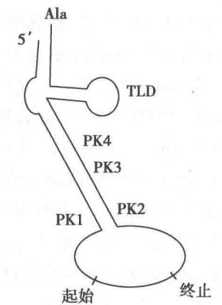  
图34-8 tmRNA结构示意图

催化下肽酰基与 tmRNA 携带的丙氨酸形成肽键。残缺的 mRNA 便脱落并被降解，接着便以 tmRNA 的阅读框架为模板合成出 11 肽 AANDENYALAA，然后在终止密码子作用下释放核糖体亚基、各翻译因子和 tmRNA。经过“清理”，滞留的核糖体得以重新投入循环利用。tmRNA 在蛋白质合成中起着“质控”的作用。由残缺 mRNA 合成的蛋白质不仅无用，还可能有害，tmRNA 使其加上 11 肽标签，细胞内蛋白酶随之加以降解。在蛋白质合成系统中设置一道质量检验关口，对保证质量是有重要意义的。细胞内残缺的 mRNA 和蛋白质需要迅速挑选出来，加以“回收”，这符合经济的原则。氨基酸和核苷酸都是细胞代谢的重要底物。

tmRNA 所以受到关注还有一个重要原因是,这种分子很可能是 RNA 世界遗留下来的古老分子。如何由 RNA 世界产生 DNA、RNA 和蛋白质的三极世界？在生命起源研究中最复杂的问题是蛋白质生物合成的起源。tmRNA 兼有 tRNA 和 mRNA 的功能，对这类分子的研究也许有助于对蛋白质生物合成起源的认识。

## 5. 核糖开关

上述反义 RNA 和 tmRNA 都是作用于 mRNA 的反式因子, 而由 mRNA 上的一段序列对 mRNA 功能的调节则为顺式作用。虽然早就知道 mRNA 存在茎环结构, 这些结构能够影响其翻译能力, 但是并未认识到 mRNA 存在由茎环结构折叠形成的化学传感器, 可以对代谢物浓度变化作出精确的反应。直到 2002 年, R. R. Breaker 小组研究大肠杆菌 $\mathrm{B}_{12}$ 辅酶 (脱氧腺苷钴胺素) 运载蛋白的 mRNA, 发现在 5' 非翻译区 (UTR) 存在一段非常保守的序列, 该部位可以结合 $\mathrm{B}_{12}$ 辅酶, 称为 $\mathrm{B}_{12}$ 框 ( $\mathrm{B}_{12}$ box), 并以此调节 mRNA 的功能。当 $\mathrm{B}_{12}$ 辅酶浓度高时翻译活性受抑制。他们将此称作核糖开关 (riboswitch), 核糖是核糖核酸的字首缩写。其后在各类原核生物中陆续发现多种核糖开关, 并在真菌和植物中也发现有核糖开关, 相信这是基因表达调节的一种比较普遍存在的方式。

核糖开关包括两部分结构:一是能够结合配体(ligand)的适体域(aptamer domain, AD);另一是调节表达的表达平台(expression platform)。前者相当于传感器,后者相当于效应器。配体通常是代谢物,也可以是金属离子(如 $Mg^{2+}$ )或阴离子(如 $F^{-}$ )。配体与适体间有较高的亲和力,有些适体形如口袋,配体进入后口袋与之紧密贴紧,呈现“诱导契合”。目前已知的核糖开关配体有:焦磷酸硫胺素(TPP)、钴胺素(维生素 $B_{12}$ )、黄素单核苷酸(FMN)、赖氨酸、甘氨酸、嘌呤、S-腺苷甲硫氨酸(adoMet)、N-乙酰葡糖胺6-磷酸(GlcN6P)、7-去氮鸟嘌呤和镁、氟离子等。具有这些核糖开关的mRNA或是编码运载蛋白,或是编码合成途径关键的酶。因此它们之间形成反馈调节。

当配体与适体相结合引起适体域构象改变并导致表达平台构象随之也发生改变，有关茎环结构的改变产生以下几种可能的结果：① 出现转录终止信号，使 mRNA 提前终止转录；② SD 序列被掩蔽或被显露，抑制或促进翻译；③ 真核生物（如真菌和植物）内含子的核糖开关改变剪接方式；④ 激活核糖核酸酶活性，降解 mRNA。最后一类作用比较特殊，见于 GlcN6P 引起核酶的切割。通常一种适体仅识别一种配体，有些核糖开关的两个适体串联在一起，以此增强对配体的检测能力，如甘氨酸的核糖开关。同一种配体在不同生物中的适体往往十分相似，推测它们可能有共同的起源；然而它们的效应可能不同，例如 TPP 在有些生物中引起 mRNA 提前终止转录，在另一些生物中却是抑制翻译，而在真菌和植物中则可改变剪接方式。

核糖开关的作用机制有以下特点:①由RNA自我调节,无蛋白质参与作用;②调节因子和作用元件为同一分子;③一种适体仅识别一种配体,但可以与不同的调节平台相连。推测核糖开关可能是一种十分古老的基因表达调节方式,从RNA世界中形成后一直保存至今。比较RNA与蛋白质,RNA仅由4种核苷酸组成,蛋白质由20种氨基酸组成,RNA对小分子的识别能力远低于蛋白质。人工从RNA库中筛选某种配体的RNA适体,虽然可以获得所需要的适体,但是特异性和亲和力都存在局限性。这就可以理解为什么核糖开关普存在于生物界,但迄今发现的种类十分有限。从枯草芽孢杆菌来看,大约只有4%的基因具有核糖开关。虽然说核糖开关十分简单有效,但在进化过程中只产生有限种类的适体和核糖开关。然而可以肯定,新的核糖开关还会不断被发现,有科学家推测在非编码RNA(ncRNA)中也可能有核糖开关。

<!-- EN-BEGIN 28.2 -->

### 【英文对应 28.2】Regulation of Gene Expression in Bacteria

> 来源：Lehninger Principles of Biochemistry（书籍/02_生物化学原理） 第28章 Regulation of Gene Expression，§28.2。对应本章“二、原核生物基因表达调节”。

As in many other areas of biochemical investigation, the study of the regulation of gene expression advanced earlier and faster in bacteria than in other experimental organisms. The examples of bacterial gene regulation presented here are chosen from among scores of well-studied systems, partly for their historical significance, but primarily because they provide a good overview of the range of regulatory mechanisms in bacteria. Many of the principles of bacterial gene regulation are also relevant to understanding gene expression in eukaryotic cells.

We begin by examining the lactose and tryptophan operons; each system has regulatory proteins, but the overall mechanisms of regulation are very different. This is followed by a short discussion of the SOS response in E. coli, illustrating how genes scattered throughout the genome can be coordinately regulated. We then describe two bacterial systems of quite different types, illustrating the diversity of gene regulatory mechanisms: regulation of ribosomal protein synthesis at the level of translation, with many of the regulatory proteins binding to RNA (rather than DNA), and regulation of the process of “phase variation” in Salmonella, which results from genetic recombination. Finally, we examine some additional examples of posttranscriptional regulation in which the RNA modulates its own function.

#### [EN] The lac Operon Undergoes Positive Regulation

The operator-repressor-inducer interactions described earlier for the lac operon (Fig. 28-8) provide an intuitively satisfying model for an on/off switch in the regulation of gene expression, but operon regulation is rarely so simple. A bacterium's environment is too complex for its genes to be controlled by one signal. Other factors besides lactose, such as the availability of glucose, affect the expression of the lac genes. Glucose, metabolized directly by glycolysis, is the preferred energy source in E. coli. Other sugars can serve as the main or sole nutrient, but extra enzymatic steps are required to prepare them for entry into glycolysis, necessitating the synthesis of additional enzymes. Clearly, expressing the genes for proteins that metabolize sugars such as lactose or arabinose is wasteful when glucose is abundant.

What happens to the expression of the lac operon when both glucose and lactose are present? A regulatory mechanism known as catabolite repression restricts expression of the genes required for catabolism of lactose, arabinose, and other sugars in the presence of glucose, even when these secondary sugars are also present. The effect of glucose is mediated by cAMP, as a coactivator, and an activator protein known as cAMP receptor protein, or CRP (the protein is sometimes called CAP, for catabolite gene activator protein). CRP is a homodimer (subunit $M_{r}$ 22,000) with binding sites for DNA and cAMP. Binding is mediated by a helix-turn-helix motif in the protein's DNA-binding domain (Fig. 28-17). When glucose is absent, CRP-cAMP binds to a site near the lac promoter (Fig. 28-18) and stimulates RNA transcription 50-fold. The wild-type lac promoter is a relatively

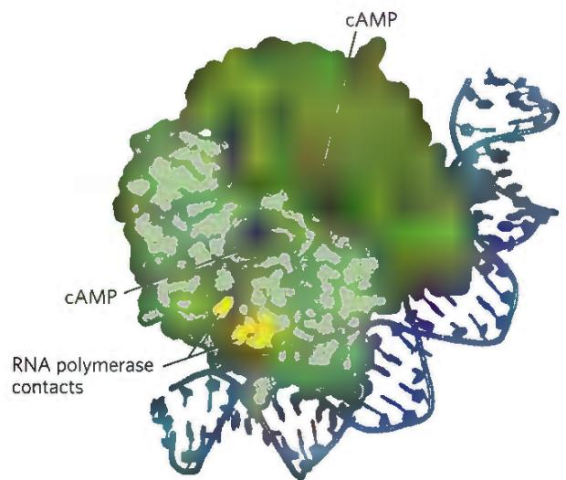  
FIGURE 28-17 CRP homodimer with bound cAMP. Note the bending of the DNA around the protein. The region that interacts with RNA polymerase is labeled. [Data from PDB ID 1RUN, G. Parkinson et al., Nat. Struct. Biol. 3:837, 1996.]

(a) Glucose high, cAMP low, lactose absent  
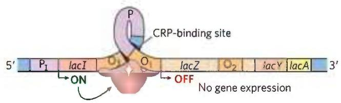

(b) Glucose low, cAMP high, lactose absent  

(c) Glucose high, cAMP low, lactose present  

(d) Glucose low, cAMP high, lactose present  
  
FIGURE 28-18 Positive regulation of the lac operon by CRP. The binding site for CRP-cAMP is near the promoter. The combined effects of glucose and lactose availability on lac operon expression are shown. When lactose is absent, the repressor binds to the operator and prevents transcription of the lac genes. It does not matter whether glucose is (a) present or (b) absent. (c) If lactose is present, the repressor dissociates from the operator. However, if glucose is also available, low cAMP levels prevent CRP-cAMP formation and DNA binding. RNA polymerase may occasionally bind and initiate transcription, resulting in a very low level of lac genes transcription. (d) When lactose is present and glucose levels are low, cAMP levels rise. The CRP-cAMP complex forms and facilitates robust binding of RNA polymerase to the lac promoter and high levels of transcription.

weak promoter, diverging from the consensus shown in Figure 28-2. The open complex of RNA polymerase and the promoter (see Fig. 26-6) does not form readily unless CRP-cAMP is present and also bound (Fig. 28-18a, c). CRP-cAMP is therefore a positive regulatory element responsive to glucose levels, whereas the Lac repressor is a negative regulatory element responsive to lactose.

The two act in concert. CRP-cAMP has little effect on the lac operon when the Lac repressor is blocking transcription, and dissociation of the repressor from the lac operator has little effect on transcription of the lac operon unless CRP-cAMP is present to facilitate transcription. CRP interacts directly with RNA polymerase (at the region shown in Fig. 28-17) through the polymerase's $\alpha$ subunit. Thus, optimal expression of the lac operon requires dissociation of the Lac repressor (indicating that lactose is available) and the binding of CRP-cAMP (indicating that glucose is not available).

The effect of glucose on CRP is mediated by the cAMP interaction (Fig. 28-18). CRP binds to DNA most avidly when cAMP concentrations are high. In the presence of glucose, the synthesis of cAMP is inhibited and efflux of cAMP from the cell is stimulated. As [cAMP] declines, CRP binding to DNA declines, thereby decreasing the expression of the lac operon.

CRP and cAMP participate in the coordinated regulation of many operons, primarily those that encode enzymes for the metabolism of secondary sugars such as lactose and arabinose. A network of operons with a common regulator is called a regulon. This arrangement, which allows coordinated shifts in cellular functions that can require the action of hundreds of genes, is a major theme in the regulated expression of dispersed networks of genes in eukaryotes. Other bacterial regulons include the heat shock gene system that responds to changes in temperature and the genes induced in E. coli as part of the SOS response to DNA damage, described later.

#### [EN] Many Genes for Amino Acid Biosynthetic Enzymes Are Regulated by Transcription Attenuation

The 20 common amino acids are required in large amounts for protein synthesis, and E. coli can synthesize all of them. The genes for the enzymes needed to synthesize a given amino acid are generally clustered in an operon and are expressed whenever existing supplies of that amino acid are inadequate for cellular requirements. When the amino acid is abundant, the biosynthetic enzymes are not needed and the operon is repressed.

The E. coli tryptophan (trp) operon (Fig. 28-19) includes five genes for the enzymes required to convert chorismate to tryptophan (see Fig. 22-19). Note that two of the enzymes catalyze more than one step in the pathway. The mRNA from the trp operon has a half-life of only about 3 min, allowing the cell to respond rapidly to changing needs for this amino acid. The Trp repressor is a homodimer. When tryptophan is abundant, it binds to the Trp repressor, causing a conformational change that permits the repressor to bind to the trp operator and inhibit expression of the trp operon. The trp operator site overlaps the promoter, so binding of the repressor blocks binding of RNA polymerase.

Once again, this simple on/off circuit mediated by a repressor is not the entire regulatory story. Different cellular concentrations of tryptophan can vary the rate of synthesis of the biosynthetic enzymes over a 700-fold range. P1 Once repression is lifted and transcription begins, the rate of transcription is fine-tuned to cellular tryptophan requirements by a second regulatory process, called transcription attenuation, in which transcription is initiated normally but is abruptly halted before the operon genes are transcribed. The frequency with which transcription is attenuated is regulated by the availability of tryptophan and relies on the very close coupling of transcription and translation in bacteria.

The trp operon attenuation mechanism uses signals encoded in four sequences within a 162 nucleotide leader region at the 5' end of the mRNA, preceding the initiation codon of the first gene (Fig. 28-20a). The leader contains a region known as the attenuator, made up of sequences 3 and 4. These sequences base-pair to form a G≡C-rich stem-and-loop structure closely followed by a series of U residues. The attenuator structure acts as a transcription terminator (Fig. 28-20b; see also Fig. 26-7a). Sequence 2 is an alternative complement for sequence 3 (Fig. 28-20c). If sequences 2 and 3 base-pair, the attenuator structure cannot form and transcription continues into the trp biosynthetic genes; the loop formed by the pairing of sequences 2 and 3 does not obstruct transcription.

Regulatory sequence 1 is crucial for a tryptophan-sensitive mechanism that determines whether sequence 3 pairs with sequence 2 (allowing transcription to continue) or with sequence 4 (attenuating transcription). Formation of the attenuator stem-and-loop structure depends on events that occur during translation of regulatory sequence 1, which encodes a leader peptide (so called because it is encoded by the leader region of the mRNA) of 14 amino acids, two of which are Trp residues. The leader peptide has no other known cellular function; its synthesis is simply an operon regulatory device. This peptide is translated immediately after it is transcribed, by a ribosome that follows closely behind RNA polymerase as transcription proceeds.

When tryptophan concentrations are high, concentrations of charged tryptophan tRNA (Trp-tRNA $^{Trp}$ ) are also high. This allows translation to proceed rapidly past the two Trp codons of sequence 1 and into sequence 2, before sequence 3 is synthesized by RNA polymerase. In this situation, sequence 2 is covered by the ribosome and unavailable for pairing to sequence 3 when sequence 3 is synthesized; the attenuator structure (sequences 3 and 4) forms and transcription halts (Fig. 28-20b, top). When tryptophan concentrations are low, however, the ribosome stalls at the two Trp codons in sequence 1, because charged tRNA $^{Trp}$ is less available. Sequence 2 remains free while sequence 3 is synthesized, allowing these two sequences to base-pair and permitting transcription to proceed (Fig. 28-20b, bottom). In this way, the proportion of transcripts that are attenuated declines as tryptophan concentration declines.

Many other amino acid biosynthetic operons use a similar attenuation strategy to fine-tune biosynthetic enzymes to meet the prevailing cellular requirements. The 15 amino acid leader peptide produced by the phe operon contains seven Phe residues. The leu operon leader peptide has four contiguous Leu residues. The leader peptide for the his operon contains seven contiguous His residues. In fact, in the his operon and several others, attenuation is sufficiently sensitive to be the only regulatory mechanism.

#### [EN] Induction of the SOS Response Requires Destruction of Repressor Proteins

Extensive DNA damage in the bacterial chromosome triggers the induction of nearly 60 genes scattered about the chromosome. P3 The genes involved in the coordinated inducible response, called the SOS response (p. 939), constitute the SOS regulon. Many of the induced genes are involved in DNA repair. The key regulatory proteins are the RecA protein and the LexA repressor.

The LexA repressor ( $M_{r}$ 22,700) inhibits transcription of all the SOS genes (Fig. 28-21), and induction of the SOS response requires removal of LexA. This is not a simple dissociation from DNA in response to binding of a small molecule, as in the regulation of the lac operon described above. Instead, the LexA repressor is inactivated when it catalyzes its own cleavage at a specific Ala–Gly peptide bond, producing two roughly equal protein fragments. At physiological pH, this autocleavage reaction requires the RecA protein. RecA is not a protease in the classical sense, but its interaction with LexA enables the repressor's self-cleavage reaction. This function of RecA is sometimes called a co-protease activity.

The RecA protein provides the functional link between the biological signal (DNA damage) and induction of the SOS genes. Heavy DNA damage leads to numerous single-strand gaps in the DNA, and only RecA that is bound to single-stranded DNA can facilitate cleavage of the LexA repressor (Fig. 28-21, bottom). Binding of RecA at the gaps eventually activates its co-protease activity, leading to cleavage of the LexA repressor and SOS induction.

During induction of the SOS response in a severely damaged cell, RecA also promotes the autocatalytic cleavage of, and thus inactivates, the repressors that otherwise allow propagation of certain viruses in a dormant lysogenic state within the bacterial host. This provides a remarkable illustration of evolutionary adaptation. These repressors, like LexA, undergo self-cleavage at a specific Ala-Gly peptide bond, so induction of the SOS response permits replication of the virus and lysis of the cell, releasing new viral particles. Thus, the bacteriophage can make a hasty exit from a compromised bacterial host cell.

When tryptophan levels are low, the ribosome pauses at the Trp codons in sequence 1. Formation of the paired structure between sequences 2 and 3 prevents attenuation, because sequence 3 is no longer available to form the attenuator structure with sequence 4. The 2:3 structure, unlike the 3:4 attenuator, does not prevent transcription.  
  
(a)

When tryptophan levels are high, the ribosome quickly translates sequence 1 (open reading frame encoding leader peptide) and blocks sequence 2 before sequence 3 is transcribed. Continued transcription leads to attenuation at the terminator-like attenuator structure formed by sequences 3 and 4.

  
(c)

(b)

FIGURE 28-20 Transcriptional attenuation in the trp operon. Transcription is initiated at the beginning of the 162 nucleotide mRNA leader encoded by a DNA region called trpL (see Fig. 28-19). A regulatory mechanism determines whether transcription is attenuated at the end of the leader or continues into the structural genes. (a) The trp mRNA leader (trpL). The attenuation mechanism in the trp operon involves sequences 1 to 4 (highlighted). (b) Sequence 1 encodes a small peptide, the leader peptide, containing two Trp residues (W); it is translated immediately after transcription begins. Sequences 2 and 3 are complementary, as are sequences 3 and 4. The attenuator structure forms by the pairing of sequences 3 and 4 (top). Its structure and function are similar to those of a transcription terminator. Pairing of sequences 2 and 3 (bottom) prevents the attenuator structure from forming. Note that the leader peptide has no other cellular function. Translation of its open reading frame has a purely regulatory role that determines which complementary sequences (2 and 3, or 3 and 4) are paired. (c) Base-pairing schemes for the complementary regions of the trp mRNA leader.

  
FIGURE 28-21 SOS response in E. coli. The LexA protein is the repressor in this system, which has an operator site near each gene. Because the recA gene is not entirely repressed by the LexA repressor, the normal cell contains about 1,000 RecA monomers. When DNA is extensively damaged (such as by UV light), DNA replication is halted and the number of single-strand gaps in the DNA increases. RecA protein binds to this damaged, single-stranded DNA, activating the protein's co-protease activity. While bound to DNA, the RecA protein facilitates cleavage and inactivation of the LexA repressor. When the repressor is inactivated, the SOS genes, including recA, are induced; RecA levels increase 50- to 100-fold.

The destruction of the LexA repressor proteins as part of the response means that LexA must be resynthesized in order to reestablish gene control when the DNA damage is no longer present. P5 The considerable amount of ATP and GTP needed for protein synthesis to maintain SOS regulon repression provides one example of the energetic cost of regulation.

#### [EN] Synthesis of Ribosomal Proteins Is Coordinated with rRNA Synthesis

In bacteria, an increased cellular demand for protein synthesis is met by increasing the number of ribosomes rather than altering the activity of individual ribosomes. In general, the number of ribosomes increases as the cellular growth rate increases. At high growth rates, ribosomes make up approximately 45% of the cell's dry weight. The proportion of cellular resources devoted to making ribosomes is so large, and the function of ribosomes so important, that cells must coordinate the synthesis of the ribosomal components: the ribosomal proteins (r-proteins) and RNAs (rRNAs). P1 This regulation is distinct from the mechanisms described so far: it occurs largely at the level of translation.

The 52 genes that encode the r-proteins are distributed across at least 20 operons, each with 1 to 11 genes. Some of these operons also contain the genes for the subunits of DNA primase, RNA polymerase, and protein synthesis elongation factors—reflecting the close coupling of replication, transcription, and protein synthesis during bacterial cell growth.

The r-protein operons are regulated primarily through a translational feedback mechanism. One r-protein encoded by each operon also functions as a translational repressor, which binds to the mRNA transcribed from that operon and blocks translation of all the genes the messenger encodes (Fig. 28-22). In general, the r-protein that plays the role of repressor also binds directly to an rRNA. Each translational repressor r-protein binds with higher affinity to the appropriate rRNA than to its mRNA, so the mRNA is bound and translation repressed only when the level of the r-protein exceeds that of the rRNA. This ensures that translation of the mRNAs encoding r-proteins is repressed only when synthesis of these r-proteins exceeds that needed to make functional ribosomes. In this way, the rate of r-protein synthesis is kept in balance with rRNA availability.

  
FIGURE 28-22 Translational feedback in some ribosomal protein operons. The r-proteins that act as translational repressors are shown (red circles). Each translational repressor blocks the translation of all genes in that operon by binding to the indicated site on the mRNA. The operons include the genes that encode the $\alpha$ , $\beta$ , and $\beta'$ subunits of RNA polymerase and the elongation factors EF-G and EF-Tu (labeled). The r-proteins of the large (50S) ribosomal subunit are designated L1 to L34; those of the small (30S) subunit are designated S1 to S21.

The mRNA-binding site for the translational repressor is near the translational start site of one of the genes in the operon, often but not always the first gene (Fig. 28-22). In other operons this would affect only that one gene, because in bacterial polycistronic mRNAs, most genes have independent translation signals. In the r-protein operons, however, the translation of one gene depends on the translation of all the others. The translation of multiple genes seems to be blocked by folding of the mRNA into an elaborate three-dimensional structure that is stabilized both by internal base pairing and by binding of the translational repressor protein. When the translational repressor is absent, ribosome binding and translation of one or more of the genes disrupts the folded structure of the mRNA and allows all the genes to be translated.

Because the synthesis of r-proteins is coordinated with the availability of rRNA, the regulation of ribosome production reflects the regulation of rRNA synthesis. In E. coli, rRNA synthesis from the seven rRNA operons responds to cellular growth rate and to changes in the availability of crucial nutrients, particularly amino acids. The regulation coordinated with amino acid concentrations is known as the stringent response (Fig. 28-23). When amino acid concentrations are low, rRNA synthesis is halted. Amino acid starvation leads to the binding of uncharged tRNAs to the ribosomal A site; this triggers a sequence of events that begins with the binding of an enzyme called stringent factor (RelA protein) to the ribosome. When bound to the ribosome, stringent factor catalyzes formation of the unusual nucleotide guanosine tetraphosphate (ppGpp); it adds pyrophosphate to the 3' position of GTP, in the reaction

$$
\mathrm{GTP} + \mathrm{ATP} \rightarrow \mathrm{pppGpp} + \mathrm{AMP}
$$

Then a phosphohydrolase cleaves off one phosphate to convert some pppGpp to ppGpp. The abrupt rise in pppGpp and ppGpp levels in response to amino acid starvation results in a great reduction in rRNA synthesis, mediated at least in part by the binding of ppGpp to RNA polymerase.

The nucleotides pppGpp and ppGpp, along with cAMP, belong to a class of modified nucleotides that act as cellular second messengers. In E. coli, these two nucleotides serve as starvation signals; they cause large changes in cellular metabolism by increasing or decreasing the transcription of hundreds of genes. In eukaryotic cells, similar nucleotide second messengers also have multiple regulatory functions. The coordination of cellular metabolism with cell growth is highly complex, and further regulatory mechanisms undoubtedly remain to be discovered.

#### [EN] The Function of Some mRNAs Is Regulated by Small RNAs in Cis or in Trans

As described throughout this chapter, proteins play an important and well-documented role in regulating gene expression. But RNA also has a crucial role—one that is becoming increasingly recognized as more examples of regulatory RNAs are discovered. Once an mRNA is synthesized, its functions can be controlled by RNA-binding proteins, as seen for the r-protein operons just described, or by an RNA. A separate RNA molecule may bind to the mRNA “in trans” and affect its activity. Alternatively, a portion of the mRNA itself may regulate its own function. When part of a molecule affects the function of another part of the same molecule, it is said to act “in cis.”

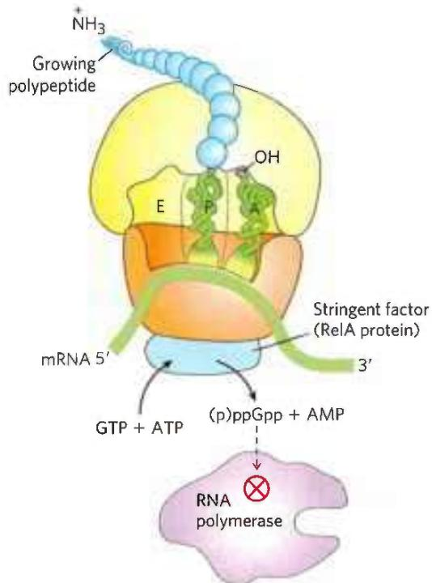  
FIGURE 28-23 Stringent response in E. coli. This response to amino acid starvation is triggered by binding of an uncharged tRNA in the ribosomal A site. A protein called stringent factor binds to the ribosome and catalyzes the synthesis of pppGpp, which is converted by a phosphohydrolase to ppGpp. The signal ppGpp reduces transcription of some genes and increases transcription of others, in part by binding to the $\beta$ subunit of RNA polymerase and altering the enzyme's promoter specificity. Synthesis of rRNA is reduced when ppGpp levels increase.

A well-characterized example of RNA regulation in trans is regulation of the mRNA of the gene rpoS (RNA polymerase sigma factor), which encodes $\sigma^{S}$ (formerly known as $\sigma^{38}$ ), one of seven E. coli sigma factors. The cell uses this specificity factor in certain stress situations, such as when it enters the stationary phase (a state of no growth, necessitated by lack of nutrients) and $\sigma^{S}$ is needed to transcribe large numbers of stress response genes. The $\sigma^{S}$ mRNA is present at low levels under most conditions but is not translated, because a large hairpin structure upstream of the coding region inhibits ribosome binding (Fig. 28-24). P2 Under certain stress conditions, one or both of two small ncRNAs, DsrA (downstream region A) and RprA (rpoS regulator RNA A), are induced. Both can pair with one strand of the hairpin in the $\sigma^{S}$ mRNA, disrupting the hairpin and thus allowing translation of rpoS.

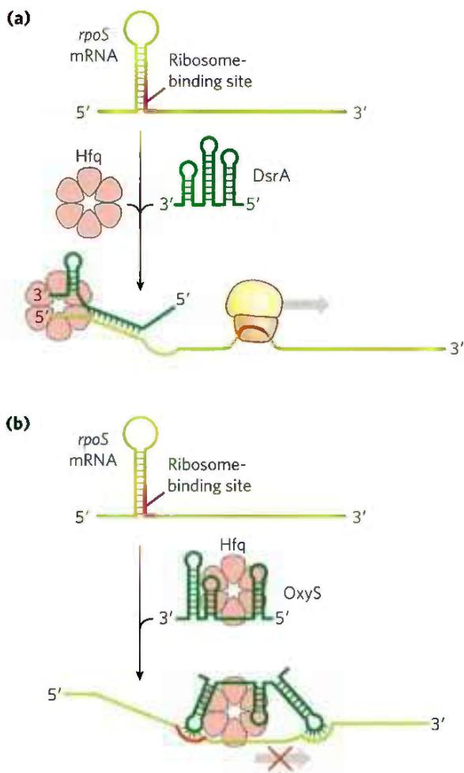  
FIGURE 28-24 Regulation of bacterial mRNA function in trans by sRNAs. Several sRNAs (small RNAs) — DsrA, RprA, and OxyS — participate in regulation of the rpoS gene. All require the protein Hfq, an RNA chaperone that facilitates RNA-RNA pairing. Hfq has a toroid structure, with a pore in the center. (a) DsrA promotes translation by pairing with one strand of a stem-loop structure that otherwise blocks the ribosome-binding site. RprA (not shown) acts in a similar way. (b) OxyS blocks translation by pairing with the ribosome-binding site. [Information from M. Szymański and J. Barciszewski, Genome Biol. 3:reviews0005.1, 2002.]

Another small RNA, OxyS (oxidative stress gene S), is induced under conditions of oxidative stress and inhibits the translation of rpoS, probably by pairing with and blocking the ribosome-binding site on the mRNA. OxyS is expressed as part of a system that responds to a different type of stress (oxidative damage) than does the rpoS RNA, and its task is to prevent expression of unneeded repair pathways. DsrA, RprA, and OxyS are all relatively small bacterial RNA molecules (less than 300 nucleotides), designated sRNAs (s for small; there are, of course, other "small" RNAs with other designations in eukaryotes). All sRNAs require for their function a protein called Hfq, an RNA chaperone that facilitates RNA-RNA pairing. The known bacterial genes regulated in this way are few in number, just a few dozen in a typical bacterial species. However, these examples provide good model systems for understanding patterns present in the more complex and numerous examples of RNA-mediated regulation in eukaryotes.

Regulation in cis involves a class of RNA structures known as riboswitches. As described in Box 26-4, aptamers are RNA molecules, generated in vitro, that are capable of specific binding to a particular ligand. As one might expect, such ligand-binding RNA domains are also present in nature—in riboswitches—in a significant number of bacterial mRNAs (and even in some eukaryotic mRNAs). These natural aptamers are structured domains found in untranslated regions at the 5' ends of certain bacterial mRNAs. Some riboswitches also regulate the transcription of certain noncoding RNAs. Binding of an mRNA's riboswitch to its appropriate ligand results in a conformational change in the mRNA, and transcription is inhibited by stabilization of a premature transcription termination structure, or translation is inhibited (in cis) by occlusion of the ribosome-binding site (Fig. 28-25). In most cases, the riboswitch acts in a kind of feedback loop. Most genes regulated in this way are involved in the synthesis or transport of the ligand that is bound by the riboswitch; thus, when the ligand is present in high concentrations, the riboswitch inhibits expression of the genes needed to replenish this ligand.

  
FIGURE 28-25 Regulation of bacterial mRNA function in cis by riboswitches. The known modes of action are illustrated by several different riboswitches, based on a widespread natural aptamer that binds thiamine pyrophosphate. TPP binding to the aptamer leads to a conformational change that produces the varied results illustrated in (a), (b), and (c) in several different systems in which the aptamer is utilized. [Information from W. C. Winkler and R. R. Breaker, Annu. Rev. Microbiol. 59:487, 2005.]

Each riboswitch binds only one ligand. Distinct riboswitches have been detected that respond to more than a dozen different ligands, including thiamine pyrophosphate (TPP, vitamin $B_{1}$ ), cobalamin (vitamin $B_{12}$ ), flavin mononucleotide, lysine, S-adenosylmethionine (adoMet), purines, N-acetylglucosamine 6-phosphate, glycine, and some metal cations such as $Mn^{2+}$ . It is likely that many more remain to be discovered. The riboswitch that responds to TPP seems to be the most widespread; it is found in many bacteria, fungi, and some plants. The bacterial TPP riboswitch inhibits translation in some species and induces premature transcription termination in others (Fig. 28-25). The eukaryotic TPP riboswitch is found in the introns of certain genes and modulates the alternative splicing of those genes. It is not yet clear how common riboswitches are. However, estimates suggest that more than 4% of the genes of Bacillus subtilis are regulated by riboswitches.

Most of the riboswitches described to date, including the one that responds to adoMet, have been found only in bacteria. A drug that bound to and activated the adoMet riboswitch would shut down the genes encoding the enzymes that synthesize and transport adoMet, effectively starving the bacterial cells of this essential cofactor. Drugs of this type are being sought for use as a new class of antibiotics.

The pace of discovery of functional RNAs shows no signs of abating and continues to bolster the hypothesis that RNA played a special role in the evolution of life (Chapter 26). The sRNAs and riboswitches, like ribozymes and ribosomes, may be vestiges of an RNA world obscured by time but persisting as a rich array of biological devices still functioning in the biosphere. The laboratory selection of aptamers and ribozymes with novel ligand-binding and enzymatic functions tells us that the RNA-based activities necessary for a viable RNA world are possible. Discovery of many of the same RNA functions in living organisms tells us that key components for RNA-based metabolism do exist. For example, the natural aptamers of riboswitches may be derived from RNAs that, billions of years ago, bound to cofactors needed to promote the enzymatic processes required for metabolism in the RNA world.

#### [EN] Some Genes Are Regulated by Genetic Recombination

We turn now to another mode of bacterial gene regulation, at the level of DNA rearrangement—recombination. Salmonella typhimurium, which inhabits the mammalian intestine, moves by rotating the flagella on its cell surface (Fig. 28-26). The many copies of the protein flagellin $(M_{r} \ 53,000)$ that make up the flagella are prominent targets of mammalian immune systems. But Salmonella cells have a mechanism that evades the immune response: they switch between two distinct flagellin proteins (FljB and FliC) roughly once every 1,000 generations, using a process called phase variation.

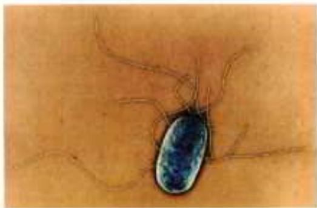  
FIGURE 28-26 Salmonella typhimurium. The appendages emanating from the cell are flagella. [Eye of Science/Science Source.]

The switch is accomplished by periodic inversion of a segment of DNA containing the promoter for a flagellin gene. The inversion is a site-specific recombination reaction (see Fig. 25-37) mediated by the Hin recombinase at specific 14 bp sequences (hix sequences) at each end of the DNA segment. When the DNA segment is in one orientation, the gene for FljB flagellin and the gene encoding a repressor, FljA, are expressed (Fig. 28-27a); the repressor shuts down expression of the gene for FliC flagellin. When the DNA segment is inverted (Fig. 28-27b), the fljA and fljB genes are no longer transcribed, and the fliC gene is induced as the repressor becomes depleted. The Hin recombinase, encoded by the hin gene in the DNA segment that undergoes inversion, is expressed when the DNA segment is in either orientation, so the cell can always switch from one state to the other.

This type of regulatory mechanism has the advantage of being absolute: gene expression is impossible when the gene is physically separated from its promoter (note the position of the fljB promoter in Fig. 28-27b). An absolute on/off switch may be important in this system (even though it affects only one of the two flagellin genes) because a flagellum with just one copy of the wrong flagellin might be vulnerable to host antibodies against that protein. The Salmonella system is by no means unique. Similar regulatory systems occur in some other bacteria and in some bacteriophages, and recombination systems with similar functions have been found in eukaryotes (Table 28-1). Gene regulation by DNA rearrangements that move genes and/or promoters is particularly common in pathogens that benefit by changing their host range or by changing their surface proteins, thereby staying ahead of host immune systems.

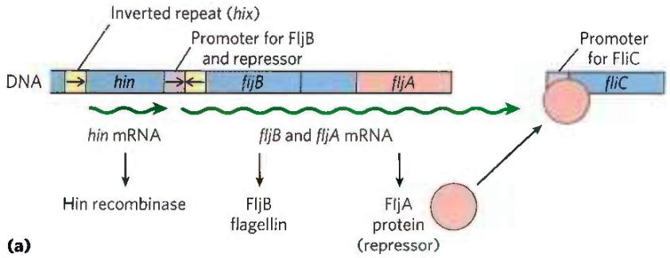

  
FIGURE 28-27 Regulation of flagellin genes in Salmonella: phase variation. The products of genes fliC and fljB are different flagellins. The hin gene encodes the recombinase that catalyzes inversion of the DNA segment containing the fljB promoter and the hin gene. The recombination sites (inverted repeats) are called hix. (a) In one orientation, fljB is expressed  
along with a repressor protein (product of the fliA gene) that represses transcription of the fliC gene. (b) In the opposite orientation, only the fliC gene is expressed; the fliA and fliB genes cannot be transcribed. The interconversion between these two states, known as phase variation, also requires two other nonspecific DNA-binding proteins (not shown), HU and FIS.

<table><tr><td colspan="4">TABLE 28-1 Examples of Gene Regulation by Recombination</td></tr><tr><td>System</td><td>Recombinase/recombination site</td><td>Type of recombination</td><td>Function</td></tr><tr><td>Phase variation (Salmonella)</td><td>Hin/hix</td><td>Site-specific</td><td>Alternative expression of two flagellin genes allows evasion of host immune response.</td></tr><tr><td>Host range (bacteriophage μ)</td><td>Gin/gix</td><td>Site-specific</td><td>Alternative expression of two sets of tail fiber genes affects host range.</td></tr><tr><td>Mating-type switch (yeast)</td><td>HO endonuclease, RAD52 protein, other proteins/MAT</td><td>Nonreciprocal gene conversiona</td><td>Alternative expression of two mating types of yeast, a and α, creates cells of different mating types that can mate and undergo meiosis.</td></tr><tr><td>Antigenic variation (trypanosomes)b</td><td>Varies</td><td>Nonreciprocal gene conversiona</td><td>Successive expression of different genes encoding the variable surface glycoproteins (VSGs) allows evasion of host immune response.</td></tr></table>

$^{a}$ In nonreciprocal gene conversion (a class of recombination events not discussed in Chapter 25), genetic information is moved from one part of the genome (where it is silent) to another (where it is expressed). The reaction is similar to replicative transposition (see Fig. 25-41).  
$^{b}$ Trypanosomes cause African sleeping sickness and other diseases (see Box 6-1). The outer surface of a trypanosome is made up of multiple copies of a single VSG, the major surface antigen. A cell can change surface antigens to more than 100 different forms, precluding an effective defense by the host immune system.

#### [EN] SUMMARY 28.2 Regulation of Gene Expression in Bacteria

In addition to repression by the Lac repressor, the E. coli lac operon undergoes positive regulation by the cAMP receptor protein (CRP). When [glucose] is low, [cAMP] is high and CRP-cAMP binds to a specific site on the DNA, stimulating transcription of the lac operon and production of lactose-metabolizing enzymes. The presence of glucose depresses [cAMP], decreasing expression of lac and other genes involved in metabolism of secondary sugars. A group of coordinately regulated operons is referred to as a regulon.

■ Operons that produce the enzymes of amino acid synthesis have a regulatory circuit called attenuation, which uses a transcription termination site, called the attenuator, in the mRNA. Formation of the attenuator is modulated by a mechanism that couples transcription and translation while responding to small changes in amino acid concentration.

In the SOS system, multiple unlinked genes repressed by a single repressor are induced simultaneously when DNA damage triggers RecA protein-facilitated autocatalytic proteolysis of the repressor.

In the synthesis of ribosomal proteins, one protein in each r-protein operon acts as a translational repressor. The mRNA is bound by the repressor, and translation is blocked only when the r-protein is present in excess of available rRNA.

■ Posttranscriptional regulation of some mRNAs is mediated by sRNAs that act in trans or by riboswitches, part of the mRNA structure itself, that act in cis.

■ Some genes are regulated by genetic recombination processes that move promoters relative to the genes being regulated. Regulation can also take place at the level of translation.

<!-- EN-END 28.2 -->

## 三、真核生物基因表达调节

当前分子生物学的研究重点已从原核生物转向真核生物。真核生物基因表达的调节和控制已成为最引人注目的研究课题之一。对真核生物基因表达调节机制的认识将使我们更有效地控制真核生物的生长发育，并有助于真核生物基因工程的发展。

原核生物与真核生物不仅在结构复杂程度上有很大差别,而且它们沿着两条不同的演化途径发展。前者结构小巧,功能简捷,表达高效,生长快速;后者结构复杂,功能分化,调节精确,适应潜力大。真核生物细胞内 DNA 含量远大于原核生物,其中很大部分是用于贮存调控信息。核内 DNA 和蛋白质构成以核小体为基本单位的染色质,DNA 以很高的压缩比装配成染色体。转录和翻译分别发生在细胞核和细胞质中,并存在复杂的信息加工过程。真核生物基因不组成操纵子,即使某些基因连在一起并受共同调节基因产物的调节,但也不形成多顺反子 mRNA,其 mRNA 的半寿期比较长。多细胞真核生物是由不同的组织细胞构成的,从受精卵到完整个体要经过复杂的分化发育过程,细胞间的信息传递对调节起重要作用。真核细胞基因表达可在不同表达水平上加以精确调节。这种在不同水平上进行调节的机制称为多级调节系统(multistage regulation system),如图 34-9 所示。

真核生物基因表达存在两种类型的调节和控制机制，一种称为短期或可逆的调控；另一种称为长期调控，一般是不可逆的。短期调控主要是细胞对环境变动，特别是对代谢作用物或激素水平升降做出反应，表现出细胞内酶或某些特殊蛋白质合成的变化。长期调控则涉及发育过程中细胞的决定（determination）和分化（differentiation）。细菌基因调控属于短期调控，长期调控仅发生于真核生物。

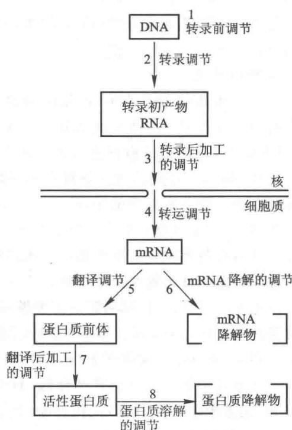  
图 34-9 真核生物基因表达在不同水平上进行调节

## （一）转录前水平的调节

从一个受精卵发育成完整的个体要经过许多特定程序的步骤，在此过程中分化的细胞经分裂后仍然维持其分化状态，表现出细胞具有某种“记忆”。在 DNA 和染色质水平上所发生的一些永久性变化，例如，染色体 DNA 的断裂（breakage）、某些序列的删除（elimination）、扩增（amplification）、重排（rearrangement）和修饰（modification）以及异染色质化（heterochromatinization）等。改变基因组和染色质的结构，使胚原型（germ line）的基因组转变为分化的、具有表达活性的基因组。所有这些通过改变 DNA 序列和染色质结构从而影响基因表达的过程均属于转录前水平的调节。

现在知道高等生物的细胞具有全能性(totipotency)。植物的体细胞和生长尖细胞可以离体培养成完整植株，花药细胞可以培养成单倍体植株。高等动物的体细胞虽然不能离体培养成完整个体，但通过核移植实验也证明了它们细胞核的全能性。例如，从非洲爪蟾(Xenopus laevis)成体的表皮细胞分离出细胞核，然后注射到去核的受精卵中，少数存活的细胞可发育成正常的蝌蚪。由此可见，成体蟾蜍表皮细胞核DNA必定携带了为早期胚胎发育所需的全部遗传信息；而细胞质中存在决定分化状态的某些控制因子。将体细胞核移入去核的受精卵内，获得克隆羊、克隆牛以及其他克隆动物的成功例子，更充分证明了细胞核的全能性。

一般来说,低等动物发育过程中细胞的决定和分化常通过基因组水平的加工改造来实现;高等动物对于分化后不再需要的基因则采取异染色质化的方式来永久性地加以关闭。但在高等生物中依然可以看到基因组序列的某种重排现象,例如,产生抗体的淋巴细胞在发育过程中有明显的基因重排。转座因子能引起基因组序列和表达的改变,而转座频率又受到发育阶段和组织分化的影响,可能转座因子在发育过程中起着某种作用。此外,当基因组发生重排时,可能引起严重的缺陷和失调,例如造成细胞癌变。因此转录前水平的调控,特别是基因重排,引起人们的极大关注。

## 1. 染色质丢失

某些低等真核生物,如蛔虫和甲壳类的剑水蚤(Cyclops),在其发育早期卵裂阶段,所有分裂细胞除一个之外,均将异染色质部分删除掉,从而使染色质减少约一半。而保持完整基因组的细胞则成为下一代的生殖细胞。推测所删除的 DNA 仅对生殖细胞是必需的。在此加工过程中 DNA 必定发生切除并重新

连接。

原生动物四膜虫(Tetrahymena)含有一个大核和一个小核,大核由小核发育而来。大核为营养核,可进行转录;小核为生殖核,无转录活性。在核发育过程中有多处染色质断裂,并删除约10%的基因组DNA,有些部位DNA切除后两端又重新连接。在删除这些序列之前基因并不表现转录活性,删除之后即成为表达型的基因,因此推测这些被删除序列的存在可能抑制了基因正常功能的表达。

最突出的例子是哺乳类的红细胞，它在成熟过程中整个核都丢失了。

## 2. 基因扩增

另一种基因调控方式为基因扩增，即通过改变基因数量而调节基因表达产物的水平。基因扩增是细胞短期内大量产生某一基因的拷贝从而适应特殊需要的一种手段。某些脊椎动物和昆虫的卵母细胞（oocyte），为贮备大量核糖体以供卵细胞受精后发育的需要，通常都要专一性地增加编码核糖体RNA的基因（rDNA）。例如，非洲爪蟾在核仁周围大量积累rDNA，其后可形成1000个以上的核仁。这些rDNA可通过滚动环方式进行复制，拷贝数由1500剧增至2000000，其总量可达细胞DNA的 $75\%$ ，当胚胎期开始后，这些rDNA失去需要而逐渐消失。原生动物纤毛虫的大核在发育过程中也要扩增rDNA，这些rDNA以微染色体（minichromosome）的形式大量存在于大核内。昆虫在需要大量合成和分泌卵壳蛋白（chorion）时，其基因也先行专一的扩增。此外，在癌细胞中常可检查出有癌基因的扩增。

## 3. 基因重排

基因组序列发生改变,较常见的是失去一段特殊序列,或是一段序列从一个位点转移到另一位点。重排可使表达的基因发生切换,由表达一种基因转为表达另一种基因,例如,单倍体酵母配对型(mating type)的转换,非洲锥虫(African trypanosome)表面抗原的改变等。这是一种调节基因表达的方式。重排的另一种意义是产生新的基因,以适合特殊的需要,例如,数量巨大抗体基因借此而产生,并被活化表达。有关基因重排,见 DNA 重组一章。

## 4. 染色质的修饰和异染色质化

DNA 的碱基可被甲基化,主要形成 5-甲基胞嘧啶(5-mC)和少量 6-甲基腺嘌呤(6-mA)。甲基化的胞苷通常与邻近鸟苷的 5'-磷酸基相连。生物体内有两类甲基化的酶:一类为保持性(maintenance)的甲基转移酶,可在甲基化的母链(模板链)指导下使对应部位发生甲基化;另一类为从头合成(de novo)的甲基转移酶,它不需要母链的指导。凝缩状态的染色质称为异染色质,为非活性转录区。真核生物可以通过异染色质化而关闭某些基因的表达。例如,雌性哺乳动物细胞有两个 X 染色体,其中一个高度异染色质化而永久性失去活性。通常染色质的活性转录区无或很少甲基化;非活性区则甲基化程度高。而且,生物机体不同发育阶段和不同组织 DNA 甲基化的方式也不同。将克隆的 DNA 微量注射到爪蟾卵母细胞或培养的哺乳动物细胞核内,甲基化的基因不被表达,而未甲基化的基因则可以表达。

## （二）转录水平的调节

真核生物基因表达可在不同水平上进行调节,但转录活性的调节尤为重要。基因转录活性与染色质空间结构和基因启动子活化有关。因此真核细胞基因的活化可分为两个步骤:首先由某些调节因子识别基因组的特定序列,改变染色质结构使其疏松活化;然后才由激活蛋白、阻遏蛋白或其他调节因子进一步影响基因活性。第二步调节在某种程度上类似于原核生物。然而真核生物有远比原核生物多得多的顺式元件和反式调节因子。生物在生长发育过程中染色质 DNA 和组蛋白会发生修饰,这种影响表型的变化可被细胞所记忆,在细胞分裂时遗传给子代细胞,称为表观遗传(epigenetic heredity)。表观遗传是对基因活化条件的遗传,而不涉及其序列。

## 1. 染色质的活化与阻遏

具有转录活性的染色质表现出对核酸酶有较高的敏感性。用 DNase I 对小心制备的染色质进行消化，通常可得到 200 bp 左右阶梯式的 DNA 降解片段，此结果反映了核小体的结构；但转录活性区染色质被核酸酶水解则得到的片段较小，较不整齐。该活性区还含有对 DNase I 特别敏感的部位，称为超敏感位点（hypersensitive sites），位于转录基因 5' 端一侧 1 000 bp 内，约长 200 bp，相当于启动子区域。有些基因超敏感位点也存在于3'端或基因内。超敏感位点相当于一些已知调节蛋白结合的位点，在其介导下甚至比裸露DNA更易被核酸酶水解。在转录非常活跃的区域，缺少或全然没有核小体，如rRNA基因就是如此。

在染色质中与转录相关的结构变化称为染色质重塑（chromatin remodeling）。核小体是染色质的基本结构单位，染色质重塑涉及核小体的移动、调整和取代等变化。染色质重塑使启动子和相关调节序列上核小体解开，转录因子和RNA聚合酶得以结合其上。重塑过程需要能量，由水解ATP所提供。从酵母、果蝇和人类细胞中发现一些类似的重塑复合物，如SWI/SNF和ISW家族，它们各有其不同的作用范围，并都含有ATPase亚基。染色质重塑的发生首先由序列特异的激活蛋白(activator)结合到DNA上，在其介导下重塑复合物取代核小体，并导致染色质结构的重新改造（图34-10）。

  
图34-10 在激活蛋白介导下重塑复合物结合到染色质的特定位点

染色质功能状态的转变可由修饰所引起，并与细胞周期和细胞分化相关联。染色质的修饰主要包括组蛋白的磷酸化、乙酰化和甲基化以及DNA的甲基化。启动子的激活大致过程为：① 激活蛋白识别特殊的序列并结合其上；② 激活蛋白介导重构复合物与之结合；③ 激活蛋白被释放；④ 重构复合物取代核小体；⑤ 重构复合物介导修饰酶复合物与之结合；⑥ 组蛋白被乙酰化影响染色质结构使基因活化。与其相反，阻遏蛋白引起重塑可能招致组蛋白脱乙酰基或是磷酸化和甲基化，并使基因失活。组蛋白的甲基化与DNA的甲基化彼此密切关联。

组蛋白 H2A、H2B、H3 和 H4 组成核小体的八聚体核心，而各组蛋白 N 端大约 20 来个氨基酸残基则游离在核心之外，犹如尾巴。它们可被修饰，主要发生在 H3 和 H4 的尾部。H1 结合在 DNA“进”“出”核小体的位点上，它在有丝分裂时被 Cdc2 激酶磷酸化，推测其修饰可能与染色质的凝聚有关。组蛋白 N 端区段有多个 Lys 可在组蛋白乙酰基转移酶（histone acetyltransferase, HAT）催化下发生乙酰化反应。促使组蛋白乙酰化的酶有两种，其中一种 HAT 的功能与核小体的组装有关，存在于细胞质中，称为 B 型，它使新合成的组蛋白 H3 和 H4 乙酰化，以便于进入核内组装成核小体，在形成核小体后乙酰基随即被除去。调节染色质转录活性则需要另一种核内的 A 型 HAT。组蛋白 H3 和 H4 N 端区段 Lys 被乙酰化，降低了组蛋白核心对 DNA 的亲和力。乙酰化还可促进或阻止与转录有关蛋白质的相互作用。当基因不再转录时,核小体的乙酰基被组蛋白脱乙酰基酶(histone deacetylase, HDAC)所催化除去,染色质恢复无活性状态。

组蛋白 H3 尾部 2 个 Lys 和 H4 尾部 1 个 Arg 可被甲基化。DNA 的 CpG 岛胞嘧啶第 5 位碳也可被甲基化。无论是组蛋白的甲基化还是 DNA 的甲基化，都使染色质趋向失活，然而具体效应还与其他部位的变化有关。组蛋白的甲基化与 DNA 的甲基化常相伴发生，一方面某些组蛋白的甲基转移酶易于和甲基化的 CpG 二联体结合；另一方面组蛋白的甲基化似乎又能招致 DNA 甲基化酶作用。在染色质的凝聚区，包括异染色质和局部基因不表达的小片段区，常有组蛋白的甲基化。同样，DNA 的甲基化也主要存在于异染色质区；转录活化区的 DNA 常没有或较少甲基化。DNA 甲基化酶有两类，一类为维持性甲基化酶（maintenance methylase）；另一类是从头甲基化酶（de novo methylase）。甲基化的 DNA 经复制产生两个半甲基化 DNA（hemimethylated DNA）分子，其一条链来自亲代分子，仍保持甲基化；另一条新合成的链，则未甲基化。维持性甲基化酶按甲基化链中甲基的位置使互补链甲基化，半甲基化 DNA 得以成为全甲基化 DNA（fully methylated DNA）。从头甲基化酶需借助于修饰复合物识别染色质的特殊部位使 DNA 两条链同时甲基化。DNA 的高度重复序列常构成组成型异染色质（constitutive heterochromatin），如着丝粒异染色质（centromeric heterochromatin）和端粒异染色质（telomeric heterochromatin）。但在多细胞生物发育过程中细胞常通过异染色质化而关闭某些基因的活性，造成细胞分化。此为功能性异染色质，或称为兼性异染色质（facultative heterochromatin），因其在某些细胞中为活性染色质，另一些细胞中为异染色质，故而称为兼性。异染色质化可沿染色质丝扩展，使附近的基因失活。外来基因如整合在异染色质附近，常因此而不能表达。某些参与形成异染色质的蛋白质，如异染色质蛋白 1（heterochromatin protein 1, HP1）能特异结合于甲基化的组蛋白上，并在核小体链上发生聚集。

染色质的结构域(或许即相当于染色体上的染色带)是指包含一个或一个以上活性基因的染色质区域。结构域通常都有3种类型的作用位点,此外还有增强子和多个转录单位。其作用位点为:①基因座控制区(locus control region, LCR)是一类真核生物的顺式作用元件,包括DNase I高度敏感区和许多转录因子的结合位点,常位于所控制基因的5'端,可能也存在3'端,为本区域基因转录活性所必需。而各基因还有其自身特异的控制,以进一步调节。②绝缘子(insulator)或称为边界元件(boundary element),是近年发现的一类很特殊的顺式作用元件,它与增强子和沉默子都不同,其功能只是阻止激活或阻遏作用在染色质上的传递,因而使染色质活性限定于结构域之内。如果将一个绝缘子置于增强子和启动子之间,它能阻止增强子对启动子的激活。另一方面,如果一个绝缘子在活性基因和异染色质之间,它可以保护基因免受异染色质化扩展招致的失活。有些绝缘子只有其一作用,有些兼有两种作用。③基质附着位点(matrix attachment region, MAR)借助有关蛋白质使染色质附着在核周质一定部位。这三类元件或存在于结构域的一端,或存在于两端,如图34-11所示。

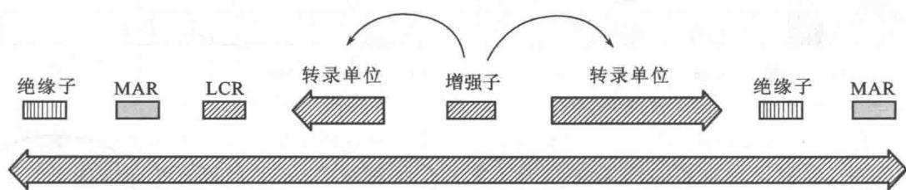  
图 34-11 染色质结构域的作用位点  
绝缘子 LCR,基因座控制区 MAR,基质附着位点

## 2. 启动子和增强子的顺式作用元件

真核细胞基因的启动子由一些分散的保守序列所组成,其中包括 TATA 框(box)、CAAT 框和多个 GC 框等,CAAT 框、GC 框均属于上游控制元件(upstream control element,UCE)。对于可诱导的基因来说,除基本的控制序列或称为控制元件外,还存在一些信号分子作用的位点,可对细胞内外环境因素变动作出反应的应答元件(response element)。

启动子只是转录的基本控制元件, 还需由增强子 (enhancer)、沉默子 (silencer) 及其应答元件来进一步调节转录活性。增强子最早发现于 DNA 病毒 SV40, 它位于转录起点上游大约 200 bp 处的超敏感位点, 由两个相同的 72 bp 序列前后串联而成, 删除这两个序列将会显著降低体内的转录活性。增强子广泛存在于各类真核生物基因组中, 其作用有几个明显特点: ① 能在很远距离 (大于几 kb) 对启动子产生影响; ② 无论位于启动子上游或是下游都能发挥作用; ③ 其功能与序列取向无关; ④ 无生物种属特异性; ⑤ 受发育和分化的影响。增强子具有组织特异性, 它往往优先或只能在某种类型的细胞中表现其功能。这可以部分解释动物病毒要求一定宿主范围的原因。与此类似, 组织特异的增强子为发育过程或成熟机体不同组织中基因表达的差别提供了基础。

增强子与启动子相似, 是一类具有模块(保守序列)结构的顺式作用元件, 许多模块在二者成分中都相同或相似, 但在增强子中这类模块元件更加集中和紧密。从某种意义上来说, 增强子也可以看作是启动子远离起点的上游元件。事实上作用其上的反式因子也相同或相似。同样, 沉默子(silencer)和启动子负调节元件之间也无本质的差别, 它们都能对某些激活因子起阻碍作用。从上述增强子的性质可以设想, 细胞内必定存在一些特异的蛋白质可与其作用, 从而影响转录, 这种影响可以远距离(达几千碱基对)和无方向性地传递给相对最近的启动子, 促使启动子易于结合RNA聚合酶或转录因子复合物。增强子与启动子之间距离对活性并无影响, 这是因为DNA分子具有一定柔性, 可以弯曲, 结合在增强子上的反式激活因子能够与转录复合物相作用。位于增强子上的应答元件, 可调节增强子的活性。沉默子则是负调节蛋白作用的位点。

现以金属硫蛋白(metallothionein, MT)基因的调节区为例,说明各顺式作用元件和反式作用因子对基因转录的调节(图34-12)。金属硫蛋白可与重金属离子结合,将其带出细胞外,从而保护细胞,免除重金属的毒害。通常该基因以基础水平表达,但被重金属离子(如镉)或糖皮质激素诱导以较高水平表达。TATA框和GC框是两个组成型启动子元件,位于靠近转录起点的上游。两个基础水平元件(basal level element, BLE)属于增强子,为基础水平组成型表达所必需。佛波酯(phorbol ester)应答元件TRE是存在于多个增强子中的共有序列,SV40增强子中也有该序列,其上可结合反式因子激活蛋白AP1,该因子除作为上游因子促使组成型表达外,还能对佛波酯作为促肿瘤剂(promoter tumoragent)产生效应,而这种效应是由AP1与TRE相互作用介导的。佛波酯通过该途径(但不是唯一的)启动一系列转录的变化。金属应答元件(MRE)受相应转录因子MTF1调节,多个MRE元件可引起MT以较高水平表达,该序列可看作启动子的应答元件。糖皮质激素是一种类固醇激素,它的应答元件(glucocorticoid response element, GRE)是增强子的可调节位点,位于转录起点250 bp的位置。类固醇激素与其受体结合于该位点而诱导MT高水平表达。与GRE相邻为E框(E-box),由上游激活因子USF所活化。

  
图 34-12 人金属硫蛋白基因的调节区

## 3. 调节转录的反式作用因子

调节转录活性的蛋白质有三类:即通用或基本转录因子(basal transcription factor)、上游因子(upstream factor)和可诱导因子(inducible factor)。基本转录因子结合在TATA框和转录起点,与RNA聚合酶一起形成转录起始复合物。上游因子结合在启动子和增强子的上游控制位点。可诱导因子与应答元件相互作用。有些因子只在特殊类型的细胞中合成,因而有组织特异性,如控制发育的同源域蛋白(homeodomainprotein)。有些因子的活性直接受各种条件的修饰控制,如热激转录因子(heat shock transcription factor, HSTF),在热和其他刺激下经磷酸化而激活。又如,作用于增强子 TRE 序列的 AP1,是由 Jun 和 Fos 两亚基形成的异二聚体,在 Jun 亚基磷酸化后即被激活。有些因子的活性受配体调节,如类固醇受体,它与配体结合后即进入核内,与 DNA 结合。

多数结合 DNA 的转录调节因子都有三个结构域, 即 DNA 结合结构域 (DNA binding domain)、转录激活结构域 (transcription activation domain) 和二聚化结构域 (dimerization domain)。蛋白质与 DNA 结合区域存在一些特殊的基序结构, 前已提及这里不再重复。

转录激活结构域常见的有3种:①酸性α螺旋(acidic α helix)。该结构域含有酸性氨基酸的保守序列,形成带负电荷的螺旋区,如酵母活化因子GAL4、糖皮质激素受体和AP1等。②富含谷氨酰胺结构域(glutamine rich domain)。首先在SP1中发现,其N端有两个转录激活区,其中谷氨酰胺(Gln)残基含量可达25%。③富含脯氨酸结构域(proline rich domain)。CTF(CAAT转录因子)家族的C端区与转录激活有关,其脯氨酸残基可达20%\~30%。

上游因子的转录激活作用,或是直接作用于转录起始复合物(包括 RNA 聚合酶和通用转录因子),刺激转录活性;或是通过蛋白质-蛋白质的介导,间接作用于转录复合物。大多数上游因子需经过中间蛋白质因子将信息传递给转录复合物。这类中间因子组成中介复合物(mediator complex),它们不能直接与 DNA 调节元件结合,只是在上游因子和转录复合物间起桥梁作用。转录抑制因子的作用通常是阻断激活因子对转录的促进作用。它们或是结合于 DNA 的调节元件,或是结合于激活因子,或是结合于转录复合物,使转录激活因子无法发挥作用。

## （三）RNA加工和剪接的调节

真核生物的 mRNA 前体加工过程主要包括三个步骤: ① 在新生的 mRNA 前体 5' 端上加一个甲基化的鸟苷酸 ( $m^{7}GpppN$ ) 帽子; ② 当 RNA 聚合酶转录至终止信号处由特异的内切酶将 RNA 链切下, 然后加上一段聚腺苷酸 (polyA) 尾巴; ③ 将 mRNA 前体的内含子切去, 并使外显子重新连接, 称之为剪接。此外, mRNA 的内部还可发生甲基化, 主要生成 6-甲基腺嘌呤 ( $m^{6}A$ )。在某些特殊情况下 mRNA 还能改变序列, 称为编辑。成熟的 mRNA 被转移到细胞质进行翻译, 在此过程中存在复杂的调控机制。

mRNA 前体通过不同的剪接途径可以产生不同的 mRNA, 并经翻译得到不同的蛋白质。这些蛋白质的功能可能相同, 也可能不同, 甚至相互拮抗。有时得到的异型体数目可以很大, 甚至数千以上 (如果蝇 DSCAM 基因)。异型体的产生主要由剪接点的改变所致。有两类选择剪接, 一类是组成型的, 另一类是调节型的。前者同时产生各种异型体蛋白; 后者则随不同时间、不同条件、不同细胞或组织, 产生不同的产物。

现以猴病毒 SV40 T 抗原 mRNA 的剪接作为组成型选择剪接的实例加以说明(图 34-13)。SV40 T 抗原基因编码两个蛋白质产物, 大 T 抗原(T-ag)和小 t 抗原(t-ag)。该基因有两个外显子, 利用两个不同的 5'剪接位点(5'SST 和 5'sst)可产生不同的成熟 mRNA。编码 T-ag 的 mRNA 由外显子 1 与外显子 2 直接剪接, 除去内含子而成。t-ag 的 mRNA 则经另一 5'剪接点(5'sst)而产生, 故而剪接产物包含了部分内含子序列, 也就是说外显子变长了。由于内含子上有一个终止密码子, 虽然 t-ag 的 mRNA 比 T-ag 的 mRNA 长, 但翻译产生的 t-ag 多肽链比 T-ag 多肽链要短得多。SV40 能同时产生两种 T 抗原, 但两者比例随情况不同而有变动。当细胞内剪接蛋白 SF2/ASF 水平升高时, 它主要结合于外显子 2, 使剪接体 (spliceosome) 在其上组装, 并有利于最靠近的 5'sst 参与剪接, 结果产生更多的 t-ag mRNA。

调节型选择性剪接受激活蛋白和抑制蛋白的调节。剪接激活蛋白结合的位点称为剪接增强子，在外显子上的为外显子剪接增强子（exonic splicing enhancer, ESE），在内含子上的为内含子剪接增强子（intronic splicing enhancer, ISE）。抑制蛋白结合的位点称为剪接沉默子，两者分别为 ISE 和 ISS。促进剪接的调节蛋白（激活蛋白）属于 SR 蛋白，因其富含丝氨酸（S）和精氨酸（R）而得名。SR 蛋白对于剪接机制十分重要，它参与各种剪接过程，上述 SF2/ASF 即为 SR 蛋白。SR 蛋白可通过其识别 RNA 的基序（RNA-recognition motif, RRM）结构域与 RNA 结合，又通过 RS 结构域（含有 Arg-Ser 重复序列）招募剪接装置到附近的剪接点,从而选择了剪接的外显子序列。剪接抑制蛋白有RRM结构域,但缺少RS结构域,它与RNA结合后不能招募剪接装置,由此阻塞了附近剪接点的作用。SR蛋白质家族很大,而且多种多样,它们决定着在发育的特殊阶段和特殊的细胞类型中哪些剪接点参与剪接。

  
图34-13 病毒SV40T抗原mRNA的选择性剪接

由不同转录起点和终点转录的产物,以及不同剪接点进行剪接,再加上不同的编辑和再编码,可以得到不同的 mRNA 和翻译产物。越是高等的真核生物,其基因表达调控机制越复杂,每个基因能够产生更多的蛋白质。粗略估计,细菌每个基因平均能产生 1.2\~1.3 种蛋白质,酵母每个基因产生 3 种蛋白质,人类每个基因产生 10 种蛋白质。由此可见,基因表达在转录后加工水平上有非常复杂的调节和控制。

## （四）翻译水平的调节

真核生物在翻译水平进行调节,主要是影响 mRNA 的稳定性、mRNA 的运输和有选择地进行翻译。mRNA 5'端的帽子以及 3'端的多聚 A 尾巴都有利于 mRNA 分子的稳定。mRNA 通常只在完成加帽、剪接和加尾等加工过程后才被载体蛋白由核内运送到细胞质,并在细胞质进行翻译。实际上能从核内输出的 RNA 只是核内 RNA 的一小部分,许多其他不适用的、受损伤的、错误加工的 RNA 以及加工切下的碎片与内含子都不运送出去,或滞留核内或被降解掉。运输 RNA 是一个主动过程,需要能量,可由 GTP 水解提供,反应由 Ran 作为 GTPase 所催化。mRNA 的 5'端和 3'端非编码区的序列对 mRNA 的稳定性和翻译效率起重要调控作用。有些 mRNA 寿命很短,有些很稳定,与其有关。

现以网织红细胞的蛋白质合成为例,研究其调节机制。葡萄糖饥饿、缺氧和氧化磷酸化受抑制等所有导致缺乏 ATP 的因素均能诱导细胞产生翻译抑制物;血红素的缺乏亦有类似情况。在细胞中蛋白质的合成与能量代谢有关,而血红素由于在细胞色素和细胞色素氧化酶合成中的作用,可作为能量代谢水平的指标而调节 mRNA 的翻译功能。血红素对蛋白质合成的控制作用是通过一种称为血红素控制的翻译抑制物(heme-controlled translational inhibitor)来实现的,其本质是 eIF-2 激酶,它能选择性地将蛋白质合成起始因子 eIF-2 α 亚基的 Ser 磷酸化。这种起始因子磷酸化后便失去正常再生能力。eIF-2 激酶本身也有磷酸化和脱磷酸两种形式,磷酸化的 eIF-2 激酶具有活性,脱磷酸后失去活性。eIF-2 激酶的磷酸化是由依赖于 cAMP 的蛋白激酶 A 所催化,它的活性受控于血红素。如果有血红素存在时,蛋白激酶 A 不被 cAMP 活化,eIF-2 激酶以无活性的脱磷酸形式存在,eIF-2 具有起始活性。当血红素缺乏时,蛋白激酶 A 被 cAMP 活化,eIF-2 激酶以磷酸化的活化形式存在,使 eIF-2 被磷酸化而失去再生活性。这一级联反应

通过控制 eIF-2 的起始活性而调节蛋白质的合成。

起始因子 eIF4E 是帽结合蛋白, 其他有关的起始因子通过 eIF4G 而结合其上。一类可结合于 eIF4E 的蛋白质称为 4E-BPs, 当细胞生长缓慢时它可结合在 eIF4E 上, 由于妨碍其与 eIF4G 反应而限制了翻译。在细胞生长速度恢复或增加时, 受生长因子或其他刺激的诱导, 该结合蛋白被蛋白激酶磷酸化而失活。翻译水平存在多种调节机制。有关 mRNA 的翻译能力和翻译阻遏作用等与原核生物相似, 这里不再重复。

## (五) RNA 干扰和多种 RNA 的调节

1998 年 A. Fire 和 C. Mello 等在研究用反义 RNA 抑制线虫基因的表达时发现, 双链 RNA 比反义 RNA 和有义 RNA 更为有效, 他们将此双链 RNA (dsRNA) 引起的特异基因表达沉默称为 RNA 干扰。随后证实 RNA 干扰广泛存在于各类生物中。其实, 早在 1990 年 R. Jorgensen 和他的同事将色素基因导入矮牵牛花, 结果花的紫色反而被抑制, 这表明不仅外源基因本身失活, 还可使体内同源基因也受抑制, 他们称此现象为共抑制 (cosuppression)。与此同时, 一些实验室发现 RNA 病毒能诱导同源基因沉默, 植物还能借助类似共抑制的机制识别和降解病毒 RNA。在链孢霉中也发现外源基因引起沉默的现象, 曾称为基因遏制。无论是外源基因的导入或是病毒 RNA 的入侵, 均能产生 dsRNA, 因此基因共抑制和遏制与 RNA 干扰并无本质差别。由于 Fire 和 Mello 最早明确提出 RNA 干扰, 故而他们共同获得了 2006 年诺贝尔生理学或医学奖。

现在知道，RNA干扰是生物机体演化产生用以对付外源基因入侵、某些转座子和高度重复序列的转录或内源异常RNA生成的一种重要机制。上述情况都可能会产生以双链RNA为中间体的RNA复制过程。RNA切酶Dicer是一种类似RNaseⅢ的酶，它可识别和消化长的dsRNA，产生大约23个核苷酸长的短双链RNA，即短的干扰RNA(short interfering RNA, siRNA)。siRNA可通过三条途径抑制同源基因的表达：破坏含有互补序列的mRNA；抑制其mRNA的翻译；或者在启动子处诱导染色质修饰使基因沉默。无论通过何种途径，siRNA在发挥其作用时都需要与有关蛋白质一起形成RNA诱导的沉默复合物（RNA-induced silencing complex, RISC）。在此复合物中，由水解ATP提供能量使双链siRNA解开，并促使单链siRNA与其互补的mRNA配对。结果或使靶mRNA降解，或使其翻译受抑制，可能取决于siRNA与靶mRNA之间匹配关系。如果两者完全互补，后者被降解；若两者并不完全互补，则主要是翻译受抑制。靶mRNA的降解由RISC的核酸酶来完成。

RISC 还能进入核内,由 siRNA 与其互补的基因组序列配对。当复合物结合到染色质上时,即能招募与染色质修饰有关的蛋白质聚集在基因的启动子处,使染色质修饰。这种修饰导致基因转录沉默。RNAi 的效率很高,极微量的 siRNA 可以使靶基因完全关闭。因此推测它可借助依赖 RNA 的 RNA 聚合酶获得扩增。值得指出的是,当给予 mRNA 某一区段特异的 siRNA 时,还能产生该区段邻近序列的 siRNA。这就表明 siRNA 与 mRNA 配对可以发生 RNA 复制,从而二次产生 siRNA。事实上某些 RNAi 还能由亲代传递给子代。RNA 干扰的产生途径见图 34-14。

生物机体以 siRNA 抑制外来的或异常表达的基因,使之沉默(包括转录沉默和转录后沉默);生物机体还能以另一种类似功能的 RNA,微 RNA(microRNA,miRNA),来控制发育。典型的 miRNA 长 20\~25 个核苷酸,由非编码蛋白质的基因转录出长的前体(70\~90 个核苷酸),经自身回折形成茎环结构,然后由 Dicer 或类似的酶切割所产生。miRNA 主要作用于发育调节蛋白的 mRNA,而且从线虫、果蝇到人类有相当高的同源性。这就表明,miRNA 可能是在演化上比较古老就产生的一种发育调节方式,并且类似 RNAi 的机制在基因调节中起着比最初想象更广泛的作用。miRNA 具有保守性、组织特异性和时序性。它只在某些组织中出现,并且往往只在发育的某阶段出现,有时也称之为小时序 RNA(small temporal RNA),目前已发现的 miRNA 数量相当多。miRNA 还可能与细胞癌变有关,某些 miRNA 缺失可能导致癌基因或抑癌基因的表达。

除了编码蛋白质的 mRNA 外,其余的 RNA 都可称为非编码 RNA (non-coding RNA, ncRNA)。例如,参与蛋白质合成的 tRNA 和 rRNA,参与 RNA 前体剪接的 snRNA,参与 rRNA 修饰的 snoRNA,干扰外源和异常 RNA 表达的 siRNA,调节发育和分化的 miRNA 等等。实际上非编码 RNA 也都有其特殊功能,故称为功能 RNA (functional RNA, fRNA)。现在知道的 ncRNA 已有数千种，其中有些较短，如 siRNA 和 miRNA；有些 RNA 比较长，通常大于 200 nt 即为长非编码 RNA (long noncoding RNA, lncRNA)，它们参与性分化剂量补偿、基因组印记和基因表达不同层次的调节。RNA 除抑制功能外，也可以起激活作用，如 RNA 激活因子 (RNA activator, RNAa)。新的 RNA 种类的发现远比新的蛋白质的发现为多。

  
图34-14 RNA干扰的产生途径

有些 RNA 可以与蛋白质结合而成为辅激活物(coactivator)。例如,热休克因子 1(heat shock factor 1,HSF1)是一种激活蛋白,在非应激细胞中以单体存在并与分子伴侣 Hsp90 结合。在应激条件下 HSF1 从 Hsp90 中释放出来,形成三聚体,并结合到 DNA 上,活化有关基因的转录,产生应激反应。一种称为 HSR1 (heat shock RNA 1) 的 lncRNA,长约 600 nt,为 HSF1 三聚体的形成和结合 DNA 所必需。该 RNA 并非单独作用,其功能需要与翻译延伸因子 eEF1A 形成复合物才起作用。

ncRNA 是当前研究的热点,新的发现不断涌现,需要密切关注。

## （六）翻译后加工的调节

多肽链合成后通常需经过一系列加工与折叠才能成为有活性的蛋白质。这种后加工过程在基因表达的调控上也起着重要作用。某些翻译产物经不同加工过程可形成不同活性产物。例如，前阿黑皮素原（POMC）分子至少可加工成7个活性肽，每一活性肽的末端各有一对碱性氨基酸残基划分出界线，一般为赖氨酸和精氨酸。界线处的氨基酸对是蛋白质裂解酶（protein-splitting enzymes）识别和切割部位，经酶切割即释放出活性调节肽。神经肽、调节肽和病毒蛋白常有此加工过程，并因不同加工而产生不同的产物。

近来发现,某些蛋白质能和 RNA 一样发生剪接,即有些序列在相应核酸中存在,但在蛋白质中却不存在。仿照 RNA 剪接的用语,在成熟蛋白质中保留的序列称为外显肽(extein),在剪接中除去的序列称为内含肽(intein)。蛋白质剪接需要经过一系列转酯反应使键重排,其机制并不与 RNA 剪接相同。第一个被发现的内含肽是在古菌的 DNA 聚合酶中,其基因有一段居间序列,而又不似内含子。其后证明,纯化的蛋白质可自我催化经剪接除去此序列。蛋白质剪接无需提供能量,反应由内含肽所催化,外显肽也可能具某些增强作用。现在知道，两外显肽的连接经过多步转移反应（图34-15）。第一步反应由内含肽第一个氨基酸侧链的一OH或一SH攻击外显肽1与内含肽之间的肽键，外显肽1转移到一OH或一SH侧链上。第二步反应由外显肽2第一个氨基酸侧链的一OH或一SH攻击内含肽与外显肽1之间的酯键或硫酯键，外显肽1转移其上。第三步反应为内含肽C端天冬酰胺发生环化，外显肽2的游离氨基攻击外显肽1的酰基，并形成肽键。由于前两反应中间物生成酯键或硫酯键，其能量与肽键相近，整个过程才可能无需供给能量的情况下进行。

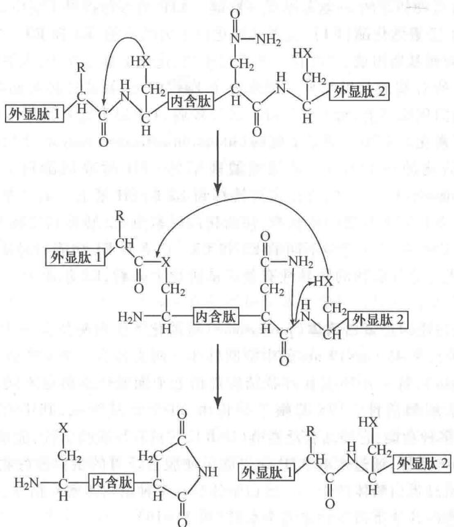  
图34-15 蛋白质的剪接过程

目前已发现 100 多个蛋白质剪接的例子,分布在各类生物中。许多内含肽都有两个特殊的功能,一是催化自身的剪接,二是靶向内切核酸酶(homing endonuclease)。这两个功能似各自独立的。有些内含子编码靶向内切核酸酶,因而可在基因间转移。内含肽的靶向内切核酸酶功能也可使该肽段的编码序列得以扩散。有关蛋白质剪接调节的细节现还不清楚。

## (七) 蛋白质降解的调节

很早以前就已知道,细胞内蛋白质的寿命各不相同,有些蛋白质半寿期可达数年、数十年;有些则只有几分钟乃至几秒钟。而且蛋白质的寿命正如 RNA 的寿命,可随细胞内外环境的变动而改变。在细胞分化、衰老、饥饿或病态情况下,细胞内一部分结构和线粒体、内质网等细胞器包入液泡内,形成自噬泡(自体吞噬),可与溶酶体融合,而将内含物消化掉,然后吸收为营养物质。即使在正常生长的细胞中蛋白质周转率也是很高的,显然只有保持高周转率蛋白质才能不断更新,以适应内外环境的变动。溶酶体的作用也有一定的选择性。在长期禁食后,有些组织(如肝和肾)的溶酶体活化,可降解 Lys-Phe-Glu-Arg-Gln (KFERQ) 五肽序列的蛋白质;但另一些组织(如脑、睾丸)则否。

蛋白质的寿命与其成熟蛋白质 N 端的氨基酸有关。A. Varshabsky 提出所谓 N 端法则 (N-end rule): N 端为 Asp、Arg、Leu、Lys 和 Phe 残基的蛋白质不稳定, 其半寿期仅 2\~3 min; N 端为 Ala、Gly、Met、Ser 和 Val 残基的蛋白质较稳定, 其半寿期在原核生物中 >10 h, 在真核生物中 >20 h。实际情况比较复杂, 其他一些信号在选择蛋白质降解中也起重要作用。例如，富含 Pro、Glu、Ser、和 Thr 肽段的蛋白质可被迅速降解，删掉此 PEST 序列后即延长蛋白质寿命。在这里影响蛋白质半寿期的是肽段，而不是 N 端氨基酸。

选择性降解蛋白质的系统需要 ATP 供给能量, 这种能量用来控制降解的特异性。2004 年诺贝尔化学奖授予 A. Ciechanover、A. Hershko 和 I. A. Rose 以表彰他们在揭示泛素介导的蛋白质降解机制中的杰出贡献。泛素-蛋白酶体途径是在上世纪 80 年代初期发现的。1980 年 Ciechanover 等通过 $^{125}$ I 标记, 证实泛素 (ubiquitin) 可与一些将被降解的蛋白质形成共价连接。同年 Hershko 等发现多个泛素分子以链状方式, 通过 C 端甘氨酸羧基与底物赖氨酸 ε-氨基形成异肽键。ATP 的参与提供了反应的可控性和底物特异性。次年 Rose 等分离鉴定了泛素活化酶 (E1), 接着又纯化出了另两个酶, E2 和 E3。

泛素由76个氨基酸残基所组成，广泛存在于真核生物，进化上高度保守，人类与酵母间仅有3个残基的差别。一个泛素分子的C端羧基可与另一泛素分子 $\mathrm{Lys}^{48}$ 的 $\varepsilon-$ 氨基连接从而串联形成长链。单个或 $2\sim 3$ 个泛素分子连在蛋白质底物上，给出的待降解信号较弱，4个以上泛素链可给出较强的信号。有三类酶参与蛋白质底物的泛素化。一类是泛素活化酶（ubiquitin-activating enzyme，E1），它催化泛素的C端羧基被ATP腺苷酸化，活化的泛素与E1半胱氨酸残基的一SH形成硫酯键。第二类是泛素缀合酶(ubiquitin-conjugating enzyme，E2)，活化的泛素被转移到E2的SH基上。第三类是泛素-蛋白质连接酶(ubiquitin-protein ligase，E3)它选择蛋白质底物，使活化的泛素由E2转移到底物Lys的 $\varepsilon-$ 氨基上。细胞内E1只有一种或少数几种，但却有许多不同的E2和E3。这表明E1功能只是活化泛素，并不参与选择蛋白质底物；E2和E3则与降解底物的特异性有关。从进化上来看，E2起源于一个家族；E3则起源于多个家族，因此更加多种多样。

带有泛素标记的蛋白质即被蛋白酶体（proteasome）所消化。蛋白酶体是一大的蛋白酶复合物（26S，相对分子质量 $2\ 000\times10^{3}$ ），呈45 nm×19 nm的中空圆柱体。两头各有一个19S的帽子。中间20S为四个环状结构叠加的桶（ $\alpha\beta\beta\alpha$ ），每个 $\alpha$ 环或 $\beta$ 环状结构都由七个同源性高但是不同的亚基所组成。 $\beta$ 环状结构内表面具有蛋白水解酶活性。19S的帽子结构由20个亚基组成，其中有六个具有不同功能的ATPase。19S结构具有多种功能：它能结合泛素链（UbR）；它具有异肽酶活性，能水解下完整的泛素，以便再利用；它还能借ATPase活性，通过水解ATP获得能量使脱去泛素的蛋白质底物解折叠，并改变20S蛋白酶体的构象，让底物通过蛋白酶体的中心。蛋白酶体具有多种蛋白水解酶活性，它使蛋白质底物水解成七至九肽，然后再由细胞内其他蛋白酶使之完全水解（图34-16）。

  
图34-16 泛素-蛋白酶体途径

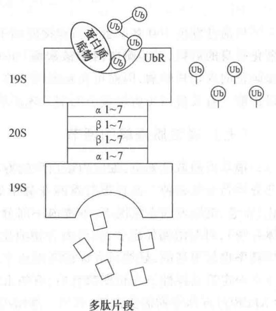

蛋白质的选择性降解参与许多重要生物学功能的调节。例如，它可控制炎症反应。核因子 NF- $\kappa$ B 是一种转录因子,可促使许多有关炎症反应的基因转录。在细胞质内 NF- $\kappa$ B 与其抑制物 I- $\kappa$ B 结合,因而是无活性的。在炎症反应信号作用下,I- $\kappa$ B 的两个 Ser 被磷酸化,产生了 E3 的结合位点,于是 I- $\kappa$ B 被泛素化和降解,NF- $\kappa$ B 得以活化,由此产生炎症反应。许多生理过程,包括基因转录、细胞周期、器官形成、生物节律、肿瘤抑制、抗原加工等,都与泛素-蛋白酶体的降解途径有关。

原核生物没有泛素,原核生物虽有蛋白酶体,但只有20S的蛋白酶体核心结构,而无19S的调节结构。因此原核生物蛋白质降解缺乏精确的选择性和可控性。

以上扼要介绍了真核生物基因表达的多级调节系统,由此构成的调控网络控制着机体的代谢过程和生理功能。

<!-- EN-BEGIN 28.3 -->

### 【英文对应 28.3】Regulation of Gene Expression in Eukaryotes

> 来源：Lehninger Principles of Biochemistry（书籍/02_生物化学原理） 第28章 Regulation of Gene Expression，§28.3。对应本章“三、真核生物基因表达调节”。

Initiation of transcription is a crucial regulation point for gene expression in all organisms. Although eukaryotes and bacteria use some of the same regulatory mechanisms, the regulation of transcription in the two systems is fundamentally different.

P4 We can define a transcriptional ground state as the inherent activity of promoters and transcriptional machinery in vivo in the absence of regulatory sequences. In bacteria, RNA polymerase generally has access to every promoter and can bind and initiate transcription at some level of efficiency in the absence of activators or repressors. In eukaryotes, however, strong promoters are generally inactive in vivo in the absence of regulatory proteins. This fundamental difference gives rise to at least five important features that distinguish the regulation of gene expression at eukaryotic promoters from that observed in bacteria.

First, access to eukaryotic promoters is restricted by the structure of chromatin, and activation of transcription is associated with many changes in chromatin structure in the transcribed region. Second, although eukaryotic cells have both positive and negative regulatory mechanisms, positive mechanisms are more prominent. Almost every eukaryotic gene requires activation to be transcribed. Third, regulatory mechanisms involving lncRNAs are more common in eukaryotic transcriptional regulation. Fourth, eukaryotic cells have larger, more complex multimeric regulatory proteins than do bacteria. Finally, transcription in the eukaryotic nucleus is separated from translation in the cytoplasm in both space and time.

The complexity of regulatory circuits in eukaryotic cells is extraordinary, as is evident from the following discussion. The section ends with an illustrated description of one of the most elaborate circuits: the regulatory cascade that controls development in fruit flies.

#### [EN] Transcriptionally Active Chromatin Is Structurally Distinct from Inactive Chromatin

The effects of chromosome structure on gene regulation in eukaryotes have no clear parallel in bacteria. In the eukaryotic cell cycle, interphase chromosomes appear, at first viewing, to be dispersed and amorphous (see Fig. 24-22). Nevertheless, several forms of chromatin can be found along these chromosomes. About 10% of the chromatin in a typical eukaryotic cell is in a more condensed form than the rest of the chromatin. This form, heterochromatin, is transcriptionally inactive.

Heterochromatin is generally associated with particular chromosome structures—the centromeres, for example. The remaining, less condensed chromatin is called euchromatin.

Transcription of a eukaryotic gene is strongly repressed when its DNA is condensed within heterochromatin. Some, but not all, of the euchromatin is transcriptionally active. Transcriptionally active chromosomal regions are distinguished from heterochromatin in at least three ways: the positioning of nucleosomes, the presence of histone variants, and the covalent modification of nucleosomes. These transcription-associated structural changes in chromatin are collectively called chromatin remodeling. The remodeling employs a set of enzymes that promote these changes (Table 28-2).

Four known families of chromatin remodeling complexes, distinguished by their structural features, act directly to alter nucleosome composition in transcribed regions. They may unwrap, translocate, remove, or exchange nucleosomes on the DNA, hydrolyzing ATP in the process (Table 28-2; see the table footnote for an explanation of the abbreviated names of enzyme complexes described here). In some cases, the enzymes catalyze the exchange of pairs of histones within nucleosomes to alter nucleosome composition. The multitude of different complexes are specialized to function at particular genes or chromosomal regions. There are two related complexes in the SWI/SNF family in all eukaryotic cells, both of which remodel chromatin so that nucleosomes are ejected from the DNA near transcription start sites. They appear to be involved in a dynamic cycle to allow replacement of nucleosomes with transcription factors (Fig. 28-28). The two distinct complexes generally function at different sets of genes. Most of the ISWI family complexes optimize nucleosome spacing to allow chromatin assembly and transcriptional silencing. There are generally 9 or 10 different CHD family complexes in eukaryotic cells, separated into three subfamilies. The different family members have specialized roles, either ejecting nucleosomes to activate transcription or assembling chromatin to repress transcription. The INO80 family complexes have a variety of roles in remodeling chromatin for transcriptional activation and DNA repair. One family member, SWR1, promotes subunit exchange in nucleosomes to introduce histone variants such as H2AZ (see Box 24-1), found in transcriptionally active regions.

The covalent modification of histones is altered dramatically within transcriptionally active chromatin. The core histones of nucleosome particles (H2A, H2B, H3, H4; see Fig. 24-24) are modified by methylation of Lys or Arg residues, phosphorylation of Ser or Thr residues, acetylation (see below), ubiquitination (see Fig. 27-47), or SUMOylation (SUMOs are small ubiquitin-like modifiers). Each of the core histones has two distinct structural domains. A central domain is involved in histone-histone interaction and the wrapping of DNA around the nucleosome. A lysine-rich amino-terminal domain is generally positioned near the exterior of the assembled nucleosome particle; the covalent modifications occur at specific residues concentrated in this amino-terminal domain. The patterns of modification have led some researchers to propose the existence of a histone code, in which modification patterns are recognized by enzymes that alter the structure of chromatin. Indeed, some of the modifications are essential for interactions with proteins that play key roles in transcription.

<table><tr><td colspan="4">TABLE 28-2 Some Enzyme Complexes That Catalyze Chromatin Structural Changes Associated with Transcription</td></tr><tr><td>Enzyme complexa</td><td>Oligomeric structure (number of polypeptides)</td><td>Source</td><td>Activities</td></tr><tr><td colspan="4">Histone movement, replacement, or editing, requiring ATP</td></tr><tr><td>SWI/SNF family</td><td> $8-17,M_r >10^6$ </td><td>Eukaryotes</td><td>Nucleosome remodeling; transcriptional activation</td></tr><tr><td>ISWI family</td><td>2-4</td><td>Eukaryotes</td><td>Nucleosome remodeling; transcriptional repression; transcriptional activation in some cases</td></tr><tr><td>CHD family</td><td>1-10</td><td>Eukaryotes</td><td>Nucleosome remodeling; nucleosome ejection for transcriptional activation; some have repressive roles</td></tr><tr><td>INO80 family</td><td>&gt;10</td><td>Eukaryotes</td><td>Nucleosome remodeling; transcriptional activation; family member SWR1 engages in replacement of H2A-H2B with H2AZ-H2B</td></tr><tr><td colspan="4">Histone modification</td></tr><tr><td>GCN5-ADA2-ADA3</td><td>3</td><td>Yeast</td><td>GCN5 has type A HAT activity</td></tr><tr><td>SAGA/PCAF</td><td>&gt;20</td><td>Eukaryotes</td><td>Includes GCN5-ADA2-ADA3; acetylates residues in H3, H2B, H2AZ</td></tr><tr><td>NuA4</td><td>≥12</td><td>Eukaryotes</td><td>EsaI component has HAT activity; acetylates H4, H2A, and H2AZ</td></tr><tr><td colspan="4">Histone chaperones not requiring ATP</td></tr><tr><td>HIRA</td><td>1</td><td>Eukaryotes</td><td>Deposition of H3.3 during transcription</td></tr><tr><td colspan="4">*The abbreviations for eukaryotic genes and proteins are often more confusing or obscure than those used for bacteria. SWI (switching) was discovered as a protein required for expression of certain genes involved in mating-type switching in yeast, and SNF (sucrose nonfermenting) as a factor for expression of the yeast gene for sucrase. Subsequent studies revealed multiple SWI and SNF proteins that act in a complex. The SWI/SNF complex has a role in expression of a wide range of genes and has been found in many eukaryotes, including humans. ISWI is imitation SWI. CHD is chromodomain, helicase, DNA binding; INO80 is Inositol-requiring 80; and SWR1 is SWI2/Snf2-related ATPase 1. The complex of GCN5 (general control nonderepressible) and ADA (alteration/deficiency in activation) proteins was discovered during investigation of the regulation of nitrogen metabolism genes in yeast. These proteins can be part of the larger SAGA (SPF, ADA2,3, GCNS, acetyltransferase) complex in yeasts. The equivalent of SAGA in humans is PCAF (p300/CBP-associated factor). NuA4 is nucleosome acetyltransferase of H4; ESA1 is essential SAS2-related acetyltransferase; HIRA is histone regulator A</td></tr></table>

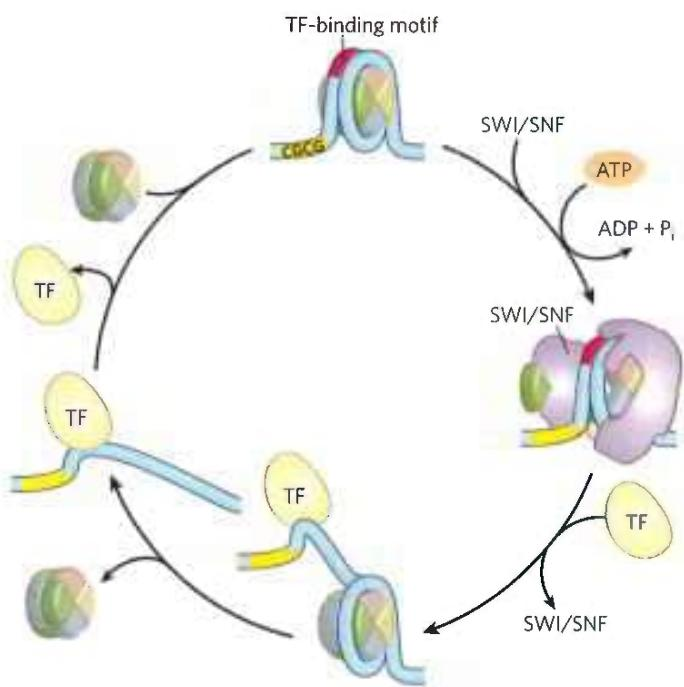  
FIGURE 28-28 Nucleosome ejection by a SWI/SNF remodeler. The SWI/SNF enzyme engulfs the nucleosome, interacting with short CGCG sequences nearby. With the aid of ATP hydrolysis, the DNA is partially separated from the nucleosome, exposing a site for transcription factor (TF) binding. After the transcription factor is bound, the nucleosome is ejected. When transcription is no longer needed, the nucleosome can again replace the transcription factor or factors, completing the cycle. [Information from S. Brahma and S. Henikoff, Trends Biochem. Sci. 45:13, 2020.]

The acetylation and methylation of histones figure prominently in the processes that activate chromatin for transcription. During transcription, histone H3 in nucleosomes is methylated (by specific histone methylases) at Lys $^{4}$ near the 5' end of the coding region and at Lys $^{36}$ within the coding region. These methylations enable the binding of histone acetyltransferases (HATs), enzymes that acetylate particular Lys residues. Cytosolic (type B) HATs acetylate newly synthesized histones before the histones are imported into the nucleus. The subsequent assembly of the histones into chromatin after replication is facilitated by histone chaperones: CAF1 for H3 and H4 (see Box 24-1), and NAP1 for H2A and H2B.

Where chromatin is being activated for transcription, the nucleosomal histones are further acetylated by nuclear (type A) HATs. The acetylation of multiple Lys residues in the amino-terminal domains of histones

H3 and H4 can reduce the affinity of the entire nucleosome for DNA. Acetylation of particular Lys residues is critical for the interaction of nucleosomes with other proteins.

When transcription of a gene is no longer required, the extent of methylation and acetylation of nucleosomes in that vicinity is reduced as part of a general gene-silencing process that restores the chromatin to a transcriptionally inactive state. There are two known classes of demethylases. One class, called LSD (lysine-specific histone demethylases), first converts the $\mathrm{CH}_3$ -N linkage to an imine ( $\mathrm{CH}_2 = \mathrm{N}$ ) linkage, followed by hydrolysis to generate formaldehyde and the demethylated lysine. The other class of demethylases contains JmjC (Jumonji-C) domains, first hydroxylating the methyl group, which is again subsequently removed as formaldehyde. More than 20 JmjC domain-containing histone demethylases are encoded by mammalian genomes. They are part of the same $\alpha$ -ketoglutarate-dependent hydroxylase enzyme family that includes the enzyme that hydroxylates proline residues in collagen (see Box 4-2). These enzymes are strongly inhibited by 2-hydroxyglutarate, an unusual metabolite produced in abundance by a mutated form of isocitrate dehydrogenase that is common in human cancers (see Fig. 16-20). Within the tumors, the high levels of 2-hydroxyglutarate produce global changes in gene expression.

Histone acetylation is reduced by the action of histone deacetylases (HDACs). The deacetylases include SIRT1, SIRT2, SIRT6, and SIRT7, which are NAD $^{+}$ -dependent enzymes in the sirtuin family (SIRT1–7 in mammals). These enzymes deacetylate specific Lys residues in histones and other, cytoplasmic targets. In addition to the removal of certain acetyl groups, new covalent modification of histones marks chromatin as transcriptionally inactive. For example, Lys $^{9}$ of histone H3 is often methylated in heterochromatin.

The net effect of chromatin remodeling in the context of transcription is to make a segment of the chromosome more accessible and to "label" (chemically modify) it so as to facilitate the binding and activity of transcription factors that regulate expression of the gene or genes in that region.

#### [EN] Most Eukaryotic Promoters Are Positively Regulated

As already noted, eukaryotic RNA polymerases have little or no intrinsic affinity for their promoters. P4 The default state of eukaryotic genes is "off," and initiation of transcription is almost always dependent on the action of multiple activator proteins. One important reason for the apparent predominance of positive regulation seems obvious: the storage of DNA within chromatin effectively renders most promoters inaccessible, so genes are silent in the absence of other regulation. The structure of chromatin affects access to some promoters more than others, but repressors that bind to DNA so as to preclude access of RNA polymerase (negative regulation) would often be simply redundant. Other factors must be at play in the use of positive regulation, and speculation generally centers around two: the large size of eukaryotic genomes and the greater efficiency of positive regulation.

First, nonspecific DNA binding of regulatory proteins becomes a more important problem in the much larger genomes of higher eukaryotes. And the chance that a single specific binding sequence will occur randomly at an inappropriate site also increases with genome size. Combinatorial control thus becomes important in a large genome (Fig. 28-29). Specificity for transcriptional activation can be improved if each of several positive regulatory proteins must bind specific DNA sequences to activate a gene. The average number of regulatory sites for a gene in a multicellular organism is six, and genes that are regulated by a dozen such sites are common. The requirement for binding of several positive regulatory proteins to specific DNA sequences vastly reduces the probability of the random occurrence of a functional juxtaposition of all the necessary binding sites. This requirement also reduces the number of regulatory proteins that must be encoded by a genome to regulate all of its genes (Fig. 28-28). Thus, a new regulator is not needed for every gene, although regulation is complex enough in higher eukaryotes that regulatory proteins may represent 5% to 10% of all protein-coding genes.

In principle, a similar combinatorial strategy could be used by multiple negative regulatory elements, but this brings us to the second reason for the use of positive regulation: it is simply more efficient. If the \~20,000 genes in the human genome were negatively regulated, each cell would have to synthesize, at all times, all of the different repressors in concentrations sufficient to permit specific binding to each “unwanted” gene. In positive regulation, most of the genes are usually inactive (that is, RNA polymerases do not bind to the promoters) and the cell synthesizes only the activator proteins needed to promote transcription of the subset of genes required in the cell at that time.

These arguments notwithstanding, there are examples of negative regulation in eukaryotes, from yeasts to humans, as we shall see. Some of that negative regulation involves lncRNAs, which are more economical to synthesize than repressor proteins.

#### [EN] DNA-Binding Activators and Coactivators Facilitate Assembly of the Basal Transcription Factors

To continue our exploration of the regulation of gene expression in eukaryotes, we return to the interactions between promoters and RNA polymerase II (Pol II), the enzyme responsible for the synthesis of eukaryotic mRNAs. Although many (but not all) Pol II promoters include the TATA box and Inr (initiator) sequences, with their standard spacing (see Fig. 26-8), they vary greatly in both the number and the location of additional sequences required for the regulation of transcription.

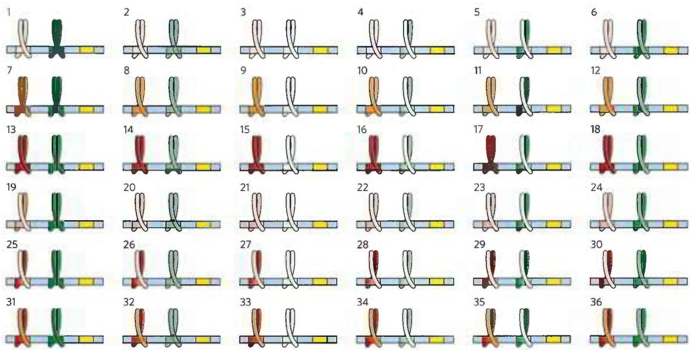  
FIGURE 28-29 The advantages of combinatorial control. Combinatorial control allows specific regulation of many genes using a limited repertoire of regulatory proteins. Consider the possibilities inherent in regulation by two different families of leucine zipper proteins (red and green). If each regulatory gene family had three members (as shown here, in dark, medium, and light shades, each binding to a different DNA sequence) that could freely form either homo- or heterodimers, there  
would be six possible dimeric species in each family and each dimer would recognize a different bipartite regulatory DNA sequence. If a gene had a regulatory site for each protein family, 36 different regulatory combinations would be possible, using just the six proteins from these two families. With six or more sites used in the regulation of a typical eukaryotic gene, the number of possible variants is much greater than this example suggests.

The additional regulatory sequences, generally bound by transcription activators, are usually called enhancers in higher eukaryotes and upstream activator sequences (UASs) in yeast. A typical enhancer may be found hundreds or even thousands of base pairs upstream from the transcription start site, or may even be downstream, within the gene itself. When bound by the appropriate regulatory proteins, an enhancer increases transcription at nearby promoters regardless of its orientation in the DNA. The UASs of yeast function in a similar way, although generally they must be positioned upstream and within a few hundred base pairs of the transcription start site.

Successful binding of the active Pol II holoenzyme at one of its promoters usually requires the combined action of proteins of five types: (1) transcription activators, which bind to enhancers or UASs and facilitate transcription; (2) architectural regulators, which facilitate DNA looping; (3) chromatin modification and remodeling proteins, described above; (4) coactivators; and (5) basal transcription factors, also called general transcription factors (see Fig. 26-9, Table 26-2), required at most Pol II promoters (Fig. 28-30). The coactivators are required for essential communication between activators and the complex composed of Pol II and the basal transcription factors. Coactivators also play a direct role in assembly of the preinitiation complex (PIC). Furthermore, a variety of repressor proteins can interfere with communication between Pol II and the activators, resulting in repression of transcription (Fig. 28-30b). Here we focus on the protein complexes shown in Figure 28-30 and how they interact to activate transcription.

Transcription Activators The requirements for activators vary greatly from one promoter to another. A few are known to activate transcription at hundreds of promoters, whereas others are specific for a few promoters. Many activators are sensitive to the binding of signal molecules, providing the capacity to activate or deactivate transcription in response to a changing cellular environment. Some enhancers bound by activators are quite distant from the promoter's TATA box. Multiple enhancers (often six or more) are bound by a similar number of activators for a typical gene, providing combinatorial control and response to multiple signals.

Some transcription activators can bind to both DNA and RNA, and their function is affected by one or more lncRNAs. The protein NF- $\kappa$ B, for example (Fig. 28-14), activates transcription of many genes involved in the immune response and cytokine production. It can bind to a DNA enhancer site or, alternatively, to an lncRNA called lethe, named after the river of forgetfulness in Greek mythology. The lncRNA reduces transcription of genes controlled by NF- $\kappa$ B.

(a) Activation  

(c)  

Architectural Regulators How do activators function at a distance? The answer in most cases seems to be that, as

FIGURE 28-30 Eukaryotic promoters and regulatory proteins. RNA polymerase II and its associated basal (general) transcription factors form a preinitiation complex at the TATA box and lnr site of the cognate promoters, a process facilitated by transcription activators, acting through coactivators (Mediator, TFIID, or both). (a) A composite promoter with typical sequence elements and protein complexes found in both yeast and higher eukaryotes. The carboxyl-terminal domain (CTD) of Pol II (see Fig. 26-9) is an important point of interaction with Mediator and other protein complexes. Histone modification enzymes (not shown) catalyze methylation and acetylation; remodeling enzymes alter the content and placement of nucleosomes. The transcription activators have distinct DNA-binding domains and activation domains. In some cases, their function is affected by interaction with lncRNAs. Arrows indicate common modes of interaction often required for the activation of transcription. The HMG proteins are a common type of architectural regulator (see Fig. 28-5), allowing the looping of the DNA required to bring together system components bound at distant binding sites. (b) Eukaryotic transcriptional repressors function through a range of mechanisms. Some bind directly to DNA, displacing a protein complex required for activation (not shown); many others interact with various parts of the transcription or activation protein complexes to prevent activation. Possible points of interaction are indicated with arrows. (c) The structure of an HMG protein complex with DNA shows how HMG proteins facilitate DNA looping. The binding is relatively nonspecific, although DNA sequence preferences have been identified for many HMG proteins. Shown here is the HMG domain of the protein HMG-D of Drosophila, bound to DNA. [(c) Data from PDB ID 1QRV, F.V. Murphy IV et al., EMBO J. 18:6610, 1999.]

indicated earlier, the intervening DNA is looped so that the various protein complexes can interact directly. The looping is promoted by architectural regulators that are abundant in chromatin and bind to DNA with limited specificity. Most prominently, the high mobility group (HMG) proteins (Fig. 28-29c; "high mobility" refers to their electrophoretic mobility in polyacrylamide gels) play an important structural role in chromatin remodeling and transcriptional activation.

Coactivator Protein Complexes Most transcription requires the presence of additional protein complexes. Some major regulatory protein complexes that interact with Pol II have been defined both genetically and biochemically. These coactivator complexes act as intermediaries between the transcription activators and the Pol II complex.

Mediator, a complex consisting of 25 (yeast) to 30 (human) polypeptides, is a major eukaryotic coactivator (Fig. 28-30). Many of the 25 core polypeptides are highly conserved from fungi to humans. A subcomplex of four subunits has a kinase role, interacting transiently with the remainder of the Mediator complex, and may dissociate prior to transcription initiation. Mediator binds tightly to the carboxyl-terminal domain (CTD) of the largest subunit of Pol II. The Mediator complex is required for both basal and regulated transcription at many promoters used by Pol II, and it also stimulates phosphorylation of the CTD by TFIIH (a basal transcription factor). Transcription activators interact with one or more components of the Mediator complex, with the precise interaction sites differing from one activator to another. Coactivator complexes function at or near the promoter's TATA box.

Additional coactivators, functioning with one or a few genes, have also been described. Some of these operate in conjunction with Mediator, and some may act in systems that do not employ Mediator.

TATA-Binding Protein and Basal Transcription Factors The first component to bind in the assembly of a preinitiation complex (PIC) at the TATA box of a typical Pol II promoter is the TATA-binding protein (TBP). At promoters lacking a TATA box, TBP is usually delivered as part of a larger complex (13 to 14 subunits) called TFIID. The complete complex also includes the basal transcription factors TFIIB, TFIIE, TFIIF, TFIIH; Pol II; and perhaps TFIIA. This minimal PIC, however, is often insufficient for initiation of transcription and generally does not form at all if the promoter is obscured within chromatin. Positive regulation, leading to transcription, is imposed by the activators and coactivators. Mediator interacts directly with TFIIH and TFIIE, allowing their recruitment to the PIC.

Choreography of Transcriptional Activation We can now begin to piece together the sequence of transcriptional activation events at a typical Pol II promoter (Fig. 28-31). The exact order of binding of some components may vary, but the model in Figure 28-31 illustrates the principles of activation as well as one common path. Many transcription activators have significant affinity for their binding sites even when the sites are within condensed chromatin. The binding of activators is often the event that triggers subsequent activation of the promoter. Binding of one activator may enable the binding of others, gradually displacing some nucleosomes.

Crucial remodeling of the chromatin then takes place in stages, facilitated by interactions between activators and HATs or enzyme complexes such as SWI/SNF, or both. In this way, a bound activator can draw in other components necessary for further chromatin remodeling to permit transcription of specific genes. The bound activators interact with the large Mediator complex. Mediator, in turn, provides an assembly surface for the binding of, first, TBP (or TFIID), then TFIIB, and then other components of the PIC, including Pol II. Mediator stabilizes the binding of Pol II and its associated transcription factors and greatly facilitates formation of the PIC. Complexity in these regulatory circuits is the rule rather than the exception, with multiple DNA-bound activators promoting transcription.

The script can change from one promoter to another. For example, many promoters have a different set of recognition sequences and may not have a TATA box, and in multicellular eukaryotes the subunit composition of factors such as TFIID can vary from one tissue to another. However, most promoters seem to require a precisely ordered assembly of components to initiate transcription. The assembly process is not always fast. For some genes it may take minutes; for certain genes of higher eukaryotes, the process can take days.

  
FIGURE 28-31 The components of transcriptional activation. Activators bind the DNA first. The activators recruit the histone modification/nucleosome remodeling complexes and a coactivator such as Mediator. Mediator facilitates the binding of TBP (or TFIID) and TFIIB, and the other basal transcription factors and Pol II then bind. Phosphorylation of the CTD of Pol II leads to transcription initiation (not shown). [Information from J. A. D'Alessio et al., Mol. Cell 36:924, 2009.]

#### [EN] The Genes of Galactose Metabolism in Yeast Are Subject to Both Positive and Negative Regulation

Some of the general principles described above can be illustrated by one well-studied eukaryotic regulatory circuit (Fig. 28-32). The enzymes required for the importation and metabolism of galactose in yeast are encoded by genes scattered over several chromosomes (Table 28-3). Each of the GAL genes is transcribed separately, and yeast cells have no operons like those in bacteria. However, all the GAL genes have similar promoters and are regulated coordinately by a common set of proteins. The promoters for the GAL genes consist of the TATA box and Inr sequences, as well as an upstream activator sequence (UAS $_{G}$ ) recognized by the transcription activator Gal4 protein (Gal4p). Regulation of gene expression by galactose entails an interplay between Gal4p and two other proteins, Gal80p and Gal3p. Gal80p forms a complex with Gal4p, preventing Gal4p from functioning as an activator of the GAL promoters. When galactose is present, it binds Gal3p, which then interacts with the Gal80p-Gal4p complex and allows Gal4p to function as an activator at the GAL promoters. As the various galactose genes are induced and their products build up, Gal3p may be replaced with Gal1p (a galactokinase needed for galactose metabolism that also acts as a regulator) for sustained activation of the regulatory circuit.

Other protein complexes also have a role in activating transcription of the GAL genes. These include the SAGA complex for histone acetylation and chromatin remodeling, the SWI/SNF complex for chromatin remodeling, and Mediator. The Gal4 protein is responsible for recruitment of these additional factors needed for transcriptional activation. SAGA may be the first and primary recruitment target for Gal4p.

Glucose is the preferred carbon source for yeast, as it is for bacteria. When glucose is present, most of the GAL genes are repressed—whether galactose is present or not. The GAL regulatory system described above is effectively overridden by a complex catabolite repression system that includes several proteins (not depicted in Fig. 28-32).

#### [EN] Transcription Activators Have a Modular Structure

Transcription activators typically have a distinct structural domain for specific DNA binding and one or more additional domains for transcriptional activation or for interaction with other regulatory proteins. Interaction of two regulatory proteins is often mediated by domains containing leucine zippers (Fig. 28-15) or helix-loop-helix motifs (Fig. 28-16). We consider here three distinct types of structural domains used in activation by the transcription activators Gal4p, Sp1, and CTF1 (Fig. 28-33a).

Gal4p contains a zinc finger-like structure in its DNA-binding domain, near the amino terminus; this domain has six Cys residues that coordinate two $Zn^{2+}$ .

  
FIGURE 28-32 Regulation of transcription of GAL genes in yeast. Galactose imported into the yeast cell is converted to glucose 6-phosphate by a pathway involving five enzymes, whose genes are scattered over three chromosomes (see Table 28-3). Transcription of these genes is regulated by the combined actions of the proteins Gal4p, Gal80p, and Gal3p, with Gal4p playing the central role of transcription activator. The Gal4p-Gal80p complex is inactive. Binding of galactose to Gal3p leads to interaction of Gal3p with the Gal80p-Gal4p complex and activates Gal4p. The Gal4p subsequently recruits SAGA, Mediator, and TFIID to the galactose promoters, leading to recruitment of RNA polymerase II and initiation of transcription. Chromatin remodeling to allow transcription also requires a SWI/SNF complex.

The protein functions as a homodimer (with dimerization mediated by interactions between two coiled coils) and binds to UAS $_{G}$ , a palindromic DNA sequence about 17 bp long. Gal4p has a separate activation domain with many acidic amino acid residues. Experiments that substitute a variety of different peptide sequences for the acidic activation domain of Gal4p suggest that the acidic nature of this domain is critical to its function, although its precise amino acid sequence can vary considerably.

<table><tr><td colspan="7">TABLE 28-3 Genes of Galactose Metabolism in Yeast</td></tr><tr><td rowspan="2">Gene</td><td rowspan="2">Protein function</td><td rowspan="2">Chromosomal location</td><td rowspan="2">Protein size (number of residues)</td><td colspan="3">Relative protein expression in different carbon sources</td></tr><tr><td>Glucose</td><td>Glycerol</td><td>Galactose</td></tr><tr><td colspan="7">Regulated genes</td></tr><tr><td>GAL1</td><td>Galactokinase</td><td>II</td><td>528</td><td>-</td><td>-</td><td>+++</td></tr><tr><td>GAL2</td><td>Galactose permease</td><td>XII</td><td>574</td><td>-</td><td>-</td><td>+++</td></tr><tr><td>PGM2</td><td>Phosphoglucomutase</td><td>XIII</td><td>569</td><td>+</td><td>+</td><td>++</td></tr><tr><td>GAL7</td><td>Galactose 1-phosphate uridylyltransferase</td><td>II</td><td>365</td><td>-</td><td>-</td><td>+++</td></tr><tr><td>GAL10</td><td>UDP-glucose 4-epimerase</td><td>II</td><td>699</td><td>-</td><td>-</td><td>+++</td></tr><tr><td>MEL1</td><td>α-Galactosidase</td><td>II</td><td>453</td><td>-</td><td>+</td><td>++</td></tr><tr><td colspan="7">Regulatory genes</td></tr><tr><td>GAL3</td><td>Inducer</td><td>IV</td><td>520</td><td>-</td><td>+</td><td>++</td></tr><tr><td>GAL4</td><td>Transcriptional activator</td><td>XVI</td><td>881</td><td>+/-</td><td>+</td><td>+</td></tr><tr><td>GAL80</td><td>Transcriptional inhibitor</td><td>XIII</td><td>435</td><td>+</td><td>+</td><td>++</td></tr></table>

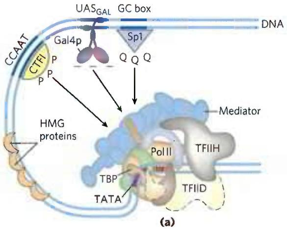

  
FIGURE 28-33 Transcription activators. (a) Typical activators such as CTF1, Gal4p, and Sp1 have a DNA-binding domain and an activation domain. The nature of the activation domain is indicated by symbols: -- -, acidic; Q Q Q, glutamine-rich; P P P, proline-rich. These proteins generally activate transcription by interacting with coactivator complexes such as Mediator. Note that the binding sites illustrated here are not generally found together near a single gene. (b) A chimeric protein containing the DNA-binding domain of Sp1 and the activation domain of CTF1 activates transcription if a GC box is present.

Sp1 ( $M_{r}$ 80,000) is a transcription activator for many genes in higher eukaryotes. Its DNA-binding site, the GC box (consensus sequence GGGCGG), is usually quite near the TATA box. The DNA-binding domain of the Sp1 protein is near its carboxyl terminus and contains three zinc fingers. Two other domains in Sp1 function in activation and are notable in that 25% of their amino acid residues are Gln. A wide variety of other activator proteins also have these glutamine-rich domains.

CTF1 (CCAAT-binding transcription factor 1) belongs to a family of transcription activators that bind a sequence called the CCAAT site (its consensus sequence is TGGN $_{6}$ GCCAA, where N is any nucleotide). The DNA-binding domain of CTF1 contains many basic amino acid residues, and the binding region is probably arranged as an $\alpha$ helix. This protein has neither a helix-turn-helix motif nor a zinc finger motif; its DNA-binding mechanism is not yet clear. CTF1 has a proline-rich activation domain, with Pro accounting for more than 20% of the amino acid residues.

The discrete activation and DNA-binding domains of regulatory proteins often act completely independently, as has been demonstrated in "domain-swapping" experiments. Genetic engineering techniques (Chapter 9) can join the proline-rich activation domain of CTF1 to the DNA-binding domain of Sp1 to create a protein that, like intact Sp1, binds to GC boxes on the DNA and activates transcription at a nearby promoter (as in Fig. 28-33b). The DNA-binding domain of Gal4p has similarly been replaced experimentally with the DNA-binding domain of the E. coli LexA repressor (of the SOS response; Fig. 28-21). This chimeric protein neither binds at UAS $_{G}$ nor activates the yeast GAL genes (as would intact Gal4p) unless the UAS $_{G}$ sequence in the DNA is replaced by the LexA recognition site.

#### [EN] Eukaryotic Gene Expression Can Be Regulated by Intercellular and Intracellular Signals

The effects of steroid hormones (and of thyroid and retinoid hormones, which have a similar mode of action) provide additional well-studied examples of the modulation of eukaryotic regulatory proteins by direct interaction with molecular signals (see Fig. 12-34). Unlike other types of hormones, steroid hormones do not have to bind to plasma membrane receptors. Instead, they can interact with intracellular receptors that are transcription activators. Steroid hormones too hydrophobic to dissolve readily in the blood (estrogen, progesterone, and cortisol, for example) travel on specific carrier proteins from their point of release to their target tissues. In the target tissue, the hormone passes through the plasma membrane by simple diffusion. Once inside the cell, the hormone interacts with one of two types of steroid-binding nuclear receptor (Fig. 28-34). In both cases, the hormone-receptor complex acts by binding to highly specific DNA sequences called hormone response elements (HREs), thereby altering gene expression. Acting at these sites, the receptors act as transcription activators, recruiting coactivators and Pol II (plus its associated transcription factors) to trigger transcription of the gene.

The DNA sequences (HREs) to which hormone-receptor complexes bind are similar in length and arrangement for the various steroid hormones, but they differ in sequence. Each receptor has a consensus HRE sequence (Table 28-4) to which the hormone-receptor complex binds well, with each consensus consisting of two six-nucleotide sequences, either contiguous or separated by three nucleotides, in tandem or in a palindromic arrangement. The hormone receptors have a highly conserved DNA-binding domain with two zinc

FIGURE 28-34 Mechanisms of steroid hormone receptor function. There are two types of steroid-binding nuclear receptors. (a) Monomeric type I receptors (NR) are found in the cytoplasm, in a complex with the heat shock protein Hsp70. Receptors for estrogen, progesterone, androgens, and glucocorticoids are of this type. When the steroid hormone binds, the Hsp70 dissociates and the receptor dimerizes, exposing a nuclear localization signal. The dimeric receptor, with hormone bound, migrates to the nucleus, where it binds to a hormone response element (HRE) and acts as a transcription activator. The activity of the receptor can be repressed by binding to an IncRNA (such as GASS), which competes directly with binding to the HRE. (b) Type II receptors, by contrast, are always in the nucleus, bound to an HRE in the DNA and to a corepressor that renders the receptor inactive. The thyroid hormone receptor (TR) is of this type. The hormone migrates through the cytoplasm and diffuses across the nuclear membrane. In the nucleus it binds to a heterodimer consisting of the thyroid hormone receptor and the retinoid X receptor (RXR). A conformation change leads to dissociation of the corepressor, and the receptor then functions as a transcription activator.

fingers (Fig. 28-35). The hormone-receptor complex binds to the DNA as a dimer, with the zinc finger domains of each monomer recognizing one of the six-nucleotide sequences. The ability of a given hormone to act through the hormone-receptor complex to alter the expression of a specific

  
TABLE 28-4 Hormone Response Elements (HREs) Bound by Steroid-Type Hormone Receptors

<table><tr><td>Receptor</td><td>HRE consensus sequence bounda</td></tr><tr><td>Androgen</td><td>GG(A/T)ACAN2TGTTCT</td></tr><tr><td>Glucocorticoid</td><td>GGTACAN3TGTTCT</td></tr><tr><td>Retinoic acid (some)</td><td>AGGTCAN5AGGTCA</td></tr><tr><td>Vitamin D</td><td>AGGTCAN3AGGTCA</td></tr><tr><td>Thyroid hormone</td><td>AGGTCAN3AGGTCA</td></tr><tr><td>RXb</td><td>AGGTCANAGGTCANAG GTCANAGGTCA</td></tr></table>

$^{a}$ N represents any nucleotide.  
$^{b}$ Forms a dimer with the retinolic acid receptor or vitamin D receptor.

  
FIGURE 28-35 Typical steroid hormone receptors. These receptor proteins have a binding site for the hormone, a DNA-binding domain, and a region that activates transcription of the regulated gene. The highly conserved DNA-binding domain has two zinc fingers. The sequence shown here is that for the estrogen receptor, but the residues in bold type are common to all steroid hormone receptors.

gene depends on the exact sequence of the HRE, its position relative to the gene, and the number of HREs associated with the gene.

The ligand-binding region of the receptor protein—always at the carboxyl terminus—is specific to the particular receptor. For example, in the ligand-binding region, the glucocorticoid receptor is only 30% similar to the estrogen receptor and 17% similar to the thyroid hormone receptor. The size of the ligand-binding region varies dramatically; in the vitamin D receptor it has only 25 amino acid residues, whereas in the mineralocorticoid receptor it has 603 residues. Mutations that change one amino acid residue in these regions can result in loss of responsiveness to a specific hormone. Some humans unable to respond to cortisol, testosterone, vitamin D, or thyroxine have mutations of this type.

P2 The lncRNAs introduce another dimension to regulation by hormone receptors. An lncRNA called GAS5 (growth arrest specific 5) inhibits transcriptional activation by the glucocorticoid receptor by directly competing with DNA for receptor binding. GAS5 also inhibits activity of the closely related androgen, progesterone, and mineralocorticoid receptors. In addition, GAS5 interacts with and sequesters an miRNA called miR-21, which interacts with and inhibits the activity of some regulatory proteins that act as tumor suppressors. Expression of GAS5 is suppressed in a wide range of tumors, resulting in increased expression of steroid hormones, higher levels of active miR-21, and faster tumor growth. Low GAS5 levels thus correlate with worsened outcomes for cancer patients, making this lncRNA a subject of intense ongoing investigation.

Some hormone receptors, including the human progesterone receptor, activate transcription with the aid of a different lncRNA of \~700 nucleotides that acts as a coactivator—steroid receptor RNA activator (SRA). SRA is part of a ribonucleoprotein complex, but it is the RNA component that is required for transcription coactivation. The detailed set of interactions between SRA and other components of the regulatory systems for these genes remains to be worked out.

#### [EN] Regulation Can Result from Phosphorylation of Nuclear Transcription Factors

We noted in Chapter 12 that the effects of insulin on gene expression are mediated by a series of steps leading ultimately to the activation of a protein kinase in the nucleus that phosphorylates specific DNA-binding proteins, thereby altering their ability to act as transcription factors (see Fig. 12-22). This general mechanism mediates the effects of many nonsteroid hormones. For example, the $\beta$ -adrenergic pathway that leads to elevated levels of cytosolic cAMP, which acts as a second messenger in both eukaryotes and bacteria (Fig. 28-18), also affects the transcription of a set of genes, each of which is located near a specific DNA sequence called a cAMP response element (CRE). The catalytic subunit of protein kinase A, released when cAMP levels rise (see Fig. 12-6), enters the nucleus and phosphorylates a nuclear protein, the CRE-binding protein (CREB). When phosphorylated, CREB binds to CREs near certain genes and acts as a transcription factor, turning on expression of these genes.

#### [EN] Many Eukaryotic mRNAs Are Subject to Translational Repression

P1 Regulation at the level of translation assumes a much more prominent role in eukaryotes than in bacteria and is observed in a range of cellular situations. In contrast to the tight coupling of transcription and translation in bacteria, the transcripts generated in a eukaryotic nucleus must be processed and transported to the cytoplasm before translation. This can impose a significant delay on the appearance of a protein. When a rapid increase in protein production is needed, a translationally repressed mRNA already in the cytoplasm can be activated for translation without delay. Translational regulation may play an especially important role in regulating certain very long eukaryotic genes (a few are measured in the millions of base pairs), for which transcription and mRNA processing can require many hours. Some genes are regulated at both the transcriptional and translational stages, with the latter playing a role in the fine-tuning of cellular protein levels. In some non-nucleated cells, such as reticulocytes (immature erythrocytes), transcriptional control is entirely unavailable and translational control of stored mRNAs becomes essential. As described below, translational controls can also have spatial significance during development, when the regulated translation of prepositioned mRNAs creates a local gradient of the protein product.

Eukaryotes have at least four main mechanisms of translational regulation:

1. Translation initiation factors are subject to phosphorylation by protein kinases. The phosphorylated forms are often less active and cause a general depression of translation in the cell.

2. Some proteins bind directly to mRNA and act as translational repressors, many of them binding at specific sites in the 3' untranslated region (3'UTR). So positioned, these proteins interact with other translation initiation factors bound to the mRNA, or with the 40S ribosomal subunit, to prevent translation initiation (Fig. 28-36).

3. Binding proteins, present in eukaryotes from yeast to mammals, disrupt the interaction between eIF4E and eIF4G (see Fig. 27-27). The mammalian versions are known as 4E-BPs (eIF4E binding proteins). When cell growth is slow, these proteins limit translation by binding to the site on eIF4E that normally interacts with eIF4G. When cell growth resumes or increases in response to growth factors or other stimuli, the binding proteins are inactivated by protein kinase-dependent phosphorylation.

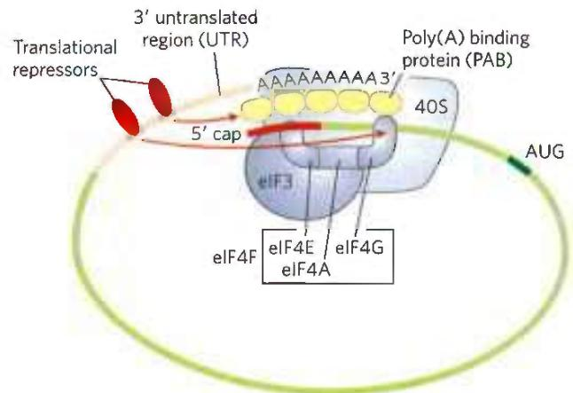  
FIGURE 28-36 Translational regulation of eukaryotic mRNA. One of the most important mechanisms for translational regulation in eukaryotes is the binding of translational repressors (RNA-binding proteins) to specific sites in the 3' untranslated region (3'UTR) of the mRNA. These proteins interact with eukaryotic initiation factors or with the ribosome to prevent or slow translation.

4. RNA-mediated regulation of gene expression often occurs at the level of translational repression, often by the binding of ncRNAs to mRNAs.

The variety of translational regulation mechanisms provides flexibility, allowing focused repression of a few mRNAs or global regulation of all cellular translation.

Translational regulation has been particularly well studied in reticulocytes. One such mechanism in these cells involves eIF2, the initiation factor that binds to the initiator tRNA and conveys it to the ribosome; when Met-tRNA has bound to the P site, the factor eIF2B binds to eIF2, recycling it with the aid of GTP binding and hydrolysis. The maturation of reticulocytes includes destruction of the cell nucleus, leaving behind a plasma membrane packed with hemoglobin. Messenger RNAs deposited in the cytoplasm before the loss of the nucleus allow for the replacement of hemoglobin. When reticulocytes become deficient in iron or heme, the translation of globin mRNAs is repressed. A protein kinase called HCR (hemin-controlled repressor) is then activated, catalyzing the phosphorylation of eIF2. When phosphorylated, eIF2 forms a stable complex with eIF2B that sequesters the eIF2, making it unavailable for participation in translation. In this way, the reticulocyte coordinates the synthesis of globin with the availability of heme.

#### [EN] Posttranscriptional Gene Silencing Is Mediated by RNA Interference

In higher eukaryotes, including nematodes, fruit flies, plants, and mammals, microRNAs (miRNAs) mediate the silencing of many genes. In a phenomenon first described and explained by Craig Mello and Andrew Fire, the RNAs function by interacting with mRNAs, often in the 3'UTR, resulting in either degradation of the mRNA or inhibition of translation. In either case, the mRNA, and thus the gene that produces it, is silenced. This form of gene regulation controls developmental timing in at least some organisms. It is also used as a mechanism to protect against invading RNA viruses (particularly important in plants, which lack an immune system) and to control the activity of transposons. In addition, small RNA molecules may play a critical (as yet undefined) role in the formation of heterochromatin.

Many miRNAs are present only transiently during development, and these are sometimes referred to as small temporal RNAs (stRNAs). Thousands of different miRNAs have been identified in higher eukaryotes, and they may affect the regulation of a third of mammalian genes. They are transcribed as precursor RNAs \~70 nucleotides long, with internally complementary sequences that form hairpinlike structures. Details of the pathway for processing of miRNAs were described in Fig. 26-26). The precursors are cleaved by endonucleases such as Drosha and Dicer to form short duplexes of 20 to 25 nucleotides. One strand of the processed miRNA is transferred to the target mRNA (or to a viral or transposon RNA), leading to inhibition of translation or degradation of the mRNA (Fig. 28-37a). Some miRNAs bind to and affect a single mRNA and thus affect expression of only one gene. Others interact with multiple mRNAs and form the mechanistic core of regulons that coordinate the expression of multiple genes.

This gene regulation mechanism has an interesting and very useful practical side. If an investigator introduces into an organism a duplex RNA molecule corresponding in sequence to virtually any mRNA, Dicer cleaves the duplex into short segments, called small interfering RNAs (siRNAs). These bind to the mRNA and silence it (Fig. 28-37b). The process is known as RNA interference (RNAi). In plants, almost any gene can be effectively shut down in this way. Nematodes can readily ingest entire functional RNAs, and simply introducing the duplex RNA into the worm's diet produces very effective suppression of the target gene. The technique is an important tool in the ongoing efforts to study gene function, because it can disrupt gene function without creating a mutant organism. The procedure can be applied to humans as well. Laboratory-produced siRNAs have been used to block HIV and poliovirus infections in cultured human cells for a week or so at a time. The wider application of RNAi-based pharmaceuticals was initially stymied by the difficulty inherent in delivering RNAi molecules to their required target, given the many nucleases that degrade RNA in human tissues. With recent advances in delivery methods, there are now more than a dozen RNAi pharmaceuticals in advanced clinical trials to treat a range of conditions, from familial amyloidotic polyneuropathy to viral infections and cancer.

  
FIGURE 28-37 Gene silencing by RNA interference. (a) Small temporal RNAs (stRNAs, a class of miRNAs) are generated by Dicer-mediated cleavage of longer precursors that fold to create duplex regions. The stRNAs then bind to mRNAs, leading to degradation of mRNA or inhibition of translation. (b) Double-stranded RNAs designed to interact with a particular target and to function as Dicer substrates can be constructed and introduced into a cell. Dicer processes the duplex RNAs into small interfering RNAs (siRNAs), which interact with the target mRNA. Again, either the mRNA is degraded or translation is inhibited.

#### [EN] RNA-Mediated Regulation of Gene Expression Takes Many Forms in Eukaryotes

All RNAs (regardless of their length) that do not encode proteins, including rRNAs and tRNAs, come under the general designation of ncRNAs. Mammalian genomes encode more ncRNAs than coding mRNAs. The ncRNAs in eukaryotes include miRNAs, described above; snRNAs, involved in RNA splicing (see Fig. 26-16); snoRNAs, involved in rRNA modification (see Fig. 26-24); and lncRNAs, already encountered in this chapter. Not surprisingly, additional functional classes of ncRNAs are still being discovered. P2 Here we describe a few more examples of ncRNAs that participate in gene regulation, which are designated lncRNAs when their length exceeds 200 nucleotides.

Heat shock factor 1 (HSF1) is an activator protein that, in nonstressed cells, exists as a monomer bound by the chaperone Hsp90. Under stress conditions, HSF1 is released from Hsp90 and trimerizes. The HSF1 trimer binds to DNA and activates transcription of genes encoding products required to deal with the stress. An lncRNA called HSR1 (heat shock RNA 1; \~600 nucleotides) stimulates HSF1 trimerization and DNA binding. HSR1 does not act alone; it functions in a complex with the translation elongation factor eEF1A.

Additional RNAs affect transcription in a variety of ways. A 331 nucleotide lncRNA called 7SK, abundant in mammals, binds to the Pol II transcription elongation factor pTEFb (see Table 26-2) and represses transcript elongation. The ncRNA B2 (\~178 nucleotides) binds directly to Pol II during heat shock and represses transcription. The B2-bound Pol II assembles into stable PICs, but transcription is blocked. The mechanism that allows HSF1-responsive genes to be expressed in the presence of B2 remains to be worked out.

The recognized roles of ncRNAs in gene expression and in many other cellular processes are rapidly expanding. At the same time, the study of the biochemistry of gene regulation is becoming much less protein-centric.

#### [EN] Development Is Controlled by Cascades of Regulatory Proteins

For sheer complexity and intricacy of coordination, the patterns of gene regulation that bring about development of a zygote into a multicellular animal or plant have no peer. Development requires transitions in morphology and protein composition that depend on tightly coordinated changes in expression of the genome. More genes are expressed during early development than in any other part of the life cycle. For example, in the sea urchin, an oocyte has about 18,500 different mRNAs, compared with about 6,000 different mRNAs in the cells of a typical differentiated tissue. The mRNAs in the oocyte give rise to a cascade of events that regulate the expression of many genes across both space and time.

Several organisms have emerged as important model systems for the study of development, because they are easy to maintain in a laboratory and have relatively short generation times. These include nematodes, fruit flies, zebra fish, mice, and the plant Arabidopsis. Here, we provide a brief discussion of the development of fruit flies. Our understanding of the molecular events during development of Drosophila melanogaster is particularly well advanced and can be used to illustrate patterns and principles of general significance.

The life cycle of the fruit fly includes complete metamorphosis during its progression from an embryo to an adult (Fig. 28-38). Among the most important characteristics of the embryo are its polarity (the anterior and posterior parts of the animal are readily distinguished, as are its dorsal and ventral surfaces) and its metamerism (the embryo body is made up of serially repeating segments, each with characteristic features). During development, these segments become organized into a head, thorax, and abdomen. Each segment of the adult thorax has a different set of appendages. Development of this complex pattern is under genetic control, and a variety of pattern-regulating genes have been discovered that greatly affect the organization of the body.

The Drosophila egg, along with 15 nurse cells, is surrounded by a layer of follicle cells (Fig. 28-39). As the egg cell forms (before fertilization), mRNAs and proteins originating in the nurse and follicle cells are deposited in the egg cell, where some play a critical role in development. Once a fertilized egg is laid, its nucleus divides and the nuclear descendants continue to divide in synchrony every 6 to 10 min. Plasma membranes are not formed around the nuclei, which are distributed within the egg cytoplasm, forming a syncytium. Between the eighth and eleventh rounds of nuclear division, the nuclei migrate to the outer layer of the egg, forming a monolayer of nuclei surrounding the common yolk-rich cytoplasm; this is the syncytial blastoderm. After a few additional divisions, membrane invaginations surround the nuclei to create a layer of cells that form the cellular blastoderm. At this stage, the mitotic cycles in the various cells lose their synchrony. The developmental fate of the cells is determined by the mRNAs and proteins originally deposited in the egg by the nurse and follicle cells.

Proteins that, through changes in local concentration or activity, cause the surrounding tissue to take up a particular shape or structure are sometimes referred to as morphogens; they are the products of pattern-regulating genes. As defined by Christiane Nüsslein-Volhard, Edward B. Lewis, and Eric F. Wieschaus, three major classes of pattern-regulating genes — maternal, segmentation, and homeotic genes — function in successive stages of development to specify the basic features of the Drosophila embryo body. Maternal genes are expressed in the unfertilized egg, and the resulting maternal mRNAs remain dormant until fertilization.

  
FIGURE 28-38 Life cycle of the fruit fly Drosophila melanogaster. Drosophila undergoes a complete metamorphosis, which means that the adult insect is radically different in form from its immature stages, a transformation that requires extensive alterations during development. By the late embryonic stage,  
segments have formed, each containing specialized structures from which the various appendages and other features of the adult fly will develop. (Late embryo: Courtesy of F. R. Turner, Department of Biology, University of Indiana, Bloomington. Other photos: Courtesy of Prof. Dr. Christian Klambt, Westfälische Wilhelms-Universität Münster, Institut für Neuro- und Verhaltensbiologie.)

FIGURE 28-39 Early development in Drosophila. During development of the egg, maternal mRNAs and proteins are deposited in the developing oocyte (unfertilized egg cell) by nurse cells and follicle cells. After fertilization, the nuclei of the egg divide in synchrony within the common cytoplasm (syncytium), then migrate to the periphery. Membrane invaginations surround the nuclei to create a monolayer of cells at the periphery; this is the cellular blastoderm stage. During the early nuclear divisions, several nuclei at the far posterior become pole cells, which later become the germ-line cells.  

These provide most of the proteins needed in very early development, until the cellular blastoderm is formed. Some of the proteins encoded by maternal mRNAs direct the spatial organization of the developing embryo at early stages, establishing its polarity. Segmentation genes, transcribed after fertilization, direct the formation of the proper number of body segments. At least three subclasses of segmentation genes act at successive stages: gap genes divide the developing embryo into several broad regions; pair-rule genes, together with segment polarity genes, define 14 stripes that become the 14 segments of a normal embryo. Homeotic genes are expressed still later; they specify which organs and appendages will develop in particular body segments.

If all cells divided to produce two identical daughter cells, multicellular organisms would never be more than a ball of identical cells. A key event in very early development is establishment of mRNA and protein gradients along the body axes, producing asymmetric cell divisions and different cell fates. Some maternal mRNAs have protein products that diffuse through the cytoplasm to create an asymmetric distribution in the egg. Different cells in the cellular blastoderm therefore inherit different amounts of these proteins, setting the cells on different developmental paths. An example is the bicoid gene. The bicoid gene product is a major anterior morphogen. The mRNA from the bicoid gene is synthesized by nurse cells and deposited in the unfertilized egg near its anterior pole. Translated soon after fertilization, the Bicoid protein diffuses through the cell to create, by the seventh nuclear division, a concentration gradient radiating out from the anterior pole (Fig. 28-40). The Bicoid protein contains a homeodomain (p. 1062), encoded by a gene sequence motif called a homeobox and found in many proteins involved in regulating development. Bicoid is multifunctional—a transcription factor that activates the expression of several segmentation genes and also a translational repressor that inactivates certain mRNAs. The amount of Bicoid protein in various parts of the embryo increases or decreases the expression of other genes in a threshold-dependent manner. As its concentration varies along its gradient, interactions of the bicoid gene product with proteins and RNAs encoded by the nanos, pumilio, caudal, hunchback, and other regulatory genes also vary to produce different effects along the axis of the developing organism. This results in different developmental fates of cells in the blastoderm, depending on their location.

  
(a)  
FIGURE 28-40 Distribution of a maternal gene product in a Drosophila egg. (a) Micrograph of an immunologically stained egg (top), showing distribution of the bicoid (bcd) gene product. The graph shows stain intensity along the length of the egg. This distribution is essential for normal development of the anterior structures in the larva (bottom). (b) If the bcd

Humans do not resemble fruit flies, but the genes and mechanisms involved in development are nevertheless highly conserved. This can be seen in the gene clusters encoding the homeotic or Hox genes, the latter term derived from homeobox. Drosophila has one such cluster, while humans have four (Fig. 28-41), with the genes within the clusters remarkably similar from nematodes to humans.

The many regulatory genes in these three classes direct the development of an adult fly, with a head, thorax, and abdomen, with the proper number of segments, and with the correct appendages on each segment. Although embryogenesis takes about a day to complete, all these genes are activated during the first four hours. Some mRNAs and proteins are present for only a few minutes at specific points during this period. Some of the genes code for transcription factors that affect the expression of other genes in a kind of developmental cascade. Regulation at the level of translation also occurs, and many of the regulatory genes encode translational repressors, most of which bind to the 3'UTR of the mRNA (Fig. 28-36). Because many mRNAs are deposited in the egg long before their translation is required, translational repression provides an especially important avenue for regulation in developmental pathways.

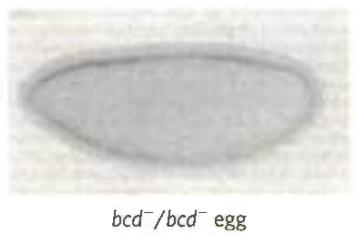

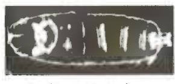  
(b)  
gene is not expressed by the mother (bcd $^{-}$ /bcd $^{-}$ mutant) and thus no bicoid mRNA is deposited in the egg, the resulting larva has two posteriors (and soon dies). [Republished with permission of Elsevier, from "The bicoid protein determines position in the Drosophila embryo in a concentration-dependent manner" by Wolfgang Driever and Christiane Nüsslein-Volhard, Cell 5483–93, July 1, 1988; permission conveyed through Copyright Clearance Center, Inc.]

Many of the principles of development outlined above apply to other eukaryotes, from nematodes to humans. Some of the regulatory proteins are conserved. For example, the products of the homeobox-containing genes HOXA7 in mouse and antennapedia in fruit fly differ in only one amino acid residue. Of course, although the molecular regulatory mechanisms may be similar, many of the ultimate developmental events are not conserved (humans do not have wings or antennae). The different outcomes are brought about by differences in the downstream target genes controlled by the Hox genes. The discovery of structural determinants with identifiable molecular functions is the first step in understanding the molecular events underlying development. As more genes and their protein products are discovered, the biochemical side of this vast puzzle will be elucidated in increasingly rich detail.

#### [EN] Stem Cells Have Developmental Potential That Can Be Controlled

If we can understand development, and the mechanisms of gene regulation behind it, we can control it. An adult human has many different types of tissues. Many of the cells are terminally differentiated and no longer divide. If an organ malfunctions due to disease, or a limb is lost in an accident, the tissues are not readily replaced. Most cells, because of the regulatory processes in place, or even because of the loss of some or all of the genomic DNA, are not easily reprogrammed. Medical science has made organ transplants possible, but organ donors are a limited resource and organ rejection remains a major medical problem. If humans could regenerate their own organs or limbs or nervous tissue, rejection would no longer be an issue. Cures for kidney failure or neurodegenerative disorders could become reality.

(a)  
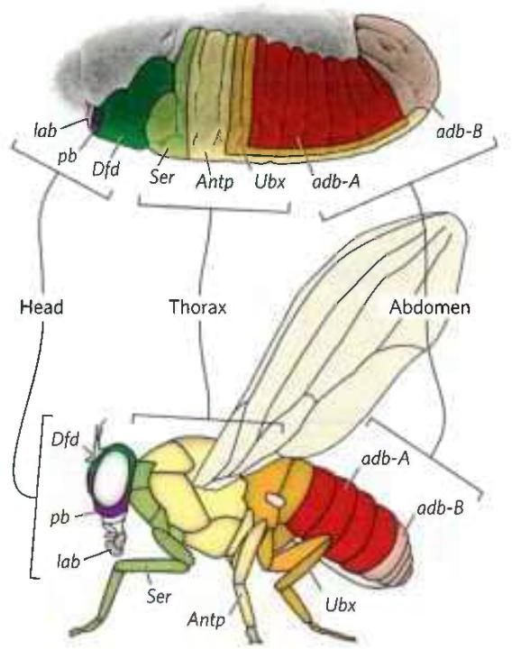

(b)  
  
FIGURE 28-41 The Hox gene clusters and their effects on development. (a) Each Hox gene in the fruit fly is responsible for the development of structures in a defined part of the body and is expressed in defined regions of the embryo, as labeled. (b) Drosophila has one Hox gene cluster; the human genome has four. Many of these genes are highly conserved in multicellular animals. Evolutionary relationships, as indicated by sequence alignments, between genes in the fruit fly Hox gene cluster and those in the mammalian Hox gene clusters are shown by dashed lines. Similar relationships among the four sets of mammalian Hox genes are indicated by vertical alignment. [(a) Information from F. R. Turner, University of Indiana, Department of Biology.]

The key to tissue regeneration lies in stem cells—cells that have retained the capacity to differentiate into various tissues. In humans, after an egg is fertilized, the first few cell divisions create a ball of totipotent cells, called the morula, that have the capacity to differentiate individually into any tissue or even into a complete organism (Fig. 28-42). Continued cell division produces a hollow ball, the blastocyst. The outer cells of the blastocyst eventually form the placenta. The inner layers form the germ layers of the developing fetus—the ectoderm, mesoderm, and endoderm. These cells are pluripotent: they can give rise to cells of all three germ layers and can differentiate into many types of tissues. However, they cannot differentiate into a complete organism. Some of these cells are unipotent: they can develop into only one type of cell and/or tissue. It is the pluripotent cells of the blastocyst, the embryonic stem cells, that are currently used in embryonic stem cell research.

  
FIGURE 28-42 Totipotent and pluripotent stem cells. Cells at the morula stage are totipotent and have the capacity to differentiate into a complete organism. The source of pluripotent embryonic stem cells is the cells in the cavity of the blastocyst. Pluripotent cells give rise to many tissue types but cannot form complete organisms.

Stem cells have two functions: to replenish themselves and, at the same time, provide cells that can differentiate. These tasks are accomplished in multiple ways (Fig. 28-43a). All or parts of the stem cell population can, in principle, be involved in replenishment, differentiation, or both.

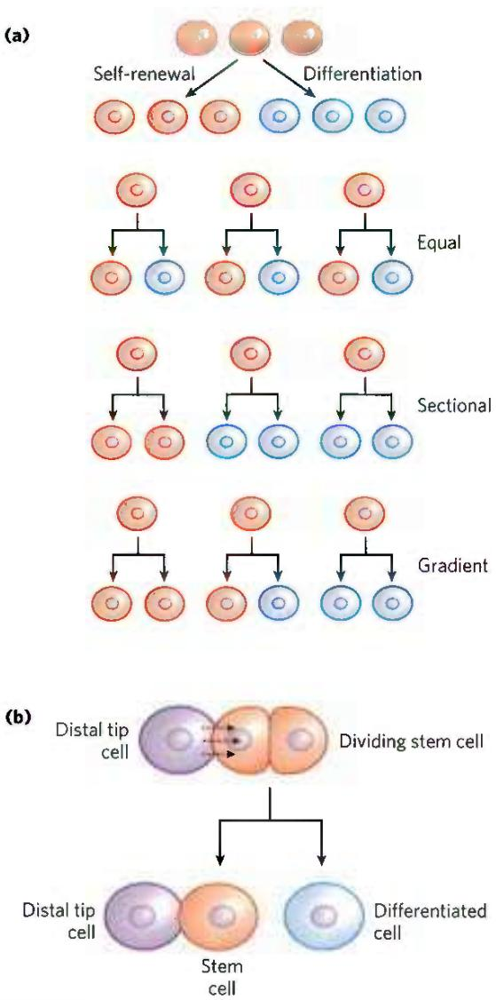  
FIGURE 28-43 Stem cell proliferation versus differentiation and development. Stem cells must strike a balance between self-renewal and differentiation. (a) Some possible cell division patterns that allow the replenishment of stem cells and production of some differentiated cells. Each cell may produce one stem cell and one differentiated cell, or two differentiated cells, or two stem cells in defined parts of the tissue or culture. Or a gradient of growth conditions can be established, with cell fates differing from one end of the gradient to the other. (b) Establishing a developmental niche through stem cell contact with a cell or group of cells. Molecular signals provided by the niche cells (in this case, in plants, a distal tip cell) help orient the mitotic spindle for stem cell division and ensure that one daughter cell retains stem cell properties.

Other types of stem cells can potentially be used for medical benefit. In the adult organism, adult stem cells, as products of additional differentiation, have a more limited potential for further development than do embryonic stem cells. For example, the hematopoietic stem cells of bone marrow can give rise to many types of blood cells and also to cells with the capacity to regenerate bone. They are referred to as multipotent. However, these cells cannot differentiate into a liver or kidney or neuron. Adult stem cells are often said to have a niche, a microenvironment that promotes stem cell maintenance while allowing differentiation of some daughter cells as replacements for cells in the tissue they serve (Fig. 28-43b). Hematopoietic stem cells in the bone marrow occupy a niche in which signaling from neighboring cells and other cues maintain the stem cell lineage. At the same time, some daughter cells differentiate to provide needed blood cells. Understanding the niche in which stem cells operate, and the signals the niche provides, is essential in efforts to harness the potential of stem cells for tissue regeneration. The identification and culturing of pluripotent stem cells from human blastocysts was reported by James Thomson and colleagues in 1998. This advance led to the long-term availability of established cell lines for research.

All stem cells present problems for human medical applications. Adult stem cells have a limited capacity to regenerate tissues, are generally present in small numbers, and are hard to isolate from an adult human. Embryonic stem cells have much greater differentiation potential and can be cultured to generate large numbers of cells, but their use is accompanied by ethical concerns related to the necessary destruction of human embryos. Identifying a source of plentiful and medically useful stem cells that does not raise such concerns remains a major goal of medical research.

Our ability to culture stem cells (i.e., maintain them in an undifferentiated state), and to manipulate them to grow and differentiate into particular tissues, is very much a function of our understanding of developmental biology.

Thus far, mouse and human embryonic stem cells have been used for most research. Although both types of stem cells are pluripotent, they require very different culture conditions, optimized to allow cell division indefinitely without differentiation. Mouse embryonic stem cells are grown on a layer of gelatin and require the presence of leukemia inhibitory factor (LIF). Human embryonic stem cells are grown on a feeder layer of mouse embryonic fibroblasts and require basic fibroblast growth factor (bFGF, or FGF2). The use of a feeder cell layer implies that the mouse cells are providing a diffusible product or some surface signal, not yet known, that is needed by human stem cells to either promote cell division or prevent differentiation.

A significant advance, reported in 2007, centers on success in reversing differentiation. In effect, skin

#### [EN] Of Fins, Wings, Beaks, and Things

South America has several species of seed-eating finches, commonly called grassquits. About 3 million years ago, a small group of grassquits, of a single species, took flight from the continent's Pacific coast. Perhaps driven by a storm, they lost sight of land and traveled nearly 1,000 km. Small birds such as these might easily have perished on such a journey, but the smallest of chances brought this group to a newly formed volcanic island in an archipelago later to be known as the Galápagos. It was a virgin landscape with untapped plant and insect food sources, and the newly arrived finches survived. Over the years, new islands formed and were colonized by new plants and insects — and by the finches. The birds exploited the new resources on the islands, and groups of birds gradually specialized and diverged into new species. By the time Charles Darwin stepped onto the islands in 1835, many different finch species were to be found on the various islands of the archipelago, feeding on seeds, fruits, insects, pollen, or even blood.

The diversity of living creatures was a source of wonder for humans long before scientists sought to understand its origins. The extraordinary insight handed down to us by Darwin, inspired in part by his encounter with the Galápagos finches, provided a broad explanation for the existence of organisms with a vast array of appearances and characteristics. It also gave rise to many questions about the mechanisms underlying evolution. Answers to those questions have started to appear, first through the study of genomes and nucleic acid metabolism in the last half of the twentieth century, and more recently through an emerging field nicknamed evo-devo—a blend of evolutionary and developmental biology.

In its modern synthesis, the theory of evolution has two main elements: mutations in a population generate genetic diversity; natural selection then acts on this diversity to favor individuals with more useful genomic tools and to disfavor others. Mutations occur at significant rates in every individual's genome, in every cell (see Section 8.3). Advantageous mutations in single-celled organisms or in the germ line of multicellular organisms can be inherited, and they are more likely to be inherited (that is, passed on to greater numbers of

cells—first from mice, then from humans—have been reprogrammed to take on the characteristics of pluripotent stem cells. The reprogramming involves manipulations to get the cells to express at least four transcription factors, Oct4, Sox2, Nanog, and Lin28, all of which are known to help maintain the stem cell-like state. Gradual improvements in this technology may make the harvesting of embryonic stem cells unnecessary and provide a source of stem cells that is genetically matched to a prospective patient.

offspring) if they confer an advantage. It is a straightforward scheme. But many have wondered whether it is enough to explain, say, the many different beak shapes in the Galápagos finches or the diversity of size and shape among mammals. Until recent decades, there were several widely held assumptions about the evolutionary process: that many mutations and new genes would be needed to bring about a new physical structure, that more-complex organisms would have larger genomes, and that very different species would have few genes in common. All of these assumptions were wrong.

Modern genomics has revealed that the human genome contains fewer genes than expected — not many more than the fruit fly genome and fewer than some amphibian genomes. The genomes of every mammal, from mouse to human, are surprisingly similar in the number, types, and chromosomal arrangement of genes. Meanwhile, evo-devo is telling us how complex and very different creatures can evolve within these genomic realities.

In the late nineteenth century, English biologist William Bateson studied animals with homeotic mutations — creatures with body parts growing in the wrong location. Bateson used his observations to challenge the Darwinian notion that evolutionary change would have to be gradual. Recent studies of the genes that control organismal development have put an exclamation point on Bateson's ideas. Subtle changes in regulatory patterns during development, reflecting just one or a few mutations, can result in startling physical changes and fuel surprisingly rapid evolution.

The Galápagos finches provide a wonderful example of the link between evolution and development. There are at least 14 (some specialists list 15) species of Galápagos finches, distinguished in large measure by their beak structure. The ground finches, for example, have broad, heavy beaks adapted to crushing large, hard seeds. The cactus finches have longer, slender beaks ideal for probing cactus fruits and flowers (Fig. 1). Clifford Tabin and colleagues carefully surveyed a set of genes expressed during avian craniofacial development. They identified a single gene, Bmp4, whose expression level correlated with formation of the more robust beaks of

Our discussion of developmental regulation and stem cells brings us full circle, back to a biochemical beginning. Evolution appropriately provides the first and last words of this book. If evolution is to generate the kind of changes in an organism that would render it a different species, it is the developmental program that must be affected. Developmental and evolutionary processes are closely allied, each informing the other (Box 28-1). The continuing study of biochemistry has everything to do with enriching the future of humanity and understanding our origins.

the ground finches. More-robust beaks were also formed in chicken embryos when high levels of Bmp4 were artificially expressed in the appropriate tissues, confirming the importance of Bmp4. In a similar study, the formation of long, slender beaks was linked to the expression of calmodulin (see Fig. 12-17) in particular tissues at appropriate developmental stages. Thus, major changes in the shape and function of the beak can be brought about by subtle changes in the expression of just two genes involved in developmental regulation. Very few mutations are required, and the needed mutations affect regulation. New genes are not required.

The system of regulatory genes that guides development is remarkably conserved among all vertebrates. Elevated expression of Bmp4 in the right tissue at the right time leads to more-robust jaw parts in zebrafish. The same gene plays a key role in tooth development in mammals. The development of eyes is triggered by the expression of a single gene, Pax6, in fruit flies and in mammals. The mouse Pax6 gene will trigger the development of fruit fly eyes in the fruit fly, and the fruit fly Pax6 gene will trigger the development of mouse eyes in the mouse. In each organism, these genes are part of the much larger regulatory cascade that ultimately creates the correct structures in the correct locations in each organism. The cascade is ancient; for example, the Hox genes (described in the text) have been part of the developmental program of multicellular eukaryotes for more than 500 million years. Subtle changes in the cascade can have large effects on development, and thus on the ultimate appearance, of the organism. These same subtle changes can fuel remarkably rapid evolution. For example, the 400 to 500 described species of cichlids (spiny-finned fish) in Lake Malawi and Lake Victoria on the African continent are all derived from one or a few populations that colonized each lake in the past 100,000 to 200,000 years. The Galápagos finches simply followed a path of evolution and change that living creatures have been traveling for billions of years.

  
FIGURE 1 Evolution of new beak structures to exploit new food sources. In the Galápagos finches, the different beak structures of the cactus finch and the large ground finch, which feed on different, specialized food sources, were produced to  
a large extent by a few mutations that altered the timing and level of expression of just two genes: those encoding calmodulin (CaM) and Bmp4. [Information from A. Abzhanov et al., Nature 442:563, 2006, Fig. 4.]

#### [EN] SUMMARY 28.3 Regulation of Gene Expression in Eukaryotes

In eukaryotes, large changes in chromatin structure accompany the expression of a gene. Transcriptionally inactive heterochromatin is opened up by chromatin remodeling proteins. These eject, replace, or modify nucleosomes to allow other proteins, mainly RNA polymerase components and regulators, to access sites required to initiate transcription.

■ In eukaryotes, positive regulation is more common than negative regulation.

\- Promoters for Pol II typically have a TATA box and Inr sequence, as well as multiple binding sites for transcription activators. The latter sites, sometimes located hundreds or thousands of base pairs away from the TATA box, are called upstream activator sequences in yeast and enhancers in higher eukaryotes. To regulate transcriptional activity generally requires large complexes of proteins. These include basal transcription factors, activators, coactivators, architectural regulators, and the enzymes that modify and remodel chromatin. The effects of transcription activators on Pol II are facilitated by coactivator protein complexes such as Mediator.

■ The well-studied yeast genes involved in galactose metabolism provide examples of both positive and negative regulation in a eukaryote.

■ The modular structures of the activators have distinct activation and DNA-binding domains.

■ Hormones affect the regulation of gene expression in one of two ways. Steroid hormones interact directly with intracellular receptors that are DNA-binding regulatory proteins; binding of the hormone has either positive or negative effects on the transcription of targeted genes.

■ Nonsteroid hormones bind to cell surface receptors, triggering a signaling pathway that can lead to phosphorylation of a regulatory protein, affecting its activity.

■ Translational regulation is particularly important in eukaryotes. Modulating the translation of an mRNA stored in the cytoplasm affords a more rapid response to cellular challenges than de novo assembly of transcription complexes and mRNA synthesis.

■ MicroRNAs (miRNAs) are involved in gene silencing during development and as an antiviral defense. The pathway for processing miRNAs from larger precursors has been harnessed by researchers to develop the gene-silencing technology called RNA interference, or RNAi.

■ Regulation mediated by ncRNAs plays an important role in eukaryotic gene expression, with known mechanisms including interactions with proteins, mRNA, and other ncRNAs.

■ Development of a multicellular organism presents the most complex regulatory challenge. The fate of cells in the early embryo is determined by establishment of anterior-posterior and dorsal-ventral gradients of proteins that act as transcription activators or translational repressors, regulating the genes required for development of structures appropriate to a particular part of the organism. Sets of regulatory genes operate in temporal and spatial succession, transforming given areas of an egg cell into predictable structures in the adult organism.

■ The differentiation of stem cells into functional tissues can be controlled by extracellular signals and conditions.

<!-- EN-END 28.3 -->

## 提要

遗传信息由亲代传递给子代，在子代通过转录和翻译得以展现，称为基因表达。基因表达受时序调节和适应调节。持家基因为组成型表达；可调基因为调节型表达。

原核生物和真核生物的基因表达有共同点，也有不同点。原核生物生长快、效率高、多种多样；真核生物进化潜力大、调节精确、适应性强。基因表达的基本原理为：①基因表达可在不同水平上进行调节；②基因表达通过反式作用因子和顺式作用元件进行调节；③基因表达有正调节和负调节；④调节蛋白具有结合DNA的结构域；⑤调节蛋白具有蛋白质-蛋白质相互作用结构域。调节蛋白通常都有多重结构域，它需要结合DNA并能形成二聚体或与其他蛋白质相作用。常见的结合DNA基序有：螺旋-转角-螺旋、锌指和同源域。常见蛋白质-蛋白质相互作用结构域有：亮氨酸拉链和螺旋-突环-螺旋。

原核生物功能相关的基因在一起组成操纵子,有共同的控制部位(启动子和操纵基因),受调节基因产物(阻遏蛋白)的调节。代谢底物与阻遏蛋白结合,使其失去封闭操纵基因的能力,分解代谢途径的酶被诱导产生,在这里底物也就是诱导物。代谢产物积累,与阻遏蛋白共同作用于操纵基因,合成代谢途径酶的产生即被阻遏,产物起辅阻遏物作用。cAMP 受体蛋白(CRP)是许多分解代谢操纵子的激活蛋白,该蛋白又称为降解物基因活化蛋白(CAP),是一种正调节。合成途径操纵子可通过前导序列的衰减作用进行调节,这是前导序列翻译对转录的调节。

翻译水平的调节包括核糖体生成的调节和 mRNA 翻译的调节。细菌的生长速度取决于核糖体数目，由 rRNA、tRNA、r-蛋白质以及蛋白质合成有关的酶和因子混合组成 20 多个操纵子，r-蛋白质的翻译通过翻译阻遏与 rRNA 保持平衡，以此使与生长速度有关的基因协同表达。氨基酸饥饿通过空载 tRNA 进入核糖体引发 (p) ppGpp 合成，从而强烈抑制 rRNA、tRNA 和细菌的生长。mRNA 翻译的调节涉及：① mRNA 翻译能力的决定因素；② 翻译阻遏；③ 反义 RNA；④ tmRNA；⑤ 核糖开关。

真核生物与原核生物沿不同方向进化。真核生物基因组 DNA 比原核生物大,不仅基因数多,更重要的是调控信息占更大比例。核结构的存在使转录和翻译在时间和空间上都被分割开,发展了多级调节系统。真核生物基因组含有整套遗传信息,因此植物细胞具有全能性,动物细胞核具有全能性。转录前调节包括染色质丢失、基因扩增、基因重排、染色质的修饰和异染色质化。转录水平的调节涉及长期调节和短期调节,前者与染色质结构的改变有关,后者与原核生物类似只是基因活性的调节。染色质重塑包括组蛋白和 DNA 修饰、核小体移动和置换及其功能转变。基因活性受反式因子和顺式作用元件的调节。转录后水平的调节涉及 RNA 一般加工、选择性剪接和转运的调节,选择性剪接产生众多的同源异型体蛋白。

翻译水平的调节既包括翻译诸多反应的调节,也包括 mRNA 稳定性、选择性翻译和翻译效率的调节。RNA 干扰(RNAi)是对入侵和异常 RNA 的抵御,可以引起基因沉默和 mRNA 被抑制或降解,引起 RNA 干扰的小 RNA 为 siRNA。内源性调节发育和分化的小 RNA 为 miRNA。有许多调节 RNA 起激活作用称为 RNAa。除了编码蛋白质的 mRNA 外,所有功能 RNA(fRNA)统称为非编码 RNA(ncRNA),其中较长的 (>200 nt)为长非编码 RNA(lncRNA)。翻译后加工的调节包括多肽链的切割、修饰和剪接的调节,蛋白质的剪接由内含肽自身催化完成,内含肽通常具有内切核酸酶的活性。蛋白质降解是蛋白质代谢的重要环节。蛋白质 N 端氨基酸和某些肽段与蛋白质的稳定性有关。选译性降解由泛素系统和蛋白酶体共同完

成，并由 ATP 提供能量。

细胞基因组各基因表达的多级调节彼此影响构成调控网络,对机体代谢和生长发育起着综合的调节和控制作用。

## 习题

1. 何谓基因表达的时序调节和适应调节？

2. 比较原核生物和真核生物基因表达调节的主要异同。

3. 原核生物和真核生物有哪些基因表达不同水平上的调节？

4. 何谓反式因子？何谓顺式作用元件？它们各起何作用？

5. 葡萄糖效应是正调节还是负调节？

6. 比较螺旋-转角-螺旋和螺旋-突环-螺旋两种基序结构和功能的异同。

7. 举出一种含锌指结构的调节蛋白，说明该蛋白的结构和作用机制。

8. 解释名词: 同源异型框、同源异型结构域和同源异形基因。

9. 何谓亮氨酸拉链？举例说明其作用机制？

10. 何谓操纵子？是否原核生物基因都组成操纵子？

11. 为什么乳糖操纵子的阻遏蛋白是四聚体？其操纵基因含有三个 $28 \mathrm{bp}$ 的回文结构重复序列有何意义？

12. 简要说明 cAMP-CRP 调节子。

13. 何谓衰减子？简要说明衰减子的作用机制和生物学意义。

14. 将细菌从丰富培养基转入贫瘠培养基其基因表达会发生什么变化？

15. 有哪些因素会影响 mRNA 的翻译能力？

16. 何谓翻译阻遏？有何生物学意义？

17. 何谓 micRNA? 举例说明其生物学意义。

18. 简要说明 tmRNA 的结构特点和生物功能。

19. 何谓适体？举例说明配体与适体结合导致表达平台的变化。

20. 比较 RNA 调节因子和蛋白质调节因子的作用特点。

21. 简要说明真核生物基因表达调节机制的主要特点。

22. 仅就你所知解释真核生物细胞保持其分化的“记忆”机制。

23. 真核生物转录前水平的调节主要有哪些方式？

24. 比较原核生物和真核生物转录水平调节的异同。

25. 真核生物活性染色质存在超敏感区有何作用？

26. 何谓染色质重塑？有何生物学意义？

27. 你认为“组蛋白密码”假说是否正确？为什么？

28. 比较启动子、增强子、沉默子、绝缘子、基因座控制区这些调节元件的异同。

29. 为什么调节蛋白通常都是二聚体或多聚体？

30. Pre-mRNA 的选译性剪接有哪几种类型？如何调节的？

31. eIF-2 激酶如何调节蛋白质合成？

32. 为什么说 RNA 干扰是基因组的免疫系统？

33. 比较 siRNA 和 miRNA 两者的异同。

34. 何谓蛋白质剪接？内含肽有何特殊功能？

35. 溶酶体对外源蛋白和内源蛋白的降解有无选择性？

36. 泛素-蛋白酶体降解途径如何调节蛋白质代谢？有何重要生物学意义？

## 主要参考书目

1. 王镜岩，朱圣庚，徐长法. 生物化学教程. 北京：高等教育出版社，2008.

2. Nelson D L, Cox M M. Lehninger Principles of Biochemistry. 6th ed. New York: W. H. Freeman, 2012.

3. Berg J, Tymoczko J, Stryer L. Biochemistry. 7th ed. New York: W. H. Freeman, 2010.

4. Krebs J E, Kilpatrick S T, Goldstein E S. Lewin's Genes XI. Boston: Jones and Bartlett Publishers, 2013.

5. Watson J D, Baker T A, Bell S P, et al. Molecular Biology of the Gene. 7th ed. San Francisco: Pearson Education, 2013.

(朱圣庚)

## 网上资源

自测题

## 四、投资风险分析

<!-- EN-BEGIN 第28章章末 -->

## 【英文对应 第28章章末】Regulation of Gene Expression：关键术语、习题与简答

> 来源：Lehninger Principles of Biochemistry（书籍/02_生物化学原理） 第28章章末，以及书末 Abbreviated Solutions to Problems 第28章。

### [EN] KEY TERMS

Terms in bold are defined in the glossary.

induction 1054  
repression 1054  
housekeeping genes 1056  
specificity factor 1056  
repressor 1056

activator 1056
noncoding RNA
(ncRNA) 1056
long noncoding RNA
(lncRNA) 1056 operator 1057
negative regulation 1057
positive regulation 1057
architectural regulator 1057
operon 1058
helix-turn-helix 1061
zinc finger 1061
homeodomain 1062
homeobox 1062
RNA recognition motif (RRM) 1062
leucine zipper 1063
basic helix-loop-helix 1064
combinatorial control 1065
cAMP receptor protein (CRP) 1066
regulon 1067
transcription attenuation 1068
translational repressor 1070
stringent response 1071
riboswitch 1072
phase variation 1073
chromatin remodeling 1075
SWI/SNF 1075
histone acetyltransferases (HATs) 1076
enhancers 1078

upstream activator sequences (UASs) 1078   
transcription activators 1078   
coactivators 1078   
basal transcription factors 1078   
preinitiation complex (PIC) 1078   
high mobility group (HMG) 1079   
Mediator 1079   
TATA-binding protein (TBP) 1080   
hormone response element (HRE) 1083   
RNA interference (RNAi) 1086   
polarity 1087   
metamerism 1087   
maternal genes 1087   
maternal mRNAs 1087   
segmentation genes 1088   
gap genes 1088   
pair-rule genes 1088   
segment polarity genes 1088

totipotent 1090  
pluripotent 1091  
unipotent 1091  
embryonic stem cells 1091

### [EN] PROBLEMS

1. Effect of mRNA and Protein Stability on Regulation E. coli cells are growing in a medium with glucose as the sole carbon source. After the sudden addition of tryptophan, the cells continue to grow and divide every 30 min. Describe (qualitatively) how the amount of tryptophan synthase activity in the cells changes with time under each condition:

(a) The trp mRNA is stable (degrades slowly over many hours).

(b) The trp mRNA degrades rapidly, but tryptophan synthase is stable.

(c) The trp mRNA and tryptophan synthase both degrade rapidly.

2. The Lactose Operon A researcher engineers a lac operon on a plasmid but inactivates all parts of the lac operator (lacO) and the lac promoter, replacing them with the binding site for the LexA repressor (which acts in the SOS response) and a promoter regulated by LexA. She then introduces the plasmid into E. coli cells that have a lac operon with an inactive lacZ gene. Under what conditions will these transformed cells produce β-galactosidase?

3. Negative Regulation Describe the probable effects on gene expression in the lac operon of each mutation:

(a) Mutation in the lac operator that deletes most of $O_{1}$

(b) Mutation in the lacI gene that eliminates binding of repressor to operator

(c) Mutation in the promoter near position -10 that increases its similarity to the E. coli consensus sequence

(d) Mutation in the lacI gene that eliminates binding of repressor to lactose

(e) Mutation in the promoter near position -10 that decreases its similarity to the E. coli consensus sequence

4. Specific DNA Binding by Regulatory Proteins A typical bacterial repressor protein discriminates between its specific DNA-binding site (operator) and nonspecific DNA by a factor of $10^{4}$ to $10^{6}$ . About 10 molecules of repressor per cell are sufficient to ensure a high level of repression. Assume that a very similar repressor existed in a human cell, with a similar specificity for its binding site. How many copies of the repressor would a human cell require to elicit a level of repression similar to that in the bacterial cell? (Hint: The E. coli genome contains about 4.6 million bp; the human haploid genome has about 3.2 billion bp.)

5. Repressor Concentration in E. coli The dissociation constant for a particular repressor-operator complex is very low, about $10^{-13}$ M. An E. coli cell (volume $2 \times 10^{-12}$ mL) contains 10 copies of the repressor. Calculate the cellular concentration of the repressor protein. How does this value compare with the dissociation constant of the repressor-operator complex? What is the significance of this answer?

6. Catabolite Repression E. coli cells are growing in a medium that contains lactose but no glucose. Indicate whether each of the following changes or conditions would increase, decrease, or not change the expression of the lac operon. It may be helpful to draw a model depicting what is happening in each situation.

(a) Addition of a high concentration of glucose (b) A mutation that prevents dissociation of the Lac repressor from the operator

(c) A mutation that completely inactivates $\beta$ -galactosidase (d) A mutation that completely inactivates galactoside permease (e) A mutation that prevents binding of CRP to its binding site near the lac promoter

7. Transcription Attenuation How would each manipulation of the leader region of the trp mRNA affect transcription of the E. coli trp operon?

(a) Increasing the distance (number of bases) between the leader peptide gene and sequence 2

(b) Increasing the distance between sequences 2 and 3

(c) Removing sequence 4

(d) Changing the two Trp codons in the leader peptide gene to His codons

(e) Eliminating the ribosome-binding site for the gene that encodes the leader peptide

(f) Changing several nucleotides in sequence 3 so that it can base-pair with sequence 4 but not with sequence 2

8. Repressors and Repression How would a mutation in the lexA gene that prevents autocatalytic cleavage of the LexA protein affect the SOS response in E. coli?

9. Regulation by Recombination In the phase variation system of Salmonella, what would happen to the cell if the Hin recombinase became more active and promoted recombination (DNA inversion) several times in each cell generation?

10. Initiation of Transcription in Eukaryotes A biochemist discovers a new RNA polymerase activity in crude extracts of cells derived from an exotic fungus. The RNA polymerase initiates transcription only from a single, highly specialized promoter. As the biochemist purifies the polymerase, its activity declines, and the purified enzyme is completely inactive unless he adds crude extract to the reaction mixture. Suggest an explanation for these observations.

11. Functional Domains in Regulatory Proteins A biochemist replaces the DNA-binding domain of the yeast Gal4 protein with the DNA-binding domain from the Lac repressor and finds that the engineered protein no longer regulates transcription of the GAL genes in yeast. Draw a diagram of the different functional domains you would expect to find in the Gal4 protein and in the engineered protein. Why does the engineered protein no longer regulate transcription of the GAL genes? What might be done to the DNA-binding site recognized by this chimeric protein to make it functional in activating transcription of GAL genes?

12. Nucleosome Modification during Transcriptional Activation To prepare genomic regions for transcription, cells acetylate and methylate certain histones in the resident nucleosomes at specific locations. Once transcription is no longer needed, cells need to reverse these modifications. In mammals, peptidylarginine deiminases (PADIs) reverse the methylation of Arg residues in histones. The reaction promoted by these enzymes does not yield unmethylated arginine. Instead, it produces citrulline residues in the histone. What is the other product of the reaction? Suggest a mechanism for this reaction.

13. Gene Repression in Eukaryotes Explain why repression of a eukaryotic gene by an RNA might be more efficient than repression by a protein repressor.

14. Inheritance Mechanisms in Development A Drosophila egg that is $bcd^{-}/bcd^{-}$ may develop normally, but the adult fruit fly will not be able to produce viable offspring. Explain.

### [EN] DATA ANALYSIS PROBLEM

15. Engineering a Genetic Toggle Switch in E. coli Gene regulation is often described as an "on or off" phenomenon: a gene is either fully expressed or not expressed at all. In fact, repression and activation of a gene involve ligand-binding reactions, so genes can show intermediate levels of expression when intermediate levels of regulatory molecules are present. For example, for the E. coli lac operon, consider the binding equilibrium of the Lac repressor, operator DNA, and inducer (see Fig. 28-8). Although this is a complex, cooperative process, it can be approximately modeled by the following reaction (R is repressor; IPTG is the inducer isopropyl- $\beta$ -D-thiogalactoside):

$$
\mathrm{R} + \mathrm{IPTG} \xrightarrow {K _ {\mathrm{dl}} = 1 0 ^ {- 4} \mathrm{M}} \mathrm{R} \cdot \mathrm{IPTG}
$$

Free repressor, R, binds to the operator and prevents transcription of the lac operon; the R • IPTG complex does not bind to the operator, and thus transcription of the lac operon can proceed.

(a) Using Equation 5-8, we can calculate the relative expression level of the proteins of the lac operon as a function of [IPTG]. Use this calculation to determine over what range of [IPTG] the expression level would vary from 10% to 90%.

(b) Describe qualitatively the level of lac operon proteins present in an E. coli cell before, during, and after induction with IPTG. You do not need to give the amounts at exact times—just indicate the general trends.

Gardner, Cantor, and Collins (2000) set out to make a "genetic toggle switch"—a gene-regulatory system with two key characteristics, A and B, of a light switch. (A) It has only two states: it is either fully on or fully off; it is not a dimmer switch. In biochemical terms, the target gene or gene system (operon) is either fully expressed or not expressed at all; it cannot be expressed at an intermediate level. (B) Both states are stable: although you must use a finger to flip the light switch from one state to the other, once you have flipped it and removed your finger, the switch stays in that state. In biochemical terms, exposure to an inducer or some other signal changes the expression state of the gene or operon, and it remains in that state once the signal is removed.

(c) Explain how the lac operon lacks both characteristics A and B.

To make their "toggle switch," Gardner and coworkers constructed a plasmid from the following components:

ori An origin of replication

$amp^{R}$ A gene conferring resistance to the antibiotic ampicillin

$OP_{lac}$ The operator-promoter region of the E. coli lac operon

$OP_{\lambda}$ The operator-promoter region of $\lambda$ phage

lacI The gene encoding the lac repressor protein, LacI. In the absence of IPTG, this protein strongly represses $OP_{lac}$ ; in the presence of IPTG, it allows full expression from $OP_{lac}$ .

rep $^{ts}$ The gene encoding a temperature-sensitive mutant $\lambda$ repressor protein, rep $^{ts}$ . At 37 °C, this protein strongly represses OP $_{\lambda}$ ; at 42 °C, it allows full expression from OP $_{\lambda}$ .

GFP The gene for green fluorescent protein (GFP), a highly fluorescent reporter protein (see Fig. 9-16)

T Transcription terminator

The investigators arranged these components, as shown in the following figure, so that the two promoters were reciprocally repressed: $OP_{lac}$ controlled expression of $rep^{ts}$ , and $OP_{\lambda}$ controlled expression of lacI. The state of this system was reported by the expression level of GFP, which was also under the control of $OP_{lac}$ .

(d) The constructed system has two states: GFP-on (high level of expression) and GFP-off (low level of expression). For each state, describe which proteins are present and which promoters are being expressed.

(e) Treatment with IPTG would be expected to toggle the system from one state to the other. From which state to which? Explain your reasoning.

(f) Treatment with heat (42 °C) would be expected to toggle the system from one state to the other. From which state to which? Explain your reasoning.

(g) Why would this plasmid be expected to have characteristics A and B as described above?

To confirm that their construct did indeed exhibit these characteristics, Gardner and colleagues first showed that, once switched, the GFP expression level (high or low) was stable for long periods of time (characteristic B). Next, they measured the GFP level at different concentrations of the inducer IPTG, with the following results.

  
They noticed that the average GFP expression level was intermediate at concentration X of IPTG. However, when they measured the GFP expression level in individual cells at [IPTG] = X, they found either a high level or a low level of GFP — no cells showed an intermediate level.

(h) Explain how this finding demonstrates that the system has characteristic A. What is happening to cause the bimodal distribution of expression levels at [IPTG] = X?

### [EN] Reference

Gardner, T.S., C.R. Cantor, and J.J. Collins. 2000. Construction of a genetic toggle switch in Escherichia coli. Nature 403:339–342.

### [EN] Abbreviated Solutions — Chapter 28

1. (a) Tryptophan synthase levels remain high despite the presence of tryptophan. (b) Levels again remain high. (c) Levels rapidly decrease, preventing wasteful synthesis of tryptophan.

2. The E. coli cells will produce $\beta$ -galactosidase when they are subjected to high levels of a DNA-damaging agent such as UV light. Under such conditions, RecA binds to single-stranded chromosomal DNA and facilitates autocatalytic cleavage of the LexA repressor, releasing LexA from its binding site and allowing transcription of downstream genes.

3. (a) Constitutive, low-level expression of the operon; most mutations in the operator would make the repressor less likely to bind.
(b) Constitutive expression; mutation prevents negative regulation of the operon. (c) Increased expression; under conditions in which the operon is induced, mutation increases recruitment of RNA polymerase.
(d) Constant repression; mutation allows repressor to readily bind to operator. (e) Decreased expression; under conditions in which the operon is induced, mutation decreases recruitment of RNA polymerase.

#### [EN] 4. 7,000 copies

5. $8 \times 10^{-9}$ M, about $10^{5}$ times greater than the dissociation constant. With 10 copies of active repressor in the cell, the operator site is always bound by the repressor molecule.

6. (a) through (e). Each condition decreases expression of lac operon genes.

7. (a) Less attenuation. The ribosome completing the translation of sequence 1 would no longer overlap and block sequence 2; sequence 2 would always be available to pair with sequence 3, preventing formation of the attenuator structure. (b) More attenuation. Sequence 2 would pair less efficiently with sequence 3; the attenuator structure would be formed more often, even when sequence 2 was not blocked by a ribosome. (c) No attenuation. The only regulation would be that afforded by the Trp repressor. (d) Attenuation loses its sensitivity to Trp tRNA. It might become sensitive to His tRNA. (e) Attenuation would rarely, if ever, occur. Sequences 2 and 3 always block formation of the attenuator. (f) Constant attenuation. Attenuator always forms, regardless of the availability of tryptophan.

8. Induction of the SOS response could not occur, making the cells more sensitive to high levels of DNA damage.

9. Each Salmonella cell would have flagella made up of both types of flagellar protein, and the cell would be vulnerable to antibodies generated in response to either protein.

10. A dissociable factor necessary for activity (e.g., a specificity factor similar to the $\sigma$ subunit of the E. coli enzyme) may have been lost during purification of the polymerase.

11.

#### [EN] Gal4 protein

<table><tr><td>Gal4p DNA-binding domain</td><td>Gal4p activator domain</td></tr></table>

#### [EN] Engineered protein

<table><tr><td>Lac repressor DNA-binding domain</td><td>Gal4p activator domain</td></tr></table>

The engineered protein cannot bind to the Gal4p-binding site in the GAL gene (UAS $_{G}$ ) because it lacks the Gal4p DNA-binding domain. Modify the Gal4p-binding site in the DNA to give it the nucleotide sequence to which the Lac repressor normally binds (using methods described in Chapter 9).

12. Methylamine. The reaction proceeds with attack of water on the guanidinium carbon of the modified arginine.

13. Synthesis of a protein first requires the synthesis of an mRNA long enough to encode the protein and to include any necessary regulatory sequences, with one ribonucleoside triphosphate used up for every nucleotide residue included in the mRNA. Then, the mRNA must be translated—one of the most energy-intensive processes in the cell (Chapter 27). To maintain repression, the repressor protein would need to be synthesized repeatedly. With the use of RNA as repressor, the RNA can be shorter than a protein repressor—encoding mRNA, and no translation step is required.

14. The bcd mRNA needed for development is contributed to the egg by the mother. The fertilized egg develops normally even if its genotype is $bcd^{-}/bcd^{-}$ , as long as the mother has one normal bcd gene and the $bcd^{-}$ allele is recessive. However, the adult $bcd^{-}/bcd^{-}$ female will be sterile because she has no normal bcd mRNA to contribute to her eggs.

15. (a) For 10% expression (90% repression), 10% of the repressor has bound inducer and 90% is free and available to bind the operator. The calculation uses Eqn 5-8 (p. 151), with Y = 0.1 and $K_{d} = 10^{-4}$ M:

$$
Y = \frac {[ \mathrm{IPTG} ]}{[ \mathrm{IPTG} ] + K _ {\mathrm{d}}} = \frac {[ \mathrm{IPTG} ]}{[ \mathrm{IPTG} ] + 1 0 ^ {- 4} \mathrm{M}}
$$

$$
0. 1 = \frac {[ \mathrm{IPTG} ]}{[ \mathrm{IPTG} ] + 1 0 ^ {- 4} \mathrm{M}}
$$

$$
0. 9 [ \mathrm{IPTG} ] = 1 0 ^ {- 5} \quad \text { or } \quad [ \mathrm{IPTG} ] = 1. 1 \times 1 0 ^ {- 5} \mathrm{M}
$$

For 90% expression, 90% of the repressor has bound inducer, so Y = 0.9. Entering the values for Y and $K_{d}$ in Eqn 5-8 gives [IPTG] = $9 \times 10^{-4}$ M. Thus, gene expression varies 10-fold over a roughly 10-fold [IPTG] range. (b) You would expect the protein levels to be low before induction, to rise during induction, and then to decay as synthesis stops and the proteins are degraded. (c) As shown in (a), the lac operon has more levels of expression than just on or off; thus it does not have characteristic A. As shown in (b), expression of the lac operon subsides once the inducer is removed; thus it lacks characteristic B. (d) GFP-on: rep $^{ts}$ (designating the protein product of the rep $^{ts}$ gene) and GFP are expressed at high levels; rep $^{ts}$ represses OP $_{\lambda}$ , so no LacI is produced. GFP-off: LacI is expressed at a high level; LacI represses OP $_{lac}$ , so rep $^{ts}$ and GFP are not produced. (e) IPTG treatment switches the system from GFP-off to GFP-on. IPTG has an effect only when LacI is present, so it affects only the GFP-off state. Adding IPTG relieves the repression of OP $_{lac}$ , allowing high-level expression of rep $^{ts}$ , which turns off expression of LacI, and high-level expression of GFP. (f) Heat treatment switches the system from GFP-on to GFP-off. Heat has an effect only when $rep^{ts}$ is present, so affects only the GFP-on state. Heat inactivates $rep^{ts}$ and relieves the repression of $OP_{\lambda}$ , allowing high-level expression of LacI. LacI then acts at $OP_{lac}$ to repress synthesis of $rep^{ts}$ and GFP.

(g) Characteristic A: The system is not stable in the intermediate state. At some point, one repressor will act more strongly than the other due to chance fluctuations in expression; this shuts off expression of the other repressor and locks the system in one state. Characteristic B: Once one repressor is expressed, it prevents the synthesis of the other; thus the system remains in one state even after the switching stimulus has been removed. (h) At no time does any cell express an intermediate level of GFP—this is a confirmation of characteristic A. At the intermediate concentration (X) of inducer, some cells have switched to GFP-on while others have not yet made the switch and remain in the GFP-off state; none are in between. The bimodal distribution of expression levels at [IPTG] = X is caused by the mixed population of GFP-on and GFP-off cells.

<!-- EN-END 第28章章末 -->
