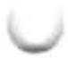
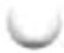
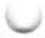
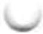

## a

proteins with sequences that make up ATP-binding cassettes; serve to transport a large variety of substrates, including inorganic ions, lipids, and nonpolar drugs, out of the cell, using ATP as the energy source.

absolute configuration: The configuration of four different substituent groups around an asymmetric carbon atom, in relation to D- and L-glyceraldehyde.

absorption: Transport of the products of digestion from the intestinal tract into the blood.

acceptor control: Regulation of the rate of respiration by the availability of ADP as phosphate group acceptor.

light-absorbing pigments (carotenoids, xanthophylls, and phycobilins) in plants and photosynthetic bacteria that complement chlorophylls in trapping energy from sunlight.

acid dissociation constant: The dissociation constant ( $K_{a}$ ) of an acid, describing its dissociation into its conjugate base and a proton.

acidosis: A metabolic condition in which the capacity of the body to buffer $\mathrm{H^{+}}$ is diminished; usually accompanied by decreased blood pH. Compare alkalosis.

actin: A protein that makes up the thin filaments of muscle; also an important component of the cytoskeleton of many eukaryotic cells.

action spectrum: A plot of the efficiency of light at promoting a light-dependent process such as photosynthesis as a function of wavelength.

activation energy ( $\Delta G^{\ddagger}$ ): The amount of energy (in joules) required to convert all the molecules in 1 mol of a reacting substance from the ground state to the transition state.

activator: (1) A DNA-binding protein that positively regulates the expression of one or more genes; that is, transcription rates increase when an activator is bound to the DNA. (2) A positive modulator of an allosteric enzyme.

active site: The region of an enzyme surface that binds the substrate molecule and catalytically transforms it; also known as the catalytic site.

active transporter: Membrane protein that moves a solute across a membrane against an electrochemical gradient in an energy-requiring reaction.

activity: The true thermodynamic activity or potential of a substance, as distinct from its molar concentration.

acyl phosphate: Any molecule with the general chemical form R-C(=O)-O-OPo $_{3}^{2-}$ ;

an acid anhydride between a carboxylic acid and phosphoric acid.

adaptor proteins: Signaling proteins, generally lacking enzymatic activities, that have binding sites for two or more cellular components and serve to bring those components together.

adenosine 3',5'-cyclic monophosphate: See cyclic AMP.

adenosine diphosphate: See ADP.
adenosine triphosphate: See ATP.

S-adenosylmethionine (adoMet): An enzymatic cofactor involved in methyl group transfers.

adenylate kinase: The enzyme that catalyzes the reversible reaction ATP + AMP → 2 ADP. When anabolic activities have depleted the supply of ATP, this enzyme produces more ATP from ADP. Also called myokinase. Compare nucleoside monophosphate kinase.

adipocyte: An animal cell specialized for the storage of fats (triacylglycerols).

adipose tissue: Connective tissue specialized for the storage of large amounts of triacylglycerols. See also beige adipose tissue; brown adipose tissue; white adipose tissue.

ADP (adenosine diphosphate): A ribonucleoside 5'-diphosphate serving as phosphate group acceptor in the cell energy cycle.

adoMet: See S-adenosylmethionine.

aerobe: An organism that lives in air and uses oxygen as the terminal electron acceptor in respiration.

aerobic: Requiring or occurring in the presence of oxygen.

aerobic glycolysis: Cellular energy generation by glycolysis alone (without subsequent oxidation of pyruvate) even though oxygen is available. See glycolysis.

agonist: A compound, typically a hormone or neurotransmitter, that elicits a physiological response when it binds to its specific receptor.

family of proteins that share a domain that binds the R subunit of protein kinase A (PKA). Each also has a domain with affinity for one of a number of diverse proteins, so that each AKAP anchors PKA in a specific location or to a specific protein.

alcohol fermentation: See ethanol fermentation.

aldose: A simple sugar in which the carbonyl carbon atom is an aldehyde; that is, the carbonyl carbon is at one end of the carbon chain.

alkalosis: A metabolic condition in which the capacity of the body to buffer $OH^{-}$ is diminished; usually accompanied by an increase in blood pH. Compare acidosis.

allosteric enzyme: A regulatory enzyme with catalytic activity modulated by the noncovalent binding of a specific metabolite at a site other than the active site.

allosteric protein: A protein (generally with multiple subunits) with multiple ligand-binding sites, such that ligand binding at one site affects ligand binding at another.

allosteric site: The specific site on the surface of an allosteric protein molecule to which the modulator or effector molecule binds.

α helix: A helical conformation of a polypeptide chain, usually right-handed, with maximal intrachain hydrogen bonding; one of the most common secondary structures in proteins.

α oxidation: An alternative path for the oxidation of β-methyl fatty acids in peroxisomes, as distinct from β oxidation and ω oxidation.

alternative splicing: A process in which exons are selectively spliced (linked) in alternative ways to generate different mature mRNAs.

Ames test: A simple bacterial test for carcinogenicity, based on the assumption that carcinogens are mutagens.

amino acid activation: ATP-dependent enzymatic esterification of the carboxyl group of an amino acid to the 3'-hydroxyl group of its corresponding tRNA.

amino acids: $\alpha$ -Amino-substituted carboxylic acids, the building blocks of proteins.

aminoacyl-tRNA: An aminoacyl ester of a tRNA.

aminoacyl-tRNA synthetases: Enzymes that catalyze synthesis of an aminoacyl-tRNA at the expense of ATP energy.

amino-terminal residue: The only amino acid residue in a polypeptide chain that has a free $\alpha$ -amino group; defines the amino terminus of the polypeptide.

aminotransferases: Enzymes that catalyze the transfer of amino groups from $\alpha$ -amino to $\alpha$ -keto acids; also called transaminases.

ammonotelic: Excreting excess nitrogen in the form of ammonia.

protein kinase allosterically activated by 5'-adenosine monophosphate (AMP) and inhibited by ATP. AMPK action generally shifts metabolism away from biosynthesis toward energy production.

amphibolic pathway: A metabolic pathway used in both catabolism and anabolism.

amphipathic: Containing both polar and nonpolar domains.

amphitropic proteins: Proteins that associate reversibly with the membrane and thus can be found in the cytosol, in the membrane, or in both places.

ampholyte: A substance that can act as either a base or an acid.

amphoteric: Capable of donating and accepting protons, thus able to serve as an acid or a base.

AMPK: See AMP-activated protein kinase.

amyloidoses: A variety of progressive diseases characterized by abnormal deposits of misfolded proteins in one or more organs or tissues.

anabolism: The phase of intermediary metabolism concerned with the energy-requiring biosynthesis of cell components from smaller precursors, typically a reductive process.

anaerobe: An organism that lives without oxygen. Obligate anaerobes die when exposed to oxygen.

anaerobic: Occurring in the absence of air or oxygen.

analyte: A molecule to be analyzed by mass spectrometry.

anammox: Anaerobic oxidation of ammonia to $N_{2}$ , using nitrite as electron acceptor; carried out by specialized chemolithotrophic bacteria.

anaplerotic reaction: An enzyme-catalyzed reaction that can replenish the supply of intermediates in the citric acid cycle.

angstrom (Å): A unit of length ( $10^{-8}$ cm) used to indicate molecular dimensions. 10 Å = 1 nm.

anhydride: The product of the condensation of two carboxyl or phosphate groups in which the elements of water are eliminated to form a compound with the general structure R—X—O—X—R, where X is either carbon

or phosphorus.

anion-exchange resin: A polymeric resin with fixed cationic groups, used in the chromatographic separation of anions.

anomeric carbon: The carbon atom in a sugar at the new chiral center formed when a sugar cyclizes to form a hemiacetal. This is the carbonyl carbon of aldehydes and ketones.

anomers: Two stereoisomers of a given sugar that differ only in the configuration about the carbonyl (anomeric) carbon atom.

anorexigenic: Tending to decrease appetite and food consumption. Compare orexigenic.

antagonist: A compound that interferes with the physiological action of another substance (the agonist), usually at a hormone or neurotransmitter receptor.

antibiotic: One of many different organic compounds that are formed and secreted by various species of microorganisms and plants, are toxic to other microbial species, and presumably have a defensive function.

antibody: A defense protein synthesized by the immune system of vertebrates and circulated in the blood. See also immunoglobulin.

anticodon: A specific sequence of three nucleotides in a tRNA, complementary to a codon for an amino acid in an mRNA.

antigen: A molecule capable of eliciting the synthesis of a specific antibody in vertebrates.

antiparallel: Describes two linear polymers that are opposite in polarity or orientation.

antiport: Cotransport of two solutes across a membrane in opposite directions.

apoenzyme: The protein portion of an enzyme, exclusive of any organic or inorganic cofactors or prosthetic groups that might be required for catalytic activity.

apolipoprotein: The protein component of a lipoprotein.

apoprotein: The protein portion of a protein, exclusive of any organic or inorganic cofactors or prosthetic groups that might be required for activity.

apoptosis: Process in which a cell in an organism brings about its own death and lysis, in response to a signal from outside or programmed in its genes, by systematically degrading its own macromolecules for salvage by the organism.

aptamer: An oligonucleotide that binds specifically to one molecular target, usually selected by an iterative cycle of affinity-based enrichment (SELEX).

aquaporins (AQPs): A family of integral membrane proteins that mediate the flow of water across membranes.

archaea: Members of Archaea, one of the three domains of living organisms; include many species that thrive in extreme environments of high ionic strength, high temperature, or low pH.

arcuate nucleus: A group of neurons in the hypothalamus that function in regulation of hunger and feeding behavior.

asymmetric carbon atom: A carbon atom that is covalently bonded to four different groups and thus may exist in two different tetrahedral configurations.

ATP (adenosine triphosphate): A ribonucleoside 5'-triphosphate functioning as a phosphate group donor in the cellular energy cycle; carries chemical energy between metabolic pathways by serving as

a shared intermediate coupling endergonic and exergonic reactions.

ATPase: An enzyme that hydrolyzes ATP to yield ADP and phosphate, usually coupled to a process requiring energy.

ATP synthase: An enzyme complex that forms ATP from ADP and phosphate during oxidative phosphorylation in the inner mitochondrial membrane or the bacterial plasma membrane, and during photophosphorylation in chloroplasts.

attenuator: An RNA sequence involved in regulating the expression of certain genes; functions as a transcription terminator.

autophagy: Catabolic lysosomal degradation of cellular proteins and other components.

autophosphorylation: Strictly, the phosphorylation of an amino acid residue in a protein that is catalyzed by the same protein molecule; often extended to include phosphorylation of one subunit of a homodimer by the other subunit.

autotroph: An organism that can synthesize its own complex molecules from very simple carbon and nitrogen sources, such as carbon dioxide and ammonia.

auxin: A plant growth hormone.

auxotrophic mutant (auxotroph): A mutant organism defective in the synthesis of a particular biomolecule, which must therefore be supplied for the organism's growth.

Avogadro's number (N): The number of molecules in a gram molecular weight (a mole) of any compound $(6.02 \times 10^{23})$ .

## b

bacteria: Members of Bacteria, one of the three domains of living organisms; they have a plasma membrane but no internal organelles or nucleus.

bacteriophage: A virus capable of replicating in a bacterial cell; also called a phage.

baculovirus: Any of a group of double-stranded DNA viruses that infect invertebrates, particularly insects; widely used for protein expression in biotechnology.

Barr body: A condensed, inactive form of the X chromosome found in the cells of female mammals.

basal metabolic rate: An animal's rate of oxygen consumption when at complete rest, long after a meal.

base pair: Two nucleotides in nucleic acid chains that are paired by hydrogen bonding of their bases; for example, A with T or U, and G with C.

BAT: See brown adipose tissue.

B cell: See B lymphocyte.

beige adipose tissue: Thermogenic adipose tissue activated by cooling of the individual; expresses the uncoupling protein UCP1 (thermogenin) at a high level. Compare brown adipose tissue; white adipose tissue.

β conformation: An extended, zigzag arrangement of a polypeptide chain; a common secondary structure in proteins.

β oxidation: Oxidative degradation of fatty acids into acetyl-CoA by successive oxidations at the β-carbon atom; as distinct from α oxidation and ω oxidation.

β sheet: The side-by-side, hydrogen-bonded arrangement of polypeptide chains in the extended β conformation.

β turn: A type of protein secondary structure consisting of four amino acid residues arranged in a tight turn so that the polypeptide turns back on itself.

bilayer: A double layer of oriented amphipathic lipid molecules, forming the basic structure of biological membranes. The hydrocarbon tails face inward to form a continuous nonpolar phase.

bile acids: Polar derivatives of cholesterol, secreted by the liver into the intestine, that serve to emulsify dietary fats, facilitating lipase action.

bile salts: Amphipathic steroid derivatives with detergent properties, participating in digestion and absorption of lipids.

binding energy ( $\Delta G_{B}$ ): The energy derived from noncovalent interactions between enzyme and substrate or receptor and ligand.

binding site: The crevice or pocket on a protein in which a ligand binds.

bioassay: A method for measuring the amount of a biologically active substance (such as a hormone) in a sample by quantifying the biological response to aliquots of that sample.

( $\Delta G^{\circ}$ ): The free-energy change for a reaction occurring under a set of standard conditions: temperature, 298 K; pressure, 1 atm (101.3 kPa); all solutes at 1 M concentration; at pH 7.0 in 55.5 M water. Also called standard transformed free-energy change. Compare standard free-energy change ( $\Delta G^{\circ}$ ).

biochemistry: A molecular description of the structures, mechanisms, and chemical processes of living things in all their diverse forms.

bioinformatics: The computerized analysis of biological data, using methods derived from statistics, linguistics, mathematics, chemistry, biochemistry, and physics. The data are often nucleic acid or protein sequences or structural data.

biosphere: All the places on or in the earth, the seas, and the atmosphere occupied by living matter.

biotin: A vitamin; an enzymatic cofactor in carboxylation reactions.

B lymphocyte (B cell): One of a class of blood cells (lymphocytes), responsible for the production of circulating antibodies.

## body mass index (BMI): A measure of

obesity, calculated as weight in kilograms divided by (height in meters) $^{2}$ . A BMI of more than 27.5 is defined as overweight; more than 30, as obese.

bond energy: The energy required to break a bond.

branch migration: Movement of the branch point in a branched DNA formed from two DNA molecules with identical sequences. See also Holliday intermediate.

brown adipose tissue (BAT): Thermogenic adipose tissue rich in mitochondria that contain the uncoupling protein UCP1 (thermogenin), which uncouples electron transfer through the respiratory chain from ATP synthesis. Compare beige adipose tissue; white adipose tissue.

buffer: A system capable of resisting changes in pH, consisting of a conjugate acid-base pair in which the ratio of proton acceptor to proton donor is near unity.

## C

$C_{3}$ plants: Plants in which the first product of $CO_{2}$ fixation is the three-carbon compound 3-phosphoglycerate. Compare $C_{4}$ plants.

$C_{4}$ pathway: The metabolic pathway in which $CO_{2}$ is first added to phosphoenolpyruvate by the enzyme PEP carboxylase to produce the four-carbon compound within mesophyll cells that is later transported to the bundle-sheath cells, where the $CO_{2}$ is released for use in the Calvin cycle.

$C_{4}$ plants: Plants (generally tropical) in which $CO_{2}$ is first fixed into a four-carbon compound, oxaloacetate or malate, before entering the Calvin cycle via the rubisco reaction. Compare $C_{3}$ plants.

calorie: The amount of heat required to raise the temperature of 1.0 g of water from 14.5 to 15.5 °C. One calorie (cal) equals 4.18 joules (J). The nutritional calorie, Cal, is equal to 1,000 calories, or 1 kcal.

Calvin cycle: The cyclic pathway in plants that fixes carbon dioxide and produces triose phosphates.

CAM plants: Succulent plants of hot, dry climates, in which $CO_{2}$ is fixed into oxaloacetate in the dark, then fixed by rubisco in the light when stomata close to exclude $O_{2}$ .

cAMP: See cyclic AMP.

cAMP receptor protein (CRP): In bacteria, a specific regulatory protein that controls initiation of transcription of the genes that produce the enzymes required to use some other nutrient when glucose is lacking; also called catabolite gene activator protein (CAP).

kinase A; PKA): A protein kinase that phosphorylates Ser or Thr residues when bound by its allosteric activator, cAMP.

CAP: See cAMP receptor protein.

capsid: The protein coat of a virion, or virus particle.

carbanion: A negatively charged carbon atom.

carbocation: A positively charged carbon atom; also called a carbonium ion.

carbohydrate: A polyhydroxy aldehyde or ketone, or substance that yields such a compound on hydrolysis. Many carbohydrates have the empirical formula $(\mathrm{CH}_{2}\mathrm{O})_{n}$ ; some also contain nitrogen, phosphorus, or sulfur.

carbon-assimilation reactions: Formerly referred to as dark reactions. See CO₂ assimilation.

carbon fixation: See $\mathrm{CO}_{2}$ fixation.  
carbonium ion: See carbocation.

carboxyl-terminal domain of eukaryotic RNA polymerase II, containing many repeats of the heptapeptide YSPTSPS. Phosphorylation of the CTD changes during transcription. Many cellular factors interact with the CTD to regulate gene expression.

carboxyl-terminal residue: The only amino acid residue in a polypeptide chain that has a free $\alpha$ -carboxyl group; defines the carboxyl terminus of the polypeptide.

cardiolipin: A membrane phospholipid in which two phosphatidic acid moieties share a single glycerol head group.

carnitine shuttle: A mechanism for moving fatty acids from the cytosol to the mitochondrial matrix as fatty esters of carnitine.

carotenoids: Lipid-soluble photosynthetic pigments made up of isoprene units.

cascade: See enzyme cascade; regulatory cascade.

catabasis: Resolution of inflammation.

catabolism: The phase of intermediary metabolism concerned with the energy-yielding degradation of nutrient molecules, typically an oxidative process.

catabolite gene activator protein (CAP): See cAMP receptor protein.

catalytic site: See active site.

catecholamines: Hormones, such as epinephrine, that are amino derivatives of catechol.

catenane: Two or more circular polymeric molecules interlinked by one or more noncovalent topological links, resembling the links of a chain.

cation-exchange resin: An insoluble polymer with fixed negative charges, used in the chromatographic separation of cationic substances.

CD spectroscopy: See circular dichroism spectroscopy.

cDNA: See complementary DNA.

CBNA library: A collection of cloned DNA fragments derived entirely from the complement of mRNA being expressed in a particular organism or cell type under a defined set of conditions.

cellular differentiation: The process in which a precursor cell becomes specialized to carry out a particular function, by acquiring a new complement of proteins and RNA.

central dogma: An organizing principle of molecular biology that is now accepted as fact rather than dogma: genetic information flows between nucleic acids and from nucleic acid to protein, but not from protein to nucleic acid or from protein to protein.

centromere: A specialized site in a chromosome, serving as the attachment point for the mitotic or meiotic spindle.

cerebroside: A sphingolipid containing one sugar residue as a head group.  
channeling: See substrate channeling.

chaperone: Any of several classes of proteins or protein complexes that catalyze the accurate folding of proteins in all cells.

chaperonin: One of two major classes of chaperones in virtually all organisms; a complex of proteins that functions in protein folding: GroES/GroEL in bacteria; Hsp60 in eukaryotes.

chemiosmotic coupling: Coupling of ATP synthesis to electron transfer by a transmembrane difference in charge and pH.

chemiosmotic theory: The theory that energy derived from electron transfer reactions is temporarily stored as a transmembrane difference in charge and pH, which subsequently drives formation of ATP in oxidative phosphorylation and photophosphorylation.

chemotaxis: A cell's sensing of and movement toward or away from a specific chemical agent.

chemotroph: An organism that obtains energy by metabolizing organic compounds derived from other organisms.

chiral center: An atom with substituents arranged so that the molecule is not superposable on its mirror image.

chiral compound: A compound that contains an asymmetric center (chiral atom or chiral center) and thus can occur in two nonsuperposable mirror-image forms (enantiomers).

chlorophylls: A family of green pigments that function as receptors of light energy in photosynthesis; magnesium-porphyrin complexes.

chloroplast: A chlorophyll-containing photosynthetic organelle in some eukaryotic cells.

chondroitin sulfate: One of a family of sulfated glycosaminoglycans, a major component of the extracellular matrix.

chromatin: A filamentous complex of DNA, histones, and other proteins, constituting the eukaryotic chromosome.

chromatography: A process in which complex mixtures of molecules are separated by many repeated partitionings between a flowing (mobile) phase and a stationary phase.

chromatophore: A compound or moiety (natural or synthetic) that absorbs visible or ultraviolet light.

chromosome: A single large DNA molecule and its associated proteins and often associated regulatory or structural RNA; containing many genes; stores and transmits genetic information.

chromosome territory: A region of the nucleus preferentially occupied by a particular chromosome.

chylomicron: A plasma lipoprotein consisting of a large droplet of triacylglycerols stabilized by a coat of protein and phospholipid; carries lipids from the intestine to tissues.

circular dichroism (CD) spectroscopy: A method used to characterize the degree of folding in a protein, based on differences in the absorption of right-handed versus left-handed circularly polarized light.

cis-trans isomers: See geometric isomers.

cistron: A unit of DNA or RNA corresponding to one gene.

citric acid cycle: A cyclic pathway for the oxidation of acetyl residues to carbon dioxide, in which formation of citrate is the first step; also known as the Krebs cycle or tricarboxylic acid cycle.

Cleland nomenclature: A shorthand notation developed by W. W. Cleland for describing the progress of enzymatic reactions with multiple substrates and products.

clones: The descendants of a single cell.

cloning: The production of large numbers of identical DNA molecules, cells, or organisms from a single, ancestral DNA molecule, cell, or organism.

closed system: A system that exchanges neither matter nor energy with the surroundings. See also system.

CO $_{2}$ assimilation: Reaction sequence in which atmospheric CO $_{2}$ is converted into organic compounds.

cobalamin: See coenzyme B $_{12}$ .

coding strand: In DNA transcription, the DNA strand identical in base sequence to the RNA transcribed from it, with U in the RNA in place of T in the DNA; as distinct from the template strand. Also called the nontemplate strand.

codon: A sequence of three adjacent nucleotides in a nucleic acid that codes for a specific amino acid.

coenzyme: An organic cofactor required for the action of certain enzymes; often is synthesized from a vitamin.

coenzyme A: A coenzyme with two sulfhydryl groups that serve both as acyl group carriers and redox cofactors.

coenzyme B $_{12}$ : An enzymatic cofactor derived from the vitamin cobalamin, involved in certain types of carbon skeletal rearrangements.

cofactor: An inorganic ion or a coenzyme required for enzyme activity.

CO $_{2}$ fixation: The reaction, catalyzed by rubisco during photosynthesis or by other carboxylases, in which atmospheric CO $_{2}$ is initially incorporated (fixed) into an organic compound.

cognate: Describes two biomolecules that normally interact; for example, an enzyme and its usual substrate, or a receptor and its usual ligand.

cohesive ends: See sticky ends.

cointegrate: An intermediate in the migration of certain DNA transposons in which the donor DNA and target DNA are covalently attached.

colligative properties: The properties of a solution that depend on the number of solute particles per unit volume; for example, freezing-point depression.

combinatorial control: The use of combinations of a limited repertoire of regulatory proteins to provide gene-specific regulation of many individual genes.

comparative genomics: A discipline in which genomic information is compared within one organism or between two species or many. Comparisons may focus on, but are not limited to, gene sequences, gene order on a chromosome, regulatory sequences, gene modifications, and gene evolution.

competitive inhibition: A type of enzyme inhibition reversed by increasing the substrate concentration; a competitive inhibitor generally competes with the normal substrate or ligand for a protein's binding site.

complementary: Having a molecular surface with chemical groups arranged to interact specifically with chemical groups on another molecule.

complementary DNA (cDNA): A DNA complementary to a specific RNA, usually made through the use of reverse transcriptase.

Complex I: Respiratory chain complex that catalyzes the transfer to ubiquinone of a hydride ion from NADH and a proton from the mitochondrial matrix, coupled to the transfer of four protons from the matrix to the intermembrane space. Complex I is composed of 45 different polypeptide chains, including an FMN-containing flavoprotein and at least 8 iron-sulfur centers. Also called NADH:ubiquinone oxidoreductase and NADH dehydrogenase.

Complex II: Membrane-bound respiratory chain complex and citric acid cycle component that couples the oxidation of succinate with the reduction of ubiquinone. Complex II has four different protein subunits, a heme group, three 2Fe-2S centers, bound FAD, and binding sites for succinate and ubiquinone. Also called succinate dehydrogenase.

Complex III: Respiratory chain complex that couples the transfer of electrons from ubiquinol to cytochrome c with the vectorial transport of protons from the matrix to the intermembrane space (from the cytosol to the periplasmic space in bacteria). Complex III functions as a homodimer; each monomer consists of three proteins: cytochrome b, cytochrome $c_{1}$ , and the Rieske iron-sulfur protein. Also called cytochrome $bc_{1}$ complex and ubiquinone:cytochrome c oxidoreductase.

Complex IV: Respiratory chain complex that carries electrons from cytochrome c to molecular oxygen, reducing it to $H_{2}O$ . Also called cytochrome oxidase.

condensation: A reaction type in which two compounds are joined with the elimination of water.

configuration: The spatial arrangement of an organic molecule conferred by the presence of (1) double bonds, about which there is no freedom of rotation, or (2) chiral centers, around which substituent groups are arranged in a specific sequence. Configurational isomers cannot be interconverted without breaking one or more covalent bonds.

conformation: A spatial arrangement of substituent groups that are free to assume different positions in space, without breaking any bonds, because of the freedom of bond rotation.

conjugate acid-base pair: A proton donor and its corresponding deprotonated species; for example, acetic acid (donor) and acetate (acceptor).

conjugated protein: A protein containing one or more prosthetic groups.

conjugate redox pair: An electron donor and its corresponding electron acceptor; for example, $Cu^{+}$ (donor) and $Cu^{2+}$ (acceptor), or NADH (donor) and $NAD^{+}$ (acceptor).

consensus sequence: A DNA or amino acid sequence consisting of the residues that most commonly occur at each position in a set of similar sequences.

conservative substitution: Replacement of an amino acid residue in a polypeptide by another residue with similar properties; for example, substitution of Glu by Asp.

constitutive enzymes: Enzymes required at all times by a cell and present at some constant level; for example, many enzymes of the central metabolic pathways. Sometimes called housekeeping enzymes.

contig: A series of overlapping clones or a continuous sequence defining an uninterrupted section of a chromosome.

contour length: The length of a nucleic acid molecule as measured along its helical axis.

cooperativity: The characteristic of an enzyme or other protein in which binding of the first molecule of a ligand changes the affinity for the second molecule. In positive cooperativity, the affinity for the second ligand molecule increases; in negative cooperativity, it decreases.

cotransport: The simultaneous transport, by a single transporter, of two solutes across a membrane. See also antiport; symport; uniport.

coupled reactions: Two chemical reactions that have a common intermediate and thus a means of energy transfer from one to the other.

covalent bond: A chemical bond that involves sharing of electron pairs.

CRISPR/Cas: Bacterial systems that evolved to provide a defense against bacteriophage infection. CRISPR stands for clustered, regularly interspaced short palindromic repeats. Gas stands for CRISPR-associated. Engineered CRISPR/Cas systems are used for efficient, targeted genome editing in a wide range of organisms.

cristae: Infoldings of the inner mitochondrial membrane.

CRP: See cAMP receptor protein.

cruciform: A secondary structure in double-stranded RNA or DNA in which the double helix is denatured at palindromic repeat sequences in each strand, and each separated strand is paired internally to form opposing hairpin structures. See also hairpin.

cryo-electron microscopy (cryo-EM): A technique for determining the structure of proteins or protein complexes; molecules are quick-frozen on a grid in random orientations and visualized by EM. Images of individual molecules are computationally aligned and combined, yielding a three-dimensional map into which a structure can be modeled.

cyclic AMP (cAMP; adenosine 3',5'-cyclic monophosphate): A second messenger; its formation from ATP in a cell by adenylyl cyclase is stimulated by certain hormones or other molecular signals.

cyclic electron transfer: In chloroplasts, the light-induced transfer of electrons originating from and returning to photosystem I.

cyclic photophosphorylation: ATP synthesis driven by cyclic electron transfer through cytochrome $b_{6}f$ and photosystem I.

cyclin: One of a family of proteins that activate cyclin-dependent protein kinases and thereby regulate the cell cycle.

cytochrome P-450: A family of heme-containing enzymes, with a characteristic absorption band at 450 nm, that participate in biological hydroxylations with O₂.

cytochromes: Heme proteins serving as electron carriers in respiration, photosynthesis, and other oxidation-reduction reactions.

cytokine: One of a family of small secreted proteins (such as interleukins and interferons) that activate cell division or differentiation by binding to plasma membrane receptors in target cells.

cytokinesis: The final separation of daughter cells following mitosis.

cytoplasm: The portion of a cell's contents outside the nucleus but within the plasma membrane; includes organelles such as mitochondria.

cytoskeleton: The filamentous network that provides structure and organization to the cytoplasm; includes actin filaments, microtubules, and intermediate filaments.

cytosol: The continuous aqueous phase of the cytoplasm, with its dissolved solutes; excludes the organelles such as mitochondria.

## d

dalton: Unit of atomic or molecular weight; I dalton (Da) is the weight of a hydrogen atom $1.66 \times 10^{-24} \text{ g}$ .

dark reactions: See carbon-assimilation reactions.

deamination: The enzymatic removal of amino groups from biomolecules such as amino acids or nucleotides.

degenerate code: A code in which a single element in one language is specified by more than one element in a second language.

dehydrogenases: Enzymes that catalyze the removal of pairs of hydrogen atoms from substrates, often with NAD as a coenzyme.

deletion mutation: A mutation resulting from deletion of one or more nucleotides from a gene or chromosome.

ΔG: See free-energy change.

$\Delta G^{\ddagger}$ : See activation energy.

$\Delta G^{\circ}$ : See standard free-energy change.

$\Delta G^{\circ}$ : See biochemical standard free-energy change.

$\Delta G_{B}$ : See binding energy.

$\Delta G_{p}$ : See phosphorylation potential.

denaturation: Partial or complete unfolding of the specific native conformation of a polypeptide chain, protein, or nucleic acid such that the function of the molecule is lost.

denatured protein: A protein that has lost enough of its native conformation by

exposure to a destabilizing agent such as heat or detergent that its function is lost.

de novo pathway: A pathway for the synthesis of a biomolecule, such as a nucleotide, from simple precursors; as distinct from a salvage pathway.

deoxyribonucleic acid: See DNA.

deoxyribonucleotides: Nucleotides containing 2-deoxy-D-ribose as the pentose component.

desaturases: Enzymes that catalyze the introduction of double bonds into the hydrocarbon portion of fatty acids.

desensitization: A universal process by which sensory mechanisms cease to respond after prolonged exposure to the specific stimulus they detect.

desolvation: In aqueous solution, the release of bound water surrounding a solute.

diabetes mellitus: A group of metabolic diseases with symptoms that result from a deficiency in insulin production or responsiveness; characterized by an inability to transport glucose from the blood into cells at normal glucose concentrations.

dialysis: Removal of small molecules from a solution of a macromolecule by their diffusion through a semipermeable membrane into a suitably buffered solution.

dideoxy sequencing: See Sanger sequencing.

differential centrifugation: Separation of cell organelles or other particles of different size by their different rates of sedimentation in a centrifugal field.

differentiation: Specialization of cell structure and function during growth and development.

diffusion: Net movement of molecules in the direction of lower concentration.

digestion: Enzymatic hydrolysis of major nutrients in the gastrointestinal system to yield their simpler components.

diploid: Having two sets of genetic information; describes a cell with two chromosomes of each type. Compare haploid.

disaccharide: A carbohydrate consisting of two covalently joined monosaccharide units.

dissociation constant ( $K_{d}$ ): An equilibrium constant for the dissociation of a complex of two or more biomolecules into its components; for example, dissociation of a substrate from an enzyme.

disulfide bond: A covalent bond resulting from the oxidative linkage of two Cys residues, from the same or different polypeptide chains, forming a cystine residue.

DNA (deoxyribonucleic acid): A poly-nucleotide with a specific sequence of deoxyribonucleotide units covalently joined through 3',5'-phosphodiester bonds; serves as the carrier of genetic information.

DNA chimera: DNA containing genetic information derived from two different species.

DNA chip: An informal term for a DNA microarray, referring to the small size of typical microarrays.

DNA cloning: See cloning.

DNA library: A collection of cloned DNA fragments.

DNA ligases: Enzymes that create a phosphodiester bond between the 3' end of one DNA segment and the 5' end of another.

DNA looping: The interaction of proteins bound at distant sites on a DNA molecule so that the intervening DNA forms a loop.

DNA microarray: A collection of DNA sequences immobilized on a solid surface, with individual sequences laid out in patterned arrays that can be probed by hybridization.

DNA polymerases: Enzymes that catalyze template-dependent synthesis of DNA from its deoxyribonucleoside 5'-triphosphate precursors. The bacterium Escherichia coli has five DNA polymerases, numbered I through V; eukaryotes have a larger number.

DNA supercoiling: The coiling of DNA upon itself, generally as a result of bending, underwinding, or overwinding of the DNA helix.

DNA transposition: See transposition.

domain: A distinct structural unit of a polypeptide; domains may have separate functions and may fold as independent, compact units.

double helix: The natural coiled conformation of two complementary, antiparallel DNA chains.

double-reciprocal plot: A plot of $1/V_{0}$ versus 1/[S], which allows a more accurate determination of $V_{max}$ and $K_{m}$ than a plot of $V_{0}$ versus [S]; also called the Lineweaver-Burk plot.

## e

$E^{\circ}$ : See standard reduction potential. $E^{\prime\circ}$ : Standard transformed reduction potential. See standard reduction potential.

ECM: See extracellular matrix.

eicosanoid: Any of several classes of hydrophobic signaling molecules derived from the lipid arachidonate, including prostaglandins, thromboxanes, and leukotrienes, that regulate physiological responses in humans such as inflammation, blood pressure, and fever.

electrochemical gradient: The resultant of the gradients of concentration and of electric charge of an ion across a membrane; the driving force for oxidative phosphorylation and photophosphorylation.

electrochemical potential: The energy required to maintain a separation of charge and of concentration across a membrane.

electrogenic: Contributing to an electrical potential across a membrane.

electron acceptor: A substance that receives electrons in an oxidation-reduction reaction.

electron carrier: A protein, such as a flavoprotein or a cytochrome, that can reversibly gain and lose electrons; functions in the transfer of electrons from organic nutrients to oxygen or some other terminal acceptor.

electron donor: A substance that donates electrons in an oxidation-reduction reaction.

electron transfer: Movement of electrons from electron donor to electron acceptor; especially, from substrates to oxygen via the carriers of the respiratory (electron-transfer) chain.

Flavoprotein that carries electrons from fatty acid $\beta$ -oxidation to the mitochondrial electron transfer chain.

electrophile: An electron-deficient group with a strong tendency to accept electrons from an electron-rich group (nucleophile).

electrophoresis: Movement of charged solutes in response to an electrical field; often used to separate mixtures of ions, proteins, or nucleic acids.

ELISA: See enzyme-linked immunosorbent assay.

elongation factors: (1) Proteins that function in the elongation phase of eukaryotic transcription. (2) Specific proteins required in the elongation of polypeptide chains by ribosomes.

eluate: The effluent from a chromatographic column.

enantiomers: Stereoisomers that are nonsuperposable mirror images of each other.

endergonic reaction: A chemical reaction that consumes energy (i.e., for which $\Delta G$ is positive).

endocannabinoids: Endogenous substances capable of binding to and functionally activating cannabinoid receptors.

endocrine: Pertaining to cellular secretions that enter the bloodstream and have their effects on distant tissues.

endocytosis: The uptake of extracellular material by its inclusion in a vesicle (endosome) formed by invagination of the plasma membrane.

endonucleases: Enzymes that hydrolyze the interior phosphodiester bonds of a nucleic acid—that is, act at bonds other than the terminal bonds.

endoplasmic reticulum: An extensive system of double membranes in the cytoplasm of eukaryotic cells; it encloses secretory channels and is often studded with ribosomes (rough endoplasmic reticulum).

endothermic reaction: A chemical reaction that takes up heat (i.e., for which $\Delta H$ is positive).

end-product inhibition: See feedback inhibition.

energy transduction: The conversion of energy from one form to another.

enhancers: DNA sequences that facilitate the expression of a given gene; may be located a few hundred, or even thousand, base pairs away from the gene.

enthalpy (H): The heat content of a system.

enthalpy change ( $\Delta H$ ): For a reaction, approximately equal to the difference between the energy used to break bonds and the energy gained by formation of new bonds.

entropy (S): The extent of randomness or disorder in a system.

enzyme: A biomolecule, either protein or RNA, that catalyzes a specific chemical reaction. It does not affect the equilibrium of the catalyzed reaction; it enhances the rate of the reaction by providing a reaction path with a lower activation energy.

enzyme cascade: A series of reactions, often involved in regulatory events, in which one enzyme activates another (often by phosphorylation), which activates a third, and so on. The effect of a catalyst activating a catalyst is a large amplification of the signal that initiated the cascade. See also regulatory cascade.

## enzyme-linked immunosorbent assay

(ELISA): A sensitive immunoassay that uses an enzyme linked to an antibody or antigen to detect a specific protein.

epigenetic: Describes any inherited characteristic of a living organism that is acquired by means that do not involve the nucleotide sequence of the parental chromosomes; for example, covalent modifications of histones.

epimerases: Enzymes that catalyze the reversible interconversion of two epimers.

epimers: Two stereoisomers differing in configuration at one asymmetric center in a compound having two or more asymmetric centers.

epithelial cell: Any cell that forms part of the outer covering of an organism or organ.

epitope: An antigenic determinant; the particular chemical group or groups in a macromolecule (antigen) to which a given antibody binds.

epitope tag: A protein sequence or domain bound by a well-characterized antibody.

equilibrium: The state of a system in which no further net change is occurring; the free energy is at a minimum.

equilibrium constant ( $K_{eq}$ ): A constant, characteristic for each chemical reaction, that relates the specific concentrations of all reactants and products at equilibrium at a given temperature and pressure.

erythrocyte: A cell containing large amounts of hemoglobin and specialized for oxygen transport, but without a nucleus or mitochondria; a red blood cell.

essential amino acids: Amino acids that cannot be synthesized by humans and must be obtained from the diet.

essential fatty acids: The group of polyunsaturated fatty acids produced by plants, but not by humans; required in the human diet.

ETF: See electron-transferring flavoprotein.

ethanol fermentation: The anaerobic conversion of glucose to ethanol via glycolysis; also called alcohol fermentation. See also fermentation.

euchromatin: The regions of interphase chromosomes that are more open (less condensed), where genes are being actively expressed. Compare heterochromatin.

eukaryotes: Members of Eukarya, one of the three domains of living organisms; unicellular or multicellular organisms with cells having a membrane-bounded nucleus, multiple chromosomes, and internal organelles.

exchange factors: Enzymes that catalyze the exchange of histone variants within eukaryotic nucleosomes.

excited state: An energy-rich state of an atom or molecule, produced by absorption of light energy; as distinct from ground state.

exergonic reaction: A chemical reaction that proceeds with the release of free energy (i.e., for which $\Delta G$ is negative).

exocytosis: The fusion of an intracellular vesicle with the plasma membrane, releasing the vesicle contents to the extracellular space.

exon: The segment of a eukaryotic gene that encodes a portion of the final product of the gene; a segment of RNA that remains after posttranscriptional processing and is transcribed into a protein or incorporated into the structure of an RNA. See also intron.

exonucleases: Enzymes that hydrolyze only those phosphodiester bonds that are in the terminal positions of a nucleic acid.

exosome: In eukaryotes, a large protein complex involved in RNA degradation that is composed of a barrel-like assembly of proteins through which RNA is fed into a nuclease.

exothermic reaction: A chemical reaction that releases heat (i.e., for which $\Delta H$ is negative).

expression vector: A vector incorporating sequences that allow the transcription and translation of a cloned gene. See vector.

extracellular matrix (ECM): An interwoven combination of glycosaminoglycans, proteoglycans, and proteins, just outside the plasma membrane, that provides cell anchorage, positional recognition, and traction during cell migration.

extrahepatic: Describes all tissues outside the liver; implies the centrality of the liver in metabolism.

## f

## FAD (flavin adenine dinucleotide): The

coenzyme of some oxidation-reduction enzymes; contains riboflavin.

$F_{1}$ ATPase: The multiprotein subunit of ATP synthase that has the ATP-synthesizing catalytic sites. It interacts with the $F_{0}$ subunit of ATP synthase, coupling proton movement to ATP synthesis.

fatty acid: A long-chain aliphatic carboxylic acid in natural fats and oils; also a component of membrane phospholipids and glycolipids.

feedback inhibition: Inhibition of an allosteric enzyme at the beginning of a metabolic sequence by the end product of the sequence; also known as end-product inhibition.

fermentation: Energy-yielding anaerobic breakdown of a nutrient molecule, such as glucose, without net oxidation; yields lactate, ethanol, or some other simple product.

ferredoxin: One of a family of small, soluble Fe-S proteins that serve as one-electron carriers between PSI and NADH in photosynthetic organisms.

fibrin: A protein factor that forms the cross-linked fibers in blood clots.

fibrinogen: The inactive precursor protein of fibrin.

fibroblast: A cell of the connective tissue that secretes connective tissue proteins such as collagen.

fibrous proteins: Insoluble proteins that serve a protective or structural role; contain polypeptide chains that generally share a common secondary structure.

first law of thermodynamics: The law stating that, in all processes, the total energy of the universe remains constant.

Fischer projection formulas: A method for representing molecules that shows the configuration of groups around chiral centers; also known as projection formulas.

5' end: The end of a nucleic acid that lacks a nucleotide bound at the 5' position of the terminal residue.

flagellum: A cell appendage used in propulsion. Bacterial flagella have a much simpler structure than eukaryotic flagella, which are similar to cilia.

flavin adenine dinucleotide: See FAD.

flavin-linked dehydrogenases: Dehydrogenases requiring one of the riboflavin coenzymes, FMN or FAD.

flavin mononucleotide: See FMN.

flavin nucleotides: Nucleotide coenzymes (FMN and FAD) containing riboflavin.

flavoprotein: An enzyme containing a flavin nucleotide as a tightly bound prosthetic group.

flippases: Membrane proteins in the ABC transporter family that catalyze movement of phospholipids from the extracellular leaflet (monolayer) to the cytosolic leaflet of a membrane bilayer.

floppases: Membrane proteins in the ABC transporter family that catalyze movement of phospholipids from the cytosolic leaflet (monolayer) to the extracellular leaflet of a membrane bilayer.

fluid mosaic model: The model describing biological membranes as a fluid lipid bilayer with embedded proteins; the bilayer exhibits both structural and functional asymmetry.

fluorescence: Emission of light by excited molecules as they revert to the ground state.

fluorescence recovery after photobleaching: See FRAP.

fluorescence resonance energy transfer: See FRET.

FMN (flavin mononucleotide): Riboflavin phosphate, a coenzyme of certain oxidation-reduction enzymes.

fold: See motif.

footprinting: A technique for identifying the nucleic acid sequence bound by a DNA- or RNA-binding protein.

fraction: A portion of a biological sample that has been subjected to a procedure designed to separate macromolecules based on a property such as solubility, net charge, molecular weight, or function.

fractionation: The process of separating the proteins or other components of a complex molecular mixture into fractions based on differences in properties such as solubility, net charge, molecular weight, or function.

frame shift: A mutation caused by insertion or deletion of one or more paired nucleotides, changing the reading frame of codons during protein synthesis; the polypeptide product has a garbled amino acid sequence beginning at the mutated codon.

FRAP (fluorescence recovery after photobleaching): A technique used to quantify the diffusion of membrane components (lipids or proteins) in the plane of the bilayer.

free energy (G): The component of the total energy of a system that can do work at constant temperature and pressure.

free energy of activation ( $\Delta G^{\ddagger}$ ):
See activation energy.

free-energy change ( $\Delta G$ ): The amount of free energy released (negative $\Delta G$ ) or absorbed (positive $\Delta G$ ) in a reaction at constant temperature and pressure.

free radical: See radical.

FRET (fluorescence resonance energy transfer): A technique for estimating the distance between two proteins or two

domains of a protein by measuring the nonradiative transfer of energy between reporter chromophores when one protein or domain is excited and the fluorescence emitted from the other is quantified.

functional group: The specific atom or group of atoms that confers a particular chemical property on a biomolecule.

furanose: A simple sugar containing the five-membered furan ring.

fusion protein: (1) One of a family of proteins that facilitate membrane fusion. (2) The protein product of a gene created by the fusion of two distinct genes or portions of genes.

futile cycle: See substrate cycle.

## g

$G_{i}$ : See inhibitory G protein. $G_{s}$ : See stimulatory G protein.

gametes: Reproductive cells with a haploid gene content; sperm or egg cells.

ganglioside: A sphingolipid containing a complex oligosaccharide as a head group; especially common in nervous tissue.

GAPs: See GTPase activator proteins.

GEFs: See guanosine nucleotide-exchange factors.

gel filtration: See size-exclusion chromatography.

gene: A chromosomal segment that codes for a single functional polypeptide chain or RNA molecule.

gene expression: Transcription, and, in the case of proteins, translation, to yield the product of a gene; a gene is expressed when its biological product is present and active.

gene fusion: The enzymatic attachment of one gene, or part of a gene, to another.

general acid-base catalysis: Catalysis involving proton transfer(s) to or from a molecule other than water.

general transcription factors: Protein factors required for transcription by RNA polymerase II in eukaryotes.

genetic code: The set of triplet code words in DNA (or mRNA) coding for the amino acids of proteins.

genetic engineering: Any process by which genetic material, particularly DNA, is altered by a molecular biologist.

genetic map: A diagram showing the relative sequence and position of specific genes along a chromosome.

genome: All the genetic information encoded in a cell or virus.

genome annotation: The process of assigning actual or likely functions to genes discovered during genomic DNA sequencing projects.

genomic library: A DNA library containing DNA segments that represent all (or most) of the sequences in an organism's genome.

genomics: A science devoted broadly to the understanding of cellular and organism genomes.

genotype: The genetic constitution of an organism, as distinct from its physical characteristics, or phenotype.

geometric isomers: Isomers related by rotation about a double bond; also called cis-trans isomers.

germ-line cell: A type of animal cell that is formed early in embryogenesis and may multiply by mitosis or produce, by meiosis, cells that develop into gametes (egg or sperm cells).

GFP: See green fluorescent protein.

globular proteins: Soluble proteins with a globular (somewhat rounded) shape.

glucogenic: Capable of being converted into glucose or glycogen by the process of gluconeogenesis.

gluconeogenesis: The biosynthesis of a carbohydrate from simpler, noncarbohydrate precursors such as oxaloacetate or pyruvate.

GLUT: Designation for a family of membrane proteins that transport glucose.

glycan: A polymer of monosaccharide units joined by glycosidic bonds; polysaccharide.

glyceroneogenesis: The synthesis in adipocytes of glycerol 3-phosphate from pyruvate for use in triacylglycerol synthesis.

glycerophospholipid: An amphipathic lipid with a glycerol backbone; fatty acids are ester-linked to C-1 and C-2 of the glycerol, and a polar alcohol is attached through a phosphodiester linkage to C-3.

glycoconjugate: A compound containing a carbohydrate component bound covalently to a protein or lipid, forming a glycoprotein or glycolipid.

glycogenesis: The process of converting glucose to glycogen.

glycogenin: The protein that both primes the synthesis of new glycogen chains and catalyzes the polymerization of the first few sugar residues of each chain before glycogen synthase continues the extension.

glycogenolysis: The enzymatic breakdown of stored (not dietary) glycogen.

glycolate pathway: The metabolic pathway in photosynthetic organisms that converts glycolate produced during photorespiration into 3-phosphoglycerate.

glycolipid: A lipid containing a carbohydrate group.

glycolysis: The catabolic pathway by which a molecule of glucose is broken down into two molecules of pyruvate. Compare aerobic glycolysis.

glycome: The full complement of carbohydrates and carbohydrate-containing molecules of a cell or tissue under a particular set of conditions.

glycomics: The systematic characterization of the glycome.

glycoprotein: A protein containing a carbohydrate group, typically a complex oligosaccharide.

glycosaminoglycan: A heteropolysaccharide of two alternating units: one is either N-acetylglucosamine or N-acetylgalactosamine; the other is a uronic acid (usually glucuronic acid). Formerly called a mucopolysaccharide.

glycosidic bonds: See O-glyosidic bonds.

glycosphingolipid: An amphipathic lipid with a sphingosine backbone to which are attached a long-chain fatty acid and a polar alcohol head group.

glyoxylate cycle: A variant of the citric acid cycle, for the net conversion of acetate into succinate and, eventually, new carbohydrate; present in bacteria and some plant cells.

glyoxysome: A specialized peroxisome containing the enzymes of the glyoxylate cycle; found in cells of germinating seeds.

glypican: A heparan sulfate proteoglycan attached to a membrane through a glycosyl phosphatidylinositol (GPI) anchor.

Golgi complex: A complex membranous organelle of eukaryotic cells; functions in the posttranslational modification of proteins and their secretion from the cell or incorporation into the plasma membrane or organellar membranes.

GPCRs: See G protein-coupled receptors.

GPI-anchored protein: A protein held to the outer monolayer of the plasma membrane by its covalent attachment through a short oligosaccharide chain to a phosphatidylinositol molecule in the membrane.

(GRKs): A family of protein kinases that phosphorylate Ser and Thr residues near the carboxyl terminus of G protein-coupled receptors, initiating their internalization.

G protein-coupled receptors (GPCRs): A large family of membrane receptor proteins with seven transmembrane helical segments, often associating with G proteins to transduce an extracellular signal into a change in cellular metabolism.

G proteins: A large family of GTP-binding proteins that act in intracellular signaling pathways and in membrane trafficking. Active when GTP is bound, they self-inactivate by converting GTP to GDP. Also called guanosine nucleotide-binding proteins.

gram molecular weight: For a compound, the weight in grams that is numerically equal to its molecular weight; the weight of one mole.

grana: Stacks of thylakoids, flattened membranous sacs or disks, in chloroplasts.

green fluorescent protein (GFP): A small protein from a marine organism that produces bright fluorescence in the green region of the visible spectrum. Fusion proteins with GFP are commonly used to determine the

subcellular location of the fused protein by fluorescence microscopy.

GRKs: See G protein-coupled receptor kinases.

gRNA: See guide RNA.

ground state: The normal, stable form of an atom or molecule, as distinct from the excited state.

group transfer potential: A measure of the ability of a compound to donate an activated group (such as a phosphate or acyl group); generally expressed as the standard free energy of hydrolysis.

growth factors: Proteins or other molecules that act from outside a cell to stimulate cell growth and division.

Regulatory proteins that bind activated G proteins and stimulate their intrinsic GTPase activity, speeding their self-inactivation.

guanosine nucleotide-binding proteins: See G proteins.

guanosine nucleotide-exchange factors (GEFs): Regulatory proteins that bind to and activate G proteins by stimulating the exchange of bound GDP for GTP.

guide RNA (gRNA): An RNA found in CRISPR systems that has sequences complementary to those in a target DNA such as a phage DNA.

## h

hairpin: Secondary structure in single-stranded RNA or DNA, in which complementary parts of a palindromic repeat fold back and pair to form an antiparallel duplex helix closed at one end. See also cruciform.

half-life: The time required for the disappearance or decay of one-half of a given component in a system.

haploid: Having a single set of genetic information; describes a cell with one chromosome of each type. Compare diploid.

haplotype: A combination of alleles of different genes located sufficiently close together on a chromosome that they tend to be inherited together.

hapten: A small molecule that, when linked to a larger molecule, elicits an immune response.

Haworth perspective formulas: A method for representing cyclic chemical structures so as to define the configuration of each substituent group; commonly used for representing sugars.

helicases: Enzymes that catalyze separation of strands of double-stranded DNA or RNA. Helicases are required for gene replication and expression.

heme: The iron-porphyrin prosthetic group of heme proteins.

heme protein: A protein containing a heme as prosthetic group.

hemoglobin: A heme protein in erythrocytes; functions in oxygen transport.

Henderson-Hasselbalch equation: An equation relating pH, $pK_{a}$ , and ratio of the concentrations of proton-acceptor (A $^{-}$ ) and proton-donor (HA) species in a solution:

pH = pK $_{a}$ + log $\frac{[A^{-}]}{[HA]}$ .

heparan sulfate: A sulfated polymer of alternating N-acetylglucosamine and a uronic acid, either glucuronic or iduronic acid; typically found in the extracellular matrix.

hepatocyte: The major cell type of liver tissue.

heterochromatin: The regions of chromosomes that are condensed, in which gene expression is generally suppressed. Compare euchromatin.

heteropolysaccharide: A polysaccharide containing more than one type of sugar.

heterotroph: An organism that requires complex nutrient molecules, such as glucose, as a source of energy and carbon.

heterotropic: Describes an allosteric modulator that is distinct from the normal ligand.

heterotropic enzyme: An allosteric enzyme requiring a modulator other than its substrate.

hexose: A simple sugar with a backbone containing six carbon atoms.

hexose monophosphate pathway: See pentose phosphate pathway.

## high-performance liquid chromatography

(HPLC): Chromatographic procedure, often conducted at relatively high pressures using automated equipment, which permits refined and highly reproducible profiles.

Hill coefficient: A measure of cooperative interaction between protein subunits.

Hill reaction: The evolution of oxygen and photoreduction of an artificial electron acceptor by a chloroplast preparation in the absence of carbon dioxide.

histones: The family of basic proteins that associate tightly with DNA in the chromosomes of all eukaryotic cells.

Holliday intermediate: An intermediate in genetic recombination in which two double-stranded DNA molecules are joined by a reciprocal crossover involving one strand of each molecule.

holoenzyme: A catalytically active enzyme, including all necessary subunits, prosthetic groups, and cofactors.

homeobox: A conserved DNA sequence of 180 base pairs that encodes a protein domain found in many proteins with a regulatory role in development.

homeodomain: The protein domain encoded by the homeobox; a regulatory unit that determines the segmentation of a body plan.

homeostasis: The maintenance of a dynamic steady state by regulatory mechanisms that compensate for changes in external circumstances.

homeotic genes: Genes that regulate development of the pattern of segments in the Drosophila body plan; similar genes are found in most vertebrates.

## homologous genetic recombination:

Recombination between two DNA molecules of similar sequence, taking place in all cells; occurs during meiosis and mitosis in eukaryotes.

homologous proteins: Proteins having similar sequences and functions in different species; for example, the hemoglobins.

homologs: Genes or proteins that possess a clear sequence and functional relationship to each other.

homopolysaccharide: A polysaccharide made up of one type of monosaccharide unit.

homotropic: Describes an allosteric modulator that is identical to the normal ligand.

homotropic enzyme: An allosteric enzyme that uses its substrate as a modulator.

hormone: A chemical substance, synthesized in small amounts by an endocrine tissue, that is carried in the blood to another tissue, or diffuses to a nearby cell, where it acts as a messenger to regulate the function of the target tissue or organ.

hormone receptor: A protein in, or on the surface of, target cells that binds a specific hormone and initiates the cellular response.

## hormone response element (HRE): A short

(12 to 20 base pairs) DNA sequence that binds receptors for steroid, retinoid, thyroid, and vitamin D hormones, altering expression of the contiguous genes. Each hormone has a consensus sequence preferred by the cognate receptor.

housekeeping genes: Genes that encode products (such as the enzymes of the central energy-yielding pathways) needed by cells at all times; also called constitutive genes because they are expressed under all conditions.

HPLC: See high-performance liquid chromatography.

HRE: See hormone response element.

hyaluronan: A high molecular weight, acidic polysaccharide typically composed of the alternating disaccharide GlcUA(β1→3)GlcNAc; major component of the extracellular matrix, forming larger complexes (proteoglycans) with proteins and other acidic polysaccharides. Also called hyaluronic acid.

hybridoma: Stable, antibody-producing cell lines that grow well in tissue culture; created by fusing an antibody-producing B lymphocyte with a myeloma cell.

## hydrogen bond: A weak electrostatic

attraction between one electronegative atom (such as oxygen or nitrogen) and a hydrogen atom covalently linked to a second electronegative atom.

hydrolases: Enzymes (e.g., proteases, lipases, phosphatases, nucleases) that catalyze hydrolysis reactions.

hydrolysis: Cleavage of a bond, such as an anhydride or peptide bond, by addition of the elements of water, yielding two or more products.

hydronium ion: The hydrated hydrogen ion ( $H_{3}O^{+}$ ).

hydropathy index: A scale that expresses the relative hydrophobic and hydrophilic tendencies of a chemical group.

hydrophilic: Polar or charged; describes molecules or groups that associate with (dissolve easily in) water.

hydrophobic: Nonpolar; describes molecules or groups that are insoluble in water.

hydrophobic effect: The aggregation of nonpolar molecules in aqueous solution, excluding water molecules; caused largely by an entropic effect related to the hydrogen-bonding structure of the surrounding water.

hyperchromic effect: The large increase in light absorption at 260 nm as a double-helical DNA unwinds (melts).

hypoxia: The metabolic condition in which the supply of oxygen is severely limited.

## i

## Ig: See immunoglobulin.

immune response: The capacity of a vertebrate to generate antibodies to an antigen, a macromolecule foreign to the organism.

## immunoblotting: A technique using

antibodies to detect the presence of a protein in a biological sample after the proteins have been separated by gel electrophoresis, transferred to a membrane, and immobilized; also called Western blotting.

immunoglobulin (Ig): An antibody protein generated against, and capable of binding specifically to, an antigen.

induced fit: An enzyme conformation change in response to substrate binding that renders the enzyme catalytically active; also denotes a conformation change in any macromolecule in response to ligand binding, such that the binding site better conforms to the shape of the ligand.

inducer: A signal molecule that, when bound to a regulatory protein, increases the expression of a given gene.

induction: An increase in the expression of a gene in response to a change in the activity of a regulatory protein.

## informational macromolecules:

Biomolecules containing information in the form of specific sequences of different monomers; for example, many proteins, lipids, polysaccharides, and nucleic acids.

GTP-binding protein that, when activated by an associated plasma membrane receptor, inhibits a neighboring membrane enzyme such as adenylyl cyclase. Compare stimulatory G protein ( $G_{s}$ ).

initiation codon: AUG (sometimes GUG or, more rarely, UUG in bacteria and archaea); codes for the first amino acid in a polypeptide sequence: N-formylmethionine in bacteria; methionine in archaea and eukaryotes.

initiation complex: A complex of a ribosome with an mRNA and the initiating Met-tRNA $^{Met}$ or fMet-tRNA $^{fMet}$ , ready for the elongation steps.

## inorganic pyrophosphatase: An enzyme

that hydrolyzes a molecule of inorganic pyrophosphate to yield two molecules of (ortho) phosphate; also known as pyrophosphatase.

insertion mutation: A mutation caused by insertion of one or more extra bases, or a mutagen, between successive bases in DNA.

insertion sequence: Specific base sequences at either end of a transposable segment of DNA.

in silico: "In silicon"; that is, by computer simulation.

in situ: "In position"; that is, in its natural position or location.

integral proteins: Proteins firmly bound to a membrane by interactions resulting from the hydrophobic effect; as distinct from peripheral proteins.

integrin: One of a large family of heterodimeric transmembrane proteins that mediate adhesion of cells to other cells or to the extracellular matrix.

intercalation: Insertion between stacked aromatic or planar rings; for example, insertion of a planar molecule between two successive bases in a nucleic acid.

intermediary metabolism: In cells, the enzyme-catalyzed reactions that extract chemical energy from nutrient molecules and use it to synthesize and assemble cell components.

intrinsically disordered proteins: Proteins, or segments of proteins, that lack a definable three-dimensional structure in solution. In some cases folding can be dictated by binding partners.

intron: A sequence of nucleotides in a gene that is transcribed but removed from the RNA transcript before translation; also called intervening sequence. See also exon.

in vitro: "In glass"; that is, in the test tube.  
in vivo: "In life"; that is, in the living cell or organism.

ion channels: Integral proteins that provide for the regulated transport of a specific ion, or ions, across a membrane.

ion-exchange chromatography: A process for separating complex mixtures of ionic compounds by many repeated partitionings between a flowing (mobile) phase and a stationary phase consisting of a polymeric resin that contains fixed charged groups.

ionizing radiation: A type of radiation, such as x-rays, that causes loss of electrons from some organic molecules, thus making them more reactive.

ionophore: A compound that binds one or more metal ions and is capable of diffusing across a membrane, carrying the bound ion.

ionotropic: Describes a membrane receptor that acts as a ligand-gated ion channel. Compare metabotropic.

ion product of water ( $K_{w}$ ): The product of the concentrations of $H^{+}$ and $OH^{-}$ in pure water; $K_{w} = [H^{+}][OH^{-}] = 1 \times 10^{-14}$ at 25 °C.

iron-sulfur protein: One of a large family of electron-transfer proteins in which the electron carrier is one or more iron ions associated with two or more sulfur atoms of Cys residues or of inorganic sulfide.

isoelectric focusing: An electrophoretic method for separating macromolecules on the basis of isoelectric pH.

isoelectric pH (isoelectric point, pl): The pH at which a solute has no net electric charge and thus does not move in an electric field.

isoenzymes: See isozymes.

Isomerases: Enzymes that catalyze the transformation of compounds into their positional isomers.

isomers: Any two molecules with the same molecular formula but a different arrangement of molecular groups.

isoprene: The hydrocarbon 2-methyl-1,3-butadiene, a recurring structural unit of terpenoids.

isoprenoid: Any of a large number of natural products synthesized by enzymatic polymerization of two or more isoprene units; also called terpenoid.

isozymes: Multiple forms of an enzyme that catalyze the same reaction but differ in amino acid sequence, substrate affinity, $V_{max}$ , and/or regulatory properties; also called isoenzymes.

## k

$K_{a}$ : See acid dissociation constant. $K_{d}$ : See dissociation constant. $K_{eq}$ : See equilibrium constant. $K_{m}$ : See Michaelis constant. $K_{t}$ ( $K_{transport}$ ): See transport constant. $K_{w}$ : See ion product of water.

sometimes experienced by people with untreated diabetes in which the ketone bodies acetoacetate and $\nu-\beta$ -hydroxybutyrate reach extraordinary levels in tissues, urine, and blood (ketosis), which lowers the blood pH (acidosis).

ketogenic: Yielding acetyl-CoA, a precursor for ketone body formation, as a breakdown product.

ketone bodies: Acetoacetate, D-β-hydroxybutyrate, and acetone; water-soluble fuels normally exported by the liver but overproduced during fasting or in untreated diabetes mellitus.

ketose: A simple monosaccharide in which the carbonyl group is a ketone.

ketosis: A condition in which the concentration of ketone bodies in the blood, tissues, and urine is abnormally high.

kinases: Enzymes that catalyze phosphorylation of certain molecules by ATP.

kinetics: The study of reaction rates.

Krebs cycle: See citric acid cycle.

## |

lagging strand: The DNA strand that, during replication, must be synthesized in the direction opposite to that in which the replication fork moves.

Lands cycle: The process of remodeling the fatty acyl content of phosphatidylcholine.

law of mass action: The law stating that the rate of any given chemical reaction is proportional to the product of the activities (or concentrations) of the reactants.

leader: A short sequence near the amino terminus of a protein or the 5' end of an RNA that has a specialized targeting or regulatory function.

leading strand: The DNA strand that, during replication, is synthesized in the same direction in which the replication fork moves.

leaky mutant: A mutant gene that gives rise to a product with a detectable level of biological activity.

leaving group: The departing or displaced molecular group in a unimolecular elimination or bimolecular substitution reaction.

lectin: A protein that binds a carbohydrate, commonly an oligosaccharide, with very high affinity and specificity, mediating cell-cell interactions.

lethal mutation: A mutation that inactivates a biological function essential to the life of the cell or organism.

leucine zipper: A protein structural motif involved in protein-protein interactions in many eukaryotic regulatory proteins; consists of two interacting $\alpha$ helices in which Leu residues at every seventh position are a prominent feature of the interacting surfaces.

leukocyte: A white blood cell; involved in the immune response in mammals.

leukotriene (LT): Any of a class of noncyclic eicosanoid signaling lipids with three conjugated double bonds; they mediate inflammatory responses, including smooth muscle activity.

ligand: A small molecule that binds specifically to a larger one; for example, a hormone is the ligand for its specific protein receptor.

ligases: Enzymes that catalyze condensation reactions in which two atoms are joined, using the energy of ATP or another energy-rich compound.

light-dependent reactions: The reactions of photosynthesis that require light and cannot occur in the dark; also known as light reactions.

linear electron transfer: The light-induced transfer of electrons from water to NADP $^{+}$ in oxygen-evolving photosynthesis; involves photosystems I and II.

Lineweaver-Burk equation: An algebraic transform of the Michaelis-Menten equation, allowing determination of $V_{max}$ and $K_{m}$ by extrapolation of [S] to infinity: $\frac{1}{V_{0}} = \frac{K_{m}}{V_{\text{max}}[\text{S}]} + \frac{1}{V_{\text{max}}}$

linking number: The number of times one closed circular DNA strand is wound about another; the number of topological links holding the circles together.

lipases: Enzymes that catalyze the hydrolysis of triacylglycerols.

lipid: A small water-insoluble biomolecule generally containing fatty acids, sterols, or isoprenoid compounds.

lipidome: The full complement of lipid-containing molecules in a cell, organ, or tissue under a particular set of conditions.

lipidomics: The systematic characterization of the lipidome.

lipid transfer protein: A family of proteins that transfer membrane lipids between parts of the endomembrane system at contact points.

lipoate (lipoic acid): A vitamin for some microorganisms; an intermediate carrier of hydrogen atoms and acyl groups in $\alpha$ -keto acid dehydrogenases.

lipoprotein: A lipid-protein aggregate that carries water-insoluble lipids in the blood. The protein component alone is an apolipoprotein.

liposome: A small, spherical vesicle composed of a phospholipid bilayer, forming spontaneously when phospholipids are suspended in an aqueous buffer.

lipoxin (LX): One of a class of hydroxylated linear derivatives of arachidonate that act as potent anti-inflammatory agents.

long noncoding RNA (lncRNA): A functional class of RNA, more than 200 nucleotides long, that does not encode protein, but can have roles in chromosome structure and function. LT: See leukotriene.

LX: See lipoxin.

lyases: Enzymes that catalyze removal of a group from a molecule to form a double bond, or addition of a group to a double bond.

lymphocytes: A subclass of leukocytes involved in the immune response. See also B lymphocyte; T lymphocyte.

lysis: Destruction of a plasma membrane or (in bacteria) cell wall, releasing the cellular contents and killing the cell.

lysophosphatidylcholine acyltransferases: Enzymes that add polyunsaturated fatty acids of various types to lysophosphatidylcholine at C-2.

lysosome: An organelle of eukaryotic cells; contains many hydrolytic enzymes and serves as a degrading and recycling center for unneeded cellular components.

## m

macromolecule: A molecule having a molecular weight in the range of a few thousand to many millions.

MAPKs: Mitogen-activated protein kinases that phosphorylate protein substrates on Ser, Thr, or Tyr residues. They function in protein phosphorylation cascades connecting surface receptors such as the insulin receptor to specific gene expression in the nucleus.

mass-action ratio (Q): For the reaction aA + bB $\rightleftharpoons$ cC + dD, the ratio $[C]^{c}[D]^{d}/[A]^{a}[B]^{b}$ .

mass spectrometry: A set of methods for the accurate assessment of molecular mass of individual molecules or mixtures of molecules. After samples are introduced to a vacuum and ionized, mass is determined by molecular behavior in successive electrical and magnetic fields, separating ions into a spectrum.

matrix: The space enclosed by the inner membrane of the mitochondrion.

MCS: See multiple cloning sites.

mechanistic target of rapamycin complex 1: See mTORC1.

Mediator: A highly conserved, multisubunit, eukaryotic coactivator complex required for transcription from many RNA polymerase II promoters.

meiosis: A type of cell division in which diploid cells give rise to haploid cells destined to become gametes or spores.

membrane potential ( $V_{m}$ ): The difference in electrical potential across a biological membrane, commonly measured by insertion of a microelectrode; typical values range from -25 mV (by convention, the negative sign indicates that the inside is negative relative to the outside) to more than -100 mV across some plant vacuolar membranes.

membrane transport: Movement of a polar solute across a membrane via a specific membrane protein (a transporter).

messenger ribonucleoprotein complex: A supramolecular complex of messenger RNA and associated proteins. Also called mRNP complex.

messenger RNA (mRNA): A class of RNA molecules that are translated by ribosomes to produce proteins.

metabolic control: The mechanisms by which flux through a metabolic pathway is changed to reflect a cell's altered circumstances.

metabolic regulation: The mechanisms by which a cell resists changes in the concentrations of individual metabolites that would otherwise occur when metabolic control mechanisms alter flux through a pathway.

metabolic syndrome: A combination of medical conditions that together predispose to cardiovascular disease and type 2 diabetes; includes high blood pressure, high concentrations of LDL and triacylglycerol in the blood, slightly elevated fasting blood glucose concentration, and obesity.

metabolism: The entire set of enzyme-catalyzed transformations of organic molecules in living cells; the sum of anabolism and catabolism.

metabolite: A chemical intermediate in the enzyme-catalyzed reactions of metabolism.

metabolome: The complete set of small-molecule metabolites (metabolic intermediates, signals, secondary metabolites) present in a given cell or tissue under specific conditions.

metabolomics: The systematic characterization of the metabolome of a cell or tissue.

metabolon: A supramolecular assembly of sequential metabolic enzymes.

metabotropic: Describes a membrane receptor that acts through a second messenger. Compare ionotropic.

metalloprotein: A protein with a metal ion as its prosthetic group.

metamerism: Division of the body into segments, as in insects, for example.

micelle: An aggregate of amphipathic molecules in water, with the nonpolar portions in the interior and the polar portions at the exterior surface, exposed to water.

Michaelis constant ( $K_{m}$ ): The substrate concentration at which an enzyme-catalyzed reaction proceeds at one-half its maximum velocity.

Michaelis-Menten equation: The equation describing the hyperbolic dependence of the initial reaction velocity, $V_{0}$ , on substrate concentration, [S], in many enzyme-catalyzed reactions: $V_{0} = \frac{V_{\max}[S]}{K_{m} + [S]}$ .

Michaelis-Menten kinetics: A kinetic pattern in which the initial rate of an enzyme-catalyzed reaction exhibits a hyperbolic dependence on substrate concentration.

microRNA (miRNA): A class of small RNA molecules (20 to 25 nucleotides after processing is complete) involved in gene silencing by inhibiting translation and/or promoting degradation of particular mRNAs.

microsomes: Membranous vesicles formed by fragmentation of the endoplasmic reticulum of eukaryotic cells; recovered by differential centrifugation.

miRNA: See microRNA.

mismatch: A base pair in a nucleic acid that cannot form a normal Watson-Crick pair.

mismatch repair: An enzymatic system for repairing base mismatches in DNA.

mitochondrion: An organelle of eukaryotic cells; contains the enzyme systems required for the citric acid cycle, fatty acid oxidation, respiratory electron transfer, and oxidative phosphorylation.

mitogen-activated protein kinases: See MAPKs.

mitosis: In eukaryotic cells, the multistep process that results in chromosome replication and cell division.

mixed-function oxidases: Enzymes that catalyze reactions in which two different substrates are oxidized by molecular oxygen simultaneously, but the oxygen atoms do not appear in the oxidized product.

mixed-function oxygenases: Enzymes (e.g., monooxygenases) that catalyze reactions in which two reductants—one generally NADPH, the other the substrate—are oxidized by molecular oxygen, with one oxygen atom incorporated into the product and the other reduced to $H_{2}O$ .

mixed inhibition: The reversible inhibition pattern resulting when an inhibitor molecule can bind to either the free enzyme or the enzyme-substrate complex (not necessarily with the same affinity).

modulator: A metabolite that, when bound to the allosteric site of an enzyme, alters its kinetic characteristics.

molar solution: One mole of solute dissolved in water to give a total volume of 1,000 mL.

mole: One gram molecular weight of a compound. See also Avogadro's number.

monocistronic mRNA: An mRNA that can be translated into only one protein.

monoclonal antibodies: Antibodies produced by a cloned hybridoma cell, which are therefore identical and directed against the same epitope of the antigen.

monosaccharide: A carbohydrate consisting of a single sugar unit.

moonlighting enzymes: Enzymes that play two distinct roles, at least one of which is catalytic; the other may be catalytic, regulatory, or structural.

motif: Any distinct folding pattern for elements of secondary structure, observed in one or more proteins. A motif can be simple or complex, and can represent all or just a small part of a polypeptide chain. Also called a fold or supersecondary structure.

mRNA: See messenger RNA.

mRNP complex: See messenger ribonucleoprotein complex.

complex 1): A multiprotein complex of mTOR (mechanistic target of rapamycin) and several regulatory subunits, which together act as a Ser/Thr protein kinase; stimulated by nutrients and energy-sufficient conditions, it triggers cell growth and proliferation.

mucopolysaccharide: See glycosaminoglycan.

multidrug transporters: Plasma membrane transporters in the ABC transporter family that expel several commonly used antitumor drugs, thereby interfering with antitumor therapy.

multienzyme system: A group of related enzymes participating in a given metabolic pathway.

multiple cloning site (MCS): A planned DNA sequence that includes recognition sequences for multiple restriction endonucleases in close proximity.

mutarotation: The change in specific rotation of a pyranose or furanose sugar or glycoside that accompanies equilibration of its $\alpha$ - and $\beta$ -anomeric forms.

mutases: Enzymes that catalyze the transposition of functional groups.

mutation: An inheritable change in the nucleotide sequence of a chromosome.

myocyte: A muscle cell.

myofibril: A unit of thick and thin filaments of muscle fibers.

myokinase: See adenylate kinase.

myosin: A contractile protein; the major component of the thick filaments of muscle and other actin-myosin systems.

## n

N: Avogadro's number, the number of molecules in a gram molecular weight (a mole) of any compound $(6.02 \times 10^{23})$ .

Nicotinamide-containing coenzymes that function as carriers of hydrogen atoms and electrons in some oxidation-reduction reactions.

NADH dehydrogenase: See Complex I.

Na $^{+}$ K $^{+}$ ATPase: The electrogenic ATP-driven active transporter in the plasma membrane of most animal cells that pumps three Na $^{+}$ outward for every two K $^{+}$ moved inward.

native conformation: The biologically active conformation of a macromolecule.

ncRNA: See noncoding RNA.

negative cooperativity: A property of some multisubunit enzymes or proteins in which binding of a ligand or substrate to one subunit impairs binding to another subunit.

negative feedback: Regulation of a biochemical pathway in which a reaction product inhibits an earlier step in the pathway.

neuron: A cell of nervous tissue specialized for transmission of a nerve impulse.

neurotransmitter: A low molecular weight compound (usually containing nitrogen) secreted from the axon terminal of a neuron and bound by a specific receptor on the next neuron or on a myocyte; transmits a nerve impulse.

NHEJ: See nonhomologous end joining.

nitrogenase complex: A system of enzymes capable of reducing atmospheric nitrogen to ammonia in the presence of ATP.

nitrogen fixation: Conversion of atmospheric nitrogen ( $N_{2}$ ) into a reduced, biologically available form by nitrogen-fixing organisms.

NMR: See nuclear magnetic resonance spectroscopy.

noncoding RNA (ncRNA): Any RNA that does not encode instructions for a protein product.

nonessential amino acids: Amino acids that can be made by humans from simpler precursors and are thus not required in the diet.

nonheme iron proteins: Proteins, usually acting in oxidation-reduction reactions, that contain iron but no porphyrin groups.

nonhomologous end joining (NHEJ): A process in which a double-strand break in a chromosome is repaired by end-processing and ligation, often creating mutations at the ligation site.

nonpolar: Hydrophobic; describes molecules or groups that are poorly soluble in water.

nonsense codon: A codon that does not specify an amino acid, but signals termination of a polypeptide chain.

nonsense mutation: A mutation that results in premature termination of a polypeptide chain.

nonsense suppressor: A mutation, usually in the gene for a tRNA, that causes an amino acid to be inserted into a polypeptide in response to a termination (nonsense) codon.

nontemplate strand: See coding strand.

nuclear magnetic resonance (NMR)

spectroscopy: A technique that utilizes certain quantum mechanical properties of atomic nuclei to study the structure and dynamics of the molecules of which the nuclei are a part.

nucleases: Enzymes that hydrolyze the internucleotide (phosphodiester) linkages of nucleic acids.

nucleic acids: Biologically occurring polynucleotides in which the nucleotide residues are linked in a specific sequence by phosphodiester bonds; DNA and RNA.

nucleoid: In bacteria, the nuclear zone that contains the chromosome but has no surrounding membrane.

nucleolus: In eukaryotic cells, a densely staining structure in the nucleus; the site of rRNA synthesis and ribosome formation.

nucleophile: An electron-rich group with a strong tendency to donate electrons to an electron-deficient nucleus (electrophile); the entering reactant in a bimolecular substitution reaction.

nucleoplasm: The portion of a eukaryotic cell's contents that is enclosed by the nuclear membrane.

nucleoside: A compound consisting of a purine or pyrimidine base covalently linked to a pentose.

nucleoside diphosphate kinase: The enzyme that catalyzes reversible transfer of the terminal phosphate of a nucleoside 5'-triphosphate to a nucleoside 5'-diphosphate.

coenzyme-like carrier of a sugar molecule, functioning in the enzymatic synthesis of polysaccharides and sugar derivatives.

nucleoside monophosphate kinase: An enzyme that catalyzes transfer of the terminal phosphate of ATP to a nucleoside 5'-monophosphate. Compare adenylate kinase.

nucleosome: In eukaryotes, a structural unit for packaging chromatin; consists of a DNA strand wound around a histone core.

nucleotide: A nucleoside phosphorylated at one of its pentose hydroxyl groups.

nucleus: In eukaryotes, an organelle that contains chromosomes.

## 0

O-glycosidic bonds: Bonds between a sugar and another molecule (typically an alcohol, purine, pyrimidine, or sugar) through an intervening oxygen. Also called simply glycosidic bonds.

oligomer: A short polymer, usually of amino acids, sugars, or nucleotides; the definition of "short" is somewhat arbitrary, but usually fewer than 50 subunits.

oligomeric protein: A multisubunit protein having two or more polypeptide chains.

oligonucleotide: A short polymer of nucleotides (usually fewer than 50).

oligopeptide: A short polymer of amino acids joined by peptide bonds.

oligosaccharide: Several monosaccharide groups joined by glycosidic bonds.

ω oxidation: An alternative mode of fatty acid oxidation in which the initial oxidation is at the carbon most distant from the carboxyl carbon; as distinct from α oxidation and β oxidation.

oncogene: A cancer-causing gene; any of several mutant genes that cause cells to exhibit rapid, uncontrolled proliferation. See also proto-oncogene.

open reading frame (ORF): A group of contiguous, nonoverlapping nucleotide codons in a DNA or RNA molecule that does not include a termination codon.

open system: A system that exchanges matter and energy with its surroundings. See also system.

operator: A region of DNA that interacts with a repressor protein to control the expression of a gene or group of genes.

operon: A unit of genetic expression consisting of one or more related genes and the operator and promoter sequences that regulate their transcription.

opsin: The protein portion of the visual pigment, which becomes rhodopsin with addition of the chromophore retinal.

optical activity: The capacity of a substance to rotate the plane of plane-polarized light.

optimum pH: The characteristic pH at which an enzyme has maximal catalytic activity.

orexigenic: Tending to increase appetite and food consumption. Compare anorexigenic.

ORF: See open reading frame.

organelles: Membrane-bounded structures found in eukaryotic cells; contain enzymes and other components required for specialized cell functions.

origin: The nucleotide sequence or site in DNA at which replication is initiated.

orthologs: Genes or proteins from different species that possess a clear sequence and functional relationship to each other.

osmosis: Bulk flow of water through a semipermeable membrane into another aqueous compartment containing solute at a higher concentration.

osmotic pressure: Pressure generated by the osmotic flow of water through a semipermeable membrane into an aqueous compartment containing solute at a higher concentration.

oxidases: Enzymes that catalyze oxidation reactions in which molecular oxygen serves as the electron acceptor, but neither of the oxygen atoms is incorporated into the product. Compare oxygenases.

oxidation: The loss of electrons from a compound.

oxidation-reduction reaction: A reaction in which electrons are transferred from a donor to an acceptor molecule; also called a redox reaction.

oxidative phosphorylation: The enzymatic phosphorylation of ADP to ATP coupled to electron transfer from a substrate to molecular oxygen.

oxidizing agent (oxidant): The acceptor of electrons in an oxidation-reduction reaction.

oxygenases: Enzymes that catalyze reactions in which oxygen atoms are directly incorporated into the product, forming a hydroxyl or carboxyl group. In a monooxygenase reaction, only one oxygen atom is incorporated; the other is reduced to $H_{2}O$ . In a dioxygenase reaction, both oxygens are incorporated into the product. Compare oxidases.

oxygen-evolving center: In green plants, the region of photosystem II with the cofactor $Mn_{4}O_{4}Ca$ , in which $H_{2}O$ is oxidized to $O_{2}$ . Also called the water-splitting center.

oxygenic photosynthesis: Light-driven ATP and NADPH synthesis in organisms that use water as the electron source, producing $\mathrm{O}_2$ . Compare photosynthesis.

## p

palindrome: A segment of duplex DNA in which the base sequences of the two strands exhibit twofold rotational symmetry about an axis.

paradigm: In biochemistry, an experimental model or example.

paralogs: Genes or proteins present in the same species that possess a clear sequence and functional relationship to each other.

partition coefficient: A constant that expresses the ratio in which a given solute will be partitioned or distributed between two given immiscible liquids at equilibrium.

passive transporter: A membrane protein that increases the rate of movement of a solute across the membrane along its electrochemical gradient without the input of energy.

pathogenic: Disease-causing.

PCR: See polymerase chain reaction.

PDB (Protein Data Bank): An international data bank (www.rcsb.org) that archives data describing the three-dimensional structure of nearly all macromolecules for which structures have been published.

pentose: A simple sugar with a backbone containing five carbon atoms.

pentose phosphate pathway: A pathway, present in most organisms, that interconverts hexoses and pentoses and is a source of reducing equivalents (NADPH) and pentoses for biosynthetic processes; it begins with glucose 6-phosphate and includes 6-phosphogluconate as an intermediate. Also called the phosphogluconate pathway and hexose monophosphate pathway.

peptidases: Enzymes that hydrolyze peptide bonds.

peptide: Two or more amino acids covalently joined by peptide bonds.

peptide bond: A substituted amide linkage between the $\alpha$ -amino group of one amino acid and the $\alpha$ -carboxyl group of another, with elimination of the elements of water.

peptidoglycan: A major component of bacterial cell walls; generally consists of parallel heteropolysaccharides cross-linked by short peptides.

peptidyl transferase: The enzyme activity that synthesizes the peptide bonds of proteins; a ribozyme, part of the rRNA of the large ribosomal subunit.

peripheral proteins: Proteins loosely bound to a membrane by hydrogen bonds or electrostatic forces; generally water-soluble once released from the membrane. Compare integral proteins.

permeases: See transporters.

peroxisome: An organelle of eukaryotic cells; contains peroxide-forming and peroxide-destroying enzymes.

peroxisome proliferator-activated receptor: See PPAR.

PG: See prostaglandin.

pH: The negative logarithm of the hydrogen ion concentration of an aqueous solution.

phage: See bacteriophage.

phenotype: The observable characteristics of an organism.

phosphatases: Enzymes that cleave phosphate esters by hydrolysis, the addition of the elements of water.

phosphodiester linkage: A chemical grouping that contains two alcohols esterified to one molecule of phosphoric acid, which thus serves as a bridge between them.

phosphogluconate pathway: See pentose phosphate pathway.

phospholipid: A lipid containing one or more phosphate groups.

phosphoprotein phosphatases: See protein phosphatases.

phosphorolysis: Cleavage of a compound with phosphate as the attacking group; analogous to hydrolysis.

phosphorylases: Enzymes that catalyze phosphorolysis.

phosphorylation: Formation of a phosphate derivative of a biomolecule, usually by enzymatic transfer of a phosphoryl group from ATP.

phosphorylation potential( $\Delta G_{p}$ ): The actual free-energy change of ATP hydrolysis under the nonstandard conditions prevailing in a cell.

photochemical reaction center: The part of a photosynthetic complex where the energy of an absorbed photon causes charge separation, initiating electron transfer.

photon: The ultimate unit (a quantum) of light energy.

formation of ATP from ADP coupled to the light-dependent transfer of electrons in photosynthetic cells.

photoreduction: The light-induced reduction of an electron acceptor in photosynthetic cells.

photorespiration: Oxygen consumption occurring in illuminated temperate-zone plants that is largely due to oxidation of phosphoglycolate.

photosynthesis: The use of light energy to produce carbohydrates from carbon dioxide and a reducing agent such as water. Compare oxygenic photosynthesis.

photosynthetic phosphorylation: See photophosphorylation.

photosystem: In photosynthetic cells, a functional set of light-absorbing pigments and its reaction center, where the energy of an absorbed photon is transduced into a separation of electric charges.

phototroph: An organism that can use the energy of light to synthesize its own fuels from simple molecules such as carbon dioxide, oxygen, and water; as distinct from a chemotroph.

pl: See isoelectric pH.  
PIC: See preinitiation complex. $\mathsf{pK}_{a}$ : The negative logarithm of an equilibrium constant.

PKA: See cAMP-dependent protein kinase.
plasmalogen: A phospholipid with an alkenyl ether substituent on C-1 of glycerol.
plasma membrane: The exterior membrane enclosing the cytoplasm of a cell.

plasma proteins: The proteins present in blood plasma.

plasmid: An extrachromosomal, independently replicating, small circular DNA molecule; commonly employed in genetic engineering.

plastid: In plants, a self-replicating organelle; may differentiate into a chloroplast or amyloplast.

plastocyanin: A small, soluble, copper-containing electron carrier in the thylakoid lumen. It transfers electrons, one at a time, between cytochrome $b_{0}f$ and the reaction center P700, alternating between its $Cu^{+}$ and $Cu^{2+}$ forms.

platelets: Small, enucleated cells that initiate blood clotting; they arise from bone marrow cells called megakaryocytes. Also known as thrombocytes.

plectonemic: Describes a structure in a molecular polymer that has a net twisting of strands about each other in a simple and regular way.

PLP: See pyridoxal phosphate.

polar: Hydrophilic, or "water-loving"; describes molecules or groups that are soluble in water.

polarity: (1) In chemistry, the nonuniform distribution of electrons in a molecule; polar molecules are usually soluble in water. (2) In molecular biology, the distinction between the 5' and 3' ends of nucleic acids.

poly(A) site choice: The strand cleavage and addition of a 3'-poly(A) tract at alternative locations within an mRNA transcript to generate different mature mRNAs.

poly(A) tail: A length of adenosine residues added to the 3' end of many mRNAs in eukaryotes (and sometimes in bacteria).

polycistronic mRNA: A contiguous mRNA with more than two genes that can be translated into proteins.

polyclonal antibodies: A heterogeneous pool of antibodies produced in an animal by different B lymphocytes in response to an antigen. Different antibodies in the pool recognize different parts of the antigen.

polymerase chain reaction (PCR): A repetitive laboratory procedure that results in geometric amplification of a specific DNA sequence.

polymorphic: Describes a protein for which amino acid sequence variants are present in a population of organisms, but the variations do not destroy the protein's function.

polynucleotide: A covalently linked sequence of nucleotides in which the 3' hydroxyl of the pentose of one nucleotide residue is joined by a phosphodiester bond to the 5' hydroxyl of the pentose of the next residue.

polypeptide: A long chain of amino acids linked by peptide bonds; the molecular weight is generally less than 10,000.

polyribosome: See polysome.

polysaccharide: A linear or branched polymer of monosaccharide units linked by glycosidic bonds.

polysome: A complex of an mRNA molecule and two or more ribosomes; also called a polyribosome.

polyunsaturated fatty acid (PUFA): A fatty acid with more than one double bond, generally nonconjugated.

P/O ratio: The number of moles of ATP formed in oxidative phosphorylation per $\frac{1}{2}O_{2}$ reduced (thus, per pair of electrons passed to $O_{2}$ ). Experimental values used in this text are 2.5 for passage of electrons from NADH to $O_{2}$ , and 1.5 for passage of electrons from FADH to $O_{2}$ .

porphyria: An inherited disease resulting from the lack of one or more enzymes required to synthesize porphyrins.

porphyrin: A complex nitrogenous compound containing four substituted pyrroles covalently joined in a ring; often complexed with a central metal atom.

## positive cooperativity: A property of some

multisubunit enzymes or proteins in which binding of a ligand or substrate to one subunit facilitates binding to another subunit.

observation that most plasma membrane proteins are oriented so that most of their positively charged residues (Lys and Arg) are on the cytosolic face.

posttranscriptional processing: The enzymatic processing of the primary RNA transcript to produce functional RNAs, including mRNAs, tRNAs, rRNAs, and many other classes of RNAs.

posttranslational modification: The enzymatic processing of a polypeptide chain after translation from its mRNA.

## PPAR (peroxisome proliferator-activated

receptor): A family of nuclear transcription factors, activated by lipidic ligands, that alter the expression of specific genes, including those encoding enzymes of lipid synthesis and breakdown.

prebiotic: A selectively fermented, nondigestible food ingredient that supports the growth of health-promoting bacteria.

precursor transcript: The immediate RNA product of transcription before any posttranscriptional processing reactions. Also called primary transcript.

preinitiation complex (PIC): The set of proteins necessary for positioning RNA polymerases at transcription start sites in eukaryotes. For RNA polymerase II, this can include nearly 100 factors including the polymerase, general transcription factors, and Mediator complex.

pre-steady state: In an enzyme-catalyzed reaction, the period preceding establishment of the steady state, often encompassing just the first enzymatic turnover.

primary structure: A description of the covalent backbone of a polymer (macromolecule), including the sequence of monomeric subunits and any interchain and intrachain covalent bonds.

primary transcript: See precursor transcript.

primases: Enzymes that catalyze formation of RNA oligonucleotides used as primers by DNA polymerases.

primer: A short oligomer (e.g., of sugars or nucleotides) to which an enzyme adds additional monomeric subunits.

primer terminus: The end of a primer to which monomeric subunits are added.

priming: (1) In protein phosphorylation, the phosphorylation of an amino acid residue that becomes the binding site and point of reference for phosphorylation of other residues in the same protein. (2) In DNA replication, the synthesis of a short oligonucleotide to which DNA polymerases can add additional nucleotides.

primosome: An enzyme complex that synthesizes the primers required for lagging strand DNA synthesis.

probiotic: A live microorganism that, ingested in adequate amounts, confers a health benefit on the host.

processivity: For any enzyme that catalyzes the synthesis of a biological polymer, the property of adding multiple subunits to the polymer without dissociating from the substrate.

prochiral molecule: A symmetric molecule that can react asymmetrically with an enzyme having an asymmetric active site, generating a chiral product.

projection formulas: See Fischer projection formulas.

prokaryote: A term used historically to refer to any species in the domains Bacteria and Archaea. The differences between bacteria (formerly "eubacteria") and archaea are sufficiently great that this term is of marginal usefulness. A tendency to use "prokaryote" when referring only to bacteria is common and misleading; "prokaryote" also implies an ancestral relationship to eukaryotes, which is incorrect. We do not use "prokaryote" and "prokaryotic" in this text.

promoter: A DNA sequence at which RNA polymerase may bind, leading to initiation of transcription.

proofreading: The correction of errors in the synthesis of an information-containing biopolymer by removing incorrect monomeric subunits after they have been covalently added to the growing polymer.

prostaglandin (PG): One of a class of polyunsaturated, cyclic eicosanoid lipids that act as paracrine hormones.

prosthetic group: A metal ion or organic compound (other than an amino acid) covalently bound to a protein and essential to its activity.

proteases: Enzymes that catalyze the hydrolytic cleavage of peptide bonds in proteins.

proteasome: A supramolecular assembly of enzyme complexes that function in the degradation of damaged or unneeded cellular proteins.

protein: A macromolecule composed of one or more polypeptide chains, each with a characteristic sequence of amino acids linked by peptide bonds.

Protein Data Bank: See PDB.

protein kinase A (PKA): See cAMP-dependent protein kinase.

protein kinases: Enzymes that transfer the terminal phosphoryl group of ATP or another nucleoside triphosphate to a Ser, Thr, Tyr, Asp, or His side chain in a target protein, thereby regulating the activity or other properties of that protein.

hydrolyze a phosphate ester or anhydride bond on a protein, releasing inorganic phosphate, $P_{i}$ . Also called phosphoprotein phosphatases.

protein targeting: The process by which newly synthesized proteins are sorted and transported to their proper locations in the cell.

proteoglycan: A hybrid macromolecule consisting of a heteropolysaccharide joined to a polypeptide; the polysaccharide is the major component.

proteome: The full complement of proteins expressed in a given cell, or the complete complement of proteins that can be expressed by a given genome.

proteomics: Broadly, the study of the protein complement of a cell or organism.

proteostasis: The maintenance of a cellular steady-state collection of proteins that are required for cell functions under a given set of conditions.

protomer: A general term describing any repeated unit of one or more stably associated protein subunits in a larger protein structure. In a protomer with multiple subunits, the subunits may be identical or different.

proton acceptor: An anionic compound capable of accepting a proton from a proton donor; that is, a base.

proton donor: The donor of a proton in an acid-base reaction; that is, an acid.

proton-motive force: The electrochemical potential inherent in a transmembrane gradient of $H^{+}$ concentration; used in oxidative phosphorylation and photophosphorylation to drive ATP synthesis.

proto-oncogene: A cellular gene, usually encoding a regulatory protein, that can be converted into an oncogene by mutation.

PUFA: See polyunsaturated fatty acid.

purine: A nitrogenous heterocyclic base that is a component of nucleotides and nucleic acids; contains fused pyrimidine and imidazole rings.

puromycin: An antibiotic that inhibits polypeptide synthesis by incorporating into a growing polypeptide chain, causing its premature termination.

pyranose: A simple sugar containing the six-membered pyran ring.

pyridine nucleotide: A nucleotide coenzyme containing the pyridine derivative nicotinamide; NAD or NADP.

pyridoxal phosphate (PLP): A coenzyme containing the vitamin pyridoxine (vitamin B $_{6}$ ); functions in amino group transfer reactions.

pyrimidine: A nitrogenous heterocyclic base that is a component of nucleotides and nucleic acids.

pyrimidine dimer: A covalently joined dimer of two adjacent pyrimidine residues in DNA, induced by absorption of UV light; most commonly derived from two adjacent thymines (a thymine dimer).

pyrophosphatase: See inorganic pyrophosphatase.

pyrosequencing: A DNA sequencing technology in which each nucleotide addition by DNA polymerase triggers a series of reactions ending in a luciferase-generated flash of light.

## q

Q: See mass-action ratio.

quantitative PCR (qPCR): A PCR procedure that allows determination of how much of an amplified template was in the original sample; also called real-time PCR.

quantum: The ultimate unit of energy. quaternary structure: The three-dimensional structure of a multisubunit protein, particularly the manner in which the subunits fit together.

## r

racemic mixture (racemate): An equimolar mixture of the D and L stereoisomers of an optically active compound.

radical: An atom or group of atoms possessing an unpaired electron; also called a free radical.

radioactive isotope: An isotopic form of an element with an unstable nucleus that stabilizes itself by emitting ionizing radiation.

radioimmunoassay (RIA): A sensitive, quantitative method for detecting trace amounts of a biomolecule, based on its capacity to displace a radioactive form of the molecule from combination with its specific antibody.

Ras superfamily of G proteins: Small $(M_{r} \sim 20,000)$ , monomeric guanosine nucleotide-binding proteins that regulate signaling and membrane trafficking pathways; inactive with GDP bound, activated by displacement of the GDP by GTP, then inactivated by their intrinsic GTPase. Also called small G proteins.

rate constant: The proportionality constant that relates the velocity of a chemical reaction to the concentration(s) of the reactant(s).

rate-limiting step: (1) Generally, the step in an enzymatic reaction with the greatest activation energy or with the transition state of highest free energy. (2) The slowest step in a metabolic pathway.

reaction intermediate: Any chemical species in a reaction pathway that has a finite chemical lifetime.

reactive oxygen species (ROS): Highly reactive products of the partial reduction of $\mathrm{O}_2$ , including hydrogen peroxide $(\mathrm{H}_2\mathrm{O}_2)$ ,

superoxide ( $^{\circ}O_{2}^{-}$ ), and hydroxyl free radical ( $^{\circ}OH$ ); minor byproducts of oxidative phosphorylation.

reading frame: A contiguous, nonoverlapping set of three-nucleotide codons in DNA or RNA.

real-time PCR: See quantitative PCR.

receptor Tyr kinase (RTK): A large family of plasma membrane proteins with a ligand-binding site on the extracellular domain, a single transmembrane helix, and a cytoplasmic domain with protein Tyr kinase activity controlled by the extracellular ligand.

recombinant DNA: DNA formed by the joining of genes into new combinations.

recombination: Any enzymatic process by which the linear arrangement of a nucleic acid sequence in a chromosome is altered by cleavage and rejoining.

recombinational DNA repair: Recombinational processes directed at the repair of DNA strand breaks or cross-links, especially at inactivated replication forks.

redox pair: An electron donor and its corresponding oxidized form; for example, NADH and $\mathrm{NAD^{+}}$ .

redox reaction: See oxidation-reduction reaction.

reducing agent (reductant): The electron donor in an oxidation-reduction reaction.

reducing end: The end of a polysaccharide that has a terminal sugar with a free anomeric carbon; the terminal residue can act as a reducing sugar.

reducing equivalent: A general term for an electron or an electron equivalent in the form of a hydrogen atom or a hydride ion.

reducing sugar: A sugar in which the carbonyl (anomeric) carbon is not involved in a glycosidic bond and can therefore undergo oxidation.

reduction: The gain of electrons by a compound or ion.

regulator of G protein signaling (RGS): A protein structural domain that stimulates the GTPase activity of heterotrimeric G proteins.

regulatory cascade: A multistep regulatory pathway in which a signal leads to activation of a series of proteins in succession, with each protein in the succession catalytically activating the next, such that the original signal is amplified exponentially. See also enzyme cascade.

regulatory enzyme: An enzyme with a regulatory function, through its capacity to undergo a change in catalytic activity by allosteric mechanisms or by covalent modification.

regulatory gene: A gene that gives rise to a product involved in regulation of the expression of another gene; for example, a gene encoding a repressor protein.

regulatory protein: Protein whose function is to regulate the activity of another protein or enzyme by binding to it.

regulatory sequence: A DNA sequence involved in regulating the expression of a gene; for example, a promoter or operator.

regulon: A group of genes or operons that are coordinately regulated, even though some, or all, may be spatially distant in the chromosome or genome.

relaxed DNA: Any DNA that exists in its most stable, unstrained structure, typically the B form under most cellular conditions.

release factors: Protein factors in the cytosol required for the release of a completed polypeptide chain from a ribosome; also known as termination factors.

renaturation: The refolding of an unfolded (denatured) globular protein so as to restore its native structure and function.

replication: Synthesis of daughter nucleic acid molecules identical to the parental nucleic acid.

replication fork: The Y-shaped structure generally found at the point where DNA is being synthesized.

replicative form: Any of the full-length structural forms of a viral chromosome that serve as distinct replication intermediates.

replisome: The multiprotein complex that promotes DNA synthesis at the replication fork.

repressible enzyme: In bacteria, an enzyme for which synthesis is inhibited when its reaction product is readily available to the cell.

repression: A decrease in the expression of a gene in response to a change in the activity of a regulatory protein.

repressor: The protein that binds to the regulatory sequence or operator for a gene, blocking its transcription.

residue: A single unit in a polymer; for example, an amino acid in a polypeptide chain. The term reflects the fact that sugars, nucleotides, and amino acids lose a few atoms (generally the elements of water) when incorporated in their respective polymers.

respirasome: A supercomplex of electron transfer Complexes I, III, and IV in the mitochondrial inner membrane.

respiration: Any metabolic process that leads to the uptake of oxygen and release of $CO_{2}$ .

respiration-linked phosphorylation: ATP formation from ADP and $P_{i}$ , driven by electron transfer through a series of membrane-bound carriers, with a proton gradient as the direct source of energy driving rotational catalysis by ATP synthase.

respiratory chain: The electron-transfer chain; a sequence of electron-carrying proteins that transfers electrons from substrates to molecular oxygen in aerobic cells.

response element: A region of DNA, near (upstream from) a gene, bound by specific proteins that influence the rate of transcription of the gene.

## restriction endonucleases: Site-specific

endonucleases that cleave both strands of DNA at points in or near the specific site recognized by the enzyme; important tools in genetic engineering.

restriction fragment: A segment of double-stranded DNA produced by the action of a restriction endonuclease on a larger DNA.

enzyme system, generally in bacteria, that will either cleave (restrict) invading viral DNA at a particular sequence or methylate (modify) one or more nucleotides within the same sequence where it occurs in the host chromosome, so as to avoid chromosome cleavage.

retinal: A 20-carbon isoprene aldehyde derived from carotene, which serves as the light-sensitive component of the visual pigment rhodopsin. Illumination converts 11-cis-retinal to all-trans-retinal.

retrovirus: An RNA virus containing a reverse transcriptase.

reverse transcriptase: An RNA-directed DNA polymerase of retroviruses; capable of making DNA complementary to an RNA.

reverse transcriptase PCR (RT-PCR): A PCR procedure in which reverse transcriptase is used to convert RNA into cDNA in the first few steps. The cDNA is then amplified by standard PCR or qPCR. When coupled to qPCR, the method can provide a measure of RNA abundance.

reversible inhibition: Inhibition by a molecule that binds reversibly to the enzyme, such that the enzyme activity returns when the inhibitor is no longer present.

sequencing technology in which nucleotide additions are detected and scored by the color of fluorescence displayed when a labeled nucleotide with a removable sequence terminator is added.

R group: (1) Formally, an abbreviation denoting any alkyl group. (2) Occasionally, used in a more general sense to denote virtually any organic substituent (e.g., the R groups of amino acids).

RGS: See regulator of G protein signaling.
rhodopsin: The visual pigment, composed of the protein opsin and the chromophore retinal.

RIA: See radioimmunoassay.

ribonuclease: A nuclease that catalyzes the hydrolysis of certain internucleotide linkages of RNA.

ribonucleic acid: See RNA.

ribonucleoprotein (RNP): Biomolecule with subunits of both RNA and protein. Examples include telomerase, spliceosomes, and ribosomes.

ribonucleotide: A nucleotide containing D-ribose as its pentose component.

ribosomal RNA (rRNA): A class of RNA molecules serving as components of ribosomes.

ribosome: A supramolecular complex of rRNAs and proteins, approximately 18 to 22 nm in diameter; the site of protein synthesis.

ribosome profiling: A technique employing next-generation DNA sequencing of cDNA fragments derived from RNA bound to cellular ribosomes, to determine what mRNAs are being translated at a given moment.

riboswitch: A structured segment of an mRNA that binds to a specific ligand and affects translation or processing of the mRNA.

ribozymes: Ribonucleic acid molecules with catalytic activities; RNA enzymes.

oxygenase (rubisco): The enzyme that fixes $CO_{2}$ into organic form (3-phosphoglycerate) in organisms (plants and some microorganisms) capable of $CO_{2}$ fixation.

Rieske iron-sulfur protein: A type of iron-sulfur protein in which two of the ligands to the central iron ion are His side chains; act in many electron-transfer sequences, including oxidative phosphorylation and photophosphorylation.

RNA (ribonucleic acid): A polyribonucleotide of a specific sequence linked by successive 3',5'-phosphodiester bonds.

RNA editing: Posttranscriptional modification of an mRNA that can alter the meaning of one or more codons during translation.

RNA polymerase: An enzyme that catalyzes formation of RNA from ribonucleoside 5'-triphosphates, using a strand of DNA or RNA as a template.

RNA recognition motif (RRM): A single-stranded nucleic acid-binding motif consisting of a four-strand antiparallel $\beta$ sheet with two $\alpha$ helices on one face.

RNA-Seq: A method for determining the relative expression levels of all or selected groups of genes within a genome.

RNA splicing: Removal of introns and joining of exons in a primary transcript. Also called simply splicing.

RNA world hypothesis: A hypothesis that life on Earth originated with molecules like RNA capable of storing and replicating genetic information in addition to catalyzing biochemical reactions.

RNP: See ribonucleoprotein.

ROS: See reactive oxygen species.

rRNA: See ribosomal RNA.

RRM: See RNA recognition motif.

RTK: See receptor Tyr kinase.

RT-PCR: See reverse transcriptase PCR.
rubisco: See ribulose 1,5-bisphosphate carboxylase/oxygenase.

## \$

salvage pathway: A pathway for synthesis of a biomolecule, such as a nucleotide, from intermediates in the degradative pathway for the biomolecule; a recycling pathway, as distinct from a de novo pathway.

method based on the use of dideoxynucleoside triphosphates, developed by Frederick Sanger; also called dideoxy sequencing.

sarcomere: A functional and structural unit of the muscle contractile system.

satellite DNA: See simple-sequence DNA.

saturated fatty acid: A fatty acid containing a fully saturated alkyl chain.

scaffold proteins: Noncatalytic proteins that nucleate formation of multienzyme complexes by providing two or more specific binding sites for those proteins.

scramblases: Membrane proteins that catalyze movement of phospholipids across the membrane bilayer, leading to uniform distribution of a lipid between the two membrane leaflets (monolayers).

scRNA-seq: See single-cell RNA-seq.

secondary metabolism: Pathways that lead to specialized products not found in every living cell.

secondary structure: The local spatial arrangement of the main-chain atoms in a segment of a polymer (polypeptide or polynucleotide) chain.

second law of thermodynamics: The law stating that, in any chemical or physical process, the entropy of the universe tends to increase.

second messenger: An effector molecule synthesized in a cell in response to an external signal (first messenger) such as a hormone.

sedimentation coefficient: A physical constant specifying the rate of sedimentation of a particle in a centrifugal field under specified conditions.

selectins: A large family of membrane proteins that bind oligosaccharides on other cells tightly and specifically and carry signals across the plasma membrane.

SELEX: A method for rapid experimental identification of nucleic acid sequences (usually RNA) that have particular catalytic or ligand-binding properties.

septins: A family of highly conserved GTP-binding proteins that act in processes that involve membrane bending, such as cytokinesis, exocytosis, phagocytosis, and apoptosis.

sequence polymorphisms: Any alterations in genomic sequence (base-pair changes, insertions, deletions, rearrangements) that help distinguish subsets of individuals in a population or distinguish one species from another.

sequencing depth: The number of times, on average, that a given genomic nucleotide is included in sequenced DNA segments.

serine proteases: One of four major classes of proteases, having a reaction mechanism in which an active-site Ser residue acts as a covalent catalyst.

sgRNA: See single guide RNA.

Shine-Dalgarno sequence: A sequence in an mRNA that is important for binding bacterial ribosomes.

short tandem repeat (STR): A short (typically 3 to 6 base pairs) DNA sequence, repeated many times in tandem at a particular location in a chromosome.

tightly to a phosphotyrosine residue in certain proteins, such as the receptor Tyr kinases, initiating formation of a multiprotein complex that acts in a signaling pathway.

shuttle vector: A recombinant DNA vector that can be replicated in two or more different host species. See also vector.

sickle cell anemia: A human disease characterized by defective hemoglobin molecules in individuals homozygous for a mutant allele coding for the $\beta$ chain of hemoglobin.

σ: (1) A subunit of the bacterial RNA polymerase that confers specificity for certain promoters; usually designated by a superscript indicating its size (e.g., $\sigma^{70}$ has a molecular weight of 70,000). (2) See superhelical density.

signal sequence: An amino acid sequence, often at the amino terminus, that signals the cellular fate or destination of a newly synthesized protein.

signal transduction: The process by which an extracellular signal (chemical, mechanical, or electrical) is amplified and converted to a cellular response.

silent mutation: A gene mutation that causes no detectable change in the biological characteristics of the gene product.

simple diffusion: Movement of solute molecules across a membrane to a region of lower concentration, unassisted by a protein transporter.

simple protein: A protein yielding only amino acids on hydrolysis.

simple-sequence DNA: Highly repeated, nontranslated segments of DNA in eukaryotic chromosomes; most often associated with the centromeric region. Its function is unknown. Also called satellite DNA.

single cell RNA-Seq (scRNA-Seq): An adaptation of RNA-Seq that is focused on global levels of gene expression within a single cell.

single guide RNA (sgRNA): A combination of gRNA and tracrRNA that allows one RNA to both activate Cas nucleases (particularly Cas9) and target the system to a particular DNA sequence. Parts of the RNA can be engineered to target the system to any desired DNA sequence.

single-molecule real-time (SMRT) sequencing: A DNA sequencing technology in which nucleotide additions are detected as flashes of fluorescent colored light, with sensitivity enhanced so that long DNA

molecules (up to 15,000 nucleotides) can be sequenced and the results displayed in real time.

A genomic base-pair change that helps distinguish one species from another or one subset of individuals in a population.

site-directed mutagenesis: A set of methods used to create specific alterations in the sequence of a gene.

site-specific recombination: A type of genetic recombination that occurs only at specific sequences.

size-exclusion chromatography: A procedure for separation of molecules by size, based on the capacity of porous polymers to exclude solutes above a certain size; also called gel filtration.

small G proteins: See Ras superfamily of G proteins.

small nuclear RNA (snRNA): A class of short RNAs, typically 100 to 200 nucleotides long, present in the nucleus; involved in the splicing of eukaryotic mRNAs.

small nucleolar RNA (snoRNA): A class of short RNAs, generally 60 to 300 nucleotides long, that guide modification of rRNAs in the nucleolus.

SMRT sequencing: See single-molecule real-time sequencing.

SNP: See single nucleotide polymorphism.
snRNA: See small nuclear RNA.

snoRNA: See small nucleolar RNA.

somatic cells: All body cells except the germ-line cells.

SOS response: In bacteria, a coordinated induction of a variety of genes in response to high levels of DNA damage.

Southern blot: A DNA hybridization procedure in which one or more specific DNA fragments are detected in a larger population by hybridization to a complementary, labeled nucleic acid probe.

specialized pro-resolving mediator (SPM): One of several eicosanoids, derived from essential fatty acids, that promote the resolution phase of the inflammatory response.

specific acid-base catalysis: Acid or base catalysis involving the constituents of water (hydroxide or hydronium ions).

specific activity: The number of micromoles ( $\mu$ mol) of a substrate transformed by an enzyme preparation per minute per milligram of protein at 25 °C; a measure of enzyme purity.

specificity: The ability of an enzyme or receptor to discriminate among competing substrates or ligands.

specific rotation: The rotation, in degrees, of the plane of plane-polarized light (p-line of sodium) by an optically active compound at 25 °C, with a specified concentration and light path.

sphingolipid: An amphipathic lipid with a sphingosine backbone to which are attached a long-chain fatty acid and a polar alcohol.

spliceosome: A complex of RNAs and proteins involved in the splicing of mRNAs in eukaryotic cells.

splicing: See RNA splicing.

SPM: See specialized pro-resolving mediator.

standard free-energy change ( $\Delta G^{\circ}$ ): The free-energy change for a reaction occurring under a set of standard conditions: temperature, 298 K; pressure, 1 atm (101.3 kPa); and all solutes at 1 M concentration. $\Delta G^{\prime\circ}$ denotes the standard transformed free-energy change at pH 7.0 in 55.5 M water used by biochemists.

standard reduction potential ( $E^{\circ}$ ): The electromotive force exhibited at an electrode by 1 M concentrations of a reducing agent and its oxidized form at 25 °C; a measure of the relative tendency of the reducing agent to lose electrons. $E^{\circ}$ denotes the standard transformed reduction potential at pH 7.0 and 55.5 M water used by biochemists.

statin: Any of a class of drugs used to reduce blood cholesterol in humans; acts by inhibiting the enzyme HMG-CoA reductase, an early step in sterol synthesis.

steady state: A nonequilibrium state of a system through which matter is flowing and in which all components remain at a constant concentration.

stem cells: The common, self-regenerating cells in bone marrow that give rise to differentiated blood cells such as erythrocytes and lymphocytes.

stereoisomers: Compounds that have the same composition and the same order of atomic connections but different molecular arrangements.

sterol: A group of steroid lipids in which the 3 position of the A ring of the steroid nucleus has been modified with a hydroxyl group.

sticky ends: Two DNA ends in the same DNA molecule, or in different molecules, with short overhanging single-stranded segments that are complementary to one another, facilitating ligation of the ends; also known as cohesive ends.

stimulatory G protein (G $_{s}$ ): A trimeric regulatory GTP-binding protein that, when activated by an associated plasma membrane receptor, stimulates a neighboring membrane enzyme such as adenylyl cyclase; its effects oppose those of G $_{i}$ . Compare inhibitory G protein (G $_{i}$ ).

stop codons: See termination codons.
STR: See short tandem repeat.

stroma: The space and aqueous solution enclosed within the inner membrane of a chloroplast, not including the contents of the thylakoid membranes.

structural gene: A gene coding for a protein or RNA molecule; as distinct from a regulatory gene.

substitution mutation: A mutation caused by replacement of one base by another.

substrate: The specific compound acted upon by an enzyme.

chemical intermediates in a series of enzyme-catalyzed reactions from the active site of one enzyme to that of the next enzyme in the pathway, without leaving the surface of the protein complex that includes the enzymes.

substrate cycle: A cycle of enzyme-catalyzed reactions that results in release of thermal energy by the hydrolysis of ATP; sometimes referred to as a futile cycle.

Phosphorylation of ADP or some other nucleoside 5'-diphosphate coupled to dehydrogenation of an organic substrate; independent of the respiratory chain.

suicide inactivator: A relatively inert molecule that is transformed by an enzyme, at its active site, into a reactive substance that irreversibly inactivates the enzyme.

sulfonylurea drugs: A group of oral medications used in the treatment of type 2 diabetes; act by closing $\mathbf{K}^{+}$ channels in pancreatic $\beta$ cells, stimulating insulin secretion.

supercoil: The twisting of a helical (coiled) molecule on itself; a coiled coil.

supercoiled DNA: DNA that twists upon itself because it is under- or overwound (and thereby strained) relative to B-form DNA.

superhelical density ( $\sigma$ ): In a helical molecule such as DNA, the number of supercoils (superhelical turns) relative to the number of coils (turns) in the relaxed molecule.

supersecondary structure: See motif.

suppressor mutation: A mutation, at a site different from that of a primary mutation, that totally or partially restores a function lost by the primary mutation.

Svedberg (S): A unit of measure of the rate at which a particle sediments in a centrifugal field.

symbionts: Two or more organisms that are mutually interdependent and usually living in physical association.

symport: Cotransport of solutes across a membrane in the same direction.

syndecan: A heparan sulfate proteoglycan with a single transmembrane domain and an extracellular domain bearing three to five chains of heparan sulfate and, in some cases, chondroitin sulfate.

synteny: Conserved gene order along the chromosomes of different species.

synthases: Enzymes that catalyze condensation reactions that do not require nucleoside triphosphate as an energy source.

synthetases: Enzymes that catalyze condensation reactions using ATP or another nucleoside triphosphate as an energy source.

system: An isolated collection of matter; all other matter in the universe apart from the system is called the surroundings.

systems biology: The study of complex biochemical systems, integrating information from genomics, proteomics, and metabolomics.

## t

TADs: See topologically associating domains.

tag: An extra segment of protein that is fused to a protein of interest by modification of its gene, usually for purposes of purification.

tautomers: Isomers that interconvert rapidly such that they exist in equilibrium.

TCA (tricarboxylic acid) cycle: See citric acid cycle.

T cell: See T lymphocyte.

telomerase: The ribonucleoprotein supramolecular complex responsible for addition of telomere repeat DNA to chromosome ends in eukaryotes.

telomere: A specialized nucleic acid structure at the ends of linear eukaryotic chromosomes.

template: A macromolecular mold or pattern for the synthesis of an informational macromolecule.

template strand: A strand of nucleic acid used by a polymerase as a template to synthesize a complementary strand, as distinct from the coding strand.

terminal transferase: An enzyme that catalyzes addition of nucleotide residues of a single kind to the 3' end of DNA chains.

termination codons: UAA, UAG, and UGA; in protein synthesis, these codons signal termination of a polypeptide chain. Also known as stop codons.

termination factors: See release factors.

termination sequence: A DNA sequence, at the end of a transcriptional unit, that signals the end of transcription.

tertiary structure: The three-dimensional conformation of a polymer in its native, folded state.

tetrahydrobiopterin: The reduced coenzyme form of biopterin.

tetrahydrofolate: The reduced, active coenzyme form of the vitamin folate.

thermogenesis: The biological generation of heat by muscle activity (shivering), uncoupled oxidative phosphorylation, or the operation of substrate (futile) cycles.

thermogenin: See uncoupling protein 1.

thiamine pyrophosphate (TPP): The active coenzyme form of vitamin $\mathbf{B}_{1}$ ; involved in aldehyde transfer reactions.

thiazolidinediones: A class of medications used in the treatment of type 2 diabetes; act to reduce circulating fatty acids and increase sensitivity to insulin. Also known as glitazones.

thioester: An ester of a carboxylic acid with a thiol or mercaptan.

thioredoxin: A small, ubiquitous protein with a pair of Cys residues that participate in redox reactions, alternating between their —SH and —S—S— forms. One role is to maintain the sulfhydryl residues of key proteins in their reduced state.

3' end: The end of a nucleic acid that lacks a nucleotide bound at the 3' position of the terminal residue.

thrombocytes: See platelets.

eicosanoid lipids with a six-membered ether-containing ring; involved in platelet aggregation during blood clotting.

thylakoid: A closed, continuous system of flattened disks, formed by the pigment-bearing internal membranes of chloroplasts.

thymine dimer: See pyrimidine dimer.

tissue culture: A method by which cells derived from multicellular organisms are grown in liquid media.

titration curve: A plot of pH versus the equivalents of base added during titration of an acid.

T lymphocyte (T cell): One of a class of blood cells (lymphocytes) of thymic origin, involved in cell-mediated immune reactions.

tocopherol: Any of several forms of vitamin E.

topoisomerases: Enzymes that introduce positive or negative supercoils in closed, circular duplex DNA.

topoisomers: Different forms of a covalently closed, circular DNA molecule that differ only in linking number.

Large DNA loops within chromosomes, constrained at the base and encompassing 800,000 or more base pairs of DNA; found in both transcriptionally active and inactive chromosomal regions.

topology: The study of the properties of an object that do not change under continuous deformations such as twisting or bending.

topology diagram: A structural representation in which the connections between elements of secondary structure are depicted in two dimensions.

TPP: See thiamine pyrophosphate.

trace element: A chemical element required by an organism in only trace amounts.

trans-activating CRISPR RNA (tracrRNA): A bacterially encoded RNA required for the activation and function of the relatively simple CRISPR/Cas system in the human pathogen Streptococcus pyogenes.

transaminases: See aminotransferases.

transamination: Enzymatic transfer of an amino group from an $\alpha$ -amino acid to an $\alpha$ -keto acid.

transcription: The enzymatic process whereby the genetic information contained in one strand of DNA is used to specify a complementary sequence of bases in an mRNA.

transcriptional control: Regulation of the synthesis of a protein by regulation of the formation of its mRNA.

transcription factor: A protein that affects the regulation and transcription initiation of a gene by binding to a regulatory sequence near or within the gene and interacting with RNA polymerase and/or other transcription factors.

transcriptome: The entire complement of RNA transcripts present in a given cell or tissue under specific conditions.

transcriptomics: A discipline focused on the study of gene expression on a genomic scale, often following increases and decreases in transcription of various genes under different conditions.

transduction: (1) Generally, the conversion of energy or information from one form to another. (2) The transfer of genetic information from one cell to another by means of a viral vector.

transfer RNA (tRNA): A class of RNA molecules ( $M_{r}$ 25,000 to 30,000), each of which combines covalently with a specific amino acid as the first step in protein synthesis.

transformation: Introduction of an exogenous DNA into a cell, causing the cell to acquire a new phenotype.

transgenic: Describes an organism that has genes from another organism incorporated in its genome as a result of recombinant DNA procedures.

transition state: An activated form of a molecule in which the molecule has undergone a partial chemical reaction; the highest point on the reaction coordinate.

transition-state analog: A stable molecule that resembles the transition state of a particular reaction and therefore binds the enzyme that catalyzes the reaction more tightly than does the substrate in the enzyme-substrate complex.

translation: The process in which the genetic information in an mRNA molecule specifies the sequence of amino acids during protein synthesis.

translational control: Regulation of the synthesis of a protein by regulation of the rate of its translation on the ribosome.

translational frameshifting: A programmed change in the reading frame during translation of an mRNA on a ribosome, occurring by any of several mechanisms.

translational repressor: A repressor that binds to an mRNA, blocking translation.

translocase: An enzyme that causes movement, such as movement of a ribosome along an mRNA.

transpiration: Passage of water from the roots of a plant to the atmosphere via the vascular system and the stomata of leaves.

transport constant( $K_{t}$ ; $K_{transport}$ ): A kinetic parameter for a membrane transporter,

analogous to the Michaelis constant, $K_{m}$ , for an enzymatic reaction. The rate of substrate uptake is half-maximal when the substrate concentration equals $K_{t}$ .

transporters: Proteins that span a membrane and transport specific nutrients, metabolites, ions, or proteins across the membrane; sometimes called permeases.

transposition: Movement of a gene or set of genes from one site in the genome to another. Also called DNA transposition.

transposon (transposable element): A segment of DNA that can move from one position in the genome to another.

triacylglycerol: An ester of glycerol with three molecules of fatty acid; also called a triglyceride or neutral fat.

tricarboxylic acid (TCA) cycle: See citric acid cycle.

trimeric G proteins: Members of the G protein family with three subunits; function in a variety of signaling pathways. They are inactive with GDP bound, activated by associated receptors as the GDP is displaced by GTP, then inactivated by their intrinsic GTPase activity.

triose: A simple sugar with a backbone containing three carbon atoms.

tRNA: See transfer RNA.

tropic hormones (tropins): Peptide hormones that stimulate a specific target gland to secrete its hormone; for example, thyrotropin produced by the pituitary stimulates secretion of thyroxine by the thyroid.

t-SNAREs: Protein receptors in a targeted membrane (typically the plasma membrane) that bind to v-SNAREs in the membrane of a secretory vesicle, mediating fusion of the vesicle and target membranes.

tumor suppressor gene: One of a class of genes that encode proteins that normally regulate the cell cycle by suppressing cell division. Mutation of one copy of the gene is usually without effect, but when both copies are defective, the cell continues dividing without limitation, producing a tumor.

turnover number: The number of times an enzyme molecule transforms a substrate molecule per unit time, under conditions giving maximal activity at saturating substrate concentrations.

TX: See thromboxane.

type 2 diabetes mellitus: A metabolic disorder characterized by insulin resistance and poorly regulated blood glucose level; also known as adult-onset diabetes or noninsulin-dependent diabetes (NIDD).

## u

ubiquitin: A small, highly conserved eukaryotic protein that targets an intracellular protein for degradation by proteasomes. Several ubiquitin molecules are covalently attached in tandem to a Lys residue of the target protein by a ubiquitinating enzyme.

ultraviolet (UV) radiation: Electromagnetic radiation in the region of 200 to 400 nm.

uncompetitive inhibition: The reversible inhibition pattern resulting when an inhibitor molecule can bind to the enzyme-substrate complex but not to the free enzyme.

uncoupling protein 1 (UCP1): A protein of the inner mitochondrial membrane in brown and beige adipose tissue that allows transmembrane movement of protons, short-circuiting the normal use of protons to drive ATP synthesis and dissipating the energy of substrate oxidation as heat. Also called thermogenin.

uniport: A transport system that carries only one solute, as distinct from cotransport.

unsaturated fatty acid: A fatty acid containing one or more double bonds.

urea cycle: A cyclic metabolic pathway in vertebrate liver that synthesizes urea from amino groups and carbon dioxide.

ureotelic: Excreting excess nitrogen in the form of urea.

uricotelic: Excreting excess nitrogen in the form of urate (uric acid).

## V

$V_{0}$ : Initial velocity, the initial rate of a reaction.

$V_{m}$ : See membrane potential.

$V_{max}$ : The maximum velocity of an enzymatic reaction when the binding site is saturated with substrate.

van der Waals interactions: Weak intermolecular forces between molecules as a result of each inducing polarization in the other.

vector: A DNA molecule known to replicate autonomously in a host cell, to which a segment of DNA may be spliced to allow its replication in a cell; for example, a plasmid or an artificial chromosome.

vectorial: Describes an enzymatic reaction or transport process in which the protein has a specific orientation in a biological membrane such that the substrate is moved from one side of the membrane to the other as it is converted into product.

vectorial metabolism: Metabolic transformations in which the location (not the chemical composition) of a substrate changes relative to the plasma membrane or organellar membrane; for example, the action of transporters and the proton pumps of oxidative phosphorylation and photophosphorylation.

vesicle: A small, spherical, membrane-bounded particle with an internal aqueous compartment that contains components such as hormones or neurotransmitters to be moved within or out of a cell.

viral vector: A viral DNA altered so that it can act as a vector for recombinant DNA.

virion: A virus particle.

virus: A self-replicating, infectious, nucleic acid–protein complex that requires an intact host cell for its replication; its genome is DNA or RNA.

vitamin: An organic substance required in small quantities in the diet of some species; generally functions as a component of a coenzyme.

v-SNAREs: Protein receptors in the membrane of a secretory vesicle that bind to t-SNAREs in a targeted membrane (typically the plasma membrane) and mediate fusion of the vesicle and target membranes.

## W

water-splitting center: See oxygen-evolving center.

Western blotting: See immunoblotting.

white adipose tissue (WAT): Nonthermogenic adipose tissue rich in triacylglycerols, stored and mobilized in response to hormonal signals. Transfer of electrons in the respiratory chain of WAT mitochondria is tightly coupled to ATP synthesis. Compare beige adipose tissue; brown adipose tissue.

wild type: The normal (unmutated) genotype or phenotype.

wobble: The relatively loose base pairing between the base at the 3' end of a codon and the complementary base at the 5' end of the anticodon.

## X

x-ray crystallography: The analysis of x-ray diffraction patterns of a crystalline compound, used to determine the molecule's three-dimensional structure.

## z

zinc finger: A specialized protein motif of some DNA-binding proteins, involved in DNA recognition; characterized by a single atom of zinc coordinated to four Cys residues or to two His and two Cys residues.

Z scheme: In oxygenic photosynthesis, the path of electrons from water through photosystem II and the cytochrome $b_{6}f$ complex to photosystem I and finally to NADPH. When the sequence of electron carriers is plotted against their reduction potentials, the path of electrons looks like a sideways Z.

zwitterion: A dipolar ion with spatially separated positive and negative charges.

zymogen: An inactive precursor of an enzyme; for example, pepsinogen, the precursor of pepsin.

The image contains no text. The visible element is a graphical element (a vertical line on the left) and lacks any legible character or punctuation. According to Rule 4 (Edge Noise Strategy), since there is no text, the OCR output must be empty.

Therefore, the corrected OCR text is:

\`\`\`text
[No text detected]
