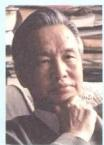
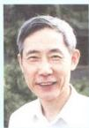
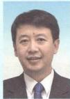
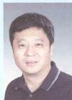

<!-- BEGIN OFFICIAL API PART part_001 -->

# 细胞生物学 (第5版)

主编 丁明孝 王喜忠 张传茂 陈建国

高等教育出版社

## Cell Biology

## 内容提要

《细胞生物学》第5版是一本全彩色印刷、图文并茂的教材。全书共16章，内容包括绪论、细胞生物学研究方法、细胞质膜、物质的跨膜运输、细胞质基质与内膜系统、蛋白质分选与膜泡运输、线粒体、叶绿体、细胞骨架、细胞核与染色质、核糖体、细胞信号转导、细胞周期与细胞分裂、细胞增殖调控与癌细胞、细胞分化与干细胞、细胞衰老与细胞程序性死亡、细胞的社会联系等。

本次修订以细胞重大生命活动为主线，以分子机制为视点，对教材结构体系进行了调整，由第4版的17章调整为16章，对全书超过20%的内容进行了修订、改写和补充。对基本概念、基础知识和基本理论进行了删繁就简，对学科发展前沿和研究新成果严谨引用、准确修正、及时更新，力争保持教材内容的基础性、科学性和前沿性。全书共有图片370余幅，其中照片120余幅，全部插图均为作者自主设计、绘制，全部照片源自作者科研成果或授权使用。

本书可供综合性大学、师范院校和农林、医学院校的本科生、研究生使用，也可供有关科研工作者参考。

## 图书在版编目（CIP）数据

细胞生物学 / 丁明孝等主编. --5 版. -- 北京：高等教育出版社，2020.5

ISBN 978-7-04-047157-1

I. ①细… II. ①丁… III. ①细胞生物学－高等学校－教材 IV. ① Q2

中国版本图书馆 CIP 数据核字（2019）第 140619 号

策划编辑 吴雪梅 王莉

版式设计 张楠

责任编辑 张磊 王莉

插图绘制 李钢

封面设计 王凌波

责任印制 韩刚

出版发行 高等教育出版社

网址 http://www.hep.edu.cn

社 址 北京市西城区德外大街4号

http://www.hep.com.cn

邮政编码 100120

网上订购 http://www.hepmall.com.cn

印刷 唐山市润丰印务有限公司

http://www.hepmall.com

开 本 889mm×1194mm 1/16

http://www.hepmall.cn

印 张 24

版 次 1995 年 1 月第 1 版

字 数 760 千字

2020年5月第5版

购书热线 010-58581118

印 次 2020 年 5 月第 1 次印刷

咨询电话 400-810-0598

定价 89.00 元

本书如有缺页、倒页、脱页等质量问题，请到所购图书销售部门联系调换

版权所有 侵权必究

物料号 47157-00翟中和院士北京大学教授

研究领域细胞的结构与功能；病毒与宿主细胞的相互作用

王喜忠  
四川大学教授

研究领域细胞遗传学

陈建国博士北京大学教授

研究领域细胞骨架的结构与功能；神经系统的发育及细胞分化

苏都莫日根博士北京大学教授

研究领域植物细胞及生殖生物学

邹方东博士四川大学教授

研究领域分子进化与系统发育；分子细胞生物学

蒋争凡博士北京大学教授

研究领域天然免疫与肿瘤丁明孝北京大学教授

研究领域细胞分化

张传茂博士北京大学教授

研究领域
细胞周期调控与肿瘤细胞生物学；细胞核结构、动态变化与功能

邓宏魁博士北京大学教授

研究领域体细胞重编程；细胞命运调控；再生医学

佟向军博士北京大学教授

研究领域脊椎动物的胚胎发育

陈丹英博士北京大学副教授

研究领域固有免疫的细胞信号转导

焦仁杰博士  
广州医科大学教授

研究领域染色质可塑性与信号转导

# 数字课程（基础版）

# 细胞生物学

(第5版)

主编 丁明孝 王喜忠 张传茂 陈建国

## 登录方法：

1. 电脑访问 http://abook.hep.com.cn/47157，或手机扫描下方二维码、下载并安装 Abook 应用。

2. 注册并登录，进入“我的课程”。

3. 输入封底数字课程账号（20位密码，刮开涂层可见），或通过Abook应用扫描封底数字课程账号二维码，完成课程绑定。

4. 点击“进入学习”，开始本数字课程的学习。

课程绑定后一年为数字课程使用有效期。如有使用问题，请点击页面右下角的“自动答疑”按钮。

## Abook

细胞生物学（第5版）

本数字课程资源主要包括书中各章的知识窗、教学课件、自测题、细胞生物学重要名词解释以及1901—2019年诺贝尔生理学或医学奖和部分化学奖获奖项目及获奖人员简介。本资源是对纸质教材的有力补充和拓展，供有兴趣的学生和教师参考。

5360 老记密码？

http://abook.hep.com.cn/47157

细胞生物学是生命科学的基础和前沿学科。探究细胞及其生命活动规律既是生命科学的出发点，也是生命科学的汇聚点。正如生物学大师 Wilson 所预言的那样，“一切生命的关键问题都要到细胞中去寻找答案”。细胞生物学是当前生命科学中发展最快的学科之一，随着学科前沿的不断拓展，人们对细胞的认识也随之日益充实和更新。作为一门本科生基础课的教材，如何从海量的资料中进行取舍，把基础与前沿知识有机地结合起来，寻求细胞中诸多生命科学问题的答案，一直是教材编写所遇到的难题，同时也是讲好这门课程所面临的主要问题。

自第4版《细胞生物学》教材问世以来，得到了广大师生的关心与厚爱，我们收到许多老师和学生的反馈意见与建议。为了做好再版工作，我们专程走访了17所不同类型的高校，听取了几十位任课教师的意见，他们对本书再版的章节框架及其具体内容提出了中肯建议，极大鼓励和鞭策了我们做好第5版教材的修订工作。这次修订，主要涉及到如下几个方面：

一、鉴于细胞生物学研究的迅猛发展，本次修订以细胞重大生命活动为主线，以分子机制为视点，对教材结构体系以及全书超过20%的内容进行了调整和补充。将第4版中的第一章和第二章内容合并、精简和充实；加大了“细胞分化”一章中干细胞生物学的分量；对“细胞信号转导”和“细胞衰老与细胞程序性死亡”等章节的内容做了较大幅度的修改与补充；对基础知识、基本概念和基本理论进行了删繁就简，适度引进和增加了新的研究成果，力图保持教材内容的基础性、科学性和前沿性的特点。同时，集成细胞生物学国家精品课程建设和研究成果，注意把握好拓宽知识和更新内容的分寸，以利于加强学生自学能力，调动学习的主动性。令人欣慰的是，在细胞分子生物学领域，国内涌现出一批令人瞩目的科研成果，如通过化学重编程获得多潜能干细胞，解析了葡糖转运蛋白、γ分泌酶等重要生物大分子复合体的三维结构，破解了RNA拼接的机理，提出染色质折叠新的结构模型等。这些内容，不仅有利于读者了解学科发展的动态和前沿知识，而且也有助于激发学生的学习热情。本教材一直力求“图文并茂”，这次再版又对其部分插图和照片做了修改和更新，依然采用彩版印刷，力图进一步增强其科学性、新颖性和可读性，以便于学生理解复杂的细胞生命活动的过程与机理。

二、现行教学计划中，细胞生物学理论课为3个学分。根据细胞生物学课程的定位和教学基本要求，第5版教材由第4版的17章51节调整为16章45节，共计76万字，以便更好地适应生物科学、生物技术、生物工程专业及农、林、医药等类专业本科生基础课教学的需要。翟中和院上反复强调：书不要越发越深，要尽量突出“精”，即“精彩”；读起来不累，“要”轻松愉快”；对教材的内容和文字，还需要反复推敲，反复磨练，大家还有很长的路要走。依照翟老师关于本次教材修订的指导思想，本教材的作者们付出了艰辛的劳动。我们觉得，第5版教材现有的篇幅和内容，应该更适于教师因地制宜地取舍与“少而精”地讲授，利于实现预定的教学目标。

三、在第5版教材的修订过程中，翟老师提议邀请从事干细胞生物学研究的邓宏魁教授和从事免疫学与细胞信号转导研究的蒋争凡教授参加本书的修订与编写工作。这两位老师在各自领域都做出了出色的研究成果，对干细胞、细胞分化和细胞信号转导等领域，具有较为深入和独到的理解，为本书的修订增添了新的活力。同时，翟老师还主动提出并极力要求不再担任本书的主编，由丁明孝、王喜忠、张传茂和陈建国四位教授共同担任第5版的主编。翟老师非常重视细胞生物学教学和教材建设。自1991年倡导并组织编写这本教材以来，为之付出了巨大的努力并取得了卓著的成绩。

知道，第1版《细胞生物学》（1995年）曾获教育部科学技术进步奖一等奖（1998）、国家科学技术进步奖三等奖（著作类，1999）；第2版《细胞生物学》（2000年）是教育部推荐的“面向21世纪课程教材”，同时也是“九五”国家级重点教材，获国家级优秀教材一等奖和国家级教学成果奖二等奖（2002）；第3版《细胞生物学》（2007年）是普通高等教育“十一五”国家级规划教材和高等教育出版社“百门精品教材”，获北京市精品教材一等奖和国家级教学成果奖二等奖（2009）；第4版《细胞生物学》（2011年）为“十二五”普通高等教育本科国家级规划教材，被200余所高等院校采用，成为国内生物类教材发行量最大的教材之一。翟老师对《细胞生物学》教材提出了殷切的期望，他说：“通过大家共同努力，该书越编越好，真正成为一部经得起考验的精品教材。”翟老师的鼓励，让我们每位作者铭记在心，深受感动。他对教材建设呕心沥血、严谨执着的精神，将激励我们一代一代地继续努力工作下去。

第 5 版《细胞生物学》教材的编写和修订，旨在与国内同类教材起到相得益彰的作用。然而，尽管我们为之付出了极大的努力，但由于细胞生物学发展迅速，知识结构不断拓展，许多概念和内容不断更新，以及我们自己的知识和能力有限，所以，此次修订中难免存在错漏之处，敬请读者批评指正。

当此第5版教材即将与读者见面之际，我们对国内外众多支持和帮助过我们的专家、学者和广大师生充满了感激之情。首先要感谢纽约大学兰岗医学中心孙同天教授和兰岗医学中心电镜室梁风霞副教授，他们极其热心、全力以赴地为本版教材征集并提供大量图片。感谢哈佛大学庄小威院士为本书修改了超高分辨率显微术一节并提供珍贵的图片，马普研究所郭强博士修订了蛋白酶体部分并提供相关资料与图片。感谢美国国立卫生研究院 Bechara Kaachar 教授，纽约大学兰岗医学中心 David Stokes 教授、Devrim Acehan 博士、Dan Littman 教授、孔祥鹏教授、周铭博士，瑞士巴塞尔大学 Urli Arbi 教授，苏黎世大学 Makus Noll 教授，华盛顿大学医学院 John Heuser 教授，得克萨斯大学 Potu N. Rao 教授，威斯康星大学 Hans Ris 教授，滨州州立大学刘爱民教授，日本东京大学医学院 Nobutaka Hirokawa 教授等，他们为本书惠赠照片或审订书稿，其支持和帮助是本书得以顺利出版的重要保障。

在本次修订过程中，还得到国内许多教授和专家的大力支持。北京大学程和平院士认真审阅了钙火花部分并提供图片，高宁教授和李治非博士审阅了核糖体一章并增加了新的内容和图片。清华大学施一公院士、颜宁教授、俞立教授、欧光朔教授，厦门大学韩家准院士，浙江大学洪健教授，复旦大学马红教授、同济大学祝建教授，南开大学胡俊杰教授和Yoko Shibata博士，山东大学医学院李伯勤教授，中国农业大学袁明教授，北京师范大学何大澄教授，中国科学院生物物理研究所李国红研究员和朱平研究员，中国科学院遗传与发育生物学研究所杨琳博士，北京生命科学研究所何万中研究员，北京大学张博教授、胡迎春博士、刘轶群博士、董巍博士、杜立颖老师、王承艳博士、王佳茗和姚安之女士等，他们或惠赠图片或撰写和校订书稿。从各方面予以热情的帮助，对此我们表示由衷的感谢！

感谢南开大学、武汉大学、华中科技大学、北京化工大学、中国农业大学、华中农业大学、北京林业大学、天津师范大学、北京师范大学、山西大学、河北大学、湖北大学等高校，在我们走访调研中，各校给予了全力的支持；特别是要感谢舒红兵院士、刘江东教授、卜文俊教授、王芳教授、荆艳萍教授和王兰教授等，他们对我们盛情接待、热心帮助，保障了我们调研工作顺利开展。感谢西北农林科技大学李绍军老师对本书提出许多中肯的意见。

在第5版教材修订过程中，策划编辑王莉女士和责任绘图师李钢博士始终兢兢业业、忘我付出，令本书编者深受感动。责任编辑张磊在该教材图文加工等方面给予了大力帮助。高等教育出版社林金安先生、生命科学与医学出版事业部吴雪梅女士给予了热情的帮助和指导，在此，我们表达诚挚的感谢！

在本教材即将完成修订之时，与我们共同奋斗十七载的良师益友王喜忠教授，不幸因病辞世。自1991年起，王老师在本教材的第1版至第5版的整个撰写和出版过程中，做了大量的组织工作和无私奉献。王老师为人豁达风趣，思路明朗清晰，善于把复杂的科学问题深入浅出地表述出来，对本教材的编写乃至对我国细胞生物学的教学都发挥了重要的作用。我们谨以第5版《细胞生物学》的出版，对王喜忠老师表示深切的怀念和深沉的敬意！

丁明孝 张传茂 陈建国

2019年7月

## 关于本书基因和蛋白质符号书写规范的说明

每个物种都有自己的基因和蛋白质命名惯例。对于基因符号，在某些物种中，全部用大写或小写字母表示；而在另一些物种中，第一个字母大写，其余字母小写。对于蛋白质符号，也存在类似的情况。但共同点是，基因符号总是用斜体字，蛋白质符号总是用正体字。

个性化的命名惯例使学习者无所适从。在很多情况下讨论问题时，仅需要泛指一种基因或蛋白质，而不需要具体说明是人源、鼠源或者拟南芥源，因而有必要做一些统一化处理。对于本书中基因和蛋白质符号的书写，特作出如下约定：

所有物种的基因符号，统一用斜体表示，其中第一个字母大写，其余字母小写，如Ras、Cdc2、Src、Fzo。在某些情况下，为区分功能或演化相关的基因，在基因符号中会添加字母或数字：若所加字母或数字位于基因符号之后，字母或数字与原符号之间不加连字符，如AccD、Dnm1、Adl2B，但若由此而引起误解的除外，如

Mtr1-1；若所加字母位于基因符号之前，则字母与原符号之间添加连字符，如 K-Ras、N-Myc、c-Myc。在指称突变体名称时，全部采用小写字母，如 fzo，除非其中的字母表示类型的区分，如 bimE7。

对于蛋白质的命名，情况稍微复杂。为避免强制统一对于既有规则的破坏，本书在作出约定的同时，尽量兼顾文献中的样式。在大多数情况下，与基因对应的蛋白质，以与基因同样的方式书写，但用正体而不是斜体，如Ras、Cde2、Src、Fzo。但个别蛋白质符号因鲜有文献采用仅首字母大写的书写方式，其蛋白质符号书写同文献，如AQP。

需要说明的是，本书用英文全称的首字母缩略词提及一类蛋白质或者某些蛋白质时，其名称根据英文缩略词构词法原则采用全部大写，如 HSP（heat shock protein）、GFP（green fluorescence protein）、IRE1（inositol requiring enzyme 1）。而在具体表征某个蛋白质时仍只用首字母大写，如 Hsp70、Hsp100。

第一章 绪论 …… 1
第一节 细胞学与细胞生物学 …… 1
一、细胞的发现 …… 1
二、细胞学说的建立及其意义 …… 2
三、从经典细胞学到实验细胞学时期 …… 3
四、细胞生物学学科的形成与发展 …… 4
第二节 细胞的同一性与多样性 …… 5
一、细胞是生命活动的基本单位 …… 5
二、细胞的基本类型 …… 7
三、病毒及其与细胞的关系 …… 14
思考题 …… 16
参考文献 …… 17

第二章 细胞生物学研究方法 …… 18
第一节 细胞形态结构的观察方法 …… 18
一、光学显微镜 …… 18
二、电子显微镜 …… 24
三、扫描隧道显微镜 …… 29
第二节 细胞及其组分的分析方法 …… 30
一、用超离心技术分离细胞组分 …… 30
二、特异蛋白抗原的定位与定性 …… 31
三、细胞内特异核酸的定位与定性 …… 32
四、细胞成分的分析与细胞分选技术 …… 32
第三节 细胞培养与细胞工程 …… 32
一、细胞培养 …… 32
二、细胞工程 …… 34
第四节 细胞及生物大分子的动态变化 …… 35
一、荧光漂白恢复技术 …… 35
二、酵母双杂交技术 …… 36
三、荧光共振能量转移技术 …… 36
四、放射自显影技术 …… 37第五节 模式生物与功能基因组的研究……38  
思考题……39  
参考文献……39  

第三章 细胞质膜……40  
第一节 细胞质膜的结构模型与基本成分……40  
一、细胞质膜的结构模型……40  
二、膜脂……42  
三、膜蛋白……45  
第二节 细胞质膜的基本特征与功能……49  
一、膜的流动性……49  
二、膜的不对称性……50  
三、细胞质膜相关的膜骨架……52  
四、细胞质膜的基本功能……54  
思考题……54  
参考文献……55  

第四章 物质的跨膜运输……56  
第一节 膜转运蛋白与小分子及离子的跨膜运输……56  
一、膜转运蛋白……56  
二、小分子及离子的跨膜运输类型……58  
第二节 ATP驱动泵与主动运输……62  
一、P型泵……62  
二、V型质子泵和F型质子泵……65  
三、ABC超家族……65  
四、离子跨膜转运与膜电位……66  
第三节 胞吞作用与胞叶作用……68  
一、胞吞作用的类型……68  
二、胞吞作用与细胞信号转导……71  
三、胞叶作用……72  
思考题……72

参考文献....73

第五章 细胞质基质与内膜系统....74
第一节 细胞质基质及其功能....75
一、细胞质基质的涵义....75
二、细胞质基质的功能....76
第二节 细胞内膜系统及其功能....78
一、内质网的结构与功能....78
二、高尔基体的形态结构与功能....86
三、溶酶体的结构与功能....92
思考题....99
参考文献....99

第六章 蛋白质分选与膜泡运输....100
第一节 细胞内蛋白质的分选....100
一、信号假说与蛋白质分选信号....100
二、蛋白质分选转运的基本途径与类型....103
三、蛋白质向线粒体和叶绿体的分选....104
第二节 细胞内膜泡运输....107
一、膜泡运输概述....107
二、COPⅡ包被膜泡的装配及运输....109
三、COPⅠ包被膜泡的装配与运输....111
四、网格蛋白/接头蛋白包被膜泡的装配与运输....112
五、转运膜泡与靶膜的锚定和融合....114
思考题....115
参考文献....116

第七章 线粒体和叶绿体....117
第一节 线粒体与氧化磷酸化....117
一、线粒体的基本形态及动态特征....117
二、线粒体的超微结构....121

## vi

三、氧化磷酸化……122  
四、线粒体与疾病……126  
第二节 叶绿体与光合作用……126  
一、叶绿体的基本形态及动态特征……127  
二、叶绿体的超微结构……130  
三、光合作用……132  
第三节 线粒体和叶绿体的半自主性及其起源……137  
一、线粒体和叶绿体的半自主性……137  
二、线粒体和叶绿体的起源……139  
思考题……141  
参考文献……142  

第八章 细胞骨架……144  
第一节 微丝与细胞运动……144  
一、微丝的组成及其组装……145  
二、微丝网络结构的调节与细胞运动……147  
三、肌球蛋白：依赖于微丝的分子马达……151  
四、肌细胞的收缩运动……153  
第二节 微管及其功能……156  
一、微管的结构组分与极性……156  
二、微管的组装与解聚……158  
三、微管组织中心……159  
四、微管的动力学性质……161  
五、微管结合蛋白对微管网络结构的调节……162  
六、微管对细胞结构的组织作用……162  
七、细胞内依赖于微管的物质运输……163  
八、纤毛和鞭毛的结构与功能……168  
九、纺锤体和染色体运动……171  
第三节 中间丝……171  
一、中间丝的主要类型和组成成分……171  
二、中间丝的组装与表达……173

三、中间丝与其他细胞结构的联系……174  
思考题……176  
参考文献……176  

第九章 细胞核与染色质……177  
第一节 核被膜……178  
一、核膜……178  
二、核孔复合体……179  
三、核纤层……184  
第二节 染色质……185  
一、染色质DNA……185  
二、染色质蛋白……187  
三、核小体……188  
四、染色质组装……189  
五、染色质类型……192  

第三节 染色质的复制与表达……195  
一、染色质的复制与修复……195  
二、染色质的激活与失活……195  
三、染色质与基因表达调控……199  
四、染色质的三维动态分布与细胞ID……203  

第四节 染色体……203  
一、染色体的形态结构……203  
二、染色体的功能元件……205  
三、染色体带型……206  
四、特殊染色体……207  

第五节 核仁与核体……208  
一、核仁的结构……209  
二、核仁的功能……210  
三、核仁的动态周期变化……210  
四、核体……210  

第六节 核基质……211思考题……211
参考文献……211

第十章 核糖体……213
第一节 核糖体的类型与结构……214
一、核糖体的基本类型与化学组成……214
二、核糖体的结构……215
三、核糖体蛋白质与RNA的功能……216
第二节 多核糖体与蛋白质的合成……218
一、多核糖体……218
二、蛋白质的合成……218
三、核糖体与RNA世界……221
思考题……223
参考文献……223

第十一章 细胞信号转导……224
第一节 细胞通信与信号转导……224
一、细胞通信……224
二、细胞的信号分子与受体……226
三、信号转导系统及其特性……230
第二节 G蛋白偶联受体及其介导的信号转导……233
一、G蛋白偶联受体的结构与作用机制……233
二、G蛋白偶联受体所介导的细胞信号通路……235
第三节 介导并调控细胞基因表达的受体及其信号通路……244
一、酶联受体及其介导的细胞信号转导通路……244
二、其他调控基因表达的细胞表面受体及其介导的信号转导通路……252
第四节 细胞信号转导的整合与控制……257
一、细胞对信号的应答反应具有发散性或收敛性特征……257
二、蛋白激酶的网络整合信息……257
三、信号的控制：受体的脱敏与下调……258

参考文献....260

第十二章 细胞周期与细胞分裂....261
第一节 细胞周期....261
一、细胞周期概述....261
二、细胞周期中各不同时相及其主要事件....263
三、细胞周期同步化....264
四、特殊的细胞周期....266
第二节 细胞分裂....269
一、有丝分裂....269
二、减数分裂....278
思考题....285
参考文献....285

第十三章 细胞增殖调控与癌细胞....287
第一节 细胞增殖调控....287
一、MPF的发现及其作用....287
二、p34 $^{d,e}$ 激酶的发现及其与MPF的关系....289
三、周期蛋白....290
四、CDK和CDK抑制因子....291
五、细胞周期运转调控....292
六、其他因素在细胞周期调控中的作用....298
第二节 癌细胞....298
一、癌细胞的基本特征....299
二、癌基因与抑癌基因....300
三、肿瘤的发生是基因突变逐渐积累的结果....302
四、肿瘤干细胞....303
五、肿瘤的治疗....304
思考题....305
参考文献....306

## viii

第十四章 细胞分化与干细胞……307
第一节 细胞分化……308
一、细胞分化的基本概念……308
二、影响细胞分化的因素……310
第二节 干细胞……313
一、干细胞概念及其分类……313
二、胚胎干细胞……314
三、成体干细胞……316
四、细胞命运重编程与诱导性多潜能干细胞……318
五、谱系重编程……320
六、干细胞应用……320
思考题……322
参考文献……322

第十五章 细胞衰老与细胞程序性死亡……323
第一节 细胞衰老……323
一、细胞衰老的概念……323
二、细胞复制衰老的特征……324
三、细胞复制衰老的机制……325
四、细胞衰老与个体衰老……326
第二节 细胞程序性死亡……327
一、多种形式的细胞死亡及其生物学意义……327
二、细胞凋亡的过程及分子机制……330
三、细胞程序性坏死的分子机制……336
四、植物细胞程序性死亡的分子机制……337
思考题……337
参考文献……338

第十六章 细胞的社会联系……339
第一节 细胞连接……339
一、封闭连接……339

二、锚定连接……341  
三、通信连接……342  
第二节 细胞黏着及其分子基础……345  
一、钙黏蛋白……346  
二、选择素……348  
三、免疫球蛋白超家族……348  
四、整联蛋白……349  
第三节 细胞外基质……350  
一、胶原……351  
二、弹性蛋白……353

三、糖胺聚糖和蛋白聚糖……353  
四、纤连蛋白和层粘连蛋白……354  
五、基膜与细胞外被……356  
六、植物细胞壁……357  
思考题……358  
参考文献……358  

附录 细胞生物学相关领域诺贝尔奖获奖情况……359  
索引……362
