# 第1章 绪论 · 双教材整合

按中文节顺序保留正文，在每节末插入对应英文内容。

---

## 第1章 绪论 · 章首导读

[返回本章](README.md) · [中文本章原文](中文原文.md)

<!-- BEGIN CN CN01-S00 -->
# 第1章 绪论

<!-- 章节边界按正文内容恢复；原始 MinerU 内容保留如下。 -->

# 绪论

许多科学家认为，生命科学的发展可以划分为三个阶段，即：19世纪以及更早的时期，是以形态描述为主的生物科学时期；20世纪上半叶，主要是实验生物学时期；20世纪50年代以来，由于DNA双螺旋结构的发现与中心法则的确立，生命科学进入了精细定性与定量的现代生物学时期。人们对细胞的认识大致也符合这一历史进程。那么作为经典生物学重要分支的细胞学（cytology）是在怎样的历史条件下建立和发展起来的呢？现代的细胞生物学（cell biology）又如何取代了细胞学的位置，发展成当今生命科学中一门备受关注的前沿学科呢？为此我们有必要重温这段科学发展的历史。

回顾学科发展史，不仅是简单地知道一些著名科学家的名字和他们对学科发展的贡献，更重要的是要了解人们在认知细胞的过程中，在每个时期所面临的核心问题及相关的代表人物，他们是如何分析和解决这些问题，最终形成学科的基本概念和基本理论。

因此，追溯本学科领域的认知历程，对我们了解和掌握认知规律，总结和归纳出本学科目前的基本理论与基本概念，以及学科面临的科学问题及解决途径，开创出自己未来的一片天地，是大有裨益的。我们也力求把这一教学思路贯穿在本书的其他章节中。

如果从细胞的角度去看整个生物界，我们会发现，五彩缤纷的生物界是由种类繁多、类型各异的细胞组成。在本书详细讲述细胞结构与功能之前，有必要浏览一下细胞世界中不同类型的细胞及其基本特征，了解细胞的同一性与多样性。作为非细胞形态的生物体——病毒及其与细胞的关系也将在本章作扼要的介绍。

<!-- END CN CN01-S00 -->

---

## 第1章 绪论 · 第一节 细胞学与细胞生物学

[返回本章](README.md) · [中文本章原文](中文原文.md)

<!-- BEGIN CN CN01-S01 -->
## 第一节 细胞学与细胞生物学

人们通常称1838—1839年施莱登（M.J.Schleiden）和施万（T.Schwann）确立的细胞学说、1859年达尔文（C.R.Darwin）确立的进化论和1866年孟德尔（G.J.Mendel）确立的遗传学为现代生物学的三大基石，可以说细胞学说又是后两者的“基石”，细胞学也正是在此基础上建立和发展的。20世纪50年代，分子生物学的建立和发展，改变了诸如动物学、植物学、胚胎学、生理学、遗传学等经典生物学的面貌，同时也产生了细胞生物学等新型的学科，极大促进了整个生命科学和生物技术的发展。

细胞学是研究细胞结构和功能的生物学分支学科。细胞生物学是应用现代物理学与化学的技术成就和分子生物学的方法与概念，在细胞水平上研究生命活动的学科。那么这两个学科有什么联系，区别在哪里？当前人们又是如何理解细胞生物学这一学科的呢？我们只要从这两个学科的建立和发展历程就不难得出答案。

## 一、细胞的发现

人的肉眼很难观察到细胞，没有显微镜的研制，就不会有细胞的发现。欧洲13世纪就发明了眼镜，16世纪末才研制出第一台显微镜。英国学者胡克（R.Hooke）对软木塞良好的密封性感到好奇，于是用自制的显微镜（放大倍数为 $40\sim 140$ 倍），观察了软木（栎树皮）的薄片，第一次描述了植物细胞的构造，并首次借用拉丁文cellar（小室）这个词，来描述他所看到的类似蜂巢状结构（实际上观察到的只是死亡组织中的细胞壁）。后来英文用cell这个词，中文译为“细胞”。胡克有关细胞的首次描述，出现在他1665年发表的著作《显微图谱》中。因此，人们也就认为细胞是在1665年由胡克发现的。

此后不久，荷兰学者列文虎克（A. van Leeuwenhoek）设计和研制了当时最好的显微镜，以极大的好奇心，观察了许多活体动植物细胞、原生动物甚至细菌，孜孜不倦长达50年之久。1674年他在观察鱼的红细胞时，还描述了细胞核的结构。就真正的活细胞发现而言，当属列文虎克是不足为过的。令人惊叹的是，为人们打开细胞世界之门做出巨大贡献的列文虎克（见知识窗1-1 $^{⑥}$ ）竟是一位布店的学徒。

随着显微技术的发展，在此之后的170多年历史中，更多的学者对动植物的微观结构进行了广泛的研究，积累了大量资料：如1833年，英国植物学家R. Brown发现植物细胞内存在细胞核；接着人们观察到动物细胞的核仁。随着对细胞及其与有机体关系的认识不断加深，人们终于有可能对这些知识进行科学的概括，并上升到具有普遍指导意义的理论高度，提出了细胞学说。

## 二、细胞学说的建立及其意义

细胞学说产生于19世纪的德国，这并非偶然。当时的德国自然科学相当发达，自然哲学非常流行，科学家面对纷繁复杂的自然界时，总是力图运用哲学思辨，提炼出纷乱现象背后的本质。于是，人们对植物和动物的大量显微观察所得到的结果，借助哲学思辨的头脑分析和总结归纳，上升到理论的高度，细胞学说应运而生。1838年，德国植物学家施莱登发表了《植物发生论》，指出细胞是构成植物的基本单位。1839年，德国动物学家施万发表了《关于动植物的结构和生长的一致性的显微研究》论文，在总结前人工作的基础上提出：一切植物、动物都是由细胞组成的，细胞是生物体的基本结构单位。这就是著名的“细胞学说”(celltheory)。然而，此刻的细胞学说并不完善，在不少细节上还存在谬误。如施莱登曾认为，细胞的繁殖是新细胞在老细胞的核中产生，通过细胞崩解而完成的。这种看法随即被一系列学者的研究所修正。德国医生和病理学家R. Virchow 1858年指出，“细胞只能来自细胞”，“正如动物只能来自动物，植物只能来自植物一样”。此外，他还提出有机体的一切病理表现都是基于细胞的损伤。Virchow关于细胞来自细胞的观点，进一步指明了细胞作为一个相对独立的生命活动基本单位的性质，通常被认为是对细胞学说的一个重要补充和完善。因此，有些人认为细胞学说应当是在1858年才最后完成的。

  
施莱登（1804—1881）

  
施万（1810—1882）

细胞学说提出后的十几年中，这一理论迅速得到充实、发展而日臻完善，并影响了许多生物领域的研究。如 C. T. E. von Siebold 研究表明，不仅动植物，而且原生动物也是由细胞组成的，它就是只含一个细胞的动物，能独立地进行全部生命活动；A. Kolliker 通过对胚胎学的研究，证明了生物个体发育的过程就是细胞不断繁殖和分化的连续过程。至19世末期，细胞学说得到了普遍的承认，也标志着细胞学的建立，从而为现代生物学的发展奠定了基础。恩格斯说：“有了这个发现，有机的有生命的自然产物的研究——比较解剖学、生理学和胚胎学——才获得了巩固的基础。”同时他把细胞学说、能量守恒定律和达尔文进化论并列为19世纪自然科学的“三大发现”。进化论解释了生物的多样性，而细胞学说提出了生物同一性的细胞学基础，因而大大推进了人类对整个自然界的认识，有力地促进了自然科学和哲学的进步。

## 三、从经典细胞学到实验细胞学时期

细胞学说的建立，很自然地掀起了对多种细胞进行广泛地观察与描述的高潮。19世纪的最后25年，各种细胞器和细胞分裂活动相继被发现，这称为细胞学的经典时期。进入20世纪以后，人们对细胞的探索从好奇或消遣性地观察进入了主动地科学实验，称为实验细胞学时期，细胞学呈现出繁荣的景象，同时也促进和带动了生物学多学科的发展。

经典细胞学时期的主要进展有如下几个方面：

(1) 原生质理论的提出 1840 年 J. E. Pukinje 和 1846 年 H. von Mohl 首次将动物和植物细胞内的均匀、有弹性的胶状物质称为 “原生质”（protoplasm）。1861 年，M. Schultze 提出了原生质理论，认为组成有机体的基本单位是一小团原生质，这种物质在各种有机体中是相似的。1880 年，J. von Hanstein 提出 “原生质体”（protoplast）概念，细胞的概念进一步演绎成具有生命活性的一小团原生质。protoplast 显然比 cell（小室）对细胞的理解更为确切，但由于 cell 一词已经通行，所以就沿用下来。然而，这一重要的基本概念的深化，极大促进了人们对细胞中具有生命活性的物质及其结构的研究进程。

(2) 细胞分裂的研究 W. Flemming 在动物细胞, E. A. Strasburger 在植物细胞中都发现了细胞核的分裂过程, 1880 年 Flemming 称其为有丝分裂 (mitosis), 并证实有丝分裂的实质是核内丝状物 (染色体) 的形成及其向两个子细胞的平均分配。van Beneden (1883 年) 和 Strasburger (1886 年) 分别在动物与植物细胞中发现减数分裂, 至此发现了细胞分裂的基本类型。

(3) 细胞器的发现 随着显微镜分辨力的提高和石蜡切片及多种染色方法的发明，各种细胞器相继被发现。如1883年van Beneden和T. Boveri发现中心体，1894年R. Altmann发现线粒体，1898年C. Golgi发现高尔基体等。这一系列重要的发现，极大地丰富了人们对细胞的认识并引发人们更深入的探索。

1892年，O.Hertwig在《细胞和组织》一书中，提出生物学的基础在于研究细胞的特性、结构和机能，并以细胞为基础，对所有生物学现象进行归纳与综合，从而使细胞学成为生命科学的一个独立分支。同时，由于他采用实验方法研究海胆和蛔虫卵发育中的核质关系，实际上创立了实验细胞学。此后，人们广泛应用实验的手段与分析的方法，借助各种模式生物来研究细胞学中的一些重要问题，为细胞学的研究开辟了众多新的领域，并与生物学其他领域相结合，形成了一些重要的分支学科。特别是在后期，组织与细胞体外培养技术的建立与应用，使实验细胞学得到迅速的发展，其主要内容包括：

(1) 细胞遗传学 1876 年 Hertwig 发现了动物的受精现象；1883 年 van Beneden 发现了蛔虫的卵和精子的染色体只有体细胞的一半；1888 年 Strasburger 等在植物体中也发现受精现象，并证明生殖细胞的染色体数是体细胞的一半；1900 年，孟德尔在 34 年前发现的遗传法则被重新提出；1905 年 E. B. Wilson 发现性别与染色体的关系，A. Weissman 推测遗传单位有序地排列在染色体上。在这些研究的基础上，德国的 Boveri 同美国的 W. Sutton 不谋而合地提出遗传的染色体假说，把染色体的行为同孟德尔的遗传因子联系起来；1910 年，摩尔根 (T. H. Morgan) 用果蝇做了大量的实验遗传学工作，证明基因是决定遗传性状的基本单位，而且直线排列在染色体上。上述的工作使细胞学与遗传学结合起来，奠定了细胞遗传学的基础（见知识窗 1-2 $^{⑥}$ ）。

细胞遗传学主要从细胞学角度，特别是从染色体的结构和功能，以及染色体和其他细胞器的关系来研究遗传现象，阐明遗传和变异的机制。其核心就是染色体—基因学说。虽然当今染色体和基因的概念与研究内容已发生了根本的变化，人们已经很少提起细胞遗传学这个概念，但染色体结构与基因表达控制关系这一科学问题仍是人们关注的热点。

(2) 细胞生理学 19 世纪末期开始, 人们注意到活细胞的运动, 如细胞的变形运动、细胞质流动、纤毛与鞭毛运动和肌肉收缩等, 并进行了相关的研究。随着生理学技术的发展, 人们在细胞质膜及其通透性、细胞的应激性与神经传导等方面也开展了大量研究工作。

1909年，R. Harrison和A.Carrel创立了组织培养技术，为研究细胞生理学开辟了一条重要途径。1943年，A.Claude用高速离心机从活细胞内把细胞核和各种细胞器（如线粒体、叶绿体）分离出来，在体外研究它们的生理活性，这对研究细胞器的功能和化学组成，以及酶在各细胞器中的定位等起了很大的作用。细胞生理学的主要研究内容是：细胞对其周围环境的反应，细胞生长与繁殖的机制，细胞从环境中摄取营养的能力，细胞的兴奋性、收缩性、分泌性，生物膜的主动运输和能量传递与生物电等。随着现代生物学的快速发展，细胞生理学这一分支学科似乎在逐渐淡化，但其研究内容却不断延伸，如物质跨膜运输、信号转导等已成为当前细胞生物学的重点。可认为这是细胞生理学研究与其他学科交融发展的结果。

(3) 细胞化学 早期对生物体化学成分和基本生化反应的研究，是脱离细胞的形态结构进行的。1924年，R. Feulgen等首先建立了对细胞内脱氧核糖核酸（DNA）特异性的定性检测方法，这就是众所周知的福尔根反应（Feulgen reaction）。此后，1940年J. Brachet用甲基绿-派洛宁染色方法来测定细胞中的DNA与RNA，T.O.Casperson用紫外显微分光光度法测定DNA在细胞中的含量。细胞组分分离技术、放射自显影技术和超微量分析等方法的广泛运用，对细胞内核酸与蛋白质的代谢研究也有很大的促进作用。细胞化学这一分支学科一直保持着强劲的发展势头，由显微分光光度法到流式细胞术，由福尔根反应到核酸分子原位杂交技术，由免疫荧光技术到激光扫描共聚焦显微技术等，使人们对细胞成分，特别是核酸与蛋白质的定性、定位、定量以及动态变化研究达到前所未有的精确性与专一性。

上述实验细胞学分支学科并没有停步不前，其内容与内涵也在不断发展与演变，直至现在依然还是细胞生物学的重要组成部分。

## 四、细胞生物学学科的形成与发展

20世纪50年代以来，随着电子显微镜超薄切片技术的发展，在人们眼前呈现出一个崭新的细胞微观世界——细胞超微结构。不仅已知的细胞结构，诸如线粒体、高尔基体、细胞质膜、核膜、核仁、染色质与染色体等结构以新的面貌展现在人们的面前，而且还发现了一些新的重要的细胞结构，如内质网、核糖体、溶酶体、核孔复合体与细胞骨架体系等，从而为细胞生物学学科的形成奠定了基础。那么，这些精细的细胞结构是怎样组成的？确切的功能是什么？它们又是如何相互协同作用，完成各种复杂的代谢活动和生命过程呢？这些问题仅靠超微形态学的研究是难以回答的。1953年沃森(J.Watson)和克里克(F.Crick)等人发现了DNA分子双螺旋结构，随后，人们提出了遗传中心法则，标志着分子生物学这一新兴学科的问世。正是由于分子生物学概念与技术的引入，分子生物学、生物化学、遗传学等学科与细胞学之间相互渗透与结合，人们对细胞结构与功能的研究水平达到了新的高度。20世纪70年代以后，细胞生物学这一学科最后得以形成并确立。20世纪70年代建立的转基因技术和单克隆抗体技术，80年代各种模式生物的建立及其大量突变株的分析，特别是90年代以来，经典基因打靶技术以及TALEN、CRISPR/Cas技术的广泛应用，DNA测序技术、生物芯片技术的快速发展，都极大地促进了人们在分子水平上对细胞的基本生命活动规律的探索。人类基因组计划及随后的蛋白质组等“组学”的兴起和快速发展，极大地拓展了对生物分子研究的视野，各种高通量技术以及生物信息技术的发展使人们能够“认识”并能以实验手段加以研究的基因和蛋白质的种类有了爆炸性的增加，从而也使得过去相对孤立的调控因子或信号通路的研究，日益趋于迅速细化的网络式系统。而细胞生物学自身也成为一门学科综合性很强、特别是与分子生物学密不可分的前沿学科。正因如此，自20世纪80年代以来，人们开始赋予细胞生物学以“分子细胞生物学”或“细胞分子生物学”等名称。诺贝尔奖最能集中反映当代生物科学的重大成就。综观近50年来荣获诺贝尔生理学或医学奖、化学奖的课题内容，很多都是与细胞生物学密切相关（见本书附录及配套数字课程）。

细胞生物学是应用现代物理学与化学的技术，以及分子生物学的概念与方法，侧重从细胞作为生命活动的基本单位的思维为出发点，研究和揭示细胞基本生命活动规律的科学。它从显微、亚显微与分子水平上研究细胞结构与功能，细胞的增殖、分化、衰老、死亡，以及细胞信号转导和基因表达调控，细胞起源与进化等重大生命过程。可以看到，细胞的结构与功能、细胞重大生命活动及其分子机制的研究日趋深入，已经成为21世纪生命科学研究的重要领域，并以空前的广度和深度，直接和强有力地影响和改变着人类的生活。

无论是单细胞的生物还是多细胞的有机体，生命体都呈现出多层次、非线性的复杂体系的性质，是高度动态的耗散性的结构体系，而细胞则是生命体结构与功能的基本单位，有了细胞才有完整的生命活动。所以毫不奇怪，细胞是生命活动的枢纽层次，细胞生物学成为生命科学的枢纽学科和前沿学科。细胞的研究既是生命科学的出发点，又是生命科学微观和宏观研究的汇聚点，也因之成为当前生命科学中发展最快的领域之一。早在1925年，生物学大师Wilson就提出“一切生命的关键问题都要到细胞中去寻找答案”。重温这句名言，至今仍感内涵深刻。

生物的生殖发育、遗传、神经（脑）活动等重大生命现象的研究都要以细胞为基础，一切疾病发病机制也是以细胞病变为基础，以基因工程和蛋白质工程为核心的现代生物技术主要是以细胞操作为基础而进行的，因此，细胞生物学不仅与生命科学的各个分支学科，而且也与农业、医学的发展有着密不可分的联系，它将在解决人类面临的重大问题、促进经济和社会发展中发挥重要的作用。

<!-- END CN CN01-S01 -->

> 本节中文内容完整保留；英文教材未设置同主题的独立小节。

---

## 第1章 绪论 · 第二节 细胞的同一性与多样性

[返回本章](README.md) · [中文本章原文](中文原文.md)

<!-- BEGIN CN CN01-S02 -->
## 第二节 细胞的同一性与多样性

地球上的生命形式千差万别，已经命名的物种超过200万种，实际存在的物种估计数以千万计，但作为生命基本单位的细胞，则有显著的基本共性，诸如相似的化学组成、最基本的结构形式、类似的遗传语言和相似的代谢调控机制。同时，细胞又表现出它的多样性，正是由于存在种类繁多、形态各异、功能多样的细胞，才得以形成不同的物种和构建多细胞生物体的组织和器官。本书的开始，有必要扼要介绍一下五彩缤纷的细胞世界的同一性与多样性。

## 一、细胞是生命活动的基本单位

地球上只存在一种生命形式, 就是以细胞为基本形态结构的生命体。细胞是生命活动的基本单位, 所有的细胞都具有共同的基本特征:

（一）细胞的基本共性

## 1. 相似的化学组成

在自然界存在的90种元素中，细胞只利用其中的20多种元素构成自身，其中包括碳（C）、氢（H）、氧（O）、氮（N）、磷（P）、硫（S）等，这些化学元素形成以碳为基本骨架的氨基酸、核苷酸、脂质和糖类，是构成细胞的基本构件；与细胞种类多样性相比，细胞的化学组成显得非常同一，所有细胞都是由几乎同样的材料建成的。也正因如此，生物体可以拆卸其他生物的“零件”来构建自身，这也是生物存活和演化的物质基础。

## 2. 脂 - 蛋白体系的细胞质膜

所有的细胞表面均有主要由磷脂双分子层与蛋白质构成的细胞质膜，细胞质膜使细胞与周围环境保持相对的独立性，形成相对稳定的细胞内环境，并通过细胞质膜与周围环境进行物质交换和信号传递。

## 3. 相同的遗传装置

所有的细胞都以双链 DNA 作为遗传信息的载体，以 RNA 作为转录物指导蛋白质的合成，蛋白质的合成场所都是核糖体。除一些原生生物外，所有的细胞都使用几乎相同的一套遗传密码。提示所有的细胞都起源于共同的原始祖先。

## 4. 一分为二的分裂方式

所有细胞的增殖都以一分为二的方式进行分裂，核内的遗传物质在分裂时均匀地分配到两个子细胞内，这是生命繁衍的基础与保证。从演化的观点看，现存的所有细胞都是共同原始祖先的后代。

## （二）细胞的大小

细胞的大小是细胞的重要特征，各类细胞的大小有一定规律（图1-1A）。一般而言，按细胞平均直径粗略计算，支原体细胞比最小的病毒大10倍，细菌细胞比支原体大10倍，而多数动植物细胞比细菌大10多倍，一些原生动物细胞又比一般动植物细胞大10倍。

对于高等动植物，不论物种的差异多大，同一器官与组织的细胞，其大小总是在一个恒定的范围之内。合适的细胞体积，能够保证细胞与周围环境进行正常的物质与信息交换，保证细胞内物质运输和信号传递的正常进行，对于细胞行使正常的生物学功能至关重要。那么细胞的体积受什么因素控制呢？

一般认为，细胞的大小取决于核糖体的活性，因为蛋白质的量由核糖体来决定。在酵母和果蝇中已经得到几种核糖体蛋白发生变异的突变体，它们的细胞大小都发生了变化。随之人们发现从果蝇到哺乳类的各种生物，都应用一套几乎完全相同的信号网络来调控细胞大小。如在哺乳动物中，这一网络的中心是一个叫做mTOR（mammalian target of rapamycin，哺乳动物雷帕霉素靶蛋白）的蛋白激酶，因其能被雷帕霉素（rapamycin）抑制而得名，如果该蛋白失活，会导致细胞体积变小（图1-1B）。

  
图1-1 细胞的大小及其调控

  
A. 各类细胞直径的比较。B. 多细胞生物主要通过 IGF/PI3K/Akt/mTOR 信号途径调控细胞的体积。IGF：胰岛素样生长因子；PI(4,5)P $_{2}$ ：4,5-二磷酸磷脂酰肌醇；PI(3,4,5)P $_{3}$ ：3,4,5-三磷酸磷脂酰肌醇；PI3K：3-磷脂酰肌醇激酶；Akt：蛋白激酶 B；mTOR：哺乳动物雷帕霉素靶蛋白。

细胞大小的决定还受到其他多种因素的影响。例如植物细胞在旺盛分裂期的大小，也是取决于蛋白质等生物大分子的积累；但在完成分裂后，植物细胞的体积会增加数倍甚至数千倍，这个过程不是依赖有机物的积累，而是中央液泡的膨胀。

那么能够独立生存的最小的生命体有多大呢？也就是能够独立完成全部生命活动的最小的细胞是哪种细胞呢？这就是单细胞生物——支原体（mycoplast）。支原体的直径一般只有0.1\~0.3 $\mu$ m，具有细胞基本的结构和功能。近年来通过对支原体基因系统的删除，人们发现至少需要约400个基因，才能维持一个自由生活的细胞的代谢活动。前几年轰动一时的“人造生命”（见知识窗1-3）的成功，也正是以支原体作为研究对象的。然而从严格的意义上讲，细胞中“人造”的部分只是体外合成的支原体基因组，而细胞的其余部分仍是现存的支原体细胞的组分。可见，即使是最小、最简单的细胞，目前也无法人工合成。

## （三）细胞是生命活动的基本单位

从生命起源的角度看，细胞的出现标志着生命的诞生。在此后漫长的生命演化过程中，细胞一直扮演生命活动基本单位的重要角色。

1. 一切有机体都由细胞构成，细胞是构成有机体的基本单位

尽管地球上生命的形态和代谢方式大相径庭，但无一例外均由细胞构成。有些生物仅由一个细胞构成，另一些生物则由数百乃至万亿计细胞构成。人体内的细胞大约分为200多种不同的类型（图1-2），刚出生的婴儿约由 $2 \times 10^{12}$ 个细胞组成，成年人大约含有 $3.7 \times 10^{13}$ 个细胞；人脑是由 $10^{11}$ 个神经元和几十倍于此的神经胶质细胞构成的复杂体系。

  
图1-2 人体由200多种不同的细胞组成（董巍博士惠赠）

## 2. 细胞是代谢与功能的基本单位

有机体一切代谢活动最终要靠各种细胞来完成。单细胞生物依靠一个细胞完成运动、呼吸、排泄和生殖等一系列生理活动；多细胞生物则更多地依靠细胞之间的相互协同作用，通过不同形态结构的细胞有机地组织起来，形成执行特定功能的器官，完成其复杂的生理功能。

## 3. 细胞是有机体生长发育的基础

有机体的发育与生长是依靠细胞的分裂、分化、迁移与凋亡来实现的，这是自然界最为复杂的过程之一。虽然目前对其中的很多机理还不甚了解，但毋庸置疑，细胞是生长与发育的基本单位。

## 4. 细胞是繁殖的基本单位，是遗传的桥梁

单细胞生物的繁殖表现为细胞一分为二，多细胞生物依靠细胞分裂形成特殊形式的生殖细胞——孢子或配子，上一代的遗传信息存在于生殖细胞的核中。孢子萌发或配子结合为合子，是下一代生命的开始，细胞核中的遗传信息指导下一代生命体的构建。

## 5. 细胞是生命起源的标志，是生物演化的起点

生命是经过长期的化学演化，由非生命的物质形成的。含有遗传物质的原始细胞的形成，标志着生命的出现，此后便进入生物演化阶段，最终形成了纷繁多样的生命世界。

## 二、细胞的基本类型

生物圈的成员数以千万计，而我们的肉眼能看到的成员，包括已发现的150万种以上的动物、50万种左右的植物和接近8万种的真菌，它们形态结构都大相径庭，表现出明显的不连续，这也是生物分类的基础。但在显微镜下，从大象到小鼠，从参天巨树到高不盈寸的小草，它们的细胞结构却大致相同：都由细胞质膜、细胞质和细胞核组成。而细菌等微生物，它们的细胞结构则表现出很大的不同，最明显的一点是没有膜围绕的典型的细胞核。由此看来，生物界最显著的差异更多地表现在细胞层次上，而不是大象和小鼠的区别，甚至不是大象和小草的不同。

## （一）细胞的类型与生物界的类群

根据细胞结构上的的差异，可以把细胞分为真核细胞（eucaryotic cell, $eu$ 是希腊语“真实”的意思，karyon是希腊语“核”的意思）与原核细胞（procaryotic cell）两大类。这一概念最早是在20世纪60年代由著名细胞生物学家H.Ris提出来的，它不仅对细胞生物学，而且对整个现代生命科学均具有深远影响，由此延伸而把整个生物界划分为原核生物（prokaryote）与真核生物（eukaryote）两大类群（域，domain）。原核生物几乎都由单个原核细胞构成，而真核生物却可以分为单细胞真核生物与多细胞真核生物。随着研究的深人们发现，原核细胞与真核细胞的区别，远不只有无细胞核，它们在代谢方式、遗传信息传递方式、基因表达调控、信号转导等各个方面都存在显著差异。

通过在基因和基因组层次上的深入研究，人们发现，在原核细胞中有一类群，它们的遗传信息表达系统与其他的原核细胞差异相当大，反而与真核细胞更为接近。于是人们把这类细胞从原核细胞中独立出来，另立一个类群，称为古核细胞（即古细菌，archaea），由古核细胞所构成的生物称古核生物（archaeon）。

这样，整个生物界的类群包括3个域：原核生物、古核生物和真核生物。在此基础上又分为6个界：由原核生物组成的原核生物界，由古核生物组成的古核生物界，以及由真核生物组成的原生生物界、真菌界、植物界和动物界（图1-3）。

## （二）两类代表性的原核细胞：细菌与蓝藻

原核细胞大约出现在30\~35亿年前，代表一种原始的细胞类群。原核生物一般体积小，直径0.2\~10 $\mu$ m，但其繁殖快，在地球上分布的广度与对生态环境的适应

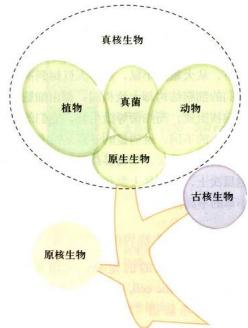  
图1-3 生物界的基本类群

所有生物起源于共同的祖先，最终演化出3种基本的的细胞类型和构成生物类群的6个界。古核细胞与真核细胞在进化上的亲缘关系更近些。

性比真核生物大得多。另一方面，原核生物取得的选择优势是有代价的——它们的基因量少，基因表达调控简单，无法进行复杂的细胞分化，也就难以形成多细胞生命体。因此它们虽然选择优势明显，却只能占有非常有限的生态位，导致物种数目远少于真核生物。

原核生物包括支原体、衣原体、立克次氏体、细菌、放线菌和蓝藻等多个家族。下面我们以细菌和蓝藻为代表，介绍原核细胞的基本特征。

## 1. 细菌

细菌是自然界分布最广、个体数量最多、与人类关系极为密切的有机体，在大自然物质循环过程中处于极重要的地位。多数细菌的直径大小在0.5\~5.0μm之间。

（1）细菌细胞的基本结构 电子显微镜下可以看到构成细菌的细胞壁、细胞质膜、核糖体和核区等基本结构（图1-4），有时还可以观察到中膜体、荚膜与鞭毛等特化结构。

所有细菌的细胞壁具有的共同成分是肽聚糖，青霉素可抑制肽聚糖的合成。革兰氏阳性菌（G+）因细胞壁的肽聚糖含量极高，故对青霉素很敏感；反之，革兰氏阴性菌（G-）由于肽聚糖含量很少，对青霉素不敏感。

细菌的细胞质膜除了具有选择性交换物质等功能外，膜上丰富的酶系执行许多重要的代谢功能，如有氧呼吸、蛋白质的合成与分泌及细胞壁合成等。因此，细菌的细胞质膜可以完成真核细胞中诸如线粒体、内质网和高尔基体所承担的部分功能。

某些细菌具有鞭毛（flagellum），直径约20 nm。虽然中英文单词完全相同，但细菌鞭毛的结构与真核生物的鞭毛完全不一样，它仅由一种鞭毛蛋白（flagellin）构成，运动机理也迥然不同。

每个细菌细胞含 5 000～50 000 个核糖体，核糖体的沉降系数为 70S（详见第十章）。除了核糖体外，没有类似真核细胞的细胞器。

细菌细胞没有核膜围绕的典型的细胞核结构，但绝大多数细菌有明显的核区或称类核（nucleoid）。核区形态不规则，四周是较致密的胞质物质。细菌

  
图1-4 细菌的结构  
A. 猪丹毒杆菌（Erysipelothrix rhusiopathiae）（G\*）的电镜照片。B. 细菌结构的模式图。（A图由丁明孝提供）

DNA 也在拟核蛋白（不同于组蛋白）的协助下进行高效包装：在不到 $1 \mu m^{3}$ 的核区空间内，折叠着长达 $1200 \sim 1400 \mu m$ 的环状 DNA，所含的遗传信息量足够编码 $2000 \sim 5000$ 种蛋白质，因此细菌 DNA 的空间构建十分精巧。

人们常把细菌的核区 DNA 也称为染色体，实际上它没有真正的染色体结构，只是习惯上沿用了真核细胞的染色体概念。

(2) 细菌基因组与遗传信息表达体系 细菌基因组很小，为环状 DNA，如大肠杆菌仅为 $4.64 \times 10^{6}$ bp。一般有一个复制起始点，复制时，细菌 DNA 环附在细菌质膜上作为支持点，复制不受细胞分裂周期的限制，可以连续进行。细菌的 DNA 复制、RNA 转录与蛋白质合成的结构装置在空间上没有分隔，可以同时进行，即细菌 DNA 分子边复制边转录，正在转录的 mRNA 又与核糖体结合翻译肽链。转录与翻译在时间与空间上是连续进行的，这是细菌乃至整个原核细胞与真核细胞最显著的差异之一（图 1-5）。

在细菌细胞内还存在可进行自主复制的更小的环状DNA分子，称质粒（plasmid），质粒基因可以赋予细菌某种新的性状。细菌失去质粒DNA而无妨于正常代谢活动。质粒也常用作实验室基因重组与基因转移的载体。

(3) 细菌的增殖 细菌以二分裂方式进行增殖，速度非常快，在适宜的培养条件下，大肠杆菌每 $20\mathrm{min}$ 就增殖一代，而其DNA复制则需要 $40\mathrm{min}$ ，是细胞周期长度的两倍。为什么细胞周期比DNA复制的时间还短呢？原来在迅速增殖的细菌中，上一次DNA复制尚未完成时，下一次DNA复制就已经开始了。在刚刚分开的子细胞中，DNA已经完成了部分复制（详见第十二章）。

细菌的细胞分裂受到严格调控。人们已发现起始DNA分离的关键蛋白FtsZ（filamenting temperature-sensitive mutant Z)。FtsZ 与真核细胞的管蛋白（tubulin）是同源物，其功能类似于动物胞质分裂中的微丝。

  
图1-5 细菌的复制、转录和翻译连续进行的示意图

## 2. 蓝藻

蓝藻又称蓝细菌（cyanobacteria），是自养型原核生物，能进行与高等植物类似的光合作用并放出 $\mathrm{O}_2$ 。蓝藻出现在约30亿年以前， $\mathrm{O}_2$ 的释放，改变了地球大气圈的组成，使原始地球的还原型大气变成富含 $\mathrm{O}_2$ 的氧化型大气，为真核生物和后生生物的起源与演化创造了条件。

蓝藻分布十分广泛，且能生长在极为贫瘠的环境下。蓝藻细胞内含有丰富的色素，使细胞呈现各种颜色，虽名为蓝藻，却不一定都是蓝绿色。

蓝藻细胞的体积比其他原核细胞大得多，直径一般在1\~10 μm，有的可达60 μm（如颤藻，Oscillatoria princeps）。有些蓝藻经常以丝状、片状或中空球状的细胞群体存在，“发菜”就是蓝藻的丝状体，对固定沙漠有重要作用。

（1）蓝藻的细胞结构 蓝藻细胞质膜外有细胞壁和一层胶质的鞘。蓝藻的细胞壁与革兰氏阴性菌十分相似，由一层薄的肽聚糖组成，外面包有外膜。所不同的是，细胞壁内层含有纤维素。蓝藻的细胞质部分有很多同心环样的膜片层结构，称为类囊体（thylakoid），光合色素和电子传递链均位于此。类囊体膜上还有大量藻胆蛋白所构成的藻胆体，负责将光能传递给叶绿素a。蓝藻细胞中央部位在光镜下较周围原生质明亮，是遗传物质DNA所在部位，相当于细菌的核区，称为中心质或中央体。实际上“中心质”经常不位于中央，与周围胞质无明确界限。蓝藻的DNA也几乎为裸露的，复制也可连续进行。与细菌的核区不同，中心质DNA的拷贝数在不同种类和不同个体中变动很大，有些种类含有多个DNA拷贝。

蓝藻细胞中有许多内含物，如脂滴、羧酶体（光合作用固定 $CO_{2}$ 的酶）和气泡（外被蛋白质鞘，调节细胞在水中的位置）等（图 1-6）。

(2) 细胞分裂与分化 蓝藻细胞分裂时, 细胞中部向内生长出新横隔壁, 将中心质与原生质分为两半。一般情况下, 两个子细胞在一个公共的胶质鞘包围下保持在一起, 并不断分裂而形成丝状、片状等多细胞群体。

丝状蓝藻在氮源不足时，群体中5%\~10%的细胞分化为异形胞（heterocyst）（图1-6B）。异形胞中的固氮酶以光系统Ⅰ制造的ATP为能量，将 $N_{2}$ 还原为 $NH_{3}$ 。

C  
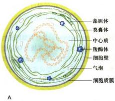  
图1-6 蓝藻

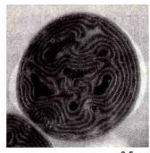  
A. 电镜下鱼腥藻（Anabaena）的超微结构示意图，显示细胞壁、细胞质膜、类囊体等结构。B. 荧光显微镜下的丝状蓝藻鱼腥藻，红色细胞为正常的营养体细胞，蓝色细胞为具有固氮作用的异形胞。C. 鱼腥藻电镜超薄切片图片。（B 图由赵进东博士惠赠；C 图由胡迎春博士惠赠）

## （三）古核细胞（古细菌）

通过直系同源基因（orthologous gene）序列相似性的比较，可以确定物种间的演化关系。应用这种方法，人们赫然发现，形态结构非常相似的原核生物并不是统一的类群，而是在极早的时候就演化为两大类：古细菌（archaebacteria）与真细菌（eubacteria）。

古细菌又称为古核生物（archaeon），常常发现于极端特殊环境中，过去把它们归属为原核生物，是因为其形态结构、DNA结构及其基本生命活动方式与原核细胞相似。最早发现的古细菌是产甲烷细菌类，接着陆续又发现盐细菌（halobacteria，生长在浓度大的盐水中）、热原质体（thermoplasma，生长在煤堆中）、硫氧化菌（sulfolobus，生长在硫磺温泉中）等几百种古细菌。后来发现古细菌在地球上广泛分布。

因为很多古细菌生存在极度特殊的环境中，所以长期不为人们所重视。后来发现在海洋深处的热泉周围高温的环境中存在众多嗜热细菌，人们很自然联想到它们可能代表了原始地球环境中生命存在与繁衍的特定形式，在细胞起源与演化中扮演过重要角色而非演化盲支。因而，古细菌成为细胞起源与演化研究领域的热点。

古细菌形态多样，细胞大小在0.1\~15 $\mu$ m不等，以分裂或出芽的方式进行增殖。

## 1. 细胞壁

古细菌也有细胞壁，染色呈 $\mathrm{G}^{+}$ 或 $\mathrm{G}^{-}$ ，但没有胞壁酸和肽聚糖，因此溶菌酶以及抑制肽聚糖合成的青霉素等抗生素对古细菌的生长没有抑制作用。

## 2. 细胞质膜

虽然古细菌的质膜也是由脂类与蛋白质构成，但却具有其独自的特征：如细菌的脂肪酸是以酯键与甘油结合，而在古细菌中，是以醚键与甘油结合；膜脂中还有一类特殊的中性脂质——鲨烯衍生物；极端耐热菌的质膜甚至是由40个碳长的四乙醚组成的“单层膜”（图1-7）。

## 3. DNA 及其基因结构

古细菌DNA为环状，有操纵子结构，大部分基因无内含子，有多顺反子mRNA存在，这些都与细菌相似。另外一些特征却与真核细胞类似，如DNA和组蛋白结合成类似核小体结构；编码tRNA和rRNA，甚至部分编码蛋白质的基因中有内含子；RNA聚合酶为复杂多聚体；翻译起始的氨基酸为Met（细菌是fMet）等。已经测序的詹氏甲烷球菌（Methanococcus jannaschii）的1700多个编码蛋白质的基因中，近 $60\%$ 是特有的基因序列。

## 4. 核糖体

多数古细菌类的核糖体虽然也是70S，但含有60种以上蛋白，数量介于真核细胞与真细菌之间，而且其中的rRNA与蛋白质的性质更接近于真核生物。根据对5S rRNA基因的分子演化分析，认为古细菌与真核生物同属一大类，而与细菌差距甚远。与真核细胞类似，针对细菌核糖体的抗生素不能与古核细胞核糖体结合，所以不能抑制其蛋白质合成。古核生物核糖体的结构和生物学特性显然更接近于真核生物。

## 图1-7 古细菌的细胞膜脂

A. 古细菌的膜脂中，经链通常由20个碳组成，并以醚键与甘油结合。B. 古细菌的脂双层膜，由双层 $C_{20}$ 二乙醚（植烷醇甘油二乙醚）组成，镶嵌有蛋白质。C. 嗜热古细菌的膜是由膜蛋白和 $C_{40}$ 四乙醚（如二联植烷醇二甘油四乙醚、环式二植烷醇二甘油四乙醚等）组成的单层膜，十分坚挺，能够对抗高温。D. 古细菌膜中常常含有一定量的非极性脂质，它们是鲨烯的衍生物。

## （四）真核细胞

人们发现最早真核细胞的化石年龄约21亿年。现存的真核生物种类繁多，包括了单细胞原生生物和全部多细胞生物（动植物和大部分真菌）。在此仅就真核细胞的最基本知识作概要介绍，有关真核细胞的结构与功能以及重要生命活动，将在本书的各章节一一详述。

## 1. 真核细胞的基本结构体系及其组装

真核细胞在内部构建成许多精细的具有专门功能的结构单位。在亚显微结构水平上，真核细胞可以划分为三大基本结构系统：①以脂质及蛋白质成分为基础的生物膜结构系统；②以核酸与蛋白质为主要成分的遗传信息传递与表达系统；③由特异蛋白质分子装配构成的细胞骨架系统。这些由生物大分子构成的基本结构体系，构成了细胞内部结构精密、分工明确、职能专一的各种细胞器，并以此为基础保证了细胞生命活动具有高度程序化与高度自控性。

(1) 生物膜系统 生物膜的厚度基本在 $8 \sim 10 \mathrm{~nm}$ 范围之内。细胞表面的质膜及其相关结构，主要功能是进行选择性的物质跨膜运输与信号转导。细胞内部由双层核膜将细胞分成两大结构与功能区域——细胞质与细胞核，使得基因表达得以精密调控。在细胞质内以膜围绕形成很多重要的细胞器：线粒体与叶绿体是主要的供能与产能结构；内质网是生物分子合成的基地，脂质、糖类与很多蛋白质分子是在内质网表面合成并分选运输；高尔基体是对内质网上合成的物质进行加工，包装与运输的细胞器；溶酶体是细胞内的“消化系统”。生物膜还为生命的化学反应提供了表面，很多重要的酶定位在膜上，大部分生化反应在膜的表面进行。

(2) 遗传信息传递与表达系统 遗传信息的储存、传递与表达系统是由 DNA、RNA 和蛋白质组成的复杂体系。DNA 与组蛋白构成了染色质的基本结构——核小体（nucleosome），它们的直径为 10 nm；由核小体盘绕与折叠成紧密程度不同的异染色质与常染色质，在细胞分裂阶段又进一步包装而形成染色体。染色质结构，连同 DNA 的修饰酶和转录因子等共同调控基因的转录。核仁主要是转录 rRNA 与核糖体亚基装配的场所。核糖体是由 rRNA 与数十种蛋白质构成的颗粒结构，其功能是将 tRNA 携带的氨基酸根据 mRNA 的指令连接成肽链。

（3）细胞骨架系统 细胞的骨架系统是由一系列特异的结构蛋白装配而成的网架，对细胞形态与内部结构的合理排布起支架作用。细胞骨架可分为胞质骨架与核骨架，实际上它们又是相互联系的。胞质骨架主要由微丝、微管与中间纤维（也称中间丝）等构成。微丝直径5\~7 nm，主要功能是细胞运动和信号传递；微管直径为24 nm，其主要功能是为细胞内物质的运输提供轨道，以及形成有丝分裂的纺锤丝；中等纤维直径为10 nm，分为多种类型，具有组织特异性，主要对细胞起支撑作用。

核骨架包括核纤层（nuclear lamina）与核基质（nuclear matrix）。核纤层的成分是核纤层蛋白（lamin），核基质的成分则颇为复杂。它们与基因表达、染色质构建与排布有关系。

从上述三种基本结构体系的分析，我们可以在亚显微尺度上找到一个基本共同点，不论是生物膜的厚度，遗传信息表达体系中颗粒与纤维结构的大小，还是骨架纤维的直径，都是在5\~20 nm的尺度范围。近年，纳米生物学（nanobiology）——在纳米尺度上的生物分子结构与功能的研究，可能为在更深层次上揭示大分子复合体与生命现象的关系提供更有力的证据。

蛋白质、核酸和脂质等生物分子如何逐级组装并最终形成细胞赖以进行生命活动的细胞结构体系，是当前生命科学研究中所面临的基本问题之一。现在已知的生物大分子组装方式，大体可分为自我装配（self-assembly）、协助装配（aided-assembly）和直接装配（direct-assembly）三种。自我装配可视为从头发生（de novo），装配的相关信息存在于参与装配的分子本身，中间纤维的自组装就属于这类。协助装配方式是指，在组成大分子复合物装配过程中，除需要形成最终结构的亚基外，还需要其他组分的介入，但这些组分不参加最终的产物，像核糖体的组装需要200多种蛋白质的介入。直接装配是指某些亚基直接装配到预先形成的基础结构上，如细胞质膜扩展过程中，新的膜脂和膜蛋白加入到已存在的膜上。

通过装配形成细胞的基本结构体系，具有重要的生物学意义。首先，以蛋白质复合体取代超大蛋白质，可以加快转录和翻译的速度，减少基因突变和转录、翻译过程中发生错误的概率；其次，通过装配与去装配，更容易调节与控制多种生物学过程，如在细胞有丝分裂中，细胞发生的复杂变化及其精准的调控（详见第十四章）。

## 2. 植物细胞与动物细胞

动植物体内存在多种不同的、功能各异的细胞类型，但这些细胞却都有着基本相同的结构与功能体系。大部分细胞器与细胞结构，其形态结构与成分相近，功能也很类似（图1-8）。

但是，由于动物与植物的营养方式和代谢方式有很大的区别，因此以自养和根植为特征的植物的细胞，在某些方面与动物细胞也表现出明显的区别。

（1）细胞壁 植物细胞壁的主要成分是纤维素，还有果胶质、半纤维素与木质素等。显然，这是植物定植生存和自养的代谢方式所必需的。由于细胞壁的存在，植物细胞之间形成了区别动物细胞的特殊的连接通道——胞间连丝（详见第十六章）。也许由于同样的原因，植物细胞中至今尚未发现类似动物细胞的中间纤维。

(2) 液泡 液泡是由单层脂蛋白膜包围的封闭系统，溶液中含有无机盐、糖类、氨基酸、蛋白质、生物碱与色素等物质。植物细胞常常同时存在两种不同的液泡，即中性的储存蛋白质的液泡和酸性的裂解液泡。前者是植物细胞的代谢库，起调节细胞内环境的作用；后者含有水解酶，能够降解衰老的细胞器，起着类似溶酶

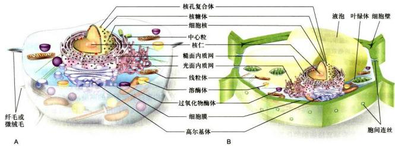  
图1-8 动物细胞（A）和植物细胞（B）模式图

体的功能。

中央大液泡是随着细胞的生长，由小液泡合并与增大而形成的。因而，在细胞质中氮元素基本不增加的情况下，通过“廉价”的液泡填充细胞，增加细胞的体积，从而扩大了吸收太阳能的面积。同时，为了维持植物细胞内的膨压，必须不断地将溶质转运进液泡中，以维持植物细胞和组织的刚性。

（3）叶绿体 叶绿体是植物细胞内最重要、普遍存在的质体（plastid），是进行光合作用的细胞器。质体是植物细胞中由双层膜包裹的一类细胞器的总称，与糖类的合成与贮藏密切相关，是绿色植物细胞特有的细胞器。

质体是由原质体发育而来。原质体没有色素，存在于茎尖的分生组织细胞中。光照情况下，原质体内合成叶绿素，发育为叶绿体。

除了在上述的结构与功能方面的明显差别外，植物细胞与动物细胞在细胞的增殖、分化、衰老和死亡等生命活动中，以及细胞的能量与物质代谢、信息传递和物质转运方面，也存在明显的差异。如植物细胞分裂以后，普遍有一个体积增大与成熟的过程，细胞体积会增加数倍甚至成千上万倍；又如植物细胞常常要合成数以万种的、并不直接参与生长发育过程的次生代谢产物（secondary metabolite），又称植物天然产物（natural product）。这些神秘的代谢产物不仅为人类提供了药物和调味剂等多种化合物，更是在长期的演化过程中，植物体能够适应周围的生态环境并得以生存的必要保障。

## （五）原核细胞、古核细胞与真核细胞的比较

原核细胞、古核细胞与真核细胞是三个最基本的细胞类群，它们最根本的区别归纳如下（表1-1）：

## 1. 细胞膜系统的演化

真核细胞以膜系统的演化为基础，首先把细胞分为两个相对独立的部分——细胞核与细胞质，细胞质内又以膜系统为基础分隔为结构更精细、功能更专一的单位——各种重要的细胞器。细胞内部结构与职能的分工是真核细胞区别于原核细胞的重要标志。

随着细胞体积的增大与细胞内部结构的复杂化，细胞内部需要有空间上的合理布局，必然需要有一个精密的支架。细胞骨架主要担任了这个角色。

## 2. 遗传信息量与遗传装置的扩增与复杂化

正是在细胞内膜系统演化基础上，出现了细胞内部结构与功能的区域化与专一化，这是细胞演化过程中的一次重大飞跃，导致了遗传装置的扩增与基因表达方式的相应变化。真核细胞的基因组一般远远大于原核细胞的，作为遗传信息载体的DNA也由原核细胞的环状单倍性变为线状多倍性；基因数量大大增加，由几千个演化到2万～3万个；同时，细胞核的存在，使真核细胞基因表达实现了多层次调控，远比原核生物精细与复杂，为完成复杂的生命活动提供了基础。真核生物除了编码基因外，还有不编码任何蛋白质或RNA的基因间隔序列和内含子。内含子的出现，使同一个RNA可以通过可变剪接，编码出多种不同的蛋白质。哺乳动物的2.5万\~3万个编码蛋白质的基因，估计能够翻译出10万多种蛋白质，大大增加了生物的复杂程度。在此基础上，很多真核生物成为多细胞生物，细胞出现了显著而复杂的分化。

表 1-1 三类细胞基本特征的比较

<table><tr><td>特征</td><td>原核细胞</td><td>古核细胞</td><td>真核细胞</td></tr><tr><td>细胞质膜</td><td>有(多功能性)</td><td>有(多功能性)</td><td>有</td></tr><tr><td>核膜</td><td>无</td><td>无</td><td>有</td></tr><tr><td>染色体</td><td>由一个(少数多个)环状DNA分子构成的单个染色体,DNA不与或很少与蛋白质结合</td><td>由环状DNA分子构成的单个染色体,DNA与与组蛋白结合</td><td>2个染色体以上,染色体由线状DNA与蛋白质组成</td></tr><tr><td>核仁</td><td>无</td><td>无</td><td>有</td></tr><tr><td>核糖体</td><td>70S(包括50S与30S的大小亚基),对氯霉素敏感</td><td>70S(包括50S与30S的大小亚单位),对氯霉素不敏感</td><td>80S(包括60S与40S的大小亚基),但对氯霉素不敏感</td></tr><tr><td>翻译起始</td><td>fMet</td><td>Met</td><td>Met</td></tr><tr><td>膜质细胞器</td><td>无</td><td>无</td><td>有</td></tr><tr><td>核外DNA</td><td>细菌具有裸露的质粒DNA</td><td>有质粒</td><td>线粒体DNA,叶绿体DNA</td></tr><tr><td>细胞壁</td><td>主要由肽聚糖形成</td><td>由蛋白质形成,不含肽聚糖</td><td>如有,成分为纤维素与果胶(植物)或几丁质(真菌)</td></tr><tr><td>细胞骨架</td><td>无</td><td>无</td><td>有</td></tr><tr><td>细胞增殖(分裂)方式</td><td>二分裂</td><td>二分裂</td><td>有丝分裂为主</td></tr></table>

由于真核细胞拥有多条DNA分子，并且DNA与蛋白质形成复杂的染色质和染色体等高级结构形式，加之真核细胞内部结构的庞大与复杂性，给遗传物质的准确复制与均等无误地分配到子细胞增加了“难度”，真核细胞发展出一整套复杂精密的体系，严格调控细胞周期的进程，完成细胞增殖（详见第十三章）。原核细胞增殖过程中没有有丝分裂器的出现，也没有像真核细胞那样明确的细胞周期。

原核生物和真核生物在地球上已经共同生存了20多亿年，长期的共存，使两者之间形成了复杂的相互关系。有些原核生物是真核生物的病原体，有些相互依存。例如人的消化道中存在由1000多种微生物组成的肠道菌群，总数达10万亿。在正常情况下，人体肠道菌群的结构相对稳定，宿主为它们提供栖息地和营养物质，而菌群的定植不仅不会对宿主致病，反而对宿主的正常生命活动必不可少，它们合成许多种B族维生素和必需氨基酸，促进铁、锌等元素的吸收，某些肠道菌群还对免疫系统的正常发育与维持至关重要（图1-9）。

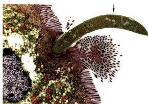  
图 1-9 定植于小鼠回肠末端的分节丝状菌（segmented filamentous bacterium，箭头所示）。这种细菌能够刺激宿主 T 辅助淋巴细胞 Th17 的增殖，分泌 IL17 等细胞因子，加强宿主对致病菌的抵御能力。（梁凤霞博士、Ivaylo Ivanov 博士和 Dan Littman 博士惠赠）

## 三、病毒及其与细胞的关系

既然细胞是生命活动的基本单位，那么作为非细胞形态的生命体——病毒，是否是个例外呢？我们知道，病毒是迄今发现的最小、最简单的有机体。病毒只是一种生物大分子复合体，本身不表现任何生命特征，所有的病毒必须在细胞内繁殖才能表现出其生命特征。因此，从这个角度去看，细胞依然可以看作生命活动的基本单位。如果我们对病毒做一些扼要介绍，就更清楚地看出，不仅病毒繁殖的每一步骤，就连病毒的起源也与细胞密不可分。

## （一）病毒与细胞的区别

病毒与细胞的区别主要表现在以下几个方面：

（1）病毒很小，结构极其简单，没有核糖体等任何细胞结构，因此，不可能独自进行任何代谢活动。绝大部分病毒的大小只有20～200 nm，必须在电子显微镜下才能清楚地看到。

(2) 遗传物载体为 DNA 或 RNA。所有细胞中都含有 DNA 和 RNA，并以双链 DNA 分子作为遗传物质的载体。然而，有些病毒的遗传物质为 DNA，有些为 RNA。因此分别称之为 DNA 病毒或 RNA 病毒。通常每一种病毒粒子中只含有 DNA 或 RNA，病毒的基因组复制与基因表达，也必须在细胞内进行。

(3) 以复制和装配的方式进行增殖。病毒的增殖过程，如同生产汽车，在细胞这个生产病毒的工厂中，首先合成大量的病毒核酸以及各种病毒蛋白，然后由这些“部件”装配成新的子代病毒。因此，一般把病毒的增殖称为复制，而细胞只能以分裂的方式增殖。

（4）彻底的寄生性。病毒虽然具备了生命活动的最基本特征（增殖与遗传），但只是一类不“完全”的生命体，必须利用宿主细胞结构、“原料”、能量与酶系统进行繁殖，因此，有人称之为分子水平上的寄生。有些病毒，只要把它们的遗传物质（DNA或RNA），注入到细胞中，就可以繁殖出正常的子代病毒。

## （二）病毒及其在细胞内的增殖

病毒是由核酸和一种或多种蛋白质组成的（图1-10）。包裹病毒核酸的衣壳（capsid）由蛋白质形成，衣壳与核酸构成病毒的核壳体（nucleocapsid），病毒的衣壳有保护核酸的作用。有些病毒在核壳体之外，还围有脂双层的囊膜（envelope），其主要成分为脂质与蛋白质。脂双层来自于细胞膜，而蛋白质由病毒基因编码。

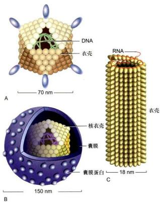  
图1-10 几种病毒结构的示意图  
A. 腺病毒，由病毒 DNA 和衣壳组成。B. 疱疹病毒，病毒的核衣壳外面包被一层脂双层囊膜。C. 烟草花叶病毒，一种 RNA 病毒。

病毒在宿主细胞内的增殖是病毒生命活动与遗传性的具体表现。病毒增殖的第一步是识别并进入细胞。不同的病毒可通过其表面的蛋白质，识别细胞表面特异的受体（蛋白质或糖蛋白），因而感染特定的细胞，我们把这种细胞称之为病毒的宿主细胞。目前，人们成功治愈艾滋病的一种方法，就是将造血干细胞中HIV受体蛋白基因Ccr5剔除，然后对患者进行骨髓移植，患者体内新生成的T淋巴细胞，由于缺少HIV受体蛋白，病毒无法识别和侵染，最终病愈。

病毒可以通过不同途径进入宿主细胞。腺病毒、流感病毒、HIV和辛德毕斯病毒等病毒采用一种如同特洛伊“木马计”的策略：细胞通过主动的胞饮作用，把与细胞受体结合的病毒拉进细胞，造成了病毒的感染；随后，病毒“篡夺”了细胞对代谢过程的“指导”作用，利用宿主细胞的全套代谢机构，以病毒核酸为模板，进行病毒核酸的复制与转录，并翻译病毒蛋白质，进而装配成新一代的病毒颗粒，最后从细胞中释放出来，再感染其他的细胞，开始下一轮的增殖周期（图 1-11）。

病毒在细胞内的增殖过程是病毒与细胞相互作用的极为复杂的过程，多种病毒感染可诱发细胞凋亡。有趣的是，某些病毒编码的蛋白质起到抑制细胞凋亡的作用，使病毒得以完成其繁殖过程。

对病毒与细胞相互关系的研究，极大地推动了细胞生物学研究的进展。比如病毒癌基因致细胞癌变过程的研究，不仅促进了细胞原癌基因的发现，也加深了人们对细胞增殖与调控机制的认识。

## （三）病毒与细胞在起源与演化中的关系

病毒是非细胞形态的生命体，其生命活动只能在细胞内实现。因此，病毒与细胞在起源上的关系一直是人们很感兴趣的问题，目前存在三种主要观点：

$$
\begin{array}{l} \text {生物大分子} \longrightarrow \text {病毒} \longrightarrow \text {细胞} \\ \text {生物大分子} \stackrel {{\text {病毒}}} {{<  }} \text {细胞} \\ \text {生物大分子} \longrightarrow \text {细胞} \longrightarrow \text {病毒} \end{array}
$$

在半个多世纪前，第一种观点占优势，认为病毒是生物与非生物之间的桥梁，病毒具有生物与非生物的两重性。按此逻辑的推理，显然是生物大分子先组装成病毒，再由病毒进化为细胞。然而，由于病毒彻底的寄生性，所有病毒必须在细胞内增殖，所以，没有细胞的存在，很难想象会有病毒的生存。因此，病毒的起源不可能先于细胞。目前，第二与第三种观点比较容易接受。在生命起源过程中，由生物大分子分别演化出细胞与病毒这两种不同类型的生命体。但由于尚未发现病毒的化石，因此，人们更倾向于第三种观点，即病毒是由细胞或细胞组分演化来的，这一观点也得到了很多实验结果的支持。

细胞是生命的基本单位。人们对生命的认识过程是从个体一细胞一分子逐渐深入，这也是学科发展的基本趋势。如果从生命的层次或生物演化的角度来看，细胞则是产生和决定生命活动的最基本层次。从17世纪人们在显微镜下发现细胞至细胞学说的建立，从19世纪Flemming发现染色体，20世纪20年代摩尔根提出遗传的染色体学说，到20世纪50年代初DNA双螺旋结构的发现以及2003年人类基因组计划的完成，从核移植到体外干细胞的诱导成功，这些人类探索生命奥秘的里程碑，无不显示出细胞生物学是生命科学的核心学科。

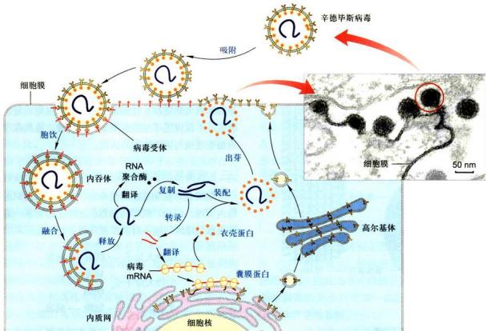  
图 1-11 病毒在细胞中的增殖过程  
辛德毕斯病毒（Sindbis virus）是一种昆虫病毒，属披膜病毒科，由正二十面体的核衣壳和脂蛋白囊膜组成。图示病毒在细胞质中繁殖的过程。电镜图片显示病毒出芽、释放的过程。（梁凤霞博士惠赠）

细胞生物学的发展速度与发展趋势，从细胞生物学教科书的内容及其版本更新之快也可以明显地反映出来。在此，我们推荐下面6本教材作为主要参考书，并以此做为本章的结束。

[1] Alberts B, Johnson A, Lewis J, et al. Molecular Biology of the Cell. 6th ed. New York: Garland Publishing Inc., 2014.

[2] Alberts B, Hopkin K, Johnson A D, et al. Essential Cell Biology. 5th ed. New York: Garland Publishing Inc., 2018.

[3] Karp G. Cell and Molecular Biology: Concepts

## 思考题

1. 如何理解“细胞是生命活动的基本单位”这一重要概念？

2. 为什么说支原体可能是最小、最简单的细胞存在形式？

and Experiments. 8th ed. New York: John Wiley and Sons Inc., 2015.

[4] Lodish H, Berk A, Kaiser C A, et al. Molecular Cell Biology. 8th ed. New York: W. H. Freeman and Company, 2016.

[5] Becker W H, Kleinsmith L J, Hardin J, et al. The World of the Cell. 8th ed. San Francisco: Benjamin Cummings, 2014.

[6] Cassimeris L, Lingappa V R, Plopper G. Lewin's Cells. 3rd ed. Sudbury: Jones and Bartlett Publishers, 2013.

3. 怎样理解“病毒是非细胞形态的生命体”？请比较病毒与细胞的区别并讨论其相互的关系。

4. 试从演化的角度比较原核细胞、古核细胞及真核细胞的异同。

5. 细胞的结构与功能相关是细胞生物学的一个基本原则，你是否能提出相关的论据来说明之？

1. Eme L, Spang A, Lombard J, et al. Archaea and the origin of eukaryotes. Nature Reviews Microbiology, 2017, 15(12): 711-723.

2. Kater L, Thoms M, Barrio-Garcia C, et al. Visualizing the assembly pathway of nucleolar pre-60S ribosomes. Cell, 2017, 171(7): 1599-1610.

3. Lloyd A C. The regulation of cell size. Cell, 2013, 154(6): 1194-1205.

4. Ruvinsky I, Meyuhas O. Ribosomal protein S6 phosphorylation: from protein synthesis to cell size. Trends in Biochemical Sciences, 2006, 31(6): 342-348.

5. Serino M, Luche E, Chabo C, et al. Intestinal microflora and metabolic diseases. Diabetes & Metabolism, 2009, 35(4): 262-272.

6. Young J K. Introduction to Cell Biology. Singapore: World Scientific Publishing Co., 2010.

<!-- END CN CN01-S02 -->

---

## 对应英文内容

### 英文补充：细胞共同特征、三域系统与真核细胞

> 对应中文板块：细胞共同特征、三域系统与真核细胞。英文来源：Molecular Biology of the Cell，第7版，第1章；[本章完整原文](../来源/英文教材/01_Cells_Genomes_and_the_Diversity_of_Life/chapter.md)。物理PDF页码范围：40–87（整章范围）。

<!-- BEGIN EN EN01-H000-H030 -->
INTRODUCTION TO THE CELL

#### Cells, Genomes, and the Diversity of Life

The surface of our planet is populated by living things—organisms—curious, intricately organized chemical factories that take in matter from their surroundings and use these raw materials to generate copies of themselves. These organisms appear extraordinarily diverse. What could be more different than a tiger and a piece of seaweed or a butterfly and a tree? Yet our ancestors, knowing nothing of cells or DNA, saw that all these things had something in common. They called that something “life,” marveled at it, struggled to define it, and despaired of explaining what it was or how it worked in terms that relate to non-living matter.

The remarkable discoveries of the past 100 years or so have not diminished the marvel—quite the contrary. But they have removed the central mystery regarding the nature of life. We can now see that all living things are made of cells: small, membrane-enclosed units filled with a concentrated aqueous solution of chemicals and endowed with the extraordinary ability to create copies of themselves by growing and then dividing in two.

Because cells are the fundamental units of life, it is to cell biology—the study of the structure, function, and behavior of cells—that we must look for answers to the questions of what life is and how it works. With a deeper understanding of cells and their evolution, we can begin to tackle the grand historical problems of life on Earth: its mysterious origins, its stunning diversity, and its invasion of every conceivable habitat. Indeed, as emphasized long ago by the pioneering cell biologist E. B. Wilson, “the key to every biological problem must finally be sought in the cell; for every living organism is, or at some time has been, a cell.”

Despite their apparent diversity, living things are fundamentally similar inside. The whole of biology is thus a counterpoint between two themes: astonishing variety in individual particulars and astonishing constancy in fundamental mechanisms. In this chapter, we begin by outlining the universal features common to all life on our planet, along with some of the fundamental properties of their cells. We then discuss how an analysis of DNA genomes allows scientists to position the wide variety of organisms in an evolutionary “tree of life.” This

#### C HAP T E R

#### IN THIS CHAPTER

The Universal Features of Life on Earth

Genome Diversification and the Tree of Life

Eukaryotes and the Origin of the Eukaryotic Cell

Model Organisms

approach, which quantifies how closely organisms are related to one another, allows us to identify the three major branches of life on Earth, eukaryotes, bacteria, and archaea—each with unique qualities. We shall see that the familiar world of plants and animals—the focus of scientists for many centuries—makes up only a small slice of the complete diversity of life, the vast majority of which is invisible to the unaided human eye.

After exploring some of the ways that genomes change over evolutionary times, we highlight the handful of model organisms that biologists have chosen to focus on to dissect the molecular mechanisms underlying life. A few specific viruses, including SARS-CoV-2, pose grave threats to humans, so they too have become objects of intensive study. For this reason, this section also includes an introduction to viruses, the ubiquitous parasites that have evolved to feed on cells. Viruses are now recognized to be the most abundant biological entities on the planet.

#### THE UNIVERSAL FEATURES OF LIFE ON EARTH

There are more than 2 million described species living on Earth today, but many, many more are yet to be discovered. Each species is different, and each reproduces itself faithfully, yielding progeny that are unique to that species. Thus, the parent organism hands down information specifying, in extraordinary detail, the characteristics that the offspring will have. This phenomenon of heredity is central to the definition of life: it distinguishes life from other processes, such as the growth of a crystal, or the burning of a candle, or the formation of waves on water, in which structures are generated without the same type of link between the peculiarities of parents and offspring. A living organism must consume free energy to exist, as does a candle flame. But life employs this free energy to drive a very complex system of chemical reactions that create and maintain the intricate organization of its cells, all as specified by the hereditary information in those cells.

Most living organisms are single cells. Others, such as us, are like vast multicellular cities in which groups of cells perform specialized functions that are linked by intricate systems of intercellular communication. But even for the aggregate of more than $1 0 ^ { 1 3 }$ cells that makes up a human body, the whole organism has been generated by cell divisions from a single cell. The single cell therefore contains all of the hereditary information that defines a species (**Figure 1–1**). The cell must also contain all of the machinery needed to gather raw materials from the environment and to construct from them a new cell in its own image, complete with a new copy of the hereditary information of its parent. Every cell on Earth is truly amazing.

#### All Cells Store Their Hereditary Information in the Form of Double-Strand DNA Molecules

Computers have made us familiar with the concept of information as a measurable quantity—106 bytes to record a few hundred pages of text or an image from a digital camera, $1 0 ^ { 9 }$ bytes for a 60-minute video streamed from the Internet, and so on. Computers have also made us well aware that the same information can be recorded in many different physical forms: the discs and tapes that we used 25 years ago for our electronic archives have become unreadable on present-day machines. Living cells, like computers, store information, and it is estimated that they have been evolving and diversifying for more than 3.5 billion years. One might not expect that they would all store their information in the same form or that the hereditary information carried by one type of cell should be readable by the information-handling machinery of another. And yet it is so. This fact provides compelling evidence that all living things on Earth have inherited the form of their genetic instructions, as well as how to use them, from a universal common ancestral cell. This ancestor is thought to have existed roughly 3.5–3.8 billion years ago.

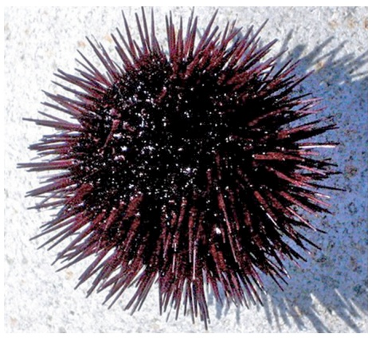

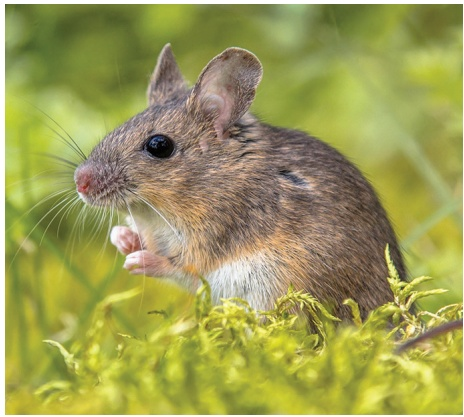

(B)

(D)

(F)

Figure 1–1 The hereditary information in the fertilized egg cell determines the nature of the whole multicellular organism that will develop from it. As indicated, although their starting cells look superficially similar, the egg of a sea urchin gives rise to a sea urchin (A and B), the egg of a mouse gives rise to a mouse (C and D), and the egg of the seaweed Fucus gives rise to a Fucus seaweed (E and F). (A, courtesy of David McClay; B, courtesy of Tim Hunt; C, courtesy of Patricia Calarco, from G. Martin, Science 209:768–776, 1980. With permission from AAAS; D, Rudmer Zwerver/Alamy Stock Photo; E and F, courtesy of Colin Brownlee.)

All cells on Earth today store their hereditary information in the form of double-strand molecules of DNA—long, unbranched, paired polymer chains, which are always composed of the same four types of monomers. These mono-MB C7 m1.01/1.01 mers, chemical compounds known as nucleotides, have nicknames drawn from a four-letter alphabet—A, T, C, G—and they are strung together in a long linear sequence that encodes the hereditary information, just as the sequence of 1’s and 0’s encodes the information in a computer file. We can take a piece of DNA from a human cell and insert it into a bacterium or a piece of bacterial DNA and insert it into a human cell, and, with only a few minor modifications, the information will be successfully read, interpreted, and copied. As we describe in Chapter 8, scientists can now rapidly read out the sequence of nucleotides in any DNA molecule and thereby determine the complete DNA sequence of any cell’s **genome**—the totality of its hereditary information embodied in the linear sequence of nucleotides in its DNA. As a result, we now know the complete genome sequences for tens of thousands of species, ranging from the smallest bacterium to the largest plants and animals on Earth.

#### All Cells Replicate Their Hereditary Information by Templated Polymerization

The mechanisms that make life possible depend on the structure of the double-strand DNA molecule. We discuss this remarkable molecule in detail in Chapters 4 and 5; here we provide only an overview of its structure and means of reproduction. Each monomer in a single DNA strand—that is, each **nucleotide**—consists of two parts: a sugar (deoxyribose) with a phosphate group attached to it, and a base, which may be either adenine (A), guanine (G), cytosine (C), or thymine (T) (**Figure 1–2**). Each sugar is linked to the next viaMBoC7 m1.02/1.02 the phosphate group, creating a polymer chain composed of a repetitive sugar– phosphate backbone with a series of bases protruding from it. The DNA polymer is extended by adding monomers at one end. For a single isolated strand, these monomers can, in principle, be added in any order, because each one links to the next in the same way, through the part of the molecule that is the same for all of them. In the living cell, however, DNA is not synthesized as a free strand in isolation, but on a template formed by a preexisting DNA strand. The bases that protrude from this template can bind to bases of the strand being synthesized, according to a strict rule defined by the complementary structures of the bases: A binds to T, and C binds to G. This base-pairing holds fresh monomers in place and thereby controls the selection of which one of the four monomers will next be added to a growing strand. In this way, a double-strand structure is created, consisting of two exactly complementary sequences of A’s, C’s, T’s, and G’s. These two strands twist around each other, forming a DNA double helix (see Figure 1–2E).

Figure 1–2 DNA and its building blocks. (A) DNA is made from simple subunits, called nucleotides. Each nucleotide consists of a specific arrangement of about 35 covalently linked atoms, forming a sugar–phosphate molecule with a nitrogencontaining side group, or base, attached to it. The bases are of four types (adenine, guanine, cytosine, and thymine), corresponding to four distinct nucleotides, labeled A, G, C, and T. (B) A single strand of DNA consists of nucleotides joined together by sugar–phosphate linkages. Note that the individual sugar–phosphate units are asymmetric, giving the backbone of the strand a definite directionality, or polarity. This directionality guides the molecular processes by which the information in DNA is both interpreted and copied (replicated) in cells: the information is always “read” in a consistent order, just as written English text is read from left to right. (C) Through templated polymerization, the sequence of nucleotides in an existing DNA strand controls the sequence in which nucleotides are joined together in a new DNA strand; T in one strand pairs with A in the other, and G in one strand with C in the other. The new strand therefore has a nucleotide sequence complementary to that of the old strand and a backbone with opposite directionality: thus, GTAA... in the original strand, is ...TTAC in the new strand. (D) A normal DNA molecule consists of two such complementary strands. The nucleotides within each strand are linked by strong (covalent) chemical bonds; the complementary nucleotides on opposite strands are held together more weakly, by hydrogen bonds. (E) The two strands twist around each other to form a double helix—a robust structure that can accommodate any sequence of nucleotides without altering its basic double-helical structure (see Movie 4.1).

Compared with the covalent sugar–phosphate bonds, the hydrogen bonds between the base pairs are weak, which allows the two DNA strands to be pulled apart without breakage of their backbones. Each strand then can serve as a template, in the way just described, for the synthesis of a fresh DNA strand complementary to itself—a fresh copy, that is, of the hereditary information (**Figure 1–3**). In different types of cells, this process of **DNA replication** occurs at different rates, with different controls to start it or stop it, and with differentMBoC7 m1.03/1.03 auxiliary molecules to help the process along (discussed in Chapters 5 and 17). But the basics are universal: DNA is the information store for heredity, and templated polymerization is the way in which this information is copied throughout the living world.

Figure 1–3 The copying of genetic information by DNA replication. In this process, the two strands of a DNA double helix are pulled apart, and each serves as a template for the synthesis of a new complementary strand. The end result is two daughter DNA double helices that are identical in sequence to the parent double helix.

#### All Cells Transcribe Portions of Their DNA into RNA Molecules

To carry out its information-bearing function, DNA must do more than copy itself. It must also express its information, by letting the information guide the synthesis of other molecules in the cell. This expression occurs by a mechanism that is the same in all living organisms, leading first and foremost to the production of two other crucial classes of biological polymers: RNA molecules and protein molecules. The process begins with a templated polymerization called **transcription**, in which segments of the DNA sequence are used as templates for the synthesis of shorter molecules of the closely related polymer **ribonucleic acid, or RNA**. Subsequently, in a process called **translation**, many of these RNA molecules direct the synthesis of polymers of a radically different chemical class—the proteins (**Figure 1–4**). The detailed chemical reactions involved are presented in Chapter 6; here they will only be briefly outlined.

The backbone of an RNA molecule is formed by a slightly different sugar from that in DNA—ribose instead of deoxyribose; in addition, one of the four bases is slightly different—uracil (U) replaces thymine (T). Most important, however, the other three bases—A, C, and G—are identical to those in DNA, and all four bases will pair with their complementary counterparts in DNA—the A, U, C, and G of RNA with the T, A, G, and C of DNA, respectively. During transcription, this pairing allows the RNA monomers to be lined up and selected for polymerization on a template strand of DNA, just as DNA monomers are selected during replication. The outcome is a single-strand polymer molecule whose sequence of nucleotides faithfully represents a portion of the cell’s genetic information, even though it is written in a slightly different alphabet—consisting of the four RNA monomers instead of the four DNA monomers.

The same segment of DNA can be used repeatedly to guide the synthesis of many identical RNA molecules. Thus, whereas the cell’s archive of genetic information in the form of DNA is fixed and sacrosanct, RNA transcripts are mass-produced and disposable. Most of these transcripts function as intermediates in the transfer of genetic information by serving as messenger RNA (mRNA) molecules that guide the synthesis of proteins according to the genetic instructions stored in the DNA. But as we discuss in Chapter $6 ,$ some RNA transcripts do not serve as information carriers; instead, they function directly in the cell to carry out a variety of other functions.

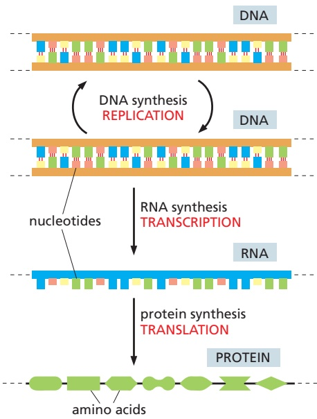

Figure 1–4 From DNA to protein. In addition to DNA replication (shown at the top of the figure), genetic information is read out and put to use through a two-step process: First, in transcription, segments of the DNA sequence are used to guide the synthesis of molecules of RNA. Then, MBoC7 m1.04/1.04in translation, RNA molecules are used to guide the synthesis of proteins, which are polymers made of amino acid subunits (discussed shortly).

#### All Cells Use Proteins as Catalysts

Like DNA and RNA molecules, **protein** molecules are long unbranched polymer chains, formed by stringing together monomeric building blocks (subunits) drawn from a standard repertoire that is the same for all living cells. Like DNA and RNA, proteins carry information in the form of a linear sequence of subunits in the same way as a human message written in an alphabetic script. There are many different protein molecules in each cell, and—if we ignore water molecules—they form the major portion of the cell’s mass.

The subunits of proteins are the **amino acids**, which are quite different from the nucleotides of DNA and RNA, and there are 20 types instead of 4. Each amino acid is built around a core structure that allows it to be covalently linked in a standard way to any other amino acid in the set; attached to this core is a side group of atoms that gives each amino acid a distinctive chemical character. Each protein molecule is a polypeptide chain that is created by joining its amino acids in a particular sequence; this sequence determines how the polypeptide folds up, giving the protein its unique three-dimensional structure. Through several billion years of evolution, these sequences have been selected to give each protein a useful function.

By folding into a precise structure that binds with high specificity to other molecules, each protein performs a specific function according to its genetically specified sequence of amino acids. Proteins form and maintain diverse cell and extracellular structures, generate movements, sense signals, and so on. Many have reactive sites on their surface, allowing them to act as enzymes that catalyze reactions that make or break specific covalent bonds. Proteins, above all, are the main molecules that put the cell’s genetic information into action. Thus, polynucleotides (DNA and mRNAs) specify the amino acid sequences of proteins. Proteins, in turn, serve as catalysts to cause many different chemical reactions to occur, including those that synthesize new DNA and RNA molecules.

In everyday speech, a catalyst refers to “any agent that provokes or speeds significant change or action.” But in chemistry, the term **catalyst** is defined more narrowly, being applied to any molecule that speeds up a specific chemical reaction without itself being changed. From the most fundamental point of view, a living cell is a self-replicating collection of catalysts that takes in food, processes this food to provide both the building blocks and energy needed to make more catalysts, and discards the materials left over as waste (**Figure 1–5A**). Together, these feedback loops that connect proteins and polynucleotides form the basis for this autocatalytic, self-reproducing behavior of all living organisms (**Figure 1–5B**).

#### All Cells Translate RNA into Protein in the Same Way

How the information in DNA specifies the production of proteins was a complete mystery in the 1950s when the double-strand structure of DNA was first revealed as the basis of heredity. But in subsequent years, scientists discovered the elegant

Figure 1–5 Life as an autocatalytic process. (A) The living cell is a self-replicating collection of catalysts. (B) Life can be viewed as an autocatalytic process. DNA and RNA molecules provide the nucleotide sequence information (green arrows) that is used both to produce proteins and to copy themselves. Proteins, in turn, provide the catalytic activity (red arrows) needed to synthesize DNA, RNA, and proteins themselves. Together, these feedback loops create the self-replicating system that endows cells with the ability to reproduce. Although the great majority of the catalysts in the cell are proteins (known as enzymes), a few RNA molecules (known as ribozymes) also have this property, as we will see in Chapter 6.

mechanisms involved. The translation of genetic information from the 4-letter alphabet of polynucleotides into the 20-letter alphabet of proteins is a complex process. The rules of this translation seem in some respects neat and rational but in other respects strangely arbitrary, given that they are (with minor exceptions) identical in all living things. These arbitrary features, it is thought, reflect frozen accidents in the early history of life. They stem from the chance properties of the earliest organisms that were passed on by heredity and have become so deeply embedded in the constitution of all living cells that they cannot be changed without disastrous consequences.

It turns out that the information in the sequence of a messenger RNA (mRNA) molecule is read out in groups of three nucleotides at a time: each triplet of nucleotides, or codon, specifies (codes for, or encodes) a single amino acid in a corresponding protein. Because the number of distinct triplets that can be formed from four nucleotides is $4 ^ { 3 } ,$ there are 64 possible codons, all of which occur in nature. However, there are only 20 naturally occurring amino acids, which means there are necessarily many cases in which several codons correspond to the same amino acid. This genetic code is read out by a special class of small RNA molecules, called transfer RNAs (tRNAs). Each type of tRNA becomes attached at one end to a specific amino acid and displays at its other end a specific sequence of three nucleotides—an anticodon—that enables it to recognize, through base-pairing, a particular codon or subset of codons in mRNA. The intricate chemistry that enables these tRNAs to translate a specific sequence of $\mathrm { A ,   C ,   G , }$ and U nucleotides in an mRNA molecule into a specific sequence of amino acids in a protein molecule occurs on a ribosome, a large multimolecular machine composed of both protein and ribosomal RNA. All of these processes will be described in detail in Chapter 6.

#### Each Protein Is Encoded by a Specific Gene

DNA molecules as a rule are very large, containing the specifications for thousands of proteins and RNA molecules. Special sequences in the DNA serve as punctuation, defining where the information for each RNA and protein begins and ends. And individual segments of the long DNA sequence are transcribed into separate mRNA molecules, coding for different proteins. Each such DNA segment represents one gene. As previously mentioned, some DNA segments—a smaller number—are transcribed into RNA molecules that are not translated into protein but have other functions in the cell; such DNA segments also count as genes. A **gene** therefore is defined as the segment of DNA sequence corresponding either to a single protein (but sometimes to a set of closely related, alternative protein variants) or to a single catalytic, regulatory, or structural RNA molecule.

In all cells, the expression of individual genes is regulated: instead of manufacturing its full repertoire of possible proteins and RNAs at full tilt all the time, the cell adjusts the rate of transcription and translation of different genes independently, according to need. As we shall see in Chapter 7, stretches of regulatory DNA are interspersed among the segments that code for protein, and these noncoding regions bind to special protein molecules that control the rate of transcription of individual genes. The organization of this regulatory DNA varies widely from one class of organisms to another, but the basic strategy is universal. In this way, the genome of the cell dictates not only the nature of the cell’s proteins but also when and where they are to be made.

#### Life Requires a Continual Input of Free Energy

A living cell is a dynamic chemical system, operating far from chemical equilibrium. For a cell to grow or to make a new cell in its own image, it must take in free energy from the environment, as well as raw materials, to drive the necessary synthetic reactions. This consumption of free energy is fundamental to life. When this energy is not available, a cell decays toward chemical equilibrium and soon dies.

As one example, free energy is required for the propagation of genetic information. Picture the molecules in a cell as a swarm of objects endowed with thermal energy, moving around violently at random, buffeted by collisions with one another. To copy genetic information—in the form of a DNA sequence, for example—nucleotide molecules from this wild crowd must be captured, arranged in a specific order defined by a preexisting template, and linked together in a fixed relationship. The bonds that hold the nucleotides in their proper places on the template and join them together must be strong enough to resist the disordering effect of thermal motion, which we describe shortly. The joining process is driven forward by a consumption of free energy, which is needed to ensure that the correct bonds are made, and made robustly. As an analogy, the molecules might be compared with spring-loaded traps, ready to snap into a more stable, lower-energy attached state when they meet their proper partners. As they snap together into the bonded arrangement, their available stored energy—their free energy—like the energy of the spring in the trap, is released and dissipated as heat. In a cell, the chemical processes underlying information transfer are more complex, but the same basic principle applies: free energy must be spent for the creation of order.

To replicate its genetic information faithfully, and indeed to make all its complex molecules according to the correct specifications, the cell therefore requires free energy, which has to be imported somehow from the surroundings. As we will discuss in detail in Chapter 2, the free energy required by animal cells is derived from chemical bonds in food molecules that the animals eat, whereas plants get their free energy from sunlight.

#### All Cells Function as Biochemical Factories

Because all cells make DNA, RNA, and protein, they all have to contain and manipulate a similar collection of small organic (carbon-containing) molecules, including simple sugars, nucleotides, and amino acids, as well as other substances that are universally required. All cells, for example, require the phosphorylated nucleotide ATP (adenosine triphosphate), not only as a building block for the synthesis of DNA and RNA but also as a carrier of the free energy that is needed to drive a huge number of chemical reactions in the cell.

Although all cells function as biochemical factories of a broadly similar type, many of the details of their small-molecule transactions differ. Plants, for example, require only the simplest of nutrients because they harness the energy of sunlight to make all their own small organic molecules. Other organisms, such as animals and some bacteria, feed on living (or once living) organisms and must obtain many of their organic molecules ready-made. We return to this point later in the chapter.

#### All Cells Are Enclosed in a Plasma Membrane Across Which Nutrients and Waste Materials Must Pass

Each living cell is enclosed by a membrane—the **plasma membrane**. This membrane acts as a selective barrier that enables the cell to concentrate nutrients gathered from its environment and retain the products it synthesizes for its own use, while excreting its waste products. Without a plasma membrane, the cell could not maintain its integrity as a coordinated chemical system.

The molecules that form cell membranes have the simple physicochemical property of being amphiphilic; that is, they consist of one part that is hydrophilic (water-soluble) and another part that is hydrophobic (water-insoluble). Such molecules placed in water aggregate spontaneously, arranging their hydrophobic portions to be as much in contact with one another as possible to hide them from the water, while keeping their hydrophilic portions exposed. Amphiphilic molecules of appropriate shape, such as the phospholipid molecules that compose most of the molecules of the plasma membrane, spontaneously aggregate in water to create a bilayer that forms small closed vesicles (**Figure 1–6**).

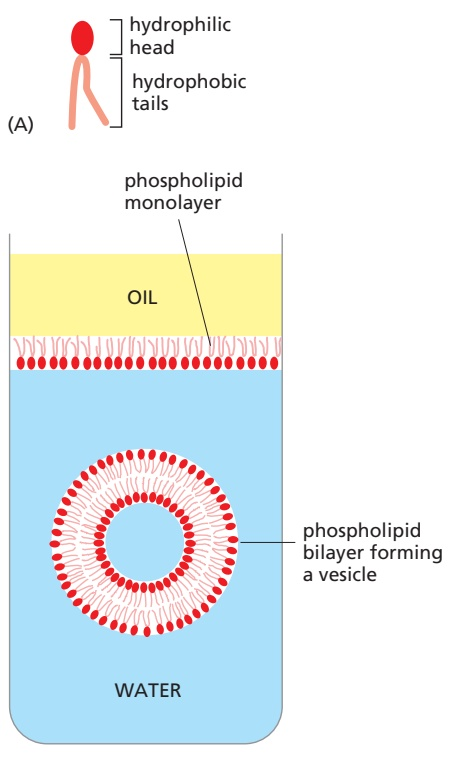

Figure 1–6 Behavior of phospholipid molecules in water. (A) A phospholipid molecule is amphiphilic, having a hydrophilic (water-loving) phosphate head group and a hydrophobic (wateravoiding) hydrocarbon tail. (B) At an interface between oil and water, MBoC7 m1.09/1.06phospholipids arrange themselves as a single sheet (a monolayer), with their head groups facing the water and their tail groups facing the oil. When immersed in water, however, phospholipids aggregate to form lipid bilayers that fold in on themselves to form sealed aqueous compartments known as vesicles.

Although the chemical details vary, the hydrophobic tails of the predominant lipid molecules in all cells are hydrocarbon polymers $\mathrm { ( - C H _ { 2 } - C H _ { 2 } - C H _ { 2 } - ) } ,$ , and their spontaneous assembly into a lipid bilayer is but one of many examples of an important general principle: cells produce molecules whose chemical properties cause them to self-assemble into the structures that a cell needs.

The cell boundary cannot be totally impermeable. If a cell is to grow and reproduce, it must be able to import raw materials and export waste across its plasma membrane. All cells therefore have specialized proteins embedded in their plasma membrane that transport specific molecules from one side to the other. Some of these membrane transport proteins, like some of the proteins that catalyze the fundamental small-molecule reactions inside the cell, have been so well conserved over the course of evolution that we can recognize the family resemblances between them when even the most distantly related organisms are compared.

The transport proteins in the plasma membrane largely determine which molecules enter the cell, while the catalytic proteins (enzymes) inside the cell determine the reactions that the entering molecules undergo. Thus, by specifying the RNAs and proteins that the cell produces, the genetic information recorded in the DNA sequence dictates the entire chemistry of the cell—in fact, not only its chemistry but also its form and its behavior, for these too are chiefly determined and controlled by the cell’s proteins.

#### Cells Operate at a Microscopic Scale Dominated by Random Thermal Motion

Thus far we have described the cell as a self-replicating, membrane-bound bag of chemicals and macromolecules; but, as the unit of life, the cell is much more than the sum of its parts. Although not obvious from microscopy images, even the simplest cell is highly ordered internally: its individual components must self-assemble and become highly organized for the cell to function. And the cell contents are in perpetual motion. The most obvious movements are catalyzed by motor proteins, enzymes that use the energy of ATP hydrolysis for a wide variety of purposes; these include pumping ions across the plasma membrane, translocating large assemblies from one intracellular site to another, and propelling the cell through its environment. In addition, and as previously mentioned, random thermal motions of molecules (including water) are prominent at the scale of cells—whose dimensions can be as small as a micrometer $( 1 0 ^ { - 6 }$ meters) in diameter. This type of spontaneous movement, called thermal or **Brownian motion**, was first observed by Robert Brown in 1827, while looking through a microscope at pollen grains immersed in water. Caused by random molecular collisions, the constant fluctuating movement has important repercussions. Brownian motion drives a process called diffusion, and it determines the rates of biochemical reactions as molecules collide with one another within the interior of a cell (described in Chapter 2; see Movie 2.4).

Even though random, the cell can harness Brownian motion for its own advantage. For example, during one step in the crawling migration of animal cells, the plasma membrane at the leading edge extends forward (see Chapter 16). This movement does not involve motor proteins. Instead, a cytoskeletal filament (an actin polymer) polymerizes adjacent to the inner membrane surface. When the membrane fluctuates in the forward direction, actin quickly fills in the gap so that the membrane cannot slip back to its original position. This phenomenon, in which random thermal motions are harnessed in a directed way, creates a Brownian ratchet (**Figure 1–7**).

Because an object at the micrometer scale is constantly buffeted by water molecules, its movement requires overcoming high viscous drag forces. As a result, the directed movement of a complex of molecules inside the cell (by a motor protein, for example) will stop immediately when the motor disengages, leaving the complex to be randomly buffeted by thermal motion. There is no “gliding” inside the cell.

#### A Living Cell Can Exist with 500 Genes

We have seen how genomes carry the information for all the proteins and RNA molecules of a cell, and how, through catalysis, all the other building blocks of the cell are made. But how complex are real living cells? In particular, what are the minimum requirements of a living cell? One measure of complexity is based on the total number of genes in an organism’s genome. A species that has oneMBoC7 n1.110/1.07 of the smallest known genomes is the bacterium Mycoplasma genitalium, which causes a common, sexually transmitted, human disease (**Figure 1–8**). This organism lives as a parasite in mammals, where the environment provides it with many of the small molecules it needs ready-made. Nevertheless, it still has to make all the large molecules—DNA, RNAs, and proteins. It has 525 genes, most of which are essential. Its genome of 580,070 nucleotide pairs represents 145,018 bytes of information—about as much as it takes to record the text of one chapter of this book. Cell biology may be complicated, but it is not unimaginably so.

#### Summary

The individual cell is the minimal self-reproducing unit of life. A cell consists of a self-replicating collection of catalysts, enclosed in a plasma membrane. All cells operate as biochemical factories, driven by the free energy released in a complicated network of chemical reactions. Central to a cell’s ability to reproduce is the transmission of its genetic information to its progeny cells when it divides. All cells store their genetic information in double-strand DNA, and the complete sequence of DNA nucleotides for each organism is known as its genome. The cell replicates this information by separating the paired DNA strands and using each as a template for polymerization to make a new DNA strand with a complementary sequence of nucleotide subunits. The same strategy of templated polymerization is used in the transcription of portions of the DNA into molecules of the closely related polynucleotide polymer, RNA. Most of these RNA molecules are mRNAs that in turn guide the synthesis of protein molecules by the process of translation. Proteins are polymers of amino acid subunits and are the catalysts for almost all the cell’s chemical reactions. They are also responsible for the selective import and export of molecules across the plasma membrane that surrounds each cell. The specific shape and function of each protein depend on its amino acid sequence, which is specified by the nucleotide sequence of a corresponding segment of the DNA—the gene that codes for that protein. In this way, the DNA of the cell determines the cell’s chemistry, which is fundamentally similar in all cells, reflecting their ultimate origin from a common ancestor cell that existed on Earth more than 3.5 billion years ago.

#### GENOME DIVERSIFICATION AND THE TREE OF LIFE

The success of living organisms based on DNA, RNA, and protein has been spectacular. Through its billions of years of proliferation, life has populated the oceans, covered the land, penetrated deep into Earth’s crust, and molded the surface of

Figure 1–7 How membrane protrusion is driven by a simple Brownian ratchet. A single actin filament is shown abutting the plasma membrane, which is fluctuating back and forth because of random thermal motions. When the membrane happens to move away from the end of the filament, it creates sufficient space for an additional subunit, which quickly adds on. The slightly longer filament acts as a ratchet and prevents the membrane from moving back to its original position. In a migrating animal cell, this Brownian ratchet process drives protrusion of the membrane and contributes to forward movement of the cell, as described in Chapter 16 (see pp. 956–957).

0.2 µm

Figure 1–8 The small bacterium Mycoplasma genitalium. It is viewed here in cross section in an electron microscope, which uses a beam of electrons instead of light to create an image with a resolution that is many times higher than that of an image viewed in a conventional light microscope. Of the 525 genes this bacterium contains, 43 code for transfer RNAs, ribosomal RNAs, and other nonprotein-coding RNAs. Of the 482 protein-coding MBoC7 m1.10/1.08genes, 154 are involved in replication, transcription, translation, and related processes involving DNA, RNA, and protein; 98 are involved in the membrane and surface structures of the cell; 46 are involved in the transport of nutrients and other molecules across the plasma membrane; and 71 are involved in energy conversion and the synthesis and degradation of small molecules. (Courtesy of Roger Cole, in Medical Microbiology, 4th ed. [S. Baron, ed.]. Galveston: University of Texas Medical Branch, 1996.)

our planet. Our oxygen-rich atmosphere, the deposits of coal and oil, the layers of iron ores, the cliffs of chalk and limestone and marble—all these are products, directly or indirectly, of past biological activity on Earth.

Living things are not confined to the familiar temperate realm of land, water, and sunlight inhabited by plants and animals. They are found in the darkest depths of the ocean, in hot volcanic mud, in pools beneath the frozen surface of the Antarctic, and buried kilometers deep in Earth’s crust. The creatures that live in these extreme environments are generally unfamiliar, not only because they are inaccessible, but also because they are mostly microscopic and cannot be maintained in a laboratory. Even in more familiar habitats, most organisms are too small for us to see without special equipment: they tend to go unnoticed, unless they cause a disease or rot the timbers of our houses. Yet such microorganisms (microbes) are by far the most numerous living organisms on our planet. Only recently, through new methods of molecular analysis including rapid DNA sequencing, have we begun to get a picture of life on Earth that is not grossly distorted by our biased perspective as large animals living on dry land.

In this section, we consider—in very broad terms—the diversity of organisms on our planet and the relationships among them. Because the genetic information for every organism is written in the universal language of DNA sequences, and because the DNA sequence of any organism’s genome can be readily determined, it is now possible to characterize, catalog, and compare any set of living organisms with reference to these sequences. From such comparisons we can specify the place of each organism in the family tree of living species—the “tree of life.”

#### The Tree of Life Has Three Major Domains: Eukaryotes, Bacteria, and Archaea

The classification of living things has traditionally depended on comparisons of their outward appearances: we can see that a fish has eyes, jaws, backbone, brain, and so on, just as humans do, and that a worm does not—just as we can see that a rosebush is more similar to an apple tree than to grass. As Darwin showed, we can readily interpret such close family resemblances in terms of an evolution from common ancestors, and we can find the remains of many of these ancestors pre-served in the fossil record. In this way, it became possible to draw a family tree of living organisms, showing the various lines of descent, as well as branch points in evolutionary history, where the ancestors of one group of species became different from those of another.

When the disparities between organisms become very great, however, these methods begin to fail. How do we decide whether a fungus is more closely related to a plant or to an animal? When it comes to microscopic organisms such as bacteria, the task becomes harder still: one tiny rod or sphere can look much like another. Moreover, much of our knowledge of the microbial world was traditionally restricted to those species that can be isolated and cultured in the laboratory. But direct DNA sequencing of populations of microbes in their natural habitats—such as soil, ocean water, or even the human mouth—has taught us that the vast majority of microbes cannot be easily cultured in the laboratory. Often, they thrive in the wild as components of complex ecosystems and—when separated from their natural surroundings—cannot survive. Until modern DNA sequencing was developed, these organisms were largely unknown to us, especially those that inhabit extreme environments such as the deep Earth’s crust or seawater miles below the ocean surface.

Genome analysis has now provided us with a simple, direct, and powerful way to determine evolutionary relationships. The complete DNA sequence of an organism defines its nature with almost perfect precision and in exhaustive detail. Moreover, this specification is in a digital form—a string of letters—that can be entered into a computer and compared with the corresponding information for any other organism. Because DNA is subject to random changes that accumulate over long periods of time (as we will see shortly), the number of differences between the DNA sequences of two organisms can provide a direct, objective, and quantitative indication of the evolutionary distance between them.

For constructing a comprehensive tree of life, it is necessary to begin with a segment of DNA that is easily recognized in the genomes of all organisms. We discussed earlier how all cells use the same fundamental mechanism to translate a nucleotide sequence into a protein sequence, and we saw that the ribosome is the “decoding machine” that carries this out. Ribosomes are fundamentally similar in all organisms, and an especially well-conserved component of them is the RNA molecules that make up their core. Although the exact sequence of these ribosomal RNAs (rRNAs) differs across organisms, they are similar enough to use them as a ruler to judge how closely two species are related: the more similar the ribosomal RNA sequences, the more recently the two species diverged from a common ancestor and the more related they must be. Once a rough approximation of the tree of life has been obtained in this way, many additional DNA sequences in genomes—those that might not be identifiable in all organisms— can accurately determine relationships among more closely related species.

This approach has revealed that the living world consists of three major divisions, or domains: eukaryotes, bacteria, and archaea, as illustrated in **Figure 1–9**; in the following paragraphs, we briefly introduce each in turn.

Figure 1–9 A global tree of life, based on genome comparisons, shows the three major divisions (domains) of the living world. The lengths of the branches are proportional to differences among genomes using common genes that can be recognized and compared across many different species. Some of the organisms discussed in this and later chapters are indicated. Of the three domains of life (bacteria, archaea, and eukaryotes), bacteria encompass by far the greatest diversity, commensurate with their ability to colonize nearly every ecological niche on the planet. So many new bacterial species are currently being identified through DNA sequencing of environmental samples that simply naming them has become a challenge. Although eukaryotes (and especially animals) are the main focus of this book, they comprise only a small slice of the global diversity. An expanded eukaryotic tree is shown in Figure 1–35, and an expanded tree of mammals is given in Figure 4–67. (Adapted from C.J. Castelle and J.F. Banfield, Cell 172:1181–1197, 2018.)

#### Eukaryotes Make Up the Domain of Life That Is Most Familiar to Us

The great variety of living creatures that we see around us are eukaryotes. The name is from the Greek, meaning “truly nucleated” (from the words eu, “well” or “truly,” and karyon, “kernel” or “nucleus”), reflecting the fact that the cells of these organisms have their DNA enclosed in a membrane-bound organelle called the nucleus. Visible by simple light microscopy, this feature was used in the early twentieth century to classify living organisms as either **eukaryotes** (those with a nucleus) or **prokaryotes** (those without a nucleus). We now know that prokaryotes comprise two of the three major domains of life, the bacteria and archaea. Eukaryotic cells are typically much larger than those of bacteria and archaea; in addition to a nucleus, they typically contain a variety of membrane-bound organelles that are also lacking in the prokaryotes. The genomes of eukaryotes also tend to run much larger—containing more than 20,000 genes for humans and corals, for example, compared with 4000–6000 genes for the typical bacteria or archaea.

In addition to plants and animals, the eukaryotes include fungi (such as mushrooms or the yeasts used in beer- and bread-making), as well as an astonishing variety of single-celled, microscopic forms of life. Most of this book is focused on the cell biology of eukaryotic organisms (especially animals); in the final sections of this chapter, we shall return to eukaryotes and focus on the variety within this group.

#### On the Basis of Genome Analysis, Bacteria Are the Most Diverse Group of Organisms on the Planet

When modern trees of life were constructed using genome information, one of the big surprises was how much more evolutionarily diverse the bacterial world is compared with the eukaryotes; we now know that this great diversity reflects the much earlier appearance of bacteria in the evolutionary history of the planet. Bacteria are usually very small (and invisible to the unaided eye), and they generally live as independent individuals or in loosely organized communities, rather than as multicellular organisms. They are typically spherical or rod-shaped and measure a few micrometers (μm) in linear dimension (**Figure 1–10**). They often have a tough protective coat, called a cell wall, beneath which a plasma membrane encloses a single cytoplasmic compartment—the cytoplasm—containing DNA, RNA, proteins, and the many small molecules needed for life (**Figure 1–11**). Although difficult to discern in the light microscope, the interior of a bacterium is nevertheless highly organized, a topic we discuss in Chapter 16.

Commensurate with the diversity of their genomes, bacteria live in an enormous variety of ecological niches, and they are astonishingly varied in their

spherical cells, e.g., Streptococcus

rod-shaped cells, e.g., Escherichia coli, Salmonella

the smallest cells, e.g., Mycoplasma, Spiroplasma

spiral cells, e.g., Treponema pallidum

Figure 1–10 Shapes and sizes of some bacteria. Although most are small, as shown, measuring a few micrometers in linear dimension, there are also some giant species. An extreme example is the cigar-shaped bacterium Epulopiscium fishelsoni, which lives in the gut of a surgeonfish and can be up to 600 μm long (not shown).

(A)

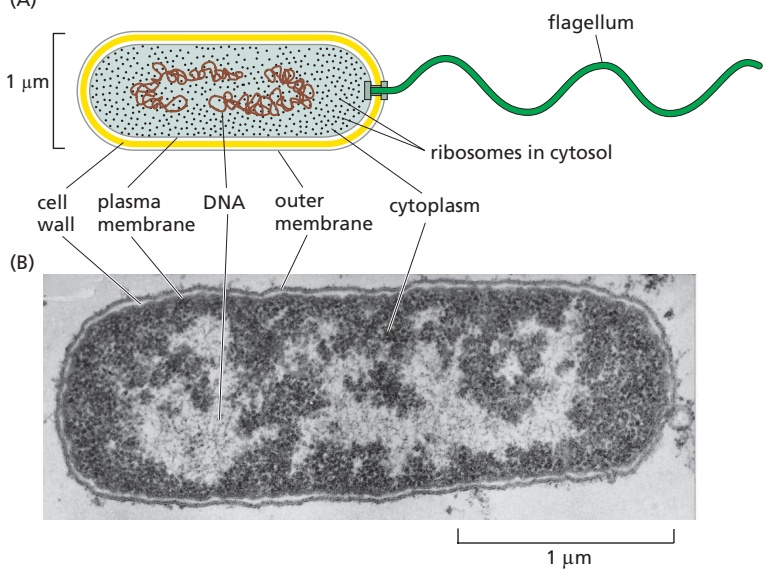

Figure 1–11 Bacterial structure. (A) A drawing of the bacterium Vibrio cholerae, showing its simple internal organization. This species can infect the human small intestine to cause cholera; the severe diarrhea that accompanies this disease kills more than 100,000 people a year worldwide. Like many other bacteria, Vibrio has a helical appendage at one end—a flagellum—that rotates as a propeller to drive the cell forward. (B) An electron micrograph of a longitudinal section through the widely studied bacterium Escherichia coli (E. coli). E. coli is part of our normal intestinal microbiota, the complete collection of microbes in our gut. It has many flagella distributed over its surface, but they are not visible in this section. Both of the bacteria shown here are Gram negative, having both an outer and an inner (plasma) membrane. However, many bacterial species lack the outer membrane; these are classified as Gram positive. (B, courtesy of E. Kellenberger.)

biochemical capabilities. There exist species that can utilize virtually any type of organic molecule as food, ranging from sugars and amino acids to hydrocarbons, including the simplest hydrocarbon, methane gas (CH4). Other species (**Figure 1–12**) harvest light energy in a variety of ways; some, like plants, carry out photosynthesis and generate oxygen as a by-product. Still others can feed on a plain diet of inorganic nutrients, getting their carbon fromMBoC7 m1.14a,e1.11/1.11 $\mathrm { C O _ { 2 } } ,$ and relying on a host of other chemicals that occur in the environment to fuel their energy needs— including $\mathrm { H _ { 2 } , F e ^ { 2 + } , H _ { 2 } S , }$ and elemental sulfur (**Figure 1–13**).

A wide range of bacteria directly affect human health. The bubonic plague of the Middle Ages (estimated to have killed half the population of Europe) and the current tuberculosis pandemic (more than a million deaths a year) are each due to a specific species of bacteria. And thousands of different bacterial species reside in our gut and on our skin, where they are often beneficial to us. We shall discuss bacteria throughout the book, as it is the study of these relatively simple cells that led to much of our understanding of basic biological processes—including DNA replication, transcription, and translation. We focus again on bacteria in Chapter 24 when we examine the cell biology of infectious disease. Finally, genetic engineering techniques allow bacteria to be put to use as small “factories” to produce human pharmaceuticals, biofuels, and other high-value chemical products, as we discuss in Chapter 8.

Figure 1–12 Photosynthetic bacteria. (A) A light micrograph of the bacterium Anabaena cylindrica. Its cells form long chains, in which most of the cells (labeled V) perform photosynthesis (and thereby capture CO2 and incorporate C into organic compounds); others (labeled H) become specialized for fixing N from N2; and still others (labeled S) develop into spores, which can resist unfavorable conditions. (B) An electron micrograph of a related photosynthetic bacterium, Phormidium laminosum, which shows the intracellular membranes where photosynthesis occurs. As shown in these micrographs, some prokaryotes have intracellular membranes and form colonies that resemble simple multicellular organisms. (A, courtesy of David Adams; B, courtesy of D.P. Hill and C.J. Howe.)

#### Archaea: The Most Mysterious Domain of Life

Of the three domains of life, archaea remains the most poorly understood. Most of its members have been identified only by DNA sequencing of samples from the environment, and relatively few have been cultured and studied up close in the laboratory. Like bacteria, the archaea we know most about are small and lack the internal, membrane-bound organelles that distinguish the eukaryotes. But they differ from bacteria in many ways, including the chemistry of their cell walls, the kinds of lipids that make up their membrane, and the range of biochemical reactions that they can carry out. Another surprising conclusion came from genome comparisons: although archaea resemble bacteria in their outward appearances, their genomes are much more closely related to eukaryotes than to bacteria (see Figure 1–9). It has even been proposed that the tree of life should be considered to have only two principal domains, with the archaea and eukaryotes making up one domain and bacteria constituting the other. The close relationship of archaea and eukaryotes has also changed our views on how the earliest eukaryotic cell evolved, a topic addressed later in this chapter.

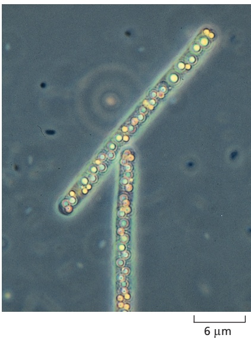

Figure 1–13 The bacterium Beggiatoa. It lives in sulfurous environments (for example, see Figure 1–15) and gets its energy by oxidizing H2S; it can fix carbon even in the dark. Note the yellow deposits of sulfur inside the cells. (Courtesy of Ralph S. Wolfe.)

At first it was thought that archaea occupied only extreme environments such as volcanoes, salt lakes, acid hot springs, and the stomachs of cattle, but they are now recognized to be present also in more congenial surroundings such as soils, seawater, and our skin. Commensurate with the wide variety of ecological niches in which they have been found, different species of archaea have highly diverse chemistries. They are believed to be the predominant life-form in soil and seawater, and they play major roles in recycling nitrogen and carbon, two of the most important elements for all cells.

#### Organisms Occupy Most of Our Planet

To understand life on Earth, we need to understand more than its diversity; we also need to know where life is found on our planet and how various living species are distributed. Organisms inhabit nearly all of the planet, and we continue to discover new habitats. Amazingly, some bacteria and archaea even live miles down in Earth’s deep crust and in the deepest and most hostile parts of the oceans.

How are the main groups of organisms distributed among different environments? DNA sequencing and other advanced technologies have been used recently to address this question. The total biomass on Earth is estimated to contain ∼550 gigatons (1015 grams) of carbon, of which 450 gigatons of carbon (Gt C) is plants, 70 Gt C is bacteria, 7 Gt C is archaea, and 2 Gt C is animals (**Figure 1–14**). The plants are mainly terrestrial; the bacteria and archaea are mainly in the soil and Earth’s crust. Total terrestrial biomass is 100 times greater than that in the oceans, although most of the animal mass is found in the oceans. The human biomass is 10 times greater than that of all measurable wild animals together, and—while human biomass continues to increase—that of wild animals is falling, largely as a result of human activities.

Although humans and other animals make up a small fraction of Earth’s biomass, their existence depends completely on other forms of life. In the next section, we shall see some of the ways that these different life-forms work together to capture and recycle energy from Earth’s inanimate features.

#### Cells Can Be Powered by a Wide Variety of Free-Energy Sources

Organisms obtain the free energy needed for life in different ways. Some—such as animals, fungi, and the many different bacteria that live in the human gut— get it by feeding on other living things or the organic chemicals they produce; such organisms are called organotrophic (from the Greek word trophe, meaning “food”). Others derive their free energy directly from the nonliving world. These primary energy converters fall into two classes: those that harvest the energy of sunlight, and those that capture their energy from energy-rich systems of inorganic chemicals in the environment (chemical systems that are far from chemical equilibrium). Organisms of the former class are called phototrophic (feeding on sunlight); those of the latter are called lithotrophic (feeding on rock). The organotrophic organisms like ourselves could not exist without these primary energy converters, which are the most plentiful form of life.

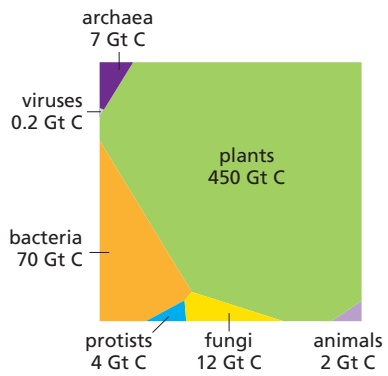

Figure 1–14 The distribution of living biomass on Earth. The total biomass on Earth expressed as gigatons of carbon (Gt C) is estimated to be ∼550 Gt C. In the graph shown, the area of each taxon represented is proportional to the taxon’s MBoC7 n1.103/1.14global biomass, so plants account for about 80% (450/550) of the total biomass, whereas animals account for 0.4% (2/550). These recent estimates are based on various advanced techniques, including DNA sequencing and remote sensing. (Adapted from Y.M. Bar-On et al., Proc. Natl. Acad. Sci. USA 115:6506–6511, 2018. With permission from the authors.)

The phototrophic organisms include many types of bacteria, as well as algae and plants, on which we—and virtually all the living things that we ordinarily see around us—depend. Phototrophic organisms have changed the whole chemistry of our environment: as a prime example, the oxygen in Earth’s atmosphere is a by-product of their biosynthetic activities.

Lithotrophic organisms are not such an obvious feature of our world, because they are microscopic and mostly live in habitats that humans do not frequent—deep in the ocean, buried in Earth’s crust, or in various other seemingly inhospitable environments. But they are a major part of the living world, and they are especially important in any consideration of the history of life on Earth.

Some lithotrophs get energy from aerobic reactions, which use molecular oxygen from the environment; because atmospheric $\mathrm { O } _ { 2 }$ is ultimately the product of living phototrophic organisms, these aerobic lithotrophs are, in a sense, feeding on the products of past life. There are, however, many other lithotrophs that live anaerobically, in places where little or no molecular oxygen is present; these are circumstances similar to those that existed in the early days of life on Earth, before oxygen had accumulated.

The most dramatic of the anaerobic sites are the hot hydrothermal vents on the floor of the Pacific and Atlantic Oceans. They are located where the ocean floor is spreading as new portions of Earth’s crust form by a gradual upwelling of material from Earth’s interior (**Figure 1–15**). Downward-percolating seawater is heated and driven back upward as a submarine geyser, carrying with it a current of chemicals from the hot rocks below. A typical cocktail might include $\begin{array} { r } { \mathrm { H } _ { 2 } S , } \end{array}$ $\mathrm { H _ { 2 } ,   C O ,   M n ^ { 2 + } ,   F e ^ { 2 + } ,   N i ^ { 2 + } ,   C H _ { 4 } ,   N H _ { 4 } ^ { + } }$ , and phosphorus-containing compounds.

Figure 1–15 The geology of a hot hydrothermal vent in the ocean floor. As indicated, seawater percolates down toward the hot, molten, volcanic rock upwelling (basalt) from Earth’s interior and is heated and driven back upward, carrying a mixture of minerals leached from the hot rock. A temperature gradient is set up, from more than 350°C near the core of the vent, down to 2–3°C in the surrounding ocean. Minerals precipitate from the water as it cools, forming a chimney. Different classes of organisms, thriving at different temperatures, live in different neighborhoods of the chimney. A typical chimney might be a few meters tall, spewing out hot, mineral-rich water. The locations of lithotrophic bacteria and the invertebrate marine animals that depend on them are also shown (see Figure 1–16).

1 m

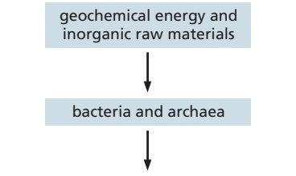

multicellular animals, e.g., tube worms

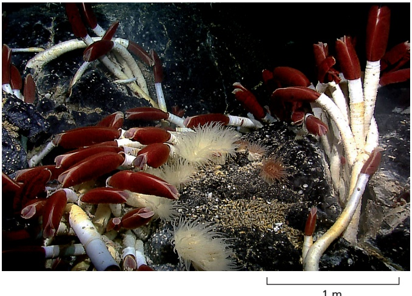

Figure 1–16 Organisms living at a depth of 2500 meters near a vent in the ocean floor. Close to the vent, at temperatures up to about 120°C, various lithotrophic species of bacteria and archaea live, directly fueled by geochemical energy. A little further away, where the temperature is lower, various invertebrate animals live by feeding on these microorganisms. Most remarkable are the giant (2-meter-long) tube worms, Riftia pachyptila, which are shown in the photograph. Rather than feed on the lithotrophic microbes, these worms live in symbiosis with them: specialized organs in the worms harbor huge numbers of symbiotic sulfur-oxidizing bacteria, which harness geochemical energy and supply nourishment to their hosts, which have no mouth, gut, or anus. The tube worms are thought to have evolved from more conventional animals and to have become secondarily adapted to life at hydrothermal vents. (Science History Images/Alamy Stock Photo.)

A dense population of microorganisms lives in the neighborhood of the vent, thriving on this austere diet and harvesting free energy from reactions between the available chemicals. Various invertebrate marine animals—clams, mussels, and giant marine worms—in turn, live off the microbes at the vent, forming an entire ecosystem analogous to the world of plants and animals that we belong to,MBoC7 m1.12/1.16 but one powered by geochemical energy instead of light (**Figure 1–16**).

#### Some Cells Fix Nitrogen and Carbon Dioxide for Other Cells

To make a living cell requires matter, as well as free energy. DNA, RNA, and protein are composed of just six elements: hydrogen, carbon, nitrogen, oxygen, sulfur, and phosphorus. These are all plentiful in the nonliving environment, in Earth’s rocks, water, and atmosphere. But they are not present in chemical forms that allow easy incorporation into biological molecules. Atmospheric $\mathrm{N}_{2}$ and $\mathrm { C O _ { 2 } } ,$ particular, are extremely unreactive. A large amount of free energy is required to drive the reactions that use these inorganic molecules to make the organic compounds needed for further biosynthesis; that is, $\operatorname { t o } \hbar x$ nitrogen and carbon dioxide, so as to make N and C available to living organisms. Many types of cells lack the biochemical machinery to achieve this fixation; they instead rely on other classes of cells to do the job for them. We animals depend on plants, directly or indirectly, for our supplies of carbon- and nitrogen-containing organic compounds. Plants in turn, although they can fix carbon dioxide from the atmosphere, lack the ability to fix atmospheric nitrogen; they depend in part on nitrogen-fixing bacteria to supply their need for nitrogen-containing organic compounds. Plants of the pea family, for example, harbor symbiotic nitrogen-fixing bacteria in nodules in their roots.

Because living cells can differ widely in some of the most basic aspects of their biochemistry, cells with complementary needs and capabilities have frequently developed close associations. Some of these symbiotic associations, as we will see later, have evolved to the point where the partners have lost their separate identities altogether: they have joined forces to form a single composite cell—an endosymbiotic association, as opposed to an ectosymbiotic one between separate organisms.

Genomes Diversify Over Evolutionary Time, Producing New Types of Organisms

Having discussed our current views on the diversity of life-forms, how they are distributed across Earth, and how they depend on one another, we now turn to the question of how this great diversity was generated. All life depends on the storage of genetic information in the form of each organism’s DNA genome, so our focus is on how genomes change over evolutionary time.

In storing and copying genetic information, random accidents and errors occur, altering the nucleotide sequence; that is, creating **mutations**. Therefore, when a cell divides, the genomes of its two daughters are often not quite identical to each other or to that of the parent cell. On rare occasions, the error may represent a change for the better; more probably, it will cause no significant difference in the cell’s prospects. But in some cases, the error will cause serious damage; for example, by disrupting the coding sequence for a key protein or RNA molecule. Changes due to mistakes of the first type will tend to be perpetuated, because the altered cell has an increased likelihood of surviving and reproducing itself. Changes due to mistakes of the second type—neutral changes—may be perpetuated or not: in the competition for limited resources, it is a matter of chance whether the altered cell or its cousins will succeed. But changes that cause serious damage lead nowhere: the cell that suffers them dies, leaving no progeny. Through endless repetition of this cycle of error and trial—of mutation and natural selection—organisms evolve: their genetic specifications change, sometimes giving organisms new ways to exploit the environment more effectively, to survive in competition with others, and to reproduce successfully.

Some parts of the genome will change more readily than others in the course of evolution. A segment of DNA that does not code for protein or RNA and has no significant regulatory role is free to change at a rate limited only by the frequency of random errors. In contrast, a gene that codes for a highly optimized, essential protein or RNA molecule cannot alter so easily: when mistakes occur, the faulty cells are almost always disabled and eliminated. Genes of this latter sort are therefore highly conserved. Through 3.5 billion years or more of evolutionary history, many DNA sequences have changed beyond all recognition, but the most highly conserved genes remain perfectly recognizable in all living species.

These latter genes are the ones we must examine if we wish to trace family relationships between the most distantly related organisms in the tree of life. We discussed an example of one such gene—that for ribosomal RNA—when we introduced the classification of the living world into the three domains of eukaryotes, bacteria, and archaea. Because the production of proteins is fundamental to all living cells, this component of the ribosome has been highly conserved since early in the history of life on Earth (**Figure 1–17**).

The ribosomal RNA genes are exceptional in being so well conserved, whereas most parts of genomes have diversified much more dramatically over evolutionary time. A complete DNA sequence for an organism—its genome sequence—reveals all the genes that an organism possesses, as well as those it lacks. When we

GTTCCGGGGGGAGTATGGTTGCAAAGCTGAAACTTAAAGGAATTGACGGAAGGGCACCACCAGGAGTGGAGCCTGCGGCTTAATTTGACTCAACACGGGAAACCTCACCC 11 GCCGCCTGGGGAGTACGGTCGCAAGACTGAAACTTAAAGGAATTGGCGGGGGAGCACTACAACGGGTGGAGCCTGCGGTTTAATTGGATTCAACGCCGGGCATCTTACCA 11 1 ACCGCCTGGGGAGTACGGCCGCAAGGTTAAAACTCAAATGAATTGACGGGGGCCCGC ACAAGCGGTGGAGCATGTGGTTTAATTCGATGCAACGCGAAGAACCTTACCT Illlll Illl Illll GTTCCGGGGGGAGTATGGTTGCAAAGCTGAAACTTAAAGGAATTGACGGAAGGGCACCACCAGGAGTGGAGCCTGCGGCTTAATTTGACTCAACACGGGAAACCTCACCC

Figure 1–17 Genetic information conserved since the days of the last universal common ancestor of all living things. A part of the gene that codes for the smaller of the two main ribosomal RNA (rRNA) molecules in the ribosome is shown. (The complete molecule is about 1500–1900 nucleotides long, depending on the species.) Corresponding segments of nucleotide sequences from an archaeon (Methanococcus jannaschii), a bacterium (Escherichia coli), and a eukaryote (Homo sapiens) are aligned. The red vertical lines indicate sites where the nucleotides are identical between the species; the human sequence is repeated at the bottom of the alignment so that all three two-way comparisons can be seen. The black dot halfway along the E. coli sequence denotes a site where a nucleotide has been either deleted from the bacterial lineage in the course of evolution or inserted in the other two lineages. Note that the sequences from these three organisms, representative of the three domains of the living world, still retain unmistakable similarities.

compare the three domains of the living world, we can begin to see which genes are common to all of them—and must therefore have been present in the last universal common ancestral cell that was the founder of all present-day living things. We can also identify those genes that are peculiar to a single branch in the tree of life. To explain such findings, we need to consider how new genes arise and, more generally, how genomes evolve.

#### New Genes Are Generated from Preexisting Genes

The raw material of evolution is the DNA sequence that already exists: there is no natural mechanism for making long stretches of new, random, DNA sequence. In this sense, no gene is ever entirely new. Innovation can, however, occur in several ways (**Figure 1–18**):

1. Intragenic mutation: an existing gene can be randomly modified by changes in its DNA sequence, through various types of errors that occur in the process of DNA replication and DNA repair.

2. Gene duplication: an existing gene can be accidentally duplicated, creating a pair of initially identical genes within a single cell; these two genes may then diverge in the course of evolution.

3. DNA segment shuffling: two or more existing genes can break and rejoin to make a hybrid gene consisting of DNA segments that originally belonged to separate genes.

4. Horizontal (intercellular) DNA transfer: a piece of DNA can be transferred from the genome of one cell to that of another—including between species. This process contrasts with the usual vertical transfer of genetic information from parent to progeny.

Figure 1–18 Four modes of genetic innovation and their effects on the DNA sequence of an organism. A special form of horizontal transfer occurs when cells of two different species enter into a permanent symbiotic association; genes from one of the cells may subsequently be transferred to the genome of the other, as we will see later when we discuss the likely evolutionary origins of mitochondria and chloroplasts.

Figure 1–19 Families of evolutionarily related genes in the genome of Bacillus subtilis. The largest gene family in this bacterium consists of 77 genes coding for varieties of a class of membrane transport proteins called ABC transporters, which are found in all three domains of the living world. (Adapted from F. Kunst et al., Nature 390:249–256, 1997.)

Each of these types of change leaves a characteristic trace in the DNA sequence of the organism, and there is clear evidence that all four processes have occurred frequently during evolution. In Chapters 4 and 5, we discuss the mechanisms underlying these changes, but for the present we focus on the consequences.

#### Gene Duplications Give Rise to Families of Related Genes Within a Single Genome

A cell duplicates its entire genome each time it divides into two daughter cells. However, accidents occasionally result in the inappropriate duplication of just part of the genome, with retention of both the original and duplicate segments in a single cell. Once a gene has been duplicated in this way (see mode 2 in Figure 1–18), the two gene copies can acquire mutations and become specialized to perform different functions within the same cell and its descendants. Repeated rounds of this process of gene duplication and divergence, over many millions of years, have enabled one gene to give rise to a family of related genes within a single genome. Analysis of the DNA sequence of prokaryotic genomes reveals many examples of such **gene families**: in the bacterium Bacillus subtilis, for example, 47% of the genes have one or more obvious relatives (**Figure 1–19**).

The above evolutionary process must be distinguished from the genetic divergence that occurs when one species of organism splits into two separate lines of descent at a branch point in the family tree—when the human line separated from that of chimpanzees, for example. In the latter case, the genes gradually become different in the course of evolution, but they are likely to continue to have corresponding functions in the two sister species. Genes that are related by descent in this way—that is, genes in two separate species that derive from the same ancestral gene in the last common ancestor of those two species—are called **orthologs**. Related genes that have resulted from a gene duplication event within a single genome—and are likely to have diverged in their function—are called **paralogs**. Genes that are related by descent in either way are called **homologs**, a general term used to cover both types of relationship (**Figure 1–20**).

#### The Function of a Gene Can Often Be Deduced from Its Nucleotide Sequence

Family relationships among genes are important not just for their evolutionary interest, but also because they simplify the task of deciphering gene functions. Once the nucleotide sequence of a newly discovered gene has been determined, a scientist can tap a few keys on a computer to search large databases of known gene sequences for gene relatives. In many cases, the function of one or more of these homologs will have been already determined experimentally— generally in one of the model organisms described later in this chapter. Because gene sequence determines gene function, one can frequently make a good guess at the new gene’s function, as it is likely to be similar to that of the already known homologs. In this way, it is possible to decipher a great deal about the biology of an organism simply by analyzing the DNA sequence of its genome.

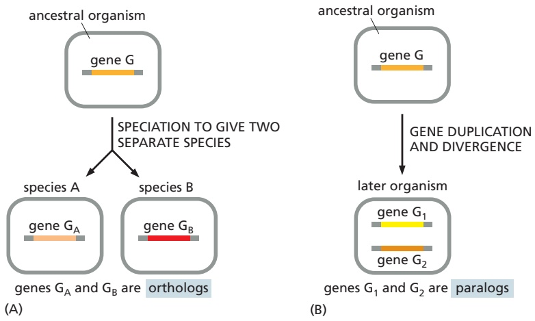

Figure 1–20 Two types of gene homology based on different evolutionary pathways. (A) Orthologs. (B) Paralogs. Genes related by either mechanism are called homologs.

#### More Than 200 Gene Families Are Common to All Three Domains of Life

Given the complete genome sequences of representative organisms from all three domains of life—eukaryotes, bacteria, and archaea—we can search systematically for homologies that span this enormous evolutionary divide. In this way, we can begin to take stock of the common inheritance of all living things. There are considerable difficulties in this enterprise. For example, individual species have often lost some of the ancestral genes, and other genes have almost certainly been acquired by horizontal transfer from another species and therefore are not truly ancestral. In fact, genome comparisons strongly suggest that both lineage-specific gene loss and horizontal gene transfer, in some cases between evolutionarily distant species, have been major factors in evolution, at least among bacteria and archaea. As an additional difficulty, in the course of 2 or 3 billion years, some genes that were initially shared will have changed beyond recognition through mutation.

Because of all these vagaries of the evolutionary process, it is difficult, if not impossible, to determine the ancestral gene set that diversified into the present-day variety of life. A crude approximation can be obtained by tallying the gene families that have representatives in multiple—but not necessarily all— species from the three major domains of life. One such analysis revealed 264 ancient conserved families, each of which could be assigned a function on the basis of the best-characterized family member. As shown in **Table 1–1**, the largest number of shared gene families were involved in translation and in amino acid metabolism and transport. However, it must be emphasized that this set of highly conserved gene families represents only a very rough sketch of the common inheritance of all modern life.

#### Summary

For most of human history, the living world around us was classified by what we could see. Genome sequencing has radically changed our view of life on the planet, and we now realize that living things fall into three broad domains: bacteria, archaea, and eukaryotes. The organisms in the first two domains are largely invisible to our naked eye, and many of them cannot yet be grown in a laboratory— being known only by their DNA sequences. But they make up the vast majority of life’s evolutionary diversity, including species that can obtain all their energy and nutrients from inorganic chemical sources—such as the reactive mixtures of minerals released at hydrothermal vents on the ocean floor—the sort of diet that may have nourished the first living cells more than 3.5 billion years ago. The eukaryotes (whose cells are larger and contain a variety of membrane-bound organelles) evolved later in evolutionary history and are consequently less diverse as a group than either the bacteria or archaea. Eukaryotes, which include all plants and animals, are the organisms most familiar to us, and they are the main focus of this textbook.

<table><tbody><tr><td colspan="4">TABLE 1-1 The Number of Gene Families, Classified by Function, Common to All Three Domains of the Living World</td></tr><tr><td colspan="2">Information processing</td><td colspan="2">Metabolism</td></tr><tr><td>Translation</td><td>63</td><td>Energy production and conversion</td><td>19</td></tr><tr><td>Transcription</td><td>7</td><td>Carbohydrate transport and metabolism</td><td>16</td></tr><tr><td>DNA replication, recombination, and repair</td><td>13</td><td>Amino acid transport and metabolism</td><td>43</td></tr><tr><td colspan="2">Cellular processes and signaling</td><td>Nucleotide transport and metabolism</td><td>15</td></tr><tr><td>Cell-cycle control, mitosis, and meiosis</td><td>2</td><td>Coenzyme transport and metabolism</td><td>22</td></tr><tr><td>Defense mechanisms</td><td>3</td><td>Lipid transport and metabolism</td><td>9</td></tr><tr><td>Signal-transduction mechanisms</td><td>1</td><td>Inorganic ion transport and metabolism</td><td>8</td></tr><tr><td>Cell wall/membrane biogenesis</td><td>2</td><td>Secondary metabolite biosynthesis, transport, and catabolism</td><td>5</td></tr><tr><td>Intracellular trafficking and secretion</td><td>4</td><td colspan="2">Poorly characterized</td></tr><tr><td>Post-translational modification, protein turnover, chaperones</td><td>8</td><td>General biochemical function predicted; specific biological role unknown</td><td>24</td></tr><tr><td colspan="4">For the purpose of this analysis, gene families are defined as "universal" if they are represented in the genomes of at least two diverse archaea (Archaeoglobus fulgidus and Aeropyrum pernix), two evolutionarily distant bacteria (Escherichia coli and Bacillus subtilis), and one eukaryote (yeast, Saccharomyces cerevisiae). (Data from R.L. Tatusov et al., Science 278:631-637, 1997; R.L. Tatusov et al., BMC Bioinformatics 4:41, 2003; and the COGs database at the US National Library of Medicine.)</td></tr></tbody></table>

Many of the genes within a single organism or species show strong family resemblances in their DNA sequences, implying that they originated from the same ancestral gene through gene duplication and divergence. Family resemblances (homologies) are also clear when gene sequences are compared between different species, and more than 200 gene families have been so highly conserved that they can be recognized as common to most species from all three domains of the living world, suggesting they were present in the ancestral cell from which all life evolved. Given the DNA sequence of a newly discovered gene in any organism, it is therefore often possible to deduce the gene’s function from the known function of a homologous gene in a better-studied organism.

#### EUKARYOTES AND THE ORIGIN OF THE EUKARYOTIC CELL

Eukaryotic cells, in general, are bigger and more elaborate than bacterial and archaeal cells, and their genomes are bigger and more elaborate, too. The greater cell size is accompanied by radical differences in cell structure and function: in particular, eukaryotes contain a diverse set of intracellular **organelles**—discrete membrane-enclosed subcompartments and large membraneless macromolecular assemblies—each with a distinct composition and function. Some eukaryotic cells live independent lives as single-cell organisms. Others live in multicellular assemblies—indeed, all of the more complex multicellular organisms on Earth, including plants, animals, and fungi, are formed from eukaryotic cells.

We begin by discussing how eukaryotic cells are organized and how they might have evolved from more ancient prokaryotes. We then briefly consider how eukaryotic genomes differ from those of prokaryotes, as well as how the cells in multicellular organisms become differently specialized as an embryo develops, so as to contribute to the welfare of the organism as a whole.

#### Eukaryotic Cells Contain a Variety of Organelles

By definition, eukaryotic cells keep almost all their DNA in a membrane-enclosed internal compartment—the nucleus, which is usually the most conspicuous organelle (**Figure 1–21**). The long DNA polymers in the nucleus are packaged with proteins to form chromosomes, which only become visible in a light microscope when they condense in preparation for cell division. The nuclear envelope, a double layer of membrane, surrounds the nucleus and separates the nuclear DNA from the cytoplasm, which, in a eukaryotic cell, includes everything between the plasma membrane and the nucleus. As shown in the figure, the nuclear envelope is perforated by nuclear pores, which are channels formed by protein complexes that mediate the two-way traffic of large molecules between the nucleus and the cytoplasm.

Eukaryotic cells have many other features that set them apart from bacterial and archaeal cells. They are typically 10–30 times bigger in linear dimension and 1000–10,000 times larger in volume than a typical prokaryotic cell. They have an elaborate cytoskeleton in the cytoplasm, consisting of several types of protein filaments (see Figure 1–21) that, together with the many proteins that attach to them, form a network of girders, ropes, and motors that gives the cell mechanical strength and performs various other functions: when the cell divides, for example, the cytoskeleton reorganizes and pulls the replicated chromosomes apart and distributes them equally to the two daughter cells. In the case of animal cells and some free-living, single-cell eukaryotes, the cytoskeleton controls cell shape and drives and guides cell movements (**Movie 1.1**). Lacking the kind of tough cell wall characteristic of bacteria and archaea, these eukaryotic cells can change their shape rapidly, in some cases enabling them to move and engulf other cells and small objects by a process called phagocytosis (**Figure 1–22**).

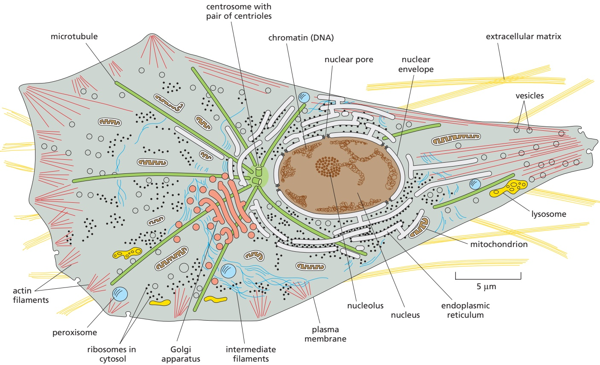

Figure 1–21 The major features of eukaryotic cells. The drawing depicts the major contents of a typical animal cell seen in cross section, but almost all the same components are found in plant cells and fungi, as well as in single-cell eukaryotes. The cytoskeleton (discussed in Chapter 16) consists of three types of protein filaments: actin filaments (red), microtubules (green), and intermediate filaments (blue). Plant cells (not shown) contain chloroplasts in addition to the components shown here; they also have a rigid external cell wall that contains cellulose surrounding their plasma membrane, which means they are largely MBoC7 m1.25/1.21immobile. The interior of cells is, in reality, much more crowded than depicted in this simplified diagram.

Figure 1–22 Phagocytosis. An electron micrograph of a mammalian phagocytic white blood cell (a neutrophil) ingesting a bacterium that is in the process of dividing. Only the part of the cell that is extending surface protrusions to engulf the bacterium is shown. (Courtesy of Dorothy Bainton.)

There are many other membrane-enclosed organelles in eukaryotic cells. Unlike the nucleus, most of them are enclosed by single membranes. The mostMBoC7 e15.32/1.22 extensive organelle is the endoplasmic reticulum (ER), which is where most cell membrane components are made, along with materials destined for secretion to the outside of the cell. The Golgi apparatus receives these molecules from the ER and modifies and packages them for secretion or transport to another cell compartment. Lysosomes are small irregularly shaped organelles in which intracellular digestion occurs. Peroxisomes are small vesicles where hydrogen peroxide is used to inactivate toxic molecules.

A continual exchange of materials occurs between these single-membraneenclosed organelles, mediated mainly by small transport vesicles that pinch off from the membrane of one organelle and fuse with that of another. To connect the eukaryotic cell with its surroundings, a similar vesicle-mediated exchange goes on continually at the cell surface. Here, portions of the plasma membrane pinch in to form intracellular vesicles that carry material captured from the external medium into the cell—a process called endocytosis; and in the reverse process, called exocytosis, vesicles from inside the cell fuse with the plasma membrane and release their contents to the exterior (**Figure 1–23**).

Besides the nucleus, there are two other eukaryotic cell organelles that are enclosed in double membranes—mitochondria and, in plant cells and algae, chloroplasts. Mitochondria take up oxygen and harness energy from the oxidation of food molecules, such as sugars and fats, to produce most of the ATP (adenosine triphosphate) that powers the cell’s activities. Chloroplasts perform photosynthesis in plant cells and algae, using the energy of sunlight to synthesize carbohydrates from atmospheric $\mathrm { C O _ { 2 } }$ and water, delivering these energy-rich products to the host cell as food. In many eukaryotic cells, roughly half of the cytoplasm is occupied by membrane-enclosed organelles. The surrounding fluid is called the cytosol. It contains ribosomes, which translate RNAs into proteins, and it is also where most of the cell’s other metabolic reactions take place.

In addition to the membrane-enclosed organelles just described, eukaryotic cells contain a variety of smaller organelles that lack membranes. Instead,

Figure 1–23 Endocytosis and exocytosis across the plasma membrane. Eukaryotic cells import extracellular materials by endocytosis and secrete intracellular. / . materials by exocytosis. The endocytosed material is first delivered to singlemembrane-enclosed organelles called endosomes, discussed in Chapter 12.

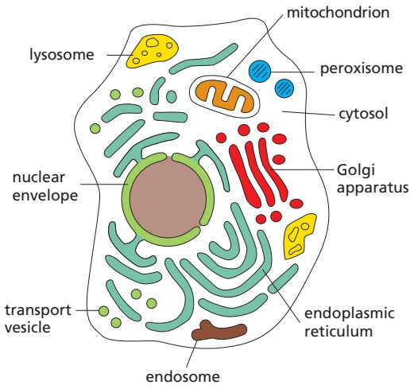

Figure 1–24 Membrane-enclosed organelles are distributed throughout the eukaryotic cell cytoplasm. The membrane-enclosed organelles, shown in different colors, are each specialized to perform a different function. The cytoplasm that fills the space outside of these organelles is called the cytosol.

multiple components that work together are held in close proximity in biomolecular condensates, which will be described in Chapters 3, 6, and 12. An example is the nucleolus, where ribosome assembly takes place (see Figure 1–21). Figure 1–24 summarizes the membrane-enclosed organelles in eukaryotic cells, each of which will be discussed in detail in later chapters.

<!-- END EN EN01-H000-H030 -->

### 英文补充：真核基因组与单细胞真核生物

> 对应中文板块：真核基因组与单细胞真核生物。英文来源：Molecular Biology of the Cell，第7版，第1章；[本章完整原文](../来源/英文教材/01_Cells_Genomes_and_the_Diversity_of_Life/chapter.md)。物理PDF页码范围：40–87（整章范围）。

<!-- BEGIN EN EN01-H034-H038 -->
#### Eukaryotic Genomes Are Big

Natural selection has evidently favored mitochondria with small genomes. By contrast, the nuclear genomes of most eukaryotes seem to have been free to enlarge. Perhaps the eukaryotic way of life has made large size an advantage: predatory cells, for example, typically need to be bigger than their prey, and cell size generally increases in proportion to genome size. Whatever the reason, the genomes of most eukaryotes have become hundreds of times larger than those of bacteria and archaea (**Figure 1–30**).

The freedom to be extravagant with DNA has had profound implications. Eukaryotes not only have more genes than prokaryotes; they also have vastly more DNA that does not code for protein or RNA. The human genome contains about 700 times as many nucleotide pairs as the genome of a typical bacterium such as E. coli, but it contains only about 4.5 times as many protein-coding genes because a much greater proportion of the human genome does not code for protein (∼98.5% compared to 11% in E. coli). The estimated genome sizes and gene numbers for a few selected eukaryotes are compared with the bacterium E. coli in **Table 1–2**; we will discuss shortly how each of these organisms serves as a model organism.

#### Eukaryotic Genomes Are Rich in Regulatory DNA

As discussed in Chapter 4, much of our nonprotein-coding DNA is almost certainly dispensable “junk,” retained during evolution like a mass of old papers because, when there is little pressure to keep an archive small, it is easier to retain

Figure 1–30 Genome sizes compared. Genome size is measured in nucleotide (base) pairs of DNA per haploid genome, that is, per single copy of the genome. (The body cells of sexually reproducing, multicellular organisms such as ourselves are generally diploid: they contain two copies of the genome, one inherited from the mother, the other from the father.) Note that closely related organisms can vary widely in the quantity of DNA in their genomes (as indicated by the length of the green bars), even though they contain similar numbers of protein-coding genes. (Data from T.R. Gregory, 2021. Animal Genome Size Database: www.genomesize.com.)

<table><tbody><tr><td colspan="3">TABLE 1-2 Some Model Organisms and Their Genomes</td></tr><tr><td>Organism</td><td>Approximate genome size* (nucleotide pairs)</td><td>Approximate number of protein-coding genes**</td></tr><tr><td>Escherichia coli (bacterium)</td><td>4.6 × 106</td><td>4300</td></tr><tr><td>Saccharomyces cerevisiae (yeast)</td><td>12.5 × 106</td><td>6600</td></tr><tr><td>Caenorhabditis elegans (roundworm)</td><td>100 × 106</td><td>20,000</td></tr><tr><td>Arabidopsis thaliana (plant)</td><td>135 × 106</td><td>27,000</td></tr><tr><td>Drosophila melanogaster (fruit fly)</td><td>180 × 106</td><td>14,000</td></tr><tr><td>Danio rerio (zebrafish)</td><td>1400 × 106</td><td>26,000</td></tr><tr><td>Mus musculus (mouse)</td><td>2800 × 106</td><td>20,000</td></tr><tr><td>Homo sapiens (human)</td><td>3100 × 106</td><td>20,000</td></tr><tr><td colspan="3">*Genome size includes an estimate for the amount of highly repeated, noncoding DNA sequence, which does not appear in genome databases. **There are also genes that code for functional RNA molecules that do not code for proteins.</td></tr></tbody></table>

everything than to sort out the valuable information and discard the rest. Certain exceptional eukaryotic species, such as the puffer fish, bear witness to the profligacy of their relatives; they have somehow managed to rid themselves of large quantities of nonprotein-coding DNA, and, yet, they appear similar in structure, behavior, and fitness to related species that have vastly more such DNA.

Even in compact eukaryotic genomes such as that of the puffer fish, there is more nonprotein-coding DNA than protein-coding DNA. As in all eukaryotic organisms, at least some of the noncoding DNA certainly has important functions. In particular, it regulates the expression of genes. With this regulatory DNA, eukaryotes have evolved distinctive, highly sophisticated ways of controlling when and where a gene is brought into play. Elaborate mechanisms for gene regulation are especially crucial for the formation and function of complex multicellular organisms, which have many different cell types, each with different functions, as we now discuss.

#### Eukaryotic Genomes Define the Program of Multicellular Development

The cells in an individual animal or plant are extraordinarily varied. Blood cells, skin cells, bone cells, nerve cells—they seem as dissimilar as any cells could be (**Figure 1–31**). Yet all these cell types are the descendants of a single fertilized egg cell, and all (with very minor exceptions) contain identical copies of the genome of the species.

The differences result from the way in which the cells make selective use of their genetic instructions according to their developmental history and the cues they receive from their surroundings in a developing embryo. The DNA is not just a shopping list specifying the molecules that every cell must have, and the cell is not an assembly of all the items on the list. Rather, the cell behaves as a multipurpose machine, with sensors to receive environmental signals and with highly developed abilities to call different sets of genes into action according to signals it receives. The genome in each cell is big enough to accommodate the information that specifies an entire multicellular organism, but in any individual cell only part of that information is used.

Many genes in the eukaryotic genome code for proteins that regulate the activities of other genes, a topic discussed in detail in Chapter 7. Most of these regulatory genes encode transcription regulators that act by binding, directly or indirectly, to the many different DNA sequences that control which genes are to be expressed, and at what levels. Eukaryotic genomes also produce many noncoding RNA molecules; as the name implies, they are not translated into protein butMBoC7 m1.34/1.32 control gene expression in a variety of ways. The expanded genome of eukaryotes therefore not only specifies the hardware of the cell but also stores the software that controls how that hardware is used (**Figure 1–32**).

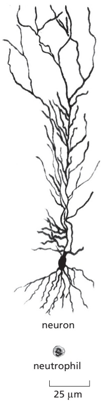

Figure 1–31 Cell types can vary enormously in size and shape. A human nerve cell is compared here with a human neutrophil, a type of white blood cell. Both are drawn to scale.

Figure 1–32 Genetic control of the program of multicellular development. The role of a regulatory gene is demonstrated in the snapdragon Antirrhinum. In this example, a mutation in a single gene coding for a regulatory protein causes leafy shoots to develop in place of flowers: because the regulator protein has been changed, the cells adopt characters that would be appropriate to a different location in the normal plant. The mutant is on the left, the normal plant on the right. (Courtesy of Enrico Coen and Rosemary Carpenter.)

Cells do not just passively receive signals; rather, they actively exchange signals with their neighbors. Thus, in a developing multicellular organism, an internal control system governs each cell that has different consequences depending on the messages exchanged. The outcome, astonishingly, is a precisely patterned array of cells of different types, each displaying a character appropriate to its position in the multicellular structure.

#### Many Eukaryotes Live as Solitary Cells

Many species of eukaryotic cells lead a solitary life. As we have seen, some of these single-cell organisms are hunters, some are photosynthesizers, still others are scavengers. **Figure 1–33** conveys something of the astonishing variety of single-cell eukaryotes, whose anatomy can be remarkably elaborate, including such structures as sensory bristles, photoreceptors, sinuously beating cilia, leglike appendages, mouth parts, stinging darts, and muscle-like contractile bundles. Although they are single cells, they can be as intricate, as versatile, and as complex in their behavior as many multicellular organisms (**Figure 1–34**, **Movie 1.4**, and **Movie 1.5**).

Figure 1–33 An assortment of single-cell eukaryotes. The drawings are done to different scales, but in each case the scale bar represents 10 μm. The organisms in (A), (C), and (G) are ciliates; (B) is a heliozoan; (D) is an amoeba; (E) is a dinoflagellate; and (F) is a euglenoid. (Courtesy of Michael Sleigh, from M.A. Sleigh, Biology of Protozoa. Edinburgh: Edward Arnold, 1973.)

(A)

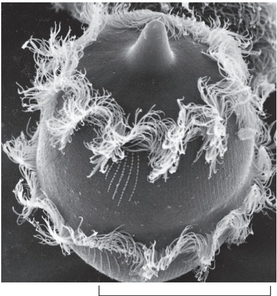

100 µm

(B)

Figure 1–34 A single-cell eukaryote that eats other cells. (A) Didinium is a carnivorous protist, belonging to the group of ciliates. (A protist is defined as a free-living, single-cell, mobile eukaryote.) Didinium has a globular body, about 150 μm in diameter, encircled by two fringes of cilia—sinuous, whiplike appendages that beat continually; its front end is flattened except for a single protrusion, rather like a snout. (B) A Didinium engulfing its prey. It normally swims around in the water at high speed by means of the synchronous beating of its cilia. When it encounters a suitable prey, usually another type of protist, it releases numerous small paralyzing darts from its snout region. Then, it attaches to and devours its prey (artificially colored yellow) by phagocytosis, inverting like a hollow ball to engulf its victim, which can be almost as large as itself. (Courtesy of D. Barlow.)

Humans tend to focus on plants and animals, while neglecting single-cell eukaryotes because (along with bacteria and archaea) they are microscopic. But thanks to DNA comparisons, we now know that the genomes of single-cell. / . eukaryotes are far more evolutionarily diverse than those of multicellular animals and plants, meaning that animals and plants arose relatively late in the complex and fascinating eukaryotic pedigree. With genome data, we can position the many different single-celled eukaryotes in the tree of life and identify our closest relatives (**Figure 1–35**). Scientists are using this information to probe the origins of multicellularity, with a focus on what these strange creatures can tell us about our own evolutionary past.

#### Summary

Eukaryotic cells, by definition, keep most of their DNA in a separate membraneenclosed compartment—the nucleus. They have, in addition, an elaborate set of other organelles, each carrying out different functions, such as the oxidation of food-derived molecules and production of ATP in mitochondria. Eukaryotic cells also contain a cytoskeleton for structural support and movements. There is compelling evidence that mitochondria and, in plants and algae, chloroplasts evolved from captured symbiotic bacteria, which explains why these organelles contain their own DNA and ribosomes.

Eukaryotic cells typically have 3–8 times as many protein-coding genes as bacteria and archaea and often a thousand times more noncoding DNA. Although much of this DNA is probably unimportant, some of it allows for great complexity in the regulation of gene expression, as required for the construction of complex multicellular organisms containing many different cell types.

<!-- END EN EN01-H034-H038 -->

### 英文补充：相似的化学组成：水、非共价作用与生物大分子

> 对应中文板块：相似的化学组成：水、非共价作用与生物大分子。英文来源：Molecular Biology of the Cell，第7版，第2章；[本章完整原文](../来源/英文教材/02_Cell_Chemistry_and_Bioenergetics/chapter.md)。物理PDF页码范围：88–153（整章范围）。

<!-- BEGIN EN EN02-H000-H008 -->
#### Cell Chemistry and Bioenergetics

C HAP T E R

It is at first sight difficult to accept the idea that living creatures are merely chemical systems. Their incredible diversity of form, their seemingly purposeful behavior, and their ability to grow and reproduce all seem to set them apart from the world of solids, liquids, and gases that chemistry normally describes. Indeed, until the late nineteenth century, animals were generally believed to contain a Vital Force—an “animus”—that was responsible for their distinctive properties.

We now know that there is nothing in living organisms that disobeys chemical or physical laws. However, the chemistry of life is indeed special. First, life depends on chemical reactions that take place in aqueous solution, and it is based overwhelmingly on carbon compounds, the study of which is known as organic chemistry. Second, although cells contain a variety of small carbon-containing molecules, most of the carbon atoms present are incorporated into enormous polymeric molecules—chains of chemical subunits linked end-to-end. It is the unique properties of these macromolecules that enable cells and organisms to grow and reproduce—and to do all the other things that are characteristic of life. Third, and most important, cell chemistry is enormously complex: even the simplest cell is vastly more complicated in its chemistry than any other chemical system known. In fact, we now recognize that the many interlinked networks of chemical reactions in cells can give rise to so-called emergent properties, which will require the development of new experimental and computational methods to understand.

IN THIS CHAPTER

The Chemical Components of a Cell

Catalysis and the Use of Energy by Cells

Much of the information in this chapter is summarized—and in some cases further elaborated—in the nine two-page Panels with which the chapter ends (Panels 2–1 to 2–9). Although the Panels will be cited at appropriate places in the text, they should also be useful for refreshing background knowledge when reading later chapters.

How Cells Obtain Energy from Food

<table><tr><td colspan="18">1H1atomic weight</td><td>He</td></tr><tr><td>Li</td><td>Be</td><td></td><td></td><td></td><td></td><td></td><td></td><td></td><td></td><td></td><td></td><td>5B11</td><td>6C12</td><td>7N14</td><td>8O16</td><td>9F19</td><td>Ne</td><td></td></tr><tr><td>11Na23</td><td>12Mg24</td><td></td><td></td><td></td><td></td><td></td><td></td><td></td><td></td><td></td><td></td><td>Al</td><td>14Si28</td><td>15P31</td><td>16S32</td><td>17Cl35</td><td>Ar</td><td></td></tr><tr><td>19K39</td><td>20Ca40</td><td>Sc</td><td>Ti</td><td>23V51</td><td>24Cr52</td><td>25Mn55</td><td>26Fe56</td><td>27Co59</td><td>28Ni59</td><td>29Cu64</td><td>30Zn65</td><td>Ga</td><td>Ge</td><td>As</td><td>34Se79</td><td>Br</td><td>Kr</td><td></td></tr><tr><td>Rb</td><td>Sr</td><td>Y</td><td>Zr</td><td>Nb</td><td>42Mo96</td><td>Tc</td><td>Ru</td><td>Rh</td><td>Pd</td><td>Ag</td><td>Cd</td><td>In</td><td>Sn</td><td>Sb</td><td>Te</td><td>53I127</td><td>Xe</td><td></td></tr><tr><td>Cs</td><td>Ba</td><td>La</td><td>Hf</td><td>Ta</td><td>W</td><td>Re</td><td>Os</td><td>Ir</td><td>Pt</td><td>Au</td><td>Hg</td><td>Tl</td><td>Pb</td><td>Bi</td><td>Po</td><td>At</td><td>Rn</td><td></td></tr><tr><td>Fr</td><td>Ra</td><td>Ac</td><td>Rf</td><td>Db</td><td></td><td></td><td></td><td></td><td></td><td></td><td></td><td></td><td></td><td></td><td></td><td></td><td></td><td></td></tr></table>

#### THE CHEMICAL COMPONENTS OF A CELL

Living organisms are made of only a small selection of the 92 naturally occurring elements, four of which—carbon (C), hydrogen (H), nitrogen (N), and oxygen (O)— make up 96.5% of an organism’s weight (**Figure 2–1**). The atoms of these

atomic number

Figure 2–1 The main elements in cells, highlighted in the periodic table. When ordered by their atomic number and arranged in this manner, elements fall into vertical columns that show similar properties.

The four elements highlighted in red constitute 99% of the total number of atoms present in the human body (and 96.5% of its weight). An additional seven elements, highlighted in blue, together represent about 0.9% of the total atoms in our bodies. The elements shown in green are required in trace amounts by humans. It remains unclear whether those elements shown in yellow are essential in humans.

The chemistry of life is therefore predominantly the chemistry of lighter elements. The atomic weights shown here are those of the most common isotope of each element. The vertical red line marks a break in the periodic table where a group of large atoms with similar chemical properties is omitted.

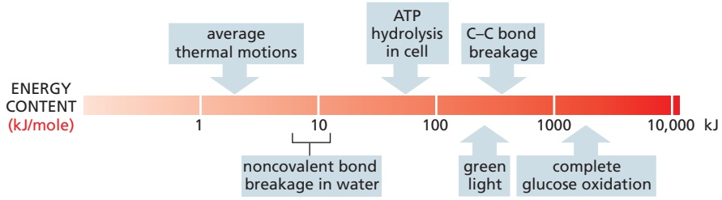

Figure 2–2 Some energies important for cells. A crucial property of any bond—covalent or noncovalent—is its strength. Bond strength is measured by the amount of energy that must be supplied to break it, expressed in units of either kilojoules per mole (kJ/mole) or kilocalories per mole (kcal/mole). Thus if 100 kJ of energy must be supplied to break $6 \times 1 0 ^ { 2 3 }$ bonds of a specific type (that is, 1 mole of these bonds), then the strength of that bond is 100 kJ/mole. Note that, in this diagram, energies are compared on a logarithmic scale. (Typical strengths and lengths of the main classes of chemical bonds are given in Table 2–1, later in text.)

One joule (J) is the amount of energy required to move an object a distance of 1 meter (m) MBoC7 m2.02/2.02against a force of 1 newton (N). This measure of energy is derived from the SI units (Système International d’Unités) universally employed by physical scientists. A second unit of energy, often used by cell biologists, is the kilocalorie (kcal):1 calorie (cal) is the amount of energy needed to raise the temperature of 1 gram (g) of water by 1°C. One kilojoule (kJ) is equal to 0.239 kcal.

elements are linked together by **covalent bonds** to form molecules (see **Panel 2–1**, pp. 94–95). Because covalent bonds are typically 100 times stronger than the thermal energies within a cell, they resist being pulled apart by thermal motions, and they are normally broken only during biologically catalyzed chemical reactions that are of use to the cell. Noncovalent bonds are much weaker (**Figure 2–2**), but sets of them allow molecules to recognize each other and reversibly associate, which is critical for the vast majority of biological functions.

#### Water Is Held Together by Hydrogen Bonds

Because 70% of the weight of a cell is water, the reactions that make life possible occur in an aqueous environment. Life on Earth is thought to have begun in shallow bodies of water that had concentrated essential molecules, and the conditions in that primeval environment have left a permanent stamp on the chemistry of all living things.

The chemical properties of water are reviewed in **Panel 2–2** (pp. 96–97). In a water molecule (H2O), the two H atoms are linked to the O atom by covalent bonds that are highly polar, inasmuch as the O atom attracts electrons more strongly than does the H atom. Consequently, there is a preponderance of positive charge on the two H atoms and of negative charge on the O atom. When a positively charged region of one water molecule (that is, one of its H atoms) approaches a negatively charged region (that is, the O atom) of a second water molecule, the electrical attraction between them can result in a **hydrogen bond** (**Figure 2–3A**). These bonds are much weaker than covalent bonds and are easily broken by the random thermal motions that reflect the heat energy of the molecules. Thus, each bond lasts only a very short time. But the combined effect of many weak bonds can be profound. For example, each water molecule can form hydrogen bonds through its two H atoms to two other water molecules, producing a network in which hydrogen bonds are being continually broken and formed. It is only because of these hydrogen bonds that link water molecules together that water is a liquid at room temperature—with a high boiling point and high surface tension—rather than a gas.

Hydrogen bonds are not limited to water, and they are central to much of biology. This bond represents a special form of polar interaction in which an electropositive hydrogen atom is shared by two electronegative atoms. The hydrogen in this bond can be viewed as a proton that has partially dissociated from a donor atom, allowing it to be shared by a second, acceptor atom. Unlike a typical electrostatic interaction, this bond is highly directional—being strongest when a straight line can be drawn between all three of the involved atoms (**Figure 2–3B**).

Figure 2–3 The noncovalent hydrogen bond. (A) A hydrogen bond forms between two water molecules. The slight positive charge associated with the hydrogen atom is electrically attracted to the slight negative charge of the oxygen atom. This causes water to exist as a large hydrogen-bonded MBoC7 e2.14/2.03network (see Panel 2–2, pp. 96–97). (B) In cells, hydrogen bonds commonly form between molecules that contain an oxygen or nitrogen. The atom bearing the hydrogen is considered the H-bond donor, and the atom that interacts with the hydrogen is the H-bond acceptor. This type of dipole–dipole interaction is of critical importance in biology. For this reason, and because it is highly directional, the hydrogen bond receives special attention among the set of noncovalent attractions that we discuss next.

Molecules, such as alcohols, that contain polar bonds and that can form hydrogen bonds with water dissolve readily in water. Molecules carrying charges (ions) likewise interact favorably with water. Such molecules are termed **hydrophilic**, meaning that they are water-loving. Many of the molecules in the aqueous environment of a cell necessarily fall into this category, including sugars, DNA, RNA, and most proteins. **Hydrophobic** (water-fearing) molecules, by contrast, are uncharged and form few or no hydrogen bonds, and so do not dissolve in water. Hydrocarbons are an important example. In these molecules, all of the H atoms are covalently linked to C atoms by a largely nonpolar bond; thus, they cannot form effective hydrogen bonds to other molecules (see Panel 2–1, pp. 94–95). This makes the hydrocarbon as a whole hydrophobic—a property that is exploited in cells, whose membranes are constructed from molecules that have long hydrocarbon tails, as we shall see in Chapter 10.

#### Four Types of Noncovalent Attractions Help Bring Molecules Together in Cells

Much of biology depends on the specific binding between different molecules caused by three types of **noncovalent bonds**—hydrogen bonds, electrostatic attractions (ionic bonds), and van der Waals attractions—combined with a fourth factor that can push molecules together: the hydrophobic force.

**Electrostatic attractions** are strongest when the atoms involved are fully charged, or ionized. But a weaker electrostatic attraction occurs between molecules that contain polar covalent bonds. Like hydrogen bonds, electrostatic attractions are extremely important in biology. For example, any large molecule with many polar groups will have a pattern of partial positive and negative charges on its surface. When such a molecule encounters a second molecule with a complementary set of charges, the two will be drawn to each other by electrostatic attraction.

In addition to hydrogen bonds and electrostatic attractions, a third type of noncovalent bond, called a **van der Waals attraction**, comes into play when any two atoms approach each other closely. These weak, nonspecific interactions are due to fluctuations in the distribution of electrons in every atom, which can generate a transient attraction when the atoms are in very close proximity. These attractions occur in all types of molecules, even those that are nonpolar.

The relative lengths and strengths of these three types of noncovalent bonds are compared to the length and strength of covalent bonds in **Table 2–1**, both in the presence and in the absence of water. Note that, because water forms competing interactions with the involved molecules, the strength of both electrostatic attractions and hydrogen bonds is greatly weakened inside of the cell.

The fourth effect that often brings molecules together in water is not, strictly speaking, a bond at all. However, a very important **hydrophobic force** is caused by a pushing of nonpolar surfaces out of the hydrogen-bonded water network, where they would otherwise physically interfere with the highly favorable interactions between water molecules. Bringing any two nonpolar surfaces together reduces their contact with water, and in this sense, the force is nonspecific. Nevertheless, we shall see in Chapter 3 that hydrophobic forces are central to the proper folding of protein molecules.

TABLE 2–1 Covalent and Noncovalent Chemical Bonds

<table><tr><td rowspan="2" colspan="2">Bond type</td><td rowspan="2">Length (nm)</td><td colspan="2">Strength (kJ/mole**)</td></tr><tr><td>In vacuum</td><td>In water</td></tr><tr><td>Covalent</td><td></td><td>0.10</td><td>377 (90)</td><td>377 (90)</td></tr><tr><td rowspan="3">Noncovalent</td><td>Ionic*</td><td>0.25</td><td>335 (80)</td><td>12.6 (3)</td></tr><tr><td>Hydrogen</td><td>0.17</td><td>16.7 (4)</td><td>4.2 (1)</td></tr><tr><td>van der Waals attraction (per atom)</td><td>0.35</td><td>0.4 (0.1)</td><td>0.4 (0.1)</td></tr></table>

\*An ionic bond is an electrostatic attraction between two fully charged atoms. \*\*Values in parentheses are kcal/mole. 1 kJ = 0.239 kcal and 1 kcal = 4.18 kJ.

The properties of the four types of noncovalent attractions are presented in **Panel 2–3** (pp. 98–99). Although each individual noncovalent attraction would be much too weak to be effective in the face of thermal motions, the energies of these noncovalent attractions can sum to create a strong force between two separate molecules. Thus, it is an entire set of noncovalent attractions that enables the complementary surfaces of two macromolecules to hold the two macromolecules together (**Figure 2–4**).

#### Some Polar Molecules Form Acids and Bases in Water

One of the simplest kinds of chemical reaction, and one that has a considerable significance for cells, takes place when a molecule containing a highly polar covalent bond between a hydrogen and another atom dissolves in water. The hydrogen atom in such a molecule has given up its electron almost entirely to the companion atom, and so exists as an almost naked positively charged hydrogen nucleus; in other words, a **proton** $( \mathbf { H } ^ { + } )$ . When this polar molecule becomes surrounded by water molecules, the proton will be attracted to the partial negative charge on the O atom of an adjacent water molecule. The proton can easily dissociate from its original partner and associate instead with the oxygen atom of the water molecule, generating a hydronium ion $\mathbf { ( H _ { 3 } O ^ { + } ) }$ (**Figure 2–5A**). The reverse reaction also takes place very readily, so in an aqueous solution protons are constantly flitting to and fro between one molecule and another.

Substances that release protons when they dissolve in water, thus forming $\mathrm { H _ { 3 } O ^ { + } }$ , are termed **acids**. The higher the concentration of $\mathrm { H _ { 3 } O ^ { + } }$ , the more acidic the solution. $\mathrm { H _ { 3 } O ^ { + } }$ is present even in pure water, at a concentration of $1 0 ^ { - 7 }$ M, as a result of the movement of protons from one water molecule to another (**Figure 2–5B**). By convention, the $\mathrm { H _ { 3 } O } ^ { + }$ concentration is usually referred to as the $\mathrm { H } ^ { + }$ concentration, even though most protons in an aqueous solution are present as $\mathrm { H _ { 3 } O ^ { + } }$ . As explained in Panel 2–2, to avoid the use of unwieldy numbers the concentration of $\mathrm { H _ { 3 } O ^ { + } }$ is expressed using a logarithmic scale called the **pH scale**. Pure water has a pH of 7.0 and is said to be neutral; that is, neither acidic $\mathrm { ( p H < 7 ) }$ nor basic $\mathrm { ( p H > 7 ) }$

Acids are characterized as being strong or weak, depending on how readily they give up their protons to water. Strong acids, such as hydrochloric acid (HCl), easily lose their protons. Acetic acid, on the other hand, is a weak acid because it holds on to its proton more tightly when dissolved in water. Many of the acids important in the cell—such as molecules containing a carboxyl (COOH) group—are weak acids.

Because the proton of a hydronium ion can be passed readily to many types of molecules in cells, altering their character, the concentration of $\mathrm { \widetilde { H } _ { 3 } O ^ { + } }$ inside a cell (the acidity) must be closely regulated. Acids—especially weak acids—will give up their protons more readily if the concentration of $\mathrm { H _ { 3 } O ^ { + } }$ in solution is low and will tend to receive them back if the concentration in solution is high.

Figure 2-4 Schematic indicating how two macromolecules with complementary surfaces can bind tightly to one another through noncovalent interactions. Noncovalent chemical bonds have less than 1/20 the strength of a covalent bond. They are able to produce tight binding only when many of them are formed simultaneously. Although only electrostatic attractions are illustrated here, in reality all four noncovalent forces often MBoC7 m2.03/2.04contribute to holding two macromolecules together (Movie 2.1).

Figure 2–5 How protons readily move in aqueous solutions. (A) The reaction that takes place when a molecule of acetic acid dissolves in water. At pH 7, nearly all of the acetic acid is present as acetate ion. (B) Water molecules continually exchange protons with each other to form hydronium and hydroxyl ions. These ions in turn rapidly recombine to form water molecules.

The opposite of an acid is a **base**. Any molecule capable of accepting a proton from a water molecule is called a base. Sodium hydroxide (NaOH) is basic (the term alkaline is also used) because it dissociates readily in aqueous solution to form $\mathrm { N a } ^ { + }$ ions and $\mathrm { O H ^ { - } }$ ions. Because of this property, NaOH is called a strong base. More important in living cells, however, are the weak bases— those that have a weak tendency to reversibly accept a proton from water. Many biologically important molecules contain an amino (NH2) group. This group is a weak base that can generate OH– by taking a proton from water: $\mathrm{NH_{2}+H_{2}O\rightarrow -NH_{3}+OH^{-}}$ (see Panel 2–2, pp. 96–97).

Because an OH– ion combines with an $\mathrm { H _ { 3 } O ^ { + } }$ ion to form two water molecules, any increase in the OH– concentration forces a decrease in the concentration of $\mathrm { H _ { 3 } O ^ { + } }$ , and vice versa. Thus the product of the two values, $\mathrm { [ O H ^ { - } ] \times [ H _ { 3 } O ^ { + } ] }$ is always $1 0 ^ { - 1 4 }$ (moles/liter)2. A pure solution of water contains an equal concentration $\left( 1 0 ^ { - 7 }   \mathrm { M } \right)$ of both ions, rendering it neutral. The interior of a cell is also kept close to neutrality by the presence of **buffers**: weak acids and bases that can release or take up protons near pH 7, keeping the environment of the cell relatively constant under a variety of conditions.

#### A Cell Is Formed from Carbon Compounds

Having briefly reviewed the ways that atoms combine into molecules and how these molecules behave in an aqueous environment, we now examine the main classes of small molecules found in cells. We shall see that a few categories of molecules, formed from a handful of different elements, give rise to all the extraordinary richness of form and behavior shown by living things.

If we disregard water and inorganic ions such as potassium, nearly all the molecules in a cell are based on carbon. Carbon is outstanding among all the elements in its ability to form large molecules; silicon is a poor second. Because carbon is small and has four electrons and four vacancies in its outermost shell, a carbon atom can form four covalent bonds with other atoms. Most important, one carbon atom can join to other carbon atoms through highly stable covalent C–C bonds to form chains and rings and hence generate large and complex molecules with no obvious upper limit to their size. The carbon compounds made by cells are called organic molecules. In contrast, all other molecules, including water, are said to be inorganic.

Certain combinations of atoms, such as the methyl $\left( - \mathrm { C H _ { 3 } } \right)$ , hydroxyl (–OH), carboxyl (–COOH), carbonyl $(-C=0)$ , phosphate $( - \dot { \mathrm { P O _ { 3 } } } ^ { 2 - } )$ , sulfhydryl (–SH), and amino (–NH2) groups, occur repeatedly in the molecules made by cells. Each such **chemical group** has distinct chemical and physical properties that influence the behavior of the molecule in which the group occurs. The most common chemical groups and some of their properties are summarized in Panel 2–1 (pp. 94–95).

#### Cells Contain Four Major Families of Small Organic Molecules

The small organic molecules of the cell are carbon-based compounds that have masses in the range of 100–1000 daltons and contain up to 30 or so carbon atoms. They are usually found free in solution and have many different fates. Some are used as monomer subunits to construct the giant polymeric macromolecules that make up most of the mass of the cell—proteins, nucleic acids, and large polysaccharides. Others act as energy sources and are broken down and transformed into other small molecules in a maze of intracellular metabolic pathways. Many small molecules have more than one role in the cell; for example, acting both as a potential subunit for a macromolecule and as an energy source. Small organic molecules account for only about one-tenth of the total mass of organic matter in a cell, but they are very diverse. Nearly 4000 different kinds of small organic molecules have been detected in the well-studied bacterium, Escherichia coli.

All organic molecules are synthesized from and are broken down into the same set of simple compounds. As a consequence, the compounds in a cell are chemically related and most can be classified into a few distinct families. Broadly speaking, cells contain four major families of small organic molecules: the sugars, the fatty acids, the nucleotides, and the amino acids (**Figure 2–6**). Although many compounds present in cells do not fit into these categories, these four families of small organic molecules, together with the macromolecules made by linking them into long chains, account for a large fraction of the cell mass.

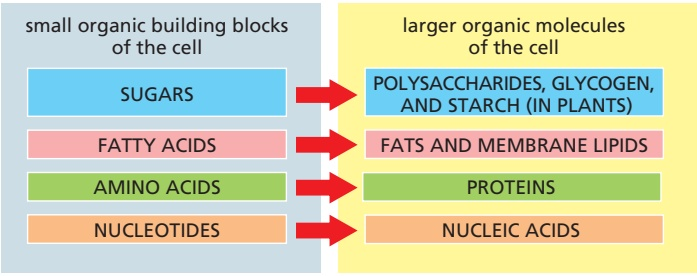

Figure 2–6 The four main families of small organic molecules in cells. These small molecules form the monomeric building blocks, or subunits, for most of the macromolecules and other assemblies of the cell. Some, such as the sugars and the fatty acids, are also energy sources. Their structures are outlined here and shown in more detail in the Panels at the end of this chapter and in Chapter 3.

Amino acids and the proteins that they form will be the subject of Chapter 3. A summary of the structures and properties of the remaining three families— sugars, fatty acids, and nucleotides—is presented in **Panels 2–4**, **2–5**, and **2–6**, respectively (see pp. 100–105).

The Chemistry of Cells Is Dominated by Macromolecules with Remarkable Properties

By weight, **macromolecules** are the most abundant carbon-containing molecules in a living cell (**Figure 2–7**). They are the principal components from which a cell is constructed, and they also determine the most distinctive properties of living organisms. The macromolecules in cells are polymers that are constructed by covalently linking small organic molecules (called monomers) into long chains (**Figure 2–8**). They have remarkable properties that could not have been predicted from their simple constituents.

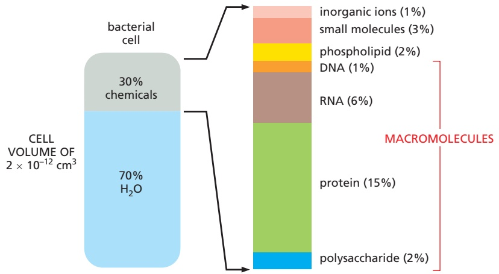

Figure 2–7 The distribution of molecules in cells. The approximate composition of a bacterial cell is shown by weight. The composition of an animal cell is similar, even though its volume is roughly 1000 times greater. Note that macromolecules dominate. The major inorganic ions include Na+, K+, Mg2+, Ca2+, and Cl–.

Proteins are abundant and spectacularly versatile, performing thousands of distinct functions in cells. Many proteins serve as enzymes, the catalysts that facilitate the many covalent bond-making and bond-breaking reactions that the cell needs. Enzymes catalyze all of the reactions in which cells extract energy from food molecules, for example. Other proteins are used to build structural components, such as tubulin, a protein that self-assembles to make the cell’s long microtubules, or histones, proteins that compact the DNA in chromosomes. Many proteins serve as signaling devices, producing networks that control cell functions. Yet other proteins act as molecular motors to produce force and movement, as for myosin in muscle. We shall describe the remarkable chemistry that underlies these diverse roles throughout this book.

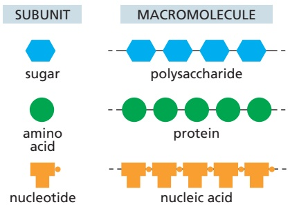

Figure 2–8 Three families of macromolecules. Each is a polymer formed from small molecules (called monomers) linked together by covalent bonds. There are two types of nucleic acid: RNA and DNA.

Although the chemical reactions that add subunits to each polymer are different in detail for proteins, nucleic acids, and polysaccharides, they share important features. Each polymer grows by the addition of a monomer onto the end of a growing chain in a condensation reaction, in which one molecule of water is lost with each subunit added (**Figure 2–9**). The stepwise polymerization of monomers into a long chain is a simple way to manufacture a large, complex molecule, because the subunits are added by the same reaction performed over and over again by the same set of enzymes. Apart from some of the polysaccharides, most macromolecules are made from a limited set of monomers that are slightly different from one another; for example, the 20 different amino acids from which proteins are made. It is critical to life that the polymer chain is not assembled at random from these subunits; instead, the subunits are added in a precise order, or sequence. The elaborate mechanisms that allow enzymes to accomplish this task are described in detail in Chapters 5 and 6.

#### Noncovalent Bonds Specify Both the Precise Shape of a Macromolecule and Its Binding to Other Molecules

Most of the covalent bonds in a macromolecule allow rotation of the atoms they join, giving the polymer chain great flexibility. In principle, this allows a macromolecule to adopt an almost unlimited number of shapes, or conformations, as random thermal energy causes the polymer chain to writhe and rotate. However, the shapes of most biological macromolecules are highly constrained because of the many weak noncovalent bonds that form between different parts of the same molecule. If these noncovalent bonds are formed in sufficient numbers, the polymer chain can strongly prefer one particular conformation, determined by the linear sequence of monomers in its chain. Most protein molecules and many of the small RNA molecules found in cells fold tightly into a highly preferred conformation in this way (**Figure 2–10**).

The four types of noncovalent interactions important in biological molecules were presented earlier (see also Panel 2–3, pp. 98–99). In addition to folding biological macromolecules into unique shapes, they can also add up to create a strong attraction between two different molecules (see Figure 2–4). This form of molecular interaction provides for great specificity, inasmuch as the close multi-point contacts required for strong binding make it possible for a macromolecule to select out—through binding—just one of the many thousands of types of mole-MBoC7 e2.34/2.10 cules present inside a cell. Moreover, because the strength of the binding depends on the number of noncovalent bonds that are formed, interactions of almost any affinity are possible—allowing rapid dissociation where appropriate.

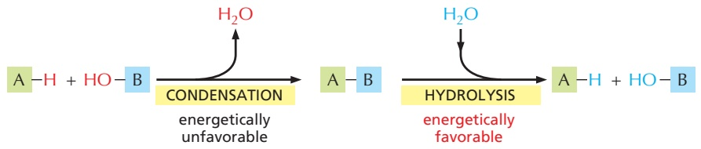

Figure 2–9 Condensation and hydrolysis as opposite reactions. The macromolecules of the cell are polymers that are formed from subunits (or monomers) by a condensation reaction, and they are broken down by hydrolysis. The condensation reactions are all energetically unfavorable; thus, polymer formation requires an energy input, as will be described in the text.

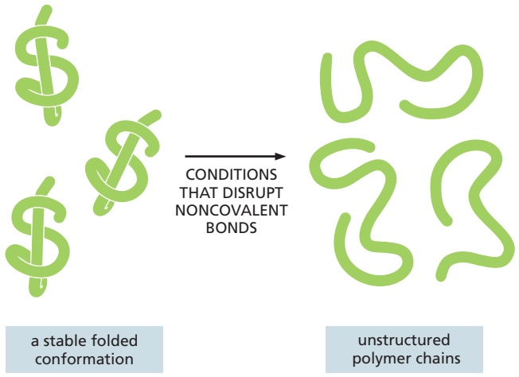

Figure 2–10 Proteins and RNA molecules are folded into a particularly stable three-dimensional shape, or conformation. If the noncovalent bonds maintaining the stable conformation are disrupted, the molecule becomes a flexible chain that loses its biological activity.

As we discuss next, binding of this type underlies all biological catalysis, making it possible for proteins to function as enzymes. In addition, noncovalent interactions allow macromolecules to be used to build larger structures, thereby forming intricate machines with multiple moving parts that perform such complex tasks as DNA replication and protein synthesis (**Figure 2–11**).

#### Summary

Living organisms are autonomous, self-propagating chemical systems. They are formed from a distinctive and restricted set of small carbon-based molecules that are essentially the same for every living species. Each of these small molecules is composed of a set of atoms linked to each other in a precise configuration through covalent bonds. The main categories are sugars, fatty acids, amino acids, and nucleotides.

Most of the dry mass of a cell consists of macromolecules that have been produced as linear polymers of amino acids (proteins) or nucleotides (DNA and RNA), covalently linked to each other in an exact order. Most of the protein molecules and many of the RNAs fold into a particular conformation that is determined

Figure 2–11 Small molecules are covalently linked to form macromolecules, which in turn can assemble through noncovalent interactions to form large complexes. Small molecules, proteins, and a ribosome are drawn approximately to scale. Ribosomes are a central part of the machinery that the cell uses to make proteins: each ribosome is formed as a complex of about 90 macromolecules (protein and RNA molecules).

(C)

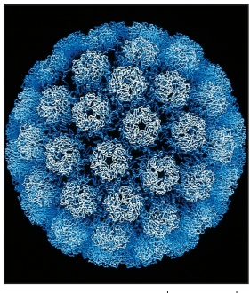

(A)

(B)

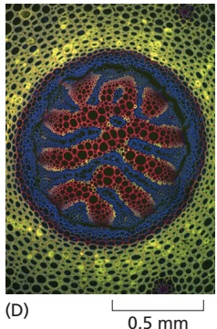

by their sequence of subunits. This folding process creates unique surfaces, and it depends on a large set of weak attractions produced by noncovalent forces between atoms. These forces are of four types: electrostatic attractions, hydrogen bonds, van der Waals attractions, and an attraction between nonpolar groups caused by their hydrophobic expulsion from water. The same set of weak forces governs the specific binding of a macromolecule to both small molecules and other macromolecules, producing the myriad associations between biological molecules that generate the structure and the chemistry of a cell.

Figure 2–12 Biological structures are highly ordered. Well-defined, ornate, and beautiful spatial patterns can be found at every level of organization in living organisms. In order of increasing size: (A) protein molecules in the coat of a virus (a parasite that, although not technically alive, contains the same types of molecules as those found in living cells); (B) the regular array of microtubules seen in a cross section of a sperm tail; (C) surface contours of a pollen grain (a single cell); (D) cross section of a fern stem, showing the patterned arrangement of cells; and (E) a spiral arrangement of leaves in a succulent plant. (A, courtesy of Robert Grant, Stéphane Crainic, and James M. Hogle; B, courtesy of Lewis Tilney; C, courtesy of Colin MacFarlane and Chris Jeffree; D, courtesy of Jim Haseloff; E, courtesy of Aron van de Selenib.)

<!-- END EN EN02-H000-H008 -->

### 英文补充：化学基础图解：化学键、水、糖、脂质与核苷酸

> 对应中文板块：化学基础图解：化学键、水、糖、脂质与核苷酸。英文来源：Molecular Biology of the Cell，第7版，第2章；[本章完整原文](../来源/英文教材/02_Cell_Chemistry_and_Bioenergetics/chapter.md)。物理PDF页码范围：88–153（整章范围）。

<!-- BEGIN EN EN02-H042-H090 -->
#### CARBON SKELETONS

Carbon has a unique role in the cell because of its ability to form strong covalent bonds with other carbon atoms. Thus carbon atoms can join to form:

chains

also written as

branched trees

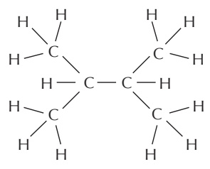

also written as

rings

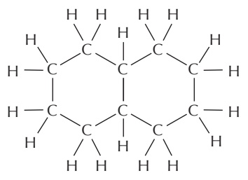

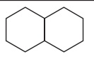

also written as

#### COVALENT BONDS

A covalent bond forms when two atoms come very close together and share one or more of their outer-shell electrons. Each atom forms a fixed number of covalent bonds in a defined spatial arrangement.

SINGLE BONDS: two electrons shared per bond

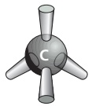

DOUBLE BONDS: four electrons shared per bond

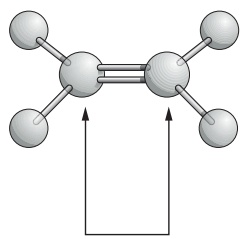

The precise spatial arrangement of covalent bonds influences the three-dimensional structure and chemistry of molecules. In this review Panel, we see how covalent bonds are used in a variety of biological molecules.

Atoms joined by two or more covalent bonds cannot rotate freely around the bond axis. This restriction has a major influence on the three-dimensional shape of many macromolecules.

#### C–H COMPOUNDS

Carbon and hydrogen together make stable compounds (or groups) called hydrocarbons. These are nonpolar, do not form hydrogen bonds, and are generally insoluble in water.

methane

methyl group

#### ALTERNATING DOUBLE BONDS

A carbon chain can include double bonds. If these are on alternate carbon atoms, the bonding electrons move within the molecule, stabilizing the structure by a phenomenon called resonance.

the truth is somewhere between these two structures

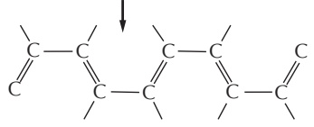

Alternating double bonds in a ring can generate a very stable structure.

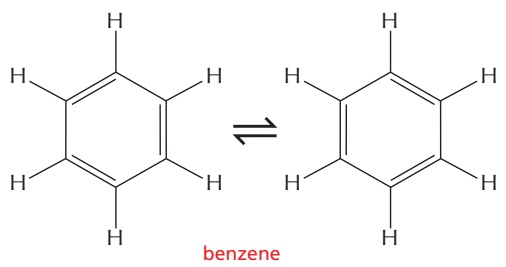

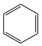

often written as part of the hydrocarbon “tail” of a fatty acid molecule

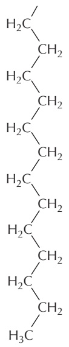

#### C–O COMPOUNDS

Many biological compounds contain a carbon covalently bonded to an oxygen. For example,

alcohol

The –OH is called a hydroxyl group.

aldehyde

ketone

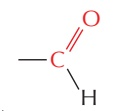

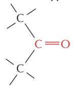

The $\mathsf { C } { = } \mathsf { O }$ is called a carbonyl group.

carboxylic acid

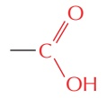

The –COOH is called a carboxyl group. In water, this loses an $\dot { \mathsf { H } } ^ { + }$ ion to become –COO\_.

esters

Esters are formed by combining an acid and an alcohol.

#### C–N COMPOUNDS

Amines and amides are two important examples of compounds containing a carbon linked to a nitrogen.

Amines in water combine with an $\mathsf { H } ^ { + }$ ion to become positively charged.

Amides are formed by combining an acid and an amine. Unlike amines, amides are uncharged in water. An example is the peptide bond that joins amino acids in a protein.

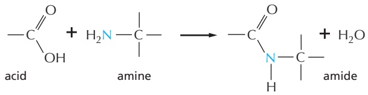

Nitrogen also occurs in several ring compounds, including important constituents of nucleic acids: purines and pyrimidines. NH

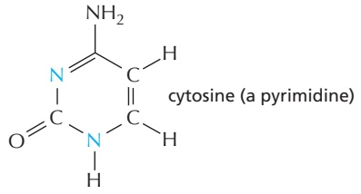

The HYDRYL GROUP $- \overset { \vert } { \underset { \vert } { \mathrm { C } } } - \mathsf { S H }$ is called a sulfhydryl group. In the amino acid cysteine, the sulfhydryl group may exist in the reduced form $- \frac { 1 } { 1 } -$ or more rarely in an oxidized, cross-bridging formSH $- \stackrel { \top } { \underset { \bot } { C } } - \stackrel { \top } { \underset { \bot } { S } } - \stackrel { \top } { \underset { \bot } { S } } - \stackrel { \top } { \underset { \bot } { C } } -$

#### PHOSPHATES

Inorganic phosphate is a stable ion formed from phosphoric acid, $\mathsf { H } _ { 3 } \mathsf { P O } _ { 4 } .$ P It is also written as

Phosphate esters can form between a phosphate and a free hydroxyl group. Phosphate groups are often covalently attached to proteins in this way.

$$
\begin{array}{c} \text {O} \\ \parallel \\ \text {HO - P - O-} \\ \mid \\ \text {O-} \end{array}
$$

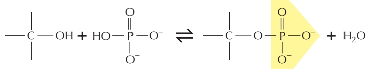

The combination of a phosphate and a carboxyl group, or two or more phosphate groups, produces an acid anhydride. Because compounds of this type release a large amount of free energy when the bond is broken by hydrolysis in the cell, they are often said to contain a high-energy bond.

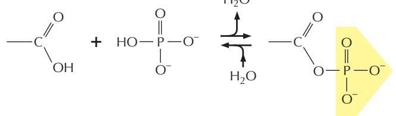

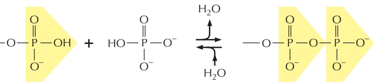

high-energy acyl phosphate bond (carboxylic–phosphoric acid anhydride) found in some metabolites

high-energy phosphoanhydride bond found in molecules such as ATP

#### HYDROGEN BONDS

Because they are polarized, two adjacent $\mathsf { H } _ { 2 } \mathsf { O }$ molecules can form a noncovalent linkage known as a hydrogen bond. Hydrogen bonds have only about 1/20 the strength of a covalent bond.

Hydrogen bonds are strongest when the three atoms lie in a straight line.

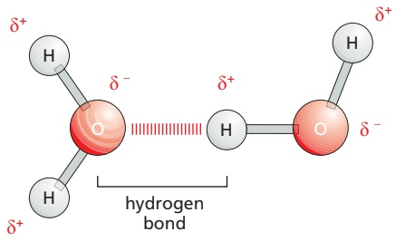

#### WATER

Two atoms connected by a covalent bond may exert different attractions for the electrons of the bond. In such cases, the bond is polar, with one end slightly negatively charged (δ\_) and the other slightly positively charged (δ+).

Although a water molecule has an overall neutral charge (having the same number of electrons and protons), the electrons are asymmetrically distributed, making the molecule polar. The oxygen nucleus draws electrons away from the hydrogen nuclei, leaving the hydrogen nuclei with a small net positive charge. The excess of electron density on the oxygen atom creates weakly negative regions at the other two corners of an imaginary tetrahedron. On these pages, we review the chemical properties of water and see how water influences the behavior of biological molecules.

#### HYDROPHILIC MOLECULES

Substances that dissolve readily in water are termed hydrophilic. They include ions and polar molecules that attract water molecules through electrical charge effects. Water molecules surround each ion or polar molecule and carry it into solution.

Ionic substances such as sodium chloride dissolve because water molecules are attracted to the positive $( \mathsf { N a } ^ { + } )$ or negative (Cl\_) charge of each ion.

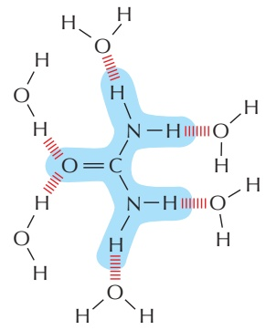

Polar substances such as urea dissolve because their molecules form hydrogen bonds with the surrounding water molecules.

#### WATER STRUCTURE

Molecules of water join together transiently in a hydrogen-bonded lattice. Even at $3 7 ^ { \circ } \mathsf { C } _ { r } ^ { \vec { } }$ 15% of the water molecules are joined to four others in a short-lived assembly known as a flickering cluster.

The cohesive nature of water is responsible for many of its unusual properties, such as high surface tension, high specific heat capacity, and high heat of vaporization.

#### HYDROPHOBIC MOLECULES

Substances that contain a preponderance of nonpolar bonds are usually insoluble in water and are termed hydrophobic. Water molecules are not attracted to such hydrophobic molecules and so have little tendency to surround them and bring them into solution.

Hydrocarbons, which contain many C–H bonds, are especially hydrophobic.

#### WATER AS A SOLVENT

Many substances, such as household sugar (sucrose), dissolve in water. That is, their molecules separate from each other, each becoming surrounded by water molecules.

pH

When a substance dissolves in a liquid, the mixture is termed a solution. The dissolved substance (in this case sugar) is the solute, and the liquid that does the dissolving (in this case water) is the solvent. Water is an excellent solvent for hydrophilic substances because of its polar bonds.

#### ACIDS

Substances that release hydrogen ions (protons) into solution are called acids.

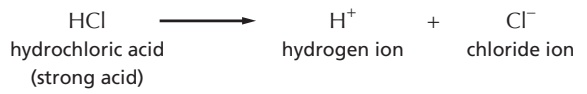

Many of the acids important in the cell are not completely dissociated, and they are therefore weak acids; for example, the carboxyl group (–COOH), which dissociates to give a hydrogen ion in solution.

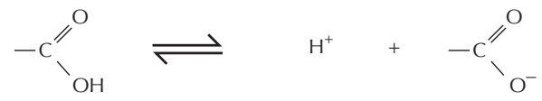

Note that this is a reversible reaction.

The acidity of a solution is defined by the concentration (conc.) of hydronium ions (H3O+) it possesses, generally abbreviated as H+. For convenience, we use the pH scale, where

$$
\mathrm{pH} = - \log_ {1 0} [ \mathrm{H} ^ {+} ]
$$

For pure water

$$
[ \mathrm{H} ^ {+} ] = 1 0 ^ {- 7} \text {moles / liter}
$$

$$
\mathrm{pH} = 7. 0
$$

#### HYDROGEN ION EXCHANGE

Positively charged hydrogen ions (H+) can spontaneously move from one water molecule to another, thereby creating two ionic species.

$$
\text {often written as:} \quad \mathrm{H} _ {2} \mathrm{O} \underset {\text {hydrogen ion}} {\rightleftharpoons} \mathrm{H} ^ {+} + \mathrm{OH} ^ {-}
$$

Because the process is rapidly reversible, hydrogen ions are continually shuttling between water molecules. Pure water contains equal concentrations of hydronium ions and hydroxyl ions (both $1 0 ^ { - 7 }$ M).

#### BASES

Substances that reduce the number of hydrogen ions in solution are called bases. Some bases, such as ammonia, combine directly with hydrogen ions.

Other bases, such as sodium hydroxide, reduce the number of H+ ions indirectly, by producing OH– ions that then combine directly with $\mathsf { H } ^ { + }$ ions to make $\mathsf { H } _ { 2 } \mathsf { O } .$

Many bases found in cells are partially associated with H+ ions and are termed weak bases. This is true of compounds that contain an amino group (–NH2), which has a weak tendency to reversibly accept an $\bar { \mathsf { H } } ^ { + }$ ion from water, thereby increasing the concentration of free OH ions.

$$
\mathrm {-NH_ {2}} \quad + \quad \mathrm{H} ^ {+}
$$

$$
- \mathrm{NH} _ {3} ^ {+}
$$

#### WEAK NONCOVALENT CHEMICAL BONDS

Organic molecules can interact with other molecules through three types of short-range attractive forces known as noncovalent bonds: van der Waals attractions, electrostatic attractions, and hydrogen bonds. The repulsion of hydrophobic groups from water is also important for these interactions and for the folding of biological macromolecules.

weak noncovalent bond

Weak noncovalent bonds have less than 1/20 the strength of a strong covalent bond. They are strong enough to provide tight binding only when many of them are formed simultaneously.

#### HYDROGEN BONDS

As already described for water (see Panel 2–2, pp. 96–97), hydrogen bonds form when a hydrogen atom is “sandwiched” between two electron-attracting atoms (usually oxygen or nitrogen).

Hydrogen bonds are strongest when the three atoms are in a straight line:

Examples in macromolecules:

Amino acids in a polypeptide chain can be hydrogen-bonded together in a folded protein.

Two bases, G and C, are hydrogen bonded in a DNA double helix.

#### VAN DER WAALS ATTRACTIONS

If two atoms are too close together, they repel each other very strongly. For this reason, an atom can often be treated as a sphere with a fixed radius. The characteristic “size” for each atom is specified by a unique van der Waals radius. The contact distance between any two noncovalently bonded atoms is the sum of their van der Waals radii.

0.12 nm radius

0.2 nm radius

0.15 nm radius

0.14 nm radius

At very short distances, any two atoms show a weak bonding interaction due to their fluctuating electrical charges. The two atoms will be attracted to each other in this way until the distance between their nuclei is approximately equal to the sum of their van der Waals radii. Although they are individually very weak, such van der Waals attractions can become important when two macromolecular surfaces fit together very closely, because many atoms are involved.

Note that when two atoms form a covalent bond, the centers of the two atoms (the two atomic nuclei) are much closer together than the sum of the two van der Waals radii. Thus,

0.4 nm two nonbonded carbon atoms

0.15 nm two carbon atoms held by a single covalent bond

0.13 nm two carbon atoms held by a double covalent bond

#### HYDROGEN BONDS IN WATER

Any two atoms that can form hydrogen bonds to each other can alternatively form hydrogen bonds to water molecules. Because of this competition with water molecules, the hydrogen bonds formed in water between two peptide bonds, for example, are relatively weak.

#### ELECTROSTATIC ATTRACTIONS

Electrostatic attractions occur both between fully charged groups (ionic bond) and between partially charged groups on polar molecules.

The force of attraction between the two partial charges, δ+ and δ–, falls off rapidly as the distance between the charges increases.

In the absence of water, ionic bonds are very strong. They are responsible for the strength of such minerals as marble and agate and for crystal formation in common table salt, NaCl.

#### CATION– INTERACTIONS

The structure of a typical protein reveals that it contains several cation– (pi) interactions, these electrostatic attractions being about half as abundant as the electrostatic attractions between positively and negatively charged amino-acid side chains. In this energetically favorable interaction, a cation is paired with the aromatic () electrons of either a tryptophan, tyrosine, or phenylalanine side chain. As shown, the cation can either be an inorganic ion or a positively charged lysine or arginine side chain. A tryptophan– arginine pair is the most common, as illustrated here.

#### HYDROPHOBIC FORCES

Water forces hydrophobic groups together in order to minimize their disruptive effects on the water network formed by the hydrogen bonds between water molecules. Hydrophobic groups held together in this way are sometimes said to be held together by “hydrophobic bonds,” even though the attraction is actually caused by a repulsion from water.

#### ELECTROSTATIC ATTRACTIONS IN WATER

Charged groups are shielded by their interactions with water molecules. Electrostatic attractions are therefore quite weak in water.

Inorganic ions in solution can also cluster around charged groups and further weaken these electrostatic attractions.

Despite being weakened by water and inorganic ions, electrostatic attractions are very important in biological systems.

glucose

glyceraldehyde

#### MONOSACCHARIDES

Monosaccharides usually have the general formula $( \mathsf { C H } _ { 2 } \mathsf { O } ) _ { \mathcal { D } ^ { \prime } }$ where n can be 3, 4, 5, 6, 7, or 8, and have two or more hydroxyl groups. They contain either an aldehyde group $( - c \nleq \frac { 0 } { H } )$ and are called aldoses or a ketone group $( \sum c   =   0 )$ and are called ketoses.

#### 3-carbon (TRIOSES)

#### 5-carbon (PENTOSES)

#### 6-carbon (HEXOSES)

ribose

dihydroxyacetone

ribulose

#### RING FORMATION

In aqueous solution, the aldehyde or ketone group of a sugar molecule tends to react with a hydroxyl group of the same molecule, thereby closing the molecule into a ring.

Note that each carbon atom has a number.

#### ISOMERS

Many monosaccharides differ only in the spatial arrangement of atoms; that is, they are isomers. For example, glucose, galactose, and mannose have the same formula $( \mathsf { C } _ { 6 } \mathsf { H } _ { 1 2 } \mathsf { O } _ { 6 } )$ but differ in the arrangement of groups around one or two carbon atoms. CH.OH

These small differences make only minor changes in the chemical properties of the sugars. But the differences are recognized by enzymes and other proteins and therefore can have major biological effects.

#### α AND β LINKS

The hydroxyl group on the carbon that carries the aldehyde or ketone can rapidly change from one position to the other. These two positions are called α and β.

α hydroxyl

β hydroxyl

As soon as one sugar is linked to another, the α or β form is frozen.

#### SUGAR DERIVATIVES

The hydroxyl groups of a simple monosaccharide, such as glucose, can be replaced by other groups. H

glucuronic acid

#### DISACCHARIDES

The carbon that carries the aldehyde or the ketone can react with any hydroxyl group on a second sugar molecule to form a disaccharide. Three common disaccharides are

maltose (glucose + glucose) lactose (galactose + glucose) sucrose (glucose + fructose)

The reaction forming sucrose is shown here.

#### OLIGOSACCHARIDES AND POLYSACCHARIDES

Large linear and branched molecules can be made from simple repeating sugar subunits. Short chains are called oligosaccharides, and long chains are called polysaccharides. Glycogen, for example, is a polysaccharide made entirely of glucose subunits joined together.

#### COMPLEX OLIGOSACCHARIDES

In many cases, a sugar sequence is nonrepetitive. Many different molecules are possible. Such complex oligosaccharides are usually linked to proteins or to lipids, as is this oligosaccharide, which is part of a cell-surface molecule that defines a particular blood group.

space-filling model

carbon skeleton

#### FATTY ACIDS

All fatty acids have a carboxyl group at one end and a long hydrocarbon tail at the other.

PHOSPHOLIPIDS

Hundreds of different kinds of fatty acids exist. Some have one or more double bonds in their hydrocarbon tail and are said to be unsaturated. Fatty acids with no double bonds are saturated.

This double bond is rigid and creates a kink in the chain. The rest of the chain is free to rotate about the other C–C bonds.

TRIACYLGLYCEROLS

Fatty acids are stored in cells as an energy reserve (fats and oils) through an ester linkage to glycerol to form triacylglycerols, also known as triglycerides.

stearic acid (C18)

$$
\mathrm{H} _ {2} \mathrm{C} - \mathrm{OH}
$$

$$
\mathrm{H} _ {2} \stackrel {\mathrm{T}} {\mathrm{C}} - \mathrm{OH}
$$

glycerol

#### CARBOXYL GROUP

If free, the carboxyl group of a fatty acid will be ionized.

But more often it is linked to other groups to form either esters

or amides.

Phospholipids are the major constituents of cell membranes.

general structure of a phospholipid

In phospholipids, two of the –OH groups in glycerol are linked to fatty acids, while the third –OH group is linked to phosphoric acid. The phosphate, which carries a negative charge, is further linked to one of a variety of small polar groups, such as choline.

#### LIPID AGGREGATES

Fatty acids have a hydrophilic head and a hydrophobic tail.

In water, they can form either a surface film or small, spherical micelles.

Their derivatives can form larger aggregates held together by hydrophobic forces:

Triacylglycerols form large, spherical fat droplets in the cell cytoplasm.

Phospholipids and glycolipids form self-sealing lipid bilayers, which are the basis for all cell membranes.

#### OTHER LIPIDS

Lipids are defined as water-insoluble molecules that are soluble in organic solvents. Two other common types of lipids are steroids and polyisoprenoids. Both are made from isoprene units.

#### STEROIDS

Steroids have a common multiple-ring structure.

cholesterol—found in many cell membranes

testosterone—male sex hormone

#### GLYCOLIPIDS

Like phospholipids, these compounds are composed of a hydrophobic region, containing two long hydrocarbon tails, and a polar region, which contains one or more sugars. Unlike phospholipids, there is no phosphate.

#### POLYISOPRENOIDS

Long-chain polymers of isoprene

dolichol phosphate—used to carry activated sugars in the membraneassociated synthesis of glycoproteins and some polysaccharides

#### PHOSPHATES

The phosphates are normally joined to the C5 hydroxyl of the ribose or deoxyribose sugar (designated 5′). Mono-, di-, and triphosphates are common.

The phosphate makes a nucleotide negatively charged.

#### NUCLEOTIDES

A nucleotide consists of a nitrogen-containing base, a five-carbon sugar, and a phosphate group.

Nucleotides are the subunits of the nucleic acids.

#### BASE–SUGAR LINKAGE

The base is linked to the same carbon (C1) used in sugar–sugar bonds.

#### SUGARS

#### PENTOSE

a five-carbon sugar

Each numbered carbon on the sugar of a nucleotide is followed by a prime mark; therefore, one speaks of the “5-prime carbon,” etc.

two kinds of pentoses are used β-D-ribose used in ribonucleic acid (RNA)

β-D-2-deoxyribose used in <u>deoxyribo</u>nucleic acid (DNA)

| BASE | NUCLEOSIDE | ABBR. |
| --- | --- | --- |
| adenine | adenosine | A |
| guanine | guanosine | G |
| cytosine | cytidine | C |
| uracil | uridine | U |
| thymine | thymidine | T |

A nucleoside or nucleotide is named according to its nitrogenous base.

Single-letter abbreviations are used variously as shorthand for (1) the base alone, (2) the nucleoside, or (3) the whole nucleotide— the context will usually make clear which of the three entities is meant. When the context is not sufficient, we will add the terms “base,” “nucleoside,” “nucleotide,” or—as in the examples below—use the full 3-letter nucleotide code.

AMP= adenosine monophosphate

dAMP= deoxyadenosine monophosphate

UDP= uridine diphosphate

ATP= adenosine triphosphate

BASE + SUGAR + PHOSPHATE = NUCLEOTIDE

#### NUCLEIC ACIDS

To form nucleic acid polymers, nucleotides are joined together by phosphodiester bonds between the 5’ and 3’ carbon atoms of adjacent sugar rings. The linear sequence of nucleotides in a nucleic acid chain is abbreviated using a one-letter code, such as AGCTT, starting with the 5’ end of the chain.

#### NUCLEOTIDES AND THEIR DERIVATIVES HAVE MANY OTHER FUNCTIONS

1 As nucleoside di- and triphosphates, they carry chemical energy in their easily hydrolyzed phosphoanhydride bonds.

2 They combine with other groups to form coenzymes.

3 They are used as small intracellular signaling molecules in the cell.

example: cyclic AMP (cAMP)

<!-- END EN EN02-H042-H090 -->

### 英文补充：蛋白质基础：氨基酸、折叠、结构域与组装

> 对应中文板块：蛋白质基础：氨基酸、折叠、结构域与组装。英文来源：Molecular Biology of the Cell，第7版，第3章；[本章完整原文](../来源/英文教材/03_Proteins/chapter.md)。物理PDF页码范围：154–221（整章范围）。

<!-- BEGIN EN EN03-H000-H028 -->
#### Proteins

When we look at a cell through a microscope or analyze its electrical or biochemical activity, we are, in essence, observing proteins. Proteins constitute most of a cell’s dry mass. They are not only the cell’s building blocks; they also execute the majority of the cell’s functions. Proteins that are enzymes provide the intricate molecular surfaces inside a cell that catalyze its many chemical reactions. Proteins embedded in the plasma membrane form channels and pumps that control the passage of small molecules into and out of the cell. Other proteins carry messages from one cell to another or act as signal integrators that relay sets of signals inward from the plasma membrane to the cell nucleus. Yet others serve as tiny molecular machines with moving parts: kinesin, for example, propels organelles through the cytoplasm; topoisomerase can untangle knotted DNA molecules. Other specialized proteins act as antibodies, toxins, hormones, antifreeze molecules, elastic fibers, ropes, or sources of luminescence. Before we can hope to understand how genes work, how muscles contract, how nerves conduct electricity, how embryos develop, or how our bodies function, we must attain a deep understanding of proteins.

IN THIS CHAPTER The Atomic Structure of Proteins Protein Function

#### THE ATOMIC STRUCTURE OF PROTEINS

From a chemical point of view, proteins are by far the most structurally complex and functionally sophisticated molecules known. This is perhaps not surprising, once we realize that the structure and chemistry of each protein have been developed and fine-tuned over billions of years of evolutionary history. The theoretical calculations of population geneticists reveal that, over evolutionary time periods, a surprisingly small selective advantage is enough to cause a randomly altered protein sequence to spread through a population of organisms. Yet, even to experts, the remarkable versatility of proteins can seem truly amazing.

In this section, we consider how the location of each amino acid in a protein’s long string of amino acids determines its three-dimensional shape. Later in the chapter, we use this understanding of protein structure at the atomic level to describe how the precise shape of each protein molecule determines its function in a cell.

#### The Structure of a Protein Is Specified by Its Amino Acid Sequence

There are 20 different types of amino acids in proteins that are encoded directly in an organism’s DNA, each with different chemical properties. Every **protein** molecule consists of a long unbranched chain of these amino acids, each linked to its neighbor through a covalent peptide bond (**Figure 3–1A**). Proteins are therefore also known as polypeptides. Each type of protein has a unique sequence of amino acids, and there are many thousands of different proteins in a cell.

The repeating sequence of atoms along the core of the polypeptide chain is referred to as the **polypeptide backbone**. Attached to this repetitive backbone are those portions of the amino acids that are not involved in making a peptide bond; these are the 20 different amino acid **side chains** that give each amino acid its unique properties (**Figure 3–1B**). Some of these side chains are nonpolar and hydrophobic (“water-fearing”), others are negatively or positively charged, some can readily form covalent bonds, and so on. **Panel 3–1** (pp. 118–119) shows their atomic structures, and **Figure 3–2** lists their abbreviations.

Figure 3–1 The components of a protein. (A) Formation of a peptide bond. This covalent bond forms when the carbon atom of the carboxyl group of one amino acid (such as glycine) shares electrons with the nitrogen atom from the amino group of a second amino acid (such as alanine). As indicated, a molecule of water is eliminated in this condensation reaction (see Figure 2–9). In this model, carbon atoms are black, nitrogen blue, oxygen red, and hydrogen white. (B) A two-dimensional representation of a short section of polypeptide backbone with its attached side chains. Each type of protein differs in its sequence and number of amino acids; it is the sequence of the chemically different side chains that makes each protein distinct. The two ends of a polypeptide chain are chemically different: the end carrying the free amino group (NH2, which takes up a proton at neutral pH to become NH3+) is the amino terminus, or N-terminus, and the end carrying the free carboxyl group (COOH, which loses a proton at neutral pH to become COO–) is the carboxyl terminus, or C-terminus. Note that, for simplicity, in many figures in this textbook, NH2 and COOH are used to denote these termini, instead of their actual ionized forms. The amino acid sequence of a protein is always presented in the N-to-C direction, reading from left to right.

<table><tr><td colspan="3">AMINO ACID</td><td>SIDE CHAIN</td></tr><tr><td>Aspartic acid</td><td>Asp</td><td>D</td><td>acidic (negative charge)</td></tr><tr><td>Glutamic acid</td><td>Glu</td><td>E</td><td>acidic (negative charge)</td></tr><tr><td>Arginine</td><td>Arg</td><td>R</td><td>basic (positive charge)</td></tr><tr><td>Lysine</td><td>Lys</td><td>K</td><td>basic (positive charge)</td></tr><tr><td>Histidine</td><td>His</td><td>H</td><td>basic (positive charge)</td></tr><tr><td>Asparagine</td><td>Asn</td><td>N</td><td>uncharged polar</td></tr><tr><td>Glutamine</td><td>Gln</td><td>Q</td><td>uncharged polar</td></tr><tr><td>Serine</td><td>Ser</td><td>S</td><td>uncharged polar</td></tr><tr><td>Threonine</td><td>Thr</td><td>T</td><td>uncharged polar</td></tr><tr><td>Tyrosine</td><td>Tyr</td><td>Y</td><td>uncharged polar</td></tr></table>

<table><tr><td colspan="3">AMINO ACID</td><td>SIDE CHAIN</td></tr><tr><td>Alanine</td><td>Ala</td><td>A</td><td>nonpolar</td></tr><tr><td>Glycine</td><td>Gly</td><td>G</td><td>nonpolar</td></tr><tr><td>Valine</td><td>Val</td><td>V</td><td>nonpolar</td></tr><tr><td>Leucine</td><td>Leu</td><td>L</td><td>nonpolar</td></tr><tr><td>Isoleucine</td><td>Ile</td><td>I</td><td>nonpolar</td></tr><tr><td>Proline</td><td>Pro</td><td>P</td><td>nonpolar</td></tr><tr><td>Phenylalanine</td><td>Phe</td><td>F</td><td>nonpolar</td></tr><tr><td>Methionine</td><td>Met</td><td>M</td><td>nonpolar</td></tr><tr><td>Tryptophan</td><td>Trp</td><td>W</td><td>nonpolar</td></tr><tr><td>Cysteine</td><td>Cys</td><td>C</td><td>nonpolar</td></tr></table>

Figure 3–2 The 20 amino acids commonly found in proteins. Each amino acid has a three-letter and a one-letter abbreviation. There are equal numbers of polar and nonpolar side chains; however, some side chains listed here as polar are large enough to have some nonpolar properties (for example, Thr, Tyr, Arg, Lys). For atomic structures, see Panel 3–1 (pp. 118–119).

(B)

Figure 3–3 Steric limitations on the bond angles in a polypeptide chain. (A) Each amino acid contributes three bonds (red) to the backbone of the chain. Because it has a partial double-bond character, the peptide bond is planar (gray shading) and does not permit free rotation. By contrast, rotation can occur about the $\mathrm { C _ { \alpha } \mathrm { - C } }$ bond, whose angle of rotation is called psi (Ψ), and about the $N { - } C _ { \alpha }$ bond, whose angle of rotation is called phi (ϕ). By convention, an R group is often used to denote an amino acid side chain (purple circles). (B) The conformation of the main-chain atoms in a protein is determined by one pair of ϕ and Ψ angles for each amino acid; because of steric restrictions, most of the possible pairs of ϕ and Ψ angles do not occur. In this so-called Ramachandran plot, each dot represents an observed pair of angles in a protein. The three differently shaded clusters of dots reflect three different secondary structures repeatedly found in proteins. Most prominent are the alpha helix and the beta sheet, as will be described in the text. (B, from J. Richardson, Adv. Prot. Chem. 34:174–175, 1981. With permission from Elsevier.)

As discussed in Chapter 2, atoms behave almost as if they were hard spheres with a definite radius (their van der Waals radius). Other constraints limit the possible bond angles in a polypeptide chain, and this—plus the requirementMBoC7 m3.03/3.03 that no two atoms overlap—severely restricts the possible three-dimensional arrangements (or conformations) of proteins. As illustrated in **Figure 3–3**, these steric restrictions (which include a delocalization of electrons in the peptide bond that makes that linkage planar) confine the energy minima for the bond angles in polypeptides to a narrow range. But a long flexible chain such as a protein can still fold in an enormous number of different ways.

The folding of a protein chain is determined by many different sets of weak noncovalent bonds that form between one part of the chain and another. These involve atoms in the polypeptide backbone, as well as atoms in the amino acid side chains. There are three types of these weak bonds: hydrogen bonds, electrostatic attractions, and van der Waals attractions, as explained in Chapter 2 (see p. 51). Individual noncovalent bonds are 30–300 times weaker than the typical covalent bonds that create biological molecules. But many weak bonds acting in parallel can hold two regions of a polypeptide chain tightly together. It is the combined strength of large numbers of these noncovalent bonds that stabilizes each protein’s folded shape (**Figure 3–4**).

A fourth weak force—a hydrophobic clustering force—also has a central role in determining the shape of a protein. As described in Chapter 2, hydrophobic molecules, including the nonpolar side chains of particular amino acids, tend to be forced together in an aqueous environment in order to minimize their disruptive effect on the hydrogen-bonded network of water molecules (see Panel 2–2, pp. 96–97). Therefore, an important factor governing the folding of any protein is the distribution of its polar and nonpolar amino acids. The nonpolar (hydrophobic) side chains in a protein—belonging to such amino acids as phenylalanine, leucine, valine, and tryptophan—tend to cluster in the interior of the molecule (just as hydrophobic oil droplets coalesce in water to form one large droplet). This enables these side chains to avoid contact with the water that surrounds them inside a cell. In contrast, polar groups—such as those belonging to arginine, glutamine, and histidine—tend to arrange themselves near the outside of the molecule, where they can form hydrogen bonds with water and with other polar molecules (**Figure 3–5**). Any polar amino acids that are left buried within the protein are usually hydrogen-bonded to other polar amino acids or to the polypeptide backbone.

#### FAMILIES OF AMINO ACIDS

The common amino acids are grouped according to whether their side chains are

acidic

basic

uncharged polar nonpolar

These 20 amino acids are given both three-letter and one-letter abbreviations.

Thus: alanine $\mathbf { \partial } = \mathbf { A } | \mathbf { \partial } \mathbf { a } = \mathbf { A }$

#### BASIC SIDE CHAINS

This group is very basic because its positive charge is stabilized by resonance (see Panel 2–1).

These nitrogens have a relatively weak affinity for an H+ and are only partly positive at neutral pH.

#### THE AMINO ACID

The general formula of an amino acid is

R is commonly one of 20 different side chains. At pH 7, both the amino and carboxyl groups are ionized.

OPTICAL ISOMERS

The α-carbon atom is asymmetric, allowing for two mirror-image (or stereo-) isomers, L and D.

Proteins contain exclusively L-amino acids.

#### PEPTIDE BONDS

In proteins, amino acids are joined together by an amide linkage, called a peptide bond.

Proteins are long polymers of amino acids linked by peptide bonds, and they are always written with the N-terminus toward the left. Peptides are shorter, usually fewer than 50 amino acids long. The sequence of this tripeptide is histidine–cysteine–valine.

The four atoms involved in each peptide bond form a rigid planar unit (red box). There is no rotation around the C–N bond.

These two single bonds allow rapid rotation, so that long chains of amino acids are very flexible.

asparagine

(Asn, or N)

glutamine

(Gln, or Q)

Although the amide N is not charged at neutral pH, it is polar.

serine

(Ser, or S)

threonine

(Thr, or T)

tyrosine

(Tyr, or Y)

The –OH group is polar.

proline

(Pro, or P)

phenylalanine

(Phe, or F)

(actually an imino acid)

#### methionine

tryptophan

(Met, or M)

(Trp, or W)

glycine

(Gly, or G)

cysteine

(Cys, or C)

A disulfide bond (red) can form between two cysteine side chains in proteins.

Figure 3–4 Three types of noncovalent bonds help proteins fold. Although a single one of these bonds is quite weak, many of them often act together to create a strong bonding arrangement, as in the example shown. As in the previous figure, R is used as a general designation for an amino acid side chain.

Figure 3–5 How a protein folds into a compact conformation. The polar amino acid side chains tend to lie on the outside of the protein, where they can interact with water; the nonpolar amino acid side chains are buried on the inside forming a tightly packed hydrophobic core of atoms that are hidden from water. In this highly schematic drawing, the protein contains only 17 amino acids; actual proteins are generally much larger.

#### Proteins Fold into a Conformation of Lowest Energy

As a result of all of these interactions, most proteins have a particular threedimensional structure, which is determined by the order of the amino acids in a protein’s chain. The final folded structure, or **conformation**, of any polypeptide chain is generally the one that minimizes its free energy. Biologists have studied protein folding in a test tube using highly purified proteins. Treatment with certain solvents, which disrupt the noncovalent interactions holding the folded chain together, unfolds, or denatures, a protein. This treatment converts the protein into a flexible polypeptide chain that has lost its natural shape. When the denaturing solvent is removed, the protein often refolds spontaneously, or renatures, into its original conformation. This indicates that the amino acid sequence contains all of the information needed for specifying the three-dimensional shape of a protein, a critical point for understanding cell biology.

Most proteins fold up into a single stable conformation. However, this conformation is very dynamic, experiencing constant fluctuations caused by thermal energy. In addition, a protein’s conformation can change when the protein interacts with other molecules in the cell. This change in shape is often crucial to the function of the protein, as we explain in detail later.

Although a protein chain can fold into its correct conformation without outside help, special proteins called molecular chaperones often assist in protein folding (see Chapter 6). Molecular chaperones bind to partly folded polypeptide chains and help them progress along the most energetically favorable folding pathway. In the crowded conditions of the cytoplasm, chaperones are required to prevent the temporarily exposed hydrophobic regions in newly synthesized protein chains from associating with each other to form protein aggregates. However, the final three-dimensional shape of the protein is still specified by its amino acid sequence: chaperones simply make reaching the folded state more reliable.

#### The α Helix and the β Sheet Are Common Folding Motifs

When we compare the three-dimensional structures of many different protein molecules, it becomes clear that, although the overall conformation of each protein is unique, two regular folding patterns are often found within them. Both patterns were discovered 70 years ago from studies of hair and silk. The first folding pattern to be described, called the **a helix**, was found in the protein a-keratin, which forms the filaments in hair. Within a year of the discovery of the α helix, a second folded structure, called a **b sheet**, was found in the protein fibroin, the major constituent of silk. These two patterns are common because they result from hydrogen-bonding between the N}H and C�O groups in the polypeptide backbone, without involving the side chains of the amino acids. Thus, although incompatible with some amino acid side chains, many different amino acid sequences can form them. In each case, the protein chain adopts a regular, repeating conformation. **Figure 3–6** illustrates the detailed structures of these two important conformations, which in ribbon models of proteins are represented by a helical ribbon and by a set of aligned arrows, respectively.

The cores of many proteins contain extensive regions of β sheet. As shown in **Figure 3–7**, these β sheets can form either from neighboring segments of the polypeptide backbone that run in the same orientation (parallel chains) or from a polypeptide backbone that folds back and forth upon itself, with each section of the chain running in the direction opposite to that of its immediate neighbors (antiparallel chains). Both types of β sheet produce a very rigid structure, held together by hydrogen bonds that connect the peptide bonds in neighboring chains (see Figure 3–6C).

Figure 3–6 The regular conformation of the polypeptide backbone in the a helix and the b sheet. The α helix (alpha helix) is shown in (A) and (B). The N}H of every peptide bond is hydrogen-bonded to the C�O of a neighboring peptide bond located four peptide bonds away in the same chain. Note that all of the N}H groups point up in this diagram and that all of the C�O groups point down (toward the C-terminus); this gives a polarity to the helix, with the C-terminus having a partial negative and the N-terminus a partial positive charge (Movie 3.1). The β sheet (beta sheet) is shown in (C) and (D). In this example, adjacent peptide chains run in opposite (antiparallel) directions. Hydrogen-bonding between peptide bonds in different strands holds the individual polypeptide chains (strands) together in a β sheet, and the amino acid side chains inMB C7 3.07/3.06 each strand alternately project above and below the plane of the sheet. By convention, when arrows are used to represent a β sheet, the arrowheads point toward the C-terminus (Movie 3.2). (A) and (C) show all the atoms in the polypeptide backbone, but the amino acid side chains are truncated and denoted by R. (It has long been a convention to use R in this way.) In contrast, (B) and (D) show only the carbon and nitrogen backbone atoms.

An α helix is generated when a single polypeptide chain twists around on itself to form a rigid cylinder. A hydrogen bond forms between every fourth peptide bond, linking the C�O of one peptide bond to the N}H of another (see Figure 3–6A). This gives rise to a regular helix with a complete turn every 3.6 amino acids.

Regions of α helix are abundant in proteins located in cell membranes, such as transport proteins and receptors. As we discuss in Chapter 10, those portions of a transmembrane protein that cross the lipid bilayer usually cross as α helices composed largely of amino acids with nonpolar side chains. The polypeptide backbone, which is hydrophilic, is hydrogen-bonded to itself in the α helix and shielded from the hydrophobic lipid environment of the membrane by its protruding nonpolar side chains (see Figure 10–19).

In other proteins, α helices can wrap around each other to form a particularly stable structure, known as a **coiled-coil**. This structure can form when the two (or in some cases, three or four) α helices have most of their nonpolar (hydrophobic) side chains on one side, so that they can twist around each other with these side chains facing inward (**Figure 3–8**). Long rodlike coiled-coils provide the structural framework for many elongated proteins. Examples are α-keratin, which forms the intracellular fibers that reinforce the outer layer of the skin and its appendages, and the myosin molecules responsible for muscle contraction.

Figure 3–7 Two types of b sheet structures. (A) An antiparallel β sheet (see Figure 3–6C). (B) A parallel β sheet. Both of these structures are common in proteins.

stripe of hydrophobic “a” and “d” amino acids

helices wrap around each other to minimize exposure of hydrophobic amino acid side chains to aqueous environment

Figure 3–8 A coiled-coil. (A) A single α helix, with successive amino acid side chains labeled in a sevenfold sequence, “abcdefg” (from top to bottom). Amino acids “a” and $\text{" } \triangleleft  \text{" }$ in such a sequence lie close together on the cylinder surface, forming a “stripe” (green) that winds slowly around the α helix. Proteins that form coiled-coils typically have nonpolar amino acids at positions $\text{" } \underline{ a }  \text{" }$ and “d.” Consequently, as shown in (B), the two α helices can wrap around each other with the nonpolar side chains of one α helix interacting with the nonpolar side chains of the other. (C) The atomic structure of a coiled-coil determined by x-ray crystallography. The α-helical backbone is shown in red and the nonpolar side chains in green, while the more hydrophilic amino acid side chains, shown in gray, are left exposed to the aqueous environment (Movie 3.3). Coiled-coils can also form MBoCfrom three α helices. (PDB code: 3NMD.)

#### Four Levels of Organization Are Considered to Contribute to Protein Structure

Scientists have found it useful to define four levels of organization that successively generate the structure of a protein. The first level is the protein’s amino acid sequence, which is known as its **primary structure**; this sequence is unique for each protein, as determined by the gene that encodes that protein. At the next level, those stretches of the polypeptide chain that form α helices and β sheets constitute the protein’s **secondary structure**. The full three-dimensional organization of a polypeptide chain—including its α helices, β sheets, and the many twists and turns that form between its N- and C-termini—is referred to as the protein’s **tertiary structure**. And finally, if a protein molecule is formed as a complex of more than one polypeptide chain, its complete conformation is designated as its **quaternary structure**.

Because even a small protein molecule is built from thousands of atoms linked together by precisely oriented covalent and noncovalent bonds, biologists are aided in visualizing these extremely complicated structures by computer-based three-dimensional displays. The student resource site that accompanies this book contains computer-generated images of selected proteins, which can be displayed and rotated on the screen in a variety of formats (Movie 3.4).

Figure 3–9 Four representations that are commonly used to describe the structure of a protein. Constructed from a string of 100 amino acids, the SH2 domain is part of many different proteins. Here, its structure is displayed as (A) a polypeptide backbone model, (B) a ribbon model, (C) a wire model that includes the amino acid side chains, and (D) a space-filling model (Movie 3.4). Each image is colored in a way that allows the polypeptide chain to be followed from its N-terminus (purple) to its C-terminus (red). (PDB code: 1SHA.)

#### Protein Domains Are the Modular Units from Which Larger Proteins Are Built

Proteins come in a wide variety of shapes, and most are between 50 and 2000 amino acids long. Large proteins usually consist of a set of smaller protein domains that are joined together. A **domain** is a structural unit that folds more or less independently, being formed from perhaps 40 to 350 contiguous amino acids, and it is a modular unit from which larger proteins are constructed.

To display a protein structure in three dimensions, several different representations are conventionally used, each of which emphasizes distinct features. As an example, **Figure 3–9** presents four representations of an important protein structure called the SH2 domain. The SH2 domain is present in many different proteins in eukaryotic cells, where it responds to cell signals to cause selected protein molecules to bind to each other, thereby altering cell behavior (see Chapter 15). Contributing to the tertiary structure of this domain are two α helices and a three-stranded, antiparallel β sheet, which are its critical secondary structure elements (see Figure 3–9B).

**Figure 3–10** presents ribbon models of three differently organized protein domains. As these examples illustrate, the central core of a domain can be constructed from α helices, from β sheets, or from various combinations of these two fundamental folding elements.

(A)

(B)

(C)

Figure 3–10 Ribbon models of three different protein domains. (A) Cytochrome $b _ { 5 6 2 } ,$ a single-domain protein involved in electron transport in mitochondria. This protein is composed almost entirely of α helices. (B) The NAD-binding domain of the enzyme lactate dehydrogenase, which is composed of a mixture of α helices and parallel β sheets. (C) The variable domain of an immunoglobulin (antibody) light chain, composed of a sandwich of two antiparallel β sheets. In these examples, the α helices are shown in green, while strands organized as β sheets are denoted by red arrows. Note how the polypeptide chain generally traverses back and forth across the entire domain, making sharp turns (Movie 3.5) only at the protein surface. It is the protruding loop regions (yellow) that often form the binding sites for other molecules.

The different domains of a protein are often associated with different functions. **Figure 3–11** shows an example—the Src protein kinase, which functions in signaling pathways inside vertebrate cells (Src is pronounced “sarc”). This protein is considered to have three domains: its SH2 and SH3 domains have regulatory roles—responding to signals that turn the kinase on and off—while its C-terminal domain is responsible for the kinase catalytic activity. Later in the chapter, we shall return to this protein to explain how proteins can form molecular switches that transmit information throughout cells.

(A)

(B)

Figure 3–11 A protein formed from multiple domains. In the Src protein shown, a C-terminal domain with two lobes (yellow and orange) forms the core protein kinase enzyme, while its SH2 and SH3 domains perform regulatory functions. Note that both the SH2 and SH3 domains derive their names from this protein, being abbreviations for “Src homology 2” and “Src homology 3,” respectively. (A) A ribbon model, with ATP substrate in red. (B) A space-filling model, with ATP substrate in red. Note that the site that binds ATP is positioned at the interface of the two lobes that form the kinase domain. The human genome encodes about 300 different SH3 domains and 120 SH2 domains. The structure of the SH2 domain was illustrated in Figure 3–9. (PDB code: 2SRC.)

Figure 3–12 A folded protein molecule exists as an ensemble of closely related substructures, or conformers, as displayed here for ubiquitin. (A) A ribbon model that displays the structure of ubiquitin. Ubiquitin is a small protein widely used in cells, often being covalently attached to larger proteins, as described in Chapters 6 and 15. (B) In this diagram, a set of backbone conformations determined for ubiquitin has been overlaid to reveal regions that rapidly transition between different substructures. Superimposed on these structures are the rates of motion of the protein’s atoms, as observed in NMR residual dipolar coupling experiments. A color code has been used to indicate the magnitude of these rates, which are largest for red, with orange and yellow also being high. (A, PDB code 1UBI; B, from O.F. Lange et al., Science 320:1471–1475, 2008. With permission from AAAS.)

#### Proteins Also Contain Unstructured Regions

The smallest protein molecules contain only a single domain, whereas larger proteins can contain several dozen domains, often connected to each other by short,MBoC7 n3.150/3.12 relatively unstructured lengths of polypeptide chain that can act as flexible hinges between domains. The ubiquity of such intrinsically disordered sequences, which continually bend and flex due to thermal buffeting, became appreciated only after bioinformatics methods were developed that could recognize them from their amino acid sequences. Current estimates suggest that a third of all eukaryotic proteins also possess longer, intrinsically disordered regions (IDRs)—greater than 30 amino acids in length—in their polypeptide chains. These intrinsically disordered regions can be very long, and they have important functions in cells, as discussed later in this chapter.

#### All Protein Structures Are Dynamic, Interconverting Rapidly Between an Ensemble of Closely Related Conformations Because of Thermal Energy

Even though a protein has folded into a conformation of lowest free energy, this conformation is always being subjected to thermal bombardment from the Brownian motions of the many molecules that constantly collide with it. Thus the atoms in the protein are always moving, which causes neighboring regions of the protein to oscillate in concerted ways. These motions can now be precisely traced using special NMR techniques, as illustrated in **Figure 3–12** for the small protein ubiquitin.

From recent studies combining many types of analyses, we know that protein function exploits these rapid fluctuations—as when a loop on the surface of a protein flips out to expose a binding site for a second molecule. In fact, the function of a protein is generally dependent on that protein’s dynamic character, as we explain later when we discuss protein function in detail.

#### Function Has Selected for a Tiny Fraction of the Many Possible Polypeptide Chains

Because each of the 20 amino acids is chemically distinct and each can, in principle, occur at any position in a protein chain, there are $20 \times 20 \times 20 \times 20 =$ 160,000 different possible polypeptide chains four amino acids long, or 20n different possible polypeptide chains n amino acids long. For a typical protein length of about 300 amino acids, a cell could theoretically make more than $1 0 ^ { 3 9 0 }   \widetilde { ( 2 0 ^ { 3 0 0 } ) }$ different polypeptide chains. This is such an enormous number that to produce

just one molecule of each kind would require many more atoms than exist in the universe.

Only a very small fraction of this vast set of conceivable polypeptide chains would adopt a stable three-dimensional conformation—by some estimates, less than one in a billion. And yet the majority of proteins present in cells do adopt unique and stable conformations. How is this possible? The answer lies in natural selection. A protein with an unpredictably variable structure and biochemical activity is unlikely to help the survival of a cell that contains it. Such proteins would therefore have been eliminated by natural selection through the enormously long trial-and-error process that underlies biological evolution.

Because evolution has selected for protein function in living organisms, present-day proteins have chemical properties that enable the protein to perform a particular catalytic or structural function in the cell. Proteins are so precisely built that the change of even a few atoms in one amino acid can sometimes disrupt the structure of the whole molecule so severely that all function is lost. And, as discussed later in this chapter, when certain rare protein misfolding accidents occur, the results can be disastrous for the organisms that contain them.

#### Proteins Can Be Classified into Many Families

Once a protein had evolved that folded up into a stable conformation with useful properties, its structure was often modified during evolution to enable it to perform new functions. As we will discuss in Chapter 4, this process has been greatly accelerated by genetic mechanisms that duplicate genes accidentally, which allows gene copies to evolve independently to perform new functions. Because this type of event occurred frequently in the past, present-day proteins can be grouped into protein families, each family member having an amino acid sequence and a three-dimensional conformation that resemble those of the other family members.

Consider, for example, the serine proteases, a large family of protein-cleaving (proteolytic) enzymes that includes the digestive enzymes chymotrypsin, trypsin, and elastase, as well as several proteases involved in blood clotting. When the protease portions of any two of these enzymes are compared, parts of their amino acid sequences are found to match. The similarity of their three-dimensional conformations is even more striking: most of the detailed twists and turns in their polypeptide chains, which are several hundred amino acids long, are virtually identical (**Figure 3–13**). The many different serine proteases nevertheless have distinct enzymatic activities, each cleaving different proteins or the peptide bonds between different types of amino acids. Each therefore performs a distinct function in an organism.

The story we have told for the serine proteases could be repeated for hundreds of other protein families. In general, the structure of the different members of a protein family has been more highly conserved than has the amino acid sequence. In many cases, the amino acid sequences have diverged so far that we cannot be certain of a family relationship between two proteins without determining their three-dimensional structures. The yeast α2 protein and the Drosophila engrailed protein, for example, are both transcription regulatory proteins in the homeodomain family (discussed in Chapter 7). Because they are identical in only 17 of the 60 amino acids of their homeodomain, their relationship became certain only by comparing their three-dimensional structures (**Figure 3–14**). Many similar examples show that two proteins with more than 25% identity in their amino acid sequences usually share the same overall structure.

The various members of a large protein family often have distinct functions. Mutation is a random process. Some of the amino acid changes that make family members different were selected in the course of evolution because they resulted in useful changes in biological activity; these give the individual family members the different functional properties they have today. Other amino acid changes were effectively “neutral,” having neither a beneficial nor a damaging effect on

Figure 3–13 A comparison of the conformations of two serine proteases. The backbone conformations of elastase and chymotrypsin. Although only those MBoC7 m3.12/3.13amino acids in the polypeptide chain shaded in green are the same in the two proteins, the two conformations are very similar nearly everywhere. The active site of each enzyme is circled in red; this is where the peptide bonds of the proteins that serve as substrates are bound and cleaved by hydrolysis. The serine proteases derive their name from the amino acid serine, whose side chain is part of the active site of each enzyme and directly participates in the cleavage reaction. The two dots on the right side of the chymotrypsin molecule mark the new ends created when this enzyme cuts its own backbone.

Figure 3–14 A comparison of a class of DNA-binding domains, called homeodomains, in a pair of proteins from two organisms separated by more than a billion years of evolution. (A) A ribbon model of the structure common to both proteins. (B) A trace of the α-carbon positions. The three-dimensional structures shown were determined by x-ray crystallography for the yeast α2 protein (green) and the Drosophila engrailed protein (red). (C) A comparison of amino acid sequences for the region of the proteins shown in A and B. Black dots mark sites with identical amino acids. Green shading has been used to mark the three α helices shown in A. Orange dots indicate the position of a three-amino-acid insert in the α2 protein. (Adapted from C. Wolberger et al., Cell 67:517–528, 1991.)

the basic structure and function of the protein. In addition, because mutation is random, there must also have been many deleterious changes that altered the three-dimensional structure of these proteins sufficiently to make them useless.. / . Such faulty proteins would have been readily lost during evolution.

Protein families are readily recognized when the genome of any organism is sequenced; for example, the determination of the DNA sequence for the entire human genome has revealed that we contain about 20,000 protein-coding genes. Through sequence comparisons, we can assign the products of more than half of our protein-coding genes to known protein structures belonging to more than 500 different protein families. Most of the proteins in each family have evolved to perform somewhat different functions, as for the enzymes elastase and chymotrypsin illustrated previously in Figure 3–13. These family members are sometimes called paralogs to distinguish them from orthologs—those evolutionarily related proteins that have the same function in different organisms (such as the mouse elastase and human elastase enzymes).

The current database of known protein sequences contains more than 100 million entries, and it is growing very rapidly as more and more genomes are sequenced—revealing huge numbers of new genes that encode proteins. The encoded polypeptides range widely in size, from 6 amino acids to a gigantic protein of 34,000 amino acids (titin, a structural protein in muscle).

As described in Chapters 8 and 9, because of the powerful techniques of x-ray crystallography, nuclear magnetic resonance (NMR), and cryo-electron microscopy, we now know the three-dimensional shapes, or conformations, of more than 100,000 of these proteins. By carefully comparing the conformations of these proteins, structural biologists (that is, experts on the structure of biological molecules) have concluded that there are a limited number of ways in which protein domains usually fold up in nature—estimated to be about 2000, if we consider all organisms. For most of these so-called protein folds, representative structures have been determined.

Protein comparisons are important because related structures often imply related functions. Many years of experimentation can be saved by discovering that a new protein has an amino acid sequence similarity with a protein of known function. Such sequence relationships, for example, first indicated that certain genes that cause mammalian cells to become cancerous encode protein kinases (discussed in Chapter 20).

#### Some Protein Domains Are Found in Many Different Proteins

As previously stated, most proteins are composed of a series of protein domains in which different regions of the polypeptide chain fold independently to form compact structures. Such multidomain proteins are believed to have originated from the accidental joining of the DNA sequences that encode each domain, creating a new gene. In an evolutionary process called domain shuffling, many large proteins have evolved through the joining of preexisting domains in new combinations (**Figure 3–15**). Novel binding surfaces have often been created at the juxtaposition of domains, and many of the functional sites where proteins bind to small molecules are found to be located there.

Figure 3–15 Domain shuffling. An extensive shuffling of blocks of protein sequence (protein domains) has occurred during protein evolution. Those portions of a protein denoted by the same shape and color in this diagram are evolutionarily related. Serine proteases such as chymotrypsin are formed from two domains (brown). In the three other proteases shown, which MBoC7 m3.14/3.15are highly regulated and more specialized, these two protease domains are connected to one or more domains that are similar to domains found in epidermal growth factor (EGF; green), to a calcium-binding protein (yellow), or to a kringle domain (blue). Chymotrypsin is illustrated in Figure 3–13.

A subset of protein domains has been especially mobile during evolution; these seem to have particularly versatile structures and are sometimes referred to as protein modules. The structure of one such module, the SH2 domain, was featured in Figure 3–9. Three other abundant protein domains are illustrated in **Figure 3–16**.

Each of these three domains has a stable core structure formed from strands of β sheets, from which less-ordered loops of polypeptide chain protrude. The loops are ideally situated to form binding sites for other molecules, as most clearly demonstrated for the immunoglobulin fold, which forms the basis for antibody molecules. Such β sheet–based domains may have achieved their evolutionary success because they provide a convenient framework for the generation of new binding sites for ligands, requiring only small changes to their protruding loops (see Figure 3–40).

A second feature of these protein domains that explains their utility is the ease with which they can be integrated into other proteins. Two of the three domains illustrated in Figure 3–16 have their N- and C-terminal ends at opposite poles of the domain. When the DNA encoding such a domain undergoes tandem duplication, which is not unusual in the evolution of genomes (discussed in Chapter 4), the duplicated domains with this in-line arrangement can be readily linked in series to form extended structures—either with themselves or with other in-line domains (**Figure 3–17**). Stiff extended structures composed of a series of domains are especially common in extracellular matrix molecules and in the extracellular portions of cell-surface receptor proteins. Other frequently used domains, including the SH2 domain and the kringle domain in Figure 3–16, are of a plug-in type, with their N- and C-termini close together. After genomic rearrangements, such domains are usually accommodated as an insertion into a loop region of a second protein.

Figure 3–16 The three-dimensional structures of three commonly used protein domains. In these ribbon diagrams, β-sheet strands are shown as arrows, and the N- and C-termini are indicated by red spheres. Many more such “protein modules” exist in nature. (Adapted from D.J. Leahy et al., Science 258:987–991, 1992. With permission from AAAS.)

A comparison of the relative frequency of domain utilization in different eukaryotes reveals that for many common domains, such as protein kinases, this frequency is similar in organisms as diverse as yeast, plants, worms, flies, and humans. But there are some notable exceptions, such as the major histocompatibility complex (MHC) antigen-recognition domain (see Figure 24–36) that is present in 57 copies in humans, but absent in the other four organisms just mentioned. Domains such as these have specialized functions that are not shared with the other eukaryotes; they are assumed to have been strongly selected for during recent evolution to produce the multiple copies observed.

#### The Human Genome Encodes a Complex Set of Proteins, Revealing That Much Remains Unknown

The result of sequencing the human genome has been surprising, because it reveals that our chromosomes contain only about 20,000 protein-coding genes. On the basis of this number alone, we would appear to be no more complex than the tiny mustard weed, Arabidopsis, and only about 1.3-fold more complex than a nematode worm. The genome sequences also reveal that vertebrates have inherited nearly all of their protein domains from invertebrates—with only 7% of identified human domains being vertebrate specific.

Each of our proteins is on average more complicated, however (**Figure 3–18**). Domain shuffling during vertebrate evolution has given rise to many novel combinations of protein domains, with the result that there are nearly twice as many combinations of domains found in human proteins as in a worm or a fly. This extra variety in our proteins greatly increases the range of protein– protein interactions possible, but how it contributes to making us human is not known.

The complexity of living organisms is staggering, and it is quite sobering to note that we currently lack even the tiniest hint of what the function might be for more than 10,000 of the proteins that have been identified through examining the human genome. There are certainly enormous challenges ahead for the next generation of cell biologists, with no shortage of fascinating mysteries to solve.

#### Protein Molecules Often Contain More Than One Polypeptide Chain

The same weak noncovalent bonds that enable a protein chain to fold into a specific conformation also allow proteins to bind to each other to produce larger structures in the cell. Any region of a protein’s surface that can interact with another molecule through sets of noncovalent bonds is called a **binding site**. A protein can contain binding sites for various large and small molecules. If a binding site recognizes the surface of a second protein, the tight binding of two folded polypeptide chains at this site creates a larger protein molecule with a precisely defined geometry. Each polypeptide chain in such a protein is called a **protein subunit**. And the precise way that these subunits are arranged creates the protein’s quaternary structure—as introduced previously.

Figure 3–17 An extended structure formed from a series of protein domains. Four fibronectin type 3 domains (see Figure 3–16) from the extracellular matrix molecule fibronectin are illustrated in (A) ribbon and (B) space-filling models. (Adapted from D.J. Leahy et al., Cell 84:155–164, 1996.)

<small>Figure 3–18 Domains in a group of evolutionarily related proteins that have a similar function. In general, there is a tendency for the proteins in more complex organisms, such as humans, to contain additional domains compared to a less complex organism such as yeast—as is the case for the DNA-binding protein compared here.</small>

<small>Figure 3–20 Hemoglobin is a protein formed as a symmetrical assembly using two each of two different subunits. This abundant, oxygen-carrying protein in red blood cells contains two copies of α-globin (green) and two copies of β-globin (blue). Each of these four polypeptide chains contains a heme molecule (red), which is the site that binds oxygen (O2). Thus, each molecule of hemoglobin carries four molecules of oxygen. (PDB code: 2DHB.)</small>

Figure 3–19 Many protein molecules contain multiple copies of the same protein subunit. (A) A symmetrical dimer. The CAP protein, a bacterial transcription regulatory protein, is a complex of two identical polypeptide chains. (B) A symmetrical homotetramer. The enzyme neuraminidase exists as a ring of four identical polypeptide chains. For both A and B, a small schematic below the structure emphasizes how the repeated use of the same binding interaction forms the structure. In A, the use of the same binding site on each monomer (represented by brown and green ovals) causes the formation of a symmetrical dimer. In B, a pair of nonidentical binding sites (represented by orange circles and blue squares) causes the formation of a symmetrical tetramer.

In the simplest case, two identical, folded polypeptide chains form a symmetrical complex of two protein subunits (called a dimer) that is held together by interactions between two identical binding sites. (**Figure 3–19A**). Symmetrical protein complexes that are formed from more than two copies of the same polypeptide chain are also commonly found in cells (**Figure 3–19B**).

Many other proteins contain two or more types of polypeptide chains. Hemoglobin, the protein that carries oxygen in red blood cells, contains two identical α-globin subunits and two identical β-globin subunits, symmetrically arranged (**Figure 3–20**). Such multisubunit proteins can be very large (**Movie 3.6**).

#### Some Globular Proteins Form Long Helical Filaments

The proteins that we have discussed so far are globular proteins, in which the polypeptide chain folds up into a compact shape like a ball with an irregular surface. Some of these protein molecules can nevertheless assemble to form filaments that may span the entire length of a cell. Most simply, a long chain of identical protein molecules can be constructed if each molecule has a

Figure 3–21 Protein assemblies. (A) A protein with just one binding site can form a dimer with another identical protein. (B) Identical proteins with two different binding sites often form a long helical filament. (C) If the two binding sites are disposed appropriately in relation to each other, the protein subunits may form a closed ring instead of a helix. (For an example of A, see Figure 3–19A; for an example of B, see Figure 3–22; for an example of C, see Figure 14–32.)

(A)

binding site complementary to another region of the surface of the same molecule (**Figure 3–21**). An actin filament, for example, is a long helical structure produced from many molecules of the protein actin (**Figure 3–22**). Actin is a globular protein that is very abundant in eukaryotic cells, where it forms one of the major filament systems of the cytoskeleton (discussed in Chapter 16).

We will encounter many helical structures in this book. Why is a helix such a common structure in biology? As we have seen, biological structures are often formed by linking similar subunits into long, repetitive chains. If all the subunits are identical, the neighboring subunits in the chain can often fit together in only one way, adjusting their relative positions to minimize the free energy of the contact between them. As a result, each subunit is positioned in exactly the same way in relation to the next, so that subunit 3 fits onto subunit 2 in the same way that subunit 2 fits onto subunit 1, and so on. Because it is very rare for subunits to join up in a straight line, this arrangement generally results in a helix—a regular structure that resembles a spiral staircase, as illustrated in **Figure 3–23**. Depending on the twist of the staircase, a helix is said to be either right-handed or left-handed (see Figure 3–23E). Handedness is not affected by turning the helix upside down, but it is reversed if the helix is reflected in the mirror.

The observation that helices occur commonly in biological structures holds true whether the subunits are small molecules linked together by covalent bonds (for example, the amino acids in an α helix) or large protein molecules that are linked by noncovalent forces (for example, the actin molecules in actin filaments). This is not surprising. A helix is an unexceptional structure, and it is generated simply by placing many similar subunits next to each other, each in the same strictly repeated relationship to the one before; that is, with a fixed rotation followed by a fixed translation along the helix axis.

#### Protein Molecules Can Have Elongated, Fibrous Shapes

Enzymes tend to be globular proteins: even though many are large and complicated, with multiple subunits, most have an overall rounded shape. In Figure 3–22, we saw that a globular protein can associate to form long filaments. But some functions require that an individual protein molecule span a large distance. These fibrous proteins generally have a relatively simple, elongated three-dimensional structure.

One large family of intracellular fibrous proteins consists of α-keratin, introduced when we described the α helix. Keratin filaments are extremely stable and are the main component in long-lived structures such as hair, horn, and nails. An α-keratin molecule is a dimer of two identical subunits, with the long α helices of each subunit forming a coiled-coil (see Figure 3–8). The coiled-coil regions are capped at each end by globular domains containing binding sites. This enables this type of protein to assemble into ropelike intermediate filaments—an important component of the cytoskeleton that creates the cell’s internal structural framework (see Figure 16–62).

Fibrous proteins are especially abundant outside the cell, where they are a main component of the gel-like extracellular matrix that helps to bind collections of cells together to form tissues. Cells secrete extracellular matrix proteins into their surroundings, where they often assemble into sheets or long fibrils. Collagen is the most abundant of these proteins in animal tissues. A collagen molecule consists of three long polypeptide chains, each containing the nonpolar amino acid glycine at every third position. This regular structure allows the chains to wind around

Figure 3–22 Globular actin monomers assemble to produce an actin filament. (A) Transmission electron micrographs of negatively stained actin filaments. (B) The helical arrangement of actin molecules in an actin filament. (A, courtesy of Roger Craig.)MBoC7 m3.21/3.22

(A)

(B)

(C)

(D)

lefthanded

righthanded

(E)

Figure 3–23 Some properties of a helix. (A–D) A helix forms when a series of subunits (here represented by rectangular bricks) bind to each other in a regular way. At the top, each of these helices is viewed from directly above the helix and seen to have two (A), three (B), and six (C and D) subunits per helical turn. Note that the helix in D has a wider path than that in C but the same number of subunits per turn. (E) As discussed in the text, a helix can be either right-handed or left-handed. As a reference, it is useful to remember that standard metal screws, which insert when turned clockwise, are right-handed. Note that a helix retains the same handedness when it is turned upside down.

one another to generate a long, regular triple helix (Figure 3–24). Many collagen molecules then bind to one another side-by-side and end-to-end to create long overlapping arrays—thereby generating the extremely tough collagen fibrils that give connective tissues their tensile strength, as described in Chapter 19.

#### Covalent Cross-Linkages Stabilize Extracellular Proteins

Many protein molecules are either attached to the outside of a cell’s plasma membrane or secreted to form part of the extracellular matrix. All such proteins are directly exposed to extracellular conditions. To help maintain their structures, the polypeptide chains in such proteins are often stabilized by covalent cross-linkages. These linkages can either tie together two amino acids in the same protein or join together many polypeptide chains in a large protein complex—as for the collagen fibrils just described.

A variety of such cross-links exist, but the most common are covalent sulfur– sulfur bonds. These disulfide bonds (also called S–S bonds) form as cells prepare newly synthesized proteins for export. As described in Chapter 12, their formation is catalyzed in the endoplasmic reticulum by an enzyme that links together the –SH groups of two cysteine side chains that are adjacent in the folded protein (**Figure 3–25**). Disulfide bonds do not change the conformation of a proteinMBoC7 e4.30/3.25 but instead act as atomic staples to reinforce its most favored conformation. For example, lysozyme—an enzyme in tears that dissolves bacterial cell walls— retains its antibacterial activity for a long time because it is stabilized by such cross-linkages.

Figure 3–24 The fibrous protein collagen. The collagen molecule is a triple helix formed by three( ) extended protein chains that wrap around one another (bottom). In the extracellular space, many rodlike collagen molecules become covalently linked together through their lysine side chains to form collagen fibrils (top) that have the tensile strength of steel. The striping on the collagen fibril is caused by the regular repeating arrangement of the collagen molecules within the fibril.

Figure 3–25 Disulfide bonds. Covalent disulfide bonds form between adjacent cysteine side chains. These cross-linkages can join either two parts of the same polypeptide chain or two different polypeptide chains. Because the energy required to break one covalent bond is much larger than the energy required to break even a whole set of noncovalent bonds (see Table 2–1, p. 51), a disulfide bond can have a major stabilizing effect on a protein (Movie 3.7).

Disulfide bonds generally fail to form in the cytosol, where a high concentration of reducing agents converts S–S bonds back to cysteine –SH groups. Apparently, proteins do not require this type of reinforcement in the relatively mild environment inside the cell.

#### Protein Molecules Often Serve as Subunits for the Assembly of Large Structures

The same principles that enable a protein molecule to associate with itself to form rings or a long filament also operate to generate structures that are formed from a set of different macromolecules, such as enzyme complexes, ribosomes, viruses, and membranes. These much larger objects are not made as single, giant, covalently linked molecules. Instead they are formed by the noncovalent assembly of many separately manufactured molecules, which serve as the subunits of the final structure.

The use of smaller subunits to build larger structures has several advantages:

1. A large structure built from one or a few repeating smaller subunits requires only a small amount of genetic information.

2. Both assembly and disassembly can be readily controlled reversible processes, because the subunits associate through multiple bonds of relatively low energy.

Figure 3–26 Single protein subunits form protein assemblies that feature multiple protein–protein contacts. Hexagonally packed globular protein subunits are shown here forming either flat sheets or tubes. Such large structures are not considered to be single “molecules.” Instead, like the actin filament described previously, they are viewed as assemblies formed of many different molecules.

3. Errors in the synthesis of the structure can be more easily avoided, because correction mechanisms can operate during the course of assembly to exclude malformed subunits.

To focus on a well-studied example, we can consider how a virus forms from a mixture of proteins and nucleic acids. Some protein subunits are found to assemble into flat sheets in which the subunits are arranged in hexagonal patterns, but with a slight change in the geometry of the individual subunits, a hexagonal sheet can be converted into a tube (**Figure 3–26**) or, with more changes, into a hollow sphere. Protein tubes and spheres that bind specific RNA and DNA molecules in their interior form the coats of viruses.

The formation of closed structures, such as rings, tubes, or spheres, provides additional stability because it increases the number of noncovalent bonds between the protein subunits. Moreover, because such a structure is created by mutually dependent, cooperative interactions between subunits, a relatively small change that affects each subunit individually can cause the structure to assemble or disassemble. These principles are dramatically illustrated in the protein coat, or capsid, of many simple viruses, which takes the form of a hollow sphere based on an icosahedron (**Figure 3–27**). Capsids are often made of hundreds of identical protein subunits that enclose and protect the viral nucleic acid (**Figure 3–28**). The protein in such a capsid must have a particularly adaptable structure: not only must it make several different kinds of contacts to create the sphere, it must also change this arrangement to let the nucleic acid out to initiate viral replication once the virus has entered a cell.

Figure 3–27 The protein capsid of a virus. The structure of the simian virus SV40 capsid has been determined by x-ray MBoC7 m3.27/3.27crystallography and, as for the capsids of many other viruses, it is known in atomic detail. (Courtesy of Robert Grant, Stephan Crainic, and James M. Hogle.)

Figure 3–28 The structure of a spherical virus. In viruses, many copies of a single protein subunit often pack together to create a spherical shell (a capsid). This capsid encloses the viral genome, composed of either RNA or DNA. For geometric reasons, no more than 60 identical subunits can pack together in a precisely symmetrical way. If slight irregularities are allowed, however, more subunits can be used to produce a larger capsid that retains icosahedral symmetry. The tomato bushy stunt virus (TBSV) shown here, for example, is a spherical virus about 33 nm in diameter formed from 180 identical copies of a 386-amino-acid capsid protein (90 dimers) plus an RNA genome of 4500 nucleotides. To construct such a large capsid, the protein must be able to fit into three somewhat different environments. This requires three slightly different conformations, each of which is differently colored in the virus particle shown here. The postulated pathway of assembly is shown; the precise threedimensional structure has been determined by x-ray diffraction. (Courtesy of Steve Harrison.)

Figure 3–29 The structure of tobacco mosaic virus (TMV). (A) An electron micrograph of the viral particle, which consists of a single long RNA molecule enclosed in a cylindrical protein coat composed of identical protein subunits. (B) A model showing part of the structure of TMV. An RNA molecule of 6395 nucleotides, present as a single strand, is packaged in a helical coat constructed from 2130 copies of a coat protein 158 amino acids long. Fully infective viral particles can self-assemble in a test tube from purified RNA and protein molecules. (A, courtesy of Robley Williams; B, courtesy of Richard J. Feldmann.)

#### Many Structures in Cells Are Capable of Self-Assembly

The information for forming many of the complex assemblies of macromolecules in cells must be contained in the subunits themselves, because purified subunits can spontaneously assemble into the final structure under the appropriate conditions. The first large macromolecular aggregate shown to be capable of self-assembly from its component parts was tobacco mosaic virus (TMV). This virus is a long rod in which a cylinder of protein is arranged around a helical RNA core, which constitutes the viral genome (**Figure 3–29**). If the dissociated RNA and protein subunits are mixed together in solution, they recombine to form fully active viral particles. The assembly process is unexpectedly complex and includes the formation of double rings of protein, which serve as intermediates that add to the growing viral coat.

Another complex macromolecular aggregate that can reassemble from its component parts is the bacterial ribosome. This structure is composed of about 55 different protein molecules and 3 different ribosomal RNA (rRNA) molecules. Incubating a mixture of the individual components under appropriate conditions in a test tube causes them to spontaneously re-form the original structure. Most important, such reconstituted ribosomes are able to catalyze protein synthesis. As might be expected, the reassembly of ribosomes follows a specific pathway: after certain proteins have bound to the RNA, this complex is then recognized by other proteins, and so on, until the structure is complete.

It is still not clear how some of the more elaborate self-assembly processes are regulated. Many structures in the cell, for example, have a precisely defined length that appears to be many times greater than that of their component macromolecules. How such length determination is achieved is in many cases a mystery. In the simplest case, a long core protein or other macromolecule provides a scaffold that determines the extent of the final assembly. This is the mechanism that determines the length of the TMV particle, where the RNA chain provides the core. Similarly, a core protein interacting with actin is thought to determine the length of the thin filaments in muscle.

#### Assembly Factors Often Aid the Formation of Complex Biological Structures

Not all cellular structures held together by noncovalent bonds self-assemble. A cilium, or a myofibril of a muscle cell, for example, cannot form spontaneously from a solution of its component macromolecules. In these cases, part of the assembly information is provided by special enzymes and other proteins that

Figure 3–30 Proteolytic cleavage in insulin assembly. The polypeptide hormone insulin cannot spontaneously re-form efficiently if its disulfide bonds are disrupted. It is synthesized as a larger protein (proinsulin) that is cleaved by a proteolytic enzyme after the protein chain has folded into a specific shape. Excision of part of the proinsulin polypeptide chain removes some of the information needed for the protein to fold spontaneously into its normal conformation. For this reason, once insulin has been denatured and its two polypeptide chains have separated, its ability to reassemble is lost.

perform the function of templates, serving as assembly factors that guide construction but take no part in the final assembled structure.

Even relatively simple structures may lack some of the ingredients necessary for their own assembly. In the formation of certain bacterial viruses, for example, the head, which is composed of many copies of a single protein subunit, is assembled on a temporary scaffold composed of a second protein that is produced by the virus. Because the second protein is absent from the final viral particle, the head structure cannot spontaneously reassemble once it has been taken apart. Other examples are known in which proteolytic cleavage is an essential and irreversible step in the normal assembly process. This is even the case for some small protein assemblies, including the structural protein collagen and the hormone insulin (**Figure 3–30**). From these relatively simple examples, it seems certain that the assembly of a structure as complex as a cilium will involve a temporal and spatial ordering that is imparted by numerous other components.

#### When Assembly Processes Go Wrong: The Case of Amyloid Fibrils

A special class of protein structure, utilized for some normal cell functions, can also contribute to human diseases when not controlled. These are self-propagating, very stable β-sheet aggregates called **amyloid fibrils**. These fibrils are built from a series of identical polypeptide chains that become layered one over the other to create a continuous stack of β strands, with each of the β strands oriented perpendicular to a fibril axis (**Figure 3–31**). In a fibril, two of these stacks of β strands are paired with each other to form a long cross-beta filament, with many hundreds of monomers producing an unbranched fibrous structure that can be several micrometers long and 5–15 nm in width (**Figure 3–32**). A surprisingly large fraction of proteins have the potential to adopt such structures, because only a short segment of the polypeptide chain is needed to form the spine of the fibril; in addition, the spine can accommodate a variety of amino acid sequences. Nevertheless, very few proteins will actually form this structure inside cells.

Figure 3–31 How an amyloid fibril forms from a protein associated with Parkinson’s disease. Illustrated here is the structure of one-half of an amyloid fibril that is formed by the protein α-synuclein, whose abnormal aggregates contribute to Parkinson’s disease. The conformation of the α-synuclein monomer is shown as an atomic model in (A) and schematically in (B), with the β strand that will form the cross-beta spine of the filament colored blue (only 57 of α-synuclein’s 140 amino acids are shown). (C) How the monomer associates to form a long sheet of stacked β strands. As illustrated in Figure 3–32, a second, identical sheet of β strands pairs with this one to form a two-sheet motif that runs the entire length of the fibril. (D) The amino acid sequence that creates a hydrophobic zipper joining the two sheets, forming the cross-beta spine of the fibril. (From R. Guerrero-Ferreira et al., eLife 7:e36402, 2018.)

Figure 3–32 The structure of an amyloid fibril. (A) How two monomers of α-synuclein pair to create an amyloid fibril. (B) A three-dimensional rendering of a section of the complete fibril, as determined by cryo-electron microscopy. (C) Electron micrograph of α-synuclein amyloid fibrils. The α-synuclein protein, like some other amyloid-forming proteins, can form several different variants of amyloid fibrils from the same polypeptide chain—only one of which is illustrated here. (From R. Guerrero-Ferreira et al., eLife 7:e36402, 2018. This article is distributed under a Creative Commons Attribution 4.0 International license.)

In humans, the quality-control mechanisms governing proteins gradually decline with age, occasionally permitting normal proteins to form pathological aggregates. In extreme cases, the accumulation of such amyloid fibrils in the cell interior can kill the cells and damage tissues. Because the brain is composed of a highly organized collection of nerve cells that cannot regenerate, the brain is especially vulnerable to this sort of cumulative damage. Thus, although amyloid fibrils may form in different tissues and are known to cause pathologies in several sites in the body, the most severe amyloid pathologies are neurodegenerative diseases. For example, an abnormal formation of amyloid fibrils is thought to play a central causative role in both Alzheimer’s and Parkinson’s diseases.

Prion diseases are a special type of these pathologies. They have attained special notoriety because, unlike Parkinson’s or Alzheimer’s, prion diseases can readily spread from one organism to another, providing that the second organism eats a tissue containing the protein aggregate. A set of closely related diseases— scrapie in sheep, Creutzfeldt–Jakob disease (CJD) in humans, kuru in humans, and bovine spongiform encephalopathy (BSE) in cattle—are caused by a misfolded, aggregated form of a particular protein called PrP (for prion protein). PrP is normally located on the outer surface of the plasma membrane, most prominently in neurons, and it has the unfortunate property of forming amyloid fibrils that are “infectious” because they convert normally folded molecules of PrP to the same pathological form (**Figure 3–33**). This property creates a positive feedback loop that propagates the abnormal form of PrP, called PrP\*, and allows the pathological

#### Figure 3–33 Prion diseases are caused by proteins whose misfolding is infectious.

prion protein can adopt an abnormal,(A) misfolded form

normal PrP protein abnormal prion form of PrP protein (PrP\*)

(B) misfolded protein can induce formation of protein aggregates

heterodimer

misfolded protein converts normal PrP into abnormal conformation

homodimer

the conversion of more PrP to misfolded form creates a stable amyloid fibril

<small>(A) Schematic illustration of the type of conformational change in the prion protein (PrP) that produces material for an amyloid fibril. (B) The self-infectious nature of the protein aggregation that is central to prion diseases. The misfolded version of the protein, called PrP\*, induces the normal PrP protein it contacts to change its conformation, as shown. PrP\* is extremely stable, and if eaten, it can produce amyloid fibrils that disrupt brain-cell function, causing a deadly neurodegenerative disorder. Some of the abnormal amyloid fibrils that form in common noninfectious neurodegenerative disorders, including Parkinson’s and Alzheimer’s diseases, appear to propagate from cell to cell within the brain in a similar way.</small>

protein aggregate in form of amyloid fibril

conformation to spread rapidly from cell to cell in the brain, eventually causing death. It can be dangerous to eat the tissues of animals that contain PrP\*, as witnessed by the spread of BSE (commonly referred to as “mad cow disease”) from cattle to humans. Fortunately, in the absence of PrP\*, PrP is extraordinarily difficult to convert to its abnormal form.

A closely related protein-only inheritance has been observed in yeast cells. The ability to study infectious proteins in yeast has clarified another remarkable feature of prions. These protein molecules can form several distinctively different types of amyloid fibrils from the same polypeptide chain. Moreover, each type of aggregate can be infectious, forcing normal protein molecules to adopt the same type of abnormal structure. Thus, several different “strains” of infectious particles can arise from the same polypeptide chain.

Recent data suggest that at least some of the abnormal amyloids that form in common human neurological diseases promote the disease by spreading from cell to cell in the brain in a “prion-like” manner, with the abnormally folded form of the protein being taken up by neighboring cells to seed a more widespread formation of the same abnormal structures (for example, α-synuclein in Parkinson’s disease, tau protein in Alzheimer’s disease). Drugs and antibody treatments are currently being designed in attempts to block these spreading events—and thereby reduce the terrible human toll created by these widespread, common diseases.

#### Amyloid Structures Can Also Perform Useful Functions in Cells

Amyloid fibrils were initially studied because they cause disease. But the same type of structure is now known to be exploited by cells for useful functions. Eukaryotic cells, for example, store many different peptide and protein hormones that they will secrete in specialized secretory vesicles, which package a high concentration of their cargo in dense cores with a regular structure (see Figure 13–43). We now know that these structured cores consist of amyloid fibrils, which in this case have a structure that causes them to dissolve to release soluble cargo after being secreted by exocytosis to the cell exterior (**Figure 3–34A**). Many bacteria use the amyloid structure in a very different way, secreting proteins that form long amyloid fibrils that project from the cell exterior to help bind bacterial neighbors into biofilms (**Figure 3–34B**). Because these biofilms help bacteria to survive in adverse environments (including in humans treated with antibiotics), new drugs that specifically disrupt the fibrous networks formed by bacterial amyloids have promise for treating human infections.

Figure 3–34 Two normal functions for amyloid fibrils. (A) In eukaryotic cells, protein cargo can be packed very densely in secretory vesicles and stored until signals cause a release of this cargo by exocytosis. For example, proteins and peptide hormones of the endocrine system, such as glucagon and calcitonin, are efficiently stored as short amyloid fibrils, which dissociate when they reach the cell exterior. (B) Bacteria produce amyloid fibrils on their surface by secreting their precursor proteins; these fibrils then create biofilms that link together, and help to protect, large numbers of individual bacteria.

#### Summary

A protein molecule’s amino acid sequence determines its three-dimensional conformation. Large numbers of noncovalent attractions between different parts of the polypeptide chain stabilize its folded structure. For example, amino acids with hydrophobic side chains tend to cluster in the interior of the molecule, and local hydrogen-bond interactions between neighboring peptide bonds give rise to a helices and b sheets.

Regions of contiguous amino acid sequence fold into globular protein domains. These domains generally contain 40–350 amino acids, and they are the modular units from which larger proteins are constructed. Small proteins typically consist of only a single domain, while large proteins are formed from multiple domains linked together by various lengths of relatively disordered polypeptide chain. As organisms have evolved, the DNA sequences that encode these domains have duplicated, mutated, and been combined with other domains to construct large numbers of new proteins.

Proteins are brought together into larger structures by the same noncovalent attractions that determine protein folding. Proteins with binding sites for their own surface can assemble into dimers, closed rings, spherical shells, or helical polymers. The amyloid fibril is a long unbranched structure assembled through a repeating aggregate of b sheets.

Some mixtures of proteins and nucleic acids can assemble spontaneously into complex structures in a test tube. But not all structures in the cell are capable of spontaneous reassembly after they have been dissociated into their component parts, because many biological assembly processes involve assembly factors that have been removed from the final structure.

<!-- END EN EN03-H000-H028 -->

### 英文补充：病毒、细菌、寄生物及其与宿主细胞的关系

> 对应中文板块：病毒、细菌、寄生物及其与宿主细胞的关系。英文来源：Molecular Biology of the Cell，第7版，第23章；[本章完整原文](../来源/英文教材/23_Pathogens_and_Infection/chapter.md)。物理PDF页码范围：1352–1391（整章范围）。

<!-- BEGIN EN EN23-H000-H010 -->
#### Pathogens and Infection

Infectious diseases currently cause about one-quarter of all human deaths worldwide, more than all forms of cancer combined and second only to cardiovascular diseases. There is a continuing heavy burden of ancient diseases such as tuberculosis and malaria, and these are increasingly difficult to treat because of rising drug resistance. Newer infectious diseases continually emerge, including the current pandemic (worldwide epidemic) of COVID-19 (coronavirus disease 2019), which was first clinically observed in 2019 and has since infected hundreds of millions of people and caused millions of deaths worldwide. Moreover, some diseases long thought to result from other causes are now recognized to be associated with infections. Most gastric ulcers, for example, are caused not by stress or spicy food, but by infection of the stomach lining by the bacterium Helicobacter pylori.

The burden of infectious diseases is not spread equally across the planet. Poorer countries and communities suffer disproportionately, often due to poor public sanitation and overburdened health systems, as occurred in Haiti in 2010 with a severe cholera outbreak after a devastating earthquake. Some infectious diseases, however, occur primarily or exclusively in industrialized communities: Legionnaires’ disease, for example, a bacterial infection of the lungs, commonly spreads through air-conditioning systems.

Since the mid-1800s, physicians and scientists have struggled to identify the microbes—collectively called **pathogens**—that are capable of causing infectious diseases. More recently, the advent of microbial genetics and molecular cell biology has greatly enhanced our understanding of the causes and mechanisms of infectious diseases. We now know that pathogens frequently exploit the attributes of their host’s cells in order to infect them. This understanding can give us new insights into normal cell biology, as well as strategies for treating and preventing infections.

Although pathogens are understandably a focus of attention, only a relatively small fraction of the microbial species we encounter are pathogens. Much of the biomass of Earth is made up of microbes. They produce everything from the oxygen we breathe to the soil nutrients we use to grow food and represent the bottom of the ecological pyramid. Even those species of microbes that colonize the human body do not generally cause disease. Many of these microbes have a beneficial effect on the health of the organism, assisting its normal development and physiology.

In this chapter, we give an overview of the different kinds of pathogens. We then discuss the cell biology of infection—the molecular interactions between pathogens and their hosts. Finally, we discuss an emerging concept that the many microbes that normally colonize our body, the so-called human **microbiota**, may actually benefit our health. In Chapter 24, we consider how our innate and adaptive immune systems collaborate to defend us against pathogens while leaving our microbiota intact.

#### INTRODUCTION TO PATHOGENS

We normally think of pathogens as hostile invaders, but a pathogen, like any other organism, is simply exploiting an available niche in which to live and procreate. Living on or in a host organism is a very effective strategy, and it is possible that

C HAP T E R

IN THIS CHAPTER

Introduction to Pathogens

Cell Biology of Pathogen Infection

The Human Microbiota

(A)

(B)

20 µm

every organism on Earth is subject to some type of infection (Figure 23–1). Even bacteria can be infected by viruses called bacteriophages (see Figure 1–37). It is not surprising then that many microorganisms have evolved the ability to survive and reproduce in the human body, a nutrient-rich, warm, and moist environment that remains at a uniform temperature and constantly renews itself. In this section, we discuss some of the common features that microorganisms must have in order to colonize the human body or cause disease, and we explore the wide variety of organisms that are known to cause disease.

#### Pathogens Can Be Viruses, Bacteria, or Eukaryotes

Many types of microbes cause disease in humans, and others reside on or in our bodies without causing harm. The most familiar are viruses and bacteria. VirusesMBoC7 m23.01/23.01 cause diseases ranging from COVID-19 and Ebola virus disease to the common cold. Viruses are essentially fragments of nucleic acid (DNA or RNA) that generally encode a relatively small number of gene products and are wrapped in a protective shell of proteins (**Figure 23–2A**) and (in some cases) an outer membrane envelope. Much larger and more complex than viruses, bacteria are prokaryotic cells that perform most of their basic metabolic functions themselves, relying on the host primarily for nutrition (**Figure 23–2B**). Bacteria cause illnesses ranging from tuberculosis, which causes roughly 1.4 million deaths per year, to pneumonia, as well as diarrheal and sexually transmitted diseases.

Some other infectious agents are eukaryotic organisms. These range from single-celled protozoa (**Figure 23–2C**) and fungi (**Figure 23–2D**) to large, complex metazoa such as parasitic worms. One of the most common human parasites, shared by about a billion people at present, is the nematode worm Ascaris lumbricoides, which infects the gut (**Figure 23–2E**). It resembles its harmless nematode cousin Caenorhabditis elegans, which is used as a model organism for genetic and developmental biological research (see Figure 1–42). C. elegans, however, is only about 1 mm in length, whereas Ascaris can reach 30 cm.

#### Pathogens Interact with Their Hosts in Different Ways

Although the ability of a particular microorganism to cause disease depends on many factors, it requires that the pathogen possess specialized pathogenic characteristics that allow it to live in humans. One way we distinguish between pathogens is by classifying them as primary versus opportunistic on the basis of the circumstances under which they cause human disease. **Primary pathogens** can cause overt disease in most healthy, nonimmune people. **Opportunistic pathogens** do not cause disease in healthy people but can cause illness in individuals suffering from other conditions. Some primary pathogens cause acute, life-threatening epidemic infections and spread rapidly from one sick or dying host to another; historically important examples include the bacterium Vibrio cholerae, which causes cholera, and the sudden acute respiratory syndrome coronavirus 2 (SARS-CoV-2) and influenza viruses, which cause COVID-19

Figure 23–1 Parasitism at many levels. (A) Most animals harbor parasites, an example being the blacklegged tick, or deer tick (Ixodes scapularis), shown here on a human finger. Although ticks of this species thrive on white-tailed deer and other wild mammals, they can also live on humans. (B) Ticks themselves harbor their own parasites including the bacterium Borrelia burgdorferi, stained here with a vital dye that labels living bacteria green and dead bacteria red. These long spiralshaped bacteria live in deer ticks and can be transmitted to humans during a tick’s blood meal. B. burgdorferi causes Lyme disease, which is characterized by a bull’s-eye–shaped skin rash and fever; if the infection is left untreated, various complications can result, including arthritis and neurological abnormalities. The idea that parasites have their own parasites was noted by Jonathan Swift in 1733: “So, naturalists observe, a flea Has smaller fleas that on him prey; And these have smaller still to bite ’em; And so proceed ad infinitum.” (A, National Geographic Image Collection/Alamy Stock Photo; B, courtesy of M. Embers.)

(C)

15 µm

(A)

10 nm

(B)

1 µm

(E)

5 cm

(D)

and flu, respectively. Others may persistently infect a single individual for years without causing overt disease; examples include the bacterium Mycobacterium tuberculosis, which causes tuberculosis, and the intestinal worm Ascaris (see Figure 23–2E). Although these potential primary pathogens can make some people critically ill, billions of people carry these foreign organisms in an asymptomatic way, often unaware that they are infected.

In order to survive and multiply, a successful pathogen must be able to (1) enter the host (usually by breaking an epithelial barrier); (2) find a nutritionally compatible niche in the host’s body; (3) avoid, subvert, or circumvent the host’s innate and adaptive immune responses; (4) replicate, using host resources; and (5) exit one host and spread to another. Pathogens have evolved various mechanisms that exploit the biology of their host organisms to help accomplish these five tasks. For some pathogens, these mechanisms are adapted to a unique host species, whereas for others the mechanisms are sufficiently general to permit invasion, survival, and replication in a wide variety of hosts. Because pathogens have evolved the ability to interface directly with the molecular machinery of host cells, we have learned a great deal about cell biological principles by studying them.

Our constant exposure to pathogens has strongly influenced human evolution. In modern times, humans have learned how to limit the ability of pathogens to infect us through improvements in public health measures and childhood nutrition, vaccines, antimicrobial drugs, and routine testing of blood used for transfusions. As we learn more about the mechanisms by which pathogens cause disease (called pathogenesis), we will devise new ways to supplement or augment our immune systems in fighting infections.

We now introduce the basic features of each of the three major types of pathogens—bacteria, eukaryotic parasites, and viruses—before we examine the detailed mechanisms used by these pathogens to infect their hosts.

#### Bacteria Are Diverse and Occupy a Remarkable Variety of Ecological Niches

**Bacteria** are small but highly sophisticated cells whose organization and behaviors have attracted the attention of many scientists for well over a century. Bacteria are classified broadly on the basis of their cellular and molecular features. One

50 µm

Figure 23–2 Pathogens in many forms. (A) The structure of the protein coat, or capsid, of poliovirus. This virus was once a common cause of paralysis, but the disease (poliomyelitis) has been greatly reduced by widespread vaccination. (B) The bacterium Vibrio cholerae, the causative agent of the epidemic diarrheal disease cholera, shown here with its attached flagellum. (C) The protozoan parasite Trypanosoma brucei (purple) in a field of erythrocytes (red blood cells; pink). This parasite causes African sleeping sickness, a potentially fatal disease of the central nervous system. (D) Powdery mildew spores germinating on an Arabidopsis leaf. (E) This clump of Ascaris nematodes was passed rectally by a child in Africa. (A, courtesy of Robert Grant, Stephan Crainic, and James M. Hogle; B, photograph kindly provided by John Mekalanos; $\mathbb { C } ,$ CDC, Department of Health and Human Services; D, courtesy of Kim Findlay and John Innes Centre; E, CDC/James Gathany.)

(A)

Spirochete

Coccus

Coccobacillus

Vibrio

Bacillus

Figure 23–3 Bacterial shapes and cell-surface structures. (A) Bacteria are traditionally classified by shape. For example, the bacterium Borrelia burgdorferi, shown in Figure 23–1B, is spiral shaped and is thus classified as a spirochete. (B and C) Bacteria are also classified as Gram positive or Gram negative on the basis of a staining procedure first described in 1884. (B) Gram-positive bacteria such as Streptococcus and Staphylococcus have a single membrane and a thick cell wall made of cross-linked peptidoglycan. They are called Gram positive because they retain the violet dye used in the Gram-staining procedure. (C) Gram-negative bacteria such as Escherichia coli (E. coli) and Salmonella enterica have two membranes, separated by the periplasm (see Figure 11–17). The peptidoglycan cell wall of these organisms is located in the periplasm and is thinner than in Gram-positive bacteria; they therefore fail to retain the dye in the Gram-staining procedure. The inner membrane of both Gram-positive and Gram-negative bacteria is a phospholipid bilayer. The inner leaflet of the outer membrane of Gram-negative bacteria is also made primarily of phospholipids, whereas the outer leaflet of the outer membrane is composed of the unique glycosylated lipid LPS. (D) Cell-surface appendages are important for bacterial behavior. Both Gram-positive and Gram-negative bacteria swim using the rotation of helical flagella. An example is V. cholerae, depicted in panel A and shown in Figure 23–2B. Although the bacterium illustrated has only a single flagellum at one pole, many have multiple flagella. Pili (also called fimbriae) are used to adhere to various surfaces in the host and to facilitate genetic exchange between bacteria. Some kinds of pili can retract to generate force and thereby help bacteria move along surfaces.

(D)

such feature is their shape—rods, spheres (cocci), or spirals (**Figure 23–3A**). They are also traditionally classified by their so-called **Gram-staining** properties, which is an older staining method that is still informative. This staining reflects differences in the structure of the bacterial surface, a layer that is important for pathogens because it directly contacts host cells and the immune system. **Gram-positive** bacteria have a thick layer of peptidoglycan cell wall outside their inner (plasma) membrane (**Figure 23–3B**), whereas **Gram-negative** bacteria have a thinner peptidoglycan cell wall. In both cases, the cell wall protects against lysis by osmotic swelling, and it is a target of host antibacterial proteins such as lysozyme and antibiotics such as penicillin. Gram-negative bacteria are also covered outside the cell wall by an outer membrane containing lipopolysaccharide (LPS) (**Figure 23–3C**). Both peptidoglycan and LPS are unique to bacteria and are recognized as pathogen-associated molecular patterns (PAMPs) by the host innate immune system, as discussed in Chapter 24. The surface of bacterial cells can also display an array of appendages, including flagella and pili, which enable bacteria to swim or adhere to desirable surfaces, respectively (**Figure 23–3D**). Apart from cell shape and structure, differences in ribosomal RNA and genomic DNA sequence are also used for phylogenetic classification. Because bacterial genomes are small—typically between 1,000,000 and 5,000,000 nucleotide pairs (compared to more than 3,000,000,000 for humans)—they are now simple to sequence, making this an important new classification tool.

Bacteria also exhibit extraordinary molecular, metabolic, and ecological diversity. At the molecular level, bacteria are far more diverse than eukaryotes, and they can occupy ecological niches having extremes of temperature, salt concentrations, and nutrient limitation. To describe how flexible bacterial pathogens are with respect to their growth niche, we discriminate between **facultative pathogens** and **obligate pathogens**. Facultative bacteria can replicate in an environmental reservoir such as water or soil and only cause disease if they happen to encounter a susceptible host. Obligate pathogens can only replicate inside the body of their host. Bacteria also differ in the range of hosts they will infect. A champion generalist is the opportunistic pathogen Pseudomonas aeruginosa, which can cause disease in a wide variety of plants and animals. In contrast, Salmonella enterica serovar Typhi only infects humans, causing typhoid fever, an ancient and life-threatening human disease that was sensationalized by the story of the cook “Typhoid Mary,” who carried this bacterium asymptomatically and spread typhoid fever in New York City in the early 1900s.

#### Bacterial Pathogens Carry Specialized Virulence Genes

Genes that contribute to the ability of an organism to cause disease (as opposed to genes needed solely to grow and replicate) are called **virulence genes**, and the proteins they encode are called **virulence factors**. In general, the presence of a relatively small number of such virulence genes distinguishes pathogenic bacteria from their closest nonpathogenic relatives. Virulence genes are often clustered together on the bacterial chromosome; large clusters are called pathogenicity islands. Virulence genes can also be carried on bacteriophages (bacterial viruses) or transposons (see Table 5–4), both of which integrate into the bacterial chromosome, or on extrachromosomal virulence plasmids (**Figure 23–4A**).

Pathogenic bacteria are thought to emerge when groups of virulence genes are transferred together into a previously avirulent bacterium by a process called **horizontal gene transfer** (to distinguish it from vertical gene transfer from parent to offspring). Horizontal transfer can occur by one of three mechanisms: natural transformation by released naked DNA, transduction (infection) by bacteriophages, or sexual exchange by conjugation (**Figure 23–4B** and **Movie 23.1**). Sequencing the genomes of pathogenic and nonpathogenic bacteria has revealed that horizontal gene transfer has made important contributions to bacterial evolution, enabling species to inhabit new ecological and nutritional niches and to cause disease. Even within a single bacterial species, the amount of chromosomal

Figure 23–4 Genetic differences between pathogenic and nonpathogenic bacteria. (A) Genetic differences between nonpathogenic E. coli and two closely related food-borne pathogens—Shigella flexneri, which causes dysentery, and Salmonella enterica serovar Typhimurium, a common cause of food poisoning. Nonpathogenic E. coli has a single circular chromosome. The chromosome of S. flexneri differs from that of E. coli in a limited number of locations; most of the genes required for pathogenesis (virulence genes) are carried on an extrachromosomal virulence plasmid. The chromosome of S. enterica serovar Typhimurium carries two large inserts (pathogenicity islands) not found in the E. coli chromosome; these inserts each contain many virulence genes. (B) Bacterial pathogens evolve by horizontal gene transfer. This can occur by three mechanisms: natural transformation, in which naked DNA is taken in by competent bacteria; transduction, in which bacterial viruses (bacteriophages) transfer DNA from one bacterium (in the example shown, a pathogen) into another; and conjugation (see Movie 23.1), during which plasmid DNA, and even chromosomal DNA, is transferred from a donor to a recipient bacterium.

variation is astonishing; the genomes of different strains of Escherichia coli can differ by as much as 25%. Such variation has led to the concept that a bacterial species has both a core genome common to all isolates within the species and a larger pangenome consisting of all genes present in the full spectrum of isolates.MBoC7 m23.05/23.05

Acquisition of genes and gene clusters can drive the rapid evolution of pathogens and turn nonpathogens into pathogens. Consider, for example, V. cholerae—the Gram-negative bacterium that causes the epidemic diarrheal disease cholera. Of the hundreds of strains of V. cholerae, the only ones that cause pandemic human disease are those infected (see Figure 23–4B) with a mobile bacteriophage (CTXϕ; hereafter referred to as CTX) containing genes encoding the two subunits of the toxin that causes the diarrhea. As summarized in **Figure 23–5**, seven pandemics of V. cholerae have arisen since 1817. The first six were caused by the periodic reemergence of so-called classical strains. In addition to the toxin-encoding bacteriophage, these strains shared a similar O1 surface antigen, part of the LPS in the outer membrane (see Figure 23–3C). In 1961, the seventh pandemic began, caused by a new strain named El Tor, now also called a wave 1 strain, which arose when an O1-expressing strain acquired CTX-1 and RS1ϕ (hereafter referred to as RS1) bacteriophages and at least two new pathogenicity islands. El Tor strains have now displaced the classical strains. In 1991, new wave 2 and early wave 3 strains emerged, in which CTX-1 was replaced with CTX-2–6 bacteriophages. In 1992, another new strain emerged in which O1 was replaced with another variant called O139, which differs in a surface antigen, and thus was not recognized by antibodies present in the blood of survivors of previous cholera epidemics. Then, in 2006, current wave 3 strains emerged, which include the strain containing CTX-6b that caused the severe cholera outbreak in Haiti in 2010, infecting more than 700,000 people and leading to approximately 8500 deaths.

Figure 23–5 Model for the evolution of pathogenic V. cholerae strains. Progenitor strains in the wild first acquired the biosynthetic pathway necessary to make the O1 antigen type of carbohydrate chain (blue outline) on the outer-membrane LPS (see Figure 23–3C), a feature that is associated with the ability to cause epidemic cholera disease. Incorporation of the CTX bacteriophage created the classical pathogenic strains responsible for the first six worldwide epidemics of cholera between 1817 and 1923. Sometime in the twentieth century, an O1 strain in the environment picked up the CTX bacteriophage again, along with an associated bacteriophage RS1 and two pathogenicity islands (VSP-1 and VSP-2), creating the El Tor (wave 1) strain that emerged as the seventh worldwide pandemic in 1961. In the 1990s, an El Tor strain was isolated that had picked up a new DNA cassette, enabling it to produce the O139 antigen type of carbohydrate chain (purple outline) rather than the O1 type. This altered the bacterium’s interaction with the human immune system without diminishing its virulence; this bacterium also picked up a new pathogenicity island (SXT). Separately, wave 2 strains emerged, in which CTX-1 was replaced with CTX-2–6 bacteriophages. In 2006, wave 3 strains emerged with variant CTX-3 and CTX-6 bacteriophages. The history of the V. cholerae strains shown in this diagram was deduced by comparing the DNA sequences of the genome of each strain to one another and noting the key differences. An electron micrograph of V. cholerae is shown in Figure 23–2B.

As this example makes clear, the rapid evolution of bacterial pathogens can be likened to an arms race that pits the survival of a bacterium against our immune systems and the tools of modern medicine. Similar struggles for survival take place between all pathogens and humans, and understanding these conflicts provides key insights into the evolution of pathogens and greatly informs how we treat new outbreaks of infectious diseases.

#### Bacterial Virulence Genes Encode Toxins and Secretion Systems That Deliver Effector Proteins to Host Cells

What are the gene products that enable a bacterium to cause disease in a healthy host? The precise nature of these products differs between classes of pathogens that are largely distinguished by whether they live outside of host cells, so-called extracellular bacterial pathogens (discussed in this section), or inside host cells, so-called intracellular bacterial pathogens (discussed in a later section). For extracellular bacterial pathogens, virulence genes often encode secreted toxic proteins (toxins) that are released by bacteria. These toxins diffuse to target host cells, where they bind to specific receptors on the cell surface and enter the cell, interfering with host-cell proteins to elicit a response that is beneficial to the pathogen. Several of these bacterial toxins are among the most potent of known human poisons. Bacterial toxins are often composed of two protein components—an A subunit with enzymatic activity, and a B subunit that binds to host-cell receptors and directs the trafficking of the A subunit to the cytosol by various routes (**Figure 23–6**). The

Figure 23–6 Toxins released by bacteria bind to and enter into host cells, disrupting host-cell processes. Bacterial toxins are often composed of A and B protein subunits. The B (binding) subunit of the toxin, which interacts with hostcell toxin receptors, can assemble after binding to toxin receptors (as with anthrax toxin) or prior to receptor binding (as with cholera and pertussis toxins). Binding to toxin receptors enables endocytosis and intracellular trafficking of the B subunits and the associated and enzymatically active A subunit(s). In the case of Bacillus anthracis, the B subunit changes conformation in the low-pH environment of the endosome to form a pore through which two different A subunits, lethal factor and edema factor, are transported across the membrane of the endosome in an unfolded conformation. In the cases of V. cholerae toxin and Bordetella pertussis toxin, the B and A subunits are transported to the Golgi apparatus and then to the endoplasmic reticulum (ER), where the A subunits are then translocated into the cytosol in an unfolded conformation through a protein-translocation channel (see Movie 23.2).

two subunits of **cholera toxin**, for example, are encoded by the V. cholerae CTX phage (see Figure 23–5), which is incorporated into the bacterial genome (**Movie 23.2**). The A subunit catalyzes the transfer of an ADP-ribose moiety from $\mathrm { N A D ^ { + } }$ to the trimeric G protein $\mathbf { G } _ { \mathrm { s } } ,$ This ADP ribosylation alters the G-protein α subunit so that it can no longer hydrolyze its bound GTP, causing it to remain in an active state that stimulates adenylyl cyclase indefinitely (see Chapter 15). The resulting prolonged elevation in cAMP concentration within intestinal epithelial cells causes a large efflux of $\mathrm { C l ^ { - } }$ and water into the gut, thereby causing the severe diarrhea that characterizes cholera. Released bacteria then contaminate food and water, spreading infection to new hosts.

Some pathogenic bacteria secrete multiple toxins, each of which targets a different signaling pathway in host cells. Anthrax, for example, is an acute infectious disease of sheep, cattle, and occasionally humans. It is caused by contact with spores of the Gram-positive bacterium Bacillus anthracis. Dormant spores can survive in soil for long periods. If inhaled, ingested, or rubbed into breaks in the skin, spores can germinate and the bacteria replicate. The bacteria secrete two toxins with identical B subunits but different A subunits. The B subunits bind to a host-cell surface receptor protein to transfer the two different A subunits into host cells (see Figure 23–6). The A subunits are called **lethal factor** and **edema factor**. The latter is a calmodulin-dependent adenylyl cyclase that catalyzes the production of cyclic AMP (see Figure 15–26). Injection of edema toxin into the bloodstream of an animal leads to an ion imbalance that can cause an accumulation of extracellular fluid (edema) in the intestine and liver. Lethal toxin is a protease that cleaves several activated members of the mitogen-activated protein kinase kinase (MAP kinase kinase; MAPKK) family (see Figure 15–50) and components of the inflammasome (see Chapter 24), disrupting intracellular signaling and leading to immune-cell dysfunction. In animals, lethal toxin targets cells of the cardiovascular system, causing shock (a large fall in blood pressure) and death.

Whereas toxins are released and diffuse to target cells, pathogens that physically contact host cells often possess specialized **contact-dependent secretion systems** that directly inject so-called effector proteins from the bacterium into host cells. There are several such secretion systems, and we will limit our discussion to two that are present in Gram-negative bacteria and play important roles in bacterial pathogenesis: the type III secretion system (**Figure 23–7**) and the type IV secretion system. The injection of effector proteins, as depicted to occur via the **type III secretion system** in Figure 23–7, can elicit a variety of host-cell responses. For extracellular pathogens, it can enable the bacterium to block phagocytosis by immune cells. For intracellular pathogens, it can promote phagocytosis by nonimmune cells, or survival inside cells. The type III and type IV secretion systems appear to have evolved independently. There is a remarkable degree of structural similarity between type III secretion systems and the bacterial flagellum (see Figures 23–2B and 23–3D), suggesting they have a common evolutionary origin. Similarly, type IV secretion systems are closely related to the conjugation apparatus that many bacteria use to exchange genetic material (see Figure 23–4B). Although the mechanism of effector protein translocation through the type III and type IV secretion systems is not well understood, the inner diameter of the type III secretion system needle is only approximately 2 nm, so proteins must be moved through in an unfolded conformation.

(B)

Figure 23–7 Contact-dependent type III secretion systems can deliver effector proteins from the cytosol of a bacterium directly into the host cell. (A) Electron micrograph of type III secretion systems on the surface of a bacterial cell, each of which consists of more than two dozen proteins. (B) The large lower ring is embedded in the bacterial inner membrane, and the smaller upper ring is embedded in the bacterial outer membrane. During infection, docking of the tip of the hollow needle at a host-cell plasma membrane results in the secretion of bacterial translocator proteins (dark green), which form a pore in the host membrane. Bacterial effector proteins (blue) are initially bound to chaperone proteins in the bacterial cytosol (light green), which keep them in an unfolded conformation. Unfolded effector proteins then pass through the injectisome and are secreted into the host cell, where they fold into their active conformation. (A, Hu et al., Cell 168:1065–1074, 2017. With permission from Elsevier.)

#### Fungal and Protozoan Parasites Have Complex Life Cycles Involving Multiple Forms

Pathogenic fungi and protozoan parasites are eukaryotes, as are their hosts. Because antifungal and antiparasitic drugs often target core molecules that are similar between parasite and host, they can be less effective and more toxic to the host than are antibiotics that target bacteria. A second characteristic of fungal and parasitic infections that makes them difficult to treat is the tendency of the pathogens to switch among several different forms during their life cycles. A drug that is effective at killing one form can be ineffective at killing another form; therefore, the population of the pathogen can survive the treatment.

**Fungi** include both unicellular yeasts (such as Saccharomyces cerevisiae and Schizosaccharomyces pombe, which are used to bake bread and brew beer, and as model organisms for cell biology research) and filamentous, multicellular molds (like those found on moldy fruit or bread; see Figure 23–2D). Most of the important pathogenic fungi exhibit dimorphism—the ability to grow in either yeast or mold form. The yeast-to-mold or mold-to-yeast transition is frequently associated with infection. Histoplasma capsulatum, for example, grows as a mold at low temperature in the soil, but it switches to a yeast form when inhaled into the lung, where it can cause the disease histoplasmosis (**Figure 23–8**). The most common human fungal pathogen, Candida albicans, which often exists as a resident of the human oral and gastrointestinal microbiota and is also an opportunistic pathogen that can cause serious disease in immunocompromised people by entering the bloodstream and rapidly dividing.

**Protozoan parasites** are single-celled eukaryotes with more elaborate life cycles than fungi, and they frequently require more than one host. **Malaria** is the most devastating protozoal disease, infecting more than 200 million people every year and killing upward of 400,000. It is caused by four species of Plasmodium, which are transmitted to humans by the bite of the female Anopheles mosquito. Plasmodium falciparum causes the most serious form of malaria and is the most intensively studied of the malaria-causing parasites. It exists in many distinct

Figure 23–8 Dimorphism in the pathogenic fungus Histoplasma capsulatum. (A) At low temperature in the soil, H. capsulatum grows as a multicellular filamentous mold consisting of many individual cells connected together. (B) After it is inhaled into the lung of a mammal, the increase in temperature to 37°C causes a switch to a yeast form consisting of small clumps of round cells. (C) A stained histologic section of a mouse lung infected with H. capsulatum, showing a macrophage containing yeast forms of the pathogen. (A and B, courtesy of Sinem Beyhan and Anita Sil; C, courtesy of Davina Hocking Murray and Anita Sil.)

Figure 23–9 The complex life cycle of malaria parasites. (A) The sexual cycle of Plasmodium falciparum requires passage between a human host and an insect host (see Movie 23.3). (B–D) Blood smears from people with malaria, showing three different forms of the parasite that appear in red blood cells: B, ring stage; C, schizont; and D, gametocyte. (B–D, courtesy of the Centers for Disease Control, Division of Parasitic Diseases, DPDx.)

forms, and it requires both the human and mosquito hosts to complete its sexual cycle (**Figure 23–9A** and **Movie 23.3**). Several of these forms are highly specialized to invade and replicate in specific tissues—the lining of the insect gut, the human liver, and the human red blood cell. Even within a single host-cell type,7 23.09/23.09 the red blood cell, the Plasmodium parasite undergoes a complex sequence of developmental events, reflected in striking morphological changes (**Figure 23–9B, C, and D**).

#### All Aspects of Viral Propagation Depend on Host-Cell Machinery

Bacteria, fungal, and protozoan pathogens are themselves living cells. They use their own machinery for DNA replication, transcription, and translation, and, for the most part, they provide their own sources of metabolic energy from nutrients in their environment. **Viruses**, by contrast, are the ultimate hitchhikers, carrying little more than genetic information in the form of nucleic acid. Many clinically important human viruses have relatively small genomes consisting of doublestranded DNA or single-stranded RNA [either positive (+) sense RNA that can be directly translated into proteins or negative (–) sense RNA that must be replicated to produce (+) sense RNA] (**Table 23–1**). We now have complete genome sequences of almost all of them.

<table><tbody><tr><td colspan="3">TABLE 23-1 Viruses That Cause Human Disease</td></tr><tr><td>Virus</td><td>Genome type</td><td>Disease</td></tr><tr><td>Adenovirus</td><td>Double-stranded DNA</td><td>Respiratory disease</td></tr><tr><td>Epstein-Barr virus (EBV)</td><td>Double-stranded DNA</td><td>Infectious mononucleosis</td></tr><tr><td>Herpes simplex virus 1</td><td>Double-stranded DNA</td><td>Recurrent cold sores</td></tr><tr><td>Human papillomavirus</td><td>Double-stranded DNA</td><td>Warts, cancer</td></tr><tr><td>Varicella-zoster virus</td><td>Double-stranded DNA</td><td>Chickenpox and shingles</td></tr><tr><td>Smallpox virus (Variola)</td><td>Double-stranded DNA</td><td>Smallpox</td></tr><tr><td>Hepatitis-B virus</td><td>Part single-, part double-stranded DNA</td><td>Hepatitis B</td></tr><tr><td>Human immunodeficiency virus (HIV)</td><td>Single-stranded RNA [+] strand</td><td>Acquired immune deficiency syndrome (AIDS)</td></tr><tr><td>Coronavirus</td><td>Single-stranded RNA [+] strand</td><td>Common cold, respiratory disease, COVID-19</td></tr><tr><td>Hepatitis-A virus</td><td>Single-stranded RNA [+] strand</td><td>Hepatitis A</td></tr><tr><td>Hepatitis-C virus</td><td>Single-stranded RNA [+] strand</td><td>Hepatitis C</td></tr><tr><td>Poliovirus</td><td>Single-stranded RNA [+] strand</td><td>Poliomyelitis</td></tr><tr><td>Rhinovirus</td><td>Single-stranded RNA [+] strand</td><td>Common cold</td></tr><tr><td>Yellow fever virus</td><td>Single-stranded RNA [+] strand</td><td>Yellow fever</td></tr><tr><td>Zika virus</td><td>Single-stranded RNA [+] strand</td><td>Zika virus disease</td></tr><tr><td>Ebola virus</td><td>Single-stranded RNA [-] strand</td><td>Ebola virus disease</td></tr><tr><td>Influenza virus type A</td><td>Single-stranded RNA [-] strand</td><td>Respiratory disease (flu)</td></tr><tr><td>Measles virus</td><td>Single-stranded RNA [-] strand</td><td>Measles</td></tr><tr><td>Mumps virus</td><td>Single-stranded RNA [-] strand</td><td>Mumps</td></tr><tr><td>Rabies virus</td><td>Single-stranded RNA [-] strand</td><td>Rabies</td></tr></tbody></table>

Viral genomes typically encode three types of protein: proteins for replicating the genome, proteins for packaging the genome and delivering it to more host cells, and proteins for modifying the structure or function of the host cell to enhance the replication of the virus. In general, viral replication involves the following sequence of steps: (1) entry into the host cell, (2) disassembly of the infectious virus particle, (3) replication of the viral genome, (4) transcription of viral genes and synthesis of viral proteins, (5) assembly of these viral components into progeny virus particles, and (6) release of progeny virions (**Figure 23–10**). A single virus particle (a virion) that infects a single host cell can produce thousands of progeny.

Figure 23–10 A simple viral life cycle. The hypothetical simple virus shown here consists of a small double-stranded DNA molecule that codes for only a single viral capsid protein. To reproduce, the viral genome must (1) enter a host cell, where it (2) disassembles and releases its genetic material. The genome is (3) replicated to produce multiple copies, and (4) transcribed and translated to produce the viral coat protein. The viral genomes can then (5) assemble spontaneously with the coat protein to form a new virus particle, which (6) escapes from the host cell. No known virus is this simple.

Virions come in a wide variety of shapes and sizes (**Figure 23–11**), and although most have relatively small genomes, genome size can vary considerably. A giant virus of amoebae, called pithovirus, was recently revived from a 30,000-year-old ice core harvested from permafrost in Siberia and is the largest known virus by physical size, with 1.5-µm-long particles and a double-stranded DNA genome of 610,000 nucleotides. The virions of poxviruses are also large: they are 250–350 nm long and enclose a genome of double-stranded DNA of about 270,000 nucleo-MBoC7 m23.11/23.11 tides. At the other end of the size scale are the virions of parvovirus, which are less than 30 nm in diameter and have a single-stranded DNA genome of fewer than 5000 nucleotides.

Figure 23–11 Examples of viral morphology. As shown, both DNA and RNA viruses vary greatly in both size and shape. Although there is a general correlation between virus physical size and genome size, there are likely to be outliers such as Ebola virus, which has a large physical size but a smaller genome size suggesting a lower degree of genome compaction.

Viral genomes are packaged in a protein coat, called a **capsid**, which in some viruses is further enclosed by a lipid bilayer membrane, or envelope. The capsid is made of one or several proteins, arranged in regular arrays that often produce structures with either helical symmetry, which results in a cylindrical structure (for example, influenza, measles, and bunyavirus), or icosahedral symmetry (for example, poliovirus and herpesvirus; see Figure 23–11). Other viruses instead produce capsids with more complicated or irregular structures (for example, poxviruses and Ebola virus; see Figure 23–11). A capsid packaged with the viral

Figure 23–12 Acquisition of a viral envelope. (A) Electron micrograph of an animal cell from which several copies of an enveloped virus (Semliki Forest virus) are budding. (B) Schematic drawing of the envelope assembly and budding processes. The lipid bilayer that surrounds the viral capsid is derived directly from the plasma membrane of the host cell. In contrast, the proteins in this lipid bilayer (shown in green) are encoded by the viral genome. (A, from A. Loewy et al., J. Virol. 69:469–475, 1995. Reproduced with permission from the American Society for Microbiology.)

Figure 23–13 Effective control of a viral disease through vaccination. The graph shows the number of cases of poliomyelitis reported per year worldwide (blue line) and the global immunization coverage as a percentage of the human population (red line). As immunization coverage increased, disease incidence decreased. (Figure based on information found at https://polioeradication.org.)

genome is called a nucleocapsid. The nucleocapsids of nonenveloped viruses usually leave an infected cell by lysing it. For enveloped viruses, by contrast, the nucleocapsid is enclosed within a lipid bilayer membrane that the virus acquires in the process of budding from the host-cell plasma membrane, which it does without disrupting the membrane or killing the cell (**Figure 23–12**).

Because the host cell performs most of the critical steps in viral replication, the identification of effective antiviral drugs that do not harm the host can be difficult. The most effective strategy for containing viral diseases is through vaccination of potential hosts. For example, a highly successful vaccination program eradicated smallpox infection from the planet by 1980. Vaccines effective against poliovirus, which causes poliomyelitis and paralysis, have existed since the 1950s, and a more recent global vaccination initiative, begun in 1988, seeks to completely eradicate poliovirus infection. The number of poliomyelitis cases worldwide has declined from an estimated 350,000 in 1988, to 176 in 2019, and there is hope of eradication in the coming years (**Figure 23–13**).

#### Summary

Infectious diseases are caused by pathogens, which include viruses, bacteria, and fungi, as well as protozoan and metazoan parasites. All pathogens must have mechanisms for entering their host and for evading immediate destruction by the host. Pathogenic bacteria produce specific virulence factors that mediate their interactions with the host; these proteins change the behavior of host cells in ways that promote the replication and spread of the bacteria. Eukaryotic pathogens such as fungi and protozoan parasites typically pass through several different forms during the course of infection; the ability to switch among these forms is usually required for these pathogens to survive in a host and cause disease. In some cases, such as malaria, parasites must pass sequentially through several host species to complete their life cycles. Unlike bacteria and eukaryotic parasites, viruses have no metabolism of their own and no intrinsic ability to produce the proteins encoded by their DNA or RNA genomes; they rely on subverting the machinery of their host cell.

#### CELL BIOLOGY OF PATHOGEN INFECTION

The mechanisms through which pathogens cause disease are extremely diverse. Nonetheless, all pathogens must carry out certain common tasks: they must gain access to the host, reach an appropriate growth niche, avoid host defenses, replicate, and exit from the infected host to spread to an uninfected one. In this section, we examine the cell-biological strategies that many pathogens use to accomplish these tasks. We describe how pathogens initially gain access to the host by overcoming epithelial barriers and colonizing epithelia. We then recount how extracellular pathogens disturb host cells without entering them to establish a niche and avoid host defenses. We next cover the myriad ways in which intracellular pathogens, the master manipulators of host-cell biology, enter host cells, reach an appropriate niche in the cytosol or in a membrane-bound compartment, avoid or alter membrane traffic, mobilize the cytoskeleton, manipulate autophagy, and take over metabolism. Finally, we cover how pathogen evolution shapes the immune avoidance and drug resistance.

<!-- END EN EN23-H000-H010 -->

### 英文补充：病原体毒素与接触依赖分泌系统

> 对应中文板块：病原体毒素与接触依赖分泌系统。英文来源：Molecular Biology of the Cell，第7版，第23章；[本章完整原文](../来源/英文教材/23_Pathogens_and_Infection/chapter.md)。物理PDF页码范围：1352–1391（整章范围）。

<!-- BEGIN EN EN23-H013-H013 -->
#### Extracellular Pathogens Use Toxins and Contact-dependent Secretion Systems to Disturb Host Cells Without Entering Them

**Extracellular pathogens** adhere to epithelial and other surfaces without entering their underlying host cells. Many such pathogens exert effects on the host by secreting toxins that diffuse to target cells. For example, Bordetella pertussis, the bacterium that causes whooping cough, colonizes the respiratory epithelium and circumvents the normal mechanism that clears the respiratory tract by expressing adhesins that bind ciliated epithelial cells. The adherent bacteria also produce toxins that eventually kill the ciliated cells, compromising the host’s ability to clear the infection. The most familiar of these is pertussis toxin, which, like the cholera toxin discussed earlier (both are shown in Figure 23–6), has an A subunit that ADP-ribosylates the α subunit of the G protein $\mathrm { G } _ { \mathrm { i } \mathfrak { p } }$ causing the G protein to remain in the inactive GDP-bound state and preventing it from inhibiting the activity of the host cell’s adenylyl cyclase, thereby increasing the production of cyclic AMP. This toxin also interferes with the chemotactic pathway that neutrophils use to seek out and destroy bacteria (see Figures 16–3 and 16–81). B. pertussis colonization of the respiratory tract causes severe coughing, which helps spread the infection.

Other extracellular pathogens use contact-dependent secretion systems to directly inject bacterial effector proteins into the host cells to which they adhere. An example is H. pylori, which infects the stomach epithelium as described above. The H. pylori genome contains a pathogenicity island (see Figure 23–4A) that encodes a type IV secretion system and the effector protein CagA, which is injected by the secretion system into the host cell (Figure 23–16). CagA helps the bacterium persist in the stomach by affecting cell movement, inducing inflammation, altering host gene expression, changing cell proliferation and apoptosis, and disrupting cell–cell junctions. However, chronic alteration of these pathways is also a predisposing factor for gastric ulcers and cancer.

Another example is enteropathogenic E. coli (EPEC), which causes diarrhea and can be lethal to young children. EPEC uses a type III secretion system (see Figure 23–7) to deliver its own special receptor protein (called Tir) into the plasma membrane of a host intestinal epithelial cell (**Figure 23–17** and **Movie 23.4**). The extracellular domain of Tir binds to the bacterial surface protein intimin, triggering actin polymerization in the host cell that results in the formation of a unique cell-surface protrusion called a pedestal; this pushes the tightly adherent bacteria up about 1–5 µm from the host-cell membrane, thereby promoting bacterial

Figure 23–17 Interaction of enteropathogenic E. coli (EPEC) with host intestinal epithelial cells. (A) When EPEC contacts an epithelial cell in the lining of the human gut, it delivers a bacterial protein called Tir into the host cell through a type III secretion system. Tir then inserts into the plasma membrane of the host cell, where it functions as a receptor for the bacterial adhesin protein intimin. Next, a host-cell protein tyrosine kinase phosphorylates the intracellular domain of Tir on tyrosines. Phosphorylated Tir recruits host-cell proteins [including an adaptor protein, a nucleation-promoting factor (NPF), and the Arp2/3 complex] that trigger actin polymerization (see Figure 16–12). Consequently, a branched network of actin filaments assembles underneath the bacterium, forming an actin pedestal (see Movie 23.4). (B) EPEC on a pedestal. In this fluorescence micrograph, the DNA of the EPEC and host cell is labeled in blue, Tir protein is labeled in green, and host-cell actin filaments are labeled in red. The inset shows a close-up view of the two upper bacteria on pedestals. (B, from D. Goosney et al., Annu. Rev. Cell Dev. Biol. 16:173–189, 2000. With permission from Annual Reviews.)

movement along the cell surface by a mechanism described later for the actinbased motility of intracellular pathogens. A similar strategy is used by vaccinia virus (the virus that was used as a vaccine to eradicate smallpox) to form mobile actin-rich membrane extensions, which promote spread of the virus from cell to cell. The study of how EPEC and vaccinia virus promote actin polymerization has been of major importance in understanding how intracellular signaling pathways regulate the cytoskeleton in normal, uninfected cells (discussed in Chapter 16). Although actin mobilization promotes the spread of these pathogens, the symptoms of EPEC infection (severe diarrhea) are caused by the loss of absorptive microvilli and disruption of signaling pathways in epithelial cells, which are triggered by Tir and other secreted bacterial effector proteins.

<!-- END EN EN23-H013-H013 -->

### 英文补充：病毒增殖、病原体演化与人体微生物群

> 对应中文板块：病毒增殖、病原体演化与人体微生物群。英文来源：Molecular Biology of the Cell，第7版，第23章；[本章完整原文](../来源/英文教材/23_Pathogens_and_Infection/chapter.md)。物理PDF页码范围：1352–1391（整章范围）。

<!-- BEGIN EN EN23-H022-H030 -->
#### Viruses Can Take Over the Metabolism of the Host Cell

Viruses use basic host-cell machinery for most aspects of their reproduction: they depend on host-cell ribosomes to produce their proteins, and many use host-cell DNA and RNA polymerases for their own replication and transcription. Many viruses encode proteins that modify the host transcription or translation apparatus to favor the synthesis of viral RNAs and proteins over those of the host cell, shifting the synthetic capacity of the cell toward the production of new virus particles. Poliovirus, for example, encodes a protease that specifically cleaves the TATA-binding component of TFIID (see Figure 6–15), shutting off transcription of most of the host cell’s protein-coding genes. Influenza virus produces a protein that blocks both the splicing and the polyadenylation of host-cell RNA transcripts, preventing their export into the cytosol (see Figure 6–39), but does not affect viral RNA transcripts.

Viruses also alter translation by the host. Translation initiation for most hostcell mRNAs depends on recognition of their 5′ cap by translation initiation factors (see Figure 6–40). This initiation process is often inhibited during viral infection, so that the host-cell ribosomes can be used more efficiently for the synthesis of viral proteins. Some viral genomes encode endonucleases that cleave off the 5′ cap from host-cell mRNAs; some go even further by using the liberated 5′ caps as primers to synthesize viral mRNAs, a process called cap snatching. Several other viral RNA genomes encode proteases that cleave certain translation initiation factors; these viruses rely on 5′ cap–independent translation of their own RNA, using internal ribosome entry sites (IRESs; see Figure 7–72).

DNA viruses that replicate in the nucleus use host-cell DNA polymerase to replicate their genome. Because DNA polymerase is expressed at high levels only during S phase of the cell cycle, adenovirus has evolved a mechanism to drive the host cell into S phase, so that the cell produces large amounts of active DNA polymerase, which then replicates the viral genome. To accomplish this, the adenovirus genome also encodes proteins that inactivate both Rb (see Figure 17–59) and p53 (see Figure 17–60), two key suppressors of cell-cycle progression. As might be expected for any mechanism that encourages unregulated DNA replication, these viruses can promote, under some circumstances, the development of cancer.

Animal RNA viruses encode their own replication proteins because most animals lack polymerase enzymes that use RNA as a template (such as the RNA-dependent RNA polymerases used in RNA interference; see Chapter 7). For RNA viruses with a single-stranded genome, the replication strategy depends on whether the RNA is a positive [+] strand, which contains translatable information like mRNA does, or a complementary negative [–] strand. When the RNA genome is a positive [+] strand (such as for the coronavirus SARS-CoV-2), the incoming viral genome is translated to produce the viral RNA polymerase and viral proteins; the viral polymerase is then used to replicate the viral RNA and to generate mRNAs for the production of more viral proteins. For viruses with a negative [–] strand RNA genome (such as influenza and measles virus), an RNA polymerase enzyme is packaged as a structural protein of the incoming viral capsids.

Retroviruses such as HIV, which have a positive [+] strand RNA genome, are a special class of RNA virus because they carry with them a viral reverse transcriptase enzyme. After entry to the host cell, the reverse transcriptase uses the viral RNA genome as a template to synthesize a double-stranded DNA copy of the viral genome, which enters into the nucleus and integrates into the host cell’s chromosomes (see Figure 5–61). It is later transcribed by the cell’s DNA-dependent RNA polymerase to produce viral genomes and proteins.

#### Pathogens Can Evolve Rapidly by Antigenic Variation

The complexity and specificity of the interplay between pathogens and their host cells might suggest that virulence would be difficult to acquire by random mutation. Yet, new pathogens are constantly emerging, and old pathogens are constantly changing in ways that make familiar infections more difficult to pre-vent or treat. Pathogens have two advantages that enable them to evolve rapidly. First, they replicate very quickly, providing a great deal of mutational variation for natural selection to work with. Whereas humans and chimpanzees have acquired a 2% difference in genome sequences over about 8 million years of divergent evolution, poliovirus manages a 2% change in its genome in 5 days—about the time it takes the virus to pass from the human mouth to the gut. Second, selective pressures act rapidly on this genetic variation. The host’s adaptive immune system and modern microbicidal drugs, both of which destroy pathogens that fail to change, are the main sources of these selective pressures.

(A)

(B)

An example of an adaptation to the selective pressure imposed by the adaptive immune system is the phenomenon of **antigenic variation**. An important adaptive immune response against many pathogens is the host’s production of antibodies that recognize specific molecules (antigens) on the pathogen’s surface (discussed in Chapter 24). Many pathogens have evolved mechanisms that change these anti-gens during the course of an infection, enabling them to stay one step ahead of the antibody response. Some eukaryotic parasites, for example, undergo programmed rearrangements of the genes encoding their surface antigens (**Figure 23–33**). A striking example occurs in Trypanosoma brucei, a protozoan parasite that causes African sleeping sickness and is spread by tsetse flies. (T. brucei is a relative of T. cruzi—see Figure 23–22—but it replicates extracellularly rather than intracellularly.) T. brucei is covered with a single type of glycoprotein, called variant-specific glycoprotein (VSG), which elicits in the host an antibody response that rapidly clears most of the parasites. The trypanosome genome, however, contains about 1000 different inactive Vsg genes (or pseudogenes), each encoding a VSG with a distinct amino acid sequence. Only one Vsg gene is expressed at any one time, from one of approximately 20 possible expression sites in the genome. Gene rearrangements that copy different inactive Vsg genes into expression sites repeatedly change the VSG protein displayed on the surface of the pathogen. In this way, a few trypanosomes with an altered VSG escape the initial antibody-mediated clearance, replicate, and cause the disease to recur, leading to a chronic cyclic infection.

Figure 23-33 Antigenic variation in trypanosomes. (A) There are about 1000 distinct Vsg genes in Trypanosoma brucei, and they are expressed one at a time from approximately 20 expression sites in the genome. To be expressed, an inactive gene is copied and the copy is moved into an expression site through DNA recombination. Each Vsg gene encodes a different surface protein (antigen). These switching events allow the trypanosome to repeatedly change the surface antigen it expresses. (B) A person infected with trypanosomes expressing VSGa mounts an antibody response against this particular antigen, which clears most of the VSGaexpressing parasites. However, a few of the trypanosomes will have spontaneously switched to expression of VSGb, which can now proliferate until anti-VSGb antibodies are made. By that time, however, some parasites will have switched to VSGc, and so the cycle continues.

Bacterial pathogens can also rapidly change their surface antigens. Species of the genus Neisseria are champions at this. These Gram-negative cocci can cause sexually transmitted disease, in the case of Neisseria gonorrhoeae, or meningitis, in the case of Neisseria meningitidis. They undergo genetic recombination very similar to that just described for eukaryotic pathogens, which enables them to vary the pilin protein they use to attach to host cells. By inserting one of the multiple silent copies of variant pilin genes into a single expression locus, they can express many slightly different versions of the protein and repeatedly change the amino acid sequence over time. Neisseria bacteria are also extremely adept at taking up DNA from their environment by natural transformation and incorporating it into their genomes, further contributing to their extraordinary variability. The end result of this considerable variation is a plethora of different surface protein compositions with which to bewilder the host adaptive immune system. It is therefore not surprising that it has been difficult to develop an effective vaccine against N. gonorrhoeae infections, although there are now several that protect against N. meningitidis, due to the much smaller number of variants of its surface polysaccharide capsule.

#### Error-prone Replication Dominates Viral Evolution

In contrast to the DNA rearrangements in bacteria and parasites, viruses rely on an error-prone replication mechanism for antigenic variation. Retroviral genomes, for example, acquire on average one point mutation every replication cycle, because the viral reverse transcriptase (see Figure 5–61) needed to produce DNA from the viral RNA genome lacks the proofreading activity of DNA polymerases. A typical, untreated HIV infection may eventually produce HIV genomes with every possible point mutation. By a process of mutation and selection within each host, most HIV viruses change over time—from a form that is most efficient at infecting macrophages to one more efficient at infecting T cells, as described earlier (see Figure 23–18). Similarly, once a patient is treated with an antiviral drug, the viral genome can quickly mutate and be selected for its resistance to the drug. Remarkably, only about one-third of the nucleotide positions in the coding sequence of the viral genome are invariant (because mutations at these positions would be detrimental to the virus), and nucleotide sequences in some parts of the genome, such as the Env gene (see Figure 7–66), can differ by as much as 30% from one HIV isolate to another. This extraordinary genomic plasticity greatly complicates attempts to develop vaccines against HIV.

The rapid evolution of HIV by error-prone replication has also led to the swift emergence and spread of new HIV strains. Nucleotide sequence comparisons between various strains of HIV and the very similar simian immunodeficiency virus (SIV) isolated from a variety of monkey species suggest that the most virulent type of HIV, HIV-1, may have jumped from primates to humans multi-ple independent times, starting as long ago as 1908 (**Figure 23–34A**). Sequence

(A)

= jumps from monkey and ape to human

(B)

Figure 23–34 Diversification of HIV-1, HIV-2, and related strains of SIV. (A) HIV comprises different viral families, all descended from SIV (simian immunodeficiency virus). On three separate occasions, SIV was passed from a chimpanzee to a human, resulting in three HIV-1 groups: major (M), outlier (O), and non-M non-O (N). HIV-1 M is the most common and is primarily responsible for the global AIDS epidemic. On two separate occasions, SIV was passed from a sooty mangabey monkey to a human, resulting in the two pandemic HIV-2 groups A and B. In 2009, a new strain of HIV was discovered that appears to have resulted from SIV passage from a gorilla to a human. (B) Geography and timing of HIV-1 spread from Africa to other parts of the world.

comparisons between human HIV strains has further enabled a reconstruction of the evolutionary and geographic history of the current pandemic of HIV-1 group M (major). The pandemic strain is thought to have originated in Kinshasa, Democratic Republic of the Congo, in the 1920s. Virus spread increased in Africa in the 1960s due to changing sexual behaviors and emerging transportation networks (Figure 23–34B). It then crossed the Atlantic to Haiti in the late 1960s and spread to New York and other locations in the United States in the 1970s, eventually giving rise to a worldwide pandemic.

An important exception to the rule that error-prone replication dominates viral evolution is the influenza viruses. Although they accumulate point mutations as they replicate, they differ from other viruses in that their genome consists of several (usually eight) strands of RNA, each of which codes for different proteins. WhenMBoC7 m23.32/23.35 two strains of influenza infect the same host, the RNA strands of the two strains can reassort to form a new type of influenza virus. In normal years, influenza is a mild disease in healthy adults, although it can be life-threatening in the very young and very old. Different influenza strains infect fowl such as ducks and chickens, but only a subset of these strains can infect humans, and transmission from fowl to humans is rare. In 1918, however, a particularly virulent variant of avian influenza crossed the species barrier to infect humans, triggering the catastrophic pandemic of 1918 called the Spanish flu, which killed 20–50 million people worldwide. Subsequent influenza pandemics have been triggered by genome reassortment, in which a new RNA segment from an avian form of the virus replaced one or more of the viral RNA segments from the human form (**Figure 23–35**). In 2009, a new H1N1 swine virus emerged that derived genes from pig, avian, and human influenza viruses. Such recombination events allowed the new virus to replicate rapidly and spread through an immunologically naïve human population. Generally, within 2 or 3 years, the human population develops immunity to a new recombinant strain of virus, and the infection rate drops to a steady-state level. Because the recombination events are unpredictable, it is not possible to know when the next influenza pandemic will occur or how severe it might be.

#### Drug-resistant Pathogens Are a Growing Problem

The development of drugs that cure rather than prevent infections has had a major impact on human health. **Antibiotics**, which are either bactericidal (they kill bacteria) or bacteriostatic (they inhibit bacterial growth without killing), are the most successful class of such drugs. Penicillin was one of the first antibiotics

Figure 23–35 Model for the evolution of pandemic strains of influenza virus by recombination. Influenza A virus is a natural pathogen of birds, particularly waterfowl, and it is always present in wild bird populations. In 1918, a particularly virulent form of the virus crossed the species barrier from birds to humans and caused a devastating worldwide epidemic. This strain was designated H1N1, referring to the specific forms of its main antigens, hemagglutinin (H) and neuraminidase (N). Changes in the virus, rendering it less virulent, and the rise of adaptive immunity in the human population prevented the pandemic from continuing in subsequent seasons, although H1N1 influenza strains continued to cause serious disease every year in very young and very old people. In 1957, a new pandemic arose when three genes were replaced by equivalent genes from a different avian virus (green bars); the new strain (designated H2N2) was not effectively cleared by antibodies in people who had previously contracted only H1N1 forms of influenza. In 1968, another pandemic was triggered when two genes were replaced from yet another avian virus; the new virus was designated H3N2. In 1977, there was a resurgence of H1N1 influenza, which had previously been almost completely replaced by the N2 strains. Molecular sequence information suggests that this minor pandemic may have been caused by an accidental release of an influenza strain that had been held in a laboratory since about 1950 or by the use of this strain in a vaccine study. In 2009, a new H1N1 swine virus emerged that had derived five genes from pig influenza viruses, two from avian influenza viruses, and one from a human influenza virus. As indicated, most human influenza today is caused by H1N1 and H3N2 strains.

(D)

(C)

Figure 23–36 Antibiotic targets. Although there are many antibiotics in clinical use, they have a narrow range of targets, which are highlighted in blue. A few representative antibiotics in each class are listed. Nearly all antibiotics used to treat human infections fall into one of these categories. The vast majority inhibit either bacterial protein synthesis or bacterial cell-wall synthesis. The illustration example is a Gram-positive bacterium.

used to treat infections in humans, just in time to prevent tens of thousands of deaths from infected battlefield wounds in World War II. Because bacteria (see Figure 1–9) are not closely related evolutionarily to the eukaryotes they infect, much of their basic machinery for cell-wall synthesis, DNA replication and transcription, RNA translation, and metabolism differs from that of their host. These differences enable us to develop antibacterial drugs that exhibit selective toxicity, in that they specifically inhibit these processes in bacteria without disrupting them in the host. Most of the antibiotics that we use to treat bacterialMBoC7 m23.33/23.36 infections are small molecules that inhibit macromolecular synthesis in bacteria by targeting bacterial enzymes that either are distinct from their eukaryotic counterparts or are involved in pathways such as cell-wall biosynthesis that are absent in animals (**Figure 23–36**; see also Table 6–4).

However, bacteria continually evolve and strains resistant to antibiotics rapidly develop, often within a few years of the introduction of a new drug. Similar drug resistance also arises rapidly when treating viral infections with antiviral drugs. The virus population in an HIV-infected person treated with the reverse transcriptase inhibitor azidothymidine (AZT), for example, will acquire complete resistance to the drug within a few months. The current protocol for treatment of HIV infections involves the simultaneous use of three drugs, which helps to minimize the acquisition of resistance for any one of them. Even eukaryotic pathogens rapidly evolve resistance. The malaria parasite Plasmodium falciparum is now generally resistant to the heavily used drug chloroquine, which was introduced in the 1930s, and resistance to the newer drug artemisinin is emerging.

There are three general strategies by which a pathogen can develop drug resistance: (1) it can alter the molecular target of the drug so that it is no longer sensitive to the drug; (2) it can produce an enzyme that modifies or destroys the drug; or (3) it can prevent the drug’s access to the drug target by, for example, actively pumping the drug out of the pathogen (**Figure 23–37**).

Figure 23–37 Three general mechanisms of antibiotic resistance. (A) A nonresistant wild-type bacterial cell bathed in a drug (red triangles) that binds to and inhibits an essential enzyme (light green) will be killed because of enzyme inhibition. (B) A bacterium that has altered the drug’s target enzyme so that the drug no longer binds to the enzyme will survive and proliferate. In many cases, a single point mutation in the gene encoding the target protein can generate resistance. (C) A bacterium that expresses an enzyme (dark green) that either degrades or covalently modifies the drug will survive and proliferate. Some resistant bacteria, for example, make β-lactamase enzymes, which cleave penicillin and similar molecules. (D) A bacterium that expresses or up-regulates an efflux pump that ejects the drug from the bacterial cytoplasm (using energy derived from either ATP hydrolysis or the electrochemical gradient across the bacterial plasma membrane) will survive and proliferate. Some efflux pumps, such as the TetR efflux pump, are specific for a single drug (in this case, tetracycline), whereas others, called multidrug resistance (MDR) efflux pumps, are capable of exporting a wide variety of structurally dissimilar drugs. Up-regulation of an MDR pump can render a bacterium resistant to a very large number of different antibiotics in a single step.

Once a pathogen has chanced upon an effective drug-resistance strategy, the newly acquired or mutated genes that confer the resistance are frequently spread throughout the pathogen population by horizontal gene transfer. They may even spread between pathogens of different species. The highly effective but expensive antibiotic vancomycin, for example, is used as a treatment of last resort for many severe, hospital-acquired, Gram-positive bacterial infections that are resistant to most other known antibiotics. Vancomycin prevents one step in bacterial cell-wall synthesis—the cross-linking of peptidoglycan chains in the bacterial cell wall (see Figure 23–3B). Resistance can arise if the bacterium synthesizes a cell wall using different subunits that do not bind vancomycin. The most devastating form of vancomycin resistance depends on the acquisition of a transposon (see Figure 5–58) containing seven genes, the products of which work together to sense the presence of vancomycin, shut down the normal pathway for bacterial cell-wall synthesis, and produce a different type of cell wall.

Drug-resistance genes acquired by horizontal transfer frequently come from environmental microbial reservoirs. Nearly all antibiotics used to treat bacterial infections today are based on natural products produced by fungi or bacteria. Penicillin, for example, is made by the mold Penicillium, and more than 50% of the antibiotics currently used in the clinic are made by Gram-positive bacteria of the genus Streptomyces, which reside in the soil. It is believed that microorganisms produce antimicrobial compounds, many of which have probably existed on Earth for hundreds of millions of years, as weapons in their competition with other microorganisms in the environment. Surveys of bacteria taken from soil samples that have never been exposed to antibiotic drugs used in modern medicine reveal that there are bacteria already resistant to about seven or eight of the antibiotics widely used in clinical practice. When pathogenic microorganisms are faced with the selective pressure provided by antibiotic treatments, they can apparently draw upon the immense source of genetic material in environmental microbial reservoirs to acquire resistance.

Like most other aspects of infectious disease, human behavior has exacerbated the problem of drug resistance. Many patients take antibacterial antibiotics for symptoms that are typically caused by viruses (flu-like illnesses, colds, and sore throats), and these drugs have no effects. Persistent and chronic misuse of antibiotics can eventually result in antibiotic-resistant microbes, which can then transfer the resistance to pathogens. Antibiotics are also misused in the livestock industry, where they are commonly employed as food additives to promote the growth and health of farm animals. An antibiotic closely related to vancomycin was commonly added to cattle feed in Europe; the resulting resistance in the microbiota of these animals is widely believed to be one of the original sources for vancomycin-resistant bacteria that now threaten the lives of hospitalized patients.

#### Summary

All pathogens share the ability to interact with host cells in diverse ways that promote pathogen replication and spread. Pathogens often colonize the host by adhering to or invading the epithelial surfaces that line the respiratory, gastrointestinal, and urinary tracts, as well as the other body surfaces in direct contact with the environment. Intracellular pathogens, including all viruses and many bacteria and protozoa, invade host cells by one of several mechanisms. Viruses rely largely on receptor-mediated endocytosis, whereas bacteria exploit cell adhesion and phagocytic pathways; in both cases, the host cell provides the machinery and energy for the invasion. Protozoa, by contrast, employ unique invasion strategies that usually require significant energy expenditure on the part of the invader. Once inside, intracellular pathogens seek out a cell compartment that is favorable for their survival and replication, frequently altering host membrane traffic, exploiting the host-cell cytoskeleton for intracellular movement, and manipulating autophagy. Pathogens evolve rapidly, so that new infectious diseases frequently emerge, and old pathogens acquire new ways to evade our attempts at prevention, treatment, and eradication.

Because the acquisition of drug resistance is almost inevitable, it is crucial that we take measures to delay the onset of resistance and develop innovative new drug treatments.

#### THE HUMAN MICROBIOTA

Although pathogens can cause disease in otherwise healthy humans, it is now appreciated that our bodies are colonized by many microbes that normally cause no harm. These microbes compose the so-called microbiota. Recent estimates suggest that the human body contains about $3 \times 1 0 ^ { 1 3 }$ human cells, as well as approximately 4 $1 \times 1 0 ^ { 1 3 }$ resident microbial cells. As detailed below, we now appreciate that the microbiota is a complex microbial community that makes important contributions to human biology.

#### The Human Microbiota Is a Complex Ecological System

The human microbiota is usually confined to specific locations of the body (**Figure 23–38**), including the skin, mouth, digestive tract, and vagina, with distinct communities of species inhabiting each body part. Of the resident microbes, bacterial cells make up the vast majority by sheer numbers (>99%), whereas there are smaller numbers of archaeal, fungal, and protozoan cells. The concentrations and total numbers of microbial cells differ vastly between body locations (Figure 23–38), with the large intestine containing by far the most microbial residents.

The microbiota of an individual person consists of thousands of different microbial species. The species composition varies considerably between individual humans, even between close relatives or identical twins. Different body sites also have different degrees of species diversity. The digestive tract, for example, contains between 500 and 1000 species, most belonging to only a few phyla of bacteria. The microbiota of the digestive tract also provides an interesting illustration of how the diversity and composition of microbial species can change over time, from birth through adulthood. The digestive tract of human infants is colonized by environmental microbes during birth, and the mode of birth (vaginal delivery versus cesarean section) can influence species composition. During the first year of life, the microbiota consists of fewer species that vary considerably over time and between individuals, whereas species diversity increases and composition stabilizes at 1–2 years of age. Thereafter, the microbiota of an individual is generally consistent over time but is influenced by a variety of factors, including age, pregnancy, diet, health status, hygiene, and antibiotic use.

To appreciate the contributions of the microbiota to human biology, it is helpful to consider the various ecological terms that are used to classify relationships between microbes and their host. For the pathogens discussed earlier in this chapter, the microbe benefits to the detriment of the host, a situation referred to as **parasitism**. In contrast, most constituents of the microbiota exhibit less sinister ecological relationships with the host. Some exhibit **commensalism**, which describes the circumstance in which the microbe benefits but has no known beneficial or harmful effects on the host. In **mutualism**, both the microbe and host benefit. It is sometimes difficult to draw a line between these categories.

Figure 23–38 Sites in the human body that harbor the microbiota include the skin, mouth, and digestive tract. An estimate of the total number of microbes in each location is indicated.

Some constituents of the microbiota that exhibit commensalism or mutualism under normal circumstances can also act as parasites or opportunistic pathogens that can cause disease if our immune systems are weakened or if they gain access to a normally sterile part of the body.

#### The Microbiota Influences Our Development and Health

It is increasingly recognized that many constituents of the human microbiota exhibit a mutualistic relationship with our bodies by supporting metabolism, development, and immunity (**Figure 23–39**). The anaerobic bacteria that inhabit our intestines, for example, gain shelter and a nutrient supply but also contribute to the digestion of our food and produce important metabolites. One reason for the beneficial influence of the microbiota on our metabolism is that the combined genomes of the various microbial species, called the **microbiome**, contain 100 times more genes than the number in the human genome itself. A consequence of this genomic diversity is that the microbiota expands the range of biochemical activities available to humans by producing small-molecule metabolites of different chemical composition or in greater abundance than that produced by our own cells. An example is the production of abundant short-chain fatty acids by the microbiota in the digestive tract, which may contribute to metabolism and may also signal to our cells to influence human physiology.

The microbiota is also important for normal development, most notably of the epithelial tissue and immune system in the digestive tract. Studies comparing mice with and without a gastrointestinal microbiota (so-called germ-free mice) show that the microbiota affects properties of the intestinal lining including villus geometry, stem-cell proliferation, blood vessel density, and mucus thickness (Figure 23–39). The mucosal immune system that is associated with the mucus-containing surface of the intestinal epithelium is also strongly influenced by the microbiota. The mucosal immune system must be fine-tuned to be non-responsive to beneficial microbes in the microbiota, yet responsive to pathogens and microbes that inappropriately penetrate into the epithelial layer. The microbiota plays an important role in the development of lymphoid tissues and in the appropriate differentiation of various immune cell types to control the overall number, species composition, and location of microbes in the digestive tract (Figure 23–39).

There is increasing evidence that an imbalance in the community of microbes that constitute the microbiota, referred to as dysbiosis, is correlated with various human diseases. These include autoimmune and allergic diseases, obesity,

Figure 23–39 Influences of the microbiota on metabolism and development. The microbiota (not drawn exactly to scale) produces nutrients as well as signaling molecules that affect host-cell biology and physiology and also influences the development of the intestinal epithelium and the mucosal immune system.

inflammatory bowel disease, and diabetes, and the list is expanding rapidly. A common example of a disease caused by dysbiosis is colitis, which occurs in response to antibiotic treatment that kills off beneficial microbes in the digestive tract, resulting in overgrowth of the bacterial pathogen Clostridium difficile. Although first-line treatment for colitis is an additional course of antibiotics, recurrent colitis has been successfully treated by the transfer of the microbiota from a healthy individual to someone suffering from the disease.

As research intensifies into the influences of the microbiota on human health and disease, a future challenge will be to shift scientific inquiry from investigation of correlations and associations between the presence of certain microbes and health status to investigation of whether there are causal relationships between the composition of the microbiota and its molecular products and health or disease. An impediment to making this shift is the sheer number of variables that must be considered when studying a community consisting of hundreds of microbial species that produce thousands of proteins and small molecules. One path forward may be to search for clear instances in which individual microbes or molecules exert strong effects on human physiology. As microbiomes with defined composition are developed and genetic tools are improved, we may begin to understand how individual microbial species or even individual microbial genes influence human development and health, and we may be able to harness the microbiome to treat human disease.

#### Summary

Humans are colonized by a community of microbes, collectively called the microbiota, that consists of roughly the same number of microbial cells as there are human cells in the body and is located primarily on the skin, in the mouth, and in the digestive tract. The microbiota as a whole is thought to exhibit a mutualistic ecological relationship with the human host, meaning that both microbes and humans benefit from their interactions. The microbiota produces nutrients that aid in metabolism, as well as molecules that influence tissue and immune system development and function. However, it has been difficult to establish causal relationships between individual microbes or their molecular products and human health. Knowledge of the microbiota is expanding rapidly, and advances promise to enhance our understanding of human biology and result in new disease treatments.

<!-- END EN EN23-H022-H030 -->

## 跨章相关英文内容

- 真核细胞和细胞器的起源：[EN第1章 · 线粒体和叶绿体的内共生起源](../07_线粒体和叶绿体/小节/03_第三节%20线粒体和叶绿体的半自主性及其起源.md#EN01-H031-H033)。
- 病毒与宿主细胞的关系：[EN第23章 · 病原体的进入、离开与宿主膜运输](../04_物质的跨膜运输/小节/03_第三节%20胞吞作用与胞吐作用.md#EN23-H014-H020)。
