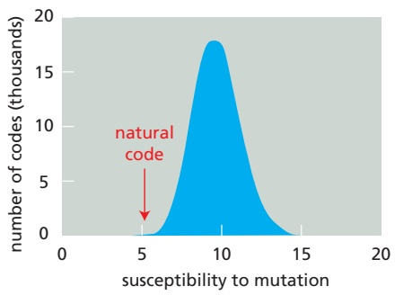
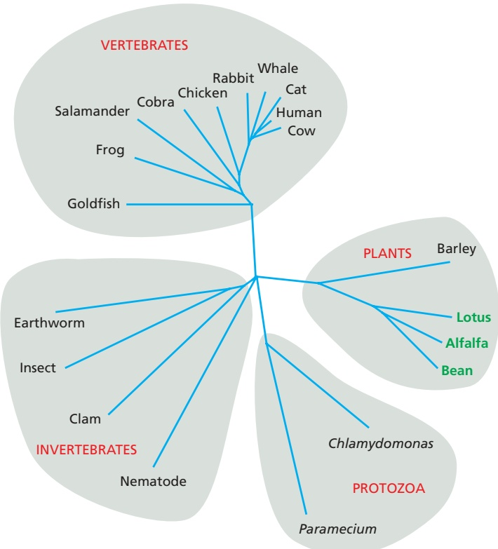
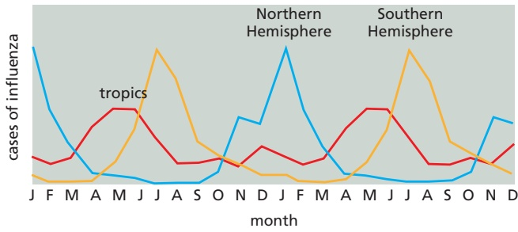

# 第1章 绪论 · 英文习题与参考文献

### 英文补充：习题与参考文献

> 对应中文板块：习题与参考文献。英文来源：Molecular Biology of the Cell，第7版，第1章；[本章完整原文](../来源/英文教材/01_Cells_Genomes_and_the_Diversity_of_Life/chapter.md)。物理PDF页码范围：40–87（整章范围）。

<!-- BEGIN EN EN01-EXERCISES -->
#### PROBLEMS

Which statements are true? Explain why or why not.

1–1 DNA and RNA use the same four-letter alphabet.

1–2 Each member of the human hemoglobin gene family, which consists of seven genes arranged in two clusters on different chromosomes, is an ortholog to all of the other members.

1–3 Most of the DNA sequences in a bacterial genome code for proteins, whereas most of the DNA sequences in the human genome do not.

1–4 Without additional information, no amount of gazing at genome sequences will reveal the functions of genes.

Discuss the following problems.

1–5 “Life” is easy to recognize but difficult to define. Dictionaries commonly define life as “The state or quality that distinguishes living beings or organisms from dead ones and from inorganic matter, characterized chiefly by metabolism, growth, the ability to reproduce, and the ability to respond to stimuli.” Score a car, a cactus, and yourself with respect to these characteristics.

1–6 Since it was deciphered more than five decades ago, some have claimed that the genetic code must be a frozen accident, while others have argued that it was shaped by natural selection. A striking feature of the genetic code is its inherent resistance to the effects of mutation. For example, a change in the third position of a codon often specifies the same amino acid or one with similar chemical properties. The natural code resists mutation more effectively (is less susceptible to error) than most other possible versions, as illustrated in **Figure Q1–1**. Only one in a million computer-generated “random” codes is more error-resistant than the natural genetic code. Does the extraordinary mutation resistance of the genetic code argue in favor of its origin as a frozen accident or as a result of natural selection? Explain your reasoning.

Figure Q1–1 Susceptibility to mutation of the natural code shown relative to that of millions of computer-generated alternative genetic codes (Problem 1–6). Susceptibility measures the average change in amino acid properties caused by random mutations in a genetic code. A small value indicates that mutations tend to cause minor changes. (Data courtesy of Steve Freeland.)

1–7 You have begun to characterize a sample obtained from the depths of the oceans on Europa, one of Jupiter’s moons. Much to your surprise, the sample contains a lifeform that grows well in a rich broth. Your preliminary analysis shows that it is cellular and contains DNA, RNA, and protein. When you show your results to a colleague, she suggests that your sample was contaminated with an organism from Earth. What approaches might you try to distinguish between contamination and a novel cellular life-form that is based on DNA, RNA, and protein?

1–8 It is not so difficult to imagine what it means to feed on the organic molecules that living things produce. That is, after all, what we do. But what does it mean to “feed” on sunlight, as phototrophs do? Or, even stranger, to “feed” on rocks, as lithotrophs do? Where is the “food,” for example, in the mixture of chemicals (H2S, H2, CO, Mn+, Fe2+, Ni2+, CH4, and $\mathrm { N H _ { 4 } } ^ { + } )$ that spews from a hydrothermal vent?

1–9 How many possible different trees (branching patterns) can be drawn to display the evolution of bacteria, archaea, and eukaryotes, assuming that they all arose from a common ancestor?

1–10 The genes for ribosomal RNA are highly conserved (relatively few sequence changes) in all organisms on Earth; thus, they have evolved very slowly over time. Were ribosomal RNA genes “born” perfect?

1–11 Rates of evolution appear to vary in different lineages. For example, the rate of evolution in the rat lineage is significantly higher than in the human lineage. These rate differences are apparent whether one looks at changes in nucleotide sequences that encode proteins and are subject to selective pressure or at changes in noncoding nucleotide sequences, which are not under obvious selection pressure. Can you offer one or more possible explanations for the slower rate of evolutionary change in the human lineage versus the rat lineage?

1–12 Genes participating in informational processes such as replication, transcription, and translation undergo horizontal gene transfer between species much less often than do genes involved in metabolism. The basis for this inequality is unclear at present, but one suggestion is that it relates to the underlying complexity of the two types of processes. Informational processes tend to involve large aggregates of different gene products, whereas metabolic reactions are usually catalyzed by enzymes composed of a single protein. Why would the complexity of the underlying process—informational or metabolic—have any effect on the rate of horizontal gene transfer?

1–13 Animal cells have neither cell walls nor chloroplasts, whereas plant cells have both. Fungal cells are somewhere in between; they have cell walls but lack chloroplasts. Are fungal cells more likely to be animal cells that gained the ability to make cell walls or to be plant cells that lost their chloroplasts? This question represented a difficult issue for early investigators who sought to assign evolutionary relationships solely on the basis of cell characteristics and morphology. How do you suppose that this question was eventually decided?

1–14 Giardia lamblia is a fascinating eukaryotic parasite; it contains a nucleus but no mitochondria and no discernible endoplasmic reticulum or Golgi apparatus— one of the very rare examples of such a cellular organization among eukaryotes. This cell organization might have arisen because Giardia is an ancient lineage that separated from the rest of the eukaryotes before mitochondria were acquired and internal membranes were developed. Or it might be a stripped-down version of a more standard eukaryote that has lost these structures because they are not necessary for its parasitic lifestyle. How might you use nucleotide sequence comparisons to distinguish between these alternatives?

1–15 When plant hemoglobin genes were first discovered in legumes, it was so surprising to find a gene typical of animal blood that it was hypothesized that the plant gene arose by horizontal transfer from an animal. Many more hemoglobin genes have now been sequenced, and a phylogenetic tree based on some of these sequences is shown in **Figure Q1–2**.

A. Does this tree support or refute the hypothesis that the plant hemoglobins arose by horizontal gene transfer?

B. Supposing that the plant hemoglobin genes were originally derived from a parasitic nematode, for example, what would you expect the phylogenetic tree to look like?

Figure Q1–2 Phylogenetic tree for hemoglobin genes from a variety of species (Problem 1–15). The legumes are highlighted in green. The lengths of lines that connect the present-day species represent the evolutionary distances that separate them.

#### REFERENCES

#### General

Alberts B, Hopkin K, Johnson A, et al. (2019) Essential Cell Biology, 5th ed. New York: Norton.

Barton NH, Briggs DEG, Eisen JA, et al. (2007) Evolution. Cold Spring Harbor, NY: Cold Spring Harbor Laboratory Press.

Darwin C (1859) On the Origin of Species. London: Murray.

Hall BK & Hallgrímsson B (2014) Strickberger’s Evolution, 5th ed. Burlington, MA: Jones & Bartlett.

Lynch M (2007) The Origins of Genome Architecture. Oxford: Oxford University Press.

Madigan MT, Bender KS, Buckley DH et al. (2018) Brock Biology of Microorganisms, 15th ed. London: Pearson.

Margulis L & Chapman MJ (2009) Kingdoms and Domains: An Illustrated Guide to the Phyla of Life on Earth. San Diego: Academic Press.

Moore JA (1993) Science as a Way of Knowing. Cambridge, MA: Harvard University Press.

#### The Universal Features of Life on Earth

Blain JC & Szostak JW (2014) Progress toward synthetic cells. Annu. Rev. Biochem. 83, 615–640.

Brenner S, Jacob F & Meselson M (1961) An unstable intermediate carrying information from genes to ribosomes for protein synthesis. Nature 190, 576–581.

Gibson DG, Benders GA, Andrews-Pfannkoch C . . . Smith HO (2008) Complete chemical synthesis, assembly, and cloning of a Mycoplasma genitalium genome. Science 319, 1215–1220.

Koonin EV (2005) Orthologs, paralogs, and evolutionary genomics. Annu. Rev. Genet. 39, 309–338.

Noller H (2005) RNA structure: reading the ribosome. Science 309, 1508–1514.

Watson JD & Crick FHC (1953) Molecular structure of nucleic acids: a structure for deoxyribose nucleic acid. Nature 171, 737–738.

#### Genome Diversification and the Tree of Life

Baker BJ, De Anda V, Seitz KW . . . Lloyd KG (2020) Diversity, ecology and evolution of Archaea. Nat. Microbiol. 5, 887–900.

Doolittle WF & Brunet TDP (2016) What is the tree of life. PLoS Genet. 12(4), e1005912.

Eme L, Spang A, Lombard J . . . Thijs JG (2017) Archaea and the origin of eukaryotes. Nat. Rev. Microbiol. 15(12), 711–723.

Hug LA, Baker BJ, Anantharaman K . . . Banfield JF (2016) A new view of the tree of life. Nat. Microbiol. 1, 16048.

Kerr RA (1997) Life goes to extremes in the deep earth—and elsewhere? Science 276, 703–704.

Woese C (1998) The universal ancestor. Proc. Natl. Acad. Sci. USA 95, 6854–6859.

#### Eukaryotes and the Origin of the Eukaryotic Cell

Andersson SG, Zomorodipour A, Andersson JO . . . Kurland CG (1998) The genome sequence of Rickettsia prowazekii and the origin of mitochondria. Nature 396, 133–140.

Burki F, Roger AJ, Brown MW & Simpson AGB (2020) The new tree of eukaryotes. Trends Ecol. Evol. 35(1), 43–55.

Carroll SB, Grenier JK & Weatherbee SD (2005) From DNA to Diversity: Molecular Genetics and the Evolution of Animal Design, 2nd ed. Maldon, MA: Blackwell Science.

Imachi H, Nobu MK, Nakahara N . . . Takai K (2020) Isolation of an archaeon at the prokaryote–eukaryote interface. Nature 577, 519–525.

Spang A, Caceres EF & Ettema TJG (2017) Genomic exploration of the diversity, ecology, and evolution of the archaeal domain of life. Science 357(6351), eaaf3883.

#### Model Organisms

Adams MD, Celniker SE, Holt RA . . . Venter JC (2000) The genome sequence of Drosophila melanogaster. Science 287, 2185–2195.

Blattner FR, Plunkett G, Bloch CA . . . Shao Y (1997) The complete genome sequence of Escherichia coli K-12. Science 277, 1453–1474.

Goffeau A, Barrell BG, Bussey H . . . Oliver SG (1996) Life with 6000 genes. Science 274, 546–567.

International Human Genome Sequencing Consortium (2001) Initial sequencing and analysis of the human genome. Nature 409, 860–921.

Krupovic M, Dolja VV & Koonin EV (2019) Origin of viruses: primordial replicators recruiting capsids from hosts. Nat. Rev. Microbiol. 17(7), 449–458.

Lander ES (2011) Initial impact of the sequencing of the human genome. Nature 470, 187–197.

Lynch M & Conery JS (2000) The evolutionary fate and consequences of duplicate genes. Science 290, 1151–1155.

Masters PS (2006) The molecular biology of coronaviruses. Adv. Virus Res. 66, 193–292.

Prangishvili D, Bamford DH, Forterre P, . . . Krupovic M (2017) The enigmatic archaeal virosphere. Nat. Rev. Microbiol. 15(12), 724–739.

Reed FA & Tishkoff SA (2006) African human diversity, origins and migrations. Curr. Opin. Genet. Dev. 16, 597–605.

The Arabidopsis Initiative (2000) Analysis of the genome sequence of the flowering plant Arabidopsis thaliana. Nature 408, 796–815.

The C. elegans Sequencing Consortium (1998) Genome sequence of the nematode C. elegans: a platform for investigating biology. Science 282, 2012–2018.

Tinsley RC & Kobel HR (eds.) (1996) The Biology of Xenopus. Oxford: Clarendon Press.

Weiss SR (2020) Forty years with coronaviruses. J. Exp. Med. 217(5), e20200537.
<!-- END EN EN01-EXERCISES -->

### 英文补充：习题与参考文献

> 对应中文板块：习题与参考文献。英文来源：Molecular Biology of the Cell，第7版，第23章；[本章完整原文](../来源/英文教材/23_Pathogens_and_Infection/chapter.md)。物理PDF页码范围：1352–1391（整章范围）。

<!-- BEGIN EN EN23-EXERCISES -->
#### PROBLEMS

Which statements are true? Explain why or why not.

23–1 Pathogens must enter host cells to cause disease.

23–2 Viruses replicate their genomes in the nucleus of the host cell.

23–3 You should not take antibiotics for diseases caused by viruses.

23–4 Our adult bodies harbor about 10 times more resident microbial cells than human cells.

23–5 The microbiomes from healthy humans are all very similar.

Discuss the following problems.

23–6 In order to survive and multiply, a successful pathogen must accomplish five tasks. Name them.

23–7 What are the three general mechanisms for horizontal gene transfer?

23–8 John Snow is widely regarded as the father of modern epidemiology. Most famously, he investigated an outbreak of cholera in London in 1854 that killed more than 600 people before it was finished. Snow recorded where the victims lived and plotted the data on a map, along with the locations of the water pumps that served as the source of water for the public (**Figure Q23–1**). He concluded that the disease was most likely spread in the water, although he could find nothing suspicious-looking in it. His conclusion ran counter to the then-current belief that cholera was from “miasmas” in bad air. Very few believed his theory during the next 50 years, with the “bad air” theory persisting until at least 1901. What do you suppose Snow saw in the data that led him to his conclusion? Why do you think most scientists remained skeptical for so long?

Figure Q23–1 A map of where the victims of the 1854 cholera outbreak lived, superimposed on a modern map of the area (Problem 23–8). The locations of the victims’ houses are indicated by the small red rectangles. Stacks of rectangles indicate multiple cases occurring in the same house. Public water pumps are shown as blue squares. (Adapted from Wellcome Library, London/Google Maps.)

23–9 The Gram-negative bacterium Yersinia pestis, the causative agent of the plague, is extremely virulent. Upon infection, Y. pestis injects a set of effector proteins into macrophages that suppresses their phagocytic behavior and also interferes with their innate immune responses. One of the effector proteins, YopJ, acetylates serines and threonines on various MAP kinases, including the MAP kinase kinase kinase (MAPKKK) TAK1, which controls a key signaling step in the innate immune response pathway. To determine how YopJ interferes with TAK1, you transfect human cells with catalytically active YopJ $( \mathrm { Y o p J ^ { W T } } )$ or inactive YopJ (YopJC172A) and with FLAG-tagged active TAK1 $\mathrm { ( T A K 1 ^ { W T } ) }$ or inactive TAK1 $\mathrm { ( T A K 1 ^ { K 6 3 W } ) ^ { \overline { { { } } } } }$ and assay for total TAK1 and for phosphorylated TAK1, using anti-bodies against the FLAG tag or against phosphorylated TAK1 (**Figure Q23–2**). How does YopJ block the TAK1 signaling pathway? How do you suppose the serine/ threonine acetylase activity of YopJ might interfere with TAK1 activation?

Figure Q23–2 Effects of YopJ on TAK1 phosphorylation (Problem 23–9). TAK1 was immunoprecipitated (IP) using antibodies against the FLAG tag (α-FLAG-TAK1). Total TAK1 in the immunoprecipitation was assayed by immunoblot (IB) using the same antibody. Phosphorylated TAK1 was assayed by IB using antibodies specific for phospho-TAK1 (α-pTAK1). A marker of protein molecular mass is shown at right in kilodaltons. (From N. Paquette et al., Proc. Natl. Acad. Sci. USA 109:12710–12715, 2012. With permission from National Academy of Sciences.)

23–10 The intracellular bacterial pathogen Salmonella enterica serovar Typhimurium, which causes gastroenteritis, injects effector proteins to promote its invasionMBoC7 Q23.02 into nonphagocytic host cells by the trigger mechanism. S. enterica serovar Typhimurium first stimulates membrane ruffling to promote invasion, and then suppresses membrane ruffling once invasion is complete. This behavior is mediated in part by injection of two effector proteins: SopE, which promotes membrane ruffling and invasion, and SptP, which blocks the effects of SopE. Both effector proteins target the monomeric GTPase, Rac, which in its active form promotes membrane ruffling. How do you suppose SopE and SptP affect Rac activity? How do you suppose the effects of SopE and SptP are staggered in time if they are injected simultaneously?

23–11 Several negative-strand viruses carry their genome as a set of discrete RNA segments. Examples include influenza virus (eight segments), Rift Valley fever virus (three segments), hantavirus (three segments), and Lassa virus (two segments), to name a few. Why does segmentation of the genome provide a strong evolutionary advantage for these viruses?

23–12 Influenza epidemics account for 250,000–500,000 deaths globally each year. These epidemics are markedly seasonal, occurring in temperate climates in the Northern and Southern Hemispheres during their respective winters. By contrast, in the tropics, there is significant influenza activity year round, with a peak in the rainy season (**Figure Q23–3**). Can you suggest some possible explanations for the patterns of influenza epidemics in temperate zones and the tropics?

Figure Q23–3 Seasonal patterns of influenza epidemics (Problem 23–12). Cases of influenza at different times of the year are shown for the Northern Hemisphere (blue), the Southern Hemisphere (orange), and the tropics (red).

23–13 Avian influenza viruses readily infect birds but are transmitted to humans very rarely. Similarly, human influenza viruses spread readily to other humans but have never been detected in birds. The key to this specificity lies in the viral capsid protein, hemagglutinin, which binds to sialic acid residues on cell-surface glycoproteins, triggering virus entry into the cell (**Movie 23.8**). Hemagglutinin on human viruses recognizes sialic acid in a 2,6 linkage with galactose, whereas avian hemagglutinin recognizes sialic acid in a 2,3 linkage with galactose. Humans make carbohydrate chains that have only the 2,6 linkage between sialic acid and galactose; birds make only the 2,3 linkage; but pigs make carbohydrate chains with both linkages. How does this situation make pigs ideal hosts for generating new strains of human influenza viruses?

23–14 The majority of antibiotics used in the clinic are made as natural products by bacteria. Why do you suppose bacteria make the very agents we use to kill them?

23–15 In the early days of penicillin research, it was discovered that bacteria in the air could destroy the penicillin, a big problem for large-scale production of the drug. How do you suppose this occurs?

23–16 When the Oxford team of Ernst Chain and Norman Heatley had laboriously collected their first two grams of penicillin (probably no more than 2% pure!), Chain injected two normal mice with 1 g each of this preparation and waited to see what would happen. The mice survived with no apparent ill effects. His boss, Howard Florey, was furious at what he saw as a waste of good antibiotic. Why was this experiment important?

#### REFERENCES

#### General

Acheson NH (2021) Fundamentals of Molecular Virology, 3rd ed. Hoboken, NJ: Wiley.

Cossart P, Roy CR & Sansonetti P (eds.) (2019) Bacteria and Intracellularity. Washington, DC: ASM Press.

Fauci A & Morens DM (2012) The perpetual challenge of infectious diseases. N. Engl. J. Med. 366, 454–461.

Gunn A & Pitt SJ (2012) Parasitology: An Integrated Approach. Hoboken, NJ: Wiley.

Heitman J, Filler SG, Edwards JE & Mitchell AP (2006) Molecular Principles of Fungal Pathogenesis. Washington, DC: ASM Press.

Wilson BA, Winkler ME & Ho BT (2019) Bacterial Pathogenesis: A Molecular Approach, 4th ed. Washington, DC: ASM Press.

#### Introduction to Pathogens

Baltimore D (1971) Expression of animal virus genomes. Bacteriol. Rev. 35, 235–241.

Coffin JM (2021) 50th anniversary of the discovery of reverse transcriptase Mol. Biol. Cell 32, 91–97.

Cowman AF, Healer J, Marapana D & Marsh K (2016) Malaria: biology and disease. Cell 167, 610–624.

Crick FH & Watson JD (1956) Structure of small viruses. Nature 177, 473–475.

Faruque SM & Mekalanos JJ (2012) Phage-bacterial interactions in the evolution of toxigenic Vibrio cholerae. Virulence 3, 556–565.

Galán JE & Gabriel Waksman G (2018) Protein-injection machines in bacteria. Cell 172, 1306–1318.

Rappleye CA & Goldman WE (2006) Defining virulence genes in the dimorphic fungi. Annu. Rev. Microbiol. 60, 281–303.

Soucy S, Huang J & Gogarten J (2015) Horizontal gene transfer: building the web of life. Nat. Rev. Genet. 16, 472–482.

Young JAT & Collier RJ (2007) Anthrax toxin: receptor binding, internalization, pore formation, and translocation. Annu. Rev. Biochem. 76, 243–265.

Cell Biology of Pathogen Infection

Asrat S, de Jesús DA, Hempstead AD . . . Isberg RR (2014) Bacterial pathogen manipulation of host membrane trafficking. Annu. Rev. Cell Dev. Biol. 30, 79–109.

Davies J & Davies D (2010) Origins and evolution of antibiotic resistance. Microbiol. Mol. Biol. Rev. 74, 417–433.

Faria NR, Rambaut A, Suchard MA . . . Lemey P (2014) HIV epidemiology. The early spread and epidemic ignition of HIV-1 in human populations. Science 346, 56–61.

Forsberg KJ, Reyes A, Wang B . . . Dantas G (2012) The shared antibiotic resistome of soil bacteria and human pathogens. Science 337, 1107–1111.

Goldberg DE, Siliciano RF & Jacobs WR, Jr (2012) Outwitting evolution: fighting drug-resistant TB, malaria, and HIV. Cell 148, 1271–1283.

Grove J & Marsh M (2011) The cell biology of receptor-mediated virus entry. J. Cell Biol. 195, 1071–1082.

Hartenian E, Nandakumar D, Lari A . . . Glaunsinger BA (2020) The molecular virology of coronaviruses. J. Biol. Chem. 295, 12910–12934.

Hernandez-Gonzalez M, Larocque G & Way M (2021) Viral use and subversion of membrane organization and trafficking. J. Cell Sci. 134, jcs252676.

Huang J & Brumell J (2014) Bacteria–autophagy interplay: a battle for survival. Nat. Rev. Microbiol. 12, 101–114.

Mengaud J, Ohayon H, Gounon P . . . Cossart P (1996) E-cadherin is the receptor for internalin, a surface protein required for entry of L. monocytogenes into epithelial cells. Cell 84, 923–932.

Petrova V & Russell C (2018) The evolution of seasonal influenza viruses. Nat. Rev. Microbiol. 16, 47–60.

Polk DB & Peek RM, Jr (2010) Helicobacter pylori: gastric cancer and beyond. Nat. Rev. Cancer 10, 403–414.

Ray K, Marteyn B, Sansonetti PJ & Tang CM (2009) Life on the inside: the intracellular lifestyle of cytosolic bacteria. Nat. Rev. Microbiol. 7, 333–340.

Ribet D & Cossart P (2015) How bacterial pathogens colonize their hosts and invade deeper tissues. Microbes Infect. 17, 173–183.

Sibley LD (2011) Invasion and intracellular survival by protozoan parasites. Immunol. Rev. 240, 72–91.

Sun E, He J & Zhuang X (2013) Live cell imaging of viral entry. Curr. Opin. Virol. 3, 34–43.

Tilney LG & Portnoy DA (1989) Actin filaments and the growth, movement, and spread of the intracellular bacterial parasite, Listeria monocytogenes. J. Cell Biol. 109, 1597–1608.

Vink C, Rudenko G & Seifert HS (2012) Microbial antigenic variation mediated by homologous DNA recombination. FEMS Microbiol. Rev. 36, 917–948.

Walsh D, Mathews MB & Mohr I (2013) Tinkering with translation: protein synthesis in virus-infected cells. Cold Spring Harb. Perspect. Biol. 5, a012351.

Welch MD & Way M (2013) Arp2/3-mediated actin-based motility: a tail of pathogen abuse. Cell Host Microbe 14, 242–255.

Worobey M, Watts TD, McKay RA . . . Jaffe HW (2016) 1970s and ‘Patient 0’ HIV-1 genomes illuminate early HIV/AIDS history in North America. Nature 39, 98–101.

#### The Human Microbiota

Fan Y & Pedersen O (2021) Gut microbiota in human metabolic health and disease. Nat. Rev. Microbiol. 19, 55–71.

Fischbach MA (2019) Microbiome: focus on causation and mechanism. Cell 174, 785–790.

Sender R, Fuchs S & Milo M (2016) Are we really vastly outnumbered? Revisiting the ratio of bacterial to host cells in humans. Cell 164, 337–340.
<!-- END EN EN23-EXERCISES -->
