# 第2章 细胞生物学研究方法 · 第二节 细胞及其组分的分析方法

[返回本章](../README.md) · [中文本章原文](../中文原文.md)

<!-- BEGIN CN CN02-S02 -->
## 第二节 细胞及其组分的分析方法

形态学观察与细胞组分分析相结合是当代细胞生物学研究中常常采用的实验方法。它为揭示生物大分子在细胞内的空间定位、相互关系及其功能的研究提供了有力的工具。

## 一、用超离心技术分离细胞组分

用低渗匀浆、超声破碎或研磨等方法可使细胞质膜破损，形成细胞核、线粒体、叶绿体、内质网、高尔基体、溶酶体等细胞器和细胞组分组成的混合匀浆，再通过差速离心，即利用不同的离心速度所产生的不同离心力，将各种质量和密度不同的亚细胞组分和各种颗粒分开（图2-22）。

密度梯度离心是将要分离的细胞组分小心地铺放在含有密度逐渐增加的、高溶解性的惰性物质（如蔗糖）形成的密度梯度溶液表面，通过重力或离心力的作用使样品中不同组分以不同的沉降率沉降，形成不同的沉降带。各组分的沉降率与它们的形状和大小有关，通常以沉降系数（S值）表示。超速离心机可达转数 $10^{5}/min$ ，产生60万倍重力场。在这巨大离心力的作用下，甚至相当小的tRNA（沉降系数4S）和单一的酶都可根据其沉降系数相互分离开。密度梯度离心又可分为速度沉降和等密度沉降两种。常用的介质有蔗糖和氯化铯等。

速度沉降主要是用于分离密度相近而大小不一的细胞组分。离心前，将要分离的细胞匀浆物放置在蔗糖浓度梯度（通常质量分数范围为5%—40%）溶液的上层，各种细胞组分根据它们的大小以不同的速度沉降，形成不同的沉降带（图2-23），然后分别收集不同的沉降带中的组分，用于分析。

等密度沉降用于分离不同密度的细胞组分。细胞组分在连续梯度的高密度介质中经离心力场长时间的作用沉降或漂浮到与自身密度相等的位置，形成不同的密度区带。这种方法非常灵敏，甚至可以将掺入重同位素如 ${}^{14}C$ 或 ${}^{15}N$ 的生物大分子和未标记物分开。1957 年，M. Meselson 和 F. Stahl 利用 ${}^{15}N$ 标记大肠杆菌 DNA，并用氯化铯等密度沉降法直接证明了 DNA 的半保留复制。

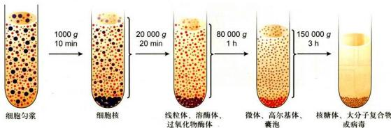  
图 2-22 用差速离心法分离细胞匀浆中的各种细胞组分  
图中显示，随着离心力（g）大小和离心时间的不同，各种细胞组分沉淀在不同的离心管底部。

  
图 2-23 用密度梯度离心分离细胞组分示意图

## 二、特异蛋白抗原的定位与定性

20世纪70年代以来，免疫学的迅速发展为细胞生物学的研究提供了强有力的手段，特别是在细胞内特异蛋白的定位与定性方面，单克隆抗体与其他一些检测手段相结合发挥了重要作用。免疫荧光与免疫电镜是最常见的研究细胞内蛋白质分子定位的定位，而对蛋白质组分进行体外分析定性通常则采用免疫迹（Western blotting）。放射免疫沉淀（radioimmuno-precipitation）和蛋白质芯片、质谱分析等技术，这里不再一一介绍。

## （一）免疫荧光技术

前面已经介绍了荧光显微镜技术，其中也提到免疫荧光技术。所谓免疫荧光技术就是将免疫学方法（抗原－抗体特异结合）与荧光标记技术相结合用于研究特异蛋白抗原在细胞内分布的方法，它包括直接和间接免疫荧光技术两种（图2-24）。实验步骤主要包括荧光抗体的制备、标本的处理、免疫染色和观察记录等过程。

  
图2-24 直接免疫荧光标记与间接免疫荧光标记技术

A. 直接免疫荧光标记技术：将荧光分子与抗体偶联后直接用于免疫标记技术。B. 间接免疫标记技术：先将抗体（称第一抗体）与抗原反应，然后加入与荧光分子相偶联的抗第一抗体的抗体（称第二抗体）。

标本处理有多种方法，组织切片、冷冻切片、整装细胞都可应用，其宗旨只有一个，即要尽量完好地保持被检测蛋白质的抗原性；免疫染色就是抗原-抗体反应的过程，这里要注意设立各种实验对照以保证结果的可靠性。除免疫荧光技术外，还可用免疫酶标记技术，即以酶（如辣根过氧化物酶）代替荧光素与抗体偶联，因此可在普通显微镜下观察。近年来，激光扫描共焦显微镜的应用使免疫荧光技术在细胞生物学研究中发挥了越来越大的作用。

## （二）免疫电镜技术

免疫荧光技术快速、灵敏、特异性强，但其分辨率有限。免疫电镜技术则能有效地提高样品的分辨率，在超微结构水平上研究特异蛋白抗原的定位。

免疫电镜技术可分为免疫铁蛋白技术、免疫酶标技术与免疫胶体金技术，其主要区别是与抗体结合的标志物不同，这在一定程度上也反映了免疫电镜技术的发展过程。目前，免疫铁蛋白技术几乎已无人问津，而免疫胶体金技术则受到越来越多的青睐。胶体金本身具有许多优点，如：在电镜下金颗粒容易识别，并可以制成5 nm、10 nm或20 nm等不同直径的金颗粒，用以双重标记或多重标记。

免疫电镜技术的样品制备程序与免疫荧光技术类似（图2-25），包括样品的固定、包埋、超薄切片制备、免疫标记和染色等步骤。其技术关键是在样品制备过程

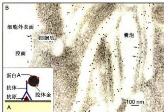  
图2-25 免疫胶体金电镜技术的基本原理与应用

A. 免疫胶体金标记技术原理的示意图：细菌蛋白 A 可与胶体金结合，也可以与抗体（如 IgG）的 Fc 端特异结合。B. 免疫胶体金标记显示膀胱上皮细胞中特异的膜蛋白的分布（箭头所指）。(B 图由梁凤霞博士和丁明孝提供)

中既要保持样品中蛋白的抗原性，又要尽量保存样品的精细结构。免疫电镜技术至今已得到广泛应用。

## 三、细胞内特异核酸的定位与定性

细胞内特异核酸（DNA或RNA）的定性与定位的研究，通常采用原位杂交（in situ hybridization）技术。用标记的核酸探针通过分子杂交确定特异核苷酸序列在染色体上或在细胞中的位置的方法称为原位杂交。

原位杂交技术首先是在光镜水平上发展起来的，放射性同位素标记的探针与样品中的DNA或RNA杂交后，用显微放射自显影的方法显示杂交物的存在部位；或用荧光素标记的探针进行杂交，在荧光显微镜下直接显示细胞中与探针杂交的特异核酸。近年来，以生物素等生物小分子代替同位素或荧光素标记探针，使原位杂交技术得到了更为广泛的应用发展。电镜原位杂交技术可将特异序列核苷酸的定位与细胞的超微结构结合起来，其基本原理与光镜原位杂交类似，只是探针标记物不同，杂交反应的检测常常是通过与抗生物素抗体相连的胶体金颗粒显示出来的。

原位杂交技术在显微与亚显微水平上研究基因定位、特异mRNA表达等问题的研究中具有重要作用（图2-26）。

## 四、细胞成分的分析与细胞分选技术

流式细胞术（flow cytometry）可定量地测定某一细胞中的 DNA、RNA 或某一特异的标记蛋白的含量，以及细胞群体中上述成分含量不同的细胞的数量，它还可将某一特异染色的细胞从数以万计的细胞群体中分离出来，以及将 DNA 含量不同的中期染色体分离出来，甚至可用于细胞的分选。

  
图2-26 用原位杂交技术显示Z13基因在受精后1天的斑马鱼胚胎的体节、眼和松果体中的表达（箭头所指）。（张博博士惠赠）

细胞群体一般需要分散后对待测的某种成分进行特异的荧光染色，然后使悬液中的细胞一个个快速通过流式细胞仪（每秒可达几万个细胞）。当含有单个细胞的液滴通过激光束时，带有不同荧光的细胞所在的液滴被充上正电荷、负电荷，或不被充电，同时检测器可测出并记录每个细胞中的待测成分的含量。因带有不同表面标志的细胞所带的电荷的种类不同，当液滴通过高压偏转板时，带不同电荷的液滴发生偏转，从而达到将细胞分选的目的（图2-27）。如果染色过程不影响细胞活性，那么分离出来的细胞还可以继续培养。


<!-- END CN CN02-S02 -->

---

## 对应英文内容

<a id="EN08-H007-H021"></a>

### 英文补充：细胞分级、蛋白质纯化与生化分析

> 对应中文板块：细胞分级、蛋白质纯化与生化分析。英文来源：Molecular Biology of the Cell，第7版，第8章；[本章完整原文](../../来源/英文教材/08_Analyzing_Cells_Molecules_and_Systems/chapter.md)。物理PDF页码范围：514–601（整章范围）。

<!-- BEGIN EN EN08-H007-H021 -->
#### PURIFYING PROTEINS

The challenge of isolating a single type of protein from the thousands of other proteins in a cell is formidable but must be overcome to study protein function in vitro. As we shall see later in this chapter, recombinant DNA technology can enormously simplify this task by engineering cells to produce large quantities of a given protein, thereby making its purification much easier. Whether the source of the protein is an engineered cell or a natural tissue, a purification procedure usually starts with subcellular fractionation to reduce the complexity of the material and is then followed by purification steps of increasing specificity.

#### Cells Can Be Separated into Their Component Fractions

To purify a protein, it must first be extracted from inside the cell. Cells can be broken up in various ways: they can be subjected to osmotic shock or ultrasonic vibration, forced through a small orifice, or ground up in a blender. These procedures break many of the membranes of the cell (including the plasma membrane and endoplasmic reticulum) into fragments that immediately reseal to form small closed vesicles. If carefully carried out, however, the disruption procedures leave organelles such as nuclei, mitochondria, the Golgi apparatus, lysosomes, and peroxisomes largely intact. The suspension of cells is thereby reduced to a thick slurry (called a homogenate or extract) that contains a variety of membraneenclosed organelles, each with a distinctive size and density. Provided that the homogenization medium has been carefully chosen (by trial and error for each organelle), the various components—including the vesicles derived from the endoplasmic reticulum, called microsomes—retain most of their original biochemical properties.

The different components of the homogenate must then be separated. Such cell fractionations became possible only after the commercial development in the early 1940s of an instrument known as the preparative ultracentrifuge, which rotates extracts of broken cells at high speeds (**Figure 8–4**). This treatment separates cell components by size and density: in general, the largest objects experience the largest centrifugal force and move the most rapidly. At relatively low speed, large components such as nuclei sediment to form a pellet at the bottom of the centrifuge tube; at slightly higher speed, a pellet of mitochondria is deposited; and at even higher speeds and with longer periods of centrifugation, first vesicles and then ribosomes can be collected (**Figure 8–5**). All of these fractions are impure, but many of the contaminants can be removed by resuspending the pellet and repeating the centrifugation procedure several times.

Centrifugation is the first step in most fractionations, but it separates only components that differ greatly in size. A finer degree of separation can be achieved by

cell homogenate

(A)


Figure 8–4 The preparative ultracentrifuge. (A) The sample is contained in tubes that are inserted into a ring of angled cylindrical holes in a metal rotor. Rapid rotation of the rotor generates enormous centrifugal forces, which cause particles in the sample to sediment against the bottom sides of the sample tubes, as shown here. The vacuum reduces friction, preventing heating of the rotor and allowing the refrigeration system to maintain the sample at 4°C. (B) Some fractionation methods require a different type of rotor called a swinging-bucket rotor. In this case, the sample tubes are placed in metal tubes on hinges that allow the tubes to swing outward when the rotor spins. Sample tubes are therefore horizontal during spinning, and samples are sedimented toward MBoC7 m8.05/8.04the bottom, not the sides, of the tube, providing better separation of differently sized components (see Figures 8–5 and 8–6).

layering the homogenate in a thin band on top of a salt solution that fills a centrifuge tube. When centrifuged, the various components in the mixture move as a series of distinct bands through the solution, each at a different rate, in a process called velocity sedimentation (**Figure 8-6A**). For the procedure to work effectively, the bands must be protected from convective mixing, which would normally occur whenever a denser solution (for example, one containing organelles) finds itself on top of a lighter one (the salt solution). This is achieved by augmenting the solution in the tube with a shallow gradient of sucrose prepared by a special mixing device. The resulting density gradient—with the dense end at the bottom of the tube—keeps each region of the solution denser than any solution above it, and it thereby prevents convective mixing from distorting the separation.

When sedimented through sucrose gradients, different cell components separate into distinct bands that can be collected individually. The relative rate at which each component sediments depends primarily on its size and shape— normally being described in terms of its sedimentation coefficient, or S value. Present-day ultracentrifuges rotate at speeds of up to 80,000 rpm and produce forces as high as 500,000 times gravity. These enormous forces drive even small macromolecules, such as tRNA molecules and simple enzymes, to sediment at an appreciable rate and allow them to be separated from one another by size.

Figure 8–5 Cell fractionation by centrifugation. Repeated centrifugation at progressively higher speeds will fractionate homogenates of cells into their components. In general, the smaller the subcellular component, the greater the centrifugal force required to sediment it. Typical values for the various centrifugation steps referred to in the figure are: low speed: 1000 times gravity for 10 minutes medium speed: 20,000 times gravity for 20 minutes high speed: 80,000 times gravity for 1 hour very high speed: 150,000 times gravity for 3 hours

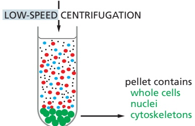

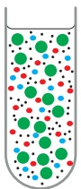

The ultracentrifuge is also used to separate cell components on the basis of their buoyant density, independently of their size and shape. In this case, the sample is sedimented through a steep density gradient that contains a very high concentration of sucrose or cesium chloride. Each cell component begins to move down the gradient as in Figure 8–6A, but it eventually reaches a position where the density of the solution is equal to its own density. At this point, the component

pellet contains whole cells nuclei cytoskeletons

SUPERNATANT SUBJECTED TO MEDIUM-SPEED CENTRIFUGATION

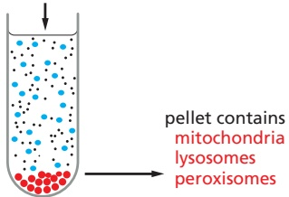

pellet contains mitochondria lysosomes peroxisomes

SUPERNATANT SUBJECTED TO HIGH-SPEED CENTRIFUGATION


pellet contains microsomes small vesicles

SUPERNATANT SUBJECTED TO VERY-HIGH-SPEED CENTRIFUGATION

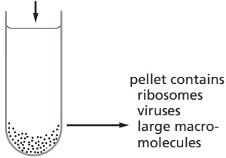

pellet contains ribosomes viruses large macromolecules

(A)

(B)

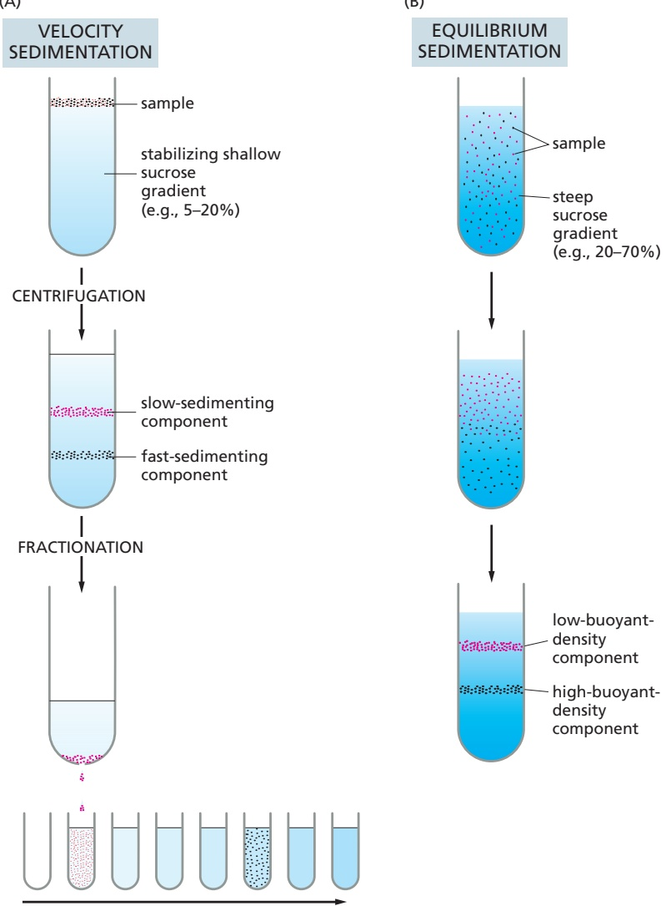

Figure 8–6 Comparison of velocity sedimentation and equilibrium sedimentation. (A) In velocity sedimentation, subcellular components sediment at different speeds according to their size and shape when layered over a solution containing sucrose. To stabilize the sedimenting bands against convective mixing caused by small differences in temperature or solute concentration, the tube contains a continuous shallow gradient of sucrose, which increases in concentration toward the bottom of the tube (typically from 5 to 20% sucrose). After centrifugation, the different components can be collected individually, most simply by puncturing the plastic centrifuge tube with a needle and collecting drops from the bottom, as illustrated here. (B) In equilibrium sedimentation, subcellular components move up or down when centrifuged in a gradient until they reach a position where their density matches that of their surroundings. Although a sucrose gradient is shown here, denser gradients, which are especially useful for protein and nucleic acid separation, can be formed from cesium chloride. The final bands, at equilibrium, can be collected as in A.

floats and can move no farther. A series of distinct bands is thereby produced in the centrifuge tube, with the bands closest to the bottom of the tube containing the components of highest buoyant density (**Figure 8–6B**). This method, called equilibrium sedimentation, is so sensitive that it can separate macromolecules that have incorporated heavy isotopes, such as $^ { 1 3 } \mathrm { C }$ or $\dot { 1 5 } _ { \mathrm { N } }$ , from the same macromolecules that contain the lighter, common isotopes $\mathrm { ( ^ { 1 2 } C ~ o r ~ ^ { 1 4 } N ) }$ . In fact, the cesium-chloride method was developed in 1957 to separate the labeled from the unlabeled DNA produced after exposure of a growing population of bacteria to nucleotide precursors containing $^ { 1 5 } \mathrm { N } ;$ this classic experiment provided direct evidence for the semiconservative replication of DNA (see Figure 5–5).

#### Cell Extracts Provide Accessible Systems to Study Cell Functions

Studies of organelles and other large subcellular components isolated in the ultracentrifuge have contributed enormously to our understanding of the functions of different cell components. Experiments on mitochondria and chloroplasts purified by centrifugation, for example, demonstrated the central function of these organelles in converting energy into forms that the cell can use. Similarly, resealed vesicles formed from fragments of rough and smooth endoplasmic reticulum (microsomes) have been separated from each other and analyzed as functional models of these compartments of the intact cell.

Similarly, highly concentrated cell extracts, especially undiluted cytoplasm from Xenopus laevis (African clawed frog) oocytes and fertilized eggs, have played a critical role in the study of such complex and highly organized processes as the cell-division cycle, the assembly and function of the mitotic spindle (**Figure 8–7**), and the vesicular-transport steps involved in the movement of proteins through the secretory pathway.


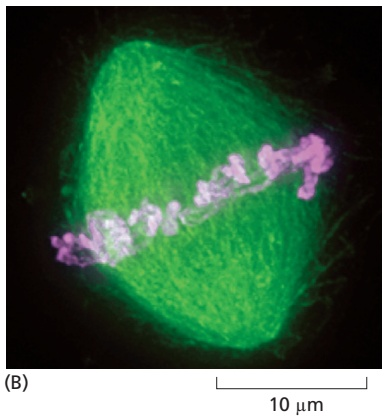

Figure 8–7 The formation of subcellular structures in a cytoplasmic extract. Concentrated cytoplasm was prepared from unfertilized eggs of the frog Xenopus laevis. After addition of Xenopus sperm chromosomes, these extracts were stimulated to progress through the cell cycle. (A) In an interphase extract, a nuclear envelope (green) forms around the sperm chromosomes (pink). (B) In a metaphase extract, the nuclear envelope breaks down and the microtubules (green) form a mitotic spindle that is attached to the condensed chromosomes (pink). [B, T. Maresca et al., J Cell Biol. 169(6):859–69, 2005, doi 10.1083/jcb.200503031. With permission from Rockefeller University Press.]

Cell extracts also provide, in principle, the starting material for the complete separation of all of the individual macromolecular components of the cell. We now consider how this separation is achieved, focusing on proteins.

#### Proteins Can Be Separated by Chromatography

Proteins are most often fractionated by **column chromatography**, in which a mixture of proteins in solution is passed through a column containing a porous gel matrix. Different proteins are retarded to different extents by their interaction with the matrix, and they can be collected separately as they flow out of the bottom of the column (**Figure 8–8**). Depending on the choice of matrix, proteins can be separated according to their charge (ion-exchange chromatography), their hydrophobicity (hydrophobic chromatography), their size (gel-filtration chromatography), or their ability to bind to particular small molecules or to other macromolecules (affinity chromatography).

COLUMN CHROMATOGRAPHY

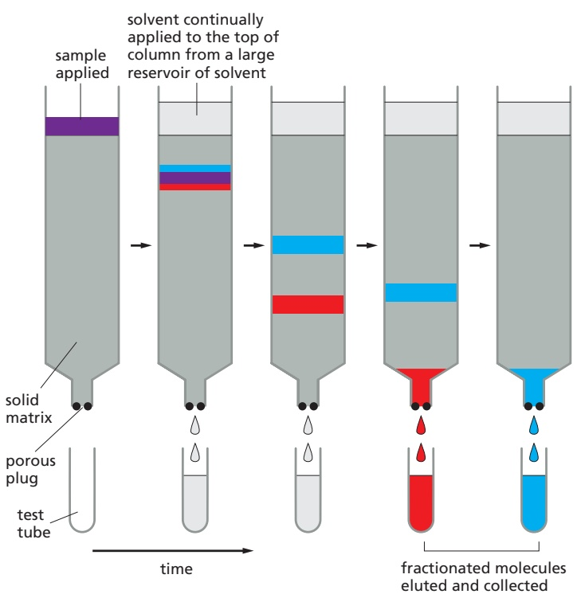

Figure 8–8 The separation of molecules by column chromatography. The sample, a solution containing a mixture of different molecules, is applied to the top of a cylindrical glass or plastic column filled with a permeable gel matrix, such as cellulose. A large amount of solvent is then passed slowly through the column and collected in separate tubes as it emerges from the bottom. Because various components of the sample travel at different rates through the column, they are fractionated into different tubes.

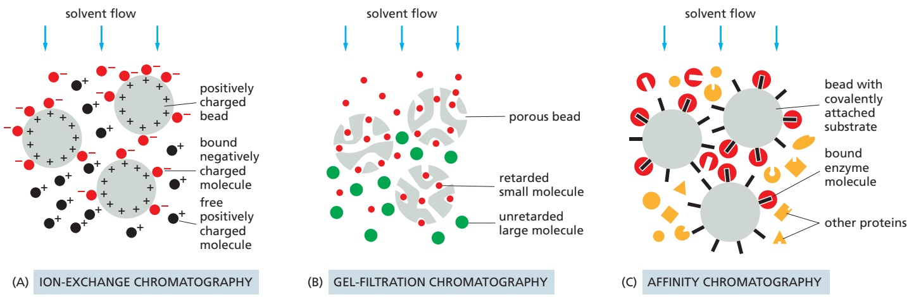

Figure 8–9 Three types of matrices used for chromatography. (A) In ion-exchange chromatography, the insoluble matrix carries ionic charges that retard the movement of molecules of opposite charge. Matrices used for separating proteins include diethylaminoethylcellulose (DEAE-cellulose), which is positively charged, and carboxymethylcellulose (CM-cellulose) and phosphocellulose, which are negatively charged. Analogous matrices based on agarose or other polymers are also frequently used. The strength of the association between the dissolved molecules and the ion-exchange matrix depends on both the ionic strength and the pH of the solution that is passing down the column, which may therefore be varied systematically (as in Figure 8–10) to achieve an effective separation. (B) In gel-filtration chromatography, the small beads that form the matrix are inert but porous. Molecules that are small enough to penetrate into the matrix beads are thereby delayed and travel more slowly through the column than do larger molecules that cannot penetrate. Beads of cross-linked polysaccharide (dextran, MBoC7 m8.09/8.09agarose, or acrylamide) are available commercially in a wide range of pore sizes, making them suitable for the fractionation of molecules of various masses, from less than 500 daltons to more than $5 \times 1 0 ^ { 6 }$ daltons. (C) Affinity chromatography uses an insoluble matrix that is covalently linked to a specific ligand, such as an antibody molecule or an enzyme substrate, that will bind a specific protein. Enzyme molecules that bind to immobilized substrates on such columns can be eluted with a concentrated solution of the free form of the substrate molecule, while molecules that bind to immobilized antibodies can be eluted by dissociating the antibody–antigen complex with concentrated salt solutions or solutions of high or low pH. High degrees of purification can be achieved in a single pass through an affinity column.

Many types of matrices are available. Ion-exchange columns (**Figure 8–9A**) are packed with small beads that carry either a positive or a negative charge, so that proteins are fractionated according to the arrangement of charges on their surface. Hydrophobic columns are packed with beads from which hydrophobic side chains protrude, selectively retarding proteins with exposed hydrophobic regions. Gel-filtration columns (**Figure 8–9B**), which separate proteins according to their size, are packed with tiny porous beads: molecules that are small enough to enter the pores linger inside successive beads as they pass down the column, while larger molecules remain in the solution flowing between the beads and therefore move more rapidly, emerging from the column first. Besides providing a means of separating molecules, gel-filtration chromatography is a convenient way to estimate their size.

Affinity chromatography (**Figure 8–9C**) takes advantage of the biologically important binding interactions that occur on protein surfaces. If a substrate molecule is covalently coupled to an inert matrix such as a polysaccharide bead, the enzyme that operates on that substrate will often be specifically retained by the matrix and can then be eluted (washed out) in nearly pure form. Likewise, short DNA oligonucleotides of a specifically designed sequence can be immobilized in this way and used to purify DNA-binding proteins that normally recognize this sequence of nucleotides in chromosomes. Alternatively, specific antibodies can be coupled to a matrix to purify protein molecules recognized by the anti-bodies (called immunoaffinity chromatography). Because of the great specificity of all such affinity columns, 1000- to 10,000-fold purifications can sometimes be achieved in a single pass.

If one starts with a complex mixture of proteins, a single passage through an ion-exchange or a gel-filtration column does not produce very highly purified fractions, because these methods individually increase the proportion of a given protein in the mixture no more than twentyfold. Because most individual proteins represent less than 1/1000 of the total cell protein, it is usually necessary to use several different types of columns in succession to attain sufficient purity, with affinity chromatography being the most efficient (**Figure 8–10**).

(A) ION-EXCHANGE CHROMATOGRAPHY


(B) GEL-FILTRATION CHROMATOGRAPHY

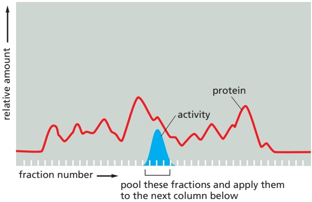

(C) AFFINITY CHROMATOGRAPHY

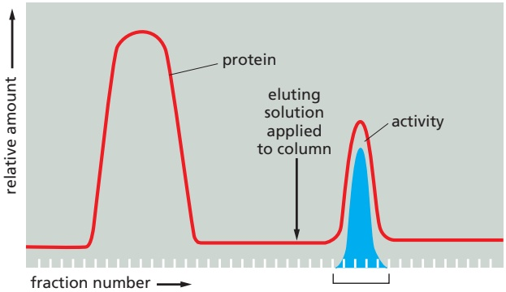

pool these fractions, which now contain the highly purified protein

Figure 8–10 Protein purification by Figur

Imperfections in the matrices (such as cellulose), which cause an uneven flow of solvent through the column, limit the resolution of conventional column chromatography. Special chromatography resins (usually silica-based) composed of tiny spheres (3–10 μm in diameter) can be packed with a special apparatus to form a uniform column bed. Such **high-performance liquid chromatography (HPLC)** columns attain a high degree of resolution. In HPLC, the solutes are passed through the column at high pressure and equilibrate very rapidly with the interior of the tiny spheres, and so solutes with different affinities for the matrix are efficiently separated from one another even at very fast flow rates. HPLC is therefore the method of choice for separating many proteins and small molecules.

chromatography. Typical results obtained when three different chromatographic steps are used in succession to purify a protein. In this example, a homogenate of cells was first fractionated by allowing it to percolate through an ion-exchange resin packed into a column (A). The column was washed to remove all unbound contaminants, and the bound proteins were then eluted by pouring a solution containing a gradually increasing concentration of salt onto the top of the column. Proteins with the lowest affinity for the ion-exchange resin passed directly through the column and were collected in the earliest fractions eluted from the bottom of the column. The remaining proteins were eluted in sequence according to their affinity for the resin—those proteins binding most tightly to the resin requiring the highest concentration of salt to remove them. The protein of interest was eluted in several fractions and was detected by its enzymatic activity. The fractions with activity were pooled and then applied to a gel-filtration column (B). The elution position of the still-impure protein was again determined by its enzymatic activity, and the active fractions were pooled and purified to homogeneity on an affinity column (C) that contained an immobilized substrate of the enzyme.

#### Immunoprecipitation Is a Rapid Affinity Purification Method

Immunoprecipitation is a useful variation on the theme of affinity chromatography. Specific antibodies that recognize the protein to be purified are attached to small agarose beads. Rather than being packed into a column, as in affinity chromatography, a small quantity of the antibody-coated beads is simply added to a protein extract in a test tube and mixed in suspension for a short period of time— thereby allowing the antibodies to bind the desired protein. The beads are then collected by low-speed centrifugation, and the unbound proteins in the supernatant are discarded. This method is commonly used to purify small amounts of enzymes from cell extracts for analysis of enzymatic activity or for identification of associated proteins. As we describe later in this chapter, immunoprecipitation also provides a method to identify DNA or RNA sequences recognized by specific proteins.

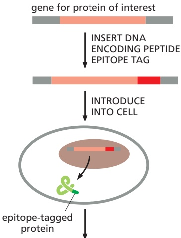

#### Genetically Engineered Tags Provide an Easy Way to Purify Proteins

rapid purification of tagged protein and any associated proteins

Using the recombinant DNA methods discussed later in this chapter, any gene can be modified to produce its protein with an extra amino acid sequence that provides a specific recognition tag, so as to make subsequent purification of the protein simple and rapid. Often the recognition tag is an antigenic determinant, or epitope, which can be recognized by a highly specific monoclonal antibody. The antibody can then be used to purify the protein by affinity chromatography or immunoprecipitation (**Figure 8–11**). Other types of tags are specifically designed for protein purification. For example, a repeated sequence of the amino acid histidine binds to certain metal ions, including nickel and copper. If genetic-engineering techniques are used to attach a short string of histidines to one end of a protein, the slightly modified protein can be retained selectively on an affinity column containing immobilized nickel ions. Metal affinity chromatography can thereby be used to purify the modified protein from a complex molecular mixture.

Figure 8–11 Epitope tagging for the purification of proteins. Using standard genetic-engineering techniques, a short amino acid sequence can be added to a protein of interest. If the tag is an antigenic determinant, or epitope, it can be targeted by an appropriate antibody, which can be used to purify the protein by immunoprecipitation or affinity chromatography.

In other cases, an entire protein is used as the recognition tag. When cells are engineered to synthesize the small enzyme glutathione S-transferase (GST) attached to a protein of interest, the resulting **fusion protein** can be purified from the other contents of the cell with an affinity column containing glutathione, a substrate molecule that binds specifically and tightly to GST.

As a further refinement of purification methods using recognition tags, an amino acid sequence that forms a cleavage site for a highly specific proteolytic enzyme can be engineered between the protein of choice and the recognition tag. Because the amino acid sequences at the cleavage site are very rarely found by chance in proteins, the tag can later be cleaved off without destroying the purified protein.

This type of specific cleavage is used in an especially powerful purification methodology known as tandem affinity purification tagging (TAP-tagging). Here, one end of a protein is engineered to contain two recognition tags that are separated by a protease cleavage site. The tag on the very end of the construct is chosen to bind irreversibly to an affinity column, allowing the column to be washed extensively to remove all contaminating proteins. Protease cleavage then releases the protein, which is then further purified using the second tag. Because this two-step strategy provides an especially high degree of protein purification with relatively little effort, it is used extensively in cell biology.

#### Purified Cell-free Systems Are Required for the Precise Dissection of Molecular Functions

**Purified cell-free systems** provide a means of studying biological processes free from all of the complex side reactions that occur in a living cell. To make this possible, cell homogenates are fractionated with the aim of purifying each of the

individual macromolecules that are needed to catalyze a biological process of interest. For example, the experiments to decipher the mechanisms of protein synthesis began with a cell homogenate that could translate RNA molecules to produce proteins. Fractionation of this homogenate, step by step, produced in turn the ribosomes, tRNAs, and various enzymes that together constitute the protein-synthetic machinery. Once individual pure components were available, each could be added or withheld separately to define its exact role in the overall process.

A major goal for cell biologists is the reconstitution of every biological process in a purified cell-free system. Only in this way can we define all of the components needed for the process and control their concentrations, which is required to work out their precise mechanism of action. Although much remains to be done, a great deal of what we know today about the molecular biology of the cell has been discovered by studies in such cell-free systems. They have been used, for example, to decipher the molecular details of DNA replication and DNA transcription, RNA splicing, protein translation, muscle contraction, particle transport along microtubules, and many other processes that occur in cells.

#### Summary

Populations of cells can be analyzed biochemically by disrupting them and fractionating their contents, allowing functional cell-free systems to be developed. Highly purified cell-free systems are needed for determining the molecular details of complex cell processes, and the development of such systems requires extensive purification of all the proteins and other components involved. The proteins in soluble cell extracts can be purified by column chromatography; depending on the type of column matrix, biologically active proteins can be separated on the basis of their molecular weight, hydrophobicity, charge characteristics, or affinity for other molecules. In a typical purification, the sample is passed through several different columns in turn, with the enriched fractions obtained from one column being applied to the next. Recombinant DNA techniques (described later) allow special recognition tags to be attached to proteins, thereby greatly simplifying their purification.

#### ANALYZING PROTEINS

Proteins perform most cellular processes: they catalyze metabolic reactions, use nucleotide hydrolysis to do mechanical work, and serve as the major structural elements of the cell. The great variety of protein structures and functions has stimulated the development of a multitude of techniques to study them.

#### Proteins Can Be Separated by SDS Polyacrylamide-Gel Electrophoresis

Proteins usually possess a net positive or negative charge, depending on the mixture of charged amino acids they contain. An electric field applied to a solution containing a protein molecule causes the protein to migrate at a rate that depends on its net charge and on its size and shape. The most useful application of this property is **sodium dodecyl sulfate polyacrylamide-gel electrophoresis (SDS-PAGE)**. It uses a highly cross-linked gel of polyacrylamide as the inert matrix through which the proteins migrate. The gel is prepared by polymerization of monomers; the pore size of the gel can be adjusted so that it is small enough to retard the migration of the protein molecules of interest. The proteins are dissolved in a solution that includes a powerful negatively charged detergent, sodium dodecyl sulfate, or SDS (**Figure 8–12**). Because this detergent binds to hydrophobic regions of the protein molecules, causing them to unfold into extended polypeptide chains, the individual protein molecules are released from their associations with other proteins or lipid molecules and rendered freely soluble in the detergent solution. In addition, a reducing agent such as β-mercaptoethanol (see Figure 8–12) is usually added to break any disulfide linkages in the proteins, so that all of the constituent polypeptides in multisubunit proteins can be analyzed separately.

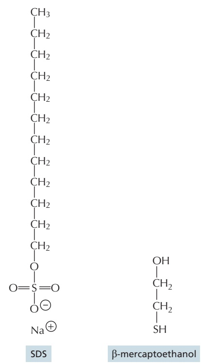

Figure 8–12 The detergent sodium dodecyl sulfate (SDS) and the reducing agent b-mercaptoethanol. These two chemicals are used to solubilize proteins for SDS polyacrylamide-gel electrophoresis. The SDS is shown here in its ionized form.

What happens when a mixture of SDS-solubilized proteins is run through a slab of polyacrylamide gel? Each protein molecule binds large numbers of the negatively charged detergent molecules, which mask the protein’s intrinsic charge and cause it to migrate toward the positive electrode when a voltage is applied. Proteins of the same size tend to move through the gel with similar speeds because (1) their native structure is completely unfolded by the SDS, so that their shapes are the same, and (2) they bind the same amount of SDS and therefore have the same amount of negative charge. Larger proteins, with more charge, are subjected to larger electrical forces but also to a larger drag. In free solution, the two effects would cancel out, but, in the mesh of the polyacrylamide gel, which acts as a molecular sieve, large proteins are retarded much more than small ones. As a result, a complex mixture of proteins is fractionated into a series of discrete protein bands mostly according to their mass (**Figure 8–13**). The major proteins are readily detected by staining the proteins in the gel with a dye such as Coomassie blue. When small amounts of protein are present and more sensitive methods are required, gels can be treated with a silver stain, which will detect as little as 10 ng of protein in a band. For some purposes, specific proteins can also be labeled with a radioactive isotope tag; exposure of the gel to film or a radiation detector results in an autoradiograph on which the labeled proteins are visible (see Figure 8–16).

SDS-PAGE is widely used because it can separate all types of proteins, including those that are normally insoluble in water—such as the many proteins in

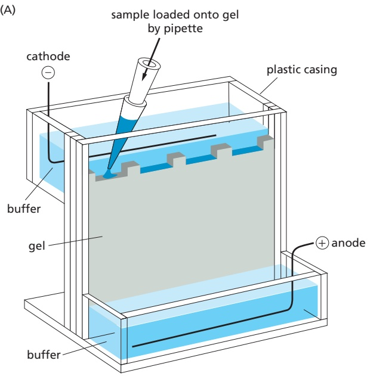

Figure 8–13 SDS polyacrylamide-gel electrophoresis (SDS-PAGE). (A) An electrophoresis apparatus, in which a polyacrylamide gel is sandwiched between two glass plates, with each end of the gel immersed in a buffer connected to an electrode. (B) Individual polypeptide chains form a complex with negatively charged molecules of sodium dodecyl sulfate (SDS) and therefore migrate as a negatively charged SDS–protein complex through a porous gel of polyacrylamide. Because smaller polypeptides move more quickly through the gel, this technique can be used to determine the approximate mass of a polypeptide chain as well as the subunit composition of a protein complex. If the protein contains a large amount of carbohydrate, however, it will move anomalously on the gel, and its apparent mass estimated by SDS-PAGE will be misleading. Other modifications, such as phosphorylation, can also cause small changes in a protein’s migration in the gel.

(B)


Figure 8–14 Analysis of protein samples by SDS polyacrylamide-gel electrophoresis. The photograph shows a Coomassie blue–stained gel that has been used to detect the proteins present at successive stages in the purification of an enzyme. The leftmost lane (lane 1) contains the complex mixture of proteins in the starting cell extract, and each succeeding lane analyzes the proteins obtained after a chromatographic fractionation of the protein sample analyzed in the previous lane (see Figure 8–10). The same total amount of protein (10 μg) was loaded onto the gel at the top of each lane. Individual proteins normally appear as sharp, dye-stained bands; a band broadens, however, when it contains a large amount of protein. (From T. Formosa and B.M. Alberts, J. Biol. Chem. 261:6107–6118, 1986.)

membranes. And because the method separates polypeptides by size, it provides information about the mass and subunit composition of proteins. **Figure 8–14** presents a photograph of a gel that has been used to analyze each of the successive stages in the purification of a protein.

#### Two-dimensional Gel Electrophoresis Provides Greater Protein Separation

Because different proteins can have similar sizes, shapes, masses, and overall charges, most separation techniques such as SDS polyacrylamide-gel electrophoresis or ion-exchange chromatography cannot typically separate all the proteins in a cell or even in an organelle. In contrast, **two-dimensional gel electrophoresis**, which combines two different separation procedures, can resolve up to 2000 proteins in the form of a two-dimensional protein map.


In the first step, the proteins are separated by their intrinsic charges. The sample is dissolved in a small volume of a solution containing a nonionic (uncharged) detergent, together with β-mercaptoethanol and the denaturing reagent urea. This solution solubilizes, denatures, and dissociates all the polypeptide chains but leaves their intrinsic charge unchanged. The polypeptide chains are then separated in a pH gradient by a procedure called isoelectric focusing, which takes advantage of the variation in the net charge on a protein molecule with the pH of its surrounding solution. Every protein has a characteristic isoelectric point, the pH at which the protein has no net charge and therefore does not migrate in an electric field. In isoelectric focusing, proteins are separated electrophoretically in a narrow tube of polyacrylamide gel in which a gradient of pH is established by a mixture of special buffers. Each protein moves to a position in the gradient that corresponds to its isoelectric point and remains there (**Figure 8–15**). This is the first dimension of two-dimensional polyacrylamide-gel electrophoresis.

In the second step, the narrow tube of gel containing the separated proteins is soaked in SDS and placed along the top edge of an SDS polyacrylamide-gel slab. Electrophoresis is then carried out as in one-dimensional SDS-PAGE, and each polypeptide chain migrates into the gel to form a discrete spot. The only proteins left unresolved are those that have both identical sizes and identical isoelectric points, a relatively rare situation. Even trace amounts of each polypeptide chain can be detected on the gel by various staining procedures—or by autoradiography if the protein sample was initially labeled with a radioisotope (**Figure 8–16**). The technique has such great resolving power that it can distinguish between two proteins that differ in only a single charged amino acid or a single negatively charged phosphorylation site.

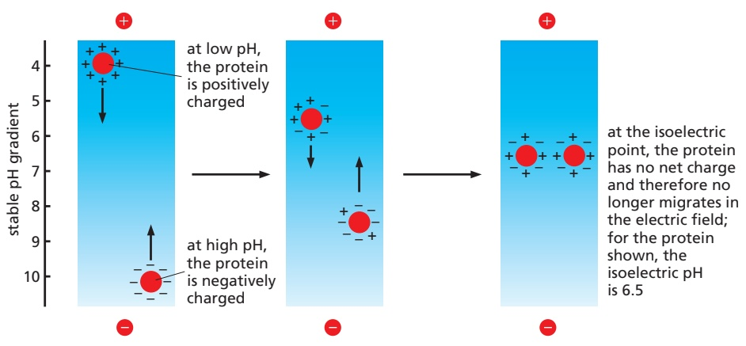

Figure 8–15 Separation of protein molecules by isoelectric focusing. At low pH (high H+ concentration), the carboxylic acid groups of proteins tend to be uncharged (–COOH) and their nitrogencontaining basic groups fully charged (for example, –NH<sub>3</sub>+), giving most proteins a net positive charge. At high pH, the carboxylic acid groups are negatively charged (–COO–) and the basic groups tend to be uncharged (for example, –NH<sub>2</sub>), giving most proteins a net negative charge. At its isoelectric point, a protein has no net charge because the positive and negative charges balance. Thus, when a tube containing a fixed pH gradient is subjected to a strong electric field in the appropriate direction, each protein species migrates until it forms a sharp band at its isoelectric point, as shown.

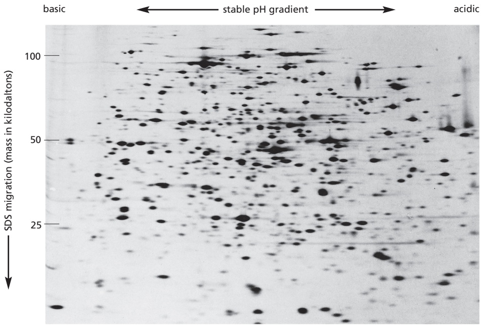

Figure 8–16 Two-dimensional polyacrylamide-gel electrophoresis. All the proteins in an Escherichia coli bacterial cell are separated in this gel, in which each spot corresponds to a different polypeptide chain. The proteins were first separated on the basis of their isoelectric points by isoelectric focusing in the horizontal dimension. They were then further fractionated according to their mass by electrophoresis from top to bottom in the presence of SDS. Note that different proteins are present in very different amounts. The bacteria were fed with a mixture of radioisotope-labeled amino acids so that all of their proteins were radioactive and could be detected by autoradiography. (Courtesy of Patrick O’Farrell.)

#### Specific Proteins Can Be Detected by Blotting with Antibodies

A specific protein can be identified after its fractionation on a polyacrylamide gel by exposing all the proteins on the gel to a specific antibody that has been labeled with a radioactive isotope or a fluorescent dye. This procedure is normally carried out after transferring all of the separated proteins in the gel onto a sheet of nitrocellulose paper or nylon membrane. Placing the membrane against the gel and driving the proteins out of the gel with a strong electric current transfers the protein onto the membrane. The membrane is then soaked in a solution of labeled antibody to reveal the protein of interest. This method of detecting proteins is called **Western blotting**, or **immunoblotting** (**Figure 8–17**). Sensitive Westernblotting methods can detect very small amounts of a specific protein (1 nanogram or less) in a total cell extract or some other heterogeneous protein mixture. The method can be very useful when assessing the amounts of a specific protein in the cell or when measuring changes in those amounts under various conditions.

#### Hydrodynamic Measurements Reveal the Size and Shape of a Protein Complex

Most proteins in a cell are subunits of larger complexes, and knowledge of the size and shape of these complexes often leads to insights regarding their function. This information can be obtained in several ways. Sometimes, a complex can be directly visualized using electron microscopy, as described in Chapter 9. A complementary approach relies on the hydrodynamic properties of a complex; that is, its behavior as it moves through a liquid medium. Usually, two separate measurements are made. One measure is the velocity of a complex as it moves under the influence of a centrifugal field produced by an ultracentrifuge (see Figure 8–6A). The sedimentation coefficient (or S value) obtained depends on both the size and the shape of the complex and does not, by itself, convey especially useful information. However, once a second hydrodynamic measurement is performed—by charting the migration of a complex through a gel-filtration chromatography column (see Figure 8–9B)—both the approximate shape of a complex and its mass can be calculated.

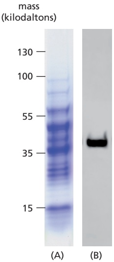

Figure 8–17 Western blotting. In this experiment, proteins of the budding yeast Saccharomyces cerevisiae were separated MBoC7 n8.101/8.17on a polyacrylamide gel. In (A), the gel was stained with Coomassie blue to reveal the most abundant proteins. In (B), the proteins in the gel were transferred to a membrane and exposed to antibodies directed against a specific protein. Unbound antibodies were washed away, and antibodies bound to the protein were detected with a fluorescent label. By this sensitive Western blotting method, small amounts of a single rare protein can be detected in a complex mixture of other proteins. (Courtesy of Jonathan Asfaha.)

The mass of a protein complex can also be determined more directly by using an analytical ultracentrifuge, a complex device that allows protein absorbance measurements to be made on a sample while it is subjected to centrifugal forces. In this approach, the sample is centrifuged until it reaches equilibrium, where the centrifugal force on a protein complex exactly balances its tendency to diffuse away. Because this balancing point is dependent on a complex’s mass but not on its particular shape, the mass can be directly calculated.

#### Mass Spectrometry Provides a Highly Sensitive Method for Identifying Unknown Proteins

A frequent problem in cell biology and biochemistry is the identification of a protein or collection of proteins that has been obtained by one of the purification procedures discussed in the preceding pages. Because the genome sequences of most experimental organisms are known, catalogs of all the proteins produced in those organisms are available. The task of identifying an unknown protein (or collection of unknown proteins) thus reduces to matching some of the amino acid sequences present in the unknown sample with known cataloged genes. This task is now performed almost exclusively by mass spectrometry in conjunction with computer searches of databases.

Charged particles have very precise dynamics when subjected to electric and magnetic fields in a vacuum. Mass spectrometry exploits this principle to separate ions according to their mass-to-charge (m/z) ratio. It is an enormously sensitive technique. It requires very little material and is capable of determining the pre-cise mass of intact proteins and of peptides derived from them by enzymatic or chemical cleavage. Masses can be obtained with great accuracy, often with an error of less than one part in a million.

Mass spectrometry is performed using complex instruments with three major components (**Figure 8–18A**). The first is the ion source, which transforms tiny amounts of a peptide sample into a gas containing individual charged peptide molecules. These ions are accelerated by an electric field into the second component, the mass analyzer, where electric or magnetic fields are used to separate the ions on the basis of their mass-to-charge ratios. Finally, the separated ions collide with a detector, which generates a mass spectrum containing a series of peaks representing the masses of the molecules in the sample.

There are many different types of mass spectrometer, varying mainly in the nature of their ion sources and mass analyzers. One of the most common ion sources depends on a technique called matrix-assisted laser desorption ionization (MALDI). In this approach, the proteins in the sample are first cleaved into short peptides by a protease such as trypsin. These peptides are mixed with an organic acid and then dried onto a metal or ceramic slide. A brief laser burst is directed toward the sample, producing a gaseous puff of ionized peptides, each carrying one or more positive charges. In many cases, the MALDI ion source is coupled to a mass analyzer called a time-of-flight (TOF) analyzer, which is a long chamber through which the ionized peptides are accelerated by an electric field toward a detector. Their mass and charge determine the time it takes them to reach the detector: large peptides move more slowly, and more highly charged molecules move more quickly. By analyzing those ionized peptides that bear a single charge, the precise masses of peptides present in the original sample can be determined. This information is then used to search genomic databases, in which the masses of all proteins and of all their predicted peptide fragments have been tabulated from the genomic sequences of the organism. An unambiguous match to a particular open reading frame can often be made by knowing the mass of only a few peptides derived from a given protein.

By employing two mass analyzers in tandem (an arrangement known as tandem mass spectrometry, or MS/MS; **Figure 8–18B**), it is possible to directly determine the amino acid sequences of individual peptides in a complex mixture.


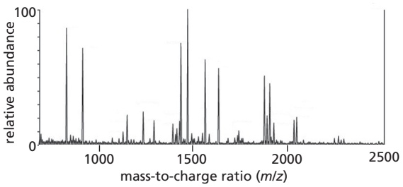


Figure 8–18 The mass spectrometer. (A) Mass spectrometers used in biology contain an ion source that generates gaseous peptides or other molecules under conditions that render most molecules positively charged. The two major types of ion source are MALDI and electrospray, as described in the text. Ions are accelerated into a mass analyzer, which separates the ions on the basis of their mass and charge by one of three major methods: (1) Time-of-flight (TOF) analyzers determine MBoC7 m8.18/8.18the mass-to-charge ratio of each ion in the mixture from the rate at which it travels from the ion source to the detector. (2) Quadrupole mass filters contain a long chamber lined by four electrodes that produce oscillating electric fields that govern the trajectory of ions; by varying the properties of the electric field over a wide range, a spectrum of ions with specific mass-to-charge ratios is allowed to pass through the chamber to the detector, while other ions are discarded. (3) Ion traps contain doughnut-shaped electrodes producing a three-dimensional electric field that traps all ions in a circular chamber; the properties of the electric field can be varied over a wide range to eject a spectrum of specific ions to a detector. (B) Tandem mass spectrometry typically involves two mass analyzers separated by a collision chamber containing an inert, high-energy gas. The electric field of the first mass analyzer is adjusted to select a specific peptide ion, called a precursor ion, which is then directed to the collision chamber. Collision of the peptide with gas molecules causes random peptide fragmentation, primarily at peptide bonds, resulting in a highly complex mixture of fragments containing one or more amino acids from throughout the original peptide. The second mass analyzer is then used to measure the masses of the fragments (called product or daughter ions). With computer assistance, the pattern of fragments can be used to deduce the amino acid sequence of the original peptide.

The MALDI-TOF instrument described above is not ideal for this method. Instead, MS/MS typically involves an electrospray ion source, which produces a continuous thin stream of peptides that are ionized and accelerated into the first mass analyzer. The mass analyzer is typically either a quadrupole or ion trap, which employs large electrodes to produce oscillating electric fields inside the chamber containing the ions. These instruments act as mass filters: the electric field is adjusted over a broad range to select a single peptide ion and discard all the others in the peptide mixture. In tandem mass spectrometry, this single ion is then exposed to an inert, high-energy gas, which collides with the peptide, resulting in fragmentation, primarily at peptide bonds. The second mass analyzer then determines the masses of the peptide fragments, which can be used by computational methods to determine the amino acid sequence of the original peptide and thereby identify the protein from which it came.

Tandem mass spectrometry is also useful for detecting and precisely mapping post-translational modifications of proteins, such as phosphorylation or acetylation. Because these modifications impart a characteristic mass increase to an amino acid, they are easily detected during the analysis of peptide fragments in the second mass analyzer, and the precise site of the modification can often be deduced from the spectrum of peptide fragments.

A powerful, “two-dimensional” mass spectrometry technique can be used to determine all of the proteins present in an organelle or another complex mixture of proteins. First, the mixture of proteins present is digested with trypsin to produce short peptides. Next, these peptides are separated by an automated highperformance form of liquid chromatography (LC). Every peptide fraction from the chromatographic column is injected directly into an electrospray ion source on a tandem mass spectrometer, providing the amino acid sequence and post-translational modifications for every peptide in the mixture. This method, often called LC-MS/MS, is used to identify hundreds or thousands of proteins in complex protein mixtures from specific organelles or from whole cells. It can also be used to map all of the phosphorylation sites in the cell, or all of the proteins targeted by other post-translational modifications such as acetylation or ubiquitylation.

#### Sets of Interacting Proteins Can Be Identified by Biochemical Methods

Because most proteins in the cell function as part of complexes with other proteins, an important way to begin to characterize the biological role of an unknown protein is to identify all of the other proteins to which it specifically binds.

A key method for identifying proteins that bind to one another tightly is co-immunoprecipitation. A target protein is immunoprecipitated from a cell lysate using specific antibodies coupled to beads, as described earlier. If the target protein is associated tightly enough with another protein when it is captured by the antibody, the partner precipitates as well and can be identified by mass spectrometry. This method is useful for identifying proteins that are part of a complex inside cells, including those that interact only transiently; for example, when extracellular signal molecules stimulate cells (discussed in Chapter 15).


<!-- END EN EN08-H007-H021 -->

<a id="EN08-H023-H041"></a>

### 英文补充：结构分析、核酸操作、PCR与测序

> 对应中文板块：结构分析、核酸操作、PCR与测序。英文来源：Molecular Biology of the Cell，第7版，第8章；[本章完整原文](../../来源/英文教材/08_Analyzing_Cells_Molecules_and_Systems/chapter.md)。物理PDF页码范围：514–601（整章范围）。

<!-- BEGIN EN EN08-H023-H041 -->
#### Protein Structure Can Be Determined Using X-ray Diffraction

A deep understanding of protein function in the cell requires knowledge of its three-dimensional structure at atomic resolution, revealing the precise position of every amino acid in the protein. Structural analysis provides powerful insights into the mechanisms underlying a protein’s enzymatic activity and its interactions with other proteins or small molecules. Numerous methods are used to unravel protein structure. In this chapter, we discuss well-established methods that depend on x-ray crystallography and nuclear magnetic resonance spectroscopy. Chapter 9 describes recently developed methods by which electron microscopy is being used to determine the high-resolution structures of larger proteins and protein complexes.

For many decades, the primary technique for protein structural analysis has been **x-ray crystallography**. X-rays, like light, are a form of electromagnetic radiation, but they have a much shorter wavelength, typically around 0.1 nm (the diameter of a hydrogen atom). If a narrow beam of parallel x-rays is directed at a sample of a pure protein, most of the x-rays pass straight through it. A small fraction, however, is scattered by the atoms in the sample. If the sample is a wellordered crystal, the scattered waves reinforce one another at certain points and appear as diffraction spots when recorded by a suitable detector (**Figure 8–20**).

The slowest step in this technique is likely to be the generation of suitable protein crystals. This step requires large amounts of very pure protein and often involves

Figure 8–19 Measurement of binding with fluorescence anisotropy. This method depends on a fluorescently tagged protein that is illuminated with polarized light at the appropriate wavelength for excitation; a fluorimeter is used to measure the intensity and polarization of the emitted light. If the fluorescent protein is fixed in position and therefore does not rotate during the brief period between excitation and emission, then the emitted light will be polarized at the same angle as the excitation light. This directional effect is called fluorescence anisotropy. Protein molecules in solution rotate or tumble rapidly, however, so that there is a decrease in the amount of anisotropic fluorescence. Larger molecules tumble at a slower rate and therefore have higher fluorescence anisotropy. (A) To measure the binding between a small molecule and a large receptor protein, the smaller molecule is labeled with a fluorophore. In the absence of its binding partner, the molecule tumbles rapidly, resulting in low fluorescence anisotropy (top). When the small molecule binds to its larger partner, however, it tumbles less rapidly, resulting in an increase in fluorescence anisotropy (bottom). (B) In the equilibrium binding experiment shown here, a small, fluorescent peptide ligand was present at a low concentration, and the amount of fluorescence anisotropy (in millipolarization units; mP) was measured after incubation with various concentrations of a larger protein receptor for the ligand. From the hyperbolic curve that fits the data, it can be seen that 50% binding occurred at about 10 μM, which is equal to the dissociation constant $K _ { \mathrm { d } }$ for the binding interaction.

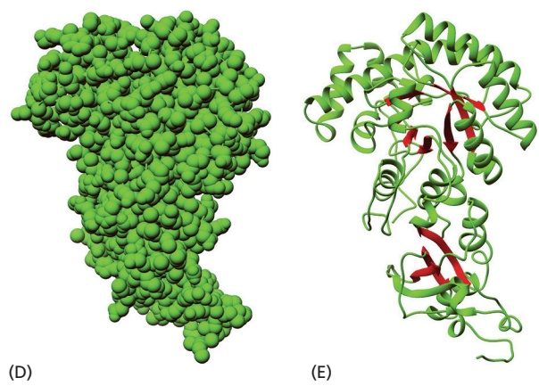


Figure 8–20 X-ray crystallography. (A) A narrow beam of x-rays is directed at a well-ordered crystal (B). Shown here is a protein crystal of ribulose 1,5-bisphosphate carboxylase/oxygenase (Rubisco), an enzyme with a central role in CO<sub>2</sub> fixation during photosynthesis. The atoms in the crystal scatter some of the beam, and the scattered waves reinforce one another at certain points and appear as a pattern of diffraction spots (C). This diffraction pattern, together with the amino acid sequence of the protein, can be used to produce an atomic model (D). A simplified version of the model (E) shows the protein’s main structural features more clearly (α helices, green; β strands, red). The components pictured in A–E are not shown to scale. (B, courtesy of C. Branden; C, courtesy of J. Hajdu and I. Andersson; D and E, PDB code: 1RBL.)

years of trial and error to discover the proper crystallization conditions; the pace has greatly accelerated with the use of recombinant DNA techniques to produce pure proteins and robotic techniques to test large numbers of crystallization conditions.

The position and intensity of each spot in the x-ray diffraction pattern contain information about the locations of the atoms in the crystal that gave rise to it. Computer-assisted computational methods process the diffraction pattern to generate a three-dimensional electron-density map. Interpreting this map—translating its contours into a three-dimensional structure—can be a laborious procedure. Largely by trial and error, the sequence and the electron-density map are correlated by computer to give the best possible fit. The reliability of the final atomic model depends on the resolution of the original crystallographic data: 0.5-nm resolution might produce a low-resolution map of the polypeptide backbone, whereas a resolution of 0.15 nm allows all of the non-hydrogen atoms in the molecule to be reliably positioned.

A complete atomic model is often too complex to appreciate directly, but simplified versions that show a protein’s essential structural features can be readily derived from it. The three-dimensional structures of tens of thousands of differentMBoC7 m8.21/8.20 proteins have been determined—enough to allow the grouping of common structures into families (**Movie 8.1**). These structures or protein folds often seem to be more conserved in evolution than are the amino acid sequences that form them (see Figure 3–13).

#### NMR Can Be Used to Determine Protein Structure in Solution

**Nuclear magnetic resonance (NMR) spectroscopy** has been widely used for many years to analyze the structure of small molecules, small proteins, or protein domains. Unlike x-ray crystallography, NMR does not depend on having a crystalline sample. It simply requires a small volume of concentrated protein solution that is placed in a strong magnetic field; indeed, it is the main technique that yields detailed evidence about the three-dimensional structure of molecules in solution.

Certain atomic nuclei, particularly hydrogen nuclei, have a magnetic moment or spin; that is, they have an intrinsic magnetization, like a bar magnet. When exposed to a strong magnetic field in an NMR experiment, the spin of these nuclei aligns with the magnetic field, but it can be forced into a misaligned, excited state by radiofrequency (RF) pulses of electromagnetic radiation. As the excited hydrogen nuclei return to their aligned state, they emit RF radiation, which can be measured and displayed as a spectrum. The signal of the emitted radiation, called the chemical shift, depends on the environment of each hydrogen nucleus, such that every nucleus in a protein displays a slightly different chemical shift. Furthermore, if one nucleus is excited, it influences the absorption and emission of radiation by other nuclei that lie close to it. It is consequently possible, by an ingenious elaboration of the basic NMR technique known as two-dimensional (2D) NMR, to distinguish the signals from hydrogen nuclei in different amino acid residues and to identify and measure the small changes in these signals that occur when these hydrogen nuclei lie close enough together to interact. Because the size of such a change reveals the distance between the interacting pair of hydrogen atoms, NMR can provide information about the distances between the parts of the protein molecule. Additional information can be gained by heteronuclear 2D NMR, which analyzes hydrogen nuclei in parallel with the nuclei of a nitrogen isotope. By combining this information with a knowledge of the amino acid sequence, it is possible in principle to compute the threedimensional structure of the protein (**Figure 8–21**). For technical reasons, NMR spectroscopy is used primarily to determine the structure of small proteins of about 30,000 daltons or less.

Because NMR studies are performed in solution, this method also offers a convenient means of monitoring changes in protein structure; for example, during protein folding or when the protein binds to another molecule. NMR is also used widely to investigate molecules other than proteins and is valuable, for example, as a method to determine the three-dimensional structures of RNA molecules and the complex carbohydrate side chains of glycoproteins.

(A)


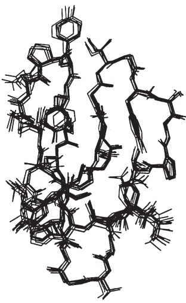

(B)

Figure 8–21 NMR spectroscopy. (A) An example of the data from an NMR machine. This NMR spectrum, displaying chemical shifts of hydrogen nuclei in two dimensions, is derived from the C-terminal domain of the enzyme cellulase. The spots away from the diagonal represent interactions between hydrogen atoms that are near neighbors in the protein; their positions reflect the distance that separates them. Complex computing methods, in conjunction with the known amino acid sequence, enable possible compatible structures to be derived. (B) Ten structures of the enzyme, all of which satisfy the distance constraints equally well, are shown superimposed on one another, giving a good indication of the probable three-dimensional structure. (Courtesy of P. Kraulis.)

A major problem in structural biology is the analysis of large protein complexes, which are difficult to crystallize and too large for NMR analysis. Singleparticle analysis by cryo-electron microscopy provides a relatively straightforward approach to the analysis of large macromolecular assemblies, as we describe in Chapter 9.

#### Protein Sequence and Structure Provide Clues About Protein Function

Having discussed methods for purifying and analyzing proteins, we now turn to a common situation in cell and molecular biology: an investigator has identified a gene important for a biological process but has no direct knowledge of the biochemical properties of its protein product.

Thanks to the proliferation of protein and nucleic acid sequences that are cataloged in genome databases, the function of a gene—and its encoded protein—can often be predicted by simply comparing its sequence with those of previously characterized genes. Because amino acid sequence determines protein structure, and structure dictates biochemical function, proteins that share a similar amino acid sequence usually have the same structure and usually perform similar biochemical functions, even when they are found in distantly related organisms. Thus, the study of a newly discovered protein usually begins with a search for previously characterized proteins that are similar in their amino acid sequences.

Searching a collection of known sequences for similar genes or proteins simply involves selecting a database and entering the desired sequence. A sequencealignment program—the most popular is BLAST (Basic Local Alignment Search Tool)—scans the database for similar sequences by sliding the submitted sequence along the archived sequences until a cluster of residues falls into full or partial alignment (**Figure 8–22**).

As was explained in Chapter 3, many proteins that adopt the same conformation and have related functions are too distantly related to be identified from a comparison of their amino acid sequences alone (see Figure 3–13). Thus, an ability to reliably predict the three-dimensional structure of a protein from its amino acid sequence would improve our ability to infer protein function from the sequence information in genomic databases. In recent years, major progress has been made in predicting the precise structure of a protein. These predictions are based, in part, on our knowledge of the thousands of protein structures that have already been determined by x-ray crystallography and NMR spectroscopy and, in part, on computations using our knowledge of the physical forces acting on the atoms. However, it remains a substantial and important challenge to predict

```txt
Score = 399 bits (1025), Expect = e-111
Identities = 198/290 (68%), Positives = 241/290 (82%), Gaps = 1/290

Query: 57 MENFQKVEKIGEGTYGVVYKARNKLTGEVVALKKIRLDTETEGVPSTAIRESILLKELNH 116
ME ++KVEKIGEGTYGVVYKA +K T E +ALKKIRL+ E EGVPSTAIRESILLKE+NH
Sbjct: 1 MEQYEKVEKIGEGTYGVVYKALDKATNETIALKKIRLEQEDEGVPSTAIRESILLKEMNH 60

Query: 117 PNIVKLLDVIHTENKLYLVFEFLHQDLKKFMDASALTGIPLPLIKSYLFQLLOGLAFCHS 176
NIV+L DV+H+E ++YLVFE+L DLKKFMD+ LIKSYL+Q+L G+A+CHS
Sbjct: 61 GNIVRLHDVVHSEKRIYLVFEYLDLDLKFFMDSCPEFAKNPTLIKSYLYQILHGVAYCHS 120

Query: 177 HRVLHRDLKPQNLLINTE-GAIKLADFGLARAFGVPVRTYTHEVVTLWYRAPEILLGCKY 235
HRVLHRDLKPQNLLI+ A+KLADFGLARAFG+PVRT+THEVVTLWYRAPEILLG +
Sbjct: 121 HRVLHRDLKPQNLLIDRRTNALKLADFGLARAFGIPVRTFTHEVVTLWYRAPEILLGARQ 180

Query: 236 YSTAVDIWSLGCIFAEMVTRRALFPGDSEIDQLFRIFRTLGTPDEVVWPGVTSMPDYKPS 295
YST VD+WS+GCIFAEMV ++ LFPGDSEID+LF+IFR LGTP+E WPGV+ +PD+K +
Sbjct: 181 YSTPVDVWSVGCIFAEMVNQKPLFPGDSEIDELFKIFRILGTPNEQSWPGVSCLPDFKTA 240

Query: 296 FPKWARQDFSKVVPLDEDGRSLLSQMLHYDPNKRISAKAALAHPFFQDV 345
FP+W QD + VVP LD G LLS+ML Y+P+KRI+A+ AL H +F+D+
Sbjct: 241 FPRWQAQDLATVVPNLDPAGLDLLSKMLRYEPSKRITARQALEHEYFKDL 290
```

Figure 8–22 Results of a BLAST search. Sequence databases can be searched to find similar amino acid or nucleic acid sequences. Here, a search for proteins similar to the human cell-cycle regulatory protein Cdk1 (Query) locates maize Cdk1 (Sbjct), which is 68% identical to human Cdk1 in its amino acid sequence. The alignment begins at residue 57 of the Query protein, suggesting that the human protein has an N-terminal region that is absent from the maize protein. The green blocks indicate differences in sequence, and the yellow bars summarize the similarities: when the two amino acid sequences are identical, the residue is shown; similar amino acid substitutions are indicated by a plus sign (+). Only one small gap has been introduced—indicated by the red arrowhead at position 194 in the Query sequence—to align the two sequences maximally. The alignment score (Score), which is expressed in two different types of units, takes into account penalties for substitutions and gaps; the higher the alignment score, the better the match. The significance of the alignment is reflected in the Expectation (E) value, which specifies how often a match this good would be expected to occur by chance. The lower the E value, the more significant the match; the extremely low value here (e–111) indicates certain significance. E values much higher than 0.1 are unlikely to reflect true relatedness. For example, an E value of 0.1 means there is a 1 in 10 likelihood that such a match would arise solely by chance.

the structures of proteins that are large or have multiple domains or to predict structures at the very high levels of resolution needed to assist in computer-based drug discovery.

While finding related sequences and structures for a new protein will provide many clues about its function, it is usually necessary to test these insights through direct experimentation. However, the clues generated from sequence comparisons typically point the investigator in the correct experimental direction, and their use has therefore become one of the most important strategies in modern cell biology.

#### Summary

Many methods exist for identifying proteins and analyzing their biochemical properties, structures, and interactions with other proteins. The most powerful and commonly used methods include protein separation by polyacrylamide gel electrophoresis, protein analysis by mass spectrometry, and high-resolution structural determination. Because proteins with similar structures often have similar functions, the biochemical activity of a protein can often be predicted by searching databases for previously characterized proteins that are similar in their amino acid sequences.

#### ANALYZING AND MANIPULATING DNA

Until the early 1970s, DNA was the most difficult biological molecule for the biochemist to analyze. Enormously long and chemically monotonous, the string of nucleotides that forms the genetic material of an organism could be determined only indirectly, from protein sequence or by genetic analysis. Today, the situation has changed entirely. From being the most difficult macromolecule of the cell to analyze, DNA has become the easiest. It is now possible to determine the entire nucleotide sequence of a bacterial or fungal genome in a matter of hours and the sequence of an individual human genome in less than a day. Once the nucleotide sequence of a genome is known, any individual gene can be easily isolated, and large quantities of the gene product (be it RNA or protein) can be made either by introducing the gene into bacteria or animal cells and coaxing these cells to overexpress the foreign gene or by synthesizing the gene product in vitro. In this way, proteins and RNA molecules that might be present in only tiny amounts in living cells can be produced in large quantities for biochemical and structural analyses. And this approach can also be used to produce large quantities of human proteins (such as insulin, or interferon, or blood-clotting proteins) for use as human pharmaceuticals. As we will see later in this chapter, it is also possible for scientists to alter an isolated gene and transfer it back into the germ line of an animal or plant, so as to become a functional and heritable part of the organism’s genome. In this way, the biological roles of any gene can be assessed by observing—in the whole organism—the results of modifying it.

The ability to manipulate DNA with precision in a test tube or an organism, known as **recombinant DNA technology**, has had a dramatic impact on all aspects of cell and molecular biology. We now describe the key features of these techniques.

#### Restriction Nucleases Cut Large DNA Molecules into Specific Fragments

Unlike a protein, a gene does not exist as a discrete entity in cells, but rather as a small region of a much longer DNA molecule. Although the DNA molecules in a cell can be randomly broken into small pieces by mechanical force, a fragment containing a single gene in a mammalian genome would still be only one among a hundred thousand or more DNA fragments, indistinguishable in their average size. How could such a gene be separated from all the others? Because all DNA molecules consist of an approximately equal mixture of the same four

nucleotides, they cannot be readily separated, as proteins can, on the basis of their different charges and biochemical properties. The solution to this problem began to emerge with the discovery of **restriction nucleases**. These enzymes, which are purified from bacteria, cut the DNA double helix at specific sites defined by the local nucleotide sequence, thereby cleaving a long, double-strand DNA molecule into fragments of strictly defined sizes.

Like many of the tools of recombinant DNA technology, restriction nucleases were discovered by researchers trying to understand an intriguing biological phenomenon. It had been observed that certain bacteria always degraded “foreign” DNA that was introduced into them experimentally. A search for the mechanism responsible revealed a then unanticipated class of bacterial nucleases that cleave DNA at specific nucleotide sequences. The bacterium’s own DNA is protected from cleavage by methylation of these same sequences, thereby protecting the bacterium from being overrun by foreign DNA. Because these enzymes restrict the transfer of DNA into bacteria, they were called restriction nucleases. The pursuit of this seemingly arcane biological puzzle set off the development of technologies that have forever changed the way cell and molecular biologists study living things.

Different bacterial species produce different restriction nucleases, each cutting at a different, specific nucleotide sequence (**Figure 8–23**). Because these target sequences are short—generally four to eight nucleotide pairs—many sites of cleavage will occur, purely by chance, in any long DNA molecule. The reason restriction nucleases are so useful in the laboratory is that each enzyme will always cut a particular DNA molecule at the same sites. Thus for a given sample of DNA (which contains many identical molecules), a particular restriction nuclease will reliably generate the same set of DNA fragments.

The size of the resulting fragments depends on the length of the target sequences of the restriction nucleases. As shown in Figure 8–23, the enzyme HaeIII cuts at a sequence of four nucleotide pairs; a sequence this long would be expected to occur purely by chance approximately once every 256 nucleotide pairs (1 in 4<sup>4</sup>). In comparison, a restriction nuclease with a target sequence that is eight nucleotides long would be expected to cleave DNA on average once every 65,536 nucleotide pairs (1 in 4<sup>8</sup>). This difference in sequence selectivity makes it possible to cleave a long DNA molecule into the fragment sizes that are most suitable for a given application.

#### Gel Electrophoresis Separates DNA Molecules of Different Sizes

The same types of gel-electrophoresis methods that have proved so useful in the analysis of proteins (see Figure 8–13) can be applied to DNA molecules. The procedure is actually simpler than for proteins: because each nucleotide in a nucleic acid molecule carries a single negative charge (on the phosphate group), there is no need to add the negatively charged detergent SDS that is required to make protein molecules move uniformly toward the positive electrode. Larger DNA


DNA at specific nucleotide sequences. Like the sequence-specific DNA-binding proteins we encountered in Chapter 7 (see Figure 7–9), restriction enzymes often work as dimers, and the DNA sequence that each restriction enzyme recognizes and cleaves is often symmetrical around a central point. Here, both strands of the DNA double helix are cut at specific points within the target sequence (orange). Some enzymes, such as HaeIII, cut straight across the double helix and leave two blunt-ended DNA molecules; with others, such as EcoRI and HindIII, the cuts on each strand are staggered. These staggered cuts generate “sticky ends”—short, single-strand overhangs that help the cut DNA molecules join back together through complementary basepairing. This rejoining of DNA molecules becomes important for DNA cloning, as we discuss later. Restriction nucleases are usually obtained from bacteria, and their names reflect their origins; for example, the enzyme EcoRI comes from Escherichia coli. Hundreds of different restriction enzymes are commercially available.


(D)

fragments will migrate more slowly because their progress is impeded to a greater extent by the gel matrix. In less than an hour, the DNA fragments become spread out across the gel according to size, forming a ladder of discrete bands, each composed of a collection of DNA molecules of identical length (**Figure 8–24A and B**). To separate DNA molecules longer than 500 nucleotide pairs, the gel is made of a diluted solution of agarose (a polysaccharide isolated from seaweed). For DNA fragments less than 500 nucleotides long, specially designed polyacrylamide gels allow the separation of molecules that differ in length by as little as a single nucleotide (**Figure 8–24C**).

A variation of agarose-gel electrophoresis, called pulsed-field gel electrophoresis, makes it possible to separate extremely long DNA molecules, even those found in whole chromosomes. Ordinary gel electrophoresis fails to separate very large DNA molecules because the steady electric field stretches them out so that they travel end-first through the gel in snake-like configurations at a rate that is independent of their length. In pulsed-field gel electrophoresis, by contrast, the direction of the electric field changes periodically, which forces the molecules to reorient before continuing to move snake-like through the gel. This reorientation takes much more time for larger molecules, so that longer molecules move more slowly than shorter ones. As a consequence, entire bacterial or yeast chromosomes separate into discrete bands in pulsed-field gels and so can be sorted and identified on the basis of their size (**Figure 8–24D**). Although a typical mammalian chromosome of 10<sup>8</sup> nucleotide pairs is still too long to be sorted even in this way, large segments of these chromosomes are readily separated and identified if the chromosomal

Figure 8–24 DNA molecules can be separated by size using gel electrophoresis. (A) Schematic illustration comparing the results of cutting the same DNA molecule (in this case, the genome of a virus that infects wasps) with two different restriction nucleases, EcoRI (middle) and HindIII (right). The fragments are then separated by gel electrophoresis using a gel matrix of agarose. Because larger fragments migrate more slowly than smaller ones, the lowermost bands on the gel contain the smallest DNA fragments. The sizes of the fragments can be estimated by comparing them to a set of DNA fragments of known sizes (left). (B) Photograph of an actual agarose gel showing DNA bands that have been stained with ethidium bromide. (C) A polyacrylamide gel with small pores was used to separate short DNA molecules that differ by only a single nucleotide. Shown here are the results of a dideoxy sequencing reaction, explained later in this chapter. From left to right, the bands in the four lanes were produced by adding G, A, T, and C chainterminating nucleotides (see Figure 8-42). The DNA molecules were labeled with 32<sub>P</sub>, and the image shown was produced by laying a piece of photographic film over the gel and allowing the 32<sub>P</sub> to expose the film, producing the dark bands observed when the film was developed. (D) The technique of pulsed-field agarose-gel electrophoresis was used to separate the 16 different chromosomes of the yeast species Saccharomyces cerevisiae, which range in size from 220,000 to 2.5 million nucleotide pairs. The DNA was stained as in panel B. DNA molecules as large as 10<sup>7</sup> nucleotide pairs can be separated in this way. (B, from U. Albrecht et al., J. Gen. Virol. 75:3353–3363, 1994; C, courtesy of Leander Lauffer and Peter Walter; D, from D. Vollrath and R.W. Davis, Nucleic Acids Res. 15:7865–7876, 1987. With permission from Oxford University Press.)

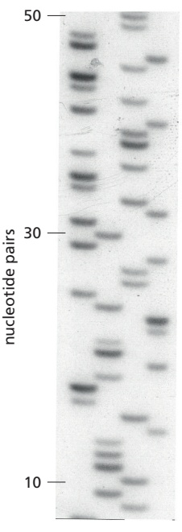

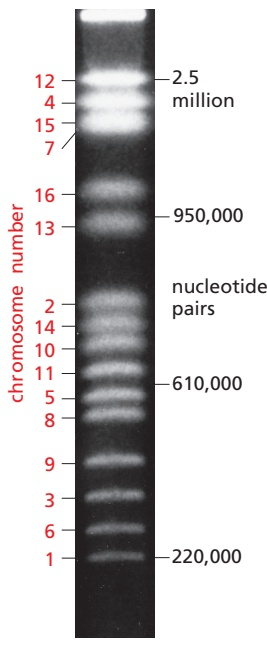

DNA is first cut with a restriction nuclease selected to recognize sequences that occur only rarely.

The DNA bands on agarose or polyacrylamide gels are invisible unless the DNA is labeled or stained in some way. A particularly sensitive method of staining DNA is to soak the gel in the dye ethidium bromide, which fluoresces under ultraviolet light when it is bound to DNA (see Figure 8–24B and D). Even more sensitive detection methods incorporate a radioisotope or chemical marker into the DNA molecules before electrophoresis, as we next describe.

#### Purified DNA Molecules Can Be Specifically Labeled with Radioisotopes or Chemical Markers in Vitro

The DNA polymerases that synthesize and repair DNA (discussed in Chapter 5) have become important tools in experimentally manipulating DNA. They are often used in the test tube to create exact copies of existing DNA molecules. In some experiments, the copies can include specially modified nucleotides (**Figure 8–25**). To synthesize DNA in this way, the DNA polymerase is presented with a template and a pool of nucleotide precursors that contain the modification. As long as the polymerase can use these precursors, it automatically makes new, modified molecules that match the sequence of the template. Modified DNA molecules have many uses. DNA labeled with the radioisotope 32<sub>P</sub> can be detected after gel electrophoresis by exposing the gel to photographic film or a radiation detector (see Figure 8–24C). Other types of modified DNA, such as that labeled by digoxigenin (see Figure 8–25B), are useful for visualizing DNA molecules in whole cells, a topic we discuss later in this chapter.

#### Genes Can Be Cloned Using Bacteria

Any DNA fragment can be cloned. In molecular biology, the term **DNA cloning** refers to the act of making many identical copies (typically billions) of a DNA molecule; that is, the amplification of a specific DNA sequence (often a particular gene) from the rest of the cell’s genome. We note that elsewhere in the book, cloning can also refer to the generation of many genetically identical cells starting from a single cell or even to the generation of genetically identical organisms (see,

Figure 8–25 Methods for labeling DNA molecules in vitro. (A) A purified DNA polymerase enzyme can incorporate radiolabeled nucleotides as it synthesizes new DNA molecules. In this way, radiolabeled versions of any DNA sequence can be prepared in the laboratory. (B) The method in panel A is also used to produce nonradioactive DNA molecules that carry a specific chemical marker that can be detected with an appropriate antibody. The base on the nucleoside triphosphate shown is an analog of thymine, in which the methyl group on T has been replaced by a spacer arm linked to the plant steroid digoxigenin. An anti-digoxigenin antibody coupled to a visible marker such as a fluorescent dye is then used to visualize the DNA. Other chemical labels, such as biotin, can be attached to nucleotides and used in the same way. The only requirements are that the modified nucleotides properly base-pair and appear “normal” to the DNA polymerase.


DNA polymerase incorporates 32<sub>P</sub> nucleotides, resulting in a population of radiolabeled DNA molecules that contain sequences from both strands

(B)


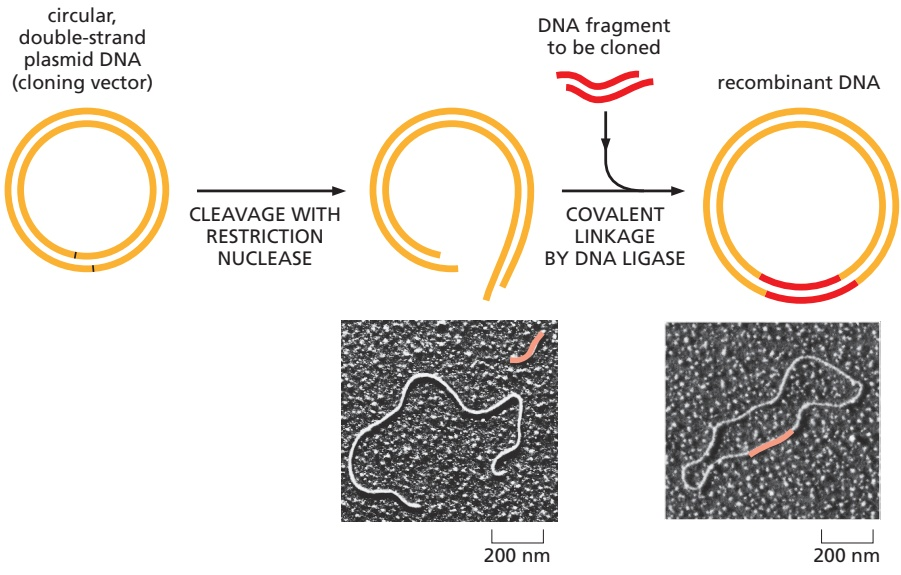

Figure 8–26 The insertion of a DNA fragment into a bacterial plasmid with the enzyme DNA ligase. The plasmid is cut open with a restriction nuclease (in this case, one that produces staggered ends) and is mixed with the DNA fragment to be cloned (which has been prepared with the same restriction nuclease). DNA ligase and ATP are added. The staggered ends basepair, and DNA ligase seals the nicks in the DNA backbone, producing a complete recombinant DNA molecule. In the accompanying micrographs, the inserted DNA is colored red. (Micrographs courtesy of Huntington Potter and David Dressler.)

for example, Figure 7–2). In all cases, cloning refers to the act of making many identical copies, and here we use the term to refer to methods designed to generate many identical copies of a defined segment of nucleic acid.

DNA cloning can be accomplished in several ways. One of the simplest involves inserting a particular fragment of DNA into the purified DNA of a self-replicating genetic element—usually a plasmid. The **plasmid vectors** most widely used for gene cloning are small, circular molecules of double-stranded DNA derived from plasmids that occur naturally in bacterial cells. They generally account for only a minor fraction of the total host bacterial cell DNA, but owing to their small size, they can easily be separated from the much largerMBoC7 m8.27/8.26 chromosomal DNA molecules. For use as cloning vectors, the purified plasmid DNA circles are first cut with a restriction nuclease to create linear DNA molecules. The DNA to be cloned is added to the cut plasmid and then covalently joined using the enzyme DNA ligase (**Figure 8–26** and **Figure 8–27**). As discussed in Chapter 5, this enzyme is used by the cell to stitch together the Okazaki fragments produced during DNA replication. The recombinant DNA circle is introduced back into bacterial cells that have been made transiently permeable to DNA. As the cells grow and divide, doubling in number every 30 minutes, the recombinant plasmids also replicate to produce an enormous

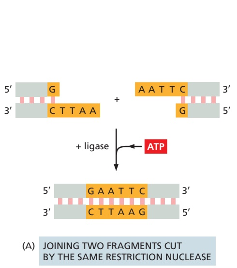


Figure 8–27 DNA ligase can join together any two DNA fragments in vitro to produce recombinant DNA molecules. ATP provides the energy necessary to reseal the sugar–phosphate backbone of DNA (see Figure 5–12). (A) DNA ligase can readily join two DNA fragments produced by the same restriction nuclease, in this case EcoRI. Note that the staggered ends produced by this enzyme enable the ends of the two fragments to basepair correctly with each other, greatly facilitating their rejoining. (B) DNA ligase can also be used to join DNA fragments produced by different restriction nucleases; for example, EcoRI and HaeIII. In this case, before the fragments undergo ligation, DNA polymerase plus a mixture of deoxyribonucleoside triphosphates (dNTPs) are used to fill in the staggered cut produced by EcoRI. Each DNA fragment shown in the figure is oriented so that its 5′ ends are at the left end of the upper strand and the right end of the lower strand, as indicated.


Figure 8–28 A DNA fragment can be replicated inside a bacterial cell. To clone a particular fragment of DNA, it is first inserted into a plasmid vector, as shown in Figure 8–26. The resulting recombinant plasmid DNA is then introduced into a bacterium, where it is replicated many millions of times as the bacterium multiplies. For simplicity, the genome of the bacterial cell is not shown.

number of copies of DNA circles containing the foreign DNA (**Figure 8–28**). Once the cells are lysed and the plasmid DNA isolated, the cloned DNA fragment can be readily recovered by cutting it out of the plasmid DNA with the same restriction nuclease that was used to insert it, and then separating it from the plasmid DNA by gel electrophoresis. Together, these steps allow the amplification and purification of any segment of DNA from the genome of any organism.

A particularly useful plasmid vector is based on the naturally occurring F plasmid of E. coli. Unlike smaller bacterial plasmids, the F plasmid—and its engineered derivative, the **bacterial artificial chromosome (BAC)**—is present in only one or two copies per E. coli cell. The fact that BACs are kept in such low numbers means that they can stably maintain very long DNA sequences, up to 1 million nucleotide pairs in length. With only a few BACs present per bacterium, it is less likely that the cloned DNA fragments will become scrambled by recombination with sequences carried on other copies of the plasmid. Because of their stability, ability to accept large DNA inserts, and ease of handling, BACs are the preferred vector for handling large fragments of foreign DNA.

#### An Entire Genome Can Be Represented in a DNA Library

Often it is useful to break up a genome into much smaller fragments and clone every fragment, separately, using a plasmid vector. This approach is useful because it allows scientists to work with easily managed, discrete pieces of a genome instead of whole, unwieldy chromosomes.

This strategy involves cleaving genomic DNA into small pieces using a restriction nuclease (or, in some cases, by mechanically shearing the DNA) and ligating the entire collection of DNA fragments into plasmid vectors, using conditions that favor the insertion of a single DNA fragment into each plasmid molecule. These recombinant plasmids are then introduced into E. coli at a concentration that ensures that no more than one plasmid molecule is taken up by each bacterium. The collection of cloned plasmid molecules is known as a **DNA library**. Because the DNA fragments were derived directly from the chromosomal DNA of the organism of interest, the resulting collection—called a **genomic library**—will represent the entire genome of that organism (**Figure 8–29**), spread out over tens of thousands of individual bacterial colonies.

An alternative strategy, one that enriches for protein-coding genes, is to begin the cloning process by selecting only those DNA sequences that are transcribed into mRNA and thus correspond to protein-encoding genes. This is done by extracting the mRNA from cells and then making a DNA copy of each mRNA


human double-stranded DNA

CLEAVE WITH RESTRICTION NUCLEASE


DNA FRAGMENTS INSERTED INTO PLASMIDS


recombinant DNA molecules

INTRODUCTION OF PLASMIDS INTO BACTERIA


<small><span class="docvortex-page-footnote" data-block-type="page_footnote" style="color:#6b7280">Figure 8–29 Human genomic libraries containing DNA fragments that represent the whole human genome can be constructed using restriction nucleases and DNA ligase. Such a genomic library consists of a set of bacteria, each carrying a different fragment of human DNA. For simplicity, only the colored DNA fragments are shown in the library; in reality, all of the different gray fragments will also be represented.</span></small>

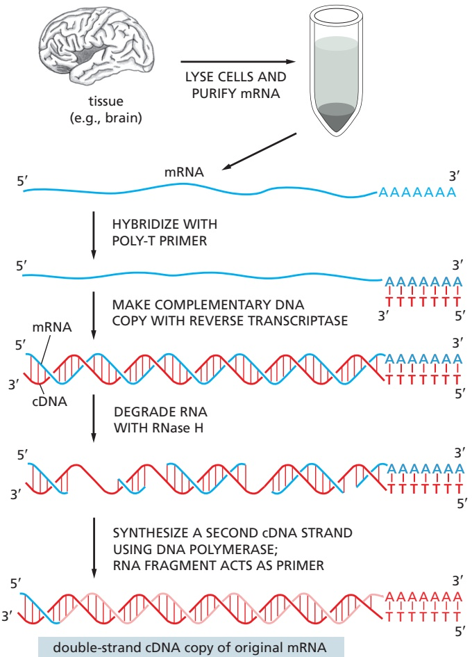

Figure 8–30 The synthesis of cDNA. Total mRNA is extracted from a particular tissue, and the enzyme reverse transcriptase (see Figure 5–61) is used to produce DNA copies (cDNA) of the mRNA molecules. For simplicity, the copying of just one of these mRNAs into cDNA is illustrated. A short oligonucleotide complementary to the poly-A tail at the 3′ end of the mRNA is first hybridized to the RNA to act as a primer for the reverse transcriptase, which then copies the RNA into a complementary DNA chain, thereby forming a DNA–RNA hybrid helix. Treating the DNA–RNA hybrid with a specialized ribonuclease (RNase H) that attacks only the RNA produces MBoC7 m8.31/8.30nicks and gaps in the RNA strand. DNA polymerase then copies the remaining single-stranded cDNA into double-stranded cDNA. Because DNA polymerase can synthesize through the bound RNA molecules, the RNA fragment that is base-paired to the 3′ end of the first DNA strand usually acts as the primer for the second strand synthesis, as shown. Any remaining RNA is eventually degraded during subsequent cloning steps. As a result, the nucleotide sequences at the extreme 5′ ends of the original mRNA molecules are often absent from cDNA libraries.

molecule present—a so-called complementary DNA, or cDNA. The copying reaction is catalyzed by the reverse transcriptase enzyme of retroviruses, which synthesizes a complementary DNA chain on an RNA template. The single-strand cDNA molecules synthesized by the reverse transcriptase are converted by DNA polymerase into double-strand cDNA molecules, and these molecules are inserted into a plasmid or virus vector and cloned (**Figure 8–30**). Each clone obtained in this way is called a **cDNA clone**, and the entire collection of clones derived from one mRNA preparation constitutes a **cDNA library**.

The most important advantage of cDNA clones, over genomic clones, is that they contain the uninterrupted coding sequence of a gene. When the aim of the cloning is to produce the protein in large quantities by expressing the cloned gene in a bacterial or other cell type, it is best to start with cDNA.

Cloning DNA in bacteria revolutionized the study of genomes and is still in wide use today. However, there is an even simpler way to clone DNA and produce genomic libraries, entirely in vitro. We discuss this approach, called the polymerase chain reaction, shortly. However, first we need to review a fundamental, far-reaching property of DNA and RNA called hybridization.

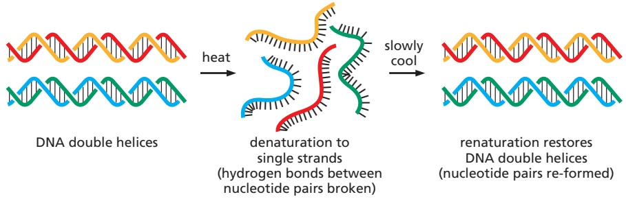

Figure 8–31 A molecule of DNA can undergo denaturation and renaturation (hybridization). For two single-strand molecules to hybridize, they must have complementary nucleotide sequences that allow base-pairing. In this example, the red and orange strands are complementary to each other, and the blue and green strands are complementary to each other. Although denaturation by heating is shown, DNA can also be renatured after being denatured by alkali treatment.

#### Hybridization Provides a Powerful but Simple Way to Detect Specific Nucleotide Sequences

Under normal conditions, the two strands of a DNA double helix are held together by hydrogen bonds between the complementary base pairs (see Figure 4–3). These relatively weak, noncovalent bonds are easy to break. Such DNA denaturation releases the two strands from each other but does not break the covalent bonds that link together the nucleotides within each strand. The simplest way to achieve this separation is to heat the DNA to around 90°C. When the conditions are reversed—by slowly lowering the temperature—the complementary strands will readily come back together to re-form a double helix. This **hybridization**, or DNA renaturation, is driven by the re-formation of the hydrogen bonds between complementary base pairs (**Figure 8-31**).

This fundamental capacity of a single-strand nucleic acid molecule, either DNA or RNA, to form a double helix with a single-strand molecule of a complementary sequence provides a powerful and sensitive technique for detecting specific nucleotide sequences. Today, one simply designs a short, single-strand DNA molecule (often called a DNA probe) that is complementary to the nucleotide sequence of interest. Because the nucleotide sequences of so many genomes are known—and are stored in publicly accessible databases—designing a probe to hybridize anywhere in a genome is straightforward. Probes are single-stranded, typically 30 nucleotides in length, and are usually synthesized chemically by a commercial service for pennies per nucleotide. A DNA sequence of 30 nucleotides will occur by chance only once every $1 \times 1 0 ^ { 1 8 }$ nucleotides $( 4 ^ { 3 0 } ) _ { i }$ ; so, even in the human genome of $3 \times 1 0 ^ { 9 }$ nucleotide pairs, a DNA probe designed to match a unique 30-nucleotide sequence will be highly unlikely to hybridize—by chance— anywhere else on the genome. The hybridization conditions can be set so that even a single mismatch will prevent hybridization to “near-miss” sequences. The exquisite specificity of nucleic acid hybridization can be easily appreciated by the in situ (Latin for “in place”) hybridization experiment shown in **Figure 8–32**. As we will see throughout this chapter, nucleic acid hybridization has many uses in modern cell and molecular biology; one of the most powerful is in the cloning of DNA by the polymerase chain reaction, as we next discuss.


<small><span class="docvortex-page-footnote" data-block-type="page_footnote" style="color:#6b7280">Figure 8–32 In situ hybridization can be used to locate genes on isolated chromosomes. Here, six different DNA probes have been used to mark the locations of their complementary nucleotide sequences on human chromosome 5, isolated from a mitotic cell in metaphase. The DNA probes have been labeled with different chemical groups (see Figure 8–25B) and are detected using fluorescent antibodies specific for those groups. The chromosomal DNA has been partially denatured to allow the probes to base-pair with their complementary sequences. Both the maternal and paternal copies of chromosome 5 are shown, aligned side by side. Each probe produces two dots on each chromosome because chromosomes undergoing mitosis have already replicated their DNA; therefore, each chromosome contains two identical DNA helices. The technique employed here is nicknamed FISH, for fluorescence in situ hybridization. (Courtesy of David C. Ward.)</span></small>

#### Genes Can Be Cloned in Vitro Using PCR

Genomic and cDNA libraries were once the only route to cloning genes. However, a powerful and versatile method for amplifying DNA, known as the **polymerase chain reaction (PCR)**, provides a more rapid and straightforward approach to DNA cloning, particularly in organisms whose complete genome sequence is known. Today, because genome sequences are abundant, cloning is often carried out by PCR.

Invented in the 1980s, PCR revolutionized the way that DNA and RNA are analyzed. The technique can amplify any nucleotide sequence selectively and is performed entirely in a test tube. Eliminating the need for bacteria makes PCR convenient and rapid—billions of copies of a nucleic acid sequence can be generated in a matter of hours. Starting with an entire genome, PCR allows DNA from a specified region—selected by the experimenter—to be greatly amplified, effectively purifying this DNA away from the remainder of the genome, which remains unamplified. Because of its power to greatly amplify nucleic acids, PCR is remarkably sensitive: the method can be used to detect the trace amounts of DNA in a drop of blood left at a crime scene or in a few copies of a viral genome in a sample of someone’s saliva.

The success of PCR depends both on the selectivity of DNA hybridization and on the ability of DNA polymerase to copy a DNA template faithfully through repeated rounds of replication in vitro. As discussed in Chapter 5, this enzyme adds nucleotides to the 3′ end of a growing strand of DNA (see Figure 5–4). To copy DNA, the polymerase requires a DNA primer—a short nucleotide sequence that provides a 3′ end from which synthesis can begin. For PCR, the primers are designed by the experimenter, synthesized chemically, and, by hybridizing to genomic DNA, guide the polymerase to the part of the genome to copy. DNA primers can be designed to uniquely locate any position on a genome.

PCR is an iterative process in which the cycle of amplification is repeated many times. At the start of each cycle, the two strands of the double-strand DNA template are separated, and a different primer is annealed to each. These primers mark the right and left boundaries of the DNA to be amplified. DNA polymerase is then allowed to replicate each strand independently (**Figure 8–33**). In subsequent cycles, all the newly synthesized DNA molecules produced by the

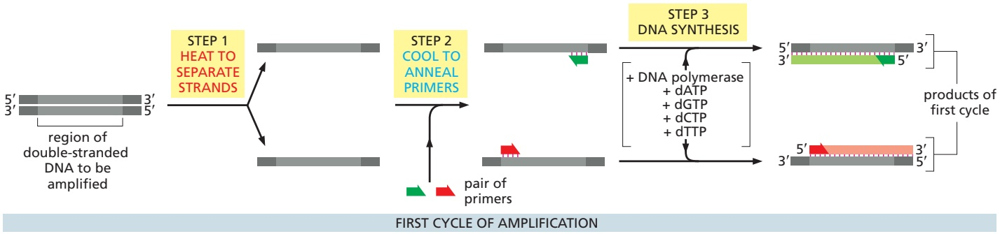

Figure 8–33 A pair of primers directs the synthesis of a desired segment of DNA in a test tube. Each cycle of PCR includes three steps: (1) The double-stranded DNA is heated briefly to separate the two strands. (2) The DNA is exposed to a large excess of a pair of specific primers—designed to bracket the region of DNA to be amplified—and the sample is cooled to allow the primers to hybridize to complementary sequences in the two DNA strands. (3) This mixture is incubated with DNA polymerase and the four deoxyribonucleoside triphosphates so that DNA can be synthesized, starting from the two primers. To amplify the DNA, the cycle is repeated many times by reheating the sample to separate the newly synthesized DNA strands (see Figure 8–34).

The technique depends on the use of a special DNA polymerase isolated from a thermophilic bacterium; this polymerase is stable at much higher temperatures than eukaryotic DNA polymerases, so it is not denatured by the heat treatment shown in step 1. The enzyme therefore does not have to be added again after each cycle.

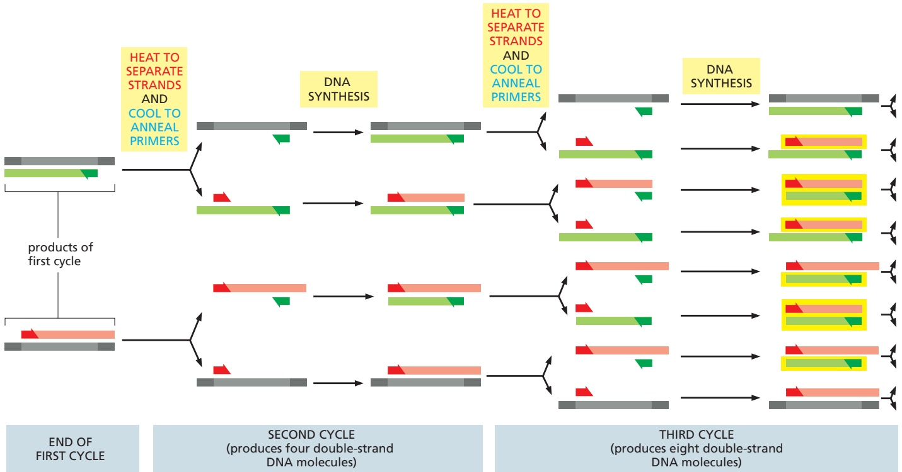

Figure 8–34 PCR uses repeated rounds of strand separation, hybridization, and synthesis to amplify DNA. As the procedure outlined in Figure 8–33 is repeated, all the newly synthesized fragments serve as templates in their turn. Because the polymerase and the primers remain in the sample after the first cycle, PCR involves simply heating and then cooling the same sample, in the same test tube, again and again. Each cycle doubles the amount of DNA synthesized in the previous cycle, so that within a few cycles, the predominant DNA is identical to the sequence bracketed by and including the two MBoC7 m8.36/8.34primers in the original template. In the example illustrated here, three cycles of reaction produce 16 DNA chains, 8 of which (boxed in yellow) correspond exactly to one or the other strand of the original bracketed sequence. After four more cycles, 240 of the 256 DNA chains will correspond exactly to the original sequence, and after several more cycles, essentially all of the DNA strands will be this length. Typically, 20–30 cycles are carried out to effectively clone a region of DNA starting from genomic DNA; the rest of the genome remains unamplified, and its concentration is therefore negligible compared with that of the amplified region (Movie 8.2).

polymerase serve as templates for the next round of replication (**Figure 8–34**). Through this iterative amplification process, many copies of the original sequence can be made—billions after about 20–30 cycles.

PCR is now the method of choice for cloning relatively short DNA fragments (say, under 10,000 nucleotide pairs). Each cycle takes only about 5 minutes, and automation of the whole procedure enables cell-free cloning of a DNA fragment in a few hours. The original template for PCR can be either DNA or RNA, so this method can be used to obtain either a genomic clone (complete with introns and exons) or a cDNA copy of an mRNA (**Figure 8–35**).

#### PCR Is Also Used for Diagnostic and Forensic Applications

The PCR method is extraordinarily sensitive; it can detect a single DNA molecule in a sample if at least part of the sequence of that molecule is known. Trace amounts of RNA can be analyzed in the same way by first transcribing them into DNA with reverse transcriptase. For these reasons, PCR is frequently employed for uses that go beyond simple cloning. For example, it can be used to detect invading pathogens at very early stages of infection. In this case, short sequences complementary to a segment of the infectious agent’s genome are used as primers, and, after many cycles of amplification, even a few copies of an invading bacterial or viral genome in a human sample can be detected (**Figure 8–36**). For many infections, PCR has replaced the use of antibodies against microbial molecules to detect the presence of the invader. It is also used to verify the


Figure 8–35 PCR can be used to obtain either genomic or cDNA clones. (A) To use PCR to clone a segment of chromosomal DNA, total genomic DNA is first purified from cells. PCR primers that flank the stretch of DNA to be cloned are added, and many cycles of PCR are completed (see Figure 8–34). Because only the DNA between (and including) the primers is amplified, PCR provides a way to obtain selectively any short stretch of chromosomal DNA in an effectively pure form. (B) To use PCR to obtain a cDNA clone of a gene, total mRNA is first purified from cells. The first primer is added to the population of mRNAs, and reverse transcriptase is used to make a DNA strand complementary to the specific RNA sequence of interest. The second primer is then added, and the DNA molecule is amplified through many cycles of PCR.

authenticity of a food source; for example, whether a sample of beef actually came from a cow.

Finally, PCR is now widely used in forensics. The method’s extreme sensitivityMBoC7 m8.37/8.35 allows forensic investigators to isolate DNA from minute traces of human blood or other tissue to obtain a DNA fingerprint of the person who left the sample behind. With the possible exception of identical twins, the genome of each human differs in DNA sequence from that of every other person on Earth. Using primer pairs targeted at genome sequences that are known to be highly variable in the human population, PCR makes it possible to generate a distinctive DNA fingerprint for any individual (**Figure 8–37**). Such forensic analyses can be used not only to help

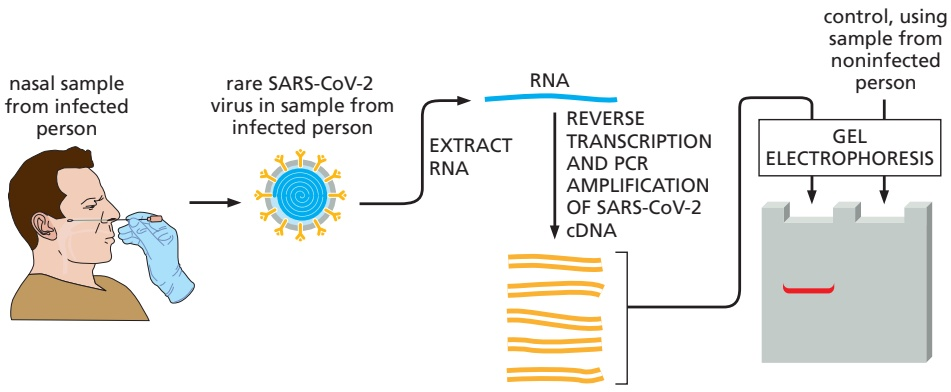

Figure 8–36 PCR can be used to detect the presence of a viral genome in a nasal sample. Because of its ability to amplify enormously the signal from a single molecule of nucleic acid, PCR is an extraordinarily sensitive method for detecting trace amounts of virus in a sample of saliva, blood, or other tissue, without the need to purify the virus. For the coronavirus SARS-CoV-2, the virus that causes COVID-19, the genome is a singlestrand molecule of RNA, as illustrated here. Typically, only a short segment of the viral genome (100–200 nucleotides) is amplified. Although it is possible to visualize the amplified DNA by gel electrophoresis as shown here, it is usually detected by rapid optical methods described later in the chapter (see Figure 8–64). Many other viruses that infect humans—such as HIV— are detected using this strategy.

(A)

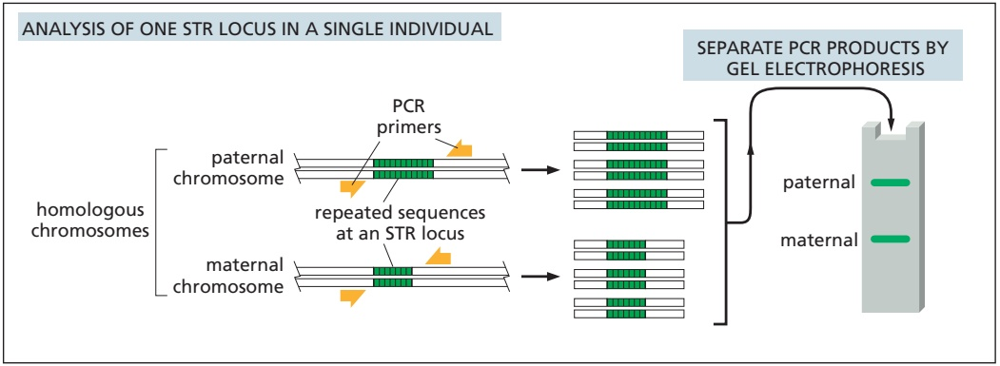

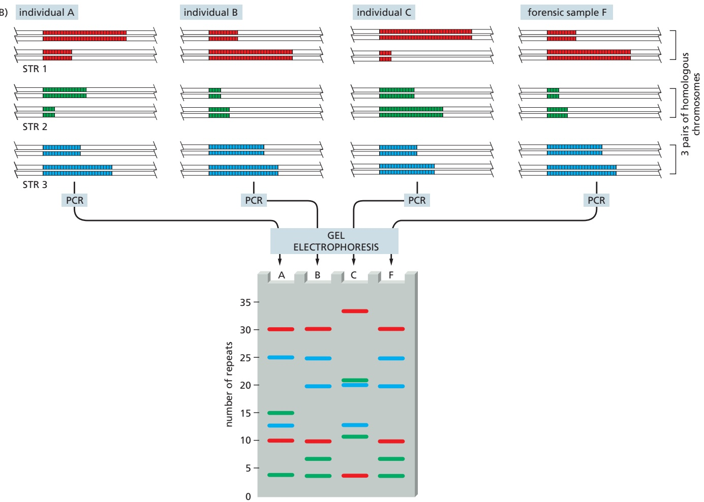

Figure 8–37 PCR is used in forensic science to distinguish one individual from another. The DNA sequences analyzed are short tandem repeats (STRs) composed of sequences such as CACACA... or GTGTGT.... STRs are found in various positions (loci) in the human genome. The number of repeats in each STR locus is highly variable in the population, ranging from 4 to 40 in different individuals. Because of the variability in these sequences, an individual will usually inherit a different number of repeats at each STR locus from his mother and from his father; two unrelated individuals, therefore, rarely contain the same pair of sequences at a given STR locus. (A) PCR using primers that recognize unique sequences on either side of one particular STR locus produces a pair of bands of amplified DNA from each individual, one band representing the maternal STR variant and the other representing the paternal STR variant. The length of the amplified DNA, and thus its position after gel electrophoresis, will depend on the exact number of repeats at the locus. (B) In the schematic example shown here, the same three STR loci are analyzed in samples MB C7 8.39/8.37from three suspects (individuals A, B, and C), producing six bands for each individual. Although different people can have several bands in common, the overall pattern is quite distinctive for each person. The band pattern can therefore serve as a DNA fingerprint to identify an individual nearly uniquely. The fourth lane (F) contains the products of the same PCR amplifications carried out on a hypothetical forensic DNA sample, which could have been obtained from a single hair or a tiny spot of blood left at a crime scene.

The more loci that are examined, the more confident one can be about the results. When examining the variability at 5–10 different STR loci, the odds that two random individuals would share the same fingerprint by chance are approximately 1 in 10 billion. In the case shown here, individuals A and C can be eliminated from inquiries, while B is a clear suspect. A similar approach is used routinely in paternity testing.

identify those who have done wrong, but also—equally important—to exonerate those who have been wrongfully accused.

#### PCR and Synthetic DNA Are Ideal Sources of Specific Gene Sequences for Cloning

PCR is a powerful technique for producing large amounts of specific DNA sequences in vitro. For many purposes—like those just described—there is no need to insert the PCR product in a bacterial plasmid for further analysis. Certain experiments, however, do require cloning of a specific DNA sequence in a plasmid for production in bacteria or other cells. Plasmids, for example, are important for the production and biochemical analysis of specific proteins, as we discuss later. In these cases, the desired DNA sequence can be readily produced by PCR amplification. Restriction nuclease cleavage sites in the PCR product are then cut to allow insertion into the appropriate plasmid as described earlier.

In recent years, a method called Gibson assembly (named for its inventor) has reduced the need for restriction nucleases in plasmid construction. A circular plasmid is cut open with a restriction nuclease that leaves blunt ends. In parallel, the desired DNA fragment is generated by PCR-mediated amplification from a genomic or cDNA source (see Figure 8–35). Importantly, the PCR primers are designed so that the ends of the PCR product contain 15–40 base pairs of the same sequence that surrounds the cut site in the plasmid. The PCR product and plasmid are then treated with a 5′ exonuclease that degrades just one DNA strand at the ends of all DNA molecules, leaving single-strand sticky ends on the PCR product that will hybridize to complementary DNA on the plasmid (**Figure 8–38**). DNA polymerase then fills in the gaps, and DNA ligase joins the DNA strands. The resulting product is introduced into bacteria or other cell types as desired. This method can also be used to join a series of DNA fragments in a single plasmid. Each end of a DNA fragment must share sequence with the end of the fragment to which it will be joined. After treatment with 5′ exonuclease, all the complementary sticky ends find each other and are thereby assembled in the correct order in the plasmid. Large genes can be assembled in this way from multiple subfragments.

Another key advance in recent years resulted from the rapid decline in the cost of methods for the chemical synthesis of DNA. Short single-strand DNA


Figure 8–38 DNA cloning by Gibson assembly. It is often useful to insert a DNA fragment in a circular bacterial plasmid, as described earlier (see Figure 8–26). In Gibson assembly, as shown here, a plasmid is cleaved at a specific site with a restriction nuclease. In parallel, the DNA sequence to be cloned is amplified by PCR of a cDNA or other source. In addition to sequences complementary to the ends of the DNA to be amplified, the PCR primers include 15–40 nucleotides of sequence that matches the sequence on either side of the cut site in the linearized plasmid. The PCR product and plasmid are treated with a 5′ exonuclease, which partially digests the DNA from the 5′ end, resulting in single-strand 3′ overhangs. These single-strand overhangs hybridize with their complementary sequence, neatly inserting the PCR product in the plasmid as shown. DNA polymerase is then added to fill in any gaps in the sequence, and DNA ligase seals the nicks to provide the fully assembled plasmid.

molecules, called oligonucleotides, are cheap to make and have been used for decades as probes and primers for PCR and other methods. Recently, it has become possible to cheaply synthesize much larger double-strand DNA molecules up to a few thousand base pairs in length. Thus, for many purposes, it is easier to order the desired DNA fragment from a DNA synthesis company than it is to produce it by PCR. If the ends of the synthetic DNA fragment are identical to those of a cut plasmid, then it is straightforward to insert the synthetic DNA in a plasmid by Gibson assembly (see Figure 8–38). Using multiple synthetic DNA fragments with interlocking ends, it is possible to assemble very large stretches of DNA (approaching the size of small genomes) from purely synthetic DNA.

We will see later in this chapter that the study of gene and protein function often requires methods to produce a mutant gene or protein that carries specific point mutations that alter its function. In molecular biology, the production of a mutant DNA sequence, called site-directed mutagenesis, is readily achieved through the clever application of PCR and synthetic DNA. If the goal is a single point mutation, then one of the two PCR primers can be designed to include the mutation while still having sufficient flanking sequence to hybridize to the non-mutant source DNA. PCR then generates a DNA product with the mutation near one end. This mutant DNA fragment can be assembled in a plasmid with other portions of the gene. If multiple mutations in a DNA sequence are needed, then the simplest approach is to purchase a synthetic DNA containing the mutations and insert that into the desired plasmid.

#### DNA Cloning Allows Any Protein to Be Produced in Large Amounts

Using the genetic code (and assuming all intron and exon boundaries are known), the amino acid sequence of any protein coded in a genome can be deduced. As was discussed earlier, this sequence can often provide an important clue to the protein’s function if found to be similar to the amino acid sequence of a protein that has already been studied (see Figure 8–22). Although this strategy is often successful, it typically provides only the likely biochemical function of the protein; for example, whether the protein resembles a kinase or a protease. It usually remains for the experimenter to verify (or refute) this assignment and, most important, to discover the protein’s biological function in the whole organism.

An important approach in determining gene function is to alter the gene (or in some cases, its expression pattern), place the altered copy back into the organism, and deduce the function of the normal gene by the changes caused by its alteration. Various techniques to implement this strategy are discussed in the next section of this chapter. But it is equally important to study the biochemical and structural properties of a gene product, as outlined earlier in this chapter. One of the most important contributions of DNA cloning to cell and molecular biology is the ability to produce any protein, even the rare ones, in nearly unlimited amounts. Such high-level production is usually carried out in living cells using expression vectors (**Figure 8–39**). These are generally plasmids that have been designed to produce a large amount of stable mRNA that can be efficiently translated into protein when the plasmid is introduced into bacterial, yeast, insect, or


<small><span class="docvortex-page-footnote" data-block-type="page_footnote" style="color:#6b7280">Figure 8–39 Production of large amounts of a protein from a protein-coding DNA sequence cloned into an expression vector and introduced into cells. A plasmid vector has been engineered to contain a highly active promoter, which causes unusually large amounts of mRNA to be produced from an adjacent protein-coding gene inserted into the plasmid vector. Depending on the characteristics of the cloning vector, the plasmid is introduced into bacterial, yeast, insect, or mammalian cells, where the inserted gene is efficiently transcribed and translated into protein. If the gene to be overexpressed has no introns (typical for genes from bacteria, archaea, and simple eukaryotes), it can simply be cloned from genomic DNA by PCR. For cloned animal and plant genes, it is often more convenient to obtain the gene as cDNA, either from a cDNA library (see Figure 8–30) or cloned directly by PCR from RNA isolated from the organism (see Figure 8–35). Alternatively, the DNA coding for the protein can be made by chemical synthesis.</span></small>

Figure 8–40 Production of large amounts of a protein by using a plasmid expression vector. In this example, an expression vector that overproduces a DNA helicase has been introduced into bacteria. In this expression vector, transcription from this coding sequence is under the control of a viral promoter that becomes active only at a temperature of 37°C or higher. The total cell protein, either from bacteria grown at 25°C (no helicase protein made) or after a shift of the same bacteria to 42°C for up to 2 hours (helicase protein has become the most abundant protein species in the lysate), has been analyzed by SDS polyacrylamide-gel electrophoresis. (Courtesy of Kevin Hacker.)

mammalian cells. To prevent the high level of the foreign protein from interfering with the cell’s growth, the expression vector is often designed to delay the synthesis of the foreign mRNA and protein until shortly before the cells are harvested and lysed (**Figure 8–40**).

Because the desired protein made from an expression vector is produced inside a cell, it must be purified away from the host-cell proteins by chromatography after cell lysis. However, because the protein is such a plentiful species in the cell (often 1–10% of the total cell protein), the purification is usually easy to accomplish in only a few steps. As we saw earlier, it is also possible to fuse a molecular tag—a cluster of histidine residues or a small marker protein—to the expressed protein to facilitate easy purification by affinity chromatography (see Figure 8–11). A variety of expression vectors is available, each engineered to function in the type of cell in which the protein is to be made.

This technology is also used to make large amounts of many medically useful proteins, including hormones (such as insulin and growth factors) used as pharmaceuticals, and viral proteins for use in vaccines. Expression vectors also allow scientists to produce many proteins of biological interest in large enough amounts for detailed structural studies. Nearly all three-dimensional protein structures depicted in this book are of proteins produced in this way. Recombinant DNA techniques thus allow scientists to move with ease from protein to gene, and vice versa, so that the functions of both can be explored on multiple fronts (**Figure 8–41**).

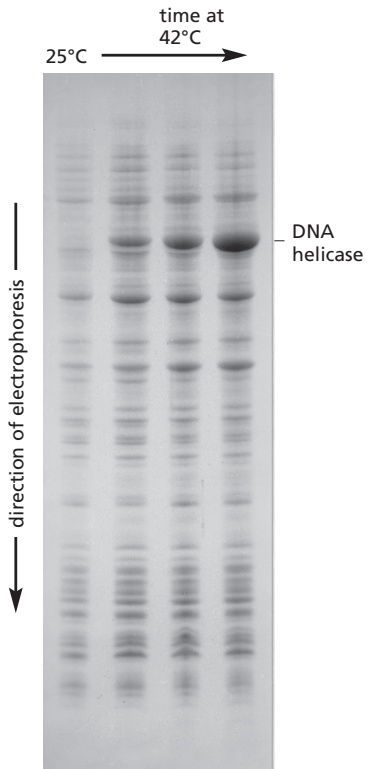

#### DNA Can Be Sequenced Rapidly by Dideoxy Sequencing

Most current methods of manipulating DNA, RNA, and proteins rely on prior knowledge of the nucleotide sequence of the genome of interest. But how are these sequences determined in the first place? In the late 1970s, researchers developed several strategies for determining the nucleotide sequence of any purified DNA fragment. The method that became the most widely used is called **dideoxy sequencing** or **Sanger sequencing** (named after the scientist who invented it). This method uses DNA polymerase, along with special chain-terminating nucleotides called dideoxyribonucleoside triphosphates (**Figure 8–42**). Dideoxy sequencing reactions produce a collection of different DNA copies that terminate at every position in the original DNA sequence. In the original form of the method, four separate sequencing reactions were performed, each with a different dideoxyribonucleotide; the DNA copies were labeled with radioactivity. / . and separated on polyacrylamide gels, which were then exposed to film to produce four ladders of bands that were read manually to reveal the sequence (see Figure 8–24C). This laborious method was replaced, beginning in the late 1980s, with technologies that are simpler, safer, and fully automated: robotic devices mix the reagents—including the four different chain-terminating dideoxyribonucleotides, each tagged with a different-colored fluorescent dye—and load the reaction samples onto long, thin capillary gels, which separate the reaction products into a series of distinct bands. A detector then records the color of each band, and a computer translates the information into a nucleotide sequence (**Figure 8–43**).

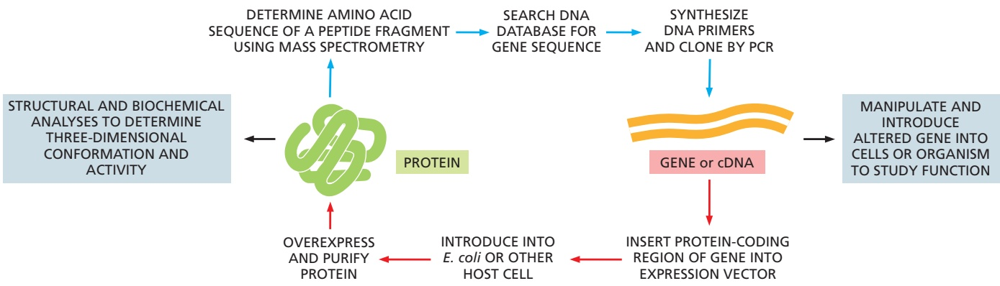

Figure 8–41 Recombinant DNA techniques make it possible to move experimentally from gene to protein and from protein to gene. If a gene has been identified (right), its protein-coding sequence can be inserted into an expression vector to produce large quantities of the protein (see Figure 8–39), which can then be studied biochemically or structurally. If a protein has been purified on the basis of its biochemical properties, mass spectrometry (see Figure 8–18) can be used to obtain a partial amino acid sequence, which is used to search a genome sequence for the corresponding nucleotide sequence. The complete gene can then be cloned by PCR from a sequenced genome (see Figure 8–35). The gene can also be manipulated and introduced into cells or organisms to study its function, a topic covered in the next section of this chapter. MBoC7 e10.35/8.41


Figure 8–42 The dideoxy method of sequencing DNA relies on chain-terminating dideoxyribonucleoside triphosphates (ddNTPs). These ddNTPs are derivatives of the normal deoxyribonucleoside triphosphates (dNTPs) that lack the 3′-hydroxyl group. When incorporated into a growing DNA strand, they block further elongation of that strand.

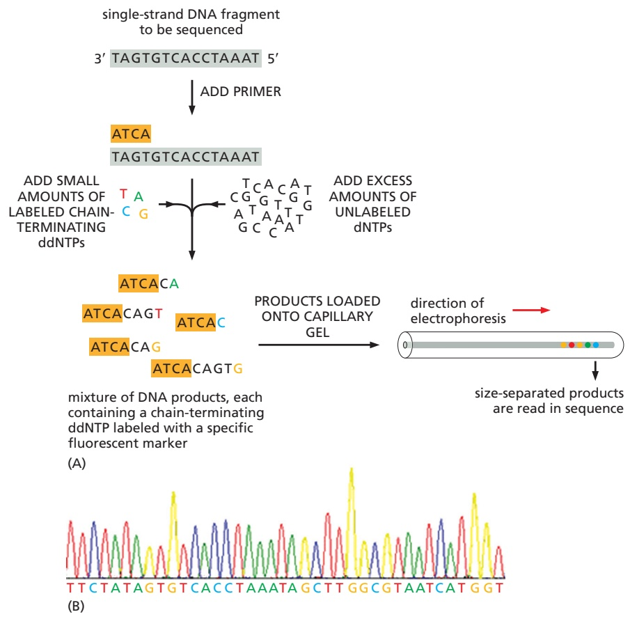

Figure 8–43 Automated dideoxy sequencing relies on a set of four ddNTPs, each bearing a uniquely colored fluorescent tag. (A) To determine the complete sequence of a single-strand fragment of DNA (gray), the DNA is first hybridized with a short DNA primer (orange). The DNA is then mixed with DNA polymerase (not shown), an excess amount of normal dNTPs, and a mixture containing small amounts of all four chain-terminating ddNTPs, each of which is labeled with a fluorescent tag of a different color. Because the chain-terminating ddNTPs will be incorporated only occasionally, each reaction produces a diverse set of DNA copies that terminate at different points in the sequence. The reaction products are loaded onto a long, thin capillary gel and separated by electrophoresis. A camera reads the color of each band on the gel and feeds the data to a computer that assembles the sequence (not shown). The sequence read from the gel will be complementary to the sequence of the original DNA molecule. (B) A tiny part of the data from such an automated sequencing run. Each colored peak represents a nucleotide in the DNA sequence.

#### Next-Generation Sequencing Methods Have Revolutionized DNA and RNA Analysis

Automated dideoxy sequencing was used in the late 1990s and early 2000s to determine the nucleotide sequences of many genomes, including those of E. coli, yeast, fruit flies, nematode worms, and humans. It continues to be used today as a low-cost approach to small-scale sequencing. But newer methods, developed since 2005, are now used for most large-scale genomic analysis. With these so-called second-generation sequencing technologies, the cost of sequencing DNA has decreased dramatically, and the number of sequenced genomes has increased enormously. These rapid methods allow multiple genomes to be sequenced in a matter of weeks, enabling investigators to examine thousands of individual human genomes, catalog the variation in nucleotide sequences from people around the world, and uncover the mutations that increase the risk of various diseases, from cancer to autism. These methods have also made it possible to determine the genome sequence of extinct species, including Neanderthal man and the woolly mammoth (**Movie 8.3**). By sequencing genomes from many closely related species, they have also helped us understand the molecular basis of key evolutionary events in the tree of life. The ability to rapidly sequence DNA has had major effects on all branches of biology, agriculture, and medicine; it is almost impossible to imagine where we would be without it.

Several second-generation sequencing methods are now in wide use. The most common is Illumina sequencing, named for the company that manufactures the equipment and reagents. This approach begins with the construction of libraries of small DNA fragments that represent the DNA of the entire genome. Instead of using bacterial cells to generate these libraries, they are made using PCR amplification of billions of DNA fragments, each attached to the glass surface of a flow cell. The amplification is carried out so that the PCR-generated copies of an original DNA fragment, instead of floating away in solution, remain bound in proximity to that original DNA fragment—resulting in a cluster of about 1000 identical copies of that small bit of the genome. These clusters—a billion of which can fit in a single flow cell—are then sequenced at the same time; that is, in parallel.

Sequencing is achieved using chain-terminating nucleotides with uniquely colored fluorescent tags. Unlike conventional dideoxy sequencing, however, the fluorescent tag and the chemical group that blocks elongation are both removable. Once DNA polymerase has added the fluorescent, chain-terminating nucleotide, a photo of the reaction records the color to reveal the identity of the nucleotide that was added. The colored label and the chain-terminating group are then removed, allowing DNA polymerase to add the next nucleotide (**Figure 8–44**). This cycle is repeated hundreds of times to provide the sequence of the DNA in each cluster. Billions of these clusters are sequenced in parallel. The full genome sequence is then reconstructed in the computer by stitching together the sequences of all fragments, using the overlaps between fragments as a guide.

Illumina sequencing provides short DNA sequences of a few hundred nucleotides, which can sometimes be difficult to assemble into a complete genome sequence because of the many repeated sequences that are often found in genomes. Recently developed third-generation sequencing methods are capable of sequencing much longer DNA molecules. Two methods are particularly promising. The first is single-molecule real-time (SMRT) sequencing, which is carried out in an array of tiny wells, each containing a single DNA polymerase anchored to its bottom surface. The key to SMRT sequencing is that it uses deoxyribonucleoside triphosphates in which the fluorescent dye is attached to the terminal phosphate. As the DNA polymerase copies the template DNA, the binding of a fluorescent nucleotide generates a color signal that reveals its identity. The signal disappears when the fluorescent terminal phosphate is released during incorporation of the nucleotide into the growing DNA chain (see Figure 5–4). The sequence of the DNA is thus revealed by the colors of the brief fluorescent pulses that appear as each nucleotide binds (**Figure 8–45**). Because very long DNA fragments (tens of kilobases) can be read by this method, and tens of thousands of reactions can be analyzed in parallel, complete genome sequences are well within reach in a short period of time. It is also possible to use circular DNA templates that are sequenced repeatedly on both strands, greatly improving the accuracy of the resulting sequence (see Figure 8–45C).

(A)


Another third-generation sequencing method, called nanopore sequencing, does not require DNA synthesis at all, but instead involves the transport of a single-strand DNA molecule through a tiny protein pore in a membrane. Volt-MBoC7 e10.21/8.44 age is applied across the membrane, resulting in current through the pore. The passage of nucleotides through the pore generates tiny shifts in electric current across the membrane, and the unique shape of each nucleotide base results in a slightly different disruption of the current. Measurement of these tiny current changes reveals the identity of each nucleotide as it passes through the pore. As in SMRT sequencing, extremely long DNAs can be sequenced in this manner. Another advantage is that modified nucleotides (such as 5-methylcytosine, depicted in Figure 7–46) can be identified because their effect on the current differs slightly from that of the unmodified nucleotide. Efforts are under way to allow direct sequencing of RNA by this approach as well. A major advantage of this method is that it can be performed with portable, handheld instruments that can be taken into the field, opening up exciting possibilities for DNA and RNA sequence analysis in global health and biology.

The development of cheaper and faster DNA sequencing methods has led to vast improvements in our ability to obtain and analyze genomic information. The

(B)


100 µm

Figure 8–44 Principles of Illumina sequencing. (A) A genome or other large DNA sample is broken into millions of short fragments. These fragments are attached to the surface of a flow cell and amplified by PCR to generate DNA clusters, each containing about a thousand copies of a single DNA fragment. The large number of clusters provides complete coverage of the genome. In the first step, the anchored DNA clusters are incubated with DNA polymerase and a special set of all four nucleoside triphosphates (NTPs), each with two reversible chemical modifications: a uniquely colored fluorescent marker and a 3′ chemical group that terminates DNA synthesis. Normal dNTPs are not present. After a nucleotide is added by DNA polymerase, a high-resolution digital camera records the color of the fluorescence at each DNA cluster. In the second step, the DNA is chemically treated to remove the fluorescent markers and chemical blockers. A new batch of fluorescent, reversible terminator NTPs is then added to initiate another round of DNA synthesis. These steps are repeated until the sequence is complete. The snapshots of each round of synthesis are compiled by computer to yield the sequence of each DNA fragment. The sequence of the millions of overlapping DNA fragments can then be used to reconstruct the complete genome sequence. (B) An image of the surface of the Illumina flow cell, showing individual DNA clusters after a round of DNA synthesis with colored NTPs. (B, courtesy of Illumina, Inc.)


Figure 8–45 Single-molecule real-time (SMRT) sequencing. (A) SMRT sequencing uses a flow cell with thousands of tiny wells, each containing a single DNA polymerase, a single DNA template, and four fluorescently tagged deoxyribonucleoside triphosphates. Initial binding of a nucleotide to the template generates a local fluorescent signal that disappears when the terminal phosphates are removed during incorporation of the nucleotide into the DNA. To reduce background fluorescence from unbound nucleotides, only the bottom 30 nm of the well is illuminated, so that fluorescence is detected in a tiny volume (20 zeptoliters, or 20 × 10–2<sup>1</sup> liters). (B) Detection of fluorescent signals in the well reveals transient pulses of a single color, indicating the nucleotide that has been incorporated. (C) SMRT sequencing is often performed with a circular DNA template that is constructed by attaching hairpin adaptor DNAs to each end of the DNA to be sequenced. Using a primer that matches the adaptor, DNA polymerase can then replicate the template as shown in panel A. The enzyme used in this method is a strand-displacing polymerase that separates double-stranded DNA as it moves along the template, allowing it to continue around the entire circular molecule many times. Thus, both strands of the DNA are repeatedly sequenced, allowing the experimenter to eliminate sequence errors that arise from random mistakes made by the polymerase.

original “reference” sequence of the human genome, completed in 2003, cost more than \$1 billion and required many scientists from around the world working together for 13 years. The enormous progress made in the past 15 years has madeMBoC7 n8.103/8.45 it possible for a single person to complete the sequence of an individual human genome in less than a day, at a cost of less than \$1000.

As mentioned above, next-generation sequencing methods are being developed for the direct sequencing of RNA. Currently, however, RNA sequencing is typically carried out by converting the RNA to cDNA (using reverse transcriptase) and using one of the methods described above for DNA sequencing. It is important to keep in mind that although genomes remain the same from cell to cell and from tissue to tissue, the RNA produced from the genome can vary enormously. We will see later in this chapter that sequencing the entire repertoire of RNA from a cell or tissue (known as **deep RNA sequencing**, or **RNA-seq**) is a powerful way to understand how the information present in the genome is used by different cells under different circumstances. RNA-seq is also a valuable tool for annotating genomes, as we discuss next.

#### To Be Useful, Genome Sequences Must Be Annotated

Long strings of nucleotides, at first glance, reveal nothing about how this genetic information directs the development of a living organism—or even what types of DNA, protein, and RNA molecules are produced by a genome. The process of **genome annotation** attempts to mark out all the genes (both protein-coding and noncoding) in a genome and ascribe a role to each. It also seeks to understand more subtle types of genome information, such as the cis-regulatory sequences that specify the time and place that a given gene is expressed and whether its mRNA undergoes alternative splicing to produce different protein isotypes. Clearly, this is a daunting task, and we are far short of completing it for any form of life, even the simplest bacterium. For many organisms, we know the approximate number of genes, and, for very simple organisms, we understand the functions of about half their genes.

How does one begin to make sense of a genome sequence? The first step is usually to translate in silico the entire genome into protein. There are six different reading frames for any piece of double-stranded DNA (three on each strand). We saw in Chapter 6 that a random sequence of nucleotides, read in frame, will contain a stop codon about every 20 amino acids. In contrast, protein-coding regions will usually contain much longer stretches without stop codons (**Figure 8–46**). Known as **open reading frames (ORFs)**, these usually signify bona fide proteincoding genes. This assignment is often “double-checked” by comparing the ORF amino acid sequence to the many databases of documented proteins from other species. If a match is found, even an imperfect one, it is very likely that the ORF will code for a functional protein (see Figure 8–22).

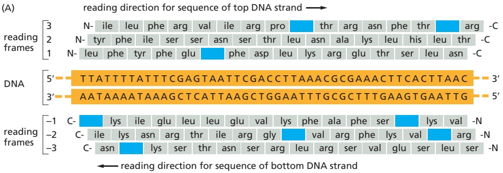


Figure 8–46 Finding the regions in a DNA sequence that encode a protein. (A) Any region of the DNA sequence can, in principle, code for six different amino acid sequences, because any one of three different reading frames can be used to interpret the nucleotide sequence on each strand. Note that a nucleotide sequence is always read in the 5′-to-3′ direction and encodes a polypeptide from the N-terminus to the C-terminus. For a random nucleotide sequence read in a particular frame, a stop signal for protein synthesis is encountered, on average, about once every 20 amino acids. In this sample sequence of 48 base pairs, each such signal (stop codon) is colored blue, and only reading frame 2 lacks a stop signal. (B) Search of a 1700-base-pair DNA sequence for a possible protein-encoding sequence. The information is displayed as in panel A, with each stop signal for protein synthesis denoted by a blue line. In addition, all of the regions between possible start and stop signals for protein synthesis are displayed as red bars. Only reading frame 1 actually encodes a protein, which is 475 amino acid residues long.

This strategy works very well for compact genomes, where intron sequences are rare and ORFs often extend for many hundreds of amino acids. However, in many animals and plants, the average exon size is 150–200 nucleotide pairs, and additional information is usually required to unambiguously locate all the exons of a gene. Although it is possible to search genomes for splicing signals and other features that help to identify exons (codon bias, for example), one of the most powerful methods is simply to sequence the total RNA produced from the genome in living cells. As can be seen in Figure 7–3, this RNA-seq information, when mapped onto the genome sequence, can be used to accurately locate all the introns and exons of even complex genes. By sequencing total RNA from different cell types, it is also possible to identify cases of alternative splicing.

RNA-seq also identifies noncoding RNAs produced by a genome. Although the function of some of them can be readily recognized (tRNAs or snoRNAs, for example), many have unknown functions and still others probably have no function at all. The existence of the many noncoding RNAs and our relative ignorance of their function is the main reason that we know only the approximate number of genes in the human genome.

But even for protein-coding genes that have been unambiguously identified, we still have much to learn. Thousands of genomes have been sequenced, and we know from comparative genomics that many organisms share the same basic set of proteins. However, the functions of a very large number of identified proteins remain unknown. Depending on the organism, approximately one-third of the proteins encoded by a sequenced genome do not clearly resemble any protein that has been studied biochemically. This observation underscores a limitation of the emerging field of genomics: although comparative analysis of genomes reveals a great deal of information about the relationships between genes and organisms, it often does not provide immediate information about how these genes function or what roles they have in the physiology of an organism. Comparison of the full gene complement of several thermophilic bacteria, for example, does not reveal why these bacteria thrive at temperatures exceeding 70°C. And examination of the genome of the incredibly radiation-resistant bacterium Deinococcus radiodurans does not explain how this organism can survive a blast of radiation that can shatter glass. Further biochemical and genetic studies, like those described in the other sections of this chapter, are required to determine how genes, and the proteins they produce, function in the context of living organisms.

#### Summary

DNA cloning allows a copy of any specific part of a DNA or RNA sequence to be selected from the millions of other sequences in a cell and produced in unlimited amounts in pure form. DNA sequences can be amplified by inserting the desired DNA fragment into a self-replicating genetic element such as a bacterial plasmid. Bypassing cloning vectors and bacterial cells altogether, the polymerase chain reaction (PCR) allows DNA cloning to be performed directly with a DNA polymerase and DNA primers—provided that the DNA sequence of interest is already known.

The procedures used to obtain DNA clones that correspond in sequence to mRNA molecules are the same, except that a DNA copy of the mRNA sequence, called cDNA, is first made. Unlike genomic DNA clones, cDNA clones lack intron sequences, making them the clones of choice for analyzing the protein product of a gene.

Nucleic acid hybridization reactions provide a sensitive means of detecting any nucleotide sequence of interest. The enormous specificity of this hybridization reaction allows any single-strand sequence of nucleotides to be labeled with a radioisotope or chemical and used as a probe to find a complementary partner strand, even in a cell or cell extract that contains millions of different DNA and RNA sequences. DNA hybridization also makes it possible to use PCR to amplify any section of any genome once its sequence is known.

The nucleotide sequence of any genome can be determined rapidly and simply by using highly automated techniques that are based on several different strategies. Comparison of the genome sequences of different organisms allows us to trace the evolutionary relationships among genes and organisms, and it has proved valuable for discovering new genes and predicting their functions.


<!-- END EN EN08-H023-H041 -->

<a id="EN09-H009-H010"></a>

### 英文补充：抗体定位与荧光蛋白标记

> 对应中文板块：抗体定位与荧光蛋白标记。英文来源：Molecular Biology of the Cell，第7版，第9章；[本章完整原文](../../来源/英文教材/09_Visualizing_Cells_and_Their_Molecules/chapter.md)。物理PDF页码范围：602–641（整章范围）。

<!-- BEGIN EN EN09-H009-H010 -->
#### Antibodies Can Be Used to Detect Specific Proteins

Antibodies are proteins produced by the vertebrate immune system as a defense against infection (discussed in Chapter 24). They are unique among proteins in that they are made in billions of different forms, each with a different binding site that recognizes a specific target molecule (or antigen). The precise antigen specificity of antibodies makes them powerful tools for the cell biologist. When chemically coupled to fluorescent dyes, antibodies are invaluable for locating specific molecules in cells by fluorescence microscopy (**Figure 9–14**). When labeled with electron-dense particles such as colloidal gold spheres, they are used for similar purposes in the electron microscope (discussed later). The antibodies employed in microscopy are commonly either purified from antiserum so as to remove all nonspecific antibodies or they are specific monoclonal antibodies that only recognize the target molecule.

When we use antibodies as probes to detect and assay specific molecules in cells, we frequently use methods to amplify the fluorescent signal they produce. For example, although a marker molecule such as a fluorescent dye can be linked directly to an antibody—the primary antibody—a stronger signal is achieved by using an unlabeled primary antibody and then detecting it with a group of labeled secondary antibodies that bind to it (**Figure 9–15**). This process is called indirect immunocytochemistry.

(A)


Figure 9–14 Immunofluorescence. (A) A transmission electron micrograph of the periphery of a cultured epithelial cell showing the distribution of microtubules and other filaments. (B) The same area stained with fluorescent antibodies against tubulin, the protein that assembles to form microtubules, using the technique of indirect immunocytochemistry (see Figure 9–15). Red arrows indicate individual microtubules that are readily recognizable in both images. Note that, because of diffraction effects, the microtubules in the light microscope appear 0.2 μm wide rather than their true width of 0.025 μm. (© 1978 M. Osborn et al. Originally published in J. Cell Biol. doi 10.1083/jcb.77.3.R27. With permission from Rockefeller University Press.)

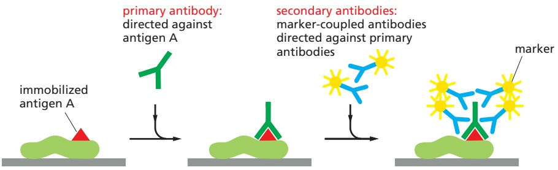

Figure 9–15 Indirect immunocytochemistry. This detection method is very sensitive because many molecules of the secondary antibody recognize each primary antibody. The secondary antibody is covalently coupled to a marker molecule that makes it readily detectable. Commonly used marker molecules include fluorescent dyes (for fluorescence microscopy) and colloidal gold spheres (for electron microscopy).

#### Individual Proteins Can Be Fluorescently Tagged in Living Cells and Organisms

Even the most stable cell structures must be assembled, disassembled, and reorganized during the cell’s life cycle. Other structures, often enormous on the molecular scale, rapidly change, move, and reorganize themselves as the cell conducts its internal affairs and responds to its environment. Complex, highly organized pieces of molecular machinery move components around the cell, controlling traffic into and out of the nucleus, from one organelle to another, and into and out of the cell itself.

Various techniques have been developed to visualize the specific components involved in such dynamic phenomena, and many of these methods use fluorescent proteins. All of the fluorescent molecules discussed so far are made outside the cell and then artificially introduced into it. But the use of genes encoding protein molecules that are themselves inherently fluorescent also enables the creation of organisms and cell lines that make their own visible tags and labels, without the introduction of foreign molecules. These cellular exhibitionists display their inner workings in glowing fluorescent color.

Foremost among the fluorescent proteins used for these purposes by cell biologists is the **green fluorescent protein (GFP)**, isolated from the jellyfish Aequorea victoria. This protein is encoded by a single gene, which can be cloned and introduced into cells of other species. The freshly translated protein is not fluorescent, but within an hour or so (less for some alleles of the gene, more for others) some of the amino acids undergo a self-catalyzed post-translational modification to generate an efficient fluorochrome, shielded within the interior of a barrel-like protein, which will now fluoresce green when illuminated appropriately with blue light (**Figure 9–16**). Extensive site-directed mutagenesis performed on the

Figure 9–16 Green fluorescent protein (GFP). (A) The structure of GFP, shown here schematically, highlights the eleven β strands that form the staves of a barrel, buried within which is the active chromophore (dark green). (B) The chromophore is formed post-translationally from the protruding side chains of two amino acid residues in a series of autocatalytic steps. (A, PDB code: 1EMA, from M. Ormö et al., Science 273:1392–1395, 1996. With permission from AAAS.)

(A)

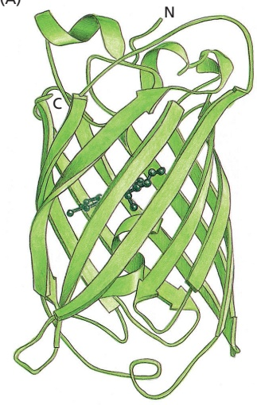

(B)


500 µm

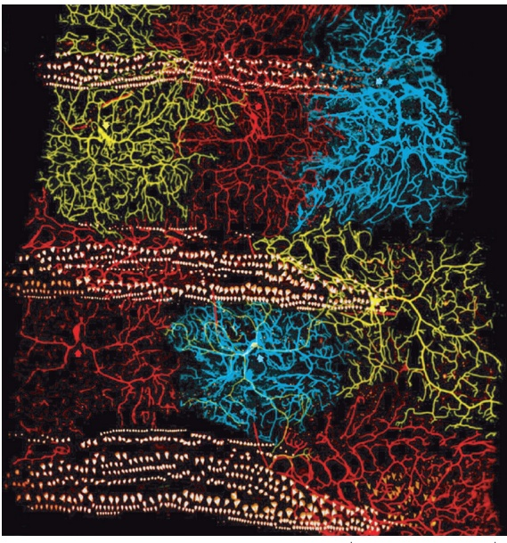

(A)

(B)

500 µm

Figure 9–17 Fluorescent proteins as reporter molecules. (A) For this experiment, carried out in the fruit fly, the GFP gene was joined (using recombinant DNA techniques) to a fly promoter that is active only in a specialized set of neurons. This image of a live fly embryo was captured by a fluorescence microscope and shows approximately 20 neurons, each with long projections (axons and dendrites) that communicate with other (nonfluorescent) cells. These neurons are located just under the surface of the animal and allow it to sense its immediate environment. (B) In a variation of this method, three different fluorescent proteins, red, yellow, and cyan, can be expressed at random in neurons of the live fly embryo. The genetic constructs have been arranged such that a strong pulse of blue light will activate the expression of one or other of the three fluorescent proteins at random in neuronal cells, where they are then targeted to the plasma membrane. This noninvasive control of the timing of cell labeling allows the behavior of individual. / . cells to be followed subsequently over time. The fine detail of all the dendrites of individual sensory neurons can be clearly seen. The lines of pale dots arise from the autofluorescence of the bands of denticles in the cuticle that define the segments of the embryo (see Figure 21–24). (A, from W.B. Grueber et al., Curr. Biol. 13:618–626, 2003. With permission from Elsevier; B, from M. Boulina et al., Development 140:1605–1613, 2013, doi 10.1242/dev.088930. © 2013. Published by the Company of Biologists Ltd.)

original gene sequence has resulted in multiple variants that can be used effectively in organisms ranging from animals and plants to fungi and microbes. The fluorescence efficiency has also been improved, and variants have been generated with altered absorption and emission spectra from the blue-green, like blue fluorescent protein (BFP), to the far visible red. Other, related fluorescent proteins have since been discovered (for example, in corals) that also extend the range into the red region of the spectrum, like red fluorescent protein (RFP).

One of the simplest uses of GFP is as a reporter molecule, a fluorescent probe to monitor gene expression. A transgenic organism can be made with the GFP-coding sequence placed under the transcriptional control of the promoter belonging to a gene of interest, giving a directly visible readout of the gene’s expression pattern in the living organism (**Figure 9–17**). In another application, a peptide location signal can be added to the GFP to direct it to a particular cell compartment, such as the endoplasmic reticulum or a mitochondrion (see Figure 9–25B), lighting up these organelles so they can be observed in the living state.

The GFP DNA-coding sequence can also be inserted at the beginning or end of the coding sequence for another protein, yielding a chimeric product consisting of that protein with a new GFP domain attached. In many cases, this GFP fusion protein behaves in the same way as the original protein, directly revealing its location and activities by means of its genetically encoded fluorescence (**Figure 9–18**). It is often possible to prove that the GFP fusion protein is functionally equivalent

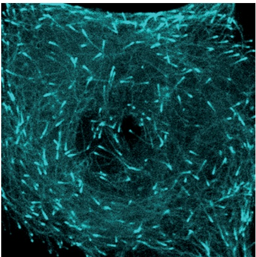

2 µm

Figure 9–18 GFP-tagged proteins. This cultured mammalian cell is expressing EB3, a plus-end tracking protein that is fused to a GFP-derived blue fluorescent protein (BFP). These proteins associate with the plus ends of growing microtubules (see Figure 16–49), and their dynamics can be followed as they appear to zoom brightly around the cell. (Courtesy of Carl Zeiss Microscopy, GmbH.)

to the untagged protein, for example by using it to rescue a mutant lacking that protein. GFP tagging is the clearest and most unequivocal way of showing the distribution and dynamics of a protein in a living organism (see Movie 16.8).


<!-- END EN EN09-H009-H010 -->

## 跨章相关英文内容

- 免疫检测所需抗体的分子基础：[EN第24章 · 适应性免疫、B细胞、抗体、T细胞与MHC](../../补充专题/免疫系统.md#EN24-H010-H032)。
