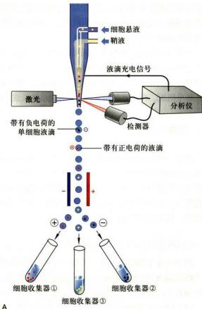
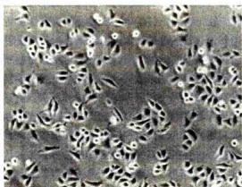
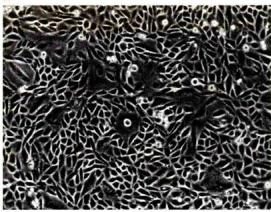
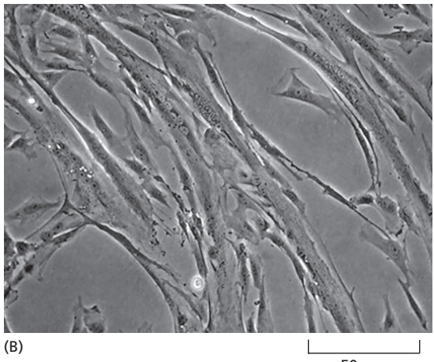
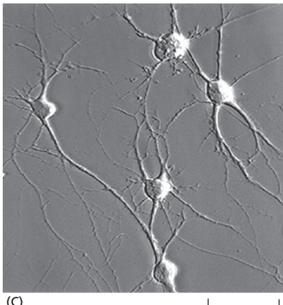
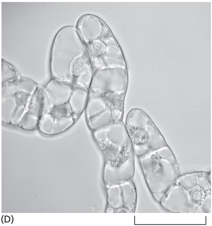

# 第2章 细胞生物学研究方法 · 第三节 细胞培养与细胞工程

[返回本章](../README.md) · [中文本章原文](../中文原文.md)

<!-- BEGIN CN CN02-S03 -->
## 第三节 细胞培养与细胞工程

## 一、细胞培养

细胞培养是当前细胞生物学乃至整个生命科学研究与生物工程中最基本的实验技术。干细胞生物学的发展及其应用在很大程度上基于细胞培养技术的发展。细胞培养包括原核生物细胞（如大肠杆菌）、真核单细胞（如酵母菌、四膜虫）、植物细胞与动物细胞的培养以及与此密切相关的病毒的培养。本节扼要介绍动植物细胞培养技术以及与细胞培养直接相关的一些技术。

## （一）动物细胞培养

体外培养的动物细胞可分为原代细胞（primary culture cell）与传代细胞（subculture cell）。原代细胞是指从机体取出后立即培养的细胞，进行传代培养后的细胞即称为传代细胞。也有人把传至10代以内的细胞统称为原代细胞培养。适应在体外培养条件下持续传代培养的细胞称为传代细胞。

任何动物细胞的培养均需从原代细胞培养做起。动物很多组织的细胞，如幼年动物的肾、肺、卵巢、精巢、肌肉及肿瘤等组织的细胞较易培养，而神经细胞等则较难培养。原代细胞培养步骤如下：首先取出健康动物的组织块，剪碎，用浓度与活性适中的胰酶或胶原酶与EDTA（螯合剂）等将细胞连接处消化使其分散，给予良好的营养液与无菌的培养环境（接近体温与体内pH），在培养中进行静置或慢速转动培养。但不论用何种培养液一般都要加一定量的小牛（或胎牛）血清，这样细胞才能很好地贴壁生长与分裂（图2-28A）。

  
图2-27 流式细胞仪的工作原理  
A. 流式细胞仪分选原理示意图。B. 显示流式细胞仪分析处在不同时相的 HeLa 细胞的实验结果。(B 图由杜立颖惠赠)

分散的细胞悬液在培养瓶中很快（在几十分钟至数小时内）就贴附在瓶壁上，称为细胞贴壁。分散呈圆球形的细胞一经贴壁就迅速铺展并开始有丝分裂，逐渐形成致密的细胞单层，称为单层细胞（single layer cell），这种培养方法称为单层细胞培养。

原代培养的细胞一般传至10代左右就不易传下去了，细胞生长出现停滞，大部分细胞衰老死亡，但有极少数细胞可能渡过“危机”而传下去。这些存活的细胞一般又可顺利地传40\~50代次，并且仍保持原来染色体的二倍体数量及接触抑制的行为，很多学者把这种传代细胞称作细胞系（cell line）。一般情况下（胚胎干细胞等除外），当细胞传至50代以后又要出现“危机”，难以再传下去。这种传代次数有限的体外培养细胞通常称为有限细胞系（finite cell line）。但在传代过程中如有部分细胞发生了遗传突变，并使其带有癌细胞的特点，有可能在培养条件下无限制地传代培养下去，这种传代细胞称为永生细胞系（infinite cell line），或连续细胞系（continuous cell line）。该细胞系细胞的根本特点是染色体明显改变，一般呈亚二倍体或非整倍体，失去接触抑制，容易传代培养。HeLa细胞系（来自宫颈瘤细胞）、BHK21（baby hamster kidney）细胞系与CHO（Chinese hamster ovany）细胞系等都是常用的连续细胞系（图2-28B、C）。依靠这些细胞系做了大量卓有成效的研究工作。

用单细胞克隆培养或通过药物筛选的方法从某一细胞系中分离出单个细胞，并由此增殖形成的、具有基本相同的遗传性状的细胞群体称为细胞克隆。该细胞群体经过生物学鉴定，如具有特殊的遗传标记或性质，这样的细胞系可以称为细胞株（cell strain）。

体外培养的细胞，不论是原代细胞还是传代细胞，一般不能保持体内原有的细胞形态。但大体可以分为两种基本形态：成纤维样细胞（fibroblast like cell）与上皮样细胞（epithelial like cell）。此外还有一些可移动的游走细胞。

某些传代细胞还可用悬浮方法培养。其培养条件比较复杂，悬浮培养的最大优点是在有限的培养液中获得大量细胞。

## （二）植物细胞培养

目前植物细胞培养主要有两种类型：

（1）细胞培养 常用单倍体细胞培养，这种培养方法主要用花药在人工培养基上进行培养。可以从小孢子（雄性生殖细胞）直接发育成胚状体，然后长成单倍体植株。单倍体细胞培养在植物育种中已取得了很大成就。

  
图2-28 体外培养的细胞  
A. 长满单层的牛肾原代细胞。B. 正在生长分裂的 HeLa 细胞。C. 长满单层的 CHO 原代细胞。（任显辉博士和邱殷庆博士惠赠）

(2) 原生质体培养 一般用植物的体细胞（二倍体细胞），先经纤维素酶处理去掉细胞壁，去壁的细胞称为原生质体（protoplast）。原生质体在无菌培养基中可以生长与分裂，经过诱导分化最终可长成植株。也可以用不同植物的原生质体进行融合与体细胞杂交，由此而获得体细胞杂交的植株。转基因植物细胞的培养与分化的研究是植物基因工程的基础。

目前在植物无性繁殖中常采用植物组织培养，即分离出小块的植物体，又称外殖体（explant），在体外无菌条件下进行培养，形成愈伤组织（callus），即植物创面的新生组织。在一定条件下，诱导分化最终长成植株。

## 二、细胞工程

细胞工程是生物工程的重要领域之一。细胞工程所涉及的主要技术包括细胞培养、细胞分化的定向诱导、细胞融合和显微注射等。通过细胞融合技术发展起来的单克隆抗体技术已取得了重大成就。细胞工程与基因工程结合，前景尤为广阔。

## （一）细胞融合与单克隆抗体技术

两个或多个细胞融合成一个双核或多核细胞的现象称为细胞融合（cell fusion）。介导动物细胞融合常用的促融剂有灭活的病毒（如仙台病毒）或化学物质（如聚乙二醇，PEG）；植物细胞融合时，要先用纤维素酶去掉细胞壁，然后才便于原生质体融合。20世纪80年代又发明了电融合技术（electrofusion method）。将悬浮细胞在低压交流电场中聚集成串珠状细胞群，或对相互接触的单层培养细胞，再施加高压电脉冲处理使其融合。

1975年，英国科学家C. Milstein和G.J.F.Köhler将产生抗体的淋巴细胞同肿瘤细胞融合，成功地建立了B.淋巴细胞杂交瘤技术（B-lymphocyte hybridoma technique）用于制备单克隆抗体（monoclonal antibody），他们因此而获得1984年的诺贝尔生理学或医学奖。动物受到外界抗原刺激后可激发B.淋巴细胞活化，产生相应的抗体，但B.淋巴细胞在体外难以增殖，而一些骨髓瘤细胞[TK（胸苷激酶）或HGPRT（次黄嘌呤鸟嘌呤磷酸核糖）缺陷型]不分泌抗体，但在体外培养条件下可以无限传代。为了大量制备纯一的单克隆抗体，Milstein和Köhler把小鼠骨髓瘤细胞与经绵羊红细胞免疫过的小鼠脾细胞（B淋巴细胞）在聚乙二醇或灭活的病毒的介导下发生融合。融合后的杂交瘤细胞具有两种亲本细胞的特性，一方面可分泌抗绵羊红细胞的抗体，另一方面像肿瘤细胞一样，可在体外培养条件下或移植到体内无限增殖。由于骨髓瘤细胞缺乏TK或HGPRT，在含氨基蝶呤的培养液内不能成活。只有融合细胞才能在含HAT（次黄嘌呤、氨基蝶呤和胸腺嘧啶核苷）的培养液内通过旁路合成核酸而得以生存。通过HAT选择培养和细胞克隆，可以获得能大量分泌单克隆抗体的杂交瘤细胞株。单克隆抗体的制备过程如图2-29所示。

  
图2-29 单克隆抗体制备过程示意图

单克隆抗体技术最主要的优点是可以用混合性的异质抗原制备出针对某单一性抗原分子上特异决定簇的同质性单克隆抗体。单克隆抗体技术与基因克隆技术相结合为分离和鉴定新的蛋白质和基因开辟了一条广阔途径。而且在临床诊断与肿瘤等疾病的治疗中也具有重要作用。

## （二）显微操作技术与动物的克隆

真核细胞是由细胞核和细胞质两大部分组成的，为了探明核质相互作用的机制，科学家们创建了细胞拆合技术。所谓细胞拆合，就是把细胞核与细胞质分离开来，然后把不同来源的胞质体（cytoplast）和核质体（karyoplast）相互组合，形成核质杂交细胞。

细胞拆合可以分为物理法和化学法两种类型。物理法就是用机械方法或短波光把细胞核去掉或使之失活，然后用微吸管吸取其他细胞的核，注入去核的细胞质中，组成新的杂交细胞。这种核移植必须用显微操纵仪进行操作。化学法是用细胞松弛素B（cytochalasin B）处理细胞，细胞出现排核现象，再结合离心技术，将细胞拆分为核质体和胞质体两部分。显微操作（micromanipulation）技术是早期建立的一种实验胚胎学技术，即在显微镜下，用显微操作装置对细胞进行解剖和微量注射（microinjection）的技术。现在显微操作装置的设计愈来愈精密，不仅用于核移植，而且亦可对细胞核进行解剖和向核内注入基因（图2-30）。

  
图2-30 应用显微注射技术进行细胞核移植（邓宏魁博士提供）

细胞拆合、显微注射与现代分子生物学技术相结合使这些经典的胚胎学技术展现出极大的潜力，它不仅成为核质关系、细胞内某种 mRNA 或蛋白质功能等基础研究的重要手段，而且在转基因动物、高等动物的克隆方面的理论与实践研究中取得了重大的突破。

<!-- END CN CN02-S03 -->

---

## 对应英文内容

### 英文补充：细胞培养、细胞系与杂交瘤单克隆抗体

> 对应中文板块：细胞培养、细胞系与杂交瘤单克隆抗体。英文来源：Molecular Biology of the Cell，第7版，第8章；[本章完整原文](../../来源/英文教材/08_Analyzing_Cells_Molecules_and_Systems/chapter.md)。物理PDF页码范围：514–601（整章范围）。

<!-- BEGIN EN EN08-H000-H006 -->
WAYS OF WORKING WITH CELLS

#### Analyzing Cells, Molecules, and Systems

Progress in science is often driven by advances in technology. The entire field of cell biology, for example, came into being when optical craftsmen learned to grind small lenses of sufficiently high quality to observe cells and their substructures. Innovations in lens grinding, rather than any conceptual or philosophical advance, allowed Hooke and van Leeuwenhoek to discover a previously unseen cellular world, where tiny creatures tumble and twirl in a droplet of water (**Figure 8–1**).

The twenty-first century is a particularly exciting time for biology. New methods for analyzing cells, proteins, DNA, and RNA are fueling an information explosion and allowing scientists to study cells and their macromolecules in previously unimagined ways. We now have access to the sequences of many billions of nucleotides, providing the complete molecular blueprints for hundreds of organisms—from microbes and mustard weeds to worms, flies, mice, dogs, chimpanzees, and humans. And powerful new techniques are helping us to decipher that information, allowing us not only to compile huge, detailed catalogs of genes and proteins but also to begin to unravel how these components work together to form functional cells and organisms. The long-range goal is nothing short of obtaining a complete understanding of what takes place inside a cell as it responds to its environment and interacts with its neighbors.

In this and the following chapter, we present some of the principal methods used to study cells and their molecular components. Chapter 9 describes the remarkable advances in microscopy that have helped fuel our understanding of the structure and function of cells. In this chapter, we first discuss the rapidly developing methods for analysis of the molecules and genes that drive cell behavior. We present the techniques used to determine protein structure, function, and interactions, and we discuss the breakthroughs in DNA technology that continue to revolutionize our understanding of cell function. We end the chapter with an overview of some of the mathematical approaches that are helping us understand the enormous complexity of cells. By considering cells as dynamic systems with many moving parts, mathematical approaches can reveal hidden insights into

C HAP T E R

#### IN THIS CHAPTER

Isolating Cells and Growing Them in Culture

Purifying Proteins

Analyzing Proteins

Analyzing and Manipulating DNA

Studying Gene Function and Expression

Mathematical Analysis of Cell Function

how the many components of cells work together to produce the special qualities of life.

#### ISOLATING CELLS AND GROWING THEM IN CULTURE

As described in Chapter 1, numerous model organisms are used by researchers to unravel the molecular basis of cell biology. In the first section of this chapter, we concern ourselves with the organisms and cells best suited for biochemical studies of proteins in the cell. Typically, we gain access to these proteins by obtaining large numbers of cells and physically breaking them open. Unicellular organisms, such as bacteria and yeast, are easy to produce in large amounts in the laboratory and are rich sources of the proteins involved in fundamental cell processes. But a deep understanding of human proteins in specific cell types requires human cells, or at the very least cells from a mammal. Specific animal tissues can be a useful solution, but these tend to be composed of a heterogeneous mixture of cell types. To obtain as much information as possible about specific cell types in a tissue, biologists have developed ways of dissociating cells from tissues and separating them according to type. These manipulations result in a relatively homogeneous population of cells that can then be analyzed—either directly or after their number has been greatly increased by allowing the cells to proliferate in culture.

#### Cells Can Be Isolated from Tissues and Grown in Culture

Intact tissues provide the most realistic source of material, as they represent the actual cells found within the body. For some biochemical preparations, the protein of interest can be obtained in sufficient quantity without having to separate the tissue or organ into cell types. Examples include the preparation of histones from calf thymus, actin from rabbit muscle, or tubulin from cow brain. For the majority of proteins, however, tissues are not an ideal source and it is preferable to use specific cell types grown in culture. Cultured cells provide a more homogeneous population of cells from which to extract material, and they are also much more convenient to work with in the laboratory. Given appropriate surroundings, most animal cells can live, multiply, and even express differentiated properties in a culture dish. The cells can be watched continually under the microscope or analyzed biochemically, and the effects of adding or removing specific molecules, such as hormones or growth factors, can be systematically explored.

Experiments performed on cultured cells are sometimes said to be carried out in vitro (literally, “in glass”) to contrast them with experiments using intact organisms, which are said to be carried out in vivo (literally, “in the living organism”). These terms can be confusing, however, because they are often used in a very different sense by biochemists. In the biochemistry lab, in vitro refers to reactions carried out in a test tube in the absence of living cells, whereas in vivo refers to any reaction taking place inside a living cell, even if that cell is growing in culture.

Tissue culture began in 1907 with an experiment designed to settle a controversy in neurobiology. The hypothesis under examination was known as the neuronal doctrine, which proposed that each nerve fiber is the outgrowth of a single nerve cell and not the product of the fusion of many cells. To test this contention, small pieces of spinal cord were placed in lymphatic fluid in a warm, moist chamber and observed at regular intervals under the microscope. After a day or so, individual nerve cells could be seen extending long, thin filaments (axons) into the clot. Thus, the neuronal doctrine received strong support, and the foundation was laid for the cell-culture revolution.

These original experiments on nerve fibers used cultures of small tissue fragments called explants. Today, cultures are more commonly made from suspensions of cells dissociated from tissues. The first step in isolating individual cells is to disrupt the extracellular matrix and cell–cell junctions that hold the cells together. For this purpose, a tissue sample is typically treated with proteolytic enzymes (such as trypsin and collagenase) to digest proteins in the extracellular matrix and with agents (such as ethylenediaminetetraacetic acid, or EDTA) that bind, or chelate, the $\mathrm { C a ^ { 2 + } }$ on which cell–cell adhesion depends. The tissue can then be teased apart into single cells by gentle agitation.

Figure 8–1 Microscopic life. A sample of “diverse animalcules” seen by van Leeuwenhoek using his simple microscope. (A) Bacteria seen in material he excavated from between his teeth. Those in fig. B he described as “swimming first forward and then backwards” (1692). (B) The eukaryotic green alga Volvox (1700). (Courtesy of the John Innes Foundation.)

20 µm

50 µm

(C)

50 µm

Figure 8-2 Light micrographs of cells in culture. (A) Mouse fibroblasts. (B) Chick myoblasts fusing to form multinucleate muscle cells. (C) Purified rat retinal ganglion nerve cells. (D) Tobacco cells in liquid culture. (A, courtesy of Daniel Zicha; B, courtesy of Rosalind Zalin; C, from A. Meyer-Franke et al., Neuron 15:805–819, 1995. With permission from Elsevier; D, courtesy of Gethin Roberts.)

Unlike yeast, most tissue cells are not adapted to living suspended in fluid and require a solid surface on which to grow and divide. For cell cultures, this support is usually provided by the surface of a plastic culture dish. Cells vary in their requirements, however, and many do not proliferate or differentiate unless the culture dish is coated with materials that cells adhere to, such as polylysine or extracellular matrix components.

Cultures prepared directly from the tissues of an organism are called primary cultures. These can be made with or without an initial fractionation step to separate different cell types. In most cases, cells in primary cultures can be removed from the culture dish and recultured repeatedly in so-called secondary cultures; in this way, they can be repeatedly subcultured (passaged) for weeks or months. Such cells often display many of the differentiated properties appropriate to their origin (**Figure 8–2**): fibroblasts continue to secrete collagen; cells derived from embryonic skeletal muscle fuse to form muscle fibers that contract spontaneously in the culture dish; nerve cells extend axons that are electrically excitable and make synapses with other nerve cells; and epithelial cells form extensive sheets with many of the properties of an intact epithelium. Because these properties are maintained in culture, they are accessible to study in ways that are often not possible in intact tissues.

Cell culture is not limited to animal cells. When a piece of plant tissue is cultured in a sterile medium containing nutrients and appropriate growth regulators, many of the cells are stimulated to proliferate indefinitely in a disorganized manner, producing a mass of relatively undifferentiated cells called a callus. If the nutrients and growth regulators are carefully manipulated, one can induce the formation of a shoot and then root apical meristems within the callus, and,

Embryonic stem cells are an important cell type isolated from the early mammalian embryo. As described in Chapter 22, these cells are pluripotent; that is, they have the potential to differentiate into any cell type in the body. When cultured in the presence of the appropriate extracellular signaling factors and nutrients, stem cells can be directed to differentiate into a wide range of specific cell types. Under some conditions, it is even possible to stimulate these cells to assemble into three-dimensional multicellular structures that are miniature versions of certain organs, such as the gut. These organoids provide a powerful tool for the analysis of tissue function (see Chapter 22).

50 µm

\*Many of these cell lines were derived from tumors. All of them are capable of indefinite replication in culture and express at least some of the special characteristics of their cells of origin.

in many species, regenerate a whole new plant. Similar to animal cells, callus cultures can be dissociated into single cells, which will grow and divide as a suspension culture (see Figure 8–2D).

#### Eukaryotic Cell Lines Are a Widely Used Source of Homogeneous Cells

The cell cultures obtained by disrupting tissues tend to suffer from a problem— eventually the cells die. Most vertebrate cells stop dividing after a finite number of cell divisions in culture, a process called replicative cell senescence (discussed in Chapter 17). Normal human fibroblasts, for example, typically divide only 25–40 times in culture before they stop. In these cells, the limited proliferation capacity reflects a progressive shortening and uncapping of the cell’s telomeres, the repetitive DNA sequences and associated proteins that cap the ends of each chromosome (discussed in Chapter 5). Human somatic cells in the body have turned off production of the enzyme, called telomerase, that normally maintains the telomeres, which is why their telomeres shorten with each cell division. Human fibroblasts can often be coaxed to proliferate indefinitely by providing them with the gene that encodes the catalytic subunit of telomerase; in this case, they can be propagated as an immortalized cell line.

Some human cells, however, cannot be immortalized by this trick. Although their telomeres remain long, they still stop dividing after a limited number of divisions because culture conditions cause excessive stimulation of cell proliferation, which activates a poorly understood protective mechanism that stops cell division—a process sometimes called culture shock. To immortalize these cells, one has to do more than introduce telomerase. One must also inactivate the protective mechanisms, which can be done by introducing certain cancerpromoting oncogenes (discussed in Chapter 20).

Unlike human cells, most rodent cells do not turn off production of telomerase, and therefore their telomeres do not shorten with each cell division. Therefore, if culture shock can be avoided, some rodent cell types will divide indefinitely in culture. In addition, rodent cells often undergo spontaneous genetic changes in culture that inactivate their protective mechanisms, thereby producing immortalized cell lines.

Cell lines can often be most easily generated from cancer cells, but these cultures—referred to as transformed cell lines—differ from those prepared from normal cells in several ways. Transformed cell lines often grow without attaching to a surface, for example, and they can proliferate to a much higher density in a culture dish. Similar properties can be induced experimentally in normal cells by transforming them with a tumor-inducing virus or chemical. The resulting transformed cell lines can usually cause tumors if injected into a susceptible animal.

Transformed and nontransformed cell lines are extremely useful in cell research as sources of very large numbers of cells of a uniform type, especially because they can be stored in liquid nitrogen at –196°C for an indefinite period and retain their viability when thawed. It is important to keep in mind, however, that cell lines nearly always differ in important ways from their normal progenitors in the tissues from which they were derived.

Some widely used cell lines are listed in **Table 8–1**. Different lines have different advantages; for example, the PtK epithelial cell lines derived from the rat kangaroo remain flat during mitosis (unlike many other cell types), allowing the mitotic apparatus to be readily observed in action.

#### Hybridoma Cell Lines Are Factories That Produce Monoclonal Antibodies

As we see in this chapter and throughout this book, antibodies are particularly useful tools for cell biology. Their great specificity allows precise detection of selected proteins among the many thousands that each cell typically produces.

<table><tbody><tr><td colspan="2">TABLE 8-1 Some Commonly Used Cell Lines</td></tr><tr><td>Cell line*</td><td>Cell type and origin</td></tr><tr><td>NIH-3T3</td><td>Fibroblast (mouse)</td></tr><tr><td>MDCK</td><td>Kidney epithelial cell (dog)</td></tr><tr><td>HeLa</td><td>Cervical epithelial cell (human)</td></tr><tr><td>PtK</td><td>Kidney epithelial cell (rat kangaroo)</td></tr><tr><td>L6</td><td>Myoblast (rat)</td></tr><tr><td>PC12</td><td>Chromaffin cell (rat)</td></tr><tr><td>COS</td><td>Kidney fibroblast (monkey)</td></tr><tr><td>HEK293</td><td>Kidney epithelial cell (human)</td></tr><tr><td>CHO</td><td>Ovary epithelial cell (Chinese hamster)</td></tr><tr><td>RPE</td><td>Retinal pigment epithelial cell (human)</td></tr><tr><td>Vero</td><td>Kidney epithelial cell (African green monkey)</td></tr><tr><td>Jurkat</td><td>White blood cell (human)</td></tr></tbody></table>

Figure 8–3 The production of hybrid cells. It is possible to fuse one cell with another to form a heterokaryon, a combined cell with two separate nuclei. Typically, a suspension of cells is treated with certain inactivated viruses or with polyethylene glycol, each of which alters the plasma membranes of cells in a way that induces them to fuse. Eventually, a heterokaryon proceeds to mitosis and produces a hybrid cell in which the two separate nuclear envelopes have been disassembled, allowing all the chromosomes to be brought together in a single large nucleus. Such hybrid cells can give rise to immortal hybrid cell lines. If one of the parent cells was from a tumor cell line, the hybrid cell is called a hybridoma.

Antibodies are often produced by inoculating animals with the protein of interest and subsequently isolating the antibodies specific to that protein from the serum of the animal. However, only limited quantities of antibodies can be obtained from a single inoculated animal, and the polyclonal antibodies produced will be a heterogeneous mixture of antibodies that recognize a variety of different antigenic. / . sites on the protein. Moreover, antibodies specific for the antigen will constitute only a fraction of the antibodies found in the serum. An alternative technology, which allows the production of an unlimited quantity of identical antibodies and greatly increases the specificity and convenience of antibody-based methods, is the production of monoclonal antibodies by hybridoma cell lines.

This procedure involves propagating a clone of cells from a single antibodysecreting B lymphocyte to obtain a homogeneous preparation of antibodies in large quantities. B lymphocytes normally have a limited life span in culture, but individual antibody-producing B lymphocytes from an immunized mouse, when fused with cells derived from a transformed B lymphocyte cell line, can give rise to hybrids that have both the ability to make a particular antibody and the ability to multiply indefinitely in culture (**Figure 8–3**). These **hybridomas** are propagated as individual clones, each of which provides a permanent and stable source of a single type of **monoclonal antibody**. Each type of monoclonal antibody recognizes a single type of antigenic site; for example, a particular cluster of five or six amino acid side chains on the surface of a protein. Their uniform specificity makes monoclonal antibodies much more useful than conventional antisera for many purposes.

An important advantage of the hybridoma technique is that monoclonal anti-bodies can be made against molecules that constitute only a minor component of a complex mixture. In an ordinary antiserum made against such a mixture, the proportion of antibody molecules that recognize the minor component would be too small to be useful. But if the B lymphocytes that produce the various components of this antiserum are made into hybridomas, it becomes possible to screen individual hybridoma clones from the large mixture to select one that produces the desired type of monoclonal antibody and to propagate the selected hybridoma indefinitely so as to produce that antibody in unlimited quantities. In principle, therefore, a monoclonal antibody can be made against any protein in a biological sample. Once an antibody has been made, it can be used to localize the protein in cells and tissues, to follow its movement, and to purify the protein to study its structure and function.

Monoclonal antibodies are not just useful research tools but are valuable as treatments for a number of human diseases. Certain cancers, for example, can be treated by intravenous infusion of monoclonal antibodies that bind and inhibit signaling receptors on the cancer cell surface, thereby reducing proliferation of the tumor cells. In other cases, monoclonal antibodies that bind specific cell-surface immune regulators can promote immunological attack of cancer cells. Monoclonal antibodies that bind and inhibit specific immunestimulatory molecules provide useful therapies in autoimmune diseases such as rheumatoid arthritis. Monoclonal antibodies against specific viral proteins can reduce infection. Given their exquisite specificity, it is likely that monoclonal antibodies will continue to be developed as effective therapies for these and other diseases.

#### Summary

Tissues can be dissociated into their component cells, from which individual cell types can be purified and used for biochemical analysis or for the establishment of cell cultures. Many animal and plant cells survive and proliferate in a culture dish if they are provided with a suitable culture medium containing nutrients and appropriate signal molecules. Although many animal cells stop dividing after a finite number of cell divisions, cells that have been immortalized through spontaneous mutations or genetic manipulation can be maintained indefinitely as cell lines. Hybridoma cells are widely employed to produce unlimited quantities of uniform monoclonal antibodies, which are used to detect and purify cell proteins, as well as to diagnose and treat diseases.

<!-- END EN EN08-H000-H006 -->

## 跨章相关英文内容

- 基因组工程和基因编辑：[EN第8章 · 遗传筛选、CRISPR、RNA干扰与功能基因组学](05_第五节%20模式生物与功能基因组的研究.md#EN08-H042-H072)。
- 核移植与克隆：[EN第22章 · 再生修复、胚胎干细胞、iPSC与谱系重编程](../../14_细胞分化与干细胞/小节/02_第二节%20干细胞.md#EN22-H018-H035)。
- 单克隆抗体与免疫球蛋白背景：[EN第24章 · 适应性免疫、B细胞、抗体、T细胞与MHC](../../补充专题/免疫系统.md#EN24-H010-H032)。
