# 第2章 细胞生物学研究方法 · 第四节 细胞及生物大分子的动态变化

[返回本章](../README.md) · [中文本章原文](../中文原文.md)

<!-- BEGIN CN CN02-S04 -->
## 第四节 细胞及生物大分子的动态变化

## 一、荧光漂白恢复技术

荧光漂白恢复（fluorescence photobleaching recovery, FPR）技术是使用亲脂性或亲水性的荧光分子，如荧光素、绿色荧光蛋白等与蛋白或脂质偶联，用于检测所标记分子在活体细胞表面或细胞内部的运动及其迁移速率。FPR技术的原理是：利用高能激光束照射细胞的某一特定区域，使该区域内标记的荧光分子发生不可逆的淬灭，这一区域称光漂白（photobleaching）区。随后，由于细胞中脂质分子或蛋白质分子的运动，周围非漂白区的荧光分子不断向光漂白区迁移。结果使光漂白区的荧光强度逐渐地恢复到原有水平。这一过程称荧光恢复(fluorescence recovery)。荧光恢复的速度在很大的程度上反映荧光标记的脂质或蛋白质在细胞中运动速率（图2-31）。FPR技术不仅能给出活细胞内脂质或蛋白质运动的定性的结果，而且还可以获得某些定量的信息。如膜脂分子的扩散系数和蛋白质的迁移率等，从而有助于解决细胞内脂质和蛋白质分子的动态变化以及与其他成分相互作用等一系列问题。

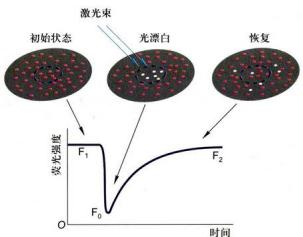  
图2-31 荧光漂白恢复技术原理示意图

## 二、酵母双杂交技术

酵母双杂交系统（yeast two-hybrid system）是一种利用单细胞真核生物酵母在体内分析蛋白质－蛋白质相互作用的系统。该技术由Fields等人于1989年首次建立，目前已得到广泛的应用。酵母双杂交系统的建立得益于对真核生物调控转录起始过程的认识和DNA重组质粒的构建技术。细胞基因转录起始需要转录激活因子的参与，转录激活因子一般由两个或两个以上相互独立的结构域构成，即DNA结合域（DNA binding domain, DB）和转录激活域（activation domain, AD）。前者可识别DNA上的特异转录调控序列并与之结合；后者可与其他成分作用形成转录复合体的，从而启动它所调节的基因的转录。酵母双杂交系统正是利用这个原理来研究蛋白质-蛋白质的相互作用。如果要证明蛋白A是否与蛋白B在细胞内相互作用，或寻找与蛋白A可能发生作用的蛋白，则可分别制备DB与蛋白A的融合蛋白（又称“诱饵”，bait)，以及AD与蛋白B或可能与蛋白A发生作用蛋白的融合蛋白（又称“猎物”，prey）。如果蛋白A与蛋白B或其他蛋白在细胞内相互结合，则可形成与转录激活因子类似的具有的DB和AD结构域的复合物，从而启动报告基因的表达。反之，则报告基因不表达。这样就可以分析蛋白质-蛋白质之间的相互作用（图2-32）。

  
图2-32 用于检测蛋白质－蛋白质互作的酵母双杂交技术原理示意图

酵母双杂交系统是一种具有高灵敏度的，在活细胞内研究蛋白质相互作用的实验技术。该技术既可以用来研究哺乳动物，也可以用来研究高等植物蛋白质之间的相互作用。因此，它在许多的研究领域诸如细胞信号转导网络中各种蛋白质的相互关系等方面有着广泛的应用。值得提出的是，由于“猎物”蛋白可能与“诱饵”蛋白存在非特异性结合等原因，所以该实验系统有可能存在假阳性的问题。目前，酵母双杂交技术还在不断完善，并由此衍生出一些相关的新技术。

## 三、荧光共振能量转移技术

荧光共振能量转移（fluorescence resonance energy transfer, FRET）技术是用来检测活细胞内两种蛋白质分子是否直接相互作用的重要手段。其基本原理是：在一定波长的激发光照射下，只有携带发光基团A的供体分子可被激发出荧光A，而同一激发光不能激发携带发光基团B的受体分子发出荧光B。然而，当供体所发出的荧光光谱A与受体上的发光基团的吸收光谱B相互重叠，并且两个发光基团之间的距离小到一定程度时，就会发生不同程度的能量转移现象，即以供体的激发波长A激发时，可观察到受体发射的荧光B，这种现象称为FRET（图2-33）。在体内，如果两个蛋白质分子的距离在10 nm之内，就可能发生FRET现象，由此认为这两个蛋白质存在着直接的相互作用。

FRET技术用于检测体内两种蛋白质之间是否存在直接的相互作用。例如，选择青色荧光蛋白（CFP）和黄色荧光蛋白（YFP）的基因分别与目的蛋白（或称供体蛋白和受体蛋白）的基因融合表达。如果这两个融合蛋白之间的距离大于10 nm时，在一定波长的激发光照射下，只有供体蛋白中的CFP被激发，放出蓝色荧光。如果这两个融合蛋白之间的距离在5\~10 nm的范围内时，供体蛋白中CFP发出的荧光可以被受体蛋白中的YFP所吸收，并激发YFP发出黄色荧光。此时可

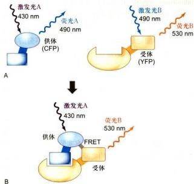  
图2-33 荧光共振能量转移原理图

A. 携带 CFP 的供体蛋白与携带 YFP 的受体蛋白分子之间的距离大于 10 nm 时，在一定波长的激发光（430 nm）的照射下，只有供体蛋白中的 CFP 被激发，放出波长为 490 nm 的青色荧光，而受体中的 YFP 不会被激发出黄色荧光。B. 如果这两个蛋白质之间的距离在 1\~10 nm 的范围内，将发生荧光共振能量转移（FRET），只有 YFP 发出波长为 530 nm 的黄色荧光。

以通过测量 CFP 的荧光强度的损失量来判断这两个蛋白是否存在相互作用。两个蛋白距离越近，CFP 所发出的荧光被 YFP 接收的量就越多，检测器所接收到的蓝色荧光就越弱，而黄色荧光就越强。反之就不会出现 FRET 现象。荧光共振能量转移的效率在很大程度上反映了细胞内两种蛋白相互作用的可能性与作用的强弱。

## 四、放射自显影技术

放射自显影技术 (autoradiography) 是利用放射性同位素的电离射线对乳胶（含 AgBr 或 AgCl）的感光作用，对细胞内生物大分子进行定性、定位与半定量研究的一种细胞化学技术。对细胞或生物体内生物大分子进行动态研究和追踪（pulse-chase）是这一技术独具的特征。放射自显影技术包括两个主要步骤，即同位素标记的生物大分子前体的掺入和细胞内同位素所在位置的显示。常用于生物学研究的同位素及其性质如表 2-3 所示，根据实验要求可选择合适的同位素。

研究 DNA 合成时通常用氚 $\left(^{3}\mathrm{H}\right)$ 标记的胸腺嘧啶脱氧核苷 $\left(^{3}\mathrm{H}-\mathrm{TdR}\right)$ ，研究 RNA 合成用氚标记的尿嘧啶核苷 $\left(^{3}\mathrm{H}-\mathrm{U}\right)$ ；在研究含硫蛋白分子代谢时，可用 ${}^{35}S$ 标记的蛋氨酸和半胱氨酸， ${}^{3}H$ 或 ${}^{14}C$ 标记的蛋氨酸、亮氨酸等也是常用于蛋白质合成的前体化合物。

显微放射自显影的基本实验步骤如下：首先用合适的放射性前体分子标记机体或细胞，根据实验的需要，按标记的持续时间分为持续标记和脉冲标记。标记后的组织与细胞可按常规方法制片，在暗室中向样品表面均匀地敷一层厚3\~10μm的乳胶膜，然后在暗盒中曝光（或称自显影）数天，再经显影、定影后于显微镜下观察。细胞中银颗粒所在的部位即代表放射性同位素的标记部位。

电镜放射自显影技术的基本原理与显微放射自显影相同，实验操作过程亦相似。与显微放射自显影不同之

表 2-3 常用放射性同位素的基本特点

<table><tr><td>同位素</td><td>放射性粒子</td><td>在乳胶内的射程</td><td>半衰期</td></tr><tr><td> $^{32}\mathrm{P}$ </td><td>硬β</td><td>数mm</td><td>14.2天</td></tr><tr><td> $^{14}\mathrm{C}$ </td><td>中等能量β</td><td>平均10μm</td><td>5760年</td></tr><tr><td> $^{2}\mathrm{H}$ </td><td>软β</td><td>0.8μm</td><td>12年</td></tr><tr><td> $^{35}\mathrm{S}$ </td><td>中等能量β</td><td>10μm~1mm</td><td>87天</td></tr></table>

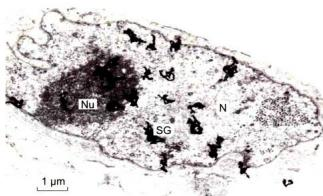  
图 2-34 电镜放射自显影图片

鸭瘟病毒感染鸡胚成纤维细胞 24 h 后，用 ${}^{3}$ H-尿嘧啶核苷脉冲标记 10 min 的电镜放射自显影图片，显示 RNA 在细胞内合成的部位。SG：银颗粒；N：细胞核；Nu：核仁。（丁明孝和翟中和提供）

点是，对样品制备与敷乳胶的要求更为严格，曝光时间一般长达数月（图 2-34）。

<!-- END CN CN02-S04 -->

---

## 对应英文内容

### 英文补充：用光学方法监测蛋白质相互作用

> 对应中文板块：用光学方法监测蛋白质相互作用。英文来源：Molecular Biology of the Cell，第7版，第8章；[本章完整原文](../../来源/英文教材/08_Analyzing_Cells_Molecules_and_Systems/chapter.md)。物理PDF页码范围：514–601（整章范围）。

<!-- BEGIN EN EN08-H022-H022 -->
#### Optical Methods Can Monitor Protein Interactions

Once two proteins—or a protein and a small molecule—are known to associate, it becomes important to characterize their interaction in more detail. Proteins can associate with each other more or less permanently (like the subunits of RNA polymerase or the proteasome), or engage in transient encounters that may last only a few milliseconds (like a protein kinase and its substrate). To understand how a protein functions inside a cell, we need to determine how tightly it binds to other proteins and how covalent modifications, small molecules, or other proteins influence these interactions.

As we discussed in Chapter 3 (see Figure 3–42), the extent to which two proteins interact is determined by the rates at which they associate and dissociate. These rates depend, respectively, on the association rate constant $( k _ { \mathrm { o n } } )$ and dissociation rate constant $( k _ { \mathrm { o f f } } )$ . The kinetic rate constant $k _ { \mathrm { o f f } }$ is a particularly useful number because it provides valuable information about how long two proteins remain bound to one another. The ratio of the two kinetic constants $\left( k _ { \mathrm { o n } } / k _ { \mathrm { o f f } } \right)$ yields another very useful number called the equilibrium constant (K, also known as $K _ { \mathrm { e q } }$ or $K _ { \mathrm { a } } ) _ { r }$ the inverse of which is the more commonly used dissociation constant, $K _ { \mathrm { d } } .$ The equilibrium constant is useful as a general indicator of the affinity of the interaction, and it can be used to estimate the amount of bound complex at different concentrations of the two protein partners—thereby providing insights into the importance of the interaction at the protein concentrations found inside the cell.

A wide range of methods can be used to determine binding constants for a two-protein complex. In a simple equilibrium binding experiment, two proteins are mixed at a range of concentrations, allowed to reach equilibrium, and the amount of bound complex is measured; half of the protein complex will be bound at a concentration that is equal to $K _ { \mathrm { d } } .$ Equilibrium experiments often involve the use of radioactive or fluorescent tags on one of the protein partners, coupled with biochemical or optical methods for measuring the amount of bound protein. In a more complex kinetic binding experiment, the kinetic rate constants are determined using rapid methods that allow real-time measurement of the formation of a bound complex over time (to determine $k _ { \mathrm { o n } } )$ or the dissociation of a bound complex over time (to determine $k _ { \mathrm { { o f f } } } )$

(B)

Optical techniques provide particularly rapid, convenient, and accurate binding measurements, and in some cases the proteins do not even need to be labeled. Certain amino acids (tryptophan, for example) exhibit weak fluorescence that can be detected with sensitive fluorimeters. In many cases, theMBoC6 m8.19/8.19 fluorescence intensity, or the emission spectrum of fluorescent amino acids located in a protein–protein interface, will change when two proteins associate. When this change can be detected by fluorimetry, it provides a simple and sensitive measure of protein binding that is useful in both equilibrium and kinetic binding experiments. A related but more widely useful optical binding technique is based on fluorescence anisotropy, a change in the polarized light that is emitted by a fluorescently tagged protein in the bound and free states (**Figure 8–19**).

Another optical method for probing protein interactions uses green fluorescent protein (discussed in detail later) and its derivatives of different colors. In this application, two proteins of interest are each labeled with a different fluorescent protein, such that the emission spectrum of one fluorescent protein overlaps the absorption spectrum of the second. If the two proteins come very close to each other (within about 1–5 nm), the energy of the absorbed light is transferred from one fluorescent protein to the other. The energy transfer, called fluorescence resonance energy transfer (FRET), is determined by illuminating the first fluorescent protein and measuring emission from the second (see Figure 9–19). When combined with fluorescence microscopy, this method can be used to characterize protein–protein interactions at specific locations inside living cells (discussed in Chapter 9).

<!-- END EN EN08-H022-H022 -->

### 英文补充：定量研究扩展：细胞网络的数学分析

> 对应中文板块：定量研究扩展：细胞网络的数学分析。英文来源：Molecular Biology of the Cell，第7版，第8章；[本章完整原文](../../来源/英文教材/08_Analyzing_Cells_Molecules_and_Systems/chapter.md)。物理PDF页码范围：514–601（整章范围）。

<!-- BEGIN EN EN08-H073-H090 -->
#### MATHEMATICAL ANALYSIS OF CELL FUNCTION

Quantitative experiments combined with mathematical theory mark the beginning of modern science. Galileo, Kepler, Newton, and their contemporaries did more than set out some rules of mechanics and offer an explanation of the movements of the planets around the Sun: they showed how a quantitative mathematical approach could provide a depth and precision of understanding, at least for physical systems, that had never before been dreamed to be possible.

What is it that gives mathematics this almost magical power to explain the natural world, and why has mathematics played so much more important a part in physical sciences than in biology? What do biologists need to know about mathematics?

Mathematics can be viewed as a tool for deriving logical consequences from propositions. It differs from ordinary intuitive reasoning in its insistence on rigorous, accurate logic and the precise treatment of quantitative information. If the initial propositions are correct, then the deductions drawn from them by mathematics will be true. The surprising power of mathematics comes from the length of the chains of reasoning that rigorous logic and mathematical arguments make possible, and from the unexpectedness of the conclusions that can be reached, often revealing connections that one would not otherwise have guessed at. Reversing the argument, mathematics provides a way to test experimental hypotheses: if mathematical reasoning from a given hypothesis leads to a prediction that is not true, then the hypothesis is not true.

Clearly, mathematics is not much use unless we can frame our ideas—our initial hypotheses—about the given system in a precise, quantitative form. A mathematical edifice raised on a rickety or—even worse—a vague or overcomplicated set of propositions is likely to lead us astray. For mathematics to be useful, we must focus our analysis on simple subsystems in which we can pick out key quantitative parameters and frame well-defined hypotheses. This approach has been used with great success in physics for centuries, but it has been less common in biology. But times are changing, and more and more it is becoming possible for biologists to exploit the power of quantitative mathematical analysis.

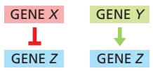

In this final section of our methods chapter, we do not attempt to teach readers every way in which mathematics can be fruitfully applied to biological problems. Rather, we simply aim to give a sense of what mathematics and quantitative approaches can do for us in modern biology. We focus primarily on the important principles that mathematics teaches us about the dynamics of molecular interactions and how mathematics can unveil surprising and useful features of complex systems containing feedback. We will illustrate these principles using the regulation of gene expression by transcription regulators like those discussed in Chapter 7. The same principles apply to the post-transcriptional regulatory systems that govern cell signaling (see Chapter 15), cell-cycle control (see Chapter 17), and essentially all cell processes.

Figure 8–73 Diagrams that summarize biochemical relationships. Here, a simple cartoon indicates that gene X represses. / . gene Z (left) whereas gene Y activates gene Z (right).

#### Regulatory Networks Depend on Molecular Interactions

Cell function and regulation depend on transient interactions among thousands of different macromolecules in the cell. We often summarize these interactions in this book with schematic cartoons. These diagrams are useful, but a complete picture requires a deeper, more quantitative level of understanding. To meaningfully assess the biological impact of any interaction in the cell, we need to know in precise terms how the molecules interact, how they catalyze reactions, and, most important, how the behaviors of the molecules change over time. If a cartoon shows that protein A activates protein B, for example, we cannot judge the importance of this relationship without quantitative details about the concentrations, affinities, and kinetic behaviors of proteins A and B.

Let us begin by defining two different types of regulatory interaction in our cartoons: one designating inhibition and the other designating activation. If the protein product of gene X is a transcription repressor that inhibits the expression of gene $Z ,$ we depict the relationship as a red bar-headed line ( ) drawn between genes X and Z (**Figure 8–73**). If the protein product of gene Y is a transcription activator that induces the expression of gene $Z ,$ then a green arrow ( ) is drawn between genes Y and Z.

The regulation of one gene’s expression by another is more complicated than a single arrow connecting them, and a complete understanding of this regulation requires that we tease apart the underlying biochemical processes. **Figure 8–74A** sketches some of the biochemical steps in the activation of gene expression by a transcription activator. A gene encoding the activator, designated as gene $A ,$ will produce its product, protein $A ,$ via an RNA intermediate. This protein A will then bind to $p _ { X } ,$ the regulatory promoter of gene X, to form the complex $A { : } p _ { X }$ Once the A:pX complex forms, it stimulates the production of an RNA transcript that is subsequently translated to produce protein X.

We will focus here on the binding interaction that lies at the heart of this regulatory system: the interaction between protein A and the promoter $p _ { X } .$ This interaction is reversible: any molecule of protein A that is bound to $p _ { X }$ can also dissociate from it. The steps represented by the green activation arrow in Figure 8–74A include both the binding of A to $p _ { X }$ and the dissociation of the complex A:pX to re-form A and $p _ { X } ,$ as illustrated by the notation in **Figure 8–74B**. This reaction notation is more informative than the diagrams in our figures but has its own limitations. Suppose that the concentration of A increases by a factor of 10 as a response to an environmental input. If A increases, we intuitively know that $A { : } p _ { X }$ should increase too, but we cannot determine the amount of the increase without additional information. We need to know the affinity of the binding interaction and the concentrations of the two binding partners. With this information in hand, we can rigorously derive the answer.

As discussed earlier and in Chapter 3 (see Figure 3–42), we know that the formation of a complex between two binding partners, such as A and $p _ { X } ,$ depends on a rate constant $k _ { \mathrm { o n } } ,$ which describes how many productive collisions occur per unit time per protein at a given concentration of $p _ { X ^ { * } }$ The rate of complex formation equals the product of this rate constant $k _ { \mathrm { o n } }$ and the concentrations of A and $p _ { X }$ (see Figure $8 { - } 7 4 \mathrm { B ) }$ . Complex dissociation occurs at a rate $k _ { \mathrm { o f f } }$ multiplied by the concentration of the complex. The rate constant $k _ { \mathrm { o f f } }$ can differ by orders of magnitude for different DNA sequences because it depends on the strength of the noncovalent bonds formed between A and $p _ { X } .$

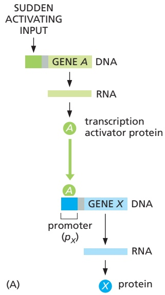

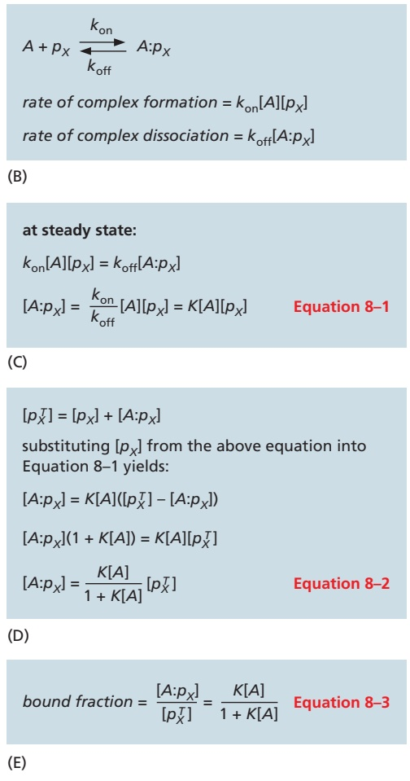

We are primarily interested in understanding the amount of bound promoter complex at equilibrium or steady state, where the rate of complex formation equals the rate of complex dissociation. Under these conditions, the concentration of the promoter complex is specified by a simple equation that combines the two rate constants into a single equilibrium constant $K   =   k _ { \mathrm { o n } } / k _ { \mathrm { o f f } }$ (Equation 8–1; **Figure 8–74C**). K is sometimes called the association constant, $K _ { \mathrm { a } }$ . The larger this constant K, the stronger the interaction between A and $p _ { X }$ . The reciprocal of K is the dissociation constant, $K _ { \mathrm { d } } .$

To calculate the steady-state concentration of the promoter complex using Equation 8–1, we need to account for another complication: both A and $p _ { X }$ exist in two forms—free in solution and bound to each other. In most cases, we know the total concentration of $\bar { p } _ { X }$ and not the free or bound concentrations, so we must find a way to use the total concentration in our calculations. To do this, we first specify that the total concentration of $p _ { X } ( [ p _ { X } ^ { T } ] )$ is the sum of the concentrations of free $( [ p _ { X } ] )$ and bound $\left( \left[ A { : } p _ { X } \right] \right)$ forms (**Figure 8–74D**). This leads to a new equation that allows us to use $[ p _ { X } ^ { T } ]$ to calculate the steady-state concentration of the promoter complex $\left( \left[ A { : } p _ { X } \right] \right)$ (Equation 8–2; Figure 8–74D).

Protein A also exists in two forms: free ([A]) and bound to $p _ { X } ( [ A { : } p _ { X } ] )$ . In a cell, there are typically one or two copies of $p _ { X }$ (assuming there is only one gene X per haploid genome) and multiple copies of A. As a result, we can safely assume that from the viewpoint of $A ,   [ A { : } p _ { X } ]$ is negligible relative to the total $[ A ^ { \dot { T } } ]$ . This means $[ A ] \approx [ A ^ { T } ]$ , and we can just plug in the values of total $[ A ^ { T } ]$ in Equation 8–2 without incurring appreciable error in the calculation of $[ A { : } p _ { X } ]$

Figure 8–74 A simple transcriptional interaction. (A) Genes A and X each produce a protein, with the product of gene A serving as a transcription activator to stimulate expression of gene X. As indicated by the green arrow, stimulation depends in part on the binding of protein A to the promoter region of gene X, designated as pX. (B) The binding of protein A to the gene promoter is determined by the concentrations of the two binding partners (denoted as [A] and [pX], in units of mol/liter, or $\mathbb { M } ) ,$ the association rate constant $k _ { 0 \mathrm { { } } \cap }$ (in units of $\mathbb { M } ^ { - 1 }$ sec–1), and the dissociation rate constant $k _ { \mathrm { o f f } }$ (in units of sec $^ { - 1 } ) .$ (C) At steady state, the rates of association and dissociation are equal, and the concentration of the bound complex is determined by Equation $8 { - } 1$ , in which the two rate constants are combined in the equilibrium constant K. (D) Equation 8–2 can be derived to calculate the steadystate concentration of bound complex at a known total concentration of the promoter [pXT]. (E) Rearrangement of Equation 8–2 yields Equation 8–3, which allows calculation of the fraction of promoter $p _ { X }$ that is occupied by protein A.

Now, we are ready to determine the effects of increasing the concentration of A. Suppose that $K   =   \dot { 1 } 0 ^ { 8 }   \mathrm { M } ^ { - 1 }$ , which is a typical value for many such interactions. The starting concentration of A is $[ A ^ { T } ] = \widetilde { 1 0 ^ { - 9 } }   \mathrm { M } ,$ , and $[ p _ { X } ^ { T } ] = \mathring { 1 } 0 ^ { - 1 0 } \: \mathrm { M }$ (assuming there is one copy of gene X in a haploid yeast cell, for example, with a volume of around $2 \times 1 0 ^ { - \dot { 1 } 4 }   \mathrm { L } )$ . Using Equation 8–2, we find that a tenfold increase in the concentration of A causes the amount of promoter complex [A:pX] to increase 5.5- fold, from $0 . 0 9 \times 1 0 ^ { - 1 0 }$ M to $0 . 5 \times 1 0 ^ { - 1 0 }$ M at steady state. The effects of a tenfold increase in the concentration of A will vary dramatically depending on its starting concentration relative to the equilibrium constant. Only through this mathematical approach can we achieve a thorough understanding of what these effects will be and what impact they will have on the biological response.

To assess the biological impact of a change in transcription activator levels, it is also important in many cases to determine the fraction of the target gene promoter that is bound by the activator, because this number will be directly proportional to the activity of the gene’s promoter. In our case, we can calculate the fraction of the gene X promoter, $p _ { X } ,$ that has protein A bound to it by rearranging Equation 8–2 (Equation 8–3; **Figure 8–74E**). This fraction can be viewed as the probability that promoter $p _ { X }$ is occupied, averaged over time. It is also equal to the average occupancy across a large population of cells at any instant in time. When there is no protein A present, pX is always free, the bound fraction is zero, and transcription is off. When $[ A ]   =   1 / K ,$ , the promoter $p _ { X }$ has a 50% chance of being occupied. When [A] greatly exceeds $1 / K ,$ the bound fraction is almost equal to one, meaning that pX is fully occupied and transcription is maximal.

#### Differential Equations Help Us Predict Transient Behavior

The most important and basic insights for which we, as biologists, depend on mathematics concern the behavior of regulatory systems over time. This is the central theme of dynamics, and it was for the solution of problems in dynamics that the techniques of calculus were developed, by Newton and Leibniz, in the seventeenth century. Briefly, the general problem is this: if we are given the rates of change of a set of variables that characterize the system at any instant, how can we compute its future state? The problem becomes especially interesting, and the predictions often remarkable, when the rates of change themselves depend on the values of the state variables, as in systems with feedback.

Let us return to Equation 8–2 (Figure 8–74D), which tells us that when [A] changes, [A:pX] at steady state will also change to a new concentration that we can calculate with precision. However, [A:pX] does not change instantaneously to this value. If we hope to understand the behavior of this system in detail, we must also ask how long it takes [A:pX] to get to its new steady-state value inside the cell. Equation 8–2 cannot answer this question. We need calculus.

The most common strategy for solving this problem is to use ordinary differential equations. The equations that describe biochemical reactions have a simple premise: the rate of change in the concentration of any molecular species X (that is, d[X]/dt) is given by the balance of the rate of its appearance with that of its disappearance. For our example, the rate of change in the concentration of the bound promoter complex, [A:pX], is determined by the rates of complex assembly and disassembly. We can incorporate these rates into the differential equation shown in **Figure 8–75A** (Equation 8–4). When [A] changes, Equation 8–4 can be solved to generate the concentration of [A:pX] as a function of time. Notice that when $k _ { \mathrm { o n } } [ \stackrel { \cdot } { A } ] [ p _ { X } ] = k _ { \mathrm { o f f } } [ A { : } p _ { X } ]$ , then $d [ A { : } p _ { X } ] / d t = 0$ and $[ A { : } p _ { X } ]$ stops changing. At this point, the system has reached the steady state.

Calculation of all [A:pX] values as a function of time, using Equation 8–4, allows us to determine the rate at which $[ A { : } p _ { X } ]$ reaches its steady-state value. Because this value is attained asymptotically, it is often most useful to compare the times needed to get to 50%, 90%, or 99% of this new steady state. The simplest way to determine these values is to solve Equation 8–4 with a method called numerical integration, which involves plugging in values for all of the parameters $( k _ { \mathrm { o n } } ,   k _ { \mathrm { o f f } } ,$ etc.) and then using a computer to determine the values of $[ A { : } p _ { X } ]$ over time, starting from given initial concentrations of [A] and $[ p _ { X } ]$ . For $k_{on} = 0.5 \times 10^7    M ^{-1}    sec ^{-1}$ $k _ { \mathrm { o f f } } = 0 . 5 \times 1 0 ^ { - 1 }   \mathrm { s e c } ^ { - 1 }   \mathrm { ( } K = 1 0 ^ { 8 }   \mathrm { M } ^ { - 1 }$ as above), and $[ p _ { X } ^ { T } ] = 1 0 ^ { - 1 0 }   \mathrm { M } ,$ it takes [A:pX] about 5, 20, and 40 seconds to reach 50%, 90%, and 99% of the new steady-state value after a sudden tenfold change in [A] (**Figure 8–75B**). Thus, a sudden jump in [A] does not have instantaneous effects, as we might have assumed from looking at the cartoon in Figure 8–74A.

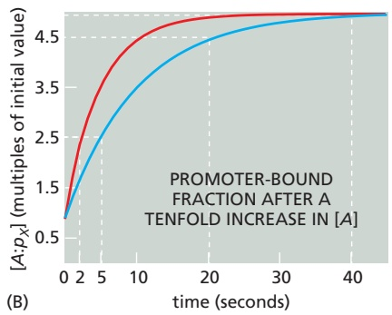

Figure 8–75 Using differential equations to study the dynamics and steady-state behavior of a biological system. (A) Equation 8–4 is an ordinary differential equation for calculating the rate of change in the formation of bound promoter complex in response to a change in other components. (B) Formation of [A:pX] after a tenfold increase in [A], as determined by solving Equation 8–4. In blue is the solution corresponding to $k _ { \mathsf { o n } } = 0 . 5 \times \dot { 1 } 0 ^ { 7 } \; \mathsf { M } ^ { - 1 } \; \mathsf { s e c } ^ { - 1 }$ and $k _ { \mathrm { o f f } } = 0 . 5 \times 1 0 ^ { - 1 } \mathrm { s e c } ^ { - 1 }$ . In this case, it takes [A:pX] about 5, 20, and 40 seconds to reach 50%, 90%, and 99% of the new steadystate value. For the red curve, the $k _ { \mathrm { o n } }$ and $k _ { \mathrm { o f f } }$ values are doubled, and the system reaches the same steady state more rapidly.

Differential equations therefore allow us to understand the transient dynamics of biochemical reactions. This tool is critical for achieving a deep understanding of cell behavior, in part because it allows us to determine the dependence of the dynamics inside cells on parameters that are specific to the particular molecules involved. For example, if we double the values of both $k _ { \mathrm { o n } }$ and $k _ { \mathrm { o f f } } ,$ then Equation 8–1 (Figure 8–74C) indicates that the steady-state value of [A:pX] does not change. However, the time it takes to reach 50% of this steady state after a tenfold change in [A] in our example changes from about 5 seconds to 2 seconds (see Figure 8–75B). These insights are not accessible from either cartoons or equilibrium equations. This is an unusually simple example; mathematical descriptions such as differential equations become more indispensable for understanding biological interactions as the number of interactions increases.

#### Promoter Activity and Protein Degradation Affect the Rate of Change of Protein Concentration

To understand our gene regulatory system further, we also need to describe the dynamics of protein X production in response to changes in the amount of transcription activator protein A. Here again, we use an ordinary differential equation for the rate of change of protein X concentration—determined by the balance of the rate of production of protein X through expression of gene X and the protein’s rate of degradation.

Let us begin with the rate of protein X production, which is determined primarily by the occupancy of the promoter of gene X by protein A. The binding and dissociation of a transcription regulator at a promoter generally occur on a much faster time scale than transcription initiation, causing many binding and unbinding events to occur before transcription proceeds. As a result, we can assume that the binding reaction is at equilibrium on the time scale of transcription, and we can calculate promoter occupancy by protein A using the equilibrium equation discussed earlier (Equation 8–3; Figure 8–74E). To determine the transcription rate, we simply multiply the occupied promoter fraction by a transcription rate constant, b, that represents the binding of RNA polymerase and the subsequent

transcription rate = β $\frac{K[A]}{1 + K[A]}$
protein production rate = β·m $\frac{K[A]}{1 + K[A]}$
protein degradation rate = $\frac{[X]}{\tau_X}$

(A)

$\frac{d[X]}{dt} =$ protein production rate - protein degradation rate
$\frac{d[X]}{dt} = \beta \cdot m \frac{K[A]}{1 + K[A]} - \frac{[X]}{\tau_X}$ Equation 8-5

(B)

at steady state:
$[X_{st}] = \beta \cdot m \frac{K[A]}{1 + K[A]} \cdot \tau_X$ Equation 8-6

(C)

$[X](t) = [X_{st}](1 - \exp(-t/\tau_X))$

(D)

Figure 8–76 Effect of protein lifetime on the timing of the response. (A) Equations for calculation of the rates of gene X transcription, protein X production, and protein X degradation, as explained in the text. (B) Equation 8–5 is an ordinary differential equation for calculating the rate of change in protein X in response to changes in other components. (C) When the rate of change in protein X is zero (steady state), its concentration can be calculated with Equation 8–6, revealing a direct relationship with protein lifetime (τ). (D) The solution of Equation 8–5 specifies the concentration of protein X over time as it approaches its steady-state concentration. (E) Response time depends on protein lifetime. As described in the text, the time that it takes a protein to reach a new steady state is greater when the protein is more stable. Here, the blue line corresponds to a protein with a lifetime that is 2.5-fold shorter than the lifetime of the protein in red.

steps that lead to production of mRNA and protein (**Figure 8–76A**). If each mRNA molecule produces, on average, m molecules of protein product, then we can determine the protein production rate by multiplying the transcription rate by m (Figure 8–76A).

Now let us consider the factors that influence protein X degradation and its dilution due to cell growth. Degradation generally results in an exponential decline in protein levels, and the average time required for a specific protein to be degraded is defined as its mean lifetime, τ. In our current example, the rate of degradation of protein X depends on its mean lifetime $\tau _ { X } ,$ which takes into account active degradation as well as its dilution as the cell grows. The degradation rate depends on the concentration of protein X and is calculated by dividing this concentration by the lifetime (see Figure 8–76A).

With equations for rates of production and degradation in hand, we can now generate a differential equation to determine the rate of change of protein X as a function of time (Equation 8–5; **Figure 8–76B**). This equation can be solved by the numerical methods mentioned earlier. According to the solution of this equation, when transcription begins, the concentration of protein X rises to a steady-state level at which the concentration of X is not changing anymore; that is, its rate of change is zero. When this occurs, rearrangement of Equation 8–5 yields an equation that can be used to determine the steady-state value of X, $\left[ X _ { s t } \right]$ (Equation 8–6; **Figure 8–76C**). An important concept emerges from the mathematics: the steadystate concentration of a gene product is directly proportional to its lifetime. If lifetime doubles, protein concentration doubles as well.

#### The Time Required to Reach Steady State Depends on Protein Lifetime

We can see from Equation 8–6 (see Figure 8–76C) that when the concentration of protein A rises, protein X increases to a new steady-state value, $\left[ X _ { s t } \right]$ . But this cannot happen instantaneously. Instead, X changes dynamically according to the solution of its differential rate equation (Equation 8–5). The solution of this equation reveals that the concentration of X over time is related to its steady-state concentration according to the equation in **Figure 8–76D**. Once again, mathematics uncovers a simple but important concept that is not intuitively obvious: after a sudden increase in [A], [X] rises to a new steady state at an exponential rate that is inversely related to its lifetime; the faster X is degraded, the less time it takes it to reach its new steady-state value (**Figure 8–76E**). The faster response time comes at a higher metabolic cost, however, because proteins with a rapid response time must be produced and degraded at a high rate. For proteins that are not rapidly turned over, the response time is very long, and protein concentration is determined primarily by the dilution that results from cell growth and division.

#### Quantitative Methods Are Similar for Transcription Repressors and Activators

Positive control is not the only mechanism that cells use to regulate the expression of their genes. As we discussed in Chapter $^ { 7 , }$ cells also actively shut off genes, often by employing transcription repressor proteins that bind to specific sites on target genes, thereby blocking access to RNA polymerase. We can analyze the function of these repressors by the same quantitative methods described above for transcription activators. If a repressor protein R binds to the regulatory region of gene X and represses its transcription, then the fraction of gene-binding sites occupied by the repressor is specified by the same equation we used earlier for the transcription activator (**Figure 8–77A**). In this case, however, it is only when the DNA is free that RNA polymerase can bind to the promoter and transcribe the gene. Thus, the quantity of interest is the unbound fraction, which can be viewed as the probability that the site is free, averaged over multiple binding and unbinding events. When the repressor concentration is zero, the unbound fraction is 1 and the promoter is fully active; when the repressor concentration greatly exceeds 1/K, the unbound fraction approaches zero. **Figure 8–77B** and **Figure 8–77C** compare these relationships for a transcription activator and a transcription repressor.

$$
\begin{array}{l} \text {bound fraction} = \frac {K [ R ]}{1 + K [ R ]} \\ \text {unbound fraction} = 1 - \text {bound fraction} = \frac {1}{1 + K [ R ]} \end{array}
$$

(A)

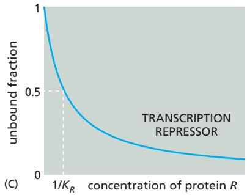

$$
\text {protein production rate} = \beta \cdot m \frac {1}{1 + K [ R ]}
$$

$$
\frac {d [ X ]}{d t} = \beta \cdot m \frac {1}{1 + K [ R ]} - \frac {[ X ]}{\tau_ {X}}
$$

(D)

$$
[ X _ {s t} ] = \beta \cdot m \frac {1}{1 + K [ R ]} \cdot \tau_ {X}
$$

Figure 8–77 How promoter occupancy depends on the binding affinity of a transcription regulator protein. (A) The fraction of a binding site that is occupied by a transcription repressor R is determined by an equation that is similar to the one we used for a transcription activator (see Figure 8–74E), except that in the case of a repressor we are interested primarily in the unbound fraction. (B) For a transcription activator A, half of the promoters are occupied when $[ A ] = 1 / K _ { A } .$ Gene activity is proportional to this bound fraction. $( \complement )$ For a transcription repressor $R ,$ gene activity is proportional to the unbound fraction of promoters. As indicated, this fraction is reduced to half of its maximal value when $[ { \cal R } ] = 1 / K _ { R } .$ (D) As in the case of the transcription activator A (see Figure 8–76), we can derive equations to assess the timing of protein $X$ production as a function of repressor concentrations.

We can create a differential equation that provides the rate of change in protein X when repressor concentrations change (Equation 8–7; **Figure 8–77D**). As in the case of the transcription activator, the steady-state concentration of protein X increases as its lifetime increases, but it decreases as the concentration of the transcription repressor increases.

#### Negative Feedback Is a Powerful Strategy in Cell Regulation

Thus far, we have considered simple regulatory systems of just a few components. In most of the complex regulatory systems that govern cell behaviors, multiple modules are linked to produce larger circuits that we call network motifs, which can produce surprisingly complex and biologically useful responses whose properties become apparent only through mathematical analysis. A particularly common and important network motif is the negative feedback loop, which can have dramatically different functions depending on how it is structured.

We take as a first example a network motif consisting of two linked modules (**Figure 8–78A**). Here, an input signal initiates the transcription of gene A, which produces a transcription activator protein A. This activates gene R, which synthesizes a transcription repressor protein R. Protein R in turn binds to the promoter of gene A to inhibit its expression. This cyclical organization creates a negative feedback loop that one can intuitively understand as a mechanism to prevent proteins from accumulating to high levels. But what can we learn about negative feedback loops, and their value in biology, by using mathematics to model them?

The negative feedback loop in Figure 8–78A can be modeled using Equation 8–7 (see Figure 8–77D) for the repression of gene A and Equation 8–5 (see Figure 8–76B) for the activation of gene R. Thus, for proteins A and R, we use the set of differential equations (Equation set 8–8) shown in **Figure 8–78B**. The two equations in this set are coupled, which means that they must be solved together to describe the behavior of A and R over time for any value of the input. As before, we plug in values for the parameters $\left( \beta _ { R } ,   \tau _ { R } ,   \mathrm { e t c . } \right)$ and then use a computer to determine the values of [A] and [R] as a function of time after a sudden input activates gene A.

The results reveal several important properties of negative feedback. First, rather surprisingly, negative feedback increases the speed of the response to the activating input. As shown in **Figure 8–78C**, the system with negative feedback reaches its new steady state faster than the system with no feedback.

Second, negative feedback is useful for protecting cells from perturbations that continually arise in the cell’s internal environment—due either to random variations in the birth and death of molecules or to fluctuations in environmental variables such as temperature and nutritional supplies. Let us imagine, for example, that $\beta _ { A } ,$ the transcription rate constant for gene A, fluctuates by 25% of its value and ask whether and how much the levels of protein R are affected. The results, shown in **Figure 8–79**, reveal that a change in $\beta _ { A }$ causes a smaller change in the steady-state value of R when the network has negative feedback.

#### Delayed Negative Feedback Can Induce Oscillations

A beautiful thing happens when a negative feedback loop contains some delay mechanism that slows the feedback signal through the loop: rather than generating a new stable state as in a rapid negative feedback loop, a delayed loop generates pulses, or oscillations, in the levels of its components. This can be seen, for example, if the number of components in a negative feedback loop increases,MBoC7 m8.77/8.79 which leads to delays in the amount of time required for the cycle of signals to be completed. **Figure 8–80** compares the behavior of two network motifs—one with a three-stage and one with a five-stage negative feedback loop. Using the same kinetic parameters at each stage in the two loops, one finds that stable oscillations arise in the longer loop, while in the shorter loop the same parameters lead to relatively rapid convergence to a stable steady state.

(A)

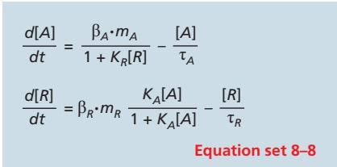

(B)

<small>Figure 8–78 A simple negative feedback motif. (A) Gene A negatively regulates its own expression by activating gene R. The product of gene R is a transcription repressor that inhibits gene A. (B) Equation set 8–8 can be solved to determine the dynamics of system components over time. (C) A system with negative feedback (blue) reaches its steady state faster than a system with no feedback (red). The plots indicate the levels of protein A, expressed as a fraction of the steadystate level. The blue line reflects the solution of Equation set 8–8, which includes negative feedback of gene A by the repressor R. The red line represents the solution when the rate of synthesis of A was set to a constant value that is unaffected by the repressor R.</small>

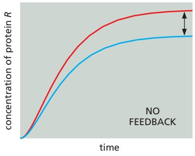

Figure 8–79 The effect of fluctuations in kinetic rate constants on a system with negative feedback compared to one without feedback. The plot at left represents the levels of protein R after a sudden activating stimulus, according to the regulatory scheme in Figure 8–78A and determined by the solution of Equation set 8–8 (see Figure 8–78B). A perturbation was induced by changing βA from 4 M/min (red line) to 3 M/min (blue line). The plot at right shows the results when negative feedback was removed. The system with negative feedback deviates less from its normal operation as β changes than does the system with no feedback. Notice that, as in Figure 8–78C, the system with negative feedback also reaches its steady state more rapidly.

Changes in the parameters of a delayed negative feedback loop—binding affinities, transcription rates, or protein stabilities, for example—can change the amplitude and period of the oscillations, providing a remarkably versatile mechanism for generating all sorts of oscillators that can be used for various purposes in the cell. Indeed, many naturally occurring oscillators, including the calcium oscillators described in Chapter 15 and the cell-cycle network described in Chapter 17, use delayed negative feedback as the basis for biologically important oscillations. Not all of the oscillations observed in cells are thought to have a function, however. Oscillations become inevitable in a highly complex, multicomponent biochemical pathway such as glycolysis, due simply to the large number of feedback loops that appear to be required for its regulation.

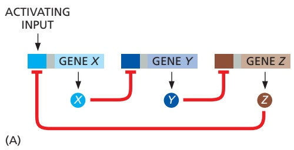

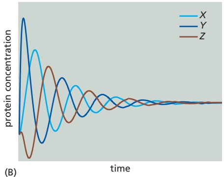

Figure 8–80 Oscillations arising from delayed negative feedback. A transcriptional circuit with three components (A, B) is less likely to oscillate than a transcriptional circuit with five components (C, D). The X (light blue), Y (dark blue), and Z (brown) here represent transcription regulatory proteins. For the simulations in panels B and D, the system was initiated from random initial conditions for X, Y, and Z. Oscillations are produced by a delay induced as the signal propagates through the loop.

(B)

$$
\text {bound fraction} = \frac {(K _ {A} [ A ]) ^ {h}}{1 + (K _ {A} [ A ]) ^ {h}} \text {for activators, or} \frac {(K _ {R} [ R ]) ^ {h}}{1 + (K _ {R} [ R ]) ^ {h}} \text {for repressors}
$$

(A)

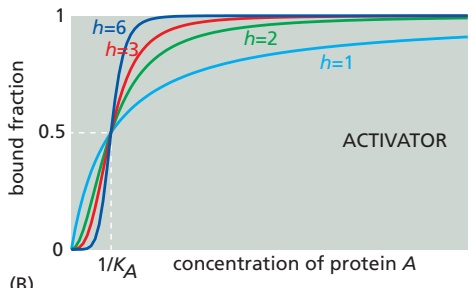

Figure 8–81 How the cooperative binding of transcription regulatory proteins affects the fraction of promoters bound. (A) Cooperativity is incorporated into our mathematical models by including a Hill coefficient (h) in the equations used previously to determine the fraction of bound promoter (see Figures 8–74E and 8–77A). When h is 1, the equations shown here become identical to the equations used previously, and there is no cooperativity. (B) The left panel depicts a cooperatively bound transcription activator, and the right panel depicts a cooperatively bound transcription repressor. Recall from Figure 8–77B that gene activity is proportional to bound activator (left panel) or unbound repressor (right panel). Note that the plots get steeper as the Hill coefficient increases.

#### DNA Binding by a Repressor or an Activator Can Be Cooperative

We have focused thus far on the binding of a single transcription regulator to a single site in a gene promoter. Many promoters, however, contain multiple adjacent binding sites for the same transcription regulator, and it is not uncommon for these regulators to interact with each other on the DNA to form dimers or larger oligomers. These interactions can result in a cooperative form of DNA binding, such that DNA-binding affinity increases at higher concentrations of the transcription regulator. Cooperativity produces a steeper transcriptional responseMBoC7 m8.79/8.81 to increasing regulator concentration than the response that can be generated by the binding of a monomeric protein to a single site. A steep transcriptional response of this sort, when present in conjunction with positive feedback, is an important ingredient for producing systems with the ability to switch between different discrete phenotypic states. To begin to understand how this occurs, we need to modify our equations to include cooperativity.

Cooperative binding events can produce steep S-shaped (or sigmoidal) relationships between the concentration of regulatory protein and the amount bound on the DNA (see Figure 7–11 and Figure 15–17). In this case, a number called the Hill coefficient (h) describes the degree of cooperativity, and we can include this coefficient in our equations for calculating the bound fraction of promoter (**Figure 8–81A**). As the Hill coefficient increases, the dependence of binding on protein concentration becomes steeper (**Figure 8–81B**). In principle, the Hill coefficient is similar to the number of molecules that must come together to generate a reaction. In practice, however, cooperativity is rarely complete, and the Hill coefficient does not reach this number.

#### Positive Feedback Is Important for Switchlike Responses and Bistability

We turn now to positive feedback and its very important consequences. First and foremost, positive feedback can make a system bistable, enabling it to persist in either of two (or more) alternative steady states. The idea is simple and can be conveyed by drawing an analogy with a candle, which can exist either in a burning state or in an unlit state. The burning state is maintained by positive feedback: the heat generated by burning keeps the flame alight. The unlit state is maintained by the absence of this feedback signal: so long as sufficient heat has never been applied, the candle will stay unlit.

For the biological system, as for the candle, bistability has an important corollary: it means that the system has a memory, such that its present state depends on its history. If we start with the system in an Off state and gradually rack up the concentration of the activator protein, there will come a point where autostimulation becomes self-sustaining (the candle lights), and the system moves rapidly to an On state. If we now intervene to decrease the level of activator, there will come a point where the same thing happens in reverse, and the system moves rapidly back to an Off state. But the transition points for switching on and switching off are different, and so the current state of the system depends on the route by which it has been taken in the past—a phenomenon called hysteresis.

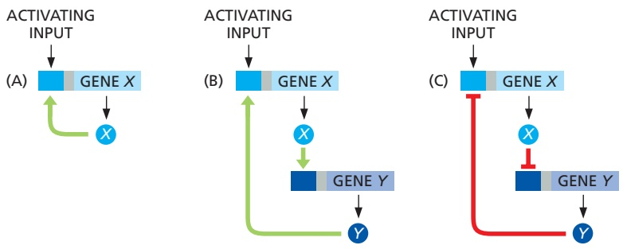

A simple case of positive feedback can be seen in a regulatory system in which a transcription regulator activates (directly or indirectly) its own expression, as in **Figure 8–82A**. Positive feedback can also arise in a circuit with many intervening repressors or activators, so long as the net overall effect of the interactions is activation (**Figure 8–82B and C**).

To illustrate how positive feedback can generate stable states, let us focus on a simple positive feedback loop containing two repressors, X and $Y _ { r }$ each of which inhibits expression of the other (**Figure 8–83A**). As we saw with Equation set 8–8 (Figure 8–78B) earlier, we can create differential equations describing the rate of change of [X] and [Y] (Equation set 8–9; **Figure 8–83B**). We can further modify these equations to include cooperativity by adding Hill coefficients. As we did earlier, we can then create equations for calculating the concentrations of [X] and [Y] when the system reaches a steady state—that is, when $( d [ X ] / d t ) = 0$ and $( d [ Y ] / d t ) = 0$ (Equations 8–10 and 8–11, **Figure 8–83C**).

Equations 8–10 and 8–11 can be used to carry out an intriguing mathematical procedure called a nullcline analysis. These equations define the relationships between the concentration of X at steady state, $\left[ \bar { X _ { s t } } \right] _ { i }$ , and the concentration of Y at steady state, [Yst], which must be simultaneously satisfied. We can plug in different values for $\left[ Y _ { s t } \right]$ in Equation 8–10 and calculate the corresponding $\left[ X _ { s t } \right]$ for each of these values. We can then graph $\left[ X _ { s t } \right]$ as a function of $\left[ Y _ { s t } \right]$ . Next, we repeat the process by varying [Xst] in Equation 8–11 to graph the resulting [Yst]. The intersections of these two graphs determine the theoretically possible steady states of the system. For systems in which the Hill coefficients $h _ { X }$ and $h _ { Y }$ are much larger than 1, the lines in the two graphs intersect at three locations (**Figure 8–83D**). In other systems that have the same arrangement of regulators but different parameters, there might only be one intersection, indicating the presence of only a single

Figure 8–82 Positive feedback of a gene onto itself through serially connected interactions. A sequence of activators and repressors of any length can be connected to produce a positive feedback loop, as long as the overall sign is positive. Because the negative of a negative is positive, not only circuit (A) and (B) but also circuit (C) create positive feedback.

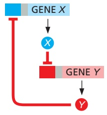

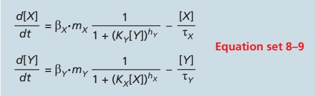

(B)

(C)

(A)

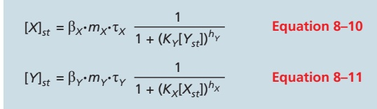

(E)

Figure 8–83 A graphical nullcline analysis. (A) X inhibits Y and Y inhibits X, resulting in a positive feedback loop. (B) Equation set 8–9 can be used to determine the rate of change in the concentrations of proteins X and Y. (C) Equations 8–10 and 8–11 provide the concentrations of proteins X and $Y ,$ respectively, when these concentrations reach a steady state. (D, E) Blue curves (called nullclines) are plots of $[ X _ { s t } ]$ calculated from Equation 8–10 over a range of concentrations of [Yst]. Red curves are nullclines that indicate values of $[ Y _ { s t } ]$ calculated from Equation 8–11 over a range of concentrations of [Xst]. At an intersection of the two lines, both [X] and [Y] are at steady state. For plot D, the binding of both proteins to their target gene promoters was cooperative $( h _ { X }$ and hY much larger than 1), resulting in the presence of multiple intersections of the nullclines–– suggesting that the system can assume multiple discrete steady states. In plot E, the binding of protein X to the promoter of gene Y was not cooperative $( h _ { X }$ close to 1), resulting in only one nullcline intersection and thus just one likely steady state.

(D)

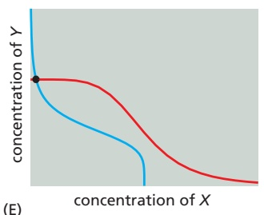

(B)

concentration of X

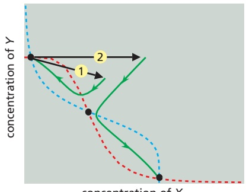

steady state. For example, when there is a low cooperativity of protein X binding to the promoter of gene Y (that $\mathbf { i } \mathbf { s } ,$ a small Hill coefficient, $h _ { X } ,$ in Equation 8–11), the plot of [Y] is less curved (**Figure 8–83E**), and it is less likely that there will be multiple intersections of the two curves.

We emphasized earlier that positive feedback typically generates a bistable sys-MBoC7 m8.82/8.84 tem with two stable steady states. Why does the system modeled in Figure 8–83D have three? This conundrum can be explained by solving the reaction rate equations (Equation set 8–9; Figure 8–83B) for various different starting conditions of [X] and $[ Y ] ,$ determining all values of [X] and [Y] as a function of time. Starting with each set of initial concentrations of [X] and [Y], these calculations produce a socalled trajectory of points, each indicated by a curved green line on **Figure 8–84A**. A fascinating pattern emerges: each trajectory moves across the plot and settles in one of two steady states, but never in the third (middle steady state). We conclude that the middle steady state is unstable because it cannot “attract” any trajectories. The system therefore has only two stable steady states. Thus, the number of stable steady states in a system need not be equal to the total number of its theoretically possible steady states. In fact, stable steady states are usually separated by unstable ones, as in our example.

Figure 8–84 Analysis of the stability of a system’s steady states. (A) The dotted lines are the nullclines for the system shown in Figure 8–83. Also shown are dynamic trajectories (green) that show the changes over time in [X] and [Y], starting at a variety of different initial concentrations (determined by solution of Equation set 8–9; see Figure 8–83B). By plotting [X] versus [Y] at each time point, we find that, although there are three possible steady states in this system, the dynamic trajectories converge on only two of them. The middle steady state is avoided: it is unstable, being unable to attract any trajectories. (B) Imagine that the system is at the upper-left steady state and experiences a perturbation (black arrows), such as a random fluctuation in the production rates of X and/or Y. If the perturbation is small (arrow 1), the system will return to the same steady state. On the other hand, a perturbation that drives the system beyond the unstable (middle) steady state (arrow 2) causes it to switch to the lower-right steady state. The set of perturbations that a system can withstand without switching from one steady state to the other is known as the region of attraction of that steady state.

Once this system adopts a fate by settling in one of the two steady states, does it have the ability to switch to the other state? The numerical solution of Equation set 8–9 can again provide an answer. In **Figure 8–84B**, we show the solution of this equation set for two perturbations from the upper-left steady state. For a small perturbation, the system returns to its original steady state. But the larger perturbation causes the system to switch to the alternate steady state. Thus, this system can be switched from one stable steady state to the other by subjecting it to an input (or a perturbation) that is large enough to make the other steady state more attractive. More generally, every stable steady state has a corresponding region of attraction, which can be intuitively thought of as the range of perturbations (of [X] or [Y] in this example) for which the dynamic trajectories converge back to that particular steady state, rather than switch to the other one.

The concept of a region of attraction has interesting implications for the heritability of transcriptional states and the transition rates between them. If the region of attraction around one steady state is large, for example, then most cells in the population will assume this particular state. Furthermore, this state is likely to be inherited by daughter cells, because minor perturbations, like those ensuing from an asymmetric distribution of molecules during cell division, will rarely be sufficient to induce switching to the other steady state. We should expect that the use of positive feedback, coupled to cooperativity, will quite often be associated with systems requiring stable cell memory.

#### Robustness Is an Important Characteristic of Biological Networks

Biological regulatory systems are exposed to frequent and sometimes extreme variations in external conditions or the concentrations or activities of key components. The ability of these systems to function normally in the face of such perturbations is called **robustness**. If we understand a complex system to the extent that we can reproduce its behavior with a computational model, then the robustness of the system can be assessed by determining how well its normal function persists after changes in various parameters, such as rate constants and component concentrations. We have already seen, for example, how the presence of negative feedback reduces the sensitivity of the steady state to changes in the values of the system’s parameters (see Figure 8–79). Considerations of robustness also apply to dynamic behaviors. Thus, for example, when discussing negative feedback, we described how the behavior of a system tends to become more oscillatory as the number of components that constitute the feedback loop increases. If we use different values of the parameters in models derived for systems like those in Figure 8–80, we find that the system with the longer loop tends to exhibit stable oscillations within a much broader range of parameters, indicating that this system provides a more robust oscillator. We can perform similar calculations to determine the ability of different systems to achieve robust bistability arising from positive feedback. Thus, one benefit of computational models is that they allow us to probe the robustness of biological networks in a systematic and rigorous way.

#### Two Transcription Regulators That Bind to the Same Gene Promoter Can Exert Combinatorial Control

Thus far, we have discussed how one transcription regulator can modulate the expression level of a gene. Most genes, however, are controlled by more than one type of transcription regulator, providing combinatorial control that allows two or more inputs to influence the expression of one gene. We can use computational methods to unveil some of the important regulatory features of combinatorial control systems.

Consider a gene whose promoter contains binding sites for two regulatory proteins, A and R, which bind to their individual sites independently. There are four possible binding configurations (**Figure 8–85A**). Suppose that A is a transcription activator, R is a transcription repressor, and the gene is only active when A is bound and R is not bound. We learned earlier that the probability that A is bound and the probability that R is not bound can be determined by the equations in **Figure 8–86A**. The product of these two probabilities gives us the probability of gene activation.

This example illustrates an AND NOT logic function (A and not R) (see Figure 8–85A). Maximal activation of this gene is accomplished when [A] is high and [R] is zero. However, intermediate levels of gene activation are also possible depending on the levels of A and R and also on the binding affinities of A and R for their respective sites (that is, $K _ { A }$ and $K _ { R } )$ . When $K _ { A }   >   K _ { R } ,$ a small concentration of A is capable of overcoming repression by R. Conversely, if $K _ { A } < K _ { R }$ then much more A is needed to activate the gene (**Figure 8–86B and C**).

Many other logic functions can govern combinatorial gene regulation. For example, an AND logic gate results when two activators, A1 and A2, are both required for a gene to be transcribed (**Figure 8–85B** and **Figure 8–86D**). In E. coli cells, the AraJ gene controls some aspects of arabinose sugar metabolism: its

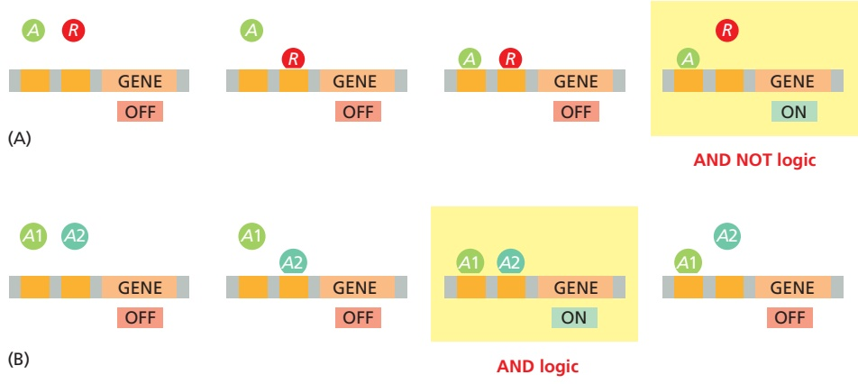

Figure 8–85 Combinatorial control of gene expression. There are many ways in which gene expression can be controlled by two transcription regulators. To define precisely the relationship between the two inputs and the gene expression output, a regulatory circuit is often described as a specific type of logic gate, a term borrowed from electronic circuit design. A simple example is the OR logic gate (not shown here), in which a gene is controlled by two transcription activators, and one or the other can activate gene expression. (A) In a system with an activator A and repressor R, if transcription is turned on only when A is bound and R is not, then the result is an AND NOT logic gate. We saw an example of this logic in Chapter 7 (Figure 7–18). (B) An AND gate results when two transcription activators, A1 and A2, are both required to turn on a gene.

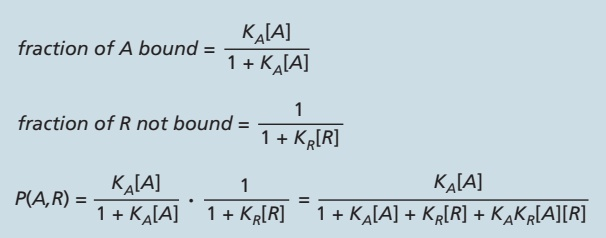

(A)

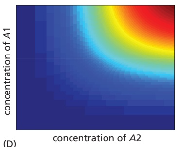

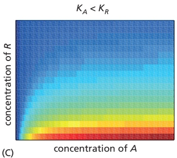

expression requires two transcription regulators, one activated by arabinose and the other activated by the small molecule cAMP (Figure 8–86E).

Figure 8–86 How the quantitative output of a gene depends on both its combinatorial logic and the affinities of transcription regulators. (A) In a combinatorial gene regulatory system like that illustrated in Figure 8–85A, the fraction of promoters bound by activator A and the fraction not bound by repressor R are each determined as shown here. The product of these probabilities provides the probability, P(A, R), that a gene promoter is active. (B–E) In these four panels, red indicates high gene expression and blue indicates low gene expression. (B, C) Depictions of gene expression from the system described in panel A. The two panels demonstrate how the system behaves when the relative affinities of the two transcription regulators change as indicated above each panel. (D) Gene expression in a case where the gene turns on only at high levels of both activating inputs (A1 and A2), as shown in Figure 8–85B. (E) Experimental data showing measured expression of a gene in E. coli that is combinatorially regulated by two inputs: arabinose and cAMP. Note the close resemblance to panel D. (E, adapted from S. Kaplan et al., Mol. Cell 29:786–792, 2008. With permission from Elsevier.)

#### An Incoherent Feed-forward Interaction Generates PulsesMBoC7 m8.84/8.86

Imagine that a sudden input signal immediately activates a transcription activator A and that the same input signal induces the much slower synthesis of a transcription repressor protein R that acts on the same gene X. If A and R control gene expression by an AND NOT logic function like that described above, our intuition tells us that this system should be able to generate a pulse of transcription: when A is activated (and R is absent), the transcription of gene X will begin and cause an increase in the concentration of protein X, but then transcription will shut off when the concentration of R increases to a sufficiently high value.

Arrangements of this type are common in the cell. In E. coli, for example, galactose metabolic genes are positively regulated by the catabolite activator protein (CAP), which is activated at high levels of cAMP. The same genes are repressed by the GalS repressor protein, which is encoded by a gene whose transcription is likewise activated by CAP. Thus, an increase in input (cAMP) activates A (CAP), and transcription of the galactose genes begins. But activation of A also causes a subsequent buildup of R (GalS), which causes the same genes to be repressed after a delay. This results in an incoherent feed-forward motif (**Figure 8–87A**).

The response of the incoherent feed-forward motif will vary, depending on the parameters of the system. Suppose, for example, that the transcription activator protein A binds more weakly to the gene regulatory region than does the transcription repressor protein $R \left( K _ { A } < < K _ { R } \right)$ . In this case, there will be a transient burst of protein synthesized by the affected gene (gene X) in response to a sudden activating input (**Figure 8–87B**). In contrast, the output will be more sustained if $K _ { A }$ is much larger than $K _ { R } ,$ because the repression will be too weak to overcome

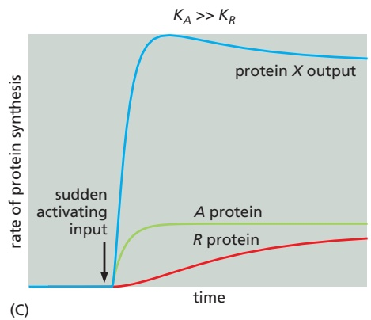

the gene activation (Figure 8–87C). Other properties of this network, such as the dependence of the amplitude of the pulse on the various rate constants in the system, can be explored with the same computational tools. Thus, our intuitive guess about how this system would behave was only partially correct; even the simplest of networks depends on precise interaction strengths, demonstrating yet again why mathematics is needed to complement cartoon drawings.

Figure 8–87 How an incoherent feedforward motif can generate a brief pulse of gene activation in response to a sustained input. (A) Diagram of an incoherent feed-forward motif in which the transcription activator A and the repressor R control the expression of gene X using the AND NOT logic of Figure 8–85A. (B) When $K _ { A } < < K _ { B } ,$ this motif generates a pulse of protein X expression, such that the output goes back down even if the input remains high. (C) When $K _ { A } > > K _ { B } ,$ the same motif responds to a sustained input by generating a sustained output.

#### A Coherent Feed-forward Interaction Detects Persistent Inputs

In the bacterium E. coli, the sugar arabinose is only consumed when the pre-ferred sugar, glucose, is scarce. The strategy that cells use to assess the presence of arabinose and absence of glucose involves a feed-forward arrangement that is different from the one just described. In this case, depletion of glucose causes an increase of cAMP, which is sensed by the CAP transcription activator protein, as described previously. In this case, however, CAP also induces the synthesis of a second transcription activator, AraC. Both activator proteins are necessary to activate arabinose metabolic genes (the AND logic function in Figure 8–85B).

This arrangement, known as a coherent feed-forward motif, has the interesting characteristics illustrated in **Figure 8–88**. Imagine that two activators, A1 and A2, are both required to initiate transcription of a gene. The input to the network activates A1 directly, but only activates A2 through this A1 activation. Thus, for a protein to be synthesized from this gene, long-term inputs are required that allow both A1 and A2 to be produced in active form. Brief input pulses are either ignored or produce small outputs. The requirement for a long input is important if assurances about a signal are needed before a costly cellular program is triggered. For example, glucose is the sugar on which E. coli cells grow best. Before cells trigger arabinose metabolism in the example above, it might be beneficial to be sure that glucose has been depleted (a sustained CAP pulse), rather than inducing the arabinose program during a transient glucose fluctuation.

Figure 8–88 How a coherent feedforward motif responds to various inputs. (A) Diagram of a coherent feedforward motif in which the transcription activators A1 and A2 together activate expression of gene X using the AND logic of Figure 8–85B. (B) The response to a brief input can be either weak (as shown) or nonexistent. This allows the motif to ignore random fluctuations in the concentration of signaling molecules. (C) A prolonged input produces a strong response that can turn off rapidly.

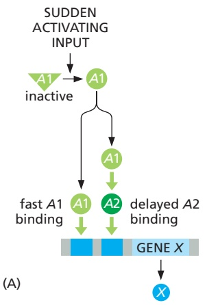

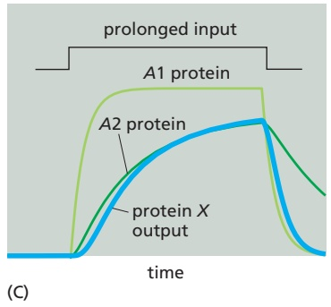

#### The Same Network Can Behave Differently in Different Cells Because of Stochastic Effects

Up to this point, we have assumed that all cells in a population produce identical behaviors if they contain the same network. It is important, however, to account for the fact that cells often show considerable individuality in their responses. Consider a situation in which a single mother cell divides into two daughter cells of equal volume. If the mother cell has only one molecule of a given protein, then only one daughter will inherit it. The daughters, though genetically identical, are already different. This variability is most pronounced for molecules that are present in small numbers. Nevertheless, even when there are many copies of a particular protein (or RNA), it is very unlikely that both daughter cells will end up with exactly the same number of molecules.

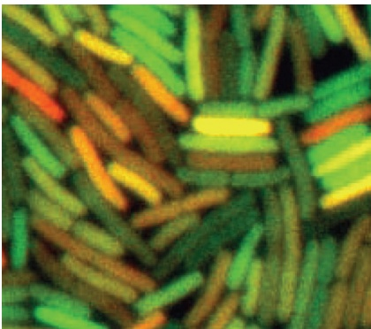

Figure 8–89 Different levels of gene expression in individual cells within a population of E. coli bacteria. For this experiment, two different reporter proteins (one fluorescing green, the other red), controlled by a copy of the same promoter, have been introduced into all of the bacteria. Some cells express only one gene copy, and so appear either red or green, while others express both gene copies, and so appear yellow. This experiment reveals variable levels of fluorescence, indicating variable levels of gene expression within an apparently uniform population of cells. (From M.B. Elowitz et al., Science MBoC7 m8.87/8.89297:1183–1186, 2002. With permission from AAAS.)

This is just one illustration of a universal feature of cells: their behaviors are often **stochastic**, meaning that they display variability in their protein content and therefore exhibit variations in phenotypes. In addition to the asymmetric partitioning of molecules after cell division, variability can originate from many chemical reactions. Imagine, for example, that our mother cell contains a simple gene regulatory circuit with a positive feedback loop like that shown in Figure 8–82B. Even if both daughter cells receive a copy of this circuit, including one copy of the initial transcription activator protein, there will be variability in the time required for promoter binding—and it will be statistically nearly impossible for the genes in the two daughter cells to become activated at precisely the same time. If the system is bistable and poised near a switching point, then variability in the response might flip the switch in only one daughter cell. Two daughter cells that were born identical can thereby acquire, by chance, a dramatic difference in phenotype.

More generally, isogenic populations of cells grown in the same environment display diversity in size, shape, cell-cycle position, and gene expression. These differences arise because biochemical reactions require probabilistic collisions between randomly moving molecules, with each event resulting in changes in the number of molecular species by integer amounts. The amplified effect of fluctuations in a molecular reactant, or the compounded effects of fluctuations across many molecular reactants, often accumulates as an observable phenotype. This can endow a cell with individuality and generate nongenetic cell-to-cell variability in a population.

Nongenetic variability can be studied in the laboratory by single-cell measurements of fluorescent proteins expressed from genes under the control of a specific promoter. Live cells can be mounted on a slide and viewed through a fluorescence microscope, revealing the striking variability in protein expression levels (**Figure 8–89**). Another approach is to use flow cytometry, which works by streaming a dilute suspension of cells past an illuminator and measuring the fluorescence of individual cells as they flow past the detector. Fluorescence values can be used to build histograms that reveal the variability in a process across a population of cells, with a broad histogram indicating higher variability.

#### Several Computational Approaches Can Be Used to Mode the Reactions in Cells

We have focused primarily on the use of ordinary differential equations to model the dynamics of simple regulatory circuits. These models are called deterministic, because they do not incorporate stochastic variability and will always produce the same result from a specific set of parameters. As we have seen, such models can provide useful insights, particularly in the detailed mechanistic analysis of small regulatory circuits. However, other types of computational approaches are also needed to comprehend the great complexity of cell behavior. Stochastic models, for example, attempt to account for the very important problem of random variability in molecular networks. These models do not provide deterministic predictions about the behavior of molecules; instead, they incorporate random variation into molecule numbers and interactions, and the purpose of these models is to obtain a better understanding of the probability that a system will exist in a certain state over time.

Numerous other modeling strategies have been or are being developed. Boolean networks are used for the qualitative analysis of complex gene regulatory networks containing large numbers of interacting components. In these models, each molecule is a node that can exist in either the active or inactive state, thereby affecting the state of the nodes it is linked to. Models of this sort provide insights into the flow of information through a network, and they were useful in helping us understand the complex gene regulatory network that controls the early development of the sea urchin (see Figure 7–45). Boolean networks therefore reduce complex networks to a highly simplified (and potentially inaccurate) form. At the other extreme are agent-based simulations, in which thousands of molecules (or “agents”) in a system are modeled individually, and their probable behaviors and interactions with each other over time are calculated on the basis of predicted physical and chemical behaviors, often while taking stochastic variation into account. Agent-based approaches are computationally demanding but have the potential to generate highly life-like simulations of real biological systems.

#### Statistical Methods Are Critical for the Analysis of Biological Data

Dynamics, differential equations, and theoretical modeling are not the be-all and end-all of mathematics. Other branches of the subject are no less important for biologists. Statistics—the mathematics of probabilistic processes and noisy data sets—is an inescapable part of every biologist’s life.

This is true in two main ways. First, imperfect measurement devices and other errors generate experimental noise in our data. Second, all cell-biological processes depend on the stochastic behavior of individual molecules, as we just discussed, and this results in biological noise in our results. How, in the face of all this noise, do we come to conclusions about the truth of hypotheses? The answer is statistical analysis, which shows how to move from one level of description to another: from a set of erratic individual data points to a simpler description of the key features of the data.

Statistics teaches us that the more times we repeat our measurements, the better and more refined the conclusions we can draw from them. Given many repetitions, it becomes possible to describe our data in terms of variables that summarize the features that matter: the mean value of the measured variable, taken over the set of data points; the magnitude of the noise (the standard deviation of the set of data points); the likely error in our estimate of the mean value (the standard error of the mean); and, for specialists, the details of the probability distribution describing the likelihood that an individual measurement will yield a given value. For all these things, statistics provides recipes and quantitative formulas that biologists must understand if they are to make rigorous conclusions on the basis of variable results.

#### Summary

Quantitative mathematical analysis can provide a powerful extra dimension in our understanding of cell regulation and function. Cell regulatory systems often depend on macromolecular interactions, and mathematical analysis of the dynamics of these interactions can unveil important insights into the importance of binding affinities and protein stability in the generation of transcriptional or other signals. Regulatory systems often employ network motifs that generate useful behaviors: a rapid negative feedback loop dampens the response to input signals; a delayed negative feedback loop creates a biochemical oscillator; positive feedback yields a system that alternates between two stable states; and feed-forward motifs provide systems that generate transient signal pulses or respond only to sustained inputs. The dynamic behavior of these network motifs can be dissected in detail with deterministic and stochastic mathematical modeling.

<!-- END EN EN08-H073-H090 -->

### 英文补充：活细胞蛋白质动力学与荧光生物传感器

> 对应中文板块：活细胞蛋白质动力学与荧光生物传感器。英文来源：Molecular Biology of the Cell，第7版，第9章；[本章完整原文](../../来源/英文教材/09_Visualizing_Cells_and_Their_Molecules/chapter.md)。物理PDF页码范围：602–641（整章范围）。

<!-- BEGIN EN EN09-H011-H012 -->
#### Protein Dynamics Can Be Followed in Living Cells

Fluorescent proteins are now exploited not just to see where in a cell a particular protein is located, but also to uncover its kinetic properties and to find out whether it might interact with other molecules. We now describe techniques in which fluorescent proteins are used in this way.

First, interactions between one protein and another can be monitored by **Förster resonance energy transfer**, also called **fluorescence resonance energy transfer** but both abbreviated to **FRET**. In this technique, two molecules of interest are each labeled with a different fluorochrome, chosen so that the emission spectrum of one fluorochrome, the donor, overlaps with the absorption spectrum of the other, the acceptor. If the two proteins interact in such a way as to bring their fluorochromes into very close proximity (closer than about 5 nm), one fluorochrome, when excited, can transfer energy from the absorbed light directly (by resonance, nonradiatively) to the other. Thus, when the complex is illuminated at the excitation wavelength of the first fluorochrome, fluorescent light is produced at the emission wavelength of the second (**Figure 9–19**). This method can be used with two different spectral variants of GFP as fluorochromes to monitor processes such as the interaction of signaling molecules with their receptors (see Figure 15–49) or proteins in macromolecular complexes at specific locations inside living cells. The FRET can be measured by quantifying the reduction of the donor fluorescence in the presence of the acceptor. The efficiency of FRET is inversely proportional to the sixth power of the distance between the donor and acceptor molecules and so is extremely sensitive to small changes in distance.

The genes encoding GFP and related fluorescent proteins can be engineered to produce protein variants, usually with one or more amino acid changes, that fluoresce only weakly under normal excitation conditions but can be induced to fluoresce either more strongly or with a color shift (for example, from green to red) by activating them with a strong pulse of light at a different wavelength in a process called **photoactivation**. In principle, the biologist can then follow the local in vivo behavior of any protein that can be expressed as a fusion with one of these GFP variants. These genetically encoded, photoactivatable, fluorescent proteins allow the lifetime and behavior of any protein to be studied independently of other newly synthesized proteins.

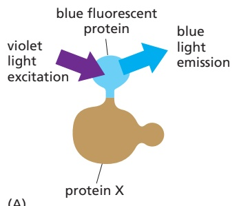

(A)

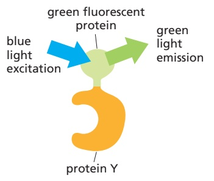

(B) NO PROTEIN INTERACTION NO EXCITATION OF GREEN FLUORESCENT PROTEIN; BLUE LIGHT DETECTED

(C) PROTEIN INTERACTION FLUORESCENCE RESONANCE ENERGY TRANSFER; GREEN LIGHT DETECTED

Figure 9–19 Fluorescence resonance energy transfer (FRET). To determine whether (and when) two proteins interact inside a cell, the proteins are first produced as fusion proteins attached to different color variants of green fluorescent protein (GFP). (A) In this example, protein X is coupled to a blue fluorescent protein, which is excited by violet light and emits blue light; protein Y is coupled to a green fluorescent protein, which is excited by blue light and emits green light. (B) If protein X and Y do not interact, illuminating the sample with violet light yields fluorescence only from the blue fluorescent protein. (C) When protein X and protein Y interact, the resonance transfer of energy, FRET, can now occur. Illuminating the sample with violet light excites the blue fluorescent protein, which transfers its energy to the green fluorescent protein, resulting in an emission of green light. The fluorochromes must be quite close together—within about 1–5 nm of one another—for FRET to occur. Because not every molecule of protein X and protein Y is bound at all times, some blue light may still be detected. But as the two proteins begin to interact, emission from the donor blue fluorescent protein falls as the emission from the acceptor GFP rises.

(C)

Figure 9–20 Fluorescence recovery after photobleaching (FRAP). A strong focused pulse of laser light will extinguish, or bleach, fluorescent proteins. By selectively photobleaching a set of fluorescently tagged protein molecules within a defined region of a cell, the microscopist can monitor recovery over time, as the remaining fluorescent molecules move into the bleached region (see Movie 10.6). (A) This cultured mammalian cell is expressing an integral membrane protein called CD86, which is fused with a fluorescent protein. CD86 is a co-stimulatory protein present in the plasma membrane of antigen-presenting cells and is required for the activation of T cells (see Figure 24–34). After a small region of the plasma membrane is selectively photobleached, the MB C7 9.121/9.20remaining fluorescent molecules diffuse rapidly within the plane of the membrane and populate the bleached region. This recovery can be followed as a function of time. (B) Schematic diagram of the experiment shown in A. (C) Measurements of the fluorescence intensity in the bleached area as a function of time can be plotted as a fluorescence recovery curve. From such graphs quantitative data can be derived about the rate of recovery and the fraction of fluorescent protein molecules that are either mobile or immobile. (A, from S. Dorsch et al., Nat. Methods 6:225–230, 2009.)

Another way to exploit GFP fused to a protein of interest is known as **fluorescence recovery after photobleaching (FRAP)**. Here, a strong focused beam of light from a laser is used to extinguish the GFP fluorescence in a specified region of the cell, after which one can analyze the way in which remaining unbleached fluorescent protein molecules move into the bleached area as a function of time. This technique, like photoactivation, can deliver valuable quantitative data about a protein’s kinetic parameters, such as diffusion coefficients, active transport rates, or binding and dissociation rates from other proteins (**Figure 9–20**).

#### Fluorescent Biosensors Can Monitor Cell Signaling

Extracellular signals cause rapid and transient changes in the concentration of intracellular signaling molecules that play an important role in how cells respond. But how to see and measure such dynamic and rapid changes remains a challenge. Changes in the concentration of some of these molecules, for example $\mathrm { C a ^ { 2 + } }$ ions, can be analyzed using simple ion-sensitive indicators, whose light emission reflects the local $\mathrm { C a ^ { 2 + } }$ ion concentration (**Figure 9–21**, and see also Figure 15–31). However, the most sensitive indicators available are a range of genetically encoded biosensors, all based on the growing family of fluorescent proteins described earlier. These sensors can be synthesized by the specific cells of interest and easily fused with protein tags that target them to specific destinations within the cell. Here they can act as molecular informants, reporting back like spies on transient signaling events to the careful observer. To convert information about changes in the level of a signaling molecule into changes in observable fluorescence intensity requires two key components: a sensing component that responds to the target signaling event, and a reporting component

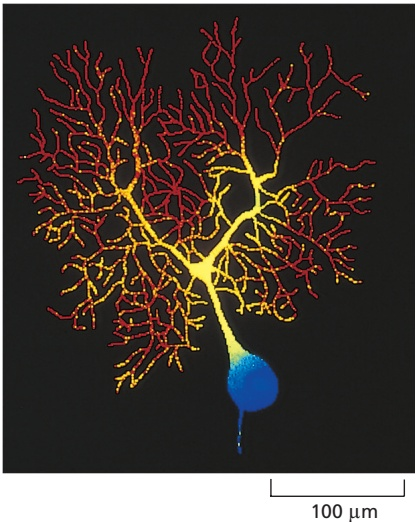

Figure 9–21 Visualizing intracellular $\mathbf { C } \mathbf { a } ^ { 2 + }$ concentrations by using a fluorescent indicator. The branching tree of dendrites of a Purkinje cell in the cerebellum receives more than 100,000 synapses from other neurons. The output from the cell is conveyed along the single axon seen MBoC7 m9.31/9.21leaving the cell body at the bottom of the picture. This image of the intracellular $\dot { \mathrm { C a } } ^ { 2 + }$ concentration in a single Purkinje cell (from the brain of a guinea pig) was taken with a low-light camera and the $\mathrm { C a ^ { 2 + } }$ -sensitive fluorescent indicator fura-2. The concentration of free $\mathrm { C a ^ { 2 + } }$ is represented by different colors, red being the highest and blue the lowest. The highest $\mathsf { \widetilde { C } } \mathsf { a } ^ { 2 + }$ levels are present in the thousands of dendritic branches. (Courtesy of D.W. Tank, J.A. Connor, M. Sugimori, and R.R. Llinas.)

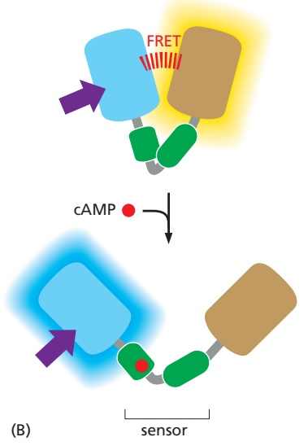

20 µm

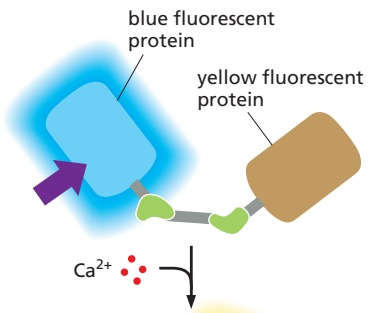

0

time

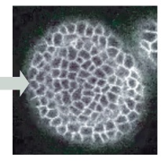

1 sec

4 sec

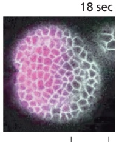

(C)

that translates that response into a visible and quantifiable output. Many biosensors use two connected fluorescent proteins that can be brought close enough together to undergo Förster resonance energy transfer (see Figure 9–19). Bringing them together, or indeed moving them apart, is a connecting sensor module. The sensor is usually a protein or protein domain that undergoes a large conformational change on binding to the target molecule. The general principle used to construct a genetically encoded biosensor is shown in Figure 9–22. Measuring the ratio of the intensities of light emitted by the two fluorescent proteins in the biosensor provides a quantitative measure of the concentration of the target molecule of interest. Many hundreds of such biosensors have been created. Some can monitor and measure small molecules in living cells, such as $\mathrm { C a ^ { 2 + } }$ , cAMP, $\mathrm { I P _ { 3 } } ,$ NADPH (and hence redox state), $\mathrm { H } ^ { + }$ ions (and hence pH), and neurotransmitters such as acetylcholine and glutamate. Others can measure the activity of kinases,MBoC7 n9.126/9.22 phosphatases, active caspases, and even temperature.

Figure 9–22 Genetically encoded fluorescent biosensors. (A) Here we show one strategy for constructing a fluorescent biosensor for calcium ions. A sensor, in this case calmodulin (see Figure 15–34), undergoes a large conformational change on binding $\mathsf { C a ^ { 2 + } }$ . This change brings together the blue and yellow fluorescent proteins to which each end of the sensor is attached, close enough to undergo Förster resonance energy transfer (FRET) and to change the wavelength of the fluorescence emission to yellow in response to a violet excitation light. $\mathrm { B y }$ measuring the ratio of fluorescence intensity at two wavelengths, blue and yellow, we can determine the concentration ratio of the $\mathrm { C a ^ { 2 + } }$ -bound indicator to the $\mathrm { C a ^ { 2 + } }$ -free indicator, thereby providing an accurate measurement of the free $\mathsf { \tilde { C } } \mathsf { a } ^ { 2 + }$ concentration. (B) This panel illustrates a similar strategy used to construct a biosensor for cAMP. In this case the sensor is a cAMP-regulated guanine nucleotide exchange factor, which again undergoes a large conformational change, enough to move the two attached fluorescent proteins farther apart, thus abolishing their FRET. Hence the emitted light is switched from yellow to blue. (C) A calcium biosensor, similar to that shown in A, is genetically encoded and expressed in an Arabidopsis seedling. When a cell in the epidermis, on the side of the shoot apical meristem, is pricked with a small glass needle, calcium enters the cell from the extracellular environment, and this response is rapidly propagated as a wave of calcium entering cells across the entire surface of the meristem. Mechanical signals help pattern plant morphogenesis, and transient calcium responses affect cell polarity. (C, from T. Li et al., Nat. Commun. 10:726–735, 2019. Reproduced with permission of SNCSC.)

<!-- END EN EN09-H011-H012 -->

## 跨章相关英文内容

- 活细胞与单分子动态成像：[EN第9章 · 共焦、超分辨率、TIRF、电子显微镜与冷冻电镜](01_第一节%20细胞形态结构的观察方法.md#EN09-H013-H034)。
