# 第2章 细胞生物学研究方法 · 第五节 模式生物与功能基因组的研究

[返回本章](../README.md) · [中文本章原文](../中文原文.md)

<!-- BEGIN CN CN02-S05 -->
## 第五节 模式生物与功能基因组的研究

显微镜和电子显微镜技术的建立与发展极大地开拓了人们的视野，帮助科学家们发现了细胞内各种复杂的精细结构。然而对其成分的了解，特别是数以万种的基因及其表达产物的功能，以及它们在细胞代谢与细胞生长、分化、衰老、凋亡等生命活动的协同作用与调节机制，则更多地需要通过各种模式生物，借助于多种生物化学与分子生物学的技术手段进行研究。

理想的研究系统往往是实验成功的关键，现代细胞生物学乃至生命科学的研究进展，在很大程度上是依赖于选择合适的生物材料。如大肠杆菌与操纵子学说的建立及现代分子生物学的发展，豌豆和果蝇与遗传学定律的发现，酵母和海胆与对细胞周期调控机制的认识，线虫与对细胞凋亡机制的揭示，小鼠与对哺乳动物功能基因组学的研究等等。由于基因在进化上的保守性以及遗传密码的通用性，从一种实验生物得到的实验结果常常也适用于其他生物，至少具有有益的借鉴作用。细胞分子生物学研究中应用最广的几种代表性模式生物见知识窗2-18。

多种模式生物的功能基因组学、蛋白质组学以及生物信息学的研究，对细胞生物学等学科的发展，甚至是人类自身疾病的研究与防治，起到了巨大的推动作用。与之相关的实验技术，诸如基因测序、突变体的制备以及蛋白质分离鉴定技术等在生物化学和分子生物学教材中已有较为详尽的描述，在本书数字课程中也作了扼要地介绍（见知识窗2-2 $^{⑥}$ ），因此这里不再赘述。

近年来，随着实验技术的不断改进和新技术的大量涌现，极大地提高了后基因组时代科学研究的效率和科研水平。如“人类基因组计划”曾耗时10年，花费30亿美元。而今完成一个人的全基因组测序只需要几周时间，花费仅为几千美元。又如就功能基因组学中最重要的实验技术之一基因打靶技术而言，通过传统的方法获得突变株小鼠，通常需要1\~2年时间。而应用新建立的CRISPR（clustered regularly interspaced short palindromic repeat）技术（见知识窗2-3），只需要几周时间且极大地提高了成功率。本章前面提到的低温电镜技术近几年已发展成为解析膜蛋白等生物大分子以及核小体等细胞结构的利器。显然，层出不穷的具有的革命性的实验技术的建立，极大地促进了细胞生物学的发展。

最后，应当指出的是，当今生物学各学科之间的交叉性较强，在研究方法上更需多学科各种技术的巧妙结合。在运用某一技术进行细胞生物学研究时，对实验技术的精确掌握和进行必要的改进是非常重要的。由于研究对象和实验条件不同，可以说运用好任何一项实验技术都不仅仅是简单的重复。在原有实验技术的基础上如果能够有所改进或建立新的实验方法和研究模式，其本身就是一项具有创新性的研究工作。它不仅对于已选定的研究课题，而且对本学科的发展也可能产生重大的影响。

## 思考题

1. 试举 1\~2 例说明电子显微镜技术与细胞分子生物学技术的结合在现代细胞生物学研究中的应用。

2. 光学显微镜技术有哪些新发展？它们各有哪些突出优点？为什么电子显微镜不能完全代替光学显微镜？

3. 为什么说细胞培养是细胞生物学研究的最基本的实验技术之一？

4. 研究细胞内生物大分子之间的相互作用与动态变化涉及哪些实验技术？它们各有哪些优点和不足之处？

## - 参考文献

1. 丁明孝，梁凤霞，洪健，等. 生命科学中的电子显微镜技术. 北京：高等教育出版社，2020.

2. 吕志坚，陆敬泽，吴雅琼，等. 几种超分辨率荧光显微技术的原理和近期进展[J]. 生物化学与生物物理进展，2009，36(12): 1626-1634.

3. Ausubel F M. Current Protocols in Molecular Biology. New York: John Wiley and Sons Inc., 2001.

4. Hsu P D, Lander E S, Zhang F. Development and applications of CRISPR-Cas9 for genome engineering. Cell, 2014, 157(6): 1262-1278.

5. Spector D L, Goldman R D, Leinwand L A, et al. Cells: A Laboratory Manual. New York: Cold Spring Harbor Laboratory Press, 1998.

<!-- END CN CN02-S05 -->

---

## 对应英文内容

### 英文补充：模式生物、功能基因组与定量研究

> 对应中文板块：模式生物、功能基因组与定量研究。英文来源：Molecular Biology of the Cell，第7版，第1章；[本章完整原文](../../来源/英文教材/01_Cells_Genomes_and_the_Diversity_of_Life/chapter.md)。物理PDF页码范围：40–87（整章范围）。

<!-- BEGIN EN EN01-H039-H053 -->
#### MODEL ORGANISMS

Because all cells appear to have descended from a common ancestor, whose fundamental properties have been conserved through evolution, the knowledge gained from the study of one organism contributes to our understanding of all others, including ourselves. It turns out that certain organisms are much more accessible than others for study in the laboratory. Some reproduce rapidly and are easily manipulated using powerful genetic techniques. Others are transparent and readily develop in the laboratory from a fertilized egg to a multicellular organism, so that one can readily trace how their cells behave to produce internal tissues and organs.

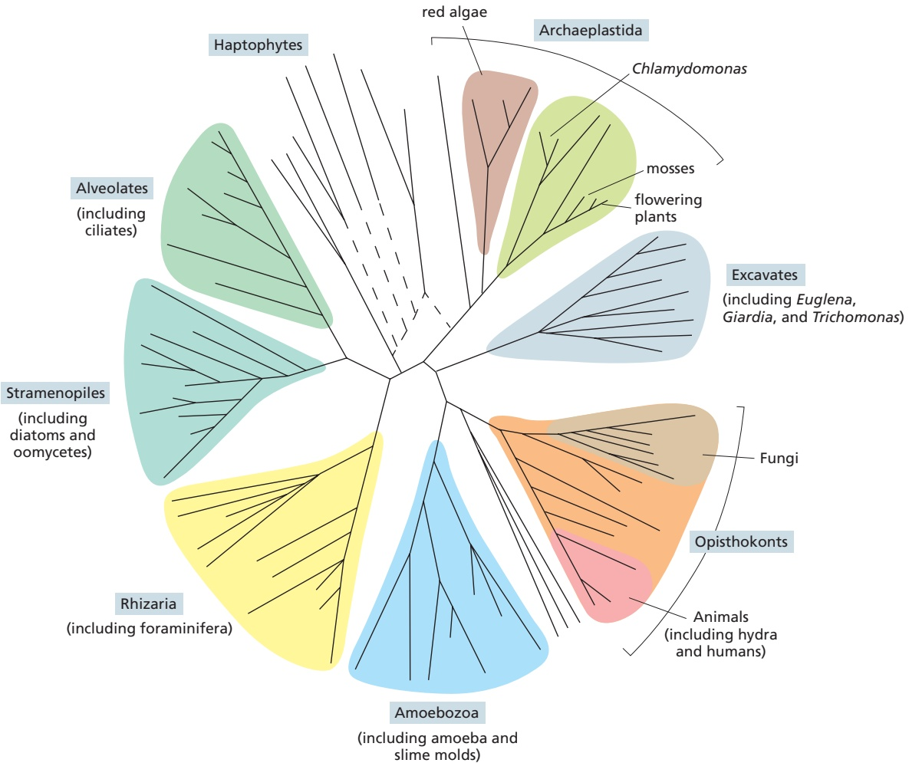

Figure 1–35 A eukaryotic tree of life based on genome comparisons. The lengths of the lines are proportional to the extents of genome diversity, with broken lines indicating uncertain relationships. Note that animals and plants are separated by many single-cell species (including the Excavates), suggesting that multicellularity arose independently several times during eukaryotic evolution. (Adapted from F. Burki, Cold Spring Harb. Perspect. Biol. 6:a016147, 2014.)

Over time, different groups of biologists have focused on studying a few chosen species, which allows their knowledge and research tools to be pooled to gain a deeper understanding than could be achieved if their efforts were spread over many different organisms. Although the list of these representative, model organisms is continually expanding, a few stand out in terms of the breadth and depth of information that has been accumulated about them over the years—knowledge that has been essential for our understanding of how all cells work. In this section, we examine some of these organisms and review the benefits that each offers to the study of cell biology and, in many cases, to the promotion of human health. We begin with a discussion of some especially powerful strategies that scientists have developed to understand the cell, and we shall see how these approaches dictated the choice of model organisms.

#### Mutations Reveal the Functions of Genes

Without additional information, no amount of gazing at genome sequences will reveal the functions of genes. We may recognize that gene B is like gene A, but how do we discover the function of gene A in the first place? And even if we know the function of gene A, how do we test whether the function of gene B is truly the same as the sequence similarity suggests? How do we connect the world of abstract genetic information that was introduced in the previous sections with the world of living cells and organisms?

The analysis of gene functions depends on two highly complementary approaches: biochemistry and genetics. Biochemistry directly examines the functions of purified molecules, such as the protein and RNA produced from a specific gene: first we obtain that molecule from an organism and then study its chemical activities in detail. In contrast, genetics starts with the study of mutants: we either find or make an organism in which the specific gene is altered, and we then examine the effects on the mutant organism’s structure and performance (**Figure 1–36**). When combined with biochemistry, careful studies of an organism (and its isolated cells) mutated for a particular protein or RNA molecule can reveal the biological role of that molecule.

Biochemistry and genetics, used in combination with cell biology, provide a powerful way to connect genes and molecules directly to cell and organism structure and function. In recent years, DNA sequence information and the powerful tools of molecular biology have greatly accelerated progress in this endeavor. From sequence comparisons, we can often identify particular subregions within a gene that have been conserved nearly unchanged over the course of evolution. These subregions are often the most important parts of the gene in terms of function. We can test their individual contributions to the gene’s function by creating in the laboratory mutations of specific sites within the subregion or by constructing artificial hybrid genes that combine part of one gene with parts of another. Organisms can be engineered to make either the RNA or protein specified by the gene in large quantities to facilitate biochemical analysis. Specialists in molecular structure can determine the three-dimensional conformation of the gene product, revealing the exact position of every atom in it. Biochemists can determine how each of the parts of the genetically specified molecule contributes to its chemical behavior and function in a test tube. Cell biologists determine the many other molecules that interact with the molecule of interest and where all these molecules are located within a cell. And they also analyze the behavior of cells that are engineered to express a mutant version of the gene.

There is, however, no one simple universal recipe for discovering a gene’s function. We may discover, for example, that the product of a given gene is an enzyme that catalyzes a certain chemical reaction, and yet have no idea how or why that reaction is important to the organism. The functional characterization of each new gene product or family of gene products, unlike the description of the gene sequences, presents a fresh challenge to the biologist’s ingenuity. Moreover, we will never fully understand the function of a gene until we learn its role in the life of the organism, which means studying whole organisms, not just isolated molecules or cells.

#### Molecular Biology Began with a Spotlight on One Bacterium and Its Viruses

Because living organisms are so complex, the more we learn about any particular species, the more attractive it becomes as an object for further study. Each discovery in such a chosen organism raises new questions and provides new tools with which to tackle general biological questions. For this reason, large communities of biologists have become dedicated to studying different aspects of the same **model organism**.

In the early days of molecular biology, the chosen model was the bacterium Escherichia coli (E. coli—see Figure 1–11B). This small, rod-shaped cell normally lives in the gut of humans and other vertebrates, but it can be grown easily in a simple nutrient broth in a culture bottle or dish, where under favorable conditions, it can reproduce every 20 minutes or so. It adapts to variable chemical conditions and can evolve by mutation and selection at a remarkable speed.

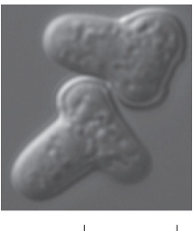

5 µm

Figure 1-36 An alteration in organism shape resulting from a gene mutation. Scanning electron micrographs (discussed in Chapter 9) of a normal yeast (of the species Schizosaccharomyces pombe) compared with a mutant yeast, where a MBoC7 m1.23/1.3change in a single gene has converted the cell from a cigar shape (left) to a T shape (right). The mutant gene therefore has a function controlling cell shape. But how, in molecular terms, does the gene product perform that function? That is a harder question, and it needs biochemical analysis to answer it. (Courtesy of Kenneth Sawin and Paul Nurse.)

Also of special early interest were a few of the viruses that infect this bacterium— inasmuch as their much smaller genomes made them even easier to analyze in detail.

**Viruses** are small packets of genetic material that have evolved as parasites that depend on the reproductive and biosynthetic machinery of the host cells they infect. Viruses are not strictly alive, because they depend on the machinery of their host cells for their reproduction. Although we now know that viruses are the most abundant—in terms of sheer numbers—of all the biological entities on this planet, they are too small to be seen in the light microscope. For this reason, they were completely missed until the end of the nineteenth century, when a few viruses were identified as infectious agents that pass through filters that trap bacteria, but are retained by the even-finer filters that allow large molecules to pass. Only with the invention of the electron microscope could viruses finally be visualized as tiny particles with defined shapes and sizes. We now know that viruses consist of many families, with different families having distinct structures and modes of replication (discussed in Chapters 6 and 23).

Those viruses that infect bacteria are called bacteriophages, and two that infect E. coli have played critical roles as model organisms that advanced our understanding of molecular cell biology. Detailed genetic analyses of these two viruses, bacteriophage lambda and bacteriophage T4, came first, followed by biochemistry that used the analysis of mutant genes to identify and characterize specific proteins of interest. Geneticists, for example, generated and then characterized more than a hundred different mutant genes in bacteriophage T4, a large virus with a double-strand DNA genome (**Figure 1–37**). Sets of T4 genes that encode components of the head and the tail of the bacteriophage were identified, allowing biochemical studies to reveal important principles of biological assembly processes. Similarly, a set of T4 genes that geneticists showed were essential for T4

(A)

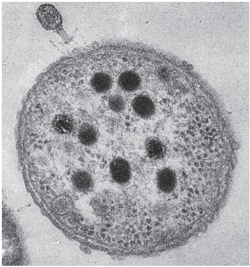

100 nm

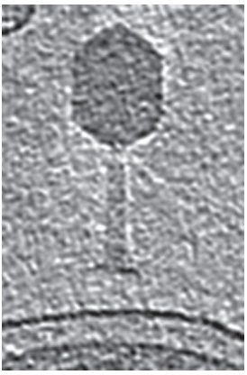

(C)

(B)

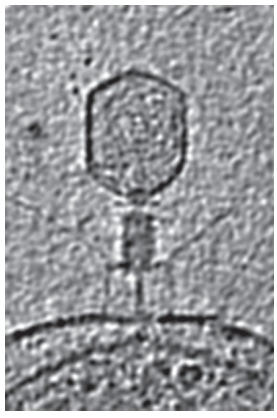

(D)

100 nm

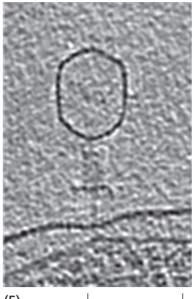

(E)

100 nm

Figure 1–37 The T4 bacteriophage. (A) An electron micrograph of particles of the T4 bacteriophage, a virus that infects E. coli bacteria. The hexagonal head of the virus contains the viral DNA; the tail contains the apparatus for injecting the DNA into a host bacterium. (B) A cross section of an E. coli bacterium with a T4 bacteriophage attached to its surface. The large dark objects inside the bacterium are the assembling heads of new T4 particles. When the particles are mature, the bacterium will burst open and release them. (C–E) The process of DNA injection into the bacterium, as visualized in unstained, frozen samples by cryo-electron microscopy (discussed in Chapter 9). (C) Attachment begins. (D) Attached state during DNA injection. (E) Virus head has emptied its entire DNA into the bacterium. (A, courtesy of James Paulson; B, courtesy of Jonathan King and Erika Hartwig from G. Karp, Cell and Molecular Biology, 2nd ed. New York: John Wiley & Sons, 1999. With permission from John Wiley & Sons; C–E, courtesy of Ian Molineux, University of Texas at Austin, and Jun Liu.)

DNA replication allowed those proteins to be purified, so that biochemists could decipher the central mechanisms of DNA replication in a test tube. In the same way, it was extensive studies of bacteriophage lambda that led to our early understanding of transcription regulators and gene regulatory networks (see Panel 7–1 on pp. 404–405 and Figure 7–43).

We now know that these two bacteriophages have many close relatives distributed throughout the biosphere. Relatives of bacteriophage T4, for example, are abundant in the ocean, where they infect the ubiquitous marine cyanobacteria. As a whole, ocean viruses are present in enormous numbers, estimated at 1030. If lined up end to end, they would extend beyond our nearest galaxies; they kill approximately 20% of the total ocean microbial biomass per day. Because these viruses have such a huge role in nutrient recycling, they profoundly affect Earth’s ecology.

Although not themselves living cells, viruses often serve as vectors for gene transfer between cells. A virus will replicate in one cell, emerge from it with a protective wrapping, and then enter and infect another cell, which may be of the same or different species. Often, the infected host cell is killed by the massive proliferation of virus particles inside it, but sometimes the viral DNA, instead of directly generating new virus particles, may persist in its host for many cell generations as a relatively innocuous passenger—either as a separate intracellular fragment of DNA, known as a plasmid, or as a DNA sequence inserted into the cell’s own genome. In their travels, viruses can accidentally pick up fragments of DNA from the genome of one host cell and ferry them into another cell. Such transfers of genetic material are very common in prokaryotes.

Many bacterial and archaeal species have a remarkable capacity to take up even nonviral DNA molecules from their surroundings and thereby capture the genetic information these molecules carry. By this route or by virus-mediated gene transfer, bacteria and archaea in the wild can acquire genes from neighboring cells relatively easily. Genes that confer resistance to an antibiotic or an ability to produce a toxin, for example, can be transferred from species to species and provide the recipient bacterium with a selective advantage, greatly enhancing its rate of spread. In this way, new and sometimes dangerous strains of antibiotic-resistant bacteria have been observed to evolve in the bacterial ecosystems that inhabit hospitals or various niches in the human body. On a longer time scale, the results can be even more profound; it has been estimated that at least 18% of all the genes in the present-day genome of E. coli have been acquired by horizontal transfer from another species within the past 100 million years.

#### The Focus on E. coli as a Model Organism Has Accelerated Many Subsequent Discoveries

The standard laboratory strain E. coli K-12 has a genome of approximately 4.6 million nucleotide pairs contained in a single circular molecule of DNA that codes for about 4300 different kinds of proteins (**Figure 1–38**). In molecular terms, we probably have a more complete understanding of E. coli than of any other living organism. Most of our understanding of the fundamental mechanisms of life— for example, how cells replicate their DNA or how they decode the instructions represented in the DNA to direct the synthesis of specific RNAs and proteins— initially came from studies of E. coli and its viruses. This is because the basic genetic mechanisms have turned out to be highly conserved throughout evolution and are essentially the same in our own cells as in E. coli.

It should be noted that, as with other bacteria, different strains of E. coli, though classified as members of a single species, differ genetically to a much greater degree than do different varieties of an organism such as a plant or animal. One E. coli strain may possess many hundreds of genes that are absent from another, and the two strains could have as little as 50% of their genes in common. These differences are largely the result of rampant horizontal gene transfer, characteristic of this and many other bacterial and archaeal species.

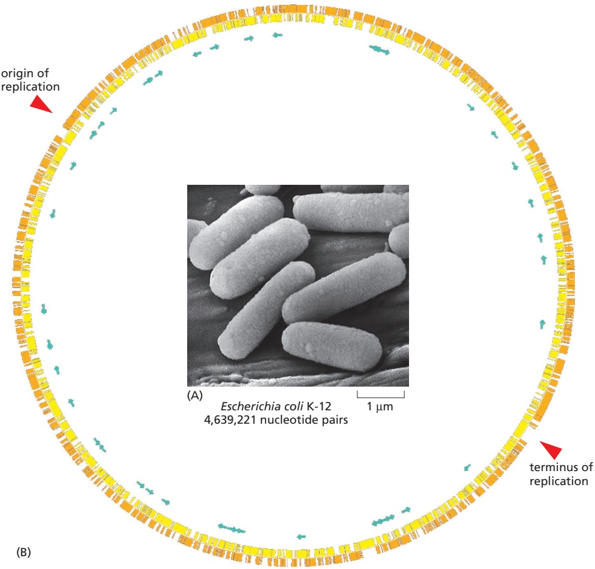

Figure 1–38 The genome of E. coli. (A) A cluster of E. coli cells viewed in a scanning electron microscope. (B) A diagram of the genome of E. coli strain K-12. The diagram is circular because the DNA of E. coli, like that of most other bacteria, forms a single, closed loop. Protein-coding genes are shown as yellow or orange bars, depending on the DNA strand from which they are transcribed; RNA molecules produced from nonprotein-coding genes are indicated by green arrows, with the arrowheads indicating their direction of transcription. Some genes are transcribed from one strand of the DNA double helix (in a clockwise direction in this diagram), others from the other strand (counterclockwise). The origin and terminus of DNA replication are marked with red arrowheads. (A, Dr. Tony Brain & David Parker/Science Source; B, adapted from F.R. Blattner et al., Science 277:1453–1462, 1997.)

#### A Yeast Serves as a Minimal Model Eukaryote

The molecular and genetic complexity of eukaryotes is daunting, and biologists need to concentrate their limited resources on a small number of selected model organisms to unravel this complexity.

To analyze the internal workings of the eukaryotic cell without the additional problems of multicellular development, it makes sense to use a single-cell species that is as simple as possible. The popular choice for this role of minimal model eukaryote has been the yeast Saccharomyces cerevisiae (**Figure 1–39**)—the same species that is used by brewers of beer and bakers of bread.

S. cerevisiae is a small, single-cell member of the kingdom of fungi and, in terms of its genome sequence, much more closely related to animals than to plants (see Figure 1–35). It is robust and easy to grow in a simple nutrient medium. Like other fungi, it has a tough cell wall, is relatively immobile, and possesses mitochondria but not chloroplasts. When nutrients are plentiful, it grows and divides about every hundred minutes. It can reproduce either vegetatively (that is, by ordinary cell division, or mitosis), or sexually: two yeast cells that are haploid (possessing a single copy of each chromosome, n = 1) can fuse to create a cell that is diploid (containing two copies of each chromosome, n = 2), and the diploid cell can undergo meiosis (a reduction division) to produce cells that are once again

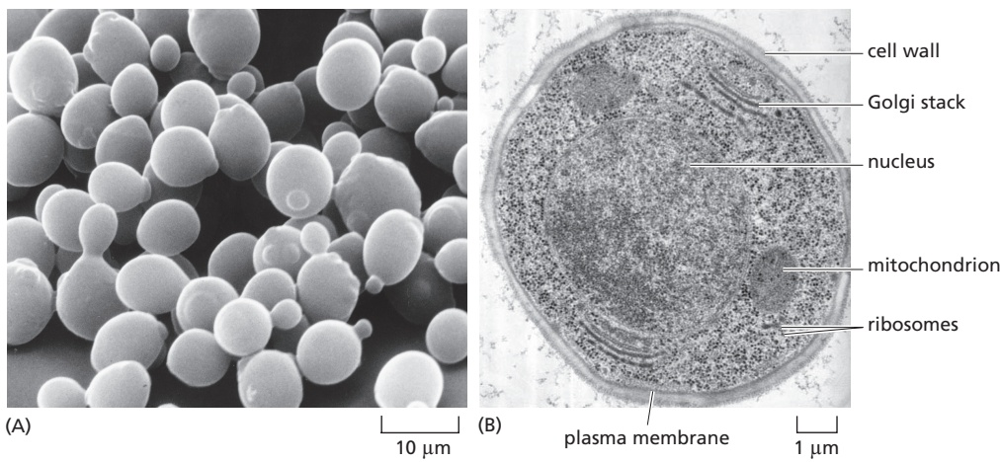

Figure 1–39 The yeast Saccharomyces cerevisiae. (A) A scanning electron micrograph of a cluster of yeast cells. This species is also known as budding yeast, because it proliferates by forming a protrusion, or bud, that enlarges and then separates from the mother cell. Many cells with buds are visible in this micrograph. (B) An electron micrograph of a cross section of a yeast cell, showing its plasma membrane and thick cell wall, as well as some of its intracellular organelles. (A, courtesy of Ira Herskowitz and Eric Schabtach; B, courtesy of Andrew Staehelin.)

haploid (**Figure 1–40**). In contrast to most animals, this yeast can therefore proliferate either sexually or asexually, a choice that an experimenter can make simply1. , . /1 by changing the growth conditions.

In addition to these features, the yeast has a further property that makes it a convenient organism for genetic studies: its genome, by eukaryotic standards, is exceptionally small (see Table 1–2), yet it suffices for all the basic tasks that every eukaryotic cell must perform. Mutants are available for every gene, and thus the consequence of missing each gene—one by one—can be observed under any environmental condition using the high-throughput procedures described in Chapter 8. Over the past 50 years, extensive studies of yeast cells carried out by many laboratories have provided keys to crucial “eukaryotic-only” processes. These include the cell-division cycle (the critical chain of events by which the nucleus and all the other components of a cell are duplicated and parceled out to create two daughter cells from one) and meiosis (the process through which an organism’s reproductive cells are formed). In addition, important insights into eukaryotic chromosome structure, the organization of the nucleus, the mechanisms of gene expression, the formation of organelles, and the ways that proteins are secreted from cells have come out of the work on yeasts. Many of these fundamental processes are so similar between yeasts and humans that a human homolog of a yeast protein will often faithfully carry out its functions when artificially expressed in yeast cells.

#### The Expression Levels of All the Genes of an Organism Can Be Determined

The complete genome sequence of S. cerevisiae consists of approximately 12,500,000 nucleotide pairs, including the small contribution (about 78,500 nucleotide pairs) of the mitochondrial DNA. This total is only about 2.7 times as much DNA as there is in E. coli, and it codes for only about 1.5 times as many distinct proteins (see Table 1–2). The way of life of S. cerevisiae is similar in many ways to that of a bacterium, and it seems that this yeast has likewise been subject to selection pressures (for rapid proliferation, for example) that have kept its genome compact.

Knowledge of the complete genome sequence of any organism—be it a yeast or a human—opens up new perspectives on the workings of the cell: many things that once seemed impossibly complex now seem to be within our grasp. Using techniques described in Chapter 8, it is possible, for example, to monitor simultaneously, the amount of mRNA produced from every gene in the yeast genome under any environmental condition. It is also possible to determine in real time

Figure 1–40 The reproductive cycles of the yeast S. cerevisiae. Depending on environmental conditions and on details of the genotype, cells of this species can exist in either a diploid (2n) state, with a double chromosome set, or a haploid (n) state, with a single chromosome set. The diploid form can either proliferate by ordinary celldivision cycles (mitosis) or undergo meiosis to produce haploid cells. The haploid MBoC7 m1.37/1.40form can either proliferate by ordinary cell-division cycles or undergo sexual fusion with another haploid cell to become diploid. Meiosis is triggered by starvation, and it gives rise to spores—haploid cells in a dormant state, resistant to harsh environmental conditions.

how the pattern of gene activity changes when conditions change. This type of analysis can be repeated with mRNA prepared from mutant cells lacking any gene we care to test, and, in this way, the influence of that gene on the expression of all other genes can be observed. Although pioneered in yeast, this approach now provides a way to reveal the entire system of controls that govern gene expression in any organism, as long as its genome sequence is known and it can be manipulated genetically.

#### Arabidopsis Has Been Chosen as a Model Plant

The large multicellular organisms that we see around us—the plants and animals—seem fantastically varied, but, as we have seen, they are much closer to one another in their evolutionary origins, and more similar in their basic cell biology, than the great host of microscopic single-celled organisms we have been discussing. Thus, while bacteria and archaea are separated by perhaps 3.5 billion years of evolution, vertebrates and insects are separated by about 700 million years, fish and mammals by about 450 million years, and the different species of flowering plants by only about 150 million years (see Figure 1–35).

Because of the close evolutionary relationship between all flowering plants (see Figure 1–35), we can, once again, gain insight into the cell and molecular biology of this whole class of organisms by focusing on just one or a few species for detailed analysis. Out of the nearly 400,000 known species of flowering plants, molecular biologists have chosen to concentrate their efforts on a small weed in the cabbage family, the common wall cress Arabidopsis thaliana (**Figure 1–41**), which can be grown indoors in large numbers and produces thousands of offspring per plant after 8–10 weeks. Arabidopsis has a total genome size of approximately 135 million nucleotide pairs, about 10 times the size of the yeast genome (see Table 1–2).

Work on Arabidopsis has provided a deep understanding of numerous key features of plants, including the mechanisms that cause flower development and its coordination with the seasons, the ability to grow toward sunlight, cell-to-cell signaling by hormones, and the special type of innate immune system that plants use to ward off pathogens. Comparison of the developmental programs between plants and animals has also highlighted some common principles, thereby allowing a glimpse into the basic logic through which large, highly differentiated, multicellular organisms evolved from single-cell ancestors.

#### The World of Animal Cells Is Mainly Represented by a Worm, a Fly, a Fish, a Mouse, and a Human

Although plants make up 80% of the biomass on Earth and animals make up less than 0.4% (see Figure 1–14), animals account for the majority of all named species of living organisms, and they are by far the most intensely studied. Five species have emerged as the foremost model organisms for molecular, cell, and developmental biological studies. In order of increasing body size, they are the nematode worm Caenorhabditis elegans, the fly Drosophila melanogaster, the zebrafish Danio rerio, the mouse Mus musculus, and the human, Homo sapiens. Genome sequences from many different individuals within each species have been determined.

Caenorhabditis elegans (**Figure 1–42**) is a small, harmless relative of the eelworm that attacks crops. With a life cycle of only a few days, an ability to survive in a freezer indefinitely in a state of suspended animation, a simple body

Figure 1–41 Arabidopsis thaliana, the plant chosen as the primary model for studying plant molecular genetics. (Courtesy of Toni Hayden, FLS; and the John Innes Foundation.)

Figure 1–42 Caenorhabditis elegans, the first multicellular organism to have its complete genome sequence determined. This nematode is only about 1 mm long and normally lives in the soil. Most individuals are hermaphrodites, producing both eggs and sperm. (Courtesy of Maria Gallegos, University of Wisconsin, Madison.)

1 mm

20 µm

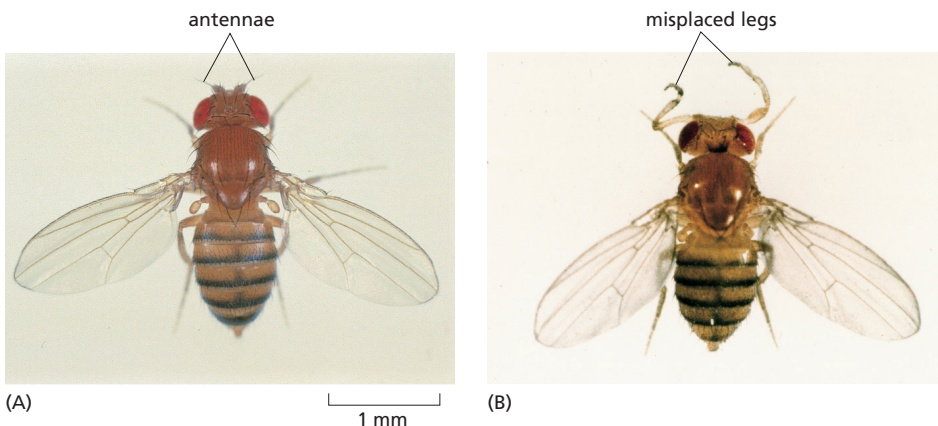

plan, and an unusual life cycle that is well suited for genetic studies, it is an attractive model animal. C. elegans develops with clockwork precision from a fertilized egg cell into an adult worm with exactly 959 body cells (plus a variable number of egg and sperm cells)—an unusual degree of regularity for animal development. We now have a minutely detailed description of the sequence of events by which this development occurs, as the cells divide, move, and change their character according to strict and predictable rules (see Figure 21–42). The genome of about 100 million nucleotide pairs codes for about 20,000 proteins, and many mutants and other tools are available for testing gene functions. Although the worm has a body plan very different from our own, the conservation of biological mechanisms has been sufficient for the worm to be a model for many of the developmental and cell-biological processes that occur in the human body. Thus, for example, studies of the worm have been critical for understanding the molecular mechanisms that mediate and regulate the many cell deaths that help control animal-cell numbers, both in normal development and during human cancer growth. This crucialMBoC7 e9.13/1.43 process, called programmed cell death or apoptosis, is the subject of Chapter 18. In addition, studies in C. elegans first revealed many fascinating features of RNA interference (discussed in Chapters 7 and 8). They have also provided key insights into the ways neurons make their proper connections (discussed in Chapter 21) and informed many additional areas of cell biology.

Figure 1–43 Drosophila melanogaster. (A) A normal adult Drosophila fruit fly. Molecular genetic studies of this fly have provided the main key to understanding how all animals develop from a fertilized egg into an adult. (B) A mutant adult fly, in which a mutation in a regulatory DNA sequence has caused genes for leg formation to be abnormally activated in positions normally reserved for antennae; as a result, legs have developed where antennae should be. (A, Edward B. Lewis, Courtesy of the Archives, California Institute of Technology; B, courtesy of Matthew Scott.)

#### Studies in the Fruit Fly Drosophila Provide a Key to Vertebrate Development

The fruit fly Drosophila melanogaster (**Figure 1–43**) has been used as a model for animal genetic studies for longer than any other organism; in fact, the foundations of classical genetics were built to a large extent on studies of this insect. Nearly 100 years ago, for example, the fly provided definitive proof that genes—the abstract units of hereditary information at the time—are carried on chromosomes, whose behavior had been closely followed with the light microscope during eukaryotic cell division but whose function was at first unknown. The proof depended on one of the many features that make Drosophila especially convenient for molecular genetic studies—the giant chromosomes, which have a characteristic banded appearance that is visible in some of its cells (**Figure 1–44**). Specific changes in the hereditary information, manifest in families of mutant flies, were found to correlate exactly with the loss or alteration of specific bands in the giant chromosomes.

In more recent times, Drosophila, more than any other organism, has shown us how to trace the chain of cause and effect from the genetic instructions encoded in the chromosomal DNA to the structure of the adult multicellular body. Drosophila mutants with body parts strangely misplaced (Figure 1–43) or mispatterned provided the key to the identification and characterization of the genes required to make a properly structured body, with gut, limbs, eyes, and all the other parts in their correct places. Once these Drosophila genes were identified, scientists could identify homologous genes in vertebrates, and then test their functions

Figure 1–44 Giant chromosomes from salivary gland cells of Drosophila. Because many rounds of DNA replication have occurred without an intervening cell division, each of the chromosomes in these unusual cells contains more than 1000 identical double-strand MBoC7 m1.41/1.4DNA molecules, all aligned in register. This makes them easy to see in the light microscope, where they display a characteristic and reproducible pattern of bands. Specific bands can be identified as the locations of specific genes: a mutant fly with a region of the banding pattern missing or altered shows a phenotype reflecting loss of the genes in that region (not shown). Genes that are being transcribed at a high rate correspond to bands with a “puffed” appearance (black arrow). The bands stained dark brown in the micrograph are sites where a particular regulatory protein is bound to the DNA; the regulatory protein is identified by the binding of a specific antibody. (From R. Paro, Trends Genet. 6:416–421, 1990. With permission from Elsevier.)

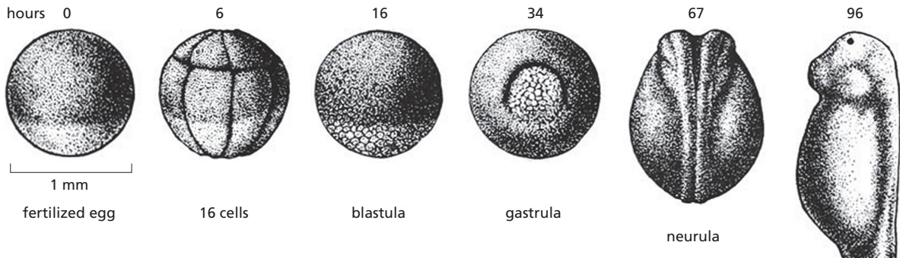

Figure 1–45 The early stages of normal frog development. These drawings show the development of a Rana pipiens tadpole from a fertilized egg. The entire process takes place outside the mother, making the mechanisms involved readily accessible for experimental studies. (From W. Shumway, Anat. Rec. 78:139–147, 1940. With permission from John Wiley & Sons.)

there by analyzing mice in which the genes had been mutated. The results have revealed an astonishing degree of similarity in the molecular mechanisms that govern insect and vertebrate development (discussed in Chapter 21).

The majority of all named species of living organisms are insects. Even if Drosophila had nothing in common with vertebrates, but only with insects, it would still be an important model organism. But, if understanding the molecular genetics of vertebrates is the goal, why not simply tackle the problem head-on in vertebrates, instead of sidling up to it obliquely through studies in Drosophila?

There are many reasons. Drosophila requires only 9 days to progress from a fertilized egg to an adult; it is vastly easier and cheaper to breed than any vertebrate, and its genome is much smaller—about 180 million nucleotide pairs, compared with about 3.1 billion for a human (see Table 1–2). Its genome codes for about 14,000 proteins, and mutants are now available for essentially any gene. In addition to its foundational contributions to animal development, research on Drosophila continues to uncover many other insights into biology, ranging from deeply conserved mechanisms that neutralize pathogens to ways that external stimuli from the environment are processed in the brain.

#### The Frog and the Zebrafish Provide Highly Accessible Vertebrate Models

Frogs have long been used to study the early steps of embryonic development in vertebrates. Because their eggs are big, easy to manipulate, and fertilized outside of the animal, the subsequent development of the early embryo can be easily followed (**Figure 1–45**). Xenopus laevis, the African clawed frog, continues to be an important model organism (**Movie 1.6** and see Movie 21.1). Although the species is poorly suited for genetic analysis, cytoplasm isolated from unfertilized Xenopus eggs has the remarkable ability to recapitulate the formation of cellular structures and organelles in a test tube. These egg extracts allow powerful biochemical approaches to study such fundamental processes as the cell division cycle, described in Chapter 17.

The zebrafish Danio rerio, in contrast, is well suited for genetic analysis. Its genome is compact—only half as big as that of a mouse or a human (see Table 1–2)—and it has a generation time of only about 3 months, which is much shorter than that of Xenopus laevis. Many mutants are available, and genetic manipulation is relatively simple. The zebrafish has the added virtue that it is transparent for the first 2 weeks of its life, so behavior of specific tissues and individual cells can easily be followed in the living organism as it develops (**Figure 1–46**; see Movie 21.2). All this has made it an increasingly important model vertebrate, one that has been especially crucial for understanding the development of the heart and the circulatory system, as discussed in Chapter 22.

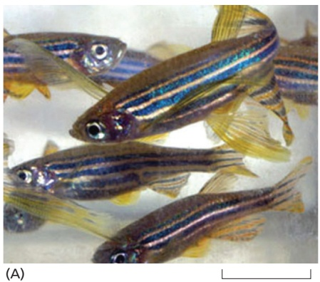

<small>Figure 1–46 Zebrafish as a model for studies of vertebrate development. (A) These small, hardy tropical fish are found in many home aquaria and are convenient for laboratory genetic studies. They are ideal for developmental studies as their embryos develop outside of the mother and are transparent, so one can observe cells and internal structures in the living organism throughout its development from an egg to an adult. (B) In this fluorescence image of a 2-day-old embryo, a red fluorescent protein marks the developing blood vessels, and a green fluorescent protein marks the developing lymphatic vessels; regions where the two markers coincide appear yellow. (A, courtesy of Steve Baskauf; B, from H.M. Jung et al., Development 144:2070–2081, 2017. With permission from The Company of Biologists.)</small>

#### The Mouse Is the Predominant Mammalian Model Organism

In terms of genome size and function, cell biology, and molecular mechanisms, mammals are a highly uniform group of organisms. Even anatomically, the differences among mammals are chiefly a matter of size and proportions; it is hard to think of a human body part that does not have a counterpart in elephants and mice, and vice versa. Evolution plays freely with quantitative features, but it does not readily change the logic of the basic structure.

Mammals have typically about 1.5 times as many protein-coding genes as Drosophila, a genome that is about 16 times larger, and an adult body made up of millions or billions of times as many cells. For an exact measure of how closely mammalian species resemble one another genetically, we can compare the nucleotide sequences of corresponding (orthologous) genes or the amino acid sequences of the proteins that these genes encode. The results for individual genes and proteins vary widely. But typically, if we line up the amino acid sequence of a human protein with that of the orthologous protein from, say, an elephant, more than 80% of the amino acids are identical. A similar comparison between human and bird shows an amino acid identity of about 70%—because the bird and mammalian lineages have had longer to diverge than those of the elephant and the human, they have accumulated more differences (**Figure 1–47**).

Figure 1–47 Times of divergence of different vertebrates. The scale on the left shows the estimated date and geological era of the last common ancestor of each specified pair of animals. Each time estimate is based on comparisons of the amino acid sequences of orthologous proteins; the longer the animals of a pair have had to evolve independently, the smaller the percentage of amino acids that remain identical. The time scale has been calibrated to match the fossil evidence showing that the last common ancestor of mammals and birds lived about 320 million years ago.

The figures on the right show the amino acid sequence divergence for one particular protein—the α chain of hemoglobin. Note that although there is a clear general trend of increasing divergence with increasing time for this protein, there are irregularities that are thought to reflect the action of natural selection causing especially rapid changes in hemoglobin sequence when the organisms experienced special physiological demands. Some proteins that are subject to stricter functional constraints evolve much more slowly than hemoglobin, whereas others evolve as much as five times faster. (Adapted from S. Kumar and S.B. Hedges, Nature 392:917–920, 1998.)

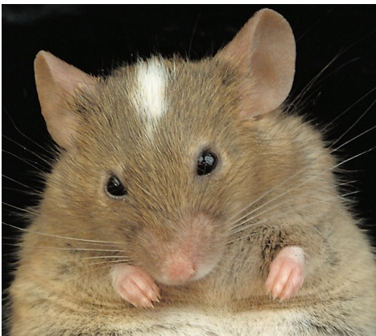

Figure 1–48 Similar mutations produce the same effect in human and mouse. The human baby and the mouse shown here have remarkably similar abnormal white patches on their foreheads as a result of a mutation in the same gene (called Kit), which is required for the normal development, migration, and survival of some skin pigment cells. (Courtesy of R.A. Fleischman, from R.A. Fleischman et al., Proc. Natl. Acad. Sci. USA 88:10885–10889, 1991.)

The mouse, being small, hardy, and a rapid breeder, has become the foremost model organism for experimental studies of mammalian molecular cell biology. Many naturally occurring mutations are known, often mimicking the effects of corresponding mutations in humans to a remarkable extent (**Figure 1–48**). Moreover, methods have been developed to test the function of any chosen mouse gene or of any noncoding portion of the mouse genome by artificially creating mutations in the relevant part of the gene or genome, as we explain in Chapter 8.

Just one made-to-order mutant mouse can provide a wealth of information for the cell biologist. It reveals the effects of the chosen mutation in various contexts, simultaneously testing the action of the gene in the many different types of cells in the body that could in principle be affected. Studies of the mouse are so fundamental to understanding mammalian biology that we will encounter them in nearly every chapter of this book.

#### The COVID-19 Pandemic Has Focused Scientists on the SARS-CoV-2 Coronavirus

Having discussed several of the most prominent and well-studied model organisms—which are based on the cell as their fundamental unit—we now turn to an intensively studied virus. Viruses, which in essence feed on cells, are prevalent in all three domains of life: bacteria, archaea, and eukaryotes. We introduced them earlier in this chapter when we discussed several E. coli viruses that served as critical experimental systems for the initial development of molecular biology. Here, we focus on one prominent virus, SARS-CoV-2, that infects our own cells and has, due to the widespread attention it has received from scientists, become a model system for understanding eukaryotic viruses. But before discussing this virus in detail, we consider how viruses—genomes packaged in protective shells—first came to be, and how they have evolved over time.

As described in Chapter 6, cells are believed to have first evolved in an “RNA world,” before there were proteins or DNA molecules. Scientists suspect that even at that time, parasitic genetic elements were present, in the form of small RNA molecules that took advantage of more advanced replicating entities to proliferate. These are believed to have been the ancestors of today’s smallest viruses, which contain single-strand RNA genomes composed of as few as 3000 nucleotides. Thus, virus-like entities have probably been a ubiquitous feature of life on Earth for more than 3 billion years.

At a minimum, a virus requires a genome that encodes two core functions: first, a nucleic acid replication process that produces multiple copies of its genome once inside its host cell, and second, a genome-packaging process that surrounds these new genomes with a protective protein coat, while allowing the viruses to exit the host cell and subsequently enter others. But the viruses present today have evolved through billions of infectious cycles, during which there has been a constant war between host organisms and the viruses—with host cells evolving multiple antivirus defenses and viruses evolving various ways to overcome these defenses. As a result, through cycles of random mutation followed by natural selection over long evolutionary times, most virus genomes have grown much larger than needed for their two core functions, with many of the additional genes encoding proteins that help the viruses to circumvent their host-cells’ defenses.

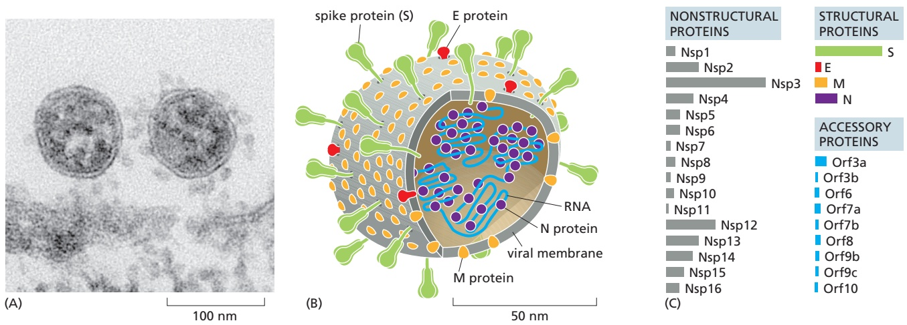

Figure 1–49 The coronavirus. (A) Electron micrograph of SARS-CoV-2 virus particles attached to the surface of a cultured monkey cell. (B) A cut-away drawing of the virus that highlights its protruding spike protein molecules plus a few other major proteins. The spike protein is the major target for vaccines that are designed to block infections, because it attaches the virus to the outside of host cells and then catalyzes transfer of the viral genome into the cell interior. As indicated, the RNA genome is packaged unevenly inside the enveloped virus particle. (C) The 29 proteins produced by SARS-CoV-2, grouped into three 7 1.200/1.49different categories. The locations of the structural proteins S, M, E, and N in the virus are indicated in panel B. Each of the proteins listed in the “accessory” category has a role in protecting the virus from host antiviral responses. The functions of the nonstructural proteins include binding to ribosomes to block host protein synthesis (Nsp1), forming a double-membrane “replication organelle” from host-cell membranes (Nsp 3, 4, and 6), and forming the RNA-dependent RNA polymerase (Nsp 7, 8, and 12). The way in which the virus reproduces itself, once inside a host cell, is shown in Figure 5–62. (A, from M. Laue et al. Sci. Rep. 11:3515, 2021. With permission from Cold Spring Harbor Press.)

Coronavirus genomes are large, single-strand RNA molecules, about 30,000 nucleotides long. This RNA is packaged in a protein coat that is covered with a lipid bilayer envelope, from which protein spikes protrude (**Figure 1–49A and B**). Many coronavirus strains circulate in animal species, including pigs, birds, and bats. Some strains also circulate among humans; these so-called “endemic” strains cause only mild symptoms and are responsible for about one in four common colds. But on rare occasions, a bat coronavirus mutates in a way that allows it to infect humans, where it can cause very severe, even fatal, disease. It is thought that the COVID-19 pandemic of 2020 originated in this way.

The virus that causes COVID-19, SARS-CoV-2, produces 29 proteins (**Figure 1–49C**). Some are structural proteins that package the virus’s RNA genome into the virus particle. The nonstructural proteins are critical for replicating the viral genome inside of the host cell, as well as for ensuring that the viral genes are appropriately translated into proteins, including the viral RNA polymerase complex. And, as one would expect, other proteins help the virus to avoid the host’s immune defenses, which are described in Chapter 24.

The SARS-CoV-2 virus is closely related to the coronaviruses that cause colds, as well as to the SARS-CoV virus that emerged from bats in 2002 and killed nearly 1 in 10 of the humans it infected. We still do not understand what makes SARS-CoV and SARS-CoV-2 infections so much more dangerous to humans than the infections caused by their close relatives that cause only a mild cold. But, given the thousands of research laboratories currently focused on understanding the cell biology of SARS-CoV-2 with the aim of ameliorating the COVID-19 pandemic, we should know the answers to these questions in the near future. These studies are certain to make us much better prepared to deal with the next virus that emerges to threaten us.

#### Humans Are Unique in Reporting on Their Own Peculiarities

As humans, we have a special interest in the human genome. We want to know how our genes and their products work. But, even if you were a mouse, pre-occupied with how mouse genes and their products work, humans would be attractive as model genetic organisms because of one special property: through medical examinations and self-reporting, we catalog our own genetic (and other) disorders. The human population is enormous, consisting today of some 8 billion individuals, and this self-documenting property means that a huge database exists of human mutations and their effects. And the human genome sequence of more than 3 billion nucleotide pairs has been determined for hundreds of thousands of people, making it easier than ever before to identify at a molecular level the precise genetic change responsible for any given human mutant phenotype.

But what precisely do we mean when we speak of the human genome? Whose genome? On average, any two people taken at random will differ at roughly 4 million different sites in their DNA sequence (see Table 4–3, p. 247). Thus, the human genome is very complex, embracing the entire pool of variant genes found in the human population. As described in Chapter 4, knowledge of this variation is helping us to understand human biology; for example, why some people are prone to one disease, others to another, and why some respond well to a drug, but others badly. It is also providing clues to our history, including population movements, interbreeding among our ancestors, the infections they suffered, and the diets they ate. All these things have left traces in the variant forms of genes that survive today in the human communities that populate our planet, and by exploiting this fact, scientists have been discovering fascinating aspects of our past.

By drawing together the insights from humans, mice, fish, flies, worms, yeasts, plants, and bacteria—using DNA sequence similarities to map out the correspondences between one model organism and another—we are greatly enriching our understanding of them all.

#### To Understand Cells and Organisms Will Require Mathematics, Computers, and Quantitative Information

Empowered by knowledge of complete genome sequences, we can list the genes, proteins, and RNA molecules in a cell, and we have powerful methods to analyze the complex web of interactions between them. But how are we to use all this information to understand how cells work? Even for a single cell type belonging to a single species of organism, the current deluge of data seems overwhelming. The informal reasoning that biologists usually rely on seems increasingly inadequate in the face of such complexity.

The difficulty is more than just a matter of information overload. Biological systems are, for example, full of feedback loops, and the behavior of even the simplest of systems with feedback is remarkably difficult to predict by intuition alone (**Figure 1–50**); small changes in parameters can cause radical changes in outcome. To go from a circuit diagram to a prediction of the behavior of the system, we need detailed quantitative information, and to draw deductions from that information we need mathematics and computers.

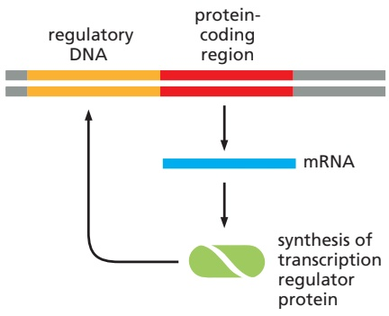

<small>Figure 1–50 A very simple gene regulatory circuit. A single gene regulates its own expression because its protein product is a transcription regulator that binds to the regulatory DNA of its own gene. Simple schematic diagrams such as this are found throughout this book. They are often used to summarize what we know, but they leave many questions unanswered. When the protein binds, does it inhibit or stimulate transcription from the gene? How steeply does the transcription rate depend on the protein concentration? How long, on average, does a molecule of the protein remain bound to the DNA? How long does it take to make each molecule of mRNA or protein, and how quickly does each type of molecule get degraded? As explained in Chapter 8, mathematical modeling shows that we need quantitative answers to all these and other questions—obtained by direct observations and experiments—before we can predict the behavior of even this simple circuit. For different parameter values, the system may settle to a unique steady state; or it may behave as a switch, capable of existing in one or another of a set of alternative states; or it may oscillate; or it may even show large random fluctuations.</small>

Such tools for quantitative reasoning are essential, but they are not allpowerful. You might think that, knowing how each protein in a cell influences each other protein, and how the expression of each gene is regulated by the products of other genes, we should soon be able to calculate how the cell as a whole will behave, just as an astronomer can calculate the orbits of the planets or a chemical engineer can calculate the flows through a chemical plant. But any attempt to perform this feat for anything close to an entire living cell rapidly reveals the limits of our present knowledge. The information we have, plentiful as it is, is full of gaps and uncertainties, and it is largely qualitative rather than quantitative. Most often, cell biologists studying a cell’s control systems sum up their knowledge in simple schematic diagrams—this book is full of them—rather than in numbers, graphs, and differential equations.

To progress from qualitative descriptions and intuitive reasoning to quantitative descriptions and mathematical deduction is one of the biggest challenges for contemporary cell biology. So far, the challenge has been met for only a few very simple fragments of the machinery of living cells—subsystems involving a handful of different proteins, or two or three genes that regulate one another, where theory and experiment go closely hand in hand. We discuss some of these examples later in the book and devote much of Chapter 8 to some new approaches designed to answer the increasingly complex questions that arise in biology.

Knowledge and understanding bring the power to intervene—with humans, to prevent and treat disease; with plants, to create better crops; with bacteria, archaea, and fungi, to control them for our own benefit. All these biological enterprises are linked, because the genetic information of all living organisms is written in the same language. The recent ability of molecular biologists to read and decipher this language has already begun to transform our relationship to the living world. The account of cell biology in the subsequent chapters will, we hope, equip the reader to understand, and possibly to contribute to, the great biosciences adventure that we can anticipate through the rest of this century.

#### Summary

Powerful new technologies, including rapid and cheap genome sequencing, are enabling rapid advances in our knowledge of human biology, with implications for understanding and treating human disease. But living systems are incredibly complex, and simpler model organisms have played a critical part in revealing universal genetic and molecular cell biological mechanisms. Thus, for example, early research on the bacterium E. coli and its viruses provided the foundations needed to decipher the fundamental genetic mechanisms in all cells. And research on the unicellular yeast Saccharomyces cerevisiae, which continues to serve as a simple model organism for eukaryotic cell biology, has revealed the molecular basis for many critical processes that have been strikingly conserved during more than a billion years of eukaryotic evolution. Biologists have also chosen a small number of multicellular organisms for intensive study: a worm, a fly, a fish, the mouse, and humans serve as model organisms for animals, and a small member of the cabbage family serves as a model for plant biology. Even today, research that focuses on these and other model organisms remains crucial for understanding ourselves, as well as for driving scientific and medical advances.

<!-- END EN EN01-H039-H053 -->

### 英文补充：遗传筛选、CRISPR、RNA干扰与功能基因组学

> 对应中文板块：遗传筛选、CRISPR、RNA干扰与功能基因组学。英文来源：Molecular Biology of the Cell，第7版，第8章；[本章完整原文](../../来源/英文教材/08_Analyzing_Cells_Molecules_and_Systems/chapter.md)。物理PDF页码范围：514–601（整章范围）。

<!-- BEGIN EN EN08-H042-H072 -->
#### STUDYING GENE FUNCTION AND EXPRESSION

Ultimately, our goal is to understand how genes—and the proteins they encode— function in the intact organism. Although it may seem counterintuitive, one of the most direct ways to find out what a gene does is to see what happens to the organism when that gene is missing. Studying mutant organisms that have acquired changes or deletions in their nucleotide sequences is a time-honored practice in biology and forms the basis of the important field of **genetics**. Because mutations can disrupt cell processes, mutants often hold the key to understanding gene function. In the classical genetic approach, one begins by isolating mutants that have an interesting or unusual appearance: fruit flies with white eyes or curly wings, for example. Working backward from the **phenotype**—the appearance or behavior of the individual—one then determines the organism’s **genotype**, the form of the gene responsible for that characteristic (**Panel 8–1**).

Today, with numerous genome sequences available, the exploration of gene function often begins with a DNA sequence. Here, the challenge is to translate sequence into function. One approach, discussed earlier in the chapter, is to search databases for well-characterized proteins that have similar amino acid sequences to the protein encoded by a new gene. From there, the protein can be overexpressed and purified, and the methods described earlier in this chapter can be employed to study its biochemical properties and three-dimensional structure. But to determine directly a gene’s function in a cell or organism, the most effective approach involves studying mutants that either lack the gene or express an altered version of it. Determining which cell processes have been disrupted or compromised in such mutants will usually shed light on a gene’s biological role.

In this section, we describe several approaches to determining a gene’s function, starting either from an individual with an interesting phenotype or from a DNA sequence. We begin with the classical genetic approach, which starts with a genetic screen for isolating mutants of interest and then proceeds toward identification of the gene or genes responsible for the observed phenotype. We then describe the set of techniques that are sometimes called reverse genetics, in which one begins with a gene or gene sequence and attempts to determine its function. This approach often involves some intelligent guesswork—searching for similar sequences in other organisms or determining when and where a gene is expressed—as well as generating mutant organisms and characterizing their phenotype.

#### Classical Genetic Screens Identify Random Mutants with Specific Abnormalities

Before the advent of gene cloning technology, most genes were identified by the abnormalities produced when the gene was mutated. Indeed, the very concept of the gene was deduced from the heritability of such abnormalities. This classical genetic approach—identifying the genes responsible for mutant phenotypes—is most easily performed in organisms that reproduce rapidly and are amenable to genetic manipulation, such as bacteria, yeasts, nematode worms, and fruit flies. Although spontaneous mutants can sometimes be found by examining extremely large populations—thousands or tens of thousands of individual organisms—isolating mutant individuals is much more efficient if one generates mutations with chemicals or radiation that damage DNA. By treating organisms with such mutagens, very large numbers of mutant individuals can be created quickly and then screened for a particular defect of interest.

An alternative approach to chemical or radiation mutagenesis is called insertional mutagenesis. This method relies on the fact that exogenous DNA inserted randomly into the genome can produce mutations if the inserted fragment interrupts a gene or its regulatory sequences. The inserted DNA, whose sequence is known, then serves as a molecular tag that aids in the subsequent identification and cloning of the disrupted gene (**Figure 8–47**). In Drosophila, the use of the transposable P element to inactivate genes has revolutionized the study of gene function in the fly. Transposable elements (see Table 5–4, p. 308) have also been used to generate mutations in bacteria, yeast, mice, and the flowering plant Arabidopsis.

Once a collection of mutants in a model organism has been produced, one generally must examine thousands of individuals to find the altered phenotype of interest. Such a search is called a **genetic screen**, and the larger the genome, the less likely it is that any particular gene will be mutated. Therefore, the larger the genome of an organism, the bigger the screening task becomes. The phenotype being screened for can be simple or complex. Simple phenotypes are easiest to detect: one can screen many organisms rapidly, for example, for mutations

Figure 8–47 Insertional mutant of the snapdragon, Antirrhinum. A mutation in a single gene coding for a regulatory protein causes leafy shoots (left) to develop in place of flowers, which occur in the MBoC7 m8.44/8.47normal plant (right). The mutation causes cells to adopt a character that would be appropriate to a different part of the normal plant, so instead of a flower, the cells produce a leafy shoot. (Courtesy of Enrico Coen and Rosemary Carpenter.)

For simplicity, the cycle is shown for only one chromosome/chromosome pair.

#### GENES AND PHENOTYPES

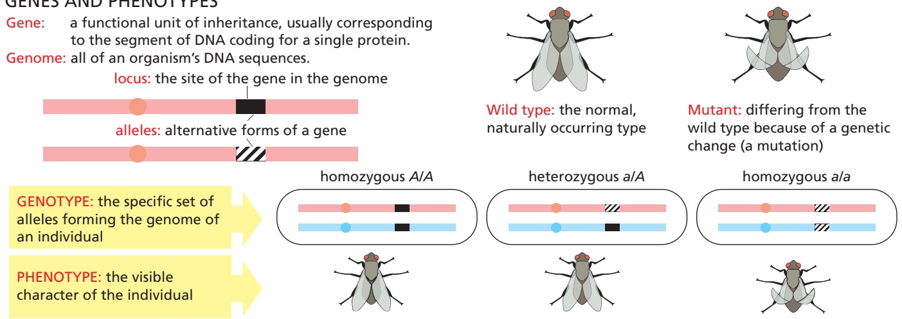

In the example above, the phenotype of the heterozygote is the same as that of one of the homozygotes; in cases where it is different from both, the two alleles are said to be codominant.

#### CHROMOSOMES

a chromosome at the beginning of the cell cycle, in G1 phase; the single long bar represents one long double helix of DNA

#### long “q” arm

a chromosome near the end of the cell cycle, in metaphase; it is duplicated and condensed, consisting of two identical sister chromatids (each containing one DNA double helix) joined at the centromere.

A normal diploid chromosome set, as seen in a metaphase spread, prepared by bursting open a cell at metaphase and staining the scattered chromosomes. In the example shown schematically here, there are three pairs of autosomes (chromosomes inherited symmetrically from both parents, regardless of sex) and two sex chromosomes—an X from the mother and a Y from the father. The numbers and types of sex chromosomes and their role in sex determination are variable from one class of organisms to another, as is the number of pairs of autosomes.

#### THE HAPLOID–DIPLOID CYCLE OF SEXUAL REPRODUCTION

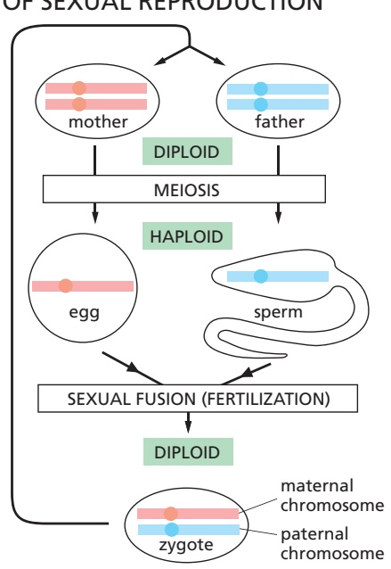

#### MEIOSIS AND GENETIC RECOMBINATION

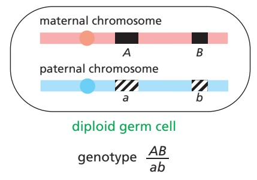

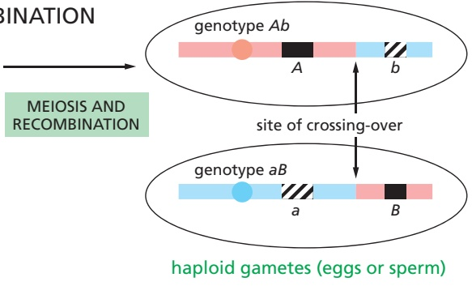

The greater the distance between two loci on a single chromosome, the greater is the chance that they will be separated by crossing-over occurring at a site between them. If two genes are thus reassorted in x% of gametes, they are said to be separated on a chromosome by a genetic map distance of x map units (or x centimorgans).

#### TYPES OF MUTATIONS

POINT MUTATION: maps to a single site in the genome, corresponding to a single nucleotide pair or a very small part of a single gene

INVERSION: inverts a segment of a chromosome

lethal mutation: causes the developing organism to die prematurely.

conditional mutation: produces its phenotypic effect only under certain conditions, called the restrictive conditions. Under other conditions—the permissive conditions—the effect is not seen. For a temperature-sensitive mutation, the restrictive condition typically is high temperature, while the permissive condition is low temperature.

loss-of-function mutation: either reduces or abolishes the activity of the gene. These are the most common class of mutations. Loss-of-function mutations are usually recessive—the organism can usually function normally as long as it retains at least one normal copy of the affected gene. null mutation: a loss-of-function mutation that completely abolishes the activity of the gene.

#### TWO GENES OR ONE?

Given two mutations that produce the same phenotype, how can we tell whether they are mutations in the same gene? If the mutations are recessive (as they most often are), the answer can be found by a complementation test.

COMPLEMENTATION: MUTATIONS IN TWO DIFFERENT GENES

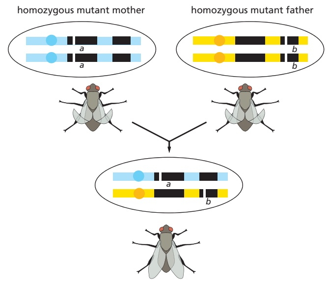

hybrid offspring shows normal phenotype: one normal copy of each gene is present

DELETION: deletes a segment of a chromosome

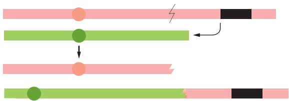

TRANSLOCATION: breaks off a segment from one chromosome and attaches it to another

gain-of-function mutation: increases the activity of the gene or makes it active in inappropriate circumstances; these mutations are usually dominant.

dominant-negative mutation: dominant-acting mutation that blocks gene activity, causing a loss-of-function phenotype even in the presence of a normal copy of the gene. This phenomenon occurs when the mutant gene product interferes with the function of the normal gene product. suppressor mutation: suppresses the phenotypic effect of another mutation, so that the double mutant seems normal. An intragenic suppressor mutation lies within the gene affected by the first mutation; an extragenic suppressor mutation lies in a second gene—often one whose product interacts directly with the product of the first.

In the simplest type of complementation test, an individual who is homozygous for one mutation is mated with an individual who is homozygous for the other. The phenotype of the offspring gives the answer to the question.

NONCOMPLEMENTATION: TWO INDEPENDENT MUTATIONS IN THE SAME GENE

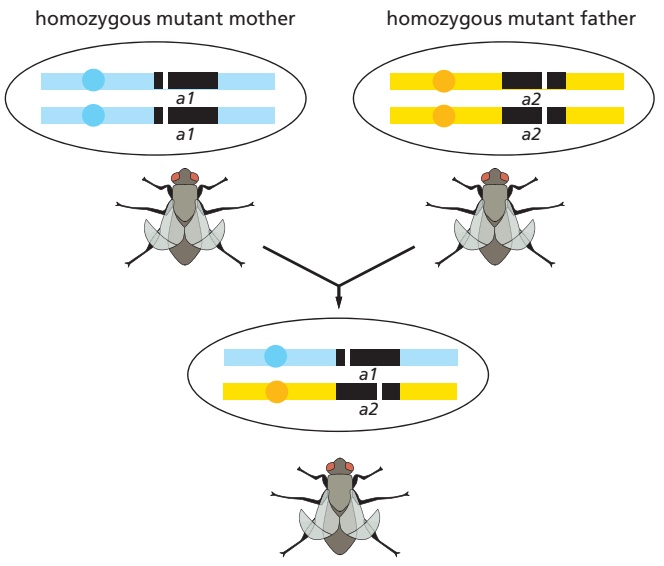

hybrid offspring shows mutant phenotype: no normal copies of the mutated gene are present

mutagenized cells proliferate and form colonies at 23oC

that make it impossible for the organism to survive in the absence of a particular amino acid or nutrient.

Because defects in genes that are required for fundamental cell processes— RNA synthesis and processing or cell-cycle control, for example—are usually lethal, the functions of these genes are often studied in individuals with **conditional mutations**. The mutant individuals function normally as long as permissive conditions prevail but demonstrate abnormal gene function when subjected to restrictive (nonpermissive) conditions. In organisms with temperature-sensitive mutations, for example, the abnormality can be switched on and off experimentally simply by changing the ambient temperature; thus, a cell containing a temperature-sensitive mutation in a gene essential for survival will die at aMB C7 8.46/8.48 restrictive temperature but proliferate normally at a permissive temperature (**Figure 8–48**). The temperature-sensitive gene in such a mutant usually contains a point mutation that causes a subtle change in its protein product; for example, the mutant protein may function normally at low temperatures but unfold at higher temperatures.

Temperature-sensitive mutations were crucial to find the bacterial genes that encode the proteins required for DNA replication. The mutants were identified by screening populations of mutagen-treated bacteria for cells that stop making DNA when they are warmed from 30°C to 42°C. These mutants were later used to identify and characterize the corresponding DNA replication proteins (discussed in Chapter 5). Similarly, screens for temperature-sensitive mutations in yeast led to the identification of many proteins involved in regulating the cell cycle, as well as many proteins involved in moving proteins through the secretory pathway. Related screening approaches demonstrated the function of enzymes involved in the principal metabolic pathways of bacteria and yeast (discussed in Chapter 2) and identified many of the gene products responsible for the orderly development of the Drosophila embryo (discussed in Chapter 21).

#### Mutations Can Cause Loss or Gain of Protein Function

Gene mutations are generally classed as loss of function or gain of function. A lossof-function mutation results in a gene product that either does not work or works too little; thus, it can reveal the normal function of the gene. A gain-of-function mutation results in a gene product that works too much, works at the wrong time or place, or works in a new way (**Figure 8–49**).

An important early step in the genetic analysis of any mutant cell or organism is to determine whether the mutation causes a loss or a gain of function. A standard test is to determine whether the mutation is dominant or recessive. A

Figure 8–48 Screening for temperaturesensitive bacterial or yeast mutants. Mutagenized cells are plated out at the permissive temperature. They divide and form colonies, which are transferred to two identical Petri dishes by replica plating. One of these plates is incubated at the permissive temperature, the other at the restrictive temperature. Cells containing a temperature-sensitive mutation in a gene essential for proliferation can divide at the normal (permissive) temperature but fail to divide at the elevated (restrictive) temperature.

point mutation

truncation

conditional lossof-function mutation

deletion

37oC

Figure 8–49 Gene mutations that affect their protein product in different ways. In this example, the wild-type protein has a specific cell function denoted by the red rays. Mutations that eliminate this function or inactivate it at higher temperatures are shown. The conditional mutant protein carries an amino acid substitution (red) that prevents its proper folding at 37ºC but allows the protein to fold and function normally at 25ºC. Such temperature-sensitive conditional mutations are especially useful for studying essential genes (see Figure 8–48). In some cases, a mutation increases the activity of the mutant protein.

dominant mutation is one that still causes the mutant phenotype in the presence of a single copy of the wild-type gene. A recessive mutation is one that is no longer able to cause the mutant phenotype in the presence of a single wild-type copy of the gene. In the majority of cases, recessive mutations are loss of function and dominant mutations are gain of function—although cases have been described in which a loss-of-function mutation is dominant or a gain-of-function mutation is recessive. It is easy to determine if a mutation is dominant or recessive. One simply mates a mutant with a wild type to obtain diploid cells or organisms. The progeny from the mating will be heterozygous for the mutation. If the mutant phenotype is no longer observed, one can conclude that the mutation is recessive and is very likely to be a loss-of-function mutation (see Panel 8–1).

#### Complementation Tests Reveal Whether Two Mutations Are in the Same Gene or Different Genes

A large-scale genetic screen can turn up many different mutations that show the same phenotype. These defects might lie in different genes that function in the same process or they might represent different mutations in the same gene. Alternative forms of the same gene are known as **alleles**. The most common difference between alleles is a substitution of a single nucleotide pair, but different alleles can also bear deletions, substitutions, and duplications. How can we tell, then, whether two mutations that produce the same phenotype occur in the same gene or in different genes? If the mutations are recessive—if, for example, they represent a loss of function of a particular gene—a **complementation test** can be used to ascertain whether the mutations fall in the same gene or in different genes. To test complementation in a diploid organism, an individual that is homozygous for one mutation—that is, it possesses two identical alleles of the mutant gene in question—is mated with an individual that is homozygous for the other mutation. If the two mutations are in the same gene, the offspring show the mutant phenotype, because they still will have no normal copies of the gene in question. If, in contrast, the mutations fall in different genes, the resulting offspring show a normal phenotype, because they retain one normal copy (and one mutant copy) of each gene; the mutations thereby complement one another and restore a normal phenotype (**Figure 8–50**). Complementation testing of mutants identified during genetic screens has revealed, for example, that 5 different genes are required for yeast to digest the sugar galactose, 20 genes are needed for E. coli to build a functional flagellum, 48 genes are involved in assembling bacteriophage T4 viral particles, and hundreds of genes are involved in the development of an adult nematode worm from a fertilized egg.

#### Gene Products Can Be Ordered in Pathways by Epistasis Analysis

Once a set of genes involved in a particular biological process has been identified, it is helpful to determine the order in which the genes function. Gene order is perhaps easiest to explain for metabolic pathways, where, for example, enzyme A is necessary to produce the substrate for enzyme B. In this case, we would say that the gene encoding enzyme A acts before (upstream of) the gene encoding enzyme B in the pathway. Similarly, where one protein regulates the activity of another protein, we would say that the former gene acts before the latter. Gene order can, in many cases, be determined purely by genetic analysis without any knowledge of the mechanism of action of the gene products involved.

Suppose we have a biosynthetic process consisting of a sequence of steps, such that performance of step B requires completion of the preceding step A; and suppose gene A is required for step A, and gene B is required for step B. Then a null mutation (a mutation that abolishes function) in gene A will arrest the process at step A, regardless of whether gene B is functional or not, whereas a null mutation in gene B will cause arrest at step B only if gene A is still active. In such a case, gene A is said to be epistatic to gene B. By comparing the phenotypes of different combinations of mutations, we can therefore discover the order in which the genes act. This type of analysis is called **epistasis analysis**. As an example, the pathway of protein secretion in yeast has been analyzed in this way. Different mutations in this pathway cause proteins to accumulate aberrantly in the endoplasmic reticulum (ER) or in the Golgi apparatus. When a yeast cell is engineered to carry both a mutation that blocks protein processing in the ER and a mutation that blocks processing in the Golgi apparatus, proteins accumulate in the ER. This indicates that proteins must pass through the ER before being sent to the Golgi before secretion (**Figure 8–51**). Strictly speaking, an epistasis analysis can only provide information about gene order in a pathway when both mutations are null alleles. When the mutations retain partial function, their epistasis interactionsMBoC7 m8.49/8.51 can be difficult to interpret.

Figure 8–50 A complementation test can reveal that mutations in two different genes are responsible for the same MBoC7 m8.48/8.50abnormal phenotype. When an albino (white) bird from one strain is bred with an albino from a different strain, the resulting offspring (bottom) have normal coloration. This restoration of the wild-type plumage indicates that the two white breeds lack color because of recessive mutations in different genes. (From W. Bateson, Mendel’s Principles of Heredity, 1st ed. Cambridge, UK: Cambridge University Press, 1913.)

Figure 8–51 Using genetics to determine the order of function of genes. In normal cells, secretory proteins are loaded into vesicles, which fuse with the plasma membrane to secrete their contents into the extracellular medium. Two mutants, A and B, fail to secrete proteins. In mutant A, secretory proteins accumulate in the ER. In mutant B, secretory proteins accumulate in the Golgi. In the double mutant AB, proteins accumulate in the ER; this indicates that the gene defective in mutant A acts before the gene defective in mutant B in the secretory pathway.

Sometimes, a double mutant will show a new or more severe phenotype than either single mutant alone. This type of genetic interaction is called a synthetic phenotype, and if the phenotype is death of the organism, it is called synthetic lethality. In most cases, a synthetic phenotype indicates that the two genes act in two different parallel pathways, either of which is capable of mediating the same cell process. Thus, when both pathways are disrupted in the double mutant, the process fails altogether, and the synthetic phenotype is observed.

#### Mutations Responsible for a Phenotype Can Be Identified Through DNA Analysis

Once a collection of mutant organisms with interesting phenotypes has been obtained, the next task is to identify the gene or genes responsible for the altered phenotype. If the phenotype has been produced by insertional mutagenesis, locating the disrupted gene is fairly simple. DNA fragments containing the insertion (a transposon or a retrovirus, for example) are amplified by PCR, and the nucleotide sequence of the flanking DNA is determined. The gene affected by the insertion can then be identified by a computer-aided search of the complete genome sequence of the organism.

If a DNA-damaging chemical was used to generate the mutations, identifying the inactivated gene is often more laborious, but there are several powerful strategies available. With recent advances in DNA sequencing technology, it is possible to simply determine the genome sequence of the mutant organism and identify the affected gene by comparison with the wild-type sequence. Because of the continual accumulation of neutral mutations, there will probably be differences between the two genome sequences in addition to the mutation responsible for the phenotype. One way of proving that a mutation is causative is to introduce the putative mutation back into a normal organism and determine whether or not it causes the mutant phenotype. We will discuss how this is accomplished later in the chapter.

#### Rapid and Cheap DNA Sequencing Has Revolutionized Human Genetic Studies

Genetic screens in model experimental organisms have been spectacularly successful in identifying genes and relating them to various phenotypes, including many that are conserved between these organisms and humans. But how can we study humans directly? They do not reproduce rapidly, cannot be treated with mutagens, and, if they have a defect in an essential process such as DNA replication, would die long before birth.

Despite their limitations compared to model organisms, humans are becoming increasingly attractive subjects for genetic studies. Because the human population is so large, spontaneous nonlethal mutations have arisen many times in all human genes. A substantial proportion of these mutations remains in the genomes of present-day humans. Deleterious mutations are discovered when the mutant individuals call attention to themselves by seeking medical help.

With the recent advances that have enabled the sequencing of entire human genomes cheaply and quickly, we can now identify such mutations and study their evolution and inheritance in ways that were impossible even a few years ago. By comparing the sequences of thousands of human genomes from all around the world, we can begin to identify directly the DNA differences that distinguish one individual from another. These differences hold clues to our evolutionary origins and can be used to explore the roots of disease.

#### Linked Blocks of Polymorphisms Have Been Passed Down from Our Ancestors

When we compare the sequences of multiple human genomes, we find that any two individuals will differ in roughly 1 nucleotide pair in 1000. As described in Chapter 4, most sequence variation results from substitution of a single nucleotide, called a single-nucleotide variant (SNV), while other variation is due to structural chromosome changes such as deletions and rearrangements. Human genetic studies have benefited greatly from a particularly common type of sequence variants, present in more than 1% of the population, that are called **polymorphisms**—most of which are **single-nucleotide polymorphisms**, or **SNPs** (**Figure 8–52**). Although these common variants can be found throughout the genome, they are not scattered randomly—or even independently. Instead, they tend to travel in groups called **haplotype blocks**—combinations of polymorphisms that are inherited as a unit.

To understand why such haplotype blocks exist, we need to consider our evolutionary history. It is thought that modern humans expanded from a relatively small population—perhaps around 10,000 individuals—that existed in Africa about 200,000 years ago. Among that small group of our ancestors, some individuals will have carried one set of genetic variants, others a different set. The chromosomes of a present-day human represent a shuffled combination of chromosome segments from different members of this small ancestral group of people. Because only about 2000 generations separate us from them, large segments of these ancestral chromosomes have passed from parent to child, unbroken by the crossover events that occur during meiosis. As described in Chapter 5, only a few crossovers occur between each set of homologous chromosomes during each meiosis (see Figure 5–52).

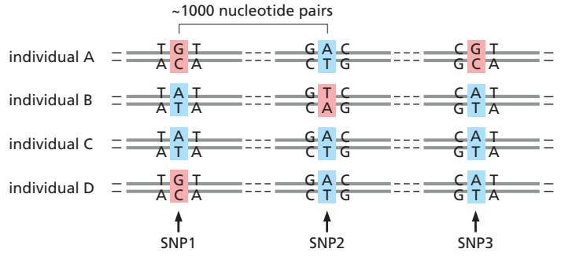

Figure 8–52 Single-nucleotide polymorphisms (SNPs) are sites in the genome where two or more alternative choices of a nucleotide are common in the population. Most such variations in the human genome occur at locations where they do not significantly affect a gene’s function.

As a result, certain sets of DNA sequences—and their associated polymorphisms—have been inherited in linked groups, with little genetic rearrangement across the generations. These are the haplotype blocks. Like genes that exist in different allelic forms, haplotype blocks also come in a limited number of variants that are common in the human population, each representing a combination of DNA polymorphisms passed down from a particular ancestor long ago.

#### Sequence Variants Can Aid the Search for Mutations Associated with Disease

Mutations that give rise, in a reproducible way, to rare but clearly defined differences, such as albinism, hemophilia, or congenital deafness, can often be identified by studies of affected families. Such single-gene, or monogenic, disorders are referred to as Mendelian because their pattern of inheritance is easy to track. Moreover, individuals who inherit the causative mutation will exhibit the disorder irrespective of environmental factors such as diet or exercise. But for many common disorders, the genetic roots are more complex. Instead of a single allele of a single gene, such disorders stem from a combination of contributions from multiple genes. And often, environmental factors have strong influences on the severity of the disorder. For these multigenic conditions, such as diabetes or arthritis, population studies are often helpful in tracking down the genes that increase the risk of getting the disease.

In population studies, investigators collect DNA samples from a large number of people who have the disease and compare them to samples from a group of people who do not have the disease. They look for variants—SNPs, for example— that are more common among the people who have the disease. Because DNA sequences that are close together on a chromosome tend to be inherited together, the presence of such SNPs could indicate that an allele that increases the risk of the disease might lie nearby (**Figure 8–53**). Although, in principle, the disease could be caused by the SNP itself, the culprit is much more likely to be a change that is merely linked to the SNP as part of a haplotype block.

Such genome-wide association studies have been used to search for genes that predispose individuals to common diseases, including diabetes, coronary artery disease, rheumatoid arthritis, and even depression. For many of these conditions, the DNA polymorphisms identified increase the risk of disease only slightly. Moreover, environmental factors (diet and exercise, for example) play an important role in the onset and severity of the disease. Nonetheless, the identification of potential disease genes linked to polymorphisms is leading to a mechanistic understanding of some of our most common disorders.

Figure 8–53 Genes that affect the risk of developing a common disease can often be tracked down through linkage to SNPs. Here, the patterns of SNPs are compared between two sets of individuals—a set of healthy controls and a set affected by a particular common disease. A segment of a typical chromosome is shown. For most polymorphic sites in this segment, it is a random matter whether an individual has one SNP variant (red vertical bars) or another (blue vertical bars); this same randomness is seen both for the control group and for the affected individuals. However, in the part of the chromosome that is shaded in dark gray, a bias is seen: most healthy individuals have the blue SNP variants, whereas most affected individuals have the red SNP variants. This suggests that this region contains or is close to a gene that is genetically linked to these red SNP variants and which predisposes individuals to the disease. Using carefully selected controls and thousands of affected individuals, this approach can help track down disease-related genes, even when they confer only a slight increase in the risk of developing the disease.

#### Genomics Is Accelerating the Discovery of Rare Mutations That Predispose Us to Serious Disease

The polymorphisms that have allowed us to identify some of the genes that increase our risk of disease are common. They arose long ago in our evolutionary past and are now present, in one form or another, in a substantial portion of the population. Such polymorphisms are thought to account for about 90% of the differences between one person’s genome and another. But when we try to tie these common variants to differences in disease susceptibility or other heritable traits, such as height, we find that they do not have as much predictive power as we had anticipated: thus, for example, most confer relatively small increases—less than twofold—in the risk of developing a common disease.

Part of the problem is that many of the mutations that are directly responsible for complex human diseases appeared more recently in our evolutionary history—during a period when the human population expanded from the few million individuals who existed 10,000 years ago to the more than 7 billion who exist today. Because recent mutations occur more rarely than the ancient polymorphisms that are common in the human population, they could slip through the genome-wide association studies just described.

In contrast to polymorphisms, rare DNA variants—those much less frequent in humans than SNPs—can have large effects on the risk of developing some common diseases. For example, numerous loss-of-function mutations, each individually rare, have been found to increase greatly the predisposition to autism and schizophrenia. Many of these are de novo mutations, which arose spontaneously in the germ-line cells of one or the other parent. The fact that these mutations arise spontaneously with some frequency could help explain why these common disorders—each observed in about 1% of the population—remain with us, even though the affected individuals might leave few or no descendants. These rare mutations can arise in any one of hundreds of different genes, which could explain much of the clinical variability of autism and schizophrenia.

Now that DNA sequencing has become fast and inexpensive, the most efficient way to identify these rare, large-effect mutations is by comparing the genomes of large numbers of affected individuals with those of unaffected controls. When the key variants are identified, the major challenge is then to determine how they affect the individuals who carry them and how small variations in multiple genes produce the disease phenotype.

#### The Cellular Functions of a Known Gene Can Be Studied with Genome Engineering

As we have seen, classical genetics starts with a mutant phenotype and identifies the mutations, and consequently the genes, responsible for it. Recombinant DNA technology has made possible a different type of genetic approach that is used widely in a variety of species. Instead of beginning with a mutant organism and using it to identify a gene and its protein, an investigator can start with a particular gene and proceed to make mutations in it, creating mutant cells or organisms so as to analyze the gene’s function. Because this approach reverses the traditional direction of genetic discovery—proceeding from genes to mutations, rather than vice versa—it is sometimes referred to as reverse genetics. And because the genome of the organism is deliberately altered in a particular way, this approach is also called genome engineering or genome editing. We shall see in this chapter that this approach can be scaled up so that whole collections of organisms can be created, each of which has a different gene altered.

There are several ways a gene of interest can be altered. In the simplest, the gene can simply be deleted from the genome, although in a diploid organism, this requires that both copies—one on each chromosome homolog—be deleted. Such gene knockouts are especially useful if the gene is not essential. The gene in question (even if it is essential) can also be replaced by one that is expressed in the wrong tissue or at the wrong time in development; this type of manipulation often provides important clues to the gene’s normal function. In a particularly powerful approach, a gene of interest can be modified to be expressed at will by the experimenter (**Figure 8–54**). Finally, genes can also be engineered so that they are expressed normally in most cell types and tissues but deleted in certain cell types or tissues selected by the experimenter (see Figure 5–66). This approach is especially useful when a gene has different roles in different tissues.

Figure 8–54 Engineered genes can be turned on and off with small molecules. Here, the DNA-binding portion of a bacterial protein (the tetracycline, Tet, repressor) has been fused to a portion of a mammalian transcriptional activator and expressed in cultured mammalian cells. The engineered gene X, present in place of the normal gene, has its usual gene control region replaced by cis-regulatory sequences recognized by the tetracycline repressor. In the absence of doxycycline (a particularly stable version of tetracycline), the engineered gene is expressed; in the presence of doxycycline, the gene is MBoC7 m8.52/8.54turned off because the drug causes the tetracycline repressor to dissociate from the DNA. This strategy can also be used in mice by incorporating the engineered genes into the germ line. In many tissues, the gene can be turned on and off simply by adding doxycycline to or removing it from the animal’s water. If the tetracycline repressor construct is placed under the control of a tissue-specific gene control region, the engineered gene will be turned on and off only in that tissue.

It is also possible to make subtler changes to a gene. It is sometimes useful to make slight changes in a protein’s structure so that one can begin to dissect which portions of a protein are important for its function. The activity of an enzyme, for example, can be studied by changing a single amino acid in its active site. It is also possible, through genome engineering, to create new types of proteins in an animal. For example, a gene can be fused to the gene for a fluorescent protein. When this altered gene is introduced into the genome, the protein can be tracked in the living organism by monitoring its fluorescence.

Altered genes can be created in several ways. Perhaps the simplest is to chemically synthesize the DNA that makes up the gene. In this way, the investigator can specify any type of variant of the normal gene. It is also possible to construct altered genes using recombinant DNA technology, as described earlier in this chapter. Once obtained, altered genes can be introduced into cells in a variety of ways. DNA can be microinjected into mammalian cells with a glass micropipette or introduced by a virus that has been engineered to carry foreign genes. In plant cells, genes can be introduced by a technique called particle bombardment: DNA samples are painted onto tiny gold beads and then literally shot through the cell wall with a specially modified gun. Electroporation is sometimes used for introducing DNA into bacteria and some other cells. In this technique, a brief electric shock renders the cell membrane temporarily permeable, allowing foreign DNA to enter the cytoplasm.

To be most useful to experimenters, the altered gene, once it is introduced into a cell, must recombine with the cell’s genome so that the normal gene is replaced. In simple organisms such as bacteria and yeasts, this process occurs with high frequency using the cell’s own homologous recombination machinery, as described in Chapter 5. In more complex organisms that have elaborate developmental programs, the procedure is more complicated because the altered gene must be introduced into the germ line, as we next describe.

#### Animals and Plants Can Be Genetically Altered

Animals and plants that have been genetically engineered by gene deletion or gene replacement are called **transgenic organisms**, and any foreign or modified genes that are added are called **transgenes**. We discuss transgenic plants later

Figure 8–55 Summary of the procedures used for making gene replacements in mice. (A) In the first step, an altered version of the gene is introduced into cultured embryonic stem (ES) cells (described in Chapter 22). Only a few ES cells will have their corresponding normal genes replaced by the altered gene through a homologous recombination event. These cells can be identified by PCR and cultured to produce many descendants, each of which carries an altered gene in place of one of its two normal corresponding genes. (B) In the next step of the procedure, these altered ES cells are injected into a very early mouse embryo; the cells are incorporated into the growing embryo, and a mouse produced by such an embryo will contain some somatic cells (indicated by orange) that carry the altered gene. Some of these mice will also contain germ-line cells that contain the altered gene; when bred with a normal mouse, some of the progeny of these mice will contain one copy of the altered gene in all of their cells.

The mice with the transgene in their germ line are then bred to produce both a male and a female animal, each heterozygous for the gene replacement (that is, they have one normal and one mutant copy of the gene). When these two mice are mated (not shown), one-fourth of their progeny will be homozygous for the altered gene.

in this chapter and, for now, concentrate our discussion on transgenic mice. If a DNA molecule carrying a mutated mouse gene is transferred into a mouse cell, it is possible to direct the mutant gene to replace the normal gene by homologous recombination. By exploiting these gene-targeting events, any specific gene can be altered or inactivated in a mouse cell by a direct gene replacement. In the case in which both copies of the gene of interest are completely inactivated or deleted, the resulting animal is called a knockout mouse. The technique is summarized in **Figure 8–55**.

The ability to prepare transgenic mice lacking a known normal gene was a major advance, and the technique has been used to determine the functions of many mouse genes (**Figure 8–56**). If the gene functions in early development, a knockout mouse will usually die before it reaches adulthood. These lethal defectsMBoC7 m8.53/8.55 can be carefully analyzed to help determine the function of the missing gene.

(A)

As described in Chapter 5, an especially useful type of transgenic animal takes advantage of a site-specific recombination system to excise—and thus disable— the target gene in a particular place or at a particular time (see Figure 5–66). In this case, the target gene in embryonic stem (ES) cells is replaced by a fully functional version of the gene that is flanked by a pair of the short DNA sequences, called lox sites, that are recognized by the Cre recombinase protein. The transgenicMBoC7 m8.54/8.56 mice that result are phenotypically normal. They are then mated with transgenic mice that express the Cre recombinase gene under the control of an inducible promoter. In the specific cells or tissues in which Cre is switched on, it catalyzes recombination between the lox sequences—excising a target gene and eliminating its activity (see Figure 22–7).

Figure 8–56 Transgenic mice engineered to express a mutant DNA helicase show premature aging. The helicase, encoded by the Xpd gene, is involved in both transcription and DNA repair. Compared with a wild-type mouse of the same age (A), a transgenic mouse that expresses a defective version of Xpd (B) exhibits many of the symptoms of premature aging, including osteoporosis, emaciation, early graying, infertility, and reduced life span. The mutation in Xpd used here impairs the activity of the helicase and mimics a mutation that in humans causes trichothiodystrophy, a disorder characterized by brittle hair, skeletal abnormalities, and a very reduced life expectancy. These results indicate that an accumulation of DNA damage can contribute to the aging process in both humans and mice. (From J. de Boer et al., Science 296:1276–1279, 2002. With permission from AAAS.)

#### The Bacterial CRISPR System Has Been Adapted to Edit Genomes in a Wide Variety of Species

One of the difficulties in making transgenic mice by the procedure just described is that the introduced DNA molecule (bearing the experimentally altered gene) often inserts at random in the genome, and many ES cells must therefore be screened individually to find one that has the correct gene replacement.

Creative use of the CRISPR system, discovered in bacteria as a defense against viruses, has largely solved this problem. As described in Chapter 7, the CRISPR system uses a guide RNA sequence to target (through complementary base-pairing) double-stranded DNA, which it then cleaves (see Figure 7–81). The gene coding for the key component of this system, the bacterial Cas9 protein, has been transferred into a variety of organisms, where it greatly simplifies the process of making transgenic organisms (**Figure 8–57A and B**). The basic strategy is as follows: Cas9 protein is expressed in cultured cells along with a guide RNA designed by the experimenter to target a particular location on the genome. The Cas9 and guide RNA associate, the complex is brought to the matching sequence on the genome, and the Cas9 protein makes a double-strand break. As we saw in Chapter 5, these breaks are usually repaired by nonhomologous end joining, which often results in small sequence errors or deletions that disrupt gene function. In many cases, this repair process is sufficient to inactivate the gene, particularly if it produces a frameshift near the beginning of the coding sequence. If the goal is a precise gene knockout or replacement, then Cas9 and guide RNA can be co-expressed in ES cells with an altered homologous gene sequence, which the cell uses to repair the double-strand break by homologous recombination. In this way, the normal gene can be selectively damaged by the CRISPR system and replaced at high efficiency by an experimentally altered gene.

The CRISPR system has a variety of other uses. Its particular power lies with its ability to target Cas9 to thousands of different positions across a genome through the simple rules of complementary base-pairing. Thus, if a catalytically inactive Cas9 protein is fused to a transcription activator or repressor, it is possible, in principle, to turn any gene on or off by providing a guide RNA that matches a unique sequence in the gene promoter (**Figure 8–57C and D**; **Movie 8.4**).

The CRISPR system has several advantages over other strategies for experimentally manipulating gene expression. First, it is relatively easy for the experimenter to design the guide RNA: it simply follows standard base-pairing convention. Second, the gene to be controlled does not have to be modified; the CRISPR strategy exploits DNA sequences already present in the genome. Third, numerous genes can be controlled simultaneously. Cas9 has to be expressed only once, but many guide RNAs can be expressed in the same cell; this strategy allows the experimenter to turn on or off a whole set of genes at once.

The export of the CRISPR system from bacteria to virtually all other experimental organisms (including mice, zebrafish, worms, flies, rice, and wheat) has revolutionized the study of gene function. Like the earlier discovery of restriction nucleases, this breakthrough came from scientists studying a fascinating phenomenon in bacteria without—at first—realizing the enormous impact theseMBoC7 e10.31/8.57 discoveries would have on all aspects of biology.

#### Large Collections of Engineered Mutations Provide a Tool for Examining the Function of Every Gene in an Organism

Extensive collaborative efforts have produced comprehensive libraries of mutations in a variety of model organisms, including S. cerevisiae, Caenorhabditis elegans, Drosophila, Arabidopsis, and even the mouse. The ultimate aim in each case is to produce a collection of mutant strains in which every gene in the organism—one at a time—has been systematically deleted or altered in such a way that it can be conditionally disrupted. Collections of this type provide an invaluable resource for investigating gene function on a genomic scale. For example, a large collection of mutant organisms can be screened for a particular phenotype. Like the classic genetic approaches described earlier, this is one of the most powerful ways to identify the genes responsible for a particular phenotype. Unlike the classical genetic approach, however, the set of mutants is “pre-engineered,” so that there is no need to rely on chance events such as

Figure 8–57 Use of CRISPR to study gene function in a wide variety of species. (A) The Cas9 protein (artificially expressed in the species of interest) binds to a guide RNA, designed by the experimenter and also expressed. The portion of RNA in light blue is needed for associations with Cas9; that in dark blue is specified by the experimenter to match a position on the genome. The only other requirement is that the adjacent genome sequence includes a short PAM (protospacer adjacent motif, not shown) that is needed for Cas9 to cleave. As described in Chapter 7, this sequence allows the CRISPR system in a bacterium to distinguish its own genome from that of invading viruses. (B) When Cas9 is directed to make a double-strand break in a gene, the break is generally repaired by nonhomologous end joining (not shown), which introduces local sequence errors that can disrupt gene function. A more precise mutation can be made as shown here, where the double-strand break is repaired by homologous recombination with an altered gene provided by the experimenter. (C, D) By using a mutant form of Cas9 that can no longer cleave DNA, Cas9 can be used to activate a normally dormant gene (C) or turn off an actively expressed gene (D). (Adapted from P. Mali et al., Nat. Methods 10:957–963, 2013.)

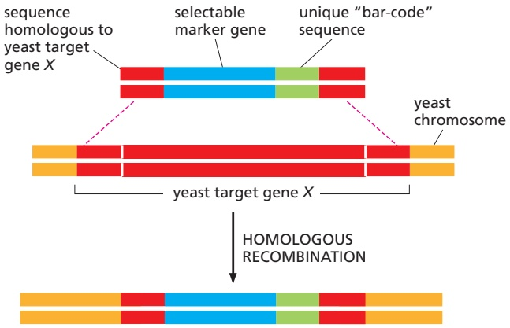

target gene X replaced by selectable marker gene and associated “bar-code” sequence

spontaneous mutations or transposon insertions. In addition, each of the individual mutations within the collection is often engineered to contain a distinct molecular “bar code”—in the form of a unique DNA sequence—designed to make identification of the altered gene rapid and routine (**Figure 8–58**).

In S. cerevisiae, the task of generating a complete set of 6000 mutants, each. / . missing only one gene, was accomplished in the early 2000s. Because each mutant strain has an individual bar-code sequence embedded in its genome, a large mixture of engineered strains can be grown under various selective test conditions—such as nutritional deprivation, a temperature shift, or the presence of various drugs—and the cells that survive can be rapidly identified by the unique sequence tags present in their genomes. By assessing how well each mutant in the mixture fares, one can begin to discern which genes are essential, useful, or irrelevant for growth under the various conditions (**Figure 8–59**).

Similar methods can be applied to human cells using the CRISPR system described earlier. Using viral expression vectors, a large library of different guide RNAs can be expressed in a cell population, such that only one guide RNA is expressed in each cell, along with Cas9. After growth of the cells under various conditions, surviving cells are subjected to genomic sequencing to measure the abundance of guide RNAs in the population. Guide RNAs that target genes essential for survival will disappear from the population, whereas those that enhance survival will be enriched—providing important clues about the function of those genes under the conditions tested.

The insights generated by examining mutant libraries can be considerable. For example, studies of an extensive collection of mutants in Mycoplasma genitalium—the organism with the smallest known genome—have identified the minimum complement of genes essential for cellular life. Growth under laboratory conditions requires about three-quarters of the 480 protein-coding genes in M. genitalium. Approximately 100 of these essential genes are of unknown function, which suggests that a surprising number of the basic molecular mechanisms that underlie life have yet to be discovered.

Figure 8–59 Genome-wide screens for fitness using a large pool of bar-coded yeast deletion mutants. A large pool of yeast mutants, each with a different gene deleted and present in equal amounts, is grown under conditions selected by the experimenter. Some mutants (blue) grow normally, but others show reduced growth (orange and green) or no growth at all (red). The fitness of each mutant is experimentally determined in the following way. After the growth phase is completed, genomic DNA (isolated from the mixture of strains) is purified, and the relative abundance of each mutant is determined by quantifying the level of the DNA bar code matched to each deletion. This can be done by sequencing the pooled genomic DNA. In this way, the contribution of every gene to growth under the specified condition can be rapidly ascertained. This type of study has revealed that of the approximately 6000 coding genes in yeast, only about 1000 are essential under standard growth conditions.

Figure 8–58 Making bar-coded collections of mutant organisms. A deletion construct for use in yeast contains DNA sequences (red) homologous to each end of a target gene X, a selectable marker gene (blue), and a unique “bar-code” sequence approximately 20 nucleotide pairs in length (green). This DNA is introduced into yeast cells, where it readily replaces the target gene by homologous recombination. Cells that carry a successful gene replacement are identified by expression of the selectable marker gene, typically a gene that provides resistance to a drug. By using a collection of such constructs, each specific for one gene, a library of yeast mutants was constructed containing a mutant for every gene. Essential genes cannot be studied this way, as their deletion from the genome causes the cells to die. In this case, the target gene is replaced by a version of the gene that can be regulated by the experimenter (see Figure 8–54). The gene can then be turned off, and the effect of this can be monitored before the cells die.

Collections of mutant organisms are also available for many animal and plant species. For example, it is possible to “order,” by phone or e-mail from a consortium of investigators, a deletion or insertion mutant for almost all coding genes in Drosophila. Likewise, a nearly complete set of mutants exists for the model plant Arabidopsis. And the adaptation of the CRISPR system for use in mice means that, in the near future, we can expect to be able to turn on or off—at will— each gene in the mouse genome at different stages of development. Although we are still ignorant about the function of most genes in most organisms, these technologies allow an exploration of gene function on a scale that was unimaginable a decade ago.

#### RNA Interference Is a Simple and Rapid Way to Test Gene Function

Although knocking out (or conditionally expressing) a gene in an organism and studying the consequences is the most powerful approach for understanding the functions of the gene, RNA interference (RNAi, for short) is an alternative, particularly convenient approach. As discussed in Chapter 7, this method exploits a natural mechanism used in many plants, animals, and fungi to protect themselves against viruses and transposable elements. The technique introduces into a cell or organism a double-strand RNA molecule whose nucleotide sequence matches that of part of the gene to be inactivated. After the RNA is processed, it hybridizes with the target-gene RNA (either mRNA or noncoding RNA) and reduces its expression by the mechanisms shown in Figure 7–78.

RNAi is frequently used to inactivate genes in Drosophila and mammalian cell culture lines. Indeed, a set of 15,000 Drosophila RNAi molecules (one for every coding gene) allows researchers, in several months, to test the role of every fly gene in any process that can be monitored using cultured cells. RNAi has also been widely used to study gene function in whole organisms, including the nematode C. elegans. When working with worms, introducing the double-stranded RNA is quite simple: either the RNA can be injected directly into the intestine of the worm or the worm can be fed with E. coli engineered to produce the RNA (**Figure 8–60**). The RNA is amplified and distributed throughout the body of the worm, where it inhibits expression of the target gene in different tissue types. RNAi is being used to help in assigning functions to the entire complement of worm genes (**Figure 8–61**).

A related technique has also been applied to mice. In this case, the RNAi molecules are not injected or fed to the mouse; rather, recombinant DNA techniques are used to make transgenic animals that express the RNAi under the control of an inducible promoter. Often this is a specially designed RNA that can fold back on itself and, through base-pairing, produce a double-strand region that is recognized by the RNAi machinery. In the simplest cases, the process inactivates only the genes that exactly match the RNAi sequence. Depending on the

20 µm

(A)

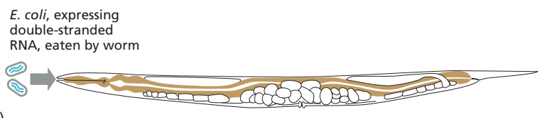

Figure 8–60 Gene function can be tested by RNA interference. (A) Doublestranded RNA (dsRNA) can be introduced into C. elegans by feeding the worms E. coli that express the dsRNA. (B) In a wild-type worm embryo, the egg and sperm pronuclei (red arrowheads) come together in the posterior half of the embryo shortly after fertilization. (C) In an embryo in which a particular gene has been inactivated by RNAi, the pronuclei fail to migrate. This experiment revealed an important but previously unknown function of this gene in embryonic development. (B and C, from P. Gönczy et al., Nature 408:331–336, 2000. Reproduced with permission of SNCSC.)

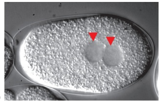

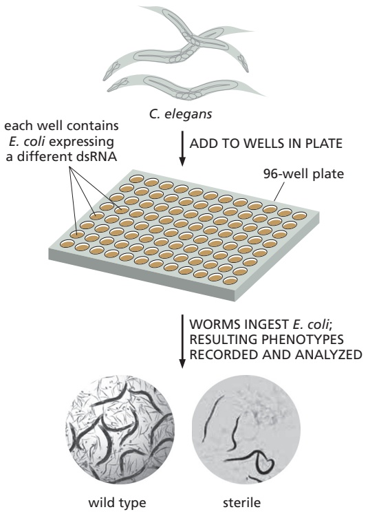

Figure 8–61 RNA interference provides a convenient method for conducting genome-wide genetic screens. In this experiment, each well in this 96-well plate is filled with E. coli that produce a different double-stranded RNA than that produced by E. coli in other wells. Each interfering RNA matches the nucleotide sequence of a single C. elegans gene, thereby inactivating it. About 10 worms are added to each well, where they ingest the genetically modified bacteria. The plate is incubated for several days, which gives the RNAs time to inactivate their target genes—and the worms time to grow, mate, and produce offspring. The plate is then examined in a microscope, which can be controlled robotically, to screen for genes that affect the worms’ ability to survive, reproduce, develop, and behave. Shown here are normal worms alongside worms that show an impaired ability to reproduce because of inactivation of a particular “fertility” gene. (From B. Lehner et al., Nat. Genet. 38:896–903, 2006. With permission from Nature.)

inducible promoter used, the RNAi can be produced only in a specified tissue or only at a particular time in development, allowing the functions of the target genes to be analyzed in elaborate detail.

RNAi is a simple and efficient tool for analysis of gene function in many organisms, but it has several potential limitations compared with true genetic knockouts. For unknown reasons, RNAi does not efficiently inactivate all genes. Moreover, within whole organisms, certain tissues may be resistant to the action of RNAi (for example, neurons in nematodes). Another problem arises because many organisms contain large gene families, the members of which exhibit sequence similarity. RNAi therefore sometimes produces “off-target” effects, inactivating related genes in addition to the targeted gene. One strategy to avoid such problems is to use multiple small RNA molecules matched to different regions of the same gene. Ultimately, the results of any RNAi experiment must be viewed as a strong clue to, but not necessarily a proof of, normal gene function.

#### Reporter Genes Reveal When and Where a Gene Is Expressed

We have just discussed some of the approaches that can be used to assess a gene’s function in cultured cells or, even better, in the intact organism. Although this information is crucial to understanding gene function, it does not generally reveal the molecular mechanisms through which the gene product works in the cell. For example, genetics on its own rarely tells us all the places in the organism where the gene is expressed or how its expression is controlled. It does not necessarily reveal whether the gene acts in the nucleus, the cytosol, on the cell surface, or in one of the numerous other compartments of the cell. And it does not reveal how a gene product might change its location or its expression pattern when the external environment of the cell changes. Key insights into gene function can be obtained by simply observing when and where a gene is expressed. A variety of approaches, most involving some form of genetic engineering, can easily provide this critical information.

As discussed in detail in Chapter 7, cis-regulatory DNA sequences, located upstream or downstream of the coding region, control gene transcription. These regulatory sequences, which determine precisely when and where the gene is

0.2 mm

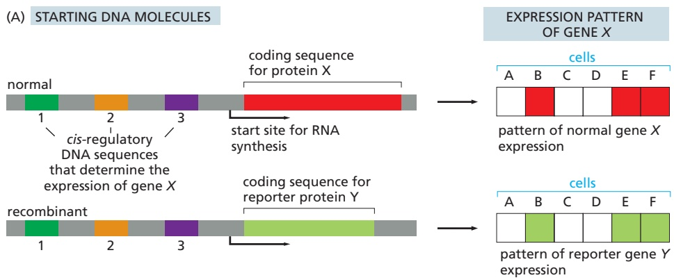

Figure 8–62 Using a reporter protein to determine the pattern of a gene’s expression. (A) In this example, the coding sequence for protein X is replaced by the coding sequence for reporter protein Y. The expression patterns for X and Y are the same. (B) Various fragments of DNA containing candidate cis-regulatory sequences are added in combinations to produce test DNA molecules encoding reporter gene Y. These recombinant DNA molecules are then tested for expression after introducing them into a variety of different types of mammalian cells. The results are summarized in (C). For experiments in eukaryotic cells, two commonly used reporter proteins are the enzyme β-galactosidase (β-gal) (see Figure 7–30) and green fluorescent protein (GFP) (see Figure 9–16).

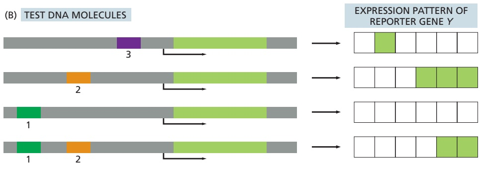

(C) CONCLUSIONS —cis-regulatory sequence 3 normally turns on gene X in cell B —cis-regulatory sequence 2 normally turns on gene X in cells D, E, and F —cis-regulatory sequence 1 normally turns off gene X in cell D

expressed, can be easily studied by placing a reporter gene under their control and introducing these recombinant DNA molecules into cells (**Figure 8–62**). In this way, the normal expression pattern of a gene can be determined, as well as the contribution of individual cis-regulatory sequences in establishing this pattern.

Reporter genes also allow any protein to be tracked over time in living cells. Here, the reporter gene typically encodes a fluorescent protein, often **green fluorescent protein (GFP)**, the molecule that gives luminescent jellyfish their greenish glow. The GFP is simply attached—in the coding frame—to the protein-coding gene of interest. The resulting GFP fusion protein often behaves in the same way the normal protein does, and its location can be monitored by fluorescence microscopy, a topic that is discussed in the next chapter (see Figure 9–10). GFP fusion has become a standard strategy for tracking not only the location but also the movement of specific proteins in living cells.

#### In Situ Hybridization Can Reveal the Location of mRNAs and Noncoding RNAs

It is also possible to directly observe the time and place that an RNA product of a gene is expressed using in situ hybridization. For protein-coding genes, this strategy often provides the same general information as the reporter gene approaches described above; however, it is crucial for genes whose final product is RNA rather than protein. We encountered in situ hybridization earlier in the chapter (see Figure 8–32); it relies on the basic principles of nucleic acid hybridization. Typically, tissues are gently fixed so that their RNA is retained in an exposed form that can hybridize with a labeled complementary DNA or RNA probe. In this way, the patterns of differential gene expression can be observed in tissues, and the location of specific RNAs can be determined (**Figure 8–63**). An advantage of in situ hybridization over other approaches is that genetic engineering is not required. Thus, it is often simpler and faster and can be used for genetically intractable species.

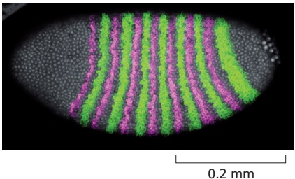

Figure 8–63 In situ hybridization to mRNAs reveals patterns of gene expression during development. Expression of specific regulatory genes is localized in the early Drosophila embryo, forming a series of stripes (see Figures 7–29 and 7–30). In this image,. / . expression of the genes eve (magenta) and ftz (green) has been revealed by in situ hybridization with differently colored fluorescent probes. DNA is lightly stained with a white fluorescent dye to label all nuclei in the embryo. (Courtesy of Erik Clark and Angela DePace.)

time (number of PCR cycles)

Figure 8–64 RNA levels can be measured by quantitative RT-PCR. The fluorescence measured is generated by a dye that fluoresces only when bound to the double-strand DNA products of the RT-PCR (see Figure 8–34). The red sample has a higher concentration of the mRNA being measured than does the blue sample, because it requires fewer PCR cycles to reach the same half-maximal concentration of double-stranded DNA. On the basis of this difference, the relative amounts of the mRNA in the two samples can be precisely determined.

#### Expression of Individual Genes Can Be Measured Using Quantitative RT-PCR

Although reporter genes and in situ hybridization accurately reveal patterns of gene expression, they are not the most powerful methods for quantifying amounts of individual RNAs in cells. A more accurate method is based on the principles of PCR. Called **quantitative RT-PCR (reverse transcription–polymerase chain reaction)**, this method begins with the total population of RNA molecules purified from a tissue or a cell culture. It is important that no DNA be present in the preparation; it must be purified away or enzymatically degraded. Two DNA primers that specifically match the mRNA of interest are added, along with reverse transcriptase, DNA polymerase, and the four deoxyribonucleoside triphosphates needed for DNA synthesis. The first round of synthesis is the reverse transcription of the RNA into DNA using one of the primers. Next, a series of heating and cooling cycles allows the amplification of that DNA strand by PCR (see Figure 8–34). The quantitative part of this method relies on a direct relationship between the rate at which the PCR product is generated and the original concentration of the mRNA species of interest. By adding chemical dyes to the PCR that fluoresce only when bound to double-stranded DNA, a simple fluorescence measurement can be used to track the progress of the reaction and thereby accurately deduce the starting concentration of the mRNA that is amplified (**Figure 8–64**). This technique is relatively fast and simple to perform in the laboratory and is the preferred method for accurate measurement of mRNA levels from a specific gene or small group of genes. It is also used routinely to detect rare viral RNAs to determine if a person is infected.

#### Global Analysis of mRNAs by RNA-seq Provides a Snapshot of Gene Expression

As discussed in Chapter 7, a cell expresses only a subset of the many thousands of genes available in its genome; moreover, this subset differs from one cell type to another or, in the same cell, from one extracellular environment to the next. One way to determine which genes are being expressed by a population of cells or a tissue is to measure all of the RNAs that are being produced.

Global sequencing of all RNAs, or RNA-seq, provides the most direct approach for cataloging the RNAs produced by a cell or tissue. As mentioned earlier in this chapter, this approach uses reverse transcriptase to copy all RNAs into cDNAs, which are then fragmented and sequenced by next-generation sequencing methods such as Illumina sequencing (see Figure 8–44). More abundant RNAs will have more cDNA copies, resulting in higher numbers of “sequence reads” for those RNAs. Thus, as we have seen in Chapter 7 (see Figure 7–3), RNA-seq does not simply identify the RNAs in a sample but also provides information about their relative abundance. RNA-seq has other important benefits as well: it can detect alternative RNA splicing, RNA editing, and the many noncoding RNAs produced from a complex genome.

Comprehensive studies of gene expression often provide information that is useful for predicting gene function. Earlier in this chapter, we discussed how identifying a protein’s interaction partners can yield clues about that protein’s function. A similar principle holds true for genes: information about a gene’s function can be deduced by identifying genes that share its expression pattern. Using a computational approach called cluster analysis, one can identify sets of genes that are coordinately regulated. Genes that are turned on or turned off together under different circumstances are likely to work in concert in the cell: they may encode proteins that are part of the same multiprotein machine or proteins that are involved in a complex coordinated activity, such as DNA replication or RNA splicing. Characterizing a gene of unknown function by grouping it with known genes that share its transcriptional behavior is sometimes called “guilt by association.” Cluster analyses have been used to analyze the gene expression profiles that underlie many interesting biological processes (**Figure 8–65**).

Figure 8–65 Using cluster analysis to identify sets of genes that are coordinately regulated. Genes that have the same expression pattern are likely to be involved in common pathways or processes. To perform a cluster analysis, gene expression data are obtained from cell samples exposed to a variety of different conditions, and genes that show coordinate changes in their expression pattern are grouped together. In this experiment, human fibroblasts were deprived of serum for 48 hours; serum was then added back to the cultures at time 0, and the cells were harvested for mRNA measurements at different time points. Of the 8600 genes depicted here (each represented by a thin vertical line), just over 300 showed threefold or greater variation in their expression patterns in response to serum reintroduction. Here, red indicates an increase in expression; green is a decrease in expression. On the basis of the results of many other experiments, the 8600 genes have been grouped in clusters according to similar patterns of expression. The results of this analysis show that genes involved in wound healing are turned on in response to serum, while genes involved in regulating cell-cycle progression and cholesterol biosynthesis are shut down. (From M.B. Eisen et al., Proc. Natl. Acad. Sci. USA 95:14863–14868, 1998. With permission from National Academy of Sciences.)

Major new insights into gene expression patterns have come from the development of sensitive methods for sequencing RNA from single cells. In this method, a complex tissue, tumor, embryo, or even organism is dissociated into single cells, after which microfluidics systems are used to separate the cell population into individual cells in single droplets that are each processed for RNA-seq. Sophisticated computational methods are then used to process the vast quantities of sequence data. These methods include cluster analysis algorithms that categorize cells into groups with similar gene expression patterns (**Figure 8–66**). The exciting outcome of these methods is a visualization of how individual cells fall into groups with similar expression patterns. In many cases, the cell groups identified in this fashion can be identified as previously known cell types, thereby revealing

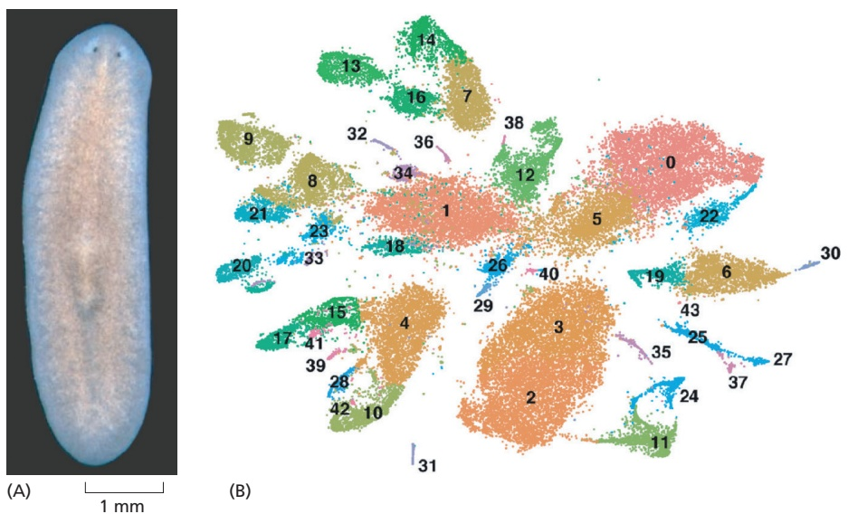

Figure 8–66 Using single-cell RNA-seq to identify the cell types in a whole animal. (A) The planarian flatworm is a small (3–5 mm) model organism used in studies of regeneration (see Figure 22–20). (B) In this experiment, flatworms were cut in small pieces and dissociated into individual cells. About 67,000 cells were analyzed by single-cell RNA sequencing, providing a complete list of all major mRNAs expressed in every cell. Sophisticated computational methods were then used to cluster cells into groups with similar gene expression patterns. These clusters are typically displayed in two dimensions on a plot as shown here, with each dot in a cluster representing a single cell. About 44 distinct cell types, highlighted with distinct colors, were identified in this cluster analysis. The pattern of gene expression in each cluster provides clues about the function of the cells in that cluster. Further insights can be obtained using in situ hybridization of intact flatworms, which reveals the precise location of cells and tissues expressing specific mRNAs from each cluster. Such analyses reveal that cell clusters 2 and 3, for example, represent cells from the epidermis. The end result is a comprehensive catalog of the genes expressed in every major cell type of the animal’s body. (From C.T. Fincher et al., Science 360:eaaq1736, 2018. With permission from AAAS.)

new clues about the genes expressed in those cells and even the function of those cells. In other cases, this approach can reveal the existence of cell types that were not previously known. Similar methods can be used to analyze gene expression in distinct cell types during multiple stages of embryonic development, providing comprehensive insights into cell lineage and gene expression patterns during development.

#### Genome-wide Chromatin Immunoprecipitation Identifies Sites on the Genome Occupied by Transcription Regulators

We have discussed several strategies to measure the levels of individual RNAs in a cell and to monitor changes in their levels in response to external signals. But this information does not tell us how such changes are brought about. We saw in Chapter 7 that transcription regulators, by binding to cis-regulatory sequences in DNA, are responsible for establishing and changing patterns of transcription. Typically, these proteins do not occupy all of their potential cis-regulatory sequences in the genome under all conditions. For example, in some cell types, the regulatory protein may not be expressed, or it may be present but lack an obligatory partner protein, or it may be excluded from the nucleus until an appropriate signal is received from the cell’s environment. Even if the protein is present in the nucleus and is competent to bind DNA, other transcription regulators or components of chromatin can occupy overlapping DNA sequences and thereby occlude some of its cis-regulatory sequences in the genome.

**Chromatin immunoprecipitation** provides a way to experimentally determine all the cis-regulatory sequences in a genome that are occupied by a given transcription regulator under a particular set of conditions (**Figure 8–67**). In this approach, proteins are covalently cross-linked to DNA in living cells, the cells are broken open, and the DNA is mechanically sheared into small fragments. Antibodies directed against a given transcription regulator are then used to purify the DNA that became covalently cross-linked to that protein in the cell. This DNA is then sequenced using the rapid methods discussed earlier; the precise location of each precipitated DNA fragment along the genome is determined by comparing its DNA sequence to that of the whole genome sequence (**Figure 8–68**). In this way, all of the sites occupied by the transcription regulator in the cell sample can be mapped across the cell’s genome. In combination with RNA-seq information, chromatin immunoprecipitation can identify the key transcriptional regulator responsible for specifying a particular pattern of gene expression.

Chromatin immunoprecipitation can also be used to deduce the cisregulatory sequences recognized by a given transcription regulator. Here, all the DNA sequences precipitated by the regulator are lined up (by computer), and features in common are tabulated to produce the spectrum of cis-regulatory sequences recognized by the protein (see Figure 7–10A). Chromatin immunoprecipitation is also used routinely to identify the positions along a genome that are bound by the various types of modified histones discussed in Chapter 4. In this case, antibodies specific to the particular histone modification are employed (see Figure 8–68). A variation of the technique can also be used to map positions of chromosomes that are in physical proximity (see Figure 4–53).

#### Ribosome Profiling Reveals Which mRNAs Are Being Translated in the Cell

We have learned that there are several ways that RNA levels in the cell can be monitored. But for mRNAs, this represents only one step in gene expression, and we are often more interested in the final level of the protein produced by the gene. As described earlier in this chapter, mass spectrometry can be used to monitor the levels of all proteins in the cell, including modified forms of the proteins. However, if we want to understand how synthesis of proteins is controlled by the cell, we need to consider the translation step of gene expression.

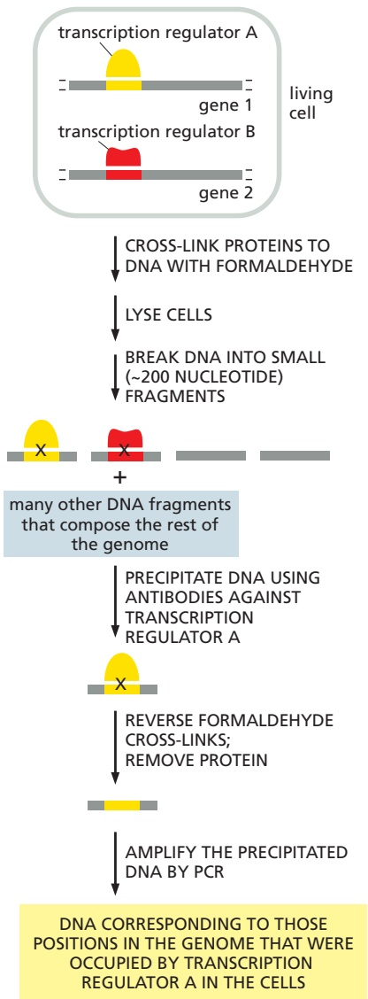

Figure 8–67 Chromatin immunoprecipitation. This method allows the identification of all the sites in a genome that a transcription regulator occupies in vivo. The identities of the precipitated, amplified DNA fragments are determined by DNA sequencing.

Figure 8–68 Chromatin immunoprecipitations showing proteins bound to the genomic region that controls expression of the Oct4 gene. In this series of chromatin immunoprecipitation experiments, antibodies directed against a transcription regulator (first three panels) or a particular histone modification (fourth panel) were used to precipitate bound, cross-linked DNA. Precipitated DNA was sequenced, and the positions across the genome were mapped. (Only the small part of the mouse genome containing the Oct4 gene is shown.) The results show that, in the embryonic stem cells analyzed in these experiments, Oct4 binds upstream of its own gene, and Sox2 and Nanog are bound in close proximity. Oct4, Sox2, and Nanog are key regulators in embryonic stem cells (discussed in Chapter 22), and this experiment reveals the position on the genome through which they exert their effects on Oct4 expression. In the fourth panel, the positions of a histone modification associated with actively transcribed genes are shown (see Figure 4–35). Finally, the bottom panel shows the RNA produced from the Oct4 gene under the same conditions used for the chromatin immunoprecipitations. Note that the introns and exons are relatively easy to identify from these RNA-seq data.

An approach called ribosome profiling provides an instantaneous map of theMBoC7 m8.67/8.68 positions of ribosomes on each mRNA in the cell and thereby identifies those mRNAs that are being actively translated. To accomplish this, total RNA from a cell line or tissue is exposed to ribonucleases under conditions where only those RNA sequences covered by ribosomes are spared. The protected RNAs are released from ribosomes, converted to DNA, and the nucleotide sequence of each is determined (**Figure 8–69**). When these sequences are mapped on the genome, the positions of ribosomes across each mRNA species can be ascertained.

Ribosome profiling has revealed many cases where mRNAs are abundant but are not translated until the cell receives an external signal. It has also shown that many open reading frames (ORFs) that were too short to be annotated as genes are actively translated and probably encode functional, albeit very small, proteins (**Figure 8–70**). Finally, ribosome profiling has revealed the ways that cells rapidly and globally change their translation patterns in response to sudden changes in temperature, nutrient availability, or chemical stress.

#### Recombinant DNA Methods Have Revolutionized Human Health

We have seen that nucleic acid methodologies developed in the past 40 years have completely changed the study of cell biology. But they have also had a profound effect on our day-to-day lives. Many pharmaceuticals in routine use (insulin, human growth hormone, blood-clotting factors, and interferon, for example) are based on cloning human genes and expressing the encoded proteins in large amounts. As DNA sequencing continues to drop in cost, more and more individuals will elect to have their genome sequenced; this information can be used to predict susceptibility to diseases (often with the option of minimizing this possibility by appropriate behavior) or to predict the way an individual will respond to a given drug. The genomes of tumor cells from an individual can be sequenced to determine the best type of anticancer treatment. And mutations that cause or greatly increase the risk of disease continue to be identified at an unprecedented pace. Using the recombinant DNA technologies discussed in this chapter, these mutations can then be introduced into animals, such as mice, that can be studied in the laboratory. The resulting transgenic animals, which often mimic some of the phenotypic abnormalities associated with the condition in humans, can beMBoC7 m8.68/8.69 used to explore the cellular and molecular basis of the disease and to screen for drugs that could potentially be used for human therapy.

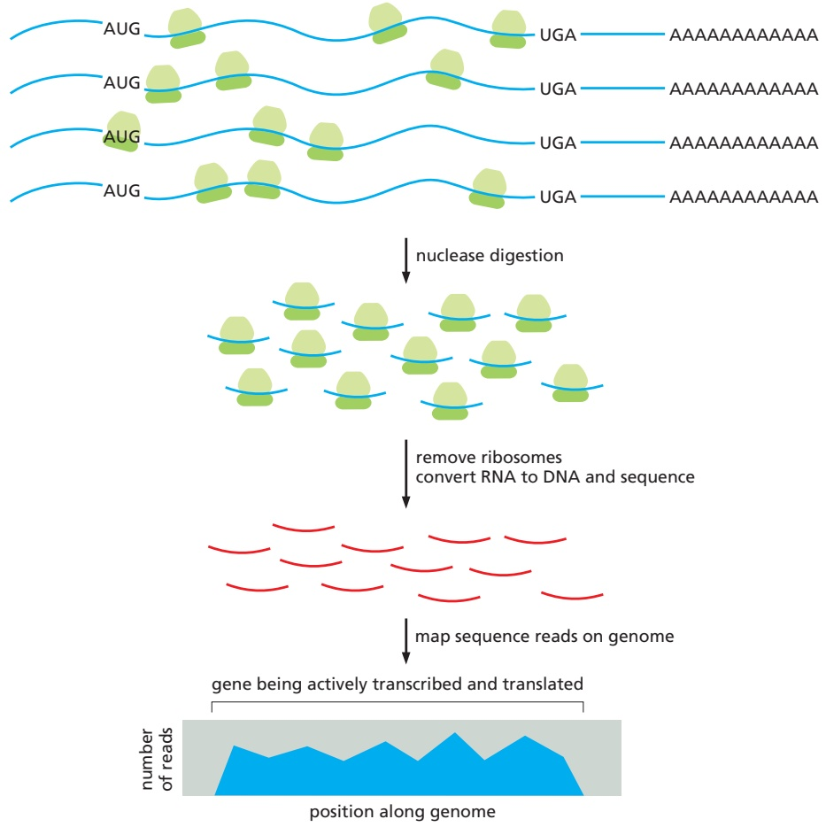

Figure 8–69 Ribosome profiling. RNA is purified from cells and digested with a ribonuclease to leave only those portions of the mRNAs that are protected by a bound ribosome. These short pieces of protected RNA (approximately 20 nucleotides in length) are converted to DNA and sequenced. The resulting information is displayed as the number of sequence reads along each position of the genome. In the diagram here, the data for only one gene, whose mRNA is being efficiently translated, are shown. Ribosome profiling provides this type of information for every mRNA produced by the cell.

#### Transgenic Plants Are Important for Agriculture

Recombinant DNA technology has had a profound impact on the study of plants. In fact, certain features of plants make them especially amenable to recombinant DNA methods.

When a piece of plant tissue is cultured in a sterile medium containing nutrients and appropriate growth regulators, some of the cells are stimulated to proliferate indefinitely in a disorganized manner, producing a mass of relatively undifferentiated cells called a callus. If the nutrients and growth regulators are carefully manipulated, one can induce the formation of a shoot within the callus, and in many species a whole new plant can be regenerated from such shoots. In a number of plants—including tobacco, petunia, carrot, potato, and Arabidopsis—a single cell from such a callus (known as a totipotent cell) can be grown into a small clump of cells from which a whole plant can be regenerated (see Figure 7–2B). Just as mutant mice can be derived by the genetic manipulation of embryonic stem cells in culture, so transgenic plants can be created from plant cells transfected with DNA in culture (**Figure 8–71**).

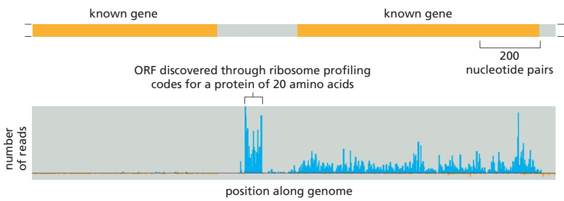

Figure 8–70 Ribosome profiling can identify new genes. This experiment shows the discovery of a previously unrecognized gene—one that encodes a protein of only 20 amino acids. At the top is shown a portion of a viral genome with two previously annotated genes. Below are the results of a ribosome profiling experiment, displayed across the same section of the genome, after human cells were infected by the virus. The results show that the left-hand gene is not expressed under these conditions, the right-hand gene is expressed at low levels, and a previously unrecognized gene that lies between them is expressed at high levels.

The ability to produce transgenic plants has greatly accelerated progress in many areas of plant cell biology. It has played an important part, for example, in isolating receptors for growth regulators and in analyzing the mechanisms of morphogenesis and of gene expression. These techniques have also opened up many new possibilities in agriculture that could benefit both the farmer and the consumer. They have made it possible, for example, to modify the ratio of lipid, starch, and protein in seeds, to impart pest and virus resistance to plants, and to create modified plants that tolerate extreme habitats such as salt marshes or water-stressed soil. One variety of rice has been genetically engineered to produce β-carotene, the precursor of vitamin A (**Figure 8–72**). If it replaced conventional rice, this “golden rice”—so called because of its yellow color—could help to

(A)

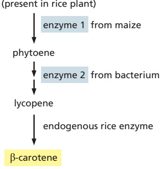

(B)

(C)

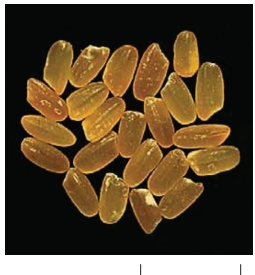

Figure 8–71 Transgenic plants can be made using recombinant DNA techniques optimized for plants. A disc is cut out of a leaf and incubated in a culture of Agrobacterium that carries a recombinant plasmid with both a selectable marker and a desired genetically engineered gene. The wounded plant cells at the edge of the disc release substances that attract the bacteria, which inject their DNA into the plant cells. Only those plant cells that take up the appropriate DNA and express the selectable marker gene survive and proliferate and form a callus. The manipulation of growth factors supplied to the callus induces it to form shoots, which subsequently root and grow into adult plants carrying the engineered gene.

Figure 8–72 DNA technology allows the production of rice grains with high levels of b-carotene. To help reduce vitamin A deficiency in the developing world, a strain of rice, called “golden rice,” was developed in which the edible part of the grain (called the endosperm) contains large amounts of β-carotene, which is converted in the human gut to vitamin A. (A) Rice plants, like most other plants, can synthesize β-carotene in their leaves from an abundant precursor (geranylgeranyl pyrophosphate) found in all plant tissues. However, the genes that code for two of the enzymes that act early in this biosynthetic pathway are turned off in the endosperm, preventing the production of β-carotene in rice grains. To produce golden rice, the genes for these two enzymes were obtained from organisms that produce large amounts of β-carotene: one from maize and the other from a bacterium. Using DNA technology, these genes were connected to a promoter that drives gene expression in rice endosperm. Using the method outlined in Figure 8–71, this engineered DNA was then used to generate a transgenic rice plant that expresses these enzymes in endosperm, resulting in rice grains that contain high levels of β-carotene. Compared to the milled grains of wild-type rice (B), the grains of the transgenic rice are a deep yellow/orange due to the presence of β-carotene (C). (B and C, from J.A. Paine et al., Nat. Biotechnol. 23:482–487, 2005. Reproduced with permission of SNCSC.)

alleviate severe vitamin A deficiency, which causes blindness in hundreds of thousands of children in the developing world each year.

#### Summary

Genetics and genetic engineering provide powerful tools for understanding the function of individual genes in cells and organisms. In the classical genetic approach, random mutagenesis is coupled with screening to identify mutants that are deficient in a particular biological process. These mutants are then used to locate and study the genes responsible for that process.

Gene function can also be ascertained by reverse genetic techniques. DNA engineering methods can be used to alter genes and to reinsert them into a cell’s chromosomes so that they become a permanent part of the genome. If the cell used for this gene transfer is a fertilized egg (for an animal) or a totipotent plant cell in culture, transgenic organisms can be produced that express the mutant gene and pass it on to their progeny. Especially important for cell and molecular biology is the ability to alter cells and organisms in highly specific ways—allowing one to discern the effect on the cell or the organism of a designed change in a single protein or RNA molecule. For example, genomes can be altered so that the expression of any gene can be switched on or off by the experimenter.

Many of these methods are being expanded to investigate gene function on a genome-wide scale. The generation of mutant libraries in which every gene in an organism has been systematically deleted, disrupted, or made controllable by the experimenter provides invaluable tools for exploring the role of each gene in the elaborate molecular collaboration that gives rise to life. Technologies such as RNA-seq can monitor the expression of tens of thousands of genes simultaneously, providing detailed, comprehensive snapshots of the dynamic patterns of gene expression that underlie complex cell processes.

<!-- END EN EN08-H042-H072 -->
