# 第2章 细胞生物学研究方法 · 双教材整合

按中文节顺序保留正文，在每节末插入对应英文内容。

---

## 第2章 细胞生物学研究方法 · 章首导读

[返回本章](README.md) · [中文本章原文](中文原文.md)

<!-- BEGIN CN CN02-S00 -->
# 第2章 细胞生物学研究方法

<!-- 章节边界按正文内容恢复；原始 MinerU 内容保留如下。 -->

# 细胞生物学研究方法

技术的进步在细胞生物学乃至整个生物学的建立与发展中起着巨大的作用。没有显微镜的发明就不会有细胞的发现，也就不可能提出细胞学说；同样，如果没有电子显微镜技术的建立及其与分子生物学技术的相互结合，也难以想象细胞生物学会有今天这样的长足进展。那么，究竟哪些技术属于细胞生物学研究方法的范畴呢？一般来说，凡是用来解决细胞生物学问题所采用的方法都应属于细胞生物学研究方法。然而，随着学科的交叉与融合，当今几乎没有哪些生物学问题与细胞和细胞生物学无关。所以，人们很难给细胞生物学的研究方法界定一个明确的范畴。虽然对生物大分子结构与功能的分析是了解细胞结构与细胞生命活动的基础，在目前细胞生物学研究中也常常使用这些实验方法与技术，如基因的克隆、表达与DNA序列测定，研究特异DNA、RNA片段或蛋白质所常用的Southern杂交、Northern杂交和蛋白质免疫印迹技术等。但这些技术在生物化学、分子生物学和遗传学等学科中已有介绍，本教材不再过多重复。着眼于细胞生物学的学科特点、发展历史及当前所研究的内容，本章拟从细胞形态的结构观察、细胞及其组分的分析、细胞培养与生物工程、细胞及生物大分子的动态变化等几个方面介绍有关细胞生物学研究方法，侧重于实验方法的基本原理及所能解决的问题。具体的操作步骤详见相关参考书。


<!-- END CN CN02-S00 -->

---

## 第2章 细胞生物学研究方法 · 第一节 细胞形态结构的观察方法

[返回本章](README.md) · [中文本章原文](中文原文.md)

<!-- BEGIN CN CN02-S01 -->
## 第一节 细胞形态结构的观察方法

肉眼的分辨率一般只有0.2 mm，很难识别单个细胞；光学显微镜的分辨率可达0.2 $\mu$ m，借此发现了细胞；电子显微镜分辨率高达0.2 nm，将细胞的超微结构展现在人们面前。图2-1比较了光学显微镜、电子显微镜和扫描隧道显微镜适宜观察的样品大小及分辨率。有趣的是，光学显微镜、电子显微镜和扫描隧道显微镜，除了它们因提高分辨率而称之为显微镜这一共性外，在其成像原理、仪器构造以及使用和操作方法等方面，几乎没有任何共同之处。

## 一、光学显微镜

17 世纪，光学显微镜（light microscope）的发明使人们第一次看见了细胞，进而建立了细胞学说，为细胞学的兴起和发展打下基础。光学显微镜至今仍然是细胞生物学研究的重要工具。随着光学显微术与图像处理技术的快速发展，光学显微镜在研究细胞的结构与功能，特别是生物大分子在活细胞中的定位及其动态变化和相互作用等方面展示出了新的活力。

  
图 2-1 几种显微镜可观察的样品大小（箭头之间的范围）及其分辨能力（右侧箭头所指位置）

## （一）普通复式光学显微镜

光学显微镜主要由三部分组成：① 光学放大系统（图 2-2），为两组玻璃透镜：目镜与物镜。② 照明系统：包括光源和聚光镜，有时另加各种滤光片以控制光的波长范围。③ 镜架及样品调节系统。1872年，德国科学家阿贝（E. K. Abbe）等研制出了完美程度几乎可与现代普通光学显微镜媲美的复式显微镜。

显微镜最重要的性能参数是分辨率（resolution），而不是放大倍数。分辨率是指能区分开两个质点间的最小距离。分辨率 D 的高低取决于光源的波长 $\lambda$ ，物镜镜口角 $\alpha$ （标本在光轴上的一点对物镜镜口的张角）和介质折射率 N（图 2-3），它们之间的关系是：

$$
D = \frac {0 . 6 1 \lambda}{N \cdot \sin (\alpha / 2)}
$$

通常 $\alpha$ 最大值可达 $140^{\circ}$ ，空气中 N=1，最短的可见光波长 $\lambda=400\ nm$ ，此时分辨率 D=260 nm，约 $0.3\ \mu m$ 。若在油镜下，N 可提高到 1.5，分辨率 D 则可达 $0.2\ \mu m$ ，所以普通光学显微镜的最大分辨率是 $0.2\ \mu m$ 。

  
图2-2 普通光学显微镜成像示意图

  
图2-3 决定光学显微镜分辨率的要素：物镜的镜口角（ $\alpha$ ）、入射光的波长（ $\lambda$ ）以及介质的折射率（ $N$ ）

光学显微镜可以直接用于观察单细胞生物或体外培养细胞。如果观察生物组织样品，则通常需要对所观察的材料进行固定和包埋（常用的固定剂如甲醛，包埋剂如石蜡等），再将包埋好的样品切成厚度约5 μm的切片，最后进行染色（图2-4A）。如苏木精和伊红染色（又称H-E染色）就是一种常用的染色方法。碱性染料苏木精和酸性染料伊红分别与细胞核和细胞质的某些成分特异性地结合，从而改变透射光线的波长，我们就可以清晰观察到蓝紫色的细胞核和红色的细胞质的形态（图2-4B）。

## （二）相差显微镜和微分干涉显微镜

生物样品一经固定就失去了生物活性，活细胞显微结构的细节可以借助相差显微镜（phase-contrast microscope）来观察。光波的基本属性包括波长、频率、振幅和相位等。可见光的波长和频率的变化表现为颜色的不同，振幅的变化表现为亮暗的区别，而相位的变化却是人眼不能觉察的。当两束光通过光学系统时，会发生相互干涉。如果它们的相位相同，干涉的结果是使光的振幅加大，亮度增强。反之，就会相互抵消而亮度变暗（图2-5）。相差显微镜和干涉差显微镜就是利用这样的原理增强样品的反差，从而实现对非染色活细胞的观察。

光线通过不同密度的物质时，其滞留程度也不同。

  
图2-4 石蜡切片的制备程序（A）及其显微图片（B）B为蛔虫子宫上皮细胞的H-E染色图片。

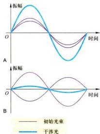  
图2-5 两束光波之间的相互干涉  
A. 当两束光的相位相同时，相互干涉的结果使光波的振幅增加。  
B. 当两束光的相位相反时，则导致光波的振幅降低。

密度大则光的滞留时间长，密度小则光的滞留时间短，因而，其光程或相位发生了不同程度的改变。相差显微镜是在普通光学显微镜的基础上，添加两个元件，即“环状光阑”和在物镜后焦面上的“相差板”，从而可将这种光程差或相位差，通过光的干涉作用，转换成振幅差，因此，可以分辨出细胞中密度不同的各个区域（图2-6）。1932年，德国物理学家P.Zernike制备出第一台相差显微镜，他因此项发明在1953年获诺贝尔物理学奖。

1952 年，G. Nomarski 在相差显微镜的基础上，发明了微分干涉显微镜（differential-interference micros-cope)，又称 Nomarski 相差显微镜。微分干涉显微镜是以平面偏振光为光源。光线经棱镜折射后分成两束，在不同时间经过样品的相邻部位，然后再经过另一棱镜将这两束光汇合，从而使样品中厚度上的微小区别转化成明暗区别。微分干涉显微镜更适于研究活细胞。


  
图2-6 两种不同类型的光学显微镜所拍摄的图像比较  
体外培养的MDCK细胞在普通光学显微镜（A）和相差显微镜（B）下拍摄图像效果的比较。（梁凤霞博士惠赠）

如果将微分干涉显微镜接上高分辨率录像装置，就可以用来观察并记录活细胞中的颗粒及细胞器的运动。计算机辅助的微分干涉显微镜可以进一步提高样品的反差并降低图像的背景“噪声”，使一些常规光学显微镜难于观察的一些显微结构，如单根微管（直径约24 nm）等也可以在光镜下分辨出来。其分辨率比普通光镜提高了一个数量级。从而为在高分辨率条件下研究活细胞提供了必要的工具。应用这一原理制备的录像增差显微镜（video-enhance microscope）可以用来直接观察颗粒物质沿着微管运输的动态过程。

## （三）荧光显微镜

荧光显微镜（fluorescence microscope）是在光镜水平上，对细胞内特异的蛋白质、核酸、糖类、脂质以及某些离子等组分进行定性定位研究的有力工具。荧光显微镜采用的光源和光学系统均与普通光学显微镜有所不同，其核心部件是滤光片系统以及专用的物镜镜头（图2-7A）。滤光片系统由激发滤光片（安装在光源和样品之间，只允许特定波长的激发光通过）和阻断滤光片（安装在物镜和目镜之间，只容许荧光染料所发出的荧光通过）组成。这样，通过激发滤光片的短波长的激发光，照射标记在样品中的荧光分子上，使之产生一定波长的可见光即荧光（图2-7B）。由于荧光显微镜的暗视野为荧光信号提供了强反差背景，非常微弱的荧光信号亦可得以分辨。

荧光显微镜样品制备技术包括免疫荧光技术（见本章第二节）和荧光素直接标记技术。荧光染料DAPI特异性地直接与细胞中的DNA相结合，从而显示出细胞核或染色体在细胞中的定位。这是一种常用的直接标记技术。目前，荧光显微术得到了广泛的应用，特别是细胞内动态变化的研究。例如，用显微注射器将标记荧光素的肌动蛋白注射到培养细胞中，可以看到肌动蛋白分子组装成肌动蛋白纤维的过程。又如，将在激发光作用下，可产生荧光的绿色荧光蛋白（green fluorescent protein, GFP)的基因与编码某种蛋白质的基因相融合，利用荧光显微镜，就可以在表达这种融合蛋白基因的活细胞中，观察到该蛋白质的动态变化。由于不同荧光素所激发出的荧光波长不同，同一样品可以用两种以上的荧光素标记，从而同时显示不同成分在细胞中的定位（图2-7C，图2-9A）。

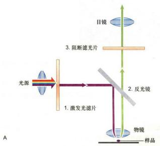

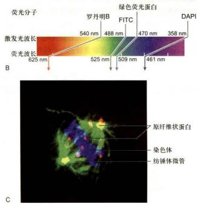  
图2-7 荧光显微镜的基本原理及其应用  
A. 荧光显微镜的工作原理与光路示意图。B. 不同荧光素所需激发光波长与所产生的荧光波长的比较。C. 荧光显微镜显示出在有丝分裂中期细胞中，纺锤体微管（绿色）、中期染色体（蓝色）和原纤维状蛋白（fibrillarin）（红色）等结构成分。（C图由郭焱和陈建国博士提供）

## （四）激光扫描共焦显微镜

在普通荧光显微镜下，许多来自样品中焦平面以外的荧光会使观察到的图像反差减小、分辨能力降低。而激光扫描共焦显微镜（laser scanning confocal microscope, LSCM，简称共焦显微镜）相当于在荧光显微镜上安装了一套激光共焦成像系统，并以激光（可见或紫外激光）为光源，从而，极大地提高了图像的分辨率（图2-8）。所谓共焦，是指聚光镜和物镜同时聚焦

  
图2-8 激光扫描共焦显微镜的原理图

激光束（光源）经二向色镜反射后，通过物镜会聚到样品某一焦点；从焦点发射的荧光（样品一般经免疫荧光标记）经透镜会聚成像，被检测器检出；样品其他部位发射的荧光不会聚焦成像，因而检测器不能检出。


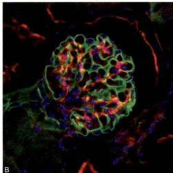  
图2-9 荧光显微镜（A）和激光扫描共焦显微镜（B）所观察图像的比较  
图中显示小鼠肾小球的厚切片（厚度20μm）中，用不同的标记方法和不同的荧光染料，分别显示其凝集素（绿色）、微丝（红色）和细胞核（蓝色）的分布。激光扫描共焦显微镜所获得的图像更为清晰。（梁凤霞博士惠赠）

到同一点上，因而只有聚光镜聚焦在样品中的某一位点上所产生的激发荧光才能清晰成像，而来自焦平面以外的散射光则被小孔或狭缝挡住，再利用激光扫描装置和计算机高速采集与处理会聚每一个点上的信息，形成一幅清晰的二维图像。激光扫描共焦显微镜的分辨率可以比普通荧光显微镜的分辨率提高1.4\~1.7倍。其纵向分辨率（axial resolution）也得到很大的改善。由于可自动调节并改变观察的焦平面，所以可以通过“光学切片”即改变焦点获得一系列不同切面上的细胞图像，经叠加后重构出样品的三维结构。早在1955年，M. Minsky就发明了扫描共焦显微镜。但是直到30年后，随着激光光源的应用和一系列的改进，这种新型的显微镜才得以问世。目前，它在研究亚细胞结构与组分的定位及动态变化等方面的应用越来越广泛，其中包括本章后面所谈到的荧光共振能量转移技术、荧光漂白恢复技术等，都离不开激光扫描共焦显微镜（图2-9B）。

## （五）超高分辨率显微术

根据传统的光学理论，远场光学显微镜在 x、y 轴向的理论分辨率的极限值为 200 nm，而 z 轴向的分辨率还要比这个数值低得多，大约是 500～800 nm，远远不能满足要求。于是，人们开始寻找突破光学显微镜分辨率极限的方法。经过 20 多年的努力，研制出诸如 TIRFM、PALM/STORM、4π 和 STED 显微术，以及 SIM 等多种不同类型的超高分辨率显微术。

## 1. 全内反射荧光显微术（total internal reflection fluorescence microscopy, TIRFM）

根据瑞利/阿贝公式，显微镜的分辨率主要取决于光线的波长和物镜的数值孔径。而且，由于成像过程中产生的泊松噪声和检测元件的背景噪声使光学显微镜的实际分辨率远远低于理论值。可见，降低噪声是提高分辨率的有效途径。激光扫描共焦显微镜主要是依靠针孔来减少非焦平面的信息从而提高图像的清晰度，但针孔不能无限缩小。而全内反射荧光显微镜的原理是基于斯涅耳定律，即当光线从光密介质进入光疏介质时，一部分光会发生折射，而另一部分光线会发生反射（图2-10）。并且，当入射角 $(\theta_{1})$ 的角度增大时，折射角 $(\theta_{2})$ 也随之增大。当入射角达到临界角 $(\theta_{c})$ 时，折射角的角度达到 $90^{\circ}$ 。当入射角继续增大时，就会发生全内反射（TIR）现象。此时，光线会在介质的另一面产生隐失波。隐失波的能量范围通常在 $200~\mathrm{nm}$ 以内，且在 $z$ 上轴上呈现指数衰减，因此可以激发很薄一层（约

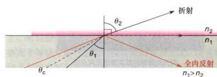  
图2-10 全内反射示意图  
$n_1$ 和 $n_2$ 分别为玻璃和液体的折射率， $\theta_{1}$ 和 $\theta_{2}$ 分别为入射角和折射角， $\theta_{C}$ 为临界角。

100 nm）样品内特定的荧光分子发光，这样就大大降低了背景噪声的干扰，提高了图像分辨率。该技术的特点是只能观察细胞紧靠玻片的大约 100 nm 的范围，例如观察细胞质膜以及紧靠细胞质膜的细胞骨架组分的动态行为，而对细胞的其他部分的观察则无能为力。

## 2. 基于单分子成像技术的 PALM/STORM 方法

对于单个荧光光源的光子分布，通过特定的数学方法（如高斯函数）拟合，可以比较容易地定位荧光光源，精度达到纳米量级。P. Selvin 研究小组应用单分子成像技术在体外条件下分析肌球蛋白分子的行为，达到 1.5 nm 的定位精度。但是，如果两个荧光光源相距很近并且同时发光，应用该技术并不能区分它们。

一种绿色荧光蛋白的突变体（PA-GFP）的出现使情况出现了转机。PA-GFP在激活之前对488 nm的光没有反应，但如果用405 nm的激光激活一段时间，再用488 nm激光照射时，可发出绿色荧光。E. Betzig等将PA-GFP的发光特性与单分子荧光的定位精度相结合，成功地突破了光学显微镜的分辨率极限。其基本原理是将目的蛋白克隆到PA-GFP表达载体，并转染细胞。待融合蛋白表达后用较低能量的405 nm激光照射细胞，随机地使很少一部分（相隔较远的）PA-GFP激活，再用488 nm激光激发激活的PA-GFP发出绿色荧光，通过高斯函数拟合将这些荧光分子定位，然后用488 nm激光将这些已经精确定位的荧光分子漂白，使其不能在下一轮激光照射时被激活。重复上述过程，每次都用405 nm和488 nm激光来激活、激发、定位和漂白少量的荧光分子，如此持续进行数百个循环，直到将细胞内几乎所有的荧光分子都精确地定位，并将所得到的图像合成在一张图上。这样就可以得到分辨率比传统的光学显微技术高10倍以上的图像。由此建立了光激活定位显微术（photoactivated localization microscopy, PALM）。后来Betzig的研究小组进一步发展PALM，成功记录了细胞内两种蛋白质的相对位置。PALM的缺点是只能用于观察外源表达蛋白的定位，并且每一幅图像照相所需的时间很长，不适合用于活细胞动态观察。

庄小威的研究小组开发了一种与PALM类似，但可以用来做细胞内源性蛋白的超分辨率定位的方法。其原理是基于花青染料可以被一种波长的光激活发出荧光，还可以被另一种波长的光波关闭而处于暗态，可以用不同波长的光波照射这些花青染料以控制它们发光或不发光。所以，就可以将原本靠得很紧的蛋白质用成对的染料（如Cy3/Cy5）标记的特异抗体反应，在显微镜下先用激光使报告分子Cy5失活，然后用 $561\mathrm{nm}$ 激光随机地激活少数几个Cy3，并导致其配对的Cy5活化，再用 $647\mathrm{nm}$ 激光激发Cy5，使其发出 $670\mathrm{nm}$ 的荧光，信号被相机捕捉后通过高斯拟合求出其中心位置。重复上述过程10000次以上，以得到100万个以上的数据，就可以重构出内源蛋白分布的高分辨率图像，该方法被命名为随机光学重构显微术（stochastic optical reconstruction microscopy, STORM）。采用不同的荧光染料对，应用STORM可以对多达4种内源性蛋白进行精细定位，分辨率可以达到 $20\mathrm{nm}$ 左右（图2-11）。其缺点是得到一张超分辨图像的时间很长，在活细胞中很难实现。

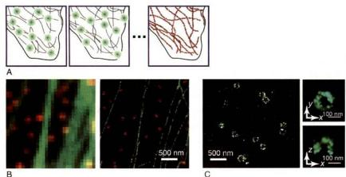  
图2-11 基于单分子定位原理的STORM超高分辨率成像技术


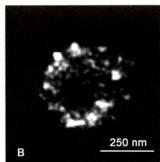  
图2-12 激光扫描共焦显微镜（A）与STED超高分辨率显微镜（B）观察中心粒蛋白的分布的图像比较  
在STED超高分辨率显微镜图像中，可分辨出中心粒蛋白在中心粒中的分布。（陈建国博士和黄宁博士提供）

## 3. $4\pi$ 和STED显微术

S. Hell 发明的 $4\pi$ 显微镜是基于增加物镜的接受角而等效增加物镜的数值孔径（NA）。具体是在样品的两侧各放置一个相同的高性能物镜，使总的接受角接近 $4\pi$ ，进而提高了 NA。Hell 的这一设计成功地将 z 轴分辨率从 500 nm 工高到 100 nm 左右，但 $4\pi$ 显微镜并没有突破衍射极限。此后，Hell 设想使用一束激光，仅仅激发一个点的荧光基团并使其发出荧光，然后再用第二束象面包圈那样的环状高强度的脉冲激光照射那个点周围的荧光，该激光的波长可以使发光物质从受激状态返回到基态。这样，就只有中间没有完全损耗的荧光分子可以观察到。环状激光中间的孔径越小，图像的分辨率就越高。Hell 给这项发明取名受激发射损耗（stimulated emission depletion, STED）显微术（图 2-12）。理论上，STED 显微术的分辨率不受光的衍射过程所限制，利用该技术可以使水平面的分辨率达到纳米级，而且可以快速地观察活细胞内的实时动态变化，如记录神经元突触小泡的行为，但没有提高 z 轴方向的分辨率。如果将 $4\pi$ 和 STED 结合，将可以同时提高 z 轴方向的分辨率。

## 4. 结构照明显微术

M. Gustafsson 博士将非线性结构照明部件引入到传统的显微镜上，使显微镜的硬件系统增加了光栅和控制元件，软件系统可对所获取的图像信息进行计算。其原理是通过光栅的旋转和移动将多重相互衍射的光束照射到样本上，并在此发生干涉，然后从收集到的发射光模式中提取高分辨信息，生成一幅完整的图像。这一技术称为结构照明显微术（structured-illumination microscopy, SIM）。利用结构照明术可使 x、y 平面分辨率达到 100 nm，z 轴向分辨率也提高了 2 倍。其优点是对于普通的免疫荧光标记样本和各种荧光蛋白表达样本，可以不经特殊处理直接观察。其缺点是分辨率远低于其他超高分辨率显微术（图 2-13）。

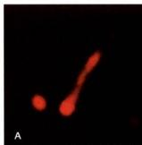

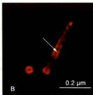  
图2-13 激光扫描共焦显微镜（A）与SIM超高分辨率显微镜（B）的图像比较  
SIM 超高分辨率显微镜图像中，可清晰分辨出动物细胞纤毛基体（即母中心粒）中由三联体微管围成的空隙（箭号所示）。（陈建国博士和黄宁博士提供）

## 二、电子显微镜

光学显微镜技术在细胞生物学研究中起着极为重要的作用。但由于光波波长的限制，光镜的分辨率难以得到进一步提高。只有借助分辨率更高的电子显微镜(electron microscope, EM, 简称电镜)，才可能观察到细胞内部的精细结构。电子显微镜经过了多位科学家共同努力，最终由德国科学家E. Ruska于1932年制作而成，Ruska因此于1986年获诺贝尔物理学奖。

## （一）电子显微镜的基本知识

电子显微镜的基本原理与光学显微镜完全不同，构造也要比光学显微镜复杂得多。但电子显微镜的光路却与光学显微镜具有相似性（图2-14）。

## 1. 电子显微镜与光学显微镜的基本区别

电子显微镜的高分辨率主要是因为使用了波长比可见光短得多的电子束作为光源，波长一般小于0.1 nm。光源的差异决定了电镜与光镜的一系列不同点（表2-1）：比如电子显微镜需要通过电磁透镜聚焦，电镜镜筒中要求高度真空，图像需要通过荧光屏、感光胶片或电荷耦合器件（charge-coupled device, CCD）进行显示和记录等。

表 2-1 电子显微镜与普通光学显微镜的基本区别

<table><tr><td></td><td>分辨本领</td><td>光源</td><td>透镜</td><td>真空</td><td>成像原理</td></tr><tr><td>光学显微镜</td><td>200 nm</td><td>可见光(波长400~760 nm)</td><td>玻璃透镜</td><td>不要求真空</td><td>利用样本对光的吸收形成明暗反差和颜色变化</td></tr><tr><td>电子显微镜</td><td>0.2 nm</td><td>电子束(波长0.01~0.9 nm)</td><td>电磁透镜</td><td>真空</td><td>利用样品对电子的散射和透射形成明暗反差</td></tr></table>

  
图 2-14 电子显微镜的基本结构（A）和成像原理（B）

## 2. 电子显微镜的有效放大倍数与分辨本领

如前所述，人眼的分辨率一般为 0.2 mm，光学显微镜的分辨率为 0.2 μm 左右，其放大倍数为 0.2 mm/0.2 μm，即 1 000 倍。而电子显微镜的分辨率可达 0.2 nm，其放大倍数为 $10^{6}$ 倍。上述放大倍数称之为有效放大倍数。如果通过光学手段继续放大，再也不会得到任何有意义的信息，因此称之为“空放大”。

电镜的分辨率与分辨本领并不等同，电镜的分辨本领是指电镜处于最佳状态下的分辨率。实际情况下，电镜的实际分辨率常常受到生物制样技术本身的限制，如在超薄切片样品中其分辨率约为超薄切片厚度的1/10，即通常超薄切片厚度若为50 nm，则实际分辨率约为5 nm，远低于电镜的分辨本领0.2 nm。

## 3. 电子显微镜的基本构造

电子显微镜主要由以下4部分组成（图2-14）：

(1) 电子束照明系统 包括电子枪和聚光镜。如可用高频电流加热钨丝发出电子，通过高电压的阳极使电子加速（这一装置称电子枪），射出的电子经聚光镜会聚成电子束。

(2) 成像系统 包括物镜、中间镜与投影镜等。它们是经过精密加工的中空圆柱体，里面装置线圈，通过改变线圈的电流大小，调节圆柱体内空间的磁场强度。电子束经过磁场时发生螺旋式运动，最终的结果如同光线通过玻璃透镜时一样，聚焦成像。

(3) 真空系统 用两级真空泵不断抽气，保持电子枪、镜筒及记录系统内的高度真空，以利于电子的运动。

（4）记录系统 电子成像须通过荧光屏显示用于观察，或用感光胶片或CCD相机记录下来。

## （二）主要电镜制样技术

## 1. 超薄切片技术

由于电子束的穿透能力有限，为获得较高分辨率，切片厚度一般仅为40\~50 nm，即一个直径为20 μm的细胞可切成几百片，故称超薄切片（ultrathin section）。这需要样品既要有一定刚性又要有一定韧性，而生物样品并不具备这些特性，为此，样品往往需要包埋在特殊的介质中。但包埋的过程会破坏样品的细微结构，所以超薄切片样品制备的第一步就是样品的固定，以期更好地保存细胞的精细结构（图2-15）。

(1) 固定 固定是保持样品的真实性的一个最重要的环节。固定不仅要求保持样品的形态和精细结构不发生改变；有时还要求细胞内部的成分保持在原来的位置上，甚至其免疫原性尽可能的不发生改变。透射电镜常用化学法进行样品的固定，固定剂为戊二醛和四氧化锇（ $\mathrm{OsO_4}$ ，常称为锇酸）等（表2-2）。同时，为了更好地保存细胞的超微结构，还可以利用物理方法，如超低温冷冻等方法进行固定。在固定操作过程中，动物的处死和取材都要快速进行，以防细胞自溶作用造成的损伤。固定的样品块直径一般小于 $1\mathrm{mm}$ ，以便固定剂迅速渗透。

  
图2-15 电镜超薄切片样本制备示意图  
电镜超薄切片样本的制备包括固定、脱水、包埋、切片和染色等基本步骤。

表 2-2 几种固定剂对细胞不同成分的固定效果的比较

<table><tr><td>固定剂</td><td>核酸</td><td>蛋白质</td><td>磷脂</td><td>多糖</td><td>不饱和脂肪酸</td></tr><tr><td>银酸</td><td>+</td><td>++</td><td>+++</td><td>+</td><td>+++</td></tr><tr><td>戊二醛</td><td>+</td><td>++</td><td>+</td><td>+</td><td>+</td></tr><tr><td>高锰酸钾</td><td>+</td><td>+++</td><td>+++</td><td>+</td><td>+++</td></tr></table>

“+”表示固定剂对不同细胞成分的相对固定效果。

(2) 包埋 包埋的目的是保证在切片过程中，包埋介质能均匀良好地支撑样品，以便获得连续、完整并有足够强度的超薄切片。包埋介质要求具有良好的机械性能（如刚度和韧性等）以利于切片；在聚合过程中，不发生明显的膨胀与收缩；观察样品时，易被电子穿透并能耐受的电子轰击；在高倍放大的图像中不显示本身结构等特征。目前常用的包埋剂是各种环氧树脂。生物样品固定后含有大量水分，而包埋剂多具疏水性质。因此固定的样品在包埋前通常要经过一系列的脱水处理。

（3）切片 超薄切片的制备过程如图2-15所示。切片厚度通常是40\~50 nm。切片厚度可通过样品杆的金属热膨胀或机械伸缩来控制。切片刀以玻璃或钻石为材料，最常使用的是玻璃刀。切片须捞在覆有支持膜（如Formvar膜）的载网（铜网或镍网，一般直径3 nm）上，用于染色和电镜观察。

(4) 染色 电镜样品用重金属盐进行染色。样品

中的不同成分对各种重金属盐“染料”有不同的亲和性，如锇酸宜染脂质，柠檬酸铅易染蛋白质，乙酸双氧铀用以染核酸等。当电子束穿过样品时，样品中的金属离子不同程度地散射和吸收电子，在样品的图像上形成明暗差别。因此，电镜下观察到图像只能为黑白图像。

应用超薄切片技术，几乎可以观察各种细胞的超微结构。图2-16即是动物细胞的超薄切片电镜图片。此外，超薄切片技术还可以与细胞化学、免疫化学和原位杂交等技术结合，在超微结构水平上完成蛋白质与核酸等组分的定性、定位和半定量研究。

  
图2-16 超薄切片技术显示的动物细胞超微结构（洪健惠赠）

  
图2-17 流感病毒负染色电镜照片（梁静楠惠赠）

## 2. 负染色技术

经纯化的细胞组分或结构，如线粒体基粒、核糖体、蛋白颗粒及细胞骨架纤维甚至病毒等可以通过电镜负染色技术（negative staining）显示其精细结构，分辨率可达1.5 nm左右。负染色是用重金属盐，如磷钨酸或醋酸双氧铀溶液对铺展在载网上的样品进行染色。吸去多余染料，样品自然干燥后，整个载网上都铺上了一薄层重金属盐，从而衬托出样品的精细结构（图2-17）。

## 3. 冷冻蚀刻技术

冷冻蚀刻技术 (freeze etching) 的样品制备过程包括冰冻断裂与蚀刻复型两步，因此又称冷冻断裂－蚀刻复型技术。用快速低温冷冻法，在液氮或液氨中将样品迅速冷冻，然后在低温下进行断裂。这时冷冻样品往往从其结构相对“脆弱”的部位（即膜脂双分子层的疏水端）裂开，从而显示出镶嵌在膜脂中的蛋白质颗粒。经过一段时间冰的升华（又称蚀刻），进一步增强图像“浮雕”样的效果。再用铂等重金属进行倾斜喷镀，以形成对应于凹凸断裂面的电子反差。接着，用碳进行垂直喷镀，在断裂面上形成一层连续的碳膜。最后用消化液把生物样品消化掉，将复型膜（碳膜及其被碳膜包裹的，含有图像信息的金属微粒膜）移到载网上，并在电镜下进行观察（图2-18A）。

冷冻蚀刻技术主要用来观察膜断裂面上的蛋白质颗粒和膜表面形貌特征，图像富有立体感，样品不需包埋甚至也不需要固定，因而能更好地保持样品的真实结构（图2-18B）。在此基础上又发展了快速冷冻深度蚀刻技术（quick freeze deep etching），该技术主要用于观察胞质中的细胞骨架纤维及其结合蛋白，从而拓宽了这一技

术的应用范围。

## 4. 电镜三维重构与低温电镜技术

因为透射电镜利用穿透样品的电子成像，这部分的电子已经携带了样品的内部结构信息，因此我们得到的二维电镜图像中，实际上包含了样品三维结构的全部信息。从二维电镜图像出发，构建出样品的三维图像，称电镜图像的三维重构。从20世纪60年代开始，英国学者A.Klug率先把晶体学的图像数据处理方法用于电镜样品的研究中，成功地获得了负染色样品中T噬菌体的三维结构图像，开创了蛋白质三维结构研究的新方向，因此获得1982年诺贝尔化学奖。

由于染色方法的局限性及负染色后干燥过程对样品本身结构细节的损伤，负染色技术制备的生物样品的分辨率只能达到1.5\~2 nm。经过几十年的不懈努力，人们建立了和发展了低温电镜技术（cryo-electron microscopy），这一技术在细胞内各种生物大分子及其复合物的三维结构分析中，发挥了其他技术不可替代的重要作用，例如膜蛋白（见图3-15“γ-分泌酶复合物三维结构”）、核糖体、30 nm染色质（见图9-12“染色质纤维的三维结构”）以及病毒颗粒等。顾名思义，低温电镜技术制备的生物样品，一般不经过固定、包埋、染色和干燥等步骤，而是将样品直接在冷冻剂中快速冷冻，形成100\~300 nm厚的冰膜，在电镜内-160℃低温下利用相位衬度成像。获得的大量图像还要经过一系列数据处理后，构建出样品的三维结构密度图。

目前主要应用低温电镜单颗粒分析技术（single particle analysis）来研究生物大分子的三维结构，即对包被在冰膜中相同的、分散的、取向随机性的大量颗粒性样品进行拍照和三维重构处理。这是目前最主要的也是发展最快的电镜三维重构方法，其三维结构图像已接近原子尺度的分辨率，为解析生命活动运转中的各种“纳米机器”的结构与作用机理，提供了重要的实验手段。在发展低温电镜技术中贡献巨大的三位科学家J.Dubochet、J.Frank、R.Henderson也因此获得2017年诺贝尔化学奖。

电子断层成像技术（electron tomography）也是利用电镜图像进行三维重构的另一项重要技术。它是对样品中同一物体，在不同的倾角下连续拍照，获得一系列二维投影图片，再重构其三维结构。电子断层成像技术也可用于研究蛋白质复合体的三维结构，但其分辨率明显低于低温电镜单颗粒分析技术。然而这一技术还可用于更大尺度的细胞器、细胞骨架、膜泡运输系统等的三维结构研究，因此在细胞生物学研究中也得到日益广泛的应用。电子断层成像技术可用于冷冻的样品，更多的是用于超薄切片样品（图2-19）。

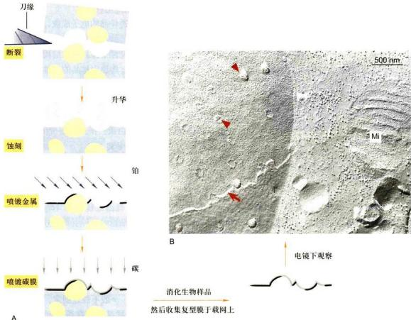  
图2-18 冷冻蚀刻技术示意图  
A. 样品制备流程图。B. 牛肾原代细胞的冷冻蚀刻电镜图片，显示双层核膜（箭头所示）、核孔复合体结构（三角所示）以及线粒体（Mi）和细胞质中的囊泡等结构。（B 图由王梅和丁明孝提供）

利用扫描电镜背散射电子成像（back scattered electron imaging）技术可以研究细胞、组织等更大尺度的超微结构的三维结构，这在揭示神经元之间的相互关系的脑科学研究中，是一项不可或缺的重要技术。经典的扫描电镜是利用细胞表面的二次电子成像，以观察细胞表面的形貌（见下述“扫描电镜技术”）。而扫描电镜背散射电子图像携带了原子序数的信息，因此，对所观察的组织块染色后，可以显示出如同超薄切片样品的细胞内部结构（图2-20）。在扫描电镜中，做类似超薄切片的处理，同时利用其背散射电子成像，就可以得到一幅幅样品内部的超微结构图像，进而构建成整个组织的三维结构图象。

## 5. 扫描电镜技术

扫描电镜（scanning electron microscope, SEM）问世于20世纪60年代。其电子枪发射出的电子束被磁透镜会聚成极细的电子“探针”，在样品表面进行“扫描”，激发样品表面放出二次电子、背散射电子等。二次电子由探测器收集并被闪烁器转变成光信号，其产生的多少与样品表面的形貌相关。这样，通过扫描电镜可以得到样品表面的立体图像信息（图2-21）。

为了保证样品在扫描观察前不发生表面变形，通常需要利用 $CO_{2}$ 临界点干燥法对样品进行干燥处理。此外，为了得到正确的二次电子信号，样品表面需有良好的导电性。所以样品在观察前还要喷镀一层金膜。

扫描电镜景深长，成像具有强烈的立体感，一般扫描电镜的分辨本领仅为3 nm。近些年研制的低压高分辨扫描电镜分辨本领可达0.7 nm，可用于观察核孔复合


  
图2-19 电子断层成像技术显示的细胞内膜及膜泡运输系统的三维图像（A）及同一区域的二维超薄切片图像（B）（何万忠博士惠赠）

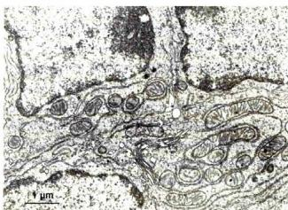  
图2-20 利用扫描电镜背散射电子成像获得的细胞断面超微结构图像

细胞中的细胞核、线粒体、高尔基体等细胞器清晰可见，其分辨率接近透射电镜超薄切片图像。（刘轶群博士惠赠）

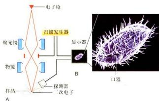  
图2-21 扫描电镜原理示意图（A）及扫描电镜下清晰显示的原生动物四膜虫表面的纤毛和口器（B）（B图由韩飞和丁明孝提供）

体等更精细的结构。

尽管电子显微镜具有分辨率高这一光学显微镜无可比拟的优越性，但直至目前人们还不能用它来观察活的生物样品，而且难以观察细胞的全貌，因此在很多研究中仍需要光镜与电镜技术相结合，这就是为什么各种光-电关联技术（correlative light microscopy and electron microscopy）得到越来越广泛的关注和应用。

## 三、扫描隧道显微镜

扫描隧道显微镜（scanning tunnel microscope, STM）是 IBM 苏黎世实验室的 G. Binnig 和 H. Rohrer 等人于 1981 年发明的，它是一种探测微观世界物质表面形貌的仪器。此项发明获得 1986 年的诺贝尔物理学奖。

STM 的主要原理是利用量子力学中的隧道效应。通常在低电压下，二电极之间具有很大的阻抗，阻止电流通过，称之为势垒；当二电极之间近到一定距离（50 nm 以内）时，电极之间产生了电流，称隧道电流；这种现象称隧道效应。并且隧道电流 (l) 和针尖与样品之间的间距 (d) 呈指数关系 [一维近似 $l \propto \exp(-2Kd)$ ，K 为常数]，这样 d 可转化为 l 的函数而被测定，针尖的位置就可以确定，由此样品的表面形貌也可确定。

STM 的主要装置包括实现 x、y、z 三个方向扫描的压电陶瓷，逼近装置，电子学反馈控制系统和数据采集、处理、显示系统。

STM 的主要特点有：① 具有原子尺度的高分辨本领，侧分辨率为 0.1～0.2 nm，纵分辨率可达 0.001 nm；

② 可以在真空、大气、液体（接近于生理环境的离子强度）等多种条件下工作，这一点在生物学领域的研究中尤其重要；③ 非破坏性测量，因为扫描时不接触样品，又没有高能电子束轰击，基本上可避免样品的形变。

目前，STM作为一种新技术，已被广泛应用于生命科学各研究领域。人们已用STM直接观察到DNA、RNA和蛋白质等生物大分子及生物膜、病毒等的结构。与其功能类似的还有原子力显微镜（atomic force microscope, AFM）。原子力显微镜，顾名思义，是利用微小的探针来操纵和测量样品的形貌和力学性质。这个微小的探针在一个悬梁臂弹簧的末端，在与样品直接作用时，悬梁臂的微小位移通过“光杠杆”效应得以放大上千倍投射到光电探测器上，并通过一个反馈通路来控制探针和样品之间的相互作用。原子力显微镜不仅可以精确地测量出样品的形貌，而且还可以测量样品的微观力学性质。其作用力范围在10 pN（皮牛）到几十nN（纳牛）之间，恰恰适合于细胞信号分子与配体结合以及蛋白质分子的折叠和展开等研究。

可以预料，STM 和 AFM 等将在纳米生物学乃至纳米科学各领域研究中将发挥越来越重要的作用。


<!-- END CN CN02-S01 -->

---

## 对应英文内容

<a id="EN09-H000-H008"></a>

### 英文补充：光学显微镜、图像处理与荧光定位

> 对应中文板块：光学显微镜、图像处理与荧光定位。英文来源：Molecular Biology of the Cell，第7版，第9章；[本章完整原文](../来源/英文教材/09_Visualizing_Cells_and_Their_Molecules/chapter.md)。物理PDF页码范围：602–641（整章范围）。

<!-- BEGIN EN EN09-H000-H008 -->
#### Visualizing Cells and Their Molecules

Understanding the structural organization of cells, and the macromolecules that build and animate them, is essential for learning how they function. In this chapter, we briefly describe some of the principal light and electron microscopy methods used to study cells and molecules. In the past decade or so, there have been major technical developments in both methods that allow us to see biological structures with increasing resolution and clarity. Optical microscopy will be our starting point because cell biology began with the light microscope, and it is still an indispensable tool. The development of methods for the specific labeling and imaging of individual cellular constituents and the reconstruction of their three-dimensional architecture has meant that, far from falling into disuse, optical microscopy continues to increase in importance. One advantage of optical microscopy is that light is relatively nondestructive. By tagging specific cell components with fluorescent probes, such as intrinsically fluorescent proteins, we can watch their movement, dynamics, and interactions in living cells.

Although conventional optical microscopy is limited in resolution by the wavelength of visible light, new methods cleverly bypass this limitation and allow the exact position of even single molecules to be mapped. By using a beam of electrons instead of visible light, electron microscopy can image the interior of cells, and their macromolecular components, at almost atomic resolution and in three dimensions. But all imaging methods involve trade-offs; in this case, the higher resolution means only small objects are imaged and only in fixed, dead cells. There is now a bewildering variety of imaging technologies for the cell biologist to choose from, and when some of these are described later in the chapter, it is worth considering why you might use one rather than another. Trade-offs will always have to be made between thin and thick specimens, living and fixed cells, high and low resolution, fast and slow imaging, signal and noise, or cells and molecules.

This chapter is intended as a companion, rather than an introduction, to the chapters that follow; readers may wish to refer back to it as applications of microscopy to basic biological problems are encountered in other chapters of the book.

#### LOOKING AT CELLS AND MOLECULES IN THE LIGHT MICROSCOPE

A typical animal cell is 10–20 μm in diameter, which is just less than a tenth the size of the smallest object that we can normally see with the naked eye. Only after good light microscopes became available in the early part of the nineteenth century did Matthias Schleiden and Theodor Schwann propose that all plant and animal tissues were aggregates of individual cells. Their proposal in 1838, known as the **cell doctrine**, marks the formal birth of cell biology.

C HAP T E R


Animal cells are not only tiny, but they are also colorless and translucent. The discovery of their main internal features, therefore, depended on the development, in the late nineteenth century, of a variety of stains that provided sufficient color and contrast to make those features visible. Similarly, the far

IN THIS CHAPTER

Looking at Cells and Molecules in the Light Microscope

Looking at Cells and Molecules in the Electron Microscope

(A)

(B)

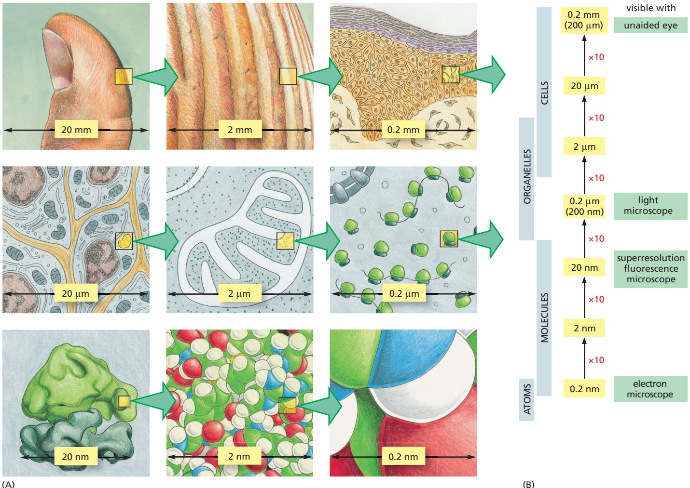

more powerful electron microscope introduced in the early 1940s required the development of new techniques for preserving and staining cells before the full complexities of their internal fine structure could begin to emerge. To this day, microscopy often relies as much on techniques for preparing the specimen as on the performance of the microscope itself. In the following discussions, we therefore consider both instruments and specimen preparation, beginning with the light microscope.

The images in **Figure 9–1A** illustrate a stepwise progression from a thumb to a cluster of atoms. Each successive image represents a tenfold increase in magnification. The naked eye can see features in the first two panels, the light microscope allows us to see details corresponding to about the fifth panel, and the electron microscope takes us to about the eighth or ninth panel. **Figure 9–1B** shows the sizes of various cellular and subcellular structures and the ranges of size that different types of microscopes can visualize.

#### The Conventional Light Microscope Can Resolve Details 0.2 μm Apart

For well over 100 years, all microscopes were constrained by a fundamental limitation: that a given type of radiation cannot be used to probe structural details much smaller than its own wavelength. A limit to the resolution of a light microscope was therefore set by the wavelength of visible light, which ranges from about 0.4 μm (for violet) to 0.7 μm (for deep red). In practical terms, bacteria and mitochondria, which are about 500 nm (0.5 μm) wide, are generally the smallest objects whose shape we can clearly discern in a standard **light microscope**;

Figure 9–1 A sense of scale between living cells and atoms. (A) Each diagram shows an image magnified by a factor of 10 in an imaginary progression from a thumb, through skin cells, to a ribosome, to a cluster of atoms forming part of one of the many protein molecules in the ribosome. Atomic details of biological macromolecules, as shown in the last two panels, are just within the power of the electron microscope. While color has been used here in all the panels, it is not a feature of objects much smaller than the wavelength of light, so the last five panels should really be in black and white. (B) Sizes of cells and their components are shown on a logarithmic scale, indicating the range of objects that can readily be resolved by the naked eye and in the light and electron microscopes. Note that new superresolution microscopy techniques, discussed in detail later, allow an improvement in resolution by an order of magnitude compared with conventional light microscopy.

(A)

image on retina

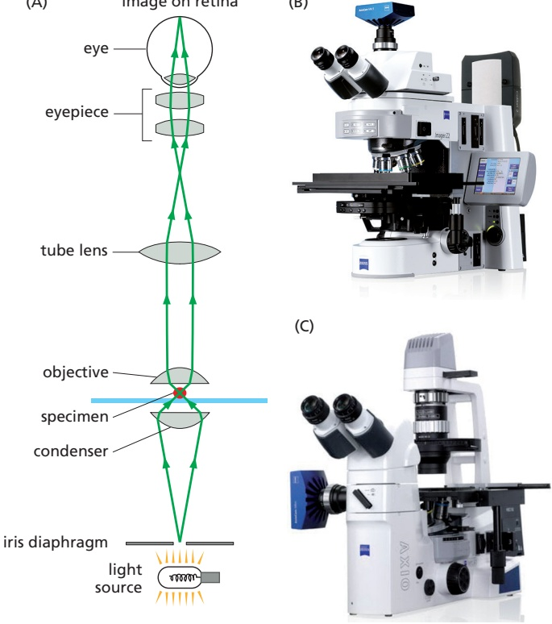

(B)

details smaller than this are obscured by effects resulting from the wave-like nature of light. Let us follow the behavior of a beam of light as it passes through the lenses of a microscope (**Figure 9–2**).

Because of its wave nature, light does not follow the idealized straight ray paths that geometrical optics predicts. Instead, light waves travel through an optical system by many slightly different routes, like ripples in water, so that they interfere with one another and cause optical diffraction effects. If two trains of waves reaching the same point by different paths are precisely in phase, with crest matching crest and trough matching trough, they will reinforce each other so as to increase brightness. In contrast, if the trains of waves are out of phase, they will interfere with each other in such a way as to cancel each other partly or entirely (**Figure 9–3**). The interaction of light with an object changes the phase relationships of the light waves in a way that produces complex interference effects. At high magnification, for example, the shadow of an edge that is evenly illuminated with light of uniform wavelength appears as a set of parallel lines (**Figure 9–4A**),

TWO WAVES IN PHASE


TWO WAVES OUT OF PHASE

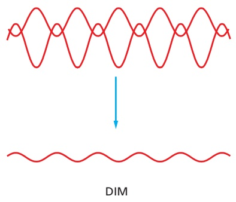

Figure 9–2 A light microscope. (A) Diagram showing the light path in an upright compound microscope. Light is focused on the specimen by lenses in the condenser. A combination of objective lenses, tube lenses, and eyepiece lenses is arranged to focus an image of the illuminated specimen in the eye. (B) A modern upright research light microscope. (C) A modern inverted microscope, particularly useful for looking at cells in culture. Both microscopes are equipped for fluorescence imaging (B and C, courtesy of Carl Zeiss Microscopy, GmbH.)

The following units of length are commonly employed in microscopy: μm (micrometer) = $1 0 ^ { - 6 }$ m nm (nanometer) = $1 0 ^ { - 9 }   \mathsf { m }$ Å (angstrom) = 10–10 m

Figure 9–3 Interference between light waves. When two light waves combine in phase, the amplitude of the resultant wave is larger, and the brightness is increased. Two light waves that are out of phase cancel each other partly and produce a wave whose amplitude, and therefore brightness, is decreased.

whereas the smallest focused image of a bright circular aperture appears as a set of concentric rings (**Figure 9–4B**). For the same reason, a single point seen through a microscope appears as a blurred disc, and two point objects close together give overlapping images and may merge into one. Although no amount of refinement of the lenses can overcome the diffraction limit imposed by the wave-like nature of light, other ways of cleverly bypassing this limit have emerged, creating so-called superresolution imaging techniques that can even detect the position of single molecules. These are discussed later in the chapter.

The limiting separation at which two objects appear distinct—the so-called **limit of resolution**—depends on both the wavelength of the light and the numerical aperture of the lens system used. The numerical aperture affects the light-gathering ability of the lens and is related both to the angle of the cone of light that can enter it and to the refractive index of the medium the lens is operating in; the wider the microscope opens its eye, so to speak, the more sharply it can see (**Figure 9–5**). The refractive index is the ratio of the speed of light in a vacuum to the speed of light in a particular transparent medium. For example, for water this is 1.33, meaning that light travels 1.33 times slower in water than in a vacuum. Under the best conditions, with violet light (wavelength = 0.4 μm) and a numerical aperture of 1.4, the basic light microscope can theoretically achieve a limit of resolution of about 0.2 μm, or 200 nm. Some microscope makers at the end of the nineteenth century achieved this resolution, but it is routinely matched in contemporary, factory-produced microscopes. Although it is possible to enlarge an image as much as we want—for example, by projecting it onto a screen—it is not possible, in a conventional light microscope, to resolve two objects in the light microscope that are separated by less than about 0.2 μm; they will always appear as a single object. It is important, however, to distinguish between resolution and detection. If a small object, below the resolution limit, itself emits light, then we may still be able to see or detect it. Thus, we can see a single fluorescently labeled microtubule even though it is about 10 times thinner than the resolution limit of the light microscope. Diffraction effects, however, will cause it to appear blurred and at least 0.2 μm thick (see Figure 9–14). In a similar way, we can see the stars in the night sky, even though their diameters are far below the angular resolution of our unaided eyes: they all appear as similar, slightly blurred points of light, differing only in their color and brightness.

LENSES

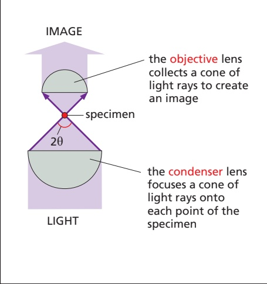

RESOLUTION: the resolving power of the microscope depends on the width of the cone of illumination and therefore on both the condenser and the objective lens. It is calculated using the formula

$$
\text {resolution} = \frac {0 . 6 1 \lambda}{n \sin \theta}
$$

where:

half the angular width of the cone ofθ = rays collected by the objective lens from a typical point in the central region of the specimen (because the maximum width is 180<sup>o</sup>, sin θ has a maximum value of 1)

the refractive index of the mediumn = (usually air or oil) separating the specimen from the objective and condenser lenses

the wavelength of light used (for whiteλ = light a figure of 0.53 µm is commonly assumed)

aperture, the greater the resolution and the brighter the image (brightness is important in fluorescence microscopy). However, this advantage does necessitate very short working distances and a very small depth of field, just as in a conventional camera.

NUMERICAL APERTURE: n sin θ in the equation above is called the numerical aperture of the lens and is a function of its lightcollecting ability. For dry lenses this cannot be more than 1, but for oil-immersion lenses it can be as high as 1.4. The higher the numerical


Figure 9–4 Images of an edge and of a point of light. (A) The interference effects, or fringes, seen at high magnification when light of a specific wavelength passes the edge of a solid object placed between the light source and the observer. (B) The image of a point source of light. Diffraction spreads this out into a complex, circular pattern, whose width depends on the numerical aperture of the optical system: MBoC7 m9.05/9.04the smaller the aperture, the bigger (more blurred) the diffracted image. Two point sources can be just resolved when the center of the image of one lies within the first dark ring in the image of the other: this is used to define the limit of resolution.

Figure 9–5 Basic principles of light microscopy. The path of light rays passing through a transparent specimen in a microscope illustrates the concept of numerical aperture and its relation to the limit of resolution. The higher the numerical aperture of a lens, the brighter the image it forms and the higher its resolution.

#### Photon Noise Creates Additional Limits to Resolution When Light Levels Are Low

Any image, whether produced by an electron microscope or by an optical microscope, is made by particles—electrons or photons—striking a detector of some sort. But these particles are governed by quantum mechanics, so the numbers reaching the detector are predictable only in a statistical sense. Finite samples, collected by imaging for a limited period of time (that is, by taking a snapshot), will show random variation: successive snapshots of the same scene will not be exactly identical. Moreover, every detection method has some level of background signal or noise, adding to the statistical uncertainty. With bright illumination, corresponding to very large numbers of photons or electrons, the features of the imaged specimen are accurately determined on the basis of the distribution of these particles at the detector. However, with smaller numbers of particles, the structural details of the specimen are obscured by the statistical fluctuations in the numbers of particles detected in each region, which give the image a speckled appearance and limit its precision. The term noise describes this random variability. Because noise in the image is proportional to the square root of the number of photons that are detected (or electrons in electron microscopy), then as the number of photons or electrons recorded increases, the absolute noise also increases, but because of the square root relationship, the percentage of noise decreases, in other words the signal-to-noise ratio improves. A poor signal-to-noise ratio is an important consideration when weak fluorescent light signals are recorded or low, but less damaging, electron doses are required.

#### Living Cells Are Seen Clearly in a Phase-Contrast or a Differential-Interference-Contrast Microscope

There are many ways in which contrast in a specimen can be generated (**Figure 9–6**). While fixing and staining a specimen can generate contrast through color (Figure 9–6A), microscopists have always been challenged by the possibility that some components of the cell may be lost or distorted during specimen preparation. The only certain way to avoid the problem is to examine cells while they are alive, without fixing or freezing. For this purpose, light microscopes with special optical systems are especially useful.

In the normal **bright-field microscope**, light passing through a cell in culture forms the image directly. Another system, **dark-field microscopy**, exploits the fact that light rays can be scattered in all directions by small objects in their path.

Figure 9–6 Contrast in light microscopy. (A) The stained portion of the cell will absorb light of some wavelengths, which depends on the stain, but will allow other wavelengths to pass through it. A colored image of the cell is thereby obtained that is visible in the normal bright-field light microscope. (B) In the dark-field microscope, oblique rays of light focused on the specimen do not enter the objective lens, but light that is scattered by components in the living cell can be collected to produce a bright image on a dark background. (C) Light passing through the unstained living cell experiences very little change in amplitude, and the structural details cannot be seen even if the image is highly magnified. The phase of the light, however, is altered by its passage through either thicker or denser parts of the cell, and small phase differences can be made visible by exploiting interference effects using a phase-contrast or a differentialinterference-contrast microscope.

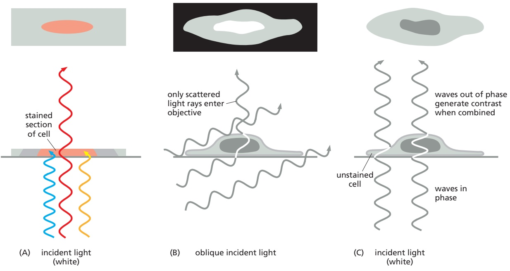

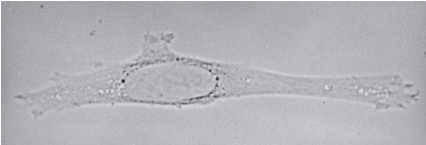

(A)


(B)

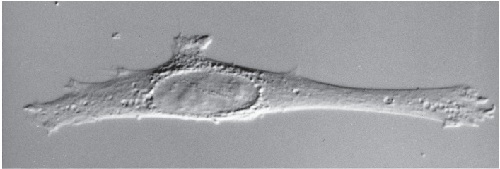

(C)

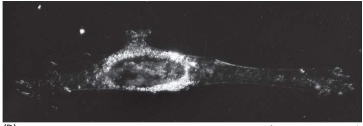

(D)

50 µm

If oblique lighting from the condenser is used, which does not directly enter the objective, unstained objects in a living cell can scatter the rays, some of which then enter the objective to create a bright image against a black background (Figure 9–6B).

When light passes through a living cell, the phase of the light wave is changed according to the cell’s refractive index: a relatively thick or dense part of the cell, such as a nucleus, slows the light passing through it. The phase of the light, consequently, is shifted relative to light that has passed through an adjacent thinner region of the cytoplasm (Figure 9–6C). The **phase-contrast microscope** and, in a more complex way, the **differential-interference-contrast microscope** increase these phase differences to produce amplitude differences, or contrast, when the sets of waves recombine, thereby creating an image of the cell’s structure. Both types of light microscopy are widely used to look at living cells (see Movie 17.2). **Figure 9–7** compares images of the same cell obtained by four kinds of light microscopy.

Phase-contrast, differential-interference-contrast, and dark-field microscopy make it possible to watch the movements involved in such processes as mitosis and cell migration. Because many cellular motions are too slow to be seen in real time, it is often helpful to make time-lapse videos in which the camera records successive frames separated by a short time delay, so that when the resulting picture series is played at normal speed, events appear greatly speeded up.

#### Images Can Be Enhanced and Analyzed by Digital Techniques

Digital imaging systems, and the associated technology of **image processing**, have had a major impact on light microscopy. Certain practical limitations of microscopes relating to imperfections in their optical components have been largely overcome. Digital imaging systems have also circumvented two fundamental limitations of the human eye: the eye cannot see well in extremely dim light, and it cannot perceive small differences in light intensity against a bright background. To increase our ability to observe cells in these difficult conditions, we can attach a sensitive digital camera to a microscope. These cameras detect light by means of high-sensitivity complementary metal-oxide semiconductor (CMOS) sensors, similar to those now found in digital cameras and smartphones. Such image sensors can count individual photons and are many times more sensitive than the human eye and can detect 100 times more intensity levels. It is therefore possible to observe cells for long periods at very low light levels, thereby avoiding the damaging effects of prolonged bright light (and heat). Such sensitive detectors are especially important for viewing fluorescent molecules in living cells, as explained later.

Because images produced by digital cameras are in electronic form, they can be processed in various ways to extract latent information. Such image processing

#### Figure 9–7 Four types of light

microscopy. Four images are shown of the same fibroblast cell in culture. All images can be obtained with most modern microscopes by interchanging optical components. (A) Bright-field microscopy, in which light is transmitted straight through the specimen. (B) Phase-contrast microscopy, in which phase alterations of light transmitted through the specimen are translated into brightness changes. (C) Differential-interference-contrast microscopy, which highlights edges where there is a steep change of refractive index. (D) Dark-field microscopy, in which the specimen is lit from the side and only the scattered light is seen.

makes it possible to compensate for several aberrations in the lenses of microscopes. Moreover, by digital image processing, contrast can be greatly enhanced to overcome the eye’s limitations in detecting small differences in light intensity, and background irregularities in the optical system can be digitally subtracted. This procedure reveals small transparent objects that were previously impossible to distinguish from the background.

#### Intact Tissues Are Usually Fixed and Sectioned Before Microscopy

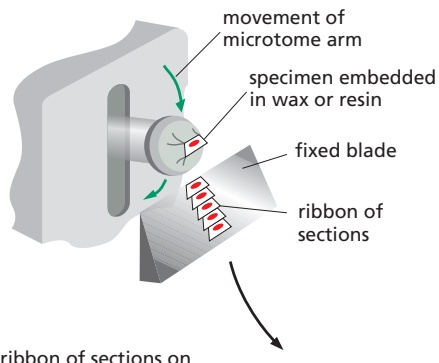

Looking at individual living cells in culture is relatively easy, but most cells are found in complex tissues and organs, and this forces another trade-off when we want to look at them. Because most tissue samples are too thick for their individual cells to be examined directly at high resolution, they are often cut into very thin transparent slices, or sections. To preserve the cells within the tissue they must first be treated with a fixative. A common fixative is glutaraldehyde, which forms covalent bonds with the free amino groups of proteins, cross-linking them so they are stabilized and locked into position.

ribbon of sections on glass slide, stained and mounted under a glass cover slip

Because tissues are generally soft and fragile, even after fixation, they need to be either frozen or embedded in a supporting medium before they can be sectioned. The usual embedding media are waxes or resins. In liquid form, these media both permeate and surround the fixed tissue before being hardened (by cooling or by polymerization) to form a solid block, which is readily sectioned with a microtome. This is a machine with a sharp blade, usually of steel or glass, which operates like a meat slicer (**Figure 9–8**). The sections (typically 0.5–10 μm thick) are then laid flat on the surface of a glass microscope slide.

Figure 9–8 Making tissue sections. This illustration shows how an embedded tissue is sectioned with a microtome in preparation for examination in the light microscope. Very rapidly frozen samples can also be sectioned, and these better preserve the structure of cells in their native state.

There is little in the contents of most cells (which are 70% water by weight) to impede the passage of light rays. Thus, most cells in their natural state, particularly if fixed and sectioned, are almost invisible in an ordinary light microscope. We have seen that cellular components can be made visible by techniques such as phase-contrast and differential-interference-contrast microscopy, but these methods tell us almost nothing about the underlying chemistry. There are three main approaches to working with thin tissue sections that reveal differences in the types of molecules that are present.

First, and traditionally, sections can be stained with organic dyes that have some specific affinity for particular subcellular components. The dye hematoxylin, for example, has an affinity for negatively charged molecules and therefore reveals the general distribution of DNA, RNA, and acidic proteins in a cell (**Figure 9–9**). The chemical basis for the specificity of many dyes, however, is not known, although they are used widely in hospital laboratories.

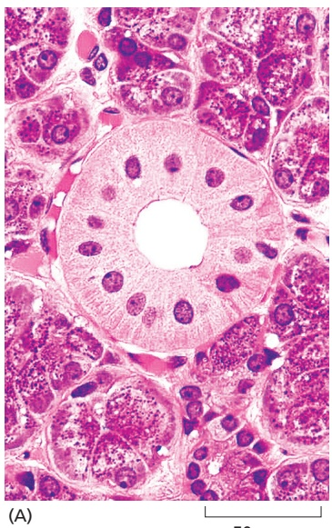

50 µm

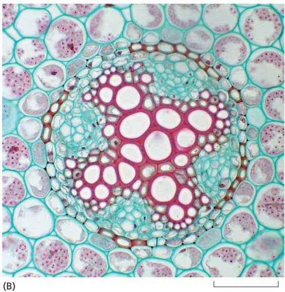

100 µm

Figure 9–9 Staining of cell components. (A) This section of cells in a salivary gland was stained with hematoxylin and eosin, two dyes commonly used in histology. The central duct is made of closely packed cells with nuclei stained purple and cytoplasm stained red. The duct is surrounded by groups of saliva-secreting cells. (B) This section of a young plant root is stained with two dyes, safranin and fast green. Fast green stains the cellulosic cell walls, while the safranin stains the lignified xylem cell walls red. (A, from R.L. Sorenson and T.C. Brelje, Atlas of Human Histology: A Guide to Microscopic Structure of Cells, Tissues and Organs, 3rd ed., 2014. With permission from the authors; B, courtesy of University of Wisconsin Plant Teaching Collection.)

Second, sectioned tissues can be used to visualize specific patterns of differential gene expression. A third and very sensitive approach, generally and widely applicable for localizing proteins of interest, depends on the use of fluorescent probes and markers, as we explain next.

#### Specific Molecules Can Be Located in Cells by Fluorescence Microscopy

Fluorescent molecules absorb light at one wavelength and emit it at another, longer wavelength (**Figure 9–10A and B**). If we illuminate such a molecule at its absorbing wavelength and then view it through a filter that allows only light of the emitted wavelength to pass, it will glow against a dark background. Because the background is dark, even a minute amount of the glowing fluorescent dye can be detected. In contrast, the same number of molecules of a nonfluorescent stain, viewed conventionally, would be practically indiscernible because the absorption of light by molecules in the stain would result in only the faintest tinge of color in the light transmitted through that part of the specimen.

The fluorescent dyes used for staining cells are visualized with a **fluorescence microscope**. This microscope is similar to an ordinary upright or inverted light microscope except that the illuminating light, from a very powerful source, is passed through two sets of filters—one to filter the light before it reaches the specimen, and one to filter the light obtained from the specimen. The first filter passes only the wavelengths that excite the particular fluorescent dye, while the second filter blocks out this light and passes only those wavelengths emitted when the dye fluoresces (**Figure 9–10C**).

Fluorescence microscopy is most often used to detect specific proteins or other molecules in cells and tissues. For example, when using fluorescent nucleotide probes, in situ hybridization, discussed earlier (see Figure 8–63), can reveal the cellular distribution and abundance of specific expressed RNA molecules in sectioned material or in whole mounts of small organisms, organs, or cells (**Figure 9–11**).

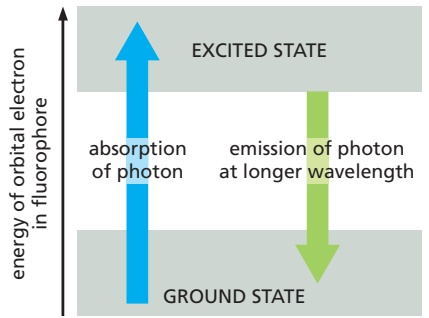

(A)


(B)


Figure 9–10 Fluorescence and the fluorescence microscope. (A) An orbital electron of a fluorochrome molecule can be raised to an excited state after the absorption of a photon. Fluorescence occurs when the electron returns to its ground state and emits a photon of light at a longer wavelength. Too much exposure to light or too bright a light can destroy the fluorochrome molecule in a process called photobleaching. (B) The excitation and emission spectra for the common fluorescent dye fluorescein isothiocyanate (FITC). (C) In the fluorescence microscope, a filter set consists of two barrier filters (1 and 3) and a dichroic (beam-splitting) mirror (2). This example shows the filter set for detection of the fluorescent molecule fluorescein. High-numerical-aperture objective lenses are especially important in this type of microscopy because, for a given magnification, the brightness of the fluorescent image is proportional to the fourth power of the numerical aperture (see also Figure 9–5).

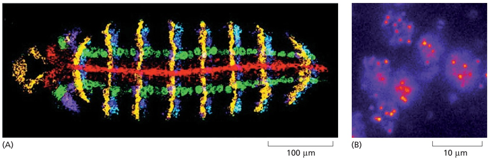

Figure 9–11 RNA in situ hybridization. (A) As described in Chapter 8 (see Figure 8–63), it is possible to visualize the distribution of different RNAs in tissues using in situ hybridization. Here, the transcription pattern of five different genes involved in patterning the early fruit fly embryo is revealed in a single embryo. Each RNA probe has been fluorescently labeled, and the resulting images are displayed each in a different color (“false-colored”) and then combined to give an image where different color combinations represent different sets of genes expressed. The genes whose expression pattern is revealed here are wingless (yellow), engrailed (blue), short gastrulation (red), intermediate neuroblasts defective (green), and muscle specific homeobox (purple). (B) Individual RNA transcripts can be detected in a single cell. Each of these six yeast cells is expressing less than 20 transcripts of a particular gene. Using multiple DNA oligonucleotide probes to that particular gene, each labeled with many fluorescent Cy5 molecules, each individual RNA transcript can be detected as a red spot. [A, from D. Kosman et al., Science 305:846, 2004. With permission from AAAS; B, from G.M. Wadsworth, R.Y. Parikh, and H.D. Kim, Single-probe RNA FISH in yeast. Bio Protoc. 8(11):e2868, 2018, doi 10.21769/BioProtoc.2868.]

A versatile and widely used technique is to couple fluorescent dyes to antibody molecules, which then serve as highly specific and versatile staining reagents that bind selectively to the particular macromolecules they recognize in cells or in the extracellular matrix. Two fluorescent dyes that have been commonly used for this purpose are fluorescein, which emits an intense green fluorescence when excited with blue light, and rhodamine, which emits a deep red fluorescence when excited with green-yellow light (**Figure 9–12**). By coupling one antibody to fluorescein and another to rhodamine, the distributions of different molecules can be compared in the same cell; the two molecules are visualized separately in the microscope by switching back and forth between two sets of filters, each specific for one dye. As shown in **Figure 9–13**, multiple fluorescent dyes can be used in the same way to clearly distinguish several different types of molecules in the same cell. Many fluorescent dyes, such as Cy3, Cy5, and the Alexa dyes, have been specifically developed for fluorescence microscopy, but, like many organic fluorochromes, they fade fairly rapidly when continually illuminated. Later in the chapter, additional fluorescence microscopy methods will be discussed that can be used to monitor changes in the concentration and location of specific molecules inside


<small><span class="docvortex-page-footnote" data-block-type="page_footnote" style="color:#6b7280">Figure 9–12 Fluorescent probes. The maximum excitation and emission wavelengths of several commonly used fluorescent probes are shown in relation to the corresponding colors of the spectrum. The photon emitted by a fluorescent molecule is necessarily of lower energy (longer wavelength) than the absorbed photon, and this accounts for the difference between the excitation and emission peaks. CFP, GFP, YFP, and RFP are cyan, green, yellow, and red fluorescent proteins, respectively. DAPI is widely used as a general fluorescent DNA probe, which absorbs ultraviolet light and fluoresces bright blue. FITC is an abbreviation for fluorescein isothiocyanate—a widely used derivative of fluorescein—which fluoresces bright green. The other probes are all commonly used to fluorescently label antibodies and other proteins. Note that although the true fluorescence emission colors are shown here, the actual color seen in the microscope will depend on the second barrier filter used (see Figure 9–10), and these are usually optimized so as to allow as many different non-overlapping colored probes to be seen in the same specimen. Thus although YFP emits in the green spectrum, it actually appears as a yellow-green in the microscope because of the filter used. The use of fluorescent proteins will be discussed later in the chapter.</span></small>

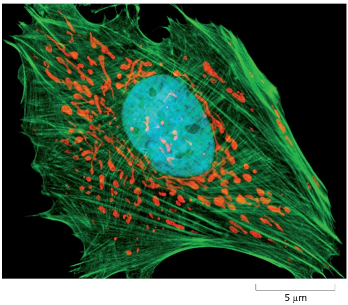

Figure 9–13 Different fluorescent probes can be visualized in the same cell. In this composite micrograph of an epithelial cell in culture, three different fluorescent probes have been used to label three different cellular components. The actin filaments of the cytoskeleton are revealed with a green fluorescent probe, the numerous mitochondria with a red fluorescent dye that accumulates inside the organelles, and the nucleus with a blue fluorescent dye that binds to DNA. (Courtesy of Carl Zeiss Microscopy, GmbH.)

living cells. As with all microscopy methods there are trade-offs to consider. In all fluorescence microscopes, the only molecules that can be imaged are those that are fluorescently labeled; all the other molecules in the cell remain hidden.


<!-- END EN EN09-H000-H008 -->

<a id="EN09-H013-H034"></a>

### 英文补充：共焦、超分辨率、TIRF、电子显微镜与冷冻电镜

> 对应中文板块：共焦、超分辨率、TIRF、电子显微镜与冷冻电镜。英文来源：Molecular Biology of the Cell，第7版，第9章；[本章完整原文](../来源/英文教材/09_Visualizing_Cells_and_Their_Molecules/chapter.md)。物理PDF页码范围：602–641（整章范围）。

<!-- BEGIN EN EN09-H013-H034 -->
#### Imaging of Complex Three-dimensional Objects Is Possible with the Optical Microscope

For ordinary light microscopy, as we have seen, a tissue has to be sliced into thin sections to be examined; the thinner the section, the crisper the image. Because information about the third dimension is lost upon sectioning, how, then, can we get a picture of the three-dimensional architecture of a cell or tissue, and how can we view the microscopic structure of a specimen that, for one reason or another, cannot first be sliced into sections? Although an optical microscope is focused on a particular focal plane within a three-dimensional specimen, all the other parts of the specimen, above and below the plane of focus, are also illuminated, and the light originating from these regions contributes to the image as out-of-focus blur. This can make it very hard to interpret the image in detail and can lead to fine image structure being obscured by the out-of-focus light.

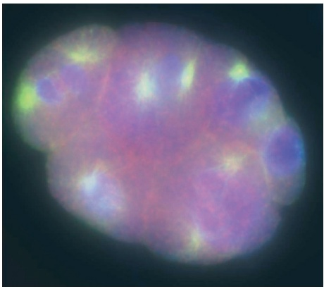

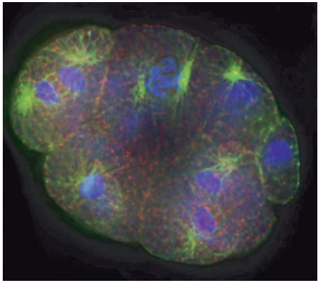

(A)

(B)

10 µm

Figure 9–23 Image deconvolution. (A) A light micrograph of a Caenorhabditis elegans embryo, fluorescently labeled for microtubules (green), mitochondria (red), and DNA (blue). Detail at any one level of focus is blurred by light from out-of-focus levels of the specimen. (B) After deconvolution of the three-dimensional stack of images, an optical section at the same level of focus shows a much crisper image with more contrast and much reduced blurring. (A and B, from D. Sage et al., MBoC7 n9.122/9.23Methods 115:28–41, 2017, doi 10.1016/j.ymeth.2016.12.015. With permission from Elsevier.)

Two distinct but complementary approaches help to solve this problem: one is computational, the other optical. These three-dimensional microscopic imaging methods make it possible to focus on a chosen plane in a thick specimen while rejecting the light that comes from out-of-focus regions above and below that plane. Thus, one sees a crisp, thin optical section. From a series of such optical sections taken at different depths and stored in a computer, a three-dimensional image can be reconstructed (**Movie 9.1**). The methods do for the microscopist what the computed tomography (CT) scanner does (by different means) for the radiologist investigating a human body: both machines give detailed sectional views of the interior of an intact structure.

The computational approach is often called image deconvolution. To understand how it works, remember that the wave-like nature of light means that the microscope lens system produces a small blurred disc as the image of a point source of light (see Figure 9–4), with increased blurring if the point source lies above or below the focal plane. This blurred image of a point source is called the point spread function (see Figure 9–29). An image of a complex object can then be thought of as being built up by replacing each point of the three-dimensional specimen by a corresponding blurred disc, resulting in an image that is blurred overall. For deconvolution, a computer program uses the measured point spread function of a point source of light from that particular microscope to determine what the effect of the blurring would have been on the image, and then applies an equivalent “deblurring” (deconvolution), turning the blurred three-dimensional image into a series of clean optical sections, albeit still constrained by the diffraction limit (**Figure 9–23**).

#### The Confocal Microscope Produces Optical Sections by Excluding Out-of-Focus Light

The confocal microscope achieves a result similar to that of deconvolution, but does so by manipulating the light before it is measured; it is an analog technique rather than a digital one. The optical details of the **confocal microscope** are complex, but the basic idea is simple, as illustrated in **Figure 9–24**, and the results are far superior to those obtained by conventional light microscopy.

The confocal microscope is generally used with fluorescence optics (see Figure 9–10C), but instead of illuminating the whole specimen at once, in the usual way, the optical system at any instant focuses a spot of light onto a single point at a specific depth in the specimen. This requires a source of pinpoint illumination that is usually supplied by a laser whose light has been passed through a pinhole. The fluorescence emitted from the illuminated material is collected at a suitable light detector and used to generate an image. A pinhole aperture is placed in front of the detector, at a position that is confocal with the illuminating pinhole; that is, precisely where the rays emitted from the illuminated point in the specimen come to a focus. Thus, the light from this point in the specimen converges on this aperture and enters the detector.


fluorescent specimen is illuminated with a focused point of light from a pinhole

emitted fluorescent light from in-focus point is focused at pinhole and reaches detector


(D)

emitted light from outof-focus point is out of focus at pinhole and is largely excluded from detector

By contrast, the light emitted from regions of the specimen that are out of focus is also out of focus at the pinhole aperture and is therefore largely excluded from the detector. To build up a two-dimensional image, data from each point in the plane of focus are collected sequentially by scanning across the field from one side to the other in a regular pattern of pixels and are displayed on a computer screen. Although not shown in Figure 9–24, the scanning is usually done by deflecting the beam with an oscillating mirror placed between the dichroic (beam-splitting) mirror and the objective lens in such a way that the illuminating spot of light and the confocal pinhole at the detector remain strictly in register. Variations in design now allow the rapid collection of data at video rates.

The confocal microscope has been used to resolve the structures of numerous complex three-dimensional objects (**Figure 9–25**), from large multicellular


(A)

50 µm


(B)

2 µm


Figure 9–24 The confocal fluorescence microscope. (A) This simplified diagram shows that the basic arrangement of optical components is similar to that of the standard fluorescence microscope shown in Figure 9–10C, except that a laser is used to illuminate a small pinhole whose image is focused at a single point in the threedimensional (3D) specimen. (B) Emitted fluorescence from this focal point in the specimen is focused at a second (confocal) pinhole. (C) Emitted light from elsewhere in the specimen is not focused at the pinhole and therefore does not contribute to the final image. By scanning the beam of light across the specimen, a very sharp two-dimensional image of the exact plane of focus is built up that is not significantly degraded by light from other regions of the specimen. (D) Commercial versions of laser scanning confocal microscopes can be configured for both upright and inverted microscopes. Shown here is a standard upright confocal microscope. (D, courtesy of Andrew Davis.)

Figure 9–25 Confocal fluorescence microscopy produces clear optical sections and three-dimensional data sets. (A) The elaborate cup-shaped trap of the carnivorous water plant, Utricularia gibba. A stack of 452 separate confocal images using a fluorescent label for the cell walls was assembled to produce the image. (B) A reconstruction of an object can be assembled from a stack of optical sections. In this case, and at a vastly different scale, the complex branching structure of the mitochondrial compartment in a single live yeast cell is shown. (A, courtesy of Karen Lee, Claire Bushell, and Enrico Coen; B, courtesy of Stefan Hell.)

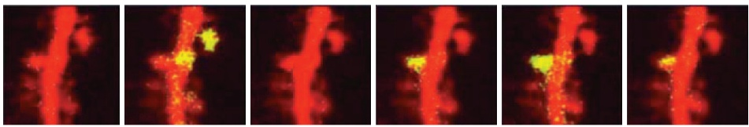

structures to subcellular structures; for example, the networks of cytoskeletal fibers, the dynamics of organelles, and the arrangements of chromosomes and genes in the nucleus.

The relative merits of deconvolution methods and confocal microscopy for three-dimensional optical microscopy depend on the specimen being imaged. Confocal microscopes tend to be better for thicker specimens with high levels of out-of-focus light. They are also generally easier to use than deconvolution systems, and the final optical sections can be seen quickly. In contrast, the complementary metal-oxide semiconductor (CMOS) cameras that are used for deconvolution systems are extremely efficient at collecting almost every photon emitted, and they can be used to make detailed three-dimensional images from specimens that are too weakly stained or too easily damaged by the bright light used for confocal microscopy.

Figure 9–26 Multiphoton imaging. Infrared laser light causes less damage to living cells than does visible light and can also penetrate farther, allowing microscopists to peer deeper into living tissues. The two-photon effect, in which a fluorochrome can be excited by two coincident infrared photons instead of a single high-energy photon, allows us to see nearly 0.5 mm inside the cortex of a live mouse brain. A dye, whose fluorescence changes with the calcium concentration, reveals active synapses (yellow) on the dendritic spines (red) that change as a function of time; in this case, there is a day between each image. (Courtesy of Thomas Oertner and Karel Svoboda.)

Both methods, however, have another drawback; neither is good at coping with very thick specimens. Deconvolution methods quickly become ineffective any deeper than about 40 μm into a specimen, while confocal microscopes can only obtain images up to a depth of about 150 μm. Special microscopes can now take advantage of the way in which fluorescent molecules are excited, to probe even deeper into a specimen. Fluorescent molecules are usually excited by a single high-energy photon, of shorter wavelength than the emitted light, but they can in addition be excited by the absorption of two (or more) photons of lower energy, as long as they both arrive within a femtosecond or so of each other. The use of this longer-wavelength excitation has some important advantages. In addition to reducing background noise, red or near-infrared light can penetrate deeper into a specimen. Multiphoton microscopes, constructed to take advantage of this two-photon effect, can obtain sharp images, sometimes even at a depth of half a millimeter within a specimen. This is particularly valuable for studies of living tissues, notably in imaging the dynamic activity of synapses and neurons just below the surface of living brains (**Figure 9–26**).

#### Superresolution Fluorescence Techniques Can Overcome Diffraction-limited Resolution

The variations on light microscopy we have described so far are all constrained by the classic diffraction limit to resolution described earlier; that is, to about 0.2 μm, or 200 nm (see Figure 9–5). Yet many cellular structures—from nuclear pores and ribosomes to nucleosomes and clathrin-coated pits—are much smaller than this and so are unresolvable by conventional light microscopy. However, several approaches are now available that bypass the limit imposed by the diffraction of light, and some can now successfully resolve objects as small as 10 nm, a remarkable, twentyfold improvement.

The first of these so-called **superresolution** approaches, structured illumination microscopy (SIM), is a fluorescence imaging method with a resolution of about 100 nm, or twice the resolution of conventional bright-field microscopy. SIM overcomes the diffraction limit by using a grated or structured pattern of light to illuminate the sample. The microscope’s physical setup and operation are quite complex, but the general principle can be thought of as similar to creating a moiré pattern, an interference pattern created by overlaying two grids with different angles or mesh sizes (**Figure 9–27**). The illuminating grid and the sample features combine into an interference pattern in which features smaller than the grid spacing are transformed into larger patterns. This results in original features

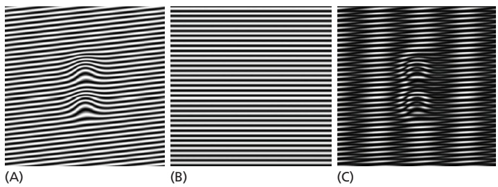

beyond the classical limit being transformed so that they can now be imaged by the optical system. Computer image processing can then be used to restore them into an image that has a resolution up to twice the classical limit. IlluminationMBoC7 m9.34/9.27 by a grid means that the parts of the sample in the dark stripes of the grid are not illuminated and therefore not imaged, so the imaging is repeated several times (usually three) after translating the grid through a fraction of the grid spacing between each image. As the interference effect is strongest for image components close to the direction of the grid bars, the whole process is repeated with the grid pattern rotated through a series of angles to obtain an equivalent enhancement in all directions. Finally, mathematically combining all these separate images by computer creates an enhanced superresolution image. SIM is versatile because it can be used with any fluorescent dye or protein, and combining SIM images captured at consecutive focal planes can create three-dimensional data sets (Figure 9–28).

Figure 9–27 Structured illumination microscopy. The principle, illustrated here, is to illuminate a sample with patterned light and measure the moiré pattern. Shown are (A) the pattern from an unknown structure and (B) a defined grid pattern. (C) When these are combined, the resulting moiré pattern contains more information than is easily seen in A, the original pattern. If the known pattern (B) has higher spatial frequencies, then better resolution will result. However, because the spatial patterns that can be created optically are also diffraction-limited, SIM can only improve the resolution by about a factor of 2. (From B.O. Leung and K.C. Chou, Appl. Spectrosc. 65:967–980, 2011. With permission from SAGE.)

To get around the diffraction limit, two other superresolution techniques exploit aspects of the point spread function, a property of the optical system mentioned earlier. The **point spread function** is the distribution of light intensity within the three-dimensional, blurred image that is formed when a single point source of light is brought to a focus with a lens. Instead of being identical to the point source, the image has an intensity distribution that is approximately described by a Gaussian distribution, which in turn determines the resolution of the lens system. Two points that are closer than the width at half-maximum height of this distribution will become hard to resolve because their images overlap too much (**Figure 9–29**).


(A)

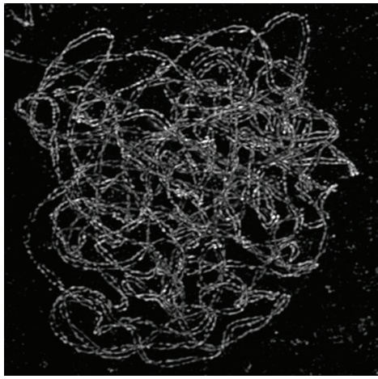

(B)


(C)

2 µm

Figure 9–28 Structured illumination microscopy can be used to create three-dimensional data. These threedimensional projections of the meiotic chromosomes at pachytene in a maize cell show the paired lateral elements of the synaptonemal complexes. (A) The chromosome set has been stained with a fluorescent antibody to cohesin and is viewed here by conventional fluorescence microscopy. Because the distance between the two lateral elements is about 200 nm, the diffraction limit, the two lateral elements that make up each complex are not resolved. (B) In the three-dimensional SIM image, the improved resolution enables each lateral element, about 100 nm across, to be clearly resolved, and the two chromosomes of each separate pair can be seen to coil around each other. (C) Because the complete three-dimensional data set for the whole nucleus is available, the path of each separate pair of chromosomes can be traced and artificially assigned a different color. (Courtesy of C.J. Rachel Wang, Peter Carlton, and Zacheus Cande.)


500 nm

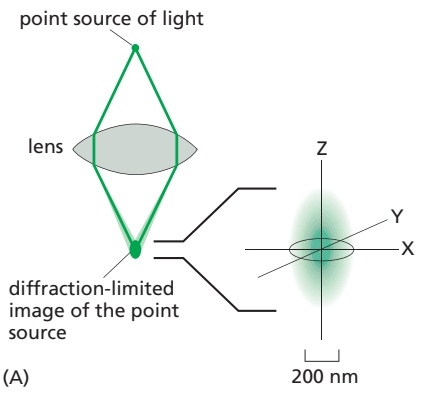


(B)

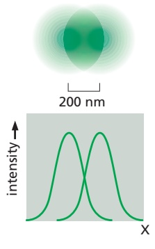

(C)

Figure 9–29 The point spread function of a lens determines resolution. (A) When a point source of light is brought to a focus by a lens system, diffraction effects mean that, instead of being imaged as a point, it is blurred in all dimensions. As shown, the point spread function is elongated, meaning that the resolution is better in the XY axes than along the Z axis. (B) In the plane of the image, the distribution of light approximates a Gaussian distribution, whose width at half-maximum MBoC7 m9.36/9.29height under ideal conditions is about 200 nm. (C) Two separate point sources that are about 200 nm apart can still just be distinguished as separate objects in the image, but if they are any nearer than that, their images will overlap and not be resolvable.

In fluorescence microscopy, the excitation light is focused to a spot on the specimen by the objective lens, which then captures the photons emitted by any fluorescent molecule that the beam has raised from a ground state to an excited state. Because the excitation spot is blurred according to the point spread function, fluorescent molecules that are closer than about 200 nm will be imaged as a single blurred spot. One approach to increasing the resolution is to switch all the fluorescent molecules at the periphery of the blurry excitation spot back to their ground state or to a state where they no longer fluoresce in the normal way, leaving only those at the very center to be recorded. This can be done in practice by adding a second, very bright laser beam that wraps around the excitation beam like a torus. The wavelength and intensity of this second beam are adjusted so as to switch the fluorescent molecules off everywhere except at the very center of the point spread function, a region that can be as small as 20 nm across (**Figure 9–30**).


(D)


(E)


150 nm

Figure 9–30 Superresolution microscopy can be achieved by reducing the size of the point spread function. (A) The size of a normal focused beam of excitatory light. (B) An extremely strong superimposed laser beam, at a different wavelength and in the shape of a torus, or doughnut, depletes emitted fluorescence everywhere in the specimen except right in the center of the beam, reducing the effective width of the point spread function (C). As the specimen is scanned, this small point spread function can then build up a crisp image in a process called STED (stimulated emission depletion) microscopy. (D) Here, STED microscopy is used to examine the structure of the nuclear pore. Fixed samples of the nuclear envelope have been stained by indirect immunofluorescence, using antibodies to different nuclear pore components. Membrane ring proteins (see Figure 12–55) have been stained red while the FC repeat proteins that form fibrils in the center of the pore are stained green. (E) An enlargement of the boxed region shows the clear eightfold symmetry of the membrane ring proteins and the central fibrillar region with a resolution of about 20 nm. [A, B, and C, from G. Donnert et al., Proc. Natl. Acad. Sci. USA 103: 11440–11445, 2006. Copyright 2006 National Academy of Sciences. With permission from National Academy of Sciences; D and E, from F. Gottfert et al., Biophysical Journal 105(1):PL01–L03, 2013. With permission from Elsevier.]

The fluorescent probes used must be in a special class that is photoswitchable: their emission can be reversibly switched on and off with lights of different wavelengths. As the specimen is scanned with this arrangement of lasers, in much the same way as in a confocal microscope, fluorescent molecules are switched on and off, and the small point spread function at each location is recorded. The diffraction limit is breached because the technique ensures that similar but very closely spaced molecules are in one of two different states, either fluorescing or dark. This approach is called STED (stimulated emission depletion) microscopy, and various microscopes using versions of the general method are now in wide use. Resolutions of 20 nm have been achieved in biological specimens (see Figure 9–30).

#### Single-Molecule Localization Microscopy Also Delivers Superresolution

If a single fluorescent molecule is imaged, it appears as a circular blurry disc about 200 nm across, but if sufficient photons have contributed to this image, then the precise mathematical center of the disc-like image, and therefore the position of that fluorescent molecule, can be determined very accurately, often to within a few nanometers (**Figure 9–31**). But the problem with a specimen that contains a large number of adjacent fluorescent molecules, as we saw earlier, is that they each contribute blurry, overlapping point spread functions to the image, making the exact position of any one molecule impossible to resolve. Another way around this limitation is to arrange for only a very few, clearly separated molecules to actively fluoresce at any one moment. The exact position of each of these can then be computed, before subsequent sets of molecules are examined.

In practice, this can be achieved by using lasers to sequentially switch on a sparse subset of fluorescent molecules in a specimen containing switchable fluorescent labels. There are now hundreds of such labels, and they fall into three classes: photoactivated labels, which switch for example from dark to green; photoconvertible labels, which switch for example from green to red; and photoswitchable labels, which switch back and forth. Labels are activated, for example, by illumination with near-ultraviolet light, which modifies a small subset of molecules so that they fluoresce when exposed to an excitation beam at another wavelength. These are then imaged before bleaching quenches their fluorescence, and a new subset is activated. Each molecule emits a few thousand photons in response to the excitation before switching off, and the switching process can be repeated tens or even hundreds of thousands of times, allowing the exact coordinates of a very large set of single molecules to be determined. The full set can be combined and digitally displayed as an image in which the computed successive cycles of activation and bleaching allow well-separated single fluorescent molecules to be detected

100 photons

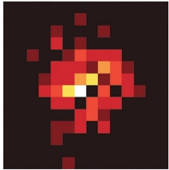

1000 photons


10,000 photons


Figure 9–31 Single fluorescent molecules can be located with great accuracy. Determination of the exact mathematical center of the blurred image of a single fluorescent molecule becomes more accurate as more photons contribute to the final image. The point spread function described in the text dictates that the size of the molecular image is about 200 nm across, but in very bright specimens, the position of its center can be pinpointed to within a nanometer or so. (From A.L. McEvoy et al., BMC Biol. 8:106, 2010. With permission of the authors.)


a superresolution image of the fluorescent structure is built up as the positions of tens of thousands of successive small groups of molecules are added to the map (A)

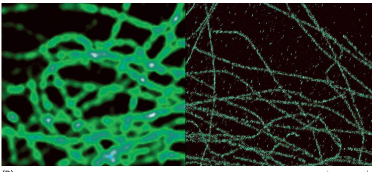

(B)

1 µm

location of each individual molecule is exactly marked (**Figure 9–32**). The two main methods of **single-molecule localization microscopy (SMLM)** have been variously termed photoactivated localization microscopy (PALM) or stochastic optical reconstruction microscopy (STORM).

By switching the fluorophores off and on sequentially in different regions of the specimen as a function of time, all the superresolution imaging methods described above allow the resolution of molecules that are much closer together than the 200-nm diffraction limit. In STED, the locations of the molecules are determined by using optical methods to define exactly where their fluorescence will be on or off. In PALM and STORM, individual fluorescent molecules are switched on and off at random over a period of time, allowing their positions to be accurately determined. PALM and STORM techniques have depended on the development of novel fluorescent probes that exhibit the appropriate switching behavior. STORM originally relied on photoswitchable dyes, while PALM used photoswitchable fluorescent proteins, but the general principle is the same, for both. All these methods can incorporate multicolor imaging (**Figure 9–33**),

Figure 9–33 Multiple structures that are below the diffraction-limited resolution can be imaged by single-molecule localization microscopy. (A) Two recently divided Escherichia coli cells imaged in a STORM microscope with a resolution of about 20 nm. The cells are stained with three separate switchable fluorescent labels: the membrane is labeled green, the recently segregated DNA molecules are blue, and the ends of the two replicated chromosomes are seen as two bright white dots. (B) In this nerve cell, evenly spaced ring-like structures of actin (red) are wrapped around the circumference of the axon with a periodicity of about 190 nm, just smaller than the diffraction limit to resolution. In between are similarly spaced structures of spectrin (blue). This periodic actin–spectrin cytoskeletal framework helps support the long thin axons of nerve cells. Such images depend heavily on the development of new, very fast-switching, and extremely bright fluorescent probes. (A, from C.K. Spahn et al., Sci. Rep. 8:14768, 2018, doi.org/10.1038/s41598-018-33052-3; B, from K. Xu et al., Science 339:452–456, 2013, doi 10.1126/science.1232251.)

Figure 9–32 Single-molecule localization microscopy (SMLM). (A) In this imaginary specimen, sparse subsets of fluorescent molecules are individually switched on briefly and then bleached. The exact positions of all these well-spaced molecules can be gradually added together and built up into an image at superresolution. (B) In this portion of a cell, the microtubules have been fluorescently labeled and imaged (left) in a TIRF microscope (see Figure 9–38) and (right) at superresolution in a PALM microscope. The diameter of each microtubule on the right now resembles its true size, about 25 nm, rather than the 250 nm for each microtubule in the blurred diffraction-limited image on the left. (B, courtesy of Shinsuke Niwa.)


1 µm


Figure 9–34 Expansion microscopy. (A) Although the technique has numerous variations, the essential features are that the fluorescently labeled sample is embedded in a polymer gel to which the fluorescent labels are covalently attached. After a proteinase digestion step, the gel is immersed in water and everything in the sample expands equally in every direction, usually by between 4 and 10 times, thus allowing details to be seen far more easily. (B) A peroxisome, whose membrane has been labeled with a fluorescent probe, appears in a confocal microscope as a blurred, diffraction-limited disc. (C) After expansion by a factor of 10, the image is captured with a standard epifluorescence microscope and, after deconvolution, shows the peroxisomal membrane well resolved and with a resolution of 25 nm. (From S. Truckenbrodt et al., EMBO Rep. 19:e45836, 2018, doi 10.15252/embr.201845836.)

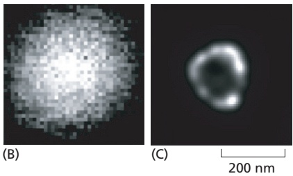

and to some extent live-cell imaging in real time. Ending the long reign of the diffraction limit has reinvigorated light microscopy and its place in cell biology research.

#### Expanding the Specimen Can Offer Higher Resolution,MBoC7 n9.112/9.34 but with a Conventional Microscope

All the approaches to improvement of resolution that we have discussed so far have centered on increasingly sophisticated and expensive developments of the microscope itself. Looking at the problem from the other end, the specimen end, swelling the sample to physically make it larger would in theory allow higherresolution imaging, while still using a conventional fluorescence microscope. A new specimen preparation technique, called **expansion microscopy (ExM)**, does exactly that. The process starts by staining the fixed sample with fluorescent labels such as antibodies that target the molecules of interest. The labeled specimen is then treated with a chemical cross-linker and incubated with acrylate and acrylamide monomers. These monomers then polymerize to form a polyelectrolyte gel that simultaneously incorporates the cross-linked labels. With the labels covalently cross-linked to the polymer gel, and locked in their original relative positions, cellular material in the sample, predominantly proteins that might hinder subsequent expansion, is then carefully digested away. The gel containing the labeled specimen is now gently swollen by removing the buffer salts with water, so that it expands equally in all directions by between 4 and 10 times (**Figure 9–34A**). Two fluorochromes that were initially 100 nm apart, and consequently below the diffraction-limited resolution of a standard microscope, will now be 0.4–1.0 μm apart and are therefore easily resolved (**Figure 9–34B and C**). “Blowing-up” the sample allows effective superresolution to be enjoyed at up to 25 nm and without costly hardware (**Figure 9–35A and B**).

Expansion microscopy is proving valuable for detecting and quantitating which RNA transcripts are expressed in which individual cells in the brain. If all RNA molecules present are anchored firmly to the polymer gel before the expansion step, then the sample can be washed and re-probed sequentially with multiple fluorescent RNA probes using in situ hybridization (**Figure 9–35C and D**). Expansion takes place in all directions, and so depth information is also retrievable at higher resolution. Expansion microscopy samples can still be imaged by either confocal or light-sheet microscopy (discussed next), and deconvolution methods can still be used on the images—both help to improve three-dimensional imaging of large specimens.


Figure 9–35 Expansion microscopy. (A and B) Two orthogonal views of the same cultured human nasal epithelial cells that have been stained with a fluorescent dye, expanded by ten times, and then imaged by conventional confocal microscopy. The hollow centers of ciliary basal bodies, which are not resolvable by conventional microscopy, are clearly visible in both top view (A) and side view (B) (red arrows) (see Movie 9.1). (C and D) A segment of mouse brain lateral hypothalamus, 800 × 800 × 300 μm, that has been expanded by a factor of 2, probed by sequential rounds of in situ RNA hybridization, and imaged by lightsheet microscopy. The cellular expression patterns of six different genes are shown: Gad1 (red), Slc17a6 (green), Hcrt (blue), Trh (yellow), Calb2 (magenta), and Meis2 (cyan). (A and B, courtesy of Hugo Damstra, Lukas Kapitein, and Paul Tillberg; C and D, courtesy of Yuhan Wang, Mark Eddison, Scott Sternson, and Paul Tillberg.)

#### Large Multicellular Structures Can Be Imaged Over Time

Many problems in cell biology involve being able to follow the movement and behavior of cells in multicellular living organisms, in early embryo development for example. Other problems require the ability to disentangle the complexity ofMBoC7 n9.113/9.35 cellular interactions in large and dense tissues, for example the millions of connections between the neurons of the brain. The side effects of prolonged exposure to high levels of light in the first case, and depth and out-of-focus fluorescence in the second, mean that most of the techniques we have discussed so far cannot help. One way of eliminating a lot of the out-of-focus fluorescence is to arrange for the beam of light from the excitation laser to illuminate the specimen from a direction perpendicular to the axis from which the emitted fluorescence is viewed. In this arrangement, called light-sheet microscopy, a thin sheet of laser light, less than a micrometer thick, is scanned through the specimen, exciting only the labeled molecules at that depth in the sample to emit their fluorescence (**Figure 9–36**). There are many advantages to this method: it results in high-contrast images with very low photobleaching or photodamage, and three-dimensional information is readily obtained. It is also quick. Variants of the method allow ultrathin light sheets to scan through successive planes of a sample at a rate of hundreds of planes a second. The long-term, three-dimensional observation of living cells is a major application, for example in following early embryonic development in flies or zebrafish over a period of days. In fixed brain samples, the complex architecture of all the cells and their interconnections can be disentangled


Figure 9–36 Light-sheet microscopy. A simple diagram showing how a very thin sheet of light that is projected (usually from a special cylindrical microscope objective lens) through a large specimen excites only those fluorescent labels in the thin plane that is illuminated. The resulting fluorescence is observed by an objective lens that is placed perpendicular to the light sheet. This means that, by progressively moving the specimen stage, multiple, sequential, and very sharp optical sections can be obtained rapidly and then digitally combined into a three-dimensional image.


Figure 9–37 Light-sheet microscopy in the brain. A 1-mm-thick portion of a mouse brain has been prepared for expansion microscopy and then imaged with a light-sheet microscope. Reconstructions of thousands of optical sections allow the tracing of individual neurons and all their connections, such as this pyramidal neuron (left) from the visual cortex. On the right is shown the complex cellular context (green) for a short region of one of the neuron’s basal dendrites (orange dendrite with its spines shown in yellow). (From R. Gao et al., Science 363:245–261, 2019, doi 10.1126/science.aau8302. With permission from AAAS.)

(Figure 9–37 and Movie 9.1). Light-sheet microscopy can also be combined with other techniques. Coupled with STED imaging, for example, superresolution is attainable, and higher-resolution images can also be obtained by preparing the sample for expansion microscopy.

#### Single Molecules Can Be Visualized by Total Internal Reflection Fluorescence Microscopy

As we have seen, the strong background fluorescence due to light emitted or scattered by out-of-focus molecules tends to blot out the fluorescence from any one particular molecule of interest. This problem can be solved by the use of a special optical technique called total internal reflection fluorescence (TIRF) microscopy. In a TIRF microscope, laser light shines onto the cover-slip surface at the precise critical angle at which total internal reflection occurs (**Figure 9–38A**). Because of total internal reflection, the light does not enter the sample, and the majority of fluorescent molecules are not, therefore, illuminated. However, electromagnetic energy does extend, as an evanescent field, for a very short distance beyond the surface of the cover slip and into the specimen, allowing just those molecules in the layer closest to the surface to become excited. When these molecules fluoresce, their emitted light is no longer competing with out-of-focus light from the overlying molecules and can now be detected. TIRF has allowed several dramatic experiments, for instance imaging of single motor proteins moving along microtubules or actin filaments. At present, the technique is restricted to a thin layer about 200 nm below the cell surface. Although not strictly TIRF, decreasing the angle of the incident light so that it is almost parallel to the cover slip can increase the depth into the cell that can be examined, albeit not so uniformly, a feature useful in cells with an outer wall, such as those of plants and fungi (**Figure 9–38B and C**).

#### Figure 9–38 TIRF microscopy allows the detection of single fluorescent molecules near the cell surface.

(A) TIRF microscopy uses excitatory laser light to illuminate the cover-slip surface at the critical angle at which all the light is reflected by the glass–water interface. Some electromagnetic energy extends a short distance across the interface as an evanescent wave that excites just those molecules that are attached to the cover slip or are very close to its surface. (B) TIRF microscopy is used to follow the formation of an individual clathrin-coated pit and its subsequent endocytosis. In this image of the surface of the plasma membrane of an Arabidopsis root cell, a clathrin adaptor protein is tagged with GFP. Individual pits can be followed over time. (C) The pit ringed in B is shown at 1-second intervals, demonstrating that its appearance and its removal at the plasma membrane by endocytosis takes place in about 10 seconds. (B and C, from A. Johnson and G. Vert, Front. Plant Sci. 8:612, 2017, doi 10.3389 /fpls.2017.00612.)


#### Summary

Many light-microscope techniques are available for observing cells. Cells that have been fixed and stained can be studied in a conventional light microscope, whereas antibodies coupled to fluorescent dyes can be used to locate specific molecules in cells in a fluorescence microscope. Living cells can be seen with phasecontrast, differential-interference-contrast, dark-field, or bright-field microscopes. All forms of light microscopy are facilitated by digital image-processing techniques, which enhance sensitivity and refine the image. Confocal microscopy and image deconvolution both provide thin optical sections and can be used to reconstruct three-dimensional images.

Techniques are now available for detecting, measuring, and following almost any desired molecule in a living cell. Fluorescent labels can be introduced to measure the concentrations of specific ions or signaling molecules in individual cells or in different parts of a cell. Virtually any protein of interest can be genetically engineered as a fluorescent fusion protein and then imaged in living cells by fluorescence microscopy. The dynamic behavior and interactions of many molecules can be followed in living cells by variations on the use of fluorescent protein tags, in some cases at the level of single molecules. Various superresolution techniques can circumvent the diffraction limit in different ways and resolve molecules separated by distances as small as 20 nm.

#### LOOKING AT CELLS AND MOLECULES IN THE ELECTRON MICROSCOPE

Light microscopy is limited in the fineness of detail that it can reveal. Microscopes using other types of radiation—in particular, electron microscopes—can resolve much smaller structures than is possible with visible light. This higher resolution comes at a cost: specimen preparation for electron microscopy is complex and it is harder to be sure that what we see in the image corresponds precisely to the original living structure. It is possible, however, to use very rapid freezing to preserve structures faithfully for electron microscopy. Digital image analysis can be used to reconstruct three-dimensional objects by combining information either from many individual particles or from multiple tilted views of a single object. Together, these approaches extend the resolution and scope of electron microscopy to the point at which we can faithfully image the detailed structures of individual macromolecules and the complexes they form, even inside cells.

#### The Electron Microscope Resolves the Fine Structure of the Cell

The formal relationship between the diffraction limit to resolution and the wavelength of the illuminating radiation (see Figure 9–5) holds true for any form of radiation, whether it is a beam of light or a beam of electrons. With electrons, however, the limit of resolution is very small. The wavelength of an electron decreases as its velocity increases. In an **electron microscope** with an accelerating voltage of 100,000 V, the wavelength of an electron is 0.004 nm. In theory, the resolution of such a microscope should be about 0.002 nm, which is 100,000 times that of the conventional light microscope. Because the aberrations of an electron lens are considerably harder to correct than those of a glass lens, however, the practical resolving power of modern electron microscopes is, even with careful image processing to correct for lens aberrations, about 0.05 nm (0.5 Å) (**Figure 9–39**). This is because only the very center of the electron lenses can be used, and the effective numerical aperture is tiny. Furthermore, problems of specimen preparation, contrast, and radiation damage have generally limited the normal effective resolution for biological objects to 1 nm (10 Å). This is nonetheless about 200 times better than the resolution of the light microscope. Moreover, the performance of electron microscopes is improved by electron illumination sources called field-emission guns. These very bright and coherent sources substantially improve the resolution achieved.

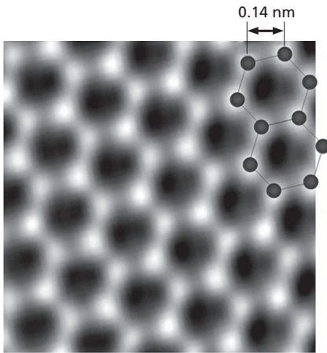

Figure 9–39 The resolution of the electron microscope. This transmission electron micrograph of a monolayer of graphene resolves the individual carbon atoms as bright spots in a hexagonal lattice. Graphene is a single isolated atomic plane of graphite and forms the basis of carbon nanotubes. The distance MBoC7 m9.40/9.39between adjacent bonded carbon atoms is 0.14 nm (1.4 Å). Such resolution can only be obtained in a specially built transmission electron microscope in which all lens aberrations are carefully corrected, and with optimal specimens; it is rarely achieved with most conventional biological specimens. (From A. Dato et al., Chem. Commun. 40:6095–6097, 2009. With permission from the Royal Society of Chemistry.)

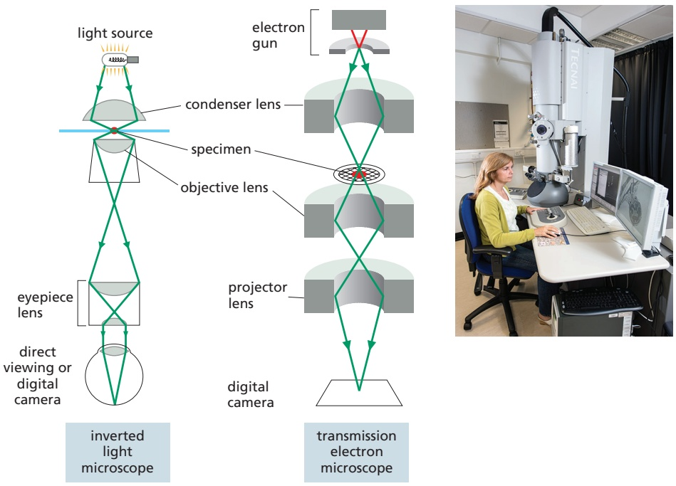

Figure 9–40 The principal features of an inverted light microscope and a transmission electron microscope. These drawings emphasize the similarities of overall design. Whereas the lenses in the light microscope are made of glass, those in the electron microscope are magnetic coils. The electron microscope requires that the specimen be placed in a vacuum. The inset shows a routine transmission electron microscope in use. (Photograph courtesy of Andrew Davis.)

In overall design, the transmission electron microscope (TEM) is similar to an inverted light microscope, albeit much larger (Figure 9–40). The source of illumination is a filament or cathode that emits electrons at the top of a cylindricalMBoC7 m9.41/9.40 column about 2 m high. Because electrons are scattered by collisions with air molecules, air must first be pumped out of the column to create a vacuum. The electrons are then accelerated from the filament by a nearby anode and allowed to pass through a tiny hole to form an electron beam that travels down the column. Magnetic coils placed at intervals along the column focus the electron beam, just as glass lenses focus the light in a light microscope. The specimen is put into the vacuum, through an airlock, into the path of the electron beam. As in light microscopy, the specimen can be stained—in this case, with electron-dense material. Some of the electrons passing through the specimen are scattered by structures stained with the electron-dense material; the remainder are focused to form an image. The image can be observed on a monitor or is typically recorded with a sensitive CMOS electron detector. Because the scattered electrons are lost from the beam, the dense regions of the specimen show up in the image as areas of reduced electron flux, which look dark.

#### Biological Specimens Require Special Preparation for Electron Microscopy

In the early days of its application to biological materials, the electron microscope revealed many previously unimagined structures in cells. But before these discoveries could be made, electron microscopists had to develop new procedures for embedding, cutting, and staining tissues.

Because the specimen is exposed to a very high vacuum in the electron microscope, living tissue is usually killed and preserved by chemical fixation. As electrons have very limited penetrating power, the fixed tissues normally have to be cut into extremely thin sections (25–100 nm thick, about 1/200 the thickness of a single cell) before they are viewed. This is achieved by dehydrating the specimen, permeating it with a monomeric resin that polymerizes to form a solid block of plastic, then cutting the block with a fine glass or diamond knife on a special microtome. The resulting ultrathin sections, free of water and other volatile solvents, are supported on a small metal grid for viewing in the microscope (**Figure 9–41**).

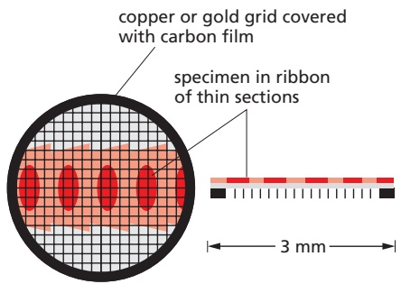

Figure 9–41 Specimen support. The metal grid that supports the thin sections of a specimen in a transmission electron microscope.

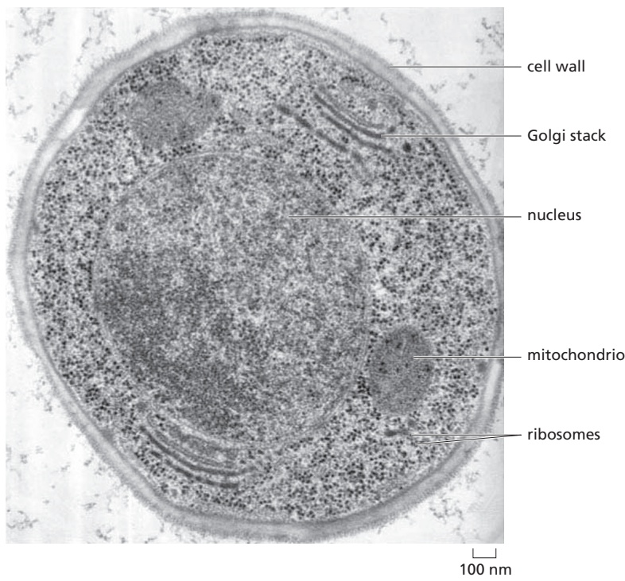

Figure 9–42 Thin section of a cell. This thin section is of a yeast cell that has been very rapidly frozen and the vitreous ice replaced by organic solvents and then by plastic resin (freeze substitution). The nucleus, mitochondria, cell wall, Golgi stacks, and ribosomes can all be readily seen in a state that is presumed to be as lifelike as possible. (Courtesy of Andrew Staehelin.)

The steps required to prepare biological material for electron microscopy are challenging. How can we be sure that the image of the fixed, dehydrated, resinembedded specimen bears any relation to the delicate, aqueous biological system present in the living cell? The best current approaches to this problem depend on rapid freezing. If an aqueous system is cooled fast enough and to a low enough temperature, the water and other components in it do not have time to rearrange themselves or crystallize into ice. Instead, the water is supercooled into a rigid butMBoC7 m9.44/9.42 noncrystalline state—a “glass”—called vitreous ice. This rapid freezing is usually performed by plunging the sample into a coolant such as liquid ethane or by cooling it at very high pressure.

Some rapidly frozen specimens can be examined directly in the electron microscope using a special cooled specimen holder. In other cases, the frozen block can be fractured to reveal interior cell surfaces or the surrounding ice can be sublimed away to expose external surfaces. However, we often want to examine thin sections, and the frozen tissue can be sectioned directly in a cooled microtome. A compromise is to rapidly freeze the tissue, replace the water with organic solvents, embed the tissue in plastic resin, and finally cut sections. This approach, called freeze substitution, stabilizes and preserves the tissue in a condition very close to its original living state (**Figure 9–42**).

Molecules in all kinds of thin sections can be labeled to identify and localize them. We have seen earlier how antibodies can be used in conjunction with fluorescence microscopy to localize specific macromolecules. An analogous method—immunogold electron microscopy—can be used in the electron microscope. The usual procedure is to incubate a thin section first with a specific primary antibody, and then with a secondary antibody to which a colloidal gold particle has been attached. The gold particle is electron-dense and can be seen as a black dot in the electron microscope (**Figure 9–43**). Different antibodies can be conjugated to different-sized gold particles so multiple proteins can be localized in a single sample.

#### Heavy Metals Can Provide Additional Contrast

Although phase contrast can make unstained specimens more visible, image clarity in an electron micrograph usually depends on having a range of electron densities to provide amplitude contrast within the specimen. Electron density in


Figure 9–43 Localizing proteins in electron microscopy. Immunogold electron microscopy is used here to find the specific location of a protein that is targeted to the Golgi apparatus. The protein has been tagged with a genetically encoded fluorescent protein and is localized to the trans-Golgi network. The protein is seen in this thin section using an antibody to the fluorescent protein coupled to 10-nm colloidal gold particles, seen in the electron microscope as black dots. The cell has been frozen under high pressure and freeze substituted before embedding and sectioning. (Courtesy of Charlotta Funaya and M. Teresa Alonso.)

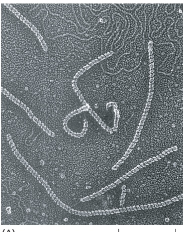

100 nm


(A)

(B)

100 nm

Figure 9–44 Heavy metals provide contrast in the electron microscope. (A) This transmission electron micrograph shows RecA protein together with E. coli DNA adsorbed to flakes of mica, frozen, carefully dried, and then shadowed with evaporated platinum atoms. The RecA protein clearly forms tight, right-handed helices around the bacterial DNA molecules, some of which can be seen free at the top of the image (see also Figure 5–48). (B) In this transmission electron micrograph of actin filaments, negatively stained with uranyl acetate, each filament is about 8 nm in diameter and is seen, on close inspection, to be composed of a helical chain of globular actin molecules (see also Figure 16–8). (A, from J. Heuser, J. Electron Microsc. Tech. 13:244–263, 1989; B, courtesy of Roger Craig.)

turn depends on the atomic number of the atoms that are present: the higher the atomic number, the more electrons are scattered and the darker that part of the image. Biological tissues are composed mainly of atoms of very low atomic number (primarily carbon, oxygen, nitrogen, and hydrogen). To make them more readily visible, tissues are often impregnated (before or after sectioning) with the salts of heavy metals such as uranium, lead, and osmium. The degree of impregnation, or “staining,” with these salts will vary for different cell constituents. Lipids, for example, tend to stain darkly after osmium fixation, revealing the location of cell membranes (see, for example, Figure 12–2 or Figure 12–15).

Alternatively, if isolated molecules are “shadowed” by platinum or other heavy metals evaporated from a heated filament, macromolecules such as DNA or large proteins can be visualized with high contrast in the electron microscope (**Figure 9–44A**). **Negative staining** is a similar approach that also allows fine detail to be seen in isolated molecules or macromolecular machines. In this technique, the molecules are supported on the thin film of carbon on a grid and mixed with a solution of a heavy-metal salt such as uranyl formate or acetate. After the sample has dried, a very thin film of metal salt covers the carbon film everywhere except where it has been excluded by the presence of an adsorbed macromolecule. Because the macromolecule allows electrons to pass through it much more readily than does the surrounding heavy-metal stain, a reverse or negative image of the molecule is created. Negative staining is especially useful for quickly and cheaply viewing large macromolecular aggregates such as viruses or ribosomes and for seeing the subunit structure of protein filaments (**Figure 9–44B**). Shadowing and negative staining can provide high-contrast surface views of small macromolecular assemblies, but the size of the smallest metal particles in the shadow or stain limits the resolution of both techniques to about 2 nm.

#### Images of Surfaces Can Be Obtained by Scanning Electron Microscopy

A **scanning electron microscope (SEM)** directly produces an image of the three-dimensional structure of the surface of a specimen. The SEM is usually smaller, simpler, and cheaper than a transmission electron microscope. Whereas the TEM uses the electrons that have passed through the specimen to form an image, the SEM uses electrons that are scattered or emitted from the specimen’s surface. The specimen to be examined is usually either fixed, dried, and coated with a thin layer of heavy metal or alternatively rapidly frozen and then transferred to a cooled specimen stage for coating and direct examination in the microscope (**Figure 9–45**). The specimen is scanned with a very narrow beam of electrons. The quantity of electrons scattered or emitted as this primary beam bombards each successive point of the metallic surface is measured and builds up an image on a computer screen. Often an entire plant part or small animal can be put into the microscope with very little preparation (**Figure 9–46**).

(B)

1 µm

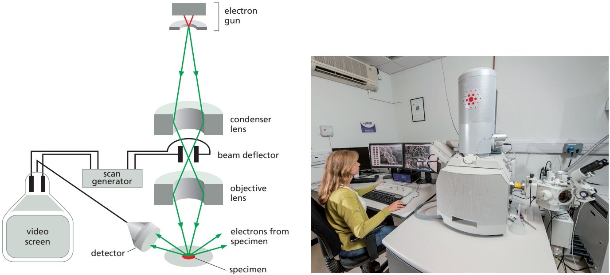

Figure 9–45 The scanning electron microscope. In an SEM, the specimen is scanned by a beam of electrons brought to a focus on the specimen by the electromagnetic coils that act as lenses. The detector measures the quantity of electrons scattered or emitted as the beam bombards each successive point on the surface of the specimen and records the intensity of successive points in an image built up on a screen. The SEM creates striking images of three-dimensional objects with great depth of focus and a resolution between 0.5 nm and 10 nm depending on the kind of instrument. (Photograph courtesy of Andy Davis.)

The SEM technique provides great depth of field, thus objects both near and far in the field of view are imaged sharply. Moreover, because the amount of electron scattering depends on the angle of the surface relative to the beam, the image has highlights and shadows that give it a three-dimensional appearance

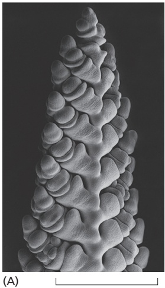

1 mm

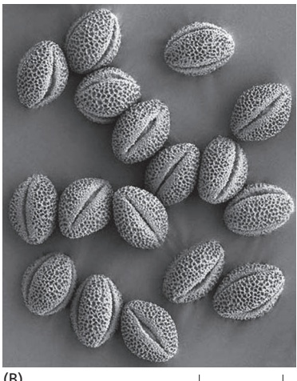

50 µm

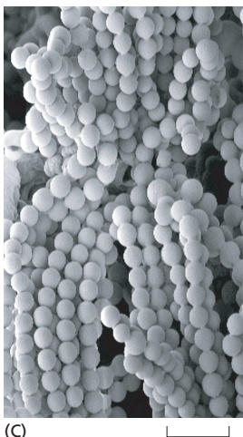

(C)

Figure 9–46 The scanning electron microscope produces surface images with great depth of field. SEM micrographs taken at a wide range of magnifications. (A) A developing wheat flower, or spike. This delicate flower spike was rapidly frozen, coated with a thin metal film, and examined in the frozen state with an SEM. This low-magnification micrograph demonstrates the large depth of focus of an SEM, even with a large specimen like this. (B) These pollen grains from a hellebore flower reveal their sculpted cell walls in the SEM. The shapes and patterns are specific for each species of pollen grain. (C) Chains of bacteria living in the blue veins of a Stilton cheese. (A, B, and C, courtesy of Kim Findlay.)


(A)

50 nm

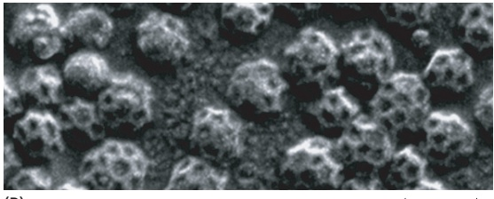

(B)

100 nm

Figure 9–47 Higher-resolution SEM. Macromolecular assemblies, shadowed with a very thin coating of tungsten and imaged in an SEM equipped with a field-emission electron gun. (A) An actin filament showing the helical arrangement of actin monomers. (B) Clathrin-coated vesicles. [A and B, from R. Wepf et al., in Biological Field Emission Scanning Electron Microscopy (R. Fleck and B. Humbel, eds.), pp. 269–298. Hoboken, NJ: Wiley, 2019.]

(see Figure 9–46). Only surface features can be examined, however, and in most forms of SEM, the resolution attainable is not very high (about 10 nm). As a result, the technique is usually used to study whole cells and tissues rather than subcellular organelles (see Movie 21.3). However, very-high-resolution SEMs have been developed with a bright, coherent, field-emission gun as the electron source. As resolution in the SEM depends not on the wavelength of the electron beam but on the size of the electron spot that is scanned across the specimen, this type of SEM can produce images that rival the resolution possible with a negatively stained specimen in a TEM (**Figure 9–47**).

#### Electron Microscope Tomography Allows the Molecular Architecture of Cells to Be Seen in Three Dimensions

The SEM can only provide a surface view of an object, which tells us little about the important three-dimensional relationships between macromolecules and organelles within a living cell. Moreover, thin sections viewed in a TEM also often fail to convey the three-dimensional arrangement of cellular components, and the images can be misleading. It is possible to reconstruct the third dimension from serial sections, but this is a lengthy and tedious process. But even thin sections have a significant depth compared with the resolution of the electron microscope, so the TEM image can also be misleading in an opposite way, through the superimposition of objects that lie at different depths.

Because of the large depth of field of electron microscopes, all the parts of the three-dimensional specimen are in focus, and the resulting image is a projection (a superimposition of layers) of the structure along the viewing direction. The lost information in the third dimension can be recovered if we have views of the same specimen but from many different directions. The computational methods for this technique are widely used in medical CT scans. In a CT scan, the imaging equipment is moved around the patient to generate the different views. In **electron microscope (EM) tomography**, the specimen holder is tilted in the microscope, which achieves the same result. The specimen is usually tilted to a maximum of 60° in every direction, and in this way we can arrive at a three-dimensional reconstruction, in a chosen standard orientation, by combining different views of a single object. Each individual view will be very noisy, but by combining them in three dimensions and taking an average, the noise can be significantly reduced. Thick plastic sections of embedded material have been used to create three-dimensional reconstructions, or tomograms (**Movie 9.2**), of cells, but increasingly microscopists are applying EM tomography to unstained, frozen, hydrated sections, and even to rapidly frozen whole cells or organelles. Individual macromolecular assemblies that

carbon film on EM grid

#### SINGLE-PARTICLE RECONSTRUCTION BY CRYOEM

X-ray crystallography is one way to determine a protein structure. However, large macromolecular machines are often hard to crystallize, as are many integral membrane proteins, and for dynamic proteins and assemblies it is hard to access different conformations through crystallography alone. To get around these problems, investigators are increasingly turning to cryo-electron microscopy (cryoEM) to solve macromolecular structures.

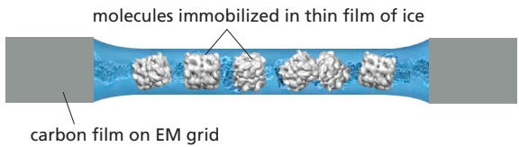

In this technique, a droplet of the pure protein in water is placed on a small EM grid that is plunged into a vat of liquid ethane at −180ºC. This freezes the proteins in a thin film of ice and the rapid freezing ensures that the surrounding water molecules have no time to form ice crystals, which would damage the protein’s shape.


electron detector captures projected image of molecules

The sample is examined, still frozen, by high-voltage transmission electron microscopy. To avoid damage, it is important that only a few electrons pass through each part of the specimen. Sensitive detectors are therefore deployed to capture every electron that passes through the specimen. Much EM specimen preparation and data collection is now fully automated and many thousands of micrographs are typically captured, each of which will contain hundreds or thousands of individual molecules all arranged in random orientations within the ice.

Algorithms then sort the molecules into sets where each set contains molecules that are all oriented in the same direction. The thousands of images in each set are all then superimposed and averaged to improve the signal-to-noise ratio.

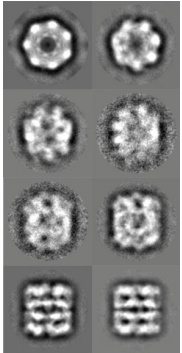


This crisper two-dimensional image set, which represents different views of the particle, are then combined and converted via a series of complex iterative steps into a high-resolution three-dimensional structure.

Model of GroEL (Courtesy of Gabriel Lander.)

#### CRYOEM STRUCTURE OF THE RIBOSOME

Courtesy of Joachim Frank.

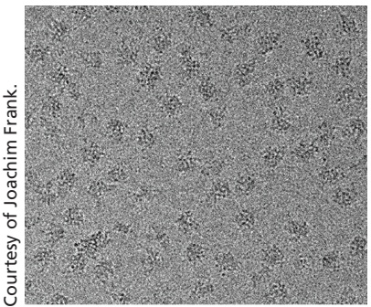

60S ribosomal subunits randomly oriented in a thin film of ice

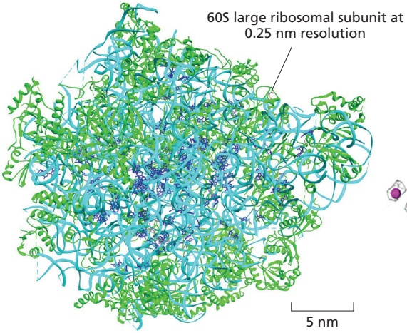

100 nm

Although by no means routine, big improvements in image-processing algorithms, modeling tools and sheer computing power all mean that structures of macromolecular complexes are now becoming attainable with resolutions in the 0.2- to 0.3-nm range.

path of an rRNA loop fitted into the electron-density map


This resolving power now approaches that of x-ray crystallography, and the two techniques thrive together, each bootstrapping the other to obtain ever more useful and dynamic structural information. A good example is the structure of the ribosome shown here at a resolution of 0.25 nm.


appear as multiple copies in the tomogram can be identified, and with a computational process called subtomogram averaging to reduce noise and gain structural information, molecular structures inside cells can now be obtained at a resolution of better than 2 nm (Figure 9–48). Electron microscopy now provides a robust bridge between the scale of the single molecule and that of its cellular environment.

Figure 9–48 EM tomography. The COP1 coat mediates vesicle traffic within the Golgi apparatus and retrograde traffic to the endoplasmic reticulum (ER) (see Figures 13–4 and 13–5). EM tomography has helped visualize the details of COP1 coats in situ on buds and vesicles in rapidly frozen Chlamydomonas cells. (A) One slice through a three-dimensional tomogram of a complete Golgi apparatus. (The tomogram can be seen in Movie 9.2.) (B) Using the information from several such tomograms, a portion of the Golgi is shown here, color coded to show ER dark yellow, the cis vesicles yellow, the four cis cisternae green, the four medial cisternae red, the trans cisterna blue, medial vesicles pink, trans vesicles light blue, and the trans Golgi network purple. Ribosomes can also be seen as small gray blobs. (C) Individual slices through COP1 vesicles in the tomogram; the bottom one is partially uncoated. (D) By identifying and averaging more than 10,000 COP1 subunits on vesicles in the tomograms, a molecular structure was obtained by subtomogram averaging at a resolution of 2 nm. Structures of the various proteins in the COP1 coat have been solved, and they can be fitted neatly into the electron-density envelope of the EM structure. A surface view of a triad of COP1 subunits on the surface of a vesicle is shown here together with the molecular structures (in color) of the individual components that have been fitted into the EM structure. (Adapted from Y.S. Bykov et al., eLife 6:e32493, 2017, doi 10.7554/eLife.32493.)

#### Cryo-electron Microscopy Can Determine Molecular Structures at Atomic Resolution

As we saw earlier (p. 567), noise is important in light microscopy at low light levels, but it is a particularly severe problem for electron microscopy of unstained macromolecules. A protein molecule can tolerate a dose of only a few hundreds of electrons per square nanometer without damage, and this dose is orders of magnitude below what is needed to define an image at atomic resolution.

The solution is to obtain images of many identical molecules—perhaps hundreds of thousands of images of individual particles—and combine them to produce an averaged image, revealing structural details that are hidden by the noise in the original images. This procedure is called **single-particle reconstruction** (**Panel 9–1**). Before combining all the individual images, however, they must be aligned with each other. With the help of a computer, the digital images of randomly distributed and unaligned molecules can be processed and combined to yield high-resolution reconstructions (see Movie 13.1). Although structures that have some intrinsic symmetry, such as dimers or helical repeats, are somewhat easier to solve (**Figure 9–49**), this technique has also been used for huge macromolecular machines, such as ribosomes, that have no symmetry (see Panel 9–1).

Cryo-electron microscopy (cryoEM) depends crucially on very rapidly freezing the aqueous specimen to form vitreous ice, which does not allow ice crystals to form and therefore does not damage the specimen. A very thin (about 100 nm) film of an aqueous suspension of purified macromolecular complex is prepared on a microscope grid and is then rapidly frozen by being plunged into a coolant. A special sample holder keeps this hydrated specimen at –160°C in the vacuum of the microscope, where it can be viewed directly without fixation, staining, or drying. Unlike negative staining, in which what we see is the envelope of stain exclusion around the particle, cryoEM produces an image from the macromolecular structure itself. The specialized transmission electron microscopes required operate with much higher electron accelerating voltages than that of a routine TEM and typically run at 300,000 V. However, as very low electron doses are used to obtain cryoEM images, the intrinsic contrast in the images produced is very low, and to extract the maximum amount of structural information, special image-processing techniques must be used. Huge advances in direct electron detectors and faster, more efficient image-processing techniques that involve image alignment routines, motion correction, and contrast transfer function corrections mean that the structures of molecules as small as 100 kilodaltons can now be solved. The smaller the molecule, the noisier the image, and the main advantages of the method are best seen with large and sometimes flexible macromolecular complexes such as viruses, ribosomes, and large integral membrane proteins that are hard to crystallize (**Figure 9–50**).


Figure 9–49 CryoEM structure of microtubules. This cryoEM reconstruction of the structure of a microtubule was helped by the intrinsic symmetry of the microtubule itself (see Figure 16–37). This detailed model of the whole microtubule has allowed an examination of the way in which the protofilaments interact and the way in which the whole lattice and associated proteins are assembled. (A) CryoEM image of two intact microtubules embedded in vitreous ice. (B) A reconstruction of the surface lattice of a single microtubule at a resolution of 0.35 nm (3.5 Å). (C) The detailed electron-density map of the tubulin dimer extracted from the structure of the intact microtubule. α-Tubulin is darker green, and β-tubulin is lighter green. (From E. Nogales, Mol. Biol. MBoC7 n9.135/9.49Cell 27:3202–3204, 2016, doi 10.1091/mbc.E16-06-0372. With permission from Elsevier.)

A remarkable resolution of 0.12 nm (1.2 Å) has been achieved in a particularly stable protein by cryoEM, enough to see clearly the detailed atomic structure and to rival x-ray crystallography in resolution (**Figure 9–51**). Electron microscopy, however, also has some very clear additional advantages over x-ray crystallography (discussed in Chapter 8) as a method for macromolecular structure determination. First, it does not require crystalline specimens. Second, it can deal with extremely large complexes—structures that may be too large or too variable to crystallize satisfactorily; for example, membrane proteins. Third, it allows the rapid analysis of different conformations of protein machines; for example, the different states of the F<sub>1</sub> ATPase proton pump shown in Figure 14–31. Fourth, the glycosylation patterns and mobile loops on the surface of proteins, which are often impossible to see in x-ray structures, are more readily resolved in cryoEM structures. And fifth, only a minute amount of sample is required compared with that needed to make crystals.

The analysis of large and complex macromolecular structures is helped considerably if the atomic structure of one or more of the subunits is known, for


(B)

<small><span class="docvortex-page-footnote" data-block-type="page_footnote" style="color:#6b7280">Figure 9–50 The spike protein on the SARS-CoV-2 virus. The SARS-CoV-2 virus was responsible for the COVID-19 pandemic. Protruding from the viral membrane are many trimeric spike proteins that mediate binding of the virus to a receptor on cells in our respiratory tract and its subsequent entry into the cell. The trimeric spike protein is a target both of our immune system and of vaccine developers. The closed conformation of the trimeric spike protein shown here, both from the top (A) and from the side (B), was obtained from rapidly frozen intact virus particles. Spike proteins were identified by computer from multiple tilted images of the viruses and subtomogram averaging applied to them. The final electron-density map was determined to a resolution of 0.35 nm, good enough for the molecular model (shown here) to be accurately fitted within its envelope, although the details of the membrane-spanning portion of the trimeric spike protein are not revealed. The proteins are heavily N-glycosylated, and these surface glycans are shown in green, while the three spike proteins are shown in dark green, light blue, and light brown. (PDB code: 6ZWV.)</span></small>


example from x-ray crystallography (Figure 9–52). Molecular models can then be mathematically “fitted” or docked into the envelope of the structure determined at lower resolution using the electron microscope. X-ray and cryoEM approaches often combine profitably together to determine molecular structures.

#### Light Microscopy and Electron Microscopy Are Mutually BeneficialMBoC7 n9.133/9.51

The interior of the cell is a confusing place, with molecules crowded together in the cytosol and intricate and complex membrane-bounded compartments. To discover which molecules are located exactly where and in which tiny vesicles or subcompartments of the cell is not straightforward, even with the genetically encoded labels that can target almost any protein. We have seen that superresolution light microscopy can be used to very accurately locate specific molecules within a cell. A major disadvantage, however, of all fluorescence imaging techniques is that it is only the tagged molecules that are imaged—their cellular context remains invisible. When fluorescence imaging is combined, however, with looking at the same specimen in the electron microscope, this correlative light microscopy and electron microscopy technique, or CLEM, can allow specific target molecules to be examined in their full cellular context. Although this can be achieved using fixed and sectioned material, most such approaches now use rapidly frozen material to co-localize target molecules both in the light and in the


Figure 9–51 Atomic resolution by cryoEM. Apoferritin is a cytosolic protein, present in almost all living organisms, that reversibly stores iron in a nontoxic form. It is a large (474 kilodaltons) and particularly stable molecule. Its hollow globular cage has 24 symmetrical subunits, which means that a structure can be determined with relatively few particles. (A) Cryo-electron micrograph of cage-like apoferritin particles. (B) By use of every possible new technical advance in single-particle reconstruction, the complete cryoEM structure shown here is at the remarkable resolution of 0.12 nm (1.2 Å). (C) When the known amino acid sequence is modeled into the electrondensity map, clear electron densities can be seen associated with hydrogen atoms in the three amino acid side chains. The molecular model is fitted into the final electron-density envelope that is shown as a gray cage. (A, from T. Nakane et al., Nature 587:152–156, 2020, doi 10.1038/s41586-020-2829-0; B, EMD-11668; C, adapted from K.M. Yip et al., Nature 587:157–161, 2020. With permission from Nature.)

#### Figure 9–52 PRC2, a large

macromolecular machine. Polycomb repressive complex 2 (PRC2) is a large protein complex involved in establishing heterochromatin and the epigenetic regulation of gene expression (see Figure 4–40). PRC2 interacts with a nucleosome through the binding of the nucleosomal DNA by one of its subunits, EZH2, which also engages the extended tail of histone H3 to direct its lysine 27 (K27) to the active site for methylation. The density map of PRC2 and two essential cofactors bound to a single nucleosome was produced by single-particle cryoelectron microscopy reconstruction at a resolution of 0.35 nm. The long arm of histone H3 is shown in more detail with the protein backbone modeled into the density map. (Courtesy of Vignesh Kasinath and Eva Nogales and based on EMDB-21707. From V. Kasinath et al., Science 371:eabc3393, 2021. With permission from AAAS.)


electron microscope, and of these two general approaches are common. The first is to freeze the cell or tissue, locate the positions of the target molecule with fluorescence light microscopy, and then, after transferring the frozen specimen to an electron microscope, tilting it, using EM tomography to find the exact point in theMBoC7 n9.139/9.53 tomogram that corresponds to the fluorescent signal (**Figure 9–53**).

A second approach, and a demanding one too, is again to rapidly freeze the cell and locate fluorescent molecules at high resolution by single-molecule localization microscopy. The frozen cell is then transferred to a modified SEM that incorporates a separate focused ion beam, usually of gallium ions, that can be scanned across the frozen block face like a miniature milling machine, removing about 10 nm of the sample at a time. The SEM records a two-dimensional image of the scattered electrons from the surface of the block face at each step, and a three-dimensional image of the cell is gradually built up that can be correlated with the original localization data, all with a final resolution of about 5 nm (**Figure 9–54**). The technique is called focused ion beam–scanning electron microscopy, or FIB–SEM for short. The same technique, but without the fluorescent labels, can be used on much larger specimens that have been conventionally fixed, stained with heavy-metal salts, and embedded in plastic. Although the structural preservation may not be so good as with frozen specimens, the approach, although very time consuming, is proving useful in analyzing complex cellular interactions; for example, in mapping the neural connections in brain tissue (see Movie 9.1).

#### Using Microscopy to Study Cells Always Involves Trade-Offs

The history of cell biology has been tightly interlinked with that of microscopy. What we now know about the structure and function of cells has depended crucially on being able to image cells, organelles, and the molecules they contain—seeing is indeed believing. But for the young biologist today, there is, as we have seen, a bewildering variety of imaging technologies from which to choose, and knowing which is best suited to solve the problem at hand is not easy. All imaging approaches have trade-offs to consider. At an obvious level, the dynamics of cells are only accessible with certain kinds of light microscopies and with living cells. If higher resolution is required, with either electron microscopes or light microscopes, then that comes with increasing cost and complexity. Single-molecule localization microscopy also requires elaborate hardware and also takes many minutes to acquire each image. The cryoEM-derived structures of large protein complexes require the use of high-voltage machines that cost many millions of dollars. Such resources are usually confined to large centralized microscopy facilities that can be shared by many users. The precise localization of molecules within the cell requires the use of fluorescent labels, but, because only the labels themselves can be detected in a fluorescence microscope, the cellular

Figure 9–53 Correlated light and electron microscopy (CLEM). The correct folding of proteins in the endoplasmic reticulum (ER) is sensed by a major transmembrane protein called IRE1 (see Figures 12–36 and 12–37). If IRE1 is activated, it forms oligomers that are visible in fluorescence microscopy as bright foci. Here, stressed cells, expressing fluorescent IRE1 and growing on an EM grid, are rapidly frozen and subsequently imaged by EM tomography. The resulting tomograms can be directly correlated with the light micrographs. (A) A fluorescent spot of labeled IRE1 is shown here precisely superimposed on a slice through its corresponding EM tomogram that contains a network of ER. (B) Another slice through the tomogram at a different level shows IRE1 is localized as aggregates in a complex network of specialized, narrow ER tubules. (C) The outlines of the ER membranes in each slice of the tomogram are manually defined (in a process called segmentation), and the drawing here shows that the oligomers of IRE1 are concentrated in this convoluted network of specialized ER tubules. (A, B, and C, adapted from S.D. Carter et al., 2021, doi 10.1101/2021.02.24.432779.)


Figure 9–54 Focused ion beam–scanning electron microscopy (FIB–SEM). Superresolution light microscopy is combined here with three-dimensional electron microscopy of rapidly frozen cells to enable the high-resolution localization of target molecules throughout the entire volume of a cell. Sequential slices through the frozen cell are obtained by steadily milling the surface of the frozen block face with a focused ion beam, while images of the surface are collected at each step in an SEM. This particular cell has been labeled with fluorescent markers for the lumen of the endoplasmic reticulum (green) and for the outer membrane of mitochondria (magenta). (A) Three orthogonal slices through the cell show the combined electron microscope and fluorescence light microscope images. (B) A small region of the same cell imaged with a structured illumination microscope (SIM) is used to define mitochondrion and ER. (C) The corresponding block face image in the SEM. (D) The correlated electron microscope and light microscope images identify the position of the fluorescent labels in the electron micrograph. (E, F, and G) Because the three-dimensional SEM data set is of the entire cell, different views of the same area can be readily obtained. Here, the three corresponding vertical sections along the yellow dotted lines on the images above are shown. (From D.P. Hoffman et al., Science 367:265–277, 2020. With permission from AAAS.)

(B)

(E)


(C)

(F)


(D)


200 nm

context is sacrificed. Imaging itself involves several trade-offs to be considered. An improvement in any one parameter—image contrast, resolution, signal-to-noise ratio, specimen damage by photons or electrons, the depth of specimen that can be imaged, or the speed of image recording—will inevitably require a sacrifice in one or more of the others, and understanding these trade-offs will help determine which approach is best for the cell biology problem being tackled.

#### Summary

Discovering the detailed structure of cells and their molecules requires the higher resolution attainable in a transmission electron microscope. Three-dimensional views of the surfaces of cells and tissues are obtained by scanning electron microscopy. Specific macromolecules can be localized by combining electron microscopy with fluorescence light microscopy. EM tomography enables three-dimensional information about cellular architecture to be obtained. The shapes of isolated molecules can be roughly determined by electron microscopy techniques involving negative staining or heavy-metal shadowing, but detailed molecular structures require cryoEM and single-particle reconstruction using computational manipulations of data obtained from multiple images and multiple viewing angles to produce detailed reconstructions of macromolecules and molecular complexes. The resolution obtained with these methods means that atomic structures of individual macromolecules can be “fitted” to the images derived by electron microscopy. CryoEM can often determine the structures of molecules that are inaccessible to x-ray crystallography.


<!-- END EN EN09-H013-H034 -->

---

## 第2章 细胞生物学研究方法 · 第二节 细胞及其组分的分析方法

[返回本章](README.md) · [中文本章原文](中文原文.md)

<!-- BEGIN CN CN02-S02 -->
## 第二节 细胞及其组分的分析方法

形态学观察与细胞组分分析相结合是当代细胞生物学研究中常常采用的实验方法。它为揭示生物大分子在细胞内的空间定位、相互关系及其功能的研究提供了有力的工具。

## 一、用超离心技术分离细胞组分

用低渗匀浆、超声破碎或研磨等方法可使细胞质膜破损，形成细胞核、线粒体、叶绿体、内质网、高尔基体、溶酶体等细胞器和细胞组分组成的混合匀浆，再通过差速离心，即利用不同的离心速度所产生的不同离心力，将各种质量和密度不同的亚细胞组分和各种颗粒分开（图2-22）。

密度梯度离心是将要分离的细胞组分小心地铺放在含有密度逐渐增加的、高溶解性的惰性物质（如蔗糖）形成的密度梯度溶液表面，通过重力或离心力的作用使样品中不同组分以不同的沉降率沉降，形成不同的沉降带。各组分的沉降率与它们的形状和大小有关，通常以沉降系数（S值）表示。超速离心机可达转数 $10^{5}/min$ ，产生60万倍重力场。在这巨大离心力的作用下，甚至相当小的tRNA（沉降系数4S）和单一的酶都可根据其沉降系数相互分离开。密度梯度离心又可分为速度沉降和等密度沉降两种。常用的介质有蔗糖和氯化铯等。

速度沉降主要是用于分离密度相近而大小不一的细胞组分。离心前，将要分离的细胞匀浆物放置在蔗糖浓度梯度（通常质量分数范围为5%—40%）溶液的上层，各种细胞组分根据它们的大小以不同的速度沉降，形成不同的沉降带（图2-23），然后分别收集不同的沉降带中的组分，用于分析。

等密度沉降用于分离不同密度的细胞组分。细胞组分在连续梯度的高密度介质中经离心力场长时间的作用沉降或漂浮到与自身密度相等的位置，形成不同的密度区带。这种方法非常灵敏，甚至可以将掺入重同位素如 ${}^{14}C$ 或 ${}^{15}N$ 的生物大分子和未标记物分开。1957 年，M. Meselson 和 F. Stahl 利用 ${}^{15}N$ 标记大肠杆菌 DNA，并用氯化铯等密度沉降法直接证明了 DNA 的半保留复制。

  
图 2-22 用差速离心法分离细胞匀浆中的各种细胞组分  
图中显示，随着离心力（g）大小和离心时间的不同，各种细胞组分沉淀在不同的离心管底部。

  
图 2-23 用密度梯度离心分离细胞组分示意图

## 二、特异蛋白抗原的定位与定性

20世纪70年代以来，免疫学的迅速发展为细胞生物学的研究提供了强有力的手段，特别是在细胞内特异蛋白的定位与定性方面，单克隆抗体与其他一些检测手段相结合发挥了重要作用。免疫荧光与免疫电镜是最常见的研究细胞内蛋白质分子定位的定位，而对蛋白质组分进行体外分析定性通常则采用免疫迹（Western blotting）。放射免疫沉淀（radioimmuno-precipitation）和蛋白质芯片、质谱分析等技术，这里不再一一介绍。

## （一）免疫荧光技术

前面已经介绍了荧光显微镜技术，其中也提到免疫荧光技术。所谓免疫荧光技术就是将免疫学方法（抗原－抗体特异结合）与荧光标记技术相结合用于研究特异蛋白抗原在细胞内分布的方法，它包括直接和间接免疫荧光技术两种（图2-24）。实验步骤主要包括荧光抗体的制备、标本的处理、免疫染色和观察记录等过程。

  
图2-24 直接免疫荧光标记与间接免疫荧光标记技术

A. 直接免疫荧光标记技术：将荧光分子与抗体偶联后直接用于免疫标记技术。B. 间接免疫标记技术：先将抗体（称第一抗体）与抗原反应，然后加入与荧光分子相偶联的抗第一抗体的抗体（称第二抗体）。

标本处理有多种方法，组织切片、冷冻切片、整装细胞都可应用，其宗旨只有一个，即要尽量完好地保持被检测蛋白质的抗原性；免疫染色就是抗原-抗体反应的过程，这里要注意设立各种实验对照以保证结果的可靠性。除免疫荧光技术外，还可用免疫酶标记技术，即以酶（如辣根过氧化物酶）代替荧光素与抗体偶联，因此可在普通显微镜下观察。近年来，激光扫描共焦显微镜的应用使免疫荧光技术在细胞生物学研究中发挥了越来越大的作用。

## （二）免疫电镜技术

免疫荧光技术快速、灵敏、特异性强，但其分辨率有限。免疫电镜技术则能有效地提高样品的分辨率，在超微结构水平上研究特异蛋白抗原的定位。

免疫电镜技术可分为免疫铁蛋白技术、免疫酶标技术与免疫胶体金技术，其主要区别是与抗体结合的标志物不同，这在一定程度上也反映了免疫电镜技术的发展过程。目前，免疫铁蛋白技术几乎已无人问津，而免疫胶体金技术则受到越来越多的青睐。胶体金本身具有许多优点，如：在电镜下金颗粒容易识别，并可以制成5 nm、10 nm或20 nm等不同直径的金颗粒，用以双重标记或多重标记。

免疫电镜技术的样品制备程序与免疫荧光技术类似（图2-25），包括样品的固定、包埋、超薄切片制备、免疫标记和染色等步骤。其技术关键是在样品制备过程

  
图2-25 免疫胶体金电镜技术的基本原理与应用

A. 免疫胶体金标记技术原理的示意图：细菌蛋白 A 可与胶体金结合，也可以与抗体（如 IgG）的 Fc 端特异结合。B. 免疫胶体金标记显示膀胱上皮细胞中特异的膜蛋白的分布（箭头所指）。(B 图由梁凤霞博士和丁明孝提供)

中既要保持样品中蛋白的抗原性，又要尽量保存样品的精细结构。免疫电镜技术至今已得到广泛应用。

## 三、细胞内特异核酸的定位与定性

细胞内特异核酸（DNA或RNA）的定性与定位的研究，通常采用原位杂交（in situ hybridization）技术。用标记的核酸探针通过分子杂交确定特异核苷酸序列在染色体上或在细胞中的位置的方法称为原位杂交。

原位杂交技术首先是在光镜水平上发展起来的，放射性同位素标记的探针与样品中的DNA或RNA杂交后，用显微放射自显影的方法显示杂交物的存在部位；或用荧光素标记的探针进行杂交，在荧光显微镜下直接显示细胞中与探针杂交的特异核酸。近年来，以生物素等生物小分子代替同位素或荧光素标记探针，使原位杂交技术得到了更为广泛的应用发展。电镜原位杂交技术可将特异序列核苷酸的定位与细胞的超微结构结合起来，其基本原理与光镜原位杂交类似，只是探针标记物不同，杂交反应的检测常常是通过与抗生物素抗体相连的胶体金颗粒显示出来的。

原位杂交技术在显微与亚显微水平上研究基因定位、特异mRNA表达等问题的研究中具有重要作用（图2-26）。

## 四、细胞成分的分析与细胞分选技术

流式细胞术（flow cytometry）可定量地测定某一细胞中的 DNA、RNA 或某一特异的标记蛋白的含量，以及细胞群体中上述成分含量不同的细胞的数量，它还可将某一特异染色的细胞从数以万计的细胞群体中分离出来，以及将 DNA 含量不同的中期染色体分离出来，甚至可用于细胞的分选。

  
图2-26 用原位杂交技术显示Z13基因在受精后1天的斑马鱼胚胎的体节、眼和松果体中的表达（箭头所指）。（张博博士惠赠）

细胞群体一般需要分散后对待测的某种成分进行特异的荧光染色，然后使悬液中的细胞一个个快速通过流式细胞仪（每秒可达几万个细胞）。当含有单个细胞的液滴通过激光束时，带有不同荧光的细胞所在的液滴被充上正电荷、负电荷，或不被充电，同时检测器可测出并记录每个细胞中的待测成分的含量。因带有不同表面标志的细胞所带的电荷的种类不同，当液滴通过高压偏转板时，带不同电荷的液滴发生偏转，从而达到将细胞分选的目的（图2-27）。如果染色过程不影响细胞活性，那么分离出来的细胞还可以继续培养。


<!-- END CN CN02-S02 -->

---

## 对应英文内容

<a id="EN08-H007-H021"></a>

### 英文补充：细胞分级、蛋白质纯化与生化分析

> 对应中文板块：细胞分级、蛋白质纯化与生化分析。英文来源：Molecular Biology of the Cell，第7版，第8章；[本章完整原文](../来源/英文教材/08_Analyzing_Cells_Molecules_and_Systems/chapter.md)。物理PDF页码范围：514–601（整章范围）。

<!-- BEGIN EN EN08-H007-H021 -->
#### PURIFYING PROTEINS

The challenge of isolating a single type of protein from the thousands of other proteins in a cell is formidable but must be overcome to study protein function in vitro. As we shall see later in this chapter, recombinant DNA technology can enormously simplify this task by engineering cells to produce large quantities of a given protein, thereby making its purification much easier. Whether the source of the protein is an engineered cell or a natural tissue, a purification procedure usually starts with subcellular fractionation to reduce the complexity of the material and is then followed by purification steps of increasing specificity.

#### Cells Can Be Separated into Their Component Fractions

To purify a protein, it must first be extracted from inside the cell. Cells can be broken up in various ways: they can be subjected to osmotic shock or ultrasonic vibration, forced through a small orifice, or ground up in a blender. These procedures break many of the membranes of the cell (including the plasma membrane and endoplasmic reticulum) into fragments that immediately reseal to form small closed vesicles. If carefully carried out, however, the disruption procedures leave organelles such as nuclei, mitochondria, the Golgi apparatus, lysosomes, and peroxisomes largely intact. The suspension of cells is thereby reduced to a thick slurry (called a homogenate or extract) that contains a variety of membraneenclosed organelles, each with a distinctive size and density. Provided that the homogenization medium has been carefully chosen (by trial and error for each organelle), the various components—including the vesicles derived from the endoplasmic reticulum, called microsomes—retain most of their original biochemical properties.

The different components of the homogenate must then be separated. Such cell fractionations became possible only after the commercial development in the early 1940s of an instrument known as the preparative ultracentrifuge, which rotates extracts of broken cells at high speeds (**Figure 8–4**). This treatment separates cell components by size and density: in general, the largest objects experience the largest centrifugal force and move the most rapidly. At relatively low speed, large components such as nuclei sediment to form a pellet at the bottom of the centrifuge tube; at slightly higher speed, a pellet of mitochondria is deposited; and at even higher speeds and with longer periods of centrifugation, first vesicles and then ribosomes can be collected (**Figure 8–5**). All of these fractions are impure, but many of the contaminants can be removed by resuspending the pellet and repeating the centrifugation procedure several times.

Centrifugation is the first step in most fractionations, but it separates only components that differ greatly in size. A finer degree of separation can be achieved by

cell homogenate

(A)


Figure 8–4 The preparative ultracentrifuge. (A) The sample is contained in tubes that are inserted into a ring of angled cylindrical holes in a metal rotor. Rapid rotation of the rotor generates enormous centrifugal forces, which cause particles in the sample to sediment against the bottom sides of the sample tubes, as shown here. The vacuum reduces friction, preventing heating of the rotor and allowing the refrigeration system to maintain the sample at 4°C. (B) Some fractionation methods require a different type of rotor called a swinging-bucket rotor. In this case, the sample tubes are placed in metal tubes on hinges that allow the tubes to swing outward when the rotor spins. Sample tubes are therefore horizontal during spinning, and samples are sedimented toward MBoC7 m8.05/8.04the bottom, not the sides, of the tube, providing better separation of differently sized components (see Figures 8–5 and 8–6).

layering the homogenate in a thin band on top of a salt solution that fills a centrifuge tube. When centrifuged, the various components in the mixture move as a series of distinct bands through the solution, each at a different rate, in a process called velocity sedimentation (**Figure 8-6A**). For the procedure to work effectively, the bands must be protected from convective mixing, which would normally occur whenever a denser solution (for example, one containing organelles) finds itself on top of a lighter one (the salt solution). This is achieved by augmenting the solution in the tube with a shallow gradient of sucrose prepared by a special mixing device. The resulting density gradient—with the dense end at the bottom of the tube—keeps each region of the solution denser than any solution above it, and it thereby prevents convective mixing from distorting the separation.

When sedimented through sucrose gradients, different cell components separate into distinct bands that can be collected individually. The relative rate at which each component sediments depends primarily on its size and shape— normally being described in terms of its sedimentation coefficient, or S value. Present-day ultracentrifuges rotate at speeds of up to 80,000 rpm and produce forces as high as 500,000 times gravity. These enormous forces drive even small macromolecules, such as tRNA molecules and simple enzymes, to sediment at an appreciable rate and allow them to be separated from one another by size.

Figure 8–5 Cell fractionation by centrifugation. Repeated centrifugation at progressively higher speeds will fractionate homogenates of cells into their components. In general, the smaller the subcellular component, the greater the centrifugal force required to sediment it. Typical values for the various centrifugation steps referred to in the figure are: low speed: 1000 times gravity for 10 minutes medium speed: 20,000 times gravity for 20 minutes high speed: 80,000 times gravity for 1 hour very high speed: 150,000 times gravity for 3 hours


The ultracentrifuge is also used to separate cell components on the basis of their buoyant density, independently of their size and shape. In this case, the sample is sedimented through a steep density gradient that contains a very high concentration of sucrose or cesium chloride. Each cell component begins to move down the gradient as in Figure 8–6A, but it eventually reaches a position where the density of the solution is equal to its own density. At this point, the component

pellet contains whole cells nuclei cytoskeletons

SUPERNATANT SUBJECTED TO MEDIUM-SPEED CENTRIFUGATION


pellet contains mitochondria lysosomes peroxisomes

SUPERNATANT SUBJECTED TO HIGH-SPEED CENTRIFUGATION


pellet contains microsomes small vesicles

SUPERNATANT SUBJECTED TO VERY-HIGH-SPEED CENTRIFUGATION


pellet contains ribosomes viruses large macromolecules

(A)

(B)


Figure 8–6 Comparison of velocity sedimentation and equilibrium sedimentation. (A) In velocity sedimentation, subcellular components sediment at different speeds according to their size and shape when layered over a solution containing sucrose. To stabilize the sedimenting bands against convective mixing caused by small differences in temperature or solute concentration, the tube contains a continuous shallow gradient of sucrose, which increases in concentration toward the bottom of the tube (typically from 5 to 20% sucrose). After centrifugation, the different components can be collected individually, most simply by puncturing the plastic centrifuge tube with a needle and collecting drops from the bottom, as illustrated here. (B) In equilibrium sedimentation, subcellular components move up or down when centrifuged in a gradient until they reach a position where their density matches that of their surroundings. Although a sucrose gradient is shown here, denser gradients, which are especially useful for protein and nucleic acid separation, can be formed from cesium chloride. The final bands, at equilibrium, can be collected as in A.

floats and can move no farther. A series of distinct bands is thereby produced in the centrifuge tube, with the bands closest to the bottom of the tube containing the components of highest buoyant density (**Figure 8–6B**). This method, called equilibrium sedimentation, is so sensitive that it can separate macromolecules that have incorporated heavy isotopes, such as $^ { 1 3 } \mathrm { C }$ or $\dot { 1 5 } _ { \mathrm { N } }$ , from the same macromolecules that contain the lighter, common isotopes $\mathrm { ( ^ { 1 2 } C ~ o r ~ ^ { 1 4 } N ) }$ . In fact, the cesium-chloride method was developed in 1957 to separate the labeled from the unlabeled DNA produced after exposure of a growing population of bacteria to nucleotide precursors containing $^ { 1 5 } \mathrm { N } ;$ this classic experiment provided direct evidence for the semiconservative replication of DNA (see Figure 5–5).

#### Cell Extracts Provide Accessible Systems to Study Cell Functions

Studies of organelles and other large subcellular components isolated in the ultracentrifuge have contributed enormously to our understanding of the functions of different cell components. Experiments on mitochondria and chloroplasts purified by centrifugation, for example, demonstrated the central function of these organelles in converting energy into forms that the cell can use. Similarly, resealed vesicles formed from fragments of rough and smooth endoplasmic reticulum (microsomes) have been separated from each other and analyzed as functional models of these compartments of the intact cell.

Similarly, highly concentrated cell extracts, especially undiluted cytoplasm from Xenopus laevis (African clawed frog) oocytes and fertilized eggs, have played a critical role in the study of such complex and highly organized processes as the cell-division cycle, the assembly and function of the mitotic spindle (**Figure 8–7**), and the vesicular-transport steps involved in the movement of proteins through the secretory pathway.


Figure 8–7 The formation of subcellular structures in a cytoplasmic extract. Concentrated cytoplasm was prepared from unfertilized eggs of the frog Xenopus laevis. After addition of Xenopus sperm chromosomes, these extracts were stimulated to progress through the cell cycle. (A) In an interphase extract, a nuclear envelope (green) forms around the sperm chromosomes (pink). (B) In a metaphase extract, the nuclear envelope breaks down and the microtubules (green) form a mitotic spindle that is attached to the condensed chromosomes (pink). [B, T. Maresca et al., J Cell Biol. 169(6):859–69, 2005, doi 10.1083/jcb.200503031. With permission from Rockefeller University Press.]

Cell extracts also provide, in principle, the starting material for the complete separation of all of the individual macromolecular components of the cell. We now consider how this separation is achieved, focusing on proteins.

#### Proteins Can Be Separated by Chromatography

Proteins are most often fractionated by **column chromatography**, in which a mixture of proteins in solution is passed through a column containing a porous gel matrix. Different proteins are retarded to different extents by their interaction with the matrix, and they can be collected separately as they flow out of the bottom of the column (**Figure 8–8**). Depending on the choice of matrix, proteins can be separated according to their charge (ion-exchange chromatography), their hydrophobicity (hydrophobic chromatography), their size (gel-filtration chromatography), or their ability to bind to particular small molecules or to other macromolecules (affinity chromatography).

COLUMN CHROMATOGRAPHY


Figure 8–8 The separation of molecules by column chromatography. The sample, a solution containing a mixture of different molecules, is applied to the top of a cylindrical glass or plastic column filled with a permeable gel matrix, such as cellulose. A large amount of solvent is then passed slowly through the column and collected in separate tubes as it emerges from the bottom. Because various components of the sample travel at different rates through the column, they are fractionated into different tubes.


Figure 8–9 Three types of matrices used for chromatography. (A) In ion-exchange chromatography, the insoluble matrix carries ionic charges that retard the movement of molecules of opposite charge. Matrices used for separating proteins include diethylaminoethylcellulose (DEAE-cellulose), which is positively charged, and carboxymethylcellulose (CM-cellulose) and phosphocellulose, which are negatively charged. Analogous matrices based on agarose or other polymers are also frequently used. The strength of the association between the dissolved molecules and the ion-exchange matrix depends on both the ionic strength and the pH of the solution that is passing down the column, which may therefore be varied systematically (as in Figure 8–10) to achieve an effective separation. (B) In gel-filtration chromatography, the small beads that form the matrix are inert but porous. Molecules that are small enough to penetrate into the matrix beads are thereby delayed and travel more slowly through the column than do larger molecules that cannot penetrate. Beads of cross-linked polysaccharide (dextran, MBoC7 m8.09/8.09agarose, or acrylamide) are available commercially in a wide range of pore sizes, making them suitable for the fractionation of molecules of various masses, from less than 500 daltons to more than $5 \times 1 0 ^ { 6 }$ daltons. (C) Affinity chromatography uses an insoluble matrix that is covalently linked to a specific ligand, such as an antibody molecule or an enzyme substrate, that will bind a specific protein. Enzyme molecules that bind to immobilized substrates on such columns can be eluted with a concentrated solution of the free form of the substrate molecule, while molecules that bind to immobilized antibodies can be eluted by dissociating the antibody–antigen complex with concentrated salt solutions or solutions of high or low pH. High degrees of purification can be achieved in a single pass through an affinity column.

Many types of matrices are available. Ion-exchange columns (**Figure 8–9A**) are packed with small beads that carry either a positive or a negative charge, so that proteins are fractionated according to the arrangement of charges on their surface. Hydrophobic columns are packed with beads from which hydrophobic side chains protrude, selectively retarding proteins with exposed hydrophobic regions. Gel-filtration columns (**Figure 8–9B**), which separate proteins according to their size, are packed with tiny porous beads: molecules that are small enough to enter the pores linger inside successive beads as they pass down the column, while larger molecules remain in the solution flowing between the beads and therefore move more rapidly, emerging from the column first. Besides providing a means of separating molecules, gel-filtration chromatography is a convenient way to estimate their size.

Affinity chromatography (**Figure 8–9C**) takes advantage of the biologically important binding interactions that occur on protein surfaces. If a substrate molecule is covalently coupled to an inert matrix such as a polysaccharide bead, the enzyme that operates on that substrate will often be specifically retained by the matrix and can then be eluted (washed out) in nearly pure form. Likewise, short DNA oligonucleotides of a specifically designed sequence can be immobilized in this way and used to purify DNA-binding proteins that normally recognize this sequence of nucleotides in chromosomes. Alternatively, specific antibodies can be coupled to a matrix to purify protein molecules recognized by the anti-bodies (called immunoaffinity chromatography). Because of the great specificity of all such affinity columns, 1000- to 10,000-fold purifications can sometimes be achieved in a single pass.

If one starts with a complex mixture of proteins, a single passage through an ion-exchange or a gel-filtration column does not produce very highly purified fractions, because these methods individually increase the proportion of a given protein in the mixture no more than twentyfold. Because most individual proteins represent less than 1/1000 of the total cell protein, it is usually necessary to use several different types of columns in succession to attain sufficient purity, with affinity chromatography being the most efficient (**Figure 8–10**).

(A) ION-EXCHANGE CHROMATOGRAPHY


(B) GEL-FILTRATION CHROMATOGRAPHY


(C) AFFINITY CHROMATOGRAPHY


pool these fractions, which now contain the highly purified protein

Figure 8–10 Protein purification by Figur

Imperfections in the matrices (such as cellulose), which cause an uneven flow of solvent through the column, limit the resolution of conventional column chromatography. Special chromatography resins (usually silica-based) composed of tiny spheres (3–10 μm in diameter) can be packed with a special apparatus to form a uniform column bed. Such **high-performance liquid chromatography (HPLC)** columns attain a high degree of resolution. In HPLC, the solutes are passed through the column at high pressure and equilibrate very rapidly with the interior of the tiny spheres, and so solutes with different affinities for the matrix are efficiently separated from one another even at very fast flow rates. HPLC is therefore the method of choice for separating many proteins and small molecules.

chromatography. Typical results obtained when three different chromatographic steps are used in succession to purify a protein. In this example, a homogenate of cells was first fractionated by allowing it to percolate through an ion-exchange resin packed into a column (A). The column was washed to remove all unbound contaminants, and the bound proteins were then eluted by pouring a solution containing a gradually increasing concentration of salt onto the top of the column. Proteins with the lowest affinity for the ion-exchange resin passed directly through the column and were collected in the earliest fractions eluted from the bottom of the column. The remaining proteins were eluted in sequence according to their affinity for the resin—those proteins binding most tightly to the resin requiring the highest concentration of salt to remove them. The protein of interest was eluted in several fractions and was detected by its enzymatic activity. The fractions with activity were pooled and then applied to a gel-filtration column (B). The elution position of the still-impure protein was again determined by its enzymatic activity, and the active fractions were pooled and purified to homogeneity on an affinity column (C) that contained an immobilized substrate of the enzyme.

#### Immunoprecipitation Is a Rapid Affinity Purification Method

Immunoprecipitation is a useful variation on the theme of affinity chromatography. Specific antibodies that recognize the protein to be purified are attached to small agarose beads. Rather than being packed into a column, as in affinity chromatography, a small quantity of the antibody-coated beads is simply added to a protein extract in a test tube and mixed in suspension for a short period of time— thereby allowing the antibodies to bind the desired protein. The beads are then collected by low-speed centrifugation, and the unbound proteins in the supernatant are discarded. This method is commonly used to purify small amounts of enzymes from cell extracts for analysis of enzymatic activity or for identification of associated proteins. As we describe later in this chapter, immunoprecipitation also provides a method to identify DNA or RNA sequences recognized by specific proteins.


#### Genetically Engineered Tags Provide an Easy Way to Purify Proteins

rapid purification of tagged protein and any associated proteins

Using the recombinant DNA methods discussed later in this chapter, any gene can be modified to produce its protein with an extra amino acid sequence that provides a specific recognition tag, so as to make subsequent purification of the protein simple and rapid. Often the recognition tag is an antigenic determinant, or epitope, which can be recognized by a highly specific monoclonal antibody. The antibody can then be used to purify the protein by affinity chromatography or immunoprecipitation (**Figure 8–11**). Other types of tags are specifically designed for protein purification. For example, a repeated sequence of the amino acid histidine binds to certain metal ions, including nickel and copper. If genetic-engineering techniques are used to attach a short string of histidines to one end of a protein, the slightly modified protein can be retained selectively on an affinity column containing immobilized nickel ions. Metal affinity chromatography can thereby be used to purify the modified protein from a complex molecular mixture.

Figure 8–11 Epitope tagging for the purification of proteins. Using standard genetic-engineering techniques, a short amino acid sequence can be added to a protein of interest. If the tag is an antigenic determinant, or epitope, it can be targeted by an appropriate antibody, which can be used to purify the protein by immunoprecipitation or affinity chromatography.

In other cases, an entire protein is used as the recognition tag. When cells are engineered to synthesize the small enzyme glutathione S-transferase (GST) attached to a protein of interest, the resulting **fusion protein** can be purified from the other contents of the cell with an affinity column containing glutathione, a substrate molecule that binds specifically and tightly to GST.

As a further refinement of purification methods using recognition tags, an amino acid sequence that forms a cleavage site for a highly specific proteolytic enzyme can be engineered between the protein of choice and the recognition tag. Because the amino acid sequences at the cleavage site are very rarely found by chance in proteins, the tag can later be cleaved off without destroying the purified protein.

This type of specific cleavage is used in an especially powerful purification methodology known as tandem affinity purification tagging (TAP-tagging). Here, one end of a protein is engineered to contain two recognition tags that are separated by a protease cleavage site. The tag on the very end of the construct is chosen to bind irreversibly to an affinity column, allowing the column to be washed extensively to remove all contaminating proteins. Protease cleavage then releases the protein, which is then further purified using the second tag. Because this two-step strategy provides an especially high degree of protein purification with relatively little effort, it is used extensively in cell biology.

#### Purified Cell-free Systems Are Required for the Precise Dissection of Molecular Functions

**Purified cell-free systems** provide a means of studying biological processes free from all of the complex side reactions that occur in a living cell. To make this possible, cell homogenates are fractionated with the aim of purifying each of the

individual macromolecules that are needed to catalyze a biological process of interest. For example, the experiments to decipher the mechanisms of protein synthesis began with a cell homogenate that could translate RNA molecules to produce proteins. Fractionation of this homogenate, step by step, produced in turn the ribosomes, tRNAs, and various enzymes that together constitute the protein-synthetic machinery. Once individual pure components were available, each could be added or withheld separately to define its exact role in the overall process.

A major goal for cell biologists is the reconstitution of every biological process in a purified cell-free system. Only in this way can we define all of the components needed for the process and control their concentrations, which is required to work out their precise mechanism of action. Although much remains to be done, a great deal of what we know today about the molecular biology of the cell has been discovered by studies in such cell-free systems. They have been used, for example, to decipher the molecular details of DNA replication and DNA transcription, RNA splicing, protein translation, muscle contraction, particle transport along microtubules, and many other processes that occur in cells.

#### Summary

Populations of cells can be analyzed biochemically by disrupting them and fractionating their contents, allowing functional cell-free systems to be developed. Highly purified cell-free systems are needed for determining the molecular details of complex cell processes, and the development of such systems requires extensive purification of all the proteins and other components involved. The proteins in soluble cell extracts can be purified by column chromatography; depending on the type of column matrix, biologically active proteins can be separated on the basis of their molecular weight, hydrophobicity, charge characteristics, or affinity for other molecules. In a typical purification, the sample is passed through several different columns in turn, with the enriched fractions obtained from one column being applied to the next. Recombinant DNA techniques (described later) allow special recognition tags to be attached to proteins, thereby greatly simplifying their purification.

#### ANALYZING PROTEINS

Proteins perform most cellular processes: they catalyze metabolic reactions, use nucleotide hydrolysis to do mechanical work, and serve as the major structural elements of the cell. The great variety of protein structures and functions has stimulated the development of a multitude of techniques to study them.

#### Proteins Can Be Separated by SDS Polyacrylamide-Gel Electrophoresis

Proteins usually possess a net positive or negative charge, depending on the mixture of charged amino acids they contain. An electric field applied to a solution containing a protein molecule causes the protein to migrate at a rate that depends on its net charge and on its size and shape. The most useful application of this property is **sodium dodecyl sulfate polyacrylamide-gel electrophoresis (SDS-PAGE)**. It uses a highly cross-linked gel of polyacrylamide as the inert matrix through which the proteins migrate. The gel is prepared by polymerization of monomers; the pore size of the gel can be adjusted so that it is small enough to retard the migration of the protein molecules of interest. The proteins are dissolved in a solution that includes a powerful negatively charged detergent, sodium dodecyl sulfate, or SDS (**Figure 8–12**). Because this detergent binds to hydrophobic regions of the protein molecules, causing them to unfold into extended polypeptide chains, the individual protein molecules are released from their associations with other proteins or lipid molecules and rendered freely soluble in the detergent solution. In addition, a reducing agent such as β-mercaptoethanol (see Figure 8–12) is usually added to break any disulfide linkages in the proteins, so that all of the constituent polypeptides in multisubunit proteins can be analyzed separately.


Figure 8–12 The detergent sodium dodecyl sulfate (SDS) and the reducing agent b-mercaptoethanol. These two chemicals are used to solubilize proteins for SDS polyacrylamide-gel electrophoresis. The SDS is shown here in its ionized form.

What happens when a mixture of SDS-solubilized proteins is run through a slab of polyacrylamide gel? Each protein molecule binds large numbers of the negatively charged detergent molecules, which mask the protein’s intrinsic charge and cause it to migrate toward the positive electrode when a voltage is applied. Proteins of the same size tend to move through the gel with similar speeds because (1) their native structure is completely unfolded by the SDS, so that their shapes are the same, and (2) they bind the same amount of SDS and therefore have the same amount of negative charge. Larger proteins, with more charge, are subjected to larger electrical forces but also to a larger drag. In free solution, the two effects would cancel out, but, in the mesh of the polyacrylamide gel, which acts as a molecular sieve, large proteins are retarded much more than small ones. As a result, a complex mixture of proteins is fractionated into a series of discrete protein bands mostly according to their mass (**Figure 8–13**). The major proteins are readily detected by staining the proteins in the gel with a dye such as Coomassie blue. When small amounts of protein are present and more sensitive methods are required, gels can be treated with a silver stain, which will detect as little as 10 ng of protein in a band. For some purposes, specific proteins can also be labeled with a radioactive isotope tag; exposure of the gel to film or a radiation detector results in an autoradiograph on which the labeled proteins are visible (see Figure 8–16).

SDS-PAGE is widely used because it can separate all types of proteins, including those that are normally insoluble in water—such as the many proteins in


Figure 8–13 SDS polyacrylamide-gel electrophoresis (SDS-PAGE). (A) An electrophoresis apparatus, in which a polyacrylamide gel is sandwiched between two glass plates, with each end of the gel immersed in a buffer connected to an electrode. (B) Individual polypeptide chains form a complex with negatively charged molecules of sodium dodecyl sulfate (SDS) and therefore migrate as a negatively charged SDS–protein complex through a porous gel of polyacrylamide. Because smaller polypeptides move more quickly through the gel, this technique can be used to determine the approximate mass of a polypeptide chain as well as the subunit composition of a protein complex. If the protein contains a large amount of carbohydrate, however, it will move anomalously on the gel, and its apparent mass estimated by SDS-PAGE will be misleading. Other modifications, such as phosphorylation, can also cause small changes in a protein’s migration in the gel.

(B)


Figure 8–14 Analysis of protein samples by SDS polyacrylamide-gel electrophoresis. The photograph shows a Coomassie blue–stained gel that has been used to detect the proteins present at successive stages in the purification of an enzyme. The leftmost lane (lane 1) contains the complex mixture of proteins in the starting cell extract, and each succeeding lane analyzes the proteins obtained after a chromatographic fractionation of the protein sample analyzed in the previous lane (see Figure 8–10). The same total amount of protein (10 μg) was loaded onto the gel at the top of each lane. Individual proteins normally appear as sharp, dye-stained bands; a band broadens, however, when it contains a large amount of protein. (From T. Formosa and B.M. Alberts, J. Biol. Chem. 261:6107–6118, 1986.)

membranes. And because the method separates polypeptides by size, it provides information about the mass and subunit composition of proteins. **Figure 8–14** presents a photograph of a gel that has been used to analyze each of the successive stages in the purification of a protein.

#### Two-dimensional Gel Electrophoresis Provides Greater Protein Separation

Because different proteins can have similar sizes, shapes, masses, and overall charges, most separation techniques such as SDS polyacrylamide-gel electrophoresis or ion-exchange chromatography cannot typically separate all the proteins in a cell or even in an organelle. In contrast, **two-dimensional gel electrophoresis**, which combines two different separation procedures, can resolve up to 2000 proteins in the form of a two-dimensional protein map.


In the first step, the proteins are separated by their intrinsic charges. The sample is dissolved in a small volume of a solution containing a nonionic (uncharged) detergent, together with β-mercaptoethanol and the denaturing reagent urea. This solution solubilizes, denatures, and dissociates all the polypeptide chains but leaves their intrinsic charge unchanged. The polypeptide chains are then separated in a pH gradient by a procedure called isoelectric focusing, which takes advantage of the variation in the net charge on a protein molecule with the pH of its surrounding solution. Every protein has a characteristic isoelectric point, the pH at which the protein has no net charge and therefore does not migrate in an electric field. In isoelectric focusing, proteins are separated electrophoretically in a narrow tube of polyacrylamide gel in which a gradient of pH is established by a mixture of special buffers. Each protein moves to a position in the gradient that corresponds to its isoelectric point and remains there (**Figure 8–15**). This is the first dimension of two-dimensional polyacrylamide-gel electrophoresis.

In the second step, the narrow tube of gel containing the separated proteins is soaked in SDS and placed along the top edge of an SDS polyacrylamide-gel slab. Electrophoresis is then carried out as in one-dimensional SDS-PAGE, and each polypeptide chain migrates into the gel to form a discrete spot. The only proteins left unresolved are those that have both identical sizes and identical isoelectric points, a relatively rare situation. Even trace amounts of each polypeptide chain can be detected on the gel by various staining procedures—or by autoradiography if the protein sample was initially labeled with a radioisotope (**Figure 8–16**). The technique has such great resolving power that it can distinguish between two proteins that differ in only a single charged amino acid or a single negatively charged phosphorylation site.


Figure 8–15 Separation of protein molecules by isoelectric focusing. At low pH (high H+ concentration), the carboxylic acid groups of proteins tend to be uncharged (–COOH) and their nitrogencontaining basic groups fully charged (for example, –NH<sub>3</sub>+), giving most proteins a net positive charge. At high pH, the carboxylic acid groups are negatively charged (–COO–) and the basic groups tend to be uncharged (for example, –NH<sub>2</sub>), giving most proteins a net negative charge. At its isoelectric point, a protein has no net charge because the positive and negative charges balance. Thus, when a tube containing a fixed pH gradient is subjected to a strong electric field in the appropriate direction, each protein species migrates until it forms a sharp band at its isoelectric point, as shown.


Figure 8–16 Two-dimensional polyacrylamide-gel electrophoresis. All the proteins in an Escherichia coli bacterial cell are separated in this gel, in which each spot corresponds to a different polypeptide chain. The proteins were first separated on the basis of their isoelectric points by isoelectric focusing in the horizontal dimension. They were then further fractionated according to their mass by electrophoresis from top to bottom in the presence of SDS. Note that different proteins are present in very different amounts. The bacteria were fed with a mixture of radioisotope-labeled amino acids so that all of their proteins were radioactive and could be detected by autoradiography. (Courtesy of Patrick O’Farrell.)

#### Specific Proteins Can Be Detected by Blotting with Antibodies

A specific protein can be identified after its fractionation on a polyacrylamide gel by exposing all the proteins on the gel to a specific antibody that has been labeled with a radioactive isotope or a fluorescent dye. This procedure is normally carried out after transferring all of the separated proteins in the gel onto a sheet of nitrocellulose paper or nylon membrane. Placing the membrane against the gel and driving the proteins out of the gel with a strong electric current transfers the protein onto the membrane. The membrane is then soaked in a solution of labeled antibody to reveal the protein of interest. This method of detecting proteins is called **Western blotting**, or **immunoblotting** (**Figure 8–17**). Sensitive Westernblotting methods can detect very small amounts of a specific protein (1 nanogram or less) in a total cell extract or some other heterogeneous protein mixture. The method can be very useful when assessing the amounts of a specific protein in the cell or when measuring changes in those amounts under various conditions.

#### Hydrodynamic Measurements Reveal the Size and Shape of a Protein Complex

Most proteins in a cell are subunits of larger complexes, and knowledge of the size and shape of these complexes often leads to insights regarding their function. This information can be obtained in several ways. Sometimes, a complex can be directly visualized using electron microscopy, as described in Chapter 9. A complementary approach relies on the hydrodynamic properties of a complex; that is, its behavior as it moves through a liquid medium. Usually, two separate measurements are made. One measure is the velocity of a complex as it moves under the influence of a centrifugal field produced by an ultracentrifuge (see Figure 8–6A). The sedimentation coefficient (or S value) obtained depends on both the size and the shape of the complex and does not, by itself, convey especially useful information. However, once a second hydrodynamic measurement is performed—by charting the migration of a complex through a gel-filtration chromatography column (see Figure 8–9B)—both the approximate shape of a complex and its mass can be calculated.


Figure 8–17 Western blotting. In this experiment, proteins of the budding yeast Saccharomyces cerevisiae were separated MBoC7 n8.101/8.17on a polyacrylamide gel. In (A), the gel was stained with Coomassie blue to reveal the most abundant proteins. In (B), the proteins in the gel were transferred to a membrane and exposed to antibodies directed against a specific protein. Unbound antibodies were washed away, and antibodies bound to the protein were detected with a fluorescent label. By this sensitive Western blotting method, small amounts of a single rare protein can be detected in a complex mixture of other proteins. (Courtesy of Jonathan Asfaha.)

The mass of a protein complex can also be determined more directly by using an analytical ultracentrifuge, a complex device that allows protein absorbance measurements to be made on a sample while it is subjected to centrifugal forces. In this approach, the sample is centrifuged until it reaches equilibrium, where the centrifugal force on a protein complex exactly balances its tendency to diffuse away. Because this balancing point is dependent on a complex’s mass but not on its particular shape, the mass can be directly calculated.

#### Mass Spectrometry Provides a Highly Sensitive Method for Identifying Unknown Proteins

A frequent problem in cell biology and biochemistry is the identification of a protein or collection of proteins that has been obtained by one of the purification procedures discussed in the preceding pages. Because the genome sequences of most experimental organisms are known, catalogs of all the proteins produced in those organisms are available. The task of identifying an unknown protein (or collection of unknown proteins) thus reduces to matching some of the amino acid sequences present in the unknown sample with known cataloged genes. This task is now performed almost exclusively by mass spectrometry in conjunction with computer searches of databases.

Charged particles have very precise dynamics when subjected to electric and magnetic fields in a vacuum. Mass spectrometry exploits this principle to separate ions according to their mass-to-charge (m/z) ratio. It is an enormously sensitive technique. It requires very little material and is capable of determining the pre-cise mass of intact proteins and of peptides derived from them by enzymatic or chemical cleavage. Masses can be obtained with great accuracy, often with an error of less than one part in a million.

Mass spectrometry is performed using complex instruments with three major components (**Figure 8–18A**). The first is the ion source, which transforms tiny amounts of a peptide sample into a gas containing individual charged peptide molecules. These ions are accelerated by an electric field into the second component, the mass analyzer, where electric or magnetic fields are used to separate the ions on the basis of their mass-to-charge ratios. Finally, the separated ions collide with a detector, which generates a mass spectrum containing a series of peaks representing the masses of the molecules in the sample.

There are many different types of mass spectrometer, varying mainly in the nature of their ion sources and mass analyzers. One of the most common ion sources depends on a technique called matrix-assisted laser desorption ionization (MALDI). In this approach, the proteins in the sample are first cleaved into short peptides by a protease such as trypsin. These peptides are mixed with an organic acid and then dried onto a metal or ceramic slide. A brief laser burst is directed toward the sample, producing a gaseous puff of ionized peptides, each carrying one or more positive charges. In many cases, the MALDI ion source is coupled to a mass analyzer called a time-of-flight (TOF) analyzer, which is a long chamber through which the ionized peptides are accelerated by an electric field toward a detector. Their mass and charge determine the time it takes them to reach the detector: large peptides move more slowly, and more highly charged molecules move more quickly. By analyzing those ionized peptides that bear a single charge, the precise masses of peptides present in the original sample can be determined. This information is then used to search genomic databases, in which the masses of all proteins and of all their predicted peptide fragments have been tabulated from the genomic sequences of the organism. An unambiguous match to a particular open reading frame can often be made by knowing the mass of only a few peptides derived from a given protein.

By employing two mass analyzers in tandem (an arrangement known as tandem mass spectrometry, or MS/MS; **Figure 8–18B**), it is possible to directly determine the amino acid sequences of individual peptides in a complex mixture.


Figure 8–18 The mass spectrometer. (A) Mass spectrometers used in biology contain an ion source that generates gaseous peptides or other molecules under conditions that render most molecules positively charged. The two major types of ion source are MALDI and electrospray, as described in the text. Ions are accelerated into a mass analyzer, which separates the ions on the basis of their mass and charge by one of three major methods: (1) Time-of-flight (TOF) analyzers determine MBoC7 m8.18/8.18the mass-to-charge ratio of each ion in the mixture from the rate at which it travels from the ion source to the detector. (2) Quadrupole mass filters contain a long chamber lined by four electrodes that produce oscillating electric fields that govern the trajectory of ions; by varying the properties of the electric field over a wide range, a spectrum of ions with specific mass-to-charge ratios is allowed to pass through the chamber to the detector, while other ions are discarded. (3) Ion traps contain doughnut-shaped electrodes producing a three-dimensional electric field that traps all ions in a circular chamber; the properties of the electric field can be varied over a wide range to eject a spectrum of specific ions to a detector. (B) Tandem mass spectrometry typically involves two mass analyzers separated by a collision chamber containing an inert, high-energy gas. The electric field of the first mass analyzer is adjusted to select a specific peptide ion, called a precursor ion, which is then directed to the collision chamber. Collision of the peptide with gas molecules causes random peptide fragmentation, primarily at peptide bonds, resulting in a highly complex mixture of fragments containing one or more amino acids from throughout the original peptide. The second mass analyzer is then used to measure the masses of the fragments (called product or daughter ions). With computer assistance, the pattern of fragments can be used to deduce the amino acid sequence of the original peptide.

The MALDI-TOF instrument described above is not ideal for this method. Instead, MS/MS typically involves an electrospray ion source, which produces a continuous thin stream of peptides that are ionized and accelerated into the first mass analyzer. The mass analyzer is typically either a quadrupole or ion trap, which employs large electrodes to produce oscillating electric fields inside the chamber containing the ions. These instruments act as mass filters: the electric field is adjusted over a broad range to select a single peptide ion and discard all the others in the peptide mixture. In tandem mass spectrometry, this single ion is then exposed to an inert, high-energy gas, which collides with the peptide, resulting in fragmentation, primarily at peptide bonds. The second mass analyzer then determines the masses of the peptide fragments, which can be used by computational methods to determine the amino acid sequence of the original peptide and thereby identify the protein from which it came.

Tandem mass spectrometry is also useful for detecting and precisely mapping post-translational modifications of proteins, such as phosphorylation or acetylation. Because these modifications impart a characteristic mass increase to an amino acid, they are easily detected during the analysis of peptide fragments in the second mass analyzer, and the precise site of the modification can often be deduced from the spectrum of peptide fragments.

A powerful, “two-dimensional” mass spectrometry technique can be used to determine all of the proteins present in an organelle or another complex mixture of proteins. First, the mixture of proteins present is digested with trypsin to produce short peptides. Next, these peptides are separated by an automated highperformance form of liquid chromatography (LC). Every peptide fraction from the chromatographic column is injected directly into an electrospray ion source on a tandem mass spectrometer, providing the amino acid sequence and post-translational modifications for every peptide in the mixture. This method, often called LC-MS/MS, is used to identify hundreds or thousands of proteins in complex protein mixtures from specific organelles or from whole cells. It can also be used to map all of the phosphorylation sites in the cell, or all of the proteins targeted by other post-translational modifications such as acetylation or ubiquitylation.

#### Sets of Interacting Proteins Can Be Identified by Biochemical Methods

Because most proteins in the cell function as part of complexes with other proteins, an important way to begin to characterize the biological role of an unknown protein is to identify all of the other proteins to which it specifically binds.

A key method for identifying proteins that bind to one another tightly is co-immunoprecipitation. A target protein is immunoprecipitated from a cell lysate using specific antibodies coupled to beads, as described earlier. If the target protein is associated tightly enough with another protein when it is captured by the antibody, the partner precipitates as well and can be identified by mass spectrometry. This method is useful for identifying proteins that are part of a complex inside cells, including those that interact only transiently; for example, when extracellular signal molecules stimulate cells (discussed in Chapter 15).


<!-- END EN EN08-H007-H021 -->

<a id="EN08-H023-H041"></a>

### 英文补充：结构分析、核酸操作、PCR与测序

> 对应中文板块：结构分析、核酸操作、PCR与测序。英文来源：Molecular Biology of the Cell，第7版，第8章；[本章完整原文](../来源/英文教材/08_Analyzing_Cells_Molecules_and_Systems/chapter.md)。物理PDF页码范围：514–601（整章范围）。

<!-- BEGIN EN EN08-H023-H041 -->
#### Protein Structure Can Be Determined Using X-ray Diffraction

A deep understanding of protein function in the cell requires knowledge of its three-dimensional structure at atomic resolution, revealing the precise position of every amino acid in the protein. Structural analysis provides powerful insights into the mechanisms underlying a protein’s enzymatic activity and its interactions with other proteins or small molecules. Numerous methods are used to unravel protein structure. In this chapter, we discuss well-established methods that depend on x-ray crystallography and nuclear magnetic resonance spectroscopy. Chapter 9 describes recently developed methods by which electron microscopy is being used to determine the high-resolution structures of larger proteins and protein complexes.

For many decades, the primary technique for protein structural analysis has been **x-ray crystallography**. X-rays, like light, are a form of electromagnetic radiation, but they have a much shorter wavelength, typically around 0.1 nm (the diameter of a hydrogen atom). If a narrow beam of parallel x-rays is directed at a sample of a pure protein, most of the x-rays pass straight through it. A small fraction, however, is scattered by the atoms in the sample. If the sample is a wellordered crystal, the scattered waves reinforce one another at certain points and appear as diffraction spots when recorded by a suitable detector (**Figure 8–20**).

The slowest step in this technique is likely to be the generation of suitable protein crystals. This step requires large amounts of very pure protein and often involves

Figure 8–19 Measurement of binding with fluorescence anisotropy. This method depends on a fluorescently tagged protein that is illuminated with polarized light at the appropriate wavelength for excitation; a fluorimeter is used to measure the intensity and polarization of the emitted light. If the fluorescent protein is fixed in position and therefore does not rotate during the brief period between excitation and emission, then the emitted light will be polarized at the same angle as the excitation light. This directional effect is called fluorescence anisotropy. Protein molecules in solution rotate or tumble rapidly, however, so that there is a decrease in the amount of anisotropic fluorescence. Larger molecules tumble at a slower rate and therefore have higher fluorescence anisotropy. (A) To measure the binding between a small molecule and a large receptor protein, the smaller molecule is labeled with a fluorophore. In the absence of its binding partner, the molecule tumbles rapidly, resulting in low fluorescence anisotropy (top). When the small molecule binds to its larger partner, however, it tumbles less rapidly, resulting in an increase in fluorescence anisotropy (bottom). (B) In the equilibrium binding experiment shown here, a small, fluorescent peptide ligand was present at a low concentration, and the amount of fluorescence anisotropy (in millipolarization units; mP) was measured after incubation with various concentrations of a larger protein receptor for the ligand. From the hyperbolic curve that fits the data, it can be seen that 50% binding occurred at about 10 μM, which is equal to the dissociation constant $K _ { \mathrm { d } }$ for the binding interaction.


Figure 8–20 X-ray crystallography. (A) A narrow beam of x-rays is directed at a well-ordered crystal (B). Shown here is a protein crystal of ribulose 1,5-bisphosphate carboxylase/oxygenase (Rubisco), an enzyme with a central role in CO<sub>2</sub> fixation during photosynthesis. The atoms in the crystal scatter some of the beam, and the scattered waves reinforce one another at certain points and appear as a pattern of diffraction spots (C). This diffraction pattern, together with the amino acid sequence of the protein, can be used to produce an atomic model (D). A simplified version of the model (E) shows the protein’s main structural features more clearly (α helices, green; β strands, red). The components pictured in A–E are not shown to scale. (B, courtesy of C. Branden; C, courtesy of J. Hajdu and I. Andersson; D and E, PDB code: 1RBL.)

years of trial and error to discover the proper crystallization conditions; the pace has greatly accelerated with the use of recombinant DNA techniques to produce pure proteins and robotic techniques to test large numbers of crystallization conditions.

The position and intensity of each spot in the x-ray diffraction pattern contain information about the locations of the atoms in the crystal that gave rise to it. Computer-assisted computational methods process the diffraction pattern to generate a three-dimensional electron-density map. Interpreting this map—translating its contours into a three-dimensional structure—can be a laborious procedure. Largely by trial and error, the sequence and the electron-density map are correlated by computer to give the best possible fit. The reliability of the final atomic model depends on the resolution of the original crystallographic data: 0.5-nm resolution might produce a low-resolution map of the polypeptide backbone, whereas a resolution of 0.15 nm allows all of the non-hydrogen atoms in the molecule to be reliably positioned.

A complete atomic model is often too complex to appreciate directly, but simplified versions that show a protein’s essential structural features can be readily derived from it. The three-dimensional structures of tens of thousands of differentMBoC7 m8.21/8.20 proteins have been determined—enough to allow the grouping of common structures into families (**Movie 8.1**). These structures or protein folds often seem to be more conserved in evolution than are the amino acid sequences that form them (see Figure 3–13).

#### NMR Can Be Used to Determine Protein Structure in Solution

**Nuclear magnetic resonance (NMR) spectroscopy** has been widely used for many years to analyze the structure of small molecules, small proteins, or protein domains. Unlike x-ray crystallography, NMR does not depend on having a crystalline sample. It simply requires a small volume of concentrated protein solution that is placed in a strong magnetic field; indeed, it is the main technique that yields detailed evidence about the three-dimensional structure of molecules in solution.

Certain atomic nuclei, particularly hydrogen nuclei, have a magnetic moment or spin; that is, they have an intrinsic magnetization, like a bar magnet. When exposed to a strong magnetic field in an NMR experiment, the spin of these nuclei aligns with the magnetic field, but it can be forced into a misaligned, excited state by radiofrequency (RF) pulses of electromagnetic radiation. As the excited hydrogen nuclei return to their aligned state, they emit RF radiation, which can be measured and displayed as a spectrum. The signal of the emitted radiation, called the chemical shift, depends on the environment of each hydrogen nucleus, such that every nucleus in a protein displays a slightly different chemical shift. Furthermore, if one nucleus is excited, it influences the absorption and emission of radiation by other nuclei that lie close to it. It is consequently possible, by an ingenious elaboration of the basic NMR technique known as two-dimensional (2D) NMR, to distinguish the signals from hydrogen nuclei in different amino acid residues and to identify and measure the small changes in these signals that occur when these hydrogen nuclei lie close enough together to interact. Because the size of such a change reveals the distance between the interacting pair of hydrogen atoms, NMR can provide information about the distances between the parts of the protein molecule. Additional information can be gained by heteronuclear 2D NMR, which analyzes hydrogen nuclei in parallel with the nuclei of a nitrogen isotope. By combining this information with a knowledge of the amino acid sequence, it is possible in principle to compute the threedimensional structure of the protein (**Figure 8–21**). For technical reasons, NMR spectroscopy is used primarily to determine the structure of small proteins of about 30,000 daltons or less.

Because NMR studies are performed in solution, this method also offers a convenient means of monitoring changes in protein structure; for example, during protein folding or when the protein binds to another molecule. NMR is also used widely to investigate molecules other than proteins and is valuable, for example, as a method to determine the three-dimensional structures of RNA molecules and the complex carbohydrate side chains of glycoproteins.

(A)


(B)

Figure 8–21 NMR spectroscopy. (A) An example of the data from an NMR machine. This NMR spectrum, displaying chemical shifts of hydrogen nuclei in two dimensions, is derived from the C-terminal domain of the enzyme cellulase. The spots away from the diagonal represent interactions between hydrogen atoms that are near neighbors in the protein; their positions reflect the distance that separates them. Complex computing methods, in conjunction with the known amino acid sequence, enable possible compatible structures to be derived. (B) Ten structures of the enzyme, all of which satisfy the distance constraints equally well, are shown superimposed on one another, giving a good indication of the probable three-dimensional structure. (Courtesy of P. Kraulis.)

A major problem in structural biology is the analysis of large protein complexes, which are difficult to crystallize and too large for NMR analysis. Singleparticle analysis by cryo-electron microscopy provides a relatively straightforward approach to the analysis of large macromolecular assemblies, as we describe in Chapter 9.

#### Protein Sequence and Structure Provide Clues About Protein Function

Having discussed methods for purifying and analyzing proteins, we now turn to a common situation in cell and molecular biology: an investigator has identified a gene important for a biological process but has no direct knowledge of the biochemical properties of its protein product.

Thanks to the proliferation of protein and nucleic acid sequences that are cataloged in genome databases, the function of a gene—and its encoded protein—can often be predicted by simply comparing its sequence with those of previously characterized genes. Because amino acid sequence determines protein structure, and structure dictates biochemical function, proteins that share a similar amino acid sequence usually have the same structure and usually perform similar biochemical functions, even when they are found in distantly related organisms. Thus, the study of a newly discovered protein usually begins with a search for previously characterized proteins that are similar in their amino acid sequences.

Searching a collection of known sequences for similar genes or proteins simply involves selecting a database and entering the desired sequence. A sequencealignment program—the most popular is BLAST (Basic Local Alignment Search Tool)—scans the database for similar sequences by sliding the submitted sequence along the archived sequences until a cluster of residues falls into full or partial alignment (**Figure 8–22**).

As was explained in Chapter 3, many proteins that adopt the same conformation and have related functions are too distantly related to be identified from a comparison of their amino acid sequences alone (see Figure 3–13). Thus, an ability to reliably predict the three-dimensional structure of a protein from its amino acid sequence would improve our ability to infer protein function from the sequence information in genomic databases. In recent years, major progress has been made in predicting the precise structure of a protein. These predictions are based, in part, on our knowledge of the thousands of protein structures that have already been determined by x-ray crystallography and NMR spectroscopy and, in part, on computations using our knowledge of the physical forces acting on the atoms. However, it remains a substantial and important challenge to predict

```txt
Score = 399 bits (1025), Expect = e-111
Identities = 198/290 (68%), Positives = 241/290 (82%), Gaps = 1/290

Query: 57 MENFQKVEKIGEGTYGVVYKARNKLTGEVVALKKIRLDTETEGVPSTAIRESILLKELNH 116
ME ++KVEKIGEGTYGVVYKA +K T E +ALKKIRL+ E EGVPSTAIRESILLKE+NH
Sbjct: 1 MEQYEKVEKIGEGTYGVVYKALDKATNETIALKKIRLEQEDEGVPSTAIRESILLKEMNH 60

Query: 117 PNIVKLLDVIHTENKLYLVFEFLHQDLKKFMDASALTGIPLPLIKSYLFQLLOGLAFCHS 176
NIV+L DV+H+E ++YLVFE+L DLKKFMD+ LIKSYL+Q+L G+A+CHS
Sbjct: 61 GNIVRLHDVVHSEKRIYLVFEYLDLDLKFFMDSCPEFAKNPTLIKSYLYQILHGVAYCHS 120

Query: 177 HRVLHRDLKPQNLLINTE-GAIKLADFGLARAFGVPVRTYTHEVVTLWYRAPEILLGCKY 235
HRVLHRDLKPQNLLI+ A+KLADFGLARAFG+PVRT+THEVVTLWYRAPEILLG +
Sbjct: 121 HRVLHRDLKPQNLLIDRRTNALKLADFGLARAFGIPVRTFTHEVVTLWYRAPEILLGARQ 180

Query: 236 YSTAVDIWSLGCIFAEMVTRRALFPGDSEIDQLFRIFRTLGTPDEVVWPGVTSMPDYKPS 295
YST VD+WS+GCIFAEMV ++ LFPGDSEID+LF+IFR LGTP+E WPGV+ +PD+K +
Sbjct: 181 YSTPVDVWSVGCIFAEMVNQKPLFPGDSEIDELFKIFRILGTPNEQSWPGVSCLPDFKTA 240

Query: 296 FPKWARQDFSKVVPLDEDGRSLLSQMLHYDPNKRISAKAALAHPFFQDV 345
FP+W QD + VVP LD G LLS+ML Y+P+KRI+A+ AL H +F+D+
Sbjct: 241 FPRWQAQDLATVVPNLDPAGLDLLSKMLRYEPSKRITARQALEHEYFKDL 290
```

Figure 8–22 Results of a BLAST search. Sequence databases can be searched to find similar amino acid or nucleic acid sequences. Here, a search for proteins similar to the human cell-cycle regulatory protein Cdk1 (Query) locates maize Cdk1 (Sbjct), which is 68% identical to human Cdk1 in its amino acid sequence. The alignment begins at residue 57 of the Query protein, suggesting that the human protein has an N-terminal region that is absent from the maize protein. The green blocks indicate differences in sequence, and the yellow bars summarize the similarities: when the two amino acid sequences are identical, the residue is shown; similar amino acid substitutions are indicated by a plus sign (+). Only one small gap has been introduced—indicated by the red arrowhead at position 194 in the Query sequence—to align the two sequences maximally. The alignment score (Score), which is expressed in two different types of units, takes into account penalties for substitutions and gaps; the higher the alignment score, the better the match. The significance of the alignment is reflected in the Expectation (E) value, which specifies how often a match this good would be expected to occur by chance. The lower the E value, the more significant the match; the extremely low value here (e–111) indicates certain significance. E values much higher than 0.1 are unlikely to reflect true relatedness. For example, an E value of 0.1 means there is a 1 in 10 likelihood that such a match would arise solely by chance.

the structures of proteins that are large or have multiple domains or to predict structures at the very high levels of resolution needed to assist in computer-based drug discovery.

While finding related sequences and structures for a new protein will provide many clues about its function, it is usually necessary to test these insights through direct experimentation. However, the clues generated from sequence comparisons typically point the investigator in the correct experimental direction, and their use has therefore become one of the most important strategies in modern cell biology.

#### Summary

Many methods exist for identifying proteins and analyzing their biochemical properties, structures, and interactions with other proteins. The most powerful and commonly used methods include protein separation by polyacrylamide gel electrophoresis, protein analysis by mass spectrometry, and high-resolution structural determination. Because proteins with similar structures often have similar functions, the biochemical activity of a protein can often be predicted by searching databases for previously characterized proteins that are similar in their amino acid sequences.

#### ANALYZING AND MANIPULATING DNA

Until the early 1970s, DNA was the most difficult biological molecule for the biochemist to analyze. Enormously long and chemically monotonous, the string of nucleotides that forms the genetic material of an organism could be determined only indirectly, from protein sequence or by genetic analysis. Today, the situation has changed entirely. From being the most difficult macromolecule of the cell to analyze, DNA has become the easiest. It is now possible to determine the entire nucleotide sequence of a bacterial or fungal genome in a matter of hours and the sequence of an individual human genome in less than a day. Once the nucleotide sequence of a genome is known, any individual gene can be easily isolated, and large quantities of the gene product (be it RNA or protein) can be made either by introducing the gene into bacteria or animal cells and coaxing these cells to overexpress the foreign gene or by synthesizing the gene product in vitro. In this way, proteins and RNA molecules that might be present in only tiny amounts in living cells can be produced in large quantities for biochemical and structural analyses. And this approach can also be used to produce large quantities of human proteins (such as insulin, or interferon, or blood-clotting proteins) for use as human pharmaceuticals. As we will see later in this chapter, it is also possible for scientists to alter an isolated gene and transfer it back into the germ line of an animal or plant, so as to become a functional and heritable part of the organism’s genome. In this way, the biological roles of any gene can be assessed by observing—in the whole organism—the results of modifying it.

The ability to manipulate DNA with precision in a test tube or an organism, known as **recombinant DNA technology**, has had a dramatic impact on all aspects of cell and molecular biology. We now describe the key features of these techniques.

#### Restriction Nucleases Cut Large DNA Molecules into Specific Fragments

Unlike a protein, a gene does not exist as a discrete entity in cells, but rather as a small region of a much longer DNA molecule. Although the DNA molecules in a cell can be randomly broken into small pieces by mechanical force, a fragment containing a single gene in a mammalian genome would still be only one among a hundred thousand or more DNA fragments, indistinguishable in their average size. How could such a gene be separated from all the others? Because all DNA molecules consist of an approximately equal mixture of the same four

nucleotides, they cannot be readily separated, as proteins can, on the basis of their different charges and biochemical properties. The solution to this problem began to emerge with the discovery of **restriction nucleases**. These enzymes, which are purified from bacteria, cut the DNA double helix at specific sites defined by the local nucleotide sequence, thereby cleaving a long, double-strand DNA molecule into fragments of strictly defined sizes.

Like many of the tools of recombinant DNA technology, restriction nucleases were discovered by researchers trying to understand an intriguing biological phenomenon. It had been observed that certain bacteria always degraded “foreign” DNA that was introduced into them experimentally. A search for the mechanism responsible revealed a then unanticipated class of bacterial nucleases that cleave DNA at specific nucleotide sequences. The bacterium’s own DNA is protected from cleavage by methylation of these same sequences, thereby protecting the bacterium from being overrun by foreign DNA. Because these enzymes restrict the transfer of DNA into bacteria, they were called restriction nucleases. The pursuit of this seemingly arcane biological puzzle set off the development of technologies that have forever changed the way cell and molecular biologists study living things.

Different bacterial species produce different restriction nucleases, each cutting at a different, specific nucleotide sequence (**Figure 8–23**). Because these target sequences are short—generally four to eight nucleotide pairs—many sites of cleavage will occur, purely by chance, in any long DNA molecule. The reason restriction nucleases are so useful in the laboratory is that each enzyme will always cut a particular DNA molecule at the same sites. Thus for a given sample of DNA (which contains many identical molecules), a particular restriction nuclease will reliably generate the same set of DNA fragments.

The size of the resulting fragments depends on the length of the target sequences of the restriction nucleases. As shown in Figure 8–23, the enzyme HaeIII cuts at a sequence of four nucleotide pairs; a sequence this long would be expected to occur purely by chance approximately once every 256 nucleotide pairs (1 in 4<sup>4</sup>). In comparison, a restriction nuclease with a target sequence that is eight nucleotides long would be expected to cleave DNA on average once every 65,536 nucleotide pairs (1 in 4<sup>8</sup>). This difference in sequence selectivity makes it possible to cleave a long DNA molecule into the fragment sizes that are most suitable for a given application.

#### Gel Electrophoresis Separates DNA Molecules of Different Sizes

The same types of gel-electrophoresis methods that have proved so useful in the analysis of proteins (see Figure 8–13) can be applied to DNA molecules. The procedure is actually simpler than for proteins: because each nucleotide in a nucleic acid molecule carries a single negative charge (on the phosphate group), there is no need to add the negatively charged detergent SDS that is required to make protein molecules move uniformly toward the positive electrode. Larger DNA


DNA at specific nucleotide sequences. Like the sequence-specific DNA-binding proteins we encountered in Chapter 7 (see Figure 7–9), restriction enzymes often work as dimers, and the DNA sequence that each restriction enzyme recognizes and cleaves is often symmetrical around a central point. Here, both strands of the DNA double helix are cut at specific points within the target sequence (orange). Some enzymes, such as HaeIII, cut straight across the double helix and leave two blunt-ended DNA molecules; with others, such as EcoRI and HindIII, the cuts on each strand are staggered. These staggered cuts generate “sticky ends”—short, single-strand overhangs that help the cut DNA molecules join back together through complementary basepairing. This rejoining of DNA molecules becomes important for DNA cloning, as we discuss later. Restriction nucleases are usually obtained from bacteria, and their names reflect their origins; for example, the enzyme EcoRI comes from Escherichia coli. Hundreds of different restriction enzymes are commercially available.


(D)

fragments will migrate more slowly because their progress is impeded to a greater extent by the gel matrix. In less than an hour, the DNA fragments become spread out across the gel according to size, forming a ladder of discrete bands, each composed of a collection of DNA molecules of identical length (**Figure 8–24A and B**). To separate DNA molecules longer than 500 nucleotide pairs, the gel is made of a diluted solution of agarose (a polysaccharide isolated from seaweed). For DNA fragments less than 500 nucleotides long, specially designed polyacrylamide gels allow the separation of molecules that differ in length by as little as a single nucleotide (**Figure 8–24C**).

A variation of agarose-gel electrophoresis, called pulsed-field gel electrophoresis, makes it possible to separate extremely long DNA molecules, even those found in whole chromosomes. Ordinary gel electrophoresis fails to separate very large DNA molecules because the steady electric field stretches them out so that they travel end-first through the gel in snake-like configurations at a rate that is independent of their length. In pulsed-field gel electrophoresis, by contrast, the direction of the electric field changes periodically, which forces the molecules to reorient before continuing to move snake-like through the gel. This reorientation takes much more time for larger molecules, so that longer molecules move more slowly than shorter ones. As a consequence, entire bacterial or yeast chromosomes separate into discrete bands in pulsed-field gels and so can be sorted and identified on the basis of their size (**Figure 8–24D**). Although a typical mammalian chromosome of 10<sup>8</sup> nucleotide pairs is still too long to be sorted even in this way, large segments of these chromosomes are readily separated and identified if the chromosomal

Figure 8–24 DNA molecules can be separated by size using gel electrophoresis. (A) Schematic illustration comparing the results of cutting the same DNA molecule (in this case, the genome of a virus that infects wasps) with two different restriction nucleases, EcoRI (middle) and HindIII (right). The fragments are then separated by gel electrophoresis using a gel matrix of agarose. Because larger fragments migrate more slowly than smaller ones, the lowermost bands on the gel contain the smallest DNA fragments. The sizes of the fragments can be estimated by comparing them to a set of DNA fragments of known sizes (left). (B) Photograph of an actual agarose gel showing DNA bands that have been stained with ethidium bromide. (C) A polyacrylamide gel with small pores was used to separate short DNA molecules that differ by only a single nucleotide. Shown here are the results of a dideoxy sequencing reaction, explained later in this chapter. From left to right, the bands in the four lanes were produced by adding G, A, T, and C chainterminating nucleotides (see Figure 8-42). The DNA molecules were labeled with 32<sub>P</sub>, and the image shown was produced by laying a piece of photographic film over the gel and allowing the 32<sub>P</sub> to expose the film, producing the dark bands observed when the film was developed. (D) The technique of pulsed-field agarose-gel electrophoresis was used to separate the 16 different chromosomes of the yeast species Saccharomyces cerevisiae, which range in size from 220,000 to 2.5 million nucleotide pairs. The DNA was stained as in panel B. DNA molecules as large as 10<sup>7</sup> nucleotide pairs can be separated in this way. (B, from U. Albrecht et al., J. Gen. Virol. 75:3353–3363, 1994; C, courtesy of Leander Lauffer and Peter Walter; D, from D. Vollrath and R.W. Davis, Nucleic Acids Res. 15:7865–7876, 1987. With permission from Oxford University Press.)


DNA is first cut with a restriction nuclease selected to recognize sequences that occur only rarely.

The DNA bands on agarose or polyacrylamide gels are invisible unless the DNA is labeled or stained in some way. A particularly sensitive method of staining DNA is to soak the gel in the dye ethidium bromide, which fluoresces under ultraviolet light when it is bound to DNA (see Figure 8–24B and D). Even more sensitive detection methods incorporate a radioisotope or chemical marker into the DNA molecules before electrophoresis, as we next describe.

#### Purified DNA Molecules Can Be Specifically Labeled with Radioisotopes or Chemical Markers in Vitro

The DNA polymerases that synthesize and repair DNA (discussed in Chapter 5) have become important tools in experimentally manipulating DNA. They are often used in the test tube to create exact copies of existing DNA molecules. In some experiments, the copies can include specially modified nucleotides (**Figure 8–25**). To synthesize DNA in this way, the DNA polymerase is presented with a template and a pool of nucleotide precursors that contain the modification. As long as the polymerase can use these precursors, it automatically makes new, modified molecules that match the sequence of the template. Modified DNA molecules have many uses. DNA labeled with the radioisotope 32<sub>P</sub> can be detected after gel electrophoresis by exposing the gel to photographic film or a radiation detector (see Figure 8–24C). Other types of modified DNA, such as that labeled by digoxigenin (see Figure 8–25B), are useful for visualizing DNA molecules in whole cells, a topic we discuss later in this chapter.

#### Genes Can Be Cloned Using Bacteria

Any DNA fragment can be cloned. In molecular biology, the term **DNA cloning** refers to the act of making many identical copies (typically billions) of a DNA molecule; that is, the amplification of a specific DNA sequence (often a particular gene) from the rest of the cell’s genome. We note that elsewhere in the book, cloning can also refer to the generation of many genetically identical cells starting from a single cell or even to the generation of genetically identical organisms (see,

Figure 8–25 Methods for labeling DNA molecules in vitro. (A) A purified DNA polymerase enzyme can incorporate radiolabeled nucleotides as it synthesizes new DNA molecules. In this way, radiolabeled versions of any DNA sequence can be prepared in the laboratory. (B) The method in panel A is also used to produce nonradioactive DNA molecules that carry a specific chemical marker that can be detected with an appropriate antibody. The base on the nucleoside triphosphate shown is an analog of thymine, in which the methyl group on T has been replaced by a spacer arm linked to the plant steroid digoxigenin. An anti-digoxigenin antibody coupled to a visible marker such as a fluorescent dye is then used to visualize the DNA. Other chemical labels, such as biotin, can be attached to nucleotides and used in the same way. The only requirements are that the modified nucleotides properly base-pair and appear “normal” to the DNA polymerase.


DNA polymerase incorporates 32<sub>P</sub> nucleotides, resulting in a population of radiolabeled DNA molecules that contain sequences from both strands

(B)


Figure 8–26 The insertion of a DNA fragment into a bacterial plasmid with the enzyme DNA ligase. The plasmid is cut open with a restriction nuclease (in this case, one that produces staggered ends) and is mixed with the DNA fragment to be cloned (which has been prepared with the same restriction nuclease). DNA ligase and ATP are added. The staggered ends basepair, and DNA ligase seals the nicks in the DNA backbone, producing a complete recombinant DNA molecule. In the accompanying micrographs, the inserted DNA is colored red. (Micrographs courtesy of Huntington Potter and David Dressler.)

for example, Figure 7–2). In all cases, cloning refers to the act of making many identical copies, and here we use the term to refer to methods designed to generate many identical copies of a defined segment of nucleic acid.

DNA cloning can be accomplished in several ways. One of the simplest involves inserting a particular fragment of DNA into the purified DNA of a self-replicating genetic element—usually a plasmid. The **plasmid vectors** most widely used for gene cloning are small, circular molecules of double-stranded DNA derived from plasmids that occur naturally in bacterial cells. They generally account for only a minor fraction of the total host bacterial cell DNA, but owing to their small size, they can easily be separated from the much largerMBoC7 m8.27/8.26 chromosomal DNA molecules. For use as cloning vectors, the purified plasmid DNA circles are first cut with a restriction nuclease to create linear DNA molecules. The DNA to be cloned is added to the cut plasmid and then covalently joined using the enzyme DNA ligase (**Figure 8–26** and **Figure 8–27**). As discussed in Chapter 5, this enzyme is used by the cell to stitch together the Okazaki fragments produced during DNA replication. The recombinant DNA circle is introduced back into bacterial cells that have been made transiently permeable to DNA. As the cells grow and divide, doubling in number every 30 minutes, the recombinant plasmids also replicate to produce an enormous


Figure 8–27 DNA ligase can join together any two DNA fragments in vitro to produce recombinant DNA molecules. ATP provides the energy necessary to reseal the sugar–phosphate backbone of DNA (see Figure 5–12). (A) DNA ligase can readily join two DNA fragments produced by the same restriction nuclease, in this case EcoRI. Note that the staggered ends produced by this enzyme enable the ends of the two fragments to basepair correctly with each other, greatly facilitating their rejoining. (B) DNA ligase can also be used to join DNA fragments produced by different restriction nucleases; for example, EcoRI and HaeIII. In this case, before the fragments undergo ligation, DNA polymerase plus a mixture of deoxyribonucleoside triphosphates (dNTPs) are used to fill in the staggered cut produced by EcoRI. Each DNA fragment shown in the figure is oriented so that its 5′ ends are at the left end of the upper strand and the right end of the lower strand, as indicated.


Figure 8–28 A DNA fragment can be replicated inside a bacterial cell. To clone a particular fragment of DNA, it is first inserted into a plasmid vector, as shown in Figure 8–26. The resulting recombinant plasmid DNA is then introduced into a bacterium, where it is replicated many millions of times as the bacterium multiplies. For simplicity, the genome of the bacterial cell is not shown.

number of copies of DNA circles containing the foreign DNA (**Figure 8–28**). Once the cells are lysed and the plasmid DNA isolated, the cloned DNA fragment can be readily recovered by cutting it out of the plasmid DNA with the same restriction nuclease that was used to insert it, and then separating it from the plasmid DNA by gel electrophoresis. Together, these steps allow the amplification and purification of any segment of DNA from the genome of any organism.

A particularly useful plasmid vector is based on the naturally occurring F plasmid of E. coli. Unlike smaller bacterial plasmids, the F plasmid—and its engineered derivative, the **bacterial artificial chromosome (BAC)**—is present in only one or two copies per E. coli cell. The fact that BACs are kept in such low numbers means that they can stably maintain very long DNA sequences, up to 1 million nucleotide pairs in length. With only a few BACs present per bacterium, it is less likely that the cloned DNA fragments will become scrambled by recombination with sequences carried on other copies of the plasmid. Because of their stability, ability to accept large DNA inserts, and ease of handling, BACs are the preferred vector for handling large fragments of foreign DNA.

#### An Entire Genome Can Be Represented in a DNA Library

Often it is useful to break up a genome into much smaller fragments and clone every fragment, separately, using a plasmid vector. This approach is useful because it allows scientists to work with easily managed, discrete pieces of a genome instead of whole, unwieldy chromosomes.

This strategy involves cleaving genomic DNA into small pieces using a restriction nuclease (or, in some cases, by mechanically shearing the DNA) and ligating the entire collection of DNA fragments into plasmid vectors, using conditions that favor the insertion of a single DNA fragment into each plasmid molecule. These recombinant plasmids are then introduced into E. coli at a concentration that ensures that no more than one plasmid molecule is taken up by each bacterium. The collection of cloned plasmid molecules is known as a **DNA library**. Because the DNA fragments were derived directly from the chromosomal DNA of the organism of interest, the resulting collection—called a **genomic library**—will represent the entire genome of that organism (**Figure 8–29**), spread out over tens of thousands of individual bacterial colonies.

An alternative strategy, one that enriches for protein-coding genes, is to begin the cloning process by selecting only those DNA sequences that are transcribed into mRNA and thus correspond to protein-encoding genes. This is done by extracting the mRNA from cells and then making a DNA copy of each mRNA


human double-stranded DNA

CLEAVE WITH RESTRICTION NUCLEASE


DNA FRAGMENTS INSERTED INTO PLASMIDS


recombinant DNA molecules

INTRODUCTION OF PLASMIDS INTO BACTERIA


<small><span class="docvortex-page-footnote" data-block-type="page_footnote" style="color:#6b7280">Figure 8–29 Human genomic libraries containing DNA fragments that represent the whole human genome can be constructed using restriction nucleases and DNA ligase. Such a genomic library consists of a set of bacteria, each carrying a different fragment of human DNA. For simplicity, only the colored DNA fragments are shown in the library; in reality, all of the different gray fragments will also be represented.</span></small>


Figure 8–30 The synthesis of cDNA. Total mRNA is extracted from a particular tissue, and the enzyme reverse transcriptase (see Figure 5–61) is used to produce DNA copies (cDNA) of the mRNA molecules. For simplicity, the copying of just one of these mRNAs into cDNA is illustrated. A short oligonucleotide complementary to the poly-A tail at the 3′ end of the mRNA is first hybridized to the RNA to act as a primer for the reverse transcriptase, which then copies the RNA into a complementary DNA chain, thereby forming a DNA–RNA hybrid helix. Treating the DNA–RNA hybrid with a specialized ribonuclease (RNase H) that attacks only the RNA produces MBoC7 m8.31/8.30nicks and gaps in the RNA strand. DNA polymerase then copies the remaining single-stranded cDNA into double-stranded cDNA. Because DNA polymerase can synthesize through the bound RNA molecules, the RNA fragment that is base-paired to the 3′ end of the first DNA strand usually acts as the primer for the second strand synthesis, as shown. Any remaining RNA is eventually degraded during subsequent cloning steps. As a result, the nucleotide sequences at the extreme 5′ ends of the original mRNA molecules are often absent from cDNA libraries.

molecule present—a so-called complementary DNA, or cDNA. The copying reaction is catalyzed by the reverse transcriptase enzyme of retroviruses, which synthesizes a complementary DNA chain on an RNA template. The single-strand cDNA molecules synthesized by the reverse transcriptase are converted by DNA polymerase into double-strand cDNA molecules, and these molecules are inserted into a plasmid or virus vector and cloned (**Figure 8–30**). Each clone obtained in this way is called a **cDNA clone**, and the entire collection of clones derived from one mRNA preparation constitutes a **cDNA library**.

The most important advantage of cDNA clones, over genomic clones, is that they contain the uninterrupted coding sequence of a gene. When the aim of the cloning is to produce the protein in large quantities by expressing the cloned gene in a bacterial or other cell type, it is best to start with cDNA.

Cloning DNA in bacteria revolutionized the study of genomes and is still in wide use today. However, there is an even simpler way to clone DNA and produce genomic libraries, entirely in vitro. We discuss this approach, called the polymerase chain reaction, shortly. However, first we need to review a fundamental, far-reaching property of DNA and RNA called hybridization.


Figure 8–31 A molecule of DNA can undergo denaturation and renaturation (hybridization). For two single-strand molecules to hybridize, they must have complementary nucleotide sequences that allow base-pairing. In this example, the red and orange strands are complementary to each other, and the blue and green strands are complementary to each other. Although denaturation by heating is shown, DNA can also be renatured after being denatured by alkali treatment.

#### Hybridization Provides a Powerful but Simple Way to Detect Specific Nucleotide Sequences

Under normal conditions, the two strands of a DNA double helix are held together by hydrogen bonds between the complementary base pairs (see Figure 4–3). These relatively weak, noncovalent bonds are easy to break. Such DNA denaturation releases the two strands from each other but does not break the covalent bonds that link together the nucleotides within each strand. The simplest way to achieve this separation is to heat the DNA to around 90°C. When the conditions are reversed—by slowly lowering the temperature—the complementary strands will readily come back together to re-form a double helix. This **hybridization**, or DNA renaturation, is driven by the re-formation of the hydrogen bonds between complementary base pairs (**Figure 8-31**).

This fundamental capacity of a single-strand nucleic acid molecule, either DNA or RNA, to form a double helix with a single-strand molecule of a complementary sequence provides a powerful and sensitive technique for detecting specific nucleotide sequences. Today, one simply designs a short, single-strand DNA molecule (often called a DNA probe) that is complementary to the nucleotide sequence of interest. Because the nucleotide sequences of so many genomes are known—and are stored in publicly accessible databases—designing a probe to hybridize anywhere in a genome is straightforward. Probes are single-stranded, typically 30 nucleotides in length, and are usually synthesized chemically by a commercial service for pennies per nucleotide. A DNA sequence of 30 nucleotides will occur by chance only once every $1 \times 1 0 ^ { 1 8 }$ nucleotides $( 4 ^ { 3 0 } ) _ { i }$ ; so, even in the human genome of $3 \times 1 0 ^ { 9 }$ nucleotide pairs, a DNA probe designed to match a unique 30-nucleotide sequence will be highly unlikely to hybridize—by chance— anywhere else on the genome. The hybridization conditions can be set so that even a single mismatch will prevent hybridization to “near-miss” sequences. The exquisite specificity of nucleic acid hybridization can be easily appreciated by the in situ (Latin for “in place”) hybridization experiment shown in **Figure 8–32**. As we will see throughout this chapter, nucleic acid hybridization has many uses in modern cell and molecular biology; one of the most powerful is in the cloning of DNA by the polymerase chain reaction, as we next discuss.


<small><span class="docvortex-page-footnote" data-block-type="page_footnote" style="color:#6b7280">Figure 8–32 In situ hybridization can be used to locate genes on isolated chromosomes. Here, six different DNA probes have been used to mark the locations of their complementary nucleotide sequences on human chromosome 5, isolated from a mitotic cell in metaphase. The DNA probes have been labeled with different chemical groups (see Figure 8–25B) and are detected using fluorescent antibodies specific for those groups. The chromosomal DNA has been partially denatured to allow the probes to base-pair with their complementary sequences. Both the maternal and paternal copies of chromosome 5 are shown, aligned side by side. Each probe produces two dots on each chromosome because chromosomes undergoing mitosis have already replicated their DNA; therefore, each chromosome contains two identical DNA helices. The technique employed here is nicknamed FISH, for fluorescence in situ hybridization. (Courtesy of David C. Ward.)</span></small>

#### Genes Can Be Cloned in Vitro Using PCR

Genomic and cDNA libraries were once the only route to cloning genes. However, a powerful and versatile method for amplifying DNA, known as the **polymerase chain reaction (PCR)**, provides a more rapid and straightforward approach to DNA cloning, particularly in organisms whose complete genome sequence is known. Today, because genome sequences are abundant, cloning is often carried out by PCR.

Invented in the 1980s, PCR revolutionized the way that DNA and RNA are analyzed. The technique can amplify any nucleotide sequence selectively and is performed entirely in a test tube. Eliminating the need for bacteria makes PCR convenient and rapid—billions of copies of a nucleic acid sequence can be generated in a matter of hours. Starting with an entire genome, PCR allows DNA from a specified region—selected by the experimenter—to be greatly amplified, effectively purifying this DNA away from the remainder of the genome, which remains unamplified. Because of its power to greatly amplify nucleic acids, PCR is remarkably sensitive: the method can be used to detect the trace amounts of DNA in a drop of blood left at a crime scene or in a few copies of a viral genome in a sample of someone’s saliva.

The success of PCR depends both on the selectivity of DNA hybridization and on the ability of DNA polymerase to copy a DNA template faithfully through repeated rounds of replication in vitro. As discussed in Chapter 5, this enzyme adds nucleotides to the 3′ end of a growing strand of DNA (see Figure 5–4). To copy DNA, the polymerase requires a DNA primer—a short nucleotide sequence that provides a 3′ end from which synthesis can begin. For PCR, the primers are designed by the experimenter, synthesized chemically, and, by hybridizing to genomic DNA, guide the polymerase to the part of the genome to copy. DNA primers can be designed to uniquely locate any position on a genome.

PCR is an iterative process in which the cycle of amplification is repeated many times. At the start of each cycle, the two strands of the double-strand DNA template are separated, and a different primer is annealed to each. These primers mark the right and left boundaries of the DNA to be amplified. DNA polymerase is then allowed to replicate each strand independently (**Figure 8–33**). In subsequent cycles, all the newly synthesized DNA molecules produced by the


Figure 8–33 A pair of primers directs the synthesis of a desired segment of DNA in a test tube. Each cycle of PCR includes three steps: (1) The double-stranded DNA is heated briefly to separate the two strands. (2) The DNA is exposed to a large excess of a pair of specific primers—designed to bracket the region of DNA to be amplified—and the sample is cooled to allow the primers to hybridize to complementary sequences in the two DNA strands. (3) This mixture is incubated with DNA polymerase and the four deoxyribonucleoside triphosphates so that DNA can be synthesized, starting from the two primers. To amplify the DNA, the cycle is repeated many times by reheating the sample to separate the newly synthesized DNA strands (see Figure 8–34).

The technique depends on the use of a special DNA polymerase isolated from a thermophilic bacterium; this polymerase is stable at much higher temperatures than eukaryotic DNA polymerases, so it is not denatured by the heat treatment shown in step 1. The enzyme therefore does not have to be added again after each cycle.


Figure 8–34 PCR uses repeated rounds of strand separation, hybridization, and synthesis to amplify DNA. As the procedure outlined in Figure 8–33 is repeated, all the newly synthesized fragments serve as templates in their turn. Because the polymerase and the primers remain in the sample after the first cycle, PCR involves simply heating and then cooling the same sample, in the same test tube, again and again. Each cycle doubles the amount of DNA synthesized in the previous cycle, so that within a few cycles, the predominant DNA is identical to the sequence bracketed by and including the two MBoC7 m8.36/8.34primers in the original template. In the example illustrated here, three cycles of reaction produce 16 DNA chains, 8 of which (boxed in yellow) correspond exactly to one or the other strand of the original bracketed sequence. After four more cycles, 240 of the 256 DNA chains will correspond exactly to the original sequence, and after several more cycles, essentially all of the DNA strands will be this length. Typically, 20–30 cycles are carried out to effectively clone a region of DNA starting from genomic DNA; the rest of the genome remains unamplified, and its concentration is therefore negligible compared with that of the amplified region (Movie 8.2).

polymerase serve as templates for the next round of replication (**Figure 8–34**). Through this iterative amplification process, many copies of the original sequence can be made—billions after about 20–30 cycles.

PCR is now the method of choice for cloning relatively short DNA fragments (say, under 10,000 nucleotide pairs). Each cycle takes only about 5 minutes, and automation of the whole procedure enables cell-free cloning of a DNA fragment in a few hours. The original template for PCR can be either DNA or RNA, so this method can be used to obtain either a genomic clone (complete with introns and exons) or a cDNA copy of an mRNA (**Figure 8–35**).

#### PCR Is Also Used for Diagnostic and Forensic Applications

The PCR method is extraordinarily sensitive; it can detect a single DNA molecule in a sample if at least part of the sequence of that molecule is known. Trace amounts of RNA can be analyzed in the same way by first transcribing them into DNA with reverse transcriptase. For these reasons, PCR is frequently employed for uses that go beyond simple cloning. For example, it can be used to detect invading pathogens at very early stages of infection. In this case, short sequences complementary to a segment of the infectious agent’s genome are used as primers, and, after many cycles of amplification, even a few copies of an invading bacterial or viral genome in a human sample can be detected (**Figure 8–36**). For many infections, PCR has replaced the use of antibodies against microbial molecules to detect the presence of the invader. It is also used to verify the


Figure 8–35 PCR can be used to obtain either genomic or cDNA clones. (A) To use PCR to clone a segment of chromosomal DNA, total genomic DNA is first purified from cells. PCR primers that flank the stretch of DNA to be cloned are added, and many cycles of PCR are completed (see Figure 8–34). Because only the DNA between (and including) the primers is amplified, PCR provides a way to obtain selectively any short stretch of chromosomal DNA in an effectively pure form. (B) To use PCR to obtain a cDNA clone of a gene, total mRNA is first purified from cells. The first primer is added to the population of mRNAs, and reverse transcriptase is used to make a DNA strand complementary to the specific RNA sequence of interest. The second primer is then added, and the DNA molecule is amplified through many cycles of PCR.

authenticity of a food source; for example, whether a sample of beef actually came from a cow.

Finally, PCR is now widely used in forensics. The method’s extreme sensitivityMBoC7 m8.37/8.35 allows forensic investigators to isolate DNA from minute traces of human blood or other tissue to obtain a DNA fingerprint of the person who left the sample behind. With the possible exception of identical twins, the genome of each human differs in DNA sequence from that of every other person on Earth. Using primer pairs targeted at genome sequences that are known to be highly variable in the human population, PCR makes it possible to generate a distinctive DNA fingerprint for any individual (**Figure 8–37**). Such forensic analyses can be used not only to help


Figure 8–36 PCR can be used to detect the presence of a viral genome in a nasal sample. Because of its ability to amplify enormously the signal from a single molecule of nucleic acid, PCR is an extraordinarily sensitive method for detecting trace amounts of virus in a sample of saliva, blood, or other tissue, without the need to purify the virus. For the coronavirus SARS-CoV-2, the virus that causes COVID-19, the genome is a singlestrand molecule of RNA, as illustrated here. Typically, only a short segment of the viral genome (100–200 nucleotides) is amplified. Although it is possible to visualize the amplified DNA by gel electrophoresis as shown here, it is usually detected by rapid optical methods described later in the chapter (see Figure 8–64). Many other viruses that infect humans—such as HIV— are detected using this strategy.

(A)


Figure 8–37 PCR is used in forensic science to distinguish one individual from another. The DNA sequences analyzed are short tandem repeats (STRs) composed of sequences such as CACACA... or GTGTGT.... STRs are found in various positions (loci) in the human genome. The number of repeats in each STR locus is highly variable in the population, ranging from 4 to 40 in different individuals. Because of the variability in these sequences, an individual will usually inherit a different number of repeats at each STR locus from his mother and from his father; two unrelated individuals, therefore, rarely contain the same pair of sequences at a given STR locus. (A) PCR using primers that recognize unique sequences on either side of one particular STR locus produces a pair of bands of amplified DNA from each individual, one band representing the maternal STR variant and the other representing the paternal STR variant. The length of the amplified DNA, and thus its position after gel electrophoresis, will depend on the exact number of repeats at the locus. (B) In the schematic example shown here, the same three STR loci are analyzed in samples MB C7 8.39/8.37from three suspects (individuals A, B, and C), producing six bands for each individual. Although different people can have several bands in common, the overall pattern is quite distinctive for each person. The band pattern can therefore serve as a DNA fingerprint to identify an individual nearly uniquely. The fourth lane (F) contains the products of the same PCR amplifications carried out on a hypothetical forensic DNA sample, which could have been obtained from a single hair or a tiny spot of blood left at a crime scene.

The more loci that are examined, the more confident one can be about the results. When examining the variability at 5–10 different STR loci, the odds that two random individuals would share the same fingerprint by chance are approximately 1 in 10 billion. In the case shown here, individuals A and C can be eliminated from inquiries, while B is a clear suspect. A similar approach is used routinely in paternity testing.

identify those who have done wrong, but also—equally important—to exonerate those who have been wrongfully accused.

#### PCR and Synthetic DNA Are Ideal Sources of Specific Gene Sequences for Cloning

PCR is a powerful technique for producing large amounts of specific DNA sequences in vitro. For many purposes—like those just described—there is no need to insert the PCR product in a bacterial plasmid for further analysis. Certain experiments, however, do require cloning of a specific DNA sequence in a plasmid for production in bacteria or other cells. Plasmids, for example, are important for the production and biochemical analysis of specific proteins, as we discuss later. In these cases, the desired DNA sequence can be readily produced by PCR amplification. Restriction nuclease cleavage sites in the PCR product are then cut to allow insertion into the appropriate plasmid as described earlier.

In recent years, a method called Gibson assembly (named for its inventor) has reduced the need for restriction nucleases in plasmid construction. A circular plasmid is cut open with a restriction nuclease that leaves blunt ends. In parallel, the desired DNA fragment is generated by PCR-mediated amplification from a genomic or cDNA source (see Figure 8–35). Importantly, the PCR primers are designed so that the ends of the PCR product contain 15–40 base pairs of the same sequence that surrounds the cut site in the plasmid. The PCR product and plasmid are then treated with a 5′ exonuclease that degrades just one DNA strand at the ends of all DNA molecules, leaving single-strand sticky ends on the PCR product that will hybridize to complementary DNA on the plasmid (**Figure 8–38**). DNA polymerase then fills in the gaps, and DNA ligase joins the DNA strands. The resulting product is introduced into bacteria or other cell types as desired. This method can also be used to join a series of DNA fragments in a single plasmid. Each end of a DNA fragment must share sequence with the end of the fragment to which it will be joined. After treatment with 5′ exonuclease, all the complementary sticky ends find each other and are thereby assembled in the correct order in the plasmid. Large genes can be assembled in this way from multiple subfragments.

Another key advance in recent years resulted from the rapid decline in the cost of methods for the chemical synthesis of DNA. Short single-strand DNA


Figure 8–38 DNA cloning by Gibson assembly. It is often useful to insert a DNA fragment in a circular bacterial plasmid, as described earlier (see Figure 8–26). In Gibson assembly, as shown here, a plasmid is cleaved at a specific site with a restriction nuclease. In parallel, the DNA sequence to be cloned is amplified by PCR of a cDNA or other source. In addition to sequences complementary to the ends of the DNA to be amplified, the PCR primers include 15–40 nucleotides of sequence that matches the sequence on either side of the cut site in the linearized plasmid. The PCR product and plasmid are treated with a 5′ exonuclease, which partially digests the DNA from the 5′ end, resulting in single-strand 3′ overhangs. These single-strand overhangs hybridize with their complementary sequence, neatly inserting the PCR product in the plasmid as shown. DNA polymerase is then added to fill in any gaps in the sequence, and DNA ligase seals the nicks to provide the fully assembled plasmid.

molecules, called oligonucleotides, are cheap to make and have been used for decades as probes and primers for PCR and other methods. Recently, it has become possible to cheaply synthesize much larger double-strand DNA molecules up to a few thousand base pairs in length. Thus, for many purposes, it is easier to order the desired DNA fragment from a DNA synthesis company than it is to produce it by PCR. If the ends of the synthetic DNA fragment are identical to those of a cut plasmid, then it is straightforward to insert the synthetic DNA in a plasmid by Gibson assembly (see Figure 8–38). Using multiple synthetic DNA fragments with interlocking ends, it is possible to assemble very large stretches of DNA (approaching the size of small genomes) from purely synthetic DNA.

We will see later in this chapter that the study of gene and protein function often requires methods to produce a mutant gene or protein that carries specific point mutations that alter its function. In molecular biology, the production of a mutant DNA sequence, called site-directed mutagenesis, is readily achieved through the clever application of PCR and synthetic DNA. If the goal is a single point mutation, then one of the two PCR primers can be designed to include the mutation while still having sufficient flanking sequence to hybridize to the non-mutant source DNA. PCR then generates a DNA product with the mutation near one end. This mutant DNA fragment can be assembled in a plasmid with other portions of the gene. If multiple mutations in a DNA sequence are needed, then the simplest approach is to purchase a synthetic DNA containing the mutations and insert that into the desired plasmid.

#### DNA Cloning Allows Any Protein to Be Produced in Large Amounts

Using the genetic code (and assuming all intron and exon boundaries are known), the amino acid sequence of any protein coded in a genome can be deduced. As was discussed earlier, this sequence can often provide an important clue to the protein’s function if found to be similar to the amino acid sequence of a protein that has already been studied (see Figure 8–22). Although this strategy is often successful, it typically provides only the likely biochemical function of the protein; for example, whether the protein resembles a kinase or a protease. It usually remains for the experimenter to verify (or refute) this assignment and, most important, to discover the protein’s biological function in the whole organism.

An important approach in determining gene function is to alter the gene (or in some cases, its expression pattern), place the altered copy back into the organism, and deduce the function of the normal gene by the changes caused by its alteration. Various techniques to implement this strategy are discussed in the next section of this chapter. But it is equally important to study the biochemical and structural properties of a gene product, as outlined earlier in this chapter. One of the most important contributions of DNA cloning to cell and molecular biology is the ability to produce any protein, even the rare ones, in nearly unlimited amounts. Such high-level production is usually carried out in living cells using expression vectors (**Figure 8–39**). These are generally plasmids that have been designed to produce a large amount of stable mRNA that can be efficiently translated into protein when the plasmid is introduced into bacterial, yeast, insect, or


<small><span class="docvortex-page-footnote" data-block-type="page_footnote" style="color:#6b7280">Figure 8–39 Production of large amounts of a protein from a protein-coding DNA sequence cloned into an expression vector and introduced into cells. A plasmid vector has been engineered to contain a highly active promoter, which causes unusually large amounts of mRNA to be produced from an adjacent protein-coding gene inserted into the plasmid vector. Depending on the characteristics of the cloning vector, the plasmid is introduced into bacterial, yeast, insect, or mammalian cells, where the inserted gene is efficiently transcribed and translated into protein. If the gene to be overexpressed has no introns (typical for genes from bacteria, archaea, and simple eukaryotes), it can simply be cloned from genomic DNA by PCR. For cloned animal and plant genes, it is often more convenient to obtain the gene as cDNA, either from a cDNA library (see Figure 8–30) or cloned directly by PCR from RNA isolated from the organism (see Figure 8–35). Alternatively, the DNA coding for the protein can be made by chemical synthesis.</span></small>

Figure 8–40 Production of large amounts of a protein by using a plasmid expression vector. In this example, an expression vector that overproduces a DNA helicase has been introduced into bacteria. In this expression vector, transcription from this coding sequence is under the control of a viral promoter that becomes active only at a temperature of 37°C or higher. The total cell protein, either from bacteria grown at 25°C (no helicase protein made) or after a shift of the same bacteria to 42°C for up to 2 hours (helicase protein has become the most abundant protein species in the lysate), has been analyzed by SDS polyacrylamide-gel electrophoresis. (Courtesy of Kevin Hacker.)

mammalian cells. To prevent the high level of the foreign protein from interfering with the cell’s growth, the expression vector is often designed to delay the synthesis of the foreign mRNA and protein until shortly before the cells are harvested and lysed (**Figure 8–40**).

Because the desired protein made from an expression vector is produced inside a cell, it must be purified away from the host-cell proteins by chromatography after cell lysis. However, because the protein is such a plentiful species in the cell (often 1–10% of the total cell protein), the purification is usually easy to accomplish in only a few steps. As we saw earlier, it is also possible to fuse a molecular tag—a cluster of histidine residues or a small marker protein—to the expressed protein to facilitate easy purification by affinity chromatography (see Figure 8–11). A variety of expression vectors is available, each engineered to function in the type of cell in which the protein is to be made.

This technology is also used to make large amounts of many medically useful proteins, including hormones (such as insulin and growth factors) used as pharmaceuticals, and viral proteins for use in vaccines. Expression vectors also allow scientists to produce many proteins of biological interest in large enough amounts for detailed structural studies. Nearly all three-dimensional protein structures depicted in this book are of proteins produced in this way. Recombinant DNA techniques thus allow scientists to move with ease from protein to gene, and vice versa, so that the functions of both can be explored on multiple fronts (**Figure 8–41**).


#### DNA Can Be Sequenced Rapidly by Dideoxy Sequencing

Most current methods of manipulating DNA, RNA, and proteins rely on prior knowledge of the nucleotide sequence of the genome of interest. But how are these sequences determined in the first place? In the late 1970s, researchers developed several strategies for determining the nucleotide sequence of any purified DNA fragment. The method that became the most widely used is called **dideoxy sequencing** or **Sanger sequencing** (named after the scientist who invented it). This method uses DNA polymerase, along with special chain-terminating nucleotides called dideoxyribonucleoside triphosphates (**Figure 8–42**). Dideoxy sequencing reactions produce a collection of different DNA copies that terminate at every position in the original DNA sequence. In the original form of the method, four separate sequencing reactions were performed, each with a different dideoxyribonucleotide; the DNA copies were labeled with radioactivity. / . and separated on polyacrylamide gels, which were then exposed to film to produce four ladders of bands that were read manually to reveal the sequence (see Figure 8–24C). This laborious method was replaced, beginning in the late 1980s, with technologies that are simpler, safer, and fully automated: robotic devices mix the reagents—including the four different chain-terminating dideoxyribonucleotides, each tagged with a different-colored fluorescent dye—and load the reaction samples onto long, thin capillary gels, which separate the reaction products into a series of distinct bands. A detector then records the color of each band, and a computer translates the information into a nucleotide sequence (**Figure 8–43**).


Figure 8–41 Recombinant DNA techniques make it possible to move experimentally from gene to protein and from protein to gene. If a gene has been identified (right), its protein-coding sequence can be inserted into an expression vector to produce large quantities of the protein (see Figure 8–39), which can then be studied biochemically or structurally. If a protein has been purified on the basis of its biochemical properties, mass spectrometry (see Figure 8–18) can be used to obtain a partial amino acid sequence, which is used to search a genome sequence for the corresponding nucleotide sequence. The complete gene can then be cloned by PCR from a sequenced genome (see Figure 8–35). The gene can also be manipulated and introduced into cells or organisms to study its function, a topic covered in the next section of this chapter. MBoC7 e10.35/8.41


Figure 8–42 The dideoxy method of sequencing DNA relies on chain-terminating dideoxyribonucleoside triphosphates (ddNTPs). These ddNTPs are derivatives of the normal deoxyribonucleoside triphosphates (dNTPs) that lack the 3′-hydroxyl group. When incorporated into a growing DNA strand, they block further elongation of that strand.


Figure 8–43 Automated dideoxy sequencing relies on a set of four ddNTPs, each bearing a uniquely colored fluorescent tag. (A) To determine the complete sequence of a single-strand fragment of DNA (gray), the DNA is first hybridized with a short DNA primer (orange). The DNA is then mixed with DNA polymerase (not shown), an excess amount of normal dNTPs, and a mixture containing small amounts of all four chain-terminating ddNTPs, each of which is labeled with a fluorescent tag of a different color. Because the chain-terminating ddNTPs will be incorporated only occasionally, each reaction produces a diverse set of DNA copies that terminate at different points in the sequence. The reaction products are loaded onto a long, thin capillary gel and separated by electrophoresis. A camera reads the color of each band on the gel and feeds the data to a computer that assembles the sequence (not shown). The sequence read from the gel will be complementary to the sequence of the original DNA molecule. (B) A tiny part of the data from such an automated sequencing run. Each colored peak represents a nucleotide in the DNA sequence.

#### Next-Generation Sequencing Methods Have Revolutionized DNA and RNA Analysis

Automated dideoxy sequencing was used in the late 1990s and early 2000s to determine the nucleotide sequences of many genomes, including those of E. coli, yeast, fruit flies, nematode worms, and humans. It continues to be used today as a low-cost approach to small-scale sequencing. But newer methods, developed since 2005, are now used for most large-scale genomic analysis. With these so-called second-generation sequencing technologies, the cost of sequencing DNA has decreased dramatically, and the number of sequenced genomes has increased enormously. These rapid methods allow multiple genomes to be sequenced in a matter of weeks, enabling investigators to examine thousands of individual human genomes, catalog the variation in nucleotide sequences from people around the world, and uncover the mutations that increase the risk of various diseases, from cancer to autism. These methods have also made it possible to determine the genome sequence of extinct species, including Neanderthal man and the woolly mammoth (**Movie 8.3**). By sequencing genomes from many closely related species, they have also helped us understand the molecular basis of key evolutionary events in the tree of life. The ability to rapidly sequence DNA has had major effects on all branches of biology, agriculture, and medicine; it is almost impossible to imagine where we would be without it.

Several second-generation sequencing methods are now in wide use. The most common is Illumina sequencing, named for the company that manufactures the equipment and reagents. This approach begins with the construction of libraries of small DNA fragments that represent the DNA of the entire genome. Instead of using bacterial cells to generate these libraries, they are made using PCR amplification of billions of DNA fragments, each attached to the glass surface of a flow cell. The amplification is carried out so that the PCR-generated copies of an original DNA fragment, instead of floating away in solution, remain bound in proximity to that original DNA fragment—resulting in a cluster of about 1000 identical copies of that small bit of the genome. These clusters—a billion of which can fit in a single flow cell—are then sequenced at the same time; that is, in parallel.

Sequencing is achieved using chain-terminating nucleotides with uniquely colored fluorescent tags. Unlike conventional dideoxy sequencing, however, the fluorescent tag and the chemical group that blocks elongation are both removable. Once DNA polymerase has added the fluorescent, chain-terminating nucleotide, a photo of the reaction records the color to reveal the identity of the nucleotide that was added. The colored label and the chain-terminating group are then removed, allowing DNA polymerase to add the next nucleotide (**Figure 8–44**). This cycle is repeated hundreds of times to provide the sequence of the DNA in each cluster. Billions of these clusters are sequenced in parallel. The full genome sequence is then reconstructed in the computer by stitching together the sequences of all fragments, using the overlaps between fragments as a guide.

Illumina sequencing provides short DNA sequences of a few hundred nucleotides, which can sometimes be difficult to assemble into a complete genome sequence because of the many repeated sequences that are often found in genomes. Recently developed third-generation sequencing methods are capable of sequencing much longer DNA molecules. Two methods are particularly promising. The first is single-molecule real-time (SMRT) sequencing, which is carried out in an array of tiny wells, each containing a single DNA polymerase anchored to its bottom surface. The key to SMRT sequencing is that it uses deoxyribonucleoside triphosphates in which the fluorescent dye is attached to the terminal phosphate. As the DNA polymerase copies the template DNA, the binding of a fluorescent nucleotide generates a color signal that reveals its identity. The signal disappears when the fluorescent terminal phosphate is released during incorporation of the nucleotide into the growing DNA chain (see Figure 5–4). The sequence of the DNA is thus revealed by the colors of the brief fluorescent pulses that appear as each nucleotide binds (**Figure 8–45**). Because very long DNA fragments (tens of kilobases) can be read by this method, and tens of thousands of reactions can be analyzed in parallel, complete genome sequences are well within reach in a short period of time. It is also possible to use circular DNA templates that are sequenced repeatedly on both strands, greatly improving the accuracy of the resulting sequence (see Figure 8–45C).

(A)


Another third-generation sequencing method, called nanopore sequencing, does not require DNA synthesis at all, but instead involves the transport of a single-strand DNA molecule through a tiny protein pore in a membrane. Volt-MBoC7 e10.21/8.44 age is applied across the membrane, resulting in current through the pore. The passage of nucleotides through the pore generates tiny shifts in electric current across the membrane, and the unique shape of each nucleotide base results in a slightly different disruption of the current. Measurement of these tiny current changes reveals the identity of each nucleotide as it passes through the pore. As in SMRT sequencing, extremely long DNAs can be sequenced in this manner. Another advantage is that modified nucleotides (such as 5-methylcytosine, depicted in Figure 7–46) can be identified because their effect on the current differs slightly from that of the unmodified nucleotide. Efforts are under way to allow direct sequencing of RNA by this approach as well. A major advantage of this method is that it can be performed with portable, handheld instruments that can be taken into the field, opening up exciting possibilities for DNA and RNA sequence analysis in global health and biology.

The development of cheaper and faster DNA sequencing methods has led to vast improvements in our ability to obtain and analyze genomic information. The

(B)


100 µm

Figure 8–44 Principles of Illumina sequencing. (A) A genome or other large DNA sample is broken into millions of short fragments. These fragments are attached to the surface of a flow cell and amplified by PCR to generate DNA clusters, each containing about a thousand copies of a single DNA fragment. The large number of clusters provides complete coverage of the genome. In the first step, the anchored DNA clusters are incubated with DNA polymerase and a special set of all four nucleoside triphosphates (NTPs), each with two reversible chemical modifications: a uniquely colored fluorescent marker and a 3′ chemical group that terminates DNA synthesis. Normal dNTPs are not present. After a nucleotide is added by DNA polymerase, a high-resolution digital camera records the color of the fluorescence at each DNA cluster. In the second step, the DNA is chemically treated to remove the fluorescent markers and chemical blockers. A new batch of fluorescent, reversible terminator NTPs is then added to initiate another round of DNA synthesis. These steps are repeated until the sequence is complete. The snapshots of each round of synthesis are compiled by computer to yield the sequence of each DNA fragment. The sequence of the millions of overlapping DNA fragments can then be used to reconstruct the complete genome sequence. (B) An image of the surface of the Illumina flow cell, showing individual DNA clusters after a round of DNA synthesis with colored NTPs. (B, courtesy of Illumina, Inc.)


Figure 8–45 Single-molecule real-time (SMRT) sequencing. (A) SMRT sequencing uses a flow cell with thousands of tiny wells, each containing a single DNA polymerase, a single DNA template, and four fluorescently tagged deoxyribonucleoside triphosphates. Initial binding of a nucleotide to the template generates a local fluorescent signal that disappears when the terminal phosphates are removed during incorporation of the nucleotide into the DNA. To reduce background fluorescence from unbound nucleotides, only the bottom 30 nm of the well is illuminated, so that fluorescence is detected in a tiny volume (20 zeptoliters, or 20 × 10–2<sup>1</sup> liters). (B) Detection of fluorescent signals in the well reveals transient pulses of a single color, indicating the nucleotide that has been incorporated. (C) SMRT sequencing is often performed with a circular DNA template that is constructed by attaching hairpin adaptor DNAs to each end of the DNA to be sequenced. Using a primer that matches the adaptor, DNA polymerase can then replicate the template as shown in panel A. The enzyme used in this method is a strand-displacing polymerase that separates double-stranded DNA as it moves along the template, allowing it to continue around the entire circular molecule many times. Thus, both strands of the DNA are repeatedly sequenced, allowing the experimenter to eliminate sequence errors that arise from random mistakes made by the polymerase.

original “reference” sequence of the human genome, completed in 2003, cost more than \$1 billion and required many scientists from around the world working together for 13 years. The enormous progress made in the past 15 years has madeMBoC7 n8.103/8.45 it possible for a single person to complete the sequence of an individual human genome in less than a day, at a cost of less than \$1000.

As mentioned above, next-generation sequencing methods are being developed for the direct sequencing of RNA. Currently, however, RNA sequencing is typically carried out by converting the RNA to cDNA (using reverse transcriptase) and using one of the methods described above for DNA sequencing. It is important to keep in mind that although genomes remain the same from cell to cell and from tissue to tissue, the RNA produced from the genome can vary enormously. We will see later in this chapter that sequencing the entire repertoire of RNA from a cell or tissue (known as **deep RNA sequencing**, or **RNA-seq**) is a powerful way to understand how the information present in the genome is used by different cells under different circumstances. RNA-seq is also a valuable tool for annotating genomes, as we discuss next.

#### To Be Useful, Genome Sequences Must Be Annotated

Long strings of nucleotides, at first glance, reveal nothing about how this genetic information directs the development of a living organism—or even what types of DNA, protein, and RNA molecules are produced by a genome. The process of **genome annotation** attempts to mark out all the genes (both protein-coding and noncoding) in a genome and ascribe a role to each. It also seeks to understand more subtle types of genome information, such as the cis-regulatory sequences that specify the time and place that a given gene is expressed and whether its mRNA undergoes alternative splicing to produce different protein isotypes. Clearly, this is a daunting task, and we are far short of completing it for any form of life, even the simplest bacterium. For many organisms, we know the approximate number of genes, and, for very simple organisms, we understand the functions of about half their genes.

How does one begin to make sense of a genome sequence? The first step is usually to translate in silico the entire genome into protein. There are six different reading frames for any piece of double-stranded DNA (three on each strand). We saw in Chapter 6 that a random sequence of nucleotides, read in frame, will contain a stop codon about every 20 amino acids. In contrast, protein-coding regions will usually contain much longer stretches without stop codons (**Figure 8–46**). Known as **open reading frames (ORFs)**, these usually signify bona fide proteincoding genes. This assignment is often “double-checked” by comparing the ORF amino acid sequence to the many databases of documented proteins from other species. If a match is found, even an imperfect one, it is very likely that the ORF will code for a functional protein (see Figure 8–22).


Figure 8–46 Finding the regions in a DNA sequence that encode a protein. (A) Any region of the DNA sequence can, in principle, code for six different amino acid sequences, because any one of three different reading frames can be used to interpret the nucleotide sequence on each strand. Note that a nucleotide sequence is always read in the 5′-to-3′ direction and encodes a polypeptide from the N-terminus to the C-terminus. For a random nucleotide sequence read in a particular frame, a stop signal for protein synthesis is encountered, on average, about once every 20 amino acids. In this sample sequence of 48 base pairs, each such signal (stop codon) is colored blue, and only reading frame 2 lacks a stop signal. (B) Search of a 1700-base-pair DNA sequence for a possible protein-encoding sequence. The information is displayed as in panel A, with each stop signal for protein synthesis denoted by a blue line. In addition, all of the regions between possible start and stop signals for protein synthesis are displayed as red bars. Only reading frame 1 actually encodes a protein, which is 475 amino acid residues long.

This strategy works very well for compact genomes, where intron sequences are rare and ORFs often extend for many hundreds of amino acids. However, in many animals and plants, the average exon size is 150–200 nucleotide pairs, and additional information is usually required to unambiguously locate all the exons of a gene. Although it is possible to search genomes for splicing signals and other features that help to identify exons (codon bias, for example), one of the most powerful methods is simply to sequence the total RNA produced from the genome in living cells. As can be seen in Figure 7–3, this RNA-seq information, when mapped onto the genome sequence, can be used to accurately locate all the introns and exons of even complex genes. By sequencing total RNA from different cell types, it is also possible to identify cases of alternative splicing.

RNA-seq also identifies noncoding RNAs produced by a genome. Although the function of some of them can be readily recognized (tRNAs or snoRNAs, for example), many have unknown functions and still others probably have no function at all. The existence of the many noncoding RNAs and our relative ignorance of their function is the main reason that we know only the approximate number of genes in the human genome.

But even for protein-coding genes that have been unambiguously identified, we still have much to learn. Thousands of genomes have been sequenced, and we know from comparative genomics that many organisms share the same basic set of proteins. However, the functions of a very large number of identified proteins remain unknown. Depending on the organism, approximately one-third of the proteins encoded by a sequenced genome do not clearly resemble any protein that has been studied biochemically. This observation underscores a limitation of the emerging field of genomics: although comparative analysis of genomes reveals a great deal of information about the relationships between genes and organisms, it often does not provide immediate information about how these genes function or what roles they have in the physiology of an organism. Comparison of the full gene complement of several thermophilic bacteria, for example, does not reveal why these bacteria thrive at temperatures exceeding 70°C. And examination of the genome of the incredibly radiation-resistant bacterium Deinococcus radiodurans does not explain how this organism can survive a blast of radiation that can shatter glass. Further biochemical and genetic studies, like those described in the other sections of this chapter, are required to determine how genes, and the proteins they produce, function in the context of living organisms.

#### Summary

DNA cloning allows a copy of any specific part of a DNA or RNA sequence to be selected from the millions of other sequences in a cell and produced in unlimited amounts in pure form. DNA sequences can be amplified by inserting the desired DNA fragment into a self-replicating genetic element such as a bacterial plasmid. Bypassing cloning vectors and bacterial cells altogether, the polymerase chain reaction (PCR) allows DNA cloning to be performed directly with a DNA polymerase and DNA primers—provided that the DNA sequence of interest is already known.

The procedures used to obtain DNA clones that correspond in sequence to mRNA molecules are the same, except that a DNA copy of the mRNA sequence, called cDNA, is first made. Unlike genomic DNA clones, cDNA clones lack intron sequences, making them the clones of choice for analyzing the protein product of a gene.

Nucleic acid hybridization reactions provide a sensitive means of detecting any nucleotide sequence of interest. The enormous specificity of this hybridization reaction allows any single-strand sequence of nucleotides to be labeled with a radioisotope or chemical and used as a probe to find a complementary partner strand, even in a cell or cell extract that contains millions of different DNA and RNA sequences. DNA hybridization also makes it possible to use PCR to amplify any section of any genome once its sequence is known.

The nucleotide sequence of any genome can be determined rapidly and simply by using highly automated techniques that are based on several different strategies. Comparison of the genome sequences of different organisms allows us to trace the evolutionary relationships among genes and organisms, and it has proved valuable for discovering new genes and predicting their functions.


<!-- END EN EN08-H023-H041 -->

<a id="EN09-H009-H010"></a>

### 英文补充：抗体定位与荧光蛋白标记

> 对应中文板块：抗体定位与荧光蛋白标记。英文来源：Molecular Biology of the Cell，第7版，第9章；[本章完整原文](../来源/英文教材/09_Visualizing_Cells_and_Their_Molecules/chapter.md)。物理PDF页码范围：602–641（整章范围）。

<!-- BEGIN EN EN09-H009-H010 -->
#### Antibodies Can Be Used to Detect Specific Proteins

Antibodies are proteins produced by the vertebrate immune system as a defense against infection (discussed in Chapter 24). They are unique among proteins in that they are made in billions of different forms, each with a different binding site that recognizes a specific target molecule (or antigen). The precise antigen specificity of antibodies makes them powerful tools for the cell biologist. When chemically coupled to fluorescent dyes, antibodies are invaluable for locating specific molecules in cells by fluorescence microscopy (**Figure 9–14**). When labeled with electron-dense particles such as colloidal gold spheres, they are used for similar purposes in the electron microscope (discussed later). The antibodies employed in microscopy are commonly either purified from antiserum so as to remove all nonspecific antibodies or they are specific monoclonal antibodies that only recognize the target molecule.

When we use antibodies as probes to detect and assay specific molecules in cells, we frequently use methods to amplify the fluorescent signal they produce. For example, although a marker molecule such as a fluorescent dye can be linked directly to an antibody—the primary antibody—a stronger signal is achieved by using an unlabeled primary antibody and then detecting it with a group of labeled secondary antibodies that bind to it (**Figure 9–15**). This process is called indirect immunocytochemistry.

(A)


Figure 9–14 Immunofluorescence. (A) A transmission electron micrograph of the periphery of a cultured epithelial cell showing the distribution of microtubules and other filaments. (B) The same area stained with fluorescent antibodies against tubulin, the protein that assembles to form microtubules, using the technique of indirect immunocytochemistry (see Figure 9–15). Red arrows indicate individual microtubules that are readily recognizable in both images. Note that, because of diffraction effects, the microtubules in the light microscope appear 0.2 μm wide rather than their true width of 0.025 μm. (© 1978 M. Osborn et al. Originally published in J. Cell Biol. doi 10.1083/jcb.77.3.R27. With permission from Rockefeller University Press.)


Figure 9–15 Indirect immunocytochemistry. This detection method is very sensitive because many molecules of the secondary antibody recognize each primary antibody. The secondary antibody is covalently coupled to a marker molecule that makes it readily detectable. Commonly used marker molecules include fluorescent dyes (for fluorescence microscopy) and colloidal gold spheres (for electron microscopy).

#### Individual Proteins Can Be Fluorescently Tagged in Living Cells and Organisms

Even the most stable cell structures must be assembled, disassembled, and reorganized during the cell’s life cycle. Other structures, often enormous on the molecular scale, rapidly change, move, and reorganize themselves as the cell conducts its internal affairs and responds to its environment. Complex, highly organized pieces of molecular machinery move components around the cell, controlling traffic into and out of the nucleus, from one organelle to another, and into and out of the cell itself.

Various techniques have been developed to visualize the specific components involved in such dynamic phenomena, and many of these methods use fluorescent proteins. All of the fluorescent molecules discussed so far are made outside the cell and then artificially introduced into it. But the use of genes encoding protein molecules that are themselves inherently fluorescent also enables the creation of organisms and cell lines that make their own visible tags and labels, without the introduction of foreign molecules. These cellular exhibitionists display their inner workings in glowing fluorescent color.

Foremost among the fluorescent proteins used for these purposes by cell biologists is the **green fluorescent protein (GFP)**, isolated from the jellyfish Aequorea victoria. This protein is encoded by a single gene, which can be cloned and introduced into cells of other species. The freshly translated protein is not fluorescent, but within an hour or so (less for some alleles of the gene, more for others) some of the amino acids undergo a self-catalyzed post-translational modification to generate an efficient fluorochrome, shielded within the interior of a barrel-like protein, which will now fluoresce green when illuminated appropriately with blue light (**Figure 9–16**). Extensive site-directed mutagenesis performed on the

Figure 9–16 Green fluorescent protein (GFP). (A) The structure of GFP, shown here schematically, highlights the eleven β strands that form the staves of a barrel, buried within which is the active chromophore (dark green). (B) The chromophore is formed post-translationally from the protruding side chains of two amino acid residues in a series of autocatalytic steps. (A, PDB code: 1EMA, from M. Ormö et al., Science 273:1392–1395, 1996. With permission from AAAS.)

(A)


(B)


500 µm


(A)

(B)

500 µm

Figure 9–17 Fluorescent proteins as reporter molecules. (A) For this experiment, carried out in the fruit fly, the GFP gene was joined (using recombinant DNA techniques) to a fly promoter that is active only in a specialized set of neurons. This image of a live fly embryo was captured by a fluorescence microscope and shows approximately 20 neurons, each with long projections (axons and dendrites) that communicate with other (nonfluorescent) cells. These neurons are located just under the surface of the animal and allow it to sense its immediate environment. (B) In a variation of this method, three different fluorescent proteins, red, yellow, and cyan, can be expressed at random in neurons of the live fly embryo. The genetic constructs have been arranged such that a strong pulse of blue light will activate the expression of one or other of the three fluorescent proteins at random in neuronal cells, where they are then targeted to the plasma membrane. This noninvasive control of the timing of cell labeling allows the behavior of individual. / . cells to be followed subsequently over time. The fine detail of all the dendrites of individual sensory neurons can be clearly seen. The lines of pale dots arise from the autofluorescence of the bands of denticles in the cuticle that define the segments of the embryo (see Figure 21–24). (A, from W.B. Grueber et al., Curr. Biol. 13:618–626, 2003. With permission from Elsevier; B, from M. Boulina et al., Development 140:1605–1613, 2013, doi 10.1242/dev.088930. © 2013. Published by the Company of Biologists Ltd.)

original gene sequence has resulted in multiple variants that can be used effectively in organisms ranging from animals and plants to fungi and microbes. The fluorescence efficiency has also been improved, and variants have been generated with altered absorption and emission spectra from the blue-green, like blue fluorescent protein (BFP), to the far visible red. Other, related fluorescent proteins have since been discovered (for example, in corals) that also extend the range into the red region of the spectrum, like red fluorescent protein (RFP).

One of the simplest uses of GFP is as a reporter molecule, a fluorescent probe to monitor gene expression. A transgenic organism can be made with the GFP-coding sequence placed under the transcriptional control of the promoter belonging to a gene of interest, giving a directly visible readout of the gene’s expression pattern in the living organism (**Figure 9–17**). In another application, a peptide location signal can be added to the GFP to direct it to a particular cell compartment, such as the endoplasmic reticulum or a mitochondrion (see Figure 9–25B), lighting up these organelles so they can be observed in the living state.

The GFP DNA-coding sequence can also be inserted at the beginning or end of the coding sequence for another protein, yielding a chimeric product consisting of that protein with a new GFP domain attached. In many cases, this GFP fusion protein behaves in the same way as the original protein, directly revealing its location and activities by means of its genetically encoded fluorescence (**Figure 9–18**). It is often possible to prove that the GFP fusion protein is functionally equivalent


2 µm

Figure 9–18 GFP-tagged proteins. This cultured mammalian cell is expressing EB3, a plus-end tracking protein that is fused to a GFP-derived blue fluorescent protein (BFP). These proteins associate with the plus ends of growing microtubules (see Figure 16–49), and their dynamics can be followed as they appear to zoom brightly around the cell. (Courtesy of Carl Zeiss Microscopy, GmbH.)

to the untagged protein, for example by using it to rescue a mutant lacking that protein. GFP tagging is the clearest and most unequivocal way of showing the distribution and dynamics of a protein in a living organism (see Movie 16.8).


<!-- END EN EN09-H009-H010 -->

## 跨章相关英文内容

- 免疫检测所需抗体的分子基础：[EN第24章 · 适应性免疫、B细胞、抗体、T细胞与MHC](../补充专题/免疫系统.md#EN24-H010-H032)。

---

## 第2章 细胞生物学研究方法 · 第三节 细胞培养与细胞工程

[返回本章](README.md) · [中文本章原文](中文原文.md)

<!-- BEGIN CN CN02-S03 -->
## 第三节 细胞培养与细胞工程

## 一、细胞培养

细胞培养是当前细胞生物学乃至整个生命科学研究与生物工程中最基本的实验技术。干细胞生物学的发展及其应用在很大程度上基于细胞培养技术的发展。细胞培养包括原核生物细胞（如大肠杆菌）、真核单细胞（如酵母菌、四膜虫）、植物细胞与动物细胞的培养以及与此密切相关的病毒的培养。本节扼要介绍动植物细胞培养技术以及与细胞培养直接相关的一些技术。

## （一）动物细胞培养

体外培养的动物细胞可分为原代细胞（primary culture cell）与传代细胞（subculture cell）。原代细胞是指从机体取出后立即培养的细胞，进行传代培养后的细胞即称为传代细胞。也有人把传至10代以内的细胞统称为原代细胞培养。适应在体外培养条件下持续传代培养的细胞称为传代细胞。

任何动物细胞的培养均需从原代细胞培养做起。动物很多组织的细胞，如幼年动物的肾、肺、卵巢、精巢、肌肉及肿瘤等组织的细胞较易培养，而神经细胞等则较难培养。原代细胞培养步骤如下：首先取出健康动物的组织块，剪碎，用浓度与活性适中的胰酶或胶原酶与EDTA（螯合剂）等将细胞连接处消化使其分散，给予良好的营养液与无菌的培养环境（接近体温与体内pH），在培养中进行静置或慢速转动培养。但不论用何种培养液一般都要加一定量的小牛（或胎牛）血清，这样细胞才能很好地贴壁生长与分裂（图2-28A）。


  
图2-27 流式细胞仪的工作原理  
A. 流式细胞仪分选原理示意图。B. 显示流式细胞仪分析处在不同时相的 HeLa 细胞的实验结果。(B 图由杜立颖惠赠)

分散的细胞悬液在培养瓶中很快（在几十分钟至数小时内）就贴附在瓶壁上，称为细胞贴壁。分散呈圆球形的细胞一经贴壁就迅速铺展并开始有丝分裂，逐渐形成致密的细胞单层，称为单层细胞（single layer cell），这种培养方法称为单层细胞培养。

原代培养的细胞一般传至10代左右就不易传下去了，细胞生长出现停滞，大部分细胞衰老死亡，但有极少数细胞可能渡过“危机”而传下去。这些存活的细胞一般又可顺利地传40\~50代次，并且仍保持原来染色体的二倍体数量及接触抑制的行为，很多学者把这种传代细胞称作细胞系（cell line）。一般情况下（胚胎干细胞等除外），当细胞传至50代以后又要出现“危机”，难以再传下去。这种传代次数有限的体外培养细胞通常称为有限细胞系（finite cell line）。但在传代过程中如有部分细胞发生了遗传突变，并使其带有癌细胞的特点，有可能在培养条件下无限制地传代培养下去，这种传代细胞称为永生细胞系（infinite cell line），或连续细胞系（continuous cell line）。该细胞系细胞的根本特点是染色体明显改变，一般呈亚二倍体或非整倍体，失去接触抑制，容易传代培养。HeLa细胞系（来自宫颈瘤细胞）、BHK21（baby hamster kidney）细胞系与CHO（Chinese hamster ovany）细胞系等都是常用的连续细胞系（图2-28B、C）。依靠这些细胞系做了大量卓有成效的研究工作。

用单细胞克隆培养或通过药物筛选的方法从某一细胞系中分离出单个细胞，并由此增殖形成的、具有基本相同的遗传性状的细胞群体称为细胞克隆。该细胞群体经过生物学鉴定，如具有特殊的遗传标记或性质，这样的细胞系可以称为细胞株（cell strain）。

体外培养的细胞，不论是原代细胞还是传代细胞，一般不能保持体内原有的细胞形态。但大体可以分为两种基本形态：成纤维样细胞（fibroblast like cell）与上皮样细胞（epithelial like cell）。此外还有一些可移动的游走细胞。

某些传代细胞还可用悬浮方法培养。其培养条件比较复杂，悬浮培养的最大优点是在有限的培养液中获得大量细胞。

## （二）植物细胞培养

目前植物细胞培养主要有两种类型：

（1）细胞培养 常用单倍体细胞培养，这种培养方法主要用花药在人工培养基上进行培养。可以从小孢子（雄性生殖细胞）直接发育成胚状体，然后长成单倍体植株。单倍体细胞培养在植物育种中已取得了很大成就。


  
图2-28 体外培养的细胞  
A. 长满单层的牛肾原代细胞。B. 正在生长分裂的 HeLa 细胞。C. 长满单层的 CHO 原代细胞。（任显辉博士和邱殷庆博士惠赠）

(2) 原生质体培养 一般用植物的体细胞（二倍体细胞），先经纤维素酶处理去掉细胞壁，去壁的细胞称为原生质体（protoplast）。原生质体在无菌培养基中可以生长与分裂，经过诱导分化最终可长成植株。也可以用不同植物的原生质体进行融合与体细胞杂交，由此而获得体细胞杂交的植株。转基因植物细胞的培养与分化的研究是植物基因工程的基础。

目前在植物无性繁殖中常采用植物组织培养，即分离出小块的植物体，又称外殖体（explant），在体外无菌条件下进行培养，形成愈伤组织（callus），即植物创面的新生组织。在一定条件下，诱导分化最终长成植株。

## 二、细胞工程

细胞工程是生物工程的重要领域之一。细胞工程所涉及的主要技术包括细胞培养、细胞分化的定向诱导、细胞融合和显微注射等。通过细胞融合技术发展起来的单克隆抗体技术已取得了重大成就。细胞工程与基因工程结合，前景尤为广阔。

## （一）细胞融合与单克隆抗体技术

两个或多个细胞融合成一个双核或多核细胞的现象称为细胞融合（cell fusion）。介导动物细胞融合常用的促融剂有灭活的病毒（如仙台病毒）或化学物质（如聚乙二醇，PEG）；植物细胞融合时，要先用纤维素酶去掉细胞壁，然后才便于原生质体融合。20世纪80年代又发明了电融合技术（electrofusion method）。将悬浮细胞在低压交流电场中聚集成串珠状细胞群，或对相互接触的单层培养细胞，再施加高压电脉冲处理使其融合。

1975年，英国科学家C. Milstein和G.J.F.Köhler将产生抗体的淋巴细胞同肿瘤细胞融合，成功地建立了B.淋巴细胞杂交瘤技术（B-lymphocyte hybridoma technique）用于制备单克隆抗体（monoclonal antibody），他们因此而获得1984年的诺贝尔生理学或医学奖。动物受到外界抗原刺激后可激发B.淋巴细胞活化，产生相应的抗体，但B.淋巴细胞在体外难以增殖，而一些骨髓瘤细胞[TK（胸苷激酶）或HGPRT（次黄嘌呤鸟嘌呤磷酸核糖）缺陷型]不分泌抗体，但在体外培养条件下可以无限传代。为了大量制备纯一的单克隆抗体，Milstein和Köhler把小鼠骨髓瘤细胞与经绵羊红细胞免疫过的小鼠脾细胞（B淋巴细胞）在聚乙二醇或灭活的病毒的介导下发生融合。融合后的杂交瘤细胞具有两种亲本细胞的特性，一方面可分泌抗绵羊红细胞的抗体，另一方面像肿瘤细胞一样，可在体外培养条件下或移植到体内无限增殖。由于骨髓瘤细胞缺乏TK或HGPRT，在含氨基蝶呤的培养液内不能成活。只有融合细胞才能在含HAT（次黄嘌呤、氨基蝶呤和胸腺嘧啶核苷）的培养液内通过旁路合成核酸而得以生存。通过HAT选择培养和细胞克隆，可以获得能大量分泌单克隆抗体的杂交瘤细胞株。单克隆抗体的制备过程如图2-29所示。

  
图2-29 单克隆抗体制备过程示意图

单克隆抗体技术最主要的优点是可以用混合性的异质抗原制备出针对某单一性抗原分子上特异决定簇的同质性单克隆抗体。单克隆抗体技术与基因克隆技术相结合为分离和鉴定新的蛋白质和基因开辟了一条广阔途径。而且在临床诊断与肿瘤等疾病的治疗中也具有重要作用。

## （二）显微操作技术与动物的克隆

真核细胞是由细胞核和细胞质两大部分组成的，为了探明核质相互作用的机制，科学家们创建了细胞拆合技术。所谓细胞拆合，就是把细胞核与细胞质分离开来，然后把不同来源的胞质体（cytoplast）和核质体（karyoplast）相互组合，形成核质杂交细胞。

细胞拆合可以分为物理法和化学法两种类型。物理法就是用机械方法或短波光把细胞核去掉或使之失活，然后用微吸管吸取其他细胞的核，注入去核的细胞质中，组成新的杂交细胞。这种核移植必须用显微操纵仪进行操作。化学法是用细胞松弛素B（cytochalasin B）处理细胞，细胞出现排核现象，再结合离心技术，将细胞拆分为核质体和胞质体两部分。显微操作（micromanipulation）技术是早期建立的一种实验胚胎学技术，即在显微镜下，用显微操作装置对细胞进行解剖和微量注射（microinjection）的技术。现在显微操作装置的设计愈来愈精密，不仅用于核移植，而且亦可对细胞核进行解剖和向核内注入基因（图2-30）。

  
图2-30 应用显微注射技术进行细胞核移植（邓宏魁博士提供）

细胞拆合、显微注射与现代分子生物学技术相结合使这些经典的胚胎学技术展现出极大的潜力，它不仅成为核质关系、细胞内某种 mRNA 或蛋白质功能等基础研究的重要手段，而且在转基因动物、高等动物的克隆方面的理论与实践研究中取得了重大的突破。


<!-- END CN CN02-S03 -->

---

## 对应英文内容

<a id="EN08-H000-H006"></a>

### 英文补充：细胞培养、细胞系与杂交瘤单克隆抗体

> 对应中文板块：细胞培养、细胞系与杂交瘤单克隆抗体。英文来源：Molecular Biology of the Cell，第7版，第8章；[本章完整原文](../来源/英文教材/08_Analyzing_Cells_Molecules_and_Systems/chapter.md)。物理PDF页码范围：514–601（整章范围）。

<!-- BEGIN EN EN08-H000-H006 -->
WAYS OF WORKING WITH CELLS

#### Analyzing Cells, Molecules, and Systems

Progress in science is often driven by advances in technology. The entire field of cell biology, for example, came into being when optical craftsmen learned to grind small lenses of sufficiently high quality to observe cells and their substructures. Innovations in lens grinding, rather than any conceptual or philosophical advance, allowed Hooke and van Leeuwenhoek to discover a previously unseen cellular world, where tiny creatures tumble and twirl in a droplet of water (**Figure 8–1**).

The twenty-first century is a particularly exciting time for biology. New methods for analyzing cells, proteins, DNA, and RNA are fueling an information explosion and allowing scientists to study cells and their macromolecules in previously unimagined ways. We now have access to the sequences of many billions of nucleotides, providing the complete molecular blueprints for hundreds of organisms—from microbes and mustard weeds to worms, flies, mice, dogs, chimpanzees, and humans. And powerful new techniques are helping us to decipher that information, allowing us not only to compile huge, detailed catalogs of genes and proteins but also to begin to unravel how these components work together to form functional cells and organisms. The long-range goal is nothing short of obtaining a complete understanding of what takes place inside a cell as it responds to its environment and interacts with its neighbors.

In this and the following chapter, we present some of the principal methods used to study cells and their molecular components. Chapter 9 describes the remarkable advances in microscopy that have helped fuel our understanding of the structure and function of cells. In this chapter, we first discuss the rapidly developing methods for analysis of the molecules and genes that drive cell behavior. We present the techniques used to determine protein structure, function, and interactions, and we discuss the breakthroughs in DNA technology that continue to revolutionize our understanding of cell function. We end the chapter with an overview of some of the mathematical approaches that are helping us understand the enormous complexity of cells. By considering cells as dynamic systems with many moving parts, mathematical approaches can reveal hidden insights into

C HAP T E R


#### IN THIS CHAPTER

Isolating Cells and Growing Them in Culture

Purifying Proteins

Analyzing Proteins

Analyzing and Manipulating DNA

Studying Gene Function and Expression

Mathematical Analysis of Cell Function

how the many components of cells work together to produce the special qualities of life.

#### ISOLATING CELLS AND GROWING THEM IN CULTURE

As described in Chapter 1, numerous model organisms are used by researchers to unravel the molecular basis of cell biology. In the first section of this chapter, we concern ourselves with the organisms and cells best suited for biochemical studies of proteins in the cell. Typically, we gain access to these proteins by obtaining large numbers of cells and physically breaking them open. Unicellular organisms, such as bacteria and yeast, are easy to produce in large amounts in the laboratory and are rich sources of the proteins involved in fundamental cell processes. But a deep understanding of human proteins in specific cell types requires human cells, or at the very least cells from a mammal. Specific animal tissues can be a useful solution, but these tend to be composed of a heterogeneous mixture of cell types. To obtain as much information as possible about specific cell types in a tissue, biologists have developed ways of dissociating cells from tissues and separating them according to type. These manipulations result in a relatively homogeneous population of cells that can then be analyzed—either directly or after their number has been greatly increased by allowing the cells to proliferate in culture.

#### Cells Can Be Isolated from Tissues and Grown in Culture

Intact tissues provide the most realistic source of material, as they represent the actual cells found within the body. For some biochemical preparations, the protein of interest can be obtained in sufficient quantity without having to separate the tissue or organ into cell types. Examples include the preparation of histones from calf thymus, actin from rabbit muscle, or tubulin from cow brain. For the majority of proteins, however, tissues are not an ideal source and it is preferable to use specific cell types grown in culture. Cultured cells provide a more homogeneous population of cells from which to extract material, and they are also much more convenient to work with in the laboratory. Given appropriate surroundings, most animal cells can live, multiply, and even express differentiated properties in a culture dish. The cells can be watched continually under the microscope or analyzed biochemically, and the effects of adding or removing specific molecules, such as hormones or growth factors, can be systematically explored.

Experiments performed on cultured cells are sometimes said to be carried out in vitro (literally, “in glass”) to contrast them with experiments using intact organisms, which are said to be carried out in vivo (literally, “in the living organism”). These terms can be confusing, however, because they are often used in a very different sense by biochemists. In the biochemistry lab, in vitro refers to reactions carried out in a test tube in the absence of living cells, whereas in vivo refers to any reaction taking place inside a living cell, even if that cell is growing in culture.

Tissue culture began in 1907 with an experiment designed to settle a controversy in neurobiology. The hypothesis under examination was known as the neuronal doctrine, which proposed that each nerve fiber is the outgrowth of a single nerve cell and not the product of the fusion of many cells. To test this contention, small pieces of spinal cord were placed in lymphatic fluid in a warm, moist chamber and observed at regular intervals under the microscope. After a day or so, individual nerve cells could be seen extending long, thin filaments (axons) into the clot. Thus, the neuronal doctrine received strong support, and the foundation was laid for the cell-culture revolution.

These original experiments on nerve fibers used cultures of small tissue fragments called explants. Today, cultures are more commonly made from suspensions of cells dissociated from tissues. The first step in isolating individual cells is to disrupt the extracellular matrix and cell–cell junctions that hold the cells together. For this purpose, a tissue sample is typically treated with proteolytic enzymes (such as trypsin and collagenase) to digest proteins in the extracellular matrix and with agents (such as ethylenediaminetetraacetic acid, or EDTA) that bind, or chelate, the $\mathrm { C a ^ { 2 + } }$ on which cell–cell adhesion depends. The tissue can then be teased apart into single cells by gentle agitation.


Figure 8–1 Microscopic life. A sample of “diverse animalcules” seen by van Leeuwenhoek using his simple microscope. (A) Bacteria seen in material he excavated from between his teeth. Those in fig. B he described as “swimming first forward and then backwards” (1692). (B) The eukaryotic green alga Volvox (1700). (Courtesy of the John Innes Foundation.)


20 µm


50 µm


(C)

50 µm

Figure 8-2 Light micrographs of cells in culture. (A) Mouse fibroblasts. (B) Chick myoblasts fusing to form multinucleate muscle cells. (C) Purified rat retinal ganglion nerve cells. (D) Tobacco cells in liquid culture. (A, courtesy of Daniel Zicha; B, courtesy of Rosalind Zalin; C, from A. Meyer-Franke et al., Neuron 15:805–819, 1995. With permission from Elsevier; D, courtesy of Gethin Roberts.)

Unlike yeast, most tissue cells are not adapted to living suspended in fluid and require a solid surface on which to grow and divide. For cell cultures, this support is usually provided by the surface of a plastic culture dish. Cells vary in their requirements, however, and many do not proliferate or differentiate unless the culture dish is coated with materials that cells adhere to, such as polylysine or extracellular matrix components.

Cultures prepared directly from the tissues of an organism are called primary cultures. These can be made with or without an initial fractionation step to separate different cell types. In most cases, cells in primary cultures can be removed from the culture dish and recultured repeatedly in so-called secondary cultures; in this way, they can be repeatedly subcultured (passaged) for weeks or months. Such cells often display many of the differentiated properties appropriate to their origin (**Figure 8–2**): fibroblasts continue to secrete collagen; cells derived from embryonic skeletal muscle fuse to form muscle fibers that contract spontaneously in the culture dish; nerve cells extend axons that are electrically excitable and make synapses with other nerve cells; and epithelial cells form extensive sheets with many of the properties of an intact epithelium. Because these properties are maintained in culture, they are accessible to study in ways that are often not possible in intact tissues.

Cell culture is not limited to animal cells. When a piece of plant tissue is cultured in a sterile medium containing nutrients and appropriate growth regulators, many of the cells are stimulated to proliferate indefinitely in a disorganized manner, producing a mass of relatively undifferentiated cells called a callus. If the nutrients and growth regulators are carefully manipulated, one can induce the formation of a shoot and then root apical meristems within the callus, and,

Embryonic stem cells are an important cell type isolated from the early mammalian embryo. As described in Chapter 22, these cells are pluripotent; that is, they have the potential to differentiate into any cell type in the body. When cultured in the presence of the appropriate extracellular signaling factors and nutrients, stem cells can be directed to differentiate into a wide range of specific cell types. Under some conditions, it is even possible to stimulate these cells to assemble into three-dimensional multicellular structures that are miniature versions of certain organs, such as the gut. These organoids provide a powerful tool for the analysis of tissue function (see Chapter 22).


50 µm

\*Many of these cell lines were derived from tumors. All of them are capable of indefinite replication in culture and express at least some of the special characteristics of their cells of origin.

in many species, regenerate a whole new plant. Similar to animal cells, callus cultures can be dissociated into single cells, which will grow and divide as a suspension culture (see Figure 8–2D).

#### Eukaryotic Cell Lines Are a Widely Used Source of Homogeneous Cells

The cell cultures obtained by disrupting tissues tend to suffer from a problem— eventually the cells die. Most vertebrate cells stop dividing after a finite number of cell divisions in culture, a process called replicative cell senescence (discussed in Chapter 17). Normal human fibroblasts, for example, typically divide only 25–40 times in culture before they stop. In these cells, the limited proliferation capacity reflects a progressive shortening and uncapping of the cell’s telomeres, the repetitive DNA sequences and associated proteins that cap the ends of each chromosome (discussed in Chapter 5). Human somatic cells in the body have turned off production of the enzyme, called telomerase, that normally maintains the telomeres, which is why their telomeres shorten with each cell division. Human fibroblasts can often be coaxed to proliferate indefinitely by providing them with the gene that encodes the catalytic subunit of telomerase; in this case, they can be propagated as an immortalized cell line.

Some human cells, however, cannot be immortalized by this trick. Although their telomeres remain long, they still stop dividing after a limited number of divisions because culture conditions cause excessive stimulation of cell proliferation, which activates a poorly understood protective mechanism that stops cell division—a process sometimes called culture shock. To immortalize these cells, one has to do more than introduce telomerase. One must also inactivate the protective mechanisms, which can be done by introducing certain cancerpromoting oncogenes (discussed in Chapter 20).

Unlike human cells, most rodent cells do not turn off production of telomerase, and therefore their telomeres do not shorten with each cell division. Therefore, if culture shock can be avoided, some rodent cell types will divide indefinitely in culture. In addition, rodent cells often undergo spontaneous genetic changes in culture that inactivate their protective mechanisms, thereby producing immortalized cell lines.

Cell lines can often be most easily generated from cancer cells, but these cultures—referred to as transformed cell lines—differ from those prepared from normal cells in several ways. Transformed cell lines often grow without attaching to a surface, for example, and they can proliferate to a much higher density in a culture dish. Similar properties can be induced experimentally in normal cells by transforming them with a tumor-inducing virus or chemical. The resulting transformed cell lines can usually cause tumors if injected into a susceptible animal.

Transformed and nontransformed cell lines are extremely useful in cell research as sources of very large numbers of cells of a uniform type, especially because they can be stored in liquid nitrogen at –196°C for an indefinite period and retain their viability when thawed. It is important to keep in mind, however, that cell lines nearly always differ in important ways from their normal progenitors in the tissues from which they were derived.

Some widely used cell lines are listed in **Table 8–1**. Different lines have different advantages; for example, the PtK epithelial cell lines derived from the rat kangaroo remain flat during mitosis (unlike many other cell types), allowing the mitotic apparatus to be readily observed in action.

#### Hybridoma Cell Lines Are Factories That Produce Monoclonal Antibodies

As we see in this chapter and throughout this book, antibodies are particularly useful tools for cell biology. Their great specificity allows precise detection of selected proteins among the many thousands that each cell typically produces.

<table><tbody><tr><td colspan="2">TABLE 8-1 Some Commonly Used Cell Lines</td></tr><tr><td>Cell line*</td><td>Cell type and origin</td></tr><tr><td>NIH-3T3</td><td>Fibroblast (mouse)</td></tr><tr><td>MDCK</td><td>Kidney epithelial cell (dog)</td></tr><tr><td>HeLa</td><td>Cervical epithelial cell (human)</td></tr><tr><td>PtK</td><td>Kidney epithelial cell (rat kangaroo)</td></tr><tr><td>L6</td><td>Myoblast (rat)</td></tr><tr><td>PC12</td><td>Chromaffin cell (rat)</td></tr><tr><td>COS</td><td>Kidney fibroblast (monkey)</td></tr><tr><td>HEK293</td><td>Kidney epithelial cell (human)</td></tr><tr><td>CHO</td><td>Ovary epithelial cell (Chinese hamster)</td></tr><tr><td>RPE</td><td>Retinal pigment epithelial cell (human)</td></tr><tr><td>Vero</td><td>Kidney epithelial cell (African green monkey)</td></tr><tr><td>Jurkat</td><td>White blood cell (human)</td></tr></tbody></table>


Figure 8–3 The production of hybrid cells. It is possible to fuse one cell with another to form a heterokaryon, a combined cell with two separate nuclei. Typically, a suspension of cells is treated with certain inactivated viruses or with polyethylene glycol, each of which alters the plasma membranes of cells in a way that induces them to fuse. Eventually, a heterokaryon proceeds to mitosis and produces a hybrid cell in which the two separate nuclear envelopes have been disassembled, allowing all the chromosomes to be brought together in a single large nucleus. Such hybrid cells can give rise to immortal hybrid cell lines. If one of the parent cells was from a tumor cell line, the hybrid cell is called a hybridoma.

Antibodies are often produced by inoculating animals with the protein of interest and subsequently isolating the antibodies specific to that protein from the serum of the animal. However, only limited quantities of antibodies can be obtained from a single inoculated animal, and the polyclonal antibodies produced will be a heterogeneous mixture of antibodies that recognize a variety of different antigenic. / . sites on the protein. Moreover, antibodies specific for the antigen will constitute only a fraction of the antibodies found in the serum. An alternative technology, which allows the production of an unlimited quantity of identical antibodies and greatly increases the specificity and convenience of antibody-based methods, is the production of monoclonal antibodies by hybridoma cell lines.

This procedure involves propagating a clone of cells from a single antibodysecreting B lymphocyte to obtain a homogeneous preparation of antibodies in large quantities. B lymphocytes normally have a limited life span in culture, but individual antibody-producing B lymphocytes from an immunized mouse, when fused with cells derived from a transformed B lymphocyte cell line, can give rise to hybrids that have both the ability to make a particular antibody and the ability to multiply indefinitely in culture (**Figure 8–3**). These **hybridomas** are propagated as individual clones, each of which provides a permanent and stable source of a single type of **monoclonal antibody**. Each type of monoclonal antibody recognizes a single type of antigenic site; for example, a particular cluster of five or six amino acid side chains on the surface of a protein. Their uniform specificity makes monoclonal antibodies much more useful than conventional antisera for many purposes.

An important advantage of the hybridoma technique is that monoclonal anti-bodies can be made against molecules that constitute only a minor component of a complex mixture. In an ordinary antiserum made against such a mixture, the proportion of antibody molecules that recognize the minor component would be too small to be useful. But if the B lymphocytes that produce the various components of this antiserum are made into hybridomas, it becomes possible to screen individual hybridoma clones from the large mixture to select one that produces the desired type of monoclonal antibody and to propagate the selected hybridoma indefinitely so as to produce that antibody in unlimited quantities. In principle, therefore, a monoclonal antibody can be made against any protein in a biological sample. Once an antibody has been made, it can be used to localize the protein in cells and tissues, to follow its movement, and to purify the protein to study its structure and function.

Monoclonal antibodies are not just useful research tools but are valuable as treatments for a number of human diseases. Certain cancers, for example, can be treated by intravenous infusion of monoclonal antibodies that bind and inhibit signaling receptors on the cancer cell surface, thereby reducing proliferation of the tumor cells. In other cases, monoclonal antibodies that bind specific cell-surface immune regulators can promote immunological attack of cancer cells. Monoclonal antibodies that bind and inhibit specific immunestimulatory molecules provide useful therapies in autoimmune diseases such as rheumatoid arthritis. Monoclonal antibodies against specific viral proteins can reduce infection. Given their exquisite specificity, it is likely that monoclonal antibodies will continue to be developed as effective therapies for these and other diseases.

#### Summary

Tissues can be dissociated into their component cells, from which individual cell types can be purified and used for biochemical analysis or for the establishment of cell cultures. Many animal and plant cells survive and proliferate in a culture dish if they are provided with a suitable culture medium containing nutrients and appropriate signal molecules. Although many animal cells stop dividing after a finite number of cell divisions, cells that have been immortalized through spontaneous mutations or genetic manipulation can be maintained indefinitely as cell lines. Hybridoma cells are widely employed to produce unlimited quantities of uniform monoclonal antibodies, which are used to detect and purify cell proteins, as well as to diagnose and treat diseases.


<!-- END EN EN08-H000-H006 -->

## 跨章相关英文内容

- 基因组工程和基因编辑：[EN第8章 · 遗传筛选、CRISPR、RNA干扰与功能基因组学](小节/05_第五节%20模式生物与功能基因组的研究.md#EN08-H042-H072)。
- 核移植与克隆：[EN第22章 · 再生修复、胚胎干细胞、iPSC与谱系重编程](../14_细胞分化与干细胞/小节/02_第二节%20干细胞.md#EN22-H018-H035)。
- 单克隆抗体与免疫球蛋白背景：[EN第24章 · 适应性免疫、B细胞、抗体、T细胞与MHC](../补充专题/免疫系统.md#EN24-H010-H032)。

---

## 第2章 细胞生物学研究方法 · 第四节 细胞及生物大分子的动态变化

[返回本章](README.md) · [中文本章原文](中文原文.md)

<!-- BEGIN CN CN02-S04 -->
## 第四节 细胞及生物大分子的动态变化

## 一、荧光漂白恢复技术

荧光漂白恢复（fluorescence photobleaching recovery, FPR）技术是使用亲脂性或亲水性的荧光分子，如荧光素、绿色荧光蛋白等与蛋白或脂质偶联，用于检测所标记分子在活体细胞表面或细胞内部的运动及其迁移速率。FPR技术的原理是：利用高能激光束照射细胞的某一特定区域，使该区域内标记的荧光分子发生不可逆的淬灭，这一区域称光漂白（photobleaching）区。随后，由于细胞中脂质分子或蛋白质分子的运动，周围非漂白区的荧光分子不断向光漂白区迁移。结果使光漂白区的荧光强度逐渐地恢复到原有水平。这一过程称荧光恢复(fluorescence recovery)。荧光恢复的速度在很大的程度上反映荧光标记的脂质或蛋白质在细胞中运动速率（图2-31）。FPR技术不仅能给出活细胞内脂质或蛋白质运动的定性的结果，而且还可以获得某些定量的信息。如膜脂分子的扩散系数和蛋白质的迁移率等，从而有助于解决细胞内脂质和蛋白质分子的动态变化以及与其他成分相互作用等一系列问题。

  
图2-31 荧光漂白恢复技术原理示意图

## 二、酵母双杂交技术

酵母双杂交系统（yeast two-hybrid system）是一种利用单细胞真核生物酵母在体内分析蛋白质－蛋白质相互作用的系统。该技术由Fields等人于1989年首次建立，目前已得到广泛的应用。酵母双杂交系统的建立得益于对真核生物调控转录起始过程的认识和DNA重组质粒的构建技术。细胞基因转录起始需要转录激活因子的参与，转录激活因子一般由两个或两个以上相互独立的结构域构成，即DNA结合域（DNA binding domain, DB）和转录激活域（activation domain, AD）。前者可识别DNA上的特异转录调控序列并与之结合；后者可与其他成分作用形成转录复合体的，从而启动它所调节的基因的转录。酵母双杂交系统正是利用这个原理来研究蛋白质-蛋白质的相互作用。如果要证明蛋白A是否与蛋白B在细胞内相互作用，或寻找与蛋白A可能发生作用的蛋白，则可分别制备DB与蛋白A的融合蛋白（又称“诱饵”，bait)，以及AD与蛋白B或可能与蛋白A发生作用蛋白的融合蛋白（又称“猎物”，prey）。如果蛋白A与蛋白B或其他蛋白在细胞内相互结合，则可形成与转录激活因子类似的具有的DB和AD结构域的复合物，从而启动报告基因的表达。反之，则报告基因不表达。这样就可以分析蛋白质-蛋白质之间的相互作用（图2-32）。

  
图2-32 用于检测蛋白质－蛋白质互作的酵母双杂交技术原理示意图

酵母双杂交系统是一种具有高灵敏度的，在活细胞内研究蛋白质相互作用的实验技术。该技术既可以用来研究哺乳动物，也可以用来研究高等植物蛋白质之间的相互作用。因此，它在许多的研究领域诸如细胞信号转导网络中各种蛋白质的相互关系等方面有着广泛的应用。值得提出的是，由于“猎物”蛋白可能与“诱饵”蛋白存在非特异性结合等原因，所以该实验系统有可能存在假阳性的问题。目前，酵母双杂交技术还在不断完善，并由此衍生出一些相关的新技术。

## 三、荧光共振能量转移技术

荧光共振能量转移（fluorescence resonance energy transfer, FRET）技术是用来检测活细胞内两种蛋白质分子是否直接相互作用的重要手段。其基本原理是：在一定波长的激发光照射下，只有携带发光基团A的供体分子可被激发出荧光A，而同一激发光不能激发携带发光基团B的受体分子发出荧光B。然而，当供体所发出的荧光光谱A与受体上的发光基团的吸收光谱B相互重叠，并且两个发光基团之间的距离小到一定程度时，就会发生不同程度的能量转移现象，即以供体的激发波长A激发时，可观察到受体发射的荧光B，这种现象称为FRET（图2-33）。在体内，如果两个蛋白质分子的距离在10 nm之内，就可能发生FRET现象，由此认为这两个蛋白质存在着直接的相互作用。

FRET技术用于检测体内两种蛋白质之间是否存在直接的相互作用。例如，选择青色荧光蛋白（CFP）和黄色荧光蛋白（YFP）的基因分别与目的蛋白（或称供体蛋白和受体蛋白）的基因融合表达。如果这两个融合蛋白之间的距离大于10 nm时，在一定波长的激发光照射下，只有供体蛋白中的CFP被激发，放出蓝色荧光。如果这两个融合蛋白之间的距离在5\~10 nm的范围内时，供体蛋白中CFP发出的荧光可以被受体蛋白中的YFP所吸收，并激发YFP发出黄色荧光。此时可

  
图2-33 荧光共振能量转移原理图

A. 携带 CFP 的供体蛋白与携带 YFP 的受体蛋白分子之间的距离大于 10 nm 时，在一定波长的激发光（430 nm）的照射下，只有供体蛋白中的 CFP 被激发，放出波长为 490 nm 的青色荧光，而受体中的 YFP 不会被激发出黄色荧光。B. 如果这两个蛋白质之间的距离在 1\~10 nm 的范围内，将发生荧光共振能量转移（FRET），只有 YFP 发出波长为 530 nm 的黄色荧光。

以通过测量 CFP 的荧光强度的损失量来判断这两个蛋白是否存在相互作用。两个蛋白距离越近，CFP 所发出的荧光被 YFP 接收的量就越多，检测器所接收到的蓝色荧光就越弱，而黄色荧光就越强。反之就不会出现 FRET 现象。荧光共振能量转移的效率在很大程度上反映了细胞内两种蛋白相互作用的可能性与作用的强弱。

## 四、放射自显影技术

放射自显影技术 (autoradiography) 是利用放射性同位素的电离射线对乳胶（含 AgBr 或 AgCl）的感光作用，对细胞内生物大分子进行定性、定位与半定量研究的一种细胞化学技术。对细胞或生物体内生物大分子进行动态研究和追踪（pulse-chase）是这一技术独具的特征。放射自显影技术包括两个主要步骤，即同位素标记的生物大分子前体的掺入和细胞内同位素所在位置的显示。常用于生物学研究的同位素及其性质如表 2-3 所示，根据实验要求可选择合适的同位素。

研究 DNA 合成时通常用氚 $\left(^{3}\mathrm{H}\right)$ 标记的胸腺嘧啶脱氧核苷 $\left(^{3}\mathrm{H}-\mathrm{TdR}\right)$ ，研究 RNA 合成用氚标记的尿嘧啶核苷 $\left(^{3}\mathrm{H}-\mathrm{U}\right)$ ；在研究含硫蛋白分子代谢时，可用 ${}^{35}S$ 标记的蛋氨酸和半胱氨酸， ${}^{3}H$ 或 ${}^{14}C$ 标记的蛋氨酸、亮氨酸等也是常用于蛋白质合成的前体化合物。

显微放射自显影的基本实验步骤如下：首先用合适的放射性前体分子标记机体或细胞，根据实验的需要，按标记的持续时间分为持续标记和脉冲标记。标记后的组织与细胞可按常规方法制片，在暗室中向样品表面均匀地敷一层厚3\~10μm的乳胶膜，然后在暗盒中曝光（或称自显影）数天，再经显影、定影后于显微镜下观察。细胞中银颗粒所在的部位即代表放射性同位素的标记部位。

电镜放射自显影技术的基本原理与显微放射自显影相同，实验操作过程亦相似。与显微放射自显影不同之

表 2-3 常用放射性同位素的基本特点

<table><tr><td>同位素</td><td>放射性粒子</td><td>在乳胶内的射程</td><td>半衰期</td></tr><tr><td> $^{32}\mathrm{P}$ </td><td>硬β</td><td>数mm</td><td>14.2天</td></tr><tr><td> $^{14}\mathrm{C}$ </td><td>中等能量β</td><td>平均10μm</td><td>5760年</td></tr><tr><td> $^{2}\mathrm{H}$ </td><td>软β</td><td>0.8μm</td><td>12年</td></tr><tr><td> $^{35}\mathrm{S}$ </td><td>中等能量β</td><td>10μm~1mm</td><td>87天</td></tr></table>

  
图 2-34 电镜放射自显影图片

鸭瘟病毒感染鸡胚成纤维细胞 24 h 后，用 ${}^{3}$ H-尿嘧啶核苷脉冲标记 10 min 的电镜放射自显影图片，显示 RNA 在细胞内合成的部位。SG：银颗粒；N：细胞核；Nu：核仁。（丁明孝和翟中和提供）

点是，对样品制备与敷乳胶的要求更为严格，曝光时间一般长达数月（图 2-34）。


<!-- END CN CN02-S04 -->

---

## 对应英文内容

<a id="EN08-H022-H022"></a>

### 英文补充：用光学方法监测蛋白质相互作用

> 对应中文板块：用光学方法监测蛋白质相互作用。英文来源：Molecular Biology of the Cell，第7版，第8章；[本章完整原文](../来源/英文教材/08_Analyzing_Cells_Molecules_and_Systems/chapter.md)。物理PDF页码范围：514–601（整章范围）。

<!-- BEGIN EN EN08-H022-H022 -->
#### Optical Methods Can Monitor Protein Interactions

Once two proteins—or a protein and a small molecule—are known to associate, it becomes important to characterize their interaction in more detail. Proteins can associate with each other more or less permanently (like the subunits of RNA polymerase or the proteasome), or engage in transient encounters that may last only a few milliseconds (like a protein kinase and its substrate). To understand how a protein functions inside a cell, we need to determine how tightly it binds to other proteins and how covalent modifications, small molecules, or other proteins influence these interactions.

As we discussed in Chapter 3 (see Figure 3–42), the extent to which two proteins interact is determined by the rates at which they associate and dissociate. These rates depend, respectively, on the association rate constant $( k _ { \mathrm { o n } } )$ and dissociation rate constant $( k _ { \mathrm { o f f } } )$ . The kinetic rate constant $k _ { \mathrm { o f f } }$ is a particularly useful number because it provides valuable information about how long two proteins remain bound to one another. The ratio of the two kinetic constants $\left( k _ { \mathrm { o n } } / k _ { \mathrm { o f f } } \right)$ yields another very useful number called the equilibrium constant (K, also known as $K _ { \mathrm { e q } }$ or $K _ { \mathrm { a } } ) _ { r }$ the inverse of which is the more commonly used dissociation constant, $K _ { \mathrm { d } } .$ The equilibrium constant is useful as a general indicator of the affinity of the interaction, and it can be used to estimate the amount of bound complex at different concentrations of the two protein partners—thereby providing insights into the importance of the interaction at the protein concentrations found inside the cell.

A wide range of methods can be used to determine binding constants for a two-protein complex. In a simple equilibrium binding experiment, two proteins are mixed at a range of concentrations, allowed to reach equilibrium, and the amount of bound complex is measured; half of the protein complex will be bound at a concentration that is equal to $K _ { \mathrm { d } } .$ Equilibrium experiments often involve the use of radioactive or fluorescent tags on one of the protein partners, coupled with biochemical or optical methods for measuring the amount of bound protein. In a more complex kinetic binding experiment, the kinetic rate constants are determined using rapid methods that allow real-time measurement of the formation of a bound complex over time (to determine $k _ { \mathrm { o n } } )$ or the dissociation of a bound complex over time (to determine $k _ { \mathrm { { o f f } } } )$


(B)

Optical techniques provide particularly rapid, convenient, and accurate binding measurements, and in some cases the proteins do not even need to be labeled. Certain amino acids (tryptophan, for example) exhibit weak fluorescence that can be detected with sensitive fluorimeters. In many cases, theMBoC6 m8.19/8.19 fluorescence intensity, or the emission spectrum of fluorescent amino acids located in a protein–protein interface, will change when two proteins associate. When this change can be detected by fluorimetry, it provides a simple and sensitive measure of protein binding that is useful in both equilibrium and kinetic binding experiments. A related but more widely useful optical binding technique is based on fluorescence anisotropy, a change in the polarized light that is emitted by a fluorescently tagged protein in the bound and free states (**Figure 8–19**).

Another optical method for probing protein interactions uses green fluorescent protein (discussed in detail later) and its derivatives of different colors. In this application, two proteins of interest are each labeled with a different fluorescent protein, such that the emission spectrum of one fluorescent protein overlaps the absorption spectrum of the second. If the two proteins come very close to each other (within about 1–5 nm), the energy of the absorbed light is transferred from one fluorescent protein to the other. The energy transfer, called fluorescence resonance energy transfer (FRET), is determined by illuminating the first fluorescent protein and measuring emission from the second (see Figure 9–19). When combined with fluorescence microscopy, this method can be used to characterize protein–protein interactions at specific locations inside living cells (discussed in Chapter 9).


<!-- END EN EN08-H022-H022 -->

<a id="EN08-H073-H090"></a>

### 英文补充：定量研究扩展：细胞网络的数学分析

> 对应中文板块：定量研究扩展：细胞网络的数学分析。英文来源：Molecular Biology of the Cell，第7版，第8章；[本章完整原文](../来源/英文教材/08_Analyzing_Cells_Molecules_and_Systems/chapter.md)。物理PDF页码范围：514–601（整章范围）。

<!-- BEGIN EN EN08-H073-H090 -->
#### MATHEMATICAL ANALYSIS OF CELL FUNCTION

Quantitative experiments combined with mathematical theory mark the beginning of modern science. Galileo, Kepler, Newton, and their contemporaries did more than set out some rules of mechanics and offer an explanation of the movements of the planets around the Sun: they showed how a quantitative mathematical approach could provide a depth and precision of understanding, at least for physical systems, that had never before been dreamed to be possible.

What is it that gives mathematics this almost magical power to explain the natural world, and why has mathematics played so much more important a part in physical sciences than in biology? What do biologists need to know about mathematics?

Mathematics can be viewed as a tool for deriving logical consequences from propositions. It differs from ordinary intuitive reasoning in its insistence on rigorous, accurate logic and the precise treatment of quantitative information. If the initial propositions are correct, then the deductions drawn from them by mathematics will be true. The surprising power of mathematics comes from the length of the chains of reasoning that rigorous logic and mathematical arguments make possible, and from the unexpectedness of the conclusions that can be reached, often revealing connections that one would not otherwise have guessed at. Reversing the argument, mathematics provides a way to test experimental hypotheses: if mathematical reasoning from a given hypothesis leads to a prediction that is not true, then the hypothesis is not true.

Clearly, mathematics is not much use unless we can frame our ideas—our initial hypotheses—about the given system in a precise, quantitative form. A mathematical edifice raised on a rickety or—even worse—a vague or overcomplicated set of propositions is likely to lead us astray. For mathematics to be useful, we must focus our analysis on simple subsystems in which we can pick out key quantitative parameters and frame well-defined hypotheses. This approach has been used with great success in physics for centuries, but it has been less common in biology. But times are changing, and more and more it is becoming possible for biologists to exploit the power of quantitative mathematical analysis.


In this final section of our methods chapter, we do not attempt to teach readers every way in which mathematics can be fruitfully applied to biological problems. Rather, we simply aim to give a sense of what mathematics and quantitative approaches can do for us in modern biology. We focus primarily on the important principles that mathematics teaches us about the dynamics of molecular interactions and how mathematics can unveil surprising and useful features of complex systems containing feedback. We will illustrate these principles using the regulation of gene expression by transcription regulators like those discussed in Chapter 7. The same principles apply to the post-transcriptional regulatory systems that govern cell signaling (see Chapter 15), cell-cycle control (see Chapter 17), and essentially all cell processes.

Figure 8–73 Diagrams that summarize biochemical relationships. Here, a simple cartoon indicates that gene X represses. / . gene Z (left) whereas gene Y activates gene Z (right).

#### Regulatory Networks Depend on Molecular Interactions

Cell function and regulation depend on transient interactions among thousands of different macromolecules in the cell. We often summarize these interactions in this book with schematic cartoons. These diagrams are useful, but a complete picture requires a deeper, more quantitative level of understanding. To meaningfully assess the biological impact of any interaction in the cell, we need to know in precise terms how the molecules interact, how they catalyze reactions, and, most important, how the behaviors of the molecules change over time. If a cartoon shows that protein A activates protein B, for example, we cannot judge the importance of this relationship without quantitative details about the concentrations, affinities, and kinetic behaviors of proteins A and B.

Let us begin by defining two different types of regulatory interaction in our cartoons: one designating inhibition and the other designating activation. If the protein product of gene X is a transcription repressor that inhibits the expression of gene $Z ,$ we depict the relationship as a red bar-headed line ( ) drawn between genes X and Z (**Figure 8–73**). If the protein product of gene Y is a transcription activator that induces the expression of gene $Z ,$ then a green arrow ( ) is drawn between genes Y and Z.

The regulation of one gene’s expression by another is more complicated than a single arrow connecting them, and a complete understanding of this regulation requires that we tease apart the underlying biochemical processes. **Figure 8–74A** sketches some of the biochemical steps in the activation of gene expression by a transcription activator. A gene encoding the activator, designated as gene $A ,$ will produce its product, protein $A ,$ via an RNA intermediate. This protein A will then bind to $p _ { X } ,$ the regulatory promoter of gene X, to form the complex $A { : } p _ { X }$ Once the A:p<sub>X</sub> complex forms, it stimulates the production of an RNA transcript that is subsequently translated to produce protein X.

We will focus here on the binding interaction that lies at the heart of this regulatory system: the interaction between protein A and the promoter $p _ { X } .$ This interaction is reversible: any molecule of protein A that is bound to $p _ { X }$ can also dissociate from it. The steps represented by the green activation arrow in Figure 8–74A include both the binding of A to $p _ { X }$ and the dissociation of the complex A:p<sub>X</sub> to re-form A and $p _ { X } ,$ as illustrated by the notation in **Figure 8–74B**. This reaction notation is more informative than the diagrams in our figures but has its own limitations. Suppose that the concentration of A increases by a factor of 10 as a response to an environmental input. If A increases, we intuitively know that $A { : } p _ { X }$ should increase too, but we cannot determine the amount of the increase without additional information. We need to know the affinity of the binding interaction and the concentrations of the two binding partners. With this information in hand, we can rigorously derive the answer.

As discussed earlier and in Chapter 3 (see Figure 3–42), we know that the formation of a complex between two binding partners, such as A and $p _ { X } ,$ depends on a rate constant $k _ { \mathrm { o n } } ,$ which describes how many productive collisions occur per unit time per protein at a given concentration of $p _ { X ^ { * } }$ The rate of complex formation equals the product of this rate constant $k _ { \mathrm { o n } }$ and the concentrations of A and $p _ { X }$ (see Figure $8 { - } 7 4 \mathrm { B ) }$ . Complex dissociation occurs at a rate $k _ { \mathrm { o f f } }$ multiplied by the concentration of the complex. The rate constant $k _ { \mathrm { o f f } }$ can differ by orders of magnitude for different DNA sequences because it depends on the strength of the noncovalent bonds formed between A and $p _ { X } .$


We are primarily interested in understanding the amount of bound promoter complex at equilibrium or steady state, where the rate of complex formation equals the rate of complex dissociation. Under these conditions, the concentration of the promoter complex is specified by a simple equation that combines the two rate constants into a single equilibrium constant $K   =   k _ { \mathrm { o n } } / k _ { \mathrm { o f f } }$ (Equation 8–1; **Figure 8–74C**). K is sometimes called the association constant, $K _ { \mathrm { a } }$ . The larger this constant K, the stronger the interaction between A and $p _ { X }$ . The reciprocal of K is the dissociation constant, $K _ { \mathrm { d } } .$

To calculate the steady-state concentration of the promoter complex using Equation 8–1, we need to account for another complication: both A and $p _ { X }$ exist in two forms—free in solution and bound to each other. In most cases, we know the total concentration of $\bar { p } _ { X }$ and not the free or bound concentrations, so we must find a way to use the total concentration in our calculations. To do this, we first specify that the total concentration of $p _ { X } ( [ p _ { X } ^ { T } ] )$ is the sum of the concentrations of free $( [ p _ { X } ] )$ and bound $\left( \left[ A { : } p _ { X } \right] \right)$ forms (**Figure 8–74D**). This leads to a new equation that allows us to use $[ p _ { X } ^ { T } ]$ to calculate the steady-state concentration of the promoter complex $\left( \left[ A { : } p _ { X } \right] \right)$ (Equation 8–2; Figure 8–74D).

Protein A also exists in two forms: free ([A]) and bound to $p _ { X } ( [ A { : } p _ { X } ] )$ . In a cell, there are typically one or two copies of $p _ { X }$ (assuming there is only one gene X per haploid genome) and multiple copies of A. As a result, we can safely assume that from the viewpoint of $A ,   [ A { : } p _ { X } ]$ is negligible relative to the total $[ A ^ { \dot { T } } ]$ . This means $[ A ] \approx [ A ^ { T } ]$ , and we can just plug in the values of total $[ A ^ { T } ]$ in Equation 8–2 without incurring appreciable error in the calculation of $[ A { : } p _ { X } ]$

Figure 8–74 A simple transcriptional interaction. (A) Genes A and X each produce a protein, with the product of gene A serving as a transcription activator to stimulate expression of gene X. As indicated by the green arrow, stimulation depends in part on the binding of protein A to the promoter region of gene X, designated as p<sub>X</sub>. (B) The binding of protein A to the gene promoter is determined by the concentrations of the two binding partners (denoted as [A] and [p<sub>X</sub>], in units of mol/liter, or $\mathbb { M } ) ,$ the association rate constant $k _ { 0 \mathrm { { } } \cap }$ (in units of $\mathbb { M } ^ { - 1 }$ sec<sup>–1</sup>), and the dissociation rate constant $k _ { \mathrm { o f f } }$ (in units of sec $^ { - 1 } ) .$ (C) At steady state, the rates of association and dissociation are equal, and the concentration of the bound complex is determined by Equation $8 { - } 1$ , in which the two rate constants are combined in the equilibrium constant K. (D) Equation 8–2 can be derived to calculate the steadystate concentration of bound complex at a known total concentration of the promoter [p<sub>X</sub>T]. (E) Rearrangement of Equation 8–2 yields Equation 8–3, which allows calculation of the fraction of promoter $p _ { X }$ that is occupied by protein A.

Now, we are ready to determine the effects of increasing the concentration of A. Suppose that $K   =   \dot { 1 } 0 ^ { 8 }   \mathrm { M } ^ { - 1 }$ , which is a typical value for many such interactions. The starting concentration of A is $[ A ^ { T } ] = \widetilde { 1 0 ^ { - 9 } }   \mathrm { M } ,$ , and $[ p _ { X } ^ { T } ] = \mathring { 1 } 0 ^ { - 1 0 } \: \mathrm { M }$ (assuming there is one copy of gene X in a haploid yeast cell, for example, with a volume of around $2 \times 1 0 ^ { - \dot { 1 } 4 }   \mathrm { L } )$ . Using Equation 8–2, we find that a tenfold increase in the concentration of A causes the amount of promoter complex [A:p<sub>X</sub>] to increase 5.5- fold, from $0 . 0 9 \times 1 0 ^ { - 1 0 }$ M to $0 . 5 \times 1 0 ^ { - 1 0 }$ M at steady state. The effects of a tenfold increase in the concentration of A will vary dramatically depending on its starting concentration relative to the equilibrium constant. Only through this mathematical approach can we achieve a thorough understanding of what these effects will be and what impact they will have on the biological response.

To assess the biological impact of a change in transcription activator levels, it is also important in many cases to determine the fraction of the target gene promoter that is bound by the activator, because this number will be directly proportional to the activity of the gene’s promoter. In our case, we can calculate the fraction of the gene X promoter, $p _ { X } ,$ that has protein A bound to it by rearranging Equation 8–2 (Equation 8–3; **Figure 8–74E**). This fraction can be viewed as the probability that promoter $p _ { X }$ is occupied, averaged over time. It is also equal to the average occupancy across a large population of cells at any instant in time. When there is no protein A present, p<sub>X</sub> is always free, the bound fraction is zero, and transcription is off. When $[ A ]   =   1 / K ,$ , the promoter $p _ { X }$ has a 50% chance of being occupied. When [A] greatly exceeds $1 / K ,$ the bound fraction is almost equal to one, meaning that p<sub>X</sub> is fully occupied and transcription is maximal.

#### Differential Equations Help Us Predict Transient Behavior

The most important and basic insights for which we, as biologists, depend on mathematics concern the behavior of regulatory systems over time. This is the central theme of dynamics, and it was for the solution of problems in dynamics that the techniques of calculus were developed, by Newton and Leibniz, in the seventeenth century. Briefly, the general problem is this: if we are given the rates of change of a set of variables that characterize the system at any instant, how can we compute its future state? The problem becomes especially interesting, and the predictions often remarkable, when the rates of change themselves depend on the values of the state variables, as in systems with feedback.

Let us return to Equation 8–2 (Figure 8–74D), which tells us that when [A] changes, [A:p<sub>X</sub>] at steady state will also change to a new concentration that we can calculate with precision. However, [A:p<sub>X</sub>] does not change instantaneously to this value. If we hope to understand the behavior of this system in detail, we must also ask how long it takes [A:p<sub>X</sub>] to get to its new steady-state value inside the cell. Equation 8–2 cannot answer this question. We need calculus.

The most common strategy for solving this problem is to use ordinary differential equations. The equations that describe biochemical reactions have a simple premise: the rate of change in the concentration of any molecular species X (that is, d[X]/dt) is given by the balance of the rate of its appearance with that of its disappearance. For our example, the rate of change in the concentration of the bound promoter complex, [A:p<sub>X</sub>], is determined by the rates of complex assembly and disassembly. We can incorporate these rates into the differential equation shown in **Figure 8–75A** (Equation 8–4). When [A] changes, Equation 8–4 can be solved to generate the concentration of [A:p<sub>X</sub>] as a function of time. Notice that when $k _ { \mathrm { o n } } [ \stackrel { \cdot } { A } ] [ p _ { X } ] = k _ { \mathrm { o f f } } [ A { : } p _ { X } ]$ , then $d [ A { : } p _ { X } ] / d t = 0$ and $[ A { : } p _ { X } ]$ stops changing. At this point, the system has reached the steady state.

Calculation of all [A:p<sub>X</sub>] values as a function of time, using Equation 8–4, allows us to determine the rate at which $[ A { : } p _ { X } ]$ reaches its steady-state value. Because this value is attained asymptotically, it is often most useful to compare the times needed to get to 50%, 90%, or 99% of this new steady state. The simplest way to determine these values is to solve Equation 8–4 with a method called numerical integration, which involves plugging in values for all of the parameters $( k _ { \mathrm { o n } } ,   k _ { \mathrm { o f f } } ,$ etc.) and then using a computer to determine the values of $[ A { : } p _ { X } ]$ over time, starting from given initial concentrations of [A] and $[ p _ { X } ]$ . For $k_{on} = 0.5 \times 10^7    M ^{-1}    sec ^{-1}$ $k _ { \mathrm { o f f } } = 0 . 5 \times 1 0 ^ { - 1 }   \mathrm { s e c } ^ { - 1 }   \mathrm { ( } K = 1 0 ^ { 8 }   \mathrm { M } ^ { - 1 }$ as above), and $[ p _ { X } ^ { T } ] = 1 0 ^ { - 1 0 }   \mathrm { M } ,$ it takes [A:p<sub>X</sub>] about 5, 20, and 40 seconds to reach 50%, 90%, and 99% of the new steady-state value after a sudden tenfold change in [A] (**Figure 8–75B**). Thus, a sudden jump in [A] does not have instantaneous effects, as we might have assumed from looking at the cartoon in Figure 8–74A.


Figure 8–75 Using differential equations to study the dynamics and steady-state behavior of a biological system. (A) Equation 8–4 is an ordinary differential equation for calculating the rate of change in the formation of bound promoter complex in response to a change in other components. (B) Formation of [A:p<sub>X</sub>] after a tenfold increase in [A], as determined by solving Equation 8–4. In blue is the solution corresponding to $k _ { \mathsf { o n } } = 0 . 5 \times \dot { 1 } 0 ^ { 7 } \; \mathsf { M } ^ { - 1 } \; \mathsf { s e c } ^ { - 1 }$ and $k _ { \mathrm { o f f } } = 0 . 5 \times 1 0 ^ { - 1 } \mathrm { s e c } ^ { - 1 }$ . In this case, it takes [A:p<sub>X</sub>] about 5, 20, and 40 seconds to reach 50%, 90%, and 99% of the new steadystate value. For the red curve, the $k _ { \mathrm { o n } }$ and $k _ { \mathrm { o f f } }$ values are doubled, and the system reaches the same steady state more rapidly.

Differential equations therefore allow us to understand the transient dynamics of biochemical reactions. This tool is critical for achieving a deep understanding of cell behavior, in part because it allows us to determine the dependence of the dynamics inside cells on parameters that are specific to the particular molecules involved. For example, if we double the values of both $k _ { \mathrm { o n } }$ and $k _ { \mathrm { o f f } } ,$ then Equation 8–1 (Figure 8–74C) indicates that the steady-state value of [A:p<sub>X</sub>] does not change. However, the time it takes to reach 50% of this steady state after a tenfold change in [A] in our example changes from about 5 seconds to 2 seconds (see Figure 8–75B). These insights are not accessible from either cartoons or equilibrium equations. This is an unusually simple example; mathematical descriptions such as differential equations become more indispensable for understanding biological interactions as the number of interactions increases.

#### Promoter Activity and Protein Degradation Affect the Rate of Change of Protein Concentration

To understand our gene regulatory system further, we also need to describe the dynamics of protein X production in response to changes in the amount of transcription activator protein A. Here again, we use an ordinary differential equation for the rate of change of protein X concentration—determined by the balance of the rate of production of protein X through expression of gene X and the protein’s rate of degradation.

Let us begin with the rate of protein X production, which is determined primarily by the occupancy of the promoter of gene X by protein A. The binding and dissociation of a transcription regulator at a promoter generally occur on a much faster time scale than transcription initiation, causing many binding and unbinding events to occur before transcription proceeds. As a result, we can assume that the binding reaction is at equilibrium on the time scale of transcription, and we can calculate promoter occupancy by protein A using the equilibrium equation discussed earlier (Equation 8–3; Figure 8–74E). To determine the transcription rate, we simply multiply the occupied promoter fraction by a transcription rate constant, b, that represents the binding of RNA polymerase and the subsequent

<div class="docvortex-algorithm" style="white-space: pre-wrap; font-family:monospace;">
transcription rate = β $\frac{K[A]}{1 + K[A]}$
protein production rate = β·m $\frac{K[A]}{1 + K[A]}$
protein degradation rate = $\frac{[X]}{\tau_X}$

(A)

$\frac{d[X]}{dt} =$ protein production rate - protein degradation rate
$\frac{d[X]}{dt} = \beta \cdot m \frac{K[A]}{1 + K[A]} - \frac{[X]}{\tau_X}$ Equation 8-5

(B)

at steady state:
$[X_{st}] = \beta \cdot m \frac{K[A]}{1 + K[A]} \cdot \tau_X$ Equation 8-6

(C)

$[X](t) = [X_{st}](1 - \exp(-t/\tau_X))$

(D)
</div>


Figure 8–76 Effect of protein lifetime on the timing of the response. (A) Equations for calculation of the rates of gene X transcription, protein X production, and protein X degradation, as explained in the text. (B) Equation 8–5 is an ordinary differential equation for calculating the rate of change in protein X in response to changes in other components. (C) When the rate of change in protein X is zero (steady state), its concentration can be calculated with Equation 8–6, revealing a direct relationship with protein lifetime (τ). (D) The solution of Equation 8–5 specifies the concentration of protein X over time as it approaches its steady-state concentration. (E) Response time depends on protein lifetime. As described in the text, the time that it takes a protein to reach a new steady state is greater when the protein is more stable. Here, the blue line corresponds to a protein with a lifetime that is 2.5-fold shorter than the lifetime of the protein in red.

steps that lead to production of mRNA and protein (**Figure 8–76A**). If each mRNA molecule produces, on average, m molecules of protein product, then we can determine the protein production rate by multiplying the transcription rate by m (Figure 8–76A).

Now let us consider the factors that influence protein X degradation and its dilution due to cell growth. Degradation generally results in an exponential decline in protein levels, and the average time required for a specific protein to be degraded is defined as its mean lifetime, τ. In our current example, the rate of degradation of protein X depends on its mean lifetime $\tau _ { X } ,$ which takes into account active degradation as well as its dilution as the cell grows. The degradation rate depends on the concentration of protein X and is calculated by dividing this concentration by the lifetime (see Figure 8–76A).

With equations for rates of production and degradation in hand, we can now generate a differential equation to determine the rate of change of protein X as a function of time (Equation 8–5; **Figure 8–76B**). This equation can be solved by the numerical methods mentioned earlier. According to the solution of this equation, when transcription begins, the concentration of protein X rises to a steady-state level at which the concentration of X is not changing anymore; that is, its rate of change is zero. When this occurs, rearrangement of Equation 8–5 yields an equation that can be used to determine the steady-state value of X, $\left[ X _ { s t } \right]$ (Equation 8–6; **Figure 8–76C**). An important concept emerges from the mathematics: the steadystate concentration of a gene product is directly proportional to its lifetime. If lifetime doubles, protein concentration doubles as well.

#### The Time Required to Reach Steady State Depends on Protein Lifetime

We can see from Equation 8–6 (see Figure 8–76C) that when the concentration of protein A rises, protein X increases to a new steady-state value, $\left[ X _ { s t } \right]$ . But this cannot happen instantaneously. Instead, X changes dynamically according to the solution of its differential rate equation (Equation 8–5). The solution of this equation reveals that the concentration of X over time is related to its steady-state concentration according to the equation in **Figure 8–76D**. Once again, mathematics uncovers a simple but important concept that is not intuitively obvious: after a sudden increase in [A], [X] rises to a new steady state at an exponential rate that is inversely related to its lifetime; the faster X is degraded, the less time it takes it to reach its new steady-state value (**Figure 8–76E**). The faster response time comes at a higher metabolic cost, however, because proteins with a rapid response time must be produced and degraded at a high rate. For proteins that are not rapidly turned over, the response time is very long, and protein concentration is determined primarily by the dilution that results from cell growth and division.

#### Quantitative Methods Are Similar for Transcription Repressors and Activators

Positive control is not the only mechanism that cells use to regulate the expression of their genes. As we discussed in Chapter $^ { 7 , }$ cells also actively shut off genes, often by employing transcription repressor proteins that bind to specific sites on target genes, thereby blocking access to RNA polymerase. We can analyze the function of these repressors by the same quantitative methods described above for transcription activators. If a repressor protein R binds to the regulatory region of gene X and represses its transcription, then the fraction of gene-binding sites occupied by the repressor is specified by the same equation we used earlier for the transcription activator (**Figure 8–77A**). In this case, however, it is only when the DNA is free that RNA polymerase can bind to the promoter and transcribe the gene. Thus, the quantity of interest is the unbound fraction, which can be viewed as the probability that the site is free, averaged over multiple binding and unbinding events. When the repressor concentration is zero, the unbound fraction is 1 and the promoter is fully active; when the repressor concentration greatly exceeds 1/K, the unbound fraction approaches zero. **Figure 8–77B** and **Figure 8–77C** compare these relationships for a transcription activator and a transcription repressor.

$$
\begin{array}{l} \text {bound fraction} = \frac {K [ R ]}{1 + K [ R ]} \\ \text {unbound fraction} = 1 - \text {bound fraction} = \frac {1}{1 + K [ R ]} \end{array}
$$

(A)


$$
\text {protein production rate} = \beta \cdot m \frac {1}{1 + K [ R ]}
$$

$$
\frac {d [ X ]}{d t} = \beta \cdot m \frac {1}{1 + K [ R ]} - \frac {[ X ]}{\tau_ {X}}
$$

(D)

$$
[ X _ {s t} ] = \beta \cdot m \frac {1}{1 + K [ R ]} \cdot \tau_ {X}
$$

Figure 8–77 How promoter occupancy depends on the binding affinity of a transcription regulator protein. (A) The fraction of a binding site that is occupied by a transcription repressor R is determined by an equation that is similar to the one we used for a transcription activator (see Figure 8–74E), except that in the case of a repressor we are interested primarily in the unbound fraction. (B) For a transcription activator A, half of the promoters are occupied when $[ A ] = 1 / K _ { A } .$ Gene activity is proportional to this bound fraction. $( \complement )$ For a transcription repressor $R ,$ gene activity is proportional to the unbound fraction of promoters. As indicated, this fraction is reduced to half of its maximal value when $[ { \cal R } ] = 1 / K _ { R } .$ (D) As in the case of the transcription activator A (see Figure 8–76), we can derive equations to assess the timing of protein $X$ production as a function of repressor concentrations.

We can create a differential equation that provides the rate of change in protein X when repressor concentrations change (Equation 8–7; **Figure 8–77D**). As in the case of the transcription activator, the steady-state concentration of protein X increases as its lifetime increases, but it decreases as the concentration of the transcription repressor increases.

#### Negative Feedback Is a Powerful Strategy in Cell Regulation

Thus far, we have considered simple regulatory systems of just a few components. In most of the complex regulatory systems that govern cell behaviors, multiple modules are linked to produce larger circuits that we call network motifs, which can produce surprisingly complex and biologically useful responses whose properties become apparent only through mathematical analysis. A particularly common and important network motif is the negative feedback loop, which can have dramatically different functions depending on how it is structured.

We take as a first example a network motif consisting of two linked modules (**Figure 8–78A**). Here, an input signal initiates the transcription of gene A, which produces a transcription activator protein A. This activates gene R, which synthesizes a transcription repressor protein R. Protein R in turn binds to the promoter of gene A to inhibit its expression. This cyclical organization creates a negative feedback loop that one can intuitively understand as a mechanism to prevent proteins from accumulating to high levels. But what can we learn about negative feedback loops, and their value in biology, by using mathematics to model them?

The negative feedback loop in Figure 8–78A can be modeled using Equation 8–7 (see Figure 8–77D) for the repression of gene A and Equation 8–5 (see Figure 8–76B) for the activation of gene R. Thus, for proteins A and R, we use the set of differential equations (Equation set 8–8) shown in **Figure 8–78B**. The two equations in this set are coupled, which means that they must be solved together to describe the behavior of A and R over time for any value of the input. As before, we plug in values for the parameters $\left( \beta _ { R } ,   \tau _ { R } ,   \mathrm { e t c . } \right)$ and then use a computer to determine the values of [A] and [R] as a function of time after a sudden input activates gene A.

The results reveal several important properties of negative feedback. First, rather surprisingly, negative feedback increases the speed of the response to the activating input. As shown in **Figure 8–78C**, the system with negative feedback reaches its new steady state faster than the system with no feedback.


Second, negative feedback is useful for protecting cells from perturbations that continually arise in the cell’s internal environment—due either to random variations in the birth and death of molecules or to fluctuations in environmental variables such as temperature and nutritional supplies. Let us imagine, for example, that $\beta _ { A } ,$ the transcription rate constant for gene A, fluctuates by 25% of its value and ask whether and how much the levels of protein R are affected. The results, shown in **Figure 8–79**, reveal that a change in $\beta _ { A }$ causes a smaller change in the steady-state value of R when the network has negative feedback.

#### Delayed Negative Feedback Can Induce Oscillations

A beautiful thing happens when a negative feedback loop contains some delay mechanism that slows the feedback signal through the loop: rather than generating a new stable state as in a rapid negative feedback loop, a delayed loop generates pulses, or oscillations, in the levels of its components. This can be seen, for example, if the number of components in a negative feedback loop increases,MBoC7 m8.77/8.79 which leads to delays in the amount of time required for the cycle of signals to be completed. **Figure 8–80** compares the behavior of two network motifs—one with a three-stage and one with a five-stage negative feedback loop. Using the same kinetic parameters at each stage in the two loops, one finds that stable oscillations arise in the longer loop, while in the shorter loop the same parameters lead to relatively rapid convergence to a stable steady state.

(A)


(B)


<small><span class="docvortex-page-footnote" data-block-type="page_footnote" style="color:#6b7280">Figure 8–78 A simple negative feedback motif. (A) Gene A negatively regulates its own expression by activating gene R. The product of gene R is a transcription repressor that inhibits gene A. (B) Equation set 8–8 can be solved to determine the dynamics of system components over time. (C) A system with negative feedback (blue) reaches its steady state faster than a system with no feedback (red). The plots indicate the levels of protein A, expressed as a fraction of the steadystate level. The blue line reflects the solution of Equation set 8–8, which includes negative feedback of gene A by the repressor R. The red line represents the solution when the rate of synthesis of A was set to a constant value that is unaffected by the repressor R.</span></small>


Figure 8–79 The effect of fluctuations in kinetic rate constants on a system with negative feedback compared to one without feedback. The plot at left represents the levels of protein R after a sudden activating stimulus, according to the regulatory scheme in Figure 8–78A and determined by the solution of Equation set 8–8 (see Figure 8–78B). A perturbation was induced by changing β<sub>A</sub> from 4 M/min (red line) to 3 M/min (blue line). The plot at right shows the results when negative feedback was removed. The system with negative feedback deviates less from its normal operation as β changes than does the system with no feedback. Notice that, as in Figure 8–78C, the system with negative feedback also reaches its steady state more rapidly.

Changes in the parameters of a delayed negative feedback loop—binding affinities, transcription rates, or protein stabilities, for example—can change the amplitude and period of the oscillations, providing a remarkably versatile mechanism for generating all sorts of oscillators that can be used for various purposes in the cell. Indeed, many naturally occurring oscillators, including the calcium oscillators described in Chapter 15 and the cell-cycle network described in Chapter 17, use delayed negative feedback as the basis for biologically important oscillations. Not all of the oscillations observed in cells are thought to have a function, however. Oscillations become inevitable in a highly complex, multicomponent biochemical pathway such as glycolysis, due simply to the large number of feedback loops that appear to be required for its regulation.


Figure 8–80 Oscillations arising from delayed negative feedback. A transcriptional circuit with three components (A, B) is less likely to oscillate than a transcriptional circuit with five components (C, D). The X (light blue), Y (dark blue), and Z (brown) here represent transcription regulatory proteins. For the simulations in panels B and D, the system was initiated from random initial conditions for X, Y, and Z. Oscillations are produced by a delay induced as the signal propagates through the loop.


(B)

$$
\text {bound fraction} = \frac {(K _ {A} [ A ]) ^ {h}}{1 + (K _ {A} [ A ]) ^ {h}} \text {for activators, or} \frac {(K _ {R} [ R ]) ^ {h}}{1 + (K _ {R} [ R ]) ^ {h}} \text {for repressors}
$$

(A)


Figure 8–81 How the cooperative binding of transcription regulatory proteins affects the fraction of promoters bound. (A) Cooperativity is incorporated into our mathematical models by including a Hill coefficient (h) in the equations used previously to determine the fraction of bound promoter (see Figures 8–74E and 8–77A). When h is 1, the equations shown here become identical to the equations used previously, and there is no cooperativity. (B) The left panel depicts a cooperatively bound transcription activator, and the right panel depicts a cooperatively bound transcription repressor. Recall from Figure 8–77B that gene activity is proportional to bound activator (left panel) or unbound repressor (right panel). Note that the plots get steeper as the Hill coefficient increases.

#### DNA Binding by a Repressor or an Activator Can Be Cooperative

We have focused thus far on the binding of a single transcription regulator to a single site in a gene promoter. Many promoters, however, contain multiple adjacent binding sites for the same transcription regulator, and it is not uncommon for these regulators to interact with each other on the DNA to form dimers or larger oligomers. These interactions can result in a cooperative form of DNA binding, such that DNA-binding affinity increases at higher concentrations of the transcription regulator. Cooperativity produces a steeper transcriptional responseMBoC7 m8.79/8.81 to increasing regulator concentration than the response that can be generated by the binding of a monomeric protein to a single site. A steep transcriptional response of this sort, when present in conjunction with positive feedback, is an important ingredient for producing systems with the ability to switch between different discrete phenotypic states. To begin to understand how this occurs, we need to modify our equations to include cooperativity.

Cooperative binding events can produce steep S-shaped (or sigmoidal) relationships between the concentration of regulatory protein and the amount bound on the DNA (see Figure 7–11 and Figure 15–17). In this case, a number called the Hill coefficient (h) describes the degree of cooperativity, and we can include this coefficient in our equations for calculating the bound fraction of promoter (**Figure 8–81A**). As the Hill coefficient increases, the dependence of binding on protein concentration becomes steeper (**Figure 8–81B**). In principle, the Hill coefficient is similar to the number of molecules that must come together to generate a reaction. In practice, however, cooperativity is rarely complete, and the Hill coefficient does not reach this number.

#### Positive Feedback Is Important for Switchlike Responses and Bistability

We turn now to positive feedback and its very important consequences. First and foremost, positive feedback can make a system bistable, enabling it to persist in either of two (or more) alternative steady states. The idea is simple and can be conveyed by drawing an analogy with a candle, which can exist either in a burning state or in an unlit state. The burning state is maintained by positive feedback: the heat generated by burning keeps the flame alight. The unlit state is maintained by the absence of this feedback signal: so long as sufficient heat has never been applied, the candle will stay unlit.

For the biological system, as for the candle, bistability has an important corollary: it means that the system has a memory, such that its present state depends on its history. If we start with the system in an Off state and gradually rack up the concentration of the activator protein, there will come a point where autostimulation becomes self-sustaining (the candle lights), and the system moves rapidly to an On state. If we now intervene to decrease the level of activator, there will come a point where the same thing happens in reverse, and the system moves rapidly back to an Off state. But the transition points for switching on and switching off are different, and so the current state of the system depends on the route by which it has been taken in the past—a phenomenon called hysteresis.


A simple case of positive feedback can be seen in a regulatory system in which a transcription regulator activates (directly or indirectly) its own expression, as in **Figure 8–82A**. Positive feedback can also arise in a circuit with many intervening repressors or activators, so long as the net overall effect of the interactions is activation (**Figure 8–82B and C**).

To illustrate how positive feedback can generate stable states, let us focus on a simple positive feedback loop containing two repressors, X and $Y _ { r }$ each of which inhibits expression of the other (**Figure 8–83A**). As we saw with Equation set 8–8 (Figure 8–78B) earlier, we can create differential equations describing the rate of change of [X] and [Y] (Equation set 8–9; **Figure 8–83B**). We can further modify these equations to include cooperativity by adding Hill coefficients. As we did earlier, we can then create equations for calculating the concentrations of [X] and [Y] when the system reaches a steady state—that is, when $( d [ X ] / d t ) = 0$ and $( d [ Y ] / d t ) = 0$ (Equations 8–10 and 8–11, **Figure 8–83C**).

Equations 8–10 and 8–11 can be used to carry out an intriguing mathematical procedure called a nullcline analysis. These equations define the relationships between the concentration of X at steady state, $\left[ \bar { X _ { s t } } \right] _ { i }$ , and the concentration of Y at steady state, [Y<sub>st</sub>], which must be simultaneously satisfied. We can plug in different values for $\left[ Y _ { s t } \right]$ in Equation 8–10 and calculate the corresponding $\left[ X _ { s t } \right]$ for each of these values. We can then graph $\left[ X _ { s t } \right]$ as a function of $\left[ Y _ { s t } \right]$ . Next, we repeat the process by varying [X<sub>st</sub>] in Equation 8–11 to graph the resulting [Y<sub>st</sub>]. The intersections of these two graphs determine the theoretically possible steady states of the system. For systems in which the Hill coefficients $h _ { X }$ and $h _ { Y }$ are much larger than 1, the lines in the two graphs intersect at three locations (**Figure 8–83D**). In other systems that have the same arrangement of regulators but different parameters, there might only be one intersection, indicating the presence of only a single

Figure 8–82 Positive feedback of a gene onto itself through serially connected interactions. A sequence of activators and repressors of any length can be connected to produce a positive feedback loop, as long as the overall sign is positive. Because the negative of a negative is positive, not only circuit (A) and (B) but also circuit (C) create positive feedback.


(B)

(C)

(A)


(E)

Figure 8–83 A graphical nullcline analysis. (A) X inhibits Y and Y inhibits X, resulting in a positive feedback loop. (B) Equation set 8–9 can be used to determine the rate of change in the concentrations of proteins X and Y. (C) Equations 8–10 and 8–11 provide the concentrations of proteins X and $Y ,$ respectively, when these concentrations reach a steady state. (D, E) Blue curves (called nullclines) are plots of $[ X _ { s t } ]$ calculated from Equation 8–10 over a range of concentrations of [Y<sub>st</sub>]. Red curves are nullclines that indicate values of $[ Y _ { s t } ]$ calculated from Equation 8–11 over a range of concentrations of [X<sub>st</sub>]. At an intersection of the two lines, both [X] and [Y] are at steady state. For plot D, the binding of both proteins to their target gene promoters was cooperative $( h _ { X }$ and h<sub>Y</sub> much larger than 1), resulting in the presence of multiple intersections of the nullclines–– suggesting that the system can assume multiple discrete steady states. In plot E, the binding of protein X to the promoter of gene Y was not cooperative $( h _ { X }$ close to 1), resulting in only one nullcline intersection and thus just one likely steady state.


(D)


(B)

concentration of X


steady state. For example, when there is a low cooperativity of protein X binding to the promoter of gene Y (that $\mathbf { i } \mathbf { s } ,$ a small Hill coefficient, $h _ { X } ,$ in Equation 8–11), the plot of [Y] is less curved (**Figure 8–83E**), and it is less likely that there will be multiple intersections of the two curves.

We emphasized earlier that positive feedback typically generates a bistable sys-MBoC7 m8.82/8.84 tem with two stable steady states. Why does the system modeled in Figure 8–83D have three? This conundrum can be explained by solving the reaction rate equations (Equation set 8–9; Figure 8–83B) for various different starting conditions of [X] and $[ Y ] ,$ determining all values of [X] and [Y] as a function of time. Starting with each set of initial concentrations of [X] and [Y], these calculations produce a socalled trajectory of points, each indicated by a curved green line on **Figure 8–84A**. A fascinating pattern emerges: each trajectory moves across the plot and settles in one of two steady states, but never in the third (middle steady state). We conclude that the middle steady state is unstable because it cannot “attract” any trajectories. The system therefore has only two stable steady states. Thus, the number of stable steady states in a system need not be equal to the total number of its theoretically possible steady states. In fact, stable steady states are usually separated by unstable ones, as in our example.

Figure 8–84 Analysis of the stability of a system’s steady states. (A) The dotted lines are the nullclines for the system shown in Figure 8–83. Also shown are dynamic trajectories (green) that show the changes over time in [X] and [Y], starting at a variety of different initial concentrations (determined by solution of Equation set 8–9; see Figure 8–83B). By plotting [X] versus [Y] at each time point, we find that, although there are three possible steady states in this system, the dynamic trajectories converge on only two of them. The middle steady state is avoided: it is unstable, being unable to attract any trajectories. (B) Imagine that the system is at the upper-left steady state and experiences a perturbation (black arrows), such as a random fluctuation in the production rates of X and/or Y. If the perturbation is small (arrow 1), the system will return to the same steady state. On the other hand, a perturbation that drives the system beyond the unstable (middle) steady state (arrow 2) causes it to switch to the lower-right steady state. The set of perturbations that a system can withstand without switching from one steady state to the other is known as the region of attraction of that steady state.

Once this system adopts a fate by settling in one of the two steady states, does it have the ability to switch to the other state? The numerical solution of Equation set 8–9 can again provide an answer. In **Figure 8–84B**, we show the solution of this equation set for two perturbations from the upper-left steady state. For a small perturbation, the system returns to its original steady state. But the larger perturbation causes the system to switch to the alternate steady state. Thus, this system can be switched from one stable steady state to the other by subjecting it to an input (or a perturbation) that is large enough to make the other steady state more attractive. More generally, every stable steady state has a corresponding region of attraction, which can be intuitively thought of as the range of perturbations (of [X] or [Y] in this example) for which the dynamic trajectories converge back to that particular steady state, rather than switch to the other one.

The concept of a region of attraction has interesting implications for the heritability of transcriptional states and the transition rates between them. If the region of attraction around one steady state is large, for example, then most cells in the population will assume this particular state. Furthermore, this state is likely to be inherited by daughter cells, because minor perturbations, like those ensuing from an asymmetric distribution of molecules during cell division, will rarely be sufficient to induce switching to the other steady state. We should expect that the use of positive feedback, coupled to cooperativity, will quite often be associated with systems requiring stable cell memory.

#### Robustness Is an Important Characteristic of Biological Networks

Biological regulatory systems are exposed to frequent and sometimes extreme variations in external conditions or the concentrations or activities of key components. The ability of these systems to function normally in the face of such perturbations is called **robustness**. If we understand a complex system to the extent that we can reproduce its behavior with a computational model, then the robustness of the system can be assessed by determining how well its normal function persists after changes in various parameters, such as rate constants and component concentrations. We have already seen, for example, how the presence of negative feedback reduces the sensitivity of the steady state to changes in the values of the system’s parameters (see Figure 8–79). Considerations of robustness also apply to dynamic behaviors. Thus, for example, when discussing negative feedback, we described how the behavior of a system tends to become more oscillatory as the number of components that constitute the feedback loop increases. If we use different values of the parameters in models derived for systems like those in Figure 8–80, we find that the system with the longer loop tends to exhibit stable oscillations within a much broader range of parameters, indicating that this system provides a more robust oscillator. We can perform similar calculations to determine the ability of different systems to achieve robust bistability arising from positive feedback. Thus, one benefit of computational models is that they allow us to probe the robustness of biological networks in a systematic and rigorous way.

#### Two Transcription Regulators That Bind to the Same Gene Promoter Can Exert Combinatorial Control

Thus far, we have discussed how one transcription regulator can modulate the expression level of a gene. Most genes, however, are controlled by more than one type of transcription regulator, providing combinatorial control that allows two or more inputs to influence the expression of one gene. We can use computational methods to unveil some of the important regulatory features of combinatorial control systems.

Consider a gene whose promoter contains binding sites for two regulatory proteins, A and R, which bind to their individual sites independently. There are four possible binding configurations (**Figure 8–85A**). Suppose that A is a transcription activator, R is a transcription repressor, and the gene is only active when A is bound and R is not bound. We learned earlier that the probability that A is bound and the probability that R is not bound can be determined by the equations in **Figure 8–86A**. The product of these two probabilities gives us the probability of gene activation.

This example illustrates an AND NOT logic function (A and not R) (see Figure 8–85A). Maximal activation of this gene is accomplished when [A] is high and [R] is zero. However, intermediate levels of gene activation are also possible depending on the levels of A and R and also on the binding affinities of A and R for their respective sites (that is, $K _ { A }$ and $K _ { R } )$ . When $K _ { A }   >   K _ { R } ,$ a small concentration of A is capable of overcoming repression by R. Conversely, if $K _ { A } < K _ { R }$ then much more A is needed to activate the gene (**Figure 8–86B and C**).

Many other logic functions can govern combinatorial gene regulation. For example, an AND logic gate results when two activators, A1 and A2, are both required for a gene to be transcribed (**Figure 8–85B** and **Figure 8–86D**). In E. coli cells, the AraJ gene controls some aspects of arabinose sugar metabolism: its


Figure 8–85 Combinatorial control of gene expression. There are many ways in which gene expression can be controlled by two transcription regulators. To define precisely the relationship between the two inputs and the gene expression output, a regulatory circuit is often described as a specific type of logic gate, a term borrowed from electronic circuit design. A simple example is the OR logic gate (not shown here), in which a gene is controlled by two transcription activators, and one or the other can activate gene expression. (A) In a system with an activator A and repressor R, if transcription is turned on only when A is bound and R is not, then the result is an AND NOT logic gate. We saw an example of this logic in Chapter 7 (Figure 7–18). (B) An AND gate results when two transcription activators, A1 and A2, are both required to turn on a gene.


(A)


expression requires two transcription regulators, one activated by arabinose and the other activated by the small molecule cAMP (Figure 8–86E).

Figure 8–86 How the quantitative output of a gene depends on both its combinatorial logic and the affinities of transcription regulators. (A) In a combinatorial gene regulatory system like that illustrated in Figure 8–85A, the fraction of promoters bound by activator A and the fraction not bound by repressor R are each determined as shown here. The product of these probabilities provides the probability, P(A, R), that a gene promoter is active. (B–E) In these four panels, red indicates high gene expression and blue indicates low gene expression. (B, C) Depictions of gene expression from the system described in panel A. The two panels demonstrate how the system behaves when the relative affinities of the two transcription regulators change as indicated above each panel. (D) Gene expression in a case where the gene turns on only at high levels of both activating inputs (A1 and A2), as shown in Figure 8–85B. (E) Experimental data showing measured expression of a gene in E. coli that is combinatorially regulated by two inputs: arabinose and cAMP. Note the close resemblance to panel D. (E, adapted from S. Kaplan et al., Mol. Cell 29:786–792, 2008. With permission from Elsevier.)

#### An Incoherent Feed-forward Interaction Generates PulsesMBoC7 m8.84/8.86

Imagine that a sudden input signal immediately activates a transcription activator A and that the same input signal induces the much slower synthesis of a transcription repressor protein R that acts on the same gene X. If A and R control gene expression by an AND NOT logic function like that described above, our intuition tells us that this system should be able to generate a pulse of transcription: when A is activated (and R is absent), the transcription of gene X will begin and cause an increase in the concentration of protein X, but then transcription will shut off when the concentration of R increases to a sufficiently high value.

Arrangements of this type are common in the cell. In E. coli, for example, galactose metabolic genes are positively regulated by the catabolite activator protein (CAP), which is activated at high levels of cAMP. The same genes are repressed by the GalS repressor protein, which is encoded by a gene whose transcription is likewise activated by CAP. Thus, an increase in input (cAMP) activates A (CAP), and transcription of the galactose genes begins. But activation of A also causes a subsequent buildup of R (GalS), which causes the same genes to be repressed after a delay. This results in an incoherent feed-forward motif (**Figure 8–87A**).

The response of the incoherent feed-forward motif will vary, depending on the parameters of the system. Suppose, for example, that the transcription activator protein A binds more weakly to the gene regulatory region than does the transcription repressor protein $R \left( K _ { A } < < K _ { R } \right)$ . In this case, there will be a transient burst of protein synthesized by the affected gene (gene X) in response to a sudden activating input (**Figure 8–87B**). In contrast, the output will be more sustained if $K _ { A }$ is much larger than $K _ { R } ,$ because the repression will be too weak to overcome


the gene activation (Figure 8–87C). Other properties of this network, such as the dependence of the amplitude of the pulse on the various rate constants in the system, can be explored with the same computational tools. Thus, our intuitive guess about how this system would behave was only partially correct; even the simplest of networks depends on precise interaction strengths, demonstrating yet again why mathematics is needed to complement cartoon drawings.

Figure 8–87 How an incoherent feedforward motif can generate a brief pulse of gene activation in response to a sustained input. (A) Diagram of an incoherent feed-forward motif in which the transcription activator A and the repressor R control the expression of gene X using the AND NOT logic of Figure 8–85A. (B) When $K _ { A } < < K _ { B } ,$ this motif generates a pulse of protein X expression, such that the output goes back down even if the input remains high. (C) When $K _ { A } > > K _ { B } ,$ the same motif responds to a sustained input by generating a sustained output.

#### A Coherent Feed-forward Interaction Detects Persistent Inputs

In the bacterium E. coli, the sugar arabinose is only consumed when the pre-ferred sugar, glucose, is scarce. The strategy that cells use to assess the presence of arabinose and absence of glucose involves a feed-forward arrangement that is different from the one just described. In this case, depletion of glucose causes an increase of cAMP, which is sensed by the CAP transcription activator protein, as described previously. In this case, however, CAP also induces the synthesis of a second transcription activator, AraC. Both activator proteins are necessary to activate arabinose metabolic genes (the AND logic function in Figure 8–85B).

This arrangement, known as a coherent feed-forward motif, has the interesting characteristics illustrated in **Figure 8–88**. Imagine that two activators, A1 and A2, are both required to initiate transcription of a gene. The input to the network activates A1 directly, but only activates A2 through this A1 activation. Thus, for a protein to be synthesized from this gene, long-term inputs are required that allow both A1 and A2 to be produced in active form. Brief input pulses are either ignored or produce small outputs. The requirement for a long input is important if assurances about a signal are needed before a costly cellular program is triggered. For example, glucose is the sugar on which E. coli cells grow best. Before cells trigger arabinose metabolism in the example above, it might be beneficial to be sure that glucose has been depleted (a sustained CAP pulse), rather than inducing the arabinose program during a transient glucose fluctuation.

Figure 8–88 How a coherent feedforward motif responds to various inputs. (A) Diagram of a coherent feedforward motif in which the transcription activators A1 and A2 together activate expression of gene X using the AND logic of Figure 8–85B. (B) The response to a brief input can be either weak (as shown) or nonexistent. This allows the motif to ignore random fluctuations in the concentration of signaling molecules. (C) A prolonged input produces a strong response that can turn off rapidly.


#### The Same Network Can Behave Differently in Different Cells Because of Stochastic Effects

Up to this point, we have assumed that all cells in a population produce identical behaviors if they contain the same network. It is important, however, to account for the fact that cells often show considerable individuality in their responses. Consider a situation in which a single mother cell divides into two daughter cells of equal volume. If the mother cell has only one molecule of a given protein, then only one daughter will inherit it. The daughters, though genetically identical, are already different. This variability is most pronounced for molecules that are present in small numbers. Nevertheless, even when there are many copies of a particular protein (or RNA), it is very unlikely that both daughter cells will end up with exactly the same number of molecules.


Figure 8–89 Different levels of gene expression in individual cells within a population of E. coli bacteria. For this experiment, two different reporter proteins (one fluorescing green, the other red), controlled by a copy of the same promoter, have been introduced into all of the bacteria. Some cells express only one gene copy, and so appear either red or green, while others express both gene copies, and so appear yellow. This experiment reveals variable levels of fluorescence, indicating variable levels of gene expression within an apparently uniform population of cells. (From M.B. Elowitz et al., Science MBoC7 m8.87/8.89297:1183–1186, 2002. With permission from AAAS.)

This is just one illustration of a universal feature of cells: their behaviors are often **stochastic**, meaning that they display variability in their protein content and therefore exhibit variations in phenotypes. In addition to the asymmetric partitioning of molecules after cell division, variability can originate from many chemical reactions. Imagine, for example, that our mother cell contains a simple gene regulatory circuit with a positive feedback loop like that shown in Figure 8–82B. Even if both daughter cells receive a copy of this circuit, including one copy of the initial transcription activator protein, there will be variability in the time required for promoter binding—and it will be statistically nearly impossible for the genes in the two daughter cells to become activated at precisely the same time. If the system is bistable and poised near a switching point, then variability in the response might flip the switch in only one daughter cell. Two daughter cells that were born identical can thereby acquire, by chance, a dramatic difference in phenotype.

More generally, isogenic populations of cells grown in the same environment display diversity in size, shape, cell-cycle position, and gene expression. These differences arise because biochemical reactions require probabilistic collisions between randomly moving molecules, with each event resulting in changes in the number of molecular species by integer amounts. The amplified effect of fluctuations in a molecular reactant, or the compounded effects of fluctuations across many molecular reactants, often accumulates as an observable phenotype. This can endow a cell with individuality and generate nongenetic cell-to-cell variability in a population.

Nongenetic variability can be studied in the laboratory by single-cell measurements of fluorescent proteins expressed from genes under the control of a specific promoter. Live cells can be mounted on a slide and viewed through a fluorescence microscope, revealing the striking variability in protein expression levels (**Figure 8–89**). Another approach is to use flow cytometry, which works by streaming a dilute suspension of cells past an illuminator and measuring the fluorescence of individual cells as they flow past the detector. Fluorescence values can be used to build histograms that reveal the variability in a process across a population of cells, with a broad histogram indicating higher variability.

#### Several Computational Approaches Can Be Used to Mode the Reactions in Cells

We have focused primarily on the use of ordinary differential equations to model the dynamics of simple regulatory circuits. These models are called deterministic, because they do not incorporate stochastic variability and will always produce the same result from a specific set of parameters. As we have seen, such models can provide useful insights, particularly in the detailed mechanistic analysis of small regulatory circuits. However, other types of computational approaches are also needed to comprehend the great complexity of cell behavior. Stochastic models, for example, attempt to account for the very important problem of random variability in molecular networks. These models do not provide deterministic predictions about the behavior of molecules; instead, they incorporate random variation into molecule numbers and interactions, and the purpose of these models is to obtain a better understanding of the probability that a system will exist in a certain state over time.

Numerous other modeling strategies have been or are being developed. Boolean networks are used for the qualitative analysis of complex gene regulatory networks containing large numbers of interacting components. In these models, each molecule is a node that can exist in either the active or inactive state, thereby affecting the state of the nodes it is linked to. Models of this sort provide insights into the flow of information through a network, and they were useful in helping us understand the complex gene regulatory network that controls the early development of the sea urchin (see Figure 7–45). Boolean networks therefore reduce complex networks to a highly simplified (and potentially inaccurate) form. At the other extreme are agent-based simulations, in which thousands of molecules (or “agents”) in a system are modeled individually, and their probable behaviors and interactions with each other over time are calculated on the basis of predicted physical and chemical behaviors, often while taking stochastic variation into account. Agent-based approaches are computationally demanding but have the potential to generate highly life-like simulations of real biological systems.

#### Statistical Methods Are Critical for the Analysis of Biological Data

Dynamics, differential equations, and theoretical modeling are not the be-all and end-all of mathematics. Other branches of the subject are no less important for biologists. Statistics—the mathematics of probabilistic processes and noisy data sets—is an inescapable part of every biologist’s life.

This is true in two main ways. First, imperfect measurement devices and other errors generate experimental noise in our data. Second, all cell-biological processes depend on the stochastic behavior of individual molecules, as we just discussed, and this results in biological noise in our results. How, in the face of all this noise, do we come to conclusions about the truth of hypotheses? The answer is statistical analysis, which shows how to move from one level of description to another: from a set of erratic individual data points to a simpler description of the key features of the data.

Statistics teaches us that the more times we repeat our measurements, the better and more refined the conclusions we can draw from them. Given many repetitions, it becomes possible to describe our data in terms of variables that summarize the features that matter: the mean value of the measured variable, taken over the set of data points; the magnitude of the noise (the standard deviation of the set of data points); the likely error in our estimate of the mean value (the standard error of the mean); and, for specialists, the details of the probability distribution describing the likelihood that an individual measurement will yield a given value. For all these things, statistics provides recipes and quantitative formulas that biologists must understand if they are to make rigorous conclusions on the basis of variable results.

#### Summary

Quantitative mathematical analysis can provide a powerful extra dimension in our understanding of cell regulation and function. Cell regulatory systems often depend on macromolecular interactions, and mathematical analysis of the dynamics of these interactions can unveil important insights into the importance of binding affinities and protein stability in the generation of transcriptional or other signals. Regulatory systems often employ network motifs that generate useful behaviors: a rapid negative feedback loop dampens the response to input signals; a delayed negative feedback loop creates a biochemical oscillator; positive feedback yields a system that alternates between two stable states; and feed-forward motifs provide systems that generate transient signal pulses or respond only to sustained inputs. The dynamic behavior of these network motifs can be dissected in detail with deterministic and stochastic mathematical modeling.


<!-- END EN EN08-H073-H090 -->

<a id="EN09-H011-H012"></a>

### 英文补充：活细胞蛋白质动力学与荧光生物传感器

> 对应中文板块：活细胞蛋白质动力学与荧光生物传感器。英文来源：Molecular Biology of the Cell，第7版，第9章；[本章完整原文](../来源/英文教材/09_Visualizing_Cells_and_Their_Molecules/chapter.md)。物理PDF页码范围：602–641（整章范围）。

<!-- BEGIN EN EN09-H011-H012 -->
#### Protein Dynamics Can Be Followed in Living Cells

Fluorescent proteins are now exploited not just to see where in a cell a particular protein is located, but also to uncover its kinetic properties and to find out whether it might interact with other molecules. We now describe techniques in which fluorescent proteins are used in this way.

First, interactions between one protein and another can be monitored by **Förster resonance energy transfer**, also called **fluorescence resonance energy transfer** but both abbreviated to **FRET**. In this technique, two molecules of interest are each labeled with a different fluorochrome, chosen so that the emission spectrum of one fluorochrome, the donor, overlaps with the absorption spectrum of the other, the acceptor. If the two proteins interact in such a way as to bring their fluorochromes into very close proximity (closer than about 5 nm), one fluorochrome, when excited, can transfer energy from the absorbed light directly (by resonance, nonradiatively) to the other. Thus, when the complex is illuminated at the excitation wavelength of the first fluorochrome, fluorescent light is produced at the emission wavelength of the second (**Figure 9–19**). This method can be used with two different spectral variants of GFP as fluorochromes to monitor processes such as the interaction of signaling molecules with their receptors (see Figure 15–49) or proteins in macromolecular complexes at specific locations inside living cells. The FRET can be measured by quantifying the reduction of the donor fluorescence in the presence of the acceptor. The efficiency of FRET is inversely proportional to the sixth power of the distance between the donor and acceptor molecules and so is extremely sensitive to small changes in distance.

The genes encoding GFP and related fluorescent proteins can be engineered to produce protein variants, usually with one or more amino acid changes, that fluoresce only weakly under normal excitation conditions but can be induced to fluoresce either more strongly or with a color shift (for example, from green to red) by activating them with a strong pulse of light at a different wavelength in a process called **photoactivation**. In principle, the biologist can then follow the local in vivo behavior of any protein that can be expressed as a fusion with one of these GFP variants. These genetically encoded, photoactivatable, fluorescent proteins allow the lifetime and behavior of any protein to be studied independently of other newly synthesized proteins.


(A)


(B) NO PROTEIN INTERACTION NO EXCITATION OF GREEN FLUORESCENT PROTEIN; BLUE LIGHT DETECTED

(C) PROTEIN INTERACTION FLUORESCENCE RESONANCE ENERGY TRANSFER; GREEN LIGHT DETECTED

Figure 9–19 Fluorescence resonance energy transfer (FRET). To determine whether (and when) two proteins interact inside a cell, the proteins are first produced as fusion proteins attached to different color variants of green fluorescent protein (GFP). (A) In this example, protein X is coupled to a blue fluorescent protein, which is excited by violet light and emits blue light; protein Y is coupled to a green fluorescent protein, which is excited by blue light and emits green light. (B) If protein X and Y do not interact, illuminating the sample with violet light yields fluorescence only from the blue fluorescent protein. (C) When protein X and protein Y interact, the resonance transfer of energy, FRET, can now occur. Illuminating the sample with violet light excites the blue fluorescent protein, which transfers its energy to the green fluorescent protein, resulting in an emission of green light. The fluorochromes must be quite close together—within about 1–5 nm of one another—for FRET to occur. Because not every molecule of protein X and protein Y is bound at all times, some blue light may still be detected. But as the two proteins begin to interact, emission from the donor blue fluorescent protein falls as the emission from the acceptor GFP rises.


(C)


Figure 9–20 Fluorescence recovery after photobleaching (FRAP). A strong focused pulse of laser light will extinguish, or bleach, fluorescent proteins. By selectively photobleaching a set of fluorescently tagged protein molecules within a defined region of a cell, the microscopist can monitor recovery over time, as the remaining fluorescent molecules move into the bleached region (see Movie 10.6). (A) This cultured mammalian cell is expressing an integral membrane protein called CD86, which is fused with a fluorescent protein. CD86 is a co-stimulatory protein present in the plasma membrane of antigen-presenting cells and is required for the activation of T cells (see Figure 24–34). After a small region of the plasma membrane is selectively photobleached, the MB C7 9.121/9.20remaining fluorescent molecules diffuse rapidly within the plane of the membrane and populate the bleached region. This recovery can be followed as a function of time. (B) Schematic diagram of the experiment shown in A. (C) Measurements of the fluorescence intensity in the bleached area as a function of time can be plotted as a fluorescence recovery curve. From such graphs quantitative data can be derived about the rate of recovery and the fraction of fluorescent protein molecules that are either mobile or immobile. (A, from S. Dorsch et al., Nat. Methods 6:225–230, 2009.)

Another way to exploit GFP fused to a protein of interest is known as **fluorescence recovery after photobleaching (FRAP)**. Here, a strong focused beam of light from a laser is used to extinguish the GFP fluorescence in a specified region of the cell, after which one can analyze the way in which remaining unbleached fluorescent protein molecules move into the bleached area as a function of time. This technique, like photoactivation, can deliver valuable quantitative data about a protein’s kinetic parameters, such as diffusion coefficients, active transport rates, or binding and dissociation rates from other proteins (**Figure 9–20**).

#### Fluorescent Biosensors Can Monitor Cell Signaling

Extracellular signals cause rapid and transient changes in the concentration of intracellular signaling molecules that play an important role in how cells respond. But how to see and measure such dynamic and rapid changes remains a challenge. Changes in the concentration of some of these molecules, for example $\mathrm { C a ^ { 2 + } }$ ions, can be analyzed using simple ion-sensitive indicators, whose light emission reflects the local $\mathrm { C a ^ { 2 + } }$ ion concentration (**Figure 9–21**, and see also Figure 15–31). However, the most sensitive indicators available are a range of genetically encoded biosensors, all based on the growing family of fluorescent proteins described earlier. These sensors can be synthesized by the specific cells of interest and easily fused with protein tags that target them to specific destinations within the cell. Here they can act as molecular informants, reporting back like spies on transient signaling events to the careful observer. To convert information about changes in the level of a signaling molecule into changes in observable fluorescence intensity requires two key components: a sensing component that responds to the target signaling event, and a reporting component


Figure 9–21 Visualizing intracellular $\mathbf { C } \mathbf { a } ^ { 2 + }$ concentrations by using a fluorescent indicator. The branching tree of dendrites of a Purkinje cell in the cerebellum receives more than 100,000 synapses from other neurons. The output from the cell is conveyed along the single axon seen MBoC7 m9.31/9.21leaving the cell body at the bottom of the picture. This image of the intracellular $\dot { \mathrm { C a } } ^ { 2 + }$ concentration in a single Purkinje cell (from the brain of a guinea pig) was taken with a low-light camera and the $\mathrm { C a ^ { 2 + } }$ -sensitive fluorescent indicator fura-2. The concentration of free $\mathrm { C a ^ { 2 + } }$ is represented by different colors, red being the highest and blue the lowest. The highest $\mathsf { \widetilde { C } } \mathsf { a } ^ { 2 + }$ levels are present in the thousands of dendritic branches. (Courtesy of D.W. Tank, J.A. Connor, M. Sugimori, and R.R. Llinas.)


20 µm


0

time


1 sec


4 sec


(C)

that translates that response into a visible and quantifiable output. Many biosensors use two connected fluorescent proteins that can be brought close enough together to undergo Förster resonance energy transfer (see Figure 9–19). Bringing them together, or indeed moving them apart, is a connecting sensor module. The sensor is usually a protein or protein domain that undergoes a large conformational change on binding to the target molecule. The general principle used to construct a genetically encoded biosensor is shown in Figure 9–22. Measuring the ratio of the intensities of light emitted by the two fluorescent proteins in the biosensor provides a quantitative measure of the concentration of the target molecule of interest. Many hundreds of such biosensors have been created. Some can monitor and measure small molecules in living cells, such as $\mathrm { C a ^ { 2 + } }$ , cAMP, $\mathrm { I P _ { 3 } } ,$ NADPH (and hence redox state), $\mathrm { H } ^ { + }$ ions (and hence pH), and neurotransmitters such as acetylcholine and glutamate. Others can measure the activity of kinases,MBoC7 n9.126/9.22 phosphatases, active caspases, and even temperature.

Figure 9–22 Genetically encoded fluorescent biosensors. (A) Here we show one strategy for constructing a fluorescent biosensor for calcium ions. A sensor, in this case calmodulin (see Figure 15–34), undergoes a large conformational change on binding $\mathsf { C a ^ { 2 + } }$ . This change brings together the blue and yellow fluorescent proteins to which each end of the sensor is attached, close enough to undergo Förster resonance energy transfer (FRET) and to change the wavelength of the fluorescence emission to yellow in response to a violet excitation light. $\mathrm { B y }$ measuring the ratio of fluorescence intensity at two wavelengths, blue and yellow, we can determine the concentration ratio of the $\mathrm { C a ^ { 2 + } }$ -bound indicator to the $\mathrm { C a ^ { 2 + } }$ -free indicator, thereby providing an accurate measurement of the free $\mathsf { \tilde { C } } \mathsf { a } ^ { 2 + }$ concentration. (B) This panel illustrates a similar strategy used to construct a biosensor for cAMP. In this case the sensor is a cAMP-regulated guanine nucleotide exchange factor, which again undergoes a large conformational change, enough to move the two attached fluorescent proteins farther apart, thus abolishing their FRET. Hence the emitted light is switched from yellow to blue. (C) A calcium biosensor, similar to that shown in A, is genetically encoded and expressed in an Arabidopsis seedling. When a cell in the epidermis, on the side of the shoot apical meristem, is pricked with a small glass needle, calcium enters the cell from the extracellular environment, and this response is rapidly propagated as a wave of calcium entering cells across the entire surface of the meristem. Mechanical signals help pattern plant morphogenesis, and transient calcium responses affect cell polarity. (C, from T. Li et al., Nat. Commun. 10:726–735, 2019. Reproduced with permission of SNCSC.)


<!-- END EN EN09-H011-H012 -->

## 跨章相关英文内容

- 活细胞与单分子动态成像：[EN第9章 · 共焦、超分辨率、TIRF、电子显微镜与冷冻电镜](小节/01_第一节%20细胞形态结构的观察方法.md#EN09-H013-H034)。

---

## 第2章 细胞生物学研究方法 · 第五节 模式生物与功能基因组的研究

[返回本章](README.md) · [中文本章原文](中文原文.md)

<!-- BEGIN CN CN02-S05 -->
## 第五节 模式生物与功能基因组的研究

显微镜和电子显微镜技术的建立与发展极大地开拓了人们的视野，帮助科学家们发现了细胞内各种复杂的精细结构。然而对其成分的了解，特别是数以万种的基因及其表达产物的功能，以及它们在细胞代谢与细胞生长、分化、衰老、凋亡等生命活动的协同作用与调节机制，则更多地需要通过各种模式生物，借助于多种生物化学与分子生物学的技术手段进行研究。

理想的研究系统往往是实验成功的关键，现代细胞生物学乃至生命科学的研究进展，在很大程度上是依赖于选择合适的生物材料。如大肠杆菌与操纵子学说的建立及现代分子生物学的发展，豌豆和果蝇与遗传学定律的发现，酵母和海胆与对细胞周期调控机制的认识，线虫与对细胞凋亡机制的揭示，小鼠与对哺乳动物功能基因组学的研究等等。由于基因在进化上的保守性以及遗传密码的通用性，从一种实验生物得到的实验结果常常也适用于其他生物，至少具有有益的借鉴作用。细胞分子生物学研究中应用最广的几种代表性模式生物见知识窗2-18。

多种模式生物的功能基因组学、蛋白质组学以及生物信息学的研究，对细胞生物学等学科的发展，甚至是人类自身疾病的研究与防治，起到了巨大的推动作用。与之相关的实验技术，诸如基因测序、突变体的制备以及蛋白质分离鉴定技术等在生物化学和分子生物学教材中已有较为详尽的描述，在本书数字课程中也作了扼要地介绍（见知识窗2-2 $^{⑥}$ ），因此这里不再赘述。

近年来，随着实验技术的不断改进和新技术的大量涌现，极大地提高了后基因组时代科学研究的效率和科研水平。如“人类基因组计划”曾耗时10年，花费30亿美元。而今完成一个人的全基因组测序只需要几周时间，花费仅为几千美元。又如就功能基因组学中最重要的实验技术之一基因打靶技术而言，通过传统的方法获得突变株小鼠，通常需要1\~2年时间。而应用新建立的CRISPR（clustered regularly interspaced short palindromic repeat）技术（见知识窗2-3），只需要几周时间且极大地提高了成功率。本章前面提到的低温电镜技术近几年已发展成为解析膜蛋白等生物大分子以及核小体等细胞结构的利器。显然，层出不穷的具有的革命性的实验技术的建立，极大地促进了细胞生物学的发展。

最后，应当指出的是，当今生物学各学科之间的交叉性较强，在研究方法上更需多学科各种技术的巧妙结合。在运用某一技术进行细胞生物学研究时，对实验技术的精确掌握和进行必要的改进是非常重要的。由于研究对象和实验条件不同，可以说运用好任何一项实验技术都不仅仅是简单的重复。在原有实验技术的基础上如果能够有所改进或建立新的实验方法和研究模式，其本身就是一项具有创新性的研究工作。它不仅对于已选定的研究课题，而且对本学科的发展也可能产生重大的影响。

## 思考题

1. 试举 1\~2 例说明电子显微镜技术与细胞分子生物学技术的结合在现代细胞生物学研究中的应用。

2. 光学显微镜技术有哪些新发展？它们各有哪些突出优点？为什么电子显微镜不能完全代替光学显微镜？

3. 为什么说细胞培养是细胞生物学研究的最基本的实验技术之一？

4. 研究细胞内生物大分子之间的相互作用与动态变化涉及哪些实验技术？它们各有哪些优点和不足之处？

## - 参考文献

1. 丁明孝，梁凤霞，洪健，等. 生命科学中的电子显微镜技术. 北京：高等教育出版社，2020.

2. 吕志坚，陆敬泽，吴雅琼，等. 几种超分辨率荧光显微技术的原理和近期进展[J]. 生物化学与生物物理进展，2009，36(12): 1626-1634.

3. Ausubel F M. Current Protocols in Molecular Biology. New York: John Wiley and Sons Inc., 2001.

4. Hsu P D, Lander E S, Zhang F. Development and applications of CRISPR-Cas9 for genome engineering. Cell, 2014, 157(6): 1262-1278.

5. Spector D L, Goldman R D, Leinwand L A, et al. Cells: A Laboratory Manual. New York: Cold Spring Harbor Laboratory Press, 1998.

<!-- END CN CN02-S05 -->

---

## 对应英文内容

<a id="EN01-H039-H053"></a>

### 英文补充：模式生物、功能基因组与定量研究

> 对应中文板块：模式生物、功能基因组与定量研究。英文来源：Molecular Biology of the Cell，第7版，第1章；[本章完整原文](../来源/英文教材/01_Cells_Genomes_and_the_Diversity_of_Life/chapter.md)。物理PDF页码范围：40–87（整章范围）。

<!-- BEGIN EN EN01-H039-H053 -->
#### MODEL ORGANISMS

Because all cells appear to have descended from a common ancestor, whose fundamental properties have been conserved through evolution, the knowledge gained from the study of one organism contributes to our understanding of all others, including ourselves. It turns out that certain organisms are much more accessible than others for study in the laboratory. Some reproduce rapidly and are easily manipulated using powerful genetic techniques. Others are transparent and readily develop in the laboratory from a fertilized egg to a multicellular organism, so that one can readily trace how their cells behave to produce internal tissues and organs.


Figure 1–35 A eukaryotic tree of life based on genome comparisons. The lengths of the lines are proportional to the extents of genome diversity, with broken lines indicating uncertain relationships. Note that animals and plants are separated by many single-cell species (including the Excavates), suggesting that multicellularity arose independently several times during eukaryotic evolution. (Adapted from F. Burki, Cold Spring Harb. Perspect. Biol. 6:a016147, 2014.)

Over time, different groups of biologists have focused on studying a few chosen species, which allows their knowledge and research tools to be pooled to gain a deeper understanding than could be achieved if their efforts were spread over many different organisms. Although the list of these representative, model organisms is continually expanding, a few stand out in terms of the breadth and depth of information that has been accumulated about them over the years—knowledge that has been essential for our understanding of how all cells work. In this section, we examine some of these organisms and review the benefits that each offers to the study of cell biology and, in many cases, to the promotion of human health. We begin with a discussion of some especially powerful strategies that scientists have developed to understand the cell, and we shall see how these approaches dictated the choice of model organisms.

#### Mutations Reveal the Functions of Genes

Without additional information, no amount of gazing at genome sequences will reveal the functions of genes. We may recognize that gene B is like gene A, but how do we discover the function of gene A in the first place? And even if we know the function of gene A, how do we test whether the function of gene B is truly the same as the sequence similarity suggests? How do we connect the world of abstract genetic information that was introduced in the previous sections with the world of living cells and organisms?

The analysis of gene functions depends on two highly complementary approaches: biochemistry and genetics. Biochemistry directly examines the functions of purified molecules, such as the protein and RNA produced from a specific gene: first we obtain that molecule from an organism and then study its chemical activities in detail. In contrast, genetics starts with the study of mutants: we either find or make an organism in which the specific gene is altered, and we then examine the effects on the mutant organism’s structure and performance (**Figure 1–36**). When combined with biochemistry, careful studies of an organism (and its isolated cells) mutated for a particular protein or RNA molecule can reveal the biological role of that molecule.

Biochemistry and genetics, used in combination with cell biology, provide a powerful way to connect genes and molecules directly to cell and organism structure and function. In recent years, DNA sequence information and the powerful tools of molecular biology have greatly accelerated progress in this endeavor. From sequence comparisons, we can often identify particular subregions within a gene that have been conserved nearly unchanged over the course of evolution. These subregions are often the most important parts of the gene in terms of function. We can test their individual contributions to the gene’s function by creating in the laboratory mutations of specific sites within the subregion or by constructing artificial hybrid genes that combine part of one gene with parts of another. Organisms can be engineered to make either the RNA or protein specified by the gene in large quantities to facilitate biochemical analysis. Specialists in molecular structure can determine the three-dimensional conformation of the gene product, revealing the exact position of every atom in it. Biochemists can determine how each of the parts of the genetically specified molecule contributes to its chemical behavior and function in a test tube. Cell biologists determine the many other molecules that interact with the molecule of interest and where all these molecules are located within a cell. And they also analyze the behavior of cells that are engineered to express a mutant version of the gene.

There is, however, no one simple universal recipe for discovering a gene’s function. We may discover, for example, that the product of a given gene is an enzyme that catalyzes a certain chemical reaction, and yet have no idea how or why that reaction is important to the organism. The functional characterization of each new gene product or family of gene products, unlike the description of the gene sequences, presents a fresh challenge to the biologist’s ingenuity. Moreover, we will never fully understand the function of a gene until we learn its role in the life of the organism, which means studying whole organisms, not just isolated molecules or cells.

#### Molecular Biology Began with a Spotlight on One Bacterium and Its Viruses

Because living organisms are so complex, the more we learn about any particular species, the more attractive it becomes as an object for further study. Each discovery in such a chosen organism raises new questions and provides new tools with which to tackle general biological questions. For this reason, large communities of biologists have become dedicated to studying different aspects of the same **model organism**.

In the early days of molecular biology, the chosen model was the bacterium Escherichia coli (E. coli—see Figure 1–11B). This small, rod-shaped cell normally lives in the gut of humans and other vertebrates, but it can be grown easily in a simple nutrient broth in a culture bottle or dish, where under favorable conditions, it can reproduce every 20 minutes or so. It adapts to variable chemical conditions and can evolve by mutation and selection at a remarkable speed.


5 µm

Figure 1-36 An alteration in organism shape resulting from a gene mutation. Scanning electron micrographs (discussed in Chapter 9) of a normal yeast (of the species Schizosaccharomyces pombe) compared with a mutant yeast, where a MBoC7 m1.23/1.3change in a single gene has converted the cell from a cigar shape (left) to a T shape (right). The mutant gene therefore has a function controlling cell shape. But how, in molecular terms, does the gene product perform that function? That is a harder question, and it needs biochemical analysis to answer it. (Courtesy of Kenneth Sawin and Paul Nurse.)

Also of special early interest were a few of the viruses that infect this bacterium— inasmuch as their much smaller genomes made them even easier to analyze in detail.

**Viruses** are small packets of genetic material that have evolved as parasites that depend on the reproductive and biosynthetic machinery of the host cells they infect. Viruses are not strictly alive, because they depend on the machinery of their host cells for their reproduction. Although we now know that viruses are the most abundant—in terms of sheer numbers—of all the biological entities on this planet, they are too small to be seen in the light microscope. For this reason, they were completely missed until the end of the nineteenth century, when a few viruses were identified as infectious agents that pass through filters that trap bacteria, but are retained by the even-finer filters that allow large molecules to pass. Only with the invention of the electron microscope could viruses finally be visualized as tiny particles with defined shapes and sizes. We now know that viruses consist of many families, with different families having distinct structures and modes of replication (discussed in Chapters 6 and 23).

Those viruses that infect bacteria are called bacteriophages, and two that infect E. coli have played critical roles as model organisms that advanced our understanding of molecular cell biology. Detailed genetic analyses of these two viruses, bacteriophage lambda and bacteriophage T4, came first, followed by biochemistry that used the analysis of mutant genes to identify and characterize specific proteins of interest. Geneticists, for example, generated and then characterized more than a hundred different mutant genes in bacteriophage T4, a large virus with a double-strand DNA genome (**Figure 1–37**). Sets of T4 genes that encode components of the head and the tail of the bacteriophage were identified, allowing biochemical studies to reveal important principles of biological assembly processes. Similarly, a set of T4 genes that geneticists showed were essential for T4


(A)


100 nm


(C)

(B)


(D)

100 nm


(E)

100 nm

Figure 1–37 The T4 bacteriophage. (A) An electron micrograph of particles of the T4 bacteriophage, a virus that infects E. coli bacteria. The hexagonal head of the virus contains the viral DNA; the tail contains the apparatus for injecting the DNA into a host bacterium. (B) A cross section of an E. coli bacterium with a T4 bacteriophage attached to its surface. The large dark objects inside the bacterium are the assembling heads of new T4 particles. When the particles are mature, the bacterium will burst open and release them. (C–E) The process of DNA injection into the bacterium, as visualized in unstained, frozen samples by cryo-electron microscopy (discussed in Chapter 9). (C) Attachment begins. (D) Attached state during DNA injection. (E) Virus head has emptied its entire DNA into the bacterium. (A, courtesy of James Paulson; B, courtesy of Jonathan King and Erika Hartwig from G. Karp, Cell and Molecular Biology, 2nd ed. New York: John Wiley & Sons, 1999. With permission from John Wiley & Sons; C–E, courtesy of Ian Molineux, University of Texas at Austin, and Jun Liu.)

DNA replication allowed those proteins to be purified, so that biochemists could decipher the central mechanisms of DNA replication in a test tube. In the same way, it was extensive studies of bacteriophage lambda that led to our early understanding of transcription regulators and gene regulatory networks (see Panel 7–1 on pp. 404–405 and Figure 7–43).

We now know that these two bacteriophages have many close relatives distributed throughout the biosphere. Relatives of bacteriophage T4, for example, are abundant in the ocean, where they infect the ubiquitous marine cyanobacteria. As a whole, ocean viruses are present in enormous numbers, estimated at 10<sup>30</sup>. If lined up end to end, they would extend beyond our nearest galaxies; they kill approximately 20% of the total ocean microbial biomass per day. Because these viruses have such a huge role in nutrient recycling, they profoundly affect Earth’s ecology.

Although not themselves living cells, viruses often serve as vectors for gene transfer between cells. A virus will replicate in one cell, emerge from it with a protective wrapping, and then enter and infect another cell, which may be of the same or different species. Often, the infected host cell is killed by the massive proliferation of virus particles inside it, but sometimes the viral DNA, instead of directly generating new virus particles, may persist in its host for many cell generations as a relatively innocuous passenger—either as a separate intracellular fragment of DNA, known as a plasmid, or as a DNA sequence inserted into the cell’s own genome. In their travels, viruses can accidentally pick up fragments of DNA from the genome of one host cell and ferry them into another cell. Such transfers of genetic material are very common in prokaryotes.

Many bacterial and archaeal species have a remarkable capacity to take up even nonviral DNA molecules from their surroundings and thereby capture the genetic information these molecules carry. By this route or by virus-mediated gene transfer, bacteria and archaea in the wild can acquire genes from neighboring cells relatively easily. Genes that confer resistance to an antibiotic or an ability to produce a toxin, for example, can be transferred from species to species and provide the recipient bacterium with a selective advantage, greatly enhancing its rate of spread. In this way, new and sometimes dangerous strains of antibiotic-resistant bacteria have been observed to evolve in the bacterial ecosystems that inhabit hospitals or various niches in the human body. On a longer time scale, the results can be even more profound; it has been estimated that at least 18% of all the genes in the present-day genome of E. coli have been acquired by horizontal transfer from another species within the past 100 million years.

#### The Focus on E. coli as a Model Organism Has Accelerated Many Subsequent Discoveries

The standard laboratory strain E. coli K-12 has a genome of approximately 4.6 million nucleotide pairs contained in a single circular molecule of DNA that codes for about 4300 different kinds of proteins (**Figure 1–38**). In molecular terms, we probably have a more complete understanding of E. coli than of any other living organism. Most of our understanding of the fundamental mechanisms of life— for example, how cells replicate their DNA or how they decode the instructions represented in the DNA to direct the synthesis of specific RNAs and proteins— initially came from studies of E. coli and its viruses. This is because the basic genetic mechanisms have turned out to be highly conserved throughout evolution and are essentially the same in our own cells as in E. coli.

It should be noted that, as with other bacteria, different strains of E. coli, though classified as members of a single species, differ genetically to a much greater degree than do different varieties of an organism such as a plant or animal. One E. coli strain may possess many hundreds of genes that are absent from another, and the two strains could have as little as 50% of their genes in common. These differences are largely the result of rampant horizontal gene transfer, characteristic of this and many other bacterial and archaeal species.


Figure 1–38 The genome of E. coli. (A) A cluster of E. coli cells viewed in a scanning electron microscope. (B) A diagram of the genome of E. coli strain K-12. The diagram is circular because the DNA of E. coli, like that of most other bacteria, forms a single, closed loop. Protein-coding genes are shown as yellow or orange bars, depending on the DNA strand from which they are transcribed; RNA molecules produced from nonprotein-coding genes are indicated by green arrows, with the arrowheads indicating their direction of transcription. Some genes are transcribed from one strand of the DNA double helix (in a clockwise direction in this diagram), others from the other strand (counterclockwise). The origin and terminus of DNA replication are marked with red arrowheads. (A, Dr. Tony Brain & David Parker/Science Source; B, adapted from F.R. Blattner et al., Science 277:1453–1462, 1997.)

#### A Yeast Serves as a Minimal Model Eukaryote

The molecular and genetic complexity of eukaryotes is daunting, and biologists need to concentrate their limited resources on a small number of selected model organisms to unravel this complexity.

To analyze the internal workings of the eukaryotic cell without the additional problems of multicellular development, it makes sense to use a single-cell species that is as simple as possible. The popular choice for this role of minimal model eukaryote has been the yeast Saccharomyces cerevisiae (**Figure 1–39**)—the same species that is used by brewers of beer and bakers of bread.

S. cerevisiae is a small, single-cell member of the kingdom of fungi and, in terms of its genome sequence, much more closely related to animals than to plants (see Figure 1–35). It is robust and easy to grow in a simple nutrient medium. Like other fungi, it has a tough cell wall, is relatively immobile, and possesses mitochondria but not chloroplasts. When nutrients are plentiful, it grows and divides about every hundred minutes. It can reproduce either vegetatively (that is, by ordinary cell division, or mitosis), or sexually: two yeast cells that are haploid (possessing a single copy of each chromosome, n = 1) can fuse to create a cell that is diploid (containing two copies of each chromosome, n = 2), and the diploid cell can undergo meiosis (a reduction division) to produce cells that are once again


Figure 1–39 The yeast Saccharomyces cerevisiae. (A) A scanning electron micrograph of a cluster of yeast cells. This species is also known as budding yeast, because it proliferates by forming a protrusion, or bud, that enlarges and then separates from the mother cell. Many cells with buds are visible in this micrograph. (B) An electron micrograph of a cross section of a yeast cell, showing its plasma membrane and thick cell wall, as well as some of its intracellular organelles. (A, courtesy of Ira Herskowitz and Eric Schabtach; B, courtesy of Andrew Staehelin.)

haploid (**Figure 1–40**). In contrast to most animals, this yeast can therefore proliferate either sexually or asexually, a choice that an experimenter can make simply1. , . /1 by changing the growth conditions.

In addition to these features, the yeast has a further property that makes it a convenient organism for genetic studies: its genome, by eukaryotic standards, is exceptionally small (see Table 1–2), yet it suffices for all the basic tasks that every eukaryotic cell must perform. Mutants are available for every gene, and thus the consequence of missing each gene—one by one—can be observed under any environmental condition using the high-throughput procedures described in Chapter 8. Over the past 50 years, extensive studies of yeast cells carried out by many laboratories have provided keys to crucial “eukaryotic-only” processes. These include the cell-division cycle (the critical chain of events by which the nucleus and all the other components of a cell are duplicated and parceled out to create two daughter cells from one) and meiosis (the process through which an organism’s reproductive cells are formed). In addition, important insights into eukaryotic chromosome structure, the organization of the nucleus, the mechanisms of gene expression, the formation of organelles, and the ways that proteins are secreted from cells have come out of the work on yeasts. Many of these fundamental processes are so similar between yeasts and humans that a human homolog of a yeast protein will often faithfully carry out its functions when artificially expressed in yeast cells.

#### The Expression Levels of All the Genes of an Organism Can Be Determined

The complete genome sequence of S. cerevisiae consists of approximately 12,500,000 nucleotide pairs, including the small contribution (about 78,500 nucleotide pairs) of the mitochondrial DNA. This total is only about 2.7 times as much DNA as there is in E. coli, and it codes for only about 1.5 times as many distinct proteins (see Table 1–2). The way of life of S. cerevisiae is similar in many ways to that of a bacterium, and it seems that this yeast has likewise been subject to selection pressures (for rapid proliferation, for example) that have kept its genome compact.

Knowledge of the complete genome sequence of any organism—be it a yeast or a human—opens up new perspectives on the workings of the cell: many things that once seemed impossibly complex now seem to be within our grasp. Using techniques described in Chapter 8, it is possible, for example, to monitor simultaneously, the amount of mRNA produced from every gene in the yeast genome under any environmental condition. It is also possible to determine in real time


Figure 1–40 The reproductive cycles of the yeast S. cerevisiae. Depending on environmental conditions and on details of the genotype, cells of this species can exist in either a diploid (2n) state, with a double chromosome set, or a haploid (n) state, with a single chromosome set. The diploid form can either proliferate by ordinary celldivision cycles (mitosis) or undergo meiosis to produce haploid cells. The haploid MBoC7 m1.37/1.40form can either proliferate by ordinary cell-division cycles or undergo sexual fusion with another haploid cell to become diploid. Meiosis is triggered by starvation, and it gives rise to spores—haploid cells in a dormant state, resistant to harsh environmental conditions.

how the pattern of gene activity changes when conditions change. This type of analysis can be repeated with mRNA prepared from mutant cells lacking any gene we care to test, and, in this way, the influence of that gene on the expression of all other genes can be observed. Although pioneered in yeast, this approach now provides a way to reveal the entire system of controls that govern gene expression in any organism, as long as its genome sequence is known and it can be manipulated genetically.

#### Arabidopsis Has Been Chosen as a Model Plant

The large multicellular organisms that we see around us—the plants and animals—seem fantastically varied, but, as we have seen, they are much closer to one another in their evolutionary origins, and more similar in their basic cell biology, than the great host of microscopic single-celled organisms we have been discussing. Thus, while bacteria and archaea are separated by perhaps 3.5 billion years of evolution, vertebrates and insects are separated by about 700 million years, fish and mammals by about 450 million years, and the different species of flowering plants by only about 150 million years (see Figure 1–35).

Because of the close evolutionary relationship between all flowering plants (see Figure 1–35), we can, once again, gain insight into the cell and molecular biology of this whole class of organisms by focusing on just one or a few species for detailed analysis. Out of the nearly 400,000 known species of flowering plants, molecular biologists have chosen to concentrate their efforts on a small weed in the cabbage family, the common wall cress Arabidopsis thaliana (**Figure 1–41**), which can be grown indoors in large numbers and produces thousands of offspring per plant after 8–10 weeks. Arabidopsis has a total genome size of approximately 135 million nucleotide pairs, about 10 times the size of the yeast genome (see Table 1–2).

Work on Arabidopsis has provided a deep understanding of numerous key features of plants, including the mechanisms that cause flower development and its coordination with the seasons, the ability to grow toward sunlight, cell-to-cell signaling by hormones, and the special type of innate immune system that plants use to ward off pathogens. Comparison of the developmental programs between plants and animals has also highlighted some common principles, thereby allowing a glimpse into the basic logic through which large, highly differentiated, multicellular organisms evolved from single-cell ancestors.

#### The World of Animal Cells Is Mainly Represented by a Worm, a Fly, a Fish, a Mouse, and a Human

Although plants make up 80% of the biomass on Earth and animals make up less than 0.4% (see Figure 1–14), animals account for the majority of all named species of living organisms, and they are by far the most intensely studied. Five species have emerged as the foremost model organisms for molecular, cell, and developmental biological studies. In order of increasing body size, they are the nematode worm Caenorhabditis elegans, the fly Drosophila melanogaster, the zebrafish Danio rerio, the mouse Mus musculus, and the human, Homo sapiens. Genome sequences from many different individuals within each species have been determined.

Caenorhabditis elegans (**Figure 1–42**) is a small, harmless relative of the eelworm that attacks crops. With a life cycle of only a few days, an ability to survive in a freezer indefinitely in a state of suspended animation, a simple body


Figure 1–41 Arabidopsis thaliana, the plant chosen as the primary model for studying plant molecular genetics. (Courtesy of Toni Hayden, FLS; and the John Innes Foundation.)

Figure 1–42 Caenorhabditis elegans, the first multicellular organism to have its complete genome sequence determined. This nematode is only about 1 mm long and normally lives in the soil. Most individuals are hermaphrodites, producing both eggs and sperm. (Courtesy of Maria Gallegos, University of Wisconsin, Madison.)

1 mm

20 µm


plan, and an unusual life cycle that is well suited for genetic studies, it is an attractive model animal. C. elegans develops with clockwork precision from a fertilized egg cell into an adult worm with exactly 959 body cells (plus a variable number of egg and sperm cells)—an unusual degree of regularity for animal development. We now have a minutely detailed description of the sequence of events by which this development occurs, as the cells divide, move, and change their character according to strict and predictable rules (see Figure 21–42). The genome of about 100 million nucleotide pairs codes for about 20,000 proteins, and many mutants and other tools are available for testing gene functions. Although the worm has a body plan very different from our own, the conservation of biological mechanisms has been sufficient for the worm to be a model for many of the developmental and cell-biological processes that occur in the human body. Thus, for example, studies of the worm have been critical for understanding the molecular mechanisms that mediate and regulate the many cell deaths that help control animal-cell numbers, both in normal development and during human cancer growth. This crucialMBoC7 e9.13/1.43 process, called programmed cell death or apoptosis, is the subject of Chapter 18. In addition, studies in C. elegans first revealed many fascinating features of RNA interference (discussed in Chapters 7 and 8). They have also provided key insights into the ways neurons make their proper connections (discussed in Chapter 21) and informed many additional areas of cell biology.

Figure 1–43 Drosophila melanogaster. (A) A normal adult Drosophila fruit fly. Molecular genetic studies of this fly have provided the main key to understanding how all animals develop from a fertilized egg into an adult. (B) A mutant adult fly, in which a mutation in a regulatory DNA sequence has caused genes for leg formation to be abnormally activated in positions normally reserved for antennae; as a result, legs have developed where antennae should be. (A, Edward B. Lewis, Courtesy of the Archives, California Institute of Technology; B, courtesy of Matthew Scott.)

#### Studies in the Fruit Fly Drosophila Provide a Key to Vertebrate Development

The fruit fly Drosophila melanogaster (**Figure 1–43**) has been used as a model for animal genetic studies for longer than any other organism; in fact, the foundations of classical genetics were built to a large extent on studies of this insect. Nearly 100 years ago, for example, the fly provided definitive proof that genes—the abstract units of hereditary information at the time—are carried on chromosomes, whose behavior had been closely followed with the light microscope during eukaryotic cell division but whose function was at first unknown. The proof depended on one of the many features that make Drosophila especially convenient for molecular genetic studies—the giant chromosomes, which have a characteristic banded appearance that is visible in some of its cells (**Figure 1–44**). Specific changes in the hereditary information, manifest in families of mutant flies, were found to correlate exactly with the loss or alteration of specific bands in the giant chromosomes.

In more recent times, Drosophila, more than any other organism, has shown us how to trace the chain of cause and effect from the genetic instructions encoded in the chromosomal DNA to the structure of the adult multicellular body. Drosophila mutants with body parts strangely misplaced (Figure 1–43) or mispatterned provided the key to the identification and characterization of the genes required to make a properly structured body, with gut, limbs, eyes, and all the other parts in their correct places. Once these Drosophila genes were identified, scientists could identify homologous genes in vertebrates, and then test their functions


Figure 1–44 Giant chromosomes from salivary gland cells of Drosophila. Because many rounds of DNA replication have occurred without an intervening cell division, each of the chromosomes in these unusual cells contains more than 1000 identical double-strand MBoC7 m1.41/1.4DNA molecules, all aligned in register. This makes them easy to see in the light microscope, where they display a characteristic and reproducible pattern of bands. Specific bands can be identified as the locations of specific genes: a mutant fly with a region of the banding pattern missing or altered shows a phenotype reflecting loss of the genes in that region (not shown). Genes that are being transcribed at a high rate correspond to bands with a “puffed” appearance (black arrow). The bands stained dark brown in the micrograph are sites where a particular regulatory protein is bound to the DNA; the regulatory protein is identified by the binding of a specific antibody. (From R. Paro, Trends Genet. 6:416–421, 1990. With permission from Elsevier.)


Figure 1–45 The early stages of normal frog development. These drawings show the development of a Rana pipiens tadpole from a fertilized egg. The entire process takes place outside the mother, making the mechanisms involved readily accessible for experimental studies. (From W. Shumway, Anat. Rec. 78:139–147, 1940. With permission from John Wiley & Sons.)

there by analyzing mice in which the genes had been mutated. The results have revealed an astonishing degree of similarity in the molecular mechanisms that govern insect and vertebrate development (discussed in Chapter 21).

The majority of all named species of living organisms are insects. Even if Drosophila had nothing in common with vertebrates, but only with insects, it would still be an important model organism. But, if understanding the molecular genetics of vertebrates is the goal, why not simply tackle the problem head-on in vertebrates, instead of sidling up to it obliquely through studies in Drosophila?

There are many reasons. Drosophila requires only 9 days to progress from a fertilized egg to an adult; it is vastly easier and cheaper to breed than any vertebrate, and its genome is much smaller—about 180 million nucleotide pairs, compared with about 3.1 billion for a human (see Table 1–2). Its genome codes for about 14,000 proteins, and mutants are now available for essentially any gene. In addition to its foundational contributions to animal development, research on Drosophila continues to uncover many other insights into biology, ranging from deeply conserved mechanisms that neutralize pathogens to ways that external stimuli from the environment are processed in the brain.

#### The Frog and the Zebrafish Provide Highly Accessible Vertebrate Models


Frogs have long been used to study the early steps of embryonic development in vertebrates. Because their eggs are big, easy to manipulate, and fertilized outside of the animal, the subsequent development of the early embryo can be easily followed (**Figure 1–45**). Xenopus laevis, the African clawed frog, continues to be an important model organism (**Movie 1.6** and see Movie 21.1). Although the species is poorly suited for genetic analysis, cytoplasm isolated from unfertilized Xenopus eggs has the remarkable ability to recapitulate the formation of cellular structures and organelles in a test tube. These egg extracts allow powerful biochemical approaches to study such fundamental processes as the cell division cycle, described in Chapter 17.

The zebrafish Danio rerio, in contrast, is well suited for genetic analysis. Its genome is compact—only half as big as that of a mouse or a human (see Table 1–2)—and it has a generation time of only about 3 months, which is much shorter than that of Xenopus laevis. Many mutants are available, and genetic manipulation is relatively simple. The zebrafish has the added virtue that it is transparent for the first 2 weeks of its life, so behavior of specific tissues and individual cells can easily be followed in the living organism as it develops (**Figure 1–46**; see Movie 21.2). All this has made it an increasingly important model vertebrate, one that has been especially crucial for understanding the development of the heart and the circulatory system, as discussed in Chapter 22.


<small><span class="docvortex-page-footnote" data-block-type="page_footnote" style="color:#6b7280">Figure 1–46 Zebrafish as a model for studies of vertebrate development. (A) These small, hardy tropical fish are found in many home aquaria and are convenient for laboratory genetic studies. They are ideal for developmental studies as their embryos develop outside of the mother and are transparent, so one can observe cells and internal structures in the living organism throughout its development from an egg to an adult. (B) In this fluorescence image of a 2-day-old embryo, a red fluorescent protein marks the developing blood vessels, and a green fluorescent protein marks the developing lymphatic vessels; regions where the two markers coincide appear yellow. (A, courtesy of Steve Baskauf; B, from H.M. Jung et al., Development 144:2070–2081, 2017. With permission from The Company of Biologists.)</span></small>

#### The Mouse Is the Predominant Mammalian Model Organism

In terms of genome size and function, cell biology, and molecular mechanisms, mammals are a highly uniform group of organisms. Even anatomically, the differences among mammals are chiefly a matter of size and proportions; it is hard to think of a human body part that does not have a counterpart in elephants and mice, and vice versa. Evolution plays freely with quantitative features, but it does not readily change the logic of the basic structure.

Mammals have typically about 1.5 times as many protein-coding genes as Drosophila, a genome that is about 16 times larger, and an adult body made up of millions or billions of times as many cells. For an exact measure of how closely mammalian species resemble one another genetically, we can compare the nucleotide sequences of corresponding (orthologous) genes or the amino acid sequences of the proteins that these genes encode. The results for individual genes and proteins vary widely. But typically, if we line up the amino acid sequence of a human protein with that of the orthologous protein from, say, an elephant, more than 80% of the amino acids are identical. A similar comparison between human and bird shows an amino acid identity of about 70%—because the bird and mammalian lineages have had longer to diverge than those of the elephant and the human, they have accumulated more differences (**Figure 1–47**).


Figure 1–47 Times of divergence of different vertebrates. The scale on the left shows the estimated date and geological era of the last common ancestor of each specified pair of animals. Each time estimate is based on comparisons of the amino acid sequences of orthologous proteins; the longer the animals of a pair have had to evolve independently, the smaller the percentage of amino acids that remain identical. The time scale has been calibrated to match the fossil evidence showing that the last common ancestor of mammals and birds lived about 320 million years ago.

The figures on the right show the amino acid sequence divergence for one particular protein—the α chain of hemoglobin. Note that although there is a clear general trend of increasing divergence with increasing time for this protein, there are irregularities that are thought to reflect the action of natural selection causing especially rapid changes in hemoglobin sequence when the organisms experienced special physiological demands. Some proteins that are subject to stricter functional constraints evolve much more slowly than hemoglobin, whereas others evolve as much as five times faster. (Adapted from S. Kumar and S.B. Hedges, Nature 392:917–920, 1998.)


Figure 1–48 Similar mutations produce the same effect in human and mouse. The human baby and the mouse shown here have remarkably similar abnormal white patches on their foreheads as a result of a mutation in the same gene (called Kit), which is required for the normal development, migration, and survival of some skin pigment cells. (Courtesy of R.A. Fleischman, from R.A. Fleischman et al., Proc. Natl. Acad. Sci. USA 88:10885–10889, 1991.)

The mouse, being small, hardy, and a rapid breeder, has become the foremost model organism for experimental studies of mammalian molecular cell biology. Many naturally occurring mutations are known, often mimicking the effects of corresponding mutations in humans to a remarkable extent (**Figure 1–48**). Moreover, methods have been developed to test the function of any chosen mouse gene or of any noncoding portion of the mouse genome by artificially creating mutations in the relevant part of the gene or genome, as we explain in Chapter 8.

Just one made-to-order mutant mouse can provide a wealth of information for the cell biologist. It reveals the effects of the chosen mutation in various contexts, simultaneously testing the action of the gene in the many different types of cells in the body that could in principle be affected. Studies of the mouse are so fundamental to understanding mammalian biology that we will encounter them in nearly every chapter of this book.

#### The COVID-19 Pandemic Has Focused Scientists on the SARS-CoV-2 Coronavirus

Having discussed several of the most prominent and well-studied model organisms—which are based on the cell as their fundamental unit—we now turn to an intensively studied virus. Viruses, which in essence feed on cells, are prevalent in all three domains of life: bacteria, archaea, and eukaryotes. We introduced them earlier in this chapter when we discussed several E. coli viruses that served as critical experimental systems for the initial development of molecular biology. Here, we focus on one prominent virus, SARS-CoV-2, that infects our own cells and has, due to the widespread attention it has received from scientists, become a model system for understanding eukaryotic viruses. But before discussing this virus in detail, we consider how viruses—genomes packaged in protective shells—first came to be, and how they have evolved over time.

As described in Chapter 6, cells are believed to have first evolved in an “RNA world,” before there were proteins or DNA molecules. Scientists suspect that even at that time, parasitic genetic elements were present, in the form of small RNA molecules that took advantage of more advanced replicating entities to proliferate. These are believed to have been the ancestors of today’s smallest viruses, which contain single-strand RNA genomes composed of as few as 3000 nucleotides. Thus, virus-like entities have probably been a ubiquitous feature of life on Earth for more than 3 billion years.

At a minimum, a virus requires a genome that encodes two core functions: first, a nucleic acid replication process that produces multiple copies of its genome once inside its host cell, and second, a genome-packaging process that surrounds these new genomes with a protective protein coat, while allowing the viruses to exit the host cell and subsequently enter others. But the viruses present today have evolved through billions of infectious cycles, during which there has been a constant war between host organisms and the viruses—with host cells evolving multiple antivirus defenses and viruses evolving various ways to overcome these defenses. As a result, through cycles of random mutation followed by natural selection over long evolutionary times, most virus genomes have grown much larger than needed for their two core functions, with many of the additional genes encoding proteins that help the viruses to circumvent their host-cells’ defenses.


Figure 1–49 The coronavirus. (A) Electron micrograph of SARS-CoV-2 virus particles attached to the surface of a cultured monkey cell. (B) A cut-away drawing of the virus that highlights its protruding spike protein molecules plus a few other major proteins. The spike protein is the major target for vaccines that are designed to block infections, because it attaches the virus to the outside of host cells and then catalyzes transfer of the viral genome into the cell interior. As indicated, the RNA genome is packaged unevenly inside the enveloped virus particle. (C) The 29 proteins produced by SARS-CoV-2, grouped into three 7 1.200/1.49different categories. The locations of the structural proteins S, M, E, and N in the virus are indicated in panel B. Each of the proteins listed in the “accessory” category has a role in protecting the virus from host antiviral responses. The functions of the nonstructural proteins include binding to ribosomes to block host protein synthesis (Nsp1), forming a double-membrane “replication organelle” from host-cell membranes (Nsp 3, 4, and 6), and forming the RNA-dependent RNA polymerase (Nsp 7, 8, and 12). The way in which the virus reproduces itself, once inside a host cell, is shown in Figure 5–62. (A, from M. Laue et al. Sci. Rep. 11:3515, 2021. With permission from Cold Spring Harbor Press.)

Coronavirus genomes are large, single-strand RNA molecules, about 30,000 nucleotides long. This RNA is packaged in a protein coat that is covered with a lipid bilayer envelope, from which protein spikes protrude (**Figure 1–49A and B**). Many coronavirus strains circulate in animal species, including pigs, birds, and bats. Some strains also circulate among humans; these so-called “endemic” strains cause only mild symptoms and are responsible for about one in four common colds. But on rare occasions, a bat coronavirus mutates in a way that allows it to infect humans, where it can cause very severe, even fatal, disease. It is thought that the COVID-19 pandemic of 2020 originated in this way.

The virus that causes COVID-19, SARS-CoV-2, produces 29 proteins (**Figure 1–49C**). Some are structural proteins that package the virus’s RNA genome into the virus particle. The nonstructural proteins are critical for replicating the viral genome inside of the host cell, as well as for ensuring that the viral genes are appropriately translated into proteins, including the viral RNA polymerase complex. And, as one would expect, other proteins help the virus to avoid the host’s immune defenses, which are described in Chapter 24.

The SARS-CoV-2 virus is closely related to the coronaviruses that cause colds, as well as to the SARS-CoV virus that emerged from bats in 2002 and killed nearly 1 in 10 of the humans it infected. We still do not understand what makes SARS-CoV and SARS-CoV-2 infections so much more dangerous to humans than the infections caused by their close relatives that cause only a mild cold. But, given the thousands of research laboratories currently focused on understanding the cell biology of SARS-CoV-2 with the aim of ameliorating the COVID-19 pandemic, we should know the answers to these questions in the near future. These studies are certain to make us much better prepared to deal with the next virus that emerges to threaten us.

#### Humans Are Unique in Reporting on Their Own Peculiarities

As humans, we have a special interest in the human genome. We want to know how our genes and their products work. But, even if you were a mouse, pre-occupied with how mouse genes and their products work, humans would be attractive as model genetic organisms because of one special property: through medical examinations and self-reporting, we catalog our own genetic (and other) disorders. The human population is enormous, consisting today of some 8 billion individuals, and this self-documenting property means that a huge database exists of human mutations and their effects. And the human genome sequence of more than 3 billion nucleotide pairs has been determined for hundreds of thousands of people, making it easier than ever before to identify at a molecular level the precise genetic change responsible for any given human mutant phenotype.

But what precisely do we mean when we speak of the human genome? Whose genome? On average, any two people taken at random will differ at roughly 4 million different sites in their DNA sequence (see Table 4–3, p. 247). Thus, the human genome is very complex, embracing the entire pool of variant genes found in the human population. As described in Chapter 4, knowledge of this variation is helping us to understand human biology; for example, why some people are prone to one disease, others to another, and why some respond well to a drug, but others badly. It is also providing clues to our history, including population movements, interbreeding among our ancestors, the infections they suffered, and the diets they ate. All these things have left traces in the variant forms of genes that survive today in the human communities that populate our planet, and by exploiting this fact, scientists have been discovering fascinating aspects of our past.

By drawing together the insights from humans, mice, fish, flies, worms, yeasts, plants, and bacteria—using DNA sequence similarities to map out the correspondences between one model organism and another—we are greatly enriching our understanding of them all.

#### To Understand Cells and Organisms Will Require Mathematics, Computers, and Quantitative Information

Empowered by knowledge of complete genome sequences, we can list the genes, proteins, and RNA molecules in a cell, and we have powerful methods to analyze the complex web of interactions between them. But how are we to use all this information to understand how cells work? Even for a single cell type belonging to a single species of organism, the current deluge of data seems overwhelming. The informal reasoning that biologists usually rely on seems increasingly inadequate in the face of such complexity.

The difficulty is more than just a matter of information overload. Biological systems are, for example, full of feedback loops, and the behavior of even the simplest of systems with feedback is remarkably difficult to predict by intuition alone (**Figure 1–50**); small changes in parameters can cause radical changes in outcome. To go from a circuit diagram to a prediction of the behavior of the system, we need detailed quantitative information, and to draw deductions from that information we need mathematics and computers.


<small><span class="docvortex-page-footnote" data-block-type="page_footnote" style="color:#6b7280">Figure 1–50 A very simple gene regulatory circuit. A single gene regulates its own expression because its protein product is a transcription regulator that binds to the regulatory DNA of its own gene. Simple schematic diagrams such as this are found throughout this book. They are often used to summarize what we know, but they leave many questions unanswered. When the protein binds, does it inhibit or stimulate transcription from the gene? How steeply does the transcription rate depend on the protein concentration? How long, on average, does a molecule of the protein remain bound to the DNA? How long does it take to make each molecule of mRNA or protein, and how quickly does each type of molecule get degraded? As explained in Chapter 8, mathematical modeling shows that we need quantitative answers to all these and other questions—obtained by direct observations and experiments—before we can predict the behavior of even this simple circuit. For different parameter values, the system may settle to a unique steady state; or it may behave as a switch, capable of existing in one or another of a set of alternative states; or it may oscillate; or it may even show large random fluctuations.</span></small>

Such tools for quantitative reasoning are essential, but they are not allpowerful. You might think that, knowing how each protein in a cell influences each other protein, and how the expression of each gene is regulated by the products of other genes, we should soon be able to calculate how the cell as a whole will behave, just as an astronomer can calculate the orbits of the planets or a chemical engineer can calculate the flows through a chemical plant. But any attempt to perform this feat for anything close to an entire living cell rapidly reveals the limits of our present knowledge. The information we have, plentiful as it is, is full of gaps and uncertainties, and it is largely qualitative rather than quantitative. Most often, cell biologists studying a cell’s control systems sum up their knowledge in simple schematic diagrams—this book is full of them—rather than in numbers, graphs, and differential equations.

To progress from qualitative descriptions and intuitive reasoning to quantitative descriptions and mathematical deduction is one of the biggest challenges for contemporary cell biology. So far, the challenge has been met for only a few very simple fragments of the machinery of living cells—subsystems involving a handful of different proteins, or two or three genes that regulate one another, where theory and experiment go closely hand in hand. We discuss some of these examples later in the book and devote much of Chapter 8 to some new approaches designed to answer the increasingly complex questions that arise in biology.

Knowledge and understanding bring the power to intervene—with humans, to prevent and treat disease; with plants, to create better crops; with bacteria, archaea, and fungi, to control them for our own benefit. All these biological enterprises are linked, because the genetic information of all living organisms is written in the same language. The recent ability of molecular biologists to read and decipher this language has already begun to transform our relationship to the living world. The account of cell biology in the subsequent chapters will, we hope, equip the reader to understand, and possibly to contribute to, the great biosciences adventure that we can anticipate through the rest of this century.

#### Summary

Powerful new technologies, including rapid and cheap genome sequencing, are enabling rapid advances in our knowledge of human biology, with implications for understanding and treating human disease. But living systems are incredibly complex, and simpler model organisms have played a critical part in revealing universal genetic and molecular cell biological mechanisms. Thus, for example, early research on the bacterium E. coli and its viruses provided the foundations needed to decipher the fundamental genetic mechanisms in all cells. And research on the unicellular yeast Saccharomyces cerevisiae, which continues to serve as a simple model organism for eukaryotic cell biology, has revealed the molecular basis for many critical processes that have been strikingly conserved during more than a billion years of eukaryotic evolution. Biologists have also chosen a small number of multicellular organisms for intensive study: a worm, a fly, a fish, the mouse, and humans serve as model organisms for animals, and a small member of the cabbage family serves as a model for plant biology. Even today, research that focuses on these and other model organisms remains crucial for understanding ourselves, as well as for driving scientific and medical advances.


<!-- END EN EN01-H039-H053 -->

<a id="EN08-H042-H072"></a>

### 英文补充：遗传筛选、CRISPR、RNA干扰与功能基因组学

> 对应中文板块：遗传筛选、CRISPR、RNA干扰与功能基因组学。英文来源：Molecular Biology of the Cell，第7版，第8章；[本章完整原文](../来源/英文教材/08_Analyzing_Cells_Molecules_and_Systems/chapter.md)。物理PDF页码范围：514–601（整章范围）。

<!-- BEGIN EN EN08-H042-H072 -->
#### STUDYING GENE FUNCTION AND EXPRESSION

Ultimately, our goal is to understand how genes—and the proteins they encode— function in the intact organism. Although it may seem counterintuitive, one of the most direct ways to find out what a gene does is to see what happens to the organism when that gene is missing. Studying mutant organisms that have acquired changes or deletions in their nucleotide sequences is a time-honored practice in biology and forms the basis of the important field of **genetics**. Because mutations can disrupt cell processes, mutants often hold the key to understanding gene function. In the classical genetic approach, one begins by isolating mutants that have an interesting or unusual appearance: fruit flies with white eyes or curly wings, for example. Working backward from the **phenotype**—the appearance or behavior of the individual—one then determines the organism’s **genotype**, the form of the gene responsible for that characteristic (**Panel 8–1**).

Today, with numerous genome sequences available, the exploration of gene function often begins with a DNA sequence. Here, the challenge is to translate sequence into function. One approach, discussed earlier in the chapter, is to search databases for well-characterized proteins that have similar amino acid sequences to the protein encoded by a new gene. From there, the protein can be overexpressed and purified, and the methods described earlier in this chapter can be employed to study its biochemical properties and three-dimensional structure. But to determine directly a gene’s function in a cell or organism, the most effective approach involves studying mutants that either lack the gene or express an altered version of it. Determining which cell processes have been disrupted or compromised in such mutants will usually shed light on a gene’s biological role.

In this section, we describe several approaches to determining a gene’s function, starting either from an individual with an interesting phenotype or from a DNA sequence. We begin with the classical genetic approach, which starts with a genetic screen for isolating mutants of interest and then proceeds toward identification of the gene or genes responsible for the observed phenotype. We then describe the set of techniques that are sometimes called reverse genetics, in which one begins with a gene or gene sequence and attempts to determine its function. This approach often involves some intelligent guesswork—searching for similar sequences in other organisms or determining when and where a gene is expressed—as well as generating mutant organisms and characterizing their phenotype.

#### Classical Genetic Screens Identify Random Mutants with Specific Abnormalities

Before the advent of gene cloning technology, most genes were identified by the abnormalities produced when the gene was mutated. Indeed, the very concept of the gene was deduced from the heritability of such abnormalities. This classical genetic approach—identifying the genes responsible for mutant phenotypes—is most easily performed in organisms that reproduce rapidly and are amenable to genetic manipulation, such as bacteria, yeasts, nematode worms, and fruit flies. Although spontaneous mutants can sometimes be found by examining extremely large populations—thousands or tens of thousands of individual organisms—isolating mutant individuals is much more efficient if one generates mutations with chemicals or radiation that damage DNA. By treating organisms with such mutagens, very large numbers of mutant individuals can be created quickly and then screened for a particular defect of interest.

An alternative approach to chemical or radiation mutagenesis is called insertional mutagenesis. This method relies on the fact that exogenous DNA inserted randomly into the genome can produce mutations if the inserted fragment interrupts a gene or its regulatory sequences. The inserted DNA, whose sequence is known, then serves as a molecular tag that aids in the subsequent identification and cloning of the disrupted gene (**Figure 8–47**). In Drosophila, the use of the transposable P element to inactivate genes has revolutionized the study of gene function in the fly. Transposable elements (see Table 5–4, p. 308) have also been used to generate mutations in bacteria, yeast, mice, and the flowering plant Arabidopsis.

Once a collection of mutants in a model organism has been produced, one generally must examine thousands of individuals to find the altered phenotype of interest. Such a search is called a **genetic screen**, and the larger the genome, the less likely it is that any particular gene will be mutated. Therefore, the larger the genome of an organism, the bigger the screening task becomes. The phenotype being screened for can be simple or complex. Simple phenotypes are easiest to detect: one can screen many organisms rapidly, for example, for mutations


Figure 8–47 Insertional mutant of the snapdragon, Antirrhinum. A mutation in a single gene coding for a regulatory protein causes leafy shoots (left) to develop in place of flowers, which occur in the MBoC7 m8.44/8.47normal plant (right). The mutation causes cells to adopt a character that would be appropriate to a different part of the normal plant, so instead of a flower, the cells produce a leafy shoot. (Courtesy of Enrico Coen and Rosemary Carpenter.)

For simplicity, the cycle is shown for only one chromosome/chromosome pair.

#### GENES AND PHENOTYPES


In the example above, the phenotype of the heterozygote is the same as that of one of the homozygotes; in cases where it is different from both, the two alleles are said to be codominant.

#### CHROMOSOMES


a chromosome at the beginning of the cell cycle, in G<sub>1</sub> phase; the single long bar represents one long double helix of DNA

#### long “q” arm

a chromosome near the end of the cell cycle, in metaphase; it is duplicated and condensed, consisting of two identical sister chromatids (each containing one DNA double helix) joined at the centromere.

A normal diploid chromosome set, as seen in a metaphase spread, prepared by bursting open a cell at metaphase and staining the scattered chromosomes. In the example shown schematically here, there are three pairs of autosomes (chromosomes inherited symmetrically from both parents, regardless of sex) and two sex chromosomes—an X from the mother and a Y from the father. The numbers and types of sex chromosomes and their role in sex determination are variable from one class of organisms to another, as is the number of pairs of autosomes.

#### THE HAPLOID–DIPLOID CYCLE OF SEXUAL REPRODUCTION


#### MEIOSIS AND GENETIC RECOMBINATION


The greater the distance between two loci on a single chromosome, the greater is the chance that they will be separated by crossing-over occurring at a site between them. If two genes are thus reassorted in x% of gametes, they are said to be separated on a chromosome by a genetic map distance of x map units (or x centimorgans).

#### TYPES OF MUTATIONS


POINT MUTATION: maps to a single site in the genome, corresponding to a single nucleotide pair or a very small part of a single gene


INVERSION: inverts a segment of a chromosome

lethal mutation: causes the developing organism to die prematurely.

conditional mutation: produces its phenotypic effect only under certain conditions, called the restrictive conditions. Under other conditions—the permissive conditions—the effect is not seen. For a temperature-sensitive mutation, the restrictive condition typically is high temperature, while the permissive condition is low temperature.

loss-of-function mutation: either reduces or abolishes the activity of the gene. These are the most common class of mutations. Loss-of-function mutations are usually recessive—the organism can usually function normally as long as it retains at least one normal copy of the affected gene. null mutation: a loss-of-function mutation that completely abolishes the activity of the gene.

#### TWO GENES OR ONE?

Given two mutations that produce the same phenotype, how can we tell whether they are mutations in the same gene? If the mutations are recessive (as they most often are), the answer can be found by a complementation test.

COMPLEMENTATION: MUTATIONS IN TWO DIFFERENT GENES


hybrid offspring shows normal phenotype: one normal copy of each gene is present


DELETION: deletes a segment of a chromosome


TRANSLOCATION: breaks off a segment from one chromosome and attaches it to another

gain-of-function mutation: increases the activity of the gene or makes it active in inappropriate circumstances; these mutations are usually dominant.

dominant-negative mutation: dominant-acting mutation that blocks gene activity, causing a loss-of-function phenotype even in the presence of a normal copy of the gene. This phenomenon occurs when the mutant gene product interferes with the function of the normal gene product. suppressor mutation: suppresses the phenotypic effect of another mutation, so that the double mutant seems normal. An intragenic suppressor mutation lies within the gene affected by the first mutation; an extragenic suppressor mutation lies in a second gene—often one whose product interacts directly with the product of the first.

In the simplest type of complementation test, an individual who is homozygous for one mutation is mated with an individual who is homozygous for the other. The phenotype of the offspring gives the answer to the question.

NONCOMPLEMENTATION: TWO INDEPENDENT MUTATIONS IN THE SAME GENE


hybrid offspring shows mutant phenotype: no normal copies of the mutated gene are present


mutagenized cells proliferate and form colonies at 23<sup>o</sup>C

that make it impossible for the organism to survive in the absence of a particular amino acid or nutrient.

Because defects in genes that are required for fundamental cell processes— RNA synthesis and processing or cell-cycle control, for example—are usually lethal, the functions of these genes are often studied in individuals with **conditional mutations**. The mutant individuals function normally as long as permissive conditions prevail but demonstrate abnormal gene function when subjected to restrictive (nonpermissive) conditions. In organisms with temperature-sensitive mutations, for example, the abnormality can be switched on and off experimentally simply by changing the ambient temperature; thus, a cell containing a temperature-sensitive mutation in a gene essential for survival will die at aMB C7 8.46/8.48 restrictive temperature but proliferate normally at a permissive temperature (**Figure 8–48**). The temperature-sensitive gene in such a mutant usually contains a point mutation that causes a subtle change in its protein product; for example, the mutant protein may function normally at low temperatures but unfold at higher temperatures.

Temperature-sensitive mutations were crucial to find the bacterial genes that encode the proteins required for DNA replication. The mutants were identified by screening populations of mutagen-treated bacteria for cells that stop making DNA when they are warmed from 30°C to 42°C. These mutants were later used to identify and characterize the corresponding DNA replication proteins (discussed in Chapter 5). Similarly, screens for temperature-sensitive mutations in yeast led to the identification of many proteins involved in regulating the cell cycle, as well as many proteins involved in moving proteins through the secretory pathway. Related screening approaches demonstrated the function of enzymes involved in the principal metabolic pathways of bacteria and yeast (discussed in Chapter 2) and identified many of the gene products responsible for the orderly development of the Drosophila embryo (discussed in Chapter 21).

#### Mutations Can Cause Loss or Gain of Protein Function

Gene mutations are generally classed as loss of function or gain of function. A lossof-function mutation results in a gene product that either does not work or works too little; thus, it can reveal the normal function of the gene. A gain-of-function mutation results in a gene product that works too much, works at the wrong time or place, or works in a new way (**Figure 8–49**).

An important early step in the genetic analysis of any mutant cell or organism is to determine whether the mutation causes a loss or a gain of function. A standard test is to determine whether the mutation is dominant or recessive. A

Figure 8–48 Screening for temperaturesensitive bacterial or yeast mutants. Mutagenized cells are plated out at the permissive temperature. They divide and form colonies, which are transferred to two identical Petri dishes by replica plating. One of these plates is incubated at the permissive temperature, the other at the restrictive temperature. Cells containing a temperature-sensitive mutation in a gene essential for proliferation can divide at the normal (permissive) temperature but fail to divide at the elevated (restrictive) temperature.


point mutation

truncation

conditional lossof-function mutation

deletion

37<sup>o</sup>C

Figure 8–49 Gene mutations that affect their protein product in different ways. In this example, the wild-type protein has a specific cell function denoted by the red rays. Mutations that eliminate this function or inactivate it at higher temperatures are shown. The conditional mutant protein carries an amino acid substitution (red) that prevents its proper folding at 37ºC but allows the protein to fold and function normally at 25ºC. Such temperature-sensitive conditional mutations are especially useful for studying essential genes (see Figure 8–48). In some cases, a mutation increases the activity of the mutant protein.

dominant mutation is one that still causes the mutant phenotype in the presence of a single copy of the wild-type gene. A recessive mutation is one that is no longer able to cause the mutant phenotype in the presence of a single wild-type copy of the gene. In the majority of cases, recessive mutations are loss of function and dominant mutations are gain of function—although cases have been described in which a loss-of-function mutation is dominant or a gain-of-function mutation is recessive. It is easy to determine if a mutation is dominant or recessive. One simply mates a mutant with a wild type to obtain diploid cells or organisms. The progeny from the mating will be heterozygous for the mutation. If the mutant phenotype is no longer observed, one can conclude that the mutation is recessive and is very likely to be a loss-of-function mutation (see Panel 8–1).

#### Complementation Tests Reveal Whether Two Mutations Are in the Same Gene or Different Genes

A large-scale genetic screen can turn up many different mutations that show the same phenotype. These defects might lie in different genes that function in the same process or they might represent different mutations in the same gene. Alternative forms of the same gene are known as **alleles**. The most common difference between alleles is a substitution of a single nucleotide pair, but different alleles can also bear deletions, substitutions, and duplications. How can we tell, then, whether two mutations that produce the same phenotype occur in the same gene or in different genes? If the mutations are recessive—if, for example, they represent a loss of function of a particular gene—a **complementation test** can be used to ascertain whether the mutations fall in the same gene or in different genes. To test complementation in a diploid organism, an individual that is homozygous for one mutation—that is, it possesses two identical alleles of the mutant gene in question—is mated with an individual that is homozygous for the other mutation. If the two mutations are in the same gene, the offspring show the mutant phenotype, because they still will have no normal copies of the gene in question. If, in contrast, the mutations fall in different genes, the resulting offspring show a normal phenotype, because they retain one normal copy (and one mutant copy) of each gene; the mutations thereby complement one another and restore a normal phenotype (**Figure 8–50**). Complementation testing of mutants identified during genetic screens has revealed, for example, that 5 different genes are required for yeast to digest the sugar galactose, 20 genes are needed for E. coli to build a functional flagellum, 48 genes are involved in assembling bacteriophage T4 viral particles, and hundreds of genes are involved in the development of an adult nematode worm from a fertilized egg.

#### Gene Products Can Be Ordered in Pathways by Epistasis Analysis

Once a set of genes involved in a particular biological process has been identified, it is helpful to determine the order in which the genes function. Gene order is perhaps easiest to explain for metabolic pathways, where, for example, enzyme A is necessary to produce the substrate for enzyme B. In this case, we would say that the gene encoding enzyme A acts before (upstream of) the gene encoding enzyme B in the pathway. Similarly, where one protein regulates the activity of another protein, we would say that the former gene acts before the latter. Gene order can, in many cases, be determined purely by genetic analysis without any knowledge of the mechanism of action of the gene products involved.

Suppose we have a biosynthetic process consisting of a sequence of steps, such that performance of step B requires completion of the preceding step A; and suppose gene A is required for step A, and gene B is required for step B. Then a null mutation (a mutation that abolishes function) in gene A will arrest the process at step A, regardless of whether gene B is functional or not, whereas a null mutation in gene B will cause arrest at step B only if gene A is still active. In such a case, gene A is said to be epistatic to gene B. By comparing the phenotypes of different combinations of mutations, we can therefore discover the order in which the genes act. This type of analysis is called **epistasis analysis**. As an example, the pathway of protein secretion in yeast has been analyzed in this way. Different mutations in this pathway cause proteins to accumulate aberrantly in the endoplasmic reticulum (ER) or in the Golgi apparatus. When a yeast cell is engineered to carry both a mutation that blocks protein processing in the ER and a mutation that blocks processing in the Golgi apparatus, proteins accumulate in the ER. This indicates that proteins must pass through the ER before being sent to the Golgi before secretion (**Figure 8–51**). Strictly speaking, an epistasis analysis can only provide information about gene order in a pathway when both mutations are null alleles. When the mutations retain partial function, their epistasis interactionsMBoC7 m8.49/8.51 can be difficult to interpret.


Figure 8–50 A complementation test can reveal that mutations in two different genes are responsible for the same MBoC7 m8.48/8.50abnormal phenotype. When an albino (white) bird from one strain is bred with an albino from a different strain, the resulting offspring (bottom) have normal coloration. This restoration of the wild-type plumage indicates that the two white breeds lack color because of recessive mutations in different genes. (From W. Bateson, Mendel’s Principles of Heredity, 1st ed. Cambridge, UK: Cambridge University Press, 1913.)


Figure 8–51 Using genetics to determine the order of function of genes. In normal cells, secretory proteins are loaded into vesicles, which fuse with the plasma membrane to secrete their contents into the extracellular medium. Two mutants, A and B, fail to secrete proteins. In mutant A, secretory proteins accumulate in the ER. In mutant B, secretory proteins accumulate in the Golgi. In the double mutant AB, proteins accumulate in the ER; this indicates that the gene defective in mutant A acts before the gene defective in mutant B in the secretory pathway.

Sometimes, a double mutant will show a new or more severe phenotype than either single mutant alone. This type of genetic interaction is called a synthetic phenotype, and if the phenotype is death of the organism, it is called synthetic lethality. In most cases, a synthetic phenotype indicates that the two genes act in two different parallel pathways, either of which is capable of mediating the same cell process. Thus, when both pathways are disrupted in the double mutant, the process fails altogether, and the synthetic phenotype is observed.

#### Mutations Responsible for a Phenotype Can Be Identified Through DNA Analysis

Once a collection of mutant organisms with interesting phenotypes has been obtained, the next task is to identify the gene or genes responsible for the altered phenotype. If the phenotype has been produced by insertional mutagenesis, locating the disrupted gene is fairly simple. DNA fragments containing the insertion (a transposon or a retrovirus, for example) are amplified by PCR, and the nucleotide sequence of the flanking DNA is determined. The gene affected by the insertion can then be identified by a computer-aided search of the complete genome sequence of the organism.

If a DNA-damaging chemical was used to generate the mutations, identifying the inactivated gene is often more laborious, but there are several powerful strategies available. With recent advances in DNA sequencing technology, it is possible to simply determine the genome sequence of the mutant organism and identify the affected gene by comparison with the wild-type sequence. Because of the continual accumulation of neutral mutations, there will probably be differences between the two genome sequences in addition to the mutation responsible for the phenotype. One way of proving that a mutation is causative is to introduce the putative mutation back into a normal organism and determine whether or not it causes the mutant phenotype. We will discuss how this is accomplished later in the chapter.

#### Rapid and Cheap DNA Sequencing Has Revolutionized Human Genetic Studies

Genetic screens in model experimental organisms have been spectacularly successful in identifying genes and relating them to various phenotypes, including many that are conserved between these organisms and humans. But how can we study humans directly? They do not reproduce rapidly, cannot be treated with mutagens, and, if they have a defect in an essential process such as DNA replication, would die long before birth.

Despite their limitations compared to model organisms, humans are becoming increasingly attractive subjects for genetic studies. Because the human population is so large, spontaneous nonlethal mutations have arisen many times in all human genes. A substantial proportion of these mutations remains in the genomes of present-day humans. Deleterious mutations are discovered when the mutant individuals call attention to themselves by seeking medical help.

With the recent advances that have enabled the sequencing of entire human genomes cheaply and quickly, we can now identify such mutations and study their evolution and inheritance in ways that were impossible even a few years ago. By comparing the sequences of thousands of human genomes from all around the world, we can begin to identify directly the DNA differences that distinguish one individual from another. These differences hold clues to our evolutionary origins and can be used to explore the roots of disease.

#### Linked Blocks of Polymorphisms Have Been Passed Down from Our Ancestors

When we compare the sequences of multiple human genomes, we find that any two individuals will differ in roughly 1 nucleotide pair in 1000. As described in Chapter 4, most sequence variation results from substitution of a single nucleotide, called a single-nucleotide variant (SNV), while other variation is due to structural chromosome changes such as deletions and rearrangements. Human genetic studies have benefited greatly from a particularly common type of sequence variants, present in more than 1% of the population, that are called **polymorphisms**—most of which are **single-nucleotide polymorphisms**, or **SNPs** (**Figure 8–52**). Although these common variants can be found throughout the genome, they are not scattered randomly—or even independently. Instead, they tend to travel in groups called **haplotype blocks**—combinations of polymorphisms that are inherited as a unit.

To understand why such haplotype blocks exist, we need to consider our evolutionary history. It is thought that modern humans expanded from a relatively small population—perhaps around 10,000 individuals—that existed in Africa about 200,000 years ago. Among that small group of our ancestors, some individuals will have carried one set of genetic variants, others a different set. The chromosomes of a present-day human represent a shuffled combination of chromosome segments from different members of this small ancestral group of people. Because only about 2000 generations separate us from them, large segments of these ancestral chromosomes have passed from parent to child, unbroken by the crossover events that occur during meiosis. As described in Chapter 5, only a few crossovers occur between each set of homologous chromosomes during each meiosis (see Figure 5–52).


Figure 8–52 Single-nucleotide polymorphisms (SNPs) are sites in the genome where two or more alternative choices of a nucleotide are common in the population. Most such variations in the human genome occur at locations where they do not significantly affect a gene’s function.

As a result, certain sets of DNA sequences—and their associated polymorphisms—have been inherited in linked groups, with little genetic rearrangement across the generations. These are the haplotype blocks. Like genes that exist in different allelic forms, haplotype blocks also come in a limited number of variants that are common in the human population, each representing a combination of DNA polymorphisms passed down from a particular ancestor long ago.

#### Sequence Variants Can Aid the Search for Mutations Associated with Disease

Mutations that give rise, in a reproducible way, to rare but clearly defined differences, such as albinism, hemophilia, or congenital deafness, can often be identified by studies of affected families. Such single-gene, or monogenic, disorders are referred to as Mendelian because their pattern of inheritance is easy to track. Moreover, individuals who inherit the causative mutation will exhibit the disorder irrespective of environmental factors such as diet or exercise. But for many common disorders, the genetic roots are more complex. Instead of a single allele of a single gene, such disorders stem from a combination of contributions from multiple genes. And often, environmental factors have strong influences on the severity of the disorder. For these multigenic conditions, such as diabetes or arthritis, population studies are often helpful in tracking down the genes that increase the risk of getting the disease.

In population studies, investigators collect DNA samples from a large number of people who have the disease and compare them to samples from a group of people who do not have the disease. They look for variants—SNPs, for example— that are more common among the people who have the disease. Because DNA sequences that are close together on a chromosome tend to be inherited together, the presence of such SNPs could indicate that an allele that increases the risk of the disease might lie nearby (**Figure 8–53**). Although, in principle, the disease could be caused by the SNP itself, the culprit is much more likely to be a change that is merely linked to the SNP as part of a haplotype block.

Such genome-wide association studies have been used to search for genes that predispose individuals to common diseases, including diabetes, coronary artery disease, rheumatoid arthritis, and even depression. For many of these conditions, the DNA polymorphisms identified increase the risk of disease only slightly. Moreover, environmental factors (diet and exercise, for example) play an important role in the onset and severity of the disease. Nonetheless, the identification of potential disease genes linked to polymorphisms is leading to a mechanistic understanding of some of our most common disorders.


Figure 8–53 Genes that affect the risk of developing a common disease can often be tracked down through linkage to SNPs. Here, the patterns of SNPs are compared between two sets of individuals—a set of healthy controls and a set affected by a particular common disease. A segment of a typical chromosome is shown. For most polymorphic sites in this segment, it is a random matter whether an individual has one SNP variant (red vertical bars) or another (blue vertical bars); this same randomness is seen both for the control group and for the affected individuals. However, in the part of the chromosome that is shaded in dark gray, a bias is seen: most healthy individuals have the blue SNP variants, whereas most affected individuals have the red SNP variants. This suggests that this region contains or is close to a gene that is genetically linked to these red SNP variants and which predisposes individuals to the disease. Using carefully selected controls and thousands of affected individuals, this approach can help track down disease-related genes, even when they confer only a slight increase in the risk of developing the disease.

#### Genomics Is Accelerating the Discovery of Rare Mutations That Predispose Us to Serious Disease

The polymorphisms that have allowed us to identify some of the genes that increase our risk of disease are common. They arose long ago in our evolutionary past and are now present, in one form or another, in a substantial portion of the population. Such polymorphisms are thought to account for about 90% of the differences between one person’s genome and another. But when we try to tie these common variants to differences in disease susceptibility or other heritable traits, such as height, we find that they do not have as much predictive power as we had anticipated: thus, for example, most confer relatively small increases—less than twofold—in the risk of developing a common disease.

Part of the problem is that many of the mutations that are directly responsible for complex human diseases appeared more recently in our evolutionary history—during a period when the human population expanded from the few million individuals who existed 10,000 years ago to the more than 7 billion who exist today. Because recent mutations occur more rarely than the ancient polymorphisms that are common in the human population, they could slip through the genome-wide association studies just described.

In contrast to polymorphisms, rare DNA variants—those much less frequent in humans than SNPs—can have large effects on the risk of developing some common diseases. For example, numerous loss-of-function mutations, each individually rare, have been found to increase greatly the predisposition to autism and schizophrenia. Many of these are de novo mutations, which arose spontaneously in the germ-line cells of one or the other parent. The fact that these mutations arise spontaneously with some frequency could help explain why these common disorders—each observed in about 1% of the population—remain with us, even though the affected individuals might leave few or no descendants. These rare mutations can arise in any one of hundreds of different genes, which could explain much of the clinical variability of autism and schizophrenia.

Now that DNA sequencing has become fast and inexpensive, the most efficient way to identify these rare, large-effect mutations is by comparing the genomes of large numbers of affected individuals with those of unaffected controls. When the key variants are identified, the major challenge is then to determine how they affect the individuals who carry them and how small variations in multiple genes produce the disease phenotype.

#### The Cellular Functions of a Known Gene Can Be Studied with Genome Engineering

As we have seen, classical genetics starts with a mutant phenotype and identifies the mutations, and consequently the genes, responsible for it. Recombinant DNA technology has made possible a different type of genetic approach that is used widely in a variety of species. Instead of beginning with a mutant organism and using it to identify a gene and its protein, an investigator can start with a particular gene and proceed to make mutations in it, creating mutant cells or organisms so as to analyze the gene’s function. Because this approach reverses the traditional direction of genetic discovery—proceeding from genes to mutations, rather than vice versa—it is sometimes referred to as reverse genetics. And because the genome of the organism is deliberately altered in a particular way, this approach is also called genome engineering or genome editing. We shall see in this chapter that this approach can be scaled up so that whole collections of organisms can be created, each of which has a different gene altered.

There are several ways a gene of interest can be altered. In the simplest, the gene can simply be deleted from the genome, although in a diploid organism, this requires that both copies—one on each chromosome homolog—be deleted. Such gene knockouts are especially useful if the gene is not essential. The gene in question (even if it is essential) can also be replaced by one that is expressed in the wrong tissue or at the wrong time in development; this type of manipulation often provides important clues to the gene’s normal function. In a particularly powerful approach, a gene of interest can be modified to be expressed at will by the experimenter (**Figure 8–54**). Finally, genes can also be engineered so that they are expressed normally in most cell types and tissues but deleted in certain cell types or tissues selected by the experimenter (see Figure 5–66). This approach is especially useful when a gene has different roles in different tissues.


Figure 8–54 Engineered genes can be turned on and off with small molecules. Here, the DNA-binding portion of a bacterial protein (the tetracycline, Tet, repressor) has been fused to a portion of a mammalian transcriptional activator and expressed in cultured mammalian cells. The engineered gene X, present in place of the normal gene, has its usual gene control region replaced by cis-regulatory sequences recognized by the tetracycline repressor. In the absence of doxycycline (a particularly stable version of tetracycline), the engineered gene is expressed; in the presence of doxycycline, the gene is MBoC7 m8.52/8.54turned off because the drug causes the tetracycline repressor to dissociate from the DNA. This strategy can also be used in mice by incorporating the engineered genes into the germ line. In many tissues, the gene can be turned on and off simply by adding doxycycline to or removing it from the animal’s water. If the tetracycline repressor construct is placed under the control of a tissue-specific gene control region, the engineered gene will be turned on and off only in that tissue.

It is also possible to make subtler changes to a gene. It is sometimes useful to make slight changes in a protein’s structure so that one can begin to dissect which portions of a protein are important for its function. The activity of an enzyme, for example, can be studied by changing a single amino acid in its active site. It is also possible, through genome engineering, to create new types of proteins in an animal. For example, a gene can be fused to the gene for a fluorescent protein. When this altered gene is introduced into the genome, the protein can be tracked in the living organism by monitoring its fluorescence.

Altered genes can be created in several ways. Perhaps the simplest is to chemically synthesize the DNA that makes up the gene. In this way, the investigator can specify any type of variant of the normal gene. It is also possible to construct altered genes using recombinant DNA technology, as described earlier in this chapter. Once obtained, altered genes can be introduced into cells in a variety of ways. DNA can be microinjected into mammalian cells with a glass micropipette or introduced by a virus that has been engineered to carry foreign genes. In plant cells, genes can be introduced by a technique called particle bombardment: DNA samples are painted onto tiny gold beads and then literally shot through the cell wall with a specially modified gun. Electroporation is sometimes used for introducing DNA into bacteria and some other cells. In this technique, a brief electric shock renders the cell membrane temporarily permeable, allowing foreign DNA to enter the cytoplasm.

To be most useful to experimenters, the altered gene, once it is introduced into a cell, must recombine with the cell’s genome so that the normal gene is replaced. In simple organisms such as bacteria and yeasts, this process occurs with high frequency using the cell’s own homologous recombination machinery, as described in Chapter 5. In more complex organisms that have elaborate developmental programs, the procedure is more complicated because the altered gene must be introduced into the germ line, as we next describe.

#### Animals and Plants Can Be Genetically Altered

Animals and plants that have been genetically engineered by gene deletion or gene replacement are called **transgenic organisms**, and any foreign or modified genes that are added are called **transgenes**. We discuss transgenic plants later


Figure 8–55 Summary of the procedures used for making gene replacements in mice. (A) In the first step, an altered version of the gene is introduced into cultured embryonic stem (ES) cells (described in Chapter 22). Only a few ES cells will have their corresponding normal genes replaced by the altered gene through a homologous recombination event. These cells can be identified by PCR and cultured to produce many descendants, each of which carries an altered gene in place of one of its two normal corresponding genes. (B) In the next step of the procedure, these altered ES cells are injected into a very early mouse embryo; the cells are incorporated into the growing embryo, and a mouse produced by such an embryo will contain some somatic cells (indicated by orange) that carry the altered gene. Some of these mice will also contain germ-line cells that contain the altered gene; when bred with a normal mouse, some of the progeny of these mice will contain one copy of the altered gene in all of their cells.

The mice with the transgene in their germ line are then bred to produce both a male and a female animal, each heterozygous for the gene replacement (that is, they have one normal and one mutant copy of the gene). When these two mice are mated (not shown), one-fourth of their progeny will be homozygous for the altered gene.

in this chapter and, for now, concentrate our discussion on transgenic mice. If a DNA molecule carrying a mutated mouse gene is transferred into a mouse cell, it is possible to direct the mutant gene to replace the normal gene by homologous recombination. By exploiting these gene-targeting events, any specific gene can be altered or inactivated in a mouse cell by a direct gene replacement. In the case in which both copies of the gene of interest are completely inactivated or deleted, the resulting animal is called a knockout mouse. The technique is summarized in **Figure 8–55**.

The ability to prepare transgenic mice lacking a known normal gene was a major advance, and the technique has been used to determine the functions of many mouse genes (**Figure 8–56**). If the gene functions in early development, a knockout mouse will usually die before it reaches adulthood. These lethal defectsMBoC7 m8.53/8.55 can be carefully analyzed to help determine the function of the missing gene.


(A)

As described in Chapter 5, an especially useful type of transgenic animal takes advantage of a site-specific recombination system to excise—and thus disable— the target gene in a particular place or at a particular time (see Figure 5–66). In this case, the target gene in embryonic stem (ES) cells is replaced by a fully functional version of the gene that is flanked by a pair of the short DNA sequences, called lox sites, that are recognized by the Cre recombinase protein. The transgenicMBoC7 m8.54/8.56 mice that result are phenotypically normal. They are then mated with transgenic mice that express the Cre recombinase gene under the control of an inducible promoter. In the specific cells or tissues in which Cre is switched on, it catalyzes recombination between the lox sequences—excising a target gene and eliminating its activity (see Figure 22–7).

Figure 8–56 Transgenic mice engineered to express a mutant DNA helicase show premature aging. The helicase, encoded by the Xpd gene, is involved in both transcription and DNA repair. Compared with a wild-type mouse of the same age (A), a transgenic mouse that expresses a defective version of Xpd (B) exhibits many of the symptoms of premature aging, including osteoporosis, emaciation, early graying, infertility, and reduced life span. The mutation in Xpd used here impairs the activity of the helicase and mimics a mutation that in humans causes trichothiodystrophy, a disorder characterized by brittle hair, skeletal abnormalities, and a very reduced life expectancy. These results indicate that an accumulation of DNA damage can contribute to the aging process in both humans and mice. (From J. de Boer et al., Science 296:1276–1279, 2002. With permission from AAAS.)

#### The Bacterial CRISPR System Has Been Adapted to Edit Genomes in a Wide Variety of Species

One of the difficulties in making transgenic mice by the procedure just described is that the introduced DNA molecule (bearing the experimentally altered gene) often inserts at random in the genome, and many ES cells must therefore be screened individually to find one that has the correct gene replacement.

Creative use of the CRISPR system, discovered in bacteria as a defense against viruses, has largely solved this problem. As described in Chapter 7, the CRISPR system uses a guide RNA sequence to target (through complementary base-pairing) double-stranded DNA, which it then cleaves (see Figure 7–81). The gene coding for the key component of this system, the bacterial Cas9 protein, has been transferred into a variety of organisms, where it greatly simplifies the process of making transgenic organisms (**Figure 8–57A and B**). The basic strategy is as follows: Cas9 protein is expressed in cultured cells along with a guide RNA designed by the experimenter to target a particular location on the genome. The Cas9 and guide RNA associate, the complex is brought to the matching sequence on the genome, and the Cas9 protein makes a double-strand break. As we saw in Chapter 5, these breaks are usually repaired by nonhomologous end joining, which often results in small sequence errors or deletions that disrupt gene function. In many cases, this repair process is sufficient to inactivate the gene, particularly if it produces a frameshift near the beginning of the coding sequence. If the goal is a precise gene knockout or replacement, then Cas9 and guide RNA can be co-expressed in ES cells with an altered homologous gene sequence, which the cell uses to repair the double-strand break by homologous recombination. In this way, the normal gene can be selectively damaged by the CRISPR system and replaced at high efficiency by an experimentally altered gene.

The CRISPR system has a variety of other uses. Its particular power lies with its ability to target Cas9 to thousands of different positions across a genome through the simple rules of complementary base-pairing. Thus, if a catalytically inactive Cas9 protein is fused to a transcription activator or repressor, it is possible, in principle, to turn any gene on or off by providing a guide RNA that matches a unique sequence in the gene promoter (**Figure 8–57C and D**; **Movie 8.4**).

The CRISPR system has several advantages over other strategies for experimentally manipulating gene expression. First, it is relatively easy for the experimenter to design the guide RNA: it simply follows standard base-pairing convention. Second, the gene to be controlled does not have to be modified; the CRISPR strategy exploits DNA sequences already present in the genome. Third, numerous genes can be controlled simultaneously. Cas9 has to be expressed only once, but many guide RNAs can be expressed in the same cell; this strategy allows the experimenter to turn on or off a whole set of genes at once.


The export of the CRISPR system from bacteria to virtually all other experimental organisms (including mice, zebrafish, worms, flies, rice, and wheat) has revolutionized the study of gene function. Like the earlier discovery of restriction nucleases, this breakthrough came from scientists studying a fascinating phenomenon in bacteria without—at first—realizing the enormous impact theseMBoC7 e10.31/8.57 discoveries would have on all aspects of biology.

#### Large Collections of Engineered Mutations Provide a Tool for Examining the Function of Every Gene in an Organism

Extensive collaborative efforts have produced comprehensive libraries of mutations in a variety of model organisms, including S. cerevisiae, Caenorhabditis elegans, Drosophila, Arabidopsis, and even the mouse. The ultimate aim in each case is to produce a collection of mutant strains in which every gene in the organism—one at a time—has been systematically deleted or altered in such a way that it can be conditionally disrupted. Collections of this type provide an invaluable resource for investigating gene function on a genomic scale. For example, a large collection of mutant organisms can be screened for a particular phenotype. Like the classic genetic approaches described earlier, this is one of the most powerful ways to identify the genes responsible for a particular phenotype. Unlike the classical genetic approach, however, the set of mutants is “pre-engineered,” so that there is no need to rely on chance events such as

Figure 8–57 Use of CRISPR to study gene function in a wide variety of species. (A) The Cas9 protein (artificially expressed in the species of interest) binds to a guide RNA, designed by the experimenter and also expressed. The portion of RNA in light blue is needed for associations with Cas9; that in dark blue is specified by the experimenter to match a position on the genome. The only other requirement is that the adjacent genome sequence includes a short PAM (protospacer adjacent motif, not shown) that is needed for Cas9 to cleave. As described in Chapter 7, this sequence allows the CRISPR system in a bacterium to distinguish its own genome from that of invading viruses. (B) When Cas9 is directed to make a double-strand break in a gene, the break is generally repaired by nonhomologous end joining (not shown), which introduces local sequence errors that can disrupt gene function. A more precise mutation can be made as shown here, where the double-strand break is repaired by homologous recombination with an altered gene provided by the experimenter. (C, D) By using a mutant form of Cas9 that can no longer cleave DNA, Cas9 can be used to activate a normally dormant gene (C) or turn off an actively expressed gene (D). (Adapted from P. Mali et al., Nat. Methods 10:957–963, 2013.)


target gene X replaced by selectable marker gene and associated “bar-code” sequence

spontaneous mutations or transposon insertions. In addition, each of the individual mutations within the collection is often engineered to contain a distinct molecular “bar code”—in the form of a unique DNA sequence—designed to make identification of the altered gene rapid and routine (**Figure 8–58**).

In S. cerevisiae, the task of generating a complete set of 6000 mutants, each. / . missing only one gene, was accomplished in the early 2000s. Because each mutant strain has an individual bar-code sequence embedded in its genome, a large mixture of engineered strains can be grown under various selective test conditions—such as nutritional deprivation, a temperature shift, or the presence of various drugs—and the cells that survive can be rapidly identified by the unique sequence tags present in their genomes. By assessing how well each mutant in the mixture fares, one can begin to discern which genes are essential, useful, or irrelevant for growth under the various conditions (**Figure 8–59**).

Similar methods can be applied to human cells using the CRISPR system described earlier. Using viral expression vectors, a large library of different guide RNAs can be expressed in a cell population, such that only one guide RNA is expressed in each cell, along with Cas9. After growth of the cells under various conditions, surviving cells are subjected to genomic sequencing to measure the abundance of guide RNAs in the population. Guide RNAs that target genes essential for survival will disappear from the population, whereas those that enhance survival will be enriched—providing important clues about the function of those genes under the conditions tested.

The insights generated by examining mutant libraries can be considerable. For example, studies of an extensive collection of mutants in Mycoplasma genitalium—the organism with the smallest known genome—have identified the minimum complement of genes essential for cellular life. Growth under laboratory conditions requires about three-quarters of the 480 protein-coding genes in M. genitalium. Approximately 100 of these essential genes are of unknown function, which suggests that a surprising number of the basic molecular mechanisms that underlie life have yet to be discovered.

Figure 8–59 Genome-wide screens for fitness using a large pool of bar-coded yeast deletion mutants. A large pool of yeast mutants, each with a different gene deleted and present in equal amounts, is grown under conditions selected by the experimenter. Some mutants (blue) grow normally, but others show reduced growth (orange and green) or no growth at all (red). The fitness of each mutant is experimentally determined in the following way. After the growth phase is completed, genomic DNA (isolated from the mixture of strains) is purified, and the relative abundance of each mutant is determined by quantifying the level of the DNA bar code matched to each deletion. This can be done by sequencing the pooled genomic DNA. In this way, the contribution of every gene to growth under the specified condition can be rapidly ascertained. This type of study has revealed that of the approximately 6000 coding genes in yeast, only about 1000 are essential under standard growth conditions.

Figure 8–58 Making bar-coded collections of mutant organisms. A deletion construct for use in yeast contains DNA sequences (red) homologous to each end of a target gene X, a selectable marker gene (blue), and a unique “bar-code” sequence approximately 20 nucleotide pairs in length (green). This DNA is introduced into yeast cells, where it readily replaces the target gene by homologous recombination. Cells that carry a successful gene replacement are identified by expression of the selectable marker gene, typically a gene that provides resistance to a drug. By using a collection of such constructs, each specific for one gene, a library of yeast mutants was constructed containing a mutant for every gene. Essential genes cannot be studied this way, as their deletion from the genome causes the cells to die. In this case, the target gene is replaced by a version of the gene that can be regulated by the experimenter (see Figure 8–54). The gene can then be turned off, and the effect of this can be monitored before the cells die.


Collections of mutant organisms are also available for many animal and plant species. For example, it is possible to “order,” by phone or e-mail from a consortium of investigators, a deletion or insertion mutant for almost all coding genes in Drosophila. Likewise, a nearly complete set of mutants exists for the model plant Arabidopsis. And the adaptation of the CRISPR system for use in mice means that, in the near future, we can expect to be able to turn on or off—at will— each gene in the mouse genome at different stages of development. Although we are still ignorant about the function of most genes in most organisms, these technologies allow an exploration of gene function on a scale that was unimaginable a decade ago.

#### RNA Interference Is a Simple and Rapid Way to Test Gene Function

Although knocking out (or conditionally expressing) a gene in an organism and studying the consequences is the most powerful approach for understanding the functions of the gene, RNA interference (RNAi, for short) is an alternative, particularly convenient approach. As discussed in Chapter 7, this method exploits a natural mechanism used in many plants, animals, and fungi to protect themselves against viruses and transposable elements. The technique introduces into a cell or organism a double-strand RNA molecule whose nucleotide sequence matches that of part of the gene to be inactivated. After the RNA is processed, it hybridizes with the target-gene RNA (either mRNA or noncoding RNA) and reduces its expression by the mechanisms shown in Figure 7–78.

RNAi is frequently used to inactivate genes in Drosophila and mammalian cell culture lines. Indeed, a set of 15,000 Drosophila RNAi molecules (one for every coding gene) allows researchers, in several months, to test the role of every fly gene in any process that can be monitored using cultured cells. RNAi has also been widely used to study gene function in whole organisms, including the nematode C. elegans. When working with worms, introducing the double-stranded RNA is quite simple: either the RNA can be injected directly into the intestine of the worm or the worm can be fed with E. coli engineered to produce the RNA (**Figure 8–60**). The RNA is amplified and distributed throughout the body of the worm, where it inhibits expression of the target gene in different tissue types. RNAi is being used to help in assigning functions to the entire complement of worm genes (**Figure 8–61**).

A related technique has also been applied to mice. In this case, the RNAi molecules are not injected or fed to the mouse; rather, recombinant DNA techniques are used to make transgenic animals that express the RNAi under the control of an inducible promoter. Often this is a specially designed RNA that can fold back on itself and, through base-pairing, produce a double-strand region that is recognized by the RNAi machinery. In the simplest cases, the process inactivates only the genes that exactly match the RNAi sequence. Depending on the

20 µm

(A)


Figure 8–60 Gene function can be tested by RNA interference. (A) Doublestranded RNA (dsRNA) can be introduced into C. elegans by feeding the worms E. coli that express the dsRNA. (B) In a wild-type worm embryo, the egg and sperm pronuclei (red arrowheads) come together in the posterior half of the embryo shortly after fertilization. (C) In an embryo in which a particular gene has been inactivated by RNAi, the pronuclei fail to migrate. This experiment revealed an important but previously unknown function of this gene in embryonic development. (B and C, from P. Gönczy et al., Nature 408:331–336, 2000. Reproduced with permission of SNCSC.)


Figure 8–61 RNA interference provides a convenient method for conducting genome-wide genetic screens. In this experiment, each well in this 96-well plate is filled with E. coli that produce a different double-stranded RNA than that produced by E. coli in other wells. Each interfering RNA matches the nucleotide sequence of a single C. elegans gene, thereby inactivating it. About 10 worms are added to each well, where they ingest the genetically modified bacteria. The plate is incubated for several days, which gives the RNAs time to inactivate their target genes—and the worms time to grow, mate, and produce offspring. The plate is then examined in a microscope, which can be controlled robotically, to screen for genes that affect the worms’ ability to survive, reproduce, develop, and behave. Shown here are normal worms alongside worms that show an impaired ability to reproduce because of inactivation of a particular “fertility” gene. (From B. Lehner et al., Nat. Genet. 38:896–903, 2006. With permission from Nature.)

inducible promoter used, the RNAi can be produced only in a specified tissue or only at a particular time in development, allowing the functions of the target genes to be analyzed in elaborate detail.

RNAi is a simple and efficient tool for analysis of gene function in many organisms, but it has several potential limitations compared with true genetic knockouts. For unknown reasons, RNAi does not efficiently inactivate all genes. Moreover, within whole organisms, certain tissues may be resistant to the action of RNAi (for example, neurons in nematodes). Another problem arises because many organisms contain large gene families, the members of which exhibit sequence similarity. RNAi therefore sometimes produces “off-target” effects, inactivating related genes in addition to the targeted gene. One strategy to avoid such problems is to use multiple small RNA molecules matched to different regions of the same gene. Ultimately, the results of any RNAi experiment must be viewed as a strong clue to, but not necessarily a proof of, normal gene function.

#### Reporter Genes Reveal When and Where a Gene Is Expressed

We have just discussed some of the approaches that can be used to assess a gene’s function in cultured cells or, even better, in the intact organism. Although this information is crucial to understanding gene function, it does not generally reveal the molecular mechanisms through which the gene product works in the cell. For example, genetics on its own rarely tells us all the places in the organism where the gene is expressed or how its expression is controlled. It does not necessarily reveal whether the gene acts in the nucleus, the cytosol, on the cell surface, or in one of the numerous other compartments of the cell. And it does not reveal how a gene product might change its location or its expression pattern when the external environment of the cell changes. Key insights into gene function can be obtained by simply observing when and where a gene is expressed. A variety of approaches, most involving some form of genetic engineering, can easily provide this critical information.

As discussed in detail in Chapter 7, cis-regulatory DNA sequences, located upstream or downstream of the coding region, control gene transcription. These regulatory sequences, which determine precisely when and where the gene is

0.2 mm


Figure 8–62 Using a reporter protein to determine the pattern of a gene’s expression. (A) In this example, the coding sequence for protein X is replaced by the coding sequence for reporter protein Y. The expression patterns for X and Y are the same. (B) Various fragments of DNA containing candidate cis-regulatory sequences are added in combinations to produce test DNA molecules encoding reporter gene Y. These recombinant DNA molecules are then tested for expression after introducing them into a variety of different types of mammalian cells. The results are summarized in (C). For experiments in eukaryotic cells, two commonly used reporter proteins are the enzyme β-galactosidase (β-gal) (see Figure 7–30) and green fluorescent protein (GFP) (see Figure 9–16).


(C) CONCLUSIONS —cis-regulatory sequence 3 normally turns on gene X in cell B —cis-regulatory sequence 2 normally turns on gene X in cells D, E, and F —cis-regulatory sequence 1 normally turns off gene X in cell D

expressed, can be easily studied by placing a reporter gene under their control and introducing these recombinant DNA molecules into cells (**Figure 8–62**). In this way, the normal expression pattern of a gene can be determined, as well as the contribution of individual cis-regulatory sequences in establishing this pattern.

Reporter genes also allow any protein to be tracked over time in living cells. Here, the reporter gene typically encodes a fluorescent protein, often **green fluorescent protein (GFP)**, the molecule that gives luminescent jellyfish their greenish glow. The GFP is simply attached—in the coding frame—to the protein-coding gene of interest. The resulting GFP fusion protein often behaves in the same way the normal protein does, and its location can be monitored by fluorescence microscopy, a topic that is discussed in the next chapter (see Figure 9–10). GFP fusion has become a standard strategy for tracking not only the location but also the movement of specific proteins in living cells.

#### In Situ Hybridization Can Reveal the Location of mRNAs and Noncoding RNAs

It is also possible to directly observe the time and place that an RNA product of a gene is expressed using in situ hybridization. For protein-coding genes, this strategy often provides the same general information as the reporter gene approaches described above; however, it is crucial for genes whose final product is RNA rather than protein. We encountered in situ hybridization earlier in the chapter (see Figure 8–32); it relies on the basic principles of nucleic acid hybridization. Typically, tissues are gently fixed so that their RNA is retained in an exposed form that can hybridize with a labeled complementary DNA or RNA probe. In this way, the patterns of differential gene expression can be observed in tissues, and the location of specific RNAs can be determined (**Figure 8–63**). An advantage of in situ hybridization over other approaches is that genetic engineering is not required. Thus, it is often simpler and faster and can be used for genetically intractable species.


Figure 8–63 In situ hybridization to mRNAs reveals patterns of gene expression during development. Expression of specific regulatory genes is localized in the early Drosophila embryo, forming a series of stripes (see Figures 7–29 and 7–30). In this image,. / . expression of the genes eve (magenta) and ftz (green) has been revealed by in situ hybridization with differently colored fluorescent probes. DNA is lightly stained with a white fluorescent dye to label all nuclei in the embryo. (Courtesy of Erik Clark and Angela DePace.)

time (number of PCR cycles)

Figure 8–64 RNA levels can be measured by quantitative RT-PCR. The fluorescence measured is generated by a dye that fluoresces only when bound to the double-strand DNA products of the RT-PCR (see Figure 8–34). The red sample has a higher concentration of the mRNA being measured than does the blue sample, because it requires fewer PCR cycles to reach the same half-maximal concentration of double-stranded DNA. On the basis of this difference, the relative amounts of the mRNA in the two samples can be precisely determined.

#### Expression of Individual Genes Can Be Measured Using Quantitative RT-PCR


Although reporter genes and in situ hybridization accurately reveal patterns of gene expression, they are not the most powerful methods for quantifying amounts of individual RNAs in cells. A more accurate method is based on the principles of PCR. Called **quantitative RT-PCR (reverse transcription–polymerase chain reaction)**, this method begins with the total population of RNA molecules purified from a tissue or a cell culture. It is important that no DNA be present in the preparation; it must be purified away or enzymatically degraded. Two DNA primers that specifically match the mRNA of interest are added, along with reverse transcriptase, DNA polymerase, and the four deoxyribonucleoside triphosphates needed for DNA synthesis. The first round of synthesis is the reverse transcription of the RNA into DNA using one of the primers. Next, a series of heating and cooling cycles allows the amplification of that DNA strand by PCR (see Figure 8–34). The quantitative part of this method relies on a direct relationship between the rate at which the PCR product is generated and the original concentration of the mRNA species of interest. By adding chemical dyes to the PCR that fluoresce only when bound to double-stranded DNA, a simple fluorescence measurement can be used to track the progress of the reaction and thereby accurately deduce the starting concentration of the mRNA that is amplified (**Figure 8–64**). This technique is relatively fast and simple to perform in the laboratory and is the preferred method for accurate measurement of mRNA levels from a specific gene or small group of genes. It is also used routinely to detect rare viral RNAs to determine if a person is infected.

#### Global Analysis of mRNAs by RNA-seq Provides a Snapshot of Gene Expression

As discussed in Chapter 7, a cell expresses only a subset of the many thousands of genes available in its genome; moreover, this subset differs from one cell type to another or, in the same cell, from one extracellular environment to the next. One way to determine which genes are being expressed by a population of cells or a tissue is to measure all of the RNAs that are being produced.

Global sequencing of all RNAs, or RNA-seq, provides the most direct approach for cataloging the RNAs produced by a cell or tissue. As mentioned earlier in this chapter, this approach uses reverse transcriptase to copy all RNAs into cDNAs, which are then fragmented and sequenced by next-generation sequencing methods such as Illumina sequencing (see Figure 8–44). More abundant RNAs will have more cDNA copies, resulting in higher numbers of “sequence reads” for those RNAs. Thus, as we have seen in Chapter 7 (see Figure 7–3), RNA-seq does not simply identify the RNAs in a sample but also provides information about their relative abundance. RNA-seq has other important benefits as well: it can detect alternative RNA splicing, RNA editing, and the many noncoding RNAs produced from a complex genome.

Comprehensive studies of gene expression often provide information that is useful for predicting gene function. Earlier in this chapter, we discussed how identifying a protein’s interaction partners can yield clues about that protein’s function. A similar principle holds true for genes: information about a gene’s function can be deduced by identifying genes that share its expression pattern. Using a computational approach called cluster analysis, one can identify sets of genes that are coordinately regulated. Genes that are turned on or turned off together under different circumstances are likely to work in concert in the cell: they may encode proteins that are part of the same multiprotein machine or proteins that are involved in a complex coordinated activity, such as DNA replication or RNA splicing. Characterizing a gene of unknown function by grouping it with known genes that share its transcriptional behavior is sometimes called “guilt by association.” Cluster analyses have been used to analyze the gene expression profiles that underlie many interesting biological processes (**Figure 8–65**).


Figure 8–65 Using cluster analysis to identify sets of genes that are coordinately regulated. Genes that have the same expression pattern are likely to be involved in common pathways or processes. To perform a cluster analysis, gene expression data are obtained from cell samples exposed to a variety of different conditions, and genes that show coordinate changes in their expression pattern are grouped together. In this experiment, human fibroblasts were deprived of serum for 48 hours; serum was then added back to the cultures at time 0, and the cells were harvested for mRNA measurements at different time points. Of the 8600 genes depicted here (each represented by a thin vertical line), just over 300 showed threefold or greater variation in their expression patterns in response to serum reintroduction. Here, red indicates an increase in expression; green is a decrease in expression. On the basis of the results of many other experiments, the 8600 genes have been grouped in clusters according to similar patterns of expression. The results of this analysis show that genes involved in wound healing are turned on in response to serum, while genes involved in regulating cell-cycle progression and cholesterol biosynthesis are shut down. (From M.B. Eisen et al., Proc. Natl. Acad. Sci. USA 95:14863–14868, 1998. With permission from National Academy of Sciences.)

Major new insights into gene expression patterns have come from the development of sensitive methods for sequencing RNA from single cells. In this method, a complex tissue, tumor, embryo, or even organism is dissociated into single cells, after which microfluidics systems are used to separate the cell population into individual cells in single droplets that are each processed for RNA-seq. Sophisticated computational methods are then used to process the vast quantities of sequence data. These methods include cluster analysis algorithms that categorize cells into groups with similar gene expression patterns (**Figure 8–66**). The exciting outcome of these methods is a visualization of how individual cells fall into groups with similar expression patterns. In many cases, the cell groups identified in this fashion can be identified as previously known cell types, thereby revealing


Figure 8–66 Using single-cell RNA-seq to identify the cell types in a whole animal. (A) The planarian flatworm is a small (3–5 mm) model organism used in studies of regeneration (see Figure 22–20). (B) In this experiment, flatworms were cut in small pieces and dissociated into individual cells. About 67,000 cells were analyzed by single-cell RNA sequencing, providing a complete list of all major mRNAs expressed in every cell. Sophisticated computational methods were then used to cluster cells into groups with similar gene expression patterns. These clusters are typically displayed in two dimensions on a plot as shown here, with each dot in a cluster representing a single cell. About 44 distinct cell types, highlighted with distinct colors, were identified in this cluster analysis. The pattern of gene expression in each cluster provides clues about the function of the cells in that cluster. Further insights can be obtained using in situ hybridization of intact flatworms, which reveals the precise location of cells and tissues expressing specific mRNAs from each cluster. Such analyses reveal that cell clusters 2 and 3, for example, represent cells from the epidermis. The end result is a comprehensive catalog of the genes expressed in every major cell type of the animal’s body. (From C.T. Fincher et al., Science 360:eaaq1736, 2018. With permission from AAAS.)

new clues about the genes expressed in those cells and even the function of those cells. In other cases, this approach can reveal the existence of cell types that were not previously known. Similar methods can be used to analyze gene expression in distinct cell types during multiple stages of embryonic development, providing comprehensive insights into cell lineage and gene expression patterns during development.

#### Genome-wide Chromatin Immunoprecipitation Identifies Sites on the Genome Occupied by Transcription Regulators

We have discussed several strategies to measure the levels of individual RNAs in a cell and to monitor changes in their levels in response to external signals. But this information does not tell us how such changes are brought about. We saw in Chapter 7 that transcription regulators, by binding to cis-regulatory sequences in DNA, are responsible for establishing and changing patterns of transcription. Typically, these proteins do not occupy all of their potential cis-regulatory sequences in the genome under all conditions. For example, in some cell types, the regulatory protein may not be expressed, or it may be present but lack an obligatory partner protein, or it may be excluded from the nucleus until an appropriate signal is received from the cell’s environment. Even if the protein is present in the nucleus and is competent to bind DNA, other transcription regulators or components of chromatin can occupy overlapping DNA sequences and thereby occlude some of its cis-regulatory sequences in the genome.

**Chromatin immunoprecipitation** provides a way to experimentally determine all the cis-regulatory sequences in a genome that are occupied by a given transcription regulator under a particular set of conditions (**Figure 8–67**). In this approach, proteins are covalently cross-linked to DNA in living cells, the cells are broken open, and the DNA is mechanically sheared into small fragments. Antibodies directed against a given transcription regulator are then used to purify the DNA that became covalently cross-linked to that protein in the cell. This DNA is then sequenced using the rapid methods discussed earlier; the precise location of each precipitated DNA fragment along the genome is determined by comparing its DNA sequence to that of the whole genome sequence (**Figure 8–68**). In this way, all of the sites occupied by the transcription regulator in the cell sample can be mapped across the cell’s genome. In combination with RNA-seq information, chromatin immunoprecipitation can identify the key transcriptional regulator responsible for specifying a particular pattern of gene expression.

Chromatin immunoprecipitation can also be used to deduce the cisregulatory sequences recognized by a given transcription regulator. Here, all the DNA sequences precipitated by the regulator are lined up (by computer), and features in common are tabulated to produce the spectrum of cis-regulatory sequences recognized by the protein (see Figure 7–10A). Chromatin immunoprecipitation is also used routinely to identify the positions along a genome that are bound by the various types of modified histones discussed in Chapter 4. In this case, antibodies specific to the particular histone modification are employed (see Figure 8–68). A variation of the technique can also be used to map positions of chromosomes that are in physical proximity (see Figure 4–53).

#### Ribosome Profiling Reveals Which mRNAs Are Being Translated in the Cell

We have learned that there are several ways that RNA levels in the cell can be monitored. But for mRNAs, this represents only one step in gene expression, and we are often more interested in the final level of the protein produced by the gene. As described earlier in this chapter, mass spectrometry can be used to monitor the levels of all proteins in the cell, including modified forms of the proteins. However, if we want to understand how synthesis of proteins is controlled by the cell, we need to consider the translation step of gene expression.


Figure 8–67 Chromatin immunoprecipitation. This method allows the identification of all the sites in a genome that a transcription regulator occupies in vivo. The identities of the precipitated, amplified DNA fragments are determined by DNA sequencing.


Figure 8–68 Chromatin immunoprecipitations showing proteins bound to the genomic region that controls expression of the Oct4 gene. In this series of chromatin immunoprecipitation experiments, antibodies directed against a transcription regulator (first three panels) or a particular histone modification (fourth panel) were used to precipitate bound, cross-linked DNA. Precipitated DNA was sequenced, and the positions across the genome were mapped. (Only the small part of the mouse genome containing the Oct4 gene is shown.) The results show that, in the embryonic stem cells analyzed in these experiments, Oct4 binds upstream of its own gene, and Sox2 and Nanog are bound in close proximity. Oct4, Sox2, and Nanog are key regulators in embryonic stem cells (discussed in Chapter 22), and this experiment reveals the position on the genome through which they exert their effects on Oct4 expression. In the fourth panel, the positions of a histone modification associated with actively transcribed genes are shown (see Figure 4–35). Finally, the bottom panel shows the RNA produced from the Oct4 gene under the same conditions used for the chromatin immunoprecipitations. Note that the introns and exons are relatively easy to identify from these RNA-seq data.

An approach called ribosome profiling provides an instantaneous map of theMBoC7 m8.67/8.68 positions of ribosomes on each mRNA in the cell and thereby identifies those mRNAs that are being actively translated. To accomplish this, total RNA from a cell line or tissue is exposed to ribonucleases under conditions where only those RNA sequences covered by ribosomes are spared. The protected RNAs are released from ribosomes, converted to DNA, and the nucleotide sequence of each is determined (**Figure 8–69**). When these sequences are mapped on the genome, the positions of ribosomes across each mRNA species can be ascertained.

Ribosome profiling has revealed many cases where mRNAs are abundant but are not translated until the cell receives an external signal. It has also shown that many open reading frames (ORFs) that were too short to be annotated as genes are actively translated and probably encode functional, albeit very small, proteins (**Figure 8–70**). Finally, ribosome profiling has revealed the ways that cells rapidly and globally change their translation patterns in response to sudden changes in temperature, nutrient availability, or chemical stress.

#### Recombinant DNA Methods Have Revolutionized Human Health

We have seen that nucleic acid methodologies developed in the past 40 years have completely changed the study of cell biology. But they have also had a profound effect on our day-to-day lives. Many pharmaceuticals in routine use (insulin, human growth hormone, blood-clotting factors, and interferon, for example) are based on cloning human genes and expressing the encoded proteins in large amounts. As DNA sequencing continues to drop in cost, more and more individuals will elect to have their genome sequenced; this information can be used to predict susceptibility to diseases (often with the option of minimizing this possibility by appropriate behavior) or to predict the way an individual will respond to a given drug. The genomes of tumor cells from an individual can be sequenced to determine the best type of anticancer treatment. And mutations that cause or greatly increase the risk of disease continue to be identified at an unprecedented pace. Using the recombinant DNA technologies discussed in this chapter, these mutations can then be introduced into animals, such as mice, that can be studied in the laboratory. The resulting transgenic animals, which often mimic some of the phenotypic abnormalities associated with the condition in humans, can beMBoC7 m8.68/8.69 used to explore the cellular and molecular basis of the disease and to screen for drugs that could potentially be used for human therapy.


Figure 8–69 Ribosome profiling. RNA is purified from cells and digested with a ribonuclease to leave only those portions of the mRNAs that are protected by a bound ribosome. These short pieces of protected RNA (approximately 20 nucleotides in length) are converted to DNA and sequenced. The resulting information is displayed as the number of sequence reads along each position of the genome. In the diagram here, the data for only one gene, whose mRNA is being efficiently translated, are shown. Ribosome profiling provides this type of information for every mRNA produced by the cell.

#### Transgenic Plants Are Important for Agriculture

Recombinant DNA technology has had a profound impact on the study of plants. In fact, certain features of plants make them especially amenable to recombinant DNA methods.

When a piece of plant tissue is cultured in a sterile medium containing nutrients and appropriate growth regulators, some of the cells are stimulated to proliferate indefinitely in a disorganized manner, producing a mass of relatively undifferentiated cells called a callus. If the nutrients and growth regulators are carefully manipulated, one can induce the formation of a shoot within the callus, and in many species a whole new plant can be regenerated from such shoots. In a number of plants—including tobacco, petunia, carrot, potato, and Arabidopsis—a single cell from such a callus (known as a totipotent cell) can be grown into a small clump of cells from which a whole plant can be regenerated (see Figure 7–2B). Just as mutant mice can be derived by the genetic manipulation of embryonic stem cells in culture, so transgenic plants can be created from plant cells transfected with DNA in culture (**Figure 8–71**).


Figure 8–70 Ribosome profiling can identify new genes. This experiment shows the discovery of a previously unrecognized gene—one that encodes a protein of only 20 amino acids. At the top is shown a portion of a viral genome with two previously annotated genes. Below are the results of a ribosome profiling experiment, displayed across the same section of the genome, after human cells were infected by the virus. The results show that the left-hand gene is not expressed under these conditions, the right-hand gene is expressed at low levels, and a previously unrecognized gene that lies between them is expressed at high levels.


The ability to produce transgenic plants has greatly accelerated progress in many areas of plant cell biology. It has played an important part, for example, in isolating receptors for growth regulators and in analyzing the mechanisms of morphogenesis and of gene expression. These techniques have also opened up many new possibilities in agriculture that could benefit both the farmer and the consumer. They have made it possible, for example, to modify the ratio of lipid, starch, and protein in seeds, to impart pest and virus resistance to plants, and to create modified plants that tolerate extreme habitats such as salt marshes or water-stressed soil. One variety of rice has been genetically engineered to produce β-carotene, the precursor of vitamin A (**Figure 8–72**). If it replaced conventional rice, this “golden rice”—so called because of its yellow color—could help to

(A)


(B)


(C)


Figure 8–71 Transgenic plants can be made using recombinant DNA techniques optimized for plants. A disc is cut out of a leaf and incubated in a culture of Agrobacterium that carries a recombinant plasmid with both a selectable marker and a desired genetically engineered gene. The wounded plant cells at the edge of the disc release substances that attract the bacteria, which inject their DNA into the plant cells. Only those plant cells that take up the appropriate DNA and express the selectable marker gene survive and proliferate and form a callus. The manipulation of growth factors supplied to the callus induces it to form shoots, which subsequently root and grow into adult plants carrying the engineered gene.

Figure 8–72 DNA technology allows the production of rice grains with high levels of b-carotene. To help reduce vitamin A deficiency in the developing world, a strain of rice, called “golden rice,” was developed in which the edible part of the grain (called the endosperm) contains large amounts of β-carotene, which is converted in the human gut to vitamin A. (A) Rice plants, like most other plants, can synthesize β-carotene in their leaves from an abundant precursor (geranylgeranyl pyrophosphate) found in all plant tissues. However, the genes that code for two of the enzymes that act early in this biosynthetic pathway are turned off in the endosperm, preventing the production of β-carotene in rice grains. To produce golden rice, the genes for these two enzymes were obtained from organisms that produce large amounts of β-carotene: one from maize and the other from a bacterium. Using DNA technology, these genes were connected to a promoter that drives gene expression in rice endosperm. Using the method outlined in Figure 8–71, this engineered DNA was then used to generate a transgenic rice plant that expresses these enzymes in endosperm, resulting in rice grains that contain high levels of β-carotene. Compared to the milled grains of wild-type rice (B), the grains of the transgenic rice are a deep yellow/orange due to the presence of β-carotene (C). (B and C, from J.A. Paine et al., Nat. Biotechnol. 23:482–487, 2005. Reproduced with permission of SNCSC.)

alleviate severe vitamin A deficiency, which causes blindness in hundreds of thousands of children in the developing world each year.

#### Summary

Genetics and genetic engineering provide powerful tools for understanding the function of individual genes in cells and organisms. In the classical genetic approach, random mutagenesis is coupled with screening to identify mutants that are deficient in a particular biological process. These mutants are then used to locate and study the genes responsible for that process.

Gene function can also be ascertained by reverse genetic techniques. DNA engineering methods can be used to alter genes and to reinsert them into a cell’s chromosomes so that they become a permanent part of the genome. If the cell used for this gene transfer is a fertilized egg (for an animal) or a totipotent plant cell in culture, transgenic organisms can be produced that express the mutant gene and pass it on to their progeny. Especially important for cell and molecular biology is the ability to alter cells and organisms in highly specific ways—allowing one to discern the effect on the cell or the organism of a designed change in a single protein or RNA molecule. For example, genomes can be altered so that the expression of any gene can be switched on or off by the experimenter.

Many of these methods are being expanded to investigate gene function on a genome-wide scale. The generation of mutant libraries in which every gene in an organism has been systematically deleted, disrupted, or made controllable by the experimenter provides invaluable tools for exploring the role of each gene in the elaborate molecular collaboration that gives rise to life. Technologies such as RNA-seq can monitor the expression of tens of thousands of genes simultaneously, providing detailed, comprehensive snapshots of the dynamic patterns of gene expression that underlie complex cell processes.


<!-- END EN EN08-H042-H072 -->
