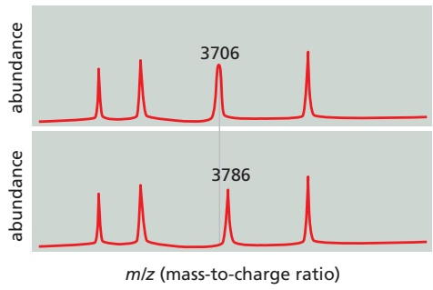
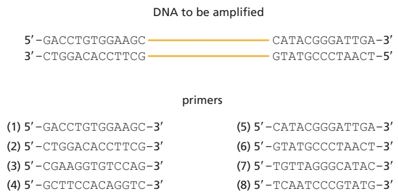
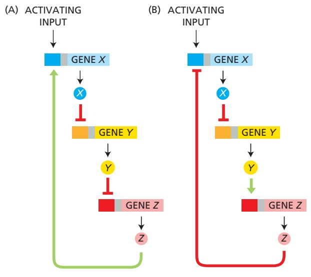
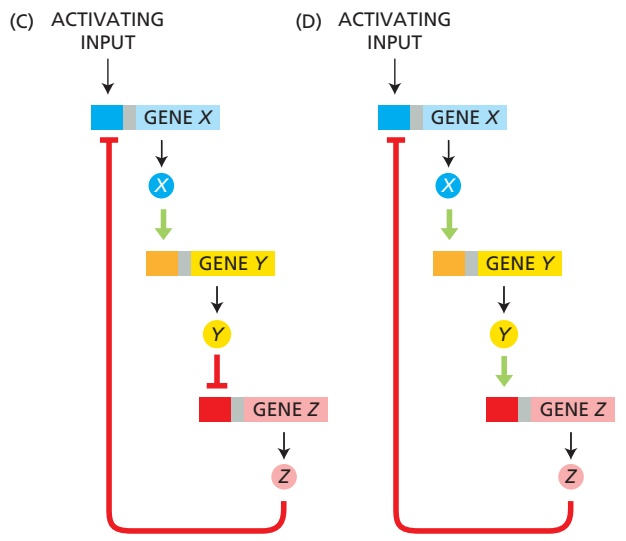
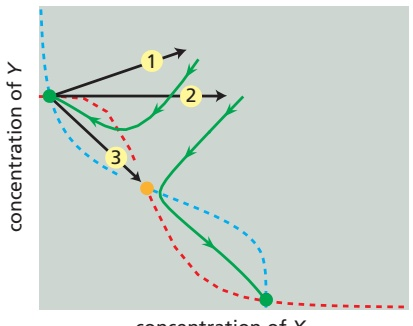
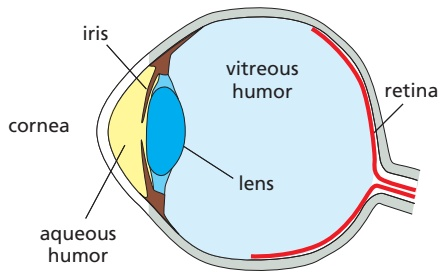
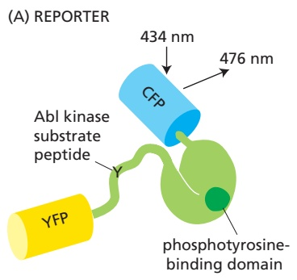

# 第2章 细胞生物学研究方法 · 英文习题与参考文献

### 英文补充：习题与参考文献

> 对应中文板块：习题与参考文献。英文来源：Molecular Biology of the Cell，第7版，第8章；[本章完整原文](../来源/英文教材/08_Analyzing_Cells_Molecules_and_Systems/chapter.md)。物理PDF页码范围：514–601（整章范围）。

<!-- BEGIN EN EN08-EXERCISES -->
#### PROBLEMS

Which statements are true? Explain why or why not.

8–1 Because a monoclonal antibody recognizes a specific antigenic site (epitope), it binds only to the specific protein against which it was made.

8–2 Given the inexorable march of technology, it seems inevitable that the sensitivity of detection of molecules will ultimately be pushed beyond the yoctomole level (10–24 mole).

8–3 If each cycle of PCR doubles the amount of DNA synthesized in the previous cycle, then 10 cycles will give a 103-fold amplification, 20 cycles will give a 106-fold amplification, and 30 cycles will give a 109-fold amplification.

8–4 To judge the biological importance of an interaction between protein A and protein B, we need to know quantitative details about their concentrations, affinities, and kinetic behaviors.

8–5 The rate of change in the concentration of any molecular species X is given by the balance between its rate of appearance and its rate of disappearance.

8–6 After a sudden increase in its rate of synthesis, a protein with a slow rate of degradation will reach a new steady-state level more quickly than a protein with a rapid rate of degradation.

#### Discuss the following problems.

8–7 A common step in the isolation of cells from a sample of animal tissue is to treat the tissue with trypsin, collagenase, and EDTA. Why is such a treatment necessary, and what does each component accomplish? And why does this treatment not kill the cells?

8–8 Tropomyosin, at 93 kilodaltons, sediments at 2.6S, whereas the 65-kilodalton protein, hemoglobin, sediments at 4.3S. (The sedimentation coefficient S is a linear measure of the rate of sedimentation.) These two proteins are drawn to scale in **Figure Q8–1**. Why does the bigger protein sediment more slowly than the smaller one? Can you think of an analogy from everyday experience that might help you with this problem?

8–9 Hybridoma technology allows one to generate monoclonal antibodies to virtually any protein. Why is it, then, that genetically tagging proteins with epitopes is such a commonly used technique, especially as an epitope tag has the potential to interfere with the function of the protein?

8–10 How many copies of a protein need to be present in a cell in order for it to be visible as a band on an SDS gel? Assume that you can load 100 μg of cell extract onto a gel and that you can detect 10 ng in a single band by silver staining the gel. The concentration of protein in cells is about 200 mg/mL, and a typical mammalian cell has a volume of about 1000 μm3 and a typical bacterium a volume of about 1 μm3. Given these parameters, calculate the number of copies of a 120-kilodalton protein that would need to be present in a mammalian cell and in a bacterium in order to give a detectable band on a gel.

8–11 You have isolated the proteins from two adjacent spots after two-dimensional polyacrylamide-gel electrophoresis and digested them with trypsin. When the masses of the peptides were measured by MALDI-TOF mass spectrometry, the peptides from the two proteins were found to be identical except for one (**Figure Q8–2**). For this peptide, the mass-to-charge (m/z) values differed by 80, a value that does not correspond to a difference in amino acid sequence. (For example, glutamic acid instead of valine at one position would give an m/z difference of around 30.) Can you suggest a possible difference between the two peptides that might account for the observed m/z difference?

Figure Q8–2 Masses of peptides measured by MALDI-TOF mass spectrometry (Problem 8–11). Only the numbered peaks differ between the two protein samples.

8–12 You want to amplify the DNA between the two stretches of sequence shown in **Figure Q8–3**. Of the listed primers, choose the pair that will allow you to amplify the DNA by PCR.

Figure Q8–3 DNA to be amplified and potential PCR primers (Problem 8–12).

8–13 In the very first round of PCR using genomic DNA, the DNA primers prime synthesis that terminates only when the cycle ends (or when a random end of DNAMB C7 P bl 8.03/ 8.03 is encountered). Yet, by the end of 20–30 cycles—a typical amplification—the only visible product is defined pre-cisely by the ends of the DNA primers. In what cycle is a double-strand fragment of the correct size first generated?

8–14 Explain the difference between a gain-of-function mutation and a dominant-negative mutation. Why are both these types of mutation usually dominant?

8–15 Discuss the following statement: “We would have no idea today of the importance of insulin as a regulatory hormone if its absence were not associated with the human disease diabetes. It is the dramatic consequences of its absence that focused early efforts on the identification of insulin and the study of its normal role in physiology.”

8–16 You have received the results from an RNA-seq analysis of mRNAs from liver. You had anticipated counting the number of reads of each mRNA to determine the relative abundance of different mRNAs. But you are puzzled because many of the mRNAs have given you results like those shown in **Figure Q8–4**. How is it that different parts of an mRNA can be represented at different levels?

Figure Q8–4 RNA-seq reads for a liver mRNA (Problem 8–16). The exon structure of the mRNA is indicated, with protein-coding segments indicated in light blue and untranslated regions in dark blue. The numbers of sequencing reads are indicated by the heights of the vertical lines above the mRNA.

8–17 Examine the network motifs in **Figure Q8–5**. Decide which ones are negative feedback loops and which are positive. Explain your reasoning.

Figure Q8–5 Network motifs composed of transcription activators and repressors (Problem 8–17).

8–18 Imagine that a random perturbation positions a bistable system precisely at the boundary between two stable states (at the orange dot in **Figure Q8–6**). How would the system respond?

Figure Q8–6 Perturbations of a bistable system (Problem 8–18). As shown by the green lines, after perturbation 1 the system returns to its original stable state (green dot at left), and after perturbation 2, the system moves to the other stable state (green dot at right). Perturbation 3 moves the system to the precise boundary between the two stable states (orange dot).

8–19 Detailed analysis of the regulatory region of the Lac operon has revealed surprising complexity. Instead of a single binding site for the Lac repressor, as might be expected, there are three sites termed operators $\left( \mathrm { O _ { 1 } ,   \mathrm O _ { 2 } } , \right.$ and $\mathrm { O _ { 3 } } \big )$ arrayed along the DNA as shown in **Figure Q8–7**.

Figure Q8–7 Repression of β-galactosidase by promoter regions that contain different combinations of Lac repressor binding sites (Problem 8–19). The base-pair (bp) separation of the three operator sites is shown. Numbers at right refer to the level of repression, with higher numbers indicating more effective repression by dimeric (2-mer) or tetrameric (4-mer) repressors. (From S. Oehler et al., EMBO J. 9:973–979, 1990. With permission from John Wiley & Sons.)

Greenfield E (2014) Antibodies: A Laboratory Manual, 2nd ed. Cold Spring Harbor, NY: Cold Spring Harbor Laboratory Press.

Sherr CJ & DePinho RA (2000) Cellular senescence: mitotic clock or culture shock? Cell 102, 407–410.

#### Isolating Cells and Growing Them in Culture

#### REFERENCES

Spector DL, Goldman RD & Leinwand LA (eds.) (1998) Cells: A Laboratory Manual. Cold Spring Harbor, NY: Cold Spring Harbor Laboratory Press.

Todaro GJ & Green H (1963) Quantitative studies of the growth of mouse embryo cells in culture and their development into established lines. J. Cell Biol. 17, 299–313.

Burgess R & Deutcher MP (eds.) (2009) Guide to Protein Purification, 2nd ed. Methods in Enzymology, Vol. 463. Cambridge, MA: Academic Press.

De Duve C & Beaufay H (1981) A short history of tissue fractionation. J. Cell Biol. 91, 293s–299s.

B. Do combinations of operator sites (Figure Q8–7, constructs 1, 2, 3, and 5) substantially increase repression by the dimeric repressor? Do combinations of operator sites substantially increase repression by the tetrameric repressor? If the two repressors behave differently, offer an explanation for the difference.

Scopes RK (1994) Protein Purification: Principles and Practice, 3rd ed. New York: Springer-Verlag.

C. The wild-type repressor binds $\mathrm { O } _ { 3 }$ very weakly when it is by itself on a segment of DNA. However, if $\mathrm { O _ { 1 } }$ is included on the same segment of DNA, the repressor binds $\mathrm { O } _ { 3 }$ quite well. How can that be?

#### Purifying Proteins

Simpson RJ, Adams PD & Golemis EA (2008) Basic Methods in Protein Purification and Analysis: A Laboratory Manual. Cold Spring Harbor, NY: Cold Spring Harbor Laboratory Press.

A. Which single operator site is the most important for repression? How can you tell?

To probe the functions of these three sites, you make a series of constructs in which various combinations of operator sites are present. You examine their ability to repress expression of β-galactosidase, using either tetrameric (wild type) or dimeric (mutant) forms of the Lac repressor. The dimeric form of the repressor can bind to a single operator (with the same affinity as the tetramer) with each monomer binding to half the site. The tetramer, the form normally expressed in cells, can bind to two sites simultaneously. When you measure repression of β-galactosidase expression, you find the results shown in Figure Q8–7, with higher numbers indicating more effective repression.

Wood DW (2014) New trends and affinity tag designs for recombinant protein purification. Curr. Opin. Struct. Biol. 26, 54–61.

Aebersold R & Mann M (2016) Mass-spectrometric exploration of proteome structure and function. Nature 537, 347–355.

#### Analyzing Proteins

Baxevanis AD, Bader GD & Wishart DS (eds.) (2020) Bioinformatics: A Practical Guide to the Analysis of Genes and Proteins, 4th ed. Hoboken, NJ: Wiley.

Goodrich JA & Kugel JF (2007) Binding and Kinetics for Molecular Biologists. Cold Spring Harbor, NY: Cold Spring Harbor Laboratory Press.

Mehmood S, Allison TM & Robinson CV (2015) Mass spectrometry of protein complexes: from origins to applications. Annu. Rev. Phys. Chem. 66, 453–474.

O’Connell MR, Gamsjaeger R & Mackay JP (2009) The structural analysis of protein-protein interactions by NMR spectroscopy. Proteomics 9, 5224–5232.

Pollard TD (2010) A guide to simple and informative binding assays. Mol. Biol. Cell 21, 4061–4067.

Wuthrich K (2003) NMR studies of structure and function of biological macromolecules (Nobel Lecture). J. Biomol. NMR 27, 13–39.

#### Analyzing and Manipulating DNA

Gibson DG, Young L, Chuang RY . . . Smith HO (2009) Enzymatic assembly of DNA molecules up to several hundred kilobases. Nat. Methods 6, 343–345.

Green MR & Sambrook J (2012) Molecular Cloning: A Laboratory Manual, 4th ed. Cold Spring Harbor, NY: Cold Spring Harbor Laboratory Press.

Kosuri S & Church GM (2014) Large-scale de novo DNA synthesis: technologies and applications. Nat. Methods 11, 499–507.

Metzker ML (2010) Sequencing technologies—the next generation. Nat. Rev. Genet. 11, 31–46.

Mullis K, Faloona F, Scharf S . . . Erlich H (1986) Specific enzymatic amplification of DNA in vitro: the polymerase chain reaction. Cold Spring Harb. Symp. Quant. Biol. 51 Pt 1, 263–273.

Mullis KB (1990) The unusual origin of the polymerase chain reaction. Sci. Am. 262, 56–61, 64–55.

Nathans D & Smith HO (1975) Restriction endonucleases in the analysis and restructuring of DNA molecules. Annu. Rev. Biochem. 44, 273–293.

Sanger F, Nicklen S & Coulson AR (1977) DNA sequencing with chainterminating inhibitors. Proc. Natl. Acad. Sci. USA 74, 5463–5467.

Shendure J & Lieberman Aiden E (2012) The expanding scope of DNA sequencing. Nat. Biotechnol. 30, 1084–1094.

Watson JD, Myers RM & Caudy AA (2007) Recombinant DNA: Genes and Genomes—A Short Course, 3rd ed. Cold Spring Harbor, NY: Cold Spring Harbor Laboratory Press.

#### Studying Gene Function and Expression

Agrotis A & Ketteler R (2015) A new age in functional genomics using CRISPR/Cas9 in arrayed library screening. Front. Genet. 6, 300.

D’Haeseleer P (2005) How does gene expression clustering work? Nat. Biotechnol. 23, 1499–1501.

Doudna JA (2020) The promise and challenge of therapeutic genome editing. Nature 578, 229–236.

Fellmann C & Lowe SW (2014) Stable RNA interference rules for silencing. Nat. Cell Biol. 16, 10–18.

Ingolia NT, Hussmann JA & Weissman JS (2019) Ribosome profiling: global views of translation. Cold Spring Harb. Perspect. Biol. 11.

Luecken MD & Theis FJ (2019) Current best practices in single-cell RNA-seq analysis: a tutorial. Mol. Syst. Biol. 15, e8746.

Mali P, Esvelt KM & Church GM (2013) Cas9 as a versatile tool for engineering biology. Nat. Methods 10, 957–963.

Rio DC, Ares M, Hannon GJ & Wilson TW (2011) RNA: A Laboratory Manual. Cold Spring Harbor, NY: Cold Spring Harbor Laboratory Press.

Stark R, Grzelak M & Hadfield J (2019) RNA sequencing: the teenage years. Nat. Rev. Genet. 20, 631–656.

Strachan T & Read AP (2018) Human Molecular Genetics, 5th ed. Boca Raton, FL: CRC Press.

Wilson RC & Doudna JA (2013) Molecular mechanisms of RNA interference. Annu. Rev. Biophys. 42, 217–239.

#### Mathematical Analysis of Cell Function

Alon U (2007) Network motifs: theory and experimental approaches. Nat. Rev. Genet. 8, 450–461.

Alon U (2019) An Introduction to Systems Biology: Design Principles of Biological Circuits, 2nd ed. Boca Raton, FL: Chapman & Hall/CRC.

Ferrell JE, Jr. & Ha SH (2014) Ultrasensitivity part III: cascades, bistable switches, and oscillators. Trends Biochem. Sci. 39, 612–618.

Gunawardena J (2014) Models in biology: “accurate descriptions of our pathetic thinking.” BMC Biol. 12, 29.

Ingalis BP (2013) Mathematical Modeling in Systems Biology: An Introduction. Cambridge, MA: MIT Press.

Lewis J (2008) From signals to patterns: space, time, and mathematics in developmental biology. Science 322, 399–403.

Novak B & Tyson JJ (2008) Design principles of biochemical oscillators. Nat. Rev. Mol. Cell Biol. 9, 981–991.

Xia PF, Ling H, Foo JL & Chang MW (2019) Synthetic genetic circuits for programmable biological functionalities. Biotechnol. Adv. 37, 107393.
<!-- END EN EN08-EXERCISES -->

### 英文补充：习题与参考文献

> 对应中文板块：习题与参考文献。英文来源：Molecular Biology of the Cell，第7版，第9章；[本章完整原文](../来源/英文教材/09_Visualizing_Cells_and_Their_Molecules/chapter.md)。物理PDF页码范围：602–641（整章范围）。

<!-- BEGIN EN EN09-EXERCISES -->
#### PROBLEMS

Which statements are true? Explain why or why not.

9–1 A fluorescent molecule, having absorbed a single photon of light at one wavelength, always emits it at a longer wavelength.

9–2 Transmission electron microscopy and scanning electron microscopy can both be used to examine a structure in the interior of a thin section: transmission electron microscopy provides a projection view, while scanning electron microscopy captures electrons scattered from the structure and gives a more three-dimensional view.

#### Discuss the following problems.

9–3 The diagrams in **Figure Q9–1** show the paths of light rays passing through a specimen into a dry lens or into an oil-immersion lens. Offer an explanation for why oil-immersion lenses should give better resolution. Air, glass, and oil have refractive indices of 1.00, 1.51, and 1.51, respectively.

Figure Q9–1 Paths of light rays through dry and oil-immersion lenses (Problem 9–3). The red circle at the origin of the light rays is the specimen.

9–4 **Figure Q9–2** shows a diagram of the human eye. The refractive indices of the components in the light

9–5 Why do humans see so poorly under water? And why do goggles help?

9–6 Explain the difference between resolution and magnification.

9–7 **Figure Q9–3** shows a series of modified fluorescent proteins that emit light in a range of colors. Several of these fluorescent proteins contain the same chromophore, yet they fluoresce at different wavelengths. How do you suppose the exact same chromophore can fluoresce at several different wavelengths?

Figure Q9–3 A rainbow of colors produced by modified fluorescent proteins (Problem 9–7). (Courtesy of Nathan Shaner, Paul Steinbach, and Roger Tsien.)

path are air, 1.00; cornea, 1.38; aqueous humor, 1.33; crystalline lens, 1.41; andMBoC7 Problems Q9.01/ vitreous humor, 1.38. Where does the main refraction—the main focusing— occur? What role do you suppose the lens plays?

9–8 A fluorescent biosensor was designed to report the cellular location of active Abl protein tyrosine kinase.MBoC7 Problems Q9.03/Q9.03 A blue (cyan) fluorescent protein (CFP) and a yellow fluorescent protein (YFP) were fused to either end of a hybrid protein, which consisted of a substrate peptide recognized by the Abl protein tyrosine kinase and a phosphotyrosine-binding domain (**Figure Q9–4A**). Stimulation of the CFP domain does not cause emission by the YFP domain when the domains are separated. When the CFP and YFP domains are brought close together, however, fluorescence resonance energy transfer (FRET)

Figure Q9–2 Diagram of the human eye (Problem 9–4).

Figure Q9–4 Fluorescent biosensor designed to detect tyrosine phosphorylation (Problem 9–8). (A) Domain structure of the biosensor. Four domains are indicated: CFP, YFP, tyrosine kinase substrate peptide, and a phosphotyrosine-binding domain. (B) FRET assay. YFP/CFP is normalized to 1.0 at time zero. The biosensor was incubated in the presence (or absence) of Abl and ATP for the indicated times. Arrow indicates time of addition of a tyrosine phosphatase. (From A.Y. Ting et al., Proc. Natl. Acad. Sci. USA 98:15003–15008, 2001. With permission from National Academy of Sciences.)

allows excitation of CFP to stimulate emission by YFP. FRET shows up experimentally as an increase in the ratio of emission at 526 nm (from YFP) versus 476 nm (from CFP) when CFP is excited by 434-nm light.

Incubation of the biosensor protein with Abl protein tyrosine kinase in the presence of ATP gave an increase in the ratio of YFP/CFP emission (**Figure Q9–4B**). In the absence of ATP or the Abl protein, no FRET occurred. FRET was also eliminated by addition of a tyrosine phosphatase (Figure Q9–4B). Describe as best you can how this biosensor detects active Abl protein tyrosine kinase.

9–9 Under ideal conditions, with the simplest of specimens (a monolayer of carbon atoms, for example) and careful image processing, the practical resolving power of modern electron microscopes is about 0.05 nm, some 25-fold above the theoretical limit of 0.002 nm. This is because only the very center of the electron lens can be used, and the effective numerical aperture (n sin θ) is limited by θ (half the angular width of rays collected at the objective lens). Assuming that the wavelength (λ) of the electrons is 0.004 nm and that the refractive index (n) is 1.0, calculate the value for θ, where resolution (0.05 nm) = 0.61 λ/n sin θ. How does this value of θ compare with that for a conventional light microscope (60°)?

9–10 Aquaporin water channels in the plasma membrane play a major role in water metabolism and osmoregulation in many cells. To determine their structural organization in the membrane, you use immunogold electron microscopy. You prepare a membrane sample, incubate it with primary antibodies against aquaporin then with gold-tagged secondary antibodies that bind to the primary antibodies. You then examine it by electron microscopy (**Figure Q9–5**). Are the gold particles (black dots) consistently associated with any particular structure?

Figure Q9–5 An astrocyte membrane labeled with primary antibodies against aquaporin and then with secondary antibodies to which colloidal gold particles have been attached (Problem 9-10). (From J.E. Rash et al., Proc. Natl. Acad. Sci. USA 95:11981–11986, 1998. With permission from National Academy of Sciences.)

9–11 The technique of negative staining uses heavy metals such as uranium to provide contrast. If these heavy metals do not actually bind to defined biological structures (which they do not), how is it that they can help to make such structures visible?

#### REFERENCES

#### General

Vale R, Stuurman N & Thorn K (2006–2021) Microscopy Series (https://www.ibiology.org/online-biology-courses/microscopy-series/) A major online video series starts with the basics of optical microscopy and concludes with some of the latest techniques, such as superresolution microscopy.

#### Looking at Cells and Molecules in the Light Microscope

Agard DA, Hiraoka Y, Shaw P & Sedat JW (1989) Fluorescence microscopy in three dimensions. In Fluorescence Microscopy of Living Cells in Culture, part B (Taylor DL & Wang Y-L, eds.). Methods in Cell Biology, Vol. 30. San Diego: Academic Press.

Boulina M, Samarajeewa H, Baker JD . . . Chiba A (2013) Live imaging of multicolor-labeled cells in Drosophila. Development 140, 1605–1613.

Burnette DT, Sengupta P, Dai Y . . . Kachar B (2011) Bleaching/blinking assisted localization microscopy for superresolution imaging using standard fluorescent molecules. Proc. Natl. Acad. Sci. USA 108, 21081–21086.

Chalfie M, Tu Y, Euskirchen G . . . Prasher DC (1994) Green fluorescent protein as a marker for gene expression. Science 263, 802–805.

Chen F, Tillberg PW & Boyden ES (2015) Expansion microscopy. Science 347, 543–548.

Giepmans BN, Adams SR, Ellisman MH & Tsien RY (2006) The fluorescent toolbox for assessing protein location and function. Science 312, 217–224.

Greenfield EA (ed.) (2014) Antibodies: A Laboratory Manual, 2nd ed. Cold Spring Harbor, NY: Cold Spring Harbor Laboratory Press.

Greenwald EC, Mehta S & Zhang J (2018) Genetically encoded fluorescent biosensors illuminate the spatiotemporal regulation of signaling networks. Chem. Rev. 118, 11707–11794.

Hell S (2009) Microscopy and its focal switch. Nat. Methods 6, 24–32.

Huang B, Babcock H & Zhuang X (2010) Breaking the diffraction barrier: super-resolution imaging of cells. Cell 143, 1047–1058.

Jacquemet G, Carisey AF, Hamidi H . . . Leterrier C (2020) The cell biologist’s guide to super-resolution microscopy. J. Cell Sci. 133, jcs240713.

Jonkman J, Brown CM, Wright GD . . . North AJ (2020) Tutorial: guidance for quantitative confocal microscopy. Nat. Protoc. 15, 1585–1611.

Klar TA, Jakobs S, Dyba M . . . Hell SW (2000) Fluorescence microscopy with diffraction resolution barrier broken by stimulated emission. Proc. Natl. Acad. Sci. USA 97, 8206–8210.

Lippincott-Schwartz J & Patterson GH (2003) Development and use of fluorescent protein markers in living cells. Science 300, 87–91.

Lippincott-Schwartz J, Altan-Bonnet N & Patterson G (2003) Photobleaching and photoactivation: following protein dynamics in living cells. Nat. Cell Biol. 5(suppl.), S7–S14.

Liu T-L, Upadhyayula S, Milkie DE . . . Betzig E (2018) Observing the cell in its native state: imaging subcellular dynamics in multicellular organisms. Science 360, eaaq1392.

Lu C-H, Tang W-C, Liu Y-T . . . Chen B-C (2019) Lightsheet localization microscopy enables fast, large-scale, and three-dimensional superresolution imaging. Commun. Biol. 2, 177.

Minsky M (1988) Memoir on inventing the confocal scanning microscope. Scanning 10, 128–138.

Parton RM & Read ND (1999) Calcium and pH imaging in living cells. In Light Microscopy in Biology: A Practical Approach, 2nd ed. (Lacey AJ, ed.). Oxford: Oxford University Press.

Patterson G, Davidson M, Manley S & Lippincott-Schwartz J (2010) Superresolution imaging using single-molecule localization. Annu. Rev. Phys. Chem. 61, 345–367.

Pawley BP (ed.) (2006) Handbook of Biological Confocal Microscopy, 3rd ed. New York: Springer Science.

Rust MJ, Bates M & Zhuang X (2006) Sub-diffraction-limit imaging by stochastic optical reconstruction microscopy (STORM). Nat. Methods 3, 793–795.

Sako Y & Yanagida T (2003) Single-molecule visualization in cell biology. Nat. Rev. Mol. Cell Biol. 4(suppl.), SS1–SS5.

Schermelleh L, Heintzmann R & Leonhardt H (2010) A guide to superresolution fluorescence microscopy. J. Cell Biol. 190, 165–175.

Shaner NC, Steinbach PA & Tsien RY (2005) A guide to choosing fluorescent proteins. Nat. Methods 2, 905–909.

Sigal YM, Zhou R & Zhuang X (2018) Visualizing and discovering cellular structures with super-resolution microscopy. Science 361, 880–887.

Sluder G & Wolf DE (2007) Digital Microscopy, 3rd ed. Methods in Cell Biology, Vol. 81. San Diego, CA: Academic Press.

Tsien RY (2008) Constructing and exploiting the fluorescent protein paintbox (Nobel Lecture). Angew. Chem. Int. Ed. Engl. 48, 5612–5626.

Wayne R (2014) Light and Video Microscopy. San Diego, CA: Academic Press.

White JG, Amos WB & Fordham M (1987) An evaluation of confocal versus conventional imaging of biological structures by fluorescence light microscopy. J. Cell Biol. 105, 41–48.

Zernike F (1955) How I discovered phase contrast. Science 121, 345–349.

#### Looking at Cells and Molecules in the Electron Microscope

Allen TD & Goldberg MW (1993) High-resolution SEM in cell biology. Trends Cell Biol. 3, 205–208.

Baumeister W (2002) Electron tomography: towards visualizing the molecular organization of the cytoplasm. Curr. Opin. Struct. Biol. 12, 679–684.

Beck M & Baumeister W (2016) Cryo-electron tomography: can it reveal the molecular sociology of cells in atomic detail? Trends Cell Biol. 26, 825–837.

Böttcher B, Wynne SA & Crowther RA (1997) Determination of the fold of the core protein of hepatitis B virus by electron cryomicroscopy. Nature 386, 88–91.

Cheng Y, Grigorieff N, Penczek PA & Walz T (2015) A primer to singleparticle cryo-electron microscopy. Cell 161, 438–449.

Dubochet J, Adrian M, Chang J-J . . . Schultz P (1988) Cryo-electron microscopy of vitrified specimens. Q. Rev. Biophys. 21, 129–228.

Frank J (2003) Electron microscopy of functional ribosome complexes. Biopolymers 68, 223–233.

Frank J (2018) Single-particle reconstruction of biological molecules— story in a sample (Nobel Lecture). Angew. Chem. Int. Ed. Engl. 57, 10826–10841.

Hayat MA (2000) Principles and Techniques of Electron Microscopy, 4th ed. Cambridge: Cambridge University Press.

Henderson R (2015) Overview and future of single particle electron cryomicroscopy. Arch. Biochem. Biophys. 581, 19–24.

Henderson R (2018) From electron crystallography to single particle cryo-EM (Nobel Lecture). Angew. Chem. Int. Ed. Engl. 57, 10804–10825.

Heuser J (1981) Quick-freeze, deep-etch preparation of samples for 3-D electron microscopy. Trends Biochem. Sci. 6, 64–68.

Hoffman DP, Shtengel G, Shan Xu C . . . Hess HF (2020) Correlative three-dimensional super-resolution and block face electron microscopy of whole vitreously frozen cells. Science 367, eaaz5357.

Kukulski W, Schorb M, Kaksonen M & Briggs JAG (2012) Plasma membrane reshaping during endocytosis is revealed by timeresolved electron tomography. Cell 150, 508–520.

Lin DH, Stuwe T, Stillbach S, . . . Hoelz A (2016) Architecture of the symmetric core of the nuclear pore. Science 352, aaf1015.

McDonald KL & Auer M (2006) High-pressure freezing, cellular tomography, and structural cell biology. Biotechniques 41, 137–139.

McIntosh JR (2007) Cellular Electron Microscopy, 3rd ed. Methods in Cell Biology, Vol. 79. San Diego, CA: Academic Press.

McIntosh R, Nicastro D & Mastronarde D (2005) New views of cells in 3D: an introduction to electron tomography. Trends Cell Biol. 15, 43–51.

Nakane T, Kotecha A, Sente A . . . Scheres SHW (2020) Single-particle cryo-EM at atomic resolution. Nature 587, 152–156.

Orlova EWV & Saibil HR (2011) Structural analysis of macromolecular assemblies by electron microscopy. Chem. Rev. 111, 7710–7748.

Pease DC & Porter KR (1981) Electron microscopy and ultramicrotomy. J. Cell Biol. 91, 287s–292s.

Unwin PNT & Henderson R (1975) Molecular structure determination by electron microscopy of unstained crystalline specimens. J. Mol. Biol. 94, 425–440.

Yip KM, Fischer N, Paknia E . . . Stark H (2020) Atomic-resolution protein structure determination by cryo-EM. Nature 587, 157–164.

Zhou ZH (2008) Towards atomic resolution structural determination by single particle cryo-electron microscopy. Curr. Opin. Struct. Biol. 18, 218–228.
<!-- END EN EN09-EXERCISES -->
