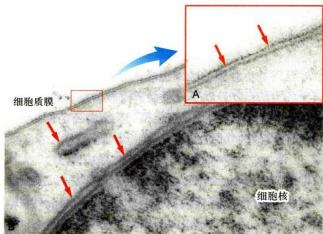
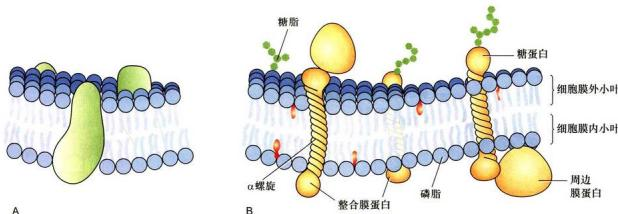
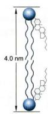
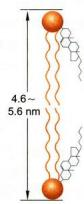
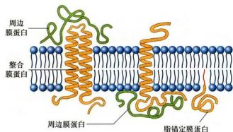
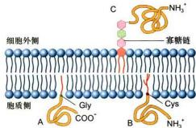
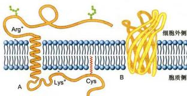
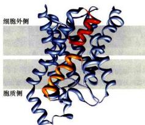
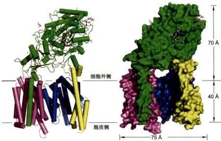

# 第3章 细胞质膜

<!-- 章节边界按正文内容恢复；原始 MinerU 内容保留如下。 -->

# 细胞质膜

细胞质膜（plasma membrane）曾称细胞膜（cell membrane），是指围绕在细胞最外层，由脂质、蛋白质和糖类组成的生物膜。

细胞质膜不仅在结构上作为细胞的界膜，使细胞具有一个相对稳定的内环境，同时在细胞与环境之间的物质运输、能量转换及信息传递过程中也起着重要的作用。

真核细胞内部存在由膜围绕构建的各种细胞器。细胞内膜（internal membrane）系统与细胞质膜统称为生物膜（biomembrane），它们具有共同的结构特征，因此本章对质膜结构与功能的阐述亦有助于读者对整个生物膜的结构与功能有一个基本的了解。

## 第一节 细胞质膜的结构模型与基本成分

## 一、细胞质膜的结构模型

人们借助光学显微镜发现了细胞，但在此后的几百年里却一直没有观察到细胞质膜，甚至有人怀疑细胞是否有一个确切的边界结构。20世纪50年代初随着电子显微镜技术的发展，质膜的超微结构才得以显示。但是，人们也并未因此感到惊奇，因为在此几十年前，细胞生理学家在研究细胞内渗透压时就已证明质膜的存在。

1925 年，E. Gorter 和 F. Grendel 用有机溶剂抽提人的红细胞质膜的膜脂成分，以便测定膜脂单层分子在水面的铺展面积，发现它是红细胞表面积的二倍，这一结果提示了质膜是由双层脂分子构成的。随后，人们发现质膜的表面张力比油－水界面的表面张力低得多，已知脂滴表面如吸附有蛋白质成分则表面张力降低，因此 H. Davson 和 J. F. Danielli 推测，质膜中含有蛋白质成分并提出“蛋白质－脂质－蛋白质”的三明治式的质膜结构模型。这一模型影响达 20 年之久。

1959年，J.D.Robertson根据电子显微镜观察的结果提出了单位膜模型（unit membrane model），发展了三明治模型，并大胆地推断所有的生物膜都由蛋白质-脂质-蛋白质的单位膜构成。这一模型得到X射线衍射分析结果的支持。如果用锇酸固定细胞时，由于锇酸与磷脂极性头部基团亲合力极强，所以在电镜超薄切片中的细胞质膜显示出“暗-亮-暗”三条带，两侧的暗带厚度约 $2\mathrm{nm}$ ，推测是蛋白质，中间壳带厚度约 $3.5\mathrm{nm}$ ，推测是脂双层分子，整个膜的厚度约 $7.5\mathrm{nm}$ （图3-1）。随后的一些实验，如细胞融合结合免疫荧光标记技术证明，质膜中的蛋白质是可流动的，电镜冷冻蚀刻技术显示了双层膜脂中存在膜蛋白颗粒。

在此基础上，S. J. Singer 和 G. L. Nicolson 于 1972 年提出了生物膜的流动镶嵌模型（fluid mosaic model）。流动镶嵌模型得到各种实验结果的支持，奠定了生物膜的结构与特征的基础（图3-2），从而激发人们对膜蛋白与膜脂的相互作用及其功能的深入探索。1975年N.Unwin和Henderson首次报道了古核生物盐细菌的质膜蛋白——菌紫红质（bacteria rhodopsin）的三维结构。它是一个跨膜7次的膜蛋白，通过蛋白质的疏水结构域“镶嵌”在脂双层中，利用光能完成质子的转运。流动镶嵌模型主要强调：①膜的流动性，即膜蛋白和膜脂均可侧向运动；②膜蛋白分布的不对称性，有的结合在膜表面，有的嵌入或横跨脂双分子层。

  
图 3-1 电镜超薄切片技术显示的细胞质膜结构  
A. 动物细胞细胞质膜（箭号所指），中间亮带厚约 3.5 nm，两侧暗带厚约 2 nm。B. 细胞核膜及胞质中囊泡膜也都由单位膜组成（箭号所指）。(Bechara Kachar 博士惠赠)

1988年K.Simons和G.van Meer提出的脂筏模型(lipid raft model）是对膜流动性的新的理解。该模型认为在甘油磷脂为主体的生物膜上，胆固醇、鞘磷脂等富集区域形成相对有序的脂相，如同漂浮在脂双层上的“脂筏”一样载着执行某些特定生物学功能的各种膜蛋白（图3-3）。脂筏最初可能在高尔基体上形成，最终转移到细胞质膜上，有些脂筏可在不同程度上与膜下细胞骨架蛋白交联。据推测，一个直径100 nm的脂筏可载有600个蛋白质分子。目前已发现几种不同类型的脂筏，它们在细胞信号转导、物质的跨膜运输及病原微生物侵染细胞过程中可能起着重要的作用。脂筏模型虽然还不尽完善，但得到了越来越多的实验证据的支持。

目前对生物膜结构的认识可归纳如下（图 3-2B，图 3-3）：

（1）具有极性头部和非极性尾部的磷脂分子在水相中具有自发形成封闭的膜系统的性质，磷脂分子以疏水性尾部相对，极性头部朝向水相形成磷脂双分子层（phospholipid bilayer），每层磷脂分子称为一层小叶（leaflet）。脂分子是组成生物膜的基本结构成分，尚未发现在生物膜结构中起组织作用的蛋白质。但在脂筏中存在某些有助于脂筏结构相对稳定的功能蛋白。

(2) 蛋白质分子以不同的方式镶嵌在脂双层分子中或结合在其表面，蛋白质的类型、蛋白质分布的不对称性及其与脂分子的协同作用赋予生物膜各自的特性与功能。

(3) 生物膜可看成是蛋白质在双层脂分子中的二维溶液。然而膜蛋白与膜脂之间、膜蛋白与膜蛋白之间及其与膜两侧其他生物大分子的复杂的相互作用，在不同程度上限制了膜蛋白和膜脂的流动性。同时也形成了赖以完成多种膜功能的脂筏、纤毛和微绒毛等结构（图 3-4）。

（4）在细胞生长和分裂等整个生命活动中（如细胞分裂、内吞等过程中的某些区域），生物膜在三维空间上可出现弯曲、折叠、延伸以及非脂双层状态等改变，处于不断的动态变化中，从而保证了诸如细胞运动、细胞增殖等各种代谢活动的进行。某些有囊膜的病毒如HIV和辛德毕斯病毒（Sindbis virus, SbV）等，也是通过从细胞质膜上“出芽”的方式，组装与释放到细胞外（图3-5）。

  
图3-2 生物膜的模型  
A. 流动镶嵌模型示意图。B. 生物膜结构示意图。

  
图3-3 细胞质膜的脂筏模型示意图

  
图 3-4 扫描电镜显示豚鼠耳蜗毛细胞表面的纤毛  
细胞质膜弯曲、延伸构成的纤毛，用以感受声音的大小与频率。（Bechara Kachar 博士惠赠）

  
图3-5 病毒出芽过程中细胞质膜的动态变化  
电镜图片显示了凸凹不平的脂双层细胞质膜以及SbV以出芽的方式在宿主细胞质膜上的组装和释放的过程。（梁凤霞博士惠赠）  
图3-6 膜脂的基本类型

## 二、膜脂

膜脂是生物膜的基本组成成分，每个动物细胞质膜上约有 $10^{9}$ 个脂分子，即每平方微米的质膜上约有 $5\times10^{6}$ 个脂分子。膜脂不仅能帮助膜蛋白锚定在生物膜上，而且还影响到膜的形态特性和生物学功能。

## （一）成分

膜脂主要包括甘油磷脂（glycerophosphatide）、鞘脂（sphingolipid）和固醇（sterol）三种基本类型（图3-6）。它们的化学结构、在生物膜上的含量以及生物学

A.甘油磷脂。B.鞘磷脂与糖脂。C.胆固醇。

A  

功能各不相同。生物膜上还有少量的糖脂（glycolipid），鉴于绝大多数的糖脂都属于鞘氨醇的衍生物，因此，目前人们多将糖脂归于鞘脂类。

## 1. 甘油磷脂

甘油磷脂构成了膜脂的基本成分，占整个膜脂的50%以上。甘油磷脂为3-磷酸甘油的衍生物，包括质膜中最丰富的磷脂酰胆碱（卵磷脂，phosphatidylcholine，PC）以及磷脂酰丝氨酸（phosphatidylserine，PS）、磷脂酰乙醇胺（phosphatidylethanolamine，PE）和磷脂酰肌醇（phosphatidylinositol，PI）等（图3-6A），主要在内质网合成。组成生物膜的甘油磷脂分子的主要特征是：①具有一个与磷酸基团相结合的极性头和两个非极性的尾（脂肪酸链），但存在于线粒体内膜和某些细菌质膜上的心磷脂（cardiolipin）除外，它具有4个非极性的尾部；极性头的空间占位可影响脂双层的曲度（图3-7），如与PC比较，PE更倾向于形成曲面膜。②脂肪酸碳链为偶数，多数碳链由16或18个碳原子组成。也有少量14或20个碳链组成的脂肪酸链。③除饱和脂肪酸（如软脂酸、硬脂酸）外，常常还有含1\~2个双键的不饱和脂肪酸（如油酸），不饱和脂肪酸多为顺式，顺式双键在轻链中产生约30°角的弯曲。甘油磷脂不仅是生物膜的基本成分，而且其中的某些成分如PI等在细胞信号转导中起重要作用。

## 2. 鞘脂

鞘脂均为鞘氨醇的衍生物，主要在高尔基体合成。它具有一条烃链，另一条链是与鞘氨醇的氨基共价结合的长链脂肪酸。其头部，可能是一个类似于甘油磷脂的基于磷酸基团的极性头部，称为鞘磷脂(sphingomyelin, SM)，如神经鞘磷脂，是丰度最高的一种鞘磷脂，它的头部是一个与鞘氨醇分子末端的羟基共价结合的磷酸胆碱。其分子结构与甘油磷脂非常相似，因此统称磷脂（phospholipid）。鞘磷脂与甘油磷脂共同组成生物膜（图3-6B）。与鞘磷脂结合的脂肪酸链较长，可多达26个碳原子，因此鞘磷脂形成的脂双层的厚度较甘油磷脂的厚度更大，如SM为 $4.6\sim 5.6\mathrm{nm}$ ，而PC约 $3.5\mathrm{nm}$ （图3-8A、B）。

  
图3-7 脂分子极性头的空间占位对脂双层曲度的影响  
PE 极性头较小，更多地分布在脂双层曲率较大的一侧。左侧为电镜图片，右侧为示意图。

另一类鞘脂为糖脂，也是两性分子，它的极性头部是直接共价结合到鞘氨醇上的一个单糖分子或寡糖链，因此也称鞘糖脂。糖脂普遍存在于原核和真核细胞的细胞质膜上，其含量不足膜脂总量的5%，在神经细胞质膜上糖脂含量较高，占5%\~10%。目前已发现40余种糖脂。不同的细胞中所含糖脂的种类不同，如神经细胞含有神经节苷脂，人红细胞表面含有ABO血型糖脂等，它们均具有重要的生物学功能。

在动物细胞中，最简单的糖脂是脑苷脂，因最早从人脑中提取故名，它们只有一个葡萄糖或半乳糖残基与鞘氨醇连接（图3-6B），较复杂的神经节苷脂可含多达7个糖残基，其中含有不同数目的唾液酸。糖脂不属于磷脂类。

## 3. 固醇

胆固醇及其类似物统称固醇或甾醇，它是一类含有4个闭环的碳氢化合物，其亲水的头部为一个羟基，是一种分子刚性很强的两性化合物（图3-6C）。与磷脂不同的是其分子的特殊结构和疏水性太强，自身不能形成脂双层。只能插入磷脂分子之间，参与生物膜的形成。胆固醇与甘油磷脂相互作用会增加磷脂分子的有序性及脂双层的厚度，但对鞘磷脂没有明显的影响（图3-8C、D）。胆固醇存在于动物细胞和极少数的原核细胞中，在哺乳动物的细胞质膜中，尤为丰富。其含量一般不超过膜脂的1/3。在多数的细胞中，50%\~90%的胆固醇存在于细胞质膜和相关的囊泡膜上。胆固醇的合成是在动物细胞的胞质和内质网完成的，但动物体内胆固醇多数来自于食物。它在调节膜的流动性，增加膜的稳定性以及降低水溶性物质的通透性等方面都起着重要作用。同时，它又是脂筏的基本结构成分。缺乏胆固醇可能导致细胞分裂的抑制。植物细胞和真菌细胞中都有各自的固醇化合物，如植物中的豆固醇（stigmasterol）和真菌中的麦角固醇（ergosterol）。但它们的结构和合成途径与胆固醇稍有不同，这些微小差别正是目前使用的多数抗真菌药物的研发基础。植物细胞质膜中的固醇含量高达膜脂总量的30%\~50%，多数细菌质膜中不含有胆固醇成分，但某些细菌的膜脂中含有甘油脂等中性脂质。

  
图3-8 不同膜脂成分的脂双层厚度的比较  
A. 卵磷脂。B. 鞘磷脂。C. 卵磷脂和胆固醇。D. 鞘磷脂和胆固醇。

胆固醇除了作为生物膜的主要结构成分外，还是很多重要的生物活性分子的前体化合物，如固醇类激素、维生素D和胆酸等。人们还发现，胆固醇可以与发育调控的重要信号分子Hedgehog共价结合。

此外在植物和多数微生物的细胞质膜中，会有大量的甘油糖脂，它是由二酰甘油分子中的羟基与糖基的糖苷键连接而成。在动物体内，甘油糖脂只存在于精子等少数细胞的质膜中。

膜脂作为生物膜的基本结构成分，其组成的分子类型对生物膜的结构和功能有很大的影响。实际上，细胞质膜和其他生物膜都具有各自特异的膜脂和膜蛋白成分。不同种类的细胞，同一细胞中不同类型的生物膜，甚至同一细胞的质膜的不同部位，其膜的组分也可能有明显的差别，因此膜的厚度也是不均一的，且处于动态变化之中。如高尔基体膜上的鞘磷脂的含量为内质网膜的6倍，小肠上皮细胞腔面质膜中的鞘磷脂含量是质膜其他部位含量的2倍，后者显然有助于增加腔面质膜的稳定性。

## （二）膜脂的运动方式

膜脂分子有4种运动方式：

（1）沿膜平面的侧向运动，温度为37℃时的扩散系数为 $10^{-8}cm^{2}/s$ ，相当于每秒移动2μm的距离。由于侧向运动产生分子间的换位，其交换频率约 $10^{7}$ 次/s。磷脂分子通过侧向运动从细菌的一端到另一端一般仅需要1 s，动物细胞大约20 s。侧向运动是膜脂分子的基本运动方式，具有重要的生物学意义。

(2) 脂分子围绕轴心的自旋运动。

（3）脂分子尾部的摆动。脂肪酸链靠近极性头部的摆动较小，其尾部摆动较大。X射线衍射分析显示，在距头部第9个碳原子以后的脂肪酸链已变成无序状态。

(4) 双层脂分子之间的翻转运动：一般情况下翻转运动极少发生，其发生频率还不到脂分子侧向交换频率的百亿分之一。研究人工膜上脂分子运动所得到的结果与用支原体、细菌和红细胞膜为材料所得到的结果类似，但脂分子的翻转运动在细胞某些膜系统中发生的频率很高，特别是在内质网膜上，新合成的磷脂分子经几分钟后，将有半数从脂双层的一个小叶通过翻转运动转位到另一个小叶，为自然翻转运动速率的10万倍。但这一过程需要特殊的膜蛋白称翻转酶（flippase）来完成。

脂分子的运动不仅与脂分子的类型有关，也与脂分子同膜蛋白及膜两侧的生物大分子之间的相互作用以及温度等环境因素有关。因此，在某一特定的细胞中所检测到的某类脂分子的运动速率，可能与人工脂膜的数据有较大的差别。

## （三）脂质体

脂质体（liposome）是根据磷脂分子可在水相中形成稳定的脂双层膜的现象而制备的人工膜。单层脂分子铺展在水面上时，其极性端插入水相而非极性尾部面向空气界面，搅动后形成乳浊液，即形成极性端向外而非极性端在内的脂分子团又称微团（micelle），或形成双层脂分子的球形脂质体（图3-9A、C）。天然磷脂有两条非极性尾部，难以形成微团，当用磷脂酶处理，仅保留一条脂肪酸链时，就很容易形成微团，我们在用肥皂洗手时的滑润感主要源于液体中大量的微团。

球形脂质体直径为25\~1000 nm不等，控制形成条件可获得大小均一的脂质体，同样的原理还可以制备平面的脂质体膜，但需要有固体支撑物（图3-9B）。

脂质体可用单一或混合的磷脂来制备，同时还可以嵌入不同的膜蛋白，因此脂质体是研究膜脂与膜蛋白及其生物学性质的极好实验材料。脂质体中裹入DNA可有效地将其导入细胞中，因此常用于转基因实验。

在临床治疗中，脂质体显示出诱人的应用前景。脂质体中裹入不同的药物或酶等具有特殊功能的生物大分子，可望用于治疗多种疾病。特别是脂质体技术与单克隆抗体及其他技术结合，可使药物更有效地作用于靶细胞以减少对机体的损伤（图3-9D）。

  
图3-9 脂质体  
由于磷脂分子之间以及磷脂分子与水的相互作用，自发地形成3种形式的聚合体：脂的极性端向外而非极性尾部向内的脂分子团，即微团（A）；双层脂分子的球形脂质体（C）；在固体支撑物存在的情况下，也可形成平面脂双层膜（B）。D为表面带有特异抗体的用于靶向药物治疗的脂质体的示意图。

## 三、膜蛋白

膜蛋白是位于脂双层之中或表面的蛋白质总称。动物细胞主要有9种膜脂，而膜蛋白的种类繁多。酵母基因组中约1/3的基因编码膜蛋白，多细胞有机体膜蛋白的种类更多一些。虽然多数膜蛋白的分子数量较少，但却赋予生物膜非常重要的生物学功能。50%以上的小分子药物的受体为膜蛋白。不同类型的细胞以及细胞不同部位的生物膜，其膜蛋白的含量与种类都有很大的区别。如线粒体内膜的膜蛋白含量达76%，而在神经细胞髓鞘质膜中，仅占18%。膜蛋白赋予各种生物膜行使不同的生理功能。

## （一）膜蛋白的类型

根据膜蛋白分离的难易程度及其与脂分子的结合方式，膜蛋白可分为三种基本类型：周边膜蛋白（peripheral membrane protein）或称外在膜蛋白(extrinsic membrane protein）、整合膜蛋白(integral membrane protein）或称内在膜蛋白(intrinsic membrane protein）和脂锚定膜蛋白(lipid-anchored membrane protein）（图3-10）。

周边膜蛋白为水溶性蛋白质，它不直接与脂双层的疏水核心接触，而是靠离子键或其他较弱的键与膜表面的膜蛋白分子或膜脂分子结合，因此只要改变溶液的离子强度甚至提高温度就可以从膜上分离下来，但膜结构并不被破坏。如多种以磷脂为底物的水溶性酶类，就是通过其分子中特殊部位结合到生物膜表面。磷脂酶（phospholipase）是其中一例，它以较高的亲和力结合到膜界面的磷脂头部极性基团上，以降解衰老或损伤的生物膜，它也是多种蛇毒的活性成分。

脂锚定膜蛋白是通过与之共价相连的脂分子（脂肪酸或糖脂）插入膜的脂双分子中，而锚定在细胞质膜上，其水溶性的蛋白质部分位于脂双层外。脂锚定膜蛋白可分三种类型（图3-11）：

（1）脂肪酸（豆蔻酸或软脂酸等）结合到膜蛋白N端的甘氨酸残基上（图3-11A）。如与肿瘤发生相关的酪氨酸蛋白激酶的突变体v-Src，就是通过与其N端共价结合的豆蔻酸插入脂双层的细胞质小叶。它是人们发现的第一个病毒癌基因产物。

(2) 由15或20个碳链长的烃链结合到膜蛋白C端的半胱氨酸残基上（图3-11B），有时还有另一条烃链或脂肪酸链结合到近C端的其他半胱氨酸残基上，这种双重锚定有助于蛋白质更牢固地与膜脂结合。例如同属于GTP酶超家族的Ras和Rab蛋白均为双锚定膜蛋白。前者参与细胞信号转导，后者介导膜泡的融合。上述两类脂锚定膜蛋白均分布在细胞质膜的细胞质一侧。

(3) 通过糖脂锚定在细胞质膜上 (图 3-11C)。如磷脂酶 C 和大分子的蛋白聚糖 (proteoglycan)。在不同的细胞中, 这类糖脂的结构有很大的不同, 但都含有磷脂酰肌醇（PI）基团，因此称为磷脂酰肌醇糖脂(glycosylphosphatidylinositol, GPI)锚定方式，简称GPI锚定方式。与磷脂分子类似，同磷脂酰肌醇结合的2个脂肪酸链插入脂膜中。肌醇同时与长度不等的寡糖链相结合，最后寡糖末端的磷酸己醇胺与蛋白质共价相连，从而有效地将蛋白质结合到质膜上。GPI脂锚定膜蛋白都分布在质膜外侧。

  
图3-10 膜蛋白的基本类型

  
图3-11 脂锚定膜蛋白的3种基本类型  
通过与膜蛋白 N 端甘氨酸（Gly）结合的脂肪酸（A）或与膜蛋白 C 端半胱氨酸（Cys）结合的羟链和脂肪酸（B），及通过糖脂链（C）锚定在细胞质膜上。

整合膜蛋白与膜结合比较紧密，只有用去垢剂处理使膜崩解后才可分离出来。整合膜蛋白占整个膜蛋白的70%\~80%，据估计人类基因中，1/4\~1/3基因编码的蛋白质为整合膜蛋白。

## （二）整合膜蛋白与膜脂结合的方式

目前所了解的整合膜蛋白均为跨膜蛋白（transmembrane protein），跨膜蛋白在结构上可分为：胞质外结构域、跨膜结构域和胞质内结构域等三个组成部分（图3-12）。它与膜结合的主要方式有：

（1）膜蛋白的跨膜结构域与脂双层分子的疏水核心的相互作用，这是整合膜蛋白与膜脂结合的最主要和最

  
图3-12 整合膜蛋白与膜脂结合方式示意图

基本的结合方式。

(2) 跨膜结构域两端携带正电荷的氨基酸残基, 如精氨酸、赖氨酸等与磷脂分子带负电的极性头部形成离子键, 或带负电的氨基酸残基通过 $\mathrm{Ca}^{2+}$ 、 $\mathrm{Mg}^{2+}$ 等阳离子与带负电的磷脂极性头部相互作用。

(3) 某些膜蛋白通过自身在胞质一侧的半胱氨酸残基共价结合到脂肪酸分子上，后者插入脂双层中进一步加强膜蛋白与脂双层的结合力。

整合膜蛋白的跨膜结构域是与膜脂结合的主要部位，具体作用方式如下：

(1) 跨膜结构域含有 20 个左右的疏水氨基酸残基，形成 α 螺旋（长度约 3 nm），其外侧疏水侧链通过范德华力与脂双层分子脂肪酸链（厚度约 3.2 nm）相互作用（图 3-12A）。这类膜蛋白称单次跨膜蛋白（single-pass transmembrane protein），如红细胞质膜上的血型糖蛋白 A（glycophorin A），其跨膜的 α 螺旋由 23 个氨基酸残基组成。多数膜蛋白具有几个跨膜的 α 螺旋区，称多次跨膜蛋白（multipass transmembrane protein）。如在细胞信号转导通路中，最普遍存在的 G 蛋白偶联信号通路的细胞表面受体就是一类跨膜 7 次的膜蛋白。跨膜结构域的 α 螺旋的方向，有的与膜面垂直，有的则与膜面呈一定的角度。因此跨膜结构域的 α 螺旋的长度也各有差异。

(2) 跨膜结构域主要由β折叠片(图3-12B)组成, 如大肠杆菌外膜上的孔蛋白(porin)以及线粒体、叶绿体外膜上的孔蛋白。由于α螺旋中相邻两个氨基酸残基的轴向距离为0.15 nm, 而在β折叠片中为0.35 nm。所以跨膜结构域的β折叠片一般由10\~12个氨基酸残基组成, 就足以跨越细胞膜。X射线晶体学研究结果显示, 大肠杆菌的孔蛋白OmpX由三聚体组成, 在每一个亚基中, 16个反向平行的β折叠片相互作用形成跨膜通道, 通道具有疏水性的外侧和亲水性的内侧。细菌中发现了多种类型的孔蛋白, 用于不同的物质转运和多种其他的生物学功能, 但在线粒体和叶绿体中, 孔蛋白类型较少, 可允许分子量小于 $10^{4}$ 的小分子自由通过。孔蛋白跨膜结构域疏水性的外侧以及某些疏水性的侧链, 使其稳定地结合在脂膜上。

(3) 某些 $\alpha$ 螺旋既具有极性侧链又具有非极性侧链。多个 $\alpha$ 螺旋形成特异极性分子的跨膜通道，其外侧是非极性链，与膜脂相互作用；内侧是极性链，形成通道。如人红细胞膜上的带 3（band 3）蛋白，它介导 $\mathrm{Cl}^{-}/\mathrm{HCO}_{3}^{-}$ 的跨膜运输。

  
图 3-13 功能性膜蛋白复合体的形成机制  
通过膜蛋白（A—D）跨膜结构域相互之间的作用，形成了具有生物学功能的膜蛋白复合体（E）。

结构分析的结果显示，跨膜蛋白与膜脂的相互作用往往是非常复杂的。首先，跨膜蛋白的跨膜结构域本身就各不相同（如外侧的疏水氨基酸侧链），跨膜结构域的轴向与脂膜平面的角度不同，再加上很多膜蛋白是以三聚体甚至多聚体的方式行使其功能。这又涉及跨膜结构域之间相互作用，如血型糖蛋白A二聚体是通过两个跨膜结构域形成的卷曲结构（coiled-coil）。由4个二聚体组成的T细胞抗原受体是通过膜蛋白跨膜结构域α螺旋所携带的正、负电荷相互吸引，最终疏水跨膜片段及其与脂类的相互作用组装成有功能的多聚体（图3-13）。

水孔蛋白（aquaporin）是一类具有6个α螺旋区的蛋白质家族，通常形成四聚体的膜蛋白以行使其转运水或甘油等分子的功能。Glpf是其中一种转运甘油的水孔蛋白（图3-14）。

用 X 射线衍射技术获得的三维结构的图像显示了膜蛋白与膜脂的复杂结合方式，多数跨膜 $\alpha$ 螺旋的方向与脂膜平面成一定角度，一条最长的 $\alpha$ 螺旋在中部出现弯曲，特别是有两条较短的 $\alpha$ 螺旋其N端相对，各插进脂膜的一半（图3-14）。可以想象，膜脂的种类和与膜蛋白的作用方式也直接影响到膜蛋白的空间构象及其功能。已知水孔蛋白0（aquaporin-0、AQPO）在脂膜中，周围排列紧密的磷脂面对跨结构域的疏水部分，脂肪酸链呈直线排列，而面对某些亲水的表面，脂肪酸链呈扭曲状。某些磷脂分子的头部基团与膜面平行，而某些磷脂分子的头部基团则与膜面近于垂直。又如，线粒体内膜中心的磷脂与氧化磷酸化相关的膜蛋白复合体的相互作用，可能对其稳定性是十分重要的。这些都显示了膜脂与膜蛋白的特异的复杂的相互作用。虽然，人们可以根据膜蛋白分子的氨基酸序列推测其三级结构，但对膜蛋白及其与膜脂关系的三维结构的分析，对深入了解其结构和功能依然是至关重要的研究课题。

  
图3-14 大肠杆菌转运甘油的水孔蛋白Glpf的三维结构图像（基于PDB数据库1FX8结构绘制）

在过去的几十年中，虽然已克隆了几千种膜蛋白的基因，但由于其难以形成晶体，因而只对几百种膜蛋白的结构获得了高分辨率的解析结果。其三维结构分析主要是应用X射线晶体衍射技术。我国学者也曾成功地解析了叶绿体膜上的捕光复合物Ⅱ的晶体结构、线粒体内膜电子传递链上的复合物Ⅱ和葡糖转运蛋白（见图4-5）等晶体结构，使得对这类多亚基膜蛋白复合体的结构与功能的研究取得了重要成果。特别是2013年以来，低温电镜单颗粒分析技术的革命性进展（见第二章），其三维结构图像分辨率接近原子尺度，这无疑极大地促进了对难以结晶的膜蛋白结构的解析。施一公等应用低温电镜单颗粒分析技术，获得了神经细胞质膜上的膜蛋白——γ分泌酶复合体高分辨三维结构图像（图3-15），就是一个很好的实例，它为了解阿尔茨海默病的发病机制与治疗提供了重要的理论依据。

  
图 3-15 通过对低温电镜的图像分析和数据处理获得的膜蛋白 γ 分泌酶复合体的三维结构（分辨率 3.4 Å）（施一公博士惠赠）

## （三）去垢剂

去垢剂（detergent）是一端亲水、一端疏水的两性小分子，是分离与研究膜蛋白的常用试剂。去垢剂可以插入膜脂，与膜脂或膜蛋白的跨膜结构域等疏水部位结合，形成可溶性的微粒（图3-16A）。

少量的去垢剂能以单分子状态溶解于水中，当达到一定浓度时，去垢剂分子可在水中形成微团(micelle)，此时去垢剂的浓度称为微团临界浓度(critical micelle concentration, CMC)。CMC是各种去垢剂的特征和功能的重要参数。当使用的去垢剂的浓度高于或低于其CMC时，去垢剂的作用方式和膜蛋白的分离效果均有所不同。去垢剂分为离子型去垢剂和非离子型去垢剂两种类型。

常用的离子型去垢剂如十二烷基硫酸钠（SDS）具有带电荷的基团，其分子式如下：

$$
\mathrm{CH} _ {3} - (\mathrm{CH} _ {2}) _ {1 1} - \mathrm{O} - \mathrm{S} - \mathrm{ONa} ^ {+}
$$

SDS可使细胞膜崩解，与膜蛋白疏水部分结合并使其与膜分离，高浓度的SDS还可以破坏蛋白质中的离子键和氢键等非共价键，甚至改变蛋白质亲水部分的构象。这一特性常用于蛋白质成分分析的SDS凝胶电泳。

由于 SDS 对蛋白质的作用较为剧烈，可引起蛋白质变性，因此在纯化膜蛋白时，特别是为获得有生物活性的膜蛋白时，常采用不带电荷的非离子去垢剂。

常用的非离子型去垢剂 Triton X-100（商品名）分

  
图 3-16 利用去垢剂萃取和研究膜蛋白

A. 去垢剂与膜脂或膜蛋白的跨膜结构域的疏水部位结合，形成可溶性的微粒的示意图。B. 用不同的去垢剂处理膀胱上皮细胞质膜，所萃取的膜蛋白的SDS凝胶电泳图谱。电泳条带M为已知分子质量标志蛋白质，1为全部膜蛋白的电泳条带，2\~8为7种不同的去垢剂所萃取的膜蛋白的电泳条带（5、6分别为0.5%和2%的Triton X-100），7为去垢剂Sarkosol，后者可以特异地萃取出膀胱上皮细胞的4种主要质膜蛋白。（B图由孙同天博士惠赠）

子式如下：

$$
\mathrm{C} \left(\mathrm{CH} _ {3}\right) _ {3} - \mathrm{CH} _ {2} - \mathrm{C} \left(\mathrm{CH} _ {3}\right) _ {2} - \text {   } \underset {n = 8 \sim 9} {\overset {} {\mathrm{O}}} - \left[ \mathrm{CH} _ {2} - \mathrm{CH} _ {2} - \mathrm{O} \right] _ {n} - \mathrm{CH} _ {2} - \mathrm{CH} _ {2} - \mathrm{OH}
$$

非离子去垢剂也可使细胞膜崩解，但对蛋白质的作用比较温和，它不仅用于膜蛋白的分离与纯化，也用于除去细胞的膜系统，以便对细胞骨架蛋白和其他蛋白质进行研究。

去垢剂有多种类型，多数为人工合成。由于不同的去垢剂对各种膜蛋白的作用有所区别，因此，有针对性地选用合适的、一定浓度的去垢剂在膜蛋白的分离与纯化过程中，就显得尤为重要（图 3-16B）。

## 第二节 细胞质膜的基本特征与功能

## 一、膜的流动性

膜的流动性是细胞质膜和所有的生物膜的基本特征之一，也是细胞生长、增殖等生命活动的必要条件。在脂膜二维空间上的热运动是膜脂和膜蛋白流动性的动力学基础，膜脂与膜蛋白的相互作用以及与膜两侧的生物大分子的相互作用，使膜的流动状态更为复杂。它不仅保证了细胞正常的代谢活动，而且受控于细胞代谢过程的调节。

## （一）膜脂的流动性

膜脂的流动性主要指脂分子的侧向运动，它在很大程度上是由脂分子本身的性质决定的，一般来说，脂肪酸链越短，不饱和程度越高，膜脂的流动性越大。温度对膜脂的运动有明显的影响，各种膜脂都具有其不同的相变温度（phase transition temperature），鞘脂的相变温度一般高于磷脂。在生物膜中，膜脂的相变温度是由组成生物膜的各种脂分子的相变温度决定的。低于相变温度，膜脂的流动性会骤然降低。一般情况下，鞘脂或卵磷脂组成的脂双层膜流动性小一些，磷脂酰乙醇胺、磷脂酰肌醇和磷脂酰丝氨酸等组成的脂膜流动性大一些。

膜脂的流动性是生长细胞完成包括生长、增殖在内的多种生理功能所必需的。在细菌和动物细胞中，常常通过增加不饱和脂肪酸的含量来调节膜脂的相变温度，以维持膜脂的流动性。

在动物细胞中，胆固醇对膜的流动性也起着重要的双重调节作用。胆固醇分子既有与磷脂疏水的尾部相结合使其更为有序、相互作用增强及限制其运动的作用，也有将磷脂分子隔开使其更易流动的功能。其最终效应取决于胆固醇在脂膜中的相对含量以及上述两种作用的综合效果。通常胆固醇是起到防止薄膜由液相变为固相以保证膜脂处于流动状态的作用。在细胞质膜脂双层的内外两小叶的膜脂中，细胞外小叶膜脂的胆固醇的含量往往高于内小叶，因此内小叶膜脂的流动性更弱。

由于膜脂与膜脂以及膜脂与膜蛋白之间的复杂的相互作用，膜脂分子的运动状态各不相同，其运动的区域也受到一定的限制。当用荧光素标记磷脂分子，研究磷脂在成纤维细胞质膜中的运动情况时，人们发现大多数的磷脂只是在直径约0.5 $\mu$ m的范围内自由运动，其原因是受到了直径约1 $\mu$ m的膜蛋白含量较高的质膜区域所阻隔。

## （二）膜蛋白的流动性

一系列的实验证明了膜蛋白的流动性，荧光抗体免疫标记实验就是其中一个典型的例子。用抗鼠细胞质膜蛋白的荧光抗体（显绿色荧光）和抗人细胞质膜蛋白的荧光抗体（显红色荧光）分别标记小鼠和人的细胞表面，然后用灭活的仙台病毒介导两种细胞融合。10 min后不同颜色的荧光在融合细胞表面开始扩散，40 min后已分辨不出融合细胞表面绿色荧光或红色荧光区域。如加上不同的滤光片，则显示红色荧光或绿色荧光都均匀地分布在融合细胞表面，这一实验清楚地显示了与抗体结合的膜蛋白在质膜上的运动。

如果用药物抑制细胞能量转换、蛋白质合成等代谢途径，对膜蛋白运动没有影响，但是如果降低温度，则膜蛋白的扩散速率可降低至原来的1/20\~1/10。实验表明，膜蛋白在脂双层二维溶液中的运动是自发的热运动，不需要细胞代谢产物的参加，也不需要能量输入。

实际上，机体中并不是所有的膜蛋白都像在体外人－鼠融合细胞质膜上那样自由运动。在极性细胞中，质膜蛋白被某些特殊的结构如紧密连接限定在细胞表面的某个区域。即使在单细胞生物草履虫的细胞质膜上，膜蛋白的分布也具有特定的区域性。有些细胞90%的膜蛋白是自由运动的，而有些细胞只有30%的膜蛋白处于流动状态，原因之一是某些膜蛋白与膜下细胞骨架结构相结合，限制了膜蛋白的运动。用阻断微丝形成的药物细胞松弛素B处理细胞后，膜蛋白的流动性大大增加。

用非离子去垢剂处理细胞使细胞膜系统崩解，多数膜蛋白流失，但仍有部分膜蛋白结合在细胞骨架上。细胞骨架不但影响膜蛋白的运动，也影响其周围的膜脂的流动。膜蛋白与膜脂分子的相互作用也是影响膜流动性的重要因素。

## （三）膜脂和膜蛋白运动速率的检测

如前所述，荧光漂白恢复（fluorescence photobleaching recovery, FPR）技术是研究膜蛋白或膜脂流动性的基本实验技术之一（见第二章第四节）。用荧光素标记膜蛋白或膜脂，然后用激光束照射细胞表面某一区域，使被照射区的荧光淬灭变暗。由于膜的流动性，淬灭区域的亮度会逐渐增加，最后恢复到与周围的荧光强度相等。根据荧光恢复的速度可推算出膜蛋白或膜脂扩散速率。如细胞质膜中磷脂的扩散常数（diffusion constant）为 $10^{-8}$ cm $^{2}$ /s，较人工制备的纯磷脂双层膜减小近一个数量级。质膜上的膜蛋白扩散常数一般在 $5 \times 10^{-11} \sim 5 \times 10^{-6}$ cm $^{2}$ /s，而蛋白质在水溶液中的扩散常数为 $10^{-7}$ cm $^{2}$ /s，要比膜蛋白大100～10000倍，显然脂分子与蛋白质分子及蛋白质分子之间的相互作用束缚了膜蛋白的自由扩散。

## 二、膜的不对称性

膜脂和膜蛋白在生物膜上呈不对称分布：如同一种膜脂在脂双层两个小叶中的分布不同，同一种膜蛋白在脂双层中的分布都有特定的方向或拓扑学特征；糖蛋白和糖脂的糖基部分均位于细胞质膜的外侧。

  
图3-17 生物膜各膜面的名称  
脂双层膜的 ES 与 PS 面以及电镜冷冻蚀刻技术所显示的细胞断裂面：EF 与 PF 面。

## （一）细胞质膜各膜面的名称

为了便于研究和了解细胞质膜以及其他生物膜的不对称性，人们将细胞质膜的各个膜面命名如下：与细胞外环境接触的膜面称质膜的细胞外表面(extrocytoplasmic surface, ES)，这一层脂分子和膜蛋白称细胞膜的外小叶（outer leaflet）。与细胞质基质接触的膜面称质膜的原生质表面（protoplasmic surface, PS）这一层脂分子和膜蛋白称细胞膜的内小叶（inner leaflet）。电镜冷冻蚀刻技术制样过程中，膜结构常常从双层脂分子疏水端断裂，这样又产生了质膜的细胞外小叶断裂面（extrocytoplasmic face, EF）和原生质小叶断裂面（protoplasmic face, PF）（图3-17）。

细胞内的膜系统也根据类似的原理命名，如细胞内的囊泡，与细胞质基质接触的膜面为它的PS面，而与囊泡腔内液体接触的面为ES面，在膜泡出芽、融合及转运过程中，其拓扑学结构保持不变（图3-18）。

动植物细胞的细胞质膜、内质网、高尔基体、溶酶体和囊泡等均由一层膜结构组成。线粒体、叶绿体和细胞核等有两层被膜，其膜面的命名原则及其拓扑学性质基本相同。在脂肪细胞（adipocyte）和很多细胞中，都含有储存脂肪（主要是三酰甘油和胆固醇）的一种细胞器，称为脂滴（lipid droplet）。脂滴外周仅由一层磷脂分子包被，相当于膜的内小叶。储存脂肪在内质网膜的内外小叶之间合成，然后以出芽的方式披上内质网膜的内小叶，形成游离的脂滴。其膜周围有多种膜蛋白，其中包括与脂代谢相关的酶类。

  
图3-18 细胞膜系统拓扑学结构的示意图  
图中显示细胞的膜系统在膜泡出芽、融合及转运过程中，其拓扑学结构保持不变（粉色膜面为EF面，蓝色为PF面）。

  
图 3-19 磷脂在人红细胞质膜上分布的示意图  
SM：鞘磷脂；PC：卵磷脂；PE：磷脂酰乙醇胺；PS：磷脂酰丝氨酸；PI：磷脂酰肌醇；CI：胆固醇。

## （二）膜脂的不对称性

膜脂的不对称性是指同一种膜脂分子在膜的脂双层中呈不均匀分布。多数磷脂存在于脂双层的内外两侧，但某一侧往往含量高一些，并非均匀分布。如在人的红细胞质膜上，鞘磷脂和卵磷脂多分布在质膜外小叶，磷脂酰乙醇胺，磷脂酰肌醇和磷脂酰丝氨酸多分布在质膜内小叶（图3-19），这种分布将会影响质膜的曲度。胆固醇在生物膜内外小叶的分布一般比较均匀。糖脂的分布表现出完全不对称性，其糖侧链都在质膜或其他内膜的ES面上，因此糖脂仅存在于质膜的外小叶中以及内膜的ES面上。糖脂的不对称分布是完成其生理功能的结构基础。磷脂分子不对称分布的原因和生物学意义还不很清楚，有人认为可能与其合成的部位有关，如甘油磷脂和鞘脂分别在内质网的PS面和高尔基体的ES面合成，这就形成了在脂双层中的不对称分布。显然这还不能完全解释膜脂的不对称性，如卵磷脂在质膜外小叶上含量更高。也有人推测可能与膜蛋白的不对称分布有关。已知某些膜脂的不对称分布有重要的生物学意义。如细胞质膜上，所有的磷酸化的磷脂酰肌醇的头部基团都面向细胞质一侧，这是在G蛋白偶联的信号转导的必要条件（详见第十一章）。又如在血小板的质膜上，磷脂酰丝氨酸通常主要分布在质膜的内小叶中，当受到血浆中某些因子的刺激后，很快翻转到外小叶上，活化参与凝血的酶类。当细胞濒临死亡时，难以维持脂不对称的生理状态，在质膜外小叶上，磷脂酰丝氨酸的含量明显增加。这种现象已作为研究细胞凋亡过程的检测指标之一。

## （三）膜蛋白的不对称性

所有的膜蛋白，无论是周边膜蛋白还是整合膜蛋白，在质膜上都呈不对称分布。与膜脂不同，膜蛋白的不对称性是指每种膜蛋白分子在质膜上都具有明确的方向性。如细胞表面的受体、膜上载体蛋白等，都是按一定的取向传递信号和转运物质。与质膜相关的酶促反应也都发生在膜的某一侧面，特别是质膜上的糖蛋白或糖脂，其糖残基均分布在质膜的ES面，它们与细胞外的胞外基质，以及生长因子、凝集素和抗体等相互作用。如人的ABO血型抗原（图3-20）。

各种生物膜的特征及其生物学功能主要是由膜蛋白来决定的。膜蛋白的不对称性是在它们合成时就已经确定，在随后的一系列转运和修饰过程中其拓扑学结构始终保持不变直至蛋白质降解，而不会像膜脂那样发生翻转运动。膜蛋白的不对称性是生物膜完成复杂的、在时间与空间上有序的各种生理功能的保证。

  
图 3-20 人的 ABO 血型抗原寡糖链结构的比较

## 三、细胞质膜相关的膜骨架

细胞质膜特别是膜蛋白常常与膜下结构（主要是细胞骨架系统）相互联系、协同作用，维持膜的形态并形成细胞表面的某些特化结构以完成特定的功能。这些特化结构包括鞭毛（flagellum）、纤毛（cilium）（见图3-4）、微绒毛（microvillus）及细胞的变形足（lamellipodia）等，分别与细胞形态的维持、细胞运动、细胞的物质交换和信息传递等功能有关。其基本结构与功能将在第八章中详细阐述。因此本节仅介绍有关膜骨架（membrane associated cytoskeleton）的一些知识。

## （一）膜骨架

膜骨架是指细胞质膜下与膜蛋白相连的由纤维蛋白组成的网架结构，它从力学上参与维持细胞质膜的形状并协助质膜完成多种生理功能。因为膜骨架多与肌动蛋白（actin）相关联，因此也称基于肌动蛋白的膜骨架（actin-based membrane skeleton）。早期人们应用光学显微镜曾注意到在细胞质膜下存在约 $0.2\mu \mathrm{m}$ 厚的、观察不到任何细胞结构的“溶胶层”，又称细胞的皮层(cortex)。电镜技术出现以后，才发现质膜下的溶胶层中含有丰富的细胞骨架纤维（如微丝等），这些骨架纤维通过膜骨架与质膜相连。多数细胞的细胞质膜下，也都存在精细而复杂的细胞骨架网络，但至今为止，对膜骨架研究最多的还是哺乳动物的红细胞。

## （二）红细胞的生物学特性

红细胞负责把 $O_{2}$ 从肺运送到体内各组织，同时把细胞代谢产生的 CO₂ 运回肺中。哺乳动物成熟的红细胞没有细胞核和内膜系统，所以红细胞的质膜是最简单最易研究的生物膜。正常情况下，红细胞呈双凹形的椭球结构，直径约 7 μm，但它可以通过直径比自己更小的毛细血管。在其平均寿命约 120 天的期间内，人的红细胞往返于动脉和静脉达几百万次，行程约 480 km 而不破损，这就需要红细胞质膜既有很好的弹性又具有较高的强度。红细胞质膜的这些特性在很大程度上是由膜骨架赋予的。红细胞的质膜与膜骨架比较容易纯化、分析。当细胞经低渗处理后，质膜破裂，同时释放出血红蛋白和胞内其他可溶性蛋白。这时红细胞仍然保持原来的基本形状和大小，这种结构称为血影（ghost）（图3-21A）。因此红细胞为研究质膜的结构及其与膜骨架的关系提供了理想的材料。

## （三）红细胞质膜蛋白及膜骨架

SDS-聚丙烯酰胺凝胶电泳分析血影的蛋白质成分显示：红细胞膜蛋白主要包括血影蛋白或称红膜肽(spectrin)、镭蛋白(ankyrin)、带3蛋白、带4.1蛋白、带4.2蛋白和肌动蛋白(actin)，此外还有一些血型糖蛋白(glycoprotein)(图3-21B)。改变处理血影的离子强度后进行电泳分析，则血影蛋白和肌动蛋白条带消失，说明这两种蛋白质不是整合膜蛋白而是周边膜蛋白，比较容易除去。此时血影的形状变得不规则，膜蛋白的流动性增强，说明这两种蛋白质在维持膜的形状及固定其他膜蛋白的位置方面起重要作用。若用去垢剂Triton X-100处理血影，这时带3蛋白及一些血型糖蛋白的电泳条带消失，但血影仍能维持原来的形状，说明带3蛋白及血型糖蛋白是膜整合蛋白，在维持血影乃至细胞形态上并不起决定性作用。

带3蛋白是红细胞质膜上 $\mathrm{Cl}^{-}/\mathrm{HCO}_{3}^{-}$ 阴离子运输的载体蛋白，每个细胞中约有120万个分子。与血型糖蛋白不同，它由两个相同的多肽链组成二聚体，每条多肽链含有929个氨基酸，在质膜中穿越14次（小鼠），形成跨膜α螺旋。带3蛋白的N端伸向细胞质基质面折叠成不连续的疏水区域，为膜骨架蛋白提供结合位点。那么红细胞膜骨架是如何构成的呢？它与膜蛋白是什么关系呢？血影经非离子去垢剂处理后，所有的脂质和血型糖蛋白及大部分带3蛋白都被溶去，存留部分即是纤维状的膜骨架蛋白网络及部分与之结合的整合膜蛋白。因此，血影的形状仍能保持。膜骨架蛋白主要成分包括血影蛋白、肌动蛋白、锚蛋白和带4.1蛋白等。

血影蛋白由 $\alpha$ 链和 $\beta$ 链组成一个二聚体，长约 $100\mathrm{nm}$ ，直径约 $5\mathrm{nm}$ ，两个二聚体头与头部相连形成一个长度为 $200\mathrm{nm}$ 的四聚体，它可在体外溶液中组装。每个红细胞约含有10万个血影蛋白四聚体。与血影蛋白四聚体游离端相连的肌动蛋白纤维链长约 $35\mathrm{nm}$ ，其中包含13个肌动蛋白单体和1个原肌球蛋白分子（由两个多肽组成，每多个肽分子质量为 $35\mathrm{kDa}$ ）。纯化的血影蛋白与肌动蛋白纤维结合力非常微弱，带4.1蛋白和一种称为内收蛋白（adducin）的蛋白质与之相互作用，大大加强了肌动蛋白与血影蛋白的结合力。由于肌

血型糖蛋白 带4.1蛋白

  
图 3-21 红细胞膜骨架的基本结构与成分  
A. 红细胞血影。B. SDS-聚丙烯酰胺凝胶电泳对血影成分分析。C. 血影的负染色电镜照片，显示出网状的膜骨架结构。D. 膜骨架与膜蛋白结合的示意图。（A、B、C图由D. Acehan和D. Stokes博士惠赠）

动蛋白纤维上存在多个（一般为5个左右）与血影蛋白结合的位点，所以可以形成一个网络状的膜骨架结构（图3-21C）。

膜骨架网络与细胞膜之间的连接主要通过锚蛋白。每个红细胞中约有10万个锚蛋白分子。每个血影蛋白四聚体上平均有一个锚蛋白分子。锚蛋白含有两个功能性结构域：一个能紧密地而且特异地与血影蛋白β链上的一个位点相连；另一个结构域与带3蛋白中伸向胞质面的一个位点紧密结合，从而使血影蛋白网架与细胞质膜连接在一起。此外，带4.1蛋白还可以与血型糖蛋白的细胞质结构域（C端）或带3蛋白结合，同样也起到使膜骨架与质膜蛋白相连的作用。膜骨架的组织及其与细胞质膜内在膜蛋白的关系如图3-21D所示。

红细胞质膜的刚性与韧性主要由质膜蛋白与膜骨架复合体的相互作用来实现，但其双凹形椭圆结构的形成还需要其他的骨架纤维参与。在红细胞中还存在着少量短纤维状的肌球蛋白纤维，它可能与两个或更多的肌动蛋白纤维相结合并将它们拉到一起，以维持红

细胞的形态。

除红细胞外，已发现在其他细胞中也存在与锚蛋白、血影蛋白及带4.1蛋白类似的蛋白质，大多数细胞中也都存在膜骨架结构（图3-22）。与红细胞不同，这些细胞具有较发达的胞质骨架体系，特别是质膜下呈网状分布的肌动蛋白纤维，而且细胞质膜功能更为复杂。呈动态变化的膜骨架不仅在力学结构上为细胞质膜行使其功能提供一个三维的空间，而且直接参与细胞质膜的多种代谢活动。所以有关其他细胞中膜骨架的结构与功能的细节还有待进一步研究。

  
图 3-22 深度蚀刻电镜图片显示小鼠耳部外毛细胞的细胞质膜与膜骨架（Bechara Kachar 博士惠赠）

## 四、细胞质膜的基本功能

细胞质膜作为细胞内外边界，与内膜系统相比其结构更为复杂，功能更为多样。细胞质膜的主要功能概括如下：

(1) 为细胞的生命活动提供相对稳定的内环境。

(2) 选择性地运输物质, 包括代谢底物的输入与代谢产物的排除, 其中伴随着能量物质的传递。

（3）提供细胞识别位点，并完成细胞内外信息跨膜传导；病毒等病原微生物识别和侵染特异的宿主细胞的受体也存在于质膜上。

（4）为多种酶提供结合位点，使酶促反应高效而有序地进行。

(5) 介导细胞与细胞、细胞与胞外基质之间的连接。

(6) 质膜参与形成具有不同功能的细胞表面特化结构。

（7）膜蛋白的异常与某些遗传病、恶性肿瘤、自身免疫病甚至神经退行性疾病相关，很多膜蛋白可作为疾病治疗的药物靶标。

质膜以上的功能将在后面相关章节详细阐述。

质膜如何高效而精确地完成上述多种功能，其很多结构细节尚不清楚。近年来对脂筏及与之相关的胞膜窖（又称陷窝、质膜微囊，caveola）的研究，加深了对质膜的结构与功能了解（见图3-3）。

脂筏中富含鞘磷脂和胆固醇。鞘磷脂较长且直的非极性尾部之间的相互作用，加上与胆固醇的近乎平面的疏水基团间“疏水键”的作用，形成了脂筏的基本结构。用非离子去垢剂可以将富含鞘磷脂和胆固醇的脂筏从细胞质膜上分离出来，蛋白质组学分析显示，其中含有多达250种蛋白质。

某些蛋白质，如阈蛋白（flotillin）、GPI锚定膜蛋白以及与脂筏表面糖基结合（类似凝集素作用）的周边膜蛋白等，对脂筏的组装及稳定性均起着一定的作用。由于鞘磷脂的疏水尾部的碳链（通常20～26个碳原子）比甘油磷脂（通常16～22个碳原子）长，所以脂筏的脂双层厚度也比质膜其他部位厚一些（见图3-8），而脂筏上整合膜蛋白的跨膜结构域也长一些，借此更有利于脂筏的组装。脂筏是一种异质性的、高度动态的、分子排列较紧密的、流动性较低的膜脂微区（memberane lipid microdomain）结构，直径一般为10～200 nm。

脂筏在细胞的信息传递和物质运输等生命活动中可能起重要的作用，如人们发现，某些G蛋白偶联受体和G蛋白均富集在脂筏上。同时表皮生长因子受体、胰岛素受体等也存在于脂筏上，而且发现越来越多的细胞内信号分子如Ras、Src家族酪氨酸激酶及信号转导的接头分子也都定位在脂筏上。显然这为信号的跨膜传递提供了必要的空间和时间的保障。

还有一些的实验结果表明脂筏在细胞的胞饮和细胞蛋白质分选中也起重要的作用。人们还证实某些病毒的感染过程、阿尔茨海默病（Alzheimer disease）以及某些肿瘤的发生均可能与脂筏有密切的关系。

目前脂筏的研究主要停留在体外培养细胞上（主要是上皮细胞），研究表明它几乎存在于所有真核细胞膜上，但其确切的结构和功能依然不甚明了，其主要原因是脂筏过于微小且处在动态变化之中。这些问题的解决将依赖于今后新的实验技术和观察手段的建立。

## - 思考题

1. 从生物膜结构模型的演化，谈谈人们对生物膜的认识过程。

2. 生物膜的“单位膜”模型是根据哪一种电镜制样技术的实验结果提出来的？为什么在多数细胞超微结构图片中，难以观察到“单位膜”的图像？

3. 膜脂有哪几种基本类型？它们各自的结构特征与功能是什么？

4. 何谓整合膜蛋白？它以什么方式与脂双层膜相结合？

5. 生物膜的基本特征是什么？这些特征与它的生理功能有什么联系？

6. 细胞表面有哪几种常见的特化结构？红细胞膜骨架的基本结构与功能是什么？

## - 参考文献

1. 杨福愉. 生物膜. 北京：科学出版社，2005.

2. Bai X, Yan C, Yang G, et al. An atomic structure of human $\gamma$ -secretase. Nature, 2015, 525(7568): 212-217.

3. Engelman D. Membranes are more mosaic than fluid. Nature, 2005, 438(7068): 578-580.

4. Grecco H E, Schmick M, Bastiaens P I H. Signaling from the living plasma membrane. Cell, 2011, 144(6): 897-909.

5. Jacobson K, Dietrich C. Looking at lipid rafts? Trends in Cell Biology, 2004, 9: 87-91.

6. Santos A L, Preta G. Lipids in the cell: organisation regulates function. Cellular and Molecular Life Sciences, 2018, 75(11): 1909-1927.

7. Singer S J, Nicolson G L. The fluid mosaic of the structure of cell membranes. Science, 1972, 175(4023): 720-731.

8. Suzuki K G N. New insights into the organization of plasma membrane and its role in signal transduction. International Review of Cell and Molecular Biology, 2015, 317: 67-96.

## 1. 2017年1月1日
