# 第3章 细胞质膜 · 第一节 细胞质膜的结构模型与基本成分

[返回本章](../README.md) · [中文本章原文](../中文原文.md)

<!-- BEGIN CN CN03-S01 -->
## 第一节 细胞质膜的结构模型与基本成分

## 一、细胞质膜的结构模型

人们借助光学显微镜发现了细胞，但在此后的几百年里却一直没有观察到细胞质膜，甚至有人怀疑细胞是否有一个确切的边界结构。20世纪50年代初随着电子显微镜技术的发展，质膜的超微结构才得以显示。但是，人们也并未因此感到惊奇，因为在此几十年前，细胞生理学家在研究细胞内渗透压时就已证明质膜的存在。

1925 年，E. Gorter 和 F. Grendel 用有机溶剂抽提人的红细胞质膜的膜脂成分，以便测定膜脂单层分子在水面的铺展面积，发现它是红细胞表面积的二倍，这一结果提示了质膜是由双层脂分子构成的。随后，人们发现质膜的表面张力比油－水界面的表面张力低得多，已知脂滴表面如吸附有蛋白质成分则表面张力降低，因此 H. Davson 和 J. F. Danielli 推测，质膜中含有蛋白质成分并提出“蛋白质－脂质－蛋白质”的三明治式的质膜结构模型。这一模型影响达 20 年之久。

1959年，J.D.Robertson根据电子显微镜观察的结果提出了单位膜模型（unit membrane model），发展了三明治模型，并大胆地推断所有的生物膜都由蛋白质-脂质-蛋白质的单位膜构成。这一模型得到X射线衍射分析结果的支持。如果用锇酸固定细胞时，由于锇酸与磷脂极性头部基团亲合力极强，所以在电镜超薄切片中的细胞质膜显示出“暗-亮-暗”三条带，两侧的暗带厚度约 $2\mathrm{nm}$ ，推测是蛋白质，中间壳带厚度约 $3.5\mathrm{nm}$ ，推测是脂双层分子，整个膜的厚度约 $7.5\mathrm{nm}$ （图3-1）。随后的一些实验，如细胞融合结合免疫荧光标记技术证明，质膜中的蛋白质是可流动的，电镜冷冻蚀刻技术显示了双层膜脂中存在膜蛋白颗粒。

在此基础上，S. J. Singer 和 G. L. Nicolson 于 1972 年提出了生物膜的流动镶嵌模型（fluid mosaic model）。流动镶嵌模型得到各种实验结果的支持，奠定了生物膜的结构与特征的基础（图3-2），从而激发人们对膜蛋白与膜脂的相互作用及其功能的深入探索。1975年N.Unwin和Henderson首次报道了古核生物盐细菌的质膜蛋白——菌紫红质（bacteria rhodopsin）的三维结构。它是一个跨膜7次的膜蛋白，通过蛋白质的疏水结构域“镶嵌”在脂双层中，利用光能完成质子的转运。流动镶嵌模型主要强调：①膜的流动性，即膜蛋白和膜脂均可侧向运动；②膜蛋白分布的不对称性，有的结合在膜表面，有的嵌入或横跨脂双分子层。

  
图 3-1 电镜超薄切片技术显示的细胞质膜结构  
A. 动物细胞细胞质膜（箭号所指），中间亮带厚约 3.5 nm，两侧暗带厚约 2 nm。B. 细胞核膜及胞质中囊泡膜也都由单位膜组成（箭号所指）。(Bechara Kachar 博士惠赠)

1988年K.Simons和G.van Meer提出的脂筏模型(lipid raft model）是对膜流动性的新的理解。该模型认为在甘油磷脂为主体的生物膜上，胆固醇、鞘磷脂等富集区域形成相对有序的脂相，如同漂浮在脂双层上的“脂筏”一样载着执行某些特定生物学功能的各种膜蛋白（图3-3）。脂筏最初可能在高尔基体上形成，最终转移到细胞质膜上，有些脂筏可在不同程度上与膜下细胞骨架蛋白交联。据推测，一个直径100 nm的脂筏可载有600个蛋白质分子。目前已发现几种不同类型的脂筏，它们在细胞信号转导、物质的跨膜运输及病原微生物侵染细胞过程中可能起着重要的作用。脂筏模型虽然还不尽完善，但得到了越来越多的实验证据的支持。

目前对生物膜结构的认识可归纳如下（图 3-2B，图 3-3）：

（1）具有极性头部和非极性尾部的磷脂分子在水相中具有自发形成封闭的膜系统的性质，磷脂分子以疏水性尾部相对，极性头部朝向水相形成磷脂双分子层（phospholipid bilayer），每层磷脂分子称为一层小叶（leaflet）。脂分子是组成生物膜的基本结构成分，尚未发现在生物膜结构中起组织作用的蛋白质。但在脂筏中存在某些有助于脂筏结构相对稳定的功能蛋白。

(2) 蛋白质分子以不同的方式镶嵌在脂双层分子中或结合在其表面，蛋白质的类型、蛋白质分布的不对称性及其与脂分子的协同作用赋予生物膜各自的特性与功能。

(3) 生物膜可看成是蛋白质在双层脂分子中的二维溶液。然而膜蛋白与膜脂之间、膜蛋白与膜蛋白之间及其与膜两侧其他生物大分子的复杂的相互作用，在不同程度上限制了膜蛋白和膜脂的流动性。同时也形成了赖以完成多种膜功能的脂筏、纤毛和微绒毛等结构（图 3-4）。

（4）在细胞生长和分裂等整个生命活动中（如细胞分裂、内吞等过程中的某些区域），生物膜在三维空间上可出现弯曲、折叠、延伸以及非脂双层状态等改变，处于不断的动态变化中，从而保证了诸如细胞运动、细胞增殖等各种代谢活动的进行。某些有囊膜的病毒如HIV和辛德毕斯病毒（Sindbis virus, SbV）等，也是通过从细胞质膜上“出芽”的方式，组装与释放到细胞外（图3-5）。

  
图3-2 生物膜的模型  
A. 流动镶嵌模型示意图。B. 生物膜结构示意图。

  
图3-3 细胞质膜的脂筏模型示意图

  
图 3-4 扫描电镜显示豚鼠耳蜗毛细胞表面的纤毛  
细胞质膜弯曲、延伸构成的纤毛，用以感受声音的大小与频率。（Bechara Kachar 博士惠赠）

  
图3-5 病毒出芽过程中细胞质膜的动态变化  
电镜图片显示了凸凹不平的脂双层细胞质膜以及SbV以出芽的方式在宿主细胞质膜上的组装和释放的过程。（梁凤霞博士惠赠）  
图3-6 膜脂的基本类型

## 二、膜脂

膜脂是生物膜的基本组成成分，每个动物细胞质膜上约有 $10^{9}$ 个脂分子，即每平方微米的质膜上约有 $5\times10^{6}$ 个脂分子。膜脂不仅能帮助膜蛋白锚定在生物膜上，而且还影响到膜的形态特性和生物学功能。

## （一）成分

膜脂主要包括甘油磷脂（glycerophosphatide）、鞘脂（sphingolipid）和固醇（sterol）三种基本类型（图3-6）。它们的化学结构、在生物膜上的含量以及生物学

A.甘油磷脂。B.鞘磷脂与糖脂。C.胆固醇。

A  

功能各不相同。生物膜上还有少量的糖脂（glycolipid），鉴于绝大多数的糖脂都属于鞘氨醇的衍生物，因此，目前人们多将糖脂归于鞘脂类。

## 1. 甘油磷脂

甘油磷脂构成了膜脂的基本成分，占整个膜脂的50%以上。甘油磷脂为3-磷酸甘油的衍生物，包括质膜中最丰富的磷脂酰胆碱（卵磷脂，phosphatidylcholine，PC）以及磷脂酰丝氨酸（phosphatidylserine，PS）、磷脂酰乙醇胺（phosphatidylethanolamine，PE）和磷脂酰肌醇（phosphatidylinositol，PI）等（图3-6A），主要在内质网合成。组成生物膜的甘油磷脂分子的主要特征是：①具有一个与磷酸基团相结合的极性头和两个非极性的尾（脂肪酸链），但存在于线粒体内膜和某些细菌质膜上的心磷脂（cardiolipin）除外，它具有4个非极性的尾部；极性头的空间占位可影响脂双层的曲度（图3-7），如与PC比较，PE更倾向于形成曲面膜。②脂肪酸碳链为偶数，多数碳链由16或18个碳原子组成。也有少量14或20个碳链组成的脂肪酸链。③除饱和脂肪酸（如软脂酸、硬脂酸）外，常常还有含1\~2个双键的不饱和脂肪酸（如油酸），不饱和脂肪酸多为顺式，顺式双键在轻链中产生约30°角的弯曲。甘油磷脂不仅是生物膜的基本成分，而且其中的某些成分如PI等在细胞信号转导中起重要作用。

## 2. 鞘脂

鞘脂均为鞘氨醇的衍生物，主要在高尔基体合成。它具有一条烃链，另一条链是与鞘氨醇的氨基共价结合的长链脂肪酸。其头部，可能是一个类似于甘油磷脂的基于磷酸基团的极性头部，称为鞘磷脂(sphingomyelin, SM)，如神经鞘磷脂，是丰度最高的一种鞘磷脂，它的头部是一个与鞘氨醇分子末端的羟基共价结合的磷酸胆碱。其分子结构与甘油磷脂非常相似，因此统称磷脂（phospholipid）。鞘磷脂与甘油磷脂共同组成生物膜（图3-6B）。与鞘磷脂结合的脂肪酸链较长，可多达26个碳原子，因此鞘磷脂形成的脂双层的厚度较甘油磷脂的厚度更大，如SM为 $4.6\sim 5.6\mathrm{nm}$ ，而PC约 $3.5\mathrm{nm}$ （图3-8A、B）。

  
图3-7 脂分子极性头的空间占位对脂双层曲度的影响  
PE 极性头较小，更多地分布在脂双层曲率较大的一侧。左侧为电镜图片，右侧为示意图。

另一类鞘脂为糖脂，也是两性分子，它的极性头部是直接共价结合到鞘氨醇上的一个单糖分子或寡糖链，因此也称鞘糖脂。糖脂普遍存在于原核和真核细胞的细胞质膜上，其含量不足膜脂总量的5%，在神经细胞质膜上糖脂含量较高，占5%\~10%。目前已发现40余种糖脂。不同的细胞中所含糖脂的种类不同，如神经细胞含有神经节苷脂，人红细胞表面含有ABO血型糖脂等，它们均具有重要的生物学功能。

在动物细胞中，最简单的糖脂是脑苷脂，因最早从人脑中提取故名，它们只有一个葡萄糖或半乳糖残基与鞘氨醇连接（图3-6B），较复杂的神经节苷脂可含多达7个糖残基，其中含有不同数目的唾液酸。糖脂不属于磷脂类。

## 3. 固醇

胆固醇及其类似物统称固醇或甾醇，它是一类含有4个闭环的碳氢化合物，其亲水的头部为一个羟基，是一种分子刚性很强的两性化合物（图3-6C）。与磷脂不同的是其分子的特殊结构和疏水性太强，自身不能形成脂双层。只能插入磷脂分子之间，参与生物膜的形成。胆固醇与甘油磷脂相互作用会增加磷脂分子的有序性及脂双层的厚度，但对鞘磷脂没有明显的影响（图3-8C、D）。胆固醇存在于动物细胞和极少数的原核细胞中，在哺乳动物的细胞质膜中，尤为丰富。其含量一般不超过膜脂的1/3。在多数的细胞中，50%\~90%的胆固醇存在于细胞质膜和相关的囊泡膜上。胆固醇的合成是在动物细胞的胞质和内质网完成的，但动物体内胆固醇多数来自于食物。它在调节膜的流动性，增加膜的稳定性以及降低水溶性物质的通透性等方面都起着重要作用。同时，它又是脂筏的基本结构成分。缺乏胆固醇可能导致细胞分裂的抑制。植物细胞和真菌细胞中都有各自的固醇化合物，如植物中的豆固醇（stigmasterol）和真菌中的麦角固醇（ergosterol）。但它们的结构和合成途径与胆固醇稍有不同，这些微小差别正是目前使用的多数抗真菌药物的研发基础。植物细胞质膜中的固醇含量高达膜脂总量的30%\~50%，多数细菌质膜中不含有胆固醇成分，但某些细菌的膜脂中含有甘油脂等中性脂质。

  
图3-8 不同膜脂成分的脂双层厚度的比较  
A. 卵磷脂。B. 鞘磷脂。C. 卵磷脂和胆固醇。D. 鞘磷脂和胆固醇。

胆固醇除了作为生物膜的主要结构成分外，还是很多重要的生物活性分子的前体化合物，如固醇类激素、维生素D和胆酸等。人们还发现，胆固醇可以与发育调控的重要信号分子Hedgehog共价结合。

此外在植物和多数微生物的细胞质膜中，会有大量的甘油糖脂，它是由二酰甘油分子中的羟基与糖基的糖苷键连接而成。在动物体内，甘油糖脂只存在于精子等少数细胞的质膜中。

膜脂作为生物膜的基本结构成分，其组成的分子类型对生物膜的结构和功能有很大的影响。实际上，细胞质膜和其他生物膜都具有各自特异的膜脂和膜蛋白成分。不同种类的细胞，同一细胞中不同类型的生物膜，甚至同一细胞的质膜的不同部位，其膜的组分也可能有明显的差别，因此膜的厚度也是不均一的，且处于动态变化之中。如高尔基体膜上的鞘磷脂的含量为内质网膜的6倍，小肠上皮细胞腔面质膜中的鞘磷脂含量是质膜其他部位含量的2倍，后者显然有助于增加腔面质膜的稳定性。

## （二）膜脂的运动方式

膜脂分子有4种运动方式：

（1）沿膜平面的侧向运动，温度为37℃时的扩散系数为 $10^{-8}cm^{2}/s$ ，相当于每秒移动2μm的距离。由于侧向运动产生分子间的换位，其交换频率约 $10^{7}$ 次/s。磷脂分子通过侧向运动从细菌的一端到另一端一般仅需要1 s，动物细胞大约20 s。侧向运动是膜脂分子的基本运动方式，具有重要的生物学意义。

(2) 脂分子围绕轴心的自旋运动。

（3）脂分子尾部的摆动。脂肪酸链靠近极性头部的摆动较小，其尾部摆动较大。X射线衍射分析显示，在距头部第9个碳原子以后的脂肪酸链已变成无序状态。

(4) 双层脂分子之间的翻转运动：一般情况下翻转运动极少发生，其发生频率还不到脂分子侧向交换频率的百亿分之一。研究人工膜上脂分子运动所得到的结果与用支原体、细菌和红细胞膜为材料所得到的结果类似，但脂分子的翻转运动在细胞某些膜系统中发生的频率很高，特别是在内质网膜上，新合成的磷脂分子经几分钟后，将有半数从脂双层的一个小叶通过翻转运动转位到另一个小叶，为自然翻转运动速率的10万倍。但这一过程需要特殊的膜蛋白称翻转酶（flippase）来完成。

脂分子的运动不仅与脂分子的类型有关，也与脂分子同膜蛋白及膜两侧的生物大分子之间的相互作用以及温度等环境因素有关。因此，在某一特定的细胞中所检测到的某类脂分子的运动速率，可能与人工脂膜的数据有较大的差别。

## （三）脂质体

脂质体（liposome）是根据磷脂分子可在水相中形成稳定的脂双层膜的现象而制备的人工膜。单层脂分子铺展在水面上时，其极性端插入水相而非极性尾部面向空气界面，搅动后形成乳浊液，即形成极性端向外而非极性端在内的脂分子团又称微团（micelle），或形成双层脂分子的球形脂质体（图3-9A、C）。天然磷脂有两条非极性尾部，难以形成微团，当用磷脂酶处理，仅保留一条脂肪酸链时，就很容易形成微团，我们在用肥皂洗手时的滑润感主要源于液体中大量的微团。

球形脂质体直径为25\~1000 nm不等，控制形成条件可获得大小均一的脂质体，同样的原理还可以制备平面的脂质体膜，但需要有固体支撑物（图3-9B）。

脂质体可用单一或混合的磷脂来制备，同时还可以嵌入不同的膜蛋白，因此脂质体是研究膜脂与膜蛋白及其生物学性质的极好实验材料。脂质体中裹入DNA可有效地将其导入细胞中，因此常用于转基因实验。

在临床治疗中，脂质体显示出诱人的应用前景。脂质体中裹入不同的药物或酶等具有特殊功能的生物大分子，可望用于治疗多种疾病。特别是脂质体技术与单克隆抗体及其他技术结合，可使药物更有效地作用于靶细胞以减少对机体的损伤（图3-9D）。

  
图3-9 脂质体  
由于磷脂分子之间以及磷脂分子与水的相互作用，自发地形成3种形式的聚合体：脂的极性端向外而非极性尾部向内的脂分子团，即微团（A）；双层脂分子的球形脂质体（C）；在固体支撑物存在的情况下，也可形成平面脂双层膜（B）。D为表面带有特异抗体的用于靶向药物治疗的脂质体的示意图。

## 三、膜蛋白

膜蛋白是位于脂双层之中或表面的蛋白质总称。动物细胞主要有9种膜脂，而膜蛋白的种类繁多。酵母基因组中约1/3的基因编码膜蛋白，多细胞有机体膜蛋白的种类更多一些。虽然多数膜蛋白的分子数量较少，但却赋予生物膜非常重要的生物学功能。50%以上的小分子药物的受体为膜蛋白。不同类型的细胞以及细胞不同部位的生物膜，其膜蛋白的含量与种类都有很大的区别。如线粒体内膜的膜蛋白含量达76%，而在神经细胞髓鞘质膜中，仅占18%。膜蛋白赋予各种生物膜行使不同的生理功能。

## （一）膜蛋白的类型

根据膜蛋白分离的难易程度及其与脂分子的结合方式，膜蛋白可分为三种基本类型：周边膜蛋白（peripheral membrane protein）或称外在膜蛋白(extrinsic membrane protein）、整合膜蛋白(integral membrane protein）或称内在膜蛋白(intrinsic membrane protein）和脂锚定膜蛋白(lipid-anchored membrane protein）（图3-10）。

周边膜蛋白为水溶性蛋白质，它不直接与脂双层的疏水核心接触，而是靠离子键或其他较弱的键与膜表面的膜蛋白分子或膜脂分子结合，因此只要改变溶液的离子强度甚至提高温度就可以从膜上分离下来，但膜结构并不被破坏。如多种以磷脂为底物的水溶性酶类，就是通过其分子中特殊部位结合到生物膜表面。磷脂酶（phospholipase）是其中一例，它以较高的亲和力结合到膜界面的磷脂头部极性基团上，以降解衰老或损伤的生物膜，它也是多种蛇毒的活性成分。

脂锚定膜蛋白是通过与之共价相连的脂分子（脂肪酸或糖脂）插入膜的脂双分子中，而锚定在细胞质膜上，其水溶性的蛋白质部分位于脂双层外。脂锚定膜蛋白可分三种类型（图3-11）：

（1）脂肪酸（豆蔻酸或软脂酸等）结合到膜蛋白N端的甘氨酸残基上（图3-11A）。如与肿瘤发生相关的酪氨酸蛋白激酶的突变体v-Src，就是通过与其N端共价结合的豆蔻酸插入脂双层的细胞质小叶。它是人们发现的第一个病毒癌基因产物。

(2) 由15或20个碳链长的烃链结合到膜蛋白C端的半胱氨酸残基上（图3-11B），有时还有另一条烃链或脂肪酸链结合到近C端的其他半胱氨酸残基上，这种双重锚定有助于蛋白质更牢固地与膜脂结合。例如同属于GTP酶超家族的Ras和Rab蛋白均为双锚定膜蛋白。前者参与细胞信号转导，后者介导膜泡的融合。上述两类脂锚定膜蛋白均分布在细胞质膜的细胞质一侧。

(3) 通过糖脂锚定在细胞质膜上 (图 3-11C)。如磷脂酶 C 和大分子的蛋白聚糖 (proteoglycan)。在不同的细胞中, 这类糖脂的结构有很大的不同, 但都含有磷脂酰肌醇（PI）基团，因此称为磷脂酰肌醇糖脂(glycosylphosphatidylinositol, GPI)锚定方式，简称GPI锚定方式。与磷脂分子类似，同磷脂酰肌醇结合的2个脂肪酸链插入脂膜中。肌醇同时与长度不等的寡糖链相结合，最后寡糖末端的磷酸己醇胺与蛋白质共价相连，从而有效地将蛋白质结合到质膜上。GPI脂锚定膜蛋白都分布在质膜外侧。

  
图3-10 膜蛋白的基本类型

  
图3-11 脂锚定膜蛋白的3种基本类型  
通过与膜蛋白 N 端甘氨酸（Gly）结合的脂肪酸（A）或与膜蛋白 C 端半胱氨酸（Cys）结合的羟链和脂肪酸（B），及通过糖脂链（C）锚定在细胞质膜上。

整合膜蛋白与膜结合比较紧密，只有用去垢剂处理使膜崩解后才可分离出来。整合膜蛋白占整个膜蛋白的70%\~80%，据估计人类基因中，1/4\~1/3基因编码的蛋白质为整合膜蛋白。

## （二）整合膜蛋白与膜脂结合的方式

目前所了解的整合膜蛋白均为跨膜蛋白（transmembrane protein），跨膜蛋白在结构上可分为：胞质外结构域、跨膜结构域和胞质内结构域等三个组成部分（图3-12）。它与膜结合的主要方式有：

（1）膜蛋白的跨膜结构域与脂双层分子的疏水核心的相互作用，这是整合膜蛋白与膜脂结合的最主要和最

  
图3-12 整合膜蛋白与膜脂结合方式示意图

基本的结合方式。

(2) 跨膜结构域两端携带正电荷的氨基酸残基, 如精氨酸、赖氨酸等与磷脂分子带负电的极性头部形成离子键, 或带负电的氨基酸残基通过 $\mathrm{Ca}^{2+}$ 、 $\mathrm{Mg}^{2+}$ 等阳离子与带负电的磷脂极性头部相互作用。

(3) 某些膜蛋白通过自身在胞质一侧的半胱氨酸残基共价结合到脂肪酸分子上，后者插入脂双层中进一步加强膜蛋白与脂双层的结合力。

整合膜蛋白的跨膜结构域是与膜脂结合的主要部位，具体作用方式如下：

(1) 跨膜结构域含有 20 个左右的疏水氨基酸残基，形成 α 螺旋（长度约 3 nm），其外侧疏水侧链通过范德华力与脂双层分子脂肪酸链（厚度约 3.2 nm）相互作用（图 3-12A）。这类膜蛋白称单次跨膜蛋白（single-pass transmembrane protein），如红细胞质膜上的血型糖蛋白 A（glycophorin A），其跨膜的 α 螺旋由 23 个氨基酸残基组成。多数膜蛋白具有几个跨膜的 α 螺旋区，称多次跨膜蛋白（multipass transmembrane protein）。如在细胞信号转导通路中，最普遍存在的 G 蛋白偶联信号通路的细胞表面受体就是一类跨膜 7 次的膜蛋白。跨膜结构域的 α 螺旋的方向，有的与膜面垂直，有的则与膜面呈一定的角度。因此跨膜结构域的 α 螺旋的长度也各有差异。

(2) 跨膜结构域主要由β折叠片(图3-12B)组成, 如大肠杆菌外膜上的孔蛋白(porin)以及线粒体、叶绿体外膜上的孔蛋白。由于α螺旋中相邻两个氨基酸残基的轴向距离为0.15 nm, 而在β折叠片中为0.35 nm。所以跨膜结构域的β折叠片一般由10\~12个氨基酸残基组成, 就足以跨越细胞膜。X射线晶体学研究结果显示, 大肠杆菌的孔蛋白OmpX由三聚体组成, 在每一个亚基中, 16个反向平行的β折叠片相互作用形成跨膜通道, 通道具有疏水性的外侧和亲水性的内侧。细菌中发现了多种类型的孔蛋白, 用于不同的物质转运和多种其他的生物学功能, 但在线粒体和叶绿体中, 孔蛋白类型较少, 可允许分子量小于 $10^{4}$ 的小分子自由通过。孔蛋白跨膜结构域疏水性的外侧以及某些疏水性的侧链, 使其稳定地结合在脂膜上。

(3) 某些 $\alpha$ 螺旋既具有极性侧链又具有非极性侧链。多个 $\alpha$ 螺旋形成特异极性分子的跨膜通道，其外侧是非极性链，与膜脂相互作用；内侧是极性链，形成通道。如人红细胞膜上的带 3（band 3）蛋白，它介导 $\mathrm{Cl}^{-}/\mathrm{HCO}_{3}^{-}$ 的跨膜运输。

  
图 3-13 功能性膜蛋白复合体的形成机制  
通过膜蛋白（A—D）跨膜结构域相互之间的作用，形成了具有生物学功能的膜蛋白复合体（E）。

结构分析的结果显示，跨膜蛋白与膜脂的相互作用往往是非常复杂的。首先，跨膜蛋白的跨膜结构域本身就各不相同（如外侧的疏水氨基酸侧链），跨膜结构域的轴向与脂膜平面的角度不同，再加上很多膜蛋白是以三聚体甚至多聚体的方式行使其功能。这又涉及跨膜结构域之间相互作用，如血型糖蛋白A二聚体是通过两个跨膜结构域形成的卷曲结构（coiled-coil）。由4个二聚体组成的T细胞抗原受体是通过膜蛋白跨膜结构域α螺旋所携带的正、负电荷相互吸引，最终疏水跨膜片段及其与脂类的相互作用组装成有功能的多聚体（图3-13）。

水孔蛋白（aquaporin）是一类具有6个α螺旋区的蛋白质家族，通常形成四聚体的膜蛋白以行使其转运水或甘油等分子的功能。Glpf是其中一种转运甘油的水孔蛋白（图3-14）。

用 X 射线衍射技术获得的三维结构的图像显示了膜蛋白与膜脂的复杂结合方式，多数跨膜 $\alpha$ 螺旋的方向与脂膜平面成一定角度，一条最长的 $\alpha$ 螺旋在中部出现弯曲，特别是有两条较短的 $\alpha$ 螺旋其N端相对，各插进脂膜的一半（图3-14）。可以想象，膜脂的种类和与膜蛋白的作用方式也直接影响到膜蛋白的空间构象及其功能。已知水孔蛋白0（aquaporin-0、AQPO）在脂膜中，周围排列紧密的磷脂面对跨结构域的疏水部分，脂肪酸链呈直线排列，而面对某些亲水的表面，脂肪酸链呈扭曲状。某些磷脂分子的头部基团与膜面平行，而某些磷脂分子的头部基团则与膜面近于垂直。又如，线粒体内膜中心的磷脂与氧化磷酸化相关的膜蛋白复合体的相互作用，可能对其稳定性是十分重要的。这些都显示了膜脂与膜蛋白的特异的复杂的相互作用。虽然，人们可以根据膜蛋白分子的氨基酸序列推测其三级结构，但对膜蛋白及其与膜脂关系的三维结构的分析，对深入了解其结构和功能依然是至关重要的研究课题。

  
图3-14 大肠杆菌转运甘油的水孔蛋白Glpf的三维结构图像（基于PDB数据库1FX8结构绘制）

在过去的几十年中，虽然已克隆了几千种膜蛋白的基因，但由于其难以形成晶体，因而只对几百种膜蛋白的结构获得了高分辨率的解析结果。其三维结构分析主要是应用X射线晶体衍射技术。我国学者也曾成功地解析了叶绿体膜上的捕光复合物Ⅱ的晶体结构、线粒体内膜电子传递链上的复合物Ⅱ和葡糖转运蛋白（见图4-5）等晶体结构，使得对这类多亚基膜蛋白复合体的结构与功能的研究取得了重要成果。特别是2013年以来，低温电镜单颗粒分析技术的革命性进展（见第二章），其三维结构图像分辨率接近原子尺度，这无疑极大地促进了对难以结晶的膜蛋白结构的解析。施一公等应用低温电镜单颗粒分析技术，获得了神经细胞质膜上的膜蛋白——γ分泌酶复合体高分辨三维结构图像（图3-15），就是一个很好的实例，它为了解阿尔茨海默病的发病机制与治疗提供了重要的理论依据。

  
图 3-15 通过对低温电镜的图像分析和数据处理获得的膜蛋白 γ 分泌酶复合体的三维结构（分辨率 3.4 Å）（施一公博士惠赠）

## （三）去垢剂

去垢剂（detergent）是一端亲水、一端疏水的两性小分子，是分离与研究膜蛋白的常用试剂。去垢剂可以插入膜脂，与膜脂或膜蛋白的跨膜结构域等疏水部位结合，形成可溶性的微粒（图3-16A）。

少量的去垢剂能以单分子状态溶解于水中，当达到一定浓度时，去垢剂分子可在水中形成微团(micelle)，此时去垢剂的浓度称为微团临界浓度(critical micelle concentration, CMC)。CMC是各种去垢剂的特征和功能的重要参数。当使用的去垢剂的浓度高于或低于其CMC时，去垢剂的作用方式和膜蛋白的分离效果均有所不同。去垢剂分为离子型去垢剂和非离子型去垢剂两种类型。

常用的离子型去垢剂如十二烷基硫酸钠（SDS）具有带电荷的基团，其分子式如下：

$$
\mathrm{CH} _ {3} - (\mathrm{CH} _ {2}) _ {1 1} - \mathrm{O} - \mathrm{S} - \mathrm{ONa} ^ {+}
$$

SDS可使细胞膜崩解，与膜蛋白疏水部分结合并使其与膜分离，高浓度的SDS还可以破坏蛋白质中的离子键和氢键等非共价键，甚至改变蛋白质亲水部分的构象。这一特性常用于蛋白质成分分析的SDS凝胶电泳。

由于 SDS 对蛋白质的作用较为剧烈，可引起蛋白质变性，因此在纯化膜蛋白时，特别是为获得有生物活性的膜蛋白时，常采用不带电荷的非离子去垢剂。

常用的非离子型去垢剂 Triton X-100（商品名）分

  
图 3-16 利用去垢剂萃取和研究膜蛋白

A. 去垢剂与膜脂或膜蛋白的跨膜结构域的疏水部位结合，形成可溶性的微粒的示意图。B. 用不同的去垢剂处理膀胱上皮细胞质膜，所萃取的膜蛋白的SDS凝胶电泳图谱。电泳条带M为已知分子质量标志蛋白质，1为全部膜蛋白的电泳条带，2\~8为7种不同的去垢剂所萃取的膜蛋白的电泳条带（5、6分别为0.5%和2%的Triton X-100），7为去垢剂Sarkosol，后者可以特异地萃取出膀胱上皮细胞的4种主要质膜蛋白。（B图由孙同天博士惠赠）

子式如下：

$$
\mathrm{C} \left(\mathrm{CH} _ {3}\right) _ {3} - \mathrm{CH} _ {2} - \mathrm{C} \left(\mathrm{CH} _ {3}\right) _ {2} - \text {   } \underset {n = 8 \sim 9} {\overset {} {\mathrm{O}}} - \left[ \mathrm{CH} _ {2} - \mathrm{CH} _ {2} - \mathrm{O} \right] _ {n} - \mathrm{CH} _ {2} - \mathrm{CH} _ {2} - \mathrm{OH}
$$

非离子去垢剂也可使细胞膜崩解，但对蛋白质的作用比较温和，它不仅用于膜蛋白的分离与纯化，也用于除去细胞的膜系统，以便对细胞骨架蛋白和其他蛋白质进行研究。

去垢剂有多种类型，多数为人工合成。由于不同的去垢剂对各种膜蛋白的作用有所区别，因此，有针对性地选用合适的、一定浓度的去垢剂在膜蛋白的分离与纯化过程中，就显得尤为重要（图 3-16B）。

<!-- END CN CN03-S01 -->

---

## 对应英文内容

### 英文补充：膜的共同结构、膜脂与脂双层自组装

> 对应中文板块：膜的共同结构、膜脂与脂双层自组装。英文来源：Molecular Biology of the Cell，第7版，第10章；[本章完整原文](../../来源/英文教材/10_Membrane_Structure/chapter.md)。物理PDF页码范围：642–675（整章范围）。

<!-- BEGIN EN EN10-H000-H004 -->
#### INTERNAL ORGANIZATION OF THE CELL

#### Membrane Structure

Cell membranes are crucial to the life of the cell. The **plasma membrane** encloses the cell, defines its boundaries, and maintains the essential differences between the cytosol and the extracellular environment. Without plasma membranes, cells could not have evolved as individual self-replicating units. Inside eukaryotic cells, the membranes of the nucleus, endoplasmic reticulum, Golgi apparatus, mitochondria, and other membrane-enclosed organelles maintain the characteristic differences between the contents of each organelle and the cytosol. Ion gradients across membranes, established by the activities of specialized membrane proteins, can be used to synthesize ATP, to drive the transport of selected solutes across the membrane, or, as in nerve and muscle cells, to produce and transmit electrical signals. In all cells, the plasma membrane also contains proteins that act as sensors of external signals, allowing the cell to change its behavior in response to environmental cues, including signals from other cells; these protein sensors, or receptors, transfer information—rather than molecules—across the membrane.

Despite their differing functions, all biological membranes have a common general structure: each is a very thin film of lipid and protein molecules, held together mainly by noncovalent interactions (**Figure 10–1**). Cell membranes are

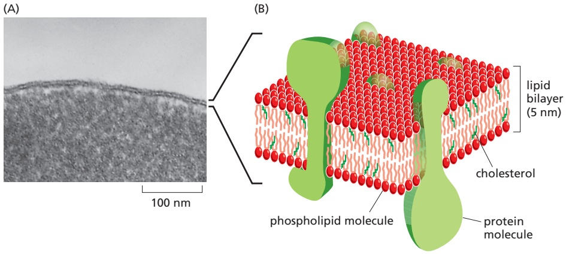

C HAP T E R

IN THIS CHAPTER The Lipid Bilayer Membrane Proteins

Figure 10–1 Two views of a cell membrane. (A) An electron micrograph of a segment of the plasma membrane of a human red blood cell seen in cross section, showing its bilayer structure. (B) A three-dimensional schematic view of a cell membrane and the general disposition of its lipid and protein constituents. (A, courtesy of Daniel S. Friend, reused by permission of E.L. Bearer.) 6

dynamic, fluid structures, and most of their molecules move about in the plane of the membrane. The lipid molecules are arranged as a continuous double layer about 5 nm thick. This lipid bilayer provides the basic fluid structure of the membrane and serves as an essentially impermeable barrier to the passage of most water-soluble molecules. Most membrane proteins span the lipid bilayer and mediate nearly all of the other functions of the membrane, including the transport of specific molecules across it, and the catalysis of membrane-associated reactions such as ATP synthesis. In the plasma membrane, some transmembrane proteins serve as structural links that connect the cytoskeleton through the lipid bilayer to either the extracellular matrix or an adjacent cell, while others serve as receptors to detect and transduce chemical signals in the cell’s environment. It takes many kinds of membrane proteins to enable a cell to function and interact with its environment, and it is estimated that about 30% of the proteins encoded in an animal’s genome are membrane proteins.

In this chapter, we consider the structure and organization of the two main constituents of biological membranes—the lipids and the proteins. Although we focus mainly on the plasma membrane, most concepts discussed apply to the various internal membranes of eukaryotic cells as well. The functions of cell membranes are considered in later chapters: their role in energy conversion and ATP synthesis, for example, is discussed in Chapter 14; their role in the transmembrane transport of small molecules in Chapter 11; and their roles in cell signaling and cell adhesion in Chapters 15 and 19, respectively. In Chapters 12 and 13, we discuss the internal membranes of the cell and the protein traffic through and between them.

#### THE LIPID BILAYER

The **lipid bilayer** provides the basic structure for all cell membranes. It is easily seen by electron microscopy, and its bilayer structure is attributable exclusively to the special properties of the lipid molecules, which assemble spontaneously into bilayers even under simple artificial conditions. In this section, we discuss the different types of lipid molecules found in cell membranes and the general properties of lipid bilayers.

Figure 10–2 The parts of a typical phospholipid molecule. This example is phosphatidylcholine, represented (A) by a formula, (B) as a space-filling model (Movie 10.1), (C) schematically, and (D) as a symbol.

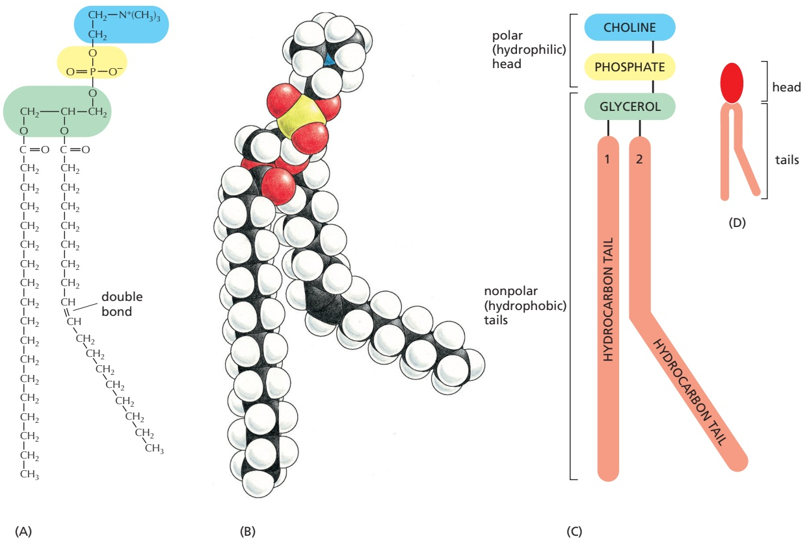

#### Glycerophospholipids, Sphingolipids, and Sterols Are the Major Lipids in Cell Membranes

Lipid molecules constitute about 50% of the mass of most animal cell membranes, nearly all of the remainder being protein. There are approximately $5 \times 1 0 ^ { 6 }$ lipid molecules in a 1 μm × 1 μm area of lipid bilayer, or about $7 \times \dot { 1 } 0 ^ { 8 }$ lipid molecules in the plasma membrane of a red blood cell. All of the lipid molecules in cell membranes are **amphiphilic**; that is, they have a **hydrophilic** (“water-loving”) or polar end and a **hydrophobic** (“water-fearing”) or nonpolar end.

The most abundant membrane lipids are the **phospholipids**. These have a polar head group, which includes a phosphate group, and two hydrophobic hydrocarbon tails. In animal, plant, and bacterial cells, the tails are usually fatty acids, and they can differ in length (they normally contain between 14 and 24 carbon atoms). One tail typically has one or more cis-double bonds (that is, it is unsaturated), while the other tail does not (that is, it is saturated). As shown in **Figure 10–2**, each cis-double bond creates a kink in the tail. Differences in the length and saturation of the fatty acid tails influence how phospholipid molecules pack against one another, thereby affecting the fluidity of the membrane, as we discuss later.

The main phospholipids in most animal cell membranes are the **glycerophospholipids**, which have a three-carbon glycerol backbone (see Figure 10–2). Two long-chain fatty acids are linked through ester bonds to adjacent carbon atoms of the glycerol, and the third carbon atom of the glycerol is attached to a phosphate group, which in turn is linked to one of several types of head group. By combining several different fatty acids and head groups, cells make many different glycerophospholipids. Phosphatidylethanolamine, phosphatidylserine, and phosphatidylcholine are the most abundant ones in mammalian cell membranes (**Figure 10–3A, B, and C**).

Another important class of phospholipids is the sphingolipids, which are built from sphingosine rather than glycerol (**Figure 10–3D and E**). Sphingosine is a long fatty acid tail with an amino group (NH2) and two hydroxyl groups (OH) at one end. In sphingomyelin, the most common sphingolipid, a fatty acid tail is attached to the amino group, and a phosphocholine group is attached to the terminal hydroxyl group. Together, the phospholipids phosphatidylcholine, phosphatidylethanolamine, phosphatidylserine, and sphingomyelin constitute more than half the mass of lipid in most mammalian cell membranes (see Table 10–1, p. 610).

Figure 10–3 Four major phospholipids in mammalian plasma membranes. Different head groups are represented by different colors in the symbols. The lipid molecules shown in (A–C) are glycerophospholipids, which are derived from glycerol. The molecule in (D) is sphingomyelin, which is derived from (E) sphingosine and is therefore a sphingolipid. Note that only phosphatidylserine carries a net negative charge, the importance of which we discuss later; the other three are electrically neutral at physiological pH, carrying one positive and one negative charge.

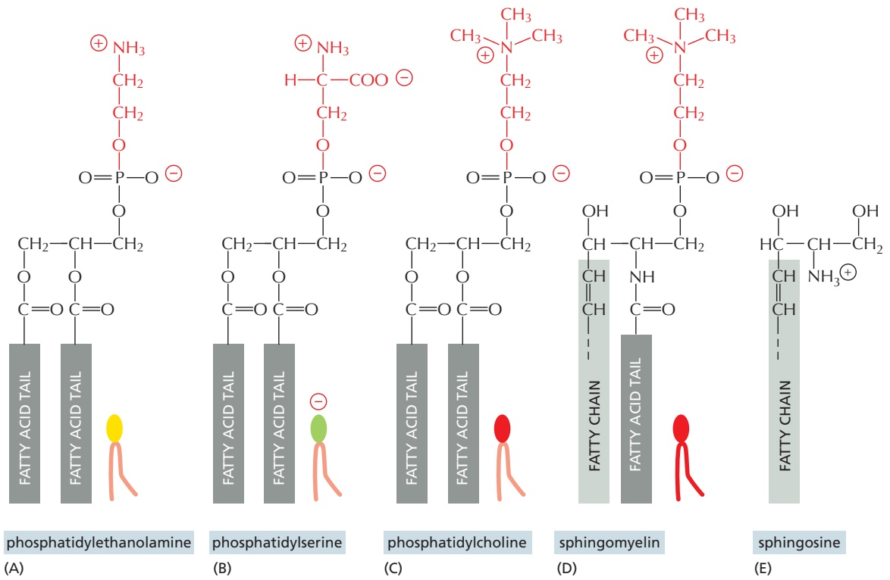

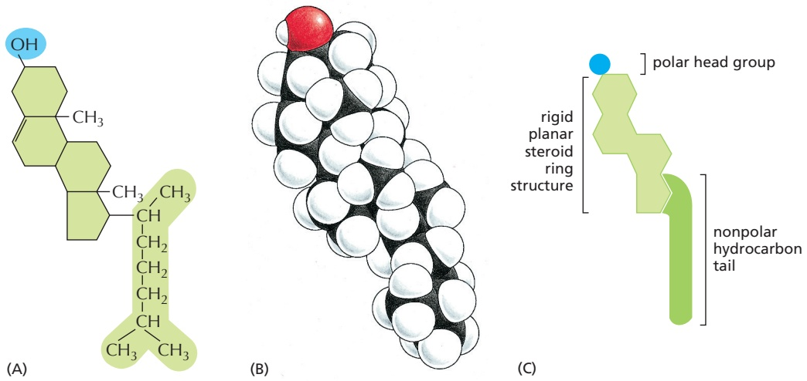

Figure 10–4 The structure of cholesterol. Cholesterol, a sterol, is represented (A) by a formula, (B) as a space-filling model, and (C) by a schematic drawing.

In addition to phospholipids, the lipid bilayers in many cell membranes contain glycolipids and sterols. Glycolipids resemble sphingolipids, but, instead of a phosphate-linked head group, they have sugars attached. We discuss glycolipids later. Sterols are rigid ring structures related to steroids but containing a single polar hydroxyl group and a short nonpolar hydrocarbon chain (**Figure 10–4**). Different types of sterols, distinguished primarily by the side chain attached to the ringed scaffold, are found in fungi, plants, and animal cells. Eukaryotic plasma membranes contain especially large amounts of sterols—up to one molecule for every phospholipid molecule. **Cholesterol** is the major sterol found in animal cells. The cholesterol molecules orient themselves in the bilayer with their hydroxyl group close to the polar head groups of adjacent phospholipid molecules (**Figure 10–5**).

#### Phospholipids Spontaneously Form Bilayers

The shape and amphiphilic nature of the phospholipid molecules cause them to form bilayers spontaneously in aqueous environments. As discussed in Chapter 2, hydrophilic molecules dissolve readily in water because they contain charged groups or uncharged polar groups that can form either favorable electrostatic interactions or hydrogen bonds with water molecules (**Figure 10–6A**). Hydrophobic molecules, by contrast, are insoluble in water because all, or almost all, of their atoms are uncharged and nonpolar and therefore cannot form energetically favorable interactions with water molecules. If dispersed in water, this forces the adjacent water molecules to reorganize into icelike cages that surround the hydrophobic molecule (**Figure 10–6B**). Because these cage structures are more ordered than the surrounding water, their formation increases the free energy. This entropic free-energy cost is minimized, however, if the hydrophobic molecules (or the hydrophobic portions of amphiphilic molecules) cluster together so that the smallest number of water molecules is affected.

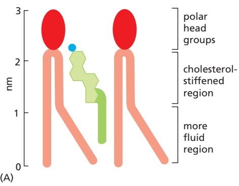

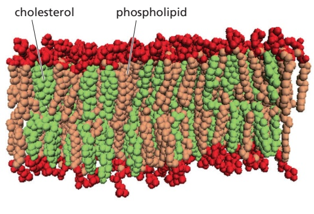

(B)

Figure 10–5 Cholesterol in a lipid bilayer. (A) Schematic drawing (to scale) of a cholesterol molecule interacting with two phospholipid molecules in one monolayer of a lipid bilayer shown in (B).

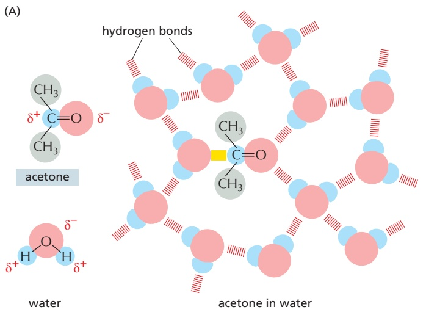

When phospholipid molecules are exposed to an aqueous environment, they behave as you would expect from the above discussion. They spontaneously pack together to minimize exposure of their hydrophobic tails to water and maximize exposure of their hydrophilic heads to water. Depending on their shape, the optimal packing arrangement is achieved in either of two ways: they can form spherical micelles, with the tails inward, or they can form double-layered sheets, or bilayers, with the hydrophobic tails sandwiched between the hydrophilic head groups (**Figure 10–7**).

Figure 10–6 How hydrophilic and hydrophobic molecules interact differently with water. (A) Because acetone is polar, it can form hydrogen bonds (red) and favorable electrostatic interactions (yellow) with water molecules, which are also polar. Thus, acetone readily dissolves in water. (B) By contrast, 2-methylpropane is entirely hydrophobic. Because it cannot form favorable interactions with water, it forces adjacent water molecules to reorganize into icelike cage structures, which increases the free energy. This compound is therefore virtually insoluble in water. The symbol δ– indicates a partial negative charge, and δ+ indicates a partial positive charge. Polar atoms are shown in color, and nonpolar groups are shown in gray.

The same forces that drive phospholipids to form bilayers also provide a self-sealing property. A small tear in the bilayer creates a free edge exposed to water; because this is energetically unfavorable, the lipids will rearrange spontaneously to eliminate the free edge. The prohibition of free edges has a profound consequence: the only way for a bilayer to avoid having edges is by closing in on

Figure 10–7 Packing arrangements of amphiphilic molecules in an aqueous environment. (A) These molecules spontaneously form micelles or bilayers in water, depending on their shape. Cone-shaped amphiphilic molecules (above) form micelles, whereas cylindershaped amphiphilic molecules such as phospholipids (below) form bilayers. (B) A micelle and a lipid bilayer seen in cross section. Note that micelles of amphiphilic molecules are thought to be much more irregular than drawn here (see Figure 10–26C).

ENERGETICALLY UNFAVORABLE

itself and forming a sealed compartment (**Figure 10–8**). This remarkable behavior, fundamental to the creation of a living cell, follows directly from the shape and amphiphilic nature of the phospholipid molecule.

<!-- END EN EN10-H000-H004 -->

### 英文补充：膜蛋白类型、跨膜结构、糖基化与去垢剂

> 对应中文板块：膜蛋白类型、跨膜结构、糖基化与去垢剂。英文来源：Molecular Biology of the Cell，第7版，第10章；[本章完整原文](../../来源/英文教材/10_Membrane_Structure/chapter.md)。物理PDF页码范围：642–675（整章范围）。

<!-- BEGIN EN EN10-H011-H021 -->
#### Summary

Biological membranes consist of a continuous double layer of lipid molecules in which membrane proteins are embedded. This lipid bilayer is fluid, with individual lipid molecules able to diffuse rapidly within their own monolayer. The membrane lipid molecules are amphiphilic. When placed in water, they assemble spontaneously into bilayers, which form sealed compartments.

Although cell membranes can contain hundreds of different lipid species, the plasma membrane in animal cells contains three major classes—phospholipids,

cholesterol, and glycolipids. Because of their different backbone structure, phospholipids fall into two subclasses—glycerophospholipids and sphingolipids. The lipid compositions of the inner and outer monolayers are different, reflecting the different functions of the two faces of a cell membrane. Different mixtures of lipids are found in the membranes of cells of different types, as well as in the various membranes of a single eukaryotic cell. Inositol phospholipids are a minor class of phospholipids, which in the cytosolic leaflet of the plasma membrane lipid bilayer play an important part in cell signaling: in response to extracellular signals, specific lipid kinases phosphorylate the head groups of these lipids to form docking sites for cytosolic signaling proteins, whereas specific phospholipases cleave certain inositol phospholipids to generate small intracellular signaling molecules.

#### MEMBRANE PROTEINS

Although the lipid bilayer provides the basic structure of biological membranes, the membrane proteins perform most of the membrane’s specific tasks and therefore give each type of cell membrane its characteristic functional properties. Accordingly, the amounts and types of proteins in a membrane are highly variable. In the myelin membrane, which serves mainly as electrical insulation for nerve-cell axons, less than 25% of the membrane mass is protein. By contrast, in the membranes involved in ATP production (such as the internal membranes of mitochondria and chloroplasts), approximately 75% is protein. A typical plasma membrane is somewhere in between, with protein accounting for about half of its mass. Because lipid molecules are small compared with protein molecules, however, there are always many more lipid molecules than protein molecules in cell membranes—about 50 lipid molecules for each protein molecule in cell membranes that are 50% protein by mass. Membrane proteins vary widely in structure and in the way they associate with the lipid bilayer, which reflects their diverse functions.

#### Membrane Proteins Can Be Associated with the Lipid Bilayer in Various Ways

**Figure 10–17** shows the different ways in which proteins can associate with the membrane. Like their lipid neighbors, **membrane proteins** are amphiphilic, having hydrophobic and hydrophilic regions. Many membrane proteins extend through the lipid bilayer, and hence are called **transmembrane proteins**, with part of their mass extruding from the membrane on both sides (Figure 10–17, examples 1, 2, and 5). Other transmembrane proteins are inserted with the bulk of their mass exposed almost exclusively on one or the other side of the membrane (Figure 10–17, examples 3 and 4). In all cases their hydrophobic regions pass through the membrane and interact with the hydrophobic tails of the lipid molecules in the interior of the bilayer, where they are sequestered away from water. Their hydrophilic regions are exposed to water on either side of the membrane.

Figure 10–17 Various ways in which proteins associate with the lipid bilayer. Most membrane proteins are thought to extend across the bilayer as (1) a single α helix, (2) as multiple α helices, or (5) as a rolled-up β sheet (a β barrel). Some of these single-pass and multipass proteins have a covalently attached fatty acid chain inserted in the cytosolic lipid monolayer (1). Other membrane proteins are exposed at only one side of the membrane (3, 4). These classes include glycosyltransferases that carry out glycosylation reactions in the Golgi apparatus (3) and SNARE proteins that catalyze membrane fusion (4), both discussed in Chapter 13. (6) Some of these are anchored to the cytosolic surface by an amphiphilic α helix that partitions into the cytosolic monolayer of the lipid bilayer through the hydrophobic face of the helix. (7) Others are attached to the bilayer solely by a covalently bound lipid chain—either a fatty acid chain or a prenyl group (see Figure 10–18)—in the cytosolic monolayer or, (8) via an oligosaccharide linker, to phosphatidylinositol in the noncytosolic monolayer—called a GPI anchor. (9, 10) Finally, membrane-associated proteins are attached to the membrane only by noncovalent interactions with other membrane proteins. The way in which the structure in (7) is formed is illustrated in Figure 10–18, while the way in which the GPI anchor shown in (8) is formed is illustrated in Figure 12–30. The details of how membrane proteins become associated with the lipid bilayer are discussed in Chapter 12.

Other membrane proteins are located entirely in the cytosol and are attached to the cytosolic monolayer of the lipid bilayer, either by an amphiphilic α helix exposed on the surface of the protein (Figure 10–17, example 6) or by one or more covalently attached lipid chains (Figure 10–17, example 7). The lipid-linked proteins in example 7 in Figure 10–17 are made as soluble proteins in the cytosol and are subsequently anchored to the membrane by the covalent attachment of the lipid group. Lipids can also be attached to the cytosolic facing domains of transmembrane proteins as an additional means of anchoring them to the membrane (see Figure 10–17, example 1).

Yet other membrane proteins are entirely exposed at the external cell surface, being attached to the lipid bilayer only by a covalent linkage (via a specific oligosaccharide) to a lipid anchor in the outer monolayer of the plasma membrane (Figure 10–17, example 8). These proteins are initially made and inserted into the endoplasmic reticulum (ER) by a single transmembrane segment at the C-terminus (similar to example 4 in Figure 10-17). While still in the ER, the transmembrane segment of the protein is cleaved off and a glycosylphosphatidylinositol (GPI) anchor is added, leaving the protein bound to the noncytosolic surface of the ER membrane solely by this anchor (discussed in Chapter 12); transport vesicles eventually deliver the protein to the plasma membrane (discussed in Chapter 13).

By contrast to these examples, **membrane-associated proteins** do not extend into the hydrophobic interior of the lipid bilayer at all; they are instead bound to either face of the membrane by noncovalent interactions with other membrane proteins (Figure 10–17, examples 9 and 10). Many of the proteins of this type can be released from the membrane by relatively gentle extraction procedures, such as exposure to solutions of very high or low ionic strength or of extreme pH, which interfere with protein–protein interactions but leave the lipid bilayer intact; these proteins are often referred to as peripheral membrane proteins, and their association with membranes is often regulated by the cell as we discuss next. Transmembrane proteins and many proteins held in the bilayer by lipid groups or hydrophobic polypeptide regions that insert into the hydrophobic core of the lipid bilayer cannot be released in these ways.

#### Lipid Anchors Control the Membrane Localization of Some Signaling Proteins

How a membrane protein is associated with the lipid bilayer reflects the function of the protein. Only transmembrane proteins can function on both sides of the bilayer or transport molecules across it. Cell-surface receptors, for example, are usually transmembrane proteins that bind signal molecules in the extracellular space and generate different intracellular signals on the opposite side of the plasma membrane, as we discuss in Chapter 15. To transfer small hydrophilic molecules across a membrane, a membrane transport protein must provide a path for the molecules to cross the hydrophobic permeability barrier of the lipid bilayer; the molecular architecture of multipass transmembrane proteins (Figure 10–17, examples 2 and 5) is ideally suited for this task, as we discuss in Chapter 11.

Proteins that function on only one side of the lipid bilayer, by contrast, are often associated exclusively with either the lipid monolayer or a protein domain on that side. Some intracellular signaling proteins, for example, that help relay extracellular signals into the cell interior are bound to the cytosolic half of the plasma membrane by one or more covalently attached lipid groups, which can be fatty acid chains or prenyl groups (Figure 10–18). In some cases, myristic acid is added to the N-terminal amino group of the protein during its synthesis on a ribosome. All members of the Src family of cytoplasmic protein tyrosine kinases (discussed in Chapter 15) are myristoylated in this way. Membrane attachment through a single lipid anchor is not very strong, however, and a second lipid group is often added to anchor proteins more firmly to a membrane. For most Src kinases, the second lipid modification is the attachment of palmitic acid to a cysteine side chain of the protein. This modification occurs in response to an extracellular signal and helps recruit the kinases to the plasma membrane. When the signaling pathway is turned off, the palmitic acid is removed, allowing the kinase to return to the cytosol. Other intracellular signaling proteins, such as the Ras family small GTPases (discussed in Chapter 15), use a combination of prenyl group and palmitic acid attachment to recruit the proteins to the plasma membrane.

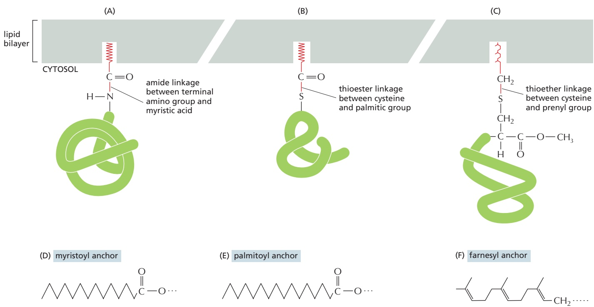

Many proteins attach to membranes transiently. Some are classical peripheral membrane proteins that associate with membranes by regulated protein–protein interactions. Others undergo a transition from soluble to membrane protein by a conformational change that exposes a hydrophobic peptide or covalently attached lipid anchor. Many of the small GTPases of the Rab protein family that regulate intracellular membrane traffic (discussed in Chapter 13), for example, switch depending on the nucleotide that is bound to the protein. In their GDP-bound state they are soluble in the cytosol, often stabilized by binding to a GDP dissociation inhibitor, or GDI, whereas in their GTP-bound state their lipid anchor is exposed and tethers them to membranes. They are membrane proteins at one moment and soluble proteins at the next. Such highly dynamic interactions greatly expand the repertoire of membrane functions.

#### In Most Transmembrane Proteins, the Polypeptide Chain Crosses the Lipid Bilayer in an α-Helical Conformation

A transmembrane protein always has a unique orientation in the membrane. This reflects both the asymmetric manner in which it is inserted into the lipid bilayer in the ER during its biosynthesis (discussed in Chapter 12) and the different functions of its cytosolic and noncytosolic domains. These domains are separated by the membrane-spanning segments of the polypeptide chain, which contact the hydrophobic environment of the lipid bilayer and are composed largely of amino acids with nonpolar side chains. Because the peptide bonds themselves are polar and because water is absent in the bilayer, all peptide bonds in the membranespanning segments of a polypeptide are driven to form hydrogen bonds with one another (discussed in Chapter 3).

There are two ways that hydrogen-bonding between peptide bonds can be maximized. The most common way, found in the majority of transmembrane

attachment by a fatty acid chain or a prenyl group. The covalent attachment of either type of lipid can help localize a water-soluble protein to a membrane after its synthesis in the cytosol. (A) A fatty acid chain (myristic acid) is attached via an amide linkage to an N-terminal glycine. (B) A fatty acid chain (palmitic acid) is attached via a thioester linkage to a cysteine. (C) A prenyl chain (either farnesyl or a longer geranylgeranyl chain) is attached via a thioether linkage to a cysteine residue that is initially located four residues from the protein’s C-terminus. After prenylation, the terminal three amino acids are cleaved off, and the new C-terminus is methylated before insertion of the anchor into the membrane (not shown). The structures of the lipid anchors are shown below: (D) a myristoyl anchor (derived from a 14-carbon saturated fatty acid chain), (E) a palmitoyl anchor (a 16-carbon saturated fatty acid chain), and (F) a farnesyl anchor (a 15-carbon unsaturated hydrocarbon chain composed of three 5-carbon isoprenoid repeats).

Figure 10–19 A segment of a membrane-spanning polypeptide chain crossing the lipid bilayer as an a helix. Only the α-carbon backbone of the polypeptide chain is shown, with the hydrophobic amino acids in green and the hydrophilic amino acids in yellow. The polypeptide segment shown is part of the single membrane-spanning protein glycophorin, which is found abundantly in the red blood cell plasma membrane. Glycophorin normally is a dimer of two identical subunits whose transmembrane segments cross in the hydrophobic interior of the bilayer. Only a single transmembrane segment is shown. (PDB code: 5EH4.)

proteins, is if the polypeptide chain forms a regular α helix as it crosses the bilayer (**Figure 10–19**). In **single-pass transmembrane proteins**, the polypeptide chain crosses only once (see Figure 10–17, example 1), whereas in **multipass transmembrane proteins**, the polypeptide chain crosses multiple times (see Figure 10–17, example 2). An alternative way for the peptide bonds in the lipid bilayer to satisfy their hydrogen-bonding requirements is for multiple transmembrane strands of a polypeptide chain to be arranged as a β sheet that is rolled up into a cylinder (a so-called b barrel; see Figure 10–17, example 5, and Figure 3–7). This protein architecture is seen in the porin proteins that we discuss later.

Progress in x-ray crystallography and single-particle cryo-electron microscopy of membrane proteins has enabled the determination of the three-dimensional structure of many of them. The structures confirm that it is often possible to pre-dict from the protein’s amino acid sequence which parts of the polypeptide chain extend across the lipid bilayer. Segments containing about 20–30 amino acids, with a high degree of hydrophobicity, are long enough to span a lipid bilayer as an α helix, and they can often be identified in hydropathy plots (**Figure 10–20**). From such plots, it is estimated that about 30% of an organism’s proteins are transmembrane proteins, emphasizing their importance. Hydropathy plots cannot identify the membrane-spanning segments of a β barrel, as 10 amino acids or fewer are sufficient to traverse a lipid bilayer as an extended β strand, and only every other amino acid side chain is hydrophobic.

The strong drive to maximize hydrogen-bonding in the absence of water means that most transmembrane helices span the membrane completely. But multipass transmembrane proteins can also contain regions that fold into the membrane from either side, squeezing into spaces between transmembrane α helices without contacting the hydrophobic core of the lipid bilayer. Because such regions interact only with other polypeptide regions, they do not need to maximize hydrogen-bonding; they can therefore have a variety of secondary structures, including helices that extend only partway across the lipid bilayer (**Figure 10–21**). Such regions are important for the function of some membrane proteins, including water channel and ion channel proteins, in which the regions contribute to the walls of the pores traversing the membrane and confer substrate specificity on the channels, as we discuss in Chapter 11. These regions cannot be identified in hydropathy plots and are only revealed by determining the protein’s threedimensional structure or by sequence alignment with homologous proteins whose structures are known.

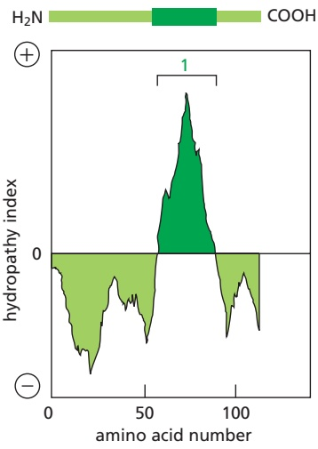

(A) GLYCOPHORIN

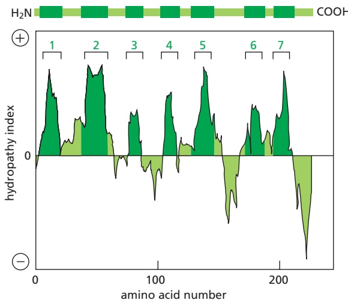

(B) BACTERIORHODOPSIN

Figure 10–20 Using hydropathy plots to localize potential a-helical membranespanning segments in a polypeptide chain. The free energy needed to transfer successive segments of a polypeptide chain from a nonpolar solvent to water is calculated from the amino acid composition of each segment using data obtained from model compounds. This calculation is made for segments of a fixed size (usually around 10–20 amino acids), beginning with each successive amino acid in the chain. The hydropathy index of the segment is plotted on the Y axis as a function of its location in the chain. A positive value indicates that free energy is required for transfer to water (that is, the segment is hydrophobic), and the value assigned is an index of the amount of energy needed. Peaks in the hydropathy index appear at the positions of hydrophobic segments in the amino acid sequence. (A and B) Hydropathy plots for two membrane proteins that are discussed later in this chapter. Glycophorin (A) has a single membrane-spanning α helix and one corresponding peak in the hydropathy plot. Bacteriorhodopsin (B) has seven membrane-spanning α helices and seven corresponding peaks in the hydropathy plot. (A, adapted from D. Eisenberg, Annu. Rev. Biochem. 53:595–624, 1984.)

#### Transmembrane α Helices Often Interact with One Another

The transmembrane α helices of many single-pass membrane proteins do not contribute to the folding of the protein domains on either side of the membrane. As a consequence, it is often possible to engineer cells to produce just the cytosolic or extracellular domains of these proteins as water-soluble molecules. This approach has been invaluable for studying the structure and function of these domains, especially the domains of transmembrane receptor proteins (discussed in Chapter 15). A transmembrane α helix, even in a single-pass membrane protein, however, often does more than just anchor the protein to the lipid bilayer. Many single-pass membrane proteins form homodimers or heterodimers that are held together by noncovalent, but strong and highly specific, interactions between the two transmembrane α helices; the sequence of the amino acids of these helices contains the information that directs the protein–protein interaction.

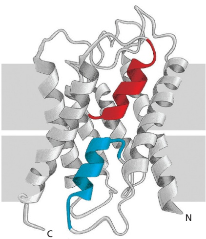

Figure 10–21 Two short a helices in the aquaporin water channel, each of which spans only halfway through the lipid bilayer. In the plasma membrane, four monomers, one of which is shown here, form a tetramer. Each monomer has a hydrophilic pore at its center, which allows water molecules to cross the membrane in single file (see Figure 11–20 and Movie 11.6). The two short, colored helices are buried at an interface formed by protein–protein interactions. The mechanism by which the channel allows the passage of water molecules is discussed in more detail in Chapter 11. (PDB code: 1H6I.)

Similarly, the transmembrane α helices in multipass membrane proteins occupy specific positions in the folded protein structure that are determined by interactions between the neighboring helices (**Figure 10–22**). These interactions are crucial for the structure and function of the many receptors, channels, and transporters that communicate or move molecules across cell membranes. In these proteins, each transmembrane helix shields regions of neighboring transmembrane helices from membrane lipids. When all the helices are packed together into the final folded structure, the outer surface of the helical bundle that is exposed to lipids is composed primarily of hydrophobic amino acids. By contrast, the interior of the helical bundle, which is not exposed directly to lipids, can contain polar and even charged amino acids that would ordinarily be disfavored in the membrane. The ability to accommodate hydrophilic amino acids within a bundle of transmembrane helices means that multipass membrane proteins can contain binding sites and channels across the membrane for hydrophilic molecules. This property affords multipass membrane proteins considerable functional diversity and probably explains why they represent the majority of membrane proteins.

#### Some β Barrels Form Large Channels

Unlike a bundle of α helices that can be arranged in numerous ways, β-barrel membrane proteins are always arranged as a cylinder. This is because all hydrogen bonds must be satisfied, so a sheet that exposes an edge is energetically disfavored in the membrane. This means that β barrels all share the same overall architecture in which the amino acids facing the outside of the cylinder are hydrophobic. By contrast, the size of the barrel, and the content inside the barrel, are highly variable and suited to the function of each β-barrel membrane protein. For example, the number of β strands in a β barrel varies widely, from as few as 8 strands to as many as 22 (**Figure 10–23**).

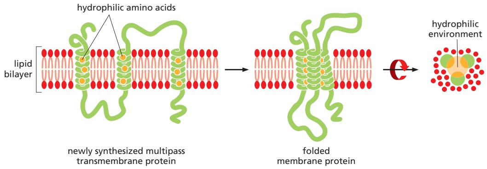

Figure 10–22 Steps in the folding of a multipass transmembrane protein. Polar and charged amino acids contained in transmembrane helices are energetically disfavored in the hydrophobic environment of the lipid bilayer. They become buried in the interface between spatially adjacent helices in folded membrane proteins. In membrane protein complexes, these contacts can occur between helices from different protein subunits, as is the case for many ion channels as discussed MBoC7 m10.22/10.22in Chapter 11. In this way, multipass membrane proteins can provide a hydrophilic path across the hydrophobic barrier of the bilayer.

β-Barrel proteins are abundant in the outer membranes of bacteria, mitochon-MBoC7 m10.23/10.23 dria, and chloroplasts. Some are pore-forming proteins, which create water-filled channels that allow selected small hydrophilic molecules to cross the membrane. The porins are well-studied examples (Figure 10–23C). Many porin barrels are formed from a 16-strand, antiparallel β sheet rolled up into a cylindrical structure. Polar amino acid side chains line the aqueous channel on the inside, while nonpolar side chains project from the outside of the barrel to interact with the hydrophobic core of the lipid bilayer. Loops of the polypeptide chain often protrude into the **lumen** of the channel, narrowing it so that only certain solutes can pass. Some porins are therefore highly selective: maltoporin, for example, preferentially allows maltose and maltose oligomers to cross the outer membrane of E. coli.

The FepA protein is a more complex example of a β-barrel transport protein (Figure 10–23D). It transports iron ions across the bacterial outer membrane. It is constructed from 22 β strands, and a large globular domain completely fills the inside of the barrel. Iron ions bind to this domain, which changes its conformation to transfer the iron across the membrane.

Not all β-barrel proteins are transporters. Some form smaller barrels that are completely filled by amino acid side chains that project into the center of the barrel. These proteins function as receptors or enzymes (Figure 10–23A and B); the barrel serves as a rigid anchor, which holds the protein in the membrane and orients the cytosolic loops that form binding sites for specific intracellular molecules.

Figure 10–23 b barrels formed from different numbers of b strands. (A) The Escherichia coli OmpA protein serves as a receptor for a bacterial virus. (B) The E. coli OMPLA protein is an enzyme (a lipase) that hydrolyzes lipid molecules. The amino acids that catalyze the enzymatic reaction (indicated in red) protrude from the outside surface of the barrel. (C) A porin from the bacterium Rhodobacter capsulatus forms a water-filled pore across the outer membrane. The diameter of the channel is restricted by loops (shown in yellow) that protrude into the channel. (D) The E. coli FepA protein transports iron ions. The inside of the barrel is completely filled by a globular protein domain (shown in yellow) that contains an iron-binding site (not shown).

Most multipass membrane proteins in eukaryotic cells and in the bacterial plasma membrane are constructed from transmembrane α helices. The helices can slide against each other, allowing conformational changes in the protein that can open and shut ion channels, transport solutes, or transduce extracellular signals into intracellular ones. In β-barrel proteins, by contrast, hydrogen bonds bind each β strand rigidly to its neighbors, making conformational changes within the wall of the barrel unlikely. This rigidity makes $\beta$ barrels remarkably stable, allowing them to be more easily purified and crystallized than α-helical membrane proteins. This is one reason why β-barrel proteins were among the first multipass proteins whose structures were determined.

#### Many Membrane Proteins Are Glycosylated

The plasma membrane of a cell is exposed to the often harsh and constantly changing extracellular environment. How are the membrane and its embedded proteins protected from damage? One answer is that many cells have a layer of oligosaccharide and polysaccharide chains that are attached to the lipids and protein domains facing the outside. Most transmembrane proteins in animal cells are glycosylated. As in glycolipids, the sugar residues are added in the lumen of the endoplasmic reticulum and the Golgi apparatus (discussed in Chapters 12 and 13). For this reason, the oligosaccharide chains are always present on the noncytosolic side of the membrane. Another important difference between proteins (or parts of proteins) on the two sides of the membrane results from the reducing environment of the cytosol. This environment decreases the likelihood that intrachain or interchain disulfide (S–S) bonds will form between cysteines on the cytosolic side of membranes. These bonds form on the noncytosolic side, where they can help stabilize either the folded structure of the polypeptide chain or its association with other polypeptide chains (**Figure 10–24**).

Because the extracellular parts of most plasma membrane proteins are glycosylated, carbohydrates extensively coat the surface of all eukaryotic cells. These carbohydrates occur as oligosaccharide chains covalently bound to membrane proteins (glycoproteins) and lipids (glycolipids). They also occur as the polysaccharide chains of integral membrane proteoglycan molecules. Proteoglycans, which consist of long polysaccharide chains linked covalently to a protein core, are found mainly outside the cell, as part of the extracellular matrix (discussed in Chapter 19). But, for some proteoglycans, the protein core either extends across the lipid bilayer or is attached to the bilayer by a glycosylphosphatidylinositol (GPI) anchor.

The terms cell coat or glycocalyx are sometimes used to describe the carbohydrate-rich zone on the cell surface. This **carbohydrate layer** can be visualized by various stains, such as ruthenium red (**Figure 10–25A**), as well as by its affinity for carbohydrate-binding proteins called **lectins**, which can be labeled with a fluorescent dye or some other visible marker. Although most of the sugar groups are attached to intrinsic plasma membrane molecules, the carbohydrate layer also contains both glycoproteins and proteoglycans that have been secreted into the extracellular space and then adsorbed onto the cell surface (**Figure 10–25B**). Many of these adsorbed macromolecules are components of the extracellular matrix, so that the boundary between the plasma membrane and the extracellular matrix is often not sharply defined. One of the many functions of a slippery carbohydrate layer is to protect cells against mechanical and chemical damage; it also keeps various other cells at a distance, preventing unwanted cell–cell interactions.

The oligosaccharide side chains of glycoproteins and glycolipids are enormously diverse in their arrangement of sugars. Although they usually contain fewer than 15 sugars, the chains are often branched, and the sugars can be bonded together by various kinds of covalent linkages—unlike the amino acids in a polypeptide chain, which are all linked by identical peptide bonds. Even three sugars can be put together to form hundreds of different trisaccharides. How sugars can form such a vast variety of different structures is discussed in Chapter 2. Both the diversity and the exposed position of the oligosaccharides on the cell surface make them especially well suited to function in specific cell-recognition processes. Plasma-membrane-bound lectins that recognize specific oligosaccharides on cell-surface glycolipids and glycoproteins mediate a variety of transient cell–cell adhesion processes, including those occurring in lymphocyte recirculation and inflammatory responses (see Figure 19–28).

Figure 10–24 A single-pass

transmembrane protein. Note that the polypeptide chain traverses the lipid bilayer as a right-handed α helix and that the oligosaccharide chains and disulfide bonds MBoC7 m10.24/10.24are all on the noncytosolic surface of the membrane. As shown, sulfhydryl groups within a transmembrane protein can form either intrachain disulfide bonds with each other or interchain disulfide bonds with sulfhydryl groups in other proteins. The sulfhydryl groups in the cytosolic domain of the protein do not normally form disulfide bonds because the reducing environment in the cytosol maintains these groups in their reduced (–SH) form.

(A)

Figure 10–25 The carbohydrate layer on the cell surface. (A) This electron micrograph of the surface of a lymphocyte stained with ruthenium red emphasizes the thick carbohydrate-rich layer surrounding the cell. (B) The carbohydrate layer is made up of the oligosaccharide side chains of membrane glycolipids and membrane glycoproteins and the polysaccharide chains on membrane proteoglycans. In addition, adsorbed glycoproteins, and adsorbed proteoglycans (not shown), contribute to the carbohydrate layer in many cells. Note that all of the carbohydrate is on the extracellular surface of the membrane. (A, courtesy of Audrey M. Gluaert and G.M.W. Cook.)

(B)

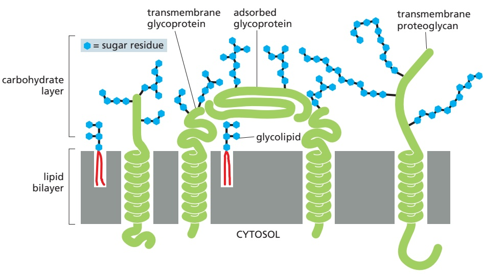

#### Membrane Proteins Can Be Solubilized and Purified in Detergents

In general, only agents that disrupt hydrophobic associations and disassemble the lipid bilayer can liberate membrane proteins in a soluble form. The most useful of these for the membrane biochemist are **detergents**, which are small amphiphilic molecules of variable structure (**Movie 10.4**). Detergents are much more soluble in water than in lipids. Their polar (hydrophilic) ends can be either charged (ionic), as in sodium dodecyl sulfate (SDS), or uncharged (nonionic), as in b-octylglucoside and Triton X-100 (**Figure 10–26A**). At low concentration, detergents are monomeric in solution, but when their concentration is increased above a threshold, called the critical micelle concentration (CMC), they aggregate to form micelles (**Figure 10–26B, C, and D**). Above the CMC, detergent molecules rapidly diffuse in and out of micelles, keeping the concentration of monomer in the solution constant, no matter how many micelles are present. Because of this dynamic behavior, the structure of a micelle changes constantly: at any moment most, but not all, of the hydrophilic ends of the detergent molecules will be external facing the water phase and most, but not all, of the hydrophobic ends will be internal to the micelle. Both the CMC and the average number of detergent molecules in a micelle are characteristic properties of each detergent, but they also depend on the temperature, pH, and salt concentration. Detergent solutions are therefore complex systems and are difficult to study.

(B)

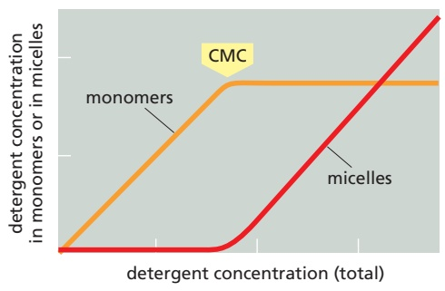

Figure 10–26 The structure and function of detergents. (A) Three commonly used detergents are sodium dodecyl sulfate (SDS), an anionic detergent, and Triton X-100 and β-octylglucoside, two nonionic detergents. Triton X-100 is a mixture of compounds in which the region in brackets is repeated between 9 and 10 times. The hydrophobic portion of each detergent is shown in yellow, and the hydrophilic portion is shown in orange. (B) At low concentration, detergent molecules are monomeric in solution. As their concentration is increased beyond the critical micelle concentration (CMC), some of the detergent molecules form micelles. Note that the concentration of detergent monomer stays constant above the CMC. (C) Because they have both polar and nonpolar ends, detergent molecules are amphiphilic; and because they are coneshaped, they form micelles rather than bilayers (see Figure 10–7). Detergent micelles are thought to have constantly changing, irregular shapes. Because of packing constraints, the hydrophobic tails are partially exposed to water. (D) The space-filling model shows a snapshot in time of a micelle composed of 20 β-octylglucoside molecules, predicted by molecular dynamics calculations. The head groups are shown in red and the hydrophobic tails in gray. Note that the hydrophobic regions are MBoC7 m10.26/10.26transiently exposed. (B, adapted with permission from G. Gunnarsson, B. Jönsson, and H. Wennerström, J. Phys. Chem. A 84:3114–3121, 1980. Copyright 1980 American Chemical Society; C, from S. Bogusz, R.M. Venable, and R.W. Pastor, J. Phys. Chem. B 104:5462–5470, 2000.)

When mixed with membranes, the hydrophobic ends of detergents bind to the hydrophobic regions of the membrane proteins, where they displace lipid molecules with a collar of detergent molecules. Because the other end of the detergent molecule is polar, this binding tends to bring the membrane proteins into solution as detergent–protein complexes (**Figure 10–27**). Usually, some lipid molecules also remain attached to the protein.

Strong ionic detergents, such as SDS, can solubilize even the most hydrophobic membrane proteins. This allows the proteins to be analyzed by SDS polyacrylamidegel electrophoresis (discussed in Chapter 8). Such strong detergents, however, unfold (denature) proteins by disrupting their internal hydrophobic cores, thereby rendering the proteins inactive and unusable for functional studies. Nonetheless, proteins can be readily separated and purified in their SDS-denatured form. In some cases, removal of the SDS allows the purified protein to renature, with recovery of functional activity.

Many membrane proteins can be solubilized and then purified in an active form by the use of mild detergents. These detergents cover the hydrophobic MBoC7 m10.27/10.27regions on membrane-spanning segments that become exposed after lipid removal but do not unfold the protein. Especially when working with multipass membrane proteins, it is often important to maintain a thin layer of lipids upon detergent extraction to retain the protein’s activity. If the detergent concentration

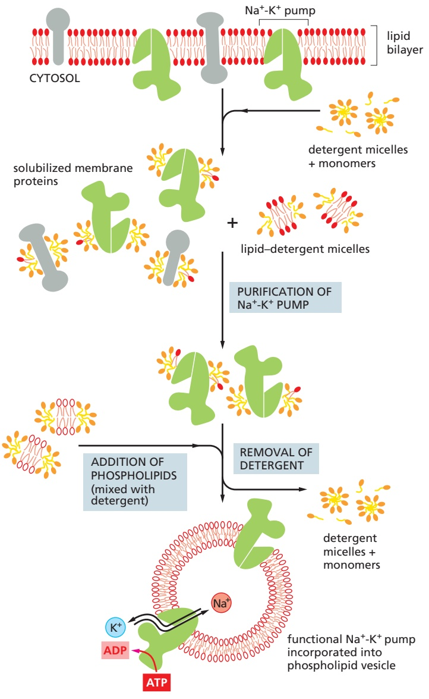

Figure 10–27 Solubilizing a membrane protein with a mild nonionic detergent. The detergent disrupts the lipid bilayer and brings the protein into solution as protein–lipid–detergent complexes. The phospholipids in the membrane are also solubilized by the detergent, as lipid–detergent micelles.

Figure 10–28 The use of mild nonionic detergents for solubilizing, purifying, and reconstituting functional membrane protein systems. In this example, functional Na+-K+ pump molecules are purified and incorporated into phospholipid vesicles. This pump is present in the plasma membrane of most animal cells, where it uses the energy of ATP hydrolysis to pump Na+ out of the cell and K+ in, as discussed in Chapter 11. The phospholipids that are newly added in the reconstitution experiments are shown with white polar head groups.

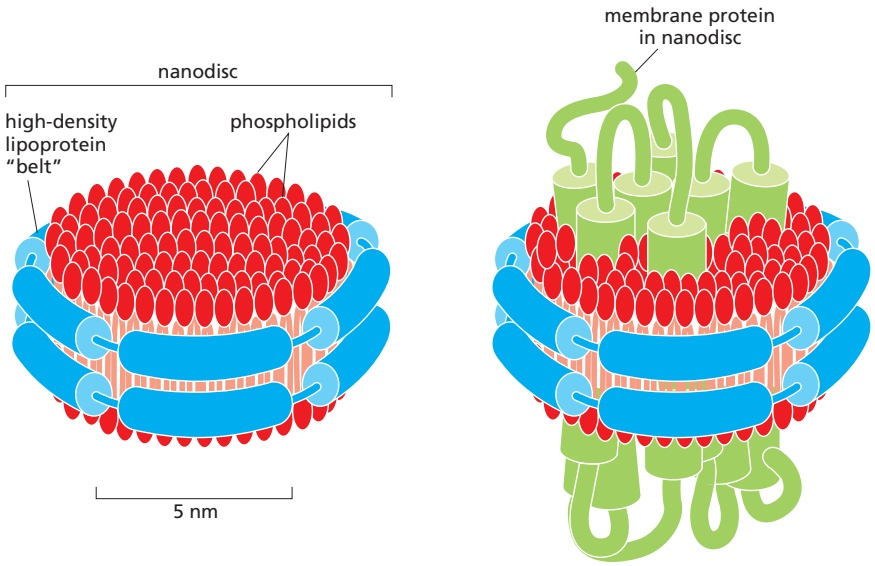

Figure 10–29 Model of a membrane protein reconstituted into a nanodisc. When detergent is removed from a solution containing a multipass membrane protein, lipids, and a protein subunit of the highdensity lipoprotein (HDL), the membrane protein becomes embedded in a small patch of lipid bilayer, which is surrounded by a belt of the HDL protein. In such nanodiscs, the hydrophobic edges of the bilayer patch are shielded by the protein belt, which renders the assembly watersoluble.

of a solution of solubilized membrane proteins is reduced (by dilution, for example), membrane proteins do not remain soluble. In the presence of an excess of phospholipid molecules in such a solution, however, membrane proteins incorporate into small liposomes that form spontaneously. In this way, functionally active membrane protein systems can be reconstituted from purified components, providing a powerful means of analyzing the activities of membrane transporters, ion channels, signaling receptors, and so on (**Figure 10–28**). Such functional reconstitution can determine which proteins are both necessary and sufficient for a particular cell function. For example, the approach provided proof for the hypothesis that the enzymes that make ATP (ATP synthases) use H gradients in mitochondrial, chloroplast, and bacterial membranes to produce ATP.

Membrane proteins can also be reconstituted from detergent solution into nanodiscs, which are small, uniformly sized patches of membrane that are surrounded by a belt of a specially designed protein, which covers the exposed edge of the bilayer to keep the patch in solution (**Figure 10–29**). The belt protein is derived from high-density lipoproteins (HDLs), whose normal function is to keep lipids soluble for transport in the blood. In nanodiscs the membrane protein of interest can be studied in its native lipid environment and is experimentally accessible from both sides of the bilayer, which is useful, for example, for ligand-binding experiments. Proteins contained in nanodiscs can also be analyzed by single-particle electron microscopy techniques to determine their structure. By this technique (discussed in Chapter 9), the structure of a membrane protein can be determined to high resolution without a requirement of the protein of interest to crystallize into a regular lattice, which is often hard to achieve for membrane proteins. These developments have led to a rapid increase in the number of three-dimensional structures of membrane proteins and protein complexes that are known, although they are still few compared to the known structures of water-soluble proteins and protein complexes.

#### Bacteriorhodopsin Is a Light-driven Proton (H+) Pump That Traverses the Lipid Bilayer as Seven α Helices

In Chapter 11, we consider how multipass transmembrane proteins mediate the selective transport of small hydrophilic molecules across cell membranes. But a detailed understanding of how such a membrane transport protein works requires precise information about its three-dimensional structure in the bilayer. Bacteriorhodopsin was the first membrane transport protein whose structure was determined, and it emerged as the prototype of many multipass membrane proteins that have a similar structure.

50 nm

patch of bacteriorhodopsin molecules

The “purple membrane” of the archaeon Halobacterium salinarum is a specialized patch in the plasma membrane that contains a single species of protein molecule, **bacteriorhodopsin** (**Figure 10–30A**). The protein functions as a light-activated $\mathrm { H } ^ { + }$ pump that transfers $\mathrm { H } ^ { + }$ out of the archaeal cell. The ability of bacteriorhodopsin molecules to tightly pack with each other into a planar twodimensional crystal (**Figure 10–30B,** $\mathrm { C } _ { r }$ **and D**) facilitated the determination of its three-dimensional structure.

Each bacteriorhodopsin molecule is folded into seven closely packed trans-MB C7 10.30/10.30 membrane α helices and contains a single light-absorbing group, or chromophore (in this case, retinal), which gives the protein its purple color. Retinal is vitamin A in its aldehyde form and is identical to the chromophore found in rhodopsin of the photoreceptor cells of the vertebrate eye (discussed in Chapter 15). Retinal is covalently linked to a lysine side chain of the bacteriorhodopsin protein. When activated by a single photon of light, the excited chromophore changes its shape and causes a series of small conformational changes in the protein, resulting in the transfer of one $\mathrm { H } ^ { + }$ from the inside to the outside of the cell (**Figure 10–31A**). In bright light, each bacteriorhodopsin molecule can pump several hundred protons per second. The light-driven proton transfer establishes an $\mathrm { H } ^ { + }$ gradient across the plasma membrane, which in turn drives the production of ATP by a second protein in the cell’s plasma membrane. The energy stored in the

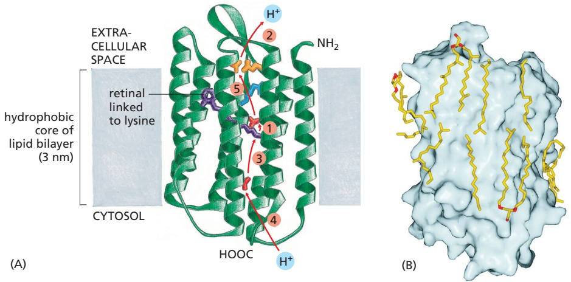

Figure 10–30 Patches of purple membrane, which contain bacteriorhodopsin in the archaeon Halobacterium salinarum. (A) These archaea live in saltwater pools, where they are exposed to sunlight. They have evolved a variety of light-activated proteins, including bacteriorhodopsin, which is a light-activated $\mathsf { H } ^ { + }$ pump in the plasma membrane. (B) The bacteriorhodopsin molecules in the purple membrane patches are tightly packed into two-dimensional crystalline arrays. (C) Details of the molecular surface visualized by atomic force microscopy. With this technique, individual bacteriorhodopsin molecules can be seen. (D) Outline of the approximate location of the bacteriorhodopsin monomer and the individual α helices in the image shown in C. (B–C, courtesy of Dieter Oesterhelt; D, PDB code: 2BRD.)

Figure 10–31 The three-dimensional structure of a bacteriorhodopsin molecule. (Movie 10.5) (A) The polypeptide chain crosses the lipid bilayer seven times as α helices. The location of the retinal chromophore (purple) and the probable pathway taken by H+ during the light-activated pumping cycle (red arrows) are shown. The first and key step is the passing of an $\mathsf { H } ^ { + }$ from the chromophore to the side chain of aspartic acid 85 (red, located next to the chromophore) that occurs upon absorption of a photon by the chromophore. Subsequently, other H+ transfer steps—in the numerical order indicated and utilizing the hydrophilic amino acid side chains that line a path through the membrane—complete the pumping cycle and return the enzyme to its starting state. (Movie 10.5 explains how the individual transfer steps are linked mechanistically.) Color code: glutamic acid (orange), aspartic acid (red), arginine (blue). (B) The high-resolution crystal structure of bacteriorhodopsin shows many lipid molecules (yellow with red head groups) that are tightly bound to specific places on the surface of the protein. (A, adapted from H. Luecke et al., Science 286:255–261, 1999. B, from H. Luecke et al., J. Mol. Biol. 291:899–911, 1999. With permission from Elsevier.)

H+ gradient also drives other energy-requiring processes in the cell. Thus, bacteriorhodopsin converts solar energy into an $\widetilde { \mathrm { H } ^ { + } }$ gradient, which provides energy to the archaeal cell.

The high-resolution crystal structure of bacteriorhodopsin reveals many lipid molecules bound in specific places on the protein surface (**Figure 10–31B**). Interactions with specific lipids are thought to help stabilize many membrane proteins, which work best and sometimes crystallize more readily if some of the lipids remain bound during detergent extraction or if specific lipids are added back to the proteins in detergent solutions. The specificity of these lipid–protein interactions helps explain why eukaryotic membranes contain such a variety of lipids, with head groups that differ in size, shape, and charge. This layer of lipids also helps to fill gaps between the jagged hydrophobic surface of the membrane protein and the hydrophobic core of the lipid bilayer and to maintain the permeability barrier of the membrane for ions and other solutes. These lipids are in dynamic association with the protein surface, binding and dissociating at a millisecond time scale. We can think of the membrane lipids as constituting a two-dimensional solvent for the proteins in the membrane, just as water constitutes a three-dimensional solvent for proteins in an aqueous solution: some membrane proteins can function only in the presence of specific lipid head groups, just as many enzymes in aqueous solution require a particular ion for activity.

Bacteriorhodopsin is a member of a large superfamily of membrane proteins with similar structures but different functions. For example, rhodopsin in rod cells of the vertebrate retina and many cell-surface receptor proteins that bind extracellular signal molecules are also built from seven transmembrane α helices. These proteins function as signal transducers rather than as transporters: each responds to an extracellular signal by activating a GTP-binding protein (G protein) inside the cell, and they are therefore called G-protein-coupled receptors (GPCRs), as we discuss in Chapter 15 (see Figure 15–6B). Although the structures of bacteriorhodopsins and GPCRs are strikingly similar, they show no sequence similarity and thus probably belong to two evolutionarily distant branches of an ancient protein family. A related class of membrane proteins, the channelrhodopsins that green algae use to detect light, form ion channels when they absorb a photon. When engineered so that they are expressed in animal brains, these proteins have become invaluable tools in neurobiology because they allow specific neurons to be stimulated experimentally by shining light on them, as we discuss in Chapter 11 (Figure 11–47).

#### Membrane Proteins Often Function as Large Complexes

Many membrane proteins function as part of multicomponent complexes. One is a bacterial photosynthetic reaction center, which was the first membrane protein complex to be crystallized and analyzed by x-ray diffraction. In Chapter 14, we discuss how such photosynthetic complexes function to capture light energy and use it to pump H+ across the membrane. Many of the membrane protein complexes involved in photosynthesis, proton pumping, and electron transport are even larger than the photosynthetic reaction center. The enormous photosystem II complex from cyanobacteria, for example, contains 19 protein subunits and well over 60 transmembrane helices (see Figure 14–49). Membrane proteins are often arranged in large complexes, not only for harvesting various forms of energy but also for transducing extracellular signals into intracellular ones (discussed in Chapter 15).

<!-- END EN EN10-H011-H021 -->
