# 第3章 细胞质膜 · 第二节 细胞质膜的基本特征与功能

[返回本章](../README.md) · [中文本章原文](../中文原文.md)

<!-- BEGIN CN CN03-S02 -->
## 第二节 细胞质膜的基本特征与功能

## 一、膜的流动性

膜的流动性是细胞质膜和所有的生物膜的基本特征之一，也是细胞生长、增殖等生命活动的必要条件。在脂膜二维空间上的热运动是膜脂和膜蛋白流动性的动力学基础，膜脂与膜蛋白的相互作用以及与膜两侧的生物大分子的相互作用，使膜的流动状态更为复杂。它不仅保证了细胞正常的代谢活动，而且受控于细胞代谢过程的调节。

## （一）膜脂的流动性

膜脂的流动性主要指脂分子的侧向运动，它在很大程度上是由脂分子本身的性质决定的，一般来说，脂肪酸链越短，不饱和程度越高，膜脂的流动性越大。温度对膜脂的运动有明显的影响，各种膜脂都具有其不同的相变温度（phase transition temperature），鞘脂的相变温度一般高于磷脂。在生物膜中，膜脂的相变温度是由组成生物膜的各种脂分子的相变温度决定的。低于相变温度，膜脂的流动性会骤然降低。一般情况下，鞘脂或卵磷脂组成的脂双层膜流动性小一些，磷脂酰乙醇胺、磷脂酰肌醇和磷脂酰丝氨酸等组成的脂膜流动性大一些。

膜脂的流动性是生长细胞完成包括生长、增殖在内的多种生理功能所必需的。在细菌和动物细胞中，常常通过增加不饱和脂肪酸的含量来调节膜脂的相变温度，以维持膜脂的流动性。

在动物细胞中，胆固醇对膜的流动性也起着重要的双重调节作用。胆固醇分子既有与磷脂疏水的尾部相结合使其更为有序、相互作用增强及限制其运动的作用，也有将磷脂分子隔开使其更易流动的功能。其最终效应取决于胆固醇在脂膜中的相对含量以及上述两种作用的综合效果。通常胆固醇是起到防止薄膜由液相变为固相以保证膜脂处于流动状态的作用。在细胞质膜脂双层的内外两小叶的膜脂中，细胞外小叶膜脂的胆固醇的含量往往高于内小叶，因此内小叶膜脂的流动性更弱。

由于膜脂与膜脂以及膜脂与膜蛋白之间的复杂的相互作用，膜脂分子的运动状态各不相同，其运动的区域也受到一定的限制。当用荧光素标记磷脂分子，研究磷脂在成纤维细胞质膜中的运动情况时，人们发现大多数的磷脂只是在直径约0.5 $\mu$ m的范围内自由运动，其原因是受到了直径约1 $\mu$ m的膜蛋白含量较高的质膜区域所阻隔。

## （二）膜蛋白的流动性

一系列的实验证明了膜蛋白的流动性，荧光抗体免疫标记实验就是其中一个典型的例子。用抗鼠细胞质膜蛋白的荧光抗体（显绿色荧光）和抗人细胞质膜蛋白的荧光抗体（显红色荧光）分别标记小鼠和人的细胞表面，然后用灭活的仙台病毒介导两种细胞融合。10 min后不同颜色的荧光在融合细胞表面开始扩散，40 min后已分辨不出融合细胞表面绿色荧光或红色荧光区域。如加上不同的滤光片，则显示红色荧光或绿色荧光都均匀地分布在融合细胞表面，这一实验清楚地显示了与抗体结合的膜蛋白在质膜上的运动。

如果用药物抑制细胞能量转换、蛋白质合成等代谢途径，对膜蛋白运动没有影响，但是如果降低温度，则膜蛋白的扩散速率可降低至原来的1/20\~1/10。实验表明，膜蛋白在脂双层二维溶液中的运动是自发的热运动，不需要细胞代谢产物的参加，也不需要能量输入。

实际上，机体中并不是所有的膜蛋白都像在体外人－鼠融合细胞质膜上那样自由运动。在极性细胞中，质膜蛋白被某些特殊的结构如紧密连接限定在细胞表面的某个区域。即使在单细胞生物草履虫的细胞质膜上，膜蛋白的分布也具有特定的区域性。有些细胞90%的膜蛋白是自由运动的，而有些细胞只有30%的膜蛋白处于流动状态，原因之一是某些膜蛋白与膜下细胞骨架结构相结合，限制了膜蛋白的运动。用阻断微丝形成的药物细胞松弛素B处理细胞后，膜蛋白的流动性大大增加。

用非离子去垢剂处理细胞使细胞膜系统崩解，多数膜蛋白流失，但仍有部分膜蛋白结合在细胞骨架上。细胞骨架不但影响膜蛋白的运动，也影响其周围的膜脂的流动。膜蛋白与膜脂分子的相互作用也是影响膜流动性的重要因素。

## （三）膜脂和膜蛋白运动速率的检测

如前所述，荧光漂白恢复（fluorescence photobleaching recovery, FPR）技术是研究膜蛋白或膜脂流动性的基本实验技术之一（见第二章第四节）。用荧光素标记膜蛋白或膜脂，然后用激光束照射细胞表面某一区域，使被照射区的荧光淬灭变暗。由于膜的流动性，淬灭区域的亮度会逐渐增加，最后恢复到与周围的荧光强度相等。根据荧光恢复的速度可推算出膜蛋白或膜脂扩散速率。如细胞质膜中磷脂的扩散常数（diffusion constant）为 $10^{-8}$ cm $^{2}$ /s，较人工制备的纯磷脂双层膜减小近一个数量级。质膜上的膜蛋白扩散常数一般在 $5 \times 10^{-11} \sim 5 \times 10^{-6}$ cm $^{2}$ /s，而蛋白质在水溶液中的扩散常数为 $10^{-7}$ cm $^{2}$ /s，要比膜蛋白大100～10000倍，显然脂分子与蛋白质分子及蛋白质分子之间的相互作用束缚了膜蛋白的自由扩散。

## 二、膜的不对称性

膜脂和膜蛋白在生物膜上呈不对称分布：如同一种膜脂在脂双层两个小叶中的分布不同，同一种膜蛋白在脂双层中的分布都有特定的方向或拓扑学特征；糖蛋白和糖脂的糖基部分均位于细胞质膜的外侧。

  
图3-17 生物膜各膜面的名称  
脂双层膜的 ES 与 PS 面以及电镜冷冻蚀刻技术所显示的细胞断裂面：EF 与 PF 面。

## （一）细胞质膜各膜面的名称

为了便于研究和了解细胞质膜以及其他生物膜的不对称性，人们将细胞质膜的各个膜面命名如下：与细胞外环境接触的膜面称质膜的细胞外表面(extrocytoplasmic surface, ES)，这一层脂分子和膜蛋白称细胞膜的外小叶（outer leaflet）。与细胞质基质接触的膜面称质膜的原生质表面（protoplasmic surface, PS）这一层脂分子和膜蛋白称细胞膜的内小叶（inner leaflet）。电镜冷冻蚀刻技术制样过程中，膜结构常常从双层脂分子疏水端断裂，这样又产生了质膜的细胞外小叶断裂面（extrocytoplasmic face, EF）和原生质小叶断裂面（protoplasmic face, PF）（图3-17）。

细胞内的膜系统也根据类似的原理命名，如细胞内的囊泡，与细胞质基质接触的膜面为它的PS面，而与囊泡腔内液体接触的面为ES面，在膜泡出芽、融合及转运过程中，其拓扑学结构保持不变（图3-18）。

动植物细胞的细胞质膜、内质网、高尔基体、溶酶体和囊泡等均由一层膜结构组成。线粒体、叶绿体和细胞核等有两层被膜，其膜面的命名原则及其拓扑学性质基本相同。在脂肪细胞（adipocyte）和很多细胞中，都含有储存脂肪（主要是三酰甘油和胆固醇）的一种细胞器，称为脂滴（lipid droplet）。脂滴外周仅由一层磷脂分子包被，相当于膜的内小叶。储存脂肪在内质网膜的内外小叶之间合成，然后以出芽的方式披上内质网膜的内小叶，形成游离的脂滴。其膜周围有多种膜蛋白，其中包括与脂代谢相关的酶类。

  
图3-18 细胞膜系统拓扑学结构的示意图  
图中显示细胞的膜系统在膜泡出芽、融合及转运过程中，其拓扑学结构保持不变（粉色膜面为EF面，蓝色为PF面）。

  
图 3-19 磷脂在人红细胞质膜上分布的示意图  
SM：鞘磷脂；PC：卵磷脂；PE：磷脂酰乙醇胺；PS：磷脂酰丝氨酸；PI：磷脂酰肌醇；CI：胆固醇。

## （二）膜脂的不对称性

膜脂的不对称性是指同一种膜脂分子在膜的脂双层中呈不均匀分布。多数磷脂存在于脂双层的内外两侧，但某一侧往往含量高一些，并非均匀分布。如在人的红细胞质膜上，鞘磷脂和卵磷脂多分布在质膜外小叶，磷脂酰乙醇胺，磷脂酰肌醇和磷脂酰丝氨酸多分布在质膜内小叶（图3-19），这种分布将会影响质膜的曲度。胆固醇在生物膜内外小叶的分布一般比较均匀。糖脂的分布表现出完全不对称性，其糖侧链都在质膜或其他内膜的ES面上，因此糖脂仅存在于质膜的外小叶中以及内膜的ES面上。糖脂的不对称分布是完成其生理功能的结构基础。磷脂分子不对称分布的原因和生物学意义还不很清楚，有人认为可能与其合成的部位有关，如甘油磷脂和鞘脂分别在内质网的PS面和高尔基体的ES面合成，这就形成了在脂双层中的不对称分布。显然这还不能完全解释膜脂的不对称性，如卵磷脂在质膜外小叶上含量更高。也有人推测可能与膜蛋白的不对称分布有关。已知某些膜脂的不对称分布有重要的生物学意义。如细胞质膜上，所有的磷酸化的磷脂酰肌醇的头部基团都面向细胞质一侧，这是在G蛋白偶联的信号转导的必要条件（详见第十一章）。又如在血小板的质膜上，磷脂酰丝氨酸通常主要分布在质膜的内小叶中，当受到血浆中某些因子的刺激后，很快翻转到外小叶上，活化参与凝血的酶类。当细胞濒临死亡时，难以维持脂不对称的生理状态，在质膜外小叶上，磷脂酰丝氨酸的含量明显增加。这种现象已作为研究细胞凋亡过程的检测指标之一。

## （三）膜蛋白的不对称性

所有的膜蛋白，无论是周边膜蛋白还是整合膜蛋白，在质膜上都呈不对称分布。与膜脂不同，膜蛋白的不对称性是指每种膜蛋白分子在质膜上都具有明确的方向性。如细胞表面的受体、膜上载体蛋白等，都是按一定的取向传递信号和转运物质。与质膜相关的酶促反应也都发生在膜的某一侧面，特别是质膜上的糖蛋白或糖脂，其糖残基均分布在质膜的ES面，它们与细胞外的胞外基质，以及生长因子、凝集素和抗体等相互作用。如人的ABO血型抗原（图3-20）。

各种生物膜的特征及其生物学功能主要是由膜蛋白来决定的。膜蛋白的不对称性是在它们合成时就已经确定，在随后的一系列转运和修饰过程中其拓扑学结构始终保持不变直至蛋白质降解，而不会像膜脂那样发生翻转运动。膜蛋白的不对称性是生物膜完成复杂的、在时间与空间上有序的各种生理功能的保证。

  
图 3-20 人的 ABO 血型抗原寡糖链结构的比较

## 三、细胞质膜相关的膜骨架

细胞质膜特别是膜蛋白常常与膜下结构（主要是细胞骨架系统）相互联系、协同作用，维持膜的形态并形成细胞表面的某些特化结构以完成特定的功能。这些特化结构包括鞭毛（flagellum）、纤毛（cilium）（见图3-4）、微绒毛（microvillus）及细胞的变形足（lamellipodia）等，分别与细胞形态的维持、细胞运动、细胞的物质交换和信息传递等功能有关。其基本结构与功能将在第八章中详细阐述。因此本节仅介绍有关膜骨架（membrane associated cytoskeleton）的一些知识。

## （一）膜骨架

膜骨架是指细胞质膜下与膜蛋白相连的由纤维蛋白组成的网架结构，它从力学上参与维持细胞质膜的形状并协助质膜完成多种生理功能。因为膜骨架多与肌动蛋白（actin）相关联，因此也称基于肌动蛋白的膜骨架（actin-based membrane skeleton）。早期人们应用光学显微镜曾注意到在细胞质膜下存在约 $0.2\mu \mathrm{m}$ 厚的、观察不到任何细胞结构的“溶胶层”，又称细胞的皮层(cortex)。电镜技术出现以后，才发现质膜下的溶胶层中含有丰富的细胞骨架纤维（如微丝等），这些骨架纤维通过膜骨架与质膜相连。多数细胞的细胞质膜下，也都存在精细而复杂的细胞骨架网络，但至今为止，对膜骨架研究最多的还是哺乳动物的红细胞。

## （二）红细胞的生物学特性

红细胞负责把 $O_{2}$ 从肺运送到体内各组织，同时把细胞代谢产生的 CO₂ 运回肺中。哺乳动物成熟的红细胞没有细胞核和内膜系统，所以红细胞的质膜是最简单最易研究的生物膜。正常情况下，红细胞呈双凹形的椭球结构，直径约 7 μm，但它可以通过直径比自己更小的毛细血管。在其平均寿命约 120 天的期间内，人的红细胞往返于动脉和静脉达几百万次，行程约 480 km 而不破损，这就需要红细胞质膜既有很好的弹性又具有较高的强度。红细胞质膜的这些特性在很大程度上是由膜骨架赋予的。红细胞的质膜与膜骨架比较容易纯化、分析。当细胞经低渗处理后，质膜破裂，同时释放出血红蛋白和胞内其他可溶性蛋白。这时红细胞仍然保持原来的基本形状和大小，这种结构称为血影（ghost）（图3-21A）。因此红细胞为研究质膜的结构及其与膜骨架的关系提供了理想的材料。

## （三）红细胞质膜蛋白及膜骨架

SDS-聚丙烯酰胺凝胶电泳分析血影的蛋白质成分显示：红细胞膜蛋白主要包括血影蛋白或称红膜肽(spectrin)、镭蛋白(ankyrin)、带3蛋白、带4.1蛋白、带4.2蛋白和肌动蛋白(actin)，此外还有一些血型糖蛋白(glycoprotein)(图3-21B)。改变处理血影的离子强度后进行电泳分析，则血影蛋白和肌动蛋白条带消失，说明这两种蛋白质不是整合膜蛋白而是周边膜蛋白，比较容易除去。此时血影的形状变得不规则，膜蛋白的流动性增强，说明这两种蛋白质在维持膜的形状及固定其他膜蛋白的位置方面起重要作用。若用去垢剂Triton X-100处理血影，这时带3蛋白及一些血型糖蛋白的电泳条带消失，但血影仍能维持原来的形状，说明带3蛋白及血型糖蛋白是膜整合蛋白，在维持血影乃至细胞形态上并不起决定性作用。

带3蛋白是红细胞质膜上 $\mathrm{Cl}^{-}/\mathrm{HCO}_{3}^{-}$ 阴离子运输的载体蛋白，每个细胞中约有120万个分子。与血型糖蛋白不同，它由两个相同的多肽链组成二聚体，每条多肽链含有929个氨基酸，在质膜中穿越14次（小鼠），形成跨膜α螺旋。带3蛋白的N端伸向细胞质基质面折叠成不连续的疏水区域，为膜骨架蛋白提供结合位点。那么红细胞膜骨架是如何构成的呢？它与膜蛋白是什么关系呢？血影经非离子去垢剂处理后，所有的脂质和血型糖蛋白及大部分带3蛋白都被溶去，存留部分即是纤维状的膜骨架蛋白网络及部分与之结合的整合膜蛋白。因此，血影的形状仍能保持。膜骨架蛋白主要成分包括血影蛋白、肌动蛋白、锚蛋白和带4.1蛋白等。

血影蛋白由 $\alpha$ 链和 $\beta$ 链组成一个二聚体，长约 $100\mathrm{nm}$ ，直径约 $5\mathrm{nm}$ ，两个二聚体头与头部相连形成一个长度为 $200\mathrm{nm}$ 的四聚体，它可在体外溶液中组装。每个红细胞约含有10万个血影蛋白四聚体。与血影蛋白四聚体游离端相连的肌动蛋白纤维链长约 $35\mathrm{nm}$ ，其中包含13个肌动蛋白单体和1个原肌球蛋白分子（由两个多肽组成，每多个肽分子质量为 $35\mathrm{kDa}$ ）。纯化的血影蛋白与肌动蛋白纤维结合力非常微弱，带4.1蛋白和一种称为内收蛋白（adducin）的蛋白质与之相互作用，大大加强了肌动蛋白与血影蛋白的结合力。由于肌

血型糖蛋白 带4.1蛋白

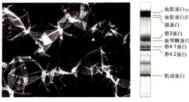

  
图 3-21 红细胞膜骨架的基本结构与成分  
A. 红细胞血影。B. SDS-聚丙烯酰胺凝胶电泳对血影成分分析。C. 血影的负染色电镜照片，显示出网状的膜骨架结构。D. 膜骨架与膜蛋白结合的示意图。（A、B、C图由D. Acehan和D. Stokes博士惠赠）

动蛋白纤维上存在多个（一般为5个左右）与血影蛋白结合的位点，所以可以形成一个网络状的膜骨架结构（图3-21C）。

膜骨架网络与细胞膜之间的连接主要通过锚蛋白。每个红细胞中约有10万个锚蛋白分子。每个血影蛋白四聚体上平均有一个锚蛋白分子。锚蛋白含有两个功能性结构域：一个能紧密地而且特异地与血影蛋白β链上的一个位点相连；另一个结构域与带3蛋白中伸向胞质面的一个位点紧密结合，从而使血影蛋白网架与细胞质膜连接在一起。此外，带4.1蛋白还可以与血型糖蛋白的细胞质结构域（C端）或带3蛋白结合，同样也起到使膜骨架与质膜蛋白相连的作用。膜骨架的组织及其与细胞质膜内在膜蛋白的关系如图3-21D所示。

红细胞质膜的刚性与韧性主要由质膜蛋白与膜骨架复合体的相互作用来实现，但其双凹形椭圆结构的形成还需要其他的骨架纤维参与。在红细胞中还存在着少量短纤维状的肌球蛋白纤维，它可能与两个或更多的肌动蛋白纤维相结合并将它们拉到一起，以维持红

细胞的形态。

除红细胞外，已发现在其他细胞中也存在与锚蛋白、血影蛋白及带4.1蛋白类似的蛋白质，大多数细胞中也都存在膜骨架结构（图3-22）。与红细胞不同，这些细胞具有较发达的胞质骨架体系，特别是质膜下呈网状分布的肌动蛋白纤维，而且细胞质膜功能更为复杂。呈动态变化的膜骨架不仅在力学结构上为细胞质膜行使其功能提供一个三维的空间，而且直接参与细胞质膜的多种代谢活动。所以有关其他细胞中膜骨架的结构与功能的细节还有待进一步研究。

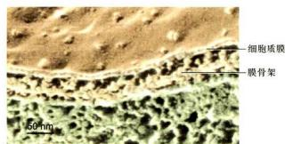  
图 3-22 深度蚀刻电镜图片显示小鼠耳部外毛细胞的细胞质膜与膜骨架（Bechara Kachar 博士惠赠）

## 四、细胞质膜的基本功能

细胞质膜作为细胞内外边界，与内膜系统相比其结构更为复杂，功能更为多样。细胞质膜的主要功能概括如下：

(1) 为细胞的生命活动提供相对稳定的内环境。

(2) 选择性地运输物质, 包括代谢底物的输入与代谢产物的排除, 其中伴随着能量物质的传递。

（3）提供细胞识别位点，并完成细胞内外信息跨膜传导；病毒等病原微生物识别和侵染特异的宿主细胞的受体也存在于质膜上。

（4）为多种酶提供结合位点，使酶促反应高效而有序地进行。

(5) 介导细胞与细胞、细胞与胞外基质之间的连接。

(6) 质膜参与形成具有不同功能的细胞表面特化结构。

（7）膜蛋白的异常与某些遗传病、恶性肿瘤、自身免疫病甚至神经退行性疾病相关，很多膜蛋白可作为疾病治疗的药物靶标。

质膜以上的功能将在后面相关章节详细阐述。

质膜如何高效而精确地完成上述多种功能，其很多结构细节尚不清楚。近年来对脂筏及与之相关的胞膜窖（又称陷窝、质膜微囊，caveola）的研究，加深了对质膜的结构与功能了解（见图3-3）。

脂筏中富含鞘磷脂和胆固醇。鞘磷脂较长且直的非极性尾部之间的相互作用，加上与胆固醇的近乎平面的疏水基团间“疏水键”的作用，形成了脂筏的基本结构。用非离子去垢剂可以将富含鞘磷脂和胆固醇的脂筏从细胞质膜上分离出来，蛋白质组学分析显示，其中含有多达250种蛋白质。

某些蛋白质，如阈蛋白（flotillin）、GPI锚定膜蛋白以及与脂筏表面糖基结合（类似凝集素作用）的周边膜蛋白等，对脂筏的组装及稳定性均起着一定的作用。由于鞘磷脂的疏水尾部的碳链（通常20～26个碳原子）比甘油磷脂（通常16～22个碳原子）长，所以脂筏的脂双层厚度也比质膜其他部位厚一些（见图3-8），而脂筏上整合膜蛋白的跨膜结构域也长一些，借此更有利于脂筏的组装。脂筏是一种异质性的、高度动态的、分子排列较紧密的、流动性较低的膜脂微区（memberane lipid microdomain）结构，直径一般为10～200 nm。

脂筏在细胞的信息传递和物质运输等生命活动中可能起重要的作用，如人们发现，某些G蛋白偶联受体和G蛋白均富集在脂筏上。同时表皮生长因子受体、胰岛素受体等也存在于脂筏上，而且发现越来越多的细胞内信号分子如Ras、Src家族酪氨酸激酶及信号转导的接头分子也都定位在脂筏上。显然这为信号的跨膜传递提供了必要的空间和时间的保障。

还有一些的实验结果表明脂筏在细胞的胞饮和细胞蛋白质分选中也起重要的作用。人们还证实某些病毒的感染过程、阿尔茨海默病（Alzheimer disease）以及某些肿瘤的发生均可能与脂筏有密切的关系。

目前脂筏的研究主要停留在体外培养细胞上（主要是上皮细胞），研究表明它几乎存在于所有真核细胞膜上，但其确切的结构和功能依然不甚明了，其主要原因是脂筏过于微小且处在动态变化之中。这些问题的解决将依赖于今后新的实验技术和观察手段的建立。

## - 思考题

1. 从生物膜结构模型的演化，谈谈人们对生物膜的认识过程。

2. 生物膜的“单位膜”模型是根据哪一种电镜制样技术的实验结果提出来的？为什么在多数细胞超微结构图片中，难以观察到“单位膜”的图像？

3. 膜脂有哪几种基本类型？它们各自的结构特征与功能是什么？

4. 何谓整合膜蛋白？它以什么方式与脂双层膜相结合？

5. 生物膜的基本特征是什么？这些特征与它的生理功能有什么联系？

6. 细胞表面有哪几种常见的特化结构？红细胞膜骨架的基本结构与功能是什么？

## - 参考文献

1. 杨福愉. 生物膜. 北京：科学出版社，2005.

2. Bai X, Yan C, Yang G, et al. An atomic structure of human $\gamma$ -secretase. Nature, 2015, 525(7568): 212-217.

3. Engelman D. Membranes are more mosaic than fluid. Nature, 2005, 438(7068): 578-580.

4. Grecco H E, Schmick M, Bastiaens P I H. Signaling from the living plasma membrane. Cell, 2011, 144(6): 897-909.

5. Jacobson K, Dietrich C. Looking at lipid rafts? Trends in Cell Biology, 2004, 9: 87-91.

6. Santos A L, Preta G. Lipids in the cell: organisation regulates function. Cellular and Molecular Life Sciences, 2018, 75(11): 1909-1927.

7. Singer S J, Nicolson G L. The fluid mosaic of the structure of cell membranes. Science, 1972, 175(4023): 720-731.

8. Suzuki K G N. New insights into the organization of plasma membrane and its role in signal transduction. International Review of Cell and Molecular Biology, 2015, 317: 67-96.

## 1. 2017年1月1日

<!-- END CN CN03-S02 -->

---

## 对应英文内容

### 英文补充：膜流动性、膜域、脂滴与膜不对称性

> 对应中文板块：膜流动性、膜域、脂滴与膜不对称性。英文来源：Molecular Biology of the Cell，第7版，第10章；[本章完整原文](../../来源/英文教材/10_Membrane_Structure/chapter.md)。物理PDF页码范围：642–675（整章范围）。

<!-- BEGIN EN EN10-H005-H010 -->
#### The Lipid Bilayer Is a Two-dimensional Fluid

in a planar phospholipid bilayer, hydrophobic tails (white layer) are exposed to water along the edges

A lipid bilayer also has other characteristics that make it an ideal structure for cell membranes. One of the most important of these is its fluidity, which is crucial to many membrane functions (**Movie 10.2**). Around 1970, researchers first recognized that individual lipid molecules are able to diffuse freely within the plane of a lipid bilayer. The initial demonstration came from studies of synthetic (artificial) lipid bilayers, which can be made in the form of spherical vesicles, called **liposomes** (**Figure 10–9**), or planar lipid films. Biophysical studies showed that phospholipid molecules in synthetic bilayers very rarely migrate from the monolayer (also called a leaflet) on one side to that on the other. This process, known as “flip-flop,” occurs on a time scale of hours for any individual molecule. It is slow because during flip-flop, the hydrophilic head groups must transiently enter and pass through the hydrophobic core of the bilayer, which is energetically disfavored. Cholesterol is an exception to this rule and can flip-flop rapidly, having only a single hydroxyl group to accommodate transiently in the hydrophobic core. By contrast to flip-flop, all lipid molecules rapidly exchange places with their neighbors within a monolayer (∼107 times per second). This gives rise to a rapid lateral diffusion, with a diffusion coefficient (D) of about 10–8 cm2/sec, which means that an average lipid molecule diffuses the length of a large bacterial cell (∼2 μm) in about 1 second. These studies have also shown that individual lipid molecules rotate very rapidly about their long axis and have flexible hydrocarbon chains. Computer simulations show that lipid molecules in synthetic bilayers are very disordered, presenting an irregular, ragged surface of variously spaced and oriented head groups to the water phase on either side of the bilayer (**Figure 10–10**). The liquidity of membranes allows lipids to rapidly patch transient holes that may appear in the bilayer through mechanical or other stresses.

formation of a sealed compartment shields hydrophobic tails from water

ENERGETICALLY FAVORABLE

Figure 10–8 The spontaneous closure of a phospholipid bilayer to form a sealed compartment. The closed structure is stable because it avoids the exposure of the hydrophobic hydrocarbon tails to water, which would be energetically unfavorable.

Similar mobility studies on labeled lipid molecules in isolated biological membranes and in living cells give results similar to those in synthetic bilayers. They demonstrate that the lipid component of a biological membrane is a twodimensional liquid in which the constituent molecules are free to move laterally. As in synthetic bilayers, individual phospholipid molecules are normally confined to their own monolayer. This confinement creates a problem for the growth of biological membranes. Phospholipid molecules are manufactured in only one monolayer of a membrane, mainly in the cytosolic monolayer of the endoplasmic reticulum membrane. If none of these newly made molecules could migrate reasonably promptly to the noncytosolic monolayer, the membrane would expand asymmetrically. The problem is solved by a special class of membrane proteins called phospholipid translocators, or flippases and scramblases, which catalyze the rapid flip-flop of phospholipids from one monolayer to the other, as discussed in Chapter 12.

Despite the fluidity of the lipid bilayer, liposomes do not fuse spontaneously with one another when suspended in water. Fusion does not occur because the

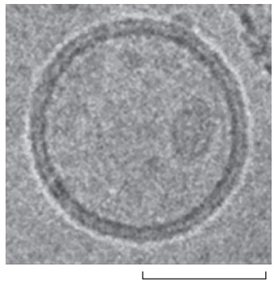

(B)

Figure 10–9 Liposomes. (A) A drawing of a small spherical liposome seen in cross section. Liposomes are commonly used as model membranes in experimental studies, especially to study incorporated membrane proteins. (B) An electron micrograph of an unfixed, unstained, synthetic phospholipid vesicle—a liposome—in water, which has been rapidly frozen at liquid-nitrogen temperature. (B, from J. Kotouček et al., Sci. Rep. 10:5595, 2020.)

saturated hydrocarbon chains

Figure 10–10 The mobility of phospholipid molecules in an artificial lipid bilayer. (A) Starting with a model of 100 phosphatidylcholine molecules arranged in a regular bilayer, a computer calculated the position of every atom after 300 picoseconds of simulated time. From these theoretical calculations, a model of the lipid bilayer emerges that accounts for almost all of the measurable properties of a synthetic lipid bilayer, including its thickness, number of lipid molecules per membrane area, depth of water penetration, and unevenness of the two surfaces. Note that the tails in one monolayer can interact with those in the other monolayer, if the tails are long enough. (B) The different motions of a lipid molecule in a bilayer. (A, based on S.W. Chiu et al., Biophys. J. 69:1230–1245, 1995.)

polar lipid head groups bind water molecules and ions that need to be displaced for the bilayers of two different liposomes to come into sufficiently close contact to fuse. Biological membranes have an even larger hydration shell due to the proteins embedded or associated with them. This hydration shell insulates the many internal membranes in a eukaryotic cell and prevents their uncontrolled fusion, thereby maintaining the compartmental integrity of membrane-enclosed organelles. All cell membrane fusion events are catalyzed by tightly regulated tethersMBoC7 m10.10/10.10 that bring appropriate membranes close together and fusion proteins that force out the water layer that keeps the bilayers apart, as we discuss in Chapter 13.

#### The Fluidity of a Lipid Bilayer Depends on Its Composition

The fluidity of cell membranes has to be precisely regulated. It allows membrane proteins to interact rapidly and transiently, and certain membrane transport processes and enzyme activities, for example, cease when the bilayer viscosity is experimentally increased beyond a threshold level.

The fluidity of a lipid bilayer depends on both its composition and its temperature, as is readily demonstrated in studies of synthetic lipid bilayers. A synthetic bilayer made from a single type of phospholipid changes from a liquid state to a two-dimensional rigid crystalline (or gel) state at a characteristic temperature. This change of state is called a phase transition, and the temperature at which it occurs is lower (that is, the membrane becomes more difficult to freeze) if the hydrocarbon chains are short or have double bonds. A shorter chain length reduces the tendency of the hydrocarbon tails to interact with one another in both the same and opposite monolayer so that the membrane remains fluid at lower temperatures. Fluidity is also favored by cis-double bonds because they produce kinks in the chains that make them more difficult to pack together (**Figure 10–11**). The makeup of membranes as a complex mix of many different lipid species further adjusts most membranes so that they remain liquids just above the phase-transition point. Bacteria, yeasts, and other organisms whose temperature fluctuates with that of their environment adjust the fatty acid composition of their membrane lipids to maintain a relatively constant fluidity. As the temperature falls, for instance, the cells of those organisms synthesize fatty acids with more cis-double bonds, thereby avoiding the decrease in bilayer fluidity that would otherwise result from the temperature drop.

Sterols, such as cholesterol, modulate the properties of lipid bilayers. When mixed with phospholipids, they enhance the permeability-barrier properties of the lipid bilayer. Cholesterol inserts into the bilayer with its hydroxyl group close to the polar head groups of the phospholipids, so that its rigid, platelike steroid rings interact with—and stiffen—those regions of the hydrocarbon chains closest to the polar head groups (see Figure 10–5 and **Movie 10.3**). By decreasing the mobility of the first few CH2 groups of the hydrocarbon chains of the phospholipid molecules, cholesterol makes the lipid bilayer less deformable in this region and thereby decreases the permeability of the bilayer to small water-soluble molecules. Although cholesterol tightens the packing of the lipids in a bilayer, it does

unsaturated hydrocarbon chains with cis-double bonds

Figure 10–11 The influence of cis-double bonds in hydrocarbon chains. The double bonds make it more difficult to pack the chains together, thereby making the lipid bilayer more difficult to freeze. In addition, because the hydrocarbon chains of unsaturated lipids are more spread apart, lipid bilayers MBoC7 m10.11/10.11containing them are thinner than bilayers formed exclusively from saturated lipids.

TABLE 10–1 Approximate Lipid Compositions of Different Cell Membranes

<table><tbody><tr><td colspan="7">TABLE 10-1 Approximate Lipid Compositions of Different Cell Membranes</td></tr><tr><td rowspan="2">Lipid</td><td colspan="6">Percentage of total lipid by weight</td></tr><tr><td>Liver cell plasma membrane</td><td>Red blood cell plasma membrane</td><td>Myelin</td><td>Mitochondrion (inner and outer membranes)</td><td>Endoplasmic reticulum</td><td>Escherichia coli bacterium</td></tr><tr><td>Cholesterol</td><td>17</td><td>23</td><td>22</td><td>3</td><td>6</td><td>0</td></tr><tr><td>Phosphatidylethanolamine</td><td>7</td><td>18</td><td>15</td><td>28</td><td>17</td><td>70</td></tr><tr><td>Phosphatidylserine</td><td>4</td><td>7</td><td>9</td><td>2</td><td>5</td><td>Trace</td></tr><tr><td>Phosphatidylcholine</td><td>24</td><td>17</td><td>10</td><td>44</td><td>40</td><td>0</td></tr><tr><td>Sphingomyelin</td><td>19</td><td>18</td><td>8</td><td>0</td><td>5</td><td>0</td></tr><tr><td>Glycolipids</td><td>7</td><td>3</td><td>28</td><td>Trace</td><td>Trace</td><td>0</td></tr><tr><td>Others</td><td>22</td><td>14</td><td>8</td><td>23</td><td>27</td><td>30</td></tr></tbody></table>

not make membranes any less fluid because it also prevents the hydrocarbon chains from coming together and crystallizing.

**Table 10–1** compares the lipid compositions of several biological membranes. Note that bacterial plasma membranes are often composed of one main type of phospholipid and contain no cholesterol. In archaea, lipids usually contain 20- to 25-carbon-long prenyl chains instead of fatty acids; prenyl and fatty acid chains are similarly hydrophobic and flexible (see Figure 10–18F). In thermophilic archaea, the longest lipid chains span both leaflets, making the membrane particularly stable to heat. Thus, lipid bilayers can be built from molecules with similar features but different molecular designs. The plasma membranes of most eukaryotic cells are more varied than those of prokaryotes and archaea, not only in containing large amounts of sterols but also in containing a mixture of different phospholipids.

Analysis of membrane lipids by mass spectrometry has revealed that the lipid composition of a typical eukaryotic cell membrane is much more complex than originally thought. These membranes contain a bewildering variety of perhaps 500–2000 different lipid species with even the simple plasma membrane of a red blood cell containing well over 150. Lipid heterogeneity antagonizes phase transitions and may help membrane-spanning proteins to fit better in the bilayer, avoiding leaks. While some of this complexity reflects the combinatorial variation in head groups, hydrocarbon chain lengths, and desaturation of the major phospholipid classes, some membranes also contain many structurally distinct minor lipids, at least some of which have important functions. The inositol phospholipids, for example, are present in small quantities in animal cell membranes and have crucial functions in guiding membrane traffic and in cell signaling (discussed in Chapters 13 and 15, respectively). Their local synthesis and destruction are regulated by a large number of enzymes, which create both small intracellular signaling molecules and lipid docking sites on membranes that recruit specific proteins from the cytosol, as we discuss later.

#### Despite Their Fluidity, Lipid Bilayers Can Form Domains of Different Compositions

Because a lipid bilayer is a two-dimensional fluid, we might expect most types of lipid molecules in it to be well mixed and randomly distributed in their own monolayer. The van der Waals attractive forces between neighboring hydrocarbon tails are not selective enough to hold groups of phospholipid molecules together. With certain lipid mixtures in artificial bilayers, however, one can observe phase transitions that lead to the lateral segregation of lipids with specific lipids coming together in separate domains (**Figure 10–12**). In these cases, attractive forces between lipid molecules must outweigh the entropic cost associated with concentrating them. Phase transitions thus break the homogeneity of the bilayer into a patchwork of domains with different properties.

10 µm

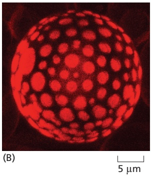

There has been a long debate among cell biologists about whether the lipid molecules in the plasma membrane of living cells similarly segregate into specialized domains, called **lipid rafts**. Although many lipids and membrane proteins are not distributed uniformly, large-scale lipid phase segregations are seen rarely in living cell membranes. Instead, specific membrane proteins and lipids are seen toMBoC7 m10.12/10.12 concentrate in a more temporary, dynamic fashion facilitated by protein–protein interactions that allow the transient formation of specialized membrane regions (**Figure 10–13**). Such clusters can be tiny nanoclusters on a scale of a few molecules or larger assemblies that can be seen with electron microscopy, such as the caveolae (discussed in Chapter 13). The tendency of mixtures of lipids to undergo phase transitions, as seen in artificial bilayers (see Figure 10–12), may help create rafts in living cell membranes—organizing and concentrating membrane proteins either for transport in membrane vesicles (discussed in Chapter 13) or for working together in protein assemblies, such as when they convert extracellular signals into intracellular ones (discussed in Chapter 15).

#### Lipid Droplets Are Surrounded by a Phospholipid Monolayer

Most eukaryotic cells store an excess of lipids in **lipid droplets**, from where they can be retrieved as building blocks for membrane synthesis or as a food source fueling metabolic energy generation. Fat cells, or adipocytes, are specialized for lipid storage. They contain a giant lipid droplet that fills up most of their cytoplasm. Most other cells have many smaller lipid droplets, the number and size varying with the cell’s metabolic state. Fatty acids can be liberated from lipid droplets on demand and exported to other cells through the bloodstream. Lipid droplets store neutral lipids, such as triacylglycerols and cholesterol esters, which are synthesized from fatty acids and cholesterol by enzymes in the endoplasmic reticulum membrane. Because these lipids do not contain hydrophilic head groups, they are exclusively hydrophobic molecules, and therefore aggregate into three-dimensional droplets rather than into bilayers.

Figure 10–12 Lateral phase separation in artificial lipid bilayers. (A) Giant liposomes produced from a 1:1 mixture of phosphatidylcholine and sphingomyelin form uniform bilayers. (B) By contrast, liposomes produced from a 1:1:1 mixture of phosphatidylcholine, sphingomyelin, and cholesterol form bilayers with two separate phases. The liposomes are stained with trace concentrations of a fluorescent dye that preferentially partitions into one of the two phases. The average size of the domains formed in these giant artificial liposomes is much larger than that expected in cell membranes, where lipid rafts (see text) may be as small as a few nanometers in diameter. (A, from N. Kahya et al., J. Struct. Biol. 147:77-89, 2004. With permission from Elsevier; B, courtesy of Schwille Lab, MPG.)

Figure 10–13 A model of a raft domain. Weak protein–protein, protein–lipid, and lipid–lipid interactions reinforce one another to partition the interacting components into raft domains. Cholesterol, sphingolipids, glycolipids, glycosylphosphatidylinositol (GPI)-anchored proteins, and some transmembrane proteins are enriched in these domains. Note that because of their composition, raft domains are thought to have an increased membrane thickness. We discuss glycolipids, GPI-anchored proteins, and oligosaccharide linkers later. (Adapted from D. Lingwood and K. Simons, Science 327:46–50, 2010.)

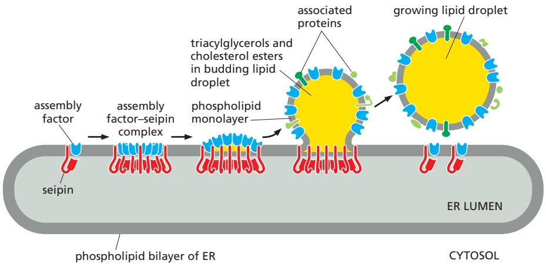

Figure 10–14 A model for the formation of lipid droplets. Neutral lipids are deposited between the two monolayers of the endoplasmic reticulum (ER) membrane forming a lenslike structure between the two monolayers. The lens forms as triacylglycerides and cholesterol esters are made and accumulate in the ER membrane and self-aggregate. Multiple copies of the transmembrane protein seipin assemble into a ring together with a lipid droplet assembly factor. In the presence of triacylglycerides, seipin dissociates from the assembly factor, which migrates to the cytosolic monolayer of the ER membrane where it facilitates a process in which the droplet buds, fills up with nonpolar lipids, and pinches off as a unique organelle that is surrounded by a single monolayer of phospholipids and associated proteins. In some cells, such as adipocytes, droplets fuse and can reach a gigantic size. (Adapted from J. Chung et al., Dev. Cell 51:551–563, 2019.)

In order for these hydrophobic droplets to reside in the aqueous cytosol of the cell, their surface is covered by phospholipids oriented with their hydrophobic acyl chains facing the lipid droplet and hydrophilic head groups facing the cytosol. This is why lipid droplets are surrounded by a monolayer of phospholipids rather than the bilayer that defines all other membrane-bounded compartments of the cell. The surface of lipid droplets contains a large variety of proteins, some of which are enzymes involved in lipid metabolism. Lipid droplets form rapidlyMBoC7 m10.14/10.14 when cells are exposed to high concentrations of fatty acids. They form from the endoplasmic reticulum membrane where many enzymes of lipid metabolism are localized. **Figure 10–14** shows one model of how lipid droplets form and acquire their surrounding monolayer of phospholipids and proteins. In some specialized cells, such as liver cells and enterocytes (the absorptive cells of the gut), droplets bud into the lumen of the endoplasmic reticulum from where they are secreted as lipoprotein particles that move metabolic energy in the form of triglycerides through the body.

#### The Asymmetry of the Lipid Bilayer Is Functionally Important

The lipid compositions of the two monolayers of the lipid bilayer in many membranes are strikingly different. In the human red blood cell (erythrocyte) membrane, for example, almost all of the phospholipid molecules that have choline—(CH3)3N+CH2CH2OH—in their head group (phosphatidylcholine and sphingomyelin) are in the outer monolayer, whereas almost all that contain a terminal primary amino group (phosphatidylethanolamine and phosphatidylserine) are in the inner monolayer (**Figure 10–15**). Because the negatively charged phosphatidylserine is located in the inner monolayer, there is a significant difference in charge between the two halves of the bilayer. We discuss in Chapter 12 how membrane-bound phospholipid translocators generate and maintain lipid asymmetry.

Lipid asymmetry is functionally important, especially in converting extracellular signals into intracellular ones (discussed in Chapter 15). Many cytosolic proteins bind to specific lipid head groups found in the cytosolic monolayer of the lipid bilayer. The enzyme protein kinase C (PKC), for example, which is activated in response to various extracellular signals, binds to the cytosolic face of the plasma membrane, where phosphatidylserine is concentrated, and requires this negatively charged phospholipid for its activity.

Figure 10–15 The asymmetric distribution of phospholipids and glycolipids in the lipid bilayer of human red blood cells. The colors used for the phospholipid head groups are those introduced in Figure 10–3. In addition, glycolipids are drawn with hexagonal polar head groups (blue). Cholesterol (not shown) is distributed roughly equally in both monolayers.

In other cases, specific lipid head groups must first be modified to create protein-binding sites at a particular time and place. One example is phosphatidylinositol (PI), one of the minor phospholipids that are concentrated in the cytosolic monolayer of cell membranes (see Figure 13–10A, B, and C). Various lipid kinases can add phosphate groups at distinct positions on the inositol ring, creating binding sites that recruit specific proteins from the cytosol to the membrane. An important example of such a lipid kinase is phosphoinositide 3-kinase (PI 3-kinase), which is activated in response to extracellular signals and helps to recruit specific intracellular signaling proteins to the cytosolic face of the plasma membrane (see Figure 15–53). Similar lipid kinases phosphorylate inositol phospholipids in intracellular membranes and thereby help to recruit proteins that guide membrane transport.

Phospholipids in the plasma membrane are used in yet another way to convert extracellular signals into intracellular ones. The plasma membrane contains various phospholipases that are activated by extracellular signals to cleave specific phospholipid molecules, generating fragments of these molecules that act as short-lived intracellular messengers. Phospholipase $C ,$ for example, cleaves an inositol phospholipid in the cytosolic monolayer of the plasma membrane to generate two fragments, one of which remains in the membrane and helps activate protein kinase $\mathrm { C } ,$ while the other is released into the cytosol and stimulates the release of $\mathrm { C a ^ { 2 + } }$ from the endoplasmic reticulum (see Figure 15–29).

Animals exploit the phospholipid asymmetry of their plasma membranes to distinguish between live and dead cells. When animal cells undergo apoptosis (discussed in Chapter 18), phosphatidylserine, which is normally confined to the cytosolic (or inner) monolayer of the plasma membrane lipid bilayer, rapidly translocates to the extracellular (or outer) monolayer. The phosphatidylserine exposed on the cell surface signals neighboring cells, such as macrophages, to phagocytose the dead cell and digest it. The translocation of the phosphatidylserine in apoptotic cells occurs because the active mechanisms that generate and maintain lipid bilayer asymmetry are impaired.

#### Glycolipids Are Found on the Surface of All Eukaryotic Plasma Membranes

Sugar-containing lipid molecules called **glycolipids** have the most extreme asymmetry in their membrane distribution: these molecules, whether in the plasma membrane or in intracellular membranes, are found exclusively in the monolayer facing away from the cytosol. In animal cells, they are made from sphingosine, just like sphingomyelin (see Figure 10–3). These intriguing molecules tend to self-associate, partly through hydrogen bonds between their sugars and partly through van der Waals forces between their long and straight hydrocarbon chains, which causes them to partition preferentially into lipid raft phases (see Figure 10–13). The asymmetric distribution of glycolipids in the bilayer results from the addition of sugar groups to the lipid molecules in the lumen of the Golgi apparatus. Thus, the compartment in which they are manufactured is topologically equivalent to the exterior of the cell (discussed in Chapter 12). As they are delivered to the plasma membrane, the sugar groups are exposed at the cell surface (see Figure 10–15), where they have important roles in interactions of the cell with its surroundings.

Glycolipids probably occur in all eukaryotic cell plasma membranes, where they generally constitute about 5% of the lipid molecules in the outer monolayer. They are also found in some intracellular membranes. The most complex of the glycolipids, the **gangliosides**, contain oligosaccharides with one or more sialic acid moieties, which give gangliosides a net negative charge (**Figure 10–16**). The most abundant of the more than 40 different gangliosides that have been identified are in the plasma membrane of nerve cells, where gangliosides constitute 5–10% of the total lipid mass; they are also found in much smaller quantities in other cell types.

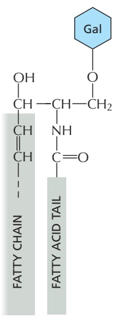

(A) galactocerebroside

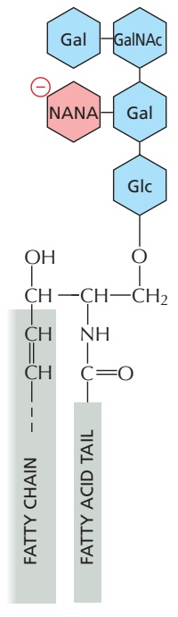

(B) GM1 ganglioside

(C) a sialic acid (NANA)

Figure 10–16 Glycolipid molecules. (A) Galactocerebroside is called a neutral glycolipid because the sugar that forms its head group is uncharged. (B) A ganglioside always contains one or more negatively charged sialic acid moieties. There are various types of sialic acid; in human cells, it is mostly N-acetylneuraminic acid, or NANA, whose structure is shown in (C). Whereas in bacteria and plants almost all glycolipids are derived from glycerol, as are most phospholipids, in animal cells almost all glycolipids are based on sphingosine, as is the case for sphingomyelin (see Figure 10–3). Gal = galactose, Glc = glucose, GalNAc = N-acetylgalactosamine; these three sugars are uncharged.

Hints as to the functions of glycolipids come from their localization. In the plasma membrane of epithelial cells, for example, glycolipids are confined to the exposed apical surface, where they may help to protect the membrane against the harsh conditions frequently found there (such as low pH and high concentrations of degradative enzymes). Charged glycolipids, such as gangliosides, may be important because of their electrical effects: their presence alters the electrical field across the membrane and the concentrations of ions—especially $\mathrm{Ca^{2+}} — \mathrm{at}$ the membrane surface. Glycolipids also function in cell-recognition processes, in which membrane-bound carbohydrate-binding proteins (lectins) bind to the sugar groups on both glycolipids and glycoproteins in the process of cell– cell adhesion (discussed in Chapter 19). Mutant mice that are deficient in all of their complex gangliosides show abnormalities in the nervous system, including axonal degeneration and reduced myelination.

The ubiquitous presence of glycolipids on the cell surface has been exploited by a number of bacterial toxins and viruses as a means to enter cells. For example, influenza virus interacts with sialic acid sugars on gangliosides during its entry into cells (see Figure 10–16). Polyomaviruses also enter the cell after binding initially to gangliosides. Similarly, the ganglioside $\mathrm { G _ { M I } }$ acts as a cell-surface receptor for the bacterial toxin that causes the debilitating diarrhea of cholera. Cholera toxin binds to and enters only those cells that have $\mathrm { G _ { M 1 } }$ on their surface, including intestinal epithelial cells. Its entry into a cell leads to a prolonged increase in the concentration of intracellular cyclic AMP (discussed in Chapter 15), which in turn causes a large efflux of Cl–, leading to the secretion of Na+, K+, HCO3–, and water into the intestine.

<!-- END EN EN10-H005-H010 -->

### 英文补充：膜蛋白扩散、膜域限制与膜骨架

> 对应中文板块：膜蛋白扩散、膜域限制与膜骨架。英文来源：Molecular Biology of the Cell，第7版，第10章；[本章完整原文](../../来源/英文教材/10_Membrane_Structure/chapter.md)。物理PDF页码范围：642–675（整章范围）。

<!-- BEGIN EN EN10-H022-H026 -->
#### Many Membrane Proteins Diffuse in the Plane of the Membrane

Like most membrane lipids, membrane proteins do not tumble (flip-flop) across the lipid bilayer. Tumbling would require large hydrophilic domains to pass through the membrane’s hydrophobic core, which is energetically prohibitive. But just like membrane lipids, proteins can rotate rapidly about an axis perpendicular to the plane of the bilayer (rotational diffusion) and move laterally within the membrane (lateral diffusion). An experiment in which mouse cells were

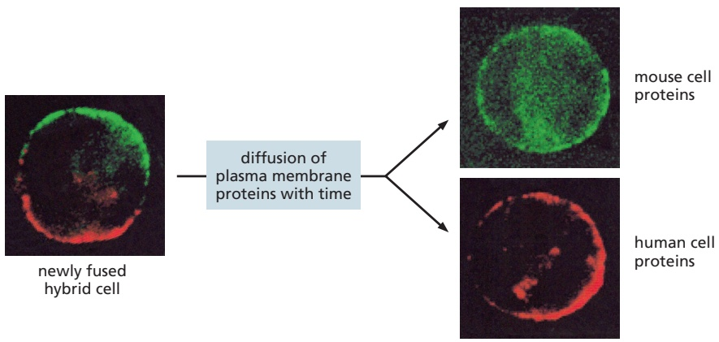

Figure 10–32 An experiment demonstrating the diffusion of proteins in the plasma membrane of mouse– human hybrid cells. In this experiment, a mouse and a human cell were fused to create a hybrid cell, which was then stained with two fluorescently labeled antibodies. One antibody (labeled with a green dye) detects mouse plasma membrane proteins, the other antibody (labeled with a red dye) detects human plasma membrane proteins. When cells are stained immediately after fusion, mouse and human plasma membrane proteins are still found in the membrane domains originating from the mouse and human cell, respectively. After a short time, however, the plasma membrane proteins diffuse over the entire cell surface and completely intermix. (From L.D. Frye and M. Edidin, J. Cell Sci. 7:319–335, 1970. With permission from the Company of Biologists.)

artificially fused with human cells to produce hybrid cells (heterokaryons) provided the first direct evidence that some plasma membrane proteins are mobile in the plane of the membrane. Two differently labeled antibodies were used toMBoC7 m10.32/10.32 distinguish selected mouse and human plasma membrane proteins. Although at first the mouse and human proteins were confined to their own halves of the newly formed heterokaryon, the two sets of proteins diffused and mixed over the entire cell surface in about half an hour (Figure 10–32). Lateral membrane protein mobility is important as it allows many cell signaling proteins to assemble and disassemble into protein complexes in response to extracellular ligands, turning their signaling functions on and off.

The lateral diffusion rates of membrane proteins and lipids can be measured by using the technique of fluorescence recovery after photobleaching (FRAP). The method usually involves marking the membrane protein of interest with a specific fluorescent group. This can be done either with a fluorescent ligand such as a fluorophore-labeled antibody that binds to the protein or with recombinant DNA technology to express the protein fused to a fluorescent protein such as green fluorescent protein (GFP; discussed in Chapter 9). The fluorescent group is then bleached in a small area of membrane by a laser beam, and the time taken for adjacent membrane proteins carrying unbleached ligand or GFP to diffuse into the bleached area is measured (**Figure 10–33**). From FRAP measurements, we can estimate the diffusion coefficient for the marked cell-surface protein. The values of the diffusion coefficients for different membrane proteins in different cells are highly variable, because interactions with other proteins impede the diffusion of the proteins to varying degrees. Measurements of proteins that are minimally impeded in this way indicate that cell membranes have a viscosity comparable to that of olive oil.

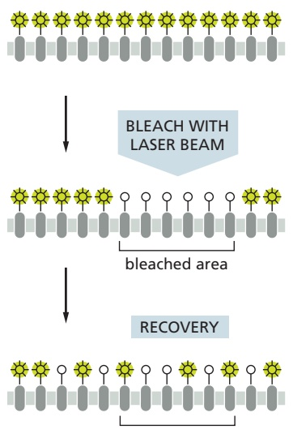

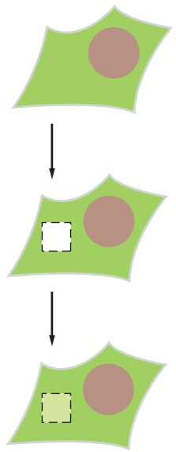

Figure 10–33 Measuring the rate of lateral diffusion of a membrane protein by fluorescence recovery after photobleaching. A specific protein of interest can be expressed as a fusion protein with green fluorescent protein (GFP), which is intrinsically fluorescent. The fluorescent molecules are bleached in a small area using a laser beam. The fluorescence intensity recovers as the bleached molecules diffuse away and unbleached molecules diffuse into the irradiated area (shown here in side and top views). The diffusion coefficient is calculated from a graph of the rate of recovery: the greater the diffusion coefficient of the membrane protein, the faster the recovery (see Figure 9–20 and Movie 10.6).

One drawback to the FRAP technique is that it monitors the movement of large populations of molecules in a relatively large area of membrane; one cannot follow individual protein molecules. If a protein fails to migrate into a bleached area, for example, one cannot tell whether the molecule is truly immobile or just restricted in its movement to a very small region of membrane—perhaps by cytoskeletal proteins. Single-particle tracking techniques overcome this problem by labeling individual membrane molecules with antibodies coupled to fluorescent dyes or tiny gold particles and tracking their movement by video microscopy. Using single-particle tracking, one can record the diffusion path of a single membrane protein molecule over time. Results from all of these techniques indicate that plasma membrane proteins differ widely in their diffusion characteristics, as we now discuss.

#### Cells Can Confine Proteins and Lipids to Specific Domains Within a Membrane

The recognition that biological membranes are two-dimensional fluids was a major advance in understanding membrane structure and function. It has become clear, however, that the picture of a membrane as a lipid sea in which all proteins float freely is greatly oversimplified. Most cells confine membrane proteins to specific regions in a continuous lipid bilayer. We have already discussed how bacteriorhodopsin molecules in the purple membrane of Halobacterium assemble into large two-dimensional crystals, in which individual protein molecules are relatively fixed in relationship to one another (see Figure 10–30). ATP synthase complexes in the inner mitochondrial membrane associate into long double rows, as we discuss in Chapter 14 (see Figure 14–33). Large aggregates of this kind diffuse very slowly.

In epithelial cells, such as those that line the gut or the tubules of the kidney, certain plasma membrane enzymes and transport proteins are confined to the apical surface of the cells, whereas others are confined to the basal and lateral surfaces (**Figure 10–34**). This asymmetric distribution of membrane proteins is often essential for the function of the epithelium, as we discuss in Chapter 11 (see Figure 11–11). The lipid compositions of these two membrane domains are also different, demonstrating that epithelial cells can prevent the diffusion of lipid as well as protein molecules between the domains. The barriers set up by a specific type of intercellular junction (called a tight junction, discussed in Chapter 19; see Figure 19–18) maintain the separation of both protein and lipid molecules.

A cell can also create membrane domains without using intercellular junctions. As we already discussed, regulated protein–protein interactions in membranes can create nanometer-scale raft domains that are thought to function in signaling and membrane trafficking. A more extreme example is seen in the mammalian spermatozoon, a single cell that consists of several structurally and functionally distinct parts covered by a continuous plasma membrane. When a sperm cell is examined

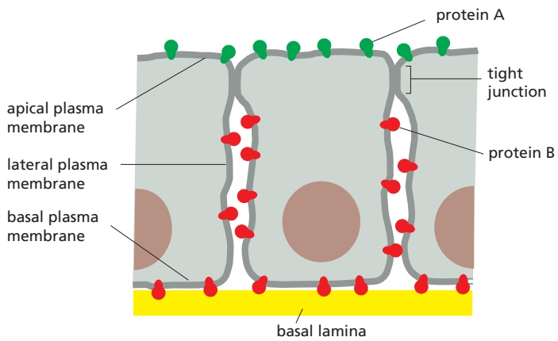

Figure 10–34 How membrane molecules can be restricted to a particular membrane domain. In this drawing of an epithelial cell, protein A (in the apical domain of the plasma membrane) and protein B (in the basal and lateral domains) can diffuse laterally in their own domains but are prevented from entering the other domain, at least partly by the specialized cell–cell junction called a tight junction. Lipid molecules in the outer (extracellular) monolayer of the plasma membrane are likewise unable to diffuse between the two domains; lipids in the inner (cytosolic) monolayer, however, are able to do so (not shown). The basal lamina is a thin mat of extracellular matrix that separates epithelial sheets from other tissues (discussed in Chapter 19).

(B)

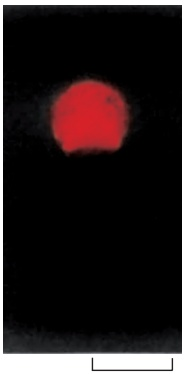

10 µm

Figure 10–35 Three domains in the plasma membrane of a guinea pig sperm. (A) A drawing of a guinea pig sperm. (B–D) In the three pairs of micrographs, phase-contrast micrographs are on the left, and the same cell is shown with cell-surface immunofluorescence staining on the right. Different monoclonal antibodies selectively label cell-surface molecules on (B) the anterior head, (C) the posterior head, and (D) the tail. (From D.G. Myles, P. Primakoff, and A.R. Belvé, Cell 23:433–439, 1981. With permission from Elsevier.)

10 µm

(C)

(D)

20 µm

by immunofluorescence microscopy with a variety of antibodies, each of which reacts with a specific cell-surface molecule, the plasma membrane is found to consist of at least three distinct domains (Figure 10–35). Some of the membrane molecules can diffuse freely within the confines of their own domain. While the molecular nature of most “fences” that prevent the molecules from leaving theirMBoC7 m10.35/10.35 domain is not known, some molecular mechanisms for restricting membrane protein movements are understood. The plasma membrane of nerve cells, for example, contains a domain enclosing the cell body and dendrites, and another enclosing the axon; in this case a belt of actin filaments tightly associates with the plasma membrane at the cell-body–axon junction and forms part of the barrier.

**Figure 10–36** shows four common ways of immobilizing specific membrane proteins through protein–protein interactions.

#### The Cortical Cytoskeleton Gives Membranes Mechanical Strength and Restricts Membrane Protein Diffusion

As shown in Figure 10–36B and $\mathrm { C } ,$ a common way in which a cell restricts the lateral mobility of specific membrane proteins is to tether them to macromolecular assemblies on either side of the membrane. The characteristic biconcave shape of a red blood cell (**Figure 10–37**), for example, results from interactions of its plasma membrane proteins with an underlying cytoskeleton, which consists mainly of a meshwork of the filamentous protein **spectrin**. Spectrin is a long, thin, flexible rod about 100 nm in length. As the principal component of the red blood cell cytoskeleton, it maintains the structural integrity and shape of the plasma membrane, which is the cell’s only membrane, as the cell has no nucleus or other organelles. The spectrin cytoskeleton is attached to the membrane through various membrane proteins. The final result is a deformable, netlike meshwork that covers the entire cytosolic surface of the cell membrane (**Figure 10–38**). This spectrin-based cytoskeleton enables the red blood cell to withstand the stress on its membrane as it is forced through narrow capillaries. Mice and humans with genetic abnormalities in spectrin are anemic and have red blood cells that are spherical (instead of concave) and fragile; the severity of the anemia increases with the degree of spectrin deficiency.

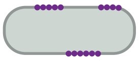

(A)

(B)

(C)

Figure 10–36 Four ways of restricting the lateral mobility of specific plasma membrane proteins. (A) The proteins can self-assemble into large aggregates (as seen for bacteriorhodopsin in the purple membrane of Halobacterium salinarum); they can be tethered by interactions with assemblies of macromolecules (B) outside or (C) inside the cell; or (D) they can interactMBoC7 m10.36/10.36 with proteins on the surface of another cell.

Figure 10–37 A scanning electron micrograph of human red blood cells. The cells have a biconcave shape and lack a nucleus and other organelles (Movie 10.7). (Courtesy of Bernadette Chailley.)

An analogous but much more elaborate and highly dynamic cytoskeletal network exists beneath the plasma membrane of most other cells in our body. This network, which constitutes the **cortex** of the cell, is rich in actin filaments, which are attached to the plasma membrane in numerous ways. The dynamic

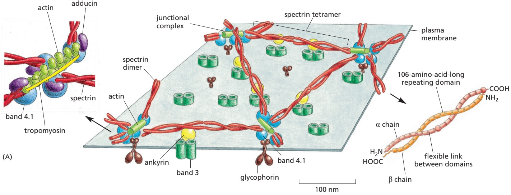

Figure 10–38 The spectrin-based cytoskeleton on the cytosolic side of the human red blood cell plasma membrane. (A) The arrangement shown in the drawing has been deduced mainly from studies on the interactions of purified proteins in vitro. Spectrin heterodimers (enlarged in the drawing on the right) are linked together into a netlike meshwork by junctional complexes (enlarged in the drawing on the left). Each spectrin heterodimer consists of two antiparallel, loosely intertwined, flexible polypeptide chains called α and β. The two spectrin chains are attached noncovalently to each other at multiple points, including at both ends. Both the α and β chains are composed largely of repeating domains. Two spectrin heterodimers join end-to-end to form tetramers.

The junctional complexes are composed of short actin filaments (containing 13 actin monomers) and the proteins band 4.1 and adducin, as well as a tropomyosin molecule that probably determines the length of the actin filaments. The cytoskeleton is linked to the membrane through two transmembrane proteins: a multipass protein called band 3 and a single-pass protein called glycophorin. The spectrin tetramers bind to some band 3 proteins via ankyrin molecules, and to glycophorin and band 3 (not shown) via band 4.1 proteins.

(B) The electron micrograph shows the cytoskeleton on the cytosolic side of a red blood cell membrane after fixation and negative staining. The spectrin meshwork has been purposely stretched out to allow the details of its structure to be seen. In a normal cell, the meshwork shown would be much more crowded and occupy only about one-tenth of this area. (B, courtesy of T. Byers and D. Branton, Proc. Natl. Acad. Sci. USA 82:6153–6157, 1985.)

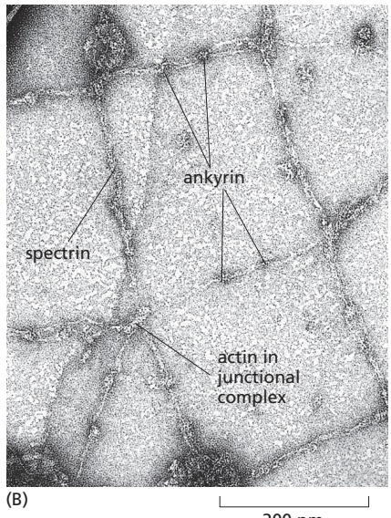

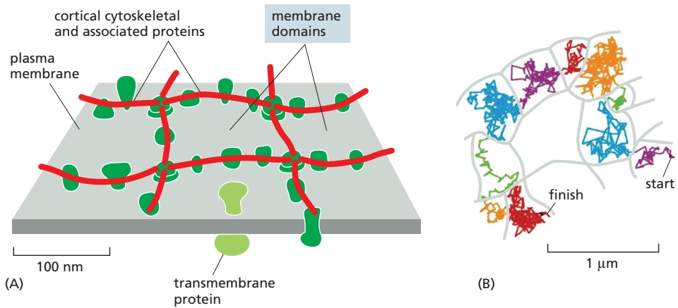

Figure 10–39 Corralling plasma membrane proteins by cortical cytoskeletal filaments. (A) The filaments are thought to provide diffusion barriers that divide the membrane into small domains, or corrals. (B) High-speed, single-particle tracking was used to follow the path of a single fluorescently labeled membrane protein of one type over time. The trace shows that an individual protein molecule diffuses within tightly delimited membrane domains and only infrequently escapes into a neighboring domain (highlighted by a switch of color). (Adapted from A. Kusumi et al., Annu. Rev. Biophys. Biomol. Struct. 34:351–378, 2005. With permission from Annual Reviews.)

remodeling of the cortical actin network provides a driving force for many essential cell functions, including cell movement, endocytosis, and the formation of transient, mobile plasma membrane structures such as filopodia and lamellipodia discussed in Chapter 16. The cortex of nucleated cells also contains proteins that are structurally homologous to spectrin and the other components of the red cell cytoskeleton. We discuss the cortical cytoskeleton in nucleated cells and its interactions with the plasma membrane in Chapter 16.

The cortical cytoskeletal network restricts diffusion of plasma membrane proteins beyond those that are directly anchored to it. Because the cytoskeletal filaments are often closely apposed to the cytosolic surface of the plasma membrane, they can form mechanical barriers that obstruct the free diffusion of proteins in the membrane. These barriers partition the membrane into small domains, or corrals (**Figure 10–39A**), which can be either permanent, as in the sperm (see Figure 10–35), or transient. The barriers can be detected when the diffusion of individual membrane proteins is followed by high-speed, single-particle tracking. The proteins diffuse rapidly but are confined within an individual corral (**Figure 10–39B**); occasionally, however, thermal motions cause a few cortical filaments to detach transiently from the membrane, allowing the protein to escape into an adjacent corral.

The extent to which a transmembrane protein is confined within a corral depends on its association with other proteins and the size of its cytoplasmic domain; proteins with a large cytosolic domain will have a harder time passing through cytoskeletal barriers. When a cell-surface receptor binds its extracellular signal molecules, for example, large protein complexes build up on the cytosolic domain of the receptor, making it more difficult for the receptor to escape from its corral. It is thought that corralling helps concentrate such signaling complexes, increasing the speed and efficiency of the signaling process (discussed in Chapter 15).

#### Membrane-bending Proteins Deform Bilayers

Cell membranes assume many different shapes, as illustrated by the elaborate and varied structures of cell-surface protrusions and membrane-enclosed organelles in eukaryotic cells. Flat sheets, narrow tubules, round vesicles, fenestrated sheets, and pita-bread–shaped cisternae are all part of the repertoire. Often, a variety of shapes will be present in different regions of the same continuous bilayer. Membrane shape is controlled dynamically, as many essential cell processes—including vesicle budding, cell movement, and cell division—require elaborate transient membrane deformations. In many cases, membrane shape is influenced by dynamic pushing and pulling forces exerted by cytoskeletal or extracellular structures, as we discuss in Chapters 13 and 16. A crucial part in producing these deformations is played by **membrane-bending proteins**, which control local membrane curvature. Often, cytoskeletal dynamics and membranebending-protein forces work together. Membrane-bending proteins attach to specific membrane regions as needed and act by one or more of three principal mechanisms (**Figure 10–40**):

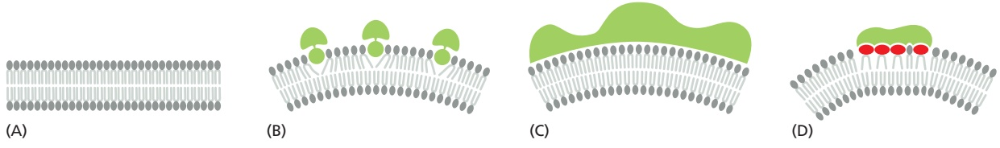

1. Some insert hydrophobic protein domains or attached lipid anchors into one of the leaflets of a lipid bilayer. Increasing the area of only one leaflet causes the membrane to bend (Figure 10–40B). The proteins that shape the convoluted network of narrow endoplasmic reticulum tubules work in this way (discussed in Chapter 12).

2. Some membrane-bending proteins form rigid scaffolds that deform theMB0C7 m10.40/10.40 membrane or stabilize an already bent membrane (Figure 10–40C). The coat proteins that shape the budding vesicles in intracellular transport fall into this class (discussed in Chapter 13).

Figure 10–40 Three ways in which membrane-bending proteins shape membranes. Lipid bilayers are gray and proteins are green. (A) Bilayer without protein bound. (B) A hydrophobic region of the protein can insert as a wedge into one monolayer to pry lipid head groups apart. Such regions can either be amphiphilic helices as shown or hydrophobic hairpins. (C) The curved surface of the protein can bind to lipid head groups and deform the membrane or stabilize its curvature. (D) A protein can bind to and cluster lipids that have large head groups and thereby bend the membrane. (Adapted from W.A. Prinz and J.E. Hinshaw, Crit. Rev. Biochem. Mol. Biol. 44:278–291, 2009.)

3. Asymmetric distribution of cone-shaped and inverted cone-shaped lipids in the inner or outer leaflets can cause membrane bending. Some membrane-bending proteins cause particular membrane lipids to cluster together, thereby inducing membrane curvature. The ability of a lipid to induce positive or negative membrane curvature is determined by the relative cross-sectional areas of its head group and its hydrocarbon tails. For example, the large head group of phosphoinositides make these lipid molecules wedge-shaped, and their accumulation in a domain of one leaflet of a bilayer therefore induces positive curvature (Figure 10–40D). By contrast, phospholipases that remove lipid head groups produce inversely shaped lipid molecules that induce negative curvature.

Often, different membrane-bending proteins collaborate to achieve a particular curvature, as in shaping a budding transport vesicle, as we discuss in Chapter 13.

#### Summary

Whereas the lipid bilayer determines the basic structure of biological membranes, proteins are responsible for most membrane functions, serving as specific receptors, enzymes, transporters, and so on. Transmembrane proteins extend across the lipid bilayer. Some of these membrane proteins are single-pass proteins, in which the polypeptide chain crosses the bilayer as a single a helix. Others are multipass proteins, in which the polypeptide chain crosses the bilayer multiple times—either as a series of a helices or as a b sheet rolled up into the shape of a barrel. All proteins responsible for the transport of ions and other small water-soluble molecules through the membrane are multipass proteins. Some membrane proteins do not span the bilayer but instead are attached to either side of the membrane: some are attached to the cytosolic side by an amphipathic a helix on the protein surface or by the covalent attachment of one or more lipid chains, others are attached to the non-cytosolic side by a GPI anchor. Some membrane-associated proteins are bound by noncovalent interactions with transmembrane proteins. In the plasma membrane of all eukaryotic cells, most of the proteins exposed on the cell surface and some of the lipid molecules in the outer lipid monolayer have oligosaccharide chains covalently attached to them. Like the lipid molecules in the bilayer, many membrane proteins are able to diffuse rapidly in the plane of the membrane. However, cells have ways of immobilizing specific membrane proteins, as well as ways of confining both membrane protein and lipid molecules to particular domains in a continuous lipid bilayer. The dynamic association of membrane-bending proteins confers on membranes their characteristic three-dimensional shapes.

<!-- END EN EN10-H022-H026 -->
