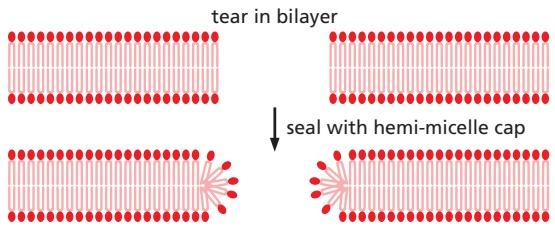
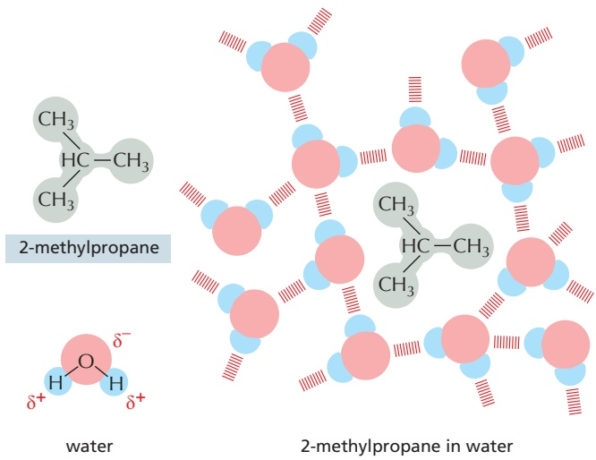

# 第3章 细胞质膜 · 英文习题与参考文献

### 英文补充：习题与参考文献

> 对应中文板块：习题与参考文献。英文来源：Molecular Biology of the Cell，第7版，第10章；[本章完整原文](../来源/英文教材/10_Membrane_Structure/chapter.md)。物理PDF页码范围：642–675（整章范围）。

<!-- BEGIN EN EN10-EXERCISES -->
#### PROBLEMS

Which statements are true? Explain why or why not.

10–1 It is estimated that about 30% of the proteins encoded in an animal’s genome are membrane proteins that are required for a cell to function and interact with its environment.

10–2 All of the common phospholipids—phosphatidylcholine, phosphatidylethanolamine, phosphatidylserine, and sphingomyelin—carry a positively charged moiety on their head group, but none carry a net positive charge.

10–3 Although phospholipid molecules are free to diffuse in the plane of the bilayer, they cannot flip-flop across the bilayer unless enzyme catalysts called phospholipid translocators are present in the membrane.

10–4 Whereas all the carbohydrate in the plasma membrane faces outward on the external surface of the cell, all the carbohydrate on internal membranes faces toward the cytosol.

10–5 Although membrane domains with different protein compositions are well known, there are at present no examples of membrane domains that differ in lipid composition.

Discuss the following problems.

10–6 When a lipid bilayer is torn, why does it not seal itself by forming a “hemi-micelle” cap at the edges, as shown in **Figure Q10–1**?

Figure Q10–1 A torn lipid bilayer sealed with a hypothetical “hemimicelle” cap (Problem 10–6).

10–7 Which one of the following changes is energetically favorable and occurs spontaneously in an aqueous solution? A. Conversion of a membrane vesicle to a flat bilayer B. Dispersion of one oil droplet into many small ones C. Formation of a bilayer from phospholipid moleculesMBoC7 Q10.01 D. Formation of a long tear in a phospholipid bilayer

10–8 Hydrophobic solutes are said to “force the adjacent water molecules to reorganize into icelike cages” (**Figure Q10–2**). It seems paradoxical that water molecules do not interact with hydrophobic solutes, yet they seem to “know” about the presence of a hydrophobic solute and change their behavior to interact differently with one another. Why would such an icelike cage be energetically unfavorable relative to pure water?

A. An icelike cage gives water a higher temperature.

B. An icelike cage is less organized than pure water.

C. An icelike cage is unstable and easily breaks down.

D. An icelike cage reduces the entropy of the system.

Figure Q10–2 An icelike cage of water molecules around a hydrophobic solute (Problem 10–8).

10–9 Margarine is made from vegetable oil by a chemical process. Do you suppose this process converts saturated fatty acids to unsaturated ones or vice versa? Explain your answer.

10–10 If a lipid raft is typically 70 nm in diameter and each lipid molecule has a diameter of 0.5 nm, about howMBoC7 Q10.02 many lipid molecules would there be in a lipid raft composed entirely of lipid?

10-11 Each of the following lipid anchors is used to attach intracellular proteins to membranes except:

A. A farnesyl anchor

B. A GPI anchor

C. A myristoyl anchor

D. A palmitoyl anchor

10–12 Monomeric single-pass transmembrane proteins span a membrane with a single α helix that has characteristic chemical properties in the region of the bilayer. Which of the three 19-amino-acid sequences listed below is the most likely candidate for such a transmembrane segment? Explain the reasons for your choice. (See back of book for one-letter amino acid code; FAMILY VW is a convenient mnemonic for hydrophobic amino acids.)

A. I T E I Y F G R M A G V I G T D L I S B. I T L I Y F G V M A G V I G T I L I S C. I T P I Y F G P M A G V I G T P L I S

10–13 You are studying the binding of proteins to the cytoplasmic face of cultured neuroblastoma cells and have found a method that gives a good yield of inside-out vesicles from the plasma membrane. Unfortunately, your preparations are contaminated with variable amounts of right-side-out vesicles. Nothing you have tried avoids this problem. A friend suggests that you pass your vesicles over an affinity column made of lectin coupled to solid beads. What is the point of your friend’s suggestion?

10–14 Glycophorin, a protein in the plasma membrane of red blood cells, normally exists as a homodimer that is held together entirely by interactions between its transmembrane domains. As transmembrane domains are hydrophobic, how is it that they can associate with one another so specifically?

10–15 Three mechanisms by which membrane-binding proteins bend a membrane are illustrated in **Figure Q10–3A, B, and C**. As shown, each of these cytosolic membrane-bending proteins would induce an invagination of the plasma membrane. Could similar kinds of cytosolic proteins induce a protrusion of the plasma membrane (**Figure Q10–3D**)? Which ones? Explain how they might work.

(C)

(D)

Figure Q10–3 Bending of the plasma membrane by cytosolic proteins (Problem 10–15). (A) Insertion of a protein “finger” into the cytosolic leaflet of the membrane. (B) Binding of lipids to the curved surface of a membrane-binding protein. (C) Binding of membrane proteins to membrane lipids with large head groups. (D) A segment of the plasma membrane showing a protrusion.

#### REFERENCES

#### General

Bretscher MS (1973) Membrane structure: some general principles. Science 181, 622–629.

Edidin M (2003) Lipids on the frontier: a century of cell-membrane bilayers. Nat. Rev. Mol. Cell Biol. 4, 414–418.

Goñi FM (2014) The basic structure and dynamics of cell membranes: an update of the Singer-Nicolson model. Biochim. Biophys. Acta 1838, 1467–1476.

Langmuir I (1917) The constitution and fundamental properties of solids and liquids II: liquids. J. Am. Chem. Soc. 39, 1848–1906.

Pockets A (1891) Surface tension. Nature 43, 437–439.

Singer SJ & Nicolson GL (1972) The fluid mosaic model of the structure of cell membranes. Science 175, 720–731.

Tanford C (1980) The Hydrophobic Effect: Formation of Micelles and Biological Membranes. New York: Wiley.

Tanford C (2004) Ben Franklin Stilled the Waves. New York: Oxford University Press.

#### The Lipid Bilayer

Antonny B, Vanni S, Shindou H & Ferreira T (2016) From zero to six double bonds: phospholipid unsaturation and organelle function. Trends Cell Biol. 25, 427–436.

Brügger B (2014) Lipidomics: analysis of the lipid composition of cells and subcellular organelles by electrospray ionization mass spectrometry. Annu. Rev. Biochem. 83, 79–98.

Chung J, Wu X, Lambert TJ . . . Farese RV, Jr (2019) LDAF1 and seipin form a lipid droplet assembly complex. Dev. Cell 51, 551–563.

Clarke RJ, Hossain KR & Cao K (2020) Physiological roles of transverse lipid asymmetry of animal membranes. Biochim. Biophys. Acta Biomembr. 1862, 183382.

Cornell CE, Mileant A, Thakkar N . . . Keller SL (2020) Direct imaging of liquid domains in membranes by cryo-electron tomography. Proc. Natl. Acad. Sci. USA 117, 19713–19719.

Hakomori SI (2002) The glycosynapse. Proc. Natl. Acad. Sci. USA 99, 225–232.

Harayama T & Riezman H (2018) Understanding the diversity of membrane lipid composition. Nat. Rev. Mol. Cell Biol. 19, 281–296.

Heberle FA, Doktorova M, Scott HL . . . Levental I (2020) Direct label-free imaging of nanodomains in biomimetic and biological membranes by cryogenic electron microscopy. Proc. Natl. Acad. Sci. USA 117, 19943–19952.

Ichikawa S & Hirabayashi Y (1998) Glucosylceramide synthase and glycosphingolipid synthesis. Trends Cell Biol. 8, 198–202.

Kornberg RD & McConnell HM (1971) Lateral diffusion of phospholipids in a vesicle membrane. Proc. Natl. Acad. Sci. USA 68, 2564–2568.

Lingwood D & Simons K (2010) Lipid rafts as a membrane-organizing principle. Science 327, 46–50.

Mansilla MC, Cybulski LE, Albanesi D & de Mendoza D (2004) Control of membrane lipid fluidity by molecular thermosensors. J. Bacteriol. 186, 6681–6688.

Maxfield FR & van Meer G (2010) Cholesterol, the central lipid of mammalian cells. Curr. Opin. Cell Biol. 22, 422–429.

Munro S (2003) Lipid rafts: elusive or illusive? Cell 115, 377–388.

Pomorski TG & Menon AK (2016) Lipid somersaults: uncovering the mechanisms of protein-mediated lipid flipping. Prog. Lipid Res. 64, 69–84.

Rothman JE & Lenard J (1977) Membrane asymmetry. Science 195, 743–753.

Walther TC & Farese RV, Jr (2017) Lipid droplet biogenesis. Annu. Rev. Cell Dev. Biol. 33, 491–510.

#### Membrane Proteins

Agasid MT & Robinson CV (2021) Probing membrane protein-lipid interactions. Curr. Opin. Struct. Biol. 69, 78–85.

Bennett V & Baines AJ (2001) Spectrin and ankyrin-based pathways: metazoan inventions for integrating cells into tissues. Physiol. Rev. 81, 1353–1392.

Bijlmakers MJ & Marsh M (2003) The on-off story of protein palmitoylation. Trends Cell Biol. 13, 32–42.

Bretscher MS & Raff MC (1975) Mammalian plasma membranes. Nature 258, 43–49.

Buchanan SK (1999) Beta-barrel proteins from bacterial outer membranes: structure, function and refolding. Curr. Opin. Struct. Biol. 9, 455–461.

Chen Y, Lagerholm BC, Yang B & Jacobson K (2006) Methods to measure the lateral diffusion of membrane lipids and proteins. Methods 39, 147–153.

Corin K & Bowie JU (2020) How bilayer properties influence membrane protein folding. Protein Sci. 29(12), 2348–2362.

Curran AR & Engelman DM (2003) Sequence motifs, polar interactions and conformational changes in helical membrane proteins. Curr. Opin. Struct. Biol. 13, 412–417.

Deisenhofer J & Michel H (1991) Structures of bacterial photosynthetic reaction centers. Annu. Rev. Cell Biol. 7, 1–23.

Drickamer K & Taylor ME (1998) Evolving views of protein glycosylation. Trends Biochem. Sci. 23, 321–324.

Giménez-Andrés M, Copi č A & Antonny B (2018) The many faces of ˇ amphipathic helices. Biomolecules 8, 45.

Helenius A & Simons K (1975) Solubilization of membranes by detergents. Biochim. Biophys. Acta 415, 29–79.

Henderson R & Unwin PN (1975) Three-dimensional model of purple membrane obtained by electron microscopy. Nature 257, 28–32.

Hite RK, Gonen T, Harrison SC & Walz T (2008) Interactions of lipids with aquaporin-0 and other membrane proteins. Pflugers Arch. 456, 651–661.

Kyte J & Doolittle RF (1982) A simple method for displaying the hydropathic character of a protein. J. Mol. Biol. 157, 105–132.

Lee AG (2003) Lipid-protein interactions in biological membranes: a structural perspective. Biochim. Biophys. Acta 1612, 1–40.

Marchesi VT, Furthmayr H & Tomita M (1976) The red cell membrane. Annu. Rev. Biochem. 45, 667–698.

Nakada C, Ritchie K, Oba Y . . . Kusumi A (2003) Accumulation of anchored proteins forms membrane diffusion barriers during neuronal polarization. Nat. Cell Biol. 5, 626–632.

Oesterhelt D (1998) The structure and mechanism of the family of retinal proteins from halophilic archaea. Curr. Opin. Struct. Biol. 8, 489–500.

Popot J-L (2010) Amphipols, nanodiscs, and fluorinated surfactants: three nonconventional approaches to studying membrane proteins in aqueous solution. Annu. Rev. Biochem. 79, 737–775.

Prinz WA & Hinshaw JE (2009) Membrane-bending proteins. Crit. Rev. Biochem. Mol. Biol. 44, 278–291.

Sezgin E, Levental I, Mayor S & Eggeling C (2017) The mystery of membrane organization: composition, regulation and roles of lipid rafts. Nat. Rev. Mol. Cell Biol. 18, 361–374.

Sharon N & Lis H (2004) History of lectins: from hemagglutinins to biological recognition molecules. Glycobiology 14, 53R–62R.

Sheetz MP (2001) Cell control by membrane-cytoskeleton adhesion. Nat. Rev. Mol. Cell Biol. 2, 392–396.

Shibata Y, Hu J, Kozlov MM & Rapoport TA (2009) Mechanisms shaping the membranes of cellular organelles. Annu. Rev. Cell Dev. Biol. 25, 329–354.

Steck TL (1974) The organization of proteins in the human red blood cell membrane. A review. J. Cell Biol. 62, 1–19.

Subramaniam S (1999) The structure of bacteriorhodopsin: an emerging consensus. Curr. Opin. Struct. Biol. 9, 462–468.

Vinothkumar KR & Henderson R (2010) Structures of membrane proteins. Q. Rev. Biophys. 43, 65–158.

von Heijne G (2011) Membrane proteins: from bench to bits. Biochem. Soc. Trans. 39, 747–750.

White SH & Wimley WC (1999) Membrane protein folding and stability: physical principles. Annu. Rev. Biophys. Biomol. Struct. 28, 319–365.

Zhang Y, Daday C, Gu RX . . . Walz T (2021) Visualization of the mechanosensitive ion channel MscS under membrane tension. Nature 590, 509–514.
<!-- END EN EN10-EXERCISES -->
