# 第4章 物质的跨膜运输 · 第三节 胞吞作用与胞吐作用

[返回本章](../README.md) · [中文本章原文](../中文原文.md)

<!-- BEGIN CN CN04-S03 -->
## 第三节 胞吞作用与胞吐作用

真核细胞通过胞吞 (endocytosis) 和胞吐 (exocytosis) 作用完成大分子与颗粒性物质的跨膜运输，如蛋白质、多核苷酸、多糖等。在转运过程中，物质包裹在脂双层膜包被的囊泡中，因此又称膜泡运输。这种运输方式常常可同时转运一种或一种以上数量不等的大分子甚至颗粒性物质，因此也有人称之为批量运输 (bulk transport)。膜泡运输涉及生物膜的断裂与融合，是一个耗能的过程。所谓胞吞作用，就是细胞通过质膜内陷形成囊泡，将胞外的生物大分子、颗粒性物质或液体等摄取到细胞内，以维持细胞正常的代谢活动；而胞吐作用则是细胞内合成的生物分子（蛋白质和脂质等）和代谢物以分泌泡的形式与质膜融合而将内含物分泌到细胞表面或细胞外的过程。由于胞吐作用将在第六章详细介绍，本节主要介绍胞吞作用。

## 一、胞吞作用的类型

胞吞时质膜内陷脱落形成的囊泡，称胞吞泡（endo-cytic vesicle)。根据胞吞泡形成的分子机制不同和胞吞泡的大小差异，胞吞作用可分为两种类型：吞噬作用（phagocytosis）和胞饮作用（pinocytosis）（图4-14）。吞噬作用形成的吞噬泡直径往往大于 $250\mathrm{nm}$ ，而胞饮作用形成的胞饮泡直径一般小于 $150\mathrm{nm}$ 。此外，所有真核细胞都能通过胞饮作用连续摄入溶液及可溶性分子，而吞噬作用往往发生于一些特化的吞噬细胞如巨噬细胞（macrophage）。

## （一）吞噬作用

吞噬作用是一类特殊的胞吞作用。通过吞噬作用形成的胞吞泡叫做吞噬体（phagosome）。对于原生生物，细胞通过吞噬作用将胞外的营养物取取到吞噬体，最后在溶酶体中消化降解成小分子物质供细胞利用。吞噬作用是原生生物摄取食物的一种方式。在高等多细胞生物体中，吞噬作用往往发生于巨噬细胞和中性粒细胞(neutrophil)，其作用不仅仅是摄取营养物，主要是清除侵染机体的病原体以及衰老或凋亡的细胞，如人的巨噬细胞每天通过吞噬作用清除 $10^{11}$ 个衰老的红细胞。

吞噬作用需要被吞噬物与吞噬细胞表面结合并激活细胞表面的受体，将信号传递到细胞内并引起细胞应答反应，是一个信号触发的过程。在激活吞噬作用过程中，抗体诱发的吞噬作用研究得最为清楚。当抗体与病原微生物表面结合后，暴露出尾部的Fc区域，该区域

## 图4-14 胞吞作用的类型

胞吞作用可分为吞噬作用和胞饮作用两大类型，而胞饮作用又可分为网格蛋白依赖的胞吞作用、胞膜窖依赖的胞吞作用、大型胞饮作用以及非网格蛋白/胞膜窖依赖的胞吞作用4种类型。

  
图4-15 吞噬作用

吞噬细胞伸出伪足，包裹病原微生物形成吞噬体，吞噬体与溶酶体融合，在各种酸性水解酶的作用下，将病原微生物分解。未被分解的底物形成残余小体，可通过胞吐作用的方式将残余底物释放到细胞外。

被巨噬细胞和中性粒细胞表面的Fc受体识别，从而诱发吞噬细胞质膜伸出伪足（pseudopod），将病原微生物包裹起来形成吞噬体，最后与溶酶体融合，并在其中被各种水解酶降解（图4-15）。伪足的生成与细胞内微丝及其结合蛋白在质膜下局部装配密切相关，这一装配过程需要Rho家族蛋白的GTP酶活性以及活化的Rho-GEF。

吞噬细胞表面的受体除了能识别Fc启动吞噬作用以外，目前还发现了其他几类启动吞噬作用的受体，如有些受体可以识别补体（complement），从而与抗体一道吞噬降解病原微生物；有些受体可以直接识别某些微生物表面的寡糖链；还有些受体可以识别凋亡的细胞。

## （二）胞饮作用

与吞噬作用不同的是，胞饮作用几乎发生于所有类型的真核细胞中。胞饮作用可以分为网格蛋白依赖的胞吞作用（clathrin dependent endocytosis）、胞膜套依赖的胞吞作用（caveola dependent endocytosis）、大型胞饮作用（macropinocytosis）以及非网格蛋白/胞膜套依赖的胞吞作用（clathrin and caveola independent endocytosis）(图4-14)。其中，了解最多的胞饮作用就是网格蛋白依赖的胞吞作用。

## 1. 网格蛋白依赖的胞吞作用

网格蛋白（clathrin）由3个二聚体组成，每个二聚体包括1条 $180\mathrm{kDa}$ 的重链和1条 $35\sim 40\mathrm{kDa}$ 的轻链。3个二聚体形成三脚蛋白复合体（triskelion），是包被的结构单位。当配体与膜上受体结合后，网格蛋白聚集在膜下，逐渐形成直径 $50\sim 100\mathrm{nm}$ 的质膜凹陷，称网格蛋白包被小窝（clathrin-coated pit）。一种小分子GTP结合蛋白——发动蛋白（dynamini）在深陷的包被小窝的颈部组装成环，发动蛋白水解与其结合的GTP引起颈部缢缩，最终脱离质膜形成网格蛋白包被膜泡（clathrin-coated vesicle）。几秒钟后，网格蛋白便脱离包被膜泡返回质膜附近区域以便重复使用。脱包被的囊泡与早期内体（early endosome）融合，从而将转运分子及胞外液体摄入细胞。在大分子跨膜转运中，网格蛋白本身并不起捕获特异转运分子的作用，有特异性选择作用的是包被中另一类衔接蛋白(adaptin)，它既能结合网格蛋白，又能识别跨膜受体胞质面的尾部肽信号（peptide signal），从而通过网格蛋白包被膜泡介导跨膜受体及其结合配体的选择性运输（图4-16）。

根据胞吞的物质是否具有专一性，可将胞吞作用分为受体介导的胞吞作用（receptor mediated endocytosis）和非特异性的胞吞作用。受体介导的胞吞作用既是大多数动物细胞从胞外摄取特定大分子的有效途径，也是一种选择性浓缩机制（selective concentrating mechanism），避免了摄入细胞外大量的液体。重要的例子包括动物细胞通过受体介导的胞吞作用对胆固醇的摄取、鸟类卵细胞摄取卵黄蛋白以及肝细胞摄入转铁蛋白等。某些激素如胰岛素与靶细胞表面受体结合进入细胞，巨噬细胞通过表面受体对免疫球蛋白及其复合物、病毒、细菌乃至衰老细胞的识别和摄入，以及其他一些基本代谢物如合成血红蛋白所必需的维生素 $\mathrm{B}_{12}$ 和铁的摄取，都是通过受体介导的胞吞作用进行的。受体介导的胞吞作用也可以被某些病毒所利用，流感病毒和AIDS病病毒（HIV）就是通过这种胞吞途径侵染细胞的。

胆固醇是动物细胞质膜的基本成分，也是固醇类激素的前体。胆固醇主要在肝细胞中合成，是极端不溶的，它在血液中的运输是通过与磷脂和蛋白质结合形成低密度脂蛋白（low-density lipoprotein, LDL）颗粒的形式进行。LDL是分子质量为3000 kDa、直径为22 nm的多分子复合物，通过与细胞表面的低密度脂蛋白受体特异地结合形成受体-LDL复合物，几分钟内便通过网格蛋白包被膜泡的内化作用进入细胞，经脱包被作用并与内体（endosome）融合。内体是动物细胞内由膜包裹的细胞器，其作用是传输由胞吞作用新摄入的物质到溶酶体。内体膜上有ATP驱动的质子泵，将 $\mathrm{H}^+$ 泵入内体腔中，使腔内的pH降低（ $\mathrm{pH}5\sim 6$ ）。在此过程中，低pH环境可引起LDL与受体分离，而内体以出芽的方式形成含有受体的小囊泡，返回细胞质膜，受体重复使用。然后含有LDL的内体与溶酶体融合，低密度脂蛋白被水解，释放出胆固醇和脂肪酸供细胞利用（图4-17）。

  
图4-16 通过网格蛋白包被膜泡介导的选择性运输示意图  
A 和 B 是显示网格蛋白包被膜泡形成过程的电镜照片。(图中照片由 Bechara Kachar 博士惠赠)

在胞吞过程中，内体被认为是膜泡运输的主要分选站之一，其中的酸性环境在分选过程中起关键作用。已知有25种以上的不同受体，具有不同的分选信号，参与不同类型受体介导的胞吞作用。在受体介导的胞吞作用过程中，不同类型的受体具有不同的内体分选途径：① 大部分受体返回它们原来的质膜区域，如上述 LDL 受体循环到质膜再利用；② 有些受体不能再循环而是最后进入溶酶体被消化，如与表皮生长因子(epidermal growth factor, EGF) 结合的细胞表面受体，大部分在溶酶体被降解，从而导致细胞表面 EGF 受体浓度降低，这种现象称为受体下行调节（receptor downregulation）；③ 有些受体被运至细胞另一侧的质膜，该过程称为跨细胞转运 (transcytosis)。在具有极性的上皮细胞中，这是一种将胞吞作用与胞吐作用相结合的物质跨细胞转运方式，即转运的物质通过胞吞作用从上皮细胞的一侧被摄入细胞，再通过胞吐作用从细胞的另一侧释放出去。母鼠的抗体从血液通过上皮细胞进入母乳中，乳鼠肠上皮细胞将抗体摄入体内，都是通过跨细胞转运完成的。

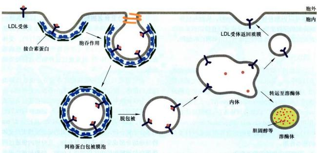  
图 4-17 LDL 通过受体介导的胞吞作用进入细胞

## 2. 其他类型的胞饮作用

并非所有的胞吞泡的形成都需要网格蛋白的参与，胞膜睿依赖的胞吞作用是目前关注较多的另一种胞饮作用。胞膜睿在质膜的脂筏区域形成，电镜观察发现有些细胞的胞膜睿呈内陷的瓶状。胞膜密的特征性蛋白是窑蛋白，包括caveolin-1、caveolin-2和caveolin-3。与网格蛋白参与的包被膜泡的形成不同，胞膜密的形成部位位于质膜的脂筏区域。胞吞时，胞膜睿携带着内吞物，利用发动蛋白的收缩作用从质膜上脱落，然后转交给内体样的细胞器——膜密体（caveosome）或者跨细胞转运到质膜的另一侧。在整个过程中，因为是整合膜蛋白，窑蛋白始终不会从胞吞泡膜上解离下来。由于胞膜密所在部位含有大量信号转导的受体和蛋白激酶等，这暗示胞膜密很可能发挥了一种细胞信号转导的平台作用。

大型胞饮作用是另一种胞饮作用，它是通过质膜皱褶包裹内吞物形成囊泡完成胞吞作用（图4-14）。与吞噬作用类似，大型胞饮作用形成的胞吞泡也比较大，质膜皱褶的形成过程也依赖微丝及其结合蛋白。但二者有着明显的差别，如启动吞噬作用的受体往往位于特异细胞表面，而启动大型胞饮作用的受体却位于很多类型的细胞表面，而且受体还能启动其他生理功能，如有些受体就是与细胞生长相关的生长因子受体。

此外，还有非网格蛋白/胞膜窖依赖的胞吞作用，如位于淋巴细胞膜上的白介素2（interleukin-2, IL2）受体就是介导非网格蛋白/胞膜窖依赖的胞吞作用。

## 二、胞吞作用与细胞信号转导

作为真核细胞的一种重要生命活动，胞吞作用不仅调控细胞对营养物的摄取和质膜构成等，近年来发现，胞吞作用还参与了细胞信号转导，并与多种信号整合在一起，在更高层次上参与了细胞和机体组织的调控。而信号转导过程也对胞吞作用进行调控，二者相互调节、彼此整合，在细胞生长、发育、代谢以及增殖等过程中发挥着重要作用。

## （一）胞吞作用对信号转导的下调

下调信号转导活性研究最为清楚的一个例子就是表皮生长因子及其受体的胞吞作用。EGF是一类分子量较小的胞外信号蛋白分子，能够刺激上皮细胞及其他多种细胞增殖。与LDL受体不同，当EGF受体与其配体EGF结合后，受体二聚化并引起受体胞质结构域酪氨酸残基自磷酸化而被活化，开启细胞下游信号级联反应（详见第十一章）；另一方面，细胞通过胞吞作用，将EGF受体及EGF吞入细胞内降解，从而导致细胞信号转导活性下调。这种调节作用即受体下行调节。而EGF受体的胞吞作用也受到细胞信号的调控，尽管调控的分子机制还很不清楚，但这一调控过程与受体的泛素化（ubiquitination）有关。当EGF受体与E3泛素连接酶Cbl（Casitas B-lineage lymphoma）结合后，后者催化泛素分子共价连接到受体上，从而引起泛素结合蛋白识别受体上的泛素分子，并帮助受体进入网格蛋白包被小窝，启动受体内吞。

## （二）胞吞作用对信号转导的激活

胞吞作用既可以下调信号转导活性，也可以激活信号转导活性。胞吞作用激活信号转导的最典型例子就是Notch信号通路。Notch信号是细胞与细胞间相互作用的主要信号通路之一，对多细胞生物中细胞分化命运的决定起关键作用。Notch信号通路的功能最早发现于果蝇神经系统的发育。果蝇正常发育的神经系统通过一种旁侧抑制（lateral inhibition）机制抑制其他上皮细胞发育成神经细胞。其过程是：前体神经细胞（信号细胞）在自身质膜上表达单次跨膜信号蛋白Delta，当该信号蛋白与邻近上皮细胞（靶细胞）表面的受体Notch结合后，激活邻近靶细胞的Notch途径；通过Notch信号通路调控，邻近靶细胞就无法分化成神经细胞，而仍然保持为上皮细胞。在这一过程中，除了配体（Delta/Serrate/Lag2家族，DSL）与Notch受体结合外，信号通路的激活还依赖于DSL和Notch的胞吞作用。首先，配体DSL与Notch受体结合，导致Notch暴露出其胞外S2切割位点并被裂解，胞外部分与配体被信号细胞

  
图 4-18 胞吞作用对 Notch 信号转导的激活

Notch 及其配体 DSL 的胞吞作用对 Notch 活化是必需的，其中，DSL 的胞吞依赖泛素。DSL 与 Notch 结合并内吞，Notch 受体第一次被切割后，通过胞吞作用，第二次被切割，产生有活性片段进入细胞核，调节靶基因表达。

内吞，然后，Notch受体被靶细胞内吞至内体，并在S3位点被γ-分泌酶（γ-secretase）切割，产生有活性的Notch受体胞内活性片段（Notch intracellular domain, NICD）。该片段进入细胞核，调控靶基因表达，产生相应的细胞响应（图4-18）。在Notch受体活化过程中，无论是配体在信号细胞中的胞吞作用还是受体在S2位点切割后的胞吞作用，都对最后在S3位点被γ-分泌酶切割产生有活性的Notch受体胞内活性片段起到了决定性作用。当然，配体和受体的胞吞作用受泛素化等多种信号的调节。

综上所述，胞吞作用与细胞信号转导相互调节，对生命活动的调控发挥了很重要的作用。除了网格蛋白依赖性胞吞方式以外，细胞还通过非网格蛋白依赖性胞吞作用调节其他很多的细胞表面受体。不同类型的受体有

## 思考题

1. 比较载体蛋白与通道蛋白的异同。

不同的胞吞方式，对细胞信号调节、受体活性关闭与放大、信号持续时间长短等发挥着关键作用。

2. 比较 P 型离子泵、V 型质子泵、F 型质子泵和 ABC 超家族的异同。

## 三、胞吐作用

真核细胞无论是通过胞吞作用摄取大分子还是通过胞吐作用分泌大分子，都是通过膜泡运输的方式进行的，并且转运的膜泡只与特定的靶膜融合，从而保证了物质有序地跨膜转运。此外，当分泌泡或转运膜泡与质膜融合并通过胞吐作用释放其内含物后，会使质膜表面积增加，但发生在质膜其他区域的胞吞作用则减少其表面积，这种动态平衡过程对质膜成分的更新和维持细胞的生存与生长是必要的。有关胞吐作用的其他内容，参见本书第六章。

胞吐作用与胞吞作用相反，它是通过分泌泡或其他膜泡与质膜融合而将膜泡内的物质运出细胞的过程。真核细胞有从高尔基体反面网状结构（TGN）分泌的囊泡向质膜流动并与之融合的稳定过程，通过这种组成的胞吐途径（constitutive exocytosis pathway），新合成的蛋白质和脂质以囊泡形式连续不断地供应质膜更新，从而确保细胞分裂前质膜的生长；囊泡内可溶性蛋白分泌到细胞外，有的成为质膜外周蛋白，有的形成胞外基质组分，有的作为营养成分或信号分子扩散到胞外液。真核细胞除了这种连续的组成型胞吐途径之外，特化的分泌细胞还有一种调节型胞吐途径（regulated exocytosis pathway），这些分泌细胞产生的分泌物（如激素、黏液或消化酶）储存在分泌泡内，当细胞在受到胞外信号刺激时，分泌泡与质膜融合并将内含物释放出去。

3. 说明 $\mathrm{Na}^{+}-\mathrm{K}^{+}$ 泵的工作原理及其生物学意义。

4. 将哺乳动物红细胞置于清水中，会发现红细胞膨胀破裂（溶血现象），而在野外或实验室两栖类动物将卵产在清水中，卵细胞却不会膨胀，更不会破裂，根据所学知识推测红细胞和两栖类卵细胞耐低渗能力为何差异如此之大。

5. 试述胞吞作用的类型与功能。

1. Carafoli E, Brini M. Calcium pumps: structural basis for and mechanism of calcium transmembrane transport. Current Opinion in Chemical Biology, 2000, 4:152-161.

2. Deng D, Sun P, Yan C, et al. Molecular basis of ligand recognition and transport by glucose transporters. Nature, 2015, 526(7573): 391-396.

3. Deng D, Xu C, Sun P, et al. Crystal structure of the human glucose transporter GLUT1. Nature, 2014, 510 (7503): 121-125.

4. Higgins C F, Linton K J. The xyz of ABC transporters. Science, 2001, 293 (5536):1782-1784.

5. Hollenstein K, Dawson R J P, Locher K P. Structure and mechanism of ABC transporter proteins. Current Opinion in Structure Biology, 2007, 17: 412-418.

6. Holmgren M, Wagg J, Bezanilla F, et al. Three distinct and sequential steps in the release of sodium ions by the $\mathrm{Na^{+} / K^{+}}$ -ATPase. Nature, 2000, 403 (6772): 898-901.

7. Möbius W, van Donselaar E, Ohno-Iwashita Y, et al. Recycling compartments and the internal vesicles of multivesicular bodies harbor most of the cholesterol found in the endocytic pathway. Traffic, 2003, 4 (4): 222-231.

8. Murata K, Mitsuoka K, Hirai T, et al. Structural determinants of water permeation through aquaporin-1. Nature, 2000, 407 (6804): 599-605.

9. Nishi T, Forgac M. The vacuolar H $^{+}$ -ATPase-nature's most versatile proton pumps. Nature Reviews Molecular Cell Biology, 2002, 3: 94-103.

10. Polo S, Fiore P P. Endocytosis conducts the cell signaling orchestra. Cell, 2006, 124 (5): 897-900.

11. Raiborg C, Rusten T E, Stenmark H. Protein sorting into multivesicular endosomes. Current Opinion in Cell Biology, 2003, 15 (4): 446-455.

<!-- END CN CN04-S03 -->

---

## 对应英文内容

### 英文补充：反面高尔基网络到细胞表面的运输

> 对应中文板块：反面高尔基网络到细胞表面的运输。英文来源：Molecular Biology of the Cell，第7版，第13章；[本章完整原文](../../来源/英文教材/13_Intracellular_Membrane_Traffic/chapter.md)。物理PDF页码范围：788–849（整章范围）。

<!-- BEGIN EN EN13-H032-H033 -->
#### TRANSPORT FROM THE TRANS GOLGI NETWORK TO THE CELL EXTERIOR AND ENDOSOMES

After transiting the Golgi cisternae, cargo molecules that arrive at the trans Golgi network (TGN) are sorted and packaged into transport vesicles that depart for different destinations. Transport vesicles destined for the cell surface normally leave the TGN in a steady stream as irregularly shaped tubules. The membrane proteins and the lipids in these vesicles provide new components for the cell’s plasma membrane, while the soluble proteins inside the vesicles are secreted to the extracellular space. The fusion of the vesicles with the plasma membrane is called **exocytosis**. This is the route, for example, by which cells secrete most of the proteoglycans and glycoproteins of the extracellular matrix, as discussed in Chapter 19.

All cells require this **constitutive secretory pathway**, which operates continually (**Movie 13.5**). Specialized secretory cells, however, have a second secretory pathway in which soluble proteins and other substances are destined to be

Figure 13–37 A model of golgin function. Filamentous golgins anchored to Golgi membranes capture transport vesicles by binding to Rab proteins on the vesicle surface. Different members of the golgin family of proteins are localized to different regions of the Golgi apparatus. GRASPs are shown tethering adjacent cisternae to each other.

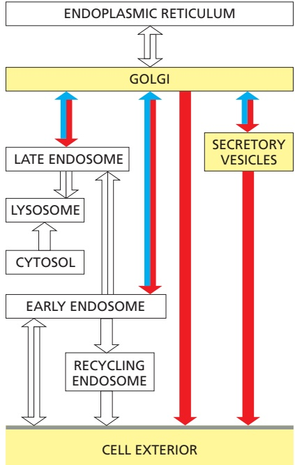

Figure 13–38 The three best-understood pathways of protein sorting in the trans Golgi network. (1) Proteins with the mannose 6-phosphate (M6P) marker (see Figure 13–40) are diverted to lysosomes (via endosomes) in clathrin-coated transport vesicles. (2) Proteins with signals directing them to secretory vesicles are concentrated in such vesicles as part of a regulated secretory pathway that is present only in specialized secretory cells. (3) In unpolarized cells, a constitutive secretory pathway delivers proteins with no special features to the cell surface. In polarized cells, such as epithelial cells, however, secreted and plasma membrane proteins are selectively directed to either the apical or the basolateral plasma membrane domain, so a specific signal must mediate at least one of these two pathways, as we discuss later.

initially stored in secretory vesicles for later release by exocytosis. This is the **regulated secretory pathway**, found mainly in cells specialized for secreting products rapidly on demand—such as hormones, neurotransmitters, or digestive enzymes.

The third major destination from the TGN is endosomes. Hydrolases that function in the lumen of lysosomes use this pathway to first arrive at endosomes, which progressively mature into lysosomes (discussed later). The sorting mechanism at the TGN for lysosomal hydrolase proteins is especially well understood and provides an example of how cargo molecules in the TGN are segregated among different types of transport vesicles. In this section, we consider the role of the Golgi apparatus in sorting proteins between these three pathways and compare the mechanisms of constitutive and regulated secretion.

#### Many Proteins and Lipids Are Carried Automatically from the Trans Golgi Network to the Cell Surface

A cell capable of regulated secretion must separate at least three classes of proteins before they leave the TGN—those destined for lysosomes (via endosomes), those destined for secretory vesicles, and those destined for immediate delivery to the cell surface (**Figure 13–38**). Specific signals are needed to direct secretory proteins into secretory vesicles and lysosomal proteins into different specialized transport vesicles. The nonselective constitutive secretory pathway transports most other proteins directly to the cell surface. Because entry into this pathway does not require a particular signal, it is also called the **default pathway**. Thus, in an unpolarized cell such as a white blood cell or a fibroblast, it seems that any protein in the lumen of the Golgi apparatus is automatically carried by the constitutive pathway to the cell surface unless it is specifically returned to the ER, retained as a resident protein in the Golgi apparatus itself, or selected for the pathways that lead to regulated secretion or to endosomes. In polarized cells, where different products have to be delivered to different domains of the cell surface, we shall see that the options are more complex.

<!-- END EN EN13-H032-H033 -->

### 英文补充：调节性胞吐、受体介导胞吞与内体回收

> 对应中文板块：调节性胞吐、受体介导胞吞与内体回收。英文来源：Molecular Biology of the Cell，第7版，第13章；[本章完整原文](../../来源/英文教材/13_Intracellular_Membrane_Traffic/chapter.md)。物理PDF页码范围：788–849（整章范围）。

<!-- BEGIN EN EN13-H036-H054 -->
#### Secretory Vesicles Bud from the Trans Golgi Network

Cells that are specialized for secreting some of their products rapidly on demand concentrate and store these products in **secretory vesicles** (often called densecore secretory granules because they have dense cores when viewed in the electron microscope). As we discussed (see Figure 13–38), secretory vesicles form from the TGN, and they release their contents to the cell exterior by exocytosis in response to specific signals. The secreted product can be either a small molecule (such as histamine or a neuropeptide) or a protein (such as a hormone or digestive enzyme).

Proteins destined for secretory vesicles (called secretory proteins) are packaged into appropriate vesicles in the TGN by a mechanism that involves the selective aggregation of the secretory proteins. Clumps of aggregated, electrondense material can be detected by electron microscopy in the lumen of the TGN. The signals that direct secretory proteins into such aggregates are not well defined and may be quite diverse. When a gene encoding a secretory protein is artificially expressed in a secretory cell that normally does not make the protein, the foreign protein is appropriately packaged into secretory vesicles. This observation shows that, although the proteins that an individual cell expresses and packages in secretory vesicles differ, they contain common sorting signals, which function properly even when the proteins are expressed in cells that do not normally make them.

It is unclear how the aggregates of secretory proteins are segregated into secretory vesicles. Secretory vesicles have unique proteins in their membrane, some of which might serve as receptors for aggregated protein in the TGN. The aggregates are much too big, however, for each molecule of the secreted protein to be bound by its own cargo receptor, as occurs for transport of the lysosomal enzymes. Instead, the aggregate might cause the membrane region containing the cargo receptor to zipper up around the aggregate, thereby enclosing it within the budding vesicle.

Initially, the membrane of the secretory vesicles that leave the TGN is only loosely wrapped around the clusters of aggregated secretory proteins. Morphologically, these immature secretory vesicles resemble dilated trans Golgi cisternae that have pinched off from the Golgi stack. As immature secretory vesicles mature, clathrin-coated transport vesicles bud from them and go back to the TGN (**Figure 13–42**). This recycling process not only returns Golgi components to the Golgi apparatus, but also serves to concentrate the contents of secretory vesicles. The sum of all the retrieval pathways during the transit of a secretory protein from the ER through the Golgi cisternae to a mature secretory vesicle results in a 200- to 400-fold increase in net concentration.

Figure 13–42 The formation of secretory vesicles. (A) Secretory proteins become segregated and highly concentrated in secretory vesicles by two mechanisms. First, they aggregate in the ionic environment of the TGN; often, the aggregates become more condensed as a secretory vesicle matures and its lumen becomes more acidic. Second, clathrin-coated vesicles retrieve excess membrane and lumenal content present in immature secretory vesicles as the secretory vesicles mature. (B) This electron micrograph shows secretory vesicles forming from the TGN in an insulin-secreting β cell of the pancreas. Anti-clathrin antibodies conjugated to gold spheres (black dots) have been used to locate clathrin molecules. The immature secretory vesicles, which contain insulin precursor protein (proinsulin), contain clathrin patches, which are no longer seen on the mature secretory vesicle. (B, courtesy of Lelio Orci.)

Immature secretory vesicles also fuse with one another, and the lumens become progressively more acidic from the increasing concentration of V-type ATPases in the vesicle membrane. Acidification of the lumen further condenses the secretory protein aggregate within a vesicle whose excess membrane has now been retrieved back to the TGN. Because the final mature secretory vesicles are so densely filled with contents, the secretory cell can disgorge large amounts of material promptly by exocytosis when triggered to do so (**Figure 13–43**).

#### Precursors of Secretory Proteins Are Proteolytically Processed During the Formation of Secretory Vesicles

Concentration is not the only process to which secretory proteins are subjected as the secretory vesicles mature. Many protein hormones and small neuropeptides, as well as many secreted hydrolytic enzymes, are synthesized as inactive precursors. Proteolysis is necessary to liberate the active molecules from these precursor proteins. The cleavages occur in the secretory vesicles and sometimes in the extracellular fluid after secretion. Additionally, many of the precursor proteins exit the ER with an N-terminal propeptide that is cleaved off only later in the secretory pathway to yield the mature protein. These proteins are initially synthesized as pre-pro-proteins, with the ER signal peptide (sometimes referred to as a pre-peptide) cleaved off earlier as the protein enters the rough ER (see Figure 12–18). In other cases, peptide signaling molecules are made as polyproteins that contain multiple copies of the same amino acid sequence. In still more complex cases, a variety of peptide signaling molecules are synthesized as parts of a single polyprotein that acts as a precursor for multiple end products, which are individually cleaved from the initial polypeptide chain. The same polyprotein may be processed in various ways to produce different peptides in different cell types (**Figure 13–44**).

Why is proteolytic processing so common in the secretory pathway? Some of the peptides produced in this way, such as the enkephalins (five-aminoacid neuropeptides with morphine-like activity), are undoubtedly too short in their mature forms to be co-translationally transported into the ER lumen or to

Figure 13–43 Exocytosis of secretory vesicles. The process is illustrated schematically (top) and in an electron micrograph that shows the release of MBoC7 m13.65/13.4insulin from a secretory vesicle of a pancreatic β cell. (Courtesy of Lelio Orci, from L. Orci et al., Sci. Am. 259:85–94, 1988.)

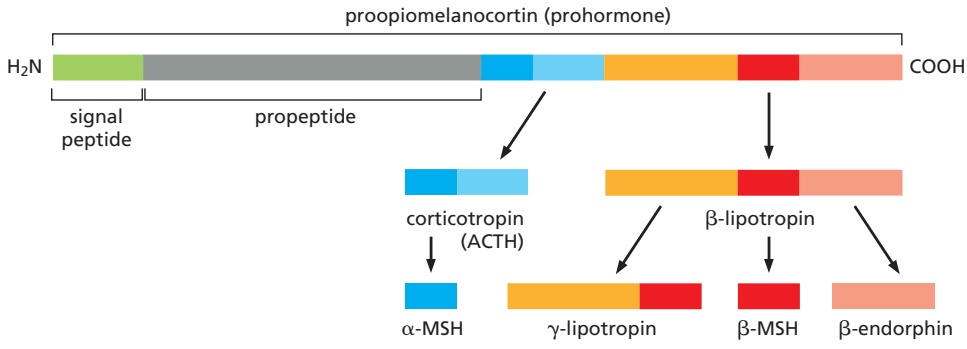

include the necessary signal for packaging into secretory vesicles. In addition, for secreted hydrolytic enzymes—or any other protein whose activity could be harmful inside the cell that makes it—delaying activation of the protein until it reaches a secretory vesicle or until after it has been secreted has a clear advantage: the delay prevents the protein from acting prematurely inside the cell in which it is synthesized.

Figure 13–44 Processing pathways for the prohormone polyprotein proopiomelanocortin. The initial cleavages are made by proteases that cut next to pairs of positively charged amino acids (Lys-Arg, Lys-Lys, Arg-Lys, or Arg-Arg pairs). Trimming reactions then produce the final secreted products. Different cell types produce different concentrations of individual processing enzymes, so that the same prohormone precursor is cleaved to produce different peptide hormones. In the anterior lobe of the pituitary gland, for example, only corticotropin (ACTH) and β-lipotropin are produced from proopiomelanocortin, whereas in the intermediate lobe of the pituitary gland, mainly α-melanocyte stimulating hormone (α-MSH), γ-lipotropin, β-MSH, and β-endorphin are produced—α-MSH from ACTH and the other three from β-lipotropin, as shown.

#### Secretory Vesicles Wait Near the Plasma Membrane Until Signaled to Release Their Contents

Once loaded, a secretory vesicle has to reach the site of secretion, which in some cells is far away from the TGN. Nerve cells are the most extreme example. Secretory proteins, such as peptide neurotransmitters (neuropeptides), which will be released from nerve terminals at the end of the axon, are made and packaged into secretory vesicles in the cell body. They then travel along the axon to the nerve terminals, which can be a meter or more away. As discussed in Chapter 16, motor proteins propel the vesicles along axonal microtubules, whose uniform orientation guides the vesicles in the proper direction. Microtubules also guide transport vesicles to the cell surface for constitutive exocytosis.

Whereas transport vesicles containing materials for constitutive release fuse with the plasma membrane once they arrive there, secretory vesicles in the regulated pathway wait at the membrane until the cell receives a signal for the vesicles to secrete their cargo. The signal can be an electrical nerve impulse (an action potential) or an extracellular signal molecule, such as a hormone. In either case, it leads to a transient increase in the concentration of free $\mathrm { C a ^ { 2 + } }$ in the cytosol, which is the trigger for secretory vesicle fusion.

#### For Rapid Exocytosis, Synaptic Vesicles Are Primed at the Presynaptic Plasma Membrane

Nerve cells (and some endocrine cells) contain two types of secretory vesicles. As for all secretory cells, these cells package proteins and neuropeptides in densecored secretory vesicles in the standard way for release by the regulated secretory pathway. In addition, however, they use another specialized class of tiny (∼50 nm diameter) secretory vesicles called **synaptic vesicles**. These vesicles store small neurotransmitter molecules, such as acetylcholine, glutamate, glycine, and γ-aminobutyric acid (GABA), which mediate rapid signaling from a nerve cell to its target cell at chemical synapses as we discussed in Chapter 11. When an action potential arrives at a nerve terminal, it causes an influx of $\mathrm { C a ^ { 2 + } }$ through voltage-gated $\mathrm { C a ^ { 2 + } }$ channels, which triggers the synaptic vesicles to fuse with the plasma membrane and release their contents to the extracellular space (see Figure 11–38). Some neurons fire more than 1000 times per second, releasing neurotransmitters each time.

The speed of transmitter release (taking only milliseconds) indicates that the proteins mediating the fusion reaction do not undergo complex, multistep rearrangements. Rather, after vesicles have been docked at the presynaptic plasma membrane, they undergo a priming step, which prepares them for rapid fusion. In the primed state, the SNAREs are partly paired but their helices are not fully wound into the final four-helix bundle required for fusion (**Figure 13–45**). Proteins called complexins freeze the SNARE complexes in this metastable state. The brake imposed by the complexins is released by another synaptic vesicle protein, synaptotagmin, which contains $\mathrm { C a ^ { 2 + } }$ -binding domains. A rise in cytosolic $\mathrm { C a ^ { 2 + } }$ triggers binding of synaptotagmin to the SNAREs, displacing the complexins. As the SNARE bundle zippers up completely, a fusion pore opens and the neurotransmitters are released. At a typical synapse, only a small number of the docked vesicles are primed and ready for exocytosis. The use of only a small fraction of primed vesicles at a time allows each synapse to fire over and over again in quick succession. With each firing, new synaptic vesicles dock and become primed to replace those that have fused and released their contents.

Figure 13–45 Exocytosis of synaptic vesicles. For orientation at a synapse, see Figure 11–38. (A) The trans-SNARE complex responsible for docking synaptic vesicles at the plasma membrane of nerve terminals consists of three proteins. The v-SNARE synaptobrevin and the t-SNARE syntaxin are both transmembrane proteins, and each contributes one α helix to MBoC7 m13.67/13.45the complex. By contrast to other SNAREs discussed earlier, the t-SNARE SNAP25 is a peripheral membrane protein that contributes two α helices to the four-helix bundle; the two helices are connected by a loop (dashed line) that lies parallel to the membrane and has fatty acyl chains (not shown) attached to anchor it there. The four α helices are shown as rods for simplicity. (B) At the synapse, the basic SNARE machinery is modulated by the Ca2+ sensor synaptotagmin and an additional protein called complexin. Synaptic vesicles first dock at the membrane (step 1), and the SNARE bundle partially assembles (step $2 ) ,$ resulting in a “primed vesicle” that is already drawn close to the membrane. The SNARE bundle assembles further, but the additional binding of complexin prevents fusion (step 3). Upon arrival of an action potential, $\mathrm { C a ^ { 2 + } }$ enters the cell and binds to synaptotagmin, which releases the block and opens a fusion pore (step 4). Further rearrangements complete the fusion reaction (step 5) and release the fusion machinery, which now can be reused. This elaborate arrangement allows the fusion machinery to respond on the millisecond time scale essential for rapid and repetitive synaptic signaling. (A, adapted from R.B. Sutton et al., Nature 395:347–353, 1998; B, adapted from J. Tang et al., Cell 126:1175–1187, 2006. With permission from Elsevier.)

#### Synaptic Vesicles Can Be Recycled Locally After Exocytosis

For the nerve terminal to respond rapidly and repeatedly, synaptic vesicles need to be replenished very quickly after they discharge. This is achieved by local recycling of synaptic vesicles from the presynaptic plasma membrane in the

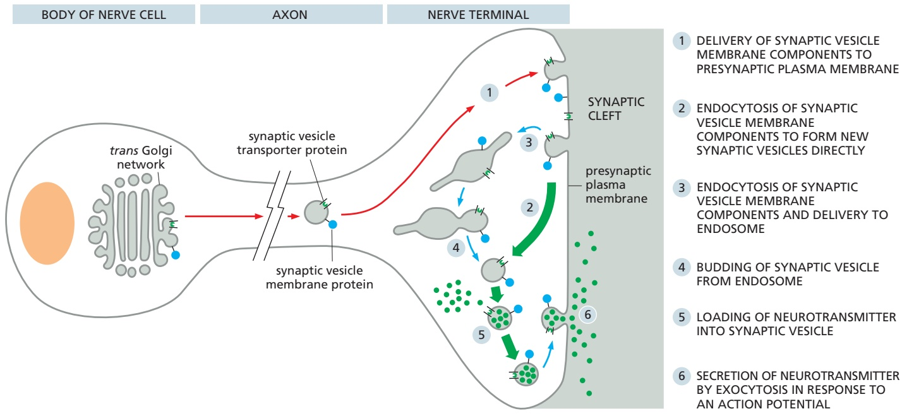

nerve terminals (Figure 13–46). In this process, membrane components of synaptic vesicles are removed from the surface by endocytosis almost as fast as they are added by exocytosis. Similarly, newly made membrane components of the synaptic vesicles are initially delivered to the plasma membrane by the constitutive secretory pathway and then retrieved by endocytosis. The membrane components of a synaptic vesicle include transporters specialized for the uptakeMBoC7 m13.68/13.46 of neurotransmitter from the cytosol, where the small-molecule neurotransmitters that mediate fast synaptic signaling are synthesized (Figure 13–47). Most of the endocytic vesicles immediately fill with neurotransmitter to become synaptic vesicles. Once filled with neurotransmitter, the synaptic vesicles can be used again (see Figure 13–46).

1 DELIVERY OF SYNAPTIC VESICLE MEMBRANE COMPONENTS TO PRESYNAPTIC PLASMA MEMBRANE

2 ENDOCYTOSIS OF SYNAPTIC VESICLE MEMBRANE COMPONENTS TO FORM NEW SYNAPTIC VESICLES DIRECTLY

3 ENDOCYTOSIS OF SYNAPTIC VESICLE MEMBRANE COMPONENTS AND DELIVERY TO ENDOSOME

4 BUDDING OF SYNAPTIC VESICLE FROM ENDOSOME

5 LOADING OF NEUROTRANSMITTER INTO SYNAPTIC VESICLE

6 SECRETION OF NEUROTRANSMITTER BY EXOCYTOSIS IN RESPONSE TO AN ACTION POTENTIAL

Control of membrane traffic thus has a major role in maintaining the composition of the various membranes of the cell. To maintain each membrane-enclosed compartment in the secretory and endocytic pathways at a constant size, the balance between the outward and inward flows of membrane needs to be precisely regulated. For cells to grow, however, the forward flow needs to be greater than the retrograde flow, so that the membrane can increase in area. For cells to maintain a constant size, the forward and retrograde flows must be equal. We still know very little about the mechanisms that coordinate these flows.

Figure 13–46 The formation of synaptic vesicles in a nerve cell. These tiny uniform vesicles are found only in nerve cells and in some endocrine cells, where they store and secrete small-molecule neurotransmitters. The import of neurotransmitter directly into the small endocytic vesicles that form from the plasma membrane is mediated by membrane transporters that function as antiports and are driven by an H+ gradient maintained by V-type ATPase H+ pumps in the vesicle membrane (discussed in Chapter 11).

#### Secretory Vesicle Membrane Components Are Quickly Removed from the Plasma Membrane

When a secretory vesicle fuses with the plasma membrane, its contents are discharged from the cell by exocytosis and its membrane becomes part of the plasma membrane. Although this should increase the surface area of the plasma membrane, it does so only transiently, because an equivalent amount of membrane is removed from the surface by endocytosis almost as fast as it is added by exocytosis, a process reminiscent of the endocytic–exocytic cycle discussed later. The proteins of the secretory vesicle membrane that are endocytosed from the plasma membrane are either recycled or shuttled to lysosomes for degradation through mechanisms discussed later. The amount of secretory vesicle membrane that is temporarily added to the plasma membrane can be enormous: in a pancreatic acinar cell discharging digestive enzymes for delivery to the gut lumen, about 900 $\mu \mathrm { m } ^ { 2 }$ of vesicle membrane is inserted into the apical plasma membrane (whose area is only $3 0 \; \mu \mathrm { m } ^ { 2 } )$ when the cell is stimulated to secrete.

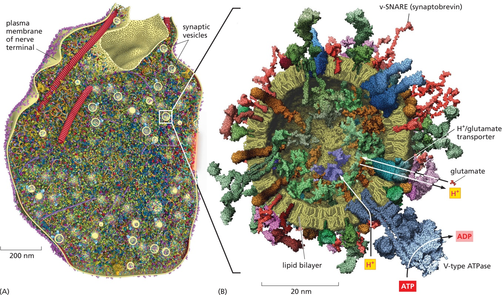

(A)

Figure 13–47 Scale models of a brain presynaptic terminal and a synaptic vesicle. The illustrations show sections through a presynaptic terminal (A) and a synaptic vesicle (B) in which proteins and lipids are drawn to scale on the basis of their known stoichiometry and either known or approximated structures. The relative localization of protein molecules in different regions of the presynaptic terminal was inferred from superresolution imaging and electron microscopy. The model in A contains 300,000 proteins of 60 different kinds that vary in abundance from 150 copies to 20,000 copies. In the model in B, only 70% of the membrane proteins present in the membrane are shown; a complete model would therefore show a membrane that is even more crowded than this picture suggests (Movie 13.6). Each synaptic vesicle membrane contains 7000 phospholipid molecules and 5700 cholesterol molecules. Each also contains close to 50 different integral membrane protein molecules, which vary widely in their relative abundance and together contribute about 600 transmembrane α helices. The transmembrane v-SNARE synaptobrevin is the most abundant protein in the vesicle (∼70 copies per vesicle). By contrast, the V-type ATPase, which uses ATP hydrolysis to pump H+ into the vesicle lumen, is present in 1–2 copies per vesicle. The H+ gradient provides the energy for neurotransmitter import by an H+/neurotransmitter antiport, which loads each vesicle with 1800 neurotransmitter molecules, such as glutamate, one of which is shown to scale. (A, from B.G. Wilhelm et al., Science 344:1023–1028, 2014. With permission from AAAS; B, adapted from S. Takamori et al., Cell 127:831–846, 2006. With permission from Elsevier.)

#### Some Regulated Exocytosis Events Serve to Enlarge the Plasma Membrane

An important task of regulated exocytosis is to deliver more membrane to enlarge the surface area of a cell’s plasma membrane when such a need arises. A spectacular example is the plasma membrane expansion that occurs during the cellularization process in a fly embryo, which initially is a syncytium—a single cell containing about 6000 nuclei surrounded by a single plasma membrane (see Figure 21–14). Within tens of minutes, the embryo is converted into the same number of cells. This process of cellularization requires a vast amount of new plasma membrane, which is added by a carefully orchestrated fusion of cytoplasmic vesicles, eventually forming the plasma membranes that enclose the separate cells. Similar vesicle fusion events are required to enlarge the plasma membrane when other animal cells or plant cells divide during cytokinesis (discussed in Chapter 17).

Many animal cells, especially those subjected to mechanical stresses, frequently experience small ruptures in their plasma membrane. In a remarkable process thought to involve both homotypic vesicle–vesicle fusion and exocytosis, a temporary cell-surface patch is quickly fashioned from locally available

CYTOKINESIS (A)

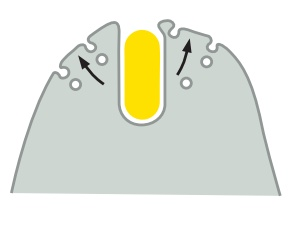

(B) PHAGOCYTOSIS

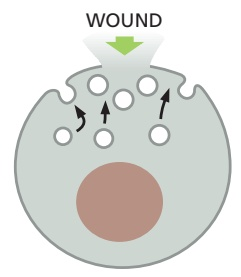

(C) PLASMA MEMBRANE REPAIR

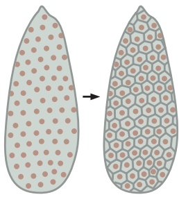

(D) CELLULARIZATION

internal-membrane sources, such as lysosomes. In addition to providing an emergency barrier against leaks, the patch reduces membrane tension over the wounded area, allowing the bilayer to flow back together to restore continuity and seal the puncture. The fusion and exocytosis of vesicles that mediated membrane repair is triggered by the sudden increase of $\mathrm { C a ^ { 2 + } }$ , which is abundant in the extracellular space and rushes into the cell as soon as the plasma membraneMBoC7 m13.70/13.48 is punctured. Figure 13–48 shows four examples in which regulated exocytosis leads to plasma membrane expansion.

Figure 13–48 Four examples of regulated exocytosis leading to plasma membrane enlargement. The vesicles fusing with the plasma membrane during cytokinesis (A) (discussed in Chapter 17) and phagocytosis (B) (discussed later in this chapter) are thought to be derived from endosomes, whereas those involved in wound repair (C) may be derived from plasma membranes and lysosomes. The vast amount of new plasma membrane inserted during cellularization in a fly embryo occurs by the fusion of cytoplasmic vesicles (D).

#### Polarized Cells Direct Proteins from the Trans Golgi Network to the Appropriate Domain of the Plasma Membrane

Most cells in tissues are polarized, with two or more molecularly and functionally distinct plasma membrane domains. This raises the general problem of how the delivery of membrane from the Golgi apparatus is organized so as to maintain the differences between one cell-surface domain and another. A typical epithelial cell, for example, has an apical domain, which faces either an internal cavity or the outside world and often has specialized features such as cilia or a brush border of microvilli. It also has a basolateral domain, which covers the rest of the cell. The two domains are separated by a ring of tight junctions (see Figure 19–20), which prevents proteins and lipids from diffusing between the two domains, so that the differences between the two domains are maintained.

Different subsets of proteins are secreted from the apical and basolateral surfaces of the cell. Epithelial cells lining the gut, for example, secrete digestive enzymes and mucus at their apical surface and components of the basal lamina at their basolateral surface. Such cells must have ways of directing vesicles carrying different cargoes to different plasma membrane domains. Proteins destined for different domains travel together from the ER until they reach the TGN, where they are separated and dispatched in secretory or transport vesicles to the appropriate plasma membrane domain (**Figure 13–49**). These routes are known as the direct pathways for polarized secretion because cargo destined for the apical and basolateral domains is delivered there directly.

The apical plasma membrane of most epithelial cells is greatly enriched in glycosphingolipids, which help protect this exposed surface from damage; for example, from the digestive enzymes and low pH in sites such as the gut or stomach, respectively. Similarly, plasma membrane proteins that are linked to the lipid bilayer by a glycosylphosphatidylinositol (GPI) anchor (see Figure 12–30) are found predominantly in the apical plasma membrane. If recombinant DNA techniques are used to attach a GPI anchor to a protein that would normally be delivered to the basolateral surface, the protein is delivered to the apical surface instead. GPI-anchored proteins are thought to be directed to the apical membrane because they associate with glycosphingolipids in lipid rafts that form in the membrane of the TGN. As discussed in Chapter 10, lipid rafts form in the TGN and plasma membrane when glycosphingolipids and cholesterol molecules self-associate (see Figure 10–13). Having selected a unique set of cargo molecules, the rafts then bud from the TGN into transport vesicles destined for the apical plasma membrane.

(B) INDIRECT SORTING VIA EARLY ENDOSOMES

Figure 13–49 Two ways of sorting plasma membrane proteins in a polarized epithelial cell. (A) In the direct pathway, proteins destined for different plasma membrane domains are sorted and packaged into different transport vesicles. The lipid raft–dependent delivery system to the apical domain described in the text is an example of the direct pathway. (B) In the indirect pathway, a protein is retrieved from the inappropriate plasma membrane domain by endocytosis and then transported to the correct domain via early endosomes; that is, by transcytosis. The indirect pathway, for example, is used in liver hepatocytes to deliver proteins to the apical domain that lines bile ducts.

While secretory and GPI-anchored proteins rely on the direct pathways, membrane proteins can sometimes use an indirect route to arrive at the appropriate membrane surface (see Figure 13–49B). In this route, both apical and basolateral cargo travel together in transport vesicles from the TGN to the basolateral membrane. Membrane proteins that do not belong in that region of the plasma membrane are retrieved by endocytosis and are transported via early endosomes to the correct region. Membrane proteins destined for delivery to the basolateral membrane contain sorting signals in their cytosolic tail. When present in an appropriate structural context, these signals are recognized by coat proteins that package them into appropriate transport vesicles in the TGN. The same basolateral signals that are recognized in the TGN also function in early endosomes to redirect the proteins back to the basolateral plasma membrane after they have been endocytosed. A combination of direct and indirect deliveries ensures that the apical and basolateral membranes retain their distinct identities.

#### Summary

Transport vesicles departing the TGN carry their contents to one of two major destinations: the plasma membrane for exocytosis or endosomes for eventual delivery to lysosomes. Vesicle transport from the TGN to the plasma membrane is further divided into a constitutive pathway or regulated pathways. Proteins follow the constitutive pathway unless they are diverted into other pathways or retained in the Golgi apparatus. In polarized cells, the transport pathways from the TGN to the plasma membrane operate selectively to ensure that different sets of membrane proteins, secreted proteins, and lipids are delivered to the different domains of the plasma membrane.

The regulated pathways operate only in specialized secretory cells and neurons. The molecules for regulated secretion are stored either in secretory vesicles or in synaptic vesicles, which do not fuse with the plasma membrane to release their contents until they receive an appropriate signal. Secretory vesicles containing proteins for secretion bud from the TGN. The secretory proteins become concentrated during the formation and maturation of the secretory vesicles. Synaptic vesicles, which are confined to nerve cells and some endocrine cells, form from both endocytic vesicles and from endosomes, and they mediate the regulated secretion of small-molecule neurotransmitters at the axon terminals of nerve cells.

Newly synthesized lysosomal proteins are carried from the TGN to endosomes by means of clathrin-coated transport vesicles before moving on to lysosomes.

The lysosomal hydrolases contain N-linked oligosaccharides that are covalently modified in a unique way in the cis Golgi network so that their mannoses are phosphorylated. These mannose 6-phosphate (M6P) groups are recognized by an M6P receptor protein in the trans Golgi network that segregates the hydrolases and helps package them into budding transport vesicles that deliver their contents to endosomes. The M6P receptors shuttle back and forth between the trans Golgi network and the endosomes. The low pH in endosomes and the removal of the phosphate from the M6P group cause the lysosomal hydrolases to dissociate from these receptors, making the transport of the hydrolases unidirectional. A separate transport system uses clathrin-coated vesicles to deliver resident lysosomal membrane proteins from the trans Golgi network to endosomes.

#### TRANSPORT INTO THE CELL FROM THE PLASMA MEMBRANE: ENDOCYTOSIS

The routes that lead inward from the cell surface start with the process of **endocytosis**, by which cells take up plasma membrane components, fluid, solutes, macromolecules, and particulate substances. Endocytosed cargo includes receptor–ligand complexes, a spectrum of nutrients and their carriers, extracellular matrix components, cell debris, bacteria, viruses, and, in specialized cases, even other cells. Through endocytosis, the cell regulates the composition of its plasma membrane in response to changing extracellular conditions.

In endocytosis, the material to be ingested is progressively enclosed by a small portion of the plasma membrane, which first invaginates and then pinches off to form an **endocytic vesicle** containing the ingested substance or particle. Most eukaryotic cells constantly form endocytic vesicles, a process called pinocytosis (“cell drinking”); in addition, some specialized cells contain dedicated pathways that take up large particles on demand, a process called phagocytosis (“cell eating”). Endocytic vesicles form at the plasma membrane by multiple mechanisms that differ in both the molecular machinery used and how that machinery is regulated.

Once generated at the plasma membrane, most endocytic vesicles fuse with a common receiving compartment, the early endosome, where internalized cargo is sorted: some cargo molecules are returned to the plasma membrane, either directly or via a recycling endosome, and others remain as the early endosome changes into a late endosome by a process termed endosome maturation (**Figure 13–50**). This conversion process changes the protein composition of the endosome membrane, patches of which invaginate and become incorporated within the organelles as intralumenal vesicles, while the endosome itself moves from the cell periphery to a location close to the nucleus. As an endosome matures, it ceases to recycle material to the plasma membrane. Instead, late

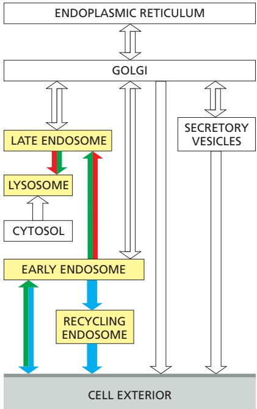

Figure 13–50 Endosome maturation: the endocytic pathway from the plasma membrane to lysosomes. Near the cell MBoC7 RM4periphery, endocytic vesicles fuse with an early endosome, which is the primary sorting station. Tubular portions of the early endosome bud off vesicles that recycle endocytosed cargo back to the plasma membrane—either directly or indirectly via recycling endosomes. Recycling endosomes can store proteins until they are needed. Conversion of early endosomes to late endosomes is accompanied by loss of the tubular projections. Membrane proteins destined for degradation are internalized in intralumenal vesicles. The developing late endosome, or multivesicular body, moves on microtubules to the cell interior. Fully matured late endosomes no longer send vesicles to the plasma membrane, and they fuse with one another and with endolysosomes and lysosomes to degrade their contents. Each stage of endosome maturation is connected to the TGN via transport vesicles, providing a continual supply of newly synthesized lysosomal proteins.

endosomes fuse with one another and with lysosomes to form endolysosomes, which degrade their contents.

Each of the stages of endosome maturation—from the early endosome to the endolysosome—is connected to the TGN through bidirectional vesicle transport pathways. These pathways allow insertion of newly synthesized materials, such as lysosomal enzymes arriving from the ER, and the retrieval of components, such as the M6P receptor, back into the early parts of the secretory pathway. We later discuss how the cell uses and controls the various features of endocytic trafficking.

#### Pinocytic Vesicles Form from Coated Pits in the Plasma Membrane

Virtually all eukaryotic cells continually ingest portions of their plasma membrane in the form of small pinocytic (endocytic) vesicles. The rate at which plasma membrane is internalized in this process of **pinocytosis** varies between cell types, but it is usually surprisingly high. A macrophage, for example, ingests 25% of its own volume of fluid each hour. This means it must ingest 3% of its plasma membrane each minute, or 100% in about half an hour. Fibroblasts endocytose at a somewhat lower rate (1% of their plasma membrane per minute), whereas some amoebae ingest their plasma membrane even more rapidly. Because a cell’s surface area and volume remain unchanged during this process, it is clear that the same amount of membrane being removed by endocytosis is being added to the cell surface by the converse process of exocytosis. In this sense, endocytosis and exocytosis are linked processes that can be considered to constitute an endocytic–exocytic cycle. The coupling between exocytosis and endocytosis is particularly strict in specialized structures characterized by high membrane turnover, such as a nerve terminal.

The endocytic part of the cycle often begins at **clathrin-coated pits**. These specialized regions typically occupy about 2% of the total plasma membrane area. The lifetime of a clathrin-coated pit is short: within a minute or so of being formed, it invaginates into the cell and pinches off to form a clathrin-coated vesicle (**Figure 13–51**). About 2500 clathrin-coated vesicles pinch off from the plasma membrane of a cultured fibroblast every minute. The coated vesicles are even more transient than the coated pits: within seconds of being formed, they shed their coat and fuse with early endosomes.

#### Not All Membrane Invaginations and Pinocytic Vesicles Are Clathrin Coated

In addition to clathrin-coated pits and vesicles, cells can form other types of pinocytic vesicles and membrane invaginations. Most of these clathrin-independent membrane invaginations are poorly understood, and the molecules that mediate

Figure 13–51 The formation of clathrincoated vesicles from the plasma membrane. These electron micrographs illustrate the probable sequence of events in the formation of a clathrin-coated vesicle from a clathrin-coated pit. The clathrincoated pits and vesicles shown are larger than those seen in normal-sized cells; they are from a very large hen oocyte, and they take up lipoprotein particles to form yolk. The lipoprotein particles bound to their membrane-bound receptors appear as a dense, fuzzy layer on the extracellular surface of the plasma membrane—which is the inside surface of the coated pit and vesicle. (Courtesy of M.M. Perry and A.B. Gilbert, J. Cell Sci. 39:257–272, 1979. With permission from the Company of Biologists.)

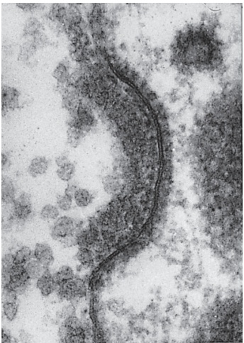

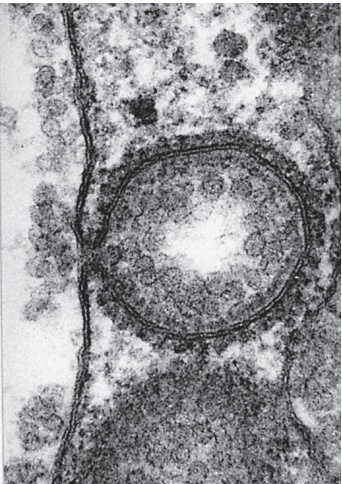

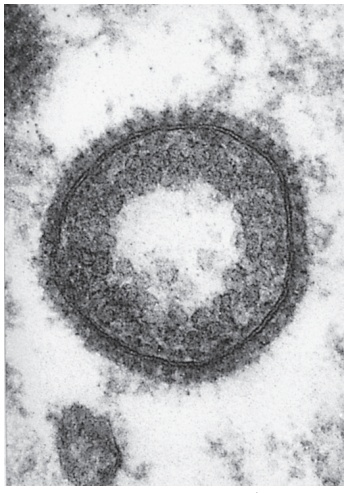

0.1 µm

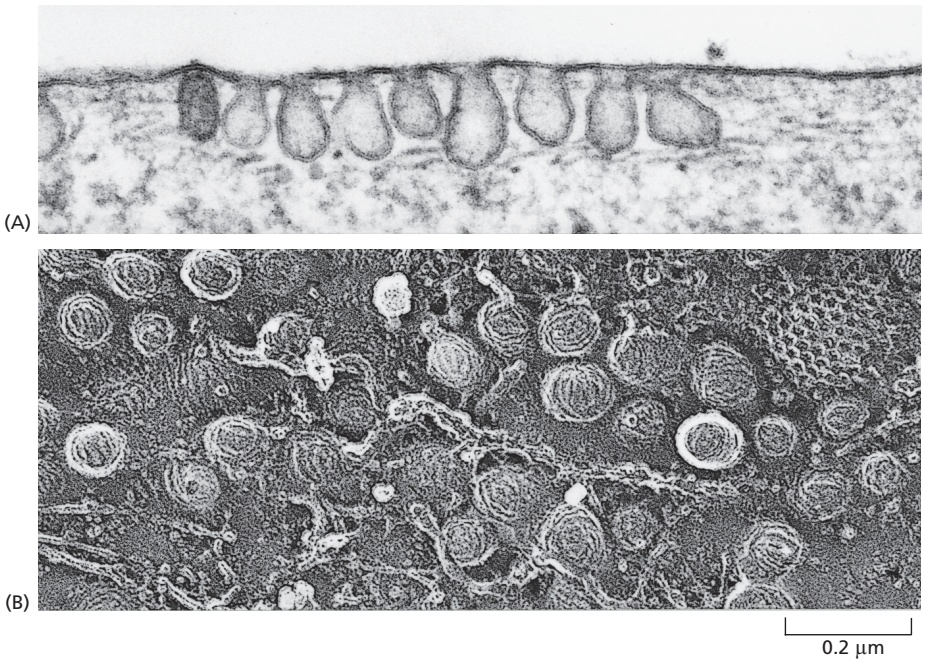

Figure 13–52 Caveolae in the plasma membrane of a fibroblast. (A) This electron micrograph shows a plasma membrane with a very high density of caveolae. (B) This rapid-freeze deep-etch image demonstrates the characteristic “cauliflower” texture of the cytosolic face of the caveolae membrane. The characteristic texture is thought to result from aggregates of caveolins and cavins. A clathrin-coated pit is also seen at the upper right. (From K.G. Rothberg et al., Cell 68:673–682, 1992. With permission from Elsevier.)

membrane bending and vesicle formation are often not defined fully. The best-MBoC7 m13.49/13.52 understood clathrin-independent invaginations are called **caveolae** (from the Latin for “little cavities”), originally observed as a prominent feature of the endothelial cells that form the inner lining of blood vessels.

Caveolae, sometimes seen in the electron microscope as deeply invaginated flasks, are present in the plasma membrane of most vertebrate cell types (**Figure 13–52**). The major structural proteins in caveolae are **caveolins**, a family of unusual integral membrane proteins that each insert a hydrophobic loop into the membrane from the cytosolic side but do not extend across the membrane. On their cytosolic side, caveolins are bound to large protein complexes of cavin proteins, which are thought to stabilize the membrane curvature. Caveolae are especially rich in cholesterol, glycosphingolipids, and glycosylphosphatidylinositol (GPI)-anchored membrane proteins and might represent a type of lipid raft in the plasma membrane (see Figure 10–13).

In contrast to clathrin-coated and COPI-coated or COPII-coated vesicles, caveolae are usually static structures that can serve as a reservoir of additional plasma membrane. It is thought that cells subjected to dynamic changes in shear forces, such as the endothelial cells of arteries, exploit this reservoir to provide their plasma membranes greater resilience to stretch. This is accomplished by the rapid disassembly of the cavin protein scaffold in response to mechanical force, thereby allowing the underlying membrane to temporarily increase the surface area of the cell. The ability to rapidly change membrane surface area is thought to be important for accommodating dynamic changes in blood flow to different parts of the brain.

Two other endocytosis pathways are known, neither of which uses clathrin. **Macropinocytosis** is a process whereby the plasma membrane protrudes from the cell and engulfs a portion of the surrounding extracellular fluid into a macropinosome. This is a nonselective process for bringing fluid into the cell under certain conditions. In phagocytosis, the plasma membrane is directed to wrap around the particle to be engulfed until it fuses with itself, resulting in an enclosed phagosome inside the cell. Both processes utilize actin polymerization underneath the plasma membrane to mediate the large-scale membrane deformations required to engulf a large particle or a high volume of fluid. Both macropinosomes and phagosomes are destined to fuse with lysosomes so their internal contents can be degraded. These routes of degradation will be discussed later when we consider the function of lysosomes.

#### Cells Use Receptor-mediated Endocytosis to Import Selected Extracellular Macromolecules

In most animal cells, clathrin-coated pits and vesicles provide an efficient pathway for taking up specific macromolecules from the extracellular fluid. In this process, called **receptor-mediated endocytosis**, the macromolecules bind to complementary transmembrane receptor proteins, which accumulate in coated pits, and then enter the cell as receptor–macromolecule complexes in clathrincoated vesicles (see Figure 13–51). Because ligands are selectively captured by receptors, receptor-mediated endocytosis provides a selective concentrating mechanism that increases the efficiency of internalization of particular ligands more than a hundredfold. In this way, even minor components of the extracellular fluid can be efficiently taken up in large amounts. A particularly well-understood and physiologically important example is the process that mammalian cells use to import cholesterol.

Many animal cells take up cholesterol through receptor-mediated endocytosis and, in this way, acquire most of the cholesterol they require to make new membrane. If the uptake is blocked, cholesterol accumulates in the blood and can contribute to the formation in blood vessel (artery) walls of atherosclerotic plaques, deposits of lipid and fibrous tissue that can cause strokes and heart attacks by blocking arterial blood flow. In fact, it was a study of humans with a strong genetic predisposition for atherosclerosis that first revealed the mechanism of receptor-mediated endocytosis.

Most cholesterol is transported in the blood as cholesterol esters in the form of lipid–protein particles known as **low-density lipoproteins (LDLs)** that, architecturally, resemble lipid droplets bearing a core of triacylglycerol, free cholesterol, and cholesterol esters. The droplet is stabilized by a single molecule of apolipoprotein B, a very large protein that wraps around the LDL particle (**Figure 13–53**). When a cell needs cholesterol for membrane synthesis, it makes transmembrane receptor proteins for LDL at the ER and transports them to the plasma membrane. Once in the plasma membrane, the LDL receptor diffuses until an endocytosis signal in its cytoplasmic tail binds the adaptor protein AP2 after AP2’s conformation has been locally unlocked by binding to $\mathrm { P I ( 4 , } 5 \mathrm { ) P _ { 2 } }$ on the plasma membrane. This two-step mechanism of AP2 binding to an endocytosis signal (see Figure 13–9) imparts both efficiency and selectivity to the process. AP2 then recruits clathrin to initiate endocytosis.

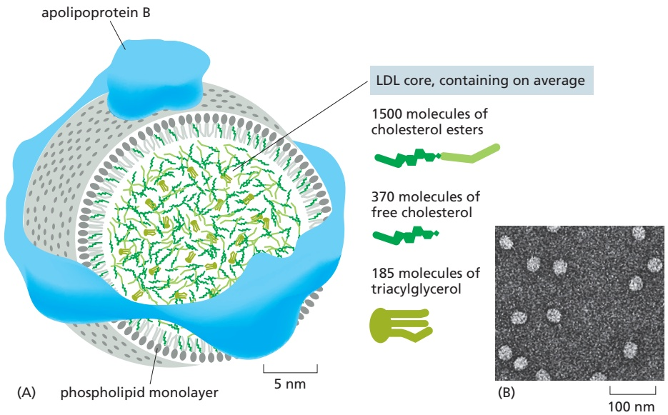

Figure 13–53 A low-density lipoprotein (LDL) particle. (A) Each roughly spherical particle has a mass of 3 × 106 daltons. It contains a core of about 1500 cholesterol molecules esterified to long-chain fatty acids and smaller amounts of free cholesterol and triacylglycerol molecules. A lipid monolayer composed of about 800 phospholipid and 500 unesterified cholesterol molecules surrounds the core of cholesterol esters. A single molecule of apolipoprotein B, a 500,000-dalton beltlike protein, organizes the particle and mediates the specific binding of LDL to cell-surface LDL receptors. (B) Purified LDL particles seen by negative staining in the electron microscope. (B, from L. Zhang et al., J. Lipid Res. 52:175–184, 2011. With permission from Elsevier.)

Because coated pits constantly pinch off to form coated vesicles, any LDL particles bound to LDL receptors in the coated pits are rapidly internalized in coated vesicles. After shedding their clathrin coats, the vesicles deliver their contents to early endosomes. Once the LDL and LDL receptors encounter the low pH in early endosomes, LDL is released from its receptor and is delivered via late endosomes to lysosomes. There, the cholesterol esters in the LDL particles are hydrolyzed to free cholesterol, which is now available to the cell for new membrane synthesis (**Movie 13.7**). If too much free cholesterol accumulates in a cell, the cell simultaneously shuts off endogenous cholesterol synthesis (Figure 12–64) and reduces exogenous cholesterol intake by shutting off the synthesis of LDL receptors.

This regulated pathway for cholesterol uptake is disrupted in individuals who inherit defective genes encoding LDL receptors. The resulting high levels of blood cholesterol predispose these individuals to develop atherosclerosis pre-maturely, and many would die at an early age of heart attacks resulting from coronary artery disease if they were not treated with drugs such as statins that lower the level of blood cholesterol. In some cases, the receptor is lacking altogether. In others, the receptors are defective—in either the extracellular binding site for LDL or the intracellular binding site for the AP2 adaptor protein in clathrin-coated pits. In the latter case, normal numbers of LDL receptors are present, but they fail to become localized in clathrin-coated pits. Although LDL binds to the surface of these mutant cells, it is not internalized, directly demonstrating the importance of clathrin-coated pits for the receptor-mediated endocytosis of cholesterol.

More than 25 distinct receptors are known to participate in receptor-mediated endocytosis of different types of molecules. They all apparently use clathrindependent internalization routes and are guided into clathrin-coated pits by signals in their cytoplasmic tails that bind to adaptor proteins in the clathrin coat. Many of these receptors, like the LDL receptor, enter coated pits irrespective of whether they have bound their specific ligands. Others enter preferentially when bound to a specific ligand, suggesting that a ligand-induced conformational change is required for them to activate the signal sequence that guides them into the pits. Because most plasma membrane proteins fail to become concentrated in clathrin-coated pits, the pits serve as molecular filters, preferentially collecting certain plasma membrane proteins (receptors) over others.

Electron microscopy of cultured cells exposed simultaneously to different labeled ligands demonstrates that many kinds of receptors can cluster in the same clathrin-coated pit, whereas some other receptors cluster in different clathrincoated pits. The plasma membrane of one clathrin-coated pit can accommodate more than 100 receptors of assorted varieties.

#### Specific Proteins Are Retrieved from Early Endosomes and Returned to the Plasma Membrane

Early endosomes are the main sorting stations in the endocytic pathway, just as the cis and trans Golgi networks serve this function in the secretory pathway. In the mildly acidic environment of the early endosome, many internalized receptor proteins change their conformation and release their ligand, as already discussed for the M6P receptors. Those endocytosed ligands that dissociate from their receptors in the early endosome are usually destined for delivery to lysosomes, where they are either degraded and recycled into building blocks or utilized directly by the cell (such as the cholesterol just discussed). Some other endocytosed ligands, however, remain bound to their receptors and thereby share the fate of the receptors.

In the early endosome, the LDL receptor dissociates from its ligand, LDL, and is recycled back to the plasma membrane for reuse, leaving the discharged LDL to be carried to lysosomes (**Figure 13–54**). The recycling transport vesicles bud from long, narrow tubules that extend from the early endosomes (**Figure 13–55**).MBoC7 m13.52/13.54 It is likely that the geometry of these tubules helps the sorting process: because tubules have a large membrane area enclosing a small volume, membrane proteins become enriched over soluble proteins. The transport vesicles return the LDL receptor directly to the plasma membrane.

The **transferrin receptor** follows a similar recycling pathway as the LDL receptor, but unlike the LDL receptor it also recycles its ligand. Transferrin is a soluble protein that carries iron in the blood. Cell-surface transferrin receptors deliver transferrin with its bound iron to early endosomes by receptor-mediated endocytosis. The low pH in the endosome induces transferrin to release its bound iron, but the iron-free transferrin itself (called apotransferrin) remains bound to its receptor. The receptor–apotransferrin complex enters the tubular extensions of the early endosome and from there is recycled back to the plasma membrane. When the apotransferrin returns to the neutral pH of the extracellular fluid, it dissociates from the receptor and is thereby freed to pick up more iron and begin the cycle again. Thus, transferrin shuttles back and forth between the extracellular fluid and early endosomes, avoiding lysosomes and delivering iron to the cell interior, as needed for cells to grow and proliferate.

#### Recycling Endosomes Regulate Plasma Membrane Composition

The fates of endocytosed receptors—and of any ligands remaining bound to them—vary according to the specific type of receptor. As we discussed, most receptors are recycled and returned to the same plasma membrane domain from which they came; some proceed to a different domain of the plasma membrane, thereby mediating **transcytosis**; and some remain in the endosomal system and progress to lysosomes, where they are degraded, as we discuss next.

Receptors on the surface of polarized epithelial cells can transfer specific macromolecules from one extracellular space to another by transcytosis. A newborn, for example, obtains antibodies from its mother’s milk (which help protect it against infection) by transporting them across the epithelium of its gut. The lumen of the gut is acidic, and, at this low pH, the antibodies in the milk bind to specific receptors on the apical (absorptive) surface of the gut epithelial cells. The receptor–antibody complexes are internalized via clathrin-coated pits and vesicles and are delivered to early endosomes. The complexes remain intact and are retrieved in transport vesicles that bud from the early endosome and subsequently fuse with the basolateral domain of the plasma membrane. On exposure to the neutral pH of the extracellular fluid that bathes the basolateral surface of the cells, the antibodies dissociate from their receptors and eventually enter the baby’s bloodstream.

The transcytotic pathway from the early endosome back to the plasma membrane is not direct. The receptors first move from the early endosome to the **recycling endosome**. The variety of pathways that different receptors follow from early endosomes implies that, in addition to binding sites for their ligands and binding sites for coated pits, many receptors also possess sorting signals that guide them into the appropriate transport pathway (**Figure 13–56**).

Figure 13–54 The receptor-mediated endocytosis of LDL. Note that the LDL dissociates from its receptors in the acidic environment of the early endosome. After a number of steps, the LDL ends up in endolysosomes and lysosomes, where it is degraded to release free cholesterol. In contrast, the LDL receptors are returned to the plasma membrane via transport vesicles that bud off from the tubular region of the early endosome, as shown. For simplicity, only one LDL receptor is shown entering the cell and returning to the plasma membrane. Whether it is occupied or not, an LDL receptor typically makes one round trip into the cell and back to the plasma membrane every 10 minutes, making up to several hundred trips in its 20-hour life span.

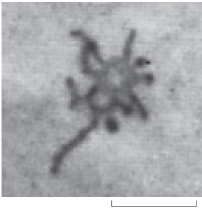

0.5 µm

Figure 13–55 Electron micrograph of an early endosome. The endosomal compartments can be made visible in the electron microscope by adding a readily detectable tracer molecule, MBoC7 m13.53/13.55such as the enzyme peroxidase, to the extracellular medium and allowing the cell to endocytose the tracer. Within a minute or so after adding the tracer, it starts to appear in early endosomes, just beneath the plasma membrane. The image shows an electron-dense reaction product of peroxidase in the early endosome that has been visualized in the electron microscope. Many tubular extensions protrude from the central vacuolar space of the early endosome, which will later mature to give rise to a late endosome. (© 1992 J. Tooze and M. Hollinshead. Originally published in J. Cell Biol. 118:813–830, 1992, doi.org/10.1083/jcb.118.4.813. With permission from Rockefeller University Press.)

transmembrane receptor proteins that have been endocytosed. Three pathways from the early endosomal compartment in an epithelial cell are shown. Retrieved receptors are returned (1) to the same plasma membrane domain from which they came (recycling) or (2) via a recycling endosome to a different domain of the plasma membrane (transcytosis). (3) Receptors that are not specifically retrieved from early or recycling endosomes follow the pathway from the endosomal compartment to lysosomes, where they are degraded (degradation). If the ligand that is endocytosed with its receptor stays bound to the receptor in the acidic environment of the endosome, it shares the same fate as the receptor; otherwise, it is delivered to lysosomes. Recycling endosomes are a way station on the transcytotic pathway. In the transcytosis example shown here, an antibody Fc receptor on a gut epithelial cell binds antibody and is endocytosed, eventually carrying the antibody to the basolateral plasma membrane. The receptor is called an Fc receptor because it binds the Fc part of the antibody (discussed in Chapter 24).

Cells can regulate the release of membrane proteins from recycling endosomes,MBoC7 m13.58/13.56 thus adjusting the flux of proteins through the transcytotic pathway according to need. This regulation, the mechanism of which is uncertain, allows recycling endosomes to play an important part in adjusting the concentration of specific plasma membrane proteins. Fat cells and muscle cells, for example, contain large intracellular pools of the glucose transporters that are responsible for the uptake of glucose across the plasma membrane. These membrane transport proteins are stored in specialized recycling endosomes until the hormone insulin stimulates the cell to increase its rate of glucose uptake. In response to the insulin signal, transport vesicles rapidly bud from the recycling endosome and deliver large numbers of glucose transporters to the plasma membrane, thereby greatly increasing the rate of glucose uptake into the cell (**Figure 13–57**). Similarly, kidney cells regulate the insertion of aquaporins and V-type ATPase into the plasma membrane to increase water reabsorption and acid excretion, respectively, both in response to hormones.

#### Plasma Membrane Signaling Receptors Are Down-regulated by Degradation in Lysosomes

The final potential fate for endocytosed receptors is to remain in the endosome as it matures and eventually fuses with lysosomes, where the receptor is degraded. Many signaling receptors, including opioid receptors and the receptor that binds epidermal growth factor (EGF), follow this route. EGF is a small, extracellular signal protein that stimulates epidermal and various other cells to divide. Unlike LDL receptors, EGF receptors accumulate in clathrin-coated pits only after binding their ligand, and most do not recycle but are degraded in lysosomes, along with the ingested EGF. EGF binding therefore first activates intracellular signaling pathways and then leads to a decrease in the concentration of EGF receptors on the cell surface, a process called receptor down-regulation, that reduces the cell’s subsequent sensitivity to EGF (see Figure 15–21).

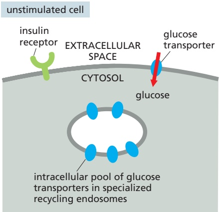

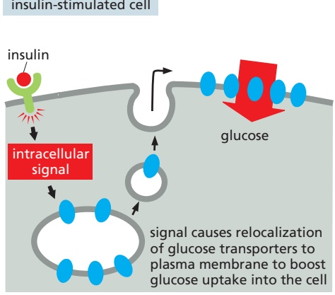

Figure 13–57 Storage of plasma membrane proteins in recycling endosomes. Recycling endosomes can serve as an intracellular storage site for specialized plasma membrane proteins that can be mobilized when needed. In the example shown, insulin binding to the insulin receptor triggers an intracellular signaling pathway that causes the rapid insertion of glucose transporters into the plasma membrane of a fat or muscle cell, greatly increasing its glucose intake.

Receptor down-regulation is highly regulated. The activated receptors are first covalently modified on the cytosolic face with the small protein ubiquitin. Unlike polyubiquitylation, which adds a chain of ubiquitins that typically targets a protein for degradation in proteasomes (discussed in Chapter 6), ubiquitin tagging for sorting into the clathrin-dependent endocytic pathway adds just one or a few single ubiquitin molecules to the protein—a process called monoubiquitylation or multiubiquitylation, respectively. Ubiquitin-binding proteins recognize the attached ubiquitin and help direct the modified receptors into clathrin-coated pits. The ubiquitylated receptor does not get recycled back to the plasma membrane from the early endosome. Instead, it remains there as the endosome matures. During the maturation process, which we discuss next, the ubiquitin tag is used to selectively sort the receptor and its bound ligand into intralumenal vesicles. Receptor signaling is terminated when the receptor is sequestered into intralumenal vesicles, which ultimately are degraded in lysosomes. In this way, addition of ubiquitin blocks receptor recycling to the plasma membrane and directs the receptors into the degradation pathway.

#### Early Endosomes Mature into Late Endosomes

Early endosomes are mainly derived from incoming endocytic vesicles that fuse with one another (**Movie 13.8**). Typically, an **early endosome** receives incoming vesicles for about 10 minutes before beginning its maturation into a **late endosome**. Early endosomes have tubular and vacuolar domains (see Figure 13–55). Most of the membrane surface is in the tubules, and most of the volume is in the vacuolar domain.

Many changes occur during the maturation process. (1) The endosome changes shape and location as the tubular domains are mostly recycled back to the plasma membrane, the vacuolar domains are thoroughly modified, and the endosome is moved by motors along microtubules toward the nucleus. (2) Rab proteins drive changes in phosphoinositide lipids and fusion machinery (SNAREs and tethers) on the cytosolic face of the endosome membrane to change the functional characteristics of the organelle. (3) Lysosome proteins, including lumenal hydrolases and a membrane-embedded V-type ATPase, are delivered from the TGN to the maturing endosome. (4) The V-type ATPase pumps H+ from the cytosol into the endosome lumen and further acidifies the organelle. Crucially, the increasing acidity that accompanies maturation renders lysosomal hydrolases increasingly more active, influencing many receptor–ligand interactions, thereby controlling receptor loading and unloading. (5) Intralumenal vesicles sequester endocytosed signaling receptors inside the endosome, thus halting the receptor signaling activity. Most of these events occur gradually but eventually lead to a complete transformation of the endosome into an early endolysosome.

In addition to committing selected cargo for degradation, the maturation process is important for lysosome maintenance. The continual delivery of lysosome components from the TGN to maturing endosomes ensures a steady supply of new lysosome proteins. The endocytosed materials mix in early endosomes with newly arrived acid hydrolases. Although mild digestion may start here, many hydrolases are synthesized and delivered as proenzymes, called zymogens, which contain extra inhibitory domains that keep the hydrolases inactive until these domains are proteolytically removed at later stages of **endosome maturation**. Moreover, the pH in early endosomes is not low enough to activate lysosomal hydrolases optimally. By these means, cells can retrieve membrane proteins intact from early endosomes and recycle them back to the plasma membrane.

intralumenal vesicle

Figure 13–58 Cryo-electron microscopy (cryo-EM) tomogram of multivesicular bodies in cultured human lymphocytes. The tracing of membranes in single sections (A) allowed reconstruction of the three-dimensional arrangement of the organelles (B). The enclosing membranes of the multivesicular bodies are traced in green. (From J.L.A.N. Murk et al., Proc. Natl. Acad. Sci. USA 100:13332–13337, 2003.)

#### ESCRT Protein Complexes Mediate the Formation of Intralumenal Vesicles in Multivesicular Bodies

As endosomes mature, patches of their membrane invaginate into the endosome lumen and pinch off to form intralumenal vesicles. Because of their appearance in the electron microscope, such maturing endosomes are also called **multivesicular bodies** (**Figure 13–58**).

The multivesicular bodies carry endocytosed membrane proteins that are to be degraded. As part of the protein-sorting process, receptors destined for degradation, such as the occupied EGF receptors described previously, selectively partition into the invaginating membrane of the multivesicular bodies. In this way, both the receptors and any signaling proteins strongly bound to them are sequestered away from the cytosol where they might otherwise continue signaling. They also are made fully accessible to the digestive enzymes that eventually will degrade them (**Figure 13–59**). In addition to endocytosed membrane proteins, multivesicular bodies include the soluble content of early endosomes destined for late endosomes and digestion in lysosomes.

As discussed earlier, sorting into intralumenal vesicles requires one or multiple ubiquitin tags, which are added to the cytosolic domains of membrane proteins. These tags initially help guide the proteins into clathrin-coated vesicles in the plasma membrane. Once delivered to the endosomal membrane, the ubiquitin tags are recognized again, this time by a series of cytosolic **ESCRT protein complexes** (ESCRT-0, -I, -II, and -III), which bind sequentially and ultimately mediate

Figure 13–59 The sequestration of endocytosed proteins into intralumenal vesicles of multivesicular bodies. Ubiquitylated membrane proteins are sorted into domains on the endosome membrane, which invaginate and pinch off to form intralumenal vesicles. The ubiquitin marker is removed and returned to the cytosol for reuse before the intralumenal vesicle closes. Eventually, lysosomal hydrolases (such as proteases and lipases) in lysosomes digest all of the internal membranes. The invagination processes are essential for complete digestion of endocytosed membrane proteins. Because the outer membrane of the multivesicular body becomes continuous with the lysosomal membrane, the hydrolases only digest the cytosolic domains of endocytosed transmembrane proteins when the protein becomes localized in intralumenal vesicles.

100 nm

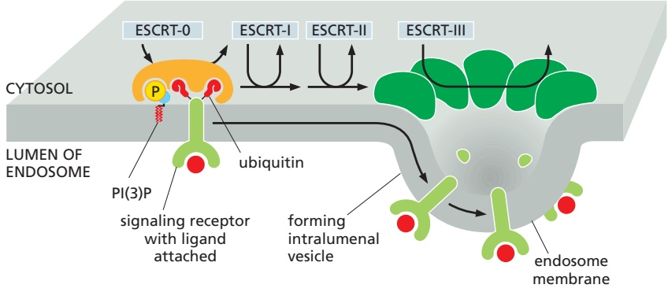

the sorting process into the intralumenal vesicles. Membrane invagination into multivesicular bodies also depends on a lipid kinase that phosphorylates phosphatidylinositol to produce PI(3)P, which serves as an additional docking site for the ESCRT complexes. For docking and vesicle invagination, ESCRT complexesMBoC7 m13.56/13.60 require both PI(3)P and the presence of ubiquitylated cargo proteins to bind to the endosomal membrane. ESCRT-III forms large multimeric assemblies on the membrane that bend the membrane (**Figure 13–60**).

Figure 13–60 Sorting of endocytosed membrane proteins into the intralumenal vesicles of a multivesicular body. A series of complex binding events passes ubiquitylated membrane proteins, such as the signaling receptor with its ligand shown here, sequentially from one ESCRT complex (ESCRT-0) to the next, eventually concentrating them in membrane areas that bud into the lumen of the endosome to form intralumenal vesicles. ESCRT-III assembles into expansive multimeric structures and mediates invagination. The mechanisms of how cargo molecules are shepherded into the vesicles and how the vesicles are formed without including the ESCRT complexes themselves remain unknown. ESCRT complexes are soluble in the cytosol, are recruited to the membrane sequentially as needed, and are then released back into the cytosol as the vesicle pinches off.

Mutant cells compromised in ESCRT function display signaling defects. In such cells, activated receptors cannot be down-regulated by endocytosis and packaging into multivesicular bodies. The still-active receptors therefore mediate prolonged signaling, which can lead to uncontrolled cell proliferation and cancer.

The ESCRT machinery that drives the internal budding from the endosome membrane to form intralumenal vesicles is also used in animal-cell cytokinesis and virus budding, which are topologically equivalent. In all three processes, budding occurs in a direction away from the cytosolic surface of the membrane (**Figure 13–61A**). ESCRT complexes are thought to have originated from similar components that mediate cell-membrane deformation during cytokinesis in archaea.

Although some viruses such as HIV hijack the host ESCRT machinery to bud directly out of the cell, other viruses escape using different mechanisms. For example, SARS-CoV-2, the virus that causes COVID-19, buds into the vesicular tubular clusters between the ER and Golgi apparatus, then uses the secretory pathway to exit the cell (**Figure 13–61B**). This budding reaction deforms membranes away

Figure 13–61 Conserved mechanism in multivesicular body formation, virus budding, and cytokinesis. (A) In the three topologically equivalent processes indicated by the arrows, ESCRT complexes (green) shape membranes into buds that bulge away from the cytosol. (B) Electron micrographs of a cultured cell infected with SARS-CoV-2. The top panel shows virus particles budding away from the cytosol into vesicular tubular clusters between the ER and the Golgi apparatus. The virus particles are carried through the secretory pathway until they are released to the outside of the cell by exocytosis (bottom panel). (B, from N.S. Ogando et al., J. Gen. Virol. 101:925–940, 2020.)

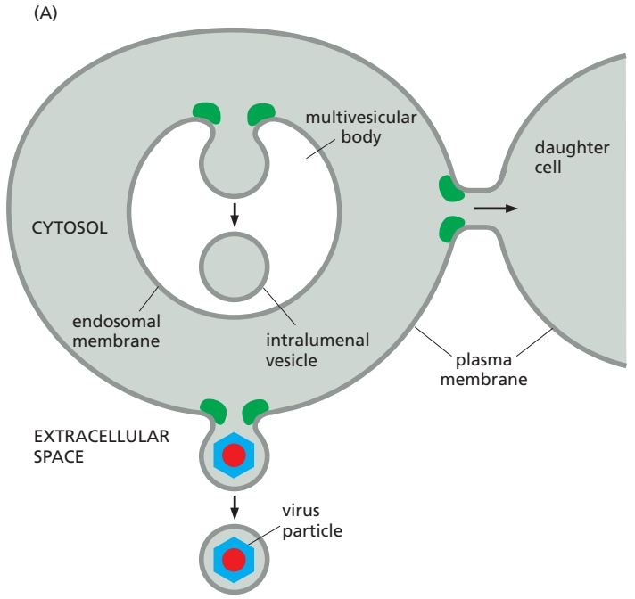

(B)

from the cytosol but does not seem to use ESCRT machinery. Instead, viral proteins are thought to facilitate budding by a mechanism that is not well understood.

#### Summary

Cells ingest fluid, molecules, and particles by endocytosis, in which localized regions of the plasma membrane invaginate and pinch off to form endocytic vesicles. In most cells, endocytosis internalizes a large fraction of the plasma membrane every hour. The cells remain the same size because most of the plasma membrane components (proteins and lipids) that are endocytosed are continually returned to the cell surface by exocytosis. This large-scale endocytic–exocytic cycle is mediated largely by clathrin-coated pits and vesicles, but clathrin-independent endocytic pathways also contribute.

While many of the endocytosed molecules are quickly recycled to the plasma membrane, others eventually end up in lysosomes, where they are degraded. Most of the ligands that are endocytosed with their receptors dissociate from their receptors in the acidic environment of the endosome and eventually end up in lysosomes, while most of the receptors are recycled via transport vesicles back to the cell surface for reuse. Many cell-surface signaling receptors become tagged with ubiquitin when activated by binding their extracellular ligands. Ubiquitylation guides activated receptors into clathrin-coated pits, and they and their ligands are efficiently internalized and delivered to early endosomes.

Early endosomes rapidly mature into late endosomes. During maturation, patches of the endosomal membrane containing ubiquitylated receptors invaginate and pinch off to form intralumenal vesicles. This process is mediated by ESCRT complexes and sequesters the receptors away from the cytosol, which terminates their signaling activity. Late endosomes migrate along microtubules toward the interior of the cell where they fuse with one another and with lysosomes to form endolysosomes, where degradation occurs.

In some cases, both receptor and ligand are transferred to a different plasma membrane domain, causing the ligand to be released at a different surface from where it originated, a process called transcytosis. In some cells, endocytosed plasma membrane proteins and lipids can be stored in recycling endosomes for as long as necessary until they are needed.

<!-- END EN EN13-H036-H054 -->

### 英文补充：巨胞饮与吞噬作用

> 对应中文板块：巨胞饮与吞噬作用。英文来源：Molecular Biology of the Cell，第7版，第13章；[本章完整原文](../../来源/英文教材/13_Intracellular_Membrane_Traffic/chapter.md)。物理PDF页码范围：788–849（整章范围）。

<!-- BEGIN EN EN13-H060-H062 -->
#### Cells Can Acquire Nutrients from the Extracellular Fluid by Macropinocytosis

Macropinocytosis was among the first types of endocytosis to be described because it is visible by light microscopy, where cells can be seen taking up the surrounding fluid into large vesicles called macropinosomes (**Figure 13–68**). In most cell types, macropinocytosis does not operate continually but rather is induced for a limited time in response to cell-surface receptor activation by specific cargoes, including growth factors, integrin ligands, apoptotic-cell remnants, and some viruses. These ligands activate a complex signaling pathway, resulting in a change in actin dynamics and the formation of cell-surface protrusions, called ruffles (discussed in Chapter 16). Macropinosomes form when the protruding ends of ruffles fuse with each other or the cell membrane, thereby trapping a portion of extracellular content.

Macropinocytosis is a dedicated degradative pathway: macropinosomes acidify and then fuse with late endosomes or endolysosomes, without recycling their cargo back to the plasma membrane. Micropinocytosis is stimulated by activation of the oncogene Ras. Induction of macropinocytosis can increase the bulk fluid uptake of a cell by up to tenfold. Cancer cells that contain constitutively active Ras (see Chapter 15) use enhanced micropinocytosis to obtain increased nutrients from the surrounding environment in order to support their rapid growth and division.

#### Specialized Phagocytic Cells Can Ingest Large Particles

**Phagocytosis** is a special form of endocytosis in which a cell uses large endocytic vesicles called **phagosomes** to ingest large particles such as microorganisms and dead cells. Phagocytosis is distinct, both in purpose and mechanism, from macropinocytosis, which we discussed earlier. In protozoa, phagocytosis is a form of feeding: large particles taken up into phagosomes end up in lysosomes, and the products of the subsequent digestive processes pass into the cytosol to be used as food. However, few cells in multicellular organisms are able to ingest such large particles efficiently. In the gut of animals, for example, extracellular processes break down food particles, and cells import the small products of hydrolysis.

Phagocytosis is important in most animals for purposes other than nutrition, and it is carried out mainly by specialized cells—so-called professional

(A)

(B)

bacterium

Figure 13–69 Phagocytosis by a macrophage. (A) Scanning electron micrograph of a mouse macrophage phagocytosing two chemically altered red blood cells. The red arrows point to edges of thin processes (pseudopods) of the macrophage that are extending as collars to engulf the red cells. (B) An electron micrograph of a neutrophil phagocytosing a bacterium, which is in the process of dividing. (A, courtesy of Jean Paul Revel; B, courtesy of Dorothy F. Bainton, Phagocytic Mechanisms in Health and Disease. New York: Intercontinental Medical Book Corporation, 1971.)

phagocytes. In mammals, two important classes of white blood cells that act as professional phagocytes are **macrophages** and **neutrophils** (**Movie 13.9**). These cells develop from hemopoietic stem cells (discussed in Chapter 22), and they ingest invading microorganisms to defend us against infection. MacrophagesMBoC6 m13.60,m13.61A/13.69 also have an important role in scavenging senescent cells and cells that have died by apoptosis (discussed in Chapter 18). In quantitative terms, the clearance of senescent and dead cells is by far the most important: our macrophages, for example, phagocytose more than $1 0 ^ { 1 1 }$ senescent red blood cells in each of us every day.

The diameter of a phagosome is determined by the size of its ingested particles, and those particles can be almost as large as the phagocytic cell itself (**Figure 13–69**). Phagosomes fuse with lysosomes, and the ingested material is then degraded. Indigestible substances remain in the lysosomes, forming residual bodies that can be excreted from cells by exocytosis Some of the internalized plasma membrane components never reach the lysosome, because they are retrieved from the phagosome in transport vesicles and returned to the plasma membrane.

Some pathogenic bacteria have evolved elaborate mechanisms to prevent phagosome–lysosome fusion. The bacterium Legionella pneumophila, for example, which causes Legionnaires’ disease (discussed in Chapter 23), injects into its unfortunate host a Rab-modifying enzyme that causes certain Rab proteins to misdirect membrane traffic, thereby preventing phagosome–lysosome fusion. The bacterium, thus spared from lysosomal degradation, remains in the modified phagosome, growing and dividing as an intracellular pathogen, protected from the host’s adaptive immune system.

#### Cargo Recognition by Cell-surface Receptors Initiates Phagocytosis

Phagocytosis is a cargo-triggered process. That is, it requires the activation of cell-surface receptors that transmit signals to the cell interior. Thus, to be phagocytosed, particles must first bind to the surface of the phagocyte (although not all particles that bind are ingested). Phagocytes have a variety of cell-surface receptors that are functionally linked to the phagocytic machinery of the cell. The best-characterized triggers of phagocytosis are antibodies, which protect us by binding to the surface of infectious microorganisms (pathogens) and initiating a series of events that culminate in the invader being phagocytosed. When antibodies initially attack a pathogen, they coat it with antibody molecules that bind to Fc receptors on the surface of macrophages and neutrophils, activating the receptors to induce the phagocytic cell to extend pseudopods, which engulf the particle and fuse at their tips to form a phagosome (**Figure 13–70**). Localized actin polymerization, initiated by Rho family GTPases and their activating Rho GEFs (discussed in Chapters 15 and 16), shapes the pseudopods. The activated Rho GTPases switch on the kinase activity of local PI kinases to produce $\mathrm { P I ( 4 , } 5 \mathrm { ) P _ { 2 } }$ in the membrane (see Figure 13–11), which stimulates actin polymerization. To seal off the phagosome and complete the engulfment, actin is depolymerized by a PI 3-kinase that converts the $\mathrm { P I ( 4 , } 5 \mathrm { ) P _ { 2 } }$ to $\widetilde { \mathrm { P I } } ( 3 ,   4 ,   5 ) \mathrm { P } _ { 3 } ,$ which is required for closure of the phagosome and may also contribute to reshaping the actin network to help drive the invagination of the forming phagosome (Figure 13–70). In this way, the ordered generation and consumption of specific phosphoinositides guides sequential steps in phagosome formation.

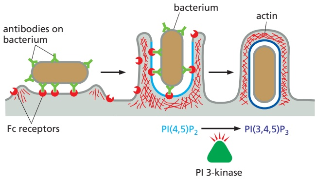

Several other classes of receptors that promote phagocytosis have been characterized. Some recognize complement components, which collaborate with antibodies in targeting microbes for destruction (discussed in Chapter 24). Others directly recognize oligosaccharides on the surface of certain pathogens. Still others recognize cells that have died by apoptosis. Apoptotic cells lose the asymmetric distribution of phospholipids in their plasma membrane. As a consequence, negatively charged phosphatidylserine, which is normally confined to the cytosolic leaflet of the lipid bilayer, is now exposed on the outside of the cell, where it helps to trigger the phagocytosis of the dead cell.

Remarkably, macrophages will also phagocytose a variety of inanimate particles—such as glass or latex beads and asbestos fibers—yet they do not phagocytose live cells in their own body. The living cells display “don’t-eat-me” signals in the form of cell-surface proteins that bind to inhibitory receptors on the surface of macrophages. The inhibitory receptors recruit tyrosine phosphatases that antagonize the intracellular signaling events required to initiate phagocytosis, thereby locally inhibiting the phagocytic process. Thus phagocytosis, like many other cell processes, depends on a balance between positive signals that activate the process and negative signals that inhibit it. Apoptotic cells are thought both to gain “eat-me” signals (such as extracellularly exposed phosphatidylserine) and to lose their “don’t-eat-me” signals, causing them to be very rapidly phagocytosed by macrophages.

<!-- END EN EN13-H060-H062 -->

### 英文补充：病原体的进入、离开与宿主膜运输

> 对应中文板块：病原体的进入、离开与宿主膜运输。英文来源：Molecular Biology of the Cell，第7版，第23章；[本章完整原文](../../来源/英文教材/23_Pathogens_and_Infection/chapter.md)。物理PDF页码范围：1352–1391（整章范围）。

<!-- BEGIN EN EN23-H014-H020 -->
#### Intracellular Pathogens Have Mechanisms for Both Entering and Leaving Host Cells

**Intracellular pathogens** have to cross barriers, adhere to host cells, and also enter host cells to cause disease. These include all viruses and many bacteria and protozoa. Each of these has a preferred niche for replication and survival within host cells. Bacteria and protozoa replicate either in the cytosol or within a membraneenclosed compartment. While most RNA viruses replicate within the cytosol, most DNA viruses replicate in the nucleus (poxviruses are a notable exception). Life inside a host cell has several advantages. The pathogens are not accessible to antibodies, nor are they easy targets for phagocytic cells (discussed in Chapter 24); furthermore, intracellular bacteria and protozoa are bathed in a rich source of nutrients, and viruses have access to the host cell’s biosynthetic machinery for their reproduction. This lifestyle, however, requires that the pathogen have mechanisms for entering host cells, for finding a suitable subcellular niche where it can replicate, and for exiting from the infected cell to spread the infection. Below we consider some of the myriad ways that individual intracellular pathogens exploit and modify host-cell biology to satisfy these requirements.

#### Viruses Bind to Virus Receptors at the Host-Cell Surface

The first step in infection for any intracellular pathogen is to bind to the surface of the host target cell. Viruses accomplish this by the binding of viral surface proteins to **virus receptors**, which are cell-surface proteins that perform various functions in uninfected cells and have been co-opted as binding sites for viral proteins. The first virus receptor identified was an E. coli surface protein that is recognized by the bacteriophage lambda; the protein normally functions to transport the sugar maltose from outside the bacterium to the inside where it is used as an energy source. Receptors need not be proteins, however: an envelope protein of herpes simplex virus, for example, binds to heparan sulfate proteoglycans (discussed in Chapter 19) on the surface of certain vertebrate host cells, and simian virus 40 (SV40) binds to a glycolipid. The specificity of virus–receptor interactions often serves as a barrier preventing the spread of a virus from one species to another. Acquiring the ability to bind to a new receptor often requires multiple changes in a virus, but it can be crucial in allowing the cross-species transmission that can result in new disease outbreaks.

Viruses that infect animal cells generally exploit cell-surface receptor molecules that are either ubiquitous [such as angiotensin-converting enzyme 2 (ACE2) used by the coronavirus SARS-CoV-2] or are found uniquely on those cell types in which the virus replicates (such as the neuron-specific proteins used by rabies virus). Although a virus usually uses a single type of host-cell receptor, some viruses use more than one type. An important example is HIV, which requires two types of receptors to enter a host cell. Its primary receptor is CD4, a cell-surface protein on helper T cells and macrophages that is involved in immune recognition (discussed in Chapter 24). It also requires a co-receptor, which is either CCR5 (a receptor for β-chemokines) or CXCR4 (a receptor for α-chemokines), depending on the particular variant of the virus; macrophages are susceptible

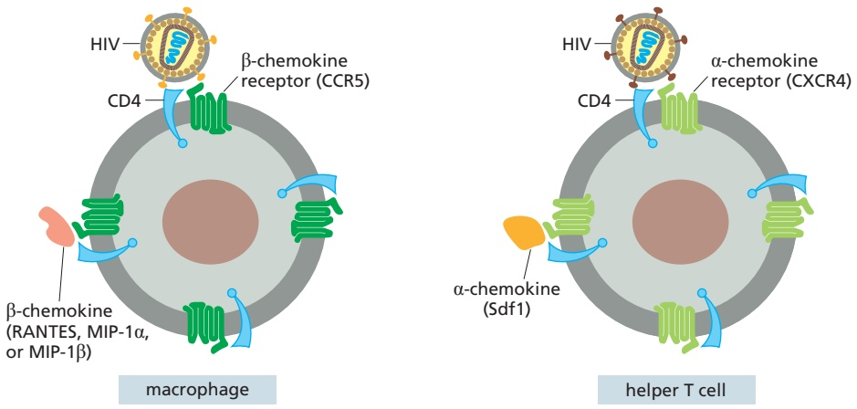

Figure 23–18 Receptor and co-receptors for HIV. All strains of HIV require the CD4 protein as a primary receptor. Early in an infection, most of the viruses use CCR5 as a co-receptor, allowing them to infect macrophages and their precursors, monocytes. As the infection progresses, mutant variants of the virus arise that now use CXCR4 as a co-receptor, enabling them to infect helper T cells efficiently. The natural ligand for the chemokine receptors (Sdf1 for CXCR4; RANTES, MIP-1α, or MIP-1β for CCR5) blocks co-receptor function and prevents viral invasion.

only to HIV variants that use CCR5 for entry, whereas helper T cells are most efficiently infected by variants that use CXCR4 (Figure 23–18). The viruses that are found within the first few months after HIV infection almost invariably use CCR5, which explains why individuals that carry an altered CCR5 gene are less susceptible to HIV infection. In the later stages of infection, viruses often either switch to use CXCR4 or adapt to use both co-receptors through the accumulation of viral mutations. In this way, the virus can change the cell types it infects as the disease progresses. It may seem paradoxical that viruses would infect immune cells, as we might expect that virus binding would trigger an immune response; but invasion of an immune cell can be a useful way for a virus to weaken the immune response and travel around the body to infect other immune cells.

#### Viruses Enter Host Cells by Membrane Fusion, Pore Formation, or Membrane Disruption

After recognition and attachment to the host-cell surface, viruses must enter into the cell for viral replication to proceed. Entry into host cells requires that virusesMBoC7 m23.17/23.18 overcome different challenges that depend on virus size and structure (see Figure 23–11). **Enveloped viruses** must regulate membrane fusion processes, both to ensure that their membrane envelopes fuse only with the appropriate host-cell membrane and to prevent fusion with one another. Such regulation is achieved by the coronavirus SARS-CoV-2, for example, by requiring both binding of the virus spike protein to the ACE2 receptor and cleaving of the spike protein by a host-cell protease to enable fusion with the host-cell membrane.

Some enveloped viruses, such as HIV, enter the host cell by fusing their envelope membrane at neutral pH with the plasma membrane (**Figure 23–19A**). In this scenario, binding to receptors or co-receptors usually triggers a conformational change in a viral envelope protein that exposes a normally buried fusion peptide (discussed in Chapter 13).

Most enveloped (and nonenveloped) viruses enter cells by activating signaling pathways in the cell that induce endocytosis, commonly via clathrin-coated pits (see Figure 13–7), leading to internalization into endosomes. Large viruses that do not fit into clathrin-coated vesicles, such as poxviruses, often enter cells by macropinocytosis, a process by which membrane ruffles fold over and entrap fluid into macropinosomes (see Figure 13–68).

Once inside endosomes, enveloped viruses such as influenza A virus must fuse their envelope with the endosomal membrane from the luminal side, and they frequently sense the acid environment in the late endosome as a cue to trigger a conformational change in a viral surface protein that exposes a fusion peptide (**Figure 23–19B** and **Movie 23.5**). The mechanism of membrane fusion mediated by viral spike glycoproteins has similarities with SNARE-mediated membrane fusion during normal vesicular trafficking (discussed in Chapter 13). The H pumped into the early endosome also has another effect; it enters the influenza virion through an ion channel in the viral envelope and triggers changes in the

poliovirus

adenovirus

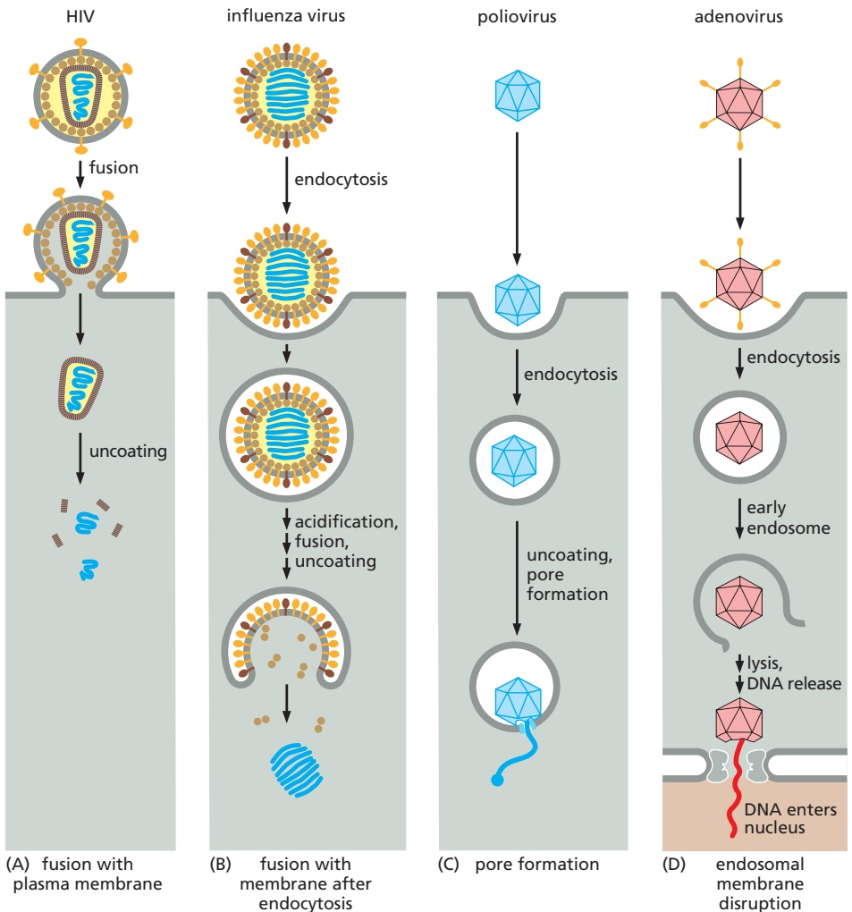

viral capsid. These priming steps allow the capsids to disassemble once released into the cytosol after virus fusion with the late endosomal membrane.

Figure 23–19 Four virus entry strategies that follow virus binding to virus receptors. (A) Some enveloped viruses, such as HIV, fuse directly with the host-cell plasma membrane to release their RNA genome (blue) and capsid proteins (brown) into the cytosol. (B) Other enveloped viruses, such as influenza virus, first bind to cell-surface receptors, triggering receptor-mediated endocytosis; when the endosome acidifies, the virus envelope fuses with the endosomal membrane, releasing the viral RNA genome (blue) and capsid proteins (tan) into the cytosol. (C) Poliovirus, a nonenveloped virus, induces receptor-mediated endocytosis, and then forms a pore in the endosomal membrane to extrude its RNA genome (blue) into the cytosol. (D) Adenovirus, another nonenveloped virus, uses a more complicated strategy: it induces receptormediated endocytosis and then disrupts the endosomal membrane, releasing the capsid including its DNA genome into the cytosol. The trimmed-down virus eventually docks onto a nuclear pore and releases its DNA (red) directly into the nucleus where it is transcribed and replicated (see Movie 23.5).

Because they lack a surrounding lipid bilayer, **nonenveloped viruses** enter host cells in a fundamentally different way. Poliovirus binds to a cell-surfaceMBoC7 m23.18/23.19 receptor, triggering both receptor-mediated endocytosis (see Figure 13–54) and a conformational change in the viral particle. The conformational change exposes a hydrophobic projection on one of the capsid proteins, which inserts into the endosomal membrane to form a pore. The viral RNA genome then enters the cytosol through the pore, leaving the capsid in the endosome (**Figure 23–19C**). Adenovirus disrupts the endosomal membrane after it is taken up by receptormediated endocytosis, releasing the remainder of the virus into the cytosol. During endosomal trafficking and subsequent transport within the cytosol, adenoviruses undergo multiple uncoating steps, which sequentially remove structural proteins and ready the virus particles to release their DNA into the nucleus through nuclear pore complexes (**Figure 23–19D**).

#### Bacteria Enter Host Cells by Phagocytosis

Bacteria are much larger than viruses—too large to be taken up either through pores or by receptor-mediated endocytosis. Instead, they enter host cells by phagocytosis, which is a normal function of phagocytes such as neutrophils, macrophages, and dendritic cells (discussed in Chapter 24). These phagocytes patrol the tissues of the body and ingest and destroy microbes; however, some intracellular bacterial pathogens such as M. tuberculosis use this to their advantage and have evolved to survive and multiply inside macrophages.

(A) ZIPPER MECHANISM

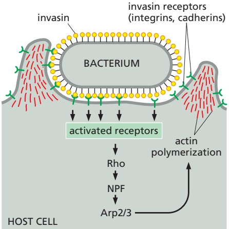

(B) TRIGGER MECHANISM

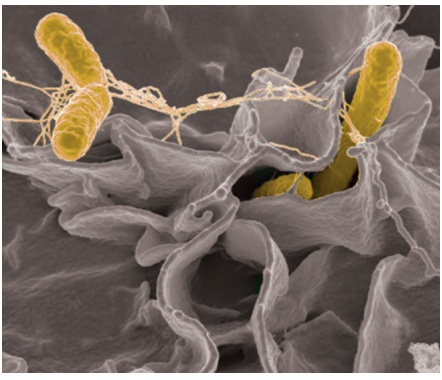

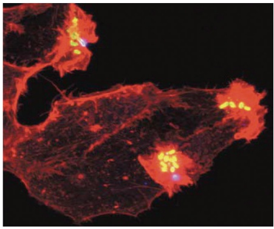

(C)

4 µm

(D)

20 µm

Some bacterial pathogens can invade host cells that are normally nonphagocytic. One way they do so is by expressing an invasion protein that binds with high affinity to a host-cell receptor, which is often a cell–cell or cell–matrix adhesion protein (discussed in Chapter 19). For example, Yersinia pseudotuberculosisMBoC7 m23.19/23.20 (a bacterium that causes diarrhea and is a close relative of the plague bacterium Y. pestis) expresses a protein called invasin that has an RGD motif that is similar to fibronectin’s and which likewise is recognized by host-cell $\beta _ { 1 1 }$ -integrins (see Figure 19–48). Listeria monocytogenes, which causes a rare but serious form of food poisoning, invades host cells by expressing a protein that binds to the cell–cell adhesion protein E-cadherin (see Figures 19–4 and 19–5). For both these bacterial species, binding of the bacterial invasion proteins to the host-cell adhesion proteins stimulates signaling through members of the Rho family of small GTPases (discussed in Chapter 16). This in turn activates NPFs and the Arp2/3 complex, leading to actin polymerization at the site of bacterial attachment. Actin polymerization, sometimes accompanied by the assembly of a clathrin coat, drives the advancement of the host cell’s plasma membrane over the adhesive surface of the microbe, resulting in the phagocytosis of the bacterium—a process known as the zipper mechanism of invasion (**Figure 23–20A**).

A second pathway by which bacteria can invade nonphagocytic cells is known as the trigger mechanism (**Figure 23–20B**). It is used by various pathogens, including the food-borne pathogen Salmonella enterica serovar Typhimurium, and it is initiated when the bacterium injects a set of effector molecules into the host-cell cytosol through a type III secretion system (see Figure 23–7). Some of these effector molecules activate Rho family proteins, which in turn stimulate actin polymerization, as just discussed. Other bacterial effector proteins directly interact with host-cell cytoskeletal elements, nucleating and stabilizing actin filaments and causing the rearrangement of actin cross-linking proteins. The overall effect is to cause the formation of ruffles on the surface of the host cell (**Figure 23–20C and D**),

Figure 23–20 Mechanisms used by bacteria to induce phagocytosis by host cells that are normally nonphagocytic. (A) In the zipper mechanism, bacteria express an invasion protein that binds with high affinity to a host-cell receptor, which is often a cell–cell or cell–matrix adhesion protein. (B) In the trigger mechanism, bacteria inject a set of effector molecules into the host-cell cytosol through a type III secretion system called SPI1 (Salmonella pathogenicity island 1), inducing membrane ruffling. Both the zipper and trigger mechanisms cause the polymerization of actin at the site of bacterial attachment by activating Rho family small GTPases and the Arp2/3 complex. (C) A scanning electron micrograph showing Salmonella enterica invasion by the trigger mechanism. Bacteria (pseudocolored yellow) are shown surrounded by a small membrane ruffle. (D) Fluorescence micrograph showing that the large ruffles that engulf the Salmonella bacteria are actin rich. The bacteria are labeled in green and actin filaments in red; because of the color overlap, the bacteria appear yellow. (C, from Rocky Mountain Laboratories, NIAID, NIH; D, from J.E. Galán, Annu. Rev. Cell Dev. Biol. 17:53–86, 2001. With permission from Annual Reviews.)

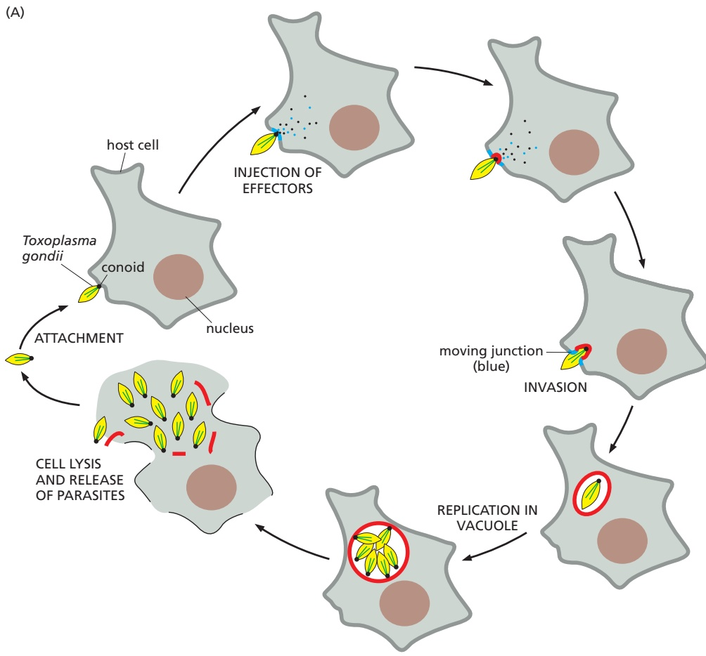

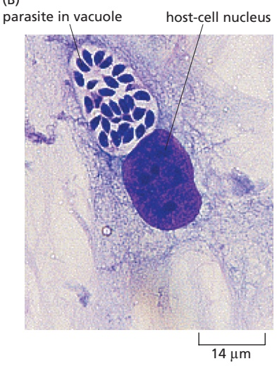

which fold over and engulf the bacteria by a process that resembles macropinocytosis (see Figure 13–68). The appearance of cells being invaded by use of the trigger mechanism is similar to the ruffling induced by some extracellular growth factors, suggesting that the bacteria hijack normal intracellular signaling pathways.

#### Intracellular Eukaryotic Parasites Actively Invade Host Cells

Figure 23–21 The life cycle of the intracellular parasite Toxoplasma gondii. (A) After attachment to a host cell, T. gondii uses its conoid to inject effector proteins that facilitate invasion. These effector proteins include a receptor that binds a parasite surface protein, as well as components of the moving junction (shown in blue) through which the parasite squeezes as it enters the host cell. As the host cell’s plasma membrane invaginates, the parasite somehow removes the normal host-cell membrane proteins, so that the compartment (shown in red) does not fuse with lysosomes. After several rounds of replication, the parasite causes the compartment to break down and the host cell to lyse, releasing the progeny parasites to infect other host cells (see Movie 23.6). (B) Light micrograph of T. gondii replicating within a membraneenclosed compartment (a parasitophorous vacuole) in a cultured cell. (B, courtesy of Manuel Camps and John Boothroyd.)

The uptake of viruses and bacteria into host cells is carried out largely by the host,MBoC7 m23.20/23.21 with the pathogen being a relatively passive participant. In contrast, intracellular eukaryotic parasites, which are typically much larger than other types of intracellular pathogens, invade host cells through a variety of complex pathways that usually require energy expenditure by the parasite.

Toxoplasma gondii, a cat parasite that also causes occasional serious human infections in pregnant and immunocompromised individuals, is an example. T. gondii invasion involves the secretion of parasite effector proteins that target host-cell components, as well as the activities of the parasite’s own cytoskeleton (**Figure 23–21** and **Movie 23.6**). When this protozoan contacts a host cell, it protrudes an unusual microtubule-based structure called a conoid, which facilitates host-cell entry. At the point of contact, the parasite discharges effector proteins into the host cell from specialized secretory organelles. One of these effector proteins is a receptor that inserts into the host-cell plasma membrane and binds to a parasite surface protein. Other effector proteins form a ring-like moving junction through which the parasite squeezes using forces generated by its own unusual actin and myosin cytoskeleton. Remarkably, as the parasite invades it removes host transmembrane proteins from the surrounding membrane, so that it is eventually protected in a membrane-enclosed compartment, or parasitophorous vacuole, that does not fuse with lysosomes and does not participate in host-cell membrane trafficking processes. The specialized membrane is selectively porous: it allows the parasite to take up small metabolic intermediates and nutrients from the host cell’s cytosol but excludes macromolecules. Malaria parasites invade human red blood cells using a similar mechanism.

The protozoan Trypanosoma cruzi, which causes Chagas disease in Mexico and Central and South America, uses two alternative invasion strategies. In a lysosome-dependent pathway, the parasite attaches to the host’s cell-surface receptors, inducing a local increase in $\mathrm { C a ^ { 2 + } }$ in the host cell’s cytosol. The Ca2+ signal recruits lysosomes to the site of parasite attachment, and the lysosomes fuse with the host cell’s plasma membrane, allowing the parasites rapid access to the lysosomal compartment (**Figure 23–22**). In a lysosome-independent pathway, the parasite penetrates the host-cell plasma membrane by inducing the membrane to invaginate, without lysosome recruitment.

#### Some Intracellular Pathogens Escape from the Phagosome into the Cytosol

All intracellular pathogens, including viruses, bacteria, and eukaryotic parasites, face a similar problem: they must find a compartment within the host cell where they can replicate themselves. After their endocytosis by a host cell, they usually find themselves in an endosomal compartment, which normally would fuse with lysosomes (see Figure 13–67)—a dangerous place for pathogens because of the presence of many antimicrobial factors. To survive, pathogens use a variety of strategies (**Figure 23–23**). Some escape from the endosomal compartment before such fusion. Others remain in the endosomal compartment but modify it so that

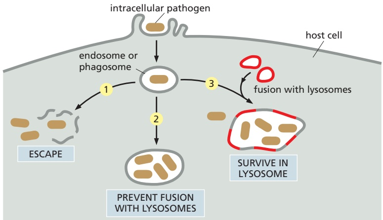

Figure 23–22 The two alternative strategies that Trypanosoma cruzi uses to invade host cells. In the lysosome-dependent pathway (left), T. cruzi recruits host-cell lysosomes to its site of attachment to the host cell. The lysosomes fuse with the invaginating plasma membrane to create an intracellular compartment constructed almost entirely of lysosomal membrane. After a brief stay in the compartment, the parasite secretes a pore-forming protein that disrupts the surrounding membrane, thereby allowing the parasite to escape into the host-cell cytosol and proliferate. In the lysosomeindependent pathway (right), the parasite induces the host plasma membrane to invaginate and pinch off without recruiting lysosomes; then, lysosomes fuse with the endosome prior to the parasite’s escape into the cytosol.

Figure 23–23 Choices that an intracellular pathogen faces. After entry into a host cell, generally through phagocytosis into a membrane-enclosed compartment, intracellular pathogens can use one of three strategies to survive and replicate. Pathogens that escape into the cytosol (1) include all viruses, Trypanosoma cruzi, Listeria monocytogenes, and Shigella flexneri. Those that prevent fusion with lysosomes (2) include Mycobacterium tuberculosis, Legionella pneumophila, and Toxoplasma gondii. Those that survive in the lysosome (3) include Salmonella enterica, Coxiella burnetii, and Leishmania.

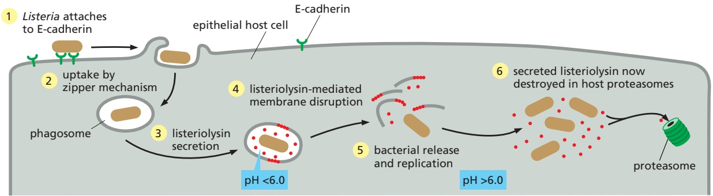

it no longer fuses with lysosomes. Still others have evolved to weather the harsh conditions in the lysosome.

Trypanosoma cruzi uses the escape strategy by secreting a pore-forming toxin that lyses the lysosome membrane, releasing the parasite into the host cell’s cytosol (see Figure 23–22). The bacterium Listeria monocytogenes uses a similar strategy. After phagocytosis by the zipper mechanism, it secretes a protein called listeriolysin O, which disrupts the phagosomal membrane, releasing the bacteria into the cytosol (**Figure 23–24**).

#### Many Pathogens Alter Membrane Traffic in the Host CellMBoC7 m23.23/23.24 to Survive and Replicate

Intracellular pathogens that remain in membrane-bound compartments of the host cell after invasion (see Figure 23–23) often alter these compartments to reduce their exposure to antimicrobial molecules and allow for pathogen survival and reproduction. To do so, these pathogens must alter membrane (vesicular) traffic, for example by slowing or preventing normal fusing of endosomes with lysosomes (**Figure 23–25**).

Different pathogens have distinct strategies for altering host-cell membrane traffic. M. tuberculosis prevents the maturation of the early endosome that contains the bacteria, so the endosome never acidifies or acquires the other characteristics of a late endosome or lysosome. Phagosomes containing Salmonella enterica, in contrast, acidify and acquire markers of late endosomes and lysosomes, but the bacteria slow the process of phagosomal maturation. They do so by injecting effector proteins through a second type III secretion system, distinct from that

Figure 23–24 Escape of Listeria monocytogenes by selective destruction of the phagosomal membrane. The bacterium attaches to E-cadherin or other receptors on the surface of host epithelial cells and induces its own uptake by the zipper mechanism (see Figure 23–20A). Within the phagosome, the bacterium secretes the protein listeriolysin O, which is activated at pH <6 and forms oligomers in the phagosome membrane, thereby creating large pores and eventually disrupting the membrane. Once in the host-cell cytosol, the bacteria begin to replicate and continue to secrete listeriolysin O; because the pH in the cytosol is >6, however, the listeriolysin O there is less active and is also rapidly degraded by proteasomes. Thus, the host cell’s plasma membrane remains intact.

Figure 23–25 Modifications of membrane traffic in host cells by bacterial pathogens to slow or prevent normal fusing of endosomes with lysosomes. Intracellular bacterial pathogens, including Mycobacterium tuberculosis, Salmonella enterica, and Legionella pneumophila, all replicate in membrane-enclosed compartments, but the compartments differ. M. tuberculosis remains in a compartment that has early endosomal markers and continues to communicate with the plasma membrane via transport vesicles. S. enterica replicates in a compartment that has late endosomal markers. L. pneumophila replicates in an unusual compartment that is wrapped in rough endoplasmic reticulum (ER) membrane and communicates with the ER via transport vesicles. TGN = trans Golgi network.

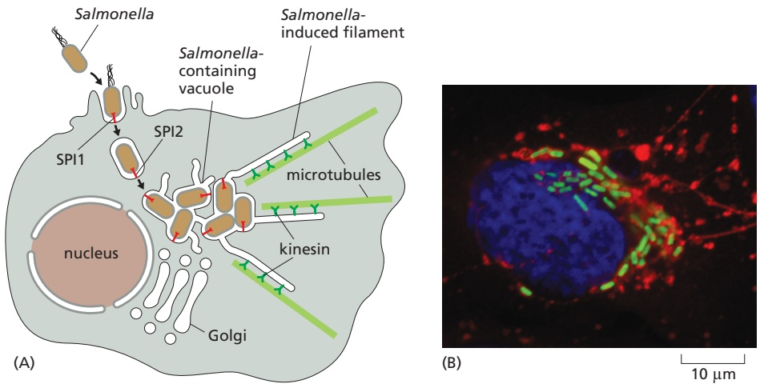

involved in invasion by the trigger mechanism (see Figure 23–20). Some of these bacterial effectors activate host kinesin motor proteins to pull membrane tubules outward from the phagosome along cytoplasmic microtubules, forming a specialized compartment called the Salmonella-containing vacuole (**Figure 23–26**).MBoC7 m23.25/23.26

Other bacteria seem to find shelter in intracellular compartments that are distinct from those of the usual endocytic system. One example is Legionella pneumophila, which was first recognized as a human pathogen in 1976, when it was found to be the cause of a type of pneumonia known as **Legionnaires’ disease**. L. pneumophila is normally a parasite of freshwater amoebae but can be spread to humans by central air-conditioning systems, which harbor infected amoebae and produce microdroplets of water that are easily inhaled. Once in the lung, the bacteria are engulfed by macrophages by an unusual process called coiling phagocytosis (**Figure 23–27A**). L. pneumophila uses a type IV secretion system to inject effector proteins into the phagocyte that modulate the accumulation of phosphoinositides and the activity of proteins that regulate vesicular traffic, including SNARE proteins and Rab and Arf family small GTPases (discussed in Chapter 13). The effector proteins thereby prevent the phagosome from fusing with endosomes and promote its fusion with the endoplasmic reticulum, converting the phagosome into a compartment that resembles the rough endoplasmic reticulum (**Figure 23–27B**).

Viruses can also alter membrane traffic in the host cell. Many enveloped viruses, including the coronavirus SARS-CoV-2, make use of host-cell membranes to acquire their own envelope membrane. In the simplest cases, virally encoded glycoproteins are inserted into the endoplasmic reticulum membrane and follow

Figure 23–26 Salmonella enterica residing in a modified phagosomal compartment called the Salmonella-containing vacuole. These bacteria invade the host cell using one of two type III secretion systems to inject effector proteins that induce the trigger mechanism of microbe entry illustrated in Figure 23–20B. (A) After its engulfment into a phagosome, the bacterium inactivates the first type III secretion system and activates the second type III secretion system to inject different effector proteins, which remodel the phagosome into the specialized Salmonella-containing vacuole. One of the injected effector proteins activates host kinesin motor proteins to pull membrane tubules outward toward the plus ends of the microtubules (see Figure 16–53), forming a structure with an unusual tubulated shape that is of unknown functional significance. (B) Fluorescence micrograph showing S. enterica in a Salmonella-containing vacuole. The bacteria are stained green, the microtubules red, and the nucleus blue. (B, courtesy of Stephane Meresse.)

Figure 23–27 Legionella pneumophila residing in a compartment with characteristics similar to those of the rough endoplasmic reticulum (ER). (A) Electron micrograph showing the unusual coiled structure that the Legionella pneumophila bacterium induces on the surface of a phagocyte during the invasion process. Some other pathogens, including the bacterium Borrelia burgdorferi (which causes Lyme disease), the eukaryotic pathogen Leishmania, and the yeast Candida albicans, can also invade cells using this type of coiling phagocytosis. (B) After invasion, L. pneumophila uses its type IV secretion system to secrete effector proteins that block phagosome– endosome fusion and phagosome maturation. It also secretes effector proteins that promote phosphoinositide conversion from PI(3)P to PI(4)P and the fusion of the phagosome with ER-derived vesicles, thereby converting the characteristics of the Legionella-containing vacuole from those of an endosome to those of the rough ER. See Figures 13–10 and 13–11 for a discussion of phosphoinositides and membrane targeting. (A, from M.A. Horwitz, Cell 36:27–33, 1984. With permission from Elsevier.)

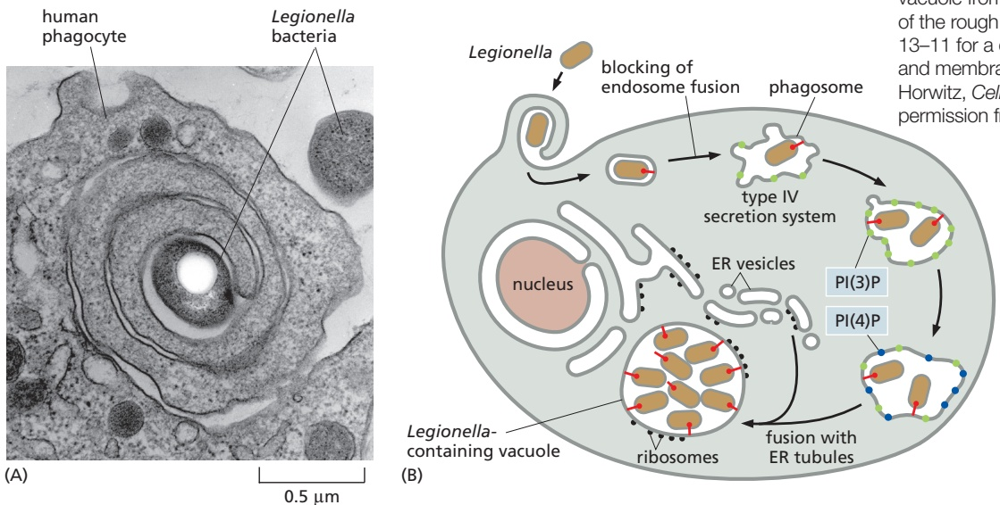

the secretory pathway through the Golgi apparatus to the plasma membrane; the viral capsid proteins and genome assemble into nucleocapsids, which acquire their envelope as they bud off from the plasma membrane (see Figure 23–12). The process for SARS-CoV-2 is more complicated, as this virus induces the formation of convoluted double-membrane vesicles derived from the endoplasmic reticulum, which house its genome replication factories (**Figure 23–28A**). These

Figure 23–28 Complex strategies for viral envelope acquisition. (A) The coronavirus SARS-CoV-2 replicates its positive sense RNA genome in double membrane vesicles associated with the endoplasmic reticulum (ER). Viral genomes are released into the cytoplasm by a poorly understood mechanism that may involve passage through pores in the double membrane. Transcription of subgenomic RNAs encoding viral structural proteins occurs in the surrounding cytosol. Translation of transmembrane viral proteins, including the spike protein, occurs on the ER. These proteins are then trafficked from the ER to the ER Golgi intermediate compartment (ERGIC), where the singlestranded viral RNA genome associates with viral proteins to drive formation of virus particles in the lumen of exocytic vesicles. When these vesicles fuse with the plasma membrane, viruses are released from the cell surface. (B) Vaccinia virus assembles in “replication factories” in the cytosol, far away from the plasma membrane. The immature virion, surrounded by a single membrane, then acquires two additional membranes from the Golgi apparatus by a poorly understood wrapping mechanism, to form the intracellular enveloped virion. After fusion of the outermost membrane with the host-cell plasma membrane, the extracellular enveloped virion is released from the host cell. (C) Herpesvirus nucleocapsids assemble in the nucleus and then bud through the inner nuclear membrane into the space between the inner and outer nuclear membranes, acquiring a membrane coat. The virus particles then apparently lose this coat when they fuse with the endoplasmic reticulum membrane to escape into the cytosol. Subsequently, the nucleocapsids travel through the Golgi apparatus, acquiring two new membrane coats in the process. The virus then buds from the cell surface with a single membrane when its outer membrane fuses with the plasma membrane.

may concentrate replication intermediates and sequester such intermediates from innate immune sensor molecules (see Chapter 24). Viral genomes are then released into the cytoplasm by an unknown mechanism and interact with viral structural proteins in the endoplasmic reticulum Golgi intermediate compartment (ERGIC), acquiring two new lipid bilayer membrane coats. Subsequent fusion of virus-containing exocytic vesicles with the plasma membrane leads to the release of viruses with a single membrane envelope. DNA viruses such as herpesviruses and vaccinia virus also alter membrane traffic and acquire their lipid envelopes in complex ways (**Figure 23–28B and C**).

<!-- END EN EN23-H014-H020 -->

### 英文补充：吞噬细胞的摄取与清除

> 对应中文板块：吞噬细胞的摄取与清除。英文来源：Molecular Biology of the Cell，第7版，第24章；[本章完整原文](../../来源/英文教材/24_The_Innate_and_Adaptive_Immune_Systems/chapter.md)。物理PDF页码范围：1392–1443（整章范围）。

<!-- BEGIN EN EN24-H006-H006 -->
#### Phagocytic Cells Seek, Engulf, and Destroy Pathogens

In all animals, the recognition of a microbial invader is usually quickly followed by its engulfment by a phagocytic cell. In humans, these are usually macrophages, which are long-lived cells that are resident in most tissues and are therefore the first phagocytes to respond. Neutrophils, by contrast, are short-lived and, although they are the most numerous leukocytes in blood, they are not present in other healthy tissues. They are rapidly recruited from the blood to sites of infection by various attractive molecules, including formylmethionine-containing peptides (which are released by microbes but are not made by mammalian cells), chemokines secreted by activated macrophages, and peptide fragments produced from cleaved, activated complement proteins. The recruited neutrophils phagocytose the pathogens and secrete their own pro-inflammatory cytokines, thereby amplifying the local inflammatory response.

In addition to their PRRs, macrophages and neutrophils display a variety of cell-surface receptors that recognize antibodies or fragments of complement proteins bound to the surface of a pathogen. The binding of such a coated pathogen to these receptors leads to its rapid phagocytosis (**Figure 24–5**) and the mounting of a ferocious attack on the pathogen once it is inside a phagolysosome. Both macrophages and neutrophils possess an impressive armory of weapons to kill ingested invaders, including enzymes such as lysozyme and acid hydrolases that can degrade the pathogen’s cell wall. The cells assemble NADPH oxidase complexes on the phagolysosomal membrane, where the complexes catalyze the production of highly toxic oxygen-derived compounds, including superoxide (O2–), hydrogen peroxide, and hydroxyl radicals. A transient increase in oxygen consumption by the phagocytic cells, called the respiratory burst, helps power the production of these toxic compounds. Whereas macrophages generally survive this killing frenzy and live to kill again, neutrophils do not: they are programmed to die by apoptosis (discussed in Chapter 18) after they have destroyed their prey and are then phagocytosed by macrophages; some neutrophils die by a form of cell necrosis, releasing decondensed chromatin that forms extracellular nets, which are thought to trap and kill pathogens. Dead and dying neutrophils are a major component of the pus that forms in acute wounds infected with bacteria.

If a pathogen is too large to be successfully phagocytosed (if it is a large parasite such as a worm, for example), a group of macrophages, neutrophils, or eosinophils (another type of leukocyte—see Figure 22–11) will gather around the invader. They secrete defensins and other damaging agents and release the oxygen-derived toxic products of the respiratory burst. This barrage is often sufficient to destroy the pathogen (**Figure 24–6**).

<!-- END EN EN24-H006-H006 -->

## 跨章相关英文内容

- 胞吞、胞吐的共同膜泡机制：[EN第13章 · 包被膜泡、Rab、SNARE与膜融合](../../06_蛋白质分选与膜泡运输/小节/02_第二节%20细胞内膜泡运输.md#EN13-H000-H018)。
