# 第4章 物质的跨膜运输 · 双教材整合

按中文节顺序保留正文，在每节末插入对应英文内容。

---

## 第4章 物质的跨膜运输 · 章首导读

[返回本章](README.md) · [中文本章原文](中文原文.md)

<!-- BEGIN CN CN04-S00 -->
# 第4章 物质的跨膜运输

<!-- 章节边界按正文内容恢复；原始 MinerU 内容保留如下。 -->

# 物质的跨膜运输

细胞质膜是细胞与细胞外环境之间一种选择性通透屏障，它既能保障细胞对基本营养物质的摄取、代谢产物或废物的排除，又能调节细胞内离子浓度，使细胞维持相对稳定的内环境。物质的跨膜运输对细胞的生存和生长至关重要。物质通过细胞质膜的转运主要有三种途径：被动运输（包括简单扩散和协助扩散）、主动运输以及胞吞与胞吐作用。

<!-- END CN CN04-S00 -->

---

## 第4章 物质的跨膜运输 · 第一节 膜转运蛋白与小分子及离子的跨膜运输

[返回本章](README.md) · [中文本章原文](中文原文.md)

<!-- BEGIN CN CN04-S01 -->
## 第一节 膜转运蛋白与小分子及离子的跨膜运输

## 一、膜转运蛋白

活细胞内外的离子浓度是高度不同的， $\mathrm{Na}^+$ 是细胞外最丰富的阳离子（cation），而 $\mathbf{K}^{+}$ 是细胞内最丰富的阳离子（表4-1）。细胞内外的离子浓度差异对于细胞的存活和功能至关重要。这种离子浓度差异分布主要由两种机制所调控：一是取决于一套特殊的膜转运蛋白(membrane transport protein）的活性；二是取决于质膜本身的脂双层所具有的疏水性特征。除了脂溶性分子和小的不带电荷的分子能以简单扩散的方式直接通过脂双层外，脂双层对绝大多数极性分子、离子以及细胞代谢

表 4-1 典型哺乳类动物细胞内外离子浓度的比较

<table><tr><td>组分</td><td>细胞内浓度  $/\left( {\mathrm{{mmol}} \cdot  {\mathrm{L}}^{-1}}\right)$ </td><td>细胞外浓度  $/\left( {\mathrm{{mmol}} \cdot  {\mathrm{L}}^{-1}}\right)$ </td></tr><tr><td colspan="3">阳离子</td></tr><tr><td> ${\mathrm{{Na}}}^{ + }$ </td><td>5~15</td><td>145</td></tr><tr><td> ${\mathrm{K}}^{ + }$ </td><td>140</td><td>5</td></tr><tr><td> ${\mathrm{{Mg}}}^{2 + }$ </td><td>0.5</td><td> $1 \sim  2$ </td></tr><tr><td> ${\mathrm{{Ca}}}^{2 + }$ </td><td> ${10}^{-4}$ </td><td> $1 \sim  2$ </td></tr><tr><td> ${\mathrm{H}}^{ + }$ </td><td> $7 \times  {10}^{-5}\left( {\mathrm{{pH}}{7.2}}\right)$ </td><td> $4 \times  {10}^{-5}\left( {\mathrm{{pH}}{7.4}}\right)$ </td></tr><tr><td>阴离子</td><td></td><td></td></tr><tr><td> ${\mathrm{{Cl}}}^{ - }$ </td><td>5~15</td><td>110</td></tr></table>

•细胞必须含有等量的正负电荷，即呈电中性。因此细胞内除含有Cl $^{-}$ 外，还含有许多其他未列在表中的阴离子（如HCO $_{3}^{-}$ 、PO $_{4}^{2-}$ 、蛋白质、核酸和荷载磷酸及羧基基团的代谢产物等），固定的阴离子是带负电荷的大小不同的有机分子，它们被捕获在细胞内，不能透过质膜。表中给出的Ca $^{2+}$ 和Mg $^{2+}$ 浓度是胞质中的游离离子浓度。细胞内总的Ca $^{2+}$ 浓度为1\~2 mmol/L，而Mg $^{2+}$ 浓度约为20 mmol/L，但它们绝大多数与蛋白质或其他物质结合，Ca $^{2+}$ 还储存在各种细胞器中。

产物的通透性都极低，形成了细胞的渗透屏障。这些物质的跨膜转运需要质膜上的膜转运蛋白参与。转运蛋白在细胞营养物摄取、代谢产物释放以及信号跨膜转换等生命活动中起重要作用。不少疾病都与膜转运蛋白的功能失常有关。

各种细胞膜结合蛋白中，约15%\~30%是膜转运蛋白。膜转运蛋白可分为两大类：一类是载体蛋白（carrier protein, transporter）；另一类是通道蛋白（channel protein）。有些载体蛋白介导主动运输，有些介导协助扩散，而通道蛋白只介导协助扩散。

## （一）载体蛋白及其功能

载体蛋白几乎存在于所有类型的生物膜上，属于多次跨膜蛋白。每种载体蛋白能与特定的溶质结合，通过一系列构象改变介导溶质的跨膜转运（图4-1）。20世纪50年代中期，在细菌中发现单基因突变可导致半乳糖跨膜运输被阻断，从而发现了细菌质膜上负责β-半乳糖转运的载体蛋白。类似的基因突变在人的胱氨酸尿(cystinuria）遗传病患者中发现，这种病人的肾细胞和肠细胞不能将胱氨酸和半胱氨酸转运到血液，从而导致这些氨基酸在尿中积累并在肾中形成胱氨酸结石。

不同的生物膜往往含有各自功能相关的不同载体蛋白（表4-2），质膜具有输入营养物糖、氨基酸和核苷酸的载体蛋白。线粒体内膜具有输入丙酮酸和ADP以及输出ATP的载体蛋白等。载体蛋白与酶类似：具有与溶质（底物）特异性结合的位点，所以每种载体蛋白对溶质具有高度选择性；转运过程具有类似于酶与底物作用的饱和动力学特征；既可被底物类似物竞争性地抑制，又可被某种抑制剂非竞争性抑制以及对pH有依赖性等。因此，有人将载体蛋白称为通透酶（permease）。与酶不同的是，载体蛋白对转运的溶质不作任何共价修饰。

## （二）通道蛋白及其功能

目前发现的通道蛋白有上百种，普遍存在于各类真核细胞的质膜以及细胞内膜上。通道蛋白通过形成亲水性通道，实现对特异溶质的跨膜转运，有三种类型：离

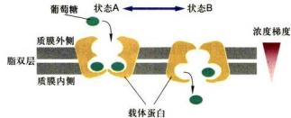  
图4-1 载体蛋白通过构象改变介导溶质（葡萄糖）协助扩散的模型

载体蛋白以两种构象状态存在：状态 A，溶质结合位点在膜外侧暴露；状态 B，同样的溶质结合位点在膜内侧暴露。两种构象状态的转变随机发生而不依赖于是否有溶质结合和是否完全可逆。若膜外侧溶质浓度高，则与状态 A 载体蛋白结合的溶质就比与状态 B 载体蛋白结合的多，净效果表现为溶质顺浓度梯度进入细胞。

子通道（ion channel）、孔蛋白（porin）以及水孔蛋白（aquaporin, AQP）。目前所发现的大多数通道蛋白都是离子通道。

离子通道蛋白通常形成选择性和门控性跨膜通道。因为对离子的选择性取决于通道的直径、形状以及通道内带电荷氨基酸残基的分布，所以离子通道介导协助扩散时不需要与溶质结合，只有大小和电荷适宜的离子才能通过。孔蛋白存在于革兰氏阴性细菌的外膜以及线粒体和叶绿体的外膜上，其跨膜区域由β折叠片层形成柱状亲水性通道。与离子通道蛋白相比，孔蛋白选择性很低，而且能通过较大的分子，如线粒体外膜上的孔蛋白可允许分子量为5000的分子通过。水孔蛋白是近年来发现的一类新的通道蛋白，其转运机制随后介绍。

根据对离子通道的研究，发现与载体蛋白相比，离子通道具有两个显著特征：第一个特征是具有极高的转运速率，比已知任何一种载体蛋白最快转运速率要高1000倍以上，每个通道每秒钟可通过 $10^{7}\sim10^{8}$ 个离子，接近自由扩散的理论值。驱动离子跨膜转运的动力来自溶质的浓度梯度和跨膜电位差两种力的合力，即跨膜的电化学梯度(electrochemical gradient)，运输的方向顺电化学梯度进行。第二个特征是离子通道并非连续性开放而是门控的，即通道的开启或关闭受膜电位变化、化学信号或压力刺激的调控。因此，根据激活信号的不同，离子通道可分为电压门控通道(voltage-gated channel)、配体门控通道(ligand-gated channel）和应力激活通道(stress-activated channel)(图4-2)。在电压门控通道中，带电荷的蛋白质结构域会随跨膜电位梯度的改变而发生相应的移动，从而使离子通道开启或关闭。在配体门控通道中，细胞内外的某些小分子配体与通道蛋白结合后引起通道开启或关闭。应力激活通道是通道蛋白感受应力而开启通道形成离子流，产生电信号。内耳听觉毛细胞就是依赖于这类通道的典型例子。离子通道决定了细胞膜对于特定离子的通透性，并与离子泵（如Na $^{+}$ -K $^{+}$ 泵）一起，调节细胞内的离子浓度和跨膜电位。神经细胞离子通道的迅速激活导致动作电位的产生和传递；肌细胞中肌质网膜Ca $^{2+}$ 通道的迅速开启使得储存的Ca $^{2+}$ 释放到细胞质基质，从而引发肌肉的收缩。

表 4-2 载体蛋白的举例

<table><tr><td>载体蛋白</td><td>典型定位</td><td>能源</td><td>功能</td></tr><tr><td>葡萄糖载体</td><td>大多数动物细胞的质膜</td><td>无</td><td>被动输入葡萄糖</td></tr><tr><td> ${\mathrm{{Na}}}^{ + }$  驱动的葡萄糖泵</td><td>肾和肠细胞的顶部质膜</td><td> ${\mathrm{{Na}}}^{ + }$  梯度</td><td>主动输入葡萄糖</td></tr><tr><td> ${\mathrm{{Na}}}^{ + } - {\mathrm{H}}^{ + }$  交换器</td><td>动物细胞的质膜</td><td> ${\mathrm{{Na}}}^{ + }$  梯度</td><td>主动输出  ${\mathrm{H}}^{ + }$  ,调节  $\mathrm{{pH}}$ </td></tr><tr><td> ${\mathrm{{Na}}}^{ + } - {\mathrm{K}}^{ + }$  泵</td><td>大多数动物细胞的质膜</td><td>ATP 水解</td><td>主动输出  ${\mathrm{{Na}}}^{ + }$  和输入  ${\mathrm{K}}^{ + }$ </td></tr><tr><td> ${\mathrm{{Ca}}}^{2 + }$  泵</td><td>真核细胞的质膜</td><td>ATP 水解</td><td>主动输出  ${\mathrm{{Ca}}}^{2 + }$ </td></tr><tr><td rowspan="2"> ${\mathrm{H}}^{ + }$  泵(  ${\mathrm{H}}^{ + }$  -ATP 酶)</td><td>植物细胞、真菌和一些细菌细胞的质膜</td><td>ATP 水解</td><td>从细胞主动输出  ${\mathrm{H}}^{ + }$ </td></tr><tr><td>动物细胞溶酶体膜、植物和真菌细胞的液泡膜</td><td>ATP 水解</td><td>主动将胞质内  ${\mathrm{H}}^{ + }$  转运到溶酶体或液泡</td></tr><tr><td>菌素红质</td><td>一些细菌的质膜</td><td>光</td><td>主动将  ${\mathrm{H}}^{ + }$  转运到细胞外</td></tr></table>

## （一）简单扩散

相关，如神经细胞的可兴奋性传递、细胞对营养物的摄取、细胞信号转导、细胞渗透压的维持以及细胞能量转换中ATP的产生等。根据跨膜转运是否需要细胞提供能量，跨膜运输分为两种类型：被动运输（passive transport）和主动运输（active transport）。被动运输中又根据是否需要膜转运蛋白参与，分为两种类型：简单扩散（simple diffusion）和协助扩散（facilitated diffusion）（图4-3）。

小分子或离子的跨膜运输与诸多生物学过程密切

## 二、小分子及离子的跨膜运输类型

小分子或离子以热自由运动的方式顺着电化学梯度或浓度梯度直接通过脂双层进出细胞，不需要细胞提供能量，也无需膜转运蛋白的协助，称为简单扩散。不同性质的小分子及离子跨膜运动的速率差异极大。疏水性小分子如 $\mathrm{O}_2$ 、 $\mathbf{N}_2$ 以及不带电荷的极性小分子很容易通过简单扩散进出细胞。在简单扩散的跨膜运动中，脂双层对溶质的通透性大小主要取决于分子大小和极性。小分子比大分子更容易跨膜，非极性分子比极性分子更容易跨膜，而带电荷的离子跨膜运动则需要更高的自由能，所以没有膜转运蛋白的人工脂双层对离子是高度不透的。图4-4显示在通过无膜转运蛋白的人工脂双层时，不同性质的小分子或离子具有不同的跨膜运动速率。

物质对膜的通透性（P）可以根据它在油和水中的分配系数（K）及其扩散系数（D）来计算：

$$
P = K D / t
$$

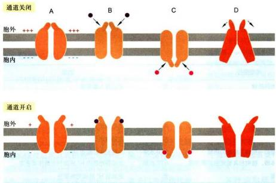  
图 4-2 三种类型的离子通道示意图  
A. 电压门控通道。B, C. 配体门控通道（B 为胞外配体，C 为胞内配体）。D. 应力激活通道。

## 图4-3 跨膜运输类型

简单扩散和协助扩散都是溶质顺着电化学梯度进行跨膜转运，也都不需要细胞提供能量。不同的是，简单扩散不需要膜转运蛋白协助，而协助扩散需要膜转运蛋白的协助；主动运输需要细胞提供能量，溶质逆着电化学梯度进行跨膜转运。此外，载体蛋白既能够执行协助扩散，又能够执行主动运输，而通道蛋白只执行协助扩散。

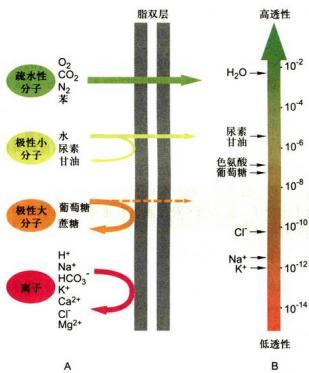  
图 4-4 不同性质的物质通过无膜转运蛋白的人工脂双层  
A. 人工脂双层膜对不同分子的相对透性。B. 不同物质通过人工脂双层膜的渗透系数。

式中，t 为膜的厚度。

## （二）协助扩散

协助扩散是指溶质顺着电化学梯度或浓度梯度，在膜转运蛋白协助下的跨膜转运方式，又叫易化扩散。协助扩散不需要细胞提供代谢能量，转运的动力来自物质的电化学梯度或浓度梯度。借助膜转运蛋白，多种极性小分子和无机离子，包括水分子、糖、氨基酸、核苷酸以及细胞代谢物等，都可以顺着电化学梯度或浓度梯度完成跨膜转运。

## 1. 葡糖转运蛋白

绝大多数哺乳动物细胞都是利用葡萄糖作为细胞的主要能源。人类基因组编码十多种葡糖转运蛋白(glucose transporter, GLUT)，构成GLUT蛋白家族，它们具有高度相似的氨基酸序列，都含有12个跨膜的α螺旋。其中，Glut1是介导葡糖糖进入红细胞及通过血脑屏障的主要转运蛋白，对于维持血糖浓度的稳定和大脑供能起关键作用。Glut1三维晶体结构呈现出该家族成员典型的折叠方式——12个跨膜螺旋组成N端和C端两个结构域（图4-5A）。Glut1通过开口朝向胞外和开口朝向胞内的有序的构象改变过程，完成葡萄糖的协助转运（图4-5B）。

## 2. 水孔蛋白：水分子的跨膜通道

生物体的主要组成成分是水，约占人体质量的70%。水分子不带电荷但具有极性，尽管它可以通过简单扩散的方式缓慢穿过脂双层，但对于某些组织来说，如肾小管和集合管对水的重吸收、从脑中排出额外的水、唾液和眼泪的形成等，水分子就必须借助质膜上的大量水孔蛋白以实现快速跨膜转运（图4-6A）。水孔蛋白对于细胞渗透压以及生理与病理的调节作用十分重要，比如人肾近曲小管对原尿中水重吸收作用，通常一个正常成年人每天要产生180 L的原尿，这些原尿经近曲小管的水孔蛋白的吸收，大部分水分被人体循环利用，最终只有约1 L的尿液排出人体。

红细胞是研究水孔蛋白的一个理想模型。20世纪80年代，在红细胞膜中发现了第一个水孔蛋白CHIP28 (channel-forming integral protein, 28 kDa)，后来统一命名为AQP1。到现在，超过200种水孔蛋白陆续被发现，从细菌到植物、从动物到人，水孔蛋白广泛存在于所有细胞质膜上。水孔蛋白是一个大家族，仅哺乳类细胞至少就发现了十多种水孔蛋白。表 4-3 列出了部分水孔蛋白的主要分布及其功能。

  
图4-5 Glut1的晶体结构（含N45T和E329Q突变）和转运葡萄糖的工作模型  
A. Glut1 的三维晶体结构含 12 个跨膜螺旋，组成 N 端和 C 端两个结构域。处于这种构象状态时，两个结构域之间的底物结合位点朝向胞质开放，呈现向内开放构象。跨膜区域 TM1 和 TM7 的胞外部分相互作用，封住了 Glut1 胞外开口。胞内 4 个 $\alpha$ 螺旋组成的结构域 IC1—IC4 的相互接触或位移有助于关闭或开启 Glut1 胞质一侧的开口（颜宁博士惠赠）。B. Glut1 底物结合位点朝胞外开放时，葡萄糖结合，Glut1 构象发生变化，朝胞内开放，释放葡萄糖，完成葡萄糖转运的构象变化循环。通过这种有序的构象改变完成葡萄糖的协助转运。

对 AQP1 晶体学数据分析表明，水孔蛋白由 4 个亚基组成四聚体（图 4-6B），每个亚基都由 6 个跨膜 $\alpha$ 螺旋组成（图 4-6C、D）。每个水孔蛋白亚基单独形成一个供水分子通过的中央孔，孔的直径稍大于水分子直径，约 0.28 nm，水孔长约 2 nm。尽管还没有完全揭示为何 AQP1 在对水分子快速通过的同时能有效阻止质子的通过，表现出对水分子的特异通透性，但已有的数据表明，这种特异性与两个半跨膜区的 Asn-Pro-Ala 模式有关。AQP1 中央孔的孔径无法通过比水分子大的物质，而两个 Asn-Pro-Ala 中的 Asn 残基所带的正电荷也排除了质子的通过，因此，AQP1 是一个高度特异的亲水通道，只允许水而不允许离子或其他小分子溶质通过。值得一提的是，有些水孔蛋白对溶质的通透不仅局限于水分子，如 AQP8 对尿素也有通透性，AQP7 对甘油具有通透性。

植物水孔蛋白在种子萌发、细胞伸长、气孔运动以及受精等过程中调节水分的快速跨膜转运。此外，有些水孔蛋白还在植物逆境应答如抗旱性中起着重要作用。

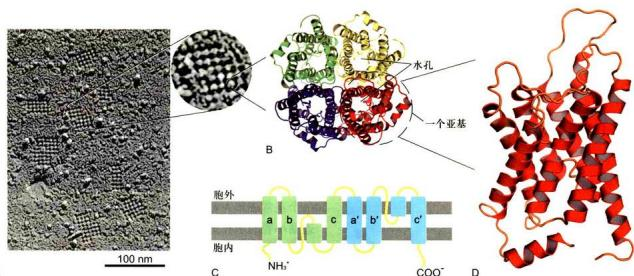  
图4-6 水孔蛋白分布与结构示意图  
A. 豚鼠细胞质膜上分布的大量水孔蛋白电镜照片。B. 水孔蛋白 AQP1 由 4 个亚基组成四聚体。C. 每个亚基由 3 对同源的跨膜 α 螺旋（aa'、bb' 和 cc'）组成。D. 亚基三维结构示意图。（A 图由 Bechara Kachar 博士惠赠：B、D 图基于 PDB 数据库 3GD8 结构绘制）

表 4-3 部分水孔蛋白举例

<table><tr><td>水孔蛋白</td><td>组织分布</td><td>功能</td></tr><tr><td>AQP0</td><td>晶状体纤维细胞</td><td>维持晶状体透明度</td></tr><tr><td rowspan="5">AQP1</td><td>红细胞</td><td>多种功能</td></tr><tr><td>肾近曲小管</td><td>近曲肾小管水分重吸收</td></tr><tr><td>眼睛缝状上皮</td><td>眼中水状液的分泌</td></tr><tr><td>大脑脉络丛</td><td>中枢系统脑脊髓液的分泌</td></tr><tr><td>肺泡上皮细胞</td><td>肺中水平衡</td></tr><tr><td>AQP2</td><td>肾集合管</td><td>肾集合管中水通透力(突变产生肾源性尿崩症)</td></tr><tr><td>AQP3</td><td>肾集合管,呼吸道支气管上皮细胞</td><td>水重吸收进入血液,气管和支气管液体分泌</td></tr><tr><td rowspan="3">AQP4</td><td>肾集合管</td><td>水重吸收</td></tr><tr><td>中枢神经系统</td><td>中枢神经系统中脑脊髓液的重吸收;脑水肿的调节</td></tr><tr><td>呼吸道支气管上皮细胞</td><td>支气管液体分泌</td></tr><tr><td>AQP5</td><td>唾液腺、泪腺、汗腺</td><td>唾液、眼泪、汗液的分泌</td></tr><tr><td>AQP7</td><td>脂肪组织、肾、睾丸</td><td>转运水以及甘油</td></tr><tr><td> $\gamma$ -TIP</td><td>植物液泡膜</td><td>植物液泡水的摄入,调节膨压</td></tr></table>

## （三）主动运输

与被动运输不同，主动运输是由载体蛋白所介导的物质逆着电化学梯度或浓度梯度进行跨膜转运的方式。主动运输普遍存在于动、植物细胞和微生物细胞。根据能量来源的不同，可将主动运输分为：由ATP直接提供能量（ATP驱动泵）、间接提供能量（协同转运或偶联转运蛋白）以及光驱动泵三种基本类型（图4-7）。

## 1. ATP 驱动泵

ATP驱动泵（ATP-driven pump）是ATP酶直接利用水解ATP提供的能量，实现离子或小分子逆浓度梯度或电化学梯度的跨膜运输。这种主动运输是一种能量偶联的化学反应过程，即离子或小分子逆电化学梯度的“上山”运动（需要能量）与ATP水解（释放能量）相偶联。主动运输每秒转运的离子数为 $1\sim10^{3}$ 不等。

## 2. 协同转运蛋白

协同转运蛋白（cotransporter）或偶联转运蛋白（coupled transporter）介导各种离子和分子的跨膜运动。这类转运蛋白包括两种基本类型：同向协同转运蛋白（symporter）和反向协同转运蛋白（antiporter）。同向协同转运是偶联物的运输方向相同，如小肠上皮细胞和肾小管上皮细胞吸收葡萄糖或氨基酸等有机物，就是伴随 $\mathrm{Na}^{+}$ 从细胞外流入细胞内而完成的；而反向协同转运是偶联物的运输方向相反，如质膜上 $\mathrm{Na}^{+}/\mathrm{H}^{+}$ 交换载体在完成 $\mathrm{H}^{+}$ 输出细胞的同时伴随着 $\mathrm{Na}^{+}$ 输入细胞。这两类转运蛋白使一种离子或分子逆浓度梯度的转运与另一种或多种其他溶质顺着电化学梯度或浓度梯度的转运偶联起来。与ATP驱动泵直接利用水解ATP提供能量的方式不同，协同转运蛋白所利用的能量储存在其中一种溶质的电化学梯度中。在动物细胞的质膜上， $\mathrm{Na^{+}}$ 是常用的协同转运离子，它的电化学梯度为另一种物质的主动运输提供了驱动力。由于 $\mathrm{Na^{+}}$ 电化学梯度的形成需要 $\mathrm{Na^{+} - K^{+}}$ 泵水解ATP，因此，协同转运是一种间接消耗能量的主动转运方式。在细菌、酵母、植物和动物细胞的被膜细胞器，绝大多数协同运输是靠 $\mathrm{H^{+}}$ 而不是靠 $\mathrm{Na^{+}}$ 电化学梯度来驱动的。协同转运蛋白每秒转运的底物数 $10^{2}\sim 10^{4}$ 不等。

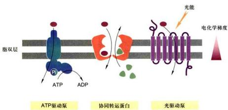  
图4-7 主动运输三种类型

## 3. 光驱动泵

光驱动泵（light-driven pump）主要发现于细菌细胞，对溶质的主动运输与光能的输入相偶联，如菌紫红质。

<!-- END CN CN04-S01 -->

---

## 对应英文内容

### 英文补充：膜运输原则、载体、通道与协同运输

> 对应中文板块：膜运输原则、载体、通道与协同运输。英文来源：Molecular Biology of the Cell，第7版，第11章；[本章完整原文](../来源/英文教材/11_Small-Molecule_Transport_and_Electrical_Properties_of_Membranes/chapter.md)。物理PDF页码范围：676–721（整章范围）。

<!-- BEGIN EN EN11-H000-H008 -->
#### Small-Molecule Transport and Electrical Properties of Membranes

Because of its hydrophobic interior, the lipid bilayer of cell membranes restricts the passage of most polar molecules. This barrier function allows the cell to maintain concentrations of solutes in its cytosol that differ from those in the extracellular fluid and in each of the intracellular membrane-enclosed compartments. To benefit from this barrier, however, cells have had to evolve ways of transferring specific water-soluble molecules and ions across their membranes in order to ingest essential nutrients, excrete metabolic waste products, and regulate intracellular ion concentrations. Cells use specialized membrane transport proteins to accomplish this goal. The importance of such small-molecule transport is reflected in the large number of genes in all organisms that code for the transmembrane transport proteins involved, which make up 15–30% of the membrane proteins in all cells. Some mammalian cells, such as nerve and kidney cells, devote up to two-thirds of their total metabolic energy consumption to such transport processes.

Cells can also transfer macromolecules and even large particles, such as cell debris, viruses, and bacteria, across their membranes, but the mechanisms involved in most of these cases differ from those used for transferring small molecules, and they are discussed in Chapters 12 and 13.

We begin this chapter by describing some general principles of how small water-soluble molecules traverse cell membranes. We then consider, in turn, the two main classes of membrane proteins that mediate this transmembrane traffic: transporters, which undergo sequential conformational changes to transport specific small molecules across membranes, and channels, which form narrow pores, allowing passive transmembrane movement, primarily of water and small inorganic ions. Transporters can be coupled to a source of energy to catalyze active transport, which, together with selective passive permeability, creates large differences in the composition of the cytosol compared with that of either the extracellular fluid (**Table 11–1**) or the fluid within membrane-enclosed organelles. By generating inorganic ion–concentration differences across the lipid bilayer, cell membranes can store potential energy in the form of electrochemical gradients, which drive various transport processes, convey electrical signals in electrically excitable cells, and (in mitochondria, chloroplasts, and bacteria) are harnessed to make most of the cell’s ATP. We focus our discussion mainly on transport across the plasma membrane, but similar mechanisms operate across the other membranes of the eukaryotic cell, as discussed in later chapters.

In the last part of the chapter, we concentrate mainly on the functions of ion channels in neurons (nerve cells). In these cells, channel proteins perform at their highest level of sophistication, enabling networks of neurons to carry out all the astonishing feats your brain is capable of.

#### PRINCIPLES OF MEMBRANE TRANSPORT

We begin this section by describing the permeability properties of an artificial membrane—a synthetic lipid bilayer made solely from lipids without proteins present. We then introduce some of the terms used to describe the various forms of membrane transport and some strategies for characterizing the proteins and processes involved.

C HAP T E R

11

IN THIS CHAPTER

Principles of Membrane Transport

Transporters and Active Membrane Transport

Channels and the Electrical Properties of Membranes

TABLE 11–1 A Comparison of Inorganic Ion Concentrations Inside and Outside a Typical Mammalian Cell\*

<table><tbody><tr><td colspan="3">a Typical Mammalian Cell*</td></tr><tr><td>Component</td><td>Cytoplasmic concentration (mM)</td><td>Extracellular concentration (mM)</td></tr><tr><td colspan="3">Cations</td></tr><tr><td>Na+</td><td>5-15</td><td>145</td></tr><tr><td>K+</td><td>140</td><td>5</td></tr><tr><td>Mg2+</td><td>0.5</td><td>1-2</td></tr><tr><td>Ca2+</td><td>10-4</td><td>1-2</td></tr><tr><td>H+</td><td>7 × 10-5 (10-7.2 M or pH 7.2)</td><td>4 × 10-5 (10-7.4 M or pH 7.4)</td></tr><tr><td colspan="3">Anions</td></tr><tr><td>Cl-</td><td>5-15</td><td>110</td></tr><tr><td colspan="3">*The cell must contain equal quantities of positive and negative charges (that is, it must be electrically neutral). Thus, in addition to Cl-, the cell contains many other anions not listed in this table; in fact, most cell constituents are negatively charged (HCO3-, PO43-, nucleic acids, metabolites carrying phosphate and carboxyl groups, etc.). The concentrations of Ca2+ and Mg2+ given are for the free ions: although there is a total of about 20 mM Mg2+ and 1-2 mM Ca2+ in cells, both ions are mostly bound to other substances (such as proteins, free nucleotides, RNA, etc.) and, for Ca2+, stored within various organelles (such as the endoplasmic reticulum and mitochondria).</td></tr></tbody></table>

#### Protein-free Lipid Bilayers Are Impermeable to Ions

Given enough time, virtually any molecule will diffuse down its concentration gradient across a protein-free lipid bilayer. The rate of diffusion, however, varies enormously, depending partly on the size of the molecule but mostly on its relative hydrophobicity (solubility in oil). In general, the smaller the molecule and the more hydrophobic, or nonpolar, it is, the more easily it will diffuse across a lipid bilayer. Small nonpolar molecules, such as $\mathrm { O } _ { 2 }$ and $\mathrm { C O _ { 2 } } ,$ readily dissolve in lipid bilayers and therefore diffuse rapidly across them. Small uncharged polar molecules, such as water or urea, also diffuse across a bilayer, albeit much more slowly (**Figure 11–1** and see Movie 10.3). By contrast, lipid bilayers are essentially impermeable to charged molecules (ions), no matter how small: the charge and high degree of hydration of such molecules prevent them from entering the hydrocarbon phase of the bilayer (**Figure 11–2**).

#### There Are Two Main Classes of Membrane Transport Proteins: Transporters and Channels

Like synthetic lipid bilayers, cell membranes allow small nonpolar molecules to permeate by diffusion. Cell membranes, however, also have to allow the passage of various polar molecules, such as ions, sugars, amino acids, nucleotides, water, and many cell metabolites that cross synthetic lipid bilayers only very slowly. Special **membrane transport proteins** transfer such solutes across cell membranes. These proteins occur in many forms and in all types of biological membranes. Each protein often transports only a specific molecular species or sometimes a class of molecules (such as ions, sugars, or amino acids). Early studies found that bacteria with a single-gene mutation were unable to transport a particular class of sugars across their plasma membrane, thereby demonstrating the specificity of membrane transport proteins. We now know that humans with similar mutations suffer from various inherited diseases that hinder the transport of a specific solute or solute class in the kidney, intestine, or other cell type. Individuals with the inherited disease cystinuria, for example, cannot transport certain amino acids

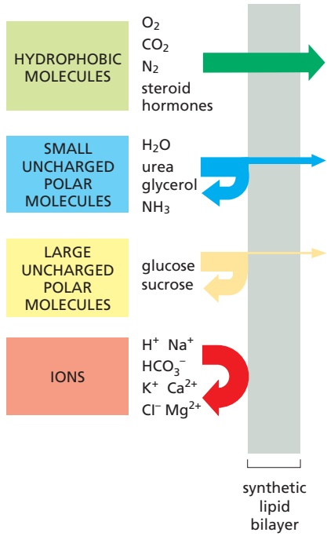

Figure 11–1 The relative permeability of a synthetic lipid bilayer to different classes of molecules. The smaller the MBoC7 m11.01/11.01molecule and, more important, the less strongly it associates with water, the more rapidly the molecule diffuses across the bilayer.

Figure 11–2 Permeability coefficients for the passage of various molecules through synthetic, protein-free lipid bilayers. The rate of flow of a solute across the bilayer is directly proportional to the difference in its concentration on the two sides of the membrane. Multiplying this concentration difference (in mol/cm3) by the permeability coefficient (in cm/sec), which is an experimentally determined constant characteristic of each solute, gives the flow of solute in moles per second per square centimeter of bilayer. A concentration difference of tryptophan of 10–4 mol/ cm3 (10–4 mol/10–3 L = 0.1 M), for example, would cause a flow of 10–4 mol/cm3 × 10–7 cm/ $\mathtt { s e c } = 1 0 ^ { - 1 \top }$ mol/sec through 1 $\mathrm { c m ^ { 2 } }$ of bilayer, o $\mathsf { r }   6 \times 1 0 ^ { 4 }$ molecules/sec through 1 $\mu m ^ { 2 }$ of bilayer.

(including cystine, the disulfide-linked dimer of cysteine) from either the urine or the intestine into the blood; the resulting accumulation of cystine in the urine leads to the formation of cystine stones in the kidneys.

All membrane transport proteins that have been studied in detail are multipass transmembrane proteins; that is, their polypeptide chains traverse the lipid bilayer two or more times. By forming a protein-lined pathway across the membrane, these proteins enable specific hydrophilic solutes to cross the membrane without coming into direct contact with the hydrophobic interior of the lipid bilayer.

Transporters and channels are the two major classes of membrane transport proteins (**Figure 11–3**). **Transporters** (sometimes called carriers or permeases) bind the specific solute to be transported and undergo a series of conformational changes that alternately expose solute-binding sites on one side of the membrane and then on the other side to transfer the solute across it. **Channels**, by contrast, interact much more transiently with the solute to be transported. When opened by conformational changes, channels form continuous pores that extend across the lipid bilayer. The pores allow specific solutes (such as inorganic ions of appropriate size and charge, and in some cases small molecules, including water, glycerol, and ammonia) to pass through them and thereby cross the membrane. Because no stepwise conformational changes are required once a channel is opened, it is not surprising that transport through channels occurs at a much faster rate than transport mediated by transporters. Although water can slowly diffuse across synthetic lipid bilayers, cells use dedicated channel proteins (called water channels, or aquaporins) that greatly increase the permeability of their membranes to water, as we discuss later.

#### Active Transport Is Mediated by Transporters Coupled to an Energy Source

All channels and some transporters allow solutes to cross the membrane only passively (“downhill”), a process called **passive transport**. In the case of transport of a single uncharged molecule, the difference in the concentration on the two sides of the membrane—its concentration gradient—drives passive transport and determines its direction (**Figure 11–4A**). If the solute carries a net charge, however, both its concentration gradient and the electrical potential difference across the membrane, the membrane potential, influence its transport. The concentration gradient and the electrical gradient combine to form a net driving force, the **electrochemical gradient**, for each charged solute (**Figure 11–4B**). We discuss electrochemical gradients in more detail later and in Chapter 14. In fact, almost all plasma membranes have an electrical potential difference (that is, a voltage) across them, with the inside usually negative with respect to the outside. This potential favors the entry of positively charged ions into the cell but opposes the entry of negatively charged ions (see Figure 11–4B); it also opposes the efflux of positively charged ions.

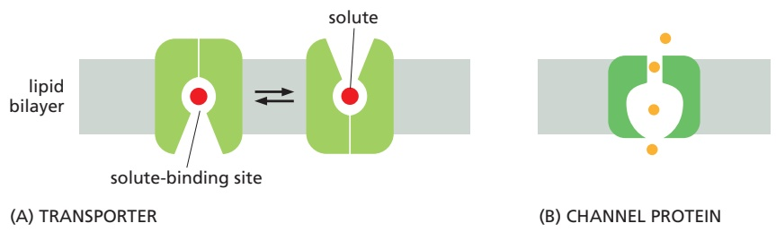

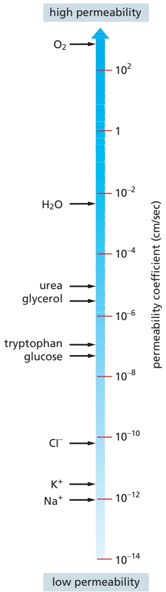

Figure 11–3 Transporters and channel proteins. (A) A transporter alternates between two conformations, so that the solute-binding site of the transporter is sequentially accessible on one side of the bilayer and then on the other. (B) In contrast, a channel protein forms a pore across the bilayer through which specific solutes can passively diffuse.

Figure 11–4 Different forms of membrane transport and the influence of the membrane. (A) Passive transport down a concentration gradient (or an electrochemical gradient—see panel B) occurs spontaneously, by diffusion, either through the lipid bilayer directly or through channels or passive transporters. By contrast, active transport involves movement of the solute against its concentration or electrochemical gradient and hence requires an input of metabolic energy. (B) The electrochemical gradient of a charged solute (an ion) affects its transport. This gradient (green) combines the membrane potential and the concentration gradient of the solute. The electrical and chemical gradients can work additively to increase the driving force on an ion across the membrane (middle) or they can work against each other (right).

In addition to passive transport, cells need to be able to actively pump certain solutes across the membrane “uphill,” against their electrochemical gradients. Such **active transport** is mediated by transporters whose pumping activity is directional because it is tightly coupled to a source of metabolic energy, such as an ion gradient or ATP hydrolysis, as discussed later. Transmembrane movement of small molecules mediated by transporters can be either active or passive, whereas that mediated by channels is always passive (see Figure 11–4A).

#### Summary

Lipid bilayers are virtually impermeable to most polar molecules. To transport small water-soluble molecules into or out of cells or intracellular membraneenclosed compartments, cell membranes contain various membrane transport proteins, each of which is responsible for transferring a particular solute or class of solutes across the membrane. There are two types of membrane transport proteins— transporters and channels. Both form protein pathways across the lipid bilayer. Whereas transmembrane movement mediated by transporters can be either active or passive, solute flow through channel proteins is always passive. Ion transport across the membrane is influenced by the ion’s concentration gradient and the membrane potential; that is, its electrochemical gradient.

#### TRANSPORTERS AND ACTIVE MEMBRANE TRANSPORT

The process by which a transporter transfers a solute molecule across the lipid bilayer resembles an enzyme–substrate reaction, and in many ways transporters behave like enzymes. In contrast to ordinary enzyme–substrate reactions, however, the transporter does not modify the transported solute but instead delivers it unchanged to the other side of the membrane.

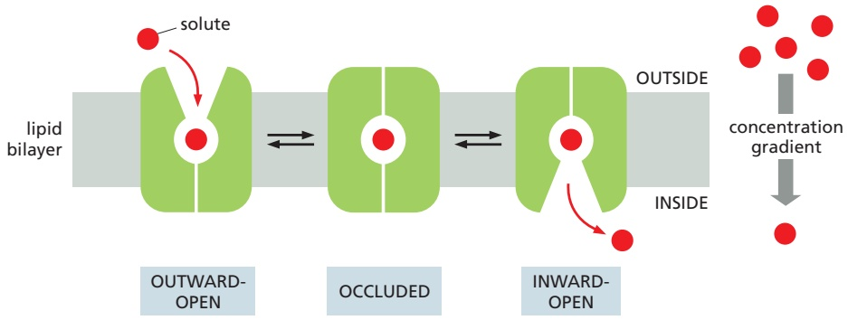

Each type of transporter has one or more specific binding sites for its solute (substrate). It transfers the solute across the lipid bilayer by undergoing reversible conformational changes that alternately expose the solute-binding site firstMB C7 11.05/11.05 on one side of the membrane and then on the other side—but never on both sides at the same time. The transition occurs through an intermediate state in which the solute is inaccessible, or occluded, from either side of the membrane (**Figure 11–5**). When the transporter is saturated (that is, when all solute-binding sites are occupied), the rate of transport is maximal. This rate, referred to as $V _ { \mathrm { m a x } }$ (V for velocity), is characteristic of the specific carrier. $V _ { \mathrm { m a x } }$ is the maximal rate at which the carrier can flip between its conformational states. In addition, each transporter has a characteristic affinity for its solute, reflected in the $K _ { \mathrm { m } }$ of the reaction, which is equal to the concentration of solute when the transport rate is half its maximum value (**Figure 11–6**). As with enzymes, the binding of solute can be blocked by either competitive inhibitors (which compete for the same binding site and may or may not be transported) or noncompetitive inhibitors (which bind elsewhere and alter the structure of the transporter).

As we discuss shortly, conceptually it requires only a relatively minor modification of the mechanism shown in Figure 11–5 to link a transporter to a source of energy in order to pump a solute uphill against its electrochemical gradient. Cells carry out such active transport in three main ways (**Figure 11–7**):

1. Coupled transporters harness the energy stored in concentration gradients to couple the uphill transport of one solute across the membrane to the downhill transport of another.

2. ATP-driven pumps couple uphill transport to the hydrolysis of ATP.

3. Light- or redox-driven pumps, which are known in bacteria, archaea, mitochondria, and chloroplasts, couple uphill transport to an input of energy from light, as with bacteriorhodopsin and photosystem II (discussed in Chapters 10 and 14, respectively), or from a redox reaction, as with cytochrome c oxidase (discussed in Chapter 14).

Comparisons of amino acid sequences and three-dimensional structures suggest that, in many cases, there are strong similarities in structure between transporters that mediate active transport and those that mediate passive transport. Some bacterial transporters, for example, that use the energy stored in the $\mathrm { \bar { H } ^ { + } }$ gradient across the plasma membrane to drive the active uptake of various sugars are structurally similar to the transporters that mediate passive glucose transport into most animal cells. There is thus a clear evolutionary relationship between various transporters. Given the cell’s essential need to transport small metabolites across membranes, it comes as no surprise that the superfamily of transporters is a large and ancient one.

We begin our discussion of active membrane transport by considering a class of coupled transporters that are driven by ion-concentration gradients. These proteins have a crucial role in the transport of small metabolites across membranes in all cells. We then discuss ATP-driven pumps, including the $\mathrm { { N a } ^ { + } \mathrm { { \cdot } K ^ { + } } }$ pump that is found in the plasma membrane of most animal cells. Examples of the third class of active transport—light- or redox-driven pumps—are discussed in Chapter 14.

Figure 11–5 A model of how a conformational change in a transporter mediates the passive movement of a solute. The transporter is shown in three conformational states: in the outwardopen state, the binding sites for solute are exposed on the outside; in the occluded state, the same sites are not accessible from either side; and in the inward-open state, the sites are exposed on the inside. The transitions between the states occur randomly. They are completely reversible and do not depend on whether the solutebinding site is occupied. Therefore, if the solute concentration is higher on the outside of the bilayer, more solute binds to the transporter in the outward-open conformation than in the inward-open conformation, and there is a net transport of solute down its concentration gradient (or, if the solute is an ion, down its electrochemical gradient).

Figure 11–6 The kinetics of simple diffusion compared with transportermediated diffusion. Whereas the rate of simple diffusion and of channel-mediated transport is directly proportional to the solute concentration (within the physical limits imposed by total surface area or total MBoC7 m11.06/11.06channels available), the rate of transportermediated diffusion approaches a maximum $( V _ { \mathsf { m a x } } )$ as the transporter reaches saturation. The solute concentration when the transport rate is at half its maximal value is termed its $K _ { \mathrm { m } }$ and is analogous to the $K _ { \mathrm { m } }$ of an enzyme for its substrate. Note that, while the graph illustrates the shape of the curves, their absolute scale on the Y axis is very different. A typical channel conducts water or ions at rates of up to 108 per second, whereas a typical transporter moves solutes at rates between 102 and 104 molecules per second.

Figure 11–7 Three ways of driving active transport. The actively transported molecule is shown in orange, and the energy source is shown in red. Redoxdriven active transport is discussed in Chapter 14 (see Figures 14–18 and 14–19).

Active Transport Can Be Driven by Ion-Concentration Gradients

Some transporters simply facilitate the passive movement of a single solute from one side of the membrane to the other at a rate determined by their $V _ { \mathrm { m a x } }$ and $K _ { \mathrm { m } } ;$ they are called **uniporters**. Others function as coupled transporters, in which the transfer of one solute strictly depends on the transport of a second. CoupledMBoC7 m11.07/11.07 transport involves either the intimately coupled transfer of a second solute in the same direction, performed by **symporters** (also called co-transporters), or the transfer of a second solute in the opposite direction, performed by **antiporters** (also called exchangers) (**Figure 11–8**).

The tight coupling between the transfer of two solutes allows the coupled transporters to harvest the energy stored in the electrochemical gradient of one solute, typically an inorganic ion, to transport the other. In this way, the free energy released during the movement of an inorganic ion or $\mathrm { H } ^ { + }$ down an electrochemical gradient is used as the driving force to pump other solutes uphill, against their electrochemical gradient. This strategy can work in either direction; some coupled transporters function as symporters, others as antiporters. In the plasma membrane of animal cells, $\mathrm { { N a } ^ { + } }$ is the usual co-transported ion because its electrochemical gradient provides a large driving force for the active transport of a second molecule. Such ion-driven coupled transporters are said to mediate secondary active transport. The $\mathrm { N a } ^ { + }$ that enters the cell during coupled transport is subsequently pumped out by an ATP-driven $\mathrm { { N a } ^ { + } \mathrm { { \cdot } K ^ { + } } }$ pump in the plasma membrane (as we discuss later), which, by exchanging $\mathrm { K } ^ { + }$ for $\mathrm { N a } ^ { + }$ , maintains the $\mathrm { N a } ^ { + }$ gradient, indirectly driving the coupled transport. Such ATP-driven pumps are therefore said to mediate primary active transport because in these the free energy of ATP hydrolysis is used to directly drive the transport of a solute against its electrochemical gradient. The energy stored in the gradient is then used to fuel the secondary active transport processes.

Intestinal and kidney epithelial cells contain a variety of symporters that are driven by the $\mathrm { N a } ^ { + }$ gradient across the plasma membrane. Each $\mathrm { { N a } ^ { + } }$ -driven symporter is specific for importing a small group of related sugars or amino acids into the cell. Because the Na+ tends to move into the cell down its electrochemical gradient, the sugar or amino acid is, in a sense, “dragged” into the cell with it. The greater the electrochemical gradient for Na+, the more solute is transported into the cell (**Figure 11–9**). Neurotransmitters (released by nerve cells to signal at synapses—as we discuss later) are taken up again by Na+ symporters after their release. This both terminates their signaling to postsynaptic cells and recycles them for reuse. These neurotransmitter transporters are important drug targets: stimulants, such as cocaine and antidepressants, inhibit them and thereby prolong signaling by the neurotransmitters because they are not cleared efficiently.

Figure 11–8 This schematic diagram shows transporters functioning as uniporters, symporters, and antiporters (Movie 11.1).

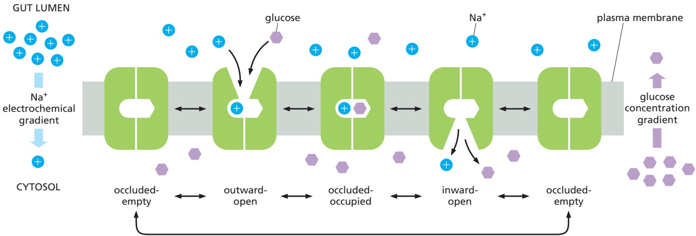

Figure 11–9 Mechanism of glucose transport fueled by an Na+ gradient. As in the model shown in Figure 11–5, the transporter alternates between inward-open and outward-open states via occluded intermediate states. Binding of Na+ and glucose is cooperative; that is, the binding of either solute increases the protein’s affinity for the other. Because the Na+ concentration is much higher in the extracellular space than in the cytosol, glucose is more likely to bind to the transporter in the outward-facing state. The transition to the occluded state occurs only when both Na+ and glucose are bound; their precise interactions in the solute-binding sites slightly stabilize the occluded state and thereby make this transition energetically favorable. Stochastic fluctuations caused by thermal energy drive the transporter randomly into the inward-open or outward-open conformation. If it opens outwardly, nothing is achieved, and the process starts all over. However, whenever it opens inwardly, Na+ dissociates quickly in the low-Na+-concentration environment of the cytosol. Glucose dissociation is likewise enhanced when Na+ is lost, because of cooperativity in binding of the two solutes. The overall MBoC7 m11.09/11.09result is the net transport of both Na+ and glucose into the cell. Because the occluded state is not formed when only one of the solutes is bound, the transporter switches conformation only when it is fully occupied or fully empty, thereby ensuring strict coupling of the transport of Na+ and glucose.

Despite their great variety, transporters share structural features that can explain how they function and how they evolved. Transporters are typically built from bundles of 10 or more α helices that span the membrane. Solute- and ionbinding sites are located midway through the membrane, where some helices are broken or distorted and amino acid side chains and polypeptide backbone atoms form ion- and solute-binding sites. In the inward-open and outward-open conformations, these binding sites are accessible by passageways from one side of the membrane but not the other. In switching between the two conformations, the transporter protein transiently adopts an occluded conformation, in which both passageways are closed; this prevents the driving ion and the transported solute from crossing the membrane unaccompanied, which would deplete the cell’s energy store to no purpose. Because only transporters with both types of binding sites appropriately filled change their conformation, tight coupling between ion and solute transport is ensured.

Like enzymes, transporters can work in the reverse direction if ion and solute gradients are appropriately adjusted experimentally. This chemical symmetry is mirrored in their physical structure. Protein structural analyses have revealed that many transporters are built from inverted repeats: the packing of the transmembrane α helices in one half of the helix bundle is structurally similar to the packing in the other half, but the two halves are inverted in the membrane relative to each other. Transporters are therefore said to be pseudosymmetric, and the passageways that open and close on either side of the membrane have closely similar geometries, allowing alternating access to the ion- and solute-binding sites in the center (**Figure 11–10**). It is thought that the two halves evolved by gene duplication of a smaller ancestor protein.

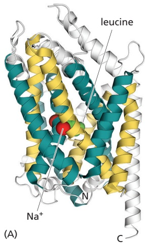

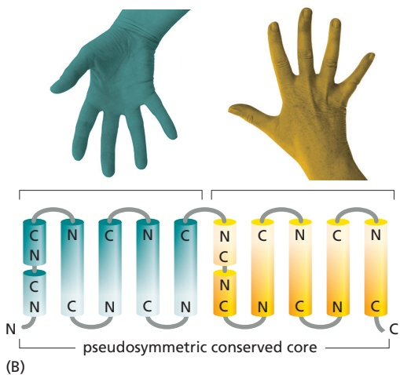

Figure 11–10 Transporters are built from inverted repeats. (A) LeuT, a bacterial Na+/leucine symporter related to human neurotransmitter transporters, such as the serotonin transporter, is shown. The core of the transporter is built from two bundles, each composed of six α helices (blue and yellow). The helices shown in light gray are additions to the conserved core structure and differ among members of this transporter family. They are thought to play regulatory roles that are specific to a particular transporter. (B) Both core helix bundles are packed in a similar arrangement, but the second bundle is inverted with respect to the first (shown as two right hands, with the broken helices as the thumbs). The transporter’s structural pseudosymmetry reflects its functional symmetry: the transporter can work in either direction, depending on the direction of the ion gradient. (A, PDB code: 3F3E.)

Some other types of important membrane transport proteins are also built from inverted repeats. Examples even include channel proteins such as the aquaporinMBoC7 m11.10/11.10 water channel (discussed later) and the Sec61 channel through which nascent polypeptides move into the endoplasmic reticulum (discussed in Chapter 12). It is thought that these channels evolved from coupled transporters in which the gating functions were lost, allowing them to open toward both sides of the membrane simultaneously to provide a continuous path across the membrane.

In bacteria, yeasts, and plants, as well as in many membrane-enclosed organelles of animal cells, most ion-driven active transport systems depend on $\mathrm { H } ^ { + }$ rather than $\mathrm { N a } ^ { + }$ gradients, reflecting the predominance of $\mathrm { H } ^ { + }$ pumps in these membranes. An electrochemical $\tilde { \mathrm { H } ^ { + } }$ gradient across the bacterial plasma membrane, for example, drives the inward active transport of many sugars and amino acids.

#### Transporters in the Plasma Membrane Regulate Cytosolic pH

Most proteins operate optimally at a particular pH. Lysosomal enzymes, for example, function best at the low $pH  \left( \sim 5 \right)$ found in lysosomes, whereas cytosolic enzymes function best at the close-to-neutral pH $\dot { ( - 7 . 2 ) }$ found in the cytosol. It is therefore crucial that cells control the pH of their intracellular compartments.

Most cells have one or more types of $\mathrm { N a } ^ { + }$ -driven antiporters in their plasma membrane that help to maintain the cytosolic pH at about 7.2. These transporters use the energy stored in the $\mathrm { N a } ^ { + }$ gradient to pump out excess $\mathrm { H } ^ { + }$ , which either leaks in or is produced in the cell by acid-forming reactions. Two mechanisms are used: either $\mathrm { H } ^ { + }$ is directly transported out of the cell or $\mathrm{HCO_{3}^{-}}$ is brought into the cell to neutralize $\mathrm { H } ^ { + }$ in the cytosol (according to the reaction $HCO _{3}^{-}+$ $\mathrm { H } ^ { + } \rightarrow \mathrm { H } _ { 2 } \mathrm { O }   +   \mathrm { C O } _ { 2 } )$ . One of the antiporters that uses the first mechanism is an $N a ^ { + } { - } H ^ { + }$ exchanger, which couples an influx of $\mathrm { { N a } ^ { + } }$ to an efflux of $\mathrm { H } ^ { + }$ . Another, which uses a combination of the two mechanisms, is an $N   a ^ { + }$ -driven $Cl^{-}{-}HCO_{3}$ exchanger that couples an influx of $\mathrm { { N a } ^ { + } }$ and $\mathrm { H C O _ { 3 } } ^ { - }$ to an efflux of Cl– and $\mathrm { H } ^ { + }$ (so that Na $\mathrm { I C O _ { 3 } }$ comes in and HCl goes out). The $\mathrm { { N a } ^ { + } }$ -driven $\mathrm{Cl^{-}{-}HCO_{3}^{-}}$ exchanger is twice as effective as the $\mathrm { N a ^ { + } \mathrm { - } \tilde { H } ^ { + } }$ exchanger: it pumps out one $\mathrm { H } ^ { + }$ and neutralizes another for each $\mathrm { N a } ^ { + }$ that enters the cell. If $\mathrm { H C O _ { 3 } } ^ { - }$ is available, as is usually the case, this antiporter is the most important transporter regulating the cytosolic pH. The pH inside the cell regulates both exchangers; when the pH in the cytosol falls, both exchangers sense the change and increase their activity.

An $N a ^ { + } .$ -independent $Cl^{-}{-}HCO_{3}^{-}$ exchanger adjusts the cytosolic pH in the reverse direction. Like the $\mathrm { N a } ^ { + }$ -dependent transporters, pH regulates the $\mathrm { { N a } ^ { + } } \mathrm { { } ^ { - } }$ independent $\mathrm{Cl^{-}{-}HCO_{3}^{-}}$ exchanger, but the exchanger’s activity increases as the cytosol becomes too alkaline. The movement of $\mathrm { H C O _ { 3 } } ^ { - }$ in this case is normally out of the cell, down its electrochemical gradient, which decreases the pH of the cytosol. An $\mathrm { N a } ^ { + }$ -independent $\mathrm{Cl^{-}{-}HCO_{3}^{-}}$ exchanger in the membrane of red blood cells (called band 3 protein—see Figure 10–38) facilitates the quick discharge of $\mathrm { C O _ { 2 } }$ (as $\mathrm { H C O _ { 3 } ^ { - ) } }$ as the cells pass through capillaries in the lung.

The intracellular $\mathrm { p H }$ is not entirely regulated by transporters in the plasma membrane: ATP-driven $\mathrm { H } ^ { + }$ pumps are used to control the $\mathrm { p H }$ of many intracellular compartments. As discussed in Chapter 13, $\mathrm { H } ^ { + }$ pumps maintain the low pH in lysosomes, as well as in endosomes and secretory vesicles. These $\mathrm { H } ^ { + }$ pumps use the energy of ATP hydrolysis to pump $\mathrm { H } ^ { + }$ into these acidic organelles from the cytosol. An advantage of using electrochemical $\mathrm { H } ^ { + }$ gradients to power intracellular transport events is that they can dissipate and regenerate quickly, thus affording more opportunity to switch transport reactions on and off. To create an electrochemical $\mathrm { H } ^ { + }$ gradient of similar energy to that of the $\mathrm { N a } ^ { + }$ gradient at the plasma membrane requires the movement of far fewer $\mathrm { H } ^ { + }$ . This is because the $\mathrm { H } ^ { + }$ concentration is many orders of magnitude smaller (0.1 μM at pH 7) than that of $\mathrm { { N a } ^ { + } }$ and $\mathrm { K } ^ { + }$ (∼100 mM).

#### An Asymmetric Distribution of Transporters in Epithelial Cells Underlies the Transcellular Transport of Solutes

In epithelial cells, such as those that absorb nutrients from the gut, transporters are distributed nonuniformly between the apical and basolateral plasma membranes and thereby contribute to the transcellular transport of absorbed solutes. By the actions of the transporters in these cells, solutes are moved across the epithelial-cell layer into the extracellular fluid from where they pass into the blood. As shown in Figure 11–11, $\mathrm { N a } ^ { + }$ -linked symporters located in the apical (absorptive) domain of the plasma membrane actively transport nutrients into the cell, building up substantial concentration gradients for these solutes across the plasma membrane. Uniporters in the basal and lateral (basolateral) domain allow the nutrients to leave the cell passively down these concentration gradients to enter the bloodstream for use in the rest of the body.

Figure 11–11 Transcellular transport. The transcellular transport of glucose across an intestinal epithelial cell depends on the nonuniform distribution of transporters in the cell’s plasma membrane. The process shown here results in the transport of glucose from the intestinal lumen to the extracellular fluid (from where it passes into the blood). Glucose is pumped into the cell through the apical domain of the membrane by an Na+-powered glucose symporter (see Figure 11–9). Glucose passes out of the cell (down its concentration gradient) by passive movement through a glucose uniporter in the basal and lateral membrane domains. The Na+ gradient driving the glucose symport is maintained by the $\tilde { \mathsf { N a } } ^ { + } \cdot \mathsf { K } ^ { + }$ pump in the basal and lateral plasma membrane domains, which keeps the internal concentration of $\mathrm { N a } ^ { + }$ low (Movie 11.2). Adjacent cells are connected by impermeable tight junctions, which have a dual function in the transport process illustrated: they prevent solutes from crossing the epithelium between cells, allowing a concentration gradient of glucose to be maintained across the cell sheet (see Figure 19–19). They also serve as diffusion barriers (fences) within the plasma membrane, which help confine the various transporters to their respective membrane domains (see Figure 10–34). (Micrograph from Dennis Kunkel/Science Source.)

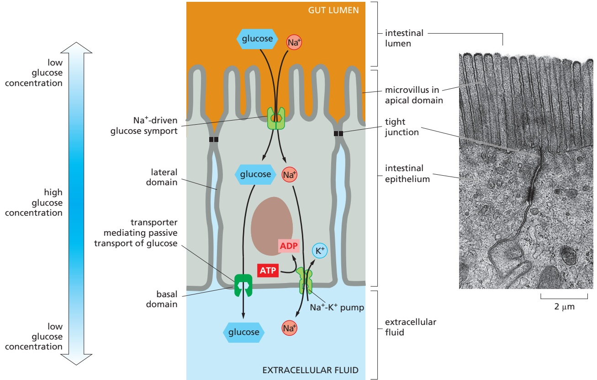

In many of these epithelial cells, the plasma membrane area is greatly increased by the formation of thousands of microvilli, which extend as thin, fingerlike projections from the apical surface of each cell. Such microvilli can increase the total absorptive area of a cell as much as 25-fold, thereby enhancing its transport capabilities.

As we have seen, ion gradients have a crucial role in driving many essential transport processes in cells. Ion pumps that use the energy of ATP hydrolysis establish and maintain these gradients, as we discuss next.

<!-- END EN EN11-H000-H008 -->

### 英文补充：水孔蛋白、离子选择性与通道门控

> 对应中文板块：水孔蛋白、离子选择性与通道门控。英文来源：Molecular Biology of the Cell，第7版，第11章；[本章完整原文](../来源/英文教材/11_Small-Molecule_Transport_and_Electrical_Properties_of_Membranes/chapter.md)。物理PDF页码范围：676–721（整章范围）。

<!-- BEGIN EN EN11-H014-H016 -->
#### CHANNELS AND THE ELECTRICAL PROPERTIES OF MEMBRANES

Unlike transporters, channels form pores across membranes. One class of channel proteins found in virtually all animals forms gap junctions between adjacent cells; each plasma membrane contributes equally to the formation of the channel, which connects the cytoplasm of the two cells. In plants, plasmodesmata fulfill many of the same functions. These channels are discussed in Chapter 19 and will not be considered further here. Both gap junctions and porins, the channels in the outer membranes of bacteria, mitochondria, and chloroplasts (discussed in Chapter 10), have relatively large and permissive pores, and it would be disastrous if they directly connected the inside of a cell to an extracellular space. Indeed, many bacterial toxins do exactly that to kill other cells (discussed in Chapter 24).

In contrast, most channels in the plasma membrane of animal and plant cells that connect the cytosol to the cell exterior necessarily have narrow, highly selective pores that can open and close rapidly. Because these proteins are concerned specifically with inorganic ion transport, they are referred to as **ion channels**. For transport efficiency, ion channels have an advantage over transporters, in that they can pass up to 100 million ions through one open channel each second—a rate $1 0 ^ { 5 }$ times greater than even the fastest transporter. As discussed earlier, however, channels cannot be coupled to an energy source to perform active transport, so the conductance they mediate is always passive (downhill). Thus, the function of ion channels is to allow specific inorganic ions—primarily $\mathrm { N a ^ { + } , K ^ { + } , C a ^ { 2 + } }$ or Cl–—to diffuse rapidly down their electrochemical gradients across the lipid bilayer. In this section, we will see that the ability to control ion fluxes through these channels is essential for many cell functions. Nerve cells (neurons), in particular, have made a specialty of using ion channels, and we will consider how they use many different ion channels to receive, conduct, and transmit signals. Before we discuss ion channels, however, we briefly consider the aquaporin water channels that we mentioned earlier.

#### Aquaporins Are Permeable to Water but Impermeable to Ions

Because cells are mostly water (typically ∼70% by weight), water movement across cell membranes is fundamentally important for life. Cells also contain a high concentration of solutes, including numerous negatively charged organic molecules that are confined inside the cell (the so-called fixed anions) and their accompanying cations that are required for charge balance. This creates an osmotic gradient, which mostly is balanced by an opposite osmotic gradient due to a high concentration of inorganic ions—chiefly Na+ and Cl–—in the extracellular fluid. The small remaining osmotic force tends to “pull” water into the cell, causing it to swell until the forces are balanced. Because all biological membranes are moderately permeable to water (see Figure 11–2), cell volume equilibrates in minutes or less in response to an osmotic gradient. For most animal cells, however, osmosis has only a minor role in regulating cell volume. This is because most of the cytoplasm is in a gel-like state and resists large changes in its volume in response to changes in osmolarity.

In addition to the direct diffusion of water across the lipid bilayer, some prokaryotic and eukaryotic cells have **water channels**, or **aquaporins**, embedded in their plasma membranes to allow water to move more rapidly. Aquaporins are particularly abundant in animal cells that must transport water at high rates, such as the epithelial cells of the kidney or exocrine cells that must transport or secrete large volumes of fluids (**Figure 11–19**). Water flow is highly regulated in these tissues. In the kidney, hormones such as antidiuretic hormone (vasopressin) regulate the concentration of aquaporin in the plasma membrane.

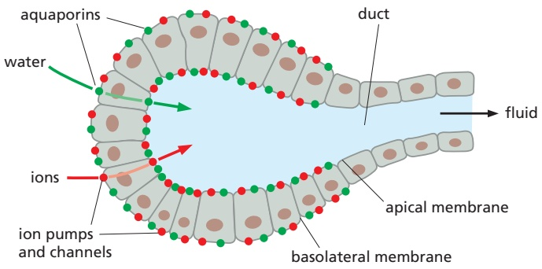

Figure 11–19 The role of aquaporins in fluid secretion. Cells lining the ducts of exocrine glands (as found, for example, in the pancreas and liver, and in mammary, sweat, and salivary glands) secrete large volumes of body fluids. These cells are organized into epithelial sheets in which their apical plasma membrane faces the lumen of the duct. Ion pumps and channels situated in the basolateral and apical plasma membranes move ions (mostly Na+ and Cl–) into the ductal lumen, creating an osmotic gradient between the surrounding tissue and the duct. Water molecules rapidly follow the osmotic gradient through aquaporins that are present in high concentrations in both the apical and basolateral plasma membranes.

(B)

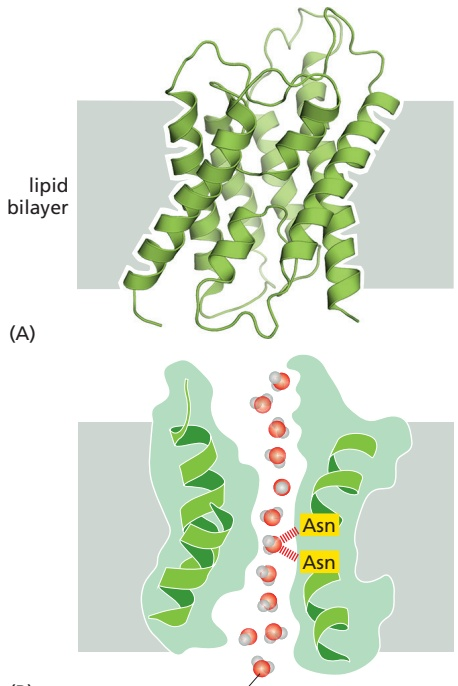

water molecule

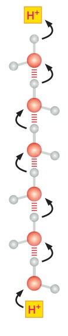

(C)

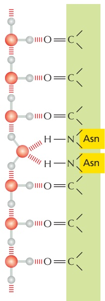

(D)

Aquaporins must solve a problem that is opposite to that facing ion channels. To avoid disrupting ion gradients across membranes, they have to allow the rapid passage of water molecules while completely blocking the passage of ions. The three-dimensional structure of an aquaporin reveals how it achieves this remarkable selectivity. The channels have a narrow pore that allows water molecules to traverse the membrane in single file, following the path of carbonyl oxygens that line one side of the pore (Figure 11–20A and B). Hydrophobic amino acids line the other side of the pore. The pore is too narrow for any hydrated ion to enter, and the energy cost of dehydrating an ion would be enormous because the hydrophobic wall of the pore cannot interact with a dehydrated ion to compensate for the loss of water. This design readily explains why the aquaporins cannot conduct $\mathrm { K } ^ { + }$ , Na+, $\mathrm { C a ^ { 2 + } }$ , or $\mathrm { C l ^ { - } }$ ions. These channels are also impermeable to $\mathrm { H } ^ { + }$ , which is mainly present in cells as $\mathrm { H _ { 3 } O ^ { + } }$ . These hydronium ions diffuse through water extremely rapidly, using a molecular relay mechanism that requires the making and breaking of hydrogen bonds between adjacent water molecules (Figure 11–20C). Aquaporins contain two strategically placed asparagines, which bind to the oxygen atom of the central water molecule in the line of water molecules traversing the pore, imposing a bipolarity on the entire single-file column of water molecules (Figure 11–20C and D). Because both valences of this central oxygen are unavailable for hydrogen-bonding, the central water molecule cannot participate in an $\mathrm { H } ^ { + }$ relay. This makes it impossible for the “making and breaking” sequence of hydrogen bonds (shown in Figure 11–20C) to get past the central asparaginebonded water molecule, and the pore is therefore impermeable to H+.

We now turn to ion channels, the subject of the rest of the chapter.

Figure 11–20 The structure of aquaporins. (A) A ribbon diagram of an aquaporin monomer. In the membrane, aquaporins form tetramers, with each monomer containing an aqueous pore in its center (not shown). Each individual aquaporin channel passes about $1 0 ^ { 9 }$ water molecules per second. (B) A longitudinal cross section through one aquaporin monomer, in the plane of the central pore. One face of the pore is lined with hydrophilic amino acids, which provide transient hydrogen bonds to water molecules; these bonds help line up the transiting water molecules in a single row and orient them as they traverse the pore. (C and D) A model explaining why aquaporins are impermeable to $\mathsf { H } ^ { \check { + } }$ (C) In water, $\mathsf { H } ^ { + }$ diffuses extremely rapidly by being relayed from one water molecule to the next. (D) Carbonyl groups $( C { = } 0 )$ lining the hydrophilic face of the pore align water molecules, and two strategically placed asparagines in the center are thought to tether a central water molecule such that both valences on its oxygen are occupied. This arrangement bipolarizes the entire column of water molecules, with each water molecule acting as a hydrogenbond acceptor from its inner neighbor (Movie 11.6). (PDB code: 3GD8.)

#### Ion Channels Are Ion-selective and Fluctuate Between Open and Closed States

Two important properties distinguish ion channels from aqueous pores. First, they show ion selectivity, permitting some inorganic ions to pass, but not others. This suggests that their pores must be narrow enough in places to force permeating ions into intimate contact with the walls of the channel so that only ions of appropriate size and charge can pass. In some cases permeating ions have to shed most or all of their associated water molecules to pass, whereas in other cases hydrated or partially hydrated ions pass through the channel. Passage occurs in single file, through the narrowest part of the channel, which is called the selectivity filter, and limits the channel’s rate of ion movement and determines which ions can pass through (**Figure 11–21**). Thus, as the ion concentration increases, the flux of the ion through a channel increases proportionally but then levels off (saturates) at a maximum rate.

Figure 11–21 A typical ion channel, which fluctuates between closed and open conformations. The ion channel shown here in cross section forms a pore across the lipid bilayer only in the “open” conformational state. The pore narrows to atomic dimensions in one region (the selectivity filter), where the ion selectivity of the channel is largely determined. Another region of the channel forms the gate.

The second important distinction between ion channels and aqueous pores is that ion channels are not continually open. Instead, they are gated, which allows them to open briefly and then close again. Moreover, with prolonged (chemical or electrical) stimulation, most ion channels go into a closed “desensitized,” or “inactivated,” state, in which they are refractory to further opening until the stimulus has been removed, as we discuss later. In most cases, the gate opens in response to a specific stimulus. As shown in **Figure 11–22**, the main types of stimuli that are known to cause ion channels to open are a change in the voltage across the membrane (voltage-gated channels), a mechanical stress (mechanically gated channels), or the binding of a ligand (ligand-gated channels). The ligand can be either an extracellular mediator—specifically, a neurotransmitter (transmitter-gated channels)—or an intracellular mediator such as an ion (ion-gated channels) or a nucleotide (nucleotidegated channels). In addition, protein phosphorylation and dephosphorylation regulate the activity of many ion channels; this type of channel regulation is discussed, together with nucleotide-gated ion channels, in Chapter 15.

More than 200 types of ion channels have been identified thus far, and new ones are still being discovered, each characterized by the ions it conducts, the mechanism by which it is gated, and its abundance and localization in the cell and in specific cells. Ion channels are responsible for the electrical excitability of muscle cells, and they mediate most forms of electrical signaling in the nervous system. A single neuron typically contains 10 or more kinds of ion channels, located in different domains of its plasma membrane. But ion channels are not restricted to electrically excitable cells. They are present in all animal cells and are found in plant cells and microorganisms: they propagate the leaf-closing response of the mimosa plant, for example (**Movie 11.7**), and allow the single-celled motile Paramecium to reverse direction after a collision.

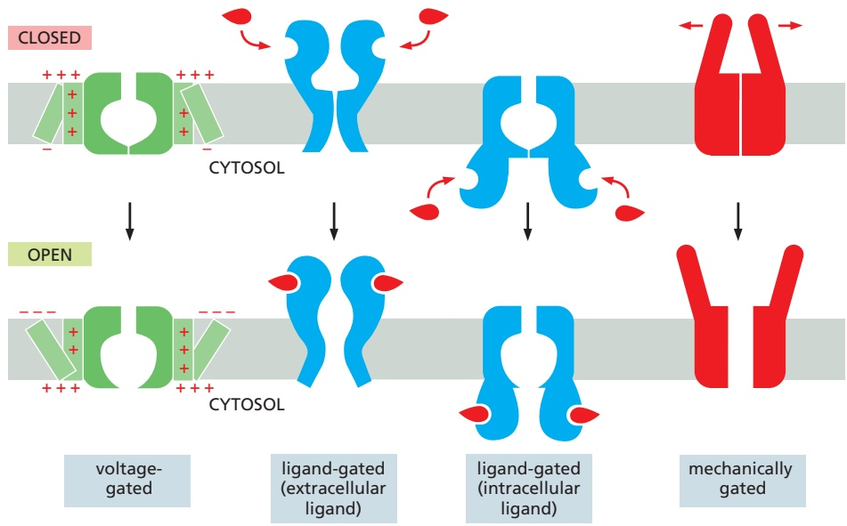

Figure 11–22 The gating of ion channels. This schematic drawing shows several kinds of stimuli that open ion channels. Mechanically gated channels often have cytoplasmic extensions (not shown) that link the channel to the cytoskeleton.

Ion channels that are permeable to $\mathrm { K } ^ { + }$ are found in the plasma membrane of almost all cells. An important subset of $\mathrm { K } ^ { + }$ channels opens even in an unstimulated or “resting” cell, and hence these are called $\mathbf { K } ^ { + }$ **leak channels**. Although this term applies to many different $\mathrm { K } ^ { + }$ channels, depending on the cell type, they serve a common purpose: by making the plasma membrane much more permeable to $\mathrm { K } ^ { + }$ than to other ions, they have a crucial role in maintaining the membrane potential across all plasma membranes, as we discuss next.

<!-- END EN EN11-H014-H016 -->

---

## 第4章 物质的跨膜运输 · 第二节 ATP 驱动泵与主动运输

[返回本章](README.md) · [中文本章原文](中文原文.md)

<!-- BEGIN CN CN04-S02 -->
## 第二节 ATP 驱动泵与主动运输

在三种能量来源形式的主动运输中，最常见的是ATP驱动泵。ATP驱动泵将ATP水解生成ADP和无机磷酸（Pi），并利用释放的能量将小分子物质或离子进行跨膜转运，因此ATP驱动泵通常又被称为转运ATP酶。正常情况下转运ATP酶并不能单独水解ATP，而是将ATP的水解与物质的跨膜转运紧密偶联在一起。根据泵蛋白的结构和功能特性，ATP驱动泵可分为

4 类：P 型泵、V 型质子泵、F 型质子泵和 ABC 超家族。前三种转运离子，后一种主要转运小分子（图 4-8）。

## 一、P型泵

所有 P 型泵 (P-type pump) 都有 2 个独立的 $\alpha$ 催化亚基，具有 ATP 结合位点；绝大多数还具有 2 个起调节作用的小的 $\beta$ 亚基。在转运离子过程中，至少有一个 $\alpha$ 催化亚基发生磷酸化和去磷酸化反应，从而改变转运泵的构象，实现离子的跨膜转运。由于转运泵水解 ATP 使自身形成磷酸化的中间体，因此称作 P 型泵。大多数 P 型泵都是离子泵，负责 $Na^{+}$ 、 $K^{+}$ 、 $H^{+}$ 和 $Ca^{2+}$ 跨膜梯度的形成和维持。

## (一) $Na^{+}-K^{+}$ 泵

## 1. $\mathrm{Na}^{+}-\mathrm{K}^{+}$ 泵结构与转运机制

$\mathrm{Na^{+} - K^{+}}$ 泵（ $\mathrm{Na^{+} - K^{+}}$ pump），又称 $\mathrm{Na^{+} - K^{+}}$ ATP酶，位于动物细胞的质膜上，由2个α和2个β亚基组成四聚体（图4-9A），β亚基是糖基化的多肽，并不直接参与离子跨膜转运，但帮助在内质网新合成的α亚基进行折叠。 $\mathrm{Na^{+} - K^{+}}$ 泵的转运机制总结在图4-9B中：在细胞内侧α亚基与 $\mathrm{Na^{+}}$ 相结合促进ATP水解，α亚基上的一个天冬氨酸残基磷酸化引起α亚基构象发生变化，将 $\mathrm{Na^{+}}$ 泵出细胞，同时细胞外的 $\mathrm{K^{+}}$ 与α亚基的另一位点结合，使其去磷酸化，α亚基构象再度发生变化将 $\mathrm{K^{+}}$ 泵入细胞，完成整个循环。从整个转运过程可以看出，α亚基的磷酸化发生在 $\mathrm{Na^{+}}$ 结合后，而去磷酸化则发生在 $\mathrm{K^{+}}$ 结合后。 $\mathrm{Na^{+}}$ 依赖性的磷酸化和 $\mathrm{K^{+}}$ 依赖性的去磷酸化引起 $\mathrm{Na^{+} - K^{+}}$ 泵构象发生有序变化，每秒钟可发生1000次左右。此外，每个循环消耗一个ATP分子，可以逆着电化学梯度泵出3个 $\mathrm{Na}^{+}$ 和泵入2个 $\mathbf{K}^{+}$ 。这是由ATP直接提供能量的主动转运，而非协同转运，因为 $\mathrm{Na}^{+}$ 和 $\mathbf{K}^{+}$ 都是逆着电化学梯度进行跨膜转运。极少量的乌本苷（ouabain）便可抑制 $\mathrm{Na}^{+}-\mathrm{K}^{+}$ 氵的活性（乌本苷的半数抑制量 $I_{50}$ 为 $1\mu \mathrm{mol} / \mathrm{L})$ ，而 $\mathrm{Mg}^{2 + }$ 和少量的膜脂有助于 $\mathrm{Na}^{+}-\mathrm{K}^{+}$ 水性的提高，生物氧化抑制剂如氟化物使ATP供应中断， $\mathrm{Na}^{+}-\mathrm{K}^{+}$ 泵失去能源以致停止工作。

  
图 4-8 4 种类型的 ATP 驱动泵  
P型泵、V型质子泵和ABC超家族利用ATP水解释放的能量进行物质跨膜运输，而F型质子泵通常情况下是利用质子动力势合成ATP。

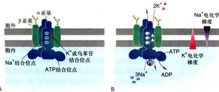

## 2. $\mathrm{Na}^{+}-\mathrm{K}^{+}$ 泵主要生理功能

如表 5-1 所示，动物细胞胞外 Na $^{+}$ 浓度比胞内高，而 K $^{+}$ 离子比胞内低。一般的动物细胞要消耗 1/3 的总 ATP 供 Na $^{+}$ -K $^{+}$ 泵工作以维持细胞内高 K $^{+}$ 低 Na $^{+}$ 的离子环境（神经细胞可消耗高达 2/3 的总 ATP），其生理意义主要体现在以下几方面：

（1）维持细胞膜电位 细胞质膜两侧均具有一定的电位差，称为膜电位（membrane potential）。膜电位是膜两侧的离子浓度不同形成的，细胞在静息状态时膜电位质膜内侧为负，外侧为正。每一个工作循环下来， $\mathrm{Na}^{+}-\mathrm{K}^{+}$ 泵将从细胞泵出3个 $\mathrm{Na}^{+}$ 并泵入2个 $\mathrm{K}^{+}$ ，结果对膜电位的形成起到了一定作用。

(2) 维持动物细胞渗透平衡 动物细胞内含有多种溶质，包括多种阴离子以及阳离子。如果没有 $Na^{+}-K^{+}$ 泵的工作将 $Na^{+}$ 泵出细胞，那么水分子将由于渗透压的缘故顺着自身浓度梯度通过水孔蛋白大量进入细胞引起细胞吸水膨胀。显然， $Na^{+}-K^{+}$ 泵不断地将 $Na^{+}$ 泵到胞外维持了细胞的渗透平衡。胞外除了高浓度的 $Na^{+}$ 外，还有 $Cl^{-}$ （靠膜电位停留在胞外）参与维持动物细胞渗透压平衡。人的红细胞膜上含有丰富的水孔蛋白，如果利用 $Na^{+}-K^{+}$ 泵的抑制剂乌本苷处理，红细胞将因为胞外 $Na^{+}$ 浓度降低而不断吸水膨胀，甚至破裂。

不同类型细胞用不同的机制解决渗透压问题。动物细胞靠 $\mathrm{Na}^{+}-\mathrm{K}^{+}$ 泵工作维持渗透平衡，而植物细胞依靠其坚韧的细胞壁防止膨胀和破裂，能耐受较大的跨膜渗图4-9 $\mathrm{Na^{+} - K^{+}}$ 泵的结构（A）与工作模式（B）示意图

透差异，并具有相应的生理功能，如保持植物茎坚挺，调节气孔的气体交换等；生活在水中的一些原生动物（如草履虫），通过收缩泡收集后排除过量的水。

(3) 吸收营养 动物细胞对葡萄糖或氨基酸等有机物吸收的能量由蕴藏在 $Na^{+}$ 电化学梯度中的势能提供。 $Na^{+}-K^{+}$ 泵工作形成的 $Na^{+}$ 电化学梯度驱动葡萄糖协同转运载体以同向协同转运的方式，将葡萄糖等有机物转运进入小肠上皮细胞，然后再经 Glut2 以协助扩散的方式转运进入血液，完成对葡萄糖的吸收（图 4-10）。

  
图4-10 小肠上皮细胞吸收葡萄糖的示意图

葡萄糖分子通过 $Na^{+}$ 驱动的同向协同运输方式进入上皮细胞，再经载体介导的协助扩散方式进入血液， $Na^{+}-K^{+}$ 泵消耗 ATP 维持 $Na^{+}$ 的电化学梯度。

动物细胞利用膜两侧的 $\mathrm{Na^{+}}$ 电化学梯度以协同转运的方式吸收营养物，而植物细胞、真菌和细菌细胞通常利用质膜上的 $\mathrm{H^{+}}$ -ATP酶形成的 $\mathrm{H^{+}}$ 电化学梯度来吸收营养物，如在某些细菌中，乳糖的吸收伴随着 $\mathrm{H^{+}}$ 从细胞质膜外进入细胞，每转移一个 $\mathrm{H^{+}}$ ，吸收一个乳糖分子。

## （二） $\mathrm{Ca^{2+}}$ 泵及其他P型泵

## 1. $\mathrm{Ca^{2+}}$ 泵的结构与功能

$\mathrm{Ca^{2+}}$ 是细胞内重要的信号物质，细胞质基质中游离的 $\mathrm{Ca^{2+}}$ 浓度始终维持在一个很低水平。细胞质基质中低 $\mathrm{Ca^{2+}}$ 浓度的维持主要得益于质膜或细胞器膜上的钙泵（ $\mathrm{Ca^{2+}}$ pump）将 $\mathrm{Ca^{2+}}$ 泵到细胞外或细胞器内。 $\mathrm{Ca^{2+}}$ 泵，又称 $\mathrm{Ca^{2+}}$ -ATP酶，是另一类P型泵，分布在所有真核细胞的质膜和某些细胞器如内质网、叶绿体和液泡膜上。在肌肉细胞的肌质网膜上， $\mathrm{Ca^{2+}}$ 泵占肌质网膜蛋白 $90\%$ 以上，对细胞引发刺激-反应偶联具有重要作用。对肌质网膜上 $\mathrm{Ca^{2+}}$ 泵三维结构已获得高分辨解析（图4-11）。 $\mathrm{Ca^{2 + }}$ 泵是一个由1000个氨基酸残基组成的跨膜蛋白，与 $\mathrm{Na^{+} - K^{+}}$ 泵的 $\alpha$ 亚基同源，含有10个跨膜 $\alpha$ 螺旋，其中3个螺旋形成了跨越脂双层的中央通道。在 $\mathrm{Ca^{2 + }}$ 泵处于非磷酸化状态时，2个通道螺旋中断形成胞质相结合2个 $\mathrm{Ca^{2 + }}$ 的空穴，ATP在胞质侧与其结合位点结合，伴随ATP水解使相邻结构域天冬氨酸残基磷酸化，从而导致跨膜螺旋的明显重排。跨膜螺旋的重排破坏了 $\mathrm{Ca^{2 + }}$ 结合位点并释放 $\mathrm{Ca^{2 + }}$ 进入膜的另一侧。

$\mathrm{Ca^{2+}}$ 泵工作与ATP的水解相偶联，每消耗1分子ATP从细胞质基质泵出2个 $\mathrm{Ca^{2+}}$ 。 $\mathrm{Ca^{2+}}$ 求要将 $\mathrm{Ca^{2+}}$ 输出细胞或泵入内质网腔中储存起来，以维持细胞质基质中低浓度的游离 $\mathrm{Ca^{2+}}$ 。 $\mathrm{Ca^{2+}}$ 泵将 $\mathrm{Ca^{2+}}$ 泵入肌质网，对调节肌细胞的收缩运动至关重要。在动物细胞质膜上分布的 $\mathrm{Ca^{2+}}$ 泵，其C端是细胞内钙调蛋白（CaM）的结合位点，当胞内 $\mathrm{Ca^{2+}}$ 浓度升高时， $\mathrm{Ca^{2+}}$ 与钙调蛋白结合形成激活的 $\mathrm{Ca^{2+}}$ -CaM复合物并与 $\mathrm{Ca^{2+}}$ 泵结合，进而调节 $\mathrm{Ca^{2+}}$ 泵的活性。内质网型的 $\mathrm{Ca^{2+}}$ 泵没有钙调蛋白的结合域。

  
图4-11 肌质网 $\mathrm{Ca^{2+}}$ 泵转运 $\mathrm{Ca^{2+}}$ 前（A）和后（B）的工作模型N：核苷酸结合部位；P：磷酸化部位；A：活化部位。

## 2. P型H $^{+}$ 泵

P型泵中除了 $\mathrm{Na}^+$ -K $^+$ 泵和 $\mathrm{Ca^{2+}}$ 泵外，还有 $\mathrm{H}^+$ 泵（ $\mathrm{H}^+$ pump）。植物细胞、真菌（包括酵母）和细菌细胞质膜上虽然没有 $\mathrm{Na}^+$ -K $^+$ 泵，但有P型H $^+$ 泵（ $\mathrm{H}^+$ -ATP酶）。P型H $^+$ 泵将 $\mathrm{H}^+$ 泵出细胞，建立和维持跨膜的 $\mathrm{H}^+$ 电化学梯度（作用类似动物细胞 $\mathrm{Na}^+$ 的电化学梯度），并用来驱动转运溶质进入细胞。细菌细胞对糖和氨基酸的摄取，主要是由 $\mathrm{H}^+$ 驱动的同向协同转运完成的。P型H $^+$ 泵的工作也使得细胞周围环境呈酸性。

## 二、V型质子泵和F型质子泵

V 型质子泵（V-type proton pump）广泛存在于动物细胞的内体膜、溶酶体膜，破骨细胞和某些肾小管细胞的质膜，以及植物、酵母和其他真菌细胞的液泡膜上（V 为 vesicle 第一个字母）。F 型质子泵（F-type proton pump）存在于细菌质膜、线粒体内膜和叶绿体类囊体膜上（F 为 factor 的第一个字母）。V 型质子泵和 F 型质子泵彼此相似，但与 P 型泵无关且结构更为复杂。V 型质子泵和 F 型质子泵都含有几种不同的跨膜和胞质侧亚基。两者与 P 型泵不同，在功能上都是只转运质子，并且在转运 H $^{-}$ 过程中不形成磷酸化的中间体。

V型质子泵利用ATP水解供能从细胞质基质中逆 $\mathrm{H^{+}}$ 电化学梯度将 $\mathrm{H^{+}}$ 泵入细胞器，以维持细胞质基质pH中性和细胞器内的pH酸性；而存在于线粒体内膜、植物类囊体膜和细菌质膜上的F型质子泵却以相反的方式发挥其生理作用。它通常利用质子动力势合成ATP，即当 $\mathrm{H^{+}}$ 顺着电化学梯度通过质子泵时，所释放的能量驱动F型质子泵合成ATP，如线粒体的氧化磷酸化和叶绿体的光合磷酸化作用，因此F型质子泵称作 $\mathrm{H^{+}}$ -ATP合酶（又称为 $\mathrm{F}_x\mathrm{F}_y\mathrm{-ATP}$ 合酶）更为贴切。

## 三、ABC 超家族

## （一）ABC 转运蛋白的结构与工作模式

ABC 超家族（ABC superfamily）也是一类 ATP 驱动泵，又叫 ABC（ATP-binding cassette）转运蛋白。该超家族含有几百种不同的转运蛋白，广泛分布于从细菌到人类各种生物中，是最大的一类转运蛋白。每种 ABC 转运蛋白对于底物或底物的基团有特异性。所有 ABC 转运蛋白都共享一种由 4 个“核心”结构域组成的结构模式（图 4-12）：2 个跨膜结构域（T），每个结构域由6个跨膜α螺旋组成，形成底物运输的通路并决定底物的特异性；2个胞质侧ATP结合域（A），具有ATP酶活性，凸向胞质。有些ABC转运蛋白由一条多肽链组成，而有些ABC转运蛋白则由2条或多条装配成相似结构的多肽链构成。ATP分子结合前，ABC转运蛋白的底物结合位点暴露于胞外一侧（原核细胞）或胞质一侧（真核细胞）。一旦ATP分子与ABC转运蛋白结合，将诱导ABC转运蛋白2个ATP结合域二聚化，引起转运蛋白构象改变，使底物结合部位暴露于质膜的另一侧；而ATP水解以及ADP的解离将导致ATP结合域解离，引起转运蛋白构象恢复原有状态。这样，通过ATP分子的结合与水解，ABC转运蛋白就能完成小分子物质的跨膜转运。

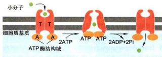

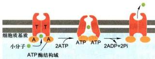  
图4-12 原核细胞（A）和真核细胞（B）ABC超家族结构与工作示意图

细菌除了通过 $H^{+}-ATP$ 酶形成的 $H^{+}$ 电化学梯度来吸收营养物外，其质膜上含有大量依赖水解 ATP 提供能量逆浓度梯度从环境中摄取各种营养物的 ABC 转运蛋白。

## （二）ABC 转运蛋白与疾病

正常生理条件下，ABC 转运蛋白是细菌质膜上糖、氨基酸、磷脂和肽的转运蛋白，是哺乳类细胞质膜上磷脂、亲脂性药物、胆固醇和其他小分子的转运蛋白。ABC 蛋白在肝、小肠和肾等器官分布丰富，它们能将天然毒物和代谢废物排出体外。

由于有些 ABC 转运蛋白能够将抗生素或其他抗癌药物泵出细胞而赋予细胞抗药性，近些年来，ABC转运蛋白在医学领域引起了极大关注。事实上，真核细胞最早被鉴定的ABC转运蛋白就是从肿瘤细胞和抗药性培养细胞中发现的。这类ABC转运蛋白称为多药抗性（multidrug-resistance, MDR）转运蛋白，在多种肿瘤细胞中高表达，能利用水解ATP的能量将脂溶性的抗癌药物从细胞内转运到细胞外，从而降低细胞内药物浓度，导致肿瘤细胞抗药性增强而降低患者化疗效果。此外，引起疟疾的疟原虫对药物氯喹(chloroquine）的抗性也与病原体ABC转运蛋白高表达有关。

一些人类遗传病的发生与ABC转运蛋白功能改变有关，如囊性纤维化（cystic fibrosis）。囊性纤维化是白人中最常见的一种常染色体隐性遗传病，又称黏稠物阻寒症，是由于囊性纤维化跨膜转运调节蛋白（cystic fibrosis transmembrane conductance regulator, CFTR）发生突变。CFTR是一种ABC转运蛋白，常位于肺、汗腺和胰腺等上皮细胞的顶面（又称游离面），调节 $\mathrm{Cl^-}$ 转运。但由于CFTR突变功能异常时， $\mathrm{Cl^-}$ 转运发生问题，导致细胞外缺水而使得肺部黏稠分泌物堵塞支气管。

综上所述，主动运输都需要消耗能量，所需能量可直接来自ATP或来自离子电化学梯度；同样也需要膜上的特异性载体蛋白，这些载体蛋白不仅具有结构上的特异性，还具有结构上的可变性。细胞运用各种不同的方式通过不同的体系在不同的条件下完成小分子物质或离子的跨膜转运。

## 四、离子跨膜转运与膜电位

不同方式的物质跨膜运动，其结果是产生并维持了膜两侧不同物质特定的浓度分布。对某些带有电荷的物质，特别是对离子来说，就形成了膜两侧的电位差。插入细胞微电极便可测出细胞质膜两侧各种带电物质形成的电位差的总和，即膜电位。细胞在静息状态下的膜电位称静息电位（resting potential），在刺激作用下产生行使通讯功能的快速变化的膜电位称动作电位（active potential）。静息电位是细胞质膜内外相对稳定的电位差，质膜内为负值，质膜外为正值，这种现象又称极化（polarization）。在动物不同类型细胞中，静息电位有很大变化，典型的膜电位在-70\~-30 mV之间。

静息电位主要是由质膜上相对稳定的离子跨膜运输或离子流形成的。 $\mathrm{Na}^{+} - \mathrm{K}^{+}$ 泵的工作使细胞内外的 $\mathrm{Na}^{+}$ 和 $\mathrm{K}^{+}$ 浓度远离平衡态分布，胞内高浓度的 $\mathrm{K}^{+}$ 是细胞内有机分子所带负电荷的主要平衡者。处干静息状态的动物细胞，质膜上许多非门控的 $\mathrm{K}^{+}$ 渗漏通道通常是开放的，而其他离子（如 $\mathrm{Na}^{+},\mathrm{Cl}^{-}$ 或 $\mathrm{Ca}^{2 + }$ ）通道却很少开放。所以静息膜允许 $\mathrm{K}^{+}$ 通过开放的渗漏通道顺电化学梯度流向胞外。随着正电荷转移到胞外而留下胞内的非平衡负电荷，结果是膜外正离子过量和膜内负离子过量，从而产生外正内负的静息电位。动物细胞的静息电位值主要反映了跨膜的 $\mathrm{K}^{+}$ 电化学梯度。对植物和真菌细胞，静息电位的维持主要是通过ATP驱动的质子泵将大量 $\mathrm{H}^{+}$ 从细胞内转运到细胞外。

动物细胞质膜对 $K^{+}$ 的通透性大于 $Na^{+}$ 是产生静息电位的主要原因， $Cl^{-}$ 甚至细胞中的蛋白质分子（一般净电荷为负值）对静息电位的大小也有一定的影响。 $Na^{+}-K^{+}$ 泵对维持静息电位的相对恒定起重要的作用。

Na $^{+}$ 和 K $^{+}$ 离子通道都是膜上的电压门控通道，它们的开关变化应答于膜电位的变化，或者说电压门控通道打开的概率由膜电位控制。电压门控通道在神经细胞电信号的转导中具有重要作用，它们也存在于其他细胞，包括肌肉细胞、卵细胞、原生动物，甚至植物细胞。电压门控通道有特殊的带电荷的蛋白质结构域，称为电压感受器（voltage sensor），对膜电位的变化极其敏感，从而控制通道蛋白转换它的“关－开”构象。于是，在含有许多通道蛋白分子的膜片内，可能发现当膜处于某一电位时，平均10%的通道是打开的，而处于另一电位时，90%的通道是打开的。

当细胞接受刺激信号（电信号或化学信号）超过一定阈值时，电压门控 $\mathrm{Na}^+$ 通道将介导细胞产生动作电位。细胞接受阈值刺激， $\mathrm{Na}^+$ 通道打开，引起 $\mathrm{Na}^+$ 通透性大大增加，瞬间大量 $\mathrm{Na}^+$ 流入细胞内，致使静息电位减小乃至消失，此即质膜的去极化（depolarization）过程。当细胞内 $\mathrm{Na}^+$ 进一步增加达到 $\mathrm{Na}^+$ 平衡电位，形成瞬间的内正外负的动作电位，称质膜的反极化，动作电位随即达到最大值。只有达到一定的刺激阈，动作电位才会出现，这是一种全或无的正反馈阈值，在 $\mathrm{Na}^+$ 大量进入细胞时， $\mathrm{K}^+$ 通透性也逐渐增加，随着动作电位出现， $\mathrm{Na}^+$ 通道从失活时关闭，电压门控 $\mathrm{K}^+$ 通道完全打开， $\mathrm{K}^+$ 流出细胞从而使质膜再度极化，以至于超过原来的静息电位，此时称超极化（super polarization）。超极化时膜电位使 $\mathrm{K}^+$ 通道关闭，膜电位又恢复至静息状态（图4-13）。

③反极化期： $Na^{+}$ 通道关闭， $K^{+}$ 通道全面开启， $K^{+}$ 流出细胞。

②去极化期： $Na^{+}$ 通道打开，胞内 $Na^{+}$ 浓度升高，质膜去极化。  

①静息状态： $Na^{+}$ ， $K^{+}$ 电压门控通道关闭。

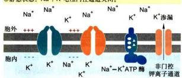

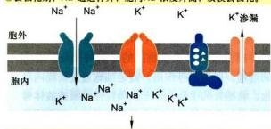

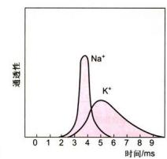

④ 超极化期： $K^{+}$ 不断流出细胞，使细胞膜超极化， $K^{+}$ 通道关闭。  
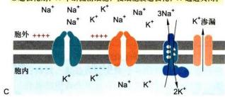  
图4-13 离子流与动作电位的关系示意图  
A. 动作电位的产生和膜电位改变。B. 动作电位产生过程中，膜通透性改变。C. 动作电位产生过程中，离子通道开启与关闭示意图。

膜电位与质膜对 $\mathbf{K}^{+}$ 和 $\mathrm{Na}^{+}$ 不同的通透性有关，而质膜上 $\mathrm{Na}^{+}$ 、 $\mathbf{K}^{+}$ 通道蛋白及 $\mathrm{Na}^{+}-\mathrm{K}^{+}$ 泵等膜蛋白也随膜电位变化有规律地关闭和开启。细胞质膜膜电位具有重要的生物学意义，在神经、肌肉等可兴奋细胞中，是化学信号或电信号引起的兴奋传递的重要方式。

<!-- END CN CN04-S02 -->

---

## 对应英文内容

### 英文补充：ATP驱动泵、P型泵、钠钾泵与ABC转运蛋白

> 对应中文板块：ATP驱动泵、P型泵、钠钾泵与ABC转运蛋白。英文来源：Molecular Biology of the Cell，第7版，第11章；[本章完整原文](../来源/英文教材/11_Small-Molecule_Transport_and_Electrical_Properties_of_Membranes/chapter.md)。物理PDF页码范围：676–721（整章范围）。

<!-- BEGIN EN EN11-H009-H013 -->
#### There Are Three Classes of ATP-driven Pumps

ATP-driven pumps are often called transport ATPases because they hydrolyze ATP to ADP and phosphate and use the energy released to pump ions or other solutes across a membrane. There are three principal classes of ATP-driven pumps (**Figure 11–12**), and representatives of each are found in all prokaryotic and eukaryotic cells.

1. **P-type pumps** are structurally and functionally related multipass transmembrane proteins. They are called “P-type” because they phosphorylate themselves during the pumping cycle. This class includes many of the ion pumps that are responsible for setting up and maintaining gradients of Na+, K+, H+, and $\dot { \mathrm { C a } ^ { 2 + } }$ across cell membranes.

2. **ABC transporters** (ATP-binding cassette transporters) differ structurally from P-type ATPases and primarily pump small organic molecules across cell membranes.

3. **V-type pumps** are turbine-like protein machines constructed from multiple different subunits. The V-type proton pump transfers H+ into organelles, such as lysosomes, synaptic vesicles, and plant or yeast vacuoles $\mathrm { ( V = }$ vacuolar), to acidify the interior of these organelles (see Figures 13–46 and 13–47).

Structurally related to the V-type pumps is a distinct subclass of F-type ATPases, more commonly called ATP synthases because they normally work in reverse: instead of using ATP hydrolysis to drive H+ transport, they use the H+ gradient across the membrane to drive the synthesis of ATP from ADP and phosphate (see Figure 14–31). ATP synthases are found in the plasma membrane of bacteria, the inner membrane of mitochondria, and the thylakoid membrane of chloroplasts. The H+ gradient is generated either during the electron-transport steps of oxidative phosphorylation (in aerobic bacteria and mitochondria), during photosynthesis (in chloroplasts), or by the light-driven H pump (bacteriorhodopsin) in Halobacterium. We discuss some of these proteins in detail in Chapter 14.

For the remainder of this section, we focus on P-type pumps and ABC transporters.

Figure 11–12 Three types of ATP-driven pumps. Like any enzyme, all ATP-driven pumps can work in either direction, depending on the electrochemical gradients of their solutes and the ATP/ADP ratio. When the ATP/ADP ratio is high, they hydrolyze ATP; when the ATP/ADP ratio is low, they can synthesize ATP. The F-type ATPases in mitochondria and chloroplasts normally work in this “reverse” mode to make most of the cell’s ATP.

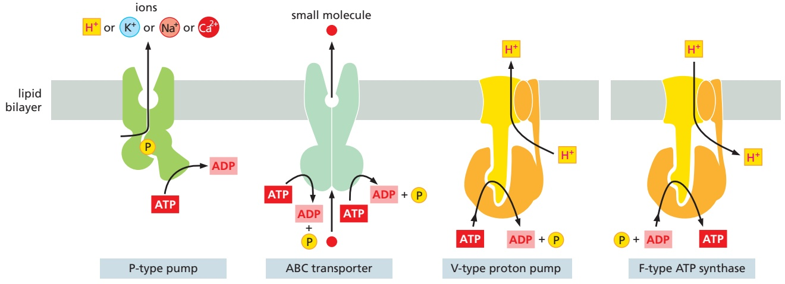

#### A P-type ATPase Pumps $\mathbb { C } \mathbb { a } ^ { 2 + }$ into the Sarcoplasmic Reticulum in Muscle Cells

Eukaryotic cells maintain very low concentrations of free $\mathrm { C a ^ { 2 + } }$ in their cytosol $( \sim 1 0 ^ { - 7 }$ M) in the face of a very much higher extracellular $\mathrm { C a ^ { 2 + } }$ concentration $( { \sim } 1 0 ^ { - 3 } \mathrm { ~ M } )$ . Therefore, even a small influx of $\mathrm { C a ^ { 2 + } }$ significantly increases the concentration of free $\mathrm { C a ^ { 2 + } }$ in the cytosol, and the flow of $\mathrm { C a ^ { 2 + } }$ down its steep concentration gradient in response to extracellular signals is one means of transmitting these signals rapidly across the plasma membrane (discussed in Chapter 15). It is thus important that the cell maintains a steep $\dot { \mathrm { C a } } ^ { 2 + }$ gradient across its plasma membrane. $\mathrm { C a ^ { 2 + } }$ transporters that actively pump $\mathrm { C a } ^ { 2 + }$ out of the cytosol help maintain the gradient. One of these is a P-type $\mathrm { C a ^ { 2 ^ { + } } }$ ATPase; the other is an antiporter (called an $Na^{+}{-}Ca^{2+}$ exchanger) that is driven by the $\mathrm { N a } ^ { + }$ electrochemical gradient (discussed in Chapter 15).

The $\mathbf { C a } ^ { 2 + }$ pump, or $\mathbf { C a } ^ { 2 + }$ ATPase, in the sarcoplasmic reticulum (SR) membrane of skeletal muscle cells is a well-understood P-type transport ATPase. The SR is a specialized type of endoplasmic reticulum that forms a network of tubular sacs in the muscle-cell cytoplasm, and it serves as an intracellular store of $\mathrm { C a ^ { 2 + } }$ When an action potential depolarizes the muscle-cell plasma membrane, $\mathrm { C a ^ { 2 + } }$ is released into the cytosol from the SR through $C a ^ { 2 + }$ -release channels, stimulating the muscle to contract (discussed in Chapters 15 and 16). The $\mathrm { C a ^ { 2 + } }$ pump, which accounts for about 90% of the membrane protein of the SR, moves $\mathrm { C a ^ { 2 + } }$ from the cytosol back into the SR. The endoplasmic reticulum of non-muscle cells also stores $\mathrm { C a ^ { 2 + } }$ using a closely homologous $\mathrm { C a ^ { 2 + } }$ pump and $\mathrm { C a ^ { 2 + } }$ -release channels.

Enzymatic studies and analyses of the three-dimensional structures of transport intermediates of the SR $\dot { \mathrm { C a } ^ { 2 + } }$ pump and related pumps have revealed the molecular mechanism of P-type transport ATPases in great detail. They all have similar structures, containing 10 transmembrane α helices connected to three cytosolic domains (Figure 11–13). In the $\mathrm { C a ^ { 2 + } }$ pump, amino acid side chains protruding from the transmembrane helices form two centrally positioned binding sites for $\mathrm { C a ^ { 2 + } }$ . As shown in Figure 11–14, in the pump’s ATP-bound nonphosphorylated state, these binding sites are accessible only from the cytosolic side of the SR membrane. $\mathrm { C a ^ { 2 + } }$ binding triggers a series of conformational changes that close the passageway to the cytosol and activate a phosphotransfer reaction in which the terminal phosphate of the ATP is transferred to an aspartate that is conserved among all P-type ATPases. The ADP then dissociates and is replaced with a fresh ATP, causing another conformational change that opens a passageway to the SR lumen through which the two $\mathrm { C a ^ { 2 + } }$ ions exit. They are replaced by two $\mathrm { H } ^ { + }$ ions and water molecules that stabilize the empty $\mathrm { C a ^ { 2 + } }$ -binding sites and close the passageway to the SR lumen, switching the pump to the occluded conformation. Hydrolysis of the labile phosphoryl–aspartate bond opens the passageway to the cytosol. H+ is released as the pump opens the passageway to the cytosol, returning it to the initial conformation, and the cycle starts again. The transient self-phosphorylation of the pump during its cycle is an essential characteristic of all P-type pumps.

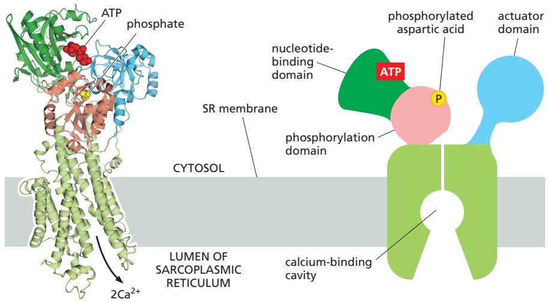

Figure 11–13 The structure of the sarcoplasmic reticulum $\mathbf { C } \mathbf { a } ^ { 2 + }$ pump. The ribbon model (left), derived from x-ray crystallographic analyses, shows the pump in its phosphorylated, ATP-bound state. The three globular cytosolic domains of the pump—the nucleotide-binding domain (dark green), the actuator domain (blue), and the phosphorylation domain (pink), also shown schematically on the right—change conformation dramatically during the pumping cycle. These changes in turn alter the arrangement of the transmembrane helices, which allows the $\mathrm { C a ^ { 2 + } }$ to be released from its binding cavity into the SR lumen (Movie 11.3). (PDB code: 3B9B.)

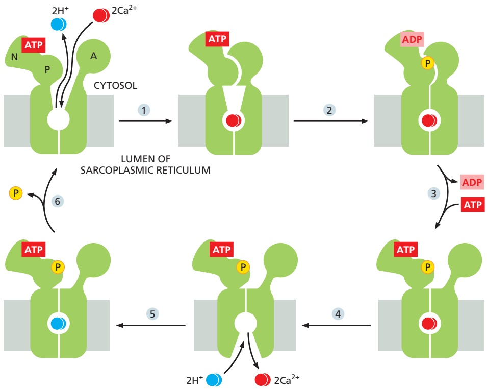

Figure 11–14 The pumping cycle of the sarcoplasmic reticulum $\mathbf { \tilde { C a } } ^ { 2 + }$ pump. Ion pumping proceeds by a series of stepwise conformational changes in which movements of the pump’s three cytosolic domains [the nucleotide-binding domain (N), the phosphorylation domain $( \mathsf { P } ) ,$ and the actuator domain (A)] are mechanically coupled to movements of the transmembrane α helices. Helix movement opens and closes passageways through which $\mathrm { C a ^ { 2 + } }$ enters from the cytosol and binds to the two centrally located $\mathsf { C a } ^ { 2 + } \cdot$ binding sites. The two $\dot { \mathrm { C a } ^ { 2 + } }$ then exit into the SR lumen and are replaced by two H+, which are transported in the opposite direction. The ion-dependent $\dot { ( \mathrm { C a } ^ { 2 + } }$ and H+ in the case of the SR $\mathrm { C a ^ { 2 + } }$ pump) phosphorylation and dephosphorylation of an aspartate are universally conserved steps in the reaction cycle of all P-type pumps: they cause the conformational transitions to occur in an orderly manner, enabling the proteins to do useful work. (Adapted from C. Toyoshima et al., Nature 432:361–368, 2004; and J.V. Møller et al., Q. Rev. Biophys. 43:501–566, 2010.)

#### The Plasma Membrane $N a ^ { + } - K ^ { + }$ Pump Establishes $\mathbb { N } \mathbb { a } ^ { + }$ and $\mathsf { K } ^ { + }$ Gradients Across the Plasma Membrane

The concentration of $\mathrm { K } ^ { + }$ is typically 10–30 times higher inside cells than outside, whereas the reverse is true of $\mathrm { N a } ^ { + }$ (see Table 11–1, p. 638). An $\mathbf { N a } ^ { + } \mathbf { \cdot } \mathbf { K } ^ { + }$ **pump**, or $\mathbf { N a ^ { + } \mathbf { \cdot } K ^ { + } }$ **ATPase**, found in the plasma membrane of virtually all animal cells, maintains these concentration differences. Like the $\mathrm { C a ^ { 2 + } }$ pump, the $\mathrm { N a ^ { + } \mathrm { - K ^ { + } } }$ pump belongs to the family of P-type ATPases and operates as an ATP-driven antiporter, actively pumping $\mathrm { N a } ^ { + }$ out of the cell against its steep electrochemical gradient and pumping $\mathrm { K } ^ { + }$ in (**Figure 11–15**).

We mentioned earlier that the $\mathrm { { N a } ^ { + } }$ gradient produced by the $\mathrm { N a ^ { + } \mathrm { - K ^ { + } } }$ pump drives the transport of most nutrients into animal cells and also has a crucial role in regulating cytosolic pH. A typical animal cell devotes almost one-third of its energy to fueling this pump, and the pump consumes even more energy in nerve

Figure 11–15 The function of the $\mathsf { N a ^ { + } \cdot K ^ { + } }$ pump. This P-type ATPase actively pumps Na+ out of and $\dot { \mathsf { K } } ^ { + }$ into a cell against their electrochemical gradients. It is structurally closely related to the $\mathrm { C a ^ { 2 + } }$ ATPase but differs in its selectivity for ions: for every molecule of $\mathbb { A P }$ hydrolyzed by the pump, three $\mathrm { N a } ^ { + }$ are pumped out and two K+ are pumped in. As in the $\mathrm { C a ^ { 2 + } }$ pump, an aspartate is phosphorylated and dephosphorylated during the pumping cycle (Movie 11.4).

cells and in cells that are dedicated to transport processes, such as those forming kidney tubules.

Because the $\mathrm { N a ^ { + } \mathrm { - K ^ { + } } }$ pump drives three positively charged ions out of the cell for every two it pumps in, it is electrogenic: it drives a net electric current across the membrane, tending to create an electrical potential, with the cell’s inside being negative relative to the outside. This electrogenic effect of the pump, however, seldom directly contributes more than 10% to the membrane potential. The remaining 90%, as we discuss later, depends only indirectly on the $\dot { \mathrm { N a } } ^ { + } \mathrm { { \cdot } K ^ { + } }$ pump.

#### ABC Transporters Constitute the Largest Family of Membrane Transport Proteins

The last type of transport ATPase that we discuss here is the family of ABC transporters, so named because each member contains two highly conserved ATPase domains, or ATP-binding “cassettes,” on the cytosolic side of the membrane. ATP binding brings together the two ATPase domains, and ATP hydrolysis leads to their dissociation (**Figure 11–16**). These movements of the cytosolic domains are transmitted to the transmembrane segments, driving cycles of conformational changes that alternately expose solute-binding sites on one side of the membrane and then on the other side, as we have seen for other transporters. In this way, ABC transporters harvest the energy released upon ATP binding and hydrolysis to drive transport of solutes across the bilayer. The transport is directional toward the inside or toward the outside, depending on the particular conformational change in the solute-binding site that is linked to ATP hydrolysis (see Figure 11–16).

ABC transporters constitute the largest family of membrane transport proteins and are of great clinical importance. The first of these proteins to be characterized was found in bacteria. We have already mentioned that the plasma membranes of all bacteria contain transporters that use the H gradient across the membrane to actively transport a variety of nutrients into the cell. In addition, bacteria use ABC transporters to import certain small molecules. In Gram-negative bacteria, such as Escherichia coli, that have double membranes (**Figure 11–17**), the ABC transporters are located in the inner membrane, and auxiliary proteins in the periplasm typically capture the nutrients and deliver them to the transporters (**Figure 11–18**).

Figure 11–16 Small-molecule transport by typical ABC transporters. ABC transporters consist of multiple domains. Typically, two hydrophobic domains, each built of six membrane-spanning α helices, together form the translocation pathway and provide substrate specificity. Two ATPase domains protrude into the cytosol. In some cases, the two halves of the transporter are formed by a single polypeptide, whereas in other cases they are formed by two or more separate polypeptides that assemble into a similar structure. Without ATP bound, the transporter exposes a substrate-binding site on one side of the membrane. ATP binding induces a conformational change that exposes the substrate-binding site on the opposite side; ATP hydrolysis followed by ADP dissociation returns the transporter to its original conformation. Most individual ABC transporters are unidirectional. (A) Both importing and exporting ABC transporters are found in bacteria; an ABC importer is shown in this diagram. (B) In eukaryotes, most ABC transporters export substances—either from the cytosol to the extracellular space or from the cytosol to a membrane-bound intracellular compartment such as the endoplasmic reticulum—or from the mitochondrial matrix to the intermembrane space.

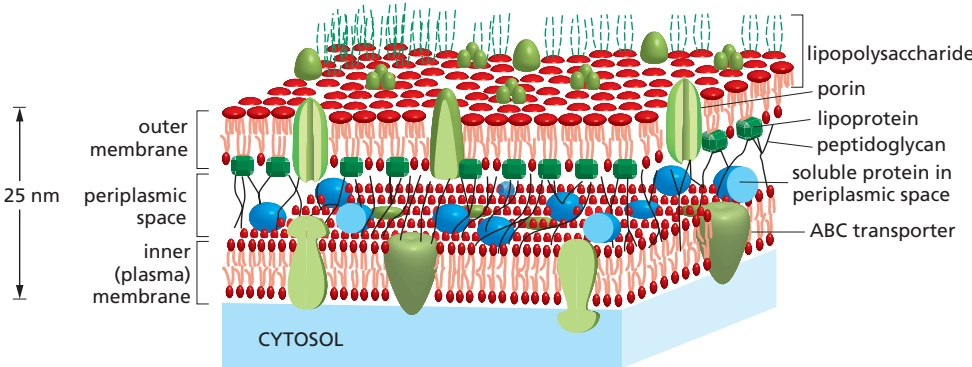

In E. coli, 78 genes (an amazing 5% of the bacterium’s genes) encode ABC transporters, and animal genomes encode an even larger number. Although each. / . transporter is thought to be specific for a particular molecule or class of molecules, the variety of substrates transported by this superfamily is great and includes inorganic ions, amino acids, monosaccharides and polysaccharides, peptides, lipids, drugs, and, in some cases, even proteins that can be larger than the transporter itself.

The first eukaryotic ABC transporters identified were discovered because they pump hydrophobic drugs out of the cytosol. One of these transporters is the **multidrug resistance (MDR) protein**, also called P-glycoprotein. It is present at elevated levels in many human cancer cells and makes the cells simultaneously resistant to a variety of chemically unrelated cytotoxic drugs that are widely used in cancer chemotherapy. Treatment with any one of these drugs can result in the selective survival and overgrowth of those cancer cells that express an especially large amount of the MDR transporter. These cells pump drugs out of the cell very efficiently and are therefore relatively resistant to the drugs’ toxic effects (**Movie 11.5**). Selection for cancer cells with resistance to one drug can thereby lead to resistance to a wide variety of anticancer drugs. Some studies indicate that up to 40% of human cancers develop multidrug resistance, making it a major hurdle in the battle against cancer.

Figure 11–17 A small section of the double membrane of an E. coli bacterium. The inner membrane is the cell’s plasma membrane. Between the inner and outer membranes is a highly porous, rigid peptidoglycan layer, composed of protein and polysaccharide that constitute the bacterial cell wall. It is attached to lipoprotein molecules in the outer membrane and fills the periplasmic space (only a little of the peptidoglycan layer is shown). This space also contains a variety of soluble protein molecules. The dashed threads (shown in green) at the top represent the polysaccharide chains of the special lipopolysaccharide molecules that form the external monolayer of the outer membrane; for clarity, only a few of these chains are shown. Bacteria with double membranes are called Gram negative because they do not retain the dark blue dye used in Gram staining. Bacteria with single membranes (but thicker peptidoglycan cell walls), such as staphylococci and streptococci, retain the dark blue dye and are therefore called Gram positive; their single membrane is analogous to the inner (plasma) membrane of Gram-negative bacteria.

Figure 11–18 The auxiliary transport system associated with transport ATPases in bacteria with double membranes. The solute diffuses through channel proteins (porins) in the outer membrane and binds to a periplasmic substrate-binding protein that delivers it to the ABC transporter, which pumps it across the plasma membrane. The peptidoglycan layer is omitted for simplicity; its porous structure allows the substrate-binding proteins and water-soluble solutes to move freely through it by diffusion.

A related and equally sinister phenomenon occurs in the protist Plasmodium falciparum, which causes malaria. More than 200 million people are infected worldwide with this parasite, which remains a major cause of human death, killing almost a million people every year. The development of resistance to the antimalarial drug chloroquine has hampered the control of malaria. The resistant P. falciparum have amplified a gene encoding an ABC transporter that pumps out the chloroquine.

In most vertebrate cells, an ABC transporter in the endoplasmic reticulum (ER) membrane (named transporter associated with antigen processing, or TAP transporter) actively pumps a wide variety of peptides from the cytosol into the ER lumen. These peptides are produced by protein degradation in proteasomes (discussed in Chapter 6). They are carried from the ER to the cell surface, where they are displayed for scrutiny by cytotoxic T lymphocytes, which kill the cell if the peptides are derived from a virus or other microorganism lurking in the cytosol of an infected cell (discussed in Chapter 24).

Yet another member of the ABC transporter family is the cystic fibrosis transmembrane conductance regulator (CFTR) protein, which was discovered through studies of the common genetic disease cystic fibrosis. This disease is caused by a mutation in the gene encoding CFTR, a Cl– transport protein in the plasma membrane of epithelial cells. CFTR regulates ion concentrations in the extracellular fluid, especially in the lung. One in 27 Caucasians carries a gene encoding a mutant form of this protein; in 1 in 2900, both copies of the gene are mutated, causing the disease. In contrast to other ABC transporters, ATP binding and hydrolysis in the CFTR protein do not drive the transport process. Instead, they control the opening and closing of a continuous channel, which provides a passive conduit for Cl– to move down its electrochemical gradient. Thus, some ABC proteins can function as transporters and others as gated channels. Even though we treat transporters and channels as distinct in this chapter, the border is not absolute as this example illustrates. Indeed, the structure of some other Cl– channels reveals that they also resemble transporters more than they resemble most other ion channels.

#### Summary

Transporters bind specific solutes and transfer them across the lipid bilayer by undergoing conformational changes that alternately expose the solute-binding site on one side of the membrane and then on the other side. Some transporters move a single solute “downhill,” whereas others can act as pumps to move a solute “uphill” against its electrochemical gradient, by using energy provided by ATP hydrolysis, by a downhill flow of another solute (such as Na1 or H1), or by light to drive the requisite series of conformational changes in an orderly manner. Transporters belong to a small number of protein families. Each family evolved from a common ancestral protein, and its members all operate by a similar mechanism. The family of P-type transport ATPases, which includes Ca21 and Na1-K1 pumps, is an important example; each of these ATPases sequentially phosphorylates and dephosphorylates itself during the pumping cycle. The superfamily of ABC transporters is the largest family of membrane transport proteins and is especially important clinically. It includes proteins that are responsible for drug resistance in both cancer cells and cells infected with malaria-causing parasites and for pumping pathogen-derived peptides into the ER for cytotoxic lymphocytes to reorganize on the surface of infected cells, and mutations in an ABC transporter cause cystic fibrosis.

<!-- END EN EN11-H009-H013 -->

### 英文补充：膜电位、Nernst方程、动作电位与离子通道

> 对应中文板块：膜电位、Nernst方程、动作电位与离子通道。英文来源：Molecular Biology of the Cell，第7版，第11章；[本章完整原文](../来源/英文教材/11_Small-Molecule_Transport_and_Electrical_Properties_of_Membranes/chapter.md)。物理PDF页码范围：676–721（整章范围）。

<!-- BEGIN EN EN11-H017-H039 -->
#### The Membrane Potential in Animal Cells Depends Mainly on $\mathsf { K } ^ { + }$ Leak Channels and the $\mathsf { K } ^ { + }$ Gradient Across the Plasma Membrane

A **membrane potential** arises when there is a difference in the electrical charge on the two sides of a membrane because of a minute excess of positive ions over negative ones on one side and a minute deficit on the other side. Such charge differences can result both from active electrogenic pumping (see p. 648) and from passive ion diffusion in channels. As we discuss in Chapter 14, electrogenic $\mathrm { H } ^ { + }$ pumps in the mitochondrial inner membrane generate most of the membrane potential across this membrane. Electrogenic pumps also generate most of the electrical potential across the plasma membrane of plants and fungi. In typical animal cells, however, passive ion movements make the largest contribution to the electrical potential across the plasma membrane.

As explained earlier, because of the action of the $\mathrm { { N a } ^ { + } \mathrm { { \cdot } K ^ { + } } }$ pump, there is little $\mathrm { { N a } ^ { + } }$ inside the cell, and other intracellular inorganic cations have to be plentiful enough to balance the charge carried by the cell’s fixed anions—the negatively charged organic molecules that are confined inside the cell. This balancing role is performed largely by $\mathrm { K } ^ { + }$ , which is actively pumped into the cell by the $\widetilde { \mathrm { N a } ^ { + } } \mathrm { - K ^ { + } }$ pump and can also move in or out through the $\bar { K } ^ { + }$ leak channels in the plasma membrane. Because of the presence of these channels, $\mathrm { K } ^ { + }$ comes almost to equilibrium, where an electrical force exerted by an excess of negative charges attracting $\mathrm { K } ^ { + }$ into the cell balances the tendency of $\mathrm { K } ^ { + }$ to leak out down its concentration gradient. The membrane potential (of the plasma membrane) is the manifestation of this electrical force, and we can calculate its equilibrium value from the steepness of the $\mathrm { K } ^ { + }$ concentration gradient. The following argument may help to make this clear.

Suppose that initially there is no voltage gradient across the plasma membrane (the membrane potential is zero), but the concentration of $\mathrm { ^ { \circ } K ^ { + } }$ is high inside the cell and low outside. $\mathrm { K } ^ { + }$ will tend to leave the cell through the $\mathrm { K } ^ { + }$ leak channels, driven solely by its concentration gradient. As $\mathrm { K } ^ { + }$ begins to move out, each ion leaves behind an unbalanced negative charge, thereby creating an electrical field, or membrane potential, which will tend to oppose the further efflux of $\mathrm { K } ^ { + }$ The net efflux of $\mathrm { K } ^ { + }$ halts when the membrane potential reaches a value at which this electrical driving force on $\mathrm { K } ^ { + }$ exactly balances the effect of its concentration gradient; that is, when the electrochemical gradient for $\mathrm { K } ^ { + }$ is zero.

The equilibrium condition, in which there is no net flow of ions across the plasma membrane, defines the **resting membrane potential** for this idealized cell. A simple but very important formula, the **Nernst equation**, quantifies the equilibrium condition and, as explained in **Panel 11–1** (p. 656), makes it possible to calculate the theoretical resting membrane potential if we know the ratio of internal and external ion concentrations. As the plasma membrane of a real cell is not exclusively permeable to $\mathrm { K } ^ { + }$ , however, the actual resting membrane potential is usually not exactly equal to that predicted by the Nernst equation for $\mathrm { K } ^ { + }$

#### The Resting Potential Decays Only Slowly When the $N a ^ { + } - K ^ { + }$ Pump Is Stopped

Movement of only a minute number of inorganic ions across the plasma membrane through ion channels suffices to set up the membrane potential. Thus, we can think of the membrane potential as arising from movements of charge that

#### THE NERNST EQUATION AND ION FLOW

The flow of any inorganic ion through a membrane channel is driven by the electrochemical gradient for that ion. This gradient represents the combination of two influences: the voltage gradient and the concentration gradient of the ion across the membrane. When these two influences just balance each other, the electrochemical gradient for the ion is zero, and there is no net flow of the ion through the channel. The voltage gradient (membrane potential) at which this equilibrium is reached is called the equilibrium potential for the ion. It can be calculated from an equation that will be derived below, called the Nernst equation.

The Nernst equation is

$$
V = \frac {R T}{z F} \ln \frac {C _ {\mathrm{o}}}{C _ {\mathrm{i}}}
$$

where

$V   =$ the equilibrium potential in volts (internal potential minus external potential)

$C _ { \mathrm { o } }$ and Ci = outside and inside concentrations of the ion, respectively

$$
R = \text {the gas constant (8.3 J mol} ^{-1}\mathrm{K}^{-1})
$$

$$
T = \text {the absolute temperature (K)}
$$

$$
F = \text { Faraday's   constant } (9. 6 \times 10^4 \text { J } \text { V } ^{-1} \text { mol } ^{-1})
$$

z = the valence (charge) of the ion

In = logarithm to the base e

#### The Nernst equation is derived as follows:

A molecule in solution (a solute) tends to move from a region of high concentration to a region of low concentration simply due to the random movement of molecules, which results in their equilibrium. Consequently, movement down a concentration gradient is accompanied by a favorable free-energy change $( \Delta G < 0 ) ,$ , whereas movement up a concentration gradient is accompanied by an unfavorable free-energy change $\left( \Delta G > 0 \right)$ . (Free energy is introduced in Chapter 2 and discussed in the context of redox reactions in Panel 14–1, p. 825.)

The free-energy change per mole of solute moved across the plasma membrane $( \Delta \mathsf { G } _ { \mathsf { c o n c } } )$ is equal $\mathsf { t o - } R T \mathsf { I n } ( C _ { 0 } / C _ { \mathsf { i } } )$

If the solute is an ion, moving it into a cell across a membrane whose inside is at a voltage V relative to the outside will cause an additional free-energy change (per mole of solute moved) of $\Delta G _ { \mathrm { v o l t } } = z F V .$

At the point where the concentration and voltage gradients just balance,

$$
\Delta G _ {\text {conc}} + \Delta G _ {\text {volt}} = 0
$$

and the ion distribution is at equilibrium across the membrane.

Thus,

$$
z F V - R T \ln \frac {C _ {\mathrm{o}}}{C _ {\mathrm{i}}} = 0
$$

and, therefore,

$$
V = \frac {R T}{z F} \ln \frac {C _ {\mathrm{o}}}{C _ {\mathrm{i}}}
$$

or, using the constant that converts natural logarithms to base 10,

$$
V = 2. 3 \frac {R T}{z F} \log_ {1 0} \frac {C _ {\mathrm{o}}}{C _ {\mathrm{i}}}
$$

For a univalent cation,

$$
2. 3 \frac {R T}{F} = 5 8 \mathrm{mVat} 2 0 ^ {\circ} \mathrm{C} \quad \text {and} \quad 6 1. 5 \mathrm{mVat} 3 7 ^ {\circ} \mathrm{C}
$$

Thus, for such an ion at $3 7 ^ { \circ } \mathsf { C } ,$

$$
V = + 6 1. 5 \mathrm{mV} \text { when } C _ {\mathrm{o}} / C _ {\mathrm{i}} = 1 0
$$

whereas

$$
V = 0 \text {when} C _ {\mathrm{o}} / C _ {\mathrm{i}} = 1
$$

The $\mathsf { K } ^ { + }$ equilibrium potential $( V _ { \mathsf { K } } ) ,$ for example, is

$$
61.5\log_{10}([K^{+}]_{o} / [K^{+}]_{i})\text{millivolts}
$$

(–89 mV for a typical cell, where $\left[ \mathsf { K } ^ { + } \right] _ { 0 } = 5$ mM and $\left[ \mathsf { K } ^ { + } \right] _ { \mathsf { i } } =$ 140 mM).

At $V _ { \mathsf { K } } ,$ there is no net flow of $\mathsf { K } ^ { + }$ across the membrane.

Similarly, when the membrane potential has a value of

$$
6 1. 5 \log_ {1 0} ([ \mathrm{Na} ^ {+} ] _ {o} / [ \mathrm{Na} ^ {+} ] _ {i})
$$

which is the Na+ equilibrium potential $( V _ { \mathsf { N a } } ) ,$ there is no net flow of $\mathsf { N a ^ { + } }$

For any particular membrane potential, $V _ { M } ,$ the net force tending to drive a particular type of ion out of the cell is proportional to the difference between $V _ { M }$ and the equilibrium potential for the ion; hence,

$$
\begin{array}{c} \text {for K^{+} it is V_{M} - V_{K}} \\ \text {and for Na^{+} it is V_{M} - V_{Na}} \end{array}
$$

When there is a voltage gradient across the membrane, the ions responsible for it—the excess positive ions on one side and the excess negative ions on the other— are concentrated in thin layers on either side of the membrane because of the attraction between positive and negative electric charges. The number of ions that go to form the layer of charge adjacent to the membrane is minute compared with the total number inside the cell. For example, the movement of 6000 Na+ ions across 1 $\mu \mathsf { m } ^ { 2 }$ of membrane will carry sufficient charge to shift the membrane potential by about 100 mV.

Because there are about $6 \times 1 0 ^ { 6 }   \mathsf { N a ^ { + } }$ ions in $1 ~ \mu \mathsf { m } ^ { 3 }$ of bulk cytoplasm, such a movement of charge will generally have a negligible effect on the ion concentration gradients across the membrane.

exact balance of charges on each side of the membrane; membrane potential = 0

a few of the positive ions (red) cross the membrane from right to left, leaving their negative counterions (red) behind; this sets up a nonzero membrane potential

leave ion concentrations practically unaffected and result in only a very slight discrepancy in the number of positive and negative ions on the two sides of the membrane (**Figure 11–23**). Moreover, these movements of charge are generally rapid, taking only a few milliseconds or less.

Consider the change in the membrane potential in a real cell after the sudden inactivation of the $\widetilde { \mathrm { N a ^ { + } } } \mathrm { - K ^ { + } }$ pump. A slight drop in the membrane potential mayMBoC7 m11.23/11.23 occur immediately. This is because the pump is electrogenic and, when active, makes a small direct contribution to the membrane potential by pumping out three $\mathrm { { N a } ^ { + } }$ for every two $\mathrm { K } ^ { + }$ that it pumps in (see Figure 11–15). However, switching off the pump does not abolish the major component of the resting potential, which is generated by the $\mathrm { K } ^ { + }$ equilibrium mechanism just described. This component of the membrane potential persists as long as the $\mathrm { { N a } ^ { + } }$ concentration inside the cell stays low and the $\mathrm { K } ^ { + }$ ion concentration high—typically for many minutes. But the plasma membrane is somewhat permeable to all small ions, including $\mathrm { { N a } ^ { + } }$ . Therefore, without the $\mathrm { N a ^ { + } \mathrm { - K ^ { + } } }$ pump, the ion gradients set up by the pump will eventually run down, and the membrane potential established by diffusion through the $\dot { \mathrm { K } } ^ { + }$ leak channels will fall as well. As $\mathrm { N a } ^ { + }$ enters, the cell eventually comes to a new resting state where $\mathrm { N a ^ { + } , K ^ { + } }$ , and Cl– are all at equilibrium across the membrane. The membrane potential in this state is much less than it was in the normal cell with an active $\mathrm { { N } \dot { \dot { a } ^ { + } } \mathrm { { - } K ^ { + } } }$ pump.

The resting potential of an animal cell varies between –20 mV and –120 mV, depending on the organism and cell type. Although the $\mathrm { K } ^ { + }$ gradient always has a major influence on this potential, the gradients of other ions (and the disequilibrating effects of ion pumps) also have a significant effect: the more permeable the membrane for a given ion, the more strongly the membrane potential tends to be driven toward the equilibrium value for that ion. Consequently, changes in a membrane’s relative permeability to different ions can cause significant changes in the membrane potential. This is one of the key principles relating the electrical excitability of cells to the activities of ion channels.

To understand how ion channels select their ions and how they open and close, we need to know their three-dimensional molecular structure. The first ion channel to be crystallized and studied by x-ray diffraction was a bacterial $\mathrm { K } ^ { + }$ channel. The details of its structure revolutionized our understanding of ion channels.

#### The Three-dimensional Structure of a Bacterial $\mathsf { K } ^ { + }$ Channel Shows How an Ion Channel Can Work

Scientists were puzzled by the remarkable ability of ion channels to combine exquisite ion selectivity with a high conductance. $\mathrm { K } ^ { + }$ leak channels, for example, conduct $\mathrm { K } ^ { + }$ 10,000-fold faster than $\mathrm { { N a } ^ { + } }$ , yet the two ions are both featureless spheres and have similar radii (0.133 nm and 0.095 nm, respectively). A single amino acid substitution in the pore of an animal cell $\mathrm { K } ^ { + }$ channel can result in a loss

Figure 11–23 The ionic basis of a membrane potential. A small flow of inorganic ions through an ion channel carries sufficient charge to cause a large change in the membrane potential. The ions that give rise to the membrane potential lie in a thin (<1 nm) surface layer close to the membrane, held there by their electrical attraction to their oppositely charged counterparts (counterions) on the other side of the membrane. For a typical cell, 1 microcoulomb of charge $\stackrel { \leftrightarrow } { ( 6 \times 1 0 ^ { 1 2 } }$ monovalent ions) per square centimeter of membrane, transferred from one side of the membrane to the other side, changes the membrane potential by roughly 1 V. This means, for example, that in a spherical cell of diameter 10 μm, the number of $\mathsf { K } ^ { + }$ ions that have to flow out to alter the membrane potential by 100 mV is only about 1/100,000 of the total number of $\mathsf { K } ^ { + }$ ions in the cytosol. This amount is so minute that the intracellular $\mathsf { K } ^ { + }$ concentration remains virtually unchanged.

(B)

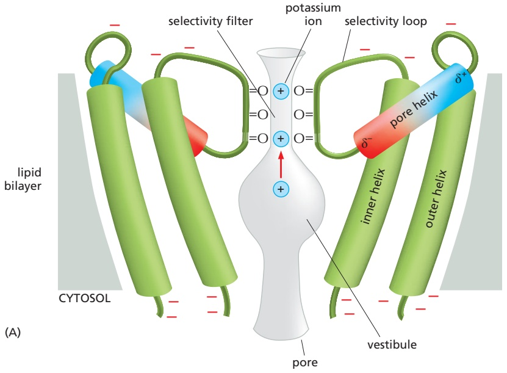

Figure 11–24 The structure of a bacterial ${ \sf K } ^ { + }$ channel. $( \mathsf { A } )$ The transmembrane α helices from only two of the four identical subunits are shown. From the cytosolic side, the pore (schematically shaded in blue) opens up into a vestibule in the middle of the membrane. The pore vestibule facilitates transport by allowing the $\mathsf { K } ^ { + }$ ions to remain hydrated even though they are more than halfway across the membrane. The narrow selectivity filter of the pore links the vestibule to the outside of the cell. Carbonyl oxygens line the walls of the selectivity filter and form transient binding sites for partially dehydrated $\mathsf { K } ^ { + }$ ions. Two $\mathsf { K } ^ { + }$ ions occupy different sites in the selectivity filter, while a third $\mathsf { K } ^ { + }$ ion is located in the center of the vestibule, where it is stabilized by electrical interactions including those contributed by the more negatively charged ends of the pore helices. The. / . ends of the four short “pore helices” (only two of which are shown) point precisely toward the center of the vestibule, thereby guiding $\mathsf { K } ^ { + }$ ions into the selectivity filter (Movie 11.8). (B) Peptide bonds have an electric dipole, with more negative charge accumulated at the oxygen of the $C { = } 0$ bond and at the nitrogen of the N¬H bond. In an α helix, hydrogen bonds (red) align the dipoles. As a consequence, every α helix has an electric dipole along its axis, resulting from summation of the dipoles of the individual peptide bonds, with a more negatively charged C-terminal end (δ–) and a more positively charged N-terminal end (δ+). (A, adapted from D.A. Doyle et al., Science 280:69–77, 1998.)

of ion selectivity and cell death. We cannot explain the normal $\mathrm { K } ^ { + }$ selectivity by pore size alone, because $\mathrm { N a } ^ { + }$ is smaller than $\mathrm { K } ^ { + }$ . Moreover, its high conductance rate is incompatible with the channel having selective, high-affinity $\mathrm { K } ^ { + }$ -binding sites, as the binding of $\mathrm { K } ^ { + }$ ions to such sites would greatly slow their passage.

The puzzle was solved when the structure of a bacterial $K ^ { + }$ channel was determined by x-ray crystallography. The channel is made from four identical transmembrane subunits, which together form a central pore through the membrane. Each subunit contributes two transmembrane α helices, which are tilted outward in the membrane and together form a cone, with its wide end facing the outside of the cell where $\mathrm { K } ^ { + }$ ions exit from the channel (**Figure 11–24**). The polypeptide chain that connects the two transmembrane helices forms a short α helix (the pore helix) and a crucial loop that protrudes into the wide section of the cone to form the **selectivity filter**. The selectivity loops from the four subunits form a short, rigid, narrow pore, which is lined by the carbonyl oxygen atoms of their polypeptide backbones. Because the selectivity loops of all known $\mathrm { K } ^ { + }$ channels have similar amino acid sequences, it is likely that they form a closely similar structure.

The structure of the selectivity filter explains the ion selectivity of the channel. $\mathrm { A   K ^ { + } }$ ion must lose almost all of its bound water molecules to enter the filter, where it interacts instead with the carbonyl oxygens lining the filter; the oxygens are rigidly spaced at the exact distance to accommodate a $\mathrm { K } ^ { + }$ ion. An $\mathrm { { N a } ^ { + } }$ ion, in contrast, cannot enter the filter because the carbonyl oxygens are too far away from the smaller $\mathrm { N a } ^ { + }$ ion to compensate for the high energy expense associated with the loss of water molecules required for entry (**Figure 11–25**).

Structural studies of $\mathrm { K } ^ { + }$ channels and other ion channels have also indicated some general principles of how these channels open and close. The gating involves movement of the helices in the membrane so that they either obstruct or open the path for ion movement. Depending on the particular type of channel, helices tilt, rotate, or bend during gating. The structure of a closed $\mathrm { K } ^ { + }$ channel shows that by tilting the inner helices, the pore constricts like a diaphragm at its cytosolic end (**Figure 11–26**). Bulky hydrophobic amino acid side chains block the small opening that remains, preventing the entry of ions.

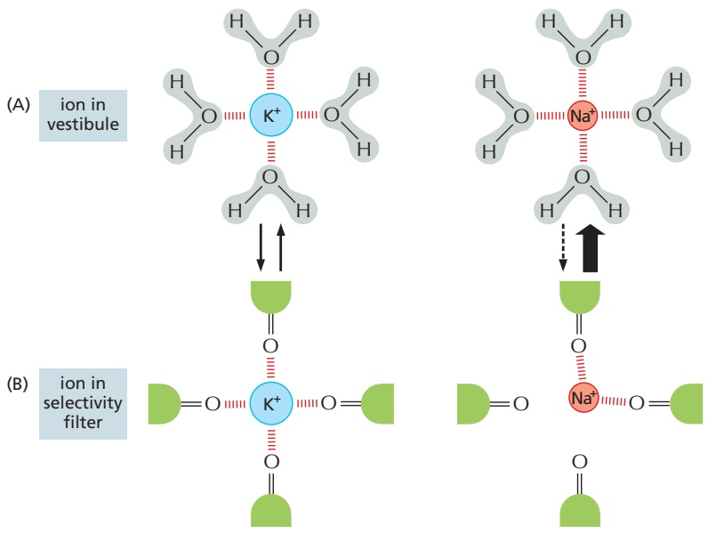

Figure 11–25 ${ \mathsf { K } } ^ { + }$ specificity of the selectivity filter in a ${ \sf K } ^ { + }$ channel. The drawings show $\mathsf { K } ^ { + }$ and Na+ ions (A) in the vestibule and (B) in the selectivity filter of the pore, viewed in cross section. In the vestibule, the ions are hydrated. In the selectivity filter, they have lost their water, and the carbonyl oxygens are placed to accommodate a dehydrated $\dot { \mathsf { K } } ^ { + }$ ion. The dehydration of the $\mathsf { K } ^ { \dot { + } }$ ion requires energy, which is precisely balanced by the energy regained by the interaction of the ion with all of the carbonyl oxygens that serve as surrogate water molecules. Because the Na+ ion is too small to interact with all the oxygens, it can enter the selectivity filter only at a great energetic expense. The filter therefore selects $\mathsf { K } ^ { + }$ ions with high specificity. $( \mathsf { A } ,$ adapted from Y. Zhou et al., Nature 414:43–48, 2001.)

Many other ion channels operate on similar principles: the channel’s pore helices are allosterically coupled to sensor domains that in response, say, to ligand binding or altered membrane potential bring about conformational change in the ion-conducting pathway, either opening it or blocking it off.

#### Mechanosensitive Channels Allow Cells to Sense Their Physical Environment

All organisms, from single-cell bacteria to multicellular animals and plants, must sense and respond to mechanical forces both in their external environment (such as sound, touch, pressure, shear forces, and gravity) and in their internal environment (such as osmotic pressure and membrane bending). Numerous proteins are known to be capable of responding to such mechanical forces, and a large subset of those proteins has been identified as possible **mechanosensitive channels**, but very few of the candidate proteins have been shown directly to be mechanically activated ion channels. One reason for this dearth in our knowledge is that most such channels are extremely rare. Auditory hair cells in the human cochlea, for example, contain extraordinarily sensitive mechanically gated ion channels, but each of the approximately 15,000 individual hair cells is thought to have a total of only 50–100 of them (**Movie 11.9** and **Movie 11.10**). Additional difficulties arise because the gating mechanisms of many mechanosensitive channel types require the channels to be embedded in complex architectures that require attachment to the extracellular matrix or to the cytoskeleton, and this is difficult to reconstitute in the test tube.

Figure 11–26 A model for the gating of a bacterial K1 channel. The channel is viewed in cross section. To adopt the closed conformation, the four inner transmembrane helices that line the pore on the cytosolic side of the selectivity filter (see Figure 11–24) rearrange to close the cytosolic entrance to the channel. (Adapted from E. Perozo et al., Science 285:73–78, 1999.)

Figure 11–27 Stretch-activated Piezo channels. (A) The structure of Piezo1. Three identical subunits surround the central pore (left). The three large arm domains extend from the center and bend the membrane into a dome (right). (B) When the membrane is stretched, the dome-like protrusion flattens and the central pore opens. (C) By coupling Piezo channels to tethers on either side of the membrane (for example, to the extracellular matrix or the cytoskeleton), Piezo channels can be opened in response to extracellular or intracellular mechanical forces (arrows). (A, PDB code: 6B3R. Adapted from Y.R. Guo and R. MacKinnon, eLife 6:e33660, 2017. This article is distributed under the terms of the Creative Commons Attribution License.)

To fill this gap in our knowledge, scientists used patch clamping to identify cell lines that would open an ion channel when mechanical pressure was applied toMBoC7 n11.333-11.27 them. They then reasoned that a mechanosensitive channel would need to contain at least two membrane-spanning helices and proceeded to systematically disrupt expression of genes encoding such proteins. One such disruption caused the cells to lose their response to mechanical stimuli and identified two genes that code for related proteins. Each of these proteins contains more than 30 membrane-spanning helices, but neither shows any sequence similarity to other known ion channels. Three identical copies of either of these proteins can assemble into a mechanosensitive Piezo ion channel that lies in the plasma membranes of numerous types of animal cells (**Figure 11–27**). Each of the three subunits of a Piezo channel contains a large arm built from 36 transmembrane helices. The arms extend outward from a central hub that contains the channel’s ion-conducting pore. The particular packing of the wing helices deforms the membrane into a dome. In this resting state, the Piezo channel is closed. When the membrane becomes stretched by mechanically pushing on the plasma membrane elsewhere, the resulting membrane tension pulls the deformation flat, which opens the channel’s central pore.

Piezo channels in skin cells are required for touch sensation, and in bladder cells they detect when the bladder is full. But their importance is far greater than that. Animals that lack Piezo channels die in development because many developmental processes, such as formation of the vasculature, rely on mechanical stretching cues. Piezo channels also provide second-to-second control of blood pressure. Nerve cells in the aortic arch and carotid artery contain Piezo channels and are highly sensitive to stretch that results from increased blood pressure. In response, they signal to immediately slow the heart rate. In this way, the blood pressure falls, preventing life-threatening consequences from vessel damage or rupture. Conversely, acutely reduced blood pressure, as might occur upon getting up or bending over, stops the firing of these same nerve cells and increases the heart rate and peripheral vasoconstriction, which in turn prevents loss of consciousness by increasing blood flow to the brain.

Another well-studied class of mechanosensitive channels is found in the bacterial plasma membrane. These channels open in response to mechanical stretching of the lipid bilayer in which they are embedded. When a bacterium experiences a low-ionic-strength external environment (hypotonic conditions), such as rainwater, the cell swells as water seeps in due to the increased osmotic

Figure 11–28 The structure of bacterial mechanosensitive channels. The crystal structures of MscS in its (A) closed and (B) open conformation are shown. The side views (lower panels) show the entire protein, including the large intracellular domain. The face views (upper panels) show the transmembrane domains only. The open structure occupies more area in the lipid bilayer and is energetically favored when a membrane is stretched. This may explain why the MscS channel opens as pressure builds up inside the cell. (PDB codes: 2OAU, 2VV5.)

pressure. If the pressure rises to dangerous levels, the cell opens mechanosensitive channels that allow small molecules to leak out. Bacteria that are experimentally placed in fresh water can rapidly lose more than 95% of their small molecules in this manner, including amino acids, sugars, and potassium ions. However, they keep their macromolecules safely inside and thus can recover quickly after environmental conditions return to normal..

Mechanical gating has been demonstrated using biophysical techniques in which force is exerted on pure lipid bilayers containing the bacterial mechanosensitive channels; for example, by applying suction with a micropipette. Such measurements demonstrate that the cell has several different channels that open at different levels of pressure. The mechanosensitive channel of small conductance, called the MscS channel, opens at low and moderate pressures (**Figure 11–28**). It is composed of seven identical subunits, which in the open state form a pore about 1.3 nm in diameter—just big enough to pass ions and small molecules. Large cytoplasmic domains limit the size of molecules that can reach the pore. The mechanosensitive channel of large conductance, called the MscL channel, opens to more than 3 nm in diameter when the pressure gets so high that the cell might burst.

#### The Function of a Neuron Depends on Its Elongated Structure

The cells that make the most sophisticated use of channels are neurons. Before discussing how they do so, we digress briefly to describe how a typical neuron is organized.

The fundamental task of a **neuron**, or **nerve cell**, is to receive, integrate, conduct, and transmit signals. To perform these functions, neurons are often extremely elongated. In humans, for example, a single neuron extending from the spinal cord to a muscle in the foot may be as long as 1 meter. Every neuron consists of a cell body (containing the nucleus) with a number of thin processes radiating outward from it. Usually one long **axon** conducts signals away from the cell body toward distant targets, and several shorter, branching **dendrites** extend from the cell body like antennae, providing an enlarged surface area to receive signals from the axons of other neurons (**Figure 11–29**), although the cell body itself also receives such signals. A typical axon divides at its far end into many branches, passing on its message to many target cells simultaneously. Likewise, the extent of branching of the dendrites can be very great—in some cases sufficient to receive as many as 100,000 inputs on a single neuron.

Figure 11–29 A typical vertebrate

neuron. The arrows indicate the direction in which signals are conveyed. The single axon conducts signals away from the cell body, while the multiple dendrites (and the cell body) receive signals from the axons of other neurons. The axon terminals end on the dendrites or cell body of other neurons or on other cell types, such as muscle or gland cells.

Despite the varied significance of the signals carried by different classes of neurons, the form of the conducted signal is always the same, consisting of changes in the electrical potential across the neuron’s plasma membrane. TheMBoC7 e12.30/11.29 signal spreads because an electrical disturbance produced in one part of the membrane spreads to other parts, although the disturbance becomes weaker with increasing distance from its source, unless the neuron expends energy to amplify it as it travels. Over short distances, this attenuation is unimportant; in fact, many small neurons conduct their signals passively, without amplification. For long-distance communication, however, such passive spread is inadequate. Thus, larger neurons employ an active signaling mechanism, which is one of their most striking features. An electrical stimulus that exceeds a certain threshold strength triggers an explosion of electrical activity that propagates rapidly along the neuron’s plasma membrane and is sustained by automatic amplification all along the way. This traveling wave of electrical excitation, known as an **action potential**, or nerve impulse, can carry a message without attenuation from one end of a neuron to the other at speeds of 100 meters per second or more. Action potentials are the direct consequence of the properties of voltage-gated cation channels, as we now discuss.

#### Voltage-gated Cation Channels Generate Action Potentials in Electrically Excitable Cells

The plasma membrane of all electrically excitable cells—not only neurons, but also muscle, endocrine, and egg cells—contains **voltage-gated cation channels**, which are responsible for generating the action potentials. An action potential is triggered by a **depolarization** of the plasma membrane; that is, by a shift in the membrane potential to a less negative value inside. (We shall see later how the action of some neurotransmitters causes depolarization.) In nerve and skeletal muscle cells, a stimulus that causes sufficient depolarization promptly opens the **voltage-gated** $\mathbf { N a } ^ { + }$ **channels**, allowing a small amount of $\mathrm { { N a } ^ { + } }$ to enter the cell down its electrochemical gradient. The influx of positive charge depolarizes the membrane further, thereby opening more $\mathrm { { N a } ^ { + } }$ channels, which admit more $\mathrm { N a } ^ { + }$ ions, causing still further depolarization. This self-amplification process (an example of positive feedback, discussed in Chapters 8 and 15) continues until, within a fraction of a millisecond, the electrical potential in the local region of the membrane has shifted from its resting value of about –70 mV to almost as far as the $\mathrm { N a } ^ { + }$ equilibrium potential of about +50 mV (see Panel 11–1, p. 656). At this point, when the net electrochemical driving force for the flow of Na+ is almost zero, the cell would come to a new resting state, with all of its $\mathrm { N a } ^ { + }$ channels permanently open, if the open conformation of the channel were stable. Two mechanisms act in concert to save the cell from such a permanent electrical spasm: the $\mathrm { { N a } ^ { + } }$ (A)

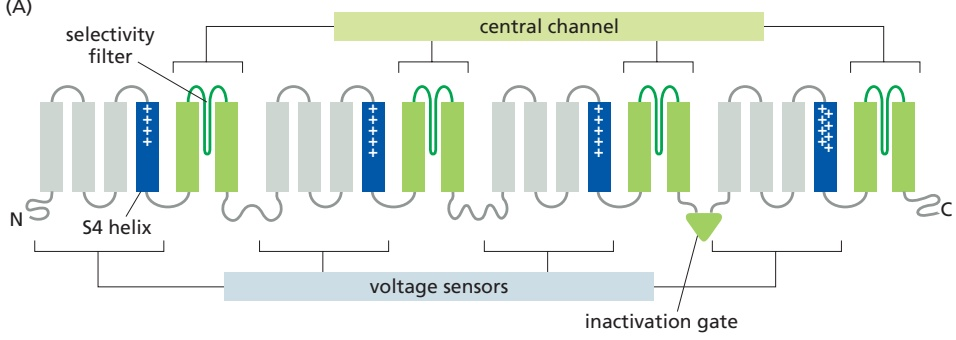

Figure 11–30 Structural models of voltage-gated Na1 channels. (A) The channel in animal cells is built from a single polypeptide chain that contains four homologous domains. Each domain contains two transmembrane α helices (green) that surround the central ionconducting pore. They are separated by sequences (dark green) that form the selectivity filter. Four additional α helices (blue and gray) in each domain constitute the voltage sensor. The S4 helices (blue) are unique in that they contain an abundance of positively charged arginines. An inactivation gate that is part of a flexible loop connecting the third and fourth domains acts as a plug that obstructs the pore in the channel’s inactivated state, as shown in Figure 11–32C. (B) Side and top views of a channel protein showing its arrangement within the membrane. (C) A cross section of the pore domain of the channel shown in B shows lateral portals, through which the central cavity is accessible from the hydrophobic core of the lipid bilayer. In the crystals, lipid acyl chains were found to intrude into the pore. These lateral portals are large enough to allow entry of small, hydrophobic, pore-blocking drugs that are commonly used as local anesthetics and block ion conductance. (PDB code: 6AGF.)

channels automatically inactivate, and **voltage-gated** $\mathbf { K } ^ { + }$ **channels** open to restore the membrane potential to its initial negative value.

The $\mathrm { { N a } ^ { + } }$ channel is built from a single polypeptide chain that contains four structurally very similar domains. It is thought that these domains evolved by gene duplication followed by fusion into a single large gene (**Figure 11–30A**). In bacteria, in fact, the $\mathrm { { N a } ^ { + } }$ channel is a tetramer of four identical polypeptide chains, supporting this evolutionary idea. The structure of the voltage-gated $\mathrm { N a } ^ { + }$ channel provides insights into how the structural elements are arranged in the. / . membrane (**Figure 11–30B and C**).

Each domain contributes to the central channel, which is very similar to the $\mathrm { K } ^ { + }$ channel. Each domain also contains a voltage sensor that is characterized by an unusual transmembrane helix, S4, that contains many positively charged amino acids. When the membrane is polarized, these charges are exposed on the negatively charged cytosolic side of the membrane. Because of the charge compensation, this conformation is thermodynamically stabilized in a polarized membrane. As the membrane becomes depolarized, the S4 helices experience the electrostatic force that now stabilizes an alternative conformation in which the helices have twisted and expose the charges to the opposite, extracellular side of the membrane. The resulting conformational change opens the channel (**Figure 11–31**). It is estimated from energetic calculations that the exposure to the alternate side of the membrane can change the probability of the channel being in an open or closed state by many orders of magnitude.

The $\mathrm { N a } ^ { + }$ channels also have an automatic inactivating mechanism, which causes the channels to reclose rapidly even though the membrane is still depolarized (see Figure 11–32). The $\mathrm { N a } ^ { + }$ channels remain in this inactivated state, unable to reopen, until after the membrane potential has returned to its initial negative value. Repolarization of the membrane requires opening of additional channels, the **delayed** $\mathbf { K } ^ { + }$ **channels**. These channels also open in response to membrane depolarization (that is, they are also voltage-gated), but because of their slower kinetics they open only during the falling phase of the action potential, when the $\mathrm { N a } ^ { + }$ channels are inactive, but with a delay of a few hundred microseconds. WhenMBoC7 n11.100/11.31 these channels open, $\mathrm { K } ^ { + }$ rushes out of the cell until the cell’s resting potential is restored within a millisecond or two. The time necessary for a sufficient number of $\mathrm { N a } ^ { + }$ channels to recover from inactivation to support a new action potential, termed the refractory period, limits the repetitive firing rate of a neuron and ensures that an action potential propagates unidirectionally. The $\mathrm { N a } ^ { + }$ channel can therefore exist in three distinct states—closed, open, and inactivated—which contribute to the rise and fall of the action potential (**Figure 11–32**). The cycle from initial stimulus to the return to the original resting state takes a few milliseconds or less.

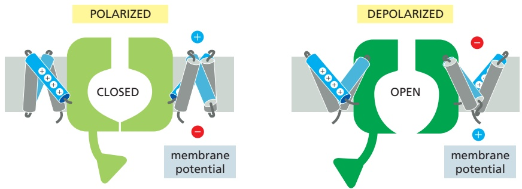

Figure 11–31 Model for the mechanism of voltage-gating. The voltage-sensing domain oscillates between two conformational states that expose positively charged arginines on one helix (corresponding to the S4 helix in Figure 11–30) to alternate sides of the membrane. Exposure to the more negatively charged side of the membrane is thermodynamically favored and hence stabilizes that state. Conformational coupling closes or opens the gate in the central pore domain of the channel. (Adapted from A.F. Kintzer et al., Proc. Natl. Acad. Sci. USA 115:E9095–E9104, 2018.)

This description of an action potential applies only to a small patch of plasma membrane. The self-amplifying depolarization of the patch, however, is sufficient to depolarize neighboring regions of membrane, which then go through the same cycle. In this way, the action potential sweeps like a wave from the initial site of depolarization over the entire plasma membrane, as shown in **Figure 11–33**.

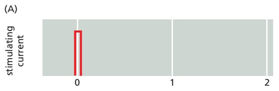

(B)

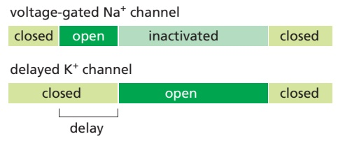

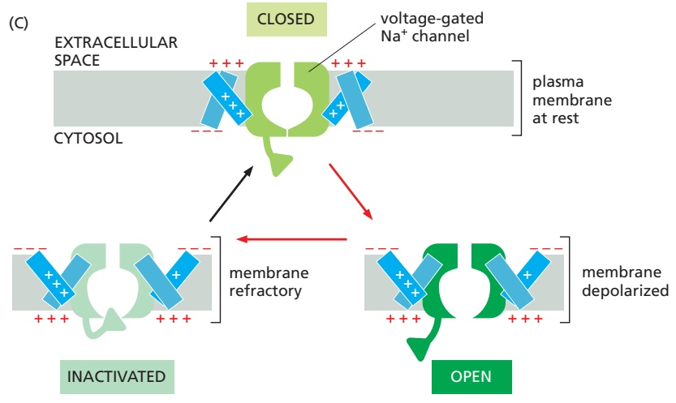

Figure 11–32 $\mathsf { N a } ^ { + }$ channels and an action potential. (A) An action potential is triggered by a brief pulse of current, which (B) partially depolarizes the membrane, as shown in the plot of membrane potential versus time. The green curve shows how the membrane potential would have simply relaxed back to the resting value after the initial depolarizing stimulus if there had been no voltage-gated $\mathrm { N a ^ { + } }$ channels in the membrane. The ascending part of the red curve shows the course of the action potential that is caused by the opening of voltage-gated Na+ channels. Delayed voltage-gated $\dot{\mathsf{K}^{+}}$ channels open and $\mathrm { N a } ^ { + }$ channels become inactivated, allowing membrane repolarization (the descending part of the red curve). The states of the $\mathrm { N a ^ { + } }$ and $\dot{\mathsf{K}}^{+}$ channels are indicated in the schematic in the bottom part of panel B. The membrane cannot fire a second action potential until the Na+ channels have returned from the inactivated to the closed conformation; until then, the membrane is refractory to stimulation. (C) The three states of the Na+ channel. When the membrane is at rest (highly polarized), the closed conformation of the channel has the lowest free energy and is therefore most stable; when the membrane is depolarized, the energy of the open conformation is lower, so the channel has a high probability of opening. But the free energy of the inactivated conformation is lower still; therefore, after a randomly variable period spent in the open state, the channel becomes inactivated. Thus, the open conformation corresponds to a metastable state that can exist only transiently when the membrane depolarizes (Movie 11.11).

Albeit small, the ion flow during an action potential is not negligible. Especially during rapid firing and in small axon branches with a high surface-to-volume ratio, the $\bar { \mathrm { N a } ^ { + } } \bar { \mathrm { - K } ^ { + } }$ pump speeds up locally to restore the electrochemical gradients. Brain positron emission tomography (for example, in a PET scan) visualizes regions of the brain whose metabolism is raised when performing a particular task. In this procedure, neurons that have a high energy consumption due to their accelerated ion pumping activity preferentially take up glucose, supplied as a radioactiveMBoC7 m11.31/11.33 tracer, to replenish the ATP expended by the $\widetilde { \mathrm { N a ^ { + } } } \mathrm { - K ^ { + } }$ pump. The enrichment of the radioactive glucose is then imaged in a three-dimensional brain scan. In this way, the $\mathrm { { N a } ^ { + } \mathrm { { - } K ^ { + } } }$ pump serves as a sentinel in the noninvasive mapping of brain regions associated with particular brain activities (**Figure 11–34**).

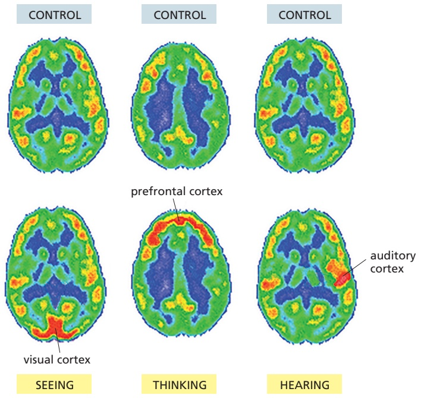

Figure 11–33 The propagation of an action potential along an axon. (A) The voltages that would be recorded from a set of intracellular electrodes placed at intervals along the axon. (B) The changes in the Na+ channels, voltage-gated K+ channels, and current flows (red and blue arrows) that give rise to a traveling action potential. The region of the axon with a depolarized membrane is shaded in orange. Note that once an action potential has started to progress, it has to continue in the same direction, traveling only away from the site of depolarization, because Na+-channel inactivation prevents the depolarization from spreading backward.

Figure 11–34 These scans noninvasively image the radiation signal derived from an injected tracer molecule. The images report on brain regions with the highest metabolic energy expenditure (red), which reflects the activity of the Na+-K+ pump consuming ATP while laboring to restore the membrane potential in axons engaged in massive electrical signaling. (Courtesy of Michael Phelps.)

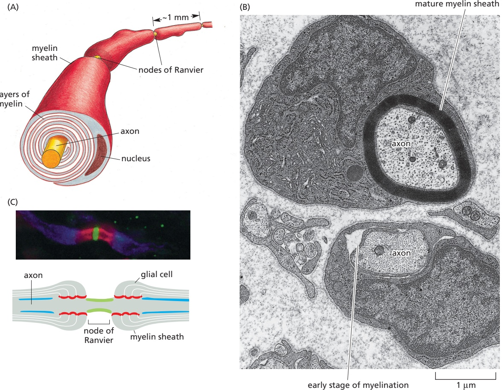

early stage of myelination

#### Myelination Increases the Speed and Efficiency of Action Potential Propagation in Nerve Cells

The axons of many vertebrate neurons are insulated by a **myelin sheath**, which greatly increases the speed at which an axon can conduct an action potential. The importance of myelination is dramatically demonstrated by the demyelinating disease multiple sclerosis, in which the immune system destroys myelin sheaths in some regions of the central nervous system; in the affected regions, nerve impulse propagation greatly slows or fails, often with devastating neurological consequences.

Myelin is formed by specialized non-neuronal supporting cells called **glial cells**. **Schwann cells** are the glial cells that myelinate axons in peripheral nerves, and **oligodendrocytes** do so in the central nervous system. These myelinating glial cells wrap layer upon layer of their own plasma membrane in a tight spiral around the axon (**Figure 11–35A and B**), thereby insulating the axonal membrane so that little current can leak across it. The myelin sheath is interrupted at regularly spaced nodes of Ranvier, where almost all the Na channels in the axon are concentrated (**Figure 11–35C**). This arrangement allows an action potential to propagate along a myelinated axon by jumping from node to node, a process called saltatory conduction. This type of conduction has two main advantages: action potentials travel very much faster, and metabolic energy is conserved because the active excitation is confined to the small regions of axonal plasma membrane at nodes of Ranvier.

#### Patch-Clamp Recording Indicates That Individual Ion Channels Open in an All-or-Nothing Fashion

Neuron and skeletal muscle cell plasma membranes contain many thousands of voltage-gated $\mathrm { { N a } ^ { + } }$ channels, and the current crossing the membrane is the sum of the currents flowing through all of these. An intracellular microelectrode can record this aggregate current. Remarkably, however, it is also possible to record

Figure 11–35 Myelination. (A) A myelinated axon from a peripheral nerve. Each Schwann cell wraps its plasma membrane spirally around the axon to form a segment of myelin sheath about 1 mm long. For clarity, the membrane layers of the myelin are shown less compacted than they are in reality (see panel B). (B) An electron micrograph of a nerve in the leg of a young rat. Two Schwann cells can be seen: one near the bottom is just beginning to myelinate its axon; the one above it has formed an almost mature myelin sheath. (C) Fluorescence micrograph and diagram of an individual myelinated axon teased apart in a rat optic nerve, showing the confinement of the voltage-gated Na+ channels (green) to the axonal membrane at the node of Ranvier. A protein called Caspr (red) marks the junctions where the myelinating glial-cell plasma membrane tightly abuts the axon on either side of the node. Voltage-gated $\mathsf { K } ^ { + }$ channels (blue) localize to regions in the axonal plasma membrane well away from the node. [B, from C.S. Raine, in Myelin, 2nd ed. (P. Morell, ed.). New York: Plenum, 1984. With permission from Springer Nature; C, from M.N. Rasband and P. Shrager, J. Physiol. 525:63–73, 2000. With permission from John Wiley & Sons.]

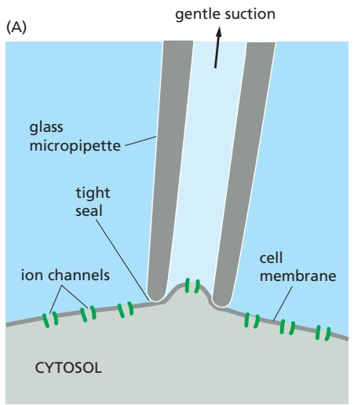

Figure 11–36 The technique of patch-clamp recording. Because of the extremely tight seal between the micropipette and the membrane, current can enter or leave the micropipette only by passing through the ion channels in the patch of membrane covering its tip. The term clamp is used because an electronic device is employed to maintain, or “clamp,” the membrane potential at a set value while recording the ionic current through individual channels. The current through these channels can be recorded with the patch still attached to the rest of the cell, as in (A), or detached, as in (B). The advantage of the detached patch is that it is easy to alter the composition of the solution on either side of the membrane to test the effect of various solutes on channel behavior. A detached patch can also be produced with the opposite orientation, so that the cytoplasmic surface of the membrane faces the inside of the pipette.

current flowing through individual channels. **Patch-clamp recording**, developed in the 1970s and 1980s, revolutionized the study of ion channels and made it possible to examine transport through a single channel in a small patch of membrane covering the mouth of a micropipette (**Figure 11–36**). With this simple but power-MBoC7 m11.34/11.36 ful technique, one can study the detailed properties of ion channels in all sorts of cell types. This work led to the discovery that even cells that are not electrically excitable usually have a variety of ion channels in their plasma membrane. Many of these cells, such as yeasts, are too small to be investigated by the traditional electrophysiologist’s method of impalement with an intracellular microelectrode.

Patch-clamp recording indicates that individual ion channels open in an allor-nothing fashion. For example, a voltage-gated $\mathrm { N a } ^ { + }$ channel opens and closes stochastically with a voltage-dependent probability, but when open, the channel always has the same large conductance, allowing more than 1000 ions to pass per millisecond (**Figure 11–37**). Therefore, the aggregate current crossing the membrane of an entire cell does not indicate the degree to which a typical individual channel is open but rather the total number of channels in its membrane that are open at any one time.

Some simple physical principles allow us to refine our understanding of voltagegating from the perspective of a single $\mathrm { N a } ^ { + }$ channel. The interior of the resting neuron or muscle cell is at an electrical potential about 40–100 mV more negative than the external medium. Although this potential difference seems small, it exists across a plasma membrane only about 5 nm thick, so that the resulting voltage gradient is about 100,000 V/cm. Charged proteins in the membrane such as $\dot { \mathrm { N a } } ^ { + }$ channels are thus subjected to a very large electrical field that can profoundly affect their conformation. Each conformation can $"  \mathrm{flip}  "$ to another conformation if given a sufficient jolt by the random thermal movements of the surroundings, and it is the relative stability of the closed, open, and inactivated conformations against flipping that is altered by changes in the membrane potential (see Figure 11–32C).

<small>N 1</small>

<small>By</small>

<small>(pA),</small>

<small>Figure 11–37 Patch-clamp measurements for a single voltage-gated a channel. A tiny patch of plasma membrane was detached from an embryonic rat muscle cell, as in Figure 11–36. (A) The membrane was depolarized by an abrupt shift of potential from –90 to about –40 mV. (B) Three current records from three experiments performed on the same patch of membrane. Each major current step in panel B represents the opening and closing of a single channel. A comparison of the three records shows that, whereas the durations of channel opening and closing vary greatly, the rate at which current flows through an open channel (its conductance) is practically constant. The minor fluctuations in the current records arise largely from electrical noise in the recording apparatus. Current flowing into the cell, measured in picoamperes is shown as a downward deflection of the curve. convention, the electrical potential on the outside of the cell is defined as zero. (C) The sum of the currents measured in 144 repetitions of the same experiment. This aggregate current is equivalent to the usua a current that would be observed flowing through a relatively large l N + region of membrane containing 144 channels. A comparison of panels B and C reveals that the time course of the aggregate current reflects the probability that any individual channel will be in the open state; this probability decreases with time as the channels in the depolarized membrane adopt their inactivated conformation. (Data from J. Patlak and R. Horn, J. Gen. Physiol. 79:333–351, 1982.)</small>

#### Voltage-gated Cation Channels Are Evolutionarily and Structurally Related

Na+ channels are not the only kind of voltage-gated cation channel that can generate an action potential. The action potentials in some muscle, egg, and endocrine cells, for example, depend on voltage-gated $C a ^ { 2 + }$ channels rather than on $\mathrm { N a } ^ { + }$ channels.

There is a surprising amount of structural and functional diversity within each of the different classes of voltage-gated cation channels, generated both by multiple genes and by the alternative splicing of RNA transcripts produced from the same gene. Nonetheless, the amino acid sequences and structures of the known voltage-gated $\mathrm { N a ^ { + } , K ^ { + } }$ , and $\mathrm { C a ^ { 2 + } }$ channels show striking similarities, demonstrating that they all belong to a large superfamily of evolutionarily and structurally related proteins and share many of the design principles. Whereas the single-celled yeast Saccharomyces cerevisiae contains a single gene that codes for a voltage-gated $\mathrm { K } ^ { + }$ channel, the genome of the worm Caenorhabditis elegans contains 68 genes that encode different but related $\mathrm { K } ^ { + }$ channels. This complexity indicates that even a simple nervous system made up of only 302 neurons uses a large number of different ion channels to compute its responses.

Humans carrying mutations in genes encoding ion channels can suffer from a variety of nerve, muscle, brain, kidney, or heart diseases, depending on the cells in which the mutant channel is expressed. Mutations in genes that encode voltage-gated $\mathrm { N a } ^ { + }$ channels in skeletal muscle cells, for example, can cause myotonia, a condition in which there is a delay in muscle relaxation after voluntary contraction, causing painful muscle spasms. In some cases, this occurs because the abnormal channels fail to inactivate normally; as a result, $\mathrm { { N a } ^ { + } }$ entry persists after an action potential finishes and repeatedly reinitiates membrane depolarization and muscle contraction. Similarly, mutations that affect $\mathrm { { N a } ^ { + } }$ or $\mathrm { K } ^ { + }$ channels in the brain can cause epilepsy, in which excessive synchronized firing of large groups of neurons causes epileptic seizures (convulsions, or fits).

The particular combination of ion channels conducting $\mathrm { N a ^ { + } ,   \mathrm { K ^ { + } } }$ , and $\mathrm { C a ^ { 2 + } }$ that are expressed in a neuron largely determines how the cell fires repetitive sequences of action potentials. Some neurons can repeat action potentials up to 300 times per second; other neurons fire short bursts of action potentials separated by periods of silence; while others rarely fire more than one action potential at a time. There is a remarkable diversity of neurons in the brain.

#### Different Neuron Types Display Characteristic Stable Firing Properties

It is estimated that the human brain contains about $1 0 ^ { 1 1 }$ neurons and $1 0 ^ { 1 4 }$ synaptic connections. To make matters more complex, neural circuitry is continually sculpted in response to experience, modified as we learn and store memories, and irreversibly altered by the gradual loss of neurons and their connections as we age. How can a system so complex be subject to such change and yet continue to function stably? One emerging theory suggests that individual neurons are self-tuning devices, constantly adjusting the expression of ion channels and neurotransmitter receptors in order to maintain a stable function. How might this work?

Neurons can be categorized into functionally different types, based in part on their propensity to fire action potentials and their pattern of firing. For example, some neurons can fire action potentials at high frequencies, whereas others fire rarely. The firing properties of each neuron type are determined to a large extent by the ion channels that the cell expresses. The number of ion channels in a neuron’s membrane is not fixed: as conditions change, a neuron can modify the numbers of depolarizing $\mathrm { ( N a ^ { + } }$ and $\mathrm { C a ^ { 2 + } ) }$ and hyperpolarizing $( \mathrm { K } ^ { + } )$ channels and keep their proportions adjusted so as to maintain its characteristic firing behavior—a remarkable example of homeostatic control. Deciphering the molecular mechanisms involved remains an important challenge.

RESTING CHEMICAL SYNAPSE

(A)

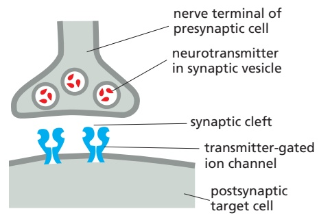

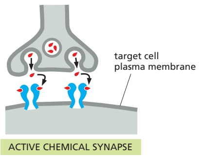

(B)

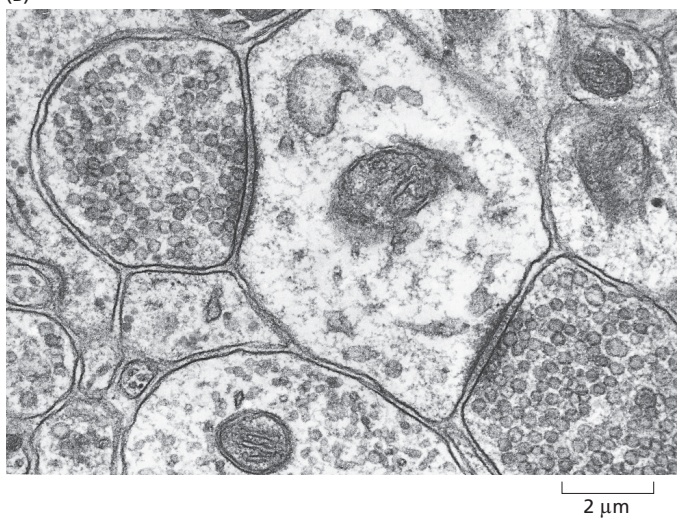

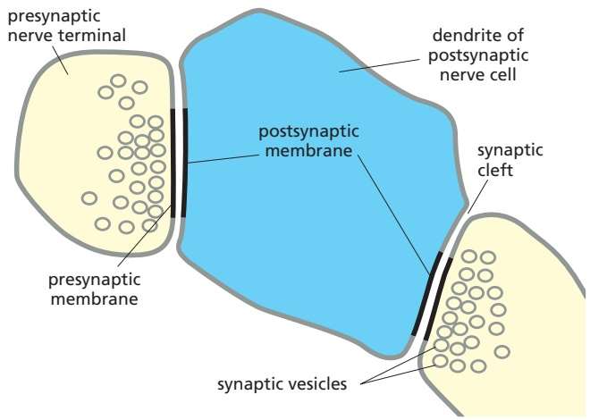

#### Transmitter-gated Ion Channels Convert Chemical Signals into Electrical Ones at Chemical Synapses

Neuronal signals are transmitted from cell to cell at specialized sites of contact known as **synapses**. The usual mechanism of transmission is indirect. The cells are anatomically and electrically isolated from one another, the presynaptic cell being separated from the postsynaptic cell by a narrow synaptic cleft. When an action potential arrives at the presynaptic site, the depolarization of the membrane opens voltage-gated $\mathrm { C a ^ { \vec { 2 } + } }$ channels that are clustered in the presynaptic membrane. $\mathrm { C a ^ { 2 + } }$ influx triggers the release into the cleft of small signal molecules known as neurotransmitters that are stored in membrane-enclosed synaptic vesicles and released by exocytosis (discussed in Chapter 13). The neurotransmitter diffuses rapidly across the synaptic cleft and provokes an electrical change in the postsynaptic cell by binding to and opening transmitter-gated ion channels (Figure 11–38). After the neurotransmitter has been secreted, it is rapidly removed: it is either destroyed by specific enzymes in the synaptic cleft or, more commonly, taken up by the presynaptic nerve terminal or by surrounding glial cells. Reup-MBoC7 m11.36/11.38 take is mediated by a variety of $\mathrm { N a } ^ { + }$ -dependent neurotransmitter symporters (see Figure 11–8); in this way, neurotransmitters are recycled, allowing cells to keep up with high rates of release. Rapid removal ensures both spatial and temporal precision of signaling at a synapse. It decreases the chances that the neurotransmitter will influence neighboring cells, and it clears the synaptic cleft before the next pulse of neurotransmitter is released, so that the timing of repeated, rapid signaling events can be accurately communicated to the postsynaptic cell.

Figure 11–38 A chemical synapse. (A) When an action potential reaches the nerve terminal in a presynaptic cell, it stimulates the terminal to release its neurotransmitter. The neurotransmitter molecules are contained in synaptic vesicles and are released to the cell exterior when the vesicles fuse with the plasma membrane of the nerve terminal. The released neurotransmitter binds to and opens the transmitter-gated ion channels concentrated in the plasma membrane of the postsynaptic target cell at the synapse. The resulting ion flows alter the membrane potential of the postsynaptic membrane, thereby transmitting a signal from the excited nerve (Movie 11.12). (B) A thin-section electron micrograph and an interpretive drawing of two nerve terminal synapses on a dendrite of a postsynaptic cell. (B, micrograph courtesy of Cedric Raine.)

**Transmitter-gated ion channels**, also called **ionotropic receptors**, rapidly convert extracellular chemical signals into electrical signals at chemical synapses. The channels are concentrated in a specialized region of the postsynaptic plasma membrane at the synapse and open transiently in response to the binding of neurotransmitter molecules, thereby producing a brief permeability change in the membrane (see Figure 11–38A). Unlike the voltage-gated channels responsible for action potentials, transmitter-gated channels are relatively insensitive to the membrane potential and therefore cannot by themselves produce a self-amplifying excitation. Instead, they produce local permeability increases, and hence changes of membrane potential, that are graded according to the amount of neurotransmitter released at the synapse and how long it persists there. Only if the summation of small depolarizations at this site opens sufficient numbers of nearby voltage-gated cation channels can an action potential be triggered. This may require the opening of transmitter-gated ion channels at numerous synapses in close proximity on the target nerve cell.

#### Chemical Synapses Can Be Excitatory or Inhibitory

Transmitter-gated ion channels differ from one another in several important ways. First, as receptors, they have highly selective binding sites for the neurotransmitter that is released from the presynaptic nerve terminal. Second, as channels, they are selective in the type of ions that they let pass across the plasma membrane; this determines the nature of the postsynaptic response. Most **excitatory neurotransmitters** open nonselective cation channels, causing an influx of $\mathrm { N a } ^ { + }$ , as well as $\mathrm { C a ^ { 2 + } }$ and $\mathrm { K } ^ { + }$ , that depolarizes the postsynaptic membrane toward the threshold potential for firing an action potential. The reason they are excitatory despite $\mathrm { K } ^ { + }$ efflux is because of the different driving forces that preferentially act on $\mathrm { N a } ^ { + }$ and $\mathrm { C a ^ { 2 + } }$ . **Inhibitory neurotransmitters**, by contrast, open Cl– channels, and this suppresses firing by making it harder for excitatory neurotransmitters to depolarize the postsynaptic membrane. Many transmitters can be either excitatory or inhibitory, depending on where they are released, what receptors they bind $\mathbf { t o } ,$ and the ionic conditions that they encounter. Acetylcholine, for example, can either excite or inhibit, depending on the type of acetylcholine receptor it binds to. Usually, however, acetylcholine and glutamate are used as excitatory transmitters, and g-aminobutyric acid (GABA) and glycine are used as inhibitory transmitters. Glutamate, for instance, mediates most of the excitatory signaling in the vertebrate brain.

We have already discussed how the opening of $\mathbf { \bar { N a } ^ { + } }$ or $\mathrm { C a ^ { 2 + } }$ channels depolarizes a membrane. The opening of $\mathrm { K } ^ { + }$ channels has the opposite effect because the $\mathrm { K } ^ { + }$ concentration gradient is in the opposite direction—high concentration inside the cell, low outside. The movement of the cell’s membrane potential to a more negative value is called **hyperpolarization**. Opening $\mathrm { K } ^ { + }$ channels tends to keep the cell close to the equilibrium potential for $\mathrm { K } ^ { + }$ , which, as we discussed earlier, is normally close to the resting membrane potential because at rest $\mathrm { K } ^ { + }$ channels are the main type of channel that is open. When additional $\mathrm { K } ^ { + }$ channels open, it becomes harder to drive the cell away from the resting potential. We can understand the effect of opening $\mathrm { C l ^ { - } }$ channels similarly. The concentration of Cl– is much higher outside the cell than inside (see Table 11–1, p. 638), but the membrane potential opposes its influx. In fact, for many neurons, the equilibrium potential for $\mathrm { C l ^ { - } }$ is close to the resting potential—or even more negative. For this reason, opening of Cl– channels tends to buffer the membrane potential; as the membrane starts to depolarize, more negatively charged Cl– ions enter the cell and counteract the depolarization. Thus, the opening of $\mathrm { C l ^ { - } }$ channels makes it more difficult to depolarize the membrane and hence to excite the cell. Some powerful toxins act by blocking the action of inhibitory neurotransmitters: strychnine, for example, binds to glycine receptors and prevents their inhibitory action, causing muscle spasms, convulsions, and death.

However, not all chemical signaling in the nervous system operates through these ionotropic ligand-gated ion channels. In fact, most neurotransmitter molecules that are secreted by nerve terminals, including a large variety of neuropeptides, bind to **metabotropic receptors**, which regulate ion channels only indirectly through the action of small intracellular signal molecules (discussed in Chapter 15). All neurotransmitter receptors fall into one or other of these two major classes—ionotropic or metabotropic—on the basis of their signaling mechanisms:

1. Ionotropic receptors are ion channels that appear at fast chemical synapses. Acetylcholine, glycine, glutamate, and GABA all act on transmitter-gated ion channels, mediating excitatory or inhibitory signaling that is generally immediate, simple, and brief.

2. Metabotropic receptors are G-protein-coupled receptors (discussed in Chapter 15) that bind to all other neurotransmitters (and, confusingly, also to acetylcholine, glutamate, and GABA). Signaling mediated by ligandbinding to metabotropic receptors tends to be far slower and more complex than that at ionotropic receptors, and longer-lasting in its consequences.

#### The Acetylcholine Receptors at the Neuromuscular Junction Are Excitatory Transmitter–gated Cation Channels

A well-studied example of a transmitter-gated ion channel is the **acetylcholine receptor** of vertebrate skeletal muscle cells. This channel is opened transiently by acetylcholine released from the nerve terminal at a **neuromuscular junction**— the specialized chemical synapse between a motor neuron and a skeletal muscle cell (**Figure 11–39**). This synapse has been intensively investigated because it is readily accessible to electrophysiological study, unlike most of the synapses in the central nervous system (that is, the brain and spinal cord in vertebrates). Moreover, the acetylcholine receptors are densely packed in the muscle-cell plasma membrane at a neuromuscular junction (about 20,000 such receptors per square micrometer), with relatively few receptors elsewhere in the same membrane.

The muscle acetylcholine receptors are composed of five transmembrane polypeptides, two of one kind and three others, encoded by four separate genes (**Figure 11–40A**). The four genes are strikingly similar in sequence, implying that they evolved from a single ancestral gene. The two identical polypeptides in the pentamer each contribute one acetylcholine-binding site. When two acetylcholine molecules bind to the pentameric complex, they induce a conformational change that opens the channel. With ligand bound, the channel still flickers between open and closed states, but now it has a high probability of being open. This state continues—with acetylcholine binding and unbinding—until hydrolysis of the free acetylcholine by the enzyme acetylcholinesterase lowers its concentration at the neuromuscular junction sufficiently. Once freed of its bound neurotransmitter, the acetylcholine receptor reverts to its initial resting state. If the presence of acetylcholine persists for a prolonged time as a result of excessive nerve stimulation, the channel inactivates. Normally, the acetylcholine is rapidly hydrolyzed and the channel closes within about 1 millisecond, well before significant desensitization occurs.

The five subunits of the acetylcholine receptor are arranged in a ring, forming a water-filled transmembrane channel that consists of a narrow pore through the

Figure 11–39 The neuromuscular junction. (A) A low-magnification scanning electron micrograph of a neuromuscular junction in a frog. The termination of a single axon on a skeletal muscle cell is shown. (B) A schematic of the specialized anatomy of the neuron–muscle synaptic cleft. Schwann (glial) cells wrap around the neuron outside the region of synaptic contact to provide myelination. (C) Transmission electron micrograph of the region of synaptic contact. [A, from J. Desaki and Y. Uehara, J. Neurocytol. 10:101–110, 1981. With permission from Springer Nature; C, from J. Heuser, J. Electron Microsc. (Tokyo) 60 (Suppl. 1): S3–S29, 2011.]

(A)

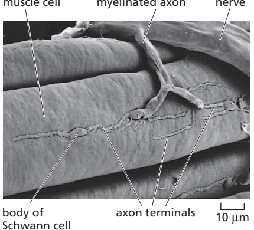

(B)

(C)

Figure 11–40 A model for the structure of the skeletal muscle acetylcholine receptor. (A) Five homologous subunits (α, α, β, γ, δ) combine to form a transmembrane pore. Both of the α subunits contribute an acetylcholinebinding site nestled between adjoining subunits. (B) The pore is lined by a ring of five transmembrane α helices, one contributed by each subunit (just the two α subunits are shown). In its closed conformation, the pore is occluded by the hydrophobic side chains of five leucines (green), one from each α helix, which form a gate near the middle of the lipid bilayer. When both α subunits bind acetylcholine, the channel undergoes a conformational change that opens the gate by an outward rotation of the helices containing the occluding leucines. Negatively charged side chains (indicated by the $a _ { \_ } \eta$ signs) at either end of the pore ensure that only positively charged ions pass through the channel. (PDB code: 2BG9.)

lipid bilayer, which widens into vestibules at both ends. Acetylcholine binding opens the channel by causing the helices that line the pore to rotate outward, thus disrupting a ring of hydrophobic amino acids that blocks ion flow in the closed state. Clusters of negatively charged amino acids at either end of the pore help to exclude negative ions and encourage any positive ion of diameter less than 0.65 nm to pass through (Figure 11–40B). The normal through-traffic consists chiefly of $\mathrm { N a } ^ { \bar { + } }$ and $\mathrm { K } ^ { + }$ , together with some MB C7 $\mathrm { \dot { C } a ^ { 2 + } }$ . Thus, unlike voltage-gated cation channels,38/11.40 such as the $\mathrm { K } ^ { + }$ channel discussed earlier, there is little selectivity among cations, and the relative contributions of the different cations to the current through the channel depend chiefly on their concentrations and on the electrochemical driving forces. When the muscle-cell membrane is at its resting potential, the net driving force for $\mathrm { K } ^ { + }$ is near $\mathbf { Z e r o } ,$ because the voltage gradient nearly balances the $\mathrm { K } ^ { + }$ concentration gradient across the membrane (see Panel 11–1, p. 656). For $\mathrm { { N a } ^ { + } } ,$ , in contrast, the voltage gradient and the concentration gradient both act in the same direction to drive the ion into the cell. (The same is true for $\mathrm { C a ^ { 2 + } }$ , but the extracellular concentration of $\mathrm { C a ^ { 2 + } }$ is so much lower than that of $\mathrm { N a } ^ { + }$ that $\mathrm { C a ^ { 2 + } }$ makes only a small contribution to the total inward current.) Therefore, the opening of the acetylcholine-receptor channels leads to a large net influx of $\mathrm { N a } ^ { + }$ (a peak rate of about 30,000 ions per channel each millisecond). This influx causes a membrane depolarization that signals the muscle to contract, as discussed later.

#### Neurons Contain Many Types of Transmitter-gated Channels

The ion channels that open directly in response to the neurotransmitters acetylcholine, serotonin, GABA, and glycine contain subunits that are structurally similar and probably form transmembrane pores in the same way as the ionotropic acetylcholine receptor, even though they have distinct neurotransmitter-binding specificities and ion selectivities. These channels are all built from homologous polypeptide subunits, which assemble as a pentamer. Glutamate-gated ion channels are an exception, in that they are constructed from a distinct family of subunits and form tetramers resembling the $\mathrm { K } ^ { + }$ channels discussed earlier (see Figure 11–24A).

For each class of transmitter-gated ion channel, there are alternative forms of each type of subunit, which may be encoded by distinct genes or else generated by alternative RNA splicing of a single gene product. The subunits assemble in

different combinations to form an extremely diverse set of distinct channel subtypes, with different ligand affinities, different channel conductances, different rates of opening and closing, and different sensitivities to drugs and toxins. Some vertebrate neurons, for example, have acetylcholine-gated ion channels that differ from those of muscle cells in that they are formed from two subunits of one type and three of another; but there are at least nine genes coding for different versions of the first type of subunit and at least three coding for different versions of the second. Subsets of such neurons performing different functions in the brain express different combinations of the genes for these subunits. In principle, and already to some extent in practice, it is possible to design drugs targeted against these narrowly defined subsets, thereby specifically influencing particular brain functions.

#### Many Psychoactive Drugs Act at Synapses

Transmitter-gated ion channels have for a long time been important drug targets. A surgeon, for example, can relax muscles for the duration of an operation by blocking the acetylcholine receptors on skeletal muscle cells with curare, a plantderived drug that was originally used by South American Indians to make poison arrows. Most drugs used to treat insomnia, anxiety, depression, and schizophrenia exert their effects at chemical synapses, and many of these act by binding to transmitter-gated channels. Barbiturates, tranquilizers such as Valium, and sleeping pills such as Ambien, for example, bind to GABA receptors, potentiating the inhibitory action of GABA by allowing lower concentrations of this neurotransmitter to open Cl– channels. Our increasing understanding of the molecular biology of ion channels should allow us to design a new generation of psychoactive drugs that will act still more selectively to alleviate the miseries of mental illness.

In addition to ion channels, many other components of the synaptic signaling machinery are potential targets for psychoactive drugs. As mentioned earlier, after release into the synaptic cleft, many neurotransmitters are cleared by reuptake mechanisms mediated by Na -driven symports. Inhibiting such transporters prolongs the effect of the neurotransmitter, thereby strengthening synaptic transmission. Many antidepressant drugs, including Prozac, inhibit the reuptake of serotonin; others inhibit the reuptake of both serotonin and norepinephrine.

Ion channels are the basic molecular units from which neuronal devices for signaling and computation are built. To provide a glimpse of how sophisticated these devices can be, we consider several examples that demonstrate how the coordinated activities of groups of ion channels allow you to move, feel, and remember.

#### Neuromuscular Transmission Involves the Sequential Activation of Five Different Sets of Ion Channels

The following process, in which a nerve impulse stimulates a muscle cell to contract, illustrates the importance of ion channels to electrically excitable cells. This apparently simple response requires the sequential activation of at least five different sets of ion channels, all within a few milliseconds (**Figure 11–41**).

1. Neuromuscular transmission is initiated when a nerve impulse reaches the nerve terminal and depolarizes the plasma membrane of the terminal. The depolarization transiently opens voltage-gated $\mathrm { C a ^ { 2 + } }$ channels in this presynaptic membrane. As the $\mathrm { C a ^ { \dot { 2 } + } }$ concentration outside cells is more than 1000 times greater than the free $\mathrm { C a ^ { 2 + } }$ concentration inside, $\mathrm { C a ^ { 2 + } }$ flows into the nerve terminal. The increase in $\mathrm { C a ^ { 2 + } }$ concentration in the cytosol of the nerve terminal triggers the local release of acetylcholine by exocytosis into the synaptic cleft.

2. The released acetylcholine binds to acetylcholine receptors in the musclecell plasma membrane, transiently opening the cation channels associated with them. The resulting influx of $\bar { \mathrm { N a ^ { + } } }$ causes a local membrane depolarization in the muscle.

3. The local depolarization opens voltage-gated $\mathrm { N a } ^ { + }$ channels in this membrane, allowing more $\mathrm { N a } ^ { + }$ to enter, which further depolarizes the membrane. This, in turn, opens neighboring voltage-gated $\mathrm { N a } ^ { + }$ channels and results in a self-propagating depolarization (an action potential) that spreads to involve the entire muscle plasma membrane (see Figure 11–33).

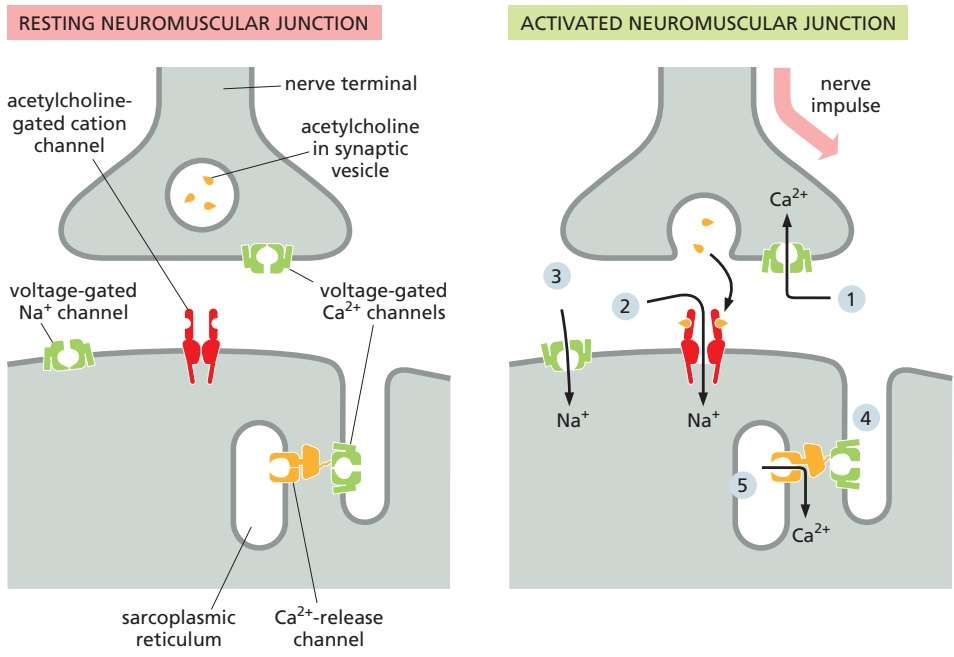

Figure 11–41 The system of ion channels at a neuromuscular junction. These gated ion channels are essential for the stimulation of muscle contraction by a nerve impulse. The various channels are numbered in the sequence in which they are activated, as described in the text.

4. The generalized depolarization of the muscle-cell plasma membrane activates voltage-gated $\mathrm { C a ^ { 2 + } }$ channels in the transverse tubules (T tubules—discussed in Chapter 16) of this membrane.. / .

5. This in turn causes $C a ^ { 2 + }$ -release channels in an adjacent region of the sarcoplasmic reticulum (SR) membrane to open transiently and release $\mathrm { C a ^ { 2 + } }$ stored in the SR into the cytosol. The T-tubule and SR membranes are closely apposed, and the two types of channel are joined together in a specialized structure, in which activation of the voltage-sensitive $\mathrm { C a ^ { 2 + } }$ channel in the T-tubule plasma membrane causes a channel conformational change that is mechanically transmitted to the $\mathrm { C a ^ { 2 + } }$ -release channel in the SR membrane, opening it and allowing $\mathrm { C a ^ { 2 + } }$ to flow from the SR lumen into the cytoplasm (see Figure 16–30). The sudden increase in the cytosolic $\mathrm { C a ^ { 2 + } }$ concentration causes the myofibrils in the muscle cell to contract.

Whereas the initiation of muscle contraction by a motor neuron is complex, an even more sophisticated interplay of ion channels is required for a neuron to integrate a large number of input signals at its synapses and compute an appropriate output, as we now discuss.

#### Single Neurons Are Complex Computation Devices

In the central nervous system, a single neuron can receive inputs from thousands of other neurons, and it can in turn form synapses with many thousands of other cells. Several thousand nerve terminals, for example, make synapses on an average motor neuron in the spinal cord, almost completely covering its cell body and dendrites (**Figure 11–42**). Some of these synapses transmit signals from the brain or spinal cord; others bring sensory information from muscles or from the skin. The motor neuron must combine the information received from all these sources and react, either by firing action potentials along its axon or by remaining quiet.

Of the many synapses on a neuron, some tend to excite it, while others inhibit it. Neurotransmitter released at an excitatory synapse causes a small depolarization in the postsynaptic membrane called an excitatory postsynaptic potential (excitatory PSP), whereas neurotransmitter released at an inhibitory synapse generally causes a small hyperpolarization called an inhibitory PSP. The plasma membrane of the dendrites and cell body of most neurons contains a relatively

Figure 11–42 A motor neuron in the spinal cord. (A) Many thousands of nerve terminals synapse on the cell body and dendrites. These deliver signals from other parts of the organism to control the firing of action potentials along the single axon of this large cell. (B) Fluorescence micrograph showing a nerve-cell body in cell culture. Its dendrites are stained with a fluorescent antibody that recognizes a cytoskeletal protein (green) that is not present in axons. Thousands of axon terminals (red) from other nerve cells (not visible) make synapses on the cell body and dendrites; the terminals are stained with a fluorescent antibody that recognizes a protein in synaptic vesicles. (B, courtesy of Olaf Mundigl and Pietro de Camilli.)

low density of voltage-gated $\mathrm { N a } ^ { + }$ channels, and so an individual excitatory PSP is generally too small to trigger an action potential. Instead, each incoming signal initiates a local PSP, which decreases with distance from the site of the synapse. If signals arrive simultaneously at several synapses in the same region of the dendritic tree, the total PSP in that neighborhood will be roughly the sum of the individual $\mathrm { P S P s } _ { r }$ with inhibitory PSPs making a negative contribution to the total. The PSPs from each neighborhood spread passively and converge on the cell body. For long-distance transmission, the combined magnitude of the PSP is then translated, or encoded, into the frequency of firing of action potentials: the greater the stimulation (depolarization), the higher the frequency of action potentials.

#### Neuronal Computation Requires a Combination of at Least Three Kinds of $\mathsf { K } ^ { + }$ Channels

The intensity of stimulation that a neuron receives is encoded by that neuron into action potential frequency for long-distance transmission. The encoding takes place at a specialized region of the axonal membrane known as the initial segment, or axon hillock, at the junction of the axon and the cell body (see Figure 11–42). This membrane is rich in voltage-gated $\mathrm { { N a } ^ { + } }$ channels, but it also contains at least four other classes of ion channels—three selective for $\mathrm { K } ^ { + }$ and one selective for $\mathrm { C a ^ { 2 + } }$ —all of which contribute to the axon hillock’s encoding function. The three varieties of $\mathrm { K } ^ { + }$ channels have different properties; we shall refer to them as delayed, rapidly inactivating, and $C a ^ { 2 + }$ **-**activated $K ^ { + }$ channels.

To understand the need for multiple types of channels, consider first what would happen if the only voltage-gated ion channels present in the nerve cell were the $\mathrm { N a } ^ { + }$ channels. Below a certain threshold level of synaptic stimulation, the depolarization of the initial-segment membrane would be insufficient to trigger an action potential. With gradually increasing stimulation, the threshold would be crossed, the $\mathrm { { N a } ^ { + } }$ channels would open, and an action potential would fire. The action potential would be terminated by inactivation of the $\mathrm { { N a } ^ { + } }$ channels. Before another action potential could fire, these channels would have to recover from their inactivation. But that would require a return of the membrane voltage to a very negative value, which would not occur as long as the strong depolarizing stimulus (from PSPs) was maintained. An additional channel type is needed, therefore, to repolarize the membrane after each action potential to prepare the cell to fire again.

The delayed $\mathrm { K } ^ { + }$ channels perform this task, as discussed previously in relation to the propagation of the action potential (see Figure 11–32). Their opening permits an efflux of $\mathrm { K } ^ { + }$ that drives the membrane back toward the $\mathrm { K } ^ { + }$ equilibrium potential, which is so negative that the $\mathrm { N a } ^ { + }$ channels rapidly recover from their inactivated state. Repolarization of the membrane also closes the delayed $\mathrm { K } ^ { + }$ channels. The initial segment is now reset so that the depolarizing stimulus from synaptic inputs can fire another action potential. In this way, sustained stimulation of the dendrites and cell body leads to repetitive firing of the axon.

(B)

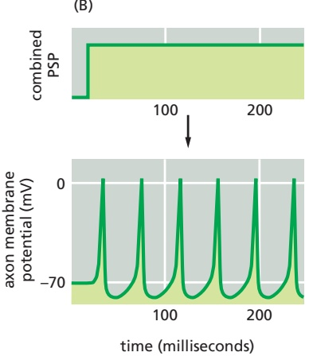

(C)

Repetitive firing in itself, however, is not enough. The frequency of firing has to reflect the intensity of stimulation, and a simple system of $\mathrm { N a } ^ { + }$ channels and delayed $\mathrm { K } ^ { + }$ channels is inadequate for this purpose. Below a certain threshold level of steady stimulation, the cell will not fire at all; above that threshold level, it will abruptly begin to fire at a relatively rapid rate. The rapidly inactivating $\mathbf { K } ^ { + }$ **channels** solve the problem. These, too, are voltage-gated and open when the membrane is depolarized, but their specific voltage sensitivity and kinetics ofMB C7 11.41/11.43 inactivation are such that they act to reduce the rate of firing at levels of stimulation that are only just above the threshold required for firing. Thus, they remove the discontinuity in the relationship between the firing rate and the intensity of stimulation. The result is a firing rate that is proportional to the strength of the depolarizing stimulus over a very broad range (**Figure 11–43**).

The process of encoding is usually further modulated by the two other types of ion channels in the initial segment that were mentioned earlier—voltage-gated $\mathrm { C a ^ { 2 + } }$ channels and $\mathrm { C a ^ { 2 + } }$ -activated $\mathrm { K } ^ { + }$ channels. They act together to decrease the response of the cell to an unchanging, prolonged stimulation—a process called **adaptation**. These $\mathrm { C a ^ { 2 + } }$ channels are similar to the $\mathrm { C a ^ { 2 + } }$ channels that mediate the release of neurotransmitter from presynaptic axon terminals; they open when an action potential fires, transiently allowing $\mathrm { C a ^ { 2 + } }$ into the axon cytosol at the initial segment.

The $\mathbf { \bar { C } } \mathbf { a } ^ { 2 + }$ **-activated** $\mathbf { K } ^ { + }$ **channel** opens in response to a raised concentration of $\mathrm { C a ^ { 2 + } }$ at the channel’s cytoplasmic face (Figure 11–44). Prolonged, strong depolarizing stimuli will trigger a long train of action potentials, each of which permits a brief influx of $\mathrm { C a ^ { 2 + } }$ through the voltage-gated $\mathrm { C a ^ { \hat { 2 } + } }$ channels, so that local cytosolic $\mathrm { C a ^ { 2 + } }$ concentration gradually builds up to a level high enough to open the $\dot { \mathrm { C a } ^ { 2 + } }$ -activated $\mathrm { K } ^ { + }$ channels. Because the resulting increased permeability of the membrane to $\mathrm { K } ^ { + }$ makes the membrane harder to depolarize, the delay between one action potential and the next is increased. In this way, a neuron that is stimulated continually for a prolonged period becomes gradually less responsive to the constant stimulus.

Such adaptation, which can also occur by other mechanisms, allows a neuron— indeed, the nervous system generally—to react sensitively to change, even against a high background level of steady stimulation. It is one of the computational strategies that help us, for example, to feel a light touch on the shoulder and yet ignore the constant pressure of our clothing. We discuss adaptation as a general feature in cell signaling processes in more detail in Chapter 15.

Other neurons do different computations, reacting to their synaptic inputs in myriad ways, reflecting the different assortments of ion channels in their membrane. There are several hundred genes that code for ion channels in the human genome, with more than 70 encoding voltage-gated channels alone. Further complexity is introduced by alternative splicing of RNA transcripts and assembly of channel subunits in different combinations. Moreover, ion channels are selectively localized to different sites in the plasma membrane of a neuron. Some $\mathrm { K ^ { + } }$ and $\mathrm { C a ^ { 2 + } }$ channels are concentrated in the dendrites and participate in processing the input that a neuron receives. As we have seen, other ion channels are located at the axon’s initial segment, where they control action potential firing; and some ligandgated channels are distributed over the cell body and, depending on their ligand occupancy, modulate the cell’s general sensitivity to synaptic inputs. The multi-plicity of ion channels and their locations evidently allows each of the many types of neurons to tune their electrical behavior to the particular tasks they perform.

Figure 11–43 The magnitude of the combined postsynaptic potential (PSP) is reflected in the frequency of firing of action potentials. The mix of excitatory and inhibitory PSPs produces a summed PSP at the initial segment. A comparison of (A) and (B) shows how the firing frequency of an axon increases with an increase in the combined PSP, while (C) summarizes the general relationship.

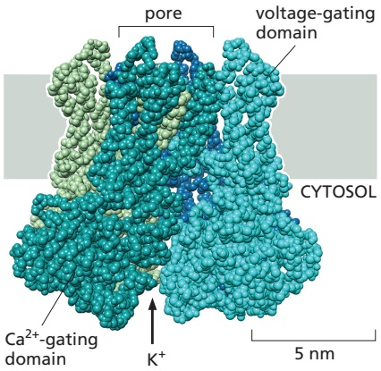

Figure 11–44 Structure of a $\mathbf { C a } ^ { 2 + } .$ activated $\mathsf { K } ^ { + }$ channel. The channel contains four identical subunits (which are shown in different colors for clarity). It is both voltage- and $\mathrm { C a ^ { 2 + } }$ -gated. The structure shown is a composite of the cytosolic and membrane portions of the channel that were separately crystallized. Note the large ligand-binding domains in the cytosol. (PDB code: 1LNQ.)

Voltage-gated $\mathrm { C a ^ { 2 + } }$ channels are ubiquitous in neurons, and the $\mathrm { C a ^ { 2 + } }$ that flows in through them is a good reflection of each nerve cell’s activity. Today it is therefore quite common to express optical $\mathrm { C a ^ { 2 + } }$ reporters in specific subtypes of neurons to follow their activities in transgenic animals. It is possible to image and track $\mathrm { C a ^ { 2 + } }$ signals of 10,000 neurons in the brain simultaneously with a sensitive camera looking at the surface of the cortex or looking deeper into the brain with optical fibers. In this way, we begin to see neuronal circuits in living animals.

One of the crucial properties of the nervous system is its ability to learn and remember. This property depends in part on the ability of individual synapses to strengthen or weaken depending on their use—a process called **synaptic plasticity**. We will next consider a remarkable type of ion channel that has a special role in some forms of synaptic plasticity. It is located at many excitatory synapses in the central nervous system, where it is doubly gated by voltage and the excitatory neurotransmitter glutamate. It is also the site of action of the psychoactive drug phencyclidine, or angel dust.

#### Long-term Potentiation in the Mammalian Hippocampus Depends on $\mathbb { C } \mathbb { a } ^ { 2 + }$ Entry Through NMDA-Receptor Channels

Practically all animals can learn, but mammals seem to learn exceptionally well (or so we like to think). In a mammal’s brain, the region called the hippocampus has a special role in learning. When it is destroyed on both sides of the brain, the ability to form new memories is largely lost, although previous long-established memories remain. Some synapses in the hippocampus show a striking form of synaptic plasticity with repeated use: whereas occasional single action potentials in the presynaptic cells leave no lasting trace, a short burst of repetitive firing causes **long-term potentiation (LTP)**, such that subsequent single action potentials in the presynaptic cells evoke a greatly enhanced response in the postsynaptic cells. The effect lasts hours, days, or weeks, according to the number and intensity of the bursts of repetitive firing. Only the synapses that were activated exhibit LTP; synapses that have remained quiet on the same postsynaptic cell are not affected. However, while the cell is receiving a burst of repetitive stimulation via one set of synapses, if a single action potential is delivered at another synapse on its surface, that latter synapse also will undergo LTP, even though a single action potential delivered there at another time would leave no such lasting trace.

The underlying rule in such events seems to be that $L T P$ occurs on any occasion when a presynaptic cell fires (once or more) at a time when the postsynaptic membrane is strongly depolarized (either through recent repetitive firing of the same presynaptic cell or by other means). This rule reflects the behavior of a particular class of ion channels in the postsynaptic membrane. Glutamate is the main excitatory neurotransmitter in the mammalian central nervous system, and glutamate-gated ion channels are the most common of all transmitter-gated channels in the brain. In the hippocampus, as elsewhere, most of the depolarizing current responsible for excitatory PSPs is carried by glutamate-gated ion channels called **AMPA receptors**, which operate in the standard way (**Figure 11–45**, **Figure 11–46**). But the current has, in addition, a second and more intriguing component, which is mediated by a separate subclass of glutamate-gated ion channels known as **NMDA receptors**, so named because they can be selectively activated by the artificial glutamate analog N-methyl-d-aspartate. The NMDA-receptor channels are doubly gated, opening only when two conditions are satisfied simultaneously: glutamate must be bound to the receptor, and the membrane must

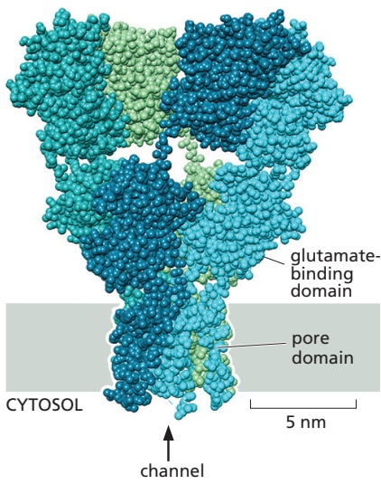

Figure 11–45 The structure of the AMPA receptor. This ionotropic glutamate receptor (named after the glutamate analog α-amino-3-hydroxy-5- methyl-4-isoxazolepropionic acid) is the most common mediator of fast, excitatory MBoC7 m11.43/11.45synaptic transmission in the central nervous system (CNS). Note the large ligandbinding domains in the extracellular space. (PDB code: 3KG2.)

glutamate released by activated presynaptic nerve terminal opens AMPA-receptor channels, allowing Na+ influx that begins to depolarize the postsynaptic membrane

partial depolarization removes Mg2+ block from NMDA-receptor channel, which (with glutamate bound) allows Ca2+ to enter the postsynaptic cell

be strongly depolarized. The second condition is required for releasing the $\mathrm { M g ^ { 2 + } }$ that normally blocks the resting channel. This means NMDA receptors are normally activated only when AMPA receptors are activated as well and depolarize the membrane (see Figure 11–43). The NMDA receptors are critical for LTP. When they are selectively blocked with a specific inhibitor or inactivated genetically, LTP does not occur, even though ordinary synaptic transmission continues, indicating the importance of NMDA receptors for LTP induction. Such animals exhibit specific deficits in their learning abilities but behave almost normally otherwise.

How do NMDA receptors mediate LTP? The answer is that these channels, when open, are highly permeable to $\mathrm { C a ^ { 2 + } }$ , which acts as an intracellular signal in the postsynaptic cell, triggering a cascade of changes that are responsible for LTP. Thus, LTP is prevented when $\mathbf { \tilde { C } } \mathbf { a } ^ { 2 + }$ levels are held artificially low in the post-synaptic cell by injecting the $\mathrm { C a ^ { 2 + } }$ chelator EGTA into it, and LTP can be induced by artificially raising intracellular $\mathrm { C a ^ { 2 + } }$ levels in the cell. Among the long-term changes that increase the sensitivity of the postsynaptic cell to glutamate is the insertion of new AMPA receptors into the plasma membrane (see Figure 11–46). In some forms of LTP, changes occur in the presynaptic cell as well, so that it releases more glutamate than normal when it is activated subsequently.

If synapses were capable only of LTP, they would quickly become saturated and thus be of limited value as an information-storage device. In fact, they also exhibit **long-term depression (LTD)**, with the long-term effect of reducing the number of AMPA receptors in the postsynaptic membrane. This feat is accomplished by degrading AMPA receptors after their selective endocytosis. Surprisingly, LTD also requires NMDA-receptor activation and a rise in $\mathrm { C a ^ { 2 + } }$ . How does $\mathrm { C a ^ { 2 + } }$ trigger opposite effects at the same synapse? It turns out that this bidirectional control of synaptic strength depends on the magnitude of the rise in $\mathrm { C a ^ { 2 + } }$ : high $\mathrm { C a ^ { 2 + } }$ levels activate protein kinases and LTP, whereas modestMBoC7 m11. $\mathrm { C a ^ { 2 + } }$ levels activate11.46 protein phosphatases and LTD.

There is evidence that NMDA receptors have an important role in synaptic plasticity and learning in other parts of the brain, as well as in the hippocampus. Moreover, they have a crucial role in adjusting the anatomical pattern of synaptic connections in the light of experience during the development of the nervous system.

Thus, neurotransmitters released at synapses, besides relaying transient electrical signals, can also alter concentrations of intracellular mediators that bring about lasting changes in the efficacy of synaptic transmission. However, it is still uncertain how these changes endure for weeks, months, or a lifetime in the face of the normal turnover of cell constituents.

#### The Use of Channelrhodopsins Has Revolutionized the Study of Neural Circuits

**Channelrhodopsins** are photosensitive ion channels that open in response to light. They evolved as sensory receptors in photosynthetic green algae to allow the algae to swim toward light. The structure of channelrhodopsin closely resembles that of bacteriorhodopsin (see Figure 10–31). It contains a covalently bound

increased $\mathsf { C a } ^ { 2 + }$ in the cytosol induces postsynaptic cell to insert new AMPA receptors in the plasma membrane, increasing the cell's sensitivity to glutamate

Figure 11–46 The signaling events in long-term potentiation. Although not shown, transmission-enhancing changes can also occur in the presynaptic nerve terminals in LTP, which may be induced by retrograde signals from the postsynaptic cell.

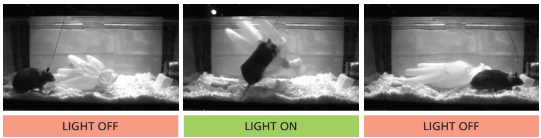

retinal group that absorbs light and undergoes an isomerization reaction, which triggers a conformational change in the protein, opening an ion channel in the plasma membrane. In contrast to bacteriorhodopsin, which is a light-driven proton pump, channelrhodopsin is a light-activated cation channel.

Figure 11–47 Optogenetic control of aggression neurons in a living mouse. A gene encoding channelrhodopsin was introduced into a subpopulation of neurons in the hypothalamus of a mouse. When the neurons were exposed to flashing blue light using a tiny, implanted fiber-optic cable, the channelrhodopsin channels opened, depolarizing and activating the cells. When the light was switched on, the mouse immediately became aggressive and attacked the inflated rubber glove; when the light was switched off, its behavior immediately returned to normal (Movie 11.13). (Adapted from D. Lin et al., Nature 470:221–226, 2011. With permission from the authors.)

Using genetic engineering techniques, channelrhodopsin can be expressed in virtually any cell type in vertebrates and invertebrates. Researchers first introduced the gene into cultured neurons and showed that flashing light could now activate the channelrhodopsin and induce the neurons to fire action potentials. Because the frequency of the light flashes determined the frequency of the action potentials, one can control the frequency of neuronal firing with millisecondMBoC7 m11.32/11.47 precision.

Next, neurobiologists used the approach to activate specific neurons in the brain of experimental animals. Using a tiny fiber-optic cable implanted near the relevant brain region, they could flash light to specifically activate the channelrhodopsin-containing neurons to fire action potentials. One group of researchers expressed channelrhodopsin in a subset of mouse neurons thought to be involved in aggression: when these cells were activated by light, the mouse immediately attacked anything in its environment—including other mice or even an inflated rubber glove (**Figure 11–47**); when the light was switched off, the neurons fell silent and the mouse’s behavior returned to normal.

Since these pioneering studies, researchers have engineered additional light-responsive ion channels and transporters, including some that can rapidly inactivate specific neurons. It is therefore now possible to transiently activate or inhibit specific neurons in the brains of awake animals with remarkable spatial and temporal precision. In this way, the rapidly expanding new field of **optogenetics** is revolutionizing neurobiology, allowing neuroscientists to analyze the neurons and circuits underlying even the most complex behaviors in experimental animals, including nonhuman primates.

#### Summary

Ion channels form aqueous pores across the lipid bilayer and allow inorganic ions of appropriate size and charge to cross the membrane down their electrochemical gradients at rates about 1000 times greater than those achieved by any known transporter. The channels are “gated” and usually open transiently in response to a specific perturbation in the membrane, such as a change in membrane potential (voltage-gated channels), or the binding of a neurotransmitter to the channel (transmitter-gated channels).

K1-selective leak channels have an important role in determining the resting membrane potential across the plasma membrane in most animal cells. Voltage-gated cation channels are responsible for the amplification and propagation of action potentials in electrically excitable cells, such as neurons and heart and skeletal muscle cells. Transmitter-gated ion channels convert chemical signals to electrical signals at chemical synapses. Excitatory neurotransmitters, such as acetylcholine and glutamate, open transmitter-gated cation channels and thereby depolarize the postsynaptic membrane toward the threshold level for firing an action potential. Inhibitory neurotransmitters, such as GABA and glycine, open transmitter-gated Cl2 or K1 channels and thereby suppress firing by keeping the postsynaptic membrane polarized. A subclass of glutamate-gated ion channels, called NMDA-receptor channels, is highly permeable to Ca21, which can trigger the long-term changes in synapse efficacy (synaptic plasticity) such as LTP and LTD that are thought to be involved in some forms of learning and memory.

<!-- END EN EN11-H017-H039 -->

---

## 第4章 物质的跨膜运输 · 第三节 胞吞作用与胞吐作用

[返回本章](README.md) · [中文本章原文](中文原文.md)

<!-- BEGIN CN CN04-S03 -->
## 第三节 胞吞作用与胞吐作用

真核细胞通过胞吞 (endocytosis) 和胞吐 (exocytosis) 作用完成大分子与颗粒性物质的跨膜运输，如蛋白质、多核苷酸、多糖等。在转运过程中，物质包裹在脂双层膜包被的囊泡中，因此又称膜泡运输。这种运输方式常常可同时转运一种或一种以上数量不等的大分子甚至颗粒性物质，因此也有人称之为批量运输 (bulk transport)。膜泡运输涉及生物膜的断裂与融合，是一个耗能的过程。所谓胞吞作用，就是细胞通过质膜内陷形成囊泡，将胞外的生物大分子、颗粒性物质或液体等摄取到细胞内，以维持细胞正常的代谢活动；而胞吐作用则是细胞内合成的生物分子（蛋白质和脂质等）和代谢物以分泌泡的形式与质膜融合而将内含物分泌到细胞表面或细胞外的过程。由于胞吐作用将在第六章详细介绍，本节主要介绍胞吞作用。

## 一、胞吞作用的类型

胞吞时质膜内陷脱落形成的囊泡，称胞吞泡（endo-cytic vesicle)。根据胞吞泡形成的分子机制不同和胞吞泡的大小差异，胞吞作用可分为两种类型：吞噬作用（phagocytosis）和胞饮作用（pinocytosis）（图4-14）。吞噬作用形成的吞噬泡直径往往大于 $250\mathrm{nm}$ ，而胞饮作用形成的胞饮泡直径一般小于 $150\mathrm{nm}$ 。此外，所有真核细胞都能通过胞饮作用连续摄入溶液及可溶性分子，而吞噬作用往往发生于一些特化的吞噬细胞如巨噬细胞（macrophage）。

## （一）吞噬作用

吞噬作用是一类特殊的胞吞作用。通过吞噬作用形成的胞吞泡叫做吞噬体（phagosome）。对于原生生物，细胞通过吞噬作用将胞外的营养物取取到吞噬体，最后在溶酶体中消化降解成小分子物质供细胞利用。吞噬作用是原生生物摄取食物的一种方式。在高等多细胞生物体中，吞噬作用往往发生于巨噬细胞和中性粒细胞(neutrophil)，其作用不仅仅是摄取营养物，主要是清除侵染机体的病原体以及衰老或凋亡的细胞，如人的巨噬细胞每天通过吞噬作用清除 $10^{11}$ 个衰老的红细胞。

吞噬作用需要被吞噬物与吞噬细胞表面结合并激活细胞表面的受体，将信号传递到细胞内并引起细胞应答反应，是一个信号触发的过程。在激活吞噬作用过程中，抗体诱发的吞噬作用研究得最为清楚。当抗体与病原微生物表面结合后，暴露出尾部的Fc区域，该区域

## 图4-14 胞吞作用的类型

胞吞作用可分为吞噬作用和胞饮作用两大类型，而胞饮作用又可分为网格蛋白依赖的胞吞作用、胞膜窖依赖的胞吞作用、大型胞饮作用以及非网格蛋白/胞膜窖依赖的胞吞作用4种类型。

  
图4-15 吞噬作用

吞噬细胞伸出伪足，包裹病原微生物形成吞噬体，吞噬体与溶酶体融合，在各种酸性水解酶的作用下，将病原微生物分解。未被分解的底物形成残余小体，可通过胞吐作用的方式将残余底物释放到细胞外。

被巨噬细胞和中性粒细胞表面的Fc受体识别，从而诱发吞噬细胞质膜伸出伪足（pseudopod），将病原微生物包裹起来形成吞噬体，最后与溶酶体融合，并在其中被各种水解酶降解（图4-15）。伪足的生成与细胞内微丝及其结合蛋白在质膜下局部装配密切相关，这一装配过程需要Rho家族蛋白的GTP酶活性以及活化的Rho-GEF。

吞噬细胞表面的受体除了能识别Fc启动吞噬作用以外，目前还发现了其他几类启动吞噬作用的受体，如有些受体可以识别补体（complement），从而与抗体一道吞噬降解病原微生物；有些受体可以直接识别某些微生物表面的寡糖链；还有些受体可以识别凋亡的细胞。

## （二）胞饮作用

与吞噬作用不同的是，胞饮作用几乎发生于所有类型的真核细胞中。胞饮作用可以分为网格蛋白依赖的胞吞作用（clathrin dependent endocytosis）、胞膜套依赖的胞吞作用（caveola dependent endocytosis）、大型胞饮作用（macropinocytosis）以及非网格蛋白/胞膜套依赖的胞吞作用（clathrin and caveola independent endocytosis）(图4-14)。其中，了解最多的胞饮作用就是网格蛋白依赖的胞吞作用。

## 1. 网格蛋白依赖的胞吞作用

网格蛋白（clathrin）由3个二聚体组成，每个二聚体包括1条 $180\mathrm{kDa}$ 的重链和1条 $35\sim 40\mathrm{kDa}$ 的轻链。3个二聚体形成三脚蛋白复合体（triskelion），是包被的结构单位。当配体与膜上受体结合后，网格蛋白聚集在膜下，逐渐形成直径 $50\sim 100\mathrm{nm}$ 的质膜凹陷，称网格蛋白包被小窝（clathrin-coated pit）。一种小分子GTP结合蛋白——发动蛋白（dynamini）在深陷的包被小窝的颈部组装成环，发动蛋白水解与其结合的GTP引起颈部缢缩，最终脱离质膜形成网格蛋白包被膜泡（clathrin-coated vesicle）。几秒钟后，网格蛋白便脱离包被膜泡返回质膜附近区域以便重复使用。脱包被的囊泡与早期内体（early endosome）融合，从而将转运分子及胞外液体摄入细胞。在大分子跨膜转运中，网格蛋白本身并不起捕获特异转运分子的作用，有特异性选择作用的是包被中另一类衔接蛋白(adaptin)，它既能结合网格蛋白，又能识别跨膜受体胞质面的尾部肽信号（peptide signal），从而通过网格蛋白包被膜泡介导跨膜受体及其结合配体的选择性运输（图4-16）。

根据胞吞的物质是否具有专一性，可将胞吞作用分为受体介导的胞吞作用（receptor mediated endocytosis）和非特异性的胞吞作用。受体介导的胞吞作用既是大多数动物细胞从胞外摄取特定大分子的有效途径，也是一种选择性浓缩机制（selective concentrating mechanism），避免了摄入细胞外大量的液体。重要的例子包括动物细胞通过受体介导的胞吞作用对胆固醇的摄取、鸟类卵细胞摄取卵黄蛋白以及肝细胞摄入转铁蛋白等。某些激素如胰岛素与靶细胞表面受体结合进入细胞，巨噬细胞通过表面受体对免疫球蛋白及其复合物、病毒、细菌乃至衰老细胞的识别和摄入，以及其他一些基本代谢物如合成血红蛋白所必需的维生素 $\mathrm{B}_{12}$ 和铁的摄取，都是通过受体介导的胞吞作用进行的。受体介导的胞吞作用也可以被某些病毒所利用，流感病毒和AIDS病病毒（HIV）就是通过这种胞吞途径侵染细胞的。

胆固醇是动物细胞质膜的基本成分，也是固醇类激素的前体。胆固醇主要在肝细胞中合成，是极端不溶的，它在血液中的运输是通过与磷脂和蛋白质结合形成低密度脂蛋白（low-density lipoprotein, LDL）颗粒的形式进行。LDL是分子质量为3000 kDa、直径为22 nm的多分子复合物，通过与细胞表面的低密度脂蛋白受体特异地结合形成受体-LDL复合物，几分钟内便通过网格蛋白包被膜泡的内化作用进入细胞，经脱包被作用并与内体（endosome）融合。内体是动物细胞内由膜包裹的细胞器，其作用是传输由胞吞作用新摄入的物质到溶酶体。内体膜上有ATP驱动的质子泵，将 $\mathrm{H}^+$ 泵入内体腔中，使腔内的pH降低（ $\mathrm{pH}5\sim 6$ ）。在此过程中，低pH环境可引起LDL与受体分离，而内体以出芽的方式形成含有受体的小囊泡，返回细胞质膜，受体重复使用。然后含有LDL的内体与溶酶体融合，低密度脂蛋白被水解，释放出胆固醇和脂肪酸供细胞利用（图4-17）。

  
图4-16 通过网格蛋白包被膜泡介导的选择性运输示意图  
A 和 B 是显示网格蛋白包被膜泡形成过程的电镜照片。(图中照片由 Bechara Kachar 博士惠赠)

在胞吞过程中，内体被认为是膜泡运输的主要分选站之一，其中的酸性环境在分选过程中起关键作用。已知有25种以上的不同受体，具有不同的分选信号，参与不同类型受体介导的胞吞作用。在受体介导的胞吞作用过程中，不同类型的受体具有不同的内体分选途径：① 大部分受体返回它们原来的质膜区域，如上述 LDL 受体循环到质膜再利用；② 有些受体不能再循环而是最后进入溶酶体被消化，如与表皮生长因子(epidermal growth factor, EGF) 结合的细胞表面受体，大部分在溶酶体被降解，从而导致细胞表面 EGF 受体浓度降低，这种现象称为受体下行调节（receptor downregulation）；③ 有些受体被运至细胞另一侧的质膜，该过程称为跨细胞转运 (transcytosis)。在具有极性的上皮细胞中，这是一种将胞吞作用与胞吐作用相结合的物质跨细胞转运方式，即转运的物质通过胞吞作用从上皮细胞的一侧被摄入细胞，再通过胞吐作用从细胞的另一侧释放出去。母鼠的抗体从血液通过上皮细胞进入母乳中，乳鼠肠上皮细胞将抗体摄入体内，都是通过跨细胞转运完成的。

  
图 4-17 LDL 通过受体介导的胞吞作用进入细胞

## 2. 其他类型的胞饮作用

并非所有的胞吞泡的形成都需要网格蛋白的参与，胞膜睿依赖的胞吞作用是目前关注较多的另一种胞饮作用。胞膜睿在质膜的脂筏区域形成，电镜观察发现有些细胞的胞膜睿呈内陷的瓶状。胞膜密的特征性蛋白是窑蛋白，包括caveolin-1、caveolin-2和caveolin-3。与网格蛋白参与的包被膜泡的形成不同，胞膜密的形成部位位于质膜的脂筏区域。胞吞时，胞膜睿携带着内吞物，利用发动蛋白的收缩作用从质膜上脱落，然后转交给内体样的细胞器——膜密体（caveosome）或者跨细胞转运到质膜的另一侧。在整个过程中，因为是整合膜蛋白，窑蛋白始终不会从胞吞泡膜上解离下来。由于胞膜密所在部位含有大量信号转导的受体和蛋白激酶等，这暗示胞膜密很可能发挥了一种细胞信号转导的平台作用。

大型胞饮作用是另一种胞饮作用，它是通过质膜皱褶包裹内吞物形成囊泡完成胞吞作用（图4-14）。与吞噬作用类似，大型胞饮作用形成的胞吞泡也比较大，质膜皱褶的形成过程也依赖微丝及其结合蛋白。但二者有着明显的差别，如启动吞噬作用的受体往往位于特异细胞表面，而启动大型胞饮作用的受体却位于很多类型的细胞表面，而且受体还能启动其他生理功能，如有些受体就是与细胞生长相关的生长因子受体。

此外，还有非网格蛋白/胞膜窖依赖的胞吞作用，如位于淋巴细胞膜上的白介素2（interleukin-2, IL2）受体就是介导非网格蛋白/胞膜窖依赖的胞吞作用。

## 二、胞吞作用与细胞信号转导

作为真核细胞的一种重要生命活动，胞吞作用不仅调控细胞对营养物的摄取和质膜构成等，近年来发现，胞吞作用还参与了细胞信号转导，并与多种信号整合在一起，在更高层次上参与了细胞和机体组织的调控。而信号转导过程也对胞吞作用进行调控，二者相互调节、彼此整合，在细胞生长、发育、代谢以及增殖等过程中发挥着重要作用。

## （一）胞吞作用对信号转导的下调

下调信号转导活性研究最为清楚的一个例子就是表皮生长因子及其受体的胞吞作用。EGF是一类分子量较小的胞外信号蛋白分子，能够刺激上皮细胞及其他多种细胞增殖。与LDL受体不同，当EGF受体与其配体EGF结合后，受体二聚化并引起受体胞质结构域酪氨酸残基自磷酸化而被活化，开启细胞下游信号级联反应（详见第十一章）；另一方面，细胞通过胞吞作用，将EGF受体及EGF吞入细胞内降解，从而导致细胞信号转导活性下调。这种调节作用即受体下行调节。而EGF受体的胞吞作用也受到细胞信号的调控，尽管调控的分子机制还很不清楚，但这一调控过程与受体的泛素化（ubiquitination）有关。当EGF受体与E3泛素连接酶Cbl（Casitas B-lineage lymphoma）结合后，后者催化泛素分子共价连接到受体上，从而引起泛素结合蛋白识别受体上的泛素分子，并帮助受体进入网格蛋白包被小窝，启动受体内吞。

## （二）胞吞作用对信号转导的激活

胞吞作用既可以下调信号转导活性，也可以激活信号转导活性。胞吞作用激活信号转导的最典型例子就是Notch信号通路。Notch信号是细胞与细胞间相互作用的主要信号通路之一，对多细胞生物中细胞分化命运的决定起关键作用。Notch信号通路的功能最早发现于果蝇神经系统的发育。果蝇正常发育的神经系统通过一种旁侧抑制（lateral inhibition）机制抑制其他上皮细胞发育成神经细胞。其过程是：前体神经细胞（信号细胞）在自身质膜上表达单次跨膜信号蛋白Delta，当该信号蛋白与邻近上皮细胞（靶细胞）表面的受体Notch结合后，激活邻近靶细胞的Notch途径；通过Notch信号通路调控，邻近靶细胞就无法分化成神经细胞，而仍然保持为上皮细胞。在这一过程中，除了配体（Delta/Serrate/Lag2家族，DSL）与Notch受体结合外，信号通路的激活还依赖于DSL和Notch的胞吞作用。首先，配体DSL与Notch受体结合，导致Notch暴露出其胞外S2切割位点并被裂解，胞外部分与配体被信号细胞

  
图 4-18 胞吞作用对 Notch 信号转导的激活

Notch 及其配体 DSL 的胞吞作用对 Notch 活化是必需的，其中，DSL 的胞吞依赖泛素。DSL 与 Notch 结合并内吞，Notch 受体第一次被切割后，通过胞吞作用，第二次被切割，产生有活性片段进入细胞核，调节靶基因表达。

内吞，然后，Notch受体被靶细胞内吞至内体，并在S3位点被γ-分泌酶（γ-secretase）切割，产生有活性的Notch受体胞内活性片段（Notch intracellular domain, NICD）。该片段进入细胞核，调控靶基因表达，产生相应的细胞响应（图4-18）。在Notch受体活化过程中，无论是配体在信号细胞中的胞吞作用还是受体在S2位点切割后的胞吞作用，都对最后在S3位点被γ-分泌酶切割产生有活性的Notch受体胞内活性片段起到了决定性作用。当然，配体和受体的胞吞作用受泛素化等多种信号的调节。

综上所述，胞吞作用与细胞信号转导相互调节，对生命活动的调控发挥了很重要的作用。除了网格蛋白依赖性胞吞方式以外，细胞还通过非网格蛋白依赖性胞吞作用调节其他很多的细胞表面受体。不同类型的受体有

## 思考题

1. 比较载体蛋白与通道蛋白的异同。

不同的胞吞方式，对细胞信号调节、受体活性关闭与放大、信号持续时间长短等发挥着关键作用。

2. 比较 P 型离子泵、V 型质子泵、F 型质子泵和 ABC 超家族的异同。

## 三、胞吐作用

真核细胞无论是通过胞吞作用摄取大分子还是通过胞吐作用分泌大分子，都是通过膜泡运输的方式进行的，并且转运的膜泡只与特定的靶膜融合，从而保证了物质有序地跨膜转运。此外，当分泌泡或转运膜泡与质膜融合并通过胞吐作用释放其内含物后，会使质膜表面积增加，但发生在质膜其他区域的胞吞作用则减少其表面积，这种动态平衡过程对质膜成分的更新和维持细胞的生存与生长是必要的。有关胞吐作用的其他内容，参见本书第六章。

胞吐作用与胞吞作用相反，它是通过分泌泡或其他膜泡与质膜融合而将膜泡内的物质运出细胞的过程。真核细胞有从高尔基体反面网状结构（TGN）分泌的囊泡向质膜流动并与之融合的稳定过程，通过这种组成的胞吐途径（constitutive exocytosis pathway），新合成的蛋白质和脂质以囊泡形式连续不断地供应质膜更新，从而确保细胞分裂前质膜的生长；囊泡内可溶性蛋白分泌到细胞外，有的成为质膜外周蛋白，有的形成胞外基质组分，有的作为营养成分或信号分子扩散到胞外液。真核细胞除了这种连续的组成型胞吐途径之外，特化的分泌细胞还有一种调节型胞吐途径（regulated exocytosis pathway），这些分泌细胞产生的分泌物（如激素、黏液或消化酶）储存在分泌泡内，当细胞在受到胞外信号刺激时，分泌泡与质膜融合并将内含物释放出去。

3. 说明 $\mathrm{Na}^{+}-\mathrm{K}^{+}$ 泵的工作原理及其生物学意义。

4. 将哺乳动物红细胞置于清水中，会发现红细胞膨胀破裂（溶血现象），而在野外或实验室两栖类动物将卵产在清水中，卵细胞却不会膨胀，更不会破裂，根据所学知识推测红细胞和两栖类卵细胞耐低渗能力为何差异如此之大。

5. 试述胞吞作用的类型与功能。

1. Carafoli E, Brini M. Calcium pumps: structural basis for and mechanism of calcium transmembrane transport. Current Opinion in Chemical Biology, 2000, 4:152-161.

2. Deng D, Sun P, Yan C, et al. Molecular basis of ligand recognition and transport by glucose transporters. Nature, 2015, 526(7573): 391-396.

3. Deng D, Xu C, Sun P, et al. Crystal structure of the human glucose transporter GLUT1. Nature, 2014, 510 (7503): 121-125.

4. Higgins C F, Linton K J. The xyz of ABC transporters. Science, 2001, 293 (5536):1782-1784.

5. Hollenstein K, Dawson R J P, Locher K P. Structure and mechanism of ABC transporter proteins. Current Opinion in Structure Biology, 2007, 17: 412-418.

6. Holmgren M, Wagg J, Bezanilla F, et al. Three distinct and sequential steps in the release of sodium ions by the $\mathrm{Na^{+} / K^{+}}$ -ATPase. Nature, 2000, 403 (6772): 898-901.

7. Möbius W, van Donselaar E, Ohno-Iwashita Y, et al. Recycling compartments and the internal vesicles of multivesicular bodies harbor most of the cholesterol found in the endocytic pathway. Traffic, 2003, 4 (4): 222-231.

8. Murata K, Mitsuoka K, Hirai T, et al. Structural determinants of water permeation through aquaporin-1. Nature, 2000, 407 (6804): 599-605.

9. Nishi T, Forgac M. The vacuolar H $^{+}$ -ATPase-nature's most versatile proton pumps. Nature Reviews Molecular Cell Biology, 2002, 3: 94-103.

10. Polo S, Fiore P P. Endocytosis conducts the cell signaling orchestra. Cell, 2006, 124 (5): 897-900.

11. Raiborg C, Rusten T E, Stenmark H. Protein sorting into multivesicular endosomes. Current Opinion in Cell Biology, 2003, 15 (4): 446-455.

<!-- END CN CN04-S03 -->

---

## 对应英文内容

### 英文补充：反面高尔基网络到细胞表面的运输

> 对应中文板块：反面高尔基网络到细胞表面的运输。英文来源：Molecular Biology of the Cell，第7版，第13章；[本章完整原文](../来源/英文教材/13_Intracellular_Membrane_Traffic/chapter.md)。物理PDF页码范围：788–849（整章范围）。

<!-- BEGIN EN EN13-H032-H033 -->
#### TRANSPORT FROM THE TRANS GOLGI NETWORK TO THE CELL EXTERIOR AND ENDOSOMES

After transiting the Golgi cisternae, cargo molecules that arrive at the trans Golgi network (TGN) are sorted and packaged into transport vesicles that depart for different destinations. Transport vesicles destined for the cell surface normally leave the TGN in a steady stream as irregularly shaped tubules. The membrane proteins and the lipids in these vesicles provide new components for the cell’s plasma membrane, while the soluble proteins inside the vesicles are secreted to the extracellular space. The fusion of the vesicles with the plasma membrane is called **exocytosis**. This is the route, for example, by which cells secrete most of the proteoglycans and glycoproteins of the extracellular matrix, as discussed in Chapter 19.

All cells require this **constitutive secretory pathway**, which operates continually (**Movie 13.5**). Specialized secretory cells, however, have a second secretory pathway in which soluble proteins and other substances are destined to be

Figure 13–37 A model of golgin function. Filamentous golgins anchored to Golgi membranes capture transport vesicles by binding to Rab proteins on the vesicle surface. Different members of the golgin family of proteins are localized to different regions of the Golgi apparatus. GRASPs are shown tethering adjacent cisternae to each other.

Figure 13–38 The three best-understood pathways of protein sorting in the trans Golgi network. (1) Proteins with the mannose 6-phosphate (M6P) marker (see Figure 13–40) are diverted to lysosomes (via endosomes) in clathrin-coated transport vesicles. (2) Proteins with signals directing them to secretory vesicles are concentrated in such vesicles as part of a regulated secretory pathway that is present only in specialized secretory cells. (3) In unpolarized cells, a constitutive secretory pathway delivers proteins with no special features to the cell surface. In polarized cells, such as epithelial cells, however, secreted and plasma membrane proteins are selectively directed to either the apical or the basolateral plasma membrane domain, so a specific signal must mediate at least one of these two pathways, as we discuss later.

initially stored in secretory vesicles for later release by exocytosis. This is the **regulated secretory pathway**, found mainly in cells specialized for secreting products rapidly on demand—such as hormones, neurotransmitters, or digestive enzymes.

The third major destination from the TGN is endosomes. Hydrolases that function in the lumen of lysosomes use this pathway to first arrive at endosomes, which progressively mature into lysosomes (discussed later). The sorting mechanism at the TGN for lysosomal hydrolase proteins is especially well understood and provides an example of how cargo molecules in the TGN are segregated among different types of transport vesicles. In this section, we consider the role of the Golgi apparatus in sorting proteins between these three pathways and compare the mechanisms of constitutive and regulated secretion.

#### Many Proteins and Lipids Are Carried Automatically from the Trans Golgi Network to the Cell Surface

A cell capable of regulated secretion must separate at least three classes of proteins before they leave the TGN—those destined for lysosomes (via endosomes), those destined for secretory vesicles, and those destined for immediate delivery to the cell surface (**Figure 13–38**). Specific signals are needed to direct secretory proteins into secretory vesicles and lysosomal proteins into different specialized transport vesicles. The nonselective constitutive secretory pathway transports most other proteins directly to the cell surface. Because entry into this pathway does not require a particular signal, it is also called the **default pathway**. Thus, in an unpolarized cell such as a white blood cell or a fibroblast, it seems that any protein in the lumen of the Golgi apparatus is automatically carried by the constitutive pathway to the cell surface unless it is specifically returned to the ER, retained as a resident protein in the Golgi apparatus itself, or selected for the pathways that lead to regulated secretion or to endosomes. In polarized cells, where different products have to be delivered to different domains of the cell surface, we shall see that the options are more complex.

<!-- END EN EN13-H032-H033 -->

### 英文补充：调节性胞吐、受体介导胞吞与内体回收

> 对应中文板块：调节性胞吐、受体介导胞吞与内体回收。英文来源：Molecular Biology of the Cell，第7版，第13章；[本章完整原文](../来源/英文教材/13_Intracellular_Membrane_Traffic/chapter.md)。物理PDF页码范围：788–849（整章范围）。

<!-- BEGIN EN EN13-H036-H054 -->
#### Secretory Vesicles Bud from the Trans Golgi Network

Cells that are specialized for secreting some of their products rapidly on demand concentrate and store these products in **secretory vesicles** (often called densecore secretory granules because they have dense cores when viewed in the electron microscope). As we discussed (see Figure 13–38), secretory vesicles form from the TGN, and they release their contents to the cell exterior by exocytosis in response to specific signals. The secreted product can be either a small molecule (such as histamine or a neuropeptide) or a protein (such as a hormone or digestive enzyme).

Proteins destined for secretory vesicles (called secretory proteins) are packaged into appropriate vesicles in the TGN by a mechanism that involves the selective aggregation of the secretory proteins. Clumps of aggregated, electrondense material can be detected by electron microscopy in the lumen of the TGN. The signals that direct secretory proteins into such aggregates are not well defined and may be quite diverse. When a gene encoding a secretory protein is artificially expressed in a secretory cell that normally does not make the protein, the foreign protein is appropriately packaged into secretory vesicles. This observation shows that, although the proteins that an individual cell expresses and packages in secretory vesicles differ, they contain common sorting signals, which function properly even when the proteins are expressed in cells that do not normally make them.

It is unclear how the aggregates of secretory proteins are segregated into secretory vesicles. Secretory vesicles have unique proteins in their membrane, some of which might serve as receptors for aggregated protein in the TGN. The aggregates are much too big, however, for each molecule of the secreted protein to be bound by its own cargo receptor, as occurs for transport of the lysosomal enzymes. Instead, the aggregate might cause the membrane region containing the cargo receptor to zipper up around the aggregate, thereby enclosing it within the budding vesicle.

Initially, the membrane of the secretory vesicles that leave the TGN is only loosely wrapped around the clusters of aggregated secretory proteins. Morphologically, these immature secretory vesicles resemble dilated trans Golgi cisternae that have pinched off from the Golgi stack. As immature secretory vesicles mature, clathrin-coated transport vesicles bud from them and go back to the TGN (**Figure 13–42**). This recycling process not only returns Golgi components to the Golgi apparatus, but also serves to concentrate the contents of secretory vesicles. The sum of all the retrieval pathways during the transit of a secretory protein from the ER through the Golgi cisternae to a mature secretory vesicle results in a 200- to 400-fold increase in net concentration.

Figure 13–42 The formation of secretory vesicles. (A) Secretory proteins become segregated and highly concentrated in secretory vesicles by two mechanisms. First, they aggregate in the ionic environment of the TGN; often, the aggregates become more condensed as a secretory vesicle matures and its lumen becomes more acidic. Second, clathrin-coated vesicles retrieve excess membrane and lumenal content present in immature secretory vesicles as the secretory vesicles mature. (B) This electron micrograph shows secretory vesicles forming from the TGN in an insulin-secreting β cell of the pancreas. Anti-clathrin antibodies conjugated to gold spheres (black dots) have been used to locate clathrin molecules. The immature secretory vesicles, which contain insulin precursor protein (proinsulin), contain clathrin patches, which are no longer seen on the mature secretory vesicle. (B, courtesy of Lelio Orci.)

Immature secretory vesicles also fuse with one another, and the lumens become progressively more acidic from the increasing concentration of V-type ATPases in the vesicle membrane. Acidification of the lumen further condenses the secretory protein aggregate within a vesicle whose excess membrane has now been retrieved back to the TGN. Because the final mature secretory vesicles are so densely filled with contents, the secretory cell can disgorge large amounts of material promptly by exocytosis when triggered to do so (**Figure 13–43**).

#### Precursors of Secretory Proteins Are Proteolytically Processed During the Formation of Secretory Vesicles

Concentration is not the only process to which secretory proteins are subjected as the secretory vesicles mature. Many protein hormones and small neuropeptides, as well as many secreted hydrolytic enzymes, are synthesized as inactive precursors. Proteolysis is necessary to liberate the active molecules from these precursor proteins. The cleavages occur in the secretory vesicles and sometimes in the extracellular fluid after secretion. Additionally, many of the precursor proteins exit the ER with an N-terminal propeptide that is cleaved off only later in the secretory pathway to yield the mature protein. These proteins are initially synthesized as pre-pro-proteins, with the ER signal peptide (sometimes referred to as a pre-peptide) cleaved off earlier as the protein enters the rough ER (see Figure 12–18). In other cases, peptide signaling molecules are made as polyproteins that contain multiple copies of the same amino acid sequence. In still more complex cases, a variety of peptide signaling molecules are synthesized as parts of a single polyprotein that acts as a precursor for multiple end products, which are individually cleaved from the initial polypeptide chain. The same polyprotein may be processed in various ways to produce different peptides in different cell types (**Figure 13–44**).

Why is proteolytic processing so common in the secretory pathway? Some of the peptides produced in this way, such as the enkephalins (five-aminoacid neuropeptides with morphine-like activity), are undoubtedly too short in their mature forms to be co-translationally transported into the ER lumen or to

Figure 13–43 Exocytosis of secretory vesicles. The process is illustrated schematically (top) and in an electron micrograph that shows the release of MBoC7 m13.65/13.4insulin from a secretory vesicle of a pancreatic β cell. (Courtesy of Lelio Orci, from L. Orci et al., Sci. Am. 259:85–94, 1988.)

include the necessary signal for packaging into secretory vesicles. In addition, for secreted hydrolytic enzymes—or any other protein whose activity could be harmful inside the cell that makes it—delaying activation of the protein until it reaches a secretory vesicle or until after it has been secreted has a clear advantage: the delay prevents the protein from acting prematurely inside the cell in which it is synthesized.

Figure 13–44 Processing pathways for the prohormone polyprotein proopiomelanocortin. The initial cleavages are made by proteases that cut next to pairs of positively charged amino acids (Lys-Arg, Lys-Lys, Arg-Lys, or Arg-Arg pairs). Trimming reactions then produce the final secreted products. Different cell types produce different concentrations of individual processing enzymes, so that the same prohormone precursor is cleaved to produce different peptide hormones. In the anterior lobe of the pituitary gland, for example, only corticotropin (ACTH) and β-lipotropin are produced from proopiomelanocortin, whereas in the intermediate lobe of the pituitary gland, mainly α-melanocyte stimulating hormone (α-MSH), γ-lipotropin, β-MSH, and β-endorphin are produced—α-MSH from ACTH and the other three from β-lipotropin, as shown.

#### Secretory Vesicles Wait Near the Plasma Membrane Until Signaled to Release Their Contents

Once loaded, a secretory vesicle has to reach the site of secretion, which in some cells is far away from the TGN. Nerve cells are the most extreme example. Secretory proteins, such as peptide neurotransmitters (neuropeptides), which will be released from nerve terminals at the end of the axon, are made and packaged into secretory vesicles in the cell body. They then travel along the axon to the nerve terminals, which can be a meter or more away. As discussed in Chapter 16, motor proteins propel the vesicles along axonal microtubules, whose uniform orientation guides the vesicles in the proper direction. Microtubules also guide transport vesicles to the cell surface for constitutive exocytosis.

Whereas transport vesicles containing materials for constitutive release fuse with the plasma membrane once they arrive there, secretory vesicles in the regulated pathway wait at the membrane until the cell receives a signal for the vesicles to secrete their cargo. The signal can be an electrical nerve impulse (an action potential) or an extracellular signal molecule, such as a hormone. In either case, it leads to a transient increase in the concentration of free $\mathrm { C a ^ { 2 + } }$ in the cytosol, which is the trigger for secretory vesicle fusion.

#### For Rapid Exocytosis, Synaptic Vesicles Are Primed at the Presynaptic Plasma Membrane

Nerve cells (and some endocrine cells) contain two types of secretory vesicles. As for all secretory cells, these cells package proteins and neuropeptides in densecored secretory vesicles in the standard way for release by the regulated secretory pathway. In addition, however, they use another specialized class of tiny (∼50 nm diameter) secretory vesicles called **synaptic vesicles**. These vesicles store small neurotransmitter molecules, such as acetylcholine, glutamate, glycine, and γ-aminobutyric acid (GABA), which mediate rapid signaling from a nerve cell to its target cell at chemical synapses as we discussed in Chapter 11. When an action potential arrives at a nerve terminal, it causes an influx of $\mathrm { C a ^ { 2 + } }$ through voltage-gated $\mathrm { C a ^ { 2 + } }$ channels, which triggers the synaptic vesicles to fuse with the plasma membrane and release their contents to the extracellular space (see Figure 11–38). Some neurons fire more than 1000 times per second, releasing neurotransmitters each time.

The speed of transmitter release (taking only milliseconds) indicates that the proteins mediating the fusion reaction do not undergo complex, multistep rearrangements. Rather, after vesicles have been docked at the presynaptic plasma membrane, they undergo a priming step, which prepares them for rapid fusion. In the primed state, the SNAREs are partly paired but their helices are not fully wound into the final four-helix bundle required for fusion (**Figure 13–45**). Proteins called complexins freeze the SNARE complexes in this metastable state. The brake imposed by the complexins is released by another synaptic vesicle protein, synaptotagmin, which contains $\mathrm { C a ^ { 2 + } }$ -binding domains. A rise in cytosolic $\mathrm { C a ^ { 2 + } }$ triggers binding of synaptotagmin to the SNAREs, displacing the complexins. As the SNARE bundle zippers up completely, a fusion pore opens and the neurotransmitters are released. At a typical synapse, only a small number of the docked vesicles are primed and ready for exocytosis. The use of only a small fraction of primed vesicles at a time allows each synapse to fire over and over again in quick succession. With each firing, new synaptic vesicles dock and become primed to replace those that have fused and released their contents.

Figure 13–45 Exocytosis of synaptic vesicles. For orientation at a synapse, see Figure 11–38. (A) The trans-SNARE complex responsible for docking synaptic vesicles at the plasma membrane of nerve terminals consists of three proteins. The v-SNARE synaptobrevin and the t-SNARE syntaxin are both transmembrane proteins, and each contributes one α helix to MBoC7 m13.67/13.45the complex. By contrast to other SNAREs discussed earlier, the t-SNARE SNAP25 is a peripheral membrane protein that contributes two α helices to the four-helix bundle; the two helices are connected by a loop (dashed line) that lies parallel to the membrane and has fatty acyl chains (not shown) attached to anchor it there. The four α helices are shown as rods for simplicity. (B) At the synapse, the basic SNARE machinery is modulated by the Ca2+ sensor synaptotagmin and an additional protein called complexin. Synaptic vesicles first dock at the membrane (step 1), and the SNARE bundle partially assembles (step $2 ) ,$ resulting in a “primed vesicle” that is already drawn close to the membrane. The SNARE bundle assembles further, but the additional binding of complexin prevents fusion (step 3). Upon arrival of an action potential, $\mathrm { C a ^ { 2 + } }$ enters the cell and binds to synaptotagmin, which releases the block and opens a fusion pore (step 4). Further rearrangements complete the fusion reaction (step 5) and release the fusion machinery, which now can be reused. This elaborate arrangement allows the fusion machinery to respond on the millisecond time scale essential for rapid and repetitive synaptic signaling. (A, adapted from R.B. Sutton et al., Nature 395:347–353, 1998; B, adapted from J. Tang et al., Cell 126:1175–1187, 2006. With permission from Elsevier.)

#### Synaptic Vesicles Can Be Recycled Locally After Exocytosis

For the nerve terminal to respond rapidly and repeatedly, synaptic vesicles need to be replenished very quickly after they discharge. This is achieved by local recycling of synaptic vesicles from the presynaptic plasma membrane in the

nerve terminals (Figure 13–46). In this process, membrane components of synaptic vesicles are removed from the surface by endocytosis almost as fast as they are added by exocytosis. Similarly, newly made membrane components of the synaptic vesicles are initially delivered to the plasma membrane by the constitutive secretory pathway and then retrieved by endocytosis. The membrane components of a synaptic vesicle include transporters specialized for the uptakeMBoC7 m13.68/13.46 of neurotransmitter from the cytosol, where the small-molecule neurotransmitters that mediate fast synaptic signaling are synthesized (Figure 13–47). Most of the endocytic vesicles immediately fill with neurotransmitter to become synaptic vesicles. Once filled with neurotransmitter, the synaptic vesicles can be used again (see Figure 13–46).

1 DELIVERY OF SYNAPTIC VESICLE MEMBRANE COMPONENTS TO PRESYNAPTIC PLASMA MEMBRANE

2 ENDOCYTOSIS OF SYNAPTIC VESICLE MEMBRANE COMPONENTS TO FORM NEW SYNAPTIC VESICLES DIRECTLY

3 ENDOCYTOSIS OF SYNAPTIC VESICLE MEMBRANE COMPONENTS AND DELIVERY TO ENDOSOME

4 BUDDING OF SYNAPTIC VESICLE FROM ENDOSOME

5 LOADING OF NEUROTRANSMITTER INTO SYNAPTIC VESICLE

6 SECRETION OF NEUROTRANSMITTER BY EXOCYTOSIS IN RESPONSE TO AN ACTION POTENTIAL

Control of membrane traffic thus has a major role in maintaining the composition of the various membranes of the cell. To maintain each membrane-enclosed compartment in the secretory and endocytic pathways at a constant size, the balance between the outward and inward flows of membrane needs to be precisely regulated. For cells to grow, however, the forward flow needs to be greater than the retrograde flow, so that the membrane can increase in area. For cells to maintain a constant size, the forward and retrograde flows must be equal. We still know very little about the mechanisms that coordinate these flows.

Figure 13–46 The formation of synaptic vesicles in a nerve cell. These tiny uniform vesicles are found only in nerve cells and in some endocrine cells, where they store and secrete small-molecule neurotransmitters. The import of neurotransmitter directly into the small endocytic vesicles that form from the plasma membrane is mediated by membrane transporters that function as antiports and are driven by an H+ gradient maintained by V-type ATPase H+ pumps in the vesicle membrane (discussed in Chapter 11).

#### Secretory Vesicle Membrane Components Are Quickly Removed from the Plasma Membrane

When a secretory vesicle fuses with the plasma membrane, its contents are discharged from the cell by exocytosis and its membrane becomes part of the plasma membrane. Although this should increase the surface area of the plasma membrane, it does so only transiently, because an equivalent amount of membrane is removed from the surface by endocytosis almost as fast as it is added by exocytosis, a process reminiscent of the endocytic–exocytic cycle discussed later. The proteins of the secretory vesicle membrane that are endocytosed from the plasma membrane are either recycled or shuttled to lysosomes for degradation through mechanisms discussed later. The amount of secretory vesicle membrane that is temporarily added to the plasma membrane can be enormous: in a pancreatic acinar cell discharging digestive enzymes for delivery to the gut lumen, about 900 $\mu \mathrm { m } ^ { 2 }$ of vesicle membrane is inserted into the apical plasma membrane (whose area is only $3 0 \; \mu \mathrm { m } ^ { 2 } )$ when the cell is stimulated to secrete.

(A)

Figure 13–47 Scale models of a brain presynaptic terminal and a synaptic vesicle. The illustrations show sections through a presynaptic terminal (A) and a synaptic vesicle (B) in which proteins and lipids are drawn to scale on the basis of their known stoichiometry and either known or approximated structures. The relative localization of protein molecules in different regions of the presynaptic terminal was inferred from superresolution imaging and electron microscopy. The model in A contains 300,000 proteins of 60 different kinds that vary in abundance from 150 copies to 20,000 copies. In the model in B, only 70% of the membrane proteins present in the membrane are shown; a complete model would therefore show a membrane that is even more crowded than this picture suggests (Movie 13.6). Each synaptic vesicle membrane contains 7000 phospholipid molecules and 5700 cholesterol molecules. Each also contains close to 50 different integral membrane protein molecules, which vary widely in their relative abundance and together contribute about 600 transmembrane α helices. The transmembrane v-SNARE synaptobrevin is the most abundant protein in the vesicle (∼70 copies per vesicle). By contrast, the V-type ATPase, which uses ATP hydrolysis to pump H+ into the vesicle lumen, is present in 1–2 copies per vesicle. The H+ gradient provides the energy for neurotransmitter import by an H+/neurotransmitter antiport, which loads each vesicle with 1800 neurotransmitter molecules, such as glutamate, one of which is shown to scale. (A, from B.G. Wilhelm et al., Science 344:1023–1028, 2014. With permission from AAAS; B, adapted from S. Takamori et al., Cell 127:831–846, 2006. With permission from Elsevier.)

#### Some Regulated Exocytosis Events Serve to Enlarge the Plasma Membrane

An important task of regulated exocytosis is to deliver more membrane to enlarge the surface area of a cell’s plasma membrane when such a need arises. A spectacular example is the plasma membrane expansion that occurs during the cellularization process in a fly embryo, which initially is a syncytium—a single cell containing about 6000 nuclei surrounded by a single plasma membrane (see Figure 21–14). Within tens of minutes, the embryo is converted into the same number of cells. This process of cellularization requires a vast amount of new plasma membrane, which is added by a carefully orchestrated fusion of cytoplasmic vesicles, eventually forming the plasma membranes that enclose the separate cells. Similar vesicle fusion events are required to enlarge the plasma membrane when other animal cells or plant cells divide during cytokinesis (discussed in Chapter 17).

Many animal cells, especially those subjected to mechanical stresses, frequently experience small ruptures in their plasma membrane. In a remarkable process thought to involve both homotypic vesicle–vesicle fusion and exocytosis, a temporary cell-surface patch is quickly fashioned from locally available

CYTOKINESIS (A)

(B) PHAGOCYTOSIS

(C) PLASMA MEMBRANE REPAIR

(D) CELLULARIZATION

internal-membrane sources, such as lysosomes. In addition to providing an emergency barrier against leaks, the patch reduces membrane tension over the wounded area, allowing the bilayer to flow back together to restore continuity and seal the puncture. The fusion and exocytosis of vesicles that mediated membrane repair is triggered by the sudden increase of $\mathrm { C a ^ { 2 + } }$ , which is abundant in the extracellular space and rushes into the cell as soon as the plasma membraneMBoC7 m13.70/13.48 is punctured. Figure 13–48 shows four examples in which regulated exocytosis leads to plasma membrane expansion.

Figure 13–48 Four examples of regulated exocytosis leading to plasma membrane enlargement. The vesicles fusing with the plasma membrane during cytokinesis (A) (discussed in Chapter 17) and phagocytosis (B) (discussed later in this chapter) are thought to be derived from endosomes, whereas those involved in wound repair (C) may be derived from plasma membranes and lysosomes. The vast amount of new plasma membrane inserted during cellularization in a fly embryo occurs by the fusion of cytoplasmic vesicles (D).

#### Polarized Cells Direct Proteins from the Trans Golgi Network to the Appropriate Domain of the Plasma Membrane

Most cells in tissues are polarized, with two or more molecularly and functionally distinct plasma membrane domains. This raises the general problem of how the delivery of membrane from the Golgi apparatus is organized so as to maintain the differences between one cell-surface domain and another. A typical epithelial cell, for example, has an apical domain, which faces either an internal cavity or the outside world and often has specialized features such as cilia or a brush border of microvilli. It also has a basolateral domain, which covers the rest of the cell. The two domains are separated by a ring of tight junctions (see Figure 19–20), which prevents proteins and lipids from diffusing between the two domains, so that the differences between the two domains are maintained.

Different subsets of proteins are secreted from the apical and basolateral surfaces of the cell. Epithelial cells lining the gut, for example, secrete digestive enzymes and mucus at their apical surface and components of the basal lamina at their basolateral surface. Such cells must have ways of directing vesicles carrying different cargoes to different plasma membrane domains. Proteins destined for different domains travel together from the ER until they reach the TGN, where they are separated and dispatched in secretory or transport vesicles to the appropriate plasma membrane domain (**Figure 13–49**). These routes are known as the direct pathways for polarized secretion because cargo destined for the apical and basolateral domains is delivered there directly.

The apical plasma membrane of most epithelial cells is greatly enriched in glycosphingolipids, which help protect this exposed surface from damage; for example, from the digestive enzymes and low pH in sites such as the gut or stomach, respectively. Similarly, plasma membrane proteins that are linked to the lipid bilayer by a glycosylphosphatidylinositol (GPI) anchor (see Figure 12–30) are found predominantly in the apical plasma membrane. If recombinant DNA techniques are used to attach a GPI anchor to a protein that would normally be delivered to the basolateral surface, the protein is delivered to the apical surface instead. GPI-anchored proteins are thought to be directed to the apical membrane because they associate with glycosphingolipids in lipid rafts that form in the membrane of the TGN. As discussed in Chapter 10, lipid rafts form in the TGN and plasma membrane when glycosphingolipids and cholesterol molecules self-associate (see Figure 10–13). Having selected a unique set of cargo molecules, the rafts then bud from the TGN into transport vesicles destined for the apical plasma membrane.

(B) INDIRECT SORTING VIA EARLY ENDOSOMES

Figure 13–49 Two ways of sorting plasma membrane proteins in a polarized epithelial cell. (A) In the direct pathway, proteins destined for different plasma membrane domains are sorted and packaged into different transport vesicles. The lipid raft–dependent delivery system to the apical domain described in the text is an example of the direct pathway. (B) In the indirect pathway, a protein is retrieved from the inappropriate plasma membrane domain by endocytosis and then transported to the correct domain via early endosomes; that is, by transcytosis. The indirect pathway, for example, is used in liver hepatocytes to deliver proteins to the apical domain that lines bile ducts.

While secretory and GPI-anchored proteins rely on the direct pathways, membrane proteins can sometimes use an indirect route to arrive at the appropriate membrane surface (see Figure 13–49B). In this route, both apical and basolateral cargo travel together in transport vesicles from the TGN to the basolateral membrane. Membrane proteins that do not belong in that region of the plasma membrane are retrieved by endocytosis and are transported via early endosomes to the correct region. Membrane proteins destined for delivery to the basolateral membrane contain sorting signals in their cytosolic tail. When present in an appropriate structural context, these signals are recognized by coat proteins that package them into appropriate transport vesicles in the TGN. The same basolateral signals that are recognized in the TGN also function in early endosomes to redirect the proteins back to the basolateral plasma membrane after they have been endocytosed. A combination of direct and indirect deliveries ensures that the apical and basolateral membranes retain their distinct identities.

#### Summary

Transport vesicles departing the TGN carry their contents to one of two major destinations: the plasma membrane for exocytosis or endosomes for eventual delivery to lysosomes. Vesicle transport from the TGN to the plasma membrane is further divided into a constitutive pathway or regulated pathways. Proteins follow the constitutive pathway unless they are diverted into other pathways or retained in the Golgi apparatus. In polarized cells, the transport pathways from the TGN to the plasma membrane operate selectively to ensure that different sets of membrane proteins, secreted proteins, and lipids are delivered to the different domains of the plasma membrane.

The regulated pathways operate only in specialized secretory cells and neurons. The molecules for regulated secretion are stored either in secretory vesicles or in synaptic vesicles, which do not fuse with the plasma membrane to release their contents until they receive an appropriate signal. Secretory vesicles containing proteins for secretion bud from the TGN. The secretory proteins become concentrated during the formation and maturation of the secretory vesicles. Synaptic vesicles, which are confined to nerve cells and some endocrine cells, form from both endocytic vesicles and from endosomes, and they mediate the regulated secretion of small-molecule neurotransmitters at the axon terminals of nerve cells.

Newly synthesized lysosomal proteins are carried from the TGN to endosomes by means of clathrin-coated transport vesicles before moving on to lysosomes.

The lysosomal hydrolases contain N-linked oligosaccharides that are covalently modified in a unique way in the cis Golgi network so that their mannoses are phosphorylated. These mannose 6-phosphate (M6P) groups are recognized by an M6P receptor protein in the trans Golgi network that segregates the hydrolases and helps package them into budding transport vesicles that deliver their contents to endosomes. The M6P receptors shuttle back and forth between the trans Golgi network and the endosomes. The low pH in endosomes and the removal of the phosphate from the M6P group cause the lysosomal hydrolases to dissociate from these receptors, making the transport of the hydrolases unidirectional. A separate transport system uses clathrin-coated vesicles to deliver resident lysosomal membrane proteins from the trans Golgi network to endosomes.

#### TRANSPORT INTO THE CELL FROM THE PLASMA MEMBRANE: ENDOCYTOSIS

The routes that lead inward from the cell surface start with the process of **endocytosis**, by which cells take up plasma membrane components, fluid, solutes, macromolecules, and particulate substances. Endocytosed cargo includes receptor–ligand complexes, a spectrum of nutrients and their carriers, extracellular matrix components, cell debris, bacteria, viruses, and, in specialized cases, even other cells. Through endocytosis, the cell regulates the composition of its plasma membrane in response to changing extracellular conditions.

In endocytosis, the material to be ingested is progressively enclosed by a small portion of the plasma membrane, which first invaginates and then pinches off to form an **endocytic vesicle** containing the ingested substance or particle. Most eukaryotic cells constantly form endocytic vesicles, a process called pinocytosis (“cell drinking”); in addition, some specialized cells contain dedicated pathways that take up large particles on demand, a process called phagocytosis (“cell eating”). Endocytic vesicles form at the plasma membrane by multiple mechanisms that differ in both the molecular machinery used and how that machinery is regulated.

Once generated at the plasma membrane, most endocytic vesicles fuse with a common receiving compartment, the early endosome, where internalized cargo is sorted: some cargo molecules are returned to the plasma membrane, either directly or via a recycling endosome, and others remain as the early endosome changes into a late endosome by a process termed endosome maturation (**Figure 13–50**). This conversion process changes the protein composition of the endosome membrane, patches of which invaginate and become incorporated within the organelles as intralumenal vesicles, while the endosome itself moves from the cell periphery to a location close to the nucleus. As an endosome matures, it ceases to recycle material to the plasma membrane. Instead, late

Figure 13–50 Endosome maturation: the endocytic pathway from the plasma membrane to lysosomes. Near the cell MBoC7 RM4periphery, endocytic vesicles fuse with an early endosome, which is the primary sorting station. Tubular portions of the early endosome bud off vesicles that recycle endocytosed cargo back to the plasma membrane—either directly or indirectly via recycling endosomes. Recycling endosomes can store proteins until they are needed. Conversion of early endosomes to late endosomes is accompanied by loss of the tubular projections. Membrane proteins destined for degradation are internalized in intralumenal vesicles. The developing late endosome, or multivesicular body, moves on microtubules to the cell interior. Fully matured late endosomes no longer send vesicles to the plasma membrane, and they fuse with one another and with endolysosomes and lysosomes to degrade their contents. Each stage of endosome maturation is connected to the TGN via transport vesicles, providing a continual supply of newly synthesized lysosomal proteins.

endosomes fuse with one another and with lysosomes to form endolysosomes, which degrade their contents.

Each of the stages of endosome maturation—from the early endosome to the endolysosome—is connected to the TGN through bidirectional vesicle transport pathways. These pathways allow insertion of newly synthesized materials, such as lysosomal enzymes arriving from the ER, and the retrieval of components, such as the M6P receptor, back into the early parts of the secretory pathway. We later discuss how the cell uses and controls the various features of endocytic trafficking.

#### Pinocytic Vesicles Form from Coated Pits in the Plasma Membrane

Virtually all eukaryotic cells continually ingest portions of their plasma membrane in the form of small pinocytic (endocytic) vesicles. The rate at which plasma membrane is internalized in this process of **pinocytosis** varies between cell types, but it is usually surprisingly high. A macrophage, for example, ingests 25% of its own volume of fluid each hour. This means it must ingest 3% of its plasma membrane each minute, or 100% in about half an hour. Fibroblasts endocytose at a somewhat lower rate (1% of their plasma membrane per minute), whereas some amoebae ingest their plasma membrane even more rapidly. Because a cell’s surface area and volume remain unchanged during this process, it is clear that the same amount of membrane being removed by endocytosis is being added to the cell surface by the converse process of exocytosis. In this sense, endocytosis and exocytosis are linked processes that can be considered to constitute an endocytic–exocytic cycle. The coupling between exocytosis and endocytosis is particularly strict in specialized structures characterized by high membrane turnover, such as a nerve terminal.

The endocytic part of the cycle often begins at **clathrin-coated pits**. These specialized regions typically occupy about 2% of the total plasma membrane area. The lifetime of a clathrin-coated pit is short: within a minute or so of being formed, it invaginates into the cell and pinches off to form a clathrin-coated vesicle (**Figure 13–51**). About 2500 clathrin-coated vesicles pinch off from the plasma membrane of a cultured fibroblast every minute. The coated vesicles are even more transient than the coated pits: within seconds of being formed, they shed their coat and fuse with early endosomes.

#### Not All Membrane Invaginations and Pinocytic Vesicles Are Clathrin Coated

In addition to clathrin-coated pits and vesicles, cells can form other types of pinocytic vesicles and membrane invaginations. Most of these clathrin-independent membrane invaginations are poorly understood, and the molecules that mediate

Figure 13–51 The formation of clathrincoated vesicles from the plasma membrane. These electron micrographs illustrate the probable sequence of events in the formation of a clathrin-coated vesicle from a clathrin-coated pit. The clathrincoated pits and vesicles shown are larger than those seen in normal-sized cells; they are from a very large hen oocyte, and they take up lipoprotein particles to form yolk. The lipoprotein particles bound to their membrane-bound receptors appear as a dense, fuzzy layer on the extracellular surface of the plasma membrane—which is the inside surface of the coated pit and vesicle. (Courtesy of M.M. Perry and A.B. Gilbert, J. Cell Sci. 39:257–272, 1979. With permission from the Company of Biologists.)

0.1 µm

Figure 13–52 Caveolae in the plasma membrane of a fibroblast. (A) This electron micrograph shows a plasma membrane with a very high density of caveolae. (B) This rapid-freeze deep-etch image demonstrates the characteristic “cauliflower” texture of the cytosolic face of the caveolae membrane. The characteristic texture is thought to result from aggregates of caveolins and cavins. A clathrin-coated pit is also seen at the upper right. (From K.G. Rothberg et al., Cell 68:673–682, 1992. With permission from Elsevier.)

membrane bending and vesicle formation are often not defined fully. The best-MBoC7 m13.49/13.52 understood clathrin-independent invaginations are called **caveolae** (from the Latin for “little cavities”), originally observed as a prominent feature of the endothelial cells that form the inner lining of blood vessels.

Caveolae, sometimes seen in the electron microscope as deeply invaginated flasks, are present in the plasma membrane of most vertebrate cell types (**Figure 13–52**). The major structural proteins in caveolae are **caveolins**, a family of unusual integral membrane proteins that each insert a hydrophobic loop into the membrane from the cytosolic side but do not extend across the membrane. On their cytosolic side, caveolins are bound to large protein complexes of cavin proteins, which are thought to stabilize the membrane curvature. Caveolae are especially rich in cholesterol, glycosphingolipids, and glycosylphosphatidylinositol (GPI)-anchored membrane proteins and might represent a type of lipid raft in the plasma membrane (see Figure 10–13).

In contrast to clathrin-coated and COPI-coated or COPII-coated vesicles, caveolae are usually static structures that can serve as a reservoir of additional plasma membrane. It is thought that cells subjected to dynamic changes in shear forces, such as the endothelial cells of arteries, exploit this reservoir to provide their plasma membranes greater resilience to stretch. This is accomplished by the rapid disassembly of the cavin protein scaffold in response to mechanical force, thereby allowing the underlying membrane to temporarily increase the surface area of the cell. The ability to rapidly change membrane surface area is thought to be important for accommodating dynamic changes in blood flow to different parts of the brain.

Two other endocytosis pathways are known, neither of which uses clathrin. **Macropinocytosis** is a process whereby the plasma membrane protrudes from the cell and engulfs a portion of the surrounding extracellular fluid into a macropinosome. This is a nonselective process for bringing fluid into the cell under certain conditions. In phagocytosis, the plasma membrane is directed to wrap around the particle to be engulfed until it fuses with itself, resulting in an enclosed phagosome inside the cell. Both processes utilize actin polymerization underneath the plasma membrane to mediate the large-scale membrane deformations required to engulf a large particle or a high volume of fluid. Both macropinosomes and phagosomes are destined to fuse with lysosomes so their internal contents can be degraded. These routes of degradation will be discussed later when we consider the function of lysosomes.

#### Cells Use Receptor-mediated Endocytosis to Import Selected Extracellular Macromolecules

In most animal cells, clathrin-coated pits and vesicles provide an efficient pathway for taking up specific macromolecules from the extracellular fluid. In this process, called **receptor-mediated endocytosis**, the macromolecules bind to complementary transmembrane receptor proteins, which accumulate in coated pits, and then enter the cell as receptor–macromolecule complexes in clathrincoated vesicles (see Figure 13–51). Because ligands are selectively captured by receptors, receptor-mediated endocytosis provides a selective concentrating mechanism that increases the efficiency of internalization of particular ligands more than a hundredfold. In this way, even minor components of the extracellular fluid can be efficiently taken up in large amounts. A particularly well-understood and physiologically important example is the process that mammalian cells use to import cholesterol.

Many animal cells take up cholesterol through receptor-mediated endocytosis and, in this way, acquire most of the cholesterol they require to make new membrane. If the uptake is blocked, cholesterol accumulates in the blood and can contribute to the formation in blood vessel (artery) walls of atherosclerotic plaques, deposits of lipid and fibrous tissue that can cause strokes and heart attacks by blocking arterial blood flow. In fact, it was a study of humans with a strong genetic predisposition for atherosclerosis that first revealed the mechanism of receptor-mediated endocytosis.

Most cholesterol is transported in the blood as cholesterol esters in the form of lipid–protein particles known as **low-density lipoproteins (LDLs)** that, architecturally, resemble lipid droplets bearing a core of triacylglycerol, free cholesterol, and cholesterol esters. The droplet is stabilized by a single molecule of apolipoprotein B, a very large protein that wraps around the LDL particle (**Figure 13–53**). When a cell needs cholesterol for membrane synthesis, it makes transmembrane receptor proteins for LDL at the ER and transports them to the plasma membrane. Once in the plasma membrane, the LDL receptor diffuses until an endocytosis signal in its cytoplasmic tail binds the adaptor protein AP2 after AP2’s conformation has been locally unlocked by binding to $\mathrm { P I ( 4 , } 5 \mathrm { ) P _ { 2 } }$ on the plasma membrane. This two-step mechanism of AP2 binding to an endocytosis signal (see Figure 13–9) imparts both efficiency and selectivity to the process. AP2 then recruits clathrin to initiate endocytosis.

Figure 13–53 A low-density lipoprotein (LDL) particle. (A) Each roughly spherical particle has a mass of 3 × 106 daltons. It contains a core of about 1500 cholesterol molecules esterified to long-chain fatty acids and smaller amounts of free cholesterol and triacylglycerol molecules. A lipid monolayer composed of about 800 phospholipid and 500 unesterified cholesterol molecules surrounds the core of cholesterol esters. A single molecule of apolipoprotein B, a 500,000-dalton beltlike protein, organizes the particle and mediates the specific binding of LDL to cell-surface LDL receptors. (B) Purified LDL particles seen by negative staining in the electron microscope. (B, from L. Zhang et al., J. Lipid Res. 52:175–184, 2011. With permission from Elsevier.)

Because coated pits constantly pinch off to form coated vesicles, any LDL particles bound to LDL receptors in the coated pits are rapidly internalized in coated vesicles. After shedding their clathrin coats, the vesicles deliver their contents to early endosomes. Once the LDL and LDL receptors encounter the low pH in early endosomes, LDL is released from its receptor and is delivered via late endosomes to lysosomes. There, the cholesterol esters in the LDL particles are hydrolyzed to free cholesterol, which is now available to the cell for new membrane synthesis (**Movie 13.7**). If too much free cholesterol accumulates in a cell, the cell simultaneously shuts off endogenous cholesterol synthesis (Figure 12–64) and reduces exogenous cholesterol intake by shutting off the synthesis of LDL receptors.

This regulated pathway for cholesterol uptake is disrupted in individuals who inherit defective genes encoding LDL receptors. The resulting high levels of blood cholesterol predispose these individuals to develop atherosclerosis pre-maturely, and many would die at an early age of heart attacks resulting from coronary artery disease if they were not treated with drugs such as statins that lower the level of blood cholesterol. In some cases, the receptor is lacking altogether. In others, the receptors are defective—in either the extracellular binding site for LDL or the intracellular binding site for the AP2 adaptor protein in clathrin-coated pits. In the latter case, normal numbers of LDL receptors are present, but they fail to become localized in clathrin-coated pits. Although LDL binds to the surface of these mutant cells, it is not internalized, directly demonstrating the importance of clathrin-coated pits for the receptor-mediated endocytosis of cholesterol.

More than 25 distinct receptors are known to participate in receptor-mediated endocytosis of different types of molecules. They all apparently use clathrindependent internalization routes and are guided into clathrin-coated pits by signals in their cytoplasmic tails that bind to adaptor proteins in the clathrin coat. Many of these receptors, like the LDL receptor, enter coated pits irrespective of whether they have bound their specific ligands. Others enter preferentially when bound to a specific ligand, suggesting that a ligand-induced conformational change is required for them to activate the signal sequence that guides them into the pits. Because most plasma membrane proteins fail to become concentrated in clathrin-coated pits, the pits serve as molecular filters, preferentially collecting certain plasma membrane proteins (receptors) over others.

Electron microscopy of cultured cells exposed simultaneously to different labeled ligands demonstrates that many kinds of receptors can cluster in the same clathrin-coated pit, whereas some other receptors cluster in different clathrincoated pits. The plasma membrane of one clathrin-coated pit can accommodate more than 100 receptors of assorted varieties.

#### Specific Proteins Are Retrieved from Early Endosomes and Returned to the Plasma Membrane

Early endosomes are the main sorting stations in the endocytic pathway, just as the cis and trans Golgi networks serve this function in the secretory pathway. In the mildly acidic environment of the early endosome, many internalized receptor proteins change their conformation and release their ligand, as already discussed for the M6P receptors. Those endocytosed ligands that dissociate from their receptors in the early endosome are usually destined for delivery to lysosomes, where they are either degraded and recycled into building blocks or utilized directly by the cell (such as the cholesterol just discussed). Some other endocytosed ligands, however, remain bound to their receptors and thereby share the fate of the receptors.

In the early endosome, the LDL receptor dissociates from its ligand, LDL, and is recycled back to the plasma membrane for reuse, leaving the discharged LDL to be carried to lysosomes (**Figure 13–54**). The recycling transport vesicles bud from long, narrow tubules that extend from the early endosomes (**Figure 13–55**).MBoC7 m13.52/13.54 It is likely that the geometry of these tubules helps the sorting process: because tubules have a large membrane area enclosing a small volume, membrane proteins become enriched over soluble proteins. The transport vesicles return the LDL receptor directly to the plasma membrane.

The **transferrin receptor** follows a similar recycling pathway as the LDL receptor, but unlike the LDL receptor it also recycles its ligand. Transferrin is a soluble protein that carries iron in the blood. Cell-surface transferrin receptors deliver transferrin with its bound iron to early endosomes by receptor-mediated endocytosis. The low pH in the endosome induces transferrin to release its bound iron, but the iron-free transferrin itself (called apotransferrin) remains bound to its receptor. The receptor–apotransferrin complex enters the tubular extensions of the early endosome and from there is recycled back to the plasma membrane. When the apotransferrin returns to the neutral pH of the extracellular fluid, it dissociates from the receptor and is thereby freed to pick up more iron and begin the cycle again. Thus, transferrin shuttles back and forth between the extracellular fluid and early endosomes, avoiding lysosomes and delivering iron to the cell interior, as needed for cells to grow and proliferate.

#### Recycling Endosomes Regulate Plasma Membrane Composition

The fates of endocytosed receptors—and of any ligands remaining bound to them—vary according to the specific type of receptor. As we discussed, most receptors are recycled and returned to the same plasma membrane domain from which they came; some proceed to a different domain of the plasma membrane, thereby mediating **transcytosis**; and some remain in the endosomal system and progress to lysosomes, where they are degraded, as we discuss next.

Receptors on the surface of polarized epithelial cells can transfer specific macromolecules from one extracellular space to another by transcytosis. A newborn, for example, obtains antibodies from its mother’s milk (which help protect it against infection) by transporting them across the epithelium of its gut. The lumen of the gut is acidic, and, at this low pH, the antibodies in the milk bind to specific receptors on the apical (absorptive) surface of the gut epithelial cells. The receptor–antibody complexes are internalized via clathrin-coated pits and vesicles and are delivered to early endosomes. The complexes remain intact and are retrieved in transport vesicles that bud from the early endosome and subsequently fuse with the basolateral domain of the plasma membrane. On exposure to the neutral pH of the extracellular fluid that bathes the basolateral surface of the cells, the antibodies dissociate from their receptors and eventually enter the baby’s bloodstream.

The transcytotic pathway from the early endosome back to the plasma membrane is not direct. The receptors first move from the early endosome to the **recycling endosome**. The variety of pathways that different receptors follow from early endosomes implies that, in addition to binding sites for their ligands and binding sites for coated pits, many receptors also possess sorting signals that guide them into the appropriate transport pathway (**Figure 13–56**).

Figure 13–54 The receptor-mediated endocytosis of LDL. Note that the LDL dissociates from its receptors in the acidic environment of the early endosome. After a number of steps, the LDL ends up in endolysosomes and lysosomes, where it is degraded to release free cholesterol. In contrast, the LDL receptors are returned to the plasma membrane via transport vesicles that bud off from the tubular region of the early endosome, as shown. For simplicity, only one LDL receptor is shown entering the cell and returning to the plasma membrane. Whether it is occupied or not, an LDL receptor typically makes one round trip into the cell and back to the plasma membrane every 10 minutes, making up to several hundred trips in its 20-hour life span.

0.5 µm

Figure 13–55 Electron micrograph of an early endosome. The endosomal compartments can be made visible in the electron microscope by adding a readily detectable tracer molecule, MBoC7 m13.53/13.55such as the enzyme peroxidase, to the extracellular medium and allowing the cell to endocytose the tracer. Within a minute or so after adding the tracer, it starts to appear in early endosomes, just beneath the plasma membrane. The image shows an electron-dense reaction product of peroxidase in the early endosome that has been visualized in the electron microscope. Many tubular extensions protrude from the central vacuolar space of the early endosome, which will later mature to give rise to a late endosome. (© 1992 J. Tooze and M. Hollinshead. Originally published in J. Cell Biol. 118:813–830, 1992, doi.org/10.1083/jcb.118.4.813. With permission from Rockefeller University Press.)

transmembrane receptor proteins that have been endocytosed. Three pathways from the early endosomal compartment in an epithelial cell are shown. Retrieved receptors are returned (1) to the same plasma membrane domain from which they came (recycling) or (2) via a recycling endosome to a different domain of the plasma membrane (transcytosis). (3) Receptors that are not specifically retrieved from early or recycling endosomes follow the pathway from the endosomal compartment to lysosomes, where they are degraded (degradation). If the ligand that is endocytosed with its receptor stays bound to the receptor in the acidic environment of the endosome, it shares the same fate as the receptor; otherwise, it is delivered to lysosomes. Recycling endosomes are a way station on the transcytotic pathway. In the transcytosis example shown here, an antibody Fc receptor on a gut epithelial cell binds antibody and is endocytosed, eventually carrying the antibody to the basolateral plasma membrane. The receptor is called an Fc receptor because it binds the Fc part of the antibody (discussed in Chapter 24).

Cells can regulate the release of membrane proteins from recycling endosomes,MBoC7 m13.58/13.56 thus adjusting the flux of proteins through the transcytotic pathway according to need. This regulation, the mechanism of which is uncertain, allows recycling endosomes to play an important part in adjusting the concentration of specific plasma membrane proteins. Fat cells and muscle cells, for example, contain large intracellular pools of the glucose transporters that are responsible for the uptake of glucose across the plasma membrane. These membrane transport proteins are stored in specialized recycling endosomes until the hormone insulin stimulates the cell to increase its rate of glucose uptake. In response to the insulin signal, transport vesicles rapidly bud from the recycling endosome and deliver large numbers of glucose transporters to the plasma membrane, thereby greatly increasing the rate of glucose uptake into the cell (**Figure 13–57**). Similarly, kidney cells regulate the insertion of aquaporins and V-type ATPase into the plasma membrane to increase water reabsorption and acid excretion, respectively, both in response to hormones.

#### Plasma Membrane Signaling Receptors Are Down-regulated by Degradation in Lysosomes

The final potential fate for endocytosed receptors is to remain in the endosome as it matures and eventually fuses with lysosomes, where the receptor is degraded. Many signaling receptors, including opioid receptors and the receptor that binds epidermal growth factor (EGF), follow this route. EGF is a small, extracellular signal protein that stimulates epidermal and various other cells to divide. Unlike LDL receptors, EGF receptors accumulate in clathrin-coated pits only after binding their ligand, and most do not recycle but are degraded in lysosomes, along with the ingested EGF. EGF binding therefore first activates intracellular signaling pathways and then leads to a decrease in the concentration of EGF receptors on the cell surface, a process called receptor down-regulation, that reduces the cell’s subsequent sensitivity to EGF (see Figure 15–21).

Figure 13–57 Storage of plasma membrane proteins in recycling endosomes. Recycling endosomes can serve as an intracellular storage site for specialized plasma membrane proteins that can be mobilized when needed. In the example shown, insulin binding to the insulin receptor triggers an intracellular signaling pathway that causes the rapid insertion of glucose transporters into the plasma membrane of a fat or muscle cell, greatly increasing its glucose intake.

Receptor down-regulation is highly regulated. The activated receptors are first covalently modified on the cytosolic face with the small protein ubiquitin. Unlike polyubiquitylation, which adds a chain of ubiquitins that typically targets a protein for degradation in proteasomes (discussed in Chapter 6), ubiquitin tagging for sorting into the clathrin-dependent endocytic pathway adds just one or a few single ubiquitin molecules to the protein—a process called monoubiquitylation or multiubiquitylation, respectively. Ubiquitin-binding proteins recognize the attached ubiquitin and help direct the modified receptors into clathrin-coated pits. The ubiquitylated receptor does not get recycled back to the plasma membrane from the early endosome. Instead, it remains there as the endosome matures. During the maturation process, which we discuss next, the ubiquitin tag is used to selectively sort the receptor and its bound ligand into intralumenal vesicles. Receptor signaling is terminated when the receptor is sequestered into intralumenal vesicles, which ultimately are degraded in lysosomes. In this way, addition of ubiquitin blocks receptor recycling to the plasma membrane and directs the receptors into the degradation pathway.

#### Early Endosomes Mature into Late Endosomes

Early endosomes are mainly derived from incoming endocytic vesicles that fuse with one another (**Movie 13.8**). Typically, an **early endosome** receives incoming vesicles for about 10 minutes before beginning its maturation into a **late endosome**. Early endosomes have tubular and vacuolar domains (see Figure 13–55). Most of the membrane surface is in the tubules, and most of the volume is in the vacuolar domain.

Many changes occur during the maturation process. (1) The endosome changes shape and location as the tubular domains are mostly recycled back to the plasma membrane, the vacuolar domains are thoroughly modified, and the endosome is moved by motors along microtubules toward the nucleus. (2) Rab proteins drive changes in phosphoinositide lipids and fusion machinery (SNAREs and tethers) on the cytosolic face of the endosome membrane to change the functional characteristics of the organelle. (3) Lysosome proteins, including lumenal hydrolases and a membrane-embedded V-type ATPase, are delivered from the TGN to the maturing endosome. (4) The V-type ATPase pumps H+ from the cytosol into the endosome lumen and further acidifies the organelle. Crucially, the increasing acidity that accompanies maturation renders lysosomal hydrolases increasingly more active, influencing many receptor–ligand interactions, thereby controlling receptor loading and unloading. (5) Intralumenal vesicles sequester endocytosed signaling receptors inside the endosome, thus halting the receptor signaling activity. Most of these events occur gradually but eventually lead to a complete transformation of the endosome into an early endolysosome.

In addition to committing selected cargo for degradation, the maturation process is important for lysosome maintenance. The continual delivery of lysosome components from the TGN to maturing endosomes ensures a steady supply of new lysosome proteins. The endocytosed materials mix in early endosomes with newly arrived acid hydrolases. Although mild digestion may start here, many hydrolases are synthesized and delivered as proenzymes, called zymogens, which contain extra inhibitory domains that keep the hydrolases inactive until these domains are proteolytically removed at later stages of **endosome maturation**. Moreover, the pH in early endosomes is not low enough to activate lysosomal hydrolases optimally. By these means, cells can retrieve membrane proteins intact from early endosomes and recycle them back to the plasma membrane.

intralumenal vesicle

Figure 13–58 Cryo-electron microscopy (cryo-EM) tomogram of multivesicular bodies in cultured human lymphocytes. The tracing of membranes in single sections (A) allowed reconstruction of the three-dimensional arrangement of the organelles (B). The enclosing membranes of the multivesicular bodies are traced in green. (From J.L.A.N. Murk et al., Proc. Natl. Acad. Sci. USA 100:13332–13337, 2003.)

#### ESCRT Protein Complexes Mediate the Formation of Intralumenal Vesicles in Multivesicular Bodies

As endosomes mature, patches of their membrane invaginate into the endosome lumen and pinch off to form intralumenal vesicles. Because of their appearance in the electron microscope, such maturing endosomes are also called **multivesicular bodies** (**Figure 13–58**).

The multivesicular bodies carry endocytosed membrane proteins that are to be degraded. As part of the protein-sorting process, receptors destined for degradation, such as the occupied EGF receptors described previously, selectively partition into the invaginating membrane of the multivesicular bodies. In this way, both the receptors and any signaling proteins strongly bound to them are sequestered away from the cytosol where they might otherwise continue signaling. They also are made fully accessible to the digestive enzymes that eventually will degrade them (**Figure 13–59**). In addition to endocytosed membrane proteins, multivesicular bodies include the soluble content of early endosomes destined for late endosomes and digestion in lysosomes.

As discussed earlier, sorting into intralumenal vesicles requires one or multiple ubiquitin tags, which are added to the cytosolic domains of membrane proteins. These tags initially help guide the proteins into clathrin-coated vesicles in the plasma membrane. Once delivered to the endosomal membrane, the ubiquitin tags are recognized again, this time by a series of cytosolic **ESCRT protein complexes** (ESCRT-0, -I, -II, and -III), which bind sequentially and ultimately mediate

Figure 13–59 The sequestration of endocytosed proteins into intralumenal vesicles of multivesicular bodies. Ubiquitylated membrane proteins are sorted into domains on the endosome membrane, which invaginate and pinch off to form intralumenal vesicles. The ubiquitin marker is removed and returned to the cytosol for reuse before the intralumenal vesicle closes. Eventually, lysosomal hydrolases (such as proteases and lipases) in lysosomes digest all of the internal membranes. The invagination processes are essential for complete digestion of endocytosed membrane proteins. Because the outer membrane of the multivesicular body becomes continuous with the lysosomal membrane, the hydrolases only digest the cytosolic domains of endocytosed transmembrane proteins when the protein becomes localized in intralumenal vesicles.

100 nm

the sorting process into the intralumenal vesicles. Membrane invagination into multivesicular bodies also depends on a lipid kinase that phosphorylates phosphatidylinositol to produce PI(3)P, which serves as an additional docking site for the ESCRT complexes. For docking and vesicle invagination, ESCRT complexesMBoC7 m13.56/13.60 require both PI(3)P and the presence of ubiquitylated cargo proteins to bind to the endosomal membrane. ESCRT-III forms large multimeric assemblies on the membrane that bend the membrane (**Figure 13–60**).

Figure 13–60 Sorting of endocytosed membrane proteins into the intralumenal vesicles of a multivesicular body. A series of complex binding events passes ubiquitylated membrane proteins, such as the signaling receptor with its ligand shown here, sequentially from one ESCRT complex (ESCRT-0) to the next, eventually concentrating them in membrane areas that bud into the lumen of the endosome to form intralumenal vesicles. ESCRT-III assembles into expansive multimeric structures and mediates invagination. The mechanisms of how cargo molecules are shepherded into the vesicles and how the vesicles are formed without including the ESCRT complexes themselves remain unknown. ESCRT complexes are soluble in the cytosol, are recruited to the membrane sequentially as needed, and are then released back into the cytosol as the vesicle pinches off.

Mutant cells compromised in ESCRT function display signaling defects. In such cells, activated receptors cannot be down-regulated by endocytosis and packaging into multivesicular bodies. The still-active receptors therefore mediate prolonged signaling, which can lead to uncontrolled cell proliferation and cancer.

The ESCRT machinery that drives the internal budding from the endosome membrane to form intralumenal vesicles is also used in animal-cell cytokinesis and virus budding, which are topologically equivalent. In all three processes, budding occurs in a direction away from the cytosolic surface of the membrane (**Figure 13–61A**). ESCRT complexes are thought to have originated from similar components that mediate cell-membrane deformation during cytokinesis in archaea.

Although some viruses such as HIV hijack the host ESCRT machinery to bud directly out of the cell, other viruses escape using different mechanisms. For example, SARS-CoV-2, the virus that causes COVID-19, buds into the vesicular tubular clusters between the ER and Golgi apparatus, then uses the secretory pathway to exit the cell (**Figure 13–61B**). This budding reaction deforms membranes away

Figure 13–61 Conserved mechanism in multivesicular body formation, virus budding, and cytokinesis. (A) In the three topologically equivalent processes indicated by the arrows, ESCRT complexes (green) shape membranes into buds that bulge away from the cytosol. (B) Electron micrographs of a cultured cell infected with SARS-CoV-2. The top panel shows virus particles budding away from the cytosol into vesicular tubular clusters between the ER and the Golgi apparatus. The virus particles are carried through the secretory pathway until they are released to the outside of the cell by exocytosis (bottom panel). (B, from N.S. Ogando et al., J. Gen. Virol. 101:925–940, 2020.)

(B)

from the cytosol but does not seem to use ESCRT machinery. Instead, viral proteins are thought to facilitate budding by a mechanism that is not well understood.

#### Summary

Cells ingest fluid, molecules, and particles by endocytosis, in which localized regions of the plasma membrane invaginate and pinch off to form endocytic vesicles. In most cells, endocytosis internalizes a large fraction of the plasma membrane every hour. The cells remain the same size because most of the plasma membrane components (proteins and lipids) that are endocytosed are continually returned to the cell surface by exocytosis. This large-scale endocytic–exocytic cycle is mediated largely by clathrin-coated pits and vesicles, but clathrin-independent endocytic pathways also contribute.

While many of the endocytosed molecules are quickly recycled to the plasma membrane, others eventually end up in lysosomes, where they are degraded. Most of the ligands that are endocytosed with their receptors dissociate from their receptors in the acidic environment of the endosome and eventually end up in lysosomes, while most of the receptors are recycled via transport vesicles back to the cell surface for reuse. Many cell-surface signaling receptors become tagged with ubiquitin when activated by binding their extracellular ligands. Ubiquitylation guides activated receptors into clathrin-coated pits, and they and their ligands are efficiently internalized and delivered to early endosomes.

Early endosomes rapidly mature into late endosomes. During maturation, patches of the endosomal membrane containing ubiquitylated receptors invaginate and pinch off to form intralumenal vesicles. This process is mediated by ESCRT complexes and sequesters the receptors away from the cytosol, which terminates their signaling activity. Late endosomes migrate along microtubules toward the interior of the cell where they fuse with one another and with lysosomes to form endolysosomes, where degradation occurs.

In some cases, both receptor and ligand are transferred to a different plasma membrane domain, causing the ligand to be released at a different surface from where it originated, a process called transcytosis. In some cells, endocytosed plasma membrane proteins and lipids can be stored in recycling endosomes for as long as necessary until they are needed.

<!-- END EN EN13-H036-H054 -->

### 英文补充：巨胞饮与吞噬作用

> 对应中文板块：巨胞饮与吞噬作用。英文来源：Molecular Biology of the Cell，第7版，第13章；[本章完整原文](../来源/英文教材/13_Intracellular_Membrane_Traffic/chapter.md)。物理PDF页码范围：788–849（整章范围）。

<!-- BEGIN EN EN13-H060-H062 -->
#### Cells Can Acquire Nutrients from the Extracellular Fluid by Macropinocytosis

Macropinocytosis was among the first types of endocytosis to be described because it is visible by light microscopy, where cells can be seen taking up the surrounding fluid into large vesicles called macropinosomes (**Figure 13–68**). In most cell types, macropinocytosis does not operate continually but rather is induced for a limited time in response to cell-surface receptor activation by specific cargoes, including growth factors, integrin ligands, apoptotic-cell remnants, and some viruses. These ligands activate a complex signaling pathway, resulting in a change in actin dynamics and the formation of cell-surface protrusions, called ruffles (discussed in Chapter 16). Macropinosomes form when the protruding ends of ruffles fuse with each other or the cell membrane, thereby trapping a portion of extracellular content.

Macropinocytosis is a dedicated degradative pathway: macropinosomes acidify and then fuse with late endosomes or endolysosomes, without recycling their cargo back to the plasma membrane. Micropinocytosis is stimulated by activation of the oncogene Ras. Induction of macropinocytosis can increase the bulk fluid uptake of a cell by up to tenfold. Cancer cells that contain constitutively active Ras (see Chapter 15) use enhanced micropinocytosis to obtain increased nutrients from the surrounding environment in order to support their rapid growth and division.

#### Specialized Phagocytic Cells Can Ingest Large Particles

**Phagocytosis** is a special form of endocytosis in which a cell uses large endocytic vesicles called **phagosomes** to ingest large particles such as microorganisms and dead cells. Phagocytosis is distinct, both in purpose and mechanism, from macropinocytosis, which we discussed earlier. In protozoa, phagocytosis is a form of feeding: large particles taken up into phagosomes end up in lysosomes, and the products of the subsequent digestive processes pass into the cytosol to be used as food. However, few cells in multicellular organisms are able to ingest such large particles efficiently. In the gut of animals, for example, extracellular processes break down food particles, and cells import the small products of hydrolysis.

Phagocytosis is important in most animals for purposes other than nutrition, and it is carried out mainly by specialized cells—so-called professional

(A)

(B)

bacterium

Figure 13–69 Phagocytosis by a macrophage. (A) Scanning electron micrograph of a mouse macrophage phagocytosing two chemically altered red blood cells. The red arrows point to edges of thin processes (pseudopods) of the macrophage that are extending as collars to engulf the red cells. (B) An electron micrograph of a neutrophil phagocytosing a bacterium, which is in the process of dividing. (A, courtesy of Jean Paul Revel; B, courtesy of Dorothy F. Bainton, Phagocytic Mechanisms in Health and Disease. New York: Intercontinental Medical Book Corporation, 1971.)

phagocytes. In mammals, two important classes of white blood cells that act as professional phagocytes are **macrophages** and **neutrophils** (**Movie 13.9**). These cells develop from hemopoietic stem cells (discussed in Chapter 22), and they ingest invading microorganisms to defend us against infection. MacrophagesMBoC6 m13.60,m13.61A/13.69 also have an important role in scavenging senescent cells and cells that have died by apoptosis (discussed in Chapter 18). In quantitative terms, the clearance of senescent and dead cells is by far the most important: our macrophages, for example, phagocytose more than $1 0 ^ { 1 1 }$ senescent red blood cells in each of us every day.

The diameter of a phagosome is determined by the size of its ingested particles, and those particles can be almost as large as the phagocytic cell itself (**Figure 13–69**). Phagosomes fuse with lysosomes, and the ingested material is then degraded. Indigestible substances remain in the lysosomes, forming residual bodies that can be excreted from cells by exocytosis Some of the internalized plasma membrane components never reach the lysosome, because they are retrieved from the phagosome in transport vesicles and returned to the plasma membrane.

Some pathogenic bacteria have evolved elaborate mechanisms to prevent phagosome–lysosome fusion. The bacterium Legionella pneumophila, for example, which causes Legionnaires’ disease (discussed in Chapter 23), injects into its unfortunate host a Rab-modifying enzyme that causes certain Rab proteins to misdirect membrane traffic, thereby preventing phagosome–lysosome fusion. The bacterium, thus spared from lysosomal degradation, remains in the modified phagosome, growing and dividing as an intracellular pathogen, protected from the host’s adaptive immune system.

#### Cargo Recognition by Cell-surface Receptors Initiates Phagocytosis

Phagocytosis is a cargo-triggered process. That is, it requires the activation of cell-surface receptors that transmit signals to the cell interior. Thus, to be phagocytosed, particles must first bind to the surface of the phagocyte (although not all particles that bind are ingested). Phagocytes have a variety of cell-surface receptors that are functionally linked to the phagocytic machinery of the cell. The best-characterized triggers of phagocytosis are antibodies, which protect us by binding to the surface of infectious microorganisms (pathogens) and initiating a series of events that culminate in the invader being phagocytosed. When antibodies initially attack a pathogen, they coat it with antibody molecules that bind to Fc receptors on the surface of macrophages and neutrophils, activating the receptors to induce the phagocytic cell to extend pseudopods, which engulf the particle and fuse at their tips to form a phagosome (**Figure 13–70**). Localized actin polymerization, initiated by Rho family GTPases and their activating Rho GEFs (discussed in Chapters 15 and 16), shapes the pseudopods. The activated Rho GTPases switch on the kinase activity of local PI kinases to produce $\mathrm { P I ( 4 , } 5 \mathrm { ) P _ { 2 } }$ in the membrane (see Figure 13–11), which stimulates actin polymerization. To seal off the phagosome and complete the engulfment, actin is depolymerized by a PI 3-kinase that converts the $\mathrm { P I ( 4 , } 5 \mathrm { ) P _ { 2 } }$ to $\widetilde { \mathrm { P I } } ( 3 ,   4 ,   5 ) \mathrm { P } _ { 3 } ,$ which is required for closure of the phagosome and may also contribute to reshaping the actin network to help drive the invagination of the forming phagosome (Figure 13–70). In this way, the ordered generation and consumption of specific phosphoinositides guides sequential steps in phagosome formation.

Several other classes of receptors that promote phagocytosis have been characterized. Some recognize complement components, which collaborate with antibodies in targeting microbes for destruction (discussed in Chapter 24). Others directly recognize oligosaccharides on the surface of certain pathogens. Still others recognize cells that have died by apoptosis. Apoptotic cells lose the asymmetric distribution of phospholipids in their plasma membrane. As a consequence, negatively charged phosphatidylserine, which is normally confined to the cytosolic leaflet of the lipid bilayer, is now exposed on the outside of the cell, where it helps to trigger the phagocytosis of the dead cell.

Remarkably, macrophages will also phagocytose a variety of inanimate particles—such as glass or latex beads and asbestos fibers—yet they do not phagocytose live cells in their own body. The living cells display “don’t-eat-me” signals in the form of cell-surface proteins that bind to inhibitory receptors on the surface of macrophages. The inhibitory receptors recruit tyrosine phosphatases that antagonize the intracellular signaling events required to initiate phagocytosis, thereby locally inhibiting the phagocytic process. Thus phagocytosis, like many other cell processes, depends on a balance between positive signals that activate the process and negative signals that inhibit it. Apoptotic cells are thought both to gain “eat-me” signals (such as extracellularly exposed phosphatidylserine) and to lose their “don’t-eat-me” signals, causing them to be very rapidly phagocytosed by macrophages.

<!-- END EN EN13-H060-H062 -->

### 英文补充：病原体的进入、离开与宿主膜运输

> 对应中文板块：病原体的进入、离开与宿主膜运输。英文来源：Molecular Biology of the Cell，第7版，第23章；[本章完整原文](../来源/英文教材/23_Pathogens_and_Infection/chapter.md)。物理PDF页码范围：1352–1391（整章范围）。

<!-- BEGIN EN EN23-H014-H020 -->
#### Intracellular Pathogens Have Mechanisms for Both Entering and Leaving Host Cells

**Intracellular pathogens** have to cross barriers, adhere to host cells, and also enter host cells to cause disease. These include all viruses and many bacteria and protozoa. Each of these has a preferred niche for replication and survival within host cells. Bacteria and protozoa replicate either in the cytosol or within a membraneenclosed compartment. While most RNA viruses replicate within the cytosol, most DNA viruses replicate in the nucleus (poxviruses are a notable exception). Life inside a host cell has several advantages. The pathogens are not accessible to antibodies, nor are they easy targets for phagocytic cells (discussed in Chapter 24); furthermore, intracellular bacteria and protozoa are bathed in a rich source of nutrients, and viruses have access to the host cell’s biosynthetic machinery for their reproduction. This lifestyle, however, requires that the pathogen have mechanisms for entering host cells, for finding a suitable subcellular niche where it can replicate, and for exiting from the infected cell to spread the infection. Below we consider some of the myriad ways that individual intracellular pathogens exploit and modify host-cell biology to satisfy these requirements.

#### Viruses Bind to Virus Receptors at the Host-Cell Surface

The first step in infection for any intracellular pathogen is to bind to the surface of the host target cell. Viruses accomplish this by the binding of viral surface proteins to **virus receptors**, which are cell-surface proteins that perform various functions in uninfected cells and have been co-opted as binding sites for viral proteins. The first virus receptor identified was an E. coli surface protein that is recognized by the bacteriophage lambda; the protein normally functions to transport the sugar maltose from outside the bacterium to the inside where it is used as an energy source. Receptors need not be proteins, however: an envelope protein of herpes simplex virus, for example, binds to heparan sulfate proteoglycans (discussed in Chapter 19) on the surface of certain vertebrate host cells, and simian virus 40 (SV40) binds to a glycolipid. The specificity of virus–receptor interactions often serves as a barrier preventing the spread of a virus from one species to another. Acquiring the ability to bind to a new receptor often requires multiple changes in a virus, but it can be crucial in allowing the cross-species transmission that can result in new disease outbreaks.

Viruses that infect animal cells generally exploit cell-surface receptor molecules that are either ubiquitous [such as angiotensin-converting enzyme 2 (ACE2) used by the coronavirus SARS-CoV-2] or are found uniquely on those cell types in which the virus replicates (such as the neuron-specific proteins used by rabies virus). Although a virus usually uses a single type of host-cell receptor, some viruses use more than one type. An important example is HIV, which requires two types of receptors to enter a host cell. Its primary receptor is CD4, a cell-surface protein on helper T cells and macrophages that is involved in immune recognition (discussed in Chapter 24). It also requires a co-receptor, which is either CCR5 (a receptor for β-chemokines) or CXCR4 (a receptor for α-chemokines), depending on the particular variant of the virus; macrophages are susceptible

Figure 23–18 Receptor and co-receptors for HIV. All strains of HIV require the CD4 protein as a primary receptor. Early in an infection, most of the viruses use CCR5 as a co-receptor, allowing them to infect macrophages and their precursors, monocytes. As the infection progresses, mutant variants of the virus arise that now use CXCR4 as a co-receptor, enabling them to infect helper T cells efficiently. The natural ligand for the chemokine receptors (Sdf1 for CXCR4; RANTES, MIP-1α, or MIP-1β for CCR5) blocks co-receptor function and prevents viral invasion.

only to HIV variants that use CCR5 for entry, whereas helper T cells are most efficiently infected by variants that use CXCR4 (Figure 23–18). The viruses that are found within the first few months after HIV infection almost invariably use CCR5, which explains why individuals that carry an altered CCR5 gene are less susceptible to HIV infection. In the later stages of infection, viruses often either switch to use CXCR4 or adapt to use both co-receptors through the accumulation of viral mutations. In this way, the virus can change the cell types it infects as the disease progresses. It may seem paradoxical that viruses would infect immune cells, as we might expect that virus binding would trigger an immune response; but invasion of an immune cell can be a useful way for a virus to weaken the immune response and travel around the body to infect other immune cells.

#### Viruses Enter Host Cells by Membrane Fusion, Pore Formation, or Membrane Disruption

After recognition and attachment to the host-cell surface, viruses must enter into the cell for viral replication to proceed. Entry into host cells requires that virusesMBoC7 m23.17/23.18 overcome different challenges that depend on virus size and structure (see Figure 23–11). **Enveloped viruses** must regulate membrane fusion processes, both to ensure that their membrane envelopes fuse only with the appropriate host-cell membrane and to prevent fusion with one another. Such regulation is achieved by the coronavirus SARS-CoV-2, for example, by requiring both binding of the virus spike protein to the ACE2 receptor and cleaving of the spike protein by a host-cell protease to enable fusion with the host-cell membrane.

Some enveloped viruses, such as HIV, enter the host cell by fusing their envelope membrane at neutral pH with the plasma membrane (**Figure 23–19A**). In this scenario, binding to receptors or co-receptors usually triggers a conformational change in a viral envelope protein that exposes a normally buried fusion peptide (discussed in Chapter 13).

Most enveloped (and nonenveloped) viruses enter cells by activating signaling pathways in the cell that induce endocytosis, commonly via clathrin-coated pits (see Figure 13–7), leading to internalization into endosomes. Large viruses that do not fit into clathrin-coated vesicles, such as poxviruses, often enter cells by macropinocytosis, a process by which membrane ruffles fold over and entrap fluid into macropinosomes (see Figure 13–68).

Once inside endosomes, enveloped viruses such as influenza A virus must fuse their envelope with the endosomal membrane from the luminal side, and they frequently sense the acid environment in the late endosome as a cue to trigger a conformational change in a viral surface protein that exposes a fusion peptide (**Figure 23–19B** and **Movie 23.5**). The mechanism of membrane fusion mediated by viral spike glycoproteins has similarities with SNARE-mediated membrane fusion during normal vesicular trafficking (discussed in Chapter 13). The H pumped into the early endosome also has another effect; it enters the influenza virion through an ion channel in the viral envelope and triggers changes in the

poliovirus

adenovirus

viral capsid. These priming steps allow the capsids to disassemble once released into the cytosol after virus fusion with the late endosomal membrane.

Figure 23–19 Four virus entry strategies that follow virus binding to virus receptors. (A) Some enveloped viruses, such as HIV, fuse directly with the host-cell plasma membrane to release their RNA genome (blue) and capsid proteins (brown) into the cytosol. (B) Other enveloped viruses, such as influenza virus, first bind to cell-surface receptors, triggering receptor-mediated endocytosis; when the endosome acidifies, the virus envelope fuses with the endosomal membrane, releasing the viral RNA genome (blue) and capsid proteins (tan) into the cytosol. (C) Poliovirus, a nonenveloped virus, induces receptor-mediated endocytosis, and then forms a pore in the endosomal membrane to extrude its RNA genome (blue) into the cytosol. (D) Adenovirus, another nonenveloped virus, uses a more complicated strategy: it induces receptormediated endocytosis and then disrupts the endosomal membrane, releasing the capsid including its DNA genome into the cytosol. The trimmed-down virus eventually docks onto a nuclear pore and releases its DNA (red) directly into the nucleus where it is transcribed and replicated (see Movie 23.5).

Because they lack a surrounding lipid bilayer, **nonenveloped viruses** enter host cells in a fundamentally different way. Poliovirus binds to a cell-surfaceMBoC7 m23.18/23.19 receptor, triggering both receptor-mediated endocytosis (see Figure 13–54) and a conformational change in the viral particle. The conformational change exposes a hydrophobic projection on one of the capsid proteins, which inserts into the endosomal membrane to form a pore. The viral RNA genome then enters the cytosol through the pore, leaving the capsid in the endosome (**Figure 23–19C**). Adenovirus disrupts the endosomal membrane after it is taken up by receptormediated endocytosis, releasing the remainder of the virus into the cytosol. During endosomal trafficking and subsequent transport within the cytosol, adenoviruses undergo multiple uncoating steps, which sequentially remove structural proteins and ready the virus particles to release their DNA into the nucleus through nuclear pore complexes (**Figure 23–19D**).

#### Bacteria Enter Host Cells by Phagocytosis

Bacteria are much larger than viruses—too large to be taken up either through pores or by receptor-mediated endocytosis. Instead, they enter host cells by phagocytosis, which is a normal function of phagocytes such as neutrophils, macrophages, and dendritic cells (discussed in Chapter 24). These phagocytes patrol the tissues of the body and ingest and destroy microbes; however, some intracellular bacterial pathogens such as M. tuberculosis use this to their advantage and have evolved to survive and multiply inside macrophages.

(A) ZIPPER MECHANISM

(B) TRIGGER MECHANISM

(C)

4 µm

(D)

20 µm

Some bacterial pathogens can invade host cells that are normally nonphagocytic. One way they do so is by expressing an invasion protein that binds with high affinity to a host-cell receptor, which is often a cell–cell or cell–matrix adhesion protein (discussed in Chapter 19). For example, Yersinia pseudotuberculosisMBoC7 m23.19/23.20 (a bacterium that causes diarrhea and is a close relative of the plague bacterium Y. pestis) expresses a protein called invasin that has an RGD motif that is similar to fibronectin’s and which likewise is recognized by host-cell $\beta _ { 1 1 }$ -integrins (see Figure 19–48). Listeria monocytogenes, which causes a rare but serious form of food poisoning, invades host cells by expressing a protein that binds to the cell–cell adhesion protein E-cadherin (see Figures 19–4 and 19–5). For both these bacterial species, binding of the bacterial invasion proteins to the host-cell adhesion proteins stimulates signaling through members of the Rho family of small GTPases (discussed in Chapter 16). This in turn activates NPFs and the Arp2/3 complex, leading to actin polymerization at the site of bacterial attachment. Actin polymerization, sometimes accompanied by the assembly of a clathrin coat, drives the advancement of the host cell’s plasma membrane over the adhesive surface of the microbe, resulting in the phagocytosis of the bacterium—a process known as the zipper mechanism of invasion (**Figure 23–20A**).

A second pathway by which bacteria can invade nonphagocytic cells is known as the trigger mechanism (**Figure 23–20B**). It is used by various pathogens, including the food-borne pathogen Salmonella enterica serovar Typhimurium, and it is initiated when the bacterium injects a set of effector molecules into the host-cell cytosol through a type III secretion system (see Figure 23–7). Some of these effector molecules activate Rho family proteins, which in turn stimulate actin polymerization, as just discussed. Other bacterial effector proteins directly interact with host-cell cytoskeletal elements, nucleating and stabilizing actin filaments and causing the rearrangement of actin cross-linking proteins. The overall effect is to cause the formation of ruffles on the surface of the host cell (**Figure 23–20C and D**),

Figure 23–20 Mechanisms used by bacteria to induce phagocytosis by host cells that are normally nonphagocytic. (A) In the zipper mechanism, bacteria express an invasion protein that binds with high affinity to a host-cell receptor, which is often a cell–cell or cell–matrix adhesion protein. (B) In the trigger mechanism, bacteria inject a set of effector molecules into the host-cell cytosol through a type III secretion system called SPI1 (Salmonella pathogenicity island 1), inducing membrane ruffling. Both the zipper and trigger mechanisms cause the polymerization of actin at the site of bacterial attachment by activating Rho family small GTPases and the Arp2/3 complex. (C) A scanning electron micrograph showing Salmonella enterica invasion by the trigger mechanism. Bacteria (pseudocolored yellow) are shown surrounded by a small membrane ruffle. (D) Fluorescence micrograph showing that the large ruffles that engulf the Salmonella bacteria are actin rich. The bacteria are labeled in green and actin filaments in red; because of the color overlap, the bacteria appear yellow. (C, from Rocky Mountain Laboratories, NIAID, NIH; D, from J.E. Galán, Annu. Rev. Cell Dev. Biol. 17:53–86, 2001. With permission from Annual Reviews.)

which fold over and engulf the bacteria by a process that resembles macropinocytosis (see Figure 13–68). The appearance of cells being invaded by use of the trigger mechanism is similar to the ruffling induced by some extracellular growth factors, suggesting that the bacteria hijack normal intracellular signaling pathways.

#### Intracellular Eukaryotic Parasites Actively Invade Host Cells

Figure 23–21 The life cycle of the intracellular parasite Toxoplasma gondii. (A) After attachment to a host cell, T. gondii uses its conoid to inject effector proteins that facilitate invasion. These effector proteins include a receptor that binds a parasite surface protein, as well as components of the moving junction (shown in blue) through which the parasite squeezes as it enters the host cell. As the host cell’s plasma membrane invaginates, the parasite somehow removes the normal host-cell membrane proteins, so that the compartment (shown in red) does not fuse with lysosomes. After several rounds of replication, the parasite causes the compartment to break down and the host cell to lyse, releasing the progeny parasites to infect other host cells (see Movie 23.6). (B) Light micrograph of T. gondii replicating within a membraneenclosed compartment (a parasitophorous vacuole) in a cultured cell. (B, courtesy of Manuel Camps and John Boothroyd.)

The uptake of viruses and bacteria into host cells is carried out largely by the host,MBoC7 m23.20/23.21 with the pathogen being a relatively passive participant. In contrast, intracellular eukaryotic parasites, which are typically much larger than other types of intracellular pathogens, invade host cells through a variety of complex pathways that usually require energy expenditure by the parasite.

Toxoplasma gondii, a cat parasite that also causes occasional serious human infections in pregnant and immunocompromised individuals, is an example. T. gondii invasion involves the secretion of parasite effector proteins that target host-cell components, as well as the activities of the parasite’s own cytoskeleton (**Figure 23–21** and **Movie 23.6**). When this protozoan contacts a host cell, it protrudes an unusual microtubule-based structure called a conoid, which facilitates host-cell entry. At the point of contact, the parasite discharges effector proteins into the host cell from specialized secretory organelles. One of these effector proteins is a receptor that inserts into the host-cell plasma membrane and binds to a parasite surface protein. Other effector proteins form a ring-like moving junction through which the parasite squeezes using forces generated by its own unusual actin and myosin cytoskeleton. Remarkably, as the parasite invades it removes host transmembrane proteins from the surrounding membrane, so that it is eventually protected in a membrane-enclosed compartment, or parasitophorous vacuole, that does not fuse with lysosomes and does not participate in host-cell membrane trafficking processes. The specialized membrane is selectively porous: it allows the parasite to take up small metabolic intermediates and nutrients from the host cell’s cytosol but excludes macromolecules. Malaria parasites invade human red blood cells using a similar mechanism.

The protozoan Trypanosoma cruzi, which causes Chagas disease in Mexico and Central and South America, uses two alternative invasion strategies. In a lysosome-dependent pathway, the parasite attaches to the host’s cell-surface receptors, inducing a local increase in $\mathrm { C a ^ { 2 + } }$ in the host cell’s cytosol. The Ca2+ signal recruits lysosomes to the site of parasite attachment, and the lysosomes fuse with the host cell’s plasma membrane, allowing the parasites rapid access to the lysosomal compartment (**Figure 23–22**). In a lysosome-independent pathway, the parasite penetrates the host-cell plasma membrane by inducing the membrane to invaginate, without lysosome recruitment.

#### Some Intracellular Pathogens Escape from the Phagosome into the Cytosol

All intracellular pathogens, including viruses, bacteria, and eukaryotic parasites, face a similar problem: they must find a compartment within the host cell where they can replicate themselves. After their endocytosis by a host cell, they usually find themselves in an endosomal compartment, which normally would fuse with lysosomes (see Figure 13–67)—a dangerous place for pathogens because of the presence of many antimicrobial factors. To survive, pathogens use a variety of strategies (**Figure 23–23**). Some escape from the endosomal compartment before such fusion. Others remain in the endosomal compartment but modify it so that

Figure 23–22 The two alternative strategies that Trypanosoma cruzi uses to invade host cells. In the lysosome-dependent pathway (left), T. cruzi recruits host-cell lysosomes to its site of attachment to the host cell. The lysosomes fuse with the invaginating plasma membrane to create an intracellular compartment constructed almost entirely of lysosomal membrane. After a brief stay in the compartment, the parasite secretes a pore-forming protein that disrupts the surrounding membrane, thereby allowing the parasite to escape into the host-cell cytosol and proliferate. In the lysosomeindependent pathway (right), the parasite induces the host plasma membrane to invaginate and pinch off without recruiting lysosomes; then, lysosomes fuse with the endosome prior to the parasite’s escape into the cytosol.

Figure 23–23 Choices that an intracellular pathogen faces. After entry into a host cell, generally through phagocytosis into a membrane-enclosed compartment, intracellular pathogens can use one of three strategies to survive and replicate. Pathogens that escape into the cytosol (1) include all viruses, Trypanosoma cruzi, Listeria monocytogenes, and Shigella flexneri. Those that prevent fusion with lysosomes (2) include Mycobacterium tuberculosis, Legionella pneumophila, and Toxoplasma gondii. Those that survive in the lysosome (3) include Salmonella enterica, Coxiella burnetii, and Leishmania.

it no longer fuses with lysosomes. Still others have evolved to weather the harsh conditions in the lysosome.

Trypanosoma cruzi uses the escape strategy by secreting a pore-forming toxin that lyses the lysosome membrane, releasing the parasite into the host cell’s cytosol (see Figure 23–22). The bacterium Listeria monocytogenes uses a similar strategy. After phagocytosis by the zipper mechanism, it secretes a protein called listeriolysin O, which disrupts the phagosomal membrane, releasing the bacteria into the cytosol (**Figure 23–24**).

#### Many Pathogens Alter Membrane Traffic in the Host CellMBoC7 m23.23/23.24 to Survive and Replicate

Intracellular pathogens that remain in membrane-bound compartments of the host cell after invasion (see Figure 23–23) often alter these compartments to reduce their exposure to antimicrobial molecules and allow for pathogen survival and reproduction. To do so, these pathogens must alter membrane (vesicular) traffic, for example by slowing or preventing normal fusing of endosomes with lysosomes (**Figure 23–25**).

Different pathogens have distinct strategies for altering host-cell membrane traffic. M. tuberculosis prevents the maturation of the early endosome that contains the bacteria, so the endosome never acidifies or acquires the other characteristics of a late endosome or lysosome. Phagosomes containing Salmonella enterica, in contrast, acidify and acquire markers of late endosomes and lysosomes, but the bacteria slow the process of phagosomal maturation. They do so by injecting effector proteins through a second type III secretion system, distinct from that

Figure 23–24 Escape of Listeria monocytogenes by selective destruction of the phagosomal membrane. The bacterium attaches to E-cadherin or other receptors on the surface of host epithelial cells and induces its own uptake by the zipper mechanism (see Figure 23–20A). Within the phagosome, the bacterium secretes the protein listeriolysin O, which is activated at pH <6 and forms oligomers in the phagosome membrane, thereby creating large pores and eventually disrupting the membrane. Once in the host-cell cytosol, the bacteria begin to replicate and continue to secrete listeriolysin O; because the pH in the cytosol is >6, however, the listeriolysin O there is less active and is also rapidly degraded by proteasomes. Thus, the host cell’s plasma membrane remains intact.

Figure 23–25 Modifications of membrane traffic in host cells by bacterial pathogens to slow or prevent normal fusing of endosomes with lysosomes. Intracellular bacterial pathogens, including Mycobacterium tuberculosis, Salmonella enterica, and Legionella pneumophila, all replicate in membrane-enclosed compartments, but the compartments differ. M. tuberculosis remains in a compartment that has early endosomal markers and continues to communicate with the plasma membrane via transport vesicles. S. enterica replicates in a compartment that has late endosomal markers. L. pneumophila replicates in an unusual compartment that is wrapped in rough endoplasmic reticulum (ER) membrane and communicates with the ER via transport vesicles. TGN = trans Golgi network.

involved in invasion by the trigger mechanism (see Figure 23–20). Some of these bacterial effectors activate host kinesin motor proteins to pull membrane tubules outward from the phagosome along cytoplasmic microtubules, forming a specialized compartment called the Salmonella-containing vacuole (**Figure 23–26**).MBoC7 m23.25/23.26

Other bacteria seem to find shelter in intracellular compartments that are distinct from those of the usual endocytic system. One example is Legionella pneumophila, which was first recognized as a human pathogen in 1976, when it was found to be the cause of a type of pneumonia known as **Legionnaires’ disease**. L. pneumophila is normally a parasite of freshwater amoebae but can be spread to humans by central air-conditioning systems, which harbor infected amoebae and produce microdroplets of water that are easily inhaled. Once in the lung, the bacteria are engulfed by macrophages by an unusual process called coiling phagocytosis (**Figure 23–27A**). L. pneumophila uses a type IV secretion system to inject effector proteins into the phagocyte that modulate the accumulation of phosphoinositides and the activity of proteins that regulate vesicular traffic, including SNARE proteins and Rab and Arf family small GTPases (discussed in Chapter 13). The effector proteins thereby prevent the phagosome from fusing with endosomes and promote its fusion with the endoplasmic reticulum, converting the phagosome into a compartment that resembles the rough endoplasmic reticulum (**Figure 23–27B**).

Viruses can also alter membrane traffic in the host cell. Many enveloped viruses, including the coronavirus SARS-CoV-2, make use of host-cell membranes to acquire their own envelope membrane. In the simplest cases, virally encoded glycoproteins are inserted into the endoplasmic reticulum membrane and follow

Figure 23–26 Salmonella enterica residing in a modified phagosomal compartment called the Salmonella-containing vacuole. These bacteria invade the host cell using one of two type III secretion systems to inject effector proteins that induce the trigger mechanism of microbe entry illustrated in Figure 23–20B. (A) After its engulfment into a phagosome, the bacterium inactivates the first type III secretion system and activates the second type III secretion system to inject different effector proteins, which remodel the phagosome into the specialized Salmonella-containing vacuole. One of the injected effector proteins activates host kinesin motor proteins to pull membrane tubules outward toward the plus ends of the microtubules (see Figure 16–53), forming a structure with an unusual tubulated shape that is of unknown functional significance. (B) Fluorescence micrograph showing S. enterica in a Salmonella-containing vacuole. The bacteria are stained green, the microtubules red, and the nucleus blue. (B, courtesy of Stephane Meresse.)

Figure 23–27 Legionella pneumophila residing in a compartment with characteristics similar to those of the rough endoplasmic reticulum (ER). (A) Electron micrograph showing the unusual coiled structure that the Legionella pneumophila bacterium induces on the surface of a phagocyte during the invasion process. Some other pathogens, including the bacterium Borrelia burgdorferi (which causes Lyme disease), the eukaryotic pathogen Leishmania, and the yeast Candida albicans, can also invade cells using this type of coiling phagocytosis. (B) After invasion, L. pneumophila uses its type IV secretion system to secrete effector proteins that block phagosome– endosome fusion and phagosome maturation. It also secretes effector proteins that promote phosphoinositide conversion from PI(3)P to PI(4)P and the fusion of the phagosome with ER-derived vesicles, thereby converting the characteristics of the Legionella-containing vacuole from those of an endosome to those of the rough ER. See Figures 13–10 and 13–11 for a discussion of phosphoinositides and membrane targeting. (A, from M.A. Horwitz, Cell 36:27–33, 1984. With permission from Elsevier.)

the secretory pathway through the Golgi apparatus to the plasma membrane; the viral capsid proteins and genome assemble into nucleocapsids, which acquire their envelope as they bud off from the plasma membrane (see Figure 23–12). The process for SARS-CoV-2 is more complicated, as this virus induces the formation of convoluted double-membrane vesicles derived from the endoplasmic reticulum, which house its genome replication factories (**Figure 23–28A**). These

Figure 23–28 Complex strategies for viral envelope acquisition. (A) The coronavirus SARS-CoV-2 replicates its positive sense RNA genome in double membrane vesicles associated with the endoplasmic reticulum (ER). Viral genomes are released into the cytoplasm by a poorly understood mechanism that may involve passage through pores in the double membrane. Transcription of subgenomic RNAs encoding viral structural proteins occurs in the surrounding cytosol. Translation of transmembrane viral proteins, including the spike protein, occurs on the ER. These proteins are then trafficked from the ER to the ER Golgi intermediate compartment (ERGIC), where the singlestranded viral RNA genome associates with viral proteins to drive formation of virus particles in the lumen of exocytic vesicles. When these vesicles fuse with the plasma membrane, viruses are released from the cell surface. (B) Vaccinia virus assembles in “replication factories” in the cytosol, far away from the plasma membrane. The immature virion, surrounded by a single membrane, then acquires two additional membranes from the Golgi apparatus by a poorly understood wrapping mechanism, to form the intracellular enveloped virion. After fusion of the outermost membrane with the host-cell plasma membrane, the extracellular enveloped virion is released from the host cell. (C) Herpesvirus nucleocapsids assemble in the nucleus and then bud through the inner nuclear membrane into the space between the inner and outer nuclear membranes, acquiring a membrane coat. The virus particles then apparently lose this coat when they fuse with the endoplasmic reticulum membrane to escape into the cytosol. Subsequently, the nucleocapsids travel through the Golgi apparatus, acquiring two new membrane coats in the process. The virus then buds from the cell surface with a single membrane when its outer membrane fuses with the plasma membrane.

may concentrate replication intermediates and sequester such intermediates from innate immune sensor molecules (see Chapter 24). Viral genomes are then released into the cytoplasm by an unknown mechanism and interact with viral structural proteins in the endoplasmic reticulum Golgi intermediate compartment (ERGIC), acquiring two new lipid bilayer membrane coats. Subsequent fusion of virus-containing exocytic vesicles with the plasma membrane leads to the release of viruses with a single membrane envelope. DNA viruses such as herpesviruses and vaccinia virus also alter membrane traffic and acquire their lipid envelopes in complex ways (**Figure 23–28B and C**).

<!-- END EN EN23-H014-H020 -->

### 英文补充：吞噬细胞的摄取与清除

> 对应中文板块：吞噬细胞的摄取与清除。英文来源：Molecular Biology of the Cell，第7版，第24章；[本章完整原文](../来源/英文教材/24_The_Innate_and_Adaptive_Immune_Systems/chapter.md)。物理PDF页码范围：1392–1443（整章范围）。

<!-- BEGIN EN EN24-H006-H006 -->
#### Phagocytic Cells Seek, Engulf, and Destroy Pathogens

In all animals, the recognition of a microbial invader is usually quickly followed by its engulfment by a phagocytic cell. In humans, these are usually macrophages, which are long-lived cells that are resident in most tissues and are therefore the first phagocytes to respond. Neutrophils, by contrast, are short-lived and, although they are the most numerous leukocytes in blood, they are not present in other healthy tissues. They are rapidly recruited from the blood to sites of infection by various attractive molecules, including formylmethionine-containing peptides (which are released by microbes but are not made by mammalian cells), chemokines secreted by activated macrophages, and peptide fragments produced from cleaved, activated complement proteins. The recruited neutrophils phagocytose the pathogens and secrete their own pro-inflammatory cytokines, thereby amplifying the local inflammatory response.

In addition to their PRRs, macrophages and neutrophils display a variety of cell-surface receptors that recognize antibodies or fragments of complement proteins bound to the surface of a pathogen. The binding of such a coated pathogen to these receptors leads to its rapid phagocytosis (**Figure 24–5**) and the mounting of a ferocious attack on the pathogen once it is inside a phagolysosome. Both macrophages and neutrophils possess an impressive armory of weapons to kill ingested invaders, including enzymes such as lysozyme and acid hydrolases that can degrade the pathogen’s cell wall. The cells assemble NADPH oxidase complexes on the phagolysosomal membrane, where the complexes catalyze the production of highly toxic oxygen-derived compounds, including superoxide (O2–), hydrogen peroxide, and hydroxyl radicals. A transient increase in oxygen consumption by the phagocytic cells, called the respiratory burst, helps power the production of these toxic compounds. Whereas macrophages generally survive this killing frenzy and live to kill again, neutrophils do not: they are programmed to die by apoptosis (discussed in Chapter 18) after they have destroyed their prey and are then phagocytosed by macrophages; some neutrophils die by a form of cell necrosis, releasing decondensed chromatin that forms extracellular nets, which are thought to trap and kill pathogens. Dead and dying neutrophils are a major component of the pus that forms in acute wounds infected with bacteria.

If a pathogen is too large to be successfully phagocytosed (if it is a large parasite such as a worm, for example), a group of macrophages, neutrophils, or eosinophils (another type of leukocyte—see Figure 22–11) will gather around the invader. They secrete defensins and other damaging agents and release the oxygen-derived toxic products of the respiratory burst. This barrage is often sufficient to destroy the pathogen (**Figure 24–6**).

<!-- END EN EN24-H006-H006 -->

## 跨章相关英文内容

- 胞吞、胞吐的共同膜泡机制：[EN第13章 · 包被膜泡、Rab、SNARE与膜融合](../06_蛋白质分选与膜泡运输/小节/02_第二节%20细胞内膜泡运输.md#EN13-H000-H018)。
