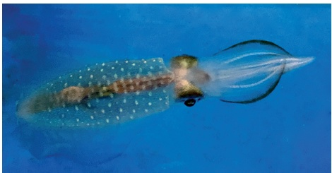
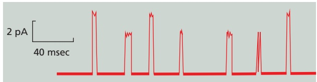

# 第4章 物质的跨膜运输 · 英文习题与参考文献

### 英文补充：习题与参考文献

> 对应中文板块：习题与参考文献。英文来源：Molecular Biology of the Cell，第7版，第11章；[本章完整原文](../来源/英文教材/11_Small-Molecule_Transport_and_Electrical_Properties_of_Membranes/chapter.md)。物理PDF页码范围：676–721（整章范围）。

<!-- BEGIN EN EN11-EXERCISES -->
#### PROBLEMS

Which statements are true? Explain why or why not.

11–1 Transport by transporters can be either active or passive, whereas transport by channels is always passive.

11–2 A symporter would function as an antiporter if its orientation in the membrane were reversed; that is, if the portion of the protein normally exposed to the cytosol faced the outside of the cell instead.

11–3 Excitatory synapses generally cause a small hyperpolarization of the postsynaptic membrane, whereas inhibitory synapses generally cause a small depolarization of the postsynaptic membrane.

11–4 Transporters approach saturation at high concentrations of the transported molecule when all their binding sites are occupied; channels, on the other hand, do not bind the ions they transport and thus the flux of ions through a channel does not saturate.

11–5 The membrane potential arises from movements of charge that leave ion concentrations practically unaffected, causing only a very slight discrepancy in the number of positive and negative ions on the two sides of the membrane.

#### Discuss the following problems.

11–6 Order $\mathrm { C a ^ { 2 + } }$ , CO2, glucose, RNA, and $\mathrm { H _ { 2 } O }$ according to their ability to diffuse through a lipid bilayer, beginning with the one that crosses the bilayer most readily. Explain the basis for your ranking.

11–7 How is it possible for some molecules to be at equilibrium across a biological membrane and yet not be at the same concentration on both sides?

11–8 Suppose a membrane contains a single passive transporter with a $K _ { \mathrm { m } }$ of 0.1 mM for its solute. How effective would the transporter be at equalizing the concentrations of solute across the membrane if the starting concentrations were 0.01 mM inside and 0.05 mM outside? What if the concentrations were 100 mM inside and 500 mM outside?

A. Effective at both low and high solute concentrations

B. Effective at low solute levels but ineffective at high levels

C. Ineffective at both low and high solute concentrations

D. Ineffective at low solute levels but effective at high levels

11–9 Microvilli increase the surface area of intestinal cells, providing more efficient absorption of nutrients. Microvilli are shown in profile and cross section in **Figure Q11–1**. From the dimensions given in the figure, estimate the increase in surface area that microvilli provide (for the portion of the plasma membrane in contact with the lumen of the gut) relative to the corresponding surface of a cell with a $\tilde { \mathrm { f l a t } }$ plasma membrane.

1 µm

0.1 µm

Figure Q11–1 Microvilli of intestinal epithelial cells in profile and cross section (Problem 11–9). (Left panel, from Rippel Electron Microscope Facility, Dartmouth College; right panel, from David Burgess.)

11–10 Ion transporters are “linked” together—not phys-MBoC7 Q11.01/Q11.01 ically, but as a consequence of their actions. For example, cells can raise their intracellular $\mathrm { p H }$ , when it becomes too acidic, by exchanging external $\mathrm { { N a } ^ { + } }$ for internal $\mathrm { H } ^ { + }$ , using an $\mathrm { { N a } ^ { + } \mathrm { { - } \dot { H } ^ { + } } }$ antiporter. The change in internal $\mathrm { { N a } ^ { + } }$ is then redressed using the $\mathrm { { N a } ^ { + } \mathrm { { \cdot } K ^ { + } } }$ pump.

A. Can these two transporters, operating together, return both the $\mathrm { H } ^ { + }$ and the $\mathbf { \bar { N a } ^ { + } }$ concentrations to their normal levels inside the cell?

B. Does the linked action of these two pumps cause imbalances in either the $\mathrm { K } ^ { + }$ concentration or the membrane potential? Why or why not?

11–11 According to Newton’s laws of motion, an ion exposed to an electric field in a vacuum would experience a constant acceleration from the electric driving force, just as a falling body in a vacuum constantly accelerates due to gravity. In water, however, an ion moves at constant velocity in an electric field. Why do you suppose that is?

11–12 In a subset of voltage-gated $\mathrm { K } ^ { + }$ channels, the N-terminus of each subunit acts like a tethered ball that occludes the cytoplasmic end of the pore soon after it opens, thereby inactivating the channel. This “balland-chain” model for the rapid inactivation of voltagegated $\mathrm { K } ^ { + }$ channels has been elegantly supported for the shaker $\mathrm { K } ^ { + }$ channel from Drosophila melanogaster. (The shaker $\mathrm { K } ^ { + }$ channel in Drosophila is named after a mutant form that causes excitable behavior—even anesthetized flies keep twitching.) Deletion of the N-terminal amino acids from the normal shaker channel gives rise to a channel that opens in response to membrane depolarization but stays open instead of rapidly closing as the normal channel does. A peptide (MAAVAGLYGLGEDRQHRKKQ) that corresponds to the deleted N-terminus can inactivate the open channel at $1 0 0 \; \mu \mathrm { M }$

Is the concentration of free peptide $\left( 1 0 0 \; \mu \mathrm { M } \right)$ that is required to inactivate the defective $\mathrm { K } ^ { + }$ channel anywhere near the local concentration of the tethered ball on a normal channel? Assume that the tethered ball can explore a hemisphere [volume = (2/3)πr3] with a radius of 21.4 nm, which is the length of the polypeptide “chain” (**Figure Q11–2**). Calculate the concentration for one ball in this hemisphere. How does that value compare with the concentration of free peptide needed to inactivate the channel?

Figure Q11–2 A “ball” tethered by a “chain” to a voltage-gated K+ channel (Problem 11–12).

11–13 The giant axon of the squid (**Figure Q11–3**) occupies a unique position in the history of our understandingMBoC7 Q11.02/Q11.02 of cell membrane potentials and nerve action. When an electrode is stuck into an intact giant axon, the membrane potential registers –70 mV. When the axon, suspended in a bath of seawater, is stimulated to conduct a nerve impulse, the membrane potential changes transiently from –70 mV to +40 mV.

Figure Q11–3 The squid Sepioteuthis lessoniana (Problem 11–13). This squid can grow up to 30 cm in length.

For univalent ions and at 20°C (293 K), the Nernst equation reduces to

$$
V = 58 \mathrm{mV} \times \log (C _ {\mathrm{o}} / C _ {\mathrm{i}})
$$

where $C _ { 0 }$ and $C _ { \mathrm { i } }$ are the concentrations outside and inside,MBoC7 Q11.03/Q11.03 respectively.

Using this equation, calculate the potential across the resting membrane (1) assuming that it is due solely to $\mathrm { K } ^ { + }$ and (2) assuming that it is due solely to Na+. (The Na+

#### REFERENCES

#### Principles of Membrane Transport

Engel A & Gaub HE (2008) Structure and mechanics of membrane proteins. Annu. Rev. Biochem. 77, 127–148.

Hille B (2001) Ion Channels of Excitable Membranes, 3rd ed. Sunderland, MA: Sinauer.

Li F, Egea PF, Vecchio AJ . . . Stroud RM (2021) Highlighting membrane protein structure and function: a celebration of the Protein Data Bank. J. Biol. Chem. 296, 100557.

Luo L (2020) Principles of Neurobiology, 2nd ed. Boca Raton, FL: CRC Press.

and $\mathrm { K } ^ { + }$ concentrations in the axon cytosol and in seawater are given in **Table Q11–1**.) Which calculation is closer to the measured resting potential? Which calculation is closer to the measured action potential? Explain why these assumptions approximate the measured resting and action potentials.

TABLE Q11–1 Ionic Composition of Seawater and of the Cytosol in the Squid Giant Axon (Problem 11–13)

| Ion | Cytosol | Seawater |
| --- | --- | --- |
| Na+ | 65 mM | 430 mM |
| K+ | 344 mM | 9 mM |

11–14 If the resting membrane potential of a cell is –70 mV and the thickness of the lipid bilayer is 5 nm, what is the strength of the electric field across the membrane in V/cm? What do you suppose would happen if you applied this voltage to two metal electrodes separated by a 1-cm air gap?

11–15 Acetylcholine-gated cation channels at the neuromuscular junction open in response to acetylcholine released by the nerve terminal and allow $\mathrm { N a } ^ { + }$ ions to enter the muscle cell, which causes membrane depolarization and ultimately leads to muscle contraction.

A. Patch-clamp measurements show that young rat muscles have cation channels that respond to acetylcholine (**Figure Q11–4**). How many kinds of channel are there? How can you tell?

Figure Q11–4 Patch-clamp measurements of acetylcholine-gated cation channels in young rat muscle (Problem 11–15).

B. For each kind of channel, calculate the number of ions that enter in 1 millisecond. (One ampere is a currentMBoC7 Q11.04/Q11.04 of 1 coulomb per second; 1 pA equals $1 0 ^ { - 1 \hat { 2 } }$ ampere. An ion with a single charge such as $\mathrm { N a } ^ { \ddagger }$ carries a charge of 1.6 × $1 0 ^ { - 1 9 }$ coulomb.)

Mitchell P (1977) Vectorial chemiosmotic processes. Annu. Rev. Biochem. 46, 996–1005.

Stein WD (2014) Channels, Carriers, and Pumps: An Introduction to Membrane Transport, 2nd ed. San Diego: Academic Press.

Vinothkumar KR & Henderson R (2010) Structures of membrane proteins. Q. Rev. Biophys. 43, 65–158.

#### Transporters and Active Membrane Transport

Baldwin SA & Henderson PJ (1989) Homologies between sugar transporters from eukaryotes and prokaryotes. Annu. Rev. Physiol. 51, 459–471.

Drew D & Boudker O (2016) Shared molecular mechanisms of membrane transporters. Annu. Rev. Biochem. 85, 543–572.

Dyla M, Kjærgaard M, Poulsen H & Nissen P (2020) Structure and mechanism of P-type ATPase ion pumps. Annu. Rev. Biochem. 89, 583–603.

Forrest LR & Rudnick G (2009) The rocking bundle: a mechanism for ion-coupled solute flux by symmetrical transporters. Physiology (Bethesda) 24, 377–386.

Gadsby DC (2009) Ion channels versus ion pumps: the principal difference, in principle. Nat. Rev. Mol. Cell Biol. 10, 344–352.

Gouaux E & MacKinnon R (2005) Principles of selective ion transport in channels and pumps. Science 310, 1461–1465.

Higgins CF (2007) Multiple molecular mechanisms for multidrug resistance transporters. Nature 446, 749–757.

Kaback HR & Guan L (2019) It takes two to tango: the dance of the permease. J. Gen. Physiol. 151, 878–886.

Kanai R, Ogawa O, Vilsen B . . . Toyoshima C (2013) Crystal structure of the Na+-bound Na+,K+-ATPase preceding the E1P state. Nature 502, 201–206.

Kefauver JM, Ward AB & Patapoutian A (2020) Discoveries in structure and physiology of mechanically activated ion channels. Nature 587, 567–576.

Khademi S, O’Connell J, 3rd, Remis J . . . Stroud RM (2004) Mechanism of ammonia transport by Amt/MEP/Rh: structure of AmtB at 1.35Å. Science 305, 1587–1594.

Kim Y & Chen J (2018) Molecular structure of the human P-glycoprotein in the ATP-bound, outward facing conformation. Science 359, 915–919.

Kühlbrandt W (2004) Biology, structure and mechanism of P-type ATPases. Nat. Rev. Mol. Cell Biol. 5, 282–295.

Kühlbrandt W (2019) Structure and mechanisms of F-type ATP synthases. Annu. Rev. Biochem. 88, 515–549.

Kumar H, Finer-Moore JS, Kaback HR & Stroud RM (2015) Structure of LacY with an alpha-substituted galactoside: connecting the binding site and the protonation site. Proc. Natl. Acad. Sci. USA 112, 9004–9009.

Perez C, Koshy C, Yildiz O & Ziegler C (2012) Alternating-access mechanism in conformationally asymmetric trimers of the betaine transporter BetP. Nature 490, 126–130.

Rees D, Johnson E & Lewinson O (2009) ABC transporters: the power to change. Nat. Rev. Mol. Cell Biol. 10, 218–227.

Rudnick G (2011) Cytoplasmic permeation pathway of neurotransmitter transporters. Biochemistry 50, 7462–7475.

Ruprecht JJ & Kunji ERS (2021) Structural mechanism of transport of mitochondrial carriers. Annu. Rev. Biochem. 90, 535–558.

Saier MH, Jr (2000) Vectorial metabolism and the evolution of transport systems. J. Bacteriol. 182, 5029–5035.

Stein WD (2002) Cell volume homeostasis: ionic and nonionic mechanisms. The sodium pump in the emergence of animal cells. Int. Rev. Cytol. 215, 231–258.

Thomas C & Tampé R (2020) Structural and mechanistic principles of ABC transporters. Annu. Rev. Biochem. 89, 605–636.

Toyoshima C (2009) How Ca2+-ATPase pumps ions across the sarcoplasmic reticulum membrane. Biochim. Biophys. Acta 1793, 941–946.

Yamashita A, Singh SK, Kawate T . . . Gouaux E (2005) Crystal structure of a bacterial homologue of Na+/Cl–-dependent neurotransmitter transporters. Nature 437, 215–223.

#### Channels and the Electrical Properties of Membranes

Armstrong C (1998) The vision of the pore. Science 280, 56–57.

Arnadóttir J & Chalfie M (2010) Eukaryotic mechanosensitive channels. Annu. Rev. Biophys. 39, 111–137.

Atlas D (2013) The voltage-gated calcium channel functions as the molecular switch of synaptic transmission. Annu. Rev. Biochem. 82, 607–635.

Bezanilla F (2008) How membrane proteins sense voltage. Nat. Rev. Mol. Cell Biol. 9, 323–332.

Carbrey JM & Agre P (2009) Discovery of the aquaporins and development of the field. Handb. Exp. Pharmacol. 190, 3–28.

Catterall WA (2017) Forty years of sodium channels: structure, function, pharmacology, and epilepsy. Neurochem. Res. 42, 2495–2504.

Chen S & Gouaux E (2019) Structure and mechanism of AMPA receptor—auxiliary protein complexes. Curr. Opin. Struct. Biol. 54, 104–111.

Davis GW (2006) Homeostatic control of neural activity: from phenomenology to molecular design. Annu. Rev. Neurosci. 29, 307–323.

Greengard P (2001) The neurobiology of slow synaptic transmission. Science 294, 1024–1030.

Hodgkin AL & Huxley AF (1952a) Currents carried by sodium and potassium ions through the membrane of the giant axon of Loligo. J. Physiol. 116, 449–472.

Hodgkin AL & Huxley AF (1952b) A quantitative description of membrane current and its application to conduction and excitation in nerve. J. Physiol. 117, 500–544.

Jessell TM & Kandel ER (1993) Synaptic transmission: a bidirectional and self-modifiable form of cell–cell communication. Cell 72(Suppl), 1–30.

Jin P, Jan LY & Jan J-N (2020) Mechanosensitive ion channels: structural features relevant to mechanotransduction mechanisms. Annu. Rev. Neurosci. 43, 207–229.

Julius D (2013) TRP channels and pain. Annu. Rev. Cell Dev. Biol. 29, 355–384.

Katz B (1966) Nerve, Muscle and Synapse. New York: McGraw-Hill.

King LS, Kozono D & Agre P (2004) From structure to disease: the evolving tale of aquaporin biology. Nat. Rev. Mol. Cell Biol. 5, 687–698.

Kintzer AF, Green EM, Dominik PK . . . Stroud RM (2018) Structural basis for activation of voltage sensor domains in an ion channel TPC1. Proc. Natl. Acad. Sci. USA 115, E9095–E9104.

Lee CH & MacKinnon R (2019) Voltage sensor movements during hyperpolarization in the HCN channel. Cell 179, 1582–1589e7.

Liao M, Cao E, Julius D & Cheng Y (2014) Single particle electron cryo-microscopy of a mammalian ion channel. Curr. Opin. Struct. Biol. 27, 1–7.

Long SB, Tao X, Campbell EB & MacKinnon R (2007) Atomic structure of a voltage-dependent K+ channel in a lipid membrane-like environment. Nature 450, 376–382.

MacKinnon R (2003) Potassium channels. FEBS Lett. 555, 62–65.

Miesenböck G (2011) Optogenetic control of cells and circuits. Annu. Rev. Cell Dev. Biol. 27, 731–758.

Moss SJ & Smart TG (2001) Constructing inhibitory synapses. Nat. Rev. Neurosci. 2, 240–250.

Neher E & Sakmann B (1992) The patch clamp technique. Sci. Am. 266, 44–51.

Nicholls JG, Fuchs PA, Martin AR & Wallace BG (2000) From Neuron to Brain, 4th ed. Sunderland, MA: Sinauer.

Payandeh J, Scheuer T, Zheng N & Catterall WA (2011) The crystal structure of a voltage-gated sodium channel. Nature 475, 353–358.

Savage DF, O’Connell JD, 3rd, Miercke LJW . . . Stroud RM (2010) Structural context shapes the aquaporin selectivity filter. Proc. Natl. Acad. Sci. USA 107, 17164–17169.

Scannevin RH & Huganir RL (2000) Postsynaptic organization and regulation of excitatory synapses. Nat. Rev. Neurosci. 1, 133–141.

Stevens CF (2004) Presynaptic function. Curr. Opin. Neurobiol. 14, 341–345.

Szczot M, Nickolls AR, Lam RM & Chesler AT (2021) The form and function of PIEZO2. Annu. Rev. Biochem. 90, 507–534.
<!-- END EN EN11-EXERCISES -->
