# 第5章 细胞质基质与内膜系统 · 第一节 细胞质基质及其功能

[返回本章](../README.md) · [中文本章原文](../中文原文.md)

<!-- BEGIN CN CN05-S01 -->
## 第一节 细胞质基质及其功能

在真核细胞的细胞质中，除去可分辨的细胞器以外的胶状物质称细胞质基质。1965年H.A.Lardy最先引入细胞质基质这一术语，当时是根据细胞破碎后超离心除去非可溶性物质的液相组分而定义的。细胞质基质是细胞的重要组分，其主要成分包括约占总体积 $70\%$ 的水和溶于其中的离子，以及以可溶性蛋白为主的大分子，其体积约占细胞质总体积 $50\%$ 以上。

## 一、细胞质基质的涵义

细胞与环境，细胞质与细胞核，以及细胞器之间的物质运输、能量交换、信息传递等都要通过细胞质基质来完成，很多重要的中间代谢反应也发生在细胞质基质中。近年来发现细胞质基质还行使着多种其他的重要功能。然而人们对细胞质基质的认识与细胞核和其他细胞器相比还是相当肤浅，在研究细胞质基质过程中，曾赋予它诸如细胞液（cell sap）、透明质（hyaloplasm）、胞质溶胶（cytosol）和细胞质基质等多个名称，其涵义也被不断地更新与完善，这既反映了从不同的侧面与层次对细胞质基质的了解，也反映了对细胞质基质认识的不断深入。越来越多的证据表明，细胞质基质很可能是一种高度有序的体系。用差速离心法分离细胞匀浆物中的各种细胞组分，先后除去细胞核、线粒体、溶酶体、高尔基体和细胞质膜等细胞器或细胞结构后，存留在上清液中的主要是细胞质基质的成分。生物化学家多称之为胞质溶胶，其中蛋白质质量浓度约200 mg/mL。细胞质基质是一种黏稠的胶体，多数的水分子是以水化物的形式紧密地结合在蛋白质和其他大分子表面的极性部位，只有部分水分子以游离态存在，起溶剂作用。细胞质基质中蛋白质分子和颗粒性物质的扩散速率仅为水溶液中的1/5，更大的结构如分泌泡和细胞器等则固定在细胞质基质的某些部位上，或沿细胞骨架定向运动。细胞质基质是蛋白质与脂类合成的重要场所。在细胞质基质中合成的蛋白质，半数以上将分门别类地转移到细胞核和细胞器中。在细胞质基质中，各种代谢活动高效有序地进行，各种代谢途径之间的协调有序以及所涉及的物质、能量与信息的定向转移和传递，这些复杂的生命过程都不是简单的“酶溶液”所能完成的。

近些年来人们注意到，在细胞质基质中多数蛋白质，其中包括水溶性蛋白，并不是以溶解状态存在的。P.L.Paine把乳胶小球注射到非洲爪蟾的卵母细胞中，经过一段时间之后，取出乳胶小球，用聚丙烯酰胺双向凝胶电泳技术分析了渗入乳胶小球中的蛋白质成分，并与周围细胞质中的蛋白质成分进行比较。结果发现，在所检测的90多种多肽中， $80\%$ 的多肽未曾扩散到乳胶小球中，而是滞留在细胞质基质中。人们推测，细胞质基质作为一种高度有序的体系，关键在于细胞质骨架纤维贯穿其中，起重要的组织作用，多数的蛋白质直接或间接地与细胞骨架结合，或与生物膜结合，其周围又吸附了多种分子，从而不同程度地影响和改变微环境的某些物理性质，这样一种有精细区域化的凝胶结构体系，其组成成分在不同细胞的不同生理状态下有所不同，以完成多种复杂的生物学功能。原位杂交技术证明，mRNA在细胞中也呈区域性分布。如在卵母细胞中不同的mRNA定位于细胞质基质的不同部位，卵细胞在母体发生期间，由蛋白质和RNA在细胞质基质中的特定分布而形成的位置信息，往往对子代个体胚胎发育早期的细胞分化起着重要的作用。免疫荧光技术证明，与糖酵解过程有关的一些酶结合在微丝上，在骨骼肌细胞中则结合在肌原纤维的某些特殊位点上。这种特异性的结合不仅与细胞的生理状态有关，而且也与组织发育和细胞分化的程度有关。酶与微丝结合后，酶的动力学参数也发生了明显的变化。如与糖酵解有关的酶类，彼此之间可能以弱键结合在一起形成多酶复合体，定位在细胞质基质的特定部位，催化从葡萄糖至丙酮酸的一系列反应。前一个反应的产物即为下一个反应的底物，二者间的空间距离仅为几个纳米，各个反应途径之间也以类似的方式相互关联，从而有效地完成复杂的代谢过程。这种结构体系的维持只能在高浓度的蛋白质及其特定的离子环境的条件之下实现。一旦细胞破裂，甚至在稀释的溶液中，这种靠分子之间脆弱的相互作用而形成的结构体系就会遭到破坏。这也正是研究细胞质基质比研究其它细胞器困难的主要原因。

也有学者主张细胞质骨架作为相对独立的主要结构体系不应纳入细胞质基质范畴。然而离开了细胞质骨架的支持与组织，细胞质基质便无法维系这种高度复杂的有序结构，也就无法完成各种生物学功能。从细胞骨架的角度来看，骨架的主要成分，特别是微管和微丝的装配和解聚与周围的液相始终处在一种动态平衡之中，离开这种特定的环境，骨架系统也难以行使其功能。

## 二、细胞质基质的功能

细胞质基质所行使的功能不是孤立或单一的，它体现在一套多种细胞生命活动的过程中。目前了解最多的是许多中间代谢过程都发生在细胞质基质中，如糖酵解过程、磷酸戊糖途径、糖醛酸途径、糖原的合成与分解过程。尽管人们对这些代谢反应的具体生化步骤早已清楚，但对它们在细胞质基质中如何进行的细节，特别是反应的底物和产物如何定向转运的机制并不清楚。目前已知细胞信号转导是调控细胞代谢及细胞增殖、分化、衰老和凋亡的基本途径，但对多种信号通路的网络整合及交叉对话（cross-talking）却知之甚少。

细胞质基质是蛋白质和脂肪酸合成的重要场所。细胞内所有蛋白质合成的起始步骤都发生在细胞质基质内的游离核糖体上，具有特殊N端信号序列的分泌蛋白和跨膜蛋白合成起始后，核糖体很快就转移到内质网膜上，边合成边转移到内质网腔，或整合到内质网膜上，然后再以膜泡运输的方式由内质网转运至高尔基体并进一步完成蛋白质修饰和分选。其他蛋白质的合成均在细胞质基质中游离核糖体上完成，并根据蛋白质自身所携带的信号，分别转运到线粒体、叶绿体、过氧化物酶体以及细胞核中，也有些蛋白质驻留在细胞质基质中，构成本身的结构成分。

细胞质基质另一方面的功能与细胞质骨架相关。细胞质骨架作为细胞质的主要结构组分，不仅与维持细胞的形态、运动、物质运输及能量传递等过程相关（参见第八章），也是细胞结构体系的组织者，为细胞质基质中其他成分和细胞器提供锚定位点。有人估计一个直径为16μm的细胞，其细胞质骨架的表面积可达 $5\times10^{6}\sim10\times10^{6}\mu m^{2}$ ，而相同直径的球形细胞的表面积仅约800μm²，这样大的表面积不仅限制了水分子的运动，而且使蛋白质、mRNA等生物大分子通过与骨架蛋白分子间的选择性结合，锚定在特定的位点，从而在细胞质基质中形成更为精细的空间分布，使复杂的代谢反应高效而有序进行。

细胞质基质还与蛋白质的翻译后修饰和选择性降解等方面有关：

## 1. 蛋白质的修饰

已发现有 100 余种蛋白质的侧链修饰方式，绝大多数的修饰都是由专一的酶作用于蛋白质侧链特定位点上。侧链修饰对蛋白质的功能及命运至关重要，但很多修饰的生物学意义至今尚不清楚。在细胞质基质中发生蛋白质修饰的类型主要有：

（1）辅酶或辅基与酶的结合 在无数酶促氧化-还原反应中，细胞内的辅酶将能量以质子的形式在酶之间传递。

(2) 磷酸化与去磷酸化 蛋白质的磷酸化与去磷酸化反应分别由蛋白激酶与磷酸酶催化，以快速调节细胞内多种蛋白质的生物活性。可被磷酸化的蛋白质氨基酸残基主要包括酪氨酸、丝氨酸、苏氨酸。蛋白质磷酸化与去磷酸化还影响细胞信号调控级联反应和基因转录活性。已知人类基因组中有大约2000个编码蛋白激酶的基因和1000个编码磷酸酶的基因。

(3) 蛋白质糖基化作用 蛋白质糖基化主要发生在内质网和高尔基体中，在哺乳动物的细胞质基质中发生的糖基化主要是把 $N-$ 乙酰葡糖胺（ $N$ -acetyl-glucosamine）加到蛋白质的丝氨酸残基的羟基上。

(4) 甲基化修饰 很多细胞骨架蛋白其 N 端发生甲基化修饰，以防止被细胞内的蛋白水解酶识别而降解，从而使蛋白质在细胞中维持较长的寿命。组蛋白甲基化修饰在细胞内由特异性的甲基转移酶催化完成，主要包括精氨酸甲基化和赖氨酸甲基化两种情况，组蛋白甲基化修饰还与基因表达的调控相关，是表观遗传学的重要研究领域之一，越来越多的证据表明组蛋白甲基化功能异常与肿瘤的发生发展密切相关。

(5) 酰基化 最常见的一类酰基化的修饰是内质网上合成的跨膜蛋白在通过内质网和高尔基体的转运过程中发生的。由不同的酶催化软脂酸链共价连接到某些跨膜蛋白暴露在细胞质基质侧的结构域上；另一类酰基化修饰发生在诸如 $Src$ 基因和 $Ras$ 基因这类癌基因的表达产物上，催化这一反应的酶可识别蛋白中的信号序列，将脂肪酸链共价地结合到蛋白质特定的位点上。如 $Src$ 基因编码的酪氨酸蛋白激酶，与豆蔻酸共价结合后，靠豆蔻酸链结合到细胞质膜上，这一修饰是 $Src$ 基因导致细胞转化所必需的。组成中心体和纤毛/鞭毛的微管蛋白往往被乙酰化修饰，这种修饰可能与它们在这些细胞结构中的组装及功能相关。

## 2. 控制蛋白质的寿命

细胞中的蛋白质处于不断降解与更新的动态过程中。细胞质基质中的蛋白质，大部分寿命较长，其生物活性可维持几天甚至数月。但也有一些寿命很短，合成后几分钟就降解了，其中包括在某些代谢途径中，催化限速反应步骤的酶和 Fos 等癌基因的产物。只要通过改变它们的合成速度，就可以控制其浓度，从而发挥调节代谢途径或细胞生长与分裂的作用。

在蛋白质分子的氨基酸序列中，既含有决定蛋白质定位和功能的靶向信号和修饰信号，还含有决定蛋白质寿命的信号。这种信号存在于蛋白质N端的第一个氨基酸残基，若N端的第一个氨基酸是Met（甲硫氨酸）、Ser（丝氨酸）、Thr（苏氨酸）、Ala（丙氨酸）、Val（缬氨酸）、Cys（半胱氨酸）、Gly（甘氨酸）或Pro（脯氨酸），则蛋白质往往是稳定的；如是其他氨基酸，则往往是不稳定的。在真核细胞每种蛋白质起始合成时，N端的第一个氨基酸都是甲硫氨酸（细菌中为甲酰甲硫氨酸），但合成后不久便被特异的氨基肽酶水解除去，然后由氨酰tRNA蛋白转移酶（aminoacyl-tRNA-protein transferase）把一个信号氨基酸加到某些蛋白质的N端，最终在蛋白质的N端留下一个稳定或不稳定的氨基酸残基。

在真核细胞的细胞质基质中，有一种识别并降解错误折叠或不稳定蛋白质的机制，即泛素化和蛋白酶体所介导的蛋白质降解途径（ubiquitin- and proteasome-mediated pathway），有人将这种蛋白质降解机制戏称是“细胞给予需要损毁的蛋白质一个化学的死亡之吻（kiss of death）”，A. Ciechanover 等三位科学家因此发现而获得2004年诺贝尔化学奖。泛素化和蛋白酶体所介导的蛋白质降解途径具有多种生物学功能：包括蛋白质质量监控、影响细胞代谢、信号转导和受体调整（receptor modulation）、免疫反应、细胞周期调控、转录调节和DNA修复等。

蛋白酶体（proteasome）是细胞内降解蛋白质的大分子复合体，由约50种亚基组成，分子质量为2000～2400 kDa，具有蛋白酶活性，其功能可誉为细胞内蛋白质破碎机（protein shredder）。哺乳类细胞内蛋白酶体约占细胞蛋白质含量的1%。其中最主要的类别是26S蛋白酶体。它包含一个由28种亚基组成桶状的20S催化核心，及一个或两个由19种亚基组成的19S调节亚基（或称为“帽”）（图5-2A）。20S催化核心由α、β两类蛋白，以α-β-β-α的排列方式，形成四层中空的环状结构。α环构成骨架结构，β环具有蛋白酶活性。19S调节亚基起着识别泛素化底物蛋白、切除泛素修饰及使蛋白去折叠的作用。其中与20S催化核心接触的6种亚基具有ATP酶活性，可利用水解ATP所释放的能量使蛋白质去折叠，并将其进一步传递至20S催化核心，这也是整个蛋白酶体水解过程中唯一的耗能步骤。

泛素（ubiquitin）是由76个氨基酸残基组成的小分子球蛋白，具热稳定性，普遍存在于真核细胞中，人和酵母细胞的泛素分子的相似度高达 $96\%$ ，由于广泛存在且序列高度保守，故名泛素。泛素具有多种生物学功能。在蛋白质的泛素化修饰过程中，泛素分子共价结合到靶蛋白质的赖氨酸残基上。蛋白质的泛素化需要多酶复合体发挥作用，即通过三种酶的先后催化来完成，包括泛素活化酶（E1）、泛素结合酶（E2，又称泛素载体蛋白）和泛素连接酶（E3）。其过程涉及如下步骤（图5-2B）：①泛素活化酶（E1）通过形成酰基－腺苷酸中介物使泛素分子C端被激活，该反应需要ATP；②转移活化的泛素分子与泛素结合酶（E2）的半胱氨酸残基结合；③异肽键（isopeptide bond）形成，即与E2结合的泛素羧基和靶蛋白赖氨酸侧链的氨基之间形成异肽键，该反应由泛素连接酶（E3）催化完成。连接到靶蛋白上的泛素分子也有多个赖氨酸残基，这些赖氨酸残基可以继续被泛素化修饰，后面的泛素链连接在前一个泛素分子的特定赖氨酸残基上，如Lys48或Lys63位点。如果这样的修饰经多次重复进行，便在靶蛋白上形成有多个泛素分子共价连接的寡聚泛素链。然而，在泛素链中起共价连接作用的赖氨酸位点往往决定了所产生的生理效应。如在泛素链中每次被修饰的位点是Lys48，则将导致泛素化靶蛋白被蛋白酶体的19S调节亚基所识别和去折叠，进而转移至20S催化核心内降解。由泛素控制的蛋白质降解具有重要的生理意义，它不仅能够清除错误折叠和需要进行存量调控的蛋白质，还对细胞周期调控、DNA修复、细胞生长、免疫功能等都有重要的调控作用。如果连接靶蛋白的泛素链是由各个泛素分子的Lys63位点修饰形成的，则可能导致靶蛋白的分选途径或者是活性的改变（活化或失活）。

  
图5-2 由泛素和蛋白酶体所介导的蛋白质降解途径

## 3. 帮助变性或错误折叠的蛋白质正确折叠

这一功能主要靠热激蛋白 (heat shock protein, HSP) 来完成。热激蛋白是一类演化上高度保守的蛋白质家族，在人类、果蝇和植物中发现的 HSP 都有相似的序列和功能，特别值得注意的是它们作为分子伴侣 (molecular chaperone) 而发挥多种作用，如协助细胞内蛋白质合成、分选、折叠与装配。其中大多数是组成型表达和执行多种基本功能，有些是细胞在胁迫条件下高水平表达，以在维持细胞稳态中发挥核心作用。根据分子量大小、结构和功能，热激蛋白被区分为几个家族：Hsp100、Hsp90、Hsp70、Hsp60 和新近发现的分子质量在 15～40 kDa 的小分子 HSP。每一家族中都有由不同基因编码的数种蛋白质成员。有的基因在正常条件下表达，有些则在温度增高或其他胁迫条件下大量表达，以保护细胞，减少异常环境的损伤。有证据表明，在正常细胞中，热激蛋白选择性地与畸形蛋白质结合形成聚合物，利用水解 ATP 释放的能量使聚集的蛋白质溶解，并进一步折叠成正确构象的蛋白质。

<!-- END CN CN05-S01 -->

---

## 对应英文内容

### 英文补充：细胞质功能基础：酶、变构调节与蛋白质磷酸化

> 对应中文板块：细胞质功能基础：酶、变构调节与蛋白质磷酸化。英文来源：Molecular Biology of the Cell，第7版，第3章；[本章完整原文](../../来源/英文教材/03_Proteins/chapter.md)。物理PDF页码范围：154–221（整章范围）。

<!-- BEGIN EN EN03-H029-H058 -->
#### PROTEIN FUNCTION

We have seen that each type of protein consists of a precise sequence of amino acids that allows it to fold up into a particular three-dimensional shape, or conformation. These proteins can also have moving parts whose mechanical actions are coupled to chemical events. This coupling of chemistry and movement helps to give proteins the extraordinary capabilities that underlie the dynamic processes in living cells.

In this section, we explain how proteins bind to other selected molecules and how a protein’s activity depends on such binding. We will use selected examples to demonstrate how their ability to bind to other molecules enables proteins to act as catalysts, signal receptors, switches, motors, or tiny pumps. These examples by no means exhaust the vast functional repertoire of proteins. You will encounter the specialized functions of many other proteins elsewhere in this book, based on similar principles.

#### All Proteins Bind to Other Molecules

A protein molecule’s physical interaction with other molecules determines its biological properties. Thus, antibodies attach to viruses or bacteria to mark them for destruction, the enzyme hexokinase binds glucose and ATP so as to catalyze a reaction between them, actin molecules bind to each other to assemble into actin filaments, and so on. Indeed, all proteins stick, or bind, to other molecules. In some cases, this binding is very tight; in others it is weak and short-lived. But the binding always shows great specificity, in the sense that each protein molecule can usually bind just one or a few molecules out of the many thousands of different types it encounters. The substance that is bound by the protein—whether it is an ion, a small molecule, or a macromolecule such as another protein—is referred to as a **ligand** for that protein (from the Latin word ligare, meaning “to bind”).

The ability of a protein to bind selectively and with high affinity to a ligand depends on the formation of a set of weak noncovalent bonds—hydrogen bonds, electrostatic attractions, and van der Waals attractions—plus favorable hydrophobic interactions (see Panel 2–3, pp. 98–99). Because each individual bond is weak, effective binding occurs only when many of these bonds form simultaneously. Such binding is possible only if the surface contours of the ligand molecule fit very closely to the protein, matching it like a hand in a glove (**Figure 3–35**).

Figure 3–35 The selective binding of a protein to another molecule. Many weak bonds are needed to enable a protein to bind tightly to a second molecule, or ligand. A ligand must therefore fit precisely into a protein’s binding site, like a hand into a glove, so that a large number of noncovalent bonds form between the protein and the ligand. (A) Schematic; (B) space-filling model. (PDB code: 1G6N.)

The region of a protein that associates with a ligand, known as the ligand’s binding site, usually consists of a cavity in the protein surface formed by a particular arrangement of amino acids. These amino acids can belong to different portions of the polypeptide chain that are brought together when the protein folds (**Figure 3–36**). Separate regions of the protein surface generally provide binding sites for different ligands, allowing the protein’s activity to be regulated, as we shall see later. And other parts of the protein act as a handle to position the protein in the cell—an example is the SH2 domain discussed previously, which often moves a protein containing it to particular intracellular sites in response to signals.

Although the atoms buried in the interior of the protein have no direct contact with the ligand, they form the framework that gives the surface its contours and its chemical and mechanical properties. Even small changes to the amino acids in the interior of a protein molecule can change its three-dimensional shape enough to destroy a binding site on the surface.

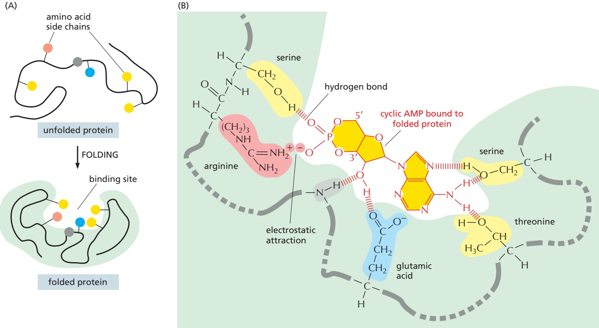

Figure 3–36 The binding site of a protein. (A) The folding of the polypeptide chain typically creates a crevice or cavity on the protein surface. This crevice contains a set of amino acid side chains disposed in such a way that they can form noncovalent bonds only with certain ligands. (B) A close-up of an actual binding site, showing the hydrogen bonds and electrostatic interactions formed between a protein and its ligand. In this example, a molecule of cyclic AMP is the bound ligand, shown in dark yellow.

#### The Surface Conformation of a Protein Determines Its Chemistry

The impressive chemical capabilities of proteins often require that the chemical groups on their surface interact in ways that enhance the chemical reactivity of one or more amino acid side chains. These interactions fall into two main categories.

First, the interaction of neighboring parts of the polypeptide chain may restrict the access of water molecules to that protein’s ligand-binding sites. Because water molecules readily form hydrogen bonds that can compete with ligands for sites on the protein surface, a ligand will form tighter hydrogen bonds (and electrostatic interactions) with a protein if water molecules are kept away. It might be hard to imagine a mechanism that would exclude a molecule as small as water from a protein surface without affecting the access of the ligand itself. However, because of the strong tendency of water molecules to form water–water hydrogen bonds, water molecules exist in a large hydrogen-bonded network (see Panel 2–2, pp. 96–97). In effect, a protein can keep a ligand-binding site dry, increasing that site’s reactivity, because it is energetically unfavorable for individual water molecules to break away from this network—as they must do to reach into a crevice on a protein’s surface.

Second, the clustering of neighboring polar amino acid side chains can alter their reactivity. If protein folding brings together a number of negatively charged side chains against their mutual repulsion, for example, the affinity of the site for a positively charged ion is greatly increased. In addition, when amino acid side chains interact with one another through hydrogen bonds, normally unreactive groups (such as the –CH2OH on the serine shown in **Figure 3–37**) can become reactive, enabling them to be used to make or break selected covalent bonds.

The surface of each protein molecule therefore has a unique chemical reactivity that depends not only on which amino acid side chains are exposed, but also on their exact orientation relative to one another. For this reason, two slightly different conformations of the same protein molecule can differ greatly in their chemistry.

#### Sequence Comparisons Between Protein Family Members Highlight Crucial Ligand-binding Sites

As we have described previously, genome sequences allow us to group many of the domains found in proteins into families that show clear evidence of their evolution from a common ancestor. The three-dimensional structures of members of the same domain family are remarkably similar. For example, even when the amino acid sequence identity falls to 25%, the backbone atoms in a domain can follow a common protein fold within 0.2 nm (2 Å).

We can use a method called evolutionary tracing to identify those sites in a protein domain that are the most crucial to the domain’s function. Those sites that bind to other molecules are the most likely to be kept unchanged as organisms evolve. Thus, in this method, those amino acids that are the same, or nearly so, in all of the known protein family members are mapped onto a model of the three-dimensional structure of a single family member. When this is done, the most invariant positions often form one or more clusters on the protein surface, as illustrated in **Figure 3–38A** for the SH2 domain described previously (see Figure 3–9). These clusters generally correspond to ligand-binding sites.

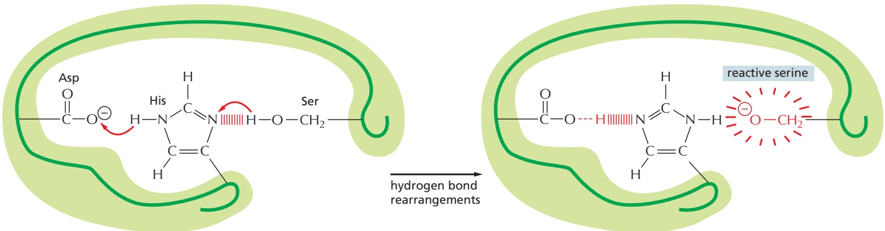

Figure 3–37 An unusually reactive amino acid at the active site of an enzyme. This example is the catalytic triad Asp His-Ser found in chymotrypsin, elastase, and other serine proteases (see Figure 3–13). The aspartic acid side chain (Asp) induces the histidine (His) to remove the proton from a particular serine (Ser). This activates the serine and enables it to form a covalent bond with the enzyme’s substrate, hydrolyzing a peptide bond. The many convolutions of the polypeptide chain are omitted here.

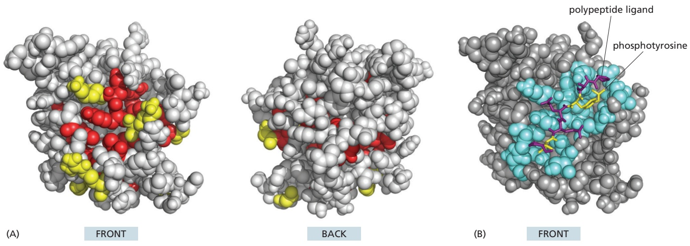

The SH2 domain functions to link two proteins together. It binds the protein containing it to a second protein that contains a phosphorylated tyrosine side chain in a specific amino acid sequence context, as shown in **Figure 3–38B**. The amino acids located at the binding site for the phosphorylated polypeptide have been the slowest to change during the long evolutionary process that produced the large SH2 family of peptide recognition domains. Mutation is a random process; survival is not. Thus, natural selection (random mutation followed by nonrandom survival) produces the sequence conservation by preferentially eliminating organisms whose SH2 domains have become altered in a way that inactivates the SH2 binding site, destroying SH2 function.MB

Figure 3–38 The evolutionary trace method applied to a protein domain. (A) Front and back views of a spacefilling model of the SH2 domain, with evolutionarily conserved amino acids on the protein surface colored yellow, and those more toward the protein interior colored red. (B) The structure of one specific SH2 domain with its bound polypeptide. Here, those amino acids located within 0.4 nm of the bound ligand are colored blue. The two key amino acids of the ligand are yellow, and the others are purple. Note the high degree of correspondence between A and B. (Adapted from O. Lichtarge et al., J. Mol. Biol. 257:342–358, 1996. PDB codes: 1SPR, 1SPS.)

Genome sequencing has revealed huge numbers of proteins whose functions are unknown. Once a three-dimensional structure has been determined for one member of a protein family, evolutionary tracing allows biologists to determine binding sites for the members of that family, and this provides a useful start in deciphering protein function.

#### Proteins Bind to Other Proteins Through Several Types of Interfaces

Proteins can bind to other proteins in multiple ways. In many cases, a portion of the surface of one protein contacts an extended loop of polypeptide chain (a string) on a second protein (**Figure 3–39A**). Such a surface–string interaction, for example, allows the SH2 domain to recognize a phosphorylated polypeptide loop on a second protein, as just described, and it also enables a protein kinase to recognize the proteins that it will phosphorylate (see below).

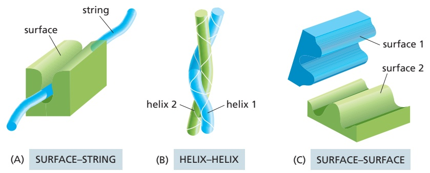

Figure 3–39 Three ways in which two proteins can bind to each other. Only the interacting parts of the two proteins are shown. (A) A rigid surface on one protein can bind to an extended loop of polypeptide chain (a string) on a second protein. (B) Two α helices can bind together to form a coiled-coil. (C) Two complementary rigid surfaces often link two proteins together. Binding interactions can also involve the pairing of β strands (see, for example, Figure 3–19B).

A second type of protein–protein interface forms when two α helices, one from each protein, pair together to form a coiled-coil (**Figure 3–39B**). This type of protein interface is found in several families of transcription regulatory proteins, as discussed in Chapter 7.

Another common way for proteins to interact is by the precise matching of one rigid surface with that of another (**Figure 3–39C**). Such interactions can be very tight, because a large number of weak bonds can form between two surfaces that match well. For the same reason, such surface–surface interactions can be extremely specific, enabling a protein to select just one partner from the many thousands of different proteins found in a cell.

#### Antibody Binding Sites Are Especially Versatile

All proteins must bind to particular ligands to carry out their various functions, and the antibody family is notable for its capacity for tight, highly selective binding (see Chapter 24).

**Antibodies**, or **immunoglobulins**, are proteins produced by the immune system in response to foreign molecules, such as those on the surface of an invading microorganism. Each antibody binds tightly to a particular target molecule, thereby either inactivating the target molecule directly or marking it for destruction. An antibody recognizes its target (called an **antigen**) with remarkable specificity. Because there are potentially billions of different antigens that humans might encounter, we need to be able to produce billions of different antibodies.

Antibodies are Y-shaped molecules with two identical binding sites that are complementary to a small portion of the surface of the antigen molecule. A detailed examination of the antigen-binding sites of antibodies reveals that they are formed from several loops of polypeptide chain that protrude from the ends of a pair of closely juxtaposed protein domains (**Figure 3–40**). The genes that encode different antibodies generate an enormous diversity of antigen-binding sites by changing only the length and amino acid sequence of these loops, without altering the basic protein structure.

Figure 3–40 An antibody is Y-shaped and has two identical antigen-binding sites, one on each arm of the Y. (A) Schematic drawing of a typical antibody molecule. The protein is composed of four polypeptide chains (two identical heavy chains and two identical, smaller light chains), stabilized and held together by disulfide bonds (red). Each chain is made up of several similar domains, here shaded with blue, for the variable domains, or gray, for the constant domains. The antigenbinding site is formed where a heavy-chain variable domain (VH) and a light-chain variable domain (VL) come close together. These are the domains that differ most in their amino acid sequence in different antibodies—hence their name. (B) Ribbon drawing of a single light chain showing that the most variable parts of the polypeptide chain (orange) extend as loops at one end of the variable domain (VL) to form half of one antigen-binding site of the antibody molecule shown in A. Note that both the constant and variable domains are composed of a sandwich of two antiparallel β sheets connected by a disulfide bond (red). (See Movie 24.5.)

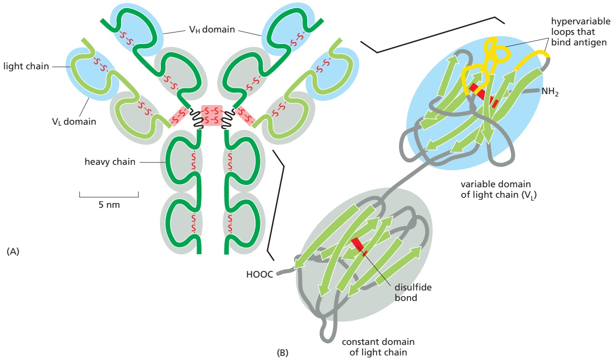

Loops of this kind are ideal for grasping other molecules. They allow a large number of chemical groups to surround a ligand so that the protein can link to it with many weak bonds. For this reason, loops often form the ligand-binding sites in proteins.

#### The Equilibrium Constant Measures Binding Strength

Molecules in the cell encounter each other very frequently because of their continual random thermal movements. Colliding molecules with poorly matching surfaces form few noncovalent bonds with one another, and the two molecules dissociate as rapidly as they come together. At the other extreme, when many non-covalent bonds form between two colliding molecules, the association can persist for a very long time (**Figure 3–41**). Such strong interactions occur in cells whenever a biological function requires that molecules remain associated; for example, when a group of RNA and protein molecules come together to make a subcellular structure such as a ribosome.

We can measure the strength with which any two molecules bind to each other. As an example, consider a population of identical antibody molecules that suddenly encounters a population of ligands diffusing in the fluid surrounding them. At frequent intervals, one of the ligand molecules will bump into the binding site of an antibody and form an antibody–ligand complex. The population of antibody–ligand complexes will therefore increase, but not without limit: over time, a second process, in which individual complexes break apart because of thermally induced motion, will become increasingly important. Eventually, any population of antibody molecules and ligands will reach a steady state, or **equilibrium**, in which the number of binding (association) events per second is precisely equal to the number of “unbinding” (dissociation) events (see Figure 2–30).

From the concentrations of the ligand, antibody, and antibody–ligand complex at equilibrium, we can calculate a convenient measure of the strength of binding— the **equilibrium constant** (K; **Figure 3–42A**). This constant was described in detail in Chapter 2, where its connection to free-energy differences was derived (see pp. 68–69). The equilibrium constant for a reaction in which two molecules (A and B) bind to each other to form a complex (AB) has units of liters/mole, and half of the binding sites will be occupied by ligand when that ligand’s concentration (in moles/liter) reaches a value that is equal to 1/K. This equilibrium constant is larger the greater the binding strength, and it is a direct measure of the freeenergy difference between the bound and free states (**Figure 3–42B**). Even a change of a few noncovalent bonds can have a striking effect on a binding interaction, as shown by the example in **Figure 3–43**. (Note that the equilibrium constant, as defined here, is the **association** or **affinity constant,** $K _ { \mathrm { a } } ;$ the reciprocal of $K _ { \mathrm { a } }$ is the **dissociation constant**, $K _ { \mathrm { d } } ,$ which is also widely used.)

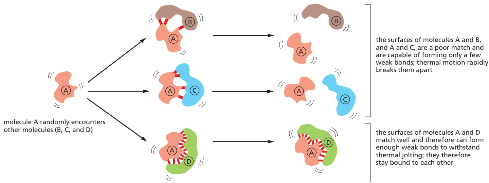

Figure 3–41 How noncovalent bonds mediate interactions between macromolecules (see Movie 2.1).

(B)

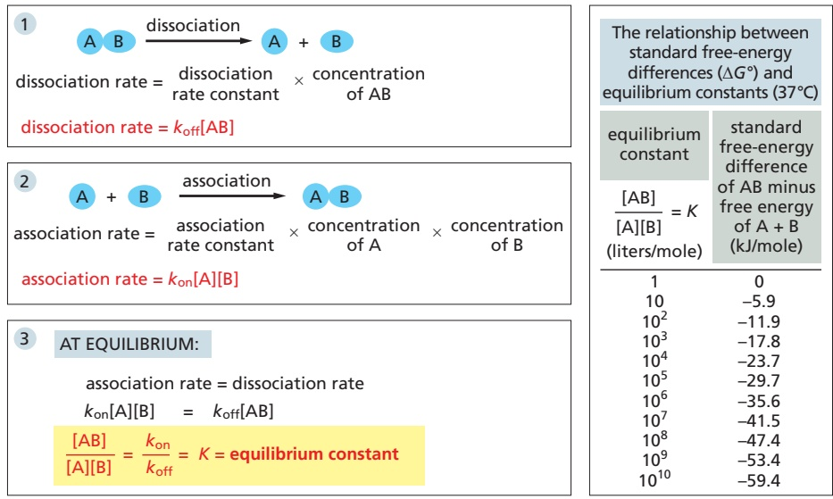

(A)

We have used the case of an antibody binding to its ligand to illustrate the effect of binding strength on the equilibrium state, but the same principles apply to any molecule and its ligand. Many proteins are enzymes, which, as we nowMBoC7 m3.44/3.42 discuss, first bind to their ligands and then catalyze the breakage or formation of covalent bonds in these molecules.

#### Enzymes Are Powerful and Highly Specific Catalysts

Many proteins can perform their function simply by binding to another molecule. An actin molecule, for example, need only associate with other actin molecules to form a filament. There are other proteins, however, for which ligand binding is only a necessary first step in their function. This is the case for the large and very important class of proteins called **enzymes**. As described in Chapter 2, enzymes are remarkable molecules that cause the chemical transformations that make and break covalent bonds in cells. They bind to one or more ligands, called **substrates**, and convert them into one or more chemically modified products, doing this over and over again with amazing rapidity. Enzymes speed up reactions, often by a factor of a million or more, without themselves being changed; that is, they act as **catalysts** that permit cells to make or break covalent bonds in a controlled way. It is the catalysis of organized sets of chemical reactions by enzymes that creates and maintains the cell, making life possible.

We can group enzymes into functional classes that perform similar chemical reactions (**Table 3–1**). Each type of enzyme within such a class is highly specific, catalyzing only a single type of reaction. Thus, hexokinase adds a phosphate group to d-glucose but ignores its optical isomer l-glucose; the blood-clotting enzyme thrombin cuts one type of blood protein between a particular arginine and its adjacent glycine and nowhere else, and so on. As discussed in detail in Chapter 2, enzymes work in teams, with the product of one enzyme becoming the substrate for the next. The result is an elaborate network of metabolic pathways that provides the cell with energy and generates the many large and small molecules that the cell needs (see Figure 2–62).

#### Substrate Binding Is the First Step in Enzyme Catalysis

For a protein that catalyzes a chemical reaction (an enzyme), the binding of each substrate molecule to the protein is an essential prelude. In the simplest case, if we denote the enzyme by $\mathrm { E } ,$ the substrate by S, and the product by P, the basic reaction

Figure 3–42 Relating standard free-energy difference (G°) to the equilibrium constant (K). (A) The equilibrium between molecules A and B and the complex AB is maintained by a balance between the two opposing reactions shown in panels 1 and 2. Molecules A and B must collide if they are to react, and the association rate is therefore proportional to the product of their individual concentrations [A] × [B]. (Square brackets indicate concentration.) As shown in panel 3, the ratio of the rate constants for the association and the dissociation reactions is equal to the equilibrium constant (K) for the reaction. (B) The equilibrium constant in panel 3 is that for the reaction $\mathsf { A } + \mathsf { B } \rightleftharpoons \mathsf { A B }$ and the larger its value, the stronger the binding between A and B. Note that for every 5.91 kJ/mole decrease in standard free energy, the equilibrium constant increases by a factor of 10 at 37°C.

The equilibrium constant here has units of liters/mole; for simple binding interactions it is also called the affinity constant or association constant, denoted $K _ { \mathrm { a } } .$ The reciprocal $\mathrm { o f }   K _ { \mathrm { a } }$ is called the dissociation constant, $K _ { \mathrm { d } }$ (in units of moles/liter).

Figure 3–43 Small changes in the number of weak bonds can have drastic effects on a binding interaction. This example illustrates the dramatic effect of the presence or absence of a few weak noncovalent bonds in a biological context.

<table><tbody><tr><td colspan="2">TABLE 3-1 Some Common Types of Enzymes</td></tr><tr><td>Enzyme</td><td>Reaction catalyzed</td></tr><tr><td>Hydrolases</td><td>General term for enzymes that catalyze a hydrolytic cleavage reaction; nucleases and proteases are more specific names for subclasses of these enzymes</td></tr><tr><td>Nucleases</td><td>Break down nucleic acids by hydrolyzing bonds between nucleotides. Endonucleases and exonucleases cleave nucleic acids within and from the ends of the polynucleotide chains, respectively</td></tr><tr><td>Proteases</td><td>Break down proteins by hydrolyzing bonds between amino acids</td></tr><tr><td>Synthases</td><td>Synthesize molecules in anabolic reactions by condensing two smaller molecules together</td></tr><tr><td>Ligases</td><td>Join together (ligate) two molecules in an energy-dependent process. DNA ligase, for example, joins two DNA molecules together end-to-end through phosphodiester bonds</td></tr><tr><td>Isomerases</td><td>Catalyze the rearrangement of bonds within a single molecule</td></tr><tr><td>Polymerases</td><td>Catalyze polymerization reactions such as the synthesis of DNA and RNA</td></tr><tr><td>Kinases</td><td>Catalyze the addition of a phosphate group to a molecule. Protein kinases are an important group of kinases that attach phosphate groups to proteins</td></tr><tr><td>Phosphatases</td><td>Catalyze the hydrolytic removal of a phosphate group from a molecule</td></tr><tr><td>Oxido-reductases</td><td>General name for enzymes that catalyze reactions in which one molecule is oxidized while the other is reduced. Enzymes of this type are often more specifically named oxidases, reductases, or dehydrogenases</td></tr><tr><td>ATPases</td><td>Hydrolyze ATP. Many proteins with a wide range of roles have an energy-harnessing ATPase activity as part of their function; for example, motor proteins such as myosin and membrane transport proteins such as the sodium-potassium pump</td></tr><tr><td>GTPases</td><td>Hydrolyze GTP. A large family of GTP-binding proteins are GTPases with central roles in the regulation of cell processes</td></tr><tr><td colspan="2">Enzyme names typically end in "-ase," with the exception of some enzymes, such as pepsin, trypsin, thrombin, and lysozyme, that were discovered and named before the convention became generally accepted at the end of the nineteenth century. The common name of an enzyme usually indicates the substrate or product and the nature of the reaction catalyzed. For example, citrate synthase catalyzes the synthesis of citrate by a reaction between acetyl CoA and oxaloacetate.</td></tr></tbody></table>

path is $\mathrm { E + S \rightarrow E S \rightarrow E P \rightarrow E + P . }$ As illustrated in **Figure 3–44**, there is a limit to the amount of substrate that a single enzyme molecule can process in a given time. Although an increase in the concentration of substrate increases the rate at which product is formed, this rate eventually reaches a maximum value. At that point the enzyme molecule is saturated with substrate, and the rate of reaction $( V _ { \mathrm { m a x } } )$

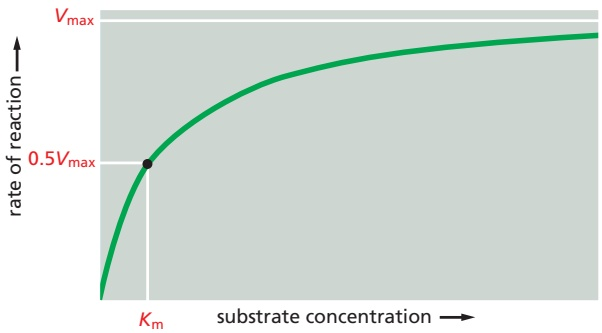

Figure 3–44 Enzyme kinetics. The rate of an enzyme reaction (V) increases as the substrate concentration increases until a maximum value $( V _ { \mathsf { m a x } } )$ is reached. At this point all substrate-binding sites on the enzyme molecules are fully occupied, and the rate of reaction is limited by the rate of the catalytic process on the enzyme surface. For most enzymes, the concentration of substrate at which the reaction rate is half-maximal $( K _ { m } )$ is a measure of how tightly the substrate is bound, with a large value of $K _ { \mathrm { m } }$ corresponding to weak binding $( K _ { m }$ approximates the dissociation constant, $K _ { \mathrm { d } } ,$ for substrate binding).

depends only on how rapidly the enzyme can process the substrate molecule. This maximum rate divided by the enzyme concentration is called the turnover number. Turnover numbers are often about 1000 substrate molecules processed per second per enzyme molecule, although turnover numbers between 1 and 10,000 are known.

The other kinetic parameter frequently used to characterize an enzyme is its $K _ { \mathrm { m } }$ the concentration of substrate that allows the reaction to proceed at one-half its maximum rate $\left( 0 . 5 V _ { \mathrm { m a x } } \right)$ (see Figure 3–44). A low $K _ { \mathrm { m } }$ value means that the enzyme reaches its maximum catalytic rate at a low concentration of substrate and generally indicates that the enzyme binds to its substrate very tightly, whereas a high $K _ { \mathrm { m } }$ value corresponds to weak binding. The methods used to characterize enzymes in this way are explained in **Panel 3–2** (pp. 150–151).

#### Enzymes Speed Reactions by Selectively Stabilizing Transition States

Enzymes achieve extremely high rates of chemical reaction—rates that are far higher than for any synthetic catalysts. There are several reasons for this efficiency. First, when two molecules need to react, the enzyme greatly increases the local concentration of both of these substrate molecules at the catalytic site, holding them in the correct orientation for the reaction that is to follow. More important, however, some of the binding energy contributes directly to the catalysis. Substrate molecules must pass through a series of intermediate states of altered geometry and electron distribution before they form the ultimate products of the reaction. The free energy required to attain the most unstable intermediate state, called the **transition state**, is known as the activation energy for the reaction, and it is the major determinant of the reaction rate. Enzymes have a much higher affinity for the transition state of the substrate than they have for the stable form. Because this tight binding greatly lowers the energy of the transition state, the enzyme greatly accelerates a particular reaction by lowering the activation energy that is required (**Figure 3–45**; see also p. 63).

#### Enzymes Can Use Simultaneous Acid and Base Catalysis

**Figure 3–46** compares the spontaneous reaction rates and the corresponding enzyme-catalyzed rates for five enzymes. Rate accelerations range from $1 0 ^ { 9 }$ to $\left[ 1 0 ^ { 2 3 } \right]$ . This is possible because enzymes not only bind tightly to a transition state, they also contain precisely positioned atoms that alter the electron distributions in the atoms that participate directly in the making and breaking of covalent bonds. Peptide bonds, for example, can be hydrolyzed in the absence of an enzyme by exposing a polypeptide to either a strong acid or a strong base. Enzymes are unique, however, in being able to use acid and base catalysis simultaneously, because the rigid framework of the protein constrains the acidic and basic residues and prevents them from combining with each other, as they wouldMB C7 3.49/3.47 do in solution (**Figure 3–47**).

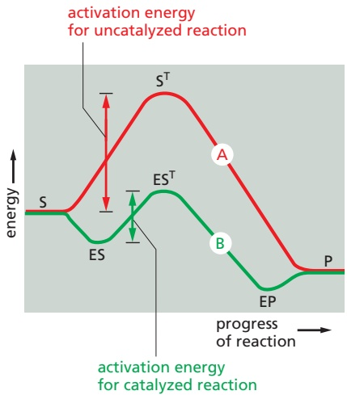

Figure 3–45 Enzymes accelerate chemical reactions by decreasing the activation energy. There is a single transition state in this example. However, often both the uncatalyzed reaction (A) and the enzyme-catalyzed reactionMB C7 3.47/3.45 (B) go through a series of transition states. In that case, it is the transition state with the highest energy (ST and EST) that determines the activation energy and limits the rate of the reaction. (S = substrate; P = product of the reaction; ES = enzyme–substrate complex; EP = enzyme–product complex.)

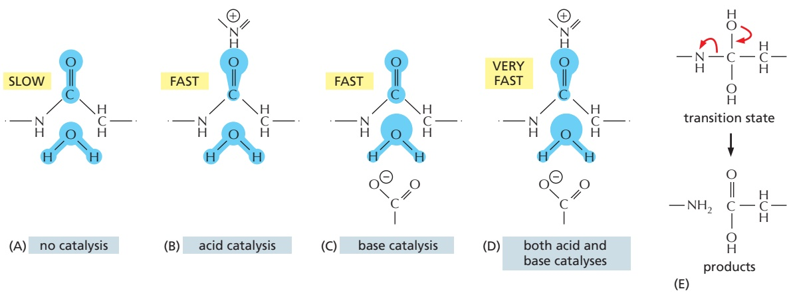

Figure 3–47 Simultaneous acid catalysis and base catalysis by an enzyme. (A) The start of the uncatalyzed reaction that hydrolyzes a peptide bond, with blue shading used to indicate electron distribution in the water and carbonyl bonds. (B) An acid likes to donate a proton (H+) to other atoms. By pairing with the carbonyl oxygen, an acid causes electrons to move away from the carbonyl carbon, making this atom much more attractive to the electronegative oxygen of an attacking water molecule. (C) A base likes to take up H+. By pairing with a hydrogen of the attacking water molecule, a base causes electrons to move toward the water oxygen, making it a better attacking group for the carbonyl carbon. (D) By having appropriately positioned atoms on its surface, an enzyme can perform both acid catalysis and base catalysis at the same time. (E) A tetrahedral intermediate is formed by the attack of the water oxygen atom on the carbonyl carbon atom, and this intermediate rapidly decays to hydrolysis products. The red arrows denote the electron shifts associated with product formation.

The fit between an enzyme and its substrate needs to be precise. A small change introduced by genetic engineering in the active site of an enzyme can therefore have a profound effect. Replacing a glutamic acid with an aspartic acid in one enzyme, for example, shifts the position of the catalytic carboxylate ion by only 1 Å (about the radius of a hydrogen atom), yet this is enough to decrease the activity of the enzyme a thousandfold.

#### Lysozyme Illustrates How an Enzyme Works

To demonstrate how enzymes catalyze chemical reactions, we examine an enzyme that acts as a natural antibiotic in egg white, saliva, tears, and other secretions. **Lysozyme** catalyzes the cutting of polysaccharide chains in the cell walls of bacteria. The bacterial cell is under pressure from osmotic forces, and cutting even a small number of these chains causes the cell wall to rupture and the cell to burst. A relatively small and stable protein that can be easily isolated in large quantities, lysozyme was the first enzyme to have its structure worked out in atomic detail by x-ray crystallography (in the mid-1960s).

The reaction that lysozyme catalyzes is a hydrolysis: it adds a molecule of water to a single bond between two adjacent sugar groups in the polysaccharide chain, thereby causing the bond to break (see Figure 2–9). The reaction is energetically favorable because the free energy of the severed polysaccharide chain is lower than the free energy of the intact chain. However, there is an energy barrier for the reaction (its activation energy). In particular, a colliding water molecule can break a bond linking two sugars only if the polysaccharide molecule is distorted into a particular shape—the transition state—in which the atoms around the bond have an altered geometry and electron distribution. Because of this requirement, random collisions must supply a very large activation energy for the reaction to take place. In an aqueous solution at room temperature, the energy of collisions almost never exceeds the activation energy. The pure polysaccharide can therefore remain for years in water without being hydrolyzed to any detectable degree.

This situation changes drastically when the polysaccharide binds to lysozyme. The active site of lysozyme, because its substrate is a polymer, is a long groove that holds six linked sugars at the same time. As soon as the polysaccharide

#### WHY ANALYZE THE KINETICS OF ENZYMES?

Enzymes are the most selective and powerful catalysts known. An understanding of their detailed mechanisms provides a critical tool for the discovery of new drugs, for the large-scale industrial synthesis of useful chemicals, and for appreciating the chemistry of cells and organisms. A detailed study of the rates of the chemical reactions that are catalyzed by a purified enzyme—more specifically how these rates change with changes in conditions such as the concentrations of substrates, products, inhibitors, and regulatory ligands—allows

#### STEADY-STATE ENZYME KINETICS

Many enzymes have only one substrate, which they bind and then process to produce products according to the scheme outlined in Figure 3–48A. In this case, the reaction is written as

$$
\left| \begin{array}{c} E + S \xrightarrow [ k _ {- 1} ]{k _ {1}} E S \xrightarrow [ k _ {\text {cat}} ]{k _ {\text {cat}}} E + P \end{array} \right|
$$

Here we have assumed that the reverse reaction, in which $\mathsf { E } + \mathsf { P }$ recombine to form EP and then ES, occurs so rarely that we can ignore it. In this case, EP need not be represented, and we can express the rate of the reaction, known as its velocity, V, as

$$
V = k _ {\mathrm{cat}} [ \mathrm{ES} ]
$$

where [ES] is the concentration of the enzyme–substrate complex, and $k _ { \mathrm { c a t } }$ is the turnover number, a rate constant that has a value equal to the number of substrate molecules processed per enzyme molecule each second.

But how does the value of [ES] relate to the concentrations that we know directly, which are the total concentration of the enzyme, $[ \mathsf { E } _ { 0 } ] _ { \iota }$ and the concentration of the substrate, [S]? When enzyme and substrate are first mixed, the concentration [ES] will rise rapidly from zero to a so-called steady-state level, as illustrated below.

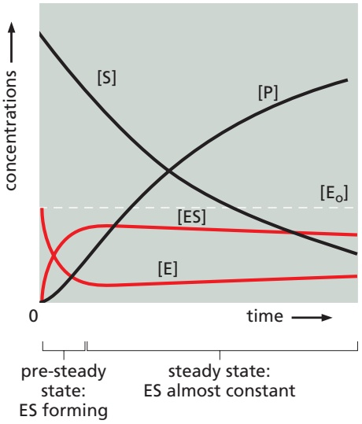

biochemists to figure out exactly how each enzyme works. For example, this is the way that the ATP-producing reactions of glycolysis, shown previously in Figure 2–47, were deciphered—allowing us to appreciate the rationale for this critical enzymatic pathway.

In this Panel, we introduce the important field of enzyme kinetics, which has been indispensable for deriving much of the detailed knowledge that we now have about cell chemistry.

At this steady state, [ES] is nearly constant, so that

$$
\begin{array}{c c c} \text {rate of ES breakdown} & = & \text {rate of ES formation} \\ k _ {- 1} [ \mathrm{ES} ] + k _ {\mathrm{cat}} [ \mathrm{ES} ] & & k _ {1} [ \mathrm{E} ] [ \mathrm{S} ] \end{array}
$$

or, because the concentration of the free enzyme, [E], is equal to $[ \mathsf { E } _ { \mathsf { o } } ] - [ \mathsf { E } \mathsf { S } ]$ ,

$$
\text {[ES]} = \left(\frac {k _ {1}}{k _ {- 1} + k _ {\mathrm{cat}}}\right) [ \mathrm{E} ] [ \mathrm{S} ] = \left(\frac {k _ {1}}{k _ {- 1} + k _ {\mathrm{cat}}}\right) \left(\left[ \mathrm{E} _ {\mathrm{o}} \right] - [ \mathrm{ES} ]\right) [ \mathrm{S} ]
$$

Rearranging, and defining the constant $K _ { \mathrm { m } }$ as

$$
\frac {k _ {- 1} + k _ {\text {cat}}}{k _ {1}}
$$

we get

$$
\boxed {[ E S ]} = \frac {[ E _ {o} ] [ S ]}{K _ {m} + [ S ]}
$$

or, remembering that $V   = k _ { \mathsf { c a t } }$ [ES], we obtain the famous Michaelis–Menten equation

$$
V = \frac {k _ {\mathrm{cat}} [ E _ {\mathrm{o}} ] [ S ]}{K _ {\mathrm{m}} + [ S ]}
$$

As [S] is increased to higher and higher levels, essentially all of the enzyme will be bound to substrate at steady state; at this point, a maximum rate of reaction, $V _ { \mathsf { m a x } } ,$ will be reached where $V = V _ { \mathrm { m a x } } = k _ { \mathrm { c a t } } [ \mathsf { E } _ { \mathrm { o } } ] .$ Thus, it is convenient to rewrite the Michaelis–Menten equation as

$$
V = \frac {V _ {\max} [ S ]}{K _ {\mathrm{m}} + [ S ]}
$$

#### THE DOUBLE-RECIPROCAL PLOT

A typical plot of V versus [S] for an enzyme that follows Michaelis–Menten kinetics is shown below. From this plot, neither the value of $V _ { \mathsf { m a x } }$ nor of $K _ { \mathrm { m } }$ is immediately clear.

To obtain $V _ { \mathsf { m a x } }$ and $K _ { \mathrm { m } }$ from such data, a double-reciprocal plot is often used, in which the Michaelis–Menten equation has merely been rearranged, so that 1/V can be plotted versus 1/ [S].

$$
1 / V = \left(\frac {K _ {\mathrm{m}}}{V _ {\max}}\right) \left(\frac {1}{[ S ]}\right) + 1 / V _ {\max}
$$

#### THE SIGNIFICANCE OF $K _ { \mathsf { m } } ,   k _ { \mathsf { c a t } } ,$ and $k _ { \mathsf { c a t } } / K _ { \mathsf { m } }$

As described in the text, $K _ { \mathrm { m } }$ is an approximate measure of substrate affinity for the enzyme: it is numerically equal to the concentration of [S] at $V = 0 . 5 V _ { \mathrm { m a x } } .$ In general, a lower value of $K _ { \mathrm { m } }$ means tighter substrate binding. In fact, for those cases where $k _ { \mathsf { c a t } }$ is much smaller than $k _ { - 1 } ,$ the $K _ { \mathrm { m } }$ will be equal to $K _ { \mathrm { d } } ,$ the dissociation constant for substrate binding to the enzyme $( K _ { \mathrm { d } } = 1 / K _ { \mathrm { a } } )$

We have seen that $k _ { \mathrm { c a t } }$ is the turnover number for the enzyme. At very low substrate concentrations, where $[ \mathsf { S } ] < < K _ { \mathsf { m } }$ , most of the enzyme is free. Thus we can think of $[ \mathsf { E } ] = [ \mathsf { E } _ { \mathsf { o } } ] ,$ , so that the Michaelis–Menten equation can be simplified as $V = k _ { \mathrm { c a t } } / K _ { \mathrm { m } } [ \mathsf { E } ] [ \mathsf { S } ]$ . Thus, the ratio $k _ { \mathsf { c a t } } / K _ { \mathfrak { m } }$ is equivalent to the rate constant for the reaction between free enzyme and free substrate.

A comparison of $k _ { \mathrm { c a t } } / K _ { \mathfrak { m } }$ for the same enzyme with different substrates, or for two enzymes with their different substrates, is widely used as a measure of enzyme effectiveness.

For simplicity, in this Panel we have discussed enzymes that have only one substrate, such as the lysozyme enzyme described in the text (see p. 152). Most enzymes have two substrates, one of which is often an active carrier molecule—such as NADH or ATP.

A similar, but more complex, analysis is used to determine the kinetics of such enzymes—allowing the order of substrate binding and the presence of covalent intermediates along the pathway to be revealed.

#### SOME ENZYMES ARE DIFFUSION LIMITED

The values of $k _ { \mathsf { c a t } } , K _ { \mathsf { m } ^ { \prime } }$ and $k _ { \mathrm { c a t } } / K _ { \mathfrak { m } }$ for some selected enzymes are given below:

| enzyme | substrate | (ksceact-1) | K(Mm) | k(sceact/-K1mM-1) |
| --- | --- | --- | --- | --- |
| acetylcholinesterase | acetylcholine | 1.4 × 104 | 9 × 10-5 | 1.6 × 108 |
| catalase | H2O2 | 4 × 107 | 1 | 4 × 107 |
| fumarase | fumarate | 8 × 102 | 5 × 10-6 | 1.6 × 108 |

Because an enzyme and its substrate must collide before they can react, $k _ { \mathrm { c a t } } / K _ { \mathfrak { m } }$ has a maximum possible value that is limited by collision rates. If every collision forms an enzyme–substrate complex, one can calculate from diffusion theory that $k _ { \mathsf { c a t } } / K _ { \mathsf { m } }$ will be between $1 0 ^ { 8 }$ and ${ \sf 1 0 ^ { 9 } }   \mathrm { s e c ^ { - 1 }   M ^ { - 1 } } ,$ in the case where all subsequent steps proceed immediately. Thus, it is claimed that enzymes like acetylcholinesterase and fumarase are “perfect enzymes,” each enzyme having evolved to the point where nearly every collision with its substrate converts the substrate to a product.

Figure 3–48 The overall reaction catalyzed by lysozyme. (A) The enzyme lysozyme (E) catalyzes the cutting of a polysaccharide chain, which is its substrate (S). The enzyme first binds to the chain to form an enzyme–substrate complex (ES) and then catalyzes the cleavage of a specific covalent bond in the backbone of the polysaccharide, forming an enzyme– product complex (EP) that rapidly dissociates. Release of the severed chain (the products P) leaves the enzyme free to act on another substrate molecule. (B) A space-filling model of the lysozyme molecule bound to a short length of polysaccharide chain before cleavage (Movie 3.8). (PDB code: 3AB6.)

binds to form an enzyme–substrate complex, the enzyme cuts the polysaccharide by adding a water molecule across one of its sugar–sugar bonds. The product MBoC7 e4.38/3/48chains are then quickly released, freeing the enzyme for further cycles of reaction (**Figure 3–48**).

An impressive increase in hydrolysis rate is possible because conditions are created in the microenvironment of the lysozyme active site that greatly reduce the activation energy necessary for the hydrolysis to take place. In particular, lysozyme distorts one of the two sugars connected by the bond to be broken from its normal, most stable conformation. The bond to be broken is also held close to two amino acids with acidic side chains (a glutamic acid and an aspartic acid) that participate directly in the reaction. **Figure 3–49** highlights the three central steps in this enzymatically catalyzed reaction, which occurs millions of times faster than uncatalyzed hydrolysis.

Other enzymes use similar mechanisms to lower activation energies and speed up the reactions they catalyze. In reactions involving two or more reactants, the active site also acts like a template, or mold, that brings the substrates together in the proper orientation for a reaction to occur between them (**Figure 3–50A**). As we saw for lysozyme, the active site of an enzyme contains precisely positioned atoms that speed up a reaction by using charged groups to alter the distribution of electrons in the substrates (**Figure 3–50B**). And as we have also seen, when a substrate binds to an enzyme, bonds in the substrate are often distorted, changing the substrate shape. These changes drive a substrate toward a particular transition state (**Figure 3–50C**). Finally, like lysozyme, many enzymes participate intimately in the reaction by transiently forming a covalent bond between the substrate and a side chain of the enzyme. Subsequent steps in the reaction restore the side chain to its original state, so that the enzyme remains unchanged after the reaction (see also Figure 2–47).

#### Tightly Bound Small Molecules Add Extra Functions to Proteins

Although we have emphasized the versatility of enzymes—and proteins in general—as chains of amino acids that perform remarkable functions, there are many instances in which the amino acids by themselves are not enough. Just as humans employ tools to enhance and extend the capabilities of their hands, enzymes and other proteins often use small nonprotein molecules to perform functions that would be difficult or impossible to do with amino acids alone. Thus, enzymes frequently have a small molecule or metal atom tightly associated with their active site that assists with their catalytic function. Carboxypeptidase, for example, an enzyme that cuts polypeptide chains, carries a tightly bound zinc ion in its active site. During the cleavage of a peptide bond by carboxypeptidase, the zinc ion forms a transient bond with one of the substrate atoms,

#### SUBSTRATE

This substrate is an oligosaccharide of six sugars, labeled A through F. Only sugars D and E are shown in detail.

#### PRODUCTS

#### STEP 2: FORMATION OF ES

In the enzyme–substrate complex (ES), the lysozyme forces sugar D into a strained conformation. The Glu35 in the active site is positioned to serve as an acid that attacks the adjacent sugar–sugar bond by donating a proton (H+) to sugar E; Asp52 is poised to attack the C1 carbon atom of sugar D.

#### STEP 3: TRANSITION STATE

The Asp52 has formed a covalent bond between the enzyme and the C1 carbon atom of sugar D. The Glu35 then polarizes a water molecule (red), so that its oxygen can readily attack the C1 carbon atom of sugar D and displace Asp52.

#### STEP 4: FORMATION OF EP

The water molecule splits: its –OH group attaches to sugar D and its remaining proton replaces the proton donated by Glu35 in step 2. This completes the hydrolysis and returns the enzyme to its initial state, forming the final enzyme– product complex (EP).

Figure 3–49 Events at the active site of lysozyme. The top left and top right drawings show the free substrate and the free products, respectively. The other three drawings show the sequential events at the enzyme active site, where a sugar–sugar covalent bond is bent and then broken. Note the change in the conformation of sugar D in the enzyme–substrate complex compared with its conformation in the free substrate. This changed conformation favors the formation of the transition stateMBoC7 e4.39/3.49 shown in the middle panel, greatly lowering the activation energy that is required for the reaction. This reaction, and the structure of lysozyme bound to its product, are shown in Movie 3.8 and Movie 3.9. (Based on D.J. Vocadlo et al., Nature 412:835–838, 2001.)

thereby assisting the hydrolysis reaction. In other enzymes, a small organic molecule serves a similar purpose. Such organic molecules are often referred to as **coenzymes**. An example is biotin, which is found in enzymes that transfer a carboxylate group (–COO–) from one molecule to another (see Figure 2–40). Biotin participates in these reactions by forming a transient covalent bond to the –COO– group to be transferred, being better suited to this function than any of the amino acids used to make proteins. Because it cannot be synthesized by humans, and must therefore be supplied in small quantities in our diet, biotin is a vitamin. Many other coenzymes are either vitamins or derivatives of vitamins (**Table 3–2**).

(A) enzyme binds to two substrate molecules and orients them precisely to encourage a reaction to occur between them

(B) binding of substrate to enzyme rearranges electrons in the substrate, creating partial negative and positive charges that favor a reaction

(C) enzyme strains the bound substrate molecule, forcing it toward a transition state that favors a reaction

Figure 3–50 Some general strategies used for enzyme catalysis. (A) Holding substrates together in a precise alignment. (B) Charge stabilization of reaction intermediates. (C) Applying forces that distort bonds in the substrate to increase the rate of a particular reaction.

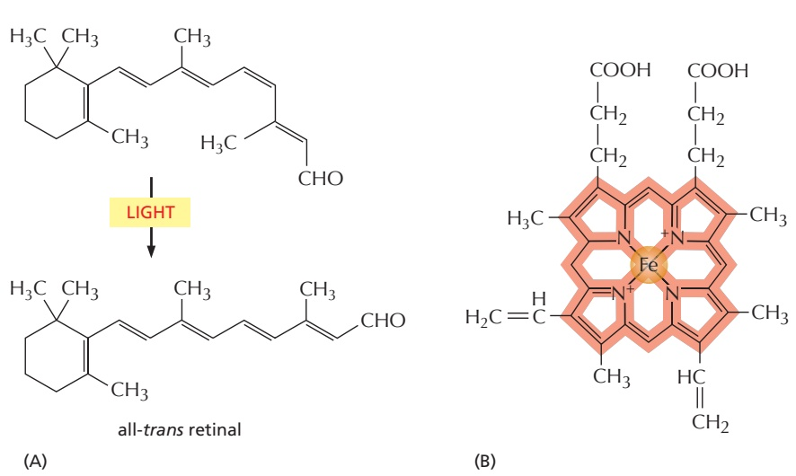

Figure 3–51 Retinal and heme. (A) The structure of retinal, the light-sensitive molecule attached to rhodopsin in the eye, showing its isomerization when it absorbs light. (B) The structure of a heme group. The carbon-containing heme ring is red and the iron atom at its center is orange. A heme group is tightly bound to each of the four polypeptide chains in hemoglobin, the oxygen-carrying protein whose structure is shown in Figure 3–20.

<table><tbody><tr><td colspan="3">TABLE 3-2 Many Vitamin Derivatives Are Critical Coenzymes for Human Cells</td></tr><tr><td>Vitamin</td><td>Coenzyme</td><td>Enzyme-catalyzed reactions requiring these coenzymes</td></tr><tr><td>Thiamine (vitamin B1)</td><td>Thiamine pyrophosphate</td><td>Activation and transfer of aldehydes</td></tr><tr><td>Riboflavin (vitamin B2)</td><td>FADH</td><td>Oxidation-reduction</td></tr><tr><td>Niacin</td><td>NADH, NADPH</td><td>Oxidation-reduction</td></tr><tr><td>Pantothenic acid</td><td>Coenzyme A</td><td>Acyl group activation and transfer</td></tr><tr><td>Pyridoxine</td><td>Pyridoxal phosphate</td><td>Amino acid activation; also glycogen phosphorylase</td></tr><tr><td>Biotin</td><td>Biotin</td><td>CO2 activation and transfer</td></tr><tr><td>Lipoic acid</td><td>Lipoamide</td><td>Acyl group activation; oxidation-reduction</td></tr><tr><td>Folic acid</td><td>Tetrahydrofolate</td><td>Activation and transfer of single carbon groups</td></tr><tr><td>Vitamin B12</td><td>Cobalamin coenzymes</td><td>Isomerization and methyl group transfers</td></tr></tbody></table>

Other proteins also frequently require specific small-molecule adjuncts to function properly. Thus, the signal receptor protein rhodopsin, which is made by the photoreceptor cells in the retina, detects light by means of a small molecule, retinal, embedded in the protein (**Figure 3–51A**). Retinal, which is derived from vitamin A, changes its shape when it absorbs a photon of light, and this change causes the protein to trigger a cascade of enzymatic reactions that eventually lead to an electrical signal being carried to the brain.

Another example of a protein with a nonprotein portion is hemoglobin (see Figure 3–20). Each molecule of hemoglobin carries four heme groups, ringshaped molecules each with a single central iron atom (**Figure 3–51B**). Heme gives hemoglobin (and blood) its red color. By binding reversibly to oxygen gas through its iron atom, heme enables hemoglobin to pick up oxygen in the lungs and release it in the tissues.

Sometimes these small molecules are attached covalently and permanently to their protein, thereby becoming an integral part of the protein molecule itself. We shall see in Chapter 10 that proteins are often anchored to cell membranes through covalently attached lipid molecules. And membrane proteins exposed on the surface of the cell, as well as proteins secreted outside the cell, are often modified by the covalent addition of sugars and oligosaccharides.

#### The Cell Regulates the Catalytic Activities of Its Enzymes

A living cell contains thousands of enzymes, many of which operate at the same time and in the same small volume of the cytosol. By their catalytic action, these enzymes generate a complex web of metabolic pathways, each composed of chains of chemical reactions in which the product of one enzyme becomes the substrate of the next. In this maze of pathways, there are many branch points (nodes) where different enzymes compete for the same substrate. The system is complex (see Figure 2–62), and elaborate controls are required to regulate when and how rapidly each reaction occurs.

Figure 3–52 Feedback inhibition of a single biosynthetic pathway. The end product Z inhibits the first enzyme that is unique to its synthesis and thereby controls its own level in the cell. This is an example of negative regulation.

Regulation occurs at many levels. At one level, the cell controls how many molecules of each enzyme it makes by regulating the expression of the gene that encodes that enzyme (discussed in Chapter 7). The cell also controls enzymatic activities by confining sets of enzymes to particular subcellular compartments (discussed in Chapters 12 and 14) or by concentrating them on protein scaffolds (see pp. 170–173). As will be explained later in this chapter, enzymes are also covalently modified to control their activity. The rate of protein destruction by targeted proteolysis represents yet another important regulatory mechanism (see Figure 6–89). But the most general process that adjusts reaction rates operates through a direct, reversible change in the activity of an enzyme in response to the specific small molecules that it binds.

The most common type of control occurs when an enzyme binds a molecule that is not a substrate to a special regulatory site outside the active site, thereby altering the rate at which the enzyme converts its substrates to products. For example, in **feedback inhibition**, a product produced late in a reaction pathway inhibits an enzyme that acts earlier in the pathway. Thus, whenever large quantities of the final product begin to accumulate, this product binds to the enzyme and slows down its catalytic action, thereby limiting the further entry of substrates into that reaction pathway (**Figure 3–52**). Where pathways branch or intersect, there are usually multiple points of control by different final products, each of which works to regulate its own synthesis (**Figure 3–53**). Feedback inhibition can work almost instantaneously, and it is rapidly reversed when the level of the product falls.

Feedback inhibition is negative regulation: it prevents an enzyme from acting. Enzymes can also be subject to positive regulation, in which a regulatory molecule stimulates the enzyme’s activity rather than shutting the enzyme down. Positive regulation occurs when a product in one branch of the metabolic network stimulates the activity of an enzyme in another pathway. As one example, the accumulation of ADP activates several enzymes involved in the oxidation of sugar molecules, thereby stimulating the cell to convert more ADP to ATP.

#### Allosteric Enzymes Have Two or More Binding Sites That Interact

A striking feature of both positive and negative feedback regulation is that the regulatory molecule often has a shape totally different from the shape of the substrate of the enzyme. This is why the effect on a protein is termed **allostery** (from the Greek words allos, meaning “other,” and stereos, meaning “solid” or “three-dimensional”). As biologists learned more about feedback regulation, they recognized that the enzymes involved must have at least two different binding sites on their surface—an **active site** that recognizes the substrates, and a **regulatory site** that recognizes a regulatory molecule. These two sites must somehow communicate, so that the catalytic events at the active site can be influenced by the binding of the regulatory molecule at its separate site on the protein’s surface.

Figure 3–53 Multiple feedback inhibition. In this example, which shows the biosynthetic pathways for four different amino acids in bacteria, the red lines indicate positions at which products feed back to inhibit enzymes. Each amino acid controls the first enzyme specific to its own synthesis, thereby controlling its own levels and avoiding a wasteful or even dangerous buildup of intermediates. The products can also separately inhibit the initial set of reactions common to all the syntheses; in this case, three different enzymes catalyze the initial reaction, each inhibited by a different product.

The interaction between separated sites on a protein molecule is now known to depend on a conformational change in the protein: binding at one of the sites causes a shift from one folded shape to a slightly different folded shape. During feedback inhibition, for example, the binding of an inhibitor at one site on the protein causes the protein to shift to a conformation that incapacitates its active site located elsewhere in the protein.

It is thought that most protein molecules are allosteric. They can adopt many slightly different conformations, and a shift from one to another caused by the binding of a ligand can alter their activity. This is true not only for enzymes but also for many other proteins, including receptors, structural proteins, and motor proteins. In all instances of allosteric regulation, each conformation of the protein has somewhat different surface contours, and the protein’s binding sites for ligands are altered when the protein changes shape. Importantly, as we discuss next, each ligand will stabilize the conformation that it binds to most strongly, and thus—at high enough concentrations—will tend to “switch” the protein toward the conformation that has a high affinity for that ligand.

Figure 3–54 Positive regulation caused by conformational coupling between two separate binding sites. In this example, both glucose and molecule X bind best to the closed conformation of a protein with two domains. Because both glucose and molecule X drive the protein toward its closed conformation, each ligand helps the other to bind. Glucose and molecule X are therefore said to bind cooperatively to the protein.

#### Two Ligands Whose Binding Sites Are Coupled Must Reciprocally Affect Each Other’s Binding

The effects of ligand binding on a protein follow from a fundamental chemical principle known as **linkage**. Suppose, for example, that a protein that binds glucose also binds another molecule, X, at a distant site on the protein’s surface. If the binding site for X changes shape as part of the conformational change in the protein induced by glucose binding, the binding sites for X and for glucose are said to be coupled. Whenever two ligands prefer to bind to the same conformation of an allosteric protein, it follows from basic thermodynamic principles that each ligand must increase the affinity of the protein for the other. For example, if the shift of a protein to a conformation that binds glucose best also causes the binding site for X to fit X better, then the protein will bind glucose more tightly when X is present than when X is absent. In other words, X will positively regulate the protein’s binding of glucose (**Figure 3–54**).

Conversely, linkage operates in a negative way if two ligands prefer to bind to different conformations of the same protein. In this case, the binding of the first ligand discourages the binding of the second ligand. Thus, if a shape change caused by glucose binding decreases the affinity of a protein for molecule X, the binding of X must also decrease the protein’s affinity for glucose (**Figure 3–55**). The linkage relationship is quantitatively reciprocal, so that, for example, if glucose has a very large effect on the binding of X, X has a very large effect on the binding of glucose.

The relationships shown in Figures 3–54 and 3–55 apply to all proteins, and they underlie all of cell biology. The principle seems so obvious in retrospect that we now take it for granted. But the discovery of linkage in studies of a few enzymes in the 1950s, followed by an extensive analysis of allosteric mechanisms in proteins in the early 1960s, had a revolutionary effect on our understanding of biology. Because molecule X in these examples binds at a site on the enzyme that is distinct from the site where catalysis occurs, it need not have any chemical relationship to the substrate that binds at the active site. Moreover, as we have just seen, for enzymes that are regulated in this way, molecule X can either turn the enzyme on (positive regulation) or turn it off (negative regulation). By such a mechanism, **allosteric proteins** serve as general switches that, in principle, can allow one molecule in a cell to affect the fate of any other.

100% active

10% active

Figure 3–55 Negative regulation caused by conformational coupling between two separate binding sites. The scheme here resembles that in the previous figure, but here molecule X prefers the open conformation, while glucose prefers the closed conformation. Because glucose and molecule X drive the protein toward opposite conformations (closed and open, respectively), the presence of either ligand interferes with the binding of the other.

#### Symmetrical Protein Assemblies Produce Cooperative Allosteric Transitions

A single-subunit enzyme that is regulated by negative feedback can at most decrease from 90% to about 10% activity in response to a 100-fold increase in the concentration of an inhibitory ligand that it binds (**Figure 3–56**, red line). Responses of this type are apparently not sharp enough for optimal cell regulation, and most enzymes that are turned on or off by ligand binding consist of symmetrical assemblies of identical subunits. With this arrangement, the binding of a molecule of ligand to a single site on one subunit can promote an allosteric change in the entire assembly that helps the neighboring subunits bind the same ligand. As a result, a cooperative allosteric transition occurs (Figure 3–56, blue line), allowing a relatively small change in ligand concentration in the cell to switch the whole assembly from an almost fully active to an almost fully inactive conformation (or vice versa).

The principles involved in a cooperative “all-or-none” transition are the same for all proteins, whether or not they are enzymes. Thus, for example, they are critical for the efficient uptake and release of $\mathrm { O } _ { 2 }$ by hemoglobin in our blood. But they are perhaps easiest to visualize for an enzyme that forms a symmetrical dimer. In the example shown in **Figure 3–57**, the first molecule of an inhibitory ligand binds with great difficulty because its binding disrupts an energetically favorable interaction between the two identical monomers in the dimer. A second molecule of inhibitory ligand now binds more easily, however, because its binding restores

Figure 3–57 A cooperative allosteric transition in an enzyme composed of two identical subunits. This diagram illustrates how the conformation of one subunit can influence that of its neighbor. The binding of a single molecule of an inhibitory ligand (orange) to one subunit of the enzyme occurs with difficulty because it changes the conformation of this subunit and thereby disrupts the energetically favorable interactions in the symmetrical enzyme. Once this conformational change has occurred, however, the free energy gained by restoring the symmetrical pairing interaction between the two subunits makes it especially easy for the second subunit to bind the inhibitory ligand and undergo the same conformational change. Because the binding of the first molecule of ligand increases the affinity with which the other subunit binds the same ligand, the response of the enzyme to changes in the concentration of the ligand is much steeper than the response of an enzyme with only one subunit (see Figure 3–56 and Movie 3.10).

Figure 3–56 Enzyme activity versus the concentration of inhibitory ligand for single-subunit and multisubunit allosteric enzymes. For an enzyme with a single subunit (red line), a drop from 90% enzyme activity to 10% activity (indicated by the two dots on the curve) requires a 100-fold increase in the concentration of inhibitor. The enzyme activity is calculated from the simple equilibrium relationship $K = [ \mathsf { I P } ] / [ \mathsf { I } ] [ \mathsf { P } ] ,$ where P is active protein, I is inhibitor, and IP is the inactive protein bound to inhibitor. An identical curve applies to any simple binding interaction between two molecules, A and B. In contrast, a multisubunit allosteric enzyme can respond in a switchlike manner to a change in ligand concentration: the steep response is caused by a cooperative binding of the ligand molecules, as explained in Figure 3–57. Here, the green line represents the idealized result expected for the cooperative binding of two inhibitory ligand molecules to an allosteric enzyme with two subunits, and the blue line shows the idealized response of an enzyme with four subunits. As indicated by the two dots on each of these curves, the more complex enzymes drop from 90% to 10% activity over a much narrower range of inhibitor concentration than does the enzyme composed of a single subunit.

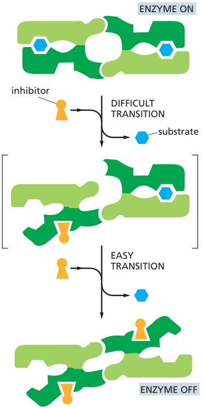

the energetically favorable monomer–monomer contacts of a symmetrical dimer (this also completely inactivates the enzyme).

As an alternative to this induced fit model for a cooperative allosteric transition, we can view such a symmetrical enzyme as having only two possible conformations, corresponding to the “enzyme on” and “enzyme off” structures in Figure 3–57. In this view, ligand binding perturbs an all-or-none equilibrium between these two states, thereby changing the proportion of active molecules. Both models represent true and useful concepts.

#### Many Changes in Proteins Are Driven by Protein Phosphorylation

Proteins are regulated by more than the reversible binding of other molecules. A second method that eukaryotic cells use extensively to regulate a protein’s function is the covalent addition of a smaller molecule to one or more of its amino acid side chains. The most common such regulatory modification in higher eukaryotes is the addition of a phosphate group. We shall therefore use protein phosphorylation to illustrate some of the general principles involved in the control of protein function through the covalent modification of amino acid side chains.

A phosphorylation event (by a kinase) can affect the protein that is modified in three important ways. First, because each phosphate group carries two negative charges, the enzyme-catalyzed addition of a phosphate group to a protein can cause a major conformational change in the protein by, for example, attracting a cluster of positively charged amino acid side chains. This can, in turn, affect the binding of ligands elsewhere on the protein surface, dramatically changing the protein’s activity. When a second enzyme (called a phosphatase) removes the phosphate group, the protein returns to its original conformation and restores its initial activity.

Second, an attached phosphate group can form part of a structure that the binding sites of other proteins recognize. As previously discussed, the SH2 domain binds to a short peptide sequence containing a phosphorylated tyrosine side chain (see Figure 3–38B). More than 10 other common domains provide binding sites for attaching their protein to phosphorylated peptides in other protein molecules, each recognizing a phosphorylated amino acid side chain in a different protein context. Third, the addition of a phosphate group can mask a binding site that otherwise holds two proteins together, and thereby disrupt protein–protein interactions. As a result of the last two effects, protein phosphorylation and dephosphorylation very often drive the regulated assembly and disassembly of protein complexes.

Reversible protein phosphorylation controls the activity, structure, and cellular localization of enzymes and many other types of proteins in eukaryotic cells. In fact, this regulation is so extensive that more than one-third of the 10,000 or so proteins in a typical mammalian cell are thought to be phosphorylated at any given time—many with more than one phosphate.

As might be expected, the addition and removal of phosphate groups from specific proteins often occur in response to signals that specify some change in a cell’s state. For example, the complicated series of events that takes place as a eukaryotic cell divides is largely timed in this way (discussed in Chapter 17), and many of the signals mediating cell–cell interactions are relayed from the plasma membrane to the nucleus by a cascade of protein phosphorylation events (discussed in Chapter 15).

#### A Eukaryotic Cell Contains a Large Collection of Protein Kinases and Protein Phosphatases

**Protein phosphorylation** involves the enzyme-catalyzed transfer of the terminal phosphate group of an ATP molecule to the hydroxyl group on a serine, threonine, or tyrosine side chain of the protein (**Figure 3–58**). A **protein kinase** catalyzes this reaction, and the reaction is essentially unidirectional because of the large amount of free energy released when the phosphate–phosphate bond in

Figure 3–58 Protein phosphorylation. Many thousands of proteins in a typical eukaryotic cell are modified by the covalent addition of a phosphate group. (A) The general reaction transfers a phosphate group from ATP to an amino acid side chain of the target protein, catalyzed by a protein kinase. Removal of the phosphate group is catalyzed by a second enzyme, a protein phosphatase. In this example, the phosphate is added to a serine side chain; in other cases, the phosphate is instead linked to the –OH group of a threonine or a tyrosine in the protein. (B) The phosphorylation of a protein by a protein kinase can either increase or decrease the protein’s activity, depending on the site of phosphorylation and the structure of the protein.

ATP is broken to produce ADP (discussed in Chapter 2). A **protein phosphatase** catalyzes the reverse reaction of phosphate removal, or dephosphorylation. Cells contain hundreds of different protein kinases, each responsible for phosphorylating a different protein or set of proteins. There are also many different protein phosphatases; some are highly specific and remove phosphate groups from only one or a few proteins, whereas others act on a broad range of proteins and are targeted to specific substrates by regulatory subunits. The state of phosphorylation of a protein at any moment, and thus its activity, depends on the relative activities of the protein kinases and phosphatases that modify it.

The protein kinases that phosphorylate proteins in eukaryotic cells belong to a very large family of enzymes that share a catalytic (kinase) sequence of about 290 amino acids. The various family members contain different amino acid sequences on either end of the kinase sequence (for example, see Figure 3–11) and often have short amino acid sequences inserted into loops within it. Some of these additional amino acid sequences enable each kinase to recognize the specific set of proteins it phosphorylates or to bind to structures that localize it in specific regions of the cell. Other parts of the protein regulate the activity of each kinase, so it can be turned on and off in response to different specific signals, as described below.

By comparing the number of amino acid sequence differences between the various members of a protein family, we can construct an “evolutionary tree” that is thought to reflect the pattern of gene duplication and divergence that gave rise to the family. **Figure 3–59** shows an evolutionary tree for protein kinases. Kinases with related functions are often located on nearby branches of the tree: the protein kinases involved in cell signaling that phosphorylate tyrosine side chains, for example, are all clustered in the top left corner of the tree. The other kinases shown phosphorylate either a serine or a threonine side chain, and many are organized into clusters that seem to reflect their function— in transmembrane signal transduction, intracellular signal amplification, cellcycle control, and so on.

As a result of the combined activities of protein kinases and protein phosphatases, the phosphate groups on proteins are continually turning over—being added and then rapidly removed. Such phosphorylation cycles may seem wasteful, but they are important in allowing the phosphorylated proteins to switch rapidly from one state to another. In fact, the more rapid this cycle is “turning,” the faster a population of protein molecules can change its state of phosphorylation in response to a sudden change in its phosphorylation rate (see Figure 15–15).

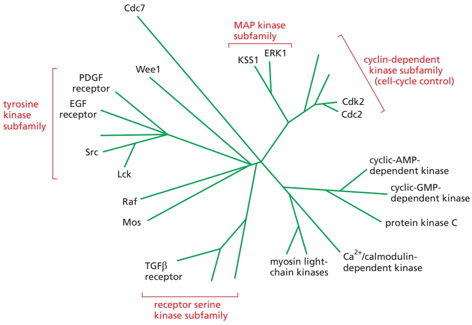

Figure 3–59 An evolutionary tree of selected protein kinases. A higher eukaryotic cell contains hundreds of such enzymes, and the human genome codes for more than 500. Note that only some of these, those discussed in this book, are shown.

Figure 3–60 The domain structure of the Src family of protein kinases, mapped along the amino acid sequence. For the three-dimensional structure of Src, see Figure 3–11.

The energy required to drive this phosphorylation cycle is derived from the free energy of ATP hydrolysis, one molecule of which is consumed for each phosphorylation event.

#### The Regulation of the Src Protein Kinase Reveals How a Protein Can Function as a Microprocessor

The hundreds of different protein kinases in a eukaryotic cell are organized into complex networks of signaling pathways that help to coordinate the cell’s activities, drive the cell cycle, and relay signals into the cell from the cell’s environment. Many of the extracellular signals involved need to be both integrated and amplified by the cell. Individual protein kinases (and other signaling proteins) serve as input–output devices, or “microprocessors,” in the integration process. An important part of the input to these signal-processing proteins comes from the control that is exerted by phosphates added and removed from them by protein kinases and protein phosphatases, respectively.

The Src family of protein kinases (see Figure 3–11) exhibits such behavior. The Src protein (pronounced “sarc” and named for the type of tumor, a sarcoma, that its deregulation can cause) was the first tyrosine kinase to be discovered. It is now known to be part of a subfamily of nine very similar protein kinases, which are found only in multicellular animals. As indicated by the evolutionary tree in Figure 3–59, sequence comparisons suggest that tyrosine kinases as a group were a relatively late innovation that branched off from the serine/threonine kinases, with the Src subfamily being only one subgroup of the tyrosine kinases created in this way.

The Src protein and its relatives contain a short N-terminal region that becomes covalently linked to a strongly hydrophobic fatty acid, which anchors the kinase at the cytoplasmic face of the plasma membrane. Next along the linear sequence of amino acids come two peptide-binding domains, a Src homology 3 (SH3) domain and an SH2 domain, followed by the kinase catalytic domain (**Figure 3–60**). These kinases normally exist in an inactive conformation, in which a phosphorylated tyrosine near the C-terminus is bound to the SH2 domain, and the SH3 domain is bound to an internal peptide in a way that distorts the active site of the enzyme and helps to render it inactive.

As shown in **Figure 3–61**, turning the kinase on involves at least two specific inputs: removal of the C-terminal phosphate and the binding of the SH3 domain by a specific activating protein. In this way, the activation of the Src kinase signals

Figure 3–61 The activation of a Src-type protein kinase by two sequential events. As described in the text, the requirement for multiple upstream events to trigger these processes allows the kinase to serve as a signal integrator (Movie 3.11). (Adapted from S.C. Harrison, Cell 112: 737–740, 2003.)

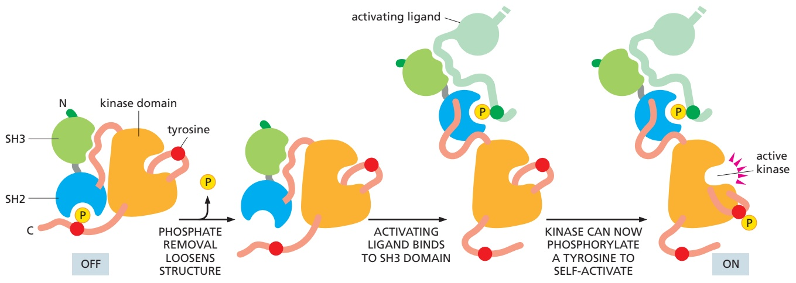

OUTPUT

the completion of a particular set of separate upstream events (**Figure 3–62**). Thus, the Src family of protein kinases serves as specific signal integrators, contributing to the web of information-processing events that enable the cell to compute useful responses to a complex set of different conditions.

<!-- END EN EN03-H029-H058 -->

### 英文补充：蛋白质修饰、泛素化、分子机器与生物分子凝聚体

> 对应中文板块：蛋白质修饰、泛素化、分子机器与生物分子凝聚体。英文来源：Molecular Biology of the Cell，第7版，第3章；[本章完整原文](../../来源/英文教材/03_Proteins/chapter.md)。物理PDF页码范围：154–221（整章范围）。

<!-- BEGIN EN EN03-H059-H074 -->
#### Regulatory GTP-binding Proteins Are Switched On and Off by the Gain and Loss of a Phosphate Group

Eukaryotic cells have a second way to regulate protein activity by phosphate addition and removal. In this case, however, the phosphate is not enzymatically transferred from ATP to the protein. Instead, the phosphate is part of a guanine nucleotide—guanosine triphosphate (GTP)—that binds tightly to various types of **GTP-binding proteins**. These proteins, also called **GTPases**, bind to other proteins to regulate their activities. They serve as molecular switches: GTP-binding proteins are in their “on” conformation when GTP is bound, but they can hydrolyze this GTP to GDP—which releases a phosphate and flips the protein to its “off” conformation. As with protein phosphorylation, this process is reversible: the active conformation is regained by dissociation of the GDP, followed by the rapid binding of a fresh molecule of GTP (**Figure 3–63**).

Hundreds of different GTP-binding proteins function as such molecular switches in cells. They all contain variations of the same globular domain that undergoes a conformational change when its tightly bound GTP is hydrolyzed to GDP. The three-dimensional structure of a prototypical member of this family, the monomeric GTPase called **Ras** that plays important roles in cell signaling, is shown in **Figure 3–64**.

The crucial role that GTP-binding proteins play in intracellular signaling pathways is discussed in detail in Chapter 15.

#### Proteins Can Be Regulated by the Covalent Addition of Other Proteins

Cells contain a special family of small proteins whose members are covalently attached to many other proteins to determine the activity or fate of the second protein. In each case, the carboxyl end of the small protein becomes linked to the amino group of a lysine side chain of a target protein through an isopeptide bond. The first such protein discovered, and the most abundantly used, is **ubiquitin** (**Figure 3–65A**). Ubiquitin can be covalently attached to target proteins in a variety of ways, each of which has a different meaning for cells. The major form of ubiquitin addition produces polyubiquitin chains in which—once the first ubiquitin molecule is attached to the target—each subsequent ubiquitin molecule links to Lys48 of the previous ubiquitin, creating a chain of Lys48-linked ubiquitins that are attached to a single lysine side chain of the target protein. This form

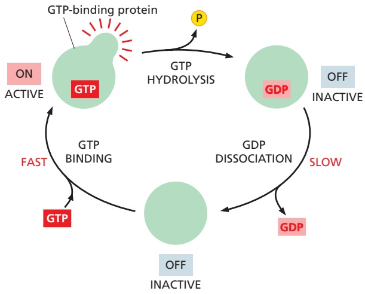

Src-type protein kinase activity turns on fully only if the answers to all of the above questions are yes

Figure 3–62 How a Src-type protein kinase acts as a signal-integrating device. A disruption of the inhibitory interaction illustrated for the SH3 domain (green) occurs when its binding to the indicated orange linker region is replaced with its higher-affinity binding to an MBoC7activating ligand.

Figure 3–63 Many different GTP-binding proteins function as molecular switches. The activity of a GTP-binding protein (also called a GTPase) generally requires the presence of a tightly bound GTP molecule (switch “on”). Hydrolysis of this GTP molecule by the GTP-binding protein—at a rate that can be regulated—produces GDP and inorganic phosphate, and it causes the protein to convert to a different, usually inactive, conformation (switch “off”). Resetting the switch to “on” requires that the tightly bound GDP dissociate. This is a slow step, and the dissociation of GDP, which is followed by its rapid replacement by GTP, is controlled by cell signals (see Figure 15–8).

Figure 3–64 The structure of the Ras protein in its GTP-bound form. This monomeric GTPase illustrates the structure of a GTP-binding domain, which is present in a large family of GTP-binding proteins. The red regions change their conformation when the GTP molecule is hydrolyzed to GDP and inorganic phosphate by the protein; the GDP remains bound to the protein, while the inorganic phosphate is released. The special role of the switch helix in proteins related to Ras is explained in the text (see Figure 3–68 and Movie 15.7). (PDB code: 121P.)

of polyubiquitin directs the target protein to the interior of a proteasome, where it is digested to small peptides (see Figure 6–87). In other circumstances, only single molecules of ubiquitin are added to proteins. In addition, some target proteins are modified with a different type of polyubiquitin chain. These modifications have different functional consequences for the protein that is targeted (**Figure 3–65B**).

Related structures are created when a different member of the ubiquitin family, such as SUMO (small ubiquitin-related modifier), is covalently attached to a lysine side chain of target proteins. Not surprisingly, all such modifications are reversible. Cells contain sets of ubiquitylating and deubiquitylating (and sumoylating and desumoylating) enzymes that manipulate these covalent adducts, thereby playing roles analogous to the protein kinases and protein phosphatases that add and remove phosphates from protein side chains.

#### An Elaborate Ubiquitin-conjugating System Is Used to Mark Proteins

How do cells select target proteins for ubiquitin addition? As an initial step, the carboxyl end of ubiquitin needs to be activated. This activation is accomplished when a protein called a ubiquitin-activating enzyme (E1) uses ATP hydrolysis energy to attach ubiquitin to itself through a high-energy covalent bond (a thioester). E1 then passes this activated ubiquitin to one of a set of ubiquitin-conjugating (E2) enzymes, each of which acts in conjunction with a set of accessory (E3) proteins called **ubiquitin ligases** that select the target proteins to be modified. There are roughly 30 structurally similar but distinct E2 enzymes in mammals and hundreds of different E3 proteins that form complexes with specific E2 enzymes.

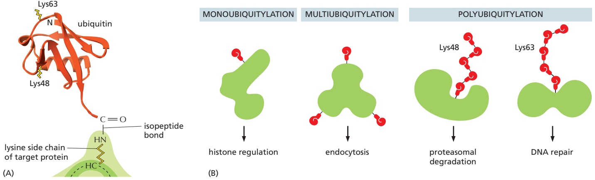

Figure 3–65 The marking of proteins by ubiquitin. (A) The three-dimensional structure of ubiquitin, a small protein of 76 amino acids. A family of special enzymes couples its carboxyl end to the amino group of a lysine side chain in a target protein molecule, forming an isopeptide bond. (B) Some modification patterns that have specific meanings to the cell. Note that the two types of polyubiquitylation differ in the way the ubiquitin molecules are linked together. Linkage through Lys48 signifies degradation by the proteasome (see Figure 6–87), whereas that through Lys63 has other meanings. Ubiquitin markings are “read” by proteins that specifically recognize each type of modification.

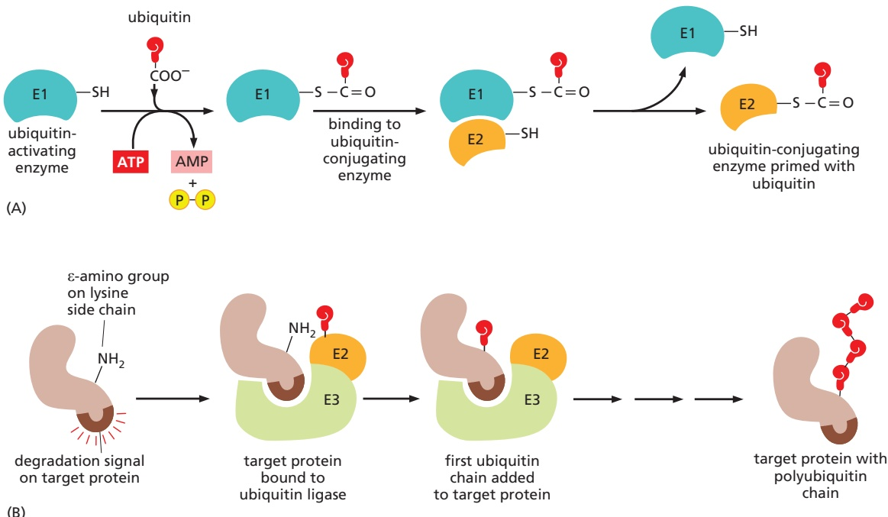

Figure 3–66 How ubiquitin is added to proteins. (A) Ubiquitin activations. The C-terminus of ubiquitin is initially activated by being linked via a high-energy thioester bond to a cysteine side chain on the E1 protein. This reaction requires ATP, and it proceeds via a covalent AMP–ubiquitin intermediate. The activated ubiquitin on E1, also known as the ubiquitin-activating enzyme, is then transferred to the cysteine on an E2 molecule. (B) The addition of a polyubiquitin chain to a target protein. In a mammalian cell, there are several hundred distinct E2–E3 complexes. The E2s are called ubiquitin-conjugating enzymes. The E3s are referred to as ubiquitin ligases. (Adapted from D.R. Knighton et al., Science 253:407–414, 1991.)

**Figure 3–66** illustrates the process used to mark proteins for proteasomal degradation. [Similar mechanisms are used to attach ubiquitin (and SUMO) to other types of target proteins.] Here, the ubiquitin ligase binds to specific degradation signals, called degrons, in protein substrates, thereby helping E2 to form a polyubiquitin chain linked to a lysine of the substrate protein. This polyubiquitin chain on a target protein will then be recognized by a specific receptor in the proteasome, causing the target protein to be rapidly destroyed. Distinct ubiquitin ligases recognize different degradation signals, thereby targeting distinct subsets of intracellular proteins for destruction, often in response to specific signals (see Figure 6–89).

#### Protein Complexes with Interchangeable Parts Make Efficient Use of Genetic Information

Controlled protein degradation is critical for cells, and we will describe the structure and function of one of the families of E3 proteins that adds polyubiquitin chains to target proteins in order to illustrate a general principle: how the cell makes use of interchangeable parts to diversify its many protein complexes.

The SCF ubiquitin ligase is a C-shaped structure that is formed from five protein subunits, the largest of which serves as a scaffold on which the rest of the complex is built. The structure underlies a remarkable mechanism (**Figure 3–67**). At one end of the C is an E2 ubiquitin–conjugating enzyme. At the other end is a substrate-binding arm, a subunit known as an F-box protein. These two subunits are separated by a gap of about 5 nm. When this protein complex is activated, the

Figure 3–67 The structure and mode of action of a ubiquitin ligase. (A) The structure of the five-protein SCF ubiquitin ligase complex that includes an E2 ubiquitin-conjugating enzyme. Four proteins form the E3 portion. The protein denoted here as adaptor protein 1 is the Rbx1/Hrt1 protein, adaptor protein 2 is the Skp1 protein, and cullin is the Cul1 protein. One of the many different F-box proteins completes the complex. (B) Comparison of the same complex with two different substratebinding arms, the F-box proteins Skp2 (top) and β-trCP1 (bottom), respectively. (C) The binding and ubiquitylation of a target. / . protein by the SCF ubiquitin ligase. If, as indicated, a chain of ubiquitin molecules is added to the same lysine of the target protein, that protein is marked for rapid destruction by the proteasome. (D) Comparison of SCF (bottom) with a low-resolution electron microscopy structure of a ubiquitin ligase called the anaphase-promoting complex (APC/C; top) at the same scale. The APC/C is a large, 15-protein complex. As discussed in Chapter 17, its ubiquitylations control the late stages of mitosis. It is distantly related to SCF and contains a cullin subunit (green) that lies along the side of the complex at right, only partly visible in this view. E2 proteins are not shown here, but their binding sites are indicated in orange, along with substratebinding sites in purple. (A and B, adapted from G. Wu et al., Mol. Cell 11:1445–1456, 2003. D, adapted from P. da Fonseca et al., Nature 470:274–278, 2011.)

F-box protein binds to a specific site on a target protein, positioning the protein in the gap so that some of its lysine side chains contact the ubiquitin-conjugating enzyme. The enzyme can then catalyze repeated additions of ubiquitin to these lysines (see Figure 3–67C), producing the polyubiquitin chains that mark its target proteins for destruction in a proteasome.

In this manner, specific proteins are targeted for rapid destruction in response to specific signals, thereby helping to drive the cell cycle (discussed in Chapter 17). The timing of the destruction often involves creating a specific pattern of phosphorylation on the target protein that is required for its recognition by the F-box subunit. It also requires the activation of an SCF-like ubiquitin ligase that carries the appropriate substrate-binding arm. Many of these arms (the F-box subunits) are interchangeable in the protein complex (see Figure 3–67B), and there are more than 70 human genes that encode them.

As emphasized previously, once a successful protein has evolved, its genetic information tends to be duplicated to produce a family of related proteins. Thus, for example, not only are there many F-box proteins—making possible the recognition of different sets of target proteins—but there is also a family of scaffolds (known as cullins) that give rise to a family of SCF-like ubiquitin ligases.

A protein machine like the SCF ubiquitin ligase, with its interchangeable parts, makes economical use of the genetic information in cells. It also creates opportunities for “rapid” evolution, inasmuch as new functions can evolve for the entire complex simply by producing an alternative version of one of its subunits.

Figure 3–68 The large conformational change in EF-Tu caused by GTP hydrolysis. (A and B) The three-dimensional structure of EF-Tu with GTP bound. The domain at the top has a structure similar to the Ras protein, and its red α helix is the switch helix, which moves after GTP hydrolysis. (C) The change in the conformation of the switch helix in domain 1 allows domains 2 and 3 to rotate as a single unit by about 90 degrees toward the viewer, which releases the tRNA that was bound to this structure (see also Figure 3–69). (A, PDB code: 1EFT; B, courtesy of Mathias Sprinzl and Rolf Hilgenfeld.)

Ubiquitin ligases form a diverse family of protein complexes. Some of these complexes are far larger and more complicated than SCF, but their underlying enzymatic function remains the same (see Figure 3–67D).

#### A GTP-binding Protein Shows How Large Protein Movements Can Be Generated from Small Ones

Detailed structures obtained for one of the GTP-binding protein family members, the EF-Tu protein, provide a good example of how allosteric changes in protein conformations can produce large movements by amplifying a small, local conformational change. As will be discussed in Chapter 6, EF-Tu is an abundant molecule that serves as an elongation factor (hence the EF) in protein synthesis, loading each aminoacyl-tRNA molecule onto the ribosome. EF-Tu contains a Ras-like domain (see Figure 3–64), and the tRNA molecule forms a tight complex with its GTP-bound form. For the tRNA molecule to transfer its amino acid to the growing polypeptide chain requires that the GTP bound to EF-Tu be hydrolyzed, dissociating the EF-Tu from the tRNA. Because this GTP hydrolysis is triggered by a proper fit of the tRNA to the mRNA molecule on the ribosome, the EF-Tu serves to discriminate between correct and incorrect mRNA–tRNA pairings (see Figure 6–69).

By comparing the three-dimensional structure of EF-Tu in its GTP-bound and GDP-bound forms, we can see how the repositioning of the tRNA occurs. The dissociation of the inorganic phosphate group, which follows the reaction GTP → GDP + phosphate, causes a shift of a few tenths of a nanometer at the GTP-binding site, just as it does in the Ras protein. This tiny movement, equivalent to a few times the diameter of a hydrogen atom, causes a conformational change to propagate along a crucial piece of α helix, called the switch helix, in the Ras-like domain of the protein. The switch helix seems to serve as a latch that adheres to a specific site in another domain of the molecule, holding the protein in a “shut” conformation. The conformational change triggered by GTP hydrolysis causes the switch helix to detach, allowing separate domains of the protein to swing apart, through a distance of about 4 nm (**Figure 3–68**). This releases the tRNA, allowing its attached amino acid to be used for protein synthesis (**Figure 3–69**).

Notice in this example how cells have exploited a simple chemical change that occurs on the surface of a small protein domain to create a movement 50 times larger. Dramatic shape changes of this type also cause the very large movements that occur in motor proteins, as we discuss next.

Figure 3–69 An aminoacyl tRNA molecule bound to EF-Tu. Note how the bound protein blocks the use of the tRNAlinked amino acid (dark green) for protein synthesis until GTP hydrolysis triggers the conformational changes shown in Figure MBoC7 m3.73/3.693–68C, dissociating the protein–tRNA complex. EF-Tu is a bacterial protein; however, a very similar protein exists in eukaryotes, where it is called EF-1 (Movie 3.12). (PDB code: 1B23.)

#### Motor Proteins Produce Directional Movement in Cells

We have seen that conformational changes in proteins have a central role in enzyme regulation and cell signaling. We now discuss proteins whose major function is to move other molecules. These motor proteins generate the forces responsible for muscle contraction and the crawling and swimming of cells. Motor proteins also power smaller-scale intracellular movements: they help to move chromosomes to opposite ends of the cell during mitosis (discussed in Chapter 17), to move organelles along molecular tracks within the cell (discussed in Chapter 16), and to move enzymes along a DNA strand during the synthesis of a new DNA molecule (discussed in Chapter 5). All these fundamental processes depend on proteins with moving parts that operate as force-generating machines.

How do these machines work? It is a challenge for cells to use shape changes in proteins to generate persistent movements in a single direction. If, for example, a protein is required to walk along a long cytoskeletal filament, it can do this by undergoing a series of conformational changes, such as those shown in **Figure 3–70**. But with nothing to drive these changes in an orderly sequence, they are perfectly reversible, and the protein can only wander randomly back and forth along the thread. We can look at this situation in another way. Because the directional movement of a protein does work, the laws of thermodynamics (discussed in Chapter 2) demand that such movement use free energy from some other source (otherwise the protein could be used to make a perpetual motion machine). Therefore, without an input of energy, the protein molecule can only wander aimlessly.

How can the cell make such a series of conformational changes unidirectional? To force the entire cycle to proceed in one direction, it is enough to make any one of the changes in shape irreversible. Most proteins that are able to walk in one direction for long distances achieve this motion by coupling one of the conformational changes to the hydrolysis of an ATP molecule that is tightly bound to the protein. The mechanism is similar to the one discussed earlier that drives allosteric protein shape changes by GTP hydrolysis. Because ATP (or GTP) hydrolysis releases a great deal of free energy, it is very unlikely that the nucleotide-binding protein will undergo the reverse shape change needed for moving backward—as this would require that it also reverse the ATP hydrolysis by adding a phosphate molecule to ADP to form ATP.

In the model shown in **Figure 3–71A**, ATP binding shifts a motor protein from conformation 1 to conformation 2. The bound ATP is then hydrolyzed to produce ADP and inorganic phosphate, causing a change from conformation 2 to conformation 3. Finally, the release of the bound ADP and phosphate drives the protein back to conformation 1. Because the energy provided by ATP hydrolysis drives the transition 2 → 3, this series of conformational changes is effectively irreversible. Thus, the entire cycle goes in only one direction, causing the protein molecule to walk continuously to the right in this example.

Many motor proteins generate directional movement through the use of a similar unidirectional ratchet, including the muscle motor protein myosin, which walks along actin filaments (**Figure 3–71B**), and the kinesin proteins that walk along microtubules (both discussed in Chapter 16). These movements can be rapid: some of the motor proteins involved in DNA replication (the DNA helicases) propel themselves along a DNA strand at rates as high as 1000 nucleotides per second.

#### Proteins Often Form Large Complexes That Function as Protein Machines

Large proteins formed from many domains are able to perform more elaborate functions than small, single-domain proteins. But large protein assemblies formed from many protein molecules linked together by noncovalent bonds perform the most impressive tasks. Now that it is possible to reconstruct most biological

#### A
 A
 B
 B
 B
 B
 C
 C
 C
 C

Figure 3–70 Changes in conformation can cause a protein to “walk” along a cytoskeletal filament, driven by its constant collisions with other molecules (thermal energy). This protein cycles between three different conformations (A, B, and C) as it moves along the filament. But, without an input of energy to drive its movement in a single direction, the protein can only wander randomly back and forth, ultimately getting nowhere.

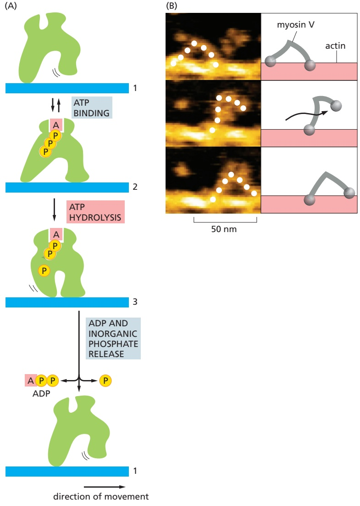

Figure 3–71 How a protein can walk in one direction. (A) An allosteric motor protein driven by ATP hydrolysis. The transition between three different conformations includes a step driven by the hydrolysis of a tightly bound ATP molecule, creating a “unidirectional ratchet” that makes the entire cycle essentially irreversible. By repeated cycles, the protein therefore moves continuously to the right along the thread. (B) Direct visualization of a walking myosin motor protein by high-speed atomic force microscopy; the elapsed time between steps was less than 0.5 sec (see Movie 16.3). (B, adapted from N. Kodera et al., Nature 468:72–76, published 2010 by Macmillan Publishers Ltd. Reproduced with permission of SNCSC.)

processes in cell-free systems in the laboratory, it is clear that each of the central processes in a cell—such as DNA replication, protein synthesis, vesicle budding, or transmembrane signaling—is catalyzed by a highly coordinated, linked set of MB C7 3.75/3.71 10 or more proteins. In most such protein machines, energetically favorable reactions such as the hydrolysis of bound nucleoside triphosphates (ATP or GTP) drive an ordered series of conformational changes in one or more of the individual protein subunits, enabling the ensemble of proteins to move in a coordinated way. As a result, each enzyme can be moved directly into position as the machine catalyzes successive reactions in a series (**Figure 3–72**). This is what occurs, for example, in protein synthesis on a ribosome (an RNA–protein, or macromolecular machine, discussed in Chapter 6)—or in DNA replication, where a large multiprotein complex moves rapidly along the DNA (discussed in Chapter 5).

Cells have evolved protein machines for the same reason that humans have invented mechanical and electronic machines. For accomplishing almost any task, manipulations that are spatially and temporally coordinated through linked processes are much more efficient than the use of many separate tools.

#### The Disordered Regions in Proteins Are Critical for a Set of Different Functions

Scientists have discovered that proteins contain a surprisingly large amount of intrinsically disordered polypeptide chain. Thus, as previously mentioned, it is estimated that about a third of all eukaryotic proteins contain unstructured

Figure 3–72 Schematic example showing how protein machines can carry out complex functions. These machines are made of individual proteins that collaborate to perform a specific task (Movie 3.13). As in this example, the movement of these proteins is often coordinated by the hydrolysis of a bound nucleotide such as ATP or GTP. Directional allosteric conformational changes of proteins driven in this way often occur in a large protein assembly, thereby allowing directed movements within the complex to coordinate the activities of its individual molecules. (See also Movie 5.5.)

regions greater than 30 amino acids in length. Some of these regions are formed from only a limited subset of the 20 amino acids and are therefore designated as low-complexity domains. Because many unstructured regions have been conserved in a particular protein over long periods of evolutionary time, their presence must benefit the organisms that contain them. What do these disordered regions do?

Intrinsically disordered regions of proteins often form specific binding sites for other proteins that are of high specificity, as illustrated in **Figure 3–73A**. In addition, this type of binding interaction is easily controlled. Most protein phosphorylation sites are in intrinsically disordered regions, not in globular domains, and these regions are central to regulatory mechanisms. As one example, the eukaryotic RNA polymerase enzyme that produces mRNAs contains an unstructured C-terminal tail of 200 amino acids that is covalently modified as the RNA polymerase proceeds, thereby attracting specific other proteins to the transcription complex at different times (see Figure 6–23). Disordered regions tend to evolve rapidly, and the type of binding diagrammed in **Figure 3–73B** facilitates the fine-tuning and evolution of cell signaling networks (see Chapter 15).

A very different type of function is exemplified by elastin, an abundant protein in the extracellular matrix that is formed as a highly disordered polypeptide. Elastin’s relatively loose and unstructured polypeptide chains are covalently cross-linked to produce an elastic meshwork that can be stretched like a rubber band, as illustrated in **Figure 3–74**. The elastic fibers that result enable skin and other tissues, such as arteries and lungs, to stretch and recoil without tearing.

Perhaps most uniquely, intrinsically disordered regions are widely used as tethers to concentrate reactants and thereby accelerate the reactions needed by a cell. For example, within large multienzyme complexes, unstructured regions of polypeptide chain can allow substrates to be carried sequentially between different active sites (**Figure 3–75**).

In their most general tethering role, unstructured regions allow large scaffold proteins with multiple binding sites to concentrate sets of interacting RNA and/or protein molecules at a particular site in a cell, as we discuss next.

(A) BINDING

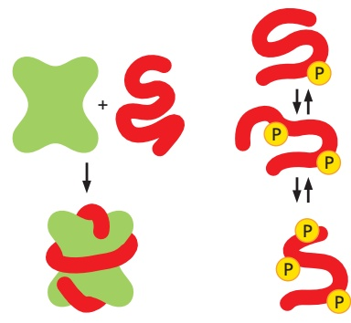

(B) SIGNALING

Figure 3–73 Intrinsically disordered protein sequences provide versatile binding sites. (A) Unstructured regions of polypeptide chain often form binding sites for other proteins. Although these binding events are of high specificity, they are often of low affinity because of the free-energy cost of folding the normally unfolded partner (and they are thus readily reversible). (B) Unstructured MBoC7 m3.24/3.73regions can be easily modified covalently to change their binding preferences, and they are therefore frequently involved in cell signaling processes. In this schematic, multiple sites of protein phosphorylation are indicated.

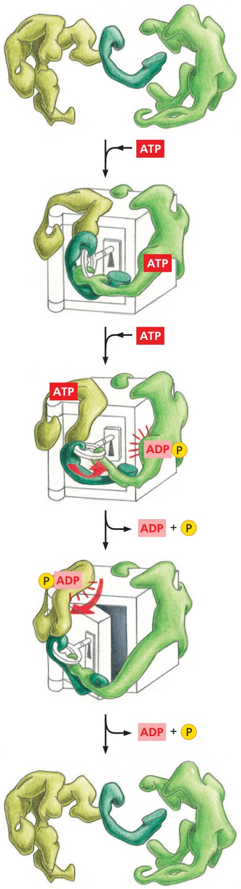

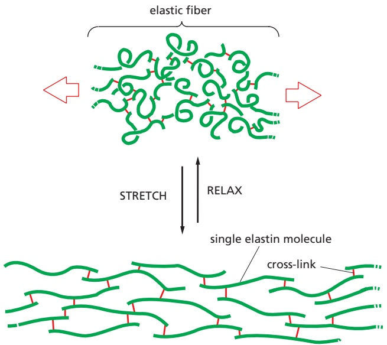

Figure 3–74 Intrinsically disordered protein chains are used to produce elastic structures. The polypeptide chains of the protein elastin are cross-linked together in the extracellular space to form rubberlike, elastic fibers. Each elastin molecule uncoils into a more extended conformation when the fiber is stretched, and it recoils spontaneously as soon as the stretching force is relaxed.

Scaffolds Bring Sets of Interacting Macromolecules Together and Concentrate Them in Selected Regions of a Cell

As scientists have learned more of the details of cell biology, they have recognized an increasing degree of sophistication in cell chemistry. We now know that protein machines play a predominant role and that all of their activities—like those of other proteins—are highly regulated. In addition, it has also become clear thatMBoC7 m3.23(B)/3.74

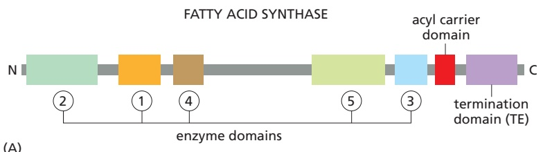

Figure 3–75 How unstructured regions of polypeptide chain can serve as tethers to allow reaction intermediates to be passed from one active site to another in a large multienzyme complex, the fatty acid synthase in mammals. (A) The locations of seven protein domains with different activities in this 270-kilodalton protein are shown. The numbers refer to the order in which each enzyme domain must function to complete each twocarbon addition step. After multiple cycles of two-carbon addition, the termination domain releases the final product once the desired length of fatty acid has been synthesized. (B) The structure of the dimeric enzyme, with the location of the five active sites in one monomer indicated. (C) How a flexible tether allows the substrate that remains linked to the acyl carrier domain (red) to be passed from one active site to another in each monomer, sequentially elongating and modifying the bound fatty acid intermediate (yellow). The five steps are repeated until the final length of fatty acid chain has been synthesized. (Only steps 1 through 4 are illustrated here.) (Adapted from T. Maier et al., Q. Rev. Biophys. 43:373–422, 2010.)

Figure 3–76 How the proximity created by scaffold proteins can greatly speed reactions in a cell. In this example, long unstructured regions of polypeptide chain in a large scaffold protein connect a series of structured domains that bind a set of reacting proteins or RNA molecules. The unstructured regions serve as flexible tethers that greatly speed reaction rates by causing a rapid, random collision of all of the molecules that are bound to the scaffold. (For specific examples of protein tethering, see Figure 3–75 and Figure 16–14; for scaffold RNA molecules, see Figure 7–82.)

these machines are often localized to specific sites in the cell, being assembled and activated only where and when they are needed. As one example, when extracellular signaling molecules bind to receptor proteins in the plasma membrane, the activated receptors often recruit a set of other proteins to the inside surface of the plasma membrane to form a large protein complex that passes the signal on (illustrated and discussed in Chapter 15).

The mechanisms generally involve **scaffold proteins** that have binding sites for multiple other proteins and/or RNA molecules. Such scaffolds serve both to link together specific sets of interacting macromolecules and to position them at specific locations inside a cell. At one extreme are rigid scaffolds, such as the cullin7 3.78/3.76 in SCF ubiquitin ligase (see Figure 3–67). At the other extreme are large, flexible scaffold proteins that create special regions inside the cell that have a unique biochemistry. Networks of such large scaffolds often underlie regions of specialized plasma membrane. For example, the Discs-large protein (Dlg) of about 900 amino acids is concentrated in special regions beneath the plasma membrane in epithelial cells and at synapses. Dlg contains binding sites for at least seven other proteins interspersed with regions of more flexible polypeptide chain. An ancient protein, conserved in organisms as diverse as sponges, worms, flies, and humans, Dlg derives its name from the mutant phenotype of the organism in which it was first discovered. In a Drosophila embryo with a mutation in the Dlg gene, the imaginal disc cells fail to stop proliferating when they should, and they produce unusually large discs whose epithelial cells can form tumors.

Dlg and a large number of similar scaffold proteins are thought to function like the protein that is schematically illustrated in **Figure 3–76**. By binding a specific set of interacting proteins and/or RNA molecules, these scaffolds can enhance the rate of critical reactions, while also confining them to the particular region of the cell that contains the scaffold. For similar reasons, cells also make extensive use of scaffold RNA molecules, as discussed in Chapter 7.

#### Macromolecules Can Self-assemble to Form Biomolecular Condensates

The macromolecular assemblies and protein machines that we have discussed so far are defined by physical interactions that organize individual proteins and nucleic acids at defined positions relative to each other. Each copy of a macromolecular machine generally is built from the same parts and assembled into the same three-dimensional structure. For example, the bacterial ribosome responsible for synthesizing new proteins is built from 55 proteins and three RNA molecules arranged in an invariant complex (see Figure 6–65). Even in the case of protein complexes containing flexible scaffolds (see Figure 3–75), the macromolecular assembly has a characteristic (albeit flexible) conformation.

In contrast, **biomolecular condensates** are a different type of cellular structure built from proteins (and often RNA) held together by a large number of weak and constantly changing interactions among them. Each condensate is created by at least one scaffold macromolecule (a protein or RNA molecule) that is capable of making multiple independent interactions with either itself or with other macromolecules, which themselves often make multiple interactions. These types of macromolecules are said to be multivalent. Typically, each of the individual interactions among these multivalent proteins and RNAs is very weak, so it forms and breaks frequently. When any one interaction breaks, other interactions at different sites in that macromolecule prevent it from diffusing away and keep the macromolecule locally concentrated. By the time some of these other interactions break, new ones have already formed elsewhere. In this way, all of the proteins within a condensate continually interact with each other, even though the specific set of interactions changes from one moment to another.

Formation of a condensate serves to segregate and concentrate a subset of the cell’s macromolecules into a separate compartment in the cell. In some cases, these macromolecules perform specialized biochemistry within the condensate—forming a biochemical “factory” that efficiently produces a specific product, as for the ribosomes that are produced by the nucleolus. In other cases, sequestration into a condensate can serve as a temporary storage depot for a set of macromolecules while blocking their activity, as for the stress granules that can form when a cell is perturbed.

The disordered, low-complexity domains of proteins are often found to mediate the fluctuating, weak binding interactions that form a condensate, frequently making a major contribution to their formation. In addition, other types of binding can also drive condensate formation (**Figure 3–77A**). The dynamic, fluctuating interactions within a condensate cause it to behave like a liquid: all of the participating molecules within it jostle around and rapidly exchange their relative positions; in addition, they often exchange rapidly with their equivalents outside the condensate (**Figure 3–77B**). Because the condensate remains intact and distinct from the surrounding liquid, the process of condensate formation is commonly termed **liquid–liquid phase separation** or liquid–liquid demixing.

Figure 3–77 The multivalent interactions between scaffold macromolecules that drive the formation of biomolecular condensates. (A) Schematic diagram of a biomolecular condensate that contains both RNA and proteins; illustrated are some types of weak binding interactions frequently involved. Note that the low-complexity domains of scaffold proteins are often critical for forming these condensates, and that several different types of binding interactions are known to cause these unstructured regions to adhere to each other. In addition to the stacking of aromatic side chains (phenylalanine is shown), these include ionic attractions, cation–pi interactions, and the formation of kinked cross-beta structures that resemble amyloids. (B) A fluorescence recovery after photobleaching (FRAP) experiment reveals that the protein molecules inside a condensate are mobile. Here the multiple nucleoli in a mammalian cell have been fluorescently labeled by fusing GFP to the scaffold protein fibrillin, and this fibrillin in one of the nucleoli has been bleached with a flash from a focused laser beam. A rapid recovery of fluorescence demonstrates that the fibrillin in this condensate is continually exchanging with the fibrillin molecules in its surroundings. (B, from R.D. Phair and T. Misteli, Nature 404:604–609, 2000. Reproduced with permission of SNCSC.)

Figure 3–78 Spherical, liquid-droplet-like nucleoli can be seen to fuse in the light microscope. In these experiments, the nucleoli are present inside a nucleus that has been dissected from Xenopus oocytes and placed under oil on a microscope slide. Here, three nucleoli are seen fusing to form a larger biomolecular condensate. A very similar process occurs after each round of division, when small nucleoli initially form on multiple chromosomes but then coalesce to form a MBoC7 e4.53/3.78single, large nucleolus (see Figure 6–47). (From C.P. Brangwynne et al., Proc. Natl. Acad. Sci. USA 108:4334–4339, 2011. With permission from National Academy of Sciences.)

A characteristic feature of biomolecular condensates that reflects their dynamic nature is the readily reversible assembly and disassembly of many of these structures. Thus, for example, the nucleolus disappears during mitosis, and it reforms in early interphase by fusion of the initially separate droplets that form on different chromosomes at the start of each interphase (**Figure 3–78**). Likewise, the DNA repair, DNA replication, and DNA transcription factories in the nucleus appear only where and when each of these processes occurs (**Figure 3–79**; see also Figure 6–51C).

#### Classical Studies of Phase Separation Have Relevance for Biomolecular Condensates

A familiar phase-separation process is that between oil and water, which occurs in some salad dressings. A phase separation occurs whenever forming two phases instead of one minimizes the free energy of a mixture, and it requires overcoming the large unfavorable free-energy change caused by the entropic cost of demixing. Thus, in the oil and water example, there are many more ways of distributing the small oil molecules in between water molecules than there are ways of condensing the oil molecules all together. The completely mixed state is by far the most probable, and the act of demixing therefore involves a large unfavorable (negative) entropy change that produces a large unfavorable (positive) change in the ∆G for phase separation (remembering that ∆G = ∆H – T∆S). But because of an even larger, favorable ∆G derived from preventing the oil molecules from disrupting the hydrogen-bonded network of water molecules, the oil and water separate into distinct phases (see Panel 2–2, pp. 96–97).

time = 0

UV laser creates DNA damage

time = 30 sec

time = 50 sec

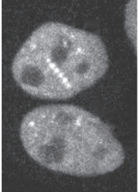

time = 80 sec

10 µm

Figure 3–79 The formation of a biomolecular condensate in response to DNA damage. Here, a brief irradiation flash from a UV laser has been used to create a narrow line of DNA damage in the interphase nucleus of a mammalian cell. Because the FUS scaffold protein has been fluorescently labeled with GFP, the formation of the liquid-droplet-like DNA repair factories that this scaffold helps to generate can be followed in a living cell. (Adapted from Movie S1 in A. Patel et al., Cell 162:1066–1077, 2015. With permission from Elsevier.)

Figure 3–80 How phase diagrams are used to describe phase separations. (A) The effect of increasing the polymer concentration at constant temperature. At a low total concentration of a polymer (Ct), only a single dilute phase is observed. But as the polymer concentration is increased (red arrow), phase separation begins for $\mathbb { C } \mathbb { t } > \mathbb { C } \mathbb { 1 }$ , and a new concentrated phase now forms with the polymer at concentration C2 in equilibrium with a dilute phase at polymer concentration C1. As Ct is further increased, the phase with polymer concentration C2 increases in volume, while remaining in equilibrium with the polymer in the dilute phase at an unchanging concentration C1. Finally, for $\dot { \mathrm { C t } > \mathrm { C } 2 }$ , there is only a single phase with concentration Ct. In the example illustrated, C2 is more than 10-fold greater than C1. (B) The effect of increasing temperature (T ) at a constant total polymer concentration. As the temperature is raised in a solution that contains a phase-separated polymer from T1 to T2 (blue arrow), the concentration of polymer in its dilute phase (C1) increases and the concentration of polymer in its concentrated phase (C2) decreases. At a higher critical temperature $\mathbb { C } 1 = \mathbb { C } 2$ , and the two phases become one. This occurs because the unfavorable 2entropy change for demixing (∆S) makes an increasingly large, unfavorable contribution to the net free-energy change at higher temperatures (via the –T∆S term in the equation for ∆G), eventually preventing any separation of phases.

For large polymers, which include proteins and nucleic acids, the entropic cost of demixing is considerably less than that for an equivalent mass of small molecules. This is because the monomeric subunits of a polymer are already greatly constrained in their possible arrangements through their covalent attachment to other subunits. As a result, a set of relatively weak attractions between the polymer molecules can often provide a large enough favorable free-energy change to drive phase separation—overcoming the unfavorable free-energy change of demixing.

Chemists have developed phase diagrams to describe what happens when chemically synthesized polymers phase-separate (**Figure 3–80**). As illustrated, when a threshold concentration of a polymer is reached, the solution separates into two distinct phases, one dilute and the other considerably more concentrated. The most important feature to notice is that, as more polymer is added at a fixed temperature (Figure 3–80A), its concentration in each phase remains the same. To accommodate the increased amount of polymer present, the volume of the concentrated phase increases and the volume of the dilute phase decreases. These and other features of phase separation are relevant when considering biomolecular condensates, even though the latter are generally composed of mixtures of more complex biological polymers (proteins and RNA molecules).

#### A Comparison of Three Important Types of Large Biological Assemblies

It has long been recognized that eukaryotic cells contain many membraneenclosed compartments central to cell biology. These take the form of organelles such as the nucleus, endoplasmic reticulum, Golgi apparatus, and lysosome. Each such organelle concentrates a particular set of enzymes and substrates, thereby

<table><tr><td rowspan="2"></td><td colspan="3">Comparison of three types of large biochemical assemblies</td></tr><tr><td>Macromolecular machine</td><td>Biomolecular condensate</td><td>Membrane-enclosed compartment</td></tr><tr><td>Properties</td><td>Fixed macromolecular composition, with a defined stoichiometry and spatial organization of constituentsFormed from a specific set of protein molecules or from protein and RNA moleculesAssembles spontaneously and can form de novoNevertheless, in many cases assembly is regulated to occur at specific sites, as needed</td><td>Dynamic, often liquidlike or gel-like organization, in which RNAs and low-complexity domains of proteins form specific, but transient, interactionsReadily permeable to small moleculesLarger than most macromolecular machinesMacromolecule composition is selective, but stoichiometry is usually not fixedCan assemble de novo and be disassembled in response to changing conditions or cellular need</td><td>Creates a distinct chemical and protein environment that is maintained by active transport across the enclosing membraneInterior contains a variable stoichiometry of macromolecules in solution, as determined by the above transport processesNot permeable to most small moleculesFormation usually requires a preexisting membrane-enclosed compartment of a special kind, different for each compartment</td></tr><tr><td>Examples</td><td>SCF ubiquitin ligaseDNA replication protein machineRibosomeNuclear pore</td><td>NucleolusCentrosomeStress granuleNeuronal RNA transport granule</td><td>Endoplasmic reticulumMitochondrionTransport vesicleLysosome</td></tr></table>

creating a specialized biochemistry in its interior. Those compartments will be the subject of Chapter 12, where we will also discuss biomolecular condensates in more detail. In **Table 3–3**, we compare the properties of the protein machines and biomolecular condensates introduced in this chapter, both with each other and with membrane-enclosed compartments.

#### Many Proteins Are Controlled by Covalent Modifications That Direct Them to Specific Sites Inside the Cell

In this chapter, we have thus far described only a few ways in which proteins are post-translationally modified. A large number of other such modifications also occur, more than 200 distinct types being known. To give a sense of the variety, **Table 3–4** presents a few of the modifying groups with known regulatory roles.

<table><tbody><tr><td colspan="2">TABLE 3-4 Some Molecules Covalently Attached to Proteins That Regulate Protein Function</td></tr><tr><td>Modifying group</td><td>Some prominent functions</td></tr><tr><td>Phosphate on Ser, Thr, or Tyr</td><td>Drives the assembly of a protein into larger complexes (see Figure 15-11)</td></tr><tr><td>Methyl on Lys</td><td>Helps to create distinct regions in chromatin by forming either monomethyl, dimethyl, or trimethyl lysine in histones (see Figure 4-34)</td></tr><tr><td>Acetyl on Lys</td><td>Helps to activate genes in chromatin by modifying histones (see Figure 4-34)</td></tr><tr><td>Palmityl group on Cys</td><td>This fatty acid addition drives protein association with membranes (see Figure 10-18)</td></tr><tr><td>N-Acetylglucosamine on Ser or Thr</td><td>Controls enzyme activity and gene expression in glucose homeostasis</td></tr><tr><td rowspan="3">Ubiquitin on Lys</td><td>Monoubiquitin addition regulates the transport of membrane proteins in vesicles (see Figure 13-59)</td></tr><tr><td>A polyubiquitin chain targets a protein for degradation (see Figure 3-66)</td></tr><tr><td>(Ubiquitin is a 76-amino-acid polypeptide; there are at least 10 other ubiquitin-related proteins in mammalian cells.)</td></tr></tbody></table>

Figure 3–81 Multisite protein modification and its effects. (A) A protein that carries a post-translational addition to more than one of its amino acid side chains can be considered to carry a combinatorial regulatory code. Multisite modifications are added to (and removed from) a protein through signaling networks, and the resulting combinatorial regulatory code on the protein is read to alter its behavior in the cell. (B) The pattern of some covalent modifications to the protein p53.

Like the phosphate and ubiquitin additions described previously, these groups are added and then removed from proteins according to the needs of the cell.

A large number of proteins are modified on more than one amino acid side chain, with different regulatory events producing a different pattern of such modifications. A striking example is the protein p53, which plays a central part in controlling a cell’s response to adverse circumstances (see Figure 17–60). Through one of four different types of molecular additions, this protein can be modified at 20 different sites. Because an enormous number of different combinations of these 20 modifications are possible, the protein’s behavior can in principle be altered in a huge number of ways. Such modifications will often create a site on the modified protein that binds it to a scaffold protein in a specific region of the cell, thereby connecting it—via the scaffold—to the other proteins. / . required for a reaction at that site. The effects can include moving the modified protein either into or out of a specific biomolecular condensate.

One can view each protein’s set of covalent modifications as a combinatorial regulatory code. Specific modifying groups are added to or removed from a protein in response to signals, and the code then alters protein behavior—changing the activity or stability of the protein, its binding partners, and/or its specific location within the cell (**Figure 3–81**). As a result, the cell is able to respond rapidly and with great versatility to changes in its condition or environment.

#### A Complex Network of Protein Interactions Underlies Cell Function

There are many challenges facing cell biologists in this information-rich era when a huge number of complete genome sequences are known. One is the need to dissect each one of the thousands of protein machines that exist in an organism such as ourselves. To understand these remarkable protein complexes, each will need to be reconstituted from its purified protein parts, so that we can study its detailed mode of operation under controlled conditions in a test tube, free from all other cell components. This alone is a massive task. But we now know that each of these subcomponents of a cell also interacts with other sets of macromolecules, creating a large network of protein–protein and protein–nucleic acid interactions throughout the cell. To understand the cell, therefore, we will need to analyze most of these other interactions as well.

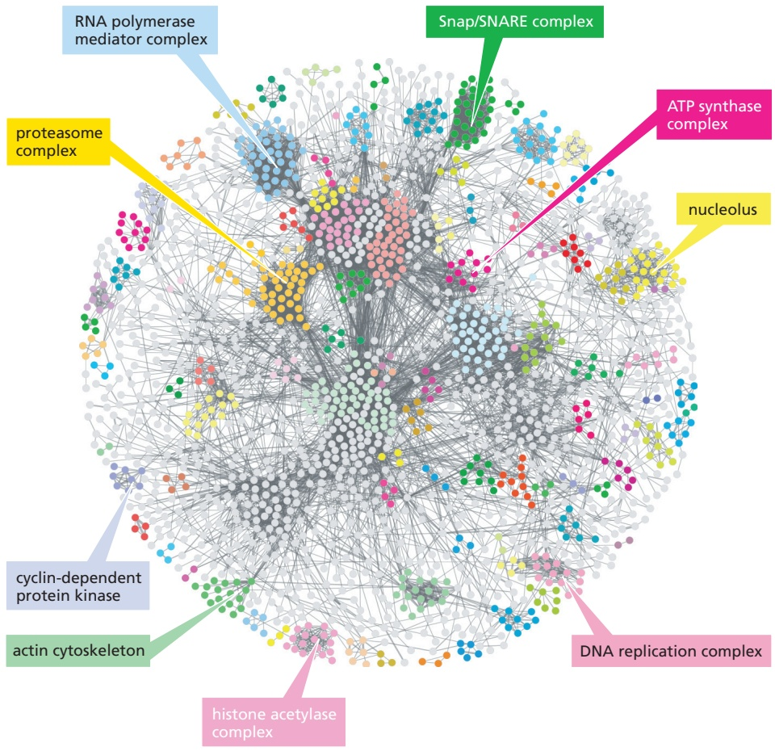

Figure 3–82 A network of proteinbinding interactions in the cells of the fruit fly, Drosophila. Each line connecting a pair of dots (proteins) indicates a protein– protein interaction. Labels are used to denote a few of the highly interactive groups of proteins whose functions are described in this textbook. (From K.G. Guruharsha et al., Cell 147:690–703, 2011. With permission from Elsevier.)

We can begin to gain a sense of the nature of intracellular protein networks from a particularly well-studied example described in Chapter 16: the many dozens of proteins in the actin cytoskeleton that interact to control actin filament behavior (see Panel 16–3, p. 965). Biochemists and structural biologists are, in principle, able to purify all of these different actin-accessory proteins to study their effects on actin filaments individually and in combination, and to determine all of their protein–protein interactions and their atomic structures. But to truly understand the actin cytoskeleton will require that we also learn how to use this data to compute how any particular mixture of these components present in an individual cell creates that cell’s observed set of three-dimensional networks of actin structures—a goal that currently seems out of reach.

Of course, understanding the cell will require much more than understanding actin. In recent years, as described in Chapter 8, robotics has been harnessed to a set of powerful technologies to produce enormous protein interaction maps (**Figure 3–82**). The data obtained suggest that each of the roughly 10,000 different proteins in a human cell interacts with 5–10 different partners, illustrating the challenges that face scientists working to understand the complexity of cell chemistry.

What does the future hold? Despite the enormous progress made in recent years, we cannot yet claim to understand even the simplest known cells, such as the small Mycoplasma bacterium formed from only about 500 gene products (see Figure 1–8). How then can we hope to understand a human? Clearly, a great deal of new biochemistry will be essential, in which each protein in a particular interacting set is purified so that its chemistry and interactions can be dissected in a test tube. But in addition, more powerful ways of analyzing networks will be needed using mathematical and computational tools not yet invented. Clearly, there are many wonderful challenges that remain for future generations of cell biologists.

#### Protein Structures Can Be Predicted and New Proteins Designed

Because the structures and functions of proteins are encoded in their amino acid sequences, in principle it is possible to predict the structures and functions of proteins directly from their amino acid sequences. We should also be able to create proteins with entirely new structures and functions by designing new amino acid sequences to produce these structures and functions, encoding them in synthetic genes. Success in the first endeavor would transform our ability to understand how the biology of an organism is encoded in the DNA sequence of its genome. Success in the second endeavor could lead to a new generation of designed proteins that address some of the twenty-first-century challenges confronting humanity.

There are major challenges in both of the above areas. A first challenge is the very large number of potential structures that are possible for any given amino acid sequence. Because, as we have seen, a protein folds to its lowest free-energy state, one needs to use physics to compute the energy of each protein conformation. But the number of possible conformations for even a relatively short protein of 100 amino acids is of the order 3100, as each amino acid has on average 3 or more rotatable bonds. Success in predicting protein structure and in designing new proteins thus requires computational methods for very efficient searching through huge numbers of structures.

Progress has been made in recent years. For small proteins or for proteins from very large families to help constrain the problem, large-scale computer searches for the lowest energy state can often accurately predict protein structure starting from amino acid sequence. Recently developed deep learning approaches using artificial intelligence (AI) can produce even more accurate protein structure predictions. Conversely, many new protein structures and functions have been created from scratch by designing new sequences in which the lowest energy state has the desired structure and function (**Figure 3–83**).

While this progress suggests that the protein-folding problem is not intractable, huge challenges remain. Predicting function from structure is even more difficult: while in some cases function can be predicted from structure by analogy to other proteins with similar structures and already known functions, this can be problematic because even a few amino acid changes can considerably change function; for example, the identity of the substrate that an enzyme acts upon. On the design side, while it has been possible to design new proteins with new structures and binding activities, it remains a big challenge to match the remarkable activities of natural enzymes and the sophisticated information integration and force generation of natural molecular machines.

Figure 3–83 Some examples of designed proteins. The amino acid sequences of the three proteins illustrated were determined computationally, being selected so that each protein would adopt a specifically designed three-dimensional conformation in its lowest energy state. After each protein was produced in a bacterium using genetic engineering techniques, its actual structure was then determined and shown to be the same as that intended by the designer. (A) A small protein of 122 amino acids. (B) A protein that creates an octahedral shell formed from 24 identical subunits, only 8 of which are shown. (C) A protein that consists of an antiparallel three-helix bundle. (A, PDB code 2N76; B, PDB code 3VCD; C, PDB code 4TQL).

#### Summary

The function of a protein largely depends on the detailed chemical properties of its surface. Enzymes are catalytic proteins that greatly accelerate the rates of covalent bond making and breaking. They do this by binding the high-energy transition state for a specific reaction path, lowering that reaction’s activation energy. The rates of enzyme-catalyzed reactions are often so fast that they are limited only by diffusion.

Proteins can reversibly change their shape when ligands bind to their surface. The allosteric changes in protein conformation produced by one ligand affect the binding of a second ligand, and this linkage between two ligand-binding sites provides a crucial mechanism for regulating cell processes. Metabolic pathways, for example, are controlled by feedback regulation: some small molecules inhibit and other small molecules activate enzymes early in a pathway. Enzymes controlled in this way generally form symmetrical assemblies, allowing cooperative conformational changes to create a steep response to changes in the concentrations of the ligands that regulate them.

The expenditure of chemical energy can drive unidirectional changes in protein shape. By coupling allosteric shape changes to the hydrolysis of a tightly bound ATP molecule, for example, proteins can do useful work, such as generating a mechanical force or moving for long distances in a single direction. The three-dimensional structures of proteins have revealed how a small local change caused by nucleoside triphosphate hydrolysis is amplified to create major changes elsewhere in the protein. Highly efficient protein machines are formed by incorporating many different protein molecules into larger assemblies that coordinate the allosteric movements of the individual components. Machines of this type perform most of the important reactions in cells. They and other specific macromolecules can be brought together in large, liquid-like assemblies known as biomolecular condensates, which are created by weak, fluctuating interactions between multivalent protein and RNA scaffolds.

Proteins are subjected to many reversible, post-translational modifications, such as the covalent addition of a phosphate or an acetyl group to a specific amino acid side chain. The addition of these modifying groups is used to regulate the activity of a protein, changing its conformation, its binding to other proteins, and its location inside the cell. A typical protein in a cell will interact with more than five different partners. Understanding the large protein networks inside cells will require biochemistry, through which small sets of interacting proteins can be purified and their chemistry dissected in detail. In addition, new computational approaches will be required to make sense of the enormous complexity of these networks.

<!-- END EN EN03-H059-H074 -->

### 英文补充：分子伴侣、蛋白质折叠、泛素与蛋白酶体

> 对应中文板块：分子伴侣、蛋白质折叠、泛素与蛋白酶体。英文来源：Molecular Biology of the Cell，第7版，第6章；[本章完整原文](../../来源/英文教材/06_How_Cells_Read_the_Genome_From_DNA_to_Protein/chapter.md)。物理PDF页码范围：360–435（整章范围）。

<!-- BEGIN EN EN06-H047-H052 -->
#### The Ribosome Coordinates the Folding, Enzymatic Modification, and Assembly of Newly Synthesized Proteins

The process of gene expression is not over when the genetic code has been used to create the sequence of amino acids that constitutes a protein. To be useful to the cell, this new polypeptide chain must fold up into its unique three-dimensional conformation, bind any small-molecule cofactors required for its activity, be appropriately modified by protein kinases and other protein-modifying enzymes, and assemble correctly with the other protein subunits with which it functions (**Figure 6–82**).

The information needed for all of the steps listed above is ultimately contained in the sequence of amino acids that the ribosome produces when it translates an mRNA molecule into a polypeptide chain. As discussed in Chapter 3, when a protein folds into a compact structure, it buries most of its hydrophobic residues in an interior core. In addition, large numbers of noncovalent interactions form between various parts of the molecule. It is the sum of all of these energetically favorable arrangements that determines the final folding pattern of the polypeptide chain—as the conformation of lowest free energy (see p. 121).

For some proteins, folding begins in the exit tunnel of the ribosome. Although too narrow to accommodate the folding of complete proteins, the exit tunnel widens toward its end, and simple structures such as short α helices can form as the growing peptide is pushed through by the translation process. But the major portion of protein folding begins as the protein emerges from the ribosome exit tunnel, where the new protein is also met by enzymes that modify its N-terminus. We saw earlier in the chapter that translation of a typical mRNA always begins with a methionine (see Figure 6–74); however, in most eukaryotic proteins (70% of cytosolic proteins), this amino acid is cleaved off and the resulting N-terminus modified by acetylation. The enzymes that carry out these and other modifications have a weak affinity for the ribosome and “hover” (that is, rapidly associate and dissociate with the ribosome) near the exit tunnel—in position to act on the growing protein as it first emerges.

#### Molecular Chaperones Help Guide the Folding of Most Proteins

Most proteins on their own do not fold correctly during their synthesis; instead, they require a special class of proteins called **molecular chaperones** to do so. Molecular chaperones are useful for cells because there are many different folding paths available to an unfolded or partially folded protein. Without these chaperones, some of these pathways would not lead to the correctly folded (and most stable) form; instead, the protein would become “kinetically trapped” in structures that are off-pathway. Some of these off-pathway conformations would aggregate and be left as irreversible dead ends, producing nonfunctional (and potentially dangerous) structures. As we will see shortly, chaperones help solve this problem by repeatedly binding and releasing a protein’s partially folded regions, giving them many chances to fold correctly.

Many molecular chaperones are called heat-shock proteins (designated hsp), because they are synthesized in dramatically increased amounts after a brief exposure of cells to an elevated temperature (for example, 42°C for cells that normally live at 37°C). This increase reflects the operation of a feedback system that responds to an increase in misfolded proteins (such as those produced by elevated temperatures) by boosting the synthesis of the chaperones that help these proteins refold. However, even under normal conditions, the heat-shock proteins

newly synthesized protein

folding and cofactor binding (noncovalent interactions)

covalent modification by glycosylation, phosphorylation, acetylation, etc.

binding to other protein subunits

mature functional protein

Figure 6–82 Steps in the creation of a functional protein. As indicated, translation of an mRNA sequence into an amino acid sequence on the ribosome is not the end of the process of forming a protein. To function, the completed polypeptide chain must fold correctly into its three-dimensional conformation, bind any cofactors required, and assemble with its partner protein chains, if any. Noncovalent bond formation drives these changes. As indicated, many proteins also require covalent modifications of selected amino acids. Although the most frequent modifications are protein glycosylation and protein phosphorylation, more than 200 different types of covalent modifications are known (see pp. 175–176). As described in the text, many of these steps begin while the protein is still being synthesized.

are so abundant that all proteins should be considered to be embedded in a rich soup of these molecules.

There are several major families of molecular chaperones, including the hsp60 and hsp70 proteins, with different family members functioning in different organelles. Thus, as discussed in Chapter 12, mitochondria contain their own hsp60 and hsp70 molecules that are distinct from those that function in the cytosol, and a special hsp70 (called BiP) helps to fold proteins in the endoplasmic reticulum.

In all, humans have thirteen hsp70 proteins, including a group that associates with the ribosome and helps nearly all emerging proteins fold correctly. They do this by rapidly binding and releasing short sequences (approximately five amino acids each) as a new protein is pushed through the ribosome exit tunnel. When one of these chaperones encounters a sequence rich in hydrophobic amino acids, which typically form the core of folded proteins, it clamps down on it, thereby delaying the folding of the emerging protein until enough of it has been made to begin to fold correctly. Hydrophobic stretches that emerge early from the ribosome are thereby prevented from aggregating with other hydrophobic surfaces until they can be properly folded into the core of the nascent protein. The hsp70 clamping and release reactions required are regulated by ATP hydrolysis catalyzed by the nucleotide-binding domain of hsp70 (**Figure 6–83**).

Most proteins are at least partially folded when they are released from the ribosome, but the final folding for many occurs as additional hsp70 molecules associate with them away from the ribosome. By undergoing multiple cycles of ATP hydrolysis, these hsp70 molecules allow proteins to complete their folding.

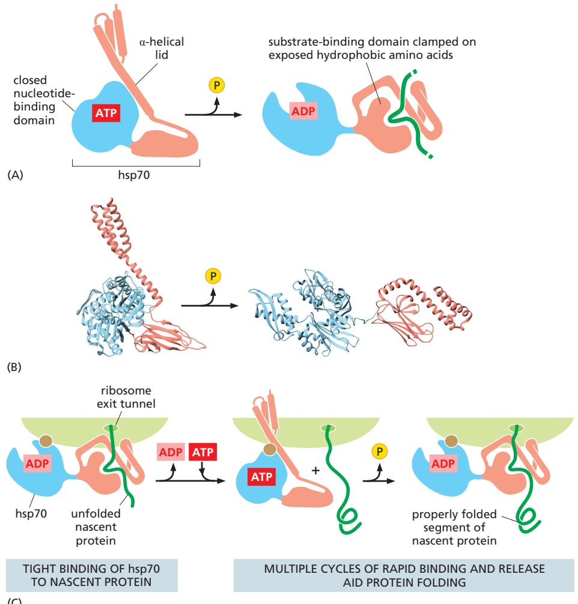

Figure 6–83 The hsp70 family of molecular chaperones. These are among the most abundant of all proteins, constituting several percent of total cell protein, and they thus play prominent roles inside the cell. (A) Short stretches of hydrophobic amino acids that are abnormally exposed in misfolded proteins (green) trigger the hydrolysis of ATP to ADP, causing hsp70 to close down on its substrate, trapping it in an extended conformation. The rebinding of another molecule of ATP will open the hsp70 “clamp,” releasing the substrate in its extended form. Repeated cycles of hsp70 clamping and release, often involving multiple hsp70 molecules on the same target, help fold the target protein by keeping its hydrophobic regions from aggregating. This can continue until these regions are assimilated into the core of the properly folded protein. (B) The threedimensional structures of hsp70 that produce the mechanism schematically illustrated in A. (C) Some hsp70 family members bind to the ribosome and act early in the life of a newly synthesized protein. Aided by other proteins (not shown), ATP-bound hsp70 molecules rapidly bind and release the nascent protein as it emerges from the ribosome. (B, PDB codes: 2KHO and 4JNE.)

Figure 6–84 The structure and function of the hsp60 family of molecular chaperones. (A) A misfolded protein is initially captured by hydrophobic interactions with the exposed surface of the opening. This initial binding often helps to unfold a misfolded protein. The subsequent binding of ATP and a cap releases the substrate protein into an enclosed space, where it has a new opportunity to fold. After about 10 seconds, ATP hydrolysis occurs, weakening the binding of the cap. Subsequent binding of additional ATP molecules ejects the cap, and the protein is released. As indicated, only half of the symmetric barrel operates on a client protein at any one time. This hsp type of chaperone, known also as a chaperonin, is designated as hsp60 in mitochondria, TRiC in the cytosol of vertebrate cells, and GroEL in bacteria. (B) The structure of GroEL bound to its GroES cap, as determined by x-ray crystallography. On the left is shown the outside of the barrel-like structure, and on the right is a cross section through its center. (B, adapted from B. Bukau and A.L. Horwich, Cell 92:351–366, 1998. With permission from Elsevier.)

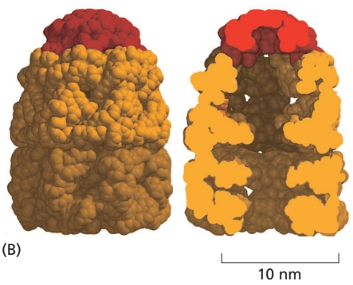

Some proteins produced by the cell cannot properly fold with help from the hsp70 proteins alone, and other types of chaperones are brought into play. An important class is exemplified by the hsp60 proteins. These form a large barrelshaped structure that acts after a protein has been fully synthesized but before it has folded correctly. This type of chaperone, sometimes called a chaperonin,MBoC7 m6.81/6.84 forms an “isolation chamber” for the folding process (**Figure 6–84**). As we have seen, incorrectly folded proteins are often characterized by exposed hydrophobic patches. The entrance to the hsp chamber is itself hydrophobic and attracts these patches. In conjunction with ATP binding, the lid to the chamber closes, forcing the incorrectly folded protein into the chamber interior and causing a twisting of the chamber subunits whereby some of the hydrophobic surfaces of the inner chamber are moved out of the way and replaced with hydrophilic surfaces. The substrate protein is thereby given a chance to fold into its final configuration (which generally favors hydrophilic amino acids on its outside) in the absence of any other proteins with which to aggregate. When ATP is hydrolyzed, the lid pops off, and the substrate protein, whether correctly folded or not, is released from the chamber.

Folding and maintaining the enormous diversity of proteins in cells require a wide range of chaperones with versatile surveillance and correction capabilities. Although our discussion has focused on only two types of chaperones, the cell has a variety of others. These include an hsp90 chaperone that can harness mechanical forces to help proteins fold as part of a collaborative chaperone network (**Figure 6–85**).

The hsp70, hsp60, and hsp90 chaperones often need many cycles of ATP binding and hydrolysis to fold a single polypeptide chain correctly. This energy is used to create movements in each of these chaperone “machines,” converting them back and forth between binding and releasing conformations. Thus, just as we saw for transcription, splicing, and translation, a great deal of free energy is used by cells to improve the accuracy of a biological process—in this case the correct folding of proteins (**Movie 6.11**).

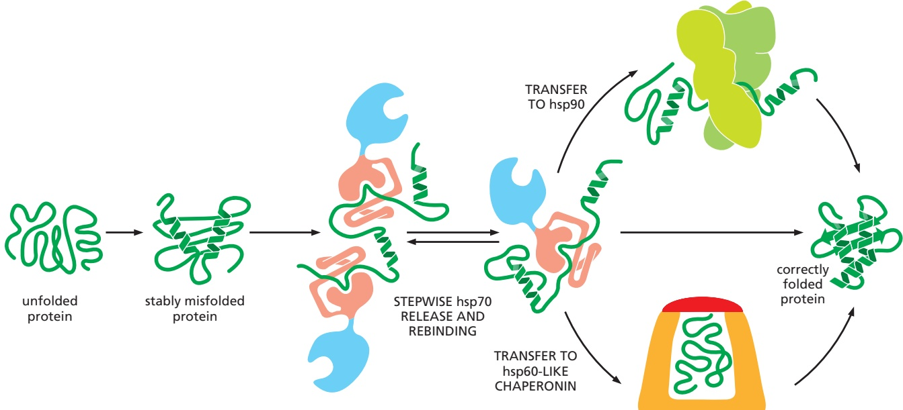

Figure 6–85 Different chaperones cooperate to ensure correct protein folding. As illustrated here, many proteins require more help to fold correctly than hsp70 can provide. Detected by their exposed hydrophobic regions, these proteins can be passed—as a complex of the target protein with hsp70—to either hsp90 or a chaperonin, where they are subjected to an alternative type of folding catalysis.

#### Proper Folding of Newly Synthesized Proteins Is Also Aided by Translation Speed and Subunit Assembly

In addition to the highly abundant chaperones, two additional mechanisms help to correctly fold newly synthesized proteins. First, translation is not a smooth process; the ribosome moves in fits and starts, translating some RNA sequences rapidly and pausing at others. The pauses are typically caused by a series of rare codons (which require extra time for the corresponding low-abundance charged tRNAs to enter the ribosome by diffusion) or by mRNA secondary structures thatMBoC7 n6.187/6.85 form ahead of the ribosome, slowing down or temporarily blocking its smooth passage. It is thought that many of these pauses are not accidental; rather, they are spaced to allow extra time for “problem” portions of newly synthesized proteins to fold as they exit the ribosome. If true, it means that an mRNA molecule, in addition to coding for a protein, specifies changes in the speed of translation matched to its protein’s folding characteristics.

A second mechanism reflects the fact that a protein molecule does not typically work on its own; instead, it usually assembles with other subunits to form multisubunit structures. As a protein emerges from the ribosome, it often begins assembling with one or more of its fully folded partner subunits, which, by acting as complementary surfaces, help the newly synthesized protein adopt its correct three-dimensional structure. We have seen in both bacteria and eukaryotes that a given mRNA molecule can be simultaneously translated by many ribosomes. For protein complexes made up of identical subunits, fully synthesized protein molecules will therefore always be in proximity to aid in the folding of those being synthesized. In bacteria, different proteins can be translated from the same mRNA, providing an opportunity for different subunits of a protein complex to efficiently help each other fold. In eukaryotes, where only a single protein is typically produced from each mRNA, it has been proposed that mRNAs that code for different subunits of a protein complex are held in proximity, perhaps by information in the untranslated portion of the message, providing a high local concentration of mature subunits to aid in the assembly and folding of newly synthesized subunits.

#### Proteins That Ultimately Fail to Fold Correctly Are Marked for Destruction by Polyubiquitin

We have seen that the cell relies on many resources to ensure that a newly synthesized protein is folded properly. Yet occasionally, normal proteins simply fail to fold properly despite numerous attempts. In addition, errors in transcription, RNA splicing, and translation can produce aberrant proteins that will never fold properly. Finally, proteins that were once correctly folded can become damaged by chemical reactions (such as oxidation), which can cause their misfolding. In all these cases, the cell destroys the aberrant protein. Although the cell uses many cues to ascertain whether a given protein is misfolded, the most important is an exposed hydrophobic patch, the same signal that is recognized by chaperones. The continued presence of a chaperone is thus an indication that the protein has failed to fold. In this case, a series of specialized enzymes recognizes the hydrophobic patch (possibly with the aid of chaperones) and attaches the small protein ubiquitin to a nearby lysine (see Figure 3–65A). Additional ubiquitin molecules are subsequently added to build a polyubiquitin chain. As we saw in Chapter 3, ubiquitin modification of proteins is used for many purposes in the cell. The particular type of ubiquitin linkage that concerns us here is a chain of ubiquitin molecules linked together at lysine 48 (see Figure 3–65B), which is the distinguishing feature of the ubiquitin tag that marks a protein for destruction. This polyubiquitin chain delivers the protein to a protein-destruction machine, a complex protease known as the proteasome.

#### The Proteasome Is a Compartmentalized Protease with Sequestered Active Sites

**Proteasomes** are very abundant, constituting approximately 1% of the total proteins in cells. They are dispersed throughout the cytosol and the nucleus, but the proteasome also destroys aberrant proteins that have entered the endoplasmic reticulum (ER). In this case, an ER-based surveillance system detects proteins that have failed either to fold or to be assembled properly after they enter the ER and retrotranslocates them back to the cytosol for degradation by the proteasome (discussed in Chapter 12).

Each proteasome consists of a central hollow cylinder (the 20S core proteasome) formed from multiple protein subunits that assemble as a stack of four heptameric rings. Some of the subunits are proteases whose active sites face the cylinder’s inner chamber, thus preventing them from running rampant through the cell. Each end of the cylinder is normally associated with a large protein complex (the 19S cap) that contains a six-subunit protein ring through which target proteins are threaded into the proteasome core, where they are degraded (**Figure 6–86**). The threading reaction, driven by ATP hydrolysis, unfolds the target

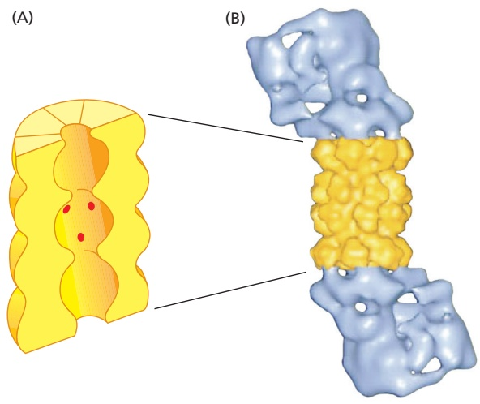

Figure 6–86 The proteasome. (A) A cutaway view of the structure of the central 20S cylinder, as determined by x-ray crystallography, with the active sites of the proteases indicated by red dots. (B) The entire proteasome, in which the central cylinder (yellow) is supplemented by a 19S cap (blue) at each end. The complex cap selectively binds proteins that are marked by ubiquitin for destruction; if the protein also contains a loosely structured region, the cap uses ATP hydrolysis to further unfold its polypeptide chain and feed it through the narrow channel (see Figure 6–87) into the inner chamber of the 20S cylinder for digestion to short peptides. (B, from W. Baumeister et al., Cell 92:367–380, 1998. With permission from Elsevier.)

Figure 6–87 Processive protein digestion by the proteasome. (A) The proteasome cap recognizes proteins marked by a polyubiquitin chain (see Figure 3–65B). Most of these proteins also contain an unfolded region, and the cap translocates these proteins into the proteasome core, where they are digested. Before moving through the proteasome cap, the ubiquitin is cleaved from the substrate protein and is recycled. Translocation into the core of the proteasome is mediated by a ring of ATPases that unfold the substrate protein as it is threaded through the ring and into the proteasome core. (B) Detailed structure of the proteasome cap. The cap includes a ubiquitin receptor, which holds a ubiquitylated protein in place while attempts are made to pull it into the proteasome core, and a ubiquitin hydrolase, which cleaves ubiquitin from the protein. (A, from S. Prakash and A. Matouschek, Trends Biochem. Sci. 29:593–600, 2004. With permission from Elsevier; B, adapted from G.C. Lander et al., Nature 482:186–191, 2012.)

proteins as they move through the cap, exposing them to the proteases lining the proteasome core (**Figure 6–87**). The proteins that make up the ring structure in the proteasome cap belong to a large class of protein “unfoldases” known as AAA. / . proteins. Many of them function as hexamers, and they share mechanistic features with the ATP-dependent DNA helicases that unwind DNA (**Figure 6–88**; see also Figure 5–14).

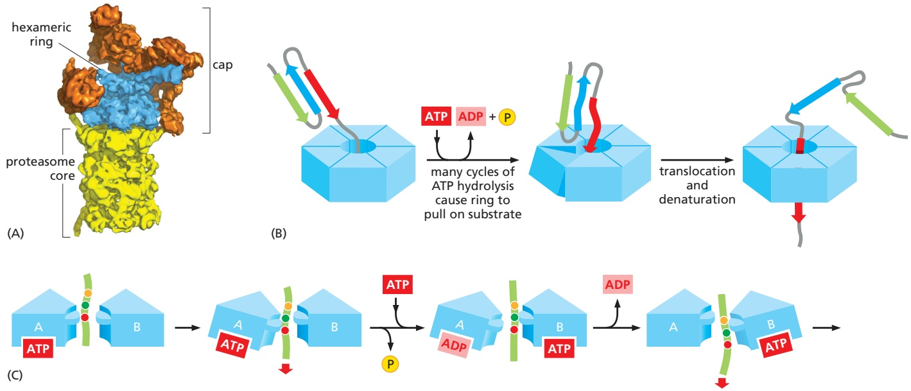

Figure 6–88 A hexameric protein unfoldase. (A) The proteasome cap includes a hexameric ring (blue) through which proteins to be destroyed are threaded. The hexameric ring (also called the unfoldase ring) is formed from six subunits, each belonging to the AAA family of proteins. (B) Model for the ATP-dependent unfoldase activity of AAA proteins. The ATP-bound form of a hexameric ring of AAA proteins grasps a substrate protein, and a conformational change, driven by ATP hydrolysis, further pulls the substrate and strains the ring structure. At this point, the substrate protein, which is being tugged upon, can partially unfold and enter further into the pore or it can maintain its structure and partially withdraw. Some protein substrates may require hundreds of cycles of ATP hydrolysis and dissociation before they are successfully pulled through the AAA protein ring; some proteins continue to resist these efforts and are ultimately de-ubiquitylated and released. (C) How the successive tilting of adjacent subunits (only two of which are shown), driven by ATP hydrolysis, is thought to pull the unfolded polypeptide chain through the hexameric ring into the proteasome. The motions of the ring subunits resemble a hand-over-hand pulling motion on the substrate protein, with the hands often slipping until the substrate is unfolded. Once unfolding occurs, the substrate protein moves relatively quickly through the ring by successive rounds of ATP hydrolysis. (A, adapted from G.C. Lander et al., Nature 482:186–191, published 2012 by Macmillan Publishers Ltd. Reproduced with permission of SNCSC; B, adapted from R.T. Sauer et al., Cell 119:9–18, 2004.)

A crucial property of the proteasome, and one reason for its complexity, is the processivity of its mechanism: in contrast to a “simple” protease that cleaves a substrate’s polypeptide chain just once before dissociating, the proteasome keeps the entire substrate bound until all of it is converted into short peptides. One would expect that a machine as efficient as the proteasome would be tightly regulated; in particular, it must be able to distinguish abnormal proteins from those that are properly folded. The 19S cap of the proteasome acts as a gate at the entrance to the inner proteolytic core, and only those proteins to be destroyed are threaded through the cap. We saw above that proteins marked for destruction are distinguished by carrying a particular type of polyubiquitin chain. This chain binds specifically to a receptor in the 19S cap of the proteasome, and here a second “check” is made by the cell to determine whether or not the protein will be destroyed. If the protein has, in addition to the ubiquitin mark, an unfolded region (which can span the mark), it is grasped tightly by the 19S cap, de-ubiquitylated, and pulled through the cap into the proteasome core. Ubiquitylated proteins that lack such a region are typically de-ubiquitylated and released back into solution.

As might be expected, there is competition for misfolded proteins between chaperones and the protein degradation machinery. Proteins that are folded quickly escape destruction (at least early in their life before they accumulate damage), whereas those that undergo many rounds of chaperone-assisted folding are more likely to be degraded. Some chaperones can directly hand off those proteins that remain improperly folded, after many attempts, to the protein destruction machinery. It is estimated that between 1 and 5% of all newly synthesized proteins fail to fold properly and are degraded by the proteasome.

#### Many Proteins Are Controlled by Regulated Destruction

One function of intracellular proteolytic mechanisms is to recognize and eliminate misfolded or otherwise abnormal proteins, as just described. Indeed, every protein in the cell eventually accumulates damage and is probably degraded by the proteasome. Yet another function of these proteolytic pathways is to confer short lifetimes on specific normal proteins whose concentrations must change promptly with alterations in the state of a cell. Some of these short-lived proteins are degraded rapidly at all times, while many others are conditionally short-lived; that is, they are metabolically stable under some conditions but become unstable upon a change in the cell’s state. For example, mitotic cyclins are long-lived throughout the cell cycle until their sudden degradation at the end of mitosis, as explained in Chapter 17.

How is such a regulated destruction of a protein controlled? Many such proteins contain short, unfolded regions, and a key step in regulating their destruction is the addition of ubiquitin. Several general mechanisms for controlling this step are illustrated in Figure 6–89. Specific examples of each mechanism are discussed in later chapters. In one general class of mechanism (Figure 6–89A), the activity of a ubiquitin ligase is turned on either by E3 phosphorylation or by an allosteric transition in an E3 protein caused by its binding to a specific small or large molecule. For example, the anaphase-promoting complex/cyclosome (APC/C) is a multisubunit ubiquitin ligase that is activated by a cell-cycle-timed subunit addition at mitosis. The activated APC then recognizes specific amino acid sequences in mitotic cyclins and several other regulators of the metaphase–anaphase transition and ubiquitylates them, thereby sending them to the proteasome (see Figure 17–18). We saw another example of regulated destruction earlier in this chapter, where a nascent polypeptide extending from a stalled ribosome is ubiquitylated, targeting it for destruction. Here, the signal for bringing the ubiquitin ligase into proximity to its target is a “gummed up” large ribosome subunit (see Figure 6–81).

Alternatively, in response either to intracellular signals or to signals from the environment, a ubiquitylation site can be created in a protein (Figure 6–89B). One common way to create such a signal is by phosphorylation of a specific amino acid sequence, which completes a ubiquitin ligase recognition site on the protein. Another is preexisting degradation signals that are unmasked by the regulated dissociation of a protein subunit. Finally, powerful degradation signals can be created by cleaving a single peptide bond, provided that this cleavage creates a new N-terminus that is recognized by a specific E3 protein as a “destabilizing” N-terminal residue. This E3 protein recognizes only certain amino acids at the N-terminus of a protein; thus, not all protein-cleavage events will lead to degradation of the C-terminal fragment produced.

Figure 6–89 Two general ways of inducing the destruction of a specific protein. (A) Activation of a specific E3 molecule creates a new ubiquitin ligase. Eukaryotic cells have many different E3 molecules, each activated by a different signal. (B) Creation of an exposed destruction signal in the protein to be degraded. This signal binds a ubiquitin ligase, causing the addition of a polyubiquitin chain to a nearby lysine on the target protein. All six pathways shown are known to be used by cells to induce the movement of selected proteins into the proteasome for destruction.

In humans, nearly 70% of cytosolic proteins are acetylated on their N-terminal residue, and we now know that this modification is recognized by a specific E3 enzyme, which directs the ubiquitylation of the protein and sends it to the proteasome for degradation. Thus, the majority of human proteins carry their own signals for destruction. It has been proposed that when a protein is properly folded (and, before that, when it is in contact with a chaperone), this acetylated N-terminus is buried and therefore inaccessible to the E3. According to this idea, as a protein ages and becomes damaged (or if it fails to fold correctly from the start), this destruction signal becomes exposed, and the protein is destroyed.

<!-- END EN EN06-H047-H052 -->

### 英文补充：细胞区室化与无膜生物分子凝聚体

> 对应中文板块：细胞区室化与无膜生物分子凝聚体。英文来源：Molecular Biology of the Cell，第7版，第12章；[本章完整原文](../../来源/英文教材/12_Intracellular_Organization_and_Protein_Sorting/chapter.md)。物理PDF页码范围：722–787（整章范围）。

<!-- BEGIN EN EN12-H000-H007 -->
#### Intracellular Organization and Protein Sorting

The many thousands of macromolecules and their associated biochemical activities inside a cell are spatially segregated to different regions. Intracellular organization is a particularly prominent feature of eukaryotic cells, which unlike bacteria are elaborately subdivided into functionally distinct, membrane-enclosed compartments. Many of these compartments define the cell’s major **organelles** such as the endoplasmic reticulum, Golgi apparatus, lysosome, plastid, and mitochondrion, the last two of which are still further subcompartmentalized by internal membranes. Other subsets of the cell’s macromolecules can organize into dynamic and reversible assemblies, called **biomolecular condensates**, that can serve as specialized biochemical factories or temporary storage depots. To understand the eukaryotic cell, it is essential to know how the cell creates and maintains its complex intracellular organization.

An animal cell contains about 10 billion (1010) protein molecules of perhaps 10,000 kinds, and the synthesis of almost all of them begins in the **cytosol**, the space of the cytoplasm outside the membrane-enclosed organelles. Each newly synthesized protein is then delivered specifically to the organelle that requires it. The unique protein and lipid composition on the surface of each organelle is used as a cue to direct new deliveries of proteins and lipids to sustain that organelle’s identity. The characteristic set of proteins and other specialized molecules define each organelle’s structural and functional properties. They catalyze the reactions that occur there and selectively transport molecules into and out of the organelle. The intracellular transport of proteins is the central theme of both this chapter and the next. By tracing the protein traffic from one part of the cell to another, one can begin to make sense of the otherwise bewildering maze of intracellular membranes and other subcellular structures.

#### THE COMPARTMENTALIZATION OF CELLS

In this brief overview of the compartments of the cell and the relationships between them, we organize the cell’s organelles conceptually into a small number of discrete families, discuss how proteins are directed to specific organelles, and explain how proteins cross organelle membranes.

#### All Eukaryotic Cells Have the Same Basic Set of Membrane-enclosed Organelles

Many vital biochemical processes take place in membranes or on their surfaces. Membrane-bound enzymes, for example, catalyze lipid metabolism, and oxidative phosphorylation and photosynthesis both require a membrane to couple the transport of $\dot { \mathrm { H } ^ { + } }$ to the synthesis of ATP. In addition to providing increased membrane area to host biochemical reactions, intracellular membrane systems form enclosed compartments that are separate from the cytosolic compartment, thus creating functionally specialized aqueous spaces within the cell. In these spaces, subsets of molecules (proteins, reactants, ions) are concentrated to optimize the biochemical reactions in which they participate. By having multiple types of compartments inside the same cell, biochemical reactions that require very different conditions, or would compete with each other, can nevertheless occur simultaneously. Because the lipid bilayer of cell membranes is impermeable to most

C HAP T E R

12

IN THIS CHAPTER

The Compartmentalization of Cells

The Endoplasmic Reticulum

Peroxisomes

The Transport of Proteins into Mitochondria and Chloroplasts

The Transport of Molecules Between the Nucleus and the Cytosol

Figure 12–1 The major intracellular compartments of an animal cell. The cytosol (gray), rough endoplasmic reticulum, smooth endoplasmic reticulum, Golgi apparatus, nucleus, mitochondrion, endosome, lysosome, and peroxisome are distinct compartments isolated from the rest of the cell by at least one selectively permeable membrane (see Movie 9.2). By contrast, the nucleolus is not enclosed by a membrane and represents one example of a biomolecular condensate.

hydrophilic molecules, the membrane of an organelle must contain membrane transport proteins to import and export specific metabolites. Each organellar membrane must also have a mechanism for importing, and incorporating into the organelle, the specific proteins that make the organelle unique.

**Figure 12–1** illustrates the major intracellular compartments common to eukaryotic cells. The nucleus contains the genome (aside from mitochondrial and chloroplast DNA), and it is the principal site of DNA and RNA synthesis. The surrounding **cytoplasm** consists of the cytosol and the cytoplasmic organelles suspended in it. The cytosol constitutes a little more than half the total volume of the cell, and it is the main site of protein synthesis and degradation. It also performs most of the cell’s intermediary metabolism; that is, the many reactions that degrade some small molecules and synthesize others to provide the building blocks for macromolecules (discussed in Chapter 2).

About half the total area of membrane in a eukaryotic cell encloses the labyrinthine spaces of the endoplasmic reticulum (ER). Most soluble and integral membrane proteins destined for the cell exterior or for other organelles are initially assembled at the ER. These proteins are transported into the ER as they are synthesized by ribosomes. The distinctive appearance in electron micrographs of ribosomes studding the surface of these regions of the ER is the reason they are termed the rough ER. The ER also produces most of the lipid and sterols for the rest of the cell and functions as a store for Ca2+ ions. These regions of the ER typically lack bound ribosomes and are called smooth ER.

The ER sends many of its proteins and lipids to the Golgi apparatus, which often consists of organized stacks of disc-like compartments called Golgi cisternae. The Golgi apparatus receives lipids and proteins from the ER and dispatches them to various destinations, usually covalently modifying them en route. Lysosomes contain digestive enzymes that degrade defunct intracellular organelles, as well as macromolecules and particles taken in from outside the cell by endocytosis. On the way to lysosomes, endocytosed material must first pass through a series of organelles called endosomes. As we will see, the ER, Golgi apparatus, lysosomes, endosomes, and plasma membrane are linked by the cell’s major pathways of membrane traffic.

Mitochondria and chloroplasts generate most of the ATP that cells use to drive reactions requiring an input of free energy; chloroplasts are a specialized version of plastids (present in plants, algae, and some protozoa), which can also have other functions, such as the storage of food or pigment molecules. Finally, peroxisomes are small vesicular compartments that contain enzymes used in various oxidative reactions.

On average, the membrane-enclosed compartments together occupy nearly half the volume of a cell (**Table 12–1**), and a large amount of intracellular membrane is required to make them. In liver and pancreatic cells, for example, the endoplasmic reticulum has a total membrane surface area that is, respectively, 25 times and 12 times that of the plasma membrane (**Table 12–2**). The membraneenclosed organelles are packed tightly in the cytoplasm, and, in terms of area and mass, the plasma membrane is only a minor membrane in most eukaryotic cells (**Figure 12–2**).

TABLE 12–1 Relative Volumes Occupied by the Major Intracellular Compartments in a Liver Cell (Hepatocyte)

| Intracellular compartment | Percentage of total cell volume |
| --- | --- |
| Cytosol | 54 |
| Mitochondria | 22 |
| Rough ER cisternae | 9 |
| Smooth ER cisternae | 5 |
| Golgi cisternae | 1 |
| Nucleus | 6 |
| Peroxisomes | 1 |
| Lysosomes | 1 |
| Endosomes | 1 |

<table><tbody><tr><td colspan="3">TABLE 12-2 Relative Amounts of Membrane Types in Two Kinds of Eukaryotic Cells</td></tr><tr><td rowspan="2">Membrane type</td><td colspan="2">Percentage of total cell membrane</td></tr><tr><td>Liver hepatocyte*</td><td>Pancreatic exocrine cell*</td></tr><tr><td>Plasma membrane</td><td>2</td><td>5</td></tr><tr><td>Rough ER membrane</td><td>35</td><td>60</td></tr><tr><td>Smooth ER membrane</td><td>16</td><td>&lt;1</td></tr><tr><td>Golgi apparatus membrane</td><td>7</td><td>10</td></tr><tr><td>Mitochondria Outer membrane Inner membrane</td><td>732</td><td>417</td></tr><tr><td>Nucleus Inner membrane**</td><td>0.2</td><td>0.7</td></tr><tr><td>Secretory vesicle membrane</td><td>Not determined</td><td>3</td></tr><tr><td>Lysosome membrane</td><td>0.4</td><td>Not determined</td></tr><tr><td>Peroxisome membrane</td><td>0.4</td><td>Not determined</td></tr><tr><td>Endosome membrane</td><td>0.4</td><td>Not determined</td></tr></tbody></table>

\*These two cells are of very different sizes: the average hepatocyte has a volume of about 5000 $\mu \mathrm { m } ^ { 3 }$ compared with 1000 $\mu \mathsf { m } _ { \alpha } ^ { 3 }$ for the pancreatic exocrine cell. Total cell membrane areas are estimated at about 110,000 μm2 and $1 3 \dot { , } 0 0 0   \mu \mathsf { m } ^ { 2 }$ , respectively. \*\*The outer nuclear membrane is included in the measurement of the rough ER and is roughly equal to the inner membrane.

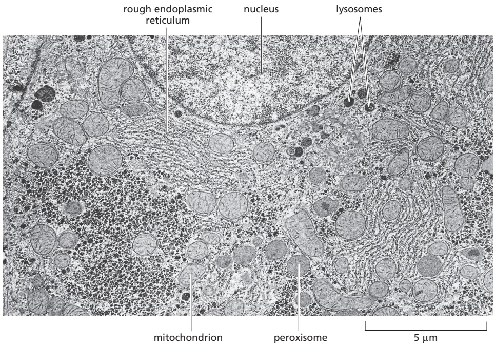

Figure 12–2 An electron micrograph of part of a liver cell seen in cross section. Examples of most of the major intracellular organelles are indicated. (Reused by permission of E.L. Bearer and Daniel S. Friend.)

In general, each membrane-enclosed organelle performs the same set of basic functions in all cell types. But to serve the specialized functions of cells, these organelles vary in abundance and can have additional properties that differ from cell type to cell type. This is particularly apparent in cells that are highly specialized and therefore disproportionately rely on specific organelles. Plasma cells, for example, which daily secrete their own weight in antibody molecules into the bloodstream, contain vastly amplified amounts of rough ER, which is found in large, flat sheets. Cardiac muscle cells instead expand and specialize their smooth ER for $\mathrm { C a ^ { 2 + } }$ storage and proliferate their mitochondria for energy production. Moreover, membrane-enclosed organelles are often found in characteristic positions in the cytoplasm. In most cells, for example, the Golgi apparatus is located close to the nucleus, whereas the network of ER tubules extends from the nucleus throughout the entire cytosol. These characteristic distributions depend on interactions of the organelles with the cytoskeleton (discussed in Chapter 16).

#### Evolutionary Origins Explain the Topological Relationships of Organelles

To understand the relationships between the compartments of the cell, it is helpful to consider how they might have originated. The precursors of the first eukaryotic cells are thought to have been relatively simple cells that—like most bacterial and archaeal cells—had a plasma membrane but no internal membranes. The plasma membrane in such cells provided all membrane-dependent functions, including the pumping of ions, ATP synthesis, protein secretion, and lipid synthesis. These ancestral precursors, like their modern-day prokaryotic counterparts,probably had a 1000- to 10,000-fold smaller volume than present-day eukaryotic cells. To increase in volume, the ancestral cells would have needed to maintain their surface area to volume ratio to sustain the many vital functions that membranes perform.

On the basis of the appearance of modern-day archaeal cells (see Figure 1–26), the membrane surface area might have initially increased by plasma membrane protrusions. The increased capacity to exchange metabolites with the surrounding environment via these protrusions would have facilitated symbiotic relationships with other organisms. Increased resource availability due to a combination of symbioses and membrane expansion may have allowed the evolution of progressively larger cells (**Figure 12–3**). Ultimately, the network of spaces between the numerous expanded protrusions would have become sealed off from the surrounding environment because of membrane fusion between protrusions. The consequences of this fusion are threefold and help to explain the major distinguishing features of eukaryotic cells.

First, the cell now has a set of internal membranes that are derived from an ancestral prokaryotic plasma membrane. These internal membranes enclose interior spaces that are said to be topologically equivalent to each other and to the exterior of the cell (**Figure 12–4**), because they can communicate with one another, in the sense that molecules can get from one to the other without having to cross a membrane. We shall see that this topological relationship holds for all of the organelles involved in the secretory and endocytic pathways, including the ER, Golgi apparatus, endosomes, lysosomes, and peroxisomes. As we discuss in detail in the next chapter, their interiors communicate extensively with one another and with the outside of the cell via transport vesicles, which bud off from one organelle and fuse with another. In this way, proteins that enter the **lumen** of the ER can be secreted outside the cell.

Second, the ancestral plasma membrane that surrounded the genome is now an internal membrane that becomes the inner nuclear membrane. Because of how it originated, the inner nuclear membrane is continuous with other plasma membrane–derived internal membranes, including the outer nuclear membrane. Specialized structures, the nuclear pore complexes, are located at points where the inner and outer nuclear membranes connect and provide a conduit for communication between the nucleus and cytosol. Segregation of an organism’s genetic material into a nucleus separate from the plasma membrane probably afforded greater protection from the environment. Furthermore, an expanded cytosol segregated from the nucleus would have facilitated the spatial separation of transcription from translation, thereby allowing greater regulation of gene expression by several mechanisms distinctive to eukaryotic cells.

Figure 12–3 Evolutionary origins of the major internal membrane systems of a eukaryotic cell. As discussed in Chapter 1, there is evidence that the first eukaryotic cells arose when an ancient anaerobic archaeon joined forces with an aerobic bacterium roughly 1.6 billion years ago. An early step in this process was expansion of the archaeon’s plasma membrane, probably through protrusions and blebs. The highly curved membrane at the necks of these protrusions might have been stabilized by proteins that eventually became part of the nuclear pore. The added surface area of these protrusions facilitated metabolite exchange with the environment and with neighboring cells. A fruitful symbiotic relationship with an aerobic bacterium might have allowed the archaeon to increase in volume. These protrusions eventually fused with each other to pinch off internal membrane-enclosed compartments, some of which contained the symbiotic bacteria. This intermediate now begins to resemble modern-day eukaryotes, with a primordial nucleus and nuclear pores, internal compartments, and an endosymbiont destined to become the mitochondrion. The lumen of the internal compartments is topologically equivalent to the extracellular space (see Figure 12–4). The membrane-enclosed endosymbiont subsequently escaped the enclosing membrane into the cytosol where it evolved into modern-day mitochondria. The internal compartments expanded and became progressively specialized to form the major intracellular compartments of a eukaryotic cell. Their common origin from. / . a primordial intracellular compartment explains why all of these compartments can exchange material with each other through vesicular transport. The nucleus was formerly the cytosol in the ancient archaeon, explaining why the cytosol and nucleus are topologically equivalent compartments that can intermix during mitosis. (Adapted from J. Martijn and T.J.G. Ettema, Biochem. Soc. Trans. 41:451–457, 2013; D. Baum and B. Baum, BMC Biol. 12:76, 2014.)

Third, symbionts that were originally outside the cell were trapped inside the cell and became endosymbionts. At some point, endosymbionts escaped from their membrane enclosure into the cytosol where they eventually became mitochondria and plastids that contain their own genomes. The nature of these genomes and the close resemblance of the proteins in these organelles to those in some present-day bacteria provide strong evidence for their endosymbiont origins (see Figure 14–55). Like the bacteria from which they were derived, both mitochondria and plastids are enclosed by a double membrane, and they remain isolated from the extensive vesicular traffic that connects the interiors of most of the other membrane-enclosed organelles to each other and to the outside of the cell.

(A)

Figure 12–4 Topologically equivalent compartments in the secretory and endocytic pathways in a eukaryotic cell. Topologically equivalent spaces are shown in red. (A) Molecules can be carried from one compartment to another topologically equivalent compartment by transport vesicles that bud from one and fuse with the other. (B) In principle, cycles of membrane budding and fusion permit the lumen of any of the organelles shown to communicate with any other and with the cell exterior by means of transport vesicles. Blue arrows indicate the extensive outbound and inbound vesicular traffic (discussed in Chapter 13). Some organelles, most notably mitochondria and (in plant cells) plastids, do not take part in this communication and are isolated from the vesicular traffic between organelles shown here.

The evolutionary schemes we have outlined for the origins of eukaryotic organelles are most strongly supported by the striking similarities of the protein transport machinery of modern-day prokaryotes and eukaryotic organelles. The ability to transport proteins across and into membranes is a fundamental and essential feature of all living organisms. Thus, machinery that carries out these processes would have arisen in the earliest life-forms and been retained throughout evolution. The presence and orientation of these transport components therefore allow us to trace the origins and topology of the membranes within which they now reside. Consistent with the model for evolution of the endomembrane system of eukaryotic cells, the components that mediate protein import into the ER are homologous to the proteins that mediate export across the archaeal plasma membrane. Similarly, membrane protein insertion machinery in the outer and inner membranes of mitochondria and plastids contains homologous components found in the outer and inner membranes of various modern-day bacteria.

The major intracellular compartments in eukaryotic cells can therefore be categorized into three distinct families: (1) the nucleus and the cytosol, which are topologically equivalent (although functionally distinct) and connected by nuclear pore complexes; (2) all organelles that function in the secretory and endocytic pathways—including the ER, Golgi apparatus, endosomes, lysosomes, and the transport vesicles that move between them—and peroxisomes; (3) the endosymbiont-derived organelles: mitochondria and the plastids (in plants only).

#### Macromolecules Can Be Segregated Without a Surrounding Membrane

A membrane barrier is not the only way subsets of macromolecules can selectively segregate within cells. As we discussed in Chapter 3, one or more interacting proteins or nucleic acids can serve as scaffolds in biomolecular condensates (see Figure 3–77). These scaffold macromolecules create the condensate through multiple weak, fluctuating binding interactions among themselves; in addition, they recruit specific proteins and nucleic acids into the condensate as client macromolecules (**Figure 12–5**). Once recruited, the clients typically remain within the condensate because the local concentration of its binding sites on the interacting scaffold molecule is very high. Thus, when the client dissociates from a scaffold molecule, it is more likely to re-bind to another site on the scaffold molecule or to a neighboring one within the condensate than to diffuse away altogether. In this way, a specific set of proteins and nucleic acids can be concentrated into a cellular structure that excludes other surrounding macromolecules.

The largest and most conspicuous condensate in eukaryotic cells is the nucleolus, the structure within the nucleus where ribosomes are assembled (**Movie 12.1**). The central scaffolding component of the nucleolus is nascent pre-rRNA that is actively transcribed from arrays of rRNA genes. Nascent pre-rRNA recruits numerous proteins and small nucleolar RNAs (snoRNAs) required for pre-rRNA processing. These macromolecules further recruit other scaffold proteins—plus clients that include ribosomal proteins, assembly chaperones, and modification enzymes. In total, more than 400 proteins and RNAs contribute to the formation of this enormous condensate.

Biomolecular condensates can be found in all organisms (**Figure 12–6**), and eukaryotic cells contain a dozen or more different types (**Table 12–3**). The sizes of the known condensates range from ∼50 nm in diameter (slightly bigger than ribosomes) to a micrometer or more in the case of nucleoli. These structures include many different types of ribonucleoprotein condensates (some in the nucleus and others in the cytoplasm), a variety of different signaling protein clusters that can form tethered to the plasma membrane, and the “biochemical factories” that form as needed to catalyze DNA repair, DNA replication, and DNA transcription in the nucleus.

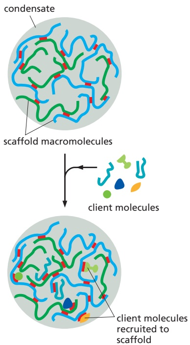

Figure 12–5 Biomolecular condensates formed by scaffold macromolecules recruit clients. As described in Chapter 3 (see Figure 3–77), a set of macromolecules that participate in weak, dynamic, and multivalent interactions (shown in red) with each other can form a biomolecular condensate (Movie 12.1). The macromolecules that directly participate in formation of the condensate are termed “scaffolds.” The scaffold proteins and RNA can recruit other macromolecules, termed “clients,” via specific interactions. Condensate formation does not depend on these clients, but they are part of the condensate because of their specific scaffold interactions.

Figure 12–6 Examples of biomolecular condensates in different organisms. (A) Fluorescent image of the nematode Caenorhabditis elegans at the single-cell stage showing P-granules that are asymmetrically distributed and inherited at cell division. P-granules contain certain mRNAs and other macromolecules. (B) The pericentriolar material in the centrosome that nucleates the assembly of microtubules in an animal cell as seen by electron microscopy. (C) Green fluorescent protein (GFP)-labeled PhyB concentrates in condensates known as photobodies in the plant nucleus when the cells are exposed to bright light. Photobodies might be sites of light-mediated signaling and gene regulation. (D) Rubisco and carbonic anhydrase are concentrated in carboxysomes (green) in photosynthetic bacteria (cyanobacteria). Chlorophyll is shown in red. Carboxysomes are analogous to the pyrenoids of algae and facilitate carbon fixation. (A, from P. Brangwynne et al., Science 324:1729–1732, 2009. B, from M. McGill et al., J. Ultrastruct. Res. 57:43–53, 1976. C, from E.K. Van Buskirk et al., MBoC7 n12.116/12.06Plant Physiol. 158:52–60, 2012. D, from Y. Fang et al., Front. Plant Sci. 9:article 739, 2018. Courtesy of Liu Luning.)

As illustrated by the nucleolus, each type of condensate is enriched for a characteristic complement of proteins (and in many cases, nucleic acids) that interact with each other to maintain the condensate’s identity and integrity. The specificity of at least a subset of macromolecular interactions within the condensate ensures that it remains distinct in its composition and function. Thus, biomolecular condensates and membrane-enclosed compartments represent two different mechanisms that are used by eukaryotic cells to segregate subsets of macromolecules that execute specialized biochemistry (see Table 3–3). Because of this conceptual similarity, condensates are sometimes referred to as **membraneless** **organelles**. Historically, organelles were intracellular structures that could be directly visualized in the light or electron microscope. This is why the nucleolus and centrosome are called organelles. Most condensates are not organelles by this historical definition; nevertheless, they are cellular structures that segregate and concentrate specific macromolecules.

TABLE 12–3 Examples of Eukaryotic Biomolecular Condensates

| Biomolecular condensate | Location | Proposed associated function(s) |
| --- | --- | --- |
| Nucleolus | Nucleus | rRNA transcription and ribosome assembly |
| Pyrenoid | Chloroplast | Carbon fixation from CO2 in algae |
| Stress granules | Cytosol | Temporary storage, particularly of translation-related components |
| P-granules | Cytosol | RNA metabolism and inheritance |
| Balbiani body | Cytosol | Localization and inheritance of mRNAs and organelles |
| Cajal body | Nucleus | mRNA processing |
| Paraspeckles | Nucleus | Regulation of gene expression |
| RNA transport granule | Neuron | RNA localization to subcellular locations in development and in neurons |
| PML body | Nucleus | Storage of nuclear factors; regulation of gene expression |
| Postsynaptic density | Dendrite | Organization of macromolecules needed for neuronal transmission |

#### Multivalent Interactions Mediate Formation of Biomolecular Condensates

The formation of a biomolecular condensate requires that at least one of its constituent macromolecules engage in a set of weak, multivalent interactions with either itself or other constituents (see Figure 3–77A). The sites of these interactions are often separated by flexible and unstructured regions of the macromolecule. For example, nascent pre-rRNA in the nucleolus is a flexible molecule that binds a variety of clients and other scaffold molecules at numerous points along its length. Similarly, the scaffolding proteins that generate condensates of signaling proteins under the plasma membrane typically contain multiple protein–protein interaction domains separated by flexible intrinsically disordered regions that lack secondary structure. Experiments with artificial multivalent proteins have shown that this is the minimal element needed to drive condensate formation in a test tube and in cells.

Each individual interaction within a condensate is often very weak, allowing the macromolecules to rapidly exchange their relative positions. These dynamic and frequent rearrangements, together with the structural flexibility of many condensate constituents, means that the molecules within the condensate are highly mobile and do not have fixed positions relative to each other. This property causes the condensate to behave as a liquid. As discussed in Chapter 3 (pp. 171–173), despite this liquidlike property, the condensate does not dissolve into its surroundings because the interaction energy within the condensate offsets the entropy that would be gained if the molecules were dispersed. This is how the condensate can remain a liquid that stably resides within another liquid (the cytosol), a phenomenon termed “liquid–liquid phase separation.”

Different noncovalent chemical bonds can form the weak interactions between macromolecules that drive condensate formation. Cation–pi interactions, pi–pi interactions, charge–charge interactions, short regions of crossed β sheets, and short stretches of nucleic acid base-pairing can all contribute to condensate formation. The key requirement is that the interactions have sufficient binding energy to offset the loss of entropy caused by association, while being sufficiently dynamic to give the condensate a liquid character. When these requirements are met, condensates have a spherical shape, deform and flow under shear force, and can undergo fusion and fission.

If the interactions in a condensate become less dynamic as incrementally more stable interactions form over time, its properties can change to that of a gel and eventually a solid where the binding interactions remain fixed. There is a continuum across the spectrum of physical properties that characterize different condensates. Cells can exploit such differences by forming a condensate within a condensate. This can occur if a subset of macromolecules within a condensate has slightly higher affinity among its macromolecules than for other macromolecules of the condensate. This subset then forms a new condensate with distinct physical properties (**Figure 12–7**). This is how the nucleolus is thought to be segregated into morphologically different concentric shells, each of which is enriched for subsets of nucleolar proteins dedicated to different aspects of ribosome assembly.

#### Biomolecular Condensates Create Biochemical Factories

The fluctuating network of interactions among the macromolecules inside of a condensate excludes other macromolecules from the surrounding environment. By contrast, nucleotides, metabolites, cofactors, and other small molecules can rapidly diffuse into the condensate where they can engage with the enzymes that reside there. The product of these enzymes within the condensate can be used by other enzymes that are coresident in the condensate before the product diffuses away. In this way, multistep reactions can be accelerated to rates beyond that possible without co-segregation of the enzymes inside a condensate.

(A)

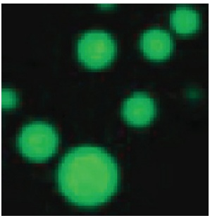

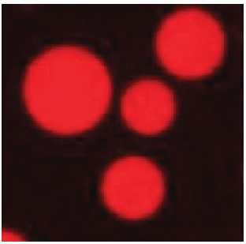

(B)

20 µm

Figure 12–7 Condensates with different properties can coexist as part of a larger structure. The nucleolus is a condensate that is composed of three morphologically and functionally distinct regions, one inside the other, each formed by a different set of scaffold macromolecules. (A) In the experiment shown, the scaffolds from two nucleolar substructures have been purified—fibrillarin from the nucleolus’s fibrillar component and nucleophosmin from its granular component. Both of these scaffold proteins contain binding sites for RNA, and when mixed with RNA in a test MBoC7 n12.109/12.07tube, each purified scaffold will assemble into an RNA–protein condensate, as illustrated at left. However, as illustrated at right, when mixed together they instead form a multilayered structure that has one type of condensate encased inside the other type of condensate. (B) The condensates, formed either separately or together, viewed by fluorescence microscopy; fibrillarin is green and nucleophosmin is red. (Adapted from M. Feric et al., Cell 165:1686–1697, 2016.)

Consider for example, the pyrenoid, a complex structure found in many algae that contains a condensate enriched in the enzyme ribulose 1,5-bisphosphate carboxylase/oxygenase (Rubisco) and a pyrenoid-specific scaffolding protein. The Rubisco-containing condensate is interwoven with membrane tubules. Carbonic anhydrase inside the membrane tubule converts bicarbonate $\left(  HCO _3^{-} \right)$ into $\mathrm { C O _ { 2 } } ,$ which Rubisco uses to carboxylate ribulose 1,5-bisphosphate (**Figure 12–8**). This carboxylation reaction is a critical early step in carbon fixation during photosynthesis (discussed in Chapter 14). If Rubisco were not in a condensate in close proximity to carbonic anhydrase, the low free $\mathrm { C O _ { 2 } }$ concentration combined with a competition by oxygen for Rubisco’s active site would favor reaction with oxygen (termed “photorespiration”; see Chapter 14, p. 847) over carbon fixation. Land plants do not need a pyrenoid to fix carbon because $\mathrm { C O _ { 2 } }$ in the air is more plentiful than the very low concentration of dissolved $\mathrm { C O _ { 2 } }$ available as $\mathrm { H C O _ { 3 } } ^ { - }$ to algae living in aquatic environments. The pyrenoid illustrates how the segregation of sequential biochemical reactions into a condensate can both speed reactions and minimize alternate off-pathway outcomes. In the same way, carrying out the highly complex and ordered process of ribosome assembly within the nucleolus prevents unwanted side reactions while promoting the desired ones.

(B)

thylakoids

(A)

Figure 12–8 The pyrenoid contains a condensate of Rubisco that exploits locally generated $\mathsf { C O } _ { 2 ^ { \cdot } }   ( \mathsf { A } )$ The pyrenoid as seen by light microscopy of the single-celled alga Chlamydomonas reinhardtii. (B) Scanning electron micrograph of the C. reinhardtii pyrenoid showing how the Rubisco-containing condensate is penetrated by tubules from the surrounding thylakoid. (C) Simplified depiction of the condensate containing the enzyme Rubisco and the multivalent scaffold protein $\mathsf { E P Y \dot { C } 1 }$ (D) The tubules of thylakoid membranes in the pyrenoid contain the enzyme carbonic anhydrase.MB C7 12.113/12.08 $\mathsf { H C O _ { 3 } } ^ { - }$ is used by carbonic anhydrase to generate $CO_{2}_{:}$ which is used by the surrounding Rubisco in the pyrenoid matrix. The use of locally generated $\mathrm { C O } _ { 2 }$ is thought to favor the carboxylation reaction performed by Rubisco rather than the competing oxygenation reaction that would be favored when $\mathrm { O } _ { 2 }$ is used by Rubisco instead of $CO_{2}.$ (E) Experiment demonstrating that the contents inside the pyrenoid matrix are highly dynamic. Shown is a pseudocolored fluorescence image of a pyrenoid containing a Rubisco subunit tagged with a fluorescent protein. Red and white indicate the areas of brightest fluorescence, and blue indicates areas of dim fluorescence. The right half of the pyrenoid was photobleached, after which fluorescence was monitored over time. Fluorescent molecules from the non-bleached half intermix with the bleached molecules within 90 seconds. (A, from Carnegie Institution for Science. B, courtesy of Ursula Goodenough. E, adapted from E.S. Freeman Rosenzweig et al., Cell 171:148–162, 2017.)

Scientists can produce artificial condensates that contain a desired set of macromolecules by engineering them with multivalent interaction domains. This approach can be used to experimentally enhance the efficiency of an otherwise unfavorable reaction. In one experiment, all of the factors required to misread a UAG stop codon as a sense codon were engineered with artificial multivalent interaction modules to generate a condensate inside the cell. The UAG codon of the mRNA within this condensate was efficiently interpreted as a sense codon, while other mRNAs in the surrounding cytosol terminated at UAG codons. This experiment illustrates the minimal features needed to produce a condensate-based biochemical factory within a cell and that such features can be rationally designed and engineered.

#### Biomolecular Condensates Form and Disassemble in Response to Need

As we have seen, the formation and stability of a biomolecular condensate rely on weak interactions among its constituents overcoming the entropy of a well-mixed system. This means that even small changes in the strength of interactions can influence the formation and physical properties of the condensate. The formation and dissolution of a condensate can therefore be readily controlled by changing the strength of the multivalent interactions that mediate its assembly. This is often accomplished by post-translational modifications, such as phosphorylation, and this mechanism is commonly used to rapidly form and disassemble large signaling clusters at the plasma membrane (**Figure 12–9**). Condensate formation and disassembly can also be induced by a change in a cellular condition such as temperature, pH, or osmolarity. The reversibility of condensate formation is used by cells to regulate condensates in response to need, and it affords the cell flexibility and speed in adapting to changing needs.

For example, the condensates called stress granules only form during certain types of cellular stress, and they dissolve when the stress is alleviated. These condensates are enriched in translationally inactive mRNAs, various translation factors, ribosomal subunits, and various RNA-binding proteins. They form when a block in translation initiation exposes mRNA regions that would normally be covered by translating ribosomes. When these mRNAs become exposed, they can interact with each other and with RNA-binding proteins to nucleate a condensate. It is thought that the resulting condensates serve as a storage depot for these mRNAs and factors when they are not being actively used. By temporarily sequestering these macromolecules during stress rather than degrading them, the cell can avoid the need to produce them de novo once the stress has been resolved.

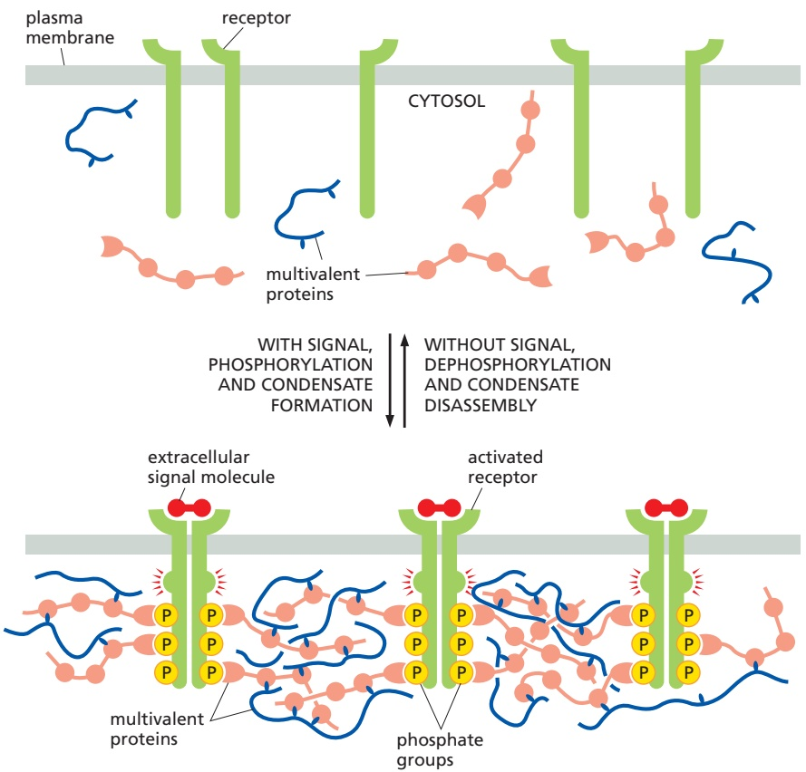

Figure 12–9 Phosphorylation regulates the formation and dissolution of condensates during signaling. When a receptor at the plasma membrane is engaged by its ligand, its cytosolic tail and associated proteins become phosphorylated. This modification, along with surrounding amino acids, forms a specific binding site for various cytosolic and membrane proteins, many of which are multivalent. The multivalent proteins interact with each other to drive the formation of a condensate that has distinctive signaling properties. When the key sites become dephosphorylated, the condensate disassembles and signaling stops. Examples of signaling clusters that form and disassemble in response to ligand are discussed in Chapter 15.

<!-- END EN EN12-H000-H007 -->

## 跨章相关英文内容

- 蛋白质折叠与组装的结构基础：[EN第3章 · 蛋白质基础：氨基酸、折叠、结构域与组装](../../01_绪论/小节/02_第二节%20细胞的同一性与多样性.md#EN03-H000-H028)。
